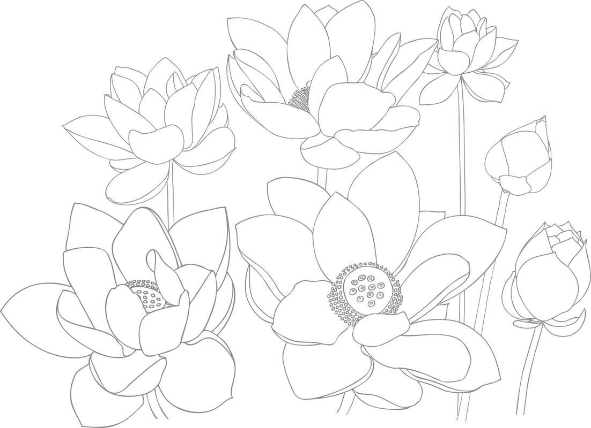

# 缩写

（以下列表中的经典著作以斜体字表示）

_A._

《增支部》（Aṅguttaranikāya）(5卷)

AA.

《增支部义注》（Aṅguttaranikāya Aṭṭhakathā）(Manorathapūraṇī)

_Ap._

《譬喻》（Apadāna）(《小部》)

ApA.

《譬喻义注》（Apadāna Aṭṭhakathā）(Visuddhajanavilāsinī)

_Bv._

《佛史》（Buddhavaṁsa）(《小部》)

BvA.

《佛史义注》（Buddhavaṁsa Aṭṭhakathā）(Madhuratthavilāsinī)

Comp.

《阿毗达摩概要精解》（Abhidhammatthasaṅgaha）

CompṬ.

《阿毗达摩概要精解复注》（Abhidhammatthasaṅgaha Ṭīkā）(Abhidhammatthavibhāvinī)

_Cp._

《行藏》（Cariyāpiṭaka）(《小部》)

CpA.

《行藏义注》（Cariyāpiṭaka Aṭṭhakathā）(Paramatthadīpanī)

_D._

《长部》（Dīghanikāya）(3卷)

DA.

《长部义注》（Dīghanikāya Aṭṭhakathā）(Sumaṅgalavilāsinī)

DAṬ.

《长部义注复注》（Dīghanikāya Aṭṭhakathā Ṭīkā）(Līnatthapakāsinī)

_Dh._

《法句经》（Dhammapada）(《小部》)

DhA.

《法句经义注》（Dhammapada Aṭṭhakathā）

_Dhtk._

《界说论》（Dhātukathā）(《阿毗达摩》)

DhtkA.

《界说论义注》（Dhātukathā Aṭṭhakathā）(Paramatthadīpanī)

_Dhs._

《法集论》（Dhammasaṅgaṇī）(《阿毗达摩》)

DhsA.

《法集论义注》（Dhammasaṅgaṇī Aṭṭhakathā）(Aṭṭhasālinī)

_It._

《如是语》（Itivuttaka）(《小部》)

ItA.

《如是语义注》（Itivuttaka Aṭṭhakathā）(Paramatthadīpanī)

J.

《本生经》（Jātaka）

JA.

《本生经义注》（Jātaka Aṭṭhakathā）

_Kh._

《小诵》（Khuddakapāṭha）(《小部》)

KhA.

《小诵义注》（Khuddakapāṭha Aṭṭhakathā）(Paramatthajotikā)

_Kvu._

《论事》（Kathāvatthu）(《阿毗达摩》)

KvuA.

《论事义注》（Kathāvatthu Aṭṭhakathā）(Paramatthadīpanī)

_M._

《中部》（Majjhimanikāya）(3卷)

MA.

《中部义注》（Majjhimanikāya Aṭṭhakathā）(Papañcasūdanī)

Miln.

《弥兰王问经》（Milindapañhā）

_Nd1._

《大义释》（Mahāniddesa）(《小部》)

_Nd2._

《小义释》（Cūḷaniddesa）(《小部》)

Nd1A.

《义释义注 — 大义释注释》（Niddesa Aṭṭhakathā -- Mahāniddesavaṇṇanā）(Saddhammapajjotikā)

Nd2A.

《义释义注 — 小义释注释》（Niddesa Aṭṭhakathā -- Cūḷaniddesavaṇṇanā）(Saddhammapajjotikā)

Nett.

《行导论》（Nettipakaraṇa）

NettA.

《行导论义注》（Nettipakaraṇa Aṭṭhakathā）

PañcA.

《五论义注》（Pañcapakaraṇa Aṭṭhakathā）

_Paṭ._

《发趣论》（Paṭṭhāna）(《阿毗达摩》)

PaṭA.

《发趣论义注》（Paṭṭhāna Aṭṭhakathā）(Paramatthadīpanī)

_Ps._

《无碍解道》（Paṭisambhidāmagga）(《小部》)

PsA.

《无碍解道义注》（Paṭisambhidāmagga Aṭṭhakathā）(Saddhammapakāsinī)

Ptk.

《本生经释》（Peṭakopadesa）

_Pug._

《人施设论》（Puggalapaññatti）(《阿毗达摩》)

PugA.

《人施设论义注》（Puggalapaññatti Aṭṭhakathā）(Paramatthadīpanī)

_Pv._

《饿鬼事》（Petavatthu）(《小部》)

PvA.

《饿鬼事义注》（Petavatthu Aṭṭhakathā）(Paramatthadīpanī)

_S._

《相应部》（Saṁyuttanikāya）(5卷)

SA.

《相应部义注》（Saṁyuttanikāya Aṭṭhakathā）(Sāratthapakāsinī)

_Sn._

《经集》（Suttanipāta）(《小部》)

SnA.

《经集义注》（Suttanipāta Aṭṭhakathā）(Paramatthajotikā)

_Thag._

《长老偈》（Theragāthā）(《小部》)

ThagA.

《长老偈义注》（Theragāthā Aṭṭhakathā）(Paramatthadīpanī)

_Thīg._

《长老尼偈》（Therīgāthā）(《小部》)

ThīgA.

《长老尼偈义注》（Therīgāthā Aṭṭhakathā）(Paramatthadīpanī)

_Ud._

《自说经》（Udāna）(《小部》)

UdA.

《自说经义注》（Udāna Aṭṭhakathā）(Paramatthadīpanī)

_Vbh._

《分别论》（Vibhaṅga）(《阿毗达摩》)

VbhA.

《分别论义注》（Vibhaṅga Aṭṭhakathā）(Sammohavinodanī)

_Vin._

《律藏》（Vinaya Piṭaka）(5卷)

VinA.

《律藏义注》（Vinaya Aṭṭhakathā）(Samantapāsādikā)

VinṬ.

《律藏义注复注》（Vinaya Aṭṭhakathā Ṭīkā）(Sāratthadīpanī)

Vism.

《清净道论》（Visuddhimagga）

VismṬ.

《清净道论大复注》（Visuddhimagga Mahāṭīkā）(Paramatthamañjusā)

_Vv._

《天宫事》（Vimānavatthu）(《小部》)

VvA.

《天宫事义注》（Vimānavatthu Aṭṭhakathā）(Paramatthadīpanī)

_Yam._

《双对论》（Yamaka）(《阿毗达摩》)

YamA.

《双对论义注》（Yamaka Aṭṭhakathā）(Paramatthadīpanī)

