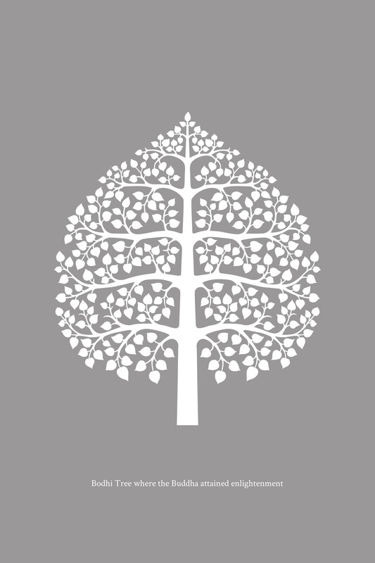

# 随喜

尽管佛陀关于人类行为和人际关系的教导多种多样、数量繁多——根据不同个体、社群和环境的适宜性，以及为了在不同时间和地点产生善果——但它们都汇聚于相同的原则和指导方式。所有这些教导都鼓励人们依照相互关联的、依自然法则运作的自然系统生活和行动。如果我们能够遵循与此自然真理相符的觉悟者的指引，或者如果我们洞察此真理并依此修行，我们将获得所期望的成果。

由于基本的佛陀理论教导——当其被证悟时会带来真正的满足——是建立在与相互关联的自然系统相联系的真理之上的，因此还有额外的实践教导，鼓励人们理解这一真理。当此自然真理被证悟时，人们能够运用他们的理解来处理事物，从而带来有利的结果，而无需依赖老师或外在的教导。这是自然系统固有的一个部分。

因此，这两个层面的教导——理论与实践——相互关联，形成一个整合的真理体系，直接关乎自然秩序。“知者”，即佛陀，仅仅是鼓励人们留意这一自然真理，以便他们能亲自体证它。

通过清楚地证悟这一自然真理，一个人就不再依赖他人的建议和忠告。因此，佛教不包含任何形式的胁迫；它既不强迫任何人相信教义，也不因人们拒绝教义而困扰。它遵循的原则是，所有事物都根据一个相互关联的因缘系统自然运作。佛陀亲自体证并发现了这一真理后，出于仁慈和悲悯，给予了他人教导和指引。

本书《佛法》旨在阐述佛陀所系统化并确立为标准原则的教导，包括两个层面：关于真理的基本理论教导，以及直接基于理论教导的个人行为和社会参与的实践教导。

多年来，坤·永育·塔纳普拉（Khun Yongyut Thanapura）一直致力于弘扬佛法。1985年底，经他本人倡议，他与其他虔诚的在家护法共同成立了佛法基金会。尽管此基金会与《佛法》一书及其作者没有直接关系，但基金会的名称很可能是他们因与本书的精神联系而选择的。

据我所知，从1992年至今——将近二十三年——坤·永育·塔纳普拉一直努力促成《佛法》的英文翻译。他持续不断地资助这项工作，直到不久之后，两本译著出版：一本是《善、恶与超越：佛陀教义中的业》（Good, Evil and Beyond: Kamma in the Buddha’s Teaching）（由布鲁斯·埃文斯Bruce Evans翻译，1993年1月出版）——这是《佛法》第五章“业”（Kamma）的译文；另一本是《缘起：佛教的条件性法则》（Dependent Origination: The Buddhist Law of Conditionality）（由布鲁斯·埃文斯Bruce Evans翻译，1994年出版）——这是《佛法》第四章“Paṭiccasamuppāda”的译文。

佛法基金会主席坤·永育·塔纳普拉决心促成《佛法》全书所有章节的完整英文翻译。尽管他遇到了许多困难和阻碍，花费了大量金钱，并等待了很长一段时间，但他毫不气馁，从未放弃。结果是，多年后的现在，一个完整的英文译本已准备好出版。

《佛法》完整英文译本是由罗宾·摩尔先生（Mr. Robin Moore）完成的，他已为此翻译工作付出了多年。在与佛法基金会合作之前，当他仍受戒为比丘，名为苏里约比丘（Suriyo Bhikkhu）时，出于自身的 Enthusiasm，他开始翻译这些文本，并出版了《三法印：佛陀教义中的无常、苦和无我》（The Three Signs: Anicca, Dukkha, and Anattā in the Buddha’s Teachings），这是《佛法》第三章“三法印”（The Three Characteristics）的译文。2006年，坤·斯里詹·比罗姆巴克迪（Khun Sirichan Bhirombhakdi）和她的两个女儿，坤·丘阿布詹（Khun Chuabchan）和坤·彭比罗姆·比罗姆巴克迪（Khun Pornbhirom Bhirombhakdi），资助了此次出版，以供免费流通。

在还俗后，罗宾·摩尔先生在坤·斯里詹·比罗姆巴克迪及其两个女儿的资助下继续翻译《佛法》，她们出版了以下书籍以供免费流通：《涅槃：至上寂静》（Nibbāna: the Supreme Peace）（2009年；主要汇编自《佛法》第六、第七和第十章关于涅槃的材料）；《缘起》（Dependent Origination）（2011年；《佛法》第四章“Paṭiccasamuppāda”的译文）；以及《觉悟者：佛陀的真正弟子》（Awakened Beings: True Disciples of the Buddha）（2014年；主要汇编自《佛法》第六、第七和第十八章关于觉悟者的材料）。因此，在此适当地向坤·斯里詹·比罗姆巴克迪及其两个女儿表达深深的谢意，感谢她们支持这项翻译工作，并通过出版和流通《佛法》译本而给予法布施。她们的努力滋养并维持了这项翻译工作，直到它与佛法基金会资助的项目联系起来，从而促成了这个完整译本的问世。

在罗宾·摩尔先生从事《佛法》翻译项目十多年期间，我深知尊者阿姜·查雅萨罗（Ven. Ajahn Jayasaro）——出于他对译者的慈悲、他对佛法的热爱以及他希望利益佛教学生的愿望——始终向译者提供帮助，包括佛法知识和语言技能。在此，我谨向尊者阿姜·查雅萨罗的这种仁慈、能干和善行的帮助表示感谢。

我祝贺坤·永育·塔纳普拉，无论是他的个人努力还是他作为佛法基金会主任的工作。他对待佛法表现出持久的慈善，并保持着毅力、恒心和坚韧不拔的精神，克服了艰辛和困难，直到完成《佛法》翻译的目标得以实现。他在维持佛法学习和实践以及广泛传播佛法所带来的祝福方面发挥了重要作用。

同样，我谨向译者罗宾·摩尔先生表示感谢，他真诚而无瑕疵的努力使《佛法》的翻译工作得以完成。这些努力理所当然地产生了并散发着善良和健全。

《佛法》的泰文原版是为了供养和奉献给真正的佛法而撰写的。正如我在《翻译材料版权简报》（2009年11月9日）中提到的：“我的所有书籍都旨在作为法布施，免费印刷流通，以利益广大公众。这些书籍没有版权费。如果有人欣赏这些书籍，并以纯粹的意图希望翻译和分享它们……这是一种弘扬佛法并为更广泛受众行善的方式。从事此类翻译的人必须依靠他们的技能和熟练程度，并花费大量时间和精力……因此，这些翻译作品的版权可以被视为属于译者。” 至于译者希望如何处理这些翻译文本，则是其进一步考虑的责任。

我谨感谢所有参与帮助将本书译本付诸实现的人。愿这些努力有助于培养善良和幸福，增强精神发展，为所有人类带来智慧，并有助于创造一个稳定和真正的人类文明。

巴育陀比丘（P. A. Payutto）  
2015年11月21日