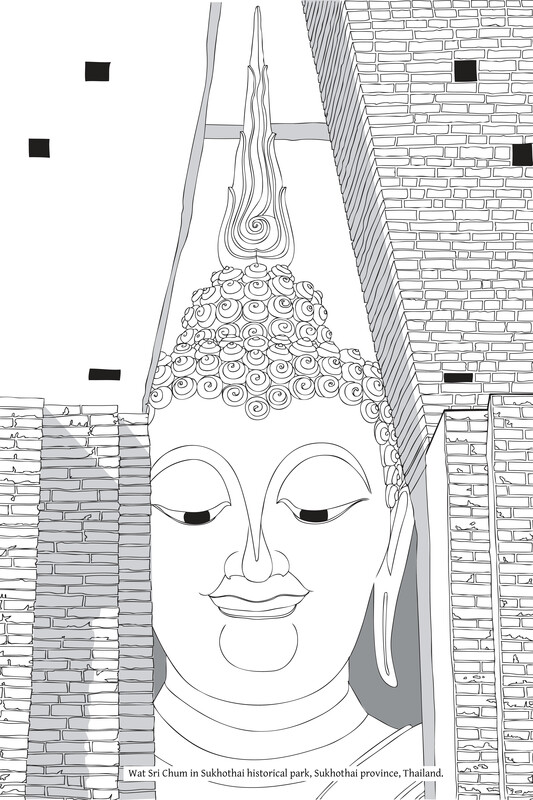

# 附录：心（Citta）、识（Viññāṇa）、意（Mano）

译者：在我们校阅样本并对《佛法》文本进行最终修正/修订以准备出版期间，尊者帕·巴育陀（Phra Payutto）（坦·昭坤·梵古纳邦Tahn Chao Khun Brahmagunbhorn）给我发了一封电子邮件，其中包含一个简洁的问题：“在（泰文原版）文本中，您是否觉得有任何地方不够清晰或连贯？” 我的答复是，只有一个主题我感觉解释得不够彻底，特别是对英文读者而言，那就是巴利语 citta、viññāṇa 和 mano 的精确定义，包括这些术语之间的关系，以及一些相关术语，例如 viññāṇa-dhātu （“识界”）。[\[1\]](#fn-fn1){:id="fr-fn1"} 事实上，我几年前就曾向作者提出过这个问题。我担心这些术语可能会被佛教学生误解，从而可能导致教法的扭曲。由于我的答复，尊贵的作者慈悲而勤勉地整理了以下材料，以便将其纳入《佛法》英文译本的首次出版中。通常，它会被放在第一章的附录中，但这将意味着完全重新制作索引的页码——这是一项艰巨的任务。似乎将其作为附录添加到本书末尾已足够。请注意，此附录在泰文版中不存在。

## Citta一词的定义

citta的定义与mano的定义密切相关，如下段经文所示：

> mano一词指代 citta、mano、mānasa、hadaya、paṇḍara、mana、manāyatana、manindriya、viññāṇa、viññāṇa-khandha 和由触所生的 manoviññāṇa-dhātu。这就是所谓的“意”（mano）。Manoti yaṁ cittaṁ mano mānasaṁ hadayaṁ paṇḍaraṁ mano manāyatanaṁ manindriyaṁ viññāṇaṁ viññāṇakhandho tajjā manoviññāṇadhātu ayaṁ vuccati mano.[\[2\]](#fn-fn2){:id="fr-fn2"}  
> Nd1. 3

然而，在义注中，citta通常定义如下：

> citta一词的定义是：之所以称为“citta”，是因为它反映，意思是它完全觉知所缘。Cittanti ārammaṇaṁ cintetīti cittaṁ vijānātīti attho.  
> 例如：DhsA. 63

请注意，“完全觉知”（vijānāti）一词是viññāṇa的动词形式。

这个义注的定义不必过分重视；这里只是作为补充信息添加。

## Citta、Viññāṇa和Mano之间的区别

如上所述，这三个术语的含义基本相同。但在其用法或应用上，它们的意义范围存在一些差异。

viññāṇa一词通常在狭义上使用，专门指代了知所缘（ārammaṇa）的因素。（它不包括同时与此触生起的各种感受、想、行等。）因此，它通常被翻译为“识”。可以说它是一个纯粹的技术术语。viññāṇa指五蕴中的识蕴（viññāṇa-khandha）；它不包括受（vedanā）、想（saññā）和行（saṅkhāra），这些在阿毗达摩中统称为“心所”（cetasika）。

citta一词在经典中经常使用。它是一个常见的日常用语，既可以用于狭义的特定含义，也可以用于广泛的综合含义，在其中它本质上包含其他因素。

阿毗达摩使用 citta 一词的狭义，对应于五蕴中的 viññāṇa 一词。如上所述，阿毗达摩将剩余的三个名蕴（nāma-khandha），即受（vedanā）、想（saññā）和行（saṅkhāra）——同时与 citta 生起的心之属性——统称为心所（cetasika）。

然而，在日常语言或口语中，无需区分，将这个因素作为 citta，那个因素作为特定的心所。相反，可以通过使用单一词 citta 来整体表达，它本质上包含了心所。例如，可以说：“培育心（citta）”，“将心（citta）安立于正念”等。

在日常语言中，mano（或mana）一词可以用于广义，类似于citta一词。但是当此术语以技术或狭义使用时，它指的是觉知法所缘（dhammārammaṇa）的意处（āyatana）或意根（indriya）。在此语境中，通常使用完整的 manāyatana 和 manindriya 术语。此外，在阿毗达摩中有一段解释，说明 mano 或 manāyatana 等同于“有分心”（bhavaṅga-citta）。

## 超越五蕴的心（Citta）

如上所述，citta在严格的狭义上指的是五蕴中的识（viññāṇa）。而在日常语言的普遍广义上，citta既指识，也指其相关的心所，即受（vedanā）、想（saññā）和行（saṅkhāra）——五蕴中剩余的心所。因此，对于是否存在超越五蕴的心这个问题，可以简明地回答：不存在超越五蕴的心。

唯一超越五蕴的状态或实相（sabhāva），在巴利语中称为 khandha-vinimutta，即涅槃。

然而，如果把没有固有存在的事物也包含进来，就可以说超越或脱离五蕴的事物是超越五蕴的状态（khandha-vinimutta），即涅槃，以及概念或施设（paññatti）。因为施设是人为造作的，最终不存在，所以它们在五蕴之外。[\[3\]](#fn-fn3){:id="fr-fn3"}

佛陀曾用“心达无为”（visaṅkhāragataṁ cittaṁ；即心达涅槃）这一表达。此处必须小心。人们可能会误解这段经文，认为证入或证得涅槃的心（citta）超越了五蕴。对此段经文的解释是，这里的意思是心不以有为法（saṅkhāra）为所缘，而是觉知或体验涅槃。当“达”到涅槃时，心的性质发生了转化；尽管这不是普通的作意，但心并没有转化成或与涅槃合一。这就是此表达的全部含义。

## Viññāṇa-dhātu和Nibbāna-dhātu

\[回应译者评论：“有些人认为阿罗汉死后只是融入viññāṇa-dhātu：融入意识的广阔海洋”\]:

这种信念源于对巴利语 dhātu（“元素”、“属性”、“自然状况”）一词的误解。实际上，dhātu一词并没有任何神秘的含义。它的含义类似于 sabhāva 一词，可以翻译为“自然状态”、“自然条件”、“自然真理”。这两个术语都指作为自然的一个方面而存在的事物，符合自然法则。没有人真正能够拥有、控制或支配这些事物。它们既不存在为一个自主的存在，也不存在为一个固定的自我（nissatta-nijjīva）。

让我们来考察佛陀提到的十八种界（dhātu）：

> 阿难，有此十八种界：眼界（cakkhu-dhātu）、色界（rūpa-dhātu）、眼识界（cakkhuviññāṇa-dhātu）、耳界（sota-dhātu）、声界（sadda-dhātu）、耳识界（sotaviññāṇa-dhātu）、鼻界（ghāna-dhātu）、香界（gandha-dhātu）、鼻识界（ghānaviññāṇa-dhātu）、舌界（jivhā-dhātu）、味界（rasa-dhātu）、舌识界（jivhāviññāṇadhātu）、身界（kāya-dhātu）、触界（phoṭṭhabba-dhātu）、身识界（kāyaviññāṇa-dhātu）、意界（mano-dhātu）、法界（dhamma-dhātu）、意识界（manoviññāṇa-dhātu）。由于了知和看见这十八种界，比丘便可被称为善巧于界。  
> Aṭṭhārasa kho imā ānanda dhātuyo cakkhudhātu rūpadhātu cakkhuviññāṇadhātu sotadhātu saddadhātu sotaviññāṇadhātu ghānadhātu gandhadhātu ghānaviññāṇa-dhātu jivhādhātu rasadhātu jivhāviññāṇadhātu kāyadhātu phoṭṭhabba-dhātu kāyaviññāṇadhātu manodhātu dhammadhātu manoviññāṇadhātu imā kho ānanda aṭṭhārasa dhātuyo yato jānāti passati ettāvatāpi kho ānanda dhātukusalo bhikkhūti alaṁ vacanāyāti.  
> M. III. 62

涅槃，或被称为涅槃的自然状态（sabhāva），属于法界（dhamma-dhātu）的范畴，也就是意识（mano-viññāṇa）所专注的所缘：通过意识所知的事物。这就是 viññāṇa-dhātu 和 nibbāna-dhātu 这两个术语的全部含义。

\[回应译者评论：有些人认为 nibbāna-dhātu 可以用作禅修所缘，仿佛这是一种即便凡夫也能接触到的基本、超然的元素\]：

这没什么特别的：用作禅修所缘的涅槃或 nibbāna-dhātu，并非指真正的涅槃本身，而是指人们在智力层面学到和理解的“涅槃概念”。人们可以思惟这个涅槃概念并将其用作禅修所缘。

## 关于“知者”（Phoo Roo）的讨论

\[回应译者评论：“在某些传统中，泰语表达‘phoo roo’（ผู้รู้；字面意思是‘知者’）[\[4\]](#fn-fn4){:id="fr-fn4"}似乎指的是某种神秘的意识状态或知识”\]:

在大多数情况下，这个泰语表达被用作巴利语 viññū 的翻译。同样，这个术语没有任何特殊或非凡的含义。它在日常语言中使用，指的是一个有智慧的人、一个有学问的人、一个明辨的人等等。

\[1\] 对于泰国人来说，这些术语，尤其是citta（泰语：'jit’ – จิต），是日常用语，因此不太可能造成混淆。[&nbsp;↩&nbsp;](#fr-fn1)
{: id="fn-fn1"}

\[2\] 这段经文在《阿毗达摩》中经常被引用，例如：《分别论》144。[&nbsp;↩&nbsp;](#fr-fn2)
{: id="fn-fn2"}

\[3\] 译注：关于这个主题的更多内容，请参见第三章关于三法印的附录二。[&nbsp;↩&nbsp;](#fr-fn3)
{: id="fn-fn3"}

\[4\] 译注：发音为“poo roo”。[&nbsp;↩&nbsp;](#fr-fn4)
{: id="fn-fn4"}