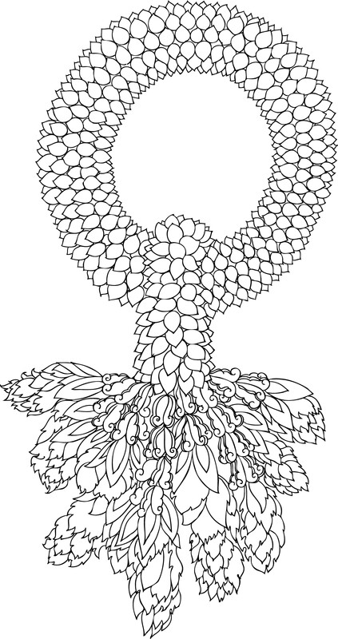

--
--

# 第二篇：生命的怎样的？

> 确实，一切有为法都是无常的，  
> 它们有生有灭。  
> 它们生起后即息灭；  
> 它们的止息是至上的安乐。 Aniccā vata saṅkhārā  
> uppādavayadhammino  
> Uppajjitvā nirujjhanti  
> tesaṁ vūpasamo sukho. 《长部》卷二，199 诸比丘，一切有为法皆是坏灭法；  
> 你们要通过精勤完成所有努力。 Vayadhammā saṅkhārā, appamādena sampādetha. 《长部》卷二，120

