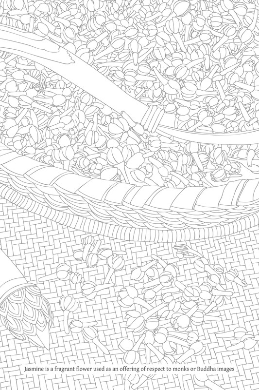

# 作者后记

这版《佛法》是十年前，即1971年，作者以帕·斯里维苏提摩利（Phra Srivisuddhimoli）之名出版的同名节略版的修订和扩充版。

《佛法》原版收录于《万瓦他雅贡》（Wan Waithayakon）丛书，该丛书是泰国社会科学协会为纪念瓦那·维达亚卡拉亲王殿下（His Royal Highness Prince Vanna Vaidhayakara），即纳拉迪普·蓬色布拉班亲王（Prince Naradhip Bhongseprabhan）八十寿辰，于1971年8月25日组织发起的社会科学与人文教材推广项目所出版的学术文集。

《佛法》原版还曾两次出版：1976年4月3日星期六，瓦普拉普拉差寺（Wat Plubplachai）的僧团印刷此书，以纪念帕·西拉坎塔索比塔（帕·维拉查·西里达多）（Phra Silakhandhasobhita (Virach Siridatto)）的皇家火葬；以及1987年11月29日，教育部宗教事务部印刷此书，以纪念桑维萨威察亚兰寺（Wat Sangveswitsayaram）的颂德·帕·瓦纳拉特（萨普·戈萨卡·玛哈泰拉）（Somdet Phra Vanarat (Sap Ghosaka Mahāthera)）的皇家火葬。

这最新版的《佛法》篇幅约为原版的六倍。原版文本经过修订和澄清；许多段落得以扩展，同时新增了其他段落。因此，这个版本几乎是一本全新的书。无论如何，新内容比原版内容多得多。

修订扩充版《佛法》的出版背景简述如下：1978年8月，拉维·帕维莱教授（Prof. Rawee Pawilai）代表弘法小组（Dhamma-Mobilizing Group）联系了持有《佛法》原版版权的社会科学与人文推广基金会，以便他能将此书作为非营利出版物再版。上述基金会委员会主席萨内·查马里克教授（Prof. Saneh Chamarik）体恤地通知了我这位作者并征求我的许可。

不久之后，拉维·帕维莱教授前来与我商谈此事。我表达了我的谢意，但请求他能否稍作延迟出版，以便我能利用这个机会对文本进行一些修订。当我最初撰写此书时，是在赶着截止日期；此外，自首次出版以来的七年里，我产生了许多新的想法要添加到文本中。拉维·帕维莱教授慷慨地答应了，尽管他已经为出版此书做了准备，例如预留了必要的资金。我估计完成修订所需时间为三个月。

当时我手头有许多未完成的图书项目。几个月前，我决定重新启动我于1964年开始的《佛教百科全书》的工作。为确保此书的完成，我决定拒绝所有演讲和教学邀请，直到至少这本书完成。因此，修订《佛法》是当时我刚完成《佛教百科全书》大约190页时的额外任务。

无论如何，这次修订并未在估计的时间内完成；事实上，这项任务拖延了三年，直到现在。它不再是一项辅助工作，而成为一项主要工作。《佛教百科全书》的工作暂停了，我对那本书的所有决心都转移到了《佛法》的修订上。

这次修订持续了三年而非三个月，并在某种意义上成为一个全新的项目，它产生了几个方面的影响和反响：

1.  对作者的影响：如上所述，《佛教百科全书》的主要工作被中断了。这本身没有造成损害，因为我早已想继续《佛法》的工作。这只是一个优先事项的转换问题。
    
2.  对希望出版此书的人的影响：虔诚的在家护法需要耐心等待很长时间。他们还需要承担寻找更多资金的额外负担，超出了他们最初为出版《佛法》原版所预期的金额。文本量大幅增加，出版成本也随通货膨胀而增加。如果这次延误造成了任何困难或不便，我请求原谅，并感谢拉维·帕维莱教授的善意和愿意承担这些额外负担。
    
3.  对本书的影响：最初，作为一项辅助工作，我只打算对《佛法》进行必要的少量修订，因此估计了三个月的时间。我没有为这些修订建立一个正式的框架。我只是简单地在各个适当的地方进行修订。如果某些段落显得太短，我就会加以阐述；如果某些主题似乎缺失，我就会撰写新文本并将其插入正文中。
    

随着时间的推移，项目持续扩展。原版中的一些短章节变得非常长，而一些原先认为长的章节变得相对较短。一些新材料比原版材料更长。某些较后章节的补充材料是在较早章节的材料补充之前撰写的。一些有可能被大篇幅扩展的材料保持不变。第三章《三法印》几乎完全未经修订；第四章《缘起》的情况也类似。

尽管正文中分散添加了内容，并且在修订之前我没有为本书准备新的框架，但框架仍然保留了下来。所有的修订都是在原书中已经确立并存于作者心中的更全面的框架下进行的。所有的补充都是为了与这个原始模板相契合。

文本中可能存在一些细微的差异。例如：有些章节可能比其他章节更短或更长，因此显得缺乏对称性；有些主题可能在不同地方重复出现；有些法（Dhamma）术语的拼写，尽管是正确的，但可能在不同地方有所不同，从而引人注目或显得不整洁。

本书充满了原始资料和经证，有些人可能会觉得这太多了。这样做的原因并非是对经文的执着，也不是执着于认为只要经文里有的就一定是真实不变的。

毫无疑问，古代经文，尤其是后世撰写的，因记录错误或缺陷而包含谬误。然而，经文是至关重要的基础和信息来源。其重要性可根据其传统地位和起源时期来衡量。（见脚注 权威的次第）

如果我们承认个人见解是重要的，我们就不能否认义注中解释的重要性。这些典籍的编纂者和作者很可能都是博学而智慧的人，其中许多人是各自时代佛教界的学术代表。此外，他们生活的时代比我们更接近佛陀的时代。

引用经文是一种承认有价值之物重要性的方式。如果经文是由后代编纂的，我们表明我们愿意听取这些作者的意见。对于需要证据或确认的事项，我们常常可以在经文中找到这些证据，从而结束任何进一步的争议或辩论。对于需要智者意见或视角的事项，我们可以在这些文本中找到此类意见和分析。

佛教教导不要仅仅因为某事被经文引用就武断且毫无疑问地相信它，也就是说，它教导人们不要盲目和天真地相信经文的权威。有些人将其解释为佛教教导不相信或排斥经文。

事实上，不运用辨别智（vicāraṇa-ñāṇa）就相信或排斥经文，都可能轻易地成为轻信和盲从的一种形式，即一个人天真地相信或天真地不相信。

权威的次第

> 再引用一次经文，过去的长老们将事实证据的重要性顺序排列如下：āhacca-pada（巴利藏经中引用的经文或段落）；rasa（与经文相符的文本或材料）；ācariya-vaṁsa（= ācariya-vāda：老师的话）；adhippāya（个人诠释）；kāranuttariya（由前四个信息来源组成的理性解释）。见：Miln. 148。在义注中，这一重要性顺序是：sutta（= Tipiṭaka）；suttānuloma（与经文相符的段落或材料）；ācariya-vāda（= aṭṭhakathā；义注）；attanomati（个人诠释）。见：DA. II. 567。另见四大标准（mahāpadesa）的原则：D. II. 124；A. II. 167-8；以及《律藏》（Vinaya）中的描述：V. I. 250-51。

彻底且无可非议地排斥经文，将包括防止模糊不清的否定和不信。在评判，甚至舍弃经文之前，一个人应首先全面研读这些文本，以确切了解其作者所说。我们如何看待或从这些文本中建立不同的观点，则由我们自己决定。那些已故的作者处于不利地位；他们无法站起来表达自己的观点或与我们辩论。因此，我们应该首先调查并允许这些作者通过他们的文本不间断地发言。无论我们是否同意他们所说的，至少我们已经给予他们应有的公正。

呈现如此多的经文原始资料，或将经证作为支柱和主要支撑的另一个目的是，使本书独立于作者。尽可能地，作者也可以独立于本书。作者是以学者的身份编写本书的。我的任务是研究和汇编佛法（Buddha-Dhamma）的精髓，并将其呈现给读者。如果所呈现的内容经过正确分析且是真实的，那么作者的职责就完成了，他就可以消失了。读者不再需要关注他。他们将沉浸在书的内容中，并反思它如何影响他们的生活。如果，然而，书的某些方面缺乏真实性或有效性，作者尚未完全摆脱责任。因此，作品与作者之间的距离和独立程度是衡量本书成功与否的一种方式。

据我所知，我未能完全获得这种独立性，但我只是想表达我的愿望和目标。在呈现了佛法（Buddha-Dhamma）的精髓之后，就好比作者引导读者觐见了至上导师——世尊佛陀。然后他们就可以忘记作者了。相反，他们可以专注于直接聆听佛陀亲口所说的教导并进行反思。

由于本书强调经文证据，它更多地侧重于普遍原则和实践方法，而不是教义的直接或亲身实践应用。这是因为实践的精确细节取决于各种周边条件，并与每个人的具体要求和合适方法相关。

话虽如此，正是这些普遍原则和实践方法，才是佛教修行的来源和灵感。当一个人清楚地理解这些原则和方法时，他就能为自己建立一套详细、量身定制的修行。此外，他还拥有确认自己修行正确性和有效性的方法。

在《佛法》（Buddhadhamma）的初版中，原始资料或经文引证几乎完全选自《巴利圣典》，即《巴利圣典》（Tipiṭaka）。只有极少数引证来自后世文献，例如义注。

在《佛法》（Buddhadhamma）的修订和扩充版中，来自《巴利圣典》（Tipiṭaka）的经文引证仍然被视为基础和指导。但这里也收录了许多对后世文献的经文引证，以便佛法学子了解它们并可以将其作为思考的素材。然而，如果不谨慎，将这些包含在后世文献（例如义注）中的观点和解释混入，可能会产生不利影响。我们认为佛陀真实而纯正的教导是记录在《巴利圣典》中的佛陀之语。后世的解释仅被视为提供更大清晰度的补充教导，并且只有那些与《巴利圣典》一致的教导才被认可和支持。

许多关于佛教的通俗书籍没有提供经证，因此可能给读者造成困惑或误解。读者可能会认为后世经文的记载或义注的解释是佛陀原始而真实的教导。有时甚至这些书的作者也存在误解。因此，提供原始资料以避免混淆这一事项需要谨慎。

一个有趣的例子是，一些阿毗达摩（Abhidhamma）学子认为缘起（paṭiccasamuppāda）——或条件模式（paccayākāra）——的教导适用于跨越三世的漫长间隔，他们相信这种解释符合阿毗达摩。然而，事实恰恰相反：阿毗达摩对缘起的实际呈现（即来自《阿毗达摩藏》）是指单一心识刹那的发生。将缘起解释为一个跨越三世的过程，则完全依赖于《经藏》（Suttanta Piṭaka）中概述的模型。

将缘起解释为跨越三世的阐述，见于阿毗达摩的义注和复注中，其中根据符合经文的分析（suttanta-bhājanīya）来解释这一过程，这在《阿毗达摩藏》（Abhidhamma Piṭaka）中也有描述（本书第四章对此主题有详细阐述）。

尽管本书收录了许多对后世经文的引证，但为了防止对原始资料的混淆和误解，《巴利圣典》和后世经文的引用——连同文本中的相应解释——都明确区分开来。

以下是关于引用经证原文的一些要点：

*   熟悉佛教经文的人将从缩写中辨认出哪些卷册来自《巴利圣典》（Tipiṭaka），哪些是后世经文。一个简单的指导原则是，义注文本以字母“A”（代表aṭṭhakathā）结尾，而复注文本则以字母“Ṭ”（代表ṭīkā）结尾。
    
*   在已引用主要原始资料的情况下，除非有特殊原因，例如后来的文本提供了补充说明，否则没有必要引用次要经文。
    
*   在广泛选用原始资料时，文本通常按照类别、部类、起源时间等进行排列。例如，《巴利圣典》（Tipiṭaka）的引文先于义注的引文，义注的引文先于复注的引文。《律藏》（Vinaya Piṭaka）的引文通常先于《经藏》（Suttanta Piṭaka）的引文；《经藏》（Suttanta Piṭaka）的引文先于《阿毗达摩藏》（Abhidhamma Piṭaka）的引文。经文中的各种引文根据部（nikāya）进行排列；同一部中的引文根据卷次进行排列。例如：Vin., D. I., D. II., D. III., M. I., M. II. ... Dhs.（阿毗达摩）, Vbh.（阿毗达摩）... VinA., DA., MA. ... VbhA. ... VinṬ.等。例外情况是，如果后世文献详细地涵盖了特定主题，并因此成为关键的经文参考，在这种情况下，该文献可以放在所有引证的最前面。同样，如果同一段落出现在不同的文本中，这些文本的引证可以放在一起。
    

与大量的经证类似，本书也包含大量的解释性脚注。有些读者可能会觉得这些脚注杂乱或令人烦恼，但我只请求你们考虑那些可能从中受益的读者。

脚注为主文内容提供了额外信息：如果将这些信息添加到正文中，可能会使材料的呈现过于复杂；它可能高度专业化，只对一小部分读者感兴趣；或者它是宝贵的信息，但与主文内容有些不协调。

脚注对于希望进行更广泛研究的人尤其有帮助。许多脚注提供了值得进一步研究的参考资料，并有助于引导一个人以更详细和全面的方式追求知识。这仿佛有许多小书包含在更大的书之内。

由于本书非常重视经文证据，因此它倾向于学术方法是正常的，或者可以说它直接强调佛教的专业知识。它更多地侧重于教义分析，而非读者的个人性情。

因此，本书是为佛法学子而作——为那些希望深入研究佛教、无畏而坚定、并希望掌握这些教义的人而作。它并非通过说服或激动人心地激发人们的兴趣来寻找读者。它以学术知识为基础，而不是侧重于最大化读者群。话虽如此，对于有决心和渴望知识的普通读者来说，它也并非过于困难或深奥。

作为一本学术书籍，《佛法》（Buddhadhamma）包含许多佛教专业术语或源自巴利语的法（Dhamma）术语。这对于不熟悉法（Dhamma）术语或巴利语词汇的读者来说是困难的。但为了真正理解佛教教义，这是必要且不可避免的。

如果一个人真正理解佛法（Buddha-Dhamma），即使不使用一个巴利语词汇，他的解释和描述也将构成佛法。反之，如果一个人缺乏真正的理解，或者怀有误解，即使他只使用巴利语词汇发言，他的言论也不会构成佛法。相反，那将是某种混乱或扭曲信仰的表达。

对于那些有共同理解的人来说，巴利语词汇是方便传达思想的手段。对于那些求知若渴的佛法学子，如果他们有耐心学习一些巴利语，这种词汇可以作为教学媒介，加速他们的理解。如果教学中不使用任何巴利语，那么就需要用另一种语言创造其他形式的法（Dhamma）术语。这可能会造成更大的混淆。

因此，语言既可以是证悟佛法（Buddha-Dhamma）的媒介，也可以成为阻碍证悟的障碍。了解这一点，就应该正确而有辨识力地使用法（Dhamma）术语；这样才能够从中受益而没有执着或痴迷。

如前所述，本书作者是以学者和佛法学子的身份撰写的。因此，我持续地认可并关注他人的知识和思考。尽管我没有读过大量的书籍，阅读速度也相当慢，但这本《佛法》（Buddhadhamma）是许多知识和沉思的产物。尽管我通常没有提及或具体说明这些来源，但我依赖于我所阅读和聆听的各种事物。它们激发了我新的思维方式和参考框架，并促使我去寻求真正的理解。

我读过的许多书籍，特别是泰国以外的作者所著，包含着可以称之为对佛教的攻击或谴责的内容。

这些批评和攻击的原因各不相同：有些作者是出于误解而批评；有些是出于恶意而批评；有些是善意的，但因为他们自己的观点和看法未获证实而带着不满的苦涩反应；还有些人是出于充分的理由和正当地批评佛教的某些方面。

无论这些批评背后的原因是什么，如果我们不天真地默许或变得愤慨，而是保持开放的心态，并根据佛陀关于回应赞誉和非难的教导[\[1\]](#fn-fn1){:id="fr-fn1"}——仔细审视这些批评之词，我们就可以从任何形式的批评或毁谤中受益。事实上，批评比赞扬更有用，因为人们赞扬我们所做或已经完成的事情，而他们批评我们是针对我们无法做或尚未实现的事情。即使他们的批评是错误的或不公正的，我们也能从善巧的反思中获益。

在这些各种形式的批评和谴责中，有些一眼就能认出是方向错误并源于错误理解的；有些则带来了新的、有益的视角；还有些促使自我反省或引向对真相的探究。

这些批评，即使是合乎逻辑或部分正确的，也最常见于混淆了佛教徒的行为举止与佛陀的真实教导。批评者观察到佛教徒的特定有害或不良行为，然后将重点放在并批评佛教教义中似乎与此行为相符的某个方面。批评者很少攻击真实、本质的佛教教义。

佛教徒可以利用这些批评进行自我反省，然后调整自己的行为以符合真实教导。就正式教导本身而言，当一个人探究和研究教导，并发现一个能回应或消除特定批评或指责的法（Dhamma）要点时，他会为法（Dhamma）的卓越和光辉而欣喜和欢庆。

在佛陀时代，他的一位弟子说了以下偈语：Aho buddho aho dhammo aho dhammassa svākkhātatā（“哦，佛陀的殊胜！哦，法的殊胜！哦，法被善说得多么殊胜！”）。[\[2\]](#fn-fn2){:id="fr-fn2"} 同样，一些尊贵的长老感叹道：Aho dhammasudhammatā（“确实，法是何等殊胜！”）。[\[3\]](#fn-fn3){:id="fr-fn3"}

当这种热情生起时，便会有一种强大的善法欲，想要向他人宣扬法（Dhamma）的功德，或者鼓励他人见证并欣赏法（Dhamma）的卓越和高尚，正如《巴利圣典》中忠实弟子的言论所见：

> So ahaṁ vicarissāmi  
> gāmā gāmaṁ purā puraṁ  
> Namassamāno sambuddho  
> dhammassa ca sudhammataṁ “我将亲自从村到村，从城到城，不知疲倦地礼敬佛陀与殊胜的法。”[\[4\]](#fn-fn4){:id="fr-fn4"} S. I. 215; Sn. 33, 31; Ap. 48, 376; cf.: D. II. 208, 221, 227. Passa dhammasudhammataṁ “来吧，见证法的殊胜，”或“来吧，看啊！法（Dhamma）是真正卓越的教导。” Thag. verses 24, 220, 270, 286, 302, 319, 410, 1039。

这种热情和启发是撰写本书的重要催化剂。作为佛法学子撰写本书，写作行为促进了我个人的学习。因此，我很乐意回应建议和异议，并在得知错误时本着相互的善意和对法（Dhamma）的共同热爱进行修改，以使本书得以完成。

修行的一个常见危险是，人们怀有可疑的信仰和观点，或不清晰的理解，并坚持认为其符合佛教。然后他们以如此极端或狂热的方式执着于这些信仰或观点，以至于欺骗了自己。有时他们甚至不愿意聆听佛陀自己的话语，甚至可能拒绝或诋毁它们，声称它们不代表真正的佛教。

保持学术态度有助于防止这种危险。如果一个人心胸开阔，乐于接受他人，并且在情感和智力上都根基稳固，当他遇到与自己珍视的观点或意见相矛盾或冲突的事物时，他会希望调查此事。他对事物的理解变得更加清晰，并获得新的知识形式，从而导致真正的进步和发展。

另一个需要注意的重要主题是，一些巴利语术语的含义随着时间的推移而改变、偏离或变得模糊不清。

一个重要的例子是 dhamma-paṭipatti（“法（Dhamma）实践”）这个术语，其真实含义是“在日常生活中运用法（Dhamma）”或“与法（Dhamma）和谐相处”。然而，如今“法（Dhamma）实践”往往被定义为修行的特定步骤或阶段，表现为一套系统化的程序，并按照某种既定方法进行。在本书中，我有时会在这种狭义上使用“法（Dhamma）实践”这一术语。读者应注意这种区别。

在泰语中，一个有趣的例子是 seuksah（巴利语：sikkhā）这个词，它与 patibat（= paṭipatti）这个词成对出现。最初，sikkhā 这个术语指的是修行（paṭipatti）的精髓，或者它指的是修行本身。sikkhā 由戒（sīla）、定（samādhi）和慧（paññā）组成，它们直接与修行相关。[\[5\]](#fn-fn5){:id="fr-fn5"} 尤其是开发智慧是无上殊胜的修行形式，导向证悟（paṭivedha）。在泰语中，seuksah 一词后来被用来指代学习或教育，甚至是死记硬背或抽象学习，这可能导致语无伦次或漫无目的的思考。因此，seuksah 的含义已被转化为等同于 pariyatti（“正式学习”）这一术语。

另一个重要的区别，尽管这与词义变得模糊或晦涩无关，是在“Pali”和巴利语之间。“Pali”单独使用时，专指《巴利圣典》（Tipiṭaka）的内容，以区别于后世经文，例如义注、复注等。[\[6\]](#fn-fn6){:id="fr-fn6"} 巴利语是指用于记录和保存《巴利圣典》（Tipiṭaka）内容的语言；它也被称为摩揭陀俗语（Magadhi Prakrit，摩揭陀的语言）。《巴利圣典》（Tipiṭaka）和后世经文，例如义注，都是用巴利语记录的。[\[7\]](#fn-fn7){:id="fr-fn7"}

在《佛法》（Buddhadhamma）的初版中，有些主题只是非常简要地讨论，仅仅是为了让读者熟悉基本概念。我没有深入解释它们或指出相关的实践方法。这个修订和扩充版已经解决了这些弱点和不足。例如，在初版中题为“正见之助缘”的部分，因为我感觉到善友（kalyāṇamitta）和如理作意（yoniso manasikāra）的主题被佛教徒普遍忽视，我曾专注于通过引用大量佛陀的话语来强调这些原则的重要性，以证明其意义。然而，这些基本原则的各个方面，包括应用它们的实际方法，却没有被描述。这可能效果不佳，因为十年后这些主题似乎仍未得到应有的关注。因此，在这个新版《佛法》（Buddhadhamma）中，更多地关注了基本原则和实践方法。处理这些主题的部分也因此变得更加详细和广泛。

还有许多其他类似的原则，例如：对真理的渴望（dhamma-chanda），或善法欲（kusala-chanda），这与贪爱（taṇhā）相反；[\[8\]](#fn-fn8){:id="fr-fn8"} 世间和出世间正见；与中道（majjhimā-paṭipadā）配对的中道教法（majjhena-dhammadesanā）；以及与业（kamma）的教导相悖的三种宣扬邪见的教义。

尽管本书是为现代读者而写，但由于其强调理论知识和经文原始资料，可以说它充当了传统与现代之间的接口。它并非以全新的形式呈现佛法（Buddha-Dhamma），这种新形式将主要重视现代人的心理和智力倾向，并主要使用现代白话。因此，正如《佛法》（Buddhadhamma）初版中已经提到的，未来可能需要撰写一本名为《佛法应用》的配套卷册。

如上所述，本书非常重视经文证据，因此充满了来自《巴利圣典》（Tipiṭaka）、义注、复注和其他经文文本的巴利语译文。作为主要文本，我已直接从巴利语翻译了《巴利圣典》，即巴利语三藏（Tipiṭaka）中的段落，尽管我从参考泰国王家版《巴利圣典》（Tipiṭaka）的译文中受益匪浅。只有少数后世的巴利语经文被翻译成泰语。其中，我参考了那些可靠的，并在适当的时候借鉴它们来影响我自己的译文。对于尚未在泰国出版的经文，或尚未在泰国获得的其他经文研究工具，我偶尔会依赖英文或缅甸文版本作为这项工作的辅助。我在此希望记录我从这些各种来源所获得的益处和价值。

如上所述，这本修订和扩充版的《佛法》（Buddhadhamma）是由于 Rawee Pawilai 教授的信心和规划而得以问世的。作为该项目的催化剂和本次出版的赞助者，Rawee Pawilai 教授因此成为本书成功和完成的关键资助者。

这本修订和扩充版的《佛法》（Buddhadhamma）是1971年出版的《佛法》（Buddhadhamma）初版的续篇。初版源于在泰国社会科学协会赞助下，由“社会科学与人文教材推广项目”所组织的规划，Sulak Sivaraksa 先生担任主要联络人和协调员。当时他协助规划和联络，因此也为本书的制作提供了大力支持。

尽管我早已决心修订和扩充《佛法》（Buddhadhamma）文本，但如果我没有收到出版邀请并得知出版意愿，这个项目就会被推迟，并且肯定不会在此时完成。

因此，除了为这两个不同场合的两位发起人和推动者的纯粹意图而欢喜之外，我还要感谢他们作为动力促使我加速完成这个项目。

对于本次出版，Sunai Setboonsarng 先生是促成这项工作完成的关键志愿者。他是协调和准备美术作品的中坚力量，承担了出版领域的所有责任。他在这个漫长的过程中做出了许多牺牲，并非常有耐心，直到完成。因此，我在此向 Sunai Setboonsarng 先生及其美术助理团队表达我特别的感谢。在出版的初期阶段，Bancha Chalermchaikit 先生提供了有益的监督，并帮助为现在奠定了坚实的基础。Met Sai 公司为平面设计提供了慷慨支持。

帮助准备和打字本书原始手稿的虔诚之人，仍然是为《佛法》（Buddhadhamma）初版打字手稿的同一个人，即 Choldhi Dhammavarangkun 先生，他几乎打字了我之前所有的手稿。我希望表达我对他的巨大支持的感谢。

我感谢玛哈朱拉隆功拉贾维亚拉亚大学副秘书长 Visuddhisombodhi 尊者，在我出国期间，他帮助校对了手稿长达五个月。

在编写本书的帕披仁寺（Wat Phra Phiren），有许多人每天提供帮助，甚至与我分享他们化缘所得的食物。结果是，这个极其紧迫、需要全身心投入时间的写作项目，全程顺利进行。我特别想提及 Phra Mahā Insorn Cintāpañño，Phra Thawan Samacitto，Phra Chai Paññāpadīpo，Phra Kamnuan Siddhichando 和 Saman Kongprapan 先生。除了帮助日常事务外，Phra Mahā Insorn Cintāpañño 还帮助按字母顺序整理姓名和词语卡片，为编索引做准备。

这里提到的每个人都分享了协助出版《佛法》（Buddhadhamma）的功德善举，本书旨在作为知识和真理的礼物，造福所有人。在此，我衷心感谢大家团结一致的精神和支持。

Phra Rajavaramuni (Prayut)[\[9\]](#fn-fn9){:id="fr-fn9"}  
1981年12月29日

\[1\] D. I. 2-3.[&nbsp;↩&nbsp;](#fr-fn1)
{: id="fn-fn1"}

\[2\] M. II. 96; cf.: Ap. 392.[&nbsp;↩&nbsp;](#fr-fn2)
{: id="fn-fn2"}

\[3\] Thag. verses 479 and 486; Ap. 399.[&nbsp;↩&nbsp;](#fr-fn3)
{: id="fn-fn3"}

\[4\] 见相关短语 buddhasubodhiṁ dhammasudhammataṁ saṅghasupaṭipattiṁ 处：Nd. I. 359-60, 453; Nd. II. 42.[&nbsp;↩&nbsp;](#fr-fn4)
{: id="fn-fn4"}

\[5\] 见：VinA. I. 225; MA. \[3/147, 3/523\]; AA. V. 33.[&nbsp;↩&nbsp;](#fr-fn5)
{: id="fn-fn5"}

\[6\] 见该词“Pali”在例如《清净道论》（Visuddhimagga）中的使用：Vism. 107, 450.[&nbsp;↩&nbsp;](#fr-fn6)
{: id="fn-fn6"}

\[7\] 译者注：在此英文译本中，我使用“巴利圣典”一词指代前一种含义，即巴利语三藏（Tipiṭaka）的内容。[&nbsp;↩&nbsp;](#fr-fn7)
{: id="fn-fn7"}

\[8\] 我在1973-75年间的早期著作中，讨论了关于教育和教育哲学的 dhamma-chanda 和 kusala-chanda。[&nbsp;↩&nbsp;](#fr-fn8)
{: id="fn-fn8"}

\[9\] 现称为 Somdet Phra Buddhaghosacariya (P. A. Payutto, 巴育陀)。[&nbsp;↩&nbsp;](#fr-fn9)
{: id="fn-fn9"}