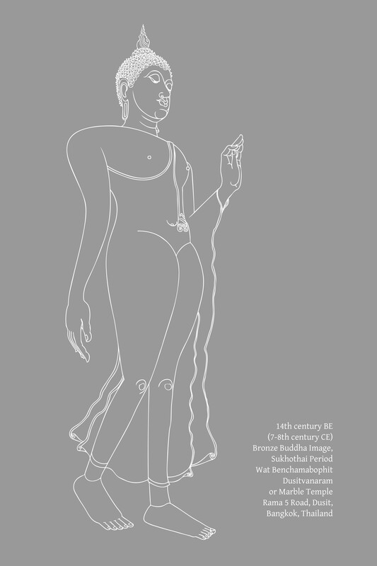
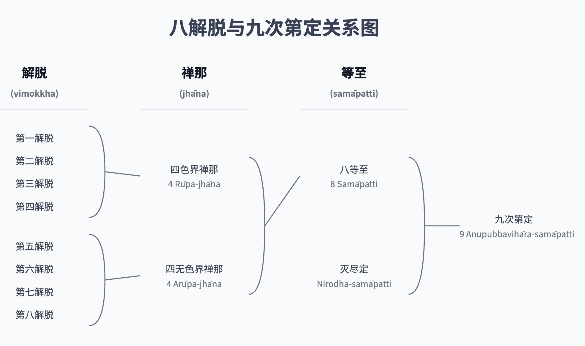
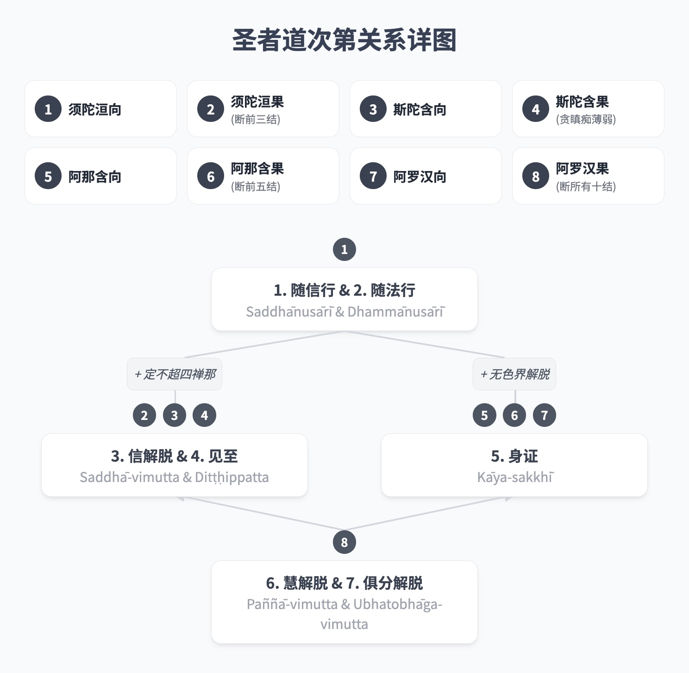
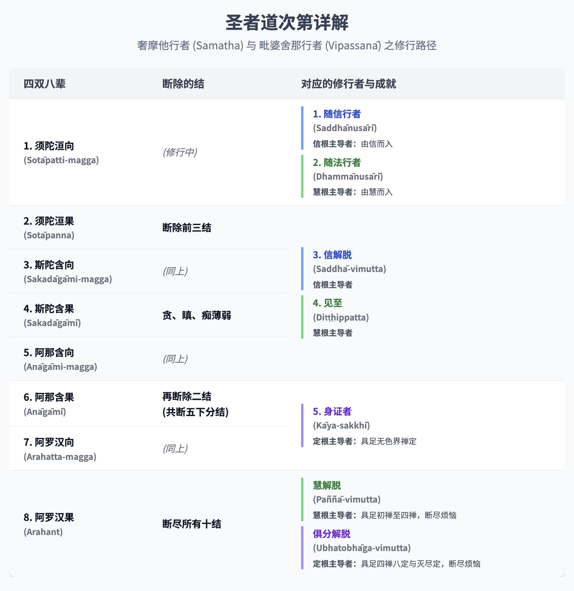
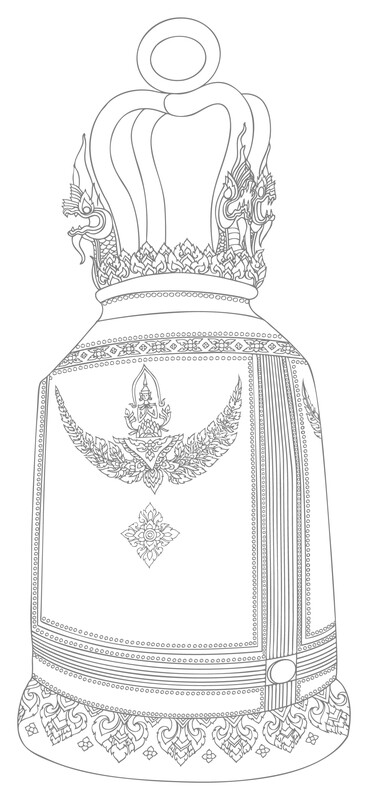

# 第七章：觉悟者

觉悟者

## 导论

佛教经文中有个众所周知的教导，描述了证悟的阶段——证得涅槃（Nibbāna）的阶段。这包括四道（magga）和四果（phala）：

1.  入流道和入流果
    （sotāpatti-magga 和 sotāpatti-phala）。
    
2.  一来道和一来果
    （sakadāgāmi-magga 和 sakadāgāmi-phala）。
    
3.  不还道和不还果
    （anāgāmi-magga 和 anāgāmi-phala）。
    
4.  阿罗汉道和阿罗汉果
    （arahatta-magga 和 arahatta-phala）。
    

入流的第一个“道”也被称为“见”（dassana），因为它指的是初次瞥见涅槃（Nibbāna）。接下来的三个“道”，即一来道、不还道和阿罗汉道，统称为“修习”（bhāvanā），因为它们涉及在入流瞬间最初证得的法（Dhamma）中的发展。[\[1\]](awakened-beings.html#fn-fn1) 

那些已达到完全证悟涅槃（Nibbāna）的人，以及那些初次瞥见目标并因此被保证将达到目标的人，都被归类为佛陀的真实弟子。他们被称为“声闻僧团”（sāvaka-saṅgha），例如在赞颂僧伽功德的偈语中可见：“他们是世尊的善行弟子。”

思索这些真实弟子时，有许多特殊的术语被用来形容他们。最常用的术语是ariya-puggala（或ariya），译为“已修习的”、“高尚的”或“远离敌人”（即远离烦恼）。[\[2\]](awakened-beings.html#fn-fn2) ariya-puggala一词最初是广义上的使用；后来才专门用于描述证悟的阶段。巴利语圣典中用来区分证悟阶段的原始术语是dakkhiṇeyya（或dakkhiṇeyya-puggala）。无论如何，ariya-puggala和dakkhiṇeyya-puggala这两个术语都是从婆罗门教中借鉴而来的。佛陀改变了它们的含义，正如他改变了许多其他词语的含义，例如：brahmā, brāhmaṇa（“婆罗门”）, nahātaka（“洗净的”）和vedagū（“圣人”）。

佛陀赋予ariya一词新的定义，与婆罗门教规定的不同。ariya（梵语：ārya；英语：Aryan）这个词最初指的是几千年前从西北地区迁徙并入侵印度次大陆的一个民族。由于这次入侵，当地居民要么向南撤退，要么躲入森林和山脉。雅利安人认为自己是有教养的；他们鄙视当地人，称他们为野蛮人并奴役他们。后来，当雅利安人巩固了他们的统治并建立了种姓制度后，当地人民被置于最低等的首陀罗（Śūdra；劳动者）阶层。ariya（“高尚的”）一词则指定了三个上层种姓：刹帝利（Kṣatriyaḥ；武士、国王、行政官）、婆罗门（brahmins；学者、祭司、教师）和吠舍（Vaishya；商人）。首陀罗和所有其他人则被标记为anariya（“低贱的”，“卑劣的”）。[\[3\]](awakened-beings.html#fn-fn3) 一个人的种姓在出生时就已确定；无法选择或改变自己的地位。

当佛陀开始教导时，他宣称高尚不取决于出身，而是取决于正法（Dhamma），正法源于精神修习和训练。无论出身或种姓如何，凡是依循高尚原则（ariya-dhamma）行事的人就是“高尚的”（ariya）。不依循者即是anariya。真理不受婆罗门和吠陀的约束，[\[4\]](awakened-beings.html#fn-fn4) 而是客观和普遍的。一个证悟了这些普遍真理的人是高尚的，尽管他从未学习过吠陀。因为对这些真理的了解使人高尚，所以它们被称为“圣谛”。[\[5\]](awakened-beings.html#fn-fn5) 从技术上讲，理解圣谛的人是入流者及以上者。因此，经典通常将ariya一词用作dakkhiṇeyya-puggala（“值得供养者”）的同义词，这个术语稍后将讨论。

四圣谛（ariya-sacca）有时也被称为ariya-dhamma。[\[6\]](awakened-beings.html#fn-fn6) 然而，ariya-dhamma一词没有固定的定义，并在其他语境中使用。[\[7\]](awakened-beings.html#fn-fn7) 它可以指十种“善业道”（kusala-kammapatha）[\[8\]](awakened-beings.html#fn-fn8) 和五戒。[\[9\]](awakened-beings.html#fn-fn9) 这些定义并不矛盾，因为那些真正一生持守五戒，没有盲目依附（sīlabbata-parāmāsa）且没有瑕疵的在家居士，都是入流者及以上者。批注中对ariya指“高尚”之人的标准定义，包括佛陀、辟支佛（Pacceka-Buddhas）[\[10\]](awakened-beings.html#fn-fn10) 和佛陀的弟子，[\[11\]](awakened-beings.html#fn-fn11) 尽管在某些地方，这个定义仅指佛陀一人。[\[12\]](awakened-beings.html#fn-fn12) 当形容一种精神修习或因素时，ariya等同于“出世间”（lokuttara），[\[13\]](awakened-beings.html#fn-fn13) 尽管并非总是严格如此。[\[14\]](awakened-beings.html#fn-fn14)

尽管ariya的定义相当广泛，但可以总结说，当该词用于指人时，它等同于dakkhiṇeyya-puggala，意思是那些超越凡夫状态并成为声闻僧伽（今天更常被称为ariya-saṅgha）成员的人。（另见注释“圣者”的批注分类）。在批注和复批注中，这个定义几乎是固定的，只有极少数例外。在经典中，ariya一词倾向于以一般意义使用，不指定觉醒的层次。Dakkhiṇeyya是一个更具体的专业术语，使用频率低于ariya。

“圣者”的批注分类

> 一些例外包括以下段落：J. II. 42; 280; J. III. 81; J. IV. 293。批注通过将ariya分为四类来解释这些例外：ācāra-ariya——行为高尚者；那些以德为本者；dassana-ariya——外表高尚者；那些具有能启发信心特征者；liṅga-ariya——“性别”高尚者，即那些过着出家生活（samaṇa）者；paṭivedha-ariya——通过证悟而高尚者，即佛陀、辟支佛和佛陀的证悟弟子。J. II. 42, 280; J. III. 354; J. IV. 291。

佛陀扩展了ariya一词的含义，指一个新社群的成员，即通过修习中道而变得高尚的佛教弟子。这些弟子过着合乎伦理、非暴力、和谐的生活。他们致力于促进所有人的福祉。 他们的行为不受宗教官员的诱惑和威胁所左右，这些官员往往迎合人们的自私需求。道德原则可能因这些宗教当局的决定而扭曲。一个例子是婆罗门执行的动物祭祀。

Dakkhiṇeyya译为“值得供养者”。[\[15\]](awakened-beings.html#fn-fn15) 这个词在婆罗门教中的原意指的是进行仪式，特别是祭祀（yañña；梵语：yajña）所获得的报酬。吠陀经中描述了报酬的形式，包括：黄金、白银、家庭用品、家具、车辆、谷物、牲畜、年轻女子和土地。仪式越隆重，报酬就越丰厚。例如，在“皇家马祭”（Ashvamedha）中，国王将战争的战利品与祭司分享。这些礼物的接受者始终是婆罗门，因为他们是唯一有资格执行仪式的。

佛陀开始教导时，他主张废除动物祭祀，并改变了yañña和dakkhiṇā这两个词的含义。他将yañña的含义发展为不伤害生命的布施，而佛教教义中的dakkhiṇā指的是适宜的礼物和真诚的捐赠，而不是费用或报酬。[\[16\]](awakened-beings.html#fn-fn16) 如果说这是一种报酬，那它是德行的报酬，但更恰当地说，它是为了尊崇德行而作的供养。此外，这些礼物并非过度奢华，而是简单的、基本的生活必需品。[\[17\]](awakened-beings.html#fn-fn17)

值得这些供养的人已经训练了自己，并且充满了善行。他们体现了一种有德行和快乐的生活。他们在这个世间存在本身就是对他人的一种祝福。当他们走进更广阔的社会，传授这些有德行的原则，以身作则并教导他人时，他们为世间提供了无价的服务。而这些个人不要求或期望报酬。他们仅仅依靠四种必需品的供养来维持生命。对这些人所作的供养会带来巨大的果报，因为这些供养使善行得以在世间彰显并增长。这些人被称为“值得供养者”（dakkhiṇeyya），因为对他们所作的供养会产生宝贵的结果。他们也被称为“无上福田”，[\[18\]](awakened-beings.html#fn-fn18) 因为他们是善行在世间绽放和传播的源泉。[\[19\]](awakened-beings.html#fn-fn19) 

人们会给普通老师适当的报酬；那么，给那些教导德行和真理之道的人一些简单的礼物，难道不合适吗？在当今社会，那些从事破坏性商业活动——损害经济、环境，甚至人类善良——的人，却获得了各种奢华的报酬。[\[20\]](awakened-beings.html#fn-fn20) 难道那些通过节制消费来保护世界和维护德行的人不应该得到支持吗？那些只消费必需品的人对世界资源的冲击最小；他们取之甚少，回报甚多。

供养不同于一般的布施；它不是出于个人情感、义务或期望获得回报而施予。人们是怀着对善行力量的信心而布施的，他们认识到受供者是佛教僧伽（saṅgha）的成员，或者他/她持守着德行。无论如何，受供者必须具备必要的品质，才有资格接受这些供养。例如，一个尚未证悟的僧人或沙弥，如果食用信众的斋饭，他就是“有债的”，尽管他有良好的戒行并精进于佛法修行。他应该尽快通过证得dakkhiṇeyya-puggala的状态来解除这笔债务。例如，尊者摩诃迦叶（Mahā Kassapa）曾声称，在他受戒至证得阿罗汉果的七天期间，他“欠”了在家人七天的债。[\[21\]](awakened-beings.html#fn-fn21) 他受戒后，作为未觉醒者精进修行佛法七天，然后才达到阿罗汉果，成为值得虔诚在家人供养的人。

批注将接受供养的僧人及沙弥分为四类：

1.  行为不道德的人。他们不具备适合出家人的内在品质，仅仅穿着僧服的外在标志。他们不值得供养；他们对供养的使用被称为theyya-paribhoga：“如盗贼般消耗”。
    
2.  有道德行为但使用四资具时不用智慧反省的人。例如，在食用斋饭时，他们忽略思考：“我食非为享乐或美化。我使用斋饭仅为维持和滋养此身，使其健康，以维持梵行。”这种对供养的使用被称为iṇa-paribhoga：“如债务人般消耗”。[\[22\]](awakened-beings.html#fn-fn22)
    
3.  学人（Sekha），或八种dakkhiṇeyya-puggala中的前七种（见下文）。他们对供养的使用被称为dāyajja-paribhoga：“如继承人般消耗”。他们有权使用这些供养，作为佛陀的继承人，佛陀是dakkhiṇeyya-puggala中至高无上的。
    
4.  阿罗汉，他们已从贪爱的奴役中解脱。他们的德行使他们真正值得供养。他们对供养的使用被称为sāmi-paribhoga：“如主人般消耗”。[\[23\]](awakened-beings.html#fn-fn23)
    

在此我们可以看到，dakkhiṇeyya一词在社会和经济语境中均有使用。供养的原则（以及在某种程度上布施的原则）与佛教社会结构的更广泛原则相契合，即在更广泛的社会中拥有一群独立的个人（僧伽）。这些个人通过不向社会寻求利益，不直接参与其他社会机构来获得独立。他们有自己基于精神自由的生活方式。他们通过传授佛法来支持社会，而不寻求其工作的报酬。他们依靠更广泛社会成员的供养生活，这些成员出于对佛法的虔诚而施予，以保存教法并净化自身贪婪等不善品质。提供这种支持对供养者的生活造成的经济影响极小。

受供者（僧伽）就像蜜蜂一样，从各种花朵中采集花粉以酿造蜂蜜和建造蜂巢，却不损害花朵的芬芳或姿色。[\[24\]](awakened-beings.html#fn-fn24) 事实上，它们还为花朵授粉。因为他们依靠他人生活，所以他们有义务为一切众生的福祉和幸福而行动。尽管他们的生活依赖他人，但并不依赖于任何特定的人；他们依赖大众，从某种意义上说属于大众，但不受任何个人支配。

在一个组织良好的社会中，不应该有任何人贫困潦倒、被迫乞讨。[\[25\]](awakened-beings.html#fn-fn25) 在这样的社会中，宗教沙门依靠他人的供养生活，但接受布施与乞讨没有任何相似之处。这种致力于精神价值并为更广泛社会提供必要平衡的独立社区系统，在世界所有社会系统中是独一无二的。

通常有两种方式来分类dakkhiṇeyya-puggala或ariya-puggala：一种是根据灭除烦恼的八个层次（即上文提到的八种道果），另一种是根据使人达到这八个层次的七种品质或修习。（第一种分类将在下文呈现；第二种分类将在后续章节呈现。）[\[26\]](awakened-beings.html#fn-fn26) 

## 八种圣者

这种划分与在不同觉悟层次被舍弃的十种“结”（saṁyojana）以及戒、定、慧三学（sikkhā）的修习发展有关。十结是指那些将众生束缚在轮回痛苦中的烦恼，类似于将动物束缚在马车上的轭：[\[27\]](awakened-beings.html#fn-fn27)

*   A. 五下分结（orambhāgiya-saṁyojana）：
    
    *   1\. 有身见（Sakkāya-diṭṭhi）：我见；对“自我”的坚固信念；无法认识到众生只是各种蕴的集合。这种见解产生了粗劣的自私，以及冲突和痛苦。
    
        标准的定义是：一个人认为色是自我，或自我拥有色，或色在自我中，或自我包含色。一个人认为受是自我……一个人认为想是自我……一个人认为行是自我……一个人认为识是自我……或自我包含识。[\[28\]](awakened-beings.html#fn-fn28)
    
    *   2\. 疑（Vicikicchā）：怀疑；犹豫；不信任。例如，对佛、法、僧、修习、生命方向和缘起的怀疑。这种怀疑导致在修习圣道时缺乏信心、勇气和洞察力。
    
    *   3\. 戒禁取（Sīlabbata-parāmāsa）：执着于戒律和宗教修习。执着于形式和仪式。错误的认为只要持守戒律、规矩、传统和修习，就能得到净化和解脱。相信这些规矩和修习本身是神圣的。为了获得回报或成就而遵循它们。错过了戒律和宗教仪式的真正目的，最终误入歧途或陷入极端的修习形式（例如修习极端苦行——tapa），而非走在圣道上。[\[29\]](awakened-beings.html#fn-fn29)
    
    *   4\. 欲贪（Kāma-rāga）：感官贪欲；对愉悦的色、声、香、味、触的渴望。
    
    *   5\. 瞋恚（Paṭigha）：敌意；恼怒；愤慨。
    
*   B. 五上分结（uddhambhāgiya-saṁyojana）：
    
    *   6\. 色贪（Rūpa-rāga）：对色界的执着，例如对色界四禅的执着；享受这些禅定的喜悦与寂静；渴望色界（rūpa-bhava）。
    
    *   7\. 无色贪（Arūpa-rāga）：对无色界的执着，例如对无色界四禅的执着；渴望无色界（arūpa-bhava）。
    
    *   8\. 慢（Māna）：我慢；认为自己比他人优越、平等或低劣的观点。
    
    *   9\. 掉举（Uddhacca）：躁动；心散乱；不安。
    
    *   10\. 无明（Avijjā）：愚痴；不知真理；不知因果法则；不知四圣谛。
    

八种dakkhiṇeyya-puggala或ariya-puggala可分为四种类型或阶段，它们与诸结的关系如下：[\[30\]](awakened-beings.html#fn-fn30)

*   A. 学人（Sekha）或有余依者（sa-upādisesa-puggala，即“仍有执取者”）：
    
    *   1\. 入流者（Sotāpanna）：“入流者”；那些真正正确地走在圣道上的人。[\[31\]](awakened-beings.html#fn-fn31) 他们具备完美的戒行以及足够的定力和智慧。他们已经断除了有身见、疑和戒禁取这前三结。[\[32\]](awakened-beings.html#fn-fn32)
    
    *   2\. 一来者（Sakadāgāmī）：“一来者”；那些将再回到此世一次并消除所有痛苦的人。他们具备完美的戒行以及足够的定力和智慧。除了断除前三结外，他们比入流者更进一步地减弱了贪、瞋、痴。[\[33\]](awakened-beings.html#fn-fn33)
    
    *   3\. 不还者（Anāgāmī）：“不还者”；他们死后在投生之处证得究竟解脱——他们不再回到这个世间。他们具备完美的戒行和定力，以及足够的智慧。他们又断除了欲贪和瞋恚这两结，从而断除了前五结。
    
*   B. 无学人（Asekha，即“已完成训练者”）或无余依者（anupādisesa-puggala，即“无执取者”）：
    
    *   4\. 阿罗汉（Arahant）：“应供者”；那些值得供养和尊敬的人；那些已折断轮回之轮辐条的人；那些摆脱烦恼（āsava）的人。他们具备完美的戒行、定力及智慧。他们已断除剩余的五结，从而断除了所有十结。

Sekha，译作“学人”或“训练者”，必须努力断除诸结并逐步证得直至阿罗汉果位。Asekha，即阿罗汉，是已圆满者；他们已超越训练。他们已完成了其精神工作，并根除了所有烦恼。他们已达到了至善；没有更高的精神证悟可追求了。

有余依者（Sa-upādisesa-puggala）等同于上述前三种dakkhiṇeyya-puggala。他们仍有upādi（“燃料”），也就是说，他们仍有upādāna（“执取”）——他们仍有心垢。无余依者（Anupādisesa-puggala），即阿罗汉，则无执取、无垢染。请注意，这里的upādi被译作upādāna（“执取”）的同义词。[\[34\]](awakened-beings.html#fn-fn34) 这与sa-upādisesa-nibbāna和anupādisesa-nibbāna中的upādi有所不同，后者译为“被执取者”，即五蕴。 将upādi等同于upādāna与佛陀关于基本精神要素的教导相符，例如四念处（sati-paṭṭhāna）、四神足（iddhi-pāda）和五根（indriya），这些教导常常以鼓励的方式结束，即培养这些要素可以期望获得两种结果之一：要么在今生证得阿罗汉果，要么如果仍有执着的残留，则证得不还果。[\[35\]](awakened-beings.html#fn-fn35) 在这些语境中，upādi一词指的是upādāna或泛指烦恼（kilesa）。

这八种圣者正是上述的四种ariya-puggala，但每个觉悟层次都被细分为一对：[\[36\]](awakened-beings.html#fn-fn36)

1.  入流者（已证得入流果的人）。
    
2.  为证得入流果而修习的人。
    
3.  一来者（已证得一来果的人）。
    
4.  为证得一来果而修习的人。
    
5.  不还者（已证得不还果的人）。
    
6.  为证得不还果而修习的人。
    
7.  阿罗汉（已证得阿罗汉果的人）。
    
8.  为证得阿罗汉果而修习的人。（参见注释“对偶翻译”）
    

对偶翻译

> 现今人们将这些对偶翻译为“入流果”（sotāpatti-phala）、“入流道”（sotāpatti-magga）、“一来果”（sakadāgāmi-phala）、“一来道”（sakadāgāmi-magga）等。这种翻译遵循批注术语：关于maggaṭṭha和phalaṭṭha，请参阅Nd1A. II. 254；Nd2A. 15；KhA. 183；DhA. I. 334；VinṬ.: Pārājikakaṇḍaṁ, Bhikkhupadabhājanīyavaṇṇanā；DA. II. 515 = AA. IV. 3 = PañcA. 191；MA. II. 120；UdA. 306。术语sotāpatti-magga、sakadāgāmi-magga和anāgāmi-magga并未出现在早期三藏文献中；它们首次出现在《义释》（Niddesa）、《无碍解道》（Paṭisambhidāmagga）和《阿毗达磨》（Abhidhamma）中。在早期文献中，术语arahatta-magga仅见于以下段落：arahā vā assasi arahattamaggaṁ vā samāpanno和arahanto vā arahattamaggaṁ vā samāpannā: Vin. I. 32, 39; D. I. 144; S. I. 78; A. II. 42; A. III. 391; Ud. 7, 65。在后来的文献，例如《义释》、《无碍解道》和《阿毗达磨》中，则被广泛使用。

这四对圣者被称为声闻僧伽，是佛陀的弟子，被视为人类的典范，也是佛教中三宝（ratana）之一。赞颂僧伽的唱诵包括：“这四双、八种圣者，是世尊的弟子”（yadidaṁ cattāri purisayugāni aṭṭha purisapuggalā esa bhagavato sāvaka-saṅgho）。[\[37\]](awakened-beings.html#fn-fn37)

在经典中，佛陀的这些弟子后来被称为“圣僧伽”（ariya-saṅgha）。在较早的经文中，ariya-saṅgha一词仅在《增支部》（Aṅguttara-Nikāya）的一偈颂中作为sāvaka-saṅgha的同义词使用过一次。[\[38\]](awakened-beings.html#fn-fn38) 在批注中，它被频繁使用，尤其是在《清净道论》（Visuddhimagga）中。[\[39\]](awakened-beings.html#fn-fn39) 当ariya-saṅgha一词比sāvaka-saṅgha更受欢迎时，sammati-saṅgha一词便被用来指比丘僧伽。Sammati-saṅgha意为“约定僧伽”或“授权僧伽”，指的是任何超过三位比丘的集会。这些术语通常成对出现：sāvaka-saṅgha与bhikkhu-saṅgha，ariya-saṅgha与sammati-saṅgha。无论如何，ariya-saṅgha和sammati-saṅgha这两个术语与旧有术语并不矛盾，并提供了理解“僧伽”一词含义的宝贵视角。 

八种圣者 

## 阿罗汉的特质

佛教的教法是实用的，并强调那些能带来洞察和福祉的事物。[\[40\]](awakened-beings.html#fn-fn40) 佛教不鼓励对那些应通过实际应用才能证悟的事物进行概念化和辩论，除非是为了基本理解的必要。在研究涅槃方面，与其直接讨论涅槃的状态，不如研究那些证悟涅槃的人，以及在这些人的生命和品格中显现出的证悟利益，可能更有价值。[\[41\]](awakened-beings.html#fn-fn41)

我们可以通过考察经典中用来称呼阿罗汉的尊号来深入了解他们的本质。以下是这些尊号的选集，它们表达了对阿罗汉德行、清净、卓越和精神成就程度的赞赏：

*   已达究竟义（Anuppatta-sadattha）：已获得福祉者。
    
*   阿罗汉（Arahant）：“应供者”；远离烦恼者。
    
*   无学人（Asekha）：已完成训练者；无需训练者；具足圆满德能者（asekha-dhamma）。
    
*   所作已办（Kata-karaṇīya）：已完成应做之事者。
    
*   漏尽者（Khīṇāsava）：已断尽烦恼（āsava）者。
    
*   大人（Mahāpurisa）：德行高尚者；为大众福祉而行动者；自制者。
    
*   卸下重担（Ohitabhāra）：已放下重担者。
    
*   究竟善（Parama-kusala）：具足殊胜善法者。
    
*   已尽有结（Parikkhīṇa-bhava-saṁyojana）：已摧毁束缚众生于存在的诸结（saṁyojana）者。
    
*   正智解脱（Sammadaññā-vimutta）：通过圆满智慧而解脱者。
    
*   圆满善（Sampanna-kusala）：已圆满善法者。
    
*   至上人（Uttama-purisa）：最尊贵的人；最卓越的人。
    
*   梵行已立（Vusitavant or vusita brahmacariya）：已圆满梵行者。
    

许多其他术语最初由其他宗教传统使用，但它们的含义被改变以符合法与律（Dhammavinaya）的基本原则，例如：

*   阿利雅（Ariya或ariya-puggala）：高尚的人；卓越的人；对一切众生发展出非暴力的人。最初，这个术语指的是前三个种姓的成员或出生即“高贵”（雅利安）的人。
    
*   婆罗门（Brāhmaṇa）：“真正的婆罗门”；通过舍弃所有不善法而超越邪恶的人。最初，这个术语指的是最高种姓的成员。
    
*   达希涅亚（Dakkhiṇeyya）：值得供养的人。最初，这个术语指的是那些因举行祭祀而值得获得报酬的婆罗门。
    
*   盖瓦利（Kevalī或kebalī）：“完整”的人；“圆满”的人。最初，这个术语指的是耆那教中最高级的个人。
    
*   纳哈塔卡（Nahātaka）：已“仪礼沐浴”的人；已“沐浴于法”的人；已净化其意志行为（kamma）的人；一切众生的皈依处。最初，这个术语指的是一位通过沐浴仪式而提升地位的婆罗门。
    
*   沙门（Samaṇa）：寂静的人；已平息烦恼的人。最初，这个术语泛指一切出家者。
    
*   韦达古（Vedagū）：已达究竟智者；精通知识并解脱于对感受（vedanā）的执着者。最初，这个术语指的是一位已完成三部吠陀学习的婆罗门。[\[42\]](awakened-beings.html#fn-fn42)
    

要了解阿罗汉的本质，必须在提到这些尊号的教法语境中考虑它们，例如：三漏（āsava）、三学（sikkhā）、十种圆满德能（asekha-dhamma）、十结（saṁyojana）以及作为八圣道的梵行（brahmacariya）。

许多佛教徒倾向于从否定的角度来描述阿罗汉和其他觉悟者的特质，即通过确定那些已被舍弃或消除的烦恼。例如，入流者已消除了前三结（saṁyojana）；一来者已消除这三结并进一步减弱贪、瞋、痴；不还者已消除前五结；而阿罗汉已消除所有十结。或者，他们简要地将阿罗汉定义为“无贪、瞋、痴者”或“已解脱烦恼者”。这些定义有用之处在于它们清晰并提供了简单的评估标准。但它们有局限性；它们未能清晰展示觉悟者的非凡特质和突出特征，也未描述这些觉悟者如何过着有德行的生活并利益世间。

事实上，有许多术语和段落以肯定方式描述阿罗汉的特征。然而，许多关于阿罗汉的描述或解释涵盖了广泛的主题，使得难以以清晰、有序的方式总结其积极特质。否则，它们叙述了具体的事件和个人，但并未描述所有阿罗汉共有的特质。

在这种语境中，一个重要的术语是bhāvitatta，字面翻译为“已发展自己的人”或“已自我发展的人”。[\[43\]](awakened-beings.html#fn-fn43) 这个术语用于所有阿罗汉：佛陀、辟支佛（pacceka-buddhā）以及所有阿罗汉弟子。例如，在《大般涅槃经》（Mahāparinibbāna Sutta）中，当佛陀前往他最终般涅槃的地方时，他被称为“已发展者”。 

> 佛陀在比丘众的围绕下，行至伽窟他河（Kakutthā）[\[44\]](awakened-beings.html#fn-fn44)，并在其清澈明净的水中沐浴和饮水……他行至芒果园，对比丘纯陀（Cundaka）说：“将外衣叠成四层铺好，给我躺下。”这位大阿罗汉（bhāvitatta）催促之下，纯陀迅速将外衣叠成四层铺好。D. II. 135。

类似的表达见于婆罗门学生梅达古（Mettagū）的提问：

> 世尊，我希望提出一个疑问。请告诉我其含义；我将因此认为尊者是一位知识大师（vedagū），一位圆满发展者（bhāvitatta）。世间所有这些丰富多样的痛苦从何而来？Sn. 202，载于“十六问”——soḷasa-pañhā。

佛陀将一位“圆满发展者”——一位精通佛法（bahussuta）的阿罗汉——比作一位聪明的船长，他能引导许多人渡过海洋并安全抵达目的地，正如《船经》（Nāvā Sutta）所阐明的：

> 正如一个人乘坐坚固的船只，配备桨和竹竿，经验丰富、技术娴熟，懂得掌舵之法，能够帮助许多人渡过水域；同样地，一位知识大师（vedagū），一位圆满发展者（bhāvitatta），一位学识渊博者（bahussuta），稳定且不为世间事物所动摇，具足智慧，能够帮助那些乐于倾听的人，以探究佛法并达到圆满。Sn. 56。

《世间经》（Loka Sutta）与前一经相似，但涵盖了更广泛的主题，如下文所示：

> 比丘们，这三种出现在世间的人，是为了许多人的利益、许多人的安乐、为了对世间的悲悯帮助而出现——为了天神与人类的福利、利益和安乐。哪三种呢？在此，如来出现在世间。他是圣者，是正等正觉者，明行具足，善逝，世间解，无上士调御丈夫，天人师，觉者，法的施与者。他宣说法，初善、中善、后善；他开示了在精神上和文字上都完全清净的梵行。比丘们，第一种人，当他出现在世间时，是为了许多人的利益、许多人的安乐、为了对世间的悲悯帮助而出现——为了天神与人类的福利、利益和安乐。再者，有同一位老师的弟子，他是一位阿罗汉，他的心已从烦恼中解脱……由于彻底的知见而得解脱。那位弟子宣说法，初善、中善、后善；他开示了在精神上和文字上都完全清净的梵行。比丘们，这是第二种人，当他出现在世间时，是为了许多人的利益、许多人的安乐、为了对世间的悲悯帮助而出现——为了天神与人类的福利、利益和安乐。再者，有同一位老师的弟子，他仍处于学习阶段，仍在修行，多闻，致力于戒行与修行 (sīla-vata)。那位弟子也宣说法，初善、中善、后善；他开示了在精神上和文字上都完全清净的梵行。比丘们，这是第三种人，当他出现在世间时，是为了许多人的利益、许多人的安乐、为了对世间的悲悯帮助而出现——为了天神与人类的福利、利益和安乐。老师，至上的探求者，是世间第一；  
> 追随他的是，弟子，成就者 (bhāvitatta)；  
> 再者，是处于学习阶段的弟子 (sekha-sāvaka)，仍在修行，  
> 多闻，致力于戒行与修行。  
> 这三种人是至上的  
> 在天神与人类之中。  
> 他们散发光明，宣说真理，  
> 开启不死之门，  
> 并帮助许多人从束缚中解脱。  
> 那些遵循圣道的人，  
> 由老师，无上导师，教导得很好——  
> 如果他们听从善逝的教导——  
> 将会在今生终结苦。[\[45\]](awakened-beings.html#fn-fn45)It. 78-9. Bahujanahita Sutta

然而，请注意，bhāvitatta 这个词最常用于诗歌偈颂中，而非散文中。这很可能是因为它简洁，易于在诗歌中使用，以替代更长、更拖沓的术语和短语。bhāvitatta 这个简短术语不常用于散文的另一个原因是，它的含义没有清晰的定义。由于散文不像诗歌创作那样存在限制，因此可以使用更长的术语和短语以求清晰。

此时，提出一个问题很有用：在散文中，什么术语和短语被用来代替 bhāvitatta 这个词？为了回答这个问题，让我们来看看《三藏》中找到的解释。《三藏》的第三十卷——《小义释》(Cūḷaniddesa)——被认为是“司令官”兼首席弟子尊者Sāriputta的教法集，它阐明了《经集》(Suttanipāta) 中包含的一些佛陀经文。《小义释》中的一段解释了 bhāvitatta 这个词，它出现在婆罗门学生Mettagū上述的提问中：

> 世尊是如何成为成就者 (bhāvitatta) 的？在此，世尊已修习身 (bhāvita-kāya)，修习戒行 (bhāvita-sīla)，修习心 (bhāvita-citta)，修习智慧 (bhāvita-paññā)。(他已修习四念处、四正勤、四神足、五根、五力、七觉支、八圣道。他已断除烦恼，彻见不动摇的真理，证悟灭尽。)[\[46\]](awakened-beings.html#fn-fn46)Kathaṁ bhagavā bhāvitatto bhagavā bhāvitakāyo bhāvitasīlo bhāvitacitto bhāvitapañño (bhāvitasatipaṭṭhāno bhāvitasammappadhāno bhāvitaiddhipādo bhāvitindriyo bhāvitabalo bhāvitabojjaṅgo bhāvitamaggo pahīnakileso paṭividdhākuppo sacchikatanirodho.) Nd. II. 14.

现在让我们来看一段佛陀的散文，描述了自我修习 (bhāvita) 的四个领域，这被认为是“成就者” (bhāvitatta) 概念的扩展：

> 比丘们，有这五种尚未生起，但将在未来生起的未来危险。你们应当认识它们并努力防止它们。哪五种？在未来，将会有比丘们，他们在身体、戒行、心和智慧方面都未曾修习。尽管他们在身体、戒行、心和智慧方面都未曾修习，他们仍会给他人授具足戒，但却无法在增上戒 (adhisīla)、增上心 (adhicitta) 和增上慧 (adhipaññā) 方面引导他们。[\[47\]](awakened-beings.html#fn-fn47)这些受戒者也将是在身体、戒行、心和智慧方面都未曾修习的。他们反过来也会给他人授具足戒，但却无法在增上戒、增上心和增上慧方面引导他们。这些受戒者也将是在身体、戒行、心和智慧方面都未曾修习的。因此，比丘们，通过法的腐败，戒律也会腐败，而从戒律的腐败，法也会腐败。这是第一种尚未生起，但将在未来生起的未来危险。你们应当认识它并努力防止它。再者，在未来，将会有比丘们，他们在身体、戒行、心和智慧方面都未曾修习。尽管他们在身体、戒行、心和智慧方面都未曾修习，他们仍会给他人依止[\[48\]](awakened-beings.html#fn-fn48)，但却无法在增上戒、增上心和增上慧方面引导他们。这些学生也将在身体、戒行、心和智慧方面都未曾修习。他们反过来也会给他人依止，但却无法在增上戒、增上心和增上慧方面引导他们。这些学生也将在身体、戒行、心和智慧方面都未曾修习。因此，比丘们，通过法的腐败，戒律也会腐败，而从戒律的腐败，法也会腐败。这是第二种尚未生起，但将在未来生起的未来危险。你们应当认识它并努力防止它。A. III. 105-106.

佛陀上述的教法与一些基本法义原则相关联：

Bhāvitatta[\[49\]](awakened-beings.html#fn-fn49) 是一个“赞叹之词” (guṇa-pada)，一个描述佛陀和阿罗汉美德或卓越品质的术语，指那些已修习自身并完成精神训练的人。当人们将这个词的含义扩展为身修习 (bhāvita-kāya)、戒行修习 (bhāvita-sīla)、心修习 (bhāvita-citta) 和智慧修习 (bhāvita-paññā) 这四重成就时，这便与关于四种修习 (bhāvanā) 的教导相关：身修习 (kāya-bhāvanā)、戒行修习 (sīla-bhāvanā)、心修习 (citta-bhāvanā) 和智慧修习 (paññā-bhāvanā)。

在此，需要了解巴利语的一些基本知识。bhāvita 这个词既可用作形容词也可用作副词，描述个体的品质。另一方面，bhāvanā 这个词是一个名词，描述一种行动、一种原则或一种修行形式。这两个术语之间存在兼容性，因为 bhāvita 指的是已充分从事 bhāvanā 的人。因此，身已修习 (bhāvita-kāya) 的人已从事身修习 (kāya-bhāvanā)，戒行已修习 (bhāvita-sīla) 的人已从事戒行修习 (sīla-bhāvanā)，心已修习 (bhāvita-citta) 的人已从事心修习 (citta-bhāvanā)，智慧已修习 (bhāvita-paññā) 的人已从事智慧修习 (paññā-bhāvanā)。

这等同于说，阿罗汉是已完成四重修习的人：他或她已在身修习、戒行修习、心修习和智慧修习方面有所成就。

为了澄清此事，这里简要描述了四种修习 (bhāvanā)：

1.  身修习 (kāya-bhāvanā)：身体发展；发展一个人与周围物质事物（包括科技）或身体本身的关系。特别是，通过五根（眼、耳、鼻、舌和身）巧妙地认知事物，以一种有益、不造成伤害、增长善法、并驱除不善法的方式与它们相处。
    
2.  戒行修习 (sīla-bhāvanā)：戒行发展；通过遵守道德规范，不辱骂或伤害他人或引起冲突，以及与他人和谐相处并相互支持，来发展一个人的行为和社交关系。
    
3.  心修习 (citta-bhāvanā)：发展心；强化和稳定心；培养善法，如慈爱、悲悯、热情、精进和忍耐；使心专注、光明、喜悦和清澈。
    
4.  智慧修习 (paññā-bhāvanā)：发展和增长智慧，直到对真理产生全面的理解，通过如实知见事物并对世间和现象获得清晰的洞察。在这个阶段，一个人能够解脱心，净化自身的心理烦恼，并从苦中解脱。一个人以穿透性的觉知生活、行动和解决问题。
    

当一个人理解了 bhāvanā（“修习”）的含义时，它位于上述修行方式的核心，他也就理解了 bhāvita（“成就者”）这个词，它是那些已完成其精神修行并履行了四种修习者的属性：

1.  身成就 (bhāvita-kāya)：这指的是那些已修习身的人，也就是说，他们已发展了与物质环境和自身身体的关系；他们对事物和自然拥有健康、满足和尊重的关系；特别是，他们通过五感体验事物，例如通过看或听，以正念的方式，并以一种培养智慧的方式。他们适度地消费事物，从中获得真正的利益和价值。他们不被偏好和厌恶的影响所迷惑或误导。他们不放逸；他们不让感官刺激造成伤害，而是利用它们来获取利益；他们不被不善心所主导，而是培养善心。
    
2.  戒行成就 (bhāvita-sīla)：这指的是那些已发展戒行并发展其行为的人。他们通过遵守道德规范和与他人和谐相处，在社会中行为端正。他们不使用身体行动、言语或其生计来压迫他人或制造冲突，而是将这些活动用于自我发展、帮助他人和建设健康的社会。
    
3.  心成就 (bhāvita-citta)：这指的是那些已发展其心的人。因此，他们的心是清澈、光明、开阔、喜悦和快乐的。他们的心充满了美德，如善意、悲悯、信心、感恩、慷慨、毅力、坚韧、耐心忍耐、平静、稳定、正念和三摩地。
    
4.  智慧成就 (bhāvita-paññā)：这指的是那些已训练和发展智慧的人，从而对真理有所理解，并如实地清晰辨别事物。他们运用智慧来解决问题，驱除苦，并净化自身的心理染污。他们的心是解脱的，免于烦恼。
    

这部经中值得注意的一段是，佛陀指出那些未能充分发展其身体、戒行、心和智慧的比丘，将成为导师和老师，但却无法在增上戒、增上心和增上慧（即在戒行 – sīla、三摩地 – samādhi 和智慧 – paññā 方面）引导他们的弟子。

有趣的是，当描述老师的品质时，佛陀提到了四种自我修习 (bhāvita)，但当他描述学习的主题——教法或修行原则时，他提到了三学，即戒行、三摩地和智慧。（完整来说，这些被称为“增上戒学” – adhisīla-sikkhā，“增上心学” – adhicitta-sikkhā，和“增上慧学” – adhipaññā-sikkhā。）

这种区别可能会引起一些疑问。首先，佛陀为什么不在这里使用互补或对应的术语呢？他难道不应该说，一个人若未在四方面充分修习 (bhāvita)，就无法在四重修习 (bhāvanā) 方面引导他人；或者反过来说，一个人若未完成三学，就无法在戒行、三摩地和智慧方面引导他人吗？

此外，这些教法中的要素几乎相同。关于修习 (bhāvanā) 和自我修习 (bhāvita) 的二重教法包含身、戒行、心和智慧这四要素。而三学则包含戒行、三摩地（即“心” – citta）和智慧这几要素。因此，如果佛陀坚持其中一种教法，而不是将它们结合起来，难道不会减少困惑吗？

许多佛教徒都熟悉 sīla、samādhi 和 paññā 的修行次第，这种三学修行本身被认为是完整的。然而，他们普遍不熟悉“身” (kāya) 这个额外要素，可能会想知道它为何被加入以及它意味着什么。

在此，我们不妨简单地得出结论，佛陀在同一语境中提出了这两种不同的教法：在提及老师的属性时，他提到了四重自我修习 (bhāvita)；而在提及教导的主题时，他提到了三学 (sikkhā)。

对于佛陀为何在同一语境中运用这两种不同教法，一个简单而简短的回答是，它们有不同的目的或目标。关于老师属性的教法旨在描述老师可辨识的特征，以评估某人是否已完成精神训练并准备好教导他人。另一方面，关于学习主题的教法旨在描述实践的内容和系统——描述要训练什么以及如何训练才能获得预期的结果。

最重要的是，真正的学习或训练涉及一个自然发展生命的过程；这个过程符合自然法则，因此训练体系必须根据自然中发现的因缘条件正确建立。

让我们首先考察学习的主题，即三学。为什么这项训练只由三个要素组成？同样，可以简单地回答说，这项训练关乎人类的生命，而人类生命具有三个方面或三个活动领域。这三个要素结合起来构成一个人的生命，并且它们是协同进行和发展的。

这三个要素如下：

1.  与世间的沟通和互动：通过 dvāra——门或渠道——对他人的认知、关系、交往、行为和反应，可以有两种描述方式：
    
    1.  认知之门 (phassa-dvāra)：眼、耳、鼻、舌和身（结合意的交汇点，这构成了六门）。[\[50\]](awakened-beings.html#fn-fn50)
    
    2.  意图行为之门 (kamma-dvāra)：身和语（结合意的交汇点，这构成了三门）。
    
    
    这个要素可以简单地称为“与世间的互动”，并用 sīla（“行为”）这个词来表示。
    
2.  心：心的活动，它有许多伴随的要素和特质。首先，一个人必须有意图，也称为意志、思虑、决心或动机。此外，人们的心通常包含积极和消极的品质、优点和缺点。心会体验到快乐和不适、安乐和不安乐，以及漠不关心和自满的感觉。对这些感受会有反应，如喜悦和厌恶，以及获取、获得、逃避或摆脱的欲望，这些都会影响一个人体验事物和行为的方式，例如一个人是否看某物，选择说什么，以及对谁说话。这个要素简单地称为“心” (citta) 或三摩地的范畴 (samādhi)。
    
3.  智慧：知识和理解，始于 suta——通过正规教育或新闻媒体获得的知识——直至并包括思想领域 (cintā-visaya) 和知识领域 (ñāṇa-visaya) 的所有形式发展，包括：观念、见解、信仰、态度、价值观、对各种观念和理解形式的执着，以及特定的观点和视角。这个要素被称为“智慧” (paññā)。
    

这三个要素协同运作；它们相互关联且相互依存。一个人通过感官——通过认知之门——以及通过身体和言语行为（要素 #1）与世间的互动，依赖于意图、感受和心中其他各种状况（要素 #2）。而整个过程则依赖于智慧和理智（要素 #3）的引导。一个人的知识广度决定了其思想和行为的范围。

同样，例如决心和欲望（要素 #2）这样的心要素，依赖于通过感官和身体及言语行为（要素 #1）的互动才能得到满足。而这个过程则由一个人的信仰、思想和理解（要素 #3）所决定和调节，这些是可变和可调整的。

再者，智慧（要素 #3）的运作和发展依赖于感官，例如看或听，依赖于身体的活动，例如行走、组织、寻求、把握等，并运用言语进行沟通和询问（要素 #1）。而这个过程依赖于心的特质，例如：兴趣、欲望、坚韧、毅力、审慎、正念、平静和三摩地（要素 #2）。

人类生命的本质由这三个相互关联、相互依存的要素组成。它们构成了一个不可增减的完整整体。由于生命由这三个要素构成，任何旨在帮助人们过好生活的训练都必须解决生命这三个领域的发展。

因此，精神训练被分为三个部分，称为三学。这项训练旨在使生命这三个领域发展得完整，并与自然和谐。这三个要素同时且协同发展，从而形成一个整合的修行体系。

从粗略的角度来看，人们可能会将这三个要素看作与经文中有时概述的相似方式，代表修行中的三个主要阶段：戒行、三摩地和智慧。这种观点给人一种印象，即人们将这些要素作为独立的步骤并按顺序实践，也就是说，在戒行训练之后发展三摩地，然后接着是智慧发展。

通过这种方式看待三学，人们会看到一个修行体系，其中三个要素在不同阶段突出，从粗略的要素开始，随着阶段的进展而导向更精细的要素：

*   第一阶段（戒行）突出一个人与外部环境、感官以及身体行动和言语的关系。
    
*   第二阶段（三摩地）突出一个人的内在生命，即心。
    
*   第三阶段（智慧）突出知识和理解。
    

然而，请注意，在每个阶段，其余两个要素始终在发挥作用并参与其中。

这种视角提供了一个概览，其中人们关注过程每个阶段的主要活动。人们分别突出三个要素中的每一个，以便粗糙的要素准备好支持更精细要素的成长并促进其成功。

以砍伐一棵大树为例。首先，必须准备周围区域，以便能够轻松、安全、稳妥地移动（= sīla）。其次，必须准备好力量、勇气、正念、决心、不散乱以及使用斧头的技巧（= samādhi）。第三，必须拥有合适的工具，例如一把优质、锋利且尺寸正确的斧头（= paññā）。如果满足这三个要求，就能成功砍倒大树。

然而，就一个人的日常生活中而言，更仔细的分析揭示了这三个要素持续以相互关联、相互依存的方式运作。因此，为了让人们真正有效地从事精神修行，应该鼓励他们觉知这三个要素。他们应该协同发展这些要素，通过纳入如理作意 (yoniso-manasikāra)，这有助于增加理解，以及正念 (sati)，这有助于带来真正的成功。

就一个人的精神修行而言，无论从事何种活动，一个人都能够根据三学的原则来审视和训练自己。因此，目标是在所有情况下同时地从事这三个要素——戒行、三摩地和智慧。当从事一项活动时，一个人考虑其行为是否导致他人的苦恼或痛苦，是否造成伤害，或者是否有助于帮助、支持、鼓励和发展他人（= sīla）。在这些活动中，一个人的心是什么状态？是出于自私、恶意、贪婪、嗔恨或痴愚而行动，还是出于慈爱、祝愿、信心、正念、精进和责任感而行动？当从事一项活动时，心是躁动、焦虑、困惑和沮丧，还是平静、快乐、喜悦、满足和光明（= samādhi）？当从事一项活动时，一个人是否以清晰的理解行事？是否辨识其目的、目标和相关原则？是否认识到其潜在的益处和缺点，并完全理解调整和改进活动的方式（= paññā）？

通过这种方式，有经验的人能够随时随地训练和审视自己，并评估他们的修行。他们在单一活动中培养三学的所有三个要素。

同时，从三个不同阶段的角度来看，三学的发展会自动展开。从一个角度来看，一个人按顺序发展三学。但从另一个角度来看，这三个要素的同步、统一实践正在进行，并有助于所谓“三阶段”训练的成功推进。

在此背景下，深入探究精神修行细节的人将会知道，在觉悟的时刻——在证悟道、果和涅槃的时刻——八圣道的所有八个要素，它们被归类为戒、三摩地和慧三组，都已完成并作为一个整体运作，以消除烦恼并带来圆满。

总而言之，佛教的精神训练体系——三学 (tisso sikkhā)——建立在必要要素之间的关系之上，并符合特定的自然法则。人类生命由三个要素组成——与外部世界的行为 (sīla)、心的活动 (citta) 和理解 (paññā)——它们协同运作并相互依存，以带来精神发展。

在描述精神修行的原则时，佛陀提到了这三个训练方面 (sikkhā)。我们现在回到这个问题：“为什么佛陀在描述老师的属性时，采用了四重自我修习 (bhāvita) 的新模式？”

如前所述，这个问题可以很容易地回答，即这两种模式有不同的目的和目标。三学是要在现实生活中应用的——按照一个与自然和谐的系统来实践。而四重自我修习要素则是为了自我审视。在此，不必关注自然的顺序。这里的重点是清楚地了解一个人的个人品质。如果一个人清楚地辨识这些品质，它们本身就会与三学要素相关联。

通过审视戒行 (sīla) 的第一个要素，这一点就很明显，它指的是一个人与世间的互动和沟通，一个人对世间的理解，以及一个人与世间相关的行动。

如上所述，我们通过两组“门” (dvāra) 与世间互动：第一组涉及认知之门 (phassa-dvāra)，通常被称为感官 (indriya)——我们通过眼、耳、鼻、舌和身对世间的觉知。第二组涉及意图行为之门 (kamma-dvāra)，通过它我们以身体和言语的姿态对世间（对人、对社会、对外部环境中的其他对象）采取行动和回应。

区别就在这里。关于与世间的互动，在任何一个时刻（或更精微地说，在任何一个心识刹那），我们都只通过特定的某一门与世间沟通，人们可以通过运用这两组门中的任何一组来审视这个过程。

就三学而言，其中 sīla、samādhi 和 paññā 是一个整合系统的一部分，通过各种门与世间的互动构成了“行为” (sīla) 的训练；心 (samādhi) 和理解 (paññā) 的要素则构成独立的要素。通过各种门——无论是认知之门还是意图行为之门——与世间的全部互动都包含在戒行 (sīla) 这个要素中。因此，三学由三个要素组成。

就老师的属性而言，不必考虑三学中包含的三个要素的整合运作。在此，是为了调查的目的而区分不同的要素。正是在戒行 (sīla) 这个要素上进行了区分，也就是说，人们根据两组门中的一组或另一组来区分一个人与世间的互动：

1.  认知之门 (phassa-dvāra；通常被称为感官 – indriya)：眼、耳、鼻、舌和身（连同意的交汇点，这构成了六门）；这些门使得看/注视、听/倾听、嗅、尝和触觉接触成为可能（最终在心中形成对心所法 – dhammārammaṇa 的认知）。
    
2.  意图行为之门 (kamma-dvāra)：身和语（连同意的交汇点，这构成了三门）；这些门使得身体行动和言语成为可能（并且通过指定意图行为的起点——心——这也包括思维）。
    

佛陀将戒行 (sīla) 的这两个次级要素分开，将其确定为四重自我修习 (bhāvita) 中的前两个要素。他区分了第一个要素，即通过认知之门或感官与世间的互动，并将其标记为“身成就” (bhāvita-kāya)。（这里的“身” – kāya – 指的是“五门之集” – pañcadvārika-kāya）。佛陀因此非常强调一个人与世间的互动，特别是通过五根的认知。人们往往会忽略这第一个要素，但在与精神修行相关的佛教中，它被认为至关重要，特别是在衡量一个人的发展方面。

这尤其与当前被称为信息时代或IT时代的时期相关。人们在这个要素方面的发展，决定了是直接迈向智慧修习，还是陷入痴愚的泥沼。这个“身体发展”的原则可以作为一个警示标志，告诫人们不要迷失方向，并鼓励他们利用信息技术，将文明推向正确的方向。

在衡量人们的精神发展方面，第二个辅助因素，即通过意愿行为（kamma-dvāra）的门户与世界互动，构成了“道德自制”（bhāvita-sīla），这相当于增上戒学（adhisīla-sikkhā）的第二部分。“心识自制”（bhāvita-citta）和“智慧自制”（bhāvita-paññā）则分别对应于增上心学（adhicitta-sikkhā）和增上慧学（adhipaññā-sikkhā）。

请注意，“身体自制”（bhāvita-kāya）这个概念，这里被定义为一个人通过五根与世界互动的发展，有时会以不同的方式解释，即将“kāya”一词字面定义为“身体”或指物质对象。

如果一个人以这种替代方式扩展bhāvita-kāya的含义，那么第二个因素“道德自制”（bhāvita-sīla）的定义也会相应调整，如下所示：“道德自制”是指培养一个人与他人之间的关系或参与社会，以促进和平共处、合作、和谐与相互支持。

这两个因素的这些替代定义与四种清净戒（pārisuddhi-sīla）的教导相关：

1.  Pāṭimokkhasaṁvara-sīla：作为对波罗提木叉的戒律，这是僧团的主要戒律。
    
2.  Indriyasaṁvara-sīla：作为感官约束的戒律；正念地接受感官印象，如色声，以有助于智慧和真实利益的方式，而不被不善心所主宰。
    
3.  Ājīvapārisuddhi-sīla：作为生计清净的戒律：以如法和纯净的方式谋生。
    
4.  Paccayapaṭisevana-sīla（或paccayasannissita-sīla）：明智地使用四资具，通过理解它们的真实目的和价值来从中受益；适度生活和消费；不以贪爱消费。
    

那些通过身体与世界建立关系，或与物质对象和自然互动相关的方面，属于“身体自制”（bhāvita-kāya）的因素。那些与社会或社区关系相关的方面，属于“道德自制”（bhāvita-sīla）的因素。[\[51\]](awakened-beings.html#fn-fn51)

在介绍了这些原则之后，以下对阿罗汉品德的描述与四种自制（bhāvita）的教导相符：在身体、道德行为、心识和智慧方面都得到充分发展。

然而，请注意，尽管这四种品德彼此区分，但它们并非完全分离。为理解目的，我们突出其主要特征，但在实际发展过程中，它们是相互关联并以整合方式培养的。特别是，它们绝不独立于智慧。

### 身体自制（bhāvita-kāya）

尽管在《巴利藏》中有许多佛陀提及bhāvita-kāya一词的段落，但并没有对此词的明确解释，仿佛听者总是理解其含义。然而，有时非佛教徒，特别是尼干子教团的成员，会根据他们自己的理解谈论这个主题，佛陀也对此作出了相应的回应。

例如，《大萨遮迦经》（Mahāsaccaka Sutta）中记载了这样一段对话，其中讨论了bhāvita-kāya和bhāvita-citta这两个词：

一天早上，著名的尼干子名叫萨遮迦（他是跋祇地区离车王子的老师）来到佛陀住处，与佛陀交谈。他首先谈到身修（kāya-bhāvanā）和心修（citta-bhāvanā）。他告诉佛陀，在他看来，佛陀的弟子们只在心修方面精进，而没有进行身修。注疏中提到，萨遮迦之所以持这种观点，是因为他观察到比丘们去僻静处修行，但并没有实行严格的苦行。

在萨遮迦表达了他的观点后，佛陀反问他，根据他所学，什么是“身修”（kāya-bhāvanā）的含义。萨遮迦回答说，他将其定义为实行严格的苦行和自我折磨（atta-kilamathānuyoga）。

佛陀接着问他对“心修”（citta-bhāvanā）的理解，但萨遮迦无法提供解释。佛陀继续说，萨遮迦对身修的理解与圣者律（ariya-vinaya）中的修行不符。如果连身修的含义都无法理解，又怎能理解心修呢？然后他请萨遮迦听他解释什么是身修和心修的非真正修行，以及什么是真正身修和心修：

> 阿奇韦萨那，一个人如何获得身心自制？在此，一个善于教导的圣弟子生起愉悦的感受。虽然他受到那愉悦的感受触动，但他不贪著快乐，他不成为一个贪著愉悦感受的人。那愉悦的感受便会止息。随着愉悦感受的止息，痛苦的感受生起。他受到那痛苦的感受触动，他不忧愁、不哭泣、不哀叹；他不捶胸哭泣，不心神不安。阿奇韦萨那，这样，尽管那愉悦的感受在他心中生起，但它不会侵入他的心识并停驻，因为身体已经得到发展。尽管那痛苦的感受在他心中生起，但它不会侵入他的心识并停驻，因为心识已经得到发展。阿奇韦萨那，任何圣弟子，如果他以这种双重方式，所生起的愉悦感受不会侵入他的心识并停驻，因为身体已经得到发展；所生起的痛苦感受不会侵入他的心识并停驻，因为心识已经得到发展，那么他便获得了身心自制。[\[52\]](awakened-beings.html#fn-fn52) M. I. 237。

如上所述，“身体修习”（kāya-bhāvanā）的主要含义是发展“五根”（pañcadvārika-kāya），即眼、耳、鼻、舌、身五根。因此，“身体修习”（kāya-bhāvanā）本质上与“根修”（indriya-bhāvanā）是相同的。

根修始于根律仪（indriya-saṁvara），佛陀在法毗奈耶中对出家众的修行给予了极大的重视。根律仪是根本的修行，与戒学（sīla）相关。（在注疏中，根律仪常被归类为戒行的一种形式，即“根律仪戒”——indriyasaṁvara-sīla。）让我们来看看这个基本原则：

> 世尊，比丘如何被称为根门守护者？在此，比丘以眼见色时，不执取其主要相或次要相。因为如果他住于眼根不被防护，贪欲（abhijjhā）和瞋恚（domanassa）等恶不善法将会淹没他，所以他练习防护，他守护眼根，发展眼根的防护。以耳闻声时……以鼻嗅香时……以舌尝味时……以身触触时……以意知法时，他也不执取其主要相或次要相……他发展意根的防护。那位具足此圣根律仪的比丘，在他自身内体验到纯净、无杂染的快乐。世尊，比丘便是这样成为根门守护者的。D. I. 70。

根律仪仍然属于“学人”的修行，或是修行的初步阶段。对于已“掌控诸根”（bhāvitindriya，这被归类为bhāvita-kāya的一部分）的阿罗汉来说，它并非必需的修行。然而，这里将其纳入讨论，是为了展示修行的各个阶段。

还有一种更深层次的根律仪，或者说对这个词的另一种解释方式，这在佛陀与游方者昆达利耶（Kuṇḍaliya）在萨卡塔（Sāketa）的安阇那林（Añjanavana）进行的讨论中显而易见。（这种根律仪的修习能成就三种善行——sucarita；三种善行的修习能成就四念住；四念住的修习能成就七觉支；七觉支的修习能成就真知与解脱，即最高的祝福）：

> 昆达利耶，根律仪如何被发展和培育，以成就三种善行？在此，昆达利耶，比丘以眼见可爱之色时，不贪爱，不兴奋，不生欲。他的身体稳定，心识稳定，内心安稳，善得解脱。此外，以眼见不可爱之色时，他不沮丧，不抵触，不受苦，不怨恨。他的身体稳定，心识稳定，内心安稳，善得解脱。再者，以耳闻可爱之声时……以鼻嗅可爱之香时……以舌尝可爱之味时……以身触可爱之触时……以意认知可爱之法时，比丘不贪爱……他的心识稳定，内心安稳，善得解脱。昆达利耶，根律仪便是这样被发展和培育，以成就三种善行。[\[54\]](awakened-beings.html#fn-fn54) S. V. 74。

现在让我们审视一个更高的修行阶段——根修（indriya-bhāvanā），这在《根修经》（Indriyabhāvanā Sutta）中有所描述。在描述了这种修行形式之后，这部经也区分了“学人”（sekha-pāṭipada）——指觉醒但仍在修行的个体，以及“已得根自制者”（bhāvitindriya）——指已完成其精神修行并“身体完全发展”（bhāvita-kāya）的阿罗汉。

有一次，佛陀住在迦阇伽罗的竹林精舍，一位名叫优陀罗的婆罗门波罗萨利耶的弟子拜访了他。[\[55\]](awakened-beings.html#fn-fn55)佛陀问他波罗萨利耶是否向他的弟子们传授根修（indriya-bhāvanā）。当优陀罗回答说他传授时，佛陀问他如何传授根修。优陀罗回答说，波罗萨利耶教导避免让眼睛看物质形相和耳朵听声音。佛陀回答说，按照这种推理，盲人或聋人就已经“掌控诸根”（bhāvitindriya）了。

佛陀接着说，波罗萨利耶所教导的感官发展与圣者律（ariya-vinaya）中至上的感官培养是不同的。于是，阿难尊者请佛陀解释这种至上的感官培养：

> 1\. 根修（indriya-bhāvanā）：阿难，圣者律中至上的根发展是怎样的呢？阿难，在此，比丘以眼见色时，在他心中生起可意之物，生起不可意之物，生起亦可意亦不可意之物。他清楚地理解：“可意之物已在我心中生起，不可意之物已在我心中生起，亦可意亦不可意之物已在我心中生起。然而，那是因缘所生，粗劣，缘起而有。这是寂静，这是崇高，即是舍心。”他心中生起的可意之物、不可意之物和亦可意亦不可意之物止息，舍心便安稳确立。就像一个视力良好的人，张开眼睛后可以闭上，闭上眼睛后可以张开一样，同样，在比丘心中，生起的可意之物、不可意之物和亦可意亦不可意之物止息，舍心便同样迅速、同样快速、同样容易地确立。这在圣者律中被称为对眼所识之色的至上根发展。再次，阿难，当比丘以耳闻声时……以鼻嗅香时……以舌尝味时……以身触触时……以意知法时……舍心便安稳确立。就像一个人将两三滴水滴到烧了一整天的铁锅上，水滴可能落得很慢，但它们会迅速蒸发消失一样，同样，在比丘心中，生起的可意之物、不可意之物和亦可意亦不可意之物止息，舍心便同样迅速、同样快速、同样容易地确立。这在圣者律中被称为对意所识之法的至上根发展。这便是圣者律中至上的根发展。2. A) 学人（sekha-pāṭipada）：阿难，一个人如何是更高层次的学人，一个仍在修行的人呢？阿难，在此，当比丘以眼见色时，在他心中生起可意之物，生起不可意之物，生起亦可意亦不可意之物；他对生起的可意之物、不可意之物和亦可意亦不可意之物感到不适、不安和厌恶。当比丘以耳闻声时……以鼻嗅香时……以舌尝味时……以身触触时……以意知法时……他对生起的可意之物、不可意之物和亦可意亦不可意之物感到不适、不安和厌恶。 这便是学人，仍在修行的人。2. B) 已完成修行者（bhāvitindriya）：阿难，一个人如何是具足已发展根的圣者呢？阿难，在此，当比丘以眼见色时，在他心中生起可意之物，生起不可意之物，生起亦可意亦不可意之物。如果他希望：“愿我住于在令人厌恶的事物中感知不厌恶”，他便住于在令人厌恶的事物中感知不厌恶。如果他希望：“愿我住于在不令人厌恶的事物中感知令人厌恶”，他便住于在不令人厌恶的事物中感知令人厌恶。如果他希望：“愿我住于在亦令人厌恶亦不令人厌恶的事物中感知不厌恶”，他便住于在此中感知不厌恶。如果他希望：“愿我住于在亦不令人厌恶亦令人厌恶的事物中感知令人厌恶”，他便住于在此中感知令人厌恶。如果他希望：“愿我避免令人厌恶和不令人厌恶，住于舍心，正念正知”，他便住于对此的舍心，正念正知。再次，阿难，当比丘以耳闻声时……以鼻嗅香时……以舌尝味时……以身触触时……以意知法时，在他心中生起可意之物，生起不可意之物，生起亦可意亦不可意之物……如果他希望：“愿我避免令人厌恶和不令人厌恶，住于舍心，正念正知”，他便住于对此的舍心，正念正知。具足已发展根的圣者便是这样。[\[56\]](awakened-beings.html#fn-fn56) M. III. 298（节选）

如前所述，通过扩展其含义或改变考察的焦点，kāya-bhāvanā和bhāvita-kāya这两个术语有不同的定义。焦点不再是认知门户或感官，而是转向整个世界或与感官接触的外部对象——即认知对象。然后，人们区分这些各种感官对象。通过这样做，“身体发展”的定义就变成了通过身体发展一个人与周围环境的关系，或者发展一个人与物质事物（包括作为认知对象的其他人）的关系。

人们大量接触的一组对象是四资具（paccaya）：食物、衣服、住所和药品。引申开来，这组对象还包括所有其他物质物品、消费品、工作中使用的工具和电器等，它们构成了我们与外界互动的大部分。人生的这一领域需要纪律和训练，正如关于明智使用四资具（paccayapaṭisevana-sīla）的道德行为教导所示。因此，对物质资具的明智使用，就像根律仪一样，可以包含在身体发展（kāya-bhāvanā）这一因素中。

在法毗奈耶中，与滋养和维持生命的物质事物建立关系被认为是修行的一个重要组成部分。人们能够在日常生活中不断发展这种关系。这种形式的修行从一开始就为出家僧尼设定，即明智地反思四资具的使用，并培养适度感，这会带来知足并产生真正的祝福。这与仅仅模糊理解事物并寻求满足自己的贪爱形成对比：

> 纯陀，我教导你们的法，并非只为制止当下生起的烦恼。我也不教导你们的法，只是为了防止未来生起烦恼。相反，我教导你们的法，是为了制止当下的烦恼，并防止未来的烦恼生起。因此，纯陀，我允许你们的袈裟，仅是为了避寒、避热、避风避日，避开马蝇、蚊子和爬虫，以及为了遮蔽隐私部位和保护你们的谦逊。我允许你们的食物，仅足够维持和滋养身体，避免\[因营养不良导致的\]苦恼，并有助于梵行，你们应思惟：“如此我将止息旧的感受而不会生起新的感受，我将健康无过，并将舒适地生活。”我允许你们的住所，仅是为了避寒、避热、避风避日，避开马蝇、蚊子和爬虫，以及为了缓解气候的危险和享受独居。我允许你们的药品，仅是为了消除因疾病而生起的感受，并为了免于疾病困扰的利益。[\[57\]](awakened-beings.html#fn-fn57) D. III. 129-30。

在这四种资具中，住宿（senāsana；字面意思是“坐卧之处”）极为重要，它既是住所，也是存放其他资具的地方。大多数人类活动，无论是食物的准备、食用或储存，还是衣服的存放和穿着，都发生在自己的住所或居所。关于布施，佛陀说：

> 施予饮食者，  
> 予人力量；  
> 施予衣服者，  
> 予人美貌；  
> 施予车乘者，  
> 予人安乐舒适；  
> 施予灯烛者，  
> 予人光明。  
> 施予住所者，是所有一切的施予者。  
> 但教导佛法者，  
> 是不死法的施予者。S. I. 32。

对于僧团而言，“住所”涵盖了所有建筑物，从个人僧房（kuṭī）到公共建筑，包括各个寺院，佛陀最初称之为arāma（“公园”、“树林”）。这些寺院从林地（vana）和皇家公园（uyyāna）发展而来。频婆娑罗王献给佛陀的第一个佛教寺院是吠琉园（Veḷuvanaṁ Uyyānaṁ）——“竹林和皇家公园”，佛陀居住时间最长的寺院是祇园精舍，后来被称为祇园林。[\[58\]](awakened-beings.html#fn-fn58) 

从城镇和村庄郊区或接壤大森林的小林地中的寺院，寺院住所的含义被扩展到包含森林深处（arañña）的地方，包括洞穴、陡峭的峡谷和山脉。最终，僧团的“住所”（senāsana）概念涵盖了整个森林、山脉和居民区，直到它意味着一个人的整个环境——整个世界。

一个人的住所、居住区域和整个环境，等同于一个人周围通过五根接触、联系、参与和关联的事物。因此，我们周围的世界是“身体发展”（kāya-bhāvanā）的领域——用于训练身体，通过感官与外界互动。

优秀修行者持续保持着与住所的良好关系，这从上面描述僧院的术语中可见一斑，并且与普遍意义上精神修行者与整个世界的健康关系相关。这从描述僧院的第一个术语：ārāma中可见，它可以译为“公园”，字面意思是“愉悦之地”。

“ārāma”一词指向佛法修行者与世界的根本关系，始于一个人的住所（对僧尼而言，是指寺院），它是一个能激发愉悦感的地方（例如，它位于自然环境中，有植物和动物）。这个词揭示了僧侣或佛法修行者在面对适宜住所时应保持的理想心境，这种心境可以扩展到任何生活的地方或区域——使其成为一个愉悦之地。

这并非全部。“ārāma”一词将人们与他们的根本存在状态和修行方式联系起来。它将我们与感官体验的领域——与心识——联系起来。在这里，一个人的“住处”或“安住”是愉悦的，这在各种佛法原则中有所体现，例如：独居为愉悦之地（pavivekārāma）；寂静为愉悦之地（paṭisallānārāma）；舍弃不善法为愉悦安住（pahānārāma）；以及培养善法为愉悦安住（bhāvanārāmā）。[\[59\]](awakened-beings.html#fn-fn59)

这里的ārāma指的是对一个适当的接触对象所产生的有利感受或态度。这就像是佛法修行者有责任将他们所接触的事物变成快乐的源泉，从他们的住处或居所（对僧侣而言，这已经被称为ārāma）开始，然后将这种感受扩展到他们的一般环境中。

关于人们与住所和周围环境的关系，除了ārāma一词，另一个（可能比ārāma更常用）在僧侣、佛法修行者和阿罗汉的生活语境中经常使用的词是ramaṇīya，译为“令人愉悦的”、“清爽的”、“宜人的”。这个词指向一种鼓舞人心的周围氛围，这对于修行者来说极为有利，并有助于善心的发展。对于阿罗汉来说，进入这种愉悦的氛围是容易的，或者说很自然地发生，因为他们与世界的接触没有任何隐藏的烦恼。此外，阿罗汉能够使他们的周围环境变得令人愉悦和清爽，无论对自己还是对那些住在他们身边的人。

ramaṇīya一词在巴利藏中频繁出现，这种愉悦或清爽的氛围仿佛是巴利藏本身的一个特色。例如，早在佛陀觉悟前，在他作为菩萨寻找合适的禅修地点，最终在优楼频螺（Uruvelā）找到这样一个地方的故事中，我们就能看到这种表达：

> “这片土地确实令人愉悦（ramaṇīyo vata），有着隐蔽宜人的树林，清澈流淌的河流，平坦的河岸，附近还有可供乞食的村庄。这确实适合立志精进的族姓子修行。”我便在那里坐下，心想：“这将适合精进。” M. I. 167。

有记载佛陀和他的弟子们在住留或经过各种地方，特别是森林和山脉时，将这些地方描述为令人愉悦。有时这些描述很详细，例如迦叶长老（Ven. Ekavihāriya Thera）用诗歌描述他的独处之地：

> 当清风吹拂，  
> 带着花香，  
> 我将坐在山顶，  
> 粉碎无明。  
> 在花毯覆盖的山峦，  
> 清凉的森林深处，  
> 因解脱之喜而欢欣，  
> 我将在大山洞中欣悦。Thag. verses 544-5。

当大迦叶尊者乞食归来，攀登入山时，他吟诵了一首长诗，赞美林地风景的美丽，其中包括以下段落：

> 圣梨树花环绕，  
> 大象的号角声回荡，  
> 这些令人振奋的山崖是愉悦之地；  
> 这些山脉令我心满意足！  
> 黝黑如雷云，这些奇妙的山脉，  
> 拥有清凉的溪流，覆盖着草地，  
> 金尘甲虫的色彩——  
> 这些山脉令我心满意足！  
> 这些桃金娘峰峦雄伟如云，  
> 宛如宫殿；  
> 伴随着象牙长者的美妙吼声——  
> 这些山脉令我心满意足！Thag. verses 1062-64。

总而言之，阿罗汉已经完全发展了他们的感官（bhāvitindriya）。除了能够立即享受愉悦的环境外，他们还能够将不愉快的物质环境感知或关联为愉悦。他们无碍地在愉悦之处欢喜，并将混乱、麻烦之地转化为绿洲。与他们接触的人也分享这份喜悦：

> 无论在村落还是森林，  
> 在山丘或山谷，  
> 无论阿罗汉居住何处——  
> 那地方确实令人愉悦。Dh. verse 98。

身体的修习（kāya-bhāvanā）始于初阶的修行，当修行完成——当一个人证悟智慧的果实——时，它才真正达到圆满。当修行完成时，身体自制（bhāvita-kāya）的方面就会非常显著，并且容易被他人察觉。然而，话虽如此，觉悟还有其他类似的结果，可能会对那些尚未在身体、戒德、心识和智慧方面发展自己的人造成误导。[\[60\]](awakened-beings.html#fn-fn60) 

### 道德自制（bhāvita-sīla）

道德行为（sīla）是精神修行的起始阶段，并在入流（sotāpanna）的层次上得以完善。[\[61\]](awakened-beings.html#fn-fn61)对于已证得解脱的人来说，不可能行不道德（dussīla）之事或故意造成伤害。[\[62\]](awakened-beings.html#fn-fn62)因此，经文中关于觉悟者道德行为的记载很少。这里要讨论的问题因此仅限于阿罗汉如何生活并在社会中行动。

阿罗汉已使“业”（kamma）止息；[\[63\]](awakened-beings.html#fn-fn63)他们已终结了业。[\[64\]](awakened-beings.html#fn-fn64)他们的行为不再被称为业——他们的行为的专业术语是“作”（kiriyā）。[\[65\]](awakened-beings.html#fn-fn65)无明、贪爱和执取不再控制他们的行为；他们以自由的心和智慧行事，清楚地理解因果。他们不执着于对错的观念，而对其他人来说，这些观念与个人身份感和获得感相关。他们没有隐藏的个人欲望；他们没有“我的戒德”或“我的善行”等我慢。他们客观、理性、正确地行动。他们超越了恶业，因为不再有贪、瞋、痴可能导致伤害或邪恶，他们也超越了善业。

有人可能会提出疑问，所有的行为都需要一种推动力，而关键的推动力是欲望（这是一种贪爱——taṇhā）。阿罗汉既然已经舍弃了贪爱，他们又如何能够行动呢？他们肯定会保持被动和怠惰。虽然他们不做恶事，但他们也不做善事。对此问题的答案是，欲望并不是行动的唯一推动力。如理作意也是一种推动力。

人类生命的进程依赖于动态的力量。除非有其他因素干扰，我们生活的方式是由知识引导的。知识的匮乏让渴爱有机会扭曲或支配生命进程。这两种力量——自私的欲望和理性的理解——常常相互冲突。有时自私占据上风，有时健全的判断力获胜。当一个人从渴爱的控制力或“秘密耳语”中解脱出来时，生命就会毫无约束地与智慧和谐地发展。智慧成为推动力。

渴爱不仅支配行动；当知识鼓励我们行动时，它也能阻碍行动。 因此，渴爱既可以是行动的推动力，也可以是不行动的推动力。在这种情况下，不行动是一种行动：一种不行动的行为。渴爱可以有多种功能：它可以指导、强制或阻碍。当一种善行没有被执行时，比如学生对课程不感兴趣，或者人们不互相帮助，我们不应该仅仅考虑缺乏行动的推动力。我们也应该反思不行动的动机：考虑到以懒惰、厌恶或对其他事物的愉悦形式出现的渴爱，它对注意力的吸引力更大。习惯性地依赖渴爱会产生次要的挣扎，介于行动的冲动和不行动的冲动之间。哪种自私的动机更强，哪种就获胜。当智慧是主导动机时，这种挣扎就不存在了。

通过深入的分析，人们认识到另一种动态。一旦智慧根据理性的判断理解了是否行动或不行动，一种额外的力量就会在心中升起，推动人去行动或约束。这种力量可以被称为一种欲望形式，或一种动机，这将在下文更详细地讨论。[\[66\]](awakened-beings.html#fn-fn66)

上面介绍了渴爱作为动机和智慧作为动机的概念。乍一看，这两种动机似乎是对立的。尽管这个主题在另一章中有所涵盖，但它与当前主题相关，因此值得一个基本的解释。

简单来说，人类有两种动机。第一种是由渴爱驱动的，基于我们的感受。它包括追随感受的欲望、愿望和需求。如果某事物令人愉悦，人们就想获得它；如果某事物美味，人们就想品尝它。这种欲望不需要了解欲望的对象是正确还是不正确，有益还是有害。

第二种动机源于智慧。它包括符合理性理解和对正确事物的真正领悟的欲望、愿望和需求。例如，一个人看到一条破裂、肮脏、堵塞或湿滑的道路。他知道根据其真实目的和价值，这样的通道应该是干净、平坦和安全的。当他看到道路处于这种损坏状态时，他希望修复并清理它。与渴爱的动机不同，这第二种动机被称为“善法欲（chanda）的动机”。

Chanda 指的是符合实相（sabhāva）的欲望、愿望和需求。一个人希望某事物像它本然应有的那样美好、精细、完整、正直或实现。这不依赖于个人的好恶，也不依赖于为了满足个人情感而想要获取某物或希望它消失。 事实上，善法欲的产生是伴随着智慧的增长而培养的。

当这种“希望事物以理想、自然状态存在”的欲望，向外扩展到其他人时，它表现为希望他人安好、完整、强壮、光明、受人尊敬和快乐。此外，一个人希望他们安住于正法，安住于法，远离过失和缺点。

佛陀非常重视人际关系。在此背景下，根据具体情况，对他人的善法欲扩展为四种不同类型：慈（mettā）——在正常情况下希望他人快乐；悲（karuṇā）——在遇到困难和痛苦时希望帮助他人，帮助他们脱离苦难；喜（muditā）——随喜他人的善行和成就，希望他们幸福和成功增长；以及舍（upekkhā）——希望他人安住于正法、真理，远离缺陷和伤害。

悲心在那些已证得涅槃、完全解脱和快乐的人身上尤其显著。基于智慧的行动自由，或源于智慧的推动力，使得悲心这种善法的力量得以充分表达。悲心是佛陀和阿罗汉的关键特质。

对于一个具有普遍人道主义品质的人来说，当遇到他人受苦时，悲心会自动升起。然而，这种悲心取决于内心的自由和对事物如实理解。在那一刻，一个人不被无明（avijjā）、渴爱（taṇhā）和执取（upādāna）所支配，例如：他不是出于个人利益行事；他没有自私的考量；他也不因他人的不幸而感到愉悦，以此来满足秘密的自我膨胀的愿望。

当心不受压迫时，它变得广阔，充分感受他人的痛苦。有同理心、理解，以及希望他人脱离痛苦的愿望。如果渴爱不干扰（例如，自私的顾虑、害怕失去优势或懒惰），生命将由智慧引导，帮助他人的愿望将转化为悲悯的行动。

Chanda 是心清明自在、准备好真正接纳他人、以理解他们的痛苦来回应的人的愿望。他们利他主义的意图，即希望他人脱离痛苦，很容易地扩展到积极的慈悲援助行动中。

这种普遍的悲心，即希望帮助他人并使他们脱离痛苦，在那些证得涅槃的人的生命中是一种强大的力量，对他们而言，不再有任何需要保护和满足的“自我”——任何固定的身份——的残留感。

总而言之，真正的悲心源于智慧和解脱。在此语境中，智慧的特定术语是明（vijjā），解脱的特定术语是解脱（vimutti）：

1.  明（Vijjā）：对实相的全面了解，不给“自我”（attā）的信念留下任何空间。
    
2.  解脱（Vimutti）：解脱；自由。
    
3.  悲（Karuṇā）：悲心；心的广阔；对众生痛苦的响应；希望安慰他人并促进他们解脱的愿望。
    

这三种品质与以下相反：

1.  无明（Avijjā）：对真理的无知，导致“自我”的障碍。
    
2.  渴爱（Taṇhā）：渴爱；为了弥补“自我”的不足或加强“自我”观念的欲望。
    
3.  执取（Upādāna）：当认为某事物会带来“自我”的利益或个人声望和权力时，对其的顽固执着。
    

阿罗汉已舍弃无明、渴爱和执取。他们拥有智慧作为行动的指引，悲心作为推动力。如果行动的唯一动机是渴爱，那么仁慈的援助绝不可能真实或纯粹。同样地，只要对别人的帮助是出于渴爱，那它就不是真正的悲心。

渴爱（包括无明和执取）是一种危险的推动力，使我们对自身和他人的福祉视而不见。即使我们考虑这种福祉，我们的视野也是扭曲的；我们不真正理解什么是有利，什么是无利。有益的被视为有害，有害的被视为有益。渴爱以贪、瞋、痴的形式充斥着心，或者以五盖（nīvaraṇa）[\[67\]](awakened-beings.html#fn-fn67)的形式阻碍心的运作。当没有这些烦恼时，心是平静和明亮的；它能够辨识真正的利益。[\[68\]](awakened-beings.html#fn-fn68)

阿罗汉能够以完全悲悯的方式帮助他人，因为他们已圆满自身的福祉。他们已“达成自利”（anuppatta-sadattha），且“所作已办”（kata-karaṇīya）。当个人事务（attattha）了结时，个人福祉圆满（attahita-sampatti）；内心圆满，不再需要为自己担忧。此时，一个人能够全身心投入他人的福祉和关切（parattha），并以利益他人（parahita-paṭipatti）的方式生活。[\[69\]](awakened-beings.html#fn-fn69) 凭借这种圆满，阿罗汉获得了“普友”（sabba-mitta）、“普伴”（sabba-sakhi）和“遍愍一切有情”（sabba-bhūtānukampaka）的品质。[\[70\]](awakened-beings.html#fn-fn70) 

此处 aththa（上文译作“福祉”）一词，并非指通常的“利益”之意。[\[71\]](awakened-beings.html#fn-fn71) 它指的是真正的利益，即一个人生命中最重要的一面，特别是那些能促进繁荣、成熟、足智多谋和自力更生的个人品质。（这与所谓的个人利益形成对比，后者往往造成伤害，例如暴饮暴食美味食物。）这种“内在财富”的主要目的是培养美德，特别是智慧，并导向从无明、渴爱和执取的控制力中解脱出来。

阿罗汉的行为可以分为两类：工作和个人活动。在工作方面，阿罗汉往往是领导者。他们以最佳方式履行佛陀弟子的职责，因为他们已经摆脱了烦恼的束缚“罗网”。佛陀弟子（比丘）的职责在佛陀弘法第一年派遣弟子出去宣扬教法时反复强调的教导中清楚地揭示出来：为大众的利益和幸福（bahujanahitāya bahujanasukhāya）而行，为世间的悲悯援助（lokānukampāya）而行，以及为天人福祉、支持和幸福（atthāya hitāya sukhāya devamanussānaṁ）而行。[\[72\]](awakened-beings.html#fn-fn72) 这些品质是梵行（brahmacariya）[\[73\]](awakened-beings.html#fn-fn73)的重要目标；它们是比丘（bhikkhus）的行为和修行的标准；[\[74\]](awakened-beings.html#fn-fn74) 它们是根据佛陀教法被认为是至上人物所具备的美德。[\[75\]](awakened-beings.html#fn-fn75) 因此，它们是佛陀弟子在履行职责和工作时始终考虑的因素。

阿罗汉的主要工作是提供教导，以促进正念、智慧和其他精神品质，并作为幸福和有德生活的榜样。后代可以以这些人为例来效仿（diṭṭhānugati：‘依从所示范’）。可以说，教导他人是阿罗汉的义务。[\[76\]](awakened-beings.html#fn-fn76)

在阿罗汉的个人行为方面，同样也遵循着“寻求一切众生福祉”的标准。尽管阿罗汉已“所作已办”，一旦他们证得涅槃，他们可能会放弃那些为证悟而进行的修行，但他们却常常一如既往地行事。在个人层面，这是为了在当下安乐住（diṭṭhadhamma-sukhavihāra），而在与他人相关联时，则是为了通过树立榜样来悲悯援助后代（pacchimā-janatānukampā）。后一种动机的例子包括佛陀住在森林住所，[\[77\]](awakened-beings.html#fn-fn77) 以及大迦叶尊者（Ven. Mahā Kassapa Thera）遵守头陀支（dhutaṅga）。[\[78\]](awakened-beings.html#fn-fn78) 即使那些尚未证得涅槃的长老，也强调为后代树立榜样。[\[79\]](awakened-beings.html#fn-fn79) 对阿罗汉——理想的人类——而言，这方面的责任是卓越的。另请注意，有些戒律（vinaya）并非因重罪而制定，而是考虑到后代，因行为不当而制定。[\[80\]](awakened-beings.html#fn-fn80)

总而言之，阿罗汉的行为，无论是职责方面还是个人活动方面，都旨在为大众谋福祉，并为后代着想。他们为他利（parattha）而行动，为利益他人而行（parahita-paṭipatti），这与作为动机的悲心之德相符。然而，要根据佛陀时代的传闻故事来清晰描绘阿罗汉的生平是困难的。这些故事散布于经文、戒律和后来的典籍中，它们强调的是佛法（Dhammavinaya）的核心教义，而非阿罗汉的个人活动。

佛陀关于最上弟子的记录（etadagga），[\[81\]](awakened-beings.html#fn-fn81) 注释者声称这是授予的等级，[\[82\]](awakened-beings.html#fn-fn82) 其中包含了许多阿罗汉的名字，但它仅仅赞扬了特定弟子的个人能力或杰出之处。这份名单只在工作表现卓越时才提及工作，例如，达巴·摩罗弗多尊者（Ven. Dabba-Mallaputta）在卧具分配（senāsana-paññapaka）方面最为杰出。例如，没有提到那些在斋饭分配（bhattuddesaka）、袈裟分配（cīvara-bhājaka）或建筑管理（nava-kammika）方面最杰出的人，他们同样是由僧团任命的官员。这份名单中提到的阿罗汉可能还有其他日常职责。此外，一些描述杰出的词语的含义晦涩不清，也带来困难。 因此，这份名字列表（etadagga）不足以描绘阿罗汉活动的广度。[\[83\]](awakened-beings.html#fn-fn83)

然而，我们可以从这份最上弟子名单中看出，许多杰出品质都与教导有关。可以说，教导和训练他人是所有阿罗汉的职责，应根据其能力而行。其他活动则因个人技能或性情而异。那些精通教导、担任阿阇梨（ācariya）的阿罗汉受到尊崇，并拥有许多弟子。除了他们普遍的教导职责外，他们还负责训练这些弟子；因此，经文记载了许多大比丘在游方时，有大量比丘随行。[\[84\]](awakened-beings.html#fn-fn84)

教导弟子包括教育沙弥（sāmaṇera）。例如，舍利弗尊者（Ven. Sāriputta）擅长教导儿童，在他照护下可能有许多沙弥。当罗睺罗尊者（Ven. Rāhula）准备受沙弥戒时，佛陀将他托付给舍利弗作为其阿阇梨。[\[85\]](awakened-beings.html#fn-fn85) 许多著名的少年有成就的沙弥都是舍利弗的弟子。[\[86\]](awakened-beings.html#fn-fn86) 有一次，舍利弗在乞食时，遇到一个贫困的孤儿，正在四处流浪寻找食物残渣，他出于悲心鼓励他受沙弥戒并学习法与律（Dhammavinaya）。[\[87\]](awakened-beings.html#fn-fn87) 佛陀提醒比丘们要照看那些前来受戒的孩子。[\[88\]](awakened-beings.html#fn-fn88) 

随着大量寻求训练的人涌入，监督的职责也随之而来。佛陀倡导对僧团的监督负有责任感。[\[89\]](awakened-beings.html#fn-fn89) 僧团管理的目的是促进修行，并在相互支持的氛围中，为尽可能多的弟子或学员提供教育。

除了教导、训练和监督的职责外，巴利藏经显示阿罗汉重视僧团活动。佛教徒以僧伽（saṅgha）为权威。佛陀在佛法教义中（例如，“不退法”——aparihāniya-dhamma，[\[90\]](awakened-beings.html#fn-fn90) 以及强调以法为师[\[91\]](awakened-beings.html#fn-fn91)），以及戒律中，特别是那些关于僧团正式行为（saṅgha-kamma）的戒律，都持续强调僧团的和合。[\[92\]](awakened-beings.html#fn-fn92)

许多故事都表明了对僧团活动和对僧团的尊重。例如，当佛陀鼓励比丘们每半月举行布萨（uposatha）日，诵戒（Pāṭimokkha）并确认他们的清净时，大迦比那尊者（Ven. Mahākappina）曾疑惑他是否应该参加仪式，因为他是一位阿罗汉并且完全清净。佛陀知道他的想法并告诫他：

> 如果你，一个婆罗门（一个阿罗汉），不尊重布萨日，谁还会尊重它？你应该去举行布萨仪式。Vin. I. 105.

达巴·摩罗弗多尊者（Ven. Dabba-Mallaputta）在年幼时就证得了阿罗汉果。他想：

> 我七岁时就证得阿罗汉果。凡弟子应证得的，我已完全证得。此外没有什么必须做的，所作已办之事也无需再增添。我能为僧伽提供什么服务呢？

后来，他又想：

> 我应该为僧伽分配住所和食物。

然后他去告知佛陀他的意愿。佛陀同意了，并让比丘们开会审议并接受他被任命为卧具分配者和食物分配者。[\[93\]](awakened-beings.html#fn-fn93)

当可能扰乱僧团的事件发生时，阿罗汉会认真地努力解决问题，即使他们通常更喜欢清静和独处。 例如，大迦叶尊者（Ven. Mahā Kassapa）开启了第一次结集，[\[94\]](awakened-beings.html#fn-fn94) 而耶舍·迦坎塔普多尊者（Venerables Yasa Kākaṇḍaputta）、三菩达·萨那瓦西尊者（Sambhūta Sāṇavāsī）和离婆多尊者（Revata）则发起了第二次结集。[\[95\]](awakened-beings.html#fn-fn95)

在第一次结集中，当僧伽的正式羯磨（saṅgha-kamma）完成且会议正式结束后，一些在座的长老就阿难尊者（Ven. Ānanda）在服侍佛陀期间的过失或错误，正式地训诫了他。尽管阿难有充分的证据表明他没有失职，但在清楚解释了他的行为后，他仍然承认了这些长老的批评。[\[96\]](awakened-beings.html#fn-fn96)

在第二次结集期间，当比丘僧伽开会处理法律事务时，两位阿罗汉未能按时出席会议。与会的长老们施加了惩罚，给他们指派了任务去执行。[\[97\]](awakened-beings.html#fn-fn97) 在弥兰陀王（King Milinda）时代，这位统治印度西北部的希腊裔国王精通宗教教义和哲学，他挑战各种宗教派别进行辩论，在佛教界引起了骚乱。长老阿罗汉们开会商议对策。一位名叫罗哈那（Rohaṇa）的阿罗汉在喜马拉雅山进入了“灭尽定”（nirodha-samāpatti），因不知会议而未出席。僧团派信使邀请他，并要求他进行忏罪，给他安排了剃度那伽西那（Nāgasena）沙弥的责任。[\[98\]](awakened-beings.html#fn-fn98)

后来的文献中也包含类似的故事。例如，当比丘僧伽协助阿育王（King Asoka）护持教法时，一位名叫优波掘多（Upagutta）的阿罗汉已进入僻静处享受禅那（jhāna）之乐，对僧团的活动一无所知。僧伽大会派一位比丘去请他，然后对他追求个人安逸而未与僧团保持联系施加了惩罚。他们给他安排了监督阿育王舍利塔庆典的职责，他出于对僧团的尊重而履行了这一职责。[\[99\]](awakened-beings.html#fn-fn99) 无论这些故事的真实性如何，特别是后来的故事，它们都清楚地表明了佛教传统中阿罗汉作为尊重僧团和对僧团活动负责的榜样。这些行动的原因或动机与之前提到的相同：

> 为使殊胜梵行（brahmacariya，即佛陀的教法）长久住世，并为天人和人类的福祉和幸福。 参见：D. III. 210-11。

### 心自在（bhāvita-citta）

开悟者心灵的主要特征是自由，这是智慧的结果。当一个人如实看待事物，完全理解有为法时，心就从烦恼的控制中解脱出来。经文通常这样描述自由的圆满：

> 心，已由智慧完全修习，解脱了诸漏（āsava）。D. II. 81, 91, 123. 当一个人如此知见时，心便从欲漏、有漏和无明漏中解脱。例如：Vin. III. 5; D. I. 84; M. I. 23, 183-4; A. I. 165; A. IV. 174-5.

解脱烦恼的一个方面是摆脱对诱惑和挑衅的感官对象的奴役。佛陀说感官对象是贪、瞋、痴的基础。[\[100\]](awakened-beings.html#fn-fn100) 此外，没有不公正或有害行为的冲动，保证了道德上的正直。[\[101\]](awakened-beings.html#fn-fn101) 自由的另一方面是没有恐惧、惊慌和恐怖。[\[102\]](awakened-beings.html#fn-fn102)

阿罗汉对感官对象有掌控力，因此被称为“已训练诸根者”（即他或她已完成诸根的修习——indriya-bhāvanā）。这意味着当认识感官对象时，例如一个景象或声音，并自然地生起愉悦、不愉悦或中性的认知时，阿罗汉能随心所欲地控制想（saññā）。例如，他们能把令人厌恶的感知为不厌恶的，或把不厌恶的感知为厌恶的，也能舍弃厌恶和不厌恶两者，安住于平等心和正念中。[\[103\]](awakened-beings.html#fn-fn103)

拥有正念和心自在，阿罗汉被称为“已受训练者”，[\[104\]](awakened-beings.html#fn-fn104) 以及“自胜者，战胜者中之最胜者”。[\[105\]](awakened-beings.html#fn-fn105) 阿罗汉的心是稳定的，不会因愉悦或不愉悦的感官对象而颤动。它像一座山，不被风摇撼，[\[106\]](awakened-beings.html#fn-fn106) 又像大地，承载万物，当污秽之物倾倒其上时，既不生气也不恼怒。[\[107\]](awakened-beings.html#fn-fn107)

自由的另一个方面是不执着，佛陀常将其比作莲叶不沾水，或莲花长于污泥而纯洁、干净、美丽。[\[108\]](awakened-beings.html#fn-fn108) 一个人首先不执着于感官欲望、功德以及善恶，因为执着于这些事物是沉湎过去和渴望未来的原因：

> \[已证得法之比丘\]不为过去悲伤，不为未来幻想；他以现有之物为生，故其容颜明亮。至于愚者，他们幻想未来，并为过去憔悴；故他们憔悴，如同刚被拔出置于阳光下的鲜芦苇。S. I. 5.

在《跋提佳罗经》（Bhaddekaratta Sutta）中有一段类似的经文：

> 人不应追逐过去，亦不应渴望未来；过去已逝，未来未至。M. III. 187.

不沉湎于过去，不渴望未来，在这里被归类为心（citta）的方面，而非智慧的方面。它们对应于“情感”的范畴。有一些术语描述阿罗汉在过去和未来方面的属性，这些是智慧的事项，例如：宿命智（pubbenivāsānussati-ñāṇa）、众生生死智（cutūpapāta-ñāṇa）、知过去智（atītaṁsa-ñāṇa）和知未来智（anāgataṁsa-ñāṇa）。[\[109\]](awakened-beings.html#fn-fn109) 阿罗汉借鉴过去的知识，并运用智慧来考量未来的活动。事实上，由于阿罗汉的心从过去和未来中解脱，关于过去和未来的知识可以被智慧以最有利的方式使用。此外，阿罗汉的行动通常是为了帮助后代，如前所述。

阿罗汉的一些心性方面将与凡夫的观点相悖，因为表面上看这些方面被认为是令人不悦或应受责备的。佛陀经常提到的一个方面是 nirāsa (或 nirāsā)，它可以被翻译为“无望”、“无愿”或“无期待”。[\[110\]](awakened-beings.html#fn-fn110) 然而，一个开悟者的这种无望或无愿，比大多数人通常认为的含义更为深奥。普通人通常生活在希望之中。这种希望基于欲望，渴望各种事物或渴望成为某种特定方式，因此希望获得或成为。这种希望维持着生命；当有人因未能如愿或因目标无法实现而失望或感到无望时，那个人就被认为是不幸的。当有人因获得所欲或某种可欲之物似乎触手可及时而感到满足时，那个人就被认为是幸运的。

然而，一个有希望的人，仍然有一个持续存在的、隐秘的期待或预感，即使他没有意识到这一点，那就是失望或陷入绝望的可能性。希望的这个方面常被称为“忧虑”，它是一种恐惧的形式——一种痛苦的形式。因此，希望与忧虑是成对出现的；如果希望犹存，恐惧也犹存。

阿罗汉与失落希望的人相似，但有一个重要的区别。阿罗汉的“无望”或无期待，并非因为无法获得所欲之物；相反，它源于内在的圆满和满足。没有什么不足需要去渴望；没有不足之处会生起欲望和希望。简而言之，阿罗汉摆脱希望，源于没有渴爱。当一个人不渴望事物，也不渴望成为某种特定方式时，就没有什么值得希望的。当没有什么值得希望的时候，一个人就生活在没有希望的状态中；他已经放弃或终结了希望，以及源于希望的恐惧。

这意味着人们可以不依赖或不将自己的生命和幸福托付于希望而存在。阿罗汉超越了世俗定义的满足和绝望。他们是圆满和知足的，超越了那些满足或充满希望的人。这是一种超越希望的境界，因为在每个当下都有完全的快乐。不再有进一步失望或绝望的机会（将其与“无信”——assaddha——作为一种智慧品质进行比较）。

还有许多其他心性品质，与上述提及的有关，例如：[\[111\]](awakened-beings.html#fn-fn111)

*   无所有（Akiñcana）：无忧虑；心中无滞碍。
    
*   无忧（Asoka）：快乐；无悲伤。
    
*   安稳（Khema）：安全；无虞。
    
*   无饥渴（Nicchāta）：“无饥渴”。
    
*   寂静（Santa）：无困惑、不安、担忧、烦躁、沮丧、无聊或恐惧；平静。
    
*   知足（Santuṭṭha）：满意；知足。
    
*   清凉；寂灭（Sītibhūta; nibbuta）：平静；清凉。
    
*   离垢（Viraja）：离染；清净无垢。
    
*   行住坐卧皆自在（Visaṭṭho gacchati ...）：‘行、住、坐、卧皆完全自在。’
    

佛陀强调快乐（sukha）。有描述涅槃为快乐的术语，描述已证得涅槃者为快乐的术语，以及这些已证得者自身描述其快乐的言论。例如：

> 涅槃是至上之乐；M. I. 509; Dh. verses 202-204. 涅槃确实是极大之乐；Ud. 15; Thag. verses 227, 263. 没有比涅槃之乐更大的快乐了；  
> Thīg. verse 476. 这是无上之乐；A. III. 354. 确实，阿罗汉是快乐的；S. III. 83. 一位圆满觉悟者总是安乐而眠；A. I. 138. 无忧者确实是快乐的；Ud. 14. 我，无忧无虑，确实是真正快乐的；Dh. verses 200-204. 哦，多么幸福！Vin. II. 183; Thīg. verse 24.

即使是正在修习佛法的人，也必须将涅槃视为快乐，修行才能正确，正如佛陀所言：

> 比丘们，若有人视涅槃为苦，则不可能拥有导向证悟真理的随顺忍（anulomikā khanti）。若有人不拥有导向证悟真理的随顺忍，则不可能趣入正性决定（sammatta-niyāma）。 若有人未趣入正性决定，则不可能证得须陀洹果、斯陀含果、阿那含果或阿罗汉果。比丘们，若有人视涅槃为乐，则可能拥有导向证悟真理的随顺忍。若有人拥有导向证悟真理的随顺忍，则可能趣入正性决定。若有人趣入正性决定，则可能证得须陀洹果、斯陀含果、阿那含果或阿罗汉果。[\[112\]](awakened-beings.html#fn-fn112) A. III. 442-3.

尽管涅槃是乐，而证悟涅槃的人是快乐的，但这些证悟者不执着于任何形式的快乐，也不执着或沉溺于涅槃。[\[113\]](awakened-beings.html#fn-fn113) 当认知外部感官对象时，例如通过眼或耳，阿罗汉仍然会体验到与这些对象相关的感受——愉悦、不悦和中性，就像普通人一样。然而，有一个例外，那就是阿罗汉在体验感受时，不会被烦恼所束缚。阿罗汉既不为感受而欣喜，也不为感受而烦恼；这些感受也不会引起贪爱。感受只存在于一个层面，这被称为“通过身体而非心来体验感受”。感受不会引起内在的苦恼或担忧；这种感受被称为“已冷却”。阿罗汉体验感受时没有随眠（anusaya），不像未开悟的众生，他们在体验愉悦时有贪随眠（rāgānusaya），在体验痛苦时有嗔随眠（paṭighānusaya），在体验中性感受时有痴随眠（avijjānusaya），这些烦恼的习气和力量因此不断增强。[\[114\]](awakened-beings.html#fn-fn114)

来自外部的乐和苦无法影响阿罗汉内在的快乐。因此，阿罗汉的快乐是独立的，不依赖外部现象。这是一种无物质的快乐（nirāmisa-sukha），甚至超越了无物质的快乐（普通的nirāmisa-sukha是禅定的快乐）。[\[115\]](awakened-beings.html#fn-fn115) 由于阿罗汉的快乐不依赖外部条件，事物的自然波动并不会成为痛苦的原因。即使六尘变化消逝，阿罗汉仍然安住于快乐之中；[\[116\]](awakened-beings.html#fn-fn116) 即使五蕴变化或变得不同，也没有忧愁或痛苦。[\[117\]](awakened-beings.html#fn-fn117) 彻底了知无常会带来宁静和满足。佛陀将这种快乐描述为“自依止”或“以法为依止”的其中一个特质。[\[118\]](awakened-beings.html#fn-fn118) 

另一个形容阿罗汉心境的重要术语是 ārogya，意译为“无病”或“免于疾病”。它也可以译作“健康”或“健全”。 Ārogya 是涅槃的一个别名。[\[119\]](awakened-beings.html#fn-fn119) 此处的无病或健康是指没有心病或心境健全，正如佛陀教导一位年迈在家众时所说：

> 你应该如此修行和训练自己：尽管身体有病，心却不会有病。S. III. 1.

佛陀说有两种疾病：身体的疾病和心的疾病：

> 世间难寻能宣称心无病之人，除了已断尽烦恼者。A. II. 143-4.

佛陀这些话表明，阿罗汉是心智完全健康的人。

将阿罗汉描述为无病或健康，揭示了证悟涅槃的价值。有人可能会问：如果阿罗汉不追求凡人珍视的快乐，他们怎能快乐呢？涅槃又有什么价值呢？

无病本身就是一种完整的快乐状态。它远胜于暂时缓解痛苦所产生的快乐，更不用说疾病和慢性病带来的不适了。

获得药物或治疗来缓解疾病症状，会带来短暂的快乐。症状越严重，症状缓解时的快乐就越大。从一个角度看，健康的人被剥夺了这种快乐。但任何头脑清醒的人都不会渴望病人的快乐，等待品尝痛苦和不适的结束。

在疾病的情况下，快乐是通过不适和烦躁的反复或偶尔缓解来体验的。这种偶尔的快乐可以与凡人所追求的快乐相比较。无病的快乐，通常不被认为是快乐，它只是内在的安乐和解脱。这可以与阿罗汉的状态或涅槃的快乐相比较。

佛陀用麻风病人身患溃烂疮的譬喻。由于刺激和瘙痒，麻风病人搔抓伤口，并在炭火上烤灼自己的皮肉。他越搔抓和烤灼身体，疮口就越痒越发炎。他所获得的快乐和愉悦感，依赖于有一个可以搔抓的伤口。 麻风病人会一直处于这种状态，直到一位技艺精湛的医生配制出治疗他麻风病的药物。麻风病治愈后，他成为一个健康（aroga）、快乐（sukhī）、自由（serī）、自主（sayaṁvasī），并能随心所欲（yena-kāmaṅgama）去任何地方的人。过去给他带来快乐和解脱的搔抓伤口和用火烤灼，他不再认为是快乐的一种形式。他现在认为这种行为是痛苦和悲惨的。

这个譬喻可以应用于凡夫俗子，他们从五欲之“线”中寻求快乐。尽管他们通过获得事物和满足欲望来体验快乐，但他们被欲望所煽动，体验着日益增长的烦恼和不安。当生命以这种方式进行时，快乐和喜悦只围绕着贪爱的生起而转，导致情欲增加。寻求满足是为了暂时平息不安。随着涅槃的证悟，不再有“燃料”来挑起贪爱，快乐的体验无需缓解任何炎症。[\[120\]](awakened-beings.html#fn-fn120)

一个未开悟的人，就好比一个从搔痒中获得快乐的人。痒得越厉害，就挠得越厉害；挠得越厉害，痒得就越厉害。痒得越厉害，搔挠的快乐就越大。一个普通人因此喜欢通过寻找增加刺激和兴奋的方法来增加快乐的程度，从而增加痒感；结果，通过增加搔挠来体验更多的快乐。一个已证悟的人，就好比一个从引起痒感的疾病中痊愈的人，其正常的身体状态是健康的；快乐的存在是因为没有痒感，也没有搔挠的需要。然而，一个普通人可能会批评这样的人缺乏搔痒所带来的快乐。

同样地，一个未开悟的人寻求快乐，就像堆积和煽动火焰，然后通过熄灭火焰来获得娱乐和凉爽。火焰越明亮炽热，熄灭所需付出的努力就越大，从而引起更壮观的噼啪声和闪光。凡夫俗子就是以这种方式过日子，尽管这对自己和他人都有更大的危险。那些已解脱的人，就好比熄灭了火焰的人。他们生活在安乐、清凉和安全之中，无需被焚烧，也无需提防来自热量的危险。他们不参与熄灭自己先前点燃的火焰所带来的刺激或焦虑。

证悟带来了性格上的改变，以及对世界态度的改变。这种心智的转变可以与孩子成长为成年人相比较。成年人不再珍爱童年时期所钟爱的玩具和游戏。成年人甚至可能会觉得孩子对这些玩具着迷和占有欲很强，感到有趣。同样地，一个证悟涅槃的人已经达到了超越凡夫的境界。他们对生活、对凡夫所景仰的事物、以及对人们生活方式的态度都已改变。[\[121\]](awakened-beings.html#fn-fn121) 

### 智慧的自制（bhāvita-paññā）

阿罗汉智慧的基础是能如实地看待事物。这种清晰的洞见始于通过六根对感官对象的认知，心境平静而具念，不被愉悦或厌恶所动摇。这样的人能够从头到尾观察感官印象，而不被其分散注意力或干扰。另一方面，凡夫俗子则倾向于在感官印象产生愉悦或厌恶感受时停滞不前。因此，他们倾向于对所遇到的事物进行加工和扭曲的想象。他们有错误的理解：他们所看到的事物被烦恼所遮蔽，而非如实地看待。例如，一个人在受到奉承时同意某个说法，但在没有奉承时却不同意。或者一个人可能因为喜欢说话者而同意，而当他不喜欢的人提到相同的主题时却不同意。[\[122\]](awakened-beings.html#fn-fn122)

阿罗汉不被事物的表象所欺骗；他们承认真相的所有方面，而不执着于单一的观点。阿罗汉的智慧有助于消除“佛教是悲观主义教义”的说法。例如，那些证悟真理（buddhadhamma）的人知道五蕴既非全然痛苦，亦非全然快乐。[\[123\]](awakened-beings.html#fn-fn123) 一个将要开悟的人必须了解感官欲望的优点（assāda）和缺点（ādīnava），以及从中解脱（nissaraṇa）的方法。优点被视为优点，缺点被视为缺点，解脱被视为解脱。放弃感官欲望，以及止息对世间的渴望和对五蕴的执取，是由于看到了解脱之道。这样的人将不再依赖于这些优点和缺点，安住于快乐之中——这种快乐比受愉悦和不悦体验所制约的快乐更为微妙和伟大。[\[124\]](awakened-beings.html#fn-fn124)

> 世间殊胜之物并非指感官欲望（kāma）；\[唯有\]一个人的贪欲才构成感官欲望……世间殊胜之物就保持其本然；因此，智者\[只是\]移除对这些事物的迷恋。A. III. 411.

智慧的另一个层面是对普遍特相（无常 – anicca, 苦 – dukkha, 以及无我 – anattā）和语言的理解，特别是对“世俗约定”（sammati）和“名言概念”（paññatti）的理解。 对语言的理解包括了解“世间言语”（lokiya-vohāra）的本质，并知道如何运用语言来传达意义而不执着于语言约定：

> 一个心已解脱的比丘，不偏袒任何人，不与任何人争论；他使用世间当下通行的语言，但不执着于它。M. I. 500. 一个烦恼已尽的阿罗汉可能会说：“我这样说话，他们也这样对我说话。”他善巧地了解世间俗语，只将这些术语作为单纯的表达来使用。S. I. 14. 比丘们，我不与世间争论；反而是世间与我争论。一个说正法的人（dhamma-vādī）不与世间任何人争论。凡是智者们公认世间不存在的，我也说不存在。凡是智者们公认世间存在的，我也说存在。S. III. 138. 这些是世俗的词语、表达、言谈方式和称谓。如来使用这些，但并不执着于它们。D. I. 202.

随着智慧的生起，看到一切有为法如何从相互依存的因缘中产生，一个人便能如实地理解世间。这是正确世界观的生起。形而上学的信仰和理论，以及疑问（avyākata-pañhā）[\[125\]](awakened-beings.html#fn-fn125)，都会自动消散：

> 比丘们，随着无明的无余褪去和止息，所有那些冲突的、固执的、令人困惑的见解，例如：“什么是心行？谁拥有这些心行？心行是一回事，这些心行的拥有者是另一回事；命根（jīva）与身体相同；命根是一回事，身体是另一回事”——所有这些见解都将被舍弃。S. II. 64. 一位比丘问道：“世尊未曾解释的那些事，一位有学圣弟子为何不会生起疑惑？佛陀回答说：“随着无明的止息，有学圣弟子不会对那些我未曾解释的事生起疑惑……一个无学、未开悟的人，不清楚知见、知见的起源、知见的止息，以及导致知见止息之道。这些知见会增长，他将无法从衰老、死亡、忧愁、悲伤、痛苦、忧患和绝望中解脱。A. IV. 67-8.

阿罗汉智慧的另一个特点是，他或她不依赖信仰或信念，这种品质在巴利语中称为 assaddha（“无信”）。{{id\_379}} 这种品质与普通意义上的不信或无信（指因对他人缺乏信心或固执而导致的不相信）相反。此处它意味着一个人不需要相信，因为他清楚地知晓和看见。他自己知晓，不依赖他人的知识。信仰意味着当我们自己尚未清楚知晓时，依赖他人的知识。一旦我们如实地看到了某事，就不再需要依赖他人获取知识。这是一种超越信仰或信念的知识：

> 对于他自己已完全了知、于他自己已显现的事物，他不对他人抱有信心——无论是苦行者、婆罗门、天神、魔罗，还是梵天；他不对他人相信那些他自己已完全了知、于他自己已显现的事物，即：“诸行是无常的；诸行是苦的；诸行是无我的；以无明为缘，有诸行……”[\[126\]](awakened-beings.html#fn-fn126) Nd. I. 235.

同样地，尊者舍利弗对佛陀说：

> 在此事上，我并非因信而趋向世尊……此事我已亲知、亲见、亲证、亲悟，故我无有疑惑或不确定。S. V. 221.

在佛陀时代，人们对“大丈夫”（mahāpurisa）这个概念非常感兴趣，因此在《三藏》中有许多提及这个词的段落。例如，在婆罗门根据其古老经典预言悉达多太子时，就有关于“大丈夫相”（mahāpurisa-lakkhaṇa）的描述。但从教义的角度来看，更有趣的段落是佛陀觉悟后，有人向他提出“谁配得上大丈夫称号”的问题。这个常见的问题表明，这个概念仍然重要且具有争议性。

有一次，尊者舍利弗去见佛陀，向他提出了这个问题：

> 世尊，人们说：“大丈夫，大丈夫。”一个人如何成为大丈夫呢？\[佛陀回答说：\] 舍利弗，我说，心解脱者即是大丈夫。心未解脱者，我说，并非大丈夫。S. V. 158.

此回答表明，佛陀认为阿罗汉——完成了四种发展的人——就是大丈夫。他的回答非常简短扼要，着重于最终标准：完成了四种发展，最终达到解脱的智慧。无论一个人多么熟练或精通，如果他仍未完全从烦恼中解脱，他就还不是大丈夫。

要配得上这个称号，一个人必须从痛苦中解脱。例如，一个人的思想过程真正摆脱了任何束缚或不净，这并不意味着他能心想事成，或不面临他人的阻碍或胁迫。在最高层次上，一个人的智慧不受任何虚构的“我”的支配或操控。 一个人的思想不只是简单地追随欲望，被贪爱（taṇhā）、我慢（māna）和邪见（diṭṭhi）所推动。

无论如何，佛陀在此处言语简短，很可能是因为他是在与智慧最卓越的弟子舍利弗尊者对话。因此，佛陀只提到了决定性的标准，并将解脱的概念与四念住的教导联系起来，就此主题提出了至高无上的观点。

佛陀阐述“大丈夫”概念的另一段教诲，源于他与摩揭陀国大臣婆悉迦罗的对话。有一次，佛陀住在王舍城的竹林精舍时，婆悉迦罗前来拜访，他说根据他自己的学说，一个被认为是具有卓越智慧的大丈夫，具备四种特质：（1）他博学多闻，精通各种学问领域，并能理解各种说法的含义，能够区分彼此；（2）他记忆力好，能记住并回忆起很久以前所做和所说的事情；（3）他善于勤勉地处理家务杂事；（4）他判断力强，知道如何处理和安排自己的事务。

婆悉迦罗提出此解释后，问佛陀是赞同还是反对这个说法。佛陀回答说，他既不赞同也不反对这个说法，但他自己对具有卓越智慧的大丈夫的描述，是具备另外四种特质：

> 一个人为大众的福祉和快乐而修行；他使人们建立在圣道上，即具备美好和健全的品质。他想思考什么就思考什么，不想思考什么就不思考什么；他想意欲什么就意欲什么，不想意欲什么就不意欲什么；因此，他已在思想方面获得了心智的自在。他随意获得、不费力气或困难地获得构成增上心（abhicitta）的四种禅定，并在此生中安住于此愉悦。随着烦恼的灭尽，他已亲自以直观智证得了无烦恼的心解脱和慧解脱，并在此世中安住其中。A. II. 35.

虽然佛陀就“大丈夫”这个概念有许多教导，但它们通常以偈颂形式出现，是对人们特定问题的回答，因此大多简短或侧重于某个特定方面。上述向大臣提出的教导是散文形式，它包含明确的原则，适用于每一个人。四种自制（bhāvita）的方面融入了大丈夫的四种特质中。以另一种方式表达，这四种特质揭示了四种发展的另一个方面，突出了阿罗汉卓越和非凡的能力，这些能力是凡人难以企及的。

第一项特质揭示了阿罗汉——那些已圆满梵行的人——不再承担任何个人事务，包括任何形式的精神训练。自他们完全觉悟之日起，他们便全身心投入于大众的福祉和快乐，这成为他们生命的本质。 这与梵行的目标——乃至整个佛教——相符，正如佛陀经常劝诫的：“为众多人的利益，为众多人的快乐，出于对世人的悲悯。”

这种慈悲的、利他的行动也指出个人快乐与促进他人快乐之间的联系。

无论以何种方式描述阿罗汉的特质，包括前面提到的四重自制，它们都坚定地建立在三个基本品质之上：智慧（特指 vijjā）；解脱（vimutti）；以及悲悯（karuṇā），悲悯是向外散发知识和智慧的力量，从而使他人获得知识并达到解脱。

如果我们把未觉悟的众生看作是被束缚的人，那么智慧就是斩断束缚的刀，解脱就是从束缚中获得自由，而悲悯则是在一个人不再为自己的事情而烦躁不安之后，转向那些仍然被束缚的人，并将他们解救出来。

严格来说，vijjā是道（magga），而vimutti通常被认为是果（phala）。然而，后来的作者将vimutti更详细地分为两部分，即道和果。他们说解脱的行为或瞬间是道；已解脱并安住于自由的状态是果。[\[127\]](awakened-beings.html#fn-fn127) 涅槃的证悟完成于智慧和解脱；悲悯是随后为他人采取行动。换句话说，个人事务（attattha）在智慧和解脱时结束；为他人所做之事（parattha）是悲悯随后采取的行动。

注意，在这三种品质——智慧、解脱和悲悯——中，解脱是一种结果；它是一种已完成的状态，并促进进一步的行动，但它本身不是行为主体。智慧和悲悯是行为主体。智慧是促成涅槃证悟的因素，即个人事务的完成。悲悯是帮助处理他人事务的因素。因此，智慧和悲悯被宣称为佛陀的主要特质。智慧是个人福祉（attattha）或个人利益圆满（attahita-sampatti）的根本要素，而悲悯是他人福祉（parattha）或利益他人实践（parahita-paṭipatti）的根本要素。

简言之，佛陀的特质有两种：以智慧为行为主体的自利圆满，以及以悲悯为行为主体的利他实践。[\[128\]](awakened-beings.html#fn-fn128) 自利圆满和利他实践都具有意义和真实性，因为它们被解脱所证实。 解脱是达到涅槃的证明；它是涅槃的根本特征，与涅槃同义。

## 阿罗汉的其他特质

### 外在仪态

在《法迹经》（Dhammacetiya Sutta）中，憍萨罗国波斯匿王向佛陀讲述了他信仰三宝的原因。佛陀认可了这些原则为法迹（dhamma-cetiya，意为“法之纪念碑”），并说它们是梵行的基础。他鼓励僧伽成员牢记这些原则。此经的一部分描述了佛陀的比丘弟子如下：

> 复次，世尊，我曾从园林到园林，从花园到花园，往返游行。在那里，我曾见过一些沙门和婆罗门，他们瘦弱、憔悴、容貌丑陋、面色蜡黄、四肢血管凸显，令人不愿再看他们一眼。[\[129\]](awakened-beings.html#fn-fn129) 我曾想：“这些尊者定是在不满足中过着梵行生活，或者他们做了什么恶业却在隐藏……”然而，我在这里看到比丘们微笑开朗，真诚喜悦，明显欢欣，诸根清净，生活安乐，心不烦乱，以他人所施为生，[\[130\]](awakened-beings.html#fn-fn130) 心如野鹿般安住。[\[131\]](awakened-beings.html#fn-fn131) 我曾想：“这些尊者定是体会到世尊教法中次第增上的殊胜境界……”世尊，这也是我根据正法推断世尊的原因：“世尊是圆满觉悟者，世尊所宣说的法善妙，世尊的弟子僧伽修行善道。”[\[132\]](awakened-beings.html#fn-fn132) M. II. 121.

> 在黎明时分，那些比丘从住处、从森林、树下和山坡出来……他们行进、后退、环顾、屈伸手臂的方式，都能引人生信。他们目光下垂，仪态完美。Vin. II. 146. 只要比丘们和合地集会，和合地解决问题，和合地处理事务，他们就可以被期望兴盛而不衰退。 D. II. 76-7; A. IV. 21.

### 快乐与解脱

> 长老比丘们清晨着衣，持钵与衣，入村镇乞食。在那里他们宣说佛法，在家众对他们生起信心。他们使用所得，却不被束缚，不被迷惑，不盲目沉溺其中，洞见其中的危险并理解出离之道。这些所得增加了他们的美貌和力量，因此他们不会遭遇死亡或致命的痛苦。S. II. 269. 智者内心安宁，无有心念纷呈。他已停止思虑；处处见得平静。他不在同侪、上位者或下位者中赞扬自己。Sn. 185. 无有挫折者，  
> 超越有无此彼者，  
> 无畏、无忧、极乐者。  
> 即使天人也无法洞察其心。Ud. 20. 斩断所有执着之缚者，  
> 深除心中忧虑者，  
> 寂静者安乐而眠，  
> 达到究竟心安。A. I. 138.

### 心的主人，思想的统治者

> 大丈夫是具大智慧者……他想专注于何种思绪，便专注于何种思绪；他不想专注于何种思绪，便不专注于何种思绪。他想意欲何种意图，便意欲何种意图；若不想，便不意欲。如此，他便在思想上成为心意的主人。[\[133\]](awakened-beings.html#fn-fn133) A. II. 36.

### 爱一切众生；与死亡和分离亲密无间

> 生时无苦恼；  
> 死时无悲戚。  
> 若是圣者，见道者，  
> 虽被悲伤围绕亦无悲戚。Ud. 46. 我不乐于死；  
> 我不执着生。  
> 我将舍弃此身，  
> 以确立的正念和正知。我不乐于死；  
> 我不执着生。  
> 我等待我的时机，  
> 就像仆人完成工作  
> 等待工资一样。 Thag. verses 1002-1003; cf., e.g.: Thag. verses 654-5, 685-6.

有一次，尊者优波斯那长老在尸陀林（Sītavana）的一个山洞里打坐。两条毒蛇互相追逐时，其中一条蛇落到优波斯那身上并咬了他。毒液迅速蔓延。他知道自己快要死了，但他的举止没有改变。他请他的同修比丘们把他抬到床上，然后把他抬出去，这样他就可以在外面般涅槃了。[\[134\]](awakened-beings.html#fn-fn134)

另一次，尊者阿难问尊者舍利弗，如果佛陀般涅槃，他是否会悲伤。舍利弗回答说：

> 即使世尊自己逝去，我心中也不会生起忧愁、悲伤、痛苦、不悦和绝望。然而，我可能会想到：“世尊，如此有影响力、如此强大有力的世尊，已然逝去。如果世尊长久住世，那将是为了众多人的福祉和快乐，为了对世间的慈悲援助。”S. II. 274.

长老尊者阿底木塔被强盗抓走，却没有丝毫恐惧。强盗头目感到困惑：

> “过去我们为了祭祀或为了钱而杀害的那些人，总是害怕，颤抖哭泣。但你却丝毫没有恐惧，脸色明亮。在如此危急的时刻，你为何不呼喊呢？” “首领，不执着生命的人，心中没有苦恼。已断除束缚的人，超越了所有对痛苦的恐惧……我并不惧怕死亡，就像一个人不会惧怕放下重担一样……一个达到究竟的人，世间没有什么需要。他不因死亡而悲伤；他就像逃离火宅的人。佛陀说过，世间万物以及众生可达的一切境界都是依缘而生……我没有‘我曾经存在’、‘我将存在’、或‘我将不存在’的念头，也没有‘我的诸行将消失’的念头。我为何要为这些诸行哭喊呢？首领，一个如实看到只有现象生起、只有诸行相续的人，是不会感到恐惧的。当一个人以智慧看待世界，如同木草一般，那么他就无需执取任何事物为‘我的’；他不会悲伤：‘我的失去了。’ ‘我不再需要这个身体；我不渴望任何生存境界；这个身体将会瓦解，不会有另一个。无论你们要对我的身体做什么，请随心所欲。我不会因你们的行为而感到愤怒或喜悦。’” 听了长老的话，强盗们毛骨悚然，放下武器。经过进一步的询问，他们请求成为弟子。他们中的一些人甚至请求受戒成为佛教比丘。 Thag. verses 705-719.

> 比丘们，即使强盗用两把锯子凶残地肢解你们，如果有人对他们生起怨恨之心，那他就是没有奉行我的教导。M. I. 186. 只要阿罗汉活着，他们就已断除杀害众生……他们对一切众生、对一切有情都慈爱悲悯地住着。A. I. 211; A. IV. 248-9, 255-6, 388-90. 愿一切众生，在快乐和安全中，安乐自在……  
> 犹如母亲以生命护卫她唯一的孩子，  
> 亦应以无限的心，慈爱一切众生。[\[135\]](awakened-beings.html#fn-fn135) Kh. 8; Sn. 26.

> 即使胸口插着箭……  
> 即使是被箭射中之人，也能入睡；既然我的箭已被拔出，为何我不能入睡？  
> 我不害怕去到荒野之处，  
> 也不害怕睡觉。日夜都无事困扰我，  
> 我亲见世间并无任何损失。因此我能安详入睡，  
> 对一切众生充满慈悲。S. I. 110-11. \[具大智慧之大丈夫的第一种特质是\]：他致力于许多人的福利，致力于许多人的幸福。他已使许多人安住于圣道，即具备美好品质、具备善法品质。[\[136\]](awakened-beings.html#fn-fn136) A. II. 35-6.

当读到这些关于阿罗汉内在生活的经典记载时，凡夫俗子可能会将阿罗汉斥为古怪，错误地以为他们不关心他人，并冷漠地任由事情自行发展。因此，有必要提醒人们阿罗汉的外在行为，他们以负责任和公正的方式行事。当内心没有未解决的经验堵塞，也没有烦恼主宰内心时，一个人的生命会是怎样的呢？古怪或奇异的行为可能出现在一些已达到某种程度的心解脱 (cetovimutti) 的人身上。然而，阿罗汉已通过智慧 (paññā-vimutti) 达到解脱；他们甚至不执持“我已解脱于执取”的想法。没有杂染来形成一个无执着的身份。没有新的执着（例如对精神成就的执着）会带来对他们所放弃之事的轻蔑态度。也没有任何烦恼会引起厌恶或不感兴趣。因此，阿罗汉以合理、适当和明智的方式行动，出于对世间的善意服务。

无畏（甚至不被惊吓）是阿罗汉的关键心智特质。[\[137\]](awakened-beings.html#fn-fn137) 如前所述，在关于心（citta）的特质一节中，阿罗汉已无贪、瞋、痴，这些都是恐惧和焦虑的根源。恐惧源于深埋于潜意识中的烦恼。当面对可怕的事物时，它是一种即时反应，这个过程发生得如此之快，以至于一个人无法完全意识到。由于反应发生在正念建立之前，恐惧是很难掩饰的。因此，它很好地表明了细微的心智杂染仍然潜伏着。当恐惧存在时，要欺骗他人或自欺欺人是不容易的。

在特殊情况下，当外在行为表明已证得阿罗汉果，或者有人错误地认为自己已达到这种证悟时，佛法修行者曾使用恐惧作为一种检验。经典中的一个例子是一位长老比丘的故事，他精通八种“等至”（samāpatti）。由于烦恼被这些等至的力量所压制，他相信自己是阿罗汉长达六十年。有一天，当他看到一头吼叫凶猛的大象时，他受惊了，因此知道自己尚未觉悟。[\[138\]](awakened-beings.html#fn-fn138)

## 七种圣者

对圣者的这种划分侧重于精神根（indriya），也与八种解脱（vimokkha）相关联。

indriya（字面意思：“主导原则”）在精神修行中充当赋能的来源。它们控制或对抗不利的心智品质，如缺乏信心、懒惰、疏忽、分心和无明。有五种这样的根：信（saddhā）、精进（viriya）、念（sati）、定（samādhi）和慧（paññā）。佛法修行者拥有不同程度的这些根。其中三种根对圣者（ariya-puggala）的证悟类型产生影响：信根（saddhindriya）、定根（samādhindriya）和慧根（paññindriya）。

vimokkha 是从不利心智品质中解脱出来，这是由于专注于某个对象而产生的喜悦。然而，这种解脱依赖于禅那状态中的定力，并且只在一个人安住于禅那之中时才存在。[\[139\]](awakened-beings.html#fn-fn139) 它并非与涅槃同义的彻底解脱于烦恼和痛苦。[\[140\]](awakened-beings.html#fn-fn140) 

有八种 vimokkha：[\[141\]](awakened-beings.html#fn-fn141)

1.  “住于色中，感知色。”这指的是修行 kasiṇa[\[142\]](awakened-beings.html#fn-fn142) 禅修的人，使用身体的某个属性，例如头发的颜色，作为禅修对象，所达到的四种色界禅那。
    
2.  “不感知内部之色，感知外部之色。”这指的是使用外部对象进行 kasiṇa 禅修的人所达到的四种色界禅那。
    
3.  “沉浸于美。”这指的是修行色彩 kasiṇa 禅修者所达到的禅那。《无碍解道》（Paṭisambhidāmagga）也包括修习四无量心（brahmavihāra 或 appamaññā）的人所达到的禅那：慈（mettā）、悲（karuṇā）、随喜（muditā）和舍（upekkhā）。禅修四无量心能使人视一切众生为美好，毫无厌恶之情。
    
4.  住于空无边处（ākāsānañcāyatana）。随着厌恶想（paṭigha-saññā）和多样想（nānatta-saññā）的止息，超越色想（rūpa-saññā）。禅修空间的无边。
    
5.  超越空无边处，证得识无边处（viññāṇañcāyatana）。禅修识的无边。
    
6.  超越识无边处，证得无所有处（ākiñcaññāyatana）。
    
7.  超越无所有处，证得非想非非想处（nevasaññānāsaññāyatana）。
    
8.  超越非想非非想处，证得想受灭（saññāvedayita-nirodha），亦称“灭尽定”（nirodha-samāpatti）。
    

这八种解脱涵盖了所有九种“次第住禅”（anupubbavihāra-samāpatti），如图“次第住禅”所示。

次第住禅 

精神根（indriya）与解脱之间的联系如下：当一个人开始精神修行时，他或她将拥有一种主导的根，无论是信根还是慧根。 如果该人将定力发展到高于第三种解脱的水平（即证得无色禅），则定根（samādhindriya）将成为主导根。那些主导根仍是信根或慧根的修行者可能证得四种色界禅那，但他们将无法证得无色禅。从世俗角度来说，他们并未证得“vimokkha”。然而，定根作为主导根，最终必须让位于智慧并作为其基础。在此之前，定力将有助于证得更高的解脱（vimokkha）。

此时我们可以探讨七种应供养者 (dakkhiṇeyya-puggala) 与诸根和解脱之间的联系。通常，七种应供养者是从最高到最低列出，但为与前面介绍的八种应供养者保持一致，此处从最低到最高列出：[\[143\]](awakened-beings.html#fn-fn143)

有学（sekha; sa-upādisesa-puggala）

1.  信随行（Saddhānusārī）：‘信行者’；以信为主要根，努力证得须陀洹果并修习圣道的人。如果此人证得须陀洹果，他便成为“信解脱者”（saddhā-vimutta）。
    
2.  法随行（Dhammānusārī）：‘法行者’；以慧为主要根，努力证得须陀洹果并修习圣道的人。如果此人证得须陀洹果，他便成为“见至者”（diṭṭhippatta）。
    
3.  信解脱（Saddhā-vimutta）：‘信解脱者’；真正理解圣谛，行为端正，通过智慧断除部分烦恼（āsava），并以信为主要根的人。这指的是从证得须陀洹果者到以信为主要根，努力证得阿罗汉果的所有人。如果他们证得阿罗汉果，他们便成为“慧解脱者”（paññā-vimutta）。
    
4.  见至（Diṭṭhippatta）：‘见至者’；真正理解圣谛，行为端正，通过智慧断除部分烦恼（āsava）的人。这指的是从证得须陀洹果者到以慧为主要根，努力证得阿罗汉果的所有人。如果他们证得阿罗汉果，他们便成为慧解脱者（paññā-vimutta）。
    
5.  身证（Kāya-sakkhī）：‘身证者’；安住于并“以身触证”八种解脱，并通过智慧断除部分烦恼（āsava）的人。这指的是从证得须陀洹果者到以定为主要根，努力证得阿罗汉果的所有人。如果他们证得阿罗汉果，他们便成为“俱解脱者”（ubhatobhāga-vimutta）。
    

无学（asekha; anupādisesa-puggala）

*   6\. 慧解脱（Paññā-vimutta）：‘慧解脱者’；不住于且不以身触证八种解脱（vimokkha），但其烦恼已通过智慧理解圣谛而完全断除的人。这指的是那些将毗婆舍那（vipassanā）作为主要禅修法，直到完全觉悟的那一刻的阿罗汉。
    
*   7\. 俱解脱（Ubhatobhāga-vimutta）：‘俱解脱者’；以身触证并安住于八种解脱（vimokkha），并通过智慧理解圣谛而断除所有烦恼的人。这指的是那些已高度发展奢摩他（止禅；定），并以此止为基础修习毗婆舍那以达到完全觉悟的阿罗汉。
    

图“圣者、其根和解脱”展示了八种应供养者 (dakkhiṇeyya-puggala)、七种应供养者 (dakkhiṇeyya-puggala)、五种精神根以及八种解脱之间的联系。[\[144\]](awakened-beings.html#fn-fn144)

圣者、其根和解脱 

图“圣者，次第进展”显示了一个次第图。

圣者，次第进展 

关于上述两张图中概述的dakkhiṇeyya-puggala和ariya-puggala，这里有几点值得注意：

*   请注意，尽管一个人内部的其他根有多强，但在完全觉悟的那一刻，智慧是占主导地位的。[\[145\]](awakened-beings.html#fn-fn145)
    
*   对于 kāya-sakkhī 的简单定义是“先证得禅那，后证得涅槃者”。[\[146\]](awakened-beings.html#fn-fn146) 另请注意，只有不还果的“身证者”才能证得第八种解脱（vimokkha）。
    
*   注释和复注都指出，ubhatobhāga-vimutta 以两种方式解脱：通过无色界等至从色身（rūpa-kāya）中解脱，并通过圣道从名身（nāma-kāya）中解脱。他们在两个场合解脱：通过禅那中的定力压制（vikkhambhana）烦恼时，以及完全根除（samuccheda）烦恼时。[\[147\]](awakened-beings.html#fn-fn147) 如果 ubhatobhāga-vimutta 证得三明（vijjā），则称为 tevijja。如果他们证得六神通（abhiññā），则称为 chaḷabhiñña。如果他们证得四无碍解（paṭisambhidā），则称为 paṭisambhidappatta。
    
*   慧解脱（Paññā-vimutta）主要修习毗婆舍那禅，他们修习奢摩他禅只是为了给毗婆舍那打下必要的基础。因此，他们没有体验到超出前四禅那的奢摩他非凡果报；他们没有证得无色禅、灭尽定（nirodha-samāpatti），以及两种世间明（lokiya-vijjā，即宿命通和天眼通），也没有证得五种世间神通（abhiññā，即神足通、天耳通、他心通、宿命通和天眼通）。[\[148\]](awakened-beings.html#fn-fn148) 然而，原则上，他们可以是无碍解遍知者（paṭisambhidappatta，即证得四无碍解者）。[\[149\]](awakened-beings.html#fn-fn149)
    

迄今为止所描述的主题可以概括如下。

巴利圣典中的一个概要如图“圣者，联系概要”所示（此处，注释和复注仅用于关联材料）。

圣者，联系概要 

图“圣者，扩展概要”显示了巴利圣典、注释和复注中的概要。[\[150\]](awakened-beings.html#fn-fn150)

圣者，扩展概要 

为避免混淆，在此区分两种教学方式非常重要：(a) 间接解释或将考察范围限于特定方面（pariyāya）；(b) 直接、绝对和全面解释（nippariyāya）。特别相关的是关于两种阿罗汉的讨论：慧解脱（paññā-vimutta）和俱解脱（ubhatobhāga-vimutta）。俱解脱者以两种方式解脱：他们已证得阿罗汉果，并且也已证得无色界禅那。慧解脱者已证得阿罗汉果，但如果他们证得禅那，其境界不会高于第四禅。

虽然只有这两种阿罗汉，但人们在遇到例如将阿罗汉描述为“心解脱者”（cetovimutta）时可能会感到困惑。澄清一下，cetovimutta 是 ubhatobhāga-vimutta 的另一个名称；cetovimutta 一词只是强调在达到阿罗汉果之前首选的修行模式（在此情况下是奢摩他）。它并不意味着解脱是仅凭定力获得的。

在某些地方，那些同时修习奢摩他与毗婆舍那的阿罗汉，会根据哪种根更强而随意地被称为cetovimutta或paññā-vimutta。例如，注释称尊者Sāriputta为paññā-vimutta，而尊者Mahā Moggallāna为cetovimutta。[\[151\]](awakened-beings.html#fn-fn151) 在某些情况下，这两个术语会被一起使用来描述一位同时达到这两种解脱方式的阿罗汉。[\[152\]](awakened-beings.html#fn-fn152) 另一个说明术语如何以不同方式描述阿罗汉的例子是在《无碍解道》（Paṭisambhidāmagga）中，它对修行者一直到完全觉悟的那一刻都使用固定的术语saddhā-vimutta、diṭṭhippatta和kāya-sakkhī。[\[153\]](awakened-beings.html#fn-fn153) 如果未能理解这种间接的解释方式，可能会导致困惑；突然之间就出现了多种类型的阿罗汉。

在解释其他与佛法相关的术语时，也可能出现类似的困惑。例如，正念（sammā-sati）被定义为等同于四念住（satipaṭṭhāna）。[\[154\]](awakened-beings.html#fn-fn154) 四念住通常被认为是一种全面的修行方法，包含了所有精神品质，包括精进（ātapa）和正知（sampajañña）。于是产生了一个疑问：四念住如何能仅仅局限于正念呢？在这种情况下，sammā-sati 是适合或应用于四念住中的正念。

另一个例子是定的发展，有四种。[\[155\]](awakened-beings.html#fn-fn155) 第四种的描述包括：当这种禅修被发展和扩展时，它能导致烦恼的毁灭。人们可能会疑惑，定（samādhi），等同于“止”（samatha），如何能在没有“观”（vipassanā）的情况下导致烦恼的毁灭。这里，定必须被理解为一个人的禅修核心，就像一个各种精神品质聚集起来与烦恼作战的领域。[\[156\]](awakened-beings.html#fn-fn156) 在这种情况下，定的发展并非孤立的；它与其他的禅修技巧结合使用并作为其支持。[\[157\]](awakened-beings.html#fn-fn157)

## 阿罗汉的种类

在上述所有不同类型的圣者（ariya-puggala）和应供养者（dakkhiṇeyya-puggala）中，阿罗汉至高无上。他们已完成训练，具备专业技能（asekha），完成精神修习（bhāvita），并达到目标。对于个人福祉，他们已无事可做；相反，他们出于对世界的慈悲，为他人的福祉，为众生的利益和幸福而行动。

阿罗汉有两种，可根据其特殊品质进一步细分：

1\. “慧解脱者”（paññā-vimutta）：这些阿罗汉侧重于毗婆舍那禅修，只在达到灭尽烦恼所必需的程度上依赖于定力。他们不证得高于第四禅的禅那；他们不具备“灭尽定”（nirodha-samāpatti）或五种世间“神通”（abhiññā）的非凡能力：

1.  “纯观行者”（sukkha-vipassaka）：纯粹修习毗婆舍那的阿罗汉。他们在证得道果的那一刻证入禅那。
    
2.  慧解脱者（paññāvimutta），在修习导致阿罗汉果的毗婆舍那禅修之前，已证得前四禅之一。
    
3.  无碍解遍知者（Paṭisambhidappatta）：证得四无碍解（paṭisambhidā）的阿罗汉：[\[158\]](awakened-beings.html#fn-fn158)
    
    1.  义无碍解（Attha-paṭisambhidā）：对意义（attha）的清晰洞察。
    
    2.  法无碍解（Dhamma-paṭisambhidā）：对原则（dhamma）的清晰洞察。
    
    3.  词无碍解（Nirutti-paṭisambhidā）：对语言的清晰洞察。
    
    4.  辩说无碍解（Paṭibhāṇa-paṭisambhidā）：辨别智慧；敏锐而机智。
    
    
    
    

2\. “俱解脱者”（ubhatobhāga-vimutta）：这些阿罗汉通过无色界等至从身体中解脱，并通过圣道由心解脱。他们有两种解脱时刻：通过禅那中的定力压制（vikkhambhana）烦恼时，以及通过智慧根除（samuccheda）烦恼时：[\[159\]](awakened-beings.html#fn-fn159)

1.  俱解脱者（Ubhatobhāga-vimutta）：已证得至少一种无色界禅那，但未证得世间神通（vijjā）——见下文——也未证得世间最高智慧（abhiññā）的阿罗汉。
    
2.  三明者（Tevijja）：已证得三种神通（vijjā）的阿罗汉：
    
    1.  宿命智（Pubbenivāsānussati-ñāṇa）：回忆过去生。
    
    2.  生死智（Cutūpapāta-ñāṇa）：了解众生依其业而逝世和再生。等同于“天眼通”。
    
    3.  漏尽智（Āsavakkhaya-ñāṇa）：了知导致烦恼（āsava）灭尽的真理。
    
    
    
    
3.  六神通者（Chaḷabhiñña）：具有六种最高智慧（abhiññā）的阿罗汉：
    
    1.  神足通 (Iddhividhā)：神通。
    
    2.  天耳通（Dibbasota）：‘天耳’。
    
    3.  他心通（Cetopariyañāṇa）：他心智。
    
    4.  宿命通 (Pubbenivāsānussati)：回忆过去生。
    
    5.  天眼通（Dibbacakkhu）：‘天眼’。
    
    6.  漏尽智（Āsavakkhaya-ñāṇa）：导致烦恼（āsava）灭尽的智慧。
    
    
    
    
4.  无碍解遍知者（Paṭisambhidappatta）：证得四无碍解（paṭisambhidā）的俱解脱者。
    

经过这样的细分，阿罗汉的列表如下：

1.  纯观行者（Sukkhavipassaka）：纯粹的内观修行者。
    
2.  慧解脱者（Paññāvimutta）：通过智慧解脱者（纯观行者除外）。
    
3.  俱解脱者（Ubhatobhāga-vimutta）：以两种方式解脱者。
    
4.  三明者（Tevijja）：具有三种明者。
    
5.  六神通者（Chaḷabhiñña）：具有六种神通者。
    
6.  无碍解遍知者（Paṭisambhidappatta）：已证得四无碍解者。[\[160\]](awakened-beings.html#fn-fn160)
    

一个既是六神通者又是无碍解遍知者的阿罗汉，被认为是精神力量圆满者。

## 不同层次圣者的区别

（另请参阅前面关于不同证悟层次的部分。）

### 有学和阿罗汉

> 尊者Sāriputta对尊者Anuruddha说：“友Anuruddha，据说：‘有学，有学。’友，一个人在何种意义上是有学呢？”“友，因为一个人已部分修习四念住，所以他是有学……”“友Anuruddha，据说：‘无学，无学。’友，一个人在何种意义上是无学呢？”“友，因为一个人已完全修习四念住，所以他是无学。”S. V. 175. 诸比丘，我并非说所有比丘在六触处方面仍需精勤用功，我也并非说所有比丘在六触处方面无需精勤用功。我并非说那些烦恼已尽……并以究竟智完全解脱的阿罗汉比丘，在六触处方面仍需精勤用功。为什么呢？他们已精勤用功完毕；他们不可能再懈怠。但我说那些有学比丘，尚未证得阿罗汉果，住于渴望无上离缚安稳者，[\[161\]](awakened-beings.html#fn-fn161) 在六触处方面仍需精勤用功。为什么呢？诸比丘，存在眼睛（耳朵等）可知的色（声等），有可喜的，也有不可喜的。当这些色被体验时，它们不能缠扰比丘的心\[如果他正念不失\]。当心不被缠扰时，精进不懈的能量被唤起，不混乱的正念得以建立，身体变得宁静无忧，心变得专注一境。诸比丘，看到精勤的这个果报，我说那些比丘在六触处方面仍需精勤用功。S. IV. 124-5. 诸比丘，有一种方法，通过这种方法，一个有学比丘，住于有学位，可以了知：‘我是一个有学’，而一个无学比丘，住于无学位，可以了知：‘我是一个无学。’诸比丘，在此，一个有学比丘如实了知：‘这是苦’……‘这是苦的集’……‘这是苦的灭’……‘这是导向苦灭之道。’这就是一种方法，通过这种方法，一个有学比丘，住于有学位，了知：‘我是一个有学。’ 再者，诸比丘，一个有学比丘如此思虑：‘在佛陀的教法之外，是否有其他沙门或婆罗门教导如此真实、如此确凿、如此肯定（tatha）的法，如同世尊所教导的？’他如此了知：‘在佛陀的教法之外，没有其他沙门或婆罗门教导如此真实、如此确凿、如此肯定（tatha）的法，如同世尊所教导的。’这又是一种方法，通过这种方法，一个有学比丘，住于有学位，了知：‘我是一个有学。’再者，诸比丘，一个有学比丘了知五根——信根、精进根、念根、定根、慧根。他尚未以\[心\]身触证它们的终点、它们的顶点、它们的果报、它们的最终目标；但他以甚深智慧观照。这又是一种方法，通过这种方法，一个有学比丘，住于有学位，了知：‘我是一个有学’……诸比丘，在此，一个无学比丘了知五根——信根……慧根。他已以\[心\]身触证它们的终点、它们的顶点、它们的果报、它们的最终目标；并且他以甚深智慧观照。这就是一种方法，通过这种方法，一个无学比丘，住于无学位，了知：‘我是一个无学。’再者，诸比丘，一个无学比丘了知六根——眼根、耳根、鼻根、舌根、身根、意根。他了知：‘这些根将完全、彻底、无余地止息，而其他六根将不会在任何地方以任何方式生起。’这又是一种方法，通过这种方法，一个无学比丘，住于无学位，了知：‘我是一个无学。’S. V. 229.

> 舍利弗！一个人以正确的智慧如实观照：“这是已生成的。”[\[162\]](awakened-beings.html#fn-fn162) 如此观照后，他正在为对已生成的厌离和离贪，为它的止息而修行。他以正确的智慧如实观照：“它的生起是以彼为食。”如此观照后，他正在为对通过食而生起的厌离和离贪，为它的止息而修行。他以正确的智慧如实观照：“随着彼食的止息，已生成的会止息。”如此观照后，他正在为对会止息的厌离和离贪，为它的止息而修行。正是以这种方式，他是一个有学。舍利弗！一个人是如何充分考察佛法的？[\[163\]](awakened-beings.html#fn-fn163) 一个人以正确的智慧如实观照：“这是已生成的。”如此观照后，通过对已生成的厌离和离贪，通过它的止息，他以无执著而解脱。他以正确的智慧如实观照：“它的生起是以彼为食。”如此观照后，通过对通过食而生起的厌离和离贪，通过它的止息，他以无执著而解脱。他以正确的智慧如实观照：“随着彼食的止息，已生成的会止息。”如此观照后，通过对会止息的厌离和离贪，通过它的止息，他以无执著而解脱。正是以这种方式，他已充分考察佛法。 S. II. 49-50. 那么，摩诃那摩，何为有学的智慧？一位比丘在此法和律中如实了解：“这是苦”……“这是苦的起源”……“这是苦的止息”……“这是导向苦止息之道。”这就是有学的智慧。现在，摩诃那摩，那位具足戒、定、慧的圣弟子，通过亲身证知，在此刻此地进入并安住于以烦恼的灭尽而无漏的心解脱和慧解脱。A. I. 219-20（尊者Ānanda的开示）

以下还有几段重要的经文，区分了有学和无学：

> “比丘，他正在学习。因此他被称为有学。他学习什么呢？他学习增上戒、增上心、增上慧。”A. I. 231；另见：Nd. I. 493；Nd. II. 9. “比丘，在此，一个人拥有有学的正见、正思惟、正语、正业、正命、正精进、正念和正定。正是以这种方式，他是有学。”S. V. 14. “比丘，在此，一个人拥有无学的正见、正思惟、正语、正业、正命、正精进、正念和正定。正是以这种方式，他是无学。”A. V. 221-2.

S. V. 327-8 描述了有学安住与如来安住的区别：有学住于（不完全）舍弃五盖；阿罗汉已完全消除五盖。阿毗达磨作此区分：四道果俱者和三果俱者为有学，阿罗汉为无学，其余者既非有学亦非无学（Pug. 14）。

### 为入流果而修行者与入流者

> 诸比丘，眼是无常、变异、异化的。耳……鼻……意……（十二处、六识、六触、六受、六想、六思、六爱、六界、五蕴）是无常、变异、异化的。信受此等教法并决心如此者，被称为随信行者，已入正定聚，已入贤圣地，已超越凡夫地。他不能因任何行为而投生地狱、畜生界或饿鬼界；他不能在未证得须陀洹果之前般涅槃。对于以智慧充分思虑后接受此等教法者，被称为随法行者，已入正定聚……他不能在未证得须陀洹果之前般涅槃。如此了知、如此见此等教法者，被称为须陀洹，不再受缚于恶趣，命运已定，以觉悟为归宿。S. III. 225-8.

### 入流者与阿罗汉

> 比丘们，当一位圣弟子如实了知这些五取蕴的生起与坏灭、乐味、过患与出离时，他被称为入流的圣弟子，不再受下界束缚，正定，以觉悟为归宿……比丘们，当一位比丘如实了知这些五取蕴的生起与坏灭、乐味、过患与出离后，以不执取而解脱时，他被称为阿罗汉比丘，漏已尽，梵行已立，所作已办，舍弃重担，已证自利，已究竟摧毁有结，以究竟智而完全解脱。[\[164\]](awakened-beings.html#fn-fn164) S. III. 160-161. 阿奇瓦萨那 (Aggivessana)：‘乔达摩沙门的弟子，在何种意义上是遵行其教导者，回应其忠告者，已超越疑惑、摆脱困惑、获得无畏，并在导师的教法中不依赖他人者？’[\[165\]](awakened-beings.html#fn-fn165) 佛陀：‘在此，阿奇瓦萨那，任何一种色（受、想、行、识），无论是过去、未来或现在，内在或外在……远或近，我的弟子以正慧如实看待所有色（受等等），作如是思惟：“这不是我的，我不是这个，这也不是我的自我。”正是以这种方式，我的弟子是遵行我教导者，回应我忠告者，已超越疑惑、摆脱困惑、获得无畏，并在导师的教法中不依赖他人者。’ 阿奇瓦萨那：‘尊者乔达摩，比丘在何种意义上是漏已尽的阿罗汉……并以究竟智而完全解脱者？’ 佛陀：‘在此，阿奇瓦萨那，任何一种色（受等等），无论是过去、未来或现在……一位比丘以正慧如实看待所有色（受等等），作如是思惟：“这不是我的，我不是这个，这也不是我的自我”，并以不执取而解脱。正是以这种方式，一位比丘是漏已尽的阿罗汉……并以究竟智而完全解脱者。’ M. I. 234-5.

### 不还者与阿罗汉

> 那罗陀 (Nārada) 尊者：朋友萨威陀 (Saviṭṭha)，除了信心，除了个人偏好，除了口传，除了如理思择，除了遵循个人见解，我如是了知，我如是见到：‘灭生则灭老死……灭无明则灭行’……我如是了知，我如是见到：‘涅槃是存在的止息。’ 萨威陀尊者：那么那罗陀尊者是阿罗汉，漏已尽者。那罗陀：朋友，虽然我以正慧如实清楚地见到‘涅槃是存在的止息’，但我并非阿罗汉，漏已尽者。朋友，假设沙漠之路上有一口井，但它既没有绳子也没有水桶。然后一个人来了，被炎热压迫和折磨，疲惫、口渴、干渴。他往井里看，心中生起了知：“有水”，但他无法身体上接触到它。同样地，朋友，虽然我以正慧如实清楚地见到‘涅槃是存在的止息’，但我并非阿罗汉，漏已尽者。[\[166\]](awakened-beings.html#fn-fn166) S. II. 117-18.

> 奢摩迦 (Khemaka) 尊者：在这五取蕴中，我没有将任何东西视为自我或属于自我……诸长老比丘：如果奢摩迦尊者没有将这五取蕴中的任何东西视为自我或属于自我，那么他就是阿罗汉，漏已尽者。奢摩迦：我没有将这五取蕴中的任何东西视为自我或属于自我，但我还不是阿罗汉，漏已尽者。朋友们，我心中仍有与这五取蕴相关的“我是”的念头，但我没有将（它们中的任何一个）视为“我就是这个”。[\[167\]](awakened-beings.html#fn-fn167) 达萨迦 (Dāsaka) 尊者：当您说“我是”时——您所说的“我是”指的是什么？您是说色就是“我”，还是说“我”独立于色之外？您是说受……想……行……识就是“我”，还是说“我”独立于识之外？当您说“我是”时，奢摩迦朋友，您所说的“我是”指的是什么？奢摩迦：我没有说色就是“我”，也没有说“我”独立于色之外。我没有说受就是“我”……也没有说想就是“我”……也没有说行就是“我”……也没有说识就是“我”。我也没有说“我”独立于识之外。朋友，虽然我心中仍有与这五取蕴相关的“我是”的念头，但我没有将（它们中的任何一个）视为：“我就是这个”。朋友，假设有一朵蓝、红或白莲花的香气。如果有人说“香气属于花瓣”，或者“香气属于颜色”，或者“香气属于花蕊”，他是否说得对呢？达萨迦：不对，朋友。奢摩迦：那么，朋友们，如果一个人要说得对，他应该如何回答呢？达萨迦：说得对，他应该回答：“香气属于这朵花。”奢摩迦：同样地，朋友们，我没有说色就是“我”，也没有说“我”独立于色之外……我也没有说“我”独立于识之外。朋友，虽然我心中仍有与这五取蕴相关的“我是”的念头，但我没有将（它们中的任何一个）视为“我就是这个”。朋友们，即使一位圣弟子已经舍弃了五下分结，但与这五取蕴相关的“我是”的残余慢、对“我是”的欲求、以及尚未根除的“我是”随眠，仍然存在于他心中。[\[168\]](awakened-beings.html#fn-fn168) 稍后，他观照五取蕴的生灭，作如是思惟：“色是如此，其生起是如此，其坏灭是如此；受是如此……想是如此……行是如此……识是如此，其生起是如此，其坏灭是如此。”当他如此观照五取蕴的生灭时，那尚未根除的“我是”的残余慢、对“我是”的欲求、以及“我是”随眠——这便被根除了。[\[169\]](awakened-beings.html#fn-fn169) 朋友们，假设一块布变得脏污，主人把它交给洗衣工。洗衣工会用清洁盐、碱液或牛粪均匀擦洗，然后用清水漂洗。即使那块布变得纯净洁白，它仍然会保留一丝尚未消失的清洁盐、碱液或牛粪的残余气味。洗衣工会把它还给主人。主人会把它放在一个芳香的箱子里，那尚未消失的清洁盐、碱液或牛粪的残余气味便会消失。同样地，朋友们……残余的慢……便被根除了。S. III. 127-30.

### 慧解脱阿罗汉与俱解脱阿罗汉

> 阿难陀 (Ānanda)，如果一位比丘如实了知这七识住和这二处（见注释：九有情居），它们的生起与止息、乐味、过患与出离，那么，阿难陀，这位比丘以不执取而解脱，被称为慧解脱者……阿难陀，当一位比丘以顺次、逆次和顺逆次，随意进入和出离这八解脱 (vimokkha)，并以亲身证悟，于此生此世进入并安住于无漏的心解脱和慧解脱，诸漏已尽，那么这位比丘被称为‘俱解脱者’。[\[170\]](awakened-beings.html#fn-fn170) D. II. 70-71.

九有情居

> 七识住 (viññāṇa-ṭhiti)：身异想异有情；身异想一有情；身一想异有情；身一想一有情；空无边处有情；识无边处有情；无所有处有情。二处 (āyatana)：无想有情处 (asaññīsattāyatana)；非想非非想处 (nevasaññānāsaññāyatana)。七识住和二处有时合并称为九有情居 (sattāvāsa)。此处提及识住和二处仅仅是一种教导方式：以五蕴来替代也同样有效，它将涵盖相同的主题。

### 佛陀与慧解脱者

> 比丘们，如来、阿罗汉、等正觉者，以对色（受、想、行、识）的厌离、离欲、灭尽、无取而解脱，因此被称为等正觉者。同样地，慧解脱比丘以对色（受、想、行、识）的厌离、离欲、灭尽、无取而解脱，因此被称为慧解脱者。然而，比丘们，如来、阿罗汉、等正觉者与慧解脱比丘之间，有何不同，有何差异，有何区别呢？……比丘们，如来、阿罗汉、等正觉者，是尚未生起的道的开创者，尚未产生的道的生产者，尚未宣说的道的宣说者。他是道的知者，道的熟练者，道的善巧者。而他的弟子们现在遵循那条道路修行，并随后与它连接。比丘们，这就是如来、阿罗汉、等正觉者与慧解脱比丘之间的区别。[\[171\]](awakened-beings.html#fn-fn171) S. III. 65-6.

## 入流的要素

到目前为止，讨论的焦点是那些已达到最高阶段、完全证悟涅槃的人。然而，值得认识到许多个人，尤其是居士，他们已经‘入流’走向涅槃或瞥见了涅槃。这些人通常有配偶和子女，在更广阔的世界中过着有德行的生活。

在现代，人们对涅槃和觉悟者的理解和感受发生了很大变化。过去许多人将涅槃视为永恒幸福的天堂之城，现在已转变为一种“灭尽”的观点。由于与佛教教义接触较少，并受到物质主义的更多影响，导致人们以负面眼光看待涅槃，认为它是应该避免的。至少他们认为涅槃是遥远的、与他们的生活无关的。为了解决这个问题，除了灌输对涅槃的正确理解之外，还应该鼓励人们对觉悟的第一个阶段——入流——产生特别的兴趣。入流的重要性超越了对涅槃和觉悟者的学术兴趣，但它常常被忽视。佛陀反复教导：

> 比丘们，那些你对其有慈悲心并乐于接受教导的人——无论是朋友还是同事，亲属还是族人——这些人都应该被你劝导、安立、确立于入流的四要素。[\[172\]](awakened-beings.html#fn-fn172) S. V. 364-5.

入流者的生活对现代人来说并不陌生或可怕；相反，它显得令人钦佩。佛陀时代的许多入流者都是居家弟子，他们是模范人物。他们有德行，过着知足的家庭生活，并积极参与社会，帮助他们的社区和佛教。虽然入流者已达到一定的证悟水平，但他们仍然拥有微细的烦恼。当遇到分离时，他们仍然会悲伤哀叹。[\[173\]](awakened-beings.html#fn-fn173) 他们仍然有喜好和厌恶，就像未觉悟的人一样，尽管这些情绪已被减弱，不会导致严重恶行。他们的苦比起他们已舍弃的苦来说是微不足道的。他们稳固地安住于幸福、善好和无过失的生活中。

佛陀时代著名的入流者包括：摩揭陀国频婆娑罗 (Bimbisāra) 王，他供养了第一座佛教寺院——竹林精舍 (Veḷuvana)，并持守每周的布萨戒；[\[174\]](awakened-beings.html#fn-fn174) 给孤独长者 (Anāthapiṇḍika)，著名祇园精舍 (Jetavana) 的创建者，以及僧团和穷人的无与伦比的施主；[\[175\]](awakened-beings.html#fn-fn175) 毗舍佉 (Visākhā)，最殊胜的女居士护法，在拘萨罗 (Kosala) 国享有盛誉——尽管她自己有二十个孩子，但她仍然非常积极地促进社会福利；[\[176\]](awakened-beings.html#fn-fn176) 耆婆迦·拘摩罗跋遮 (Jīvaka-Komārabhacca)，频婆娑罗王、佛陀和僧团的著名医生，至今仍受传统医药从业者的敬仰；[\[177\]](awakened-beings.html#fn-fn177) 那拘罗父 (Nakulapitā) 和那拘罗母 (Nakulamātā)，一对夫妻，他们彼此绝对忠诚，直到年老，并誓愿在未来生世再次相遇。[\[178\]](awakened-beings.html#fn-fn178)

前面提到的入流者特质是舍弃了前三结 (saṁyojana)——有身见、疑、戒禁取。摆脱这些结着重于某些品质的缺乏。然而，经典中也非常强调积极、主动的品质。这些主动品质有很多，但本质上可以归纳为五类：信 (saddhā)、戒行 (sīla)、闻 (suta)、施 (cāga) 和慧 (paññā)。以下将从主动的、现有的品质和已舍弃的品质两方面来描述入流者的特质。[\[179\]](awakened-beings.html#fn-fn179)

### 主动品质

1.  信：入流者对真理、善行和因果法则抱有坚定不移的信任。他们对智慧有信心，相信人类有可能通过证悟缘起实相来克服痛苦。他们对遵循这条智慧之路的有德行的人有信心，并对三宝 (ratanattaya) 怀有深深的敬意。[\[180\]](awakened-beings.html#fn-fn180) 他们的信心是稳固而不可动摇的，因为它植根于真实的理解。
    
2.  戒行：他们的身语行为得体，谋生方式诚实正直。他们的行为是“自由的”；它不被贪爱奴役（见注释：自由的戒行）。他们依照真理行事，以促进德行、简朴、离欲、平静和专注。一般来说，这意味着遵循五戒，这被认为是完美的戒行。
    
3.  闻：“闻法者” (sutavant)；他们已经学习了“圣法” (ariya-dhamma)。[\[181\]](awakened-beings.html#fn-fn181)
    
4.  施：他们乐于布施和分享；他们为他人舍弃所有；他们不吝啬。
    
5.  慧：他们拥有“学人” (sekha) 的智慧：他们清晰地洞察四圣谛、缘起和三法印；他们舍弃一切邪见 (micchā-diṭṭhi)；他们对四圣谛没有疑惑；他们如实了知世间。
    
6.  社区行动：入流者奉行“助益和谐共居的德行” (sārāṇīya-dhamma)，这些德行能促进社会团结与和谐。他们完美地做到这一点，因为他们保持着最后一种德行（正见，如下所述），这连接了所有其他德行。这些德行如下：
    
    1.  慈身业 (mettā-kāyakamma)；互相帮助和尊重。
    
    2.  慈语业 (mettā-vacīkamma)；善意的忠告和教导；文雅的言语。
    
    3.  慈意业 (mettā-manokamma)；善意地对待他人；乐于帮助他人；愉快的举止。
    
    4.  与他人分享如法所得 (sādhāraṇa-bhogitā)。[\[182\]](awakened-beings.html#fn-fn182)
    
    5.  与同修拥有相同的德行 (sīla-sāmaññatā)；行为举止合宜。
    
    6.  与同修分享正确、圣洁的见解 (diṭṭhi-sāmaññatā)，这导向苦的止息。
    
    
    在描述（第六种德行）“圣洁见解”的经典段落中，提到了入流者的两个特殊特征：
    
    1.  如果他们违犯了戒律 (vinaya)，他们的本性是立即向他们的老师或有智慧的同修忏悔此过失，并在未来保持克制。这种克制类似于一个小孩碰到燃烧的煤炭后立即缩回手的表现。
    
    2.  尽管入流者努力通过各种活动帮助他们的同修，但他们对修习增上戒、增上心和增上慧怀有浓厚的兴趣。正如刚产下小牛的母牛，在吃草时仍会关注她的幼崽，入流者也同样兼顾集体利益和个人在道上的进步。[\[183\]](awakened-beings.html#fn-fn183)
    
7.  快乐：入流者已经开始体验出世间的快乐，这种快乐深远且不依赖物质。他们已经证悟了“圣解脱” (ariya-vimutti)。
    

自由的戒行

> “自由的”戒行是指不期望个人利益（例如世间享乐或生天）的行为。请注意，善行总是包含正命 (sammā-ājīva)——见：VbhA. 88 = Vism. 511。在描述入流者戒行的众多巴利语词中，有两个词特别被引入泰语：ariyakanta-sīla：圣者爱乐或赞扬的戒行；以及 aparāmaṭṭha-sīla：未被“执取”的戒行；不受贪爱和邪见污染的戒行；自然源于德行的戒行——一个人无需执着于这种戒行，因为不存在会导致其违犯的杂染。

### 舍弃的品质

1.  三结：
    
    1.  有身见 (Sakkāya-diṭṭhi)：对“自我”的错觉；对“自我”的错误执着，导致自私、冲突和痛苦。
    
    2.  疑 (Vicikicchā)：对佛、法、僧以及修习的疑惑和不确定。这些疑惑阻止心生起精进并进步于道上。
    
    3.  戒禁取 (Sīlabbata-parāmāsa)：错误地应用戒律、规矩、仪式和传统；这些规矩并非按其本意，作为发展寂止和专注等品质的工具来使用。相反，它们被贪爱和邪见污染，被寻求个人回报、提升自我地位或盲目追随他人所染污。
    
2.  五种吝啬 (macchariya)：[\[184\]](awakened-beings.html#fn-fn184)
    
    1.  对住所的吝啬 (āvāsa-macchariya)。
    
    2.  对家庭、团体、机构等的吝啬；党派偏见 (kula-macchariya)。
    
    3.  对财富和好运的吝啬 (lābha-macchariya)；阻止他人分享这些利益。
    
    4.  对名誉和社会地位的嫉妒 (vaṇṇa-macchariya)；当他人争夺自己的利益或美貌时感到不悦；听到他人受赞扬时无法容忍。
    
    5.  对法的吝啬 (dhamma-macchariya)：对知识和成就的占有欲；害怕他人获得与自己匹敌或超越自己的知识或证悟。[\[185\]](awakened-beings.html#fn-fn185)
    
3.  四种偏私 (agati)：[\[186\]](awakened-beings.html#fn-fn186)
    
    1.  欲偏私 (chandāgati)。
    
    2.  瞋偏私 (dosāgati)。
    
    3.  痴偏私 (mohāgati)。
    
    4.  怖偏私 (bhayāgati)。[\[187\]](awakened-beings.html#fn-fn187)
    
4.  烦恼：他们已舍弃粗重或剧烈的贪 (rāga)、瞋 (dosa) 和痴 (moha)，这些导致不幸的存在；入流者不会犯下任何会导致恶趣的严重恶行；他们确保不会再生于“恶趣” (apāya)。[\[189\]](awakened-beings.html#fn-fn189)
    
5.  苦：他们已平息因违犯五戒而产生的心理痛苦和不幸；入流者剩余的苦是微不足道的。[\[190\]](awakened-beings.html#fn-fn190)
    

主动品质和舍弃的品质是同一枚硬币的两面。有身见的舍弃伴随着对缘起实相的深刻理解而发生。随着这种理解的生起，疑惑消失，基于智慧的坚定信心得以保留。同时，戒律得到适当遵守，导向“圣者爱乐的戒行” (ariyakanta-sīla)。对规矩和仪式的执着终结。当一个人培养出布施时，吝啬就会减弱。智慧削弱了贪、瞋、痴的力量，这反过来又使一个人摆脱偏私和执取。执取的减少导致苦的解脱和巨大喜悦的体验。

入流者具足德行和快乐。他们拥有足够的德行，确保不会给任何人带来危险、困扰或伤害；相反，他们的行为将利益自己和他人。这种德行是稳固的，因为它源于彻底的知见，这导向一种看待世界的新方式。至于快乐，入流者已经体验到一种深远的内在快乐，它具有巨大的价值。虽然他们仍然体验感官或世俗的快乐，但他们不会被这种粗糙的快乐形式所迷惑；他们不会牺牲微妙的快乐来增加世俗的快乐。世俗的快乐与出世间的快乐相平衡。这种出世间的快乐既是德行的结果，也是德行的支持因素；它证实一个人不会倒退，并支持进一步的精神成长。

入流对证悟它的人和社会都具有巨大的价值。佛陀将入流指定为觉悟的第一个阶段；它是觉悟者生命开始的起点。入流者是“真实弟子”；他们是“圣僧团” (ariya-saṅgha) 的一部分，圣僧团是人类得以提升的“熔炉”。

佛陀极大地强调了入流的重要性，并敦促他的弟子们将其设定为人生的目标。他说，证悟入流比生天、成为皇帝或证得禅那 (jhāna) 更好。一位通过禅定成就的力量而摆脱欲乐的老师，带领他的许多弟子在天界“与梵天合一”被认为是优秀的，但他却被仍有欲乐的入流者所超越。[\[191\]](awakened-beings.html#fn-fn191)

> 胜于统治全世界，  
> 胜于生天，  
> 胜于掌控宇宙，  
> 是证悟觉悟之流。[\[192\]](awakened-beings.html#fn-fn192) 偈颂 Dh. 178.

那些觉得涅槃太过遥远、太过玄奥、太过寂寥或飘渺的人，应该将入流的状态作为理解的桥梁，因为入流更接近他们的经验，也更容易理解。同时，入流与涅槃直接相关，因为它“进入导向涅槃之流”或对涅槃的“初见” (paṭhama-dassana)。[\[193\]](awakened-beings.html#fn-fn193) 这种双重受益的方法适用于当代人，并且仍然符合佛陀的原则。入流应该是个人修行者和整个佛教社区的目标。同时，一个人可以达到一个中间阶段，成为“随信行者” (saddhānusārī) 或“随法行者” (dhammānusārī，见注释：随信行者与随法行者)，他们的成员被认为是“接近入流”、“安住于道”和“不退转地进步”，有时也被归类为“圣者” (ariya) 或“真实弟子” (sāvaka-saṅgha)。

随信行者与随法行者

> 参见前面描述随信行者与随法行者的部分。后来，创造了“小入流者” (cūḷa-sotāpanna) 一词，指那些对佛陀有深厚爱与信心但智慧尚未发展的弟子（见：M. I. 141-2）。注释书说这指的是那些已发展出洞察力并达到“遍知智” (ñāta-pariññā) 和“度疑清净” (kaṅkhāvitaraṇa-visuddhi) 的修行者，他们已获得安乐和安全感。见：MA. II. 120; VbhA. 254; Vism. 606; VismṬ.: Kaṅkhāvitaraṇavisuddhiniddesavaṇṇanā, Paccayapariggahakathāvaṇṇanā。另见关于“坚固的信心” (okappanā-saddhā) 的讨论：DA. II. 529; DA. III. 1029; MA. III. 326; AA. III. 257。

那些犹豫不决或因某种原因而延迟的人可以安住于“贤善凡夫” (kalyāṇa-puthujjana，见注释：贤善凡夫)、“具足美好品质”[\[194\]](awakened-beings.html#fn-fn194) 或“多闻圣弟子” (sutavā ariyasāvaka) 的预备阶段。[\[195\]](awakened-beings.html#fn-fn195) 这些人已经学习了“圣法” (ariya-dhamma)；他们回应了真理的“召唤”。他们已经摆脱了（混乱的）“丛林”，并认识到道路的起点。虽然他们可能仍会动摇，但他们拥有开启旅程的必要因素。起初，这些贤善凡夫，他们的信、戒行、施和慧尚未真正稳固，可以培养“闻” (suta) 的品质——即“听闻”和寻求知识——直到他们达到“多闻” (bahussuta) 的阶段，在知识上坚定不移。

贤善凡夫

> 这个术语在注释书中经常使用，并与盲痴凡夫 (andhabāla-puthujjana) 成对（对比）出现。在巴利经典中，它见于：Nd. I. 131, 138, 232, 313-4, 477-8。在某些地方，它拼写为 puthujjana-kalyāṇaka，例如：Ps. I. 176; Ps. II. 190, 193。在巴利经典中，盲痴凡夫 (andhabāla-puthujjana) 仅见于：S. III. 140 和 Thag. verse 575；更常用的是 assutavā puthujjana 这一术语，意为“未闻法凡夫”，例如：M. I. 1; Nd. II. 44; Ps. I. 149; Dhs. 182; Vbh. 364, 368, 375；这个术语经常与多闻圣弟子 (sutavā ariyasāvaka) 成对使用。注释书将这些“贤善凡夫” (kalyāṇa-puthujjana)——特别是那些在修行中付出巨大努力且其德行表明他们即将证得入流的人——归类为“学人” (sekha)，与其他七种（觉悟的）学人一同；这些贤善凡夫从随信行者和随法行者的阶段就被纳入此分类。与注释：随信行者与随法行者中提到“小入流者”进行比较。VinA. I. 242; MA. I. 40; VbhA. 329; AA. II. 147; ItA. I. 60; VinṬ.: Pārājikakaṇḍaṁ, Bhikkhupadabhājanīyavaṇṇanā。

正是这种“闻” (suta) 有助于圣道的开展，始于对道路起点的认识。[\[196\]](awakened-beings.html#fn-fn196) 确实，正确的理解导向信、戒行、施和慧，因为信心源于这种理解，随后是培养其他德行的精进。这五种品质——闻、信、戒行、施和慧——被称为五种世间“成就” (sampadā) [\[197\]](awakened-beings.html#fn-fn197) 或五种世间“财富” (vaḍḍhi)。[\[198\]](awakened-beings.html#fn-fn198) 随着入流的证得，这五种成就或财富便成为出世间的品质。

入流者一个显著的特点是，他们不执着于他们的物质财富：

> \[入流者\] 在家中安住，心中没有吝啬的污垢，慷慨布施……乐于布施和分享……凡是他们家庭中适合布施的，他们都毫无保留地与有德行和品格高尚的人分享。S. V. 351-2.

由于这种无私的慷慨，入流者的德行得以增长，但物质财富可能减少，佛陀甚至因此特质而制定了一条学处。如果比丘僧团看到一个家庭的成员信心日益增长但财富减少，它可以正式授予他们“学人” (sekha) 的称号，无论他们是否真的觉悟。（通常不可能确定他人的证悟程度。在这里，行为被用作标准。）如果一位没有生病且未曾受邀的比丘前往这个家庭成员那里享用他们的食物，他便违犯了一条学处。[\[199\]](awakened-beings.html#fn-fn199)

从这个例子中，我们可以辨别出两个重要原则。首先，这条学处着眼于并宣示一个人的内在精神品质，以期利益社区，通过规定适合情况的行为标准。其次，它揭示了那些具足某些品质的人——他们的信心与佛教教义正确契合，或者他们作为入流者证悟了法——他们不为自己的善行寻求回报。他们不追逐令人愉悦的感官对象以求满足。以下问题对他们来说不会产生：“我做了善事，为什么没有善报？”或者：“我慷慨布施了，为什么不富有？我没有得到我想要的。”

预流者们不仅拥有能见物质之物的肉眼，他们还开发了“法眼”（dhamma-cakkhu）[\[200\]](awakened-beings.html#fn-fn200)或“智慧之眼”，能清楚地洞悉真相。他们对善的力量抱有完全的信心，这种信心无论在多么不利的物质环境下也绝不动摇。当他们清楚地看到真相并走上德行之路时，没有任何人，包括天人，能诱使他们偏离。他们在德行上坚定不移。注释书以阿那他频提迦（Anāthapiṇḍika）为例，来展示预流者正直的程度。[\[201\]](awakened-beings.html#fn-fn201)他们不会被天人引诱或恐吓；相反，天人会尊敬他们。

## 佛陀关于预流者的话语

以下是巴利经典中关于预流者的一些段落：

### 称号与描述

> 佛陀：舍利弗，有人说：“流，流。”舍利弗，现在什么是流？舍利弗：世尊，这八圣道就是流；即正见、正思惟、正语、正业、正命、正精进、正念、正定。佛陀：善哉，善哉，舍利弗……。有人说：“预流者，预流者。”舍利弗，现在什么是预流者？舍利弗：世尊，拥有这八圣道者，就被称为预流者：这位具名某某、族姓某某的尊者。佛陀：善哉，善哉，舍利弗。S. V. 347-8。这位圣弟子被称为具足正见者（diṭṭhi-sampanna），具足正知者（dassana-sampanna），已达此真实法者，已见此真实法者，拥有学员之智，拥有学员之真实智者，已入法流者，具足甚深智慧的圣者，一位直接站在不死之门前的人。[\[202\]](awakened-beings.html#fn-fn202)S. II. 45, 58, 79-80。一位受过善教的圣弟子（sutavā ariyasāvaka），他遇到了圣者，并善于修习其法（ariya-dhamma），他遇到了善人（sappurisa），并善于修习其法。[\[203\]](awakened-beings.html#fn-fn203)例如：M. I. 8, 135, 300, 310, 433；M. III. 17-18, 188-9；S. III. 3-4, 16-17, 42-6, 96, 102, 113-4, 137-8, 151, 164-5；S. IV. 287。

> 他们已见、已得、已证、已洞察法，超越疑惑，消除困惑，获得完全的信心，并且在导师的教法中，不再依赖他人。[\[204\]](awakened-beings.html#fn-fn204)例如：Vin. I. 12, 16, 19, 20, 23, 37, 181, 225-6, 242, 248；Vin. II. 157, 192；D. I. 110, 148；D. II. 41；M. I. 379-80, 501；M. II. 145；A. IV. 186-7, 209-10；Ud. 49。此段落的变体是：行持【佛陀】教诲者，回应其忠告者，已超越疑惑者……在导师的教法中。M. I. 234, 491（这也指一来者）。或者：在此法与律中坚定安住、安适者，已超越疑惑者……在导师的教法中。A. III. 297；参见：D. III. 39, 52；S. IV. 254。一位已证得果位【已证法】并了解教法的圣弟子。[\[205\]](awakened-beings.html#fn-fn205)Vin. III. 189；A. III. 284。一位对如来具足完全信心者，已见不死法者，已证不死法者。[\[206\]](awakened-beings.html#fn-fn206)A. III. 451。不再堕入恶趣，必定【解脱】，趣向觉悟。例如：Vin. III. 10；D. II. 92-3, 155；M. I. 34；S. V. 193；A. I. 231-2。

### 一般准则

> 居士【阿那他频提迦】，当五种恐怖的恶报在圣弟子心中止息，他具足预流的四要素，并且以智慧清楚地看见并彻底洞察了圣道，如果他愿意，他可以自己宣称：“我已经脱离了地狱，脱离了畜生道，脱离了饿鬼道，脱离了恶趣、恶报之地、毁灭之地。我是一名预流者，不再注定堕落，命运已定，以觉悟为最终目的地……。止息五种恐怖的恶报：由于其行为，杀生者在当下和未来都会遭遇恐怖的恶报，并经历心智上的痛苦和悲伤。对于戒除杀生者，这种恐怖的恶报就止息了……。偷盗者在当下和未来都会遭遇恐怖的恶报……。对于戒除不与取者，这种恐怖的恶报就止息了……。从事性邪行者在当下和未来都会遭遇恐怖的恶报……。对于戒除性邪行者，这种恐怖的恶报就止息了……。说妄语者在当下和未来都会遭遇恐怖的恶报……。对于戒除妄语者，这种恐怖的恶报就止息了……。沉溺于酒、烈酒和麻醉品者在当下和未来都会遭遇恐怖的恶报……。对于戒除麻醉品者，这种恐怖的恶报就止息了……。具足预流的四要素：[\[207\]](awakened-beings.html#fn-fn207) 在此，圣弟子对佛陀具有坚定的智慧信心，如此：“世尊是阿罗汉，正等正觉者，明行足，善逝，世间解，无上士，调御丈夫，天人师，佛，世尊。”（参见“不可动摇的信心”注释）他对法具有坚定的智慧信心，如此：“法是世尊善说者，现见者，无时者，来见者，导向内证者，智者各自证知者。”他对僧伽具有坚定的智慧信心，如此：“世尊的声闻僧伽是善行道者，直行道者，正行道者，如法行道者；亦即四双八辈；这世尊的声闻僧伽是应受供养者，应受奉献者，应受布施者，应受尊敬者，世间无上的福田。”他具足圣者所珍爱的戒行——无破、无穿、无瑕、无疵、自由、智者所赞叹、无歧义（参见“无可指责的”注释），并且导向三摩地。以智慧洞察圣道：圣弟子仔细分析缘起，如此：“此有故彼有；此生故彼生。此无故彼无；此灭故彼灭。即以无明为缘生行；以行为缘生识……。如是，此整个苦聚生起。但无明无余灭尽故行灭；行灭故识灭……。如是，此整个苦聚止息。当五种恐怖的恶报在圣弟子心中止息，他具足预流的四要素，并且以智慧清楚地看见并彻底洞察了圣道，如果他愿意，他可以自己宣称……“我是一名预流者……以觉悟为最终目的地。”[\[208\]](awakened-beings.html#fn-fn208)S. II. 68-70；S. V. 387-9。

不可动摇的信心

> Aveccappasāda有时被翻译为“不可动摇的信心”。我使用了“坚定的智慧信心”这一翻译，以扩展其含义并显示信心与智慧的关系。智慧是平衡灵修中固有的一部分，它以越来越大的清晰度展现自己，直到一个人不再需要提及“信心”这个词。至少，人们应该理解这里的信心是建立在智慧基础上的。Avecca可以翻译为“知晓”、“审视”和“以智慧洞察”；参见：D. III. 158；Kh. 4；Sn. 40, 66；（在DA. III. 933；KhA. 185；SnA. I. 277, 368中解释）。与Rūpa Siddhi Pakaraṇa \[16/17\]中的avicca和A. V. 88中的anuvicca进行比较（在AA. IV. 98中解释）。关于aveccappasāda这一解释的注释段落，参见：AA. II. 333；AA. III. 363；DA. II. 544。一个简洁的定义将aveccappasāda等同于acalappasāda，例如：DA. II. 646；DA. III. 1021；SA. II. 74；SA. III. 90, 276；AA. I. 396；AA. V. 44。另参见aveccappasāda与M. I. 37中舍弃十六种upakkilesa之间的关系。

无可指责的

> 根据DA. II. 537；AA. III. 345；VinṬ.：Parivāra-ṭīkā, Antarapeyyālaṁ, Katipucchāvāravaṇṇanā等，aparāmaṭṭha一词可以有两种翻译：第一，“无可指责的”：一个人的行为是完美的，没有人能真正找到它的缺点。第二，一个人的行为不被贪爱和邪见所染污——它是纯净的，并且按照道德行为应有的方式去实践——它没有歧义或隐藏的动机，例如为了获得个人利益或地位。这种行为受到觉悟者（ariyakanta-sīla）的珍视；佛陀说这是最高的行为模式（A. III. 36）。

在这三项准则中，预流的四要素是预流者直接的特质。其余两项准则分别是这四要素的因和果。理解“圣道”（缘起之法）是预流要素的因，因为当智慧洞察此自然法则时，信心就稳定且基于理性，行为也符合道德原则。第一项准则则是果，因为当信心和行为达到此阶段时，“恐怖的恶报”就止息了。因此，巴利经典通常只提及预流的四要素，作为预流者不变的特质：

> 诸比丘，一位具足四法的圣弟子，就是预流者，不再堕入恶道……。一位圣弟子对佛陀……法……僧伽……具有坚定的智慧信心。他具足圣者所珍爱的戒行……导向三摩地。[\[209\]](awakened-beings.html#fn-fn209)例如从S. V. 343到S. V. 405。

预流的四要素有时被称为预流者用来检视和自我评估的“法镜”或“法之明镜”（dhammādāsa）。[\[210\]](awakened-beings.html#fn-fn210)它们有时被称为“功德之海”、“善缘之海”和“喜悦之食”。[\[211\]](awakened-beings.html#fn-fn211)有时它们也被称为在当下安乐生活（diṭṭhadhamma-sukhavihāra）的殊胜住处。[\[212\]](awakened-beings.html#fn-fn212)善行有时扩展为三种清净的身业和四种清净的语业，合称为七种本质功德（saddhamma），在这种情况下，预流的要素被称为四种“可欲之境”（ākaṅkhiya-ṭhāna）。[\[213\]](awakened-beings.html#fn-fn213)在某些经文中，预流的要素被分为十种“正境”（sammatta）：八圣道加上正智（sammā-ñāṇa）和正解脱（sammā-vimutti）。[\[214\]](awakened-beings.html#fn-fn214)

预流四要素的另一种呈现方式，是用布施（cāga）取代戒行（sīla）：

> 一位具足四法的圣弟子，就是预流者……。一位圣弟子对佛陀……法……僧伽……具有坚定的智慧信心。他居于家中，没有悭吝之污垢，乐于布施，慷慨大方，乐于舍弃，致力于回应他人的请求，乐于给予和分享……。凡是家中适合布施的物品，都毫无保留地与有德行和品格良好的人分享。S. V. 351-2, 396-7；S. IV. 304。

预流者的所有特质都属于信、戒、闻、施、慧的范畴。因此，佛陀经常鼓励他的弟子们培养这些特质，并将其作为衡量觉悟者进步的标尺。同样，他也建议将它们用于衡量所有弟子（包括尚未觉悟的弟子）的进步：

> 诸比丘，在五个成长方面成长，一位男性圣弟子以圣者的成长（ariyā vaḍḍhi）而成长，他获得了此身体存在物的精髓，获得了最好的。哪五个呢？他增长信心、戒行、闻、布施和智慧。当他在信心、戒行、闻、布施和智慧方面成长时，有德行和有知识的男弟子就在当下为自己获得了精髓。诸比丘，在五个成长方面成长，一位女性圣弟子以圣者的成长而成长，她获得了此身体存在物的精髓，获得了最好的。哪五个呢？她增长信心、戒行、闻、布施和智慧。当她在信心、戒行、闻、布施和智慧方面成长时，有德行和有知识的女性弟子就在当下为自己获得了精髓。[\[215\]](awakened-beings.html#fn-fn215)A. III. 80；S. IV. 250；参见：A. V. 137。一位比丘具足信心、戒行、闻、布施和智慧。他思忖：“啊，愿我通过亲身证知，就在当下进入并安住于那因烦恼灭尽而无漏的心解脱和慧解脱！”而他通过亲身证知，就在当下进入并安住于那因烦恼灭尽而无漏的心解脱和慧解脱。[\[216\]](awakened-beings.html#fn-fn216)M. III. 103。

即使一个人尚未精通这五种功德，回忆起其他精通它们的人也能带来内心的平静，并成为灵修的动力：

> 一位比丘尼听到：“某某比丘尼已逝世；世尊已宣称她：‘她已确立在最终的究竟智【阿罗汉果】中。’”她要么亲眼见过那位比丘尼，要么听说过她：“那位比丘尼的戒行如此，她的功德如此，她的智慧如此，她的品德如此，她的解脱如此。”回忆起她的信心、戒行、闻、布施和智慧，她就将心导向那样的状态。如此，一位比丘尼就拥有安乐的住处。[\[217\]](awakened-beings.html#fn-fn217)M. I. 466。诸比丘，我赞叹的不是在善法上止步不前，更不用说退步。我只赞叹在善法上的增长——不止步不前，不退步。那么什么是善法的退步，不止步不前，不增长呢？在此，无论一位比丘拥有哪些信心、戒行、闻、布施和辨别智慧的功德，这些功德并未保持不变且未得到发展。我称之为善法的退步，而非止步不前，亦非增长……。那么什么是善法的止步不前呢……？在此，无论一位比丘拥有哪些信心……智慧的功德，这些功德既不减少也不增加……。那么什么是善法的增长呢……？在此，无论一位比丘拥有哪些信心……智慧的功德，这些功德既不保持不变也不退步。[\[218\]](awakened-beings.html#fn-fn218)A. V. 96。

有几次佛陀对这五种功德中的某些给出了不同的定义：

1.  信心（saddhā）：除了在预流四要素中发现的对三宝的坚定智慧信心外，佛陀常给出另一个定义：
    
    > 那么什么是信的圆满呢？在此，一位圣弟子有信心；他对如来的觉悟有信心，如此：“世尊是阿罗汉……佛陀，世尊。”[\[219\]](awakened-beings.html#fn-fn219)例如：A. II. 66；A. III. 53；A. IV. 284, 288, 324-5, 363-4。
    
    
    
2.  戒行（sīla）：在许多场合，佛陀将戒行定义得非常简单，即五戒：
    
    > 在此，一位圣弟子戒除杀生、偷盗、性邪行、妄语，以及作为放逸根源的酒、烈酒和麻醉品。[\[220\]](awakened-beings.html#fn-fn220)
    
    从周围的材料可以公平地说，这两个关于信心和戒行的段落指的是尚未达到觉悟阶段的“圣”弟子，这从下面的额外引文中将变得清晰。[\[221\]](awakened-beings.html#fn-fn221)
    
3.  闻（suta）：除了如前所述，曾亲近圣者并善于圣法（ariya-dhamma）之外，佛陀还给出了另一个定义：
    
    > 那么什么是闻的宝藏呢？在此，一位圣弟子多闻广博，并牢记所学。对于这些在初、中、后都善妙，以精神和文字宣称绝对完美和清净的梵行教法，他博学多闻，记忆它们，背诵它们，精通它们，并以洞察力加以领会。[\[222\]](awakened-beings.html#fn-fn222)A. III. 53。
    
    
    
4.  布施（cāga）：通常没有与前面所呈现的不同定义。
    
5.  智慧（paññā）：除了对缘起的理解之外，佛陀提出的定义也可以应用于尚未觉悟的“圣”弟子：
    
    > 那么什么是智慧的宝藏呢？在此，一位圣弟子有智慧，他拥有洞察生灭的智慧，这种智慧是殊胜的，能穿透烦恼，导向苦的彻底灭尽。[\[223\]](awakened-beings.html#fn-fn223)A. III. 53。那么什么是智慧的圆满呢？一个人如果内心被贪婪、瞋恚、昏沉睡眠、掉举恶作和疑所征服，就会做他应避免之事，并失职；结果他的名声和安乐都会减少。当一位圣弟子如此理解这些特质是心的染污时，他就会舍弃它们。当他舍弃它们后，他就被称为有大智慧的圣弟子，有广阔智慧的圣弟子，能见繁荣之路的人，具足智慧的人。这称为智慧的圆满。[\[224\]](awakened-beings.html#fn-fn224)A. II. 67。
    
    
    

巴利经典中有一段话列举了预流者的六种功德：

> 因具足六种功德，居士塔普萨（Tapussa）【以及其他二十一位在家弟子】对如来已达确定无疑，已见不死法，已证不死法，并依此而生活。他具足对佛陀、法、僧伽的坚定的智慧信心。他具足圣者的戒行、圣者的智慧和圣者的解脱。A. III. 451-2。

### 已舍弃的功德与证果的功德

（译注：更多引文，请参见附录五。）

> 一位正见圆满者（diṭṭhi-sampanna）[\[225\]](awakened-beings.html#fn-fn225)已舍弃六种事物。他已舍弃有身见、疑惑、戒禁取、导向毁灭的贪欲、导向毁灭的瞋怒，以及导向毁灭的痴迷……。正见圆满者不可能生起这六种事物。有这六种不可能（abhabbaṭṭhāna）：正见圆满者不可能不恭敬、不尊重导师而生活[\[226\]](awakened-beings.html#fn-fn226)……法……僧伽……学处……。他不可能执著于不应执著之物……。他不可能生起第八次受生。[\[227\]](awakened-beings.html#fn-fn227)还有这六种不可能：正见圆满者不可能相信任何有为法是常恒的……是【本质上】快乐的……是“我”的……。他不可能犯五逆重罪（anantariya-kamma）[\[228\]](awakened-beings.html#fn-fn228)……他不可能相信通过吉祥仪式可以获得清净……他不可能在此教法之外寻找真正值得供养者（dakkhiṇeyya）。还有这六种不可能：正见圆满者不可能杀母……杀父……杀阿罗汉……以恶意伤害如来流血……破和合僧……跟随其他导师。[\[229\]](awakened-beings.html#fn-fn229)还有这六种不可能：正见圆满者不可能相信苦乐是自作的……是由外在因素造成的……既是自作又是外在因素造成的……苦乐是随机生起的，非自作的……是随机生起的，非外在因素造成的……是随机生起的，既非自作也非外在因素造成的……。那么【这种不相信的】原因是什么呢？正见圆满者清楚地看到了因和所产生的果。[\[230\]](awakened-beings.html#fn-fn230)A. III. 438-40。能够舍弃这五种特质的人，就能够证得预流果：对自己的住处悭吝[\[231\]](awakened-beings.html#fn-fn231)，对自己的家庭悭吝，对自己的财富悭吝，对自己的社会地位悭吝，以及对真理悭吝。[\[232\]](awakened-beings.html#fn-fn232)A. III. 272-3。

在佛陀般涅槃后，第一次结集前不久，四百九十九位阿罗汉被选出来与尊者阿难陀一同参与，当时阿难陀仍是预流者。他之所以被邀请，是因为他曾长时间直接向佛陀学习法与律，也因为他是一位预流者：

> 他（尊者阿难陀）不可能因爱、憎、痴或怖而偏颇。Vin. II. 285。释迦族的摩诃那摩亲近世尊，向他致敬，坐于一旁，然后对他说：“世尊，迦毗罗卫城富裕繁荣，人口众多，街道拥挤。傍晚时分，当我拜访世尊或心爱的比丘们之后进入迦毗罗卫城时，我会遇到大象、马匹、马车、牛车和人群的喧嚣。在那时，我对比陀的念变得模糊，对法的念变得模糊，对僧伽的念变得模糊。于是我心想：‘如果我此时死去，我的目的地会是哪里，我的未来（abhisamparāya）会是什么？’”’“不要害怕，摩诃那摩！不要害怕，摩诃那摩！你的死亡不会是糟糕的，你的离世不会是糟糕的。当一个人的心长时间被信心、戒行、闻、布施和智慧所净化时，他的身体，由色组成，由四大构成，由父母所生，由米饭和粥所滋养，需要擦洗和按摩，[\[233\]](awakened-beings.html#fn-fn233)受无常、分解和分散的制约，会被乌鸦、秃鹫、老鹰、狗、豺狼和各种生物吞噬。但他的心，长时间被信心、戒行、闻、布施和智慧所净化——那得以提升并达到卓越……。不要害怕，摩诃那摩！不要害怕，摩诃那摩！你的死亡不会是糟糕的，你的离世不会是糟糕的。一位具足四法的圣弟子[\[234\]](awakened-beings.html#fn-fn234)倾向于涅槃，致力于涅槃……。”S. V. 369-71。证得预流果有这六种福德：坚固于善法；不会退堕；苦痛有限；具足超凡的智慧；已清楚地洞察因缘和因缘之果。[\[235\]](awakened-beings.html#fn-fn235)A. III. 442。正见圆满者，从广阔的苦难平原中解脱，如实地了知：“这是苦……”“这是苦的生起……”“这是苦的止息……”“这是导向苦止息之道。”因此，你应该努力【如实地了知】：“这是苦……”“这是导向苦止息之道。”（参见“苦难平原”注释）S. V. 442。“诸比丘，假设大海干涸、毁灭，只剩下两三滴水。你们认为，哪一个更多：干涸毁灭的大海之水，还是剩下的两三滴水？”“世尊，干涸毁灭的大海之水更多。剩下的两三滴水微不足道。它们连干涸毁灭的大海之水的百分之一、千分之一、十万分之一都算不上。”“同样地，诸比丘，对于一位圣弟子，一位已证得真理、正见圆满者，已被摧毁和消除的苦更多，而剩余的苦微不足道。它连百分之一、千分之一、十万分之一都算不上……因为最多还有七次受生。证得法的利益是如此之大，获得法眼的利益是如此之大。”（参见“剩余的苦”注释）世俗享乐的喜悦和天界的喜悦，不及渴爱止息之喜悦的十六分之一。[\[236\]](awakened-beings.html#fn-fn236)Ud. 11。“诸比丘，假设有人把七颗绿豆大小的石头放在须弥山旁边。你们认为，哪一个更多：那人放的七颗绿豆大小的石头，还是须弥山？”“世尊，须弥山更多……”“同样地，诸比丘，沙门、婆罗门、游方者和其他宗派追随者的非凡成就，不及圣弟子、正见圆满者的成就的百分之一、千分之一、十万分之一。正见圆满者成就如此之大，亲身证知如此之大。”S. II. 139。

苦难平原

> 本经的开头以比较来展示苦难平原（apāya）的浩瀚。S. V. 342中，将转轮王与预流者进行比较：转轮王是四洲之主，死后享受天界之乐，但若非预流者，则无法摆脱地狱界或其他苦难平原。然而，预流者，即使他以乞食为生，身着破旧的僧袍，也能免于这些苦难平原。

剩余的苦

> 这是十部将预流者剩余之苦与已消除之苦进行比较的经文之一（S. II. 133-9）。其他比较包括指甲下的尘土与整个地球，草叶尖上的水与数百英里长、数百英里深的湖水，七个小泥球与整个地球，以及七块小碎石与喜马拉雅山。同样的十部经文（外加两部）出现在S. V. 457-65，它们仅在最后一段有所不同：一位圣弟子，一位已证得真理的正见圆满者，如实了知：“这是苦”……“这是导向苦止息之道”……。剩余的苦微不足道。与已被摧毁和消除的旧苦聚相比，剩余的苦是不可估量的，无法相比，甚至不及一小部分，因为最多还有七次受生。因此，你应该努力【如实了知】：“这是苦……。”

  
  
  
  
  
  
  
  
  
\\

### 证得预流果前的特质与行为

将此处的信心、戒行、布施和智慧的功德，与前面直接提及预流者的段落中描述的相同功德进行比较：

> 一个人若完全和彻底地不具备预流的四要素，他就是“外道，一位世间人。”[\[237\]](awakened-beings.html#fn-fn237)S. V. 397。摩诃那摩王：世尊，怎样才算是在家信徒呢？佛陀：当一个人归依佛、法、僧时，他就是在家信徒。摩诃那摩：世尊，怎样才算是在家信徒在戒行上圆满呢？佛陀：当在家信徒戒除杀生、不与取、性邪行、妄语，以及作为放逸根源的酒、烈酒和麻醉品时，这位在家信徒就在戒行上圆满。摩诃那摩：世尊，怎样才算是在家信徒在信心上圆满呢？佛陀：在此，一位在家信徒有信心；他对如来的觉悟有信心，如此：“世尊是阿罗汉……佛陀，世尊。”如此，这位在家信徒就在信心上圆满。摩诃那摩：世尊，怎样才算是在家信徒在布施上圆满呢？佛陀：在此，一位在家信徒居于家中，没有悭吝之污垢……乐于给予和分享。如此，这位在家信徒就在布施上圆满。摩诃那摩：世尊，怎样才算是在家信徒在智慧上圆满呢？佛陀：在此，一位圣弟子有智慧；他拥有……洞察真理的智慧，导向苦的彻底灭尽。如此，这位在家信徒就在智慧上圆满。[\[238\]](awakened-beings.html#fn-fn238)S. V. 395；参见：A. IV. 220-23。

让我们再次看看随信行者（saddhānusārī）和随法行者（dhammānusārī），他们的级别仅次于预流者：

> 诸比丘，眼（耳、鼻、舌、身、意，六种所缘境，六种识……五蕴）是无常的、变化的、会变得不同的。如此信任这些教法并致力于它们的人被称为随信行者……。那些以智慧充分考察后接受这些教法的人被称为随法行者……。[\[239\]](awakened-beings.html#fn-fn239)S. III. 225-8。

还有另一组预流的四要素，但这里它们指的不是预流者的特质，而是导向预流的灵修方式：

> Buddha: 舍利弗，是这样说的：“入流的一个因素。”那么，入流的一个因素是什么？舍利弗：与贤人交往（sappurisa-saṁseva）是入流的一个因素。聆听贤人的教法（saddhamma-savana）是入流的一个因素。如理作意（yoniso-manasikāra）是入流的一个因素。全面深入地修习佛法（dhammānudhamma-paṭipatti）是入流的一个因素。 S. V. 347. 比丘们，入流有这四个因素：与贤人交往、聆听贤人的教法、如理作意、以及全面深入地修习佛法。（参见“正见因素”注） S. V. 404; D. III. 227. 比丘们，这四件事，当它们得到发展和培育时，能导向入流果的证悟。哪四件？与贤人交往、聆听贤人的教法、如理作意、以及全面深入地修习佛法。 S. V. 410-11; 参见 Ps. II. 189。

这四种品质不仅能导向入流，还能导向所有层次的智慧，最终证悟阿罗汉果。它们可能被称为许多其他名称，但因为佛陀在此语境中强调了它们，所以它们被称为“入流的因素”。[\[240\]](awakened-beings.html#fn-fn240) 

正见因素

> 前三个因素是正见（sammā-diṭṭhi）的因素。 Sappurisa-saṁseva = kalyāṇamittatā；saddhamma-savana = 有益的“从他人学习”（parato-ghosa）。这些正见的因素在《佛法》的后半部分有解释。 Dhammānudhamma-paṭipatti 是循序渐进、系统且正确的修行：初步的修行有助于随后的成就。例如，正确的持戒修行能导向涅槃的证悟；一个人不是盲目地遵守规则或固执己见地行事。 Cūḷaniddesa（Nd. II. 70）提供了初步修行的例子（例如：道德行为、感官抑制、饮食适量、以及保持警觉），以及随后的成就（或“主要教法”），例如：四念住、八圣道分（即三十七菩提分法 – bodhipakkhiya-dhamma）。一个人应该带着目标观察初步修行，使其与后期修行阶段和谐一致并有助于后期修行。

## 关于入流者特性的补充要点

让我们更仔细地审视信心、戒行、多闻、布施和智慧这五种品质，它们包含了入流的四个因素（sotāpattiyaṅga）。佛陀强调了这些品质，并将其作为“圣弟子”进步的衡量标准，无论是在证悟入流之前还是之后。应特别注意信心的品质：为什么佛陀每次讨论到这个修行阶段时都提到信心，尽管佛教认为智慧是精神发展的最高品质？

这五种品质被称为五种“成就”（sampadā）、五种“财富”（dhana）、以及五种“增长”（vaḍḍhi）：

### 信心（saddhā）

源于如理思维修行而产生的信赖和确信。信心有三个方面：

1.  对佛陀的信心：佛陀的存在证明了人类通过自身的努力以及正念和智慧，能够证悟最高真理。人类可以在对待外部环境的正确行为以及精神品质方面得到训练和培养。他们能够发展智慧，直至摆脱烦恼的压迫，终结痛苦，证悟最高的解脱。通过这种证悟，人类变得卓越和自足；他们无需祈求神灵（例如：天神、魔罗或梵天）为他们代劳。通过认识到已达到这种证悟的佛陀的卓越功德，一个有信心的人应该在自身中培养这些功德，并努力达到佛陀所揭示的真理。
    
2.  对法——即佛陀所发现和揭示的真理或最高善——的信心。 这个真理是稳定、确定和自主的；它是一种因果的自然法则。它不依赖于佛陀的出现；它对所有众生都是中立和公正的。它邀请人们去探究和修行。每个充分发展自己并拥有足够智慧的人都能证悟这个真理。这种证悟能导向解脱和痛苦的终结。
    
3.  对僧伽——模范团体——的信心。这个团体证明了每个人都有潜力证悟佛陀所证悟的最高真理。然而，这个团体只有在个人通过修行让真理显现时才能存在。这个团体由不同成熟度和发展水平的人组成，但他们都遵循相同的标准而统一：他们以法为焦点和衡量标准，他们是法显现的载体。一个人应该珍视并参与到这个团体的功德中，因为僧伽比任何其他团体都更能维护世间的佛法；它是世间善行和福祉传播的源泉。
    

信心的三个方面是：相信真理——一种因果的自然法则——存在；人类有能力证悟这个真理；并且有卓越的人已经达到这个真理并与他人分享。那些对这个真理和人类证悟的潜力有信心的人，将努力产生结果，特别是通过正确的行动。他们相信行动与行动成果之间的因果联系，这种信念导向坚定的伦理行为和扎实的理解。他们不主要依赖外部力量的帮助。而且他们相信人们可以共同建立一个有德或理想的社区，这个社区由那些训练自己并证悟佛陀真理的个人组成。通过反思因果，一个人对佛陀确实已经觉悟，他的教法与真理相符，并且加入追随此教法的觉悟弟子社群将带来最大益处，有着坚定的信念。

### 戒行（sīla）

道德规范：涵盖个人行为以及通过身体行为和言语与社会互动，包括生计的整个行为体系。制定此行为规范是为了帮助实现最高善。其目的是通过教导人们看清其行为与环境之间的关系，来防止不善的行为并促进善的行为。它带来个人和社会的稳定，是更高层次精神修行的基础。它有助于完善身口行为，并强调和谐共存。 这种和谐的社会环境使每个人都能安宁地生活并训练自己，以达到更高的证悟境界。

对于普通大众而言，支持福祉的基本行为准则就是五戒：不侵犯有情众生，不侵犯他人财物，不侵犯情爱关系，不通过妄语或粗语侵犯真理，不通过使用成瘾物质损害正念和正知（sampajañña）。[\[241\]](awakened-beings.html#fn-fn241) 某些群体会建立更复杂和精微的行为准则，例如八戒、十戒、以及二百二十七戒，以求有序的纪律并达成特定群体的目标。

佛教道德有几个特质：

1.  它为导向最高目标的精神修行创造了有利的外部环境；
    
2.  它促进了社区内的和平与和谐，以便每个人都能舒适地开展活动；以及
    
3.  道德行为的克制导向自律和精神杂染的减少。道德行为使一个人更容易接受善的品质。特别是，它是禅定的基础。[\[242\]](awakened-beings.html#fn-fn242)
    

尽管存在比五戒更高层次的戒行，但所有佛法修行所需的合宜戒行（被称为“圣者所珍爱的戒行”——ariya-kanta-sīla）都具有相同的本质和相同的标准：它们并非出于对快乐回报的渴望，也非出于执著，更非出于对道德的固执己见，也不是盲目地遵循社会习俗而受持。它们是基于对戒律真实目的的理解而受持的。对于持有这种正确见解的在家佛教徒来说，持守五戒就足以导向入流。

### 多闻（suta）

“所闻”；通过聆听、阅读、学习、新闻媒体或任何其他来源获得的知识；对“圣法”（ariya-dhamma）——觉悟者的教法——的知识，这些教法揭示了最高的生命之道和觉醒之路。为世间的职业和一般活动（例如艺术和科学）获得的知识，不足以成为“圣弟子”。 世间知识因人而异，并非总是无害。尽管它被开发出来以解决问题并产生幸福，但往往事与愿违，制造出各种复杂问题。因此，它与此处所指的多闻不同。

圣弟子的知识总是利他的。它是每个人过上美好生活所需的知识。它使人们能够运用专业知识来促进个人和社会福祉。它能有效地防止伤害并解决问题。最重要的是，它独自能将一个普通人导向觉悟。为了使专业知识成为解决问题的有效工具，它必须与圣法的知识保持一致。然而，所有这些形式的知识，包括圣法的知识，最初都像一个储存原材料的仓库。这些知识尚未被应用来真正解决一个人的事务。在获得知识后，一个人会将其同化并使其成为自己的，作为一种特定的观点或信念。但要使知识真正有效，它必须成为智慧的工具，此时它发展成为分析和辨别性的知识，并融入到系统、全面的修行中（dhammānudhamma-paṭipatti）。

### 布施（cāga）

真正的给予；通过布施物质财物而外在舍弃，通过放下贪婪而内在舍弃；没有吝啬。圣弟子不寻求回报（物质利益、声望、幸福或天堂）来交换他们的布施。经文中“乐于布施和分享”（dānasaṁvibhāga-rata）的表达，表明圣弟子从布施的行为本身中获得喜悦。他们不会体验到“我已经布施了却一无所获”之类的痛苦或失望。圣弟子具足慈悲心。没有获取或拥有的冲动，心变得宽广，对他人的同情之心油然而生。一个人清晰地看到他人的困苦和痛苦，自然而然地倾向于布施。通过减轻他人的痛苦并使他们快乐，一个人在布施中找到喜悦。布施行为中的善性成为回报。通过布施，世界变得更快乐。 此外，布施能净化心灵，减少心理杂染，并使人更接近佛教的目标。[\[243\]](awakened-beings.html#fn-fn243) 正如尊者舍利弗所说：

> 智者不为世间安乐而布施，亦不为更好轮回而布施。智者布施为去除烦恼，以期达到不再轮回之境。[\[244\]](awakened-beings.html#fn-fn244) Nd. I. 424-5.

除了在更广泛的背景下提供慷慨的帮助外，圣弟子们也乐于与他们的同伴分享。他们乐意将自己的私人财物捐献给公众使用，以利益他们社群中有道德的成员。

因为圣弟子是“贤人”（sappurisa），所以他们施予“善人之施”（sappurisa-dāna）。（参见“布施的品质”注）

这些品质之一是恭敬地布施；圣弟子珍视受施者、布施物和布施的行为。他乐意布施，没有怨恨；无论受施者的社会地位多么低下，他都不会蔑视此人，而是以慈心和帮助的意愿行事。[\[245\]](awakened-beings.html#fn-fn245)

布施的品质

> 这些品质除了受施者的需求之外，还考虑了施者的属性。这些品质有几个不同的组合：（A）五种品质组合：恭敬地布施；谦卑地布施；亲手布施；布施纯净之物（或不施予残羹剩饭）；以知布施之果的心态布施（āgamana-diṭṭhika）——论典解释为知道布施之果并相信业及其果报； M. III. 24; A. III. 171-2; A. IV. 392-3; （B）五种品质组合：以信心布施；恭敬地布施；适时布施；以慷慨之心，不带骄傲地布施（这是论典的解释；这种品质也被翻译为“以服务之心布施”）；布施时不给自己或他人带来困扰（例如：通过抬高自己和贬低他人）； A. III. 173; （C）八种品质组合：布施清洁之物；布施精选之物；适时布施；布施适宜之物；布施时有鉴别力；定期布施；布施时心是明亮的；布施后心是愉悦的； A. IV. 244.

### 智慧（paññā）

全面的知识；清晰的认知；辨别性知识；如理分析。圣弟子能区分真伪、善恶、是非、适宜与不适宜、利益与危害。它是一种实用的知识；一个人理解因果关系，并理解如何与条件互动以解决问题。这种知识特别适用于人类的痛苦：它被用来减轻痛苦，过上美好的生活。 有许多方式可以指称这种智慧，包括四圣谛的知识、缘起的知识、以及摆脱五盖（nīvaraṇa）的知识。将“智慧的成就”（paññā-sampadā）定义为圣弟子的一种属性是：“洞察生灭，高尚而能穿透烦恼，导向彻底灭苦的智慧。”[\[246\]](awakened-beings.html#fn-fn246)

无论一个人在世间知识方面拥有何种程度的专长，例如杰出的政治家、卓越的商人、聪明的发明家或熟练的研究人员，圣弟子的知识对于每个人解决生活问题和正直生活都是不可或缺的。

多闻（suta）可以是智慧的条件因素：它提供信息并扩展一个人的理解。不仅是佛法学习支持智慧；世间知识，特别是生活经验，也能培养对真理的理解。一个善于如理作意（yoniso-manasikāra）的人，通过运用技术或专业知识，获得了对世界和生命的理解。然而，精神进步的决定性因素是智慧。有些人受过高等教育却无法反思；因此他们不会变得有智慧，也无法真正从他们的知识中受益。有些人只有很少的正规教育，但却非常智慧；他们明智的反思使他们能够解决问题。对于一个有智慧的人来说，任何类型的知识增长都能为他们所用。因为一个有智慧的人即使缺乏正规学习也能兴盛，所以许多时候圣弟子的品质数量从五项减少到四项，留下信心、戒行、布施和智慧。

智慧不仅能圆满多闻（suta）；它也验证了圣弟子的所有其他因素。智慧确保信心是正确的，不会偏向轻信。智慧导向适当的戒行，这种戒行受到觉悟者的赞扬，并且不执著于规章和修行。智慧带来真正的舍弃，因为只要一个人不真正理解世界和现象，并且没有发现更精妙的幸福，那么他自然会沉溺于感官享受。缺乏智慧，就很难避免被世间快乐所占据，也很难在不期望某种感官快乐或其他回报的情况下进行布施。因此，智慧将其他因素结合起来；它是圣弟子的基本因素，也是每个后续修行层次的目标。

总而言之，圣弟子有四种主要的美德： 

1.  Saddhā：对人类的智慧、德行和毅力的信心；这些品质促进了对佛陀及其弟子所教导的真理和最高善的证悟。这种信心培养了以真理原则为基础的道德社会的建立。
    
2.  Sīla：自律，导向与他人和环境的适当行为和关系。这种行为支持个人德行的开花，并促进社会和谐。
    
3.  Cāga：舍弃，减少自私，并使一个人准备好帮助他人。
    
4.  Paññā：智慧；对事物如其本来的洞察性知识，即事物遵循自然法则，依因缘生灭。这种知识伴随着自由的心，促进了与事物的适当关系和适当、平衡的行为。一个人从而知道如何以合适的方式运用或发展其他美德。
    

通过任何形式——指导、鼓励、建议或学习——获得的多闻（suta），都支持其他美德的发展并带来更大的成功，但所需的多闻量和成功水平取决于一个人用智慧进行反思的能力。

让我们回到信（saddhā）这一首要德行，并审视它在修行初期如何是一个关键因素。通常，信心分为三类：对佛的信心、对法的信心和对僧的信心。偶尔，会给出单一而精确的定义，特别是在描述圣弟子证悟入流之前的信心时：\[一个人\]对如来的觉悟有信心，如是说：“世尊是阿罗汉……是觉悟者。”这种形式的信心被称为“对如来觉悟的信心”（tathāgatabodhi-saddhā，参见“对如来觉悟的信心”注）。这是对佛陀智慧的信心，佛陀被视为全人类的原型、代表或先驱。

佛陀的觉悟证实了所有人类都能通过正念、智慧和精进的努力证悟真理，达到最高善。佛陀将自己比作一只小鸡，它是第一个啄破无明蛋壳的，[\[247\]](awakened-beings.html#fn-fn247) 也是一位古道的发现者，将这条道路揭示给人类。[\[248\]](awakened-beings.html#fn-fn248) 因此，对佛陀觉悟的信心等同于对人类能力和智慧的信心。 或者更简洁地说，它是自信或相信自己。这种自信不是自私的信念或骄傲，而是身为人类的自信或对人类的客观信任。一个人相信人类有智慧的潜力，每个人都能通过精神训练达到最高目标，并满足人类最伟大的抱负。[\[249\]](awakened-beings.html#fn-fn249) 佛陀是自信的象征；他是第一个肯定这种人类潜力的人，也是第一个不将觉悟归因于神圣或超自然力量的人。

对如来觉悟的信心

> 或者说，“对真理发现者智慧的信心”。值得注意的是，佛陀在此处使用“如来”一词来指代自己，因为佛陀有许多称号，每个称号都强调不同的品质。在此处使用“如来”一词与佛陀描述自然法则的段落相符，这些法则自主存在，不依赖于如来的出现；如来仅仅是这些真理的发现者和揭示者（参见：A. I. 286; S. II. 25）。在许多场合，“如来”一词被翻译为“众生”（例如：M. I. 426; S. IV. 395; 例如在 MA. III. 142 中解释）。有兴趣的学者可以比较此处的 bodhi 与大乘传统中的佛性概念。

实际上，对佛陀觉悟的信心涵盖了对三宝的信心：相信人类能够发展智慧，直至解决心中最微细的烦恼，并且能够达到最高的解脱和彻底的幸福，就像佛陀所能成就的那样；相信这些修行原则和最高目标是基于自然法则的真理的一部分；并且相信有人已经达到了这个目标，他们组成了一个神圣的僧团，已经验证了真理，传播佛法，散播福祉，并已充分准备好帮助他人加入这个神圣的僧团。

尽管佛教提倡智慧，但在修行初期，在一个人认识到自己的潜力并完善智慧之前，信心是一种不可或缺的品质。这里的信心不同于普遍的理解，不应与盲信混淆；它是对智慧的信心，与智慧相连，并导向智慧。

对三宝的信心，或者说对佛陀觉悟的信心，有两个重要方面。首先，佛教中无论是最高目标还是修行方式的全部教法，都建立在人类能够追随佛陀的足迹，通过自己的努力和智慧证悟真理的原则之上。不存在超越人类的、外在的、至高无上的力量来源。如果这一原则是错误的，那么整个佛教修行体系和所宣称的目标将毫无意义和空洞。 其次，如果佛教弟子不信任这种人类潜力，他就无法在佛教的道路上前进。他将如何致力于修行？事实上，他就不会是佛陀的真弟子。因此，对佛陀觉悟的信心是佛教徒不可或缺的品质。[\[250\]](awakened-beings.html#fn-fn250)

入流是佛教修行者一个有效的目标，达到这个觉悟的基本阶段应该受到鼓励。佛陀反复教导的信心、戒行、多闻、布施和智慧等相关因素，当它们得到发展时，可以被视为等同于入流，也应该得到强调。这五个因素可以循序渐进地发展，无论是在证悟入流之前还是之后，并且它们与当下息息相关。

当今社会需要一种基于理智而非轻信的信心，以及对人类达到最高善的潜力的信任。

社会需要理解道德行为的真正精神，因为它与其他精神品质相联系；这种行为继而引导和保护社会。

在当今社会，学习资源丰富，信息泛滥，但这往往似乎给人们带来了更多的困惑和困难。社会需要一种揭示生命本质意义并指出解脱烦恼之道的高尚原则教育；这种学习能导向自足和适宜的行动。 

当今社会面临日益严峻的经济问题，这需要来自纯粹之心的自我牺牲、慷慨和互助。地球已无力承受人们无止境的贪婪。人们需要发现布施和分享所带来的幸福，这种幸福能导向社会和谐。

当代社会充满了因受过正规教育而自豪于其智力的人。他们能够完成非凡的事情，并对自然和环境施加某种影响。人们在世间知识方面变得如此专业，以至于他们的力量非同寻常。但由于他们缺乏超越性的智慧，他们才刚刚开始触及宇宙的奥秘。由于骄傲，人们面临跌入自己智力所创造的深渊的风险；他们在身体层面遇到障碍，在心中感到沮丧。为了解决这些问题，人们需要高尚的智慧。[\[251\]](awakened-beings.html#fn-fn251)

审视当今世界现状和人们普遍的行为，入流者有两个突出的品质应被强调作为生活指南：

首先，入流者对因果法则有坚定的理解。他们对智慧的信任足够强烈，期待基于正念和平衡努力、并符合因果律的行为能带来成功的结果。[\[252\]](awakened-beings.html#fn-fn252) 他们不依赖命运，也不乞求外部超自然力量为他们代劳。然而，由于他们的智慧尚未圆满，他们的信心还不能自我维系。他们仍然依赖已经证悟真理并指引道路的人。这就是对佛陀觉悟的信心，或者说对三宝的信心。这是最高尚、最纯粹的信心层次；此后智慧圆满，并取代信心。入流者的智慧尚未绝对；他们的智慧被信心所强化。

其次，入流者坚固地建立在觉醒之道上。他们对世界的理解足以不被烦恼所影响，也不过高评价世间状况（loka-dhamma）。[\[253\]](awakened-beings.html#fn-fn253) 他们已开始体验超越的喜悦和自由，这带来了对真理的珍视。他们培养了 chanda：对真理的热情和热爱。他们如此渴望真理，以至于没有可能再回到对物质享乐的迷恋。与凡夫不同，他们不从自己的道德行为（sīla）或布施行为（cāga）中寻求任何回报——物质利益、荣誉、名声、赞扬、快乐或天堂。他们的道德行为坚定不移；如果他们没有获得上述回报，他们也不会气馁。 

这首《法句经》诗句描绘了入流者的生活：

> 众多被恐惧笼罩的人，  
> 在山林、圣林和树木中寻求庇护。  
> 但这样的庇护无一安全，  
> 这样的庇护无一至上。  
> 并非通过寻求这样的庇护，  
> 就能从一切苦厄中解脱。然而，若有人归依佛、法、僧；  
> 谁能以智慧清晰地看清：  
> 苦，苦的根源，  
> 苦的超越，  
> 以及导向苦尽的八圣道分。  
> 这确实是一个安全的庇护所；  
> 这确实是一个至上的庇护所。  
> 通过达到这样的庇护所，  
> 一个人就能从一切苦厄中解脱。 Dh. verses 188-92.

让我们回到佛陀经常教导的：

> 比丘们，那些你怀有悲悯之心的人，以及那些 receptive 的人——无论是朋友还是同事，亲戚还是家人——你们都应该劝导他们，使他们安住并建立在入流的四个因素上。

一个家庭、组织或企业的领导者，如果他们真正配得上领导者的称号并履行职责，就能够在其亲属、受扶养人及雇员中培养入流的五种品质：

> 喜马拉雅山脉支持着一棵大树的五种生长：它生长在枝叶、内皮、外皮、边材和心材中。同样地，在家虔诚的领导者支持下，家庭成员也在这五种生长中成长：他们生长在信心、戒行、多闻、布施和智慧中。[\[254\]](awakened-beings.html#fn-fn254) A. III. 44.

除了鼓励对亲友的一般性帮助，佛陀还就入流的因素，特别针对报答父母恩情，给出了一项具体教导：

> 诸比丘，我宣称，有两种人的恩情难以报答。哪两种？自己的母亲和父亲。即使一个人用一肩挑着母亲，另一肩挑着父亲，照料他们，直到达到百岁高龄，活到一百岁；即使一个人通过揉捏、按摩和洗浴来照顾他们，他们甚至在那里排泄粪便——即使那样，一个人也未能善待父母，未能报答他们。即使一个人将父母立为这拥有七宝的地球上的至高无上的君主和统治者，一个人也未能善待父母，未能报答他们。这是什么原因呢？父母对子女有大恩：他们养育、喂养子女，并将他们带到这个世界。但是，如果一个人鼓励自己不信佛法的父母，使他们安住并建立在信心上；如果一个人鼓励自己不道德的父母，使他们安住并建立在戒行上；如果一个人鼓励自己吝啬的父母，使他们安住并建立在布施上；如果一个人鼓励自己无知的父母，使他们安住并建立在智慧上——这样的人才是善待父母，他才是报答了父母。 A. I. 61-2.

## 附录一：戒禁取

戒禁取是十结中最常被误解的一结。 在《经集》中，佛陀经常谈到某些人的邪见，他们相信清净仅仅通过遵循戒行和宗教行持来获得。[\[255\]](awakened-beings.html#fn-fn255) 这里所说的“清净”（suddhi）指的是宗教生活的目的，等同于解脱（vimutti）。[\[256\]](awakened-beings.html#fn-fn256) 这种邪见可能表现为为了升天而遵守戒行和行持，如同经文中的常见段落所揭示的：“他有这样的见解：‘通过此戒、此苦行、此梵行，我将成为某种天神或天人。’”[\[257\]](awakened-beings.html#fn-fn257) 圣弟子——觉悟者和真智者——不持此见，并且“放下了”戒行和宗教行持。[\[258\]](awakened-beings.html#fn-fn258) 在《大义释》和《小义释》中有许多段落解释这种对戒和仪轨的执着。例如：

> 一些婆罗门和沙门将清净等同于道德。他们相信清净、无垢、解脱、离缚和自在仅仅来自戒、节制（saññama）、律仪（saṁvara）和顺从……一些婆罗门和沙门将清净等同于宗教苦行。他们遵守大象般行持（hatthi-vata）、马般行持（assa-vata）、牛般行持（go-vata）等行持……他们遵守梵天仪轨、天神仪轨、向四方祈祷……[\[259\]](awakened-beings.html#fn-fn259) 《义释》第一部88-9页。参阅：《义释》第一部92-3页，188页，310页；《义释》第二部11页，28页。

这个解释有助于澄清《阿毗达摩》中戒禁取的定义：戒禁取是（此法律之外的）沙门和婆罗门的这种见解和信仰：“清净源于持戒和苦行。”[\[260\]](awakened-beings.html#fn-fn260) “（此法律之外的）”这个短语可能导致一些人误解戒禁取只存在于其他宗教中。这段来自《阿毗达摩》的经文仅仅是一个例子；它可以改写为：像其他（非佛教）沙门和婆罗门那样的信仰。事实上，根本不需要添加“其他”或“之外”这些词。在《经集》、《大义释》[\[261\]](awakened-beings.html#fn-fn261) 或注释书[\[262\]](awakened-beings.html#fn-fn262) 中，这些词都没有被使用。因为如果一个人执着于这种邪见，即使他是佛教徒，他也是“之外”的。

除了是根深蒂固的误解之外，这种对戒行和宗教行持的盲信也揭示了一种固有的贪爱，例如希望升天。

戒禁取（Sīlabbata-parāmāsa）由尸罗（sīla，道德、戒）、瓦塔（vata，苦行、宗教行持）和帕拉玛萨（parāmāsa，极度执着）组成。尸罗和瓦塔这两个词在《大义释》中有解释，如上所述。[\[263\]](awakened-beings.html#fn-fn263) 《大义释》进一步阐述说，有些事物既是尸罗也是瓦塔，而有些是瓦塔但不是尸罗。例如，在比丘戒律（律藏）中，那些与自制（saṁyama 或 saññama）、律仪（saṁvara）和道德正直相关的方面是尸罗。那些与誓愿或持戒相关的方面是瓦塔。作为瓦塔但不是尸罗的行持例子是头陀支（dhutaṅga-vata），例如发愿住森林、只食托钵所得食物和穿粪扫衣。[\[264\]](awakened-beings.html#fn-fn264) 关于其他传统的僧侣，例如为了投生天界而遵守“狗行”（kukkura-vata）者，注释书说尸罗是模仿狗的行为，而瓦塔是这种行持的特定程序。[\[265\]](awakened-beings.html#fn-fn265) 对于佛教徒来说，尸罗的例子是遵守五戒，瓦塔的例子是遵守头陀行。[\[266\]](awakened-beings.html#fn-fn266) 对于比丘来说，注释书偶尔会说四种清净戒（pārisuddhi-sīla）是尸罗，而十三头陀支是瓦塔。[\[267\]](awakened-beings.html#fn-fn267)

帕拉玛萨（Parāmāsa）有时被翻译为“抚摸”或“爱抚”，但在巴利圣典中，其一般含义是“执取”或“抓住”，例如：比丘“抓住”居士；[\[268\]](awakened-beings.html#fn-fn268) 迪伽乌“抓住”迦尸国国王的头将其杀死；[\[269\]](awakened-beings.html#fn-fn269) 佛陀不“执着”于他所知；[\[270\]](awakened-beings.html#fn-fn270) 不应“取”他人不随意施予之物；[\[271\]](awakened-beings.html#fn-fn271) “执取”棍棒和刀剑以战斗。[\[272\]](awakened-beings.html#fn-fn272) “抚摸”的定义可能来自《本生经》中描述苏梵纳萨马、古萨和曼达维亚出生的故事，其中一位圣者触摸了母亲的肚脐。[\[273\]](awakened-beings.html#fn-fn273) 也许它也受到《律藏》第一部第121页的影响，该页将parāmasanā定义为“抚摸”或“摩擦”（ito cito ca sañcopanā）。然而，帕拉玛萨的主要含义被清楚地定义为：sabhāvaṁ atikkamitvā parato āmasatīti parāmāso——“执取、超越并偏离实相”。一个人通过超越或扭曲真相而过度，将某事物看得比实际情况更重要。[\[274\]](awakened-beings.html#fn-fn274) 例如，一个人可能错误地相信某物是常住的，而事实上它是无常的。戒和宗教行持是为灵性发展奠定的基础；但一个人可能没有领会要点，而相信解脱仅仅来自遵守这些戒律和行持。

戒禁取是一种见解（diṭṭhi）。[\[275\]](awakened-beings.html#fn-fn275) 有人可能会问，这一结与第一结——有身见（sakkāya-diṭṭhi）——有何区别，因为后者也是一种见解。注释书解释说，有身见，即对“自我”的坚定信念，是多数人固有的见解，不需要逻辑推理或他人传授。戒禁取具有外部或社会情境；它与一个人认为的对错行为有关。[\[276\]](awakened-beings.html#fn-fn276) 因为它与灵性修行相关，注释书因此将戒禁取归类为“自我折磨”（attakilamathānuyoga），这是佛教徒为行走中道而必须避免的两种极端之一。[\[277\]](awakened-beings.html#fn-fn277)

帕拉玛萨（Parāmāsa）常以过去分词形式parāmaṭṭha（“触及”、“执取”）出现，意为染污或污染。事物被污染是因为它被贪爱所“玷污”：一个人遵守戒律是为了获得奖励（财富、名誉、赞扬、幸福等）或投生到其宗教所宣称的任何境界。纯净的道德被称为aparāmaṭṭha：它不被贪爱所玷污。一个人以智慧和独立性遵循道德标准；不沦为贪爱和固定见解的奴隶。这是入流者的戒。[\[278\]](awakened-beings.html#fn-fn278)

对戒律和行持的这种执着所带来的进一步后果是人们之间关于谁对谁错的争论。它可能产生傲慢和自负，轻视那些被认为不那么严格或不那么有道德的人。[\[279\]](awakened-beings.html#fn-fn279)

戒禁取源于人们盲目追随他人；这是盲人引路的症状。一些人将戒律和行持视为神圣或神奇的仪式或典礼。另一些人不情愿地遵循戒律，视之为任意的戒条；他们看不到违反戒律的危害，也看不到自律的益处。还有一些人则通过遵守这些戒律和行持来寻求好运或感官享乐。

正确地持戒和履行宗教义务并非戒禁取。一个人知道它们的真正目的，即它们应用于灵性修行，作为禅定的基础，为了平静和简朴，并促进社会善良。一个人清楚地看到压迫他人的危害。一个人通过洞察其益处、为作恶感到羞耻并对善产生积极性而自愿遵循戒律。最终，真正的道德行为变得自动和自然；不需要训练或强迫，因为导致恶行的烦恼已消除。

非暴力是阿罗汉所修的六种奉献之一，不是因为他们执着于戒律和行持，而是因为他们已远离贪、嗔、痴。[\[280\]](awakened-beings.html#fn-fn280) 最初，道德行为是由于习惯和决心而形成的正常行为。后来，道德行为是正常行为，因为恶行和不善的根源已全部消除。正确持戒者被称为具足戒德者（sīlavatūpapanna）[\[281\]](awakened-beings.html#fn-fn281) 或戒行圆满者（sīlabbata-sampanna）。[\[282\]](awakened-beings.html#fn-fn282) 说清净是仅凭戒行获得是不准确的，但说没有戒行也能获得清净也是不准确的。[\[283\]](awakened-beings.html#fn-fn283) 宗教仪轨和典礼可能不是灵性修行的必要部分，特别是对于在家众而言，但纯净（aparāmaṭṭha）的道德——不偏离真相且不被贪爱所玷污——是解脱的根本基础。[\[284\]](awakened-beings.html#fn-fn284)

以下是衡量行为的一种方式：如果通过持戒和宗教行持，不善法增加而善法减少，那么这种行为就是不正确的；但如果善法增加而不善法减少，那么这种行为将带来善果。[\[285\]](awakened-beings.html#fn-fn285)

只要一个人是未觉悟者（puthujjana），就会在某种程度上执着和误用戒律和宗教行持，这与他所具有的贪爱、邪见和痴迷程度相符。至少他需要检查并对抗某些冲动。对于入流者来说，粗重烦恼已平息，因此他们被称为“戒行圆满者”。[\[286\]](awakened-beings.html#fn-fn286) 他们以恰当的方式遵守戒律和仪轨，既不松懈也不过于严格。

## 附录二：四种自我完善（bhāvita）与四种修行（bhāvanā）之间的联系

在《三藏》中，尽管佛陀在许多段落中提及了阿罗汉圆满修行的四个方面——即他或她在身（bhāvita-kāya）、戒（bhāvita-sīla）、心（bhāvita-citta）和慧（bhāvita-paññā）方面都已自我完善——但没有一个段落将这四个因素一起定义。只有在特定情况下，例如通过纠正对这些修行的一个或几个方面的误解，才会有对其中一个或几个因素的定义。这可能是因为在佛陀时代，他的弟子们熟悉这些术语，因此无需定义它们。（包含定义的段落往往是佛陀给予非佛教徒，例如游方者和外道沙门的回答或解释。）

同样，四种修行（bhāvanā）——导向自我完善（bhāvita）——在《三藏》中也没有作为一个整体出现，除非算上缅甸版本，其中包含了《彼得哥巴德萨》。该文本包含以下段落：“通过八圣道，一个人也获得了四种修行：戒的修行（sīla-bhāvanā）、身的修行（kāya-bhāvanā）、心的修行（citta-bhāvanā）和慧的修行（paññā-bhāvanā）。”[\[287\]](awakened-beings.html#fn-fn287)

《三藏》中的其他段落最多只提及三种修行。继三学之后，《三聚经》将三种修行安排如下：“三学包括增上戒学（adhisīla-sikkhā）、增上心学（adhicitta-sikkhā）和增上慧学（adhipaññā-sikkhā）；三种修行包括身的修行、心的修行和慧的修行。”[\[288\]](awakened-beings.html#fn-fn288) 另请注意，术语sīla-bhāvanā（戒的修行）根本没有出现在《三藏》中（除了前面提到的《彼得哥巴德萨》）。因此，术语sīla-bhāvanā仅隐含在术语bhāvita-sīla（戒已完善）中。

相比之下，注释书经常将四种自我完善（bhāvita）和四种修行（bhāvanā）作为一个统一的整体提及，并对这些术语提供了相当多的解释。然而，这些解释有时相互矛盾。

术语citta-bhāvanā（心的修行）和paññā-bhāvanā（慧的修行）通常没有问题且广为人知。混淆和矛盾往往出现在kāya-bhāvanā（身的修行）和sīla-bhāvanā（戒的修行）这两个术语（以及引申出的bhāvita-kāya身已完善和bhāvita-sīla戒已完善这两个术语）上。

《彼得哥巴德萨》（如上文所引）似乎对所有四种修行（bhāvanā）给出了与其他文本不同的定义。请注意以下段落：“关于四种修行，通过正精进和正命，身得以完善；通过正语和正精进，戒得以完善；通过正思惟和正定，心得以完善；通过正见和正念，慧得以完善。通过这四种修行，这两种因素得以圆满：心（citta）和慧（paññā）。”[\[289\]](awakened-beings.html#fn-fn289)

让我们将此段落与《奈迪巴加拉那》（也包含在缅甸《三藏》中）进行比较。在此，四种修行（bhāvanā）没有被解释，但与修行本质相关的四种自我完善（bhāvita）却得到了解释。你会发现这里的解释与《彼得哥巴德萨》相矛盾：“三聚（khandha）之中，戒蕴（sīla-khandha）和定蕴（samādhi-khandha）构成止禅（samatha），而慧蕴（paññā-khandha）构成观禅（vipassanā）……那位比丘身已完善，戒已完善，心已完善，慧已完善。当身已完善时，两种因素得以完善：正业和正精进；当戒已完善时，两种因素得以完善：正语和正命；当心已完善时，两种因素得以完善：正念和正定；当慧已完善时，两种因素得以完善：正见和正思惟。”[\[290\]](awakened-beings.html#fn-fn290) 

请注意，术语bhāvanā和bhāvita也可以翻译为修习／（圆满）修习或训练／（圆满）训练。经文使用术语vaḍḍhanā作为这些术语的同义词，例如：bhāvita-kāyoti vaḍḍhita-kāyo[\[291\]](awakened-beings.html#fn-fn291) 和 bhāvita-sīloti vaḍḍhita-sīlo。[\[292\]](awakened-beings.html#fn-fn292)

大多数注释书的解释都与《奈迪巴加拉那》一致，这似乎与《彼得哥巴德萨》相悖。例如，取自《奈迪巴加拉那》注释书的一段话：“随着增上威仪戒（abhisamācārika-sīla）的圆满，一个人身已完善（bhāvita-kāya）；随着梵行初阶戒（ādibrahmacariyaka-sīla）的圆满，一个人戒已完善（bhāvita-sīla）。此外，通过根律仪（indriya-saṁvara），一个人（五根门之）身已完善——bhāvita-(pañcadvāra)-kāya；通过其他形式的道德行为，一个人戒已完善。”[\[293\]](awakened-beings.html#fn-fn293)

《增支部》的注释书提供了一个类似但独特的解释：“通过身的修行（kāya-bhāvanā），即通过身随念处（kāyānupassanā），一个人被称为身已完善（bhāvita-kāya）……此外，通过完善五根门（pañcadvāra），一个人身已完善。这里的术语‘身已完善’指的是作为根律仪（indriyasaṁvara-sīla）的戒；术语‘戒已完善’（bhāvita-sīla）指的是其余三种戒。”[\[294\]](awakened-beings.html#fn-fn294) 其他注释书和复注书包含对术语bhāvanā和bhāvita的零星解释。例如，《相应部》的注释书指出：“术语bhāvita-kāya指的是具足五根门的身。”[\[295\]](awakened-beings.html#fn-fn295) 这段话与上面引用的两段注释书内容一致。

此外，一些注释书和复注书强调，在四种修行的语境中，术语bhāvanā并非指当前正在从事的灵性修行——为达到目标而应用的修行——而是指阿罗汉已完成或已达到目标的修行。例如：“它是已完善的事实所带来的完善。”[\[296\]](awakened-beings.html#fn-fn296)

## 附录三：多闻者（sutavant）、圣弟子（ariya-sāvaka）和圣法（ariya-dhamma）

“多闻圣弟子”（sutavant 或 sutavā ariyasāvaka）这一表达总是与“未受教导的凡夫”（assutavā puthujjana）这一表达成对出现，后者解释为：一个未受教导的凡夫，未曾见圣者，未在圣法中熟练且未受训，未曾见善人，未在善法中熟练且未受训。注释书将“未受教导的凡夫”解释为“盲”或“愚痴”之人（andha-puthujjana 或 andhabāla-puthujjana）。“未曾见圣者”意指一个人没有经常寻求和拜访圣者，即使他见过他们，也不知道如何从这次会面中获得益处。“见”在这里意指以智慧观见，而非仅仅以肉眼看见。

在巴利圣典中，“圣法”（ariya-dhamma）一词可以指十善业道（kusala-kammapatha），[\[297\]](awakened-beings.html#fn-fn297) 指十无学法（asekha-dhamma；也称为十正行——sammatta：八圣道加上正智——sammā-ñāṇa——和正解脱——sammā-vimutti），[\[298\]](awakened-beings.html#fn-fn298) 或者仅仅指五戒。[\[299\]](awakened-beings.html#fn-fn299) 解释这些圣典引用的注释书对ariya-dhamma给出了广义的定义，意为“各种灵性素质”，例如念住（satipaṭṭhāna）。

关于术语ariya（或ariya-puggala，圣者），这些注释书说它通常指佛陀、辟支佛和佛教弟子，但当ariya与sappurisa（“善人”）成对出现时，它仅指佛陀，而sappurisa（或sappurisa-jana，善人）则指辟支佛和佛教弟子。[\[300\]](awakened-beings.html#fn-fn300)

## 附录四：布施的动机

佛陀曾多次讨论人们布施的动机：

> 为求得而施；出于执着而施；相信死后会获得相同的回报而施；出于相信布施是善的而施；出于考虑祖先曾布施，不应打破这个家族传统而施；心想：“我能自给自足，而这些人不能自给自足；当我能自给自足时，不施予那些不能自给自足的人是不合适的”而施；心想：“我这份布施如同过去苦行者的伟大祭祀”而施；寻求声望而施；心想喜悦和愉悦将随之生起而施；为了装备心或改善心的品质而施；相信布施是发展心的方式，布施能软化施者和受者的心，布施是一种舍弃，布施能培养慈爱和悲心；心想：“愿受苦者通过此布施获得快乐”而施；严格来说，最后这种布施是止与观的助缘。[\[301\]](awakened-beings.html#fn-fn301) 《增支部》第四部59-63页。参阅：因缘而施；受者碰巧到来而施；出于恐惧而施；作为报答而施；希望受者将回报恩惠而施；希望得到回报而施；出于相信布施是善的而施；心想：“我能自给自足，而这些人不能自给自足……”而施；心想通过布施自己的名声将远播而施；为了装备和改善心而施。《长部》第三部258页；《增支部》第四部236页。出于喜爱而施；出于嗔恚而施；出于迷惑而施；出于恐惧而施；出于考虑祖先曾布施……而施；心想通过布施将投生天界而施；心想喜悦和愉悦将随之生起而施；为了装备心或改善心的品质而施。《增支部》第四部236-7页。

第一组经文以描述具有这些各种动机的布施者将投生到的存在状态作结，但这种描述符合这些行为的自然结果。投生状态不一定与布施者的愿望相关。

## 附录五：额外的经文引述

### 入流支——已舍弃的特质

> 当有色时，依附于色，执着于色，这样的见解便生起：“这是我的，这是我，这是我的自我……”这样的见解便生起：“自我就是世间；死后，我将是常住、稳定、永恒、不变的……”[\[302\]](awakened-beings.html#fn-fn302) 这样的见解便生起：“如果我不存在，那么它就不会是我的；我将不存在，它也不会是我的……”[\[303\]](awakened-beings.html#fn-fn303) 这样的见解便生起：“布施没有果报，供养（yiṭṭha）没有果报，祭祀（huta）没有果报。善恶行为没有果报或结果；没有此世，没有他世；没有母亲，没有父亲；没有化生众生；世间没有沙门和婆罗门如法行持，能以亲证通达此世与他世，并能将其教导他人。我们由四大元素组成。当人死去时，地归于地，水归于水，火归于火，风归于风；诸根散入虚空。四人抬尸，棺椁为第五。足迹止于尸陀林；白骨森森；焚烧供养终归灰烬。布施是愚者的教义。那些宣说灵性利益的言论是空洞、虚假和不连贯的。愚者和智者同样随身体的分解而毁灭和消亡；死后他们不存在……”[\[304\]](awakened-beings.html#fn-fn304)

> 这样的见解便生起：“当一个人行为或使他人行为，屠杀或使他人屠杀，折磨或使他人施加折磨，施加悲伤或使他人施加悲伤，压迫或使他人施加压迫，骚扰或使他人施加骚扰；当一个人杀生、偷盗、盗窃、抢劫、闯入民宅、拦路抢劫、诱惑他人之妻、说谎——行者不作恶。如果用一个刀刃盘，将这世间众生变为一堆肉块，一堆血肉，因此不会有恶，也不会有恶的果报。如果沿着恒河右岸杀害、屠杀和折磨，并使他人杀害、屠杀和施加折磨，因此不会有恶，也不会有恶的果报。如果沿着恒河左岸布施和供养，并使他人布施和供养，因此不会有功德，也不会有功德的果报。通过布施、自律、自制、说真话，没有功德，也没有功德的果报……”[\[305\]](awakened-beings.html#fn-fn305) 这样的见解便生起：“众生染污没有因缘；众生无因无缘而染污。众生清净没有因缘；众生无因无缘而清净。没有行动之果、精进之果、活力之果、坚持之果。所有众生、所有有情众生、所有生命、所有生物，都缺乏力量、实力和精力；由命运、境遇和本性所塑造，他们在六道众生中体验乐与苦……”[\[306\]](awakened-beings.html#fn-fn306)

> 这样的见解便生起：“有这七种不可造作、不可形成、无所创造、无造物主、不生不灭、如山峰般稳固、如柱子般坚固的身体。它们不移动也不改变；它们不相互阻碍，也不相互造成苦乐。这七种身体是：地身、水身、火身、风身、乐、苦和命（jīva）。即使一个人用锋利的剑砍下他人的头，也没有剥夺任何人的生命；剑只是穿过七身之间的空间。大约有一百四十万种出生方式，六千种业……六十二小劫，六类人类，人生八个阶段……三千地狱……八十四万大劫，愚者和智者漫游流浪，之后他们都将同样终结苦。在这一轮回中，没有这样的情况：‘凭借此行为、此誓愿、此苦行或此梵行，我将使未成熟的业成熟，或通过反复体验来根除已成熟的业。’在这一轮回中，没有这种方法，如同舀出定量的水，来终结苦乐。没有缩短或延长，没有提升或减少。正如线团被抛出，它会完全展开，愚者和智者也同样漫游流浪，终结苦……”[\[307\]](awakened-beings.html#fn-fn307) 这样的见解便生起：“世间是永恒的……世间不是永恒的……世间是有限的……世间是无限的……灵魂与身体是同一的……灵魂是一回事；身体是另一回事……如来死后存在……如来死后不存在……如来死后既存在又不存在……如来死后既非存在亦非不存在……”[\[308\]](awakened-beings.html#fn-fn308)

> “比丘们，你们认为色……（受、想、行、识）……是常住的还是无常的？”“无常的，尊者。”“那么无常之法是苦的还是乐的？”“苦的，尊者。”“但不执着于无常、苦、变易之法，这样的见解[\[309\]](awakened-beings.html#fn-fn309) 会生起吗？”“不会的，尊者。”“当一位圣弟子已断除对这六种情况的疑惑，[\[310\]](awakened-beings.html#fn-fn310) 并且他已断除对苦、苦的起因、苦的止息以及导向苦止息之道的疑惑时，这位圣弟子被称为入流者，不再堕恶趣，必定证悟，以觉悟为归宿。”[\[311\]](awakened-beings.html#fn-fn311) 《相应部》第三部202-16页。

## 附录六：上首弟子名单

这份上首弟子名单只包括比丘（比丘尼、优婆塞和优婆夷有单独的名单）；这里提及了僧侣的名字以及归属于他们的突出特质：

*   阿若憍陈如（久出家且从佛陀生平之初便经历其事者——rattaññū）；
    
*   舍利弗（大智慧）；
    
*   大目犍连（神通）；
    
*   大迦叶（头陀行——dhutaṅga）；
    
*   阿那律（“天眼”——dibba-cakkhu）；
    
*   跋提（出身高贵者）；
    
*   罗睺罗拔提耶（美妙之音）；
    
*   宾度罗跋啰堕阇（作“狮子吼”——sīhanāda）；
    
*   富楼那弥多罗尼子（说法）；
    
*   大迦旃延（详尽阐释简短教法）；
    
*   周利盘特迦（创造“意生身”——manomaya kāya）；
    
*   周利盘特迦（善于通过心远离轮回：ceto-vivaṭṭa）；
    
*   大盘特迦（善于通过智慧远离轮回：paññā-vivaṭṭa）；
    
*   须菩提（远离和安住：araṇavihārī）；
    
*   须菩提（应受供养）；
    
*   勒瓦塔·卡迪拉瓦尼亚（住森林）；
    
*   康卡勒瓦塔（擅长禅那）；
    
*   优陀耶那·拘利维萨（坚决精进）；
    
*   优陀耶那·拘帝迦那（美妙言语）；
    
*   尸利瓦（获得供养）；
    
*   跋迦利（信解脱）；
    
*   罗睺罗（爱乐学习）；
    
*   罗陀帕拉（因信出家）；
    
*   昆达达那（接受斋食邀请）；
    
*   瓦吉萨（敏锐洞察力）；
    
*   优波先那·瓦刚塔普塔（启发信心）；
    
*   达巴·摩罗普塔（分配住处）；
    
*   宾度罗瓦恰（天人爱戴）；
    
*   跋希亚·达鲁契利耶（迅速证悟）；
    
*   鸠摩罗迦叶（多样而灵活的论述）；
    
*   大拘絺罗（分析洞察力）；
    
*   阿难（博学多闻）；
    
*   阿难（具念；记忆超群）；
    
*   阿难（“模范行为”：gati）；
    
*   阿难（坚定不移）；
    
*   阿难（作为侍者）；
    
*   优楼频螺迦叶（拥有众多追随者）；
    
*   迦留陀夷（启发家众）；
    
*   跋辜拉（病痛最少）；
    
*   娑比塔（忆念宿世）；
    
*   优波离（精通律藏）；
    
*   难陀迦（教导比丘尼）；
    
*   难陀（守护根门）；
    
*   大迦比那（教导比丘）；
    
*   萨伽陀（擅长火界）；
    
*   罗陀（培养辨别力）；
    
*   莫伽罗阇（穿粗布衣）。
    

## 附录七：七圣者

作为比较，对七圣者的一种不同解释如下：请注意，该经文中的一些术语在《三藏》的不同版本中存在不一致（例如在泰语版和罗马字版之间）。[\[312\]](awakened-beings.html#fn-fn312)

1.  随信行（Saddhānusārī）：一个人不以身触证并安住于寂静无色的解脱（arūpa-samāpatti），但通过以智慧观见圣谛，一些烦恼（āsava）已断尽。他对如来有足够的信心和喜爱。此外，他具足这些根：信、精进、念、定和慧。
    
2.  随法行（Dhammānusārī）：一个人不以身触证并安住于寂静无色的解脱，但通过以智慧观见圣谛，一些烦恼已断尽。他通过如理作意充分理解如来所宣说的教法。他具足信、精进、念、定和慧这些根。
    
3.  信解脱者（Saddhā-vimutta）：指没有亲身触及并安住于那些寂静无色界的解脱，但通过智慧观见圣谛而灭尽了一部分烦恼的人。他的信心在如来那里被种植、扎根并建立了。
    
4.  见至者（Diṭṭhippatta）：指没有亲身触及并安住于那些寂静无色界的解脱，但通过智慧观见圣谛而灭尽了一部分烦恼的人。他已清楚理解并以智慧正确运用如来所宣说的那些教法。
    
5.  身证者（Kāya-sakkhī）：指亲身触及并安住于那些寂静无色界的解脱，并通过智慧观见圣谛而灭尽了一部分烦恼的人。
    
6.  慧解脱者（Paññā-vimutta）：指没有亲身触及并安住于那些寂静无色界的解脱，但通过智慧观见圣谛而灭尽了所有烦恼的人。
    
7.  俱解脱者（Ubhatobhāga-vimutta）：指亲身触及并安住于那些寂静无色界的解脱，并通过智慧观见圣谛而灭尽了所有烦恼的人。
    

古老的钟

\[1\] MA. I. 73; DhsA. 356; Vism. 697; VismṬ: Ñāṇadassanavisuddhiniddesavaṇṇanā, Pariññādippabhedakathāvanṇṇanā. 

\[2\] 在阿毗达磨（Abhidhamma）的《人施设论》（Puggala Paññatti）中，首次将“圣者（ariya-puggala）”作为一个专门指代觉悟阶段的术语（Pug. 11-12, 14）。请参阅相关资料：Vin. V. 117; Nd. I. 232; Ps. I. 167. 

\[3\] 参阅 Sir Monier Monier-Williams 所著《梵英词典》（伦敦：牛津大学出版社，1964年），第152页中“ārya”一词。另参阅《摩奴法典》（Manava Dharma Shastra）。 

\[4\] 译注：吠陀（Vedas）：古婆罗门教神圣文本的集合。 

\[5\] S. V. 433（引用于 Vism. 495；在巴利语圣典中，“ariyoti”一词已消失。另参阅 ItA. I. 85; PsA. I. 62）。参阅：S. V. 435. 

\[6\] 亦可译为：圣法（ārya-dhamma）。Sn. 62; SnA. I. 350. 

\[7\] 例如：DA. II. 643; A. V. 241; Nd2A. 77. 

\[8\] A. V. 274. 

\[9\] A. II. 69; AA. III. 213, 300; AA. III. 303. 

\[10\] 译注：“独觉佛（Silent Buddhas）”；指那些独自达到至上觉悟，但不向世人宣说此真理的人。 

\[11\] VinA. I. 165; DA. III. 1009; Nd1A. II. 379; NdA. \[2/200\]; Vism. 425. 阿毗达磨（Abhidhamma）的《分别论》（Vibhaṅga）将“圣（ariya）”定义为包括佛陀和佛陀的弟子（Vbh. 259）。\[译注：尽管“圣（ariya）”通常指“已觉悟的”弟子，但也有例外。见下文。\] 

\[12\] 例如：MA. I. 60; SA. III. 208; Nd1A. II. 272; DhsA. 349. 

\[13\] 例如：M. III. 72; AA. III. 416; Nd1A. II. 336. 

\[14\] “圣（ariya）”一词有时也可指世间（lokiya）的，例如：SA. I. 35; SA. III. 303. 

\[15\] 供养 = 布施（dakkhiṇā）（梵语：dakshiṇā）。布施（Dakkhiṇā）+ -eyya（taddhita后缀；“次生词”）= 应受布施者（dakkhiṇeyya）。 

\[16\] 论疏提及那些基于对业（kamma）和业果（kamma-vipāka）的信仰而给予之物，而非期望医疗援助或其他恩惠而给予；参阅：\[KhA. 200\]。有些地方提及那些相信“来世”（paraloka）者所供养之物；例如：Vism. 220; ItA. I. 88; VinṬ.: Pārājikakaṇḍaṁ, Sikkhāpaccakkhānavibhaṅgavaṇṇanā. 

\[17\] 译注：四种基本资具：食物、衣服、住所和医药。 

\[18\] Anuttaraṁ puññakkhettaṁ lokassa. 

\[19\] 例如：DA. III. 996; AA. IV. 29; VinṬ.: Pārājikakaṇḍaṁ, Sikkhāpaccakkhānavibhaṅgavaṇṇanā. 

\[20\] 我们所称的“生产”或“工业”总是涉及一定程度的破坏。有时其成本或有害影响会超过制成品的价值。现在是人们应该以更广阔的经济视角来重新审视“工业”、“劳动”和“生产”的真正含义的时候了。 

\[21\] S. II. 221. 

\[22\] 这比巴利语圣典中找到的定义更宽松，后者声称所有未觉悟者都将供养当作债务人来使用。 

\[23\] VinṬ.: Nissaggiyakaṇḍaṁ, Kosiyavaggo, Rūpiyasikkhāpadavaṇṇanā; MA. III. 343; SA. II. 199; AA. I. 72; Vism. 43; VismṬ.: Sīlaniddesavaṇṇanā, Catupārisuddhisampādanavidhivaṇṇanā. 

\[24\] 参阅：《法句经》第49偈。 

\[25\] 参阅：《转轮王经》：D. III. 61. 

\[26\] 译注：请注意，在泰语版的《佛法》中，这两种分类是同时呈现的。 

\[27\] 例如：S. V. 61; A. V. 17; Vbh. 377; DA. I. 312。在巴利语圣典中，第四和第五结是贪欲（kāma-chanda）和嗔恚（byāpāda），但 A. I. 242 除外，那里是贪求（abhijjhā）和嗔恚（byāpāda）。常见的贪欲（kāma-rāga）和嗔恚（paṭigha）这一对词来自次要文献和复注，例如：Ps2. 94; Vism. 683; Comp.: Samuccayaparicchedo, Akusalasaṅgaho. 

\[28\] 参阅：M. I. 300; S. IV. 287; Dhs. 182-3; Vbh. 364. 

\[29\] 参阅附录一关于戒禁取见（sīlabbata-parāmāsa）。 

\[30\] 有学（sekha）和无学（asekha）的两种应受布施者（dakkhiṇeyya）：A. I. 63, 231-2。四种应受布施者（dakkhiṇeyya）或圣者（ariya-puggala）（有些地方以其他名称或无名称提及）：例如 D. I. 156; D. II. 251-2; D. III. 107, 132; M. III. 80-1; Pug. 63。在 A. IV. 279-80 中，入流者分为三种类型，不还者分为五种类型；与一来者结合，这构成了九种有余依者（sa-upādisesa-puggala）。 

\[31\] 参阅 S. V. 347-8. 

\[32\] A. III. 438 指出，入流者也解脱了导致恶趣（apāya）的（急剧的）贪、嗔、痴。 

\[33\] Ps. II. 94-5 指出，一来者已断除粗重的欲贪和嗔恚的结，而不还者已断除微细的欲贪和嗔恚。 《清净道论》指出，一来者已减少欲贪和厌恶（676-7）。所有这些解释都是互补的。 

\[34\] 此译文遵循注释的解释，例如 AA. IV. 40, 174. 

\[35\] Diṭṭheva dhamme aññā sati vā upādisese anāgāmitā. D. II. 314; M. I. 62, 481; S. V. 129, 237, 285; A. III. 81-2, 143; A. V. 108; It. 39; Sn. 140, 148。注释中的解释：例如 ItA. I. 169; SnA. II. 503. 

\[36\] D. III. 255; A. IV. 292。阿毗达磨将这八种人分为两组：具足道者（magga-samaṅgī）和具足果者（phala-samaṅgī）——Pug. 73. 

\[37\] 例如：M. I. 37; A. III. 286. 

\[38\] A. III. 373. 

\[39\] 例如：Vism. 218; VinṬ.: Paṭhamo Bhāgo, Ganthārambhakathāvaṇṇanā. 

\[40\] 参阅佛陀的一些关键原则：A. II. 172-3; D. III. 134-5; M. I. 395. 

\[41\] 译注：在泰语版的《佛法》中，此段紧随关于涅槃（Nibbāna）的初始部分。 

\[42\] 其中有些词语常用，有些则不常用。例如：M. I. 235, 280, 446-7; M. II. 29; S. III. 61-2; A. V. 16, 221-22; Nd. II. 10。特别是最后几个词语是从古婆罗门教的表达中借用而来，但赋予了符合佛教原则的新含义。例如，婆罗门（brāhmaṇa）最初指通过在圣河（如恒河）中沐浴而超越邪恶的人。然而，在佛教中，此术语指通过遵循八圣道而摆脱邪恶的人，或用作隐喻，指“沐浴于法”的人。 

\[43\] 这些译文是巴利语“bhāvitatto”一词的翻译，其意义等同于“attānaṁ bhāvetvā vaḍḍhetvā ṭhito”这个短语。“已修习者（A bhāvitatta）”指已发展自身并安住于此修习的人；SA. I. 207. 

\[44\] 译注：作者拼写此河流为“Kakudhā”。 

\[45\] 请注意，第三种人是指仍在修习中的已觉悟弟子（有学，sekha）——即他们尚未成为阿罗汉；他们尚未“完全发展”（bhāvitatta）。 

\[46\] 括号内的部分被视为对主要解释的阐述。 

\[47\] 即在戒（sīla）、定（samādhi）和慧（paññā）方面。 

\[48\] 即他们将正式接受他人为自己的学生。 

\[49\] 偶尔会使用具有类似含义的其他术语来代替“已修习者（bhāvitatta）”，特别是“调伏自心者（atta-danta）”，如赞颂佛陀的偈颂：“manussabhūtaṁ sambuddhaṁ attadantaṁ samāhitaṁ ... devāpi taṁ namassanti”（“诚然，虽然是人，但圆满正觉者已证得调伏自心，其心善修习……甚至天人也敬仰他。”）——A. III. 345-6. 

\[50\] 当指其功能或对实际应用的好处时，这六个认知门户通常被称为六“处”（āyatana）；当指其正在运作或起作用时，通常被称为六“根”（indriya）。 

\[51\] 有关此主题的更多信息，请参阅附录二。 

\[52\] 阿吉维萨那（Aggivessana）是沙哲卡（Saccaka）的家族姓氏。 

\[53\] 论疏解释说，这里的“身修习（kāya-bhāvanā）”指毗婆舍那（vipassanā）禅修，而“心修习（citta-bhāvanā）”指三摩地（samādhi），即奢摩他（samatha）禅修——MA. II. 285. 

\[54\] 有些描述说明了守护认知门户如何被纳入导致圣道和圣果阶段的修行中，例如：S. IV. 120-21. 

\[55\] 译注：作者使用“Pārāsiriya”这个拼写。 

\[56\] 警惕将“不净（paṭikkūla）”一词解释得过于狭隘，只理解为“肮脏”或“令人厌恶”。经文中在不净中观见非不净的例子包括以慈爱心看待身体不具吸引力的人，或从构成元素的角度看待不愉快的物质对象，从而将其视为有功德或悦目的。同样，从无常的角度或通过分析其组成元素来看待通常被认为是美丽的人或物，则是在非不净中观见不净的例子。更多解释请参阅：Ps. II. 212. 

\[57\] 偶尔，此教导会在积极使用这些资具时进行阐述；这里，每一段都以“如理作意地反省……”（paṭisaṅkhā yoniso...）开头。例如，关于乞食的段落开头是：“如理作意地反省，我食用乞食，既非为了娱乐，亦非为了沉溺于美味，更非为了夸耀和身体美观，而仅为了支持和维持此身体……”例如：A. III. 388-9. 

\[58\] 杰特王子（Jetassa rājakumārassa）的园林（uyyānaṁ）变成了祇园精舍（jetavana anāthapiṇḍikassa ārāme）。佛陀在接受频毗萨罗王（King Bimbisāra）供养竹林精舍（Veḷuvana Royal Park）时，允许创建寺院的言辞是：“比丘们，我允许寺院（ārāmaṁ）。”（Vin. I. 38-9） 

\[59\] 也有一些应该避免的乐处，例如：乐于睡眠（niddārāma）；乐于事业（kammārāma）；乐于谈论（bhassārāma）；乐于群居（saṅgaṇikārāma 或 saṅgaggārāma）；以及乐于色声（rūpārāma 和 saddārāma）。 

\[60\] 详情请参阅下文。 

\[61\] 例如：A. IV. 380; Pug. 37. 

\[62\] A. V. 139-40. 

\[63\] 背景资料：S. IV. 132-3（与 A. I. 263-4; A. III. 415-6 比较）。 

\[64\] 背景资料：D. III. 230; A. II. 231. 

\[65\] 例如：Dhs. 180-1. 

\[66\] 参阅第10章关于欲望。 

\[67\] 译注：五盖：贪欲、嗔恚、昏沉睡眠、掉举恶作、疑。 

\[68\] A. I. 9; 216; S. V. 121; A. III. 63-4, 230. 

\[69\] Vin. I. 20-1; S. I. 105-106. 

\[70\] Thag. 第648偈。 

\[71\] 译注：“attha”也可翻译为“利益”、“安乐”、“获得”、“利润”或“财富”。 

\[72\] Vin. I. 20-1; S. I. 105. 

\[73\] D. II. 119-20; D. III. 211-12. 

\[74\] A. III. 114-5, 355-6. 

\[75\] 佛陀：D. II. 211-12, 222; M. I. 21, 83; S. II. 275; A. I. 22。佛陀、阿罗汉和“有学者（learners）”（sekha）：It. 78-9。佛陀和转轮圣王：A. I. 76。比丘和具有道德行为及贤善品质（kalyāṇa-dhamma）的婆罗门：D. II. 331-2. 

\[76\] D. I. 228-9. 

\[77\] A. I. 60-61. 

\[78\] S. II. 203. 

\[79\] 作为后代的榜样：A. I. 71, 242-3; A. II. 147; A. III. 105-106, 178-9, 255-6; Vin. V. 132；作为普遍的榜样：A. I. 127, 239, 246-7; A. III. 114-5, 422. 

\[80\] Vin. II. 108, 128-9; Vin. III. 42; A. III. 251; M. II. 92-3. 

\[81\] A. I. 23. 

\[82\] AA. I. 135. 

\[83\] 比丘弟子中最杰出者的名单请参阅附录六。 

\[84\] 例如：尊者舍利弗（Sāriputta）和尊者摩诃目犍连（Mahā Moggallāna）：M. I. 456-7。尊者摩诃迦叶（Mahā Kassapa）：D. II. 162。尊者耶输阇（Yasoja）：Ud. 24-5. 

\[85\] Vin. I. 82. \[译注：尊者罗睺罗（Rāhula）是佛陀的儿子。\] 

\[86\] 例如，沙弥僧吉迦（Saṅkicca）、般地达（Paṇḍita）、索帕迦（Sopāka）和雷瓦塔（Revata）：Thag. 第480-6、597-607、645-58偈；DhA. II. 127, 239; DhA. IV. 186. 

\[87\] J. I. 234. 

\[88\] J. I. 161. 

\[89\] 参阅 M. I. 459. 

\[90\] D. II. 76; A. IV. 21. 

\[91\] M. III. 8-13; D. II. 154. 

\[92\] 参阅《律藏》第一、二卷。 

\[93\] Vin. II. 74-6. 

\[94\] Vin. II. 284-5. \[译注：结集（saṅgāyanā）——也可译为“会议”。\] 

\[95\] Vin. II. 297-300. 

\[96\] Vin. II. 288-9. 

\[97\] VinA. I. 36; Mhvs. V. 101. 

\[98\] Miln. 7-8. 

\[99\] 参阅：Paṭhamasambhodikathā, Mārabandhaparivatta, Pariccheda #28. 

\[100\] A. II. 120; It. 83. 

\[101\] M. II. 172. 

\[102\] 同上。 

\[103\] M. III. 300-301. 

\[104\] Sn. 65, 95; Dh. 第321-3偈。 

\[105\] Dh. 第103-105偈。 

\[106\] A. III. 378. 

\[107\] Dh. 第95偈；A. IV. 374-5；（在修行层面：M. I. 127, 423）。 

\[108\] Sn. 101, 160; Dh. 第401偈；A. II. 39. 

\[109\] D. III. 275. 

\[110\] S. I. 12, 23, 141; Sn. 201, 208。佛陀倾向于在偈颂中，就智慧而言，使用“无希望（nirāsa）”作为对日常词语的玩味，就像“无信（assaddha）”一样。在散文中，则使用另一个词——“离希望（vigatāsa）”——意指所愿之物的离去，或希望的终结，以区别于绝望或失望（A. I. 107）。 

\[111\] 例如：M. I. 174; S. I. 55; A. I. 137-8; A. II. 208; Ud. 19-20; Sn. 119-20, 185. 

\[112\] 请注意，这里的“随顺忍（anulomikā khanti）”被翻译为“有助于证悟真理的考察”。“忍（Khanti）”在此用作智慧的一个方面，而不仅仅指忍耐；将此意义与：Ps. I. 123-4; Ps. II. 236, 238; Vbh. 324-5, 340 进行比较。（VbhA. 411 指出，“忍（khanti）”是“慧（paññā）”的同义词；VbhA. 459 指出，“随顺忍（anulomikā khanti）”是毗婆舍那智（vipassanā-ñāṇa）；此意义上的“忍（khanti）”有时被翻译为“忍智（khanti-ñāṇa）”。） 

\[113\] M. I. 4-5. 

\[114\] S. II. 82-3; S. IV. 205-210; M. III. 285-6; A. II. 198-9. 

\[115\] S. IV. 236-7. 

\[116\] S. IV. 127. 

\[117\] S. III. 7. 

\[118\] S. III. 42. 

\[119\] M. I. 509; Dh. 第204偈；Sn. 146. 

\[120\] 参阅 M. I. 506-509. 

\[121\] 参阅 A. V. 202. 

\[122\] 关于此主题，请参阅：S. IV. 124-5, 120-21; M. III. 299-300. 

\[123\] S. III. 69. 

\[124\] 参阅：M. I. 85-90; S. III. 27-31; A. I. 259-60. 

\[125\] 例如，佛陀没有回答的问题，如世间是永恒还是非永恒。 

\[126\] 另参阅 Sn. 167 和 Dh. 第97偈。 

\[127\] 明（Vijjā），例如：MA. II. 348; MA. V. 100; SA. II. 270, 366; AA. I. 55; AA. II. 264; AA. III. 175; \[2/580\]; AA. IV. 90。解脱（Vimutti），例如：MA. II. 281; MA. V. 59; AA. II. 263; AA. III. 217, 227, 378, 416; ItA. I. 170。明与解脱（Vijjā and vimutti），例如：MA. V. 104; AA. I. 120; AA. II. 79, 154; AA. III. 220; AA. V. 43; VismṬ.: Anussatikammaṭṭhānaniddesavaṇṇanā, Ānāpānassatikathāvaṇṇanā。有些解释是相互矛盾的。 

\[128\] VismṬ.: Cha-anussatiniddesavaṇṇanā, Buddhānussatikathāvaṇṇanā. 

\[129\] 亦可译为：“似乎忽视他人”。 

\[130\] 亦可译为：“恰当地处理供养”（paradavuttā）。 

\[131\] 温和；不扰乱他人或寻求个人利益；珍视自由；能够自由自在地活动。 

\[132\] 译注：巴谢那地国王（King Pasenadi）提到了十个原因；其中包括：比丘们和睦相处，相互赞赏，没有争执；以及比丘僧团纪律严明。 

\[133\] 此段落指佛陀是一位大人。然而，许多段落证明，这是所有漏尽者（khīṇāsava）的属性。参阅：M. I. 121-2, 214-15; AA. III. 5; \[2/471\]. 

\[134\] S. IV. 40-41. 

\[135\] 这些段落和 M. I. 185-6 是为渴望涅槃（Nibbāna）的人提供的指导。阿罗汉已圆满了这种慈心。 

\[136\] 这是佛陀的一种品质。然而，阿罗汉也遵循这种修行，而且“大人（mahāpurisa）”是阿罗汉常见的称号。例如：Dh. 第352偈；Sn. 199. 

\[137\] 例如：M. II. 138; S. I. 219-20. 

\[138\] Vism. 634-5; VbhA. 489. 

\[139\] 除了第八种解脱（想受灭，saññāvedayita-nirodha 或 灭尽定，nirodha-samāpatti），那是只有不还者和阿罗汉才能达到的境界。 

\[140\] 解脱（Vimokkha）与心解脱（cetovimutti）中的“解脱（vimutti）”一词相对应：通过三摩地（samādhi）的力量获得的解脱。 

\[141\] 例如：D. III. 262; A. IV. 306-307。解释见：Ps. II. 38-40; DA. II. 513; MA. III. 255; AA. IV. 146. 

\[142\] 译注：遍处（kasiṇa）：关于蓝色、黄色、红色和白色，以及地、水、火、风、空和识（或光）等元素的十种禅修。 

\[143\] D. III. 105, 253-4; A. IV. 10-11, 76-7; Ps. II. 53-4。关于不同解释，请参阅附录七。 

\[144\] 此图表遵循巴利语圣典中的大纲（参阅：A. I. 120; Pug. 74），《胜义灯》（Paramatthamañjusā）声称这是一个直接的呈现。《无碍解道》（Paṭisambhidāmagga）使用了一个它称之为“间接”或“比喻性”的大纲，其差异很大（Ps. II. 53-5）。为了避免给读者造成困惑，我在此不呈现后者的大纲。后来的文献如《清净道论》（Visuddhimagga）则使用后者的大纲进行解释。参阅：Vism. 659-60; VismṬ.: Paṭipadāñāṇadassanavisuddhiniddesavaṇṇanā, Saṅkhārupekkhāñāṇakathāvaṇṇanā。参阅：A. I. 120 和 Pug. 72. 

\[145\] Paṭivedhakāle paññandriyaṁ ādhipateyyaṁ hoti (Ps. II. 50-51; 另参阅 S. V. 222). 

\[146\] Ps. II. 52. 

\[147\] 例如：DA. II. 514; Vism. 660; VismṬ.: Paṭipadāñāṇadassanavisuddhiniddesavaṇṇanā, Saṅkhārupekkhāñāṇakathāvaṇṇanā. 

\[148\] 参阅：S. II. 121-7. 

\[149\] 慧解脱者（paññā-vimutta）和俱解脱者（ubhatobhāga-vimutta）的比较见 D. II. 68-71. 

\[150\] 一些次要和后来的文献将解脱分为三种，并根据对三法印（tilakkhaṇa）中每一个的辨别，并与主导根（indriya）相关联，将其扩展为不同的类别。这三种解脱是空解脱（suññata-vimokkha）、无相解脱（animitta-vimokkha）和无愿解脱（appaṇihita-vimokkha）。为避免读者负担过重，此处不列出这些类别。参阅：Ps. II. 35-71; Vism. 657-9; Comp.: Kammaṭṭhānaparicchedo, Vipassanākammaṭṭhānaṁ, Visuddhibhedo。律藏（Vinaya Piṭaka）列出了这三种解脱，但注释的解释不同；参阅：Vin. III. 92-3; Vin. IV. 25-6; VinA. II. 493。此外，注释将这里的五种慧解脱者（paññā-vimutta）和五种俱解脱者（ubhatobhāga-vimutta）根据奢摩他（samatha）禅修的基础进行分类，例如：DA. II. 512; DA. III. 889; MA. III. 188; PañcA. 191. 

\[151\] 参阅：M. I. 437; MA. III. 191. 

\[152\] A. III. 84. 从本质上讲，所有已证得阿罗汉果的人都已完成了这两种解脱——见下文。 

\[153\] Ps. II. 53-5; 参阅：A. IV. 451-3。另参阅 A. I. 24，其中尊者跋伽利（Vakkali）被誉为所有信解脱者（saddhā-vimutta）中（或信胜解者 saddhādhimutta）最杰出的弟子。《清净道论》根据《无碍解道》（Paṭisambhidāmagga）进行解释（Vism. 659-60）。 

\[154\] 例如：D. II. 313. 

\[155\] 例如：D. III. 222-3. 

\[156\] 参阅：D. II. 216-7; M. III. 71; S. V. 21; A. IV. 40. 

\[157\] 比丘尼法施（Dhammadinnā）声称，禅定（concentration）禅修包括对所专注的相（nimitta）以及辅助的修行品质的培养（M. I. 301）。 

\[158\] 例如：A. II. 160; Ps. I. 119-20; Vbh. 294-5。并非必须是俱解脱者（ubhatobhāga-vimutta）才能获得四无碍解（paṭisambhidā）（参阅：Vism. 277, 442; VbhA. 388）。 

\[159\] 这些慧解脱者（paññā-vimutta）和俱解脱者（ubhatobhāga-vimutta）的定义遵循注释和复注的解释，例如：DA. II. 514, 515; Vism. 659-60; VismṬ.: Paṭipadāñāṇadassanavisuddhiniddesavaṇṇanā, Saṅkhārupekkhāñāṇakathāvaṇṇanā。参阅：D. II. 70-1; S. II. 123-27。关于三明（vijjā），参阅：D. III. 220, 275-6; A. V. 211。关于六神通（abhiññā），例如：D. III. 281; A. III. 280。\[译注：请注意，“俱解脱者（ubhatobhāga-vimutta）”一词在此既用作标题，也用作副标题。\] 

\[160\] 这六个术语中，“纯观行者（sukkhavipassaka）”来自注释；其余的则见于巴利语圣典。这六种阿罗汉列于 Vism. 710，但第一种是信解脱者（saddhāvimutta）而非纯观行者（sukkhavipassaka）。信解脱者（saddhāvimutta）是指以信为主要根，直至证得入流果的人。《无碍解道》（Ps. II. 53-4）保留了该词用于指称从入流到阿罗汉果位的人（尽管写作信胜解者，saddhādhimutta）；然而，在 Vism. 659 中，则写作信解脱者（saddhāvimutta）。 

\[161\] 安稳（Yogakkhema）：从烦恼中解脱，这些烦恼将众生束缚于存在；等同于阿罗汉果位。在一般用语中，它可指“安全”或“保障”。 

\[162\] 注释将这里的“已生（bhūta）”定义为五蕴。注释者声称这只是描述有学者和无学者修行方式的一种方法。事实上，“已生（bhūta）”在这里可以通过多种方式定义，例如作为处（sense spheres）、界（dhātu）或缘起（Dependent Origination）中的因素（SA. II. 61）。 

\[163\] 遍知法者（Saṅkhāta-dhamma）：已完全审察法者 = 阿罗汉；参阅：SA. II. 59; UdA. 116; SnA. I. 124; SnA. II. 587. 

\[164\] 《相应部》（Saṁyutta Nikāya）的《大品》（Mahāvagga）中有两部相似的经文：在 S. V. 193 中，五蕴被五根（5 indriya）取代，而在 S. V. 205 中，它们被六处（6 indriya）取代。 

\[165\] 即入流者；参阅下文关于入流者的章节。 

\[166\] 注释解释说，他已安住于不还道（SA. II. 123）。 

\[167\] 巴利语“我仍然体验到‘我是’的念头”（I still experience \[the notion\] "I am"）是 asmīti adhigataṁ，而“但我没有将\[其中任何东西\]视为‘此我是’”（but I do not regard \[anything among them\] as "this I am"）是 ayamahamasmīti ca na samanupassāmīti。缅甸版中的第二句是：ayamasmīti na ca na samanupassāmīti。根据缅甸版，这句话被翻译为：我仍然体验到“我是”的念头……而且我尚未停止将\[它们\]视为“此我是”。 

\[168\] 从一开始到这一点，都在讨论不还者。已被断除的五结是：萨迦耶见（固定的人格见）、疑、戒禁取见、欲贪、嗔恚。剩余的五结是：色界贪、无色界贪、慢、掉举、无明。 

\[169\] 阿罗汉果的证悟。 

\[170\] 前面已讨论过八解脱。 

\[171\] 注释将“善于道者（maggavidū）”（adept in the path）翻译为“道的宣说者”（SA. II. 308）。 

\[172\] “入流支”（sotāpattiyaṅga）有时指导致入流的因素，有时指入流者的品质。 

\[173\] 例如，维沙卡（Visākhā）的故事：Ud. 91-2; UdA. 417; DhA. III. 278. 

\[174\] 重要来源：Vin. I. 35-9; PvA. 209。\[译注：布萨戒包括独身和过午不食。\] 

\[175\] 重要来源：Vin. II. 154-9; A. I. 25-6; AA. I. 384. 

\[176\] 重要来源包括：Vin. I. 290-4; A. I. 26; AA. I. 404; DhA. I. 384. 

\[177\] 重要来源：Vin. I. 71-2, 267-82; Vin. II. 119; A. I. 25-6; AA. I. 398. 

\[178\] 重要来源：A. I. 25-6; A. II. 61-2; A. III. 295-6; A. IV. 268-9; S. III. 1; S. IV. 116; AA. I. 399. 

\[179\] 与巴利语中首先列出缺失、已断除的品质不同，我在此首先列出积极、活跃的品质，这是一种更现代的格式。无论如何，缺失和活跃的品质是直接相互关联的。 

\[180\] 佛、法、僧。 

\[181\] 圣者的教导；贤善的品质。关于“多闻者（sutavant）”、“圣弟子（ariya-sāvaka）”和“圣法（ariya-dhamma）”，请参阅附录三。 

\[182\] 译注：由于此教导是针对比丘的，此美德指分享布施和其他捐赠，这可能成为冲突和不和谐的来源。 

\[183\] 这些特殊特性是正见（right view）的属性，属于智慧（wisdom）范畴，但由于其详细解释，我已创建了一个单独的标题。佛陀在谈到比丘入流者时讲授此经（M. I. 320-25），但也适用于在家入流者。关于违反律（Vinaya）的规定，请参阅：A. I. 231-34。佛陀说，即使阿罗汉也会犯轻微过失。然而，所有觉悟阶段的觉悟者都无法违反圣洁生活的根本戒律，他们的轻微过失是无意的。参阅 Vin. V. 117，并参阅 AA. II. 348 中的违犯示例。 

\[184\] 也翻译为“吝啬”、“心胸狭隘”或“嫉妒”。 

\[185\] A. III. 272-3（拥有这五种自私，连初禅都无法达到）；Vism. 683, 685. 

\[186\] 也翻译为“恶行”。 

\[187\] Vin. II. 285; Vism. 683, 685. 

\[188\] 译注：贪（lobha）的同义词。 

\[189\] S. III. 225; A. III. 438. 

\[190\] S. II. 133-40; S. V. 388, 441-2, 457-65. 

\[191\] A. III. 371-4; 参阅：A. IV. 135-6. 

\[192\] 入流果。 

\[193\] 例如：MA. I. 74; SA. III. 55; KhA. 188; SnA. I. 193; PsA. I. 282; DhsA. 43；入流道（sotāpatti-magga）被称为见（dassana），例如：M. I. 7-8; Dhs. 182, 220. 

\[194\] A. I. 74. 

\[195\] 关于多闻圣弟子（learned noble disciples）是善凡夫（kalyāṇa-puthujjana）的，请参阅：M. I. 8; MA. I. 72；关于入流者或更高阶位的，请参阅下文。 

\[196\] 针对获得正见的两个因素，多闻（suta）是来自他人的知识（他缘音，paratoghosa）——它依赖于有智慧和值得信赖的同伴。这种多闻随后导致了信（faith）和如理作意（yoniso-manasikāra）。 

\[197\] A. III. 53. 

\[198\] A. III. 53；这五种宝藏也称为五圣财（ariya-vaḍḍhi），尽管更常见的圣财组合包含另外两种品质：惭（hiri）和愧（ottappa），例如：D. III. 251; A. IV. 5-6. 

\[199\] Vin. IV. 180；即使他去他们家拜访，他们供养食物，他也不应接受，更不用说去乞食了，因为这在任何情况下都是犯戒（亲戚或已正式邀请者除外）；参阅：Vin. I. 45; Vin. IV. 87, 193。其他三种资具也是如此（参阅：Vin. III. 148, 212, 256; Vin. IV. 102-3）。另参阅：D. III. 224-5; S. II. 195; A. II. 27-8; A. III. 108-9; Nd. I. 495; Nd. II. 59; Vism. 39-42. 

\[200\] 例如：Vin. I. 12, 16；在大多数情况下，法眼（Dhamma eye）指导致入流（sotāpattimagga-ñāṇa）的知识，例如：VinA. V. 973; DA. I. 278; AA. II. 356; AA. IV. 102; UdA. 283; Nd2A. 8。有时此术语包括一来道和不还道，例如：VinA. III. 537; DA. I. 237; PsA. I. 77; DhsA. 306。有时它指所有三道和三果，例如：SA. III. 297。在某些地方，它指所有四道和四果，包括阿罗汉果，例如：NdA. 83; MA. III. 92; MA. V. 99; SA. II. 392; VinṬ.: Mahākhandhakaṁ, Dhammacakkappavattanasuttavaṇṇanā。巴利语圣典中有一处提及法眼生起的两次场合；第一次是入流道，第二次是不还道（A. I. 242）。 

\[201\] DhA. III. 9; J. I. 226. 

\[202\] “具足正见者（diṭṭhi-sampanna）”和“具足正见者（dassana-sampanna）”这两个术语常单独使用作为入流者的同义词；关于“具足正见者（diṭṭhi-sampanna）”，例如：M. I. 322-5; M. III. 64-5; S. II. 80, 133-9; S. V. 441-2, 457-65; A. I. 26-7; A. III. 373, 438-40; A. V. 119-20; Ps. I. 161; Vbh. 335-6；（注释解释，例如：SA. II. 59; MA. IV. 107; AA. III. 387; AA. IV. 185）；“具足正见者（dassana-sampanna）”仅见于偈颂中，例如：A. I. 151; A. III. 34; Thag. 第45, 174偈；（注释解释，例如：AA. III. 244）。“具穿透性智慧的圣者（Ariyo nibbedhikapañño）”也可翻译为“具穿透烦恼智慧的圣者”、“具解脱智慧的圣者”或“具无障碍智慧的圣者”（参阅：Ps. II. 201-202; DA. III. 1029, \[3/300\]; MA. III. 31, 326; MA. IV. 85; SA. I. 122; AA. II. 86; AA. III. 223, 258, 406; Nd1A. II. 285, 353, 359; Vism. 88; VismṬ.: Kammaṭṭhānaggahaṇaniddesavaṇṇanā, Samādhicatukkavaṇṇanā）。 

\[203\] 更多关于多闻圣弟子（sutavā ariyasāvaka）、圣法（ariya-dhamma）和善士（sappurisa）的信息，请参阅附录三。 

\[204\] 此段落倾向于遵循某人证得“法眼”的描述。“不依他（Aparappaccaya）”也可翻译为：“无需相信他人”。 

\[205\] 括号中的词语仅见于《律藏》。 

\[206\] 此段落提到了二十一位在家弟子的名字，其中一些是不还者。 

\[207\] 这里的四入流支（sotāpattiyaṅga）指入流者的四种品质；参阅 SA. III. 278。有三组不同的入流支（每组包含四种因素）——参阅下文。 

\[208\] 另见 A. V. 182-3，其中提及“如此观想”而非“如此分析缘起”。A. IV. 405-408 包含相同的自我省察和声明，但仅提及五种可怖的报应和四种入流因素——没有提及圣道方法。A. III. 211-12 是另一种呈现方式：五种报应被替换为“对五戒的约束行为”，而四种入流因素则被称为“当下安住于快乐的四种至上心安住”。有许多提及入流者特别与理解缘起（“圣道方法”）相关联的文献，例如：S. II. 43, 59, 80（他们在此通常被称为“知见圆满者”——diṭṭhi-sampanna）。入流者被认为是“世界的真正知者”（S. II. 80; A. IV. 238; Dh. verse 44）。在 S. II. 59 中，入流者被说成拥有两种知识：“真理知识”（dhamma-ñāṇa）和“随顺知识”（anvaya-ñāṇa），两者都与缘起相关。

\[209\] 这种呈现方式在《相应部·大品》（Saṁyutta Nikāya, Mahāvāra Vagga）中频繁出现。四种入流因素通常被称为四种“素质”（dhamma）；在前面的引文和 S. V. 345, S. V. 364-5 中，它们被明确地称为四种入流因素（sotāpattiyaṅga）。

\[210\] D. II. 93; S. V. 357-60。

\[211\] S. V. 391-2, 399-402（第四个戒支有时会改为布施 cāga 或般若 paññā）。

\[212\] A. III. 211。

\[213\] S. V. 354-6。

\[214\] S. V. 382-5。

\[215\] Ariyā vaḍḍhi 也可以拼写为 ariyā vaḍḍhanā 或 ariyā vuḍḍhi。

\[216\] 在这部经（M. III. 99-103）的早些部分指出，拥有这五种特质的人可以根据自己的愿望选择投生到任何天界或梵天界。

\[217\] 这部经提到了比丘、比丘尼、优婆塞和优婆夷，他们听过觉悟者的名声，从阿罗汉到入流者；这里，我提供了一个例子（参见：M. I. 465-8）。

\[218\] 这五种品质：信、戒、闻、施、慧有时被称为五种“成就”（sampadā）——见：A. III. 53, 118。有时它们被称为五种“财”（dhana）——例如：A. III. 53。它们在许多不同的语境中被提及，例如：D. III. 164-5; M. II. 179; A. I. 210-11; A. III. 181, 314; A. V. 333-4; Ud. 50。偶尔，闻（suta）会被省略，其余的品质则被称为“四种成就”；这表明这四种是基本品质（见，例如：A. II. 66; A. IV. 281, 285-6, 324-5, 363-4）。有时这些品质没有被提及名称（例如：A. IV. 270-72）。

\[219\] 对如来觉悟的信心也出现在精进者的因素（padhāniyaṅga）中；见：D. III. 237; M. II. 128; A. V. 15。它也是信根（saddhindriya）的定义；见：S. V. 197-8, 199。

\[220\] 同前一脚注。

\[221\] 在“尚未达到觉醒阶段的圣弟子”或“未觉悟的圣弟子”这一表达中，“圣弟子”（ariya-sāvaka）一词在此指的是“佛陀，这位圣者的弟子”，而不是指“一位圣者弟子”。

\[222\] 这个关于闻的定义经常被包含在其他精神品质的组别中。

\[223\] 在 A. IV. 284-5, 288, 324-5 中被称为“成就”（sampadā）。在 S. V. 392 中被称为“功德之海”。“洞察生灭”（udayatthagāminiyā）也可以翻译为“理解成长与衰退”。“刺穿烦恼”（nibbedhikā）也可以翻译为“洞察真理”。

\[224\] 这项教导的要旨是能够反思事物而不被五盖所压倒。

\[225\] 一位入流者。

\[226\] 佛陀。

\[227\] 译者注：入流者最多只能投生七次。

\[228\] 立即产生结果的行为，例如：弑母（见下文）。

\[229\] 最后两组不可行之处 abhabbaṭṭhāna 也出现在：M. III. 64; A. I. 26-7; Vbh. 335-6。

\[230\] 比较阿罗汉的九种不可行之处 abhabbaṭṭhāna 和五种不可行之处 abhabbaṭṭhāna，在：D. III. 133, 235；例如，阿罗汉无法故意杀害有情众生。

\[231\] 译者注：macchariya：也译作“吝啬”或“卑劣”。

\[232\] 证得前四禅和其余三个觉悟阶段也是如此。下一部经（A. III. 273）内容相同，只是自私（macchariya）被替换为忘恩负义（akataññutā akataveditā）。

\[233\] 译者注：Bhikkhu Bodhi 将此句翻译为：“易于磨损和耗尽”。

\[234\] 入流的四个要素。

\[235\] 翻译为“其苦有限”的段落，字面直译是“其苦已尽”。泰文版此段落中插入了na字，但这似乎是多余的——缅甸版不含此字。

\[236\] 贪爱之尽的喜乐 = taṇhakkhaya-sukha。

\[237\] 在注解和复注中，“凡夫”（puthujjana）和“圣者”（ariya-puggala）的定义似乎变得越来越受限和不灵活。

\[238\] 这些品质的完整定义，请参阅上面较早的引文。

\[239\] 在 S. V. 201-202 中，圣者根据五根的强弱进行排名：信、精进、念、定和慧。在这里，根力仅次于入流者的是随信行者，再下一个层次是随法行者。一个没有任何程度的这些精神根力的人是“局外人，处于凡夫之中”。

\[240\] 参阅前一脚注之后的段落（即：S. V. 411-13）。在 Ps. II. 189 中指出，这四种品质有助于证得一来果直至证得阿罗汉果，并且它们在许多方面有益于智慧，例如培养智慧、圆满智慧、磨砺智慧，以及带来“通达智慧”（nibbedhika-paññā）。作为培养智慧的因素，这四种也被称为“有助于智慧的品质”（paññāvuḍḍhi-dhamma）或简称为四种vuḍḍhi（或vuḍḍhi-dhamma）。在 A. II. 245-6 中，这些品质被认为是增进智慧并对人类大有裨益的；它们也可以被称为“大有裨益的品质”（bahukāra-dhamma）。

\[241\] 念（sati）和正知，或对善恶的觉察，是道德行为的守护者。

\[242\] 最基本的戒 sīla 形式，例如五戒，旨在非残忍和非压迫，这是建立支持性环境的第一步。更高层次的戒 sīla 旨在创造支持性的外部环境和内部环境——帮助每个人训练自己以获得更高的精神成就。

\[243\] 布施的原因，请参见附录四。

\[244\] “世俗的快乐”（upadhi-sukha）是被烦恼染污的快乐，或三界（欲界、色界、无色界）的快乐。这里的upadhi被翻译为烦恼。

\[245\] 这与圣弟子布施的特质一致：“致力于满足他人的请求”（yācayoga）。圣弟子乐于回应请求并热衷于帮助。

\[246\] 另外，一个人知道自然的循环：生、老、病、死，以及成长和衰退。“刺穿烦恼”也可以翻译为“洞察真理”。

\[247\] Vin. III. 3-4。

\[248\] S. II. 106; S. III. 66, 108-109; M. III. 4。

\[249\] 回答人类知识是否有限的问题，训练有素者的知识是人类智慧可能达到的最高程度。如果这种知识有局限，那么其他地方就不存在超越和增进它的知识；即使是最高神祇的知识也是由人类赋予他们的（参见：Kevaṭṭa Sutta, D. I. 215-23; Brahmanimantanika Sutta, M. I. 326-31）。

\[250\] 关于后来将信分为四个因素，请参见第14章关于信的附录二。

\[251\] 重新发现并强调这五个因素的重要性，解决了另一个重要问题：许多西方人错误地将佛教视为悲观的宗教，或一个放弃责任、对社会漠不关心的宗教。

\[252\] 他们相信业。

\[253\] 译者注：八种“世间八法”：得与失，誉与毁，乐与苦，称与讥。

\[254\] “家族领袖”译自kula-pati。Kula通常译作“家族”或“血统”，但此词最初意为“团体”、“公司”或“党派”。它可以指同等社会地位的人，其定义可以扩展到从事相同活动或有共同利益的人：一个组织、机构或企业。例如，印度那烂陀大学（Nālandā University，于公元1193年被毁）的校长就被称为kula-pati。

\[255\] Sn. 41, 155-6, 164-5, 208-209。

\[256\] 例如：Nd. I. 88-9, 188; Nd. II 29。

\[257\] M. I. 103, 388; S. IV. 180; A. III. 250; A. IV. 55, 461; Nd. I. 34, 215。

\[258\] 例如：Sn. 175-6, 208-209。

\[259\] 另见注解解释：Nd1A II. 272。

\[260\] Dhs. 183, 198, 364-5, 374-5。

\[261\] Nd. I. 188。

\[262\] 例如：DhsA. 348。

\[263\] Nd. I. 88-9。

\[264\] 参阅：Nd. I. 66, 475。

\[265\] 参阅：MA I. 151。

\[266\] Nd2A. 133。

\[267\] DhA. III. 399；比较：AA. III. 326。

\[268\] Vin. III. 220, VinA. III. 672。

\[269\] Vin. I. 347。

\[270\] D. III. 28; DA. III. 829。

\[271\] A. III. 213。

\[272\] Nd. I. 216。

\[273\] J. IV. 379; J. V. 281; J. VI. 73; 比较：DhsA. 238; MA. II. 310。

\[274\] Nd1A. II. 339, 349；另见：Nd1A. I. 163; Nd1A. II. 304; DhsA. 49。

\[275\] 例如：Sn. 156-7; Dhs. 183; M. I. 388; Nd1A. \[1/122\]。

\[276\] 参阅 Nd1A. II. 349。

\[277\] 参阅 UdA. 351。

\[278\] 例如：S. V. 343。亦解释于：VinA. VII. 1317; DA. I. 108; DA. II. 536; SA. III. 277; AA. III. 345; Vism. 13-4。比较：SA. II. 98。亦译作“无可指责的”：一个人超越了责备和过错。

\[279\] 参阅：Sn. 156-7, 171-2。

\[280\] Vin. I. 183-4; A. III. 376。

\[281\] It. 80; Sn. 36。

\[282\] A. I. 167。

\[283\] Sn. 164-5。

\[284\] 例如：S. V. 343, 408-409。请参阅前面关于入流者的章节。

\[285\] 参阅：A. I. 225; Ud. 71。

\[286\] 例如：A. I. 231。

\[287\] Peṭakopadesapāḷi \[p. 290\]；这里将道德发展置于身体发展之前。

\[288\] D. III. 219-20。

\[289\] 此处的Citta指止禅（samatha），paññā指观禅（vipassanā）。

\[290\] Nett. 76。请注意，这仅是该文本解释的选段。

\[291\] Nd1A. II. 267。

\[292\] AA. II. 261。

\[293\] NettA. \[154\]。

\[294\] AA. II. 261。其余三种德行是：pāṭimokkhasaṁvara-sīla（波提木叉律仪戒）、ājīvapārisuddhi-sīla（活命清净戒）和 paccayapaṭisevana-sīla（资具依止戒）。

\[295\] SA. II. 395。

\[296\] Dīgha Nikāya Ṭīkā (Pāṭika) III. 277; bhāvitabhāvena bhāvanā。

\[297\] A. V. 274。

\[298\] A. V. 241。

\[299\] A. III. 213；解释于 AA. III. 100, 304。

\[300\] 参阅：MA. I. 21; SA. II. 97; AA. I. 63; DhsA. 349; 比较：Nd. I. 146-7, 248-9; DA. I. 59; Nd1A. II. 273; PsA. I. 205, 266; VinṬ.: Paṭhamo Bhāgo, Paṭhamamahāsaṅgītikathāvaṇṇanā; VinṬ.: Pārājikakaṇḍaṁ, Bhikkhupadabhājanīyavaṇṇanā。

\[301\] 本组和后续各组的因素按从低到高的动机排列。

\[302\] 常见（sassata-vāda）。

\[303\] 断见（uccheda-vāda）（参见：S. III. 99）。尽管这是一种邪见，但佛陀说在佛教之外的所有学说中，断见是最好的，因为它的倡导者会厌离有（bhava），而不会厌离有尽。参见：A. V. 64; AA. V. 27; SA. II. 306。

\[304\] 虚无论（natthika-vāda）。

\[305\] 无效论（akiriya-vāda）。

\[306\] 无因论（ahetuka-vāda）。六类人类 = abhijāti。

\[307\] 常见、无效论和“轮回清净说”（saṁsāra-suddhi）的结合。

\[308\] 十种“边见”（antagāhika-diṭṭhi）。

\[309\] 以上所有提及的见解。

\[310\] 即在五蕴以及所见、所闻、所感等中。

\[311\] S. IV. 287 指出，六十二种见解源于身见（sakkāya-diṭṭhi）；当身见止息时，这些见解也随之止息。

\[312\] M. I. 477-8。