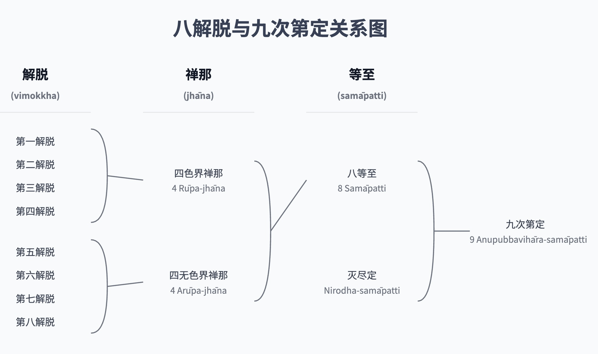
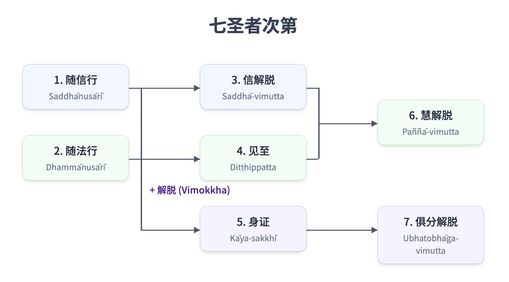
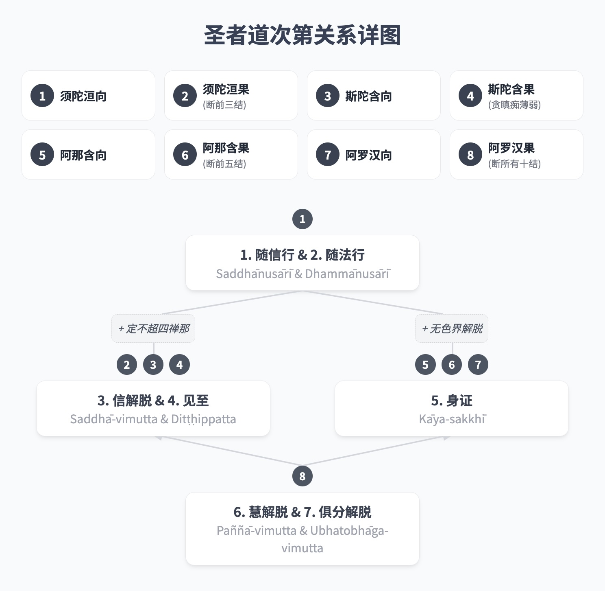
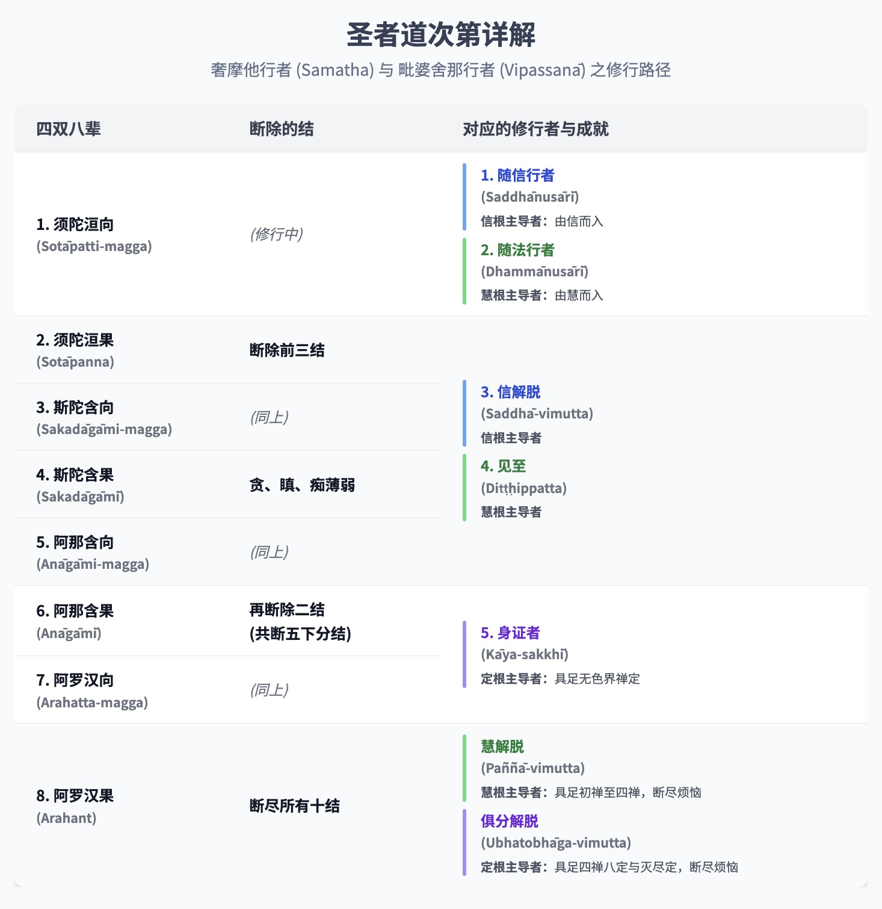

第七章：觉悟者

# 第七章：觉悟者

觉悟者

## 导论

佛教经文中有个众所周知的教导，描述了证悟的阶段——证得涅槃（Nibbāna）的阶段。这包括四道（magga）和四果（phala）：

1.  入流道和入流果
    （sotāpatti-magga 和 sotāpatti-phala）。
    
2.  一来道和一来果
    （sakadāgāmi-magga 和 sakadāgāmi-phala）。
    
3.  不还道和不还果
    （anāgāmi-magga 和 anāgāmi-phala）。
    
4.  阿罗汉道和阿罗汉果
    （arahatta-magga 和 arahatta-phala）。
    

入流的第一个“道”也被称为“见”（dassana），因为它指的是初次瞥见涅槃（Nibbāna）。接下来的三个“道”，即一来道、不还道和阿罗汉道，统称为“修习”（bhāvanā），因为它们涉及在入流瞬间最初证得的法（Dhamma）中的发展。[\[1\]](awakened-beings_split_001.html#fn-fn1) {403}

那些已达到完全证悟涅槃（Nibbāna）的人，以及那些初次瞥见目标并因此被保证将达到目标的人，都被归类为佛陀的真实弟子。他们被称为“声闻僧团”（sāvaka-saṅgha），例如在赞颂僧伽功德的偈语中可见：“他们是世尊的善行弟子。”

思索这些真实弟子时，有许多特殊的术语被用来形容他们。最常用的术语是ariya-puggala（或ariya），译为“已修习的”、“高尚的”或“远离敌人”（即远离烦恼）。[\[2\]](awakened-beings_split_001.html#fn-fn2) ariya-puggala一词最初是广义上的使用；后来才专门用于描述证悟的阶段。巴利语圣典中用来区分证悟阶段的原始术语是dakkhiṇeyya（或dakkhiṇeyya-puggala）。无论如何，ariya-puggala和dakkhiṇeyya-puggala这两个术语都是从婆罗门教中借鉴而来的。佛陀改变了它们的含义，正如他改变了许多其他词语的含义，例如：brahmā, brāhmaṇa（“婆罗门”）, nahātaka（“洗净的”）和vedagū（“圣人”）。

佛陀赋予ariya一词新的定义，与婆罗门教规定的不同。ariya（梵语：ārya；英语：Aryan）这个词最初指的是几千年前从西北地区迁徙并入侵印度次大陆的一个民族。由于这次入侵，当地居民要么向南撤退，要么躲入森林和山脉。雅利安人认为自己是有教养的；他们鄙视当地人，称他们为野蛮人并奴役他们。后来，当雅利安人巩固了他们的统治并建立了种姓制度后，当地人民被置于最低等的首陀罗（Śūdra；劳动者）阶层。ariya（“高尚的”）一词则指定了三个上层种姓：刹帝利（Kṣatriyaḥ；武士、国王、行政官）、婆罗门（brahmins；学者、祭司、教师）和吠舍（Vaishya；商人）。首陀罗和所有其他人则被标记为anariya（“低贱的”，“卑劣的”）。[\[3\]](awakened-beings_split_001.html#fn-fn3) 一个人的种姓在出生时就已确定；无法选择或改变自己的地位。

当佛陀开始教导时，他宣称高尚不取决于出身，而是取决于正法（Dhamma），正法源于精神修习和训练。无论出身或种姓如何，凡是依循高尚原则（ariya-dhamma）行事的人就是“高尚的”（ariya）。不依循者即是anariya。真理不受婆罗门和吠陀的约束，[\[4\]](awakened-beings_split_001.html#fn-fn4) 而是客观和普遍的。一个证悟了这些普遍真理的人是高尚的，尽管他从未学习过吠陀。因为对这些真理的了解使人高尚，所以它们被称为“圣谛”。[\[5\]](awakened-beings_split_001.html#fn-fn5) {404} 从技术上讲，理解圣谛的人是入流者及以上者。因此，经典通常将ariya一词用作dakkhiṇeyya-puggala（“值得供养者”）的同义词，这个术语稍后将讨论。

四圣谛（ariya-sacca）有时也被称为ariya-dhamma。[\[6\]](awakened-beings_split_001.html#fn-fn6) 然而，ariya-dhamma一词没有固定的定义，并在其他语境中使用。[\[7\]](awakened-beings_split_001.html#fn-fn7) 它可以指十种“善业道”（kusala-kammapatha）[\[8\]](awakened-beings_split_001.html#fn-fn8) 和五戒。[\[9\]](awakened-beings_split_001.html#fn-fn9) 这些定义并不矛盾，因为那些真正一生持守五戒，没有盲目依附（sīlabbata-parāmāsa）且没有瑕疵的在家居士，都是入流者及以上者。批注中对ariya指“高尚”之人的标准定义，包括佛陀、辟支佛（Pacceka-Buddhas）[\[10\]](awakened-beings_split_001.html#fn-fn10) 和佛陀的弟子，[\[11\]](awakened-beings_split_001.html#fn-fn11) 尽管在某些地方，这个定义仅指佛陀一人。[\[12\]](awakened-beings_split_001.html#fn-fn12) 当形容一种精神修习或因素时，ariya等同于“出世间”（lokuttara），[\[13\]](awakened-beings_split_001.html#fn-fn13) 尽管并非总是严格如此。[\[14\]](awakened-beings_split_001.html#fn-fn14)

尽管ariya的定义相当广泛，但可以总结说，当该词用于指人时，它等同于dakkhiṇeyya-puggala，意思是那些超越凡夫状态并成为声闻僧伽（今天更常被称为ariya-saṅgha）成员的人。（另见注释“圣者”的批注分类）。在批注和复批注中，这个定义几乎是固定的，只有极少数例外。在经典中，ariya一词倾向于以一般意义使用，不指定觉醒的层次。Dakkhiṇeyya是一个更具体的专业术语，使用频率低于ariya。

“圣者”的批注分类

> 一些例外包括以下段落：J. II. 42; 280; J. III. 81; J. IV. 293。批注通过将ariya分为四类来解释这些例外：ācāra-ariya——行为高尚者；那些以德为本者；dassana-ariya——外表高尚者；那些具有能启发信心特征者；liṅga-ariya——“性别”高尚者，即那些过着出家生活（samaṇa）者；paṭivedha-ariya——通过证悟而高尚者，即佛陀、辟支佛和佛陀的证悟弟子。J. II. 42, 280; J. III. 354; J. IV. 291。

佛陀扩展了ariya一词的含义，指一个新社群的成员，即通过修习中道而变得高尚的佛教弟子。这些弟子过着合乎伦理、非暴力、和谐的生活。他们致力于促进所有人的福祉。 {405} 他们的行为不受宗教官员的诱惑和威胁所左右，这些官员往往迎合人们的自私需求。道德原则可能因这些宗教当局的决定而扭曲。一个例子是婆罗门执行的动物祭祀。

Dakkhiṇeyya译为“值得供养者”。[\[15\]](awakened-beings_split_001.html#fn-fn15) 这个词在婆罗门教中的原意指的是进行仪式，特别是祭祀（yañña；梵语：yajña）所获得的报酬。吠陀经中描述了报酬的形式，包括：黄金、白银、家庭用品、家具、车辆、谷物、牲畜、年轻女子和土地。仪式越隆重，报酬就越丰厚。例如，在“皇家马祭”（Ashvamedha）中，国王将战争的战利品与祭司分享。这些礼物的接受者始终是婆罗门，因为他们是唯一有资格执行仪式的。

佛陀开始教导时，他主张废除动物祭祀，并改变了yañña和dakkhiṇā这两个词的含义。他将yañña的含义发展为不伤害生命的布施，而佛教教义中的dakkhiṇā指的是适宜的礼物和真诚的捐赠，而不是费用或报酬。[\[16\]](awakened-beings_split_001.html#fn-fn16) 如果说这是一种报酬，那它是德行的报酬，但更恰当地说，它是为了尊崇德行而作的供养。此外，这些礼物并非过度奢华，而是简单的、基本的生活必需品。[\[17\]](awakened-beings_split_001.html#fn-fn17)

值得这些供养的人已经训练了自己，并且充满了善行。他们体现了一种有德行和快乐的生活。他们在这个世间存在本身就是对他人的一种祝福。当他们走进更广阔的社会，传授这些有德行的原则，以身作则并教导他人时，他们为世间提供了无价的服务。而这些个人不要求或期望报酬。他们仅仅依靠四种必需品的供养来维持生命。对这些人所作的供养会带来巨大的果报，因为这些供养使善行得以在世间彰显并增长。这些人被称为“值得供养者”（dakkhiṇeyya），因为对他们所作的供养会产生宝贵的结果。他们也被称为“无上福田”，[\[18\]](awakened-beings_split_001.html#fn-fn18) 因为他们是善行在世间绽放和传播的源泉。[\[19\]](awakened-beings_split_001.html#fn-fn19) {406}

人们会给普通老师适当的报酬；那么，给那些教导德行和真理之道的人一些简单的礼物，难道不合适吗？在当今社会，那些从事破坏性商业活动——损害经济、环境，甚至人类善良——的人，却获得了各种奢华的报酬。[\[20\]](awakened-beings_split_001.html#fn-fn20) 难道那些通过节制消费来保护世界和维护德行的人不应该得到支持吗？那些只消费必需品的人对世界资源的冲击最小；他们取之甚少，回报甚多。

供养不同于一般的布施；它不是出于个人情感、义务或期望获得回报而施予。人们是怀着对善行力量的信心而布施的，他们认识到受供者是佛教僧伽（saṅgha）的成员，或者他/她持守着德行。无论如何，受供者必须具备必要的品质，才有资格接受这些供养。例如，一个尚未证悟的僧人或沙弥，如果食用信众的斋饭，他就是“有债的”，尽管他有良好的戒行并精进于佛法修行。他应该尽快通过证得dakkhiṇeyya-puggala的状态来解除这笔债务。例如，尊者摩诃迦叶（Mahā Kassapa）曾声称，在他受戒至证得阿罗汉果的七天期间，他“欠”了在家人七天的债。[\[21\]](awakened-beings_split_001.html#fn-fn21) 他受戒后，作为未觉醒者精进修行佛法七天，然后才达到阿罗汉果，成为值得虔诚在家人供养的人。

批注将接受供养的僧人及沙弥分为四类：

1.  行为不道德的人。他们不具备适合出家人的内在品质，仅仅穿着僧服的外在标志。他们不值得供养；他们对供养的使用被称为theyya-paribhoga：“如盗贼般消耗”。
    
2.  有道德行为但使用四资具时不用智慧反省的人。例如，在食用斋饭时，他们忽略思考：“我食非为享乐或美化。我使用斋饭仅为维持和滋养此身，使其健康，以维持梵行。”这种对供养的使用被称为iṇa-paribhoga：“如债务人般消耗”。[\[22\]](awakened-beings_split_001.html#fn-fn22) {407}
    
3.  学人（Sekha），或八种dakkhiṇeyya-puggala中的前七种（见下文）。他们对供养的使用被称为dāyajja-paribhoga：“如继承人般消耗”。他们有权使用这些供养，作为佛陀的继承人，佛陀是dakkhiṇeyya-puggala中至高无上的。
    
4.  阿罗汉，他们已从贪爱的奴役中解脱。他们的德行使他们真正值得供养。他们对供养的使用被称为sāmi-paribhoga：“如主人般消耗”。[\[23\]](awakened-beings_split_001.html#fn-fn23)
    

在此我们可以看到，dakkhiṇeyya一词在社会和经济语境中均有使用。供养的原则（以及在某种程度上布施的原则）与佛教社会结构的更广泛原则相契合，即在更广泛的社会中拥有一群独立的个人（僧伽）。这些个人通过不向社会寻求利益，不直接参与其他社会机构来获得独立。他们有自己基于精神自由的生活方式。他们通过传授佛法来支持社会，而不寻求其工作的报酬。他们依靠更广泛社会成员的供养生活，这些成员出于对佛法的虔诚而施予，以保存教法并净化自身贪婪等不善品质。提供这种支持对供养者的生活造成的经济影响极小。

受供者（僧伽）就像蜜蜂一样，从各种花朵中采集花粉以酿造蜂蜜和建造蜂巢，却不损害花朵的芬芳或姿色。[\[24\]](awakened-beings_split_001.html#fn-fn24) 事实上，它们还为花朵授粉。因为他们依靠他人生活，所以他们有义务为一切众生的福祉和幸福而行动。尽管他们的生活依赖他人，但并不依赖于任何特定的人；他们依赖大众，从某种意义上说属于大众，但不受任何个人支配。

在一个组织良好的社会中，不应该有任何人贫困潦倒、被迫乞讨。[\[25\]](awakened-beings_split_001.html#fn-fn25) 在这样的社会中，宗教沙门依靠他人的供养生活，但接受布施与乞讨没有任何相似之处。这种致力于精神价值并为更广泛社会提供必要平衡的独立社区系统，在世界所有社会系统中是独一无二的。

通常有两种方式来分类dakkhiṇeyya-puggala或ariya-puggala：一种是根据灭除烦恼的八个层次（即上文提到的八种道果），另一种是根据使人达到这八个层次的七种品质或修习。（第一种分类将在下文呈现；第二种分类将在后续章节呈现。）[\[26\]](awakened-beings_split_001.html#fn-fn26) {408}

## 八种圣者

这种划分与在不同觉悟层次被舍弃的十种“结”（saṁyojana）以及戒、定、慧三学（sikkhā）的修习发展有关。十结是指那些将众生束缚在轮回痛苦中的烦恼，类似于将动物束缚在马车上的轭：[\[27\]](awakened-beings_split_001.html#fn-fn27)

*   A. 五下分结（orambhāgiya-saṁyojana）：
    
    *   1\. 有身见（Sakkāya-diṭṭhi）：我见；对“自我”的坚固信念；无法认识到众生只是各种蕴的集合。这种见解产生了粗劣的自私，以及冲突和痛苦。
    
        标准的定义是：一个人认为色是自我，或自我拥有色，或色在自我中，或自我包含色。一个人认为受是自我……一个人认为想是自我……一个人认为行是自我……一个人认为识是自我……或自我包含识。[\[28\]](awakened-beings_split_001.html#fn-fn28)
    
    *   2\. 疑（Vicikicchā）：怀疑；犹豫；不信任。例如，对佛、法、僧、修习、生命方向和缘起的怀疑。这种怀疑导致在修习圣道时缺乏信心、勇气和洞察力。
    
    *   3\. 戒禁取（Sīlabbata-parāmāsa）：执着于戒律和宗教修习。执着于形式和仪式。错误的认为只要持守戒律、规矩、传统和修习，就能得到净化和解脱。相信这些规矩和修习本身是神圣的。为了获得回报或成就而遵循它们。错过了戒律和宗教仪式的真正目的，最终误入歧途或陷入极端的修习形式（例如修习极端苦行——tapa），而非走在圣道上。[\[29\]](awakened-beings_split_001.html#fn-fn29)
    
    *   4\. 欲贪（Kāma-rāga）：感官贪欲；对愉悦的色、声、香、味、触的渴望。
    
    *   5\. 瞋恚（Paṭigha）：敌意；恼怒；愤慨。
    
*   B. 五上分结（uddhambhāgiya-saṁyojana）：
    
    *   6\. 色贪（Rūpa-rāga）：对色界的执着，例如对色界四禅的执着；享受这些禅定的喜悦与寂静；渴望色界（rūpa-bhava）。
    
    *   7\. 无色贪（Arūpa-rāga）：对无色界的执着，例如对无色界四禅的执着；渴望无色界（arūpa-bhava）。
    
    *   8\. 慢（Māna）：我慢；认为自己比他人优越、平等或低劣的观点。
    
    *   9\. 掉举（Uddhacca）：躁动；心散乱；不安。
    
    *   10\. 无明（Avijjā）：愚痴；不知真理；不知因果法则；不知四圣谛。 {409}
    

八种dakkhiṇeyya-puggala或ariya-puggala可分为四种类型或阶段，它们与诸结的关系如下：[\[30\]](awakened-beings_split_001.html#fn-fn30)

*   A. 学人（Sekha）或有余依者（sa-upādisesa-puggala，即“仍有执取者”）：
    
    *   1\. 入流者（Sotāpanna）：“入流者”；那些真正正确地走在圣道上的人。[\[31\]](awakened-beings_split_001.html#fn-fn31) 他们具备完美的戒行以及足够的定力和智慧。他们已经断除了有身见、疑和戒禁取这前三结。[\[32\]](awakened-beings_split_001.html#fn-fn32)
    
    *   2\. 一来者（Sakadāgāmī）：“一来者”；那些将再回到此世一次并消除所有痛苦的人。他们具备完美的戒行以及足够的定力和智慧。除了断除前三结外，他们比入流者更进一步地减弱了贪、瞋、痴。[\[33\]](awakened-beings_split_001.html#fn-fn33)
    
    *   3\. 不还者（Anāgāmī）：“不还者”；他们死后在投生之处证得究竟解脱——他们不再回到这个世间。他们具备完美的戒行和定力，以及足够的智慧。他们又断除了欲贪和瞋恚这两结，从而断除了前五结。
    
*   B. 无学人（Asekha，即“已完成训练者”）或无余依者（anupādisesa-puggala，即“无执取者”）：
    
    *   4\. 阿罗汉（Arahant）：“应供者”；那些值得供养和尊敬的人；那些已折断轮回之轮辐条的人；那些摆脱烦恼（āsava）的人。他们具备完美的戒行、定力及智慧。他们已断除剩余的五结，从而断除了所有十结。

Sekha，译作“学人”或“训练者”，必须努力断除诸结并逐步证得直至阿罗汉果位。Asekha，即阿罗汉，是已圆满者；他们已超越训练。他们已完成了其精神工作，并根除了所有烦恼。他们已达到了至善；没有更高的精神证悟可追求了。

有余依者（Sa-upādisesa-puggala）等同于上述前三种dakkhiṇeyya-puggala。他们仍有upādi（“燃料”），也就是说，他们仍有upādāna（“执取”）——他们仍有心垢。无余依者（Anupādisesa-puggala），即阿罗汉，则无执取、无垢染。请注意，这里的upādi被译作upādāna（“执取”）的同义词。[\[34\]](awakened-beings_split_001.html#fn-fn34) 这与sa-upādisesa-nibbāna和anupādisesa-nibbāna中的upādi有所不同，后者译为“被执取者”，即五蕴。 {410} 将upādi等同于upādāna与佛陀关于基本精神要素的教导相符，例如四念处（sati-paṭṭhāna）、四神足（iddhi-pāda）和五根（indriya），这些教导常常以鼓励的方式结束，即培养这些要素可以期望获得两种结果之一：要么在今生证得阿罗汉果，要么如果仍有执着的残留，则证得不还果。[\[35\]](awakened-beings_split_001.html#fn-fn35) 在这些语境中，upādi一词指的是upādāna或泛指烦恼（kilesa）。

这八种圣者正是上述的四种ariya-puggala，但每个觉悟层次都被细分为一对：[\[36\]](awakened-beings_split_001.html#fn-fn36)

1.  入流者（已证得入流果的人）。
    
2.  为证得入流果而修习的人。
    
3.  一来者（已证得一来果的人）。
    
4.  为证得一来果而修习的人。
    
5.  不还者（已证得不还果的人）。
    
6.  为证得不还果而修习的人。
    
7.  阿罗汉（已证得阿罗汉果的人）。
    
8.  为证得阿罗汉果而修习的人。（参见注释“对偶翻译”）
    

对偶翻译

> 现今人们将这些对偶翻译为“入流果”（sotāpatti-phala）、“入流道”（sotāpatti-magga）、“一来果”（sakadāgāmi-phala）、“一来道”（sakadāgāmi-magga）等。这种翻译遵循批注术语：关于maggaṭṭha和phalaṭṭha，请参阅Nd1A. II. 254；Nd2A. 15；KhA. 183；DhA. I. 334；VinṬ.: Pārājikakaṇḍaṁ, Bhikkhupadabhājanīyavaṇṇanā；DA. II. 515 = AA. IV. 3 = PañcA. 191；MA. II. 120；UdA. 306。术语sotāpatti-magga、sakadāgāmi-magga和anāgāmi-magga并未出现在早期三藏文献中；它们首次出现在《义释》（Niddesa）、《无碍解道》（Paṭisambhidāmagga）和《阿毗达磨》（Abhidhamma）中。在早期文献中，术语arahatta-magga仅见于以下段落：arahā vā assasi arahattamaggaṁ vā samāpanno和arahanto vā arahattamaggaṁ vā samāpannā: Vin. I. 32, 39; D. I. 144; S. I. 78; A. II. 42; A. III. 391; Ud. 7, 65。在后来的文献，例如《义释》、《无碍解道》和《阿毗达磨》中，则被广泛使用。

这四对圣者被称为声闻僧伽，是佛陀的弟子，被视为人类的典范，也是佛教中三宝（ratana）之一。赞颂僧伽的唱诵包括：“这四双、八种圣者，是世尊的弟子”（yadidaṁ cattāri purisayugāni aṭṭha purisapuggalā esa bhagavato sāvaka-saṅgho）。[\[37\]](awakened-beings_split_001.html#fn-fn37)

在经典中，佛陀的这些弟子后来被称为“圣僧伽”（ariya-saṅgha）。在较早的经文中，ariya-saṅgha一词仅在《增支部》（Aṅguttara-Nikāya）的一偈颂中作为sāvaka-saṅgha的同义词使用过一次。[\[38\]](awakened-beings_split_001.html#fn-fn38) 在批注中，它被频繁使用，尤其是在《清净道论》（Visuddhimagga）中。[\[39\]](awakened-beings_split_001.html#fn-fn39) 当ariya-saṅgha一词比sāvaka-saṅgha更受欢迎时，sammati-saṅgha一词便被用来指比丘僧伽。Sammati-saṅgha意为“约定僧伽”或“授权僧伽”，指的是任何超过三位比丘的集会。这些术语通常成对出现：sāvaka-saṅgha与bhikkhu-saṅgha，ariya-saṅgha与sammati-saṅgha。无论如何，ariya-saṅgha和sammati-saṅgha这两个术语与旧有术语并不矛盾，并提供了理解“僧伽”一词含义的宝贵视角。 {411}

八种圣者 

## 阿罗汉的特质

{343} 佛教的教法是实用的，并强调那些能带来洞察和福祉的事物。[\[40\]](awakened-beings_split_001.html#fn-fn40) 佛教不鼓励对那些应通过实际应用才能证悟的事物进行概念化和辩论，除非是为了基本理解的必要。在研究涅槃方面，与其直接讨论涅槃的状态，不如研究那些证悟涅槃的人，以及在这些人的生命和品格中显现出的证悟利益，可能更有价值。[\[41\]](awakened-beings_split_001.html#fn-fn41)

我们可以通过考察经典中用来称呼阿罗汉的尊号来深入了解他们的本质。以下是这些尊号的选集，它们表达了对阿罗汉德行、清净、卓越和精神成就程度的赞赏：

*   已达究竟义（Anuppatta-sadattha）：已获得福祉者。
    
*   阿罗汉（Arahant）：“应供者”；远离烦恼者。
    
*   无学人（Asekha）：已完成训练者；无需训练者；具足圆满德能者（asekha-dhamma）。
    
*   所作已办（Kata-karaṇīya）：已完成应做之事者。
    
*   漏尽者（Khīṇāsava）：已断尽烦恼（āsava）者。
    
*   大人（Mahāpurisa）：德行高尚者；为大众福祉而行动者；自制者。
    
*   卸下重担（Ohitabhāra）：已放下重担者。
    
*   究竟善（Parama-kusala）：具足殊胜善法者。
    
*   已尽有结（Parikkhīṇa-bhava-saṁyojana）：已摧毁束缚众生于存在的诸结（saṁyojana）者。
    
*   正智解脱（Sammadaññā-vimutta）：通过圆满智慧而解脱者。
    
*   圆满善（Sampanna-kusala）：已圆满善法者。
    
*   至上人（Uttama-purisa）：最尊贵的人；最卓越的人。
    
*   梵行已立（Vusitavant or vusita brahmacariya）：已圆满梵行者。 {344}
    

许多其他术语最初由其他宗教传统使用，但它们的含义被改变以符合法与律（Dhammavinaya）的基本原则，例如：

*   阿利雅（Ariya或ariya-puggala）：高尚的人；卓越的人；对一切众生发展出非暴力的人。最初，这个术语指的是前三个种姓的成员或出生即“高贵”（雅利安）的人。
    
*   婆罗门（Brāhmaṇa）：“真正的婆罗门”；通过舍弃所有不善法而超越邪恶的人。最初，这个术语指的是最高种姓的成员。
    
*   达希涅亚（Dakkhiṇeyya）：值得供养的人。最初，这个术语指的是那些因举行祭祀而值得获得报酬的婆罗门。
    
*   盖瓦利（Kevalī或kebalī）：“完整”的人；“圆满”的人。最初，这个术语指的是耆那教中最高级的个人。
    
*   纳哈塔卡（Nahātaka）：已“仪礼沐浴”的人；已“沐浴于法”的人；已净化其意志行为（kamma）的人；一切众生的皈依处。最初，这个术语指的是一位通过沐浴仪式而提升地位的婆罗门。
    
*   沙门（Samaṇa）：寂静的人；已平息烦恼的人。最初，这个术语泛指一切出家者。
    
*   韦达古（Vedagū）：已达究竟智者；精通知识并解脱于对感受（vedanā）的执着者。最初，这个术语指的是一位已完成三部吠陀学习的婆罗门。[\[42\]](awakened-beings_split_001.html#fn-fn42)
    

要了解阿罗汉的本质，必须在提到这些尊号的教法语境中考虑它们，例如：三漏（āsava）、三学（sikkhā）、十种圆满德能（asekha-dhamma）、十结（saṁyojana）以及作为八圣道的梵行（brahmacariya）。

许多佛教徒倾向于从否定的角度来描述阿罗汉和其他觉悟者的特质，即通过确定那些已被舍弃或消除的烦恼。例如，入流者已消除了前三结（saṁyojana）；一来者已消除这三结并进一步减弱贪、瞋、痴；不还者已消除前五结；而阿罗汉已消除所有十结。或者，他们简要地将阿罗汉定义为“无贪、瞋、痴者”或“已解脱烦恼者”。这些定义有用之处在于它们清晰并提供了简单的评估标准。但它们有局限性；它们未能清晰展示觉悟者的非凡特质和突出特征，也未描述这些觉悟者如何过着有德行的生活并利益世间。

事实上，有许多术语和段落以肯定方式描述阿罗汉的特征。然而，许多关于阿罗汉的描述或解释涵盖了广泛的主题，使得难以以清晰、有序的方式总结其积极特质。否则，它们叙述了具体的事件和个人，但并未描述所有阿罗汉共有的特质。

在这种语境中，一个重要的术语是bhāvitatta，字面翻译为“已发展自己的人”或“已自我发展的人”。[\[43\]](awakened-beings_split_001.html#fn-fn43) 这个术语用于所有阿罗汉：佛陀、辟支佛（pacceka-buddhā）以及所有阿罗汉弟子。例如，在《大般涅槃经》（Mahāparinibbāna Sutta）中，当佛陀前往他最终般涅槃的地方时，他被称为“已发展者”。 {345}

> 佛陀在比丘众的围绕下，行至伽窟他河（Kakutthā）[\[44\]](awakened-beings_split_001.html#fn-fn44)，并在其清澈明净的水中沐浴和饮水……他行至芒果园，对比丘纯陀（Cundaka）说：“将外衣叠成四层铺好，给我躺下。”这位大阿罗汉（bhāvitatta）催促之下，纯陀迅速将外衣叠成四层铺好。D. II. 135。

类似的表达见于婆罗门学生梅达古（Mettagū）的提问：

> 世尊，我希望提出一个疑问。请告诉我其含义；我将因此认为尊者是一位知识大师（vedagū），一位圆满发展者（bhāvitatta）。世间所有这些丰富多样的痛苦从何而来？Sn. 202，载于“十六问”——soḷasa-pañhā。

佛陀将一位“圆满发展者”——一位精通佛法（bahussuta）的阿罗汉——比作一位聪明的船长，他能引导许多人渡过海洋并安全抵达目的地，正如《船经》（Nāvā Sutta）所阐明的：

> 正如一个人乘坐坚固的船只，配备桨和竹竿，经验丰富、技术娴熟，懂得掌舵之法，能够帮助许多人渡过水域；同样地，一位知识大师（vedagū），一位圆满发展者（bhāvitatta），一位学识渊博者（bahussuta），稳定且不为世间事物所动摇，具足智慧，能够帮助那些乐于倾听的人，以探究佛法并达到圆满。Sn. 56。

《世间经》（Loka Sutta）与前一经相似，但涵盖了更广泛的主题，如下文所示：

> 比丘们，这三种出现在世间的人，是为了许多人的利益、许多人的安乐、为了对世间的悲悯帮助而出现——为了天神与人类的福利、利益和安乐。哪三种呢？在此，如来出现在世间。他是圣者，是正等正觉者，明行具足，善逝，世间解，无上士调御丈夫，天人师，觉者，法的施与者。他宣说法，初善、中善、后善；他开示了在精神上和文字上都完全清净的梵行。比丘们，第一种人，当他出现在世间时，是为了许多人的利益、许多人的安乐、为了对世间的悲悯帮助而出现——为了天神与人类的福利、利益和安乐。{346}再者，有同一位老师的弟子，他是一位阿罗汉，他的心已从烦恼中解脱……由于彻底的知见而得解脱。那位弟子宣说法，初善、中善、后善；他开示了在精神上和文字上都完全清净的梵行。比丘们，这是第二种人，当他出现在世间时，是为了许多人的利益、许多人的安乐、为了对世间的悲悯帮助而出现——为了天神与人类的福利、利益和安乐。再者，有同一位老师的弟子，他仍处于学习阶段，仍在修行，多闻，致力于戒行与修行 (sīla-vata)。那位弟子也宣说法，初善、中善、后善；他开示了在精神上和文字上都完全清净的梵行。比丘们，这是第三种人，当他出现在世间时，是为了许多人的利益、许多人的安乐、为了对世间的悲悯帮助而出现——为了天神与人类的福利、利益和安乐。老师，至上的探求者，是世间第一；  
> 追随他的是，弟子，成就者 (bhāvitatta)；  
> 再者，是处于学习阶段的弟子 (sekha-sāvaka)，仍在修行，  
> 多闻，致力于戒行与修行。  
> 这三种人是至上的  
> 在天神与人类之中。  
> 他们散发光明，宣说真理，  
> 开启不死之门，  
> 并帮助许多人从束缚中解脱。  
> 那些遵循圣道的人，  
> 由老师，无上导师，教导得很好——  
> 如果他们听从善逝的教导——  
> 将会在今生终结苦。[\[45\]](awakened-beings_split_001.html#fn-fn45)It. 78-9. Bahujanahita Sutta

然而，请注意，bhāvitatta 这个词最常用于诗歌偈颂中，而非散文中。这很可能是因为它简洁，易于在诗歌中使用，以替代更长、更拖沓的术语和短语。bhāvitatta 这个简短术语不常用于散文的另一个原因是，它的含义没有清晰的定义。由于散文不像诗歌创作那样存在限制，因此可以使用更长的术语和短语以求清晰。

此时，提出一个问题很有用：在散文中，什么术语和短语被用来代替 bhāvitatta 这个词？为了回答这个问题，让我们来看看《三藏》中找到的解释。《三藏》的第三十卷——《小义释》(Cūḷaniddesa)——被认为是“司令官”兼首席弟子尊者Sāriputta的教法集，它阐明了《经集》(Suttanipāta) 中包含的一些佛陀经文。《小义释》中的一段解释了 bhāvitatta 这个词，它出现在婆罗门学生Mettagū上述的提问中：{347}

> 世尊是如何成为成就者 (bhāvitatta) 的？在此，世尊已修习身 (bhāvita-kāya)，修习戒行 (bhāvita-sīla)，修习心 (bhāvita-citta)，修习智慧 (bhāvita-paññā)。(他已修习四念处、四正勤、四神足、五根、五力、七觉支、八圣道。他已断除烦恼，彻见不动摇的真理，证悟灭尽。)[\[46\]](awakened-beings_split_001.html#fn-fn46)Kathaṁ bhagavā bhāvitatto bhagavā bhāvitakāyo bhāvitasīlo bhāvitacitto bhāvitapañño (bhāvitasatipaṭṭhāno bhāvitasammappadhāno bhāvitaiddhipādo bhāvitindriyo bhāvitabalo bhāvitabojjaṅgo bhāvitamaggo pahīnakileso paṭividdhākuppo sacchikatanirodho.) Nd. II. 14.

现在让我们来看一段佛陀的散文，描述了自我修习 (bhāvita) 的四个领域，这被认为是“成就者” (bhāvitatta) 概念的扩展：

> 比丘们，有这五种尚未生起，但将在未来生起的未来危险。你们应当认识它们并努力防止它们。哪五种？在未来，将会有比丘们，他们在身体、戒行、心和智慧方面都未曾修习。尽管他们在身体、戒行、心和智慧方面都未曾修习，他们仍会给他人授具足戒，但却无法在增上戒 (adhisīla)、增上心 (adhicitta) 和增上慧 (adhipaññā) 方面引导他们。[\[47\]](awakened-beings_split_001.html#fn-fn47)这些受戒者也将是在身体、戒行、心和智慧方面都未曾修习的。他们反过来也会给他人授具足戒，但却无法在增上戒、增上心和增上慧方面引导他们。这些受戒者也将是在身体、戒行、心和智慧方面都未曾修习的。因此，比丘们，通过法的腐败，戒律也会腐败，而从戒律的腐败，法也会腐败。这是第一种尚未生起，但将在未来生起的未来危险。你们应当认识它并努力防止它。再者，在未来，将会有比丘们，他们在身体、戒行、心和智慧方面都未曾修习。尽管他们在身体、戒行、心和智慧方面都未曾修习，他们仍会给他人依止[\[48\]](awakened-beings_split_001.html#fn-fn48)，但却无法在增上戒、增上心和增上慧方面引导他们。这些学生也将在身体、戒行、心和智慧方面都未曾修习。{348}他们反过来也会给他人依止，但却无法在增上戒、增上心和增上慧方面引导他们。这些学生也将在身体、戒行、心和智慧方面都未曾修习。因此，比丘们，通过法的腐败，戒律也会腐败，而从戒律的腐败，法也会腐败。这是第二种尚未生起，但将在未来生起的未来危险。你们应当认识它并努力防止它。A. III. 105-106.

佛陀上述的教法与一些基本法义原则相关联：

Bhāvitatta[\[49\]](awakened-beings_split_001.html#fn-fn49) 是一个“赞叹之词” (guṇa-pada)，一个描述佛陀和阿罗汉美德或卓越品质的术语，指那些已修习自身并完成精神训练的人。当人们将这个词的含义扩展为身修习 (bhāvita-kāya)、戒行修习 (bhāvita-sīla)、心修习 (bhāvita-citta) 和智慧修习 (bhāvita-paññā) 这四重成就时，这便与关于四种修习 (bhāvanā) 的教导相关：身修习 (kāya-bhāvanā)、戒行修习 (sīla-bhāvanā)、心修习 (citta-bhāvanā) 和智慧修习 (paññā-bhāvanā)。

在此，需要了解巴利语的一些基本知识。bhāvita 这个词既可用作形容词也可用作副词，描述个体的品质。另一方面，bhāvanā 这个词是一个名词，描述一种行动、一种原则或一种修行形式。这两个术语之间存在兼容性，因为 bhāvita 指的是已充分从事 bhāvanā 的人。因此，身已修习 (bhāvita-kāya) 的人已从事身修习 (kāya-bhāvanā)，戒行已修习 (bhāvita-sīla) 的人已从事戒行修习 (sīla-bhāvanā)，心已修习 (bhāvita-citta) 的人已从事心修习 (citta-bhāvanā)，智慧已修习 (bhāvita-paññā) 的人已从事智慧修习 (paññā-bhāvanā)。

这等同于说，阿罗汉是已完成四重修习的人：他或她已在身修习、戒行修习、心修习和智慧修习方面有所成就。

为了澄清此事，这里简要描述了四种修习 (bhāvanā)：

1.  身修习 (kāya-bhāvanā)：身体发展；发展一个人与周围物质事物（包括科技）或身体本身的关系。特别是，通过五根（眼、耳、鼻、舌和身）巧妙地认知事物，以一种有益、不造成伤害、增长善法、并驱除不善法的方式与它们相处。
    
2.  戒行修习 (sīla-bhāvanā)：戒行发展；通过遵守道德规范，不辱骂或伤害他人或引起冲突，以及与他人和谐相处并相互支持，来发展一个人的行为和社交关系。{349}
    
3.  心修习 (citta-bhāvanā)：发展心；强化和稳定心；培养善法，如慈爱、悲悯、热情、精进和忍耐；使心专注、光明、喜悦和清澈。
    
4.  智慧修习 (paññā-bhāvanā)：发展和增长智慧，直到对真理产生全面的理解，通过如实知见事物并对世间和现象获得清晰的洞察。在这个阶段，一个人能够解脱心，净化自身的心理烦恼，并从苦中解脱。一个人以穿透性的觉知生活、行动和解决问题。
    

当一个人理解了 bhāvanā（“修习”）的含义时，它位于上述修行方式的核心，他也就理解了 bhāvita（“成就者”）这个词，它是那些已完成其精神修行并履行了四种修习者的属性：

1.  身成就 (bhāvita-kāya)：这指的是那些已修习身的人，也就是说，他们已发展了与物质环境和自身身体的关系；他们对事物和自然拥有健康、满足和尊重的关系；特别是，他们通过五感体验事物，例如通过看或听，以正念的方式，并以一种培养智慧的方式。他们适度地消费事物，从中获得真正的利益和价值。他们不被偏好和厌恶的影响所迷惑或误导。他们不放逸；他们不让感官刺激造成伤害，而是利用它们来获取利益；他们不被不善心所主导，而是培养善心。
    
2.  戒行成就 (bhāvita-sīla)：这指的是那些已发展戒行并发展其行为的人。他们通过遵守道德规范和与他人和谐相处，在社会中行为端正。他们不使用身体行动、言语或其生计来压迫他人或制造冲突，而是将这些活动用于自我发展、帮助他人和建设健康的社会。
    
3.  心成就 (bhāvita-citta)：这指的是那些已发展其心的人。因此，他们的心是清澈、光明、开阔、喜悦和快乐的。他们的心充满了美德，如善意、悲悯、信心、感恩、慷慨、毅力、坚韧、耐心忍耐、平静、稳定、正念和三摩地。
    
4.  智慧成就 (bhāvita-paññā)：这指的是那些已训练和发展智慧的人，从而对真理有所理解，并如实地清晰辨别事物。他们运用智慧来解决问题，驱除苦，并净化自身的心理染污。他们的心是解脱的，免于烦恼。
    

这部经中值得注意的一段是，佛陀指出那些未能充分发展其身体、戒行、心和智慧的比丘，将成为导师和老师，但却无法在增上戒、增上心和增上慧（即在戒行 – sīla、三摩地 – samādhi 和智慧 – paññā 方面）引导他们的弟子。

有趣的是，当描述老师的品质时，佛陀提到了四种自我修习 (bhāvita)，但当他描述学习的主题——教法或修行原则时，他提到了三学，即戒行、三摩地和智慧。（完整来说，这些被称为“增上戒学” – adhisīla-sikkhā，“增上心学” – adhicitta-sikkhā，和“增上慧学” – adhipaññā-sikkhā。）

这种区别可能会引起一些疑问。首先，佛陀为什么不在这里使用互补或对应的术语呢？他难道不应该说，一个人若未在四方面充分修习 (bhāvita)，就无法在四重修习 (bhāvanā) 方面引导他人；或者反过来说，一个人若未完成三学，就无法在戒行、三摩地和智慧方面引导他人吗？{350}

此外，这些教法中的要素几乎相同。关于修习 (bhāvanā) 和自我修习 (bhāvita) 的二重教法包含身、戒行、心和智慧这四要素。而三学则包含戒行、三摩地（即“心” – citta）和智慧这几要素。因此，如果佛陀坚持其中一种教法，而不是将它们结合起来，难道不会减少困惑吗？

许多佛教徒都熟悉 sīla、samādhi 和 paññā 的修行次第，这种三学修行本身被认为是完整的。然而，他们普遍不熟悉“身” (kāya) 这个额外要素，可能会想知道它为何被加入以及它意味着什么。

在此，我们不妨简单地得出结论，佛陀在同一语境中提出了这两种不同的教法：在提及老师的属性时，他提到了四重自我修习 (bhāvita)；而在提及教导的主题时，他提到了三学 (sikkhā)。

对于佛陀为何在同一语境中运用这两种不同教法，一个简单而简短的回答是，它们有不同的目的或目标。关于老师属性的教法旨在描述老师可辨识的特征，以评估某人是否已完成精神训练并准备好教导他人。另一方面，关于学习主题的教法旨在描述实践的内容和系统——描述要训练什么以及如何训练才能获得预期的结果。

最重要的是，真正的学习或训练涉及一个自然发展生命的过程；这个过程符合自然法则，因此训练体系必须根据自然中发现的因缘条件正确建立。

让我们首先考察学习的主题，即三学。为什么这项训练只由三个要素组成？同样，可以简单地回答说，这项训练关乎人类的生命，而人类生命具有三个方面或三个活动领域。这三个要素结合起来构成一个人的生命，并且它们是协同进行和发展的。

这三个要素如下：

1.  与世间的沟通和互动：通过 dvāra——门或渠道——对他人的认知、关系、交往、行为和反应，可以有两种描述方式：
    
    1.  认知之门 (phassa-dvāra)：眼、耳、鼻、舌和身（结合意的交汇点，这构成了六门）。[\[50\]](awakened-beings_split_001.html#fn-fn50)
    
    2.  意图行为之门 (kamma-dvāra)：身和语（结合意的交汇点，这构成了三门）。
    
    
    这个要素可以简单地称为“与世间的互动”，并用 sīla（“行为”）这个词来表示。
    
2.  心：心的活动，它有许多伴随的要素和特质。首先，一个人必须有意图，也称为意志、思虑、决心或动机。此外，人们的心通常包含积极和消极的品质、优点和缺点。心会体验到快乐和不适、安乐和不安乐，以及漠不关心和自满的感觉。对这些感受会有反应，如喜悦和厌恶，以及获取、获得、逃避或摆脱的欲望，这些都会影响一个人体验事物和行为的方式，例如一个人是否看某物，选择说什么，以及对谁说话。这个要素简单地称为“心” (citta) 或三摩地的范畴 (samādhi)。{351}
    
3.  智慧：知识和理解，始于 suta——通过正规教育或新闻媒体获得的知识——直至并包括思想领域 (cintā-visaya) 和知识领域 (ñāṇa-visaya) 的所有形式发展，包括：观念、见解、信仰、态度、价值观、对各种观念和理解形式的执着，以及特定的观点和视角。这个要素被称为“智慧” (paññā)。
    

这三个要素协同运作；它们相互关联且相互依存。一个人通过感官——通过认知之门——以及通过身体和言语行为（要素 #1）与世间的互动，依赖于意图、感受和心中其他各种状况（要素 #2）。而整个过程则依赖于智慧和理智（要素 #3）的引导。一个人的知识广度决定了其思想和行为的范围。

同样，例如决心和欲望（要素 #2）这样的心要素，依赖于通过感官和身体及言语行为（要素 #1）的互动才能得到满足。而这个过程则由一个人的信仰、思想和理解（要素 #3）所决定和调节，这些是可变和可调整的。

再者，智慧（要素 #3）的运作和发展依赖于感官，例如看或听，依赖于身体的活动，例如行走、组织、寻求、把握等，并运用言语进行沟通和询问（要素 #1）。而这个过程依赖于心的特质，例如：兴趣、欲望、坚韧、毅力、审慎、正念、平静和三摩地（要素 #2）。

人类生命的本质由这三个相互关联、相互依存的要素组成。它们构成了一个不可增减的完整整体。由于生命由这三个要素构成，任何旨在帮助人们过好生活的训练都必须解决生命这三个领域的发展。

因此，精神训练被分为三个部分，称为三学。这项训练旨在使生命这三个领域发展得完整，并与自然和谐。这三个要素同时且协同发展，从而形成一个整合的修行体系。

从粗略的角度来看，人们可能会将这三个要素看作与经文中有时概述的相似方式，代表修行中的三个主要阶段：戒行、三摩地和智慧。这种观点给人一种印象，即人们将这些要素作为独立的步骤并按顺序实践，也就是说，在戒行训练之后发展三摩地，然后接着是智慧发展。

通过这种方式看待三学，人们会看到一个修行体系，其中三个要素在不同阶段突出，从粗略的要素开始，随着阶段的进展而导向更精细的要素：

*   第一阶段（戒行）突出一个人与外部环境、感官以及身体行动和言语的关系。
    
*   第二阶段（三摩地）突出一个人的内在生命，即心。
    
*   第三阶段（智慧）突出知识和理解。
    

然而，请注意，在每个阶段，其余两个要素始终在发挥作用并参与其中。{352}

这种视角提供了一个概览，其中人们关注过程每个阶段的主要活动。人们分别突出三个要素中的每一个，以便粗糙的要素准备好支持更精细要素的成长并促进其成功。

以砍伐一棵大树为例。首先，必须准备周围区域，以便能够轻松、安全、稳妥地移动（= sīla）。其次，必须准备好力量、勇气、正念、决心、不散乱以及使用斧头的技巧（= samādhi）。第三，必须拥有合适的工具，例如一把优质、锋利且尺寸正确的斧头（= paññā）。如果满足这三个要求，就能成功砍倒大树。

然而，就一个人的日常生活中而言，更仔细的分析揭示了这三个要素持续以相互关联、相互依存的方式运作。因此，为了让人们真正有效地从事精神修行，应该鼓励他们觉知这三个要素。他们应该协同发展这些要素，通过纳入如理作意 (yoniso-manasikāra)，这有助于增加理解，以及正念 (sati)，这有助于带来真正的成功。

就一个人的精神修行而言，无论从事何种活动，一个人都能够根据三学的原则来审视和训练自己。因此，目标是在所有情况下同时地从事这三个要素——戒行、三摩地和智慧。当从事一项活动时，一个人考虑其行为是否导致他人的苦恼或痛苦，是否造成伤害，或者是否有助于帮助、支持、鼓励和发展他人（= sīla）。在这些活动中，一个人的心是什么状态？是出于自私、恶意、贪婪、嗔恨或痴愚而行动，还是出于慈爱、祝愿、信心、正念、精进和责任感而行动？当从事一项活动时，心是躁动、焦虑、困惑和沮丧，还是平静、快乐、喜悦、满足和光明（= samādhi）？当从事一项活动时，一个人是否以清晰的理解行事？是否辨识其目的、目标和相关原则？是否认识到其潜在的益处和缺点，并完全理解调整和改进活动的方式（= paññā）？

通过这种方式，有经验的人能够随时随地训练和审视自己，并评估他们的修行。他们在单一活动中培养三学的所有三个要素。

同时，从三个不同阶段的角度来看，三学的发展会自动展开。从一个角度来看，一个人按顺序发展三学。但从另一个角度来看，这三个要素的同步、统一实践正在进行，并有助于所谓“三阶段”训练的成功推进。

在此背景下，深入探究精神修行细节的人将会知道，在觉悟的时刻——在证悟道、果和涅槃的时刻——八圣道的所有八个要素，它们被归类为戒、三摩地和慧三组，都已完成并作为一个整体运作，以消除烦恼并带来圆满。{353}

总而言之，佛教的精神训练体系——三学 (tisso sikkhā)——建立在必要要素之间的关系之上，并符合特定的自然法则。人类生命由三个要素组成——与外部世界的行为 (sīla)、心的活动 (citta) 和理解 (paññā)——它们协同运作并相互依存，以带来精神发展。

在描述精神修行的原则时，佛陀提到了这三个训练方面 (sikkhā)。我们现在回到这个问题：“为什么佛陀在描述老师的属性时，采用了四重自我修习 (bhāvita) 的新模式？”

如前所述，这个问题可以很容易地回答，即这两种模式有不同的目的和目标。三学是要在现实生活中应用的——按照一个与自然和谐的系统来实践。而四重自我修习要素则是为了自我审视。在此，不必关注自然的顺序。这里的重点是清楚地了解一个人的个人品质。如果一个人清楚地辨识这些品质，它们本身就会与三学要素相关联。

通过审视戒行 (sīla) 的第一个要素，这一点就很明显，它指的是一个人与世间的互动和沟通，一个人对世间的理解，以及一个人与世间相关的行动。

如上所述，我们通过两组“门” (dvāra) 与世间互动：第一组涉及认知之门 (phassa-dvāra)，通常被称为感官 (indriya)——我们通过眼、耳、鼻、舌和身对世间的觉知。第二组涉及意图行为之门 (kamma-dvāra)，通过它我们以身体和言语的姿态对世间（对人、对社会、对外部环境中的其他对象）采取行动和回应。

区别就在这里。关于与世间的互动，在任何一个时刻（或更精微地说，在任何一个心识刹那），我们都只通过特定的某一门与世间沟通，人们可以通过运用这两组门中的任何一组来审视这个过程。

就三学而言，其中 sīla、samādhi 和 paññā 是一个整合系统的一部分，通过各种门与世间的互动构成了“行为” (sīla) 的训练；心 (samādhi) 和理解 (paññā) 的要素则构成独立的要素。通过各种门——无论是认知之门还是意图行为之门——与世间的全部互动都包含在戒行 (sīla) 这个要素中。因此，三学由三个要素组成。

就老师的属性而言，不必考虑三学中包含的三个要素的整合运作。在此，是为了调查的目的而区分不同的要素。正是在戒行 (sīla) 这个要素上进行了区分，也就是说，人们根据两组门中的一组或另一组来区分一个人与世间的互动：

1.  认知之门 (phassa-dvāra；通常被称为感官 – indriya)：眼、耳、鼻、舌和身（连同意的交汇点，这构成了六门）；这些门使得看/注视、听/倾听、嗅、尝和触觉接触成为可能（最终在心中形成对心所法 – dhammārammaṇa 的认知）。
    
2.  意图行为之门 (kamma-dvāra)：身和语（连同意的交汇点，这构成了三门）；这些门使得身体行动和言语成为可能（并且通过指定意图行为的起点——心——这也包括思维）。
    

佛陀将戒行 (sīla) 的这两个次级要素分开，将其确定为四重自我修习 (bhāvita) 中的前两个要素。他区分了第一个要素，即通过认知之门或感官与世间的互动，并将其标记为“身成就” (bhāvita-kāya)。（这里的“身” – kāya – 指的是“五门之集” – pañcadvārika-kāya）。佛陀因此非常强调一个人与世间的互动，特别是通过五根的认知。{354}人们往往会忽略这第一个要素，但在与精神修行相关的佛教中，它被认为至关重要，特别是在衡量一个人的发展方面。

这尤其与当前被称为信息时代或IT时代的时期相关。人们在这个要素方面的发展，决定了是直接迈向智慧修习，还是陷入痴愚的泥沼。这个“身体发展”的原则可以作为一个警示标志，告诫人们不要迷失方向，并鼓励他们利用信息技术，将文明推向正确的方向。

在衡量人们的精神发展方面，第二个辅助因素，即通过意愿行为（kamma-dvāra）的门户与世界互动，构成了“道德自制”（bhāvita-sīla），这相当于增上戒学（adhisīla-sikkhā）的第二部分。“心识自制”（bhāvita-citta）和“智慧自制”（bhāvita-paññā）则分别对应于增上心学（adhicitta-sikkhā）和增上慧学（adhipaññā-sikkhā）。

请注意，“身体自制”（bhāvita-kāya）这个概念，这里被定义为一个人通过五根与世界互动的发展，有时会以不同的方式解释，即将“kāya”一词字面定义为“身体”或指物质对象。

如果一个人以这种替代方式扩展bhāvita-kāya的含义，那么第二个因素“道德自制”（bhāvita-sīla）的定义也会相应调整，如下所示：“道德自制”是指培养一个人与他人之间的关系或参与社会，以促进和平共处、合作、和谐与相互支持。

这两个因素的这些替代定义与四种清净戒（pārisuddhi-sīla）的教导相关：

1.  Pāṭimokkhasaṁvara-sīla：作为对波罗提木叉的戒律，这是僧团的主要戒律。
    
2.  Indriyasaṁvara-sīla：作为感官约束的戒律；正念地接受感官印象，如色声，以有助于智慧和真实利益的方式，而不被不善心所主宰。
    
3.  Ājīvapārisuddhi-sīla：作为生计清净的戒律：以如法和纯净的方式谋生。
    
4.  Paccayapaṭisevana-sīla（或paccayasannissita-sīla）：明智地使用四资具，通过理解它们的真实目的和价值来从中受益；适度生活和消费；不以贪爱消费。
    

那些通过身体与世界建立关系，或与物质对象和自然互动相关的方面，属于“身体自制”（bhāvita-kāya）的因素。那些与社会或社区关系相关的方面，属于“道德自制”（bhāvita-sīla）的因素。[\[51\]](awakened-beings_split_001.html#fn-fn51)

在介绍了这些原则之后，以下对阿罗汉品德的描述与四种自制（bhāvita）的教导相符：在身体、道德行为、心识和智慧方面都得到充分发展。

然而，请注意，尽管这四种品德彼此区分，但它们并非完全分离。为理解目的，我们突出其主要特征，但在实际发展过程中，它们是相互关联并以整合方式培养的。特别是，它们绝不独立于智慧。{355}

### 身体自制（bhāvita-kāya）

尽管在《巴利藏》中有许多佛陀提及bhāvita-kāya一词的段落，但并没有对此词的明确解释，仿佛听者总是理解其含义。然而，有时非佛教徒，特别是尼干子教团的成员，会根据他们自己的理解谈论这个主题，佛陀也对此作出了相应的回应。

例如，《大萨遮迦经》（Mahāsaccaka Sutta）中记载了这样一段对话，其中讨论了bhāvita-kāya和bhāvita-citta这两个词：

一天早上，著名的尼干子名叫萨遮迦（他是跋祇地区离车王子的老师）来到佛陀住处，与佛陀交谈。他首先谈到身修（kāya-bhāvanā）和心修（citta-bhāvanā）。他告诉佛陀，在他看来，佛陀的弟子们只在心修方面精进，而没有进行身修。注疏中提到，萨遮迦之所以持这种观点，是因为他观察到比丘们去僻静处修行，但并没有实行严格的苦行。

在萨遮迦表达了他的观点后，佛陀反问他，根据他所学，什么是“身修”（kāya-bhāvanā）的含义。萨遮迦回答说，他将其定义为实行严格的苦行和自我折磨（atta-kilamathānuyoga）。

佛陀接着问他对“心修”（citta-bhāvanā）的理解，但萨遮迦无法提供解释。佛陀继续说，萨遮迦对身修的理解与圣者律（ariya-vinaya）中的修行不符。如果连身修的含义都无法理解，又怎能理解心修呢？然后他请萨遮迦听他解释什么是身修和心修的非真正修行，以及什么是真正身修和心修：

> 阿奇韦萨那，一个人如何获得身心自制？在此，一个善于教导的圣弟子生起愉悦的感受。虽然他受到那愉悦的感受触动，但他不贪著快乐，他不成为一个贪著愉悦感受的人。那愉悦的感受便会止息。随着愉悦感受的止息，痛苦的感受生起。他受到那痛苦的感受触动，他不忧愁、不哭泣、不哀叹；他不捶胸哭泣，不心神不安。阿奇韦萨那，这样，尽管那愉悦的感受在他心中生起，但它不会侵入他的心识并停驻，因为身体已经得到发展。尽管那痛苦的感受在他心中生起，但它不会侵入他的心识并停驻，因为心识已经得到发展。阿奇韦萨那，任何圣弟子，如果他以这种双重方式，所生起的愉悦感受不会侵入他的心识并停驻，因为身体已经得到发展；所生起的痛苦感受不会侵入他的心识并停驻，因为心识已经得到发展，那么他便获得了身心自制。[\[52\]](awakened-beings_split_001.html#fn-fn52) M. I. 237。{356}

如上所述，“身体修习”（kāya-bhāvanā）的主要含义是发展“五根”（pañcadvārika-kāya），即眼、耳、鼻、舌、身五根。因此，“身体修习”（kāya-bhāvanā）本质上与“根修”（indriya-bhāvanā）是相同的。

根修始于根律仪（indriya-saṁvara），佛陀在法毗奈耶中对出家众的修行给予了极大的重视。根律仪是根本的修行，与戒学（sīla）相关。（在注疏中，根律仪常被归类为戒行的一种形式，即“根律仪戒”——indriyasaṁvara-sīla。）让我们来看看这个基本原则：

> 世尊，比丘如何被称为根门守护者？在此，比丘以眼见色时，不执取其主要相或次要相。因为如果他住于眼根不被防护，贪欲（abhijjhā）和瞋恚（domanassa）等恶不善法将会淹没他，所以他练习防护，他守护眼根，发展眼根的防护。以耳闻声时……以鼻嗅香时……以舌尝味时……以身触触时……以意知法时，他也不执取其主要相或次要相……他发展意根的防护。那位具足此圣根律仪的比丘，在他自身内体验到纯净、无杂染的快乐。世尊，比丘便是这样成为根门守护者的。D. I. 70。

根律仪仍然属于“学人”的修行，或是修行的初步阶段。对于已“掌控诸根”（bhāvitindriya，这被归类为bhāvita-kāya的一部分）的阿罗汉来说，它并非必需的修行。然而，这里将其纳入讨论，是为了展示修行的各个阶段。

还有一种更深层次的根律仪，或者说对这个词的另一种解释方式，这在佛陀与游方者昆达利耶（Kuṇḍaliya）在萨卡塔（Sāketa）的安阇那林（Añjanavana）进行的讨论中显而易见。（这种根律仪的修习能成就三种善行——sucarita；三种善行的修习能成就四念住；四念住的修习能成就七觉支；七觉支的修习能成就真知与解脱，即最高的祝福）：

> 昆达利耶，根律仪如何被发展和培育，以成就三种善行？在此，昆达利耶，比丘以眼见可爱之色时，不贪爱，不兴奋，不生欲。他的身体稳定，心识稳定，内心安稳，善得解脱。此外，以眼见不可爱之色时，他不沮丧，不抵触，不受苦，不怨恨。他的身体稳定，心识稳定，内心安稳，善得解脱。再者，以耳闻可爱之声时……以鼻嗅可爱之香时……以舌尝可爱之味时……以身触可爱之触时……以意认知可爱之法时，比丘不贪爱……他的心识稳定，内心安稳，善得解脱。昆达利耶，根律仪便是这样被发展和培育，以成就三种善行。[\[54\]](awakened-beings_split_001.html#fn-fn54) S. V. 74。

现在让我们审视一个更高的修行阶段——根修（indriya-bhāvanā），这在《根修经》（Indriyabhāvanā Sutta）中有所描述。在描述了这种修行形式之后，这部经也区分了“学人”（sekha-pāṭipada）——指觉醒但仍在修行的个体，以及“已得根自制者”（bhāvitindriya）——指已完成其精神修行并“身体完全发展”（bhāvita-kāya）的阿罗汉。{357}

有一次，佛陀住在迦阇伽罗的竹林精舍，一位名叫优陀罗的婆罗门波罗萨利耶的弟子拜访了他。[\[55\]](awakened-beings_split_001.html#fn-fn55)佛陀问他波罗萨利耶是否向他的弟子们传授根修（indriya-bhāvanā）。当优陀罗回答说他传授时，佛陀问他如何传授根修。优陀罗回答说，波罗萨利耶教导避免让眼睛看物质形相和耳朵听声音。佛陀回答说，按照这种推理，盲人或聋人就已经“掌控诸根”（bhāvitindriya）了。

佛陀接着说，波罗萨利耶所教导的感官发展与圣者律（ariya-vinaya）中至上的感官培养是不同的。于是，阿难尊者请佛陀解释这种至上的感官培养：

> 1\. 根修（indriya-bhāvanā）：阿难，圣者律中至上的根发展是怎样的呢？阿难，在此，比丘以眼见色时，在他心中生起可意之物，生起不可意之物，生起亦可意亦不可意之物。他清楚地理解：“可意之物已在我心中生起，不可意之物已在我心中生起，亦可意亦不可意之物已在我心中生起。然而，那是因缘所生，粗劣，缘起而有。这是寂静，这是崇高，即是舍心。”他心中生起的可意之物、不可意之物和亦可意亦不可意之物止息，舍心便安稳确立。就像一个视力良好的人，张开眼睛后可以闭上，闭上眼睛后可以张开一样，同样，在比丘心中，生起的可意之物、不可意之物和亦可意亦不可意之物止息，舍心便同样迅速、同样快速、同样容易地确立。这在圣者律中被称为对眼所识之色的至上根发展。再次，阿难，当比丘以耳闻声时……以鼻嗅香时……以舌尝味时……以身触触时……以意知法时……舍心便安稳确立。就像一个人将两三滴水滴到烧了一整天的铁锅上，水滴可能落得很慢，但它们会迅速蒸发消失一样，同样，在比丘心中，生起的可意之物、不可意之物和亦可意亦不可意之物止息，舍心便同样迅速、同样快速、同样容易地确立。这在圣者律中被称为对意所识之法的至上根发展。这便是圣者律中至上的根发展。2. A) 学人（sekha-pāṭipada）：阿难，一个人如何是更高层次的学人，一个仍在修行的人呢？阿难，在此，当比丘以眼见色时，在他心中生起可意之物，生起不可意之物，生起亦可意亦不可意之物；他对生起的可意之物、不可意之物和亦可意亦不可意之物感到不适、不安和厌恶。当比丘以耳闻声时……以鼻嗅香时……以舌尝味时……以身触触时……以意知法时……他对生起的可意之物、不可意之物和亦可意亦不可意之物感到不适、不安和厌恶。{358} 这便是学人，仍在修行的人。2. B) 已完成修行者（bhāvitindriya）：阿难，一个人如何是具足已发展根的圣者呢？阿难，在此，当比丘以眼见色时，在他心中生起可意之物，生起不可意之物，生起亦可意亦不可意之物。如果他希望：“愿我住于在令人厌恶的事物中感知不厌恶”，他便住于在令人厌恶的事物中感知不厌恶。如果他希望：“愿我住于在不令人厌恶的事物中感知令人厌恶”，他便住于在不令人厌恶的事物中感知令人厌恶。如果他希望：“愿我住于在亦令人厌恶亦不令人厌恶的事物中感知不厌恶”，他便住于在此中感知不厌恶。如果他希望：“愿我住于在亦不令人厌恶亦令人厌恶的事物中感知令人厌恶”，他便住于在此中感知令人厌恶。如果他希望：“愿我避免令人厌恶和不令人厌恶，住于舍心，正念正知”，他便住于对此的舍心，正念正知。再次，阿难，当比丘以耳闻声时……以鼻嗅香时……以舌尝味时……以身触触时……以意知法时，在他心中生起可意之物，生起不可意之物，生起亦可意亦不可意之物……如果他希望：“愿我避免令人厌恶和不令人厌恶，住于舍心，正念正知”，他便住于对此的舍心，正念正知。具足已发展根的圣者便是这样。[\[56\]](awakened-beings_split_001.html#fn-fn56) M. III. 298（节选）

如前所述，通过扩展其含义或改变考察的焦点，kāya-bhāvanā和bhāvita-kāya这两个术语有不同的定义。焦点不再是认知门户或感官，而是转向整个世界或与感官接触的外部对象——即认知对象。然后，人们区分这些各种感官对象。通过这样做，“身体发展”的定义就变成了通过身体发展一个人与周围环境的关系，或者发展一个人与物质事物（包括作为认知对象的其他人）的关系。

人们大量接触的一组对象是四资具（paccaya）：食物、衣服、住所和药品。引申开来，这组对象还包括所有其他物质物品、消费品、工作中使用的工具和电器等，它们构成了我们与外界互动的大部分。人生的这一领域需要纪律和训练，正如关于明智使用四资具（paccayapaṭisevana-sīla）的道德行为教导所示。因此，对物质资具的明智使用，就像根律仪一样，可以包含在身体发展（kāya-bhāvanā）这一因素中。

在法毗奈耶中，与滋养和维持生命的物质事物建立关系被认为是修行的一个重要组成部分。人们能够在日常生活中不断发展这种关系。这种形式的修行从一开始就为出家僧尼设定，即明智地反思四资具的使用，并培养适度感，这会带来知足并产生真正的祝福。这与仅仅模糊理解事物并寻求满足自己的贪爱形成对比：{359}

> 纯陀，我教导你们的法，并非只为制止当下生起的烦恼。我也不教导你们的法，只是为了防止未来生起烦恼。相反，我教导你们的法，是为了制止当下的烦恼，并防止未来的烦恼生起。因此，纯陀，我允许你们的袈裟，仅是为了避寒、避热、避风避日，避开马蝇、蚊子和爬虫，以及为了遮蔽隐私部位和保护你们的谦逊。我允许你们的食物，仅足够维持和滋养身体，避免\[因营养不良导致的\]苦恼，并有助于梵行，你们应思惟：“如此我将止息旧的感受而不会生起新的感受，我将健康无过，并将舒适地生活。”我允许你们的住所，仅是为了避寒、避热、避风避日，避开马蝇、蚊子和爬虫，以及为了缓解气候的危险和享受独居。我允许你们的药品，仅是为了消除因疾病而生起的感受，并为了免于疾病困扰的利益。[\[57\]](awakened-beings_split_001.html#fn-fn57) D. III. 129-30。

在这四种资具中，住宿（senāsana；字面意思是“坐卧之处”）极为重要，它既是住所，也是存放其他资具的地方。大多数人类活动，无论是食物的准备、食用或储存，还是衣服的存放和穿着，都发生在自己的住所或居所。关于布施，佛陀说：

> 施予饮食者，  
> 予人力量；  
> 施予衣服者，  
> 予人美貌；  
> 施予车乘者，  
> 予人安乐舒适；  
> 施予灯烛者，  
> 予人光明。  
> 施予住所者，是所有一切的施予者。  
> 但教导佛法者，  
> 是不死法的施予者。S. I. 32。

对于僧团而言，“住所”涵盖了所有建筑物，从个人僧房（kuṭī）到公共建筑，包括各个寺院，佛陀最初称之为arāma（“公园”、“树林”）。这些寺院从林地（vana）和皇家公园（uyyāna）发展而来。频婆娑罗王献给佛陀的第一个佛教寺院是吠琉园（Veḷuvanaṁ Uyyānaṁ）——“竹林和皇家公园”，佛陀居住时间最长的寺院是祇园精舍，后来被称为祇园林。[\[58\]](awakened-beings_split_001.html#fn-fn58) {360}

从城镇和村庄郊区或接壤大森林的小林地中的寺院，寺院住所的含义被扩展到包含森林深处（arañña）的地方，包括洞穴、陡峭的峡谷和山脉。最终，僧团的“住所”（senāsana）概念涵盖了整个森林、山脉和居民区，直到它意味着一个人的整个环境——整个世界。

一个人的住所、居住区域和整个环境，等同于一个人周围通过五根接触、联系、参与和关联的事物。因此，我们周围的世界是“身体发展”（kāya-bhāvanā）的领域——用于训练身体，通过感官与外界互动。

优秀修行者持续保持着与住所的良好关系，这从上面描述僧院的术语中可见一斑，并且与普遍意义上精神修行者与整个世界的健康关系相关。这从描述僧院的第一个术语：ārāma中可见，它可以译为“公园”，字面意思是“愉悦之地”。

“ārāma”一词指向佛法修行者与世界的根本关系，始于一个人的住所（对僧尼而言，是指寺院），它是一个能激发愉悦感的地方（例如，它位于自然环境中，有植物和动物）。这个词揭示了僧侣或佛法修行者在面对适宜住所时应保持的理想心境，这种心境可以扩展到任何生活的地方或区域——使其成为一个愉悦之地。

这并非全部。“ārāma”一词将人们与他们的根本存在状态和修行方式联系起来。它将我们与感官体验的领域——与心识——联系起来。在这里，一个人的“住处”或“安住”是愉悦的，这在各种佛法原则中有所体现，例如：独居为愉悦之地（pavivekārāma）；寂静为愉悦之地（paṭisallānārāma）；舍弃不善法为愉悦安住（pahānārāma）；以及培养善法为愉悦安住（bhāvanārāmā）。[\[59\]](awakened-beings_split_001.html#fn-fn59)

这里的ārāma指的是对一个适当的接触对象所产生的有利感受或态度。这就像是佛法修行者有责任将他们所接触的事物变成快乐的源泉，从他们的住处或居所（对僧侣而言，这已经被称为ārāma）开始，然后将这种感受扩展到他们的一般环境中。

关于人们与住所和周围环境的关系，除了ārāma一词，另一个（可能比ārāma更常用）在僧侣、佛法修行者和阿罗汉的生活语境中经常使用的词是ramaṇīya，译为“令人愉悦的”、“清爽的”、“宜人的”。这个词指向一种鼓舞人心的周围氛围，这对于修行者来说极为有利，并有助于善心的发展。对于阿罗汉来说，进入这种愉悦的氛围是容易的，或者说很自然地发生，因为他们与世界的接触没有任何隐藏的烦恼。此外，阿罗汉能够使他们的周围环境变得令人愉悦和清爽，无论对自己还是对那些住在他们身边的人。

ramaṇīya一词在巴利藏中频繁出现，这种愉悦或清爽的氛围仿佛是巴利藏本身的一个特色。例如，早在佛陀觉悟前，在他作为菩萨寻找合适的禅修地点，最终在优楼频螺（Uruvelā）找到这样一个地方的故事中，我们就能看到这种表达：{361}

> “这片土地确实令人愉悦（ramaṇīyo vata），有着隐蔽宜人的树林，清澈流淌的河流，平坦的河岸，附近还有可供乞食的村庄。这确实适合立志精进的族姓子修行。”我便在那里坐下，心想：“这将适合精进。” M. I. 167。

有记载佛陀和他的弟子们在住留或经过各种地方，特别是森林和山脉时，将这些地方描述为令人愉悦。有时这些描述很详细，例如迦叶长老（Ven. Ekavihāriya Thera）用诗歌描述他的独处之地：

> 当清风吹拂，  
> 带着花香，  
> 我将坐在山顶，  
> 粉碎无明。  
> 在花毯覆盖的山峦，  
> 清凉的森林深处，  
> 因解脱之喜而欢欣，  
> 我将在大山洞中欣悦。Thag. verses 544-5。

当大迦叶尊者乞食归来，攀登入山时，他吟诵了一首长诗，赞美林地风景的美丽，其中包括以下段落：

> 圣梨树花环绕，  
> 大象的号角声回荡，  
> 这些令人振奋的山崖是愉悦之地；  
> 这些山脉令我心满意足！  
> 黝黑如雷云，这些奇妙的山脉，  
> 拥有清凉的溪流，覆盖着草地，  
> 金尘甲虫的色彩——  
> 这些山脉令我心满意足！  
> 这些桃金娘峰峦雄伟如云，  
> 宛如宫殿；  
> 伴随着象牙长者的美妙吼声——  
> 这些山脉令我心满意足！Thag. verses 1062-64。

总而言之，阿罗汉已经完全发展了他们的感官（bhāvitindriya）。除了能够立即享受愉悦的环境外，他们还能够将不愉快的物质环境感知或关联为愉悦。他们无碍地在愉悦之处欢喜，并将混乱、麻烦之地转化为绿洲。与他们接触的人也分享这份喜悦：

> 无论在村落还是森林，  
> 在山丘或山谷，  
> 无论阿罗汉居住何处——  
> 那地方确实令人愉悦。Dh. verse 98。

身体的修习（kāya-bhāvanā）始于初阶的修行，当修行完成——当一个人证悟智慧的果实——时，它才真正达到圆满。当修行完成时，身体自制（bhāvita-kāya）的方面就会非常显著，并且容易被他人察觉。然而，话虽如此，觉悟还有其他类似的结果，可能会对那些尚未在身体、戒德、心识和智慧方面发展自己的人造成误导。[\[60\]](awakened-beings_split_001.html#fn-fn60) {362}

### 道德自制（bhāvita-sīla）

道德行为（sīla）是精神修行的起始阶段，并在入流（sotāpanna）的层次上得以完善。[\[61\]](awakened-beings_split_001.html#fn-fn61)对于已证得解脱的人来说，不可能行不道德（dussīla）之事或故意造成伤害。[\[62\]](awakened-beings_split_001.html#fn-fn62)因此，经文中关于觉悟者道德行为的记载很少。这里要讨论的问题因此仅限于阿罗汉如何生活并在社会中行动。

阿罗汉已使“业”（kamma）止息；[\[63\]](awakened-beings_split_001.html#fn-fn63)他们已终结了业。[\[64\]](awakened-beings_split_001.html#fn-fn64)他们的行为不再被称为业——他们的行为的专业术语是“作”（kiriyā）。[\[65\]](awakened-beings_split_001.html#fn-fn65)无明、贪爱和执取不再控制他们的行为；他们以自由的心和智慧行事，清楚地理解因果。他们不执着于对错的观念，而对其他人来说，这些观念与个人身份感和获得感相关。他们没有隐藏的个人欲望；他们没有“我的戒德”或“我的善行”等我慢。他们客观、理性、正确地行动。他们超越了恶业，因为不再有贪、瞋、痴可能导致伤害或邪恶，他们也超越了善业。

有人可能会提出疑问，所有的行为都需要一种推动力，而关键的推动力是欲望（这是一种贪爱——taṇhā）。阿罗汉既然已经舍弃了贪爱，他们又如何能够行动呢？他们肯定会保持被动和怠惰。虽然他们不做恶事，但他们也不做善事。对此问题的答案是，欲望并不是行动的唯一推动力。如理作意也是一种推动力。

人类生命的进程依赖于动态的力量。除非有其他因素干扰，我们生活的方式是由知识引导的。知识的匮乏让渴爱有机会扭曲或支配生命进程。这两种力量——自私的欲望和理性的理解——常常相互冲突。有时自私占据上风，有时健全的判断力获胜。当一个人从渴爱的控制力或“秘密耳语”中解脱出来时，生命就会毫无约束地与智慧和谐地发展。智慧成为推动力。

渴爱不仅支配行动；当知识鼓励我们行动时，它也能阻碍行动。{363} 因此，渴爱既可以是行动的推动力，也可以是不行动的推动力。在这种情况下，不行动是一种行动：一种不行动的行为。渴爱可以有多种功能：它可以指导、强制或阻碍。当一种善行没有被执行时，比如学生对课程不感兴趣，或者人们不互相帮助，我们不应该仅仅考虑缺乏行动的推动力。我们也应该反思不行动的动机：考虑到以懒惰、厌恶或对其他事物的愉悦形式出现的渴爱，它对注意力的吸引力更大。习惯性地依赖渴爱会产生次要的挣扎，介于行动的冲动和不行动的冲动之间。哪种自私的动机更强，哪种就获胜。当智慧是主导动机时，这种挣扎就不存在了。

通过深入的分析，人们认识到另一种动态。一旦智慧根据理性的判断理解了是否行动或不行动，一种额外的力量就会在心中升起，推动人去行动或约束。这种力量可以被称为一种欲望形式，或一种动机，这将在下文更详细地讨论。[\[66\]](awakened-beings_split_001.html#fn-fn66)

上面介绍了渴爱作为动机和智慧作为动机的概念。乍一看，这两种动机似乎是对立的。尽管这个主题在另一章中有所涵盖，但它与当前主题相关，因此值得一个基本的解释。

简单来说，人类有两种动机。第一种是由渴爱驱动的，基于我们的感受。它包括追随感受的欲望、愿望和需求。如果某事物令人愉悦，人们就想获得它；如果某事物美味，人们就想品尝它。这种欲望不需要了解欲望的对象是正确还是不正确，有益还是有害。

第二种动机源于智慧。它包括符合理性理解和对正确事物的真正领悟的欲望、愿望和需求。例如，一个人看到一条破裂、肮脏、堵塞或湿滑的道路。他知道根据其真实目的和价值，这样的通道应该是干净、平坦和安全的。当他看到道路处于这种损坏状态时，他希望修复并清理它。与渴爱的动机不同，这第二种动机被称为“善法欲（chanda）的动机”。

Chanda 指的是符合实相（sabhāva）的欲望、愿望和需求。一个人希望某事物像它本然应有的那样美好、精细、完整、正直或实现。这不依赖于个人的好恶，也不依赖于为了满足个人情感而想要获取某物或希望它消失。{364} 事实上，善法欲的产生是伴随着智慧的增长而培养的。

当这种“希望事物以理想、自然状态存在”的欲望，向外扩展到其他人时，它表现为希望他人安好、完整、强壮、光明、受人尊敬和快乐。此外，一个人希望他们安住于正法，安住于法，远离过失和缺点。

佛陀非常重视人际关系。在此背景下，根据具体情况，对他人的善法欲扩展为四种不同类型：慈（mettā）——在正常情况下希望他人快乐；悲（karuṇā）——在遇到困难和痛苦时希望帮助他人，帮助他们脱离苦难；喜（muditā）——随喜他人的善行和成就，希望他们幸福和成功增长；以及舍（upekkhā）——希望他人安住于正法、真理，远离缺陷和伤害。

悲心在那些已证得涅槃、完全解脱和快乐的人身上尤其显著。基于智慧的行动自由，或源于智慧的推动力，使得悲心这种善法的力量得以充分表达。悲心是佛陀和阿罗汉的关键特质。

对于一个具有普遍人道主义品质的人来说，当遇到他人受苦时，悲心会自动升起。然而，这种悲心取决于内心的自由和对事物如实理解。在那一刻，一个人不被无明（avijjā）、渴爱（taṇhā）和执取（upādāna）所支配，例如：他不是出于个人利益行事；他没有自私的考量；他也不因他人的不幸而感到愉悦，以此来满足秘密的自我膨胀的愿望。

当心不受压迫时，它变得广阔，充分感受他人的痛苦。有同理心、理解，以及希望他人脱离痛苦的愿望。如果渴爱不干扰（例如，自私的顾虑、害怕失去优势或懒惰），生命将由智慧引导，帮助他人的愿望将转化为悲悯的行动。

Chanda 是心清明自在、准备好真正接纳他人、以理解他们的痛苦来回应的人的愿望。他们利他主义的意图，即希望他人脱离痛苦，很容易地扩展到积极的慈悲援助行动中。

这种普遍的悲心，即希望帮助他人并使他们脱离痛苦，在那些证得涅槃的人的生命中是一种强大的力量，对他们而言，不再有任何需要保护和满足的“自我”——任何固定的身份——的残留感。{365}

总而言之，真正的悲心源于智慧和解脱。在此语境中，智慧的特定术语是明（vijjā），解脱的特定术语是解脱（vimutti）：

1.  明（Vijjā）：对实相的全面了解，不给“自我”（attā）的信念留下任何空间。
    
2.  解脱（Vimutti）：解脱；自由。
    
3.  悲（Karuṇā）：悲心；心的广阔；对众生痛苦的响应；希望安慰他人并促进他们解脱的愿望。
    

这三种品质与以下相反：

1.  无明（Avijjā）：对真理的无知，导致“自我”的障碍。
    
2.  渴爱（Taṇhā）：渴爱；为了弥补“自我”的不足或加强“自我”观念的欲望。
    
3.  执取（Upādāna）：当认为某事物会带来“自我”的利益或个人声望和权力时，对其的顽固执着。
    

阿罗汉已舍弃无明、渴爱和执取。他们拥有智慧作为行动的指引，悲心作为推动力。如果行动的唯一动机是渴爱，那么仁慈的援助绝不可能真实或纯粹。同样地，只要对别人的帮助是出于渴爱，那它就不是真正的悲心。

渴爱（包括无明和执取）是一种危险的推动力，使我们对自身和他人的福祉视而不见。即使我们考虑这种福祉，我们的视野也是扭曲的；我们不真正理解什么是有利，什么是无利。有益的被视为有害，有害的被视为有益。渴爱以贪、瞋、痴的形式充斥着心，或者以五盖（nīvaraṇa）[\[67\]](awakened-beings_split_001.html#fn-fn67)的形式阻碍心的运作。当没有这些烦恼时，心是平静和明亮的；它能够辨识真正的利益。[\[68\]](awakened-beings_split_001.html#fn-fn68)

阿罗汉能够以完全悲悯的方式帮助他人，因为他们已圆满自身的福祉。他们已“达成自利”（anuppatta-sadattha），且“所作已办”（kata-karaṇīya）。当个人事务（attattha）了结时，个人福祉圆满（attahita-sampatti）；内心圆满，不再需要为自己担忧。此时，一个人能够全身心投入他人的福祉和关切（parattha），并以利益他人（parahita-paṭipatti）的方式生活。[\[69\]](awakened-beings_split_001.html#fn-fn69) 凭借这种圆满，阿罗汉获得了“普友”（sabba-mitta）、“普伴”（sabba-sakhi）和“遍愍一切有情”（sabba-bhūtānukampaka）的品质。[\[70\]](awakened-beings_split_001.html#fn-fn70) {366}

此处 aththa（上文译作“福祉”）一词，并非指通常的“利益”之意。[\[71\]](awakened-beings_split_001.html#fn-fn71) 它指的是真正的利益，即一个人生命中最重要的一面，特别是那些能促进繁荣、成熟、足智多谋和自力更生的个人品质。（这与所谓的个人利益形成对比，后者往往造成伤害，例如暴饮暴食美味食物。）这种“内在财富”的主要目的是培养美德，特别是智慧，并导向从无明、渴爱和执取的控制力中解脱出来。

阿罗汉的行为可以分为两类：工作和个人活动。在工作方面，阿罗汉往往是领导者。他们以最佳方式履行佛陀弟子的职责，因为他们已经摆脱了烦恼的束缚“罗网”。佛陀弟子（比丘）的职责在佛陀弘法第一年派遣弟子出去宣扬教法时反复强调的教导中清楚地揭示出来：为大众的利益和幸福（bahujanahitāya bahujanasukhāya）而行，为世间的悲悯援助（lokānukampāya）而行，以及为天人福祉、支持和幸福（atthāya hitāya sukhāya devamanussānaṁ）而行。[\[72\]](awakened-beings_split_001.html#fn-fn72) 这些品质是梵行（brahmacariya）[\[73\]](awakened-beings_split_001.html#fn-fn73)的重要目标；它们是比丘（bhikkhus）的行为和修行的标准；[\[74\]](awakened-beings_split_001.html#fn-fn74) 它们是根据佛陀教法被认为是至上人物所具备的美德。[\[75\]](awakened-beings_split_001.html#fn-fn75) 因此，它们是佛陀弟子在履行职责和工作时始终考虑的因素。

阿罗汉的主要工作是提供教导，以促进正念、智慧和其他精神品质，并作为幸福和有德生活的榜样。后代可以以这些人为例来效仿（diṭṭhānugati：‘依从所示范’）。可以说，教导他人是阿罗汉的义务。[\[76\]](awakened-beings_split_001.html#fn-fn76)

在阿罗汉的个人行为方面，同样也遵循着“寻求一切众生福祉”的标准。尽管阿罗汉已“所作已办”，一旦他们证得涅槃，他们可能会放弃那些为证悟而进行的修行，但他们却常常一如既往地行事。在个人层面，这是为了在当下安乐住（diṭṭhadhamma-sukhavihāra），而在与他人相关联时，则是为了通过树立榜样来悲悯援助后代（pacchimā-janatānukampā）。后一种动机的例子包括佛陀住在森林住所，[\[77\]](awakened-beings_split_001.html#fn-fn77) 以及大迦叶尊者（Ven. Mahā Kassapa Thera）遵守头陀支（dhutaṅga）。[\[78\]](awakened-beings_split_001.html#fn-fn78) {367} 即使那些尚未证得涅槃的长老，也强调为后代树立榜样。[\[79\]](awakened-beings_split_001.html#fn-fn79) 对阿罗汉——理想的人类——而言，这方面的责任是卓越的。另请注意，有些戒律（vinaya）并非因重罪而制定，而是考虑到后代，因行为不当而制定。[\[80\]](awakened-beings_split_001.html#fn-fn80)

总而言之，阿罗汉的行为，无论是职责方面还是个人活动方面，都旨在为大众谋福祉，并为后代着想。他们为他利（parattha）而行动，为利益他人而行（parahita-paṭipatti），这与作为动机的悲心之德相符。然而，要根据佛陀时代的传闻故事来清晰描绘阿罗汉的生平是困难的。这些故事散布于经文、戒律和后来的典籍中，它们强调的是佛法（Dhammavinaya）的核心教义，而非阿罗汉的个人活动。

佛陀关于最上弟子的记录（etadagga），[\[81\]](awakened-beings_split_001.html#fn-fn81) 注释者声称这是授予的等级，[\[82\]](awakened-beings_split_001.html#fn-fn82) 其中包含了许多阿罗汉的名字，但它仅仅赞扬了特定弟子的个人能力或杰出之处。这份名单只在工作表现卓越时才提及工作，例如，达巴·摩罗弗多尊者（Ven. Dabba-Mallaputta）在卧具分配（senāsana-paññapaka）方面最为杰出。例如，没有提到那些在斋饭分配（bhattuddesaka）、袈裟分配（cīvara-bhājaka）或建筑管理（nava-kammika）方面最杰出的人，他们同样是由僧团任命的官员。这份名单中提到的阿罗汉可能还有其他日常职责。此外，一些描述杰出的词语的含义晦涩不清，也带来困难。{368} 因此，这份名字列表（etadagga）不足以描绘阿罗汉活动的广度。[\[83\]](awakened-beings_split_001.html#fn-fn83)

然而，我们可以从这份最上弟子名单中看出，许多杰出品质都与教导有关。可以说，教导和训练他人是所有阿罗汉的职责，应根据其能力而行。其他活动则因个人技能或性情而异。那些精通教导、担任阿阇梨（ācariya）的阿罗汉受到尊崇，并拥有许多弟子。除了他们普遍的教导职责外，他们还负责训练这些弟子；因此，经文记载了许多大比丘在游方时，有大量比丘随行。[\[84\]](awakened-beings_split_001.html#fn-fn84)

教导弟子包括教育沙弥（sāmaṇera）。例如，舍利弗尊者（Ven. Sāriputta）擅长教导儿童，在他照护下可能有许多沙弥。当罗睺罗尊者（Ven. Rāhula）准备受沙弥戒时，佛陀将他托付给舍利弗作为其阿阇梨。[\[85\]](awakened-beings_split_001.html#fn-fn85) 许多著名的少年有成就的沙弥都是舍利弗的弟子。[\[86\]](awakened-beings_split_001.html#fn-fn86) 有一次，舍利弗在乞食时，遇到一个贫困的孤儿，正在四处流浪寻找食物残渣，他出于悲心鼓励他受沙弥戒并学习法与律（Dhammavinaya）。[\[87\]](awakened-beings_split_001.html#fn-fn87) 佛陀提醒比丘们要照看那些前来受戒的孩子。[\[88\]](awakened-beings_split_001.html#fn-fn88) {369}

随着大量寻求训练的人涌入，监督的职责也随之而来。佛陀倡导对僧团的监督负有责任感。[\[89\]](awakened-beings_split_001.html#fn-fn89) 僧团管理的目的是促进修行，并在相互支持的氛围中，为尽可能多的弟子或学员提供教育。

除了教导、训练和监督的职责外，巴利藏经显示阿罗汉重视僧团活动。佛教徒以僧伽（saṅgha）为权威。佛陀在佛法教义中（例如，“不退法”——aparihāniya-dhamma，[\[90\]](awakened-beings_split_001.html#fn-fn90) 以及强调以法为师[\[91\]](awakened-beings_split_001.html#fn-fn91)），以及戒律中，特别是那些关于僧团正式行为（saṅgha-kamma）的戒律，都持续强调僧团的和合。[\[92\]](awakened-beings_split_001.html#fn-fn92)

许多故事都表明了对僧团活动和对僧团的尊重。例如，当佛陀鼓励比丘们每半月举行布萨（uposatha）日，诵戒（Pāṭimokkha）并确认他们的清净时，大迦比那尊者（Ven. Mahākappina）曾疑惑他是否应该参加仪式，因为他是一位阿罗汉并且完全清净。佛陀知道他的想法并告诫他：

> 如果你，一个婆罗门（一个阿罗汉），不尊重布萨日，谁还会尊重它？你应该去举行布萨仪式。Vin. I. 105.

达巴·摩罗弗多尊者（Ven. Dabba-Mallaputta）在年幼时就证得了阿罗汉果。他想：

> 我七岁时就证得阿罗汉果。凡弟子应证得的，我已完全证得。此外没有什么必须做的，所作已办之事也无需再增添。我能为僧伽提供什么服务呢？

后来，他又想：

> 我应该为僧伽分配住所和食物。

然后他去告知佛陀他的意愿。佛陀同意了，并让比丘们开会审议并接受他被任命为卧具分配者和食物分配者。[\[93\]](awakened-beings_split_001.html#fn-fn93)

当可能扰乱僧团的事件发生时，阿罗汉会认真地努力解决问题，即使他们通常更喜欢清静和独处。{370} 例如，大迦叶尊者（Ven. Mahā Kassapa）开启了第一次结集，[\[94\]](awakened-beings_split_001.html#fn-fn94) 而耶舍·迦坎塔普多尊者（Venerables Yasa Kākaṇḍaputta）、三菩达·萨那瓦西尊者（Sambhūta Sāṇavāsī）和离婆多尊者（Revata）则发起了第二次结集。[\[95\]](awakened-beings_split_001.html#fn-fn95)

在第一次结集中，当僧伽的正式羯磨（saṅgha-kamma）完成且会议正式结束后，一些在座的长老就阿难尊者（Ven. Ānanda）在服侍佛陀期间的过失或错误，正式地训诫了他。尽管阿难有充分的证据表明他没有失职，但在清楚解释了他的行为后，他仍然承认了这些长老的批评。[\[96\]](awakened-beings_split_001.html#fn-fn96)

在第二次结集期间，当比丘僧伽开会处理法律事务时，两位阿罗汉未能按时出席会议。与会的长老们施加了惩罚，给他们指派了任务去执行。[\[97\]](awakened-beings_split_001.html#fn-fn97) 在弥兰陀王（King Milinda）时代，这位统治印度西北部的希腊裔国王精通宗教教义和哲学，他挑战各种宗教派别进行辩论，在佛教界引起了骚乱。长老阿罗汉们开会商议对策。一位名叫罗哈那（Rohaṇa）的阿罗汉在喜马拉雅山进入了“灭尽定”（nirodha-samāpatti），因不知会议而未出席。僧团派信使邀请他，并要求他进行忏罪，给他安排了剃度那伽西那（Nāgasena）沙弥的责任。[\[98\]](awakened-beings_split_001.html#fn-fn98)

后来的文献中也包含类似的故事。例如，当比丘僧伽协助阿育王（King Asoka）护持教法时，一位名叫优波掘多（Upagutta）的阿罗汉已进入僻静处享受禅那（jhāna）之乐，对僧团的活动一无所知。僧伽大会派一位比丘去请他，然后对他追求个人安逸而未与僧团保持联系施加了惩罚。他们给他安排了监督阿育王舍利塔庆典的职责，他出于对僧团的尊重而履行了这一职责。[\[99\]](awakened-beings_split_001.html#fn-fn99) 无论这些故事的真实性如何，特别是后来的故事，它们都清楚地表明了佛教传统中阿罗汉作为尊重僧团和对僧团活动负责的榜样。这些行动的原因或动机与之前提到的相同：

> 为使殊胜梵行（brahmacariya，即佛陀的教法）长久住世，并为天人和人类的福祉和幸福。{371} 参见：D. III. 210-11。

### 心自在（bhāvita-citta）

开悟者心灵的主要特征是自由，这是智慧的结果。当一个人如实看待事物，完全理解有为法时，心就从烦恼的控制中解脱出来。经文通常这样描述自由的圆满：

> 心，已由智慧完全修习，解脱了诸漏（āsava）。D. II. 81, 91, 123. 当一个人如此知见时，心便从欲漏、有漏和无明漏中解脱。例如：Vin. III. 5; D. I. 84; M. I. 23, 183-4; A. I. 165; A. IV. 174-5.

解脱烦恼的一个方面是摆脱对诱惑和挑衅的感官对象的奴役。佛陀说感官对象是贪、瞋、痴的基础。[\[100\]](awakened-beings_split_001.html#fn-fn100) 此外，没有不公正或有害行为的冲动，保证了道德上的正直。[\[101\]](awakened-beings_split_001.html#fn-fn101) 自由的另一方面是没有恐惧、惊慌和恐怖。[\[102\]](awakened-beings_split_001.html#fn-fn102)

阿罗汉对感官对象有掌控力，因此被称为“已训练诸根者”（即他或她已完成诸根的修习——indriya-bhāvanā）。这意味着当认识感官对象时，例如一个景象或声音，并自然地生起愉悦、不愉悦或中性的认知时，阿罗汉能随心所欲地控制想（saññā）。例如，他们能把令人厌恶的感知为不厌恶的，或把不厌恶的感知为厌恶的，也能舍弃厌恶和不厌恶两者，安住于平等心和正念中。[\[103\]](awakened-beings_split_001.html#fn-fn103)

拥有正念和心自在，阿罗汉被称为“已受训练者”，[\[104\]](awakened-beings_split_001.html#fn-fn104) 以及“自胜者，战胜者中之最胜者”。[\[105\]](awakened-beings_split_001.html#fn-fn105) 阿罗汉的心是稳定的，不会因愉悦或不愉悦的感官对象而颤动。它像一座山，不被风摇撼，[\[106\]](awakened-beings_split_001.html#fn-fn106) 又像大地，承载万物，当污秽之物倾倒其上时，既不生气也不恼怒。[\[107\]](awakened-beings_split_001.html#fn-fn107)

自由的另一个方面是不执着，佛陀常将其比作莲叶不沾水，或莲花长于污泥而纯洁、干净、美丽。[\[108\]](awakened-beings_split_001.html#fn-fn108) 一个人首先不执着于感官欲望、功德以及善恶，因为执着于这些事物是沉湎过去和渴望未来的原因：{372}

> \[已证得法之比丘\]不为过去悲伤，不为未来幻想；他以现有之物为生，故其容颜明亮。至于愚者，他们幻想未来，并为过去憔悴；故他们憔悴，如同刚被拔出置于阳光下的鲜芦苇。S. I. 5.

在《跋提佳罗经》（Bhaddekaratta Sutta）中有一段类似的经文：

> 人不应追逐过去，亦不应渴望未来；过去已逝，未来未至。M. III. 187.

不沉湎于过去，不渴望未来，在这里被归类为心（citta）的方面，而非智慧的方面。它们对应于“情感”的范畴。有一些术语描述阿罗汉在过去和未来方面的属性，这些是智慧的事项，例如：宿命智（pubbenivāsānussati-ñāṇa）、众生生死智（cutūpapāta-ñāṇa）、知过去智（atītaṁsa-ñāṇa）和知未来智（anāgataṁsa-ñāṇa）。[\[109\]](awakened-beings_split_001.html#fn-fn109) 阿罗汉借鉴过去的知识，并运用智慧来考量未来的活动。事实上，由于阿罗汉的心从过去和未来中解脱，关于过去和未来的知识可以被智慧以最有利的方式使用。此外，阿罗汉的行动通常是为了帮助后代，如前所述。

阿罗汉的一些心性方面将与凡夫的观点相悖，因为表面上看这些方面被认为是令人不悦或应受责备的。佛陀经常提到的一个方面是 nirāsa (或 nirāsā)，它可以被翻译为“无望”、“无愿”或“无期待”。[\[110\]](awakened-beings_split_001.html#fn-fn110) 然而，一个开悟者的这种无望或无愿，比大多数人通常认为的含义更为深奥。普通人通常生活在希望之中。这种希望基于欲望，渴望各种事物或渴望成为某种特定方式，因此希望获得或成为。这种希望维持着生命；当有人因未能如愿或因目标无法实现而失望或感到无望时，那个人就被认为是不幸的。当有人因获得所欲或某种可欲之物似乎触手可及时而感到满足时，那个人就被认为是幸运的。

然而，一个有希望的人，仍然有一个持续存在的、隐秘的期待或预感，即使他没有意识到这一点，那就是失望或陷入绝望的可能性。希望的这个方面常被称为“忧虑”，它是一种恐惧的形式——一种痛苦的形式。因此，希望与忧虑是成对出现的；如果希望犹存，恐惧也犹存。{373}

阿罗汉与失落希望的人相似，但有一个重要的区别。阿罗汉的“无望”或无期待，并非因为无法获得所欲之物；相反，它源于内在的圆满和满足。没有什么不足需要去渴望；没有不足之处会生起欲望和希望。简而言之，阿罗汉摆脱希望，源于没有渴爱。当一个人不渴望事物，也不渴望成为某种特定方式时，就没有什么值得希望的。当没有什么值得希望的时候，一个人就生活在没有希望的状态中；他已经放弃或终结了希望，以及源于希望的恐惧。

这意味着人们可以不依赖或不将自己的生命和幸福托付于希望而存在。阿罗汉超越了世俗定义的满足和绝望。他们是圆满和知足的，超越了那些满足或充满希望的人。这是一种超越希望的境界，因为在每个当下都有完全的快乐。不再有进一步失望或绝望的机会（将其与“无信”——assaddha——作为一种智慧品质进行比较）。

还有许多其他心性品质，与上述提及的有关，例如：[\[111\]](awakened-beings_split_001.html#fn-fn111)

*   无所有（Akiñcana）：无忧虑；心中无滞碍。
    
*   无忧（Asoka）：快乐；无悲伤。
    
*   安稳（Khema）：安全；无虞。
    
*   无饥渴（Nicchāta）：“无饥渴”。
    
*   寂静（Santa）：无困惑、不安、担忧、烦躁、沮丧、无聊或恐惧；平静。
    
*   知足（Santuṭṭha）：满意；知足。
    
*   清凉；寂灭（Sītibhūta; nibbuta）：平静；清凉。
    
*   离垢（Viraja）：离染；清净无垢。
    
*   行住坐卧皆自在（Visaṭṭho gacchati ...）：‘行、住、坐、卧皆完全自在。’
    

佛陀强调快乐（sukha）。有描述涅槃为快乐的术语，描述已证得涅槃者为快乐的术语，以及这些已证得者自身描述其快乐的言论。例如：

> 涅槃是至上之乐；M. I. 509; Dh. verses 202-204. 涅槃确实是极大之乐；Ud. 15; Thag. verses 227, 263. 没有比涅槃之乐更大的快乐了；  
> Thīg. verse 476. 这是无上之乐；A. III. 354. 确实，阿罗汉是快乐的；S. III. 83. 一位圆满觉悟者总是安乐而眠；A. I. 138. 无忧者确实是快乐的；Ud. 14. 我，无忧无虑，确实是真正快乐的；Dh. verses 200-204. 哦，多么幸福！Vin. II. 183; Thīg. verse 24.

即使是正在修习佛法的人，也必须将涅槃视为快乐，修行才能正确，正如佛陀所言：

> 比丘们，若有人视涅槃为苦，则不可能拥有导向证悟真理的随顺忍（anulomikā khanti）。若有人不拥有导向证悟真理的随顺忍，则不可能趣入正性决定（sammatta-niyāma）。{374} 若有人未趣入正性决定，则不可能证得须陀洹果、斯陀含果、阿那含果或阿罗汉果。比丘们，若有人视涅槃为乐，则可能拥有导向证悟真理的随顺忍。若有人拥有导向证悟真理的随顺忍，则可能趣入正性决定。若有人趣入正性决定，则可能证得须陀洹果、斯陀含果、阿那含果或阿罗汉果。[\[112\]](awakened-beings_split_001.html#fn-fn112) A. III. 442-3.

尽管涅槃是乐，而证悟涅槃的人是快乐的，但这些证悟者不执着于任何形式的快乐，也不执着或沉溺于涅槃。[\[113\]](awakened-beings_split_001.html#fn-fn113) 当认知外部感官对象时，例如通过眼或耳，阿罗汉仍然会体验到与这些对象相关的感受——愉悦、不悦和中性，就像普通人一样。然而，有一个例外，那就是阿罗汉在体验感受时，不会被烦恼所束缚。阿罗汉既不为感受而欣喜，也不为感受而烦恼；这些感受也不会引起贪爱。感受只存在于一个层面，这被称为“通过身体而非心来体验感受”。感受不会引起内在的苦恼或担忧；这种感受被称为“已冷却”。阿罗汉体验感受时没有随眠（anusaya），不像未开悟的众生，他们在体验愉悦时有贪随眠（rāgānusaya），在体验痛苦时有嗔随眠（paṭighānusaya），在体验中性感受时有痴随眠（avijjānusaya），这些烦恼的习气和力量因此不断增强。[\[114\]](awakened-beings_split_001.html#fn-fn114)

来自外部的乐和苦无法影响阿罗汉内在的快乐。因此，阿罗汉的快乐是独立的，不依赖外部现象。这是一种无物质的快乐（nirāmisa-sukha），甚至超越了无物质的快乐（普通的nirāmisa-sukha是禅定的快乐）。[\[115\]](awakened-beings_split_001.html#fn-fn115) 由于阿罗汉的快乐不依赖外部条件，事物的自然波动并不会成为痛苦的原因。即使六尘变化消逝，阿罗汉仍然安住于快乐之中；[\[116\]](awakened-beings_split_001.html#fn-fn116) 即使五蕴变化或变得不同，也没有忧愁或痛苦。[\[117\]](awakened-beings_split_001.html#fn-fn117) 彻底了知无常会带来宁静和满足。佛陀将这种快乐描述为“自依止”或“以法为依止”的其中一个特质。[\[118\]](awakened-beings_split_001.html#fn-fn118) {375}

另一个形容阿罗汉心境的重要术语是 ārogya，意译为“无病”或“免于疾病”。它也可以译作“健康”或“健全”。 Ārogya 是涅槃的一个别名。[\[119\]](awakened-beings_split_001.html#fn-fn119) 此处的无病或健康是指没有心病或心境健全，正如佛陀教导一位年迈在家众时所说：

> 你应该如此修行和训练自己：尽管身体有病，心却不会有病。S. III. 1.

佛陀说有两种疾病：身体的疾病和心的疾病：

> 世间难寻能宣称心无病之人，除了已断尽烦恼者。A. II. 143-4.

佛陀这些话表明，阿罗汉是心智完全健康的人。

将阿罗汉描述为无病或健康，揭示了证悟涅槃的价值。有人可能会问：如果阿罗汉不追求凡人珍视的快乐，他们怎能快乐呢？涅槃又有什么价值呢？

无病本身就是一种完整的快乐状态。它远胜于暂时缓解痛苦所产生的快乐，更不用说疾病和慢性病带来的不适了。

获得药物或治疗来缓解疾病症状，会带来短暂的快乐。症状越严重，症状缓解时的快乐就越大。从一个角度看，健康的人被剥夺了这种快乐。但任何头脑清醒的人都不会渴望病人的快乐，等待品尝痛苦和不适的结束。

在疾病的情况下，快乐是通过不适和烦躁的反复或偶尔缓解来体验的。这种偶尔的快乐可以与凡人所追求的快乐相比较。无病的快乐，通常不被认为是快乐，它只是内在的安乐和解脱。这可以与阿罗汉的状态或涅槃的快乐相比较。

佛陀用麻风病人身患溃烂疮的譬喻。由于刺激和瘙痒，麻风病人搔抓伤口，并在炭火上烤灼自己的皮肉。他越搔抓和烤灼身体，疮口就越痒越发炎。他所获得的快乐和愉悦感，依赖于有一个可以搔抓的伤口。{376} 麻风病人会一直处于这种状态，直到一位技艺精湛的医生配制出治疗他麻风病的药物。麻风病治愈后，他成为一个健康（aroga）、快乐（sukhī）、自由（serī）、自主（sayaṁvasī），并能随心所欲（yena-kāmaṅgama）去任何地方的人。过去给他带来快乐和解脱的搔抓伤口和用火烤灼，他不再认为是快乐的一种形式。他现在认为这种行为是痛苦和悲惨的。

这个譬喻可以应用于凡夫俗子，他们从五欲之“线”中寻求快乐。尽管他们通过获得事物和满足欲望来体验快乐，但他们被欲望所煽动，体验着日益增长的烦恼和不安。当生命以这种方式进行时，快乐和喜悦只围绕着贪爱的生起而转，导致情欲增加。寻求满足是为了暂时平息不安。随着涅槃的证悟，不再有“燃料”来挑起贪爱，快乐的体验无需缓解任何炎症。[\[120\]](awakened-beings_split_001.html#fn-fn120)

一个未开悟的人，就好比一个从搔痒中获得快乐的人。痒得越厉害，就挠得越厉害；挠得越厉害，痒得就越厉害。痒得越厉害，搔挠的快乐就越大。一个普通人因此喜欢通过寻找增加刺激和兴奋的方法来增加快乐的程度，从而增加痒感；结果，通过增加搔挠来体验更多的快乐。一个已证悟的人，就好比一个从引起痒感的疾病中痊愈的人，其正常的身体状态是健康的；快乐的存在是因为没有痒感，也没有搔挠的需要。然而，一个普通人可能会批评这样的人缺乏搔痒所带来的快乐。

同样地，一个未开悟的人寻求快乐，就像堆积和煽动火焰，然后通过熄灭火焰来获得娱乐和凉爽。火焰越明亮炽热，熄灭所需付出的努力就越大，从而引起更壮观的噼啪声和闪光。凡夫俗子就是以这种方式过日子，尽管这对自己和他人都有更大的危险。那些已解脱的人，就好比熄灭了火焰的人。他们生活在安乐、清凉和安全之中，无需被焚烧，也无需提防来自热量的危险。他们不参与熄灭自己先前点燃的火焰所带来的刺激或焦虑。

证悟带来了性格上的改变，以及对世界态度的改变。这种心智的转变可以与孩子成长为成年人相比较。成年人不再珍爱童年时期所钟爱的玩具和游戏。成年人甚至可能会觉得孩子对这些玩具着迷和占有欲很强，感到有趣。同样地，一个证悟涅槃的人已经达到了超越凡夫的境界。他们对生活、对凡夫所景仰的事物、以及对人们生活方式的态度都已改变。[\[121\]](awakened-beings_split_001.html#fn-fn121) {377}

### 智慧的自制（bhāvita-paññā）

阿罗汉智慧的基础是能如实地看待事物。这种清晰的洞见始于通过六根对感官对象的认知，心境平静而具念，不被愉悦或厌恶所动摇。这样的人能够从头到尾观察感官印象，而不被其分散注意力或干扰。另一方面，凡夫俗子则倾向于在感官印象产生愉悦或厌恶感受时停滞不前。因此，他们倾向于对所遇到的事物进行加工和扭曲的想象。他们有错误的理解：他们所看到的事物被烦恼所遮蔽，而非如实地看待。例如，一个人在受到奉承时同意某个说法，但在没有奉承时却不同意。或者一个人可能因为喜欢说话者而同意，而当他不喜欢的人提到相同的主题时却不同意。[\[122\]](awakened-beings_split_001.html#fn-fn122)

阿罗汉不被事物的表象所欺骗；他们承认真相的所有方面，而不执着于单一的观点。阿罗汉的智慧有助于消除“佛教是悲观主义教义”的说法。例如，那些证悟真理（buddhadhamma）的人知道五蕴既非全然痛苦，亦非全然快乐。[\[123\]](awakened-beings_split_001.html#fn-fn123) 一个将要开悟的人必须了解感官欲望的优点（assāda）和缺点（ādīnava），以及从中解脱（nissaraṇa）的方法。优点被视为优点，缺点被视为缺点，解脱被视为解脱。放弃感官欲望，以及止息对世间的渴望和对五蕴的执取，是由于看到了解脱之道。这样的人将不再依赖于这些优点和缺点，安住于快乐之中——这种快乐比受愉悦和不悦体验所制约的快乐更为微妙和伟大。[\[124\]](awakened-beings_split_001.html#fn-fn124)

> 世间殊胜之物并非指感官欲望（kāma）；\[唯有\]一个人的贪欲才构成感官欲望……世间殊胜之物就保持其本然；因此，智者\[只是\]移除对这些事物的迷恋。A. III. 411.

智慧的另一个层面是对普遍特相（无常 – anicca, 苦 – dukkha, 以及无我 – anattā）和语言的理解，特别是对“世俗约定”（sammati）和“名言概念”（paññatti）的理解。{378} 对语言的理解包括了解“世间言语”（lokiya-vohāra）的本质，并知道如何运用语言来传达意义而不执着于语言约定：

> 一个心已解脱的比丘，不偏袒任何人，不与任何人争论；他使用世间当下通行的语言，但不执着于它。M. I. 500. 一个烦恼已尽的阿罗汉可能会说：“我这样说话，他们也这样对我说话。”他善巧地了解世间俗语，只将这些术语作为单纯的表达来使用。S. I. 14. 比丘们，我不与世间争论；反而是世间与我争论。一个说正法的人（dhamma-vādī）不与世间任何人争论。凡是智者们公认世间不存在的，我也说不存在。凡是智者们公认世间存在的，我也说存在。S. III. 138. 这些是世俗的词语、表达、言谈方式和称谓。如来使用这些，但并不执着于它们。D. I. 202.

随着智慧的生起，看到一切有为法如何从相互依存的因缘中产生，一个人便能如实地理解世间。这是正确世界观的生起。形而上学的信仰和理论，以及疑问（avyākata-pañhā）[\[125\]](awakened-beings_split_001.html#fn-fn125)，都会自动消散：

> 比丘们，随着无明的无余褪去和止息，所有那些冲突的、固执的、令人困惑的见解，例如：“什么是心行？谁拥有这些心行？心行是一回事，这些心行的拥有者是另一回事；命根（jīva）与身体相同；命根是一回事，身体是另一回事”——所有这些见解都将被舍弃。S. II. 64. 一位比丘问道：“世尊未曾解释的那些事，一位有学圣弟子为何不会生起疑惑？佛陀回答说：“随着无明的止息，有学圣弟子不会对那些我未曾解释的事生起疑惑……一个无学、未开悟的人，不清楚知见、知见的起源、知见的止息，以及导致知见止息之道。这些知见会增长，他将无法从衰老、死亡、忧愁、悲伤、痛苦、忧患和绝望中解脱。A. IV. 67-8.

阿罗汉智慧的另一个特点是，他或她不依赖信仰或信念，这种品质在巴利语中称为 assaddha（“无信”）。{{id\_379}} 这种品质与普通意义上的不信或无信（指因对他人缺乏信心或固执而导致的不相信）相反。此处它意味着一个人不需要相信，因为他清楚地知晓和看见。他自己知晓，不依赖他人的知识。信仰意味着当我们自己尚未清楚知晓时，依赖他人的知识。一旦我们如实地看到了某事，就不再需要依赖他人获取知识。这是一种超越信仰或信念的知识：

> 对于他自己已完全了知、于他自己已显现的事物，他不对他人抱有信心——无论是苦行者、婆罗门、天神、魔罗，还是梵天；他不对他人相信那些他自己已完全了知、于他自己已显现的事物，即：“诸行是无常的；诸行是苦的；诸行是无我的；以无明为缘，有诸行……”[\[126\]](awakened-beings_split_001.html#fn-fn126) Nd. I. 235.

同样地，尊者舍利弗对佛陀说：

> 在此事上，我并非因信而趋向世尊……此事我已亲知、亲见、亲证、亲悟，故我无有疑惑或不确定。S. V. 221.

在佛陀时代，人们对“大丈夫”（mahāpurisa）这个概念非常感兴趣，因此在《三藏》中有许多提及这个词的段落。例如，在婆罗门根据其古老经典预言悉达多太子时，就有关于“大丈夫相”（mahāpurisa-lakkhaṇa）的描述。但从教义的角度来看，更有趣的段落是佛陀觉悟后，有人向他提出“谁配得上大丈夫称号”的问题。这个常见的问题表明，这个概念仍然重要且具有争议性。

有一次，尊者舍利弗去见佛陀，向他提出了这个问题：

> 世尊，人们说：“大丈夫，大丈夫。”一个人如何成为大丈夫呢？\[佛陀回答说：\] 舍利弗，我说，心解脱者即是大丈夫。心未解脱者，我说，并非大丈夫。S. V. 158.

此回答表明，佛陀认为阿罗汉——完成了四种发展的人——就是大丈夫。他的回答非常简短扼要，着重于最终标准：完成了四种发展，最终达到解脱的智慧。无论一个人多么熟练或精通，如果他仍未完全从烦恼中解脱，他就还不是大丈夫。

要配得上这个称号，一个人必须从痛苦中解脱。例如，一个人的思想过程真正摆脱了任何束缚或不净，这并不意味着他能心想事成，或不面临他人的阻碍或胁迫。在最高层次上，一个人的智慧不受任何虚构的“我”的支配或操控。{380} 一个人的思想不只是简单地追随欲望，被贪爱（taṇhā）、我慢（māna）和邪见（diṭṭhi）所推动。

无论如何，佛陀在此处言语简短，很可能是因为他是在与智慧最卓越的弟子舍利弗尊者对话。因此，佛陀只提到了决定性的标准，并将解脱的概念与四念住的教导联系起来，就此主题提出了至高无上的观点。

佛陀阐述“大丈夫”概念的另一段教诲，源于他与摩揭陀国大臣婆悉迦罗的对话。有一次，佛陀住在王舍城的竹林精舍时，婆悉迦罗前来拜访，他说根据他自己的学说，一个被认为是具有卓越智慧的大丈夫，具备四种特质：（1）他博学多闻，精通各种学问领域，并能理解各种说法的含义，能够区分彼此；（2）他记忆力好，能记住并回忆起很久以前所做和所说的事情；（3）他善于勤勉地处理家务杂事；（4）他判断力强，知道如何处理和安排自己的事务。

婆悉迦罗提出此解释后，问佛陀是赞同还是反对这个说法。佛陀回答说，他既不赞同也不反对这个说法，但他自己对具有卓越智慧的大丈夫的描述，是具备另外四种特质：

> 一个人为大众的福祉和快乐而修行；他使人们建立在圣道上，即具备美好和健全的品质。他想思考什么就思考什么，不想思考什么就不思考什么；他想意欲什么就意欲什么，不想意欲什么就不意欲什么；因此，他已在思想方面获得了心智的自在。他随意获得、不费力气或困难地获得构成增上心（abhicitta）的四种禅定，并在此生中安住于此愉悦。随着烦恼的灭尽，他已亲自以直观智证得了无烦恼的心解脱和慧解脱，并在此世中安住其中。A. II. 35.

虽然佛陀就“大丈夫”这个概念有许多教导，但它们通常以偈颂形式出现，是对人们特定问题的回答，因此大多简短或侧重于某个特定方面。上述向大臣提出的教导是散文形式，它包含明确的原则，适用于每一个人。四种自制（bhāvita）的方面融入了大丈夫的四种特质中。以另一种方式表达，这四种特质揭示了四种发展的另一个方面，突出了阿罗汉卓越和非凡的能力，这些能力是凡人难以企及的。

第一项特质揭示了阿罗汉——那些已圆满梵行的人——不再承担任何个人事务，包括任何形式的精神训练。自他们完全觉悟之日起，他们便全身心投入于大众的福祉和快乐，这成为他们生命的本质。{381} 这与梵行的目标——乃至整个佛教——相符，正如佛陀经常劝诫的：“为众多人的利益，为众多人的快乐，出于对世人的悲悯。”

这种慈悲的、利他的行动也指出个人快乐与促进他人快乐之间的联系。

无论以何种方式描述阿罗汉的特质，包括前面提到的四重自制，它们都坚定地建立在三个基本品质之上：智慧（特指 vijjā）；解脱（vimutti）；以及悲悯（karuṇā），悲悯是向外散发知识和智慧的力量，从而使他人获得知识并达到解脱。

如果我们把未觉悟的众生看作是被束缚的人，那么智慧就是斩断束缚的刀，解脱就是从束缚中获得自由，而悲悯则是在一个人不再为自己的事情而烦躁不安之后，转向那些仍然被束缚的人，并将他们解救出来。

严格来说，vijjā是道（magga），而vimutti通常被认为是果（phala）。然而，后来的作者将vimutti更详细地分为两部分，即道和果。他们说解脱的行为或瞬间是道；已解脱并安住于自由的状态是果。[\[127\]](awakened-beings_split_001.html#fn-fn127) 涅槃的证悟完成于智慧和解脱；悲悯是随后为他人采取行动。换句话说，个人事务（attattha）在智慧和解脱时结束；为他人所做之事（parattha）是悲悯随后采取的行动。

注意，在这三种品质——智慧、解脱和悲悯——中，解脱是一种结果；它是一种已完成的状态，并促进进一步的行动，但它本身不是行为主体。智慧和悲悯是行为主体。智慧是促成涅槃证悟的因素，即个人事务的完成。悲悯是帮助处理他人事务的因素。因此，智慧和悲悯被宣称为佛陀的主要特质。智慧是个人福祉（attattha）或个人利益圆满（attahita-sampatti）的根本要素，而悲悯是他人福祉（parattha）或利益他人实践（parahita-paṭipatti）的根本要素。

简言之，佛陀的特质有两种：以智慧为行为主体的自利圆满，以及以悲悯为行为主体的利他实践。[\[128\]](awakened-beings_split_001.html#fn-fn128) 自利圆满和利他实践都具有意义和真实性，因为它们被解脱所证实。{382} 解脱是达到涅槃的证明；它是涅槃的根本特征，与涅槃同义。

## 阿罗汉的其他特质

### 外在仪态

{396} 在《法迹经》（Dhammacetiya Sutta）中，憍萨罗国波斯匿王向佛陀讲述了他信仰三宝的原因。佛陀认可了这些原则为法迹（dhamma-cetiya，意为“法之纪念碑”），并说它们是梵行的基础。他鼓励僧伽成员牢记这些原则。此经的一部分描述了佛陀的比丘弟子如下：

> 复次，世尊，我曾从园林到园林，从花园到花园，往返游行。在那里，我曾见过一些沙门和婆罗门，他们瘦弱、憔悴、容貌丑陋、面色蜡黄、四肢血管凸显，令人不愿再看他们一眼。[\[129\]](awakened-beings_split_001.html#fn-fn129) 我曾想：“这些尊者定是在不满足中过着梵行生活，或者他们做了什么恶业却在隐藏……”然而，我在这里看到比丘们微笑开朗，真诚喜悦，明显欢欣，诸根清净，生活安乐，心不烦乱，以他人所施为生，[\[130\]](awakened-beings_split_001.html#fn-fn130) 心如野鹿般安住。[\[131\]](awakened-beings_split_001.html#fn-fn131) 我曾想：“这些尊者定是体会到世尊教法中次第增上的殊胜境界……”世尊，这也是我根据正法推断世尊的原因：“世尊是圆满觉悟者，世尊所宣说的法善妙，世尊的弟子僧伽修行善道。”[\[132\]](awakened-beings_split_001.html#fn-fn132) M. II. 121.

> 在黎明时分，那些比丘从住处、从森林、树下和山坡出来……他们行进、后退、环顾、屈伸手臂的方式，都能引人生信。他们目光下垂，仪态完美。Vin. II. 146. 只要比丘们和合地集会，和合地解决问题，和合地处理事务，他们就可以被期望兴盛而不衰退。{397} D. II. 76-7; A. IV. 21.

### 快乐与解脱

> 长老比丘们清晨着衣，持钵与衣，入村镇乞食。在那里他们宣说佛法，在家众对他们生起信心。他们使用所得，却不被束缚，不被迷惑，不盲目沉溺其中，洞见其中的危险并理解出离之道。这些所得增加了他们的美貌和力量，因此他们不会遭遇死亡或致命的痛苦。S. II. 269. 智者内心安宁，无有心念纷呈。他已停止思虑；处处见得平静。他不在同侪、上位者或下位者中赞扬自己。Sn. 185. 无有挫折者，  
> 超越有无此彼者，  
> 无畏、无忧、极乐者。  
> 即使天人也无法洞察其心。Ud. 20. 斩断所有执着之缚者，  
> 深除心中忧虑者，  
> 寂静者安乐而眠，  
> 达到究竟心安。A. I. 138.

### 心的主人，思想的统治者

> 大丈夫是具大智慧者……他想专注于何种思绪，便专注于何种思绪；他不想专注于何种思绪，便不专注于何种思绪。他想意欲何种意图，便意欲何种意图；若不想，便不意欲。如此，他便在思想上成为心意的主人。[\[133\]](awakened-beings_split_001.html#fn-fn133) A. II. 36.

### 爱一切众生；与死亡和分离亲密无间

> 生时无苦恼；  
> 死时无悲戚。  
> 若是圣者，见道者，  
> 虽被悲伤围绕亦无悲戚。Ud. 46. 我不乐于死；  
> 我不执着生。  
> 我将舍弃此身，  
> 以确立的正念和正知。我不乐于死；  
> 我不执着生。  
> 我等待我的时机，  
> 就像仆人完成工作  
> 等待工资一样。{398} Thag. verses 1002-1003; cf., e.g.: Thag. verses 654-5, 685-6.

有一次，尊者优波斯那长老在尸陀林（Sītavana）的一个山洞里打坐。两条毒蛇互相追逐时，其中一条蛇落到优波斯那身上并咬了他。毒液迅速蔓延。他知道自己快要死了，但他的举止没有改变。他请他的同修比丘们把他抬到床上，然后把他抬出去，这样他就可以在外面般涅槃了。[\[134\]](awakened-beings_split_001.html#fn-fn134)

另一次，尊者阿难问尊者舍利弗，如果佛陀般涅槃，他是否会悲伤。舍利弗回答说：

> 即使世尊自己逝去，我心中也不会生起忧愁、悲伤、痛苦、不悦和绝望。然而，我可能会想到：“世尊，如此有影响力、如此强大有力的世尊，已然逝去。如果世尊长久住世，那将是为了众多人的福祉和快乐，为了对世间的慈悲援助。”S. II. 274.

长老尊者阿底木塔被强盗抓走，却没有丝毫恐惧。强盗头目感到困惑：

> “过去我们为了祭祀或为了钱而杀害的那些人，总是害怕，颤抖哭泣。但你却丝毫没有恐惧，脸色明亮。在如此危急的时刻，你为何不呼喊呢？” “首领，不执着生命的人，心中没有苦恼。已断除束缚的人，超越了所有对痛苦的恐惧……我并不惧怕死亡，就像一个人不会惧怕放下重担一样……一个达到究竟的人，世间没有什么需要。他不因死亡而悲伤；他就像逃离火宅的人。佛陀说过，世间万物以及众生可达的一切境界都是依缘而生……我没有‘我曾经存在’、‘我将存在’、或‘我将不存在’的念头，也没有‘我的诸行将消失’的念头。我为何要为这些诸行哭喊呢？首领，一个如实看到只有现象生起、只有诸行相续的人，是不会感到恐惧的。当一个人以智慧看待世界，如同木草一般，那么他就无需执取任何事物为‘我的’；他不会悲伤：‘我的失去了。’ ‘我不再需要这个身体；我不渴望任何生存境界；这个身体将会瓦解，不会有另一个。无论你们要对我的身体做什么，请随心所欲。我不会因你们的行为而感到愤怒或喜悦。’” 听了长老的话，强盗们毛骨悚然，放下武器。经过进一步的询问，他们请求成为弟子。他们中的一些人甚至请求受戒成为佛教比丘。{399} Thag. verses 705-719.

> 比丘们，即使强盗用两把锯子凶残地肢解你们，如果有人对他们生起怨恨之心，那他就是没有奉行我的教导。M. I. 186. 只要阿罗汉活着，他们就已断除杀害众生……他们对一切众生、对一切有情都慈爱悲悯地住着。A. I. 211; A. IV. 248-9, 255-6, 388-90. 愿一切众生，在快乐和安全中，安乐自在……  
> 犹如母亲以生命护卫她唯一的孩子，  
> 亦应以无限的心，慈爱一切众生。[\[135\]](awakened-beings_split_001.html#fn-fn135) Kh. 8; Sn. 26.

> 即使胸口插着箭……  
> 即使是被箭射中之人，也能入睡；既然我的箭已被拔出，为何我不能入睡？  
> 我不害怕去到荒野之处，  
> 也不害怕睡觉。日夜都无事困扰我，  
> 我亲见世间并无任何损失。因此我能安详入睡，  
> 对一切众生充满慈悲。S. I. 110-11. \[具大智慧之大丈夫的第一种特质是\]：他致力于许多人的福利，致力于许多人的幸福。他已使许多人安住于圣道，即具备美好品质、具备善法品质。[\[136\]](awakened-beings_split_001.html#fn-fn136) A. II. 35-6.

当读到这些关于阿罗汉内在生活的经典记载时，凡夫俗子可能会将阿罗汉斥为古怪，错误地以为他们不关心他人，并冷漠地任由事情自行发展。因此，有必要提醒人们阿罗汉的外在行为，他们以负责任和公正的方式行事。当内心没有未解决的经验堵塞，也没有烦恼主宰内心时，一个人的生命会是怎样的呢？古怪或奇异的行为可能出现在一些已达到某种程度的心解脱 (cetovimutti) 的人身上。然而，阿罗汉已通过智慧 (paññā-vimutti) 达到解脱；他们甚至不执持“我已解脱于执取”的想法。没有杂染来形成一个无执着的身份。没有新的执着（例如对精神成就的执着）会带来对他们所放弃之事的轻蔑态度。也没有任何烦恼会引起厌恶或不感兴趣。因此，阿罗汉以合理、适当和明智的方式行动，出于对世间的善意服务。{400}

无畏（甚至不被惊吓）是阿罗汉的关键心智特质。[\[137\]](awakened-beings_split_001.html#fn-fn137) 如前所述，在关于心（citta）的特质一节中，阿罗汉已无贪、瞋、痴，这些都是恐惧和焦虑的根源。恐惧源于深埋于潜意识中的烦恼。当面对可怕的事物时，它是一种即时反应，这个过程发生得如此之快，以至于一个人无法完全意识到。由于反应发生在正念建立之前，恐惧是很难掩饰的。因此，它很好地表明了细微的心智杂染仍然潜伏着。当恐惧存在时，要欺骗他人或自欺欺人是不容易的。

在特殊情况下，当外在行为表明已证得阿罗汉果，或者有人错误地认为自己已达到这种证悟时，佛法修行者曾使用恐惧作为一种检验。经典中的一个例子是一位长老比丘的故事，他精通八种“等至”（samāpatti）。由于烦恼被这些等至的力量所压制，他相信自己是阿罗汉长达六十年。有一天，当他看到一头吼叫凶猛的大象时，他受惊了，因此知道自己尚未觉悟。[\[138\]](awakened-beings_split_001.html#fn-fn138)

## 七种圣者

对圣者的这种划分侧重于精神根（indriya），也与八种解脱（vimokkha）相关联。

indriya（字面意思：“主导原则”）在精神修行中充当赋能的来源。它们控制或对抗不利的心智品质，如缺乏信心、懒惰、疏忽、分心和无明。有五种这样的根：信（saddhā）、精进（viriya）、念（sati）、定（samādhi）和慧（paññā）。佛法修行者拥有不同程度的这些根。其中三种根对圣者（ariya-puggala）的证悟类型产生影响：信根（saddhindriya）、定根（samādhindriya）和慧根（paññindriya）。

vimokkha 是从不利心智品质中解脱出来，这是由于专注于某个对象而产生的喜悦。然而，这种解脱依赖于禅那状态中的定力，并且只在一个人安住于禅那之中时才存在。[\[139\]](awakened-beings_split_001.html#fn-fn139) 它并非与涅槃同义的彻底解脱于烦恼和痛苦。[\[140\]](awakened-beings_split_001.html#fn-fn140) {412}

有八种 vimokkha：[\[141\]](awakened-beings_split_001.html#fn-fn141)

1.  “住于色中，感知色。”这指的是修行 kasiṇa[\[142\]](awakened-beings_split_001.html#fn-fn142) 禅修的人，使用身体的某个属性，例如头发的颜色，作为禅修对象，所达到的四种色界禅那。
    
2.  “不感知内部之色，感知外部之色。”这指的是使用外部对象进行 kasiṇa 禅修的人所达到的四种色界禅那。
    
3.  “沉浸于美。”这指的是修行色彩 kasiṇa 禅修者所达到的禅那。《无碍解道》（Paṭisambhidāmagga）也包括修习四无量心（brahmavihāra 或 appamaññā）的人所达到的禅那：慈（mettā）、悲（karuṇā）、随喜（muditā）和舍（upekkhā）。禅修四无量心能使人视一切众生为美好，毫无厌恶之情。
    
4.  住于空无边处（ākāsānañcāyatana）。随着厌恶想（paṭigha-saññā）和多样想（nānatta-saññā）的止息，超越色想（rūpa-saññā）。禅修空间的无边。
    
5.  超越空无边处，证得识无边处（viññāṇañcāyatana）。禅修识的无边。
    
6.  超越识无边处，证得无所有处（ākiñcaññāyatana）。
    
7.  超越无所有处，证得非想非非想处（nevasaññānāsaññāyatana）。
    
8.  超越非想非非想处，证得想受灭（saññāvedayita-nirodha），亦称“灭尽定”（nirodha-samāpatti）。
    

这八种解脱涵盖了所有九种“次第住禅”（anupubbavihāra-samāpatti），如图“次第住禅”所示。

次第住禅 

精神根（indriya）与解脱之间的联系如下：当一个人开始精神修行时，他或她将拥有一种主导的根，无论是信根还是慧根。{413} 如果该人将定力发展到高于第三种解脱的水平（即证得无色禅），则定根（samādhindriya）将成为主导根。那些主导根仍是信根或慧根的修行者可能证得四种色界禅那，但他们将无法证得无色禅。从世俗角度来说，他们并未证得“vimokkha”。然而，定根作为主导根，最终必须让位于智慧并作为其基础。在此之前，定力将有助于证得更高的解脱（vimokkha）。

此时我们可以探讨七种应供养者 (dakkhiṇeyya-puggala) 与诸根和解脱之间的联系。通常，七种应供养者是从最高到最低列出，但为与前面介绍的八种应供养者保持一致，此处从最低到最高列出：[\[143\]](awakened-beings_split_001.html#fn-fn143)

有学（sekha; sa-upādisesa-puggala）

1.  信随行（Saddhānusārī）：‘信行者’；以信为主要根，努力证得须陀洹果并修习圣道的人。如果此人证得须陀洹果，他便成为“信解脱者”（saddhā-vimutta）。
    
2.  法随行（Dhammānusārī）：‘法行者’；以慧为主要根，努力证得须陀洹果并修习圣道的人。如果此人证得须陀洹果，他便成为“见至者”（diṭṭhippatta）。
    
3.  信解脱（Saddhā-vimutta）：‘信解脱者’；真正理解圣谛，行为端正，通过智慧断除部分烦恼（āsava），并以信为主要根的人。这指的是从证得须陀洹果者到以信为主要根，努力证得阿罗汉果的所有人。如果他们证得阿罗汉果，他们便成为“慧解脱者”（paññā-vimutta）。
    
4.  见至（Diṭṭhippatta）：‘见至者’；真正理解圣谛，行为端正，通过智慧断除部分烦恼（āsava）的人。这指的是从证得须陀洹果者到以慧为主要根，努力证得阿罗汉果的所有人。如果他们证得阿罗汉果，他们便成为慧解脱者（paññā-vimutta）。
    
5.  身证（Kāya-sakkhī）：‘身证者’；安住于并“以身触证”八种解脱，并通过智慧断除部分烦恼（āsava）的人。这指的是从证得须陀洹果者到以定为主要根，努力证得阿罗汉果的所有人。如果他们证得阿罗汉果，他们便成为“俱解脱者”（ubhatobhāga-vimutta）。
    

无学（asekha; anupādisesa-puggala）

*   6\. 慧解脱（Paññā-vimutta）：‘慧解脱者’；不住于且不以身触证八种解脱（vimokkha），但其烦恼已通过智慧理解圣谛而完全断除的人。这指的是那些将毗婆舍那（vipassanā）作为主要禅修法，直到完全觉悟的那一刻的阿罗汉。
    
*   7\. 俱解脱（Ubhatobhāga-vimutta）：‘俱解脱者’；以身触证并安住于八种解脱（vimokkha），并通过智慧理解圣谛而断除所有烦恼的人。这指的是那些已高度发展奢摩他（止禅；定），并以此止为基础修习毗婆舍那以达到完全觉悟的阿罗汉。{414}
    

图“圣者、其根和解脱”展示了八种应供养者 (dakkhiṇeyya-puggala)、七种应供养者 (dakkhiṇeyya-puggala)、五种精神根以及八种解脱之间的联系。[\[144\]](awakened-beings_split_001.html#fn-fn144)

圣者、其根和解脱 

图“圣者，次第进展”显示了一个次第图。{415}

圣者，次第进展 

关于上述两张图中概述的dakkhiṇeyya-puggala和ariya-puggala，这里有几点值得注意：

*   请注意，尽管一个人内部的其他根有多强，但在完全觉悟的那一刻，智慧是占主导地位的。[\[145\]](awakened-beings_split_001.html#fn-fn145)
    
*   对于 kāya-sakkhī 的简单定义是“先证得禅那，后证得涅槃者”。[\[146\]](awakened-beings_split_001.html#fn-fn146) 另请注意，只有不还果的“身证者”才能证得第八种解脱（vimokkha）。
    
*   注释和复注都指出，ubhatobhāga-vimutta 以两种方式解脱：通过无色界等至从色身（rūpa-kāya）中解脱，并通过圣道从名身（nāma-kāya）中解脱。他们在两个场合解脱：通过禅那中的定力压制（vikkhambhana）烦恼时，以及完全根除（samuccheda）烦恼时。[\[147\]](awakened-beings_split_001.html#fn-fn147) 如果 ubhatobhāga-vimutta 证得三明（vijjā），则称为 tevijja。如果他们证得六神通（abhiññā），则称为 chaḷabhiñña。如果他们证得四无碍解（paṭisambhidā），则称为 paṭisambhidappatta。
    
*   慧解脱（Paññā-vimutta）主要修习毗婆舍那禅，他们修习奢摩他禅只是为了给毗婆舍那打下必要的基础。因此，他们没有体验到超出前四禅那的奢摩他非凡果报；他们没有证得无色禅、灭尽定（nirodha-samāpatti），以及两种世间明（lokiya-vijjā，即宿命通和天眼通），也没有证得五种世间神通（abhiññā，即神足通、天耳通、他心通、宿命通和天眼通）。[\[148\]](awakened-beings_split_001.html#fn-fn148) 然而，原则上，他们可以是无碍解遍知者（paṭisambhidappatta，即证得四无碍解者）。[\[149\]](awakened-beings_split_001.html#fn-fn149)
    

迄今为止所描述的主题可以概括如下。

巴利圣典中的一个概要如图“圣者，联系概要”所示（此处，注释和复注仅用于关联材料）。{416}

圣者，联系概要 

图“圣者，扩展概要”显示了巴利圣典、注释和复注中的概要。[\[150\]](awakened-beings_split_001.html#fn-fn150)

圣者，扩展概要 

{417} 为避免混淆，在此区分两种教学方式非常重要：(a) 间接解释或将考察范围限于特定方面（pariyāya）；(b) 直接、绝对和全面解释（nippariyāya）。特别相关的是关于两种阿罗汉的讨论：慧解脱（paññā-vimutta）和俱解脱（ubhatobhāga-vimutta）。俱解脱者以两种方式解脱：他们已证得阿罗汉果，并且也已证得无色界禅那。慧解脱者已证得阿罗汉果，但如果他们证得禅那，其境界不会高于第四禅。

虽然只有这两种阿罗汉，但人们在遇到例如将阿罗汉描述为“心解脱者”（cetovimutta）时可能会感到困惑。澄清一下，cetovimutta 是 ubhatobhāga-vimutta 的另一个名称；cetovimutta 一词只是强调在达到阿罗汉果之前首选的修行模式（在此情况下是奢摩他）。它并不意味着解脱是仅凭定力获得的。

在某些地方，那些同时修习奢摩他与毗婆舍那的阿罗汉，会根据哪种根更强而随意地被称为cetovimutta或paññā-vimutta。例如，注释称尊者Sāriputta为paññā-vimutta，而尊者Mahā Moggallāna为cetovimutta。[\[151\]](awakened-beings_split_001.html#fn-fn151) 在某些情况下，这两个术语会被一起使用来描述一位同时达到这两种解脱方式的阿罗汉。[\[152\]](awakened-beings_split_001.html#fn-fn152) 另一个说明术语如何以不同方式描述阿罗汉的例子是在《无碍解道》（Paṭisambhidāmagga）中，它对修行者一直到完全觉悟的那一刻都使用固定的术语saddhā-vimutta、diṭṭhippatta和kāya-sakkhī。[\[153\]](awakened-beings_split_001.html#fn-fn153) 如果未能理解这种间接的解释方式，可能会导致困惑；突然之间就出现了多种类型的阿罗汉。

在解释其他与佛法相关的术语时，也可能出现类似的困惑。例如，正念（sammā-sati）被定义为等同于四念住（satipaṭṭhāna）。[\[154\]](awakened-beings_split_001.html#fn-fn154) 四念住通常被认为是一种全面的修行方法，包含了所有精神品质，包括精进（ātapa）和正知（sampajañña）。于是产生了一个疑问：四念住如何能仅仅局限于正念呢？在这种情况下，sammā-sati 是适合或应用于四念住中的正念。{418}

另一个例子是定的发展，有四种。[\[155\]](awakened-beings_split_001.html#fn-fn155) 第四种的描述包括：当这种禅修被发展和扩展时，它能导致烦恼的毁灭。人们可能会疑惑，定（samādhi），等同于“止”（samatha），如何能在没有“观”（vipassanā）的情况下导致烦恼的毁灭。这里，定必须被理解为一个人的禅修核心，就像一个各种精神品质聚集起来与烦恼作战的领域。[\[156\]](awakened-beings_split_001.html#fn-fn156) 在这种情况下，定的发展并非孤立的；它与其他的禅修技巧结合使用并作为其支持。[\[157\]](awakened-beings_split_001.html#fn-fn157)

## 阿罗汉的种类

在上述所有不同类型的圣者（ariya-puggala）和应供养者（dakkhiṇeyya-puggala）中，阿罗汉至高无上。他们已完成训练，具备专业技能（asekha），完成精神修习（bhāvita），并达到目标。对于个人福祉，他们已无事可做；相反，他们出于对世界的慈悲，为他人的福祉，为众生的利益和幸福而行动。

阿罗汉有两种，可根据其特殊品质进一步细分：

1\. “慧解脱者”（paññā-vimutta）：这些阿罗汉侧重于毗婆舍那禅修，只在达到灭尽烦恼所必需的程度上依赖于定力。他们不证得高于第四禅的禅那；他们不具备“灭尽定”（nirodha-samāpatti）或五种世间“神通”（abhiññā）的非凡能力：

1.  “纯观行者”（sukkha-vipassaka）：纯粹修习毗婆舍那的阿罗汉。他们在证得道果的那一刻证入禅那。
    
2.  慧解脱者（paññāvimutta），在修习导致阿罗汉果的毗婆舍那禅修之前，已证得前四禅之一。
    
3.  无碍解遍知者（Paṭisambhidappatta）：证得四无碍解（paṭisambhidā）的阿罗汉：[\[158\]](awakened-beings_split_001.html#fn-fn158)
    
    1.  义无碍解（Attha-paṭisambhidā）：对意义（attha）的清晰洞察。
    
    2.  法无碍解（Dhamma-paṭisambhidā）：对原则（dhamma）的清晰洞察。
    
    3.  词无碍解（Nirutti-paṭisambhidā）：对语言的清晰洞察。
    
    4.  辩说无碍解（Paṭibhāṇa-paṭisambhidā）：辨别智慧；敏锐而机智。{419}
    
    
    
    

2\. “俱解脱者”（ubhatobhāga-vimutta）：这些阿罗汉通过无色界等至从身体中解脱，并通过圣道由心解脱。他们有两种解脱时刻：通过禅那中的定力压制（vikkhambhana）烦恼时，以及通过智慧根除（samuccheda）烦恼时：[\[159\]](awakened-beings_split_001.html#fn-fn159)

1.  俱解脱者（Ubhatobhāga-vimutta）：已证得至少一种无色界禅那，但未证得世间神通（vijjā）——见下文——也未证得世间最高智慧（abhiññā）的阿罗汉。
    
2.  三明者（Tevijja）：已证得三种神通（vijjā）的阿罗汉：
    
    1.  宿命智（Pubbenivāsānussati-ñāṇa）：回忆过去生。
    
    2.  生死智（Cutūpapāta-ñāṇa）：了解众生依其业而逝世和再生。等同于“天眼通”。
    
    3.  漏尽智（Āsavakkhaya-ñāṇa）：了知导致烦恼（āsava）灭尽的真理。
    
    
    
    
3.  六神通者（Chaḷabhiñña）：具有六种最高智慧（abhiññā）的阿罗汉：
    
    1.  神足通 (Iddhividhā)：神通。
    
    2.  天耳通（Dibbasota）：‘天耳’。
    
    3.  他心通（Cetopariyañāṇa）：他心智。
    
    4.  宿命通 (Pubbenivāsānussati)：回忆过去生。
    
    5.  天眼通（Dibbacakkhu）：‘天眼’。
    
    6.  漏尽智（Āsavakkhaya-ñāṇa）：导致烦恼（āsava）灭尽的智慧。
    
    
    
    
4.  无碍解遍知者（Paṭisambhidappatta）：证得四无碍解（paṭisambhidā）的俱解脱者。
    

经过这样的细分，阿罗汉的列表如下：

1.  纯观行者（Sukkhavipassaka）：纯粹的内观修行者。
    
2.  慧解脱者（Paññāvimutta）：通过智慧解脱者（纯观行者除外）。
    
3.  俱解脱者（Ubhatobhāga-vimutta）：以两种方式解脱者。
    
4.  三明者（Tevijja）：具有三种明者。
    
5.  六神通者（Chaḷabhiñña）：具有六种神通者。
    
6.  无碍解遍知者（Paṭisambhidappatta）：已证得四无碍解者。[\[160\]](awakened-beings_split_001.html#fn-fn160)
    

一个既是六神通者又是无碍解遍知者的阿罗汉，被认为是精神力量圆满者。{420}

## 不同层次圣者的区别

（另请参阅前面关于不同证悟层次的部分。）

### 有学和阿罗汉

> 尊者Sāriputta对尊者Anuruddha说：“友Anuruddha，据说：‘有学，有学。’友，一个人在何种意义上是有学呢？”“友，因为一个人已部分修习四念住，所以他是有学……”“友Anuruddha，据说：‘无学，无学。’友，一个人在何种意义上是无学呢？”“友，因为一个人已完全修习四念住，所以他是无学。”S. V. 175. 诸比丘，我并非说所有比丘在六触处方面仍需精勤用功，我也并非说所有比丘在六触处方面无需精勤用功。我并非说那些烦恼已尽……并以究竟智完全解脱的阿罗汉比丘，在六触处方面仍需精勤用功。为什么呢？他们已精勤用功完毕；他们不可能再懈怠。但我说那些有学比丘，尚未证得阿罗汉果，住于渴望无上离缚安稳者，[\[161\]](awakened-beings_split_001.html#fn-fn161) 在六触处方面仍需精勤用功。为什么呢？诸比丘，存在眼睛（耳朵等）可知的色（声等），有可喜的，也有不可喜的。当这些色被体验时，它们不能缠扰比丘的心\[如果他正念不失\]。当心不被缠扰时，精进不懈的能量被唤起，不混乱的正念得以建立，身体变得宁静无忧，心变得专注一境。诸比丘，看到精勤的这个果报，我说那些比丘在六触处方面仍需精勤用功。S. IV. 124-5. 诸比丘，有一种方法，通过这种方法，一个有学比丘，住于有学位，可以了知：‘我是一个有学’，而一个无学比丘，住于无学位，可以了知：‘我是一个无学。’诸比丘，在此，一个有学比丘如实了知：‘这是苦’……‘这是苦的集’……‘这是苦的灭’……‘这是导向苦灭之道。’这就是一种方法，通过这种方法，一个有学比丘，住于有学位，了知：‘我是一个有学。’{470} 再者，诸比丘，一个有学比丘如此思虑：‘在佛陀的教法之外，是否有其他沙门或婆罗门教导如此真实、如此确凿、如此肯定（tatha）的法，如同世尊所教导的？’他如此了知：‘在佛陀的教法之外，没有其他沙门或婆罗门教导如此真实、如此确凿、如此肯定（tatha）的法，如同世尊所教导的。’这又是一种方法，通过这种方法，一个有学比丘，住于有学位，了知：‘我是一个有学。’再者，诸比丘，一个有学比丘了知五根——信根、精进根、念根、定根、慧根。他尚未以\[心\]身触证它们的终点、它们的顶点、它们的果报、它们的最终目标；但他以甚深智慧观照。这又是一种方法，通过这种方法，一个有学比丘，住于有学位，了知：‘我是一个有学’……诸比丘，在此，一个无学比丘了知五根——信根……慧根。他已以\[心\]身触证它们的终点、它们的顶点、它们的果报、它们的最终目标；并且他以甚深智慧观照。这就是一种方法，通过这种方法，一个无学比丘，住于无学位，了知：‘我是一个无学。’再者，诸比丘，一个无学比丘了知六根——眼根、耳根、鼻根、舌根、身根、意根。他了知：‘这些根将完全、彻底、无余地止息，而其他六根将不会在任何地方以任何方式生起。’这又是一种方法，通过这种方法，一个无学比丘，住于无学位，了知：‘我是一个无学。’S. V. 229.

> 舍利弗！一个人以正确的智慧如实观照：“这是已生成的。”[\[162\]](awakened-beings_split_001.html#fn-fn162) 如此观照后，他正在为对已生成的厌离和离贪，为它的止息而修行。他以正确的智慧如实观照：“它的生起是以彼为食。”如此观照后，他正在为对通过食而生起的厌离和离贪，为它的止息而修行。他以正确的智慧如实观照：“随着彼食的止息，已生成的会止息。”如此观照后，他正在为对会止息的厌离和离贪，为它的止息而修行。正是以这种方式，他是一个有学。舍利弗！一个人是如何充分考察佛法的？[\[163\]](awakened-beings_split_001.html#fn-fn163) 一个人以正确的智慧如实观照：“这是已生成的。”如此观照后，通过对已生成的厌离和离贪，通过它的止息，他以无执著而解脱。他以正确的智慧如实观照：“它的生起是以彼为食。”如此观照后，通过对通过食而生起的厌离和离贪，通过它的止息，他以无执著而解脱。他以正确的智慧如实观照：“随着彼食的止息，已生成的会止息。”如此观照后，通过对会止息的厌离和离贪，通过它的止息，他以无执著而解脱。正是以这种方式，他已充分考察佛法。{471} S. II. 49-50. 那么，摩诃那摩，何为有学的智慧？一位比丘在此法和律中如实了解：“这是苦”……“这是苦的起源”……“这是苦的止息”……“这是导向苦止息之道。”这就是有学的智慧。现在，摩诃那摩，那位具足戒、定、慧的圣弟子，通过亲身证知，在此刻此地进入并安住于以烦恼的灭尽而无漏的心解脱和慧解脱。A. I. 219-20（尊者Ānanda的开示）

以下还有几段重要的经文，区分了有学和无学：

> “比丘，他正在学习。因此他被称为有学。他学习什么呢？他学习增上戒、增上心、增上慧。”A. I. 231；另见：Nd. I. 493；Nd. II. 9. “比丘，在此，一个人拥有有学的正见、正思惟、正语、正业、正命、正精进、正念和正定。正是以这种方式，他是有学。”S. V. 14. “比丘，在此，一个人拥有无学的正见、正思惟、正语、正业、正命、正精进、正念和正定。正是以这种方式，他是无学。”A. V. 221-2.

S. V. 327-8 描述了有学安住与如来安住的区别：有学住于（不完全）舍弃五盖；阿罗汉已完全消除五盖。阿毗达磨作此区分：四道果俱者和三果俱者为有学，阿罗汉为无学，其余者既非有学亦非无学（Pug. 14）。

### 为入流果而修行者与入流者

> 诸比丘，眼是无常、变异、异化的。耳……鼻……意……（十二处、六识、六触、六受、六想、六思、六爱、六界、五蕴）是无常、变异、异化的。信受此等教法并决心如此者，被称为随信行者，已入正定聚，已入贤圣地，已超越凡夫地。他不能因任何行为而投生地狱、畜生界或饿鬼界；他不能在未证得须陀洹果之前般涅槃。对于以智慧充分思虑后接受此等教法者，被称为随法行者，已入正定聚……他不能在未证得须陀洹果之前般涅槃。如此了知、如此见此等教法者，被称为须陀洹，不再受缚于恶趣，命运已定，以觉悟为归宿。S. III. 225-8.

### 入流者与阿罗汉

> 比丘们，当一位圣弟子如实了知这些五取蕴的生起与坏灭、乐味、过患与出离时，他被称为入流的圣弟子，不再受下界束缚，正定，以觉悟为归宿……比丘们，当一位比丘如实了知这些五取蕴的生起与坏灭、乐味、过患与出离后，以不执取而解脱时，他被称为阿罗汉比丘，漏已尽，梵行已立，所作已办，舍弃重担，已证自利，已究竟摧毁有结，以究竟智而完全解脱。[\[164\]](awakened-beings_split_001.html#fn-fn164) {472} S. III. 160-161. 阿奇瓦萨那 (Aggivessana)：‘乔达摩沙门的弟子，在何种意义上是遵行其教导者，回应其忠告者，已超越疑惑、摆脱困惑、获得无畏，并在导师的教法中不依赖他人者？’[\[165\]](awakened-beings_split_001.html#fn-fn165) 佛陀：‘在此，阿奇瓦萨那，任何一种色（受、想、行、识），无论是过去、未来或现在，内在或外在……远或近，我的弟子以正慧如实看待所有色（受等等），作如是思惟：“这不是我的，我不是这个，这也不是我的自我。”正是以这种方式，我的弟子是遵行我教导者，回应我忠告者，已超越疑惑、摆脱困惑、获得无畏，并在导师的教法中不依赖他人者。’ 阿奇瓦萨那：‘尊者乔达摩，比丘在何种意义上是漏已尽的阿罗汉……并以究竟智而完全解脱者？’ 佛陀：‘在此，阿奇瓦萨那，任何一种色（受等等），无论是过去、未来或现在……一位比丘以正慧如实看待所有色（受等等），作如是思惟：“这不是我的，我不是这个，这也不是我的自我”，并以不执取而解脱。正是以这种方式，一位比丘是漏已尽的阿罗汉……并以究竟智而完全解脱者。’ M. I. 234-5.

### 不还者与阿罗汉

> 那罗陀 (Nārada) 尊者：朋友萨威陀 (Saviṭṭha)，除了信心，除了个人偏好，除了口传，除了如理思择，除了遵循个人见解，我如是了知，我如是见到：‘灭生则灭老死……灭无明则灭行’……我如是了知，我如是见到：‘涅槃是存在的止息。’ 萨威陀尊者：那么那罗陀尊者是阿罗汉，漏已尽者。那罗陀：朋友，虽然我以正慧如实清楚地见到‘涅槃是存在的止息’，但我并非阿罗汉，漏已尽者。朋友，假设沙漠之路上有一口井，但它既没有绳子也没有水桶。然后一个人来了，被炎热压迫和折磨，疲惫、口渴、干渴。他往井里看，心中生起了知：“有水”，但他无法身体上接触到它。同样地，朋友，虽然我以正慧如实清楚地见到‘涅槃是存在的止息’，但我并非阿罗汉，漏已尽者。[\[166\]](awakened-beings_split_001.html#fn-fn166) {473} S. II. 117-18.

> 奢摩迦 (Khemaka) 尊者：在这五取蕴中，我没有将任何东西视为自我或属于自我……诸长老比丘：如果奢摩迦尊者没有将这五取蕴中的任何东西视为自我或属于自我，那么他就是阿罗汉，漏已尽者。奢摩迦：我没有将这五取蕴中的任何东西视为自我或属于自我，但我还不是阿罗汉，漏已尽者。朋友们，我心中仍有与这五取蕴相关的“我是”的念头，但我没有将（它们中的任何一个）视为“我就是这个”。[\[167\]](awakened-beings_split_001.html#fn-fn167) 达萨迦 (Dāsaka) 尊者：当您说“我是”时——您所说的“我是”指的是什么？您是说色就是“我”，还是说“我”独立于色之外？您是说受……想……行……识就是“我”，还是说“我”独立于识之外？当您说“我是”时，奢摩迦朋友，您所说的“我是”指的是什么？奢摩迦：我没有说色就是“我”，也没有说“我”独立于色之外。我没有说受就是“我”……也没有说想就是“我”……也没有说行就是“我”……也没有说识就是“我”。我也没有说“我”独立于识之外。朋友，虽然我心中仍有与这五取蕴相关的“我是”的念头，但我没有将（它们中的任何一个）视为：“我就是这个”。朋友，假设有一朵蓝、红或白莲花的香气。如果有人说“香气属于花瓣”，或者“香气属于颜色”，或者“香气属于花蕊”，他是否说得对呢？达萨迦：不对，朋友。奢摩迦：那么，朋友们，如果一个人要说得对，他应该如何回答呢？达萨迦：说得对，他应该回答：“香气属于这朵花。”奢摩迦：同样地，朋友们，我没有说色就是“我”，也没有说“我”独立于色之外……我也没有说“我”独立于识之外。朋友，虽然我心中仍有与这五取蕴相关的“我是”的念头，但我没有将（它们中的任何一个）视为“我就是这个”。朋友们，即使一位圣弟子已经舍弃了五下分结，但与这五取蕴相关的“我是”的残余慢、对“我是”的欲求、以及尚未根除的“我是”随眠，仍然存在于他心中。[\[168\]](awakened-beings_split_001.html#fn-fn168) 稍后，他观照五取蕴的生灭，作如是思惟：“色是如此，其生起是如此，其坏灭是如此；受是如此……想是如此……行是如此……识是如此，其生起是如此，其坏灭是如此。”当他如此观照五取蕴的生灭时，那尚未根除的“我是”的残余慢、对“我是”的欲求、以及“我是”随眠——这便被根除了。[\[169\]](awakened-beings_split_001.html#fn-fn169) {474} 朋友们，假设一块布变得脏污，主人把它交给洗衣工。洗衣工会用清洁盐、碱液或牛粪均匀擦洗，然后用清水漂洗。即使那块布变得纯净洁白，它仍然会保留一丝尚未消失的清洁盐、碱液或牛粪的残余气味。洗衣工会把它还给主人。主人会把它放在一个芳香的箱子里，那尚未消失的清洁盐、碱液或牛粪的残余气味便会消失。同样地，朋友们……残余的慢……便被根除了。S. III. 127-30.

### 慧解脱阿罗汉与俱解脱阿罗汉

> 阿难陀 (Ānanda)，如果一位比丘如实了知这七识住和这二处（见注释：九有情居），它们的生起与止息、乐味、过患与出离，那么，阿难陀，这位比丘以不执取而解脱，被称为慧解脱者……阿难陀，当一位比丘以顺次、逆次和顺逆次，随意进入和出离这八解脱 (vimokkha)，并以亲身证悟，于此生此世进入并安住于无漏的心解脱和慧解脱，诸漏已尽，那么这位比丘被称为‘俱解脱者’。[\[170\]](awakened-beings_split_001.html#fn-fn170) D. II. 70-71.

九有情居

> 七识住 (viññāṇa-ṭhiti)：身异想异有情；身异想一有情；身一想异有情；身一想一有情；空无边处有情；识无边处有情；无所有处有情。二处 (āyatana)：无想有情处 (asaññīsattāyatana)；非想非非想处 (nevasaññānāsaññāyatana)。七识住和二处有时合并称为九有情居 (sattāvāsa)。此处提及识住和二处仅仅是一种教导方式：以五蕴来替代也同样有效，它将涵盖相同的主题。

### 佛陀与慧解脱者

> 比丘们，如来、阿罗汉、等正觉者，以对色（受、想、行、识）的厌离、离欲、灭尽、无取而解脱，因此被称为等正觉者。同样地，慧解脱比丘以对色（受、想、行、识）的厌离、离欲、灭尽、无取而解脱，因此被称为慧解脱者。然而，比丘们，如来、阿罗汉、等正觉者与慧解脱比丘之间，有何不同，有何差异，有何区别呢？……比丘们，如来、阿罗汉、等正觉者，是尚未生起的道的开创者，尚未产生的道的生产者，尚未宣说的道的宣说者。他是道的知者，道的熟练者，道的善巧者。而他的弟子们现在遵循那条道路修行，并随后与它连接。比丘们，这就是如来、阿罗汉、等正觉者与慧解脱比丘之间的区别。[\[171\]](awakened-beings_split_001.html#fn-fn171) {475} S. III. 65-6.