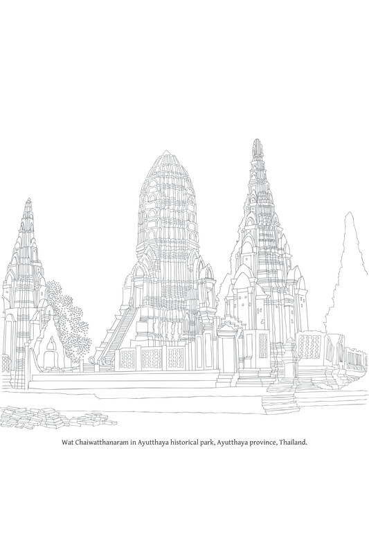

# 参考书目

本参考文献列表主要旨在为希望获取经典和后经典文本及其现有英文译本的读者提供资源。尽管重点放在《佛法》中引用的文本，但其中一些并未被引用。此外，英文译本列表并非详尽无遗。[\[1\]](#fn-fn1){:id="fr-fn1"}

### 巴利圣典

《巴利圣典》的泰文版共计45卷 = 21,926页（律藏，3,351页；经藏，12,077页；阿毗达磨藏，6,498页）。[\[2\]](#fn-fn2){:id="fr-fn2"}

#### 律藏

*   《律之书》（The Book of the Discipline），I. B. Horner 译，共6卷（牛津：巴利圣典协会）：第一卷（1938, 1992, 2014，包含 P. Kieffer-Pülz 迄今未译的段落）；第二卷（1940, 1993）；第三卷（1942, 1993）；第四卷（1951, 1993, 2014）；第五卷（1952, 1993）；第六卷（1966, 1993, 2014）。第一至三卷：《经分别》（Suttavibhaṅga）；第四卷：《大品》（Mahāvagga）；第五卷：《小品》（Cūlavagga）；第六卷：《附件》（Parivāra）。

#### 经藏

*   《长部》（Dīgha-nikāya），《佛陀的长篇论述》（The Long Discourses of the Buddha），Maurice Walshe 译，1986，智慧出版社。
    
*   《中部》（Majjhima-nikāya），《佛陀的中篇论述》（Middle Length Discourses of the Buddha），第二版，Bhikkhu Ñāṇamoli, Bhikkhu Bodhi 译，2002。巴利圣典协会；智慧出版社。
    
*   《相应部》（Saṁyutta-nikāya），《佛陀的相应论述》（The Connected Discourses of the Buddha），Bhikkhu Bodhi 译，2002。巴利圣典协会；智慧出版社。
    
*   《增支部》（Aṅguttara-nikāya），《佛陀的数字论述》（The Numerical Discourses of the Buddha），Bhikkhu Bodhi 译，2012。巴利圣典协会；智慧出版社。
    
*   《小诵》（Khuddakapāṭha），《小读本与究竟义的阐释者》（The Minor Readings and The Illustrator of Ultimate Meaning），Ñāṇamoli尊者 译（牛津：巴利圣典协会，1960, 1991, 2015）。
    
*   《法句经》
    
    *   《法句经：巴利文本和译文附简短故事和义注》（The Dhammapada: Pali Text and Translation with Stories in Brief and Notes），Narada Thera 译，印度佛教传教士协会，1978；可从 Pariyatti Books 获得。
    
    *   《法句经：佛陀的智慧之路》（The Dhammapada: The Buddha’s Path of Wisdom），Acharya Buddharakkhita 译，康提：佛教出版社，1996。
    
    *   《法句经：附巴利文本的新英文译本，以及评注对偈颂的首次英文解释，附从僧伽罗语来源翻译的义注和批判性文本评论》（The Dhammapada: A New English Translation with the Pali Text and the First English Translation of the Commentary’s Explanation of the Verses With Notes Translated from the Sinhala Sources and Critical Textual Comments），John Ross Carter 和 Mahinda Palihawardana 译（牛津：牛津大学出版社，1987）。
    
    *   《法句经沉思录》（A Dhammapada for Contemplation），Ajahn Munindo 演绎（River Publications，2000）。
    
*   《自说经》
    
    *   《自说经：偈颂之提升》（Udāna: Verses of Uplift）（收录于《《巴利圣典》小部集》，第二部分），F.L. Woodward 译（牛津：巴利圣典协会）。
    
    *   《自说经》（Udāna），P. Masefield 译，1994，与《如是语经》（Itivuttaka）一同出版（牛津：巴利圣典协会 2013）。
    
    *   《自说经和如是语经》（The Udana and the Itivuttaka），John D. Ireland 译（康提：佛教出版社，1998）。
    
*   《如是语经》
    
    *   《如是语经》（Itivuttaka），P. Masefield 译，1994，与《自说经》（Udāna）一同出版（牛津：巴利圣典协会 2013）。
    
    *   《自说经和如是语经》（The Udana and the Itivuttaka），John D. Ireland 译（康提：佛教出版社，1998）。
    
    *   《如是语经：佛陀如是说》（Itivuttaka: This Was Said by the Buddha），Thanissaro Bhikkhu 译（马萨诸塞州巴雷：Dhamma Dana Publications，2001）。
    
*   《经集》
    
    *   《经集》（The Suttanipāta），Bhikkhu Bodhi 译（Wisdom Publications，2017）。
    
    *   《经集》（The Suttanipāta），H. Saddhatissa 译（伦敦：Curzon出版社，1985）。
    
    *   《论述集》（The Group of Discourses）（第二版），K.R. Norman 译（牛津：巴利圣典协会，2001）。
    
*   《天宫事》（Vimānavatthu），《小部集》（第四卷）——《天宫事：天堂宫殿的故事》和《饿鬼事：逝者故事》（Petavatthu: Stories of the Departed），I.B. Horner 译（牛津：巴利圣典协会，1974）。
    
*   《饿鬼事》（Petavatthu），《小部集》（第四卷）——《天宫事：天堂宫殿的故事》和《饿鬼事：逝者故事》（Petavatthu: Stories of the Departed），I.B. Horner 译（牛津：巴利圣典协会，1974）。
    
*   《长老偈》（Theragāthā），第一卷，K.R. Norman 散文译本（牛津：巴利圣典协会，1969, 1990，第二版 2007, 2015）。
    
*   《长老尼偈》
    
    *   《长老偈》，第二卷，K.R. Norman 散文译本（牛津：巴利圣典协会，1971, 1992, 1995，第二版 2007, 2015）。
    
    *   《早期佛教比丘尼诗歌》（Poems of Early Buddhist Nuns），C.A.F. Rhys Davids 和 K.R. Norman 译（牛津：巴利圣典协会，1989）。
    
    *   《觉悟比丘尼之声：长老尼偈》（The Voice Of Enlightened Nuns: The Therigatha），Kiribathgoda Gnanananda尊者 译（Mahamegha Publications，2016）。
    
*   《本生经》（Jātaka），《本生经或佛陀前生故事》（The Jataka or Stories of the Buddha’s Former Births），各种译者，E.B. Cowell 编辑（牛津：巴利圣典协会，E.B. Cowell 编辑，6卷 1895-1907，以及索引 1913，全部于1990年重印，现为3卷）。
    
*   《义释》（Niddesa），根据传说，此文本（《大义释》和《小义释》）由佛陀的首要弟子舍利弗尊者撰写。英文译本可得性：印刷版：未知。
    
*   《无碍解道》（Paṭisambhidāmagga），根据传说，此文本由舍利弗尊者撰写。《辨析之路》（The Path of Discrimination），Ñanamoli尊者 译（牛津：巴利圣典协会，1982, 1991，新版 1997, 2014）。
    
*   《譬喻》（Apadāna），英文译本可得性：印刷版：部分摘录收录于巴利圣典协会出版的各类卷册中。
    
*   《佛史》（Buddhavaṁsa），《小部集》（第三卷）——《佛史：佛陀纪年》和《行藏：行为之篮》（Cariyapitaka: Basket of Conduct），I.B. Horner 译（牛津：巴利圣典协会，1975）。
    
*   《行藏》（Cariyāpiṭaka），《小部集》（第三卷）——《佛史：佛陀纪年》和《行藏：行为之篮》（Cariyapitaka: Basket of Conduct），I.B. Horner 译（牛津：巴利圣典协会，1975）。
    

#### 阿毗达磨藏

*   《法集论》（Dhammasaṅgaṇī），《佛教心理伦理学》（Buddhist Psychological Ethics），C.A.F. Rhys Davids 从巴利语翻译（牛津：巴利圣典协会，1900）。
    
*   《分别论》（Vibhaṅga），《分析之书》（The Book of Analysis），U Thittila尊者 从巴利语翻译（牛津：巴利圣典协会，1969）。
    
*   《界论》（Dhātukathā），《元素论》（Discourse on Elements），U Narada尊者 从巴利语翻译（牛津：巴利圣典协会，1962）。
    
*   《人施设论》（Puggalapaññatti），《人类类型之指定》（A Designation of Human Types），B.C. Law 从巴利语翻译（牛津：巴利圣典协会，1922）。
    
*   《论事》（Kathāvatthu），根据传说，此文本由目犍连子帝须长老在第三次结集时（约公元前236年，即公元前307年）撰写。《争议点》（Points of Controversy），S.Z. Aung 和 C.A.F. Rhys Davids 从巴利语翻译（牛津：巴利圣典协会，1915）。
    
*   《双论》（Yamaka），英文译本：未知。
    
*   《发趣论》
    
    *   《条件关系》（第一卷）（Conditional Relations (Vol I)），U Narada尊者 从巴利语翻译（牛津：巴利圣典协会，1969）。《发趣论》中《蒂卡发趣论》（Tika-paṭṭhāna）部分的第I部分。
    
    *   《条件关系》（第二卷）（Conditional Relations (Vol II)），U Narada尊者 从巴利语翻译（牛津：巴利圣典协会，1981）。《发趣论》中《蒂卡发趣论》（Tika-paṭṭhāna）部分的第II部分。
    
    *   《条件关系指南》（A Guide to Conditional Relations），U Narada尊者 从巴利语翻译（牛津：巴利圣典协会，1978）。
    

### 前期义注文本

在一些佛教国家，例如缅甸，以下文本被纳入三藏：

*   《摄义论》（Nettipakaraṇa）（据说是大迦旃延尊者在佛陀时代的作品）。《指南》（The Guide (Nettippakarana)），Ñanamoli尊者 译（牛津：巴利圣典协会，1962, 1977）。
    
*   《藏释》（Peṭakopadesapakaraṇa）（据说是大迦旃延尊者的作品）。《藏经阐释》（Pitaka Disclosure (Petakopadesa)），Ñanamoli尊者 译（牛津：巴利圣典协会，1964, 1979）。
    
*   《弥兰陀问经》（Milindapañha）（由那先长老于约公元500年，即公元43年撰写）。
    
    *   《弥兰陀的问题》（Milinda’s Questions），I.B. Horner 译，2卷（牛津：巴利圣典协会，第一卷：1963, 1990；第二卷：1964, 1991）。
    
    *   《弥兰陀王之辩》（The Debate of King Milinda），Bhikkhu Pesala 编辑，节略版，Antony Rowe Ltd.，1990。
    

### 义注、复注及其他非经藏文本

存在大量的义注、复注及其他后经典文本。此处仅列出有限的文本选择，特别是本书中引用的那些。这些文本中的大部分尚未被翻译成英文，并以贝叶手稿形式保存。后经典时期（这些文本从僧伽罗语重新翻译成巴利语的“翻译时代”）被认为始于觉音阿阇梨尊者，略早于公元1000年（公元457年）。[\[3\]](#fn-fn3){:id="fr-fn3"}

#### 杰出经文及相关文本

*   《清净道论》（Visuddhimagga Pakaraṇavisesa）：由觉音阿阇梨尊者撰写（就主题而言，《清净道论》通常被归类为与《阿毗达磨》一致）。《清净道》（The Path of Purification），Bhikkhu Ñāṇamoli 译（Buddhist Publication Society，1975, 1991）。
    
*   《最胜义灯大疏钞》（Paramatthamañjusā Mahāṭīkā）：（《清净道论复注》）由南印度法护尊者撰写。
    

#### 律藏

*   义注标题：《善见律毗婆沙》（Samantapāsādikā Vinayaṭṭhagathā）（由觉音阿阇梨尊者撰写）。《戒律之始》（The Inception of Discipline）（仅限巴希拉尼达那 Bāhiranidāna），N.A. Jayawickrama 译（牛津：巴利圣典协会，1962, 1986, 2010）。
    
*   复注标题：《精义律疏》（Sāratthadīpanī Vinayaṭīkā）（由斯里兰卡舍利弗长老撰写）。
    
*   《除疑律疏》（Vimativinodanī Ṭīkā）（由南印度拘罗国迦叶长老撰写）。
    
*   《善见律注解》（Samantapāsādikāya Atthayojanā）（由清迈那伽陀尊者于约公元2000年，即公元1457年撰写）。
    
*   《除疑律论》（Kaṅkhāvitaraṇī Pāṭimokkhavaṇṇanā, Mātikaṭṭhakathā）（由觉音阿阇梨尊者撰写）。
    

#### 经藏

*   《长部》（Dīgha-nikāya）：义注标题：《吉祥悦意》（Sumaṇgalavilāsinī Dīghanikāyaṭṭhakathā）（由觉音阿阇梨尊者撰写）。《佛陀的最后日子：觉音对“大般涅槃经”的义注》（The Buddha’s Last Days: Buddhaghosa’s Commentary on the Mahāparinibbāna Sutta (Mahāparinibbāna-sutta only)），Yang-Gyu An 译（牛津：巴利圣典协会，2003）。
    
*   《中部》（Majjhima-nikāya）：义注标题：《破除障碍》（Papañcasūdanī Majjhimanikāyaṭṭhakathā）（由觉音阿阇梨尊者撰写）。英文译本：未知。
    
*   《相应部》（Saṁyutta-nikāya）：义注标题：《显露精义》（Sāratthapakāsinī Saṁyutta-nikāyaṭṭhakathā）[\[4\]](#fn-fn4){:id="fr-fn4"}（由觉音阿阇梨尊者撰写）。英文译本：未知。
    
*   《增支部》（Aṅguttara-nikāya）：义注标题：《满足希望》（Manorathapūraṇī Aṅguttaranikāyaṭṭhakathā）（由觉音阿阇梨尊者撰写）。英文译本：未知。
    
*   《小诵》（Khuddakapāṭha）：义注标题：《胜义之光》（Paramatthajotikā Khuddakapāṭhavaṇṇanā, Khuddakanikāyaṭṭhakathā）（由觉音阿阇梨尊者撰写）。《小读本与究竟义的阐释者》（The Minor Readings and The Illustrator of Ultimate Meaning），Ñāṇamoli尊者 译（牛津：巴利圣典协会，1960, 1991, 2015）。
    
*   《法句经》（Dhammapada）：义注标题：《法句经义注》（Dhammapada-aṭṭhakathā）（由觉音阿阇梨尊者撰写；从僧伽罗语翻译）。《佛教传说》（Buddhist Legends），E.W. Burlingame 译（牛津：巴利圣典协会，1921，1990年重印为3卷，1995）。
    
*   《自说经》（Udāna）：义注标题：《胜义显露》（Paramatthadīpanī Udānavaṇṇanā, Khuddakanikāyaṭṭhakathā）（由法护长老撰写）。《自说经义注》（Udāna Commentary），P. Masefield 译，2卷（牛津：巴利圣典协会，1994, 1995）。
    
*   《如是语经》（Itivuttaka）：义注标题：《胜义显露》（Paramatthadīpanī Itivuttakavaṇṇanā, Khuddakanikāyaṭṭhakathā）（由法护长老撰写）。《如是语经义注》（The Commentary on the Itivuttaka），Peter Masefield 译，2卷（牛津：巴利圣典协会，2008 - 2009）。
    
*   《经集》（Suttanipāta）：义注标题：《胜义之光》（Paramatthajotikā Suttanipātavaṇṇanā, Khuddakanikāyaṭṭhakathā）（由觉音阿阇梨尊者撰写）。英文译本：未知。
    
*   《天宫事》（Vimānavatthu）：义注标题：《胜义显露》（Paramatthadīpanī Vimānavatthuvaṇṇanā, Khuddakanikāyaṭṭhakathā）（由法护长老撰写）。《天宫故事》（Vimāna Stories），P. Masefield 译（牛津：巴利圣典协会，1989，2015年重印）。
    
*   《饿鬼事》（Petavatthu）：义注标题：《胜义显露》（Paramatthadīpanī Petavatthuvaṇṇanā, Khuddakanikāyaṭṭhakathā）（由法护长老撰写）。《饿鬼故事》（Peta Stories），U Ba Kyaw 和 P. Masefield 译（牛津：巴利圣典协会，1980）。
    
*   《长老偈》（Theragāthā）：义注标题：《胜义显露》（Paramatthadīpanī Theragāthā-atthavaṇṇanā, Khuddakanikāyaṭṭhakathā）（由法护长老撰写）。英文译本：未知。
    
*   《长老尼偈》（Therīgāthā）：义注标题：《胜义显露》（Paramatthadīpanī Therīgāthā-atthavaṇṇanā, Khuddakanikāyaṭṭhakathā）（由法护长老撰写）。《长老尼偈义注》（The Commentary on the Verses of the Therīs），William Pruitt 译（牛津：巴利圣典协会，1998）。
    
*   《本生经》（Jātaka）：义注标题：《本生经义注》（Jātaka-aṭṭhakathā）（由觉音阿阇梨尊者撰写；从僧伽罗语翻译）。《本生经或佛陀前生故事》（The Jataka or Stories of the Buddha’s Former Births），各种译者，E.B. Cowell 编辑（牛津：巴利圣典协会，E.B. Cowell 编辑，6卷 1895-1907，以及索引 1913，全部于1990年重印，现为3卷）。
    
*   《义释》（Niddesa）：义注标题：《正法光明》（Saddhammapajjotikā Niddesavaṇṇanā, Khuddakanikāyaṭṭhakathā）（由斯里兰卡优婆斯那长老撰写）。英文译本：未知。
    
*   《无碍解道》（Paṭisambhidāmagga）：义注标题：《正法显明》（Saddhammappakāsinī Paṭisambhidāmaggavaṇṇanā, Khuddakanikāyaṭṭhakathā）（由斯里兰卡摩诃那摩长老撰写）。英文译本：未知。
    
*   《譬喻》（Apadāna）：义注标题：《清净人悦意》（Visuddhajanavilāsinī Apadānavaṇṇanā, Khuddakanikāyaṭṭhakathā）（作者未知）。英文译本：未知。
    
*   《佛史》（Buddhavaṁsa）：义注标题：《甜蜜义显明》（Madhuratthavilāsinī Buddhavaṁsavaṇṇanā, Khuddakanikāyaṭṭhakathā）（由拘罗国佛陀达多长老撰写）。《甜美义之阐释者》（The Clarifier of the Sweet Meaning），I.B. Horner 译（牛津：巴利圣典协会，1978）。
    
*   《行藏》（Cariyāpiṭaka）：义注标题：《胜义显露》（Paramatthadīpanī Cariyāpiṭakavaṇṇanā, Khuddakanikāyaṭṭhakathā）（由法护长老撰写）。英文译本：未知。
    
*   《吉祥义灯》（Maṅgalatthadīpanī Maṅgalasuttavaṇṇanā）（由清迈西里摩诃那伽陀长老于约公元2000年，即公元1487年撰写）。
    

#### 阿毗达磨藏

*   《法集论》（Dhammasaṅgaṇī）：义注标题：《显义》（Atthasālinī Dhammasaṅgaṇīvaṇṇanā, Abhidhammaṭṭhakathā）（由觉音阿阇梨尊者撰写）。《解释者》（The Expositor），Pe Maung Tin 译（牛津：巴利圣典协会，2卷，1920, 1921，1976年重印为1卷）。
    
*   《分别论》（Vibhaṅga）：义注标题：《破除痴迷》（Sammohavinodanī Vibhaṅgavaṇṇanā, Abhidhammaṭṭhakathā）（由觉音阿阇梨尊者撰写）。《迷误消除者》（Dispeller of Delusion），Bhikkhu Ñāṇamoli 译，L.S. Cousins, Nyanaponika Mahāthera 和 C.M.M. Shaw 修订（牛津：巴利圣典协会，2卷，1987, 1991）。
    
*   《界论》（Dhātukathā）：义注标题：《胜义显露》（Paramatthadīpanī Dhātukathādipañcapakaraṇa-aṭṭhakathā）[\[5\]](#fn-fn5){:id="fr-fn5"}（由觉音阿阇梨尊者撰写）。英文译本：未知。
    
*   《人施设论》（Puggalapaññatti）：义注标题：《五部论义注之<人施设论>解释》（Pañcapakaraṇa-aṭṭhakathā Puggalapaññattivaṇṇanā）。《人类类型之指定》（A Designation of Human Types），B.C. Law 从巴利语翻译（牛津：巴利圣典协会，1922）。
    
*   《论事》（Kathāvatthu）：义注标题：《五部论义注之<论事>解释》（Pañcapakaraṇa-aṭṭhakathā Kathāvatthuvaṇṇanā）。《辩论义注》（The Debates Commentary），B.C. Law 译（牛津：巴利圣典协会，1940, 1989）。
    
*   《双论》（Yamaka）：义注标题：《五部论义注之<双论>解释》（Pañcapakaraṇa-aṭṭhakathā Yamakavaṇṇanā）。英文译本：未知。
    
*   《发趣论》（Paṭṭhāna）：义注标题：《五部论义注之<发趣论>解释》（Pañcapakaraṇa-aṭṭhakathā Paṭṭhānavaṇṇanā）。英文译本：未知。
    
*   《阿毗达磨义广释》（Abhidhammatthasaṅgaha）（由斯里兰卡阿努律陀长老撰写）。《阿毗达磨主题提纲与阿毗达磨主题阐释》（The Summary of the Topics of Abhidhamma and Exposition of the Topics of Abhidhamma），R. P. Wijeratne 和 Rupert Gethin 译（牛津：巴利圣典协会，2002）。
    
*   《阿毗达磨义广释复注》（Abhidhammatthavibhāvinī Abhidhammatthasaṅgahaṭīkā）（由斯里兰卡苏曼迦罗阿阇梨撰写）。《阿毗达磨主题提纲与阿毗达磨主题阐释》（The Summary of the Topics of Abhidhamma and Exposition of the Topics of Abhidhamma），R. P. Wijeratne 和 Rupert Gethin 译（牛津：巴利圣典协会，2002）。
    
*   《五部义注》（Pañcikā Abhidhammatthavibhāvinīatthayojanā）（由清迈那伽陀尊者撰写）。
    
*   《法集论根本复注》（Dhammasaṅgaṇī Mūlaṭīkā）（由印度阿难陀阿阇梨撰写）。
    
*   《法集论随复注》（Dhammasaṅgaṇī Anuṭīkā）（由小法护长老撰写）。
    

#### 语法书

*   《成就色论》（Rūpasiddhipakaraṇa）（由南印度佛陀比耶长老撰写）。

注意：在一些引用缅甸文或罗马字母文本的脚注中，括号内有说明这些文本尚未被翻译成泰文。这些脚注来自1982年修订和扩充版《佛法》的第一版。此后，其中一些文本已被翻译成泰文，但我尚未相应地编辑脚注。

\[1\] 希望看到类似编排的英文参考文献的读者，可查阅《佛教学生手册》（A Buddhist Students’ Manual）（Christmas Humphreys 编辑，伦敦，佛教协会，1956），第228-40页。\[译者注：此段落由译者撰写。\][&nbsp;↩&nbsp;](#fr-fn1)
{: id="fn-fn1"}

\[2\] 译者注：《巴利圣典》的主要泰文版是暹罗王国三藏（Syāmraṭṭhassa Tepiṭakaṁ），曼谷，摩诃马哈古佛教大学，1925-1930年（首次由Panich Supaphon印刷厂印刷；第二次印刷始于1955年，摩诃马哈古佛教大学出版社）。上述暹罗王国《巴利圣典》的泰文译本被称为《皇家三藏》，由宗教事务部于1971年出版（第二次印刷）。在上述暹罗王国《巴利圣典》之后的是《摩诃朱拉隆功三藏》（Mahācuḷā Tepiṭakaṁ），由摩诃朱拉隆功大学出版，该大学也有自己的泰文译本（摩诃朱拉隆功三藏）。[&nbsp;↩&nbsp;](#fr-fn2)
{: id="fn-fn2"}

\[3\] 义注在斯里兰卡存在已久，远早于此日期。觉音阿阇梨尊者只是将它们从僧伽罗语翻译回巴利语。[&nbsp;↩&nbsp;](#fr-fn3)
{: id="fn-fn3"}

\[4\] 译者注：PTS拼写：Sāratthappakāsinī。[&nbsp;↩&nbsp;](#fr-fn4)
{: id="fn-fn4"}

\[5\] 译者注：PTS拼写：Pañcappakaraṇa-aṭṭhakathā。[&nbsp;↩&nbsp;](#fr-fn5)
{: id="fn-fn5"}