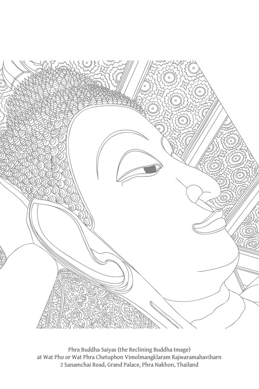

第八章：止与观

# 第八章：止与观

佛陀关于心解脱与慧解脱的教导

## 导论

在巴利语中，samatha这个词的意思是“平静”或“寂止”，但这个术语通常指产生寂止和培养深度专注心的方法。samatha的目的是达到禅那（jhāna）。[\[1\]](#fn-fn1)在samatha的修行中，修行者将心固定在一个所缘（ārammaṇa）上，直到心达到一境性，这被称为三摩地（专注）。当三摩地正确建立时，心就进入了禅那。在四种色界禅那（rūpa-jhāna，或简称jhāna）中，修行者以物质相为专注的对象。比这些更微细的是四种无色界禅那（arūpa-jhāna），其中修行者以非物质相为专注的对象。这些禅那合称为八种“等至”（samāpatti）。

在禅那中，心是快乐、平静和明亮的；没有昏沉或扰动；心远离了五盖（nīvaraṇa）。[\[2\]](#fn-fn2)在禅那持续的期间，据说修行者是摆脱了烦恼（kilesa）的。然而，当修行者出禅时，烦恼又会回来。通过专注来镇伏烦恼，这被称为“镇伏止息”（vikkhambhana-nirodha）和“镇伏解脱”（vikkhambhana-vimutti）。禅那可能产生的果报是五种神通（abhiññā）：神足通、他心通、宿命通、天耳通和天眼通。（见注释“更高层次的知”）

samatha这个词通常特指三摩地（专注）。将samatha等同于三摩地是符合阿毗达摩和经藏的，因为无论一个人达到哪种特殊能力或等至，寂止禅的本质都是三摩地。[\[3\]](#fn-fn3) {427}

毗婆舍那（Vipassanā）的意思是“清晰的洞察”。这个术语也指培养智慧的方法，以便如实地看清事物，而不是如被贪欲和瞋恚扭曲的愿景所想象的那样。这种洞察会逐渐加深，直到无明和执著被根除，此时一个人的印象、知觉和态度都会转变。

在此洞察修行中逐渐增长的知被称为ñāṇa，它有许多层次。最终和最高层次的知被称为vijjā，它彻底根除了无明。拥有这种知的内心是喜悦、平静和自由的。它摆脱了腐蚀人们思想和行为的烦恼的束缚。一个觉悟者不会被烦恼所困扰，也无需与烦恼抗争。这种知是毗婆舍那（vipassanā）的目标，它导向真实和持久的解脱。这种绝对的解脱被称为“断灭止息”（samuccheda-nirodha）或“断灭解脱”（samuccheda-vimutti）。[\[4\]](#fn-fn4)

更高层次的知

> 译注：abhiññā这个术语在不同语境中使用。一般来说，它意为“更高层次的知”，“殊胜的知”。共有六种殊胜的知。前五种（上面列出的）是世俗之知；第六种——漏尽智（āsavakkhaya-ñāṇa）——是出世间之知。在本章中，当指前五种时，我使用“特殊能力”、“超常能力”、“殊胜能力”或“更高层次的心灵成就”；当指全部六种时，我使用“殊胜之知”、“殊胜成就”或“直接知”。

寂止禅的目标是禅那；观禅的目标是智。[\[5\]](#fn-fn5)人们可以单独修行samatha禅，希望能享受这种修行的果报：禅那和殊胜能力（abhiññā）。他们可能就此止步，不关心毗婆舍那禅和智慧的培养。但是修行毗婆舍那禅的人必须依赖某种程度的专注。他们可能先达到禅那，然后以禅那为基础进行观禅；他们可能先修行观禅，然后修行寂止；或者他们可能同时修行这两种禅。那些被称为“纯观行者”（suddhavipassanā-yānika）的人不以“直接”或“专门”的方式修行寂止——他们在发展观禅之前不达到禅那——但他们在广义上仍然依赖寂止：他们仍然依赖专注。修行观禅者最初的专注可能是“刹那三摩地”（khaṇika-samādhi）。但在达到道果（magga-phala）之时，专注是牢固建立的（“安止三摩地”——appanā-samādhi），至少达到初禅。

无论禅那或神通多么非凡，如果它们仅仅是寂止禅的结果，它们仍然是“世俗的”：它们仍属于未觉悟众生的领域。[\[6\]](#fn-fn6)这类成就的例子有：提婆达多尊者（Ven. Devadatta）的神通，[\[7\]](#fn-fn7)瞿提迦尊者（Ven. Godhika）的暂时解脱，[\[8\]](#fn-fn8)以及经文中所记载的比丘、仙人和在家众达到禅那的故事。[\[9\]](#fn-fn9) {428}

由寂止禅产生的专注等至和超常能力在佛陀时代之前就已存在。[\[10\]](#fn-fn10)那些取得这些成就的人来自其他宗教传统，并早于佛陀，例如达到第三无色界禅那的阿罗罗·迦罗摩（Āḷāra Kālāma）和达到第四无色界禅那的郁陀迦·罗摩子（Uddaka Rāmaputta）。[\[11\]](#fn-fn11)这些成就并非佛教的目标，因为它们不能带来真正的解脱烦恼和痛苦。有些其他传统的比丘，在达到四禅后，仍然持有邪见，声称安住在这些禅那中就等同于涅槃，这种说法被佛陀所驳斥。[\[12\]](#fn-fn12)

佛教中寂止禅的真正目的是生起专注，并以此作为观禅的基础。（见注释“以寂止为观”）这种以专注为支持的观禅修习导向佛教的最终目标。具有达到这个最高目标并拥有寂止禅特殊果报的人，将受到敬仰和尊崇。但仅仅获得观禅果报的人，仍优于那些获得了禅那和神通却尚未觉悟的人。尚未证得八禅或五神通（abhiññā）的不还者的专注，仍被认为是“圆满的”。它是稳固而坚定的，因为没有烦恼来侵蚀或扰乱它。这与那些获得禅那或神通但未修习观禅或未证得道果（magga-phala）的人不同。尽管他们的专注程度可能非凡，但其稳定性没有保证。他们仍然容易被烦恼所压倒。即使是入流者和一来者的三摩地也可能被感官欲乐扰乱和削弱。因此，他们的三摩地仍被认为是“不圆满的”。[\[13\]](#fn-fn13)

平静与观禅这个主题与下面将讨论的慧解脱和心解脱有关。 {429}

以寂止为观

> 最高的专注是能帮助智慧遣除烦恼并促进觉悟的专注。从技术上讲，它是道（magga-samādhi）的一个要素。这种专注有一个特殊名称：ānantarika-samādhi（也拼作anantarika, anantariya 或 ānantariya），译为“无间三摩地”——它立即产生圣果（ariya-phala），没有障碍。佛陀说这种专注是无与伦比的（Kh. 4; Sn. 40）。即使这种专注层次较低，它仍然优于其他形式的色界和无色界禅那。（KhA. 182; SnA. I. 277）。Ānantarika-samādhi在其他语境中也有提及，无论是经典还是注释书；见：D. III. 273; A. II. 150; Ps1. 2, 94; DA. III. 1056; AA. III. 139; PsA. I. 37; VismṬ.: Ñāṇadassanavisuddhiniddesavaṇṇanā, Sotāpannapuggalakathāvaṇṇanā; ThīgA. 99。

## 心解脱与慧解脱

（请注意cetovimutti和paññāvimutti是心境，而ubhatobhāga-vimutta和paññā-vimutta是个人之间的区别。）

早先，解脱（vimutti）被提及为涅槃的同义词，并在觉悟者的特质部分进行了讨论。在这里，我们将更仔细地审视vimutti这个术语。在注释书中，vimutti一词在其最高意义上具有三个不同的定义：

1.  vimutti作为道（magga）：解脱的行为；解脱发生时的现有状况。
    
2.  vimutti作为果（phala）：解脱所带来的自由；作为解脱者的结果。
    
3.  vimutti等同于涅槃：解脱者的状态；解脱者所达到和体验的自由的本质，提供诸如快乐、安适、满足和平静等福祉；未觉悟者确定为观想对象并设定为目标的解脱。[\[14\]](#fn-fn14)
    

在这三个定义中，第二个定义——以果报形式的解脱（vimutti as fruition）——是最具体的，并与解脱的本质意义相关。它在这里最常指阿罗汉果的解脱，即一个人断除了全部十种结（saṁyojana），并从所有心垢（āsava）中解脱。在以道（Path）形式的解脱（vimutti as the Path）的定义中，有额外的作用因，特别是真智（vijjā）和离欲（virāga），它们常与解脱配对。在这种情况下，vijjā或virāga被定义为道，而vimutti则构成果。在第三个定义中，vimutti是涅槃的同义词。（见注释“解脱”）

解脱

> 这些解释符合注释书的定义。作为道和果的解脱，例如：DA. I. 220; MA. II. 281; AA. II. 263; AA. III. 378。作为果和涅槃的解脱，例如：Ps2. 143-4; MA. I. 43; UdA. 69; ItA. I. 166。作为阿罗汉果（arahatta-phala）的解脱，例如：VinA. VII. 1366; DA. III. 1062; SA. I. 62, 171; AA. III. 227; VinṬ.: Paṭhamo Bhāgo, Vinayānisaṁsakathāvaṇṇanā; VismṬ.: Sīlaniddesavaṇṇanā, Sīlappabhedakathāvaṇṇanā。与明（vijjā）配对的解脱，前面在觉悟者的特质部分已引用，例如：DA. III. 1057; VismṬ.: Anussatikammaṭṭhānaniddesavaṇṇanā, Ānāpānassatikathāvaṇṇanā。在巴利语经典中：D. III. 274; M. III. 290; A. I. 83; A. II. 247。在“离欲而解脱”（virāgā vimuccati）这个短语中，解脱与离欲配对出现多次，例如：S. III. 189; S. IV. 2。欲知更多解释，例如：Ps2. 140; SA. II. 268。

作为果报的解脱（vimutti as fruition），尤其是作为阿罗汉果的解脱，分为两种：心解脱（cetovimutti）和慧解脱（paññāvimutti）。心解脱（Cetovimutti）被译为“心之解脱”。它是通过专注的力量而实现的解脱。它是一种专注心的状态，能平息贪欲，并从烦恼的束缚中解脱出来。[\[15\]](#fn-fn15) {430}慧解脱（Paññāvimutti）被译为“通过智慧的解脱”，但同样可以译为“智慧的解脱”，因为它指的是阿罗汉的智慧，这种智慧是净化和完善的。这种智慧能驱散无明，使人从烦恼中解脱。

> 心解脱是通过断除贪欲而实现的；慧解脱是通过断除无明而实现的。A. I. 61; Ps. II. 99。

注释书将心解脱（cetovimutti）定义为阿罗汉果的专注（samādhi），并将慧解脱（paññāvimutti）定义为阿罗汉果的智慧和知。[\[16\]](#fn-fn16)所有证得阿罗汉果的人都已完成了这两种解脱。因此，在提及阿罗汉果的经文中，这两个术语总是成对出现，例如：

> 随着诸漏的灭尽，他在当下以直接知自证心解脱和慧解脱，它们是无漏的。例如：D. I. 156, 167; D. II. 71, 251; D. III. 107, 132; M. I. 284, 367; S. IV. 267, 289; A. I. 220; A. III. 29, 425-6。

心解脱是寂止的果报；慧解脱是观禅的果报。[\[17\]](#fn-fn17)注释书认为，这两个术语成对出现表明寂止（samatha）和观禅（vipassanā）必须结合，无论是在“果”（phala）的层面还是在“道”（magga）的层面。[\[18\]](#fn-fn18)这里的寂止可以广义地理解为所需程度的专注；它不一定指导致更高层次心灵成就的更深层次的专注。

> 有两件事关乎殊胜之知。[\[19\]](#fn-fn19)是哪两件事？寂止与观禅。当寂止发展时，它带来什么益处？心得到发展。当心得到发展时，它带来什么益处？贪欲被断除。当观禅发展时，它带来什么益处？智慧得到发展。当智慧发展时，它带来什么益处？无明被断除。被贪欲污染的心未得解脱，被无明污染的智慧未得发展。因此，比丘们，通过去除贪欲，有心解脱；通过去除无明，有慧解脱。（见注释“心解脱与慧解脱”） {431} A. I. 61。

心解脱与慧解脱

> 在巴利语经典中，心解脱（cetovimutti）和慧解脱（paññāvimutti）的成就被用作阿罗汉果的定义（例如：S. V. 406）。这证明所有阿罗汉都获得了这两种解脱。当这些术语成对用于指阿罗汉时，它们总是以“无漏”（anāsava）一词开头。A. II. 87中的段落提到，有些阿罗汉虽然获得了心解脱和慧解脱，但并未获得八种胜解脱（即禅那等至和想受灭定）。这段文字证实，阿罗汉的心解脱是指支持智慧根除诸漏所必需的专注程度。它并非下面讨论的、指八种专注成就（禅那等至）的心解脱。注释书将寂止定义为心一境性（cittekaggatā；三摩地），将观禅定义为反思有为法的智慧（AA. II. 119）。

解脱是圆满的，通过心解脱和慧解脱的成就。只修行寂止是可能的，这种修行可以导致更高的专注成就，其中烦恼被镇伏。这是一种解脱，尽管是暂时的。然而，为了达到真正的解脱，修行寂止的人也必须结合观禅。心解脱（cetovimutti）这个术语可以在道果证悟之外的语境中使用，尽管在这些语境中，心之解脱并非绝对的。因此，决定性因素是慧解脱（paññāvimutti），它逐渐消除无明并根除烦恼。真正的持久解脱伴随着慧解脱而来。“无漏”（anāsava）一词与这两个术语结合使用，以强调完美的解脱。心解脱（cetovimutti）与慧解脱（paññāvimutti）成对使用，仅仅是为了表明需要高水平的专注来为智慧解脱作准备。

慧解脱（Paññāvimutti）只在完全解脱的语境中使用，并且总是伴随着心解脱（cetovimutti）。心解脱（Cetovimutti）可以在其他语境中使用。如果它指的是从入流开始的道果的决定性解脱，那么它就与慧解脱配对。否则，它必须伴随着一个限定性形容词，明确表示一个确定的觉悟阶段，例如：不动（akuppā）或持久（asamaya）。当它单独出现或伴随其他术语时，它不指完全解脱。

由于这些术语的相似性，将阿罗汉分为“慧解脱者”（paññāvimutta）和“俱分解脱者”（ubhatobhāgavimutta）给人一种印象，前者是指仅通过智慧获得解脱（paññāvimutti）的人。事实上，慧解脱的成就必然包含心解脱的成就，即一个人依靠精微的专注程度来获得智慧解脱。在这种情况下，专注无需特别强调。即使是纯观行者（sukkha-vipassaka）也依赖寂止禅来培养所需程度的专注。在“俱分解脱者”（ubhatobhāgavimutta）的情况下，心解脱（cetovimutti）被强调。强调的原因是这里所指的心解脱是特殊的，属于八种胜解脱或更高层次的禅那成就。

如上所述，vimutti一词在许多不同的语境中使用。cetovimutti一词，当指尚未超越世间的解脱层次时，通常单独使用；在这种情况下，它暗示着一种非绝对的解脱。劣等解脱通常通过专注的力量发生。 {432} 后来的文献也使用vimokkha一词来指代非超越世间的解脱。[\[20\]](#fn-fn20)原始经文为vimokkha保留了独特的定义，正如觉悟者一章中所解释的。无论使用哪个术语——vimutti、cetovimutti还是vimokkha——它通常都伴随着一个限定性形容词来澄清语境，例如：sāmāyika-vimutti、sāmāyika-cetovimutti、sāmāyika-vimokkha（都意为“临时解脱”），appamaññā-cetovimutti（“无量心解脱”），或santa-cetovimutti（“寂静心解脱”）。用相反意义的形容词替换劣等解脱层次的限定性形容词，表示一种至上形式的解脱（例如，用asamaya替换sāmāyika）。

因此，广义上的解脱（vimutti）可以分为两种：绝对的和非绝对的。当指其最高意义时，vimutti一词前面会加上以下限定性形容词之一，以明确指的是绝对的、超越世间的解脱：不动（akuppā-vimutti和akuppā-cetovimutti：“不动解脱”；“不退转解脱”）；[\[21\]](#fn-fn21)或无时（asamaya-vimutti[\[22\]](#fn-fn22)和asāmāyika-cetovimutti：[\[23\]](#fn-fn23)“无时解脱”；“不受时节限制的解脱”）。所有这些术语都指“圣果”（ariya-phala），特别是阿罗汉果。[\[24\]](#fn-fn24)而且由于cetovimutti一词单独从不指绝对解脱，因此添加akuppā和asāmāyika这两个术语，以表明一种绝对的、不朽的心解脱，并必然伴随着慧解脱。 {433}

觉悟者可证得的另一种超越世间的心解脱形式是“无相心解脱”（animittā-cetovimutti），这被称为“果定”（phala-samāpatti）。当入流者、一来者、不还者和阿罗汉希望安乐住并进入一种专注状态，体验他们证悟的“味”（rasa；“品质”）时，便可达到这种境界。这种解脱状态是“现法乐住”（diṭṭhadhamma-sukhavihāra）和“圣出世间乐”（ariyalokuttara-sukha）。它被称为“无相心解脱”，因为这是一种心的自由，在这种自由中，修行者不留意有为现象（即色、受、想、行、识）的相和特征，而只专注于涅槃（以涅槃为觉知对象）。[\[25\]](#fn-fn25)

许多较次要的、世俗的解脱层次，当心解脱（cetovimutti）一词单独出现时，都包含在其中。或者，使用“临时心解脱”（sāmāyika-cetovimutti，等同于sāmāyika-vimutti和samaya-vimutti，都意为“临时解脱”）。[\[26\]](#fn-fn26)“决意”（adhimutti，“倾向于”；“投入”）这个词常用来描述这些较次的解脱层次，或者adhimutti被用作上述术语的同义词（见注释“反思涅槃”）。[\[27\]](#fn-fn27)Adhimutti指的是全神贯注于一个对象，以至于在处于该状态时，一个人能摆脱扰乱和烦恼，例如在入禅（jhāna）时，人会摆脱五盖（nīvaraṇa）。

反思涅槃

> 这种将解脱（vimutti）等同于决意（adhimutti）的定义可以用于涅槃，意思是“决意于”或“反思”涅槃，并且可以用于未开悟和已开悟的众生，甚至阿罗汉（例如：S. I. 154; D. III. 239-40; A. III. 245; MA. I. 43; SA. I. 220; ItA. I. 166）。阿毗达摩给出了解脱（vimutti）的两个定义：“专注的投入”（cittassa adhimutti）和涅槃（Dhs. 234）。注释书解释说，专注的投入指的是八种等至（samāpatti），因为人在禅修对象中投入，并摆脱了有害的心境（DhsA. 409）。在Nd. II. 41中，这个定义被扩大，包括决意于色、声、香、味、名利、快乐、袈裟、布施食、戒律、经文、阿毗达摩等（例如：rūpādhimutta、cīvarādhimutta、vinayādhimutta）。比较Ps. II. 145-6中解脱的双重描述。

“临时心解脱”（sāmāyika-cetovimutti）的标准定义将这种解脱等同于八种世俗成就（samāpatti）：四种色界禅那和四种无色界禅那。[\[28\]](#fn-fn28)未觉悟者的专注成就是局限于这八种。为了明确这里的心解脱指的是八种成就，有时会加上“寂静”（santa；“平静”；“微细”）一词，作为寂静心解脱（santa-cetovimutti）。[\[29\]](#fn-fn29)

“临时解脱”（心解脱cetovimutti，sāmāyika-cetovimutti，解脱vimutti，或sāmāyika-vimutti）也可以有一个非常广泛的定义，指全神贯注于任何信仰、启发或喜悦的对象。这种解脱伴随着专注于某一对象的强烈心境。这种专注会产生力量、勇气和毅力。它是一个自然过程（idappaccayatā或paṭiccasamuppāda）的初始阶段，该过程导向喜悦、寂止和专注。 {434} 它被称为解脱，因为它摆脱了冲突和恼人的心所（paccanīka-dhamma——“心之敌对者”），例如疑虑、沮丧、心智迟钝和恐惧。只要维持支持解脱的条件，只要由启发所产生的心理力量持续存在，这些心所就会被镇伏。经文甚至将向往森林生活[\[30\]](#fn-fn30)或聆听佛法开示时所生起的喜悦，[\[31\]](#fn-fn31)归类为这种心解脱。然而，这种解脱的某些方面也可能生起不善心所。[\[32\]](#fn-fn32)

有几种特定类型的临时心解脱（sāmāyika-cetovimutti），其名称取决于心所专注的对象。最常提及和鼓励的临时心解脱被称为“无量心解脱”（appamāṇā-cetovimutti或appamaññā-cetovimutti）。[\[33\]](#fn-fn33)在这种修行中，修行者以无边无量的心，向所有方向散播慈（mettā）、悲（karuṇā）、喜（muditā）和舍（upekkhā）的品质，直到心沉浸在这些善法中并进入禅那。然后，心从五盖和与上述四种品质相敌对的不善法中解脱：慈心解脱（mettā-cetovimutti）脱离瞋恚，悲心解脱（karuṇā-cetovimutti）脱离敌意，喜心解脱（muditā-cetovimutti）脱离嫉妒，舍心解脱（upekkhā-cetovimutti）脱离贪欲。

其他类型的临时心解脱，在经典中很少出现，包括：空心解脱（suññatā-cetovimutti，源于洞察所有有为法无我且无任何与我相关之物——attaniya的智慧）；[\[34\]](#fn-fn34)无所有处心解脱（ākiñcaññā-cetovimutti，指无所有处禅那）；[\[35\]](#fn-fn35)以及广大心解脱（mahaggatā-cetovimutti，在禅那中，以遍作定对象将心扩散到所选择的任何广阔区域或领域）。[\[36\]](#fn-fn36)

根据上述材料，可以公平地说，对理想或信仰对象的任何虔诚，例如对一位至高无上的神祇，都是一种投入，可以包含在心解脱（cetovimutti）的广义定义中。

有些人声称安住于禅那就是涅槃，或者声称“想受灭尽”（saññāvedayita-nirodha或nirodha-samāpatti），即最高的专注成就，就是涅槃。 {435} 事实上，这些专注成就是用来证得阿罗汉果的工具。它们能预备心，使其适合觉悟。这些成就，连同它们的物质和非物质性质，都是有为法，修行者以观智和智慧反思它们，从而生起真知（vijjā）。[\[37\]](#fn-fn37)

阿罗汉们利用这些专注成就来休息和体验快乐，因此这些成就被称为“现法乐住”（diṭṭhadhamma-sukhavihāra）、[\[38\]](#fn-fn38)“天住”（dibba-vihāra），[\[39\]](#fn-fn39)和“次第住”（anupubba-vihāra）。[\[40\]](#fn-fn40)然而，这些状态并非涅槃。它们是证得涅槃的途径，也是已证得涅槃者的安乐住处。事实上，涅槃的证悟有助于获得这些专注状态，并使人从中受益匪浅。例如，一个证得八禅的人将拥有必要的专注和智慧，以便在证得不还果或阿罗汉果时达到想受灭尽定（nirodha-samāpatti）。[\[41\]](#fn-fn41)

尚未证得阿罗汉果的人仍然对色界和无色界的存在有一定程度的执著，他们可能仍然着迷或执著于专注成就。 {436} 尽管禅那非常殊胜，但佛教认为对禅那的执著是一种弱点。事实上，这种执著可能成为证得涅槃的障碍。佛陀说，如果一位比丘证得最高的无色界禅那（非想非非想处nevasaññānāsaññāyatana），但沉溺于这种状态的感觉，他就无法证得涅槃，因为仍然存在取（upādāna）。佛陀称执著于这种微细状态为“最胜之取”（upādāna-seṭṭha，见注释“一种被认为殊胜的状态”）。阿罗汉们利用禅那来安住，但没有任何执著。

禅那，直到想受灭尽定，并非涅槃的证据是，那些“慧解脱者”（paññāvimutta）的阿罗汉并未证得无色界禅那，也无法进入想受灭尽定。从巴利语经典中我们可以推断，在佛陀时代，慧解脱者比俱分解脱者更多。例如，在一次比丘大会上，佛陀对舍利弗尊者（Ven. Sāriputta）说：

> “舍利弗，在这五百位比丘中，有六十位比丘是三明者（tevijja），[\[42\]](#fn-fn42)六十位比丘是六神通者（chaḷabhiñña），六十位比丘是俱分解脱者，而其余的\[三百二十位\]则是慧解脱者。”S. I. 191。

一种被认为殊胜的状态

> M. II. 265。注释书解释upādāna-seṭṭha在此指“一种被认为殊胜的状态”（即一种更高的转生境界），但上述解释与词源和语境一致（见MA. IV. 67）。佛陀说，如果一个人具有非凡的品质（例如他富有、有名望、博学、佛法宣讲者、苦行者、林居者、粪扫衣者、树下居者，或证得八禅中任何一种），却变得傲慢并轻视他人，那么这个人就是“劣等”的人（善人经Sappurisa Sutta, M. III. 37-45）。A. II. 27-8的教导指出，处于圣族中的比丘满足于他的袈裟、布施食和住所，并乐于禅修，但不用自己的美德来赞扬自己或恐吓他人。

慧解脱（paññāvimutti）是决定性的，等同于证得涅槃。这种解脱将心解脱（cetovimutti）——它可能很久以前就已达成并在过去反复体验——或与慧解脱同时生起[\[43\]](#fn-fn43)——转变为不动心解脱（akuppā-cetovimutti），因为此时诸漏已被根除。

觉悟者们最大程度地利用心解脱（cetovimutti），而不伤害自己或他人。他们不沉溺于这些成就，也不误用专注的果报——世俗的神通——来满足自我。在这里，心解脱和慧解脱成对存在，正如经典中经常提到的那样：心解脱和慧解脱中，那些邪恶不善法无余灭尽。[\[44\]](#fn-fn44) {437}佛陀说，这种不动心解脱（cetovimutti结合paññāvimutti）是佛教的精髓和目标：

> “当他勤奋时，他证得无时解脱（asamaya-vimutti）。那位比丘不可能从那种无时解脱中退失。所以，婆罗门，这梵行并非以利得、尊敬和名誉为益，并非以戒行的成就为益，并非以专注的成就为益，亦非以智与见为益。然而，这种不动心解脱才是这梵行的目标、其核心和其究竟。”[\[45\]](#fn-fn45) M. I. 197。

有三种导致暂时解脱（samaya-cetovimutti）衰退的因素。首先是尚未完全根除的烦恼（kilesa）。它们可能已被压制或降伏，但它们潜伏着，当信仰等积极条件减弱时就会被唤醒。其次是信仰、热情、满足和决心等支持性条件。当这些条件消退或减弱时，心解脱也会随之衰退。这些支持性条件甚至可能因正当理由而消退。一个人可能曾对某事物有强烈信仰并极度投入，但后来意识到该信仰并非基于智慧，且信仰的对象不值得如此投入。第三是环境因素，包括一个人的健康和贫困或饥荒等外部条件。在灵修实践中，这三个因素是相互关联的。例如，由于某些困难，一个人会灰心丧气；困惑、烦躁和沮丧会随之而生，心解脱也会消失。

巴利圣典中有一些关于心解脱如何受到影响的有趣故事。尊者戈迪卡（Godhika）勤奋坚定，达到了暂时解脱（sāmāyika-cetovimutti；世俗的禅定成就）。但由于慢性病的折磨，他从这种心解脱中退失。他第二次、第三次达到暂时解脱，又从中退失。这种情况发生了六次。{438}当他第七次达到暂时解脱时，他心想自己一定会像以前一样退失。他认为在这种解脱状态中死去比退失后再死去更好。于是他用刀自杀，但当他躺在床上忍受痛苦时，他建立了正念，并思惟生起的感受（vedanā）。在这样禅修时，他在证得究竟涅槃之前成就了阿罗汉果。[\[46\]](#fn-fn46)

另一段文字描述了沙门和婆罗门进入森林，以水果和浆果为生，他们认为如果沉溺于感官享受，就会变得迷醉，并落入魔罗（Māra）的掌控。当食物匮乏，他们变得消瘦虚弱时，他们的决心和热情减弱，于是他们回到更广阔的世界享受感官之乐。[\[47\]](#fn-fn47)

注释书将vimutti的众多定义归纳为五组，沿用了他们对“灭尽”（nirodha）定义进行分类的相同模式。[\[48\]](#fn-fn48)这五组作为有益的总结，涵盖了目前为止所有定义的精髓：[\[49\]](#fn-fn49)

*   1\. Vikkhambhana-vimutti：通过压制烦恼而解脱。通过定力暂时停止五盖。这指的是八种“成就”（samāpatti）：四种色界禅和四种无色界禅，有时也包括“近行定”（upacāra-samādhi）。
    
*   2\. Tadaṅga-vimutti：通过特定特质而解脱。通过替代相反的特质，从不善法中解脱。从技术上讲，它是通过运用内观或智慧，从邪见和执著中解脱。例如，专注于无常可以使人摆脱对常住的信念。然而，它也可以用于一般的道德和伦理事项。例如：对布施的投入使人摆脱吝啬和贪婪；对慈爱的承诺使人摆脱瞋恨和消极；对悲悯和非暴力的奉献使人摆脱暴力和残酷。
    

这前两种解脱涵盖了“暂时解脱”（sāmāyika-cetovimutti）的意义，并且是世俗的。{439}

*   3\. Samuccheda-vimutti：烦恼的断绝；通过究竟智慧而解脱；vimutti作为“道”（magga）。
    
*   4\. Paṭipassaddhi-vimutti：烦恼的完全去除和寂止；vimutti作为“果”（phala）。
    
*   5\. Nissaraṇa-vimutti：解脱的状态；导致至上喜悦和与世界无碍互动的完全解脱；vimutti作为涅槃（Nibbāna）。
    

最后这三种解脱被定义为“永久解脱”（asāmāyika-cetovimutti），并且是出世间的。本质上，这五种解脱分别等同于奢摩他（samatha）、毗婆舍那（vipassanā）、道（magga）、果（phala）和涅槃（Nibbāna）。

## 证悟涅槃的重要原则

{442} 以下问题常在佛教修行者和学者之间争论：

*   只修毗婆舍那（vipassanā）而不安止（samatha）的人能否证得阿罗汉果？
    
*   在证悟涅槃之前，是否必须先证得禅那（jhāna）？
    
*   要证得六种“神通”（abhiññā），是只需证得第四禅，还是必须也证得无色界禅（即八种samāpatti）？
    
*   要证得漏尽智（āsavakkhaya-ñāṇa）并证悟涅槃，是否必须先证得宿命智（pubbenivāsānussati-ñāṇa）和有情生死智（cutūpapāta-ñāṇa）？
    
*   在禅那中能否修习内观并思惟有为法，还是必须先从禅那中出来？
    
*   在证得道果（magga-phala）之后，是否可能进一步发展奢摩他并证得禅定成就（jhāna-samāpatti）？
    

其中有些问题涉及证悟涅槃的关键方面，有些只是间接相关，有些则已详尽讨论过，特别是关于一个人是否可以通过仅仅修习内观而证悟涅槃的问题。本节将集中讨论那些与证悟直接相关的问题，并引用经文中的证据。

### 证悟的一般面向

> 比丘们，我宣称，漏尽是依初禅而发生，或依第二禅而发生，或依第三禅而发生，或依第四禅而发生；依空无边处而发生，或依识无边处而发生，或依无所有处而发生，或依非想非非想处而发生（或依想受灭而发生）。[\[50\]](#fn-fn50) 《禅那经》（Jhāna Sutta），增支部 A. IV. 422-3。

此经及另三部经[\[51\]](#fn-fn51)描述了如何运用禅定成就的各个阶段进行思惟，并深入洞察有为法的真实本性。上述经文继续写道：{443}

> 当说：“比丘们，我宣称，漏尽是依初禅而发生”，这是出于什么原因呢？这里……一位比丘入于并安住于初禅……其中所包含的任何色、受、想、行、识等法，他将这些法视为无常、苦……空、无我。[\[52\]](#fn-fn52)如此观见后，他的心便从这些法中转向，专注于不死界：“这是寂静，这是殊胜：那就是……涅槃。”如果他持续（初禅），[\[53\]](#fn-fn53)他便证得漏尽；但如果他因喜乐于法而未能证得漏尽，那么……他将自然往生 \[至净居天界（Suddhāvāsā）\] 并在那里证得究竟涅槃，不再从那个世界返回。[\[54\]](#fn-fn54)

从这里开始，经文描述了在每个禅定层次，直到无所有处，以类似的方式修习内观以达到漏尽。[\[55\]](#fn-fn55)

《大摩罗迦经》（Mahāmāluṅkya Sutta）细节较少，但描述了在每个禅那中，直到无所有处，思惟五蕴的三法印，从而证得漏尽。《八城经》（Aṭṭhakanāgara）和《十法经》（Dasama suttas）略有不同：

> 一位比丘入于并安住于初禅……他思惟并如此理解：“此初禅是有为的，是造作的。然而，凡有为、造作的都是无常的，是会止息的。”持续此（初禅），他便证得漏尽。

在这些经文中，慈、悲、喜、舍的心解脱被插入到色界禅和无色界禅之间，增加了四种可供思惟的禅定成就。

这四部经文基本上包含相同的信息；它们只在细微之处有所不同。它们描述了在禅那中发展内观，从初禅到无所有处，最终证得漏尽。然而，《禅那经》增加了一个总结：

> 因此，比丘们，凡有想的禅定成就（saññā-samāpatti）所能及之处，皆可证得究竟智（aññā-paṭivedha）。{444} 增支部 A. IV. 426。

这意味着在禅那中，从无所有处及以下，存在想（以及其他伴随的蕴），可以用于思惟并支持内观以证得漏尽。在非想非非想处（nevasaññānāsaññāyatana），想过于微细，不能用于思惟。在想受灭（saññāvedayita-nirodha）中更是如此。因此，这两种成就不属于“有想的成就”（saññā-samāpatti）。

如果真是这样，如何在非想非非想处和想受灭中证得漏尽呢？答案是，必须先从这些最高层次的禅定成就中出来，然后运用智慧思惟有为法，以证得漏尽。《阿那巴经》（Anupada Sutta）中有一段关于非想非非想处的内容：

> 比丘们，再者，舍利弗完全超越无所有处，进入并安住于非想非非想处。他正念地从该成就中出来。出来后，他思惟已止息和变迁的过去法，如此：“这些法确实，未曾有而生起；曾有而消失。” 中部 M. III. 28。

将此与在无所有处（以及在较低禅那中）思惟有为法的描述进行比较，其中没有提及从禅定中出来。例如，在上述经文中说：

> 比丘们，再者，舍利弗完全超越识无边处，觉知“什么都没有”，于是进入并安住于无所有处。而无所有处的诸法——无所有处的想和心一境性；触、受、想、思、识；精进、决心、念、舍、作意——这些法在他生起时逐一被他了知；这些法生起、存在、消失，都被他了知。他如此理解：“这些法确实，未曾有而生起；曾有而消失。”

《小义释》（Cūḷaniddesa），一部次级文本，以类似于上述《中部》的方式解释了对非想非非想处的思惟：

> 他入于并安住于非想非非想处。从该成就中出来后，他审察、检查、思惟并调查在彼成就中生起的心和心所，将其视为无常……苦……无我……不自在。 义释第二 Nd. II. 23。

然而，对原始文本（Sn. 205-6）的考察显示，这里的“非想非非想处”一词有误。它应该读作“无所有处”，这已得到注释书的证实（NdA. 30; SnA. II. 593）。

次级和后来的文本通常描述在从禅定成就中出来之后思惟有为法和发展内观，无论这些成就有多高或多低。

关于想受灭（saññāvedayita-nirodha）也有类似的解释：从这种成就中出来后，一个人思惟这种状态的微细物质品质，思惟前一非想非非想处状态的品质，或者思惟所有有为法，以理解真理并证得漏尽。[\[56\]](#fn-fn56)

以类似的方式，一个人可以在从每个禅那中出来后思惟有为法或禅那的心所，从无所有处直到初禅。[\[57\]](#fn-fn57)然而，上述段落的提供是为了证明，在这些禅那状态中安住时也可能发展内观，而无需先从中出来。只有在最高的两种禅定成就——非想非非想处和想受灭——中，一个人才必须先出来才能发展内观。[\[58\]](#fn-fn58) {445}

注释书将以这种方式修行的人称为“以止为乘者”（samatha-yānika）：这样的修行者修行止直到证得禅那，此时他或她发展内观。这是经文中所提及的四种修行方式中的第一种：

1.  由止在前的内观修行（samathapubbaṅgama-vipassanābhāvanā）。
    
    
2.  由内观在前的止修行（vipassanāpubbaṅgama-samathabhāvanā）。
    
    
3.  止与内观双运的修行（yuganaddhasamatha-vipassanābhāvanā）。
    
    
4.  当心因对佛法的兴奋或躁动而扭曲或误导时的修行方式（dhammuddhaccaviggahita-mānasa）。
    
    在此，一个人误以为其修行中的中间成果构成了道、果和涅槃。[\[59\]](#fn-fn59)
    

这四种修行方式是尊者阿难陀（Ānanda）所描述的四条道路（magga）的总结：

> 朋友们，凡是曾在我面前宣称证得阿罗汉果的比丘或比丘尼，都是通过这四条道路或其中某一条道路。哪四条呢？朋友们，这里，一位比丘发展由止在前的内观。当他发展由止在前的内观时，道在他心中生起。他现在追寻、发展和培育那条道路，当他这样做时，烦恼被舍弃，随眠被根除。朋友们，再者，一位比丘发展由内观在前的止。当他发展由内观在前的止时，道在他心中生起。他现在追寻、发展和培育那条道路……随眠被根除。朋友们，再者，一位比丘发展止与内观双运。当他如此发展止与内观双运时，道在他心中生起。他现在追寻、发展和培育那条道路……随眠被根除。或者，朋友们，一位比丘的心被由高深心境引起的躁动所攫取。但有时他的心会内在稳定、镇定、统一并专注。然后道在他心中生起。他现在追寻、发展和培育那条道路……随眠被根除。 增支部 A. II. 157-8；论事 Ps. II. 92；在清净道论复注VismṬ.中提及：Maggāmaggañāṇadassanavisuddhiniddesavaṇṇanā, Vipassanupakkilesakathāvaṇṇanā。

由止在前的内观：《无碍解道》（Paṭisambhidāmagga）对此解释道：最初，心一境性、稳定、专注。[\[60\]](#fn-fn60) {446}这种定可由以下任何原因生起：离欲（nekkhamma）之力；无瞋（abyāpāda）之力；光明想（āloka-saññā），它能对抗昏沉；无掉举（avikkhepa）；思惟佛法（dhamma-vavatthāna），它能遣除疑惑；智慧（ñāṇa）；喜悦（pāmojja）；[\[61\]](#fn-fn61)初禅；第二禅；第三禅；第四禅；空无边处（ākāsānañcāyatana）；识无边处（viññāṇañcāyatana）；无所有处；非想非非想处；十遍处禅；十随念（anussati）禅修；十不净（asubha）阶段禅修；以及三十二身分出入息念禅修。[\[62\]](#fn-fn62)定之后是智慧，它能了知禅定各阶段的所有特征为无常、苦（dukkha）和无我。

注释书对此第一种修行方式提供了一个更简单的解释：一个人首先发展定（无论是近行定还是安止定）。然后，他思惟该定境以及伴随的心所法为无常等，直到证得圣道（ariya-magga）。[\[63\]](#fn-fn63)

由内观在前的止：《无碍解道》解释道：[\[64\]](#fn-fn64)最初，一个人运用内观将诸法视为无常、苦和无我。然后，他“放下”在内观禅修期间显现的所有特质，而这种“放下”成为新的禅修对象。心随后变得一境性并专注。

注释书详述道：一个人尚未生起止，但他或她在五取蕴（upādāna-khandha）中辨识普遍特征（无常等）。当内观（vipassanā）完成时，“放下”内观的所有因素成为禅修对象，心变得一境性并专注。这导致道果的证得。（参见注：止或内观）{447}

止或内观

> 参见：根本注释 MA. I. 108; 义释复注 NdA. II. 313; 增支部注释 AA. III. 143; 如是语注释 ItA. I. 54。增支部 A. II. 92-4 提及那些有止而无内观的人和有内观而无止的人。这些成分别称为ceto-samatha和adhipaññādhamma-vipassanā。增支部注释 AA. III. 116 将它们解释为：安止定（appanā-samādhi）和思惟有为法的内观。增支部（Aṅguttara Nikāya）的这一段揭示了获得内观不一定会生起止，或者如注释书所说：即使获得了内观，也可能达不到所需的定境，即禅那。在这种情况下，鼓励人们在奢摩他方面付出更多努力。这一段也揭示了鼓励止与内观双运，以便在后期消除烦恼。参阅：A. V. 99；A. IV. 360-1；相同段落出现在：人施设论 Pug. 7-8, 61-2。阿毗达磨（Abhidhamma）对这些术语给出了一个崇高的定义，将ceto-samatha解释为色界和无色界成就，而adhipaññādhamma-vipassanā解释为道和果（PañcA. 244）。从这个解释来看，一个获得止而无内观的人是已证得八禅的未开悟之人，而一个获得内观而无止的人是纯内观修行的圣弟子。一个既未获得止也未获得内观的人是普通的、未觉醒之人。

注释书说，无论一个人遵循这两种修行方式中的哪一种（由内观在前的止或由止在前的内观），在证得圣道的那一刻，止和内观都必须总是并存地生起。[\[65\]](#fn-fn65)这是因为奢摩他（samatha）和毗婆舍那（vipassanā）本质上等同于八圣道分：毗婆舍那等同于正见（sammā-diṭṭhi）和正思惟（sammā-saṅkappa），而奢摩他包含所有其余的六个因素。这八个因素在证得“圣位”（ariya-bhūmi）的那一刻自然地同时生起。（参见注：道智）

道智

> 奢摩他、毗婆舍那和道支，参见：无碍解道注释 PsA. I. 195; 分别论注释 VbhA. 120; 清净道论复注 VismṬ.: Indriyasaccaniddesavaṇṇanā, Ekavidhādivinicchayakathāvaṇṇanā。八圣道支在“道智”（magga-ñāṇa）生起的那一刻同时生起，参见：无碍解道注释 PsA. I. 195; 分别论注释 VbhA. 120; 清净道论 Vism. 680; 根本注释 MA. II. 363。事实上，三十七道品（bodhipakkhiya-dhamma）在“道智”的那一刻同时在心中生起。请注意，这种对道支或觉支同时生起的解释来自阿毗达磨，它指出三十七道品是单一心识刹那中生起的心所（cetasika）。道支或觉支在“道智”那一刻存在的数量也可以减少，这取决于伴随该特定道阶段的知识种类（参见：无碍解道注释 PsA. I. 193; 法集注释 DhsA. 228; 清净道论 Vism. 666-7; 长部注释 DA. III. 804; 摄阿毗达摩义论复注 CompṬ.: Cittaparicchedavaṇṇanā, Vitthāragaṇanavaṇṇanā）。

止与内观双运：《无碍解道》解释道：[\[66\]](#fn-fn66)一个人以十六种方式发展止与内观双运。其中一种方式是，奢摩他（samatha）的修行和毗婆舍那（vipassanā）的修行指向相同的禅修对象（ārammaṇa）。例如，当一个人舍弃掉举（uddhacca）时，心变得专注，“灭尽”（nirodha）成为觉知对象。（与此同时），通过舍弃无明，内观生起，“灭尽”成为觉知对象。通过这种方式，止与内观平等地协同运作。

一些注释书的段落声称，虽然止与内观之间存在协同作用，但这并不意味着奢摩他与毗婆舍那同时生起，因为在心一境性于禅那中时，不可能思惟有为法。[\[67\]](#fn-fn67)这些段落指出，这两种禅修方式之所以成对运作，是因为内观紧随一个人的禅定成就水平，同样地，下一个禅定成就水平则依赖于一个人先前的内观水平。一个人进入初禅，从初禅中出来，思惟初禅的有为性，进入第二禅，从第二禅中出来，思惟第二禅的有为性，进入第三禅，等等，直到他从非想非非想处中出来并思惟其有为性。[\[68\]](#fn-fn68)这种解释的一个重要例子是尊者舍利弗（Sāriputta）的事迹，他从初禅开始，止与内观双运，直至证得道果（阿罗汉果）。[\[69\]](#fn-fn69)

心被高深心境误导时的修行方式：《无碍解道》解释道：[\[70\]](#fn-fn70)当一个人思惟五蕴的三法印时，可能会生起以下心境：光明（obhāsa）、智慧（ñāṇa）、喜（pīti）、轻安（passaddhi）、乐（sukha）、胜解（adhimokkha）、精进（paggāha）、现起（upaṭṭhāna）、舍（upekkhā）和悦意（nikanti）。这里的修行者误以为，例如，光明是一种更高深的心境：他相信自己已证得道、果或涅槃。{448}这种想法导致躁动，而这十种心境并未被如实地看待为无常、苦和无我。通过智慧辨识这十种导致心动摇的心境，能使心变得安定、清明和专注。有了这种智慧，一个人就不会被这些心境所迷惑。心将纯净寂静，禅修既不会被误导也不会受损。道随后便能生起。

注释书将这些高深心境称为十种“内观染”（vipassanūpakilesa，参见注：十种内观染），它们生起于内观修行仍薄弱（taruṇa-vipassanā）的人。因为这些品质非同寻常且前所未有，修行者很可能会误以为自己已证得道果。这种误解导致他们偏离内观之道；他们沉溺于这些心境而放弃了禅修。正确的修行方法是，当这些心境生起时，要认识到它们的真实本性：它们是无常的、有为的、缘起（paṭicca-samuppanna）的，并且会衰退。它们不属于我们；它们不是我们（“我不是这个；这不属于我”）。通过不对这些心境过度兴奋，对它们的执著就会减弱。一个人 then 就能正确修行，直到证得道果。[\[71\]](#fn-fn71)

十种内观染

> 十种“内观染”（vipassanūpakilesa）：光明（obhāsa）：一种前所未见的优美光芒；智慧（ñāṇa）：一种洞察力，感觉可以无碍地思惟一切；喜（pīti）：喜悦；彻底的满足感；轻安（passaddhi）：宁静；身心感到极其平静、轻盈、敏捷和明亮；没有躁动、沉重和不适；乐（sukha）：一种超凡、微细的幸福感弥漫身心；胜解（adhimokkha）：伴随内观而来的巨大信心，使心充满喜悦；精进（paggāha）：平衡的努力；既不过严也不过松的状态；现起（upaṭṭhāna）：清晰、善建立的正念；能够灵巧流利地回忆；舍（upekkhā）：对一切有为法的舍心；悦意（nikanti）：一种深刻而宁静的满足感，对内观产生执著；这是一种微细的渴爱（taṇhā），修行者无法辨识。 清净道论 Vism. 633-7；清净道论复注 VismṬ.: Maggāmaggañāṇadassanavisuddhiniddesavaṇṇanā, Vipassanupakkilesakathāvaṇṇanā。

根据注释书，主要的修行方式有两种：由止在前的内观和由内观在前的止。其余两种修行方式只是前两种的延伸。第三种修行方式，即止与内观双运，是第一种修行方式的次级分类。第四种修行方式适用于特殊情况，即在修行前三种方式时出现特定问题时。它是解决修行中出现的这些问题的策略。{449}

这两种主要的修行方式可能是注释书中所列举的两种禅修技巧的起源：“止乘”（samatha-yāna）——由“以止为乘者”（samatha-yānika）所行，和“观乘”（vipassanā-yāna）——由“以观为乘者”（vipassanā-yānika）所行。以止为乘者先修止，后修观。一般来说，这种止可以是“近行定”（upacāra-samādhi），也可以指禅那的“安止定”（appanā-samādhi）。[\[72\]](#fn-fn72)注释书偏向于更严格的含义，指那些已证得禅那的人。[\[73\]](#fn-fn73)他们声称，本节开头引述的佛陀所描述的修行方式（即漏尽依初禅等而发生），属于以止为乘者。

以观为乘者又称作suddhavipassanā-yānika——“以纯观为乘者”。这指的是那些在未曾发展止的情况下发展内观的人。当他们正确思惟诸法的真实本性时，心变得平静，定自然而然地生起。最初，定可能是“刹那定”（khaṇika-samādhi），这是后续内观修行所需的最低层次的定，正如这段文字所证实：

> 没有刹那定，内观便无法运作。[\[74\]](#fn-fn74) 清净道论复注 VismṬ.: Paṭhamo Bhāgo, Nidānādikathāvaṇṇanā

以暂时定开始然后修习内观的人也被归类为以观为乘者，因为大多数人当心专注于某项活动或由于有利的环境时都会体验到暂时定。随着定通过内观修行自然增强，它可能会发展成“近行定”（upacāra-samādhi）：接近禅那的定。（参见注：无禅那的内观）最后，在证得道果的那一刻，定会稳固地建立为“安止定”（参见注：定的种类），并且一个人至少达到初禅。[\[75\]](#fn-fn75)这符合前面提到的原则，即证得“圣位”的人必须在止和内观两方面都已成就。{450}

以止为乘者在证得阿罗汉果时，分为两种：慧解脱者（paññā-vimutta）和俱解脱者（ubhatobhāga-vimutta）。前者是指证得不超过第四禅的人。后者是指证得无色界禅或更高，直至想受灭的人。以观为乘者证得阿罗汉果的都归类为慧解脱者，注释书给他们一个特殊的名称：纯观行者（sukkha-vipassaka，参见注：纯观行者）。注释书将阿罗汉分为十种，从高到低列出：[\[76\]](#fn-fn76)

无禅那的内观

> VismṬ. (Paṭipadāñāṇadassanavisuddhiniddesavaṇṇanā,  
> Saṅkhārupekkhāñāṇakathāvaṇṇanā) 描述了那些没有禅那的纯观行者（suddhāvipassanā-yānika），这意味着他们达到了暂时的或近行定。止行者（samatha-yānika）和观行者（vipassanā-yānika）可以与培育四念住（satipaṭṭhāna）中的安止业处（appanā-kammaṭṭhāna）和近行业处（upacāra-kammaṭṭhāna）相匹配：DA. III. 754 = MA. I. 239 = VibA. 215 与 DA. III. 805 = MA. I. 301 相对应。另请参阅：AA. III. 230；ItA. I. 169；SnA. II. 504；Vism. 371, 587；VismṬ.：Diṭṭhivisuddhiniddesavaṇṇanā, Nāmarūpapariggahakathāvaṇṇanā；VismṬ.：Paṭipadāñāṇadassanavisuddhiniddesavaṇṇanā, Saṅkhārupekkhāñāṇakathāvaṇṇanā。至于在没有先达到禅那的情况下也可以修习观的证据，请参阅佛陀对定根（samādhindriya）的定义：S. V. 200 (参阅：S. V. 198-9)。

禅定的种类

> 这三类禅定（khaṇika、upacāra 和 appanā）来自复注（在 NdA. I. 129；PsA. I. 183；DhsA. 117；Vism. 144 中可找到完整的集合）。偶尔，它们以一对出现（upacāra 和 appanā）：Vism. 85, 126, 371。有时它们被称为 upacāra-jhāna 和 appanā-jhāna（例如：SnA. II. 504；DhsA. 278；VismṬ.：Kammaṭṭhānaggahaṇaniddesavaṇṇanā, Samādhicatukkavaṇṇanā；VismṬ.：Pathavīkasiṇaniddesavaṇṇanā, Bhāvanāvidhānavaṇṇanā；VismṬ.：Paññābhāvanānisaṁsaniddesavaṇṇanā, Nirodhasamāpattikathāvaṇṇanā）。虽然 appanā 一词出现在巴利圣典中，但它只被用作寻（vitakka）和正思惟（sammā-saṅkappa）的同义词（Dhs. 10, 12, 63；Vbh. 86, 237, 257）。有关这些 samādhi 种类的进一步分析，请参阅《佛法》第十八章中正定的章节。

纯观行者

> 止行者（samatha-yānika）、观行者（vipassanā-yānika）、纯观行者（suddhavipassanā-yānika）和纯观者（sukkha-vipassaka）（那些由于在开展观之前没有达到禅那而其证悟是“枯燥”的行者）这些术语都来自注解。止行者（samatha-yānika）、观行者（vipassanā-yānika）和纯观行者（suddhavipassanā-yānika）共同出现于：DA. III. 754；MA. I. 239；NdA. 102；\[VbhA. 280\]；Vism. 587-9；VismṬ.：Diṭṭhivisuddhiniddesavaṇṇanā, Nāmarūpapariggahakathāvaṇṇanā；止行者（samatha-yānika）和纯观者（sukkha-vipassaka）出现于 AA. III. 142；KhA. 178, 183；SnA. I. 277, \[2/448\]；NdA. II. 313；止行者（samatha-yānika）单独出现于：VismṬ.：Paṭhamo Bhāgo, Nidānādikathāvaṇṇanā；纯观者（sukkha-vipassaka）单独出现于：DA. III. 1032；PsA. I. 194；DhsA. 228；Vism. 666；VismṬ.：Paṭipadāñāṇadassanavisuddhiniddesavaṇṇanā, Saṅkhārupekkhāñāṇakathāvaṇṇanā；CompṬ.：Cittaparicchedavaṇṇanā, Vitthāragaṇanavaṇṇanā；CompṬ.：Manodvāravīthi, Appanājavanavāravaṇṇanā；CompṬ.：Vīthimuttaparicchedavaṇṇanā, Kammacatukkavaṇṇanā。

俱解脱

> 请参阅前面关于七种圣者的章节。这里列出的第一位俱解脱者（ubhatobhāga-vimutta），即已达到想受灭的人，只有在不还者的阶段才能达到这种最高的定力成就。这与其他成就不一样，其他成就在任何修行阶段都可以达到。其他八种成就是止的果报，而想受灭是止和观结合的果报。特别是，想受灭需要最佳的定力强度和纯度，心中没有丝毫的欲贪（kāma-chanda）。欲贪（kāma-chanda）是欲染（kāma-rāga）的同义词，它是一种“结”（saṁyojana），只有不还者和阿罗汉才能断除。因此，只有那些以前已达到八种禅那的不还者和阿罗汉才能进入想受灭（例如：Vism. 702-5；PsA. I. 314）。

A. 俱解脱者（ubhatobhāga-vimutta）：(请参阅“俱解脱”注释)

1.  俱解脱者，成就想受灭。
    
2.  俱解脱者，成就非想非非想处。
    
3.  俱解脱者，成就无所有处。
    
4.  俱解脱者，成就识无边处。
    
5.  俱解脱者，成就空无边处。
    

B. 慧解脱者（paññā-vimutta）：

*   6\. 慧解脱者，成就第四禅那。
    
*   7\. 慧解脱者，成就第三禅那。
    
*   8\. 慧解脱者，成就第二禅那。
    
*   9\. 慧解脱者，成就第一禅那。
    
*   10\. 慧解脱者，作为“纯观行者”。
    

前九种阿罗汉以止为乘；他们的定力成就在修观之前发生。第十种阿罗汉以观为乘。{451}

## 止禅的基本原则

巴利三藏中描述特定修行方法的段落使用相当固定的术语，即使这些段落出现在不同的地方。止先于观的修行方法有两种主要纲要，它们都涉及在发展观之前达到较高层次的定力。这可以被称为殊胜的修行方法。以下是这两种主要纲要的例子，摘自记载佛陀觉悟的段落：

### 纲要 #1

这种常见的描述是四禅那，接着是三明（vijjā）：

> 同样，阿吉韦萨那，\[当我吃过固体食物并恢复体力后\]，完全离于欲乐，离于不善法，我进入并安住于第一禅那……第二禅那……第三禅那……第四禅那。当我的定心如此清净、明亮、无暇、无垢（upakkilesa）、柔软、堪用、稳固，并达到不动时，我将其导向回忆宿命智……\[这是我在夜间第一更所获得的第一种真智。无明被驱除，真智生起；黑暗被驱除，光明生起。\] 当我的定心如此清净……我将其导向众生生死智……\[这是我在夜间第二更所获得的第二种真智。无明被驱除……光明生起。\] 当我的定心如此清净……我将其导向漏尽智。我如实地直接了知：“这是苦”，“这是苦的起源”，“这是苦的止息”，“这是导向苦止息之道”……“这些是漏”，“这是漏的起源”，“这是漏的止息”，“这是导向漏止息之道”。当我如此了知和见到时，我的心从欲漏、有漏和无明漏中解脱。当它解脱时，生起了“它已解脱”的知识。我直接了知：“生已尽，梵行已立，所作已办，不再有任何存在状态。”\[这是我在夜间第三更所获得的第三种真智。无明被驱除……光明生起。\][\[77\]](#fn-fn77) M. I. 247-9。

当这种描述用于描述佛陀弟子的证悟修行时，除了括号内的段落，其术语通常是相同的。[\[78\]](#fn-fn78) {452} 有些段落描述将心导向八种智，而不仅仅是上面提到的三种智，[\[79\]](#fn-fn79) 而其他段落只提及将心导向最后的智，即漏尽智。[\[80\]](#fn-fn80)

### 纲要 #2

一种不那么常见的描述是除了“想受灭”（nirodha-samāpatti）之外的八种定力成就（samāpatti），接着是漏尽智：

> 同样，阿难，我完全离于欲乐，离于不善法，我进入并安住于第一禅那……但我安住于这种状态时，伴随着感官的想心作意（saññā-manasikāra）扰乱了我的心，这对我来说是一个障碍（ābādha）。然后我心想：“随着寻和伺的止息，让我进入并安住于第二禅那。”然后\[在后来的场合\]，我进入并安住于第二禅那……但我安住于这种状态时，伴随着寻的想心作意扰乱了我的心，这对我来说是一个障碍。然后我心想：“……让我进入并安住于第三禅那。”然后\[在后来的场合\]，我进入并安住于第三禅那……但我安住于这种状态时，伴随着喜的想心作意扰乱了我的心，这对我来说是一个障碍。然后我心想：“……让我进入并安住于第四禅那。”然后\[在后来的场合\]，我进入并安住于第四禅那……但我安住于这种状态时，伴随着舍的想心作意扰乱了我的心，这对我来说是一个障碍。然后我心想：“随着色想的完全超越……让我进入并安住于空无边处。”然后\[在后来的场合\]，我进入并安住于空无边处……但我安住于这种状态时，伴随着物质形的想心作意扰乱了我的心，这对我来说是一个障碍。然后我心想：“随着空无边处的完全超越……让我进入并安住于识无边处。”然后\[在后来的场合\]，我进入并安住于识无边处……但我安住于这种状态时，伴随着空无边处的想心作意扰乱了我的心，这对我来说是一个障碍。然后我心想：“通过完全超越识无边处……让我进入并安住于无所有处。”然后\[在后来的场合\]，我进入并安住于无所有处……但我安住于这种状态时，伴随着识无边处的想心作意扰乱了我的心，这对我来说是一个障碍。然后我心想：“通过完全超越无所有处……让我进入并安住于非想非非想处。” {453} 然后\[在后来的场合\]，我进入并安住于非想非非想处……但我安住于这种状态时，伴随着无所有处的想心作意扰乱了我的心，这对我来说是一个障碍。然后我心想：“通过完全超越非想非非想处……让我获得想受灭。”然后\[在后来的场合\]，在非想非非想处看到了危险……我获得了想受灭，并通过智慧见到，诸漏完全被摧毁。阿难，只要我没有以正向和逆向的顺序获得并出离这九种渐次安住，我就不声称我已在这有天神、魔罗和梵天，有沙门、婆罗门、天神和人类的世界中，觉悟到无上正等正觉。但是，当我以正向和逆向的顺序获得并出离这九种渐次安住时，我就声称我已在这有……天神和人类的世界中，觉悟到无上正等正觉。知识和见地在我心中生起：“我心解脱不动摇；这是我最后的生；现在不再有新的存在。” A. IV. 439-48。

当这种第二种渐进解脱道纲要以一般意义用于弟子时，它遵循相同的术语，但没有详细的分析：

> 当那比丘断除这五种障碍……完全离于欲乐，离于不善法，他进入并安住于第一禅那……第二禅那……第三禅那……第四禅那……空无边处……识无边处……无所有处……非想非非想处……进入并安住于想受灭。并且以智慧见到，他的诸漏完全被摧毁。[\[81\]](#fn-fn81) A. IV. 437-8。

选择两段描述佛陀觉悟的经文作为两种修行纲要的例子，是为了说明这两种修行方法本质上是相同的，尽管表面上看起来不同。它们都描述了同一位佛陀的觉悟，而且这种觉悟只发生了一次。

学者们可能会被这两种修行纲要所迷惑或误解，他们可能过于字面地解释每一种描述，而忽略了其他来源的证据，这些证据揭示了它们之间的兼容性。关于这两种修行纲要，存在五种主要的误解：

1.  认为在达到觉悟之前，必须先获得前两种知识（回忆宿命和众生生死智）。
    
2.  认为第四色界禅那足以作为达到三明（vijjā）和六种“神通”（abhiññā）的基础。
    
3.  认为在安住于想受灭中时，有可能达到觉悟。{454}
    
4.  认为这两种纲要表示两种不同的觉悟修行方法。
    
5.  认为这些纲要中描述的渐进成就发生在同一段时间内。[\[82\]](#fn-fn82)
    

让我们更仔细地审视这些误解：

A. 证据表明，为了证得阿罗汉果或实现涅槃，并不需要达到回忆宿命智或众生生死智，这一点很清楚：

1.  在第一种纲要的一些例子中，没有提及前两种知识：一个人达到第四禅那，然后直接将专注的心导向漏尽智。[\[83\]](#fn-fn83) 这些例子表明，前两种知识是可选的。
    
2.  在《须西马经》（Susīma Sutta）中，佛陀描述了慧解脱的阿罗汉（paññāvimutta），他们不执着于五蕴，能辨识缘起，但却无法施展神通：他们没有天耳通、他心通、宿命通、天眼通（cutūpapāta-ñāṇa），也不安住于“寂静解脱”（santa-vimokkha = 无色界成就）。他们只拥有漏尽智；他们不拥有五种世俗的“殊胜智”（abhiññā），也没有证入无色禅那。[\[84\]](#fn-fn84)
    
3.  六种神通（包括三明）的获得取决于一定程度的精细禅定。有了足够的禅定，一个人就能够将心导向产生所需的神通；并不需要在获得一种“殊胜智”之前先获得另一种：
    

> 该定已达到完全的平静并实现了心一境性……然后，无论他将心导向何种可通过直接知识（abhiññāsacchikaraṇīya-dhamma）证悟的精神状态，只要具备必要的条件，他就能获得通过直接知识证悟该状态的能力。如果他希望：“愿我能施展各种神通……愿我能听到两种声音，天音和人音……愿我能了解他人的心智……愿我能回忆起我多样的过去生……愿我能看到众生生死……愿我在此生中进入并安住于无漏心解脱……”，只要具备必要的条件，他就能获得通过直接知识证悟该状态的能力。{455} A. I. 254；A. III. 16-7, 25, 82-3；A. IV. 421；M. III. 97。

达到这些成就所需的定力水平如下：

B. 第四禅那的定力（samādhi）是最高形式的定力。甚至无色禅那的定力也被归类为第四禅那的定力，[\[85\]](#fn-fn85) 因为无色禅那的心所包括了第四禅那的相同两个要素：舍（upekkhā）和一境性（ekaggatā）。[\[86\]](#fn-fn86) 第四禅那的定力是普遍适用的：例如，它可以作为观、神通（abhiññā）或“想受灭”的基础。[\[87\]](#fn-fn87) 然而，有一个特别的条款：无色禅那的定力比第四禅那的定力更微细，更远离不利条件（paccanīka-dhamma）。[\[88\]](#fn-fn88) 即使是不同的无色禅那也逐渐变得更加微细。[\[89\]](#fn-fn89) 正因为如此，那些在证得第四禅那之后获得阿罗汉果的人被归类为“慧解脱”（paññāvimutta），而不是“俱解脱”（ubhatobhāga-vimutta）。要被归类为“俱解脱”，必须事先达到其中一种无色禅那。[\[90\]](#fn-fn90) 因此，对于注释中关于第四禅那作为其他成就基础的说法有一个附加条件：在某些情况下使用普通的第四禅那的定力，而在其他情况下则需要更精微的第四禅那定力（即无色禅那的定力）。

如前所述，从字面意义上讲，“慧解脱”者（paññā-vimutta）只获得了漏尽智；他们没有获得其他形式的知识（三明或神通），也没有获得无色禅那。三明或六神通的获得是“俱解脱”者（ubhatobhāga-vimutta）的领域，他们也获得了无色禅那。[\[91\]](#fn-fn91) 这是巴利圣典中标准的定义。

注释提供了更详细的定义，可以概括如下：首先，一个人修习止禅直到达到第四禅那；接着是所有八种禅那的成就。然而，这些成就必须是修习八种遍处禅（不包括光遍处和虚空遍处禅）的结果。[\[92\]](#fn-fn92) 在精通八种成就之后，心变得易于接受。[\[93\]](#fn-fn93) 此时，一个人只需进入第四禅那，然后将心导向产生或运用其中一种神通（abhiññā），根据其愿望。[\[94\]](#fn-fn94) {456} 作为准备，一个人必须进入八种成就，但在获得“殊胜成就”（abhiññā）时，进入第四禅那就足够了。由于之前已修习八种禅那，在这种情况下，一个人的定力将比从未达到高于第四禅那水平的人的定力更精细。

从这种注释的解释角度来看，可以说第四禅那是“殊胜智”（abhiññā）的基础。这符合这样的说法：具有八种要素的心，通过将第四禅那的定力发展到无色界成就的程度，是“适于应用”的；它是实现任何可通过直接知识实现的境界的基础，或“近因”（padaṭṭhāna）。[\[95\]](#fn-fn95) 此规则的例外是那些具有强烈“宿世关联”（pubba-yoga）的人：那些在过去曾努力并积累功德的人，例如佛陀、“辟支佛”（pacceka-buddha）和首席弟子。他们不需要遵循此程序并精通无色禅那；他们只需精通第四禅那即可获得神通。[\[96\]](#fn-fn96)

上面描述佛陀觉悟的两段经文与此解释相符，即使它们没有提及“宿世关联”。在第一段经文中，佛陀进入第四禅那，然后将心导向实现三明。在他生命早期，他与 Āḷāra Kālāma 和 Uddaka Rāmaputta 老师一起生活时，已在止方面奠定了坚实的基础，并获得了八种禅那。[\[97\]](#fn-fn97) 第二段经文揭示了佛陀在觉悟之前，已经发展了所有层次的禅定吸收的熟练度。

C. 描述想受灭（saññāvedayita-nirodha）的段落很容易让缺乏经验的读者错误地得出结论，认为达到此状态的人在安住于此成就时就证得了阿罗汉果：

> 通过完全超越非想非非想处，他进入并安住于想受灭；并且以智慧见到，他的诸漏完全被摧毁。A. IV. 437-8。

这段经文列出了修行和证悟的顺序，但没有包含具体情况或中间细节。读者应将其视为一个阶段列表，而非对单一事件的描述。将其与巴利圣典中提供更多细节的段落进行比较：

> 通过完全超越非想非非想处，比丘进入并安住于想受灭。当比丘既达到又出离该成就时，他的心变得微细而柔韧；并且他的心微细而柔韧时，他已善于修习无量禅定。{457} 凭借这善于修习的无量禅定，他将心导向任何可通过直接知识证悟的精神状态，并且只要必要的条件具备，他就能获得证得这些状态的能力。如果他希望：“愿我能施展各种神通……愿我能听到两种声音，天音和人音……愿我在此生中进入并安住于无漏心解脱……”，只要必要的条件具备，他就能获得证得该状态的能力。A. IV. 421；参阅：D. II. 71。

在第二段经文中，“进入想受灭”和“漏尽”是分开的。想受灭的获得是一种辅助条件，赋予心适当的定力水平。之后，通过“智慧观照”，一个人安住于无漏心解脱。这些段落证实了前两种纲要（止先于观的修行方式）本质上具有相同的含义。

D. 从前面解决各种误解的三个要点可以看出，这两个主要纲要从不同角度描述了同一条修行道路。第一个纲要强调了通过运用充分发展的定力来成就“殊胜智”和观而产生的修行和最高证悟。第二个纲要描述了止禅的中间阶段以及止的真正目的：观的最后阶段。从这个意义上说，前面三个要点已经解决了关于这两种公式描述两种不同修行道路的误解。

E. 第二点和第三点已经触及了修行和证悟方面的时间问题。在第一种纲要中，佛陀渐次获得三明发生在同一个夜晚的三个“时更”中。但对于其他修行者而言，每种明或每种神通的获得可能连续发生，也可能间隔数月或数年。[\[98\]](#fn-fn98)

第二种纲要描述了佛陀的禅定成就，清楚地表明每次成就之间都有一段时间间隔。然而，描述其他修行者成就的相同纲要的例子并未提及时间，这可能给人一种印象，即这些成就发生在单一的时间段内。事实上，这些成就发生的时间段并不统一——它因人而异。[\[99\]](#fn-fn99) 这两种纲要仅仅描述了不同层次的成就——它们不一定定义所涉及的时间。{458}

经文中有很多段落证实了这一事实，例如《长指甲经》（Dīghanakha Sutta）中尊者舍利弗的故事。[\[100\]](#fn-fn100) 当佛陀在鹫峰山（Mount Vulture Peak）的野猪洞中向游方者长指甲说法时，讲说受（vedanā）和其他主题，舍利弗站在佛陀身后，为他扇扇子。舍利弗思惟此佛法教导，证得了阿罗汉果。这发生在舍利弗受戒两周后。如果孤立地看这部经，人们可能会觉得舍利弗在此之前两周“开启法眼”（入流果）后，没有再获得任何成就；相反，他是在那一刻证得了完全的觉悟（阿罗汉果）。但通过阅读《无梯经》（Anupada Sutta），人们会发现，在这两周内，舍利弗不间断地修习止观双运（yuganaddha-samatha-vipassanā），从初禅到想受灭。这揭示了他是在听闻《长指甲经》之前就已经证得了不还果。[\[101\]](#fn-fn101)

最后一个需要解决的问题是：阿罗汉在觉悟后能否发展止禅并增加禅定成就或神通？那些以观为乘（vipassanā-yānika）的人以前没有达到禅那，但在道果证悟的那一刻，定力变得坚定，他们证得了初禅。之后，他们可以随时进入初禅（“果定”– phala-samāpatti），以“安住于现法乐”。这里的问题是他们能否发展更高层次的禅那。复注声称他们可以。他们的心境有助于提炼和加强定力。他们可能发展止是为了促进“现法乐住”（diṭṭhadhamma-sukhavihāra）。(请参阅“住”注释)

住

> CompṬ.：Vīthimuttaparicchedavaṇṇanā, Kammacatukkavaṇṇanā 提到一位不还者是纯观行者（sukkha-vipassaka），他在临终时生起了一种禅定成就，以便能够投生到“净居天”（suddhāvāsa）。DA. III. 1007 将“现法乐住的禅定”（D. III. 222-3）定义为“禅那果定”（phalasamāpatti-jhāna）以及阿罗汉随后发展的禅那。PañcA. 107 描述了阿罗汉进入他们之前从未达到的连续层次的禅定成就。A. I. 242-3 描述了在“开启法眼”的那一刻，圣弟子如何断除前三结（证得入流果）。后来，“法眼”再次出现，贪嗔皆被断除（证得不还果）。这位弟子随后进入初禅。如果他在此刻死去，没有任何结会使他回到这个世界。从一个角度看，这部经似乎表明弟子在证得不还果之后才达到初禅，但根据我们之前的解释，这必须解释为进入了之前已经达到的禅那。

同样，对于神通（abhiññā）而言，最有可能也是如此。然而，阿罗汉不会花费大量精力去尝试获得新的神通，原因有二：首先，他们不为自己的利益寻求特殊神通；其次，如《清净道论》所述，对他人带来的利益不足以抵消发展神通所需的困难和时间。(请参阅“神通的困难”注释) {459} 阿罗汉更可能将时间和精力用于教导他人，这被称为“教诫神变”（anusāsanī-pāṭihāriya），佛陀称之为所有神变中最伟大的。[\[102\]](#fn-fn102) 这优于关注世俗神通，因为世俗神通具有潜在的危害，并导致凡夫沉迷于一个超出他们理解能力、神秘而晦涩的世界，从而使他们忽略了更重要的活动。

神通的困难

> Vism. 371-426（特别是 375-6）阐述了发展神通的困难（可能基于 Ps. I. 111-15）：现在，遍处禅的初步工作对于初学者来说很困难，一百或一千人中只有一人能做到。对于已完成初步工作的人来说，生起禅相很困难，一百或一千人中只有一人能做到。禅相生起后，要扩展禅相并达到安止定很困难，一百或一千人中只有一人能做到。达到安止定后，以十四种方式调伏心很困难，一百或一千人中只有一人能做到。以这种方式训练心后，施展神通很困难，一百或一千人中只有一人能做到。施展后迅速达到禅那很困难，一百或一千人中只有一人能做到。

通常，人们在外部条件或神圣力量中寻求保护，这与佛教的基本原则相悖。没有世俗神通的阿罗汉仍然拥有佛陀所说的“圣神通”（ariya-iddhi）：他们能够将不可爱、令人厌恶的人和事物视为可爱且不令人厌恶。同样地，他们能够将有吸引力、诱人的人和事物视为无常、有条件、不值得执着的。这是一种比在水上行走、潜入地下或腾空飞行更强大的力量，佛陀说这些并非“神圣”，带有风险，且不能导向解脱。[\[103\]](#fn-fn103)

这些世俗神通并非佛教的精髓，它们也不能衡量一个人的价值。在佛陀时代之前和其他传统中，都能找到这些神通的证据。只有当纯净且完全觉悟的人运用时，它们才被认为是卓越的。对普通人来说，它们既可能帮助人，也可能像危险一样。一个完全觉悟的人，甚至是一个达到较低觉悟阶段、具有道德行为和完美“正见”（sammā-diṭṭhi）的人，也比拥有五种世俗神通但缺乏这些德行的人更优越。佛陀的大多数阿罗汉弟子是“慧解脱”（paññā-vimutta），没有提升到更高的禅定成就，甚至许多“俱解脱”（ubhatobhāga-vimutta）的弟子也没有生起五种世俗神通。{460}

## 毗婆舍那修行的基本原则

观照有为法以生起清晰的理解，并如实地看待事物，是证悟道果的必要要素。所有为佛教目标而修行的人，无论他们是以止还是以观作为修行的工具，也无论他们遵循四种修行方式（先止后观等）中的哪一种，都必须通过毗婆舍那禅修的这个阶段。以观为修行工具的人将从一开始就以这种方式修行，而以止为修行工具的人则将在最后阶段运用这种禅修。

借鉴前一节关于止禅的内容，这种观照是先前引用段落的延伸：通过智慧的观照，烦恼被彻底摧毁。换句话说，它指的是“慧解脱”（paññā-vimutti）。巴利圣典中有许多标准的定义来描述这种毗婆舍那之道。在查看这些定义之前，让我们先考察一些描述佛陀证悟的段落（它们也是毗婆舍那的纲要）。这将揭示一个单一事件可以以许多不同的方式来解释：

> 当我对这四圣谛的知识和见解，以其三阶段和十二种方式如实地彻底净化时，我宣称已证得世间无上正等正觉……我生起了知识和见解：“我的心解脱是不可动摇的。这是我的最后一生。现在，不再有再生。” Vin. I. 11; S. V. 422-3。当我如实地直接了知这五取蕴的乐味（assāda）、过患（ādīnava）和出离（nissaraṇa）时，我宣称已证得世间无上正等正觉……“现在，不再有再生。” S. III. 28。当我如实地直接了知这六内处（即六内感官）的乐味、过患和出离时，我宣称已证得世间无上正等正觉……“现在，不再有再生。” {461} S. IV. 7-8。当我如实地直接了知这五根（即信、精进、念、定、慧）的生起和坏灭、乐味、过患和出离时，我宣称已证得世间无上正等正觉……“现在，不再有再生。” S. V. 204。当我如实地直接了知这六根（眼、耳、鼻、舌、身、意）的生起和坏灭、乐味、过患和出离时，我宣称已证得世间无上正等正觉……“现在，不再有再生。” S. V. 206。比丘们，安般念（出入息念）若被发展和培育，会带来巨大的果报和利益……比丘们，在我未证悟之前，当我还是菩萨，尚未完全证悟时，我经常安住于这种住处。当我经常安住于这种住处时，我的身体和眼睛都没有疲倦，我的心不执着，从而从烦恼中解脱。 S. V. 316-17。“受（vedanā）是这样的。”比丘们，于是，对于前所未闻的事物，我生起了见、智、慧、真知和光明……“这是受的生起”……“这是导致受生起之道”……“这是受的止息”……“这是导致受止息之道”……“这是受中的乐味”……“这是受中的过患”……“这是从受中出离”：于是，比丘们……我生起了见、智、慧、真知和光明。 S. IV. 233-4。“这是身随观身（kāye kāyānupassanā）。”比丘们，于是，对于前所未闻的事物，我生起了见、智、慧、真知和光明……“这种身随观身应被发展”……“这种身随观身已被发展”……“这是受随观受”……“这是心随观心”……“这是法随观法（dhamma）”……“这种法随观法已被发展”：于是，比丘们……光明。[\[104\]](#fn-fn104) S. V. 178-9。“这是欲神通基（iddhi-pāda）。”比丘们，于是，对于前所未闻的事物，我生起了见、智、慧、真知和光明……“这种欲神通基应被发展”……“这种欲神通基已被发展”……“这是精进神通基”……“这是心神通基（citta）”……“这是观神通基”……我生起了见、智、慧、真知和光明。[\[105\]](#fn-fn105) {462} S. V. 258。

> 比丘们，在我未证悟之前，当我还是菩萨，尚未完全证悟时，我心里想：“唉，这个世界已经陷入了苦恼，因为有生、老、死，它流逝又再生，然而它却不明白如何从这以老死为首的苦中解脱。什么时候才能辨识出从这以老死为首的苦中解脱呢？”于是，比丘们，我心里想：“当有什么存在时，老死才会生起？老死是以什么为缘的？”于是，比丘们，通过仔细的思惟，我心中生起了智慧的突破：“当有生时，老死就生起；老死以生为条件……”“当有什么存在时，生才会生起？……有才生起？……执取才生起？……贪爱才生起？……受才生起？……触才生起？……六处才生起？……名色才生起？……”于是，比丘们，我心里生起了这个问题：“当有什么存在时，识才会生起？识是以什么为缘的？”于是，比丘们，通过仔细的思惟，我心中生起了智慧的突破：“当有名色时，识就生起；识以名色为条件。”于是，比丘们，我心里想：“这个识会回转；它不会超出名色。正是在这个程度上，人们可能会生、老、病、死，流逝又再生，也就是说，当有识以名色为条件，名色以识为条件时。以名色为条件，六处生起；以六处为条件，触生起……这就是这一整个苦蕴的生起。”“生起，生起”——于是，比丘们，对于前所未闻的事物，我生起了见、智、慧、真知和光明。于是，比丘们，我心里想：“当没有什么不存在时，老死就不会生起？随着什么的止息，老死才会止息？”于是，比丘们，通过仔细的思惟，我心中生起了智慧的突破：“当无生时，老死就不会生起；随着生的止息，老死就止息……”“当没有什么不存在时，生就不会生起？……有就不会生起？……执取就不会生起？……贪爱就不会生起？……受就不会生起？……触就不会生起？……六处就不会生起？……名色就不会生起？……”于是，比丘们，我心里想：“当没有什么不存在时，识就不会生起？随着什么的止息，识才会止息？”于是，比丘们，通过仔细的思惟，我心中生起了智慧的突破：“当无名色时，识就不会生起；随着名色的止息，识就止息。”于是，比丘们，我心里想：“我发现了这条通往证悟的道路，即随着名色的止息，识就止息；随着识的止息，名色就止息；随着名色的止息，六处就止息；随着六处的止息，触就止息……这就是这一整个苦蕴的止息。”“止息，止息”——于是，比丘们，对于前所未闻的事物，我生起了见、智、慧、真知和光明。比丘们，同样地，我看到了古老的道路，过去圆满正等正觉者所行走的古老道路……它正是这八圣道；即正见、正思惟……正定。我遵循了这条道路，并通过这样做，我直接了知了老死，它的生起，它的止息，以及导向它的止息之道。我直接了知了生……有……执取……贪爱……受……触……六处……名色……识……行，它们的生起，它们的止息，以及导向它们的止息之道。 {463} 直接了知它们之后，我已经将它们解释给了比丘们、比丘尼们、男居士们和女居士们。比丘们，这梵行已经成功和兴盛，广受欢迎，广泛传播，根深蒂固，在天人之间广为宣说。[\[106\]](#fn-fn106) S. II. 104-107。

佛陀的弟子通过毗婆舍那证悟阿罗汉果，有许多标准定义。有些与上面提出的佛陀证悟的段落相似，而另一些则有所不同，但本质上它们是相同的：现象（最常见的是五蕴或十二处）被分为不同的部分，并根据三特性：无常、苦和无我来审视其真实本性。许多段落侧重于对自我的执着，并强调无我的特性。一些段落追溯了缘起背景下的条件关系。从佛法修行的角度来看，这些段落都提到了三十七菩提分法（bodhipakkhiya-dhamma）中的一个或多个组别。[\[107\]](#fn-fn107) 如果人们能领会其意义而不被技术性语言所困惑，那么解释特定观照方法的纲要对于毗婆舍那修行来说将非常有帮助。以下是这些纲要的一些例子；注释说佛陀在不同的场合根据听众的性情给予了这些教导。[\[108\]](#fn-fn108)

### 对五蕴的观照

> 比丘们，色是无常的，受是无常的，想是无常的，行是无常的，识是无常的。比丘们，如是见时，已受教导的圣弟子对色……受……想……行……识生起厌离。生起厌离，他变得无欲。通过无欲，\[他的心\]获得解脱。当它解脱时，知识随之而来：“它已解脱。”他明白：“生已尽，梵行已立，所作已办，此生已无后有。”比丘们，色是苦（dukkha）的……受……想……行……识是苦的……如是见时，已受教导的圣弟子生起厌离……比丘们，色是无我（anattā）的……受……想……行……识是无我的……如是见时，已受教导的圣弟子生起厌离。[\[109\]](#fn-fn109) 例如：S. III. 21。

本段中关于三特性的观照有时会改为类似的观照，例如：“色是魔罗”，[\[110\]](#fn-fn110)“受是炽热的余烬”，“色是生灭法”，等等。[\[111\]](#fn-fn111) {464}

> 比丘们，色……受……想……行……识是无常的。无常的即是苦（dukkha）的。苦的即是无我的。无我的应以正确智慧如实地看待：“这不是我的，我不是这个，这不是我的自我。”如是见时，已受教导的圣弟子生起厌离。 S. III. 22, 82-3。比丘们，身体是无我的。如果身体是自我，它就不会导致苦恼，而且可能对身体说：“愿我的身体是这样；愿它不是那样。”但因为身体是无我的，身体导致苦恼，而且不可能对身体说：“愿我的身体是这样；愿它不是那样。”受是无我的……想是无我的……行是无我的……识是无我的。因为如果识是自我，它就不会导致苦恼，而且可能对识说：“愿我的识是这样；愿它不是那样。”但因为识是无我的，识导致苦恼，而且不可能对识说：“愿我的识是这样；愿它不是那样。”“比丘们，你们认为色是常还是无常？”“无常，尊者。”“无常的是苦（dukkha）还是乐（sukha）？”“苦，尊者。”“那无常、苦、变易法的东西，是否适合被视为‘这是我的，这是我，这是我的自我’？”“不，尊者。”“比丘们，你们认为受是常还是无常？”……“想是常还是无常？”……“行是常还是无常？”……“识是常还是无常？”“无常，尊者……”“那无常、苦、变易法的东西，是否适合被视为‘这是我的，这是我，这是我的自我’？”“不，尊者。”“因此，比丘们，你们应该以正确智慧如实地看待任何一种色……受……想……行……识，无论是过去、未来、现在，内在或外在，粗劣或微细，下等或上等，远或近，都应视为：‘这不是我的，这不是我，这不是我的自我。’如是见时，已受教导的圣弟子生起厌离。” S. III. 66-8。任何一种色……受……想……行……识，无论是过去、未来、现在，内在或外在，粗劣或微细，下等或上等，远或近：比丘审视它，思惟它，仔细考察它，它在他看来都是空虚、虚幻、无实体的。因为在色……受……想……行……识中能有什么实体呢？ S. III. 140-42。比丘们，比丘将实际上无常的色……受……想……行……识视为无常：这就是他的正见。正确地见时，他生起无欲。随着喜的灭尽，贪欲灭尽；随着贪欲的灭尽，喜也灭尽。随着喜和贪欲的灭尽，心获得解脱，并被称为善解脱。 S. III. 51。比丘们，仔细思惟色。如实地认识色的无常。当比丘仔细思惟色并如实地认识色的无常时，他对色生起无欲。随着喜的灭尽，贪欲灭尽；随着贪欲的灭尽，喜也灭尽……心获得解脱，并被称为善解脱。比丘们，仔细思惟受……想……行……识。 {465} S. III. 52。

### 对六处的观照

> 比丘们，眼……耳……鼻……舌……身……意是无常的。如是见时，已受教导的圣弟子生起无欲……眼……耳……鼻……舌……身……意是苦的……眼……耳……鼻……舌……身……意是无我的……色……声……香……味……触……法是无常的……苦的……无我的。如是见时，已受教导的圣弟子生起厌离。 S. IV. 155-6。

本段中关于三特性的观照有时会改为类似的观照，例如：“眼被遮蔽”，“眼正在燃烧”，以及“眼是坏灭法”。[\[112\]](#fn-fn112)

> 比丘们，眼……耳……鼻……舌……身……意是无常的。无常的即是苦的。苦的即是无我的。无我的应以正确智慧如实地看待：“这不是我的，我不是这个，这不是我的自我。”如是见时，已受教导的圣弟子生起厌离……比丘们，色……声……香……味……触……法是无常的。无常的即是苦的。苦的即是无我的。无我的应以正确智慧如实地看待：“这不是我的，我不是这个，这不是我的自我。”如是见时，已受教导的圣弟子生起厌离。[\[113\]](#fn-fn113) S. IV. 1-3。“比丘们，你们认为眼是常还是无常？”“无常，尊者。”“无常的是苦还是乐？”“苦，尊者。”“那无常、苦、变易法的东西，是否适合被视为‘这是我的，这是我，这是我的自我’？”“不，尊者。”“比丘们，你们认为耳……鼻……舌……身……意……眼识……耳识……意识……眼触……意触……无论因眼触为缘而生起的受……无论因意触为缘而起的受——无论是乐受、苦受还是不苦不乐受[\[114\]](#fn-fn114)——是常还是无常？”“无常，尊者……”“那无常、苦、变易法的东西，是否适合被视为‘这是我的，这是我，这是我的自我’？”“不，尊者……”“如是见时，已受教导的圣弟子生起厌离。”[\[115\]](#fn-fn115) S. IV. 48。

> 比丘们，眼是无常的。眼生起的因和缘也是无常的。既然眼是从无常的生起的，它怎么可能是常的呢？…… {466} 眼是苦的。眼生起的因和缘也是苦的。既然眼是从苦的生起的，它怎么可能是乐的呢？……眼是无我的。眼生起的因和缘也是无我的。既然眼是从无我的生起的，它怎么可能是自我呢？如是见时，已受教导的圣弟子生起厌离。（其余五根和六境也同理。） S. IV. 129-32。比丘们，比丘将实际上无常的眼……耳……鼻……意……色……声……法视为无常：这就是他的正见。正确地见时，他生起无欲。随着喜的灭尽，贪欲灭尽……心获得解脱，并被称为善解脱。 S. IV. 142。比丘们，仔细思惟眼。如实地认识眼的无常。当比丘仔细思惟眼并如实地认识眼的无常时，他对眼生起无欲。随着喜的灭尽，贪欲灭尽；随着贪欲的灭尽，喜也灭尽……心获得解脱，并被称为善解脱。比丘们，仔细思惟耳……鼻……意……色……声……法。 S. IV. 142-3。一位比丘走近世尊……并对他说：“尊者，是否有一种东西，通过舍弃它，比丘就能舍弃无明，生起真智？”\[佛陀回答说\]：“当比丘了知并看见眼……色……耳……声……意……法……意识……意触……无论因意触为缘而生起的受——无论是乐受、苦受还是中性受——是无常时，他的无明就被舍弃，真智就生起了。”[\[116\]](#fn-fn116) S. IV. 49-50。一位比丘走近世尊……\[佛陀回答说\]：“比丘，这里，一位比丘已经听说，[\[117\]](#fn-fn117)‘没有什么值得执着。’[\[118\]](#fn-fn118)‘没有什么值得执着’这个概念\[仅仅是\]他所获得的知识。他考察（abhiññā – ‘直接了知’；‘注意’）一切；考察一切之后，他完全理解（pariññā）一切。完全理解一切之后，他以不同的方式看待所有相。[\[119\]](#fn-fn119) 他以不同的方式看待眼，他以不同的方式看待色……无论因眼触为缘而生起的受……他也以不同的方式看待。当比丘如是了知并看见时，他的无明就被舍弃，真智就生起了。”（其余的六处、六识、六触和三受也同理。）[\[120\]](#fn-fn120) {467} S. IV. 50。

### 一般探究

> “比丘们，当有什么存在时，通过执着于什么，乐和苦才会内在生起？……比丘们，当有色时，通过执着于色，乐和苦就会内在生起。当有受……想……行……识时，通过执着于识，乐和苦就会内在生起。”“比丘们，你们认为色（受等）是常还是无常？”“无常，尊者。”……“那无常的是苦还是乐？”“苦，尊者。”“但是，如果不执着于无常、苦、变易法的东西，乐和苦还能内在生起吗？”“不，尊者。”“如是见时，已受教导的圣弟子生起厌离。” S. III. 180-81。

上述这段话有许多变体，表明自我身份、有身见（sakkāya-diṭṭhi）以及其他邪见（micchā-diṭṭhi）都源于对五蕴的执着和误解。[\[121\]](#fn-fn121)

> 比丘们，我已分别教导了此法。我已分别教导了四念住。四正勤……四神足……五根……五力……七觉支……八圣道分，我已分别教导了。比丘们，对于我如此分别教导的法，某位比丘心中生起如此的反思：“一个人应当如何了知、如何看待，才能立即摧毁烦恼？”……比丘们，这里，未受教导的凡夫……将色（受、想等）视为自我。比丘们，那种看法是一种行。那个行——它的来源是什么，它的生起是什么，它由何而生、由何而造？当未受教导的凡夫被无明触所生的受所触及，贪爱便生起：于是那个行就生起了。因此，比丘们，那个行是无常、有条件、缘起而生的；那个贪爱……受……触……那个无明是无常、有条件、缘起而生的。比丘们，当一个人如是了知并看见时，烦恼就立即被摧毁了。[\[122\]](#fn-fn122) S. III. 96-7。比丘们，当一位比丘保持正念和正知，[\[123\]](#fn-fn123) 勤奋、热忱、坚定地安住时，如果他生起乐受，他就会这样理解：“我生起了一个乐受。现在它是依缘而生的，不是独立存在的。依缘于什么？依缘于这个身体。但这个身体是无常、有条件、缘起而生的。所以，当乐受依缘于一个无常、有条件、缘起而生的身体而生起时，它怎么可能是常的呢？”他安住于观照身体和乐受的无常，他安住于观照消逝，观照褪去，观照止息，观照舍弃。当他如此安住时，他对身体和乐受的潜在贪欲倾向便被舍弃了…… {468} 当一位比丘保持正念……如果他生起苦受，他就会理解……他对身体和苦受的潜在嗔恚倾向便被舍弃了。当一位比丘保持正念……如果他生起不苦不乐受，他就会理解……他对身体和不苦不乐受的潜在无明倾向便被舍弃了。 S. IV. 211-12。

### 全面观照

> 尊者摩诃拘絺罗走近尊者舍利弗，对他说：“友舍利弗，一位有德行的比丘应该仔细思惟些什么？”“友拘絺罗，一位有德行的比丘应该仔细思惟这五取蕴是无常的，是苦的，是病，是肿瘤，是箭，是苦恼，是恼害，是异己，是坏灭的，是空虚的，是无我的……友，当一位有德行的比丘仔细思惟这五取蕴时，他有可能证得入流果。”“但是，友舍利弗，一位入流者比丘应该仔细思惟些什么？”“友拘絺罗，一位入流者比丘应该仔细思惟这五取蕴是无常的……是无我的。友，当一位入流者比丘如此仔细思惟这五取蕴时，他有可能证得一来果。”“但是，友舍利弗，一位一来者比丘应该仔细思惟些什么？”“友拘絺罗，一位一来者比丘应该仔细思惟这五取蕴是无常的……是无我的。友，当一位一来者比丘如此仔细思惟这五取蕴时，他有可能证得不还果。”“但是，友舍利弗，一位不还者比丘应该仔细思惟些什么？”“友拘絺罗，一位不还者比丘应该仔细思惟这五取蕴是无常的……是无我的。友，当一位不还者比丘如此仔细思惟这五取蕴时，他有可能证得阿罗汉果。”“但是，友舍利弗，一位阿罗汉比丘应该仔细思惟些什么？”“友拘絺罗，一位阿罗汉比丘应该仔细思惟这五取蕴是无常的……是无我的。友，对于阿罗汉来说，没有什么需要再做的，也没有什么已做过的需要重复。然而，当这些事情被发展和培育时，它们会导向今生中的安乐住，以及正念和正知。”[\[124\]](#fn-fn124) {469} S. III. 167-9。

## 禅修的系统纲要

佛陀关于证悟涅槃的教导通常包括本章前面所呈现的诸法省察。当这些教导被系统性地呈现时，修习的阶段通常以广义、普遍的方式呈现。最详细且最常出现的系统性教导概述了比丘从受戒直至断尽诸漏的“梵行”或修习之道。[\[125\]](#fn-fn125)佛陀和他的弟子们偶尔也会给出类似的教导，即十五种行（caraṇa）和三种明（vijjā）。[\[126\]](#fn-fn126)或者，人们会发现一系列渐进的证得，例如七清净[\[127\]](#fn-fn127)或九清净。[\[128\]](#fn-fn128)我们可以假定，这些教导以普遍方式呈现的原因是，具体的修习细节是通过直接应用，根据特定老师训练学生的方法来传授的。不同老师之间的细微之处会有所不同。这些修习方式一直流传到注释师时代，他们对其中一些进行了汇编和记录。这些后期著作中最著名的是《清净道论》。

《清净道论》呈现了一个渐进的修习过程，既包括外在活动，也包括智慧的开展。在智慧方面，它概述了增上智（ñāṇa）的阶段。其总体框架遵循关于三学（sikkhā）的教导，然后根据七清净（visuddhi）对其进行扩展。在《清净道论》中发现的毗婆舍那智（vipassanā-ñāṇa）的渐进发展，是从《无碍解道》（Paṭisambhidāmagga）中的资料扩展而来的。[\[129\]](#fn-fn129)下面是《清净道论》中系统教导的总结。[\[130\]](#fn-fn130)

首先，让我们看看一些重要术语的含义：

*   Visuddhi（清净）：纯净；渐进的净化；使众生清净的素质，使三学得以圆满，并导向涅槃的证悟。共有七个阶段，将在下文讨论。
    
*   Pariññā（遍知）：完全的知，有三种：[\[131\]](#fn-fn131)
    

1.  Ñāta-pariññā（知遍知）：熟悉；识别；对特定属性的了知。例如，一个人了知“受”（vedanā），并知道它具有“感受”感官印象的特质；一个人了知“想”（saññā），并知道想具有标示的功能。一个人了知“事物是什么”。{476}
    
2.  Tīraṇa-pariññā（审察遍知）：考察；一个人运用更深层次的智慧，了知事物的普遍特征：它们遵循自然法则，并以无常、苦和无我为特征。例如，一个人了知受和想是不稳定的、会变化的本性、以及无我的。一个人了知“事物是怎样的”。
    
3.  Pahāna-pariññā（断遍知）：断除；导向放下执著、获得自由、以及远离贪爱的知。一个人了知如何回应事物并与事物相处。例如，了知事物是无常的，一个人就断除了常想（nicca-saññā）。一个人了知“如何行事”。
    

*   Vipassanā-ñāṇa（毗婆舍那智）：观智；产生观的智慧；导向对诸法的彻底理解和苦的终结的知。它分为九种（见下文）。

以下带有括号数字的不同种类之智（ñāṇa），是较新形成的十六智（soḷasa-ñāṇa）的一部分。它们被用来验证一个人的证悟层次。[\[132\]](#fn-fn132)

### 根据《清净道论》的修习原则

#### 增上戒学（adhisīla-sikkhā）

*   1\. 戒清净（sīla-visuddhi）：善行；正命；符合自己社会地位的伦理行为。《清净道论》主要关注比丘的四种清净戒（pārisuddhi-sīla）：
    
    *   A. Pāṭimokkhasaṁvara-sīla（别解脱律仪戒）：关于僧伽戒律的防护和严格遵守。
    
        Indriyasaṁvara-sīla（根律仪戒）：防护六根；在接受感官印象时保持警惕，以防止不善心所占据心。
    
        Ājīvapārisuddhi-sīla（活命遍净戒）：正命。
    
        Paccayasannissita-sīla（资具依止戒）：关于四种生活必需品的清净行为；以如理作意而非贪欲来使用这些必需品。[\[133\]](#fn-fn133)
    

除了持守戒律之外，还建议根据个人性情，选择修习佛陀所允许的十三种头陀支（dhutaṅga）中的一些，以增加知足、精进和独处，消除烦恼，净化道德行为，补充和圆满其他宗教行持，并支持整体的精神修习。

#### 增上心学（adhicitta-sikkhā；定）

*   2\. 心清净（citta-visuddhi）：发展心的素质和能力，直到拥有足够的定力作为毗婆舍那的基础。《清净道论》说这从近行定（upacāra-samādhi）一直延伸到八种禅那的安止定。它提出了发展定力直至证得五种世间神通（abhiññā）的方法。{477}

#### 增上慧学（adhipaññā-sikkhā）

A. 知遍知（ñāta-pariññā）

了知苦圣谛：

*   3\. 见清净（diṭṭhi-visuddhi）：了知身心的真实本性，从而去除我见的误解。这一清净层次也被称为“名色差别智”（nāmarūpapariccheda-ñāṇa）(1)。[\[134\]](#fn-fn134)在此，一个人了知所有存在的事物都属于名（nāma）或色（rūpa；“身体”）的范畴，并能够通过自己的经验区分什么是名，什么是色。例如，当看到一个物体时，一个人了知眼根、光线、视觉形相和颜色是色法的一部分，而眼识或看见的行为是名法的一部分。

了知苦集圣谛：

*   4\. 度疑清净（kaṅkhāvitaraṇa-visuddhi）：一个人根据缘起、业的法则、认知过程、三“轮”（vaṭṭa）[\[135\]](#fn-fn135)，或任何其他揭示一切有为法都源于因缘和相互依存的视角，准确了知名色法的缘起。这种知息除了对三个时段的怀疑：过去、现在和未来。它也被称为“名色缘摄受智”（nāmarūpapaccayapariggaha-ñāṇa）(2)。[\[136\]](#fn-fn136)注释书将具有此知的人称为“小须陀洹”（cūḷa-sotāpanna）：他或她在佛陀的教法中进步的命运已然确定。

B. 审察遍知三法印（tīraṇa-pariññā）

了知道圣谛：

*   5\. 道非道智见清净（maggāmaggañāṇadassana-visuddhi）：根据三法印考察名法和色法（nāma-rūpa）。例如，一个人省察色法的本性是无常（anicca）、苦（dukkha）和无我（anattā），然后以类似的方式省察四种无色蕴：受、想、行和识。这种考察延伸到所有法群，例如十二处（āyatana）、十二缘起（paṭiccasamuppāda）支、三有（bhava）、四禅那、四无量心（appamaññā）和八种定等至（samāpatti），所有这些都属于五蕴的范畴，直到一个人辨识出有为法的生灭。这种考察产生了“初观”（taruṇa-vipassanā）。此时，十种“观的染污”（vipassanūpakilesa）也可能生起，导致一个人错误地认为自己已证悟或导致一个人执著于这些心所。这种误解导致了错误的修习。然而，如果一个人具有念和正知，那么他就能区分正确的道，避免陷入这些染污。正是在此时，一个人达到了道非道智见清净。{478}
    
    《清净道论》中关于此清净层次有一些复杂的段落。产生此清净所需的观的层次被称为“随顺观”（naya-vipassanā）：一个人使用巴利圣典中描述的考察方法来省察。例如，一个人可能会省察某个色法（rūpa），无论是过去、现在或未来，内或外等等，都无一例外是无常的。这也被称为“集思惟”（kalāpa-sammasana）。[\[137\]](#fn-fn137)在此清净阶段生起的知有时被称为“思惟智”（关于名色法的三法印）：sammasana-ñāṇa (3)。
    
    当这种思惟智变得强大，一个人开始看到万物的生灭——看到事物的无常性，即每一个对象都依因缘而存在，当这些因缘不存在时就停止存在——“生灭智”（udayabbaya-ñāṇa）就逐渐生起。但是这种知是新的，在这个阶段被称为“初观”（taruṇa-vipassanā 或 taruṇavipassanā-ñāṇa）。拥有这种初观的人被称为“观行者初学者”（āraddha-vipassaka），并且容易受到“观的染污”影响，例如心中出现光明，这往往会分散和阻碍修行者。通过适当的辨别，一个人能够超越这些染污，完成这个清净阶段。
    

C. 导向解脱和断除无明的知（pahāna-pariññā）

*   6\. 行道智见清净（paṭipadāñāṇadassana-visuddhi）：这指的是具备九个阶段“毗婆舍那智”（vipassanā-ñāṇa）的最高层次的观，从生灭智和随后从观的染污中解脱开始，直到观的最终阶段：完全的觉悟。这九个阶段的毗婆舍那智是：
    
    *   A. 生灭智（udayabbayānupassanā-ñāṇa 或 udayabbaya-ñāṇa）(4)：清晰地看到五蕴的生灭。理解一切事物都是无常的，无法维持其原始状态，并且不受欲望控制。一切生起的事物都将灭去。在此，一个人在每个认知瞬间辨识出“名”（nāma-dhamma）、“色”（rūpa-dhamma）的生起，以及“了知者”（‘the one who knows’）的行为，并看到所有这些素质的同步灭去。这种观是强有力观（balava-vipassanā），它驱散了常想（nicca-saññā）、乐想（sukha-saññā）和我想（atta-saññā）。{479}
    
    *   B. 坏灭智（bhaṅgānupassanā-ñāṇa 或 bhaṅga-ñāṇa）(5)：当一个人能够以更连续、不间断的方式看到这种生灭时，他开始专注于终点，专注于灭去。他省察一切事物都将坏灭。
    
    *   C. 怖畏现起智（bhayatūpaṭṭhāna-ñāṇa 或 bhaya-ñāṇa）(6)：通过省察一切事物都将坏灭，一个人看到所有有为法，无论存在于哪个生存界，都是可怕的，因为它们不提供任何安全保障，最终必将毁灭。
    
    *   D. 过患智（ādīnavānupassanā-ñāṇa 或 ādīnava-ñāṇa）(7)：当一个人看到一切事物都将坏灭且不提供安全保障时，他省察事物的缺点、瑕疵和内在的不满足性。
    
    *   E. 厌离智（nibbidānupassanā-ñāṇa 或 nibbidā-ñāṇa）(8)：当一个人认识到有为法的缺点时，他就会对它们感到厌离，不再沉溺其中。
    
    *   F. 欲解脱智（muñcitukamyatā-ñāṇa）(9)：随着厌离的生起，一个人希望从有为法中解脱。
    
    *   G. 反省智（为了见到道）：paṭisaṅkhānupassanā-ñāṇa 或 paṭisaṅkhā-ñāṇa (10)：带着解脱的愿望，一个人重新根据三法印考察因缘，以寻找获得自由的方法。
    
    *   H. 行舍智（saṅkhārupekkhā-ñāṇa）(11)：当一个人考察有为法时，他看到了它们的真实本性，并对它们生起了舍心。一个人既不对因缘感到喜悦，也不厌恶。他将涅槃视为“寂静道”（santi-pada）。他放下对有为法的执著，趋向涅槃。这种知也被称为“顶端观”（sikhāpatta-vipassanā），因为它达到了最高的（目标），或“出离道观”（vuṭṭhānagāminī-vipassanā），因为它将一个人与道连接起来，而道是脱离执著的方法。
    
    *   I. 随顺智（为了证悟真理）：saccānulomika-ñāṇa 或 anuloma-ñāṇa (12)：当一个人培养了舍心并志向涅槃时，有利于证悟真理的知便随之生起。这是毗婆舍那智的最后阶段。
    
        继“随顺智”之后是“种姓智”（gotrabhū-ñāṇa）(13)：这标志着凡夫和觉悟者之间的过渡点。从这一点开始，道智（magga-ñāṇa）生起，导向觉悟。种姓智既不属于之前的“行道智见清净”阶段，也不属于接下来的“智见清净”阶段，而是介于两者之间。然而，它仍被认为是独立的观的层次，因为它属于观的过程。
    
*   7\. 智见清净（ñāṇadassana-visuddhi）：这种清净是从“种姓智”之后生起的，等同于道智（magga-ñāṇa）(14)。特定道智的生起，接着是相应的“果智”（phala-ñāṇa）(15)，取决于觉悟的层次。如上所述，正是这种清净使一个人能够证悟，达到佛教的最高目标。{480}
    
    通过道智和果智的证悟，省察智（paccavekkhaṇa-ñāṇa）(16)生起，它省察道和果，省察已断除的烦恼，省察剩余的烦恼，以及省察涅槃（阿罗汉不省察剩余的烦恼）。这种省察智总结了证悟特定觉悟阶段的过程。
    

## 附录一：禅那

禅那将在正定一节中更详细地讨论，[\[138\]](#fn-fn138)但既然此处已提及，我将提供一些基本信息。

四禅那——经文中标准的一组——是四种色界禅那。在阿毗达摩中，这四禅那被扩展为五禅那。第五禅那等同于原始四禅中的第四禅那。（四禅被称为 jhāna-catukkanaya，五禅被称为 jhāna-pañcakanaya。）

禅那（‘专注’，‘禅修’）是一种高度集中的状态，心专注于一个对象。这种集中有不同的层次，基于其细腻度、深度和强度。这些层次可以通过在这些集中期间存在的心理素质来确定。这些素质是：寻（vitakka）、伺（vicāra）、喜（pīti）、乐（sukha）、舍（upekkhā）和一境性（ekaggatā）。四种色界禅那具有以下素质：

1.  初禅：寻、伺、喜、乐、一境性。
    
2.  二禅：喜、乐、一境性。
    
3.  三禅：乐、一境性。
    
4.  四禅：舍、一境性。
    

高于这些的禅那是无色禅那（arūpa-jhāna）。无色禅那具有舍和一境性的素质，但根据集中对象的不同而变得越来越精细。有关更多细节，请参阅解脱（vimokkha）一节（第4-7层次）。[\[139\]](#fn-fn139){425}

“禅那”一词可以广义地用于“专注”、“审视”或“思量”。有时，它以负面意义用于佛陀所批评的活动。例如，它可以是一种将五盖——贪欲、瞋恚、昏沉睡眠、掉举恶作和疑——藏于心中的方式。允许这些盖在沉思状态中侵蚀心也被称为禅那。[\[140\]](#fn-fn140)“禅那”也以动词形式用于动物，例如猫头鹰凝视老鼠或狐狸捕鱼。[\[141\]](#fn-fn141)有时它用于毗婆舍那禅修的语境中，意为“考察”或“省察”。注释书偶尔将禅那分为两种类型：奢摩他禅修中对对象的专注（ārammaṇūpanijjhāna = 8 禅那等至），以及产生对三法印洞察的省察（lakkhaṇūpanijjhāna = 毗婆舍那）。甚至道和果也可以称为禅那，因为它们被称为“根除烦恼”和“专注于涅槃的空性（suññatā）”。[\[142\]](#fn-fn142)

## 附录二：能否在禅那中开展毗婆舍那或证悟？

{481}关于在禅那中是否可以开展毗婆舍那或运用如理作意，存在很多争议。那些声称不可能的人倾向于提及禅那的“要素”：在初禅中，一个人具有寻和伺（vitakka 和 vicāra），而在更高的禅那中，一个人最多只有喜、乐和一境性，那么在这种情况下，一个人如何能够进行思考或省察呢？事实上，这些禅那的要素仅仅被用作确定一个人是否已证得禅那以及确定禅那层次的标准。这并不意味着这些是禅那中唯一存在的心所。

事实上，心在禅那中具有许多素质，这一点在经文和阿毗达摩的早期文献中得到了证实。例如，M. III. 26-7 描述了与每个禅那层次相关的心所，从初禅到无所有处，包括：欲（chanda）、胜解（adhimokkha）、精进（viriya）、念（sati）、舍（upekkhā）和作意（manasikāra）。同样，Dhs. 31 和 75 描述了每个禅那层次中存在的众多素质，特别是在“出世间禅那”中，[\[143\]](#fn-fn143)包括：信、精进、念、定、慧五根、完整的八圣道支，以及奢摩他（止）和毗婆舍那（观）两者。一些后来的注释书[\[144\]](#fn-fn144)扩展了 PsA. I. 132、Vism. 148-9 和 NdA. I. 133 中的段落，并明确指出定和慧在“禅那之心”（jhāna-citta）中协同作用。{482}

在更高禅那中寻和伺缺失的原因是，心已稳固建立并极大地增强。不必将注意力（vitakka）转向心中的对象，也不必将注意力（vicāra）持续在这些对象上。心中存在的省察超越了这些注意力模式。《清净道论》这样描述毗婆舍那的开展：

> 以奢摩他为乘者，应从任何色界或无色界禅那中出定，除了非想非非想处定之外，他应根据特征、功能等辨识由寻等组成的禅那要素。Vism. 557。

可以将“应出定……并应辨识”这一短语解释为描述一种特定的修习模式，因为该文献的复注解释说：

> 此处“以奢摩他为乘者”一词是指住于禅那或住于近行定并修习毗婆舍那禅修的人。VismṬ.: Diṭṭhivisuddhiniddesavaṇṇanā, Nāmarūpapariggahakathāvaṇṇanā。

关于是否可以在禅那中开展毗婆舍那，或者是否必须先从禅那中出定，复注之间存在分歧。除了 AA. IV. 195 和 VismṬ. 之外，[\[145\]](#fn-fn145)唯一提供在禅那中开展毗婆舍那证据的另一段落是 DA. II. 512，它提及了慧解脱（paññā-vimutta）的阿罗汉：

> 有五种慧解脱者：纯观行者，以及住于四种禅那中的任一禅那，例如初禅，并证得阿罗汉果者。

所有其余的段落都描述了先从禅那中出定，特别是当直接提及毗婆舍那的开展时。这些描述是相似的，例如：

> 住于禅那并从禅那中出定后，一个人省察禅那的要素和相关素质；住于禅那并从这种等至中出定后，一个人考察一切有为法；从等至中出定后，一个人省察等至的要素；从禅那中出定后，一个人省察禅那的素质。[\[146\]](#fn-fn146) VinA. II. 430, 433。

综合这些段落，注释书的意见普遍是，如果一个人进入禅那，他必须首先出定才能开展毗婆舍那。由于注释书和复注中没有清晰的解释，因此很难明确解决各种争论，但有可能通过连接不同来源的证据来达成某种折衷。

通过从禅那中出定并省察有为法来开展毗婆舍那的形式，来自于三藏的次要文献。一个清晰的例子是对《经集》（Suttanipāta）中这一段落的解释：

> 当一个人了知生起无所有处的因缘，并了知贪爱的束缚力时，他便清晰地辨识出无所有处。[\[147\]](#fn-fn147) Sn. 216。

次要文献《小义释》（Cūḷaniddesa）解释“他清晰地辨识出无所有处”这一短语为：他进入无所有处并从其中出定，然后辨识出在该无所有处中生起的心和心所是无常的、苦的，等等。[\[148\]](#fn-fn148)两部文献的注释书都提供了相似的解释。[\[149\]](#fn-fn149)

这些来自次要文献和复注的解释都遵循了阿毗达摩的纲要。阿毗达摩对事物进行了详细分析，并将心分解为独立的心识刹那，描述了心与其他要素相关的活动，例如与感官印象的卷入。阿毗达摩声称在禅那中不可能开展毗婆舍那，因为在安止定（ concentrative attainment）的瞬间，心是专注于属于禅那的“所缘”（ārammaṇa）的。涉及毗婆舍那修习的所缘是独立的，因此一个人不能在禅那的同一个心识刹那中开展毗婆舍那。[\[150\]](#fn-fn150)一个人必须首先将注意力从所缘（在禅那中）移开，并专注于另一个对象，这意味着从禅那中出定。[\[151\]](#fn-fn151)这并不是一个很大的步骤：它只是需要调整或中断觉知的流（一境性），并进入“有分心”（bhavaṅga），这等同于从禅那中出定。[\[152\]](#fn-fn152){483}

从禅那中出定后，由于在禅那中发展出的心力，心立即恢复了“安止定”（appanā-samādhi）的稳定。（人们可能误解为出定意味着回到心烦意乱或困惑的状态。）然后，一个人运用安止定来开展毗婆舍那，通过省察他刚刚出定的禅那层次上存在的要素，并根据三法印来看待它们。[\[153\]](#fn-fn153)这些要素成为毗婆舍那的所缘。（总而言之，一个人省察禅那的方面（jhāna-dhamma）、与禅那相关的事物（jhānasampayutta-dhamma）、等至的方面（samāpatti-dhamma）、与等至相关的事物（samāpattisampayutta-dhamma）、在禅那中生起的心和心所，甚至所有有为法。）

禅那的定力（以及更高级的禅定等至的定力）使得毗婆舍那的修习更有效和熟练，这是止禅前导观禅的特殊价值。[\[154\]](#fn-fn154)注释书使用“以禅那为基础开展毗婆舍那”的表达来描述运用从禅那获得的定力来省察有为实相的过程。此处的禅那被称为“作为毗婆舍那基础的禅那”，[\[155\]](#fn-fn155)并根据达到的禅那层次使用各种术语，例如：“以初禅为基础”、“以二禅为基础”、“以无所有处为基础”、“以初禅为基础的毗婆舍那”、“以二禅为基础的毗婆舍那”、“以无色禅那为基础的毗婆舍那”等。禅那的层次越高，用于毗婆舍那的定力就越深、越强。

从这种毗婆舍那修习中获得的智慧也可以根据禅那的层次进行分类，例如：“初禅的毗婆舍那智慧”或“初禅毗婆舍那智”。[\[156\]](#fn-fn156)道（magga）证悟的层次取决于所用的禅那层次作为基础，但“非想非非想处”和“灭尽定”的情况除外。（关于道与禅那的关系，请参见例如 DhsA. 228 和 Vism. 666-7 中的不同意见，这在前面已提及。）

从上述可知，关于在禅那中开展毗婆舍那的教导和关于先出禅那再修习毗婆舍那的教导并不矛盾。前者可以称为经文的教导，更为普遍。在这种教导中，“禅那”一词既指实际的禅那状态，也指禅那力量所产生的心的稳定。 “在禅那中开展毗婆舍那”这一表达是指进入禅那，然后利用禅那的力量来修习毗婆舍那。后者可以称为阿毗达摩的教导，更为具体。[\[157\]](#fn-fn157)在这里，“禅那”的定义被限定在心专注于禅修对象，例如呼吸或遍处（kasiṇa）的“禅相”（nimitta）的过程。

阿毗达摩解释说，禅那中的心始终专注于所缘。当心开始运用智慧进行省察时，觉知的焦点必须从那个原始对象移开。阿毗达摩将禅那所强化的心识状态区分开来，将其视为一个独立的过程，即放弃奢摩他对象并从禅那中出定，尽管他们承认心仍然异常集中。修行者利用这种心力来开展毗婆舍那，并将注意力转向刚刚出定的禅那及其属性，例如：寻（vitakka）、伺（vicāra）、喜（pīti）、乐（sukha）、欲（chanda）和精进（viriya），作为省察的对象。这种焦点的改变导致从禅那中出定并进入“有分”（bhavaṅga）。从这一点开始，一个人进入了一个新的禅修阶段，即毗婆舍那禅修。{484}

通过这种区分，需要一个新的术语来描述这个过程，因为尽管从禅那中出定，心并未回到禅那之前的状态。注释师们创造了“以禅那为基础”的表达。他们还引用了“有分心”（bhavaṅga-citta）的原则来定义从禅那状态中出定或中断。[\[158\]](#fn-fn158)根据这些证据，我们可以得出结论，普遍的说法“在禅那中开展毗婆舍那”等同于注释书中更具体的说法：“进入禅那后，出定并省察有为法”；[\[159\]](#fn-fn159)“从基础禅那中出定，省察诸法”；[\[160\]](#fn-fn160)“将禅那确立为基础，开展毗婆舍那”；[\[161\]](#fn-fn161)“证得禅那后，以禅那为基础开展毗婆舍那”；[\[162\]](#fn-fn162)以及：“从定等至中出定后，以坚固的心修习毗婆舍那。”[\[163\]](#fn-fn163)

经文教导和阿毗达摩教导的根本信息是相同的：运用禅那中产生的定力，从而为智慧辨别真理创造最佳条件。通过进入禅那，心为下一个阶段——省察（毗婆舍那）——做好了准备。由于对禅那的依赖，注释书将这个过程称为“以禅那为基础的毗婆舍那”或“以禅那为因的毗婆舍那”。这种解释与经常提及的经文段落相符：当我定心如此清净、明亮……柔软、适业、安住……我将它导向知……。[\[164\]](#fn-fn164)有了禅那，一个人便为投入修习做好了心的准备。这种心识状态被称为“适于趣向”（abhinīhārakkhama），它导向更高尚的证得。根据经文段落，注释师将九种素质归因于这种心识状态。心是：[\[165\]](#fn-fn165)

1.  正定（samāhita）；
    
2.  纯净（parisuddha）；
    
3.  明亮（pariyodāta）；
    
4.  无垢秽（anaṅgaṇa）；
    
5.  离随烦恼（vigatūpakkilesa）；
    
6.  柔软（mudubhūta）；
    
7.  适于工作（kammanīya）；
    
8.  坚定（ṭhita）；
    
9.  不动（āneñjappatta）。
    

无论如何，证得禅那但不用它作为毗婆舍那（洞察力）基础的人，只能在近行定（upacāra）或刹那定（khaṇika）的帮助下发展毗婆舍那。这与从未证得禅那而发展毗婆舍那的人相似。

## 附录三：在非想非非想处禅定中是否可能发展毗婆舍那？

非想非非想处（nevasaññānāsaññāyatana）和想受灭（saññāvedayita-nirodha）[\[166\]](#fn-fn166)这些境界被归类为收获禅修成果的等至，它们不直接用于毗婆舍那的实践。较低的禅定等至，从无所有处禅定及以下，既可以用来体验修习的成果，也可以用来修习毗婆舍那与思惟。这些较低的等至仍然清楚地伴随着想和其它心所法，如同对无所有处禅定作为“想顶”的描述所证实的那样。[\[167\]](#fn-fn167)无所有处禅定是仍然伴随想的最高等至。它被称为“想顶”（saññagga），因为它是在世间法中可用于毗婆舍那修习的最高等至。[\[168\]](#fn-fn168) {485}

非想非非想处（nevasaññānāsaññāyatana）极其微细，因此被称为“非想非非想”。这种状态的另一个名称是“残余行等至”（saṅkhārāvasesa-samāpatti），因为这种状态的有为法极其微细。在大多数情况下，这些有为法不够明显或粗糙，不适合毗婆舍那修习。更不用说在这种状态中发展毗婆舍那了，即使出定之后，几乎也不可能观照这些有为法。这至少需要像尊者Sāriputta那样的智慧水平，而即使是他也只能将它们作为一个整体（kalāpa-vipassanā）来观照。只有佛陀才能够辨识和分析每一个别有为法（anupada-vipassanā）。[\[169\]](#fn-fn169)

经文将八种禅那等至（samāpatti）称为“毗婆舍那的基础”，[\[170\]](#fn-fn170)“等至成果的基础”，[\[171\]](#fn-fn171)并统称为“证入灭尽的基础”。[\[172\]](#fn-fn172)非想非非想处禅定则并非如此，它不以主动方式运作。这在想受灭等至中清晰可见，其中主动的等至是无所有处禅定；尽管非想非非想处禅定是一个重要的中间阶段，但它更多地充当一个通道。[\[173\]](#fn-fn173)即使一个人已经证得了渐次禅定直至非想非非想处禅定，如果他没有在无所有处禅定和非想非非想处禅定之间充分准备好心，他也将无法进入想受灭等至。而且他将不得不返回无所有处禅定以满足这个先决条件。[\[174\]](#fn-fn174)

由此我们可以得出结论，非想非非想处禅定仅限于体验这种特定等至的成果。当退出此境界时，是彻底地退出：在此意识水平上没有心识状态留下。在毗婆舍那修习方面，与其它禅那等至不同，一个人退出非想非非想处禅定并非为了转移注意力焦点，而是降到较低的等至水平：无所有处禅定。[\[175\]](#fn-fn175)这在所有方面都是退出此等至。

因此，作为毗婆舍那修习的准备，经文使用“从非想非非想处禅定出定”的说法。没有明确提到将非想非非想处禅定作为“毗婆舍那的基础”。一个人仍然可以使用“毗婆舍那的基础”这个说法，因为从非想非非想处禅定出定后，心变得高度微细，尽管从技术上讲，心应用的是与无所有处禅定相关的近行定。另请注意，所有无色禅的定力都处于第四禅的水平；它只是越来越微细，并远离了心理障碍（paccanīka-dhamma）。[\[176\]](#fn-fn176)

“想受灭”（saññāvedayita-nirodha）显然仅限于体验这种特定等至的成果。在这种状态下不可能发展毗婆舍那，因为没有想或受（以及其它蕴——khandha）伴随这种等至，可以作为观照的焦点。这种状态的一个独特特征是，它是唯一不被归类为三摩地（samādhi）的等至（samāpatti），这一事实证实了必须首先退出这种状态才能发展毗婆舍那的说法。[\[177\]](#fn-fn177) {486}

当退出此状态以修习毗婆舍那时，应当安住于可用于此活动的最高禅定层次，即无所有处禅定。（一个人可以使用任何禅定层次，包括“刹那定”（khaṇika-samādhi），它甚至不是禅那的层次，因为已达到较高禅定层次的人对较低层次具有掌控力。）无论如何，尽管“想受灭”不能直接用于发展毗婆舍那，但证入此等至能极大地微细心，对灵性修习具有巨大益处。

## 附录四：证得道果时的心识刹那

几段注释提及了这样的教导：在证得阿罗汉果的刹那，心识必须达到“安止定”（appanā-samādhi = 禅那），即使对于从未进入过禅那的人也是如此。[\[178\]](#fn-fn178)根据《阿毗达摩》的模式，这些段落概述了以毗婆舍那（vipassanā-yānika）为乘的修行者在证得道果时的心识活动序列。此概述可图示如下（括号中的数字指代不同的心识刹那）：

> （Saṅkhārupekkhā-ñāṇa[\[180\]](#fn-fn180) → 有分（bhavaṅga） →）意门转向（mano-dvārāvajjana，心理领会） → （1）准备（parikamma）[\[181\]](#fn-fn181) → （2）近行（upacāra） → （3）随顺（anuloma） → （4）种姓（gotrabhū） → （5）道心（magga-citta） → （6-7）果心（phala-citta）[\[182\]](#fn-fn182) → 有分（bhavaṅga）。

或者：

> （Saṅkhārupekkhā-ñāṇa → 有分（bhavaṅga） →）意门转向（mano-dvārāvajjana） → （1）近行（upacāra） → （2）随顺（anuloma） → （3）种姓（gotrabhū） → （4）道心（magga-citta） → （5-6-7）果心（phala-citta） → 有分（bhavaṅga）。

从第一个有分心开始，直至种姓心，这个过程被称为“欲界速行心”（kāmāvacara-javana）。道心和果心作为一个组合，被称为“出世间安止速行心”（lokuttara-appanājavana）。

以下是止乘行者（samatha-yānika）的心识活动序列概要：

> 有分（bhavaṅga） → 智识流程（ñāṇa-vīthi，知识的意识过程） → 有分（bhavaṅga） → 毗婆舍那识流程（vipassanā-vīthi，毗婆舍那的意识过程）[\[183\]](#fn-fn183) → 有分（bhavaṅga） → 道识流程（magga-vīthi）[\[184\]](#fn-fn184) → 有分（bhavaṅga）。

无论如何，在觉悟的刹那所生起的知识和清晰的洞察力，通过消除烦恼和改变人格而产生深刻的转化，必须是一种渗透整个身心的体验。

## 附录五：不还者死后

《阿毗达摩》说，不还者死后会再现于净居天（Suddhāvāsā），并将净居天归类为第四禅的境界。[\[185\]](#fn-fn185)然而，《阿毗达摩义广释》（Abhidhammatthavibhāvinī）解释说，不还者将出现在与他们特定禅那层次相对应的境界中；唯一固定的规则是，净居天只为不还者所有。[\[186\]](#fn-fn186)这引发了疑问：那些纯观行者（suddhavipassanā-yānika 或 sukkha-vipassaka）且未证得第四禅的不还者（例如《清净道论》和《清净道论大疏钞》中提及的那些），如何能出现在净居天？[\[187\]](#fn-fn187)《阿毗达摩义广释》回应这一疑问说：尽管那些不还者是纯观行者，但在临终时，他们总会生起等至（samāpatti），因为他们已完全发展了定力。[\[188\]](#fn-fn188)无论如何，巴利藏经文确认，证得前四禅中任何一禅的不还者都会再现于净居天。[\[189\]](#fn-fn189)在这里，注释也解释说，这些不还者在再现于净居天之前会证得第四禅。[\[190\]](#fn-fn190)

## 附录六：想受灭等至（nirodha-samāpatti）

不要被《清净道论》中提及那些即将进入“想受灭等至”（nirodha-samāpatti）的比丘的段落所迷惑，该段落指出：

> 让我在此世无意识地安住于乐中，并“证入灭尽”（nirodha-samāpatti），那与涅槃\[相似\]。Vism. 705。

《清净道论大疏钞》将此段解释为：“想受灭等至类似于证得‘无余涅槃’（anupādisesa-nibbāna）。”[\[191\]](#fn-fn191)处于此等至中的人没有想和受，像已死之人。[\[192\]](#fn-fn192)上述段落并不意味着“想受灭等至”与涅槃相同；而是，人依靠想受灭等至来证悟涅槃；它是与涅槃接触的一种方式。觉悟者经常与涅槃接触是正常的。在安住于“果等至”（phala-samāpatti）时，所有阶段的圣者都以涅槃作为他们的所缘。

《增支部》中的一段话指出：

> 比丘证入想受灭，并以智慧见到诸漏被摧毁。这是现法涅槃（diṭṭhadhamma-nibbāna），直接（nippariyāya）证得。A. IV. 454-5。

此处，“想受灭”（saññāvedayita-nirodha）并非涅槃，而是证悟涅槃的基础。涅槃等同于诸漏的灭尽。[\[193\]](#fn-fn193)另有经文指出，八解脱（vimokkha）（请注意，想受灭等至是一种解脱）应以身体来证得，[\[194\]](#fn-fn194)而诸漏尽（涅槃的定义）则应以智慧来证得。[\[195\]](#fn-fn195)《相应部》中的一段话指出：

> 对于已证入想受灭者，想与受已止息。对于诸漏已尽的比丘，贪、瞋、痴已止息。S. IV. 217。

另请注意，佛陀般涅槃时，他进入了渐次定等至（anupubbavihāra-samāpatti），从第一禅直至想受灭，但他并没有在想受灭等至中进入究竟涅槃。[\[196\]](#fn-fn196)他逐渐返回第一禅，然后依次进入禅那直至第四禅，在那一刻他证得了究竟涅槃。

\[1\] 禅那（Jhāna）：禅定吸收；专注吸收。参见附录一。 

\[2\] 五盖（nīvaraṇa）：欲贪（kāma-chanda）、瞋恚（byāpāda）、昏沉睡眠（thīna-middha）、掉举恶作（uddhacca-kukkucca）和疑（vicikicchā）。 

\[3\] 《阿毗达摩》，例如：Dhs. 61, 64, 68。经文，例如：A. I. 61（AA. II. 119中解释）。在A. III. 373中，谈到五根（indriya）时，samatha取代samādhi，vipassanā取代paññā。 

\[4\] 译者注：samuccheda：“断除”、“摧毁”。 

\[5\] 尽管止（samatha）可以导向五神通（abhiññā），而神通是智慧（ñāṇa）的层次，但这种成就必须以禅那为先导。心识在适当的三摩地（samādhi）加持下，运用禅那的力量来达到下一个知识阶段。严格来说，止（samatha）止于禅那；它不会超越非想非非想处智（nevasaññānāsaññāyatana-ñāṇa）（参见：VismṬ.：Paññābhāvanānisaṁsaniddesavaṇṇanā, Nirodhasamāpattikathāvaṇṇanā）。 

\[6\] 例如：Vism. 370-72。 

\[7\] Vin. II. 184-5；J. IV. 200。 

\[8\] S. I. 120-21。 

\[9\] 例如：Vism. 689；J. II. 274；SnA. I. 70；\[1/87\]。 

\[10\] MA. IV 165。 

\[11\] M. I. 164-6, 240。 

\[12\] D. I. 36-7。 

\[13\] 不还者拥有“完全的”三摩地（samādhi），例如：A. I. 232；A. IV. 380；参阅：Vism. 704；VismṬ.：Paññābhāvanānisaṁsaniddesavaṇṇanā, Nirodhasamāpattikathāvaṇṇanā。关于不还者死后的去处，请参见附录五。 

\[14\] 一些注释段落断言，涅槃等同于解脱（vimutti），因为一个人摆脱了所有有为法（saṅkhata-dhamma），而不仅仅是摆脱了烦恼。参见：DA. III. 985。 

\[15\] 在此，以及通常在巴利经典中，rāga（贪欲）并不局限于其“性欲”的狭义。它指的是对物质或精神对象的任何欲望或迷恋。它是taṇhā（渴爱）的同义词，也包含dosa（瞋恨）的含义，因为瞋恨是贪欲直接导致的一种反应。 

\[16\] 心解脱（Cetovimutti）= 果三摩地（phala-samādhi）、阿罗汉果三摩地（arahattaphala-samādhi）或阿罗汉果心（arahattaphala-citta）。慧解脱（Paññāvimutti）= 果智（phala-ñāṇa）、果慧（phala-paññā）、阿罗汉果智（arahattaphala-ñāṇa）或阿罗汉果慧（arahattaphala-paññā）。例如：DA. I. 313；SA. II. 175, 399；\[3/411\]；AA. II. 154；\[2/93; 3/8, 61, 407\]；UdA. 177；ItA. II. 74；SnA. II. 504；PañcA. 245。当伴随着“无漏”（anāsava）一词时，这些术语特指阿罗汉的禅定和智慧。 

\[17\] ItA. II. 74。 

\[18\] UdA. 177。 

\[19\] Vijjābhāgiya：亦作：“是最高智慧的组成部分”；“支持最高智慧的生起”。 

\[20\] 《无碍解道》（Paṭisambhidāmagga）使用“解脱”（vimokkha）一词，并配以修饰形容词来描述不同种类的解脱（参见：Ps. II. 35-71，特别是第40-41页）。至于“解脱”（vimutti）一词，《无碍解道》提供了广泛的定义，从戒清净（sīla-visuddhi）到涅槃。甚至受（vedanā）也可以是一种解脱，但所有这些定义都分为两类：涅槃，以及以涅槃为禅修所缘（ārammaṇa）而产生的事物；Ps. II. 140-46。 

\[21\] 在许多地方，不同版本的《三藏》互换使用“不动解脱”（akuppā-vimutti）和“不动心解脱”（akuppā-cetovimutti）——泰文版使用akuppā-vimutti，而罗马字版使用akuppā-cetovimutti，例如：Vin. I. 11；S. III. 29；S. IV. 9；S. V. 204, 423；A. I. 259；A. IV. 56。Akuppā-vimutti始终用于：M. I. 167；M. III. 163；A. I. 231；A. III. 355；It. 53；Thag. 第182偈。Akuppā-cetovimutti始终用于：D. III. 273；M. I. 197；A. IV. 305, 448。 

\[22\] M. I. 197（此处，asamaya-vimokkha被用作asamaya-vimutti的同义词）。这个词有时也用于个人，如asamaya-vimutta（例如：A. V. 336；Pug. 3, 11）。 

\[23\] 无时、永久解脱（M. III. 110；Nd. II. 64）。 

\[24\] 例如：DA. III. 1057；MA. II. 174；\[2/312\]。然而，MA. IV 158指出asamāyika-vimutti等同于asamāyika-vimokkha，即四道（magga）和四果（phala）。 

\[25\] 参见：D. III. 249；M. I. 296-9；S. IV. 297；A. III. 292；MA. II. 352；SA. III. 98；Vism. 700；VismṬ.：Paññābhāvanānisaṁsaniddesavaṇṇanā, Phalasamāpattikathāvaṇṇanā。DA. III. 1036声称此术语仅指阿罗汉果等至（arahattaphala-samāpatti），但AA. III. 347则说它指熟练的毗婆舍那层次。 

\[26\] 在 M. I. 196 中，samaya-vimutti 被用作 samaya-vimokkha 的同义词，指世间解脱（lokiya-vimutti），即八等至（samāpatti）（参见：MA. II. 232；AA. III. 292；并参阅：Ps. II. 40）。在巴利经典中，samaya-vimutti 有时用来指代人，就像术语 samaya-vimutta（A. III. 173）一样。然而，《阿毗达摩》将后一个术语保留给那些证得了八等至的须陀洹、斯陀含和阿那含（参见：Pug. 10；PañcA. 179）。 

\[27\] 例如：Nd. II. 41；DA. III. 985, 1032；SA. I. 183, 220；AA. III. 321；AA. V. 64；SnA. II. 601；NdA. 59；PsA. I. 88。 

\[28\] M. III. 110-11；Nd. II. 64；S. I. 120-21；Sn. 9；MA. IV. 158；SA. I. 183；SnA. I. 105。禅那中暂时解脱的例子见：A. II. 214。 

\[29\] A. I. 64；A. II. 165；AA. II. 134, \[2/456\]。 

\[30\] 居住在森林的意图和愿望（参见：M. I. 156-7；MA. II. 162）。 

\[31\] A. V. 139；AA. V. 52。 

\[32\] A. V. 192；AA. V. 64。这种解脱很可能被列入D. III. 290；M. I. 42；A. V. 211-12的十种邪行（micchatta）中的“邪解脱”（micchā-vimutti）。 

\[33\] 例如：M. I. 297；M. II. 207；M. III. 146；D. I. 250；D. III. 248；A. I. 38-9；A. III. 290-91；A. IV. 301；A. V. 299；S. II. 264；S. IV. 322；ItA. I. 89；PsA. I. 88。 

\[34\] 尊者Sāriputta的教导；M. I. 297；在MA. \[2/476-7\]中解释。 

\[35\] 同上。 

\[36\] 尊者Anuruddha的教导（M. III. 146-7；在MA. IV. 200中解释）。\[译者注：十遍处禅修：地遍处、水遍处、火遍处、风遍处、青遍处、黄遍处、赤遍处、白遍处、空遍处和识遍处（或光明遍处）。\] 

\[37\] 例如：M. I. 350-52, 436；A. V. 343-6。另见：M. I. 159-60；M. III. 45；A. IV. 438-48。请注意，禅那等至（jhāna-samāpatti）有时被间接（pariyāya）定义为“可见的”涅槃，意指在禅那期间烦恼被暂停。有关“想受灭等至”（nirodha-samāpatti）的更多信息，请参见附录六。 

\[38\] 四色界禅作为现世安乐住的境界，例如：M. III. 4；A. IV. 231-2；A. V. 68, 339。 

\[39\] 四色界禅和四无色界禅作为神圣的安住：D. III. 220；DA. III. 1006。 

\[40\] 八等至加上想受灭（saññāvedayita-nirodha），例如：D. III. 265, 290；M. I. 301-2；S. II. 212；A. I. 41；A. IV. 410-14；Vbh. 335, 342-3。 

\[41\] Vism. 702。 

\[42\] 译者注：“三明者”（tevijja）指那些已证得三明（vijjā）的人：忆念宿命智（pubbenivāsānussati-ñāṇa）、知众生死生随业流转智（cutūpapāta-ñāṇa），以及导致诸漏灭尽的真理智（āsavakkhaya-ñāṇa）。 

\[43\] 心解脱与慧解脱同时生起是真实而本质的心解脱。 

\[44\] M. I. 266, 270；S. IV. 120, 184, 189, 200；A. III. 165。A. V. 139-43有一个变体：心解脱和慧解脱，其中戒行……戒行缺乏……贪欲……瞋恨……掉举止息无余。注释解释这指的是从须陀洹果（sotāpatti-phala）到阿罗汉果（arahatta-phala）的解脱。 

\[45\] 此经文揭示了人们如何会被财富、荣誉、名声、戒行、禅定和知识所迷惑，而无法进展到不动的心解脱。参阅：M. I. 200-205。 

\[46\] S. I. 120-22；SA. I. 182。注释说他想在禅那中死去，以便确保在梵天界再生。 

\[47\] M. I. 156；MA. II. 162。 

\[48\] 译者注：请参阅第六章《涅槃》中关于禅那、灭尽和涅槃的部分。 

\[49\] 参见：UdA. 32；DA. III. 879；MA. IV. 168；SA. III. 209；DhA. I. 158, 434；Vism. 410。与VbhA. 316中的离系（viveka）以及Ps. I. 26-7；Ps. II. 220；Vism. 693-4中的舍断（pahāna）进行比较。UdA. 220提到了导致解脱（vimutti）的“成熟因素”（paripācaniya-dhamma），例如：Ud. 36；S. IV. 105；M. III. 277。D. III. 243提到了五种导致一个人逐步获得更大程度解脱的事物。 

\[50\] 括号中的段落未见于泰语的Siam Raṭṭha版本，但在其他版本中，例如缅甸版中有所发现。 

\[51\] Mahāmāluṅkya Sutta（M. I. 432-37），Aṭṭhakanāgara Sutta（M. I. 349-53），以及Dasama Sutta（A. V. 343-4）；后两部经文内容相同但名称和出处不同。 

\[52\] 对于无色禅，去除了“色”字，因为在这些禅那中没有对色的观照；只有对四名蕴的观照：受（vedanā）、想（saññā）、行（saṅkhāra）和识（viññāṇa）。 

\[53\] “若他安住（于第一禅）”译自巴利文：so tattha ṭhito。AA. IV. 196解释为：“若他安住于第一禅（或依次的每个禅那），他便发展出强有力的毗婆舍那并证得阿罗汉果。”另一个定义是：“他以三法印（tilakkhaṇa）为禅修对象来安住于毗婆舍那”（MA. III. 188）。MA. III. 14和AA. V. 85解释为：“他安住于止（samatha）与毗婆舍那（vipassanā）。” 

\[54\] 也就是说，他或她是一位不还者（anāgāmī）。 

\[55\] 因此包括四色界禅和前三种无色界禅。 

\[56\] 参见：MA. IV. 91。更多信息，请参见附录二。 

\[57\] 此处的“从禅那中出离”与注释中对脱离特定等至所赋予的心识状态的解释相符，即一个人不以禅那为基础。 

\[58\] 关于能否在非想非非想处禅定中发展毗婆舍那，请参见附录三。 

\[59\] 注释将法掉举（dhammuddhacca）归类为“毗婆舍那的杂染”（vipassanūpakilesa）：AA. III. 143；Vism. 634。此处将术语viggahita翻译为“兴奋激动”，与VismṬ.：Maggāmaggañāṇadassanavisuddhiniddesavaṇṇanā, Vipassanupakkilesakathāvaṇṇanā一致。 

\[60\] Ps. II. 93-6；参阅：Ps. I. 95, 175-6。 

\[61\] 《无碍解道》描述了从出离到喜悦这七种品质，如何参与纯观行者（sukkha-vipassaka）近行定（upacāra-samādhi）的生起：PsA. I. 310；参阅：PsA. I. 68, 103。 

\[62\] 只需提及非想非非想处禅定即可，因为这是最高的禅那。提供这份冗长的清单是为了显示所证得的心识状态（从初禅到非想非非想处禅定）与达到这些成就的修习方法之间的区别（参阅：PsA. I. 312）。 

\[63\] 参见：MA. I. 108；NdA. II. 313。 

\[64\] Ps. II. 96。 

\[65\] MA. I. 108；Vism. 682。PsA. I. 281指出，止（samatha）与毗婆舍那（vipassanā）在希求圣道之时和证得圣道之时都是相互支持的。AA. II. 184指出，止与毗婆舍那在道果证得和果等至中成对作用。参阅：Ps. I. 70；PsA. I. 287；UdA. 397；ItA. II. 29。 

\[66\] Ps. II. 97-100。 

\[67\] 有关此主题的更多信息，请参见附录二。 

\[68\] AA. III. 143。 

\[69\] MA. IV. 90；参照：M. III. 25-9。 

\[70\] Ps. II. 101-102。 

\[71\] 详情请参阅：Vism. 633-8；AA. III. 143；NdA. 106；VinṬ.：Tatiyapārājikaṁ, Ānāpānassatisamādhikathāvaṇṇanā；VismṬ.：Maggāmaggañāṇadassanavisuddhiniddesavaṇṇanā, Vipassanupakkilesakathāvaṇṇanā；另请参阅《无碍解道释》（Paṭisambhidāmagga Aṭṭhakathā）第二部分，其中包含双运偈（yuganaddha-gathā）的章节（缅甸或罗马字母版——泰文版尚未出版）。 

\[72\] 例如：VismṬ.：Diṭṭhivisuddhiniddesavaṇṇanā, Nāmarūpapariggahakathāvaṇṇanā。 

\[73\] 例如：Vism. 588。 

\[74\] 参阅：VinA. II. 433；Vism. 289；VismṬ.：Anussatikammaṭṭhānaniddesavaṇṇanā, Ānāpānassatikathāvaṇṇanā。 

\[75\] PsA. I. 194；DhsA. 213, 228, 230；Vism. 666-7, 699-700。注释声称禅那的这种证得只持续一个心识刹那。此后，觉悟者可以随意定期进入果等至（phala-samāpatti）（在那个特定的禅那中），享受“圣者的、出世间的安乐”（ariyalokuttara-sukha），安住在当下（Vism. 700-701）。证得道果的刹那：参见附录四。 

\[76\] DA. II. 512；DA. III. 889；MA. III. 188；PañcA. 190。 

\[77\] 也在许多其他地方出现，例如：Vin. III. 3-4；M. I. 21-2；M. II. 93, 212；A. IV. 176。括号内的段落（“当我食固体食物并恢复体力后”）有时被替换为：我坚定不移，充满活力，积极向上，正念确立，不忘失，身体平静，内心安稳，身心专注。 

\[78\] 例如：M. I. 181-2, 276, 347, 412-3, 440-41, 521-2；M. II. 38；A. I. 163, 166-7；A. II. 210-1。这些段落大多描述了从比丘受戒到证得阿罗汉果的修习。 

\[79\] D. I. 73-85。八种知识：1. 智见（ñāṇa-dassana，DA. I. 220说这等于毗婆舍那智（vipassanā-ñāṇa））；2. 意生身（manomayābhinimmāna = manomayiddhi – 创造一个意所成身）；3. 神变（iddhi-vidhā，展现神通）；4. 天耳（dibba-sota，“神耳”）；5. 他心智（cetopariya-ñāṇa，他心通）；6. 宿命智（recollection of past lives）；7. 知众生死生智（knowledge of the passing away and reappearance of beings）；8. 漏尽智（knowledge of the destruction of the taints）。 

\[80\] A. III. 91, 100。 

\[81\] 亦见于 A. IV. 409-456；M. I. 159-60, 174, 203-204, 208；Nd. II. 44；参阅：M. III. 25。 

\[82\] 这五种误解很容易发生，许多学者都犯过这些错误。一个值得注意的误解是Kalupahana先生的观点，他声称这两个公式指的是在一个人达到第四禅后分叉的两种不同的修习方式。他说第二种修习方式，从空无边处到想受灭，等同于心解脱（cetovimutti），而第一种修习方式，即三明（tri-fold knowledge）（或甚至是六神通），等同于慧解脱（paññā-vimutti）。然后他继续说这两种修习方式都导致智（aññā）——即觉悟。（这是误解#4的一个例子，但也包括前两个误解。）参见：David J. Kalupahana，《因果关系：佛教的核心哲学》（檀香山：夏威夷大学出版社，1975年），第181-2页。 

\[83\] A. III. 89, 93-4（已提及）；M. III. 36-7；参阅：A. II. 151。 

\[84\] S. II. 120-27。 

\[85\] Dhs. 55-6；DA. II. 387, 514；VinṬ.：Catutthapārājikaṁ, Vinītavatthuvaṇṇanā。 

\[86\] 例如：Vism. 325, 338-9；VismṬ.：Āruppaniddesavaṇṇanā, Paṭhamāruppavaṇṇanā。 

\[87\] 参见：AA. II. 100。 

\[88\] DA. II. 514；VinṬ.：Catutthapārājikaṁ, Vinītavatthuvaṇṇanā。 

\[89\] 参见：Vism. 336-7；VinṬ.：Dutiyapārājikaṁ, Dhaniyavatthuvaṇṇanā。 

\[90\] 例如：M. I. 477-8；Pug. 72；DA. II. 514；DA. III. 889；MA. III. 188；PañcA. 190；有关原因，请参见：DA. II. 514（所有这些引用之前已提及）。 

\[91\] 请注意，存在俱分解脱者（ubhatobhāga-vimutta）并未证得所有三明（vijjā）或所有六神通（abhiññā）（即他们未证得世间明和神通）；参见：S. I. 191；VismṬ.：Paññābhāvanānisaṁsaniddesavaṇṇanā, Āhuneyyabhāvādisiddhikathāvaṇṇanā。 

\[92\] VismṬ.：Iddhividhaniddesavaṇṇanā, Abhiññākathāvaṇṇanā 解释说，无色禅不能通过观想空间而证得。尽管观想光明有助于证得“天眼”，但在这种语境下，它等同于观想白色（odāta），因此无需区分。在注释中，证得无色禅的人必须通过观想九遍处中的某一个（不包括空间遍处）来证得第四禅（参见：Vism. 326）。 

\[93\] Vism. 370-5；VismṬ.：Iddhividhaniddesavaṇṇanā, Dasa-iddhikathāvaṇṇanā。 

\[94\] 例如：Vism. 382-5, 404-5, 410-11, 427-8；VismṬ.：Iddhividhaniddesavaṇṇanā, Dasa-iddhikathāvaṇṇanā。 

\[95\] Vism. 376-8。八个要素：心是：(1) 专注的；(2) 清净的；(3) 明亮的；(4) 无瑕的；(5) 摆脱烦恼的；(6) 柔顺的；(7) 易于驾驭的；以及(8) 稳定的；达到不动。 \[译者注：参见上述描述四禅接着三明（vijjā）的引文，在“止先于观”的修习方式的主要概述下。\] 

\[96\] Vism. 373-6；VismṬ.：Iddhividhaniddesavaṇṇanā, Abhiññākathāvaṇṇanā。 

\[97\] 例如：M. I. 163-6, 240。 

\[98\] 如果遵循《清净道论》（第385-428页）中描述的概述，每个阶段的证得都需要很长时间。尊者Anuruddha在证得“天眼”很久之后才证得阿罗汉果（参见：A. I. 281-2；AA. I. 191）。尊者Mahānāga Thera在证得神通六十年后才证得阿罗汉果（Vism. 634-5）。 

\[99\] 一旦一个人证入更高的禅定等至，他就能够以顺序、连贯的方式进入直至该更高等至之前的（较低的）等至。如果一个人已证得最高的禅定等至，他便能够从头到尾，依次进入所有等至：例如，他进入初禅，出初禅，进入二禅，出二禅，进入三禅，等等。 

\[100\] M. I. 497-8。 

\[101\] M. III. 25；MA. IV. 91 总结道：Sāriputta 在止观双运之后，证得了不还果，并进入想受灭等至（nirodha-samāpatti）；从这个状态出来后，他证得了阿罗汉果。尊者Sāriputta 对想受灭等至了如指掌，这为他在毗婆舍那方面的突破和阿罗汉果的证得做好了准备；参阅：MA. III. 208。 

\[102\] 参见：D. I. 212-3；DA. II. 390。 

\[103\] D. III. 112。 

\[104\] 这些是四念住。 

\[105\] 本段落中的每个句子都包含“精进的思”（volitional formations of striving）这一短语，并与每个相关的精神基础结合使用，例如：“这是具有由于欲和精进的思而产生的禅定的精神力量基础。” 

\[106\] 起始部分也见于S. II. 10；关于佛陀与慧解脱（paññā-vimutta）之间的区别，请参见：S. III. 66。 

\[107\] 三十七菩提分法（bodhipakkhiya-dhamma）：四念住、四正勤、四如意足、五根、五力、七觉支和八圣道分。 

\[108\] 参见：SA. II. 262。 

\[109\] “厌离”（nibbidā）的另一种译法是“脱离”；“离欲”（virāga）的另一种译法是“不缠缚”。 

\[110\] 译注：在此，“魔罗”指“死亡”或“致命”，意为阻止人们达到更高目标。

\[111\] 参见：S. III. 71, 177, 195-8。

\[112\] 参见：S. IV. 19-21, 26-9。

\[113\] 这段文字有微小变动，可在多处找到；参见：S. IV. 151-5。在S. IV. 170中，这种观照扩展到涵盖六种识（viññāṇa）、六种触（phassa）和三种受（vedanā）——乐受、苦受和不苦不乐受。

\[114\] 在对尊者罗睺罗的教导中，以下部分：“任何以眼触为缘而生起的受……无论是乐受、苦受，还是不苦不乐受”被改为：“任何包含在受、想、行和以眼触为缘生起的识之中”（S. IV. 106-107）。

\[115\] 这段文字的细微变动可见于：S. IV. 24-5, 34, 43, 44-5, 54-5, 63-4, 135。

\[116\] 细微变动可见于：S. IV. 30-32。

\[117\] Suta：“听闻的”，“学习的”。

\[118\] Sabbe dhammā nālaṁ abhinivesāya。

\[119\] Nimitta：“相”；事物的可辨别特征。他看待事物的方式与他仍受执著束缚时不同。

\[120\] Abhiññā：“特殊”知，“个人”知；通过直接经验而得的知；pariññā：遍知；了知某物的真实本质；了知某物的性质和特征。

\[121\] S. III. 181-7。

\[122\] “视色（受、想等）为我”这一短语有多种变体（参见：S. III. 97-9）。

\[123\] 行者修行四念处。

\[124\] 以下经文（S. III. 169）类似，但将“具德比丘”改为“善教导比丘”。S. V. 298-9指出，受训者（sekha）和不受训者（asekha）都应“进入并安住”于四念处。四禅通常由“受训者”（和低于受训者的人）修习，但阿罗汉也可将其用于“此生乐住”以及正念和正知（例如：M. III. 4；D. III. 222-3；A. II. 44-5；A. III. 323）。身体念住也同样用于“此生乐住”（参见：A. I. 43）。

\[125\] 这种教导散见于经典中（例如：D. I. 62-84；A. V. 203；Pug. 56-7）。

\[126\] D. I. 100；M. I. 354；Nd. II. 47。

\[127\] M. I. 149-50。

\[128\] D. III. 288。

\[129\] Ps. I. 1-2, 50, 75-6。

\[130\] Visuddhimagga：《清净道论》（710页）。

\[131\] Nd. I. 52；Vism. 606-607。

\[132\] 这十六种知中，只有道知和果知是出世间知；其余十四种是世间知。请注意，《摄阿毗达摩义》在内观知（vipassanā-ñāṇa）的列表中增加了“思择知”（sammasana-ñāṇa）（#3），从而形成一组十种知；参见：Comp.：Kammaṭṭhānaparicchedo, Vipassanākammaṭṭhānaṁ, Visuddhibhedo。

\[133\] 也称为paccayapaṭisevana-sīla。

\[134\] 也称为saṅkhāra-pariccheda和nāmarūpa-avaṭṭhāna。

\[135\] 三个vaṭṭa：（1）烦恼之轮（kilesa-vaṭṭa）；（2）业之轮（kamma-vaṭṭa）；（3）果报之轮（vipāka-vaṭṭa）– Vism. 581。

\[136\] 也称为dhammaṭṭhiti-ñāṇa、yathābhūta-ñāṇa和sammādassana。

\[137\] 复注疏称，kalāpa-sammasana是印度术语，naya-vipassanā是斯里兰卡术语，但这两个术语是同义的（VismṬ.：Maggāmaggañāṇadassanavisuddhiniddesavaṇṇanā, Sammasanañāṇakathāvaṇṇanā）。它们构成了与“按（因素列表的）顺序观照”相反的方法：anupadadhamma-vipassanā。尊者Ñāṇamoli将naya-vipassanā译为“归纳性内观”，将kalāpa-sammasana译为“按组理解”。

\[138\] 第十八章。

\[139\] 参见第七章。

\[140\] M. III. 13-4。

\[141\] M. I. 334。

\[142\] 参见：AA. II. 41；PsA. I. 183；DhsA. 167。参看：Ps. II. 44-5。

\[143\] DhsA. 213说这指的是刹那定的证得。

\[144\] Dhs. 60；VinṬ.：Tatiyapārājikaṁ, Paṭhamapaññatinidānavaṇṇanā；VismṬ.：Pathavīkasiṇaniddesavaṇṇanā, Tividhakalyāṇavaṇṇanā。

\[145\] 同上。

\[146\] 参看：DA. II. 512；MA. I. 248；SA. III. 272；AA. II. 100；SnA. II. 593；NdA. \[2/247\]；Nd2A. 102；Vism. 286-7, 667。

\[147\] Vipassati：“识别”，“发展内观”。

\[148\] Nd. II. 42。

\[149\] SnA. II. 601；NdA. 70。

\[150\] AA. III. 143。

\[151\] VinA. I. 229。

\[152\] MA. II. 30；AA. III. 409；AA. V. 15；VbhA. 463；VinṬ.：Tatiyapārājikaṁ, Ānāpānassatisamādhikathāvaṇṇanā；\[VinṬ. 4/137\]；VismṬ.：Paññābhāvanānisaṁsaniddesavaṇṇanā, Nirodhasamāpattikathāvaṇṇanā。

\[153\] Vism. 187-8, 371。

\[154\] Vism. 371。

\[155\] Vipassanāpādaka-jhāna, vipassanāpāda-samāpatti, pādakajjhāna等；例如：DA. III. 804；MA. V. 24；PsA. I. 193；DhsA. 228；VbhA. 121；Vism. 666-8；VinA. I. 156 = MA. I. 124 = AA. II. 100 = VinA. I. 167 = DA. I. 223 = MA. III. 265 = AA. II. 263 = PañcA. 243；VinA. I. 244 = DA. III. 897, 1002 = MA. II. 87 = SA. I. 26 = NdA. I. 120 = VinṬ.：Paṭhamo Bhāgo, Verañjakaṇḍavaṇṇanā, Dibbacakkuñāṇakathā；MA. II. 146 = NdA. II. 332 = VinṬ.：Pārājikakaṇḍaṁ, Bhikkhupadabhājanīyavaṇṇanā；MA. \[2/468\]；MA. IV. 160；\[3/571\]；VbhA. 413；MA. IV. 200；AA. I. 223；AA. II. 41；MA. I. 142；\[1/257\]；MA. II. 234。

\[156\] AA. IV. 206。

\[157\] 关于经教（suttanta-desanā）是“普遍的”（pariyāya），而阿毗达摩教法（abhidhamma-desanā）是“具体的”（nippariyāya）的论述，参见：DhsA. 307；VismṬ.：Āruppaniddesavaṇṇanā, Nevasaññānāsaññāyatanakathāvaṇṇanā。

\[158\] 在《三藏》中，术语bhavaṅga或bhavaṅga-citta仅出现在阿毗达摩的《发趣论》中，例如：Paṭ. 159, 160, 169-70, 325-6。在注释书中，这些术语被频繁使用。

\[159\] 例如：AA. II. 100。

\[160\] 例如：Vism. 666-7。

\[161\] 例如：VismṬ.：Cha-anussatiniddesavaṇṇanā, Buddhānussatikathāvaṇṇanā。

\[162\] 例如：Vism. 189-90；VismṬ.：Anussatikammaṭṭhānaniddesavaṇṇanā, Kāyagatāsatikathāvaṇṇanā。

\[163\] 例如：MA. I. 124；Vism. 371。

\[164\] 例如：M. II. 93。

\[165\] NdA. II. 357；Vism. 373。

\[166\] 也称为“灭尽定”（nirodha-samāpatti）。

\[167\] Nd. II. 24；参看：S. II. 150-1；SA. II. 135；AA. IV. 196。

\[168\] DA. II. 372。

\[169\] 参见：M. II. 231-2；S. II. 150-1；DA. II. 372；MA. IV. 88；SA. II. 135；DhsA. 206-11；Vism. 335-7；VismṬ.：Āruppaniddesavaṇṇanā, Nevasaññānāsaññāyatanakathāvaṇṇanā。

\[170\] 例如：PsA. I. 194 = DhsA. 228 = Vism. 666-7；MA. II. 146, \[2/468\]；MA. IV. 160, \[3/571\]；AA. IV. 202；VinA. I. 244；VbhA. 413；NdA. I. 120；NdA. II. 332；VinṬ.：Pārājikakaṇḍaṁ, Sikkhāsājīvapadabhājanīyavaṇṇanā。

\[171\] 例如：UdA. 186。

\[172\] 例如：MA. II. 234。

\[173\] DA. II. 372。

\[174\] Vism. 707-708；参看 DhsA. 230 中的说法，即对某个正在审视非想非非想处的人而言，其生起的道与非想非非想处本身截然不同。

\[175\] 非想非非想处无有专注对象。进入此状态者，通过专注空无边处以进阶。通过舍弃此专注，他们进入非想非非想处。参见，例如：D. III. 265-6；Vbh. 245；DhsA. 208；Vism. 333-8。

\[176\] 参见：Dhs. 55-6；DA. II. 387, 514；VinṬ.：Catutthapārājikaṁ, Vinītavatthuvaṇṇanā。

\[177\] VbhA. 463。

\[178\] UdA. 33；PsA. I. 29；DhsA. 231；Vism. 669-70和Comp.：Vīthiparicchedo, Appanājavanavāro。

\[179\] 道次第中的“安止速行期”（appanājavana-vāra）。

\[180\] 这是内观知的第八个层次（vipassanā-ñāṇa）。

\[181\] 此阶段有时会被省略。

\[182\] 此阶段有两个心刹那（除非省略了准备心，则有三个心刹那）。PsA. 29和DhsA. 231提出了另一种纲要，其中包含两个适应心刹那和一个果报心刹那，但Vism. 675驳斥了这种说法。

\[183\] 这是一个非常笼统的描述；事实上，在此内观过程中会反复堕入潜意识（bhavaṅga）。

\[184\] 道次第（magga-vīthi）与上文所示（步骤1-7）相同。

\[185\] Vbh. 425；Comp.：Vīthimuttaparicchedo, Kammacatukkaṁ；Comp.：Vīthimuttaparicchedo, Bhūmicatukkaṁ。

\[186\] CompṬ.：Vīthimuttaparicchedavaṇṇanā, Kammacatukkavaṇṇanā。

\[187\] 参见：Vism. 702和VismṬ.：Paññābhāvanānisaṁsaniddesavaṇṇanā, Nirodhasamāpattikathāvaṇṇanā。

\[188\] CompṬ.：Vīthimuttaparicchedavaṇṇanā, Kammacatukkavaṇṇanā。

\[189\] A. II. 128, 130。

\[190\] AA. III. 126。

\[191\] VismṬ.：Paññābhāvanānisaṁsaniddesavaṇṇanā, Nirodhasamāpattikathāvaṇṇanā。

\[192\] 译注：nirodha-samāpatti 也被称为“想受灭”（saññāvedayita-nirodha）。

\[193\] AA. IV. 207 声称涅槃是烦恼的终结——kilesa-nibbāna。

\[194\] DA. III. 1022 和 \[AA. 2/469\] 说此处指的是“意生身”。

\[195\] D. III. 230；A. III. 221-2。

\[196\] D. II. 156；S. I. 158。