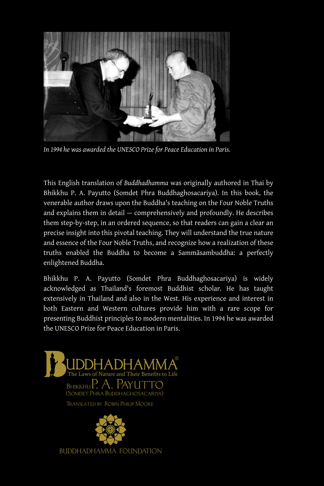

# 版权

佛法

自然法则及其对生命的好处

作者：巴育陀比丘 (P. A. Payutto) (Somdet Phra Buddhaghosacariya)

佛法基金会出版

版权所有 © 佛法基金会 2021

第四版

英文译者：罗宾·菲利普·摩尔 (Robin Philip Moore)

中文译者：智宁居士

编辑：科维洛比丘 (Bhikkhu Kovilo)，排版：甘比罗比丘 (Bhikkhu Gambhīro)

请在以下地址下载此书的PDF、EPUB和MOBI格式：

英文版：buddhadhamma.github.io

中文版：true-dhamma.com

分发和商业权利由佛法基金会保留。如果您希望在您的网站上分发此书，请向佛法基金会发送您的请求。

电子邮件：buddhadhammafoundationthai1987@gmail.com  
电子邮件：yongyutthanapura@gmail.com

