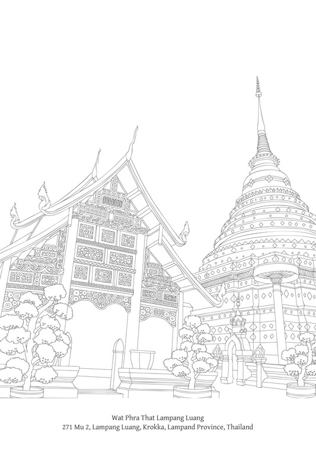
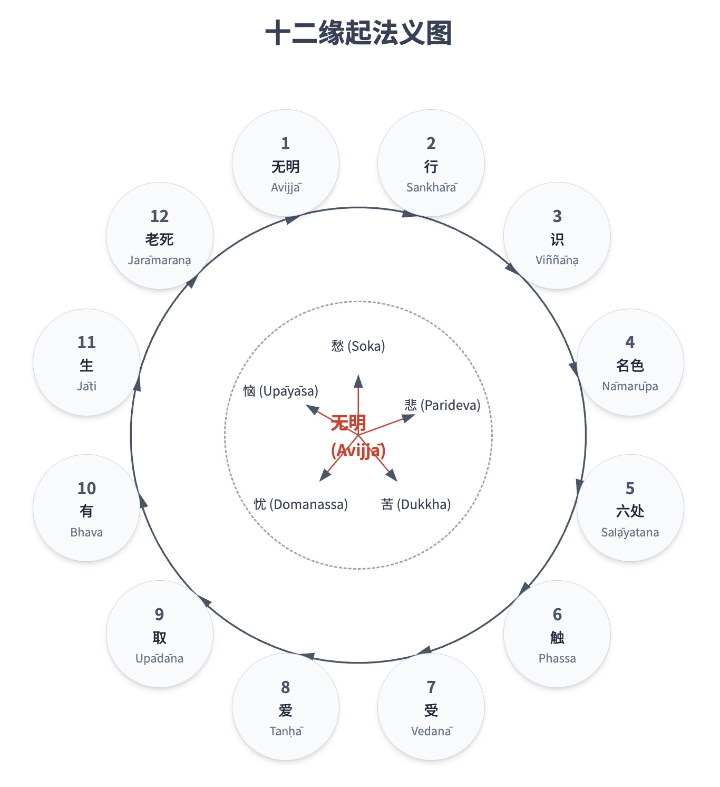
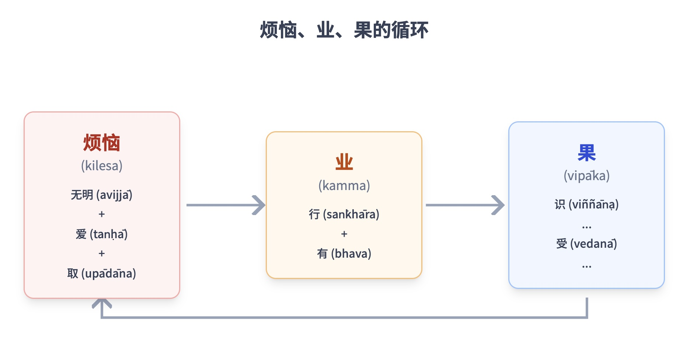
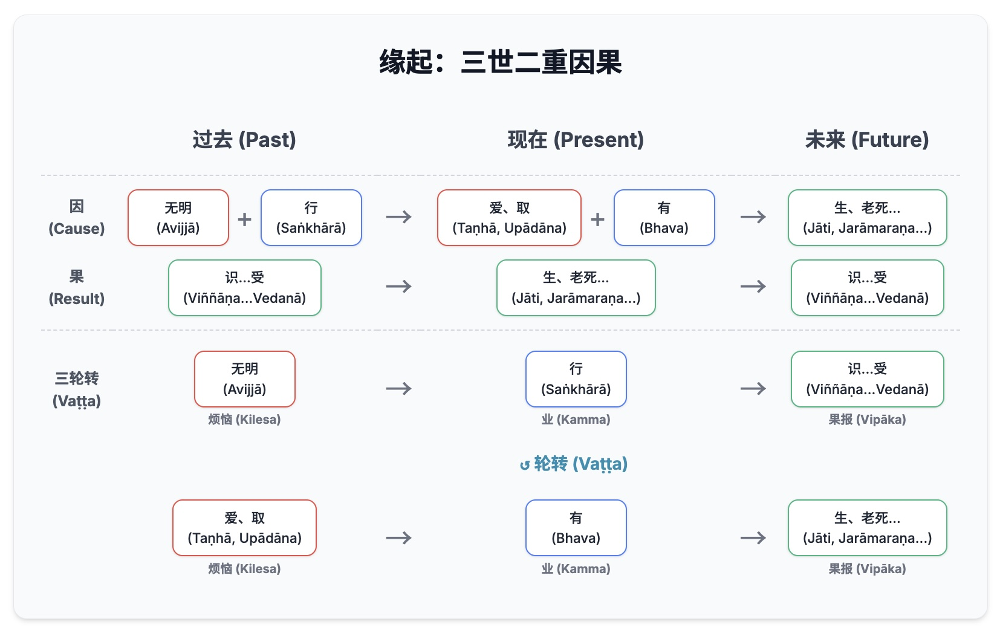
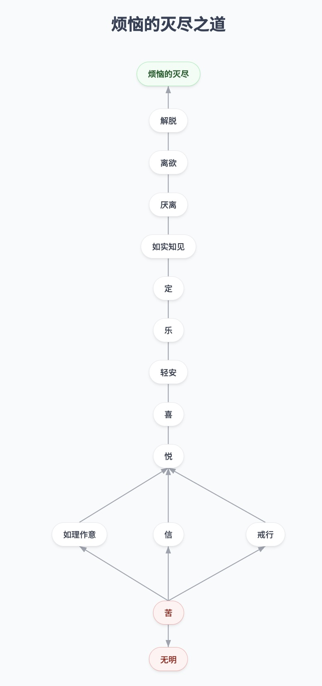

===
===

# 第四章：缘起

Paṭiccasmuppāda：佛教的条件法则

## 导论

paṭiccasamuppāda一词的基本定义包括“缘起”、“依缘共起”，以及“依共同条件而生起苦”。

佛陀以两种方式呈现缘起（paṭiccasamuppāda）的教法：普遍性的呈现，不具体说明过程中的每个因素；和详细的呈现，列出每个因素的连贯序列。普遍性的呈现通常在详细呈现之前出现。详细的呈现经常出现在经典中，通常单独出现，没有普遍性的呈现；它扩展了普遍性的呈现，描述和分析了缘起的每个因素。

### 普遍性的呈现

> 此有故彼有，  
> 此生故彼生。此无故彼无，  
> 此灭故彼灭。Imasmiṁ sati idaṁ hoti,  
> imassuppādā idaṁ uppajjati. Imasmiṁ asati idaṁ na hoti,  
> imasmiṁ nirodhā idaṁ nirujjhati.[\[1\]](dependent-origination_split_001.html#fn-fn1) S. II. 28, 65.

### 详细呈现

> 无明缘行，  
> avijjāpaccayā saṅkhārā 行缘识，  
> saṅkhārapaccayā viññāṇaṁ 识缘名色，[\[2\]](dependent-origination_split_001.html#fn-fn2)  
> viññāṇapaccayā nāma-rūpaṁ 名色缘六处，  
> nāmarūpapaccayā saḷāyatanaṁ 六处缘触，  
> saḷāyatanapaccayā phasso 触缘受，  
> phassapaccayā vedanā 受缘爱，  
> vedanāpaccayā taṇhā 爱缘取。{155}  
> taṇhāpaccayā upādānaṁ 取缘有，  
> upādānapaccayā bhavo 有缘生，  
> bhavapaccayā jāti 生缘老死。  
> jātipaccayā jarā-maraṇaṁ 愁、悲、苦、忧、恼皆由此生。  
> soka-parideva-dukkha-domanassupāyāsā sambhavanti 如是，此纯大苦聚之集。  
> evametassa kevalassa dukkhakkhandhassa samudayo hoti 无明灭故行灭，  
> avijjāya tveva asesavirāganirodhā saṅkhāranirodho 行灭故识灭，  
> saṅkhāranirodhā viññāṇanirodho 识灭故名色灭，  
> viññāṇanirodhā nāmarūpanirodho 名色灭故六处灭，  
> nāmarūpanirodhā saḷāyatananirodho 六处灭故触灭，  
> saḷāyatananirodhā phassanirodho 触灭故受灭，  
> phassanirodhā vedanānirodho 受灭故爱灭，  
> vedanāpaccayā taṇhānirodho 爱灭故取灭，  
> taṇhānirodhā upādānanirodho 取灭故有灭，  
> upādānanirodhā bhavanirodho 有灭故生灭，  
> bhavanirodhā jātinirodho 生灭故老死（灭）。  
> jātinirodhā jarāmaraṇaṁ 愁、悲、苦、忧、恼皆灭。  
> soka-parideva-dukkha-domanassupāyāsā nirujjhanti 如是，此纯大苦聚之灭。  
> evametassa kevalassa dukkhakkhandhassa nirodho hoti Vin. I. 1-2；S. II. 1-2, 65.

这两种形式都可以分为两个部分——生起的过程和止息的过程。第一个序列，生起的过程，称为生起之轮（samudaya-vāra）。它也称为顺观缘起（\*anuloma-\*paṭiccasamuppāda），等同于第二圣谛：苦之集（dukkha-samudaya）。后一个序列称为止息之轮（nirodha-vāra）或逆观缘起（paṭiloma-paṭiccasamuppāda）；它对应于第三圣谛：苦之灭（dukkha-nirodha）。

详细呈现的结束语表明缘起涉及苦的生起和止息。大多数经典中提及缘起的地方都以这些语句结尾。然而，也有一些段落以“世间”的生起和止息作结：

> 诸比丘，此是世间之集；  
> 诸比丘，此是世间之灭。Ayaṁ kho bhikkhave lokassa samudayo;  
> ayaṁ kho bhikkhave lokassa atthaṅgamo. S. II. 73. 如是世间集，  
> 如是世间灭。{156} Evamayaṁ loko samudayati;  
> evamayaṁ loko nirujjhati. S. II. 78.

这里，“苦”和“世间”可以互换使用，下文将对此进行解释。

缘起的详细呈现包含十二个因素，它们是一个相互关联的循环的一部分，没有开始也没有结束。没有“第一因”（mūla-kāraṇa）。为了方便起见，佛陀选择了无明（avijjā）作为最适合放在列表开头的因素，但这并非暗示无明是第一因。偶尔，为了防止将无明误解为“第一因”，他会插入以下陈述：

> 漏之生起，无明随之生起；漏之止息，无明随之止息。Āsava samudayā avijjā samudayo, āsava nirodhā avijjā nirodho. M. I. 55.

缘起的十二个因素，始于无明，终于老死，如下所示：

> 无明（avijjā）→  
> 行（saṅkhāra）→  
> 识（viññāṇa）→  
> 名色（nāma-rūpa）→  
> 六处（saḷāyatana）→  
> 触（phassa）→  
> 受（vedanā）→  
> 爱（taṇhā）→  
> 取（upādāna）→  
> 有（bhava）→  
> 生（jāti）→  
> 老死（jarāmaraṇa）。

愁、悲、苦、忧、恼是缘起循环的结果，当具有烦恼（āsava和kilesa）的人面临老死时，这些结果在他们心中生起。然而，这些结果通过导致烦恼（āsava）的进一步增加而发挥积极作用，而烦恼反过来又是无明的条件和循环持续旋转的条件。

一般来说，当佛陀呈现这种详细的或“应用”的缘起形式（包含全部十二个因素）时，他只会将顺观缘起作为引言。当他希望强调人类对苦的直接体验时，他最常以逆观缘起的方式呈现缘起：

> 老死 ← 生 ← 有 ← 取 ← 爱 ← 受 ← 触 ← 六处 ← 名色 ← 识 ← 行 ← 无明。S. II. 5-11, 81.

有时，当佛陀希望强调某个特定因素时，他会从中间的某个因素开始详细阐述。这种呈现可能从生（jāti）、[\[3\]](dependent-origination_split_001.html#fn-fn3) 受（vedanā）、[\[4\]](dependent-origination_split_001.html#fn-fn4) 或识（viññāṇa）开始，[\[5\]](dependent-origination_split_001.html#fn-fn5) 然后连接到后续的因素，直到过程达到老死（顺观缘起），或者追溯到无明（逆观缘起）。偶尔，过程始于不属于十二个因素的某个因素或问题，然后连接到缘起过程。[\[6\]](dependent-origination_split_001.html#fn-fn6) 总而言之，缘起的呈现并非固定不变，也无需提及所有十二个因素。{157}

尽管十二个因素被认为是相互依存并互为条件，但这与说它们互为“原因”不同。作为比较，除了种子本身，还有更多条件能使植物生长：土壤、水、肥料、天气和温度都起着作用。这些相互关联的条件无需遵循固定的时间顺序。同样，地板是桌子稳定或放置的条件。[\[7\]](dependent-origination_split_001.html#fn-fn7)

## 缘起的意义

佛陀将缘起原理呈现为一种自然法则，它的存在不依赖于佛陀的出现。佛陀以如下方式呈现缘起这一自然真理：

> 无论如来出世与否，这一特定条件性[\[8\]](dependent-origination_split_001.html#fn-fn8)的原理是恒常的、确定的、自然法则。如来彻底觉悟并洞察此真理后，便宣告、教导、阐明、制定、揭示并分析它。他说：“看！以无明为条件，有行……诸比丘，因此，这种如是性（tathatā）、这种无误性（avitathatā）、这种不变性（anaññathatā）——这种特定条件性（idappaccayatā）——被称为缘起。”[\[9\]](dependent-origination_split_001.html#fn-fn9) S. II. 25-6.

缘起的中心重要性从佛陀的话中可见一斑：

> 见缘起者见法；见法者见缘起。M. I. 190-91. 诸比丘，已受教导的圣弟子对这件事情有独立于他人的知解：“此有故彼有；此生故彼生”……当圣弟子如实地理解世间的生起和消逝时，他便被称为见具足、观具足的圣弟子，他已达致此真实佛法，拥有受训者的知，受训者的真知，已入佛法之流，具深奥智慧的圣者，已然站在通往不死之门前。{153} S. II. 78-9. 那些理解这些事物（即缘起的因素）、它们的生起、它们的止息以及导向它们止息之道的沙门和婆罗门……那些沙门和婆罗门值得被承认为沙门中的沙门、婆罗门中的婆罗门。他们通过亲身体证，在今生被承认为已达到并安住于沙门之道的目标和婆罗门之道的目标。S. II. 16, 45-6, 129.

有一次，佛陀警告尊者阿难陀不要误判缘起的复杂性：

> \[阿难陀：\]“世尊，真是奇妙！世尊，真是不可思议！这缘起如此深奥，且似乎深奥，但我却觉得它清晰易懂。” \[佛陀：\]“阿难陀，不然！阿难陀，不然！这缘起深奥，且似乎深奥。正是因为不理解和未能洞彻此真理，这一代众生才饱受折磨，纠缠如乱麻，如乱线的团，如纠结的芦苇和草，无法超越苦界、恶趣、下界和轮回（saṁsāra）。” S. II. 92.

熟悉佛陀生平故事的读者会记得，佛陀在觉悟后不久曾不愿宣说佛法：

> 诸比丘，我心中生起这样的念头：“我所证得的佛法深奥、难见、难证、寂静、殊胜、非逻辑可及、唯智者能知。然而，这一代众生乐于执著，喜于执著，悦于执著。[\[10\]](dependent-origination_split_001.html#fn-fn10) 对这样乐于执著的众生来说，要看见此真理，即特定条件性、缘起，是困难的。而要看见此真理，即一切行的止息、一切苦之基础（upadhi）的舍弃、爱欲的终结、离染、止息、涅槃，也是困难的。如果我宣说佛法，而他人不能真正理解我，那对我来说将会是劳累和麻烦。” Vin. I. 4-5；M. I. 167-8.

这段文字提到了缘起和涅槃，强调了这两个真理的重要性，以及证悟它们的难度。佛陀觉悟了这些真理，并向他人解释了它们。{154}

## 缘起的诠释

缘起的教义可归纳如下：

1.  一种解释世界演变和一切生命循环的方式，通过更字面地诠释佛陀的一些话，例如佛陀关于“世间之集”（loka-samudaya）的教导。[\[11\]](dependent-origination_split_001.html#fn-fn11)
    
2.  一种解释人类生死、人类苦的生起与止息的方式。这种解释可进一步细分为两类：
    
    1.  对一生到另一生的广泛描述：从一种存在境界到另一种存在境界的转世。这也是一种字面解释，常见于注疏中，在那里它被系统化并详细描述，有时甚至令人望而生畏。
    
    2.  对生命中每个当下循环的描述。这种描述提供了对前述描述（2A）中隐含的教义的诠释，但它侧重于特定巴利语术语的深层含义，或其实际意义。这种诠释将缘起的整个循环解释为当下的经验，这被认为符合佛陀的本意和此教义的真正目标，正如佛陀的许多经文所证明的，包括《思经》（Cetanā Sutta）、[\[12\]](dependent-origination_split_001.html#fn-fn12) 《苦灭经》（Dukkhanirodha Sutta），[\[13\]](dependent-origination_split_001.html#fn-fn13) 和《世间灭经》（Lokanirodha Sutta）。[\[14\]](dependent-origination_split_001.html#fn-fn14) 在《阿毗达摩》中，有一整个部分专门阐述了在单个心刹那中缘起的完整序列。[\[15\]](dependent-origination_split_001.html#fn-fn15)
    

关于解释 #1，有些人将缘起解释为宇宙起源的理论，宣称无明是“第一因”，[\[16\]](dependent-origination_split_001.html#fn-fn16) 随后的十一个因素则构成并完成了这一过程。{158} 这种解释导致了一种观点，认为佛教与其他宗教和哲学相似，这些宗教和哲学假设存在一个原初的代理，例如一个创世神，他是所有众生和事物的源头。根据这种解释，唯一的区别在于，这些有神论教义将世界的创造和管理描绘为一种超越自然的力量，而佛教则描述了一个因果的、自然的过程。

然而，这种解释是不准确的，因为任何宣称存在第一因或原初代理的教义都与缘起或特定条件性原则相矛盾。缘起的教义提供了对因果关系的客观解释，即所有有为法都是相互关联和相互依存的。它们在一个没有开始也没有结束的连续因果过程中生起。一个第一因，无论是创世神还是其他代理，都是不可能的。因此，将缘起解释为描述世界的演变，只适用于解释一个没有开始也没有结束的持续增长和衰变这一自然、因果过程的语境。

判断对缘起的诠释是否正确的一种方法是考量佛陀教导佛法的本意。佛陀着重于那些可以应用以带来福祉、与日常生活相关并解决现实生活问题的事物。他认为通过形而上学思辨和辩论来寻求真理是徒劳的。因此，要确定什么是真正的佛法，需要考量一种教义的伦理和实践价值。

源于上述缘起解释#1的世界观是恰当的，并符合佛法的宗旨。它提供了一个广阔的视角，即事物按照因果法则运行，它们依赖于自然条件，既非源于造物主，也非随机或偶然生起。此外，它有助于带来以下三个实际利益：

首先，一个人认识到要获得成功和圆满，不能依赖希望、欲望、命运、神力干预或超自然力量。唯有通过协同行动才能获得成功；一个人必须自力更生，创造导致成功的条件。

其次，要创造这些条件，一个人必须正确理解自己所参与的自然动态中的每个因素，以及因素之间的相互关系；因此，智慧是这一过程中不可或缺的要素。{159}

第三，因果联系的知识减少或消除了将事物错误地认同为固定“自我”的观念。这种知识促进了与事物的适当关系，并导向内在的自由。

尽管将缘起解释为描述一个无始无终的世界演变是可以接受的，但其实际价值有限。它尚未足够有力或整合，以确保上述三项利益（特别是促进自由的第三项利益）。

要真正受益于这种广义的缘起诠释，一个人必须通过辨识所有有为法的因果、相互依存的本质来细化自己的观察。当一个人在生命的每个当下都发展出这种清晰时，前面提到的三项利益就圆满了，同时也就达到了与世界演变相关的诠释的真正目标。

缘起作为世界演变的解释，无论其是最广义的还是更精细的，都是对外在现象的观照。另一方面，第二种解释则强调人类的内在生命，包括人类苦的动态。

第一个细分（2A）受到注释书的青睐，其中对此进行了详细解释。[\[17\]](dependent-origination_split_001.html#fn-fn17) 注释书为此过程创造了许多新的描述性术语，以构建一个清晰、有组织的系统。然而，缺点是这个系统可能显得僵硬，对于佛教新手来说，甚至有些晦涩难懂。第二个细分（2B）与第一个（2A）直接相关，如下文所述。{160}

## 缘起的关联语境

缘起的根本目标是阐明苦（dukkha）的生起和止息。苦（dukkha）这个词在佛法中扮演着举足轻重的角色，并出现在几个关键教义中，例如三法印和四圣谛。要理解苦（dukkha）这个词的完整含义，我们必须搁置“suffering”（痛苦）这一常见译法，并审视苦的三重分类，[\[18\]](dependent-origination_split_001.html#fn-fn18) 及其注释性的解释：[\[19\]](dependent-origination_split_001.html#fn-fn19)

1.  Dukkha-dukkhatā：通常理解为疼痛感（dukkha-vedanā）；身体上的苦（例如：疼痛和不适）和精神上的苦（例如：悲伤）；不适；由遭遇不合意和令人不安的感官对象而生起的苦。
    
2.  Vipariṇāma-dukkhatā：与变易相关的苦；乐中固有的苦。乐因为无常而变为苦或产生苦。一个人可能感到安适，没有任何不安，但在体验到更愉悦的安适后，原先的安适状态可能就会感到不悦。这就像苦潜伏着，当乐消退时便显现出来。苦的程度与先行之乐的程度成正比。即使在体验乐时，如果一个人意识到乐的转瞬即逝，苦也可能生起。当乐结束时，分离的悲伤随之而来。
    
3.  saṅkhāra-dukkhatā：行苦；所有因缘和合而生的诸法之苦，即五蕴，包括“道”（magga）和“果”（phala），它们在技术上被归类为“出世间法”。所有有为法都被互相冲突的组成要素所压迫；所有法都生灭；它们是不完善的。它们存在于因缘的“流转”中，这为那些不了解缘起本质、以贪爱、执取和无明愚蠢地抗拒这个过程、且不以智慧与之相应的人带来了痛苦。
    

这第三种苦揭示了有为法的固有本质，但它也具有心理层面。这种不完善和压力使得人们无法对有为法感到彻底满足，并持续为那些以贪爱、执取和无明与事物打交道的人带来痛苦。[\[20\]](dependent-origination_split_001.html#fn-fn20) {161}

因此，这第三种苦的意义是包罗万象的。它与三法印中苦的含义相符（“一切有为法皆苦”）。事物固有的压力和不稳定性可能导致四圣谛的苦，其中贪爱、执取和无明成熟为痛苦，以及自然的五蕴发展成为人类的五取蕴。

在此语境下，我们可以将三种受（vedanā）包括在内：乐受（sukha）、苦受（dukkha）和不苦不乐受（upekkhā）。苦受（dukkha-vedanā）是第一种苦——苦苦的一部分。乐受（sukha-vedanā）则在第二种苦——坏苦中有所提及。尽管不苦不乐受（或“舍”）避开了前两种苦，但它被包含在最后一种苦——行苦中。即使是舍，也是短暂的、无常的，受因缘制约。如果一个人被舍所迷惑并希望沉溺其中，他就无法逃脱有为法的苦。注释中阐述道，不苦不乐受（upekkhā-vedanā），连同三界（tebhūmaka）中的所有其他行，都是行苦，因为它们受到生灭的压迫。总而言之，所有三种受都包含在这三种苦之中。

缘起法揭示了自然界固有的动态如何因无明、贪爱和执取而发展成为人类的问题。同时，这些自然的动态也揭示了现象的相互关联性如何以流转的形式存在。这种流转的各个方面可以被区分：有为法是相互关联的；它们的存在依赖于其他有为法；它们是无常的，甚至一瞬间也不会保持不变；它们不是自主的——它们没有真正的“自我”；并且它们没有第一因。

从另一个角度看，现象在世间显现的方式——生起、发展和衰落——揭示了它们的流动性。这种流动性存在是因为事物是由相互关联的组成部分构成的。现象之流之所以持续，是因为它的所有组成部分都是不稳定的、无常的，并且没有真实自性。相互依存过程的这些特殊特征既指出了第一因的不可能性，也使得独特的流动实体得以显现。

如果事物真正拥有一个“自我”，它们就会是稳定的。如果事物是稳定的，即使只是一瞬间，根据定义它们也不会是相互依存的，也就不会有流动的实体。但是，如果没有相互依存的现象之流，自然就不会以它现在的方式存在。现象中若存在“自我”或固定实体，就会使真正的因果互动变得不可能。因为一切事物都是无常的、变动的、会衰败的、无自性的、相互关联的，所以存在着一个显现为独特自然现象的因缘之流。

巴利语中表示无常和不稳定的是 aniccatā。表示生灭所带来的压迫、固有的压力、冲突和不完善的是 dukkhatā。表示“无我”或无自性——即没有任何内在或外在的本质或主宰者可以按照意愿支配事物——的是 anattatā。缘起法揭示了这三种特性，并描述了现象的相互关联序列。 {162}

缘起的过程适用于物质法（rūpa-dhamma）和非物质法（nāma-dhamma），适用于物质世界和包含身心属性的人类生命。这个过程以特定的自然法则表现出来，即：（1）dhamma-niyāma：因果的普遍法则；（2）utu-niyāma：物质世界的法则（物理法则）；（3）bīja-niyāma：支配生命事物的法则，包括遗传学（生物法则）；（4）citta-niyāma：支配心识运作的法则（心理法则）；以及（5）kamma-niyāma：“业”的法则（有意的行为；业力法则）[\[21\]](dependent-origination_split_001.html#fn-fn21)，它决定人类的福祉，并与伦理道德直接相关。

再次强调，所有自然过程，包括业的动态，之所以可能，是因为事物是无常和无自性的。这个事实可能与人们普遍的感受相悖。然而，如果事物是永恒的、稳定的，并且拥有一个坚实的核心，那么上述任何自然法则都将不成立。此外，这些法则证实了事物没有第一因，也没有造物主。

有为法依因缘而生，它们是相互关联的；它们没有固定的核心。以床为例，它由按照既定方案组装的各种部件组成；除了这些组成部分之外，床并没有什么本质的自性。把它们拆开，床就不复存在了；存在的只是一种“床”的概念，那是心中的一个念头。即使是特定的概念也不是孤立存在的，而是与其他概念相连的。 “床”的概念只有在与“躺下”、“平面”、“位置”、“空间”等概念相关时才有意义。

人们对特定名称的觉知和理解，与其对该特定实体的相关因素的理解是相连的。但当对物体的认知建立后，以贪爱和执取形式出现的习性执著，导致人们确信物体的实在性。物体被从其关联语境中分离出来，对物体的真实洞察力受到阻碍。自私和占有欲由此浮现。

如前所述，事物没有“第一因”或原始来源。无限地追溯因缘，人们仍然找不到第一因。然而，人们有一种强烈的冲动，要去寻找现象的原始来源，因此他们对特定的实体赋予了过度的重要性。这种寻找来源的冲动与真相相悖，而与被视为来源的任何事物相关的观念则成为一种“知觉颠倒”（saññā-vipallāsa）。

人们过早地放弃了对因果关系的探究。正确的探究将继续追问被视为来源之物的因，并得出这条探究线索是无止境的结论。事物相互依存，因此没有“第一因”。事实上，人们可以提出这样的问题：事物为什么必须起源于一个原始来源呢？ {163}

相信造物主同样与自然相悖。这种信仰源于观察和普遍的假设，即人类负责生产工具、器械和手工艺品；因此，宇宙中的一切也必定有一个创造者。

然而，这种推理的逻辑是有缺陷的。人们将生产行为与缘起的自然背景分离开来。事实上，人类的生产只是缘起的一个方面。在生产行为中，人类是缘起过程中的众多因素之一，所有这些因素结合起来才能达到预期的结果。这与纯粹的物质过程的区别在于，伴随着意图的心理因素（例如“欲望”）也起着作用。但这些心理因素必须与缘起过程中的其他因素结合，才能实现预期的目标。例如，建造房屋时，一个人会影响其他因素以促成完工。如果人类凌驾于缘起过程之上，他们就可以凭空建造房屋，但这不可能。因此，创造并非独立于缘起，既然所有有为法都作为持续因果过程的一部分而存在，那么造物主在任何阶段都不起作用。

另一种与真相相悖，并类似于“第一因”观念的论证是，起初什么都没有。这种观念与对自我的执着信念有关并源于此：将个体形式的组成部分等同于自我。一个人建立了自我的概念并执着于此。此外，他可能相信这个自我最初并不存在，而是在后来才出现的。

这种局限的思维方式，即执着于一个对象而没有对事物流动的看法，是对世俗概念的执着和对世俗谛的误解。它隐藏在寻找第一因或造物主作为一切现象来源的需要背后，由此产生了诸如不朽之物如何能产生有朽之物，或无常之物如何能从永恒中涌现等相互冲突的观念。关于现象的因果、相互关联的流动，除非指的是“世俗谛”（sammati-sacca），否则没有必要谈论持久的或暂时的“自我”。再者，可以问，为什么在事物存在之前必须先是虚无呢？

无论如何，在佛法中，对“第一因”和造物主等话题的猜测被认为价值甚微，因为它与教法在实现真正精神福祉方面的实际应用无关。尽管这些哲学上的考量可以导向广阔的世界观，如上所示，但它们可以被忽略，因为专注于实际应用也能带来相同的益处。因此，这里的重点应该是将教法应用于日常生活中。 {164}

如前所述，人类是由五蕴组成的。没有什么东西独立于这些蕴而存在，无论是存在于其内部还是外部。没有什么东西拥有或控制这些蕴并主宰生命。五蕴依照缘起运作；它们是相互关联的因缘流转的一部分。这个过程中的所有组成部分都是不稳定的；它们都生灭，并制约着进一步的生起和衰败。组成部分的相互依存使得因果过程和持续不断的行得以存在。

五蕴具有三法印（tilakkhaṇa）的特征：（1）它们是无常和不稳定的，不断地生灭（= aniccatā）；（2）它们持续受到生灭的压迫；对于以无明和执着与它们打交道的人来说，它们必然产生痛苦（= dukkhatā）；（3）它们空无任何能按照欲望支配事物的实质自性或自我（= anattatā）。

这五蕴，持续变动且本质上无自性，遵循其自身本性并依照相互关联的因缘流转。然而，未觉悟的人类犯下错误，通过认同某些现象来抗拒这种流转。他们随后希望这个想象中的“固定实体”能够持久或按照期望的方式运行。同时，因缘流中的漩涡与欲望冲突，导致压力并增强欲望和执着。当欲望受挫时，建立、控制和稳定身份的斗争变得更加激烈，从而导致更大的失望、苦恼和绝望。

对真相模糊的理解可能会导致一个人得出变化是不可避免的结论，并且自己珍视的“自我”可能会消失，但这种思考只会导致更牢固的执着，并与根深蒂固的焦虑交织在一起。这种心境由三种烦恼组成：avijjā（对真相的无明；对“自我”的错误信念）；taṇhā（希望这个臆想的“自我”以某种特定方式存在或不存在）；和 upādāna（执取；将这个“自我”束缚于事物）。这些烦恼深深植根于心中，它们或显或隐地控制着人类的行为。它们塑造着人们的个性和命运。可以公平地说，它们是所有未觉悟者的痛苦根源。

前面的段落揭示了两种不同过程之间的冲突：

1.  受三法印（anicca, dukkha 和 anattā）法则支配的生命进程，这是自然的固定法则。它以生、老、死的形式显现，无论是从普通的还是更深层的意义上。[\[22\]](dependent-origination_split_001.html#fn-fn22)
    
2.  对生命进程的无明；错误地相信存在一个稳定、持久的“自我”以及随之而来的执着，并伴随着恐惧和焦虑。 {165}
    

冲突存在于自然法则与错误的自我观之间，存在于自然界的因果动态与人们的欲望之间。人们建构了一个自我，这个自我随后阻碍了自然的流转。当人们的欲望不健全或受挫时，结果便是各种形式的痛苦。这导致了一个无明、执着、奴役、抗拒自然和痛苦的生活。

从世俗层面讲，第二个过程包含两种“自我”。首先是自然界中随因缘而变化的“自我”或“实体”。尽管不存在真正的“自我”，但可以将一种自然动态或流转与其他动态或流转区分开来，并且为了实际目的，可以将“自我”的世俗标签赋予每个个体动态。其次是虚假的“自我”，一个“固定的实体”，人们想象它是真实的，并以无明、贪爱和执取执着于它。第一个“自我”，即动态的实体，不是执着的起因。但第二个“自我”，叠加在第一个“自我”之上，是由执着定义的；它必然被第一个“自我”的本性所破坏，从而导致痛苦。

无明和执着的生活在心中灌输恐惧和焦虑，影响行为，并使人们不知不觉地成为欲望的奴隶。它增加了自私（对个人满足的持续追求）、占有欲，以及对他人的缺乏体谅。[\[23\]](dependent-origination_split_001.html#fn-fn23)

为了强化和肯定他们的欲望，人们执着并认同那些符合欲望需求和相符的见解、观点、教义、信仰体系等。他们珍惜并执着于这些见解等，仿佛在保护他们自身的自我。结果，他们建立了一个障碍，阻止他们接触真相：他们躲避真相。这种心智的僵化意味着他们的批判能力受损。而且它可能导致顽固——无法容忍或倾听他人的观点。[\[24\]](dependent-origination_split_001.html#fn-fn24)

当人们对什么是善、应该实现什么、以及达到预期目标的正确方式建立了思想、观点和信念时，他们就会相应地行动，并遵循相应的传统和习俗。结果，他们的行为甚至可能是天真或非理性的；他们可能仅仅出于对这些传统和习俗的执着而行动，对所涉因素的因果关系只有模糊的理解。因此，他们缺乏对因果关系的清晰理解。 {166}

这反映在一些宗教寻求者的生活中，他们以极大的热情坚持各种苦行传统和实践，相信这种行为将保证解脱、证悟或通往天堂。然后，由于这些既定的实践，他们会批评并轻视他人。[\[25\]](dependent-origination_split_001.html#fn-fn25)

同时，在更深层次上，这些人担心他们珍视的“自我”的保存，这是一个虚构的概念。尽管他们并不知道这个假定的自我究竟是什么或在哪里，但他们仍然拖着它并保护它。而且因为他们害怕自我可能随时消亡，他们会抓住任何能提供自我肯定感的东西，无论这些东西多么模糊。因此，生活变得受限，他们的福祉受到这个所谓的“自我”命运的塑造。[\[26\]](dependent-origination_split_001.html#fn-fn26)

这些影响不仅仅作用于个体：冲突和痛苦向外延伸，导致社会冲突。人类制造的所有社会问题都源于无明和执着的生活。

缘起的详细阐述概述了痛苦生命的起源；它概述了自我感的起源，这必然导致痛苦。打破缘起链条就是结束痛苦的生命，根除所有源于“自我”的痛苦。这导向智慧、无执着、自由和与自然和谐相处的生活。

智慧的生活——对真相的直接了知——意味着从人与自然的关系中获益，这等同于与自然和谐相处。与自然和谐相处就是自由地、无执着地生活：摆脱贪爱和执取。而无执着的生活则依赖于对缘起的了解，以及与事物建立恰当的关系。

佛教教义不承认存在凌驾于自然之上并拥有掌控自然力量的超自然实体。如果有什么东西存在于自然之外——超越自然——那么根据定义它就无法影响自然。凡是涉及自然的，都是自然的一部分。 {167} 自然现象依照因缘而存在；它们并非偶然发生。所有看似奇迹或奇观的惊人事件都源于并依照因缘而发生。我们称这些事件为奇迹，是因为其因缘仍然隐藏；一旦因缘被知晓，惊奇感便会消失。“超自然”和“异常”这些词仅仅是说法而已；它们并非指存在于自然之外的某种实体。

一个相关的主题是“人”与“自然”的区别。“人与自然”或“人类控制自然”的表达仅仅是修辞手法。事实上，人类是自然的一部分，人类只能在作为自然中的一个条件，影响随后的条件并产生特定结果的程度上控制自然。

人类互动独特之处在于涉及心识条件，包括思（volition），因此“创造”一词用于人类活动。但创造行为中的所有元素，无一例外，都是缘起因素。人类无法凭空或孤立地创造任何东西，仿佛与缘起过程分离。当人类理解导致预期结果的必要条件时，他们作为其中一个决定性因素进入过程，塑造其他条件以达到预期目标。

成功的互动有两个阶段：第一是知识，第二是作为后续条件的条件而行动。初始阶段，等同于智慧，至关重要。有了智慧，一个人就可以根据自己的愿望与事物互动。明智地与事物互动意味着从人与自然的关系中获益，甚至控制自然，这种益处延伸到一个人与物质事物和心识的关系。因为人类和自然存在相互关系，所以明智地生活就是与自然和谐相处。有了智慧，一个人就能控制自己的心智能力，控制自己的心：一个人就能控制自己。

智慧的生活有两个维度：在内在，有智慧的个体是平静、清明和喜悦的。当遇到愉悦的对象时，他们不会被诱惑或鲁莽。当与令人愉悦的对象分离时，他们不会心烦意乱或沮丧。他们不将自己的幸福托付给物质事物，不让物质事物主宰他们的生活。而在外在，他们流畅而敏捷；他们准备好以恰当和合理的方式与事物互动。没有内在的执着或固着导致障碍、偏见或困惑。 {168}

佛陀的以下教言阐明了执着的生活与智慧的生活之间的区别：

> 比丘们，未受教导的凡夫感受乐受、苦受和不苦不乐受。受教导的圣弟子也感受乐受、苦受和不苦不乐受。在此情况下，比丘们，受教导的圣弟子与未受教导的凡夫之间有什么区别、差异、不同呢？比丘们，当未受教导的凡夫被苦受触及时，他会悲伤、哀叹；他会捶胸哭泣并变得心烦意乱。他感受两种受——身受和心受。假设一个弓箭手用一支箭射中一个人，然后又用第二支箭射中他，以至于这个人感受到由两支箭引起的受。同样，当未受教导的凡夫被苦受触及时……他感受到两种受——一种是身体的，一种是心理的。被那苦受触及后，他对其心生厌恶。当他对苦受心生厌恶时，对苦受的潜在倾向就潜伏在其背后。被苦受触及时，他会在感官享乐中寻求愉悦。[\[27\]](dependent-origination_split_001.html#fn-fn27) 为什么呢？因为未受教导的凡夫除了感官享乐之外，不知道有任何摆脱苦受的方法。当他在感官享乐中寻求愉悦时，对乐受的潜在贪欲倾向就潜伏在其背后。他未能如实了解这些受的生起和灭去、满足、危险和出离。当他不了解这些事物时，对不苦不乐受的潜在无明倾向就潜伏在其背后。如果他感受乐受，他感受到的是一种被束缚的感受。如果他感受苦受，他感受到的是一种被束缚的感受。如果他感受不苦不乐受，他感受到的是一种被束缚的感受。比丘们，这就是所谓的未受教导的凡夫，他被[\[28\]](dependent-origination_split_001.html#fn-fn28)生、老、死所束缚；被忧、悲、苦、恼、绝望所束缚；我说，他被痛苦所束缚。 {169} 比丘们，当受教导的圣弟子被苦受触及时，他不会悲伤或哀叹。他不会捶胸哭泣并变得心烦意乱。他感受到一种受——身受，而不是心受。假设一个弓箭手用一支箭射中一个人，但第二支箭没有射中目标，以至于这个人只感受到由一支箭引起的受。同样，当受教导的圣弟子被苦受触及时……他感受到一种受——身体的，而不是心理的。被那苦受触及后，他对其不心生厌恶。因为他对苦受不心生厌恶，所以对苦受的潜在厌恶倾向不会潜伏在其背后。被苦受触及时，他不在感官享乐中寻求愉悦。为什么呢？因为受教导的圣弟子知道除了感官享乐之外，还有摆脱苦受的方法。因为他不在感官享乐中寻求愉悦，所以对乐受的潜在贪欲倾向不会潜伏在其背后。他如实了解这些受的生起和灭去、满足、危险和出离。因为他了解这些事物，所以对不苦不乐受的潜在无明倾向不会潜伏在其背后。如果他感受乐受，他感受到的是一种解脱的感受。如果他感受苦受，他感受到的是一种解脱的感受。如果他感受不苦不乐受，他感受到的是一种解脱的感受。比丘们，这就是所谓的圣弟子，他已从生、老、死中解脱；已从忧、悲、苦、恼、绝望中解脱；我说，他已从痛苦中解脱。比丘们，这就是受教导的圣弟子与未受教导的凡夫之间的区别、差异、不同。S. IV. 207-210.

前面一节强调如实了知事物，了知心中需要修正和培养什么，以及了知通过这种修正和培养能获得什么。与修正和培养相关的恰当行为是实际应用的问题，这将在下面讨论。 {170}

## 正统解释

缘起的正统解释既详细又复杂。对其研究需要对经文和巴利语有广泛的了解。[\[29\]](dependent-origination_split_001.html#fn-fn29) 其中大部分内容超出了本书的范围，在此只需提供一个基本总结。

### 缘起支

> (1) avijjā（无明）→ (2) saṅkhāra（行）→ (3) viññāṇa（识）→ (4) nāma-rūpa（名色）→ (5) saḷāyatana（六处）→ (6) phassa（触）→ (7) vedanā（受）→ (8) taṇhā（爱）→ (9) upādāna（取）→ (10) bhava（有）→ (11) jāti（生）→ (12) jarāmaraṇa-soka-parideva-dukkha  
> -domanassa-upāyāsā（老死-忧-悲-苦-恼-绝望）→ dukkha-samudaya（苦集）。

苦的止息也遵循相同的顺序。

缘起的循环性可用图表“缘起之环”所示。 {171}

缘起之环 

### 定义

首先，以下是这十二个缘起支的基本和字面定义：[\[30\]](dependent-origination_split_001.html#fn-fn30)

1.  avijjā：无明；对真相的无知；缺乏清晰的理解。
    
2.  saṅkhāra：行；造作；思以及所有储存于心识中的心理现象。
    
3.  viññāṇa：识；基于认知所产生的知。
    
4.  nāma-rūpa：名色；心与身。
    
5.  saḷāyatana：六处；六种认知之门：眼、耳、鼻、舌、身、意。
    
6.  phassa：触；六根（āyantana）、六尘（ārammaṇa）和识（viññāṇa）之间的接触。
    
7.  vedanā：受；乐受、苦受和不苦不乐受的感觉。
    
8.  taṇhā：爱（对感官享乐、对有、对无有的贪爱）。
    
9.  upādāna：取；执取；占有。
    
10.  bhava：有；存在状态；存在方式；业（kamma）的集体结果。
    
11.  jāti：生；执着于自我之蕴的显现。
    
12.  jarāmaraṇa：老死；诸根衰退和诸蕴坏灭。
    

其次，以下是正式的、教义上的定义：

1.  avijjā：对苦、苦的起源、苦的止息以及导向苦的止息之道（四圣谛）的无明；根据《阿毗达磨》，是对过去、未来、过去和未来以及缘起的无明。[\[31\]](dependent-origination_split_001.html#fn-fn31)
    
2.  saṅkhāra：身行（kāya-saṅkhāra）、语行（vacī-saṅkhāra）和意行（citta-saṅkhāra）[\[32\]](dependent-origination_split_001.html#fn-fn32)；根据《阿毗达磨》，是福行（puññābhisaṅkhāra）、非福行（apuññābhisaṅkhāra）和不动行（āneñjābhisaṅkhāra）。[\[33\]](dependent-origination_split_001.html#fn-fn33)
    
3.  viññāṇa：六识：眼识（cakkhu-viññāṇa）、耳识（sota-viññāṇa）、鼻识（ghāna-viññāṇa）、舌识（jivhā-viññāṇa）、身识（kāya-viññāṇa）和意识（mano-viññāṇa）。[\[34\]](dependent-origination_split_001.html#fn-fn34)
    
4.  nāma-rūpa：“名”：受（vedanā）、想（saññā）、思（cetanā）、触（phassa）和作意（manasikāra）；而“色”：四大种（mahābhūta）以及依附于这四大种的色。阿毗达磨将“名”定义为受蕴（vedanā-khandha）、想蕴（saññā-khandha）和行蕴（saṅkhāra-khandha）。[\[35\]](dependent-origination_split_001.html#fn-fn35)
    
5.  saḷāyatana：六处：眼（cakkhu）、耳（sota）、鼻（ghāna）、舌（jivhā）、身（kāya）和意（mano）。 {172}
    
6.  phassa：六触，通过眼、耳、鼻、舌、身和意而触。[\[36\]](dependent-origination_split_001.html#fn-fn36)
    
7.  vedanā：六受，通过眼、耳、鼻、舌、身和意而触所生的受。[\[37\]](dependent-origination_split_001.html#fn-fn37)
    
8.  taṇhā：六爱：色爱（rūpa-taṇhā）、声爱（sadda-taṇhā）、香爱（gandha-taṇhā）、味爱（rasa-taṇhā）、触爱（phoṭṭhabba-taṇhā）和法爱（dhamma-taṇhā）。[\[38\]](dependent-origination_split_001.html#fn-fn38)
    
9.  upādāna：四取：kāmupādāna（欲取：执着于色、声、香、味、触等感官享乐）；diṭṭhupādāna（见取：执着于各种见解、理想、理论和信仰）；sīlabbatupādāna（戒禁取：执着于戒律和实践，相信它们本身能导向精神上的清净）；和 attavādupādāna（我语取：执着于“自我”；创造一个虚假的自我观念然后执着于这个观念）。
    
10.  有：三种存在的领域：欲界 (kāma-bhava)，色界 (rūpa-bhava)；以及无色界 (arūpa-bhava)。另外的解释是：(1) ‘业’的领域 (kamma-bhava) – 积极的形成过程（等同于善业思、不善业思和不动业思；参阅上文的 saṅkhāra），以及 (2) 被动的形成过程 (uppatti-bhava)[\[39\]](dependent-origination_split_001.html#fn-fn39)，等同于欲界、色界、无色界、想界 (saññā-bhava)、无想界 (asaññā-bhava)、非想非非想界 (nevasaññānāsaññā-bhava)、一蕴有 (ekavokāra-bhava)、四蕴有 (catuvokāra-bhava)、以及五蕴有 (pañcavokāra-bhava)。[\[40\]](dependent-origination_split_001.html#fn-fn40)
    
11.  生：五蕴的生起；六处 (āyatana) 的生起。另外的解释是，‘这些各种现象的生起。’[\[41\]](dependent-origination_split_001.html#fn-fn41)
    
12.  老死：老 (jarā)（衰老；诸根的衰弱），以及死 (maraṇa)（死亡；诸蕴的离散；‘命根’ – jīvitindriya 的终结）。另外的解释是，‘这些各种现象的衰退和消散。’[\[42\]](dependent-origination_split_001.html#fn-fn42)
    

### 一般性解释

以下是几个简单扼要地解释这些缘起支的例子：

*   漏 → 无明：
    
    相信升天是最高的快乐；相信杀害他人会带来快乐；相信自杀会带来快乐；相信投生为梵天神会带来永生；相信通过祭祀供奉可以到达天界；相信通过苦行可以达到涅槃；相信有一个当下存在的自我会因某些行为而再生；相信死后一无所有。于是：
    
*   → 行：
    
    按照（上述）这些信念来思考和倾向；基于这些思想和意图来构思行为和造作（业）；这些行为可以是善的 (puñña)、恶的 (apuñña 或 pāpa)、或‘不动’的 (āneñja – 参阅上文 āneñjābhisaṅkhāra)。于是：
    
*   → 识：
    
    对感官印象的觉知和认知，这些感官印象具体符合上述意图。由此产生具有特定特质的识。{173} 在死亡时，行（saṅkhāra）——即已造作的业——的力量会促使再生结生识 (paṭisandhi-viññāṇa) 带着适当的特质，在与其相符的生存界中投生。
    
*   → 名色：
    
    出生导致身体和生命的产生，并为后续的业做好准备。身体蕴 (rūpa-khandha)、受蕴 (vedanā-khandha)、想蕴 (saññā-khandha) 和行蕴 (saṅkhāra-khandha) 随之而生，它们具备了由先前所造之业的力量所赋予的特质和缺陷。这些蕴也受特定生存界的性质所制约，例如作为人类、动物或天人投生。
    
*   → 六处：
    
    为了回应外部世界、实现认知并满足个人需求，必须有一个与外部世界联系的渠道。在‘名色’ (nāma-rūpa) 的支持下，生命根据业力（‘业的动能’）持续运作，直到六根生起：眼、耳、鼻、舌、身以及能认知内在现象的意。
    
*   → 触：
    
    认知是通过三种因素的接触或结合而发生的：内在的感官基础（眼、耳、鼻、舌、身和意）、外在的感官对象（色、声、香、味、触和法尘）以及识（眼识、耳识、鼻识、舌识、身识和意识）。有了认知：
    
*   → 受：
    
    于是产生感受（或‘感觉’），可以是乐受 (sukha-vedanā)、苦受 (dukkha-vedanā)，或者不苦不乐受 (adukkhamasukha-vedanā 或 upekkhā-vedanā)。对于未觉悟的众生来说，这个过程并没有在这里结束；因此：
    
*   → 爱：
    
    当体验到快乐时，就会有喜悦、贪求和贪欲。当体验到痛苦或不适时，就会有厌恶、烦恼和敌意。一个人会心烦意乱，希望这种感受消失。他希望摆脱痛苦的对象，寻求用快乐的对象来取代它。另外，一个人可能会体验到一种中性的、无所谓的感觉，这是一种微妙的感受，被归类为一种快乐，因为它没有厌恶。这是一种轻微的安逸感。于是：
    
*   → 取：
    
    当欲望增强时，就会产生执取。一个人变得执著于并沉迷于某个对象。在获得对象之前是爱，在获得对象之后是取。执取不仅限于可欲的感官对象 (kāmupādāna)，还延伸到相关的见解和观点 (diṭṭhupādāna)，到获得所需对象的修行方式 (sīlabbatupādāna)，以及对自我的执取 (attavādupādāna)。这些不同形式的执取是相互关联的。因此，就会有：
    
*   → 有：
    
    意图对上述执取作出反应而行动。这种与特定爱和取相符的意图，导致了全部的行为范围（积极的形成过程 – kamma-bhava），可以是善的、恶的或‘不动’的 (āneñja)。例如，一个人可能希望去天界，并相信某些行为会达到这个目的，于是他就去执行这些行为。同时，他或她准备了‘存在条件’——即五蕴——这些五蕴将出现在符合该业的生存状态中（被动的形成过程 – uppatti-bhava）。当业的造作以这种方式运作时，在一个生命期结束的时刻，所累积的业力 (kamma-bhava) 推动了循环的下一个阶段：{174}
    
*   → 生：
    
    从符合‘业力动能’的再生结生识 (paṭisandhi-viññāṇa) 开始，在适合该业的生存界中投生。五蕴生起，生命开始：‘名色’、六处、触和受生起，缘起之轮继续运转。随着出生，必然会有：
    
*   → 老死：
    
    生命的衰退和毁灭。对于未觉悟的人来说，老和死无论是在表面上还是潜意识中，都不断被感受到是威胁和压迫。因此，在普通人的生活中，老和死与：
    
    ... 忧、悲、苦、恼、绝望 (Soka-parideva-dukkha-domanassa-upāyāsa) 相连，这些统称为‘苦’。缘起的结论因此是：‘如此，整个苦聚的生起。’
    

由于缘起以循环的形式存在，所以忧等等的这个阶段并非终点。实际上，这种特质的集合变成了另一个重要的因素，促使循环进一步旋转。忧、悲、苦、恼、绝望揭示了心中滋生的称为漏 (āsava) 的心理杂染的存在。

有四种这样的杂染或‘漏’：

1.  欲漏 (Kāmāsava)：通过五根和意根寻求满足的欲望；
    
2.  见漏 (Diṭṭhāsava)：执著于某些信念，如‘我就是这个身体’或‘这个身体是我的’；
    
3.  有漏 (Bhavāsava)：满足于某种存在状态，认为它是优越的、宝贵的和快乐的；希望能够永久安住于这种状态并体验喜悦；
    
4.  无明漏 (Avijjāsava)：对事物真实面貌的无知。
    

老和死是衰退和腐朽的标志，它们与这些心理杂染背道而驰。例如，在感官享受方面，老和死使人们感到他们将与愉悦的、渴望的感官对象分离。在见解方面，当一个人认同身体时，当身体变化时他会悲伤。在‘有’方面，一个人害怕会错过安住于所渴望存在状态的机会。而在无明方面，一个人缺乏基本的理解，例如对老化的本质以及与之相关的正确行为方式的理解。当一个缺乏正确理解的人想到或遇到老和死时，他或她会感到恐惧和沮丧，并以错误的方式行事。因此，‘漏’充当燃料，在一个人接触到老和死的瞬间，引发忧、悲、苦、恼和绝望。

忧、悲等等，也揭示了心的晦暗。每当这些负面情绪出现时，心就变得昏暗迟钝。当这些心境之一生起时，它伴随着无明，正如《清净道论》所证实的那样：

> 忧、苦、恼和绝望与无明密不可分，而悲伤则出现在一个被迷惑的人身上。所以当这些确立时，无明也确立了；《清净道论》576。这就是无明应被理解为由忧等等所确立的方式；《清净道论》577。只要这些（忧等等）持续发生，无明就持续存在。《清净道论》529。因此有言：‘随着诸漏的生起，无明也随之生起。’《中部》I. 54。

可以得出结论，对于未觉悟的人来说，老和死，以及随之而来的忧、悲、苦、恼和绝望，是无明生起的条件，为缘起之轮提供了下一个环节，且没有中断。{175}

关于之前的解释，可以提出几点重要内容：

(1) 上述解释的缘起循环通常被称为‘有轮’ (bhava-cakka) 或‘轮回之轮’ (saṁsāra-cakka)，它涵盖了三个不同的生命期：无明 (avijjā) 和行 (saṅkhāra) 构成一个生命期；识 (viññāṇa) 到有 (bhava) 构成另一个生命期；生 (jāti) 和老死 (jarā-maraṇa；连同忧、悲等等) 构成第三个生命期。通过将中间的间隔（识到有）确定为今生，这三个阶段（包含十二个因素）可以与三个时间段连接起来：

1.  过去生 = 无明和行。
    
2.  今生 = 识、名色、六处、触、受、爱、取和有。
    
3.  未来生 = 生和老死（连同忧、悲等等）。
    

(2) 在这种三世划分中，今生被认为是主要的时间段。过去与现在的关系仅从因果因素的角度来看；在今生显现的结果可以追溯到过去的因（过去因 → 现在果）。同样，对未来的看法涉及结果；现在的因与未来的果相关联（现在因 → 未来果）。因此，只有现在同时包含结果和原因；这种因果关系可以描绘为四个阶段：[\[43\]](dependent-origination_split_001.html#fn-fn43)

1.  过去因 (atīta-hetu) = 无明和行。
    
2.  现在果 (pacuppanna-phala) = 识、名色、六处、触和受。
    
3.  现在因 (pacuppanna-hetu) = 爱、取和有。
    
4.  未来果 (anāgata-phala) = 生和老死（连同忧、悲等等）。
    

(3) 从上述对每个因素的解释来看，很明显这些因素的一些定义是重叠或相互对应的。因此，这些因素可以归类如下：

1.  无明 (avijjā) 对应着爱和取 (taṇhā 和 upādāna)：
    
    在上述关于无明的一般解释中，很清楚爱 (taṇhā) 和取 (upādāna)，特别是对自我感的执取，是每个例子中固有的。当一个人不了解真相而错误地认同‘自我’时，就会产生自私的欲望和执著。在‘随着诸漏的生起，无明也随之生起’这句话中，欲漏、有漏和见漏 (kāmāsava, bhavāsava, 和 diṭṭhāsava) 都与爱和取相关联。因此，每当提到无明时，总是与爱和取有联系。
    
    同样，在爱和取的解释中，总是与无明有联系。当有‘自我’的认同时，就有爱和取。许多形式的自私源于不了解有为法的真相。人们产生的欲望和执著越多，他们的批判能力就越受损。他们越来越不能运用正念和智慧，对事物的真实洞察力也随之减弱。{176}
    
    因此，作为过去因的无明与作为现在因的爱和取，本质上意义相同。无明用于过去而爱和取用于现在的原因是为了显示循环不同部分中的主要决定因素。
    
2.  行 (saṅkhāra) 对应着有 (bhava)：
    
    行 (saṅkhāra) 和有 (bhava) 的定义几乎相同。区别在于所强调的主要作用者或关注的范围。行 (saṅkhāra) 的定义强调意图，这是行动 (kamma) 背后的主要作用者。有 (bhava) 的定义更广，区分了积极的形成过程 (kamma-bhava) 和被动的形成过程 (uppatti-bhava)。积极的形成过程也以意图为主要作用者（如行），但业有 (kamma-bhava) 这个词的含义比行 (saṅkhāra) 更广，包含了人类行为的整个范围。被动的形成过程指的是五蕴，它们是从积极的形成过程生起的。
    
3.  识 (viññāṇa) 到受 (vedanā) 对应着生和老死 (jāti 和 jarāmaraṇa；以及忧、悲等等)：
    
    从识到受的因素指的是今生的结果。这些因素在此详细列出的原因是为了显示现在的结果因素如何相互作用并产生现在的因果因素，然后这些因果因素又导致未来的结果。
    
    生和老死作为未来的结果，表明当现在的因果因素存在时，未来的结果将不可避免地出现。生 (jāti) 和老死 (jarāmaraṇa) 在此仅作为总结使用，指的是识、名色、六处、触和受的生起和止息。它们被用来强调苦的生起，以揭示将过程与开端（无明）联系起来的关键点。因此，识到受的因素以及生和老死的双重因素本质上是相同的，可以互换使用。
    

通过整合这些匹配的定义，四组因果（见上文）中的每个阶段都包含五个因素：

1.  五个过去因：无明、行、爱、取和有。
    
2.  五个现在果：识、名色、六处、触和受（=生和老死）。
    
3.  五个现在因：无明、行、爱、取和有。
    
4.  五个未来果：识、名色、六处、触和受（=生和老死）。
    

以这种方式汇编的这些因素被称为二十‘行相’ (ākāra)。

(4) 依照前面的定义，可以将缘起的十二支分为三组，这三组被称为三轮 (vaṭṭa)：

1.  无明、爱、取是烦恼 (kilesa)。它们是思想和行动背后的原因。这组被称为烦恼轮 (kilesa-vaṭṭa)。
    
2.  行和有（即积极的形成过程 – kamma-bhava）指的是塑造生命进程的行为 (kamma)。它们被称为业轮 (kamma-vaṭṭa)。
    
3.  识、名色、六处、触和受是结果 (vipāka)。它们是业的果报，并成为产生后续烦恼的条件。总的来说，它们被称为果报轮 (vipāka-vaṭṭa)。{177}
    

这三轮之间的关系如图‘烦恼轮、业轮和果报轮’所示。

烦恼轮、业轮和果报轮

这三轮在注疏中有所描述。它们是解释缘起和轮回之轮的一种简单而实际的方式。例如，一个人可能在烦恼的驱使下行动，以获取渴望的对象。如果这种行动的结果是愉悦的感受，欲望就会增加，导致进一步的行动和结果。然而，如果一个人的行动未能达到渴望的对象，结果就是不愉快的感受；烦恼以愤怒的形式出现，这成为该人行动的额外结果。

(5) 由于心理烦恼是各种业的来源，塑造着生命的进程，因此烦恼被指定为循环的开端。根据这一指定，循环有两个起点，被称为有轮 (bhava-cakka) 的两个‘根’ (mūla)：

1.  无明是过去世的起点，影响现在世直到感受。
    
2.  爱是今世的起点，由感受而生，影响未来世直到老死。
    

如前所述，这两个因素是各自阶段中突出的烦恼：无明由忧、悲等等而生，而爱由感受而生（参阅‘两根’附注）。

两根

> 注疏阐明了区分和解释这两个‘根’的不同目的：无明指见行者 (diṭṭhi-carita)；爱指贪行者 (taṇhā-carita)。另外，以无明为根的部分用于消除断灭见，而以爱为根的部分用于消除常见；或者，前者指胎生众生，后者指化生众生。参阅：《清净道论》578。

关于再生，正统解释区分了无明突出和爱突出两种情况，如下：

无明是导致众生投生恶趣 (duggati) 的主要因素。当无明主导心时，人们无法区分善恶、对错、有益和有害。他们倾向于以迷惑和无原则的方式行事，为严重的恶行打开大门。

另一方面，求有之爱 (bhava-taṇhā) 促使人们投生善趣 (sugati)。当这种爱主导时，人们倾向于关注生命的美好特质。想到未来时，他们希望生天或再生为梵天。在今生，他们追求财富、荣誉和名声。{178}

在求有之爱的这种欲望驱使下，他们谋划并行动以实现目标。为了成为梵天，他们修习禅那；为了升天，他们慷慨布施并持戒端正；为了富有，他们勤奋赚钱；或者为了寻求荣誉，他们乐善好施。凭借这份谨慎和努力，他们能够比沉溺于无明的人更好地行善。

尽管无明和爱被指定为‘起点’，但它们并非‘第一因’：

> 比丘们，无明的起点并不明显，以至于人们可以说：‘无明以前不存在；它后来才出现。’关于此事，我说：‘确实，以这个为条件，无明就显现了。’[\[44\]](dependent-origination_split_001.html#fn-fn44) 《增支部》V. 113；《清净道论》525。

关于求有之爱，有相同的段落：

> 比丘们，求有之爱的起点并不明显，以至于人们可以说：‘求有之爱以前不存在；它后来才出现。’关于此事，我说：‘确实，以这个为条件，求有之爱就显现了。’[\[45\]](dependent-origination_split_001.html#fn-fn45) 《增支部》V. 116；《清净道论》525。

以下段落将无明和爱都视为‘根本原因’：

> 比丘们，愚者因无明所障、因爱所缚，此身由此而生。因此，有此身与外在名色的条件。依赖此二条件，仅通过六根产生触。愚者通过这些感官基础，或通过其中之一，而接触，从而体验乐和苦。[\[46\]](dependent-origination_split_001.html#fn-fn46) 《相应部》II. 23-4。

(6) 缘起支之间的相互关联，根据《阿毗达摩》的解释，对应于统称为二十四‘缘’ (paccaya) 的连结。[\[47\]](dependent-origination_split_001.html#fn-fn47)

此外，每个因素都可以进行扩展。例如，识（或意）可以根据其性质（善或不善）、层次以及在特定存在状态中的归宿进行分析。同样，色 (rūpa) 可以根据不同类型、性质和存在状态进行分析。

在此似乎没有必要呈现这二十四种缘或每个因素的详尽细节。特别感兴趣的读者可以直接查阅《阿毗达摩》典籍来研究这些内容。{179}

上述解释可以如图‘过去、现在和未来作为阶段’以及‘过去、现在和未来作为循环’所示。

过去、现在和未来作为阶段 

过去、现在和未来作为循环 

注：关于因果因素的部分对应于四圣谛中的‘集’ (samudaya)，因为这些因素是苦的助缘。关于结果的部分对应于四圣谛中的‘苦’ (dukkha)。{180}

另外，关于因的部分被称为积极的形成过程 (kamma-bhava)，因为这个过程产生因。关于结果的部分被称为被动的形成过程 (uppatti-bhava)，因为这个过程包含结果。

因 (hetu) 和果 (phala) 之间有三个‘连结’ (sandhi)：

*   （第一）因果连结 (hetuphala-sandhi)；
    
*   果因连结 (phalahetu-sandhi)；以及
    
*   （第二）因果连结 (hetuphala-sandhi)。
    

## 在日常生活中的应用

先前的解释是传统、正统的解释；它们见于注疏，并代代相传。这些解释强调轮回之轮 (saṁsāra-vaṭṭa)：从一生到另一生的流转。它们展示了三世之间的联系：过去、现在和未来，并已发展成为一个固定、严格定义的系统。

有些人不满足于这些解释，希望在日常生活的语境中定义缘起。他们引用《阿毗达摩》和注疏中描述整个缘起序列在单个刹那间生起的解释。[\[48\]](dependent-origination_split_001.html#fn-fn48) 他们可以引用正统解释中提到的相同经典段落来支持自己的诠释。此外，他们还可以在其他经文中找到证据来证实其主张。正如以下将要看到的，这种另类解释具有有趣且独特的特点。

这种另类解释有许多理由。例如，阿罗汉的苦的止息就发生在此生；他或她不需要先死亡才能达到这种寂静状态。阿罗汉不会再生：在未来世中没有老、死、忧、悲等等。即使在此生，阿罗汉也体验不到忧、悲等等。[\[49\]](dependent-origination_split_001.html#fn-fn49) 缘起在苦的生起（或止息）方面的完整循环发生于当下；一个人不需要追溯到前生或等待未来世。而且，每当一个人理解当下发生的循环时，他也就理解了包含过去和未来的循环，因为这些各自的循环本质上都是相同的。

佛陀的以下教导被引用作为这种另类诠释的佐证：

> 乌陀夷，如果有人能忆念其多样的过去生……那么他可能会问我关于过去（pubbanta – 过去世）的问题，或者我可能会问他关于过去的问题，他可能会用他的回答来满足我的心，或者我可能会用我的回答来满足他的心。如果有人拥有天眼……能够看到众生逝去和再生，那么他可能会问我关于未来（aparanta – 下一世）的问题，或者我可能会问他关于未来的问题，他可能会用他的回答来满足我的心，或者我可能会用我的回答来满足他的心。但是，乌陀夷，让过去过去吧，让未来也过去吧。我将教导你法：此有故彼有；此生故彼生。此无故彼无；此灭故彼灭。{181} 《中部》II. 31-2。村长跋陀迦（Bhadraka）走近世尊，向他顶礼，坐在一旁，对他说：‘尊者，如果世尊能教导我关于苦的生起和止息，那将是极好的。’‘村长，如果我参照过去来教导你关于苦的生起和止息，说“过去是如此”，你可能会产生困惑和不确定。如果我参照未来来教导你关于苦的生起和止息，说“未来将是如此”，你可能会产生困惑和不确定。相反，村长，当我正坐在这里，你正坐在这里时，我将教导你关于苦的生起和止息。’《相应部》IV. 327。西瓦迦，有些感受生起是源于胆汁失调……源于痰液失调……源于风失调……源于多种原因的结合……由气候变化产生……由不规律运动产生……由攻击造成……由业果产生。感受如何由（上述原因）生起，人可以亲自知道，这在世间被认为是真实的。现在，当那些沙门和婆罗门持有这样的学说和观点，‘一个人所体验的任何感受，无论是愉悦的还是痛苦的，所有这些都是由过去所做之业造成的’，[\[50\]](dependent-origination_split_001.html#fn-fn50)他们就超越了人所亲自知道的，也超越了世间公认为真实的东西。因此，我说那些沙门和婆罗门是错误的。《相应部》IV. 230-31。比丘们，一个人所意图的、所关注的、所思考的：这成为维持识的基础。当有基础时，就有建立识的依处。当识被建立并增长时，就会产生未来新的存在。当有未来新的存在时，未来的生、老死、忧、悲、苦、恼和绝望就会出现。如此，即是整个苦聚的生起。《相应部》II. 65。

尽管缘起的另类解释有其独特之处，但它并未抛弃标准阐述中包含的定义。因此，要理解另类解释，有必要以与标准阐述一致的方式来定义此语境中的缘起支：{182}

### 缘起支

1.  无明 (Avijjā)：无知；缺乏知识；缺乏智慧；不见真相；被世俗实相误导；某些信念中固有的无知；不理解因果关系。
    
2.  行 (Saṅkhāra)：意志活动；思想、意图、思虑和决定；引导自己的思想并寻求与自己的性情、倾向、能力、信念和观点相符的愉悦感官印象；习惯性倾向对心、思想和行为的‘塑造’。
    
3.  识 (Viññāṇa)：意识；对感官印象的觉知：色、声、香、味、触和法尘，以及对自己特定心境的觉知。
    
4.  名色 (Nāma-rūpa)：心和身；[\[51\]](dependent-origination_split_001.html#fn-fn51)认知过程中物质和精神的要素；身心所有组成部分与已生起的心识状态相符的协调；身心因素依据特定心境的进展和变化。
    
5.  六处 (Saḷāyatana)：六种感官基础；相关感官基础按照特定情况的运作。
    
6.  触 (Phassa)：接触；对感官对象的认知；意识与外部世界的连接。
    
7.  受 (Vedanā)：感受；愉悦、痛苦或不苦不乐的感觉。
    
8.  爱 (Taṇhā)：渴求；欲望；对愉悦感受的渴望和对痛苦感受的厌恶；希望获得、成为或维持特定心境，或希望灭尽和断灭。
    
9.  取 (Upādāna)：执著；执取；执著于愉悦或不愉悦的感受；参与并执著于提供此类感受的事物；这种执著导致根据事物如何支持或满足渴求来评估事物。
    
10.  有 (Bhava)：形成过程；对爱和取做出反应的所有行为范围（业有 – 积极过程），以及随后符合爱、取和个人行为的生命状况（生有 – 被动过程）。
    
11.  Jāti: 生；自我感知在某种生命状态中存在（或不存在）的生起；通过肯定这种存在和行为是自己的，从而占据这种存在并采取相应的行为（kamma-bhava）。
    
12.  Jarā-maraṇa: 老死；衰败与死亡；觉知到自己将与这种存在状态分离。感受到这种存在的丧失和衰败所带来的威胁。结果，人们体验到各种各样的苦：悲伤、哀叹、身苦、忧愁、绝望、压力、烦恼、沮丧、失望、焦虑等等。{183}
    

### 各要素之间关系的初步解释

1.  无明缘行：由于不知道真相，不以智慧如理思惟各种情况，人们会产生各种心理造作：他们根据既有的信念、禁忌和习惯进行推测、幻想和概念化，然后决定如何言行。
    
2.  行缘识：当有参与某事的意图或决心时，识便会生起：对该事物进行看、听、嗅、尝、触和思惟。特别是，意图会引发有意识的觉知去认知和思惟所期望的对象，从而导致无休止的心理增生。意图也制约着一个人的心境，赋予它特定的品质，如积极或消极、善或染污。
    
3.  识缘名色：识伴随着相应的身心属性。识与身心要素协同作用，例如身体器官、受、想和行。此外，无论识以何种方式被制约，伴随的身心要素都会与此识协同运作。例如，当识被愤怒的行所制约时，伴随的想会与粗俗的语言、侮辱和暴力联系在一起。一个人的面容会显得阴沉，肌肉会紧张，脉搏会加快，他会感到压力。当识以特定方式反复被制约时，一个人的身心属性会发展成特定的性格特征。
    
4.  名色缘六处：当名色以特定配置或方向被激活时，它依赖于六处的支持，六处提供信息或充当行为的渠道。六处被激发以履行其特定职责。
    
5.  六处缘触：当六处存在时，与感官对象接触并认知是可能的。认知取决于各个六处。
    
6.  触缘受：有触必然有受，无论是乐受、苦受还是不苦不乐受。
    
7.  受缘爱：当体验到令人愉悦的感官对象时，一个人会感到喜悦；他或她会对那个对象产生执着并想要更多。因此，产生了感官对象的爱（kāma-taṇhā）。一个人希望维持或安住于一种能够进一步体验该对象乐趣的状态：于是产生了有爱（bhava-taṇhā）。当体验到痛苦的感官对象时，一个人会感到厌恶；他想要逃离或消除它。因此，产生了无有爱（vibhava-taṇhā）。而当体验到中性对象时，一个人会变得漠不关心、犹豫不决和迷惑。该对象被体验为一种轻微的快乐形式，导致执着和对更多愉悦感受的渴望。{184}
    
8.  爱缘取：当欲望增强时，它会导致执着。欲望深植于内心，一个人无法放下它。这会引发与对象相关的特定行为。如果一个人喜欢某个对象，他就会将自己束缚于它并屈从于它；任何与该对象相关的事物都被视为好的；任何干扰它的事物都被视为干扰自己的“我”。如果一个人不喜欢某个对象，他会感觉好像遇到了一个对手。他对任何与该对象相关的事物都感到排斥和冲突。他看不到该对象的任何可取之处，并感到自己受到了冒犯。一个人对令人愉悦和不悦的对象所表现出的行为，都强化并证实了以下四种执着：
    
    1.  感官享乐（kāma）的对象，它们被获得或失去；
    
    2.  与感官对象相关事物的见解和理解，包括一个人对生命和世界的看法（diṭṭhi）；
    
    3.  为获取和避免感官对象而保持的修行、戒律和习俗（sīlabbata）；
    
    4.  一种“我”的观念（attavāda），它获取事物或受到阻碍。
    
9.  取缘有：当存在执取以及对对象、人物和心境的特定行为方式时，一个人就会产生相应的存在状态，这既包括一般行为（kamma-bhava），从思维模式开始，也包括性格，即那个人当时生命的心理和身体特征（uppatti-bhava）。例如，追求物质财富的人、追求权力的人、追求名声的人、追求身体美貌的人以及反社会的人所表现出的截然不同的行为和性格。
    
10.  有缘生：随着个人占据的存在状态的生起，就会产生一种“我”的观念：一种清晰地意识到自己安住或体现这种存在状态的觉知。例如，一个人相信他或她是这种存在状态的所有者、接受者、代理人、胜利者或失败者。
    
11.  生缘老死：随着占据某种存在状态的“我”的生起，自然而然地会体验到该状态内的成长和衰退，包括力量的减弱、各种力量的冲击以及即将失去的威胁。特别是，一个人会焦虑于从这种状态中衰退，并不断试图维持它。这种力量的衰退和对死亡的预感，导致持续不断的悲伤和苦。
    

### 各要素之间关系的详细解释

*   Avijjā → saṅkhāra：
    
    由于不了解真相，看不清楚，一个人会产生心理造作、推测和思虑。例如，一个迷信的人可能会看到动物眼睛反射的光，然后相信自己看到了鬼；他会感到害怕并跑开。如果一个物体被隐藏起来，一个人可能会花费时间猜测和争论这个物体的性质。一个相信神明在高兴时会赐福的人，会向他们祈祷、恳求并献上祭品。{185} 一个不知道有为法真实本性（即它们是无常、不恒常、由因缘和合而成）的人，会认为它们是可爱和值得拥有的，并努力去获取和占有它们。
    
*   Saṅkhāra → viññāṇa：
    
    随着意图、目的和刻意参与，识（例如听觉或视觉）便会生起。另一方面，如果一个人不注意或不参与某个对象，识也不会生起，即使该对象在范围内。专注于某项活动的人不会被其他事物分散注意力。例如，一个正在读一本引人入胜的书的人，只知道书的内容；她可能不会注意到嘈杂的声音或身体不适。当集中精力寻找某物时，一个人可能不会注意到周围的人和物。人们会以不同的意图和视角看待同一个对象。以一块空地为例：一个孩子可能会把它看作游乐场，一个承包商把它看作建筑工地，一个农民把它看作种植园，一个制造商把它看作工厂场地。对他们每个人来说，这块地都有不同的意义。同样，一个人会根据自己的心情从不同的角度看待一个对象。如果一个人心存善念，他会注意到一个对象的积极方面，而恶念则会使他注意到消极方面。
    
    想象一下，有几样东西放在一起，其中包括一束鲜花和一把刀。一个爱花的人可能只会注意到花，而不会注意到刀。对花的兴趣越浓，此人的注意力就越会集中在花上，而越少注意到其他事物。其他人可能只会注意到刀，他们会根据自己的想法和目的将刀与不同的事物联系起来：窃贼可能将其视为武器，厨师将其视为厨具，金属商人将其视为收入来源。
    
*   Viññāṇa → nāma-rūpa：
    
    识与名色相互依存，正如尊者Sāriputta所描述的那样：
    

> 就像两捆芦苇互相倚靠着站立一样，名色为缘，识生起；识为缘，名色生起……如果移开其中一捆芦苇，另一捆就会倒下，如果移开另一捆芦苇，第一捆也会倒下。同样，名色灭则识灭；识灭则名色灭……S. II. 114。

从这个意义上说，当识生起时，名色也必然生起。当行制约识时，它们也制约名色。但由于名色依赖识而存在——因为它与识相连并是识的一个属性——所以作出了区分：行制约识，而识制约名色。这里，关于识如何制约名色，有两点重要的事项需要提及：{186}

1.  当认知一个对象（例如视觉形式或声音）时，一个人实际上正在体验名色。[\[52\]](dependent-origination_split_001.html#fn-fn52) 对于那个人来说，当前存在的对象无非就是当前被认知到的对象，因此它不能与识在那一刻所体验到的名色分离。例如，当看到一朵玫瑰时，那一刻存在的玫瑰就是通过眼睛或通过“意门”在那一刻识所认识到的玫瑰。[\[53\]](dependent-origination_split_001.html#fn-fn53) 它与“玫瑰”这个心智概念以及那一刻存在的受、想和其他行是不可分离的。因此，识与名色共存并相互支持。
    
2.  名色的属性，特别是心所，与它们所依赖的识相对应。当一个人的思惟（saṅkhāra）是善的，它们就会制约生起善识。在那一刻，心是明亮的，随之而来的身体行为也是善的。当一个人心存恶念时，他或她会专注于事物的负面方面；心变得混浊，随后的身体行为也变得紧张。
    

伴随的身心要素与相应的行和识协同作用。当有爱的感受（saṅkhāra）时，一个人会对事物的积极面保持专注（viññāṇa）；心是愉快的（nāma），面色红润，身体行为也是积极的（rūpa）。当一个人愤怒时，他会专注于事物的消极面；心会混浊，脸上会愁眉不展，行为会充满压力；所有要素都准备好沿着这种消极的思路发展。

运动员在体育赛事开始时的思惟和意图完全沉浸在那项活动中。他的注意力与他对比赛的兴趣相称。他参与这项赛事的所有身心方面都准备好相应地发挥作用。

这里各要素之间的相互关系包括新形成的身心属性的生起和灭去，这些属性根据相应的识和行塑造或强化个性。[\[54\]](dependent-origination_split_001.html#fn-fn54) 这一涉及缘起前三支的过程是关于业和业果（vipāka）的重要阶段：一个小的循环完成（无明 = 烦恼 → 行 = 业 → 识和名色 = 业果），并开始重新循环。[\[55\]](dependent-origination_split_001.html#fn-fn55) 这个阶段对于形成习惯、气质、理解、技能和个性至关重要。

*   Nāma-rūpa → saḷāyatana：
    
    名色各要素的运作依赖于对外部世界的认知，或者它们会利用储存的知识来决定采取何种行动方案。因此，名色中作为接收感官印象渠道的部分，即相关的六处，处于一种接受状态，并与缘起的前述要素协同作用。{187} 例如，足球运动员在比赛期间的感官器官（例如眼睛和耳朵）处于高度警觉状态，并准备好接收相关的感官印象。与此同时，与此活动无关的感官器官的功能会降低，它们不处于警觉状态。当一个人全神贯注于踢足球时，例如，他的嗅觉或味觉可能会处于休眠状态。
    
*   Saḷāyatana → phassa：
    
    当六处投入使用并有三事和合时，认知便会生起。这三事是：六处之一（眼、耳、鼻、舌、身或意），六个相应感官对象之一（色、声、香、味、触或法），以及六种相应识之一（眼识、耳识、鼻识、舌识、身识或意识）。
    
*   Phassa → vedanā：
    
    随着触的生起，必然会伴随三种受之一：乐受（sukha-vedanā）、苦受（dukkha-vedanā）或不苦不乐受（upekkhā 或 adukkhamasukha-vedanā）。
    

缘起从第三支到第七支（识到受）构成了一个被称为“业果”的部分，特别是第五、第六和第七支（六处、触和受）。它们本身既无善也无恶，既非善巧也非不善巧，但它们是未来善恶果报的因。

*   Vedanā → taṇhā：
    
    当一个人体验到愉悦的感受时，他会感到高兴和喜悦；他会变得执着并渴望更多。当一个人体验到痛苦的感受时，他会感到恼怒；他希望痛苦的对象消失，他希望逃离痛苦，他会寻找愉悦的替代品。当一个人体验到中性感受时，往往会产生冷漠和自满。中性感受是一种微妙的快乐形式；它会导致执着并渴望进一步的快乐。
    
    爱有三种（taṇhā）：
    
    1.  欲爱（kāma-taṇhā）：通过五根寻求满足；渴望获取（愉悦的感官对象）。
    
    2.  有爱（bhava-taṇhā）：渴望与特定存在状态相关的事物，或渴望一种能赋予这种受人垂涎的事物的存在状态（例如，成为百万富翁、名人或天人）。更深层次地讲，它是一种希望将“我”维持在永久存在状态中的欲望。
    
    3.  无有爱（vibhava-taṇhā）：渴望逃离不希望的对象或存在状态。这种爱通常表现为粗糙的心境，例如冷漠、孤独、无聊、绝望、自我憎恨、自怜或自我毁灭的愿望（参见“三种爱”注释）。{188}
    
    
    爱有这三种表现：对感官享乐的欲望，对愉悦存在状态的欲望，以及逃离不愉悦存在状态的欲望。当一个人的欲望受挫时，会产生恼怒、厌恶和恶意。当这种反应外显时，就会导致攻击性和暴力的念头。
    
*   Taṇhā → upādāna：当对某个对象有欲望时，一个人会执着于它。欲望越大，执着就越大。当一个人体验到痛苦并希望逃离痛苦的根源时，执着就表现为敌意。与此同时，对那些自认为能满足欲望的事物，也存在相应程度的执着：对有利的存在状态，对自我感，对满足个人欲望的见解、修行和理论，以及对符合个人需求的习俗和惯例。
    
*   Upādāna → bhava：取与特定的存在状态相联系。执着涉及将自己束缚于或认同于一种存在状态的过程，这种状态要么提供渴望的感官对象，要么帮助逃离不希望的对象。同时，当存在一种渴望的存在状态时，必然也存在不希望的存在状态。所执取的存在状态被称为生有（uppatti-bhava，‘被动形成过程’）。
    
    当对某种存在状态产生执着时，一个人会努力维持该状态的某些方面并逃离其他方面。然而，一个人的所有思惟和行动都是由执取所推动的；它们受到既定信念、观点、理论、习惯和偏好的影响，并表现为与这种执取相应的行为。
    
    例如，一个希望转生为天人的人：他会执着于某些他相信能引向天堂的信仰体系、传统、仪式和修行。他会根据这些信仰去思惟和行动，结果甚至可能会发展出独特的行为。一个追求荣誉的人会执着于她认为是值得尊敬的一套价值观，以及相应的行为标准。她的思惟、行动和行为都会符合她的执着。一个觊觎他人财物的人会执着于所有权的概念，并试图获取该物品。由于没有辨别不善行为的危害，他会出于习惯而思惟和行动。他最初的贪婪甚至可能导致他去偷窃；他想成为“所有者”的愿望导致他成为“窃贼”。
    
    基于正确或错误的信念，一个人会对情况做出善巧或不善巧的反应。{189} 由执取驱动和塑造的特定行为模式是主动形成过程（kamma-bhava）。这种行为所导致的存在状态，例如成为天人、受尊敬的人、所有者或窃贼，是被动形成过程（uppatti-bhava）。这种存在状态可能符合一个人的欲望，也可能与它们相冲突。
    
    缘起的这一部分是业的产生、业果的承受以及习惯和个性发展的重要阶段。
    
*   Bhava → jāti：准确地说，存在于各种生命状态中等同于五蕴的生起、变化和灭去。五蕴具有各种属性，它们根据内外条件而增减。在所有这些要素中，意图是主要的，它决定了普遍存在流动的表象和品质。
    
    五蕴每时每刻都在不断变动、生起和灭去。就世俗而言，可以说一个“人”每时每刻都在生、老、死，正如注释书中所描述的：
    
    > 从究竟义上说，当五蕴在生起、衰退和灭去时，世尊说：“比丘，你每时每刻都在生、老、死”，在此应理解为，就所有有情而言，他指的是五蕴。KhA. 78。
    
    然而，对于未觉悟的有情来说，并非仅仅是五蕴按照自然过程的生起和灭去。当有跟随取而生起时，就会产生一种“我”的观念，一种“我”存在的感知，以某种特定的方式存在，无论是否符合一个人的欲望。[\[56\]](dependent-origination_split_001.html#fn-fn56) 简而言之，一个“我”在这种存在状态中诞生，就像前面“所有者”、“窃贼”或“受尊敬的人”的例子一样。
    
    在涉及强烈情绪的个人冲突时期，例如在争论过程中，即使是表面上理性的争论，也能清楚地看到“我”的诞生。如果一个人屈服于烦恼而不是运用智慧，就会产生一种清晰的自我感，例如：“我做主”、“我受尊敬”、“他不配”、“他不如我”、“这是我的看法”，或者“我被反驳了”。结果，作为某种人的感觉可能会受到质疑或丧失。“我”的诞生在老死时尤其明显，但正如循环中下一个环节所清楚显示的那样，老死只有在生的基础上才可能发生：
    
*   Jāti → jarāmaraṇa：当存在以特定方式存在的“我”时，就存在一个与特定存在状态分离的“我”，以及一个受到阻碍、烦恼、减弱和未满足的“我”。随着“我”的诞生，就产生了维持一个渴望的存在状态的愿望：一种对稳定和永恒的愿望。但“我”的诞生不可避免地带来了“我”的终结。存在着持续不断地虚弱和丧失的威胁，产生对扰乱、冲突和死亡的恐惧，并导致一个人更紧密地执着于那种存在状态。{190} 对死亡的恐惧深植于人们的潜意识中，并影响着他们的行为。它使人们执取渴望的存在状态，被不适所吓倒，并带着焦虑体验快乐，害怕它会消失。
    
    当“我”诞生于不希望的存在状态中，或诞生于一个终将消逝的希望状态中时，各种形式的苦就会生起：悲伤、哀叹、身苦、忧愁和绝望。以这种方式受苦的人是误导和盲目的。他们徒劳地使用被无明染污的方法寻求解脱，从而延续了缘起的循环。[\[57\]](dependent-origination_split_001.html#fn-fn57)
    
    在一个竞争激烈的世界里，一个普通人会体验到两种“成功”：一种是世俗（sammati）的成功，它有社会普遍认同的定义；另一种是由执取所持有的主观成功观念——即“有”（bhava）的行为。人们，尤其是那些骄傲的人，常常会产生这样的念头：“我成功了”（即：“我诞生于成功的状态”）。接着，他们会想：“但要使成功完整，我理应获得声望、赞扬、认可和回报。”成功因此与赞扬、他人的失败以及抱负得以实现的感觉联系在一起。当成功感及其相关属性生起的那一刻，会有一种满足或不满足的感觉。
    
    随着满足感而来的是必须牢牢执着于成功的感觉，因为害怕成功会消失，害怕赞扬和钦佩会减弱。当他人没有表达出所期望的赞扬时，此人会感到不快乐，因为“成功者”的感觉受到了影响和威胁。他被衰败（jarā）和从珍视的成功状态（bhava）及其伴随的利益中逝去（maraṇa）所威胁。在这种情况下，那些没有被正念和正知根除的失望、担忧和沮丧之情，会占据并纠缠着人们。它们成为固有的特征，塑造个性，影响行为，并延续缘起的循环。{191}
    
    虚构的“我”占据了内心空间，导致一种束缚和限制感。这种限制感促使人们将自己与他人分离，并产生“我”和“他者”的观念。当自我感进一步膨胀时，一个人渴望获取、成就并给他人留下深刻印象。但自我感必须由人们自己来审查和抑制。如果人们过于自我中心或毫无节制地追随欲望，就会产生外部冲突。这种无拘无束的行为还会导致活力的丧失，通过增加欲望的力量和个人不足感。因此，整体冲突加剧，满足感降低。于是就没有满足感，每个时刻都可能产生压力。
    

三种爱

> 这三种爱的翻译方式有两种或三种相互矛盾的，特别是第二种和第三种（例如，见Vbh. 365；Vism. 567-8）。一些学者将有爱（bhava-taṇhā）与生命本能或生命愿望联系起来，将无有爱（vibhava-taṇhā）与死亡本能或死亡愿望联系起来，这与Sigmund Freud的心理学术语相对应（参见：M. O’C. Walshe, Buddhism for Today, George Allen and Unwin, London, © 1962, pp. 37-40）。关于有爱和无有爱的一个非常清晰的定义见于It. 43-4。关于此主题的更多内容，请参见附录八。

### 日常生活中的例子

Tom和Ben是亲密的朋友，他们每天在学校都愉快地互相打招呼。有一天，Tom看到Ben并友好地向他打招呼，但Ben却皱着眉头没有回应。结果，Tom生气了，不再和Ben说话。在这种情况下，过程是这样的：

1.  无明：Tom不知道Ben心情不好的原因，他也没有用智慧去思惟情况的真相。Ben可能对某事感到不快或有一个未解决的问题。
    
2.  行：Tom根据自己的个人习惯和看法形成了各种想法。他推测Ben一定在想什么或感觉什么，而烦恼可能使Tom感到困惑、生气或被冒犯。
    
3.  识：在他心烦意乱的状态下，Tom注意到Ben的那些助长和证实他当前偏见的行动，并据此进行解释。他这样做越多，就越确信自己是对的。Tom觉得Ben所有的表情和行动都令人讨厌。
    
4.  名色：Tom身心的各个方面——受、想、心境、面部表情、手势等——都表现为愤怒和傲慢的症状。生起的身体和心理因素与识相符。
    
5.  六处：涉及这种情况的六处处于警觉和完全准备就绪的状态。
    
6.  触：与Ben那些特别突出或引人注目的特征和特质发生接触（特别是眼触或耳触），例如他的阴沉、不回应以及明显的轻蔑和不尊重。
    
7.  受：一种不适、压力、痛苦或悲伤的感觉。
    
8.  爱：渴望破坏和终止那些令人不适、压抑的感官印象。{192}
    
9.  取：Tom执取于Ben的行为是故意针对他的想法，并且这个问题必须以某种方式解决。
    
10.  有：Tom的行为受到执取的制约。他的行为（kamma-bhava）是对抗性的；他此刻的存在（uppatti-bhava）是一个对抗者。
    
11.  生：Tom接受了这种作为对抗者的存在。他清楚地将自己视为Ben的敌人。他将“我”和“他”分离，并将自己认定为一个必须与Ben对抗的人。
    
12.  老死：在这种冲突状态中生起的“我”受到各种想的支撑，例如认为自己是一个有能力、有技能、光荣、有尊严或成功的人。然而，这些品质具有相反的品质，例如自卑、失败、不光荣或挫败。一旦所期望的“我”生起，它就受到转变为其对立面的可能性的威胁。
    

Tom可能无法维持一个熟练有效对抗者的身份；相反，他可能会变得软弱无力，无法捍卫自己的荣誉。苦不断地侵袭着他。它包括害怕得不到自己想要的东西，在寻求期望存在状态时所涉及的紧张和担忧，直到不成功时的失望。即使他成功了，享受的衰退也必然随之而来。这种苦包裹并笼罩着心，制约着进一步的无明和又一次的循环转动。

这种苦就像一个溃烂的伤口，不断释放毒素；它给这个人自己和他人带来问题，影响行为，并塑造整个生命进程。在上述例子中，Tom可能整天都不快乐，无法专注于学业，对他人言行不善，并引发进一步的冲突。

如果Tom从一开始就做出正确的反应，这个问题的循环就不会发生。当Ben不微笑或不回应他的问候时，Tom会以智慧思惟，Ben可能遇到了麻烦；也许他被老师批评了，钱不够，或者正在为其他未解决的问题所困扰。这样想，他就不会心烦；相反，他的心会保持开阔并充满慈悲。他可能会询问原因，安慰Ben，帮助他找到问题的解决方案，或者只是让Ben自己安静一会儿。

即使负面循环开始转动，也有机会弥补。假设循环已经到达触（phassa），Tom察觉到Ben令人不快的行为，并因此开始受苦。Tom可以生起正念，而不是沦为随之而来的逃避欲（vibhava-taṇhā）的受害者。通过思惟情况，智慧切断了循环，Tom以一种新的方式体验Ben的行动。Tom运用理性思惟Ben的行动和自己适当的反应。Tom的心将是清晰且没有压力的，他会思考如何帮助他的朋友。{193}

智慧的生起为心带来解脱；不再造作易受困扰的“我”。除了不制造个人问题，智慧还会生起减轻他人痛苦的慈悲愿望。这与无明的作用正好相反，无明会导致“轮回之轮”（saṁsāra）、贪爱和执着，以及一个受痛苦束缚并具有深远影响的局限的“我”的感知。

在这一点上，让我们回顾一下缘起的一些重要方面：

*   上述所描述的整个缘起过程发生得很快——它在一瞬间完成。例如，一个考试不及格的学生，一个失去所爱之人的人，或者一个看到自己心爱之人与另一个伴侣在一起的人，可能会感到痛苦、恐惧或震惊；他甚至可能尖叫或昏倒。对某物的执着和赋予的重要性越强，反应就越强烈。
    
*   缘起法（条件因素）不必遵循固定的时间顺序。以类似的方式，一支粉笔、一块黑板、一个干净的表面和书写行为，都是（在黑板上写下）文字的条件。
    
*   缘起的教导强调理解一种自然法则——一种在自然界中发现的过程——以辨别问题的根源和需要纠正的具体点。这种纠正的细节——修习的方法——与缘起的教导没有直接关系，而是与“道”（magga）或“中道”（majjhimā-paṭipadā）相关的事项。[\[58\]](dependent-origination_split_001.html#fn-fn58)
    

前面的一些例子是肤浅且缺乏微细之处的，特别是那些说明无明与行之间的联系、贪爱与执取之间的联系，以及悲伤、哀叹等引致轮回进一步流转的联系。一些描述无明的例子局限于特定情境——它们并非生命中每一刻都存在的事物。这可能导致一些人认为普通人大部分时间都可以没有无明，或者认为缘起未能真实描述日常生活。因此，有必要对一些难点提供更清晰、更详细的解释。

### 更深入的解释

当遇到一个对象或一个情境时，人们通常会对其进行解释，形成对它的看法，并受到以下四种倾向或潜意识冲动的影响而做出反应：

1.  Kāma（欲）：通过五根获得满足的欲望。
    
2.  Bhava（有）：对自我存在（或自我“成为”）的渴望或焦虑；渴望以某种特定方式存在并维持一种渴望的存在状态。
    
3.  Diṭṭhi（见）：被执着和珍视的习惯性观点、信仰、教义和理论。
    
4.  Avijjā（无明）：迷惑；无知；对因、果、意义、价值和目标，以及事物之间或事件之间的自然关系缺乏真实认知和理解；缺乏对因果法则的辨别；错误的认为“我”是行动者并被行动；对事物仅凭个人臆测或心智造作而产生的理解。{194}
    

这四种倾向，特别是第三和第四种，是相互关联的。当一个人未能清楚理解真相（avijjā）时，他往往会按照习惯性的观点、信念、思想和概念（diṭṭhi）行事，其中许多是从社会中习得的。第三和第四种倾向也影响着第一和第二种倾向：无明和社会制约的观点决定并控制着人们的思想和行为——他们喜欢什么，他们需要什么，以及他们如何寻求满足；它们埋藏在一个人的潜意识中，并在人们不知不觉中支配着行为。

普遍的看法是，人们完全凭自由意志行事，但这是一种错觉。如果仔细探究并询问人们真正想要什么，他们为什么想要这些东西，以及他们为什么会采取特定的行动方针，就会发现大多数人并没有真正的选择自由。他们的行为受到其教养和教育、文化、宗教信仰和社会习俗的制约。他们在这些社会因素的限制内做出选择和行动；即使他们偏离了通常的（即“正常”）行为模式，他们仍然以这些因素作为比较标准。

普通人所认同的一切事物都存在于这四种倾向的框架内（并且是五蕴的一部分）。除了没有任何真实的“实体”或“我”之外，这些事物对人们施加着不懈的力量，而人们在它们的影响下，毫无独立性。

这四种倾向被称为āsava，通常被翻译为“漏”或“流出”——某种渗漏出来的东西；或翻译为“染污”——某种在心中“溃烂”和“发酵”的东西。（参阅注释：四种漏。）当一个人遇到感官对象时，这些烦恼就会渗漏出来并污染心灵。每当一个人通过感官接触某物或思考某事时，这些“āsavas”就会渗透并污染心灵。一个人对感官对象的体验不是由智慧引导的，而是由这些染污所媒介的。[\[59\]](dependent-origination_split_001.html#fn-fn59) 这种状况阻碍了客观认知，并导致持续不断的问题。{195}

四种漏

> 这四种漏分别被称为kāmāsava（欲漏）、bhavāsava（有漏）、diṭṭhāsava（见漏）和avijjāsava（无明漏）。这四种漏的分类在《阿毗达摩》中可以找到；在《经藏》中只提到了三种——diṭṭhāsava没有出现。diṭṭhāsava是avijjāsava和bhavāsava之间的一个中间因素：它的确立依赖于无明，并通过有漏表现出来。三种āsava：例如，D. II. 81；S. IV. 256。四种āsava：例如，Vbh. 373-4。āsava的其他英文翻译有：“inflowing impulses”、“influxes”、“biases”和“cankers”。这四种漏有时分别被称为感官享乐之漏、有（或“以自我为中心的追求”）之漏、见解之漏和无明之漏。MA. I. 67 声称diṭṭhāsava被纳入bhavāsava中，因为对存在的渴望或对禅那的执着，例如，与常见或断见相关联。更多材料请参阅：Nd. II. 7；DA. III. 999；VinṬ.: Paṭhamo Bhāgo, Verañjakaṇḍavaṇṇanā。

这些漏支配着未开悟之人的行为，包括他们的思想和行动，而人们对此却毫不知情。它们是把事物看作“我”或“我的”这一基本错误背后的推手，这是最根本的无明层面。它们是缘起的起点：当漏生起时，无明也随之生起。无明于是成为行的条件，人们藉此以一种错觉的“自我”感行事。同样，可以说人们不自由，因为他们的行为受未被识别的意志冲动所支配。

无明的一种定义是缺乏对三法印的辨别，特别是无我相。一个人不知道那些被认为是“众生”、“人”、“自我”、“我”和“你”等等的事物，是作为无数相互关联、相互依存的身心成分流而存在的。这些成分的不断生起和消散导致这个流不断改变其形式。人们作为一个由思想、欲望、习惯、倾向、观点、价值观、感知、洞察力以及信仰（包括非理性、错误的信仰和有根据、正确的信仰）的集合而存在。这些思想等等是文化传承、教育以及对内部事件和外部环境持续反应的结果。

当人们不了解这个事实时，他们就会认同这些成分中的一个或另一个。通过这种自我认同，这些事物欺骗和奴役人们；它们导致人们在“自我”的语境中看待事物，并相信自己是行动背后的自由主体。

此时，让我们看看另一个难以理解的环节：贪爱与执取之间的环节，这同样是一个涉及心理染污的阶段。

前面提到的三种贪爱，都是所有未觉悟之人所拥有的一种基本贪爱的表现。这种贪爱在探究内心深层运作时显而易见，它始于对事物相互依存关系缺乏理解。这种误解产生了扭曲的“自我”感，进而产生了一种潜在的存在欲——渴望这个虚幻的“自我”永远存在。

存在欲并非抽象的，它与对感官对象的欲望相关联：一个人渴望存在是为了体验合意的对象并满足感官欲望。人们想要“存在”是因为他们想要“获得”。对感官对象的欲望放大了存在欲。

然而，当存在欲强烈但一个人未能获得合意的感官对象时，其反应是一种令人不满意、令人反感且难以忍受的存在状态（bhava）。那人于是希望这种存在状态结束。但只要一有灭除的欲望，获取的欲望又会重新浮现，因为存在着一种恐惧，害怕随着灭除，一个人可能无法体验到渴望的快乐；因此，存在欲也随之而来。{196}

当一个人获得了欲求之物但未达到满意程度，或者当一个人获得了一样东西却又开始渴望别的东西时，同样的过程也会发生。最基本、最全面的欲望就是渴望更多。你会发现人类一直在寻求超越他们当前所体验的快乐。未觉悟的众生不断错过或放弃当下。人们觉得当下难以忍受；他们想要逃离它，寻求一种更令人满足的存在状态。于是，获取的欲望、存在的欲望和灭除存在的欲望，在普通人的生活中不断地旋转成一个漩涡。因为这个循环是微细的，并且在每一刻都在发生，所以人们没有意识到他们一直在努力逃离前一刻，并从接下来的每一刻中寻求满足。

贪爱源于无明：因为人们不理解事物的相互依存性，所以发生了一个根本性错误。他们要么将事物视为实有的、拥有稳定而永恒的核心或自我[\[60\]](dependent-origination_split_001.html#fn-fn60)，要么将事物视为在一段时间内以稳定、实有的方式存在，然后消散。[\[61\]](dependent-origination_split_001.html#fn-fn61)

所有未觉悟之人都在微细程度上持有这两种观点，因此都受三种贪爱所制约。由于迷妄且根深蒂固的观点认为事物拥有一个永恒、坚实的“自我”，于是产生了存在的贪爱。又由于无明和怀疑，产生了与此竞争的观点，认为事物拥有坚实的实体，但这个实体或“自我”会消亡并消失。因此，产生了灭除的贪爱。

这两种邪见为贪爱的生起提供了机会。如果一个人理解事物流动、相互依存的本质，就不会有永恒、坚实的“自我”，也不会有一个真实、客观的“自我”会消解和消失。无论对存在的贪爱还是对灭除的贪爱，都没有立足之地。对感官享乐的贪爱也源于这两种邪见：由于害怕“自我”或快乐可能会消失，人们焦虑地寻求个人满足。又因为他们将事物视为永恒和坚固的，他们便抓住事物以强化稳定感。

在粗糙的层面上，贪爱表现为寻求感官享乐和提供此类享乐的情境，或对已获得的享乐感到厌倦。那些没有内在独立性的人，在无法体验到令人满足的感官对象时，会感到厌烦和不安。他们不断地寻找新的享乐形式，以摆脱他们的不安和不适。当他们得不到想要的东西时，他们会感到失望、沮丧和自我厌恶。他们的快乐和不快乐完全依赖于外部条件。没有刺激或活动的时间，于是就变成了惩罚或不幸。{197}

厌倦、抑郁、孤独和不满，无论是对个人还是对社会，都在增加，尽管刺激性对象有所增加，寻求刺激也变得更加粗糙和狂热。更深入的考察揭示，毒品滥用和青少年犯罪等问题，源于缺乏耐心、厌倦以及希望逃离当下所处的存在状态。

由贪爱产生的心理染污是执取（upādāna），它有四种：

1.  Kāmupādāna（欲执）：执取感官享乐；[\[62\]](dependent-origination_split_001.html#fn-fn62) 作为贪爱的结果，心牢固地执着于所欲之物。当一个人获得所欲之物时，他会执着于它，因为他渴望进一步的满足，也因为他害怕分离。执着在一个人体验到片刻的满足并希望重复这种体验时生起，或者当所欲之物未能提供满足时也会生起。失去或失望可能会导致更大的固着和渴望。虽然欲求之物并不真正属于人们，但他们试图说服自己，在某种程度上他们确实拥有它们。因此，普通人的心经常与欲求之物纠缠不清，他们很难达到客观性、安全感和自由。
    
2.  Diṭṭhupādāna（见执）：执取见解；渴望某物存在或被根除会产生偏颇的观点和信仰，这些观点和信仰与人们的欲望相符。寻求满足导致人们执着于那些服务并满足他们欲望的教义、理论、哲学学说等。当人们执着于一种观点时，他们就会将其据为己有并认同它。除了按照这种观点思考和行动外，每当他们遇到相反的观点时，他们都会感到个人受到威胁。他们觉得这种相反的观点可能会在某种程度上削弱、减弱或摧毁他们的“自我”，因此他们觉得需要捍卫他们珍视的观点以维护尊严。这种反应会产生冲突、狭隘和智慧受阻。他们无法真正从新思想和教义中受益，也无法以最佳方式增进他们的知识。[\[63\]](dependent-origination_split_001.html#fn-fn63)
    
3.  Sīlabbatupādāna（戒禁取）：执取道德戒律和宗教修行。对获取和存在的渴望、对自我消解的无端恐惧，以及对观点和教义的执着，都会导致在面对那些被认为是神圣并承诺实现满足的事物时，产生相应的迷信行为，即使人们无法理性地理解这些事物与期望结果之间的联系。{198}
    
    对自我的坚定信念，在外在表现为对行为、规则、习俗、传统、宗教仪式和既定制度的顽固执着，而没有意识到它们的意义、目的和价值。结果，人类创造了这些规则、习俗等来限制和束缚自己。他们最终变得心胸狭隘和固执，并且发现很难提升自己并真正利用他们所体验到的一切。
    
    以下引自已故的巴利语比丘Buddhadāsa[\[64\]](dependent-origination_split_001.html#fn-fn64)的一段话，或许能阐明这种对规则和修行的执着：
    
    > 当一个人奉行一条道德戒律或遵循一项教导，而没有运用理性觉察时，他只是简单地认为这种行为拥有某种神圣的力量，自然会产生积极的结果。这样的人仅仅是遵循社会传承下来的形式、习俗、惯例和经文，而没有理解它们的真实意义。因为他重复这些行为直到它们成为习惯，执着变得更加明显。这种形式的执取与第二种形式（即执着于错误的观点和意见）有所不同。这第三种形式非常难以纠正——它是对精神修行及其外在表现的执着。尊者 Buddhadāsa（Ariyanandamunī）；《佛教教义》；
    > Suvijānna出版社，1955；第60页。
    
4.  Attavādupādāna（我语取）：执着于“我”的概念。错误地相信有一个真实、实有的自我，这是未觉悟之心的固有观念。这种信念通过语言习俗得到强化，使人们将事物视为独立、坚固的实体。然而，当贪爱作为条件时，这种对自我的信念就变成了一种执取：随着获取的欲望，一个人执着于一个将体验或拥有所欲之物的自我；随着对存在状态的欲望，就执着于一个安住于该状态的“自我”；随着对非存在的欲望，就执着于一个消亡的“自我”。而对灭绝的恐惧则导致一个人努力巩固自我感。
    
    这些欲望形式与拥有或控制的观念相关联：人们相信有一个“自我”根据欲望操纵事件。而且由于事件偶尔确实会按照欲望发展，他们就相信自己能够掌控事物。但这种控制是有限且暂时的。被执着为构成“自我”的各种因素，在一个更大的因果过程中，仅仅是孤立的条件。事实上，在这个过程中没有哪个因素能够真正或永久地被控制。然而，人们甚至将这种部分控制的经验解释为永久“自我”的证据。
    
    当人们执着于“我”的观念时，他们就无法与条件因素和谐地处理事物。相反，他们被迷惑，试图让事物符合自己的欲望。如果人们不按照因果律行事，事情也不如所愿，那么他们就会感到被不足和失落所压迫。对“我”观念的执着是核心，并作为所有其他形式执着的基础。{199}
    

这四种执取形式是相互关联的：遇到一个令人愉悦的客体，便会生起贪爱和贪欲。接着便是对感官享乐的执取：人们执着于所欲之物，认为自己必须获取、体验或拥有它。随后是执着于观点：他们会想，“这很好”，“这会带来幸福”，“当我得到这个东西时，生命将变得有意义”，或者“任何宣扬获取这个东西的教导都一定是正确的”。同样地，生起了对规则和实践的执取：人们因此遵守规则、传统、道德规范等，作为获取所欲之物的一种手段。此外，还会生起对“我”的执取，作为体验或控制该客体的主体。

执着阻碍了心的自由和清晰。受执着束缚的人无法理性思考，无法准确解释事件，无法做出明智的决定，也无法根据因果法则负责任地行事。相反，他们会经历持续的偏见、局限、冲突和压力，因为他们牢牢抓住“我”和“我的”之类的观念。

执着于这些观念，要求事物符合欲望，即使事物必须依照因缘而存在，不受个人意志的支配。每当事物偏离期望的结果时，人们就会感到压迫。当一个珍视的客体受到不利影响时，那些执着于它的人也会受到类似的影响。影响或干扰的程度与执着和认同的程度成正比。痛苦并非这种执着的唯一后果：一个人的整个生命和活动范围都受欲望和执着的支配，而非智慧。[\[65\]](dependent-origination_split_001.html#fn-fn65)

接着执取之后，缘起链条继续发展到“有”、生、老死，以及悲伤、哀叹等，如前所述。当人们经历悲伤等时，他们寻求逃离。他们的思想、选择和行动，并非基于对事物真相的辨别，而是基于累积的习惯、偏见、感知和意见。于是，循环又从无明处重新开始，并进一步流转。

尽管无明是心的一个根本烦恼并产生其他心理染污，但贪爱往往是催化剂，并在外在行为中扮演更主导的角色。因此，在诸如四圣谛的教导中，苦的根源被定义为贪爱（taṇhā）。

当无明 unchecked（不受控制）时——当心处于盲目和困惑的状态时——贪爱便不受限制，人们的故意思维行为（业）更有可能是恶而非善。但如果人们接受灵性训练并对正确的道路建立信心，贪爱就可以被他们利用。当无明被善的信念、正思惟和理性理解所纠正时，贪爱就会“转向”到一个有德的目标；它变得有纪律和有目的，并能导致善行和有益的结果。{200}

在适当的鼓励下，贪爱可以成为消除无明和贪爱的努力的支撑。在这种情况下，一个人努力成为一个好人，善用闲暇时间，努力实现长期目标，并试图获得社会地位或去往天堂。一个好人和一个坏人都会遭受痛苦，但只有转化无明和克服贪爱的方法才能带来自由和真正的快乐。

以下段落展示了如何将贪爱用于个人的最大利益，以达成最高目标：

> 比丘尼，一位比丘听到这样说：“他们说某某名字的比丘，通过漏的灭尽，在今生就已进入并安住于无漏心解脱和智慧解脱中。”……于是他想：“啊，我何时也能证得无漏心解脱和智慧解脱呢？”然后，过了一段时间，基于那份贪爱，他舍弃了贪爱。正因如此，才有此言：“此身因贪爱而生；然而，基于贪爱，贪爱可以被舍弃。”A. II. 145-6。

如果别无选择，只能在两种贪爱形式之间做出选择，那么一个人应该选择那种导向善并作为建设性行动动力的贪爱。但如果可能，一个人应该避免有利的和破坏性的贪爱，而选择智慧之道，那是纯净、无束缚且离苦的。{201}

## 缘起与中道教法

对缘起的理解被认为是等同于正见（sammā-diṭṭhi），它是客观且无偏见的。缘起的教导是“公正的真理教导”或“中道教导”。[\[66\]](dependent-origination_split_001.html#fn-fn66) 这种教导与被认为是“极端”的学说和观点有所区别。[\[67\]](dependent-origination_split_001.html#fn-fn67) 以下是一些这样的“极端”或“二元”观点，以及解释它们的经文段落。

### 二元论 #1

1.  极端实在论（atthika-vāda）：[\[68\]](dependent-origination_split_001.html#fn-fn68) 相信事物绝对存在。
    
2.  虚无主义（natthika-vāda）：相信没有任何事物真正存在。
    

> 迦旃延，这个世间，大部分依赖于二元对立：依赖于存在的观念和非存在的观念。但对于一个以正确智慧如实看到世间缘起的人，对于世间来说，并没有非存在的观念。而对于一个以正确智慧如实看到世间止息的人，对于世间来说，并没有存在的观念。这个世间大部分执着于各种理论，并被教条所束缚。但圣弟子不涉入、不执持、不执取对理论、信仰、教条以及“我的自我”这一潜在偏见的固守。他对生起的只是苦的生起，止息的只是苦的止息，没有困惑或怀疑。圣弟子对此的知见不依赖于他人。正是以此方式，才有了正见。“一切存在。”：迦旃延，这是一个极端。“一切不存在”：这是第二个极端。如来不偏向这任何一个极端，而是以中道教导法：“以无明为缘，行生起；以行为缘，识生起……但随着无明的彻底褪去和止息，行的止息便到来；随着行的止息，识的止息……S. II. 17, 76；S. III. 134-5。一位婆罗门哲学家走近世尊，对他说：“瞿昙大师，一切都存在吗？”“‘一切存在’：婆罗门，这是第一种世间观。”“那么一切都不存在吗？”“‘一切不存在’：这是第二种世间观。”“瞿昙大师，一切都是一体吗？”“‘一切是一体’：婆罗门，这是第三种世间观。”“那么一切都是多元的吗？”“‘一切是多元的’：这是第四种世间观。{202} 如来不偏向任何这些极端，而是以中道教导法：“以无明为缘，行生起……随着无明的彻底褪去和止息，止息便到来……”S. II. 77。

### 二元论 #2

1.  常见论（sassata-vāda）
    
2.  断灭论（uccheda-vāda）
    

### 二元论 #3

1.  自作论或业自生论（attakāra-vāda）：[\[69\]](dependent-origination_split_001.html#fn-fn69) 例如，相信快乐和痛苦是自我产生的。
    
2.  他作论或业他生论（parakāra-vāda）：例如，相信快乐和痛苦是由外部代理产生的。
    

对二元论 #3 和二元论 #4（如下）的适当考察有助于防止对业的法则产生误解。以下是佛陀论述此主题的几段经文：

> 裸形外道迦叶波问：“乔达摩大师，苦是自己造作的吗？”佛陀说：“不是这样，迦叶波。”“那么，苦是他者造作的吗？”“不是这样，迦叶波。”“那么，苦是自己和他者共同造作的吗？”“不是这样，迦叶波。”“那么，苦是无缘无故生起的，[\[70\]](dependent-origination_split_001.html#fn-fn70)既非自己造作，也非他者造作的吗？”“不是这样，迦叶波。”“那么，是没有苦吗？”“不是没有苦；是有苦。”“那么，是乔达摩大师不知不见苦吗？”“迦叶波，不是我不知不见苦。我知道苦，我看见苦。”“……世尊，请世尊为我解释苦。请世尊教导我关于苦的法。”“迦叶波，如果有人如第一种说法般宣称：‘苦是自己造作的’，这与说‘造作者和体验（苦）者是同一个人’相同。当一个人如此宣称时，这相当于常边。如果一个人像被感受所困扰般宣称：‘苦是他者造作的’，[\[71\]](dependent-origination_split_001.html#fn-fn71)这与说‘造作者是一个，体验（苦）者是另一个’相同。当一个人如此宣称时，这相当于断边。不偏向这两种极端，如来以中道宣说法：‘无明缘行，……无明无余褪尽和灭尽，则灭尽……’。”{203} S. II. 19-21. “乐和苦是自己造作的吗？”“不是这样。”“乐和苦是他者造作的吗？”“不是这样。”“乐和苦是自己和他者共同造作的吗？”“不是这样。”“那么，乐和苦是无缘无故生起的，既非自己造作，也非他者造作的吗？”“不是这样。”“那么，是没有乐和苦吗？”“不是没有乐和苦；是有乐和苦。”“那么，是乔达摩大师不知不见乐和苦吗？”“不是我不知不见乐和苦。我知道乐和苦，我看见乐和苦。”“……世尊，请世尊为我解释乐和苦。请世尊教导我关于乐和苦的法。”“如果一个人如第一种说法般认为：‘感受与感受者是同一个’，就会生起这样的信念：‘乐和苦是自己造作的。’我不是这样说的。如果一个人认为：‘感受是一个，感受者是另一个’，就会生起像被感受所困扰般这样的信念：‘乐和苦是他者造作的。’我不是这样说的。不偏向这两种极端，如来以中道宣说法：‘无明缘行，……无明无余褪尽和灭尽，则灭尽……’。”S. II. 22-3. 阿难陀，我说乐和苦是缘起的。缘何而起？缘触而起……当有身体时，因为身思，乐和苦在内部生起；当有言语时，因为语思，乐和苦在内部生起；当有意时，因为意思，乐和苦在内部生起。以无明为条件，一个人主动造作那身思，这身思缘于内部乐和苦；或者在他人催促下造作那身思，这身思缘于内部乐和苦。一个人要么故意造作那身思，这身思缘于内部乐和苦；要么非故意地造作那身思，这身思缘于内部乐和苦……一个人主动造作那语思……一个人主动造作那意思……或者在他人催促下……要么故意……要么非故意地造作那意思，这意思缘于内部乐和苦。在所有这些情况下都涉及无明。{204} E.g.: S. II. 39-40; cf.: D. I. 53-4; D. III. 137; S. I. 134; A. III. 336-7, 440; Ud. 69-70; Vbh. 376-7.

### 二元性 #4

1.  极端的自我同一灵魂观或主客统一的一元观 (kārakavedakādi-ekatta-vāda)。
    
2.  极端的个体不连续观或主客区别的二元观 (kārakavedakādi-nānatta-vāda)。[\[72\]](dependent-origination_split_001.html#fn-fn72)
    

> “乔达摩大师，造作者和体验（结果）者是同一个人吗？”“‘造作者和体验（结果）者是同一个人’：婆罗门，这是一个极端。”“那么，造作者是一个，体验（结果）者是另一个吗？”“‘造作者是一个，体验（结果）者是另一个’：这是第二个极端。不偏向这两种极端，如来以中道宣说法：‘无明缘行，……无明无余褪尽和灭尽，则灭尽……’。”S. II. 75-6. “世尊，什么是老死，是谁有此老死？”世尊回答：“这不是一个有效的问题。”“诸比丘，无论是说‘什么是老死，是谁有此老死？’，还是说‘老死是一回事，有此老死者是另一回事’——这两种说法意义相同；它们只在措辞上有所不同。如果有‘命和身体是相同的’这种见解，则无法过梵行生活；如果有‘命是一回事，身体是另一回事’这种见解，也无法过梵行生活。不偏向这两种极端，如来以中道宣说法：‘生缘老死……’。”“世尊，什么是生，是谁有此生？……有……取……受……触……六处……名色……识……行？”“这不是一个有效的问题……但是，随着无明无余褪尽和灭尽，无论有什么样的扭曲见解、犹豫和矛盾——‘什么是老死，是谁有此老死？’，或‘老死是一回事，有此老死者是另一回事’，或‘命和身体是相同的’，或‘命是一回事，身体是另一回事’——所有这些都被舍弃、根除、摧毁、抹除，以致它们不再受未来生起的影响。”S. II. 60-63. “世尊，谁造作触？”世尊回答：“这不是一个有效的问题。”“我没有说‘一个人造作触’。如果我应该说‘一个人造作触’，在这种情况下，这将是一个有效的问题：‘谁造作触？’但我不是这样说的。既然我不是这样说的，如果有人问我‘以何为缘触生起？’，这将是一个有效的问题。对此的有效回答是：‘以六处为缘触生起；以触为缘受生起。’”“谁感受……谁渴爱……谁执取？”“这不是一个有效的问题……如果有人问我‘以何为缘受生起？’……‘以何为缘渴爱生起？’……‘以何为缘执取生起？’，这将是一个有效的问题。对此的有效回答是：‘以触为缘受生起；以受为缘渴爱生起……’。”{205} S. II. 13-14. “诸比丘，这个身体不属于你们，也不属于他人。它应被视为由条件因素产生并由意乐（思）造作的旧业，作为受的根基。诸比丘，在此，受教导的圣弟子仔细地审察缘起如下：‘此有故彼有；此生故彼生。此无故彼无；此灭故彼灭。即是说，无明缘行；行缘识……无明无余褪尽和灭尽，则行灭；行灭则识灭……’。”S. II. 64-5.

缘起教法揭示了所有有为法都具有三法印（无常、苦和无我）并受制于因果律这一自然法则。佛法不关注诸如：事物是否绝对存在？事物是否缺乏真实存在？事物是否以永恒状态存在？或者事物是否暂时以实体方式存在然后消失？

那些未能正确理解缘起的人往往会误解三法印的教法，尤其是无我性。他们对无我只有肤浅的理解，将其解释为虚无，从而执着于虚无主义，这是一种严重的邪见。

一个正确理解缘起的人将能摆脱源于上述理论和信念的误解，例如对第一因的信仰或对超自然现象的信仰。佛陀在以下经文中论述了这一主题：

> 诸比丘，当圣弟子以如实正确的智慧清晰地看到了这个缘起以及这些缘起法时，他不可能再回顾过去，思惟：‘我过去存在吗？我过去不存在吗？我过去是什么？我过去是如何存在的？过去我是什么，后来变成了什么？’他也不可能展望未来，思惟：‘我未来会存在吗？我未来会不存在吗？我未来会是什么？我未来会是如何存在的？未来我是什么，后来会变成什么？’他也不可能现在对现在内心困惑，思惟：‘我存在吗？我不存在吗？我是什么？我是如何存在的？这个众生——它从何而来，又将去向何方？’这是不可能的，原因何在？因为这位圣弟子已以如实正确的智慧清晰地看到了这个缘起以及这些缘起法。S. II. 26-7.

一个理解缘起的人不会被那些被称为“无记问” (abyākata-pañhā) 的形而上学困境所困惑。当人们问及这些问题时，佛陀保持沉默。他说他不会解释这些问题，因为当一个人看到事物的相互依存性时，这些问题就被认为是微不足道和毫无价值的。这些困境也称为十种“谬误、极端见” (antagāhika-diṭṭhi)，如下所示：{206}

> “乔达摩大师，当其他教派的游方者被问及这样的问题时：世间是永恒的吗？世间不是永恒的吗？世间是有限的吗？世间是无限的吗？命和身体是相同的吗？命是一回事，身体是另一回事吗？众生[\[73\]](dependent-origination_split_001.html#fn-fn73)死后存在吗？众生死后不存在吗？众生死后既存在又不存在吗？众生死后既非存在也非不存在吗？……他们会给出这样的答案：‘世间是永恒的’，‘世间不是永恒的’，……‘众生死后既非存在也非不存在’？而当乔达摩大师被问及这些问题时，他为何不给出这样的答案呢？”“跋蹉，其他教派的游方者视色为我，或我拥有色，或色在我中，或我在色中。他们视受为我……视想为我……视行为我……视识为我，或我拥有识，或识在我中，或我在识中。因此，当其他教派的游方者被问及这些问题时，他们会给出诸如‘世间是永恒的……’之类的答案。但是如来、阿罗汉、等正觉者，不视色为我……也不视我在识中。因此，当如来被问及这些问题时，他不会给出这样的答案。”[\[74\]](dependent-origination_split_001.html#fn-fn74){207} E.g.: S. IV. 395-6.

还有其他关于业的错误教义和理论与缘起教法相冲突，但这些将在单独的“业”一章中讨论。[\[75\]](dependent-origination_split_001.html#fn-fn75)

## 社会背景下的缘起

到目前为止，讨论只集中在缘起在个人心识和生活中如何运作。然而，在《大缘经》 (Mahānidāna Sutta) 中，[\[76\]](dependent-origination_split_001.html#fn-fn76)这是一部非常重要的教法，也是所有描述缘起的经文中篇幅最长的一部，佛陀解释了个人心识内部以及人际之间或社会中的条件性。以下是缘起在社会层面如何运作的简要说明：

社会苦的生起，或社会恶的生起，与个人苦的生起方式相同，但社会弊病的显现始于渴爱。在以下经文中，佛陀强调了缘起链中的这一环节：

> 如是，阿难陀，受缘渴爱，渴爱缘寻求 (pariyesanā)，寻求缘获得 (lābha)，获得缘审察 (vinicchaya)，审察缘热情的执着 (chanda-rāga)，热情的执着缘专注 (ajjhosāna)，专注缘占有欲 (pariggaha)，占有欲缘吝啬 (macchariya)，吝啬缘保护欲 (ārakkha)，缘于保护欲，由于保护欲的结果，于是生起执杖和执剑、争吵、争论、辩论、冲突、辱骂、谎言以及其他不善恶法。[\[77\]](dependent-origination_split_001.html#fn-fn77){208} D. II. 58-9.

因此，《大缘经》引入了一个替代的缘起序列，其因素与在个人中显现的因素不同。两种形式共有的因素如下所示：

> 无明 → 行 → 识 → 名色 → 六处 → 触 → 受 → 渴爱。

在个人内部，当渴爱 (taṇhā) 生起时，过程继续如下：

> 渴爱 → 取 → 有 → 生 → 老死、愁、悲等等 = 个人之苦。

然而，在社会中，渴爱导致这些替代因素：

> 渴爱 → 寻求 → 获得 → 审察 → 热情的执着 → 专注 → 占有欲 → 吝啬 → 保护欲 → 争吵、争论、辩论、冲突等等 = 社会问题。{209}

《诤论经》 (Kalahavivāda Sutta) 包含类似的内容，但它是以问答形式和诗歌体裁编写的，因此在某些细节上有所不同。[\[78\]](dependent-origination_split_001.html#fn-fn78)

为了帮助解释缘起与社会状况的关系，可以检查经文中其他地方提到的相关过程，例如差异化 (nānatta) 过程：

> 各种元素 (dhātu-nānatta) 的存在 → 各种形式的触 (phassa-nānatta) → 各种形式的受 (vedanā-nānatta) → 各种想 (saññā-nānatta) → 各种思惟 (saṅkappa-nānatta) → 各种欲 (chanda-nānatta) → 各种热恼 (pariḷāha-nānatta) → 各种形式的寻求 (pariyesanā-nānatta) → 各种形式的获得 (lābha-nānatta)。[\[79\]](dependent-origination_split_001.html#fn-fn79)

上述段落的第一部分，从元素到想，可以概括为“各种元素产生各种想”。因此，在经典中另一个段落提出了这个纲要，如下所示：

> 各种元素 → 各种想 → 各种思惟 → 各种欲 → 各种热恼 → 各种形式的寻求 → 各种形式的获得。[\[80\]](dependent-origination_split_001.html#fn-fn80)

这些缘起的替代呈现方式将内部的人类动力学与外部的社会事务相结合。它们提供了一个广阔的视角，揭示了社会问题的根源在于人们的烦恼。可以说，那些解释烦恼更广泛影响的经文，例如《起世因本经》 (Aggañña Sutta)、[\[81\]](dependent-origination_split_001.html#fn-fn81)《转轮圣王狮子吼经》 (Cakkavatti Sutta) 和[\[82\]](dependent-origination_split_001.html#fn-fn82)《婆悉吒经》 (Vāseṭṭha Sutta)，[\[83\]](dependent-origination_split_001.html#fn-fn83)都是社会背景下缘起的运作模型。{210}

在审视这种呈现形式时，有几个重要的点需要记住：条件律意味着因素之间存在依赖性和必然性。在“受缘渴爱”这句话中，渴爱的生起依赖于受；渴爱生起需要受。然而，当受存在时，它不一定导致渴爱。正是在受与渴爱之间的这个环节，缘起的循环可以被截断，正如前面提到的经文所证实的，它们描述了受的生起而没有随后的渴爱。当一个人以足够的正念和清晰的理解来体验感受时，这个环节就被切断了，渴爱就不会生起。

请注意，《大缘经》中佛陀对社会弊病的分析就是从受缘渴爱 (vedanaṁ paṭicca taṇhā) 这个环节开始的。受与渴爱之间的这个环节是一个关键阶段，对人类行为和社会福祉有着直接的影响。

上面引用的经文描述了人类社会的各个方面，如种姓制度和个体境遇的差异，是如何由人际互动产生的，并受到自然环境的影响。社会条件是由人（始于人的心性）、社会和自然环境之间的相互依存关系所塑造的。例如，一个人的感受依赖于触，而触又受社会和环境因素以及想等内部因素的影响。当渴爱随受而生时，随后的行为可能会影响到其他人以及环境，从而影响到所有因素。人类并非唯一影响社会和环境的因素，社会或环境也并非唯一影响其他两者的因素：这三者是相互依存的。

《起世因本经》的部分内容阐明了条件性的过程：

> 懒惰的人囤积谷物，这种做法变得流行 → 于是设立了分配谷物的区域 → 贪婪的人偷窃他人的谷物以增加自己的份额 → 于是生起责备、欺骗、惩罚和争斗 → 智者看到政府的必要性；于是发展出选举领袖或国王 (khattiya) 的做法；一些人对社会腐败感到失望，于是到森林中生活，以摆脱邪恶并修习禅那；其中一些人住在人口稠密的地区附近；他们学习和撰写经文，于是创造了“婆罗门” (brāhmaṇa) 一词；那些有家庭并从事各种事业的人被称为“商人” (vessa)；其他行为被认为是粗俗或低劣的人被贴上“低等阶级” (sudda) 的标签 → 这些四个群体中的成员都放弃了他们的个人习俗，放弃了居家生活，出家为沙门 (samaṇa)。{211}

这部经文表明，各种种姓和社会阶级是由自然发生的人际关系形成和制约的；它们不是由造物主创造的。每个人都有选择行善或作恶的自由，每个人都将依照自然法则平等地接受其行为的果报。而且，每个正确修习佛法的人都能达到解脱——达到涅槃。

《转轮圣王狮子吼经》（上文提及）描述了犯罪和其他社会弊病的潜在条件：

> 政府领导人不对穷人提供经济援助 → 贫困普遍存在 → 盗窃普遍存在 → 使用武器普遍存在 → 杀戮普遍存在 → 谎言、离间语、粗恶语和戏论语、邪淫、贪婪、敌意、邪见、对不正法 (adhamma-rāga) 的执着、贪婪、不公正 (micchā-dhamma)、不孝父母、不敬沙门和婆罗门以及不敬社会地位相应者蔓延 → 美貌和寿命衰退。

## 中道法义与中道之间的联系

（译者注：在《佛法》的泰文版中，此部分位于第十二章开头，介绍中道。）

中道法义 (majjhena-dhammadesanā) 是佛陀揭示的客观真理——即一切事物都自然地符合因缘条件，而不受人们为了迎合其错误认知和希望世界成为某种样子而编造的极端或偏颇见解所制约的真理。中道法义指的就是缘起：事物相互依存生起的过程。如前所述，就人类之苦而言，缘起有两种形式或途径。第一种形式阐明了苦的生起。第二种形式阐明了苦的止息。

中道法义描述了这两个过程：[\[84\]](dependent-origination_split_001.html#fn-fn84)

1.  集 (samudaya)：缘起的集起循环：avijjā → saṅkhāra → viññāṇa → ... jāti → jarāmaraṇa → soka-parideva-dukkha-domanassa-upāyāsā = 苦的根源。
    
2.  灭 (nirodha)：缘起的止息循环：无明止息 → 行止息 → 识止息 → ... 生止息 → 老死止息 → 愁、悲、苦、忧和恼止息 = 苦的止息。
    

苦是人类首要关注的问题。集起循环的呈现是为了确定苦的来源，第一步是概述作为苦基础的因素。

至于止息循环，中道法义中的 nirodha 一词含义广泛。除了指引向苦止息的过程外，它也指涅槃——从苦中解脱。中道法义既包含了止息循环，也包含了涅槃。{514}

通过描述苦、苦的起因、止息循环以及从苦中解脱的教法，人们可能会认为佛法的全部精髓已被囊括，但事实并非如此。原因是中道法义纯粹描述的是自然发生的现象；它不包括人类所采用的精神实践方法。

中道法义中所见的止息循环被描绘成一种纯粹的（即“理论性”或“机械性”的）自然过程。它描述了导致苦止息的必要相互关联的因缘条件，但它没有解释实际应用细节：它没有具体说明为了达到这一目的在实践中需要做些什么。

人们可以学习中道法义并逐步理解止息循环和止息苦的原理，但他们仍然需要实际的建议才能取得符合这一原理的结果。我们对自然的责任是获取知识（最初是对自然真理的智性理解），然后将这些知识应用于精神实践。这就是客观自然过程与佛法实践之间的联系。

佛法实践，包括实践方法，的巴利语是 paṭipadā。这个词特指实践规则、实践方法，或为了达到苦的止息而生活的方式。佛陀按照中道法义关于苦的止息而制定了这种实践，他将这种实践称为“中道实践” (majjhimā-paṭipadā) 或简称为“中道”。这是一种与自然法则相符的平衡实践，它根据自然的止息循环产生结果。它是公正的；它不偏向导致纠缠或偏离正确道路的任何两个极端。[\[85\]](dependent-origination_split_001.html#fn-fn85)

中道可以简单地称为“道”。道包括八个因素，因为它导向觉悟（即“圣者”的状态），所以被称为“八圣道分” (ariya-aṭṭhaṅgika-magga)。[\[86\]](dependent-origination_split_001.html#fn-fn86)佛陀说这是一条古老的道，过去的正等觉者都曾走过。佛陀重新发现了这条道，并将其揭示给他人，为那些准备好受训的人指明了道路。[\[87\]](dependent-origination_split_001.html#fn-fn87){515}

这条实践之道根据止息循环产生结果；它使因缘条件以相互关联的方式进行，直到自然过程达到其终点。道的成就标志着从理论上的止息循环，或从对真理的初步知识，向实际应用的转变。

从理论上的止息循环到实际应用的转变可以这样说明：

> 灭 (nirodha)：无明灭 → 行灭 → 识灭……→ 生灭 → 老死、愁……恼灭 = 苦灭。道 (magga)：正见 (sammā-diṭṭhi) + 正思惟 (sammā-saṅkappa) + 正语 (sammā-vācā) + 正业 (sammā-kammanta) + 正命 (sammā-ājīva) + 正精进 (sammā-vāyāma) + 正念 (sammā-sati) + 正定 (sammā-samādhi) → 苦灭。

以下是关于止息循环与道之实践之间联系的一些重要观点：

止息循环是自然界中发生的过程；道是人类为了根据这个自然过程取得结果而进行的实践方式。道产生于对止息循环知识的应用。这种知识被发展成一种实践方法，而遵循这种实践的人必须至少对止息循环有初步的理解。因此，道以“正见”开始。

止息循环直接处理因缘之间的关系；它被描述为导致苦生起的因缘的止息。在这种语境下的止息是决定性的和彻底的：它是所有问题的终结和解脱。另一方面，实践之道是灵活的。实践的细节可以根据不同的难度程度来描述，道的八个因素可以扩展为不同的复杂程度。解脱之路是渐进的，问题的减少或消除与一个人实践的广度或程度相称。

止息循环明确关注因缘——它是非个人的——它指向这些因缘的彻底消除。它很少提及善与恶或好与坏。道是渐进的；它在于增强善的力量，以对抗并战胜消极、障碍性的力量。它强调在多个层面放弃恶行和培养善行。{516}

止息循环是理论性的；道是实践性的和有方法性的。

打个比方，止息循环就像灭火所涉及的原理：必须移开燃料，切断氧气供应，并降低温度。道则类似于基于这些原理实现结果的方法：需要什么来移开燃料、切断氧气和降低温度。这需要大量的努力，无论是获取必要的设备还是规划策略：是应该用水还是替代的灭火剂？需要哪些工具？如何应对普通火灾、电器火灾、油火和瓦斯火灾？如何接近火源并保护自己？以及如何培训人员成为消防员？

同样，止息循环就像治疗疾病所涉及的原理，它直接指病理因素的去除：消除细菌、清除毒素和异物、修复有缺陷或受损的组织和器官、补充缺乏的营养以及改善一个人的心理状况。道就像疾病的治疗，它可能只涉及对医学原理的简要回顾，但却包含精细复杂的程序，包括：检查、诊断、用药、手术、护理、物理治疗、医疗设备的制造和使用、诊所和医院的建立、健康管理以及医务人员的培训。

道的八个基本因素可以扩展并重新排列成多种形式、群体和阶段，以适应各种目标、人物、环境、条件和准备程度，所有这些都需要详细研究。因此，中道在《佛法》的一个独立章节中进行了阐述。[\[88\]](dependent-origination_split_001.html#fn-fn88)这个解释可以分为两部分：首先是对八个因素的描述，这是一个基本的、初步的结构；其次是根据具体情况对这些因素进行扩展和重新排列，形成新的纲要。

此时，让我们再次审视从现象的理论描述到实践方式的转变，这种转变可以通过不同的形式来解释。

佛陀描述了两种实践模式：

1.  邪行 (micchā-paṭipadā)：不正确的道路：导致苦生起的道路。
    
2.  正行 (sammā-paṭipadā)：正确的道路：导向苦止息的道路。{517}
    

有一次，他将缘起法的生起循环等同于邪行，而将寂灭循环等同于正行：[\[89\]](dependent-origination_split_001.html#fn-fn89)

1.  邪行：avijjā → saṅkhāra → viññāṇa → ... jāti → jarāmaraṇa → soka-parideva-dukkha-domanassa-upāyāsā = 苦的生起。
    
2.  正行：无明止息 → 行止息 → 识止息 → ... 生止息 → 老死止息 → 愁、悲、苦、忧、恼止息 = 苦的止息。
    

另有一次，他将与道相违的要素描述为邪行，将道的要素描述为正行：[\[90\]](dependent-origination_split_001.html#fn-fn90)

1.  邪行：邪见 (micchā-diṭṭhi) + 邪思 (micchā-saṅkappa) + 邪语 (micchā-vācā) + 邪业 (micchā-kammanta) + 邪命 (micchā-ājīva) + 邪精进 (micchā-vāyāma) + 邪念 (micchā-sati) + 邪三摩地 (micchā-samādhi)。
    
2.  正行：正见 (sammā-diṭṭhi) + 正思 (sammā-saṅkappa) + 正语 (sammā-vācā) + 正业 (sammā-kammanta) + 正命 (sammā-ājīva) + 正精进 (sammā-vāyāma) + 正念 (sammā-sati) + 正三摩地 (sammā-samādhi)。
    

缘起法描述的是现象的自然因果过程；它并非修行纲要。然而，在上面第一对正行与邪行中，修行是通过缘起法来定义的。对于这是否矛盾的回答是，此处缘起法强调的是修行。[\[91\]](dependent-origination_split_001.html#fn-fn91)

这部经的注释提出了一个问题：如果无明能作为善的、有功德的意愿 (puññābhisaṅkhāra) 的条件，并作为高度专注的心境 (āneñjābhisaṅkhāra) 的催化剂，那么它为何会被归类为邪行？注释接着自答道，渴望存在的人旨在获取和成就；无论他们做什么，即使是发展五种神通 (abhiññā) 或八种禅定成就 (samāpatti)，都是‘邪行’。相反地，一个怀有舍弃之心（心智清明）而向往涅槃的人，并不旨在成就；即使他或她布施一个小礼物，这种行为也是‘正行’。[\[92\]](dependent-origination_split_001.html#fn-fn92)

无论如何，将前面这两对正行和邪行的定义放在一起，仅仅是为了帮助解释从寂灭循环到修行之道的转变。然而，我们在此可以观察到，佛陀除了描述积极的循环和正确的修行形式，也描述了消极的循环和不正确的修行形式。

## 打破循环

佛陀描述了缘起法寂灭循环的另一种模式。这种模式的初始部分始于标准的生起循环，从无明到苦的生起。从那里开始，它不描述寂灭循环，而是描述一个连贯的善的品质过程，直至并以觉悟结束。这是一种全新的模式，不指涉任何要素的止息。{518}

这个纲要是一个重要例子，说明了如何将道支应用于佛法修行体系；换句话说，它是一个成功地遵循道并达到圆满证悟的人所经历的过程。佛陀在许多场合都描述了解脱的这种模式，细节略有不同：

> Avijjā → saṅkhāra → viññāṇa → nāma-rūpa → saḷāyatana → phassa → vedanā → taṇhā → upādāna → bhava → jāti → 苦 (dukkha) → 信心 (saddhā) → 喜 (pāmojja) → 愉悦 (pīti) → 轻安 (passaddhi; ‘放松’) → 乐 (sukha) → 三摩地 (samādhi) → 如实知见 (yathābhūta-ñāṇadassana) → 厌离 (nibbidā) → 离欲 (virāga) → 解脱 (vimutti) → 漏尽智 (khaya-ñāṇa)。[\[93\]](dependent-origination_split_001.html#fn-fn93) S. II. 31.

这个过程始于无明，直到苦（这里的dukkha取代了jarāmaraṇa和soka-parideva-dukkha-domanassa-upāyāsā）。但从这一点开始，它没有与无明连接并恢复生起循环，而是朝着善的、积极的方向前进，信心取代了无明。它最终达到漏尽智，不再与无明连接。如果将苦视为关键要素，那么苦之前和之后的要素数量是相同的。

这个新纲要可以分为两部分：第一部分，从无明到苦；第二部分，从信心到漏尽智。在第二部分中，信心取代无明成为初始要素。回顾本书前面的章节，我们可以认识到，这里的信心等同于‘有纪律的’或减弱的无明形式。在这个阶段，无明不再完全‘盲目’，而是渗透着一丝理解，这理解萌发为达到德行目标的愿望，并绽放为真知和彻底解脱。

在这种情况下，当循环从无明进行到苦时，一个人就会寻求出离。如果一个人得到正确的教导，或仔细考察因果法则，并且对善生起信心（信心的生起 – saddhā），那么就会生起喜悦、满足，以及逐步增进德行的决心，直到达到目标。

这个新纲要的第二部分实际上与缘起法的标准寂灭循环（无明止息 → 行止息 → 识止息，等等）相同。这个新纲要只是更详细地描述了循环中的主要要素，并强调了生起循环与寂灭循环之间的联系。

在《Nettipakaraṇa》中，佛陀的以下教导被解释为超越形式的缘起法（即止息模式）：{519}

> 阿难陀啊，善行有无悔的利益[\[95\]](dependent-origination_split_001.html#fn-fn95)和报偿……[\[96\]](dependent-origination_split_001.html#fn-fn96) 无悔有喜的利益和报偿…… 喜有愉悦的利益和报偿…… 愉悦有轻安的利益和报偿…… 轻安有乐的利益和报偿…… 乐有三摩地的利益和报偿…… 三摩地有如实知见的利益和报偿…… 如实知见有厌离的利益和报偿…… 厌离有离欲的利益和报偿…… 离欲有解脱知见的利益和报偿…… 如此，阿难陀啊，善行使后续品质臻于完善，以逐步达到阿罗汉果。[\[97\]](dependent-origination_split_001.html#fn-fn97) A. V. 311.

这种教导可以很容易地说明如下：

> 善行 → 无悔 → 喜 → 愉悦 → 轻安 → 乐 → 三摩地 → 如实知见 → 厌离 → 离欲 → 解脱知见。

这个过程与上述纲要几乎相同，不同之处在于它以戒行和无悔开始，而不是信心，而且它只描述寂灭循环——它不指涉苦的生起。然而，可以说这两种模式的含义实质上是相同的。

第一种模式侧重于信心是主要因素的情况。当一个人有信心——对德行的信心和对因果法则的信任——这种心境与行为相关联。信心由善行支持，从而引致欢喜。第二种模式侧重于戒行是主要因素的情况。在这种情况下，心有信心和信任的基础，这促进了善行。善行引致安宁的心——一个人对自己善行有自信。这种自信是信心的特质 (saddhā)，它也引致欢喜，即后续因素。第一种模式的最终因素以解脱和漏尽智结束，而第二种模式以解脱知见结束。这两个结局含义相同；第二种模式将解脱与漏尽智合并为一个单一因素。

还有另一个与以信心开始的纲要类似的纲要，但这里信心被如理作意 (yoniso-manasikāra) 所取代：

> 如理作意 → 喜 → 愉悦 → 轻安 → 乐 → 三摩地 → 如实知见 → 厌离 → 离欲 → 解脱。{520} D. III. 288.

这种教导并没有引入一个根本不同的想法；这个过程只是始于一个人分析和运用智慧考察因果的能力。这个过程不是从信心开始，这相当于将自己的智慧寄托于他人或他物，而是从如理作意开始，这引致如实了知诸法，并引致明亮而喜悦的心。后续的要素与前面几种模式相同。

断除烦恼

这些止息过程阐明了修行之道和人类所需的任务。然而，它们仍然缺乏全面修行的足够细节；问题仍然在于要实现和圆满这些止息循环需要什么。

此时，为了获得新的视角，让我们看看缘起法的另一种模式：