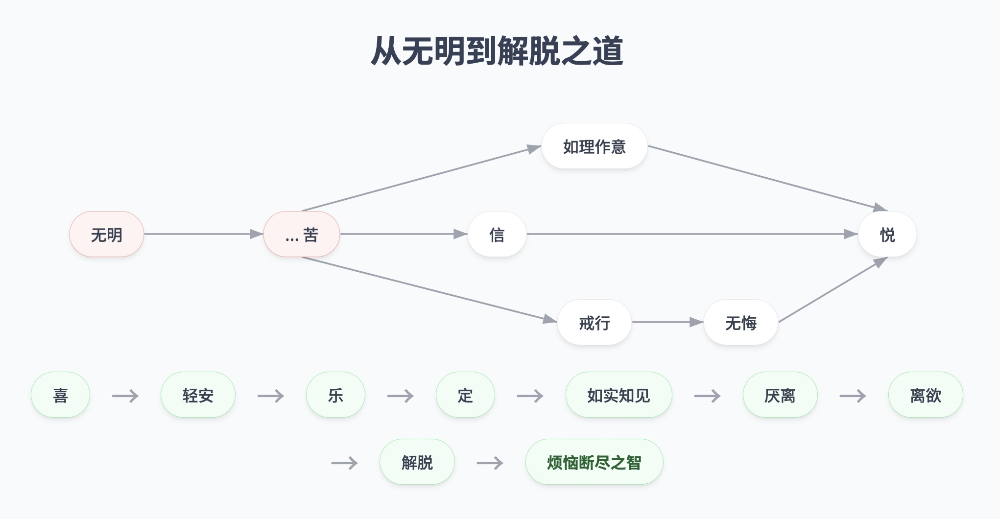
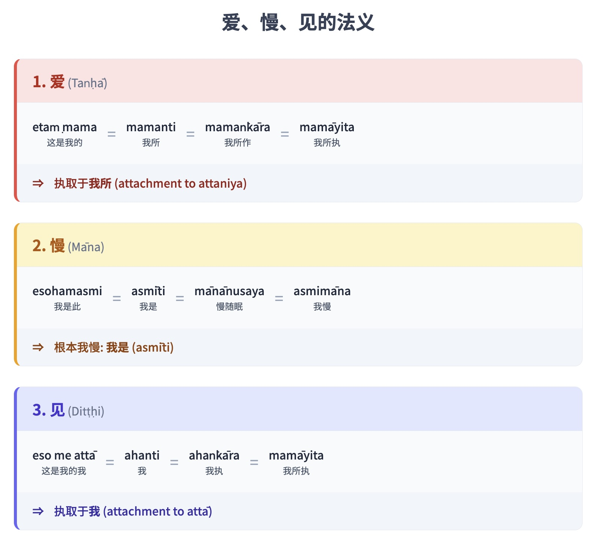

Ch. 4. Dependent Origination

### 无明的滋养

> 比丘们，无明，我也说它是一个特定条件。由于它的滋养，它才显现。我宣说：无明有它的滋养：五盖。五盖有它们的滋养：三种邪行。三种邪行有它们的滋养：缺乏感官的自制。缺乏感官的自制有它的滋养：缺乏正念和正知。缺乏正念和正知有它的滋养：不如理作意。不如理作意有它的滋养：缺乏信心。缺乏信心有它的滋养：不听闻正法。不听闻正法有它的滋养：不亲近善士。当不亲近善士盛行时，不听闻正法就会盛行。当不听闻正法盛行时，它就会使缺乏信心盛行……当五盖盛行时，它们就会使无明盛行。如此，无明有它的滋养并得以圆满。 A. V. 113-14.

### 智慧与解脱的滋养

> 无上智与解脱有它们的滋养：七觉支。七觉支有它们的滋养：四念处。四念处有它们的滋养：三种善行。三种善行有它们的滋养：感官的自制。[\[98\]](dependent-origination_split_001.html#fn-fn98) {521} 感官的自制有它的滋养：正念与正知。正念与正知有它的滋养：如理作意。如理作意有它的滋养：信心。信心有它的滋养：听闻正法。听闻正法有它的滋养：亲近善士。当亲近善士盛行时，它就会使听闻正法盛行。当听闻正法盛行时，它就会使信心盛行……当七觉支盛行时，它们就会使无上智与解脱盛行。如此，无上智与解脱有它们的滋养并得以圆满。 A. V. 114-15.

在这项教导中，两个要素起着关键作用：如理作意 (yoniso-manasikāra)，它是佛教思想运用的原则，是关键的内在特质；以及亲近善士 (sappurisa-saṁseva = 拥有‘善友’ – kalyāṇamitta)，这揭示了社会因素的重要性，是关键的外部因素。信心作为两者之间的纽带。[\[99\]](dependent-origination_split_001.html#fn-fn99)[\[100\]](dependent-origination_split_001.html#fn-fn100)

上面提及的各种寂灭循环纲要以及特定的修行形式可以总结如下：

*   1\. 寂灭循环与修行之道：
    
    > 缘起法的寂灭循环：无明止息 → 行止息 → 识止息 → ... 生止息 → 老死止息 → 愁、悲、苦、忧、恼止息 = 苦的止息。中道：正见 + 正思 + 正语 + 正业 + 正命 + 正精进 + 正念 + 正三摩地 → 苦的止息。
    
*   2\. 寂灭循环被解释为一个引向解脱的善法过程，其中苦是起点。这个循环与苦的生起循环方向相反，如图《从无明到解脱与烦恼的断除》所示。[\[101\]](dependent-origination_split_001.html#fn-fn101) {522}
    

从无明到解脱与烦恼的断除

*   3\. 一种包含（辅助）道支的次第修行之道。这种修行方式不是一个自动的因果过程，但这个过程的每一步都作为对后续修行阶段的支持。这是一个纲要的例子：
    
    > 相互支持的品质：亲近善士 → 听闻正法 → 信心 → 如理作意 → 正念与正知 → 感官的自制 → 善行 → 念处 → 觉支 → 无上智与解脱。
    

将道支置于修行之道中（如上所示），可以产生许多不同的详细修行阶段，对应于编纂者的具体目标和侧重点。然而，修行阶段通常符合三学（戒、定、慧）的框架和次第，[\[102\]](dependent-origination_split_001.html#fn-fn102) 这是道支在佛法修行中应用的关键原则。以下是经典中经常提及的最后这种修行纲要的三个进一步例子的简要总结。

#### 梵行的圆满 (brahmacariya)

(这种修行方式在经典中经常出现。它被称为梵行的圆满 (M. I. 521-2)；它等同于三学 (D. I. 206-209)。根据这种模式，感官的自制被归类于‘三摩地’之下，但在后来的文献中，例如Vism. 15-16 和 Comp.: Kammaṭṭhānaparicchedo, Vipassanākammaṭṭhānaṁ, Visuddhibhedo，它被归类于戒行之下，被称为‘感官自制的德行’ (indriyasaṁvara-sīla)，是四种‘清净德行’ (pārisuddhi-sīla) 的第二个要素。许多情况下未提及知足。另见：D. I. 62-85；M. I. 178-84, 265-71, 344-9, 412；M. II. 38, 162-4, 226-7；A. II. 207-208；A. V. 203；Dhtk. 27。)

戒行：

遇见佛陀 (= 亲近善士) → 听闻正法 → 信心 → (‘出家’为比丘) → 高尚的戒行 (无过失生活之乐 – anavajja-sukha) +

三摩地：

感官的自制 (无染之乐 – avyāseka-sukha) + 正念与正知 + 知足 (santosa) → (在僻静处修习三摩地) → 消除五盖 (= 喜 – pāmojja) → 四禅 (= 禅乐 – jhāna-sukha) →

智慧：

三明 – vijjā (或六神通 – abhiññā; 或八明) → 解脱 → 漏尽智。

#### 七清净

(M. I. 149-50；另见《清净道论》全书。在D. III. 289中，最后又增加了两种清净：paññā-visuddhi 和 vimutti-visuddhi。注释解释说，这两种分别指arahattaphala-paññā 和 arahattaphala-vimutti (DA. III. 1062)。)

戒行：

*   1\. 戒清净 (sīla-visuddhi) = 与个人境况相符的清净行为 →

三摩地：

*   2\. 心清净 (citta-visuddhi) = ‘近行三摩地’及更高层次的三摩地 →

智慧：

*   3\. 见清净 (diṭṭhi-visuddhi) = 名色知 →
    
*   4\. 度疑清净 (kaṅkhāvitaraṇa-visuddhi) = 对缘起法的理解 →
    
*   5\. 道非道智见清净 (maggāmaggañāṇadassana-visuddhi) = 遭遇并超越‘毗婆舍那随烦恼’ (vipassanūpakilesa) →
    
*   6\. 行道智见清净 (paṭipadāñāṇadassana-visuddhi) = ‘毗婆舍那智’ (vipassanā-ñāṇa) →
    
*   7\. 智见清净 (ñāṇadassana-visuddhi) = 道智 (magga-ñāṇa)。{523}
    

#### 十五行与三明

十五行 (= 戒行与三摩地)：[\[103\]](dependent-origination_split_001.html#fn-fn103)

> ‘学人行’ – sekha-paṭipadā: (1) 圆满戒行 (sīla-sampadā) + (2) 感官的自制 + (3) 饮食知量 (bhojane-mattaññutā) + (4) 精进觉醒 (jāgariyānuyoga) + 七圣法 (saddhamma): (5) 信心；(6) 惭 – hiri；(7) 愧 – ottappa；(8) 多闻 – bāhusacca；(9) 精进 – viriya；(10) 念 – sati；和 (11) 智慧；+ (12-15) 四禅 →

三明 (= 智慧)。三明 vijjā：宿命通 (pubbenivāsānussati-ñāṇa)；天眼通 (cutūpapāta-ñāṇa)；漏尽通 (āsavakkhaya-ñāṇa)。

佛陀偶尔会强调智慧的发展，例如：

> 次第修学 (anupubba-sikkhā) 或次第修行 (anupubba-paṭipadā)：[\[104\]](dependent-origination_split_001.html#fn-fn104) 信心（对老师的） → 他寻求（老师） → 他亲近（老师） → 他渴望听闻（老师） → 他听闻正法 → 他忆持正法 → 他考察教法的含义 → 他通过反思获得对教法的理解 → 热情 → 精进 → 他考察真理并获得清晰的理解 → 坚定的努力 → 他以智慧洞察真理。

一项适用于日常生活的著名教导是关于十种‘正行’ (dhamma-cariyā) 的教导，[\[105\]](dependent-origination_split_001.html#fn-fn105) 它们也称为十种‘善业道’ (kusala-kammapatha)。[\[106\]](dependent-origination_split_001.html#fn-fn106) 在《巴利三藏》中，这些品质有时被称为‘圣法’ (ariya-dhamma)。[\[107\]](dependent-origination_split_001.html#fn-fn107) 注释中称它们为‘人法’ (manussa-dhamma)。[\[108\]](dependent-origination_split_001.html#fn-fn108) 这项教导是将道支应用于佛法修行的例子：

#### 正行 (dhamma-cariyā)

戒行：

> 正业：不杀生 – pāṇātipāta (= 相互慈爱与支持) + 不偷盗 – adinnādāna (= 尊重个人财产) + 不邪淫 – kāmesumicchācāra (= 不侵犯所珍爱之人) + 正语：不妄语 – musāvāda (= 真实语) 不两舌 – pisuṇā vācā (= 和合语) + 不恶口 – pharusa vācā (= 柔和语) + 不绮语 – samphappalāpa (= 有理、有益的言语) +

智慧：

> 正思：不贪 (anabhijjhā) + 不嗔 – abyāpāda (= 慈爱) + 正见 → 善趣 (sugati) → 解脱 (vimutti)。{524}

有些人可能会反对说，这个过程不包含任何与三摩地相关的要素。尽管在人们的日常生活中，三摩地的修习通常不被强调，但与三摩地相关的要素已包含在这个过程中。正精进和正念是修习所有其他道支时必要的要素。[\[109\]](dependent-origination_split_001.html#fn-fn109) 此外，三摩地 (samādhi) 的一个定义是无盖 (nīvaraṇa)，这对应于正行 (dhamma-cariyā) 的第八和第九个要素：不贪和不嗔。（Abhijjhā – 贪欲，或kāma-chanda – 欲贪，是第一盖；而byāpāda – 嗔恚，是第二盖）。佛陀将不贪和不嗔归类为心之圆满 (citta-sampadā) 的形式。[\[110\]](dependent-origination_split_001.html#fn-fn110)

此外，从内在精神成长的角度来看，‘正行’的整个过程都是为三摩地的发展和圆满做准备。[\[111\]](dependent-origination_split_001.html#fn-fn111)

## 附录一：缘起法的阐释

早前，我提及《Vibhaṅga》（《阿毗达摩》第二卷）和《Sammohavinodanῑ》（《Vibhaṅga》的注释）中描述整个缘起次第在一心识刹那中生起的段落。[\[112\]](dependent-origination_split_001.html#fn-fn112) 然而，缘起法的主要注释性阐释，完全是在多生多世的背景下解释这项教导。当缘起法的教导在日常经验的背景下被解释时，那些持主流阐释的人可能会感到不安，并反对说前一种阐释是非正统且毫无根据的。

然而，将缘起法在日常生活的背景下解释的经文证据确实存在。尽管将缘起法解释为在当下微妙而迅速地生起，与正统阐释不同，但证据清晰且令人信服地表明前一种阐释是有效的。诚然，剩余的证据痕迹稀少而晦涩。这种替代性的阐释可能被忽视或遗忘。它之所以能流传下来，是因为《三藏》本身有实证支持。

将缘起法在多生多世的背景下解释的观点源于公元5世纪觉音尊者 (Ven. Buddhaghosa) 撰写的《清净道论》(Visuddhimagga)。然而，由同一作者撰写的《Sammohavinodanῑ》提供了另一种阐释。{212}

《Sammohavinodanῑ》将缘起法的分析分为两部分。第一部分以与《清净道论》相同的方式，在多生多世的背景下解释了这项教导，而第二部分则将其解释为在一心识刹那中生起。

据记载，觉音尊者是在撰写《清净道论》之后撰写《Sammohavinodanῑ》的。这两部文本的不同之处在于，觉音撰写《清净道论》时可以广泛使用各种资料来源，而《Sammohavinodanῑ》则专门针对《阿毗达摩》的《Vibhaṅga》作注释。

在《Sammohavinodanῑ》的导言中，觉音尊者声称关于这部文本：我已编纂并阐明了一部古老注释的含义。[\[113\]](dependent-origination_split_001.html#fn-fn113) 在《清净道论》中论述缘起法的部分，他写道：

> 缘起法本质上难以解释……我此时想描述缘的结构，却无立足之地，似乎在海洋中沉浮。然而，缘起法教义以多种解说方式而闻名，古代老师的教导方式不曾中断地传承下来。依靠这两个支持，我此时开始阐明其含义。 Vism. 522-3; identical to VbhA. 91.

与《Sammohavinodanῑ》形成对比的是，《清净道论》只包含多生多世的解释，并且与《Sammohavinodanῑ》的第一部分几乎相同，只是增加了一些细节。[\[114\]](dependent-origination_split_001.html#fn-fn114)

有人可能会问，为何《清净道论》中没有相应的第二部分。一个可能的答案是，在觉音尊者时代，多生多世的解释已成为主流正统观点。

而且他可能更乐于接受这种解释，因为尽管他认为整个主题很困难，但这种解释得到了不间断的老师传承的支持。一心识刹那的解释的传承可能已经中断，这从《Sammohavinodanῑ》中这一部分的极度简略可见一斑。然而，觉音尊者可能觉得有义务在《Sammohavinodanῑ》中收录这第二部分，即使它很简短，以忠于《巴利三藏》中的证据和早期注释中的痕迹。

《Sammohavinodanῑ》是《Vibhaṅga》（《阿毗达摩》第二卷）的注释。《Vibhaṅga》中解释缘起法的部分称为《Paccayākāra-vibhaṅga》，分为两部分：《Suttanta-bhājanῑya》（符合经文的分析）和《Abhidhamma-bhājanῑya》（符合《阿毗达摩》的分析）。[\[115\]](dependent-origination_split_001.html#fn-fn115) {213}

《Sammohavinodanῑ》也同样分为两部分，它如此解释两者的区别：

> 导师在经章中描述缘起性……是在不同的心识刹那中生起。缘起性并非只在不同的心识刹那中生起，也在一心识刹那中生起。这里的意图是根据阿毗达摩章描述缘起性在一心识刹那中生起的方式。VbhA. 199. 在经章中，缘起性被确定为在许多心识刹那中生起；在阿毗达摩章中，缘起性是在一心识刹那的背景下描述的。 VbhA. 200.

以下是《Sammohavinodanῑ》中缘起法在日常生活中运作（即在一心识刹那中）的例子：

> 此处的‘生’\[老、死\] 指的是无形事物的生\[老、死\]，而非牙齿断裂、头发变白、皮肤起皱、死亡或迁逝\[脱离此存在状态\]。 VbhA. 208.

值得注意的是，《Vibhaṅga》中处理在多个心识刹那中（即强调多生多世）考察缘起性的经章只有四页；相比之下，关于一心识刹那中缘起性的阿毗达摩章有五十四页。[\[116\]](dependent-origination_split_001.html#fn-fn116) 然而，在《Sammohavinodanῑ》中，这些比例颠倒了：经章有七十页，而阿毗达摩章有十四页。[\[117\]](dependent-origination_split_001.html#fn-fn117) 后者在《Sammohavinodanῑ》中如此简短的原因可能是觉音尊者对这个主题没有太多可说的，或者可能是他觉得这个主题已经详尽涵盖，因此不需要详加阐述。

总而言之，将缘起法阐释为日常生活中运作的依据，可在《巴利三藏》中找到，其痕迹仍留在注释中。它只是逐渐黯淡、被遗忘或被忽视了。{214}

## 附录二：自然法则 (dhamma-niyāmatā)

佛陀提出了两种关键的分类，他称之为dhamma-niyāmatā，可译为‘自然的确定性’、‘自然秩序’或‘自然法则’。这个术语指的是自然存在的真理原则，或独立存在的自然真理（无论佛陀是否出现，这些真理都根据其固有的特性而存在）。

这两种dhamma-niyāmatā分类如下：

1.  Idappaccayatā: ‘特定缘起性’；包含十二因缘支的缘起法则。[\[118\]](dependent-origination_split_001.html#fn-fn118)
    
2.  Aniccatā, dukkhatā and anattatā: 无常、苦和无我的法则。从注释开始，这三个要素被称为‘三法印’ (tilakkhaṇa)。[\[119\]](dependent-origination_split_001.html#fn-fn119)
    

技术上，这些双重原则被称为一对术语——dhammaṭṭhitatā 和 dhammāniyāmatā。[\[120\]](dependent-origination_split_001.html#fn-fn120)

尽管这两种分类已在第三章和本章中详细阐述，但在此提供一个总结是很有用的。

### 这些自然法则包含与四圣谛相关的四个要素

缘起法（或‘特定缘起性’）与无常、苦和无我的三法则结合起来，包含四个要素，在《巴利三藏》中描述如下：

1.  ‘无论如来出现与否，这个真理都恒常不变地存在，即特定缘起性。’
    
    (Uppādā vā tathāgatānaṁ anuppādā vā tathāgatānaṁ ṭhitāva sā dhātu dhammaṭṭhitatā dhammaniyāmatā idappaccayatā.)
    
2.  ‘比丘们，无论如来出现与否，这个真理都恒常不变地存在，即一切有为法无常。’
    
    (Uppādā vā bhikkhave tathāgatānaṁ anuppādā vā tathāgatānaṁ ṭhitāva sā dhātu dhammaṭṭhitatā dhammaniyāmatā sabbe saṅkhārā aniccāti。) {215}
    
3.  ‘比丘们，无论如来出现与否，这个真理都恒常不变地存在，即一切有为法是苦。’
    
    (Uppādā vā bhikkhave tathāgatānaṁ anuppādā vā tathāgatānaṁ ṭhitāva sā dhātu dhammaṭṭhitatā dhammaniyāmatā sabbe saṅkhārā dukkhāti。)
    
4.  ‘比丘们，无论如来出现与否，这个真理都恒常不变地存在，即一切法无我。’
    
    (Uppādā vā bhikkhave tathāgatānaṁ anuppādā vā tathāgatānaṁ ṭhitāva sā dhātu dhammaṭṭhitatā dhammaniyāmatā sabbe dhammā anattāti。)
    

简言之，要素如下：

1.  Idappaccayatā: 特定缘起性法则 (= paṭiccasamuppāda – 缘起法)。
    
2.  Aniccatā: 无常法则。
    
3.  Dukkhatā: 苦法则。
    
4.  Anattatā: 无我法则。
    

缘起法揭示了五蕴如何作为相互关联的因缘而存在。这项法则处理有为法 (saṅkhata-dhamma) 的存在，其包含世俗实相领域中的一切现象。

内住于无常性（aniccatā）和苦性（dukkhatā）之法揭示了所有有为法（即五蕴）是如何无一例外地无常且不持久的。

内住于无我性（anattatā）之法揭示了所有事物——包括有为法和无为法（asaṅkhata），包括五蕴之内的事物和超越五蕴的事物（khandha-vimutti）——都是无我的。

缘起法则揭示了五蕴之间的相互关系如何创造出一种动力，导致苦的生起，这具体被称为“生起之轮”（paṭiccasamuppāda-samudayavāra）。这与第二圣谛相对应：苦集圣谛（samudaya-ariyasacca）。

具体的缘起法本身就表明了五蕴——所有有为法——的无常性和不持久性。（一切有为法无常，一切有为法是苦。Sabbe saṅkhārā aniccā, sabbe saṅkhārā dukkhā。）

因为五蕴受制于“具体的缘起法”，具有无常性和不持久性，并且除此之外还受制于无我性法则，所以它们是苦的基础和原因，或者是潜在苦生起的聚集点。这与第一圣谛相对应：苦圣谛（dukkha-ariyasacca）。

归根结底，有为法（saṅkhāra）是自然现象（sabhāva-dhamma），这意味着它们有自己的特性或本质（bhāva）。它们不构成一个稳定、固定、实体的身份，不属于任何人，也不能被任何人以任何实际意义上的方式支配或掌控。作为有为法，它们依照具体的因缘而存在；它们的无常性和不持久性是这种缘起的结果。没有人能强迫它们以其他方式存在。因此，它们属于无我性法则（一切法无我。sabbe dhammā anattā）的范围。

除了有为法之外，还存在无为法，它超越了具体的缘起法，不是由缘起因素所创造的。它是常（nicca）且无苦的；它构成了苦的止息（dukkha-nirodha）。这与第三圣谛相对应：苦灭圣谛（nirodha-ariyasacca），即涅槃。

无为法同样是自然现象，这意味着它也不构成一个稳定、固定、实体的身份，不属于任何人，也不能被任何人支配或掌控。它也是无我（anattā）的。因此，第四法——无我性——适用于所有事物，包括有为法（saṅkhāra）和无为法（visaṅkhāra），包括有造作之法（saṅkhata-dhammā）和无造作之法（asaṅkhata-dhamma）。{216}

无为法不受“生起之轮”（samudaya-vāra）的支配；相反，它是作为“止息之轮”（nirodha-vāra）的最终目标而证悟的。它是通过缘起（paṭiccasamuppāda）的止息、停止、不存在和不生起而达到的。尽管它超越了有为法的领域，并且是常和无苦的，但它与其他所有自然现象一样，具有无我的特征。它不属于任何人，不以某种存在形式显现，不构成“自我”，也不受任何人的意愿支配。它依照其固有的本性而存在。

导向苦灭的道圣谛（dukkhanirodhagāminīpaṭipadā-ariyasacca），或简称“道”（magga），包含了用于终止和消除生起之轮或回归止息之轮的方法。这条修行之道（被称为八圣道）有许多细节，通过圆满三学来实现。本质上，整个道涉及放弃不善法和发展善法，这两者都存在于五蕴的范畴内。（这可以描述为“发展善蕴”（kusala-khandha），甚至可以描述为“发展诸蕴”。）因此，道的这个因素具有无常、苦和无我的特征。

总而言之：

*   第一条自然法则（此缘性，idappaccayatā）揭示了有为法的状态（这是第二圣谛的要旨）。
    
*   第二和第三条自然法则（无常性，aniccatā 和苦性，dukkhatā）揭示了有为法的共同属性（涵盖第一、第二和第四圣谛）。
    
*   第四条法则（无我性，anattatā）揭示了所有事物——所有现象——的共同属性（涵盖所有四圣谛）。
    

### 如性（tathatā）

在介绍具体的缘起法和三法印时，佛陀都使用了“法住性”（dhammaṭṭhitatā）和“法决定性”（dhammaniyāmatā）这两个词。然而，在这些段落的结尾，关于具体的缘起法的语境中，在idappaccayatā之前还多了三个词（tathatā、avitathatā和anaññathatā），而描述三法印的段落中没有这些词：

> “比丘们，在此处，如性（tathatā；“如是”存在的状态）、不虚妄性（avitathatā；不偏离如是存在的状态）和不变异性（anaññathatā；不异于此的状态）即是具体的缘起法；确实，所有这些在此引述的，即是缘起。”

这三个额外的词用于特殊强调或引起特别注意。但因为它们简洁而醒目，所以经常被提及，以至于广为人知并受人欢迎。尤其是tathatā这个词在佛教圈子里频繁被提到，并且因为这个词只与具体的缘起法（缘起）相关联，人们可能认为它只指这个主题。

佛陀的以下话语对此事提供了一个广阔的视角：

> “比丘们，这四法是真实的（tathā）、不虚妄的（avitathā）、不异于此的（anaññathā）。哪四法？‘这是苦’……‘这是苦的生起’……‘这是苦的止息’……‘这是导向苦灭之道’：这是真实的、不虚妄的、不异于此的……因此，比丘们，你们应当努力去理解：‘这是苦’……‘这是导向苦灭之道’。”{217} S. V. 430; Ps. II. 104。

请注意，在此语境中，上述三个词指的是四圣谛，它们用于补充“谛”（sacca，‘truth’）这个词的含义。在注解和复注中，四圣谛有时被称为“真实之法”（tatha-dhamma），就像它们有时被称为“圣谛”（sacca-dhamma）一样。（然而，“圣谛”（sacca-dhamma）这个词并不总是指四圣谛。）

《巴利三藏》中还有其他值得注意的段落，其中四圣谛被上述三个词提及。以下段落紧接在上面引用的段落之后：

> “苦（dukkha）在‘如是’（tathā）的意义上如何成为一个谛（sacca）？有四种对苦的定义，将其表征为如是、不虚妄和不变异。有苦为压迫的定义，有苦为有为法的定义，有苦为燃烧状态的定义，有苦为波动不定的定义……生起（samudaya；苦的因）在‘如是’的意义上如何成为一个谛？有四种对生起的定义，将其表征为如是、不虚妄和不变异。有生起为生起因素聚合的定义，有生起为因（nidāna；‘源头’）的定义，有生起为系缚的定义，有生起为障碍的定义……止息（nirodha）在‘如是’的意义上如何成为一个谛？有四种对止息的定义，将其表征为如是、不虚妄和不变异。有止息为解脱的定义，有止息为寂静的定义，有止息为无为的定义，有止息为不死不灭的定义……道（magga）在‘如是’的意义上如何成为一个谛？有四种对道的定义，将其表征为如是、不虚妄和不变异。有道为解脱因素的定义，有道为因的定义，有道为洞察的定义，有道为自主的定义。” Ps. II. 104-105。

以下是总结四圣谛的总结性段落：

> “四圣谛以多少种属性同时被证悟？四圣谛以四种属性同时被证悟：在真实义上；在无我义上；在如实义上；在洞察义上。四圣谛以这四种属性融为一体，因为每一圣谛都是恒常的，通过等同的知识证悟。因此，这四圣谛同时被证悟。” Ps. 105。

tathatā这个词指的是“如”（tatha）的状态，就像aniccatā指的是无常（anicca）的状态，dukkhatā指的是苦（dukkha）的状态，anattatā指的是无我（anattā）的状态。（这里，后缀-tā的意思是“状态”。）

原始文本中的巴利语基础知识非常清楚地辨别了各种术语的含义。然而，后来这些含义有些混淆，这可能导致困惑。

这里需要注意的重要特征是，在这些各种法则的语境中，后缀-tā经常被使用。例如，当佛陀谈论自然法则时，他使用了dhamma-niyāmatā这个词，它指的是现象的状态（-tā）、特性、品质或存在，这些都是自然秩序的一部分。

较短的词dhamma-niyāma开始在注解中被使用，并且在此处以更广泛的意义使用。它有时与dhamma-niyāmatā（如上定义）同义，而有时它指的是在缘起过程中作为条件的具体现象。

同样，dhammaṭṭhitatā这个词指的是符合因缘的现象的状态、特性或存在。较短的词dhammaṭṭhiti也可以表达相同的意思，但它通常指的是作为条件或受制于因缘的具体现象。{218}

aniccatā、dukkhatā和anattatā这些词指的是现象的无常、苦和无我的状态、特性或存在，如前所述。

在这本书《佛法》中，dhamma-niyāma这个词通常与dhamma-niyāmatā同义使用，指的是事物的属性和品质，而非事物本身。

因此，dhammaniyāmatā、idappaccayatā、tathatā、aniccatā、anattatā等词不能与“五蕴”、“涅槃”、“有为法”、“有造作之物”和“无为法”等词互换使用。

### 关于三法印（tilakkhaṇa）的术语

巴利语tilakkhaṇa（“三法印”）对于许多佛教学习者来说都很熟悉。这不是一个原始术语，它没有出现在《巴利三藏》中；相反，它在注解中成为一个流行术语。在《巴利三藏》中，三法印被称为三自然法则（dhamma-niyāmatā），并且这三个因素没有集体术语。尽管它们以许多不同的形式被描述，但它们是分开提及的。例如：

> “比丘们，色是无常的，受是无常的，想是无常的，行是无常的，识是无常的……色是苦的，受是苦的，想是苦的，行是苦的，识是苦的……色是无我的，受是无我的，想是无我的，行是无我的，识是无我的。” S. III. 21。

虽然巴利语中有一个翻译为“三相”的词，即tīṇi lakkhaṇāni，但它指的是不同的特征组。与此语境最接近的组包含有为法（saṅkhata-dhamma）的三个特征：生起相（uppāda-lakkhaṇa）、坏灭相（vaya-lakkhaṇa）和住异相（ṭhitaññathatta-lakkhaṇa），但这个组有它自己的集体术语（即saṅkhata-lakkhaṇa）。[\[121\]](dependent-origination_split_001.html#fn-fn121)

“共相”（sāmañña-lakkhaṇa）这个词同样不是《巴利三藏》中的原始术语，但在注解中频繁使用。它用于比较，描述所有事物如何具有两种属性：自相（paccatta-lakkhaṇa）和共相（sāmañña-lakkhaṇa）。例如：色（rūpa）的自相是它处于紧张状态，受（vedanā）的自相是它感受感官印象，但色和受都共享无常、苦和无我的属性。

“别相”（visesa-lakkhaṇa，‘unique characteristic’, ‘special characteristic’）这个词偶尔用来代替paccatta-lakkhaṇa。在这种情况下，做出了同样的区分，即自相和共相之间的区分。

经文中还有其他类似的区分。例如，胜义谛（paramattha-dhamma）具有两种属性：自性相（sabhāva-lakkhaṇa）和共相（sāmañña-lakkhaṇa）。自性相有时简称为“自相”（salakkhaṇa）。

“神通”（abhiññā）是一种独特的智慧，其功能是理解事物的自性相（sabhāva-lakkhaṇa）。它也可以翻译为“洞察智”。（它等同于abhijāna。请注意，这与用于表示五或六种殊胜知识的abhiññā的定义不同。）

通过神通清楚地理解，一个人达到了“遍知”（pariññā）的初始阶段，称为“辨识知”（ñāta-pariññā）。另一方面，对共相的理解，是被称为“审察智”（tīraṇa-pariññā）的智慧的功能。{219}

另请注意，sāmañña-lakkhaṇa（“共相”）这个词并非固定指无常、苦和无我的原则。例如，经文中有时指出，所有有为法（saṅkhāra）都具有依因缘而存在的共相。

这三个词——aniccatā、dukkhatā和anattatā——在这种特定的语法结构中，并没有以一个组合的形式出现在《巴利三藏》的任何地方；相反，它们是根据不同的情况分别使用的。

虽然aniccatā这个词在《巴利三藏》中相当频繁地出现，但它最常用于解释物质事物（rūpa-dhamma）的坏灭，包括在肉体死亡（maraṇa）的语境中。它从未被佛陀本人明确使用（它被尊者Sāriputta和其他弟子使用，并出现在《阿毗达摩》的解释中）。dukkhatā这个词被佛陀使用过，但仅限于三种苦（苦苦、行苦和坏苦，dukkha-dukkhatā, saṅkhāra-dukkhatā, and vipariṇāma-dukkhatā）的语境中。anattatā这个词在《巴利三藏》中没有出现。

由于注释者们经常提及和解释这三个因素的集合，他们想出了一个方便的缩写来分别指称它们，即简单地在aniccatā后面加上āadi（“始于……”），例如：aniccatādi-paṭisaṁyuttaṁ, aniccatādi-lakkhaṇattayaṁ, aniccatādi-vasena, aniccatādi-sāmaññalakkhaṇaṁ, 和 aniccatādinaṁ。只有在复注中，这三个词才被组合成一个独特的群体，尽管即便如此，这种呈现方式也不常见。

### 关于具体缘起法（idappaccayatā）的术语

第一自然法则（具体缘起法）的原则被认为是深刻且极难理解的。从初步和不全面的考察来看，这个原则在传统的泰语文献和文学作品中几乎没有被提及。直到上个世纪，它才被纳入正规的佛法教育体系，而在这个时期的初期，这个原则最流行的术语是paṭiccasamuppāda。

据我所知，学术界之所以特别将这一原则称为paṭiccasamuppāda，是因为Somdet Phra Mahāsamaṇa Chao Krom Phraya Vajirañāṇavarorasa建立了名为“nak tham”的佛法学习体系。他在名为《法分别论·第二章》（Dhammavibhāga Pariccheda Vol. II）的书中撰写了对paṭiccasamuppāda的解释，该书被指定为佛法学习（pariyatti-dhamma）中第二级nak tham学生的教材。

paṭiccasamuppāda这个词在《巴利三藏》、注解和复注中频繁出现。因此，佛教学生熟悉它很恰当。然而，值得注意的是，idappaccayatā，作为这个语境中的一个关键术语（它通常伴随着paṭiccasamuppāda并出现在其前面），似乎一直未被注意。这似乎表明，那些参与最近的佛法学习体系的学生并没有将其研究扩展到他们被指定的课程之外。直到过去五十年，这个后者术语才变得更加突出。据我所知，这种复苏的原因源于尊者Buddhadasa Bhikkhu对这一原则的坚定教导，以及他频繁强调idappaccayatā这个词。

佛陀曾两次提及idappaccayatā这个词。第一次，在他觉悟后不久，他表示普通人会发现他所证悟的真理极难理解，因此尝试教导他们会给他带来困难。第二次提及这个词是在他频繁阐释这第一自然法则时。除了这些场合，这个词只以idappaccayā和idappaccayatā-paṭiccasamuppannesu这两种形式出现。

“缘起支”（paccayākāra，‘mode of conditionality’）这个词，是paṭiccasamuppāda的另一个同义词，并被纳入第二级nak tham教科书，是后来创造的。它没有出现在《经藏》的主体部分；它首次出现在《譬喻经》（Apadāna）中，这是对经集后来的补充。这个词在描述佛陀首要比丘尼弟子、智慧第一的尊者Khemā Therī传记的同一部分（在一个标题和文本中）出现了两次。[\[122\]](dependent-origination_split_001.html#fn-fn122)

尽管《律藏》包含了佛陀的漫长传记，从他觉悟后体验解脱之乐并思惟缘起法则的时期开始，但在整个《巴利三藏》中都没有提及paccayākāra这个词。{220}

《阿毗达摩》包含一个很长的章节——《分别部》（约75页）——完全致力于缘起的主题，但在该文本中，paccayākāra这个词从未出现。该文本中也没有出现paṭiccasamuppāda这个词；只有提及现象是“有条件地生起”（paṭiccasamuppanna）或“具体因缘而生起”（idappaccayatā-paṭiccasamuppanna）。这些词只出现在标题中，这些标题是后来的编纂者创建的，并且这些标题根据不同版本而有所不同。泰国的暹罗版包含标题Paccayakāra Vibhaṅgo，而缅甸的Chaṭṭhasaṅgīti版包含标题Paṭiccasamuppāda Vibhaṅgo。

总而言之，在《巴利三藏》中，用于此自然法则的最常用词是paṭiccasamuppāda，它既可以单独出现，也可以与idappaccayatā连用。这些提及大多出现在《经藏》中。这个词在《律藏》中很少使用。在《阿毗达摩》中，它明确只出现在《论事》中。除此之外，《法集论》包含了paṭiccasamuppāda-kusalatā这个词，并且在《界论》（在表格摘要——mātikā的末尾）中有一段有趣的特质序列：五蕴（pañcakkhandhā）、十二处（dvādasāyatanāni）、十八界（aṭṭhārasa dhātuyo）、四圣谛（cattāri saccāni）、二十二根（bāvīsatindriyāni）、缘起（paṭiccasamuppādo）、四念处（cattāro satipaṭṭhānā）、四正勤（cattāro sammappadhānā）、四神足（cattāro iddhipādā）。[\[123\]](dependent-origination_split_001.html#fn-fn123)

从注解开始，paṭiccasamuppāda和paccayākāra这两个术语被频繁使用。idappaccayatā这个术语也被使用，但频率较低。

另一个有趣的观察是，从dhammaṭṭhitatā和dhammaniyāmatā这两个组合词中，又派生出一个重要的术语——dhammaṭṭhiti-ñāṇa，它出现在佛陀的话语中：dhammaṭṭhitiñāṇaṁ pubbe pacchā nibbāne ñāṇaṁ（“先有法住智，后有涅槃智”，或“先具法住智，继而生起涅槃智”）。[\[124\]](dependent-origination_split_001.html#fn-fn124)

佛陀对尊者Susima说了这些话，Susima之前是一位游方僧（paribbājaka），曾请求受戒进入佛教的佛法和戒律。他一直误解阿罗汉都必须具有神通，例如天耳通和天眼通。佛陀说这段话是为了让他摆脱这种误解，并向他解释，那些“慧解脱”（paññā-vimutta）的阿罗汉通过生起“法住智”（dhammaṭṭhiti-ñāṇa），随后获得涅槃智，从而证悟完全的觉醒，而不需要任何神通。

法住智（dhammaṭṭhiti-ñāṇa）等同于对自然法则的洞察：清楚地理解所有现象（作为五蕴的一部分）都是无常、苦和无我的，并且它们相互制约，在缘起的生起之轮中产生结果。最终，一个人洞察生起之轮中因缘的终结，并证悟止息之轮，最终证悟涅槃。

尽管根据佛陀上述的话语，法住智（dhammaṭṭhiti-ñāṇa）包含对三法印和缘起的洞察，最终完成止息之轮，但简洁的解释，例如在同一卷中发现的七十七种知识（ñāṇa）的描述中，佛陀只提及或强调了缘起（生起之轮）。[\[125\]](dependent-origination_split_001.html#fn-fn125)

在《巴利三藏》后来的典籍中，法住智（dhammaṭṭhiti-ñāṇa）被更频繁地提及，其含义或强调与缘起特别相关。《无碍解道》（Paṭisambhidāmagga），例如，将其定义为理解缘起因素的智慧（paccaya-pariggaha；这种知识后来被称为paccayapariggaha-ñāṇa）。[\[126\]](dependent-origination_split_001.html#fn-fn126)法住智（或paccayapariggaha-ñāṇa或paccayākāra-ñāṇa）在注解和复注中也频繁被提及和解释。例如，在这些文本中，它被等同于“度疑清净”（kaṅkhāvitaraṇa-visuddhi）。它有时被称为“如实知见”（yathābhūta-ñāṇa）、“正见”（sammā-dassana）或“观智”（vipassanā-ñāṇa）。它偶尔被描述为达到对具体缘起法（idappaccayatā）洞察顶点的知识。涅槃智（nibbāna-ñāṇa）则等同于道智（magga-ñāṇa）。[\[127\]](dependent-origination_split_001.html#fn-fn127)

### 包罗万象的真理原则

佛陀在描述他觉悟的亲口话语中，概述了他所证悟的两个真理。这在他觉悟后几周的思惟中表现得非常清楚，当时他表示他已经证悟了idappaccayatā-paṭiccasamuppāda和涅槃，这些真理逆流而行，普通人难以理解。因此，他不愿传授佛法。[\[128\]](dependent-origination_split_001.html#fn-fn128) {221}

在《律藏》中，佛陀描述了他觉悟后的事件，在此期间他菩提树下体验解脱之乐，讲了初转法轮，获得了首批弟子，进行了各种授戒，从而建立了僧团（saṅgha），最后制定了僧伽戒律。

佛陀上述的思惟（根据注释记载）发生在他享受了七周解脱之乐之后，以及他离开觉悟之地前往瓦拉纳西城附近鹿野苑的Isipatana教授佛法之前。

让我们回到这个时期的最初。在体验解脱之乐的第一个夜晚，他在夜间的三更分别作了三次感悟语。在这里，他思惟缘起，包括顺观和逆观（paṭiccasamuppādaṁ anuloma-paṭilomaṁ manasākāsi；请注意，这里paṭiccasamuppāda这个词单独出现，没有伴随的idappaccayatā这个词）。

与后来的教导不同，这里佛陀并没有清楚地命名他所证悟的真理，但我们不难看出他正在使用缘起和涅槃的同义词：

> 第一偈：“当真理显现给一位已净化、[\[129\]](dependent-origination_split_001.html#fn-fn129)精进且禅修的人，所有疑惑便消失无踪，因为他已知晓真理及其原因”（sahetu-dhamma = 苦及其生起）。第二偈：“当真理显现给一位已净化、精进且禅修的人，所有疑惑便消失无踪，因为他已证悟了缘起因素的止息”（khayaṁ paccayānaṁ = 涅槃）。第三偈：“当真理显现给一位已净化、精进且禅修的人，他便驱散了魔罗及其魔军，如同太阳照亮天空般存在。”

第一偈的要旨是缘起的顺观（anuloma）（在注释中有时被称为生起之轮——samudaya-vāra）。此偈揭示了苦的生起——因缘导致苦生起的过程。换句话说，它描述了苦及其原因。

第二偈的要旨是缘起的逆观（paṭiloma）（在注释中有时被称为止息之轮——nirodha-vāra）。此偈揭示了苦的止息（dukkha-nirodha），即没有苦的状态，由于导致苦的一切因缘耗尽而没有新生苦的状态。这指的是缘起的终结——涅槃。

第三偈描述了觉醒的状态，即证悟止息——证悟涅槃者的状态——其智慧清明、广阔、自由。注释解释说，此偈描述了圣道（ariya-magga）的辉煌和庄严。

这三首感悟偈指出并解释了佛陀后来上述思惟中表达的相同真理。它们揭示了实现佛教目标——证悟涅槃这一最高真理——的修行，需要理解这第一自然法则（dhamma-niyāma），即缘起法则。通过这种方式，一个人证悟了包含万物的两个层面的真理，即所有有为法的真理和无为法的最高真理（parama-sacca）。

重要的是要重申，对第一自然法则的证悟与对剩余三种自然法则——无常、苦和无我——的理解是结合在一起并等同的。

《经藏》中有许多段落，佛陀 recount了他的出家和他的精进，直到他觉悟的时候。[\[130\]](dependent-origination_split_001.html#fn-fn130) 在这个语境中，一个关键段落涉及到他觉悟的时刻：{222}

> “当我的心集中……我将其导向断除烦恼的知识。我如实地直接了知：‘这是苦’，‘这是苦的生起’，‘这是苦的止息’，‘这是导向苦灭之道’。我如实地直接了知：‘这些是烦恼’，‘这是烦恼的生起’，‘这是烦恼的止息’，‘这是导向烦恼止息之道’。当我如此了知和见时，我的心便解脱了……” 例如：M. I. 247-9。

这段经文清楚地表明，佛陀在觉悟时证悟了四圣谛。这似乎与上面引用的经文有所不同，但当仔细分析这些不同的经文时，就会发现它们本质上指的是同一件事。

严格来说，四圣谛包含两对真理：苦/集和灭/道。根据佛陀的初转法轮经——《转法轮经》（Dhammacakkapavattana Sutta），在《律藏》中，该经紧随佛陀先前的思惟之后，集（samudaya，‘origin’）指的是三种渴爱（taṇhā），而灭（nirodha，‘cessation’）指的是所有这些渴爱的舍弃、放弃和止息——即完全的解脱。[\[131\]](dependent-origination_split_001.html#fn-fn131) 乍一看，人们可能还未能看出这里与缘起这一自然法则的联系。

渴爱 (taṇhā) 是缘起（或流转之环）向前推进，导致苦的关键因素。  
第一圣谛和第二圣谛因此成对存在。缘起的逆向次第（止息之环）是在苦的动态中所有有为因素的消解——缘起的终结。这对应于止息（nirodha），即第三圣谛。第四圣谛——道（magga）——是为人们建立的一种正式的精神修习方法，以引发逆向次第的自然过程。因此，道包含在缘起的逆向次第中。这是这些原则如何相互关联的非常简要的总结。

注疏对自然法则提供了另一种分类，可以称之为自然法则的细分。它们使用尼夜摩 (niyāma) 一词来指称这些法则，包含五种因素：

1.  季候尼夜摩 (Utu-niyāma)：与物质世界相关的法则，特别是与自然环境中温度相关的动态。
    
2.  种子尼夜摩 (Bīja-niyāma)：与遗传相关的法则。
    
3.  心行尼夜摩 (Citta-niyāma)：与心的功能相关的法则。
    
4.  业报尼夜摩 (Kamma-niyāma)：业的法则。
    
5.  法次法性尼夜摩 (Dhamma-niyāma)：因缘间的相互关系法则，特别是那些依自然独立运作的法则。例如：依靠条件而存在的事物必然会终结；入流者自然不会再堕落；等等。
    

尽管法次法性尼夜摩 (dhamma-niyāma) 的第五种因素是教法中的一个关键原则，佛陀也经常解释它，并且有许多例子，但令人惊讶的是，注疏作者在此语境中没有以相同的方式解释它。在他们的解释中，他们只是提到了菩萨的正常属性。[\[132\]](dependent-origination_split_001.html#fn-fn132)例如：当菩萨投胎、出生和觉悟时，万千世界震动是正常的；当菩萨进入他母亲的子宫时，她自然会具足美德，没有任何疾病。

在《大譬喻经》 (Mahāpadāna Sutta) 中，列出了十六条与菩萨境遇有关的通用规则，其中使用的是法性 (dhammatā) 一词，而非法次法性尼夜摩 (dhamma-niyāma)。虽然这两个术语是同义词，但它们的含义并不完全相同；它们只是有重叠。{223}

## 附录三：“我”与“我所”

对“我”与“我所”的执着牢固地植根于人类的心中。它深刻影响人们的行为、福祉以及人际关系，并几乎与每个社会问题相关。这种对自我感的执着为法 (Dhamma) 的修行提供了一个核心焦点：必须正确地处理它，许多教法都论及此问题。许多独特的术语和表达被用来指称这种形式的执着。以下是此类术语和表达的总结，已分组整理：

> 第一组：etaṁ mama, esohamasmi, eso me attā-ti：“这是我的，我就是这个，这是我的自我。” 第二组：ahanti vā mamanti vā asmīti vā：“‘我’（的执念），‘我的’（的执念），以及‘我存在’（的执念）。” 第三组：ahaṅkāra mamaṅkāra mānānusaya：“‘我’作（的执念），‘我所’作（的执念），以及慢随眠。” 第四组：mamāyita (or: mamatta) and asmimāna：对“我所”的执着，（对“我”的执着），以及“我是”的慢。 第五组：attā, attaniya, (and asmīti)：自我，与自我相关的事物，（以及“我存在”的执念）。 第六组：taṇhā, māna, and diṭṭhi：渴爱，慢，以及邪见。

第一组：这些是与对自我的执着最常相关的术语。此组最常出现在鼓励将人类分析为由五蕴或其他要素（如六根或六触）组成的教法中，或出现在促进对三法印的考察以达到阻止执着（即“这是我的”、“我就是这个”或“这是我的自我”）理解事物的教法中。[\[133\]](dependent-origination_split_001.html#fn-fn133)

第二组：此组是上述第一组的缩写：ahanti（“对‘我’的执念”）= eso me attā；mamanti（“对‘我的’的执念”）= etaṁ mama；asmīti（诸如“我就是这个”或“我依然存在”的执念）= esohamasmi。[\[134\]](dependent-origination_split_001.html#fn-fn134)

第三组：这是第一组的另一个缩写：ahaṅkāra = eso me attā；mamaṅkāra = etaṁ mama；mānānusaya = esohamasmi。{224}这些术语最常出现在以下短语中：“对于这个有其识身和一切外相的身体，没有（或‘解脱于’，或‘根除’）‘我作’、‘我所作’以及慢随眠。”[\[135\]](dependent-origination_split_001.html#fn-fn135)

第四组：mamāyita 一词最常被用来表示“对‘我所’的执着”或“被执着为‘我所’的对象”，因此等同于 etaṁ mama。[\[136\]](dependent-origination_split_001.html#fn-fn136)偶尔它也被定义为对“我”的执念和对“我所”的执念（等同于 etaṁ mama 和 eso me attā，或等同于 taṇhā 和 diṭṭhi）。[\[137\]](dependent-origination_split_001.html#fn-fn137)妈妈达 (Mamatta)（或 mamattā）与 mamāyita 含义相同，但倾向于在偈颂中与 mamāyita 成对出现，或取代 mamāyita，[\[138\]](dependent-origination_split_001.html#fn-fn138)或作为 mamāyita 的定义。[\[139\]](dependent-origination_split_001.html#fn-fn139)Asmimāna 被定义为“‘我是’的慢”：一种“我”的感觉或“我存在”的念头。在巴利文中，它通常被简单地描述为慢 (māna)，但阿毗达摩将其归类为七种不同的慢之一。Asmimāna 是一种精微的慢，[\[140\]](dependent-origination_split_001.html#fn-fn140)只有阿罗汉才能舍弃；不还者尚未舍弃。[\[141\]](dependent-origination_split_001.html#fn-fn141)阿毗达摩将 asmimāna 与其他较粗糙的慢形式（如蔑视和傲慢）区分开来，后者是较低层次的觉悟者所舍弃的。Asmimāna 通常被提及为法 (Dhamma) 修行者应该根除的品质。[\[142\]](dependent-origination_split_001.html#fn-fn142)本质上，asmimāna 一词与 esohamasmi 相同，它可以简单地称为慢 (māna)：最精微形式的慢。

第五组：此组中的术语并非指执着本身，而是指被执着的事物，或因执着而产生的状况。如果与第一组进行广义比较，attā 等同于 eso me attā 和 esohamasmi，而 attaniya 等同于 etaṁ mama。然而，严格来说，attā 一词仅限于拥有或作为“自我”存在的见解（即它属于“见”——diṭṭhi）。因此，它仅指 eso me attā，而不指 esohamasmi。要涵盖第一组的全部含义，需要将 asmīti 一词添加到这第五组中。可以将 attā 翻译为“我”，[\[143\]](dependent-origination_split_001.html#fn-fn143)将 attaniya 翻译为“我的”，但“我”这个表达的含义不甚精确或稳定，可以转变为包含第一组中的两种执念（esohamasmi 和 eso me attā）中的任何一种。[\[144\]](dependent-origination_split_001.html#fn-fn144)

第六组：这三种不善法（渴爱、慢、见）有时被统称为戏论 (papañca) 或戏论法 (papañca-dhammā)：“障碍”、“心理增生”、“导致过度的事物”。[\[145\]](dependent-origination_split_001.html#fn-fn145)正如第二章所描述的，这些品质会产生无数复杂的心想（papañca-saññā）。{225}

它们在此处是依据注疏的解释进行分组的。可以将这些不善法与前面几组中包含的见解和执着进行比较和匹配，如“渴爱、慢与邪见表”所示。[\[146\]](dependent-origination_split_001.html#fn-fn146)

渴爱、慢与邪见 

英文术语“me”和“mine”（或“I”和“mine”）并不能完全涵盖这三组的含义；有必要添加另一个表达：“我”、“我的”和“我就是这个”。无论如何，第二组（“慢”组）的翻译有时不够精确且不寻常。面对这种灵活的术语，一个解决方案是只使用“我”和“我的”这两个术语，然后将“我”定义为同时涵盖邪见 (diṭṭhi) 和慢 (māna)。当它指对个人身份固定感的执念时，它等同于邪见；当它指个人地位，或用于与他人比较、个人评价、或作为傲慢来源的个人身份时，它等同于慢。术语“mine”是第一组（“渴爱”组）的准确翻译。

邪见 (Diṭṭhi)，包括身见 (sakkāya-diṭṭhi) 和戒禁取 (sīlabbata-parāmāsa)（第一和第三结——saṁyojana），已被入流者舍弃。渴爱 (Taṇhā)（以欲贪 (kāma-rāga) 的形式——第四结）已被不还者舍弃。渴爱 (Taṇhā)（以欲贪 (kāma-rāga)、色贪 (rūpa-rāga) 和无色贪 (arūpa-rāga) 的形式——第四、第六和第七结）以及慢 (māna) 已被阿罗汉舍弃。[\[147\]](dependent-origination_split_001.html#fn-fn147)

根据这种解释，可以给出以下总结：对自我感的固定见解在入流时被舍弃，而“我是”的慢和对个人所有权的执着在证得阿罗汉果时被舍弃。[\[148\]](dependent-origination_split_001.html#fn-fn148){226}

## 附录四：当下的生与死

以下经文段落可能为那些希望研究当下的生与死轮回 (saṁsāra-vaṭṭa)——即在今生中发生的——的人提供洞见：

> “对于一位具足四种品质【智慧、真理、舍离和寂静】的人，腐化形式的自我构想不会积累，当这种染污的自我构想未被积累时，他被称为寂静的圣者。” 如此说；而这是指什么而言的呢？“我是”是一种构想，“我不是”是一种构想，“我将是”是一种构想，“我将不是”是一种构想，“我将有色身”是一种构想，“我将无色身”是一种构想，“我将有感知”是一种构想，“我将无感知”是一种构想，“我将非有感知亦非无感知”是一种构想。比丘，构想是一种病症，构想是一种脓肿，构想是一支毒箭。通过克服所有的自我构想，一个人被称为寂静的圣者。而寂静的圣者不生，不老，不死；他不焦虑，也不渴爱。因为没有他可能出生的原因。不出生，他怎会变老？不变老，他怎会死去？不死去，他怎会焦虑？不焦虑，他怎会渴爱？所以，这是指此而言的：“对于一位具足四种品质的人，腐化形式的自我构想不会积累，当这种染污的自我构想未被积累时，他被称为寂静的圣者。” 比丘，请牢记这关于六界的简要阐述。M. III. 246; cf., e.g.: M. III. 225; S. III. 228-9; S. IV. 17; Sn. 184-5; Nd. I. 436 (aging = decay or loss); Thag. verse 247 (jiyyate = aging; the commentaries define this word as ‘decay’ or ‘passing away’); J. IV. 240.

## 附录五：阿毗达摩对缘起的解释

阿毗达摩 (Abhidhamma) 描述了缘起过程的许多变体，根据心识状态 (citta)（即善、不善或“无记”[\[149\]](dependent-origination_split_001.html#fn-fn149)），以及根据心的层次（即住于欲界、色界或无色界，或作为出世间）而定。[\[150\]](dependent-origination_split_001.html#fn-fn150)缘起的因素可能根据这些心识状态而变化，并且并非总是与经藏中提及的因素相同。例如，在某些善心状态中，过程以行 (saṅkhāra) 开始而未提及无明，或者它可能以善根 (kusala-mūla) 代替无明而开始。特别值得注意的是，渴爱只出现在不善心状态中；在其他状态中，它被净信 (pasāda)（“满足”、“喜悦”、“信心”）取代或完全省略。

因为阿毗达摩以刹那为基础审视心识，所以它只分析每个特定刹那中存在的因素。诸如无明或渴爱等可能暂时被抑制的因素并未被点名；它们通过其他清晰显现的因素的存在而被推断出来，或者完全被忽略。

阿毗达摩描述了缘起的各种因素，既有顺向的也有逆向的：无明缘行，行缘无明；行缘识，识缘行；等等。在此我将只呈现主要的类别供考虑：{227}

### 十二种不善心识状态 (akusala-citta)

> 无明 (Avijjā) 缘行 (saṅkhāra)。  
> 行 (Saṅkhāra) 缘识 (viññāṇa)。  
> 识 (Viññāṇa) 缘名 (nāma)（心）。  
> 名 (Nāma) 缘六处 (chaṭṭhāyatana)。  
> 六处 (Chaṭṭhāyatana) 缘触 (phassa)。  
> 触 (Phassa) 缘受 (vedanā)。  
> 受 (Vedanā) 缘渴爱 (taṇhā)，  
> 或缘瞋恚 (paṭigha)（厌恶、敌意），  
> 或缘疑 (vicikicchā)，  
> 或缘掉举 (uddhacca)。  
> 渴爱 (Taṇhā) 缘取 (upādāna)，  
> 或渴爱 (taṇhā) 缘胜解 (adhimokkha)（意图、倾向），  
> 或瞋恚 (paṭigha) 缘胜解 (adhimokkha)，  
> 或掉举 (uddhacca) 缘胜解 (adhimokkha)。  
> 取 (Upādāna) 缘有 (bhava)，  
> 或胜解 (adhimokkha) 缘有 (bhava)，  
> 或疑 (vicikicchā) 缘有 (bhava)。  
> 有 (Bhava) 缘生 (jāti)。  
> 生 (Jāti) 缘老死 (jarāmaraṇa)。  
> = 纯粹的苦蕴集生起。

### 善心状态

（欲界、色界和无色界）

> 无明 (Avijjā) 缘行 (saṅkhāra)，  
> 或善根 (kusala-mūla) 缘行 (saṅkhāra)。  
> 行 (Saṅkhāra) 缘识 (viññāṇa)。  
> 识 (Viññāṇa) 缘名 (nāma)。  
> 名 (Nāma) 缘六处 (chaṭṭhāyatana)。  
> 六处 (Chaṭṭhāyatana) 缘触 (phassa)。  
> 触 (Phassa) 缘受 (vedanā)。  
> 受 (Vedanā) 缘净信 (pasāda)。  
> 净信 (Pasāda) 缘胜解 (adhimokkha)。  
> 胜解 (Adhimokkha) 缘有 (bhava)。  
> 有 (Bhava) 缘生 (jāti)。  
> 生 (Jāti) 缘老死 (jarāmaraṇa)。  
> = 纯粹的苦蕴集生起。{228}

### 业报心识状态和作用心识状态

（欲界、色界和无色界）

> （善根 (Kusala-mūla) 缘行 (saṅkhāra)。）  
> 行 (Saṅkhāra) 缘识 (viññāṇa)。  
> 识 (Viññāṇa) 缘名 (nāma)。  
> 名 (Nāma) 缘六处 (chaṭṭhāyatana)。  
> 六处 (Chaṭṭhāyatana) 缘触 (phassa)。  
> 触 (Phassa) 缘受 (vedanā)。  
> 受 (Vedanā) 缘有 (bhava)。  
> 或受 (vedanā) 缘胜解 (adhimokkha)。  
> 或胜解 (adhimokkha) 缘有 (bhava)。[\[151\]](dependent-origination_split_001.html#fn-fn151)  
> 或受 (vedanā) 缘净信 (pasāda)。  
> 或净信 (pasāda) 缘胜解 (adhimokkha)。  
> 或胜解 (adhimokkha) 缘有 (bhava)。[\[152\]](dependent-origination_split_001.html#fn-fn152)  
> 有 (Bhava) 缘生 (jāti)。  
> 生 (Jāti) 缘老死 (jarāmaraṇa)。  
> = 纯粹的苦蕴集生起。

此部分的第一行加括号表示此次第并非必然存在。此部分可以从行 (volitional formations) 作为识的条件开始，或以不善根 (unwholesome root-causes) 作为行的条件开始。若为后者，则仅发生于七种不善业报心识状态 (akusalavipāka-citta) 中。

### 出世间心识状态

（善和业报）

> 善心状态：无明 (Avijjā) 缘行 (saṅkhāra)，  
> 或善根 (kusala-mūlā) 缘行 (saṅkhāra)。业报心状态：（善根 (Kusala-mūlā) 缘行 (saṅkhāra)。）  
> 行 (Saṅkhāra) 缘识 (viññāṇa)。  
> 识 (Viññāṇa) 缘名 (nāma)。  
> 名 (Nāma) 缘六处 (chaṭṭhāyatana)。  
> 六处 (Chaṭṭhāyatana) 缘触 (phassa)。  
> 触 (Phassa) 缘受 (vedanā)。  
> 受 (Vedanā) 缘净信 (pasāda)。  
> 净信 (Pasāda) 缘胜解 (adhimokkha)。  
> 胜解 (Adhimokkha) 缘有 (bhava)。  
> 有 (Bhava) 缘生 (jāti)。  
> 生 (Jāti) 缘老死 (jarāmaraṇa)。  
> = 所有这些品质的生起。

注：出世间善心状态 (lokuttarakusala-citta) 可能源于无明或不善根，但出世间业报心状态 (lokuttaravipāka-citta) 源于善根或仅仅是行。另请注意此部分最后一行的差异。{229}

## 附录六：止息 (Nirodha)

“止息”一词已成为尼罗陀 (nirodha) 的标准翻译。[\[153\]](dependent-origination_split_001.html#fn-fn153)当使用尼罗陀 (nirodha) 的其他翻译时，人们可能会提出异议或感到困惑，认为这些替代翻译源自其他巴利语词。在《佛法》 (Buddhadhamma) 中，为了方便，我也依赖“止息”一词，以避免误解为是指另一个巴利语词（也因为我没有找到一个合适、简洁的替代词）。但在许多情况下，“止息”一词本身可能导致误解，并且在技术上是不正确的翻译。

英文词“cessation”（止息）通常指已生起的事物的毁灭或终结。然而，缘起中的尼罗陀 (Nirodha)（以及第三圣谛——苦灭圣谛 (dukkhanirodha-ariyasacca) 中的尼罗陀 (nirodha)）意味着某事物不会生起，因为它没有生起的因缘。例如，短语 avijjā-nirodhā saṅkhāra-nirodho 被翻译为：“无明止息，故行止息”。事实上，这个短语的意思是，因为无明不存在，或不生起，或没有与无明相关的问题，所以行 (volitional formations) 不存在，不生起，也没有与行相关的任何问题。它不一定意味着必须终结现有的无明才能终结现有的行。

在某些情况下，尼罗陀 (nirodha) 被准确地翻译为“止息”，例如在指称有为现象的性质时，以及作为坏灭 (bhaṅga)（“分解”）、无常 (anicca)（“无常”）、灭尽 (khaya)（“毁灭”）和衰败 (vaya)（“衰败”）的同义词时。例如：比丘们，这三种受是无常的、有为的、缘起的、坏灭法、衰败法、消失法、止息法。[\[154\]](dependent-origination_split_001.html#fn-fn154)（缘起的每个因素都具有此引文中提及的这些属性。）有为现象一旦生起，根据因缘的性质，必然会自动衰落。无需努力使它们衰落；它们会自行衰落。此教法的实际应用是看到一切生起的事物都必然止息。

尽管它描述了一个自然的、客观的过程，但第三圣谛中的尼罗陀 (nirodha) 教法（= 缘起灭支 (paṭiccasamuppāda-nirodhavāra)）强调实际应用。在此语境中，对尼罗陀 (nirodha) 有两种解释：[\[155\]](dependent-origination_split_001.html#fn-fn155)第一种源自词头“尼”（ni-）（“不存在”；“无”）+ 罗陀（rodha）（= 迦拉迦（cāraka）= “监狱”、“囚禁”、“限制”、“障碍”、“阻碍”），翻译为“无限制”、“无拘束”、“无束缚”：即脱离轮回 (saṁsāra)。第二种解释将尼罗陀 (nirodha) 等同于不生 (anuppāda)：“不生起”。[\[156\]](dependent-origination_split_001.html#fn-fn156)在此语境中，尼罗陀 (nirodha) 并非指止息或分解（bhaṅga）。

尽管将尼罗陀 (nirodha) 翻译为“止息”并非总是准确，但我迄今未能找到一个简洁的替代词，因此沿用习惯的翻译。然而，重要的是要理解这个词在不同语境中的含义。因此，缘起止息次第的这些替代翻译是有效的：“无无明，则无行”；“脱离无明，则脱离行”；“当无明不再结果时，行也停止结果”；“当无明不再造成问题时，行也不再造成问题”。

关于缘起流转次第中术语的翻译还有进一步的复杂性。巴利语术语涵盖的含义范围比单个英语对应词所能捕捉的更广。例如，教法：无明为缘故有行 (Avijjāpaccayā saṅkhārā) ... 生为缘故有老死 (jātipaccayā jarāmaraṇaṁ) 在巴利语中也可以表示：“因为无明以这种方式存在，所以行以这种方式存在；因为行以这种方式存在，所以识以这种方式存在……因为有以这种方式存在，所以生以这种方式存在；因为有生，所以有老死。”{230}

## 附录七：缘起因素的简明定义

因为本章中缘起因素的定义相当长而冗赘，在此提供一些简短而简单的定义：

1.  无明 (Avijjā)：无知；不了解真相；不运用智慧。
    
2.  行 (Saṅkhāra)：思虑；意图；心性；习惯。
    
3.  识 (Viññāṇa)：对外部世界和心识内容的觉知；心识状态。
    
4.  名色 (Nāma-rūpa)：生命的组成部分，包括身体和心理。
    
5.  六处 (Saḷāyatana)：认知通道，即：眼、耳、鼻、舌、身、意。
    
6.  触 (Phassa)：认知；与外部世界的互动；与感官对象的接触。
    
7.  受 (Vedanā)：乐受、苦受和不苦不乐受。
    
8.  渴爱 (Taṇhā)：对获取、存在、永生、逃离、消失或断灭的欲望。
    
9.  取 (Upādāna)：执着；心识上的执迷；潜在的欲望；野心；珍视的价值观；认同。
    
10.  有 (Bhava)：当前的存在状态；人格；人类行为的整个范围。
    
11.  生 (Jāti)：“自我”的诞生，它体现了存在状态并与世界互动。这个“自我”主张对事物的拥有和控制。
    
12.  老死 (Jarāmaraṇa)：就“自我”占据此存在状态而言，遭遇衰落、不稳定、损失和消逝。
    
    忧、悲、苦、恼、绝望 (Soka-parideva-dukkha-domanassa-upāyāsa)：各种形式的苦，例如悲伤、哀恸、哭泣、悼念、痛苦、自怜、绝望和沮丧，所有这些都像在心中溃烂的毒素，一旦外露便会产生更多问题。
    

## 附录八：有爱 (Bhava-taṇhā) 与无有爱 (Vibhava-taṇhā)

三种渴爱（欲爱 (kāma-taṇhā)、有爱 (bhava-taṇhā) 和无有爱 (vibhava-taṇhā)）的翻译，特别是第二种和第三种，可能因对这些术语理解不足和意见冲突而引起问题。以下几点可能有助于澄清此事：

尽管有些经藏明确提及这三种渴爱，例如《转法轮经》 (Dhammacakkappavattana Sutta)、[\[157\]](dependent-origination_split_001.html#fn-fn157)《众集经》 (Saṅgīti Sutta) 和《增十经》 (Dasuttara Sutta)，[\[158\]](dependent-origination_split_001.html#fn-fn158)但在经藏中从未明确概述或直接论及这三者的定义。因此，我们必须依赖阿毗达摩 (Abhidhamma) 和注疏中的解释。然而，由于人们有时收集到的信息是片面或不完整的，或他们无法清晰地解释这些信息，因此对这一主题产生了分歧和冲突的观点。

尽管经藏中没有对这三种渴爱的明确定义，但佛陀的一些教导和一些相关段落对这些术语的含义有所启发。在此我将呈现来自经藏、阿毗达摩和注疏的证据以供思索。

佛陀在《如是语经》 (Itivuttaka) 的《渴爱经》 (Taṇhā Sutta) 中提到了这三种渴爱。虽然他没有给出明确的定义，但他吟诵了一首偈颂，可以用来进一步理解它们的含义。此经（不受注疏解释影响）的字面翻译如下：{231}

> 比丘们，有这三种渴爱。哪三种？欲爱、有爱和无有爱……被渴爱之缚所束缚，  
> 人们的心识乐于有与无有 (bhavābhave)。  
> 被魔罗 (Māra) 的枷锁束缚，无法从束缚中解脱，  
> 这些众生在轮回中流转，趋向于生和死。  
> 但世间那些已灭尽渴爱者，远离有与无有的渴爱者，  
> 已达烦恼漏 (taints) 之尽头，已渡到彼岸。It. 50.

《如是语经》 (Itivuttaka) 中的另一部经描述了两种“见解”——有见 (bhava-diṭṭhi) 和无有见 (vibhava-diṭṭhi)——从而也间接描述了有爱 (bhava-taṇhā) 和无有爱 (vibhava-taṇhā)：

> 比丘们，天神和人类都受两种见解支配。有些人滞留，有些人逾越，而有洞察力者则能看见。比丘们，如何有些人滞留呢？天神和人类乐于有 (bhavārāmā)，喜于有 (bhava-ratā)，乐于有 (bhava-sammuditā)。当如来 (Tathāgata) 教导有灭 (bhava-nirodha) 的法 (Dhamma) 时，这些天神和人类的心不跳跃，不获得信心，不安住，不屈服。因此，有些人滞留了。比丘们，如何有些人逾越呢？有些天神和人类被有 (becoming) 所苦恼、沮丧和厌恶。他们乐于无有 (non-becoming)，[\[159\]](dependent-origination_split_001.html#fn-fn159)说：“善士，当身体死亡坏灭时，这个自我被断灭，被毁灭，不再存在。这种状态是至高无上、卓越而真实的。” 因此，有些人逾越了。比丘们，那些有洞察力者如何看见呢？在此，比丘见存在状态就是存在状态。[\[160\]](dependent-origination_split_001.html#fn-fn160)当他见存在状态就是存在状态时，他对存在状态修习厌离 (nibbidā)、离欲 (virāga) 和止息 (nirodha)。因此，那些有洞察力者看见了。无论谁见有即是有，  
> 并且看见超越有的状态，  
> 通过对存在之欲的耗尽，  
> 他臣服于真理。  
> 彻底理解了存在的状态，  
> 一个人就能摆脱渴爱，  
> 无论是对存在还是对灭尽。  
> 随着存在状态中有的终结，  
> 比丘不再有进一步的出生。《见经》 (Diṭṭhi Sutta): It. 43-4.

关于这部经有两个值得注意的要点：

1.  佛陀将渴爱和见解并提，因为它们是相关且相互依存的。一类人乐于有，渴望存在（乐有 (bhava-rama)，欣有 (bhava-abhirama) = 有爱 (bhava-taṇhā)），并且坚信这种存在状态是值得欲求的，是“自我”稳定的地方（有见 (bhava-diṭṭhi)）。另一类人厌恶存在，乐于无有，渴望灭尽（乐无有 (vibhava-abhinanda) = 无有爱 (vibhava-taṇhā)），并且坚信“自我”将会消逝（无有见 (vibhava-diṭṭhi) = 断见 (uccheda-diṭṭhi)）。
    
2.  经藏区分了无有 (vibhava)（没有存在；不存在；灭尽），这是一种与邪见相关的执念，以及有灭 (bhava-nirodha)（有的终结），这是佛法 (Buddha-Dhamma) 的目标。无有 (Vibhava) 是有 (bhava) 的对立面——这是本经中解释的两个极端：有些人停留在有的极端，另一些人停留在灭尽的极端。佛陀教导如何摆脱这两个极端。他的教法强调有灭 (bhava-nirodha)，它不落入任何一个极端，而是安住于中间。如果理解这个概念，那么就能理解中道教法和中道。{232}
    

渴爱和见解是不同的品质，但它们又非常相似：它们经常成对出现，而且相互依存。当一个人正面看待某物时，他会想得到它。当一个人想得到某物时，他会认为它值得得到，并且由于对该对象缺乏了解，他会对其产生各种见解。在下面的渴爱定义中，邪见 (diṭṭhi) 被用来阐明渴爱 (taṇhā) 的含义：特定类型的渴爱与特定类型的见解直接相关。尽管有此解释，但渴爱和见解应被视为两种不同的品质。

在《经集》 (Sutta Nipāta) 的《先前裂缝经》 (Purābheda Sutta) 中有一段偈颂，连同《大义释》 (Mahāniddesa) 和注疏中的相关解释，阐明了有爱 (bhava-taṇhā) 和无有爱 (vibhava-taṇhā) 这两个术语的含义：

> 一位理解真理、独立自主（无渴爱和见解）、不依靠任何事物（其心已解脱）的人，对存在或无有不抱渴爱。这样的人我称之为寂静者。[\[161\]](dependent-origination_split_001.html#fn-fn161)Sn. 167-8.

这段经文中的重要短语是：Bhavāya vibhavāya vā taṇhā，可以分为对有的渴爱 (bhavāya taṇhā) 和对无有的渴爱 (vibhavāya taṇhā)。

这两个术语是对有爱 (bhava-taṇhā) 和无有爱 (vibhava-taṇhā) 的扩展。《大义释》 (Mahāniddesa) 通过将渴爱 (taṇhā) 定义为对色、声、香、味、触和法 (mental objects) 的渴爱来解释《经集》 (Sutta Nipāta) 的这一段，并以几种方式解释 bhavāya 和 vibhavāya：(1) bhavāya 等同于有见 (bhava-diṭṭhi)，vibhavāya 等同于无有见 (vibhava-diṭṭhi)；(2) bhavāya 等于常见 (sassata-diṭṭhi)，vibhavāya 等于断见 (uccheda-diṭṭhi)（这种解释本质上与前一种相同）；(3) bhavāya 被定义为对重复存在、对重复的趣 (gati)、对重复生起、对重复投生、对重复个体出生的渴爱。在这第三种解释中没有提及 vibhavāya，但基于 bhavāya 的三种定义，可以将 vibhavāya 定义为对不存在或对灭尽的渴爱。[\[162\]](dependent-origination_split_001.html#fn-fn162)

阿毗达摩 (Abhidhamma) 对渴爱 (taṇhā) 提供了几种定义。在某些地方只解释了有爱 (bhava-taṇhā)，在这种情况下，它与无明 (avijjā) 配对：

> 在这两种品质中，何为“有爱 (bhava-taṇhā)”？对有的欢喜、对有的喜乐、对有的享受、对有的渴望、对有的爱恋、对有的渴爱、对有的迷恋、对有的执着。这被称为“有爱 (bhava-taṇhā)”。Dhs. 227; Vbh. 358.

另一段文字这样解释这三种爱：

> 在这三种爱中，什么是{{id\_0000}}有爱（bhava-taṇhā）？即伴随着{{id\_00001}}有见（bhava-diṭṭhi）的欲求、迷恋、喜乐、满足、享受、着迷和心意专注。这被称为有爱。什么是{{id\_00002}}无有爱（vibhava-taṇhā）？即伴随着{{id\_00003}}断见（uccheda-diṭṭhi）的欲求、迷恋、喜乐、满足、享受、着迷和心意专注。这被称为无有爱。除此之外的爱被称为{{id\_00004}}欲爱（kāma-taṇhā）。\[或者\]，在这三种爱中，什么是欲爱？即伴随着{{id\_00005}}欲界（kāma-dhātu）的欲求、迷恋……心意专注。这被称为欲爱。即伴随着色界和无色界{{id\_00006}}元素（dhātu）的欲求、迷恋……心意专注。这被称为有爱。即伴随着断见的欲求、迷恋……心意专注。这被称为无有爱。Vbh. 365.

前文提及的《自说经》（Itivuttaka）第一部经的注疏将“bhavābhave”解释为“陷入微小和巨大存在状态的心”，并为“bhava”提供了另一种定义，即常见，为“abhava”提供了断见的定义。[\[163\]](dependent-origination_split_001.html#fn-fn163)心执着于存在与非存在，执着于常见和断见，因此这里的“bhava”和“vibhava”指的是有爱（bhava-taṇhā）和无有爱（vibhava-taṇhā）。前文提及的《自说经》第二部经的注疏将“bhavābhave”解释为“微小和巨大的存在状态”，或者说，例如，执着于断见。[\[164\]](dependent-origination_split_001.html#fn-fn164)同一部注疏的另一部分这样解释“bhavābhavo”：bhava = sampatti（“繁荣”，“增长”）和 abhava = vipatti（“减少”，“衰退”）。[\[165\]](dependent-origination_split_001.html#fn-fn165) {233}

《经集》和《大义释》的注疏中对《前破经》（Purābheda Sutta）（见上文）的解释是：“Bhavāya vibhavāya vāti sassatāya ucchedāya vā”。这个解释可以翻译为：“（对）存在或非存在的（爱），即对常住或断灭的（爱）。”[\[166\]](dependent-origination_split_001.html#fn-fn166)（一些译者在此处添加了“对常见或断见的”这一段，以与其他文本对应。）

《无碍解道》的注疏对三种爱给出了两种清晰的解释，包括对《阿毗达摩》中定义的完整引用。第一个解释将有爱（bhava-taṇhā），与无明（avijjā）配对，定义为：“对存在状态的欲望，例如欲界。”[\[167\]](dependent-origination_split_001.html#fn-fn167)它引用了前面提到的《法集论》和《分别论》中的段落，[\[168\]](dependent-origination_split_001.html#fn-fn168)并通过引用《分别论》中另一段也已提及的段落来解释这三种爱。[\[169\]](dependent-origination_split_001.html#fn-fn169)最后它指出：

> 注疏说：“与五种欲乐之境相应的贪欲被称为欲爱（kāma-taṇhā）；对色界和无色界的贪欲，对禅那（jhāna）的执着，与常见相关的贪欲，以及由有之力所产生的欲望，被称为有爱（bhava-taṇhā）；而与断见相关的贪欲，被称为无有爱（vibhava-taṇhā）。”

《集经》的注疏包含相同的解释。[\[170\]](dependent-origination_split_001.html#fn-fn170)

第二个解释这样描述三种爱：

> 欲爱（Kāma-taṇhā）是对欲乐的爱（kāme taṇhā）。这里的“欲爱”一词指的是与五种欲乐之境相关的贪欲（rāga）。有爱（Bhava-taṇhā）是对存在的爱（bhave taṇhā）。这里的“有爱”一词指的是与常见相关的贪欲，这种贪欲是由对存在的欲望力量所产生的；它指的是对色界和无色界存在状态的贪欲，以及对禅那的执着。无有爱（Vibhava-taṇhā）是对非存在的爱（vibhave taṇhā）。这里的“无有爱”一词指的是与断见相关的贪欲。PsA. I. 158.

这个解释也见于《分别论》的注疏。[\[171\]](dependent-origination_split_001.html#fn-fn171)

《清净道论》通常会按照其他注疏来解释重要主题，但在三种爱的问题上，它说得很少。它只在关于一百零八种爱的部分中解释了这三种爱，这提供了一个不同的视角：

> 这六种爱（对色、声、香、味、触、法之爱）中的每一种，根据其发生的方式，分为欲爱、有爱或无有爱，作三重计算。确实，当对色尘的爱以欲乐享受的方式享受进入眼根焦点的一个色尘时，它被称为欲爱。当对色尘的爱伴随着色尘是长久不变的见解时，它被称为有爱，因为与常见相关的贪欲被称为有爱。但是当对色尘的爱伴随着色尘会破灭和被摧毁的断见时，它被称为无有爱，因为与断见相关的贪欲被称为无有爱。[\[172\]](dependent-origination_split_001.html#fn-fn172) Vism. 567-8; 与 VbhA. 179 相同。

《正法开示》（《无碍解道》的注疏）中的解释，通过整合《巴利语圣典》和注疏中的各种定义，清晰且令人满意地阐述了三种爱的定义。以下是这些定义的简单呈现：

1.  欲爱（Kāma-taṇhā）：对欲乐的爱；与五种欲乐之境相关的贪欲。
    
2.  有爱（Bhava-taṇhā）：对存在的爱；对色界和无色界存在领域的贪欲；对禅那的执着；与常见相关的欲望，这种欲望表达为对存在的渴求。
    
3.  无有爱（Vibhava-taṇhā）：对非存在的爱；与断见相关的欲望，这种欲望表达为对不存在或断灭的渴求。
    

请注意，无有（vibhava）（不存在；存在的终结；断灭）与{{id\_0000}}有的止息（bhava-nirodha）（存在的止息；不再生起进一步的生成），这是一个值得追求的状态，是不同的。如果这一点仍不清楚，请回顾上文提及的《见经》（Diṭṭhi Sutta）。

## 附录九：意识的详细描述

意识的详细教义描述：三十二种世间意识（五种善异熟意识——kusala-vipāka，五种不善异熟意识——akusala-vipāka，以及二十二种心意识）。或者：十三种意识（五种善异熟意识，五种不善异熟意识，两种“意界”——mano-dhātu，以及无因喜俱的意识界——manoviññāṇadhātu-ahetuka-somanassasahagata），在个体生命期（pavatti-kāla：从受胎到死亡之间）中生起，再加上其余十九种在个体生命期和受胎瞬间都生起的意识。

## 附录十：形而上学困境

佛陀之所以拒绝回答这些形而上学问题（以前被称为“关于自我的知识”——adhyātma-vidyā），原因有很多。最重要的是，这些问题源于错误的见解，例如源于对“自我”的信念，因此它们与真相不符。正如佛陀所说，它们是“无效”的问题。其次，这些问题的答案无法通过推理获得。这种尝试是徒劳的，就像试图让人们用耳朵来想象一幅图像一样。由于这些问题无法用逻辑回答，因此关于它们的理智辩论不会产生任何实际价值。

佛陀强调那些与我们日常生活有实际相关性的事物，因此他驳斥了这些形而上学推测。他鼓励提问者转向实际问题，不要浪费时间。对于那些确实可以回答的问题，佛陀敦促人们运用实际方法来达到真相，而不是迷失在辩论和盲目猜测中。

佛陀生活在一个对这些问题充满热情，并且许多宗教宗派的领袖都参与此类辩论的时代。可以说，这些是当时人们的标志性问题和观念。然而，人们如此专注于这些问题，以至于他们与自身存在的现实疏远了。由于与这些人进行这种层面的辩论没有益处，佛陀的策略是保持沉默，从而不助长辩论，而是促使人们转向他所教导的主题。请参阅《佛法》第十九章关于四圣谛的内容。[\[173\]](dependent-origination_split_001.html#fn-fn173)

\[1\] VismṬ.：《般若地品说》（Paññābhūminiddesavaṇṇanā），《缘起说》（Paṭiccasamuppādakathā-vaṇṇanā）指出，这种普遍的呈现有时适用于缘起的一个单一因素（例如，S. II. 96-7. 中的“触”）；在这种情况下，它被称为“单一主题缘起”（ekaṅga-paṭiccasamuppāda）。这种普遍的呈现与“特定缘起性”（idappaccayatā）一词相对应。

\[2\] 译注：名色（Nāma-rūpa）被各种翻译为“心与身”、“心识与物质”或“名与形”。

\[3\] 例如：S. II. 52。

\[4\] 例如：M. I. 266-7。

\[5\] 例如：S. II. 77-8。

\[6\] 例如：S. II. 11, 101。

\[7\] 《阿毗达摩》提到了二十四种缘起模式；见《发趣论》。

\[8\] “特定缘起性”（idappaccayatā）。这是缘起的另一个名称。它也可以翻译为“条件因素的汇聚”。在《三藏》的后期文本中，缘起有时被称为“缘起方式”（paccayākāra）。注疏和复注疏使用“paccayākāra”一词比“idappaccayatā”更频繁。

\[9\] “原则”（dhātu）：字面意思是“元素”。这与佛陀关于三法印（tilakkhaṇa）的教导几乎完全相同。见第三章。

\[10\] Ālaya：执取，执着，依赖；对外部条件的依靠。

\[11\] 例如：S. II. 73。

\[12\] S. II. 65。

\[13\] S. II. 72-3。

\[14\] S. II. 73。

\[15\] 《缘起分别论》中的《阿毗达摩分别》（Abhidhamma-Bhājanīya）：Vbh. 138-92。

\[16\] \[译注：一种“宇宙论论证”或“第一因论证”的形式。\] 这种论证的一些支持者将“无明”（avijjā）定义为一种“未知实体”，指的是物质是生命的起源。另一些人将“无明”翻译为“不可知”或“不可测”，将“无明”等同于神。而“行”（saṅkhāra）（第二个因素）一词偶尔被错误地定义为“所有有为现象”。

\[17\] 见：Vism. 517-86; VbhA. 129-213（第199-213页说明了缘起在单一心识刹那中的完整过程）。

\[18\] D. III. 216-17; S. IV. 259; S. V. 56。前两个引用是尊者舍利弗（Sāriputta）所说；第三个引用是佛陀所说。在《三藏》中，这三种苦只是列出名称，没有解释。

\[19\] Vism. 499; VbhA. 93。这里，这些因素是根据注疏列出的；《巴利语圣典》中的顺序是：（1）苦苦（dukkha-dukkhatā）；（2）行苦（saṅkhāra-dukkhatā）；（3）坏苦（vipariṇāma-dukkhatā）。

\[20\] 行苦（saṅkhāra-dukkhatā）的三个方面是：（1）压力、冲突、压迫、不安、不完善；（2）不满足感；（3）易受苦的状态。

\[21\] 译注：巴利语：kamma；梵语：karma。佛教的业（karma/kamma）概念存在许多误解。例如，“柯林斯简明词典，1999年第四版”中对“karma”的前两个定义是：1. 印度教、佛教。一种报应正义原则，决定一个人的生命状态及其轮回状态，作为其过去行为的结果；2. 命运或天意。希望本书能说明并解释这些定义与佛教原始含义的遥远程度。

\[22\] 译注：此处作者指的是对缘起的不同解释，既描述了人的肉体死亡，也描述了生命每一刻的生与灭。

\[23\] 执着于欲乐：kāmupādāna。

\[24\] 执着于见解：diṭṭhupādāna。

\[25\] 执着于善行（执着于戒律和宗教修行）：sīlabbatupādāna。

\[26\] 执着于我执：attavādupādāna。

\[27\] 欲乐（kāma-sukha）：通过五根满足欲望所获得的快乐。一个基本例子是赌博、饮酒和其他过度娱乐所追求的快乐。

\[28\] Saññutta =“系缚”、“执着”、“相应”。“为烦恼所系缚”，见：SA. III. 77。

\[29\] 见《缘起分别论》（Paccayākāra-Vibhaṅga）：Vbh. 135-92; Vism. 517-86; VbhA. 129-213; Comp.: Paccayaparicchedo。

\[30\] 关于这些定义，例如见：S. II. 2-4; Vbh. 135-8。关于进一步的解释，见上文引用的《清净道论》和《分别论注》中的参考文献。

\[31\] Pubbanta, aparanta, 和 pubbantāparanta（过去、未来以及过去和未来），见：Dhs. 195-6。

\[32\] 身行（Kāya-saṅkhāra）= 身思（kāya-sañcetanā）；通过身体的二十种思行（欲界的八种善思和十二种不善思）。语行（Vacī-saṅkhāra）= 语思（vacī-sañcetanā）；通过言语的二十种思行（如上）。心行（Citta-saṅkhāra）= 意思（mano-sañcetanā）；意门的二十九种思行，它们尚未显现为身体或言语的沟通媒介（viññatti）。

\[33\] 福行（Puññābhisaṅkhāra）（“塑造”生命进程的善行）= 十三种善意（欲界的八种意——kāmāvacara——和色界的五种意——rūpāvacara）。非福行（Apuññābhisaṅkhāra）（塑造生命进程的不善行）= 欲界的十二种不善意。不动行（Āneñjābhisaṅkhāra）（塑造生命进程的稳定状态）= 四无色界的四种善意（arūpā-vacara）。

\[34\] 更详细的描述请参见附录九。

\[35\] 见第一章附录，关于五蕴。

\[36\] 触（Phassa）是内六处、外六处和相应感官意识之间的接触。

\[37\] 受（Feeling）可以分为三种：乐受、苦受和不苦不乐受，或者分为五种：身乐受、身苦受、心乐受、心苦受和舍受（upekkhā）。

\[38\] 爱（Craving）可分为三种：欲爱（kāma-taṇhā）（通过五根寻求满足的爱；对欲乐的喜爱）；有爱（bhava-taṇhā）（对永恒生命的爱；与常见相关的欲望）；和无有爱（vibhava-taṇhā）（对断灭的爱；与断见相关的欲望）。将这三种爱乘以上述六种爱，得到十八种；将这十八种乘以内外领域，得到三十六种；将这三十六种乘以三个时间段（过去、现在和未来），得到一百零八种（A. II. 212-13）。

\[39\] 译注：也称为“再生过程之有”。

\[40\] Uppatti-bhava 是《阿毗达摩》中的一个术语（例如 Vbh. 137）；在后来的经文中使用的术语是 paṭisandhipuna-bhava（见：Nd. II. 17, 50）。

\[41\] 这些定义中的最后一个，“这些各种现象的生起”，用于根据 Vbh. 145, 159, 191 的教导，在单一心识刹那的背景下解释缘起。

\[42\] 关于此替代定义，请参见前一个脚注。

\[43\] 这些被称为四种“分类”（saṅgaha）或四种“组”（saṅkhepa）。

\[44\] 按照这段话，无明被认为是“以五盖（nīvaraṇa）为‘滋养’”。\[译注：见“打破循环”一节。\]

\[45\] 有爱（bhava-taṇhā）的滋养是无明。

\[46\] 译注：菩提比丘（Bhikkhu Bodhi）认为，这里的“外部名色”代表了意识可体验的整个领域；见《佛陀的相应部经文》（The Connected Discourses of the Buddha），Wisdom Press，第740页，注48。

\[47\] 《发趣论》（Paṭṭhāna）（《巴利语圣典》第40-45卷）；其解释被称为《发趣论法》（Paṭṭhāna-naya）。另见 Comp.：Paccayaparicchedo, Paṭṭhānanayo。

\[48\] 《分别论》（Vibhaṅga）：《阿毗达摩分别论》（Abhidhammabhājanīya）：第138-92页；《迷惑根除论》（Sammohavinodanῑ）：VbhA.：第199-213页。

\[49\] 在缘起的正统解释中，生、老、死等与未来的生命相关联。

\[50\] “由过去所造之因”（pubbekata-hetu）。

\[51\] 译注：作者在此使用英文翻译：“animated organism”（有生命的有机体）。

\[52\] 在这里，名色被定义为身体、受、想和行。

\[53\] 译注：这里的“通过眼睛所知”指的是直接的看这个动作。在这种情况下，它指的是看到玫瑰的颜色、形状等，而不将所见解释为“玫瑰”。“通过意门”指的是下一个阶段，其中一个人认知该对象。在这种情况下，一个人将视觉对象识别为“玫瑰”。

\[54\] 注意与“有”（bhava）的关系。

\[55\] 参见前一节的图解。

\[56\] 参见附录三：“我和我的”。

\[57\] 参见附录四：“当下刹那的生与死”。

\[58\] 在《佛法》第二部中讨论。

\[59\] 译注：从此处开始，我将把āsavas翻译为“漏”。

\[60\] “常见”（sassata-diṭṭhi）。

\[61\] “断见”（uccheda-diṭṭhi）。这两种见解都是错误的“自我”见解，但形式不同。第一种是显而易见的，但第二种的描述如下：一个人相信一个对象有一个独特的本质或自我，并相信这个本质或“自我”会被切断并消亡。请参见下一节关于“缘起与中道”的内容。

\[62\] “欲”（kāma）有两个定义：（1）通过五根满足欲望的客体，和（2）对这些客体的欲望。

\[63\] 符合贪爱的最基本见解是常见和断见这两种见解，以及与这两种见解直接相关的见解。

\[64\] 译注：佛使比丘（Buddhadāsa Bhikkhu），1906-1993年；当代泰国最有影响力的佛教思想家之一。

\[65\] 四种执取见于例如：D. III. 229; Vbh. 375。特别是对“自我”观念的执取（attavādupādāna），是对五蕴中一个或多个的执着，正如《巴利语圣典》所确认的：未受教导的凡夫……将色视为自我，或将自我视为拥有色，或将色视为在自我中，或将自我视为在色中。他将受视为自我……他将想视为自我……他将行视为自我……他将识视为自我……或将自我视为在识中（M. I. 300）。

\[66\] 佛陀使用“不偏不倚地教授真理”（majjhena dhammaṁ deseti）的表达。SA. II. 36 将此定义为“安住于中道，他（以这种方式）教导”。在 Vism. 522 中，不偏不倚地教授真理被等同于中道。\[译注：作者在全文中继续使用“不偏不倚地教授真理”这一表达。为求简洁，我使用“中道教法”这一表达。\]

\[67\] 译注：它们也可以被称为“两极化的”或“二元论的”。

\[68\] 在教义或信仰体系的情况下，术语vāda（“教义”、“理论”、“信条”）可以替换为术语diṭṭhi（“见解”）。因此，这些信仰可以被称为atthika-diṭṭhi、natthika-diṭṭhi、sassata-diṭṭhi等。atthika-vāda 也被称为sabbatthika-vāda。

\[69\] 也被称为sayaṅkāra-vāda。

\[70\] Adhicca-samuppanna。

\[71\] 译注：这里的“另一个”指的是一个人（以前的）“自我”作为此行为的施动者。

\[72\] 这两个术语都是新确立的。这些见解分别是常有论和断灭论的一种形式。

\[73\] 这里“有情”（satta）一词的用法遵循注疏的解释（MA. III. 142）；原始巴利语中使用的术语是tathāgato。根据 SA. III. 113，这个术语特指佛陀，而在 UdA. 339 中，它指“自我”或“灵魂”（attā）。

\[74\] 更多关于这些形而上学问题的信息请参见附录十。

\[75\] 参见第五章。

\[76\] D. II. 55-71。此处请注意，当佛陀讨论与人的心相关的缘起时，他将爱（taṇhā）定义为六种爱：对色、声、香、味、触和法的爱。然而，当他讨论与社会相关的缘起时，他将爱定义为三种爱：欲爱（kāma-taṇhā）、有爱（bhava-taṇhā）和无有爱（vibhava-taṇhā）。

\[77\] 这一组品质，从爱开始，出现在许多地方，但被称为九种“以爱为根的品质”（taṇhāmūlaka-dhamma），例如：D. III. 288-9; A. IV. 400-401; Vbh. 390。Ps. I. 130 指出世间居所受这九种品质的束缚。

\[78\] Sn. 168-9。

\[79\] D. III. 289; Ps. I. 87。“元素”（dhātu）在此指十八界：六内处、六外处和六识。

\[80\] S. II. 146; 参见 S. II. 140-49 的整个章节。

\[81\] D. III. 80-98。

\[82\] D. III. 58-79。

\[83\] M. II. 196; Sn. 115-23。

\[84\] “中道教法”这一表达源自巴利语：majjhena dhammaṁ deseti。这一表达频繁出现在《相应部·因缘品》（S. II. 17-77）中。

\[85\] 译注：如前所述，描述二元论或“极端”见解和修行有多种方式。最著名的两对极端见于《转法轮经》（Dhammacakkappavattana Sutta）：耽于欲乐之极（kāmasukhallikānuyoga）和自苦行之极（attakilamathānuyoga）。

\[86\] 另译：ārya-aṭṭhāṅgika-magga。

\[87\] S. II. 105-106。

\[88\] 译注：对中道的描述构成了《佛法》的第二部分。

\[89\] S. II. 4-5。

\[90\] S. V. 18-19。

\[91\] 这个例子在《巴利语圣典》中只出现过一次。

\[92\] 见：SA. II. 18。

\[93\] Virāga 也可以翻译为“离染”。Khaya-ñāṇa = 阿罗汉果的证得。

\[94\] Nett. 65; Ñāṇamoli Bhikkhu, The Guide, P.T.S., 1962, p. 97。

\[95\] Attha：“目的”，“结果”。

\[96\] 另译，意为“心无烦恼”。

\[97\] 相同的段落出现在 A. V. 1-2，只是厌离和离贪合并为一个因素。参阅：A. III. 19-20。

\[98\] 根律仪（indriya-saṁvara）并非意味着感官剥夺——例如对世间闭目不视。在修行的早期阶段，它意味着在接受感官印象时保持一定程度的谨慎和技巧，不让心被邪恶的不善法所压倒。在更高的证悟层次，人们可以发展根门并掌握感官印象；人们能够根据自己的意愿控制自己的反应。见《根修习经》（Indriyabhāvanā Sutta）：M. III. 298-302。

\[99\] 译注：或“精神导师”。此术语指道德或精神之美。

\[100\] 译注：这些主题将在第13-15章中讨论。

\[101\] “解脱”和“漏尽智”等同于“解脱智见”。

\[102\] 智慧（paññā）= 正见和正思惟；戒行（sīla）= 正语、正业和正命；禅定（samādhi）= 正精进、正念和正定。

\[103\] D. I. 100; M. I. 354; Nd. II. 47。

\[104\] M. I. 480; M. II. 174。这些因素的巴利语术语是：saddhā, upasaṅkamana, payirupāsanā, sotāvadhāna, dhamma-savana, dhamma-dhāraṇā, atthupaparikkhā, dhamma-nijjhānakkhanti, chanda, ussāha, tulanā, padhāna, aññārādhanā (或 saccānubodhi)。

\[105\] M. I. 287-8。

\[106\] 例如：A. V. 266；另译为“导向善趣的善行”。

\[107\] A. V. 274；另译为“导向崇高品质”。

\[108\] 另译为“人道品质”。例如：MA. II. 21; SA. III. 101; AA. I. 58; VinṬ.：Paṭhamo Bhāgo, Paṭhamamahāsaṅgītikathāvaṇṇanā; VismṬ.：Iddhividhaniddesavaṇṇanā, Dasa-iddhikathāvaṇṇanā。

\[109\] M. III. 71-78。\[译注：八圣道可分为三部分，对应于三学：第3、4、5项构成增上戒学，第6、7、8项（包括正精进和正念）构成增上心学（作为一个整体，有时简称为三摩地），第1、2项构成增上慧学。\]

\[110\] A. I. 269。关于善业道（kusala-kammapatha）或正行（dhamma-cariyā）归类为三学和八圣道的教导，请参见第17章关于戒行的附录。

\[111\] 关于“正行”的教导强调道德。一个重要的佛教原则是，完善的道德行为有助于禅定。粗鄙的言语的一个特点是它阻碍禅定（asamādhi-saṁvattanikā），而礼貌言语的一个目的是作为禅定的助缘。见：M. I. 286-7; M. III. 48; A. V. 265, 292-3; Dhs. 230; Vbh. 360。

\[112\] Vbh.：《阿毗达摩分别》（Abhidhamma-bhājanīya）：第138-192页；《迷惑根除论》（Sammohavinodanῑ）：VbhA.：第199-213页。

\[113\] VbhA. 1。\[译注：尊者觉音（Buddhaghosa）撰写《迷惑根除论》所用的《古注疏》（Porāṇaṭṭhakathā）已失传。\]

\[114\] 《清净道论》的解释包含69页（Vism. 517-86）；《迷惑根除论》的解释包含70页（VbhA: 129-99）。

\[115\] 请注意，在缅甸文本中，关于缘起的部分被称为《缘起分别》（Paṭiccasamuppāda Vibhaṅga）。

\[116\] Vbh.：《经文分别》（Suttanta-bhājanīya）：第134-8页；《阿毗达摩分别》（Abhidhamma-bhājanīya）：第138-92页。

\[117\] VbhA.：《经文分别》（Suttanta-bhājanīya）：第129-99页；《阿毗达摩分别》（Abhidhamma-bhājanīya）：第199-213页。

\[118\] 见：《三藏》第16卷：《相应部·因缘品》。

\[119\] 见：《三藏》第20卷：《增支部·三集》。

\[120\] raggedright 在泰语中，dhammaṭṭhitatā 缩写为 dhammaṭṭhiti，dhammāniyāmatā 缩写为 dhamma-niyāma；此外，这对术语通常用单一术语 dhamma-niyāma 来指代。

\[121\] Ps. II. 179。

\[122\] Paccayākāra-kusalā：Ap. 544-5；paccayākāra-govidā：Ap. 550。

\[123\] Dhtk. 1。

\[124\] S. II. 124-5。

\[125\] S. II. 60。

\[126\] Ps. I. 50。

\[127\] 例如：DA. III. 1062; SA. II. 68, 126; PsA. I. 128; VbhA. 422; Vism. 604-605; VismṬ.：Paṭipadāñāṇadassanavisuddhiniddesavaṇṇanā, Vuṭṭhānagāminīvipassanākathāvaṇṇanā。

\[128\] Vin. I. 4-5。根据《三藏》中描述的事件顺序，这发生在佛陀觉悟后的第五周，但根据注疏的记载，其中增加了三周，这发生在第八周初。

\[129\] “清净者”一词是巴利语 brāhmaṇa 的翻译，这里指的是阿罗汉，一位漏尽者（khīṇāsava）。婆罗门用 brāhmaṇa 一词来描述那些已净化并超越罪恶的人。

\[130\] 例如：《寻觅经》（Pāsarāsi Sutta）（也称为《圣求经》（Ariyapariyesana Sutta））：M. 163-4。

\[131\] Vin. I. 10。

\[132\] DA. II. 439; \[DhsA. 408\]。

\[133\] 关于这组例子，见：Vin. I. 14; M. I. 40, 135-6, 185-9, 232-5, 421-2; M. III. 240, 271-2; S. II. 94, 124, 245-252; S. III. 18, 45, 67-8, 104, 182, 187, 204, 223; S. IV. 1-4, 24-5, 34-5, 43-5, 54-5, 58-9, 63-4, 105-6, 151-6, 382, 393; A. I. 284; A. II. 164-5, 171, 202; A. V. 187; 等。表达相反意思的段落是：netaṁ mama, nesohamasmi, na eso me attā-ti。

\[134\] 这段话只出现在少数地方，例如：M. I. 185-9; S. IV. 197。

\[135\] 例如：M. I. 485; M. III. 19, 32-6; S. II. 252, 274-5; S. III. 79-81, 103, 136-7, 169-170, 235-8; S. IV. 40-41; A. I. 132; A. III. 444; A. IV. 52-3。

\[136\] 例如：S. II. 94; Sn. 22, 82, 152, 158-9, 184-5, 203; SA. II. 98; Nd1A. I. 16; VinA. II. 301。

\[137\] 例如：DhA. IV. 97; SnA. II. 407, 517; Nd1A. I. 160; MA. II. 308。

\[138\] 例如：Sn. 159, 170, 185; Thag. 偈颂 717。

\[139\] 例如：Nd. I. 50, 121-2, 124-5, 128-9, 435, 440; Nd. II. 17。

\[140\] 见：Vbh. 383 及 Vbh. 345-6, 353-6 的相关内容。

\[141\] 例如：S. III. 128-31; A. III. 85。

\[142\] 例如：Vin. I. 3; D. III. 273; M. I. 139, 424-5; M. III. 115; S. III. 83-4, 156-7; S. IV. 180-81; A. I. 44; A. II. 41-2, 216; A. III. 85-6, 325; A. IV. 352, 358; Ud. 10, 37; Thag. 偈颂 428; Nd. I. 224; Ps. I. 26; 并参见 Vbh. 356 的定义。

\[143\] 译注：作者在此讨论泰语表达 dtua goo (ตัวกู – “我”、“我的”），但关于英语表达“I am”也可以得出类似的观察。

\[144\] 关于 attā 和 attaniya 的主题，例如见：M. I. 138-41, 297-8, 388-9; S. III. 34, 128; S. IV. 82, 129, 168, 296-7; A. II. 165; Nd. I. 222-3, 438-9; Nd. II. 43; Ps. I. 109; Ps. II. 36。

\[145\] 例如：Nd. I. 280-1; DA. III. 721; SA. II. 269。

\[146\] 注疏解释见，例如：MA. I. 182; MA. II. 110, 225, 279; SA. II. 213, 215; SA. II. 364; AA. II. 206, 380; AA. III. 152, 415; AA. IV. 31; VismṬ.：Maggāmaggañāṇadassanavisuddhiniddesavaṇṇanā, Maggāmaggavatthānakathāvaṇṇanā。

\[147\] 有许多注释的段落证实了阿罗汉舍弃“我慢”，例如：MA. I. 87；SA. I. 271；SA. II. 282；SA. III. 75；AA. III. 348；UdA. 102；ItA. II. 15；PsA. 116。 

\[148\] 关于知见（diṭṭhi）和慢（māna）之间的相似之处，请参阅：Ps. I. 139；PsA. I. 279；DhsA. 240。有关已证得更高觉悟的个体中存在的慢（māna）和其他烦恼的考察，请参阅尊者阿那律陀（Anuruddha）的故事，载于A. I. 281。 

\[149\] 不确定（abyākata）的心识状态 = “业果心”（vipāka-citta）和“作用心”（kiriyā-citta）；见下文。 

\[150\] Vbh. 135-92。 

\[151\] 这种替代分组出现在“无因善业果心”（ahetukakusalavipāka-citta）的第6、第7和第8种心识状态，以及善业果心的第6和第7种心识状态，以及三种“无因作用心”（ahetukakiriyā-citta）中。 

\[152\] 这种分组出现在以下所有心识状态中：欲界业果心（kāmāvacara-vipāka-citta）、色界业果心（rūpāvacara-vipāka-citta）、无色界业果心（arūpāvacara-vipāka-citta）、欲界作用心（kāmāvacara-kiriyā-citta）、色界作用心（rūpāvacara-kiriyā-citta）和无色界作用心（arūpāvacara-kiriyā-citta）。 

\[153\] 译者按：作者此处正在讨论泰语词dap（ดับ），但同样的观察也适用于尼罗陀（nirodha）的英文翻译：“cessation”（止息）。 

\[154\] S. IV. 214。Imā kho bhikkhave tisso vedanā aniccā saṅkhatā paṭiccasamuppannā khayadhammā vayadhammā virāgadhammā nirodhadhammā。 

\[155\] Vism. 494-5。 

\[156\] VismṬ.：Indriyasaccaniddesavaṇṇanā, Saccavitthārakathāvaṇṇanā。 

\[157\] Vin. I. 10；S. V. 421。 

\[158\] D. III. 215-6, 275。 

\[159\] Vibhavaṁ abhinandanti；\[ItA. 233\] 将vibhava解释为uccheda——“断灭”。 

\[160\] “存在状态” = bhūta；注释说这指的是五蕴。“如实见存在状态” = “如实见事物”。 

\[161\] Bhavāya vibhavāya vā taṇhā = 对存在的渴望或对止灭的渴望。 

\[162\] Nd. I. 245-6。 

\[163\] ItA. II. 19。 

\[164\] ItA. I. 180。 

\[165\] ItA. 437。 

\[166\] SnA. II. 550；Nd1A. II. 348。 

\[167\] PsA. I. 116。 

\[168\] Dhs. 227；Vbh. 358。 

\[169\] Vbh. 365。 

\[170\] DA. III. 988。 

\[171\] VbhA. 111。在当代泰语版本中，此段落的部分内容已丢失；该段落不像《无碍解道》（Paṭisambhidāmagga）的注释那样完整。 

\[172\] 参阅：VismṬ.：Indriyasaccaniddesavaṇṇanā, Saccavitthārakathāvaṇṇanā；VismṬ.：Paññābhūminiddesavaṇṇanā, Vedanāpaccayātaṇhāpadavitthārakathāvaṇṇanā。另见MA. I. 219 和 SA. II. 15，它们给出了相似的解释但使用了不同的术语。 

\[173\] 另请参阅以下关于此主题的经文，例如：M. I. 426-32, 484-6；S. II. 222；A. IV. 67-8；A. V. 193-8。