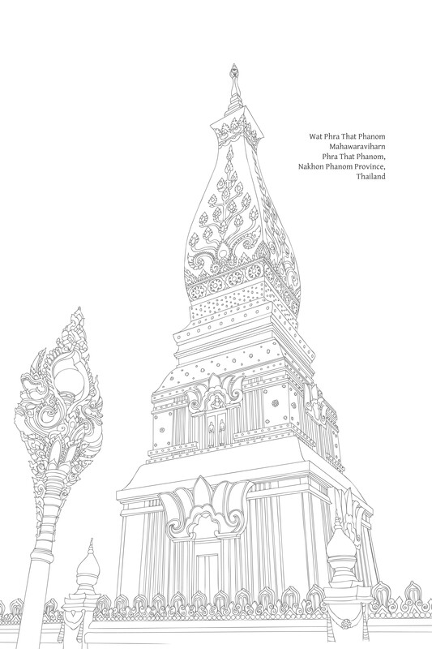

# 第十四章：信心

## 导论

信心（saddhā）[\[1\]](#fn-fn1){:id="fr-fn1"}在佛教教义中的意义、作用和重要性如下：

此处的信心并非指不加理性判断，就将全部责任托付给某事或某人。恰恰相反，那样做是情感不成熟的表现。

信心只是培育智慧过程中的一个阶段——而且是第一个阶段。正确的信心与理性分析相关：它必须导向智慧并由智慧验证。它与不加理性判断就将全部责任托付给某事或某人或完全依赖他者的行为相反，后者是单纯情感（āvega）的表达，会导致人们停止探究。仅仅基于情感的信心是一种轻信；它应被修正并最终消除。诚然，源于正确信心的情感在法（Dhamma）修习的早期阶段可能很有用，但最终会被智慧取代。

包含在培育智慧中的信心或许最好定义为自信：一个人基于批判性推理，坚信所追求的目标或理想既有价值又可实现。这种信心激励人们去验证他们相信合理可达的真相。

为了正确地定义信心，巴利语圣典中所有将信心（saddhā）列为一组修行要素的教导，也都包含智慧作为伴随要素，并且通常信心被列为第一个要素，而智慧被列为最后一个要素（参见“始于信心的要素”注释）。然而，强调智慧的教导则不一定包含信心的要素（参见“不包含信心的要素”注释）。

始于信心的要素

> 有许多例子，包括：导向未来善报的戒德（samparāyikattha）：信心、戒行、布施和智慧。导向增长的戒德（vuḍḍhi-dhamma）：信心、戒行、学习、布施和智慧。五根/五力（bala/indriya）：信、精进、念、定和智慧。成就无畏的法（vesārajjakaraṇa-dhamma）：信心、戒行、多闻、精进和智慧。圣财（ariya-dhana）：信心、戒行、惭愧、惧恶、多闻、布施和智慧。

不包含信心的要素

> 例如：应在心中确立的戒德（adhiṭṭhāna-dhamma）：智慧、真实、布施和宁静。七觉支（bojjhaṅga）：念、择法、精进、喜、轻安、定和舍。守护法（nāthakaraṇa-dhamma）：戒行、多闻、与善友交往、易受纠正、乐于助人、爱真理、精进、知足、念住和智慧。

因为智慧统领其他善法，并且是一个基本要素，所以它比信心更重要。即使作为个人特质，智慧而非信心才是决定性因素：在佛教中备受赞扬的个人，例如上首弟子尊者舍利弗（Sāriputta），正是那些拥有最大智慧的人。

信心有两个显著的益处：

*   信心引发喜（pīti），喜生起轻安（passaddhi），轻安继而导致快乐，然后是定，最终是智慧；以及
    
*   信心产生精进——努力从事修行，并检验那些由信心所相信的事物，以便亲身实证真理，这最终导向智慧。（参见“信心作为辅助条件”注释）
    

尽管这两个益处源于情感基础，但其达到顶峰的过程始终必须包含对智慧的内在渴望。

由于真正信心的目的是支持智慧，信心必须促进批判性辨别，从而导向智慧的培育。而且，只有当一个人通过理性探究和理解确立了信心并消除了疑虑时，信心本身才算根基稳固。在佛法（Buddha-Dhamma）中，信心的品质因此支持探究和调查。诉诸他人相信、强迫他人接受预设真理，或威胁不信者以惩罚的方法，都与佛教的这一信心原则不符。

对他人的信心和虔诚则有其缺点。佛陀甚至鼓励他的弟子放弃对自己的个人虔信，因为这种个人信心承载着浓厚的情感，并可能成为获得圆满解脱的障碍。

信心不被归类为道支，因为它是由智慧引导和验证的，智慧才是道上进步所需的必要因素。此外，那些拥有大智慧的人，例如圆满觉悟的诸佛和辟支佛（Pacceka-Buddha），从智慧开始修行，而无需经过信心的阶段。智慧的培育不一定总是始于信心——它也可以始于如理作意（yoniso-manasikāra）。因此，佛陀将信心的概念置于培育正见部分，他并未将信心区分为一个独立的要素。

信心作为辅助条件

> 信心导向喜（pīti），见：S. II. 31；信心导向精进（viriya），见：S. V. 225。信心有助于产生心的力量和无畏，这些是“精进”（viriya）的特质：参见《旗帜经》（Dhajagga Sutta）（S. I. 218-20）。请注意，缺乏智慧支持的信心是一种导向定的力量，包括极高层次的定，它们是心解脱（cetovimutti）的形式。然而，这些心的境界仍会退转和停滞：它们不一定导向智慧，甚至可能阻碍智慧。另一方面，伴随智慧的信心，则能产生支持智慧进一步培育的定。在最后阶段，信心和定导向慧解脱（paññā-vimutti），这能带来不可动摇的心解脱。

即使超越了所谓“盲信”的信心，如果未能达到探究和旨在清晰洞见的阶段，仍被视为不正确，因为它未能履行其功能。停滞在此层面的修行仍然有缺陷，因为它缺乏一个真正的目标。

尽管信心具有显著益处，但在最后阶段它必须终结。信心的存在表明尚未达到真正的目标，因为只要一个人“相信”那个目标，就说明他尚未亲身实证它。只要信心存在，就揭示了一个人仍然依赖外物、将智慧托付给外物，并且尚未达到圆满自由。

因此，信心并非阿罗汉的特质；恰恰相反，阿罗汉具有“无信”（assaddha）的特质，这意味着他已直接证悟真理，不再需要相信他人或对真理的理性解释。

总而言之，道上的进步是循序渐进的，始于信心（saddhā），发展为符合因果的见解或理解（diṭṭhi），最终导向对真理的智见（ñāṇa-dassana）。在最后阶段，信心的任务就结束了。

信心的重要性和优点应该被清楚地理解。人不应该过分看重信心，也不应轻视它，两者都会带来有害的后果。轻视信心表明对信心作用的误解。例如，一个人可能拥有高度的自信，但这可能只是对自身烦恼的相信，并表现为我慢和自我中心。

在与戒行（sīla）相关的方面，信心是一个关键因素。它为人们提供了支持性原则，起到威慑作用，使他们能够抵制诱惑和挑衅，并避免做坏事。

信心也为思惟提供了渠道。当人们体验到不压倒心识（不超过信心所灌输原则的力量）的感官印象时，他们的思惟路径会沿着信心所准备的道路前进；念头不会偏离不善的方向。对于仍然受烦恼影响的人来说，信心因此维系着他们的戒行。[\[2\]](#fn-fn2){:id="fr-fn2"}

尽管信心有很多益处，但如果它不伴随智慧，那么它可能有害，甚至会阻碍智慧的培育。

关于培育智慧，可以大致概述信心（在达到智慧圆满之前）的各个阶段，如下：

1.  一个人培育基于健全理性的见解；不单单因为听信他人之言而相信事物（与《迦摩罗经》（Kālāma Sutta）相符——见下文）。
    
2.  一个人守护真相（saccānurakkha）；以客观态度聆听各方的教导、观点和学说；不急于对尚未真正了解的事物做出判断；不固执地坚持自己的个人知识和观点代表真相。
    
3.  当一个人听取他人的教导和观点，看到它们符合理性，并观察到提供这些教导的人是真诚、无偏且有智慧的，信心便会生起。一个人接受这些教导，以便继续使用理性分析来检验真相。
    
4.  一个人思惟并检验这些教导，直到确信它们真实无误；他对所见证的真相深感触动，并努力进一步探究，以加深对真相的证悟。
    
5.  如果一个人有疑虑，他会真诚地向他人请教；请教并非为了巩固自我身份，而是为了获取智慧。通过验证理性论证的真实性，信心得以巩固。如此一来，信心的目的就实现了。
    

## 佛陀关于信心的开示

《迦摩罗经》（Kālāma Sutta）为所有人提供了一个建立基于理性分析观点的原则，无论他们是否已经持守特定的理论、教导或学说：[\[3\]](#fn-fn3){:id="fr-fn3"}

> 有一次，佛陀游方来到拘萨罗国（Kosala）的伽蓝人（Kālāma）居住地拘萨城（Kesaputta）。伽蓝人听到佛陀的好名声后，前来拜访他，互相问候后，向他禀告道：世尊，有些沙门和婆罗门来到拘萨城。他们解释并抬高自己的教义，却讥笑、贬低、辱骂、诽谤他人的教义。但随后又有其他沙门和婆罗门来到拘萨城，他们也解释并抬高自己的教义，却讥笑、贬低、辱骂、诽谤他人的教义。世尊，我们感到困惑和怀疑，不知道这些沙门和婆罗门中，谁说的是真话，谁说的是假话。 \[佛陀回答说：\] 伽蓝人啊，你们感到困惑是恰当的，你们感到怀疑是恰当的。你们对令人困惑的事情产生了怀疑。来吧，伽蓝人：不要被口传（anussava）所引导  
> 。（参见“‘Anussava’一词”注释）不要被教义传承（paramparā）所引导。不要被道听途说（itikirā）所引导。不要被引用经典（piṭaka-sampadāna）所引导。不要被逻辑推理（takka）所引导。不要被推论（naya）所引导。不要被理性思惟（ākāra-parivitakka）所引导。不要被教法符合个人观点（diṭṭhi-nijjhānakkhanti）所引导。不要被讲者鼓舞人心的外表（bhabba-rūpatā）所引导。不要被“这位沙门是我们的老师”（samaṇo no garūti）这个想法所引导。但是，当你们自己知道：“这些事物是不善的，这些事物是有害的，这些事物受到智者的谴责，这些事物如果被实行和修习，会导致损害和苦”，那么你们就应该舍弃它们……当你们自己知道：“这些事物是善的，这些事物是无害的，这些事物受到智者的赞扬，这些事物如果被实行和修习，会导致福祉和安乐”，那么你们就应该投入其中。

如果人们缺乏对特定事物的理解和相信，佛陀并没有敦促他们去相信。相反，他鼓励他们根据自己能够亲身见证的因果来考量和判断此事。例如，关于再生这个主题，上述经文末尾有一段话指出：

> 伽蓝人啊，当这位圣弟子如此使他的心脱离敌意、脱离恶意、纯洁无染时，他今生就获得了四种确信。他所获得的第一种确信是：“如果存在他世（paraloka），并且善恶业会带来果报，那么身体分解后，死后我将投生于善趣，在天界。”他所获得的第二种确信是：“如果不存在他世，并且善恶业不会带来果报，那么就在此世，我依然快乐地生活，没有敌意和恶意。”他所获得的第三种确信是：“假设恶报会降临作恶者。那么，由于我无意对任何人作恶，苦报又怎会降临于我这个不作恶之人呢？”他所获得的第四种确信是：“假设恶报不会降临作恶者。那么就在此世，我见自己在这两方面都已清净。”[\[4\]](#fn-fn4){:id="fr-fn4"}  
> A. I. 188

“Anussava”一词

> 自从《佛法》（Buddhadhamma）最初写作阶段（在第一版印刷之前），我就觉得这里的“不相信”一词未能清晰传达巴利语的含义，但我尚未找到一个恰当的替代词。\[译者按：作者此处指的是泰语短语yah yeut theu（อย่ายึดถือ）；这也可以表示“不执取”、“不假定”。\]我的翻译基于《泰语三藏：献给佛教25世纪的致敬》（出版于佛历2500年）的版本，该版本将此语境中 mā 的注释性解释应用为 mā gaṇhittha。在《佛法》的后续版本中，我继续使用yah yeut theu这个短语，但增加了脚注：“此处的‘不相信’一词是暂时的，因为尚未找到合适的替代词。应将此短语理解为‘不要仅凭这些因素中的任何一个就做出判断或以绝对、明确的方式确立观点’。”1972年，当我编写《佛教词典》（พจนานุกรมพุทธศาสน์ ฉบับประมวลธรรม）时，我决定采用“不要（果断地）相信”（yah bplong jy cheua – อย่าปลงใจเชื่อ）的翻译。后来，《佛法》的版本保留了最初的翻译，并补充了脚注：“yah yeut theu的表达应理解为与yah bplong jy cheua相对应。”关于此主题的更多内容，请参见附录一。

对于不遵循特定学说或宗教的人，佛陀会以慈悲、中立、客观的方式教导。他会鼓励听者从独立的立场思惟真理。他不会声称拥有这些教导，也不会试图说服人们对他表现出个人信心或皈依“佛教”。

佛陀并没有将自己或神通力作为其教导真实性的证明，而是提及“事物本然的方式”以及人们能够通过自己的智慧亲眼见证的事实。此外，佛陀教导了一种称为“确定性”原则（apaṇṇakatā）的基本修习原则：对于那些普通人缺乏理解的事物，无论是被称为超自然的事物还是未被清晰理解的常见现象，人们都应该选择一个明确而确定的行动方针，而不是陷入猜测。

这个原则的一个著名例子见于《无误本生经》（Apaṇṇaka Jātaka）。有两支独立的商队都需要运载大量的水才能穿越沙漠。第一支商队遇到一个化作人形的妖怪，它想欺骗并吞噬他们。它用虚假的证据告诉商队成员，前方会有大量水池和湖泊。因此，它告诉他们把所有的水都倒掉，而不是不必要地携带。商队成员听后很高兴，倒掉了罐子里的所有水。但他们前方没有发现水，变得虚弱，并被恶魔吞噬。

第二支商队成员也同样被展示了虚假的水源证据，但他们运用了“确定性原则”，反思道：“只要我们尚未亲眼见到此事真相，我们就不会轻易遵循这种逻辑或猜测。我们确定无疑的是牛车上现在载着的水。当前方遇到所说的水源时，我们才能灌满我们的罐子。”通过运用智慧并依赖直接可辨识的事物，这支商队得以安全抵达。[\[5\]](#fn-fn5){:id="fr-fn5"} 

这种选择明确而确定行动方针的原则，也可以应用于法（Dhamma）修习以及心法（nāma-dhamma）的微妙方面，正如《无误经》（Apaṇṇaka Sutta）中所述：

> 有一次，佛陀来到婆罗门村萨拉（Sālā）。婆罗门居士们听闻佛陀的好名声后，前来拜访他并互相问候。佛陀问他们：“居士们，你们有没有哪位老师是你们认可的，并且你们对他生起了由理性辨别支持的信心（ākāravatī-saddhā）？”“没有，尊者。”“居士们，既然你们没有找到一位认可的老师，你们可以修习这个无误且确定的教法（apaṇṇaka-dhamma）；因为当这个无误且确定的教法被正确修习时，它将长期导向你们的福祉和安乐。这个无误且确定的教法是什么呢？‘居士们，有些沙门和婆罗门的学说和见解是：“布施没有果报，供养没有果报，祭祀没有果报；善恶业没有果报；没有此世，没有他世；[\[6\]](#fn-fn6){:id="fr-fn6"}没有母亲，没有父亲……”现在，有些沙门和婆罗门的学说与那些沙门和婆罗门的学说直接对立，他们这样说：“布施、供养和祭祀有果报；善恶业有果报……”居士们，你们认为如何？这些沙门和婆罗门是不是持有彼此直接对立的学说？’‘是的，尊者。’‘现在，居士们，那些持“布施没有果报，供养没有果报，祭祀没有果报……”学说和见解的沙门和婆罗门，可以预料他们会舍弃这三种善法，即善的身业、善的语业和善的意业，并且他们会从事和修习这三种不善法，即身恶行、语恶行和意恶行。这是为什么呢？因为那些沙门和婆罗门看不到不善法中的危险、堕落和染污，也看不到善法中的清净——出离的福祉……’‘对此，智者会这样思惟：“如果不存在他世，那么身体分解后，这个人就已经使自己足够安全了。但如果存在他世，那么身体分解、死后，他将重新出现于苦处、不幸的目的地、毁灭，甚至是地狱。现在，无论那些沙门和婆罗门的话是否真实，让我假设没有他世：这个人仍然在此世被智者谴责为不道德的人，一个持有断灭论的邪见者。但另一方面，如果存在他世，那么这个人就两头落空了：因为他在此世就被智者谴责，而且身体分解、死后，他将重新出现于苦处、不幸的目的地、毁灭，甚至是地狱……”’‘居士们，有些沙门和婆罗门的学说和见解是：“没有最终的存在止息。”[\[7\]](#fn-fn7){:id="fr-fn7"}现在，有些沙门和婆罗门的学说与那些沙门和婆罗门的学说直接对立，他们这样说：“存在着最终的存在止息……”对此，智者会这样思惟：“这些沙门和婆罗门持有“没有最终的存在止息”的学说和见解，但我尚未亲见。而这些其他沙门和婆罗门持有“存在着最终的存在止息”的学说和见解，但我尚未亲知。如果我未经亲知亲见，就偏向一方并宣称：‘唯此为真，其他皆错’，那对我来说是不合适的。现在，至于那些持有“没有最终的存在止息”学说和见解的沙门和婆罗门，如果他们的话是真的，那么我死后当然仍然可能重新出现在由知觉组成的无色界天神之中。[\[8\]](#fn-fn8){:id="fr-fn8"}但至于那些持有“存在最终的存在止息”学说和见解的沙门和婆罗门，如果他们的话是真的，那么我今生今世就可能证得最终的涅槃（Nibbāna）。然而，那些持有“没有最终的存在止息”学说和见解的沙门和婆罗门的观点，接近于执著、接近于束缚、接近于沉溺、接近于迷恋、接近于攀缘；但那些持有“存在最终的存在止息”学说和见解的沙门和婆罗门的观点，接近于不执著、接近于不束缚、接近于不沉溺、接近于不迷恋、接近于不攀缘。”如此反思之后，他修习解脱、离弃存在的道路，直至存在的真实止息。’  
> M. I. 400-413

佛陀的以下教导揭示了仍然基于信心和逻辑的知识是如何有缺陷的，仍然容易出错，并且并非对真相的真正证悟：

> 婆罗堕阇（Bhāradvāja），有五种事物，在此世今生可能出现两种不同的结果：信心（saddhā）。认可（ruci）。口传（anussava；传承知识）。理性思惟（ākāra-parivitakka）。符合个人见解（diṭṭhi-nijjhānakkhanti；这包括反思的行为）。现在，某些事物可能因信心而被完全接受，但它可能是空洞和虚假的；而另一些事物可能并未因信心而被完全接受，但它可能是事实的、真实的、无误的。再者，某些事物可能被完全认可和接受，但它可能是空洞和虚假的；而另一些事物可能并未被完全认可和接受，但它可能是事实的、真实的、无误的。再者，某些事物可能通过传统传承下来，但它可能是空洞和虚假的；而另一些事物可能并未通过传统传承下来，但它可能是事实的、真实的、无误的。再者，某些事物可能经过深思熟虑，但它可能是空洞和虚假的；而另一些事物可能与所深思熟虑的不相似，但它可能是事实的、真实的、无误的。再者，某些事物可能被充分反思\[为符合个人观点和信念\]，但它可能是空洞和虚假的；而另一些事物可能与所反思的不相似，但它可能是事实的、真实的、无误的。  
> M. II. 170-71; 参阅：M. II. 218

在接下来的经文中，佛陀进一步揭示了一种保护或守护真相（saccānurakkha）的方法——即在对待个人观点和信念时如何行事，以及如何回应他人的观点和信念：

> 一个守护真相的智者，不适宜得出明确的结论：“唯此为真，其他皆错。”如果一个人有信心，当他说：“我的信心是这样的”时，他就在守护真相；但他尚未得出明确的结论：“唯此为真，其他皆错。”通过这种方式，就有了对真相的守护；通过这种方式，他守护真相；通过这种方式，我们描述对真相的守护。但目前尚未证悟真相。如果一个人认可某事……如果他接受了知识的传承……如果他运用理性思惟……如果他对个人观点获得了一种反思性的接受，当他说：“我认可的观点是这样的”……“我接受的传承是这样的”……“我理性思惟后认为是这样的”……“我反思性接受的观点是这样的”时，他就在守护真相：但他尚未得出明确的结论：“唯此为真，其他皆错。”通过这种方式，就有了对真相的守护；通过这种方式，他守护真相；通过这种方式，我们描述对真相的守护。但目前尚未证悟真相。  
> M. II. 171

佛陀在另一部经中阐明了这种正确的行为。有一次，比丘们正在讨论其他人对佛教教义的赞扬和批评，佛陀这样解释道：

> “比丘们，如果有人诋毁我、法（Dhamma）或僧伽（Sangha），你们不应因此而生气、怨恨或心烦。如果你们因此类诋毁而生气或不悦，那只会对你们造成危害。如果他人诋毁我、法（Dhamma）或僧伽（Sangha），而你们生气或不悦，你们能否辨别他们所说的是否正确？”“不能，世尊。”“如果他人虚假地诋毁我、法（Dhamma）或僧伽（Sangha），那么你们必须解释何处不正确，说：‘因为这个原因，那是不正确的；因为这个原因，那是虚假的；那不是我们的方式；那不存于我们之中。’‘比丘们，如果他人赞扬我、法（Dhamma）或僧伽（Sangha），你们不应因此而高兴、快乐或得意。如果你们因此类赞扬而高兴或得意，那只会对你们造成危害。如果他人正确地赞扬我、法（Dhamma）或僧伽（Sangha），你们应该承认何处真实，说：‘因为这个原因，那是正确的；因为这个原因，那是对的；那是我们的方式；那存于我们之中。’ ”  
> D. I. 2

在之前关于守护真相（saccānurakkha）的经文中，佛陀接着描述了证悟真相（saccānubodhi）和抵达真相（saccānupatti）的修习方式，其中包含信心的生起。这段描述解释了信心的重要性及其局限性：

> ‘但是，乔达摩大师，如何才能证悟真理呢？一个人如何才能被称为已经证悟真理的人呢？’ ‘在此，一位比丘可能依止某个村庄或城镇居住。然后，一位居士或居士的儿子前去考察他，就三种状态对他进行考察：考察基于贪的状态，考察基于瞋的状态，考察基于痴的状态：“这位尊者是否有任何基于贪的状态，以至于他的心被这些状态所占据，在不知情的情况下可能会说‘我知道’，或者在未见的情况下可能会说‘我看见’，或者他可能会敦促他人以一种长期导致他们伤害和痛苦的方式行事吗？” ‘当他考察他时，他了解到：“这位尊者没有任何基于贪的状态，以至于他的心被这些状态所占据，在不知情的情况下可能会说‘我知道’，或者在未见的情况下可能会说‘我看见’，或者他可能会敦促他人以一种无益的方式行事，长期导致他们伤害和痛苦。此外，这位尊者的身体行为和言语行为并非受贪影响。而且，这位尊者所教导的法是深奥的，难以见到和难以通达的，寂静而殊胜的，不是通过单纯的推理可以达到的，是微妙的，只有智者才能体验到。这种法不是受贪影响的人能够轻易教导的。” ‘当他考察过他，并看到他已从基于贪的状态中净化后，他接下来考察他基于瞋的状态……考察他基于痴的状态……。 ‘当他考察过他，并看到他已从基于痴的状态中净化后，他就对他生起了信心。充满信心地他拜访他并与他交往；亲近他后，他倾听；当他倾听时，他听到了法；听到法后，他记住了它，并考察他所记住的教法的意义；当他考察其意义时，他基于自己的探究对这些教法产生了接受；当他对这些教法产生了省思性的接受后，热情便生起；当热情生起后，他便有了决心；有了决心，他便仔细审视；仔细审视后，他便精进；坚定地精进，他在自己内心证悟了终极真理，并以智慧通达它而见到它。通过这种方式，就有了真理的证悟；通过这种方式，一个人证悟真理；通过这种方式，我们描述对真理的觉悟（saccānubodha）。但此时尚未最终达到真理。’ ‘但是，如何才能最终达到真理呢？一个人如何才能最终达到真理呢？’ ‘真理的最终达到（saccānupatti）在于对那些相同事物的重复、修习和培育。通过这种方式，就有了真理的最终达到；通过这种方式，一个人最终达到真理。’[\[9\]](#fn-fn9){:id="fr-fn9"}  
> M. II. 171-4

信心对于修行最初的阶段至关重要。它有助于修行成长，并且如果运用得当，它能加速修行进步。

因此，一个拥有卓越智慧但缺乏坚定信心的人，可能比一个智慧稍逊但拥有炽热信心的人更慢地达到修行目标。[\[10\]](#fn-fn10){:id="fr-fn10"} 当信心被安置在一个正当的对象上时，一个人既省时又省力；但当信心被安置在不正当的事物上时，它会误导并阻碍一个人。

无论如何，佛法中所教导的信心是建立在理性分析之上，并由智慧引导的，这防止了信心被错置。如果信心确实误入歧途，它可以被纠正，因为它不是盲目的执着；人们被鼓励不断审视信心的正当性和有效性。

缺乏信心是一种障碍，会中断并延迟修行进步，正如佛陀所证实：

> 比丘们，对于一个未能去除心中五根桩、未能解除五种心结的比丘来说，他不可能在这部法与律中达到完全的成长。比丘尚未能舍弃的五根心中桩如下：一个比丘对导师有疑虑和犹豫；他对导师犹豫不决、缺乏承诺。一个比丘对法有疑虑和犹豫；他对法犹豫不决、缺乏承诺。一个比丘对僧伽有疑虑和犹豫；他对僧伽犹豫不决、缺乏承诺。一个比丘对训练有疑虑和犹豫；他对训练犹豫不决、缺乏承诺。一个比丘对他修习梵行的同伴感到愤怒和怨恨；他对他们感到敌意和冷漠。一个比丘的心对导师……法……僧伽……训练……感到疑虑、犹豫、犹豫不决、缺乏承诺……对修习梵行的同伴感到愤怒……不倾向于精进、勤勉修行、坚持和努力。一个不倾向于精进……的比丘是尚未去除心中桩的人……。[\[11\]](#fn-fn11){:id="fr-fn11"}  
> D. III. 238; M. I. 101

缺乏信心和自信，即怀疑和犹豫，是培育智慧和修行进步的主要障碍。在这种情况下，所需的任务是消除疑虑并建立信心。

然而，此处信心的建立，并非在不尊重自身智慧的情况下，接受某事或某人，或将自己托付于某事或某人。相反，一个人应该运用智慧审视情况，以便清晰地看到事物之间的因果关系；这将导致自信并消除疑虑。

在下面的经文中，佛陀描述了这种明智的探究，并且在这教导中，佛陀鼓励人们探究佛陀自身的有效性： 

> 诸比丘，一个探究者比丘，不善于了知他心，应该对如来进行调查，以查明他是否已完全觉悟……。一个探究者比丘，不善于了知他心，应该就两种通过眼和耳可认知的状态，调查如来，即：“在如来身上，是否能发现任何通过眼或耳可认知的染污状态？”当他调查他时，他了解到：“在如来身上，没有发现任何通过眼或耳可认知的染污状态。”当他了解到这一点时，他进一步调查他：“在如来身上，是否能发现任何通过眼或耳可认知的混合状态（有时纯净，有时不纯净）？”当他调查他时，他了解到：“在如来身上，没有发现任何通过眼或耳可认知的混合状态。”当他了解到这一点时，他进一步调查他：“在如来身上，是否能发现任何通过眼或耳可认知的清净状态？”当他调查他时，他了解到：“在如来身上，确实能发现通过眼或耳可认知的清净状态。”当他了解到这一点时，他进一步调查他：“这位尊者是长期以来就达到了这种善法状态，还是最近才达到的？”当他调查他时，他了解到：“这位尊者是长期以来就达到了这种善法状态；他并非最近才达到。”当他了解到这一点时，他进一步调查他：“这位已经获得声誉和名望的尊者身上，是否发现有（与声誉和名望相关的）危险？”因为对于（某些）比丘来说，只要他们没有获得声誉和名望，（与声誉和名望相关的）危险就未在他们身上发现；但当他们获得声誉和名望时，那些危险就在他们身上发现。当他调查他时，他了解到：“这位尊者已经获得声誉和名望，但（与声誉和名望相关的）危险并未在他身上发现。”当他了解到这一点时，他进一步调查他：“这位尊者是否无惧（邪恶）而戒除邪恶，而不是因恐惧而戒除邪恶，并且他是否因贪欲灭尽而无贪欲，从而避免沉溺于感官享乐？”当他调查他时，他了解到：“这位尊者无惧（邪恶）而戒除邪恶，而不是因恐惧而戒除邪恶，并且他因贪欲灭尽而无贪欲，从而避免沉溺于感官享乐。”现在，如果其他人问那个比丘：“你有什么理由（ākāra）和证据（anvaya）让你说：‘这位尊者无惧（邪恶）而戒除邪恶，而不是因恐惧而戒除邪恶，并且他因贪欲灭尽而无贪欲，从而避免沉溺于感官享乐’？”——那个比丘如果正确回答，他会这样回答：“无论那位尊者是住在人群中还是独自一人，尽管有些人行为端正，有些人行为不端，有些人领导社群，有些人为物质烦恼，有些人不为物质所染，那位尊者都不会因此而轻视任何人。而且，我曾亲耳从世尊那里听到并学习到：‘我无惧（邪恶）而戒除邪恶，而不是因恐惧而戒除邪恶，并且我因贪欲灭尽而无贪欲，从而避免沉溺于感官享乐。’”诸比丘，如来应该就此被进一步质问：“在如来身上，是否发现或没有发现任何通过眼或耳可认知的染污状态？”如来会这样回答：“在如来身上，没有发现任何通过眼或耳可认知的染污状态。” 如果被问及：“在如来身上，是否发现或没有发现任何通过眼或耳可认知的混合状态？”如来会这样回答：“在如来身上，没有发现任何通过眼或耳可认知的混合状态。”如果被问及：“在如来身上，是否发现或没有发现任何通过眼或耳可认知的清净状态？”如来会这样回答：“在如来身上，确实能发现通过眼或耳可认知的清净状态。这些状态是我的道途和我的领域，然而它们并非贪欲的原因。”弟子应该亲近这样教导的导师，以便听闻法。导师以其越来越高的层次、越来越殊胜的层次、以及作为比较的黑暗与光明对等物来教导他法。当导师以这种方式向比丘教导法时，通过对该法中某一教法的亲知，比丘就对该教法得出了结论。他由此对导师产生信心：“世尊已完全觉悟，法已被世尊善妙宣说，僧伽修行良好。”现在，如果其他人问那个比丘：“你有什么理由和证据让你说：‘世尊已完全觉悟，法已被世尊善妙宣说，僧伽修行良好’？”——那个比丘如果正确回答，他会这样回答：“诸友，我亲近世尊是为了听闻法。世尊教导我法……。当世尊以这种方式教导我法时，通过对该法中某一教法的亲知，我对这些教法得出了结论。我由此对导师产生信心：‘世尊已完全觉悟，法已被世尊善妙宣说，僧伽修行良好。’”诸比丘，当某人的信心通过这些理由、术语和表述，在如来身上被培植、生根和建立时，他的信心就被称为有理性支持、以见为根基、[\[12\]](#fn-fn12){:id="fr-fn12"} 坚定不移，并且无法被任何沙门、婆罗门、天神、魔罗、梵天或世上任何人所动摇。这就是如何调查如来的功德，以及如何依照法来善加调查如来。  
> 《考察者经》（Vīmaṁsaka Sutta）：M. I. 317-20

疑虑和犹豫，即使是对佛陀本人，也不被认为是错误或邪恶的；它们只是需要通过运用智慧来理解和消除的心的状态。事实上，疑虑可以鼓励人们增加调查和探究。

当人们宣布他们对佛陀的信心时，在给予认可之前，佛陀会审视他们的信心和自信是否建立在理性的考量之上，这在尊者舍利弗与佛陀的以下讨论中显而易见：

> ‘尊者，我如此信赖世尊：“从未有过、将来也不会有、现在也没有其他沙门或婆罗门拥有超越世尊的圆满觉悟知识。”’ ‘舍利弗，你言之凿凿，[\[13\]](#fn-fn13){:id="fr-fn13"} 坚定地发出狮子吼！这是为什么呢？你是否能够感知所有过去圆满觉悟的圣佛的心，从而说：“这些世尊具有这样的德行，这样的教导，这样的智慧，这样的特质，这样的解脱”？’ ‘不，尊者。’ ‘那么你是否能够感知所有未来将出现的圆满觉悟的圣佛的心……“这样的解脱”？’ ‘不，尊者。’ ‘而我，现在是圆满觉悟的圣佛：你是否能够用心感知：“世尊具有这样的德行……这样的解脱”？’ ‘不，尊者。’ ‘那么，既然你没有能力感知过去、未来或现在圆满觉悟的圣佛的心，你又为何言之凿凿，发出狮子吼的坚定之语呢？’ ‘尊者，虽然我没有能力了知过去、未来和现在圆满觉悟的圣佛的心，但我知道证悟佛法之道。[\[14\]](#fn-fn14){:id="fr-fn14"} ‘尊者，这就像一座王家边境城市，拥有强大的堡垒和坚固的环城墙，城墙上有一道城门，城门有一个守门人，他明智、熟练而聪明，他阻止陌生人进入，让认识的人进入。他不断巡逻，沿着城墙巡视，没有发现城墙上有任何缝隙或裂缝，即使是猫也无法钻过。他认为，任何较大的生物进出城市，都必须通过这道城门。 ‘同样地，尊者，我知道证悟佛法之道：所有过去圆满觉悟的圣佛，都是通过舍弃染污内心、削弱智慧力量的五盖，在心中坚定建立四念住，并如实发展七觉支而证得无上正等正觉的。所有未来圆满觉悟的圣佛也将如此，而您，尊者，现在是圆满觉悟的圣佛，也是通过舍弃五盖……如实发展七觉支而证得无上正等正觉的。’[\[15\]](#fn-fn15){:id="fr-fn15"}  
> D. II. 81-2; D. III. 99-101

如果作为修行进步的辅助工具，对特定人物的信心可以是有益的。但它也有缺点，因为它常常会变成对个人的执着并阻碍进步。首先，这里有一段经文概述了信心的优点：

> 完全奉献于如来并对他充满信心的圣弟子，不会对如来或如来的教法抱有任何困惑或疑虑。确实可以预料，一个有信心的圣弟子将以振奋的精进力，致力于舍弃不善法并获得善法；他将坚强、精进不懈，不推卸修习善法的责任。  
> S. V. 225

对某个人的信心的缺点在此教导中概述：

> 比丘们，对一个人虔信有这五种缺点。哪五种？当一个人对另一个人非常虔信，而那个人犯了罪，僧团因此暂停他的资格时，他就会想：“僧团暂停了我亲爱可爱的他！”……当那个人犯了罪，僧团强制他坐在队伍的末尾时，他就会想……。……当那个人去往遥远的地方时……。……当那个人还俗时……。……当那个人死去时，他就会想：“他死了，那个我亲爱可爱的人死了！”他将不会与其他比丘交往，而不与其他比丘交往，他就听不到正法，听不到正法，他就会从正法中堕落。  
> A. III. 270

当信心转变为一种爱恋的情感时，个人偏见可能会阻碍智慧的运作，这在下面的经文段落中得到了体现：

> 诸比丘，有这四种事物可以产生。哪四种？爱生爱；爱生瞋；瞋生爱；瞋生瞋……。那么，瞋是如何从爱中产生的呢？一个人所喜爱、依恋并认可的人，被其他人以一种不悦、冒犯和不愉快的方式对待，于是他便对那些人生起恶意……。  
> A. II. 213

即使是对佛陀的虔信，当这种虔信变得个人化时，也可能成为证得最高解脱的障碍，而佛陀鼓励他的弟子们舍弃这种爱。有时，他在教导弟子时会采取相当极端的措施，例如瓦卡利尊者（Vakkali）的案例，他热切地虔信佛陀，并希望时刻亲近他。

瓦卡利尊者晚年重病时，派人向佛陀请求见面。佛陀探望了他，并给予了以下教导：

> 瓦卡利：“世尊，长期以来，我一直想来见世尊，但我的身体不够强壮，无法做到。”佛陀：“够了，瓦卡利！你为什么要看这污秽的身体？见法者即见我；见我者即见法。因为，瓦卡利，见到法，即见到我；见到我，即见到法。”  
> S. III. 119-120

仅限于信心层面的修行进步是不稳定或不安全的，因为信心依赖于外部条件并可能减弱，这已被佛陀的教导所证实：

> 在此，跋达离，假设一个人只有一只眼睛；那么他的朋友和同伴，他的亲属和家属，会帮助守护他的眼睛，心想：“不要让他失去他唯一的眼睛。”同样，一些比丘在这法和律中，以信和爱修行。在这种情况下，其他比丘会这样考虑：“这位比丘以信和爱修行。我们应该通过反复敦促他行事来帮助他，以便他不会失去那份信和爱。”这就是在此教法中，必须反复敦促一些比丘履行其义务的原因。  
> M. I. 444-5

当信心未发展到智慧的阶段时，它是有限的。它可能导致投生到天界，但它本身无法导致佛法的最终目标，这已由佛陀的教导所证实：

> 诸比丘，在我善妙宣说的、清晰、开放、显而易见的法中，没有隐藏的陷阱：那些已断尽烦恼的阿罗汉比丘，在未来不会再有轮回的显现……。那些已舍弃五下分结的比丘，都将自行再次出现（在净居天），并在那里证得究竟涅槃……。那些已舍弃三下分结并减弱贪、瞋、痴的比丘，都是斯陀含（一来者）……。那些已舍弃三结的比丘，都是须陀洹（入流者）……。那些法随行者（dhammānusārī）或信随行者（saddhānusārī）的比丘，都将趋向觉悟……。那些仅仅对我怀有信心、仅仅对我怀有爱恋的比丘，都将趋向天界。  
> M. I. 141-2

在培育智慧的语境中，智慧最初受益于正确的信心，然后逐渐发展，直到达到“智见”（ñāṇa-dassana）的阶段。在这个阶段，不再需要依赖信念和观点，因为一个人自己清楚地知道和看到，因此这个阶段超越了信心的范畴：

> 舍毘陀尊者：“穆西拉尊者，除了信，除了个人偏好，除了口传，除了理性思惟，除了与教义分析的一致性之外，穆西拉尊者是否有亲身知识，即：‘以生为缘，老死生起’？”穆西拉尊者：“舍毘陀友，除了信，除了个人偏好，除了口传，除了理性思惟，除了与教义分析的一致性之外，我知此，我见此：‘以生为缘，老死生起。’”[\[16\]](#fn-fn16){:id="fr-fn16"}  
> S. II. 115-18

这段经文继续说：

> ‘诸比丘，是否有一种阐述方法，通过这种方法，比丘——除了信仰，除了个人偏好，除了口传，除了理性思惟，除了符合教义分析——可以宣称最终的知识，即：“生已尽，梵行已立，所作已办，此后更无他事”？…… ‘有一种阐述方法……。在此，用眼看到一个色相时，如果内心有贪、瞋或痴，比丘就明白：“内心有贪、瞋或痴”；或者，如果内心没有贪、瞋或痴，他就明白：“内心没有贪、瞋或痴。” ‘既然如此，这些事情是通过信仰来理解的，还是通过个人偏好，还是通过口传，还是通过理性思惟，还是通过符合教义分析来理解的呢？’ ‘不，世尊。’ ‘这些事情难道不是通过智慧来看清楚的吗？’ ‘是的，世尊。’ ‘诸比丘，这就是（一种）阐述方法，通过这种方法，比丘——除了信仰……除了符合教义分析——可以宣称最终的知识……。’[\[17\]](#fn-fn17){:id="fr-fn17"}  
> S. IV. 138-40

当一个人拥有清晰的智见时，信心就不再需要：此人无需相信他人。佛陀的弟子们，那些已证得卓越功德的人，无需提及佛陀，就能知晓并谈论这些事情，这在耆那教领袖尼干陀·那陀子（Nigaṇṭha Nātaputta）与居士质多（Citta）之间的对话中得到了印证，质多是佛陀一位精通佛法的杰出弟子：

> 尼干陀：“居士，你是否相信沙门乔达摩所说：‘有一种无寻无伺的禅定；寻伺有止息’？”质多：“在这件事上，尊者，我并非凭借对世尊的信仰而说：‘有一种无寻无伺的禅定；寻伺有止息’……。‘无论我愿意到何种程度……我进入并安住于初禅……我进入并安住于二禅……我进入并安住于三禅……我进入并安住于四禅。’[\[18\]](#fn-fn18){:id="fr-fn18"} 既然我如此知晓和看到，我就不以信仰相信任何沙门或婆罗门关于无寻无伺的禅定存在、寻伺止息的说法。”  
> S. IV. 298-9

阿罗汉，那些已达到最高智见的人，拥有“无信”（assaddha）的特质：[\[19\]](#fn-fn19){:id="fr-fn19"} 他们在清楚看到的事情上，无需相信任何其他人，这已由佛陀与舍利弗尊者（Ven. Sāriputta）的讨论所证实： 

> 佛陀：“舍利弗，你是否相信，信根，当被发展和培育时，能深入不死，以不死为目的地，以不死为最终目标？……精进根……。念根……。定根……。慧根……以不死为最终目标？”舍利弗：“在这件事上，我不凭借对世尊的信仰……。那些不知、不见、不解、不证、不用智慧辨别的人——他们就得在这方面依靠对别人的信仰……。但那些用智慧知、见、解、证、辨别这些事情的人——他们在这件事上就不会困惑或疑虑……。我已用智慧知、见、解、证、辨别这些事情——因此，我对这件事毫无疑虑和不确定：信根……精进根……念根……定根……慧根，当被发展和培育时，能深入不死，以不死为目的地，以不死为最终目标。”佛陀：“善哉，善哉，舍利弗。”  
> S. V. 220-22

佛陀的以下这些段落强调了智慧的至关重要性：

> 诸比丘，比丘通过培育与修习了多少种根，从而宣称阿罗汉果，并如此了知：“生已尽……已无余事可做以达此境”？是由于他培育与修习了一种根，一位已断尽烦恼的比丘才能如此宣称阿罗汉果。那一种根是什么？是慧根。对于一位拥有智慧的圣弟子来说，随之而来的信心变得稳定，精进……念……定也随之变得稳定。  
> S. V. 222

只要慧根缺失，信、精进、念、定等其他诸根，无论是单独还是组合，都无法带来觉悟：

> 诸比丘，正如陆地动物的足迹都能容纳在大象的足迹中，而大象的足迹因其巨大而被宣称为它们的首要，同样地，在通往觉悟的步骤中，慧根被宣称为它们的首要，也就是说，为了证悟觉悟。[\[20\]](#fn-fn20){:id="fr-fn20"}  
> S. V. 231-2, 237-9

## 中道的准备

总而言之，普通人，那些尚未精通智慧的人，需要他人的引导和鼓励。对他们而言，智慧的培育始于善友这一外部因素，以便建立信心。（这里的信心是指源于良好理性辨别的自信。）

从这里开始，便进入内在因素的运作，首先是运用基于信心的知识，以分析的方式独立思考。这种分析性反思会产生正见，并推进智慧的培育，最终达到清晰的智见（ñāṇa-dassana）。（参阅《三种智慧反思》注。）

三种智慧反思

> 一位帮助引导他人的人，可以运用以下三种智慧反思作为基本原则，来检验他人的智慧水平或明智反思的能力：与条件相应地思考：看对方是否能合理且系统地思考，并能探究因果条件。分析性反思：看对方是否能从不同角度看待事物，是否能区分各种可能性，而不会模糊或片面地看待事物。反思事物的原则（法）与目的（义）之间的关系：看对方在听到或读到某物后，是否能抓住其原则、关键点或要旨，以及其意义、目的、价值、益处，以及阐述其主要观点的方式。

由于信心（saddhā）是一个非常重要的因素，并且当它适当且正确地运用时，它与分析性反思是兼容的，能导向智慧和正见，让我们回顾它的实践层面：

1.  在戒行（sīla）层面，信心是基本原则，保护一个人的戒德，阻止一个人做出不道德的行为，并使一个人坚定地保持正直的行为。虽然一个人的信心可能尚未伴随智慧，但它仍然有效。事实上，在许多情况下，基于根深蒂固信念的信心在道德行为层面比基于智慧反思的信心更有效。
    
2.  在禅定（samādhi）层面，信心有助于禅定。它能带来喜悦和安乐，深沉的宁静，以及没有烦躁和不安，它还能带来坚定的努力、勇气、无畏、专注、效力和稳定。尽管在这种语境中的信心也是基于根深蒂固的信念而非基于理性的推论，它同样有效。
    
    尽管这种基于信念的信心对于这头两个修习层次是有效的，但它有缺点，即会导致心胸狭隘和不愿听取他人意见，有时还会因个人信念而压迫他人。而在此语境中，重要的是，它不利于智慧的培育。
    
3.  在智慧（paññā）层面，信心有助于智慧，始于建立世间正见。从这里它以两种方式与智慧反思相联系：
    
    *   首先，信心是善友指出如何建设性思考的渠道——鼓励人们运用智慧反思（否则他们可能不愿接受指导和教导）。
    
    *   第二，它为一些观想和独立思惟的主题准备了基础或背景。这个阶段的信心明显与智慧相连；它是最值得向往的信心形式。
    

为确保信心在如理作意（yoniso-manasikāra）过程中支持智慧，在信心方面的修行有几个因素需要牢记：

首先，拥有“理性”的信心或伴随着理性思考的信念。一个人的信心不是那种强迫自己去相信的；信心的对象不需要根据僵硬的规定来接受，也不需要不加思辨地遵循。一个人的信心既不阻碍也不强迫自己的思考，也不会导致不愿听取他人的意见。[\[21\]](#fn-fn21){:id="fr-fn21"}相反，它支持理性分析并有助于智慧的培育。

第二，一个人的行为以saccānurakkha为标志：守护或爱护真理。一个人致力于真理，并诚实准确地表达自己的信心。一个人有权陈述自己的信念，例如说，“这些是我的信念”，或“我相信那个”，但不能将自己的信心作为决定真理的决定性因素。一个人不能坚持真理必须符合自己的信念，也不能将仅仅是信念的东西宣称为绝对真理；例如，与其说“这件事就是这样的！”，不如说“我相信这件事是这样的。”

第三，一个人运用自己的信心或信念作为如理作意（分析性思惟）的基础，从而生起智慧。换句话说，信心本身不是目的，而是一种通向更高目标的工具或阶梯：信心的目标是智慧。

这与培育智慧的标准序列相对应：

> 亲近善人 →  
> 听闻正法 →  
> 信心 →  
> 如理作意，等等。

如理作意之后是正见（sammā-diṭṭhi）的生起，这标志着中道的到来——一条贤善、正直生活之道的开始。

## 三宝作为通向中道的基石

三宝——佛陀、法和僧伽——是佛教徒的基石。一般来说，皈依（saraṇa-gamana）三宝是佛教徒或在家弟子的象征。即使是须陀洹（入流者）也具有对三宝坚定不移信心的特质。因此，研究对三宝的恭敬如何契合中道修行是值得的。

一般人通过皈依表达对三宝的尊敬，以及须陀洹对三宝坚定不移的信心，都清楚表明信心（saddhā）在佛教徒修行初期阶段的重要作用。

从上面所描述的可以看出，信心是中道初期阶段的一部分。特别是它有助于将人们与善友（kalyāṇamitta）或他人的善法教导联系起来。其目的是将信心与如理作意（yoniso-manasikāra）联系起来，最重要的是让信心导向智慧——生起正见（sammā-diṭṭhi），这是八正道和中道的第一个因素。

在这里我们可以看到三宝与依中道修行的明确关系，即对三宝的信心是通向中道的管道。

为补充这一解释，应考虑入流支（sotāpattiyaṅga）的四个因素，也称为有助于智慧增长的四种法（paññāvuḍḍhi-dhamma）：

1.  Sappurisa-saṁseva：亲近善人；与智者交往。
    
2.  Saddhammassavana：听闻正法；学习正确和善的事物。
    
3.  Yoniso-manasikāra：如理作意；适当的注意；善巧的思惟。
    
4.  Dhammānudhamma-paṭipatti：践行与主要原则相符的次要法义；正确地修行法。
    

这组因素被许多其他名称所指称，包括：“有助于证得入流果直至证得阿罗汉果的善法”：

> “诸比丘，这四法，当被发展和培育时，能导致证得入流果……证得一来果……证得不还果……证得阿罗汉果。哪四法？亲近善人，听闻正法，如理作意，法随法行。”[\[22\]](#fn-fn22){:id="fr-fn22"}  
> S. V. 410-11

亲近善人（sappurisa-saṁseva）等同于拥有善友（kalyāṇamitta）。佛陀是至高无上的善人和善友。[\[23\]](#fn-fn23){:id="fr-fn23"}与智者交往和拥有善友会导致他人的有益教导（paratoghosa），即听闻或学习法——真实、善的教法。

对法进行系统地思惟——即如法思惟——生起善法和智慧，正确地依于实相理解事物。此外，它导致一种真实而忠于目标的修行法。

正确的法随法行（dhammānudhamma-paṭipatti）最终证得须陀洹果（入流果），直至证得阿罗汉果。那些证得这些圣果的人构成了真正的佛教僧团。他们被称为弟子僧团（sāvaka-saṅgha）或圣僧团（ariya-saṅgha），他们代表了三宝中的“僧伽”。

从这个意义上说，可以将佛教徒与三宝相关的职责描述如下：首先，承认佛陀是“善友”；然后，听闻和学习佛陀的教法。从这里开始，如理思惟这些教法，从而完成了中道的两个初步阶段——善友与如理作意——它们是正见的前提。

当一个人依于实相正确地看待事物时，他就会正确地修行法（dhammānudhamma-paṭipatti）——他遵循中道修行（majjhimā-paṭipadā）。[\[24\]](#fn-fn24){:id="fr-fn24"}他通过证得阿罗汉果来完成这条道路，并因此成为“圣者”（ariya-puggala）和圣僧团的一员。作为圣者，他能够帮助他人，并作为仅次于佛陀本身的善友。

此外，僧伽是一个模范社区或社会，是那些从拥有佛陀作为善友和遵循正法之道（dhamma-magga）中受益者的聚集点。僧伽是他人善友的源泉；它是“福田”（puññakkhetta），在世间增长和传播善法。

僧伽是三宝的主要支柱之一。将僧伽纳入三宝，揭示了佛教对贤善之人参与社会的高度重视，通过集体努力，社会得到改善和提升。

在内在或心的层面，僧团成员受到其证得的境界的护佑。在外在或社会生活的层面，他们的护佑是戒律（Vinaya）、僧团和谐以及相互友谊。

入流支的四个因素、依中道修行以及三宝之间这些原则的关系可以这样说明：

1.  亲近智者（sappurisa-saṁseva）= 善友（kalyāṇamittatā）= 佛陀（作为至高无上的朋友）。
    
2.  听闻正法（saddhammassavana）= 他人的善法教导（paratoghosa）= 法。
    
3.  如理作意（yoniso-manasikāra）= 如理作意 =（个人对法应尽的职责）。
    
4.  正确地修行法（dhammānudhamma-paṭipatti）= 道（magga）= 进入圣僧团。
    

从上面所说的，可以对三宝提供一个简要的定义如下：

1.  佛陀：证悟并教导法，发现道路并将其揭示给他人，并作为最重要的善友。他代表了一种理想，证实了人类可以训练和发展自身所拥有的善、能力和智慧，最终证得至高境界。
    
2.  法：佛陀所发现和教导的真理与德行原则。忠实的弟子应该听闻、学习并如理思惟这些教法，以便正确理解真理，培育道，并达到修行的圆满。
    
3.  僧伽：依道修行并已取得成功的个人团体。那些相信这个觉悟者团体真正卓越的人，应该通过培养道和体验其果报来参与建设和加入这个团体。这种修行始于效法圣者外在的特质和品格——即戒律、僧团和谐和相互友谊。
    
    善友、对法的如理作意，以及依八正道修行，在一个依循圣僧伽所体现的原则生活的团体中，会繁荣并达到圆满。
    

三宝是皈依处，因为忆念三宝能提醒人们使用正确的方法解决问题和终止苦。一个人遵循四圣谛的教法，并走上圣道（ariya-vīthi）。至少，这种忆念有助于防止一个人作恶，产生行善的决心，建立信心，消除恐惧，并强化和光明内心。

## 附录一：巴利语词汇《迦摩罗经》译法探讨

试图翻译《迦摩罗经》中与信念相关的十个因素，是巴利语词汇和短语如何难以令人满意且准确地翻译的一个例子。在这种情况下，造成这种困难的原因之一是这些短语缺乏动词形式；它们只包含 mā 一词，翻译为“不要”（在语法上称为“感叹词”——nipāta）。让我们以头三个因素为例：

*   Mā anussavena（“不要……通过坚持口传传统”）。
    
*   Mā paramparāya（“不要……通过传承下来的教导”）。
    
*   Mā itikirāya（“不要……通过传闻”）。
    

译者在这里遇到的问题是决定在省略号中放置哪个动词。传统上，这个问题通过将此短语翻译为：“不要相信……”来解决。为更仔细地检查此事，应查阅泰语版的《巴利圣典》。当《佛法》于1971年首次出版时，当时只有一个泰语译本：《泰国巴利三藏：纪念佛教25世纪，2500佛历》，它将此短语翻译为 yah yeut theu……（อย่ายึดถือ——“不要执着”，“不要假定”）。

对这种翻译的准确性提出疑问后，我查阅了对此短语的注释性解释。在此语境下，义注加入了动词 gaṇhittha，将该短语类似地解释为“不要执着”，“不要假定”。[\[25\]](#fn-fn25){:id="fr-fn25"} 这种解释与其他义注文本一致（这十个因素在其他经文，例如：《萨拉经》和《巴蒂亚经》中也有出现）。[\[26\]](#fn-fn26){:id="fr-fn26"}例如，《巴蒂亚经》的义注提供了与 mā gaṇhittha 相同的解释。[\[27\]](#fn-fn27){:id="fr-fn27"}

这表明《泰国巴利三藏：纪念佛教25世纪，2500佛历》的译者是根据义注来翻译这段话的。然而，我对这种翻译仍不完全满意，需要考虑其他替代方案。

除了希望准确传达这些段落的含义之外，我之所以努力寻找合适的译文，一个原因是因为当《佛法》三十六年前首次出版时，泰国人民才刚刚开始听到并讨论《迦摩罗经》。（这部经文在西方人中已经很熟悉，他们觉得这里竟然有一个宗教告诉人们要暂停相信——没有义务去相信，这让他们感到有趣和惊讶。这种兴趣随后也延伸到了泰国人民。）但许多泰国人并没有将这种含义用于追求智慧，而是将其解释为随性、轻率或轻浮。有些人开玩笑或贬低地说，佛陀教导人们不要相信他们的老师和导师。（结果，当时许多佛教老师都会试图强调，佛陀在《迦摩罗经》中的教导并不意味着人们应该不尊重自己的老师。）

这些是试图为这些段落寻找合适翻译所涉及的一些问题。

除了提供有关这些事项的准确数据和事实证据外，还必须让读者尽可能完整地获取原始信息和相关材料，以便他们能够独立思惟这些问题。作者的意见或译者的解释总有遮蔽原始信息的危险，作者或译者也可能无意中垄断思想。

如果作者或译者提出了新的解释或翻译，他们有责任告知读者，并与他们分享原始数据，以便读者能够区分哪些是原始的，哪些是新的。

关于《巴利圣典》中的材料，提供义注和其他文本的解释是很有帮助和合适的。越多越好，因为这将为佛教学生提供运用自己判断力的机会。这与将佛法经典视为知识来源而非需要无条件相信的文本的原则相符。

（尤其在这本书中，其目的是描述传统的佛教教义，而不是表达个人解释，因此提供尽可能多的支持性数据非常重要。如果表达个人理解和解释，则应与原始材料明确区分开来，例如经文中所包含的佛陀的话语。）

因为我还没有找到合适的替代方案，所以我继续使用《泰国巴利三藏：纪念佛教25世纪，2500佛历》中包含的、基于义注的翻译 yah yeut theu（“不要执着”，“不要假定”），但附有解释性脚注。

《佛法》的初版（1971年，收录于Wan Waithayakon文集）包含以下脚注：“此处的‘不要假定’是一个权宜之计的短语，因为尚未找到足够的替代词。理解这个短语的意思是‘不要仅仅根据这些因素中的任何一个，就以绝对、断然的方式做出判断或确立观点’。”

一年后，在1972年，我开始编写《佛教辞典》（พจนานุกรมพุทธศาสน์ ฉบับประมวลธรรม），该书于1975年首次出版。在这里，关于《迦摩罗经》（kālāmasutta-kaṅkhāniyaṭṭhāna）中所包含的十种处理可疑事项的方法，我开始使用一种似乎更令人满意的替代翻译，即：yah bplong jy cheua（อย่าปลงใจเชื่อ——“不要（断然地）相信”，“不要被……引导”）。这种翻译与义注的解释 mā gaṇhittha 并不冲突。

*   不要被口传引导（anussava）。
    
*   不要被传统引导（paramparā）。
    
*   不要被道听途说引导（itikirā）。
    
*   不要被经文的权威引导（piṭaka-sampadāna）。
    
*   不要被单纯的逻辑引导（takka）。
    
*   不要被推论引导（naya）。
    
*   不要被考虑表象引导（ākāra-parivitakka）。
    
*   不要被与经思量和认可的理论相符引导（diṭṭhi-nijjhānakkhanti）。
    
*   不要被看似的可能性引导（bhabba-rūpatā）。
    
*   不要被“这是我们的老师”的想法引导（samaṇo no garūti）。[\[28\]](#fn-fn28){:id="fr-fn28"}
    

（1996年，《泰国巴利三藏：摩诃朱拉隆功皇家大学版》出版，其中这十个因素的翻译者都使用了“不要断然相信”，yah bplong jy cheua。）

1978年，我开始编写《佛法》的扩充版（《佛法：修订扩充版》），该书于1982年首次出版。虽然这个扩充版做了许多修改和增补，但我没有按照《佛教辞典》中的更改来修改《迦摩罗经》中这个短语的翻译。（相比之下，《佛教术语辞典》——พจนานุกรมพุทธศาสน์ ฉบับประมวลศัพท์——于1979年首次出版，其中包含了《佛教教义辞典》中的更改。）相反，《佛法：修订扩充版》包含以下脚注：

> “此处‘不要执着’（อย่ายึดถือ）的意思是，不要仅仅基于这些因素中的任何一个，就以绝对、断然的方式做出判断或确立观点；它应该被理解为与‘不要断然相信’（อย่าปลงใจเชื่อ）相对应。此外，不应将此表达解释为佛陀教导弟子不相信这些特定的事物，而是去相信其他事物。佛陀告诫弟子，即使是这些高度启发性的特质，也不要完全相信：不应过于急切地相信它们并将其作为真理的最终标准，因为它们可能不正确。他鼓励人们用智慧仔细思惟这些高度启发性和可信的因素。思考一下当我们接触其他因素和人物时必须多么小心谨慎。”

尽管我提供了这些不同的译文以及它们如何确定的背景，但这并不能证实它们是最合适的译文。佛教学生可以参考这里提供的信息和原始材料，以增加他们对此事的理解。同样，如果遇到更合适的译文，也应欣然接受。[\[29\]](#fn-fn29){:id="fr-fn29"}

除了了解这个具体主题外，读者还可以通过此处了解巴利语词汇和佛经短语的翻译是多么复杂和困难。

## 附录二：四种信心

有一个后来确立的因素群，将信心/信念分为四种：

1.  kamma-saddhā：对业的信心；
    
2.  vipāka-saddhā：对业报的信心；
    
3.  kammassakatā-saddhā：对“众生是自身业的主人”的信心；
    
4.  tathāgatabodhi-saddhā：对佛陀觉悟的信心。
    

除了tathāgatabodhi-saddhā（一个由巴利语saddahati tathāgatassa bodhiṁ构成）之外，这四种说法在巴利经典甚至义注中都未发现。这四种说法是收集自不同地方的教义，但它们并非以这些特定术语出现在巴利经典中。

例如，kammassakatā-saddhā在巴利经典中仅作为kammassakatā-ñāṇa出现；[\[30\]](#fn-fn313)在早期经文中只有kammassakatā。[\[31\]](#fn-fn314)在义注中则发现kammassakatā-paññā[\[32\]](#fn-fn315)和kammassakata-diṭṭhi，[\[33\]](#fn-fn316)但这些都与智慧有关。

kamma-saddhā和vipāka-saddhā源自关于业的教义，这些教义通常与邪见（micchā-diṭṭhi）和正见（sammā-diṭṭhi）相关联，[\[34\]](#fn-fn317)但这些特定术语并未出现在巴利经典中。即使是“相信业”这个表达，作为优婆塞（upāsaka-dhamma）的五种特质之一，也是从kammaṁ pacceti翻译而来，意为专注于通过行动取得成就而非依赖运气。这个主题反映了佛教思想和传统在后期，即后经典时代的演变。

\[1\] 译注：saddhā源自巴利语动词saddahati：“托付于心”（源自梵语词根ṡrad——被认为与hṛid——“心”——和dhā——“放置”相关联）。请注意，在泰语版《佛法》中，本章被纳入“善友”一章。[&nbsp;↩&nbsp;](#fr-fn1)
{: id="fn-fn1"}

\[2\] 关于善行对信心的依赖，请参阅：Vism. 511；VismṬ.: Indriyasaccaniddesavaṇṇanā, Magganiddesakathāvaṇṇanā。[&nbsp;↩&nbsp;](#fr-fn2)
{: id="fn-fn2"}

\[3\] 在不同版本的巴利经典中，这部经文被分别称为《揭沙弗经》、《揭沙普提经》、《揭沙普提雅经》或《揭萨穆蒂经》。这部经文之后的那部经文包含类似的内容；另请参阅：A. II. 190-91。[&nbsp;↩&nbsp;](#fr-fn3)
{: id="fn-fn3"}

\[4\] 译注：义注对“两方面”的解释是：“因为他不做恶，也因为他不会遭遇恶事。”（Nyanaponika Thera和Bhikkhu Bodhi的《佛陀的数字论述》；AltaMira Press，© 1999；注51。）[&nbsp;↩&nbsp;](#fr-fn4)
{: id="fn-fn4"}

\[5\] JA. I. 94。[&nbsp;↩&nbsp;](#fr-fn5)
{: id="fn-fn5"}

\[6\] 译注：“他世”（paraloka），即其他或未来的存在领域。[&nbsp;↩&nbsp;](#fr-fn6)
{: id="fn-fn6"}

\[7\] 译注：《中部》的义注（Majjhima Nikāya Aṭṭhakathā）指出，此处“有之止息”（bhava-nirodha）指的是涅槃。[&nbsp;↩&nbsp;](#fr-fn7)
{: id="fn-fn7"}

\[8\] Devā arūpino saññāmayā。[&nbsp;↩&nbsp;](#fr-fn8)
{: id="fn-fn8"}

\[9\] 另请参阅《基塔吉利经》，其中将阿罗汉果的证悟描述为渐进学习和实践的结果：M. I. 480。[&nbsp;↩&nbsp;](#fr-fn9)
{: id="fn-fn9"}

\[10\] 以尊者舍利弗为例，尽管他智慧超群，但证得法比许多其他弟子要慢。[&nbsp;↩&nbsp;](#fr-fn10)
{: id="fn-fn10"}

\[11\] 五种心理束缚是不同的品质；我在此未列出它们，因为它们与当前主题没有直接关联。[&nbsp;↩&nbsp;](#fr-fn11)
{: id="fn-fn11"}

\[12\] Dassana-mūlikā；义注指出，一个人根植于入流道。[&nbsp;↩&nbsp;](#fr-fn12)
{: id="fn-fn12"}

\[13\] Āsabhi-vācā：字面意思是“以雄牛般洪亮的声音”。[&nbsp;↩&nbsp;](#fr-fn13)
{: id="fn-fn13"}

\[14\] “法的尺度”：dhammanvaya。[&nbsp;↩&nbsp;](#fr-fn14)
{: id="fn-fn14"}

\[15\] 更详细的记述，请参阅：D. III. 102-116。[&nbsp;↩&nbsp;](#fr-fn15)
{: id="fn-fn15"}

\[16\] 从这里开始，有关于缘起的每个环节的问题和答案，包括顺向和逆向序列，直到过程达到有之止息：涅槃。[&nbsp;↩&nbsp;](#fr-fn16)
{: id="fn-fn16"}

\[17\] 从这里开始，问题和答案以同样的方式涵盖了所有的感官能力。[&nbsp;↩&nbsp;](#fr-fn17)
{: id="fn-fn17"}

\[18\] 从第二禅以上，定中没有寻和伺（vitakka和vicāra）。[&nbsp;↩&nbsp;](#fr-fn18)
{: id="fn-fn18"}

\[19\] Dh. 第97偈。[&nbsp;↩&nbsp;](#fr-fn19)
{: id="fn-fn19"}

\[20\] 译注：“通往觉悟的阶梯”（padāni bodhāya saṁvattanti）= dhamma-padāni：“法阶”或“法的章节”。[&nbsp;↩&nbsp;](#fr-fn20)
{: id="fn-fn20"}

\[21\] 请注意，基于如理辨别后的信心与信念，以及先确立信心与信念再对其信念进行理性论证之间的区别。[&nbsp;↩&nbsp;](#fr-fn21)
{: id="fn-fn21"}

\[22\] 这些因素被称为“入流支”（sotāpattiyaṅga；“预流者的品质”），例如：S. V. 347。它们被称为“有助于智慧增长的德行”（paññāvuḍḍhi-dhamma），例如：S. V. 411；A. II. 245-6。[&nbsp;↩&nbsp;](#fr-fn22)
{: id="fn-fn22"}

\[23\] 请参阅前一章关于善友的内容。[&nbsp;↩&nbsp;](#fr-fn23)
{: id="fn-fn23"}

\[24\] Dhammānudhamma-paṭipatti等同于dhammānudhamma-paṭipadā——道（magga）或导向涅槃的修行（nibbāna-gāminī-paṭipadā）——这个术语在经典中经常出现，例如：Nd. I. 365。[&nbsp;↩&nbsp;](#fr-fn24)
{: id="fn-fn24"}

\[25\] AA. II. 305。[&nbsp;↩&nbsp;](#fr-fn25)
{: id="fn-fn25"}

\[26\] A. I. 193-4；A. II. 190-91。[&nbsp;↩&nbsp;](#fr-fn26)
{: id="fn-fn26"}

\[27\] AA. III. 173。这与包含《迦摩罗经》义注的是同一卷。[&nbsp;↩&nbsp;](#fr-fn27)
{: id="fn-fn27"}

\[28\] 译注：这些是《佛教教义辞典》（พจนานุกรมพุทธศาสน์ ฉบับประมวลธรรม）中包含的英文译文。[&nbsp;↩&nbsp;](#fr-fn28)
{: id="fn-fn28"}

\[29\] 译注：或许可以翻译为：“保持对……的怀疑”或“对……保持健康的怀疑”。这种方法似乎与宗教怀疑论（允许对宗教信仰和主张存疑）和科学怀疑论（对所有主张进行系统调查）的结合是一致的。[&nbsp;↩&nbsp;](#fr-fn29)
{: id="fn-fn29"}

\[30\] 参阅：Nd. I. 188-9；Dhs. 233；Vbh. 328。[&nbsp;↩&nbsp;](#fr-fn30)
{: id="fn-fn30"}

\[31\] A. III. 185-6。[&nbsp;↩&nbsp;](#fr-fn31)
{: id="fn-fn31"}

\[32\] 例如：DA. II. 359；DA. III. 936；SA. I. 87。[&nbsp;↩&nbsp;](#fr-fn32)
{: id="fn-fn32"}

\[33\] 例如：MA. I. 188；SA. III. 199。[&nbsp;↩&nbsp;](#fr-fn33)
{: id="fn-fn33"}

\[34\] 例如：M. I. 288[&nbsp;↩&nbsp;](#fr-fn34)
{: id="fn-fn34"}