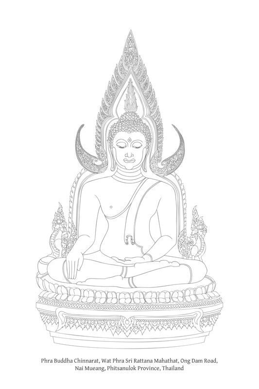

---
---

# 第一章：五蕴

生命的五个组成部分

## 导论

从佛法（Buddha-Dhamma）的角度来看，万事万物都依其自性而存在。它们并非作为分离的固定实体存在，对于有情众生而言，它们也不是截然不同、不可改变的“众生”或“人”，可以被合法地视为事物的正当拥有者，或能够依其意愿来管理事物。[\[1\]](#fn-fn1)

世间存在的一切，皆是聚合而成。事物本身不存在固有自我或实质性本质。当组成部分彼此分离时，不存在自我或核心。经典的常见类比是车辆。[\[2\]](#fn-fn2)当人们根据自己选择的设计组装各种部件时，就会将“马车”这个约定俗成的名称赋予最终产品。然而，如果拆开这些部件，就找不到马车的本质。剩下的只是各种部件，每个部件都有其特定的名称。

这个事实意味着，车辆的“自我”或“实体”并非独立于其组成部分而存在。例如，“汽车”一词仅仅是一个约定俗成的名称。此外，所有这些组成部分也可能被进一步分解成更小的部分，而这些部分都没有稳定、固定的本质。因此，当一个人说某物“存在”时，需要在这个语境下理解：它以一种无常的组成元素集合的形式存在。

提出这个主张后，佛教教义接着描述了构成世界的主要元素或组成部分。由于佛教教义直接涉及人类生命，特别是心灵，因此对这些组成部分的阐明涵盖了心与物，即名法（nāma-dhamma）和色法（rūpa-dhamma）。在此，特别强调对心的分析。

根据特定分析的目的，将生命划分为不同的组成部分有多种方式。[\[3\]](#fn-fn3)本章将生命划分为“五蕴”（pañca-khandha），这是经文中最常用的分析方法。

在佛法中，人类的生命实体——被称作“人”或“有情众生”——被分为五组或五类：[\[4\]](#fn-fn4) {14}[\[5\]](#fn-fn5)

1.  色（rūpa）（corporeality；身体；物质形色）：所有物质组成部分；身体和所有身体行为；物质和物理能量，以及这种能量的特性和运行过程。
    
2.  受（vedanā）（感觉；感受）：通过五根和心之接触而生起的乐受、苦受和不苦不乐受。
    
3.  想（saññā）（perception）：辨识和命名事物的能力；对各种标志、特征和识别属性的感知和辨别，使人能够记住特定的所缘（ārammaṇa）。[\[6\]](#fn-fn6)
    
4.  行（saṅkhāra）（mental formations；思作）：那些以意乐为首的心理组成部分或特质，它们将心塑造为善、不善或中性，并塑造一个人的思想和思惟，以及言语和身体行为。它们是业（kamma；意图行动）的来源。此类心行包括：信（saddhā）、念（sati）、惭（hiri）、愧（ottappa）、慈（mettā）、悲（karuṇā）、喜（muditā）、舍（upekkhā）、[\[7\]](#fn-fn7)慧（paññā）、痴（moha）、贪（lobha）、嗔（dosa）、慢（māna）、见（diṭṭhi）、嫉（issā）和悭（macchariya）。它们是心、思想和意图行动的代理者或塑造者。
    
5.  识（viññāṇa）（consciousness）：通过五根——即眼见、耳闻、鼻嗅、舌尝、身触可触之物——以及对心所缘的意识。
    

关于最后四蕴，即心所蕴（nāma-khandhā），有几点需要注意：[\[8\]](#fn-fn8)

想（saññā）是一种知识形式。[\[9\]](#fn-fn9)它指对对象属性和特质的感知或辨别，包括其形状、外观、颜色等，以及其名称和约定俗成的指称。例如，一个人知道某个对象是“绿色”、“白色”、“黑色”、“红色”、“响亮”、“微弱”、“低音”、“高音”、“胖”、“瘦”、“一张桌子”、“一支笔”、“一头猪”、“一条狗”、“一条鱼”、“一只猫”、“一个人”、“他”、“她”、“我”、“你”等。

想依赖于过往经验或知识与新经验或知识之间的相遇或比较。如果一个人当前的经验与过往经验相符——比如说他遇到一个熟悉的人或听到一个熟悉的声音——他就会“认出”（注意这与“记忆”不同）。例如，琼斯先生认识史密斯先生。一个月后，他们相遇，琼斯先生认出了史密斯先生。{15}

如果新的经验与过去的经验不符，人们倾向于将其与过去的经验或知识进行比较，着眼于那些相似或不同的方面。然后，他们根据其标签或指称来识别对象，这些标签或指称由相似性和差异性决定。这就是想的过程——命名和识别。

感知有许多层面，包括：与普遍共识和理解相符的感知，例如：“绿色”、“白色”、“黄色”和“红色”；与社会习俗和传统相符的感知，例如：“这有礼貌”、“这很美丽”、“这很正常”和“这不正常”；根据个人偏好和观念的感知，例如：“这有吸引力”、“这值得赞赏”和“这令人恼火”；基于多种因素的感知（象征性之想），例如：“绿色和红色代表这所大学”，以及“两声铃响表示用餐时间”；以及根据精神修习的感知，例如：“无常之想”和“无我之想”。

有普通的日常之想，也有微妙、精细之想（即与其它诸蕴错综复杂的想）。有物质之想，也有精神之想。用于 saññā 的各种术语，例如“识别”、“忆念”、“标记”、“指派”、“归因”和“意念”，都描述了此想蕴的各个方面。

简单地说，想是收集、汇编和储存数据与信息的过程，这些是思维的原始材料。

想对人们非常有益，但同时它也可能有害。这是因为人们倾向于执著于他们的诸想，这最终会成为一种障碍，遮蔽和掩盖实相，并阻止一个人洞察更深层的、根本的实相。

想 (saññā) 的一个有用且实用的划分是分为两种：普通之想，它辨别感官对象自然生起时的属性；以及次要或重叠之想。后者有时被特定的术语指代，特别是“戏论之想”(papañca-saññā)：由贪爱 (taṇhā)、我慢 (māna) 和见 (diṭṭhi) 的力量驱动，导致复杂而奇特的心理戏论所产生的想，这些都在负面行（负面 saṅkhāra）的最前沿。这种划分突显了想的积极作用，并展示了想与心理过程中其他诸蕴的关系。

识 (viññāṇa) 传统上被定义为“觉知感官对象”。它指的是一种主导或恒常的认知形式。它是其他心蕴的基础和渠道，并与它们协同运作。它既是一种主要的认知形式，也是一种伴随的认知形式。

说它是主要的，是因为它是一种最初的认知形式。当一个人看到某物（即眼识生起）时，他可能会感到乐或苦（= 受 – vedanā）。然后他识别对象（想 – saññā），接着是各种意图和思维（行 – saṅkhāra）。例如，一个人看到天空（= viññāṇa）并感到欣喜（= vedanā）。他知道天空明亮、美丽、靛蓝色、是午后的天空（= saññā）。他因天空而感到欣喜，并希望长时间不间断地欣赏它。他抱怨自己的视线受阻，并想知道如何才能找到一个可以悠闲观赏天空的地方（= saṅkhāra）。

说它是伴随的认知形式，是因为一个人是与其他诸蕴共同认知的。当一个人感到快乐（= vedanā）时，他知道自己快乐（= viññāṇa）。（请注意，快乐的感受与知道自己快乐并非同一回事。）当一个人受苦（= vedanā）时，他知道自己受苦（= viññāṇa）。将某物感知为快乐或痛苦（= saññā），他相应地了知。[\[10\]](#fn-fn10) 当一个人参与各种思维和意图（= saṅkhāra）时，对此活动会持续伴随觉知。{16} 这种持续生灭、伴随其他心蕴，或作为心理活动各个方面一部分的主导觉知流，被称为“识”（viññāṇa）。

识的另一个特殊特征是它对细节的觉知，是对特定方面的认知，或是一种辨别性认知。这可以通过例子来理解。当一个人看到一块条纹布时，虽然他可能最初没有这样识别它，但他辨别出特定的属性，例如它的颜色，它们彼此不同。一旦识辨别出这些区别，想 (saññā) 就识别它们，例如“绿色”、“白色”或“红色”。当一个人吃一种特殊的水果时，虽然他可能还没有将味道识别为“甜”或“酸”，但他已经觉知到这种区别。同样，虽然他可能还没有区分菠萝、柠檬、罗望子或李子的具体酸味，或者芒果、香蕉或苹果的具体甜味，但通过品尝味道，他觉知到其独特的性质。这种基本的认知形式是识 (viññāṇa)。一旦这种觉知生起，其他心蕴就开始运作，例如他将味道体验为美味或不美味（= vedanā），或者他将味道识别为某种特定的甜或酸（= saññā）。

上述所指的特定方面的认知可以这样解释：当识生起时，例如当一个人看到一个视觉对象时，事实上，他所看到的只是该对象特定的属性或方面。换句话说，他只看到他重视的那些方面或角度，这取决于缘起识 (viññāṇa) 的行 (saṅkhāra) 。[\[11\]](#fn-fn11)

例如，在广阔的乡村中，长着一棵孤零零的芒果树。这是一棵大树，但只结了几颗果实，这个季节几乎没有叶子，提供的树荫很少。在不同场合，有五位不同的人来到这棵树。一个人正在躲避危险的动物，一个人正在挨饿，一个人感到炎热并寻找树荫，一个人正在寻找水果在市场上出售，最后一个人正在寻找一个地方系住他的牛，以便他可以去附近的村庄。

所有五个人都看到了同一棵树，但每个人看待它的方式都不同。对于每个人来说，眼识都生起了，但这个识是不同的，取决于他们对这棵树的目的和意图。同样，他们对这棵树的想也会不同，取决于他们所看的树的方面。甚至他们的受 (vedanā) 也会不同：躲避危险的人会欣喜，因为他看到了逃脱的途径；挨饿的人会欣喜，因为三、四颗芒果将使他免于饥饿；受热的人可能会失望，因为这棵树提供的树荫不如平时那么多；寻找水果的人可能会沮丧，因为水果稀少；而赶牛的人可能会松了一口气，为它们找到了一个临时庇护所。

受 (vedanā) 指的是对感官印象的“感知”，或体验它们的“味道”。它指的是每次与感官对象接触和认知时产生的感受或感觉。这些感受可能是快乐和愉悦的、痛苦和压抑的，或中性的。{17}

为了避免与行蕴 (saṅkhāra) 混淆，重要的是要注意受 (vedanā) 是接收层面的活动——它专门与一个对象对心产生的直接影响有关。[\[12\]](#fn-fn12) 它不属于意图或对感官印象作出反应的阶段，那是行 (saṅkhāra) 的功能。因此，“喜欢”、“不喜欢”、“欣喜”和“厌恶”等术语通常指行的活动，这涉及后续层面的活动。这些术语通常指意志活动或对感官印象的反应，如图“受 (Vedanā) 与行 (Saṅkhāra)”所示，该图描述了心理过程。

受 (Vedanā) 与行 (Saṅkhāra) 

受 (vedanā) 在有情众生中扮演着关键角色，因为它既被欲望和追求（在快乐的情况下），也被恐惧和避免（在痛苦的情况下）。每当与感官对象接触和认知时，受作为连接点，指导或激励其他心所。例如，如果一个人接触到一个令人愉悦的感官对象，他会特别关注它，并以一种回应或充分利用该感受的方式感知它。然后他会想出重复或延伸自己对该对象体验的策略。

行 (saṅkhāra) 既指决定心之质量的因素（心的“塑造者”），以意 (cetanā) 为主，也指实际的意志过程，其中这些因素被选择和组合，以塑造和形成一个人的思维、言语和行为，从而产生身业、语业和意业。

无论如何，五蕴的传统分析侧重于现实的组成部分，而不是侧重于影响人类生命的自然界中各种动力。因此，在这种背景下对行 (saṅkhāra) 的描述通常只列举这些决定性因素（心的“塑造者”）及其属性。至于对有为过程的解释，即这些因素在哪个阶段显现并开始运作，这则留待缘起 (paṭiccasamuppāda) 的分析，它精确地展示了这些因素如何影响人们的生活。

在缘起教义中，行 (saṅkhāra) 在实际应用或运作功能的背景下被定义；它们分为：身行 (kāya-saṅkhāra)（身体意图活动；身业）；语行 (vacī-saṅkhāra)（言语意图活动；语业）；和意行 (citta-saṅkhāra)（心理意图活动；意业）。这与五蕴阐释中对行的分析不同，在五蕴阐释中，各种决定因素只是以列表形式呈现，例如：信 (saddhā)、念 (sati)、慈 (mettā)、悲 (karuṇā)、慧 (paññā)、贪 (lobha)、瞋 (dosa)、意 (cetanā) 和定 (samādhi)。如果将这些分析比作车展，那么五蕴的分析类似于将汽车的所有零件摆出来供人观看，而缘起的分析则像是演示汽车在路上行驶。{18}

在所有心的决定因素中，意 (cetanā) 是主导或首要因素。无论在任何时候有多少诸行在运作，意总是作为过程中的关键因素参与。因此，cetanā 有时单独用来代表所有的行 (saṅkhāra)。在此语境下，行 (saṅkhāra) 可定义为：“意 (cetanā) 连同相关心所 (sampayutta-dhamma；‘相连因素’)，它们将心塑造成善、恶或中性，并决定思维、言语和身体行为，从而产生意业、语业和身业。”

除了偶尔代表或定义所有的行 (saṅkhāra) 之外，cetanā 也被用来定义或代表“业”这个词。从这个意义上讲，saṅkhāra、cetanā 和 kamma 这三个词的意义大致相同。举个譬喻，中道寺的住持玛尼尊者去接受供养的律藏书籍。在正式集会上，对受邀嘉宾的宣布可能是玛尼尊者，或是中道寺的住持，或是简单地称呼中道寺——这三个术语都表达了所需的意义。

除了其核心作用，意 (cetanā) 也揭示了行 (saṅkhāra) 的特殊和独特属性，这使得此蕴与其他蕴区分开来。cetanā 可翻译为“意图”、“意志”、“目的”或“思虑”。行 (saṅkhāra) 与其他心蕴的区别特相在于它们可以自发地产生。而其他心蕴——受、想、识——则运作或作用于心中即时显现的感官印象。它们与这些感官印象相关联并关注它们，并依靠对它们的接收来运作。然而，诸行既思虑感官印象，也对其作出反应。[\[13\]](#fn-fn13)

这些解释或许可以澄清以下问题：为什么舒适和不适的感受被归类为感受 (vedanā)，而随后的喜欢和不喜欢因素被归类为行 (saṅkhāra)？为什么想 (saññā；回忆) 和念 (sati；记忆) 被归类为独立的蕴（念被归类为行 – saṅkhāra）？为什么慧 (paññā)——它类似于想 (saññā) 和识 (viññāṇa)，也是一种认知形式——却被归类为行 (saṅkhāra)？

## 想与念：记忆、回忆和正念

佛教研究者常常对巴利语词汇中哪个心所对应“记忆”感到困惑。Saññā 通常被翻译为“回忆”，而 sati 可以翻译为“正念”、“回忆”、“忆起”或“记忆”。[\[14\]](#fn-fn14) 关于后者，有一些突出的经文例子，例如赞扬阿难尊者在“忆念佛陀的言语”方面在比丘弟子中最杰出的段落。在此语境中，佛陀使用了 sati 一词：“在我所有弟子中，阿难在记忆力 (sati) 上最杰出。”[\[15\]](#fn-fn15)

在正式教义中，这个问题没有混淆。记忆并非仅仅一个心所的专属功能，而是一个心理过程的一部分，其中想 (saññā) 和念 (sati) 扮演着最突出和最重要的角色。

saññā 和 sati 在“记忆”的概念上具有重叠的意义。想 (saññā) 的一个方面与记忆有关，而其他方面则独立于记忆。念 (sati) 也是如此：一个方面与记忆有关，而其他方面则独立于记忆过程。{19}

请注意 saññā 和 sati 在记忆过程中的这些重要区别：

想 (saññā) 标记和识别感官对象。当再次遇到这些对象时，saññā 会将其当前特征与已建立的诸想进行比较，确定任何异同。如果确定两者（旧的诸想和新的）相符，这可以称为“识别”。如果存在差异，则会创造额外的诸想。saññā 既指对象的识别、标记和鉴定（数据的比较和积累），也指诸想本身（实际创建和存储的数据和信息）。在此语境下，saññā 为记忆创造了必要的条件。saññā 的重要属性是它与当下即时显现的感官对象互动；当这些感官对象显现时，saññā 能够专注、识别或忆念它们。

念 (sati) 的功能是将感官对象引向注意力，并将其牢固地保持在心中。它指导并维持对感官对象的注意力，防止它们漂移或溜走。这些感官对象可能是当前显现的，或者它们可能发生在过去。sati 因此包含了“忆起”、“回忆”、“忆念”、“反思”、“记住”和“专注”等微妙含义。在记忆的语境中，它记忆并能够忆起。从这个意义上讲，sati 是 sammosa 的反义词，后者意为“遗忘”（saññā 不与遗忘配对）。sati 从个体内部产生，依靠意志的力量，即使感官对象不立即显现。因为它是一个对感官对象的意志反应，所以它被归类为行 (saṅkhāra)。

想 (saññā) 记录和标注感官对象；念 (sati) 将感官对象引向注意力。健全之想——清楚地识别事物，以有序和结构化的方式标记事物，以及整合和连接事物（这依赖于专注和理解）——和强大的忆起能力——忆起能力（这依赖于清晰的诸想、持续的正念，以及明亮、宁静和专注的心）——都是良好记忆的因素。

过去 Robert 和 Jake 彼此很熟。十年后，他们再次相遇，Robert 认出 Jake，并忆念起他们曾经去过的地方和共同参与过的活动。对另一个人的识别是想 (saññā)，而对过去事件的回忆是念 (sati)。

有一次 Greg 和 Karl 会面并交谈。一个月后，Greg 的朋友问他那天和谁会面并交谈了。Greg 反思过去，并忆念起他与 Karl 会面过。这回忆是念 (sati)。

一部电话放在房间的一个角落，一本电话簿放在另一个角落。Karen 打开电话簿，找到她要找的号码。她在心里记住这个号码，然后走向电话拨号。当她穿过房间时，她将这个号码持续地保持在她的注意力中。从书本中读取和记住号码是想 (saññā)；从她离开书本的那一刻起忆起那个号码是念 (sati)。

当感官对象显现时，人能够立即感知它们。然而，当它们不显现时，以及在它们是意所缘 (dhammārammaṇa；心中固有的事物) 的情况下，人可以使用念 (sati) 来引出它们并专注于它们。此外，念 (sati) 能够忆念诸想，也就是说，它能够回忆过去的诸想作为注意力对象。想 (saññā) 随后能够识别、澄清和巩固这些先前的诸想，或者根据一个人的目标和目的以新的方式感知它们。{20}

## 想、识和慧

想 (saññā)、识 (viññāṇa) 和慧 (paññā) 都是认知的方面，然而它们属于三个不同的蕴。前两个因素，在本章前面已描述，本身构成一蕴，而慧被归类为行蕴 (saṅkhāra)。

慧 (paññā) 通常指理解，更具体地指彻底或清晰的理解：对真相透彻而准确的理解。paññā 这个术语以许多不同的方式定义，包括：因果知识；善恶知识；对错知识；适宜性知识；利害知识；优劣知识；对有为法的透彻知识；构成要素知识；因缘知识；起源与目的地知识；事物相互关联的知识；如实知；真实知识；真实理解；实相知识；以及知道如何反思、思惟、分析以及处理或管理事物和情况。

简单地说，慧是清晰、正确和真实的理解。慧具有洞察实相的能力，它能深入问题核心。它支持想 (saññā) 和识 (viññāṇa)。关于后者，它拓宽和深化识的范围。同样，关于前者，它增加想的范围，因为事物的认知和理解依赖于一个人的知识。这类似于解决数学问题；只要一个人无法解出初始方程，他就没有数据或标准进行进一步计算。随着理解的增加，一个人就拥有了进一步想和分析的标记或原始材料。

慧 (paññā) 与痴 (moha；“无明”、“误解”) 相对，而想 (saññā) 和识 (viññāṇa) 不以这种方式与痴相对。事实上，想和识可能会成为痴的牺牲品。当一个人迷惑和困惑时，他的意识体验和诸想同样被扭曲。慧在此处协助纠正识和想。

想 (saññā) 和识 (viññāṇa) 依靠当前显现的感官对象来运作。因此，这些感官对象的图像或概念被创造并辨别出来。另一方面，慧反思感官对象并积极地对其作出反应（慧是一种思虑功能，因此被归类为行蕴 – saṅkhāra）。它将各种感官印象彼此联系起来，分析它们的各种属性，比较和考量各种诸想，并辨别因、果、相互关系，以及如何从事物中获益。通过这样做，它为识和想提供有益的参与之食。

舍利弗尊者曾回答关于慧 (paññā) 和识 (viññāṇa) 有何不同的问题。他解释说，慧了知（“理解”；“清楚地了知”）“这是苦”，“这是苦的起因”，“这是苦的止息”，以及“这是通向苦止息之道”。另一方面，识了知（= 辨别性理解）“这是乐”，“这是苦”，以及“这不是乐也不是苦”。然而，慧和识紧密交织，某种意义上不可分离。话虽如此，它们之间仍有区别，即慧是一种“需要修习和发展的品质” (bhāvetabba-dhamma)，以便增加和加强它。相比之下，识是一种“需要完全理解的品质” (pariññeyya-dhamma)；它的本质和属性应该被真实地认识和理解。[\[16\]](#fn-fn16) {21}

包括清净道论 (Visuddhimagga) 在内的注释文献，[\[17\]](#fn-fn17) 这样解释想 (saññā)、识 (viññāṇa) 和慧 (paññā) 之间的区别：想 (saññā) 只是识别感官对象的属性，例如它是“绿色”或“黄色”；它无法理解无常、苦和无我的特相。识 (viññāṇa) 也知道对象的属性（“绿色”、“黄色”等），它能够理解无常、苦和无我的特相（它根据慧的建议和指导来理解）。但它不能将人引向道的实现（即四圣谛的证悟）。然而，慧能够完成这三者：它知道感官对象的属性，它辨别三种特相，并且它使道的实现成为可能。

论释使用三个人看同一枚硬币的譬喻。想 (saññā) 就像一个小孩，他只是辨别硬币的形状——小、大、方或圆——它的颜色、迷人的光泽和奇怪的标记。他不知道它是一种公认的贸易和交换手段。识 (viññāṇa) 就像一个成年人，他辨别硬币的形状、标记等，并且知道它被用于贸易和交换，但他不具备更深层次的理解，关于硬币是真币还是伪币，或者铸造硬币使用了什么金属组合。慧就像一个司库，他辨别上述所有数据，此外还拥有专业知识，以至于他可以观察、敲听、闻、尝或用手掂量硬币，并了解关于它的一切，包括它在哪里以及由谁制造的。

此外，慧并非总是生起。有时可能只有想和识生起，缺乏慧。然而，当慧与这另外两种品质同时生起时，就很难将它们区分开来。

Jāli 和 Kaṇhā[\[18\]](#fn-fn18) 寻找藏身之处时，他们倒着走进莲花池，深信追捕者会认为他们是刚从池子里出来的。他们这种思维方式可称为慧 (paññā)。后来，Vessantara 看到他们的脚印，立即知道他们是倒着走进池塘的。这是因为只有离开池塘的脚印，没有走向池塘的脚印，而且脚印中脚跟处的印迹最深。这种理解也可称为慧。孩子们和他们的父亲运用了不同层面的慧和审慎，这表明慧 (paññā) 如何从想 (saññā) 中获益。

悉达多太子看到一位老人、一位病人，以及一具人类尸体，结果他反思并辨别出人人无一例外地易受的苦。然后他进一步理解一切有为法皆是无常，经历生起、变异，并最终灭去，他看到有必要结束基于这些条件的苦。这些都是慧 (paññā) 的例子。当佛陀准备在摩揭陀国建立佛教时，他去拜访了受到摩揭陀人民尊敬的迦叶族的结发苦行者，以便他们对佛陀的教导产生信心并加以认可。佛陀这种思维背后的洞察力和直觉也是慧的体现。

paññā 是一个通用术语，描述上述各类知识。慧有许多不同的层面，例如世间慧 (lokiya-paññā) 和出世间慧 (lokuttara-paññā)。还有许多其他的巴利语术语，表示慧的特定层面、程度或方面，或指其特定的活动、品质或益处，例如：智 (’知识’)，明 (’真实知识’)，毗婆舍那 (’内观’)，正知 (’清晰理解’)，遍知 (’彻底知识’)，神通 (’无上知识’)，和无碍解 (’辨别性知识’)。{22}

## 蕴之间的关系

五蕴相互依存。色蕴 (rūpa-khandha) 包含身体，而四心蕴 (nāma-khandha) 构成心。人类生命需要身心两者。当身心正常运作并协调一致时，生命就能顺利发展。例如，心理活动需要对外部世界的理解，而这种理解依赖于感官数据（色、声、香、味和触）通过眼、耳、鼻、舌和身进入。五感官对象和五感官能力都是物质事物 (rūpa-dhamma)，是色蕴的一部分——它们是物质性的一部分。

在本章中，重点在于心，将身体视为类似于为服务心理活动而准备好的现成工具。心被认为是生命的焦点，其功能范围广阔、复杂而深奥。心赋予生命价值和意义，它与本书中佛陀所呈现的教导直接相关。

四心蕴紧密相关，相互影响和制约。这四蕴的生起通常以下列方式概述：[\[19\]](#fn-fn19)

> 依眼和色，眼识生起（耳和声、鼻和香等亦然）。三者的聚合是触。触为缘，有受。所受者，所想者。所想者，所思者……M. I. 111-12.

这是一个例子：Gordon 听到钟声（耳 + 声 + 耳识）。他觉得声音悦耳（= vedanā）。他将声音感知为“悠扬的”、“钟声”，以及“悠扬的钟声”（= saññā）。他喜欢这个声音并想再次听到它；他思考自己敲响那口钟；他想要得到这口钟；他思考购买或偷走这口钟，等等（= saṅkhāra）。

请注意受 (vedanā) 在此过程中的关键作用。想 (saññā) 特别关注那些提供愉悦感受的对象。快乐越大，想赋予该对象的重要性就越大。此外，这种愉悦的感受促使人们思考和行动以增加快乐。这可描述为一个基本的、普通的或初级的过程。

在此过程中，受 (vedanā) 充当激励因素，类似于一个邀请人拿取某物，或拒绝并避免某物的人。想 (saññā) 类似于一个收集和储存数据或原始材料的人。行 (saṅkhāra) 类似于一个拿取这些原始材料并塑造它们以准备工作的人。识 (viññāṇa) 类似于工作的导演，觉知其他所有人的活动；它既为工作的执行开辟道路，也接收工作的结果。[\[20\]](#fn-fn20)

这个过程的一个复杂方面是受 (vedanā) 并不单方面地充当其他蕴的催化剂。其他蕴也对受有影响。以一首音乐为例，一个人听了觉得很愉悦，而另一个人听了却觉得沮丧。同样，同一个人在某个时候听一首歌可能感到振奋，而在另一个时候却可能感到不安。{23}

一个普遍的原则是，那些人喜欢并从中获得乐趣的事物，都与他的欲望相应。当他遇到这些事物时，他就会感到快乐。反之，那些人不喜欢的、与他的欲望冲突的事物，当他遇到时，他就会痛苦。这些心行，比如喜欢、不喜欢、欲望和厌恶，接着会引发另一轮的感受。在这里，想也在参与，也就是说，心行会引发想，而想又会影响感受。

这里有一个例子：一个人可能看到他所敬佩的人以某种方式行事，并认为这种行为是可爱或惹人喜爱的。而他可能看到他不喜欢的人做出其他行为，并认为这种行为是恼人或可憎的。后来，当他遇到其他人也表现出他先前认为可爱或恼人（= saññā）的行为时，他就会因此感到高兴或苦恼（= vedanā），并对此表示赞同或生气（= saṅkhāra）。

蕴之间的这种相互关系甚至可能更加复杂。例如，一项困难而要求高的工作项目或学习课程。独自完成这项任务可能涉及很多纷扰和不适，导致人不愿意参与其中。然而，如果有一些特别的激励，一个人可能会对做这项工作或追求这门课程更感兴趣、更有决心。这些激励可能是当下的愉悦感受，例如学习方法很有趣、很娱乐，或者它们可能与对未来快乐的想有关的复杂事情，比如说获得奖励、取得成功，或者为自己或他人获得某种利益。这些想依赖于各种心行，例如贪爱 (taṇhā)、慢 (māna) 和智慧 (paññā)，这些心行随后通过赋予工作或学习意义、价值和重要性，从而产生进一步的想。此外，现在一个人在执行任务时体验到快乐。尽管他可能会感到身体上的不适，但他的内心充满了喜悦，使他更渴望做这项工作或完成这门课程。

当傍晚学校铃声响起时，学生们听到了声音（= viññāṇa）。由于每天都听到这个声音，他们可能对此感到中性（= vedanā）。所有人都将这个声音辨识为表示放学结束的铃声（= saññā）。有些孩子可能感到高兴（sukha-vedanā + saṅkhāra），因为他们坐了一整天感到疲惫，现在可以出去玩了（= 伴随的想）。另一些孩子可能感到悲伤（dukkha-vedanā + saṅkhāra），因为他们必须中断一堂有用而宝贵的课程，或者因为他们必须回到不友善、令人生畏的看护人身边（= 伴随的想）。

这整个过程，从识开始，是因缘的错综复杂的关系，它们共同塑造了人们的个性，并决定了每个人独特的命运。由思 (cetanā) 所代表的行 (saṅkhāra) 是塑造这个过程的动因，在这种语境下，saṅkhāra 是意志行为 (kamma) 的专业术语。反之，kamma 是行的非正式名称，代表它们在积极运作时的状态。它是在提及行所扮演的关键角色时使用的术语，例如：“正是业将众生区分为劣等和优等”；[\[21\]](#fn-fn21) “众生依其业而存在”。[\[22\]](#fn-fn22) {24}

## 五蕴与五取蕴

在佛陀阐述的涵盖佛教核心的四圣谛中，关于苦的初圣谛的教导中，有一个值得注意的对五蕴的提及。

在佛陀解释初圣谛的开始，他通过引用各种容易识别且属于人们日常生活的例子和情境来定义苦。然而，在讨论的最后，他将所有的苦概括为一句话：“五取蕴 (upādāna-khandha) 是苦”：

> 比丘们，这就是苦的圣谛：生是苦，老是苦，死是苦，与不喜者相会是苦，与所爱者分离是苦，求不得是苦。简而言之，执取五蕴即是苦。Vin. I. 10.

这里，让我们通过考察佛陀的这些话语，来看看 khandha 这个词本身与 upādāna-khandha 这个词之间的区别：

> 比丘们，我将教导你们五蕴和五取蕴。仔细听。什么是五蕴？无论是何种色……受……想……行……识，无论是过去、未来、现在，内或外，粗或细，劣或胜，远或近……这些被称为五蕴。什么是五取蕴？无论是何种色……受……想……行……识，无论是过去、未来、现在，内或外，粗或细，劣或胜，远或近，凡是受到污染的（sāsava；伴随着心垢的），凡是执取的根基（upādāniya）……这些被称为五取蕴。S. III. 47-8。比丘们，我将教导你们执取的根基和执取本身。听着……色……受……想……行……识是执取的根基。对色……受……想……行……识的欲望和贪爱（chanda-rāga；喜悦或强烈欲望最终导致执着）就是执取。S. III. 167。

五蕴和五取蕴之间的这种区别是深入学习佛陀法义所需的一个重要原则。 {25}

## 实际应用

通常，人类倾向于相信他们以某种形式拥有一个真实且持久的“我”。有些人执着于自己的心为“我”；[\[23\]](#fn-fn23) 有些人相信，存在某种独立于心但又以某种方式与心相连的东西，它在另一个层面运作，负责控制身心。五蕴的阐述旨在揭示，当被称之为“有情”、“人”或“我”的东西被仔细审视和分析时，它仅仅由这五个组成部分构成。在这五个组成部分之外，不存在任何残余的本质或实体。即使这五蕴也存在于相互依存的关系中。它们并非独立存在；它们并非自主的。因此，这些蕴，也无法作为稳定、实有的“我”来运作或存在。

总而言之，关于五蕴的教导指的是无我 (anattā) 的原则。人的生命由各种元素或部分汇集而成；不存在一个实体性的“我”作为这些部分的统一原则或中心点。任何一个蕴（组成部分等）都不是一个稳定、持久的“我”，也没有这样的“我”存在于它们之外。[\[24\]](#fn-fn24) 当一个人洞察到这个真相时，他就会放下对“我”的执着。无我的这个原则在缘起教导中与五蕴相关联时得到了阐明。[\[25\]](#fn-fn25)

此外，当一个人明白五蕴是以相互关联和相互依存的方式存在时，他就不会产生断见 (uccheda-diṭṭhi) 或常见 (sassata-diṭṭhi) 的邪见。而且，这种理解也有助于正确理解业的运作。同样，缘起的教导更深入地解释了这种相互关联和相互依存的关系。

通过将事物分解为五蕴来审视，有助于训练人的思维能力，并培养分析真相的倾向。当一个人遇到或接触某物时，他不会仅仅看表面现象；相反，他会倾向于探究更深层的真相。至关重要的是，这种审视能够导致对事物的客观辨别，看到事物“如其本然”。这与主观理解形成对比，主观理解是人通过贪爱和执取 (taṇhā-upādāna) 来对待事物，并根据自己的喜好和厌恶来看待事物。客观的理解是佛法以及五蕴教导的目标。人们不是通过执着、贪爱和执取来对待事物，而是通过智慧来对待它们。

无论如何，佛陀通常不会孤立地讲授五蕴。在大多数情况下，五蕴是在其他原则和教导的背景下被视为主要的考量因素，这些原则和教导是用来思惟和确定这些蕴的性质和功能的标准。五蕴需要结合其他原则，例如无我 (anattā) 来审视，以便在实践层面上充分领会它们的价值。这种思惟的益处将在后续章节中变得清晰。 {26}

## 附录一：关于五蕴的额外细节

### 色 (Rūpa)：身体；物质形态；物质性

阿毗达摩将色分为二十八种：

1.  四种主要元素 (mahābhūta-rūpa；简称为四“界”– dhātu)：地 (paṭhavī-dhātu；扩张元素；坚固元素)；水 (āpo-dhātu；凝聚元素；液体元素)；火 (tejo-dhātu；热或辐射元素)；和风 (vāyo-dhātu；振动或运动元素)。
    
2.  二十四种衍生物质特性 (upādā-rūpa；衍生物质性；由四主要元素产生的物质)：
    
    *   五种根：眼 (cakkhu)、耳 (sota)、鼻 (ghāna)、舌 (jivhā) 和身 (kāya)。
    
    *   四种尘：色 (rūpa)、声 (sadda)、香 (gandha) 和味 (rasa)。触尘 (phoṭṭhabba) 不包括在这里，因为它等同于上面提到的paṭhavī, āpo 和 vāyo。
    
    *   女性相 (itthatta)。
    
    *   男性相 (purisatta)。
    
    *   心所依处 (hadaya-vatthu)。
    
    *   身表 (kāya-viññatti)。
    
    *   语表 (vacī-viññatti)；言语。
    
    *   命根 (jīvitindriya；活力；生命力)。
    
    *   虚空界 (ākāsa-dhātu)。
    
    *   色轻快性 (rūpassa lahutā)。
    
    *   色柔软性 (rūpassa mudutā)；弹性。
    
    *   色适业性 (rūpassa kammaññatā)；可塑性。
    
    *   色积聚 (rūpassa upacaya)。
    
    *   色相续 (rūpassa santati)。
    
    *   老 (jaratā)。
    
    *   灭 (aniccatā)。
    
    *   段食 (kavaḷiṅkārāhāra)；营养。
    

请注意，hadaya-vatthu 这个词被翻译为“心”，被认为是 citta 的所在之处，但这种解释出现在后来的文本中；它并未出现在巴利三藏中。

### 受 (Vedanā)：感受；感觉

*   三分类：乐受 (sukha；身体和心理的)；苦受 (dukkha；身体和心理的)；不苦不乐受 (adukkhamasukha；既不愉快也不痛苦；有时被称为 upekkhā)。
    
*   五分类：身乐受 (sukha)、身苦受 (dukkha)、喜受 (somanassa)、忧受 (domanassa)、舍受 (upekkhā)。
    
*   六分类（根据其起源之门）：由眼、耳、鼻、舌、身、意接触而产生的感受。
    

### 想 (Saññā)：认知

它根据认知途径分为六种：

1.  色想 (rūpa-saññā)，例如对“黑”、“红”、“绿”或“白”的想。
    
2.  声想 (sadda-saññā)，例如对“响亮”、“微弱”、“低沉”或“高亢”的想。
    
3.  香想 (gandha-saññā)，例如对“芳香”或“恶臭”的想。
    
4.  味想 (rasa-saññā)，例如对“甜”、“酸”、“苦”或“咸”的想。
    
5.  触想 (phoṭṭhabba-saññā)，例如对“软”、“硬”、“粗”、“细”、“热”或“冷”的想。
    
6.  法想 (dhamma-saññā)，例如对“美”、“厌恶”、“恒常”或“无常”的想。
    

### 行 (Saṅkhāra)：意志行为

阿毗达摩将心所 (cetasika) 分为五十二种。如果将此划分与五蕴 (khandha) 的教导进行比较，心所包含受 (vedanā)、想 (saññā) 和行。在这五十二种心所中，一个是受，一个是想；其余五十种都是行。这五十种心所又细分为： {27}

1.  十一种遍一切心所 (aññasamāna-cetasika)，它们既善也无记。（如果将 vedanā 和 saññā 也包含在内，则构成十三种；这两种心所在此处被排除，因为它们不属于行）：
    
    1.  五遍行心所 (sabbacittasādhāraṇa-cetasika；在每个心识生起时都存在的)：触 (phassa)、思 (cetanā)、一境性 (ekaggatā = ‘三摩地’ – samādhi)、命根 (jīvitindriya) 和作意 (manasikāra)。 （加上 vedanā 和 saññā，这构成七种心所。）
    
    2.  六杂心所 (pakiṇṇaka-cetasika；这些心所既善也无记，但并非在每个心识生起时都存在)：寻 (vitakka)、伺 (vicāra)、胜解 (adhimokkha)、精进 (viriya)、喜 (pīti) 和欲 (chanda)。
    
2.  十四种不善心所 (akusala-cetasika)，与不善心一同生起：
    
    1.  四遍一切不善心所 (sabbākusalasādhāraṇa-cetasika；在不善心状态中总是存在的)：痴 (moha)、无惭 (ahirika)、无愧 (anottappa) 和掉举 (uddhacca)。
    
    2.  十杂不善心所 (pakiṇṇaka-akusala-cetasika)：贪 (lobha)、邪见 (diṭṭhi)、慢 (māna)、嗔 (dosa)、嫉妒 (issā)、悭吝 (macchariya)、恶作 (kukkucca)、昏沉 (thīna)、睡眠 (middha) 和疑 (vicikicchā)。
    
3.  二十五种善心所 (sobhaṇa-cetasika)，与善心和无记心 (abyākata) 一同生起：
    
    1.  十九种遍一切善心所 (sobhaṇasādhāraṇa-cetasika)：信 (saddhā)、念 (sati)、惭 (hiri)、愧 (ottappa)、无贪 (alobha)、无嗔 (adosa = ‘慈’ – mettā)、中舍性 (tatra-majjhattatā；有时被称为 upekkha)、身轻安 (kāya-passaddhi；心所的轻安)、心轻安 (citta-passaddhi)、身轻快性 (kāya-lahutā)、心轻快性 (citta-lahutā)、身柔软性 (kāya-mudutā)、心柔软性 (citta-mudutā)、身适业性 (kāya-kammaññatā)、心适业性 (citta-kammaññatā)、身练达性 (kāya-pāguññatā)、心练达性 (citta-pāguññatā)、身正直性 (kāyujukatā) 和心正直性 (cittujukatā)。
    
    2.  六种杂善心所 (pakiṇṇakasobhaṇa-cetasika)：正语 (sammā-vācā)、正业 (sammā-kammanta) 和正命 (sammā-ājīva)——统称为三离支 (viratī-cetasika)；悲 (karuṇā) 和随喜 (muditā)——合称为二无量 (appamaññā-cetasika)；以及智慧 (paññā)。
    

在经藏中，行 (saṅkhāra) 通常被定义为六种思 (sañcetanā；‘意图’、‘思想’)，涉及：色思 (rūpa-sañcetanā)、声思 (sadda-sañcetanā)、香思 (gandha-sañcetanā)、味思 (rasa-sañcetanā)、触思 (phoṭṭhabba-sañcetanā) 和法思 (dhamma-sañcetanā)。[\[26\]](#fn-fn26)

### 识 (Viññāṇa)：意识

它根据其产生的途径分为六种：通过眼 (cakkhu-viññāṇa)、耳 (sota-viññāṇa)、鼻 (ghāna-viññāṇa)、舌 (jivhā-viññāṇa)、身 (kāya-viññāṇa) 和意 (mano-viññāṇa) 觉知对象。

阿毗达摩将识蕴称为 citta，并将 citta 分为 89 种或 121 种意识：[\[27\]](#fn-fn27)

*   根据意识的状态或层次划分：五十四种欲界心 (kāmāvacara-citta)、十五种色界心 (rūpāvacara-citta)、十二种无色界心 (arūpāvacara-citta) 和八种出世间心 (lokuttara-citta；这些可以进一步细分，得到四十种出世间心)。
    
*   根据心的性质划分：十二种不善心 (akusala-citta)、二十一种善心 (kusala-citta；详细分析结果为三十七种)、三十六种业果报心 (vipāka-citta；详细分析为五十二种) 和二十种唯作心 (kiriyā-citta)。在此介绍中，列出所有这些不同种类的意识并非必要，甚至可能给读者造成困惑。 {28}
    

## 附录二：注释书对想的解释

注释书描述了想 (saññā) 的以下功能和特质：其独特的特质是 sañjānana（辨识；记忆）。它的功能是确立一个标记作为记忆的关键，以便将来一个人知道“这是某某”；这个功能类似于木匠在木头上做标记。它的结果是对这些已确立的标记的执着；这类似于盲人触摸大象，并因此将大象与他触摸到的身体部分等同起来。它的“近因” (padaṭṭhāna)——即对象所显现的样子——类似于小鹿看到稻草人并相信它是一个真正的人（Vism. 462）。与西方心理学术语相比，saññā 涵盖了“知觉”、“概念”（作为“心理表征”）和“辨识”，并在一定程度上，但并非完全地，涵盖了“记忆”。

娑罗树 (Sāla tree) 的娑罗花。  
佛陀在娑罗树下出生。

\[1\] 在巴利语中，“事物”可以被称为现象 (dhamma)、元素 (dhātu) 或实相的面向 (sabhāva)。第三个术语的完整拼写是 sabhāva-dhammā (源自 sa + bhāva + dhamma)，字面意思是“依其自性而存在的事物”。 

\[2\] S. I. 135. \[译注：在古印度，这指马车；在现代，我们可以称之为“汽车”。\] 

\[3\] 最广义的划分是分为名 (nāma) 和色 (rūpa)，或者心法与色法。阿毗达摩文献倾向于将心法分为心 (citta)、心所 (cetasika) 和色 (rūpa) 三部分。如果将此分析与五蕴进行比较，可以将以下各项等同：citta = viññāṇa-khandha；cetasika = vedanā-khandha, saññā-khandha 和 saṅkhāra-khandha；rūpa = rūpa-khandha。 

\[4\] 关于五蕴的更多详细信息，请参阅附录一。 

\[5\] 花括号中的数字指的是《佛法》泰文版的页码。 

\[6\] 缘 (ārammaṇa，“所缘对象”) 这个术语指的是心通过六个“门” (dvāra) 所认知的对象，即：视觉形相、声音、气味、味道、触觉对象和意念对象（思想）。 

\[7\] upekkhā 这个重要术语的含义经常被误解。这个术语出现在行 (saṅkhāra) 的组别中，在那里它等同于特定中舍性 (tatramajjhattatā)，也出现在受 (vedanā) 的组别中，在那里它等同于中性感受 (adukkhamasukha)，即不苦不乐的感受。 

\[8\] 以下解释基于巴利语圣典的参考资料，以及注释书的比较参考资料，特别是：M. I. 292-3; S. III. 87; \[MA. II. 462\]; SA. II. 291; Vism. 436, 452-3。 

\[9\] 关于想的注释书分析，请参阅附录二。 

\[10\] 译注：有时会遇到“统觉”一词作为 saññā 的定义。根据《柯林斯简明词典》（© 1999），统觉的定义是：“对感知的意识”，这更接近识的功能。 

\[11\] 关于此主题的更多内容，请参阅关于缘起的第四章。 

\[12\] 受 (Vedanā) 被归类为“果报” (vipāka；业的果实)。它本身既非善也非不善。 

\[13\] 在与缘起相关的三有轮 (tivaṭṭa) 教义中，受 (vedanā)、想 (saññā) 和识 (viññāṇa) 被归类为“业果” (vipāka)，而行 (saṅkhāra) 则被归类为业本身。这种将行归类为业，仅指思 (cetanā) 活跃运作之时。各种心所决定因素（在轮回 — saṁsāra-vaṭṭa 中）被归类为心垢 (kilesa)。 

\[14\] 念 (sati) 的一个方面是忆念——回忆的能力；另一个方面是正念。 

\[15\] A. I. 24-5. 

\[16\] M. I. 292-3. 

\[17\] Vism. 436. 

\[18\] 译注：菩萨维森塔拉 (Vessantara) 及其妻子玛迪 (Maddī) 的孩子。 

\[19\] 关于此过程的完整顺序，请参阅下一章关于六处的内容。 

\[20\] 注释书，包括《清净道论》 (Visuddhimagga)，提供了以下类比：身体就像一个碗，感受就像主食，想就像配菜，心行就像厨师，识就像食物的消费者。类似地：身体就像监狱；感受就像惩罚；想就像罪行；意志行为就像施加惩罚的法官；识就像囚犯。参阅：Vism. 479；CompṬ.：Samuccayaparicchedavaṇṇanā, Sabbasaṅgahavaṇṇanā。 

\[21\] M. III. 203. 

\[22\] Sn. 118-19. 

\[23\] 请注意佛陀的话：“比丘们，对于未经教导的世间人来说，将这个由四大元素组成的身体视为‘我’，要比将心视为‘我’更好。这是因为这个由四大元素组成的身体被看到可以存在一年、两年、三年、四年、五年、十年、二十年、三十年、四十年、五十年、一百年，甚至更久。但是那个被称为‘心’ (citta)、‘意’ (mano) 或‘识’ (viññāṇa) 的东西，却日夜不停地生起和灭去。” (S. II. 94-5)。 

\[24\] 参见：S. III. 3-5, 16-18, 110-15。 

\[25\] 参见关于缘起的第四章。 

\[26\] 例如：S. III. 60-61。 

\[27\] 译注：有关 citta, viññāṇa 和 mano 术语的更多信息，请参阅本书末尾的特别附录。