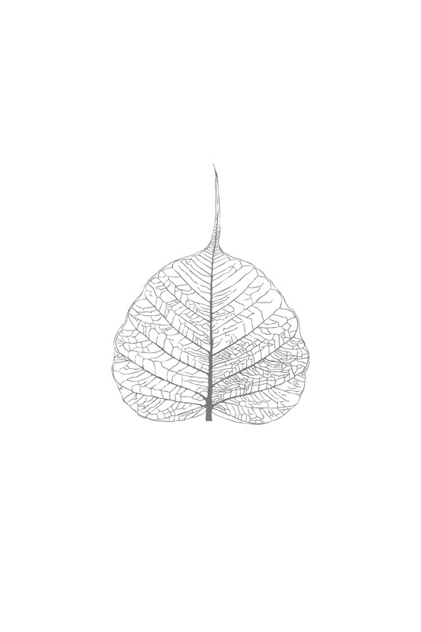

阿姜·查雅萨罗前言

# 阿姜·查雅萨罗前言

《佛法》是颂德·帕·菩陀构萨迦利雅 (P. A. Payutto) 的辉煌成就，他被公认为在世最杰出的泰国佛教佛学者。这位尊者的巨著，无疑是二十世纪泰国出版的最重要的佛教佛学著作。

《佛法》丰富而全面地阐述了南传上座部佛法教义。作为一本致力于揭示佛陀中道所有深奥之处的书，该书巧妙地在不加质疑地接受古代注释书解释与过度广泛地拒绝其价值之间，取得了平衡，这很恰当。对于有争议的问题，例如缘起，作者公正地总结了辩论中的各种立场，并留待读者自行决定。书中材料的编排不同于常规，但这是一个经过深思熟虑的创新，为作者提供了一个令人满意的框架，将佛陀教法的众多珍宝精美地呈现出来。

这位尊贵的作者在本书中使用的语言在泰国广受赞誉。然而，这对于译者来说，可能会带来相当大的挑战。尽管本书没有许多森林比丘著作中常见的省略句，但其风格密集，并倾向于使用不寻常的词语组合，这在原文中是令人振奋的，但在直译中偶尔会显得过于浓重。本书的译者罗宾·摩尔 (Robin Moore)，是我的一位老朋友和前比丘，他在确保英文版尽可能易读的同时，对文本保持了令人钦佩的忠实度，做得非常出色。这是他的一份爱的劳动，我代表所有心怀感激的读者向他致敬。

《佛法》三十多年来一直是我的忠实伴侣，如果我被困在荒岛上，我会选择带上这本书。我很高兴终于有了一个英文译本，能让更多人阅读这本优秀的著作。

阿姜·查雅萨罗  
伽那马拉隐修处  
2016年6月

