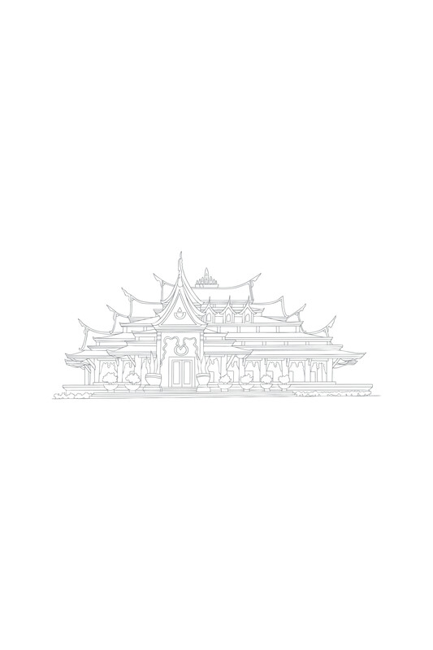

# 译者前言

## 英文译者前言

俗话说，千里之行始于足下。然而，第一步的启动可能源于许多不同的原因。完成这部《佛法》翻译的旅程，在某种意义上是偶然开始的，或者至少是机缘巧合。

1994年11月，我在由阿姜·苏美多 (Ven. Ajahn Sumedho, 坦·昭坤·拉贾苏美塔迦利雅 Tahn Chao Khun Rājasumedhācāriya) 领导的英国寺院完成了七年的白衣修行者 (anāgārika) 训练，并新近受戒为比丘 (nāvaka) 后，我向英国的长者们请求许可，希望能到泰国待一段时间，那里是隆波·查 (Luang Por Chah) 传统相关分支寺院的精神家园。我的请求获准了，我得到了一张单程票。

我对泰语的理解还很初步，最先去了乌汶府（Ubon Ratchathani）的帕那那查寺（Wat Pah Nanachat），那里尊者阿姜·查雅萨罗（Ven. Ajahn Jayasaro）当时正担任代理住持。巧合的是，在我抵达的第一个月，僧团有幸迎来尊者帕·巴育陀（Ven. Phra Payutto）的一次难得访问，他花了好几天时间用英语开示。我当然听说过坦·昭坤·巴育陀（Tahn Chao Khun Payutto）尊者，他的学问在西方寺院享有盛誉，他的著作——尤其是《佛教词典》——广受欢迎。我还知道他曾在宾夕法尼亚州的斯沃斯莫尔学院（Swarthmore College）讲学，我本科时曾在那儿学习比较宗教学。

在帕那那查寺的那几天，他作了一场关于安乐的开示。虽然我从未听任何人强调安乐在佛道各个层面修行中的核心重要性，但真正深深打动我的与其说是开示的主题，不如说是其呈现的方式。坦·昭坤散发着安乐——他似乎体现了一个品尝到安乐果实、并希望将伴随的智慧传授给他人者的喜悦。毫不夸张地说，我感动得热泪盈眶。虽然这是一种萌芽状态的喜悦，基于虔诚之心，但它仍然为我注入了能量和兴趣。他的开示达到了目的。

接下来的六年大部分时间，我都在泰国行头陀[\[1\]](#fn-fn1){:id="fr-fn1"}，以及老挝边境湄公河畔的一座偏远支院——普卓姆果姆寺（Wat Phoo Jorm Gorm）居住。作为一名比丘，甚至在此之前，我一直有强烈的学术倾向。我学习泰语主要不是通过标准的教科书或语言老师，而是在我的旅途中随身携带小型的法（Dhamma）书籍（阿姜·布达达萨（Ajahn Buddhadasa）、坦·昭坤·班雅南达（Tahn Chao Khun Paññānanda）、隆波查（Luang Por Chah）等人的著作）。在很长一段时间里，这些书是我的伴侣。2001年，我感到需要深化我对佛法的理论或学术理解，部分原因是我作为一名已受戒11年的比丘（因此正式是一名‘长老’（Thera）或‘阿姜’（Ajahn）），理应向在家众提供更正式的教导。

我决定请求尊者帕·巴育陀允许我住到他位于那空巴吞府（Nakhon Pathom）的念慧寺（Wat Nyanavesakavan）。阿姜·查雅萨罗（Ajahn Jayasaro）带我去见他。坦·昭坤（Tahn Chao Khun）没有立即批准，而是看着我问道：“你到这里来打算做什么？”显然这里不是一个只顾吃喝享乐的地方。我回答说我想阅读泰文的律藏（Tipiṭaka）。坦·昭坤（Tahn Chao Khun）似乎对这个答案很满意。

搬到念慧寺（Wat Nyanavesakavan）后不久，我向坦·昭坤（Tahn Chao Khun）询问《佛法》（Buddhadhamma）翻译项目。我知道布鲁斯·埃文斯先生（Mr. Bruce Evans）（前名为普里索·比丘（Puriso Bhikkhu））在九十年代曾花几年时间研究这本书。其中两章——关于缘起（Dependent Origination）和业（Kamma）的章节——已经出版并广受好评。但由于某种原因，该项目陷入了停滞。坦·昭坤（Tahn Chao Khun）问我是否愿意审阅这份未完成的手稿，看看能否将其润色并准备出版。然而，很快就发现，编辑或重写他人的作品，至少在这个案例中，比从头开始翻译整个文本要困难得多。

于是，旅程开始了。起初，它像是在一个长满异国花卉、位于平缓山麓的花园中漫步。我心中没有特定的目的地。这仅仅是将我阅读律藏（Tipiṭaka）的初衷替换成这项新活动。我曾和人们开玩笑说，完成整个翻译可能需要我好几辈子。

2003年，我回到英国，担任德文郡哈特里奇佛教寺院（Hartridge Buddhist Monastery）的住持。在空闲时间，我继续进行翻译工作，直到2007年，我完成了第三章（我没有按顺序翻译文本，而是选择当时我特别感兴趣的主题）。这一章以《三法印：佛陀教导中的无常、苦与无我》（The Three Signs: Anicca, Dukkha and Anattā in the Buddha’s Teachings）为题单独出版。这本书由坤·西丽参·皮隆帕迪（Khun Sirichan Bhirombhakdi）和她的两个女儿资助。

2007年，在我的出家生涯中，我与一种使人衰弱的身体疾病搏斗了整整十九年之后，我决定还俗，看看居士生活是否能改善我的健康状况。虽然翻译项目似乎会戛然而止，或进入一个漫长的停滞期，但实际上事情却走向了相反的方向，它形象地把我从山麓推向了高处，那里杜鹃花盛开，林木线延伸至广阔、冰碛雕刻而成的山谷。就在我在英国还俗几周后，我接到了坤·西丽参（Khun Sirichan）的电话，她敦促我回到泰国，继续《佛法》（Buddhadhamma）项目。她明确表示，在她看来，我是否穿着僧袍并不重要——她希望支持我，使这项有价值的事业得以持续。于是，我生命的新篇章开始了。

一到泰国，我就认真地继续翻译。机缘巧合，佛法基金会（Buddhadhamma Foundation）主席坤·永育·塔纳普拉（Khun Yongyut Dhanapura）听说了我的工作，并提议我在该组织的资助下继续这个项目。这使我获得了所有必要的长期居留泰国的文件，也获得了薪水以维持生计。至此，这段旅程进入了最规律和持续的阶段。一步一个脚印，每天翻译一页。

尽管文本的实际翻译于2014年11月完成，但又花了两年时间来处理所有必要的出版准备细节。尊者阿姜·查雅萨罗（Ven. Ajahn Jayasaro）慈悲地通读了手稿，我们定期开会进行修正和改进。此后，所有正式的出版准备工作开始进行——选择字体、字号、边距和行距、连字符、索引、参考文献、目录等。

这段旅程现在到了终点，尽管我希望这本书本身能有自己的生命，走向世界。虽然我不敢声称已抵达顶峰——这份荣誉属于作者——但我已经到达了一个高高的山坳或高原，虔诚地环绕着坦·昭坤（Tahn Chao Khun）的卓越成就。作为奖励，我还获得了对法（Dhamma）的难得一见的洞察和见解。如果没有对坦·昭坤（Tahn Chao Khun）阐明佛陀教法的信心和虔诚，以及对真理和良善的热爱，这个项目绝不可能达到这个阶段。那些阅读过关于欲望一章的读者，会认识到后一种品质是善法欲（chanda）——四成就法（four roads to success）的第一个因素。

将《佛法》（Buddhadhamma）用作我学习翻译技巧的磨刀石，这或许是一个大胆的举动。当我开始这个项目时，我并不是一个熟练的翻译家或作家。因此，我很可能没有完全展现原版泰文书籍的精髓。我翻译的一些段落可能存在错误。如果读者对任何内容存有疑问，我已在文本中用花括号插入了泰文版页码，以便您将英文版与原文进行比较。然而，我相信，在我编辑们的帮助下，特别是尊者阿姜·查雅萨罗（Ven. Ajahn Jayasaro）的帮助下，本书没有明显的扭曲或不一致之处。

除了努力捕捉原泰文文本的含义外，寻找合适的翻译风格也是一个挑战。发展这种风格是翻译这本书的演变过程的一部分。我认为可以公平地说，泰语中思想的正式表达方式与英语传统作文方法有所不同。一位朋友这样解释这种区别：泰语遵循归纳法，而英语传统上遵循演绎法。无论这种描述是否准确，泰文版《佛法》（Buddhadhamma）的文本常常遵循我所描述的一系列同心圆，反复回到相似的前提。在英文翻译中采用同样的方法似乎不合适。如果不习惯这种风格，人们很容易觉得，与其说是增加了意义和阐明层次，不如说是在遇到不必要的重复或冗余。因此，我已在许多层面上对文本进行了相应的重组：段落、章节部分，甚至整个章节都已进行了调整。在做出重大改动时，我都会咨询作者以获得他的批准。无论如何，我可以肯定地说，我既没有删除任何重要文本，也没有添加自己的插值。

一项主要任务涉及查找脚注中使用的相应经典参考文献。对于巴利语经典（Pali Canon）的参考文献，这并不困难，因为玛希隆大学（Mahidol University）开发的BUDSIR程序（第7版）包含一个快速易用的搜索选项，可以找到对应的巴利圣典协会（Pali Text Society）页码，与泰语巴利律藏（Thai Pali Tipiṭaka）中的页码匹配。然而，当面对义注、复注和其他非经典文本的参考文献时，挑战大大增加。在大多数情况下，我必须使用BUDSIR程序复制相关的巴利语段落，该程序不提供巴利圣典协会（PTS）页码，然后尝试通过输入罗马拼音的巴利语术语并将其粘贴到第六次结集律藏（Chaṭṭha Saṅgāyana Tipiṭaka）程序（第4.0版）中进行匹配，该程序确实提供巴利圣典协会（PTS）版本的页码，有时只有标题。BUDSIR程序基于暹罗王国巴利律藏（Siam Raṭṭha Pāli Tipiṭaka）（由泰语翻译的皇家律藏（Royal Tipiṭaka）补充），这是《佛法》（Buddhadhamma）中参考文献的来源（参见参考文献）。有些脚注参考文献很可能存在错误。如果读者发现任何错误，如果您能联系我，我将不胜感激，以便我能在未来的印刷品中进行修正。如果数字用括号括起来，则表示我无法找到相应的巴利圣典协会（PTS）（或其他罗马字母）页码。同样，希望这些内容将来能得到更新。

如此多的人在这个项目上给予了支持和帮助，以至于不可能一一列出他们的名字。最重要的人如下：

首先，我最深切的感激之情献给尊者帕·巴育陀（Ven. Phra Payutto），他不仅一直是我灵感的源泉和智慧与慈悲的灯塔，还对我有能力以所需的质量和标准完成这个项目寄予了极大的信任和信心。尽管由于他身兼多职以及身体上的限制，他未能通读整个英文译本，但他总能在我提出问题和疑问时及时给出解答。我或许能反映出他智慧的深邃和才华的闪耀，但要将他那灿烂的笑容和光辉的仁慈传达给读者，则超出了我的能力范围。那些有幸见过他的人，都会明白我所说的是什么。

其次，我感谢尊者阿姜·查雅萨罗（Ven. Ajahn Jayasaro），他在过去十五年（乃至更久）以来，在许多层面上给予了我极大的鼓励。他对坦·昭坤·巴育陀（Tahn Chao Khun Payutto）怀有同样虔诚的敬意，也同样热爱语言。我们一同研读这份手稿的时光，加深了我对他的尊敬和友谊。

第三，我感谢坤·西丽参·皮隆帕迪（Khun Sirichan Bhirombhakdi），她起到了催化剂的作用，促使我回到泰国继续这项工作，直到完成。有时，我们必须听到“我相信你”这样的话语，才能克服惰性或其他心理障碍。

第四，如果没有佛法基金会（Buddhadhamma Foundation）主席坤·永育·塔纳普拉（Khun Yongyut Thanapura）的热情和支持，这个项目就不会完成。正是通过他的倡议和长远眼光，这本书才得以问世。

我的母亲和继父——卡琳（Karin）和乔恩·冈内曼（Jon Gunnemann），以及我的父亲和继母——巴兹尔（Basil）和苏比思拉·摩尔（Subithra Moore），多年来给予我物质和情感上的支持，包括在我待业期间。多年来重要的编辑和校对人员包括：尊者嘎维萨哥·比丘（Ven. Gavesako Bhikkhu）、尊者吉塔三瓦罗·比丘（Ven. Cittasaṁvaro Bhikkhu）、罗恩·拉姆斯登（Ron Lumsden）、马克斯·麦凯-詹姆斯（Max Mackay-James）和马丁·西格（Martin Seeger）。我感谢布鲁斯·埃文斯先生（Mr. Bruce Evans）允许我参考他早期的《佛法》（Buddhadhamma）译作，他为此付出了巨大的努力。其他提供显著支持的人包括冼先生（Mr. Sian Mah）和占塔纳·乌索克女士（Mrs. Chantana Ouysook）。

愿这些集体的努力通过智慧和理解的力量，为世界带来光明与和平。佛陀将法与律（Dhammavinaya）传授给我们，以守护和维护。这不仅仅是将律藏（Tipiṭaka）副本存放在玻璃书柜中。虽然佛陀教法的实现可以概括为履行四圣谛（Four Noble Truths）的四项职责，即理解苦（suffering）、断除苦的起因、实现苦的止息（cessation），以及修习道（Path），或者更简洁地说，了知苦（suffering）和苦的终结（end of suffering），但要达到这个目标可能需要许多工具和善巧的方法。佛陀教法的妙处在于，它们为我们提供了一个充满洞见和指导的宝库。另一个比喻是，法（Dhamma）是一颗多面钻石。无论你从哪个方向拿起它，它都能提供无价的真理瞥见，可用来斩断妄想的帷幕。这些教法后来由义注作者们进一步阐述和阐明。尊者帕·巴育陀（Ven. Phra Payutto）的才能和天赋在于，他将经典和后经典教法以清晰整合的整体呈现出来，如同一个不漏水的渡船，将我们带往彼岸。虽然要完成的工作仍需我们自己去做，但道（Path）及其诸多障碍，已清晰地勾勒并揭示出来。

罗宾·摩尔  
绿园之家  
2016年8月

## 中文译者前言

年少时，我曾终日沉浸在繁忙的科技与商业世界中。彼时，梭罗的《瓦尔登湖》是我的枕边书，陪伴我度过无数个辗转反侧的夜晚，试图从中为躁动不安的心寻求一丝慰藉。

如今，行过万里路，读过万卷书，在历经世事浮沉之后，常伴我枕边的，唯有两部经典——其一是佛陀的言教总集《巴利圣典》，其二则是巴育陀尊者的《佛法》。当我逐渐远离了那些被烟酒、手机、空谈和躁动占据的生活之后，我的精神世界里便为这两部书留出了空间。直觉告诉我，它们将成为伴我走完余生的良师益友，直至生命终点。

然而，这两部经典在华语世界的境遇却令人扼腕。《巴利圣典》（及其汉译《阿含经》）已被国人束之高阁了数千年，而《佛法》一书，则更是鲜为人知。事实上，此书除了在泰国人手一册（甚至有专门的APP和有声书）之外，在世界其他地方几乎无人知晓，更遑论得以一读。

得益于科技的进步，我曾尝试使用人工智能翻译泰语版的《佛法》（扩展版）。但原书中泰语与巴利语混杂的写法，常常让翻译模型难以分辨哪些是融入泰语的巴利词汇，哪些是纯粹的巴利语原文，这给翻译工作带来了巨大的挑战。尽管如此，能有幸拜读这部倾注了巴育陀尊者四十年心血的巨著，已足以让我深受震撼与鼓舞。放眼整个华语世界，我再也找不到任何一本现当代佛法著作能与之比肩。

2025年初，在英国人摩尔先生（Mr. Moore）多年的不懈努力下，《佛法》的英文版《Buddhadhamma》终于出版，并以免费的形式流传，这为中文翻译带来了希望的曙光。经过仔细比对，我发现摩尔先生的英译质量极高，不仅完整、精确地还原了《佛法》（扩展版）前两部分的神髓，更令人惊喜的是，其排版、格式以及对英文与巴利语的处理都更为清晰明了，极大地提升了非泰国文化背景读者的阅读体验。

为了将这部著作呈现给中文读者，我甚至重拾了荒废二十余年的软件开发技能。在无数个不眠之夜里，我反复调校了数十个大模型与翻译脚本，叠加上泰语、英语、巴利语的逐句对照，和数以万计词汇、语法、表达方式的人工翻译、校对、修改和完善，最终使得这本全网唯一的《佛法》中文版得以诞生。在多重技术的加持下，译文质量已能够满足修学的需要，成为一本能够与众分享的佛法读物。

只可惜，这本书在华语世界的影响力，与它在泰国的地位相比，有云泥之别。即便是摩尔先生的英译本，其在西方世界的价值也远未被充分认识。我深知，这一现状在短期内难以改变，但拓荒的脚步，总要有人迈出。愿今日这微不足道的一步，能为日后佛陀教法在华语世界的传播，立下一座小小的里程碑。愿后世的求道者，能如今日的我一般，有缘品尝纯正“法”的滋味。愿佛陀的教诲、巴育陀尊者的心血与摩尔先生的努力，能成为时间的朋友，长存于世。

若说尚有一丝遗憾，那便是近年来泰语扩展版已经增补了更多的内容，有些内容并未在英文版中出现。为了弥补这一点，我已将近年来新增补的内容译出并上传至网站。中文读者可访问 [https://true-dhamma.com/go.html?id=buddhadhamma](https://true-dhamma.com/go.html?id=buddhadhamma)。为此，我还开发了一些辅助工具，在网页上实现了AI问答与有声阅读功能，力求将中文读者的阅读体验提升至与泰语读者相当的水平。我相信，一部倾注了泰国国宝级大师四十年心血的巨著，理应获得最高规格的礼遇。

目前，我已在True-Dhamma网站（[https://true-dhamma.com](https://true-dhamma.com)）上分享了中文版的《巴利圣典》以及《佛法》标准版与扩展版的全部内容。网站亦收录了诸多高僧大德、现代心理学专家、以及我个人关于世间成瘾、世间解脱与出世间觉悟的思考与文章，欢迎感兴趣的朋友访问阅览。

最后，诚挚地祝愿三界一切众生：早得正法，早得解脱！  
Sadhu！Sadhu！Sadhu！

智宁居士 2025年8月26日  
zhining@true-dhamma.com  
[https://true-dhamma.com](https://true-dhamma.com)

 

\[1\] 头陀（Tudong）：游方比丘的传统修行方式。这个词源于巴利语“dhutaṅga”，意译为消除或“抖落”心染的训练。[&nbsp;↩&nbsp;](#fr-fn1)
{: id="fn-fn1"}