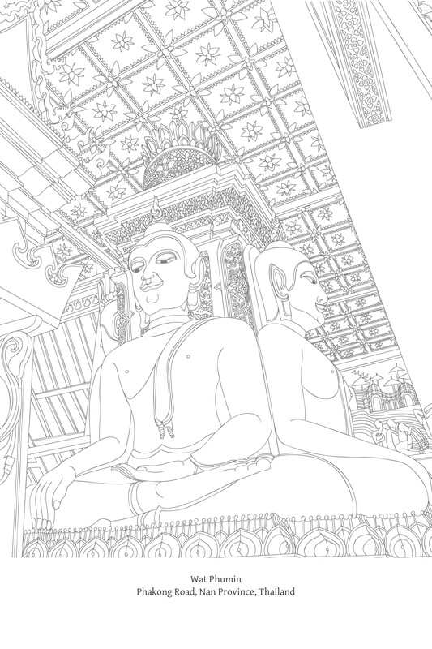
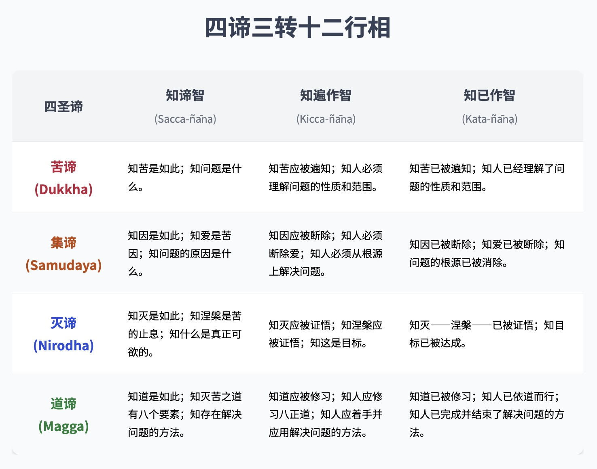
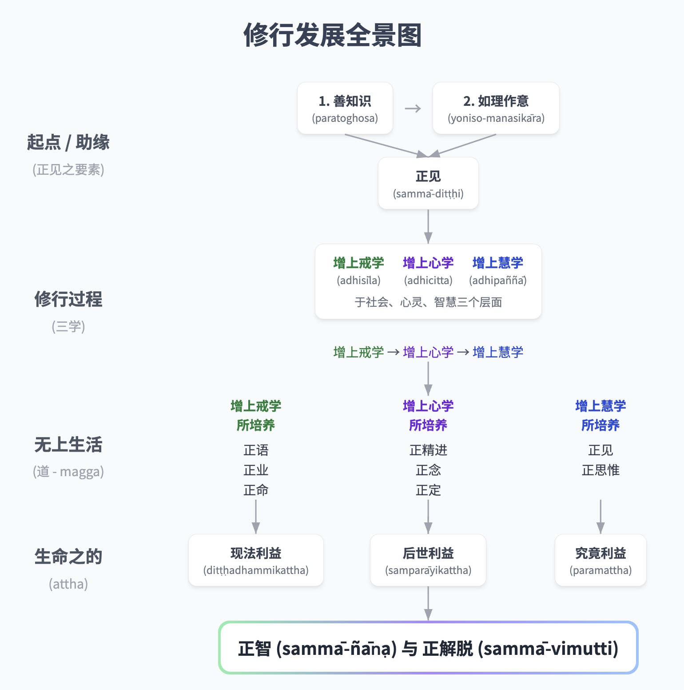

# 第十九章：四圣谛

## 导论

四圣谛的教法涵盖了整个佛教教义。《佛法》（Buddhadhamma）中讨论的所有主题都概括在四圣谛中，因此这项教法是本书的总结和结论。关于四圣谛，有一些重要的观点需要理解：

## 四圣谛的作用与意义

> 诸位朋友，就像任何动物的足迹都可以容纳在大象的足迹之中，所以大象的足迹被称为其中之首，因为它体量巨大；同样地，所有善法都可以包含在四圣谛之中。  
> M. I. 184-5
> 
> 诸比丘，只要我对这些四圣谛如实地在它们的三转十二行相中的智见未能完全清净，我就不宣称我已经证得无上正等正觉……《转法轮经》（Dhammacakkappavattana Sutta）：  
> Vin. I. 11; S. V. 422-3
> 
> 诸比丘，正是因为不理解、不通达四圣谛，我与你们才在轮回中流转了漫长的时光。  
> D. II. 90
> 
> 接着，世尊给居士优婆离（Upāli）循序渐进地教导，即布施论、戒论、生天论；他解释了感官享乐中的危险、堕落和染污，以及出离的利益。当他知道居士优婆离（Upāli）的心已准备就绪、堪能、没有障碍、欢喜且自信时，他向他阐述了佛陀特有的教法：苦、苦集、苦灭和道。[\[1\]](#fn-fn1){:id="fr-fn1"}  
> M. I. 379-80
> 
> 一个人修习梵行，是为了在世尊（Blessed One）座下，了知、看见、亲证、实证、达到那尚未了知、未见、未体证、未体验、未达到的境界，\[那就是\]：这是苦，这是苦的起因，这是苦灭，这是导向苦灭之道。  
> A. IV. 384-5

佛教的独特之处之一在于，它只教导那些可以应用于生活中并带来利益的真理。四圣谛直接有益于人们的生活。佛教不关心那些没有实际价值的抽象真理。因此，佛陀不关心并浪费时间在玄学辩论上：

> 如果有人说：“除非世尊（Blessed One）向我宣说‘世界是永恒的还是不永恒的，世界是有限的还是无限的，生命与身体是相同的还是生命是一回事而身体是另一回事，众生死后存在还是不存在，众生死后既存在又不存在，或者众生死后既非存在亦非不存在’，否则我将不在世尊（Blessed One）座下过梵行。”即使如此，如来（Tathāgata）仍未宣说，而此人也会在此期间死去。假设一人被一支沾满剧毒的箭所伤，他的朋友和同伴，他的亲属和眷属请来一位技艺精湛的外科医生为他治疗。此人却说：“除非我知道射伤我的人是贵族、婆罗门、商人还是劳工，否则我不会让外科医生拔出这支箭；除非我知道射伤我的人的名字和家族，他是高、矮还是中等身材；他是黑皮肤、白皮肤还是黝黑皮肤；以及他住在哪个村庄、城镇或城市。除非我知道射伤我的弓是长弓还是弩；射伤我的弓弦是用纤维、竹子、筋、麻还是树皮制成的；射伤我的箭杆是野生还是人工栽培的；除非我知道射伤我的箭杆是用哪种羽毛——是秃鹫、鹳、鹰、孔雀还是西提拉哈努鸟的羽毛——装饰的；除非我知道射伤我的箭杆是用哪种筋——是牛、水牛、长尾叶猴还是猴子的筋——绑缚的；以及除非我知道射伤我的箭头是什么样的，否则我不会让外科医生拔出这支箭。”在能够了知所有这些之前，此人肯定会死去。同样地，如果有人说：“我将不修习梵行”……此人也会在此期间死去。马鲁迦子（Māluṅkyaputta），如果持有“世界是永恒的”这一见解，梵行便无法修习；如果持有“世界是不永恒的”这一见解，梵行也无法修习。无论持有“世界是永恒的”见解还是“世界是不永恒的”见解，仍然有生（birth），仍然有老（aging），仍然有死（death），仍然有悲伤、哀悼、痛苦、忧虑和绝望；我在此处开示的正是这些\[苦\]的灭除……因此，记住我未宣说者为未宣说，记住我已宣说者为已宣说。那么我未宣说了什么呢？“世界是永恒的”，“世界是不永恒的”……为什么我未宣说这些呢？因为它们无益，不属于梵行的根本，不能导向厌离、离欲、止息、寂静、亲知、觉悟、涅槃。这就是我未宣说它们的原因。那么我宣说了什么呢？我已宣说：“这是苦”，“这是苦集”，“这是苦灭”，“这是导向苦灭之道。”为什么我宣说这些呢？因为它们有益，属于梵行的根本，导向厌离、离欲、止息、寂静、亲知、觉悟、涅槃。这就是我宣说它们的原因。  
> M. I. 428-31

在另一个场合，佛陀说他所证悟的事物很多，但他所教导的事物却很少。这是因为他只教导那些有益且能解决问题的事物。具体来说，这些有益的事物就是四圣谛：

佛陀曾住在拘睒弥城（Kosambī）附近的辛沙巴树林（Siṁsapā grove）。那时他捡起一小把辛沙巴树叶，对比丘们说：

> “诸比丘，你们认为，我手中这几片辛沙巴树叶多，还是上面辛沙巴树林中的树叶多？” “世尊，世尊手中这几片辛沙巴树叶数量很少，而上面辛沙巴树林中的树叶数量多得多。” “同样地，诸比丘，我亲证但未曾教导你们的事物很多，而我教导你们的事物很少。那么，诸比丘，为什么我没有教导那些众多的事物呢？因为它们无益，与梵行的根本不相关，不能导向厌离、离欲、止息、寂静、亲知、觉悟、涅槃。 “那么，诸比丘，我教导了什么呢？我教导了：“这是苦”；我教导了：“这是苦集”；我教导了：“这是苦灭”；我教导了：“这是导向苦灭之道。”为什么我教导这些呢？因为它们有益，与梵行的根本相关，并导向厌离、离欲、止息、寂静、亲知、觉悟、涅槃。因此我教导了这些。 “因此，诸比丘，你们应当努力，以便如实理解：“这是苦，这是苦的起因，这是苦灭，这是导向苦灭之道。””[\[2\]](#fn-fn2){:id="fr-fn2"}  
> S. V. 437-8

四圣谛对出家众和居士都是至关重要的教法。因此，佛陀敦促比丘们向居士开示，以便他们理解这些真理：

> 诸比丘，你们应当帮助的人，或那些乐于接受教法的人——无论是朋友、同事、亲戚还是眷属——你们都应当鼓励和劝导他们，使其安住并确立对四圣谛如实的亲证。  
> S. V. 434-5

## 四圣谛的含义

> 诸比丘，这四圣谛是真实的，无误的，不变的。因此它们被称为圣谛……  
> S. V. 435
> 
> 诸比丘，如来（Tathāgata）是这个有天神（devas）、魔罗（Māra）、梵天（Brahma）的世界中，在这个有沙门（ascetics）和婆罗门（brahmins）、天神（devas）和人类的时代中的圣者。因此它们被称为圣谛（因为它们是由佛陀，这位圣者所证悟和揭示的）。[\[3\]](#fn-fn3){:id="fr-fn3"}  
> S. V. 435
> 
> 诸比丘，正因为如来（Tathāgata）、阿罗汉（Arahant）、正等正觉者（Perfectly Enlightened One）如实地彻悟了这四圣谛，他才被称为圣者。[\[4\]](#fn-fn4){:id="fr-fn4"}  
> S. V. 433

《清净道论》（Visuddhimagga）引用巴利语经典中的段落，提出了四圣谛的四种定义（参见脚注：Noble Truths）：

圣谛

> Vism. 495. 对于第一个定义，《清净道论》（Visuddhimagga）引用了以下段落：“诸比丘，因为‘圣者’（即觉悟者）通达这些真理，所以它们被称为圣谛”，但我无法在现存的律藏（Tipiṭaka）中找到这段经文。至于第四个定义，riya这个词通常翻译为“高贵的”或“卓越的”，因此ariya-sacca被翻译为“圣谛”，但这里的义注师根据上述引用的段落，将ariya解释为“真实的”或“确定的”。

1.  由“圣者”（参见前一脚注）所证悟的真理。
    
2.  属于圣者的真理（参见上文巴利语定义B）。
    
3.  导向圣者境界的真理（参见上文巴利语定义C）。
    
4.  真实而确定的真理（参见上文巴利语定义A）。
    

四圣谛的经典解释如下：

> 现在，诸比丘，这就是苦圣谛：生是苦，老是苦，病是苦，死是苦；与不可意的事物相遇是苦；与可意的事物分离是苦；求而不得是苦；简言之，五取蕴是苦。现在，诸比丘，这就是苦集圣谛：它就是导向后有的渴爱，伴随着喜悦和贪欲，到处寻求喜悦；即欲爱、有爱与无有爱。现在，诸比丘，这就是苦灭圣谛：它就是对同一渴爱的无余根除和止息（cessation），对其的舍弃和放弃，从中解脱，不执著于它。现在，诸比丘，这就是导向苦灭之道的圣谛：它就是八正道；即正见、正思惟、正语、正业、正命、正精进、正念、正定。[\[5\]](#fn-fn5){:id="fr-fn5"}

进一步的解释如下：

1.  苦（Dukkha）：指苦、不圆满；人类的困境。更深层次地，这个真理指的是一切有为法的状态，它们受制于三法印（无常、苦、无我）的自然法则。有为法伴随着压力、紧张、冲突和障碍。它们本质上有缺陷且不完美；它们缺乏真正的实质和稳定性；它们无法提供持久的满足和知足；它们总是容易对执取于它们的人造成问题和制造苦。
    
2.  苦集（Dukkha-samudaya）（简称“集”）：苦的生起的因或根源；即渴爱，它抓住对“自我”的信念，建立一个“我”，假定在不同情境下体验和获得、存在和停止存在。执著于这种自我感使人不断处于烦躁不安、焦虑、渴望、占有欲、嗔恨、恐惧、怀疑、无聊和其他形式的内心烦恼中。因此，一个人无法真正感到自在、自由和喜悦；一个人不知道纯净而安稳的安乐。
    
3.  苦灭（Dukkha-nirodha）（简称“灭”）：苦的止息；当一个人完全消除无明和渴爱，不再受渴爱的影响或驱使，并且不再被焦虑、无聊或任何其他形式的内心苦恼压迫时所达到的状态。一个人获得解脱、平静、光明和自在；他体验到纯净的安乐。简言之，灭（nirodha）等同于涅槃（Nibbāna）。
    
4.  导向苦灭之道（Dukkhanirodhagāminī-paṭipadā）（简称“道”）：导向苦灭之道，或达到苦灭的修行之道，即八正道（ariya-aṭṭhaṅgikamagga；由八个道支组成的至上之道），即正见（right view）……正定（right concentration）。此道被称为中道，因为它以平衡的方式走向苦灭，而不会滞留在或偏向于两个极端：沉溺于感官享乐（kāmasukhallikānuyoga）或自我折磨的苦行（attakilamathānuyoga）。
    

## 四圣谛与缘起

缘起和四圣谛都是佛教的核心教义。

回答“佛陀证悟时证得了什么？”这个问题，同样准确的说法是，他证得了缘起，并且他证得了四圣谛。巴利语经典中有段落可以证实这两种说法。

这是因为这两项教法本质上是相同的，指向相同的真理：缘起是四圣谛的一个基本要素，而四圣谛包含了缘起。让我们来看看支持这一论断的经典证据：

《律藏》（Vinaya Piṭaka）描述了佛陀证悟的故事，从他证悟之后立即开始，他用整整一周的时间体验解脱之乐并思惟缘起，包括顺行（苦的生起）和逆行（苦的止息）。[\[6\]](#fn-fn6){:id="fr-fn6"} 在体验解脱之乐七周之后，佛陀考虑向他人宣说正法，他有了这个念头：

> “我已证得的这个法（Dhamma）是甚深难见、难证得的……对于这种喜好执著的众生来说，难以见到这个真理，即特定因缘（specific conditionality）、缘起。而且，这个真理，即……涅槃（Nibbāna），也是难以见到。”  
> Vin. I. 1-5

《经藏》（Sutta Piṭaka）以类似的方式描述了佛陀的生平故事，始于促使他出离宫殿的念头，接着是他出家为沙门（renunciant），随苦行者阿罗逻（Āḷāra）和郁陀迦（Uddaka）学习，行持并放弃极端苦行（extreme asceticism），恢复进食，然后证得禅那（jhānas）并在觉悟时证得三明：

> 当我吃了固体食物并恢复体力后，我完全离于欲乐，离于不善法，安住于初禅……二禅……三禅……四禅，该四禅既无乐也无苦，只是由舍而得念清净……当我的心已得定、清净、明晰、无染、离于烦恼、柔顺、适于作业、稳定、不动摇时，我将它导向宿命随念智（pubbenivāsānussati-ñāṇa；第一明——vijjā）。我忆念我的多生多世……我将它导向众生生死智……我看见众生逝去与再生（cutūpapāta-ñāṇa；第二明）……我将它导向漏尽智（āsavakkhaya-ñāṇa；第三明）。我如实直接地了知：‘此是苦’，‘此是苦集’，‘此是苦灭’，‘此是导向苦灭之道’；我如实直接地了知：‘此是漏’，‘此是漏集’，‘此是漏灭’，‘此是导向漏灭之道’。当我如此了知、看见时，我的心从欲漏、有漏、无明漏中解脱。  
> M. I. 163-73, 240-49; M. II. 93, 211-12

这些段落之后，描述了佛陀对宣说法（Dhamma）的考虑，与上面引用的律藏中的段落相同。

律藏描述了佛陀觉悟后立即的时期，当时佛陀体验了解脱之乐（论典说持续了七周）。该描述始于佛陀对缘起的审视，止于佛陀因缘起和涅槃的复杂和深奥而考虑不教导法。经藏描述了佛陀觉悟之前的境况，直到他证得三明（vijjā）。它略过了体验解脱乐的时期，直接转向佛陀不教导法的意向。

那些关注律藏中佛陀思惟缘起的段落，以及律藏和经中佛陀考虑教导法的段落的人，会声称佛陀证悟了缘起。另一方面，那些关注经文段落，特别是描述证得三明的段落，并主要考虑第三明的人——第三明是觉悟的真正核心（前两种明不能被认为是与觉悟等同，也不是证得涅槃所必需的）——会声称佛陀证悟了四圣谛，从而获得了漏尽解脱。

尽管这两种答案都是正确的，但这两种法义具有不同的特征和不同的适用范围，因此应被视为相互区别。

关于这两种法义的相似之处，让我们回顾缘起的两个不同循环，然后将它们与四圣谛进行比较：

1.  集起循环（samudaya-vāra）：无明生起 → 行生起 → ……生生起 → 老死、忧、悲、苦、恼、绝望生起。
    
2.  灭尽循环（nirodha-vāra）：无明止息 → 行止息 → ……生止息 → 老死、忧、悲、苦、恼、绝望止息。
    

*   A. 缘起的集起循环等同于第一圣谛和第二圣谛：苦（dukkha）和苦集（samudaya）。在四圣谛中，缘起的最后部分（生、老、死、忧、悲等），即渴爱与执取的果报，被指定为第一圣谛：它指的是人们遇到的必须纠正的问题。然后，该法义返回到之前的因素（无明至有），并将其指定为第二圣谛：人类问题的根源。
    
*   B. 缘起的灭尽循环等同于第三圣谛（nirodha）。它揭示了当问题从根本上得到妥善解决时，如何根据因果法则而止息。尽管灭尽循环直接与第三圣谛相关联，但它也包括第四圣谛，因为问题的根除间接指的是解决这些问题所涉及的行为或修行；它指向解决问题所需的特定行动。
    

因此，可以将四圣谛浓缩为两个真理：苦的存在（谛一和谛二）和苦的止息（谛三和谛四）。

在一些经中，这两个缘起循环被用作第二圣谛和第三圣谛的定义：集起循环是第二圣谛的定义，而灭尽循环是第三圣谛的定义。[\[7\]](#fn-fn7){:id="fr-fn7"}

然而，在这些定义中，只有渴爱被揭示为苦集（samudaya）的原因；同样地，渴爱的止息是苦灭（nirodha）的定义。这是因为渴爱是最明显的烦恼；它起着主导作用，因此被突出以供考察。尽管这种呈现方式是简略的，但缘起的整个过程都隐含其中。

缘起和四圣谛的教导在以下方面有所不同：

这两种法义以不同的方式和不同的目标揭示了相同的真理。缘起描述了一个自动的、自然的过程。另一方面，四圣谛提供了一个智慧探究和考察的模型，导向实际的结果。

四圣谛与佛陀自身的真理探寻相对应，始于他对苦的遭遇以及随之而来的对苦因的探寻。他发现这种探寻并非徒劳；确实存在解决方案。因此，他确定了需要关注的具体要点，并为自己设定了一个明确的目标。最终，他采取了必要的措施来解决问题，直到达到他期望的目标。因此，四圣谛被用作一个系统化的法义，以产生理解，使传法者和受法者双方受益。

缘起是四圣谛中固有的基本动力，是佛陀在觉悟后立即思惟的。它是一个人为了理解四圣谛的要旨而必须学习的关键法义。

这些法义的主要区别在于缘起的灭尽循环，它与第三圣谛和第四圣谛相对应。当我们将灭尽循环与第三圣谛（nirodha）进行比较时，会发现它主要侧重于导致止息的过程，而不是止息——涅槃——本身的状态。因此，在佛陀觉悟之后，当他考虑是否教导法时，他区分了他所证得的两个真理。他的第一个考虑是：

> 我所证得的这法，深奥、难见、难证……\[它很难\]为沉溺于执着的世代所见，即特定缘起，缘起。

接着是第二个考虑：

> 而这个真理，即一切行止息、一切苦依止舍弃、渴爱尽、离贪、灭、涅槃，也难以见到。

另一方面，第三圣谛主要指的是止息的状态，尽管导致止息的过程隐含其中。

缘起的灭尽循环包含了第四圣谛（magga），但它并没有清晰地指出修行的道路。它没有明确具体说明实际应用的细节或方法：为了使过程达到圆满，需要做什么。这类似于一个医生知道如何治疗疾病，但既不开药方也不制定治疗计划。

然而，在四圣谛中，佛陀特意区分了第四圣谛，以用于实际应用：它是一种经过检验和证明的修行方式，并确定无疑地导向完全彻底的解脱目标。

第四圣谛（magga）详细、平衡且全面地描述了修行；它包含了整个佛教修行体系。它被称为“修行中道”或“中道”，人们应遵循它以在自身内部产生结果。另一方面，缘起被称为“中道法义”（majjhena dhammaṁ deseti），或“中法义”，它符合自然的内在法则。它涵盖了前三个圣谛。因为中道（magga）具有独特的特点，所以将其区分开来作为一种独特的法义非常重要。

总而言之，佛陀在他觉悟时所证得的真理之间作了区分：一方面是缘起和涅槃，另一方面是四圣谛。所有这些真理本质上是相同的，但从不同的角度来看待。

佛陀在考虑是否教导法时，提到了缘起和涅槃，承认这些事物的深奥以及众生理解它们的困难。涅槃和缘起是佛陀证悟时所证得的本质特质；它们是法的真实纯粹的精髓，极难证得。它们也处于四圣谛法义的核心。

佛陀在描述他自己修行并最终觉悟的过程，以及在初转法轮时向他人教导法义时，提到了四圣谛。四圣谛包含了佛陀所证得的全部真理。它们被组织成一个渐进的、连贯有效的法义体系，其中考虑了人们理解这些真理并将其应用于生活的能力。

涅槃和缘起是纯粹的自然现象。四圣谛是直接与人类相关的事物；它们以一种有利于理解和实际应用的方式呈现。四圣谛体现了真理（法）的整体，而真理的本质（也是最难证得的）特质是涅槃和缘起。一个真正理解涅槃和缘起的人，理解整个佛法，包括四圣谛。

## 关于四圣谛应履行的职责

理解并履行与每个四圣谛相关的必要职责至关重要。四圣谛的正确呈现和正确修行，依赖于每个不同的真理与其相应的职责或任务之间的准确联系。未能做到这一点会导致误解和错误的修行。对与每个四圣谛相关的职责缺乏理解，也会导致对佛教的普遍误解，例如认为佛教是一种悲观的法义。

关于四圣谛的四个职责如下：[\[8\]](#fn-fn8){:id="fr-fn8"}

1.  苦应遍知（dukkhaṁ ariyasaccaṁ pariññeyyaṁ）。
    
2.  苦集应断除
    （dukkhasamudayo ariyasaccaṁ pahātabbaṁ）。
    
3.  苦灭应现证
    （dukkhanirodho ariyasaccaṁ sacchikātabbaṁ）。
    
4.  导向苦灭之道应修习
    （dukkhanirodhagāminīpaṭipadā ariyasaccaṁ bhāvetabbaṁ）。
    

*   A. 遍知（pariññā）：关于苦的职责是彻底理解：一个人应该如实地考察和理解苦；应该清楚地理解相关问题并确定这些问题的程度。这是修行的一个基本阶段，使人能够进展到后续阶段并理解人类困境的核心。
    
*   B. 断除（pahāna）：关于苦因的职责是消除它们——止息苦因；一个人应该去除苦的根源。
    
*   C. 现证（sacchikiriyā）：关于苦灭的职责是现证或证得这种止息：达到一个主要问题已解决、完全摆脱这些问题并已达到修行目标的状态。
    
*   D. 修习（bhāvanā）：关于道的职责是字面意义上的“使之存在”——产生并增长——即：根据道的要素来训练自己；进行道的修行，以消除苦的根源；遵循导向目标的方法；制定修行的细节并将其应用于解决问题。
    

必须正确地关注并完成这些职责，使每个职责与其相应的真理相匹配。正确履行这些职责需要智（ñāṇa）；巴利语中这些职责的智被称为kicca-ñāṇa。应用这种智将每个圣谛与它相应的职责联系起来，对应于修行的不同阶段，并且可以用于解决各种人类问题：

1.  与苦相关的职责智：了知苦需要遍知；理解苦的本质、苦的基础和苦的所在。这种理解与实相相符，这不同于根据我们想要事物成为的样子或根据厌恶来理解事物。作为一个特定的修行阶段，这指的是描述或评估问题的阶段，这些问题必须被定义和理解。
    
2.  与苦集相关的职责智：了知苦集需要断除；理解苦的原因，这些原因应该被消除。这是探究和分析的阶段，诊断苦的根源，这些根源必须被彻底根除。
    
3.  与苦灭相关的职责智：了知苦灭需要现证；理解苦的止息，这应该被现证。这是专注于苦的止息——修行目标——的阶段，通过认识到解决人类困境是可能的、有价值的、并且是应该完成的。此外，一个人了知如何达到这个目标。
    
4.  与道相关的职责智：了知道需要修习；理解道或导向苦灭的修行之道，这应该被培育并圆满。这是制定或承认用于消除苦的根源的修行方法、阶段和细节的阶段，这些方法、阶段和细节需要被应用和进行。
    

总而言之，我们知道我们的问题是什么——我们知道苦的本质，我们知道苦的根源，我们知道应该追求什么（或者什么成就才是真正可取的），以及我们知道必须做什么——我们知道如何进行。

职责智（kicca-ñāṇa）是与四圣谛相关的三种智之一，它们被用作判断证悟的标准：当一个人真正以这三种智（包括十二行相）了知四圣谛时，他就被称为觉悟者。

这三种智被统称为‘智见’（ñāṇa-dassana）。这种智见由三转组成，构成了这三种智：[\[9\]](#fn-fn9){:id="fr-fn9"}

1.  真理智（sacca-ñāṇa）：如实地了知四圣谛：“此是苦”，“此是苦集”，“此是苦灭”，“此是导向苦灭之道”；“苦是如此”，‘苦集是如此’，“苦灭是如此”，“导向苦灭之道是如此”。这种智圆满了第一转。
    
2.  职责智（kicca-ñāṇa）：了知关于每个四圣谛所需的职责：苦应遍知，苦集应断除等，如上所述。这种智圆满了第二转。
    
3.  已作智（kata-ñāṇa）：了知已完成四圣谛相关职责的智。一个人了知：“应遍知的苦，已遍知”；“应断除的苦集，已断除’；‘应现证的苦灭，已现证”；“应修习的道，已修习”。这种智圆满了第三转。
    

这三转在四圣谛中分别发生，产生了十二行相的智见。因此，智见（ñāṇa-dassana）有三转，包含十二行相。

佛陀具备了关于四圣谛三转十二行相的智见——因此他宣称他已证得无上正等正觉。

包含这十二行相的知见被用作验证所有修行成就的标准。这种智及其转和行相可以概述如下，并在“四谛三转十二行相”表格中。

1.  苦是如此 – 应遍知 – 已遍知。
    
2.  苦集是如此 – 应断除 – 已断除。
    
3.  苦灭是如此 – 应现证 – 已现证。
    
4.  道是如此 – 应修习 – 已修习。
    

另请注意以下几点：

1.  苦（Dukkha）与遍知（pariññā）的职责配对，其意义是苦应该被清楚地理解。因此，苦以及所有被归类为问题的事物，统称为“应遍知法”（pariññeyya-dhamma）。
    
2.  苦集（Samuday）与断除（pahāna）的职责配对，其意义是苦因应该被舍弃或消除。因此，渴爱以及所有被归类为苦因的事物，例如：无明、贪、瞋和执取，统称为“应断除法”（pahātabba-dhamma）。
    
3.  苦灭（Nirodha）与现证（sacchikiriyā）的职责配对，其意义是苦的止息应该被现证。因此，涅槃以及与目标相关的事物被称为“应现证法”（sacchikātabba-dhamma）。
    
4.  道（Magga）与修习（bhāvanā）的职责配对，其意义是道应该被修习。八正道以及所有达到目标的修行和方法被称为“应修习法”（bhāvetabba-dhamma）。
    

一切存在的事物，无一例外，都可以被归类并纳入这四个范畴之一。

在在导向苦灭的道上——从初步阶段到精微阶段，从与外在事物相关到证悟内心的深奥现象——一个人所体验的事物总是可以与这四个范畴之一相关联。例如，在最高层次的修行中，在观照真理的本质时，佛陀如此描述这四种特质：[\[10\]](#fn-fn10){:id="fr-fn10"}

1.  苦（Dukkha）：应遍知法（pariññeyya-dhamma）= 五取蕴。
    
2.  苦集（Samudaya）：应断除法（pahātabba-dhamma）= 无明（avijjā）和有爱（bhava-taṇhā）。
    
3.  苦灭（Nirodha）：应现证法（sacchikātabba-dhamma）= 真知（vijjā）和解脱（vimutti）。
    
4.  道（Magga）：应修习法（bhāvetabba-dhamma）= 奢摩他（止）和毗婆舍那（观）。
    

## 四圣谛总结

论典为四圣谛提供了一些有趣的类比：[\[11\]](#fn-fn11){:id="fr-fn11"}

1.  疾病：
    
    *   苦（Dukkha）类似于疾病。
    
    *   苦集（Samudaya）类似于疾病的病因。
    
    *   苦灭（Nirodha）类似于从疾病中解脱。
    
    *   道（Magga）类似于治疗疾病的药物。
    
2.  饥荒：
    
    *   苦（Dukkha）类似于饥荒。
    
    *   苦集（Samudaya）类似于缺雨。
    
    *   苦灭（Nirodha）类似于丰饶和富足。
    
    *   道（Magga）类似于一场好雨。
    
3.  危险：
    
    *   苦（Dukkha）类似于危险。
    
    *   苦集（Samudaya）类似于危险的根源。
    
    *   苦灭（Nirodha）类似于逃离危险。
    
    *   道（Magga）类似于逃离危险的手段。
    
4.  负担，重担：
    
    *   苦（Dukkha）类似于重担。
    
    *   苦集（Samudaya）类似于扛着重担。
    
    *   苦灭（Nirodha）类似于放下重担。
    
    *   道（Magga）类似于放下重担的步骤。
    

《清净道论》、《迷惑断》和《显正法论》就佛陀为何按其排列顺序来安排四圣谛，提供了简明扼要的解释：[\[12\]](#fn-fn12){:id="fr-fn12"}

### 苦：应遍知

为了运用智慧，应当遍知苦

苦是具有逼迫性的，影响着所有人类。每当苦生起时，它都令人警醒并引发关注。即使一个人超越自己的个人经验，也会看到各种苦恼和困难持续困扰着人类，这是常态。苦对所有人都显而易见——它清晰地显现。它激发兴趣，因此适合作为日常观照的主题，特别是作为教导法的起点。

此外，苦被大多数人认为是令人不悦和恐惧的；尽管它不可避免，但他们不想去思考它。如果一个人让人意识到他们当前正在经历苦或制造问题的方式，他们可能会从自满状态中被唤醒。佛陀教导人们关于苦，是为了让他们开始思惟和解决他们的问题。

通过从苦开始教导四圣谛，我们从手头的问题开始，从清晰可见的事物开始，从引人关注的事物开始，最重要的是，从与人们直接相关的事物开始。我们不从抽象概念、奇思妙想或仅仅是空谈开始。当教导一个人时，要谈论与他相关的主题；当客观地教导时，要谈论与所有人都相关的主题。

佛陀教导苦不是为了推广苦，而是作为止息苦的起点。他知道苦是可以止息的——它不是一种强制性的、永久的状况。当生命仍被苦打扰时，它是令人沮丧的。如果一个人能够止息苦，或者变得善于解决问题，那么生命就会变得平静和真正的安乐。

解决问题不是通过逃避或对苦视而不见来实现的。恰恰相反：它是通过承认和面对苦来实现的。这不意味着简单地忍受苦或制造更多的苦，而是意味着深入了解苦，以便能够从中解脱。一个人不是积累苦，而是以智慧来关注它。

获得洞见等同于履行关于苦的正确职责，即遍知（pariññā）。一个人理解苦的本质、它生起的地方以及问题的程度。人们常常逃避苦和逃避问题；即使他们知道问题存在，他们也只是对其有模糊或混乱的理解。通过理解苦，一个人在这方面的职责就完成了。这类似于医生诊断疾病的症状并理解其性质，从而完成了治疗过程中的一个阶段。

断除苦并非我们的职责，因为止息并非存在于苦本身——一个人必须从苦因处消除它。试图断除苦本身，就像只治疗疾病的症状，比如说通过服药来缓解疼痛。疾病并未治愈，一个人必须继续寻找其原因。

正如研究疾病本质的医生也必须研究作为疾病之宿主的人体一样，修行者为了止息苦而研究苦的本质，也必须研究构成苦基础的人类生活的所有方面，以及扮演参与性角色的有为法的本质。

第一圣谛的要旨就是如实知苦，并辨明人类生命和我们周围世界的真实本质。

### 苦集：苦的根源

探寻苦的真正原因，而非归咎于他人

如果一个人希望苦灭，就必须消除其原因。当一个人认识到自己苦的本质——它如何以及在何处显现——是时候进一步探究其原因了，以完成断除（pahāna）的职责。

然而，在许多情况下，当寻找苦的根源时，人们会逃避真相。他们倾向于向外寻找，或者专注于与当下发生的事情无关的事件。因此，他们寻找外部因素来归咎，或者试图与问题保持距离，以使自己觉得无需负责。

将责任归咎于外部因素会导致三种邪见：[\[13\]](#fn-fn13){:id="fr-fn13"}

1.  宿作论（pubbekata-vāda）：认为当前所有乐和苦都源于过去的业；声称所有乐和苦都与过去的业相关。
    
2.  自在天造作论（issaranimmāna-vāda）：认为当前所有乐和苦都是由一个至高无上的神创造的；一个人无论是逃避不幸还是寻求好运，都依赖于神明的恩赐。
    
3.  无因论（ahetu-vāda）：认为当前所有乐和苦都是随机和无意义的，没有原因和条件。一个人认为无论是积极还是消极的事件都无法改变；当它们注定的时间到来时，它们会自动发生。
    

佛法（Buddha-Dhamma）驳斥这些邪见，因为它们与自然因果法则相悖。佛教法义鼓励人们根据这种自然法则来寻找苦的根源，从存在于个体内部的原因开始，即身、语和意业，无论是善是恶：那些已经完成的、当前正在进行的以及作为性格特征储存起来的。并且，它们让人审视自己与周围事物的关系中的行为，检查他们的行为是否与各种环境因素相符或不符。

在更深的层次上，佛陀将渴爱描述为人类苦的根源。渴爱导致一个人行动、表达自己、以及以错误的方式与世界互动。一个人并非以真理的智识行事，而是受苦乐、好恶的影响，或者通过恐惧、慢、嫉妒和不信任等烦恼来保护自己，这些烦恼是渴爱的结果。

渴爱有三种形式：欲爱（kāma-taṇhā）——渴望获得、占有、享用；有爱（bhava-taṇhā）——渴望存在、持续、拥有永恒的生命；以及无有爱（vibhava-taṇhā）——渴望不再存在、渴望灭绝。在更深的层次上，佛陀描述了缘起的过程，其中无明作为渴爱的根源，是所有苦流出的源头。

当一个人消除无明和渴爱——苦的原因——并且不再受烦恼的阻碍时，他就能以智慧与世界——与他人、与其他生物、与自然——互动。一个人理解万物的因缘，这使他能够以人类智慧所能达到的最佳方式解决问题。

尽管一些微小的苦仍然存在，但它只是自然固有的苦（dukkha），无法压倒一个人的心。当一个人从内在的渴爱束缚中解脱时，唯一剩下的职责就是思惟自己所处的境况，并以智慧回应，以促进他人的幸福和福祉。

相反地，只要人们仍然受到腐化和扭曲的烦恼所压迫，他们就没有机会真正解决问题或止息痛苦，无论是内在的还是外在的社会中。在大多数情况下，当人们试图解决问题时，他们往往会使事情变得更糟，要么增加手头的问题，要么制造新的问题。当他们经历痛苦时，他们不是通过智慧来结束或减轻痛苦，而是被渴爱所迫，通过增加原有的痛苦或向外发泄痛苦并伤害他人和社会来弥补这种状况。

人类的痛苦就是这样产生和存在的，它受制于渴爱的支配，并有无明的支持，永无止境。

### 灭：苦的止息

智慧导向无碍的安乐和慈悲

佛陀在描述了痛苦及其起因（这些都是逆境和不满的问题）之后，他通过教授第三圣谛——灭谛，安抚了那些乐于接受他教诲的弟子们的心，并给予他们希望，揭示了苦的压迫是可以止息的——生命的基本问题是可以解决的。一条令人向往的出路是存在的，因为痛苦的起因可以被消除并终结。

痛苦是依因缘而存在的；当这些因缘被移除时，痛苦的结果也随之止息。当痛苦止息时，“无痛苦”的状态——一种从痛苦中解脱的状态——便自动生起。内心的不安转化为一种自由、明晰、清净和安适的状态。因此，止息被呈现为第三圣谛，这既是因为事件的自然顺序，也是因为它作为一种教学方法的适切性，它能激发兴趣，促进理解，并鼓励实践，从而导向真正的证悟。

当一个人消除了渴爱以及那些支配和诱惑心的伴随烦恼时，他就不会再受到躁动、渴望、焦虑、恐惧、敌意、孤独和无聊的困扰。他不需要依赖于逃离这些不安的心境、试图埋葬它们或用其他东西取代它们，或向外发泄挫败感的暂时的快乐。

通过关注痛苦的起因，心现在变得解脱、独立、平静，并拥有纯净的安乐；它不会被挥之不去的疑虑和恐惧所侵扰。心的常态是喜悦、明晰和安乐。一个人已达到修行上的圆满，并完成了证悟（sacchikiriyā）的行为。

同样地，当心从心烦恼和纠缠中解脱出来，当它自由而明亮时，无明就不再有任何操控的力量。因此，智慧也得以净化，摆脱了烦恼的欺骗和腐化影响。一个人能够正确地、与真理和谐地反思事物，并根据因果来辨识事物。

当无明和渴爱不再引起误解时，智慧便是引导行为的主要动因。一个人便以彻底了解自然法则的方式行事、表达自己并与世界互动。除了作为内在清净和自由的基石之外，在外部，智慧还有助于运用个人的知识和能力来解决他人的问题并创造真正的福祉。一个人的智力得到最充分的运用，没有障碍或扭曲，并且只用于善法目的。这就是以智慧为指导来生活。

此外，当一个人是自由的、稳定的、自然安乐的——不执着自我，不寻求消费之物，不试图保护或强化自我重要性的负担时——心就会变得广阔，自由的感觉会向外弥漫。一个人会对众生的快乐和痛苦产生同情，并希望提供帮助。此时，智慧便被赋予了慈悲的力量，有助于引导一个人的行为；一个人便完全为了他人的福祉和快乐而生活。当一个人摆脱了执取和自私的贪着时，他便能够以专注、坚定和奉献的方式，行持善法和仁慈之举。

在内在，一个人是自由、安乐和清净的；个人福祉已臻圆满（attahita-sampatti）。在外部，一个人致力于帮助他人（parahita-paṭipatti）。两者共同构成了已证悟止息之人的特质。

行走于圣道之人不需要等待去体验证悟涅槃——止息的核心——的福德和利益。即使在正确地沿着道路前进时，一个人也能够不断地目睹修习日益增长的果实，无论是在个人利益方面，还是在一个人可以施予他人的福祉方面。

止息（nirodha）按升序分为五个阶段：[\[14\]](#fn-fn14){:id="fr-fn14"}

1.  镇伏灭（Vikkhambhana-nirodha）：通过镇压而止息痛苦和烦恼：运用禅定使心平静、放松，摆脱昏沉和焦虑。具体而言，这意味着将禅定应用于禅那的层面。在一个人安住于禅那的整个期间，烦恼得以平息，一个人体验到离欲之乐（nirāmisa-sukha）。
    
2.  对治灭（Tadaṅga-nirodha）：通过对治法或相克法而止息痛苦和烦恼。最重要的是，这指的是一种明智地反思、理解现象真相的能力——它们依因果法则而存在，必须通过记住它们的因缘来加以关注。它们不受人们欲望和执着的影响。凭借这种智慧，一个人能够正确地行事，并以理解、善意和内在的自由来对待事物。清晰地依真理辨识事物的智慧被称为“毗婆舍那智”（vipassanā-paññā）。只要这种智慧起作用，心垢染和痛苦就会被熄灭：心是平静、清净、明亮和喜悦的。它导向心的净化，并产生更深层次的智慧。
    
3.  断灭（Samuccheda-nirodha）：通过断除而止息痛苦和烦恼。一个人证悟了超世间的道果，从须陀洹道开始。烦恼和痛苦根据道果的特定阶段而彻底、不可逆转地止息。
    
4.  寂静灭（Paṭipassaddhi-nirodha）：通过寂静而止息痛苦和烦恼。一个人证悟了超世间的“果”（phala）；一个人是圣者，从须陀洹开始。烦恼止息，心根据圣人（ariya-puggala）的特定阶段而清净和自由。
    
5.  出离灭（Nissaraṇa-nirodha）：通过舍弃而止息烦恼；真正和究竟解脱的状态：涅槃。
    

### 道：导向苦灭之道

归依三宝，消除对命运和超自然力量的依赖

当一个人知苦及其集，并且认识到目标是苦灭时，便是时候投入修习了。

当一个人清楚地看到要达到的目标——它的属性和可实现性——他就会相应地修习以实现该目标。如果一个人不知道目标是什么以及朝哪个方向前进，他就不知道如何着手。因此，就四圣谛之间的关系而言，将道放在最后是恰当的。

此外，就教导而言，修行通常需要大量的力量和精力；如果修行者不认识目标之价值，他们就会缺乏意志力。如果他们确信修习是艰巨的，他们可能会心灰意冷甚至拒绝前进。即使他们投入修习，他们也会像被迫一样，违背自己的意愿，或者无精打采，他们的进步很可能毫无成果。

相反地，如果一个人看到目标的价值，他就会乐于付出努力。目标越大，渴望达成的愿望越强烈，修习的动力也就越强。当一个人真诚地渴望目标时，无论修习达到目标有多么困难，他都会为之奋斗。

这也是佛陀将止息置于道之前的原因：这样听者能够看到止息的价值并生起对止息的愿望，从而激发学习修习方法并应用这些方法的热情。当佛陀揭示止息确实是一个值得追求的目标时，听者们便决心听闻道并致力于将其应用于修习。他们决心遵循道，并乐于接受为此所需的艰辛。

当人们寻找痛苦的起因时，他们往往会向外归咎，或者寻找尽可能远离自己责任范围的事物。同样地，当人们寻找解决痛苦的方法时，他们也倾向于向外寻找，寻找某种保护，以解除自己的责任，或者代他们消除痛苦。

在这两种情况下，人们都在逃避真相，不敢正视痛苦，并逃避责任。这类似于一个逃离危险的人，寻找一个地方把头埋进沙子里，藏起自己的脸；他认为自己已经逃脱了危险，尽管他仍然被危险包围着。

这种行为导致了对外部事物的依赖，例如乞求被认为是神圣的事物，献上祭祀供养，等待神力的作用，或者简单地听天由命。佛教教导说，依赖这些事物，或这种听天由命的态度，并非通往安全保障之道，也无法带来真正的苦的解脱。

处理痛苦的正确方法是对三宝的功德抱有坚定的信心，使心平静而强大，并运用智慧客观地看待问题：如实地看待它们，并从其根本原因处解决它们。

换句话说，凭借对三宝的信心，一个人知道如何根据四圣谛解决问题：准确地了解痛苦，调查并发现其起因，认识到应该实现的苦的止息，并发展出直接从其源头处理痛苦的适当方法，从而实现目标。总而言之，一个人发展八正道。如是修习导向苦的真正止息，正如佛陀所确认的：

> 众人受危险威胁，寻求山林、圣林和圣树为皈依。然此类皈依无一安全，无一殊胜。依止此等皈依，并不能从一切苦难中解脱。若有皈依佛、法、僧者；若以智慧清楚地见四圣谛：苦、苦的起源、苦的超越，以及导向苦灭的八正道。这确实是安全的皈依；这确实是殊胜的皈依。通过达到这样的皈依，一个人便能从一切苦难中解脱。[\[15\]](#fn-fn15){:id="fr-fn15"}  
> Dh. verses 188-92

忆念佛陀使我们确信，每个人都拥有可以被训练或发展至完美的智力和能力。我们都能够证悟真理，达到彻底的苦的解脱，超越世俗现象，并拥有连天神和梵天都敬仰的至上美德。在这方面，伟大的导师佛陀是我们的引导者和先行者。

如果那些依赖超自然力量的人知道如何好好训练自己，他们就会看到，神祇或神圣力量所能做的一切，都比不上一个善加修习的人心所产生的善行。

忆念法使我们确信，真理是一种自然存在的现象，万事万物皆依因缘而存在。如果一个人能够如实地辨识事物，以有益的方式运用这种理解，以观智对待事物，并从其源头处理它们，那么他就能以最好的方式解决问题。他将证悟真理，过上卓越的生活。

忆念僧使我们确信，一个贤善的僧团建立在真理之上，由已从苦中解脱的成员组成。尽管他们达到了不同程度的修行成就，但他们在法面前是团结和平等的。每个人都通过理解和依照法修习来参与建设这个僧团。

如果一个人缺乏对三宝的信心，那么他必须依赖外部事物，比如恳求神圣力量和向天神祈祷。但是，如果一个人对三宝有信心，那么他就会通过对四圣谛所阐述的因缘的洞察来研究苦灭的方法，并按照佛教之道进行修行。

### 圣者之道：自律与互助

对于那些具有坚定信心，对三宝完全信赖的人来说，无论是外部的看法，还是生活中通常被称为命运转折的种种变迁，都不能让他们动摇。

他们的心境类似于一个身体健康、体魄强壮的人：他们始终是自依止的。（参阅注：自依止）他们不需要依赖外部力量。他们寻求业的果报：来自依因缘而做出的审慎努力。他们已培育出智慧，清楚地了知根据四圣谛解决问题的原则，并坚定不移地遵循八正道。

自依止

> 诚然，根据佛教的修习方式，在一个人成为须陀洹（sotāpanna）之前，他要时刻在心理上做到自依止是极其困难的。因此，佛陀鼓励那些仍然依赖神圣力量、天神以及命运或运气的人，改变方向，转向真理，采用新的方法来解决问题。佛陀没有让人们通过举行仪式来避免灾难或消除厄运，也没有让他们向某种外部力量祈祷，而是让他们以一种新的方式找到解脱，通过善意的自我奉献和牺牲的行为，例如通过公共慈善行为以及将时间和精力奉献给促进公共利益。即使是信仰佛教的算命师，也建议人们通过布施、培福、持戒和遵守布萨日戒律来改善自己的运气。有时他们会认识到那些被恳求和祈祷的天神——尤其是在泰国——一直致力于佛教（他们中的大多数自生而为人时便是佛教徒）。这些天神乐于看到人们做善法和有益的行动，而不是毫无价值、愚蠢的行动。

这样的人被称为已入灭苦之流；他们已经过训练，正朝着真正解脱的方向前进。他们成为圣者僧团的成员，已达到圣者的第一个阶段。这样的人被称为须陀洹（sotāpanna）。

相反地，那些仍然被世间洪流所迷惑、所困扰——被命运之风摇撼、信心仍然不稳、自信心未以三宝功德为基础的人——他们的心境类似于一个身体虚弱多病的人：他们无法自救，必须不断依赖他人。

当生活平静时他们感到强大，但一旦风暴来临，他们就无法支撑自己。他们要么选择忍受心理痛苦，要么寻求某种强烈的快乐，例如沉溺于致醉物。或者，他们依赖神圣物品，寻求天神的帮助，或期望从吉祥仪式或命运中得到结果，以逃避痛苦或获得一些安慰和保证。他们不知道正确的解脱痛苦之道，也不拥有如实看待事物的智慧；他们无法超越世间洪流。

当他们过生活时，他们会走向一个极端或另一个极端：如果他们不偏向感官享乐和迷恋的极端，他们就会天真地遵循一种压迫性的苦行生活；他们没有直行中道。

在巴利语中，这样的人被称为凡夫：一个凡夫。如果一个人缺乏善法，真是盲痴，无法分辨善恶，只是简单地回应渴爱而生活，不反省自己的行为，并准备为了自私的利益而剥削他人，那么他被称为“盲痴凡夫”（andhabāla-puthujjana）。

然而，如果一个人认识到善法，听到了圣者微妙的呼唤，开始过上贤善的生活，保持由十善业道（kusala-kammapatha）组成的戒行标准，或者至少遵守基本的五戒，那么他被称为“贤善的凡夫”（kalyāṇa-puthujjana）或“已听闻圣者教导者”（sutavanta-ariyasāvaka）。这样的人已准备好开始圣道。

消除痛苦之因的修习被称为道，因为它类似于一条通往目标的道路，尽管这条道是一条单行道，但它由八个道支组成。为了达到目标，这八个道支必须相互支持、平衡；它们必须协调一致地运作。

正确修习并毫不偏差地走向目标，依赖于智慧，它能准确地辨识事物，既能揭示又能引导。因此，道的第一支分是正见（sammā-diṭṭhi）。

因为道是平衡的，并且直达目标，所以它被称为中道（majjhimā-paṭipadā）。它不偏离两个极端：行走此道的人既不沉迷于寻求个人满足——迷恋感官欲乐——也不走向相反的方向，不因幻灭或自我厌恶而实行严苛苦行并刻意增加痛苦。

为了让与道相应的修习开始并有效发展，它依赖于两个因缘或支持，被称为正见的条件。

首先是外部或社会因素，即他人的善法教导（paratoghosa）：他人善法观点、鼓励和影响。这尤其指“善友”（kalyāṇamitta）——例如父母、老师、比丘以及通过正当手段获得成功的尊敬之人——他们具有值得效仿和尊敬的特质，无论他们是住在近处还是远处。这些人能够教导、提供建议，并启发人们发展善法热情。通过以信心和虔诚为媒介，他们在人们心中培养正确的理解。此外，他们促使并引导人们独立于他人，依真理反思事物。

其次是内在因素，即如理作意：能够巧妙、有效、有条理地思考和反思；依照事物实际存在的方式及其因缘来分析事物。

当这两个因素存在以召集和支持正见时，一个人可以确信自己的修行将正确进行。其他道支将与智慧一同修习，以实现自他福祉，并向佛法目标迈进。

对三宝的坚定信心，对四圣谛的了解，以及依照中道——八正道——修习，能够防止或至少减轻所有各种错误的痛苦应对方式或不当的问题解决手段。

这些错误的应对方式有多种形式：一个人可能会被迷惑和糊涂，听任痛苦并屈服于绝望和悲伤；一个人可能会使用逃避和自欺欺人的策略，通过更深地沉溺于感官欲乐来试图忘记痛苦；一个人可能会依赖超自然力量，祈求神力干预，或听天由命；一个人可能会从事不道德行为；一个人可能会通过侵犯和扰乱他人来向外发泄挫败感；或者一个人可能会因自我厌恶和幻灭而压迫或惩罚自己。

通过行走于道，在正确的信心支持下并建立在正直之中，一个人以有利的方式行事，既利己又利他。一个人以坚韧和内心平静来应对境况。一个人以清晰的觉知、智慧和努力来解决问题，依照因缘来处理它们。

即使在最不稳的时刻，当一个人无法自救时，他知道如何寻找善友，他们能够鼓励他的善法，并给予建议以培养对因果的理解，从而使他能够正确地解决问题。

尽管关于道的职责是修习（bhāvanā）——培育、发展、训练、实现、承担——但将道（magga）定义为“实践”或“修行”可能导致对这个词的理解过于狭隘，甚至产生误解。

事实上，道（magga）一词涵盖了佛教的整个实践层面；它等同于行法（cariya-dhamma）一词，或包含整个善行体系。道的另一个同义词是梵行（brahmacariya），被译为“梵行”。

道的八支分可以根据强调的重点和所处理的佛法修习层面而分离、阐述和重新塑造。例如，十善业道（kusala-kammapatha）适用于居士，更强调外部行为而非内部事项；七清净（visuddhi）则侧重于佛教的最高目标，并强调观智。

### 对三宝的信心导向三学

在所有源自八正道支的实践分类或体系中，被认为最基本或最包罗万象，并被用作佛法修习标准的，是三学体系。

三学源自道，本质上它们是相同的。道是过善法生活的系统；可以说，它等同于善法生活的精髓。三学是培育人们德行和促进善法生活的学习或训练系统。

这两种教法是相互关联的，因为修行和戒律会产生善法生活。当一个人依三学修习时，道便生起；当人们通过三学培育自己时，他们的生活便与道和谐。换句话说，一个人修习三学是为了使道生起。

这两种教法的要旨是相同的；通过修习其中一种，另一种也会兴盛。正确地修行，是善法生活不可或缺的一部分；善法生活源于修行。

当一个人对三宝获得信心，具备与正见相应的信，并且不再依赖外部条件时，他的心就专注于通过对四圣谛所阐述的因缘的洞察来研究止息痛苦的原理。然后，他便开始修习八正道，这等同于进行三学。

对三宝的信心有助于在三学中取得进步。然后，一个人培育道支，直到达到目标。

三学由增上戒学（adhisīla-sikkhā）、增上心学（adhicitta-sikkhā）和增上慧学（adhipaññā-sikkhā）组成。为求简便，这些因素通常被称为戒（sīla）、定（samādhi）和慧（paññā）。

增上戒学：贤善的身、语、活命行为，即培育正语、正业和正命这些道支。本质上，这指的是在社会中表现良好，遵守戒律规范，并履行社会责任。一个人以有益的方式与社会互动，并保护自己的环境——尤其是社会环境——使其有利于每个人过上善法生活并依照道修习。（参阅注：戒即正确的相互关系）

戒（Sīla）是修习最基本的形式。它具有非常广泛的应用范围，可以分为许多层面，涵盖所有外部行为，所有与他人相关的自我约束行为，以及一个人与环境（包括社会环境和自然环境）保持的所有关系。戒行最基本的层面是避免伤害他人（包括不伤害自己）以及损害有利于德行和道修习的社会环境。

从这个阶段，一个人可以训练各种戒律形式，以培养更高的德行。如果可能，一个人然后从事帮助他人的活动，创造一个防止恶行发生的环境，并增加人们生活和修习的机会，以产生更高程度的善法。

增上心学：培养心的品质和能力；培育正精进、正念和正定这些道支。本质上，这意味着使心强大、稳定和安稳，保持自我约束，并专注和高度积极。心变得平静、明亮、喜悦、清净，没有躁动或烦恼。它处于最佳工作状态，特别是适用于深刻智慧的运用。

戒即正确的相互关系

> 非常不幸的是，人们倾向于将戒（sīla）看作仅仅是负面的东西——一套禁令或一种约束形式，例如不违犯五戒。人们没有看到经文中所描述的这个词更广阔的含义。例如，就僧团而言，戒涵盖了师生之间正确的相互关系，如《大品》（Mahākhandhaka）和《律藏》（Vinaya Piṭaka）的其他章节所描述的。就居士而言，戒包括父母与子女、夫妻、朋友与朋友等之间的正确关系，并包括《善生经》（Siṅgālaka Sutta）中居家戒律所列的摄事（saṅgaha-vatthu）。

增上慧学：培养智慧以产生对事物真相的理解，最终达到解脱，届时心是完全自由、光明和安乐的；培育正见和正思惟这些道支。本质上，这指的是培养纯净的智慧，它能清楚地理解真理。它不是那种被烦恼的力量，最显著的是无明和渴爱，所扭曲、损害、玷污、欺骗或混淆的知识或智力。

作为基础，发展这种增上慧学需要清净和明亮心的训练。然而，与此同时，当纯净智慧生起时，心会明显变得更加平静、稳定、清净和明亮。最重要的是，智慧导向解脱。智慧还对一个人的生活产生全面的影响，使他能够正确地对待事物。一个人运用这种纯净、无偏见、不受隐蔽烦恼损害的智慧，来解决问题，并为自己和他人的真正福祉和快乐而行动。

用当代学者或西方学术界的术语来说，增上戒学、心学和慧学分别包含了社会层面的修习、心的修习，以及智慧的修习。这些定义仅在应用范围上有所不同，但在此应指出，三学的目标是佛法背景特有的。

这些定义基本一致，即有必要训练人们有纪律（包括有社会责任感并与社会建立积极关系），培养他们的心境（赋能和完善心），并开发智慧（buddhi-paññā）——从推理能力开始。

现代人类发展理论认同这三个层面的训练是相互关联、相互支持的，例如，它们证实了理性的智力有助于一个人整体心境的发展，增强其纪律感，并提升社会责任感。因此，这三学或这三种人类发展形式必须同步进行。（参阅注：身体发展）

请注意，佛教关于四种修习（bhāvanā）的教导中包含额外的身修习（kāya-bhāvanā）因素。[\[16\]](#fn-fn16){:id="fr-fn16"}然而，此语境中的“身修习”与现代用法有所不同。在佛教中，此术语是指通过身体来发展一个人与环境的关系，从而产生有利的结果。它并非指实际培育或改善身体。此外，这个概念被用来评估人们的修行进步。在实际应用中，身的培育被归类为增上戒学（adhisīla-sikkhā）的一部分。

总而言之，三学是一个循序渐进的系统，人们首先关注外在的、粗糙的、相对容易的因素，然后将注意力转向内在的、细致的、困难或深奥的品质。

修习的初始阶段至少需要一丝或一粒正确的理解种子，这被称为正见（sammā-diṭṭhi），足以知道从何开始、走向何方，并辨识出圣道。正见的基本含义是理解自身问题的本质，并依照真相辨别现象。

道德行为层面的普遍、外在修习作为精细、内在修习的基础，为人们在心和慧层面的有效修习做准备。

反之，当一个人在这些精细层面进行修习时，这种修习的成果会帮助人们在外在世界的生活，例如：诚实、正直的行为变得更加稳定；贤善的行为变得自动而自然——无需强迫自己遵守道德原则；人们以纯粹的智慧反思并解决问题。

如前所述，当一个人圆满三学时，他整个生活方式都与道相符，并且所有因素——无论是关注外在事物还是关注精神品质的——都和谐运作。

身修习

> 请注意，在佛教修习的语境中，身的培育并未被描述为一个独立的因素，因为它被归入戒行（sīla）的阶段。佛教的生活方式不与自然冲突或疏离，而是与自然保持着健康、和谐的关系。此外，在守护根门戒（indriyasaṁvara-sīla）的道德原则中，佛陀强调了身体与外部环境之间的联系；他还强调了一个人的内在或精神生活与其物质消费之间的联系，这在被称为四资具依止戒（paccayasannissita-sīla）的德行教导、食知量（bhojane-mattaññutā）的教导，以及适顺（sappāya）的教导中都有描述。佛教不将身体的修习与一般的贤善行为分开，因为单独培育一个强壮健康的身体并不构成一项必要的修行。此外，身体训练通常倾向于为渴爱提供追求和放纵感官享乐的途径，这与修行是背道而驰的。尽管三学中没有明确说明身修习，但它是四种修习（bhāvanā）的一部分：参见：  
> A. III. 105-6

## 佛教解决问题的方式

有些人认为佛教教导所有问题，包括经济和社会问题，都应只在心中解决。他们声称这种解决问题的尝试不太可能充分或真正有效。

为了回应这种说法，我们应该关注两个独立的问题：佛教解决问题的关键原则，以及那些被强调或突出的解决问题的教导。

关键原则：佛教解决问题的方式有两个重要特点：从根源解决问题，以及通过人类的智慧解决问题。结合这些，人们被鼓励通过直接处理这些问题的因缘来亲自解决问题。

直接处理因缘是非特指的；它指涉内在和外在的因。鉴于个人责任，佛陀鼓励人们在遇到问题时首先关注自身。他们不应关注外在的因或解决方案，例如专注于天界力量或命运。人们不应依赖向更高的力量祈祷或等待命运的降临，而应积极地处理其困境背后的因缘。

突出教导：佛教教导解决内在和外在问题，包括社会和精神问题。戒行层面的教导处理外在事务，而心修习和智慧层面的教导则处理内在事务。

根据教导的主要侧重，或经文中的主题材料量，很明显，对于处理内在或精神问题的关注多于对外在或社会问题的关注。

这出于以下原因而正常且适宜：

### 人性的恒常不变

在大多数情况下，内在或精神问题是与人性相关的事。换句话说，心理问题的基本特征对所有地方和所有时代的人都是相同的。无论文化和时代如何不同，人心的本质保持不变。人类普遍拥有贪、瞋、痴；此外，他们珍爱快乐并厌恶痛苦。

就外在或社会问题而言，其中一些方面与人性息息相关——只要是人，某些社会问题就不可避免。然而，许多社会问题依赖于环境因素，其细节因时因地而异。

正是出于这个原因，佛陀主要教导如何解决内在的精神问题。至于关于戒行——解决外在问题——的教导，佛陀教授了与人性相关的普遍原则，例如：戒除言语或身体上伤害他人，戒除侵犯他人的财产或珍爱之物；以及提供相互协助和支持。这些问题的进一步细节取决于各种环境、地域和时间因素。理解解决问题之普遍原则的人，应根据伴随的因缘，为处理具体情况建立道德规范和方法。在这些情况下，并非制定适用于所有人的固定规则。

处理具体情况的一个例子是佛陀为他亲自建立的比丘僧团处理社会问题所明确设立的系统。佛陀制定了僧律，这是一个处理社会问题的复杂系统，与僧团的独特目标一致，并适合其在当时周围环境中的稳定。

当代佛教徒学者倾向于忽视僧律。然而，如果一个人理解了僧律的要旨，他就会理解佛教处理社会问题的观念。实际上，如果一个人不研习律藏（Vinaya Piṭaka）（特别是波提木叉（Pāṭimokkha）以外的材料），就不可能正确理解佛教的社会观。

期望佛陀为大众建立一套全面的行为准则，而忽略因时因地而发生的波动和变化，这是不合理的。那些理解佛教关于外在行为之基本教导的人，能够自行建立一个系统来处理他们特定的社会问题。

例如，当阿育王（King Asoka）希望在他的帝国中巩固法与律时，他无需干涉佛教关于内在修行事务的教导；他只是以适合当时的方式传播关于这些事务的真实教导。然而，在处理外在社会事务时，他借鉴了佛教的普遍原则，然后制定了新的统治和企业标准与习俗，这些在当时是有效且适宜的。

同样，在泰国，就王室治理传统而言，佛教关于君主责任的普遍教导已被确定为基本原则，并且其意义被诠释以适应当代。此类教导的例子包括十种王法（rāja-dhamma）、十二转轮圣王职责（cakkavatti-vatta）、四摄事王法（rāja-saṅgahavatthu），以及国王的五力（bala）。同样，政府行政系统也已根据具体时间和地点形成并建立。

### 优先次序和独特理解

解决外在的社会问题通常被学者和各种学术机构视为优先事项。相反，内在事务和智慧的培育却相对较少受到学者的关注，他们往往不重视其重要性。

佛教认为精神事务至关重要。这些事务越是被普遍学术界忽视，就越值得关注。此外，佛教对这些事务提供了独特的见解。

### 深奥性、复杂性和重要性

内心事务深奥、细致，并且比外在问题更难理解。与社会问题相比，解释内心事务可能需要十倍的时间，需要反复强调。因此，经文中包含更多关于内心事务的教导是正常的。

此外，佛陀认为内心福祉是人类生命的真正目的。既然生而为人，就应该努力达到这种福祉状态，而不是虚度一生。人们通常不认识修行层面的重要性和微妙之处，因此其细节需要反复重申和强调。

此外，人们已经积极地追求外在或物质福祉；即使不强调这种福祉，它仍会被追寻。；即使不强调这种福祉，它仍会被追寻。

### 生命各方面的相互关联

人类所有内在与外在的问题，都相互影响；在解决这些问题时，必须考虑到一个人生活的所有方面，并使之相互协调。

当认识到一个人的修行生活是首-要和根本的重要性，并在解决外在问题中起着关键作用时，这种理解就显得尤为宝贵。例如，如果心迷恋某物，就无法准确地看到相关问题。当思虑被无明和渴爱主导，或者被我慢和固执己见扭曲时，就无法正确地反思问题。除了以错误方式解决问题外，还可能加剧问题或制造新问题。

因此，净化心和清净智见——消除扭曲和偏见——对于解决所有种类的问题，无论是内在还是外在的，无论何时何地，都是必要的。

如果人们无法处理内在的精神问题，他们将无法有效地解决外在的社会问题。但如果他们能解决根本的内心问题，处理外在问题的任务将大大简化。他们解决各种问题的能力和准备将得到提升。

### 不同层次的生活方式

佛教认识到人类社会由处于不同修行阶段的人组成。此外，它也认识到人们生活方式的差异，例如居士和比丘僧团之间的区别，这为某些个人提供了自愿过一种独特生活方式的机会。

居士的生活强调社会关系和谋生；僧侣生活则强调修行。虽然僧律提供了处理社会问题的方法，但僧侣生活相对更强调个人的内在生活。因此，将对僧侣的教导作为衡量佛教普遍解决问题观点的标准是不恰当的。

### 一切有情众生的本质

佛教的一个基本原则是人类依赖修行。在任何特定时刻，不同的个体在身修习、人际关系修习、心修习和慧修习方面处于不同的培育阶段是很自然的。因此，不同的人有不同的需求，包括物质需求和精神需求；他们在快乐方面也有不同的要求。

重要的是要承认人与人之间的差异，并认识到人们存在于不同的精神发展阶段。期望所有人都一样是不现实且无益的。

处于领导岗位和肩负责任的人，应该以公平公正的方式照顾社区中人们的物质、社会和智力需求。通过这种方式，所有自然处于不同修行阶段的个体，都将安住于平静与快乐之中。

至关重要的是，人们需要满足所有人类的共同需求——对精神的需求。人们需要建立社会框架，甚至在全球范围内建立，以促进和有利于所有人的修行，使他们有机会实现精神生活的最高目标，甚至达到智慧圆满的境地。

如果一个人满足了这些要求，他便与佛教的原则和谐一致。

### 总结

总而言之，佛教教导人们通过直接处理问题的因缘来亲自解决问题。而且这一告诫并非特指：它根据具体情况涵盖内在和外在的问题。

一般而言，对艺术、科学及其他学术的正式研究，只专注于解决外在问题；它们几乎完全忽视精神事务，这导致了人类困境的不完整或有缺陷的解决方案。

可以说，佛教解决问题的方式并非只处理内在或外在事务，而是先从内在着手，然后向外扩展。人们必须解决所有问题——无论是内在还是外在的——并且要从它们的根本原因解决。

## 四圣谛的卓越利益

除了囊括佛教教导的全部范畴，包括理论和实践，四圣谛的教导还提供了许多其他利益，可总结如下：

*   它是一种智慧之道；它促进按照系统且理性的程序解决问题；它是一个经典范例：任何有效、合理且实用的解决问题方法都必须与四圣谛一致。
    
*   这是一种人们通过自己的智慧，运用并受益于自然内在真理来解决问题和管理生活的方法。人们无需依赖神圣、圣洁或超自然力量。
    
*   它们是与每个人都相关的真理；无论人们多么广泛或深入地与事物打交道，如果他们希望拥有尊严并有效地处理事物，就需要接纳并受益于这些真理。
    
*   它们是普遍的、永恒的真理，直接与人类生活相连；无论人们创造何种形式的技术知识或事业来解决问题和改善生活，也无论这些知识形式和活动繁荣、衰落、消逝或被更新的形式取代到何种程度，四圣谛都将持久存在，与时俱进，并能随时应用于利益一个人的生活。
    

## 将佛陀教法精炼为四圣谛

尽管佛法的内容和结构在许多方面可能看起来与其他经文和文本有所不同，但事实上它与佛陀所教导的四圣谛的原始体系相符；它没有任何偏离。佛法的章和篇可以按照四圣谛进行分类，如下所示：[\[17\]](#fn-fn17){:id="fr-fn17"}

第一部：中道法义（majjhena-dhammadesanā）

苦

> 第一篇：生命是什么？  
> 第一章：五蕴  
> 第二章：六处  
> 第二篇：生命是怎样的？  
> 第三章：三法印

集

> 第三篇：生命如何运作？  
> 第四章：缘起  
> 第五章：业的法则

灭

> 第四篇：生命应成为怎样？  
> 第六章：涅槃：至上寂静  
> 第七章：觉悟者  
> 第八章：止与观

> 第五篇：生命应如何存在？  
> 第九章：神通与天人  
> 第十章：佛法关于欲望的教导  
> 第十一章：安乐

第二部：中道（majjhimā-paṭipadā）

道

> 第六篇：美好的生命是怎样的？  
> 第十二章：中道导论  
> 第十三章：善友  
> 第十四章：信心  
> 第十五章：如理作意  
> 第十六章：智慧道支  
> 第十七章：戒行道支  
> 第十八章：禅定道支  
> 第十九章：四圣谛

佛法中的一些材料可能看起来不寻常，特别是解释如他人教导、善友和如理作意等不熟悉术语的段落，或者解释常见教导中独特而不熟悉的方面，这些通常在其他佛法书籍中不常见。

然而，这些特殊术语和方面在《巴利圣典》（Tipiṭaka）中常被提及；只是碰巧在某些时期，佛教徒学者和导师没有必要或理由强调它们，因此它们变得不那么显眼。

本书之所以收录这些主题材料，是因为现在似乎正是重新特别重视这些术语和意义的合适时机。

另一方面，有些人可能会评论说，我过去强调和阐述过的其他教导并未在这本书中受到重视。

无论如何，本书作者相信，关于特殊术语和方面的主题材料比例，与巴利藏（Pali Canon）中所含的比例相近，而巴利藏是佛教主要教导的原始来源。

## 附录一：对佛法学习的观察

### 中道法义：自然的运作机制

根据佛法（Buddha-Dhamma），无论佛陀是否出现于世，真理都以客观的方式存在，遵循其自身的本性。佛陀只是发现了这个真理并将其揭示给他人。这个真理的要旨是，事物依照自然的因果过程存在——一种因缘的运作。

那些如实辨识事物，而非依其所愿辨识事物的人，获得了对这种客观真理的洞见。从这种洞察中，他们获得了对真理的全面理解和对现象的广阔视野。他们达到真正的解脱，既在心方面解脱——心从痛苦和压迫性的烦恼中解脱，并以平静与安乐为标志——又在智慧方面解脱——他们通过彻底的知识获得解脱，洞察纯粹、无染的真理。他们没有障碍性、扭曲性的心烦恼，证得对真理的觉悟、即时理解。他们的理解是亲身体验的；它无需通过他人传达。

这种自然的因果过程以多种形式展现，如各种自然法则所概述，例如：时节自然法则（utu-niyāma）、业自然法则（kamma-niyāma），以及普遍自然法则（dhamma-niyāma）：

甲、物理因缘模式；自然环境的运作机制

例子：

*   冈仁波齐峰山顶很高 → 空气非常冷 → 全年下雪。
    
*   哈维先生长时间被困在雪中 → 因低温血流减少 → 血液无法充分到达手指和脚趾 → 他的手指和脚趾疼痛并麻木 → 他患上冻伤 → 他成了残疾人。
    

乙、内心层面的业报因缘模式

例子：

时钟敲响上午十点

*   亚当斯先生（一名囚犯，行刑时间已到）听到钟声 → 他感到恐惧 → 他双腿发软无法站立。
    
*   巴林顿先生（被亚当斯先生所杀之人的亲属）听到钟声 → 他的复仇欲望得到满足 → 他高兴地大喊。
    
*   查德威克先生（死者的另一位亲属）听到钟声 → 他很生气，但他反思人类的行为及其结果（kamma-vipāka），因此感到悲伤 → 他变得内敛和安静。
    
*   德米特里先生（另一名即将被处决的囚犯）听到钟声 → 他之前很害怕，但他考虑到自己行为的应得报应 → 他平静地与狱警同行。
    

丙、个体层面的业报因缘模式

例子：

*   埃文斯先生辱骂费舍尔先生 → 费舍尔先生用棍子猛击埃文斯先生的头部 → 埃文斯先生头部受伤 → 埃文斯先生拿起枪射击费舍尔先生 → 费舍尔先生受重伤，等等。

丁、社会层面的业报因缘模式

例子：

*   人们收获自然生长的食物 → 一些人囤积这些食物 → 其他人效仿 → 人们划定私人财产 → 人们偷窃他人财物 → 相互指责和暴力 → 人们认识到社会治理的必要性 → 选举出一位领导人 → 国王的起源，等等（此概述遵循《起世经》（Aggañña Sutta）的内容）。

模式乙（内心层面的业报因缘）具有独特的特征。如果只看外在现象，而不参照这些个体心中的品质，就无法解释因果关系，即听到钟声与随之而来的行为之间的联系。如果心中的条件不存在，外在行为就不会产生。

在模式丙和丁中，个人内心的因素也十分重要，但它们被隐藏或不那么显眼，容易被忽视。例如，在这种情况下，有些人只注意到物质或经济因素。此处，模式乙被置于其他模式旁边，以展示内在因素的重要性，这些因素在这些自然因果过程中，以支持或冲突的方式扮演着参与角色。

模式乙是人们生活中恒常且不可避免的运作。它由个体发起，其结果也由个体单独体验。这是一个至关重要且迫切的事务，每个人都应该在这一生中掌握和克服它，即使他们同时正在努力应对自然界中固有的其他运作。

### 中道：实际应用的方法

中道是指一种以智慧生活的方式。在此，人们运用对中道法义（majjhena-dhammadesanā）中所概述之客观真理的理解。缺乏这种理解，人就会落入不善欲的掌控，滋生对事物应如何的模糊观念，并将自己的幸福寄托于渴爱。

在修习之初，在尚未完全证悟此真理之前，人们依赖信心以及与因果原则相符的信念。人们有责任以理性辨别行事，并通过自己的意志行为寻求成功（这是世间正见的阶段）。

在更高的层面上，当一个人完全证悟此真理，获得解脱，并从痛苦和心烦恼的折磨中解脱时，他便安住于对因果本质的完整而彻底的洞察（这是出世间正见的层面）。在此，人们遵循佛教的生活方式（buddhacariya-dhamma）。人们过着梵行（brahmacariya），并与佛法（Buddha-Dhamma）和谐共处。人们行走在圣道（ariya-magga）上：觉悟者解决生命困境的圣道。

觉悟者与凡夫之间存在重要区别。觉悟者常态的心境是安乐和离苦。或者，也可以说觉悟者已从痛苦中解脱，并超越了安乐。另一方面，凡夫必须不断追求快乐，因为他们缺乏安乐，或者被痛苦侵袭。

导向苦灭之道包含八个道支。这些道支呈现为修行与心智培育的三学过程：

*   戒（Sīla）：行为上的修习，旨在培养一个贤善的社会，该社会有助于人们的优质生活，并有利于心和智慧的培育。在此，人们建立道德准则，培养身语的正直，并从事正命。
    
*   定（Samādhi）：在这种贤善且有利的社会、环境和生活方式的基础上，人们培育心的精炼、力量、能力和健康。
    
*   慧（Paññā）：通过这种有利的心境，人们能够培养智慧，从而对因果关系产生全面的理解。一个人的行动由这种了知引导，直到亲证实相与解脱，安住于恒常的安乐与喜悦之中。
    

这种修行和培育依赖于两个助缘：

*   他人教导（Paratoghosa）：与信心相关的外在因素；有利的环境影响，特别是善友。
    
*   如理作意（Yoniso-manasikāra）：与智慧相关的内在因素；善巧作意；如理作意。
    

这些各种因素可以如“修行发展全景图”所示进行概述。

“旧业”被定义为六处——眼、耳、鼻、舌、身、意——它们作为在精神道路上开始修习的主要媒介。[\[18\]](#fn-fn18){:id="fr-fn18"}从这一点出发，修行依赖于外部影响和教导（paratoghosa），这可以概括为一句格言：“人受环境塑造和熏陶”，以及如理作意，这可以概括为一句格言：“如果一个人善于反思，即使听醉汉和疯子的话，也能证得阿罗汉果。”

当一个人运用分别法（vibhajja-vidhi）时，那些难以解决的道德困境，例如：“一个孩子为了给生病的母亲买药而偷钱，这是否道德？”就会变得清晰，不再是疑问和困惑的原因。

单凭外部影响不足以证悟真理（sacca-dhamma）；如理作意是决定性因素。

两种层次的正见揭示了人类内心活动的范围，可以分为两个领域：

1.  智慧（paññā）/观智（ñāṇa）/明（vijjā），由此无明（avijjā）被断除：这等同于出世间正见，并涉及知识、真理、科学、生命原则和自然法则。
    
2.  信心（saddhā）/正当欲求（chanda）/悲（karuṇā），由此渴爱（taṇhā）被断除：这等同于世间正见，并涉及价值观、道德、实用艺术、人类行为、个体性和社会。
    

请注意，从广义来看，“佛法”（Buddha-Dhamma）一词的含义是受限的，并未涵盖整个佛教。具有包罗万象含义的原始术语是“法与律”（Dhammavinaya）。

本书详尽讨论了法（Dhamma），因此恰当地命名为《佛法》，但它只简要讨论了律。或许应该有另一本与此书配套的著作，名为《圣律》（Ariya-Vinaya）。[\[19\]](#fn-fn19){:id="fr-fn19"}

1.  法（Dhamma）：关于真理和德行的教导，涉及基本真理和原则，以及佛陀发现并揭示的事务。它们强调个体的内在修行生活。（它们旨在解决和预防个人问题，并促进内在成长。）
    
2.  律：行为准则及这些准则的建立。律（vinaya）一词涉及社会系统和习俗，与上述原则相符的实践方式，戒律，以及法律的制定。律（vinaya）是建立与法（Dhamma）目标相符之生活准则或社会体系的工具。人们借鉴法（Dhamma）的基本原则，制定出一种在有形世界的真相中提供真正有效结果的实践体系。律（vinaya）强调外在行为、日常生活、个人社会和环境、社群间的相互关系，以及个人对共同利益的职责。（它旨在解决和预防外在问题，并促进社群繁荣。）
    

## 附录二：泰文《佛法》扩展版的章节顺序

第一部：中道法义（majjhena-dhammadesanā）

> 第一篇：生命是什么？  
>   第一章：五蕴  
>   第二章：六处  
> 第二篇：生命是怎样的？  
>   第三章：三法印  
> 第三篇：生命如何运作？  
>   第四章：缘起  
>   第五章：业的法则  
> 第四篇：生命应成为怎样？  
>   第六章：明、解脱、清净、寂静、涅槃[\[20\]](#fn-fn20){:id="fr-fn20"}  
>   第七章：涅槃的种类与层次和觉悟者[\[21\]](#fn-fn21){:id="fr-fn21"}  
>   第八章：补充内容：奢摩他、毗婆舍那，心解脱、慧解脱[\[22\]](#fn-fn22){:id="fr-fn22"}  
>   第九章：证悟涅槃的基本原则[\[23\]](#fn-fn23){:id="fr-fn23"}  
>   第十章：涅槃总结[\[24\]](#fn-fn24){:id="fr-fn24"}

第二部：中道（majjhimā-paṭipadā）

> 第五篇：美好的生命是怎样的？  
>   第十一章：中道导论  
>   第十二章：中道的前行 #1：善友[\[25\]](#fn-fn25){:id="fr-fn25"}  
>   第十三章：中道的前行 #2：如理作意  
>   第十四章：智慧道支  
>   第十五章：戒行道支  
>   第十六章：禅定道支  
>   第十七章：结语：四圣谛

第三部：证悟圣者之道的法门或具足圣者品质者的生活方式（ariyadhamma-vīthi）

> 第六篇：圣者的生活方式  
>   第十八章：补充章节 #1：圣者的基本行为与美德[\[26\]](#fn-fn26){:id="fr-fn26"}  
>   第十九章：补充章节 #2：戒行的社会目标[\[27\]](#fn-fn27){:id="fr-fn27"}  
>   第二十章：补充章节 #3：神通与天人  
>   第二十一章：补充章节 #4：佛法关于欲望的教导  
>   第二十二章：补充章节 #5：安乐：教理分析[\[28\]](#fn-fn28){:id="fr-fn28"}  
>   第二十三章：补充章节 #6：安乐：实践分析

\[1\] 另请参见：A. IV. 209-10。Sāmukkaṁsikā-dhammadesanā（“佛陀特有的教法”）意为“卓越的佛法教义”、“佛陀所称扬的教义”或“佛陀亲自揭示和解释的佛法教义”——它们不同于人们回答问题或与他人交谈时通常给予的教义。[&nbsp;↩&nbsp;](#fr-fn1)
{: id="fn-fn1"}

\[2\] 译者注：作者使用的是Sīsapā丛林的拼写。[&nbsp;↩&nbsp;](#fr-fn2)
{: id="fn-fn2"}

\[3\] 括号内的段落来自义注Vism. 495的解释：SA. III. 299。[&nbsp;↩&nbsp;](#fr-fn3)
{: id="fn-fn3"}

\[4\] 这个译文与《清净道论》Vism. 495的引文一致。在泰文巴利语版本中没有“ariya”一词；若省略此词，该段落译为：“正是因为他如实地完全觉悟了这四圣谛，如来才被称为阿罗汉、正等正觉者。” \[译者注：这是Bhikkhu Bodhi在《相应部》新译本（Connected Discourses of the Buddha: A New Translation of the Saṁyutta Nikāya; Wisdom Publications; © 2000）中的译法。\][&nbsp;↩&nbsp;](#fr-fn4)
{: id="fn-fn4"}

\[5\] 例如：在《转法轮经》中：Vin. I. 10; S. V. 421-22; 以及：Ps. II. 147-150; Vbh. 99-104。[&nbsp;↩&nbsp;](#fr-fn5)
{: id="fn-fn5"}

\[6\] Vin. I. 1-5。[&nbsp;↩&nbsp;](#fr-fn6)
{: id="fn-fn6"}

\[7\] 例如：S. II. 104-105。[&nbsp;↩&nbsp;](#fr-fn7)
{: id="fn-fn7"}

\[8\] 参见《转法轮经》。[&nbsp;↩&nbsp;](#fr-fn8)
{: id="fn-fn8"}

\[9\] 同上。[&nbsp;↩&nbsp;](#fr-fn9)
{: id="fn-fn9"}

\[10\] M. III. 290; A. II. 247。请注意，在巴利语经典中，bhāvetabba-dhamma（即奢摩他与毗婆舍那）一词排在sacchikātabba-dhamma（即明和解脱）之前。[&nbsp;↩&nbsp;](#fr-fn10)
{: id="fn-fn10"}

\[11\] Vism. 512; VbhA. 88; PsA. I. 198。[&nbsp;↩&nbsp;](#fr-fn11)
{: id="fn-fn11"}

\[12\] Vism. 497-8; VbhA. 86; PsA. I. 54, 198。这三部文本中的段落完全相同。此处，我只提供这些教义的摘录。[&nbsp;↩&nbsp;](#fr-fn12)
{: id="fn-fn12"}

\[13\] 例如：M. II. 214-23; A. I. 173; Vbh. 367-8; J. V. 232-43; J. VI. 206-211; JA. V. 237-41。Issaranimmāna-vāda 也被称为issaranimmita-vāda、issarakaraṇa-vāda 或 issarakutti-vāda。特别是在与pubbekata-vāda相关的方面，区分此教义与佛教的业论至关重要，而许多佛教徒似乎并未充分重视这一区分。经文强调了这一区分，如果对其进行深入研究，将有助于清晰理解佛教的业概念。VbhA. 497中的义注声称，第一种教义是尼干陀（Nigaṇṭhā）的，第二种是婆罗门（brahmins）的，第三种是阿耆毗迦（Ājīvakas）的。在J. V. 239-41中，断灭论（uccheda-vāda）作为第四项被添加到这个错误教义列表中。[&nbsp;↩&nbsp;](#fr-fn13)
{: id="fn-fn13"}

\[14\] Ps. I. 27; Ps. II. 220。[&nbsp;↩&nbsp;](#fr-fn14)
{: id="fn-fn14"}

\[15\] 引用自第七章“觉悟者”。三宝（ratanattaya）包含佛教的三个基本支柱，佛教徒应时刻铭记：佛陀（“真正的人性”；此原则指出所有人内在的最高潜能）；法（“自性”；因果的自性，理解它将导致证悟超越因缘的终极真理）；以及僧伽（“僧团”；由处于不同证法层次的圣者组成的理想僧团，他们遵循佛陀的道）。[&nbsp;↩&nbsp;](#fr-fn15)
{: id="fn-fn15"}

\[16\] 当描述一个人的品质（例如“身体已发展的人”）时，使用“bhāvita”一词。[&nbsp;↩&nbsp;](#fr-fn16)
{: id="fn-fn16"}

\[17\] 关于泰文版章节顺序，请参见附录二。[&nbsp;↩&nbsp;](#fr-fn17)
{: id="fn-fn17"}

\[18\] S. IV. 132-3。[&nbsp;↩&nbsp;](#fr-fn18)
{: id="fn-fn18"}

\[19\] 译者注：作者在罗宾·摩尔（Robin Moore）于2015年翻译的《佛教戒律与比丘尼》（The Buddhist Discipline in Relation to Bhikkhunis）一书中，对这一“圣者戒律”（ariya-vinaya）进行了详尽的概述和分析。[&nbsp;↩&nbsp;](#fr-fn19)
{: id="fn-fn19"}

\[20\] 此内容包含在英文版的第六章中。[&nbsp;↩&nbsp;](#fr-fn20)
{: id="fn-fn20"}

\[21\] 此内容包含在英文版的第六章和第七章中。[&nbsp;↩&nbsp;](#fr-fn21)
{: id="fn-fn21"}

\[22\] 此内容包含在英文版的第八章中。[&nbsp;↩&nbsp;](#fr-fn22)
{: id="fn-fn22"}

\[23\] 此内容包含在英文版的第七章和第八章中。[&nbsp;↩&nbsp;](#fr-fn23)
{: id="fn-fn23"}

\[24\] 此内容包含在英文版的第六章中。[&nbsp;↩&nbsp;](#fr-fn24)
{: id="fn-fn24"}

\[25\] 请注意，英文版中关于信心的第十四章是从本章摘录的。[&nbsp;↩&nbsp;](#fr-fn25)
{: id="fn-fn25"}

\[26\] 此内容包含在英文版的第七章中。[&nbsp;↩&nbsp;](#fr-fn26)
{: id="fn-fn26"}

\[27\] 此内容包含在英文版的第十七章中。[&nbsp;↩&nbsp;](#fr-fn27)
{: id="fn-fn27"}

\[28\] 请注意，英文版中关于安乐的这两章已合并为一章。[&nbsp;↩&nbsp;](#fr-fn28)
{: id="fn-fn28"}