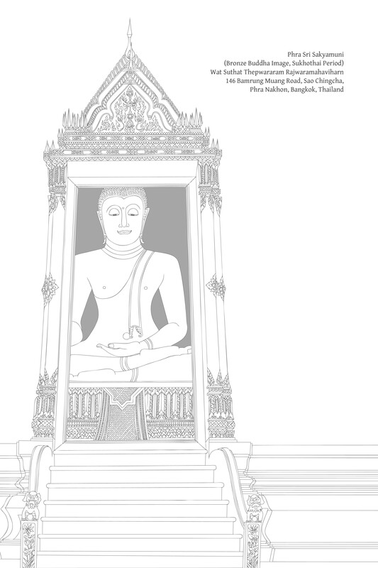

# 第十一章：安乐

## 导论

### 佛法是培育安乐之道

安乐在佛法修行中扮演着至关重要的角色。可以说，佛法修行与安乐密不可分。佛法中描述了多种安乐，并将其划分为不同层次与阶段，最终导向究竟安乐。以下是经文中发现的一些安乐的例子：

*   受用之乐（paribhoga-sukha; upabhoga-sukha）。
    
*   资财之乐（bhoga-sukha）。
    
*   身体之乐（kāya-sukha; kāyika-sukha）。
    
*   心之乐（citta-sukha; cetasika-sukha）。
    
*   感官之乐（kāma-sukha）。
    
*   物质之乐（sāmisa-sukha; āmisa-sukha）。
    
*   非物质之乐（nirāmisa-sukha）。
    
*   时节之乐（utu-sukha）。
    
*   名誉之乐（kitti-sukha）。
    
*   凡夫之乐（puthujjana-sukha）。
    
*   人类之乐（manussa-sukha）。
    
*   天人之乐（dibba-sukha）。
    
*   大众之乐（mahājana-sukha）。
    
*   全世界之乐（sabbaloka-sukha）。
    
*   “甜蜜”或“令人陶醉”之乐（madhura-sukha）。
    
*   善法之乐（kusala-sukha）。
    
*   正法之乐（dhammika-sukha）。
    
*   修习之乐（bhāvanā-sukha）。
    
*   频繁或恒常之乐（nicca-sukha）。
    
*   轮回之乐（saṁsāra-sukha）。
    
*   精进之乐（yoga-sukha）。
    
*   世间之乐（lokiya-sukha）。
    
*   出世间之乐（lokuttara-sukha）。
    
*   轮回轮转之乐（vaṭṭa-sukha）。
    
*   脱离轮回之乐（vivaṭṭa-sukha）。
    
*   粗糙之乐（oḷārika-sukha）。
    
*   微细之乐（sukhuma-sukha）。
    
*   禅定之乐（samādhi-sukha）。
    
*   禅悦（jhāna-sukha）。
    
*   观智之乐（vipassanā-sukha）。
    
*   圣者之安乐（ariya-sukha）。
    
*   非圣者之乐（anariya-sukha）。
    
*   独处之乐（viveka-sukha）。
    
*   寂静之乐（santi-sukha）。
    
*   心解脱之乐（vimokkha-sukha）。
    
*   解脱之乐（vimutti-sukha）。
    
*   觉悟之乐（sambodhi-sukha）。
    
*   究竟安乐（parama-sukha）。
    

就修行的初始阶段而言，佛陀曾说“功德是快乐之名”（功德 = puñña；“善行”，“行善法”）。[\[1\]](#fn-fn1){:id="fr-fn1"}

作者注

> 第二十三章是《佛法》泰文版的新增内容。安乐是一个广受关注的话题。我一直希望能对《佛法》中关于安乐的原始章节进行补充，因为该章节内容复杂，充满了专门术语。2010年2月24日，我受邀在萨功·塔纳米塔博士（Hon. Professor Dr. Sakorn Dhanamitta，健康培育教育项目顾问）80岁生日之际发表演讲。该演讲内容于同年12月以“安乐的各个方面”为题出版，本章是该书的概要。请注意，本章中的许多主题在原始的安乐章以及欲望和动机章（参见第十章）中已有不同深度的探讨。\[译者注：英文版《佛法》中关于安乐的这一章结合了泰文版的两章安乐。尽管这是一项挑战（第二十二章以正式的书面风格呈现，而第二十三章是演讲稿的誊录），我已尝试将这两章编织成一个整合的整体。\]

就禅修而言，安乐是生起定的重要助缘，正如佛陀所证实的：“喜悦之心，易于入定。”[\[2\]](#fn-fn2){:id="fr-fn2"} 在经文中，安乐被描述为定的“近因”（padaṭṭhāna）。当心高度专注并达到禅那状态时，安乐（sukha）是禅那支（jhānaṅga）之一，存在于直到第三禅那。[\[3\]](#fn-fn3){:id="fr-fn3"} 尽管从从严格定义上讲，安乐不是高于第三禅那的定（samāpatti）的禅支，但这些状态仍被视为更微细的安乐形式。[\[4\]](#fn-fn4){:id="fr-fn4"}

最后，佛教的最高目标——涅槃——被描述为一种安乐，即究竟安乐（parama-sukha）。[\[5\]](#fn-fn5){:id="fr-fn5"}

涅槃的一个重要同义词是nirodha（“止息”），它具有三个主要属性：

1.  无明（avijjā）的止息：这等同于至上智慧和见（ñāṇa-dassana）的生起，即对真相的证悟。
    
2.  烦恼（kilesa）的止息：消除心的杂染；终结心中一切导致自身或他人痛苦的根本因素。
    
3.  苦（dukkha）的止息：苦的终结，即证得究竟安乐。
    

尽管第三个属性——苦的终结——在关于“已培育之心”（bhāvita-citta）的章节中已有所描述，但该属性还有几个方面需要考量。[\[6\]](#fn-fn6){:id="fr-fn6"}

此外，佛教的这一最高目标——觉悟（bodhi）或究竟安乐——应通过安乐的方式或通过充满安乐的修行来达成。它不应通过痛苦或折磨苦行的方式来达成。[\[7\]](#fn-fn7){:id="fr-fn7"}

关于佛法的修行，经文描述了各种安乐，同时也描述了每种安乐的功德与过患。它们还比较了各种安乐，以指出何种更胜一筹。经中对各种安乐的比较与阐述，旨在敦促人们在修行中精进，培育更为殊胜的安乐。每个人都有潜力在这些不同阶段的安乐中进步，直至达到至上安乐。

这种对各种安乐的比较表明，尽管较低层次的安乐可能有其有利之处，但它们仍然不完美。它们既有功德（assāda），也有过患（ādīnava）。为了获得清晰的理解并在佛法修行中进步，识别这些功德与过患至关重要。

在此背景下，还有第三个因素：修行者也必须找到出离（nissaraṇa）之道，即一种能摆脱其味著与过患的解脱。简而言之，就是达到一种更优越或更完满的安乐状态。

一个人应该运用这三个原则，专注于特定层次的安乐，通过审视它并辨明其味著与过患。如果安乐仍然存在过患，那么一个人就会问，是否有出离之道，是否有方法超越这种不圆满的状态，是否有方法获得自由和安稳。当遇到这样的出离之道时，修行就能进步。

总而言之，佛教承认许多不同层次的乐，并教导乐需要培育。可以将整个佛法修行定义为对安乐的培育。佛法是一个培育安乐的体系，安乐的培育在佛法中受到高度重视。

### 以安乐证得安乐

人们常常忽视佛法是培育安乐之道。如果遇到诸如“生命是苦”或“一切皆苦”之类的说法，人们可能会认为佛教充满了苦。当人们看到四圣谛以苦（dukkha）开始，或者遇到佛陀关于四圣谛的教言“过去和现在，我只教导苦与苦的止息”时，有些人可能会确信佛教是一种充满苦的宗教。

人们需要不断被提醒，佛陀在教导四圣谛的同时，也阐述了四种作用（kicca）。如果一个人不正确地履行这些职责，那么从一开始就会步入歧途；将无法触及佛法的核心。特别是关于第一圣谛，需要尽可能准确。如果有所帮助，可以记住巴利语短语：Dukkhaṁ ariyasaccaṁ pariññeyyaṁ（“苦圣谛应被遍知”）。

面对苦，我们的责任是全面的理解；苦要被彻底理解。苦是需要通过智慧来处理和解决的事情；它不是用来折磨心而累积的东西。如果一个人经历苦，要运用智慧来处理它并终结它。这是正确修行道路的开端。

可以看看佛陀的一生。在他觉悟之前，他实行了当时苦行者习以为常的严厉苦行和极端禁欲。当他意识到这是一种错误的修行时，他放弃了这些苦行，改采“中道”（majjhimā-paṭipadā），最终证得觉悟。这是一个简要的事件总结。仔细审视《三藏》中的这段记载，可以更清晰地理解整个佛法。

在《菩提王子经》中，佛陀讲述了他在证悟之前曾有过这样的念头：“安乐无法由安乐证得，而是由痛苦证得。”正是因为这个原因，他才出家过着离尘生活。

他随后跟从两位禅修导师在他们的隐居处生活。之后，他以强烈和热切的态度进行了极端的苦行，经历了极度的身体痛苦，但一切都徒劳无功。他意识到不可能通过自苦行来达到至上善法。请注意他在这里的话：“觉悟之道必定另有他途。”他回想起童年时的一件事，那时他独自静坐在阎浮树荫下，达到了初禅，以喜和乐为特征。他彻见到这就是解脱之道，正如他内心所确认的那样：“这确实是觉悟之道。”[\[8\]](#fn-fn8){:id="fr-fn8"}

当他对此问题心意已决时，他自问是否害怕这种远离欲乐与不善法之乐。这是为了验证这种安乐是否包含任何危险。他自信地回答说他无所畏惧。因此，他放弃了极端的苦行，追随了以中道（majjhimā-paṭipadā）为代表的安乐之路，最终达到了觉悟。

一个重要的区别是，当时印度的许多宗教传统都声称“安乐不是由安乐证得的；安乐是由痛苦证得的”。因此，这些传统的信徒们进行极端的苦行（tapa）。然而，佛法教导“以安乐证得究竟安乐”，因此鼓励修行者放弃极端的苦行，这些苦行被归类为自苦行（atta-kilamathānuyoga），并被认为是徒劳无益的。

最基本的乐形式是通过接触外在所缘而产生的，并且依赖于物质事物，因此被称为“感官之乐”（kāma-sukha）。当一个人培育并证得了更高层次的乐时，这种更高级的乐与感官之乐并存。或者，一个人也可以选择完全放弃感官之乐，只安住于更精微的乐之中。

这些更高层次的乐能避免对物质事物的依赖所带来的危险；事实上，它们提供了更大程度的独立性。一个人无需受用物品就能体验乐。请注意佛陀上述的句子：“远离欲乐与不善法之乐。”一个人与善法欲（chanda）一同进步。

在这种促进独立性的正确修行中，智慧是一个至关重要的因素。有了智慧，即使是精微的乐形式，如果长时间持续，也不会使心感到压抑；一个人不会因此而沉醉；一个人不会忘我。真正的乐与自由携手并进，反之，真正的自由也充满了乐。

佛法的诞生之所以如此革命性，据称引起了地震，并使上至最高梵天都感到振奋，原因之一是它引入了“以安乐证得安乐”这种新的视角和生活方式。

佛法的目标——究竟安乐 / 至上安乐（parama-sukha）——伴随着智慧，这智慧通过如实知见来解放心。这是一种真实、独立、安稳的安乐；它无需外求，不依赖外物；它保持不变；无论身在何处，一个人都是光明、喜悦和乐的。所有了知此道的人，便有机会亲身修行并证得。

## 关于安乐的正式教导

### 什么是安乐？

为了培育乐，了解乐的意义和重要性至关重要。简而言之，乐是满足一个人的善法欲和需求，或者简单地说，是一种满足感和满意感。请注意，此定义虽不完备，但涵盖了其广泛而基本的意涵。这是一个关键的定义，因为它包含了大多数人所局限的乐；大多数人并未意识到比这更殊胜的安乐。

想洗澡并且洗完了，一个人会感到满足。想吃饭并且吃完了，一个人会感到满足。一个想玩耍并且玩完了的孩子会感到满足。这是愿望的满足，需求的满足。

从语言学的角度，需要注意的是，一些现代学术研究分支对“欲望”和“需求”进行了区分，并赋予了这些术语不同的定义。在此背景下，我互换使用这两个术语，意义相同。此处更侧重于“欲望”而非“需求”（即一种必需）。

通过将乐定义为欲望的满足，理解欲的本质也很重要。欲望的主题是广阔的。请注意佛陀于此的主要教导：“一切法以欲为根”（chanda-mūlakā sabbe dhammā）。这意味着人类所从事的一切事物都以欲望为基础，起源于欲望。

因此：

*   我们必须清楚地理解欲的本质。
    
*   鉴于乐是欲望的满足，培育乐自然也需要培育善法欲。否则，培育乐是不会成功的。
    

总而言之，善法欲必须被培育。

对欲的本质模糊不清，阻碍了人们清晰地看待事物，难以取得进展，也无法解决问题。这对于所有人类活动都如此，包括正式的学习、戒行和修行。如果一个人未能理解欲的本质，就无法触及事情的本质。

### 欲的本质和重要性

关于欲的专业术语相当复杂。佛陀上述引文中相关的词是chanda，在此可译为“意欲”、“想要”或“愿望”。

“chanda”一词本质上是中性的：它可以用作积极或消极的意义；它可以是善的，也可以是不善的。例如，有欲贪（kāma-chanda）、出离欲（nekkhamma-chanda）、“受用欲”（paribhoga-chanda）、“佛法欲”（dhamma-chanda）等词。

在经文中，chanda一词被分为两种：

1.  渴爱（taṇhā-chanda）：渴望获得、占有、成为、拥有或毁灭的欲望。
    
2.  行动欲（kattukamyatā-chanda）：意欲行动、意欲参与、渴望创造、渴望改进、渴望训练、渴望学习、渴望修行的欲望。
    

前者是消极且不善的（akusala-chanda）；后者是积极且善的（kusala-chanda）。这很容易理解，尽管这些术语相当长且笨拙。

在此，情况变得复杂起来。为了在讲授佛法或日常交流时方便起见，人们常会使用简短、简洁的术语。结果就是：

*   当指代消极、不善的渴爱时，只使用taṇhā这个词（不需要说taṇhā-chanda）。
    
*   当指代积极的善法欲时，只使用chanda这个词（不需要说kattukamyatā-chanda、kusala-chanda——“善法欲”、dhamma-chanda、sabhāva-chanda——“对真理的善法欲”等）。
    

这是一个简单易懂的区别。taṇhā这个词意味着一种负面的渴爱；chanda这个词意味着一种正面的欲求。如果这个区别不清楚，事情就会变得非常混乱。例如，一个人可能会想，如果假设chanda是一个积极的词，为什么欲贪（kāma-chanda）却被描述为消极的。

义注家选用中性词patthanā（“愿望”、“欲望”）与上述两个词结合，从而创造了一个类似的区别：

1.  贪爱之愿（taṇhā-patthanā）：获取的愿望；受用的愿望。
    
2.  善法欲之愿（chanda-patthanā）：善法欲；善法欲。
    

许多人，尤其是佛教徒，一遇到“欲望”这个词，就立即将其贴上坏的或不正确的标签。然后他们会鼓励他人断除渴爱，他们认为欲望是危险的，可能具有破坏性，无论是对个人的修行，还是对社会。

另一些人则走向另一个极端，他们鼓吹渴爱，鼓励人们获取事物并增加财富。有些人甚至提倡贪婪，敦促人们富有、有名、有影响力。他们声称这种对事物的渴望是社会发展所必需的。然而，这并非真正的修行之道，最终只会导致冲突与毁灭。人们通过这种努力所能达到的最好结果，不过是政治与经济皆处于不稳定的发展状态。

这些人代表了两个极端，但他们有一个共同点，那就是缺乏理解。他们不理解欲望的本质，也没有正确地处理欲望。因此，理解并区分不同种类的欲望至关重要。这将带来更大的清晰度。

在粗略概述了两种欲望的区别之后，现在让我们关注它们的一些基本特征：

1.  渴爱（taṇhā）：满足自私需求的欲望，例如：希望为自己获取某物；寻求自我满足；希望亲自消费、获得、成为或避免某物。
    
2.  善法欲（chanda）：专注于所缘内在本质的欲望；寻求事物的健康、美德和完备性。
    

以寺院的自然环境为例。人们走进寺院的林区，看到松鼠在树上跳跃。有些人会为松鼠的魅力和灵巧而欢喜。他们可能会想：“多么令人愉悦的景象。愿这些松鼠健康强壮。愿这个美丽而清新的地方繁荣昌盛。”这样，他们就渴望事物本身的完备。他们拥有一种善法欲。

另一些人看到同样的松鼠，却会想：“这些松鼠肥美多肉。如果我能抓一只，晚上炖汤多好。”在这里，这种欲望是为了自我满足；它是一种不善的欲望，基于渴爱。

另一个例子是，一些学生中学毕业后考虑学医。有的学生想当医生是为了致富、获得荣誉和声望。这是一种自私、不善的渴爱。另一些学生想学医是因为他们希望他人摆脱疾病，获得健康，免受苦难，安稳自在地生活。这种欲望旨在实现当前条件的圆满——在这种情况下是国民的健康——这也是医学专业的明确目的。这是一种善法欲。

当人们的需求和欲望得到满足时，他们就会体验到乐。因此，人们的乐的程度因其欲望而异。那些希望松鼠健康安好的人，当看到松鼠在树间跳跃时，他们的善法欲得到了满足，就会立即体验到喜悦。那些为了口腹之欲而想吃松鼠的人，必须捕捉松鼠，杀死它们，并烹饪它们，才能将其制成一餐；只有这样，他们的贪欲才能得到满足，他们才能体验到欲乐。

从更广阔的角度来看，那些怀有善法欲（chanda）的人喜欢创造繁荣的原因，而那些充满渴爱的人则只是坐享繁荣的果实。有善法欲的人是创造者；有渴爱的人是受用者。前者在创造中体验喜悦；后者在受用中体验欲乐。

在一个具有如此不同倾向的社会中，期望贪爱的洪流自行干涸或善法欲之道盛行，是奢望。能做的最好是平衡这两种力量，防止渴爱的洪流将人们冲入深渊，并支持善法欲的实现。只要有人致力于实现善法欲，人类社会就能进步。此外，支持人们的修行，同时也能增加所有人的乐。

### 喜与乐

上面提到，乐是满足需求，满足欲望。另一种描述这种满足的方式是说渴爱已经平息，类似于解渴或缓解饥饿。当口渴或饥饿得到缓解时，一个人会体验到乐。根据这个定义，安乐是渴爱的平息；安乐即是寂静。

在这个过程中，在心达到构成安乐的平静之前，一个人可能会体验到各种形式的喜悦和愉悦。特别是，一个人可能会体验到pīti（“喜”、“狂喜”、“极乐”），在巴利语中，它常常与乐配对为“喜乐”（pīti-sukha）。辨别这些不同阶段的喜悦和满足，可以更清晰地理解安乐如何等同于寂静。此外，一个人也能认识到这种寂静的本质和价值。

关于上述两个术语，从获得所欲之所缘得到的喜被认为是pīti，而实际享受体验该所缘则是sukha。例如，一个穿越沙漠、口渴疲惫的人，当他看到水或从他人那里听说附近有水时，会感到狂喜。当他到达绿洲的荫凉处，并在水池中饮水和沐浴时，他体验到乐。

静思  
义注提供了一个例子以作说明。[\[9\]](#fn-fn9){:id="fr-fn9"} 一个人穿越了一片贫瘠的荒野，路途遥远。他汗流浃背、饥肠辘辘、口干舌燥。途中，他遇到一个往回走的人，便问前面是否有饮用水。那人告诉他，不远处有一个大池塘，池边有一片树林。听到这个消息，他感到无比高兴和振奋。

他继续往前走，看到路径上散落的莲花瓣、莲叶和莲茎，心里更加欢喜。他继续前行，看到人们衣服和头发都湿漉漉的，听到林中野鸡和孔雀的叫声。当他走近池塘，看到郁郁葱葱的树林和清澈池水中的莲花时，他变得越来越欣喜若狂。

最后，他走进水中，感到一阵极大的清爽。之前那种兴奋感被平静所取代。他痛快地洗澡和饮水，消除了所有的焦虑，然后吃着莲花的根茎和嫩叶，直到饱足。接着，他爬上岸，躺在树荫下，享受着微风的轻抚，对自己说：“啊，真是安乐啊。”

根据这个例子，我们可以看到：

*   这个人从听到池塘和树林的消息，到亲眼看到它们的那一刻所体验到的喜和振奋，构成了pīti，这是一种初步的喜悦，源于即将体验到的所缘。
    
*   他在水中沐浴、解渴、饱腹，并在树荫下休息，这构成了乐（sukha）：实际体验到渴望的所缘。
    

Pīti具有振奋、欣快、活力、狂喜、光彩和充满的特征，这些都是极度积极的品质。然而，无论这种喜和狂喜有多么积极，它尚未完整；它尚未达到究竟目标。最终，它必须以安乐告终并达到顶峰，而安乐正是内在的寂静。如果这种喜尚未平静，它尚未完整；它在平静中达到完整和圆满，这被称为“乐”（sukha）。

事实上，详细而彻底的分析揭示，在pīti和sukha之间还存在着另一种重要的心所。上文我们只关注了欲望的满足，这是获得的一个方面。但更深入的分析也需要审视欲望本身的真实性质。

欲望具有强迫性和扰动性的特质。如果它变得强烈，就会表现为焦虑、压力、躁动，甚至混乱。尽管喜悦（pīti）有所增强，但在达到满足欲望的阶段时，作为欲望的特质并影响身心的焦虑、压力和躁动会减轻和消退。烦躁不安会减少；人会变得平稳和宁静。这种状态被称为“轻安”（passaddhi）。

轻安（passaddhi）是乐（sukha）的近因。因此，在做更详细的区分时，经文将这种有序的进程描述为：pīti → passaddhi → sukha。

基于贪爱的欲求充满了激动、焦虑和压力，因为它建立在妄想的基础上，并由对自我感的执著所滋养。然而，基于善法欲的愿望，则自然伴随着智慧，这能防止或纠正这些心的烦恼。

请注意，除了通过满足来平息欲望之外，还有通过不满足来平息欲望，这是一种相反的有意行为。

但必须小心。如果一个人试图通过阻挠、抵抗、压制或控制欲望来平息它，那么其反作用比寻求满足更为严重。激动和混乱会增加，人可能会发泄挫折或爆发，给自己带来额外的痛苦，并危及他人。这又会导致报复和反击。这种内在的压抑只是一种强制形式；它不是真正的平静。

在修行的初期，对修习的觉察本身在一定程度上有助于应对欲望。虽然在某种程度上，一个人可能会违背自己的意愿而选择不满足的道路，但修习的好处包括一种自我培育的感觉，以及在考验了自己的力量和决心后所获得的喜悦。

还有一些应对欲望的辅助工具：

首先，增强善心所。一个人要确保渴求知识的善法欲（chanda）比渴求放纵的贪爱（taṇhā）更强大。例如，这种善法欲可以阻止一个人翘班去和朋友喝酒。

其次，负面品质被正面品质取代。例如，Paul觊觎John的钱并想偷走它，但他考虑到约翰获得这笔钱是多么困难。约翰已经有足够的麻烦了；为什么要给他制造更多麻烦呢？这种想法产生了慈悲心，渴爱因此平息下来。

就智慧而言，举例来说，一个人看到金子以极低的价格出售。他双眼放光，渴望得到这批金子，但一旦他发现这金子是伪造的，他的渴爱便立即消失。然而，这种认识只是一种基本或虚假的智慧；它只处理眼前的问题。

具足真正智慧的弟子们辨明，金银珠宝，乃至所有物质财富，并不构成生命的真正目的。物质财富不真正属于任何人；它不能给一个人的生命提供真正的安乐或卓越；财富本身和所有众生都受制于自然法则：无常、苦和无我。要从物质事物中获益，必须洞察其真实本性，使其不造成伤害。当一个人敞开自己，迈向真正的自由和安乐时，便能毫不犹豫地放下这些事物。这样的智慧能阻止渴爱生根，并导向真正的寂静。

无论一个人是通过满足来平息欲望，还是通过增强善的品质和运用智慧来避免满足不健康的欲望，由此产生的寂静与平静（santi）本身就构成了安乐。安乐即是寂静。[\[10\]](#fn-fn10){:id="fr-fn10"}

### 通往安乐的两条途径

大多数人兼具渴爱和善法欲这两种“初始资本”。社会中的领导者或那些担任导师（kalyāṇamitta；“善友”）的人应该理解这个事实，并帮助他人既培育善法欲，又防止渴爱的洪流。至少，人们应该防止渴爱的暗流成为压倒性的力量。

关于基本的善法欲（chanda），大多数人都希望他们的环境井然有序、整洁干净。当他们遇到美丽的自然环境时，他们会感到欢喜。他们希望周围环境处于一种完整状态；他们希望人、动物、树木和植物都健康且充满活力。同样地，人们希望自己的身体健康、强壮、清洁，并处于一种完整状态。（这些是区分善法欲和渴爱的有用例子）。

同时，大多数人希望通过接触吸引人且令人愉悦的色、声、香、味、触等所缘来满足他们的欲望。这些统称为物质所缘（āmisa）或“感官所缘”（kāma）。由于这些感官所缘依赖于粗糙的接触形式，并且通常涉及强烈的刺激，因此它们可能非常具有诱惑力。要深入理解，不被这些诱惑所迷惑，需要反复强调。

让我们更深入地比较这两种欲望：

如上所述，善法欲（chanda）始于对事物处于良好和完整状态的愉悦和满足。如果所涉所缘或人尚未处于完整状态，或仅处于部分完整状态，一个人会希望采取行动，以促成其圆满。正是在这种想要采取行动的阶段，一个人达到了chanda的真正本质，这被称为“行动欲”（kattukamyatā-chanda）。

另一方面，不善法欲——渴爱，则表现为对五种感官所缘的贪求，以通过受用事物来获得满足。渴爱是受用的欲望。这是一种纯粹为了自己的利益而获得和占有的欲望。这正是这两种欲望之间关键区别的体现。

当渴爱生起时，它在定义上伴随着一个预设的“拥有者”、“欲望者”、“索取者”或“消费者”，即一个获取、攫取和消费的人，他为了这个所谓的“拥有者”或“消费者”而想要获得事物。这就是自我感的诞生。

善法欲的功能不同；它伴随着对一个所缘的善好和完整感到喜悦和满足。这种喜悦的产生不需要做任何事情。如果所缘尚未处于完整状态，就会渴望它达到这种状态。这种对完整的渴望产生了更高层次的意欲，即希望采取行动来促成完整。

如果一个人不知道如何促成这种完整，自然的因果过程会指导如何回应。对完整的渴望以及探究如何促成完整，导致了对知识的渴望，一种理解的渴望。

上述解释表明了chanda一词的广泛含义。首先，是对事物或人的善好、美丽和完整感到喜悦。其次，是希望这事物或人保持健康、完整或快乐。第三，如果这事物或人尚未达到这种完整状态，则渴望采取行动以帮助促成这种完整。第四，是渴望获得帮助促成完整所需的必要知识。

这里的第一个区别是，善法欲希望事物以一种自然的满足和完整状态存在。当一个人遇到处于此圆满状态的事物或人时，他会立即体验到快乐和满足，例如当他陶醉于自然之美时。这与贪爱不同，贪爱必须等到事物被受用后才能获得满足。

另一个本质的区别是，在善法欲的整个过程中，存在着欲望，但没有“欲望者”的诞生，也没有必须采取行动的主体的诞生。这与渴爱的过程不同，贪爱需要一种自我感：一个受用者、一个拥有者、一个控制者等。如果在以善法欲行事时，心中却生起执着于“我”的观念，这表明与我见相关的烦恼已经渗入。在这种情况下，一种往往会产生的微妙烦恼是“我慢”（māna）。

chanda的本质是渴望行动。因此，这个术语被定义为行动欲。chanda的一个常见定义是chandoti kattukamyatā-chando：“chanda是表现为渴望行动（为了使某事达到善或完整状态）的志向。”这一点需要重申，因为它是人类修行培育的起点。

如果我们具有善法欲，当我们看到我们的房子或寺院干净整洁时，我们会感到欢喜和自在。如果它脏乱不堪，我们会想要打扫它。我们会拿起扫帚清扫地板或地面。如果我们不知道如何清扫，我们会想要学习，并会研究最佳的清扫方法。我们会成为清扫专家，并在清扫时体验到喜悦。这是修行的一个例子，也是善法欲如何成为修行起点的例子。

然而，有了渴爱，这种修习过程就不会开始。当渴爱生起时，一个人希望得到某种东西来消费它。随着受用，过程结束；一个人没有改善自己的愿望。

### 对他人的善法欲

到目前为止，关于欲望的讨论主要集中在人们的工作和活动上，也触及了与环境的关系。然而，为使本次讨论更为完整，还必须审视对他人的善法欲。

如上所述，善法欲（chanda）是希望万事万物都处于良好和完整的状态。这种欲望也延伸到所有有情众生。这种对所有众生，从人类同伴开始的良好祝愿，是希望他人安好、兴旺、健康强壮，并体验到喜悦和安乐。

与他人互动是人们生活中至关重要的一部分。同样地，对他人乃至所有众生的善法欲，在人们的生活中也具有特殊的意义。

这种善愿，或对善的渴望，在涉及到他人和有情众生时，具有独特的属性，与希望无生命事物达到安好和完整状态的愿望不同。因此，在这种情境下，根据具体情况，有几个术语来表示chanda。与其使用chanda一词来指代对人类的善法欲，以下四个术语被使用：

1.  慈（Mettā）：在正常情况下，如果一个人对他人有善法欲——一种善愿——他会希望他们面色红润，身体健康，体验到快乐。这是一种基本的、最初的善愿形式。它是一种专注于他人或有情众生的欲望；它不与个人忧虑纠缠。
    
2.  悲（Karuṇā）：如果一个人遇到另一个不健康、虚弱、痛苦、烦恼，或陷入困境的人（或有情众生），他希望此人摆脱这些痛苦、贫困、苦难或疾病。
    
3.  喜（Muditā）：如果另一个人兴旺发达，一个孩子成长茁壮，某人健康、仪容俊美，或取得了某种真正的成功等，便会为其成就感到喜悦。
    
4.  舍（Upekkhā）：在某些情况下，另一个人能够承担自我责任，或者适合且恰当地让他们承担这种责任。在这种情况下，应该允许他们保持独立，不加干涉。例如，父母可能正在看着他们的学步儿童学习走路。他们希望孩子成长并成功，因此他们保持距离观察而不干预。他们不会被担忧所困扰，并不断地抱着孩子。这里对安好状态的渴望，是对人们成功、善好和正直的渴望。一个人希望他们安住于正直、正确和安全，希望他们存在于真理和正义之中。为了实现这一点，在这些情况下，一个人会克制自己不加干涉。
    

善法欲（chanda）是这四梵住（brahmavihāra）的助缘。换句话说，善法欲在四种不同的情境中表现出来：

1.  当人们安住于正常安乐状态时的一种善愿（=慈）。
    
2.  当人们陷入困境时的一种善愿；希望他们从痛苦中解脱出来，达到安好状态（=悲）。
    
3.  当人们取得成功和成就时的一种善愿；希望他们获得更大的繁荣（=随喜）。
    
4.  当人们有机会行使自我责任时的一种善愿；希望他们安住于正直、公正、安全和正义（=舍）。
    

大多数人只考虑前三种善愿，但这不足够，因为这三个因素仍然局限于“受”的范畴。虽然这些受、情感或情绪是殊胜和高度修养的，但它们尚未完整。只有第四个因素才能带来完整。

简而言之，如果人们只拥有善的情感，无论这些情感多么殊胜或高尚，这都是不够的。这些情感满足个人属性，但尚未与真理——与法——联系起来。虽然这些人是“好”的，但他们可能尚未“正确”。要实现真理，达到真正的正确，消除痛苦，并实现圆满的安乐，一个人还必须拥有知识。

从技术上讲，完成心（citta）的修习是不够的。心所本身并不能带来解脱。一个人必须完成智慧（paññā）的修习，这是解脱和心圆满的决定性因素。前三种善愿局限于心所。第四个因素涉及智慧，它促使心得到真正的运用并导向解脱。

总而言之，虽然人们可能拥有积极的情绪，但他们需要智慧来调节、提炼和提升这些情绪。[\[11\]](#fn-fn11){:id="fr-fn11"} 第四种舍心构成了这种与智慧的联系。

如果人们缺乏智慧，他们就无法解决生活中的问题。即使他们拥有德行和善的情感，他们也可能错误地运用这些情感，并做出不善的行为。

假设一个小偷偷了2000美元。从一个角度看，他成功了；他得到了钱并体验到了一些欲乐。一个人应该如何回应呢？根据随喜的因素，一个人为他的得手而高兴。然而，这是不正确的。在这里，一个人停留在情感层面，背离了真正的佛法修行。尽管情感是积极的，但它们可能导致麻烦。人们可能会因此纵容偷窃，给社会带来各种问题。

在这里，智慧带来了心的整合和平衡。这里所说的舍心是希望他人拥有正直和正确。

舍心作为善法欲的一种表达，是希望他人安好和完整。为了达到完整，人们必须与佛法、与正义保持一致。一个人安住于舍心，以使正确和正义按照自然法则运行。

前三种因素，即慈、悲、随喜，保护个体；第四种舍心也守护真理。如果他人违反真理，那么一个人就应该维护和保护真理，维护公正和廉洁。

圆满在于舍，这是一种与慧相连的心境。舍心旨在平衡此四梵住。根据佛教教义，这四个因素确实是天人的力量，即它们代表梵天（最高神性）并保护世界。

## 智慧地受用感官之乐

### 不同层次的乐

佛陀说，他已证得一种超越感官（kāma）的殊胜之乐，因此他可以断言，他不会再回过头去寻求感官之乐。如果他没有体验过这种殊胜之乐，他就无法做出这样的断言。

佛陀接着说，即使一位圣弟子能够以正智清楚地辨明感官之乐只有微小的甜美，却伴随着许多痛苦——许多烦恼和过患——如果他尚未体验到超越感官的殊胜喜悦和乐，那么他仍然无法自信地说他不会再回去寻求感官之乐。[\[12\]](#fn-fn12){:id="fr-fn12"}

同样地，他特别告诫比丘们，如果一个出家之人尚未品尝到超越感官欲望的殊胜喜悦和乐，那么各种烦恼，如贪婪、恶意、躁动、懒惰和无聊，仍然有可能淹没其心。[\[13\]](#fn-fn13){:id="fr-fn13"} 这样的人将不会乐于梵行，或无法忍受梵行生活。

除了说明佛教对安乐的重视外，这些引文也揭示，圣弟子放弃感官之乐，并非因其毫无乐趣，也不是因佛教教导要禁绝乐。佛法承认各种乐的真实存在；它鼓励人们修行以获得乐，并且它认识到感官之乐是乐的一种形式。[\[14\]](#fn-fn14){:id="fr-fn14"}

圣弟子们放弃感官欲望，是因为他们看到，尽管感官之乐本身具有乐趣，但它仍然与大量的痛苦交织在一起。更重要的是，存在一种更深层次的乐，超越了感官之乐，超越了受用世间种种愉悦外缘所得的欲乐。圣弟子们放弃感官欲望，是因为他们品尝过这种更精致的乐。

因此，乐有不同的层次；这里我们可以考察佛教是如何对它们进行分类的。

《增支部·二集》将安乐分为各种类型和程度，提供了一长串的成对列表，包括：在家之乐与出家之乐，感官之乐与出离之乐，世间之乐与出世间安乐，以及圣者之乐与凡夫之乐。[\[15\]](#fn-fn15){:id="fr-fn15"}

对各种安乐层次的清晰而详细的分类是关于十种乐层次的教导，这在《三藏》中多处可见：[\[16\]](#fn-fn16){:id="fr-fn16"}

1.  感官之乐（kāma）：依赖于五欲（kāma-guṇa）的欲乐。[\[17\]](#fn-fn17){:id="fr-fn17"}
    
2.  初禅之乐，远离感官和不善法，由寻（vitakka）、伺（vicāra）、喜（pīti）、乐（sukha）和一心（ekaggatā）组成。
    
3.  二禅之乐：二禅之乐，由喜（pīti）、乐（sukha）和一心（ekaggatā）组成。
    
4.  三禅之乐：三禅之乐，由乐（sukha）和一心（ekaggatā）组成。
    
5.  四禅之乐：四禅之乐，由舍（upekkhā）和一心（ekaggatā）组成。
    
6.  空无边处定之乐（ākāsānañcāyatanasamāpatti-sukha）；在此定境中，一个人超越了色想（rūpa-saññā）、瞋恚想（paṭigha-saññā），并且不作意种种想（nānatta-saññā）；一个人只将注意力导向空间的无限。
    
7.  识无边处定之乐（viññāṇañcāyatanasamāpatti-sukha）；在此定境中，一个人以识的无限作为其注意所缘进行禅修。
    
8.  无所有处定之乐（ākiñcaññāyatanasamāpatti-sukha）；在此定境中，一个人以无所有之状态作为其注意所缘进行禅修。
    
9.  非想非非想处定之乐（nevasaññānāsaññāyatanasamāpatti-sukha）。
    
10.  想受灭尽定之乐（saññāvedayitanirodhasamāpatti-sukha）。
    

可以将这十种乐简化为三个层次：[\[18\]](#fn-fn18){:id="fr-fn18"}

1.  感官之乐（kāma-sukha）。
    
2.  禅悦（jhāna-sukha），或与与八定相关的乐（aṭṭhasamāpatti-sukha），可进一步分为两个子类别：
    
    1.  与四色界禅那相关的乐。
    
    2.  与四无色界禅那相关的乐。
    
3.  灭尽定之乐（nirodha-samāpatti）。
    

所有这些上述的乐都被承认为构成乐，但它们被视为代表着渐次更精致和更优越的安乐形式。最初层次的乐仍然包含有害的方面，并与痛苦交织在一起。更高层次的乐则更精致和纯粹。

经文教导人们如实地认识这些乐，包括它们的愉悦方面和与痛苦交织的方面，它们的功德（assāda；积极方面）和过患（ādīnava；消极方面），它们的功德和过患。此外，它们揭示了出路、解脱（nissaraṇa），即从所有有条件的乐状态中获得自由，这种自由独立于功德与过患。

当一个人看到粗显之乐的危险时，他会对其感到厌倦，并向往更精致的乐。当他亲身见证了精致的乐形式时，他会放弃粗糙的形式，寻求更殊胜的乐。至少，他不会过度沉迷于粗糙的欲乐。

每当人们以决定性的方式获得解脱，心烦的束缚被彻底切断时，他们将永远不会再回头寻求粗显的欲乐。[\[19\]](#fn-fn19){:id="fr-fn19"} 他们将只体验与解脱心相应的精致安乐。体验这些渐次更精致的乐是佛法修行进步的一个特征。

### 欲乐与更高层次的安乐

以下是一些有助于阐明上述主题的教导：

> 比丘们，有这五种感官所缘 (kāma-guṇa)：眼所识知的色……耳所识知的声……鼻所识知的香……舌所识知的味……身所识知的触，它们是可爱、可乐、可意、合意、诱人、激发渴爱的。这些就是五种感官所缘。现在，依赖这五欲而生起的乐和喜，就是欲乐方面的满足 (assāda) ……  
> M. I. 85
> 
> 这种乐和喜……被称为欲乐 (kāma-sukha)。  
> M. II. 42-3; S. IV. 225; A. IV. 415-16; Nd. II. 66-7
> 
> ‘kāma’这个词指的是两件事：可欲的所缘（vatthu-kāma），以及烦恼欲 (kilesa-kāma; 滋生渴爱的烦恼)。什么是诱人的物质所缘？令人愉悦的色、声、香、味、触；地毯、毯子、男女仆人、山羊、绵羊、鸡、猪、大象、牛、马、驴、稻田、土地、银、金、房屋、村庄、王城、省份、国家、军队和皇家宝藏——凡是作为执著基础的物质所缘，都称为可欲的所缘。此外，所有存在于过去、现在和未来的欲求所缘；存在于内、外、或内外兼具的；那些低劣的、中等的、以及殊胜的；那些属于恶趣众生、属于人类、以及属于天人的；那些即时可得的 (paccupaṭṭhitā)、那些自造的 (nimmitā)、以及那些他造的 (paranimmitā)；那些已拥有和未拥有的；那些被觊觎和未被觊觎的；那些完全属于欲界 (kāmāvacara)、那些完全属于色界 (rūpāvacara)、以及那些完全属于无色界 (arūpāvacara)——所有这些作为贪爱基础、贪爱所缘的，都因是欲的基础、迷恋的基础而被称作欲求所缘。所有这些都被称为可欲的所缘。而什么是烦恼欲？欲是欢喜，欲是贪，贪著是欲；思量 (saṅkappa) 是欲……贪欲的专注是欲；欲贪 (kāma-chanda)、欲染 (kāma-rāga)、欲喜 (kāma-nandi)、欲爱 (kāma-taṇhā)、欲缠 (kāma-sineha)、对欲乐的炽热、对欲乐的迷恋、对欲乐的痴迷、欲念覆盖心、欲念束缚心、执取欲乐、欲贪盖、语句中的欲念：“看啊，欲念，我看见你的源头——你从意图而生。我将不再受你困扰；通过这样做，你将不再存在”——所有这些都被称为烦恼欲。  
> Nd. I. 1-2, 28
> 
> 比丘们，胎儿在母胎中的结生是通过三件事的结合而发生的。当父母结合，并且是母亲的受孕期，并且有待投生的众生存在时，通过这三件事的结合，胎儿在母胎中的结生就发生了。然后，母亲怀胎九到十个月，冒着生命危险，承受着沉重的负担。接着，在九到十个月期满时，母亲冒着生命危险，承受着沉重的负担分娩。她随后用自己的血滋养新生儿；因为在圣者的教法中，母亲的乳汁被称为“血”。[\[20\]](#fn-fn20){:id="fr-fn20"}  
> M. I. 265-6
> 
> “一个仰卧的小婴儿，甚至玩弄着自己的尿和粪便。你们认为，那对那个婴儿来说难道不是完全的乐趣吗？‘是的，尊者。’‘过了一段时间，待那孩子长大，身心渐熟时，他便玩些典型的童年游戏——玩具犁游戏、棍棒游戏、翻筋斗、风车游戏、沙子量具游戏、玩具战车游戏、玩具弓箭游戏。你们认为，这种快乐难道不比前一种更殊胜、更精致吗？‘是的，尊者。’‘再过一段时间，当那个男孩继续长大，感官进一步成熟时，他享受着具足五种感官所缘：可爱、可乐、可意、合意、诱人、激发渴爱的色……声……香……味……触。你们认为，这种感官之乐难道不比前一种更殊胜、更微细吗？‘是的，尊者。’”[\[21\]](#fn-fn21){:id="fr-fn21"}  
> A. V. 203

在居士中，最殊胜的人是转轮圣王（cakkavatti），他拥有无上权力，并拥有丰富的物质财富。根据佛法，这样的人也具足殊胜的功德。因此，转轮王被认为是拥有最大乐的人，比其他人类普遍体验到的快乐更大。佛陀提及转轮王的乐，是为了描述 (普通) 人类快乐最完整的形式，并将其与各种其他层次和程度的乐进行比较，揭示它们相对的微妙和深奥之处。

根据理想的描绘，转轮王拥有七宝 (ratana) 和四种成就 (iddhi)。七宝如下：

1.  一宝轮，象征着正法且合法的王权。它使君主能以正法治理，广受拥护，从而将和平的疆域扩展至四海。
    
2.  一宝象，它能够迅速地将君主运载到整个大陆，以视察其国土。
    
3.  一宝马，它同样能够迅速地将君主运载到整个大陆，以视察其国土。
    
4.  一宝珠，它能将光芒辐射到很远的地方，使君主能够在夜间调动军队，或让国民在夜间工作，如同白昼一般。
    
5.  一宝女，她除了身体和肤色比所有其他女人都美丽超凡之外，还拥有美妙的触感，被形容为“如棉花或绒毛般温柔柔软”。她身体寒冷时会变暖；炎热时会变凉。她的香气甜美如檀香；她的呼吸如莲花的芬芳。此外，她言语悦耳，并知道如何满足君主的所有愿望。
    
6.  一宝藏臣，他拥有天眼；他能够在所有地方发现财富来源，并能找到君主所希望的任意数量的金银。
    
7.  一宝大臣，他拥有卓越的治国才能。除了在公务上提供正确建议外，他还能够指导各种工作项目，并代君主颁布皇家诏令。
    

转轮王的四种成就如下：

1.  他的外貌比所有其他人更英俊、更威严；
    
2.  他的寿命比所有其他人更长；
    
3.  他健康强壮，少病少痛；
    
4.  他的臣民对他忠诚；他们爱他如同孩子爱父母，而他爱他们如同父亲爱孩子。当他出宫巡游时，民众会迎接他，并希望尽可能多地与他共度时光；他也希望与他们共度时光。
    

这样一位君主的乐和喜悦超越了其他人，包括前文引述中提到的年轻人。然而，佛陀说，无论转轮王的乐有多么巨大，与天界的乐相比，它都是微不足道的——甚至是不值一提的。这就像将一块巴掌大小的小石头与巍峨的喜马拉雅山脉相比。[\[22\]](#fn-fn22){:id="fr-fn22"}

尽管天界之乐 (dibba-sukha) 是一种高层次的欲乐，远超人类的感官之乐，但还存在一种比这更殊胜的乐。后者的这种殊胜安乐独立于感官之乐和外在的满足的所缘。那些体验过它的人，在看到别人享受丰盛的感官之乐时，不会感到嫉妒或欲求。这类似于天人，他们对人类低级的快乐不感到嫉妒或喜悦。此外，这些个体甚至不渴望天人之乐，因为他们已经体验过一种更优越的乐。

在这种情况下，佛陀讲述了他自己的经历：[\[23\]](#fn-fn23){:id="fr-fn23"}

> “因此，摩犍提，过去当我在家生活时，我享受着具足五种感官所缘所带来的感官之乐：可爱、可乐、可意、合意、诱人、激发渴爱的色……声……香……味……触。我拥有三座宫殿，一座用于雨季，一座用于冬季，一座用于夏季。我在雨季宫殿中度过了四个月的雨季，与全为女性的乐师一同享乐，四个月都没有走出宫殿。“后来，我如实地了知了欲乐的生起、消逝、味著、过患与出离，从而舍弃了对欲乐的渴爱，熄灭了对欲乐的炽热，我安住于无渴爱，内心平静。“我看到其他未从欲乐的渴爱染污中解脱的众生，被欲乐的渴爱所吞噬，被欲乐的炽热所燃烧，沉溺于欲乐之中，我既不嫉妒他们，也不因此感到喜悦。为什么呢？因为我喜悦于远离欲乐、远离不善法的安乐。因此，我不嫉妒低层次的欲乐，也不因此感到喜悦。“假设，摩犍提，一位富有的居士或居士之子，拥有巨额财富和财产，具足五种欲功德，他可能会享乐……他行为良好……可能会在善趣投生，在三十三天神众中；在那里，被一群仙女围绕在欢乐园 (Nandana Grove) 中，他会享受着具足五种天人妙欲的天人之乐。假设他看到一位居士或居士之子正在享受着具足五种感官所缘所带来的感官之乐。你认为会怎样？那位年轻的天神……会嫉妒那位居士或居士之子的五种感官所缘吗？会喜悦于五种人类的感官享乐吗？或者会怀念人类的感官享乐吗？’‘不会的，乔达摩大师。为什么不呢？因为天人的欲乐比人类的欲乐更殊胜、更优越。’‘同样，摩犍提……我既不嫉妒他们，也不因此感到喜悦……因为我喜悦于远离欲乐、远离不善法的安乐，这超越了天人之乐。因此，我不嫉妒低层次的欲乐，也不因此感到喜悦。”  
> M. I. 505-506

### 欲乐的过患

什么是 kāma (欲)？如上述引文所示，“kāma”一词有两种定义。首先，它可以指“欲求”、“情爱”、“渴爱”或“渴望”。其次，它可以指“欲求的所缘”、“情爱的所缘”、“贪欲的所缘”、“渴望的所缘”、“满足的所缘”、“刺激快乐的事物”、“提供欲乐的事物”。第二种定义指的是人们为了获得快乐而拥有或执持的任何人、生命、物质财富、个人财产等。总而言之，这些所缘被归类为五种感官所缘 (kāma-guṇa)：可爱、能提供欲乐 (kāma-sukha) 的色、声、香、味、触。欲乐依赖于五官和物质事物；它也可以被称为“身体的乐”或“物质之乐” (sāmisa-sukha 或 āmisa-sukha)。

欲乐有许多种类和程度，包括殊胜的天人之乐，所有这些都被认为是安乐的形式。在这里，我们将重点关注欲乐的缺陷和至上安乐的优势。我们可能会问，为什么那些体验过更精致乐的人声称它优于欲乐，甚至完全放弃欲乐。

欲 (kāma) 的过患 (这里将此词的两种定义结合起来，即欲求和欲求的所缘) 可以从三个角度来看：与个体相关的、与 kāma 本身相关的，以及与沉溺于感官之乐的人的社会行为相关的。

就个体而言，人们可以通过与感官所缘的不当关系，在自身内部产生痛苦。通过对周围世界的不正确行为，他们将事物变成欲求的所缘，并给自己带来痛苦。

就 kāma 本身而言，人们可以辨识出那些人们所追求事物的缺陷，也可以辨识出从这些事物所获得的享受和满足中固有的缺陷。

就人们的行为而言，人们可以看到那些寻求并沉溺于欲乐的人如何与社会互动。

请注意，尽管这三个方面可以区分开来，但它们实际上是相互关联的。

#### 个体

这里重点关注根据缘起 (paṭiccasamuppāda) 创造痛苦的过程。这始于对各种感官所缘的认知，随后是对这些事物产生错误的作意。一个人不断地让事物流向无明和渴爱的道路，直到这个过程成为习惯。我们可以称之为对痛苦的习惯性偏好或制造问题的倾向。佛陀在描述人类成长时提到了这个过程，从母胎中的受孕开始，直到一个人成年。这部分成长过程已在前面引述；这里，我们继续这个描述：

> 当那个孩子长大，感官进一步成熟时，他享受着具足五种感官所缘所带来的感官之乐……当他用眼睛看到色时，如果它令人愉悦，他就会贪恋它；如果它令人不悦，他就会厌恶它……当他听到声……闻到香……尝到味……触摸到触觉所缘……识知到意所缘所缘时，如果它令人愉悦，他就会贪恋它；如果它令人不悦，他就会厌恶它。他安住于身念住未建立，心狭隘，他不如实地理解心解脱与慧解脱，其中那些已生起的恶不善法会无余地止息。由于他沉溺于喜乐和厌恶之中，无论他受到何种受——无论是乐受、苦受或不苦不乐受——他都沉溺于那种受，依恋它，并为它所困扰。当他这样做时，喜 (nandi; 渴爱) 便在他心中生起。现在，对受的喜 \[转化成\] 取。以取为缘，有生起；以有为缘，有生；以生为缘，老死；忧、悲、苦、恼、绝望全都生起。这整个苦蕴就是这样生起的。[\[24\]](#fn-fn24){:id="fr-fn24"}  
> M. I. 266

#### 欲 (kāma) 本身

这里着重关注欲贪和欲贪所缘的缺陷。佛陀经常使用以下类比来说明欲 (kāma) 提供的满足相对较少；相反，它会带来许多痛苦和过患：

*   欲如同被扔了一块带血骨头的疲惫饥饿的狗。它会啃咬骨头，直到它疲倦虚弱，却没有任何真正的满足或饱足感。
    
*   欲如同嘴里衔着肉的秃鹫或鹰；其他猛禽会成群俯冲下来，把肉抢走。人们对物质事物没有绝对的所有权；其他人可以抢走它们。许多不同的人渴望同一个所缘，从而引发竞争、冲突、压迫，甚至杀戮。如果一个人不知道如何负责任地对待感官所缘，他就会经历痛苦和折磨。
    
*   欲如同一个人手持燃烧的草火把，逆风而行。不久他将不得不扔下火把，否则他的手、手臂和身体将被烧伤，导致重伤甚至死亡。
    
*   欲如同一座炽燃的炭火坑。一个珍爱生命的人知道，如果他掉进去，他会死亡或受重伤。他不想掉进去，但一个强壮的人抓住他的手臂，慢慢地将他拖向火坑。
    
*   感官所缘如同一场光彩夺目的美梦。不久，影像消退并消失；醒来时，他什么也看不见，只剩下一种痛苦的感觉。
    
*   感官所缘类似于借来的财物，一个人炫耀它们以显得花哨和聪明。其他人会羡慕它们，但一个人只能暂时拥有它们，并且带着一种疑虑感；一个人对它们没有真正所有权。当真正的所有者 (即自然) 要求它们归还时，一个人必须归还它们；没有任何妥协。一个人剩下的一切只是自己的身心，它们不断地生灭。
    
*   感官所缘类似于森林边缘一棵结满丰盛果实的树；那些路过并渴望果实的人会不择手段地获取它。那些有能力的人会爬树摘果，而那些不能的人会使用其他方法；如果他们愚蠢或心怀恶意，他们会把整棵树砍倒。如果树上的人没有及时下来，树会倒在他们身上，导致受伤甚至死亡。[\[25\]](#fn-fn25){:id="fr-fn25"}
    
*   感官所缘类似于砧板。随便玩弄它们就如同冒着生命危险被砍或被劈。
    
*   感官所缘类似于矛或长枪；它们倾向于刺和穿透，使人受伤。
    
*   感官所缘类似于蛇头；如果一个人暴露于它，他必须总是生活在不信任中；他无法真正感到安全或自在。蛇随时可能袭击，使人处于持续的危险之中。[\[26\]](#fn-fn26){:id="fr-fn26"}
    

欲 (kāma) 的过患可以概括如下：欲乐的所缘只能在体验它们的短暂时间内提供可欲的甜美、美味和享受，但这些所缘，如果处理不当，最终会长期造成剧烈的痛苦和困扰。此外，这种欲乐的消退和逝去可能会引起悲伤和折磨，导致长期的悲痛。

#### 社会行为

这里，对渴爱过患的审视始于谋生和寻求物质所缘以供使用和消费时固有的痛苦、艰辛和逆境。每个人都必须忍受气候的艰辛以及谋生时的身心疲劳。有些人贫困到在寻求物质时失去生命；有些人工作非常努力，与障碍和疲惫作斗争，但却不成功；他们没有赚到钱或破产，导致悲伤和痛苦。即使获得了这些东西，在试图保护它们时也会有痛苦。有些人会经历诸如被小偷偷走财物或被火烧毁等不幸，给他们带来额外的困扰。

当无知的人获得物质财产时，他们会被它们奴役。他们为自己的财产而自豪——这些财产最终是虚幻的，没有固有的持久存在——他们看不起他人，从而增加了社会的苦难。有些人嫉妒他人的财产，导致争执、竞争和各种形式的压迫。

巴利三藏中的这段话阐明了这种人际冲突：“诸王互相争执，贵族与贵族争执，婆罗门与婆罗门争执，商人与商人争执，母亲与孩子争执，孩子与母亲争执，父亲与孩子争执，孩子与父亲争执，兄弟与兄弟争执，姐妹与兄弟争执，兄弟与姐妹争执，朋友与朋友争执。”这种冲突可能演变为肢体打斗甚至谋杀。

受各种个人利益的驱使，并被渴爱所煽动，人们拿起武器发动战争：互相射击、刺杀和轰炸。同样，他们从事各种形式的不戒行，如偷窃、入室盗窃、通奸和强奸。当他们被捕时，会受到各种惩罚。当他们死亡时，他们必须在苦难之地、恶趣、下界和地狱中经历进一步的折磨。所有这些行为和结果都是由于渴爱。[\[27\]](#fn-fn27){:id="fr-fn27"}

那些明辨欲 (kāma) 的上述缺点和危险，并体验过一种更殊胜的安乐，以至于不再渴望感官享乐所缘的人，也洞察了欲乐 (kāma-sukha) 的真实本质。佛陀通过另一个类比解释了这个问题，如下：

想象一个麻风病人，他的身体被疾病深度感染，布满了疮口。他用指甲抓挠痂皮，为了缓解痛苦，他在炭火坑上烤自己的肉。后来，一位医生治愈了他的这种疾病，使他能够安逸地生活，并随心所欲地活动。他看到其他麻风病人抓挠伤口、烧灼身体、服药治疗，但他对这些人不感到喜悦或欢欣。这类似于那些过去沉溺于感官之乐所缘的人。当他们后来放弃对感官之乐的渴爱，体验到一种独立于感官之乐且甚至优于天人之乐的内在平静与安乐时，他们在看到他人沉溺于感官之乐时，不会感到喜悦或渴望。

如果一个强壮的人抓住一个已康复的麻风病人，并将他拖向火坑，他会挣扎着逃脱，因为火的炽热。与火的接触现在被认为是痛苦的，而以前，当他患有麻风病时，他会自愿寻求同样的炽热之火来烧烤自己的肉，并且他认为这种接触是愉悦的。这是因为患有麻风病的人感官受损，导致在面对火时产生想颠倒（saññā-viparīta），将苦受经验为乐受。欲乐也是如此。

实际上，所有形式的感官之乐都伴随着苦触，并以烧燃为特征。然而，人们通常被对感官之乐的渴爱所感染，并且拥有受损和有缺陷的感官，从而对感官之乐产生扭曲的认知，将实际的苦受体验为乐受。[\[28\]](#fn-fn28){:id="fr-fn28"}

麻风病人抓挠和烧灼他的疮口越多，它们就变得越脏越腐烂。他的欲乐源于抓挠伤口，或者存在于被抓挠的伤口之处。只要他没有从这种瘙痒中痊愈，他就无法知晓一种更殊胜的安乐。他将被困在抓挠中——一个人如何向他介绍一种不涉及抓挠瘙痒的安乐呢？但是当他从这种疾病中痊愈并健康时，他将能够知晓一种更殊胜的安乐，从那时起他将不再渴望通过抓挠瘙痒获得的欲乐。

对欲乐而言，也是如此。当那些被对感官之乐的渴爱所染污的人体验欲乐时，他们的渴爱会加剧。此外，他们的欲乐源于并局限于五种欲乐所缘。如果他们尚未从对感官之乐的渴爱感染和炎症中痊愈，他们就不可能知晓一种更殊胜、更精致的安乐。在这种烦躁不安的状态下，如何才能让他们体验到一种独立于外在感官所缘的内在安乐呢？

但是，当对感官之乐的渴爱不再啃噬他们，并且他们从渴爱的诱惑中解脱时，他们将能够体验到一种殊胜、内在的安乐。这被称为没有疾病，没有心理困扰，或者圆满的心健康，这也是涅槃的定义之一。[\[29\]](#fn-fn29){:id="fr-fn29"}

在《释迦经》中，佛陀与一群释迦族居士对话。[\[30\]](#fn-fn30){:id="fr-fn30"} 在被询问后，释迦族人承认，一个正当地谋生并戒除一切不善法，结果每天赚取半个钱币、一个钱币、两个钱币——一直到五百个钱币——的人，值得被称为一个精进的人。

然而，即使这样一个精进的人将他的收入储存一百年，积累了大量的财富，这笔财富也无法为他提供一天甚至半天的纯粹、不间断的欲乐。这是因为欲乐的所缘是无常的、无实的、没有任何持久的真实性，易于消失和衰败。这与那些按照佛陀教导修行并证得果位的人不同，后者能够长时间安住于纯净、无杂染的安乐中。

### 抓痒的欲乐与痊愈的安乐

为了帮助回顾佛法对快乐的看法，让我们再次审视《摩犍提经》中的段落。这部教法概述了快乐的培育，从婴儿体验到的快乐直到涅槃的至上安乐。在这部经中，佛陀描述了人们生活中对各种快乐的追求和体验：

首先，一个刚出生的婴儿，躺在摇篮里，可能会因为涂抹自己的尿液和粪便而咯咯笑并感到喜悦。

几年后，这个孩子不再从这种活动中获得乐趣。相反，他或她喜欢在沙盒或泥土中玩耍，并喜欢玩玩具，比如洋娃娃或迷你汽车、火车或飞机。孩子们从玩具中获得巨大的喜悦，珍惜并执著于它们。有些孩子有一条最喜欢的毯子，无论它多么破旧或脏污，他们都强烈地珍惜它。如果有人试图把它从他们身边拿走，他们会尖叫，仿佛性命攸关。

孩子们随后成长为年轻人，此时这些玩具不再被视为有趣；它们无法给他们带来快乐或满足。相反，人们通过感官接触，通过色、声、香、味和触觉所缘来获得另一种层次的欲乐。

从这里，安乐可以进一步培育。然而，如果人们未能培育出更高形式的快乐，而停留在欲乐的层次，不久他们就会经历不可避免的绝望，或者至少他们将不再能够享受这些欲乐，并将遭遇巨大的痛苦和折磨。

那些培育出更高形式快乐的人体验到一种不依赖于可意感官所缘的微细喜悦。他们达到了一种自由、无拘束的安乐，并真正地获得了解脱。

当这些解脱者观察其他沉溺于欲乐的人时，他们不再将这种欲乐的享受视为一种满足。他们对欲乐的态度已经改变，类似于成年人看待孩子们玩玩具时的态度。尽管他们理解这种喜悦，但他们会带着幽默或同情来看待它。

如前所述，佛陀用麻风病人的比喻来描述这种安乐的培育。麻风病人因疾病而感到极度瘙痒。结果他们抓挠伤口，但这抓挠只会加剧瘙痒。他们抓挠得越多，就越痒；越痒就抓挠得越多。此外，他们从抓挠中获得一种欲乐感。由于不适，他们还寻求通过火烧灼伤口来缓解痛苦。他们通过烧灼自己来获得欲乐和满足，而普通人会觉得这无法忍受。

佛陀曾经问一位婆罗门，如果一位麻风病人遇到一位拥有有效药物的医生，从而治愈了这种疾病，会发生什么。这位治愈了麻风病的人还会寻求抓挠的欲乐或渴望用火焰烧灼自己吗？婆罗门回答说，恰恰相反。如果有人抓住这个人，把他拉向火焰，他会拼命挣扎逃脱。佛陀指出快乐的培育是相似的。一个体验过超越欲乐的安乐的人，不再将感官所缘的享受视为满足的来源。

可以说，相当一部分人类从抓痒中获得欲乐。那些已培育到另一个层次的人则从没有瘙痒中获得安乐。请思考这两种乐中哪一种更殊胜。

一个身体健康、没有生病的人，会把这种健康、安好的状态看作是乐吗？难道这种没有疾病、没有痛苦、没有擦伤、发痒和身体疼痛的状态不是一种真正的安乐吗？[\[31\]](#fn-fn31){:id="fr-fn31"}身体健康、没有虚弱和烦恼，所有器官都运转良好的状态，是一种固有的乐。确实，这种健康、这种无病，是所有人渴望的一种基本、原始的安乐。

无论人们追求何种安乐，也无论他们的物质财富多么丰厚，如果他们缺乏身体健康，他们的感官享乐所缘就会逐渐失去重要性。无论他们的感官享乐所缘多么丰足，如果人们被身体疾病所损害或摧毁，这些东西就会失去所有价值。而且，如果他们的乐寄托在这些东西上，疾病只会加剧痛苦，导致心的病痛。

让我们将注意力转向内心。一个满足、广阔、喜悦、光明，没有烦恼和不安的心，本身就是完整的。这种心境本身就是乐，就像身体健康是一种乐一样。事实上，这种乐甚至比身体健康更大，但由于心的微细性，大多数人难以洞察它。

以一个身体健康的人为例。如果他处于巨大的内心痛苦中，再多的物质享受也无法给他带来乐。相反，那些内心光明、愉悦、自由的人，即使没有任何事情发生，即使他们处于最普通和日常的环境中，他们也感到乐。

### 无过失地受用欲乐

通常来说，感官欲乐和更精微的乐是不相容的。这是因为感官之乐与唤起和刺激感官所缘相关联，伴随着激动和焦虑，并且依赖外部事物来满足。而精微的乐则始于内心的平静。例如，禅那之乐产生于心最初远离感官欲乐、远离不善法时。

因此，普通人很难同时享受欲乐和更精微的乐，尤其是禅那之乐，因为他们无论对什么感到喜悦，也往往会执着和沉溺其中。当他们被感官欲望的力量搅动和迷惑时，他们就很难进入禅那之乐。有许多关于隐士和出家人因沉迷于欲乐而堕离禅那的故事。只有当一个人是圣者，从须陀洹果开始，才能安全地享受欲乐。因此，佛陀反复鼓励人们培养智慧，并与欲乐建立适当的关系；只有这样，才能摆脱其力量和影响。

在《帕沙拉西经》（Pāsarāsi Sutta）中，佛陀将五欲比作猎人的罗网。此教导涉及三类沙门和婆罗门：[\[32\]](#fn-fn32){:id="fr-fn32"}

1.  第一类：那些以执着、迷恋和沉溺的方式享受五欲功德（kāma-guṇa），没有洞察其危险，也没有解脱智慧的沙门和婆罗门。他们类似于被捕获在罗网中的鹿；他们将遭遇堕落和毁灭，被猎人——邪恶的魔罗——屠杀。
    
2.  第二类：那些没有执着、迷恋和沉溺的方式享受五欲功德，并洞察其危险、拥有解脱智慧的沙门和婆罗门。他们类似于躺在罗网之上但没有被捕获的鹿。他们不会遭遇堕落和毁灭，也不会被猎人带走。
    
3.  第三类：那些远离感官欲乐、远离不善法，已证得色界和无色界禅那，以及想受灭尽定（saññāvedayita-nirodha），并已断尽烦恼（即已体验到至上安乐）的比丘。他们被称为使魔罗失明，魔罗因此无法看到他们的任何踪迹。他们类似于在广阔森林中自由自在漫游，不被猎人察觉的鹿。
    

从这部经中可以看出，佛陀不仅仅教导放弃对感官所缘的执取。他还教导了如何正确地对待这些事物，通过保持对它们的独立性。因此，一个人不会被它们奴役，也不会让它们造成伤害和痛苦。

上述第二类沙门和婆罗门对感官所缘的卷入是大多数佛法修行者最强调的修行方式。这种修行方式的关键原则概括在“以解脱智慧”一词中，这是巴利语nissaraṇa-paññā的翻译，它指的是知道如何引导人走向自由的智慧。它也可以被定义为“逃避渴爱诱惑的智慧”或“防止被渴爱困住的智慧”。

义注通常将其定义为在使用四种必需品时进行反思的能力，通过专注于这些事物的真实目的、益处或价值。[\[33\]](#fn-fn33){:id="fr-fn33"} 例如，穿着衣服主要是为了抵御寒冷、炎热、风和蚊虫叮咬，并遮盖私密部位，而不是为了炫耀或展示。饮食是为了保持身体强健安适，以便能够进行活动，而不是为了娱乐、陶醉或奢侈的标志。

这种如理作意的运用能培养内在的独立性，防止被物质所缘奴役，并有助于避免情绪化、喜悦与悲伤、快乐与失望的漩涡所带来的危险和痛苦。此外，它能产生对必需品的平衡使用，这有益于一个人的生活。因此，具有解脱智慧的修行被称为“适度的知识”。[\[34\]](#fn-fn34){:id="fr-fn34"}

一个与感官欲乐保持适当关系的人，会发现更容易获得更精微的安乐，因为这种安乐依赖于善的心态。当一个人体验到精微的安乐后，这种安乐反过来会帮助引导一个人寻求和享受感官享乐，使其保持在适当的界限内。这是因为一个人欣赏更精微安乐的价值。而当一个人达到更高层次的证悟，包含越来越深刻的安乐时，他将不会再寻求欲乐。

### 解脱地受用欲乐

圣弟子具足解脱智慧。他们以透彻的理解享受感官或物质之乐，保持内在的自由，避免被物质事物奴役。他们在使用和消耗事物时，既认识到其益处，也认识到其潜在的危害。他们能够以一种有助于自身、家庭、同伴、受扶养者、同事、社区乃至整个社会福祉的方式来管理事物和事务。此外，他们对自己和他人如何走上圣道（ariya-magga）并得到培育，都了然于心。[\[35\]](#fn-fn35){:id="fr-fn35"}

对于以更高层次的乐和自由为目标的比丘或僧人，佛陀教导要舍弃感官欲望并超越物质事物。但对于居士者，他没有强调禁欲。[\[36\]](#fn-fn36){:id="fr-fn36"} 相反，他强调管理物质的受用，以及安住于知足中，以一种安全无害、并能为自己和他人带来最大利益的方式。

当然，解脱智慧对于居士来说，也是一个关键要素，无论是在安全地享受感官所缘（kāma-bhoga）方面——以一种有益无害的方式——还是在引导自己达到更高层次的福祉方面。因此，佛陀强调在与所有事物的互动中，要不断运用这种智慧，清晰地认识到三个主要因素：功德、过患和出离，换句话说：优点、缺点或过失，以及解脱和自由的点，这构成了一种圆满的状态，超越了仍然彼此不可分割的功德与过患。

当教导那些对佛教教义一无所知或只有基本了解，且尚未渴望出家生活的在家居士时，佛陀通常会从基本的修行层次开始，然后是更精微的层次。佛陀的这种教导被称为“次第教导”（anupubbikathā）。

次第教导包含五个因素（三种开示——kathā——和两个相关主题）。（参看“开示”注）三种开示如下：

1.  布施开示（Dāna-kathā）：关于布施、舍弃、慈善和慷慨的开示。
    
2.  戒开示（Sīla-kathā）：关于戒行、不剥削他人、不引起社会冲突和敌意的开示。
    
3.  生天开示（Sagga-kathā）：关于“天堂”，即一种正直、善的生活，这种生活充满了来自感官所缘（kāma-vatthu）的天人之乐。这种开示强调了那些正直生活并享受各种感官享乐的个体，包括天人。这第三个因素是布施和戒行的结果。它指向在创造健康生活和社会中的责任感，以及体验一种健康的感官之乐。
    

这种次第教导让听众中的居士认识到他们正在努力寻找的最高目标。他们能够认识到，当一个人按照布施和戒行的前两条原则生活时，他将体验到一种无过失的快乐，并享受丰富的欲乐，正如第三个因素所描述的那样，从而实现自己的愿望。

开示

> 在巴利三藏和其他经典中，只提到了三种“开示”（kathā）：布施开示（dāna-kathā）、戒开示（sīla-kathā）和生天开示（sagga-kathā）。接下来的两个因素，“感官享乐的过患”（kāmādīnava）和“出离欲乐的功德”（nekkhammānisaṁsa），并没有加上“kathā”一词。它们是相关的教法，描述了前三个因素，特别是生天开示（sagga-kathā）的要旨，并指出了达到更精微安乐的途径。然而，后来的文本将“kathā”一词添加到了这两个因素中。甚至在某些巴利三藏版本（缅甸版本）、义注和复注中，也创造并插入了“kāmādīnava-kathā”一词（与“nekkhammānisaṁsakathā”不同，后者只出现在后来的文本中）。

如果听者准备好了，佛陀就会继续描述欲乐的过患（kāmādīnava）。他会解释说，无论依赖物质所缘的欲乐有多大，它仍然有其缺点或不足，为痛苦和损失铺平了道路。当听者充分理解了这第四个因素并希望找到出路时，佛陀就会描述出离欲乐的功德（nekkhammānisaṁsa），即他会指出一种自由、独立于物质、无拘无束的安乐生活，这种安乐成为一种恒常的内在品质。听者就会变得乐于接受并渴望达到一种不依赖感官所缘（nirāmisa-sukha）的安乐。佛陀就是这样培养人们的接受度和准备状态的。他会逐渐准备他们的心，正如古老的表达所概括的那样：“净化一个人的心。”

巴利三藏指出，当佛陀知道听众的心是适业、柔软、无障、喜悦和明亮——就像一块准备好接受染色的无瑕布料——他就会教导四圣谛。当他们的心准备好时，佛陀便会教导能让他们证悟真理（sacca-dhamma）的智慧，让他们亲证真理，直到法眼（dhamma-cakkhu）生起，从而进入圣者（ariya-puggala）之流，从初果须陀洹开始。

这些拥有法眼的觉悟者中，大多数仍然过着居士生活。[\[37\]](#fn-fn37){:id="fr-fn37"} 他们仍然享受欲乐，但这种欲乐与非物质安乐（nirāmisa-sukha）融为一体，后者作为一种保证，防止感官欲乐造成伤害，反而能产生利益和德行。这些圣者作为其社区的支柱和榜样，行使着权威。他们坚定不移地在圣道上前进，不会退堕。

总而言之，欲乐（kāma-sukha）或物质之乐（sāmisa-sukha），无论它多么美味、闪耀、清爽、非凡或令人渴望，它仍然依赖于外部所缘——它尚未自由和独立。它仍然涉及某种形式的个人执着和占有。

此外，在对感官满足的永不满足的追求中，其他人也热衷于追求相同的享乐所缘，其中最精妙、最令人向往的，数量有限且不足。人们争夺这些东西，彼此不信任，导致分歧、冲突、狂热地守护财产和压迫。如果人们不懂得控制自己的欲望，这种压迫就会加剧，导致痛苦增加和无限制的破坏。

即使一个人随心所欲地拥有这些物质事物，它们也可能会消失。即使它们没有消失，它们也可能失去吸引力，要么是它们自身发生变化，要么是由于个人发生变化。无论如何，它们最终都必须衰落和瓦解——它们无法永远保持那种令人向往的状态——一个人最终必须与这些事物分离。

欲乐伴随着忧虑和焦虑。尽管人们可能体验到欲乐的满足，但除了人们天生的不知足会引起问题外，那种欲乐本身既不安全、不可靠，也不完满。这就像一个人被一根嵌入体内并感染的刺或倒钩所困扰，导致烦躁和恼怒。快乐与痛苦混杂在一起。未来充满了恐惧和期待，过去充满了悲伤和遗憾。它不是一种纯粹、无过失、广阔和完整的安乐。

虽然更精微的安乐是内在的、独立的、纯粹的、无害的，但如果一个人对这种安乐的享受仍然与烦恼混杂在一起，他可能会沉溺于放纵，导致放逸和懈怠；他的责任和社区的福祉将会受到损害。此外，他可能会倒退回沉迷于物质享乐，忘记努力进行修行，以消除残余的烦恼，这些烦恼是痛苦的根源。因此，他的修行将会是有缺陷和妥协的。

因此，感官享乐和那些仍有烦恼的人所体验到的非物质的安乐，都尚未真正自由或完整，因为这些人内心怀有执着于事物的自我感；他们尚未根除痛苦的根源。他们必须从事内心修养，直到达到烦恼的灭尽（āsavakkhaya）——一种没有痛苦的状态，通过这种状态，一个人不执取任何事物，也没有任何东西“粘着”于心，就像水不粘着莲叶一样。一个人的身体生活在世间，但内心超越了世间。他超越了痛苦和依赖受（vedanā）的安乐，包括心中产生的精微受，并达到了至上安乐，这种安乐不涉及“滋养”受。这种安乐完全令人满足，而且它本身就是完整的。它可以与完美的身体健康相媲美。没有任何东西扰乱或烦恼内心；它清晰、平静、纯净、明亮、安适。

当一个人达到彻底的完全自由，并且没有“自我”纠缠于任何事物时，他在任何情况下都是幸福的，并且在个人欲望方面没有任何需要做的事情。如果他寻求幸福，这是为了世间，为了所有众生的福祉和幸福。这是从痛苦中解脱的至上安乐；它超越了苦难的范围，构成了每个人的最高目标。

尽管感官享乐存在过患，它仍然是一种乐的形式，影响着大多数人。因为它有可能给个人和社会带来痛苦，所以防范和纠正它所造成的任何伤害非常重要。总而言之，感官享乐必须谨慎管理，并应鼓励人们培育自己，以体验更高层次的安乐。

巧妙地管理感官享乐是修行初期阶段的必要条件。虽然感官享乐存在缺陷，但它仍然可以有益于一个人的生活，并有助于与他人和平共处。此外，它是人们培育自己并发现更大福祉的基础。因此，在系统的幸福呈现中，管理得当的感官享乐被归类为一种值得向往和达到的基本利益（attha）。它被称为现世利益（diṭṭhadhammikattha）：一种可见的、明显的、直接的利益。这里的利益正是指源于物质事物的欲乐。

“现世利益”（diṭṭhadhammikattha）是指物质层面的快乐（rūpa-dhamma）。它与物质事物（vatthu）、与满足的所缘和可消费品相关联。此外，它还涉及社区生活，建立健康、支持性的人际关系。总而言之，这种利益包括：

*   在工作和谋生中勤奋努力，以获得足够的物质财富来照顾自己、家人和受扶养者，使每个人都安适。
    
*   保持健康的社会关系和社区和谐；在社会中拥有受人尊敬的地位，此外还获得荣誉和声望，并拥有支持性随从或员工。
    
*   使家庭安乐；将家庭建设成为他人的典范，并以一种有益于社会福祉的方式。
    
*   照顾好自己的身体，例如通过锻炼和适度饮食，从而无病无痛，保持健康。
    

至于更精微的安乐，那是内在的、不依赖物质的（nirāmisa-sukha），它也是一种生命的利益和愿望，被称为samparāyikattha：“来世利益”、“内心利益”、“深奥利益”或“不显见的利益”。

就“现世利益”而言，拥有丰富消费品所带来的欲乐显而易见。但就内心利益”而言，帮助他人摆脱痛苦会带来更大的喜悦和安乐。同样，被真理和善良深深感动和启发，伴随着喜悦和平静，这是一种他人不明显可见的内心安乐。此外，这种与德行相关的快乐在未来世中会产生结果，这些结果也是不显见的。因此，它被称为samparāyikattha：“不显见的利益”或“未来利益”。

samparāyikattha一词的含义包括所有形式的内在、精微的安乐，从信心（saddhā）所产生的喜悦，到过持戒生活（sīla），到禅定（samādhi），再到禅那，直至涅槃之乐（nibbāna-sukha）。因此，在大多数经中只提到两种利益：“现世利益”和“未来利益”。这适合于教导普通人；它描述了他们在日常生活中熟悉的安乐，并以易于理解的方式介绍了更高形式的安乐。

如前所述，许多被归类为“独立”或“非物质”（nirāmisa-sukha）的幸福尚未完全圆满；它仍然可能逆转，并可能混杂着执著和放逸。因此，对于那些具有良好理解基础的人，有时需要进行更详细的区分。在这种情况下，烦恼灭尽的究竟安乐（āsavakkhaya）——阿罗汉的安乐或涅槃之乐——被与samparāyikattha区分开来，并被命名为至上利益（paramattha）。

总而言之，“attha”这个词，指的是生命的目的或目标，可以简单地分为两种：可见的利益和不显见的（即内心的）利益（包括至上利益）。然而，更详细的划分是三种：[\[38\]](#fn-fn38){:id="fr-fn38"}

1.  现世利益（diṭṭhadhammikattha）强调身体健康、物质财富、荣誉、友谊和幸福的家庭。
    
2.  来世利益（samparāyikattha）强调通过修行培育，拥有健康、精微和快乐的心。
    
3.  至上利益（paramattha）指的是拥有全面的智慧，导向真正的清净、明晰、安乐和解脱。
    

佛陀除了鼓励人们逐步达到这三种利益外，还教导拓宽视野，不仅为自己，也为他人培育这些利益。因此，还有第二组三种利益：[\[39\]](#fn-fn39){:id="fr-fn39"}

1.  自利（attattha）：为自己创造上述三种利益；培育自己以达到这三种利益。
    
2.  利他（parattha）：通过支持他人进行内心自我培育，协助他人达到上述三种利益。
    
3.  彼此利益（ubhayattha）：社区或社会的共同利益和资产（包括共同环境），应加以培养和爱护，以支持自己和他人达到上述三种利益。
    

由于感官享乐的管理和参与方式的重要性，佛陀向居士教导了导向“现世利益”的内心品质，例如如何以正确和支持的方式处理物质财富。这些教导散布在巴利三藏中。

在教导现世利益时，除了强调解脱智慧（nissaraṇa-paññā）外，佛陀还将促进来世利益（samparāyikattha）的品质教导结合起来。这是因为伴随精微安乐的品质，既能防止欲乐伤害自己，也能防止它伤害他人或社会。相反，人们将能够运用他们对欲乐的享受来帮助他人，并为他们的福祉提供支持。此外，这些教导提醒人们努力培育更精微的幸福。

对于居士者在内心利益（包括至上利益）方面的培育，有各种名称的促进因素，它们有助于调节人们与欲乐的关系。其中最主要的术语是ariyā vaḍḍhi：圣者的成长。有五个这样的因素：[\[40\]](#fn-fn40){:id="fr-fn40"}

1.  信心（saddhā）：对三宝的功德坚定不移的信心，其核心在于对如来觉悟（tathāgatabodhi-saddhā）的信心——对佛陀智慧的信心，这种智慧使人们能够自我觉醒。这等同于对人性的信心，人性可以被训练达到卓越、全面智慧和解脱的程度。这种信心被认为是修行的起点。
    
2.  戒行（sīla）：以无害的方式生活，遵守五戒，这可以培育为八戒。
    
3.  多闻（suta）：听闻、思惟和分析教义，以获得对其精髓的理解，特别是那些有助于修行成长的教导。
    
4.  布施（cāga）：慈善；舍弃；过着居士生活而不吝啬；对他人的痛苦保持开放态度，并乐于分享自己所拥有的并提供帮助。
    
5.  智慧（paññā）：对真理获得全面的理解；洞察生灭；使自己摆脱不善品质；达到烦恼无立足之地；能够止息痛苦。
    

在这五个因素中，四个基本因素是信心、戒行、布施和智慧；多闻在这里被认为是权宜之计，但并非必要。当然，拥有多闻是有利的，特别是成为一个多闻者（bahussuta），但从技术上讲，这个因素是可以舍弃的。智慧是至关重要的因素。当有智慧时，对形式上的学习依赖较少。同理，无论一个人学了多少，如果缺乏智慧，就无法取得真正的成功。无论如何，这五个因素都被视为生命中的资产。

在巴利三藏中关于管理欲乐的各种教导中，有一篇长篇教导，即《善生经》（Siṅgālaka Sutta），它描述了一个居士者如何生活，涉及到他的直系亲属、社区和整个社会。义注师说，这部经构成了“居士戒律”（gihi-vinaya）或“圣者的生活准则”。[\[41\]](#fn-fn41){:id="fr-fn41"}

在《善生经》的开篇，佛陀将这种生活准则称为圣者之律（ariya-vinaya）。在经文的结尾，他宣说了一偈，描述了建立社会稳定与和谐的原则，这些原则被称为四摄法（saṅgaha-vatthu）：[\[42\]](#fn-fn42){:id="fr-fn42"}

> 布施、爱语，  
> 利行、平等：  
> 对那些值得支持的人，  
> 应该如实修行\[这四种事\]。这四种事是世人的支柱，  
> 就像行进车轮的轴心。  
> 如果它们不存在，母亲就不会从儿子那里  
> 得到尊敬或尊重，父亲也一样。既然智者坚持这些有利的品质，  
> 他们就达到了卓越的境界，  
> 并受到所有人的公正称赞。

关于圣者的成长和四摄法的教导都与一种精微的乐有关，它充当“物质利益”和“内心利益”之间的连接。然而，在佛陀较短的教导中，“物质利益”或“现世利益”（diṭṭhadhammikattha）通常指物质财富，因为经济因素对居士者的生活至关重要，它们几乎包含了在家居士生活的所有方面。因此，如果只看这些选定的经文，很容易给人一种印象，认为“现世利益”仅仅指物质财富。

以下是佛陀关于“现世利益”的一些额外教导。其中一些强调物质财富，而另一些则作为实现“内心利益”的桥梁。

然而，首先，让我们看看一则经文，其中“现世利益”指的是感官享乐的另一个方面，不与物质财富挂钩。这里强调的是关注一个人的身体健康：

> 佛陀住在舍卫城……那时，拘萨罗国波斯匿王吃了一钵量的美食。吃完后，国王身体僵硬不适，来到世尊面前，顶礼后坐在一旁。世尊知道波斯匿王吃得僵硬不适，于是当场诵出此偈：“人若常具念，  
> 饮食知节量，  
> 其疾得消减，  
> 渐老而长寿。”当时，婆罗门青年苏达萨那正站在拘萨罗国波斯匿王身后。国王于是对他说：“来吧，亲爱的苏达萨那，向世尊学习此偈，每当我用餐时就诵给我听。我每天将赐予你一百卡哈巴那作为餐费。”青年回答道：“是的，陛下。”婆罗门青年苏达萨那回答道。他向世尊学习此偈后，每当波斯匿王用餐时，婆罗门青年苏达萨那都会诵读\[它\]。于是，拘萨罗国波斯匿王逐渐自我约束，直到他的食物摄入量最多只是一小钵量的熟米饭。后来，当他的身体变得精力充沛、轻快时，拘萨罗国波斯匿王用手抚摸自己的四肢，并当场发出此感叹：“世尊对我慈悲，在两种善——现世善（diṭṭhadhammikattha）和来世善（samparāyikattha）方面。”  
> 《多那帕卡经》: S. I. 81

这个关于现世利益的经文，描述了正确地享用欲乐，并强调其与物质财富的关系，但它也提供了通向更高、内心利益的途径。请注意，这篇经文是佛陀对富有的商人给孤独长者 (Anāthapiṇḍika) 讲述的，他是一位须陀洹。另请注意，对于下面前三种快乐，使用的是“善家子弟” (kula-putta) 一词，而对于第四种快乐，使用的是“圣弟子” (ariya-sāvaka) 一词（表明其提升到更高、内心的利益）：

> 那时，居士给孤独长者 (Anāthapiṇḍika) 走近世尊，向他顶礼，然后坐到一旁。世尊对他说：“居士啊，居士有四种乐，是享用欲乐的居士可以经常获得的……哪四种？拥有之乐 (atthi-sukha)、受用之乐 (bhoga-sukha)、无债之乐 (anaṇa-sukha) 和无过失之乐 (anavajja-sukha)。‘居士啊，什么是拥有之乐？在这里，善男子通过勤奋努力获得财富，通过臂力积累财富，通过额头上的汗水赚取财富，通过正法获得如法财富。当他想到‘我通过勤奋努力获得了财富……如法获得了财富’时，他体验到安乐和喜悦。这被称为拥有之乐。’‘什么是受用之乐？在这里，善男子用通过勤奋努力获得的财富，通过臂力积累的财富，通过额头上的汗水赚取的财富，如法获得的财富，享用他的财富并做功德事。当他想到‘我用通过勤奋努力获得的财富……如法获得的财富，享用我的财富并做功德事’时，他体验到安乐和喜悦。这被称为受用之乐。’‘什么是无债之乐？在这里，善男子对任何人都没有债务，无论是大是小。当他想到‘我对任何人都没有债务，无论是大是小’时，他体验到安乐和喜悦。这被称为无债之乐。’‘什么是无过失之乐？居士啊，在这里，一位圣弟子具备了无过失的身、语、意行为。当他想到‘我具备了无过失的身、语、意行为’时，他体验到安乐和喜悦。这被称为无过失之乐。’‘获得了无债之乐，  
> 人们应该忆起拥有之乐。  
> 在享用自己的财富时，  
> 人们清楚地看到受用之乐。  
> 当清楚地看到这些时，智者  
> 了知这两种安乐，\[并看到\]  
> 其他三种快乐不值  
> 无过失之乐的十六分之一。’”[\[43\]](#fn-fn43){:id="fr-fn43"}  
> A. II. 69

以下的经文明确区分了现世利益和内心利益，后者既是前者的支持，也是前者的约束：

> 有一次，世尊在伽梨人 (Koliyans) 的喀卡拉巴塔 (Kakkarapatta) 城附近，居住在伽梨人中间。年轻的伽梨人迪迦阇努 (Dīghajāṇu) 走近世尊，向他顶礼，然后坐到一旁，说道：“世尊，我们是享用欲乐的居士，住在家中，儿孙满堂。我们使用迦尸 (Kāsi) 的檀香；我们佩戴花环、香料和膏油；我们喜爱金银。请世尊教导我们佛法，以使我们在今生和来世都能获得幸福。’‘彪伽帕阇 (Byagghapajja) 啊，有这四件事，能使善男子在今生获得安乐。哪四件事？精勤具足、防护具足、善友、和合生活。’‘什么是精勤具足？在这里，无论善男子以何种方式谋生——无论是农耕、贸易、畜牧、军事服务、政府服务，或任何其他技艺——他都技艺娴熟、勤奋努力；他具备良好的判断力，以正确地执行和安排事务。这被称为精勤具足。’‘什么是防护具足？在这里，善男子对他通过坚持不懈、通过臂力积累、通过额头上的汗水赚取、通过正法获得的财富，设置保护和防卫，心想：‘我怎样才能防止国王没收它、盗贼偷窃它、火灾烧毁它、洪水冲走它、以及不肖子孙挥霍它呢？’这被称为防护具足。”“什么是善友？在这里，无论善男子居住在哪个村庄或城镇，他都与那些具备信心、善行、慷慨和智慧的居士或他们的儿子交往——无论是年轻还是年长且行为成熟的人；他与他们交谈并向他们请教。在他们精通信心方面，他效仿他们对信心的精通；在他们精通善行方面，他效仿他们对善行的精通；在他们精通慷慨方面，他效仿他们对慷慨的精通；在他们精通智慧方面，他效仿他们对智慧的精通。这被称为善友。’‘什么是和合生活？在这里，善男子过着平衡的生活，既不过度奢侈也不过度节俭。他知道自己的财富如何增长和减少，清楚地知道\]：‘这样我的收入会超过支出，而不是相反。’就像一个估价师或他的学徒，举起天平，知道：‘它倾斜了多少，上升了多少……”如果这个善男子收入微薄却生活奢侈，其他人会说他：‘这个善男子吃掉他的财富，就像吃无花果的人一样。’（见注：成熟的无花果）如果他收入丰厚却生活简朴，其他人会说他：‘这个善男子甚至可能像个穷光蛋一样死去。’但是，当善男子过着平衡的生活时，这被称为和合生活……‘彪伽帕阇 (Byagghapajja) 啊，你看，这样如法获得的财富有四种衰败之门 (apāya-mukha)：沉迷女色、酗酒、赌博，以及恶友、恶伴侣、恶同伴。这就像一个有四个进水口和四个出水口的大水库，如果一个人关闭进水口并打开出水口，而且没有足够的雨水落下，人们可以预期水库里的水会减少而不是增加……’‘这样如法获得的财富有四种增长之门：避免沉迷女色、酗酒和赌博，培养善友、善侣、善同伴。这就像一个有四个进水口和四个出水口的大水库，如果一个人打开进水口并关闭出水口，而且有足够的雨水落下，人们可以预期水库里的水会增加而不是减少……’‘这四件事能使善男子在今生获得幸福。’‘彪伽帕阇 (Byagghapajja) 啊，有这四件事，能使善男子在来世获得安乐。哪四件事？信心具足、善行具足、慷慨具足和智慧具足。’‘什么是信心具足？在这里，善男子具备信心。他对如来 (Tathāgata) 的觉悟充满信心，如下：‘世尊是阿罗汉……觉悟者，世尊。’[\[46\]](#fn-fn46){:id="fr-fn46"} 这被称为信心具足。’‘什么是善行具足？在这里，善男子戒除杀生……戒除酒类，即烈酒和酒精饮料，它们是放逸的基础。这被称为善行具足。’‘什么是慷慨具足？在这里，善男子住在家中，内心没有吝啬的污垢，慷慨大方，乐于布施，喜好舍弃，热心于慈善，乐于给予和分享。这被称为慷慨具足。’‘什么是智慧具足？在这里，善男子有智慧；他具备辨识生灭的智慧，这种智慧是高尚的、具穿透力的，并导向彻底的苦的灭尽。这被称为智慧具足。’‘彪伽帕阇 (Byagghapajja) 啊，你看，这四件事能使善男子在来世获得幸福。’在职业上进取，  
> 在管理上警觉，  
> 在生活方式上平衡，  
> 他守护着自己赚取的财富。  
> 具备信心，具足德行，  
> 慷慨无吝啬，  
> 他不断净化道路，  
> 这条道路通往来世的安稳。因此，这八种品质，  
> 忠诚居士的品质，  
> 被真理者所说，  
> 能带来两种幸福：  
> 今生的善和福利，  
> 以及来世的幸福。  
> 因此，对于那些住在家中的人，  
> 他们的慷慨和功德会增长。[\[47\]](#fn-fn47){:id="fr-fn47"}  
> A. IV. 281

尽管仍在享用欲乐，但当在家居士能够以一种产生现世利益的方式来享用这种乐，并且他们逐渐熟悉更精微的内心利益时，可以预期他们会兴旺发达，并体验到一种可靠、无害的安乐。此外，他们还将有助于创造持久的社会福祉和繁荣。

成熟的无花果

> 译注：菩提比丘 (Bhikkhu Bodhi) 在其《佛陀的数字论述：增支部翻译》© 2012 中引用《满足希望者》 (Manorathapūraṇī) 说：“一个人如果想吃无花果，可能会摇晃一棵成熟的无花果树，一用力就打落许多果实。他会吃掉成熟的果实然后离开，留下其余的；同样地，一个人如果挥霍掉他大部分的收入来享用财富，人们就会说：‘这个善男子吃掉他的财富，就像吃无花果的人一样。”另见第十七章《正命的一般原则》一节中关于无花果树上的 mayhaka 鸟的描述。

### 不同种类安乐之比较

当与更精微的安乐相比时，感官之乐的价值会降低是正常的。例如，与禅那 (jhāna) 的安乐相比，欲乐被描述为：“凡夫之乐（puthujjana-sukha）；“染污之乐” (mīḷha-sukha)；[\[48\]](#fn-fn48){:id="fr-fn48"} 和“非圣者之乐” (anariya-sukha)。此外，它被描述为包含痛苦、烦恼和障碍，并构成错误的修行之道 (micchā-paṭipadā)。

相比之下，禅悦，或“内在之乐”（ajjhatta-sukha），被描述为：“出离之乐” (nekkhamma-sukha)；“独处之乐” (paviveka-sukha)；“导向寂静（并证悟涅槃）的安乐”（upasama-sukha）；以及“觉悟之乐” (sambodhi-sukha)。它没有痛苦、忧虑和烦恼，并构成正确的修行 (sammā-paṭipadā)，通向解脱，通向涅槃。[\[49\]](#fn-fn49){:id="fr-fn49"}

虽然佛陀经常贬低并指出欲乐的危险，但这并不意味着他一心想要谴责或鄙视它。从一个角度来看，佛陀只是试图指出欲乐背后的真相。然而，常被烦恼缠缚的凡夫，往往认为他的教导过于严厉。此外，通过将大多数人珍视的欲乐与更精微的安乐形式进行比较，他贬低了前者以提升后者。

然而，最重要的是，欲乐是一个坚韧而难以摆脱的陷阱，大多数人都被困其中，难以逃脱。因此，佛陀严厉批评欲乐，同时赞扬更精微的安乐形式，旨在敦促人们在修行上迅速精进，避免自满，并体验究竟安乐。

并非所有证悟更精微安乐的人都会立即放弃欲乐。许多人继续以享受两种或两个层面的安乐来生活。在这种情况下，这些人有更多的选择，或在体验安乐方面有更大的优势。

总而言之，佛陀强调正念和觉知，无论一个人是否放弃欲乐，都必须在自己内心证悟更精微的安乐形式，并培育这些安乐，直到达到至上安乐。

### 自在地选择各种乐

有些人担心，如果他们达到涅槃，就再也无法享受欲乐了。对此，可以这样说：“不用害怕。如果你达到涅槃，你将体验到无比丰盛的安乐，比你现在所知的任何安乐都更甚。你将有许多种类的乐可以选择。如果你想享受欲乐，你可以，而且你将比现在更享受它们，因为心中不会有任何东西来破坏它们的甜美。”但这样回答，其他人可能会反驳：“一个已经证悟涅槃的人怎么可能回头享受感官之乐呢？”

这些都不是需要担心的问题；它们会自然而然地解决。那些已经证悟涅槃的人最适合享受各种的安乐。他们选择体验哪种程度的乐，取决于他们自己的判断。（例如，有充分的记载表明，那些体验过涅槃安乐的人，将四种禅那作为一种“现法乐住”（diṭṭhadhamma-sukhavihāra）来体验。）

话虽如此，那些证悟涅槃的人，自然而然地不会去寻求欲乐。这不是因为他们无法享受这些欲乐，而是他们没有这样做的倾向。他们没有会促使他们沉迷于感官享乐的烦恼，而且他们已经体验过更殊胜的境界，因此不再认为令人愉悦的感官所缘值得投入。

这类似于有些人猜测，阿罗汉 (arahant) 们，在清楚地辨识了无我 (nonself) 的特相——即人类只是元素聚合而非拥有固定、持久的身份这一真相——之后，也许能够无过失地杀害他人。但这种对无我的清晰知见，唯有在根除了导致杀生的嗔恨烦恼后才会生起。因此，阿罗汉是不可能杀生的。

将觉悟者不寻求感官之乐与与一个曾经被囚禁的人进行比较：在监狱里，囚犯依靠某些活动或物品来娱乐消遣，以此忘记他的不适和限制。后来，当有机会逃离监狱时，有些人对这些娱乐来源如此执着，以至于拒绝离开，而另一些人则陷入担忧和犹豫不决。然而，那些真正认识到并珍惜自己自由的人，会逐渐脱离那些令人愉悦的活动，离开监狱，并很快放下对那种囚禁状态的所有渴望。

佛陀自己早年也曾沉溺于欲乐，后来才熟悉了更精微的安乐形式，包括禅那 (jhāna) 的禅悦和涅槃 (Nibbāna) 的安乐。因此，他了解所有形式的乐。他的教导是根据他自己的亲身体验形成的，这为这些教导的有效性提供了坚实的确认。

现在，让我们回顾一下欲乐的一些缺点和缺陷，特别是当将其与更精微的安乐形式，尤其是涅槃 (Nibbāna) 的安乐进行比较时：

甲、它会造成对外部事物的依赖乃至奴役，使人不得自由。我们很容易被欺骗，以为自己拥有和控制物质事物，但我们对它们的执着越深，我们的力量就越弱，奴役就越强。

这种奴役或依赖有两个阶段：

*   在获得感官所缘之前，对感官之乐的渴望主导着一个人的行为，使他追逐事物以体验愉悦的受。如果这种欲望非常强烈，一个人会将其一生奉献给这种追求。
    
*   当一个人获得了这些所缘时，它们会通过产生爱慕、憎恨、贪婪、厌恶和痴迷，进一步使人烦恼。一个人的行为随后被这些烦恼所塑造。渴爱促使寻找受；受随后又强化渴爱。这个循环不断地进行。
    

此外，事物的不可避免的自然变化和变异，对怀有这种渴爱的人来说是压迫性的，导致悲伤和苦恼。

另一方面，内在的、非物质的安乐是自由和独立的。它阻止人们沉溺于欲乐，保障了与欲乐的安全接触，并避免了因有为事物的固有变化而产生的痛苦。

乙、由于欲乐依赖于外部感官所缘——色、声、香、味和触——那些沉溺于欲乐的人实际上将他们的欲乐，连同他们的整个命运，都托付给了这些事物。这些外部事物受制于无数的因缘条件，而人类对此无法掌控。因此，那些将自己的快乐托付给这些不可靠事物的人，会让自己面临失望和各种困难。一个人越是不理解这种动态，他的痛苦就越大。

丙、与欲乐紧密相连的生活完全围绕着与外部世界的接触，围绕着感官能力与感官所缘之间的接触；这是一种外在的、肤浅的生命维度。此外，无休止地寻求欲乐是令人疲惫和厌倦的。内在的、精微的安乐形式有助于将人们从这种感官接触的循环中解脱出来；它们使人们摆脱对感官能力的过度依赖。至少，它们为人们提供了一个喘息和休息的机会，并将他们引入生命中更深层次的面向。

丁、因为欲乐依赖于外部事物，它需要感官所缘通过各种感官根门来为渴爱提供燃料。如果一个人没有获得这些渴望的事物作为燃料，他就会痛苦。然而，内在的、精微的安乐形式不依赖于外部事物。那些具备这种安乐的人，即使缺乏令人满足的感官所缘，仍然安住于安乐之中。

此外，由于这种对外物的依赖，那些沉溺于欲乐的人无法闲适地安住。如果他们闲着，他们会感到躁动不安，渴望体验事物。这种躁动和焦躁是痛苦的真实表现。承受这种渴望和焦躁的人倾向于欺骗自己，忽视和无视这种状况，转而只关注他们所能获得的任何满足。

此外，当人们找到满足时，即使这涉及到非常合意的所缘，他们也无法长时间享受这种体验。如果体验持续太久，它就变成了一种忍耐，欲乐也转化成了痛苦。因此，欲乐依赖于感官所缘的不断变化和多样性，因此经文指出：威仪 (iriyāpatha) 掩盖了苦。[\[50\]](#fn-fn50){:id="fr-fn50"} 那些已达到更精微安乐形式的人，不会受到渴望的焦躁所折磨。他们能够根据自己的意愿，长时间安住于某种安乐状态，正如佛陀和频毗娑罗王（Bimbisāra）的故事所阐述的那样（见下文）。

戊、欲乐是由渴爱塑造并受其支配的，也就是说，它与一个人习惯性积累的喜好和厌恶、偏爱和反感有关。这些喜好和厌恶是波动不定的。同一个所缘或行为可能被一个人喜欢而另一个人不喜欢；一个人可能将其视为快乐的来源，另一个人则视为不快的来源。[\[51\]](#fn-fn51){:id="fr-fn51"}

这种心绪的波动对同一个人亦是如此：有时见闻某事会感到愉悦，换个时候同样的事却可能引生不快。如果两个人遇到同一个所缘并且都喜欢它，这可能会导致相互的厌恶，因为他们都渴望同样的东西。这些情况可能导致个人内部的冲突以及人与人之间的敌意。它们是各种麻烦和痛苦的根源。

因此，欲乐或物质之乐与内在的、非物质的安乐恰恰相反，后者在任何时候都可获得。后者这种安乐始终是一种恩赐；它给予体验者一种安乐感和满足感，并且对所有相关的人都有益。体验它的人越多越好。每个人都增进了他人的安乐，因为没有什么可争夺的。因此，它导向和平并终结问题。

己、感官之乐是满足渴爱 (taṇhā) 的结果。如果渴爱升起但未被满足和平息，问题就会立即产生。这些问题，或这种不满状态，被称为“苦” (dukkha)。苦会留下有害的影响。这些有害影响要么被困在个体内部，要么个体将其向外发泄，或两者兼有。

被困在内部的有害影响是指焦虑、绝望以及其他形式的内心痛苦。它们可以统称为内心错乱，甚至疯狂。

寻求向外表达的有害影响可能以温和的方式发泄出来，例如寻求不同形式的指导和帮助。一个人可以寻求符合智慧和德行的指导，或者寻求天物和神通力量的帮助。有些人试图通过沉溺于粗俗或日益强烈的感官之乐来掩盖自己的痛苦。有害影响也可以以暴力方式表达出来，例如制造冲突和迫害他人，或者对自己的环境造成破坏。或者，一个人可能会滋生自我憎恨，并经历严酷的苦行或伤害自己。

佛陀以下的话语在此是相关的：

> “比丘们，什么是苦的来源和起源？渴爱是它的来源和起源 (nidāna-sambhava)。什么是苦的结果？……我这样说，苦的结果要么是内心失常，要么是向外寻求解脱。  
> A. III. 415-6

通过满足渴爱来寻求欲乐，在所有阶段都会引起问题，不仅仅是在满足被剥夺时。在寻找可意所缘期间和获得这些所缘之后，也可能出现问题。在寻找所缘时，一个人可能会伤害或剥削他人，给他们带来痛苦和烦恼。而一旦获得了渴望的所缘，一个人可能会对其痴迷，增加自己的渴求和渴爱，从而引起更多的问题。因此，有良知的凡夫必须运用辨别力，并应用有德的品质来指导自己的行为，以减轻渴爱的危害。

一种安全享用欲乐的非常有用的方法，是让人们能够获得一些非物质的安乐，这作为一种出离 (nissaraṇa) 。这种出离对于净化由渴爱产生的行为非常有效，或者它有助于将这种行为保持在善的界限之内。独立于物质事物的安乐与渴爱直接对立；它在一个人从渴爱中解脱时显现，并且它的存在不依赖于渴爱。任何安住于这种安乐的人，都会立即从渴爱的危险中解脱出来。

因为欲乐有缺陷，能造成巨大的伤害，而且既被人珍视又令人难以抗拒，所以它不需要被提倡。因此，佛陀不鼓励追求欲乐，也不劝人们将其设定为生命的目标。

在佛教中，行善或做功德——无论是通过布施 (dāna)、持戒 (sīla) 或修心 (bhāvanā) ——的根本目的，不是为了获得欲乐形式的报酬，比如财富、名声、尊重、追随者众，或在天人重生。善行的真正目的是支持内心培育，并获得真实、持久的安乐，这导向烦恼的减少，从恶中解脱，以及渴爱——苦的根源——的根除。因此，行善者体验到更深层、更精微的安乐形式——直至涅槃 (Nibbāna) 的安乐——这为个人和社会带来和平与福祉：

> 圣者布施，不是为了被烦恼玷污的乐，也不是为了未来的出生。事实上，圣者布施是为了烦恼的止息，为了没有未来的出生。圣者修习禅那 (jhānas)，不是为了被烦恼玷污的乐，也不是为了未来的出生。事实上，圣者修习禅那 (jhānas) 是为了烦恼的止息，为了没有未来的出生。圣者以寂静 (i.e. Nibbāna) 为目标，倾向于此方向，致力于此状态，而行布施。圣者以涅槃 (Nibbāna) 为目标，正如河流奔向大海深处。  
> 根本论义书 I. 424-5

## 安乐的功德与过患

如前所述，佛陀审视了所有事物的功德与过患。如果某事物仍同时具有功德与过患，他便会描述如何超越它们，也就是说，他会解释进一步培育是如何可能的。

这样看待事物能够实现持续培育。当一个人达到某个特定点时，他会认识到它的优点 (assāda) 和缺点 (ādīnava)。然后，他会寻找通往下一阶段的出离 (nissaraṇa)，并培育必要的条件继续前进。无论从事何种工作或活动，审视这三个因素都会带来持续培育。人们不会陷入认为已经完成的迷思中；人们不会停止努力，变得被动、疏忽和放逸，从而导致错失良机。

现在让我们看看安乐的功德与过患。与其详细分析许多不同种类和层次的安乐，这里将侧重于安乐的一些主要特征，这些特征与其他内心品质相关，并与人们的日常生活息息相关。

其中一个与每个人都相关，并与禅修、修行和学习的方方面面都息息相关的内心品质是禅定 (samādhi)。安乐对于禅定具有明确的价值。巴利经典中说：sukhapadaṭṭhāno samādhi：乐是禅定的基础和标准；它是禅定的近因。

sukha（‘安乐’）的字面意思是“方便”或“容易”。一个人没有压力、障碍、烦恼、挣扎、激动和焦虑。换句话说，一个人是平静的；安乐导向和平。当内心平静时，禅定就会轻易生起。一个安乐而宁静的心为禅定做好了准备。

安乐是高质量生活的特征。例如，阿罗汉在不从事特定活动时，安住于被称为“现法乐住” (diṭṭhadhamma-sukhavihāra) 的心境中，这通常是一种禅那 (jhāna) 状态。

安乐也有许多缺点。特别是，安乐可能导致粗心大意、迷恋、痴迷、放纵、拖延、冷漠或懒惰。基于安乐的禅定也有类似的缺点。在巴利语中，禅定有时被称为属于“懒惰的同党” (kosajja-pakkha)。

然而，与此同时，禅定属于三十七道品 (bodhipakkhiya-dhamma) 之一：定直接与觉悟相关；它“伴随”觉悟。觉悟依赖于定。

在这里，只需注意禅定是觉悟的一个因素，但它也与懒惰相关。当审视内心品质时，不要只看它们的优点；也要认识到它们的缺点。要小心——如果一个人不正确地培育禅定，就会产生懒惰。

在这种情况下，佛陀鼓励运用正念，进行审视和警惕。当一个人达到禅定时，他会问：“这种禅定是否偏离到怠惰和惰性？它是否变成了障碍？”漫不经心地沉溺于禅定的快乐是有害的。一个人必须小心，知道如何运用禅定。不要陷入放逸。

当人们体验到快乐，特别是感官之乐时，他们很可能会被它冲昏头脑、迷恋和陶醉，从而导致放逸。在体验安乐时，他们会失去紧迫感，不想做任何其他事情。尽管还有事情要做，他们却变得疏忽、冷漠和怠惰，导致性格软弱。

因此，那些经历过幸福却依然麻木不仁、放纵、冷漠、粗心大意的人，变得软弱和堕落。他们甚至可能遭遇灾难和毁灭。历史上，许多个人、社区、国家，甚至文明，都曾陷入这种衰退的循环。

当我们审视这些缺点时，似乎安乐的价值非常低。但安乐就是安乐；是那些被腐蚀和污染的人类自己，以不正确的方式对待安乐，从而最终体验到有害的影响。

这里，我们必须回到感官之乐这个主题，它几乎与每个人的生活息息相关。虽然我们之前已经讨论过感官之乐，但在这里我们将直接将其与修行联系起来。

感官之乐——这种依赖物质并服务于个人满足的欲乐——的危险或缺点是广泛的，因此人们需要通过五戒的监督或保护。这指出了感官之乐的一个基本缺陷或弱点：它是人类之间竞争和剥削的原因。

提供满足感的事物是外在的，它们的数量不足以满足每个人的欲望。因为每个人都为自己渴望事物，并希望获得这些事物的最大量，所以他们将彼此视为对手。人们因此相互冲突和竞争。随之而来的是欺骗、不诚实和诡计，对追随者的寻求和对权力的追求，以及各种形式的迫害和虐待。

追求感官之乐是人与人之间、国家与国家之间冲突和压迫的根源。它是战争的根源，导致各种痛苦和折磨。人们于是无休止地寻找解决方案：他们的声音呼唤和平，但他们的双手却挥舞着刀剑。这是感官之乐的第一个危险。

社会压迫，向外散播痛苦，其根源在于内心，即永不满足的欲望，这是渴爱 (taṇhā) 的共同特征。此外，这种永不满足感，符合对事物的贪婪渴望和无法感到满足的心态，在个人内心制造了痛苦。

人们得到的越多，他们想要的就越多。曾经带来欲乐的特定程度或数量的事物，最终不再令人满意。喜悦和兴奋的感觉被冷漠、麻木和倦怠感所取代。一旦无聊感袭来，那些曾经看似不可或缺的事物，现在就必须被忍受。那些曾经带来幸福的事物，现在成了痛苦的原因。欲望的性质已经改变；现在一个人可能希望该所缘消失，不见。这是一种痛苦的形式。

一个人曾经可能一贫如洗。如果他得到30美元，他会欣喜若狂；当他每天赚30美元的工资时，他会非常高兴。最终他希望每天赚3000美元。他想象着有这样的工资，他所有的欲望都会得到满足，他会体验到欲乐。事实上，如果他真的赚到这样的工资，一开始他会感到满足和些许欲乐。

仔细观察这种动态，会发现贪爱以两种方式逐渐扩展：

首先，当一个人每天获得3000美元的固定工资时，如果有一天他只获得30美元，一个曾经带来巨大喜悦的金额，他会感到不高兴。曾经带来欲乐的同一件事，现在却导致了痛苦。

其次，尽管一个人可能曾确信每天赚3000美元的工资就不会再渴望更多，但最终他会感到麻木和无聊。他于是认为他需要每天赚30000美元的工资才能感到满足。这个目标会无休止地增加。

佛陀指出，即使将一座山变成金子，也无法满足一个人的欲望，因为这种欲望是永不满足的，如前所述。佛陀反复强调这个主题，以便他的弟子们认识到人类的欲望是无限的；贪爱是无止境的。这种欲望在社会中制造压迫和痛苦，也在个人内心制造层层痛苦。这种痛苦的一个方面是无聊和麻木感。

## 大自然带来安乐

让我们审视几种不同类型的安乐。到目前为止，讨论涵盖了从感官享受中获得的欲乐，即从与可意的视觉、听觉、嗅觉、味觉和触觉所缘接触中获得的安乐。这与渴爱 (taṇhā) 的满足、感官之乐 (kāma-sukha) 和物质之乐 (sāmisa-sukha) 相关。我们也讨论了与修行相关的善法欲 (chanda)，它导向学习、创造力、理解以及幸福的增长。

就善法欲而言，之前提到过一个人在工作和学习时都会体验到快乐。然而，关于由善法欲产生的安乐的讨论，还有更多方面。

这种增长的安乐包括社会层面的安乐：友谊的喜悦；以慈悲心与他人共同生活的喜悦；以及家庭和社区中，以相互的善意、关怀和爱共同生活，在和谐中欢庆，以及在有助于共同生活的德行 (sārāṇīya-dhamma) 中团结一致的喜悦。[\[52\]](#fn-fn52){:id="fr-fn52"}

还有与大自然相关的安乐：在大自然中生活的喜悦；接触大自然的宁静与美丽，包括树木、风、山脉、水体和天空；在开花植物中以及在野外的声音中体验到的愉悦，例如鸟鸣、野生动物的叫声和雷鸣般的轰隆声。

佛教强调并赞美与社会相关的安乐和与大自然相关的安乐。它们有时被结合在一个教导中，即即使在森林中居住，也要以慈悲和和谐共处，这在《高辛萨拉经》(Gosiṅgasāla Sutta) 中有所记载：

佛陀去高辛萨拉木林看望三位比丘。他问他们：

> 阿那律，你们是如何和睦相处，相互尊重，没有争执，像水乳交融般，以慈爱的目光看待彼此的？  
> M. I. 206

在同一片树林里，另一次，尊者舍利弗向其他大弟子提出了以下问题：

> 高辛萨拉树林令人愉悦，夜晚清澈明亮，娑罗树全部盛开，向四面八方散发着芬芳，如同天堂的香气。朋友，什么样的比丘才能为高辛萨拉树林增光添彩呢？  
> M. I. 212-13

在巴利三藏 (Tipiṭaka) 中有大量诗歌赞美大自然。例如，以下引自《大本生经》(Mahāvessantara Jātaka) 的诗句：

> 在那些荷花池附近，成群的杜鹃鸟因醉酒于果实而发出迷人、悦耳的叫声，使森林回荡着声音。当灌木丛按季节开花时，花朵中滴下如蜜般的甜美，落在荷叶上……微风吹拂着万千芬芳，飘过森林，仿佛邀请访客在芬芳的花朵和枝叶中寻得乐趣。成群的熊蜂享受着花朵的香气，它们的嗡嗡声响彻四方。  
> J. VI. 530

当尊者迦留陀夷邀请佛陀前往迦毗罗卫城探望其父时，他吟诵了大约六十首诗，赞美沿途各地的自然美景。最终，佛陀接受了邀请。

以下是其中的两首诗：

> 微风吹拂，瞻波迦树、兰花和月桂散发出芬芳。树冠上开满花朵，垂下彩色的枝条，仿佛深思熟虑地伸出手臂，用它们的香气表达敬意。尊者，胜利者，现在是时候动身了。绚丽的鹦鹉和喜鹊，声音甜美，在树梢间飞舞聚集，在小径两旁叽叽喳喳地鸣叫。现在是世尊去看望他父亲的时候了。  
> ApA. 532-7

总而言之，佛陀和阿罗汉，他们的内心清净，在大自然的宁静和美丽中找到乐趣，并快乐地安住于自然环境中。学人 (sekha) 和凡夫则在大自然中找到一个宁静、令人心旷神怡的环境，有助于禅修和智慧的培育。

关于戒行的培育，我们可以看到德行如何与安乐一同培育，安乐如何是培育生命的重要组成部分，以及人们如何能够在自身内部产生安乐。善法欲是这种培育的催化剂，而基于这种欲望的教育或训练会自动地帮助培养坚实的戒行基础。

最后，还有至上安乐——智慧之乐——它属于独立安乐的阶段。

智慧是一种解脱的因素。如果一个人遇到障碍或阻碍，却不知如何应对，那么随着智慧的到来，情况会立刻澄清和解决。当面对困惑，不知何去何从、何处安全时，内心会感到压抑和窒息。但随着智慧理解的生起，压抑和痛苦感便会消失。当遇到问题而没有明显的解决方案时，一个人可能会遭受巨大的痛苦，但当智慧提供答案时，他便从痛苦中解脱。智慧在人生的许多层面逐渐提供自由。当一个人能够解开痛苦的纠结时，他便达到了最终和完全的解脱，这同时也是圆满的安乐。

## 更高层次的安乐

### 恒常的安乐

如前所述，幸福的定义是欲望的满足，但这个定义并不全面。从技术上讲，这个定义仅涵盖世间 (lokiya) 现实。一种至上的、出世间 (lokuttara) 的安乐形式也存在。对于一些人来说，这个解释可能显得深奥。为了澄清这个问题，说明不同层次的乐是有益的。早前，幸福根据两种不同的欲望进行了划分，但这里有必要引入“无欲”的概念。

这种新的分类产生了两个主要乐层次和三个次级层次：

1.  作为欲望满足的乐：
    
    1.  作为渴爱 (taṇhā) 满足的欲乐（不善法欲的满足）。
    
    2.  作为善法欲 (chanda) 满足的乐。
    
2.  独立于欲望满足的安乐（= (C) 永恒存在的安乐）。
    

第二层次的安乐独立于渴爱和善法欲的满足。它是独立的、无拘无束的、自由的，因为它是一种内在的特质，它存在于人们的心中，并且是永恒存在的。它不依赖于获得或造作任何事物。

如果一个人需要满足某种欲望的需求才能体验到乐，这表明安乐尚未存在。那么，一个人必须通过追求或创造某种事物来等待满足。然而，一种独立的安乐已经存在于一个人之内；因此，它不受欲望满足的束缚。它既不需要被追求，也不需要被创造。

这里有人可能会问：“那些拥有这种安乐的人是否摆脱了所有的欲望：既摆脱了贪爱，也摆脱了善法欲？”事实上，这样的人完全拥有善法欲。然而，他们的安乐并不依赖于这种善法欲的满足。尽管他们充满善法欲，但他们的安乐独立于所有形式的欲望；他们在培养乐方面完全成就。

要达到这项成就，一个人首先要充满善法欲，然后超越甚至这种欲望。以佛陀为例，如某段经文所述，他具足十八种佛法 (buddha-dhamma)。这里相关的特质是，他拥有“无止尽的善法欲” (natthi chandassa hāni)。

我们在此看到佛陀致力于行善的宏伟承诺，这源于他慈悲形式的善法欲。佛陀在证悟之后，在其生命的余下四十五年中，不知疲倦地工作。他日夜辛劳，经历诸多艰辛，只为所有人类的福祉。

佛陀和阿罗汉充满善法欲，但他们的幸福不依赖于满足这种欲望。他们正常的、恒常的状态就是幸福。

描述乐的三个层次的另一种方式如下：

1.  需要追求的欲乐（满足贪爱的欲乐）。
    
2.  由自己创造的乐（满足善法欲之乐）。
    
3.  内在的、永恒存在的安乐（独立于欲望满足的安乐）。
    

第一种欲乐需要追求，因为那些满足贪爱的享受所缘是外在的、物质的事物。它们必须被寻求和消费；一个人必须抓住这些外在事物，并让它们与自己的感官接触。

第二种安乐是自我产生的，因为为了满足学习的欲望、求知的欲望、研究的欲望、行善法欲、欣赏大自然的欲望等等，一个人依赖于自己的奉献和投入。这种幸福可以在不依赖外在事物的情况下被创造。

第三种安乐是永恒存在的，因为当幸福作为一种内在特质——作为一种普通而自然的心境——存在时，它就一直存在。一个人不需要寻求或做任何事情来获得这种幸福。

人们可能想知道如何成为一个能够享受所有三种乐的人：寻求感官所缘的欲乐、自我产生的安乐以及恒常存在的安乐。这样的人难道不精通吗？事实上，入流者就是那些能够享受这三种乐的人。

结果是，那些真正成就所有三个层次安乐的人，即阿罗汉，完全满足于独立、无拘束的安乐。尽管，如果他们愿意，他们可以享受所有三种安乐，但他们对第一种依赖物质所缘的欲乐已不再感兴趣。这将在下文更详细地讨论。

### 理想的安乐

幸福可以以许多不同的方式进行分组或分类。让我们审视佛陀将乐分为十三对的分类。[\[53\]](#fn-fn53){:id="fr-fn53"}

以下是此分类中的一些简单示例：

*   身之乐 (kāyika-sukha) 和心之乐 (cetasika-sukha)。
    
*   物质之乐 (sāmisa-sukha；依赖物质的乐) 和非物质之乐 (nirāmisa-sukha；不依赖物质的乐)。
    
*   在家者之乐 (gihi-sukha) 和出家者之乐 (pabbajita-sukha)。
    
*   感官之乐 (kāma-sukha；来自可意和诱人的视觉、听觉、嗅觉、味觉和触觉的幸福；来自获得和消费的乐) 和出离之乐 (nekkhamma-sukha；摆脱感官欲望、摆脱感官诱惑和引诱的安乐；出离之乐；不与获取相关联的乐)。
    

佛陀给出这项教导是为了区分许多不同类型的乐。此外，通过熟悉这项教导，人们可以理解不同类型乐之间的关系。

在一个相关的主题上，了解各种幸福使得人们能够勾勒出理想的乐形式。在这里，认识到乐是内心训练的目标与关于不同存在层面（或不同心境）的教导相关联，一个人可以通过修行达到这些层面。

传统上，宇宙被分为三个存在层面 (tebhūmaka)：欲界 (kāma-bhūmi，众生仍被欲乐束缚)、色界 (rūpa-bhūmi；色界梵天——rūpa-brahma 的层面) 和无色界 (arūpa-bhūmi；无色界梵天——arūpa-brahma 的层面)。还有一个超越这三界的存在层面——出世间 (lokuttara-bhūmi)。

就三界而言，“bhūmi”一词指的是该层面或领域内众生所居住的特定“世界” (loka) 或存在领域。或者，它指的是众生为达到该层面而培育出的特定心境。

这第二个定义，指代心境，也可以应用于出世间。这意味着，居住在特定存在层面的一部分众生，特别是这个世界上的一些人类，可能已经培育出各种心境，并实际上已经达到了各种层面，包括出世间。

这些层面 (bhūmi) 可以按以下方式分组：

1.  欲界 (kāma-bhūmi)。
    
2.  色界 (rūpa-bhūmi) 和无色界 (arūpa-bhūmi)；这些构成了梵天神的领域。
    
3.  出世间 (lokuttara-bhūmi)。
    

就乐而言，这三个层面可以这样描述：

1.  欲界，具足感官之乐 (kāma-sukha)：理想是成为天神 (deva) 或投生天人 (sagga)；在此，一个人已经培育自己并达到了最高级的感官之乐。尽管他仍然具足凡夫的痛苦 (dukkha)，但他已摆脱了压迫和惩罚。
    
2.  梵天界，具足禅悦（jhāna-sukha）：在此，理想是投生为梵天神。
    
3.  出世间，具足涅槃之乐 (nibbāna-sukha)：在此，理想是阿罗汉果。
    

佛教是一套旨在促进人类内心安乐的修行体系。它遵循的原则是，每个人都应不断地自我修行并达到更精细的安乐形式。此外，在任何时候，不同的人都处于不同的培育阶段。因此，世界应成为一个有利于每个人根据其所处阶段取得进步的地方。

将乐设定为内心训练的目标，人类应该在上述三个层面中培育自己，以便逐步达到更精细的乐层次。

通过戒行训练，一个人培育身体行为，以与环境建立有益的关系，并且一个人培养道德，以支持他人并快乐地共同生活。简而言之，通过培育布施和持戒，一个人可以获得天人之乐。

通过修心，当安住于这样一个有利的环境中时，一个人培育心中的善法，特别是四梵住 (brahmavihāra)。心安住于专注中，心就会稳定、平衡和快乐。一个人培育心中的快乐，直到达到禅悦。

通过修慧，依靠修心的成就，一个人培养智慧和洞察力。一个人根据实相清晰地看待事物；他辨识缘起；他知道如何成功达到目标；他能够解决问题并消除痛苦；他解脱心并达到涅槃之乐。

天人众生以感官所缘和活动自娱。梵天神则满足于一种精细的心理安乐，包括禅悦。阿罗汉，已经超越欲乐的束缚，完全证悟了涅槃之乐。入流者则可体验所有三个层面的乐——欲乐、增上心之乐 (adhicitta-sukha) 和出世间之乐 (lokuttara-sukha)——因为他们尚未放弃其中任何一种。

### 佛陀的究竟安乐

佛陀声称他所证悟的乐超越了一位伟大君主的乐，而这位君主的乐被大多数凡夫认为是至高无上的。

有一次，佛陀遇到正在修行各种苦行和自我折磨的尼乾陀 (Nigaṇṭhā) 派成员，他与他们谈论了他们为达到期望目标所进行的宗教修行。

尼乾陀派的追随者实行严厉的苦行，因为他们相信安乐无法通过安乐获得；它只能通过痛苦获得。为了支持这种信念，他们将频毗娑罗王与佛陀作比较，认为如果安乐能够带来（至上）安乐——宗教修行的最高目标——那么频毗娑罗王肯定已经取得了这项成就，因为他的乐和安逸超过了佛陀。

尼乾陀派这样说是因为他们持有一种普遍的信念，即既然频毗娑罗王拥有奢华的财富和巨大的权力，他的安逸和舒适必定超过佛陀，因为佛陀放弃了世俗财产，在偏远的山林中游荡，并进行了各种宗教修行；佛陀肯定遭受了与尼乾陀派自己类似的痛苦和困难。

然而，佛陀驳斥了他们的说法，并证明他们的前提是错误的，他指出频毗娑罗王的欲乐并未超过自己。相反，佛陀体验到比国王更殊胜的安乐。

从普通人的角度来看，很难判断佛陀是否比频毗娑罗王拥有更多的乐，因为大多数人，包括故事中的尼乾陀派，都以外在层面的丰裕作为衡量标准，例如一个人的财富、权力、声望、随从等数量，而佛陀已经放弃了所有这些。事实上，不可能用这些外在事物来衡量一个人真实的内在的乐，因此佛陀没有将这些事物作为证据。

的确，衡量一个人内在的、无形的乐是很难做到的。因此，佛陀使用了其他标准，这些标准对他人来说清晰可见，以此作为决定一个人内在的乐的决定性方式。他通过询问频毗娑罗王是否能够不移动、不说话地静坐七天——甚至一天——并体验不间断的安乐。答案是“不能”。佛陀接着说，他自己能够静坐并体验这样的不间断安乐，长达两天、三天，甚至七天。尼乾陀派因此承认佛陀比频毗娑罗王拥有更多的乐。[\[54\]](#fn-fn54){:id="fr-fn54"}

佛陀将五种感官所缘所产生的快乐比作以稻草和树枝燃起的火。尽管它明亮，但却不辉煌，因为它被烟雾遮蔽。另一方面，独立于物质感官所缘且摆脱不善法的安乐，则像没有使用草和树枝作为燃料而燃烧的火。它的光芒纯净而辉煌，没有任何污点。[\[55\]](#fn-fn55){:id="fr-fn55"}

## 通往至上安乐之道

### 培育更微细的安乐

在描述更精细的幸福形式之前，这里有必要描述一种基本的乐 (sukha) 和苦 (dukkha)，它与所有其他形式的乐都有关联。以下定义是尊者舍利弗在一位游方苦行僧提出以下问题后给出的：

> “友舍利弗，在此法和律中，什么是乐？什么是苦？”“朋友，不乐在此法和律中是苦。乐是乐。”“当有不乐 (anabhirati) 时，朋友，这种苦是可以预料的：行走时，一个人找不到乐或满足；站立时……坐着时……躺下时……在村庄里时……在森林里时……在树下时……在空房里时……在露天时……在比丘僧团中时，一个人找不到安乐或满足。当有不满时，这种苦是可以预料的。”““\[但是\]当有满足 (abhirati) 时，这种乐是可以预料的：行走时，一个人找到乐和满足；站立时……坐着时……躺下时……在村庄里时……在森林里时……在树下时……在空房里时……在露天时……在比丘僧团中时，一个人找到安乐和满足。当有乐时，这种乐是可以预料的。”  
> A. V. 121-2

以下列出的是禅那 (jhāna) 各阶段固有安乐的类比。达到禅那之前的最后一步是舍弃五盖 (nīvaraṇa)：贪欲 (kāma-chanda)、嗔恚 (byāpāda)、昏沉睡眠 (thīna-middha)、掉举恶作 (uddhacca-kukkucca) 和疑 (vicikicchā)。当一个人舍弃五盖时，他便体验到平静和满足，这是体验禅悦的基础。对这种最初的平静和满足有五个譬喻：

1.  类似于一个人向债主借钱后，工作成功，偿清债务，并有余钱供养家人时的喜悦和乐。
    
2.  类似于一个人从重病中康复，恢复胃口和体力时的喜悦和乐。
    
3.  类似于一个人从监禁中获释，能够自由旅行，并且不被罚款时的喜悦和乐。
    
4.  类似于一个人从奴役中解放，获得自由和独立，并能够随心所欲地行动时的喜悦和乐。
    
5.  类似于一个富人携带财富穿过漫长、危险和偏远的区域，安全抵达目的地时的喜悦和乐。
    

从这里开始，一个人体验到四种（色界）禅那固有的日益精细的乐形式：

在第一禅那中，伴随着寻 (vitakka)、伺 (vicāra)、喜 (pīti)、乐 (sukha) 和一境性 (ekaggatā)，修行者的身体被喜和乐渗透和充满；身体的任何部分都未被这种喜和乐触及。这类似于一个人早上将水洒在铜盆中的沐浴粉上。到晚上，水分已内外渗透，使得没有任何粉末散开。

在第二禅那中，伴随着喜、乐和一境性，修行者的身体被由禅定所生的喜乐彻底渗透和充满。这类似于一个深湖，其湖水完全从下方涌出，没有其他流入，包括上方降雨。涌出的清凉泉水会浸透、浸润并弥漫湖泊的每个部分。

在第三禅那中，伴随着乐和一境性，修行者的身体被脱离了喜的乐彻底渗透和充满。这类似于一株长在水里、浸在水里、被水滋养的荷花。清凉的水浸透、浸润并弥漫植物的每个部分，从尖端到根部。

在第四禅那中，伴随着舍 (upekkhā) 和一境性，修行者以纯净明亮的心遍布全身。这类似于一个人从头到脚完全被一块洁白的布覆盖。[\[56\]](#fn-fn56){:id="fr-fn56"}

在四色界禅悦之后，是四无色界禅悦，其同样变得日益精细。

尽管禅悦比感官之乐更优越、更深刻，但它仍有缺陷和瑕疵；它还不是圆满的乐。

佛陀指出，在圣律（ariya-vinaya）中，五种感官所缘（kāma-guṇa）被称为“世间”（loka）；换句话说，“世间”等同于欲乐。一个执着于欲乐的人仍然被束缚在世间中。一个已证得色界禅那或无色界禅那的人，被描述为已达到并安住于世间的顶峰或极限。然而，此人仍与世间相系，尚未从中解脱或超越。

一个人如果超越了最后的无色界禅那，证得了想受灭尽定 (saññāvedayita-nirodha)，并通过智慧洞察实相而摆脱了心的染污，此人就被描述为已经达到了世间的尽头，并超越了束缚众生于世间的羁绊。[\[57\]](#fn-fn57){:id="fr-fn57"}

至上圆满的安乐属于那些心已解脱的人——那些已证得涅槃 (Nibbāna) 的人的安乐。这种安乐包括与想受灭尽定相关的安乐，这是上述列表中提到的第十种安乐（参见前面关于幸福多样等级的部分）。

禅悦最显著的缺陷如下：

*   禅悦仍未完全自由；它仍然受到禅那中存在的想和其它心所的限制和束缚。[\[58\]](#fn-fn58){:id="fr-fn58"}
    
*   在特定的禅那状态中，与较低禅那状态的想相关联的心念应用仍有可能在心中生起；因此，禅悦仍然容易受到干扰或扰动。[\[59\]](#fn-fn59){:id="fr-fn59"}
    
*   虽然禅悦是一种非物质的乐，但它仍然是执取（upādāna）的所缘，并可能引起执取。它可能成为证得涅槃和究竟安乐的障碍。[\[60\]](#fn-fn60){:id="fr-fn60"}
    
*   这是不足够的；它必须被超越或舍弃。[\[61\]](#fn-fn61){:id="fr-fn61"}
    
*   它是一种有为法；它是由其他心理因缘条件所造作的；它是不稳定的，它的本质是衰败和止息。[\[62\]](#fn-fn62){:id="fr-fn62"}
    

禅悦的另一个重要属性是它存在于受（vedanā）的层面。它是认知感官所缘或体验感官所缘愉悦的结果。[\[63\]](#fn-fn63){:id="fr-fn63"} 从这个角度来看，禅悦与欲乐有一些共同的属性，即它是一种乐受（sukha-vedanā）。因此，前九种快乐都可以归类为依赖于感官所缘认知的快乐。

### 超越想和受的安乐

第十种也是最后一种独特的乐形式，虽然它被归类为乐（sukha），但它不是受（vedanā），也不需要享受感官所缘。因此，它可以被称为“超越受之乐”。它指的是与想受灭尽定（saññāvedayita-nirodha）相关的安乐，这是一种定境，顾名思义，它没有受。

有些人可能会质疑，如果没有任何受，它怎么会是一种乐呢？因为严格来说，sukha 是 vedanā 的一种形式。但正如佛陀的这些话所证实的那样，有一种乐不是受：

> 阿难，比丘完全超越非想非非想处定，进入并安住于想受灭尽定。这是比前一种乐\[非想非非想处\]更殊胜、更殊胜的另一种乐。现在，其他宗派的游方者可能会这样说：“沙门乔达摩谈到想受灭尽定，他坚持认为它包含在乐中。那是什么？为什么这样说？”当其他宗派的游方者这样说时，应该告诉他们：“朋友们，世尊描述一种包含在乐中的状态，并非只指乐受。而是，朋友们，无论在何处，以何种方式发现乐，如来都描述那种状态包含在乐中。”  
> M. I. 400; S. IV. 228; cf.: MA. III. 115; SA. III. 80

想受灭尽定（saññāvedayita-nirodha）与涅槃相似，这种状态中不依赖于享受感官所缘——或者说没有受——的乐与涅槃之乐（nibbāna-sukha）相似。[\[64\]](#fn-fn64){:id="fr-fn64"}

尊者舍利弗在《涅槃经》中解释了此事，开篇就说：“朋友们，这涅槃是安乐，这涅槃是安乐。”[\[65\]](#fn-fn65){:id="fr-fn65"} 尊者优陀夷问他，在没有感官所缘享受的状态下，怎么可能存在乐。舍利弗回答说，涅槃本身就是安乐，其中没有感官所缘的享受（即没有受——vedanā）。然后，他以间接的方式，通过比较各种定境来解释。在这里，他不仅仅是将涅槃与想受灭尽定相提并论，而是描述了每一种禅那，从初禅开始，其可比拟的方面，以此来解释涅槃的安乐。

在禅那的每个层次中，都可能在心中生起与直接下属禅那层次相关的“伴随想的作意”（saññā-manasikāra）。例如，对于达到第三禅那的人，即摆脱喜悦而唯有乐和一心的人，仍可能生起喜悦的想。

这种伴随想的作意被视为禅那者的一种干扰和苦恼。（此处使用的巴利语ābādha，意指“干扰和苦恼”，通常指“病”或“疾病”。）正是这种干扰、苦恼和不安，被称为“苦”（dukkha）。这类似于一个人安乐地住着；从快乐到不快乐的转变，是由于某种形式的干扰或烦躁所致。

因此，不受伴随想的作意所扰的人，完全沉浸在禅那状态中。所以，即使不考虑受的方面，禅那的寻常、固有状态也被认为是“乐”（sukha）。换句话说，当通过干扰和烦躁的条件进行比较时，禅那固有的乐是可辨识的。

禅那每个层次固有的宽广和乐，当没有伴随想的作意干扰时，是解释涅槃之乐的有效比较。涅槃之乐因此可以被描述为一种自由和满足的状态，其中没有干扰或压力。

尊者舍利弗在此处使用了一种通过与苦比较来解释安乐的方法。一种完整自然的，没有压力或烦躁的状态，其本身就是乐。

摆脱苦有两种方式。第一，一个人可能受到某种压迫和苦恼，或者有一种残缺和不足的感觉。要纠正这种情况，必须逃离压迫的来源，或者使最初的圆满状态恢复完整。第二，一个人可能受到刺激、煽动、激发或鼓动。类似于残缺和不足的感觉，在这里也必须努力回归到最初的圆满状态。

一般人可能会把这种通过纠正异常或不和谐的情况来满足欲望，称为追求快乐或收获快乐。然而，实际上发生的是，苦（“压力”，“痛苦”）已经生起，而一个人已经减轻或平息了这种苦，并回到了正常的完整状态。

这种解释与涅槃的定义是一致的，即它是一种没有疾病的状态，一种圆满的内心健康状态。佛陀说，一个人可能不认为健康——身体强健和安乐，以及行动不受限制的能力——是快乐，因为在那一刻他未必正在享受任何感官印象。但当一个人将这种健康与疾病和痛苦进行比较时，他会体会到健康的首要重要性。换句话说，当疾病缠身时，一个人清楚地看到健康，或没有疾病，是一种殊胜的乐。

正如身体上没有疾病——一种完全的身体健康和无苦的状态——是真正的乐一样，内心没有瑕疵、没有潜在的焦虑、没有对感官所缘的执着，也处于一种真正的乐状态。它是宽广而辽阔的；证得这种乐后，一个人以“无量心”而住。[\[66\]](#fn-fn66){:id="fr-fn66"}

解脱之心的安乐、喜悦、清明和广大，是觉悟者独有而殊胜的境界。对于从未有过这种体验的凡夫来说，难以理解或想象。但他们至少能直觉到，这确实是某种极为殊胜与高尚的境界。

### 圆满的安乐

从自性（sabhāva）的角度来看，仍然是一种受（vedanā）的乐，或者依赖于感官所缘享受的快乐，实际上是一种苦（“压力”，“痛苦”）。这是因为乐受（sukha-vedanā）与其他形式的受——即苦受和不苦不乐受（dukkha-vedanā 和 adukkhamasukha-vedanā）——是相同的：它们都是有为法（saṅkhāra-dhammā）。[\[67\]](#fn-fn67){:id="fr-fn67"} 所有有为法都受制于苦（dukkha；这指的是“三法印”背景下的“苦”），正如佛陀与一位比丘的这段对话所阐明的那样：

> 比丘：尊者，我独自静处时，心中生起这样的思惟：‘世尊曾说到三种受：乐受、苦受（dukkha-vedanā）、不苦不乐受……但世尊也说过：“凡所有感官所缘的受都归类为苦。”世尊是针对什么而说的呢？佛陀：善哉，善哉，比丘！我曾说到三种受：乐受、苦受、不苦不乐受……我也说过：‘凡所有感官所缘的受都归类为苦。’（后半句）我是针对诸行无常而说的。我是针对诸行会坏灭……会消散……会消退……会止息……会变迁而说的。[\[68\]](#fn-fn68){:id="fr-fn68"}  
> S. IV. 216-17

每当一个人真正理解三种受是无常的，是由因缘条件塑造的，相互依存的，且其本质是衰败和止息的，并且他断除了对这些受的贪爱，以至于心得到解脱，他便不再依赖于感官所缘的享受。[\[69\]](#fn-fn69){:id="fr-fn69"} 他体验到超越受的至上安乐。

受（vedanā）依赖于触（phassa）——即认知——它产生于感官基础（āyatana），例如眼，与感官所缘（ārammaṇa），例如色，的结合；结果就是“见”、“闻”等。受依赖于感官所缘；没有感官所缘，受就无法产生。因此，受（vedanā）可以被定义为“体验感官所缘”或“享受感官刺激的滋味（rasa）”。

因此，作为受的乐必须像所有受一样，依赖于感官所缘。禅悦完全依赖于“法所缘”（dhammārammaṇa）。然而，欲乐依赖于各种感官所缘，特别是前五种所缘，它们是“物质的”（āmisa），被称为五欲（kāma-guṇa）。

未觉悟者通过寻求欲乐来生活，这等同于将他们的乐寄托于外在的感官所缘。每当五种感官享乐所缘充足时，他们就会自娱自乐，心情愉快。但每当这些所缘发生波动和变化，或者稀缺和无法获得时，这些人就会感到沮丧和消沉。

这与那些熟悉更精致安乐形式的人，特别是独立于受的安乐的人形成对比；他们不将自己的福祉寄托于感官所缘。即使这些事物发生变化和消失，他们仍然安住在乐中，正如佛陀的这些话所证实的那样：

> 天人乐于色、喜于色、欣于色……乐于声……乐于香……乐于味……乐于触……乐于法。随着色……声……香……味……触……法的变迁、消逝和止息，天人安住于苦。但如来，阿罗汉，正等正觉者，已如实了知色……声……香……味……触……法的生起、无常、功德、过患和出离，因此他不喜欢色、不喜悦色、不欣于色……不欣于法。随着色……声……香……味……触……法的变迁、消逝和止息，如来安乐而住。  
> S. IV. 126-8; cf.: M. I. 239; M. III. 285; Sn. 148-9

凡夫的经验是有限而局限的；他们只熟悉源于欲乐。当他们体验到令人满意的乐受时，他们会被这种快乐和快乐的所缘所吸引、迷恋和迷惑。当他们体验到苦受时，他们会变得沮丧或烦躁。他们渴望并寄希望于欲乐的回归，因为除了欲乐，他们不知道有其他摆脱痛苦受的方法。

另一方面，圣弟子们熟悉更精致的乐形式，他们在体验乐受时，不会被感官所缘所吸引和束缚。同样，在体验苦受时，他们也不会气馁或烦躁，也不会寻求欲乐作为解脱。这是因为他们知道一种更卓越的解脱（nissaraṇa）——一种独立于欲乐的自由。他们知道一种更广阔的乐形式，他们对乐和不乐的真实本性有深刻的洞察。他们知道一种没有受的乐；他们不必总是依赖于感官所缘的享受。[\[70\]](#fn-fn70){:id="fr-fn70"}

这种独立于受的乐，凡夫俗子很难理解，因为他们没有体验过，也不知道有什么可以与之相比。话虽如此，要稍微了解它，可以指出人们心中固有的一种基本的乐形式，它与欲乐所带来的满足感是分开的。

这种基本的乐，既是乐本身，也是享受欲乐的支持。它可以被描述为一种清明与平静的心态，心中没有瑕疵、干扰或挥之不去的焦虑。它可以被称为空心、纯净心或平静心。拥有这种心境的人，可以被认为是安住于安乐之中。此外，当拥有这种心境的人体验到感官印象时，无论是视觉、听觉、嗅觉、味觉还是触觉所缘，都会充分享受到这种接触的愉悦。

这可以通过观察相反的情况来说明。例如，一个人正在吃饭，但当时他的心不平静，他很悲伤、沮丧，或被其他形式的苦恼所困扰。即使食物美味可口，是他平时喜欢的那种，这次他可能也觉得不好吃。他可能不得不强迫自己吃，或者根本无法吞咽食物。然而，如果他的心情愉快，他就会充分享受食物的美味。即使食物不是最好的，他可能也会觉得美味。

另一个例子是，一个人身体肮脏、油腻、汗流浃背或发痒。即使她坐下来听音乐，她也不会感到自在；如果她尝试做一些细致的工作，她的效率也不会很高。但如果她洗个澡，清洁身体，她就会感到自在。她会从感官接触中获得最大的愉悦，并能够完成细致的工作。

拥有这种内在或基本的乐的人，也能够享受来自感官所缘的外在欲乐。除了从内在安乐和外在欲乐中受益之外，他们的心力也得到了提升。相反，那些被剥夺了这种内在安乐的人，在内在的乐和外在欲乐两方面都会有所损失。此外，他们的心力也会受到损害。

这种基本的乐是可以培养的，并且可以使其比大多数人所熟悉的更加纯净、显著和深刻。通过这种比较，人们可以对涅槃的安乐有所体会。总而言之，涅槃既是乐本身，它也增强了人们体验乐的能力。

当人们正确地对待感官享受，减少对愉悦感官所缘的迷恋，不再将幸福寄托于这些所缘，并停止沉溺于感官之乐时，他们便准备好体验禅悦的精致之乐。当他们体验过禅悦的安乐，却仍然希望享受感官之乐时，他们会以一种自然温和的方式进行。一般来说，他们不会为了获得感官之乐而造作不善业，因为他们认为禅悦具有更大的价值。此外，禅悦依赖于内心美德的基础。

当一个人体验禅悦时，心会沉浸于禅那相关的精致禅修所缘中，禅那有许多层次，深度逐渐增加。在最终阶段，就好像一个人消失于这种极其微妙的状态中（这可以与人们所描述的“神秘状态”相比较）。这些是难以达到的至高禅修成就。能够放下对这种禅修成就中极度精致的专注状态的执着——既根除了对感官之乐的执着，也根除了对禅那的执着——确实已经放下了对一切事物的执着，达到了完美的解脱：涅槃。

涅槃与上述这些情况相反，无论是欲乐还是禅定（jhāna-samāpatti）。这是因为感官享乐的状态和禅那的状态都需要与感官所缘互动，执取感官所缘，融入感官所缘；一个人是寄托于感官所缘并受制于感官所缘。另一方面，涅槃是一种超脱、解脱和自由的状态。

虽然涅槃与这些其他状态直接对立，但证得涅槃的人已完全准备好享受所有层次的乐，包括欲乐和禅悦。他们能以最优化、没有任何危险或伤害的方式享受乐。总而言之，那些证得涅槃的人，除了体验涅槃本身的乐之外，还能享受所有先前的各种乐，并充分享受这些乐。

那些证悟涅槃但之前没有经历过各种定境阶段的人，没有资格体验某些定境，但他们仍然达到了涅槃，体验到究竟的解脱之乐（vimutti-sukha），没有比这更殊胜的乐了。

当一个人舍弃欲乐时，他就有资格获得禅悦。当一个人舍弃禅悦时，他就有资格获得涅槃之乐和解脱之乐，这乐是安稳、平静和明亮的，并且他能够回到享受所有先前的各种乐。（觉悟者放弃性交，舍弃或脱离定——jhāna-samāpatti——使他们能够达到更高层次的内心成就——samāpatti。为了达到涅槃的自由，一个人必须首先舍弃一切，包括禅悦。通过舍弃一切，一个人获得一切。）

## 不同形式的安乐回顾

以下是各种阶段和种类的乐总结：

1.  受乐（Vedayita-sukha）：作为受的乐；涉及感官所缘享受的乐。
    
    1.  欲乐 / 感官之乐（kāma-sukha）：源于五欲（kāma-guṇa）的乐；源于五种根尘接触（phassa）的乐。
    
    2.  禅悦（jhāna-sukha）：作为禅那果报的乐：
    
        *   与四色界禅那相关的乐。
    
        *   与四无色界禅那相关的乐。
    
2.  非受之乐（Avedayita-sukha）：非受之乐；不涉及与感官所缘接触的乐：
    
    1.  灭尽定之乐（Nirodhasamāpatti-sukha）：与灭尽定相关的乐；即安住于想受灭尽定（saññāvedayita-nirodha）。

以上乐的分类与先前描述的十个乐的阶段相符。

以下是另一种三类乐的分类，它与前一种相似，但略微更灵活或不那么具体：[\[71\]](#fn-fn71){:id="fr-fn71"}

1.  欲乐 / 感官之乐（kāma-sukha）。
    
2.  禅悦（jhāna-sukha）。
    
3.  涅槃之乐（nibbāna-sukha）。
    

体验这三种乐的个体如下：

1.  感官之乐由凡夫和属于须陀洹及斯陀含阶段的觉悟者享受。[\[72\]](#fn-fn72){:id="fr-fn72"}
    
2.  禅悦由凡夫和各个阶段的觉悟者（从须陀洹到阿罗汉）所获得，特别是那些先前已培育到特定禅那层次的人。[\[73\]](#fn-fn73){:id="fr-fn73"}
    
3.  涅槃之乐由各个阶段的觉悟者（从须陀洹到阿罗汉）所获得。（然而，如果指的是果定之乐，那么只有达到特定觉悟阶段的个体才能获得。如果指的是“灭尽定”之乐，那么只有已达到八种禅定成就的不还者和阿罗汉才能获得。）
    

根据不同个体类型的分类如下：

1.  凡夫享受感官之乐，并可能体验禅悦。
    
2.  处于须陀洹和斯陀含阶段的觉悟者体验感官之乐、禅悦和涅槃之乐（以果之乐的形式）。
    
3.  处于不还者和阿罗汉阶段的觉悟者体验禅悦和涅槃之乐（既有果之乐的形式，如果他们已达到八种禅定成就，也有灭尽定之乐的形式）。
    

尽管佛教不鼓励人们仅仅为了获得快乐而行事，但它始终承认乐是人类生活的一个重要方面，并赋予佛法修行以意义这一真理。可以说，它是佛法修行的一个支柱和支持。无论一个人是专注于特定的佛法修行，还是专注于一般的人类行为，这里所指的乐是人们心中固有的基本的乐，他们可以在任何准备好的时候自行接触到。他们不需要依赖与外界事物的接触。这种乐为人的生活带来了一定程度的独立性。

乐在佛法修行中的至关重要性已在上面解释。特别要注意的是，尚未体验到独立于感官所缘的更深层次的乐的佛法修行者，还不能确定自己不会再回头寻求欲乐。即使作为出离者，如果一个人尚未体验到这种深刻的、非物质的乐，修行者也尚未安全。烦恼可能会压倒心，导致一个人放弃梵行的生活。佛陀鼓励凡夫培养这种内在的、非物质的安乐。除了增加一个人的安乐程度和提升一个人的生活质量之外，这种内在的乐还提供了一种摆脱贪爱暴政的方法，而贪爱会导致无尽的烦躁和个人与社会问题的加剧。

可以说，如果人类不愿意对这种非物质的乐产生兴趣并加以了解，那么对欲乐的无限制追求将创造一种肤浅的生活，充满了痛苦、焦虑、无聊、悲伤和不幸。此外，它还将伴随着竞争和相互剥削，直到人们将自己和整个世界引向彻底的毁灭。

鉴于沉浸于欲乐追求中的普通未觉悟者需要体验内在的快乐，那些决心远离或舍弃欲乐的人能够获得这种快乐，其重要性更是倍增。对于那些出家修行、从事更高层次内心实践或致力于某种理想的人来说，更是如此。如果他们无法获得这种内在的快乐，他们的舍弃或奉献将无法得到稳定的保护。他们很可能会偏离理想，回到不善的生活方式。简而言之，如果一个人过着出离的生活，他必须乐于出离；如果一个人致力于一个理想，他必须乐于奉献的生活。

在一个更广阔的背景下，如果我们不能成功地帮助人们认识和欣赏这种内在的快乐，对欲乐的渴爱将压倒人类。它将成为决定世界命运的最终因素，无论宗教领袖和道德哲学家们做出怎样的努力。

## 安乐与戒行

人们谈论宗教或宗教实践时，常常使用“宗教与戒行”这个词。培育乐与改善一个人的生活、改善社会以及培育其他方面的修行密不可分。在这种背景下，有必要指出，培育乐等同于戒行的培育，反之，戒行的培育等同于培育乐。如果一个人能理解这种联系，那么他就能理解戒行和乐的真正含义。

当人们听到“戒行”或“道德”这个词时，他们常常会有一种违背自己意愿行事的感觉。例如，当谈论戒行时，人们常常会想到需要克制某些有害或邪恶的行为，这给人一种强制或约束的感觉。

事实上，戒行的培育是培育乐的一个方面。真正的戒行属于“乐的戒行”。如果戒行仅仅是逆己意而行，或者与痛苦纠缠在一起，那么它就不是真正的戒行；它不会带来真正的成功。这并不是说戒行不涉及某种形式的约束和自制。它确实涉及约束，这有两类：

1.  修行的初期阶段可能涉及一些约束，就像积极的成长可能需要去除消极的特质一样。然而，当一个人走上正确的道路，其戒行行为真实时，成长便不受阻碍。消极特质自行消退，无需花费时间去除它们。积极特质增长至圆满状态，届时一个人的生命完全致力于与他人分享善法。
    
2.  第二种约束与个人性情有关。有些人，被称为从事“难行苦行”（dukkhā paṭipadā），他们的性情就是强制修行。然而，他们对约束的意愿和热情导致了自律。他们不因约束而受苦，反而乐于训练。他们有成长和成功的潜力。
    

戒行与修行是相辅相成的。根据佛陀的教导，人类需要修行；他们只有通过训练才能达到卓越和“高尚”。修行等同于心的培育。人们通过自我训练达到修行上的成就。这是人性的一个方面；人不能仅仅依靠自己的原始本能而进步。因此，我们可以看到修行与人性是相连的。人们只有通过参与修行才能成长和繁荣。

如果修行正确地展开，它就必须充满安乐，而且必须是一种安乐的训练。如果人们在从事这种修行时感到不乐，那么可以假定他们没有正确地训练。

当人们从事修行时，他们的生活会培育，美德和善法也会增长。这种有道德和正直的生活被称为“行持（cariya-dhamma）。”[\[74\]](#fn-fn74){:id="fr-fn74"} 因此，戒行和修行必须并行不悖。事实上，这里甚至不需要用“必须”这个词，因为当人们正确修行时，这两个元素自然而然地协调一致。当人们从事正确的修行时，他们的生活会改善，他们会体验到更大的乐。因此，修行即是对安乐的培育。此外，一个人生活的方方面面都会得到培育。

这些因素就是这样相互关联的：内心训练是乐的培育，内心训练等同于戒行培育，戒行培育是培育乐，等等。正如佛陀所说：如果一个人关注正确的因缘条件，就不需要提出要求——自然的动态会自动发生。当喜（pīti）生起时，身心便会清爽放松。无需要求它发生，甚至无需有此意图。随之而来的，自然而然地，就是止息（passaddhi），万事皆“如是”。

如果母鸡希望小鸡孵化，她就会孵蛋。在适当的时候，小鸡会啄破蛋壳并破壳而出。然而，如果母鸡不坐在蛋上，尽管整天在鸡舍前大声咯咯叫，她的努力也会白费，蛋会腐烂，小鸡也不会出现。

第二次世界大战结束后不久，技术不像今天这样先进，人们在开车离开之前，必须用尽全力转动手摇柄。有时，当发动机启动时，他们已经筋疲力尽。然而，如今，只需轻轻转动点火开关一英寸，发动机就启动了。

在这里，我们看到了人类活动与自然法则之间的联系与区别。如果我们要从自然法则中受益，那么我们就必须寻找方法让它们与人类活动相辅相成。我们所经历的紧张和困难程度，取决于我们能将自己的活动与自然法则结合得多好，并让这些法则为我们所用。如果人们能够有效地安排自己的活动，并将其与自然动态联系起来，他们就会安住于喜悦和自在中。如果人们能够做到这一点，他们就不必违背自己的意愿行事。不需要其他人或政府对他们施加压力去行动。我们的责任只是辨识因缘，然后正确地回应它们。我们既不需要强求事物以特定方式存在，也不需要抗拒它们。

有些人，他们不是抗拒自然法则，而是尝试调伏自己的欲望。他们全心全意地修习自制，而这种自制最终成为一种自我训练的形式。这是另一种自然的展现。

内心修习是一种培养人们获得快乐和其它善德的方式。当他们过着有德行的生活时，他们就是过着戒行的生活。这就是佛法中对戒行和修习的定义。在这里，我们使用“佛法”这个词，仅仅是为了沟通。如果佛法教导的是真理，那么它就是教导自然，教导事物如何自然存在，事物如何按照其本性存在。因此，佛法的一个简单定义就是“自然真理的教导”。。

总而言之，要使内心修习或道德培育真实而有效，它必须包含对安乐的培育。修行和戒行培育与安乐的培养是同义的。如果内心修习仍然伴随着缺乏热情和抗拒，一个人将无法体验到安乐。这不是真正的修习，其相关的戒律将充满强迫和强制。同样，这也不是真正的戒行。

### 人为规范与预设条件系统

许多人误解，认为通过煽动渴爱和增加渴爱，人们会更努力地工作以获取消费品。他们声称这种过度会刺激经济，并为所有人带来更大的财富。乍一看这似乎是真的，但这些人没有正确地看待事物，因此他们是错误的。

这种思考方式揭示了一种在先决条件系统中利用渴爱的某种智慧。然而，无论一个人在操纵渴爱方面多么熟练，这种思考方法几乎不可能造就像阿尔伯特·爱因斯坦那样的人。它最多只能培养出从事商业经济的技术官僚（他们可能会因其研究而制造兴奋或警报，但其研究往往不具重大意义。要真正解决问题，人们需要拥有与智慧相匹配的善法欲。）

举一个日常生活的简单例子，关于照顾自己的身体。一个人怀有善法欲 (chanda；见前面关于不同种类欲望的部分)，他照顾自己的身体，希望它强壮、健康、清洁。另一个人受渴爱所缚，容易懒惰，通常不关心身体；后来，当渴爱涌起，他想对另一个人显得有魅力时，他会尽力使自己身体上尽可能有吸引力。这两种行为中，哪一种更有利于身体的健康？

现在让我们关注与渴爱相关的先决条件系统。前面已经描述了善法欲的过程与贪爱过程之间的区别。在渴爱过程中，会产生一种固定的自我感或自我认同。现在我们来看第二个区别。当渴爱作为行动的动机时，它会创建一个先决条件系统，作为社会的驱动力（它也是“不可持续”模式背后的机制）。当渴爱生起时，人们想要消费某些东西。但当尚未获得目标物时，他们会寻找获取它的方法。在这里，事物并非根据因缘过程展开，而是与一系列先决条件联系起来。

人们可能会在这里反对说：“渴爱也是一种行动的欲望。”但事实并非如此——渴爱偏爱懒惰。渴爱渴望消费、获得、获取。但如果尚未获得渴望的所缘，一个人能做什么呢？在这里，一个人必须遵守规定：“为了得到这个，就必须做那个；不以这种特定方式行动，就无法获得渴望的所缘。”这就是渴爱如何在先决条件系统中促使活动发生。

在这里，一个人行动不是出于善法欲，而是因为行动是获得某物的先决条件。由于行动不是对真正行动意愿的回应，这个人就没有体验到工作之乐。没有全心全意的行动意愿，因此行动伴随着痛苦。

渴爱之所以促使行动，仅仅是因为先决条件；如果一个人不行动，他就无法获得渴望的所缘，而消费它才能带来欲乐。然而，行动本身却是勉强为之，一个人也不知道必须等待多久才能获得所缘并满足欲望。整个等待过程充满了痛苦。为了获得一个满足的所缘而长时间等待会产生压力。最终，这个过程是不可持续的，它不会带来真正的进步，反而会带来压力。不可持续的培育导致一种持续的压力状态。

另一方面，怀有善法欲的人，希望通过行动带来改善。一个人以持续的行动意愿行事，因此在整个行动过程中都是快乐的。他不会感到无聊或压力。这种快乐是这个过程固有的；它直接源于现有的因缘。这个原则适用于一个人的学习、工作，乃至他所有的活动：如果一个人怀着善法欲行事，他将始终获得成功和快乐。

善法欲是必不可少的。佛陀将其比作黎明的光芒。正如黎明的金色光芒是日出的前兆一样，如果一个人具备善法欲，就可以期待他将在内心修习和八正道上兴盛。

善法欲的动态不需要冗长的解释，因为它遵循一个自然过程，符合因缘。事情之所以变得复杂，是因为人类建立了一个相互重叠的先决条件系统。现在的人类几乎完全依赖于一个基于先决条件的系统。他们利用自己的智慧建立了与自然法则重叠的约定俗成的措施，以便根据特定的先决条件获得结果。

自然法则——缘起法——内在于自然之中。约定俗成的法则由人类创造和遵循，以便符合并按照特定的先决条件行事。这两种重叠的法则在现代文明中扮演着重要角色。一个例子就是工作领域。

想象一个政府机构综合体，例如一所国立大学，拥有宽敞的场地和优雅的建筑。人们希望这里是一个令人愉悦的地方，拥有新鲜、碧绿的草坪和种有各种开花灌木的公园。一个人该如何实现这个愿望呢？在这里，人们运用他们的智慧来划分劳动，并创建一个约定俗成的标准系统。

我们知道，树木、植物和草在获得适当的营养和养分，包括水和肥料时，就会茁壮成长。这属于自然的因缘，属于固定的自然法则。了解了这一点，人们就会考虑如何推动或促成这些自然的因缘。这就是人们建立一套重叠的规则和标准的地方。

人为法则属于世俗谛 (sammati)；它们是基于相互了解和认可的约定。巴利语 sammati 指的是一种共享的理解，结合了相互的同意和承认。人为法则建立在相互的契约和协议之上。

例如，一个人可能以每月250美元的薪水雇佣一名园丁，以便浇水、修剪植物、翻土、清除杂草等，从而使公园成为一个美丽宜人的地方。在这里，规则，即一套标准，已经被建立起来。作为园丁的工作是一个精确而明确的因，产生领取月薪的果。薪水似乎是作为园丁工作的明确结果。实际上，这里有两种重叠的法则在起作用：

1.  自然法则：植物只有在有足够各种因素（如肥料和水）的情况下才会生长。这些法则是确定而绝对的。
    
2.  人为法则：这些是为促成自然动态所需的各种因素而建立的次要法则。它们是约定、规章或法律，旨在设立一个由月薪资助的园丁职位。这些人为法则处理的是人的因素。
    

涉及人为法则的因素有助于推动自然中固有的因素，使其以满足人类愿望的方式进行。但如上所述，人为法则基于约定俗成的协议。它们不像自然法则那样确定而明确；它们可以被改变、扭曲或受到操纵和欺骗。

例如，雇主可能不遵守协议，每月只给那个人200美元。如果园丁不同意，他可能需要就此事进行争议或提出正式投诉。反之，员工可能不专心工作，反而去睡觉或和朋友喝酒。到了月底，他要求领取薪水，但他并没有按照自然法则行事。在这种情况下，即使他收到250美元，甚至300美元，植物也没有办法茁壮成长。

在这两套重叠的法则中，人为法则容易被扭曲。人们可能不遵守他们的承诺和协议。结果就是人们陷入争论，并受制于这些约定俗成法则所附带的规定。因此，这种人为约定潜在地可能导致各种问题；它们并非真正可靠。人为法则的本质不在于法则本身，而在于人。如果一个人希望这些法则成功，就需要培养人们诚实。最终，关键因素是教育；人们需要学会热爱真理并安住于诚实。

人为法则建立在先决条件系统之上。如果一个人做园丁工作一个月，他会得到250美元。这似乎是一个明确的因果关系。但更仔细的审视揭示了什么？做园丁工作一个月本身并不能产生250美元的薪水。这笔钱只通过一项附加条件才能得到。这是一个临时系统或先决条件系统的例子。

有些人只为满足先决条件而工作。一个人可能仅仅为了领取薪水而做园丁的工作，但他的内心并没有渴望植物茁壮成长的愿望。如果园丁只渴望人为规定带来的结果，而不关心自然法则的直接结果，那么他就不具备善法欲；他对植物的福祉不感兴趣。他不是受善法欲 (chanda) 驱使，而是受渴爱 (taṇhā) 驱使：他只想要钱。贪爱是促使一个人按照约定俗成条款行事的驱动力。如果园丁没有真正渴望植物繁茂的愿望，他就不会热爱自己的工作；相反，他将不得不强迫自己工作。因此，工作将背负着一种痛苦感。

这是当今时代人们面临的关键问题之一。随着文明的培育，人们的痛苦也在增加。人们的工作、活动和教育都受到痛苦的困扰，因为他们被困在这个先决条件系统中。他们被困在一个贪爱的系统中。

### 与自然法则和谐的先决条件系统

贪爱通常伴随着另外两个因素。这三个因素合称为 papañca-dhammā (导致复杂化、增生和扰动的烦恼)。以下是这三个因素的简单定义：

1.  Taṇhā：获取的欲望。
    
2.  Māna：我慢，对优越感的欲求。
    
3.  Diṭṭhi：邪见（执着于个人观点和信念）。
    

这三种烦恼以自我感为中心；它们是自私的因素。它们在先决条件系统中制造问题。每当它们作为先决条件系统背后的驱动力时，它们就会引起各种混乱和动荡。问题不仅限于人们工作和教育中固有的痛苦；各种人类问题都由这些烦恼引起，导致苦恼和烦躁。

对这三种烦恼的觉察使人能够找到解决问题的方法。解决方案在于运用智慧，找到让人为约定俗成法则与自然法则结合并相互支持的方式。聪明人会建立约定俗成法则，帮助引导自然动态朝向与其愿望和目标一致的结果。如果我们想让一棵树生长，那么我们就提供必要的照护，如修剪、浇水和施肥。通过劳动分工，一个人安排一名园丁投入时间和精力完成这项任务。一个人向这个人保证，在谋生方面，他将获得足够的收入。园丁无需焦虑，可以全身心地投入到这项工作中。通过这种方式，就在人为约定与自然法则之间建立了一座桥梁，使人们能够创造出与自然动态相符的最佳因缘。

如果园丁具备善法欲，他希望看到植物茁壮成长，并希望行动以促成这种圆满的状态。如果他对维持生计感到安心，他就能全身心地投入到这项任务中。通过这种方式，他体验到快乐并获得薪水。工作成功，工人也快乐。通过这种方式，人为规制系统与自然法则的因果动态协调一致，使其有效地按照人类的愿望进行。

然而，如果园丁缺乏作为自然动态催化剂的善法欲，工作就不会成功。如果他仅仅出于贪爱，只渴望先决条件系统所承诺的结果，他就会不快乐，因为他将不得不强迫自己工作，而园艺工作本身也将毫无成果。

如果这种善法欲的缺乏普遍存在，所有人类系统和机构都将被扭曲、失衡和腐化。工作将不成功，人们会不快乐。此外，当人们缺乏善法欲并被渴爱主导时，他们不会在工作中尽力；他们逃避工作，不诚实、欺骗，从而导致腐败和浪费。结果就是一个人必须强调次要的监督和控制系统。

当渴爱掌控这些监督系统时，就需要建立新的重叠控制系统。三种扰动烦恼 (papañca-dhamma) 随后引起进一步的动荡和痛苦。最终，人类社会走向毁灭和灾难，正如一首古老的泰国诗歌所描述的：“当泰銖耗盡，老虎便死。”（见附注诗歌《Loka Niti》）因此，重要的是一个先决条件系统不应破坏或压制善法欲。一个人需要警觉并运用智慧，以确保先决条件系统支持善法欲，从而调动合意的自然过程。

在当今这个由基于贪欲的系统主导的时代，善法和有德行的培育仍然可能发生，因为有足够多的人具备适度的善法欲，即使这并非总是显而易见。我们需要防止渴爱系统成为主导动态，以至于遮蔽善法欲，使其逐渐消退直至最终消失。相反，我们应该让善法欲成为主要支柱；尽管渴爱可能仍然会造成一些麻烦，但人们将保持足够的稳定和安全。

必须承认，人为的先决条件系统是世界的驱动力。当我们意识到人们存在于不同的内心培育水平，并且大多数人仍然致力于一个基于渴爱的系统时，我们有什么选择呢？人们仅仅顺从他们的欲望是不可持续的。至关重要的是，那些负责建立先决条件系统的人应具备善法欲，并且他们要确保善法欲在这种系统中发挥突出作用。此外，他们应该为所有人在自我培育过程中制定果断的警觉措施。

欲望这个关键主题往往被忽视。一个人能够区分善法欲和不善法欲至关重要。当一个人理解了这个问题，就很容易确定如何解决问题，并且将满怀信心地培养安乐。

诗歌《Loka Niti》

> 摘自诗歌《Loka Niti》 (โลกนิติ)。\[译注：写于1831年。故事是说，一个动物园得到一只老虎，每天拨出一泰铢来喂养它。负责喂养老虎的饲养员每天贪污25萨当。当园长注意到老虎不饱满时，他派了一名检查员去查明情况。当检查员发现真相后，他向饲养员索要25萨当作为封口费。老虎变得更瘦了，促使园长派了一名更高级的检查员。他也索要25萨当作为封口费，老虎很快就只剩下皮包骨了。园长派出了首席检查员，但他为自己索要了剩下的25萨当，导致老虎死亡。\]

### 从先决条件系统中获取最大利益

现代社会一个常见的问题是，善法欲在工作领域中如何发挥作用。“chanda”一词可以简单地翻译为“乐意”、“喜欢”或“欢喜”。例如，在一次工作面试中，你被问到：“你乐意做这份工作吗？”这里的“喜欢”一词是模棱两可的。一个人可能会回答“我喜欢”，但暗示他喜欢高薪，或者这份工作需要付出很少努力并提供很多空闲时间。这是一种喜欢。另一个人可能会回答“我喜欢”，理由是这份工作符合她的技能，并且对社会有益和具有建设性。“喜欢”和“欲望”这两个词涵盖了“渴爱” (taṇhā) 和“善法欲” (chanda)。因此，澄清如何使用这些术语非常重要。

理解“你乐意做这类工作吗？”这个问题的真正含义需要辨识力，这个真正含义是：“这项工作符合你的技能吗？你看到这项工作的价值了吗？”这不是仅仅因为高收入或有偷懒、有很多空闲时间的机会而喜欢这份工作，那源于自私和渴爱。如果我们有善法欲，我们就会真正热爱我们的工作，因为我们认识到它的价值；我们看到它如何造福社会并帮助培育我们的国家。

如果工作的社会效益不明显，或者一个人不认识到自己工作的更广泛价值——然而工作又是必需的——他仍然可以以工作对自我成长有价值并能改善我们自己生活的态度，来生起善法欲。工作的一个方面是它是个人成长的领域。每一种工作或活动，无论它是否涉及我们喜欢做的事情，都是个人培育的机会。任务越困难，训练、磨练技能和增长智慧的机会就越大。

如果一个人能召集善法欲并生起训练的意愿，他甚至会喜欢那些以前觉得不愉快的事情，甚至会在困难的工作中感到欢喜。任务越具挑战性，获得的就越多。到任务完成时，一个人就已经经历了一个广泛的自我培育时期。

我们的日常工作和活动占据了我们生活中最多的时间——每天大约八小时，或三分之一。剩下的约十六小时则被睡眠、旅行或单纯的疲劳所占据。因此，一个人需要充分利用这八小时的生产性活动。如果一个人需要强迫自己做这份工作，那么他就有麻烦了；这八小时将被浪费，他的生活将充满不快乐。因此，生起善法欲，认识到热爱自己的工作的重要性至关重要。一个人可以告诉自己，通过拥有这种热爱，他将培育自己，培育自己的能力，培育自己解决问题的能力，培育智慧，并培育心。他将在忍耐、精进、自制、正念和专注方面成长。这种善法欲将赋予工作意义，并增加一个人的快乐。

当从事不愉快的工作时，心会受到压抑，没有解脱感。这种心理上的束缚和禁锢确实是痛苦。心随后会陷入这种痛苦的循环中。当心找到摆脱这种困境的方法时，一个人会感到解脱和快乐。因此，每当一个人遇到困难时，都应该生起这种善法欲。那么，每一项活动都将充满这种热情，正如上面所提到的，一个人将认识到，至少他拥有一个宝贵的自我培育机会。

通常在工作中，一个人必须与他人打交道。如果一个人不受压抑的思想或情感困扰，这些接触也是自我训练的机会。例如，一个人可以在言语方面进行训练。什么样的言语是有效的、无冒犯性的，并有助于友谊和合作？所有这些活动都是训练的机会。

工作可以定义为那些必须完成的任务。善法欲是执行这些任务的愿望，以及理解这项工作细节的愿望。因此，行动的愿望本质上是训练和学习的一个方面。真正的训练包括求知欲和行动欲。通过生起这种求知欲和行动欲，就达到了训练的本质。训练、学习和行动的愿望与理解的愿望是相同的。当自愿从事一项任务时，一个人就是在训练自己并从事学习。无论是正规学习还是工作都是修行的方面，因为在这两种情况下，一个人都在改善自己的生活。如果一个人正确地修行，他的一生都将是一种训练，一种自我培育。

从技术上讲，可以将 chanda 一词用于所有活动；它不只是指一个人的工作。这个术语有两个方面：

1.  Chanda 作为一种对自然圆满状态的渴望。在这里，一个人希望他所从事的一切事物都能良好有序，并达到一种自然的完整和满足状态。
    
2.  Chanda 作为一种符合因缘的渴望；一个人希望直接按照因缘获得成功。例如，每个职业都有一个自然的目标。例如，医疗职业的目标是治愈人们的疾病；教师职业的目标是向儿童或学生灌输善德和知识。
    

我们应该问自己，我们具体个人职业的直接目的是什么。例如，政府工作和国家机构的工作需要一个明确的目标。在开始一项工作之前，我们应该清楚地调查其目标，然后问自己是否同意并认可它们。当我们决定承担任务时，我们就可以准确地关注这些目标。通过我们的热情和决心，我们寻求带来与这些目标一致的结果。这就是 chanda。

至于薪水或经济报酬，这属于先决条件系统的事情。以善法欲和智慧，一个人看到金钱是全身心投入工作以实现其目标的支持，而无需担心如何谋生或寻找其他形式的职业。尽管一个人遵循一套约定俗成的系统，但他理解并从中受益。

当人们拥有善法欲并理解他们工作的真正目的以及约定条款的性质时，这个系统就不会被简单地视为一种强迫人们工作的方式。一个人将会辨识出它旨在促进善法欲，以便人们能够全身心投入工作，并摆脱财务担忧。如果人们拥有善法欲，决心完成他们的工作以实现其真正目的，热爱这种形式的成功，并获得足够的经济报酬，他们和他们的家人将安住于幸福之中。

这种正确、有德行的修行方式为人们提供了两种安乐。首先，他们直接从工作中获得快乐，知道自己已正确地完成工作。其次，他们因工资或薪水而感到安心，知道这将是进一步投入活动的支持。他们对自己工作进展顺利感到满意，并且相信他们的热情努力会带来与工作真正目标、与机构或国家的福祉相符的结果，以一种平稳而持久的方式。这就是基于善法欲的系统运作的方式。

### 学中之乐，修中之乐

现在让我们将注意力转向教育。在学习过程中，生起善法欲是至关重要的，因为如果这没有发生，人们在学习时就不会体验到真正的快乐。在这种情况下，一个人所能期望的最好结果就是获得乐趣，这是一种专注于享乐者的欲乐，类似于观看戏剧或电影所获得的欲乐。

如果善法欲已经生起，那么一个人的学习过程是否有乐趣就变成了一件次要的、不重要的事情。诚然，拥有乐趣能培养学生的动机和兴趣，它也是促进理解当前主题要旨的工具。然而，拥有乐趣并非教育的本质；它不是真正学习过程的必要组成部分。结合上述解释，拥有乐趣仅仅是一个辅助因素，一个人必须懂得如何运用它来帮助善法欲，并进入真正的学习过程。

教育始于善法欲，孩子拥有这种欲望至关重要。尽管当娱乐有助于生起善法欲时确有助益，但若无善法欲，教育就只能完全依赖趣味，且需不断提升其趣味性。需要不断地娱乐孩子对教师来说是疲惫的，他们需要想出新的方法为学生提供有趣的活动。

确实，使学习变得有趣是一种令人钦佩的技能，但同时灌输善法欲也很重要。有必要区分这两种品质，并确保乐趣不仅仅是满足享乐欲望的一种方式，就像看电影那样常见。否则，教师就类似于演员，而通过乐趣获得的欲乐是一种滋养贪爱的方式。

这种通过声色娱乐等方式滋养贪爱，会引起问题，然后需要纠正。基本问题是对这种享受的执着，以及一种冷漠和厌倦感，这需要人们寻求越来越大数量和程度的刺激。

在教学中使用这种娱乐，起初会给学生带来很多乐趣，但最终他们会习惯并厌倦它。下一次就必须增加娱乐内容，或引入新的娱乐形式，从而增加刺激和满足感。这变成了一个无休止的循环。教师变得疲惫，学生本身也陷入僵局，在贪爱的漩涡中打转。学生变得沉迷于这种娱乐，只寻求消遣。他们不是对学习着迷，而是等待下一个表演或节目。他们没有自己学习和寻求知识的欲望。通过这种方式，渴爱的流动被加强了。

如果不小心，孩子们就不会对学习感兴趣；相反，他们只会沉溺于娱乐的方面。他们不会进展到获取重要信息，也不会生起善法欲。因此，理解娱乐和乐趣在教育中的正确作用至关重要。乐趣有助于在学习中产生最初的兴趣；它是真正学习过程中的一个初步和外部因素。它充当通向更伟大事物的链接，而不是最终目标。

教育中外在因素的真正目的是为了在一个个体内部产生内在因素。老师是外在的影响（paratoghosa；“一种鼓励和引导的声音”）；理想情况下，他们是积极的影响，并充当善友（kalyāṇamitta）。他们传授知识，促进某些看、听和思考的方式，以便学生能够产生自己的兴趣和热情，这随后成为他们学习的驱动力。除了传授具体信息之外，老师真正的成功在于他们是否有能力帮助学生内心产生善法欲（chanda）。如果老师没有这个目标，那么他们所能做的就只是取悦学生，这最终导致学生产生冷漠和厌倦，以及老师感到疲劳。

因此，老师、善友等外在助缘需要扮演媒介角色，连接外在与内在因素，帮助学生于内心生起善的品质。否则，老师会在学生身上强化依赖他人的特性。如果老师理解教学职业的真正职责，他们就会寻求方法来促进学生对学习材料的理解，并激发学习兴趣。

如果学生培养了这种善法欲，他们就能独立地在学习中进步。即使老师不在场，他们也会说：“我有一个要学习的课题。我想研究这个问题。我希望去图书馆查阅这方面的资料。”他们会从这项研究中获得快乐，因为它满足了他们学习的兴趣；它满足了获得知识的渴望。通过这种方式，学习将自然而然地进行。

如果我们能够将善法欲作为我们学习的出发点，我们整个生活方式和对安乐的追求都将改变。而在这个过程中逐渐增长的新型法喜是超乎寻常和意想不到的。以前，我们只依赖于渴爱，寻求获取和受用事物。我们兴奋地追逐令人愉悦的色、声、香、味和触可供消费。当我们体验到这些事物时，我们感到满足。然而，当我们遇到不合意的所缘时，我们感到不悦、恼怒和苦恼。我们的乐与不乐完全取决于受渴爱支配的喜好和厌恶，我们对乐的看法也仅限于这种动态。

当一个人产生善法欲时，他会体验到一种新的欲望形式。他希望真正了解事物，并付诸行动以带来改进。当他获得知识或把事情做好时，他会感到法喜，这种法喜会呈指数级增长。

一个人甚至对那些不愉快、以前令人苦恼的事物，关系也发生了变化。当一个人看到不合意的事物中存在值得学习和调查的方面时，他会想要理解它们。他会问这样的问题：“这个所缘为何不好？”“这个所缘为何不合意？”他开始欣赏不愉快的事物，因为它们提供了学习的机会。善法欲使人们欣赏甚至从不合意的事物和境况中获得喜悦。这种法喜源于获得知识和自己的善巧行为。

请注意，善法欲（chanda）与智慧（paññā）相关联，并且必须伴随着智慧。这与渴爱（taṇhā）不同，渴爱伴随着无明（avijjā），不需要智慧。渴爱可以随时生起，而善法欲只能在智慧的帮助下才能培养。

善法欲如何伴随着智慧呢？假设一个人遇到一个不合意、不愉快、被渴爱排斥的所缘。然而，当智慧认识到这个所缘在某种程度上是有益的时，善法欲就会参与到这个过程中。求知欲和行动欲被激发，随之而来的就是满足这种欲望的法喜。

随着善法欲的引入，基于渴爱的喜好和厌恶几乎失去了它们所有的影响和力量。那些以前被贪爱认为不可接受的事物——那些曾经令人惋惜并导致苦恼的事物——现在，凭借智慧和善法欲的力量，能够提供法喜。

通过这种方式，一个开始真正形式的教育和训练的人，甚至能从那些无法满足渴爱的事物中找到法喜。这种学习过程随后培育，喜好和厌恶逐渐失去压倒和左右心意的能力。一个人的注意力、思想和法喜都围绕着知识和善巧的行为。艾尔伯特·爱因斯坦这样的人就是这样形成的。

在实践层面，如果一个人能够建立一个促进基本水平善法欲的教育体系，国家将拥有更多“创造者”，他们将抵消那些除了寻找满足贪爱的方式之外，没有行动欲望的“消费者”。

总而言之，这个过程涉及对某事物的善性和圆满感到喜悦。如果该事物尚未达到这种善性和圆满的状态，一个人会想要采取行动来帮助实现这种状态，并且想要知道需要做什么才能完成（或者，求知欲先于行动欲）。当一个人获得了必要的知识，他就能按照自己的愿望行动。当他完成行动并满足自己的欲望时，法喜随之而来，而且他成就越多，这种快乐就越大。

求知欲和行动欲协同运作。这些欲望的方面导向并伴随着法喜和真正的学习。如果欲望的这两个方面缺失，学习将变得困难，学生将不情愿且不快乐。如果一个人能够产生善法欲，学习将自动进行，就像佛陀所说，黎明是先兆，太阳的升起是必然的。

在社会关系中，善法欲（chanda）可以扩展为四种被称为四梵住的内心品质，被称为四梵住（brahmavihāra；意为“梵天的住处”或“殊胜的心境”）：慈（mettā）、悲（karuṇā）、随喜（muditā）和舍（upekkhā）。

在这里，我们可以看到欲望的培养与快乐的培养是如何并行不悖的；事实上，这两种培养形式是相同的。当一个人将欲望从贪爱提升到善法欲，并培养这种善法欲时，安乐就会得到扩展和深化。

### 学习中的喜悦与学习后的喜悦

尽管在学习中获得安乐是学习过程的重要组成部分，但这还不够。安乐不仅仅是学习或修行的一个阶段，它更是一个人学习最核心的部分和目标。如果一个人理解安乐的真正本质，他就会认识到学习或训练本身就是一种安乐的培养，旨在让学生或修行者真正安乐。

安乐的真正培育需要圆满各种善法品质，这些品质存在于有成就的人身上。我写过几本书，探讨安乐作为教育或修行的目标；让我们回顾一下这些书中的一些内容。[\[75\]](#fn-fn75){:id="fr-fn75"}

教育的真正目的是为了给人们带来快乐。仅仅让人们享受学习是不够的；教育还需要引导人们走向快乐。人们随后就会安住于正常的快乐状态。此外，学习过程本身也充满快乐。

现代教育是为人们提供快乐，还是仅仅让人们渴望和向往快乐？一种不正确的教育形式会导致人们不满；它变成了一种工具，吸走人们的快乐，使他们对快乐感到渴求。

在这种有缺陷的教育体系中，一个人学得越多，对真正快乐的渴望就越大。他学习时缺乏快乐，毕业时带着渴望。然后他冲向前去寻找个人快乐，为此竞争，并给他人制造痛苦和困境。

当被剥夺快乐的人经历痛苦时，他们会将不满发泄在他人身上，并为自己抓住任何能找到的欲乐。如果孩子以这种有害的方式受教育，完成学业后，他们将寻求最大化自己的个人欲乐。

在这个现代、技术发达的时代，人们被追求欲乐所困扰，以至于他们不再有时间关心他人。他们持续处于缺乏和追求欲乐的状态，并不断期待它在未来到来。对欲乐的渴望在整个社会中猖獗，包括在家庭、学校和工作场所。欲乐剥夺的心态普遍存在，在整个社会中显而易见。因此，我们必须强调，真正的教育使人安乐，并教导人们以正确的方式寻找安乐。

那些通过正确教育体系的人能够解决问题，消除痛苦，并安住于安乐之中。他们培养自己，以达到更精致的安乐形式，并广泛地与他人分享他们的安乐。

遭受某种问题困扰的人常常将他们的挫折发泄在他人身上，尽管这是一种他们试图找到某种解脱的尝试，但他们的行为却对他人和社会造成伤害。这包括那些有某种困难并因此表现出负面行为的孩子。相反，那些安住于安乐的人倾向于与他人分享他们的安乐，即使没有直接的意图。因此，为了增加世间的快乐，我们需要增加个体的快乐。

这与佛陀关于社会的目标相符：abyāpajjhaṁ sukhaṁ lokaṁ：“创造并安住在一个快乐、没有压迫的世界中。”这是我们作为人类的任务：创造一个更快乐的世界，减少压迫，提供相互支持和帮助，并安住于集体、持久的快乐。

### 物质丰裕，安乐感何以式微？

无法知足和不断追求欲乐的后果之一是，人们养成了易受苦的特性，并发现越来越难以快乐起来。

将此与孩子进行比较。大多数孩子，从他们会走路之前的早期，就开怀大笑，喜悦地微笑，并且很容易被逗乐。他们获得或看到的微小事物都能给他们带来喜悦。但随着人们长大，他们发现越来越难找到快乐。如上所述，那些曾经提供喜悦的事物现在被认为是无聊的，导致冷漠和缺乏热情。为了获得欲乐，事物必须符合一长串的欲望和先决条件。然而这些人仍然没有体验到真正的满足。他们追逐事物却从未达到目的地。要满足他们变得越来越困难。

当人们越来越难以感到快乐时，他们也变得更容易烦躁。以前，没有某些东西、忍受某些不便以及被要求执行某些任务都不是问题。这些情况没有造成痛苦。后来，他们可能变得富裕，拥有大量物品，生活极其舒适。他们可以命令他人为自己工作——身体中唯一得到锻炼的肌肉就是食指。但他们可能会执着于这种轻松和便利。如果他们缺少任何东西，如果某事没有准时到达，如果他们没有得到他们想要的，或者他们必须做需要努力的事情——所有这些情况都成了痛苦的来源。因此他们变得更容易受苦，并累积痛苦。

这与真正的修行背道而驰。如果一个人正在进行适当的修行，随着年龄增长，他应该更善于体验安乐，应该能够越来越多地产生内在的安乐，并且应该更容易体验到安乐，更不容易受苦。那些正在修行的人必须同时在快乐方面成长；他们的快乐必须增加。在人类日常的生活境况或职责范围内，他们应该对体验快乐感到自信。他们可以向他人宣称：“别浪费时间试图让我不安乐；你不会成功。”

然而，如今的情况似乎恰恰相反。人们似乎发现越来越难以发现快乐，并且他们不自然地更容易受苦。信息技术时代许多孩子似乎具有这种特质。其中一个原因是，技术进步的激增使得人们能够快速满足消费物质的欲望，并增加了物质舒适度。缺点是人们更容易感到厌倦，否则他们会觉得没有这些舒适就无法生活。为了感到满足，他们必须以他们所希望的速度获得事物。

然而，真正的原因是不足和不正确的修行。结果是，技术增长非但没有帮助促进真正的快乐，反而最终削弱了人们体验快乐的能力。人们于是变得无法体验真正的快乐。这就是人们不正确地处理技术时发生的情况。他们未能从中获得真正的益处；他们没有获得其积极影响，反而获得了其消极影响。

物质越丰富，社会越是轻松和便利，人们训练心意并培养寻找快乐的能力就越发重要。如果人们只是沉溺于从外在所缘中追求欲乐，他们将发现越来越难以快乐。与此同时，他们将忽视培养增强体验快乐能力方面的训练。除了浪费自我培育的机会，他们最终可能无法体验任何形式的快乐。因此，请留意培养自己体验快乐的能力。

否则，问题将永无止境。人们自己对欲乐的追求将是徒劳的，他们的内在痛苦将加剧。社会中的相互压迫将增加，世界将成为一个更麻烦的地方。将没有和平的希望。然而，如果一个人正确地培育安乐，所有内在困境都将得到解决。各种善法因素将被激活并到位，因为在正确的修行中，重要的心理因素是自然连接和整合的。

因此，感官欲望——对物质所缘的欲望——充满危险，它是各种不法行为的根源。人们在先决条件系统内渴望感官享乐。（请参阅此主题的先前内容，该内容与此处的内容相关联。）结果是，不戒行的范围和程度被放大。这就是渴爱在先决条件系统内运作的方式，人们通过避免或半心半意地顺应自然的直接过程来寻求合意所缘。因此，我们的责任是帮助人们培养善法欲，并将人类的法则与自然法则整合起来。

这概述了快乐的功德与过患。核心要点是，一个人要对所有形式的快乐运用“解脱智慧”（nissaraṇa-paññā），从感官享乐开始，直到达到心灵烦恼的解脱。在体验快乐时，要保持警觉并懂得节制。这样，一个人将保持强大，避免心的软弱。

## 实际应用

### 以智慧处理苦

在培育乐的过程中，重要的是不要忽视“苦”（dukkha）这个词。要承认苦的存在，并且苦既与快乐相对立，又与快乐并存。人们需要对这些问题获得全面而清晰的视角，而不是采取回避态度，让未解决的问题在心中滋生恶化。

此外，如果一个人快乐，但苦仍然存在，那么那种乐就不是真实可靠的。因此，培育乐意味着同时减少、消除、消失和止息苦。因此，“培育乐”这个表达可以被“苦的止息”这个表达所取代——它们指的是同一个过程。为了使这个过程完整，无论一个人可能体验到多少乐，他都必须达到彻底止息苦的阶段。

从技术上讲，为了对抗快乐的培养是开放式且没有明确终极目标的观念，它被称为“苦的止息”。“止息”这个词是巴利语nirodha的翻译，它带有一些特定的语言问题，因为其含义并非完全清晰，可能会引起误解。当人们听到“苦的止息”这个短语时，他们可能会理解为指心中存在的苦的逐渐而持续的消除或移除。事实上，nirodha的真正含义是指苦的不生起，或彻底完全地解脱苦。在最高层面上，nirodha指的是涅槃，一个完全没有苦的状态。

有时使用“anuppāda-nirodha”一词，译为“不生之止息”，即绝对或完全的止息。为了方便起见，我们因此可以将dukkha-nirodha译为“苦的不生起”或“解脱苦”。

部分是为了听众的安心，当讨论这个主题时，“苦”这个词常常被避免使用，取而代之的是将这个过程描述为“快乐的培养”。然而请注意，这样做并非忽视苦的问题，最终一个人仍需相应地处理它。“乐的培养”这个表达必然意味着对苦的妥善管理。

苦的一个重要方面是人对它的态度和关系。如果一个人未能理解这一点的重要性，那么他将无法真正地在快乐中培育。这里我们指的是对苦的义务或责任（kicca）。如果一个人搞错了这一点，那么他整个修行都将被误导，并以失败告终。人们常常忽视这个基本因素。

既然苦是第一圣谛，让我们回顾一下与四圣谛相关的所有义务或责任：

1.  苦（dukkha）：一种压力和苦恼的状态，作为人类问题的基础；或者，任何有能力制造问题的事物。这里相关的责任是pariññā：透彻或全面的理解。
    
2.  苦之集（samudaya）。相关的责任是pahāna：舍弃、消除或终止。
    
3.  苦之灭（nirodha）。相关的责任是sacchikiriyā：证得、清晰地看见、实现或达成。
    
4.  道（magga）：导向苦灭的道。相关的责任是bhāvanā：培育、培育、修行或履行。
    

在这里不详细分析这四项责任，但请注意它们具有根本的重要性。它们与四圣谛密不可分地配对存在。因为如果一个人对四圣谛中的任何一项，在与其相关的义务或责任方面修行不正确，那么他在佛法中的进步将化为乌有，他的努力也将白费；觉悟或证悟佛法将是不可能的。

关于第一圣谛，巴利语记载：“对苦应有彻底的理解”（dukkhaṁ pariññeyyaṁ）。苦必须通过智慧来理解——苦是为了被理解而存在的。一个简单的例子是，在解决问题之前，一个人必须首先理解问题的性质。

dukkha的定义不限于身体和内心痛苦与不适的普遍概念。这个词也指一切当一个人未能正确回应时，有可能产生压迫感的事物。因此，苦这个主题需要全面的理解。总而言之，苦是一个需要用智慧来面对和处理的问题。它不是一种需要储存在心中并累积起来，直到它渗出或变质，使人失去光彩和喜悦的东西。

如果遇到苦，请用智慧去迎接它。不要让心沉溺其中，或者如人们非正式地说，“不要痴迷于你的情绪。”不要用苦来负担或压迫心。如果心已经允许它进入，也不要让它闷燃。赶紧把它交给智慧。如果一个人只是把苦储存在心里，他会白白受苦；他无法消除它，他的生活会停滞不前。然而，如果一个人允许智慧来处理它，除了找到解决之道来终结它之外，他整个生活都会向前迈进。

处理苦不是心的责任；这个责任在于智慧。心的任务不是承受苦，而是运用智慧。在这件事上的主要代理者是智慧，它解决问题并消除苦。智慧终结苦，同时产生乐。

心的责任是体验乐。一个人应该培育心体验乐的能力，并培育智慧解决问题和消除苦的能力。健康的心充满乐；健康的智慧能够消除苦。为了使心真正健康且充满乐，智慧必须彻底消除苦。

修行需要准确，通过履行与四圣谛中每一项对应的义务。如果一个人通过累积苦来压迫自己——导致内在的苦恼、挫折和沮丧——他就是在错误地回应苦。相反，他需要改变方向，并唤起智慧来帮助。

乐被归类为第三圣谛的一部分——灭（nirodha）。人们认识到，乐有相对的程度，需要培养直到达到至上安乐。这里的责任是sacchikiriyā：证得、实现或圆满乐。这种乐的培养应该作为一个人生活中常规且持续的一部分来加以关注。能够体验乐是修行的起点。因此，一个人需要从一开始就正确地建立自己，以便他朝着正确的方向前进并充满信心地进行。

### 离苦的修行

修行之旅始于对安乐的理解。随着一个人在旅程中进步，还有一个直接有益于其修行的关键原则。这个原则与一个人如何对待快乐有关，也内在相关于一个人如何对待痛苦。

在《天臂经》（Devadaha Sutta）中，佛陀概述了这种关于安乐的修行方法。它包含四个因素：[\[76\]](#fn-fn76){:id="fr-fn76"}

1.  不为自己制造额外的苦。
    
2.  不舍弃如法的乐。
    
3.  不沉溺于任何形式的乐，即使是如法的乐。
    
4.  努力灭尽苦的根源（即努力证得更高形式的乐，直至究竟安乐）。
    

1\. 人们为自己制造不必要的苦是很常见的。他们可能安住于健康状态，没有苦恼，却仍然给自己施加苦。例如，那些过量饮酒或沉溺于成瘾药物的人。他们中许多人一开始是健康的，但仍然消费这些东西，尽管他们清楚地知道这些东西对身心都有害。尽管他们拥有这些知识，他们却制造了苦和问题。

在更微妙的层面上，人们常常收集和累积各种感官印象，如景象或声音，这些印象略微烦人或恼人。他人所做或所说的琐碎之事——那些属于过去的事——被储存在人们的心中。后来，当他们独处时，他们会挖掘出这些事情并反复琢磨，造成痛苦和不快乐。这是另一个给自己堆积苦的例子。

对于在家居士而言，有一定程度的戏论——对自己的经历进行详述——不被认为是值得责备的，但鼓励的是以积极而非消极的方式思考。不善行被称为“非福行”（apuññābhisaṅkhāra），其特征是贪、瞋、痴，并产生苦。

念（sati）在这里应该作为一种防护来运用，以停止消极的思考方式。相反，一个人以善法的方式思考，并创造福行（puññābhisaṅkhāra），始于喜（pāmojja）。喜之后是乐（pīti）和轻安（passaddhi）。这是解决问题和产生快乐的方式。

佛陀描述了尼乾陀（Nigaṇṭhā，耆那教徒）的苦行，他们明显地给自己施加苦。他们不使用刀片剃头，而是用镊子一根一根地拔掉头发。他们设计了各种各样的策略来增加苦。他们会在睡台上钉入钉子或荆棘并躺在上面；他们会长时间禁食禁水；在寒冷的季节，他们会浸泡在冰冷的河流中；在炎热的季节，他们会站在烈日下。

佛陀将这些苦行实践描述为自我折磨的苦行范例。这些是历史上的例子。读者可以思考现代人如何不必要地给自己堆积苦的类似方式。

2\. 如法的乐可以在日常生活中找到。例如，那些诚实谋生的在家居士。他们根据关于居士四种安乐（gihi-sukha）的教导，用他们的钱财享受生活并支持家人和眷属：拥有财富之乐；花费财富之乐；无债之乐；以及行持良善无过行为——以身、语、意行善——不伤害任何人之乐。这种如法的乐不应被忽视或舍弃。

存在多种如法的乐，有源于布施（dāna）、持戒（sīla）和修心（bhāvanā）的乐。有培养止禅（samatha-bhāvanā）和观禅（vipassanā-bhāvanā）的更高层次的乐。此外，还有慈爱和悲悯的安乐，或四摄法（saṅgaha-vatthu；见下文）之乐。

总而言之，这些种类的快乐不应被舍弃或反对（那些奉行极端苦行教义的人旨在给自己施加更多苦，因此他们排斥快乐）。

3\. 不沉溺于任何形式的乐是一个至关重要的因素，并表明了心智培养的进阶水平。体验如法的乐本身已是修行中一个很棒的环节。但这种乐也可能引发问题，即人们可能执着于其中或盲目沉浸于其中。这种执着或沉溺会导致懒惰、放逸和退步。能够摆脱这个陷阱的人已经达到了修行中的一个重要阶段。

当一个人达到这个阶段时，乐无法主导心：

*   首先，一个人不会陷入放逸。乐不会变成有害的影响。
    
*   其次，一个人不会失去独立性；他不会被乐奴役。
    
*   第三，一个人有机会培育更高形式的乐。
    

4\. 努力灭尽苦的根源导向究竟安乐。只要苦的源头或种子仍然存在，苦就有重新浮现的潜力；苦仍然是潜在的。在这个阶段，乐仍然不圆满；在这里，苦的根源必须被彻底消除。

这最后一个因素解释了为什么“苦的止息”这个词被如此广泛使用。它明确且决定性地指向了必要的任务。如前所述，“快乐的培养”这个表达虽然有用，但它是开放式的；它没有明确指出修行的最终目标。尽管这个过程可以用肯定和否定两种方式来描述，但只有否定性的描述才是决定性且清晰的：苦被完全去除，究竟安乐得以留存。

“努力使……终止”这个表达，说明了消除苦的因与精进是相辅相成的。  
苦的因不一定会立刻消失。相反，人们逐渐减少贪（lobha）、瞋（dosa）和痴（moha），并削弱渴爱（taṇhā）、我慢（māna）和邪见（diṭṭhi）。通过这种方式，一个人通过培育戒、定和慧来依道修习。烦恼减少，无明也随之减少。相对而言，这与逐渐增加乐是相同的。

因此，这第四个因素可以被解释为“培育乐”，但为了清晰起见，我们加上限定词：“将安乐培育至圆满”。这就是为什么括号中较早的定义指出：努力证悟更高层次的乐，直至究竟安乐 / 至上安乐（parama-sukha）。

为了实现这第四个因素，必须将其与第三个因素联系起来，即不沉溺于任何形式的乐——不执着、不放逸、不沉溺于某种乐，或不停止精进。第三个因素的实现使人能够达到第四个因素，并达到内心上的圆满。

描述与安乐的正确关系，另一种方式是关注内心修习的四个主要因素：

1.  不放逸：这个因素适用于每一个人。它是一个重要的提醒，因为乐会引起迷恋、沉溺、拖延、怠惰、懒惰和粗心。因此，我们需要注意不要陷入放逸。历史告诉我们，几乎每一个成功的人、家庭、社会、国家，甚至是文明，在达到一定程度的繁荣和培育后，往往会变得纵情和粗心，最终走向衰败和毁灭。
    
    这对于家庭来说是一个至关重要的问题，父母必须格外小心。即使是慈爱这种至高无上的美德，在父母溺爱和迁就孩子，而不运用舍（upekkhā）作为平衡力量的情况下，也可能变得过度。最终，他们的孩子会变得软弱、粗心、放纵、情感发育不全，并且无法面对生活的挑战。家庭也将因此被破坏和毁掉。
    
    对个人来说也是如此。起初，一个人可能努力在世间立足，但当他富有和安乐时，他可能会变得纵情和放逸，最终走向衰落。总而言之，一个人应该警惕在乐的状态下变得粗心大意。
    
2.  抓住有利时机：当一个人遭遇苦时，通常会感到压抑、窒息和受阻。所做的每件事都感到困难，需要付出巨大的努力。然而，这种受阻和困难的感觉所带来的好处，恰恰是因为在苦面前需要增加精进。结果就是学习、训练和培育。当一个人对苦作出适当的回应时，他会成长并取得巨大的成功。
    
    巴利语sukha（‘安乐’）也可以翻译为‘流畅’、‘顺利’、‘方便’或‘容易’。[\[77\]](#fn-fn77){:id="fr-fn77"}当事情方便、顺利、容易时，人应该迅速完成必要的事务。当一个人体验到乐时，应该利用这个宝贵的机会来完成事情。
    
    利用这个机会去行动，胜过任由乐将人诱入迷恋和执着的陷阱，那只会导致放纵和放逸。在坚固的智慧帮助下，人会走向相反的方向，即利用乐所提供的机会来精进完成事情。这会带来更大的内心成长和培育。
    
    以这种方式培育的人，能够从乐和苦两者中获益。事实上，“佛法行者”一词意味着能够运用如理作意，并辨识每种情况的优势，以这样的方式思考：
    
    *   “有乐。很好。条件容易、方便、顺利。这提供了最大限度地完成事情的机会。”
    
    *   “有苦。很好。条件充满挑战。我需要付出巨大的精进。来吧。我将无所畏惧地前进。”
    
3.  独立：独立，或自由，是佛教的目标。真正的独立建立在心的自由——内心自由之上。这种内心自由的一个显著特点是与安乐相关的自由。
    
    独立承接了第一个因素，即不放逸——不被乐支配和误导。然而，第一个因素是否定性的——对抗放纵的冲动——而这第四个因素则超越了，达到了内在自由的层面。
    
    那些内心已培育的人拥有乐，但他们对此乐不执着。那些完全培育的人体验到自由、独立的乐，却丝毫不被这乐所束缚或依赖。对于那些仍在训练中的个体，建立这种独立性使他们能够进一步培育。
    
4.  进一步培育：这指的是认识到一个人在内心修习中仍需要进步。
    
    这四个因素和谐地协同作用。它们导向至上安乐，并彻底消除苦的根源。一个人既安住于乐中，又培育乐；并且在整个内心培育过程中体验到乐。
    

### 家庭中的安乐

为了实际运用，审视佛陀经常提及的乐的三个方面是很有用的：感官欲乐（kāma-sukha）、社会层面的乐和修行培育中的乐。

佛陀详细阐述了感官欲乐的主题，因为它与世间每个人都相关。感官欲乐源于通过感官之门的接触；它依赖于感官的投入，并依赖于物质事物。这是为个人受用而获得某物的乐。对欲乐的不当回应和管理不善，是世间无数问题（包括个人和社会的，如人际冲突、竞争和迫害）的根源。如果一个人要有效地解决人类问题，就必须解决这个问题；必须鼓励人们培育智慧，以便正确管理感官欲望和欲乐。至少，享受欲乐的好处应该大于其危害。无论如何，欲乐的主题在本章前面已详细讨论过。在这里，只需将其作为佛陀强调的安乐的一个方面提及即可。

第二种乐——社会层面的乐——源于友谊、善意以及以慈悲心与他人共同生活。与这种乐相关的两组主要原则是四梵住（brahmavihāra）和四摄法（saṅgaha-vatthu）。此外，如果一个人希望社会或民主真正稳定，就需要培养六“六和敬法”（sārāṇīya-dhamma；见下文）。

这种乐的重点主要集中在梵住上，上文已对此进行了阐释。在这里，为了实际运用，我们可以以家庭情境中这些心态如何存在的关键例子来考察，从父母目睹孩子健康和安乐时的喜悦开始。

在解释慈、悲、喜、舍这四梵住时，父母常被用作例子，因为父母本性中就具备这些特质。特别是母亲，是这些特质的典范，因此在经文解释中被用作标准。母亲希望孩子快乐、健康、满足，免于痛苦和疾病。看到孩子快乐，满足了母亲的一个基本愿望，这反过来又使她感到快乐。这种希望孩子幸福健康的愿望，称为慈（mettā）。

如果孩子生病，父母会焦虑和担忧。他们会努力治疗疾病，寻找治愈方法，并使孩子恢复健康。直到孩子痊愈，他们才感到快乐。当孩子完全康复时，父母感到满意；他们的愿望得以实现，他们体验到快乐。这种希望孩子摆脱苦、恢复健康状态的愿望，称为悲（karuṇā）。

如果孩子成长良好，身姿优美，学业优异，找到好工作并晋升到好职位，即孩子兴旺发达，父母会感到欣喜，他们希望孩子绽放成功的心愿得以实现。这种希望孩子蓬勃培育并发现更大快乐的愿望，以及当这个愿望实现时共同的喜悦，称为随喜（muditā）。

根据大多数人的看法，父母现在已完全具备了贤善的品质。但根据四梵住，尚未达到圆满。父母可以安慰孩子，但尚未真正帮助他们成长。孩子们尚未真正成熟，甚至可以说孩子们还没有长大——他们将继续依赖父母的情感支持。

需要记住第四个因素——舍（upekkhā）。在孩子需要学习如何为自己的生活和行为负责时，父母必须放手，克制自己不替孩子行事。相反，他们应该退后一步，看着孩子以自己的方式生活。父母不干预和插手孩子的生活。这种舍，从孩子第一次学站立时就开始了，一直到他们离家、结婚、照顾自己的家庭。

当孩子离家并组建自己的家庭时，不鼓励父母闯入孩子的新家并干预他们的事务。他们应该避免试图组织和重新安排孩子的生活。否则，他们会成为孩子痛苦的根源，给他们和他们的配偶制造冲突和不安。

当一个人认识到自己的孩子正在长大，并且是时候让他们自理时，就会退后一步观察。如果看到他们需要一些帮助或支持，就会提供援助——而不是抛弃他们。仍然可以提供指导和建议，但要避免干涉过多。

这种希望孩子以正确和有目的的方式安住，不以错误或偏差的方式行事，并如法正直地生活的愿望——同时父母保持不执着、客观和公正——称为舍（upekkhā）。舍这个因素需要强调，因为许多人误解了它，因此不知道如何有效地运用它。舍（upekkhā）是情感与知识之间的连接。它是爱与洞察之间的平衡点，是心（citta）与慧（paññā）的交汇点。

关于前三种梵住，建议将它们与智慧结合，以带来有益的结果。但在日常生活中，智慧是否会发挥作用并不总是确定的。例如，爱可能没有智慧。然而，舍直接源于智慧——它只能伴随着智慧而生起。（没有智慧的舍是一种虚假的舍，可以称之为‘愚钝的漠不关心’。）

在舍的平衡影响下，父母对前三种梵住的修习有助于孩子情感培育并促进内心健康。孩子们将能够受到爱、善意和慈悲。但如果由于缺乏舍而导致失衡，父母只是溺爱孩子，这会使他们变得软弱并依赖他人。如果父母强烈偏袒孩子，孩子们就会变得苛求和被宠坏。他们会期望别人取悦他们，并且无法同情他人。事实上，舍是修行的驱动力，尤其是在智力、毅力、技能和责任感方面。

尽管父母在养育孩子时运用舍是正常且必要的，但他们常常没有意识到这种品质，也不知道如何最大限度地从中受益。以一位深爱婴儿儿子并哺乳喂养他的母亲为例。然而，为了让孩子成长，他学习如何使用勺子、叉子、碗等，并能够自理是恰当的。有一天，母亲知道是时候让孩子学习自己吃饭了。她教他如何使用勺子，让他通过尝试和错误来学习。她放手并观察他的进步。她对剥香蕉或剥苹果重复了类似的教导。这就是舍。

父母然后问自己：“我们的孩子应该能够做什么？他们应该掌握哪些技能？”他们继续运用舍，通过给孩子布置任务或挑战并提供建议。然后他们放手，观察孩子如何独立自主。最终，孩子们在许多方面变得熟练。

如果父母只表达慈爱和悲悯，他们的孩子往往会保持被动；如果他们将这些品质与舍结合起来，他们的孩子就会变得善于观察和勤奋。当父母只表达慈爱和悲悯时，他们会体验到看到孩子快乐的即时和暂时的满足，但如果他们也能运用舍，他们的快乐将会是持久的，因为他们将目睹孩子持续的进步和成功。育儿是社会层面上如何培育快乐的典范。父母以及社会中的其他领导者和引导者，需要培养这四梵住，特别是舍这个因素。

舍要求真实和正确。它包含着希望我们所爱的人确立正直、正义和完美无瑕的愿望。这是一种至高无上的愿望，当这个愿望实现时，一个人会体验到一种深刻而持久的快乐。当个体家庭和家庭成员幸福地生活并确立于正直的原则中时，它们就会作为核心单元，有助于创造繁荣、快乐和文明的社会。

### 培育感官之欲：从竞争到合作

关于与自私相关的感官欲望，当人们培育四梵住并且他们的心开始向外散发这些品质时，他们的自私就会减少。他们将不再完全专注于获取事物以寻求个人满足。现在，他们也开始考虑他人的快乐。这种善法欲——以及看到他人拥有吸引人的身体特征、健康、满足等时的快乐——可以平衡自私的冲动。

希望他人快乐是一种慈（mettā），一种友谊（mitta）。希望他们摆脱苦是一种悲（karuṇā）。当他人成功时分享快乐是随喜（muditā）。当他人有可能犯错时，希望他们安住于正直和正确；于是采取舍（upekkhā）以维护和保持真理——法。当人们具备这四种品质时，他们的心是光明和广阔的，值得“梵”（brahma，意为“崇高的”或“殊胜的”）这个称号。他们的快乐将会增加，而且，重要的是，这种快乐将由他人分享。

如果仅仅停留在欲乐的层面，一个人的快乐必将是竞争性的。如果我赢得了某物，你必须失去，或者你必须一无所有。如果你夺取了某物，我便一无所有。如果我获得快乐，他便一无所有，或者他受苦，反之亦然。总而言之，一个人是争夺快乐；而不是分享快乐。

这是欲乐或物质之乐的一个关键缺点。世间之所以如此动荡不安，充满压迫、残暴和杀戮，就是因为这种对欲乐的争夺。作为回应，人们需要修习自己，以减少欲乐的危险，并增加更高层次安乐的福祉。

四梵住的快乐是共享的。当他人体验快乐时，我们也感到快乐。母亲直到孩子快乐才感到快乐；一旦孩子快乐，她也感到快乐。这是一种共享的、集体的快乐。在这里，一个人已将快乐培育到另一个层次，即社会层面的快乐。一个人已经从竞争性的快乐形式——每个人都只为自己着想，争夺有限的物品——毕业，转向共享的、集体的快乐。这也是戒行学的一个关键阶段，有助于促进世界的真正和平。

佛陀非常重视培育社会层面的快乐，特别是在四梵住的背景下。四梵住有助于培育心的品质，但要取得真正的成功，还需要修习四“摄事”（saṅgaha-vatthu）和六“六和敬法”（sārāṇīya-dhamma）。

因为感官欲望的管理与社会培育安乐息息相关，所以它需要被纳入本次讨论。佛陀鼓励人们以正确、如法的方式管理感官欲望，使其免于伤害。至少，一个人应该将感官欲望的危险降到最低，并以积极、有益的方式运用它。

佛陀承认感官欲乐是一种安乐。他接着说，它有优点（assāda）和缺点（ādīnava），并且存在摆脱（nissaraṇa）感官欲乐或解决感官欲乐的方法（即一种摆脱其缺点的方法）。事实上，摆脱感官欲望正是培育更高层次的快乐，从社会层面培育快乐开始。如果一个人仍然沉溺于感官欲乐，这里并没有问题。除了持守五戒的约束外，培养社会层面的快乐可以防止人们过度沉迷于自己并与他人竞争。相反，将会有更多的互助与合作。同时，人们将体验到另一种比欲乐更稳定、更持久的快乐。

许多人没有意识到，习惯性地追求个人满足最终会导致更容易遭受苦。而这种对苦的易感性又会滋生遭受苦的倾向。

让我们回到共享快乐的主题。首先，当一个人看到他人快乐和健康时，就会分享他们的快乐，这种感觉被称为慈（mettā）。其次，一个人希望他人摆脱苦，从疾病中痊愈，并在他们摆脱这些问题时分享他们的快乐；这被称为悲（karuṇā）。悲还有其他额外的好处。

想象一下，一个人病了，体验到极大的不适。如果一个人专注于自己的问题，想着“为什么这必须发生在我身上？”苦会更加强烈。有些人甚至可能想：“让别人来遭受这种疾病吧——为什么偏偏是我？”这类想法只会增加苦。

如果一个人具备悲心，当面对疾病时，就不会沉思自己的问题。相反，他会考虑其他人，想着：“我现在面临这种疾病，体验到极大的不适。然而，世间还有其他人贫穷困苦，没有朋友或亲戚，没有钱买药或请护士照顾。他们会是什么样子？是的，我病得很重，但我有朋友和亲戚照顾我，有医生诊治我。至少我有足够的食物和住所。想想那些生病却缺乏所有这些东西的人所遭受的苦？”通过这样思考，一个人自身疾病的严重性就会减轻。自己生病的事实会变得不那么重要。甚至可能发生的是，一个人不再感到不适了。

当一个人能够进一步培育悲心时，自己的疾病就会成为一种提醒；他会想：“如果我没有生病，我可能就会忘记考虑那些患病的人。现在我被提醒了，我该如何向他们提供帮助？”疾病就是这样提醒我们去帮助那些贫困潦倒、没有朋友或亲戚、没有人照顾的无数人。他们需要我们的帮助才能摆脱痛苦。疾病是悲心的动力。除了促使我们寻找帮助他人的方法外，我们自身的苦也会减轻，有时甚至消失。一个人的疾病将失去其意义。

梵住至关重要。它们不只是被动地存在于心中，而是以深远的方式积极地结出果实。佛陀强调了它们的培育，而这种修行的源头或根基是善法欲（chanda）。在本章中，重点一直放在社会背景下的善法欲，以此来描述这个内心品质的重要性。

除了教导人们如何管理可能造成强烈苦的感官欲望外，还需要鼓励人们培育社会安乐，通过培养对他人慈、悲、喜、舍的善法欲。通过这种方式，人们将与他人分享他们的安乐，并被促使互助。至少，它将有助于抵消和减少感官欲望的有害影响。

### 喜悦导向修行成长

上面提到的第三种乐是修行培育中的乐。这种乐是来自个人内在的。它与一个人生活的整体培育同时出现，并伴随着佛法修习的进步。身、戒、心和慧的培育可被称为修行或佛法修习。当这种培育进步时，人就会体验到这种修行上的乐。

佛陀讲授了内心培育上乐的五个因素，它们被统称为一个不寻常的名称“法定”（dhamma-samādhi）。虽然这组因素并非专属地被称为“乐”（sukha），但乐是其中一个因素。此外，所有其他因素都是乐的特质，并与乐相关。既然我们目前的讨论是关于乐，我们因此可以将这组因素称为“乐的因素”。

这组中的五个因素指的是特定的心境，可以称之为“快乐的心境”（sukha-bhāva）。佛陀反复强调，佛法修习取得成果的人，这五种品质会增长。反之，如果一个人修习佛法，而这五种品质未能生起，那么就没有真正成功的希望。佛陀举的一个例子是，一个人听闻佛法然后去研究它。如果行者正确修习，智慧会加深，并且这五种心境就会生起。

与社会层面的快乐类似，内心培育上的这五个乐的因素以善法欲（chanda）为基础，并以有序的序列展开。但它们并非向外表达；它们作为心的直接而即时的属性而存在。这些因素如下：

1.  悦（pāmojja）：愉悦；欢喜。这是心的一个基本属性，人们应该时刻保持。在《法句经》中记载：
    
    > 比丘充满了喜悦，
    > 对佛陀的教导充满信心，
    > 他将证得寂静之境，
    > 诸行寂灭，究竟安乐。Pāmojjabahulo bhikkhu pasanno buddhasāsane adhigacche padaṁ santaṁ saṅkhārūpasamaṁ sukhaṁ.
    > （悦多比丘，信佛所教，逮得寂静，众行休息，安乐。）
    > Dh. verse 381
    
    另一偈描述了一位修习良好和正确的比丘，以以下句子结束：
    
    > 充满喜悦，
    > 他将终结苦。Tato pāmojjabahulo dukkhassantaṁ karissati.
    > （比丘喜悦多，能灭尽诸苦。）
    > Dh. verse 376
    
    喜悦是一种至关重要的内在品质，表明一个人在修行中正在进步，并有潜力进一步培育。当一个人充满喜悦时，就有可能证悟涅槃，或者接近涅槃。
    
2.  喜（pīti）：喜悦；法喜。有悦，就有喜。
    
3.  轻安（passaddhi）：宁静；平静；身心放松。这个因素是身心之间的联系。如果身体紧张，心也紧张；如果心有压力，身体也紧张。有喜，就有轻安和放松。
    
4.  乐（sukha）：内心清爽感；安乐；没有苦恼和压力。随着轻安的生起，就有乐。
    
5.  定（samādhi）：心一境性；心稳固；没有心散乱；注意力如愿地安住于所缘境。随着乐的生起，就有定的潜力。
    

定是与智慧的联系；它为智慧的有效运用做好了心的准备。当智慧培育起来时，修行的其他各个方面都会得到优化并顺利进展。这五个因素的存在对于人类的修行至关重要。当人们具备这些因素时，他们的学习和工作会有效进行，他们的整个佛法修习都将稳固可靠。

如果人们修习不正确，就会生起相反的品质，比如烦恼和压力。这时就没有喜悦、法喜、轻安和乐，心也保持散乱。然后就会体验到内在的干扰和障碍。心不平衡，不安乐。结果是缺乏进步或成功。

如果一个人拥有这五个互补的因素，它们将自动与与社会相关的内心品质，特别是与四梵住结合。当一个人对他人产生慈爱时，他就在进行自我培育。行善举同时也是在自身内修习佛法的方式。通过友善的行为，一个人在修行上得到成长。同时，通过散发慈爱感，内在就会生起喜悦。喜悦之后，接着是其他品质，例如法喜。

同样，当一个人悲悯地帮助一个受苦的人时，一旦那个人健康安乐了，他就会体验到喜悦，然后是其他品质，包括安乐。

如果一个人持续保持愉悦、放松和平静，无论走到哪里，都会改善他的社会环境。无论遇到谁、和谁交谈，都会感到安适，并分享他的快乐。因此，他会引发他人的快乐并产生内心品质。他支持他人的修行。

当一个人走在正确的道路上时，这些积极的因素会自然而然地依次生起；它们都是相互关联的；它们都是乐的各个方面。

因此，一种简单的佛法修习方法是保持心处于愉悦的状态。理想情况下，将其与慈爱结合。虽然可能不是故意的，但一个人的容貌会显得令人愉悦和有吸引力。他会有许多合作和乐于助人的朋友，他会与他人和平相处，他的社区会繁荣，他的工作会取得成功。

在这里，让我们比较这三种乐：感官欲乐、社会层面的快乐和修行培育中的乐。

感官欲乐源于外在的物质事物，为个人利益而获得。每个独立的个体都渴望或贪求这些事物，因此感官欲望滋生竞争和冲突。因此它需要谨慎和约束。五戒的目的是规范感官欲望，管理物质事物的追求和消费，并防止人们相互制造过多的麻烦和压迫。无论人们消费或争夺多少物质事物，人们都可以希望它不会达到世界陷入火海的程度。五戒的存在是为了提醒人们，感官欲望需要监督和约束。

社会层面的快乐是通过给他人和社会带来快乐而产生的。它源于慈爱和悲悯之心——希望他人快乐的愿望——因此是一种共享的、相互的快乐。内心培育的五个乐的因素，从喜悦开始，从一个人内在生起，对他人没有负面影响。它们可能通过对他人行善而生起，它们是向外传播善的起点。所以，虽然它是一种内在的、个人的乐，但它带来了与他人的连接。它培养了美德和互助。

思虑后两种快乐不会造成伤害。相反，它们对个人和社会都有益处。它们帮助人们减轻追求感官享乐所带来的危害，并引导人们以一种促进共同福祉的方式享受感官享乐。此外，它们还提升了人们的生活品质，并为人们指明了一条通往更高内心培育层次的出路。因此，这两种快乐应当受到极大的重视。

### 已修习的心易于知足

如前所述，感官享乐对普通人而言是最重要的事情。但是，因为这涉及到与他人竞争，所以一个人必须好好管理并实践节制。建立五戒的目的是为了确保追求感官享乐和受用可意之物保持在适当的界限内。无论一个人如何寻求快乐并与他人竞争，都不要让它成为导致严重麻烦的原因，以至于世界进入一个压迫的时代。

当人类确立五戒时，社会相对稳定，但这并不能保证人们会非常快乐。为了改善个人和社会的生活，人们必须进一步培育自己。这就是八戒的目的。

一个人在依靠外部物质享乐七八天后，会留出一天时间，以便过更简单的生活，减少对这些事物的依赖。一个人平时用来满足自己欲望的时间，现在用于其他目的，即在布萨日（uposatha）持守八戒，布萨日通常是月圆或月缺的第八天、第十四天或第十五天，即每月大约四次。

五戒侧重于不伤害他人。在八戒中，第三戒改为戒除性行为，并增加了三条戒律。第三戒的变化和新增的三条戒律都涉及个人，它们不直接关乎他人。新增的三条戒律是：

*   第六戒：不非时食，即过午不食；在这一天，一个人无需迎合口腹之欲。
    
*   第七戒：不歌舞、不作乐、不观听；不观看或聆听各种取悦耳目的娱乐。
    
*   第八戒：不涂香、不戴花鬘、不着香油，不卧高广胜座；不沉溺于柔软奢华卧具所带来的触觉愉悦。
    

每周保留一天用于自我训练。这是一种培养不依赖外物的快乐的简便方法。

尽管佛陀承认从物质中寻求快乐是个人的事情，但他指出，如果人们不小心，他们的快乐将变得依赖这些东西。最终，无论拥有多少这些东西，都无法满足他们的快乐。他们会不断地试图获取更多，直到最终压迫他人。因此，为了保持独立性，一个人需要训练自己。

一个人可能已经用美食和美味佳肴宠爱了自己七天。第八天，一个人通过奉行第六戒来练习，以观察自己是否在不追随口腹之欲的情况下，依然能感到快乐。现在，他不再追求美味的食物，而是强调身体健康和生活质量。他不再追随口腹之欲，而是只吃足以维持身体的食物。

眼睛和耳朵也是如此。一个人娱乐自己，通过视听享受了七天。在第八天，他奉行第七戒，学习在没有这些娱乐的情况下生活。他把时间用于其他目的，例如禅修、帮助他人或造福社会。

一个人平时可能睡在厚实舒适的床垫上。第八天，他尝试睡在薄垫上，看自己是否能在不依赖这些舒适物的情况下感到快乐。

通过持守这些戒律，人们更加警惕，避免过度依赖和沉溺于物质事物。这种善行训练使人容易快乐，不易遭受痛苦，内心强大。它有助于乐的进一步培育；它是心理培育和智慧培育的纽带。

一个人可能希望检验或确定自己的快乐在多大程度上不依赖于物质事物。为此，请考虑以下几种人：

许多人沉溺于追求感官享乐。他们必须吃美味的食物，用各种娱乐，例如电视，娱乐自己，并睡在奢华的床上。他们不断地寻找更多这些东西和更特别的东西。最终，他们的欲乐变得依赖于这些东西，这些东西变得不可或缺。他们无法独自满足地生活，因为获取欲乐的唯一途径是通过这些物质事物。

有些人的快乐完全与这些令人满足的感官所缘联系在一起。如果他们不得不没有这些东西，他们就会变得焦躁不安，想着：“我必须拥有这些东西；否则我简直活不下去。”在这种情况下，他们完全丧失了独立性。

然而，那些通过八戒训练自己的人，能够过着简单的生活，并且更容易获得快乐。他们逐渐变得更加自给自足和灵活，从而保持了独立性。关于令人满足的感官所缘，他们会说：“我可以拥有它们，也可以没有它们。如果我拥有它们，我很舒服，但我没有它们也能生活。即使我必须躺在垫子或木地板上，我也能睡着。”此外，他们患慢性背痛的可能性更小。（有些患慢性背痛的人被医生要求睡在地板上！）

后来，一个人可能会获得新的熟练程度。他会认识到这些花哨奢华的东西是不必要的。关于这些东西，他会说：“我可以拥有它们，也可以没有它们”，甚至会说，“如果我有它们也没关系，但没有它们也很好，因为我会有更多的自由和独立。”

即使是这些方面的初步训练，也会带来更大的独立性，使我们能够更有效地利用时间，更容易体验快乐。我们将能够从感官所缘中获得足够而充分的价值；我们不会被驱使去增加这些东西的数量或程度，而我们的快乐水平保持不变。

一个人独处时也能体验到快乐。如果遇到令人愉悦的感官所缘，他会带着智慧的辨别力去接触它们。它们可以补充他已有的快乐。只需注意，这些东西不要成为他快乐的必需品，否则他会失去独立性。

关于布萨日（uposatha），佛陀鼓励人们利用平时寻求感官愉悦体验的时间，从事有益的活动（anavajja-kamma）。当一个人不专注于满足自己的个人享乐时，他会剩下很多空闲时间。在布萨日，他可以利用这些空闲时间做有益的事情，例如求知、阅读佛法书籍、教导孩子、禅修、帮助孤儿或探望老人。

这是修行中的另一个阶段。当你有机会时，试着每八天持守一次布萨戒。它们并不那么困难，而且益处良多。它们有助于保持一个人的独立性，使一个人能够以较少的物质财富快乐地生活，有利于禅修和健康，提高一个人的生活质量，并提供额外的空闲时间从事有益的活动。

### 布施之乐带来社会祥和

如前所述，佛陀非常重视社会的快乐。到目前为止，重点放在内在的内心品质上，通过展示人们的善心如何与社会快乐相连并产生影响。讨论表明，人们的快乐有许多方面，社会层面的快乐是其中之一。为了完成这次讨论，我们还需要审视那些涉及更积极参与社会的原则。

我们可以从一个问题开始：“当一个人感到慈爱并希望他人快乐，或感到悲悯并希望他人脱离痛苦时，这些善心最根本的表达方式是什么？”这与一个相关的问题相连：“佛陀在谈到在家居士时最常提及的品质是什么？”答案是“布施”（dāna），即慷慨。

佛教始于布施。佛陀为在家居士提出了三种修行方式，称为“三福业事”（puññakiriyā-vatthu），与僧团的三学相配。简单来说，三学（tisso sikkhā）是僧尼的修行，而三福业事——布施（dāna）、持戒（sīla）和修心（bhāvanā）——则构成了居士的修行。

福业的第一个要素是布施（dāna）。在佛陀教导的与大众相关的所有重要内心品质群体中，布施始终是第一个要素。“布施”（dāna）这个词意味着什么？它意味着，一般来说，对于普通人而言，物质事物的追求、占有、分配和消费是主要活动，是人们生活中的主要问题。在所有这些处理物质事物的活动中，它们最终都汇聚在消费这一活动中。

大多数人基本的思维方式，基本的内心关注是什么？由于想要生存的压力，人们努力为自己获取事物。这种反复尝试获取事物的思维模式最终成为习惯；它成为一种潜在的心性倾向。然而，对事物的追求、获取和积累是无止境的；人们通常不知道什么是足够。此外，物质事物数量有限，从而引发竞争和压迫，这种竞争和压迫不断升级，直到整个世界都陷入冲突。

解决这个问题的办法始于布施，始于慷慨。至少布施应该用来抵消贪婪的倾向，但如果可能的话，一个人应该将这种品质根植为一种习惯，一种自然的心理倾向。如果一个人只考虑获取事物，最终他会剥削他人，并会经历内心动荡。因此，为了平衡获取行为，实践布施也至关重要。因此，与为个人利益追求、获取和受用事物相伴的，是与他人分享。它被认为是居士生活和人类社会福祉的基本内心品质。

布施是培育更高内心品质的基础。三福业事（puññakiriyā-vatthu）提供了这种培育的广泛轮廓，即布施、持戒和修心。当佛陀教导那些佛法知识仍处于初级阶段的居士时，他通常会通过教导所谓的五层“次第说法”（anupubbikathā）来逐步打下基础。这种教导始于布施（dāna），随后是关于戒律的谈论（sīla-kathā）、关于天人乐的谈论（sagga-kathā）、感官享乐的弊端（kāmādīnava）以及出离的益处（nekkhammānisaṁsa）。

布施是四摄法（saṅgaha-vatthu）之一，是促进社会融合的德行：布施（dāna）、爱语（piya-vācā）、利行（atthacariyā）和同事（samānattatā）。

布施是十种十王法（dasarāja-dhamma；统治者的德行）中的第一个要素：布施（dāna）、持戒（sīla）、舍己（pariccāga）、正直（ājjava）、温和（maddava）、自制（tapa）、无嗔（akkodha）、无害（avihiṁsā）、忍耐（khanti）和遵法（avirodhana）。

布施甚至是十波罗蜜（pāramī），即菩萨所圆满的德行中的第一个要素：布施（dāna）、持戒（sīla）、出离（nekkhamma）、智慧（paññā）、精进（viriya）、忍耐（khanti）、真实（sacca）、决意（adhiṭṭhāna）、慈爱（mettā）和舍弃（upekkhā）。布施是其他几组内心品质中的第一个要素。它的重要性显而易见。即使一个人饥肠辘辘，濒临死亡，布施也可能挽救他的生命。

布施有助于缓解因追求个人享乐而导致竞争或压迫的社会中的痛苦，并产生快乐。除了其固有的益处，布施也是其他品质（包括戒行（sīla））的辅助因素。分享物质财富使人们更容易保持善行。在基本层面上，当人们从他人那里得到东西时，他们就不太可能通过非法手段去攫取它们。

人们的戒行坚定性程度不同。有些人如果不是真正需要，就不会偷盗，但如果他们一贫如洗，他们可能会为了生存而再次偷盗。布施，例如慈善的形式，可以帮助解决这种情况。（当然，有些人对不戒行的抵抗力非常弱，只要稍有需求就会试图从他人那里攫取东西。在这种情况下，可能需要想出其他方法来解决这个问题。）无论如何，当存在相互分享和关爱时，涉及盗窃和侵犯他人财产的事件就会减少。因此，布施有助于维护社会中的道德标准。

布施也是培育心的助缘。即使是那些修行止观（samatha-vipassanā）的禅修者也珍视布施的价值。佛陀指出，在止观禅修的背景下，布施既是“心的庄严”（cittālaṅkāra），也是“心的饰品”（citta-parikkhāra）。

布施和自我牺牲的修行有助于提升和美化内心。它使心变得开放、乐于助人，并致力于善行。它强化内心，整合善意，并为舍离做好准备。它使心清明、广阔、放松和明亮。它有助于专注、心理净化和更高层次的内心状态。仅布施的喜悦和快乐对一个人的禅修，对止观的培育，都大有裨益。因此，已达到觉悟水平的在家居士仍然致力于布施和分享。

“布施”（dāna）一词涵盖了广泛的含义，包括：“慷慨”、“慈善”、“宽厚”、“乐善好施”和“好客”。如前所述，它是幸福和谐社会的基础。布施在佛教中，无论是在佛教教义还是佛教历史中，都具有关键意义。在泰国这个佛教国家，人们可以看到泰国人很容易布施，很容易舍弃，并且天性慈善。

然而，布施需要正确且谨慎地进行。它需要伴随着明智的省思，采取预防措施，防止有害的副作用。此外，它还需要与其他方面的修行结合起来。一个人不应该认为：“我已达到禅修的阶段；我不再需要参与布施。”这是不正确的。布施支持禅修修行。如上所述，它作为心的庄严，使一个人的止观禅修能够开花结果。

### 僧团内的利养分享

到目前为止，重点一直在在家居士社群；现在让我们把注意力转向僧团。不要以为僧团，即比丘们的生活，只围绕着正式的禅修修行。[\[79\]](#fn-fn79){:id="fr-fn79"}“禅修”或“佛法修行”这两个词可以被定义得过于狭窄，或者它们的定义模糊不清，以至于有时需要避免使用这些词或谨慎使用。事实上，比丘的所有正当活动都可以被描述为“佛法修行”，而任何从事适当“布施”（dāna）的人——无论是比丘还是在家居士——都需要符合佛法修行的这一原则。

通过考察比丘的生活与戒律（Vinaya）的关系，人们可以看到这种生活的社群性，也可以看到它与在家生活有所区别。比丘的社群生活，由戒律引导，其核心与佛法基本原则相连，因为戒律的要旨与佛法——真理的原则或教义——相符。然而，这种联系需要被准确地辨识。比丘的社群生活建立在和谐的基础上，这种和谐是通过戒律产生和维持的。一旦我们在此专注于和谐，我们就立即与佛法联系起来了。此时，我们可以审视那些作为和谐基础的原则。

在《经藏》（Suttanta Piṭaka）和《律藏》（Vinaya Piṭaka）中反复提及的教导是关于有助于社群生活的六种德行（sārāṇīya-dhamma），这些德行直接用于维持僧团的稳定。这是一项实用性教导。例如，一个人获得内在的慈爱内心美德，并在日常生活中将其外显。这六种德行在僧团生活中受到极大的重视。让我们回顾这些要素：

1.  慈身业（mettā-kāyakamma）：相互体谅与合作的身体行为。
    
2.  慈语业（mettā-vacīkamma）：以慈爱和善意发言。例如，以礼貌和客气的言辞提供建议和指导。
    
3.  慈意业（mettā-manokamma）：保持对他人的善意和关怀；保持愉悦的心情。
    
4.  利益共享（sādhāraṇabhogī 或 sādhāraṇabhogitā）：与他人分享自己的物质所得，例如必需品或食物，以便大家都能分享。（Sādhāraṇabhogī 字面意思是将东西作为公共物品或共同财产来食用或消费，以造福所有人。）
    
5.  戒同（sīla-sāmaññatā）：在正式行为规则（Vinaya）方面保持相同的标准；避免让自己在社群中变得令人反感或不悦。
    
6.  与同伴拥有相同的正见（diṭṭhi-sāmaññatā）。
    

回到布施的主题，人们可能会问，既然比丘不谋生，不寻求或积累物质财富，不拥有财产，他们如何能够布施？在这里，我们不讨论“法施”（dhamma-dāna），这在比丘的语境中通常与在家居士的物质布施（vatthu-dāna; āmisa-dāna）相配。对于比丘和物质事物，布施或施予的行为由上述有助于社群生活的德行的第四个要素，即利益共享（sādhāraṇabhogī）所代表。

如果一个人忽略了对戒律（Vinaya）的学习，他就不会体会到佛教对人与物质关系所赋予的重要性。在僧团生活的背景下，佛陀非常强调物质必需品的分享。戒律包含了公正、彻底地分享所得的关键原则和指导方针。除了关注物质所得这些事情，戒律还涉及一种社群生活系统。事实上，利益共享是社群生活的一个方面。如前所述，戒律与佛法在社会和谐（sāmaggī）原则上联系在一起，这确保了社会的稳定和幸福。

如果一个人要真正理解佛教，他的关注点不应仅仅在于强调内心品质的佛法教义。佛教不仅仅是佛法教义的集合。它还包括戒律，戒律涉及社会问题和物质关切。通过更全面的了解，一个人将领会“法与律”（Dhammavinaya）这一术语的核心。

### 内心的善是社会的积极因素

无论是对于僧团还是在家居士社群，社会幸福的基本基础都源于同一组内心品质：慈（mettā）、悲（karuṇā）、喜（muditā）和舍（upekkhā）——即四无量心（brahmavihāra）。但是，当在社会情境中建立一套修行体系时，必须根据上述内心品质的基础，定义另一组因素，这些因素可以应用于世俗现实领域。

比丘们所修习的六种有助于社群生活的德行（sārāṇīya-dhamma）是建立在四无量心之上的。但是，要在在家生活中建立这同一组六种德行是困难的。以第四个因素为例，即平均分配物质所得。这在僧团中是现实且可实现的，但在日常社会中却很难实施。通常，人们在这方面能做的最好是遵从分享一切的原则，否则他们就完全回避这个问题。因此，为了在家社会建立了一组其他的因素作为实践指导方针。如果被问到这些因素是什么，我不知道有多少佛教徒能够回答。

顺便提一下，我注意到在家佛教徒通常无法正确区分内在的内心品质和应用于外部社会环境的实践原则。例如，许多人提及慈爱和悲悯等内心品质，并谈论它们，仿佛它们是社会实践的原则。这会给说话者以及其他人造成困惑和误解。（参见注：对教法的误解）

对教法的误解

> 以约瑟夫·L·萨顿博士（Dr. Joseph L. Sutton）为例，他于1962年从印第安纳大学来到泰国工作。在泰国国家培育管理学院（NIDA）成立公共行政研究生院期间，萨顿博士在他的书《泰国政治与行政问题》（Problems of Politics and Administration in Thailand）（布卢明顿：公共服务培训学院，印第安纳大学政府系，1962年）中，撰写了一篇关于泰国社会在佛教与培育方面的分析。他引用了阿尔伯特·史怀哲（Albert Schweitzer）的一段话，称在佛教社会中，仁慈行为根本不需要任何实际行动，因为根据佛教教义，一个人所需要做的就是待在家里，散播慈爱的念头（在此我只是意译这段话）。泰国人可能在这方面有错，因为他们不正确的修行方式给萨顿博士留下了这段话中表达的印象。因此，泰国人有必要正确理解佛教教义并自我弥补。

如上所述，六种有助于社群生活的德行是建立在四无量心之上的。然而，很明显，在这一教导中，慈爱不仅仅是一种储存在心中的情感；相反，它被外在地应用于慈身业（mettā-kāyakamma；积极帮助他人）、慈语业（mettā-vacīkamma）和慈意业（mettā-manokamma）。在在家社会背景下，四无量心在四摄法（saṅgaha-vatthu）的教导中表现为实践应用的原则。

我们之前在内在培育的背景下讨论了布施（dāna），作为三福业事（puññakiriyā-vatthu）的一部分。在这里，我们将在在家居士实践应用的背景下讨论布施，作为四摄法的一部分。

四摄法（saṅgaha-vatthu；也称为“服务原则”或“群体整合的德行”）应用于外部社会情境；它们与内在的内心品质——四无量心——相配：

1.  布施（dāna）：
    
    1.  一个人在普通情境中布施他人，以表达其爱心和善意，其友善和体谅。这是带着慈爱的布施。
    
    2.  一个人布施给那些困苦或生病的人，以提供帮助。这是带着悲悯的布施。
    
    3.  一个人布施给那些对社会有所贡献的人，例如一位技艺高超的发明家，以提供支持和鼓励。这是带着随喜的布施。
    
2.  爱语（piya-vācā）：
    
    1.  一个人在普通情境中说友善、礼貌和客气的话。这是带着慈爱的言语。
    
    2.  当他人遇到困难时，一个人说安慰的话并提供明智的建议。这是带着悲悯的言语。
    
    3.  当他人行善并从事有功德、有益的善行时，一个人说赞叹和钦佩的话。这是带着随喜的言语。
    
3.  利行（atthacariyā）：
    
    1.  一个人通过祝愿他人幸福，来帮助他人并提供支持。这是带着慈爱的利行。
    
    2.  当他人面临困境和苦难时，例如洪水和火灾，或者工作量超出他们的能力时，一个人通过自己的身体努力，或者通过自己的智慧和能力，帮助他们摆脱困境。这是带着悲悯的利行。
    
    3.  当他人从事有益的行动时，例如在寺院组织布施仪式时，一个人通过伸出援手和鼓励他们的善行来帮助他人。这是带着随喜的利行。
    
4.  同事（samānattatā）：公平公正地对待他人。这个因素与舍（upekkhā）相对应。舍通过这种公平公正的待遇、不偏袒、不歧视、不贬低或剥削他人、公正的行为以及融入他人并和谐相处来表达。
    

当一个人达到实际应用的阶段时，他需要在这个四摄法的层面上投入。他不应该只是含糊不清地背诵四无量心。否则，例如上次脚注中提到的西方作者的批评，就理所当然了。我们不应该谴责批评者，而应该向他们解释事情的真相。

通过遵循这四项原则进行实践，一个人可以在自己的社群中培养幸福与和谐。他有助于创造一个有利于每个人福祉、成功和培育的环境。此外，为社会造福的行为本身就是一种自我培育。因此，有人说服务他人也是一种修行形式。通过为他人造福，一个人会自动地造福和培育自己。

以菩萨为例，他通过帮助他人来修行佛法并培育波罗蜜。事实上，帮助他人这一行为本身就构成了自身的佛法修行。为了有效地帮助他人，一个人必须运用智慧和技能，并培养高级的修行阶段。

通过成功地帮助他人，我们自己也经历了一次内心上的转变。我们的智慧能力和其他内心能力得到加强。因此，为了正确修行佛法，一个人必须符合佛陀的两项教导：

*   首先，佛陀提出了不自害和不害他的双重因素。
    
*   其次，他教导了双重因素：关注个人福祉（attattha）和关注他人福祉（parattha）。这第二个教导较少见地由三个因素组成：自利（attattha）、利他（parattha）和自他俱利（ubhayattha）。关注个人事务和关注他人关切这两个因素总是相互配对的。
    

### 互助互利

就僧团而言，除了强调物质利益的共享外，佛陀还非常强调僧团的和谐（sāmaggī）。这种和谐与僧团分裂（saṅgha-bheda）形成对比，如果故意造成分裂，则被视为五种“即刻成熟的重罪”（anantariya-kamma）之一，是最严重的恶业形式。这表明佛陀对僧团和谐的高度重视。对于在家居士社群，佛陀也强调了团结一致的重要性，通过维护四摄法（saṅgaha-vatthu）。

在所有被佛陀赞誉为最杰出的男在家弟子（etadagga）中，有两位最为突出：一位是在讲法方面最优秀的质多居士（Citta），另一位是在团结他人方面最优秀的哈达卡·阿拉瓦卡居士（Hatthaka of Āḷavī）。[\[80\]](#fn-fn80){:id="fr-fn80"}

Hatthaka 善于以四种摄事法来创造社群的和谐。作为一位领导，他能够运用这四种因素，在他的社群中建立稳固而稳定的和谐。佛陀赞扬这两位弟子是佛教男居士社群的典范。（女居士社群也有两位至上弟子作为典范：库珠塔拉（Khujjuttarā），她以博闻第一；难陀母（Nandamātā），她以禅定第一。）

我之所以强调这个主题，是因为当今的佛教徒似乎认为佛法几乎完全是个人的事情。[\[81\]](#fn-fn81){:id="fr-fn81"}他们似乎没有认识到佛陀对社群和社会问题的重视。我相信佛教徒需要建立一个更平衡的视角。

总而言之，对于僧伽，佛陀强调和谐（sāmaggī）的原则；对于居士社群，他强调四摄法（saṅgaha-vatthu）。在这两种情况下，重点都是社群和谐。对于僧尼，佛陀以更普遍、抽象的意义来说明；而对于居士，他则谈及物质财富。因此，佛教非常重视社群和社会问题，这些问题与个人问题密切相关。

诚然，个人问题是修行的一个重要方面。人们要获得心的培育，事情必须按照与个人相关的自然法则进行。即使在身体层面，吞下食物后，我们必须自己消化；没有人能帮助我们做这件事。如果我们不会游泳，别人再怎么大声指导，甚至神力干预，也无法让我们学会游泳。如果我们不会乘法，朋友也无法计算出答案并将其植入我们的大脑。如果我们正在受苦，无论别人多么爱我们，他们也无法将快乐注入我们心中。如果我们缺乏智慧，别人也无法将其灌输给我们。因此，人必须能够依靠自己；必须自己训练自己，培养必要的自然条件。

话虽如此，佛教承认他人的善意、支持和鼓励是人们内心培育的重要外部条件。作为引导者和导师，智慧而心怀善意的人能够运用社会系统，作为启动个人内在自然动力（最显著的是如理作意）的催化剂。一旦这些动力启动，培育的过程便会达到圆满。

这就是他人能够提供帮助的方式。首先他们表达善意和祝福，然后作为外部影响积极协助。例如，老师提供指导以培养学生的智慧，但如果学生不愿学习，教学便是徒劳。老师无法自动将知识转移到学生的心中。学生需要将这种教学与内在因素结合起来。当一个人懂得如何探究，决心倾听，并拥有如理作意（yoniso-manasikāra）时，所学到的信息（称为 suta）便会转化为智慧。老师无法将这种智慧注入学生。

我常常指出居士们如何去找比丘请求戒德。他们唱诵：Mayaṁ bhante tisaraṇena saha pañca sīlāni yācāma：“尊者，我们请求五戒。”然而比丘们回答：“我们无法授予你戒德——这是你必须自己修习的。”那么该怎么做呢？比丘们知道，戒德源于正确的修行；这不是一个人能给予另一个人的东西。因此他们告诉居士们：“背诵完这些戒律后，去受持它们，去遵循它们；真正的戒德就会在你内心生起。”

居士们请求戒（sīla），比丘们则给予他们学处或戒律（sikkhāpada）。他们念诵：Pāṇātipāta veramaṇī sikkhāpadaṁ samādiyāmi：“我受持不杀生学处”，等等。通过受持戒律，戒德便在个人内心生起。居士们可能会向比丘请求定，比丘们会以类似的方式回答说：“这不是我能赐予你的；你必须自己修习。但我可以教你禅修方法供你练习。通过修习这些，你将生起定。”智慧也是如此。比丘们会回答：“我不能给予你智慧，但我可以分享信息和教义，供你省思和探究。通过这种方式，你将在自己心中生起智慧。”

*   当居士们请求戒德时，比丘们给予他们学处去受持。
    
*   当居士们请求禅定时，比丘们给予他们禅修方法去修习。
    
*   当居士们请求智慧时，比丘们给予他们教义去审察。
    

总而言之，与社会相关的修行——为自己的社群或社会服务——在个人层面上会带来两个重要的成果：

*   第一，当一个人为社会利益而行动时，例如向他人提供帮助，这些行动本身就构成了修行——它们是殊胜的修行机会。
    
*   第二，通过这种方式，一个人为修行创造了有利的环境，这使包括自己在内的所有人受益。
    

这第二个因素非常重要。如果社会充满动荡和压迫，一个人如何能够修习法？学习、寻找书籍、静坐——所有这些活动都会受到阻碍。在僧团中，比丘们必须培养和平、和谐与合作，为每个人创造一个有利的氛围，使他们能够方便、轻松地进行佛法修行和履行日常职责。一个和平的社群使人们能够增加为他人服务的行动，这反过来又增加了上述的个人利益，从而强化了一个良性循环。

佛教非常重视社会。审视佛教时，不应只看佛法教义；相反，也应考察其正式戒律——律藏。此外，有一些独特的内心品质有助于连接佛法和律藏，这些因素在个人与社会和物质世界的关系中被突出强调。

当一个人怀着慈悲之心为社会行善时，他会体验到喜悦和欢欣。因此，他获得了一个重要的内心品质。当一个人看到某人从痛苦中解脱时，他的喜悦会增加。通过帮助他人，他的社会变得更加快乐，他自己的幸福也随之增长，这有利于其他的心所。

在此情境下，请记住这两组因素：

*   在与社会的关系中，一个人运用四摄法（saṅgaha-vatthu），它们是基于慈、悲、喜、舍四无量心。这四种摄事法创造了集体的幸福。
    
*   在与个人的关系中，一个人具足构成法之定（dhamma-samādhi）的五种因素：喜、乐、轻安、乐、定。这些因素促进了修行，并作为内在的“财富”或个人“资本”。特别是，一个人应该努力培养第一种因素——pāmojja：喜悦、愉快、欢欣。
    

觉悟者，包括须陀洹，在此背景下作为典范。佛陀描述了圣者如何同时保持个人幸福和社会幸福。他将入流——他们勤勉地关注个人修行以及社群活动和帮助他人——比作一头母牛，它在吃草时会回头照看它的小牛，检查它是否吃饱：

> 比丘们，就如一头带着小牛的母牛，在吃草时会照看它的小牛，同样，这就是正见成就者（即须陀洹）的品格。确实，一位圣弟子会认真处理与他的梵行同伴有关的必要事务，但他也热切地专注于增上戒学、增上心学和增上慧学。  
> M. I. 324

佛陀希望人们以类似这些入流者的方式行事。

### 智者于苦中学习

现在是时候重申快乐的功德与过患了。但在我们这样做之前，请允许我多谈一些苦，因为一个人必须超越苦才能达到乐，而苦也有功德与过患。

人们不喜欢苦，因为它具有压迫性、令人窒息、令人烦恼和沮丧。这就是苦的定义，所以人们觉得它不悦是很正常的。然而，一个具足如理作意（yoniso-manasikāra）的人能够从苦中受益。如何受益呢？当人们被苦压迫并感到沮丧时，他们会挣扎着逃离。然而，如果他们知道如何正确地精进，除了增加成功摆脱苦的可能性外，这种努力本身会使他们变得坚强，为他们提供宝贵的人生经验，并有助于在许多层面上的内心成长。如果人们能够如理作意并与苦建立适当的关系，他们就会成长。但如果他们处理苦的方式不正确，除了仍然被困其中外，他们还会加剧情况。

例如，一个出生贫困或赤贫的人。如果他无法如理作意自己的处境，反而坐以待毙，沮丧绝望，他只会加剧痛苦，陷入更深的困境。然而，如果他正确应对这种情况，努力纠正它，并如理作意，他就能够克服这种痛苦，甚至可能取得巨大的成功。

偶尔，摆脱痛苦的挣扎会成为一种社会制度。以市场经济竞争制度为例，它正从西方蔓延开来，并成为全球主导的经济制度，作为我们所谓的“全球化”的一部分。这种竞争制度迫使人们在痛苦的压力下挣扎。它与“人人为己”的教义或个人主义制度密切相关。当一个人挣扎时，无法依靠他人帮助，他必须具有坚定的决心和产生能量。这使人们变得强大、积极主动，并始终充满抱负。

要在这个系统中取得成功，需要一定的勤勉和警惕，这将带来进步。对这种进步的理想程度，或者这种竞争系统的好处和坏处的更深层次分析，将留待下次。无论如何，这种竞争系统的压力所产生的勤勉并非真正的勤勉，因为它仅仅是对强制感的反应和挣扎。它不是源于智慧的勤勉，并且会留下许多问题，无论是个人方面的（例如压力），还是社会方面的（例如缺乏基于友善和善意的关系）。许多这些问题因此需要巨大的努力才能解决。话虽如此，一个勤勉警惕的人仍然比一个沉溺于放逸和享乐的人更好。

有时，社会领导者必须运用甚至创造这种伪勤勉，才能把人们从沉睡中唤醒。这比让他们陷入放逸、蜷缩在沮丧中，或者完全不知所措要好。

人们应该学习如何从苦中受益。当被苦恼缠绕时，他们就会努力并变得坚强。他们会寻找巧妙的方法来解决问题，从而从苦中解脱出来。尝试从苦中解脱是一个培育自心的机会。首先，一个人培育智慧。当一个人解决了一个问题并超越它时，他的智慧会变得更敏锐。他生活的各个方面都会得到培育并变得更熟练，包括他的身体行为、言语和心。此外，他会变得更坚强，例如他的正念和定力会得到改善。因此，一个人可以学习如何从苦中受益。因此，佛陀说，一个有智慧的人即使遇到困难也能快乐。一个人甚至在痛苦中也能快乐。因此，如果一个人能够从苦中受益，苦也可以是一种恩惠。

## 结论

### 以安乐证得安乐

为了阐明佛法关于安乐的观点，让我们回到本章开头引用的那段话，即佛教的最高目标是通过安乐，或通过充满安乐的修行来实现的。它不是通过痛苦，也不是通过痛苦的修行来实现的。

有一次，菩提王子与佛陀有如下对话：

> 菩提王子：尊者，我如此认为：“安乐不是通过安乐获得的；安乐是通过痛苦获得的。”佛陀：王子，在我觉悟之前，当我仍是一个未开悟的菩萨时，我也曾如此想：“安乐不是通过安乐获得的；安乐是通过痛苦获得的。”

佛陀接着说，由于这种想法，他出家并向阿罗逻·迦蓝（Āḷāra Kālāma）和郁陀迦·罗摩子（Uddaka Rāmaputta）学习，直到他获得了与这两位杰出导师相同的知识。然后他继续旅行，直到到达 Uruvelā 附近的 Senānigama，并进行了极端的苦行，以各种方式折磨自己并禁食，直到他的身体变得消瘦：

> 因为吃得太少，我的四肢变得像八十茎藤或黑茎藤的节段……我的臀部变得像骆驼的蹄子……我的脊柱突出，像一串串的珠子[\[82\]](#fn-fn82){:id="fr-fn82"}……我的肋骨突出，瘦得像一座没有屋顶的旧谷仓的椽子……我的眼睛深深地陷在眼窝里，看起来像深井中星星的倒影……我的头皮干瘪萎缩，就像刚切下来的苦瓜在风吹日晒下干瘪萎缩一样……我的腹部皮肤贴在脊椎骨上；因此如果我摩擦腹部皮肤，我就能摸到脊椎骨，如果我摩擦脊椎骨，我就能摸到腹部皮肤……如果我排尿或排便，我就会摇晃跌倒。因为吃得太少，如果我试图用手摩擦四肢来放松身体，我摩擦时，腐烂的毛发就会从身体上脱落。

最后，菩萨省思道：

> 过去……未来……现在，任何沙门或婆罗门因精进而经历了痛苦、折磨、刺骨的受，这已是极致，没有比这更高的了。但通过这种折磨的自苦行，我并没有获得任何超人境界，任何值得圣者称道的知识与见解。难道还有另一条通往觉醒的道路吗？我思索道：“我清楚地记得，在我父亲释迦国王的耕作典礼上，我独自坐在婆罗树荫凉下，远离感官欲乐，远离不善法，进入并安住于初禅，那是伴随着寻思与伺察，以及由离欲而生的喜与乐的。那会是通往觉悟的道路吗？”然后，随着那个记忆，领悟随之而来：“那就是通往觉醒的道路。”我问自己：“我是否害怕那种与感官欲乐和不善法无关的乐呢？”我心想：“我不害怕那种与感官欲乐和不善法无关的乐。”  
> M. II. 93

菩萨随后进食固体食物，恢复了体力。他修习了禅定直至第四禅，随后完全觉悟。[\[83\]](#fn-fn83){:id="fr-fn83"}

佛教达到最高目标的修行融入了乐。然而，这里的告诫是，修行者绝不能执着于乐，也不要让它淹没心识。心识保持独立，使人能够进展到更高的境界，最终实现彻底的解脱。达到这种解脱后，一个人能够享受各个层面的乐，而不会让它主导心识，也不会导致迷恋和困扰。[\[84\]](#fn-fn84){:id="fr-fn84"}

有时，佛陀在作比较或玩文字游戏时，将勤勉修习四禅称为“放纵”于乐（sukhallikānuyoga），但那是一种有益的放纵，有助于觉悟。

佛陀为禅修辩护的原因是，当时的沙门倾向于进行严厉的苦行。相较之下，佛教僧团的修行显得轻松舒适。其他宗教传统的成员经常批评佛教比丘松懈，如下段经文所示：

> “纯陀，也许其他教派的游方者可能会说：‘沙门，释迦子们，沉迷于欲乐，纵情欲乐。’如果是这样，他们应该被问：‘是什么样的享乐（sukhallikānuyoga；‘沉溺于享乐’）？因为这种享乐可以有许多不同的形式。’Cunda，有四种享乐是低俗的、粗鄙的、世俗的、卑劣的，不利于福利，不导向厌离、离欲、止息、寂静、证悟、觉醒、涅槃。它们是什么？首先，愚痴之人以杀生为乐……以不予取为乐……以妄语为乐……沉溺于五欲之乐……贤友，有四种乐完全导向厌离、离欲、止息、寂静、证悟、觉醒、涅槃。它们是什么？在此，一位比丘，远离感官欲乐，远离不善法，进入并安住于初禅……二禅……三禅……四禅。”  
> D. III. 130-32

### 对安乐的正确态度

佛教中关于对待安乐的正确态度有三个主要原则，佛陀的教导证实了这一点：

> 比丘们，精进如何有果，努力如何有果？在此，一位比丘在此法与律中：当他未被痛苦困扰时，不为自己制造痛苦。不放弃如法的乐。不沉迷于那份安乐（即便是真正的安乐）。[\[85\]](#fn-fn85){:id="fr-fn85"}  
> M. II. 222-3

佛陀并未在此结束教导。他接着描述了修行的另一个重要阶段，可以归类为第四个原则，即努力彻底根除痛苦的根源。这第四个因素是达到佛教最终目标的决定性标准，因为要证悟最高真理，首先必须彻底消除痛苦的根源。

从循序渐进的佛法修习角度来看，这第四个原则可以用另一种方式表达：努力证得更高层次的乐，直到达到彻底解脱痛苦的至上安乐。因此，可以将佛教徒对待幸福的修行——一套标准——概括为四个方面：

1.  在没有苦的时候不为自己制造苦。
    
2.  不放弃如法的乐。
    
3.  即使是这种如法的乐也不沉溺其中。
    
4.  努力灭尽苦的根源（努力证得更高层次的乐）。
    

尽管存在这些与安乐相关的修行原则，但人们对幸福的理解的微妙之处和深度有所不同，这是一个需要考虑的因素。例如，对于那些看到欲乐的危险，对其感到幻灭并寻求更精致幸福形式的人来说，其修行可能涉及艰苦的阶段，而这种修行被那些仍然执着于感官享乐的人视为一种自我施加的痛苦。

在这样的情况下，对于那些准备好，对感官享乐感到厌倦，并视感官享乐为一种苦难的修行者，甚至是那些尚未完全准备好，但看到欲乐的危险，并看到更精致、独立幸福的价值并渴望获得的人们，这些艰苦的修行形式成为了他们训练自己的手段。如果这些人是自愿行事，并且没有陷入自虐的极端，佛陀同意这种修行作为一种内心训练。

此外，那些体验过更精致快乐的人们的生活某些方面，在那些执着于感官享乐的人看来是痛苦或悲惨的。反之亦然：那些体验过更精致快乐的人，认为那些沉溺于感官之乐的人的生活某些方面是痛苦的。无论如何，那些体验过更高层次快乐的人，他们自己知道这种快乐。因此，关于佛教最终是看重乐还是看重苦——它是一种享乐主义、极端的苦行主义还是受虐主义的教义——这个问题可以搁置一边，因为它两者都不是。

此处剩下的问题在于对不同种类快乐的评价或意义，也就是说，一个人面临着感官之乐（依赖于外物）与更精致的乐（内在的、自我产生的、独立的）之间的选择。在经文中，精致的乐被认定为更重要。

总而言之，一个人应该接触更精致的乐，或者至少应该体验感官之乐和精致的乐。也就是说，一个人至少应该达到须陀洹和斯陀含的觉悟，他们仍然享受感官之乐，但同时也达到了不受束缚的内在的乐。

从欲乐走向更精致的乐——从消费的欲乐走向独立的乐——的一个普遍原则是内心上的准备和纪律。相应的原则是，所有人应该体验与他们的生活地位相称的、或源于他们个人毅力和自律的如法的乐。

那些两种有益的乐都缺乏的人，也就是说，他们既没有欲乐，也没有努力去达到更高形式的安乐，被认为是误入歧途和无能的。从这个意义上说，那些已经放弃感官之乐，却不努力去达到更精致的乐的比丘，或者修行没有成果的比丘，是放荡的。他们错失了宝贵的机会，被认为比沉溺于感官之乐的居士更加不幸和可怜。佛陀说：

> 比丘们，善家子弟就是这样出家的。然而他贪婪，被感官欲乐的贪欲所烧灼，心中充满恶意，怀有邪恶的念头，心混乱，缺乏清晰的理解，心不集中，心散乱，感官不受控制。就像一根两头燃烧、中间沾满粪便的火葬柴，无论在村庄还是在森林都不能用作木材，我就这样谈论这个人：他错失了在家之乐，也未能实现出家之目的。  
> S. III. 93; It. 89-90

### 与安乐相关的修行

以感官之乐为指引，可以总结佛法对乐的态度如下：

### 受用欲乐

A. 优越阶段：享受感官之乐的同时，也熟悉更精致的乐。这种精致的乐作为保障和保证，将受用欲乐限制在有益和道德的范围内，防止给自己和他人制造问题，并为所有人带来益处。在此，一个人辨识出感官之乐的危险和弊端，懂得节制，并避免放逸。例如，在性关系方面，已婚人士满足于他们的配偶（sadāra-santosa），并以正当的方式生活在一起，即彼此忠诚，并互相鼓励在德行上成长，达到更高形式的乐，正如那拘罗父（Nakulapitā）和那拘罗母（Nakulamātā）这两位觉悟弟子的情况。[\[86\]](#fn-fn86){:id="fr-fn86"}

B. 善的阶段：虽然以有戒行的方式享受感官之乐，但仍与更精致的乐隔绝。这种享受类似于上述的优越阶段：一个人看到感官之乐中的危险，并承认感官之乐不可避免地伴随着一定程度的痛苦。他试图将感官之乐造成的伤害降到最低，他保持节制，戒除放纵，并努力对自己和他人都有益。但由于缺乏出离之道和更精致的快乐的确定性，他仍然有被事物诱惑并深陷感官放纵的风险。他尚未安全。

C. 劣等阶段：沉溺于感官之乐；沉迷于追求感官之乐和个人满足。例如，在饮食或性关系方面，一个人被刺激、兴奋和躁动所驱使，超出了饮食和繁殖对自然的需求。他可能设计方法和手段来刺激这种兴奋和躁动，仅仅将自己的自然冲动用作点燃欲望之火的燃料。然后他增加激情，使其频繁或持续，甚至达到变态的程度。

在这种情况下，吃不一定能滋养身体的食物，或者将性行为从生殖行为中分离出来，会被强调到一个人完全忘记这些行为的初衷。这些活动将纯粹是为了满足贪爱而被追求；这将是为感官享乐而享乐。一个人的生活将完全致力于受用事物。

在社会层面，当人们超越单纯地缓解自然冲动和倾向，刻意制造兴奋和激动，甚至达到泛滥的程度时，那个社会就像处于持续的战争状态，可以称之为感官欲望的战场。

在真正的战争时期，人们会被煽动起超越人类自然愤怒和愤慨的仇恨和怨恨。最终，人们准备互相残杀和毁灭，甚至对这种毁灭表达赞赏和满足。

感官欲望对人类情感的这种升级是相似的。煽动和刺激会产生贪欲和对受用事物的迷恋，这超越了人类固有的自然欲望。

这种被强化的欲望是仇恨之战的伙伴和根源。那些通常安逸生活并积极行事的人们，会被感官欲望所激怒，产生压力和躁动；他们再也无法安逸生活。然后他们会被煽动起愤怒和不满，直到他们能找到的唯一满足就是通过破坏。

当这场感官欲望之战持续下去，并且加上刺激性和煽动性广告等因素时，人们就会倾向于不把他人视为人类同伴，甚至不视为人。相反，他们会把他人视为猎物，视为消费所缘或享乐所缘。他们会期望从他人那里获得快乐，如果他人没有提供这种预期的快乐，他们就会把他人视为竞争对手或障碍，或者视为冒犯的、无用的、可憎的和恼人的。

当人们沉溺于追求感官之乐时，他们将很难对工作产生积极的热情。他们将缺乏对工作的热爱，缺乏决心和心志专一。积极的热情将被贪欲取代。人们将只会等待机会沉溺于感官之乐，并为了获得某些个人利益而从事活动。为了获得真正成功和卓越而工作将消失。人们将只为完成任务而工作，或者制造一个完成的假象。此外，他们将通过捷径寻求感官之乐，这些捷径无需任何努力，并导致不戒行和犯罪。

当人们开始将彼此视为猎物和竞争对手，沉迷于追求感官之乐并狂热地守护他们所攫取的物品时，相互的不信任、嫉妒和辱骂将蔓延开来。在这种情况下，人们将难以体验到精致的安乐，甚至难以体验到欣赏友谊和相互善意，或源于向自然之美敞开心扉的喜悦和宁静的简单快乐。人们将不熟悉伴随内在尊严和美德而来的清爽自在感。

当人们缺乏这种内心的安适感时，他们的内心健康程度就会下降到危急水平。这是因为感官欲乐本身，如果没有爱、慈悲和慷慨等纯净、有益的内心品质，就会激化内心，不利于内心健康。如果人们在欲望的驱使下相互交往，各方都会寻求从对方那里得到些什么。尽管他们可能会体验到快乐，但这很可能对他们的内心健康有害。

此外，为了个人利益而与他人交往，工作并非为了工作本身而是为了获得回报，[\[87\]](#fn-fn87){:id="fr-fn87"}以及挣扎着与他人竞争，这些都会导致失望、不信任、烦恼和敌意，所有这些都会损害内心并破坏内心健康。尽管一个社会可能物质繁荣，但如果它已陷入这种沉溺的状态，其公民将不会体验到真正的幸福。相反，他们将遭受各种严重的痛苦，包括荒凉感、脆弱感和无意义感。

在一个缺乏熟悉更深层平静与安乐个体的社会中，即使是那些极度需要这种安乐的人，也找不到这种安乐的源泉。在一个倾向于感官放纵的社会中，将会有许多人对感官欲乐相关的体验感到失望，或者以其他方式受到负面影响。这些人会因此对感官欲乐感到幻灭，或者走向另一个极端，对感官欲乐产生厌恶。他们会加入那些例如年老和体弱者，已无法充分享受感官欲乐的人群。

这些人要么无法充分享受感官欲乐，要么对感官欲乐感到厌恶。如果他们无法获得内在的安乐，他们将经历严重的内心困境。如果他们仍然有足够的体力，他们可能会寻求通过使用麻醉剂或成瘾物质来逃避，从而给社会带来更多问题。当感官渴爱的洪流决堤，而人们未能及时自我改革时，腐败的社会将逐渐衰败并自我吞噬，文明也将随之崩溃。

### 舍离欲乐

甲、卓越阶段：体验一种真实的、内在的、独立的、纯净的、本身即完整的乐。在此阶段，一个人已经超越了对感官欲乐的渴望。此人会自动且自然地克制自己，不再倾向或回转去追求感官欲乐。这样的人完全摆脱了由感官欲望所产生的问题。

乙、善的阶段：那些渴望并修行以达到更纯净安乐的人，舍离欲乐。这种舍弃适合那些对感官欲乐感到厌离，并准备好修行以达到更高形式的乐的人，甚至也适合那些可能尚未达到厌离阶段，但看到感官欲乐的危险性，认识到更独立的乐的价值并希望体验它，并自愿为此进行灵修的人。这种修行的意愿和自觉有助于防止压抑或过度强迫努力所带来的不良后果。

每当一个人不再希望修行，或者修行的信心真正耗尽时，就应该承认失败并停止，例如，如果一个人已经受戒成为比丘，他可以自愿放弃僧侣修行。

虽然不建议反复受戒和还俗，但如果有人真诚地这样做，这仍可以帮助培育内心的准备，并可被视为有效修行的一部分，例如质多诃提舍利弗尊者（Cittahatthisāriputta），他在最终证得阿罗汉果位之前，曾七次受戒和还俗。[\[88\]](#fn-fn88){:id="fr-fn88"}

丙、劣等阶段：出于反应和抗拒而舍离欲乐，并随后陷入另一个极端。在此阶段，一个人通过厌恶感官欲乐而针对自己的身体或生命，实行严厉而惩罚性的苦行，给自己堆积痛苦。这种缺乏前一阶段（乙）所描述的理解和自觉的自我折磨或夸大反应，会产生额外的内心问题。

请记住，佛教认为不伤害自己是一项重要原则，就像不伤害他人一样，也是一种佛法修行。[\[89\]](#fn-fn89){:id="fr-fn89"}那些在修行中过于强硬，或以极端行为来回应欲乐的人，应该转而采纳前一阶段（乙）所描述的修行方式。

佛教教导人们如实辨识和认识事物，并训练自己，以便在佛法中逐步培育。虽然佛法修行者成熟程度不同，处于不同的培育阶段，但他们和睦相处，相互支持，促进真正的福祉，并鼓励每个人的修行成长。他们不欺压或轻视彼此。他们共同营造了一个和平、友善、尊严、繁荣和幸福的环境。

### 圆满的安乐

在这里，我们达到了究竟安乐，佛教将其简明地描述为：nibbānaṁ paramaṁ sukhaṁ：涅槃是至上安乐。

当一个人初步接触到至上安乐时，或者即使仅仅提及它，也应该熟悉其主要属性，以便可以检查自己的乐是否走在正确的方向上，以及如何改进它——如何增加其功德并减少其过患。

这种究竟或圆满的乐有三个主要属性：

1.  它是恒常的：它无需寻找；它是心灵固有的品质。
    
2.  它是自由的：它不依赖于任何其他事物；例如，它不依赖于感官所缘。
    
3.  它是纯净的：它是完整的；没有潜在或挥之不去的痛苦。
    

究竟的乐是恒常的，因为它已成为一个人生命中固有的特质。因此，无需去寻找它。例如，佛陀无论走到哪里都总是快乐的——当他跋涉于森林和山脉之间时，当他与他人在一起时，以及当他独自一人时——因为快乐是他内心深处的一种内在品质。

究竟的乐是独立且自由的。这与感官欲乐截然不同，感官欲乐完全依赖于外在的物质事物。感官欲乐需要追求和占有事物。一个人必须热切地照料和守护这些事物。一个人失去了自己的独立性，并与他人竞争，导致冲突和压迫。通过培养独立的乐，一个人内在自由，无需与任何人竞争。

究竟的乐是纯净和圆满的。心中不再有任何干扰或烦恼。许多人声称他们是安乐的，但内心深处仍然存在痛苦或痛苦的根源。例如，他们可能仍有潜在的焦虑、恐惧、不信任、忧郁、无聊或孤独。他们所谓的乐并非宽广、明亮和圆满。

当心中所有的苦因都被去除时，乐就圆满了。不再有任何潜在的苦恼能扰乱心绪。如果一个人希望体验其他形式的乐，他可以完全做到。他本身是快乐的，并准备好以最极致的满足来体验所有形式的乐。以阿罗汉为例，他们始终拥有这种内在且完整的快乐。除了安住于这种完整的快乐之外，他们还能根据自己的意愿体验其他形式的快乐，并且他们以最圆满的程度体验这些快乐。

当阿罗汉有空闲时间且不从事其他活动时，他们可能会进入四禅那，享受禅悦 (jhāna-sukha)。他们利用禅那“现法乐住” (diṭṭhadhamma-sukhavihāra)。他们从这些禅那境界中获得极大的快乐，因为心中没有潜在的烦恼或困扰。这与那些凡夫形成对比，他们可能能够进入禅那，但心中仍然存有痛苦的根源或种子。他们的喜悦并非真正宽广和自由。

在前面提到的《摩犍提耶经》中，佛陀指出，如果一个人尚未证得这种深奥的乐，就无法保证他不会退转并再次寻求欲乐。但如果一个人确实证得了这种乐，他就绝不会考虑通过感官欲乐来寻求满足。

这类似于成年人观察小孩玩过家家扮店主。他们不会觉得亲自做这种行为能带来乐趣。这并非因为他们不能参与这种活动，而是因为他们体验过更高形式的乐。在乐的自然培育中，心会自动以这种方式回应。

总而言之，阿罗汉拥有时时存在的内在的快乐，并且能够根据自己的意愿充分享受其他形式的乐。如果他们碰巧不享受其他形式的快乐，那是因为他们已经超越了相关的欲望，并获得了更高的快乐。

### 为众生的安乐而行

因为他们的安乐是圆满而宽广的，阿罗汉能够立刻从善法中获得喜悦。例如，当他们接触大自然时，比如登上高山或进入森林，他们的快乐是自发的、即刻的，没有任何内在的阻碍或障碍。

这与那些内心仍怀有苦恼种子的人形成对比。当他们到达一个令人愉快的地方时，无数的思绪和情绪扰乱他们的内心，例如担忧、焦虑、不安，以及关于竞争、商业、政治等念头。这使他们无法获得快乐，即使他们感到快乐，他们的快乐也是有限的。

另一方面，阿罗汉无论走到哪里都能找到快乐；即使是不利的环境也能成为快乐的源泉。这种幸福不仅限于他们自己；与他们同住的人，在以前会引起不安和骚乱的地方，也会体验到安乐和舒适。请注意《法句经》中的偈颂：

> 无论是在村庄，还是在森林，在山丘，还是在山谷，阿罗汉居住的地方——那地方确实令人愉快。Gāme vā yadi vāraññe ninne vā yadi vā thale yattha arahanto viharanti taṁ bhūmirāmaṇeyyakaṁ.  
> （若在村或林，平地或丘陵，阿罗汉住处，彼地甚可乐。）  
> Dh. verse 98

无论阿罗汉居住何处，他们自己都充满喜悦，周围的人也感到愉悦。阿罗汉能够将令人不快和不适的事物视为愉快和适意的，因为他们掌控了自己的感知（他们已修习了诸根——bhāvitindriya）。这表明人类根据修行而获得的快乐潜力。

如果一个人正确地修习佛法，快乐就会这样逐渐增加。当快乐圆满时，所有其他的内心品质也随之圆满。这遵循一个自然的过程，就像一只母鸡孵蛋一样。如果条件具备，小鸡就一定会孵化出来；毫无疑问。

如前所述，将佛教描述为一种培育快乐的系统，或一种消除痛苦的过程，都是合理的。或者，也可以使用任何其他符合佛法和自然规律的描述。它们都指向同一个目标。

在我们结束之前，还有一个主题需要提及。完整而圆满的快乐具有外显的特质。阿罗汉已完成他们的训练，并使快乐臻于完美。事实上，他们所有的心性品质都已圆满，汇聚于智慧——至高的觉悟之智——它导向解脱。他们以正确和平衡的方式与事物互动。阿罗汉被冠以“所作已办者”（katakaraṇīya）的称号。为了达到圆满状态，或为了使自己快乐，已没有什么需要再做的了。他们的修行和培育中没有留下任何未完成之处。他们的修行培育已圆满。他们是无学（asekha）；他们已完全培育（bhāvita）。

当一个人没有个人事务需要处理——没有什么需要做来让自己快乐或在内心上培育自己时——他会做什么呢？他仍然活着，在戒行、定力和慧学上都臻于完美，并且充满了非凡的体验。答案是，他将自己剩余的所有精力用于增进众生的福祉。这是一个佛教原则，即证得涅槃者为世界的福祉而行动。

如上所述，智慧导向心解脱。已解脱者已充分准备好回应那些仍然被痛苦折磨的人。他们生起真诚的悲心，并致力于减轻他人的痛苦。这是阿罗汉的基本任务。

人们通常会把他们的痛苦宣泄出来。如果他们谨慎言辞地表达痛苦，可以缓解紧张，并且很有可能有助于解决他们的困难。但是，如果他们说话不慎，痛苦的表达可能会升级为身体上的暴力姿态，给他人造成许多麻烦和骚乱。

幸福，也可以向外散播。那些幸福充盈、心意解脱的个体，渴望促进他人的心解脱。阿罗汉就像那些已从枷锁中解脱出来的人。当所有的个人困扰和痛苦都被平息之后，他们对那些仍在束缚中的人感到悲悯，并希望提供帮助。然后，他们将大部分时间用于帮助他人获得自由。

当佛陀派遣第一批六十位阿罗汉去宣扬佛法时，他说他和他们都同样从所有的人类和天上的束缚中解脱出来。他接着说：“比丘们，为了多数人的福祉和幸福，为了对世界的悲悯和帮助而游行吧！”（caratha bhikkhave cārikaṁ bahujanahitāya bahujanasukhāya lokānukampāya）。这是所有阿罗汉的座右铭。在完成了所有个人事务和职责之后，他们将自己的生命奉献给世界的福祉，就像佛陀所做的那样。

从一开始，修行就是双重的：它既涉及自我约束，也涉及帮助他人。有时，就像菩萨的情况一样，后者——帮助他人——会受到更多的强调。修行的这两个方面是紧密相连的，因为帮助他人是促进自我成长的一种方式。

修行的所有方面，无论一个人是专注于个人训练还是专注于帮助他人，都是其内心培育的一部分。只要一个人尚未完成必须做的事情，修行的这两个方面都是这种个人成长的一部分。当一个人完成了修行并履行了所有修行责任时，他的整个生命都奉献给了他人。如上所述，那些证得涅槃者为世界的福祉而行动。在这里，个体固有的完整而圆满的安乐向外辐射，成为所有人的安乐。

佛教关于以安乐为修行的最高目标的核心教导，以及关于以安乐为作为佛教徒履行对他人责任的最高目标的核心教导，是统一的。“涅槃是究竟安乐”的教导与“为多数人的福祉和安乐，为对世界的悲悯和帮助”的教导融为一体。最高的至上安乐（parama-sukha）产生了大众的安乐（bahujana-sukha）。总而言之，佛法是一个培育安乐的体系；它是一个导向安乐的法教。

## 附录一：成对的乐分类

这些成对的乐的分类呈现在《增支部》中：[\[90\]](#fn-fn90){:id="fr-fn90"}

1.  在家者之乐（gihi-sukha；在家生活之乐）与出家者之乐（pabbajita-sukha = pabbajjā-sukha，出家生活之乐）。
    
2.  欲乐（kāma-sukha）与出离之乐（nekkhamma-sukha；摆脱感官欲望和贪婪所带来的安乐）。
    
3.  有漏之乐（upadhi-sukha；三界中的乐——tebhūmaka = 世间之乐——lokiya-sukha）与无漏之乐（nirupadhi-sukha = 出世间之乐——lokuttara-sukha）。
    
4.  有漏之乐（sāsava-sukha）与无漏之乐（anāsava-sukha；无漏的乐）。
    
5.  物质之乐（sāmisa-sukha；依赖诱惑和可消费所缘的乐；肉体之乐）与非物质之乐（nirāmisa-sukha；不依赖消费之物的安乐）。
    
6.  圣者之乐（ariya-sukha）与凡夫之乐（anariya-sukha）。
    
7.  身乐（kāyika-sukha）与心乐（cetasika-sukha）。
    
8.  有喜之乐（sappītika-sukha；初禅和二禅之乐）与无喜之乐（nippītika-sukha；三禅和四禅之乐）。
    
9.  适意之乐（sāta-sukha；义注说这指的是前三禅之乐）与舍心之乐（upekkhā-sukha；当心处于完全平衡、中立和客观的状态，准备好辨识真相，并正确地识别事物，就像智者远距离观察事件一样；义注说这指的是第四禅之乐）。[\[91\]](#fn-fn91){:id="fr-fn91"}
    
10.  禅定之乐（samādhi-sukha；近行定或安止定）与无定而生的乐（asamādhi-sukha）。
    
11.  观想包含喜的初禅和二禅所生的乐（sappītikārammaṇa-sukha）与观想不含喜的三禅和四禅所生的乐（nippītika-sukka）。
    
12.  观想包含乐的初禅至三禅所生的乐（sātārammaṇa-sukha）与观想包含舍的第四禅所生的乐（upekkhārammaṇa-sukha）。
    
13.  色界之乐（rūpārammaṇa-sukha；以色界禅那为基础的乐）与无色界之乐（arūpārammaṇa-sukha；以无色界禅那为基础的乐）。
    

在每一对之后都有一个声明，即后一种乐优于或更胜于前一种。

## 附录二：三种安乐（另一种模式）

《相应部》中包含另一种乐的分类，与本章开头讨论的分类（kāma-sukha, jhāna-sukha, 和 nirodhasamāpatti-sukha）非常相似。这同样是三重划分：[\[92\]](#fn-fn92){:id="fr-fn92"}

1.  物质之乐（sāmisa-sukha）；这等同于欲乐（kāma-sukha）。
    
2.  非物质之乐（nirāmisa-sukha）；这指的是前三禅之乐。
    
3.  超越非物质之乐的安乐（nirāmisatara-sukha）；这指的是诸漏已尽（khīṇāsava）者，反省心已从贪、瞋、痴中解脱所体验到的安乐与喜悦。
    

义注声称，尽管第三种乐在技术上属于世间法（lokiya）——可以将其描述为阿罗汉省察智（paccavekkhaṇa-ñāṇa）所带来的乐——但它优于第二种乐，而第二种乐可以是世间法或出世间法（lokuttara；当它指的是已觉悟者的禅那时，则为出世间法）。[\[93\]](#fn-fn93){:id="fr-fn93"}

这两种乐的分类几乎相同，因为它们在范围上具有相似性：

*   sāmisa-sukha 等同于 kāma-sukha。
    
*   nirāmisa-sukha 是 jhāna-sukha 领域的一部分。
    
*   nirāmisatara-sukha 超越或超越了 jhāna-sukha。
    

这两种分类的重要区别在于，第一组（kāma-sukha、jhāna-sukha和nirodhasamāpatti-sukha）涵盖了所有形式的乐，包括受（vedanā）和非受。然而，第二组的因素（sāmisa-sukha、nirāmisa-sukha和nirāmisatara-sukha）都包含在作为受的乐中。

因此，非物质之乐的最高形式（nirāmisa-sukha），作为第三禅的一部分，并未涵盖所有形式的禅悦（jhāna-sukha）。在提及第四禅时，使用了独特的术语nirāmisa-upekkhā；在《相应部》S. IV. 237中，此术语也用于指无色禅（arūpa-jhāna），因为技术上它们是第四禅的一部分。

灭尽定乐（nirodhasamāpatti-sukha）与超越非物质之乐的乐（nirāmisatara-sukha）之间可以做出清晰的区分。虽然灭尽定乐超越了禅那，但它仍属于一种定（samāpatti），并且只有那些精通八禅那的阿罗汉和阿那含才能达到。这里的超越非物质之乐的安乐指的是省察智所带来的乐；它仅指阿罗汉，他们可以是俱解脱者或慧解脱者（即他们尚未达到八定）。无论如何，如果着眼于该术语的字面意义，灭尽定乐在某些方面也应被归类为超越非物质之乐的安乐。

## 附录三：三种安乐：欲乐、天人之乐与爱尽之乐

欲乐已在前文详述。天人之乐在义注中被定义为禅悦（特指世间禅定乐——lokiyajhāna-sukha）。[\[94\]](#fn-fn94){:id="fr-fn94"} 义注将天人之乐等同于禅悦，因为他们根据《长部》中的教导，将禅那认定为一种“天住”（dibba-vihāra）。[\[95\]](#fn-fn95){:id="fr-fn95"} 《长部》的义注指出，天人之乐指的是八定之乐。[\[96\]](#fn-fn96){:id="fr-fn96"} 天人的欲乐已包含在欲乐的范畴内。爱尽之乐（taṇhakkhaya-sukha）指的是涅槃之乐（nibbāna-sukha）——因为“taṇhakkhaya”一词是涅槃的同义词。

然而，《自说经》的义注将爱尽之乐（taṇhakkhaya-sukha）解释为果定之乐（phalasamāpatti-sukha），所有已觉悟者，从入流果向上，通过将涅槃设定为所缘，都可达到此乐。在此，我广义地使用爱尽之乐一词，包括果定之乐、灭尽定之乐（nirodha-samāpatti，一种类似于涅槃的状态），以及解脱之乐（vimutti-sukha），后者在经典中经常被提及（解脱乐指的是最高的果定——phala-samāpatti——属于阿罗汉的境界）。[\[97\]](#fn-fn97){:id="fr-fn97"}

这种分类与上述的十重乐的分类相似。

义注中最详细的安乐分类见于《增支部》义注，它将乐分为七个层次：人类之乐（manussa-sukha）、天人之乐（divya-sukha）、禅那之乐、观智之乐（vipassanā-sukha）、道之乐（magga-sukha）、果之乐（phala-sukha）和涅槃安乐。[\[98\]](#fn-fn98){:id="fr-fn98"} 这七种安乐可以浓缩为四种：

*   欲乐（kāma-sukha），包括人类之乐和天人之乐（后者特指天人众生所体验的乐或天界之乐）。
    
*   禅悦（jhāna-sukha）：世间禅定成就之乐（lokiyajhāna-sukha; lokiyasamāpatti-sukha）。在某些地方，这被称为天人之乐（divya-sukha），意指天住之乐（dibba-vihāra）。
    
*   观智之乐（vipassanā-sukha）。这清楚地显示为观智十种染污（vipassanūpakilesa）之一。[\[99\]](#fn-fn99){:id="fr-fn99"}
    
*   出世间安乐（lokuttara-sukha）：道之乐（magga-sukha）、果之乐（phala-sukha）和涅槃安乐。[\[100\]](#fn-fn100){:id="fr-fn100"} 果之乐一词包括果定之乐（phalasamāpatti-sukha），而果定之乐本身也包含解脱之乐（vimutti-sukha）。[\[101\]](#fn-fn101){:id="fr-fn101"}
    

## 附录四：短期出家

在泰国，有一种习俗被称为“为学而出家”（buat rian; บวชเรียน）。除了为那些准备训练自己以体验更精细的乐的人提供机会外，这种出家也是一种向更广泛人群提供教育的方式，通过向年轻人提供学术知识、戒行道德和文化传统方面的培训。它是一种成人礼——一种为人们成年后进入社会做准备的方式。

这些人大多在年幼时（如果是沙弥，他们仍然是孩子）受戒，并这样做是出于其监护人的意愿。在他们受戒并获得足够水平的训练后，他们可以自愿决定是继续做比丘，还是在得到社会广泛接受的情况下，回归在家生活。

在受戒期间，这些人意识到他们已经进入了一个训练体系。如果他们并非真正致力于这种生活方式，他们可以进行短期训练然后停止。这样他们就能接受现有的条件。其中一些未准备长期投身出家生活的人，可能会在固定的一段时间内认真投入训练。

以这种接受度进行训练可以带来好结果。它避免了感到自己受到强制或束缚的伤害，否则会导致与形式的抗争。如果即使这种训练存在缺点，其弊端也会被降至最低。

如果想保留这种“为学而出家”的模式，就必须给予人们在希望还俗时拥有自由。这是对这些个体的公平对待，并将有益于更广泛的社会。

\[1\] It. 15; A. IV. 89.[&nbsp;↩&nbsp;](#fr-fn1)
{: id="fn-fn1"}

\[2\] 例如：D. III. 288; S. V. 69, 332; Ps. I. 86.[&nbsp;↩&nbsp;](#fr-fn2)
{: id="fn-fn2"}

\[3\] 例如：D. III. 222; M. 40-41.[&nbsp;↩&nbsp;](#fr-fn3)
{: id="fn-fn3"}

\[4\] 这个问题将在下文更详细地讨论。[&nbsp;↩&nbsp;](#fr-fn4)
{: id="fn-fn4"}

\[5\] M. I. 508-509; Dh. verse 204. 这个问题已在“证得涅槃者的心境”一节中讨论；见第七章。[&nbsp;↩&nbsp;](#fr-fn5)
{: id="fn-fn5"}

\[6\] 译者注：见第七章。[&nbsp;↩&nbsp;](#fr-fn6)
{: id="fn-fn6"}

\[7\] 见：M. I. 246-7; M. II. 93 这些是佛陀提及他自己修行的参考。此处的 dukkha 一词指的是自苦行（dukkara-kiriyā）所带来的痛苦。这不应与 dukkha-paṭipadā 和 sukha-paṭipadā 混淆，前者仅指困难、艰苦的修行（A. II. 149-52）。尼干陀（耆那教徒）认为：“幸福不能通过幸福获得；只能通过痛苦获得。”因此，他们实行严苛的苦行和自苦行（atta-kilamathānuyoga）——M. I. 93-4。在佛陀觉悟之前，他也有相同的理解，因此长时间徒劳地实行极度苦行（M. II. 93）。[&nbsp;↩&nbsp;](#fr-fn7)
{: id="fn-fn7"}

\[8\] Eseva maggo bodhiyā. 例如：M. II. 93[&nbsp;↩&nbsp;](#fr-fn8)
{: id="fn-fn8"}

\[9\] DhsA. \[166\].[&nbsp;↩&nbsp;](#fr-fn9)
{: id="fn-fn9"}

\[10\] 在巴利文中，这种安乐由 santi-sukha（“平静的幸福”）一词表示。[&nbsp;↩&nbsp;](#fr-fn10)
{: id="fn-fn10"}

\[11\] 前面提到 chanda 可以翻译为“欲望”，但在佛法语境中，使用“爱”是恰当的。Chanda 是对真理的爱，对善的爱。关于慈（mettā）和悲（karuṇā），chanda 是对众生的爱。对佛法、对真理、对正义和对正法的爱，会唤起智慧，并使人达到舍（upekkhā）的境界。[&nbsp;↩&nbsp;](#fr-fn11)
{: id="fn-fn11"}

\[12\] M. I. 91-92.[&nbsp;↩&nbsp;](#fr-fn12)
{: id="fn-fn12"}

\[13\] M. I. 463-4.[&nbsp;↩&nbsp;](#fr-fn13)
{: id="fn-fn13"}

\[14\] 译者注：巴利文 sukha 一词可根据上下文译为“幸福”或“快乐”。[&nbsp;↩&nbsp;](#fr-fn14)
{: id="fn-fn14"}

\[15\] 关于这些成对的分类，请参阅附录一。[&nbsp;↩&nbsp;](#fr-fn15)
{: id="fn-fn15"}

\[16\] 参考：M. I. 398; S. IV. 225.[&nbsp;↩&nbsp;](#fr-fn16)
{: id="fn-fn16"}

\[17\] 请注意，kāma 一词并非仅限于狭义上普遍理解的性欲。感官之乐的所缘（kāma-guṇa）指的是所有美丽的景象、悦耳的声音、芬芳的气味、美味的口感和令人愉悦的触觉所缘（例如柔软丝滑的床），无一例外。它们包括所有提供物质快乐的事物（āmisa-sukha）。因此，即使出家者也可能沉溺于感官之乐所缘。[&nbsp;↩&nbsp;](#fr-fn17)
{: id="fn-fn17"}

\[18\] 关于幸福阶段的另一种分类，请参阅：附录二。[&nbsp;↩&nbsp;](#fr-fn18)
{: id="fn-fn18"}

\[19\] 有许多例子，有人获得了禅那的安乐，却又回去寻求欲乐；同样地，也有许多居士获得了禅那的安乐，从而享受两种安乐。无论情况如何，这两种人都比其他人更有能力舍弃欲乐，并在法（Dhamma）的修习上进步。[&nbsp;↩&nbsp;](#fr-fn19)
{: id="fn-fn19"}

\[20\] 待受生之有情 = gandhabba（义注对这个词有奇怪的解释：MA. II. 310）。[&nbsp;↩&nbsp;](#fr-fn20)
{: id="fn-fn20"}

\[21\] 部分与M. I. 266相似。[&nbsp;↩&nbsp;](#fr-fn21)
{: id="fn-fn21"}

\[22\] M. III. 172-7。关于转轮圣王荣耀的更多内容，见：《大善见经》（Mahāsudassana Sutta, D. II. 169-99）；《曼陀度罗阇本生经》（Mandhāturāja Jātaka, JA. \[4/47\]）。[&nbsp;↩&nbsp;](#fr-fn22)
{: id="fn-fn22"}

\[23\] 在此，kāma、kāma-guṇa和kāma-sukha这些词语需根据巴利语的广义定义来理解。[&nbsp;↩&nbsp;](#fr-fn23)
{: id="fn-fn23"}

\[24\] 注意佛陀的话语：“世间美妙之物并非欲乐（kāma）；反之，人的贪欲意图才是欲乐。世间美妙之物本然存在\[依其本性\]；因此，智者只断除\[对它们的\]贪爱（taṇhā-chanda）。”（即智者不排除世间美妙之物）；A. III. 411。[&nbsp;↩&nbsp;](#fr-fn24)
{: id="fn-fn24"}

\[25\] 另一种解释这个比喻的方式如下：感官所缘就像树的果实，而树干正被无常和不稳定所砍伐。例如，衰败和死亡不断侵蚀树干，将其磨损并最终导致其倒塌。沉溺于欲乐的人不断受到这种不稳定和不确定所带来的恐惧和忧虑的威胁。一个人越是沉迷于感官享乐而无法舍弃，就越有被倒下的树严重伤害的风险。[&nbsp;↩&nbsp;](#fr-fn25)
{: id="fn-fn25"}

\[26\] 前七个比喻的描述见：M. I. 364-7；其他参考文献只列出十个比喻，例如：Vin. II. 25-6；Vin. IV. 134；M. I. 130；A. III. 96-7。这些比喻的简要解释见：Nd. I. 6-7, 19；Nd. II. 67；VinA. IV. 869；AA. III. 269；NdA. I. 32；VinṬ.：Sappāṇakavaggo, Ariṭṭhasikkhāpadavaṇṇanā；这些比喻的某些方面描述见：S. IV. 189。[&nbsp;↩&nbsp;](#fr-fn26)
{: id="fn-fn26"}

\[27\] 参阅：M. I. 85-6。[&nbsp;↩&nbsp;](#fr-fn27)
{: id="fn-fn27"}

\[28\] 值得思考经由眼、耳、鼻、舌和身体的触碰所产生的乐和苦的程度和频率。[&nbsp;↩&nbsp;](#fr-fn28)
{: id="fn-fn28"}

\[29\] 这是《摩犍提耶经》（Māgandiya Sutta）中一段内容的总结和解释：M. I. 506-509。在这部经中，对不同形式安乐的关注从欲乐开始，直接转向涅槃状态；没有明确提及禅那的安乐（jhāna-sukha）。然而，禅那的状态被描述为“间接地”或“在某些方面”（pariyāya）的涅槃，即它具有一些相似的特征。关于此主题的更多内容，请参见关于涅槃的第六章。[&nbsp;↩&nbsp;](#fr-fn29)
{: id="fn-fn29"}

\[30\] A. V. 83-4。[&nbsp;↩&nbsp;](#fr-fn30)
{: id="fn-fn30"}

\[31\] 巴利语roga（“疾病”，“病患”）字面意思是“打破”、“压碎”或“穿透”；ābādha（“痛苦”，“病患”，“疾病”）字面意思是“压迫”。[&nbsp;↩&nbsp;](#fr-fn31)
{: id="fn-fn31"}

\[32\] M. I. 173-4。[&nbsp;↩&nbsp;](#fr-fn32)
{: id="fn-fn32"}

\[33\] 例如：DA. III. 1013；MA. III. 50；SA. II. 163；AA. II. 373；AA. III. 52；NdA. 464；NdA. II. 123。“思惟能力”对应于paṭisaṅkhā yoniso和yoniso paṭisaṅkhā，它们是yoniso-manasikāra的同义词。[&nbsp;↩&nbsp;](#fr-fn33)
{: id="fn-fn33"}

\[34\] 见：Nd. I. 495；在某些段落中，nissaraṇa-paññā被描述为通过使用（必需品）来消除心垢——见：M. I. 10；D. III. 130。食知节量被称为bhojane-mattaññutā（经常提及，例如：M. I. 355；M. III. 2）。这些参考文献在第十章关于欲望和动机中已被引用。[&nbsp;↩&nbsp;](#fr-fn34)
{: id="fn-fn34"}

\[35\] 译注：如第七章关于觉悟者所述，“多闻圣弟子”（sutavā ariya-sāvaka）在某些情况下可以指“未觉悟的贤善凡夫”（kalyāṇa-puthujjana）；此外，“圣弟子”（ariya-sāvaka）一词在某些情况下指的是“佛陀这位圣者的弟子”，而非“一位圣者弟子”。[&nbsp;↩&nbsp;](#fr-fn35)
{: id="fn-fn35"}

\[36\] 居士或在家众有许多巴利语词汇，包括：gahaṭṭha, gihi, kāma-bhogī, sāgāra, āgārika, agārika, gehavāsī, gharamesī, gharavāsī。[&nbsp;↩&nbsp;](#fr-fn36)
{: id="fn-fn36"}

\[37\] 关于觉悟者如何过在家生活并安全享受欲乐的例子，见：Vin. I. 180-81。[&nbsp;↩&nbsp;](#fr-fn37)
{: id="fn-fn37"}

\[38\] 分为三种的分类法见：Nd. I. 168-9, 178, 357；Nd. II. 57。[&nbsp;↩&nbsp;](#fr-fn38)
{: id="fn-fn38"}

\[39\] 例如：S. II. 29；S. V. 121-2；A. I. 9；A. III. 63-4。[&nbsp;↩&nbsp;](#fr-fn39)
{: id="fn-fn39"}

\[40\] A. III. 80；A. IV. 220-21。vaḍḍhi的字面翻译是“利润”、“增益”。A. V. 137描述了圣弟子在十种ariya vaḍḍhi中成长；其中五种是物质利益（diṭṭhadhammikattha；即他们在耕地、财富和谷物、妻儿、仆人、工人和劳工以及牲畜方面增长），这些受五种被归类为内心利益的因素（samparāyikattha；即信心、戒行、学习、慷慨和智慧）的保护。[&nbsp;↩&nbsp;](#fr-fn40)
{: id="fn-fn40"}

\[41\] D. III. 180-93。此经义注中作为在家众戒律的参考文献：DA. \[3/151\]。对《善生经》（Siṅgālaka Sutta）的系统化分析，请参阅书籍《佛教徒的戒律》（The Buddhist’s Discipline）（P. A. Payutto, © 2000, Dr. Somseen Chanawangsa翻译）。\[译注：此经亦称《Sigālaka Sutta》\]。[&nbsp;↩&nbsp;](#fr-fn41)
{: id="fn-fn41"}

\[42\] 译注：亦称“服务原则”：布施（dāna）、爱语（piya-vācā）、利行（atthacariyā）和等利（samānattatā）。[&nbsp;↩&nbsp;](#fr-fn42)
{: id="fn-fn42"}

\[43\] 无过（anavajja）行为的例子包括守布萨（Uposatha）戒、帮助和服务他人、建立公园、植树造林和修建桥梁（KhA. \[123\]；SnA. \[2/96\]）。[&nbsp;↩&nbsp;](#fr-fn43)
{: id="fn-fn43"}

\[44\] 译注：作者使用拼写“Koḷiyans”。[&nbsp;↩&nbsp;](#fr-fn44)
{: id="fn-fn44"}

\[45\] 这是帝伽贾努（Dīghajāṇu）的传统名称。[&nbsp;↩&nbsp;](#fr-fn45)
{: id="fn-fn45"}

\[46\] 译注：作者在此使用bhagavā的另一种含义，指“分析法者”。因此，佛陀的另一个称号是“分析者”。[&nbsp;↩&nbsp;](#fr-fn46)
{: id="fn-fn46"}

\[47\] A. IV. 285-6, 322-3有相似的教导。[&nbsp;↩&nbsp;](#fr-fn47)
{: id="fn-fn47"}

\[48\] 译注：作者使用拼写miḷha-sukha。[&nbsp;↩&nbsp;](#fr-fn48)
{: id="fn-fn48"}

\[49\] M. III. 233, 236。这些描述也见于：M. I. 454；M. III. 110-11 = Nd. II. 64；A. III. 30-31, 342；A. IV. 341-2。“内在乐”（ajjhatta-sukha），亦称“无过乐”（anavajja-sukha），实际上指的是从善行所产生的喜悦开始，向上的一切形式的安乐；它在许多段落中被提及，包括：D. I. 70；M. I. 180-81, 268-9, 346；M. III. 34-5；A. II. 210；A. V. 205-206。[&nbsp;↩&nbsp;](#fr-fn49)
{: id="fn-fn49"}

\[50\] 相续（santati）掩盖了无常（anicca）的特相，威仪（iriyāpatha）掩盖了苦（dukkha，“受苦”，“压力”）的特相，而密集相（ghana）掩盖了无我（anattā）的特相：Vism. 640。[&nbsp;↩&nbsp;](#fr-fn50)
{: id="fn-fn50"}

\[51\] 曾有一次关于五欲功德中哪一个最好的辩论；佛陀回答说，这取决于一个人的喜好（S. I. 79-80）。[&nbsp;↩&nbsp;](#fr-fn51)
{: id="fn-fn51"}

\[52\] 亦拼写为：sāraṇīya-dhammā（见下文“僧团内的物质利益分享”部分）。[&nbsp;↩&nbsp;](#fr-fn52)
{: id="fn-fn52"}

\[53\] 这种分类偶尔分为十对。[&nbsp;↩&nbsp;](#fr-fn53)
{: id="fn-fn53"}

\[54\] M. I. 93-4。[&nbsp;↩&nbsp;](#fr-fn54)
{: id="fn-fn54"}

\[55\] M. II. 203-204。在这部经中，不从稻草或木材（即没有任何烟雾的火）产生的火是假想的；在当时的历史时期，除非有人通过神通力量，否则无法产生这种火。然而，如今，现代科学成就已使这种火成为可能。[&nbsp;↩&nbsp;](#fr-fn55)
{: id="fn-fn55"}

\[56\] D. I. 71-6, 207；M. I. 275；M. II. 15；M. III. 92-3；A. III. 25。[&nbsp;↩&nbsp;](#fr-fn56)
{: id="fn-fn56"}

\[57\] 见：A. IV. 430。“束缚于世间的系缚”是visattikā的翻译，通常等同于taṇhā（“渴爱”）；有时被翻译为“渴爱之桎梏”。[&nbsp;↩&nbsp;](#fr-fn57)
{: id="fn-fn57"}

\[58\] 它包含sambādha（“限制”，“禁锢”）；见：A. IV. 449-50。[&nbsp;↩&nbsp;](#fr-fn58)
{: id="fn-fn58"}

\[59\] 它包含ābādha（“苦恼”）；见：A. IV. 439-40。[&nbsp;↩&nbsp;](#fr-fn59)
{: id="fn-fn59"}

\[60\] 见：M. II. 237, 265。[&nbsp;↩&nbsp;](#fr-fn60)
{: id="fn-fn60"}

\[61\] 见：M. I. 455-6；M. II. 255-6。[&nbsp;↩&nbsp;](#fr-fn61)
{: id="fn-fn61"}

\[62\] 见：M. I. 352；A. V. 343。[&nbsp;↩&nbsp;](#fr-fn62)
{: id="fn-fn62"}

\[63\] 禅那中的受（vedanā）没有压力，因此被认为是受中最积极或最有利的形式（M. I. 89-90）。[&nbsp;↩&nbsp;](#fr-fn63)
{: id="fn-fn63"}

\[64\] 见：Vism. 705；VismṬ.：Paññābhāvanānisaṁsaniddesavaṇṇanā, Nirodhasamāpattikathāvaṇṇanā；亦见《中部》次义注的缅甸版：\[2/184\]。[&nbsp;↩&nbsp;](#fr-fn64)
{: id="fn-fn64"}

\[65\] A. IV. 415。[&nbsp;↩&nbsp;](#fr-fn65)
{: id="fn-fn65"}

\[66\] “无限心”（vimariyādikatena cetasā）；此词在许多段落中出现，例如：M. III. 26；S. II. 173；A. I. 260。[&nbsp;↩&nbsp;](#fr-fn66)
{: id="fn-fn66"}

\[67\] 此处的“有为法”（Conditioned phenomena）指的是“有为之物”（saṅkhata-dhammā），它涵盖了所有五蕴（khandha）；它并非专指“行”（saṅkhāra），即第四蕴。[&nbsp;↩&nbsp;](#fr-fn67)
{: id="fn-fn67"}

\[68\] 乐受（sukha-vedanā）（连同苦受（dukkha-vedanā）和不苦不乐受（adukkhamasukha-vedanā））被归类为苦（dukkha）的讨论也见于：S. IV. 205；It. 47；Sn. 143-4。[&nbsp;↩&nbsp;](#fr-fn68)
{: id="fn-fn68"}

\[69\] M. I. 500。受是无常的，苦的，并受制于变化。这是受的过患（ādīnava）（M. I. 90）。[&nbsp;↩&nbsp;](#fr-fn69)
{: id="fn-fn69"}

\[70\] 见：S. IV. 205-209。[&nbsp;↩&nbsp;](#fr-fn70)
{: id="fn-fn70"}

\[71\] 这种分类符合佛陀在《自说经》（Ud. 11）中的话语，他描述了三种安乐：欲乐（kāma-sukha）、天上乐（divya-sukha）和渴爱灭尽乐（taṇhakkhaya-sukha）。关于这三种安乐的更多内容，请参见附录三。[&nbsp;↩&nbsp;](#fr-fn71)
{: id="fn-fn71"}

\[72\] 包括六欲界天（kāmāvacara-sagga）的天人。[&nbsp;↩&nbsp;](#fr-fn72)
{: id="fn-fn72"}

\[73\] 包括所有梵天（十六种色界梵天和四种无色界梵天）。[&nbsp;↩&nbsp;](#fr-fn73)
{: id="fn-fn73"}

\[74\] 译注：cariya-dhamma一词仅见于泰语。关于此词的更多内容，请参见第十二章“中道”中的“作为梵行的道”部分。[&nbsp;↩&nbsp;](#fr-fn74)
{: id="fn-fn74"}

\[75\] 这些书籍中有些写于二十五年前，有些我已无法找到副本；只剩下书名和基本提纲。这些文本包括：《教育：一个尚需培育的工具》（การศึกษา: เครื่องมือพัฒนาที่ยังต้องพัฒนา; 佛历2530年）；《教育改革的反思》（在课程与教学培育部成立44周年时发表的演讲）；以及《和平源于自由与幸福》（佛历2537年）。[&nbsp;↩&nbsp;](#fr-fn75)
{: id="fn-fn75"}

\[76\] M. II. 226-28。[&nbsp;↩&nbsp;](#fr-fn76)
{: id="fn-fn76"}

\[77\] 译注：请注意莫尼尔·莫尼尔-威廉姆斯爵士（Sir Monier Monier-Williams）在《梵英词典》中对sukha的定义：“据说是源自su + kha，最初意思是‘有一个好轴孔’；运行迅速而轻松……”。[&nbsp;↩&nbsp;](#fr-fn77)
{: id="fn-fn77"}

\[78\] 它们有时被称为十种功德业处。[&nbsp;↩&nbsp;](#fr-fn78)
{: id="fn-fn78"}

\[79\] 译注：此处“比丘”（monk）一词可理解为无性别，指代比丘和比丘尼。[&nbsp;↩&nbsp;](#fr-fn79)
{: id="fn-fn79"}

\[80\] 译注：作者将他的名字拼写为Hatthakāḷavaka。[&nbsp;↩&nbsp;](#fr-fn80)
{: id="fn-fn80"}

\[81\] 译注：作者在此是针对泰国佛教徒发表此看法，但我认为此看法对于全世界的佛教徒而言是有效的。[&nbsp;↩&nbsp;](#fr-fn81)
{: id="fn-fn81"}

\[82\] 译注：我在此使用菩提比丘的译文；作者仅呈现巴利语：vaṭṭanāvallī（尽管在泰语中拼写为vaṭṭanāvaḷī）。[&nbsp;↩&nbsp;](#fr-fn82)
{: id="fn-fn82"}

\[83\] 尼乾陀（Nigaṇṭhā）教团的成员相信安乐只能通过痛苦获得，因此采取了各种极端的苦行；见：M. I. 94。[&nbsp;↩&nbsp;](#fr-fn83)
{: id="fn-fn83"}

\[84\] 见：M. I. 246-9。[&nbsp;↩&nbsp;](#fr-fn84)
{: id="fn-fn84"}

\[85\] 佛陀给出此教导是为了区分佛教与尼乾陀（Nigaṇṭhā）教义，后者教导极端苦行（atta-kilamathānuyoga）。[&nbsp;↩&nbsp;](#fr-fn85)
{: id="fn-fn85"}

\[86\] A. II. 61-2。[&nbsp;↩&nbsp;](#fr-fn86)
{: id="fn-fn86"}

\[87\] 此处“为工作而工作”与“为工作而工作”不同，而是为了所有人类的利益和福祉，并努力实现该特定活动的真正目的——功德和卓越。[&nbsp;↩&nbsp;](#fr-fn87)
{: id="fn-fn87"}

\[88\] A. III. 392-99；尽管他已证得等至（vihāra-samāpatti），但他仍然还俗。此事提及于：AA. III. 402；DhA. I. 305；JA. I. 310。\[译注：作者使用拼写Cittahatthasārīputta。\] 关于泰国短期出家的习俗，请参见附录四。[&nbsp;↩&nbsp;](#fr-fn88)
{: id="fn-fn88"}

\[89\] 例如：D. III. 232-2；M. III. 23；A. II. 179。然而请注意，此处“不伤害自己”与充分的正当自我奉献或出离不同，后者是另一种形式的法（Dhamma）修习。[&nbsp;↩&nbsp;](#fr-fn89)
{: id="fn-fn89"}

\[90\] A. I. 80-82。此处的解释与AA. II. 152一致。[&nbsp;↩&nbsp;](#fr-fn90)
{: id="fn-fn90"}

\[91\] 请注意，在这些成对的安乐中，“舍”（upekkhā）与“舍受”（upekkhā-vedanā）不同。[&nbsp;↩&nbsp;](#fr-fn91)
{: id="fn-fn91"}

\[92\] S. IV. 236。[&nbsp;↩&nbsp;](#fr-fn92)
{: id="fn-fn92"}

\[93\] SA. III. 84。[&nbsp;↩&nbsp;](#fr-fn93)
{: id="fn-fn93"}

\[94\] UdA. 107。[&nbsp;↩&nbsp;](#fr-fn94)
{: id="fn-fn94"}

\[95\] D. III. 220。[&nbsp;↩&nbsp;](#fr-fn95)
{: id="fn-fn95"}

\[96\] DA. 1006。[&nbsp;↩&nbsp;](#fr-fn96)
{: id="fn-fn96"}

\[97\] 见：VinA. V. 953；UdA. 32, \[46\]；VinT. \[4/421\]。[&nbsp;↩&nbsp;](#fr-fn97)
{: id="fn-fn97"}

\[98\] AA. I. 53 = AA. III. 2。[&nbsp;↩&nbsp;](#fr-fn98)
{: id="fn-fn98"}

\[99\] 见：《小部义注》（Cūḷaniddesa Aṭṭhakathā）106；Vism. 636-7；VinṬ.：Tatiyapārājikaṁ, Ānāpānassatisamādhikathāvaṇṇanā。[&nbsp;↩&nbsp;](#fr-fn99)
{: id="fn-fn99"}

\[100\] SnA. I. 331。[&nbsp;↩&nbsp;](#fr-fn100)
{: id="fn-fn100"}

\[101\] 根据UdA. 34, PsA. 268和Vism. 700，果定安乐（phalasamāpatti-sukha）是一种出世间的安乐。[&nbsp;↩&nbsp;](#fr-fn101)
{: id="fn-fn101"}