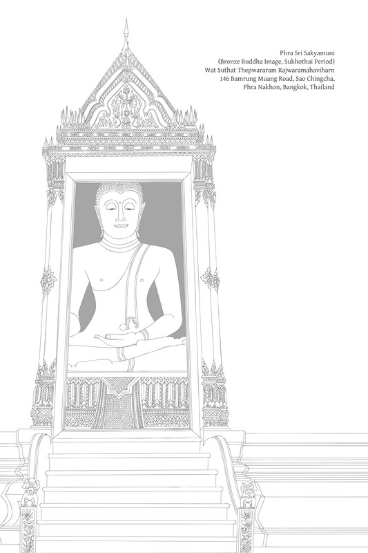

第十一章：安乐

# 第十一章：安乐

## 导论

### 佛教是发展安乐之道

安乐在佛教修行中扮演着至关重要的角色。可以说，佛教修行与安乐密不可分。佛教教义描述了许多安乐的名称，并将其分类为不同的类别和阶段，最终达到至上安乐。以下是经文中发现的一些安乐的例子：

*   受用之乐（paribhoga-sukha; upabhoga-sukha）。
    
*   资财之乐（bhoga-sukha）。
    
*   身体之乐（kāya-sukha; kāyika-sukha）。
    
*   心之乐（citta-sukha; cetasika-sukha）。
    
*   感官快乐（kāma-sukha）。
    
*   物质之乐（sāmisa-sukha; āmisa-sukha）。
    
*   非物质之乐（nirāmisa-sukha）。
    
*   时节之乐（utu-sukha）。
    
*   名誉之乐（kitti-sukha）。
    
*   凡夫之乐（puthujjana-sukha）。
    
*   人类之乐（manussa-sukha）。
    
*   天界之乐（dibba-sukha）。
    
*   大众之乐（mahājana-sukha）。
    
*   全世界之乐（sabbaloka-sukha）。
    
*   “甜蜜”或“令人陶醉”的安乐（madhura-sukha）。
    
*   善法之乐（kusala-sukha）。
    
*   正法之乐（dhammika-sukha）。
    
*   修习之乐（bhāvanā-sukha）。
    
*   频繁或恒常之乐（nicca-sukha）。
    
*   轮回之乐（saṁsāra-sukha）。
    
*   精进之乐（yoga-sukha）。
    
*   世间之乐（lokiya-sukha）。
    
*   出世间之乐（lokuttara-sukha）。
    
*   轮回之轮之乐（vaṭṭa-sukha）。
    
*   脱离轮回之乐（vivaṭṭa-sukha）。
    
*   粗糙之乐（oḷārika-sukha）。
    
*   微妙之乐（sukhuma-sukha）。
    
*   三摩地之乐（samādhi-sukha）。
    
*   禅那之乐（jhāna-sukha）。
    
*   毗婆舍那之乐（vipassanā-sukha）。
    
*   圣者之乐（ariya-sukha）。
    
*   非圣者之乐（anariya-sukha）。
    
*   独处之乐（viveka-sukha）。
    
*   寂静之乐（santi-sukha）。
    
*   心解脱之乐（vimokkha-sukha）。
    
*   解脱之乐（vimutti-sukha）。
    
*   觉悟之乐（sambodhi-sukha）。
    
*   至上安乐（parama-sukha）。
    

就修行的初始阶段而言，佛陀曾说“功德是安乐之名”（功德 = puñña；“善行”，“行善法”）。[\[1\]](happiness_split_001.html#fn-fn1)

作者注

> 第二十三章是《佛法》泰文版的新增内容。安乐是一个普遍感兴趣的话题，我长期以来一直希望能补充《佛法》中关于安乐的原始章节，因为那章内容复杂且充满了技术性引用。2010年2月24日，我受邀在萨功·塔纳米塔博士（Hon. Professor Dr. Sakorn Dhanamitta，健康发展教育项目顾问）80岁生日之际发表演讲。该演讲内容于同年12月以“安乐的各个方面”为题出版，本章是该书的概要。请注意，本章中的许多主题在原始的安乐章以及欲望和动机章（参见第十章）中已有不同程度的涉及。\[译者注：英文版《佛法》中关于安乐的这一章结合了泰文版的两章安乐。尽管这是一项挑战（第二十二章以正式的书面风格呈现，而第二十三章是演讲稿的誊录），我已尝试将这两章编织成一个整合的整体。\]

就禅修而言，安乐是生起三摩地的重要因素，正如佛陀所证实的：“心安乐，则能善立（三摩地）。”[\[2\]](happiness_split_001.html#fn-fn2) 在经文中，安乐被描述为三摩地的“近因”（padaṭṭhāna）。当心高度专注并达到禅那状态时，安乐（sukha）是禅那要素（jhānaṅga）之一，存在于直到第三禅那。[\[3\]](happiness_split_001.html#fn-fn3) 尽管从技术上讲，安乐不是高于第三禅那的禅那成就（jhāna-samāpatti）的要素，但这些状态仍被认为是更精细的安乐形式。[\[4\]](happiness_split_001.html#fn-fn4)

最后，佛教的最高目标——涅槃——被描述为一种安乐的形式，是至上安乐（parama-sukha）。[\[5\]](happiness_split_001.html#fn-fn5)

涅槃的一个重要同义词是nirodha（“止息”），它具有三个主要属性：

1.  无明（avijjā）的止息：这等同于至上智慧和见（ñāṇa-dassana）的生起，即对真相的证悟。
    
2.  烦恼（kilesa）的止息：消除心理杂染；终结心中一切导致自身或他人痛苦的根本因素。
    
3.  苦（dukkha）的止息：苦的终结；至上安乐的证得。
    

尽管第三个属性——苦的终结——在关于阿罗汉心自在（bhāvita-citta）的章节中已有所描述，但该属性还有几个方面需要考量。[\[6\]](happiness_split_001.html#fn-fn6)

此外，佛教的这一最高目标——觉悟（bodhi）或至上安乐——应通过安乐的方式或通过充满安乐的修行来达成。它不应通过痛苦的方式或通过折磨和苦难来达成。[\[7\]](happiness_split_001.html#fn-fn7) {1024}

关于佛法修行，经文描述了各种安乐，同时也描述了每种安乐的优点和缺点。它们还比较了各种安乐，以指出何种更胜一筹。这种对各种安乐及其相互比较的描述，是一种敦促人们在精神修行中进步并发展更高级安乐的方式。每个人都有潜力在这些不同阶段的安乐中进步，直到他或她达到至上安乐。

这种对各种安乐的比较表明，尽管较低层次的安乐可能有其有利之处，但它们仍然不完美。它们既有优点（assāda），也有缺点（ādīnava）。为了获得清晰的理解并在佛法修行中进步，识别这些优点和缺点至关重要。 {1070}

在此背景下，还有第三个因素：一个人也必须有出离（nissaraṇa）之道，一种解脱，使人摆脱优点和缺点。简而言之，就是达到一种更优越或更完满的安乐状态。

一个人应该运用这三个原则，专注于特定层次的安乐，通过审视它并确定其优缺点。如果安乐仍然存在缺点，那么一个人就会问，是否有出离之道，是否有方法超越这种不圆满的状态，是否有方法获得自由和安全。当遇到这样的出离之道（nissaraṇa）时，精神修行就能进步。

总而言之，佛教承认许多不同层次的安乐，并教导安乐需要培养。可以将整个佛教修行定义为这种安乐的培养。佛教是一个发展安乐的体系，安乐的发展在佛教中受到高度重视。

### 幸福通过幸福获得

人们常常忽视佛教是一种安乐的宗教。如果遇到诸如“生命是苦”或“一切皆苦”之类的说法，人们可能会认为佛教充满了苦。当人们看到四圣谛以苦（dukkha）开始，或者遇到佛陀关于四圣谛的教言“过去和现在，我只教导苦和苦的止息”时，有些人可能会确信佛教是一种充满苦的宗教。

人们需要不断被提醒，佛陀在教导四圣谛的同时，也阐述了四种“应尽之责”（kicca）。如果一个人不正确地履行这些职责，那么从一开始就会步入歧途；将无法触及佛教的核心。特别是关于第一圣谛，需要尽可能准确。如果有所帮助，可以记住巴利语短语：Dukkhaṁ ariyasaccaṁ pariññeyyaṁ（“苦圣谛应被彻底理解”）。

面对苦，我们的责任是全面的理解；苦要被彻底理解。苦是需要通过智慧来处理和解决的事情；它不是用来折磨心灵而累积的东西。如果一个人经历苦，要运用智慧来处理它并终结它。这是正确修行道路的开端。

可以看看佛陀的一生。在他觉悟之前，他实行了当时苦行者习以为常的严厉苦行和极端禁欲。当他意识到这是一种错误的修行方式时，他放弃了这些苦行，转向了“中道修行”（majjhimā-paṭipadā），直到他达到觉悟。这是一个简要的事件总结。仔细审视《三藏》中的这段记载，可以更清晰地理解整个佛教。

在《菩提王子经》中，佛陀讲述了他在证悟之前曾有过这样的念头：“安乐无法通过安乐获得；它只能通过痛苦获得。”正是因为这个原因，他才出家过着离尘生活。

他随后与两位禅修导师在他们的隐居处生活。之后，他以强烈和热切的态度进行了极端的苦行，经历了极度的身体痛苦，但一切都徒劳无功。他意识到不可能通过自我折磨来达到最高的善。请注意他在这里的话：“觉悟之道必定另有他途。” {1071} 他回想起童年时的一件事，那时他独自静坐在阎浮树荫下，达到了初禅，以喜和乐为特征。他洞悉到这就是道路，正如他对自己所说的话所证实：“这确实是觉悟之道。”[\[8\]](happiness_split_001.html#fn-fn8)

当他对此问题心意已决时，他自问是否害怕这种远离感官之乐和不善心所的安乐。这是为了验证这种安乐是否包含任何危险。他自信地回答说他无所畏惧。因此，他放弃了极端的苦行，追随了以“中道”（majjhimā-paṭipadā）为代表的安乐之路，最终达到了觉悟。

一个重要的区别是，当时印度的许多宗教传统都声称“安乐无法通过安乐获得；它只能通过痛苦获得”。因此，这些传统的信徒们进行极端的苦行（tapa）。然而，佛教教导“安乐可以通过安乐获得”，因此鼓励修行者放弃极端的苦行，这些苦行被归类为“自苦（行）”（atta-kilamathānuyoga），并被认为是浪费时间。

最基本的安乐形式是通过接触外境而产生的，并且依赖于物质事物，因此被称为“感官之乐”（kāma-sukha）。当一个人发展并获得了更高形式的安乐时，这种更高级的安乐与感官之乐并存。或者，一个人也可以选择完全放弃感官之乐，只安住于更精微的安乐之中。

这些更高层次的安乐能避免对物质事物的依赖所带来的危险；事实上，它们提供了更大程度的独立性。一个人无需消耗物品就能体验安乐。请注意佛陀上述的句子：“远离感官之乐和不善心所的安乐。”一个人与善的欲求（chanda）同步进步。

在这种促进独立性的正确修行中，智慧是一个至关重要的因素。有了智慧，即使是精微的安乐形式，如果长时间持续，也不会使心灵感到压抑；一个人不会因此而沉醉；一个人不会忘我。真正的安乐与自由携手并进，反之，真正的自由也充满了安乐。

佛教的诞生之所以如此具有革命性，据称引起了地震，并使直至最高梵天界都感到兴奋，原因之一是它引入了“安乐可以通过安乐获得”这种新的视角和生活方式。

佛教的目标——至上安乐（parama-sukha）——伴随着智慧，通过理解而解放心灵。这是一种真实、独立、安稳的安乐；它无需外求，不依赖外物；它保持不变；无论身在何处，一个人都是光明、喜悦和幸福的。所有意识到这一至上安乐原则的人，都有机会发展自己以证得它。 {1072}

## 关于安乐的正式教导

### 什么是安乐？

为了发展安乐，了解安乐的意义和重要性至关重要。简而言之，安乐是满足一个人的愿望和需求，或者简单地说，是一种满足感和满意感。请注意，这个定义并非包罗万象，但它涵盖了广泛而基本的意思。这是一个关键的定义，因为它包含了大多数人被局限的安乐；大多数人并未意识到比这更伟大的安乐。

想洗澡并已洗过澡，一个人感到安乐。想吃饭并已吃过饭，一个人感到安乐。一个想玩耍并已玩完的孩子感到安乐。这是愿望的满足，需求的满足。

就语言学而言，此处认识到一些现代学术研究分支对“欲望”和“需求”进行区分，并赋予这些术语不同的定义，这很重要。在此背景下，我互换使用这两个术语，意义相同。此处更侧重于“欲望”而非“需求”（即一种必需）。

通过将安乐定义为欲望的满足，理解欲望的本质也很重要。欲望的主题是广阔的。请注意佛陀在此的主要教义：“一切事物都以欲望为根源”（chanda-mūlakā sabbe dhammā）。这意味着人类所从事的一切事物都以欲望为基础，起源于欲望。

因此：

*   我们必须清楚地理解欲望的本质。
    
*   鉴于安乐是欲望的满足，安乐的发展理所当然地需要欲望的发展。否则，安乐的发展将不会成功。
    

总而言之，欲望必须被培养。 {1073}

对欲望本质的模糊和困惑，阻碍了人们清晰地看待事物，难以取得进展，也无法解决问题。这对于所有人类活动都如此，包括正式的学习、道德行为和精神修行。如果一个人未能理解欲望，就无法触及事情的本质。

### 欲望的本质和重要性

欲望的专业术语相当复杂。佛陀上述引文中相关的词是chanda，在此可译为“欲望”、“想要”或“愿望”。

“chanda”一词本质上是中性的：它可以用作积极或消极的意义；它可以是善的，也可以是不善的。例如，有“感官欲望”（kāma-chanda）、“出离欲”（nekkhamma-chanda）、“消费欲”（paribhoga-chanda）、“佛法欲”（dhamma-chanda）等词。

在经文中，chanda一词被分为两种：

1.  贪爱欲（taṇhā-chanda）：渴望获得、占有、成为、拥有或毁灭的欲望。
    
2.  作欲（kattukamyatā-chanda）：渴望行动、渴望参与、渴望创造、渴望改进、渴望训练、渴望学习、渴望修行的欲望。
    

前者是消极且不善的（akusala-chanda）；后者是积极且善的（kusala-chanda）。这很容易理解，尽管这些术语相当长且笨拙。

事情到这里就变得复杂了。在讲授佛法或日常交流中，使用简短、简洁的术语是很方便的。结果就是：

*   当指代消极、不善的欲望时，只使用taṇhā这个词（不需要说taṇhā-chanda）。
    
*   当指代积极、善的欲望时，只使用chanda这个词（不需要说kattukamyatā-chanda、kusala-chanda——“善的欲望”、dhamma-chanda、sabhāva-chanda——“对真理的欲望”等）。
    

这是一个简单易懂的区别。taṇhā这个词意味着一种消极的欲望；chanda这个词意味着一种积极的欲望。如果这个区别不清楚，事情就会变得非常混乱。例如，一个人可能会想，如果假设chanda是一个积极的词，为什么kāma-chanda（“感官欲望”）却被描述为消极的。 {1074}

注释家选用中性词patthanā（“愿望”、“欲望”）与上述两个词结合，从而创造了一个类似的区别：

1.  渴求欲（taṇhā-patthanā）：获取的愿望；消费的愿望。
    
2.  善法欲（chanda-patthanā）：善的欲望；行善的愿望。
    

许多人，尤其是佛教徒，一遇到“欲望”这个词，就立即将其贴上坏的或不正确的标签。然后他们会鼓励他人不要有欲望，他们认为欲望是危险的，可能具有破坏性，无论是对个人的精神发展还是对社会。

另一些人则走向了相反的极端，他们鼓吹欲望，鼓励人们获取事物并增加财富。有些人甚至提倡贪婪，敦促人们富有、有名、有影响力。他们声称这种对事物的渴望是社会发展所必需的。然而，这并非真正的发展；相反，它最终会导致冲突和破坏。人们通过这种努力所能达到的最好结果，只是在政治和经济上都处于不稳定的发展状态。

这些人代表了两个极端，但他们有一个共同点，那就是缺乏理解。他们不理解欲望的本质，也没有正确地处理欲望。因此，理解并区分不同种类的欲望至关重要。这将带来更大的清晰度。

在粗略概述了两种欲望的区别之后，现在让我们关注它们的一些基本特征：

1.  渴爱（taṇhā）：满足自私需求的欲望，例如：希望为自己获取某物；寻求自我满足；希望亲自消费、获得、成为或避免某物。
    
2.  善法欲（chanda）：专注于事物内在本质的欲望；寻求事物的健康、美德和完备性。
    

以寺院的自然环境为例。人们走进寺院的林区，看到松鼠在树上跳跃。有些人会为松鼠的魅力和灵巧而欢喜。他们可能会想：“多么令人愉悦的景象。愿这些松鼠健康强壮。愿这个美丽而清新的地方繁荣昌盛。”这样，他们就渴望事物本身的完备。他们拥有一种善的欲望。

另一些人看到同样的松鼠，却会想：“这些松鼠肥美多肉。如果我能抓一只，晚上炖汤多好。”在这里，这种欲望是为了自我满足；它是一种不善的欲望，基于渴爱。

另一个例子是，一些学生中学毕业后考虑学医。有的学生想当医生是为了致富、获得荣誉和声望。这是一种自私、不善的欲望。 {1075} 另一些学生想学医是因为他们希望他人摆脱疾病，获得健康，免受苦难，安稳自在地生活。这种欲望旨在实现当前条件的圆满——在这种情况下是国民的健康——这也是医学专业的明确目的。这是一种善的欲望。

当人们的需求和欲望得到满足时，他们就会体验到安乐。因此，人们的安乐程度因其欲望而异。那些希望松鼠健康安好的人，当看到松鼠在树间跳跃时，他们的欲望得到了满足，就会立即体验到安乐。那些为了口腹之欲而想吃松鼠的人，必须捕捉松鼠，杀死它们，并烹饪它们，才能将其制成一餐；只有这样，他们的欲望才能得到满足，他们才能体验到安乐。

从更广阔的角度来看，那些怀有善法欲（chanda）的人喜欢创造繁荣的原因，而那些充满渴爱的人则只是坐享繁荣的果实。有善法欲者是创造者；有渴爱者是消费者。前者在创造中体验安乐；后者在消费中体验安乐。

在一个具有如此不同倾向的社会中，期望渴爱的洪流自行干涸或善法欲之道盛行，是奢望。能做的最好是平衡这两种力量，防止渴爱的洪水将人们冲入深渊，并支持善法欲的实现。只要有人致力于实现善法欲，人类社会就能进步。此外，支持人们的精神发展，同时也能增加所有人的安乐。

### 喜悦与安乐

上面提到，安乐是满足需求，满足欲望。另一种描述这种满足的方式是说欲望已经止息，类似于解渴或缓解饥饿。当口渴或饥饿得到缓解时，一个人会体验到安乐。根据这个定义，安乐是欲望的减退；安乐是寂静。

在这个过程中，在心灵达到构成安乐的寂静之前，一个人可能会体验到各种形式的喜悦和快乐。特别是，一个人可能会体验到pīti（“喜悦”、“狂喜”、“极乐”），在巴利语中，它常常与安乐配对为pīti-sukha。辨别这些不同阶段的喜悦和满足，可以更清晰地理解安乐如何等同于寂静。此外，一个人也能认识到这种寂静的本质和价值。 {1076}

关于上述两个术语，从获得所欲之物中得到的快乐被认为是pīti，而实际享受体验该物则是sukha。例如，一个穿越沙漠、口渴疲惫的人，当他看到水或从他人那里听说附近有水时，会感到狂喜。当他到达绿洲的荫凉处，并在水池中饮水和沐浴时，他体验到安乐。

静思  
注释提供了一个例子以作阐明。[\[9\]](happiness_split_001.html#fn-fn9) 一个人穿越了一片贫瘠的荒野，路途遥远。他汗流浃背、饥肠辘辘、口干舌燥。途中，他遇到一个往回走的人，便问前面是否有饮用水。那人告诉他，不远处有一个大池塘，池边有一片树林。听到这个消息，他感到无比高兴和振奋。

他继续往前走，看到路径上散落的莲花瓣、莲叶和莲茎，心里更加欢喜。他继续前行，看到人们衣服和头发都湿漉漉的，听到林中野鸡和孔雀的叫声。当他走近池塘，看到郁郁葱葱的树林和清澈池水中的莲花时，他变得越来越欣喜若狂。

最后，他走进水中，感到一阵极大的清爽。之前那种兴奋感被平静所取代。他痛快地洗澡和饮水，消除了所有的焦虑，然后吃着莲花的根茎和嫩叶，直到饱足。接着，他爬上岸，躺在树荫下，享受着微风的轻抚，对自己说：“啊，真是幸福啊。”

根据这个例子，我们可以看到：

*   这个人从听到池塘和树林的消息，到亲眼看到它们的那一刻所体验到的喜悦和振奋，构成了pīti，这是一种初步的喜悦和快乐，源于即将体验到的对象。
    
*   他在水中沐浴、解渴、饱腹，并在树荫下休息，这构成了sukha：实际体验到渴望的对象。
    

Pīti具有振奋、欣快、活力、狂喜、光彩和充满的特征，这些都是极度积极的品质。然而，无论这种喜悦和狂喜有多么积极，它尚未完整；它尚未达到目标。最终，它必须以快乐告终并达到顶峰，而快乐正是内在的平静。如果这种喜悦尚未平静，它尚未完整；它在平静中达到完整和圆满，这被称为“快乐”（sukha）。

事实上，详细而彻底的分析揭示，在pīti和sukha之间还存在着另一种重要的心境。上文我们只关注了欲望的满足，这是获得的一个方面。但更深入的分析也需要审视欲望的实际性质。

欲望具有强迫性和扰动性的特质。如果它变得强烈，就会表现为焦虑、压力、躁动，甚至混乱。尽管喜悦（pīti）有所增强，但在达到满足欲望的阶段时，作为欲望特质并影响身心的焦虑、压力和躁动会减轻和消退。烦躁不安会减少；人会变得平稳和宁静。这种状态被称为“轻安”（passaddhi）。{1077}

轻安（passaddhi）是快乐（sukha）的直接前因。因此，在做更详细的区分时，经文将这种有序的进程描述为：pīti → passaddhi → sukha。

基于贪爱的欲望充满了激动、焦虑和压力，因为它建立在妄想的基础上，并由对自我感的执著所滋养。然而，基于善法意欲的欲望，则自然伴随着智慧，这能防止或纠正这些烦恼。

请注意，除了通过满足来平息欲望之外，还有通过不满足来平息欲望，这是一种相反的有意行为。

但必须小心。如果一个人试图通过阻挠、抵抗、压制或控制欲望来平息它，那么其反作用比寻求满足更为严重。激动和混乱会增加，人可能会发泄挫折或爆发，给自己带来额外的痛苦，并危及他人。这又会导致报复和反击。这种内在的压制只是一种强制形式；它不是真正的平静。

在修行的初期，对修习的觉察本身在一定程度上有助于应对欲望。虽然在某种程度上，一个人可能会违背自己的意愿而选择不满足的道路，但修习的好处包括一种自我发展的感觉，以及在考验了自己的力量和决心后所获得的喜悦。

还有一些应对欲望的辅助工具：

首先，增强善的心态。一个人要确保渴望知识的善法意欲（chanda）比渴望放纵的贪爱（taṇhā）更强大。例如，这种善法意欲能阻止一个人翘班去和朋友喝酒。

其次，负面品质被正面品质取代。例如，保罗（Paul）觊觎约翰（John）的钱并想偷走它，但他考虑到约翰获得这笔钱是多么困难。约翰已经有足够的麻烦了；为什么要给他制造更多麻烦呢？这种想法产生了慈悲心，贪爱因此干涸并平息下来。

就智慧而言，举例来说，一个人看到金子以极低的价格出售。他双眼放光，渴望得到这批金子，但一旦他发现金子是假的，他的欲望便立即消失。然而，这种认识只是一种基本或虚假的智慧；它只处理眼前的问题。

具足真正智慧的弟子们辨明，金银珠宝，乃至所有物质财富，并不构成生命的真正目的。物质财富不真正属于任何人；它不能给一个人的生命提供真正的幸福或卓著；财富本身和所有众生都受制于自然法则：无常、dukkha和无我。要从物质事物中获益，必须洞察其真实本性，使其不造成伤害。当一个人敞开自己，迈向真正的自由和幸福时，便能毫不犹豫地放下这些事物。这样的智慧能阻止贪爱生根，并导向真正的平静。

无论一个人是通过满足来平息欲望，还是通过增强善的品质和运用智慧来避免满足不健康的欲望，由此产生的寂静与平静（santi）本身就构成了幸福。幸福就是平静。[\[10\]](happiness_split_001.html#fn-fn10) {1078}

### 通往幸福的两种途径

大多数人兼具贪爱和善法意欲这两种“初始资本”。社会中的领导者或那些担任导师（kalyāṇamitta；“善友”）的人应该理解这个事实，并帮助他人既培养善法意欲，又调节或降伏贪爱。至少，人们应该防止贪爱的暗流成为压倒性的力量。

关于基本的善法意欲（chanda），大多数人都希望他们的环境井然有序、整洁干净。当他们遇到美丽的自然环境时，他们会感到欢喜。他们希望周围环境处于一种完整状态；他们希望人、动物、树木和植物都健康且充满活力。同样地，人们希望自己的身体健康、强壮、清洁，并处于一种完整状态。（这些是区分chanda和taṇhā的有用例子）。

同时，大多数人希望通过接触吸引人且令人愉悦的视觉形式、气味、声音、味道和触觉对象来满足他们的欲望。这些统称为“物质对象”（āmisa）或“感官对象”（kāma）。由于这些感官对象依赖于粗糙的接触形式，并且通常涉及强烈的刺激，因此它们可能非常具有诱惑力。要深入理解，不被这些诱惑所迷惑，需要反复强调。

让我们更深入地比较这两种欲望：

如上所述，善法意欲（chanda）始于对事物处于良好和完整状态的愉悦和满足。如果所涉对象或人尚未处于完整状态，或仅处于部分完整状态，一个人会希望采取行动以实现这种完整。正是在这种想要采取行动的阶段，一个人达到了chanda的真正本质，这被称为“渴望行动的意欲”（kattukamyatā-chanda）。

另一方面，不善的欲望——贪爱，则表现为对五种感官对象的贪欲，以通过消费事物来获得满足。贪爱是对消费的欲望。这是一种纯粹为了自己的利益而获取和占有的欲望。这正是这两种欲望之间关键区别的体现。

当贪爱生起时，它在定义上伴随着一个预设的“拥有者”、“欲望者”、“索取者”或“消费者”，即一个获取、攫取和消费的人，他为了这个所谓的“拥有者”或“消费者”而想要获得事物。这就是自我感的诞生。{1079}

善法意欲的功能不同；它伴随着对一个对象的善好和完整感到喜悦和满足。这种喜悦的产生不需要做任何事情。如果对象尚未处于完整状态，就会渴望它达到这种状态。这种对完整的渴望产生了更高层次的欲望，即希望采取行动来促成完整。

如果一个人不知道如何促成这种完整，自然的因果过程会指导如何回应。对完整的渴望以及探究如何促成完整，导致了对知识的渴望，一种理解的渴望。

上述解释表明了chanda一词的广泛含义。首先，是对事物或人的善好、美丽和完整感到喜悦。其次，是希望这事物或人保持健康、完整或快乐。第三，如果这事物或人尚未达到这种完整状态，则渴望采取行动以帮助促成这种完整。第四，是渴望获得帮助促成完整所需的必要知识。

这里的第一个区别是，善法意欲希望事物以一种自然的满足和完整状态存在。当一个人遇到处于这种完整状态的事物或人时，他立即体验到幸福和满足，例如当他陶醉于自然之美时。这与贪爱不同，贪爱必须等到事物被消费后才能获得满足。

另一个本质的区别是，在善法意欲的整个过程中，存在着欲望，但没有“欲望者”的诞生，也没有必须采取行动的主体的诞生。这与贪爱的过程不同，贪爱需要一种自我感：一个消费者、一个拥有者、一个控制者等。如果在使用善法意欲从事某事时产生了一种固定的身份感，这表明与我见相关的烦恼已经渗透到心中。在这种情况下，一种往往会产生的微妙烦恼是“我慢”（māna；渴望自我重要性）。

chanda的本质是渴望行动。因此，这个术语被定义为kattukamyatā-chanda：渴望行动的意欲。chanda的一个常见定义是chandoti kattukamyatā-chando：“chanda是表现为渴望行动（为了使某事达到善或完整状态）的志向。”这一点需要重申，因为它是人类精神发展的起点。

如果我们具有善法意欲，当我们看到我们的房子或寺院干净整洁时，我们会感到欢喜和自在。如果它脏乱不堪，我们会想要打扫它。我们会拿起扫帚清扫地板或地面。如果我们不知道如何清扫，我们会想要学习，并会研究最佳的清扫方法。我们会成为清扫专家，并在清扫时体验到喜悦。这是精神修习的一个例子，也是善法意欲如何成为精神发展起点的例子。

然而，有了贪爱，这种修习过程就不会开始。当贪爱生起时，一个人希望得到某种东西来消费它。随着消费，过程结束；一个人没有改善自己的愿望。{1080}

### 对他人的善法意欲

到目前为止，关于欲望的讨论主要集中在人们的工作和活动上，也触及了与环境的关系。然而，为了使这次讨论完整，还必须审视对他人的善法意欲。

如上所述，善法意欲（chanda）是希望万事万物都处于良好和完整的状态。这种欲望也延伸到所有有情众生。这种对所有众生，从人类同伴开始的良好祝愿，是希望他人安好、兴旺、健康强壮，并体验到喜悦和幸福。

与他人互动是人们生活中至关重要的一部分。同样地，对他人，乃至对所有众生的善法意欲，在人们的生活中也具有特殊的意义。

这种善愿，或对善的渴望，在涉及到他人和有情众生时，具有独特的属性，与希望无生命事物达到安好和完整状态的愿望不同。因此，在这种情境下，根据具体情况，有几个术语来表示chanda。与其使用chanda一词来指代对人类的善法意欲，以下四个术语被使用：

1.  Mettā（“慈爱”）：在正常情况下，如果一个人对他人有善法意欲——一种善愿——他会希望他们面色红润，身体健康，体验到幸福。这是一种基本的、最初的善愿形式。它是一种专注于他人或有情众生的欲望；它不与个人忧虑纠缠。{1096}
    
2.  Karuṇā（“悲心”）：如果一个人遇到另一个不健康、虚弱、痛苦、烦恼，或陷入困境的人（或有情众生），他希望此人摆脱这些痛苦、贫困、苦难或疾病。
    
3.  Muditā（“随喜”）：如果另一个人兴旺发达，一个孩子成长茁壮，某人健康、身体美丽迷人，某人取得了某种真正的成功等等，一个人会为他或她的成就感到喜悦。
    
4.  Upekkhā（“舍心”）：在某些情况下，另一个人能够承担自我责任，或者适合且恰当地让他们承担这种责任。在这种情况下，应该允许他们保持独立，不加干涉。例如，父母可能正在看着他们的学步儿童学习走路。他们希望孩子成长并成功，因此他们保持距离观察而不干预。他们不会被担忧所困扰，并不断地抱着孩子。这里对安好状态的渴望，是对人们成功、善好和正直的渴望。一个人希望他们安住于正直、正确和安全，希望他们存在于真理和正义之中。为了实现这一点，在这些情况下，一个人会克制自己不加干涉。
    

善法意欲（chanda）是这四种心境的催化剂。换句话说，善法意欲在四种不同的情境中表现出来：

1.  当人们安住于正常幸福状态时的一种善愿（=mettā）。
    
2.  当人们陷入困境时的一种善愿；希望他们从痛苦中解脱出来，达到安好状态（=karuṇā）。
    
3.  当人们取得成功和成就时的一种善愿；希望他们获得更大的繁荣（=muditā）。
    
4.  当人们有机会行使自我责任时的一种善愿；希望他们安住于正直、公正、安全和正义（=upekkhā）。
    

大多数人只考虑前三种善愿，但这不足够，因为这三个因素仍然局限于“感受”的范畴。虽然这些感受、情感或情绪是崇高和高度修养的，但它们尚未完整。只有第四个因素才能带来完整。

简而言之，如果人们只拥有善的情感，无论这些情感多么崇高或高尚，这都是不够的。这些情感满足个人属性，但尚未与真理——与法——联系起来。虽然这些人是“好”的，但他们可能尚未“正确”。要实现真理，达到真正的正确，消除痛苦，并实现完美的幸福，一个人还必须拥有知识。

从技术上讲，完成心（citta）的修习是不够的。心的因素，或心的层面，本身并不能带来解脱。一个人必须完成智慧（paññā）的修习，这是解脱和心智圆满的决定性因素。前三种善愿局限于心的因素。第四个因素涉及智慧，它促使心得到真正的运用并导向解脱。{1097}

总而言之，虽然人们可能拥有积极的情绪，但他们需要智慧来调节、提炼和提升这些情绪。[\[11\]](happiness_split_001.html#fn-fn11) 第四种舍心构成了这种与智慧的联系。

如果人们缺乏智慧，他们就无法解决生活中的问题。即使他们拥有美德和善的情感，他们也可能错误地运用这些情感，并做出不善的行为。

假设一个小偷偷了2000美元。从一个角度看，他成功了；他得到了钱并体验到了一些幸福。一个人应该如何回应呢？根据随喜的因素，一个人为他的幸福而高兴。然而，这是不正确的。在这里，一个人停留在情感层面，背离了真正的佛法修行。尽管情感是积极的，但它们可能导致麻烦。人们可能会因此纵容偷窃，给社会带来各种问题。

在这里，智慧带来了心智的整合和平衡。这里所说的舍心（upekkhā）是希望他人拥有正直和正确。

舍心作为善法意欲（chanda）的一种表达，是希望他人安好和完整。为了达到完整，人们必须与佛法、与正义保持一致。一个人安住于舍心，以使正确和正义按照自然法则运行。

前三种因素，即慈、悲、喜，保护个体；第四种舍心也守护真理。如果他人违反真理，那么一个人就应该维护和保护真理，维护公正和廉洁。

圆满达到于舍心，这是一种与智慧相连的情感。舍心旨在平衡这四种“梵住”（brahmavihāra）。根据佛教教义，这四个因素确实是神圣的力量，即它们代表梵天（最高神性）并保护世界。

## 智慧地享受感官快乐

### 不同层次的幸福

佛陀说，他已证得一种超越感官（kāma）的崇高幸福，因此他可以断言，他不会再回过头去寻求感官快乐。如果他没有体验过这种崇高幸福，他就无法做出这样的断言。

佛陀接着说，即使一位圣弟子能够以正智清楚地辨明感官快乐只有微小的甜美，却伴随着许多痛苦——许多烦恼和危险——如果他尚未体验到超越感官的崇高喜悦和幸福，那么他仍然无法自信地说他不会再回去寻求感官快乐。[\[12\]](happiness_split_001.html#fn-fn12)

同样地，他特别告诫比丘们，如果一个出家之人尚未品尝到超越感官欲望的崇高喜悦和幸福，那么各种烦恼，如贪婪、恶意、躁动、懒惰和无聊，仍然有可能淹没其心。[\[13\]](happiness_split_001.html#fn-fn13) 这样的人将不会乐于梵行，或无法忍受梵行生活。

除了说明佛教对幸福的重视外，这些引述也揭示了圣弟子们并非因为感官快乐毫无乐趣，或因为佛教教导要禁绝快乐而放弃感官欲望。佛教承认快乐和幸福的真实存在；它鼓励人们修行以获得幸福，并且它认识到感官快乐是幸福的一种形式。[\[14\]](happiness_split_001.html#fn-fn14)

圣弟子们放弃感官欲望，是因为他们看到，尽管感官快乐本身具有乐趣，但它仍然与大量的痛苦交织在一起。更重要的是，存在一种更深层次的幸福，超越了感官快乐，超越了从消费世间各种愉悦对象中获得的快乐。圣弟子们放弃感官欲望，是因为他们品尝过这种更精致的幸福。

因此，幸福有不同的层次；这里我们可以考察佛教是如何对它们进行分类的。

《增支部·二集》将幸福分为各种类型和程度，提供了一长串的成对列表，包括：居家幸福与出家幸福，感官幸福与离欲幸福，世俗幸福与出世间幸福，以及圣人幸福与凡人幸福。[\[15\]](happiness_split_001.html#fn-fn15)

对各种幸福层次的清晰而详细的分类是关于十种幸福层次的教导，这在《三藏》中多处可见：[\[16\]](happiness_split_001.html#fn-fn16)

1.  感官快乐（kāma）：依赖于五欲（kāma-guṇa）的喜悦和幸福。[\[17\]](happiness_split_001.html#fn-fn17)
    
2.  初禅之乐（paṭhamajhāna-sukha）：初禅的幸福，远离感官和不善法，由寻（vitakka）、伺（vicāra）、喜（pīti）、乐（sukha）和一心（ekaggatā）组成。
    
3.  二禅之乐（dutiyajhāna-sukha）：二禅的幸福，由喜（pīti）、乐（sukha）和一心（ekaggatā）组成。{1025}
    
4.  三禅之乐（tatiyajhāna-sukha）：三禅的幸福，由乐（sukha）和一心（ekaggatā）组成。
    
5.  四禅之乐（catutthajhāna-sukha）：四禅的幸福，由舍（upekkhā）和一心（ekaggatā）组成。
    
6.  空无边处定之乐（ākāsānañcāyatanasamāpatti-sukha）；在此定境中，一个人超越了色相（rūpa-saññā）的感知和瞋恚（paṭigha-saññā）的感知，并且不注意多样性（nānatta-saññā）的感知；一个人只将注意力导向空间的无限。
    
7.  识无边处定之乐（viññāṇañcāyatanasamāpatti-sukha）；在此定境中，一个人以识的无限作为其注意对象进行禅修。
    
8.  无所有处定之乐（ākiñcaññāyatanasamāpatti-sukha）；在此定境中，一个人以无所有之状态作为其注意对象进行禅修。
    
9.  非想非非想处定之乐（nevasaññānāsaññāyatanasamāpatti-sukha）。
    
10.  想受灭定之乐（saññāvedayitanirodhasamāpatti-sukha）。
    

可以将这十种幸福简化为三个层次：[\[18\]](happiness_split_001.html#fn-fn18)

1.  与感官相关的幸福（kāma-sukha）。
    
2.  与禅那相关的幸福（jhāna-sukha），或与八定相关的幸福（aṭṭhasamāpatti-sukha），可进一步分为两个子类别：
    
    1.  与四色界禅那相关的快乐。
    
    2.  与四无色界禅那相关的幸福。
    
3.  与灭尽定相关的幸福（nirodha-samāpatti）。
    

所有这些上述幸福都被承认为构成幸福，但它们被视为代表着渐次更精致和更优越的幸福形式。最初的幸福仍然包含有害的方面，并与痛苦交织在一起。更高形式的幸福则更精致和纯粹。

经文教导人们如实地认识这些幸福，包括它们的愉悦方面和与痛苦交织的方面，它们的优点（assāda；积极方面）和缺点（ādīnava；消极方面），它们的功德和危险。此外，它们揭示了出路、解脱（nissaraṇa），即从所有有条件的幸福状态中获得自由，这种自由独立于优点和缺点。

当一个人看到粗糙幸福的危险时，他会对其感到厌倦，并向往更精致的幸福。当他亲身见证了精致的幸福形式时，他会放弃粗糙的形式，寻求更崇高的幸福。至少，他不会过度沉迷于粗糙的快乐。

每当人们以决定性的方式获得解脱，心烦的束缚被彻底切断时，他们将永远不会再回头寻求粗糙的幸福。[\[19\]](happiness_split_001.html#fn-fn19) 他们将只体验与解脱心相应的精致幸福。体验这些渐次更精致的幸福是佛法修行进步的一个特征。{1026}

### 感官快乐与更高级的幸福

以下是一些有助于阐明上述主题的教导：

> 比丘们，有这五种欲功德 (kāma-guṇa)：眼所识知的色……耳所识知的声……鼻所识知的香……舌所识知的味……身所识知的触，它们是可爱、可乐、可意、合意、诱人、激发贪欲的。这些就是五种欲功德。现在，依赖这五种欲功德而生起的快乐和喜悦，就是欲乐方面的满足 (assāda) …… M. I. 85. 这种快乐和喜悦……被称为欲乐 (kāma-sukha)。M. II. 42-3; S. IV. 225; A. IV. 415-16; Nd. II. 66-7. “kāma”这个词指的是两件事：诱人的物质对象 (vatthu-kāma; 可欲的对象)，以及烦恼之欲 (kilesa-kāma; 滋生贪欲的心理染污)。什么是诱人的物质对象？令人愉悦的色、声、香、味、触；地毯、毯子、男女仆人、山羊、绵羊、鸡、猪、大象、牛、马、驴、稻田、土地、银、金、房屋、村庄、王城、省份、国家、军队和皇家宝藏——凡是作为执著基础的物质对象，都称为诱人的物质对象。此外，所有存在于过去、现在和未来的欲求对象；存在于内、外、或内外兼具的；那些低劣的、中等的、以及殊胜的；那些属于恶趣众生、属于人类、以及属于天界的；那些即时可得的 (paccupaṭṭhitā)、那些自造的 (nimmitā)、以及那些他造的 (paranimmitā)；那些已拥有和未拥有的；那些被觊觎和未被觊觎的；那些完全属于欲界 (kāmāvacara)、那些完全属于色界 (rūpāvacara)、以及那些完全属于无色界 (arūpāvacara)——所有这些作为贪爱基础、贪爱对象的，都因是欲的基础、迷恋的基础而被称作欲求对象。所有这些都被称为诱人的物质对象。而什么是烦恼之欲？欢喜是欲，贪欲是欲，贪著是欲；思量 (saṅkappa) 是欲……贪欲的专注是欲；欲贪 (kāma-chanda)、欲染 (kāma-rāga)、欲喜 (kāma-nandi)、欲爱 (kāma-taṇhā)、欲缠 (kāma-sineha)、对欲乐的炽热、对欲乐的迷恋、对欲乐的痴迷、欲念覆盖心、欲念束缚心、执取欲乐、欲贪盖、语句中的欲念：“看啊，欲念，我看见你的源头——你从意图而生。我将不再受你困扰；通过这样做，你将不再存在”——所有这些都被称为烦恼之欲。Nd. I. 1-2, 28. 比丘们，胎儿在母胎中的受孕是通过三件事的结合而发生的。当父母结合，并且是母亲的受孕期，并且有待投生的众生存在时，通过这三件事的结合，胎儿在母胎中的受孕就发生了。然后，母亲怀胎九到十个月，冒着生命危险，承受着沉重的负担。接着，在九到十个月期满时，母亲冒着生命危险，承受着沉重的负担分娩。她随后用自己的血滋养新生儿；因为在圣者传统中，母亲的乳汁被称为“血”。[\[20\]](happiness_split_001.html#fn-fn20) {1027} M. I. 265-6. “一个仰卧的小婴儿，甚至玩弄着自己的尿和粪便。你们认为，那对那个婴儿来说难道不是完全的乐趣吗？” “是的，尊者。” “过了一段时间，当那个孩子长大，感官成熟时，他玩着儿童典型的游戏——玩具犁游戏、棍棒游戏、翻筋斗、风车游戏、沙子量具游戏、玩具战车游戏、玩具弓箭游戏。你们认为，这种乐趣难道不比前一种更优越、更精致吗？” “是的，尊者。” “再过一段时间，当那个男孩继续长大，感官进一步成熟时，他享受着具足五种欲乐对象：可爱、可乐、可意、合意、诱人、激发贪欲的色……声……香……味……触。你们认为，这种乐趣难道不比前一种更优越、更精致吗？” “是的，尊者。”[\[21\]](happiness_split_001.html#fn-fn21) A. V. 203.

在居士中，最崇高的人是转轮王 (cakkavatti; ‘轮转君主’)，他拥有无上权力，并拥有丰富的物质财富。根据佛法，这样的人也具足殊胜的功德。因此，转轮王被认为是拥有最大快乐的人，比其他人类普遍体验到的快乐更大。佛陀提及转轮王的快乐，是为了描述 (普通) 人类快乐最完整的形式，并将其与各种其他层次和程度的快乐进行比较，揭示它们相对的微妙和深奥之处。

根据理想的描绘，转轮王拥有七宝 (ratana) 和四种成就 (iddhi)。七宝如下：

1.  一宝轮，象征着正法且合法的王权。它使君主能够通过正当的方法，并受那些接受他统治的人的欢喜所维持，将其和平帝国扩展到整个大陆，直至四海。
    
2.  一宝象，它能够迅速地将君主运载到整个大陆，以视察其国土。
    
3.  一宝马，它同样能够迅速地将君主运载到整个大陆，以视察其国土。
    
4.  一宝珠，它能将光芒辐射到很远的地方，使君主能够在夜间调动军队，或让国民在夜间工作，如同白昼一般。
    
5.  一宝女，她除了身体和肤色比所有其他女人都美丽超凡之外，还拥有美妙的触感，被形容为“如棉花或绒毛般温柔柔软”。她身体寒冷时会变暖；炎热时会变凉。她的香气甜美如檀香；她的呼吸如莲花的芬芳。此外，她言语悦耳，并知道如何满足君主的所有愿望。
    
6.  一宝藏臣，他拥有天眼；他能够在所有地方发现财富来源，并能找到君主所希望的任意数量的金银。
    
7.  一宝大臣，他拥有卓越的治国才能。除了在公务上提供正确建议外，他还能够指导各种工作项目，并代君主颁布皇家诏令。 {1028}
    

转轮王的四种成就如下：

1.  他的外貌比所有其他人更英俊、更威严；
    
2.  他的寿命比所有其他人更长；
    
3.  他健康强壮，少病少痛；
    
4.  他的臣民对他忠诚；他们爱他如同孩子爱父母，而他爱他们如同父亲爱孩子。当他出宫巡游时，民众会迎接他，并希望尽可能多地与他共度时光；他也希望与他们共度时光。
    

这样一位君主的快乐和喜悦超越了其他人，包括前文引述中提到的年轻人。然而，佛陀说，无论转轮王的快乐有多么巨大，与天界的快乐相比，它都是微不足道的——甚至是不值一提的。这就像将一块巴掌大小的小石头与巍峨的喜马拉雅山脉相比。[\[22\]](happiness_split_001.html#fn-fn22)

尽管天界之乐 (dibba-sukha) 是一种高层次的欲乐，远超人类的感官之乐，但还存在一种比这更殊胜的快乐。后者的这种殊胜快乐独立于感官之乐和外在的满足对象。那些体验过它的人，在看到别人享受丰盛的感官之乐时，不会感到嫉妒或欲求。这类似于天人，他们对人类低级的快乐不感到嫉妒或喜悦。此外，这些个体甚至不渴望天界之乐，因为他们已经体验过一种更优越的快乐。

在这种情况下，佛陀讲述了他自己的经历：[\[23\]](happiness_split_001.html#fn-fn23)

> “因此，摩犍提，过去当我在家生活时，我享受着具足五种欲功德的快乐：可爱、可乐、可意、合意、诱人、激发贪欲的色……声……香……味……触。我拥有三座宫殿，一座用于雨季，一座用于冬季，一座用于夏季。我在雨季宫殿中度过了四个月的雨季，与全为女性的乐师一同享乐，四个月都没有走出宫殿。‘后来，我如实地理解了欲乐的生起、无常、满足、危险和出离，我舍弃了对欲乐的贪爱，熄灭了对欲乐的炽热，我安住于无渴爱，内心平静。‘我看到其他未从欲乐的贪染中解脱的众生，被欲乐的贪爱所吞噬，被欲乐的炽热所燃烧，沉溺于欲乐之中，我既不嫉妒他们，也不因此感到喜悦。为什么呢？因为我喜悦于远离欲乐、远离不善法的快乐。因此，我不嫉妒低级的快乐，也不因此感到喜悦。 {1029} ‘假设，摩犍提，一位富有的居士或居士之子，拥有巨额财富和财产，具足五种欲功德，他可能会享乐……他行为良好……可能会在善趣投生，在三十三天神众中；在那里，被一群仙女围绕在欢乐园 (Nandana Grove) 中，他会享受着具足五种天界欲功德的快乐。假设他看到一位居士或居士之子正在享受着具足五种欲功德的快乐。你认为会怎样？那位年轻的天神……会嫉妒那位居士或居士之子的五种欲功德吗？会喜悦于五种人类欲乐吗？或者会怀念人类的欲乐吗？’ ‘不会的，乔达摩大师。为什么不呢？因为天界欲乐比人类欲乐更殊胜、更优越。’ ‘同样，摩犍提……我既不嫉妒他们，也不因此感到喜悦……因为我喜悦于远离欲乐、远离不善法的快乐，这超越了天界之乐。因此，我不嫉妒低级的快乐，也不因此感到喜悦。’ M. I. 505-506.

### 欲乐的危险与过患

什么是 kāma (欲)？如上述引文所示，“kāma”一词有两种定义。首先，它可以指“欲求”、“情爱”、“贪欲”或“渴望”。其次，它可以指“欲求的对象”、“情爱的对象”、“贪欲的对象”、“渴望的对象”、“满足的对象”、“刺激快乐的事物”、“提供舒适的事物”。第二种定义指的是人们为了获得快乐而拥有或执持的任何人、生命、物质财富、个人财产等。总而言之，这些对象被归类为五种“感官系缚” (kāma-guṇa)：可爱、能提供欲乐 (kāma-sukha) 的色、声、香、味、触。欲乐依赖于五官和物质事物；它也可以被称为“肉欲之乐”或“物质快乐” (sāmisa-sukha 或 āmisa-sukha)。

欲乐有许多种类和程度，包括崇高和天界的快乐，所有这些都被认为是快乐的形式。在这里，我们将重点关注欲乐的缺陷和无上快乐的优势。我们可能会问，为什么那些体验过更精致快乐的人声称它优于欲乐，甚至完全放弃欲乐。

欲 (kāma) 的危险和过患 (这里将此词的两种定义结合起来，即欲求和欲求的对象) 可以从三个角度来看：与个体相关的、与 kāma 本身相关的，以及与沉溺于感官之乐的人的社会行为相关的。

就个体而言，人们可以通过与感官对象的不当关系，在自身内部产生痛苦。通过对周围世界的不正确行为，他们将事物变成欲求的对象，并给自己带来痛苦。

就 kāma 本身而言，人们可以辨识出那些人们所追求事物的缺陷，也可以辨识出从这些事物所获得的享受和满足中固有的缺陷。

就人们的行为而言，人们可以看到那些寻求并沉溺于欲乐的人如何与社会互动。

请注意，尽管这三个方面可以区分开来，但它们实际上是相互关联的。

#### 个体

这里重点关注根据缘起 (paṭiccasamuppāda) 创造痛苦的过程。这始于对各种感官对象的认知，随后是对这些事物产生错误的心理态度。一个人不断地让事物流向无明和贪爱的道路，直到这个过程成为习惯。我们可以称之为对痛苦的习惯性偏好或制造问题的倾向。佛陀在描述人类发展时提到了这个过程，从母胎中的受孕开始，直到一个人成年。这部分发展已在前面引述；这里，我们继续这个描述： {1030}

> 当那个孩子长大，感官进一步成熟时，他享受着具足五种欲功德的快乐……当他用眼睛看到色时，如果它令人愉悦，他就会贪恋它；如果它令人不悦，他就会厌恶它……当他听到声……闻到香……尝到味……触摸到触觉对象……识知到意所缘对象时，如果它令人愉悦，他就会贪恋它；如果它令人不悦，他就会厌恶它。他安住于身念住未建立，心狭隘，他不如实地理解心解脱和慧解脱，其中那些已生起的恶不善法会无余地止息。由于他沉溺于喜乐和厌恶之中，无论他感受到何种受——无论是乐受、苦受或不苦不乐受——他都沉溺于那种受，依恋它，并为它所困扰。当他这样做时，喜 (nandi; 贪爱) 便在他心中生起。现在，对受的喜 \[转化成\] 取。以取为缘，有生起；以有为缘，有生；以生为缘，老死；忧、悲、苦、恼、绝望全都生起。这整个苦蕴就是这样生起的。[\[24\]](happiness_split_001.html#fn-fn24) M. I. 266.

#### 欲 (kāma) 本身

这里着重关注欲贪和欲贪对象的缺陷。佛陀经常使用以下类比来说明欲 (kāma) 提供的满足相对较少；相反，它会带来许多痛苦和危险：

*   欲贪类似于一只疲惫饥饿的狗，被扔了一块带血的骨头。它会啃咬骨头，直到它疲倦虚弱，却没有任何真正的满足或饱足感。
    
*   欲贪类似于一只嘴里衔着肉的秃鹫或鹰；其他猛禽会成群俯冲下来，把肉抢走。人们对物质事物没有绝对的所有权；其他人可以抢走它们。许多不同的人渴望同一个对象，从而引发竞争、冲突、压迫，甚至杀戮。如果一个人不知道如何负责任地对待感官对象，他就会经历痛苦和折磨。
    
*   欲贪类似于一个人手持燃烧的草火把，逆风而行。不久他将不得不扔下火把，否则他的手、手臂和身体将被烧伤，导致重伤甚至死亡。
    
*   欲贪类似于一个炽热的炭火坑。一个珍爱生命的人知道，如果他掉进去，他会死亡或受重伤。他不想掉进去，但一个强壮的人抓住他的手臂，慢慢地将他拖向火坑。
    
*   感官对象类似于一个光彩夺目的美梦。不久，影像消退并消失；醒来时，他什么也看不见，只剩下一种痛苦的感觉。
    
*   感官对象类似于借来的财物，一个人炫耀它们以显得花哨和聪明。其他人会羡慕它们，但一个人只能暂时拥有它们，并且带着一种疑虑感；一个人对它们没有真正所有权。当真正的所有者 (即自然) 要求它们归还时，一个人必须归还它们；没有任何妥协。一个人剩下的一切只是他或她的身心，它们不断地生灭。 {1031}
    
*   感官对象类似于森林边缘一棵结满丰盛果实的树；那些路过并渴望果实的人会不择手段地获取它。那些有能力的人会爬树摘果，而那些不能的人会使用其他方法；如果他们愚蠢或心怀恶意，他们会把整棵树砍倒。如果树上的人没有及时下来，树会倒在他们身上，导致受伤甚至死亡。[\[25\]](happiness_split_001.html#fn-fn25)
    
*   感官对象类似于砧板。随便玩弄它们就如同冒着生命危险被砍或被劈。
    
*   感官对象类似于矛或长枪；它们倾向于刺和穿透，使人受伤。
    
*   感官对象类似于蛇头；如果一个人暴露于它，他必须总是生活在不信任中；他无法真正感到安全或自在。蛇随时可能袭击，使人处于持续的危险之中。[\[26\]](happiness_split_001.html#fn-fn26)
    

欲 (kāma) 的缺点或缺陷可以概括如下：欲乐的对象只能在体验它们的短暂时间内提供可欲的甜美、美味和享受，但这些对象，如果处理不当，最终会长期造成剧烈的痛苦和困扰。此外，快乐的消退和逝去可能会引起悲伤和折磨，导致长期的悲痛。

#### 社会行为

这里，对欲贪缺点的审视始于谋生和寻求物质对象以供使用和消费时固有的痛苦、艰辛和逆境。每个人都必须忍受气候的艰辛以及谋生时的身心疲劳。有些人贫困到在寻求物质时失去生命；有些人工作非常努力，与障碍和疲惫作斗争，但却不成功；他们没有赚到钱或破产，导致悲伤和痛苦。即使获得了这些东西，在试图保护它们时也会有痛苦。有些人会经历诸如被小偷偷走财物或被火烧毁等不幸，给他们带来额外的困扰。

当无知的人获得物质财产时，他们会被它们奴役。他们为自己的财产而自豪——这些财产最终是虚幻的，没有固有的持久存在——他们看不起他人，从而增加了社会的苦难。有些人嫉妒他人的财产，导致争执、竞争和各种形式的压迫。

《巴利语圣典》中的这段话阐明了这种人际冲突：“国王与国王争执，贵族与贵族争执，婆罗门与婆罗门争执，商人与商人争执，母亲与孩子争执，孩子与母亲争执，父亲与孩子争执，孩子与父亲争执，兄弟与兄弟争执，姐妹与兄弟争执，兄弟与姐妹争执，朋友与朋友争执。”这种冲突可能演变为肢体打斗甚至谋杀。

受各种个人利益的驱使，并被欲贪所煽动，人们拿起武器发动战争：互相射击、刺杀和轰炸。 {1032} 同样，他们从事各种形式的不道德行为，如偷窃、入室盗窃、通奸和强奸。当他们被捕时，会受到各种惩罚。当他们死亡时，他们必须在苦难之地、恶趣、下界和地狱中经历进一步的折磨。所有这些行为和结果都是由于欲贪。[\[27\]](happiness_split_001.html#fn-fn27)

那些明辨欲贪 (kāma) 的上述缺点和危险，并体验过一种更殊胜的快乐，以至于不再渴望感官享乐对象的人，也洞察了欲乐 (kāma-sukha) 的真实本质。佛陀通过另一个类比解释了这个问题，如下：

想象一个麻风病人，他的身体被疾病深度感染，布满了疮口。他用指甲抓挠痂皮，为了缓解痛苦，他在炭火坑上烤自己的肉。后来，一位医生治愈了他的这种疾病，使他能够安逸地生活，并随心所欲地活动。他看到其他麻风病人抓挠伤口、烧灼身体、服药治疗，但他对这些人不感到喜悦或欢欣。这类似于那些过去沉溺于感官享乐对象的人。当他们后来放弃对感官之乐的贪爱，体验到一种独立于感官之乐且甚至优于天界之乐的内在平静与快乐时，他们在看到他人沉溺于感官之乐时，不会感到喜悦或渴望。

如果一个强壮的人抓住一个已康复的麻风病人，并将他拖向火坑，他会挣扎着逃脱，因为火的炽热。与火的接触现在被认为是痛苦的，而以前，当他患有麻风病时，他会自愿寻求同样的炽热之火来烧烤自己的肉，并且他认为这种接触是愉悦的。这是因为患有麻风病的人感官受损，导致在面对火时产生颠倒想 (saññā-viparīta)，将痛苦体验为快乐。感官之乐亦是如此。

实际上，所有形式的感官之乐都伴随着痛苦的接触，并以燃烧和烦躁为特征。然而，人们通常被对感官之乐的贪爱所感染，并且拥有受损和有缺陷的感官，从而对感官之乐产生扭曲的认知，将实际的痛苦体验为快乐。[\[28\]](happiness_split_001.html#fn-fn28)

麻风病人抓挠和烧灼他的疮口越多，它们就变得越脏越腐烂。他的快乐和喜悦源于抓挠伤口，或者存在于被抓挠的伤口之处。只要他没有从这种瘙痒中痊愈，他就无法知晓一种更殊胜的快乐。他将被困在抓挠中——一个人如何向他介绍一种不涉及抓挠瘙痒的快乐呢？但是当他从这种疾病中痊愈并健康时，他将能够知晓一种更殊胜的快乐，从那时起他将不再渴望通过抓挠瘙痒获得的快乐。

对欲乐而言，也是如此。当那些被对感官之乐的贪爱所玷污的人体验欲乐时，他们的贪爱会加剧。此外，他们的快乐和喜悦源于并局限于五种欲乐对象。如果他们尚未从对感官之乐的贪爱感染和炎症中痊愈，他们就不可能知晓一种更殊胜、更精致的快乐。在这种烦躁不安的状态下，如何才能让他们体验到一种独立于外在感官对象的内在快乐呢？ {1100}

但是，当对感官之乐的贪爱不再啃噬他们，并且他们从欲贪的诱惑中解脱时，他们将能够体验到一种崇高、内在的快乐。这被称为没有疾病，没有心理困扰，或者完美的心理健康，这也是涅槃的定义之一。[\[29\]](happiness_split_001.html#fn-fn29)

在《释迦经》中，佛陀与一群释迦族居士对话。[\[30\]](happiness_split_001.html#fn-fn30) 在被询问后，释迦族人承认，一个正当地谋生并戒除一切不善法，结果每天赚取半个钱币、一个钱币、两个钱币——一直到五百个钱币——的人，值得被称为一个有进取心的人。

然而，即使这样一个有进取心的人将他的收入储存一百年，积累了大量的财富，这笔财富也无法为他提供一天甚至半天的纯粹、不间断的快乐。这是因为欲乐的对象是无常的、无实的、没有任何持久的真实性，易于消失和衰败。这与那些按照佛陀教导修行并证得果位的人不同，后者能够长时间安住于纯净、无杂染的快乐中。

### 抓痒的快乐与痊愈的快乐

为了帮助回顾佛法对快乐的看法，让我们再次审视《摩犍提经》中的段落。这部教法概述了快乐的发展，从婴儿体验到的快乐直到涅槃的无上快乐。在这部经中，佛陀描述了人们生活中对各种快乐的追求和体验：

首先，一个刚出生的婴儿，躺在摇篮里，可能会因为涂抹自己的尿液和粪便而咯咯笑并感到喜悦。

几年后，这个孩子不再从这种活动中获得乐趣。相反，他或她喜欢在沙盒或泥土中玩耍，并喜欢玩玩具，比如洋娃娃或迷你汽车、火车或飞机。孩子们从玩具中获得巨大的喜悦，珍惜并执著于它们。有些孩子有一条最喜欢的毯子，无论它多么破旧或脏污，他们都强烈地珍惜它。如果有人试图把它从他们身边拿走，他们会尖叫，仿佛性命攸关。 {1100}

孩子们随后成长为年轻人，此时这些玩具不再被视为有趣；它们无法给他们带来快乐或满足。相反，人们通过感官接触，通过色、声、香、味和触觉对象来获得另一种层次的快乐。

从这里，快乐可以进一步发展。然而，如果人们未能发展出更高形式的快乐，而停留在欲乐的层次，不久他们就会经历不可避免的绝望，或者至少他们将不再能够享受这些快乐，并将遭遇巨大的痛苦和折磨。

那些发展出更高形式快乐的人体验到一种独立于愉悦感官对象的精致喜悦。他们达到了一种自由、无拘束的快乐，并真正地获得了解脱。

当这些解脱者观察其他沉溺于欲乐的人时，他们不再将这种欲乐的享受视为一种满足。他们对欲乐的态度已经改变，类似于成年人看待孩子们玩玩具时的态度。尽管他们理解这种喜悦，但他们会带着幽默或同情来看待它。

如前所述，佛陀用麻风病人的比喻来描述这种快乐的发展。麻风病人因疾病而感到极度瘙痒。结果他们抓挠伤口，但这抓挠只会加剧瘙痒。他们抓挠得越多，就越痒；越痒就抓挠得越多。此外，他们从抓挠中获得一种快乐感。由于不适，他们还寻求通过火烧灼伤口来缓解痛苦。他们通过烧灼自己来获得快乐和满足，而普通人会觉得这无法忍受。

佛陀曾经问一位婆罗门，如果一位麻风病人遇到一位拥有有效药物的医生，从而治愈了这种疾病，会发生什么。这位治愈了麻风病的人还会寻求抓挠的快乐或渴望用火焰烧灼自己吗？婆罗门回答说，恰恰相反。如果有人抓住这个人，把他拉向火焰，他会拼命挣扎逃脱。佛陀指出快乐的发展是相似的。一个体验过超越欲乐的快乐的人，不再将感官对象的享受视为满足的来源。

可以说，相当一部分人类从抓痒中获得快乐。那些已发展到另一个层次的人则从没有瘙痒中获得快乐。请思考这两种快乐中哪一种更殊胜。

一个身体健康、没有生病的人，会把这种健康、安好的状态看作是幸福吗？难道这种没有疾病、没有痛苦、没有擦伤、发痒和身体疼痛的状态不是一种真正的幸福吗？[\[31\]](happiness_split_001.html#fn-fn31) {1101} 身体健康、没有虚弱和烦恼，所有器官都运转良好的状态，是一种固有的幸福。确实，这种健康、这种无病，是所有人渴望的一种基本、原始的幸福。

无论人们追求何种幸福，也无论他们的物质财富多么丰厚，如果他们缺乏身体健康，他们的感官享乐对象就会逐渐失去重要性。无论他们的感官享乐对象多么丰足，如果人们被身体疾病所损害或摧毁，这些东西就会失去所有价值。而且，如果他们的幸福寄托在这些东西上，疾病只会加剧痛苦，导致心灵的病痛。

让我们将注意力转向内心。一个满足、广阔、喜悦、光明，没有烦恼和不安的心，本身就是完整的。这种心境本身就是幸福，就像身体健康是一种幸福一样。事实上，这种幸福甚至比身体健康更大，但由于心的微细性，大多数人难以洞察它。

以一个身体健康的人为例。如果他处于巨大的精神痛苦中，再多的物质享受也无法给他带来幸福。相反，那些内心光明、愉悦、自由的人，即使没有任何事情发生，即使他们处于最普通和日常的环境中，他们也感到幸福。

### 无恼害的感官享乐

通常来说，感官享乐和更精微的幸福是不相容的。这是因为感官享乐与唤起和刺激感官对象相关联，伴随着激动和焦虑，并且依赖外部事物来满足。而精微的幸福则始于内心的平静。例如，禅那的幸福产生于心最初远离感官欲乐、远离不善法时。

因此，普通人很难同时享受感官享乐和更精微的幸福，尤其是禅那的幸福，因为他们无论对什么感到喜悦，也往往会执着和沉溺其中。当他们被感官欲望的力量搅动和迷惑时，他们就很难进入禅那的幸福。有许多关于隐士和出家人因沉迷于感官享乐而堕离禅那的故事。只有当一个人是圣者，从入流果开始，才能安全地享受感官享乐。因此，佛陀反复鼓励人们培养智慧，并与感官享乐建立适当的关系；只有这样，才能摆脱其力量和影响。

在《帕沙拉西经》（Pāsarāsi Sutta）中，佛陀将五种感官享乐比作猎人的罗网。此教导涉及三类沙门和婆罗门：[\[32\]](happiness_split_001.html#fn-fn32)

1.  第一类：那些以执着、迷恋和沉溺的方式享受五欲功德（kāma-guṇa），没有洞察其危险，也没有解脱智慧的沙门和婆罗门。他们类似于被捕获在罗网中的鹿；他们将遭遇堕落和毁灭，被猎人——邪恶的魔罗——屠杀。 {1036}
    
2.  第二类：那些没有执着、迷恋和沉溺的方式享受五欲功德，并洞察其危险、拥有解脱智慧的沙门和婆罗门。他们类似于躺在罗网之上但没有被捕获的鹿。他们不会遭遇堕落和毁灭，也不会被猎人带走。
    
3.  第三类：那些远离感官欲乐、远离不善法，已证得色界和无色界禅那，以及想受灭尽（saññāvedayita-nirodha），并已断尽烦恼（即已体验到至上幸福）的比丘。他们被称为使魔罗失明，魔罗因此无法看到他们的任何踪迹。他们类似于在广阔森林中自由自在漫游，不被猎人察觉的鹿。
    

从这部经中可以看出，佛陀不仅仅教导放弃对感官享乐对象的卷入。他还教导了如何正确地对待这些事物，通过保持对它们的独立性。因此，一个人不会被它们奴役，也不会让它们造成伤害和痛苦。

上述第二类沙门和婆罗门对感官对象的卷入是大多数佛法修行者最强调的修行方式。这种修行方式的关键原则概括在“以解脱智慧”一词中，这是巴利语nissaraṇa-paññā的翻译。它指的是知道如何引导人走向自由的智慧。它也可以被定义为“逃避贪爱诱惑的智慧”或“防止被贪爱困住的智慧”。

注释书通常将nissaraṇa-paññā定义为在使用四种必需品时进行反思的能力，通过专注于这些事物的真实目的、益处或价值。[\[33\]](happiness_split_001.html#fn-fn33) 例如，穿着衣服主要是为了抵御寒冷、炎热、风和蚊虫叮咬，并遮盖私密部位，而不是为了炫耀或展示。饮食是为了保持身体强健安适，以便能够进行活动，而不是为了娱乐、陶醉或奢侈的标志。

这种如理作意的运用能培养内在的独立性，防止被物质对象奴役，并有助于避免情绪化、喜悦与悲伤、快乐与失望的漩涡所带来的危险和痛苦。此外，它能产生对必需品的平衡使用，这有益于一个人的生活。因此，具有解脱智慧（nissaraṇa-paññā）的修行被称为“适度的知识”。[\[34\]](happiness_split_001.html#fn-fn34)

一个与感官享乐保持适当关系的人，会发现更容易获得更精微的幸福，因为这种幸福依赖于善的心态。当一个人体验到精微的幸福后，这种幸福反过来会帮助引导一个人寻求和享受感官享乐，使其保持在适当的界限内。这是因为一个人欣赏更精微幸福的价值。而当一个人达到更高层次的证悟，包含越来越深刻的幸福时，他将不会再寻求感官享乐。 {1037}

### 解脱的感官享乐

圣弟子（ariya-sāvaka）具足解脱智慧（nissaraṇa-paññā）。他们以透彻的理解享受感官或物质的快乐，保持内在的自由，避免被物质事物奴役。他们在使用和消耗事物时，既认识到其益处，也认识到其潜在的危害。他们能够以一种有助于自身、家庭、同伴、受扶养者、同事、社区乃至整个社会福祉的方式来管理事物和事务。此外，他们对自己和他人如何走上圣道（ariya-magga）并得到发展，都了然于心。[\[35\]](happiness_split_001.html#fn-fn35)

对于以更高的幸福和自由为目标的比丘或僧人，佛陀教导要舍弃感官欲望并超越物质事物。但对于居家者，他没有强调禁欲。[\[36\]](happiness_split_001.html#fn-fn36) 相反，他强调管理物质的消耗，以及安住于知足中，以一种安全无害、并能为自己和他人带来最大利益的方式。

当然，解脱智慧对于居家者或在家居士来说，也是一个关键要素，无论是在安全地享受感官对象（kāma-bhoga）方面——以一种有益无害的方式——还是在引导自己达到更高层次的福祉方面。因此，佛陀强调在与所有事物的互动中，要不断运用这种智慧，清晰地认识到三个主要因素：益处、危险和出离，换句话说：优点、缺点或过失，以及解脱和自由的点，这构成了一种圆满的状态，超越了仍然彼此不可分割的优点和缺点。

当教导那些对佛教教义一无所知或只有基本了解，且尚未渴望出家生活的在家居士时，佛陀通常会从基本的修行层次开始，然后是更精微的层次。佛陀的这种教导被称为“次第教导”（anupubbikathā）。

次第教导包含五个因素（三种开示——kathā——和两个相关主题）。（参看“开示”注）三种开示如下：

1.  布施开示（Dāna-kathā）：关于布施、舍弃、慈善和慷慨的开示。
    
2.  戒开示（Sīla-kathā）：关于道德行为、不剥削他人、不引起社会冲突和敌意的开示。
    
3.  生天开示（Sagga-kathā）：关于“天堂”，即一种正直、善的生活，这种生活充满了来自感官对象（kāma-vatthu）的幸福。这种开示强调了那些正直生活并享受各种感官享乐的个体，包括天人。这第三个因素是布施和道德行为的结果。它指向在创造健康生活和社会中的责任感，以及体验一种健康的感官幸福。
    

这种次第教导让听众中的在家居士认识到他们正在努力寻找的最高目标。他们能够认识到，当一个人按照布施和道德行为的前两条原则生活时，他将体验到一种无过失的幸福，并享受丰富的感官享乐，正如第三个因素所描述的那样，从而实现自己的愿望。 {1038}

开示

> 在巴利三藏和其他经典中，只提到了三种“开示”（kathā）：布施开示（dāna-kathā）、戒开示（sīla-kathā）和生天开示（sagga-kathā）。接下来的两个因素，“感官享乐的过患”（kāmādīnava）和“出离感官享乐的利益”（nekkhammānisaṁsa），并没有加上“kathā”一词。它们是相关的教法，描述了前三个因素，特别是生天开示（sagga-kathā）的要旨，并指出了达到更精微幸福的途径。然而，后来的文本将“kathā”一词添加到了这两个因素中。甚至在某些巴利三藏版本（缅甸版本）、注释书和复注中，也创造并插入了“kāmādīnava-kathā”一词（与“nekkhammānisaṁsakathā”不同，后者只出现在后来的文本中）。

如果听者准备好了，佛陀就会继续描述感官享乐的过患（kāmādīnava）。他会解释说，无论依赖物质对象的快乐有多大，它仍然有其缺点或不足，为痛苦和损失铺平了道路。当听者充分理解了这第四个因素并希望找到出路时，佛陀就会描述出离感官享乐的利益（nekkhammānisaṁsa），即他会指出一种自由、独立于物质、无拘无束的幸福生活，这种幸福成为一种恒常的内在品质。听者就会变得 receptive 并渴望达到一种不依赖感官对象（nirāmisa-sukha）的幸福。佛陀就是这样培养人们的接受度和准备状态的。他会逐渐准备他们的心，正如古老的表达所概括的那样：“净化一个人的性情。”

巴利三藏指出，当佛陀知道听众的心是 receptive、柔顺、无云、喜悦和明亮——就像一块准备好接受染色的无瑕布料——他就会教导四圣谛。当他们的心敞开时，他会传授智慧，使他们能够证得真理（sacca-dhamma），亲身体证真理，直到“法眼”（dhamma-cakkhu）生起，他们就会进入圣者（ariya-puggala）的群体，从入流果开始。

这些拥有“法眼”的觉悟者中，大多数仍然过着居家生活。[\[37\]](happiness_split_001.html#fn-fn37) 他们仍然享受感官欲乐，但这种感官幸福与不依赖物质的幸福（nirāmisa-sukha）融为一体，后者作为一种保证，防止感官欲乐造成伤害，反而能产生利益和德行。这些圣者作为其社区的支柱和榜样，行使着权威。他们坚定不移地在圣道上前进，不会退堕。

总而言之，感官享乐（kāma-sukha）或物质幸福（sāmisa-sukha），无论它多么美味、闪耀、清爽、非凡或令人渴望，它仍然依赖于外部对象——它尚未自由和独立。它仍然涉及某种形式的个人执着和占有。

此外，在对感官满足的永不满足的追求中，其他人也热衷于追求相同的享乐对象，其中最精妙、最令人向往的，数量有限且不足。人们争夺这些东西，彼此不信任，导致分歧、冲突、狂热地守护财产和压迫。如果人们不懂得控制自己的欲望，这种压迫就会加剧，导致痛苦增加和无限制的破坏。

即使一个人随心所欲地拥有这些物质事物，它们也可能会消失。即使它们没有消失，它们也可能失去吸引力，要么是它们自身发生变化，要么是由于个人发生变化。无论如何，它们最终都必须衰落和瓦解——它们无法永远保持那种令人向往的状态——一个人最终必须与这些事物分离。

感官享乐伴随着忧虑和焦虑。尽管人们可能体验到感官幸福的满足，但除了人们天生的不知足会引起问题外，那种幸福本身既不安全、不可靠，也不完满。这就像一个人被一根嵌入体内并感染的刺或倒钩所困扰，导致烦躁和恼怒。快乐与痛苦混杂在一起。未来充满了恐惧和期待，过去充满了悲伤和遗憾。它不是一种纯粹、无过失、广阔和完整的幸福。 {1039}

虽然更精微的幸福是内在的、独立的、纯粹的、无害的，但如果一个人对这种幸福的享受仍然与烦恼混杂在一起，他可能会沉溺于放纵，导致放逸和懈怠；他的责任和社区的福祉将会受到损害。此外，他可能会倒退回沉迷于物质享乐，忘记努力进行精神修行，以消除残余的烦恼，这些烦恼是痛苦的根源。因此，他的修行将会是有缺陷和妥协的。

因此，感官享乐和那些仍有烦恼的人所体验到的不依赖物质的幸福，都尚未真正自由或完整，因为这些人内心怀有执着于事物的自我感；他们尚未根除痛苦的根源。他们必须从事精神修养，直到达到烦恼的灭尽（āsavakkhaya）——一种没有痛苦的状态，通过这种状态，一个人不执取任何事物，也没有任何东西“粘着”于心，就像水不粘着莲叶一样。一个人的身体生活在世间，但内心超越了世间。他超越了痛苦和依赖感受（vedanā）的幸福，包括心中产生的精微感受，并达到了至上幸福，这种幸福不涉及“滋养”感受。这种幸福完全令人满足，而且它本身就是完整的。它可以与完美的身体健康相媲美。没有任何东西扰乱或烦恼内心；它清晰、平静、纯净、明亮、安适。

当一个人达到彻底的完全自由，并且没有“自我”纠缠于任何事物时，他在任何情况下都是幸福的，并且在个人欲望方面没有任何需要做的事情。如果他寻求幸福，这是为了世间，为了所有众生的福祉和幸福。这是从痛苦中解脱的至上幸福；它超越了苦难的范围，构成了每个人的最高目标。

尽管感官享乐存在缺点和弊端，它仍然是一种幸福形式，影响着大多数人。因为它有可能给个人和社会带来痛苦，所以防范和纠正它所造成的任何伤害非常重要。总而言之，感官享乐必须谨慎管理，并应鼓励人们发展自己，以体验更高层次的幸福。

巧妙地管理感官享乐是修行初期阶段的必要条件。虽然感官享乐存在缺陷，但它仍然可以有益于一个人的生活，并有助于与他人和平共处。此外，它是人们发展自己并发现更大福祉的基础。因此，在系统的幸福呈现中，管理得当的感官享乐被归类为一种值得向往和达到的基本利益（attha）。它被称为“现世利益”（diṭṭhadhammikattha）：一种可见的、明显的、直接的利益。这里的利益正是指源于物质事物的幸福。

“现世利益”（diṭṭhadhammikattha）是指物质层面的幸福（rūpa-dhamma）。它与物质事物（vatthu）、与满足对象和可消费品相关联。此外，它还涉及社区生活，建立健康、支持性的人际关系。总而言之，这种利益包括：

*   在工作和谋生中勤奋努力，以获得足够的物质财富来照顾自己、家人和受扶养者，使每个人都安适。
    
*   保持健康的社会关系和社区和谐；在社会中拥有受人尊敬的地位，此外还获得荣誉和声望，并拥有支持性随从或员工。
    
*   使家庭安乐；将家庭建设成为他人的典范，并以一种有益于社会福祉的方式。
    
*   照顾好自己的身体，例如通过锻炼和适度饮食，从而无病无痛，保持健康。 {1040}
    

至于更精微的幸福，那是内在的、不依赖物质的（nirāmisa-sukha），它也是一种生命的利益和愿望，被称为samparāyikattha：“未来利益”、“精神利益”、“深奥利益”或“不显见的利益”。

就“现世利益”而言，拥有丰富消费品所带来的幸福显而易见。但就“精神利益”而言，帮助他人摆脱痛苦会带来更大的喜悦和快乐。同样，被真理和善良深深感动和启发，伴随着喜悦和平静，这是一种他人不明显可见的精神幸福。此外，这种与德行相关的幸福在未来世中会产生结果，这些结果也是不显见的。因此，它被称为samparāyikattha：“不显见的利益”或“未来利益”。

samparāyikattha一词的含义包括所有形式的内在、精微的幸福，从信心（saddhā）所产生的喜悦，到过道德生活（sīla），到禅定（samādhi），再到禅那，直至涅槃（nibbāna-sukha）的幸福。因此，在大多数经中只提到两种利益：“现世利益”和“未来利益”。这适合于教导普通人；它描述了他们在日常生活中熟悉的幸福，并以易于理解的方式介绍了更高形式的幸福。

如前所述，许多被归类为“独立”或“非物质”（nirāmisa-sukha）的幸福尚未完全圆满；它仍然可能逆转，并可能混杂着执著和放逸。因此，对于那些具有良好理解基础的人，有时需要进行更详细的区分。在这种情况下，烦恼灭尽的真正幸福（āsavakkhaya）——阿罗汉的幸福或涅槃的幸福——被与samparāyikattha区分开来，并被命名为“至上利益”（paramattha）。

总而言之，“attha”这个词，指的是生命的目的或目标，可以简单地分为两种：可见的利益和不显见的（即精神的）利益（包括至上利益）。然而，更详细的划分是三种：[\[38\]](happiness_split_001.html#fn-fn38)

1.  现世利益（diṭṭhadhammikattha）强调身体健康、物质财富、荣誉、友谊和幸福的家庭。
    
2.  未来利益（samparāyikattha）强调通过精神发展，拥有健康、精微和快乐的心。
    
3.  至上利益（paramattha）指的是拥有全面的智慧，导向真正的清净、明晰、幸福和解脱。
    

佛陀除了鼓励人们逐步达到这三种利益外，还教导拓宽视野，不仅为自己，也为他人发展这些利益。因此，还有第二组三种利益：[\[39\]](happiness_split_001.html#fn-fn39)

1.  自利（attattha）：为自己创造上述三种利益；发展自己以达到这三种利益。
    
2.  利他（parattha）：通过支持他人进行精神自我发展，协助他人达到上述三种利益。
    
3.  彼此利益（ubhayattha）：社区或社会的共同利益和资产（包括共同环境），应加以培养和爱护，以支持自己和他人达到上述三种利益。 {1041}
    

由于感官享乐的管理和参与方式的重要性，佛陀向居家者教导了导向“现世利益”的精神品质，例如如何以正确和支持的方式处理物质财富。这些教导散布在巴利三藏中。

在教导现世利益时，除了强调解脱智慧（nissaraṇa-paññā）外，佛陀还将促进未来利益（samparāyikattha）的品质教导结合起来。这是因为伴随精微幸福的品质，既能防止感官享乐伤害自己，也能防止它伤害他人或社会。相反，人们将能够运用他们对感官享乐的享受来帮助他人，并为他们的福祉提供支持。此外，这些教导提醒人们努力发展更精微的幸福。

对于居家者在精神利益（包括至上利益）方面的发展，有各种名称的促进因素，它们有助于调节人们与感官享乐的关系。其中最主要的术语是ariyā vaḍḍhi：“圣者之成长”。有五个这样的因素：[\[40\]](happiness_split_001.html#fn-fn40)

1.  信心（saddhā）：对三宝的功德坚定不移的信心，其核心在于对如来觉悟（tathāgatabodhi-saddhā）的信心——对佛陀智慧的信心，这种智慧使人们能够自我觉醒。这等同于对人性的信心，人性可以被训练达到卓越、全面智慧和解脱的程度。这种信心被认为是精神发展的起点。
    
2.  戒行（sīla）：以无害的方式生活，遵守五戒，这可以发展为八戒。
    
3.  多闻（suta）：听闻、思惟和分析教义，以获得对其精髓的理解，特别是那些有助于精神成长的教义。
    
4.  布施（cāga）：慈善；舍弃；过着居家生活而不吝啬；对他人的痛苦保持开放态度，并乐于分享自己所拥有的并提供帮助。
    
5.  智慧（paññā）：对真理获得全面的理解；洞察生灭；使自己摆脱不善品质；达到烦恼无立足之地；能够止息痛苦。
    

在这五个因素中，四个基本因素是信心、戒行、布施和智慧；多闻在这里被认为是权宜之计，但并非必要。当然，拥有多闻是有利的，特别是成为一个多闻者（bahussuta），但从技术上讲，这个因素是可以舍弃的。智慧是至关重要的因素。当有智慧时，对形式上的学习依赖较少。同理，无论一个人学了多少，如果缺乏智慧，就无法取得真正的成功。无论如何，这五个因素都被视为生命中的资产。

在巴利三藏中关于管理感官享乐的各种教导中，有一篇长篇教导，即《善生经》（Siṅgālaka Sutta），它描述了一个居家者如何生活，涉及到他的直系亲属、社区和整个社会。注释者说，这部经构成了“居家者的戒律”（gihi-vinaya）或“圣者的生活准则”。[\[41\]](happiness_split_001.html#fn-fn41) {1042}

在《善生经》的开篇，佛陀将这种生活准则称为“圣者之律”（ariya-vinaya）。在经文的结尾，他宣说了一偈，描述了建立社会稳定与和谐的原则，这些原则被称为四种“摄事”（saṅgaha-vatthu）：[\[42\]](happiness_split_001.html#fn-fn42)

> 布施、爱语，  
> 利行、平等：  
> 对那些值得支持的人，  
> 应该如实修行\[这四种事\]。这四种事是世人的支柱，  
> 就像行进车轮的轴心。  
> 如果它们不存在，母亲就不会从儿子那里  
> 得到尊敬或尊重，父亲也一样。既然智者坚持这些有利的品质，  
> 他们就达到了卓越的境界，  
> 并受到所有人的公正称赞。

关于“圣者之成长”和“四摄事”的教导都与一种精微的感官幸福有关，它充当“物质利益”和“精神利益”之间的连接。然而，在佛陀较短的教导中，“物质利益”或“现世利益”（diṭṭhadhammikattha）通常指物质财富，因为经济因素对居家者的生活至关重要，它们几乎包含了在家居士生活的所有方面。因此，如果只看这些选定的经文，很容易给人一种印象，认为“现世利益” exclusively 指物质财富。

以下是佛陀关于“现世利益”的一些额外教导。其中一些强调物质财富，而另一些则作为实现“精神利益”的桥梁。

然而，首先，让我们看看一则经文，其中“现世利益”指的是感官享乐的另一个方面，不与物质财富挂钩。这里强调的是关注一个人的身体健康：

> 佛陀住在舍卫城……那时，拘萨罗国波斯匿王吃了一钵量的美食。吃完后，国王身体僵硬不适，来到世尊面前，顶礼后坐在一旁。世尊知道波斯匿王吃得僵硬不适，于是当场诵出此偈：“人若常具念，  
> 饮食知节量，  
> 其疾得消减，  
> 渐老而长寿。”当时，婆罗门青年苏达萨那正站在拘萨罗国波斯匿王身后。国王于是对他说：“来吧，亲爱的苏达萨那，向世尊学习此偈，每当我用餐时就诵给我听。我每天将赐予你一百卡哈巴那作为餐费。”“是的，陛下。”婆罗门青年苏达萨那回答道。他向世尊学习此偈后，每当波斯匿王用餐时，婆罗门青年苏达萨那都会诵读\[它\]。于是，拘萨罗国波斯匿王逐渐自我约束，直到他的食物摄入量最多只是一小钵量的熟米饭。 {1043} 后来，当他的身体变得精力充沛、轻快时，拘萨罗国波斯匿王用手抚摸自己的四肢，并当场发出此感叹：“世尊对我慈悲，在两种善——现世善（diṭṭhadhammikattha）和未来善（samparāyikattha）方面。”《多那帕卡经》：S. I. 81。

这个关于现世利益的经文，描述了正确地享用感官快乐，并强调其与物质财富的关系，但它也提供了通向更高、精神利益的途径。请注意，这篇经文是佛陀对富有的商人给孤独长者 (Anāthapiṇḍika) 讲述的，他是一位入流者。另请注意，对于下面前三种快乐，使用的是“善家子弟” (kula-putta) 一词，而对于第四种快乐，使用的是“圣弟子” (ariya-sāvaka) 一词（表明其提升到更高、精神的利益）：

> 那时，居士给孤独长者 (Anāthapiṇḍika) 走近世尊，向他顶礼，然后坐到一旁。世尊对他说：“居士啊，居士有四种快乐，是享用感官快乐的居士可以经常获得的……哪四种？拥有财富的快乐 (atthi-sukha)、消费财富的快乐 (bhoga-sukha)、无债的快乐 (anaṇa-sukha) 和无过失行为的快乐 (anavajja-sukha)。”“居士啊，什么是拥有财富的快乐？在这里，善家子弟通过勤奋努力获得财富，通过臂力积累财富，通过额头上的汗水赚取财富，通过正法获得如法财富。当他想到‘我通过勤奋努力获得了财富……如法获得了财富’时，他体验到快乐和喜悦。这被称为拥有财富的快乐。”“什么是消费的快乐？在这里，善家子弟用通过勤奋努力获得的财富，通过臂力积累的财富，通过额头上的汗水赚取的财富，如法获得的财富，享用他的财富并做功德事。当他想到‘我用通过勤奋努力获得的财富……如法获得的财富，享用我的财富并做功德事’时，他体验到快乐和喜悦。这被称为消费的快乐。”“什么是无债的快乐？在这里，善家子弟对任何人都没有债务，无论是大是小。当他想到‘我对任何人都没有债务，无论是大是小’时，他体验到快乐和喜悦。这被称为无债的快乐。”“什么是无过失的快乐？居士啊，在这里，一位圣弟子具备了无过失的身、语、意行为。当他想到‘我具备了无过失的身、语、意行为’时，他体验到快乐和喜悦。这被称为无过失的快乐。”“获得了无债的快乐，  
> 人们应该忆起拥有财富的快乐。  
> 在享用自己的财富时，  
> 人们清楚地看到物质财富的快乐 (bhoga-sukha)。  
> 当清楚地看到这些时，智者  
> 知道这两种快乐，\[并看到\]  
> 其他三种快乐不值  
> 无过失之乐的十六分之一。”[\[43\]](happiness_split_001.html#fn-fn43) {1044} 增支部 II. 69.

以下的经文明确区分了现世利益和精神利益，后者既是前者的支持，也是前者的约束：

> 有一次，世尊在伽梨人 (Koliyans) 的喀卡拉巴塔 (Kakkarapatta) 城附近，居住在伽梨人中间。年轻的伽梨人迪迦阇努 (Dīghajāṇu) 走近世尊，向他顶礼，然后坐到一旁，说道：“世尊，我们是享用感官快乐的在家居士，住在家中，儿孙满堂。我们使用迦尸 (Kāsi) 的檀香；我们佩戴花环、香料和膏油；我们喜爱金银。请世尊教导我们佛法，以使我们在今生和来世都能获得幸福和安乐。”“彪伽帕阇 (Byagghapajja) 啊，有这四件事，能使善家子弟在今生获得幸福和安乐。哪四件事？精勤具足、防护具足、善友、和合生活。”“什么是精勤具足？在这里，无论善家子弟以何种方式谋生——无论是农耕、贸易、畜牧、军事服务、政府服务，或任何其他技艺——他都技艺娴熟、勤奋努力；他具备良好的判断力，以正确地执行和安排事务。这被称为精勤具足。”“什么是防护具足？在这里，善家子弟对他通过坚持不懈、通过臂力积累、通过额头上的汗水赚取、通过正法获得的财富，设置保护和防卫，心想：‘我怎样才能防止国王没收它、盗贼偷窃它、火灾烧毁它、洪水冲走它、以及不肖子孙挥霍它呢？’这被称为防护具足。”“什么是善友？在这里，无论善家子弟居住在哪个村庄或城镇，他都与那些具备信心、善行、慷慨和智慧的居士或他们的儿子交往——无论是年轻还是年长且行为成熟的人；他与他们交谈并向他们请教。在他们精通信心方面，他效仿他们对信心的精通；在他们精通善行方面，他效仿他们对善行的精通；在他们精通慷慨方面，他效仿他们对慷慨的精通；在他们精通智慧方面，他效仿他们对智慧的精通。这被称为善友。”“什么是和合生活？在这里，善家子弟过着平衡的生活，既不过度奢侈也不过度节俭。他知道自己的财富如何增长和减少，\[清楚地知道\]：‘这样我的收入会超过支出，而不是相反。’就像一个估价师或他的学徒，举起天平，知道：‘它倾斜了多少，上升了多少……’如果这个善家子弟收入微薄却生活奢侈，其他人会说他：‘这个善家子弟吃掉他的财富，就像吃无花果的人一样。’（见注：成熟的无花果）如果他收入丰厚却生活简朴，其他人会说他：‘这个善家子弟甚至可能像个穷光蛋一样死去。’但是，当善家子弟过着平衡的生活时，这被称为和合生活…… {1045} ‘彪伽帕阇 (Byagghapajja) 啊，你看，这样如法获得的财富有四种衰败之门 (apāya-mukha)：沉迷女色、酗酒、赌博，以及恶友、恶伴侣、恶同伴。这就像一个有四个进水口和四个出水口的大水库，如果一个人关闭进水口并打开出水口，而且没有足够的雨水落下，人们可以预期水库里的水会减少而不是增加……’‘这样如法获得的财富有四种增长之门：避免沉迷女色、酗酒和赌博，培养善友、善伴侣、善同伴。这就像一个有四个进水口和四个出水口的大水库，如果一个人打开进水口并关闭出水口，而且有足够的雨水落下，人们可以预期水库里的水会增加而不是减少……’‘这四件事能使善家子弟在今生获得幸福和安乐。’‘彪伽帕阇 (Byagghapajja) 啊，有这四件事，能使善家子弟在来世获得幸福和安乐。哪四件事？信心具足、善行具足、慷慨具足和智慧具足。’‘什么是信心具足？在这里，善家子弟具备信心。他对如来 (Tathāgata) 的觉悟充满信心，如下：“世尊是阿罗汉……觉悟者，世尊。”[\[46\]](happiness_split_001.html#fn-fn46) 这被称为信心具足。’‘什么是善行具足？在这里，善家子弟戒除杀生……戒除酒类，即烈酒和酒精饮料，它们是放逸的基础。这被称为善行具足。’‘什么是慷慨具足？在这里，善家子弟住在家中，内心没有吝啬的污垢，慷慨大方，乐于布施，喜好舍弃，热心于慈善，乐于给予和分享。这被称为慷慨具足。’‘什么是智慧具足？在这里，善家子弟有智慧；他具备辨识生灭的智慧，这种智慧是高尚的、具穿透力的，并导向彻底的苦的灭尽。这被称为智慧具足。’‘彪伽帕阇 (Byagghapajja) 啊，你看，这四件事能使善家子弟在来世获得幸福和安乐。’在职业上进取，  
> 在管理上警觉，  
> 在生活方式上平衡，  
> 他守护着自己赚取的财富。  
> 具备信心，具足德行，  
> 慷慨无吝啬，  
> 他不断净化道路，  
> 这条道路通往未来的安稳。因此，这八种品质，  
> 忠诚居士的品质，  
> 被真理者所说，  
> 能带来两种幸福：  
> 今生的善和福利，  
> 以及来世的幸福。  
> 因此，对于那些住在家中的人，  
> 他们的慷慨和功德会增长。[\[47\]](happiness_split_001.html#fn-fn47) 增支部 IV. 281.

尽管仍在享用感官快乐，但当在家居士能够以一种产生现世利益的方式来享用这种快乐，并且他们逐渐熟悉更精微的精神利益时，可以预期他们会兴旺发达，并体验到一种可靠、无害的幸福。此外，他们还将有助于创造持久的社会福祉和繁荣。 {1046}

成熟的无花果

> 译注：菩提比丘 (Bhikkhu Bodhi) 在其《佛陀的数字论述：增支部翻译》© 2012 中引用《满足希望者》 (Manorathapūraṇī) 说：“一个人如果想吃无花果，可能会摇晃一棵成熟的无花果树，一用力就打落许多果实。他会吃掉成熟的果实然后离开，留下其余的；同样地，一个人如果挥霍掉他大部分的收入来享用财富，人们就会说：‘这个善家子弟吃掉他的财富，就像吃无花果的人一样。’”另见第十七章《正命的一般原则》一节中关于无花果树上的 mayhaka 鸟的描述。

### 不同种类的幸福之比较

当与更精微的幸福相比时，感官快乐的价值会降低是正常的。例如，与禅那 (jhāna) 的快乐相比，感官快乐被描述为：“凡夫的快乐” (puthujjana-sukha；未觉悟之人的快乐)；“染污（或腐臭）的快乐” (mīḷha-sukha)；[\[48\]](happiness_split_001.html#fn-fn48) 和“低劣的快乐” (anariya-sukha)。此外，它被描述为包含痛苦、烦恼和障碍，并构成错误的修行之道 (micchā-paṭipadā)。

相比之下，禅那的快乐，或“内在的快乐” (ajjhatta-sukha)，被描述为：“离欲的快乐” (nekkhamma-sukha)；“基于离群的快乐” (paviveka-sukha)；“导向寂静（并证悟涅槃）的快乐” (upasama-sukha)；以及“导向觉悟的快乐” (sambodhi-sukha)。它没有痛苦、忧虑和烦恼，并构成正确的精神修行 (sammā-paṭipadā)，通向解脱，通向涅槃。[\[49\]](happiness_split_001.html#fn-fn49)

虽然佛陀经常贬低并指出感官快乐的危险，但这并不意味着他一心想要谴责或鄙视它。 {1035} 从一个角度来看，佛陀只是试图指出感官快乐背后的真相。然而，常被烦恼缠缚的凡夫，往往认为他的教导过于严厉。此外，通过将大多数人珍视的感官快乐与更精微的幸福形式进行比较，他贬低了前者以提升后者。

然而，最重要的是，感官快乐是一个坚韧而难以摆脱的陷阱，大多数人都被困其中，难以逃脱。因此，佛陀严厉批评感官快乐，同时赞扬更精微的幸福形式，旨在敦促人们在精神修行上迅速精进，避免自满，并体验至高无上的幸福。

并非所有证悟更精微幸福的人都会立即放弃感官幸福。许多人继续以享受两种或两个层面的幸福来生活。在这种情况下，这些人有更多的选择，或在体验幸福方面有更大的优势。

总而言之，佛陀强调正念和觉知，无论一个人是否放弃感官快乐，都必须在自己内心证悟更精微的幸福形式，并发展这些幸福，直到达到至高无上的幸福。

### 选择各种幸福的自由

有些人担心，如果他们达到涅槃，就再也无法享受感官快乐了。对此，可以这样说：“不用害怕。如果你达到涅槃，你将体验到无比丰盛的幸福，比你现在所知的任何幸福都更甚。你将有许多种幸福可以选择。如果你想享受感官快乐，你可以，而且你将比现在更享受它们，因为心中不会有任何东西来破坏它们的甜美。”但这样回答，其他人可能会反驳：“一个已经证悟涅槃的人怎么可能回头享受感官快乐呢？”

这些都不是需要担心的问题；它们会自然而然地解决。那些已经证悟涅槃的人最适合享受各种幸福。他们选择体验哪种程度的幸福，取决于他们自己的判断。（例如，有充分的记载表明，那些体验过涅槃快乐的人，将四种禅那作为一种“现法乐住” (diṭṭhadhamma-sukhavihāra) 来体验。）

话虽如此，那些证悟涅槃的人，自然而然地不会去寻求感官快乐。这不是因为他们无法享受这些快乐，而是他们没有这样做的倾向。他们没有会促使他们沉迷于感官享受的烦恼，而且他们已经体验过更殊胜的境界，因此不再认为令人愉悦的感官对象值得投入。

这类似于有些人猜测，阿罗汉 (arahant) 们，在清楚地辨识了无我 (nonself) 的特征——即人类只是元素聚合而非拥有固定、持久的身份这一真相——之后，也许能够无过失地杀害他人。但这种对无我的清晰知见，只有在促使一个人杀生的嗔恨烦恼被根除时才会发生。因此，阿罗汉 (arahant) 是不可能杀生的。

将觉悟者不寻求感官快乐与一个曾经被囚禁的人进行比较：在监狱里，囚犯依靠某些活动或物品来娱乐消遣，以此忘记他的不适和限制。后来，当有机会逃离监狱时，有些人对这些娱乐来源如此执着，以至于拒绝离开，而另一些人则陷入担忧和犹豫不决。然而，那些真正认识到并珍惜自己自由的人，会逐渐脱离那些令人愉悦的活动，离开监狱，并很快放下对那种囚禁状态的所有渴望。

佛陀自己早年也曾沉溺于感官快乐，后来才熟悉了更精微的幸福形式，包括禅那 (jhāna) 的快乐和涅槃 (Nibbāna) 的快乐。因此，他了解所有形式的幸福。他的教导是根据他自己的亲身体验形成的，这为这些教导的有效性提供了坚实的确认。

现在，让我们回顾一下感官快乐的一些缺点和缺陷，特别是当将其与更精微的幸福形式，尤其是涅槃 (Nibbāna) 的快乐进行比较时：

甲、它造成对外部事物的依赖，甚至是奴役；它不是自由和独立的。我们很容易被欺骗，以为自己拥有和控制物质事物，但我们对它们的执着越深，我们的力量就越弱，奴役就越强。

这种奴役或依赖有两个阶段： {1054}

*   在获得感官对象之前，对感官快乐的渴望主导着一个人的行为，使他追逐事物以体验愉悦的感受。如果这种欲望非常强烈，一个人会将其一生奉献给这种追求。
    
*   当一个人获得了这些对象时，它们会通过产生爱慕、憎恨、贪婪、厌恶和痴迷，进一步使人烦恼。一个人的行为随后被这些烦恼所塑造。渴爱 (Craving) 促使寻找感受；感受随后又强化渴爱 (craving)。这个循环不断地进行。
    

此外，事物的不可避免的自然变化和变异，对怀有这种渴爱 (craving) 的人来说是压迫性的，导致悲伤和苦恼。

另一方面，内在的、非物质的幸福是自由和独立的。它阻止人们沉溺于感官快乐，保障了与感官快乐的安全接触，并避免了因有为事物的固有变化而产生的痛苦。

乙、由于感官快乐依赖于外部感官对象——色、声、香、味和触——那些沉溺于感官快乐的人实际上将他们的幸福，连同他们的整个命运，都托付给了这些事物。这些外部事物受制于无数的因缘条件，而人类对此无法掌控。因此，那些将自己的幸福托付给这些不可靠事物的人，会让自己面临失望和各种困难。一个人越是不理解这种动态，他的痛苦就越大。

丙、与感官快乐紧密相连的生活完全围绕着与外部世界的接触，围绕着感官能力与感官对象之间的接触；这是一种外在的、肤浅的生命维度。此外，无休止地寻求感官快乐是令人疲惫和厌倦的。内在的、精微的幸福形式有助于将人们从这种感官接触的循环中解脱出来；它们使人们摆脱对感官能力的过度依赖。至少，它们为人们提供了一个喘息和休息的机会，并将他们引入生命中更深层次的面向。

丁、因为感官快乐依赖于外部事物，它需要感官对象通过各种感官根门来为渴爱 (craving) 提供燃料。如果一个人没有获得这些渴望的事物作为燃料，他就会痛苦。然而，内在的、精微的幸福形式不依赖于外部事物。那些具备这种幸福的人，即使缺乏令人满足的感官对象，仍然安住于幸福之中。

此外，由于这种对外物的依赖，那些沉溺于感官快乐的人无法闲适地安住。如果他们闲着，他们会感到躁动不安，渴望体验事物。这种躁动和焦躁是痛苦的真实表现。承受这种渴望和焦躁的人倾向于欺骗自己，忽视和无视这种状况，转而只关注他们所能获得的任何满足。

此外，当人们找到满足时，即使这涉及到非常合意的对象，他们也无法长时间享受这种体验。如果体验持续太久，它就变成了一种忍耐，幸福也转化成了痛苦。因此，感官快乐依赖于感官对象的不断变化和多样性，因此经文指出：姿势 (iriyāpatha) 掩盖了痛苦。[\[50\]](happiness_split_001.html#fn-fn50) 那些已达到更精微幸福形式的人，不会受到渴望的焦躁所折磨。他们能够根据自己的意愿，长时间安住于某种幸福状态，正如佛陀和频毗娑罗王 (King Bimbisāra) 的故事所阐述的那样（见下文）。 {1055}

戊、感官快乐是由渴爱 (craving) 塑造并受其支配的，也就是说，它与一个人习惯性积累的喜好和厌恶、偏爱和反感有关。这些喜好和厌恶是波动不定的。同一个对象或行为可能被一个人喜欢而另一个人不喜欢；一个人可能将其视为快乐的来源，另一个人则视为不快的来源。[\[51\]](happiness_split_001.html#fn-fn51)

这种波动即使对同一个人也是如此——有时一个人看到或听到某事会感到高兴，而另一次同样的事情却会引起不快。如果两个人遇到同一个对象并且都喜欢它，这可能会导致相互的厌恶，因为他们都渴望同样的东西。这些情况可能导致个人内部的冲突以及人与人之间的敌意。它们是各种麻烦和痛苦的根源。

因此，感官快乐或物质幸福与内在的、非物质的幸福恰恰相反，后者在任何时候都可获得。后者这种幸福始终是一种恩赐；它给予体验者一种幸福感和满足感，并且对所有相关的人都有益。体验它的人越多越好。每个人都增进了他人的幸福，因为没有什么可争夺的。因此，它导向和平并终结问题。

己、感官快乐是满足渴爱 (taṇhā) 的结果。如果渴爱 (craving) 升起但未被满足和平息，问题就会立即产生。这些问题，或这种不满状态，被称为“苦” (dukkha)。苦 (suffering) 会留下有害的影响。这些有害影响要么被困在个体内部，要么个体将其向外发泄，或两者兼有。

被困在内部的有害影响是指焦虑、绝望以及其他形式的精神痛苦。它们可以统称为精神失常，甚至精神错乱。

寻求向外表达的有害影响可能以温和的方式发泄出来，例如寻求不同形式的指导和帮助。一个人可以寻求符合智慧和德行的指导，或者寻求神圣物品和超自然力量的帮助。有些人试图通过沉溺于粗俗或日益强烈的感官快乐来掩盖自己的痛苦。有害影响也可以以暴力方式表达出来，例如制造冲突和迫害他人，或者对自己的环境造成破坏。或者，一个人可能会滋生自我憎恨，并经历严酷的苦行或伤害自己。

佛陀以下的话语在此是相关的：

> “比丘们，什么是苦的来源和起源？渴爱是它的来源和起源 (nidāna-sambhava)。什么是苦的结果？……我这样说，苦的结果要么是精神失常，要么是向外寻求解脱。 {1056} 增支部 III. 415-6。”

通过满足渴爱 (craving) 来寻求幸福，在所有阶段都会引起问题，不仅仅是在满足被剥夺时。在寻找令人愉悦的对象期间和获得这些对象之后，也可能出现问题。在寻找对象时，一个人可能会伤害或剥削他人，给他们带来痛苦和烦恼。而一旦获得了渴望的对象，一个人可能会对其痴迷，增加自己的渴求和渴爱 (craving)，从而引起更多的问题。因此，有良知的未觉悟者必须运用辨别力，并应用有德的品质来指导自己的行为，以减轻渴爱 (craving) 的危害。

一种安全享用感官快乐的非常有用的方法，是让人们能够获得一些非物质的幸福，这作为一种出离 (nissaraṇa) 。这种出离 (escape) 对于净化由渴爱 (craving) 产生的行为非常有效，或者它有助于将这种行为保持在善的界限之内。独立于物质事物的幸福与渴爱 (craving) 直接对立；它在一个人从渴爱 (craving) 中解脱时显现，并且它的存在不依赖于渴爱 (craving)。任何安住于这种幸福的人，都会立即从渴爱 (craving) 的危险中解脱出来。

因为感官快乐有缺陷，能造成巨大的伤害，而且既被人珍视又令人难以抗拒，所以它不需要被提倡。因此，佛陀不鼓励追求感官快乐，也不劝人们将其设定为生命的目标。

在佛教中，行善或做功德——无论是通过布施 (dāna)、持戒 (sīla) 或修心 (bhāvanā) ——的根本目的，不是为了获得感官快乐形式的报酬，比如财富、名声、尊重、追随者众，或在天界重生。善行的真正目的是支持精神发展，并获得真实、持久的幸福，这导向烦恼的减少，从恶中解脱，以及渴爱 (craving)——苦的根源——的根除。因此，行善者体验到更深层、更精微的幸福形式——直至涅槃 (Nibbāna) 的幸福——这为个人和社会带来和平与福祉：

> 圣者布施，不是为了被烦恼玷污的幸福，也不是为了未来的出生。事实上，圣者布施是为了烦恼的止息，为了没有未来的出生。圣者修习禅那 (jhānas)，不是为了被烦恼玷污的幸福，也不是为了未来的出生。事实上，圣者修习禅那 (jhānas) 是为了烦恼的止息，为了没有未来的出生。圣者以寂静 (i.e. Nibbāna) 为目标，倾向于此方向，致力于此状态，而行布施。圣者以涅槃 (Nibbāna) 为目标，正如河流奔向大海深处。 {1057} 根本论义书 I. 424-5.

## 幸福的优点和缺点

如前所述，佛陀审视了所有事物的优点和缺点。如果某事物仍同时具有优点和缺点，他便会描述如何超越它们，也就是说，他会解释进一步发展是如何可能的。

这样看待事物能够实现持续发展。当一个人达到某个特定点时，他会认识到它的优点 (assāda) 和缺点 (ādīnava)。然后，他会寻找通往下一阶段的出离 (nissaraṇa)，并发展必要的条件继续前进。无论从事何种工作或活动，审视这三个因素都会带来持续发展。人们不会陷入认为已经完成的迷思中；人们不会停止努力，变得被动、疏忽和放逸，从而导致错失良机。

现在让我们看看幸福的优点和缺点。与其详细分析许多不同种类和阶段的幸福，这里将侧重于幸福的一些主要特征，这些特征与其他精神品质相关，并与人们的日常生活息息相关。

其中一个与每个人都相关，并与禅修、精神修行和学习的方方面面都息息相关的精神品质是禅定 (samādhi)。幸福对于禅定 (concentration) 具有明确的价值。巴利经典中说：sukhapadaṭṭhāno samādhi：幸福是禅定 (concentration) 的基础和标准；它是禅定 (concentration) 的近因。

sukha（‘幸福’）的字面意思是“方便”或“容易”。一个人没有压力、障碍、烦恼、挣扎、激动和焦虑。换句话说，一个人是平静的；幸福导向和平。当内心平静时，禅定 (concentration) 就会轻易生起。一个快乐而宁静的心为禅定 (concentration) 做好了准备。

幸福是高质量生活的特征。例如，阿罗汉 (Arahants) 在不从事特定活动时，安住于被称为“现法乐住” (diṭṭhadhamma-sukhavihāra) 的心境中，这通常是一种禅那 (jhāna) 状态。

幸福也有许多缺点。特别是，幸福可能导致粗心大意、迷恋、痴迷、放纵、拖延、冷漠或懒惰。 {1127} 基于幸福的禅定 (Concentration) 也有类似的缺点。在巴利语中，禅定 (concentration) 有时被称为属于“懒惰的同党” (kosajja-pakkha)。

然而，与此同时，禅定 (concentration) 属于三十七菩提分法 (bodhipakkhiya-dhamma) 之一：禅定 (concentration) 直接与觉悟相关；它“伴随”觉悟。觉悟依赖于禅定 (concentration)。

在这里，只需注意禅定 (concentration) 是觉悟的一个因素，但它也与懒惰相关。当审视精神品质时，不要只看它们的优点；也要认识到它们的缺点。要小心——如果一个人不正确地发展禅定 (concentration)，就会产生懒惰。

在这种情况下，佛陀鼓励运用正念，进行审视和警惕。当一个人达到禅定 (concentration) 时，他会问：“这种禅定 (concentration) 是否偏离到怠惰和惰性？它是否变成了障碍？”漫不经心地沉溺于禅定 (concentration) 的快乐是有害的。一个人必须小心，知道如何运用禅定 (concentration)。不要陷入放逸。

当人们体验到幸福，特别是感官快乐时，他们很可能会被它冲昏头脑、迷恋和陶醉，从而导致放逸。在体验幸福时，他们会失去紧迫感，不想做任何其他事情。尽管还有事情要做，他们却变得疏忽、冷漠和怠惰，导致性格软弱。

因此，那些经历过幸福却依然麻木不仁、放纵、冷漠、粗心大意的人，变得软弱和堕落。他们甚至可能遭遇灾难和毁灭。历史上，许多个人、社区、国家，甚至文明，都曾陷入这种衰退的循环。

当我们审视这些缺点时，似乎幸福的价值非常低。但幸福就是幸福；是那些被腐蚀和污染的人类自己，以不正确的方式对待幸福，从而最终体验到有害的影响。

这里，我们必须回到感官快乐这个主题，它几乎与每个人的生活息息相关。虽然我们之前已经讨论过感官快乐，但在这里我们将直接将其与精神修行联系起来。

感官快乐——这种依赖物质并服务于个人满足的幸福——的危险或缺点是广泛的，因此人们需要通过五戒的监督或保护。这指出了感官快乐的一个基本缺陷或弱点：它是人类之间竞争和剥削的原因。

提供满足感的事物是外在的，它们的数量不足以满足每个人的欲望。因为每个人都为自己渴望事物，并希望获得这些事物的最大量，所以他们将彼此视为对手。人们因此相互冲突和竞争。随之而来的是欺骗、不诚实和诡计，对追随者的寻求和对权力的追求，以及各种形式的迫害和虐待。

追求感官快乐是人与人之间、国家与国家之间冲突和压迫的根源。它是战争的根源，导致各种痛苦和折磨。人们于是无休止地寻找解决方案：他们的声音呼唤和平，但他们的双手却挥舞着刀剑。这是感官快乐的第一个危险。{1128}

社会压迫，向外散播痛苦，其根源在于内心，即永不满足的欲望，这是贪爱 (taṇhā) 的共同特征。此外，这种永不满足感，符合对事物的贪婪渴望和无法感到满足的心态，在个人内心制造了痛苦。

人们得到的越多，他们想要的就越多。曾经带来幸福的特定程度或数量的事物，最终不再令人满意。喜悦和兴奋的感觉被冷漠、麻木和倦怠感所取代。一旦无聊感袭来，那些曾经看似不可或缺的事物，现在就必须被忍受。那些曾经带来幸福的事物，现在成了痛苦的原因。欲望的性质已经改变；现在一个人可能希望该对象消失，不见。这是一种痛苦的形式。

一个人曾经可能一贫如洗。如果他得到30美元，他会欣喜若狂；当他每天赚30美元的工资时，他会非常高兴。最终他希望每天赚3000美元。他想象着有这样的工资，他所有的欲望都会得到满足，他会体验到快乐。事实上，如果他真的赚到这样的工资，一开始他会感到幸福和满足。

仔细观察这种动态，会发现贪爱以两种方式逐渐扩展：

首先，当一个人每天获得3000美元的固定工资时，如果有一天他只获得30美元，一个曾经带来巨大喜悦的金额，他会感到不高兴。曾经带来幸福的同一件事，现在却导致了痛苦。

其次，尽管一个人可能曾确信每天赚3000美元的工资就不会再渴望更多，但最终他会感到麻木和无聊。他于是认为他需要每天赚30000美元的工资才能感到满足。这个目标会无休止地增加。

佛陀指出，即使将一座山变成金子，也无法满足一个人的欲望，因为这种欲望是永不满足的，如前所述。佛陀反复强调这个主题，以便他的弟子们认识到人类的欲望是无限的；贪爱是无止境的。这种欲望在社会中制造压迫和痛苦，也在个人内心制造层层痛苦。这种痛苦的一个方面是无聊和麻木感。

## 大自然带来幸福

让我们审视几种不同类型的幸福。到目前为止，讨论涵盖了从感官享受中获得的幸福，即从与可意的视觉、听觉、嗅觉、味觉和触觉对象接触中获得的幸福。这与贪爱 (taṇhā) 的满足、感官快乐 (kāma-sukha) 和物质幸福 (sāmisa-sukha) 相关。我们也讨论了与精神发展相关的善法欲 (chanda)，它导向学习、创造力、理解以及幸福的增长。

就善法欲而言，之前提到过一个人在工作和学习时都会体验到幸福。然而，关于由善法欲产生的幸福的讨论，还有更多方面。

这种增长的幸福包括社会层面的幸福：友谊的喜悦；以慈悲心与他人共同生活的喜悦；以及家庭和社区中，以相互的善意、关怀和爱共同生活，在和谐中欢庆，以及在有助于共同生活的德行 (sārāṇīya-dhamma) 中团结一致的喜悦。[\[52\]](happiness_split_001.html#fn-fn52) {1094}

还有与大自然相关的幸福：在大自然中生活的喜悦；接触大自然的宁静与美丽，包括树木、风、山脉、水体和天空；在开花植物中以及在野外的声音中体验到的愉悦，例如鸟鸣、野生动物的叫声和雷鸣般的轰隆声。

佛教强调并赞美与社会相关的幸福和与大自然相关的幸福。它们有时被结合在一个教导中，即即使在森林中居住，也要以慈悲和和谐共处，这在《高辛萨拉经》(Gosiṅgasāla Sutta) 中有所记载：

佛陀去高辛萨拉木林看望三位比丘。他问他们：

> 阿那律，你们是如何和睦相处，相互尊重，没有争执，像水乳交融般，以慈爱的目光看待彼此的？M. I. 206.

在同一片树林里，另一次，尊者舍利弗向其他大弟子提出了以下问题：

> 高辛萨拉树林令人愉悦，夜晚清澈明亮，娑罗树全部盛开，向四面八方散发着芬芳，如同天堂的香气。朋友，什么样的比丘才能为高辛萨拉树林增光添彩呢？M. I. 212-13.

在巴利三藏 (Tipiṭaka) 中有大量诗歌赞美大自然。例如，以下引自《大本生经》(Mahāvessantara Jātaka) 的诗句：

> 在那些荷花池附近，成群的杜鹃鸟因醉酒于果实而发出迷人、悦耳的叫声，使森林回荡着声音。当灌木丛按季节开花时，花朵中滴下如蜜般的甜美，落在荷叶上……微风吹拂着万千芬芳，飘过森林，仿佛邀请访客在芬芳的花朵和枝叶中寻得乐趣。成群的熊蜂享受着花朵的香气，它们的嗡嗡声响彻四方。J. VI. 530.

当尊者迦留陀夷邀请佛陀前往迦毗罗卫城探望其父时，他吟诵了大约六十首诗，赞美沿途各地的自然美景。最终，佛陀接受了邀请。

以下是其中的两首诗：

> 微风吹拂，瞻波迦树、兰花和月桂散发出芬芳。树冠上开满花朵，垂下彩色的枝条，仿佛深思熟虑地伸出手臂，用它们的香气表达敬意。尊者，胜利者，现在是时候动身了。绚丽的鹦鹉和喜鹊，声音甜美，在树梢间飞舞聚集，在小径两旁叽叽喳喳地鸣叫。现在是世尊去看望他父亲的时候了。{1095} ApA. 532-7.

总而言之，佛陀和阿罗汉，他们的内心清净，在大自然的宁静和美丽中找到乐趣，并快乐地安住于自然环境中。学人 (sekha) 和未觉悟的人则在大自然中找到一个宁静、令人心旷神怡的环境，有助于禅修和智慧的发展。

关于伦理的发展，我们可以看到德行如何与幸福一同发展，幸福如何是发展生命的重要组成部分，以及人们如何能够在自身内部产生幸福。善法欲是这种发展的催化剂，而基于这种欲望的教育或训练会自动地帮助培养坚实的伦理基础。

最后，还有至高无上的幸福——智慧的幸福——它属于独立幸福的阶段。

智慧是一种解脱的因素。如果一个人遇到障碍或阻碍，却不知如何应对，那么随着智慧的到来，情况会立刻澄清和解决。当面对困惑，不知何去何从、何处安全时，内心会感到压抑和窒息。但随着智慧理解的生起，压抑和痛苦感便会消失。当遇到问题而没有明显的解决方案时，一个人可能会遭受巨大的痛苦，但当智慧提供答案时，他便从痛苦中解脱。智慧在人生的许多层面逐渐提供自由。当一个人能够解开痛苦的纠结时，他便达到了最终和完全的解脱，这同时也是完美的幸福。

## 更高层次的幸福

### 永恒的幸福

如前所述，幸福的定义是欲望的满足，但这个定义并不全面。从技术上讲，这个定义仅涵盖世间 (lokiya) 现实。一种至上的、出世间 (lokuttara) 的幸福形式也存在。对于一些人来说，这个解释可能显得深奥。为了澄清这个问题，说明不同层次的幸福是有益的。早前，幸福根据两种不同的欲望进行了划分，但这里有必要引入“无欲”的概念。

这种新的分类产生了两个主要的幸福层次和三个次级层次：{1098}

1.  作为欲望满足的幸福：
    
    1.  作为贪爱 (taṇhā) 满足的幸福（不善法欲的满足）。
    
    2.  作为善法欲 (chanda) 满足的幸福。
    
2.  独立于欲望满足的幸福（= (C) 永恒存在的幸福）。
    

第二种主要的幸福独立于贪爱和善法欲的满足。它是独立的、无拘无束的、自由的，因为它是一种内在的特质，它存在于人们的心中，并且是永恒存在的。它不依赖于获得或做任何事情。

如果一个人需要满足某种欲望的需求才能体验到幸福，这表明幸福尚未存在。那么，一个人必须通过追求或创造某种事物来等待满足。然而，一种独立的幸福已经存在于一个人之内；因此，它不受欲望满足的束缚。它既不需要被追求，也不需要被创造。

这里有人可能会问：“那些拥有这种幸福的人是否摆脱了所有的欲望：既摆脱了贪爱，也摆脱了善法欲？”事实上，这样的人完全拥有善法欲。然而，他们的幸福并不依赖于这种善法欲的满足。尽管他们充满善法欲，但他们的幸福独立于所有形式的欲望；他们在培养幸福方面完全成就。

要达到这项成就，一个人首先要充满善法欲，然后超越甚至这种欲望。以佛陀为例，如某段经文所述，他具足十八种佛法 (buddha-dhamma)。这里相关的特质是，他拥有“无止尽的善法欲” (natthi chandassa hāni)。

我们在此看到佛陀致力于行善的宏伟承诺，这源于他慈悲形式的善法欲。佛陀在证悟之后，在其生命的余下四十五年中，不知疲倦地工作。他日夜辛劳，经历诸多艰辛，只为所有人类的福祉。

佛陀和阿罗汉充满善法欲，但他们的幸福不依赖于满足这种欲望。他们正常的、恒常的状态就是幸福。

描述幸福的三个层次的另一种方式如下：{1099}

1.  需要追求的幸福（满足贪爱的幸福）。
    
2.  由自己创造的幸福（满足善法欲的幸福）。
    
3.  内在的、永恒存在的幸福（独立于欲望满足的幸福）。
    

第一种幸福需要追求，因为那些满足贪爱的享受对象是外在的、物质的事物。它们必须被寻求和消费；一个人必须抓住这些外在事物，并让它们与自己的感官接触。

第二种幸福是自我产生的，因为为了满足学习的欲望、求知的欲望、研究的欲望、行善的欲望、欣赏大自然的欲望等等，一个人依赖于自己的奉献和投入。这种幸福可以在不依赖外在事物的情况下被创造。

第三种幸福是永恒存在的，因为当幸福作为一种内在特质——作为一种普通而自然的心境——存在时，它就一直存在。一个人不需要寻求或做任何事情来获得这种幸福。

人们可能想知道如何成为一个能够享受所有三种幸福的人：寻求感官对象的快乐、自我产生的幸福以及恒常存在的幸福。这样的人难道不精通吗？事实上，入流者就是那些能够享受这三种幸福的人。

结果是，那些真正成就所有三个层次幸福的人，即阿罗汉，完全满足于独立、无拘束的幸福。尽管，如果他们愿意，他们可以享受所有三种幸福，但他们对第一种依赖物质对象的幸福已不再感兴趣。这将在下文更详细地讨论。

### 理想的幸福

幸福可以以许多不同的方式进行分组或分类。让我们审视佛陀将幸福分为十三对的分类。[\[53\]](happiness_split_001.html#fn-fn53)

以下是此分类中的一些简单示例：

*   身体的幸福 (kāyika-sukha) 和心理的幸福 (cetasika-sukha)。
    
*   物质的幸福 (sāmisa-sukha；依赖物质的幸福) 和独立的幸福 (nirāmisa-sukha；独立于物质的幸福)。
    
*   在家人的幸福 (gihi-sukha) 和出家人的幸福 (pabbajita-sukha)。
    
*   感官快乐 (kāma-sukha；来自可意和诱人的视觉、听觉、嗅觉、味觉和触觉的幸福；来自获得和消费的幸福) 和离欲的幸福 (nekkhamma-sukha；摆脱感官欲望、摆脱感官诱惑和引诱的幸福；出离的幸福；不与获取相关联的幸福)。{1102}
    

佛陀给出这项教导是为了区分许多不同类型的幸福。此外，通过熟悉这项教导，人们可以理解不同类型幸福之间的关系。

在一个相关的主题上，了解各种幸福使得人们能够勾勒出理想的幸福形式。在这里，认识到幸福是精神训练的目标与关于不同存在层面（或不同心境）的教导相关联，一个人可以通过精神修行达到这些层面。

传统上，宇宙被分为三个存在层面 (tebhūmaka)：欲界 (kāma-bhūmi，众生仍被感官快乐束缚)、色界 (rūpa-bhūmi；色界梵天——rūpa-brahma 的层面) 和无色界 (arūpa-bhūmi；无色界梵天——arūpa-brahma 的层面)。还有一个超越这三界的存在层面——出世间 (lokuttara-bhūmi)。

就三界而言，“bhūmi”一词指的是该层面或领域内众生所居住的特定“世界” (loka) 或存在领域。或者，它指的是众生为达到该层面而发展出的特定心境。

这第二个定义，指代心境，也可以应用于出世间。这意味着，居住在特定存在层面的一部分众生，特别是这个世界上的一些人类，可能已经发展出各种心境，并实际上已经达到了各种层面，包括出世间。

这些层面 (bhūmi) 可以按以下方式分组：

1.  欲界 (kāma-bhūmi)。
    
2.  色界 (rūpa-bhūmi) 和无色界 (arūpa-bhūmi)；这些构成了梵天神的领域。
    
3.  出世间 (lokuttara-bhūmi)。
    

就幸福而言，这三个层面可以这样描述：

1.  欲界，具足感官快乐 (kāma-sukha)：理想是成为天神 (deva) 或投生天界 (sagga)；在此，一个人已经发展自己并达到了最高级的感官快乐。尽管他仍然具足未觉悟众生的痛苦 (dukkha)，但他已摆脱了压迫和惩罚。
    
2.  梵天界，具足禅那之乐 (jhāna-sukha)：在此，理想是投生为梵天神。
    
3.  出世间，具足涅槃之乐 (nibbāna-sukha)：在此，理想是阿罗汉果。
    

佛教是一套旨在促进人类精神发展的训练体系。它遵循的原则是，每个人都应不断地自我修行并达到更精细的幸福形式。此外，在任何时候，不同的人都处于不同的发展阶段。因此，世界应成为一个有利于每个人根据其所处阶段取得进步的地方。

将幸福设定为精神训练的目标，人类应该在上述三个层面中发展自己，以便逐步达到更精细的幸福层次。

通过道德训练，一个人发展身体行为，以与环境建立有益的关系，并且一个人培养道德，以支持他人并快乐地共同生活。简而言之，通过发展布施和持戒，一个人可以获得天界的快乐。{1103}

通过心性训练，当安住于这样一个有利的环境中时，一个人发展心中的善法，特别是四无量心 (brahmavihāra)。心安住于专注中，心就会稳定、平衡和快乐。一个人发展心中的快乐，直到达到禅那之乐。

通过智慧训练，依靠心性发展的成就，一个人培养智慧和洞察力。一个人根据实相清晰地看待事物；他辨识缘起；他知道如何成功达到目标；他能够解决问题并消除痛苦；他解脱心灵并达到涅槃之乐。

天界众生以感官对象和活动自娱。梵天神则满足于一种精细的心理幸福，包括禅那之乐。阿罗汉，已经超越感官快乐的束缚，完全证悟了涅槃之乐。入流者则可体验所有三个层面的幸福——感官快乐、增上心之乐 (adhicitta-sukha) 和出世间之乐 (lokuttara-sukha)——因为他们尚未放弃其中任何一种。

### 佛陀的至上幸福

佛陀声称他所证悟的幸福超越了一位伟大君主的幸福，而这位君主的幸福被大多数普通人认为是至高无上的。

有一次，佛陀遇到正在修行各种苦行和自我折磨的尼乾陀 (Nigaṇṭhā) 派成员，他与他们谈论了他们为达到期望目标所进行的宗教修行。

尼乾陀派的追随者实行严厉的苦行，因为他们相信幸福无法通过幸福获得；它只能通过痛苦获得。为了支持这种信念，他们将频毗娑罗王与佛陀作比较，说如果一个人能够通过快乐获得（至上）幸福——宗教修行的最高目标——那么频毗娑罗王肯定已经取得了这项成就，因为他的幸福和安逸超过了佛陀。

尼乾陀派这样说是因为他们持有一种普遍的信念，即既然频毗娑罗王拥有奢华的财富和巨大的权力，他的安逸和舒适必定超过佛陀，因为佛陀放弃了世俗财产，在偏远的山林中游荡，并进行了各种宗教修行；佛陀肯定遭受了与尼乾陀派自己类似的痛苦和困难。

然而，佛陀驳斥了他们的说法，并通过指出频毗娑罗王没有比佛陀更多的幸福来证明他们的前提是错误的。相反，佛陀体验到比国王更大的幸福。{1034}

从普通人的角度来看，很难判断佛陀是否比频毗娑罗王拥有更多的幸福，因为大多数人，包括故事中的尼乾陀派，都以外在层面的丰裕作为衡量标准，例如一个人的财富、权力、声望、随从等数量，而佛陀已经放弃了所有这些。事实上，不可能用这些外在事物来衡量一个人真实的内在幸福，因此佛陀没有将这些事物作为证据。

的确，衡量一个人内在的、无形的幸福是很难做到的。因此，佛陀使用了其他标准，这些标准对他人来说清晰可见，以此作为决定一个人内在幸福的决定性方式。他通过询问频毗娑罗王是否能够不移动、不说话地静坐七天——甚至一天——并体验不间断的幸福。答案是“不能”。佛陀接着说，他自己能够静坐并体验这样的不间断幸福，长达两天、三天，甚至七天。尼乾陀派因此承认佛陀比频毗娑罗王拥有更多的幸福。[\[54\]](happiness_split_001.html#fn-fn54)

佛陀将五种感官对象所产生的快乐比作以稻草和树枝燃起的火。尽管它明亮，但却不辉煌，因为它被烟雾遮蔽。另一方面，独立于物质感官对象且摆脱不善法的幸福与喜乐，则像没有使用草和树枝作为燃料而燃烧的火。它的光芒纯净而辉煌，没有任何污点。[\[55\]](happiness_split_001.html#fn-fn55)

## 通往至上幸福的道路

### 培养更精细的幸福形式

在描述更精细的幸福形式之前，这里有必要描述一种基本的幸福 (sukha) 和痛苦 (dukkha)，它与所有其他形式的幸福都有关联。以下定义是尊者舍利弗在一位游方苦行僧提出以下问题后给出的：

> “友舍利弗，在此法和律中，什么是幸福？什么是痛苦？”“朋友，不乐在此法和律中是痛苦。乐是幸福。”“当有不乐 (anabhirati) 时，朋友，这种痛苦是可以预料的：行走时，一个人找不到幸福或满足；站立时……坐着时……躺下时……在村庄里时……在森林里时……在树下时……在空房里时……在露天时……在比丘僧团中时，一个人找不到幸福或满足。当有不乐时，这种痛苦是可以预料的。”“\[但是\]当有乐 (abhirati) 时，这种幸福是可以预料的：行走时，一个人找到幸福和满足；站立时……坐着时……躺下时……在村庄里时……在森林里时……在树下时……在空房里时……在露天时……在比丘僧团中时，一个人找到幸福和满足。当有乐时，这种幸福是可以预料的。”A. V. 121-2.

以下列出的是禅那 (jhāna) 各阶段固有幸福的类比。达到禅那之前的最后一步是舍弃五盖 (nīvaraṇa)：贪欲 (kāma-chanda)、嗔恚 (byāpāda)、昏沉睡眠 (thīna-middha)、掉举恶作 (uddhacca-kukkucca) 和疑 (vicikicchā)。当一个人舍弃五盖时，他便体验到平静和满足，这是体验禅那之乐的基础。对这种最初的平静和满足有五个譬喻：

1.  类似于一个人向债主借钱后，工作成功，偿清债务，并有余钱供养家人时的喜悦和快乐。
    
2.  类似于一个人从重病中康复，恢复胃口和体力时的喜悦和快乐。
    
3.  类似于一个人从监禁中获释，能够自由旅行，并且不被罚款时的喜悦和快乐。
    
4.  类似于一个人从奴役中解放，获得自由和独立，并能够随心所欲地行动时的喜悦和快乐。
    
5.  类似于一个富人携带财富穿过漫长、危险和偏远的区域，安全抵达目的地时的喜悦和快乐。
    

从这里开始，一个人体验到四种（色界）禅那固有的日益精细的幸福形式：

在第一禅那中，伴随着寻 (vitakka)、伺 (vicāra)、喜 (pīti)、乐 (sukha) 和一境性 (ekaggatā)，修行者的身体被喜和乐渗透和充满；身体的任何部分都未被这种喜和乐触及。这类似于一个人早上将水洒在铜盆中的沐浴粉上。到晚上，水分已内外渗透，使得没有任何粉末散开。{1047}

在第二禅那中，伴随着喜、乐和一境性，修行者的身体被由禅定所生的喜乐彻底渗透和充满。这类似于一个深湖，其湖水完全从下方涌出，没有其他流入，包括上方降雨。涌出的清凉泉水会浸透、浸润并弥漫湖泊的每个部分。

在第三禅那中，伴随着乐和一境性，修行者的身体被脱离了喜的乐彻底渗透和充满。这类似于一株长在水里、浸在水里、被水滋养的荷花。清凉的水浸透、浸润并弥漫植物的每个部分，从尖端到根部。

在第四禅那中，伴随着舍 (upekkhā) 和一境性，修行者以纯净明亮的心遍布全身。这类似于一个人从头到脚完全被一块洁白的布覆盖。[\[56\]](happiness_split_001.html#fn-fn56)

在四色界禅那的幸福之后，是四无色界禅那的幸福，其同样变得日益精细。

尽管禅那的幸福比感官快乐更优越、更深刻，但它仍有缺陷和瑕疵；它还不是完美的幸福。

佛陀指出，在圣戒律 (ariya-vinaya) 中，五种感官快乐 (kāma-guṇa) 被称为“世间” (loka)；换句话说，“世间”等同于五种感官快乐。一个执着于感官快乐的人仍然被束缚在世间中。一个已证得色界禅那或无色界禅那的人，被描述为已达到并安住于世间的顶峰或极限。然而，他或她仍然与世间相连，尚未逃脱或超越它。{{id\_0000}}

一个人如果超越了最后的无色界禅那，证得了想受灭 (saññāvedayita-nirodha)，并通过智慧洞察实相而摆脱了心的染污，他或她就被描述为已经达到了世间的尽头，并超越了束缚众生于世间的羁绊。[\[57\]](happiness_split_001.html#fn-fn57)

至上而圆满的幸福属于那些心灵已解脱的人——那些已证得涅槃 (Nibbāna) 的人的幸福。这种幸福包括与想受灭相关的幸福，这是上述列表中提到的第十种幸福（参见前面关于幸福多样等级的部分）。

禅那幸福最显著的缺陷如下：

*   禅那的幸福仍未完全自由；它仍然受到禅那中存在的想和其它心所的限制和束缚。[\[58\]](happiness_split_001.html#fn-fn58)
    
*   在特定的禅那状态中，与较低禅那状态的想相关联的心念应用仍有可能在心中生起；因此，禅那的幸福仍然容易受到干扰或扰动。[\[59\]](happiness_split_001.html#fn-fn59)
    
*   虽然禅那的快乐是一种非物质的快乐，但它仍然是执取（upādāna）的对象，并可能引起执取。它可能成为证得涅槃和究竟快乐的障碍。[\[60\]](happiness_split_001.html#fn-fn60)
    
*   这是不足够的；它必须被超越或舍弃。[\[61\]](happiness_split_001.html#fn-fn61)
    
*   它是一种有为法；它是由其他心理因缘条件所造作的；它是不稳定的，它的本质是衰败和止息。[\[62\]](happiness_split_001.html#fn-fn62) {1048}
    

禅那之乐的另一个重要属性是它存在于受（vedanā）的层面。它是认知感官对象或体验感官对象愉悦的结果。[\[63\]](happiness_split_001.html#fn-fn63) 从这个角度来看，禅那之乐与感官快乐有一些共同的属性，即它是一种乐受（sukha-vedanā）。因此，前九种快乐都可以归类为依赖于感官对象认知的快乐。

### 超越感受的快乐

第十种也是最后一种独特的快乐形式，虽然它被归类为乐（sukha），但它不是受（vedanā），也不需要享受感官对象。因此，它可以被称为“超越感受的快乐”。它指的是与想受灭（saññāvedayita-nirodha）相关的快乐，这是一种定境，顾名思义，它没有感受。

有些人可能会质疑，如果没有任何感受，它怎么会是一种快乐呢？因为严格来说，sukha 是 vedanā 的一种形式。但正如佛陀的这些话所证实的那样，有一种快乐不是感受：

> 阿难，比丘完全超越非想非非想处，进入并安住于想受灭。这是比前一种快乐\[非想非非想处\]更殊胜、更崇高的另一种快乐。现在，其他宗派的游方者可能会这样说：‘沙门乔达摩谈到想受灭，他坚持认为它包含在快乐中。那是什么？为什么这样说？’当其他宗派的游方者这样说时，应该告诉他们：‘朋友们，世尊描述一种包含在快乐中的状态，并非只指乐受。而是，朋友们，无论在何处，以何种方式发现快乐，如来都描述那种状态包含在快乐中。’ M. I. 400; S. IV. 228; cf.: MA. III. 115; SA. III. 80.

想受灭（saññāvedayita-nirodha）与涅槃相似，这种状态中不依赖于享受感官对象——或者说没有感受——的快乐与涅槃之乐（nibbāna-sukha）相似。[\[64\]](happiness_split_001.html#fn-fn64)

尊者舍利弗在《涅槃经》中解释了此事，开篇就说：“朋友们，这涅槃是快乐，这涅槃是快乐。”[\[65\]](happiness_split_001.html#fn-fn65) 尊者优陀夷问他，在没有感官对象享受的状态下，怎么可能存在快乐。舍利弗回答说，涅槃本身就是快乐，其中没有感官对象的享受（即没有感受——vedanā）。然后，他以间接的方式，通过比较各种定境来解释。在这里，他不仅仅是将涅槃与想受灭相提并论，而是描述了每一种禅那，从初禅开始，其可比拟的方面，以此来解释涅槃的快乐。 {1049}

在禅那的每个层次中，都可能在心中生起与直接下属禅那层次相关的“伴随想的作意”（saññā-manasikāra）。例如，对于达到第三禅那的人，即摆脱喜悦而唯有乐和一心的人，仍可能生起喜悦的想。

这种伴随想的作意被视为禅那者的一种干扰和苦恼。（此处使用的巴利语ābādha，意指“干扰和苦恼”，通常指“病”或“疾病”。）正是这种干扰、苦恼和不安，被称为“苦”（dukkha）。这类似于一个人安乐地住着；从快乐到不快乐的转变，是由于某种形式的干扰或烦躁所致。

因此，不受伴随想的作意所扰的人，完全沉浸在禅那状态中。所以，即使不考虑感受的方面，禅那的寻常、固有状态也被认为是“快乐”（sukha）。换句话说，当通过干扰和烦躁的条件进行比较时，禅那固有的快乐是可辨识的。

禅那每个层次固有的宽广和安乐，当没有伴随想的作意干扰时，是解释涅槃之乐的有效比较。涅槃之乐因此可以被描述为一种自由和满足的状态，其中没有干扰或压力。

尊者舍利弗在此处使用了一种通过与苦比较来解释快乐的方法。一种完整自然的，没有压力或烦躁的状态，其本身就是快乐。

摆脱苦有两种方式。第一，一个人可能受到某种压迫和苦恼，或者有一种残缺和不足的感觉。要纠正这种情况，必须逃离压迫的来源，或者使最初的圆满状态恢复完整。第二，一个人可能受到刺激、煽动、激发或鼓动。类似于残缺和不足的感觉，在这里也必须努力回归到最初的圆满状态。

一般人可能会把这种通过纠正异常或不和谐的情况来满足欲望，称为追求快乐或收获快乐。然而，实际上发生的是，苦（“压力”，“痛苦”）已经生起，而一个人已经减轻或平息了这种苦，并回到了正常的完整状态。

这种解释与涅槃的定义是一致的，即它是一种没有疾病的状态，一种完美的精神健康状态。佛陀说，一个人可能不认为健康——身体强健和安乐，以及行动不受限制的能力——是快乐，因为在那一刻他未必正在享受任何感官印象。但当一个人将这种健康与疾病和痛苦进行比较时，他会体会到健康的首要重要性。换句话说，当疾病缠身时，一个人清楚地看到健康，或没有疾病，是一种崇高的快乐。

正如身体上没有疾病——一种完全的身体健康和无苦的状态——是真正的快乐一样，心灵没有瑕疵、没有潜在的焦虑、没有对感官对象的执着，也处于一种真正的快乐状态。它是宽广而辽阔的；证得这种快乐后，一个人以“无量心”而住。[\[66\]](happiness_split_001.html#fn-fn66)

解脱之心的快乐、喜悦、清明和广大，是觉悟者独有而殊胜的境界。对于从未有过这种体验的未觉悟者来说，难以理解或想象。但他们至少可以有一种直觉，那就是这确实是某种极好而高尚的东西。 {1050}

### 圆满的幸福

从自性（sabhāva）的角度来看，仍然是一种感受（vedanā）的快乐，或者依赖于感官对象享受的快乐，实际上是一种苦（“压力”，“痛苦”）。这是因为乐受（sukha-vedanā）与其他形式的感受——即苦受和不苦不乐受（dukkha-vedanā 和 adukkhamasukha-vedanā）——是相同的：它们都是有为法（saṅkhāra-dhammā）。[\[67\]](happiness_split_001.html#fn-fn67) 所有有为法都受制于苦（dukkha；这指的是“三法印”背景下的“苦”），正如佛陀与一位比丘的这段对话所阐明的那样：

> 比丘：尊者，我独自静处时，心中生起这样的思惟：‘世尊曾说到三种感受：乐受、苦受（dukkha-vedanā）、不苦不乐受……但世尊也说过：‘凡所有感官对象的感受都归类为苦。’世尊是针对什么而说的呢？佛陀：善哉，善哉，比丘！我曾说到三种感受：乐受、苦受、不苦不乐受……我也说过：‘凡所有感官对象的感受都归类为苦。’（后半句）我是针对诸行无常而说的。我是针对诸行会坏灭……会消散……会消退……会止息……会变迁而说的。[\[68\]](happiness_split_001.html#fn-fn68) S. IV. 216-17.

每当一个人真正理解三种感受是无常的，是由因缘条件塑造的，相互依存的，且其本质是衰败和止息的，并且他断除了对这些感受的贪爱，以至于心得到解脱，他便不再依赖于感官对象的享受。[\[69\]](happiness_split_001.html#fn-fn69) 他体验到超越感受的无上快乐。

受（vedanā）依赖于触（phassa）——即认知——它产生于感官基础（āyatana），例如眼，与感官对象（ārammaṇa），例如色，的结合；结果就是“见”、“闻”等。受依赖于感官对象；没有感官对象，受就无法产生。因此，受（vedanā）可以被定义为“体验感官对象”或“享受感官刺激的滋味（rasa）”。

因此，作为感受的快乐必须像所有感受一样，依赖于感官对象。禅那的快乐完全依赖于“心所缘”（dhammārammaṇa）。然而，感官快乐依赖于各种感官对象，特别是前五种对象，它们是“物质的”（āmisa），被称为五种“欲乐之绳”（kāma-guṇa）。

未觉悟者通过寻求感官快乐来生活，这等同于将他们的安乐和幸福寄托于外在的感官对象。每当五种感官享乐对象充足时，他们就会自娱自乐，心情愉快。但每当这些对象发生波动和变化，或者稀缺和无法获得时，这些人就会感到沮丧和消沉。

这与那些熟悉更精致快乐形式的人，特别是独立于感受的快乐的人形成对比；他们不将自己的福祉寄托于感官对象。即使这些事物发生变化和消失，他们仍然安住在快乐中，正如佛陀的这些话所证实的那样：

> 天人乐于色、喜于色、欣于色……乐于声……乐于香……乐于味……乐于触……乐于法。 {1051} 随着色……声……香……味……触……法的变迁、消逝和止息，天人安住于苦。但如来，阿罗汉，正等正觉者，已如实了知色……声……香……味……触……法的生起、无常、功德、过患和出离，因此他不喜欢色、不喜悦色、不欣于色……不欣于法。随着色……声……香……味……触……法的变迁、消逝和止息，如来安乐而住。 S. IV. 126-8; cf.: M. I. 239; M. III. 285; Sn. 148-9.

凡夫俗子的经验是有限而局限的；他们只熟悉源于感官快乐的快乐。当他们体验到令人满意的乐受时，他们会被这种快乐和快乐的对象所吸引、迷恋和迷惑。当他们体验到苦受时，他们会变得沮丧或烦躁。他们渴望并寄希望于感官快乐的回归，因为除了感官快乐，他们不知道有其他摆脱痛苦感受的方法。

另一方面，圣弟子们熟悉更精致的快乐形式，他们在体验乐受时，不会被感官对象所吸引和束缚。同样，在体验苦受时，他们也不会气馁或烦躁，也不会寻求感官快乐作为解脱。这是因为他们知道一种更卓越的解脱（nissaraṇa）——一种独立于感官快乐的自由。他们知道一种更广阔的快乐形式，他们对快乐和不快乐的真实本性有深刻的洞察。他们知道一种没有感受的快乐；他们不必总是依赖于感官对象的享受。[\[70\]](happiness_split_001.html#fn-fn70)

这种独立于感受的快乐，凡夫俗子很难理解，因为他们没有体验过，也不知道有什么可以与之相比。话虽如此，要稍微了解它，可以指出人们心中固有的一种基本快乐形式，它与享受感官快乐所获得的快乐是分开的。

这种基本形式的快乐，既是一种快乐本身，也是享受感官对象的支持。它可以被描述为一种清明与平静的心态，心中没有瑕疵、干扰或挥之不去的焦虑。它可以被称为空心、纯净心或平静心。拥有这种心境的人，可以被认为是安住于快乐之中。此外，当拥有这种心境的人体验到感官印象时，无论是视觉、听觉、嗅觉、味觉还是触觉对象，他或她都会充分享受到这种接触的愉悦。

这可以通过观察相反的情况来说明。例如，一个人正在吃饭，但当时他的心不平静，他很悲伤、沮丧，或被其他形式的苦恼所困扰。即使食物美味可口，是他平时喜欢的那种，这次他可能也觉得不好吃。他可能不得不强迫自己吃，或者根本无法吞咽食物。然而，如果他的心情愉快，他就会充分享受食物的美味。即使食物不是最好的，他可能也会觉得美味。

另一个例子是，一个人身体肮脏、油腻、汗流浃背或发痒。即使她坐下来听音乐，她也不会感到自在；如果她尝试做一些细致的工作，她的效率也不会很高。但如果她洗个澡，清洁身体，她就会感到自在。她会从感官接触中获得最大的愉悦，并能够完成细致的工作。 {1052}

拥有这种内在或基本快乐的人，也能够享受来自感官对象的外在快乐。除了从内在和外在两种快乐中受益之外，他们的心智能力也得到了提升。相反，那些被剥夺了这种内在快乐的人，在内在和外在快乐两方面都会有所损失。此外，他们的心智能力也会受到损害。

这种基本形式的快乐是可以培养的，并且可以使其比大多数人所熟悉的更加纯净、显著和深刻。通过这种比较，人们可以对涅槃的快乐有所体会。总而言之，涅槃既是一种快乐本身，它也增强了人们体验快乐的能力。

当人们正确地对待感官享受，减少对愉悦感官对象的迷恋，不再将幸福寄托于这些对象，并停止沉溺于感官快乐时，他们便准备好体验禅那的精致快乐。当他们体验过禅那的快乐，却仍然希望享受感官快乐时，他们会以一种自然温和的方式进行。一般来说，他们不会为了获得感官快乐而造作不善业，因为他们认为禅那的快乐具有更大的价值。此外，禅那的快乐依赖于精神美德的基础。

当一个人体验禅那之乐时，心会沉浸于禅那相关的精致禅修目标中，禅那有许多层次，深度逐渐增加。在最终阶段，就好像一个人消失于这种极其微妙的状态中（这可以与人们所描述的“神秘状态”相比较）。这些是难以达到的至高禅修成就。能够放下对这种禅修成就中极度精致的专注状态的执着——既根除了对感官快乐的执着，也根除了对禅那的执着——确实已经放下了对一切事物的执着，达到了完美的解脱：涅槃。

涅槃与上述这些情况相反，无论是感官快乐还是禅定成就（jhāna-samāpatti）。这是因为感官享乐的状态和禅那的状态都需要与感官对象互动，执取感官对象，融入感官对象；一个人是寄托于感官对象并受制于感官对象。另一方面，涅槃是一种超脱、解脱和自由的状态。

虽然涅槃与这些其他状态直接对立，但证得涅槃的人已完全准备好享受所有层次的快乐，包括感官快乐和禅那之乐。他们能以最优化、没有任何危险或伤害的方式享受快乐。总而言之，那些证得涅槃的人，除了体验涅槃本身的快乐之外，还能享受所有先前的各种快乐，并充分享受这些快乐。

那些证悟涅槃但之前没有经历过各种定境阶段的人，没有资格体验某些定境，但他们仍然达到了涅槃，体验到究竟的解脱之乐（vimutti-sukha）。没有比解脱之乐更大的快乐了。

当一个人舍弃感官快乐时，他就有资格获得禅那的快乐。当一个人舍弃禅那的快乐时，他就有资格获得涅槃的快乐和解脱的快乐，这快乐是安稳、平静和明亮的，并且他能够回到享受所有先前的各种快乐。（觉悟者放弃性交，舍弃或脱离禅定成就——jhāna-samāpatti——使他们能够达到更高层次的精神成就——samāpatti。为了达到涅槃的自由，一个人必须首先舍弃一切，包括禅那的喜乐。通过舍弃一切，一个人获得一切。） {1053}