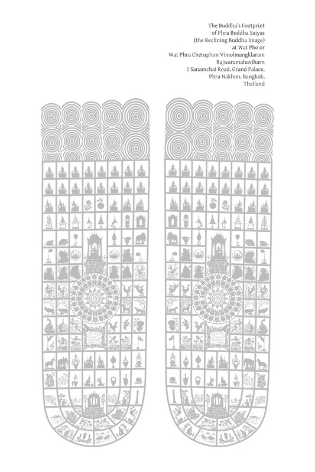
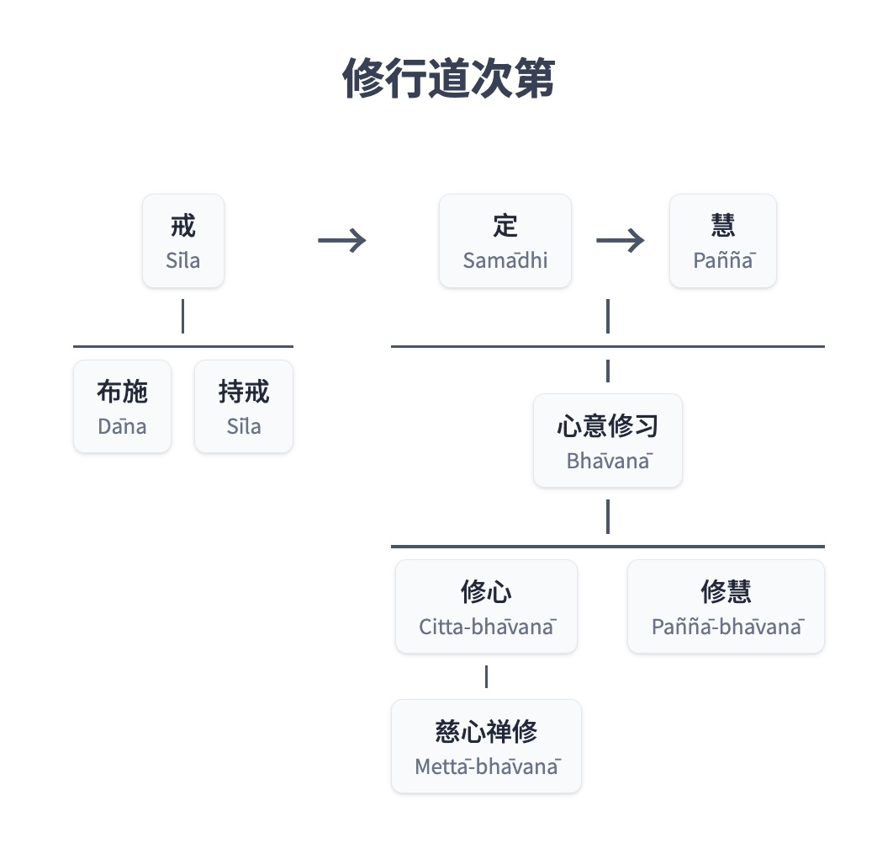
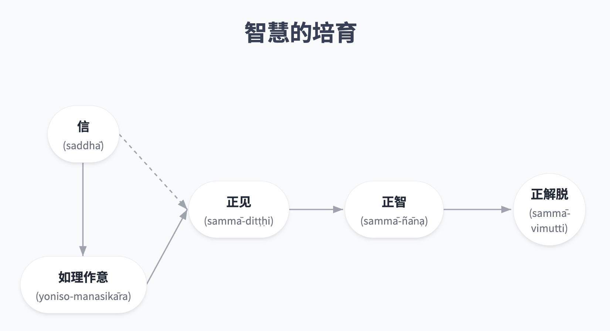

--
--

# 第十二章：中道导论

## 导论

中道（majjhimā-paṭipadā），亦称道（magga，即第四圣谛），体现了佛教修行的系列原则：它是一套完整的佛教行为准则。它包含了基于对佛教理论教义理解的实际教导，这些教导根据自然过程引导人们达到佛教的目标。它是一种在自己生活中实现教义的方式，一种应用自然法则并从中获得最高利益的方法。为了初步理解中道，让我们思考佛陀在第一次说法——《转法轮经》（Dhammacakkappavattana Sutta）中的这一教导：

### 作为中道的道

> 诸比丘，对于已出家者，这两种极端不应遵循。哪两种？沉溺于欲乐中的感官快乐，这是低劣的、粗俗的、低级的、不圣洁的、空洞的；以及追求自我折磨，这是痛苦的、不圣洁的、无益的。如来已觉悟中道，它不陷入这两种极端中的任何一种，它产生智慧（vision），它产生知识，它导向平静，导向直接知识，导向觉悟，导向涅槃。那中道（majjhimā-paṭipadā）是什么……？它就是这八圣道分；即：正见、正思惟、正语、正业、正命、正精进、正念、正定。V. I. 10；S. V. 421。

这项教导完整地总结了中道的意义、精髓和目的。请注意，它是一条“中”道，或“中”路，因为它不陷入两种极端中的任何一种（然而请注意，这不应理解为这条道介于这两种极端之间）：

1.  Kāma-sukhallikānuyoga：沉溺于感官享乐；感官放纵的极端；极端享乐主义。
    
2.  Atta-kilamathānuyoga：自我折磨的极端；极端苦行。
    

有时，佛教徒和非佛教徒都会给“中道”这个表达赋予非常广泛的含义，以表示介于两种对立行为或思想之间，或介于两个不同的人或团体所进行和持有的行为与思想之间的一种行动或思想。

这种中点或中道没有任何坚实的基础；一个人必须等到两个对立的团体出现，才能确定中间点，这取决于这两个派别的信仰或实践程度。中间点会随着双方立场的改变而移动。有时这种中道似乎与佛教中的中道（majjhimā-paṭipadā）相同，但实际上它是伪造的。

真正的中道有明确的标准。中道的有效性在于它有一个明确定义的目标。目标明确后，通往这个目标的道路，或恰当、正确、富有成效的行为，就是中道。

这类似于射箭或开枪——必须有一个明确的目标。准确或正确的射击是任何有利于箭或子弹击中目标的行动。在这种语境下的“中道”就是精确地、直接地射向目标。

所有偏离的射击，无论是偏向哪个方向，都是有缺陷和不准确的。与这些错误的射击相比，人们会看到只有一个目标，它直接位于中间且清晰明确，通往目标的路径也同样是一条中道。

正确的道路有其自身真实的目标，这目标不取决于错误射击的轨迹。中道有一个明确的解脱目标——苦的止息。

道（magga）——即与此目标一致并有效地实现此目标的思想、行动和行为系统——因此就是“中道”（majjhimā-paṭipadā）。

因为中道有一个明确定义的目标，或者说中道依赖于拥有这样一个目标，所以法的修行者必须知道这个目标才能走上这条道——必须知道自己要去哪个方向。因此，中道是一条智慧之路，始于正见：它始于对自身问题和目的地的理解。它是一条理解、理性、接受之路，需要勇气去面对真相。

当人们拥有这种知识和勇气时，他们就能够自主地管理自己的生活，独立地过上正确和有德行的生活，而不依赖于外部的神圣、超自然或神圣力量。当人们基于自己的智慧建立了信心时，他们就不必被自己认为存在于正常人类领域之外的事物所困扰和担忧。这种信心是中道的一个特质。

当一个人了解自己的问题和通往目标的道路时，道的行者会进一步理解中道赋予生命以价值。生命不仅仅是屈服于世俗潮流，被物质诱惑所奴役，或仅仅渴望美味的感官享乐，从而让自己的快乐、美德和价值完全依赖于物质事物和外部因素的波动。相反，一个人培养自由和自信，并认识到自己固有的价值。

除了不倾向于物质主义的极端，以至于被物质事物奴役和依赖之外，中道也不倾向于精神上的极端。它不教导所有事物都 exclusively 依赖于努力和心境成就，以至于一个人放弃物质事物并忽视自己的身体，从而导致一种自我折磨的形式。

符合中道的行为特征在于不压迫他人和自己，以及对物质和精神现象的理解。然后，一个人以准确的知识进行实践，与因缘和谐一致，并有利于根据目标产生果实。一个人不只是为了体验愉悦的感官印象而实践，也不是出于某种天真的信念，认为事情必须以某种特定方式完成。[\[1\]](#fn-fn1)

如果有人提及中道或走中道，应该问他或她是否理解眼前的问题以及这条道路所导向的目标。

中道的原则可应用于人类所有的工作和活动。一般来说，所有人类的系统、传统、学术研究领域、机构和日常活动，例如正规教育，都旨在解决问题、减少痛苦，并帮助人们实现更高形式的美德。与这些系统、传统等建立适当关系，需要理解其目标，即以智慧和正见与它们相处，符合中道。

然而，常见的情况是，人们往往错误地实践，不理解这些系统、程序和活动的真正目标。

错误的实践会以两种方式偏离：有些人将这些系统和活动用作自我满足的工具或机会，例如在政治中，他们利用这个系统来寻求物质利益、名望和权力。他们履行职责并增加他们的正式知识，以充实自己并获得有影响力的职位，从而最大限度地提高自己的舒适和快乐。他们不为实现该工作或知识领域的真正目标而行动。他们没有正见，而是受邪见（micchā-diṭṭhi）的支配。

另一群人则坚定不移地致力于工作或学习。他们筹集资金，凝聚内在力量，并怀着极大的奉献精神牺牲时间，但他们不理解活动真正的目的——例如，他们不知道通过执行活动应该解决什么问题。结果，他们白白浪费时间、金钱和精力，徒劳地给自己带来麻烦和疲劳。这是缺乏正见的另一种方式。

第一类人设定自己的目标是为了满足渴爱。他们的行为与活动或工作的真正目标不符。第二类人只是行动，却不理解其行动的真正目的。这两类人陷入了两个极端。他们没有走中道，反而给自己制造了更多问题。

只有当他们能够遵循中道，以符合特定活动真正目标的知识行事时，他们才能够成功解决问题并消除痛苦。

总而言之，如果一个人不从正见开始，就无法进入中道；如果一个人不遵循中道，就无法到达苦的尽头。（见注：中道）

### 作为比丘和在家众修行与生活方式的道

中道

> 有时，人们可能使用“中道”一词来表示既不过于僵硬也不过于松懈的努力，或者既不懒惰也不强行紧张的工作或训练。虽然在这些语境下，“中道”一词可能与中道有一些共通之处，但它并非绝对正确。即使是那些遵循中道的人，也可能付出过多的努力，或不够的努力，因此未能实现修行的成果。在这种情况下，佛陀使用viriya-samatā来指正确的精进（此词意为正确、平衡或持续的精进；samatā = samabhāva = 平等、平衡、适宜、节制、持续性）；见：Vin. I. 181；A. III. 374-5。有时，当人们确定走在正确的道路上，充满信心并做好准备时，他们被鼓励要竭尽全力，即使在此过程中必须放弃生命。例如，佛陀本人在觉悟之夜就无所畏惧地决心（A. I. 50）。不应将此主题与中道混淆。

> 诸比丘，无论是居士还是出家者，我都不赞许错误之道。无论是居士还是出家者，如果修行错误，因为采取了错误之道的修行方式，他就无法证得善的正道。什么是错误之道？它就是：邪见……邪定。我赞许正道，无论是居士还是出家者。无论是居士还是出家者，如果修行正确，因为采取了正确之道的修行方式，他就证得善的正道。什么是正道？它就是：正见……正定。[\[2\]](#fn-fn2)S. V. 18-19。诸比丘，正如恒河之水流向、倾斜、倾向于大海，同样地，修习和培育八圣道分的比丘，也渴望、倾斜、倾向于涅槃。S. V. 41。乔达摩大师，正如恒河之水流向、倾斜、倾向于并融入大海，同样地，乔达摩大师的僧团，无论是出家者还是在家众，都渴望、倾斜、倾向于并融入涅槃。M. I. 493-4。

这些关于正确和错误修行的段落揭示了佛陀本意中道适用于所有人，包括出家者和在家众；它是一项由每个人——比丘和居士——都能实现和圆满的教义。

### 作为与社会相连的精神实践之道

> 阿难，拥有善友、拥有善伴、乐于亲近善人，这等同于整个梵行。当一个比丘拥有善友[\[3\]](#fn-fn3)……可以预期他将培育和发展八圣道分。S. V. 2-3。诸比丘，正如黎明是太阳升起的先兆和前驱，同样地，拥有贤善之友是比丘八圣道分生起的先兆和前驱。S. V. 29-30。

这些段落显示了人与社会环境之间关系的重要性，这是影响和支持佛教修行的关键因素。它们表明在佛教中，一个人的生活方式和精神实践与社会紧密相连。

> 诸比丘，正如黎明是太阳升起的先兆和前驱，同样地，如理作意（yoniso-manasikāra）的圆满是比丘八圣道分生起的先兆和前驱。可以预期，圆满如理作意的比丘将培育和发展八圣道分。S. V. 31。

这段话引入了一个概念：尽管社会因素至关重要，但不应忽视个人内在精神因素的重要性。内在和外在因素都可以成为精神实践和正确生活方式的动力。事实上，这两个因素是相互支持的。

这段话强调，正确的精神实践，或有道德的生活，是这两种因素整合的结果。当这两种因素相互服务和帮助时，在通往生命最高目标的道路上，进步最为成功。

然而请注意，教导常常更强调拥有贤善同伴的社会因素，而非如理作意的内在因素。有些段落，如上文所示，将拥有善友的价值等同于整个佛教教义的实践，此处称为“梵行”（brahmacariya）。这是因为大多数人必须依赖社会因素才能开始正确的实践和有道德的生活，或踏上圣道。

此外，健全的社会因素既是开启如理作意的触发器，也是增强和促进如理作意的支持。

这条规则只有极少数例外，即那些非凡之人，他们可以仅依靠自己固有的精神禀赋安全地在道上前进。他们无需外界影响即可开始如理作意，并且无需依赖社会因素即可不断唤起如理作意。[\[4\]](#fn-fn4)因此，这些段落是针对大多数拥有中等精神能力的人。

社会因素与内在因素的这一主题非常重要，将在后续章节中更详细地探讨。

### 作为业尽之道

> 这八圣道分是通往业（kamma）止息的道路，即正见……正定。A. III. 414-5；S. IV. 133。

此处的中道是通往业止息的道路。然而，非常重要的是，不要将此解释为以下含义：它仅仅指身体的消逝、死亡；[\[5\]](#fn-fn5)或者它指通过不造业或什么都不做来止息业，这是耆那教的教义，如业的章节所述；或者它指放弃活动，生活在被动状态中。

业的止息需要积极的活动和真诚的努力，但它是符合中道的行动，符合适当的行动方法，而不是偏颇的行为。

“业的止息”这个表达并不意味着不活动和自满，而是未觉悟者的行动的终止，以及圣者行动的开始。

凡人以渴爱和执取行事；他们执着于对善恶的个人观念以及提供某种个人利益的事物。这种人的行动在技术上被称为“业”（kamma），分为善业或恶业。

业的止息是指停止以执着于对错的个人观点和渴望个人利益的心行事。当对对错的个人执着不存在时，随后的行动就不再被称为“业”，因为业需要偏袒一方，需要事物是善是恶。

另一方面，觉悟者的行为与该特定活动的纯粹理由和客观目的和谐一致；它们不与任何渴爱或执取纠缠。

觉悟者不再造恶，因为不再有会迫使他们行为不端的因缘；他们的心中不再存有任何贪、嗔、痴，这些会驱使他们寻求个人利益。他们只行善事，只以智慧和慈悲行事。然而，这里的“善”是根据一般人的理解来使用的。觉悟者不执著于个人善的概念，也不执著于善作为某种个人身份的标志。

一般来说，当凡夫做善事时，他们的行为并非完全符合这些善行的真实目的，而是往往期待某种个人回报。在微妙的层面上，这可能是一种对个人声望的渴望，甚至是“我”做了善事的一种内在良好感觉。

然而，觉悟者所做的善行则完全符合其行为的意图、目的和必要性。因此，他们的行为在技术上不被称为“kamma”。

道是一种实践方式，旨在终止有意图的造作行为（kamma）；当kamma止息时，只有纯粹的行为（称为“造作”——kiriyā），在智慧的引导下，依然存在。

这是世间行为与出世间行为的区别。佛陀和阿罗汉教导和行动，是为了所有人的利益，他们的行为不构成kamma。通俗地说，他们的行为被简单地称为“善行”。

### 作为实用工具的道

> 诸比丘，譬如一人在漫长的旅途中，看到一大片水域，近岸令人恐惧且危险，远岸安全且无危险，但没有渡船或桥梁通往对岸。于是他想：“这里有这么一大片水域，近岸令人恐惧且危险……如果我收集草、木片、树枝和树叶，把它们绑成一个木筏，依靠木筏，用我的手脚努力，我就能安全渡到对岸。”然后这个人收集了草……和树叶，把它们绑成一个木筏……并安全渡到对岸。然后，当他渡过并到达对岸时，他可能会这样想：“这个木筏对我非常有帮助，因为依靠它……我安全渡到了对岸。如果我把它扛在头上或背在肩上，然后去我想去的任何地方，那会怎么样呢？”诸比丘，你们认为呢？这样做，这个人是在做对木筏该做的事吗？\[诸比丘回答：“不，大德”，佛陀继续道：\]这个人做些什么才算是对木筏该做的事呢？诸比丘，当这个人渡过并到达对岸时，他可能会这样想：“这个木筏对我非常有帮助……如果我把它拖到陆地上，或者把它系在水边，然后去我想去的任何地方，那会怎么样呢？”诸比丘，这样做，这个人才是对木筏该做的事。法类似于木筏，我向你们揭示它是为了渡过，而不是为了执取。当你们彻底理解了我所阐释的、类似于木筏的法时，你们甚至应该舍弃善法，更不用说不善法了。M. I. 134-5. 诸比丘，即使这个正见是如此清净明亮，如果你们执着于它，沉迷于它，珍爱它，并将其视为自己的拥有，那么你们还会理解我所教导的、类似于木筏的法是为了渡过，而不是为了执取吗？[\[6\]](#fn-fn6) M. I. 260-61.

这两段经文告诫人们不要执取善法（包括执取真理或正确的事物），因为那样会使人无法从其真正的价值和目的中受益。此外，它们强调将所有善法和所有法教视为达到特定目标的手段或方法；它们既不是任意的，也不是其自身的目的。

在修习特定的法教时，重要的是要认识其目的，以及它与其他教法之间的关系。这里所说的“目的”不仅指最终目标，也指该特定教法或精神特质的重要功能：例如，要知道培养某种特质如何支持或产生其他特质，其局限性何在，以及一旦其功能完成，应由哪些其他特质接管。

这类似于一次旅程，人们在不同阶段必须使用不同的交通工具来穿越陆地、水域和空中。仅仅对目的地有一个概括的了解是不够的。人们需要知道每种交通工具能行驶多远，到达一个地点后，要知道接下来要使用哪种交通工具。[\[7\]](#fn-fn7)

缺乏对这些目的、要求和相互关系的洞察的灵性修习是有限和受阻的。更糟糕的是，它会使人偏离正轨，错失目标，并且停滞不前、徒劳无益。漫无目的的灵性修习会导致误解和有害后果。它会损害知足和舍心等重要的灵性品质。

### 作为梵行的道

> 诸比丘，你们应该为了多数人的利益和安乐，为了悲悯世间，为了诸天和人类的福祉、支持和安乐而游行……你们应该宣说正法……你们应该弘扬梵行。Vin. I. 20-21. ‘梵行，梵行。朋友，何谓梵行？谁是梵行的追随者？梵行的最终目标是什么？’ ‘这八圣道即是梵行；即正见……正定。具足这八圣道者，称为梵行者。贪的止息，瞋的止息，痴的止息；这就是梵行的最终目标。’ S. V. 7-8, 16-17, 26-7. 梵行的果报是什么？须陀洹果、斯陀含果、阿那含果、阿罗汉果；这就是梵行的果报。S. V. 26. 诸比丘，所以这梵行，它的殊胜之处并非获得、荣誉和名声，也非戒行的圆满，非三摩地的成就，亦非智与见。而是这种不动心解脱，才是这梵行的目标、核心和终结。[\[8\]](#fn-fn8) M. I. 197; 204-205.

梵行（brahmacariya）一词通常被理解为非常狭隘的意义，即过出家生活和禁欲，这只是该词的其中一个含义。（参见“梵行”的定义注释）

“梵行”的定义注释

> 注疏对“brahmacariya”一词给出了十二种定义。常见的定义包括：整个佛教；依八圣道修行；四梵住（brahmavihāra）；布施（dāna）；对自己的妻子知足；独身；以及说法（dhamma-desanā）：MA. II. 204. DA. I. 177 提供了十种定义；ItA. I. 109 提供了五种定义；KhA. 152 和 SnA. I. 299 提供了四种定义。Cūḷaniddesa 将brahmacariya 定义为禁欲（“不善行”——asaddhamma），并补充道：Api ca nippariyāyena brahmacariyaṁ vuccati ariyo aṭṭhaṅgiko maggo——“此外，通常来说，八圣道被称为梵行”（Nd. II. 10, 48）。Mahāniddesa 将cara 定义为：vihara（“住”、“存在”）；iriya（“动”）；vatta（“去”、“轮回”）；pāla（“保护”）；yapa（“进行”）；yāpa（“滋养”、“维持生命”）。例如，请参阅：Nd. I. 51, 159, 314. 以下是这些词语（rūpa-siddhi）的证实含义：cariya (中性) 和 cariyā (阴性) 源自 cara (词根 – dhātu) + ṇya (后缀 – paccaya) + i (附加音节 – āgama)。这里的Cariya 与泰语复合词 cariya-sikkhā (จริยศึกษา – 道德教育) 和 cariya-dhamma (จริยธรรม – 有德行的行为) 中使用的词相同。

事实上，佛陀使用这个词来指代根据佛教原则生活或佛教本身。这从佛陀派遣弟子“宣说梵行”的经文，以及他指出当四众——比丘、比丘尼、优婆塞、优婆夷——出家众（brahmacārī）和在家众（kāmabhogī——“享乐者”；有家庭者）——都很好地理解和实践法时，梵行将真正兴盛的经文中可见一斑。[\[9\]](#fn-fn9)

梵行（Brahmacariya）由 brahma 和 cariya 两个词组成。Brahma 意为“卓越的”、“上等的”、“至上的”、“清净的”。[\[10\]](#fn-fn10)Cariya 源自词根 cara，其具体意义是“旅行”、“前进”、“游行”，而其抽象意义则是“行为”、“引导自己的生活”、“举止”、“存在”。在这里，我们关注的是其比喻或抽象意义。（请注意，有时brahmacariya 写作brahmacariyā。）（有关进一步分析，请参阅“梵行”的定义注释。）

因此，作为复合词，brahmacariya 的意思是：殊胜的行为；卓越的举止；清净的、神圣的品行（类似梵天的行为）；以卓越的方式引导自己的生活；以卓越的方式生活；或是一种卓越的生活。[\[11\]](#fn-fn11)

cariya-dhamma（จริยธรรม）这个词是泰语中新设立的。虽然在巴利语中cariya一词本身就存在，但添加dhamma一词并无矛盾。cariya-dhamma在这里意为“正直的行为”、“有德行的行为”或“行为的基础”。它指的是行为的原则或生活举止的原则。在这里，我将不讨论cariya-dhamma一词更广泛的学术概念，而只关注其佛教含义。

采用这个新词，梵行（brahmacariya）可以定义为卓越的有德行的行为——卓越的cariya-dhamma。这种卓越的行为，或“至上”（brahma）的行为，特指佛陀所揭示和宣说的行为体系。

根据佛陀上面引述的经文，梵行——卓越的行为或佛教行为——等同于道（magga）或中道（majjhimā-paṭipadā）。同样，梵行者（brahmacārī）——其行为符合佛教原则者——是依道生活或依中道修行。

佛教教义指出，道——中道——是一个行为体系，一个实践应用体系，一个过有德生活的指南，或者一种人们正确引导自己生活的方式，它引导至解脱苦的彼岸。

以下几点概述了梵行：梵行、卓越的行为或符合中道实践的行为：

#### 有德行的行为

有德行的行为与自然中固有的真理相连；它以自然法则为基础。它关乎运用关于自然、因果过程的知识，通过建立一个有效且与这些法则和谐一致的实践体系或行为准则，以造福人类。

这种与自然的和谐可以从两个角度来看待。首先是关注源头，即看到有德行的行为是由自然真理所决定的。其次是关注目标，认识到这种行为的目的和宗旨。人们修习梵行是为了利益自己和全人类，过一种有德的生活，在社会中培养善行，从而导向所有人的利益和安乐。

就社会而言，例如，为了人们和平共处，倡导并建立行为原则，比如如何与他人互动，或如何对待自然环境。这些原则是根据人性的真理建立的，人性有某些需求和特质，这些都依赖于他人和环境。

就个人而言，为了人们安乐、明朗、快乐和心理健康，教导他们如何控制和引导自己的思想，以及如何净化自己的心。这些产生福祉的方法是根据人类心灵的普遍本性建立的，心灵受自然中固有的因果、非物质法则的支配。为了人们体验禅那的精致快乐和最高层次的洞察力，教导他们训练心灵、反思、正确对待事物，并发展不同阶段的智慧。这些更高层次的灵性修习方法是根据心灵运作的法则和有为法的法则建立的。

cariya-dhamma一词是brahmacariya的同义词，它涵盖了所有这些类型的灵性修习，可以分为许多不同的层次或阶段。cariya-dhamma可以定义为运用对实相的理解来建立有益的生活方式，以便人们能够实现最高形式的福祉。

#### 梵行（Brahmacariya）

梵行（Brahmacariya）——卓越的行为、道或中道——等同于佛教的整个实践教义。这个词的定义比泰语中的sīla-dhamma（ศีลธรรม——“道德”、“伦理行为”）一词要广泛得多。[\[12\]](#fn-fn12)就其一般特征、内容和目标而言，sīla-dhamma的含义较为狭窄。一般来说，sīla-dhamma指的是身语的外在行为，不伤害他人，戒除恶行，以及在社会中相互协助。

就其内容或主题而言，后者的含义倾向于局限于道德行为（sīla）：即身语的自制，以及梵住（brahmavihāra）的表达，例如慈爱和悲悯。虽然它与心相关，但它不包括三摩地的发展或智慧的培养以证悟有为法的真理。

至于其目标，它强调社会福祉、和平共处、世间进步——比如物质财富、名誉和声望——以及投生到善趣。简而言之，它与人天成就（sampatti）相关，与“现法利益”（diṭṭhadhammikattha）和“来世利益”（samparāyikattha）的初期阶段相关。

在这里，我们看到sīla-dhamma等同于sīla——“法”这个词的添加只是为了音韵和谐。

#### Cariya-dhamma

在泰国，cariya-dhamma一词仍然使人感到困惑。有些人将这个词理解为等同于sīla-dhamma——即一般的道德，而另一些人则赋予它学术或哲学的内涵。在这里，我将不深入探讨这些不同的定义。

只需说，类似于sīla-dhamma一词等同于sīla一样，cariya-dhamma等同于cariya（“行为”、“举止”）——其后缀dhamma不改变其含义。

cariya-dhamma一词涵盖了法实践的全部内容，从基本的道德行为开始。以下因素都包含在cariya-dhamma原则中：道德行为、发展良好的家庭关系、社会和谐、在寺院中作为在家居士持守戒律、在森林中履行出家人的职责（samaṇa-dhamma）、愉悦心境、培养心理健康、心理训练、禅修、毗婆舍那实践等等。

如上所述，包含cariya一词的brahmacariya指的是道或中道，但它强调行为或生活方式。本质上，brahmacariya指的是以德行生活的一个体系，或佛教中整个法实践体系，因此它包含了泰语中使用的sīla-dhamma一词。它还包括心的训练、德行的灌输，以及智见（ñāṇa-dassana）的发展，这是更高智慧的一个方面。

总而言之，brahmacariya指的是通过身、语、意来培养德行的手段，或者从三学的角度来看，它是戒（sīla）、三摩地（samādhi）和智慧（paññā）的完整训练。

这种卓越行为的目标是实现佛教灵性修习的每一个阶段，直到达到梵行的最高目标（brahmacariya-pariyosāna）：贪、瞋、痴的止息，真实明（vijjā）的实现，解脱（vimutti），清净（visuddhi）和寂静（santi）。总而言之，就是实现涅槃。

为求简洁，brahmacariya在这里被翻译为“梵行”或“过一种卓越的生活”。卓越的行为并非仅仅由有影响力的人的奇思异想或某个团体或社区的共识所能制定出来的，也不是盲目追随的东西。建立真正的卓越行为，并使这种行为结出果实，取决于对实相的认知。

### 作为实现人生目标的道

> 陛下，我告诉比丘阿难：“阿难……拥有善友，拥有善伴侣，以及乐于与贤德之人交往，等同于整个梵行。当一个比丘拥有善友时，他有望发展和培养八圣道……”因此，大王，你应该这样训练自己：“我将成为一个拥有善友，拥有善伴侣，并乐于与贤德之人交往的人……”大王，当你拥有善友时，你应该通过运用这个重要原则来生活：对善法的警觉。大王，当你警觉并精勤生活时，你的后宫嫔妃……你的贵族和皇家随从……你的士兵……甚至城镇居民和村民都会这样想：“国王警觉并精勤生活。来吧，我们也警觉并精勤生活吧。”大王，当你警觉并精勤生活时，你自己将得到守护和保护，你的后宫嫔妃将得到守护和保护，你的宝库和仓库将得到守护和保护。渴望拥有丰厚财富者，应万分谨慎；智者赞扬精勤行善。  
> 智者警觉  
> ，因此获得两种利益（attha）：  
> 此生可见的利益  
> 和未来的利益。  
> 智者通过获得利益，  
> 被称为贤者。Appamāda Sutta: S. I. 87-9; 参阅: A. III. 364.

attha（“利益”）一词也可译为“实质”、“意义”、“目标”、“益处”、“目的”或“宗旨”。在此语境中，它指人生的真正目的或目标，指的是梵行的目标或佛教的目标。

大多数人都知道，佛教的最高目标是涅槃，为此有一个称号paramattha，意为“最高善”或“最高目标”。在教授法时，人们通常会非常强调修行以达到最高目标。

然而，佛教并不忽视人们可能根据各自灵性成熟程度而实现的次要利益或目标，这些利益常常被清楚地定义，如上述经文所示。

据我所知，较早的经文将灵性利益（attha）分为两类，如上述经文所示：

1.  Diṭṭhadhammikattha：初期利益；现法利益；此生利益。
    
2.  Samparāyikattha：深远利益；未来利益；更高利益。
    

在这种情况下，最高利益（paramattha）包含在第二类更高利益（samparāyikattha）中：它是第二种灵性利益的顶点。[\[13\]](#fn-fn13)然而，后来的经文作者希望特别强调最高利益，因此将其区分为一个独立的因素，从而产生了三个层次的灵性利益或灵性目标：[\[14\]](#fn-fn14)

1.  Diṭṭhadhammikattha：现法利益；此生利益；可见的利益。这指的是基本或即时的目标，明显的、日常的益处。它涉及外在的或普通的世俗目的和愿望，如物质财富、声望、快乐、赞誉、社会地位、友谊和幸福的婚姻生活。它也包括正当地追求这些事物，正确地对待它们，以一种给自己和他人带来快乐的方式使用这些事物，社会和谐，以及履行个人社会责任从而带来社区福祉。
    
2.  Samparāyikattha：未来利益；不显眼的利益；深远的利益，非立即可见。它关乎一个人的灵性生活或人类生命的真实价值；它指的是更高的目标，是当一个人从这个世界逝去时的保障，或者是获得优越福祉——比通常在世间实现的更大收获——的保证。这些利益包括：灵性发展和德行的增长；对道德行为、功德善事、善的培养以及基于信心和舍离的行为的兴趣；对德行力量的信心；宁静和内心的安乐；精致快乐的体验；以及禅那的卓越特质。（最初，觉悟的最高利益也包含在这个词中。）
    
    一个实现了这些利益的人，就从对物质事物的执着中解脱出来。他不会过分看重这些事物，以至于执取它们、屈服于它们，或让它们成为行恶的起因。相反，他看重德行，以热爱真理行事，珍惜优质的生活，并乐于灵性发展。达到这个阶段会产生可与世俗利益（diṭṭhadhammikattha）结合使用的结果，并且能支持自己和他人。例如，一个人不再用钱追求感官享乐，而是用它来帮助他人和提升自己的生活品质。
    
3.  Paramattha：最高利益；真实、本质的善。这指的是最高目标，最终目的地：证悟真理；彻底了知有为法的本性；不被世间奴役；一颗自由、喜悦和广阔的心；不被个人执着和恐惧所压迫；没有燃烧和腐蚀心灵的烦恼；从痛苦中解脱；实现完全纯净，并伴随完美寂静、光明和喜悦的内在安乐。换句话说，这指的是解脱（vimutti）：即涅槃。
    

佛陀承认所有上述利益或目标的重要性，认识到它们与个人的生活方式、职业、环境、熟练程度、准备和灵性根机的成熟度有关。

然而，从上面引用的经文可以看出，根据佛教，所有人都应该达到第二阶段的利益或目标。获得现法、即时利益是好的，但这还不够——不应止步于此。一个人应该进步并至少实现深远、灵性利益的某些方面。一个获得了前两个层次利益或达到了前两个目标的人，被称为paṇḍita——一个有智慧地生活的人，其生命并非毫无意义和空虚。

佛陀提供了关于如何实现所有这些利益的全面实用教导。有时他教授如何获得四种即时的、可见的利益：

1.  Uṭṭhāna-sampadā：精进；懂得如何运用智慧来处理自己的事务。
    
2.  Ārakkha-sampadā：懂得如何保护自己的财富和财产，使其安全无损。
    
3.  Kalyāṇamittatā：与贤德之人交往，他们支持一个人的灵性修习和发展。
    
4.  Samajīvitā：过均衡的生活；无需奢华也能快乐；收入大于支出；保持储蓄；节俭。
    

同样，他教授了如何获得四种深远、灵性利益：

1.  Saddhā-sampadā：拥有基于理性和符合佛教教义的信心；对三宝深具信心；相信kamma法则；安住于善法。
    
2.  Sīla-sampadā：具足道德行为；正直地生活和谋生；维持适合自己生活方式的道德戒律。
    
3.  Cāga-sampadā：舍离的成就；慷慨和乐善好施；乐于帮助有需要的人。
    
4.  Paññā-sampadā：有智慧地生活；懂得如何反思事物；运用辨别智慧；充分理解世间；能根据情况将心从不善法中解离。[\[15\]](#fn-fn15)
    

至于最高利益或目标（paramattha），因为它如此难以理解和实现，而且也是佛教与所有先前宗教教义区别开来的独特因素，佛陀对此给予极大强调是自然的。佛陀关于最高目标的教导散布于三藏之中，同样在这本《佛法》（Buddhadhamma）中，这个主题也经常被提及。

至于前两个层次的利益，历代佛教贤者和导师已经给予了充分的教导。第一层次——世俗、即时利益——已经向在家佛教徒进行了适合其特定时期和地点的教导。佛教徒乐于采纳任何在此背景下有效且不偏离中道的教导。在家佛教徒自己也能够根据其情况阐述和调整这些实践。

在上述经文中，佛陀强调不放逸（appamāda）这一特质是帮助实现所有上述利益的因素。Appamāda可定义为：不冷漠、不被动、不怠慢；专注、精进和有抱负；做好充分准备并警觉；迅速做该做之事，调整该调整之事，行善之事。一个不放逸的人知道，精进是一种基本的灵性品质，能带来现法和未来的利益。

这里附加的规定是，不放逸必须牢固地建立在与贤德之人交往、拥有善友，以及让他们参与自己的活动之上。此外，佛陀在这里解释不放逸的含义是“对善法的精进”——从事有德行的活动和“行善业”（puñña-kiriyā）。

puñña-kiriyā一词提供了一个与相关主题有趣的联系。当佛陀在某些场合谈及次要利益或目标时，他会降低与最高目标相关的强调。当教导的重点降低到次要目标之一时，他所推荐的修行层次也会降低或放宽。

这不仅发生在具体的、孤立的情况下；当他提出普遍、广泛的实践体系时也是如此。

我们在佛陀关于这三个阶段利益的教导中看到了这一点。在这里，修行体系并非按照通常以最高目标为主的教导中三学——戒（sīla）、三摩地（samādhi）、智慧（paññā）——的渐进教导来制定，而是重构为被称为“功德行”（puñña-kiriyā）或“功德行所依”（puññakiriyā-vatthu）的普遍教导。

在这项教导中，同样有三个因素，但名称不同。[\[16\]](#fn-fn16)它们如下：

1.  Dāna：布施、舍离、慷慨。布施的原因多种多样：帮助贫穷、困顿或有需要的人；表达善意以建立信任、建立友谊和发展社区和谐；通过赞扬、鼓励和支持善人来尊崇德行。布施的物品也多种多样：个人财产、物质物品和维持生命的必需品；技术知识、建议、生活指导或法布施；参与善行的机会；以及宽恕的布施（abhaya-dāna）。
    
2.  Sīla：有德行的行为和正直地谋生；道德戒律和良好举止。这里的主要强调是不伤害他人，和平共处，通过持守五戒：不杀生或伤害其他众生；不侵犯他人财产或所有物；不侵犯他人所珍爱之人——不通过侮辱他们或破坏他们的家庭来冒犯他人；不通过错误或冒犯性的言语来伤害或损害他人；以及不因服用损害正念和正知的上瘾药物而给自己制造麻烦——正念和正知是作为约束、防止伤害和保持德行的灵性品质。
    
    除了五戒之外，还可以选择在适当的时候持守八戒或十戒，训练自己戒除某些奢侈品和令人愉悦的感官对象，过简朴的生活，减少对物质的依赖。或者，也可以从事各种形式的公共服务和协助（veyyāvacca-kamma）。
    
3.  Bhāvanā：心和智慧的培养；进行心理训练以发展德行，强化和稳定心，并产生真正辨别有为法的智慧；拥有正确的世界观或人生观。
    
    这里所说的修行，是指禅定和智慧两者，在三学中它们被区分为定修 (samādhi-bhāvanā，或心修 citta-bhāvanā) 和慧修 (paññā-bhāvanā)。在此，这两者的区别不被强调，因此它们被结合为一个因素。这个因素涵盖范围广泛，包括正精进 (sammā-vāyāma)——即努力断除心理烦恼并培养善法——这在八圣道中属于禅定组；以及正见 (sammā-diṭṭhi) 和正思惟 (sammā-saṅkappa)——特别是慈心的修习，它是个人和社会福祉的来源——这在八圣道中属于智慧组。
    
    经文建议发展这种禅定与智慧结合的修习，包括：通过听闻佛法 (dhamma-savana；这包括阅读佛法书籍) 以寻求智慧并净化心灵；背诵或教授佛法；讨论佛法；修正和纠正自己的信念、见解和理解；培养慈心；以及限制和降伏心理烦恼的普遍方法。
    

显而易见，当佛陀将教导的重点转向生命更基本的方面或次要的修行成就时，他相应地调整了人们应该生活的方式，或者说佛法修行的系统。

在这个简化的修行系统中，他强调身语行为、人际互动和社会关系，这些都易于观察。布施 (dāna) 和持戒 (sīla) 这两个因素，着重于通过运用基本的、外在的行为作为修行方式，来实现心灵的发展和净化。人们运用这两个因素来消除粗糙的烦恼。

另一方面，禅定（或“增上心”——adhicitta）和智慧（或“增上慧”——adhipaññā）层面的修行，直接处理内在的精神事务，既微妙又困难。这种“功德行”(puñña-kiriyā) 系统不强调这个层面的修行，因此将这两个因素结合起来；此外，它指出了禅定和智慧中那些可以在日常生活中修习和发展的、不那么精微的方面。

后世的佛教导师倾向于将这种关于功德行的教导，视为适合在家居士。三学系统是标准系统，涵盖了全部的佛教修行。比丘僧伽，象征着一个运用完整修行模式的社群，应该在实行三学系统中充当领导者。

除了如上所述垂直划分利益或目标 (attha) 外，佛陀也根据一个人的责任或社会互动顺序，横向地对利益进行了分类。这里也是一个三重划分：

> 诸比丘，假设有一个湖泊，其水不浑浊、清澈、纯净。一个视力良好的人站在岸边，可以看到湖中的蜗牛、蛤蜊、石头、鹅卵石，以及成群的鱼，无论是游动的还是静止的。这是为什么？因为水不浑浊。同样地，一个心不浑浊的比丘，能理解自己的利益 (attattha)、他人的利益 (parattha) 以及两者的利益 (ubhayattha)。他有可能证悟超越凡夫的殊胜境界，即智慧与见解 (ñāṇa-dassana)，这能够导向觉醒。这是为什么？因为他的心不浑浊。A. I. 9. 当一个人为贪欲所困，[\[17\]](#fn-fn17)被贪欲所压倒和占据……当一个人怀有嗔恨，被嗔恨所压倒和占据……当一个人因愚痴而迷惑，被愚痴所压倒和占据时，他就会为自己、为他人、为两者谋划损害；并且他的心中会体验到痛苦和悲伤。当贪欲……嗔恨……愚痴被断除时，他既不为自己、也不为他人、也不为两者谋划损害。当一个人为贪欲所困……怀有嗔恨……因愚痴而迷惑时，他会身、语、意不善。当贪欲……嗔恨……愚痴被断除时，他不会身、语、意不善。当一个人为贪欲所困……怀有嗔恨……因愚痴而迷惑时，他无法如实地理解自己的福祉、他人的福祉或两者的福祉。当贪欲……嗔恨……愚痴被断除时，他能如实地理解自己的福祉、他人的福祉和两者的福祉。贪欲、嗔恨和愚痴使人盲目、无见识、愚蠢；它们限制智慧，导致苦恼，并且不利于涅槃。看到贪欲……嗔恨……愚痴的危害，我教导断除贪欲……嗔恨……愚痴……。事实上，这八圣道，即正见……正定，是断除贪欲、嗔恨和愚痴的道路，是修习之道。[\[18\]](#fn-fn18) A. I. 216. 诸比丘，考虑到个人的福祉，你们应该小心地成就它。考虑到他人的福祉，你们应该小心地成就它。考虑到两者的福祉，你们应该小心地成就它。 S. II. 29.

以下是这三种利益 (attha) 的定义：[\[19\]](#fn-fn19)

1.  Attattha：自身利益；实现个人目标，即前面提到的与自身相关的三种目标 (attha)，是个人特有的成就。这个因素强调在修行的每个阶段都要自力更生，以免成为他人的负担或社群的障碍。相反地，一个人要充分准备好帮助他人并有效地参与活动。实现这一利益的支柱是智慧。达到这一利益的教导有很多，例如“十种带来保护的美德” (nāthakaraṇa-dhamma；“带来自力更生的美德”)。广义来说，这个因素指的是在个人责任方面完成三学的修习。
    
2.  Parattha：他人利益；培养他人的自力更生；帮助他人实现福祉或达成修行目标，即前面提到的与他人相关的三种目标 (attha)，是他我之外的成就。实现这一利益的支柱是慈悲。促进这一利益的教导包括四摄法 (saṅgaha-vatthu) 和关于善知识 (kalyāṇamitta) 责任的教导。
    
3.  Ubhayattha：双方利益或共同利益；前面提到的三种目标 (attha)，由自己和他人共同实现，或者由自己和自己的社群共同实现，例如通过共享财物或集体活动而获得的利益。特别地，这种利益指的是一个社会环境和生活方式，有利于社区所有成员修行以实现个人利益并为他人利益而行动。实现这一利益的支柱是戒律 (vinaya) 和僧团和合 (sāmaggī)。与此主题相关的教导包括六和敬法 (sārāṇīya-dhamma)、七不退法 (aparihāniya-dhamma)，以及关于支持社会必要行为的普遍教导。
    

这两种三元组的利益或目标 (attha) 因此可以组合成一个单一的群体：

1.  Attattha：自身利益可以分为三个层面：
    
    1.  Diṭṭhadhammikattha：现世利益；基本或可见的目标。
    
    2.  Samparāyikattha：来世利益；更高或深远的目标。
    
    3.  Paramattha：究竟利益；最高目标。
    
2.  Parattha：他人利益可以分为相同的三个层面：
    
    1.  Diṭṭhadhammikattha：现世利益；基本或可见的目标。
    
    2.  Samparāyikattha：来世利益；更高或深远的目标。
    
    3.  Paramattha：究竟利益；最高目标。
    
3.  Ubhayattha：自己和他人双方的利益，或集体目标；所有类型的利益或目标（根据上述三个层面：现世、来世和究竟），支持发展和实现个人福祉以及他人福祉。
    

这部分关于生命各种利益的论述，自然地与前一部分关于修习梵行的内容相联系。因此，我们可以这样概括梵行 (brahmacariya) 或佛教行为 (cariya) 的意义：一个基于对自然真理的理解的修行系统，它有助于实现人生有价值的愿望，并培养一种生活方式和社会环境以支持证悟。

简而言之，它是一种基于真理的生活方式，导向有价值的目标，并培育一个健康的实现这些目标的环境。

### 作为三学或培养圣者的道

> 诸比丘，有这三种学处。哪三种？增上戒学、增上心学、增上慧学。何为增上戒学？在此，一位比丘于此法和律中持戒，以波提木叉 (Pāṭimokkha) 的戒律而自制，在行为和住处上圆满，对最微小的过失也见其危险。他受持并修习各种学处。这称为增上戒学。何为增上心学？在此，一位比丘离于欲乐，离于不善法，进入并安住于初禅，此禅伴随着寻与伺，有离生喜乐。随着寻与伺的止息，他进入并安住于第二禅，此禅有内在的明净和心一境性，无寻无伺，有定生喜乐。随着喜的消逝，他住于舍，正念正知，身受乐；他进入并安住于第三禅，诸圣者宣称：“他住于舍、具念、安乐。”随着乐和苦的舍弃，以及之前喜和忧的消逝，他进入并安住于第四禅，此禅无苦无乐，由舍念而清净。这称为增上心学。何为增上慧学？在此，一位比丘如实地理解：“这是苦。这是苦的生起。这是苦的止息。这是导向苦止息之道。”这称为增上慧学。A. I. 235-6。维沙卡朋友，三学原则的划分不包含在八圣道中，但八圣道包含在三学原则的划分中。正语、正业、正命——这些品质包含在戒蕴 (sīla-khandha) 中。正精进、正念、正定——这些品质包含在定蕴 (samādhi-khandha) 中。正见和正思惟——这些品质包含在慧蕴 (paññā-khandha) 中。 M. I. 300-301。

## 圣道与三学

### 从八圣道到三学

三学被认为是一个完整的修行系统，它涵盖了八圣道的全部内容，并为实际应用提炼了道的精髓。因此，它被用作描述佛法修行的标准教导。

可以公正地得出结论，八圣道包含了佛法修行的全部精髓，而三学则以实用的方式表达了佛法修行的整体。此外，三学汲取了道中包含的根本原则并对其进行了阐述，提供了全面的修行细节。

道 (magga)，或八圣道 (ariya-aṭṭhaṅgikamagga)，也可以翻译为“圣者八支道”、“导向成为圣者的八支道”、“圣者（佛陀）所发现的八支道”，或“包含八个因素的至上之道”。这八个因素如下：

1.  正见 (sammā-diṭṭhi；正确的理解)。
    
2.  正思惟 (sammā-saṅkappa)。
    
3.  正语 (sammā-vācā)。
    
4.  正业 (sammā-kammanta)。
    
5.  正命 (sammā-ājīva)。
    
6.  正精进 (sammā-vāyāma)。
    
7.  正念 (sammā-sati)。
    
8.  正定 (sammā-samādhi)。
    

“八圣道”这个术语导致一些人误解，认为有八条独立的道路必须依次走完：一旦完成一条路，然后开始另一条，直到八条都完成。他们认为必须分别地、按时间顺序地修习这八个因素。但事实并非如此。

“八圣道”这个术语清楚地指的是一条具有八个因素的单一道路。这类似于一条建造完美的道路，它拥有许多不同的元素和组成部分，例如：用于构建路面的土层、石头、碎石、沙子、混凝土和柏油；道路的边界；车道；道路弯曲处的路肩；交通信号灯；指示方向、距离和位置的路标；路线图；以及路灯。

正如一条道路由这些不同的部分组成，驾车者在上面行驶时依赖所有这些部分共同作用一样，道也包含了八个因素，而佛法修行者必须以整合的方式运用所有这些因素。

为了便于理解，佛陀将八道支分为三组或“蕴” (khandha; dhamma-khandha)。这些被称为戒蕴 (sīla-khandha)、定蕴 (samādhi-khandha) 和慧蕴 (paññā-khandha)，或者简单地称为：戒 (sīla)、定 (samādhi) 和慧 (paññā)。 (参见注 三组)

在这里，正语、正业和正命被包含在戒蕴中，就像人们可以将构成路面的压实泥土、碎石、沙子等区分为一组一样。正精进、正念和正定被包含在定蕴中，就像人们可以将道路的边界、路堤、车道和弯道——那些规范道路走向和方向的事物——分类为另一组一样。最后，正见和正思惟构成了慧蕴，就像人们可以将交通信号灯、标志和路灯归入第三组一样。示意图如下：

三组

> 参见上文引用的段落：M. I. 300-301；另参见：A. I. 124-5, 295；A. III. 15-6；A. V. 326-7；另参见五蕴或五组的分类（包括那些超越道德行为、禅定和智慧的事物，构成另外两个因素：解脱蕴 – vimutti-khandha – 和解脱知见蕴 – vimuttiñāṇadassana-khandha），载于：D. III. 279；A. III. 134-5, 271；AA. V. 4；NdA. I. 90。

三组（“三法蕴”）——戒蕴 (sīla-khandha)、定蕴 (samādhi-khandha) 和慧蕴 (paññā-khandha)——的这种分类，是一种将相似品质归类在一起的方式。

在实际应用方面，这些道支也以类似的方式分类，作为一个整体，它们被称为“三学” (tisso sikkhā)。单独而言，它们被称为增上戒学 (adhisīla-sikkhā)、增上心学 (adhicitta-sikkhā) 和增上慧学 (adhipaññā-sikkhā)。

这两个组都可以简单地称为 sīla-samādhi-paññā。(粗略地说，增上戒 adhisīla 等同于戒 sīla，增上心 adhicitta 等同于定 samādhi，增上慧 adhipaññā 等同于慧 paññā。)[\[20\]](#fn-fn20) 这些学处可以示意如下：

尽管三蕴的分类只是简单地将相似的品质归类在一起，但三学旨在展示这些品质在实践中如何按顺序应用。

词语 sikkhā 可以翻译为“学习”、“研究”、“纪律”、“认真注意”、“实践”或“培育”。 (参见注 生起与发展) 这个术语指的是训练和培养一个人的身行、言语、心境和智慧的根本方面，逐渐导向最高目标，即解脱：涅槃。

生起与发展

> 与 sikkhā 非常相似的巴利词是 bhāvanā，它被翻译为：“生起”、“发展”、“培育”、“成长”或“实践”。有时，人们会发现 bhāvanā 也有类似的三重划分：身修 (kāya-bhāvanā)、心修 (citta-bhāvanā) 和慧修 (paññā-bhāvanā)——参见 D. III. 219-20。然而，注释书说这段经文指的是阿罗汉所完成的身、心和智慧的发展 (DA. III. 1003)。通常，阿罗汉的圆满发展分为四个因素，其中戒修 (sīla-bhāvanā) 构成第二个，在这种语境下，最常用的是 bhāvita 这个词：bhāvita-kāya, bhāvita-sīla, bhāvita-citta, 和 bhāvita-paññā。

三学的简要定义如下：[\[21\]](#fn-fn21)

1.  增上戒学 (adhisīla-sikkhā)：[\[22\]](#fn-fn22) 在行为层面以及符合道德规范的层面上进行训练和学习，以使身、语和生计保持正直。
    
2.  增上心学 (adhicitta-sikkhā)：[\[23\]](#fn-fn23) 训练心，培养精神品质，生起快乐，发展心境，并在禅定上获得熟练。
    
3.  增上慧学 (adhipaññā-sikkhā)：训练更高层次的智慧，生起透彻的理解，从而导向心的完全净化和从苦中解脱。
    

为了对这三学给出完整的定义，必须结合对其目的的解释。三学指的是对行为、心和智慧的训练，它导向苦的止息、真正的快乐和解脱。在此解脱之道语境中，每一学处的核心如下：

*   增上戒学的核心是在社会中正直地生活，支持、保护和促进和平与贤善的共存。道德行为是发展心之品质和培育智慧的基础。
    
*   增上心学的核心是发展和提升心的品质和潜能，这支持正直的生活，并有利于以最佳方式运用智慧。
    
*   增上慧学的核心是根据实相来辨识和理解事物，洞察有为法的本质，从而以智慧生活和行动。一个人知道如何正确地与世界相处，并与他人分享福祉，拥有一个明亮、独立和喜悦的心，远离痛苦。
    

三学的核心不限于个人，也关系到或呼吁人们在其社区和社会背景下的责任：建立社会系统、构建机构、安排活动，以及运用各种方法，以便这些学处的精髓融入社会，或者让人们以三学为基础。（在此，道德规范作为这些社会系统的基础，从而与增上戒学相联系。）

广义来说，当 sīla 一词包含道德规范或戒律时，sīla 的意义包括创造一个环境，无论是物质的还是社会的，它有助于防止恶行、不善行，并促进善行。这在建立社会系统和公益事业方面尤为真实，通过建立社区、组织或机构，并通过制定道德规范和规定规章制度，来规范人们的行为并促进社区福祉。这种道德规范的专有名词是 vinaya。

严格来说，制定戒律 (vinaya) 是使人们确立善行 (sīla) 的准备或工具；从技术上讲，vinaya 尚未达到 sīla 的阶段。但如上所述，在修行方面，戒律与道德行为相关联，并为其奠定基础。因此，综合而言，vinaya 包含在 sīla 一词中。

道德规范应根据特定社区或社会的目标来制定。例如，佛陀为比丘和比丘尼僧团制定的僧团戒律 (Vinaya) 既包含处理比丘和比丘尼个人行为的戒条，也包含处理僧团事务的戒条：行政管理、调查和审议法律问题、施加惩罚、任命僧伽官员、僧伽会议程序、接待来访者和作为客人的适当礼仪，以及僧团财物的使用。[\[24\]](#fn-fn24)

在更广阔的社会背景下，佛陀提出了供领导者和统治者使用的广泛原则，他们应该根据自己的国家或民族来确定行为的细节。一个例子是关于“转轮王律” (cakkavatti-vatta) 的教导，它提出了国王或皇帝以正法治国的原则，以利于全体国民，防止国内无法无天、不道德和邪恶，并分配财富，使没有一个公民陷入贫困。[\[25\]](#fn-fn25)

在当代语境中，在整个社会中促进善行 (sīla) 的戒律 (vinaya) 涵盖了许多方面，包括：政府、立法和司法机构；经济、文化传统、社会机构；以及其他重要方面，如关于成人娱乐场所、声名狼藉之处、成瘾物质、犯罪和职业标准的政策。

本质上，“增上心” (adhicitta) 或禅定指的是发展止 (samatha) 的方法，以及各种（止）禅修方法，许多导师和禅修中心在佛教发展过程中设计和建立了这些方法，正如注释书[\[26\]](#fn-fn26)中描述的禅修系统所表明的，这些系统历经时代已有所调整。但从普遍、广义的角度来看，增上心或禅定涵盖了所有旨在使人心平静、使人们在德行上坚定不移、并激发热情和培养精进以发展善法的方法和途径。

从广阔的视角来看，类似于将 vinaya 包含在 sīla 一词中，增上心学包括建立善知识 (kalyāṇamitta) 的系统，提供七种适宜条件 (sappāya，参见注 适宜条件)，以及提升心的品质，使人们在禅修和心智发展中进步。这包括：建立轻松和令人神清气爽的场所；在人们的居住空间、办公室和工作场所创造一种愉悦、明亮的气氛；教育人们积极思考；在人们心中灌输慈心和悲心、行善的愿望和精神提升的渴望等品质；组织有助于生起德行的活动；鼓励人们采纳精神理想；以及教导人们加强心智并提升其能力。

适宜条件

> sappāya（带来轻松感的条件；适宜、支持和有利的因素；有利于禅修的条件；加强和支持禅定的条件）出现在三藏的不同段落中。注释书将这些因素汇编为七种：住处 (āvāsa/senāsana)；行处；觅食之处 (gocara)；言谈；听闻教法 (bhassa/dhammassavana)；人 (puggala)；食物 (bhojana/āhāra)；气候、环境 (utu)；以及姿势 (iriyāpatha)。如果这些因素不适宜和不利，则被称为 asappāya。参见：Vism. 127；VinA. II. 429；MA. IV. 161。

从严格、字面意义上讲，“增上慧” (adhipaññā) 指的是内观 (vipassanā-bhāvanā) 的发展，其修行系统与禅定修习方法以类似的方式演变。但从更广阔的视角来看，考虑到智慧的本质和目标，这个层面的修行指的是所有发展个人思维和认知能力的活动，涵盖了被称为“学习”或“训练”的整个范围。这种学习依赖善知识，特别是自己的老师，来传授“所学” (suta; 知识) 以及在艺术和科学方面的精通，始于职业知识（这属于善行 – sīla 的范畴）。

然而，职业或学术知识本身，并不符合增上慧的资格。老师应该在学生心中建立信心，并鼓励他们独立思考；至少学生应该发展符合佛法的正见。除此之外，老师可以帮助学生如实地看待事物，正确地与世界相处，明智地生活，发展有效的修行以降伏烦恼、消除痛苦，利益他人，并获得快乐。

一般来说，提供这个层面的训练是学校或教育机构的职能。这样的场所应该支持所有三个层面的训练：戒行、禅定和智慧；它们不应该只专注于智慧。这是因为增上慧学是训练的最高阶段，其完成依赖于前两个阶段作为基础。此外，这三个层面的训练是相互支持的。只有当这三个发展阶段良好整合时，修行才是真实和完整的。

在日常生活中，依照三学进行渐进且相互关联的修行很容易说明。例如：当人们和平共处时，他们不需要经历不信任或恐惧；当一个人不做恶事时，内心会平静；当内心平静时，一个人就能有效地反思和理解事物。当一个人不做恶事时，他会自信，心境安定；当心境安定时，他就能认真直接地思惟事物。当一个人做善事，比如帮助他人时，心是喜悦和清明的；当心清明时，他的思维也清晰敏捷。当人与人之间没有仇恨和报复问题时，心不会阴郁或冲突；当心不浑浊或脾气不好时，一个人会清晰地思惟事物，没有偏见和扭曲。从这些准备充分的基础开始，一个人能够发展更精微的修行层面。

### 在家众通过发展功德行来修道

如前所述，当佛陀以适合在家众或居士的方式教授佛法时，他没有以三学——戒、定、慧——的形式来应用道系统，而是重新调整了修行方式，仿佛建立了一种更简单的训练形式。在此，他设定了一系列新的基本原则，称为“功德行” (puñña-kiriyā) 或“功德行处” (puññakiriyā-vatthu)。在此教导中，同样有三个因素，但名称不同：布施 (dāna)、持戒 (sīla) 和心修 (bhāvanā)。

值得理解的是，类似于三学，关于功德行的教导也是一种学习和训练的形式。事实上，功德行的核心就是精神训练。

> 诸比丘，有这三类功德行处：……由布施组成的功德行处，由戒德组成的功德行处，以及由修习组成的功能行处。\[渴望善的人\]应该修习功德行，这些行有深远的影响并以极乐告终。让他修习布施、正直的行为 (samacariyā)，[\[27\]](#fn-fn27)和慈爱之心。一个培养这三种导向快乐的品质的智者，将证得一个喜悦、无苦恼的世界。[\[28\]](#fn-fn28) It. 51-52。

在这段经文中，佛陀提到三类功德行处后，通过描述一个人应该如何对待它们来作结，即“一个人应该修习功德行”。在这里，巴利语记载为：puññameva so sikkheyya。将这两个术语结合起来，形成复合词 puñña sikkhā：“功德学”。

这里的训练指的是生起、发展并熟练精神品质，即以一种与三学教导一致的方式在道上前进。以三学为标准，可以如下图“三学的应用”所示比较这些教导。

三学的应用 

如上所述，为在家居士讲授的功德行教导，强调个人的外在环境和基本的修行形式。这与针对僧伽的教导形成对比，后者强调个人的内在生活和更高层次的修行。

在三学中，修习的初始阶段包含在“戒”（sīla）这个词中。然而，关于功德善业的教导强调一个人处理物质财富和参与社会的方式，因此，初始阶段分为两个要素：通过布施来管理物质财富，这强化了善行的第二个要素。对于比丘和比丘尼来说，教导始于善行；对于在家众来说，则始于布施和戒。

换句话说，因为比丘和比丘尼与物质财富的关系不多，布施（dāna；“给予”）所扮演的角色较小。因此，在三学中，布施被附加或隐藏在戒行要素中。（关于僧团中物质财富的分配，请参阅律藏。）

关于深奥的内在要素，三学包含禅定和智慧两个阶段。僧伽生活致力于精神发展，致力于培育增上心（adhicitta）和增上慧（adhipaññā）。因此，三学将精神训练明确地分为这两个要素。相比之下，关于功德善业的教导只包含“修习”（bhāvanā）这一个词，根据上文，这里的重点是慈爱的修习。

在家众的生活直接涉及物质财产，而这些财产的寻求和管理是在与社会相关的环境中进行的。如果人们未能善加管理自己的财产，他们就会失去财产，个人和社会都会陷入困境。因此，有必要强调布施和善行这两个要素，作为两种不同的功德善业。尽管内在的精神修习很重要，但它需要以适合人们能力以及可用时间和精力的方式进行管理。在这里，心识训练和智慧发展这两个要素合并为单一的“修习”（bhāvanā）要素。而且，由于在家众生活的独特之处在于与更广泛社会的互动，这里的修习主要侧重于慈爱的修习。

为了符合上述教导，与其使用常见的“做功德”的表达，更准确的说法是鼓励佛教徒“修习功德”。功德（Puñña）指的是一个人在身体、言语、心识和精神方面的卓越品质和能力。我们被鼓励通过身体、言语、心识和智慧的训练来增加和提升我们的功德。这是一种自我发展；我们的生活将因此逐渐变得更加完善和繁荣。

功德善业的三个基础如下：

1.  布施（dāna）：给予；慷慨；布施。
    
2.  戒（sīla）：正直行为；与他人之间健康、互助、没有剥削的互动。
    
3.  修习（bhāvanā）：心识和智慧的培育。
    

在古代，尊者长者将这项关于功德善业的教导传授给后代。到了注疏撰写之时，又增加了七个要素。这些附加要素实际上是对原有三个要素的阐述：

1.  布施（dāna）：增加了两个要素：随喜功德（pattidāna）：通过共同行善，给予他人分享自己功德的机会；以及随喜他人功德（pattānumodanā）：通过随喜和支持他人的善行，而对他们的功德感到欢喜。
    
2.  戒（sīla）：增加了两个要素：恭敬（apacāyana）：谦恭有礼，尊敬长者和有德之人；拥有符合自己文化和传统的良好举止；以及助人（veyyāvacca）：帮助、服务和支持他人；致力于有益的活动。
    
3.  修习（bhāvanā）：增加了两个要素：听闻佛法（dhamma-savana）：听闻佛法教诲，这包括阅读有益的文献；以及弘法（dhamma-desanā）：向他人宣讲佛法。
    

*   特殊要素：确立正见（diṭṭhuju-kamma）：使自己的见解正直。这个要素必须伴随所有其他要素，以便一个人的行为是在正确的理解和正意乐下进行的。这相当于审查每一项活动，并确保真正的进步和良好的结果。

这些额外要素的增加构成了十种功德善业的基础：

1.  布施功德（dāna-maya）：通过给予获得的功德。
    
2.  戒功德（sīla-maya）：通过持守道德原则和善行获得的功德。
    
3.  修习功德（bhāvanā-maya）：通过修习获得的功德。
    
4.  恭敬功德（apacāyana-maya）：通过恭敬行为获得的功德。
    
5.  助人功德（veyyāvacca-maya）：通过服务他人获得的功德。
    
6.  随喜功德（pattidāna-maya）：通过与他人分享善行获得的功德。
    
7.  随喜他人功德（pattānumodanā-maya）：通过随喜他人的善行获得的功德。
    
8.  闻法功德（dhamma-savana-maya）：通过听闻佛法获得的功德。
    
9.  说法功德（dhamma-desanā-maya）：通过宣讲佛法获得的功德。
    
10.  确立正见功德（diṭṭhuju-kamma）：通过确立正见获得的功德。
    

### 八圣道与修习系统

这里产生一个问题：八圣道中的要素和三学中的相同要素为何以不同的顺序呈现？八圣道始于正见和正思惟，并以正定作结。为何三学的教导始于属于戒行组的正语，并以属于智慧组的正见和正思惟作结？

在回答这个问题之前，让我们回顾一下灭（nirodha）与道的联系。道是人们运用自然法则以利于其生活而产生的。道是一种建立起来的修习方式，旨在产生与自然过程和谐一致的结果。

道是运用对自然的理解并创建修习方法德起点。它是自然与人们根据具体情况使用的实用方法之间的桥梁。道是精神修习的关键原则。

作为一种补充教导，三学汲取了道的精髓，并通过调整和组织八圣道支，创建了一套系统的修习课程。这项教导的细节和重点根据具体情境或修习目标的不同而有所变化，从而导致要素的顺序与八圣道所列的有所不同。

由于道是精神修习的关键原则，它侧重于修习的必要组成部分。八圣道本身只是列出了这些必要要素。这类似于列出完成一项任务所需的工具清单，或者检查一条道路并分析其组成部分——在此阶段，尚未说明这些各种东西将如何使用。

在八圣道中，八个要素在个体佛法修行者内部运作，其顺序是根据它们彼此之间的关系来排列的。在这里，正见被列为第一个要素和起点，因为如果缺少这一个要素，其他任何要素都无法产生。

这类似于一次旅程——一个人必须知道要走哪条路。至少，他需要知道从哪里开始，因为没有这些知识，旅程就无法进行。精神修习也是如此。首先，一个人需要对将要进行的修习之道有所理解，或者至少有适当的信心。从这一点出发，一个人才能进行反思并采取相应的行动。修习依赖于理解的基础，这类似于一个人的起始资本。当正见清除障碍或开辟道路时，随后的道支就会随之产生。

一个人的见解、信念、理解和态度塑造了他思考和反思的方式。当一个人思考正确并以向前看的方式思考时，他会形成更清晰的理解。思想塑造了一个人的言语；当一个人反思得好而清晰时，他说话也会清晰。同样，一个人反思的性质和程度塑造了他行动的性质和程度。当一个人能够很好地反思事物并与他人讨论或分享这些想法时，这会指导和影响他的行动。反过来，一个人思想、言语和行动的范围或广度塑造了他谋生的方式。

言语、行动和谋生方式都需要精进。为了使一个人的精进成功，他必须运用规律而持久的念。在念的引导下，心识变得一心专注而稳定。

如果一个人始于正确、善巧的理解、信念和见解，即他具足正见，那么他的思想、言语、行动等将随之展开；它们也将是正确的、圆满的、真实的（sammā）。随着一个人逐渐发展这八个要素，他的精神修习也会深化。（参阅附注：互相协作的道支）

互相协作的道支

> 参阅注疏中关于道支关系的分析：VbhA. 114-17。另参阅VbhA. 91和Vism. 514-15中的类比，解释道支为何被划分为不同组别。一个比喻是三位朋友互相帮助采摘瞻波伽花，单人站立无法够到。正精进就像其中一人弯下腰，让第二个朋友，即正定，爬到他背上，从而延长他的触及范围。正念就像第三个朋友站在旁边，提供肩膀支撑第二个朋友，防止他摇晃。第二个朋友，独自站在第一个朋友背上时，仍然会左右摇摆，因此无法采摘花朵；当他依靠第三个朋友的肩膀支撑时，他保持稳定和直立，从而能够按预期完成任务。正思惟的比喻是它像手指，在手中翻转硬币，使“司库”，即正见，能够辨别硬币是伪造还是真品。或者，正思惟就像一个人翻转圆木，使“伐木工”，即正见，能够按愿望砍伐圆木。

三学侧重于实际应用，将道支组织成精神修习的各个阶段，以便这些要素以系统的方式产生果报。同样，在列出可用的工具并了解其各自功能后，一个人便确定这些工具的使用顺序；他指定在工作的不同阶段如何使用每种工具。

三学将焦点从道支在个体内部的相互关系，转向一个人与他或她的环境或社会的关系。它将重点从一个人的内在精神生活，转向外部环境。

例如，与其强调正见如何导致正思惟，进而导致正语和正业，这里教导的重点是向外，关注正语和正业的具体细节是什么，以及一个人应该如何与社区成员交谈和行动。它决定了一个人外在行为的性质，这种行为对一个人的思想和反思产生影响。例如，它为训练、生活和修习制定了一系列指导方针和规定，以便人们培养自制力，并能够自己辨别什么是适当的行为和举止。尽管三学始于关注人与社会和环境的关系，但它又回到了个体的内在精神生活。而正是这一点突显了僧伽（sikkhā）的真正含义，即“训练”、“学习”、“发展”。

在此意义上，正语、正业和正命是道德行为（sīla）的范畴。正语、正业和正命的训练、发展和增长（有助于解决问题并止息苦）被称为增上戒学（adhisīla-sikkhā）。

正精进、正念和正定构成心识专注（samādhi）的范畴。这三个要素的训练和发展（有助于止息苦）被称为增上心学（adhicitta-sikkhā）。

正见和正思惟构成智慧的范畴。这两个要素的发展（有助于止息苦）被称为增上慧学（adhipaññā-sikkhā）。

三学将重点从八圣道中描述的要素之间的相互关系，转变为个体的渐进式训练。此外，它始于普遍或基本的精神品质，然后转向更精微的品质，从精神修习中容易看到的部分，到难以定义和管理的深奥品质。它始于身体和言语的训练，然后侧重于心识和智慧的训练。

换句话说，三学将道支在个体中每时每刻相互运作的模式，转变为训练过程中较长的时间间隔，并根据特定阶段中特定要素的突出作用，将其划分为不同阶段。这项训练始于基本的道德行为，强调身体和言语的外在行为。然后，它进入禅定——心识发展——的精微层面，以支持和发展智慧，从而使智慧得到最有效的运用。

因此，三学是一个完整的修习系统，以一种在人们日常生活中训练人们的方式呈现，认识到人们生活在社会环境中。它被组织成若干阶段，这些阶段包含较长的时间间隔，并根据在每个特定阶段需要特别关注的精神要素进行排序。

这里需要注意的是，无论修行者在哪个阶段进行训练——无论是戒行、禅定还是智慧——每一个道支，从正见到正定，都在整个过程中始终运作和发挥作用。说一个人正在戒行、禅定或智慧的层面进行训练，仅仅是一种表述，表明在此时，一个人正在特别强调和重视发展特定要素或一组要素，或者在此刻，特定要素被召唤来发挥显著作用。

从一个角度看，似乎存在两种修习系统：一种是外在训练，另一种是内在训练。[\[29\]](#fn-fn29) 这两种系统是相互关联的，并且它们的有效性都得到了佛教教义的承认。

三学中概述的修习层次与八圣道中要素的功能之间的关系，可以用以下类比来描述：

一个人正在开车进行一次长途旅行。他始于遥远的平坦乡村，穿过迷宫般的山脉，最终抵达一个拥挤的大城市。

旅程可以分为三个阶段：第一阶段是漫长的乡村路段，道路平坦；中间阶段是在山区，蜿蜒于山坡之间，经过陡峭而危险的峡谷；最后阶段是在城市，那里有无数的道路和小巷，拥挤的建筑物，以及熙熙攘攘的人群，一个不熟练的人会很难找到目的地。

这个人以前从未开过车，他通过这次旅程开始了学徒生涯。他希望当他到达目的地时，他已经成为一名熟练的司机。

在旅程的第一段，这个人必须熟练运用手脚，并熟悉汽车的机械结构和仪表。此外，他必须小心避开过于松软或有坑洼的路段。他工作的主要重点仅仅是运用正常的谨慎，以确保汽车前进。如果道路平坦，并且他已熟练掌握基本的驾驶机械原理，汽车应该能轻松运行。

在第二段，这个人必须运用很大的精进和谨慎，引导汽车通过急弯和沿着陡峭的峡谷行驶，根据上坡或下坡减速或加速，并保持汽车稳定。此阶段的主要任务是精进、控制、持续的警觉和觉知，以及专注。

有人可能会问，他是否不再需要注意汽车的发动机和设备，或者不再避开坑洼和路面松软的地方。答案是，他仍然必须非常小心这些事情；事实上，他必须比以前更加小心。但在此阶段，没有必要提及这些事情，因为如果他对汽车的机械原理尚未熟练，或者如果道路完全破损不平，他将无法控制，可能不得不完全放弃行程。

他现在应该特别注意的，是道路的边沿、车道、弯道、上坡和下坡。旅程第二阶段的成功也可能取决于其他因素。例如，当他到达这些山区时，他可能会感到恐惧和怯懦，然后停下来或掉头；他可能会冒险前进，但却坠落悬崖（类似于有人在修习禅定时发疯或其修习偏离正道）；或者他可能会被景色迷住而停下车（就像有人被禅那的成就所吸引一样）。

在旅程的第三段，有数量惊人的街道、小巷和十字路口，广告牌、海报和路标，交通信号灯、建筑物、车辆和行人。司机必须有敏锐的眼睛，理解不同的标志和交通信号灯，能够阅读关于不同地标的信息，知道在哪里转弯，并且能够迅速准确地做出决定。此阶段的主要任务是不要迷路。

在开阔乡村的第一个阶段，需要对普通的前进运动保持谨慎，这类似于戒行（sīla）。在山区的第二个阶段，强调精进、控制、觉知和稳定，这类似于禅定（samādhi）。在城市的第三个阶段，需要敏锐的智慧且不迷失方向，这类似于智慧（paññā）。

很明显，尽管每个阶段都强调不同的心识品质，但道路本身在整个过程中都包含相似的属性。

这个类比提供了一个宽泛的概述。在实际修习中，这些不同的要素作为更大过程中的辅助性、重复性阶段，持续得到发展。这类似于一条漫长的高速公路，它包含一系列交替出现的平坦、陡峭和复杂的路段。

这证实了强调外在修习的三学与突出内在精神要素功能的八圣道之间的联系。当一个人修习戒行时，心识变得专注；当心识专注时，人以智慧反思。智慧等同于正见，即道的第一个要素。正见导致正思惟，进而根据道支的相互关系，导致正语、正业和正命。因此，正见生成并促进道德行为，然后引出随后的道支。此外，正见提升了精神训练的品质，并加强和完善了所有其他道支。[\[30\]](#fn-fn30)

从初步的角度来看，三学这个循环类似于三种不同的修习方式始终并行运作。一个例子是《清净道论》中对安那般那念（ānāpānasati）的描述，简而言之如下：警觉并检查自己的行为最适合此活动且最有效率，这是增上戒学（adhisīla-sikkhā）；使心识坚定和稳定（即保持与活动或所缘境同在），这是增上心学（adhicitta-sikkhā）；在此活动中运用智慧或生起的知识，这是增上慧学（adhipaññā-sikkhā）。[\[31\]](#fn-fn31) 

三学是佛陀经常宣说的法义（bahula-dhammīkathā）。以下段落描述了这种训练的顺序性质：

> 此是戒，此是禅定，此是智慧。由戒熏修的禅定带来巨大的果报和加持。由禅定熏修的智慧带来巨大的果报和加持。由智慧熏修的心识完全从烦恼中解脱，即从欲漏、有漏和无明漏中解脱。 D. II. 123.

戒、禅定和智慧之间的相互关系在日常生活中是可见的。当一个人行为纯净，对自己道德上的纯洁充满信心，不惧怕惩罚或被对手伤害，不担心批评或被排斥，并且不因对自己的恶行感到自厌而烦躁不安时，心识是平静的，并且专注于自己的思想、言语和行动。一个人的心识越平静和专注，其思维过程就越清晰，理解力就越敏捷。

这类似于未被搅动或摇晃的水；水面平静，沉淀物沉到底部，水清澈透明，使人能够清晰地看到事物。在更高层次的佛法修习中，这会产生更高的知识并消除烦恼，心识更加需要平静和清澈，并拥有能够暂停通过感官之门进行认知，而仅将注意力维持在所选的觉知对象上的一心专注，以便完全消除心识的“沉淀物”。

佛陀偶尔会以简单的形式呈现三学作为精神修习，这些教导常被后世佛教徒提及。例如，三学是被称为教诫波提摩叉（Ovāda Pāṭimokkha）的关键教导的重要组成部分，其中一偈包含三句：[\[32\]](#fn-fn32)

1.  诸恶莫作（Sabbapāpassa akaraṇaṁ）：不作一切恶。
    
2.  众善奉行（Kusalassūpasampadā）：修习一切善。
    
3.  自净其意（Sacittapariyodapanaṁ）：净化自心。
    

重要的是要强调正见或智慧要素的重要性：所有佛教的修习系统，无论是与八圣道相应还是与三学相应，都始于智慧并以智慧作结。

尽管三学始于道德行为，但这种行为作为起始资本，依赖于对将要修习事物的理解，即它依赖于正见。但由于这种基本的理解形式仅仅是知道前进的方向和从哪里开始，它并未作为独立的阶段包含在三学的广泛教导中。

当修行者拥有基本的理解或一套正确的信念时，他或她就开始戒行的训练：在身体行为、言语和谋生方式上。当正直的道德行为达成时，一个人就会在更精微的层面进行训练，通过发展心识（禅定），最终通过发展智慧达到从无明中解脱的程度。

事实上，智慧在整个精神训练过程中是持续培育的。最初，被称为正见的理解可能仅仅是符合理性分析的信念。在修习的后期阶段，一个人最初的理解或信念将通过适当的反思、思维和考察，以及通过亲证修习的成果和精神能力的增强，逐渐发展并变得更加清晰，直到智慧达到根据真相理解一切事物的阶段，达到解脱，并证悟涅槃。理性理解或理性信念成为心识中固有的真实而圆满的知晓：

> 这条中道修习生起智见（ñāṇa-karaṇī），生起眼见（cakkhu-karaṇī），并导向寂静、觉醒、涅槃。《转法轮经》（Dhammacakkappavattana Sutta）：律藏第一册第10页；相应部第五集第421页。

道最终归结于智慧，智慧在实现目标中起着关键作用。因此，在经文中，八圣道的末尾又增加了两个要素：正智（sammā-ñāṇa；对应于生起智见和生起眼见），以及正解脱（sammā-vimutti；对应于“寂静、觉醒、涅槃”）。[\[33\]](#fn-fn33)

因此，正见类似于一座桥梁，从无明（avijjā）通向明（vijjā）。当一个人拥有明（vijja）时，“正智”（sammā-ñāṇa）就会生起，一个人也就获得了正解脱。

请注意，正见（sammā-diṭṭhi）、正精进（sammā-vāyāma）和正念（sammā-sati）这三个要素扮演着特殊角色，因为它们始终与其他道支结合在一起。

它们重要的参与作用可以通过一次旅程的类比来解释。正见就像一盏灯或一个指南针，让人能够看到前方的道路，并确信自己正朝着目标的方向前进。正精进就像施加能量前进，或运用精进推动自己向前。正念就像一个控制、引导和守护一个人行动的工具，使他保持在道路上，以适当的速度前进，并避免危险。

因此，所有修习的层次，无论是戒行、禅定还是智慧，都依赖于这三个道支。[\[34\]](#fn-fn34) 

### 道之始末

正见（Sammā-diṭṭhi）被翻译为正见或正确见解。在世俗层面，这指的是根据法（Dhamma）的教导看事物。在出世间层面，这指的是直接根据真相看事物：根据实相或缘起法则。[\[35\]](#fn-fn35) 按照佛法教导看事物，甚至相信事物，例如相信行善会得善报，作恶会得恶报，就足以开始佛法修习。拥有这样的见解和信念，一个人就为修习做好了准备，并开始了戒行的第一阶段训练。

然而，只拥有这个层次正见的人，往往非常重视道德修习，而通常不会进展到禅定和智慧的阶段。在经文中，世俗正见常在法行（dhamma-cariyā）和十善业道（kusala-kammapatha）的教导中呈现，这些是在日常生活中修习八圣道的方式。

关于四圣谛的教导提供了一个更宽泛的正见（sammā-diṭṭhi）定义。尽管它没有明确提及正见，但它与八圣道的整体修习相对应。对四圣谛——人类问题的性质、这些问题的原因、目标以及修习方法——的基本理解，是开始佛法修习的基础。这类似于前面提到的知识：知道自己要去哪里，知道哪条路会引导自己达到这个目的，以及知道这条路从哪里开始。

正见最全面的定义是对真相的知晓：看清事物本来的面貌，以及事物如何依因缘而存在。这个定义涵盖了之前所有的定义，包括看清人类问题的性质，看清引起这些问题的因缘，以及看清道的性质。这个定义突显了正见或理解在道的整个过程中清晰的发展。一个人修习得越多，了解得越多，直到完成修习并了解所有必须知道的本质。

因此，正见是沿着中道修习的起点或主导要素；它是主要的道支，在精神修习的所有阶段都发挥作用。

然而，在道的发展过程中，正见不仅是其他道支的先决条件或支持；正见本身也受到其他要素的支持。一个人在道上进展得越远，正见就越得到滋养、加强和净化。最终，正见成为引领达到道的目标的关键作用者，因此可以说正见是道的始与终。

正见在道的过程中逐渐展开和深化，这表明正见的品质在修习的不同阶段是变化的。道之初的正见品质与道之终的正见品质有所不同。

道在不同阶段的正见可能具有与正见的普遍定义不同的特定属性。道之初的正见是不完整的，可能不符合正见（sammā-diṭṭhi）的完整定义。同样，道之终的正见具有独特的属性，因此应以另一个词来指代。在这些情况下，区分不同的巴利语术语是有益的。

因为正见是智慧的一个面向，所以这里适用的通用或集合术语是般若（paññā），它指的是通过在道上修行而逐渐培养起来的智慧。在修行的每个重要阶段，这种智慧都有其独特的属性，并以特殊的术语来指称，如下文将要讨论的。

根据中道，可以如此呈现智慧发展的纲要：

对于普通人而言，他们的学习依赖于他人的建议和教导，心灵的训练将始于某种形式的信仰，在佛教中这被称为“信心”（saddhā）。

这种信心可能是对某个特定教义基本合理性的相信，一种对逻辑分析的普遍信任，或者对老师推理阐述的信心。从这一点开始，学生们接受教导，聆听、学习和训练。这导致学生自身理解的增加和合理的辨别能力，这广义上被称为sammā-diṭṭhi。

当这种理解通过参与或经验逐渐增长并变得更加清晰，以至于成为一种了悟时，智慧就发展到了“正知”（sammā-ñāṇa）的阶段。这个阶段超越了所有形式的信仰（saddhā）和推理见解（diṭṭhi）。这是最终的阶段，达到了解脱——这个目标，被称为“正解脱”（sammā-vimutti）。

智慧发展可以这样说明：

> 信心（saddhā）→  
> 正见（sammā-diṭṭhi）→  
> 正知（sammā-ñāṇa）→  
> 正解脱（sammā-vimutti）。

遵循这个过程，起初智慧以潜在的形式存在，或者作为信心的辅助。然后智慧逐渐自行发展，直到它成为正知，在这个阶段它是纯粹而卓越的。此时，信心已不再存在，因为它已被智慧完全取代。只有在这个阶段，觉悟或解脱才可能实现。这个过程将在后续章节中更详细地描述。

请注意，参与这个过程的信心是能够引向智慧或有利于智慧的信心。这种信心或信仰必须伴随着智慧，或建立在如理作意（ākāravatī-saddhā 或 saddhā-ñāṇa-sampayutta）的基础上。它指的不是那种不需要运用如理作意就盲目相信的信心（amūlikā-saddhā 或 saddhā-ñāṇa-vipayutta）。

无论如何，如果只把智慧的发展或正见的建立看作仅仅始于信心，那是不够的。

从技术上讲，有一些特殊的人，他们能够在不依赖他人的信心的情况下培养智慧。他们完全依赖如理作意（yoniso-manasikāra）——即如实、如因缘地看待事物的能力——直到他们将智慧发展到证入真理的阶段。[\[36\]](#fn-fn36) 

同样地，普通人以信心开始的智慧发展，也依赖于他们运用如理作意的能力。特别是能够彻见真理并彻底消除烦恼的出世间智慧，没有如理作意是无法生起的。[\[37\]](#fn-fn37) 正确、可取的信心与如理作意相联系或激活如理作意。因此，完整的进程应如图“智慧发展”所示。

智慧发展 

总而言之，有两个因素导致正见的产生。第一是信心（saddhā），它指的是对他人智慧的信任或依赖。它作为对他人的教导的反应而生起，并以外部条件的方式标志着心灵修行的开始。第二是如理作意（yoniso-manasikāra），它指的是自行思考或正确思考的能力。它以内在条件的方式标志着心灵修行的开始。

saddhā这个词并非直接指一个人理解的来源，而是一种将一个人与外部因素联系起来的内在精神品质。理解的真正外部来源是影响一个人信仰的他人，或他人的教导，这在佛教中被称为“他音”（paratoghosa）。

除了有助于生起信心并作为建立正见的间接方法之外，他音也可以是运用如理作意的直接动力。因此，经典提出了正见的两个来源或因素：他人的言语（paratoghosa）这一外部因素，以及如理作意（yoniso-manasikāra）这一内在因素。

佛教非常重视正见，因为人们，包括佛教徒自己，通常没有对这一道支给予足够的关注。即使他们认识到其重要性，人们也往往只是口头说说，而不去付诸实践。因此，有必要提醒人们首先认识到正见的重要性，更重要的是，要找到生起正见的方法。

因此，在后续章节讨论各种道支之前，我希望先更详细地描述正见的条件。

## 附录一：三学之传统定义

三学的字面和正统翻译如下：

1.  增上戒学（Adhisīla-sikkhā）：作为更高德行的训练；是训练最高善行的方式。
    
2.  增上心学（Adhicitta-sikkhā）：作为更高心的训练；是训练心以产生最高定力的方式。
    
3.  增上慧学（Adhipaññā-sikkhā）：作为更高智慧的训练；是训练智慧以达到最高了悟境界的方式。
    

在巴利圣典中，三学的定义仅限于比丘。在此，增上戒学（adhisīla-sikkhā）指的是依循僧伽戒律（pāṭimokkhasaṁvara-sīla）的律仪，增上心学（adhicitta-sikkhā）指的是四禅那，而增上慧学（adhipaññā-sikkhā）则指四圣谛的智慧，或是心解脱（cetovimutti）和慧解脱（paññāvimutti）的了悟。[\[38\]](#fn-fn38) 《义释》稍作扩展了此定义。[\[39\]](#fn-fn39) 

《分别道论》拓宽了此定义，将增上戒学（adhisīla）定义为律仪（saṁvara），增上心学（adhicitta）定义为不散乱，增上慧学（adhipaññā）定义为正见或正解。[\[40\]](#fn-fn40)

《善见律注》声称，三学并非仅仅指五戒或十戒、八种禅定成就，或符合业报法则的理解，因为这些戒、定、慧的层次，无论佛陀出世与否，都可被教导。相反，三学特指伴随佛陀出世而有的戒、定、慧，即：增上戒学（adhisīla）等于依循僧伽戒律的律仪，增上心学（adhicitta）等于具备八种禅定成就的心，这些成就是毗婆舍那（观）的基础，而增上慧学（adhipaññā）等于能辨别三特相的毗婆舍那智（vipassanā-ñāṇa）。[\[41\]](#fn-fn41)

在最高的意义上，注释书说三学指的是出世间戒、定、慧，但这个定义只能在有限的语境中应用。

有时他们会放宽定义，指出增上戒学（adhisīla）指的是那些以涅槃为目标的人所奉行的道德行为——无论是五戒还是十戒，而增上心学（adhicitta）指的是八种禅定成就。[\[42\]](#fn-fn42) 关于佛陀谈到在家居士的“更高德行”的段落，[\[43\]](#fn-fn43) 注释书说这指的是五戒或十戒。[\[44\]](#fn-fn44)

有时，前缀adhi-仅仅表示比较两件事物时的“更好”或“更高”，例如十戒相对于五戒来说是增上戒学（adhisīla），而色界心（rūpāvacara-citta）相对于欲界心（kāmāvacara-citta）来说是增上心学（adhicitta）。[\[45\]](#fn-fn45)

本质上，三学指的是根据佛教教义正确实践的善行、禅定和智慧，它们有助于在灵性修行中进步。[\[46\]](#fn-fn46)

注释书经常在舍弃烦恼的各种阶段的语境中描述三学：

1.  戒（Sīla）等同于越作断（vītikkama-pahāna）：道德行为是舍弃粗重烦恼的手段，这些烦恼是身口越作（vītikkama-kilesa）的原因。
    
2.  定（Samādhi）等同于缠断（pariyuṭṭhāna-pahāna）：禅定是舍弃缠绕心识的中间烦恼（pariyuṭṭhāna-kilesa）的手段；一些注释者指出，这指的是五盖。
    
3.  慧（Paññā）等同于随眠断（anusaya-pahāna）：智慧是舍弃潜藏在一个人本性（santāna）中、等待条件激活时才会显现的细微烦恼（anusaya-kilesa）的手段；这指的是七种随眠（anusaya）。
    

三学的进一步定义包括：戒 = 对治断（tadaṅga-pahāna），定 = 镇伏断（vikkhambhana-pahāna），以及慧 = 断灭断（samuccheda-pahāna）；还有：戒是舍弃不道德行为的方式，定是舍弃贪爱（taṇhā）的方式，慧是舍弃邪见（diṭṭhi）的方式。[\[47\]](#fn-fn47)

道支被安排入三学的方式，类似于它们被安排入三“法蕴”（dhamma-khandha）的方式。[\[48\]](#fn-fn48)

## 附录二：两种极端

《增支部》中的一段经文将欲乐相应（kāma-sukhallikānuyoga）定义为粗陋之道（āgāḷha-paṭipadā），指的是那些相信贪欲无害并沉溺于感官享乐的人。它将自苦相应（atta-kilamathānuyoga）定义为枯竭之道（nijjhāma-paṭipadā），指的是裸体苦行者（Acelakas）的修行（这应仅被视为一个例子）。它将中道（majjhimā-paṭipadā）定义为三十七菩提分法（bodhipakkhiya-dhamma）中所包含的任何一组灵性品质（四念处、四正勤、四神足、五根、五力、七觉支和八圣道）。[\[49\]](#fn-fn49)

《自说经》中包含这段话：

> 那些以学习、道德行为、宗教仪式、谋生、持守梵行以及取悦（天神）为首要价值的人——这是一端。而那些认为贪欲无害的人——这是另一端。这两种极端会增长无明和贪爱，进而增长邪见。那些不理解这两种极端的人——一类人陷入泥沼，另一类人则逾越界限。那些理解这两种极端的人不会被它们困住，也不会因这种不执著而产生傲慢。对这些人而言，已无需再宣告轮回（的苦）。Ud. 71.

（注释书将“谋生”定义为“作为苦行者生活”，并将自苦相应（atta-kilamathānuyoga）等同于执著戒律和宗教修行（sīlabbata-parāmāsa）。）[\[50\]](#fn-fn50)

莲花

\[1\] 有关两种极端的更多信息，请参阅附录二。 

\[2\] “正直而健康的道路”（ñāya-dhamma）也可翻译为“引向解脱的健全”。ñāya或ñāya-dhamma指的是出世间之道、真理或涅槃。 

\[3\] 善知识（kalyāṇamitta）一词不仅指普通的友谊，而是指任何提供建议、传授知识、介绍思维方式和揭示修行道路的老师、朋友或指导者，包括书籍和各种媒体。 

\[4\] 注释书指出，只有具备卓越智慧的人，如一切知佛陀或独觉佛陀，才能通过自己的如理作意发展出全面的洞察力，而无需依赖社会因素（参见：MA. II. 346）。 

\[5\] 译注：泰语中sin wayn sin gam（“报应的终结，业的终结”）意为死亡。 

\[6\] 这里的“见”（diṭṭhi）指的是信仰、理论和对真理的理解。 

\[7\] 《传车经》（Rathavinīta Sutta, M. I. 145-51）特别强调此主题，根据七清净（visuddhi）描述了各种心灵品质的普遍和具体目标。 

\[8\] “不动心解脱”（akuppā-cetovimutti）是完美、不可动摇的心解脱。 

\[9\] M. I. 490-94; D. III. 123-6; 参照：D. II. 104-5 = S. V. 260-62 = A. IV. 310 = Ud. 63。 

\[10\] 关于brahma一词的不同定义，请参阅：MA. I. 34; BvA. 18; VbhA. 399。 

\[11\] Brahmacariyanti seṭṭhacariyaṁ，例如：DA. III. 708。 

\[12\] 关于戒法（sīla-dhamma）的定义，请参阅第十七章的附录二。 

\[13\] 参见附录二：“现法乐与后世乐”（Diṭṭhadhammika and Samparāyika），在第六章。 

\[14\] 例如：Nd. II. 57, 66, 72; 参照：SnA. I. 74; NdA. II. 296; VismṬ.：Cha-anussatiniddesavaṇṇanā, Buddhānussatikathāvaṇṇanā。 

\[15\] A. IV. 281-4。 

\[16\] 参见：D. III. 218; A. IV. 241-2; It. 15, 51-2; DA. III. 999; ItA. I. 78; ItA. II. 23。 

\[17\] 这里的贪欲（rāga）与贪（lobha）相同。 

\[18\] 另一部相似但较短的经文是：A. I. 157-8。在S. V. 124和A. III. 64, 234-5中，五盖（nīvaraṇa）被描述为未能认识这三种福利的根源。 

\[19\] 此信息的来源与第一组三大利益：现法义（diṭṭhadhammikattha）、后世义（samparāyikattha）和究竟义（paramattha）的来源相同；参见上文经文参考文献。另请参见VismṬ.：Cha-anussatiniddesavaṇṇanā, Buddhānussatikathāvaṇṇanā（两处）和VinṬ.：Paṭhamo Bhāgo, Verañjakaṇḍavaṇṇanā中关于佛陀功德（buddha-guṇa）的解释，其中指出自利（attattha）与般若（paññā）的关系，以及利他（parattha）与慈悲（karuṇā）的关系。 

\[20\] 请注意，将三学称为戒（sīla）、定（samādhi）、慧（paññā）是非正式的；在巴利圣典中，戒学（sīla-sikkhā）、定学（samādhi-sikkhā）和慧学（paññā-sikkhā）这些术语并不存在。在某些律藏文本中，三蕴和三学是按顺序排列的，但它们的原始名称（增上戒学adhisīla-sikkhā等）是严格保留的（例如：VbhA. 122; PsA. 196）。 

\[21\] 有关三学的教义解释，请参阅附录一。 

\[22\] 译注：作者使用英文翻译“training in higher morality”。 

\[23\] 译注：作者使用英文翻译“training in higher mentality”和“training in higher mental discipline”。 

\[24\] vinaya一词常被佛教学者狭义地解释，仅指处理个人行为的规章制度。 

\[25\] 参见D. III. 61中关于帝国戒律的教导，以及根据《瞿昙达那经》（Kūṭadanta Sutta, D. I. 135）的“王室供奉”（rājasaṅgaha-vatthu）；另参见SA. I. 144, ItA. I. 93。根据佛教原则为社会制定道德规范的突出例子是阿育王（BE. 218-260 或 270-312; CE. 325-283 或 273-231）所规定的统治制度。 

\[26\] 例如：Vism. 84-228。 

\[27\] 符合或与法（Dhamma）一致的行为。 

\[28\] 关于十种功德基础，请参阅：DA. III. 999; Comp.：Vīthimuttaparicchedo, Kammacatukkaṁ。 

\[29\] 通过考量关于善知识（kalyāṇamitta）和如理作意（yoniso-manasikāra）的教导，这个问题将变得更加清晰；参见第十三章和第十五章。 

\[30\] 参见第十六章中“修行语境下的正见”一节。 

\[31\] 参见：Vism. 274。 

\[32\] D. II. 49-50; Dh. 偈颂 183-5。关于将此教导归类为符合三学的分类，请参阅：DA. II. 479 和 DhA. III. 237。《长部注》指出，第一句指的是戒律仪（sīla-saṁvara），第二句指的是奢摩他（止）和毗婆舍那（观），即定和慧，第三句指的是阿罗汉果（arahatta-phala）。然而，《法句经注》将第三句解释为仅仅通过去除五盖（nīvaraṇa）来清洁心识，就等同于净化自己的心。通过参考这两个来源，我们可以将第一句定义为戒（可以扩展这个定义），第二句定义为定和慧，第三句也定义为定和慧（这里也可以包括解脱vimutti）。无论如何，《清净道论》提出了一个简单的分类，即第一句 = 戒，第二句 = 定，第三句 = 慧；参见：Vism. 4-5。 

\[33\] 将这两个因素加入八圣道，从而构成十个因素，这被称为十种正道（sammatta）或阿罗汉的十种品质（asekha-dhamma）；参见：D. III. 271, 292。注释书指出，正智（sammā-ñāṇa）等同于果智（phala-ñāṇa）和省察智（paccavekkhaṇa-ñāṇa）；参见：MA. I. 189; AA. II. 382。正智（sammā-ñāṇa）是正见的最终阶段（参见：MA. IV. 135; AA. V. 70）。 

\[34\] 关于这三个道支如何与其他道支一起生起的描述，请参阅《大四十经》（Mahācattārīsaka Sutta, M. III. 71-78）。 

\[35\] 关于正见的更详细讨论，请参阅第十六章。 

\[36\] 注释书指出，佛陀和独觉佛陀仅凭如理作意而觉悟，如理作意是正见的条件——参见：MA. II. 346。 

\[37\] UdA. 107的注释书指出，他音（paratoghosa；即信道）是世间正见的条件，而如理作意是出世间正见的条件。 

\[38\] A. I. 235-6。 

\[39\] Nd. I. 148; Nd. II. 9。 

\[40\] Ps. I. 47-8。 

\[41\] VinA. I. 244。 

\[42\] 例如：DA. III. 1002。 

\[43\] 例如：A. III. 263-4; A. IV. 25-6; 另见A. I. 279中他人所说。 

\[44\] AA. II. 378; AA. III. 332; AA. IV. 24。 

\[45\] AA. II. 346。 

\[46\] 关于此主题的更多信息，请参阅，例如：VinA. V. 993; UdA. 253; AA. II. 362; AA. III. 357。 

\[47\] 参见：VinA. I. 22 = DA. I. 19 = DhsA. 21; Vism. 5-6; VinṬ.：Paṭhamo Bhāgo, Paṭhamamahāsaṅgītikathāvaṇṇanā; VismṬ.：Paṭhamo Bhāgo, Nidānādikathāvaṇṇanā。 

\[48\] VbhA. 122; PsA. I. 196。 

\[49\] A. I. 295-6。 

\[50\] 参见：UdA. 351。