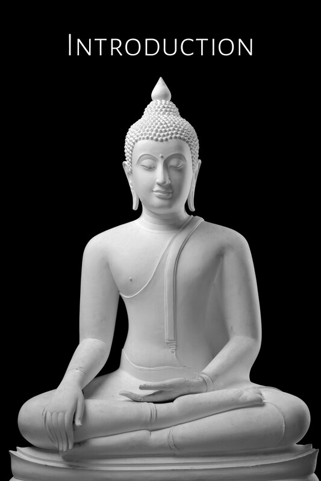
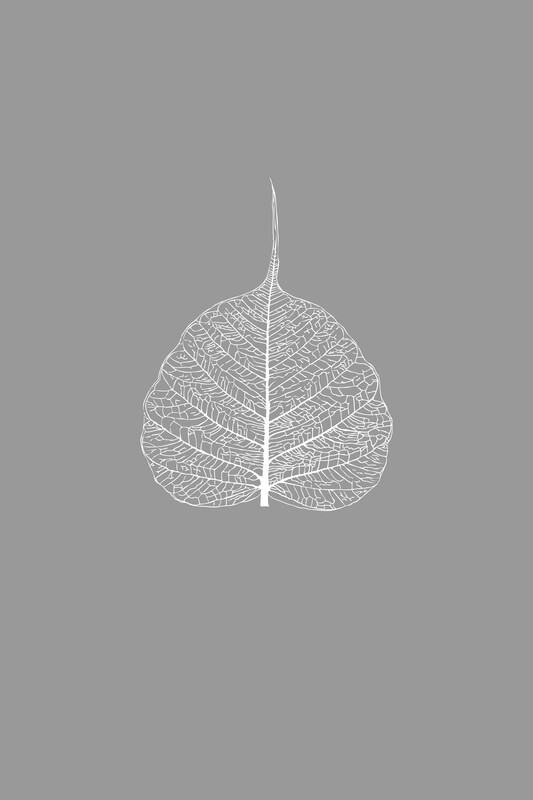

# 导论

今日人们经常提出佛教是一种宗教、一种哲学，或者仅仅是一种生活方式的问题。这个疑问引发了各种辩论和观点，这些往往只会造成困惑。

虽然这本《佛法》（Buddhadhamma）是以哲学论著的形式写就，但我不会参与上述辩论。[\[1\]](#fn-fn1){:id="fr-fn1"} 我的重点将仅仅放在佛陀教法中所阐述的——这些教法的要旨上。至于佛教是否是一种哲学的问题，则由各种哲学体系自己来决定佛教是否符合它们的标准。佛教依然是它本身；它不受这些评判和解释的影响。我在这里唯一想说明的是，任何只作为逻辑或理性智力练习，而没有相应实际应用于日常生活的要素的真理教导或学说，都不是佛教，尤其是佛陀亲自传授的原始和纯正的教法，这被称为佛法（Buddha-Dhamma）。

编纂佛陀的教法是一项艰巨的任务，尤其是在声称呈现真实或纯正教法的前提下，即使引用被认为是佛陀言语的《巴利圣典》段落也是如此。这是因为这些教法浩瀚无边，包含各种维度或深奥层次，而且准确传授它们还取决于呈现者的智慧和真诚。可能出现的情况是，两个持不同意见的人都能引用圣典中的段落来支持自己的观点。判断真理取决于一个人对这些教法精髓的把握有多准确，以及其理论与所用证据之间的联系有多么一致。在许多情况下，支持性证据不够全面，因此，佛法（Buddha-Dhamma）的呈现不可避免地常常反映了解释者的观点和理解。

为了澄清对教法的分析，审视最高导师佛陀的生平和行为是很有帮助的，他是这些教法的起源和源头。 尽管有人可能会争辩说佛陀事迹的故事与正式教法来源于同一出处，但它们对于反思仍然非常有益。有时，佛陀的行为比经典中的正式教法更清晰地反映了他的目标和愿望。

根据经典中的证据和其他历史资料，可以大致描绘出佛陀时代的事件和社会环境如下：

佛陀大约在两千六百年前出生于印度次大陆。他生于刹帝利（kṣatriyaḥ/katthiya）种姓，名为悉达多（Siddhattha）王子。他是净饭王（Suddhodana）之子，净饭王是释迦族（Sakyan）国家的统治者，该国位于印度次大陆东北部，毗邻喜马拉雅山脉。作为王子，并遵照皇室意愿，他被充分提供世俗享乐，并享受了二十九年，在此期间他结婚并育有一子。

当时，君主专制制度正在兴起，并试图通过战争扩张其帝国。许多其他国家，尤其是那些基于一致决定由全民大会统治的共和国，正逐渐失去权力。其中一些国家被征服并并入更大的国家，而另一些仍然强大的国家则处于困境之中，深知战争随时可能爆发。而那些强大国家之间也常常相互开战。

贸易和商业蓬勃发展，催生了一批极具影响力的新兴富商（seṭṭhi），他们的声望和权力开始延伸到宫廷。

根据婆罗门教的教义，人们被分为四个社会阶层或种姓（vaṇṇa）。人们的特权和社会地位，以及他们的职业，都由其种姓决定。尽管印度历史学家声称当时的种姓制度尚未非常严格，但首陀罗（śūdra/sudda）阶层的成员无权听闻或诵读《吠陀经》——婆罗门的神圣经典。这些限制变得越来越严格和严苛；违抗这些禁令并学习《吠陀经》的首陀罗会被处以死刑。此外，贱民（caṇḍāla）无权接受任何形式的正规教育。决定一个人种姓的唯一因素是出身，而婆罗门阶层的成员声称自己优于所有其他人。

婆罗门维护并遵守婆罗门教的传统。他们发展出越来越深奥神秘的教义和仪式，这些变得越来越不理性。仪式的举行不仅是为了宗教目的，也是强大统治者展示其重要性的一种方式。而主持这些仪式的祭司则从中获得了个人利益和财富。

这些仪式和典礼增加了那些寻求财富和享乐者的自私。同时，它们也给受压迫的下层阶级——奴隶、仆人和劳工——带来了痛苦，并给无数被屠宰献祭的动物带来了折磨。[\[2\]](#fn-fn2){:id="fr-fn2"} 

在同一时期，一群婆罗门对这些宗教仪式是否真的能带来永生表示怀疑，他们开始致力于思索不朽及其实现之道。在寻求真理的过程中，他们中的许多人与社会隔绝，隐居于森林中。这类舍离家庭生活、出家寻求生命真谛的修行者，被统称为沙门（samaṇa）。

当时的婆罗门教义——奥义书时代——充满了矛盾。一些宗教派别肯定既定仪式的有效性，而另一些派别则谴责这些仪式。关于不朽和灵魂（ātman）的问题存在着相互冲突的观点。一些婆罗门声称，ātman等同于大梵天（Brahmā/Brahma；神性；神圣本质）；他们声称大梵天创造并渗透万物，是不可言说的，正如“非此非彼”（neti neti）这句短语所表达的。他们相信ātman与大梵天合一是修行中的最高目标。他们就此主题进行宗教辩论，同时又在自己的圈子内嫉妒地守护着这方面的知识。

与此同时，另一群沙门对生命看似的无意义感到幻灭，他们修行以期达到非凡的心境或证得不死之境。其中一些人从事极端的自我折磨，通过禁食和进行奇特异常的苦行，这些普通人认为是不可能做到的。另一些人则培育了禅那（jhāna），达到了色界定（rūpa-samāpatti）和无色界定（arūpa-samāpatti），还有一些人在禅那方面如此精通，以至于他们能够展现出令人惊叹的神通（iddhi-pāṭihāriya）。

在这些沙门群体中，还有一些人从一个村庄游走到另一个村庄，自立为师，通过宗教辩论和辩证法阐述他们各自的宗教观点。

对意义的探索和各种信仰与教义的传播以强烈而充满活力的方式进行着，导致了众多的意识形态和学说。[\[3\]](#fn-fn3){:id="fr-fn3"} 正如经典中提到的，在佛陀时代，有六种主要的既定学说。[\[4\]](#fn-fn4){:id="fr-fn4"}

总而言之，一群人财富和权力日益增长，沉溺于感官欲乐并寻求更多的财富。与此同时，许多其他人被忽视，他们的社会地位和生活质量正在下降。另一群人则与社会隔绝，致力于发现哲学真理，但他们对社会状况也不太感兴趣。

悉达多王子享受了二十九年的世俗欲乐。他的家人不仅为他提供了这些享乐，还阻止他亲身看到普通百姓充满苦难的生活。然而，这种苦难无法永远向他隐瞒。人类的问题和苦恼——最明显的是衰老、疾病和死亡——一直困扰着王子，促使他寻求解决方案。

当王子反思这些社会问题时，他看到一群享有特权的人追求自己的个人舒适，相互竞争，沉溺于享乐，对别人的痛苦漠不关心。他们被物质所奴役。在幸福的时候，他们全神贯注于自己的自私追求；在痛苦的时候，他们沉迷于自己的苦恼和绝望。最终，他们衰老、生病，然后徒劳地死去。另一群人，那些弱势的人，没有机会繁荣，并受到绝望的虐待和压迫。他们也衰老、生病，然后以一种看似毫无意义的方式死去。

看到自己的享乐和欢愉毫无意义，王子对自己的生活产生了幻灭。尽管一开始他的寻求并不成功，但他开始寻找一个解决方案，一种发现持久而有意义的幸福的方法。他那充满诱惑和分心的生活不利于他的反思。最终，他认识到出家生活简单，没有忧虑，有助于智慧的培育。他认为这种生活方式很可能会帮助他解决这些普遍的人类问题，而且他很可能会遇到能够教他宝贵经验的出家修行者。

这种思路促使王子放弃了王子的生活，出家为沙门。他四处游学，向各位老师学习修行（yoga）方法和培育禅定，直到他证得了禅那（jhāna-samāpatti）——包括最高的无色界定（arūpa-samāpatti）——并精通神通（iddhi-pāṭihāriya）。最终，他实行了极端的苦行。

最后他得出结论，这些其他沙门的方法都无法解决他的困惑。当他将自己目前的生活与早年宫殿中的生活进行比较时，他意识到两者都是极端的表现。他决定跟随自己的反思和探究，直到最终达到完全觉悟。[\[5\]](#fn-fn5){:id="fr-fn5"} 后来，当他向他人宣告他所发现的真理——法（Dhamma）[\[6\]](#fn-fn6){:id="fr-fn6"} 时，他称之为中道法（majjhena-dhamma）或中道法义（majjhena-dhammadesanā），并将他为他人制定的修行体系称为中道（majjhimā-paṭipadā；“中道修行之路”）。

佛教的观点是，贪婪放纵的生活——任凭自己沉溺于烦恼的洪流——以及完全遁世的生活——放弃对社会的所有参与和责任，并且自我苦行——都是不正确和极端的修行方式。这两种方式都无法引导人们走向真正有意义的人生。

佛陀觉悟后回到了更广阔的社会，并以真诚和奉献的方式教导佛法，为了众多众生的安乐。他将余生的四十五年都奉献给了这项任务。

佛陀意识到，通过出家人的形式来分享教法和帮助他人会最为有效。因此，他鼓励许多上层阶级的人舍弃财富，出家修行，证悟佛法。这些个人随后参与了自我牺牲的工作，通过游历全国并与所有社会阶层的人会面，奉献自己去利益他人。

僧伽本身是解决社会问题的一个重要媒介。例如，每个人，无论他来自哪个种姓或社会阶层——即使是来自贱民阶层——都有同样的权利和特权出家受戒、修行，并达到最高目标。

商人与在家居士，如果尚未准备好完全舍弃他们的财产，可以作为在家男弟子和女弟子生活，支持僧伽的活动和职责，并通过分享他们的财富来帮助其他人。

佛陀及其弟子的真实目标和活动范围，可由佛陀在派遣第一代弟子弘扬教法时所作的训诫来概括：

> 比丘们，为了众多众生的福祉与安乐，出于对世间的慈悲，为了天人与人类的利益、福祉与安乐而游行吧。  
> Vin. I. 20-21

《悦意经》（Pāsādika Sutta）概述了佛教教法如何与社会相连，以及它们如何利益各类人群：

“梵行”（brahmacariya = 佛教）只有在以下因素完备时，才被认为是圆满成就，利益众多众生，并牢固确立的——即被称作“为天人[\[7\]](#fn-fn7){:id="fr-fn7"}和人类所善说”的：

1.  导师（satthā）卓著、经验丰富、成熟，并且年高德劭。
    
2.  有比丘长老弟子，他们拥有专业知识，训练有素且无所畏惧，已证得超越束缚的无上安稳，能够有效地向他人教导佛法，并能依照佛法正确地驳斥（对立的）学说。此外，还有中等资历的比丘和新出家的比丘也具备同样的能力。
    
3.  有比丘尼[\[8\]](#fn-fn8){:id="fr-fn8"}弟子——包括年长、中等资历和新出家的尼众——她们也具备同样的能力。
    
4.  有在家男弟子，包括过梵行生活的和在家享受感官之乐的，他们都具备同样的能力。
    
5.  有在家女弟子，包括过梵行生活的和在家享受感官之乐的，她们都具备同样的能力。
    

即使缺少具备这种贤德品质的在家女众，也意味着佛教尚未兴盛和圆满。[\[9\]](#fn-fn9){:id="fr-fn9"}

这部经文揭示了佛教教法是为所有人而设的，包括出家人和在家居士。佛教涵盖了整个社会。

## 佛法的主要特征

佛法的两个主要特征可概括如下：

1.  它揭示了“中道”（即“客观的”）真理原则，因此被称为中道真理（majjhena-dhamma）或中道教法（majjhena-dhammadesanā）。它严格按照因果和自然法则来反映真理。它被揭示出来，纯粹是为了在现实生活中实际应用而有益。它不提倡通过基于哲学推测和推理而创造各种理论和教条来证悟真理，因为这些理论和教条随后会被人执着、争辩和捍卫。
    
2.  它建立了一套被称为“中道”（majjhimā-paṭipadā）的修行体系，作为修行者的指导方针。这些修行者对自己的生命获得清晰的洞察，远离轻信，并致力于此生可证的修行成果，即：安乐、清净、觉悟、宁静和解脱。在实际应用中，中道与其他因素相关联，例如出家人的生活或在家居士的生活。
    

佛教是一种行动（kamma-vāda; kiriya-vāda）的宗教，一种精进（viriya-vāda）的宗教。[\[10\]](#fn-fn10){:id="fr-fn10"}它不是一种祈求的宗教，也不是一种基于希望的宗教。

教法的实际利益对每个人都可获得，无论他或她处于何种境况，从当下此刻开始。无论一个人的社会地位或生活状况如何，每个人都可以根据自己的情况，以适合自己的方式利用这些教法，无论是理解中道真理还是践行中道。如果一个人仍然对今生之后的生活感到焦虑或担忧，则鼓励他通过适当的行为，致力于现在创造所期望的有利条件，直到获得信心并消除对未来生活的所有忧虑和恐惧。[\[11\]](#fn-fn11){:id="fr-fn11"}

根据本性，每个人都有同等资格达到修行的成果。虽然人们的精神能力有所不同，但每个人都应有平等的机会根据自己的能力培育这些善的品质。尽管我们每个人都必须通过个人努力——通过反思自己在这方面的全部责任——来产生这些成果，但我们都是协助他人修行的重要推动者。因此，佛陀强调了不放逸（appamāda）和善友（kalyāṇamittatā）这两项主要原则。一方面，一个人要对自己的人生负全责；另一方面，一个人要认识到良好外部影响的最高价值。

佛陀着重于几项主要任务。其中一项是，他试图通过指出其有害影响和总体上的徒劳无益，来消除围绕错误宗教仪式的天真和迷信信仰，特别是动物献祭（更不用说人祭）的做法。

佛陀之所以如此强调放弃祭祀习俗，有几个原因。首先，这些习俗导致人们寻求天神的干预。其次，它们给其他人和其他生物带来了巨大的困苦和折磨。第三，它们增加了自私和对物质回报的贪求。第四，它们导致人们专注于未来，而不是希望改善现状。为了对抗这些有害的习俗，佛陀强调了布施和为社会服务。

佛陀试图废除的第二件事是种姓制度，该制度利用人们的出身来限制他们在社会上和修行方面的特权和机会。他建立了僧伽，它欢迎所有社会阶层的人进入一个平等的体系，就像大海接纳所有河流，成为一个统一的整体一样。[\[12\]](#fn-fn12){:id="fr-fn12"}这随后导致了寺院的建立，寺院后来成为教育和文化传播的重要中心，以至于在佛陀之后约1,400-1,700年，印度教也效仿并创建了自己的寺院机构。[\[13\]](#fn-fn13){:id="fr-fn13"}

根据佛法原则，女性和男性都能平等地证悟佛教的最高目标。佛陀在建立比丘僧伽后不久，也建立了比丘尼僧伽，尽管当时的社会条件不利于女性出家。佛陀完全清楚为女性创造一种适合的出家生活形式会有多困难。在吠陀时期的宗教对女性的修行施加了极端限制，甚至可以说对她们关闭了大门的时候，他非常谨慎地建立了比丘尼僧伽。

佛陀使用白话——即普通人使用的语言——来教导佛法，以便每个人，无论其社会地位或教育水平如何，都能受益。这与婆罗门教形成了对比，婆罗门教坚持吠陀经典的Dharma神圣性，并使用各种手段将更高的宗教知识保留在一个狭窄的精英群体中。具体来说，婆罗门使用梵语（其知识仅限于他们自己的群体）来传承和守护经典。后来，一些人请求佛陀允许用吠陀语言保存和传播佛教教法，但他拒绝了这一提议，并让比丘们继续使用普通民众的语言。[\[14\]](#fn-fn14){:id="fr-fn14"}

此外，佛陀坚决拒绝浪费时间通过哲学思辨来辩论真理问题——那些无法通过理性讨论经验性证明的问题。如果人们带着这类问题来找他，佛陀会保持沉默。然后他会把那个人引回到日常的实际事务上。[\[15\]](#fn-fn15){:id="fr-fn15"}那些通过言语可以理解的事情，他会通过言说与他人分享；那些通过视觉可以理解的事情，他会展现给他人看。他会根据情况使用最直接和适当的方法。

佛陀在教导佛法时使用了许多不同的方法，以便每个人都能受益。他的教法包含许多层面：有些是针对在家居士和主流社会成员的，有些是针对那些舍弃家庭生活的人的。有些教法侧重于物质利益，而另一些则侧重于更深层次的精神利益。

因为佛陀在婆罗门文化中教法，并被各种宗教信仰体系所包围，他需要处理这些其他传统所使用的精神术语。由于佛陀希望他的教法能在短时间内惠及最多的人，他对这些术语采取了一种独特的方法。他没有直接驳斥或诋毁人们与这些术语相关的信仰，而是质疑或挑战这些术语的真实含义。他没有使用激进的方法；相反，他通过理解和修行促进了一种自然的转变形式。

为了实现这一点，佛陀使用了一些这些已经确立的精神术语，并赋予它们符合佛法的新含义。例如，他将术语brahma/brahmā（“梵天”，“神圣”，“崇高”，“圣洁”）定义为指代一种天人（但仍会死亡的众生）；在其他语境中，它被用来指父母。他将礼拜六方位的概念改为维护和尊重社会关系的概念。他改变了婆罗门教三种祭祀仪式中的神圣火祭的含义，使其成为对社会中三种人履行责任。他将决定一个人是否为婆罗门（brāhmaṇa；“神圣者”，“拥有梵智者”）和圣者（ariya；“有教养的”，“文明的”）的因素，从一个人的出身转变为一个人的行为和修行。

有时，佛陀鼓励他的弟子们汲取其他宗教传统中善的和有益的方面。他承认并赞同任何正确且与德行相关的教法，认为这种正法和德行是自然的普遍方面。如果这些其他传统的具体修行原则有不同的解释，佛陀会解释哪些是正确的，哪些是错误的。他只认可正确和善的修行。

佛陀指出，其他宗教传统中观察到的错误或有害习俗，有时是这些传统自身衰落或退化的结果。这些传统最初倡导的教法有时是贤善和正确的。他偶尔会描述这些最初的善法教义。这方面的例子包括他对“宗教苦行”（tapa）、献祭（yañña）、社会援助方面的领导原则以及婆罗门职责（brāhmaṇa-dhamma）等概念的历史性解释。[\[16\]](#fn-fn16){:id="fr-fn16"}

佛陀去世后的几个世纪里，当他的教法传播到不同地区后，人们对佛法的理解产生了许多差异。这发生的原因是多方面的：那些传播教法的人具有不同的训练水平、理解力和资质，他们以不同的方式诠释教法；人们开始混入其他宗教传统的信仰；当地文化对人们的思想和理解产生了影响；以及由于那些守护教法的人的兴趣、倾向和技能，教法的一些方面变得突出，而另一些方面则变得模糊。这些差异导致了分裂成各种部派（nikāya），这在今天上座部佛教和大乘佛教以及许多其他附属部派和传承之间的划分中是显而易见的。

尽管上座部传统以其在保存原始标准和教法方面的精确性和准确性而闻名，但它也未能避免一些变化和修正。一些教法的真实性和有效性，即使是那些包含在经典中的教法，在当代人中也存在争议，他们常常寻求证据来证实自己的观点或驳斥他人的看法。公众所持的观点和实践中的差异尤其明显。在某些情况下，这些观点和实践似乎与原始教法直接对立，或者它们几乎发展成了另一种宗教意识形态，甚至可能是一种被原始教法所驳斥的意识形态。

以泰国对业（kamma，梵语：‘karma’）这个词的理解为例。泰国大多数佛教徒在遇到这个词时，会想到过去，特别是过去世的行为。他们专注于过去世恶业在今世的有害影响，以及以前恶行的负面结果。在大多数情况下，他们的理解是由一系列此类想法形成的。与经典中业的真实定义相比，可以看到这些想法中的一些与真正的佛法相距甚远。[\[17\]](#fn-fn17){:id="fr-fn17"}

在本书中，作者[\[18\]](#fn-fn18){:id="fr-fn18"}力求以尽可能真实和准确的方式呈现佛法。由于认为这些分歧的观点、定义和实践对于这项任务而言是多余的，因此不予讨论。

本书材料的来源是佛教经典集，除非另有说明，否则特指巴利藏（Tipiṭaka）。普遍认为，这部经典是佛陀教法最准确和完整的汇编。作者通过应用与上座部经典整体的兼容性和连贯性原则，选取了巴利藏中被认为最真实和准确的教法。作为这项工作的额外保证，作者将佛陀的行为视为对正式佛法教导的补充。

在选择了这些指导方针之后，作者相信他已准确地解释和呈现了佛法的真正精髓。

然而，从根本上说，这种呈现的准确性取决于作者的智慧和智力程度，以及任何未被承认的偏见。我们姑且认为，这是作者基于他最有信心的特定学术方法，以最准确的方式呈现佛陀教法的一次尝试。

我们可以将佛法分为两部分：真理之法（sacca-dhamma）和行为之法（cariya-dhamma）：即理论与实践。前者被定义为与实相、真理的显现、自然以及自然法则和过程相关的教法。后者被定义为与修行或行为原则相关，以及如何以实际方式从对实相的认识或对自然法则的理解中受益的教法。真理之法等同于自然和自然真理；行为之法等同于知道如何应对这些真理而行动。在整个教法中，不给予超自然主宰——任何声称凌驾于自然之上的力量——例如创世神，任何重要性。

为了公正地呈现佛法作为一个整合体系的全部范围和广度，应该描述这两个方面。也就是说，应该首先揭示理论教法，然后分析如何以有效和有价值的方式应用这些教法。

因此，本书中的各章，每一章都处理真理的一个特定方面，同时也包含了如何以实际方式应用这些真理的指导方针。例如，在第二章讨论不同种类知识的末尾，有一个关于这类知识的实际意义和益处的部分。此外，佛法的主体也遵循这种格式：第一个主要部分涉及特定的自然法则，标题为“中道教法”。第二个主要部分涉及这些法则在日常生活中的实际应用，标题为“中道”。

尽管本书的呈现方式可能看起来不寻常，但它与一种原始的教导风格相符。它始于生活中存在问题的方面，然后追溯这些问题的根源。分析继续深入探讨苦的根源、修行的最终目标，以及解决问题和实现目标的实际方法。事实上，这种呈现方式与四圣谛是一致的。[\[19\]](#fn-fn19){:id="fr-fn19"}

\[1\] 当我开始撰写本书时，我受邀以哲学方法将佛陀的教法（佛法）编纂成章。[&nbsp;↩&nbsp;](#fr-fn1)
{: id="fn-fn1"}

\[2\] 参见，例如：《婆塞塔经》（Vāseṭṭha Sutta）（Sn. 115-16）和《婆罗门法经》（Brāhmaṇadhammika Sutta）（Sn. 52-5）。[&nbsp;↩&nbsp;](#fr-fn2)
{: id="fn-fn2"}

\[3\] 根据经典中的证据，沙门和婆罗门的教义可分为六十二种不同的见解或信仰体系（D. I. 13-45）。[&nbsp;↩&nbsp;](#fr-fn3)
{: id="fn-fn3"}

\[4\] 有关佛陀时代印度次大陆情况的更详细考察，参见，例如：G. C. Pande，《佛教起源研究》（印度：阿拉哈巴德大学出版社，1957年），第310-368页。[&nbsp;↩&nbsp;](#fr-fn4)
{: id="fn-fn4"}

\[5\] 关于佛陀这一时期生活的更多内容，参见，例如：《萨伽拉瓦经》（Sagārava Sutta）：M. II. 209-213。[&nbsp;↩&nbsp;](#fr-fn5)
{: id="fn-fn5"}

\[6\] 译注：梵语：dharma。Dhamma一词有多种定义；一些最常见的定义是：事物、现象、品质、特性、本性、自然法则、真理、实相、德行、正义、佛陀所揭示的教法以及心的所缘。[&nbsp;↩&nbsp;](#fr-fn6)
{: id="fn-fn6"}

\[7\] 译注：deva = 神；天人。[&nbsp;↩&nbsp;](#fr-fn7)
{: id="fn-fn7"}

\[8\] 译注：巴利语：bhikkhunī，指出家的女性修行者。[&nbsp;↩&nbsp;](#fr-fn8)
{: id="fn-fn8"}

\[9\] 参见《悦意经》（Pāsādika Sutta）：D. III. 122-5。注意brahmacariya（“梵行”，“崇高生活”）一词如何包含在家居士。[&nbsp;↩&nbsp;](#fr-fn9)
{: id="fn-fn9"}

\[10\] 例如：A. I. 286-7。[&nbsp;↩&nbsp;](#fr-fn10)
{: id="fn-fn10"}

\[11\] 例如：S. V. 386。[&nbsp;↩&nbsp;](#fr-fn11)
{: id="fn-fn11"}

\[12\] 参见，例如：A. IV. 202-203；D. III. 97-8。[&nbsp;↩&nbsp;](#fr-fn12)
{: id="fn-fn12"}

\[13\] 参见，例如：B. V. Bapat，《佛教两千五百年》（1959年），第335页，以及：S. Dutt，《印度佛教僧侣和寺院》（1962年），第210页。[&nbsp;↩&nbsp;](#fr-fn13)
{: id="fn-fn13"}

\[14\] 参见：律藏 II. 139。[&nbsp;↩&nbsp;](#fr-fn14)
{: id="fn-fn14"}

\[15\] 参见，例如：A. V. 193-8；M. I. 426-32。[&nbsp;↩&nbsp;](#fr-fn15)
{: id="fn-fn15"}

\[16\] 参见：A. IV. 41；A. V. 190-91；Sn. 51-53；另参见以下主题材料。[&nbsp;↩&nbsp;](#fr-fn16)
{: id="fn-fn16"}

\[17\] 泰国人对其他概念和术语也发展出类似的独特含义，例如：ārammaṇa（“所缘”），viññāṇa（“识”），pāramī（“波罗蜜”），santosa（“知足”），upekkhā（“舍”），adhiṭṭhāna（“决意”），parikamma（“预备禅修”），bhāvanā（“修习”），vipassanā（“毗婆舍那”），kāma（“欲乐”），lokiya（“世间”），lokuttara（“出世间”），puñña（“功德”），icchā（“渴望”）等。这些术语现在要么与它们最初的意图完全不同，要么其意义范围已经改变。在学习佛法时，辨识和区分这些新含义对于理解这些术语的真正定义至关重要。[&nbsp;↩&nbsp;](#fr-fn17)
{: id="fn-fn17"}

\[18\] 译注：在《佛法》的泰文原著中，可敬的作者从未用第一人称代词指代自己。这是一种与文本保持距离的方式。正如他在《作者注》中所述，他希望尽可能客观地呈现佛陀的教法，并在此方面，让读者忘记他的存在。由于这在英文语境中不常见，我偶尔插入了第一人称代词。[&nbsp;↩&nbsp;](#fr-fn18)
{: id="fn-fn18"}

\[19\] 参见“教法次第”（desanānukkama），位于：中部义注 MA. II. 219（指：M. I. 184-91）。\[译注：这最后一句，关于呈现方式与四圣谛一致的说法，尤其值得注意。关于这个主题的更多内容，请参见目录中苦（Dukkha）、集（Samudaya）、灭（Nirodha）和道（Magga）这四个要素是如何包含的。另请参见第十九章《四圣谛》。\][&nbsp;↩&nbsp;](#fr-fn19)
{: id="fn-fn19"}