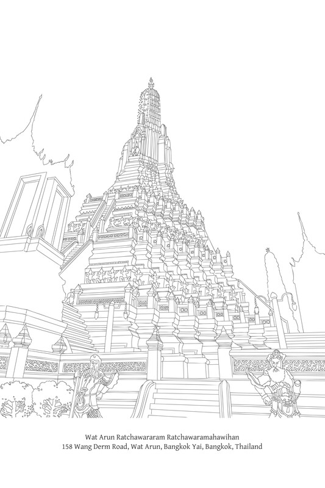
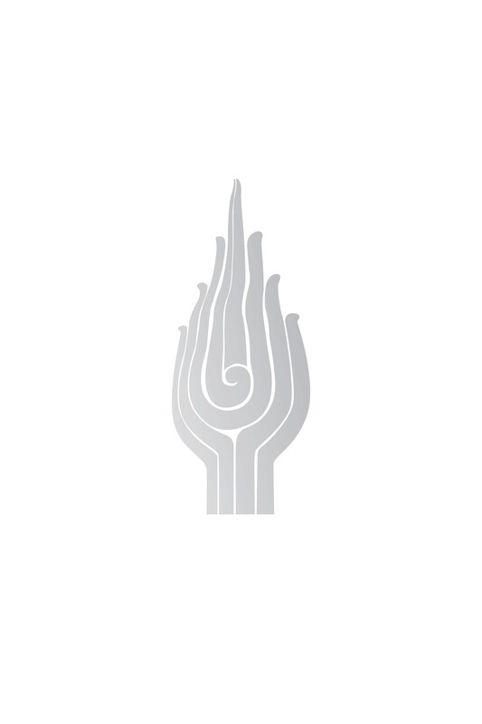

# 第五章：业的法则

业的法则

## 导论

所有佛教教法，无论其名称或标题如何，都是相互关联并构成一个整体的。它们都指向同一个真理，也都导向同一个目标。它们被赋予不同的名称，是为了指出真理的特定方面，或者它们指的是同一事物，但从不同角度看待，这取决于教法的特定目的。因此，某些佛法教法或原则从属于一个更大的教法，而另一些则同样重要，涵盖相同的主题内容，但具有独特的格式和目标。

缘起（paṭiccasamuppāda）的教法描述了人类存在的整个过程，它以全面而广泛的方式涵盖了所有其他佛法教法。它是一个完整的教法。如果一个人理解缘起，他就理解了存在的精髓或佛教的整体，正如佛陀所确认的：

> 见缘起者见法。  
> M. I. 190-91

然而，人们普遍认为缘起深奥且极难理解。即使是解释它也十分困难。因此，几乎没有专门解释缘起的文本。更常见的是找到解释佛法其他部分或原则的文本，这些部分或原则是缘起教法的一部分。

在这些辅助教法中，也许最常被解释的是关于业的教法。[\[1\]](#fn-fn1){:id="fr-fn1"}原因有二：第一，这是一个人们极度感兴趣的主题；第二，对业的理解是理解缘起的一座桥梁。事实上，对业的透彻解释是使解释缘起这项任务变得更容易的一种方法。

业只是缘起所概述过程的一部分，这个过程可分为三个不同的循环（vaṭṭa）：烦恼（kilesa）、业（kamma）和业果（vipāka）。缘起描述了造业（kamma）并承受其业果的整个序列，从作为业之源的烦恼开始，最终以业果（vipāka）告终。

在描述了缘起法则及其组成因素之后，似乎没有必要单独解释业。人们可能会声称，通过理解缘起，一个人也获得了对业的清晰理解。

缘起的阐述纯粹、究竟地侧重于现象，它提供了一个广阔而全面的自然过程视角。它不强调这个过程的某个特定方面。然而，从实际的日常角度来看，缘起中最突出、直接关乎人类行为并与人类责任相关的部分是业。从这个角度来看，可以说业是缘起中的主要因素或主题，而其他因素仅仅是支持探究。

如果选择这种分析方法，缘起就以被称为“业的法则”[\[2\]](#fn-fn2){:id="fr-fn2"}的形式出现。而且由于与此主题相关的其他关键因素很多，在后来的文本中，业的法则比缘起更成为研究的焦点。对业的讨论涉及人类行为，这些行为相对粗重、容易显现、与每个当下时刻相关，并适合作研究的起点。

此外，对业的解释可以在许多不同的层面上进行。可以在表层解释，向在家居士讲解因果；可以描述与业相关的独特人类境况或活动；或者可以更深入地探讨各种心识过程，并在其完整形式的缘起背景下解释业。

正是由于这些原因，本书专门用一章来讨论业这个主题。

## 对业的基本理解

### 业作为自然法则

佛教教导的真理是，一切事物，无论是有情还是无情，无论是物质还是非物质，无论是物质还是精神，无论是内在还是外在——也就是说，一切有为法（saṅkhata-dhamma）——都依据因缘而存在；它们受制于相互的制约性。这是一条自然法则。巴利语中这种自然法则的术语是niyāma，字面意思是“必然固定”、“必然模式”、“必然规则”或“具有某种秩序性”。当特定的因缘存在时，事物就必须以某种方式发展。

尽管这条自然法则具有相互制约的统一特征，但它可以根据不同的属性进行划分，这些属性表达了各种相互关系的模式或方面，并有助于理解。根据佛教的思维路线，义注描述了五种不同的自然法则（niyāma）：[\[3\]](#fn-fn3){:id="fr-fn3"} 

1.  物理法则（Utu-niyāma）：能量法则；物理现象法则；物理无机秩序；物理定律。这特别指外部环境和物质的改变。例如：天气和季节；水、土壤和肥料有助于植物生长的规律；荷花白天开放晚上闭合的规律；打喷嚏和咳嗽的过程；以及万物都受腐蚀和衰败的规律。义注在此处的重点是热量和温度引起的改变。
    
2.  种子法则（Bīja-niyāma）：遗传法则；遗传规律；生殖规律；物理有机秩序；生物定律。例如：特定的植物会结出特定的果实；例如，芒果树总是会结芒果。
    
3.  心的法则（Citta-niyāma）：心的法则；心理规律；关于心的运作的自然法则。例如：当六根接触六尘时，识就会生起——有分心（bhavaṅga-citta）被撼动和中断，有转向（āvajjana），见、闻等等，领受（sampaṭicchanna），推度（santīraṇa）等等；特定的心识状态可能伴随着某些心所（cetasika），而可能不伴随着其他心所。
    
4.  业的法则（Kamma-niyāma）：业的法则；行为与果报的秩序；业律；道德法则。与人类行为相关的自然法则。更具体地说，这指的是意图的过程和概念化的过程，以及这些心识活动相应的后果。例如：如果一个人行善，他就会收获善果；如果一个人作恶，他就会收获恶果。
    
5.  法的法则（Dhamma-niyāma）：普遍的因果法则；万法的秩序。关于万事万物相互关系和相互制约的自然法则。例如：一切事物都生起、存续并消亡；人类出生、老、病、死是常态；此时代人类的正常寿命大约是一百年；无论佛陀是否出现，一切事物无常、苦（‘受压迫’）和无我（anattā）都是自然秩序的一部分。
    

前四种法则实际上都包含在第五种法则，即法的法则中，或者可以说它们是源于这条法则的划分。dhamma-niyāma的定义涵盖了所有五种法则。

可以说，法的法则（Dhamma-niyāma）是首要的、统摄一切的法则。在这种情况下，有些人可能会争辩说，如果详细列举支分法则，那么这个列表就应该是穷尽无遗的。为何法的法则仍与这四种支分法则并存呢？

这可以用一个简单的类比来回答。当描述一个国家的全体人口时，它可能被分为“政府领导人、公务员、商人和平民百姓”，或者“士兵、警察、公务员、学生和普通大众”。确实，“平民百姓”和“普通大众”这两个词可以指社会中的所有个体。公务员、商人、士兵和学生都是普通大众的一部分。之所以将这些个体与其余的人区分开来，是因为他们拥有独特的属性，而进行这种区分的人希望根据其目的来强调这些属性。 每一次，术语“平民百姓”或类似的术语被用来涵盖所有其余的个体。对这五种自然法则的描述也可以这样看待。

我们在此的任务并非探讨是否应将其他支分法则加入此列表。义注师是根据他们各自的目的选择了这五种。此外，如前所述，这四种支分法则都包含在法的法则的范畴之内。此处感兴趣的重点是，探讨描述这五种法则的真正意义和目的。以下是几点思考：

首先，这种阐述提供了一种对佛教思维方式的有力看法，描述了世间万物的因果本性。尽管这五种自然法则相互区分，但主要强调的是相互缘起。这为法修习者提供了清晰明确的研习、实践和理解的原则。他们无需陷入关于造物主是否改变了自然条件流动、偏离常态的争论中（除非一个人认为“造物主”只是像其他助缘一样参与到自然过程中）。

有些人可能会在此提出异议并发表看法：没有这些法则的造物主，它们肯定不可能存在？一个人不必纠缠于此类问题，它们只会误导和迷惑人们。如果一个人接受事物依其自性而存在，那么它们就必须以某种方式运行。事物总是依照其自然决定的路线运行。除了通过相互缘起，它们不可能以其他方式运行。人类观察并理解这些模式和过程，并将它们称为自然法则。但无论它们是否被区分并标记为法则，它们都同样存在。

如果一个人坚持认为必定有人创造了自然法则，那么就会面临各种困扰人的问题，比如：“什么法则支配着造物主的行为？”以及“谁来监督造物主？”如果回答说创造者完全按照自己的意图行事，那么他当然能够随心所欲地改变法则。某一天，他可能会改变法则，给人类带来混乱。（确实，如果存在这样一位自然法则的造物主，并且他富有慈悲心，他会改变一些法则来帮助人们。例如，他会阻止残疾、跛脚或心智障碍者的出生。）

其次，当一个人将因果法则划分为支分法则时，重要的是不要将结果现象完全且绝对地归因于某一种特定的法则。实际上，一个单一的结果可能源于各种原因，或者与多种法则的结合相关。例如，莲花只在白天开放的事实，并非仅仅归因于物理法则，也归因于种子法则。一个人哭泣的原因可能是由于心理运作法则，比如悲伤或高兴，也可能是由于物理法则，比如眼睛进了烟。某人出汗可能是由于物理法则，比如天气炎热，或者由于心的法则和业的法则，比如他害怕或想起做错了事。一个人头痛可能是由于物理法则，比如潮湿的天气、闷热的房间或缺氧，或者由于种子法则，比如身体的某种缺陷，或者由于业法则和心的法则的结合，比如焦虑和痛苦。

第三，也是最重要的一点是，义注揭示了业的法则是如何被纳入这些自然法则之中的。

就人类而言，业的法则是这些支分法则中最重要的，因为它直接影响到每个人。人类造作业，而业反过来决定他们的命运。

现代人倾向于划分世间各种力量，将自然与人类对立起来。根据这种划分，业法则属于人类活动范畴。所有其他支分法则都属于自然范畴。

人类是自然的产物，也是自然的一部分。但人类拥有一种独特的能力，即在道德或业法则（业的法则）下运作。他们通过有意的行为形成社群并创造事物，可以说创造了一个与自然世界分离或平行的世界。

在业的法则的范畴内，业的本质或核心是“思”或意图。业法则涵盖了意图的整个世界，或者说由人类的智慧和创新所产生的创造性（和破坏）世界。业的法则是人类的主导法则，无论他们是否与其他法则互动。实际上，与其它法则的互动本身就依赖于业法则。

有意行为的领域使人类能够影响、改变和创造事物。更准确地说，人类作为自然过程中的一个因缘参与其中，以至于他们声称能够控制或战胜自然，这都取决于业法则。人们有意地与自然领域中存在的其他法则互动，研究它们并据此行动，或从中获取利益。因此，才说意图决定并塑造了自然世界。此外，人类的意图决定了社会互动。

除了塑造社会互动以及与外部事物、环境和普遍自然相关的行为之外，人类，更准确地说，人类的意图，对人类自身也有影响，塑造他们的性格并决定他们的命运。

业法则涵盖了意图世界和所有形式的人类创造力。它是塑造每个人生命的关键因素。它决定了人类社会以及所有人类创造性和破坏性活动的进程。它是人们与其它法则互动，以控制自然世界的基础。因此，佛教非常强调业的原则。佛陀说：“世间依业而存在”（kammunā vattatī loko）。[\[4\]](#fn-fn4){:id="fr-fn4"} 业因此是佛教中至关重要的教义。

将业的法则纳入五种法则之列，也表明业法则只是众多自然法则中的一种。因此，当一种现象发生，或者当某人经历某种苦难时，不要错误地认为它完全是由于业。[\[5\]](#fn-fn5){:id="fr-fn5"} 

佛陀（上文）的引语“世间依业而存在”，指的是有情世界，或者说是人类世界。换句话说，业主导并决定着人类社会。

总而言之，业的法则是自然界的一个支分法则，但它是对人类最重要的法则。

除了上述五种法则之外，还存在另一种专属于人类的法则。它并非自然固有的，也与自然没有直接联系。这指的是人类自身为了规范社会行为和促进社会福祉而制定下来的法则和惯例。这些社会规约包括政策、规定、契约、立法、传统、习俗、纪律守则等。可以将这第六种法则作为上述五种自然法则的附录。

为方便起见，可以为这组社会规约指定一个与那些自然法则类似的标题。然而，需要注意的是，这种所谓的“第六种法则”位于五种自然法则之外，并且与它们有所区别。有许多这样的标题可供选择，包括：saṅgama-niyāma（“社会法”）、saṅgama-niyamana（“社会实践”）、sammati-niyāma（“世俗法”）和 paññatti-niyāma（“制定法”）。[\[6\]](#fn-fn6){:id="fr-fn6"}

所有这四个示例标题都清楚地表明，它们指的是人类法则而非自然法则。前两个术语指社会规约。第三个术语指人类惯例，即社会中建立的那些相互协议。第四个术语指人类的规定和条款。

在此文本中，“世俗法”（sammati-niyāma）一词被用来指代这些人为制定的法则。

这些社会标准和准则是人为制定的。因此，它们源于造作业，并与业的法则相关。然而，它们是业法则的补充——它们本身并不构成业的法则。它们不以相互缘起为特征，也不是像业的法则那样是自然真相的方面。由于它们与业法则存在重叠，两者之间的差异往往会引起混淆，进而导致人们之间产生许多争论和误解。

由于这两种法则——业的法则和世俗法（sammati-niyāma）——对人类影响最大，因此指出它们的独特属性至关重要。

首先，业的法则是一种处理人类行为的自然法则。世俗法或社会法是由人们自己建立的。它们与自然法则相关，仅限于作为人类有意活动的结果。其次，通过业法则，人类对其行为依照自然的动态负责。然而，在社会法则的背景下，人们必须根据由人们自己制定的法令对其行为负责。

业的这些方面将在本章的后续部分更详细地讨论，包括善恶问题以及源于造业的果报问题。

### 业的定义

“业”一词字面意思是“行动”或“工作”。然而，在佛法教法的语境中，其定义仅限于指“伴随意图的行动”或“造业”。[\[7\]](#fn-fn7){:id="fr-fn7"} 在此语境下，无意发生的行为不被归类为业。

然而，业的这个定义非常宽泛。要真正理解这个词的含义，其定义应从不同角度审视，或以不同层面的意义呈现：

*   A. 对业的直接或精确审视揭示，其本质或根源是思（cetanā）：意图、意志、审虑；行动的决心；行动背后的动力或主体。意图是主要的，它定义了一个人的目标和目的，并决定了所有人类行动的方向。它启动了行动以及所有形式的概念性和创造性活动。因此，它处于业的核心。佛陀的话证实了这一点：“比丘们，我说“思即是业”（cetanāhaṁ bhikkhave kammaṁ vadāmi）。有了意图，人们便通过身、语、意而行动。[\[8\]](#fn-fn8){:id="fr-fn8"}
    
*   B. 更广阔的视角，考虑到人类活动动态中的其他因素，揭示了“业”（造作业）作为主导因素，在塑造人们生命的结构和路径中发挥作用。在此意义上的业等同于，或被称为“行”（saṅkhāra），也可译为“心的造作”。例如，在十二缘起支中就发现了这种解释。术语“行”指的是以思（cetanā）为首的那些心所或心理属性，它们塑造心成为善、不善或无记。它们决定了人们的思想、言语和身体行为，从而产生各种造业。简而言之，“行”可被描述为“心理造作”，然而即使在此，意图仍被认为是主要因素。实际上，佛陀有时将“行”简单地定义为思（cetanā）。[\[9\]](#fn-fn9){:id="fr-fn9"}
    
*   C. 更广泛的视角将人类作为一个整体来审视，传统上被称为个体的人，他们与外部世界互动并对其自身行为负责。在此语境中，业指身、语、意三业——人们必须为之承受结果的行为，无论这些结果是即时发生，还是发生在更遥远的过去和未来。
    
    业的这一方面在典籍中提及最为频繁，出现在针对特定个体的教导中。此类教导鼓励人们对自己的个人行为负责并实施善业，正如佛陀的这些话所证实：
    

> 比丘们，有这两种导致痛苦的事物。是哪两种？有一种情况是，有人未行善，未作善业，未行能对治恐惧的福德之事。相反，他所行的是恶行、凶残和残忍之事。心想：“我未行善业；我已作恶”，他便感到痛苦。  
> It. 25-6

值得注意的是，在现代，这是对业最常见的解释，尤其是在指代过去的行动时。

*   D. 最宽广的视角是审视人类社会中显而易见的一般人类活动。在此，业指的是谋生、处世以及从事各种活动，这些活动源于意图和概念化。佛陀在《婆私吒经》（Vāseṭṭha Sutta）中描述了这种解释：

> 婆私吒，你应当知道，凡在人中以牧牛为生者，被称为农夫；他不是婆罗门……凡以各种技艺为生者，被称为匠人……凡以贸易为生者，被称为商人……凡以服务他人为生者，被称为仆人……凡以盗窃为生者，被称为盗贼……凡以弓箭刀剑为生者，被称为士兵……凡以祭司之术为生者，被称为祭司……凡在人中治理城镇和国土者，被称为国王；他不是婆罗门……那心中没有残余垢染，不再执著的人，我称他为婆罗门……一个人并非生来就是婆罗门，也非生来就不是婆罗门。人是因其业而成为婆罗门，也是因其行为而成为非婆罗门。通过他们的业（kamma：工作、职业、行为、生活方式），人们成为农夫、匠人、商人、仆人、盗贼、士兵、祭司，甚至是国王。这是智者看待业的真实方式，他们是缘起的见者，精通业及其结果。业使世间运转；业使这一代众生流转。  
> M. II. 196; Sn. 117-23

同样，在《起世经》（Aggañña Sutta）中：

> 于是那些那些年长的众生聚在一起，彼此倾诉他们的烦恼：“先生们，我们之间已生起各种恶行，导致偷盗、诬告、妄语以及持棍棒。愿此不要再发生。假设我们任命（sammati：‘同意’）某个众生，他将惩戒应受惩戒者，谴责应受谴责者，驱逐应受驱逐者。作为回报，我们将给予他一份谷物。”于是他们走到他们当中最庄重、最有魅力、最有感召力且令人敬畏的那位，请求他为他们做这件事，以换取一份谷物，他同意了…… 因为他是大众选出来的，所以第一个正式头衔“大统领”（Mahā Sammata）便产生了。[\[10\]](#fn-fn10){:id="fr-fn10"}  
> D. III. 92-3

同样，在《转轮圣王经》（Cakkavatti Sutta）中：

> 比丘们，当国王不向贫困者提供财物时，贫困便盛行；随着贫困的增长，偷盗增加；随着偷盗的增加，武器的使用增加；随着武器使用的增加，杀生增加——随着杀生的增加，妄语增加……离间语……邪淫……粗恶语和杂秽语……贪婪和恶意……邪见增加。[\[11\]](#fn-fn11){:id="fr-fn11"}  
> D. III. 70-71

尽管一个人可以将业定义为这四个不同的类别，但应记住，在每一种情况下，意图（思）都处于这些行动的核心。意图引导人们与事物互动并决定这种互动的方式。它决定了人们如何回应事物以及如何改变或改进事物。它决定了一个人是让自己成为表达贪、嗔、痴等不善品质的渠道，还是表达善品质以促进真正的安乐。所有这一切都在思的力量之下。

没有意图的行动在业的法则领域内不会产生结果——它们不被归类为业。相反，它们是与自然的其他法则相关的事项，特别是与物理法则（utu-niyāma）相关。它们被视为等同于山体滑坡或树枝从树上掉落。

### 业的种类

从从业的品质或来源来看，业分为两种因素：[\[12\]](#fn-fn12){:id="fr-fn12"}

1.  不善业（akusala-kamma）：不善巧的行为；不善业。这指的是源于不善根的行动，即贪（lobha）、嗔（dosa）和痴（moha）。
    
2.  善业（kusala-kamma）：善巧的行为；善业。这指的是源于善根的行动，即无贪（alobha）、无瞋（adosa）和无痴（amoha）。
    

如果一个人根据行为所通过的“门”（dvāra）——表达的途径——来划分业，那么分类有三种：[\[13\]](#fn-fn13){:id="fr-fn13"}

1.  身业（kāya-kamma）：通过身体的行动。
    
2.  语业（vacī-kamma）：通过言语的行动。
    
3.  意业（mano-kamma）：通过心的行动。
    

结合上述两种分类，产生六种业：不善身业、不善语业和不善意业，以及善身业、善语业和善意业。[\[14\]](#fn-fn14){:id="fr-fn14"}

另一种分类将业分为四种因素，根据业与其果报（vipāka）之间的关系：[\[15\]](#fn-fn15){:id="fr-fn15"}

1.  黑业有黑报：这指的是有害和压迫性的身行、语行和意行（kāya-saṅkhāra, vacī-saṅkhāra, and mano-saṅkhāra）。基本例子包括：伤害其他生命（pāṇātipāta）、偷盗（adinnādāna）、邪淫（kāmesu-micchācāra）、妄语（musāvādā），以及漫不经心地沉迷于酒精饮料。
    
2.  白业有白报：这指的是既无害也无压迫性的身行、语行和意行。一个例子是奉行十善业道（kusala-kammapathā）。
    
3.  黑白业有黑白报：这指的是部分有害且部分无害的身行、语行和意行。大多数人类行为属于这一类别。
    
4.  非黑非白业无黑白报：这指的是为了终结业而进行的那些行动，即旨在舍弃上述三种业的意图。在修行品质方面，这指的是七觉支（bojjhaṅga）或八正道。
    

义注中还有另一种业的分类，分为十二种因素，即三个四因素的组别。这种分类受到后代佛教义注师的青睐，如在《清净道论》中的描述所见。然而，为了避免混淆，此处将不予介绍。[\[16\]](#fn-fn16){:id="fr-fn16"}

在上述三种业中，即身业、语业和意业，意业是最重要的，并具有最广泛和重大的后果，正如佛陀所证实：

> “苦行者，在这三种已分析和区分的行为中，我描述意业在造作恶行、在实行恶行方面是最有害的，而不是身业或语业。  
> M. I. 373

意业最重要，因为它是一切的源头。人们在言行之前先思考；他们在通过言语或身体行动表达自己之前先思考。因此，语业和身业是意业的延伸。此外，意业涵盖了信念、观点、学说、思维方式和价值观，这些统称为“见”（diṭṭhi）。

见（diṭṭhi）决定了人们的一般行为和生活方式，以及社会的方向。人们的思想、言语、教导、指示、行动等都源于他们的信念、观点和价值观。 如果人们怀有邪见（micchā-diṭṭhi），他们的思想、言语和行动也将是不正确的（micchā）；如果他们怀有正见（sammā-diṭṭhi），他们的思想、言语和行动将是正确的（sammā）。[\[17\]](#fn-fn17){:id="fr-fn17"} 例如，如果一个社会相信物质富裕具有最高价值且真正值得向往，人们就会追求物质财富，并会以财富作为衡量进步、声望和尊严的标准。人们的生活方式和社会方向将遵循特定的模式或形式。另一个将内心的平静与安乐视为最高目标的社会将遵循另一种行为模式。

佛陀有许多教导表达了邪见和正见的重要性，例如：

> 比丘们，我没有看到任何一件事物，能像邪见那样，使未生起的不善法生起，已生起的不善法增长和扩张……比丘们，我没有看到任何一件事物，能像正见那样，使未生起的善法生起，已生起的善法增长和扩张。  
> A. I. 30
> 
> 比丘们，对于一个怀有邪见的人，无论他依据这种见地所持守和从事的身业、语业和意业，以及无论他的意图、渴望、倾向和有意行为是什么，它们都只会导致不愿、不欲、不喜之事，导致伤害和痛苦。为什么呢？因为这种见地是恶劣的。假设一粒楝树、蛇瓜或苦瓜的种子被种在潮湿的土壤中。无论它从土壤和水中汲取什么养分，都会导致其苦涩、辛辣和难吃的味道。为什么呢？因为这种子是恶劣的……比丘们，对于一个怀有正见的人，无论他依据这种见地所持守和从事的身业、语业和意业，以及无论他的意图、渴望、倾向和有意行为是什么，它们都只会导致所愿、所欲、所喜之事，导致安乐和幸福。为什么呢？因为这种见地是善妙的。假设一粒甘蔗、脱壳小麦或金苹果的种子被种在潮湿的土壤中。无论它从土壤和水中汲取什么养分，都会导致其甜美、可口和美味的味道。为什么呢？因为这种子是善妙的。  
> A. I. 32; cf.: A. V. 212
> 
> 比丘们，有这样一个人，他出现在世间，是为了许多人受害，为了许多人不幸，为了许多人、天人众生遭受毁灭、伤害和痛苦。那是一个怎样的人呢？他是一个持有邪见并抱有颠倒观点的人。他将许多人引离真正的法，使他们确立于不真实的法之中…… 比丘们，有这样一个人，他出现在世间，是为了许多人的福祉，为了许多人的幸福，为了许多人、天人众生的善、福祉和幸福。那是一个怎样的人呢？他是一个持有正见并抱有正确观点的人。他将许多人引离不真实的法，使他们确立于真正的法之中……比丘们，我没有看到任何一件事物能像邪见那样有害。邪见是所有有害事物中最糟糕的。[\[18\]](#fn-fn18){:id="fr-fn18"}  
> A. I. 33

> 心是诸法之首，心是主宰，一切法皆由心造。若以污秽之心言行，苦便随之，犹如车轮随拉车的牛……若以清净之心言行，乐便随之，犹如不离身的影像。[\[19\]](#fn-fn19){:id="fr-fn19"}  
> Dh. verses 1, 2

## 善恶的标准

### 善与恶

业的主题与善恶的主题直接相关。因此，为了更清楚地理解业，触及善恶的主题至关重要。

善恶（或好坏）的概念带来了困难，原因在于这些词在英语中的含义以及评估的标准。[\[20\]](#fn-fn20){:id="fr-fn20"} 什么决定了某事物是“好”或“恶”？

然而，这个困境主要限于英语。巴利语中处理这些概念的术语定义明确，如下文将讨论的。

英语单词“good”（好），特别是，具有非常广泛的含义。行为贤善的人被称为“好人”；当人们吃到美味可口的食物时，他们称食物或提供食物的餐厅为“好”；运行高效或顺畅的发动机被称为“好”；一块合乎其用途的木槌被称为“好”；一部有趣且令人愉悦的电影被称为“好”；一幅从艺术角度看很美的画被称为“好”，如果它卖出高价，也被称为“好”；同样，一所成功、管理良好且有聪明学生的学校被称为“好”。同一张桌子可能被三个人称为“好”，但原因各不相同。一个人说它好是因为他认为它制作精美；第二个人说它好是因为它符合他写作的目的；第三个人说它好是因为他可以高价出售它。

同样，同一样被一个人称为好的物品，可能被其他人称为坏的。有些事物从一个角度看是好的，而从另一个角度看是坏的。有些行为在一个国家或社会可能被认为是好的，而在其他国家或社会则被认为是坏的。没有决定性的答案或完全清晰的指导方针。一个人可能需要区分“道德上的善”、“审美上的善”和“经济上的善”。

造成这种混淆的原因是，这些都是与价值感相关的问题。“好”和“坏”这两个词在指代价值感时，可以在整个范畴内使用。因此，这些词的定义如此宽泛和多样。

为了避免这种混淆，我们在此语境中无需使用这些英语词汇“good”和“bad”。这样我们就不必讨论事物在不同人眼中所呈现的相对优点或价值。

关于善恶与业相关的这个主题，有几点需要记住：

*   在善恶的这个语境中，分别使用了巴利语中的特定术语 kusala（“善”）和 akusala（“不善”）。这两个术语具有清晰规定的定义和评估原则。
    
*   此处对善恶的分析直接与业的法则相关。在佛教伦理学的研究中，善和不善的概念因此被视为自然现象（sabhāva）。它们并非从相对的价值感来审视。[\[21\]](#fn-fn21){:id="fr-fn21"} 对相对价值的研究属于世俗法（sammati-niyāma）或社会规约（saṅgama-paññatti）的层面，其界限与业法则（业的法则）有明确区分。
    
*   业法则与其他法则相连。特别重要的联系包括：在内部，即在个体之内，业的法则是以心的法则（citta-niyāma）为基础的；而在外部，自然法则与世俗法（sammati-niyāma）相连。关于后一种关系，重要的是要清楚区分业法则与世俗法之间的界限，尽管它们之间存在联系。
    

### 善与不善

尽管巴利语术语 kusala 和 akusala 分别常被翻译为“好”和“坏”，但这并非真正准确的定义。有些事物可能是善（kusala）的，但在英语中可能不会被称为“好”；同样，有些事物可能是不善（akusala）的，但在英语中可能不会被称为“坏”。

善和不善生起于心中，它们首先对心产生影响，并影响一个人的性格；这些影响随后才向外表达。因此，这两个术语——kusala 和 akusala——的含义聚焦于善和不善行为的根本基础：主要的重点在于心的内部运作。

术语 kusala 字面意思是“善巧的”、“熟练的”、“精通的”、“灵巧的”、“安乐的”、“有利的”、“支持性的”、“适当的”、“有德的”、“有功德的”、“消除低劣、令人厌恶的品质”，或“驱除疾病”。

不善法 (akusala) 一词指的是那些与善法 (kusala) 为敌或对立的状态，例如缺乏善巧或不自在。

在经文中，善法 (kusala) 一词有四个主要定义：

1.  Ārogya（无病）：没有疾病，指心离病态，处于心理健康的状态。这指的是那些有益于心理健康并有助于预防心理疾病的条件和因素。当这些因素存在时，心不会苦恼、不安、受损或虚弱；相反，它会是强健、敏捷、柔软和自在的。
    
2.  Anavajja（无过失）：无害；无可指责。这指的是一种没有缺陷、没有腐败、没有瑕疵、没有被扰动的心。心是完满、清净、明晰和光明的。
    
3.  Kosalla-sambhūta（源于善巧）：源于智慧；发自于聪明。心具足智慧或那些源于理解的特质。心是明亮的，能洞察实相。这与善法以如理作意 (yoniso-manasikāra) 为近因 (padaṭṭhāna) 的原则是一致的。
    
4.  Sukha-vipāka（乐果）：以乐为果报；导向乐。当善法存在于心中时，快乐和满足感会立即生起；无需等待外来的奖励或补偿。同样地，当身体强健健康 (aroga)，当一个人摆脱了所有有害、不净或有毒的因素 (anavajja)，并且知道自己身处一个安全且合适的地方 (kosalla-sambhūta) 时，即使他可能没有体验到任何特别的心境，他本质上也是快乐和自在的。
    

有些经文还提到善法 (kusala) 的另外三个定义：“聪明” (cheka；“灵巧”)；“安稳” (khema；“安全”)；以及“无忧” (niddaratha)。然而，这三个定义已经包含在上述的四个定义中。[\[22\]](#fn-fn22){:id="fr-fn22"} 另请注意，上述第三个定义——kosalla-sambhūta——是善法 (kusala) 的主要定义。

不善法 (akusala) 的含义可以解释为与上述善法 (kusala) 的定义相反。这个词指的是一种不健全的心态，缺乏心理健康。不善法是有害的、应受谴责的、有缺陷的；它们源于无明 (avijjā) 并以苦为果报。总而言之，它们削弱和损害心。这与支持和增强心的善法形成对比。

为了澄清此事，可以描述一颗善、健康、清净等心的各种特质。善法 (kusala-dhamma) 会产生这些特质或这些心态。反之，不善法 (akusala-dhamma) 则会损害或腐蚀心。

以下善的特质摘自巴利语圣典中的各种段落。它们涵盖了普通人心中存在的特质，直至完全觉悟者——阿罗汉心中存在的特质。

> 第一组：passaddha（轻安）：放松、平静、安详；lahu（轻快）：心轻快；mudu（柔软）：柔和、温和、轻柔；kamañña（适业）：随顺、准备好工作；paguṇa（善巧）：熟练；uju（正直）：正直、不歪曲、不扭曲。[\[23\]](#fn-fn23){:id="fr-fn23"} 第二组：mudu（柔软）：柔和、温和；kammanīya（适业）：随顺、适合工作；pabhas-sara（光明）：光明、清澈；apabhaṅgu（坚固）：强健、不脆弱；samāhita（坚定）：坚定；anāvaraṇa（无碍）：无障碍、无限制；anivaraṇa（无盖）：无障碍、无阻碍、无拘束；anupakkiliṭṭha（无垢）：无染、无浊；anajjhārūḷha（无压）：无束缚、无压迫；avighāta（无恼）：无困扰、无苦恼。[\[24\]](#fn-fn24){:id="fr-fn24"} 第三组：samāhita（坚定）：坚定、平衡、平稳；parisuddha（清净）：纯净、无暇；pariyodāta（皎洁）：原始的、明亮的；anaṅgaṇa（无垢）：无瑕、清澈；vigatūpakkilesa（离垢）：无染；mudubhūta（柔软）：柔和、温和；kammanīya（适业）：随顺；ṭhita and āneñjappatta（不动）：坚定、稳固、沉着、稳定、不可动摇、不摇摆。[\[25\]](#fn-fn25){:id="fr-fn25"}

接下来的两组主要包含阿罗汉的特质：

> 第四组：akiñcana（无着）：心中无挂碍、远离潜在的焦虑；santa（寂静）：平和、满足；asoka（无忧）：无悲；viraja（离尘）：离垢；khema（安稳）：安全、稳固、远离危险；nicchāta（息渴）：饱足、远离渴望；sītabhūta（清凉）：清凉、深具平静；nibbuta（涅槃）：清凉、平息；serī（自在）：解脱、能够自由游荡；sayaṁvasī（自主）：自主、自立；sukhī（乐）：安乐。[\[26\]](#fn-fn26){:id="fr-fn26"} 第五组：anallīna（无缠）：无纠缠、无执着；anajjhosita（无惧）：无畏；anūpalitta（无染）：无垢、无染污；anissita（无依）：独立、不依赖任何事物；visaññuta（无缚）：无束缚；vippamutta（解脱）：解脱；vimariyādikata-citta（心无边际）：心无边际、无限。[\[27\]](#fn-fn27){:id="fr-fn27"}

为了便于记忆，这些特质可分为几个主要类别：

1.  稳定：例如：坚定、稳固、平衡、不可动摇、不摇摆、不躁动、不犹豫。
    
2.  清净：例如：无染、无浊、无垢、无瑕、清澈、明亮、皎洁。
    
3.  自由：例如：无纠缠、无限制、无拘束、无束缚、无苦恼、广大。
    
4.  适业：例如：柔和、轻柔、轻快、自在、善巧、柔软、强健、正直、不脆弱、无偏见、不歪曲、不偏离、不扭曲。
    
5.  平静：例如：放松、安详、满足、无压力、无匮乏、无渴望、不躁动、无烦恼、不被打扰。
    

当一个人熟悉了健康、无瑕疵的心所具有的特质时，他就可以审视那些被定义为善法或不善法的品质。善法如何支持和增强心，而不善法又如何困扰、破坏、削弱和折磨心呢？

以下是善法的例子：念（sati）：持续的觉知力；慈（mettā）：慈爱、善意、希望他人快乐的愿望；alobha（无贪）：无贪婪、没有渴望、倾向于慷慨；paññā（慧）：智慧、洞察力；passaddhi（轻安）：止息、身体安息和内心平静、没有压力和不安；善法欲（kusala-chanda）：对善法的欲求、对善的爱、对真理的渴望、希望与因缘和谐一致；muditā（随喜）：当他人成功或快乐时感到喜悦和随喜。

以下是不善法的例子：kāma-chanda（贪欲盖）：感官欲望、贪求（参阅“善法欲与欲贪”注释）；byāpāda（瞋恚盖）：恶意、愤慨、怨恨；thīna-middha（昏沉睡眠盖）：昏沉、睡眠、怠惰、无力；uddhacca-kukkucca（掉举追悔盖）：掉举、追悔、不安、焦虑；vicikicchā（疑盖）：怀疑、犹豫不决；kodha（瞋）：愤怒；issā（嫉妒）：嫉妒；macchariya（悭吝）：吝啬、嫉妒、希望阻碍他人。

善法欲与欲贪

> 善法欲 (kusala-chanda) 和欲贪 (kāma-chanda)（或贪 (lobha)）之间的区别在第十章“欲望与动机”中有详细讨论。简言之，贪 (lobha) 是对感官对象的执着，这些感官对象提供即时满足，但不会导向超越此境的任何事物。贪专注于沉溺于感官对象，并强化一个获取或消费这些对象的自我感。而善法欲 (chanda) 则抓住处于发展初始阶段的事物。心接纳并与事物协调一致，帮助它们达到圆满。它不涉及个人满足的愿望，也不会导向一个获取或消费事物的孤立自我感。

当一个人具足慈心 (mettā) 时，心是快乐、平静和广大的。慈心支持和增强心。而念则有助于保持对所从事事物的专注。它觉知在特定情况下的适当行为，抵御不善法，并为心做准备。因此，这两种品质被归类为善法。

嫉妒会收缩、扰动和压迫心；它明显地削弱和损害心。愤怒从内在燃烧，引起心理痛苦，，并能迅速损害一个人的身体健康。渴望，或仅仅是普通的贪婪，会纠缠、扭曲和蒙蔽心，使其烦躁和焦虑。因此，这些品质是不善法。

尽管昏沉、冷漠、无精打采和掉举等是不善法，但在英语中，说这些品质是“坏的”并不完全准确。同样地，某些善法如轻安，也未必被称为“好的”。这表明了“善法”和“不善法”这两个术语与“好”和“坏”这两个术语并不相同。

通过理解善与不善的含义，一个人也就能理解善业与恶业，即善业 (kusala-kamma) 和不善业 (akusala-kamma) 的含义。

如前所述，思 (cetanā) 是业 (kamma) 的根本因素。因此，善思 (kusala-cetanā) 即是善业 (kusala-kamma)，不善思 (akusala-cetanā) 即是不善业 (akusala-kamma)。

当善思和不善思通过身、语、意表达时，它们分别被称为善与不善的身业 (kāya-kamma)、语业 (vacī-kamma) 和意业 (mano-kamma)。

### 关于善与不善的特别须知

#### 善与不善可相互关联

有些人具足信心，布施，持戒，或拥有智慧的某些方面，所有这些都是善法或善行，然而他们却因这种善行而变得傲慢或自大。傲慢和自大是不善法。这是善法作为不善法条件的一个例子。

有些人修习禅定并证得禅那 (jhāna)，然而却被这些精微的状态所迷惑。有些人培育慈爱和善意，然而当他们遇到一个有吸引力的感官对象时，他们的爱促使贪欲生起，随后可能还会出现偏见等其他不善法。这些都是善法作为不善法条件的更多例子。

信心是一种善法，能提升和专注心。但如果一个人不善巧地对待信心，它可能会导致邪见 (diṭṭhi) 和我慢 (māna)。一个人确信自己的观点是正确的，而他人的观点是错误的，这可能成为争吵、争议和辱骂的原因。这也是善法作为不善法条件的一个例子。

有些人渴望生天，因此决意行善。有些人渴望平静，因此修习禅定直至证得禅那。有些孩子希望得到大人的赞赏，因此努力表现得守规矩。有些学生渴望好成绩，因此努力学习和求知。[\[28\]](#fn-fn28){:id="fr-fn28"} 有些人感受到愤怒的炽热影响，这反过来使他们清楚地理解愤怒的有害影响。有些人被对手冒犯，然而这种经历却让他们对他人产生慈悲心。另一些人可能感到焦虑或沮丧，结果他们对佛法 (Dhamma) 生起信心。这些都是不善法作为善法条件的例子。

一个青少年被父母警告要非常小心他所结交的朋友，但他不听。后来，他被一个坏人诱骗吸毒成瘾。当他意识到发生了什么事时，他既对自己生气又感到沮丧。他理解父母的警告，并深受他们对他的关爱所感动（不善法成为善法的条件），这反过来又让他对自己更加生气（善法成为不善法的条件）。

在这种善与不善的交替中，当善法存在时，心处于安乐的状态；而不善法存在时，心则受损。善与不善可能迅速交替，因此区分不同的心识刹那是很重要的。

#### 善与恶，以及善法与不善法

在某些情况下，这两对术语——福 (puñña) 与罪 (pāpa) 以及善法 (kusala) 与不善法 (akusala)——可以互换使用，而在其他情况下则不能。因此，这些术语之间的区别可能导致混淆。在此，仅对这种区别作简要解释。

从字面意义上讲，福 (puñña)（“功德”、“善行”）一词有两种定义：净化心之随眠的因素，以及导致有功德的生存状态成熟的因素。其他定义包括：导致神圣的因素，以及使一个人的愿望得以实现的因素。

罪 (pāpa) 一词的字面定义是导致轮回之苦 (vaṭṭa-dukkha) 的因素，或导致恶趣 (duggati) 的因素。罪 (pāpa) 的常见定义包括“肮脏”、“不体面”、“邪恶”、“恶毒”和“卑劣”。偶尔，罪 (pāpa) 被用作有意行为的果报 (vipāka) 的限定形容词；在这种情况下，它意味着“痛苦的” (dukkha) 或“不可乐的” (aniṭṭha)。[\[29\]](#fn-fn29){:id="fr-fn29"}

请注意，这些定义是由语言学家建立的，只揭示了这些术语含义的某些方面。在佛法 (Dhamma) 教义的语境中理解它们的真实含义也至关重要。

从最广义上讲，福 (puñña) 等同于善法 (kusala)，罪 (pāpa) 等同于不善法 (akusala)。然而在这些术语的实际应用中，福 (puñña) 和罪 (pāpa) 通常比善法 (kusala) 和不善法 (akusala) 的使用范围更受限制。

总的来说，罪 (pāpa) 作为不善法 (akusala) 的等同词比福 (puñña) 作为善法 (kusala) 的等同词更常使用。然而，善法 (kusala) 被用作福 (puñña) 的等同词的情况则很常见。

罪 (pāpa) 被用作不善法 (akusala) 的一个重要例子，是在四正勤 (sammappadhāna) 教义的第一和第二支中，这两个术语是结合使用的：一个人努力防止未生起的“邪恶不善法” (pāpa-akusala)，并努力舍弃那些已生起的邪恶不善法。然而，在第三和第四支中，福 (puñña) 并未与善法 (kusala) 一起使用。这里只提到了善法 (kusala)：一个人努力培育那些尚未生起的善法，并努力保持那些已生起的善法并将它们带向圆满。[\[30\]](#fn-fn30){:id="fr-fn30"}

简而言之，福 (puñña) 和善法 (kusala) 的定义并不相同。如果将善法 (kusala) 分为两个层次，即世间善 (lokiya-kusala) 和出世间善 (lokuttara-kusala)，那么福 (puñña) 一词适用于前者。在福 (puñña) 指出世间善的情况下，会添加一个修饰语，例如：lokuttara-puñña（“出世间善”）。然而，这个术语并不常见（它只出现在一部义注的一个段落中，以及相应的复注中）。[\[31\]](#fn-fn31){:id="fr-fn31"}

在巴利语圣典中，佛陀经常提到 opadhika-puñña 一词：“以五蕴为果报的福”，这是一种世间善的形式。这意味着 anopadhika-puñña（或 nirūpadhi-puñña）——“出世间善”——这个术语应该作为一对出现，但这两个术语并未出现在任何经文中。[\[32\]](#fn-fn32){:id="fr-fn32"}

相反，在巴利语圣典的一部经文中，可以找到 nirūpadhi-kusala（“出世间善法”）与 opadhika-puñña（“世间善”）配对使用：

> 通过身、语、意，培育出世间、无量的善法。通过布施培育世间善，\[修习法布施\]，鼓励他人安住于正法，安住于梵行。  
> It. 77-8

一般来说，佛陀使用福 (puñña) 一词是指世间善 (opadhika-puñña)。虽然没有添加 opadhika 一词，但其含义是隐含的。因此，其意义等同于世间善 (lokiya-kusala)。福 (puñña) 只是善法 (kusala) 的一部分，善法 (kusala) 也包含出世间。只有极少数的义注段落完全等同于福 (puñña) 和善法 (kusala)。[\[33\]](#fn-fn33){:id="fr-fn33"}

义注解释了福 (puñña) 一词的各种细微差别。例如，《Paramatthadīpanī》（Itivuttaka 的义注）为此词提供了五个定义：[\[34\]](#fn-fn34){:id="fr-fn34"}

1.  源于善行的果报，例如在以下段落中：“由于从事各种善事，福增加。”[\[35\]](#fn-fn35){:id="fr-fn35"}
    
2.  欲界 (kāmāvacara) 和色界 (rūpāvacara) 的善行，例如：“如果一个人执着于福行 (puññābhisaṅkhāra)，他就会受到无明的束缚。”[\[36\]](#fn-fn36){:id="fr-fn36"}
    
3.  独特的快乐生处，例如：“识到达福 (puñña) 的状态。”[\[37\]](#fn-fn37){:id="fr-fn37"}
    
4.  善思，例如在 puññakiriyā-vatthu（“福业事”；这等同于善业 (kusala-kamma)）这个术语中。[\[38\]](#fn-fn38){:id="fr-fn38"}
    
5.  三界中的善行，例如：“比丘们，不要害怕善行 (puñña)。”[\[39\]](#fn-fn39){:id="fr-fn39"}（这等同于世间善。）
    

第五个定义是主要的，与《Mahāniddesa》中的解释相符：

> 三界 (dhātu: kāma-dhātu, rūpa-dhātu, and arūpa-dhātu) 中任何善行 (kusalābhisaṅkhāra) 都被称为“福” (puñña)。所有不善法都被称为“非福” (apuñña = pāpa – “恶”)。  
> Nd. I. 90; 解释：Sn. 155; 在 NdA. I. 219 处扩展; 参阅：Dh. verses 39, 267, 412

总而言之，“福” (puñña) 指的是世间善 (kusala)；“恶” (pāpa) 指的是所有不善法 (akusala)。善法 (kusala) 分为世间善和出世间善，而不善法 (akusala) 则完全是世间的。福 (puñña) 和恶 (pāpa) 都指的是世间现象。[\[40\]](#fn-fn40){:id="fr-fn40"}

这些定义有助于理解诸如“远离善恶”、“舍弃善恶”和“超越善恶”之类的短语，这些短语指的是阿罗汉心的特质。[\[41\]](#fn-fn41){:id="fr-fn41"}

请注意，这种远离善恶意味着远离或舍弃世间善；它并不意味着阿罗汉已经舍弃了出世间善。

当福 (puñña) 和善法 (kusala) 这两个术语并用时，善法 (kusala) 采用福 (puñña) 的定义；其含义因此被收窄，指世间善。[\[42\]](#fn-fn42){:id="fr-fn42"} 世间善的一个重要特点是，一个人仍然关心物质或感官结果。这里的重点不是心解脱或完全去除烦恼。

以下是巴利语圣典中这些术语应用的两个例子：当一位比丘 (bhikkhu) 考虑放弃修行时，他常说他将还俗以便花费财富和积累福德；[\[43\]](#fn-fn43){:id="fr-fn43"} 而一位贤德的居士的生活则以花费财富和积累福德为特征。[\[44\]](#fn-fn44){:id="fr-fn44"} 这里的“福德”一词指的是各种善行，例如布施、供养、持守道德标准等，这与“善业” (kusala-kamma) 一词相对应。[\[45\]](#fn-fn45){:id="fr-fn45"} 同样的含义也适用于以下段落：“福德有利于天人、人类和出家众。”[\[46\]](#fn-fn46){:id="fr-fn46"} 在佛陀“福德是快乐的名称”的说法中，这里的 puñña 指的是善行的可乐果报。[\[47\]](#fn-fn47){:id="fr-fn47"} “福尽死” (puññakhaya-maraṇa) 一词指的是已用尽了导致特定投生的福业的业果。[\[48\]](#fn-fn48){:id="fr-fn48"}

类似地，法 (dhamma) 一词的定义，当它与福 (puñña) 一词相对应时，与生天有关，就像非法 (adhamma) 一词，当它与罪 (pāpa) 相对应时，与堕入地狱有关。[\[49\]](#fn-fn49){:id="fr-fn49"}

虽然福 (puñña) 和善法 (kusala) 是同义词，但在这些术语的普遍应用中，善法 (kusala) 的含义比福 (puñña) 的含义更广。这些术语在某些语境下可以互换使用，但在另一些语境下则不能。罪 (pāpa) 和不善法 (akusala) 的定义彼此更接近，因此这两个术语更频繁地互换使用。它们最常用于描绘与福 (puñña) 对立的特质。以下是关于这些术语的几点补充：

*   善法 (kusala) 一词可以用于指有意行为 (kamma) 或自然现象。另一方面，福 (puñña) 通常只用于指有意行为。“善业” (kusala-kamma) 和“善法” (kusala-dhamma) 这两个术语很常见。 “福业” (puñña-kamma) 这个术语也存在，但“福法” (puñña-dhamma) 这个术语听起来不寻常，似乎没有在佛法 (Dhamma) 教义中使用。“不善业” (akusala-kamma)、“不善法” (akusala-dhamma)、“恶业” (pāpa-kamma) 和“恶法” (pāpa-dhamma) 等术语都可以在经文中找到。
    
*   在特殊情况下，福 (puñña) 指的是善行的果报。即使在不直接指善的果报的情况下，福 (puñña) 也与行为的效果相关联，或者它似乎侧重于外部或感官的奖励，特别是快乐和投生到善趣。
    
*   由于这些原因，福 (puñña) 通常只用于指世间善。这个术语很少被用来涵盖出世间善的含义。
    

这里还有两点可能对学者有帮助：

*   福 (puñña) 和罪 (pāpa) 这两个术语在佛陀时代之前就很常用，它们的含义与命运和神圣的概念紧密相连。佛陀在符合佛教原则的范围内使用了这些术语。善法 (kusala) 和不善法 (akusala) 这两个术语在佛陀时代之前也曾被使用，但其含义是“熟练”、“聪明”、“精通”、“自在”或“健康”（以及相反的含义）。佛陀使用了这些术语，但对其进行了定义，以使其符合所期望的含义细微差别。
    
*   因此，善法 (kusala) 和不善法 (akusala) 这两个术语具有真正的佛教内涵，并以技术性术语使用。相比之下，佛陀在教导居士和谈及日常生活时，倾向于使用福 (puñña) 和罪 (pāpa) 这两个术语。[\[50\]](#fn-fn50){:id="fr-fn50"}
    

### 善恶行为的准则

如前所述，业之法则 (kamma-niyāma) 与心之法则 (citta-niyāma) 和世俗之法则 (sammati-niyāma) 关系最为密切。这三者之间的密切关系可能导致人们的混淆。因此，为了清楚地理解业以及善恶的主题，区分这三项法则的界限是很重要的。

业的法则与心的法则有所重叠，但也有明确的分界点。思 (cetanā) 是业之法则的本质和主要作用者，它使这项法则独立于其他法则，或者它赋予人们独立于其他法则的角色。思使人拥有一个个人审议和设计领域，以至于人们声称与自然平等或与自然竞争，并将自己创造的世界与自然领域区分开来。

思依赖心的法则的机制[\[51\]](#fn-fn51){:id="fr-fn51"}才能运作，当一个人进行有意的行为时，这些行为的果报也依赖心之法则才能维系。这类似于一个人驾驶摩托艇。驾驶员就像思，属于业之法则。船的发动机就像心的机制和各种因素，属于心之法则。驾驶员必须依靠发动机，但船（即一个人的生命及其身体）驶向何方，是由驾驶员决定的。驾驶员依靠并受益于发动机，但他最终要为船的去向负责。这类似于业的法则如何依靠并受益于心的法则。然而，有意行为要对生命走向何方负责，包括一个人的决定对心和身体产生的影响。

业之法则与心之法则之间的关系通常不会引起问题，因为人们往往不怎么关注它。无论人们对它的兴趣程度如何，或者人们是否意识到它，这种关系都会自动运作，通常在人们的视线之外。

相反，业之法则与世俗之法则之间的关系给人们带来了很多困惑。许多人对善恶有疑问；他们质疑什么是善什么是恶，将一个行为标记为善或恶的真正有效性是什么，以及判断善恶的标准是什么。

许多人声称善恶是完全由人与社会决定和赋予的概念。同一个行为在一个社会或一代人中可能被认为是善的，但在另一个社会或历史的另一个时期则被认为是恶的。同一个行为可能被一个社会认可，但被另一个社会禁止。例如，一些部落文化可能规定杀死其他部落的成员是善的，而更发达的文化则会认识到杀死所有人类是错误的。有些宗教教导说为了食物而杀死动物是无可指责的，而其他宗教则教导说伤害任何有情生物都是不善巧的。有些文化说女人有几个丈夫是善的，而另一些文化则说女人应该只有一个——他们甚至可能规定女人应该跳入丈夫的火葬柴堆。有些社会宣称孩子应该无争议地尊敬和服从长辈，而另一些社会则宣称相互尊重和敬重与年龄无关，每个人都应该进行理性辩论。

善恶概念是由人与社会创造的世俗名相这一说法在很大程度上是真实的。话虽如此，这种世俗名相与业之法则无关，一个人应该小心不要混淆两者。

善恶的世俗名相属于世俗之法则 (sammati-niyāma)。它们与属于业之法则 (kamma-niyāma) 的善恶问题（善法与不善法的问题）是不同的。尽管这两项法则相关联，但它们有明确的分界点。混淆的产生是因为人们常常无法区分两者。

在这两项法则之间充当桥梁，也起到分离作用的因素，与业的法则和心的法则之间的区分因素相同，即思 (cetanā)。这将在下文更详细地探讨。

关于业之法则，社会规范有几个重要方面：

社会规范与业之法则所规定的善法和不善法没有直接联系。它们是由社会为特定目标而建立的，例如为了社会和谐与和平。它们表现为一种相互协议或承诺的形式。这些规范可能导致社会和平与安乐，也可能不会；它们可能是有益的，甚至是有害的。这取决于制定这些规范的人知识的全面性，或这些人的真诚程度。这些规范有多种形式，从各种习俗和传统，到一整套法律。

在这里，善恶是由这些世俗之法则 (sammati-niyāma) 决定的。在这种情况下，善恶的概念是多变且可变的。然而，它们的多变性和可变性与业之法则 (kamma-niyāma) 无关。这两套法则不应混淆。当有人违反这些规范时，这是属于世俗之法则的问题，而不是业之法则的问题。

现在我们可以探讨这些社会约定如何进入业之法则的领域。当一个人接受这些规范时，无论这些规范是否善和有益，但他决定不遵守它们，在那一刻，就有了不遵守或违犯它们的思。[\[52\]](#fn-fn52){:id="fr-fn52"} 此外，这个人会意识到这些思，无法忽视或否认它们。

这里的思直接与业之法则相关联。一些社会在对人作出判断时，可能会尝试将思的因素考虑进去，以确定法律的违犯是否是有意的。但这仍然是属于社会约定的问题；它仅仅表明这个社会是聪明的，并且知道如何从业之法则中受益。

就业之法则而言，无论一个社会是否审查一个人是否有意图的行为，或者是否确定一项法律是否被违犯，当一个人有意违犯一项社会接受的规范并付诸行动的那一刻，业的过程就已经开始了。产生业报 (vipāka) 的过程已经被启动，这个人开始体验其有意行为的结果。

在这种情况下，一个行为的善恶必须从世俗之法则的角度来考虑。它与业之法则没有直接关系（当考虑到制定这些规范的人的思和智慧水平时，它才与业之法则相关联）。关于遵守和维护这些规范，业之法则只在承认和接受这些社会规范的术语，然后以某种方式有意地回应它们的领域中相关。

从技术上讲，迄今为止所讨论的动态是戒 (sīla) 的一部分。它们揭示了人类法则与自然法则之间的联系，这两者必须清楚地加以区分。

存在着一些情况，其中约定俗成的善恶界定与业的法则间接相关。例如，一个社会可能会规定某种行为是好的、正确的，人人都要遵守。后来，某个具足智慧的人认识到，实际上这种行为既不好也没有益处，甚至可能对社会有害。那个人可能会试图向社会其他成员解释这一点，尝试修正他们的行为方式，甚至可能拒绝遵守这种习俗。

在这种情况下，这个人的行为并非出自染污的意愿，不像那些出于不善原因而犯法的人。相反，它源于伴随着智慧的意图，旨在改善他人的福祉。在这些个别案例中，业的过程的要旨是不同的，因为它取决于意愿的品质。

无论如何，无论意图的品质如何，这种行为的实施者都清楚其特定的意愿，并且必须根据业的法则接受其果报。他可能能够躲避或欺骗社会，但他无法躲避自己的心，也无法欺骗自然的法则。简而言之，关于业的法则的决定性因素是意愿是善的还是不善的。

一般而言，当社会一致同意废除或修订某项法律或规定时，就不存在违犯或违犯的意图。在这种情况下，违犯者没有损害其正直或背叛社会契约。

这可以通过一些简单的例子来说明。想象两个人住在一起。为了让两个人都能安然生活，他们制定了某些规定。假设他们在不同的地方工作，并在不同的时间回家，但他们同意一起吃晚饭。他们不能永远等对方，所以他们各自同意在晚上七点前不单独吃晚饭。其中一个人喜欢猫而不喜欢狗；另一个人喜欢狗而不喜欢猫。因此，他们同意不在家里养任何宠物。

如果他们中的任何一个决定不遵守其中一项协议，那么违背它的意图就会产生，事情就会按照业的法则进行。即使事实上，在晚上七点前吃饭或把宠物带进屋里本身既不好也不坏。另外两个人可能会制定一套相反的规定。如果两个人中的一个认识到这些规定实际上不利于他们共同的福祉，他们就必须讨论是否废除或修改它们。那时，不遵守这些规定并不意味着有违犯的意图。

律——即僧伽的戒律——作为个人行为的一部分与意图相关联，最终体现在其戒德（sīla）上。在这里，人们可以看到社会所规定的不确定、模糊的善恶是非问题，与业的法则所涉及的确定、明确的善与不善问题之间的关系和区别。

社会规范与业的法则之间存在着关系。话虽如此，无论一个社会是否理解什么是真正的善与不善——即什么对人有利，什么对人有害——来界定善恶，或者它是否缺乏这种理解，业的法则的运作是自然而然的，不受社会规范的影响。

一个社会可能认可服用麻醉品，相信它们能使人快乐；它可能提倡暴力情绪；它可能认为应该煽动和刺激人们，增加他们的欲望和竞争性，以便他们更有效率；它可能声称杀害其他人群是好的，或者杀害动物是无罪的。在这些情况下，社会规范中所谓的“善”与业的法则中的“善”是冲突的。

从社会角度来看，这些规定或信念可能同时具有积极和消极的后果。例如，认可麻醉品可能会通过消费税大大增加国家收入。但与此同时，许多社会成员可能会变得迟钝、懒惰或虚弱，犯罪也可能猖獗。认为人们应该狂热生产的信念可能导致社会物质福祉的快速进步，但也可能导致心脏病、精神疾病、自杀以及其他异常数量的问题增加。 同样，在一个纵容杀害其他人类的社会中，其成员会被外界视为残忍和不可信。

许多在社会中显现的这些后果，也可能源于业的法则内部的运作。然而，在初始阶段，为了避免混淆，人们应该区分社会规范所产生的后果和业的法则所产生的后果。之后，人们可以审视这两种运作方式是如何关联的。

关于业的法则，意图有两个层面：首先，是伴随着对社会规范的遵守的意愿，它例如表现为信念或价值观；其次，是在特定时刻选择遵守或不遵守某一规范的意愿。无论如何，一旦确立了意图，业果的成熟便立即开始。

举例来说，一个沉溺于饮酒的人；在饮酒时，他的意图会伴随着一种愚钝的快乐。如果他经常饮酒，他就会将这种心境培育成一种习惯性的性情。

当一个疯狂争夺事物的人投入工作时，他的意图会伴随着压力和绝望，这些将成为他心灵的习惯性特征。

尽管一个决心杀人的人可能会受到社会的赞扬和奖励，但在杀戮时，他的意图伴随着恶意和残忍，或是狂野的野心。如果他经常沉溺于这种杀戮，这些心境可能会发展形成他的整个人格。他的心性会变得粗糙，失去其精致、微妙和温柔。

在这里，术语cetanā（‘意图’）应该被更仔细地审视。在《巴利圣典》中，cetanā这个术语的含义比英语中‘intention’的含义更为微妙和精致。一般而言，英语中的‘intention’这个术语用于将内在的深思熟虑与外在行为联系起来。例如，人们可能会说：“他一时失言；他不是故意要那样说的”，或者“她是有意而为的”。然而，在佛法教导中——即根据业的法则——有意的言语、身体行为和思想，记忆和回忆，以及对通过五根接收到的事物的情感反应，无论多么微小或暂时，都伴随着意图。

Cetanā因此指的是意志、目的和审虑，以及选择注意的对象。意愿是引导和激活心的主要因素，心由此倾向或远离事物，或追求特定方向。它是心的领导者、指导者和主宰者，决定了人如何与各种事物互动。它塑造了心的轨迹，最终制约着一个人的特定心境。

当思生起时，业便显现。当业显现时，它立即产生效果，因为随着意图的生起，心变得活跃——存在着心识活动。即使是微小、短暂的念头，即使它们不产生任何显著的果报，它们仍然具有影响。至少它们构成了一种微细的业的“尘埃”，在心中积累并影响其特性。当它增加时，例如当心频繁地诉诸这些念头时，或者当它们增强并表现为外在行动时，它们的效果会变得更加明显，发展成一个人的习惯和个性。

以有害行为为例。不必审视像杀人这样严重的行动；即使是以恶意或愤怒的心去损坏价值很小的东西，比如说，出于恼怒而撕掉一张无用的纸，也会对心的品质产生影响。这与某人以平常心撕掉不用的纸是不同的。

当一个人反复进行一种有意行为时，这种业力积累的效果变得更加明显，并且可能逐渐扩大范围。这类似于灰尘在房间里沉降，居住在那里的人以一种不被注意的方式。所有造业都会带来某种果报。除了业力效果积累的数量和效力之外，它们重要性的程度也与心的特定品质和功能相关。

一条路上需要有很多灰尘才会被认为是肮脏的。客厅地板上较少的灰尘就被认为是脏的。比这更少的灰尘落在书桌表面就会被认为是不洁的，可能会打扰在那里工作的人。镜子上一小点灰尘就会弄脏它并降低其效用。而眼镜上微小的灰尘也会引人注意并模糊视线。一个类似的类比是分别用刀刮擦路面、房屋地板或眼镜。反向类比也适用：比较用一小块绒布或棉絮擦拭地板，与用它清洁眼镜。

没有任何有意愿的行为是徒劳无果的，这可以总结为以下佛陀的教言：

> 所有积累的善恶之业，都会结果。被标记为业的行为，即使是微不足道的，也不会没有结果。[\[53\]](#fn-fn53){:id="fr-fn53"}  
> J. IV. 394. 善恶之行皆非徒劳。J. VI. 239.

人们往往忽视在心性层面，造业之微妙影响的重要性。这里还有两个类比来帮助阐明这个问题：

*   水有许多不同的清洁和污浊程度，例如：沼泽水、河水、自来水和蒸馏水。沼泽水可作为各种生物的栖息地，但不适合洗澡、饮用或用于其他更精细的用途。河水适合洗澡和洗衣，但可能不适合饮用。自来水可用于饮用，但不适用于静脉注射。对于一般用途，自来水足以满足人们的整体需求，但如果面临特殊情况，则不足够。
    
    这类似于心性品质的差异，由于所进行和积累的行为，心性有粗糙和微妙、混浊和明亮的程度差异。在人生的许多时候，人们可能觉得平庸或相对粗糙的心境没有问题，但后来可能会面临需要更精细心境的情况。一个人过去积累的行为可能会导致问题，其习惯性的心境可能不足以应对当时的情况；事实上，它甚至可能完全失效。
    
*   水可能存在各种程度的波动或静止，例如：汹涌的洋流、因机动船经过而引起的河上小浪、涓涓细流、宁静的池塘，以及容器中完全静止的水。在某些情况下，人们可能能够利用波动的流水，但在另一些情况下，人们可能需要水静止到足以在水面浮起一根针。
    
    这类似于心的品质，或粗糙或精细，这与一个人的特定心智运用以及达到人类可实现的卓越境界有关。
    

世俗法（sammati-niyāma）和业的法则（kamma-niyāma）彼此不同。业的过程遵循其自身性质，独立于任何可能与它相悖的社会规范。但由于这两套法则之间存在关系，一个对业的法则行为得当（即，遵循善的原则）的人，可能会面临来自冲突的社会规范的问题。例如，那些生活在认可服用麻醉品的社会中，但自己不愿服用的人，会从他们的行为中得到一些影响。尽管他们清明的心境不会被麻醉品玷污，但他们可能会因被认为软弱而受到他人的嘲笑，或以其他方式被轻视。即使在业的范畴内，他们也可能因抵制这些社会习俗和规范而经历困难，导致心中一定程度的冲突，这取决于他们的智慧水平，智慧能消除任何不安感。

在一个发达和明智的社会中，人们会借鉴前几代人的经验来判断什么对人类真正有益，什么没有。然后他们会建立与业的法则所符合的善与不善原则相和谐的世俗法和善恶规范。

这种将社会规范与业的原则同步的能力，是衡量一个特定社会发展或文明程度的一种方式。

从这个意义上说，当评估与善恶相关的社会规范的价值时，可以从两个角度来看待它们：首先，从世俗法的角度，这些规范是否能导向社会的福祉；其次，从业的法则的角度，它们是否是善的，并有助于人们的整体福祉？

有些社会规范可能已被遵循和维护了数百年，但实际上既不利于世俗法，也不利于业的法则。这种社会的成员应该同意废除这些规范。或者，他们可能需要依靠一位有智慧、心性纯净和慈悲的人给予鼓励，就像佛陀说服人们放弃动物献祭和废除印度种姓制度时那样。

当一个人注意到某些规范在社会层面是有利的，例如，它们有利于物质繁荣，但它们与业的法则所规定的善的原则不相容时，就应该记住以下事实：有时人们会把本质上不利于社会的事物误认为是益处，也就是说，他们被一种虚假的进步形式所取悦，这种进步在短期内令人满意，但长期有害。那些真正有益的事物应该与业的法则中概述的善的原则相符。

那些对个人精神有益的事物，通常对所有人都有益。在这里，可以与物质进步进行比较。大多数人渴望物质繁荣，相信丰富的物质和过度的舒适会为社会带来最大的益处。因此，他们努力最大限度地发展物质。与此同时，他们常常摧毁那些被视为过时和阻碍进步的存在方式。然而，最终他们可能会意识到他们的许多行为都是错误的。尽管他们的社会可能看起来很先进，但许多对身体健康和人类生存本身的危害已经产生，以至于如果人们坚持这些新的行为方式，他们可能会走向灾难或毁灭。

正如我们应该促进不损害人们身体福祉的物质进步一样，我们也应该培育不损害人们内心生活的社会发展。

作为对善恶进行实践分析的一部分，佛陀首先鼓励人们将善与不善作为评估的核心因素进行反思。他将教导发展为包括对心中显现的善恶的觉知（即运用良心），以及将智者的意见作为参考框架的考量。这两个因素是惭（hiri）和愧（ottappa）的基础。此外，他鼓励人们思考其行为对自己和他人的影响，即在个人和社会层面的影响。

由于有些人缺乏必要的深度智慧，可能无法自行辨识何为善、何为不善，佛陀鼓励他们考虑智者的意见。如果他们仍然存疑，那么他们应该审视自己行为的影响，即使这些行为与社会习俗相关。这种三重审视（对善与不善的觉知、对智者意见的考量以及对自己行为影响的审视）能够导向全面的分析。

总而言之，在评估善与不善之业时，首先要考虑意图（cetanā）来决定一个行为是否构成业，然后可以运用以下标准：

甲、主要标准：

*   1\. 衡量善与不善：
    
    *   （甲）考虑意图是否源于善根（kusala-mūla），即无贪、无瞋、无痴，或者是否源于不善的根（akusala-mūla），即贪、瞋、痴。
    
    *   （乙）考虑一个行为是否真正有助于内心的福祉；它是否有利于心的安宁、健康、平静和清晰？它是否增强或损害心？它是否有助于增加善的品质和减少不善的品质，反之亦然？此外，它对一个人的个性有什么样的影响？
    

乙、相关标准：

*   2\. 运用惭愧心，即内在的是非感。人会扪心自问，以这种方式行事是否值得自我批评，是否会失去自尊？
    
*   3\. 考虑有智慧和有识之士的声明。人会扪心自问，一个特定的行为是否会得到智者的认可；他们会赞扬它还是谴责它？
    
*   4\. 考虑行为的属性和果报，无论对自己还是他人：
    
    *   甲、一个行为是否伤害或给自身或他人带来苦恼？
    
    *   乙、一个行为是否导向自身或他人的福祉或苦难？
    

请注意，上述标准1的两个子因素本质上是相同的。它们都关注一个行为是否对人们的内心生活有益或有害。

一般而言，智者的认可和不认可，以及赞扬和批评，被制度化或系统化为宗教、文化和法律教义与规范。尽管有些法律和习俗与智者的意见不符，并且有些与既定法律和习俗冲突的行为可能不会受到智者的谴责，但可以说这些情况是例外的。社会中的智者有责任定期调查这些问题。在提及这个过程时，佛陀使用了“经智者调查”（anuvicca viññū）一词；智者首先调查一个具体事项，然后表达他们的认可或不认可。[\[54\]](#fn-fn54){:id="fr-fn54"} 调查这些事项后，他们会修正那些被错误实践或规定，或那些偏离其最初正确目的的事物。例如，佛陀拒绝了种姓制度和动物献祭的传统。

还有另一套判断善恶（或善业和不善业）的标准，它既考虑业的法则本身，也考虑业的法则与世俗法之间的关系。它从自然法则（行为的真实、内在价值）的角度，以及从人类赋予行为的价值观的角度来审视行为。它包含与上述纲要相同的原则，但排列方式不同：

1.  关于心性层面的利弊：人会考虑一个行为是否支持或不支持一个人的内心生活，它是否提升一个人的生活品质，它是否增强或损害心性，它是否导致善与不善品质的增加或减少，以及它是否导致一个人个性的积极发展。
    
2.  关于个体层面的利弊：人会考虑一个行为是否给自己带来苦恼或伤害，以及它是否损害或促进真正的内心福祉。[\[55\]](#fn-fn55){:id="fr-fn55"}
    
3.  关于社会层面的利弊：人会考虑一个行为是否给他人带来苦恼或伤害，以及它是否损害或促进他人或社会的真正福祉。
    
4.  关于一个人与生俱来的惭愧心：人会通过运用自己的是非感来考虑行为，通过在行为完成后扪心自问是否愿意接受自我批评和自责。
    
5.  关于社会标准：人会根据宗教、文化和其他社会规范（例如法律和法令）来考虑行为。这些规范依赖于特定社会中智者的审视和审查，他们帮助确保人们不会天真或不加判断地遵守它们。这些智者也决定是否接受或拒绝这些规范。
    

### 正式评估标准

在进入善恶行为的业果的主题之前，这里有一些《巴利圣典》中关于上述材料的引文：

> 何谓善法？即三善根：无贪、无瞋、无痴；以及与这些善根相应的受蕴、想蕴、行蕴和识蕴；以及源于这些善根的身业、语业、意业：这些都是善法。何谓不善法？即三不善根：贪、瞋、痴，以及所有以此为基础的烦恼；以及与这些不善根相应的受蕴、想蕴、行蕴和识蕴，伴随这些不善根；以及源于这些不善根的身业、语业、意业：这些都是不善法。[\[56\]](#fn-fn56){:id="fr-fn56"}  
> Dhs. 180

> 危险有两种：显露的危险和隐蔽的危险。何谓显露的危险？狮子、老虎、豹子、熊、狼……强盗……眼疾、耳疾、鼻疾……寒冷、炎热、饥饿、口渴、大便、小便、接触风、阳光、咬人的苍蝇和爬行的动物。这些被称为显露的危险。何谓隐蔽的危险？不道德的身业、语业和意业；贪欲盖、瞋恚盖、昏沉睡眠盖、掉举恶作盖和疑盖；以及贪、瞋、痴；愤怒、怨恨、轻蔑（即贬低和掩盖他人的善德）、傲慢、我慢、嫉妒、吝啬、欺骗、自夸、顽固、竞争、轻视、痴迷和放逸；所有烦恼、所有不诚实、所有掉举、所有贪爱、所有苦恼和所有不善思想。这些被称为隐蔽的危险。事物因何被称为危险？因其支配性……因其导致衰退……因其成为住处……因何事物被称为因支配性而产生的危险？那些危险会损害、压倒、恐吓、专制、压迫和蹂躏那个人……因何事物被称为因导致衰退而产生的危险？那些危险会导致善法的衰退……因何事物被称为因成为住处而产生的危险？那些恶不善法依附于个体的存在（atta-bhāva）[\[57\]](#fn-fn57){:id="fr-fn57"}而从内部生起，就像依赖洞穴的生物住在洞穴里，依赖水的生物住在水里，依赖森林的生物住在森林里，依赖树木的生物住在树里…… 这与世尊所说相符：‘比丘们，一个既有学生又有老师的比丘生活在痛苦中，而不是安逸中。’[\[58\]](#fn-fn58){:id="fr-fn58"} 那么，一个既有学生又有老师的比丘如何生活在痛苦中，而不是安逸中呢？当眼睛看见色……耳朵听见声……鼻子闻到香……舌头尝到味……身体接触到触……心识知法尘时，他心中生起恶不善法，贪婪的念头导致烦恼的束缚。恶不善法住在他心中。因此他被称为‘有学生的人’。那些恶不善法刺激他。因此他被称为‘有老师的人’。这与世尊所说相符：‘大王，这三件事是内在的污垢、内在的敌人、内在的仇敌、内在的刽子手、内在的报应。哪三件？贪、瞋、痴……’贪会造成伤害并扰乱心。如果有人未能辨识出它是从内部生起的危险，贪就会进入，他既不认识其本质也不认识其实际意义。当贪支配心时，只有黑暗。瞋会造成伤害……痴会造成伤害……只有黑暗。这与世尊所说相符：‘大王，有三件事，当它们在一个人心中生起时，会给他带来伤害、痛苦和不安。哪三件？贪、瞋、痴……就像竹子种子摧毁竹子本身一样，贪、瞋、痴在心中生起，也会摧毁一个邪恶心性的人。[\[59\]](#fn-fn59){:id="fr-fn59"}  
> Nd. I. 12-15, 360-64, 467-70; Nd. II. 59
> 
> 大王，世上有三件事，当它们生起时，会给自己带来伤害、痛苦和不安。哪三件？贪、瞋、痴。  
> S. I. 98

> 诸比丘，有这三不善根。哪三？不善根，贪；不善根，瞋；以及不善根，痴。贪本身是不善的。一个贪婪的人通过身、语、意所做的任何行为也是不善的。当一个贪婪的人被贪所胜伏，其心被贪所损害，通过杀害、监禁、剥夺、谴责或放逐而给他人带来痛苦，心中想着：‘我很有力，我很强大’，那也是不善的。因此，许多恶不善法因贪而生，由贪而起，从贪而发，为贪所缘，在他心中生起。 瞋本身是不善的。一个瞋恨的人通过身、语、意所做的任何行为也是不善的。当一个瞋恨的人被瞋所胜伏……给他人带来痛苦……那也是不善的。因此，许多恶不善法因瞋而生，由瞋而起，从瞋而发，为瞋所缘，在他心中生起。痴本身是不善的。一个愚痴的人通过身、语、意所做的任何行为也是不善的。当一个愚痴的人被痴所胜伏……给他人带来痛苦……那也是不善的。因此，许多恶不善法因痴而生，由痴而起，从痴而发，为痴所缘，在他心中生起……这样的人，被因贪而生……因瞋而生……因痴而生的恶不善法所胜伏，其心被它们所损害，今生便生活在痛苦、苦恼、忧虑和热恼中，身体坏散后，死后可预期他将投生恶趣。譬如一棵娑罗树、桃金娘树或木棉树被三条马路瓦（māluvā）藤蔓缠绕和覆盖。它会面临衰落、腐朽、毁灭和灾难。同样地，这样的人被因贪而生……因瞋而生……因痴而生的恶不善法所胜伏……今生便生活在痛苦中……身体坏散后，死后可预期他将投生恶趣……诸比丘，有这三善根。哪三？善根，无贪；善根，无瞋；善根，无痴……[\[60\]](#fn-fn60){:id="fr-fn60"}  
> A. I. 201-205

> 诸比丘，导致业生起的有此三种原因。是哪三种？贪、嗔、痴。任何由贪、生于贪、起于贪、源于贪而造作的意图行为，都是不善的、有害的，并导致苦。此业导致进一步的业生起（kamma-samudaya），而非业的止息（kamma-nirodha）。任何由嗔而造作的意愿行为……任何由痴而造作的意愿行为……都导致苦。此业导致进一步的业生起，而非业的止息。诸比丘，还有此三种\[其他\]导致业生起的原因。是哪三种？无贪、无嗔、无痴。任何由无贪、生于无贪、起于无贪、源于无贪而造作的意愿行为，都是善的、无害的，并导致乐。此业导致业的止息，而非业的生起。任何由无嗔而造作的意愿行为……任何由无痴而造作的意愿行为……都导致乐。此业导致业的止息，而非业的生起。  
> A. I. 263
> 
> “迦拉玛人，当你们自己知道：‘这些事是不善的；这些事是有害的；这些事受到智者谴责；这些事，如果被接受和实行，将导致伤害和苦’，那么你们就应该舍弃它们。” “迦拉玛人，你们认为如何？当贪欲生起于一个人时，这对他是有益还是有害？” “有害，大德。” “一个贪婪的人，被贪欲所克服，心被其损害，他会杀生，不与取，侵犯他人的妻子，并说妄语；他还会鼓励他人也这样做，这将长期导致他的伤害和苦。” “确实如此，大德。” ‘当嗔恨生起于一个人时……当痴迷生起于一个人时……一个痴迷的人……杀生……这将长期导致他的伤害和苦。” “确实如此，大德。” “迦拉玛人，你们认为如何？这些事是善的还是不善的？” – “不善的，大德。” – “有害还是无害？” – “有害的，大德。” – “受到智者谴责还是赞扬？” – “受到谴责的，大德。” 接受和实行它们，会导致伤害和苦，还是不会，或者你们如何看待？” – “接受和实行这些事会导致伤害和苦。我们就是这样看待的。” “因此，迦拉玛人，当我们说：‘来吧，迦拉玛人，不要凭口耳相传……不要出于尊重，认为：“这位沙门是我们的古鲁”而行事。’ 当你们自己知道：‘这些事是不善的；这些事是有害的；这些事受到智者谴责；这些事，如果被接受和实行，将导致伤害和苦’，那么你们就应该舍弃它们。正是因为这个原因，才说了这些话。”[\[61\]](#fn-fn61){:id="fr-fn61"}  
> A. I. 189

以下经文片段包含憍萨罗国波斯匿王和尊者阿难之间关于善恶意义的问答。在此，阿难将上述提及的各种标准联系起来：

> “大德，我们不认同那些未经查究和评估而妄言的愚痴无知之人对他人所做的赞扬和批评有什么价值；但是我们认同那些经查究和评估后所言的、由智者、明智者和有识之士对他人所做的赞扬和批评具有价值。” “那么，尊者阿难，何种身行……语行……意行是受智者沙门和婆罗门谴责的？” “任何不善的身……语……意行，大王。” “那么，何种身……语……意行是不善的？” “任何有害的身……语……意行。” “那么，何种身……语……意行是有害的？” “任何压迫性的身……语……意行。”[\[62\]](#fn-fn62){:id="fr-fn62"} “那么，何种身……语……意行是压迫性的？” “任何导致苦的身……语……意行。” “那么，何种身……语……意行会导致苦？” “任何导致自己苦恼，或导致他人苦恼，或导致两者都苦恼，并因此不善法增加而善法减少的身……语……意行。大王，正是这样的身……语……意行受到智者沙门和婆罗门的谴责……” 尊者阿难随后回答了有关善法的问题，并以这段话作结： “任何不导致自己苦恼，不导致他人苦恼，不导致两者都苦恼，并因此不善法减少而善法增加的身……语……意行。大王，正是这样的身……语……意行未受智者沙门和婆罗门的谴责。”  
> M. II. 114-16
> 
> 一个被贪欲所煽动、被贪欲所征服、心被其所迷惑的人，会意图为自己带来苦恼，为他人带来苦恼，也为双方带来苦恼，他会体验到心智的痛苦和苦难。但当贪欲被舍弃时，他不会意图为自己带来苦恼，不为他人带来苦恼，也不为双方带来苦恼，他也不会体验到心智的痛苦和苦难。一个被贪欲所煽动、被贪欲所征服、心被其所迷惑的人，会从事身、语、意的恶行。但当贪欲被舍弃时，他不会从事身、语、意的恶行。一个被贪欲所煽动、被贪欲所征服、心被其所迷惑的人，不会如实地理解自己的利益、他人的利益或双方的利益。但当贪欲被舍弃时，他会如实地理解自己的利益、他人的利益和双方的利益。一个充满嗔恨、被嗔恨所克服的人……一个痴迷、被痴迷所克服的人……体验到心智的痛苦和苦难……但当痴迷被舍弃时，他会如实地理解自己的利益、他人的利益和双方的利益。[\[63\]](#fn-fn63){:id="fr-fn63"}  
> A. I. 216-17

> 一项行为若在做完之后令人苦恼，并且在流泪、泪流满面之时收获其果报，则此行为未被善行。一项行为若在做完之后不令人苦恼，并且在喜悦、欢欣之时收获其果报，则此行为已被善行。  
> Dh. verses 67-8
> 
> 任何行为，都在自己内心可见。  
> J. II. 202
> 
> 确实，所犯的恶行不会立刻结果，正如新鲜牛奶不会立刻凝结；它潜伏着，像被灰烬覆盖的火一样，追随着愚者。  
> Dh. verse 71
> 
> 以前行为不当，但后来克制并转向善行的人；他会照亮这个世界，如同月亮摆脱了云彩。  
> Dh. verse 172
> 
> 一个人所做的福德善业——那是他未来的朋友。  
> S. I. 37
> 
> 阿难，我明确宣布，身恶行、语恶行和意恶行是不应做的，因为这样做可以预料到这些危险：一个人会自责；[\[64\]](#fn-fn64){:id="fr-fn64"}智者在考察后会谴责他；恶名会传播开来；他会在困惑中死去；并且在身坏命终之后，他会投生到恶趣、恶道、堕处、地狱…… 阿难，我明确宣布，身善行、语善行和意善行是应做的，因为这样做可以预料到这些利益：一个人不会自责；智者在考察后会赞扬他；好名声会传播开来；他会在不困惑中死去；并且在身坏命终之后，他会投生到善趣，投生到天界。  
> A. I. 57-8
> 
> 诸比丘，舍弃不善法！舍弃不善法是可能的。如果舍弃不善法是不可能的，我就不会说：“诸比丘，舍弃不善法！”但因为舍弃不善法是可能的，所以我说：“诸比丘，舍弃不善法！”如果舍弃不善法会导致伤害和苦，我就不会告诉你们去舍弃它。但因为舍弃不善法会导致福利和幸福，所以我说：“诸比丘，舍弃不善法！” 诸比丘，培育善法！培育善法是可能的。如果培养善法是不可能的，我就不会说：“诸比丘，培养善法！”但因为培养善法是可能的，所以我说：“诸比丘，培养善法！”如果培养善法会导致伤害和苦，我就不会告诉你们去培养它。但因为培养善法会导致福利和幸福，所以我说：“诸比丘，培养善法！”  
> A. I. 58

> 诸比丘，有些事情要通过身体舍弃，而不是通过言语。有些事情要通过言语舍弃，而不是通过身体。有些事情既不是通过身体也不是通过言语舍弃，而是通过智慧的清晰洞见。那么，哪些事情是要通过身体舍弃，而不是通过言语？在此，一位比丘以身体犯下了某种不善的过失。他的智者同修比丘们查究他并如此说：“你以身体犯下了某种不善的过失。如果你能舍弃身恶行，培养身善行，那真是太好了。”当他的智者同修比丘们查究并告诫他时，他舍弃了身恶行，培养了身善行。这些就被称为要通过身体舍弃，而不是通过言语的事情。那么，哪些事情是要通过言语舍弃，而不是通过身体？在此，一位比丘以言语犯下了某种不善的过失。他的智者同修比丘们查究他并如此说：“你以言语犯下了某种不善的过失。如果你能舍弃语恶行，培养语善行，那真是太好了。”当他的智者同修比丘们查究并告诫他时，他舍弃了语恶行，培养了语善行。这些就被称为要通过言语舍弃，而不是通过身体的事情。那么，哪些事情既不是通过身体也不是通过言语舍弃，而是通过智慧的清晰洞见？贪……嗔……痴……愤怒……敌意……轻蔑……傲慢……吝啬，这些既不是通过身体也不是通过言语舍弃，而是通过智慧的清晰洞见。  
> A. V. 39

## 业果

### 果报的层次

关于业，最常被讨论的话题是业果。特别是，许多人怀疑“行善得善，作恶得恶”这一原则的正确性。他们收集证据，证明在现实生活中，许多作恶的人获得了好报，而许多行善的人却遭遇了恶报。

这些疑问的产生，是由于人们混淆了业的法则（kamma-niyāma）和世俗法则（sammati-niyāma），导致这两种法则混为一谈。人们常常未能区分这两种法则的界限或不同阶段。即使是上述原则中包含的术语也未被清楚理解。人们没有将“行善得善”这句话理解为等同于“实践善行，便获得善益”、“实践善行，便具足善德”、“实践善行，便生起善果”，或者“实践善行，便依照业的法则产生善果”，而是将其解释为“通过实践善行，便获得顺遂之物、个人优势或令人满足的物质事物”。

为了帮助阐明此点，请思考业产生果报的以下四个层次：

1.  心智层次：在此，人们思考行为如何通过善与不善的特质的积累，以及力量和能力的积累来影响心智；人们思考行为如何塑造一个人的思想和感受、倾向、偏好、喜悦和悲伤等。
    
2.  性格层次：在此，人们思考行为如何建立一个人的习性，以及它们如何决定行为、态度、适应各种环境的能力、反应，以及与他人和周围环境的普遍互动。这个层次与心智层次相关联，但被区分开来是为了突出果报的特定方面。
    
3.  个人生命总体现状层次：在此，人们思考行为如何影响一个人的生命，即它们如何导致令人满意和不令人满意的经验，导致来自外界的各种奖赏和补偿，导致进步和衰退，导致成功和失败，导致各种形式的获得，如物质财富、声望、赞扬和快乐，以及相应形式的损失。[\[65\]](#fn-fn65){:id="fr-fn65"} 这些结果可以细分为两种：
    
    *   来自环境中非人为因素的结果。
    
    *   源自他人和社会的结果。
    
4.  社会层次：在此，人们思考人的行为如何影响社会，例如它们如何导致社会进步或衰退，以及共同的安乐或苦恼。此外，人们思考人的行为对自然环境的影响。
    

前两个层次主要涉及业的法则（kamma-niyāma）。第三个层次涉及业的法则和世俗法则（sammati-niyāma）之间的关系，这常常使人感到困惑。第四个层次尽管重要，但超出了当前讨论主题的范围。

总的来说，当人们审视自己行为的果报，或者当他们检验他人是否真正行善得善、作恶得恶的正确性时，他们往往将考察限制在第三个层次，即他们专注于外部奖赏。这样做，他们忽视了与第一和第二层次相关的结果，尽管这些结果至关重要。它们本身就很重要，例如快乐和不快乐的因素、心智的强弱、心智能力，以及精神能力的熟练或不足，它们也是第三个层次结果的关键来源，影响着一个人的生命总体现状。

第一和第二层次（心智和性格）的结果相互增强，它们进而影响一个人如何生活（第三个层次）。属于业的法则（kamma-niyāma）范畴的第三个层次的方面与第一和第二层次的结果——即一个人的整体心境——相关联，包括一个人的兴趣、偏好和倾向。例如，一个人追求幸福或宣泄挫折的方式，这与心智层次相关，影响着一个人如何感知和回应事物，如何体验事物，以及如何行动和生活。

在此背景下，人们应审视一个人以何种方式完成特定行为。他们是否坚持并完成行动？他们愿意面对多少障碍？他们是细致还是粗心，严谨还是松懈？此外，他们的行为如何影响他人的思想和感受，这反过来又可能反弹并影响他们，例如通过获得合作或面临反对。一个人的性格影响着他人在其获得满意或不满意结果的过程中所扮演的角色。

这并非否认过程中的其他因素，特别是社会环境中与业的法则相关并决定一个人福祉状态的那些条件。然而，在本章中，重点在于业与其内在生命的关系。关于外部影响和善友的更广阔视角将在后续章节中概述。[\[66\]](#fn-fn66){:id="fr-fn66"} 

上述关于业的法则的教导旨在帮助人们在个人行为领域中提升自己。此外，除了提升自己，一个人还可以通过根据合适的住处（paṭirūpadesavāsa）、善友谊（kalyāṇamittatā）和亲近善人（sappurisūpassaya）的原则提供一个有利的环境，来引导他人向善。

在大多数情况下，在第三个层次（一个人的生活方式）上显现的业果与心智和性格有关。那些热爱工作、诚实勤奋、并善于管理工作的人，通常会获得积极的劳动成果，至少比那些懒惰或不诚实的人更多。诚实正直、有能力并渴望履行职责的公务员，通常会在职业生涯中获得晋升，比那些无能或半心半意的人更好。然而有时情况并非如此，因为第三个层次的结果并非完全由业的法则产生。其他法则和标准，特别是世俗法则的因素也参与其中。

无法认识到这些其他因素的参与，并区分这些不同法则的相对界限，会导致混淆。与此讨论相关的是“行善得恶，作恶得善”的说法。如果业的法则完全独立运作，则没有问题；结果与行为直接相应。如果一个人认真读一本书，他就会获得知识。但有时身体可能疲倦，头痛，或者温度太高，他无法完成阅读任务，或者他无法吸收所读内容。或者，也许会发生某种意外，他被打断了。

无论如何，人们应该记住，对于人类来说，业的法则是决定其生活中积极和消极结果的基本指导因素。

甚至在清楚地考察各种相关因缘之前，失望的人可能会反思，如果自己没有做这些善事，事情可能会变得更糟。同样，如果他人行善但没有立即得到积极的结果，一个人可以反思，如果他们没有善行，他们可能已经陷入困境。通过这种反思，一个人认识到没有任何意愿行为是徒劳的，其中许多行为对一个人的心境和性格产生深远影响。

通常所说的“善有善报，恶有恶报”，源于佛陀的这句教言：[\[67\]](#fn-fn67){:id="fr-fn67"}

> 播下何种种子，  
> 便会收获何种果实：  
> 行善者得善，  
> 行恶者得恶。  
> Yādisaṁ vapate bījaṁ  
> Tādisaṁ labhate phalaṁ  
> Kalyāṇakārī kalyānaṁ  
> Pāpakārī pāpakaṁ.  
> S. I. 227; J. II. 202; J. III. 158

此处，佛陀引用了前代仙人和菩萨的偈颂，并将其吸纳到《巴利圣典》中。这些偈颂可被视为对佛教业原则的清晰而简洁的描述。

请注意第一对偈颂如何运用生物法则（bīja-niyāma）进行比较。这一观察有助于区分业的法则与世俗法则。根据植物学法则，果实与种子直接相关。如果一个人种植罗望子，他就会得到罗望子；如果他种植葡萄，他就会得到葡萄；如果他种植白菜，他就会得到白菜。这里没有提及世俗法则。没有提到种植罗望子就能赚钱，或者种植白菜就能获得丰厚利润。这些条件适用于过程的另一个阶段。

生物法则和世俗法则之间存在关系。如果一个人种植了葡萄，并且当年市场对葡萄有需求，他就能以好价钱卖出并致富。然而在另一个场合，一个人可能种植西瓜，但许多其他人也这样做，直到水果充斥市场，价格下跌。那一年他就会亏钱。除了普通的市场力量外，可能还有其他因素参与其中，比如中间商压低价格。然而，这里重要的问题是认识到生物法则的稳定性和确定性，并辨别生物法则和世俗法则之间的区别与关系。

这种比较也适用于业的法则，人们常将其与世俗法则混淆，说“行善得善”，意思是行善就能致富或获得晋升。虽然这些结果有可能发生，但并非总是如此。这就像说“种芒果能赚钱”、“种椰子能致富”或“种番荔枝会变穷”一样，这些说法可能对也可能不对，但这种说法跳过了一些过程阶段；它不是对真相的彻底描述。在口语中或许可以接受，但如果想准确描绘真相，就需要按顺序区分各种因缘。

### 促进和阻碍业果成熟的因素

业的法则在人们生命中显现、决定各种境遇并引发外部反应的方式，在《巴利圣典》中被概述为依赖于四对因素：四种成就（sampatti）和四种衰损（vipatti）：[\[68\]](#fn-fn68){:id="fr-fn68"}

Sampatti 可译为“成就”或“优势”。它指的是那些提供善业成熟机会，并阻止恶业影响显现的因素的圆满。简而言之，它们有利于善业的成熟。它们包括：

1.  Gati-sampatti：投生之成就；出生之圆满；有利的环境。一个人投生在一个有利的生命状态或有情界、地区或国家。在今生，一个人的生活方式有利于福祉，或者他生活在一个支持性的环境中。
    
2.  Upadhi-sampatti：身体之成就；身体之圆满；有利或幸运的身体。例如：一个人拥有具吸引力的身体和优雅的外表；他讨人喜欢；他健康强壮。
    
3.  Kāla-sampatti：时间之成就；时间之圆满；有利的时机。一个人出生在一个国家处于和平时期，领导人贤明，公民品德高尚，人们赞扬正义，谴责邪恶。在日常层面，一个人以及时和恰当的方式行事。
    
4.  Payoga-sampatti：作为之成就；作为之圆满；有利的活动。例如：一个人行为恰当，符合要求；他的行为与他的能力和力量相符；他彻底、果断，并尽其所能地行事。他擅长完成工作。
    

Vipatti 可译为“缺陷”、“弱点”或“劣势”。它指的是各种因素的不足和缺点，它们不利于善业的成熟，反而为恶业的影响显现提供了机会。简而言之，它们是不利于恶业成熟的因素。它们包括：

1.  Gati-vipatti：投生地的缺陷或失败。一个人投生在一个未开化、不利的生命状态、地区或国家。一个人的生活方式不利于福祉；他生活在一个不支持性的环境中。
    
2.  Upadhi-vipatti：身体的缺陷或失败。例如：一个人的身体畸形、虚弱或不具吸引力；他的外表令人厌恶；他不健康，受各种疾病困扰。
    
3.  Kāla-vipatti：时间的缺陷或失败。一个人出生在一个国家处于危机、灾难或动荡时期；国家的领导人不道德；社会堕落，充满压迫，赞扬邪恶，迫害贤德之人。一个人以不合时宜、不恰当的方式行事。
    
4.  Payoga-vipatti：作为的缺陷或失败。例如：一个人从事不正当的活动；他的行为与他的能力和力量不符；他以不恰当的方式努力；他的努力半途而废。
    

#### 第一对

1.  投生之成就：一个人出生在一个发达地区，接受了良好的教育。虽然其天赋智慧或努力程度较低，但他仍然比那些更聪明、更勤奋但出生在农村的人获得更多的教育和更高的社会地位。或者一个人可能出生为天人[\[69\]](#fn-fn69){:id="fr-fn69"}；无论其品格有多差，他都能过着无忧无虑、舒适的生活。
    
2.  投生之缺陷：例如：佛陀出现并传授法，但一个人出生在偏远地区或地狱，因此没有机会听闻法；一个人很聪明，但出生在所谓的“黑暗地区”（kāḷa-dīpa）的荒野中，因此没有机会成为学术界的饱学之士；一个人生活在一个其知识和技能不被他人欣赏的土地或社区中，他格格不入，受到轻视或迫害；一个贤德而有技能的人所从事的工作与其技能不符——因此他成为他人的负担，感到不快乐（这最后一个例子也可能伴随着作为之缺陷）。[\[70\]](#fn-fn70){:id="fr-fn70"}
    

#### 第二对

1.  身体之成就：一个人拥有美丽且具吸引力的外貌。即使他出生在贫困家庭或偏远地区，其外貌也有助于他获得荣誉、声望和幸福。
    
2.  身体之缺陷：一个人出生在幸运的地方或富裕家庭，但身体畸形或身有残疾。因此，他无法获得这些境遇本应带来的声望或快乐。
    

当两个人在其他方面相匹配时，如果外貌是一个考量因素，具吸引力或英俊的人通常会比不具吸引力或病弱的人更有优势。即使外貌并非明显因素，大多数人也通常倾向于具吸引力的人。那些身体有缺陷的人必须接受这个世俗的真相。他们可以反思，只有那些拥有超越常人的卓越品质的人，才能在身体特征方面做到真正公正无偏。 

知道了这一点，那些身体有缺陷的人无需心烦意乱。他们应该努力培养其他卓越和杰出的品质。他们可能需要付出比具吸引力的人达到某些形式的成功所需的两三倍的努力。重要的是不要气馁。一个人知道自己缺少什么，并赶紧加强那些可以改善的因素。因此，了解自己的业报境况是有益的。

#### 第三对

1.  时间之成就：一个人正直贤德，出生在一个政治领导人品德高尚、社会崇尚美德的时代。因此，他受到尊敬和兴盛，国家也处于和平状态。在这种社会中，智者能够分享他们的知识并造福他人。同样，可能有一个时代人们珍视诗歌；那些技艺高超的诗人将会兴盛。
    
2.  时间之缺陷：在此，情况恰恰相反：在一个社会变得腐败、其领导人缺乏正义的时代，好人得不到赞扬，甚至可能受到虐待。即使一个人聪明有能力，也很难从事建设性的工作。当一个国家因战争而动荡不安时，很少有人对那些提倡和平手段的人感兴趣。同样，在一个人们偏爱粗俗、狂热音乐的时代，那些擅长更微妙、宁静音乐形式的人将很少受到青睐。
    

#### 第四对

1.  作为之成就：即使一个人没有太多美德或能力，但他知道该与谁交往，知道如何避免应避免之事，并且能够舍弃应舍弃之物。这样一来，他便能兴盛，其缺陷也不会显现。同样，一个人可能擅长伪造文件，但他以积极的方式运用这项技能，例如在审查法律证据时。
    
2.  作为之缺陷：例如：一个人具备足够的知识，其他个人特质也很好，但他沉迷于赌博，因此没有被特定工作聘用；一个人跑得非常快，有潜力成为一名优秀短跑运动员，但他却利用这项天赋去抢夺他人物品；一个人是技艺精湛的工匠，但他却从事他所不擅长的办公室工作。
    

在大多数情况下，一个人生活方式层次（前述第三层次）的结果与“世间法”（loka-dhamma）有关，这些世间法受波动和不确定性影响；它们相对肤浅，不触及一个人生命的核心。它们对一个人生命影响的程度取决于其执著程度。如果一个人能够坦然接受这些事，他的幸福就会保持稳定，或者他的苦难会降到最低。因此，佛陀鼓励人们培养伴随正念的智慧，并要精进和警惕。在幸福的时候，不要冲昏头脑。在困难的时候，不要沮丧或过度心烦意乱，滑入不道德或破坏性的行为方式；相反，要借由智慧和觉知来缓解情况。

当一个人仍然渴望令人愉悦和顺心的世俗事物（iṭṭhārammaṇa）时，他会认识到自己的优势（sampatti）和劣势（vipatti）——即自己的长处和短处——并接受前者，避免后者。然后，他努力实现期望的目标，并通过善行受益，这些善行能为他生活的各个领域带来深刻的稳定。他克制不善的行为，因为个人的优势和劣势是不确定的；当有利的时机过去后，他可能犯下的任何恶行都有机会结果。

总而言之，当一个人面临属于不同法则（niyāma；既有自然法则也有世俗法则）的各种因素时，他应该专注于在业的法则方面培养善行和正直；以这种方式行事能提供一定程度的稳定和安全。然后，可以以智慧补充性地运用与其他法则相关的因素，只要它们无害。如果一个人能够以这种方式修行，他就能够从这四对成就和缺陷中受益，并能够利用自然法则和世俗法则来达到自己的目的。

有些人需要被提醒，不要陷入诸如：“他明明没有做任何善事，为什么会成功？”“她明明行为不端，为什么什么都没发生在她身上？”“我明明行善，为什么没有任何好事发生在我身上？”之类的想法。一个人可能未能彻底审视与各种法则（niyāma）相关的因素，从而得出结论：“我没有足够的智慧从其他来源获取利益，甚至我所继承的业力因素也不利。”如果一个人一直纠缠于这些想法，事情很可能会变得更糟。

根据佛陀教法的核心信息，行善的人不会停留在期待世俗个人回报（loka-dhamma，即物质利益、荣誉、快乐和赞美）的阶段，因为真正的善行源于不贪、不瞋、不痴的善根。这些人以舍弃（cāga）之心行事，放下心中的不善品质。他们通过慈悲帮助他人从痛苦中解脱，并促进人们之间的和平共处。他们以智慧行事，以深化对真理的理解，实现觉醒，并建立佛法作为自己和社会的主导力量。这可以归类为最高形式的业；它是为了终结业而进行的业，如前所述。[\[71\]](#fn-fn71){:id="fr-fn71"}

### 业的长期影响

以下关于业如何在长期，例如多生多世中结果的材料，是描述业果如何影响人们生活的一部分；这在很大程度上已在前一节中涉及。这里之所以区分这部分材料，是因为许多人对这个特定问题表现出特殊的兴趣。虽然这里不会详细讨论这个问题，但提供一些观察以供学习和思索似乎很有用。

当心中生起善或不善的意图时，心识活动就开始了。心在运作并处于活跃状态。我们可以借用物质世界的术语，将这种活动称为意图的力量。大多数人不了解，甚至对这种意图的力量如何运作以及涉及哪些其他条件不感兴趣。他们只对过程的最终结果感兴趣。

意图在物质世界和人类社会中显现的果报是清晰可见的。意图的力量如何在物质世界中显现的例子有很多，尤其是在各种发明和装置方面，从鞋子到宇宙飞船，从斧头到核弹，从算盘到电脑。其他例子包括社会系统和机构，包括政府系统、经济系统、行政系统、工作组织等等。

这些系统具有高度的复杂性。事实上，整个意图过程，以及意图借以表达或运作的心识机制，都是高度精微和复杂的。它与由它所创造的最精微复杂的技术或系统同样复杂。

人类对由心智创造并源于意图的各种发明和社会系统的历史和发展拥有丰富的知识。然而，在心智的本质以及心智如何受意图制约方面，我们却明显缺乏理解。可以说，心智的运作对人类来说仍然是一个巨大的谜，尽管它们直接影响我们并对我们的生活产生最重要的影响。

由于这种无明，当人们遇到是意志活动最终结果的现象或情境时，他们对因果的理解往往是脱节的。他们没有识别出其中涉及的相关因素，或者至少没有全面地识别，最终将原因归咎于或归咎于各种其他事物。无明的人不承认业的法则，即他们不相信因果法则，或不相信自然的因果过程。拒绝承认业的法则，或错误地归咎于其他因素，是另一种层次的有意行为（业），它有其自身的不利影响，即一个人浪费了改进自己和调整那些导致期望结果的方法的机会。更严重的是，一个人可能会错误地指责他人串通或参与，或进行其他具有更严重后果的行为。

无论如何，佛陀承认，有意行为如何结果的错综复杂是一个极其复杂的问题，超越了思考的能力。人们无法通过思维来理解此事的真相。在巴利经典中，此事被归类为acinteyya（“不可思议”）：一个不应思考的问题。[\[72\]](#fn-fn72){:id="fr-fn72"}如果一个人不听从这个警告，试图通过思考来解开这种复杂性，就有可能发疯。这并不是说佛陀禁止我们思考业果。它只是解释说这种复杂性是“不可思议的”；它不能通过推理完全理解。然而，此事可以通过证悟来理解。此外，过度思索此事而导致的疯狂，并不是佛陀所规定的惩罚；它仅仅是未解决和混乱的烦恼的自然结果。

虽然这个主题被归类为“不可思议”，但这并不意味着我们不应该对它感兴趣。我们可以根据我们有限的理解来探讨这个主题，并从这种理解中获得信心。我们能够思索那些在我们辨别能力范围之内的事物，即那些存在于当下，从微小的事情开始，延伸到更重要、更深远的事情。我们可以观察我们的思想和意图的影响。善念如何导致我们生活中的积极结果，反之，不善念如何产生消极结果并造成损害？这些影响如何对其他人、社会和世界产生更广泛的后果？它们又如何反作用于我们自己的生活？一个人开始理解这种多方面因果过程的复杂性和微妙性，超越了最初的假设，然后对自然界固有的因果关系获得信心。

对微小、短期影响的理解，导向对事物如何在长期中展开的理解。事实上，长期影响源于并由短期影响组成。如果没有短期影响，长期影响就不可能存在。在这里，理解与真理一致地生起。对涉及意图的自然因果过程的信心，正是对业的法则的信心和信任。

当一个人对业的法则抱有信任时，无论何时，只要他期望特定的结果，他都会期望这些结果通过有意的行动而发生。然后，他会按照因缘条件行事，并彻底了解所涉及的因素。如果他希望得到积极的结果，无论是在业的法则方面还是在世俗事物（loka-dhamma）方面，他都会对所涉及的各种因素进行全面的分析，然后仔细地创造这些事物产生的必要条件。

这种分析不仅限于一个人的内在概念活动；它也适用于外在创造活动。擅长发明或创造事物的人，不仅关注自己概念化和意图的内容。他们还考虑到来自其他法则（niyāma）的相关因素，例如：一位建筑师运用艺术的创造性精微来设计一座美丽的木屋。当她用这个设计来建造一座真正的房子时，她需要考虑房子的不同部分需要哪种硬木和软木。无论设计多么美丽，如果她需要在硬木的地方使用针叶木，房子可能会倒塌，她的项目可能会失败。另一位建筑师可能有一个美丽的设计，但使用了不吸引人的建筑材料，因此在他的追求中失败了。同样地，如果一位时装设计师沉迷于他自己精美的心理设计，而不考虑相关国家的气候，例如，他生产适合寒冷气候的漂亮衣服，却在炎热气候下销售，他也会在他的努力中失败。

同样地，那些“工程师”或“工匠”，在设计一种有益的生活方式时，应该谨慎地对待因果条件。

在从业的法则中受益并确保一个人朝着善的方向前进的背景下，有必要建立一种善法欲（kusala-chanda）或对真理的爱（dhamma-chanda）。在修行中，应该鼓励人们培养这种对真理和善行的向往和热爱，例如，希望自己的生活纯洁 virtuous，渴望一个 virtuous 的社会，希望自己所接触的一切事物都处于卓越和正直的状态，或者达到最佳状态，并希望真理遍布四方。[\[73\]](#fn-fn73){:id="fr-fn73"}

只要人们未能热爱真理和善行，而仅仅沉迷于世间的悦人事物，他们就会试图愚弄业的法则或欺骗自然法则。（事实上，他们无法欺骗自然法则；相反，他们最终欺骗了自己。）结果是，他们对自己、对社会、对人类造成了无尽的伤害。

### 再生

许多学者声称，普通人要相信业的法则并在道德行为上扎根，他们必须接受业在最长的时间跨度上结果，即从一生到下一生。他们接着说，因此必须证明轮回的真实性，或者至少提供一些支持再生的证据。

为了这个目的，或者仅仅为了寻求知识，学者和其他感兴趣的个人试图通过引用诸如能量守恒定律等科学原理，将其与“思”的心识活动联系起来，或者他们引用了各种心理学学说来解释业和再生的教义。[\[74\]](#fn-fn74){:id="fr-fn74"}或者，他们寻求证据来证明回忆前世的有效性，甚至参与召请亡者灵魂的仪式。[\[75\]](#fn-fn75){:id="fr-fn75"}

本书的范围不包括详细描述这些解释。对这些问题感兴趣的读者可以查阅上述参考文献。这里只对这个主题提出一些相关的观察和想法。

一个相当合理的假设是，通过向人们证明轮回与来世的真实性，以及业如何在长期中结果，将会产生许多实际的好处。如果人们相信轮回和有意行为的长期果报，他们很可能会接受道德教义，畏惧作恶，并从事善行。

提出这一假设的人通常怀有良好意图，他们继续研究不应有任何问题。只要他们的研究与合理的论证和事实相关，其他人可以赞扬他们的努力。只需注意，此类研究不要偏离到轻信、迷信或误解的道路。误导性研究的例子包括：不是澄清神秘的事物，而是将清晰可验证的事物笼罩在神秘和秘密之中；或者不是通过利用宇宙的奥秘来赋能人们，而是让他们变得更加无力，因为他们变得依赖外在事物。

健全的研究可以有益于这些学术研究。话虽如此，这类研究应该留给那些对此特别感兴趣的学者。大多数人不必卷入这项活动。他们可以作为感兴趣的一方，从远处了解已证实的研究所或该领域的特定进展。换句话说，应该避免引导人们对这个主题产生痴迷。

同样，学者和研究人员不应过度专注于过去和未来世，以至于产生偏见，仅仅试图证明其他世的真实性，这会削弱当下时刻的重要性，并成为一种极端见解。需要认识到赋予此事重要性的优点和缺点。如果过分强调，以致人们过分害怕投生于不幸的存在，并渴望投生于愉快的领域，这等同于驱使他们期待和欲求未来的结果。这样，他们将只对那些与在未来世中获取个人利益相关的活动感兴趣，而忽略人类今生应获得的利益和祝福。

如果一个人不谨慎小心，教导人们畏惧恶业的不利影响，并向他们保证，即使在未来世，他们现在的善行也会结出善果，以及信任业的法则的最初目的，会导致无节制地追求来世的个人利益。这会产生贪婪，并导致人们将功德行为视为一种牟利形式。

过分强调未来世中体验到的业的善恶业果，也会产生不利影响，即导致对真理之爱（dhamma-chanda）或善行之爱（kusala-chanda）的培养的忽视。这是一种对人类能力的否定或谴责，声称人们无法仅仅因为渴望纯净与殊胜而戒恶行善。相反，他们只是出于贪婪和对个人回报的渴望而戒恶行善，却忽视了真正地培养对真理和善行的热爱。

尽管“如果能向人们提供清晰的证据证明轮回的真实性，他们就会相信并能在道德行为上稳固建立”这一说法具有很大的逻辑性，然而，如果真的要等到人们看到了证据才发展出这种道德行为，那是不合理的。这是因为上述句子中的“如果”表明，我们无法确定何时能完全成功地向他人证明这一真相。严格来说，对于此事，我们无法有效地使用“提供清晰的证据”这个表达，因为没有人能够向另一个人揭示一个人的再生（或轮回）。轮回是必须由自己亲证和了知的事物。

这里“提供清晰证据”的说法仅指寻找关于轮回的记述并分析事实。此事的关键对应于不可思议（acinteyya），即一个人无法通过逻辑和推理来理解此事；它超出了普通理解的范围。无论你向普通人提供多少关于此事的证据，它仍然停留在信仰或信念的层面。人与人之间唯一的区别在于，有些人可能不相信，而另一些人相信，或者有些人比另一些人更相信。在这种情况下，仍然会有人不相信，甚至那些相信的人也可能心存疑虑或怀疑。而那些不相信的人也停留在信念的层面，即他们相信再生不存在；他们尚未对这件事获得清晰的理解。怀疑和疑虑会一直存在，直到通过证得须陀洹果而消除所有疑虑。

总而言之，试图向人们提出关于再生的理性解释和证词可能是有益的（如果此类尝试不与佛教其他关键原则相冲突，例如它们不使人们依赖外部力量或引导他们寻求神秘力量的帮助）。但是，声称修行佛法或依循佛教原则生活需要关于再生问题的证明是不合适和不正确的。

### 与来世的正确关系

许多人对过去和未来世是否存在，或者天堂和地狱是否存在的问题着迷和全神贯注；这是因为这些问题仍然是因人们的无明所遮蔽的谜团。似乎有必要对这些主题多说一些，特别是关于一个人是否能够证明它们的真实性。

首先，根据佛教经典的字面翻译，这些事物确实存在。

其次，试图证明这些事物的真实性是没有止境的。没有人能够明确地使他人相信这些事物的存在或不存在。一般来说，这些事物停留在信仰的层面。总的来说，无论是接受这些事物真实性的人还是否认它们的人，都对生命的进程没有清晰的理解，无论是关于他们自己还是关于他人。他们都对过去一无所知，甚至对今生出生时的环境也缺乏理解。同样，他们也无法辨别未来，甚至连明天会发生什么也不知道。

第三，在寻求证据方面，存在这样的指导原则：可见之物需由眼睛看见，可听之物需由耳朵听见，可尝之物需由舌头尝到，等等。十二只耳朵和舌头无法验证一个可见的形体，二十双眼睛和鼻子也无法验证一个可听的声音。此外，如果一个人无法接收某些波长或频率，可见或可听的感知就不会发生。猫所见的一些事物，即使是人类眼睛十倍的能力也无法看见；同样，蝙蝠所听的一些事物，即使是人类耳朵十倍的能力也无法听见。

从一个角度来看，再生表现为一种直接的经验；它是一种在心中发生的现象。因此，它只能由心本身来验证。因此，试图证明轮回的真实性可以遵循以下顺序：

1.  通过心来验证：在这种情况下，经典建议使用一个善于集中的心。如果一个人不愿意使用这种方法，或者如果一个人担心在禅定中生起的心理形象（nimitta）会具有欺骗性，他可以使用以下方法之一：
    
2.  通过牺牲生命来验证：根据定义，今生没有人经历过死亡。如果一个人真的想证明轮回的真实性，他就必须选择死亡，但自然，没有人愿意接受这样的考验。
    
3.  通过案例史和合理论证来验证：例如，一个人寻找那些记得前世的人的故事并调查这些记载；或者将此事与对真理其他方面的验证进行比较，例如上述检查光波长或声波频率的例子。这些理性的呈现有助于验证此事，尽管，理解仍然停留在信念层面，而非亲知实证。
    

第四，无论一个人的信念（或否定）有多强，或者呈现了多少关于再生的证据，那无可否认和无法逃避的，并作为与来世（无论你是否相信）的联系，正是今生，每个人都必须与之关联和投入。

因此，今生需要我们大部分的关心和关注。佛教是一种实践和应用的宗教。主要的焦点在于我们如何与今生相关的行为：我们如何在当下行事并充分利用这一生，以便好好生活，并且，如果来世确实存在，也要确信自己的善行和美德会延续到未来。

在此背景下，关于一个人的修行有几点观察和建议：

在原始巴利经典，即经文中，关于过去和未来世，以及天堂和地狱的描述非常少，在大多数情况下，这些主题都被简要提及或引用。[\[76\]](#fn-fn76){:id="fr-fn76"}如果将这些与涉及今生的教导，例如道德、禅定和智慧的发展进行比较，会发现其所占比例非常小。

在经典中对恶业恶果和善业福报的描述中，如果提到生于天堂或地狱，这些陈述通常是在提及今生可能经历的数个（有时多达十个）结果之后才补充的。这些今生结果之后可能会跟着这样一句话：“身体坏散，死后，投生到恶趣、恶道、下界、地狱”，或者这样一句话：“投生到善趣、天界”。[\[77\]](#fn-fn77){:id="fr-fn77"}

请注意，今生的结果被赋予了首要的重要性并被明确区分；死后的结果只是作为补充添加到末尾以完成叙述。此外，正面和负面影响的呈现被概述为符合因果过程的事实描述。人们无需恳求或期望这些影响发生；它们会自动发生。对此的认知会带来信心和确信。

对于那些否认轮回的人来说，只要他们没有真正深入理解此事真相，并停留在信念层面（即他们相信再生不真实），他们就无法完全消除内心深处的根深蒂固的疑虑。当青春的活力和兴奋消退，老年开始降临时，这些人往往开始害怕来世的可能性。如果他们没有在德行方面做好准备，他们就会经历痛苦。为了内心的安稳，无论来世是否存在，这样的人都应当一生行善。

那些相信轮回的人应该以以下方式思惟：

他们应该将自己的信念牢固地建立在因果原则上，也就是说，他们应该将未来世的结果视为今生所建立的心态的延续。此外，他们应该强调当下行善，以便培养一种有益的生活和心态，使任何可能的未来世也充满善行和美德。

有了这样的强调，一个人对未来世的参与和期望将牢固地基于当下，并且他将更重视今生。无论一个人对未来世有多么着迷，他仍然给予今生更多的重要性，并且他不会将善行视为一种投资或追求个人利益的形式。

对来世的健全信念有助于放弃或减少对神圣干预或外在力量的依赖。这是因为对来世的真正信念意味着对自己善行的信念。它导致对自己的善行作为在轮回（saṁsāra-vaṭṭa）中进步和繁荣的原因的信心。另一方面，依赖外在力量会使人更加虚弱，并导致人在轮回中倒退或落后。如果有人陷入了这种依赖，他应该赶紧退回并培养一种个人力量和权威感。

无论一个人相信或不相信再生，他都需要达到一个阶段，即无论他的信仰如何，他都能戒恶行善。如果他是一个相信者，他行事时没有任何对未来世的期望；如果他不相信，他只是戒恶。这个阶段可以通过以下方式实践来达到：

1.  一个人培养对真理的真正热爱（dhamma-chanda）或对善行的热爱（kusala-chanda）。他培养对真理的向往，对美德的热爱，对精进和纯洁的渴望，以及对事物达到最佳状态的愿望。[\[78\]](#fn-fn78){:id="fr-fn78"}
    
2.  一个人培养对深层内在喜乐的兴趣。体验这种喜乐本身就能防止邪恶、不善的行为，并支持善行。这是因为体验这种喜乐的一个先决条件是：没有不道德的行为（duccarita），并从事 virtuous 行为（sucarita）。此外，这种喜乐的实现抑制了对感官愉悦的迷恋程度，这种迷恋使人容易做出邪恶或不善的行为。话虽如此，关于深刻的世俗喜乐，仍需谨慎，以免沉溺其中，以致削弱了努力或阻碍了修行上的进步。[\[79\]](#fn-fn79){:id="fr-fn79"}
    
3.  一个人培养智慧并以智慧生活。他全面理解世间和有为法，达到足够的自由和独立程度。他不会被物质事物或感官对象所迷惑，以至于为了它们而做出不道德的行为。他认识到他人和其他众生的幸福和不幸，从而生起慈悲协助；他不倾向于压迫或伤害他人。
    
    这种智慧层次由那些已证得出世间法（lokuttara-dhamma）并已培育出出世间正见（lokuttara-sammādiṭṭhi）的人所达到。至少，由那些为了证得出世间法而修行和生活的人所达到。
    
    如果一个人无法达到这个智慧的层次，那么他就应该培育信心，这是智慧生起的前期阶段。这种信心伴随着理解，并有助于智慧的生起。在这里，他相信智慧的道路，并信任基于智慧的自由生活。通过自己的努力，他逐渐将这些智慧和慈悲的原则融入自身。[\[80\]](#fn-fn80){:id="fr-fn80"}
    

这三个因素相互关联，相互支持。特别是第一个因素，即培养对真理和善行的热爱，是所有善行所必需的，它作为第二个和第三个因素的基础。

如果一个人发展了这三个因素，那么相信行为会在未来世结果，会增强他行善戒恶的决心。然而，这种信念并不是决定一个人善行的决定性因素。

如果人们的灵性修行仍不稳定，无法发展这三个因素，那么，为了行善戒恶，仍然最好保持对未来世业果的信念作为一种激励，而不是沉溺于感官享乐，寻求物质事物以满足个人欲望。这种放纵只会导致相互压迫、普遍的不法行为以及个人和社会的 misfortune。无论如何，相信业果会延伸到未来世，被指定为“世俗正见”（lokiya-sammādiṭṭhi）的一个方面，它作为促进向善进步的纽带。

### 依《小业分别经》所说之业果

有了这样的理解之后，让我们来审视佛陀在《小业分别经》（Cūḷakammavibhaṅga Sutta）中包含的一项重要教导，关于今生所造业在未来世显现的果报。这项教导的要旨如下：

> 学子，众生是他们自己业的主人，是他们自己业的继承者；他们源于自己的业，与自己的业相关，并以自己的业为依止。正是业区分了众生是低劣还是殊胜。(a) 某些男人或女人杀害众生，残暴、好杀、对众生毫无慈悲。因为造作并承担了这样的业，死后，他会投生到恶趣、不幸的归宿、堕落之处，甚至是地狱。但如果他反而投生为人，那么无论他生到哪里，都是短命的。 (b) 某些男人或女人不杀害众生；温和善良，对对一切众生都怀有慈悲。因为造作并承担了这样的业，死后，他会投生到善趣，甚至是天界。但如果他反而投生为人，那么无论他生到哪里，都是长寿的。(a) 某些男人或女人喜欢用拳头、棍棒或武器伤害众生。因为造作并承担了这样的业，死后，他会投生到恶趣、不幸的归宿、堕落之处，甚至是地狱。但如果他反而投生为人，那么无论他生到哪里，都是多病的。(b) 某些男人或女人不喜欢伤害众生。因为造作并承担了这样的业，死后，他会投生到善趣，甚至是天界。但如果他反而投生为人，那么无论他生到哪里，都是健康的。(a) 某些男人或女人容易发怒和烦恼；由于最轻微的批评，他就会被冒犯，变得愤怒和充满敌意，表现出怒气和狂暴。因为造作并承担了这样的业，死后，他会投生到恶趣、不幸的归宿、堕落之处，甚至是地狱。但如果他反而投生为人，那么无论他生到哪里，都是丑陋的。(b) 某些男人或女人不容易发怒。因为造作并承担了这样的业，死后，他会投生到善趣，甚至是天界。但如果他反而投生为人，那么无论他生到哪里，都是有魅力的。(a) 某些男人或女人心怀嫉妒；当他人受到尊重或尊敬时，他会怨恨和妒忌。因为造作并承担了这样的业，死后，他会投生到恶趣、不幸的归宿、堕落之处，甚至是地狱。但如果他反而投生为人，那么无论他生到哪里，都是没有影响力的。(b) 某些男人或女人不嫉妒。因为造作并承担了这样的业，死后，他会投生到善趣，甚至是天界。但如果他反而投生为人，那么无论他生到哪里，都是有影响力的。(a) 某些男人或女人不行布施；他不会将食物、饮料、衣物等施予他人。因为造作并承担了这样的业，死后，他会投生到恶趣、不幸的归宿、堕落之处，甚至是地狱。但如果他反而投生为人，那么无论他生到哪里，都是贫穷的。(b) 某些男人或女人行布施，施予食物、饮料、衣物等。因为造作并承担了这样的业，死后，他会投生到善趣，甚至是天界。但如果他反而投生为人，那么无论他生到哪里，都是富有的。(a) 某些男人或女人顽固傲慢，看不起他人；他不对那些应受尊敬的人致敬、尊敬或表示谦逊。因为造作并承担了这样的业，死后，他会投生到恶趣、不幸的归宿、堕落之处，甚至是地狱。但如果他反而投生为人，那么无论他生到哪里，都是出身低微的。 (b) 某些男人或女人不顽固傲慢；他向那些应受尊敬的人致敬、尊敬并表示谦逊。因为造作并承担了这样的业，死后，他会投生到善趣，甚至是天界。但如果他反而投生为人，那么无论他生到哪里，都是出身高贵的。(a) 某些男人或女人不亲近沙门或婆罗门，不询问何为善、何为不善，何为有害、何为有益，何为值得培养、何为不值得培养，或哪些业导致长久的痛苦、哪些业导致长久的安乐。因为造作并承担了这样的业，死后，他会投生到恶趣、不幸的归宿、堕落之处，甚至是地狱。但如果他反而投生为人，那么无论他生到哪里，都是愚笨的。(b) 某些男人或女人亲近沙门和婆罗门，询问何为善、何为不善等等。因为造作并承担了这样的业，死后，他会投生到善趣，甚至是天界。但如果他反而投生为人，那么无论他生到哪里，都是聪明的。  
> M. III. 202-206 (《善生经》, Subha Sutta; 节译)

虽然此经描述了未来世可能经历的果报，但它强调了此生所造作的业。特别是，它强调了日常生活中经常或持续造作的业，这些业有助于塑造一个人的心境、性格特征和个性，并作为特定结果的直接原因。它不着眼于奢侈或夸张的果报，即并非造作一次业，比如布施一次，就能获得无限的报酬或心想事成。这种自私的焦点会导致人们行善，类似于把钱存入银行而悠闲地等待利息，或者买一次彩票就期望获得巨额奖金。然后，人们就会忽视此经中概述的那些一般或日常的善业。（参见“善生经中的创世主与仪轨”注释）

善生经中的创世主与仪轨

> 此经记载了佛陀与年轻的婆罗门学生善生（Subha）之间的对话。此经中佛陀的教法可以从婆罗门教的角度来看待。首先，它们是一种驳斥婆罗门教义的方式，该教义认为大梵天是人类和世间万物的创造者。佛陀提供了一种替代教法，指出人类的造作业（volitional actions）本身是塑造人类生命的决定性因素。其次，根据婆罗门教的仪轨，例如动物祭祀，那些举行这些仪轨并向婆罗门祭司供养的人被告知他们可以期望获得丰厚的回报，而行动与结果之间没有任何明显的因果关系。佛陀在此经中对业果的解释提供了关于此主题的新视角。

总而言之，此经中的教法坚持了一个关键原则，即对未来世业果成熟的考量，应基于对这些结果依赖于此生所建立的心性与行为品质的信心和理解。这些长远的未来结果与当下依照因果法则直接相连。

分析此事的其中一种方式是，任何与未来世相关的有效信念都必须有助于加强和稳定一个人对真理（法——dhamma-chanda）的热爱。另一方面，如果一个人的信念仅仅助长贪婪和渴爱，那么他可以自信地断言这些是错误的信念，需要修正。

## 与业相关的其他事项

与业相关的还有几个重要的点。其中一些点有助于防止严重的误解产生，而另一些则有助于完善对此主题的理解。

### 苦与乐的因是什么？

佛陀的几项教法都强调思业（kamma）及其结果如何按照因果法则进行。例如：“由无明缘，一个人造作身行（kāya-saṅkhāra）……语行（vacī-saṅkhāra）……意行（mano-saṅkhāra），无论是由自己生起……还是由于其他作用者……无论是有意……还是无意。”[\[81\]](#fn-fn81){:id="fr-fn81"} 同样地，佛陀驳斥了业自生论（attakāra-vāda），该理论认为乐与苦完全由自身决定，也驳斥了业他生论（parakāra-vāda），该理论认为乐与苦完全由外部因素造成。[\[82\]](#fn-fn82){:id="fr-fn82"} 一个人必须审视每一个独特的进程，以确定自身和/或外部因素的参与程度。不应仅凭简单的观察或分析就做出最终判断。

这些教法有助于防止对业产生极端的误解，即认为一切事物都完全由自己的业产生，而没有考虑到起参与作用的外部或环境因素。

在这里，区分作为自然法则的业的原则和从道德行为角度的业是重要的。到目前为止的讨论都集中在作为自然法则的业上，它与思业的自然动力学有关，并包含了所有无数的因缘条件。

然而，与伦理相关的业的教法是实用的，并且需要应用。它们主要关注个体的人，这些人应该对自己的意图行为负全部责任。为了使这些教法实现其真正的目标，它们首先强调个人责任。一个例子就是佛陀的教法：“自洲自依止”。

除了强调自助和发起行动的必要性，这些教法还指出了与他人行动的关系。也就是说，要让其他人成功地提供帮助，一个人必须首先建立自力更生。一个人的自力更生会影响他人愿意给予的帮助程度，也影响一个人对自己所接受的外部帮助的反应。

通过适当的审视，一个人可以看到作为自然法则的业的原则和与伦理相关的业的原则并非矛盾；相反，它们是相互支持的。

### 对业的误解

关于安乐与痛苦，有三种需要与佛教业的教法区分开来的错误观点：

1.  宿作因论（pubbekatahetu-vāda; pubbekata-vāda）：认为一切乐与苦都是过去业的结果。
    
2.  神意因论（issaranimmānahetu-vāda; issaranimmita-vāda）：认为一切乐与苦都是由至上神创造的。
    
3.  无因无缘论（或偶然论；ahetu-apaccaya-vāda; ahetu-vāda）：认为一切乐与苦都依赖于任意的命运行为而生起，没有原因或条件。
    

这些错误观点在此经文中有所描述：

> 诸比丘，有这三种宗派的信条，当被智者询问、盘问和交叉审视时，这些信条被归结为传承下来的传统，并且牢固地建立在不作为（akiriya）的原则上。是哪三种呢？：有些沙门和婆罗门持有这样的教义和观点：“无论一个人经历什么——无论是乐、苦，还是不苦不乐——所有这些都是由过去所做（pubbekata-hetu）造成的。”另一些沙门和婆罗门持有这样的教义和观点：“无论一个人经历什么——无论是乐、苦，还是不苦不乐——所有这些都是由神的创造力（issaranimmāna-hetu）造成的。”还有些沙门和婆罗门持有这样的教义和观点：“无论一个人经历什么——无论是乐、苦，还是不苦不乐——所有这些都是无因无缘（ahetu-apaccaya）而发生的。”诸比丘，我走近那\[第一组\]沙门和婆罗门，我问他们：“尊者们，你们持有这样的教义和观点是真的吗？”当我这样问他们，而他们肯定时，我便对他们说：“在这种情况下，是由于过去的业，你们才会杀生、不与而取、沉溺于淫欲、说妄语……并持邪见。”那些将过去的行为作为根本真理的人，在这方面没有意愿或努力：“这应该做；这应该避免。”既然他们没有真正理解应该做什么和应该避免什么，这些沙门和婆罗门是迷惑的，没有保障的；他们没有合法的沙门个人教义。这是我对那些持有这种教义和观点的沙门和婆罗门的第一次合法指责。诸比丘，我走近那\[第二组\]沙门和婆罗门，我问他们：“是真的吗……？”然后我告诉他们：“在这种情况下，是由于神的创造力，你们才会杀生、不与而取、沉溺于淫欲、说妄语……并持邪见。” 那些将神的创造活动作为根本真理的人，在这方面没有意愿或努力：“这应该做；这应该避免……。”诸比丘，我走近那\[第三组\]沙门和婆罗门，我问他们：“是真的吗……？”然后我告诉他们：“在这种情况下，是无因无缘，你们才会杀生、不与而取、沉溺于淫欲、说妄语……并持邪见。”那些将无因无缘作为根本真理的人，在这方面没有意愿或努力：“这应该做；这应该避免……”  
> A. I. 173-5; 另见: M. II. 214-23; Vbh. 367-8

第一个教义（宿作因论）是由尼乾子（Nigaṇṭhā，耆那教徒）所持，此经文证实了这一点：

> 诸比丘，有些沙门和婆罗门持有这样的教义和观点：“无论一个人感受什么，无论是乐、苦，还是任何一种感受，所有这些都是由过去所做造成的。因此，通过苦行消除过去的业，并且不造作新的业，未来就不会有束缚力。未来没有束缚力，就会有业的毁灭。有了业的毁灭，就会有痛苦的毁灭。有了痛苦的毁灭，就会有感受的毁灭。有了感受的毁灭，所有痛苦都会耗尽。”诸比丘，尼乾子就是这样说的。  
> M. II. 214

这里有一段类似的经文：

> 西瓦卡（Sīvaka）啊，有些感受是源于胆汁失调……源于气候变化……源于不规则运动……源于袭击……源于业的结果……那些沙门和婆罗门持有这样的教义和观点：“无论一个人经历何种感受，无论是乐、苦，还是不苦不乐，所有这些都是由过去所做造成的……”我说这些沙门和婆罗门的说法是错误的。  
> S. IV. 230

佛陀的这些教法旨在防止人们陷入极端或不合理的观点，即他们只在过去所造之业的背景下理解业。持守这种观点的人们只是坐着等待过去业的结果来决定他们的命运。他们不考虑如何在当下积极地提升自己。这些误解发展成为上文所述的有害邪见形式。

此外，从这些话语中可以清楚地看出，佛陀认为精进努力是其所有关于业的教法的核心；这些教法的价值由其与努力的关系来决定。

佛陀的这些教法并非否定过去的业；它承认过去的业参与了因果过程并影响着当下。过去和当下都是因果动力学的一部分。这里的关键原则是，过去的业与因果性相关联；它不与某种假定的超自然现实相关，一个人必须将自己的命运托付于此。特别是，对缘起的清晰理解将有助于消除对此事的任何疑虑。

这可以比作一个人爬上三层楼的建筑。无可辩驳的是，到达三楼取决于那个人的行动——即走楼梯的行为。而一旦到达三楼，这个人就不可能伸出手触地，或者像在路上一样开车。这些同样无可辩驳的事实也取决于他爬上三楼。同样地，如果他因攀爬而感到疲惫，直到休息后才能上下楼，那么这种疲惫也取决于他的行动。

毫无疑问，到达三楼，在这个位置可进行的活动范围，以及需要与这里发现的任何物品进行互动，都是先前行动——即走楼梯——的后果。但这个人随后无论做什么，无论是与这个地方发现的东西互动，还是休息，或者下楼，都基于新的决定。存在一系列的可能性，每种选择都会导致特定的结果。尽管先前的行动可能仍在发挥作用，例如这个人可能因走路而疲倦，但由他自己决定是屈服于这种疲劳并休息，还是以其他方式应对。所有这些因素，包括过去的业，都是因果过程的一部分。

基于对缘起的理解，人们可以从过去的业中获益，通过从中吸取教训，增强如理作意，并增加对各种现象的理解，包括对自己当前心态的理解，以便为现在制定计划，并采取行动以在未来带来良好的结果。

### 净化业

佛陀教导：

> 诸比丘，如果有人这样说：“此人所体验的业，与他造作的方式完全相同”，在这种情况下，就无法修行梵行（brahmacariya），也看不到彻底止息痛苦的机会。但如果有人这样说：“此人所造之业，是某种感受（vedanā）的基础，他所体验的果报，与此基础完全相应”，在这种情况下，修行梵行是可能的，也看到了彻底止息痛苦的机会。在此，诸比丘，有些人造作了微小的恶业，却导致他下地狱；而另一些人造作了完全相同的微小恶业，却在今生就产生了果报，其微不足道的方面没有显现，只有其重要的方面显现。什么样的恶人造作微小的恶业却导致他下地狱呢？在此，有些人身、戒、心、慧都未发展；他的心量有限，性格低劣，并且被琐碎的担忧所困扰。当这样的人造作微小的恶业时，它会导致他下地狱。[\[83\]](#fn-fn83){:id="fr-fn83"} 什么样的恶人造作完全相同的微小恶业，却在今生就产生了果报，其微不足道的方面没有显现，只有其重要的方面显现呢？在此，有些人身、戒、心、慧都已发展。他心胸高尚，品格崇高，并且无量地安住。当这样的人造作完全相同的微小恶业时，它在今生就产生了果报，其微不足道的方面没有显现，只有其重要的方面显现。[\[84\]](#fn-fn84){:id="fr-fn84"} “村长，有些导师持有这样的教义和观点：“任何杀生……不与而取……从事邪淫……说妄语的人，都注定会堕入恶道，注定会下地狱。”一个对这位老师完全信任的弟子会思量：“我的老师持有这样的教义和观点：‘任何杀生的人都注定会堕入恶道，注定会下地狱’。”他产生这样的观点：“现在我已杀生，所以我也注定会堕入恶道，注定会下地狱。”如果他不放弃这种断言和这种想法，并且他不放弃这种观点，那么他就会，可以说，被打入地狱……但在此，如来出世……他以多种方式批评和谴责杀生……不与而取……邪淫……妄语，他说：“应戒绝杀生……不与而取……邪淫……妄语。”一个对这位老师完全信任的弟子会这样反思：“世尊以多种方式批评和谴责杀生……他说：‘应戒绝杀生……’现在我已杀生到如此程度。那是不恰当的；那是不好的。当然，我因此类行为而苦恼，我并未摆脱‘作恶者’的标签。”如此反思后，他放弃杀生，并且未来戒绝杀生。因此，这种恶行得以放弃……他放弃杀生并戒绝杀生。他放弃不与而取……邪淫……妄语……离间语……粗恶语……绮语……贪欲……瞋恚……邪见；他是一个正见者。那位圣弟子——如此无贪、无瞋、无痴、清楚理解、常怀正念——以充满慈爱的心遍满一方，同样遍满第二方、第三方和第四方。如此向上、向下、横向、遍一切处，对一切众生如对自身，他以充满慈爱的心遍满整个世界，广大、崇高、无量、无敌意、无瞋恚……当慈心解脱以这种方式发展和培育时，任何已造作的中等业都不会停留在此，不会持续在此。  
> S. IV. 319-23

佛陀的这些教法旨在帮助阐明业果成熟的一些细微之处。它们起到了预防作用，防止人们过快地对业形成看法或对其意义进行过于简单的解释。尽管如此，这些只是关于业的教法中的几个例子。

### 业的修正

Paṭikamma 在业的教法中是一个重要的术语。根据其原始意义，或者作为对其原始意义的一种字面游戏，它可以翻译为“业的修正”。在此意义上，它指的是修复、纠正、改正、修正，或放弃恶业而行善业。

Paṭikamma 最初是一个普通日常用语，用于指修复损坏之物、纠正缺陷之物、改正错误，甚至与治疗疾病有关。

在佛法教法的语境中，paṭikamma 这个词本质上指的是承认自己的过错，放弃不善和有害的行为，远离恶行并因此而行善行，通过善行自我提升，以及改正自己的缺点以达到正直和圆满。

在僧团方面，佛陀运用 paṭikamma 的原则制定了两种戒律规定：忏悔（āpatti-paṭikamma）和自恣（pavāraṇā-kamma）。此外，在更广泛的背景下，包括出家众和在家众，佛陀强调进行弥补，同时意识到并承认自己的过失（被称为忏悔罪过——accaya-desanā），这被认为是与圣者之律（ariya-vinaya）相应的修行。

在法与律（Dhammavinaya）[\[85\]](#fn-fn85){:id="fr-fn85"}中，因此有三种基本的程序在社会背景下纠正自己的过失：

1.  忏悔（āpatti-paṭikamma）：赎罪；悔过。这是僧团的戒律规定。如果比丘或比丘尼犯了戒，他意识到这种过失并向他人披露。他公开放弃此类不当行为，并决心不再重复。一个人将此决心告知他人，以便在未来受到约束。
    
    即使有人有疑问，此标准也适用。例如，在布萨日（‘诵戒日’——月圆和新月之日），如果比丘怀疑他可能犯了戒，他会这样告知另一位比丘：“尊者，我对某某戒有疑问。当这些疑问消失时，戒律的过失就已得到弥补。”[\[86\]](#fn-fn86){:id="fr-fn86"}
    
2.  自恣（pavāraṇā-kamma）。这也是僧团的戒律规定。简称为自恣（Pavāraṇā），它构成了一年一度的仪式——僧伽的正式行为（saṅgha-kamma）——在雨安居（vassa）结束时举行。在雨安居期间共同生活后，常住比丘或比丘尼齐聚一堂，每个人都向僧团提出正式的邀请。从僧团中最资深的成员开始，每个人都说：“尊者们，我向僧伽提出正式的邀请。如果您们看到、听到或怀疑（我犯了任何错误或有任何有害行为），请出于慈悲而劝告我。我认识到（这些错误）后，我会改正它们。”[\[87\]](#fn-fn87){:id="fr-fn87"}
    
3.  忏悔罪过（accaya-desanā）。这是圣者之律（ariya-vinaya）中不可或缺的行为原则，适用于僧团成员和在家众。此原则的要旨是，当一个人对他人犯错、犯过失或行为不当时，他通过请求宽恕来弥补。向他人表达对罪过和过失的懊悔，并请求他人承认自己的错误，以便改正并未来保持克制，这是圣者戒律中的进步。
    
    在《巴利圣典》（Tipiṭaka）中有许多故事，讲述了在家众，甚至僧侣，对佛陀出言不逊。当他们认识到自己的错误时，他们会忏悔并请求佛陀的宽恕。佛陀会回答说，如果他们认识到因迷惑或愚蠢而犯下的罪过的危害，并且他们作出了弥补，他就会接受他们的道歉。他会重申，承认自己的错误，作出弥补，并在未来保持谨慎，这是圣者戒律中的进步。
    
    例如，一位受雇刺杀佛陀的弓箭手。他去向佛陀表达懊悔，佛陀说：“因为你看到有害之事的危害，并真心弥补，我接受并承认你的错误。对于任何人而言，辨明有害之事的危害，并以日后谨慎来作公正弥补，是圣者戒律中的进步。”[\[88\]](#fn-fn88){:id="fr-fn88"}
    

这种纠正（paṭikamma）的原则是一种运用业的法则进行修行的方式。一个人至少发展其有意的行为，以弥补过去的过失，以便未来的行为得到改善，恶行被善行取代。一个人不会因为害怕造业而坐以待毙，正如尼乾子教义所主张的那样。更重要的是，犯错后，一个人不会烦恼、悲叹、沮丧，或沉湎于过去，这只会加剧不善的习性，导致错失机会，并增加痛苦。

犯了错误后，要如实地认识到它们。一个人不要被苦恼或懊悔的情绪所困扰或麻痹。相反，要寻求知识并依靠智慧。认识到自己的过失后，要决心纠正或弥补它们。这符合佛陀所赞叹的原则。它也符合不放逸（appamāda）的原则。纠正（paṭikamma）支持不放逸，而不放逸是导致精神成长和圆满的关键精神因素。

佛陀在《法句经》中的以下偈颂补充了弥补和纠正这一主题。这些偈颂也是尊者鸯掘摩罗（Aṅgulimāla）在证得阿罗汉果位，在圣者戒律中“重生”后享受解脱的喜悦时所说的：

> 无论谁曾放逸，此后不再放逸；这样的人，如同月亮摆脱云翳，照亮此世。无论谁以善行抵消恶行；这样的人，如同月亮摆脱云翳，照亮此世。[\[89\]](#fn-fn89){:id="fr-fn89"}  
> Dh. verses 172-3

### 导向业尽的业

业的早期分类之一（见上文）将业分为四种，根据行为与结果之间的关系：[\[90\]](#fn-fn90){:id="fr-fn90"}

1.  黑业与黑报。
    
2.  白业与白报。
    
3.  黑白相杂业与黑白相杂报。
    
4.  非黑非白业与非黑非白报，且导向业的止息。
    

到目前为止，对业果的描述仅限于上述前三种业，可简单定义为“善业和恶业”。因此，还剩下第四种业。

由于这第四种业果与前三种业完全不同，所以需要加以区分。

许多人，包括佛教徒自己，只对前三种业感兴趣，而忽略了第四种业，尽管这最后一个因素是导向佛法真正目标的根本佛教原则。

黑白业，或善恶业，以无数种形式显现，可以归类为十善业道和不善业道（kusala- and akusala-kammapatha）的范畴内，例如：杀生、偷盗、邪淫、恶语或诽谤语等，以及相反的善行。这些行为导致人们收获前述的各种正面和负面果报。它们决定着人们的生活方式，促使他们进一步造作善业和不善业，并在生死轮回（saṁsāra）中流转。

与第四种业相关的果报与前三种业果截然相反。也就是说，它是一种在未来不导致业累积的思业。这种业导向业的终结，导向从业中解脱，导向业的止息。它不会产生更多的业。

导向业尽的业是指与实现佛法最高目标之原则相符的行为。从四圣谛的角度来看，这指的是第四圣谛，即八正道，但也可以用其他形式来描述它，例如七觉支（bojjhaṅga）或戒（sīla）、定（samādhi）、慧（paññā）三学。

有时，这第四种业被描述为与前三种业相关，即舍弃这三种业的意图。这指的是那些伴随着使这三种旧业不再生起的意图的行为。关于“根本因”，这指的是那些源于无贪（alobha）、无嗔（adosa）和无痴（amoha）的行为。

对业的讨论通常与乐（sukha；“快乐”）和苦（dukkha；“痛苦”）的主题相关联，因为思业会产生乐或苦的果报。只要有业，人就必须在乐和苦的漩涡中流转。 任何混杂着乐和苦的状态都不是没有苦的，因此根据定义，它不是至上的、无瑕疵的状态。总而言之，业与苦相连，是苦的一个原因。

无论如何，前一段特别指的是前三种业。第四种业是一个例外，因为它导向业的终结。

善业结出快乐的果报，但这种快乐与苦混杂在一起，并可能成为苦的原因。第四种业导向从苦中完全解脱。此外，当一个人修习这第四种业时，他不会经历苦。相反，他会体验到一种完整而真实的安乐。

在佛陀时代的其他宗教传统，特别是尼乾陀派的教义，也包含关于业尽的教导。

尼乾陀派的教义教导了宿作论（pubbekata-vāda）、业灭（karma-kshaya）以及通过极端苦行（tapa; tapo-kamma）使自己受苦的原则。

如果一个人无法清楚地区分这三个原则与佛教教义，就会产生混淆和误解。但如果能够做出这种区分，就能更清楚地理解佛法。

尼乾陀派的教义如下：

> 无论一个人感受到什么，无论是乐、苦还是不苦不乐，所有这些都由过去所做之事引起。因此，通过苦行灭尽过去的业，并且不造作新的业，未来就不会有任何后果。未来没有后果，业就会灭尽。业灭尽了，苦就灭尽了。苦灭尽了，受就灭尽了。受灭尽了，所有的苦就会穷尽。这就是尼乾陀派的教义，这就是他们的观点。  
> M. I. 92-3; M. II. 214; A. I. 220-21

尼乾陀派相信，一个人所经历的一切都是过去业的结果。为了终结苦，一个人必须通过极端的苦行来烧尽心理烦恼，从而摧毁所有的业。通过这种方式，过去的业得以消除。此外，一个人必须避免造作任何新业。

相反，佛教教导说，过去的业是因果过程中的一个因素。一个人必须如实地理解这个过程，以便其修行能够顺利进行。苦的终结是可以通过行为实现的，但这种行为必须是正确的。它就是导向业尽的业。

为了消除业，佛教修行者不应保持闲散或被动，而必须坚持不懈地付出坚定而精勤的努力。这种努力伴随着智慧，智慧导向从渴爱和无明之力量中解脱。

以下是导向业尽之业的主要特征：

1.  它是导向业灭之道（kammanirodhagāminī-paṭipadā）。虽然它导向业的终结，但它本身也是一种业。
    
2.  它被称为非黑非白（或非善非恶）；其结果也非黑非白。
    
3.  它源于无贪（alobha）、无嗔（adosa）和无痴（amoha）。它本质上能防止恶行，因为它不受任何导致严重恶行的原因或条件的束缚。
    
4.  它伴随着智慧和理解，能够辨别事物的真正利益和危害。它是一种有德且理性的行为形式，能够提升一个人的生命并有益于福祉。
    
5.  它是一种真正有益和有利的行为形式，因为精进、念和慧作为辅助因素，直接引导着活动。渴爱没有机会驱使人们自私地伤害他人，也没有机会因执着于个人享乐而阻止人们行动。
    
6.  它是一种被称为“出世间善”（lokuttara-kusala）的善业。义注中称其为“道思”（magga-cetanā）或“道智”（magga-ñāṇa）。它被称为导向业尽的业，因为它促使业不再产生或不再生起。
    
7.  就佛法修行的正式原则而言，这种业指的是八正道——第四圣谛——它导向苦的止息（dukkhanirodhagāminī-paṭipadā）。然而，根据具体情况，它也可以用其他术语来指称，例如七觉支（bojjhaṅga）或三学，或者用“舍弃前三种业的意图”等通用术语。
    

关于第5点，请注意许多人存有这样的误解，认为渴爱（taṇhā）仅仅是行动的推动力：一个人的渴爱越大，他就会越有紧迫感地行动。如果一个人没有渴爱，他就会缺乏行动的动机。他会保持闲散，甚至可能陷入懒惰。

这种误解源于对人性的不完全看法。它可能给自己、社会以及自然环境造成严重的损害。

事实上，渴爱既是行动的动机，也是不行动的动机。在一个人为了自私的满足而寻求感官对象的情况下，它是行动的推动力。在这种情况下，人与人之间往往会出现竞争和冲突，给社会造成伤害和苦恼。

但在那些为了善、为了个人或社会福祉而应该行动，却无法获得个人满足的情况下，渴爱则是不行动的动机。这是因为渴爱会导致对感官之乐和享受的痴迷。即使对睡眠或其他形式的自我放纵过度沉溺，也会妨碍一个人采取适当的行动。这里的渴爱是懒惰的原因。而一个人的无明——未能理解特定行动的价值和益处——越大，渴爱就越会导致闲散和冷漠。

总而言之，渴爱要么是有害行动的动机，要么是怠惰和迟钝的动机，这取决于一个人获得满足和快乐的方式。

提升生命品质或增加真正福祉的行为，不同于享受或执着于感官满足，事实上它们往往需要放弃个人快乐。这类行动并非源于渴爱（除非一个人已建立了次要的前提条件）。相反，它们源于智慧，智慧能辨别这些行动的真正价值，并由此产生修习它们的喜悦。

这里对行动的喜悦或渴望在巴利语中被称为chanda（完整来说，它被称为“善法欲”——kusala-chanda，或“法欲”——dhamma-chanda）。Chanda是那些提升生命品质或增加福祉之行动的真正动机。

然而，由善法欲推动的行动可能会被渴爱（taṇhā）阻碍或抵消，渴爱沉溺于惰性或痴迷于感官满足的对象。在这种情况下，渴爱会导致苦，因为一个人许多行动都是带着抵抗和强迫感去做的。

然而，如果一个人对行动的真正价值有清晰的辨别，并且善法欲的力量足以摆脱渴爱的阻碍力量，那么善法欲除了作为行动的动机外，还会带来快乐。这种快乐是广阔而无边的，不同于从渴爱中获得的局限性欲乐。它使人能够带着喜悦去行动。

此外，在精进（viriya）、念（sati）和慧（paññā）的充分支持和引导下，一个人将在其活动中发展出定（samādhi）。正是这种形式的行动被称为导向业尽的业。

这种行动的动态可以简单地概括为：每当一个人按照八正道或七觉支（或根据具体情况，其他一些精神因素）行事时，并且受到智慧的引导，渴爱就会消失，因为它没有机会发挥作用。同样，贪、嗔、痴也不会出现。

由于没有渴爱，并且摆脱了贪、嗔、痴，就不会有对一个人的生命产生负面影响的思业。没有这些负面影响，一个人就从苦中解脱。以前一个人被渴爱的支配所奴役，现在他的生命由智慧引导，他发展出自我掌控和真正的独立。

为了进一步阐明，以下是佛陀关于导向业尽之业的一些经文：

> 比丘们，业应该被理解；业的根源和生起应该被理解；业的种类应该被理解；业果应该被理解；业的止息应该被理解；导向业止息之道应该被理解……比丘们，我说思就是业。因为有了思，一个人就会通过身、语、意而行动。那么业的根源和生起是什么？触（phassa）是它的根源和生起。那么业的种类是什么？有其果报将在地狱中经历的业；有其果报将在畜生道中经历的业；有其果报将在饿鬼道中经历的业；有其果报将在人世间经历的业；有其果报将在天界中经历的业。这被称为业的种类。 那么业果是什么？我说，业果是三种：在此生、或在\[下一世\]、或在随后的某个时候\[被经历\]。这被称为业果。那么业的止息是什么？随着触的止息，业就止息了。这八正道是导向业止息之道，即正见……正定。比丘们，当一位圣弟子如此清楚地理解业、业的根源和生起、业的种类、业果、业的止息以及导向业止息之道时，他就会理解以彻见智慧为特征的梵行就是业的止息。  
> A. III. 415

> 比丘们，我将教导你们新业和旧业、业的止息以及导向业止息之道……那么什么是旧业？眼……耳……鼻……舌……身……意是旧业，由因缘造作，由思生起，是受的处所。这被称为旧业。那么，比丘们，什么是新业？一个人现在通过身、语、意所做的任何行动。这被称为新业。那么，比丘们，什么是业的止息？当一个人通过身业、语业和意业的止息而达到解脱时，这被称为业的止息。那么，比丘们，什么是导向业止息之道？这就是八正道；即正见……正定。这被称为导向业止息之道。  
> S. IV. 132-3
> 
> 比丘们，此身不属于你们，也不属于他人。它应被视为旧业，由因缘所造，由思所生，是受的处所。  
> S. II. 65
> 
> 比丘们，有这三种业生起的原因。哪三种？贪……嗔……痴是业生起的原因。任何通过贪而行、由贪而生、由贪而起、由贪而生的业，都会在个体投生之处成熟。无论此业在哪里成熟，人就在那里体验其果报，或在此生，或在\[下一世\]，或在随后的某个时候。任何通过嗔……通过痴而行的业，都会在个体投生之处成熟。无论此业在哪里成熟，人就在那里体验其果报……比丘们，还有这三种\[其他\]业生起的原因。哪三种？无贪……无嗔……无痴是业生起的原因。任何通过无贪而行、由无贪而生、由无贪而起、由无贪而生的业，当贪消失时就被舍弃了；它被连根拔除，变得像棕榈树桩一样，被彻底清除，因此不再受未来生起的支配。任何通过无嗔……通过无痴而行的业，当痴消失时就被舍弃了；它被连根拔除，变得像棕榈树桩一样，被彻底清除，因此不再受未来生起的支配。  
> A. I. 134-5
> 
> 比丘们，有这三种业生起的原因。哪三种？贪……嗔……痴……任何通过贪而行、由贪而生、由贪而起、由贪而生的业，是不善的、有害的，并导致苦。这种业导向业的生起，而非业的止息。任何通过嗔……通过痴而行的业……导向业的生起……比丘们，还有这三种\[其他\]业生起的原因。哪三种？无贪……无嗔……无痴……任何通过无贪而行、由无贪而生、由无贪而起、由无贪而生的业，是善的、有益的，并导致乐。这种业导向业的止息，而非业的生起。任何通过无嗔……通过无痴而行的业……导向业的止息……  
> A. I. 263; 另见两部相似经文: A. I. 264 和 A. III. 338-9
> 
> 比丘们，我说杀生是三种：由贪引起，由嗔引起，由痴引起。不与而取……邪淫……妄语……离间语……恶口……绮语……贪婪……恶意……邪见，我说，也是三种：由贪引起，由嗔引起，由痴引起。因此，贪是业的根源和生起；嗔是业的根源和生起；痴是业的根源和生起。随着贪的灭尽，业的根源就熄灭了。随着嗔的灭尽，业的根源就熄灭了。随着痴的灭尽，业的根源就熄灭了。  
> A. V. 261-2
> 
> 普纳，我以实修的智慧亲自证悟后，宣说了四种业。是哪四种？有黑业黑报；有白业白报；有黑白业黑白报；以及有非黑非白业非黑非白报，这种业导向业的灭尽。那么，普纳，什么是黑业黑报？在此，有人造作苦恼的身行、苦恼的语行、苦恼的意行。造作苦恼的身行……他投生到一个苦恼的世界。当他投生到苦恼的世界时，苦恼的触触及他。被苦恼的触触及，他感受到苦恼的受，极度痛苦，犹如在地狱中的众生。因此，众生的投生是由于过去的业；一个人通过他所造作的业而投生。当他投生后，触触及他。因此我说众生是其业的继承者。这被称为黑业黑报。那么，普纳，什么是白业白报？在此，有人造作无苦恼的身行、无苦恼的语行、无苦恼的意行。造作无苦恼的身行……他投生到一个无苦恼的世界。当他投生到无苦恼的世界时，无苦恼的触触及他。被无苦恼的触触及，他感受到无苦恼的受，极度快乐，犹如光音天神。 因此，众生的投生是由于过去的业；一个人通过他所造作的业而投生。当他投生后，触触及他。因此我说众生是其业的继承者。这被称为白业白报。那么，普纳，什么是黑白业黑白报？在此，有人造作既苦恼又无苦恼的身行……语行……意行。造作既苦恼又无苦恼的身行……他投生到一个既苦恼又无苦恼的世界。当他投生到既苦恼又无苦恼的世界时，苦恼和无苦恼的触都触及他。被苦恼和无苦恼的触触及，他感受到既苦恼又无苦恼的受，苦乐参半，犹如人类以及某些天神和某些下界众生。因此，众生的投生是由于过去的业；一个人通过他所造作的业而投生。当他投生后，触触及他。因此我说众生是其业的继承者。这被称为黑白业黑白报。那么，普纳，什么是非黑非白业非黑非白报，导向业灭尽的业？关于这三种业，即舍弃黑业黑报的思、舍弃白业白报的思，以及舍弃黑白业黑白报的思：这被称为非黑非白业非黑非白报，导向业灭尽的业。[\[91\]](#fn-fn91){:id="fr-fn91"}  
> M. I. 389-90

> 比丘们，有四种业……那么，比丘们，什么是黑业黑报？在此，有人杀生、不与而取、邪淫、妄语，并沉溺于酒类和烈性酒等放逸之本的麻醉品。这被称为黑业黑报。那么，比丘们，什么是白业白报？在此，有人戒除杀生……戒除不与而取……戒除邪淫……戒除妄语……戒除酒类和烈性酒等放逸之本的麻醉品。这被称为白业白报。那么，比丘们，什么是黑白业黑白报？在此，有人造作既苦恼又无苦恼的身思业……语思业……意思业……这被称为黑白业黑白报。那么，比丘们，什么是非黑非白业非黑非白报，导向业灭尽的业？关于这三种业，即舍弃\[这三种业\]的思：这被称为非黑非白业非黑非白报，导向业灭尽的业。[\[92\]](#fn-fn92){:id="fr-fn92"}  
> A. II. 234
> 
> 比丘们，有四种业……那么，比丘们，什么是黑业黑报？……那么，比丘们，什么是白业白报？……那么，比丘们，什么是黑白业黑白报？……那么，比丘们，什么是非黑非白业非黑非白报，导向业灭尽的业？正见、正思惟、正语、正业、正命、正精进、正念、正定：这被称为非黑非白业非黑非白报，导向业灭尽的业。  
> A. II. 236

> 比丘们，有四种业……那么，比丘们，什么是黑业黑报？……那么，比丘们，什么是白业白报？……那么，比丘们，什么是黑白业黑白报？……那么，比丘们，什么是非黑非白业非黑非白报，导向业灭尽的业？念觉支、择法觉支、精进觉支、喜觉支、轻安觉支、定觉支和舍觉支……  
> A. II. 236-7
> 
> 在此，乌达夷，一位比丘修习念觉支……舍觉支，其基础是远离、离欲和止息；它是广大的、崇高的、无量的、无压迫的。当他修习念觉支……舍觉支时，渴爱就被舍弃了。随着渴爱的舍弃，业就被舍弃了。随着业的舍弃，苦就被舍弃了。因此，随着渴爱的灭尽，业就灭尽了；随着业的灭尽，苦就灭尽了。  
> S. V. 86-7

### 社会业或共业

人们经常提出社会业或共业是否存在的问题。有些人声称业仅限于个人；个人所造作的业只与那个人有关：谁播种，谁收获。因此，业只存在于个人层面；它是个人的事情。总而言之，社会业或共业并不存在。然而，持有这种观点可能是一种痴。

当面对这类问题时，不一定需要直接回答。有时，只要向提问者分享关于这个主题的特定原则，就能让他们自己消除疑虑。

什么是业？正如大多数佛教学者所知，业是行动，特别是由意图（cetanā）产生的行动。事实上，佛陀曾说过，业就是意图（或意图就是业）。

就个人而言，无论谁造作了业——无论谁是思业的主人——都会体验到其果报，即意图的结果。从这个角度来看，业是个人的事情。如果将红色染料加入一杯水中，水就是红色的；如果将绿色染料加入另一杯水中，水就是绿色的。这两杯水彼此清楚地分开。

人类与自然界中的物质客体不同，因为他们会进行思业。所有人类事务和职业——建筑、农业、手工艺、裁缝等——都是人类意图的结果。它们遵循人类的思惟设计。

总的来说，人类所从事的无数活动和事业被称为人类社会或人类世界。人类社会包含着人类思业的世界，由意图引导和决定。因此，人类世界就是一个业的世界。

简而言之，业是与人类有关的事情；人类事务等同于业。个体业确实存在，但当一个人从更广阔的视角审视业时，业与所有人类活动有关，是人类社会形成的催化剂。一般来说，一个人不需要区分个体之业和社会之业，或区分个人层面的业和社会层面的业。与其做出这种区分，不如将所有与人类相关的业，与涉及物质客体、自然环境、树木植物等的事物区分开来。

尽管每个人都过着个体生活，但与他人的互动和交往本身就是社会的基础。同样，尽管每个人都造作个体业，但当人们共同生活并对他人或与他人合作进行思业时，就会产生一种特定的社会业。从这个广义上来看业时，会发现它既涵盖了个人，也涵盖了整个人类社会。因此，除了出于特殊考量之外，没有必要区分个体业和社会业。

以一个村庄为例，那里的居民是农民，通过田间劳作过着不错的生活。有一天，一位擅长斗鸡的赌徒来到村庄，展示他的技艺。他激起了他人的兴趣，鼓励他们参与斗鸡。这是他自己的思业，他将因此类行为而得到果报。在这里，视角是在个人层面。进一步分析表明，不久之后，村里几乎每家每户的户主都采纳了这种新活动，沉浸于斗鸡的乐趣，并疏忽了他们的工作。每个以这种方式行事的人也同样会获得其思业果。

然而，从整个村庄的更广阔视角来看，则揭示了大部分村民生活方式改变的共业果报，包括酒精消费和盗窃的增加。整个村庄的财富，甚至包括物质环境，都因此类行为而发生了改变。

通过审视这一系列事件，一个人能够区分属于个人的事务和属于整个社区的事务。就正式教义而言，更广阔的视角揭示了条件（paccayākāra）是如何自然地相互关联的。

许多佛教徒可能听过巴利语格言：kammunā vattatī loko，其意译为“世间由业转动”。理解这一教义的深层含义很重要。“世间”在此指的是人类社会。让我们审视人类世界如何依业而行。

这段经文出自《婆私吒经》（Vāseṭṭha Sutta），其中佛陀教导了业的原则，以驳斥婆罗门的种姓制度。

婆罗门持有的教义是梵天（God Brahma）创造了世界，并为人类建立了明确的社会制度，规定了刹帝利（khattiya，国王、统治者）、婆罗门（brāhmaṇa，婆罗门）、吠舍（vessa，商人、贸易者）和首陀罗（sudda，体力劳动者）四个种姓的划分。一旦出生于这些社会阶级中的一个，一个人就必须终生留在那个阶级；无法改变自己的身份。

佛陀驳斥了这一教义，指出人类世界是依业而行的。他强调那些定期执行的思业，它们成为一个人的根深蒂固的生活方式或一个社区的传统。这特别指的是人们的工作或职业（在巴利语中，“kamma”一词常指职业或行业）。

人们的工作和职业正是“世间由业转动”这句话中“业”一词的含义。人类世界不遵循梵天的指令，也不是以任何不屈不挠或僵硬的方式预先确定的。世间是人类自己有意识地选择和从事的工作和活动的结果。

尽管《婆私吒经》（Vāseṭṭha Sutta）在《佛法》的其他章节中也被引用过，但讨论的主题不同。以下是与本语境相关的经文：

> 婆私吒，你应当知道，在人群中以放牧为生的人，被称为农夫；他不是婆罗门……凡是以各种手艺为生的人，被称为工匠……凡是以贸易为生的人，被称为商人……凡是以服务他人为生的人，被称为仆人……凡是以偷窃为生的人，被称为盗贼……凡是以弓箭和刀剑为生的人，被称为士兵……凡是以祭司职事为生的人，被称为祭司；他不是婆罗门……凡是治理城镇和国土的人，被称为统治者；他不是婆罗门……那没有残余烦恼、不再执着的人，我称他为婆罗门……一个人并非因出生而成为婆罗门。因其行动而成为婆罗门；因其行动而成为非婆罗门。因为人们因其行动（kamma；‘工作’、‘职业’、‘行为’）而成为农夫；人们因其行动而成为工匠、商人、仆人、盗贼、士兵、祭司，以及统治者。真正有智慧的人，缘起的见者，善于了知业及其果报的人，如实地看待业。业使得世间运转；业使得这一代人流转。  
> M. II. 196; Sn. 117-23

总而言之，根据佛教教义，人类社会是依据人们的工作、职业以及生活方式而展现和运作的。它并非最终取决于婆罗门所宣称的、由梵天规定和创造的基于出生和家庭的种姓制度。

如前所述，业的原则是缘起教法的一个方面。在《缘起》一章中，曾提及佛陀如何以一种缘法模式（paccayākāra）来描述社会问题的起源。人们可以将这个过程标记为“关于社会苦恼的缘起”。

个体苦恼的问题和社会问题都与人类息息相关，或者因人类而产生；它们相互关联，是一个整体的一部分。个体问题向外扩散，制造社会问题，而这些社会问题又可能反过来加剧个体问题。因此，经典并没有强调这些各种业的进程之间的区别。

在身、语、意三种业中，佛陀指出意业产生最大的后果。而在意业的所有因素中，特别强调的一个是“见”（diṭṭhi），即一个人的思维方式、信仰体系、观点、意识形态、宗教信仰、理想等等。

见解对社会影响的一个例子是，宗教和精神领袖通过宣扬他们的思想，使他人认同、接受、践行和传播这些教义，从而在历史上创造了革命性的事件和变化。

每个社会和文明的驱动力是一系列见解和信念。人类社会的命运，无论是积极的还是消极的，都是居住在这些社会中的人们所造的这种意业的后果。

佛陀的以下一段话证实了见解作为生起于心中的思愿行为，同时又对社会和世界产生巨大影响的并列关系：

> 比丘们，有一种人出现于世间，是为了许多人的伤害，许多人的不幸，许多人、天人的毁灭、伤害和苦恼。那是哪一种人呢？他就是持有邪见并有不正确见解的人。他将许多人从正法中引开，并使他们建立在邪法中。这就是那种出现于世间，为了许多人的伤害，许多人的不幸，许多人、天人的毁灭、伤害和苦恼的人。比丘们，有一种人出现于世间，是为了许多人的福利，许多人的幸福，许多人、天人的利益、福利和幸福。那是哪一种人呢？他就是持有正见并有正确见解的人。他将许多人从邪法中引开，并使他们建立在正法中。这就是那种出现于世间，为了许多人的福利，许多人的幸福，许多人、天人的利益、福利和幸福的人。  
> A. I. 33

总的来说，人们可以通过其行动的成果来评判那些通过分享思想而影响社会的宗教领袖、知识分子、政治家等，依据佛陀对“大丈夫”（mahā-purisa）特质的描述标准：“他为了许多人的福利和幸福而修行；他使许多人建立在高尚之道上，具足善法与德行。”[\[93\]](#fn-fn93){:id="fr-fn93"} 这与经常引用的佛教格言相符：“为多数人的利益和幸福，为世间的慈悲援助而行”（bahujanahitāya bahujanasukhāya lokānukampāya）。

重申，业是与人类相关的事情。所有与人类相关的其他事情，包括人类心灵中存在的那些动态，都涉及到其他的自然法则，并且同样依照因缘而进行。但正是业——思愿的思、语和行——是人类存在状态的一种独特而固有的品质。可以说，人类生命以思愿行为（业）为特征。

“社会业”或“集体业”的说法可能具有误导性。更恰当的说法是“人类之业”，然后区分处理个人之业和处理社会之业，或者区分带来个人果报之业和向外扩展并创造特定社会条件之业。

影响社会最重要的事项是个人在相互关联和交往时所实施的行为。个人或整个社会的环境是人们思愿行为的结果。人们的思、语、行制约着人类社会。世界因业而转。

如前所述，业的本质是意乐。因此，世界是由人类的意乐塑造和形成的。在社会层面，受人类智慧引导的一种主要的意乐活动形式是建立世俗规范——一种相互同意的形式——以协助社会交往和关系。

在智慧的引导下，人类能够作为自然因果过程中的一个重要因素，参与其中，以便按照自己的意愿改变事态的发展。这种参与在建立社会规范体系的背景下尤为有效，因为社会规范体系是任何社会的核心。

在这里，智慧理解法——自然的实相或自然法则。思，作为业法则的关键因素，运用这种理解来制定社会规范体系（vinaya）。社会根据制定这些规范的人所固有的智慧水平和心智品质，而获得这些思愿行为的果报。这是自然法则与人类规范之间的联系，特别是业法（kamma-niyāma）与世俗法（sammati-niyāma）之间的联系。只有当人们能够理解并达到实相（法）与世俗规定（律）之间的这种平衡时，真正的文明才能被创造出来。

在受托履行特定社会职责的公职人员中，可能有些人寻求个人优势和利益。另一些人可能过着没有正式公职的生活，却完全致力于社会福利。如果一个人理解业的原则，他将能够区分这些情况中哪些事项属于个体业，哪些属于社会业。

### 世间法背景下的业

当人们共同生活，形成社区和社会时，沟通系统是必不可少的。人类运用其智慧建立共享理解的单元或手段，并共同认可、维护和应用这些单元或手段。

这些共享和认可的规范对于任何社会的繁荣和达到可称之为“文化”或“文明”的阶段至关重要。换句话说，每一个真正的文明都建立在这样的规范之上。

一种主要而重要的规范形式与言语有关，使人们能够相互沟通。这产生了词语和语言，它们作为思想交流的媒介。在这些言语规范的基础上，是另一层社会规定，即事物的命名行为。

除了言语和命名规范之外，人们还制定了处理共享活动和行动的规定，从而产生了规章制度、法律、戒律和行为准则。

除了这些处理共同行动和活动的商定规范之外，还有进一步的规定处理当有人违反规章制度等情况时，社会应该怎么做的问题。这些是与行政权力及惩罚有关的事项。

为了使这些商定的规定真正有效，会任命特定个人并建立监督系统，以确保规章制度得到遵守。这就是治理和行政管理是如何产生的。

为了使各种规范，无论是言语（包括正式称谓）还是行动方面的，都能够真正按预期发挥作用并作为一个整合的单位存在，需要一种维护和管理形式。这种整合的系统被称为“律”（vinaya）。

“律”（vinaya）一词的含义包括建立规范、按照规范管理事务（例如通过维护戒律），以及根据这些规范制定规则。

因此，“律”（vinaya）一词有三层含义：首先，建立一种生活准则或规范人类活动的系统；其次，这种准则或系统中所包含的，规定或界定适宜行为和不适宜行为的具体数据或主题材料；第三，对行为进行监督和管理，使其符合这些准则或系统。

如前所述，世俗形式和结构是人类社会的核心，并界定着它们。戒律（vinaya）有助于实现社会目标，并发挥所选规范的优势。因此，在基本层面，戒律支持规范并维护社会。

然而，在更深层次上，重要的是要认识到，这些戒律并非仅仅为了控制人们，维持和平与秩序，或确保人们按照既定形式和结构行事。这些戒律应当用于为人们提供改善生活的机会。它们应当促进人与人之间的相互支持和帮助，并使社会成为一个有利于所有人修行的场所。

请注意，社会规范以及真正塑造这些规范的监管准则是由人类创造的，因此可能不精确甚至存在缺陷。它们之所以可能没有缺陷——即它们植根于真相——是因为它们与更深层次的根本实相相关联，作为基础。

这些作为基础的根本实相是什么？它们是那些自然现象——存在于自然界中的事物——在巴利语中被称为法（dhamma）。

法（dhamma）这个词具有广泛而包罗万象的含义。在这种语境下，它可能指所有自然现象（也称为sabhāva或sabhāva-dhamma）；或者它可能指自然界中固有的系统和结构——即自然法则。

正是这些真实而实际的现象构成了人类规范的本质；它们作为参考点并赋予这些规范意义。没有这些参考点，人类规范就是有缺陷且实际上毫无意义的。

制约这些现象的自然法则——相互关联的因缘系统——是人类社会所建立的行为准则（vinaya）的基础。如果这些准则、社会系统和结构与这些自然过程中固有的因果关系——这些自然法则——不一致，它们就会有缺陷，并且注定会失败。

人类需要接触自然界固有的根本真理以及自然法则所提供的真正利益。建立规范和制定行为体系的目的，无论是有意识还是无意识的，都是为了实现这些目标。

一个非常简单的例子就是医生嘱咐一位病人的儿子或女儿带着病人回家，并说：“每天为你父亲准备一升半的蒸馏水饮用。”

在这里，我们看到一种社会规范（语言）指向一种自然界固有的真理（疾病的疗法），以及一个有纪律的系统（医疗治疗方案），使人们既能从社会规范中受益，又能从与各种自然法则相关的相互关联的条件系统中受益。一个人的智慧越大，他对这些各种因素如何相互关联的洞察力就越深刻。

如果一个人具足智慧，清楚地辨识各种条件之间的相互关系，那么他的努力就会日益导向成功。

在这里，我们可以概述两个相互关联的系统：

1.  一个依照自然法则建立的自然系统。无论人类是否存在，或是否意识到这个系统，它都“就是如此”地存在。简言之，这个系统可以称为“法”（Dhamma）。
    
2.  一个为使社会与自然及自然法则和谐一致并从中受益而创造的人类世俗系统。简言之，这个系统可以称为“律”（vinaya）。
    

人类的世俗系统（律）必须牢固地建立在自然系统（法）之上，才能真实有效。

从这个意义上说，法既是律的基础，也是律的目的。人类的法律必须建立在自然法则之上并与自然法则和谐一致，人们才能从自然法则中获益。

如前所述，人类社会通过规范（sammati）运作，这些规范是基于相互同意和认可的形式，以实现有效的沟通和管理。律（vinaya）指的是制定一个系统来有效规范社会活动。

相互同意的规范需要社会团结与和谐（sāmaggī），使人们能够接受、认可并遵守规定的规章制度。社会团结是社会规范的基础。缺乏这种和谐与团结，这些规范就不健全，相关社会也就不稳定。

没有社会和谐，有些人就会拒绝这些规范。例如，人们将不尊重他人的财产权、他人在法律纠纷中的权利、其他派别或群体的权利，以及社会的规章制度。这会导致社会动荡不安，甚至可能导致社会的消亡。

社会和谐是行为准则（vinaya）的基础，是社会规范的保障，也是社会的支持。除此之外，和谐与协调使社会能够发挥其潜力，让每个人都能相互支持，并成为所有人都修行、获得更大福报的有利环境。

尤其是在所有成员都参与的社群系统或治理形式中，例如在佛教僧伽和国家民主制度中，社会和谐、协调和一致是这些系统的核心。在这方面，佛陀非常强调僧团和合（saṅgha-sāmaggī），它必须与稳固的僧伽戒律（vinaya）相配合。

负责社会事务的人需要知道如何巧妙地运用行为准则，以促进社区和谐（gaṇa-sāmaggī）。社会领袖的另一个责任是培养人们团结一致，拥护并维护公正规范的意愿。

而在更深的层面，有智慧的个人能够按照自然法则系统行事，以达到成果。他们调查并调整各种因缘；当他们获得一套充足而整合的条件时，就会产生“因缘和谐”（paccaya-sāmaggī）。他们实现了他们所期望的目标。如果条件不足，并且缺乏这种整合，无论一个人在行动中付出多少努力，都不会取得成功。

如前所述，行为准则（律）需要以法（dhamma）为基础，法可以定义为自然现象或自然法则。然而，法这个词也可以解释为“真理”、“正义”或“善”。

这又将我们带回社会和谐的问题。如果社会规范以及用于管理这些规范的准则既没有根植于法，也没有与法相符，人们就会相互争吵，缺乏团结，拒绝接受这些规范。这会导致不和与分裂。如果这种冲突和不和严重或普遍，甚至可能导致该社群或社会的毁灭。

因此，社会和谐这一问题至关重要。即使社会规范阻碍了个人的利益，如果它们是建立在正义之上的，个人也无法有效地质疑其有效性。

如果人们违背自然界固有的真理，他们将根据自然法则体验到不良后果。如果他们违背社会规范，他们将与社会中的其他人不和，并因其社区的瓦解而体验到不良后果。

当社会规范和行为准则以正义为基础时，人们会意识到他们应该为了社区或社会的稳定而促进社群和谐。例如，在僧伽中就是如此。除了支持僧伽和加强社群和谐外，比丘们还尊敬僧团并将社群福祉放在首位。实际上，佛陀本人也尊敬僧伽。[\[94\]](#fn-fn94){:id="fr-fn94"}

加强社区的努力并非为了提升某种集体认同，而是为了为每个个体成熟和繁荣创造一个支持性的环境。 如果僧伽不能在稳定中发展，就无法有利于其成员的繁荣和幸福。正是出于这个原因，尊敬僧伽（saṅgha-gāravatā）和僧团和合（saṅgha-sāmaggī）的原则才被赋予如此重要的地位。

如上所述，行为准则（vinaya）是建立在自然法则（dhamma）之上的，但这两个因素是相互区别的。法（Dhamma）指的是自然界固有的真理，而律（vinaya）指的是人类的规范。行为准则运用社会规范来支持法。甚至可以说，这些准则有助于指引法。从另一个角度看，它们独立于法而运作；它们无需等待法的启动。

为了说明这一点，我们举一个例子，某人做了坏事。从法的角度来看，可以提及固有的自然法则，即业法，它规定这个人自然会收获其行为的果报。然而，既定的行为准则（律）无需等待法。人类的法律规定了经授权的行为形式（kamma-sammati），而行为不端、违反这些法律的人会被召集到会议上并受到惩罚。在这里，律不等待法，即它不等待业法完成其过程。这些人类法律立即处理这种情况。

在此，有必要提出一个警告，有许多佛教徒对此事抱有错误的理解。有些人甚至声称，对于那些作恶的人，根本无需回应，因为他们最终必将承受业果。这是一种错误的见解。这些人缺乏对真相的洞察力，理解不完整。他们未能理解法和律的本质。

这怎么是真的呢？让我们更仔细地审视这个问题。

通过区分自然系统和人类规范系统，人们可能会产生这些确实是两个独立系统的印象：一个自然界和一个人类世界。事实上，这种区分仅仅是为了方便考察各种情况。然而，不应被误导而相信这些确实是两个独立的系统。

对这件事的全面考察表明，人类是自然的一个方面或一个侧面。因此，任何类型的人类活动或问题都与自然相关，并作为自然的一部分被包含在内。

人类的有意行为被描述为遵循业的法则（kamma-niyāma），这可能给人一种印象，认为这是一条独特的法则。然而，事实上，业法是自然法则的一种；它被纳入一般因果法则（dhamma-niyāma），并且是缘起（paṭiccasamuppāda）的一部分。它之所以被区分开来，仅仅是为了阐明自然秩序的一个方面。

法和律之间的区分是为了方便，在考察自然过程的各个阶段时作出。然而，一个全面的观点揭示，人类行为准则系统是包含在法之中的，法是一个单一的、巨大的真理系统。

在这里，我们应该考察这两个系统是如何关联和区分的。

人类的活动既非随机亦非偶然。它不像树枝，只有在被风或其他外力吹拂时才随风摇曳。相比之下，人类能够出于意志而活动四肢。如果一个人在路上行走，一根腐烂的树枝不小心掉到他头上，这与另一个人走过来故意用棍子猛击他的头是不同的。即使有人从树上掉下来不小心撞到别人，这与一根随机掉落的树枝也是有区别的。

这些不同的情景有什么区别呢？答案很简单：树枝和其他无生命的自然现象不会主动行动，而人会。

如果进一步探究，人们会问：“人类行动的来源是什么？”最初的回答可能是：“人们的心。”更确切地说，人类行动的来源是思（cetanā）。思就是人类行动；思就是业。

思（cetanā）指的是意志、目的、意图：刻意选择接受或拒绝某物，有意选择以特定方式行事。思是事务的引导者，它诱发各种动机因素，无论是积极的还是消极的，包括贪、瞋、痴、爱、慢和邪见，以及智慧和慈爱，使它们向前并发挥积极作用。

一切与人类世界有关的事物——规范的建立、规则和立法的制定、资源的分配、生产、工作、政治、技术、文化传统、社会习俗等——都通过人类行动而产生，并由意乐决定和创造。

人类是自然因果系统中的一个因缘，而意乐是这个过程中的一个因素。在人类心灵的所有因素中，意乐扮演着如此关键的角色，以至于可以说它代表了一个个体的整体。它是人们通过行动表达自己的方式，从思想开始，然后导致言语和身体行为。

由于意乐扮演着如此重要的角色，以无数种方式影响和改变人们的境况，它被认为是自然因果系统中的一个关键领域，值得特别关注和研究。因此，业法（kamma-niyāma）被区分出来，作为更广阔自然法则中的一个辅助法则。

业法与人类社会、与人类世界有关。思是业背后的主动作用者；如前所述，可以说思就是业，或者业就是思。

所有作为人类规范系统一部分的人类行为准则（律）都是由人类的思所建立和管理的。尽管这些是社会事务，但最终，它们被包含在更大的自然过程中的因缘之中。它们与自然并非分离。

有智慧和德行的人建立行为准则，以促进社会和平与福祉。他们希望社会公正正直，建立在正义（法）之上。为此，他们将这些行为准则与自然界固有的系统联系起来，为该社会中的每个人带来积极的成果。 这样的人善于管理因缘；他们理解两个重叠的因缘系统。

当人们拥有善的意乐时，他们就已经在从事一种积极的业。但他们应该如何行动才能根据这些意乐产生好的结果呢？他们如何才能影响自然动态中的因缘，从而实现他们期望的目标呢？答案很简单：他们必须理解必要的因缘，并据此行动。

在这里，另一个存在于人自身内部至关重要的精神能力浮现出来，即智慧（paññā）。智慧是自然界中的另一个条件，它在这些自然过程中发挥着参与作用。

智慧至关重要，因为它洞察自然。当它发展时，会变得更深广、更全面，直至圆满。这样，一个人就能证悟真理。

意乐使人能够产生导致成功的因缘。在善的意乐和对因缘的全面理解下，智慧随后引导一个人的行为。在社会背景下，一个人随后运用社会规范，以建立一个有德行和公正的社会。

关于行为准则（律），意乐运用因缘来建立规章制度体系。这些准则对于产生积极成果是有效的，即使对于那些本身并非特别有德行或智慧的个人也是如此。在这个阶段，自然因果过程体现在这些行为准则中并得以显现，使善的因缘能够以广泛而持久的方式发挥作用。

如上所述，从法的角度来看，如果一个人行为不道德，他将根据业法收获其行为的果报。然而，律，即人类的法律体系，并不等待这些结果的成熟。人类法律规定了经授权的行为形式（kamma-sammati），而违反这些法律的人被召集到会议上并受到惩罚。律不等待法；它根据这些经授权的行为形式立即回应。

例如，如果比丘们相互争吵，有解决争议的方法，可以通过法律诉讼来确定过失，作出裁决，并施加惩罚。在这里，僧伽会议按照既定规定行事，以解决问题。

如果有一个未决的律仪案件，但比丘们未能执行，他们也被认为是应受责备的。佛陀不允许他们仅仅声称他们在等待业法来解决问题。律不延迟；它立即以其经授权的业形式进行处理。（见《律藏》中许多关于僧伽正式行为的例子，包括谴责行为——niggaha-kamma。）

总而言之，存在两个主要的系统：法和律。就社会事务而言，律立即处理某些事项。律建立并实施规范，使法能在社会中得以显现。如果一个人忽视这第二个系统，他的法行就会有缺陷，他的社会就会偏离真理。

在这里，需要更深层次的理解。“律不等待法”的说法——例如在上述僧伽运用经授权的规定而不等待“真正”的业结出果报的例子中——是一种非正式的说法。

一个人需要警惕一种误解，即认为人类与自然分离，并以某种方式免于自然法则。 规范的建立和行为准则的运用，属于人类特有的一种能力，人类能够将个人的各种条件整合到更广阔的自然动态中，以产生善的和合意的结果。

换句话说，人类规范系统是人们将他们独特的意乐和智慧品质整合到更广阔的自然因果过程中的一种方式，影响它使其以一种对个人和社会产生有利结果的方式运作。

思与慧是自然现象，但它们属于心法（nāma-dhamma）的范畴，它们是训练和发展后生起的卓越品质，是人类修行潜能的一部分。人类的独特和优秀之处，以及文明的兴起，正是在于此。因为如果人们不能运用这些精神特质以积极的方式塑造周围的世界，那么作为一个人又有什么好处呢？

智慧和思虑所产生的人类活动，能够影响自然因果的流转，从而产生有利的结果。这一事实呼唤人们发展这些精神品质，以获得真正的成功。

人类社会（包括僧伽）需要和谐与团结（sāmaggī），以便其成员接受惯例并遵守共同商定的规定。这样，这些社群的行为规范才能成功地带来预期的结果。

总而言之，业有两种：

1.  本质上属于自然的业（dhamma），构成业的法则。
    
2.  本质上属于人类所建立的常规行为规范（vinaya）的业。
    

关于僧团戒律（Vinaya），如果比丘行为不端，僧团会运用佛陀规定的授权行为形式（kamma-sammati）来处理情况，而不必等待业的法则完全启动。通过运用这些源于人类智慧和思虑的授权规定，人们将人类的修行因素更广泛地融入自然法则。

请注意，常规行为规范所固有的业，不仅限于惩罚或解决问题，也可能与积极有利的行为相关。例如，僧伽在僧团戒律中的正式行为包括受戒仪式（upasampadā-kamma）、布萨日仪式（uposatha-kamma）、正式邀请训诫（pavāraṇā-kamma），以及选举僧伽执事等各种常规活动（sammati-kamma）。

正自觉者（Sammāsambuddha）的定义

> 译者注：请注意巴育陀比丘尊者《佛教术语词典》（พจนานุกรมพุทธศาสน์ ฉบับประมวลศัพท์）中对这些术语的定义：正等正觉者（sammāsambuddha）：一位完全觉悟的众生；一位未经他人教导而证悟四圣谛的众生，从而开启了正法的传播并建立了佛教；辟支佛（pacceka-buddha）：一种独自证悟而未教导他人的佛。另请注意律藏中著名的教导：善男子舍利弗，迦俱散陀（Kakusandha）、拘那含牟尼（Konāgamana）和迦叶（Kassapa）等世尊，皆精勤详尽地向弟子传授正法，他们有许多散文、散文诗……以及问答式的论述。他们为弟子制定了学处，并规定了巴帝摩卡。当这些佛陀、这些世尊以及他们觉悟的弟子们般涅槃后，后代弟子们，无论其姓名、家族和宗族如何，都出家并长期保存了教法。这就像各种散落在木板上的鲜花，被一根线牢牢地系在一起，不会被一阵风吹散。这是因为它们被线牢牢地系在一起……正是因为这个原因，迦俱散陀、拘那含牟尼和迦叶等世尊的教法得以长久住世。  
> Vin. III. 8

总之，那些具足至高智慧，已证悟正法，达到最高真理并已觉悟的导师，被称为佛陀。但如果他们止步于此，他们就是辟支佛（pacceka-buddha）。然而，如果他们凭借大悲心建立并运用戒律，使全人类皆受益于正法，那么他们就是正等正觉者（sammāsambuddha）。（参见注：正自觉者（Sammāsambuddha）的定义）

因此，要从佛教中获得最大的价值，除了证悟正法（证悟自然法则）之外，还需要建立戒律（处理与人类社会相关的事宜）。

### 业的法则与无我教义是否冲突？

一些佛教初学者可能会疑惑，业的法则是否与无我（anattā）教义相冲突。如果一切，包括我们的身体和心，都是无我，业如何运作呢？是谁在行造作之业？谁在承受其果报？

甚至在佛陀时代也存在这类疑问：

> \[以下疑问在一位比丘心中生起\]：“如此看来，色蕴、受蕴、想蕴、行蕴、识蕴皆非我。那么，非我所造之业，将影响何我呢？”于是，世尊了知该比丘心意后，对众比丘说：“比丘们，此处可能有一些被无明所缚、被贪爱所克服的迷惘之人，他可能会认为他能超越和胜过导师的教法，认为：“如此看来，色蕴、受蕴、想蕴、行蕴、识蕴皆非我。那么，非我所造之业，将影响何我呢？”“比丘们，我已经通过反复的询问，就各种主题和原则深入教导过你们。你们认为如何？色是常还是无常？”——‘无常，尊者。’‘受……想……行……识是常还是无常？”——‘无常，尊者。’——“无常的是苦还是乐？”——“苦，尊者。’——‘无常、苦且变易的，适合被视为：‘这是我的，我就是这个，这是我的自我’吗？”——‘不，尊者。’‘因此，任何一种色……都只是色。任何一种受……想……行……任何一种识……都只是识。你们应当以如实的正见，如实地看到它：‘这不是我的，我不是这个，这不是我的自我。’如此看时，一位受过善导的圣弟子会对色蕴、受蕴、想蕴、行蕴、识蕴生起厌离之心……\[他的心\]获得解脱……不再有这种存在状态。”  
> M. III. 19-20; S. III. 103-104

在更仔细地探讨这篇经文之前，让我们先考虑以下类比：

想象一下，一个人正站在河边。河流的大部分河段流经相对平坦的土地，水流缓慢。河岸主要由红色黏土构成，因此河水的颜色呈微红色。此外，河流流经许多人口稠密地区，已被人类垃圾和工业毒素污染，导致鱼虾等水生生物的自然存量减少。

缓慢的水流、微红的色泽、受污染的水和稀少的野生生物构成了这条河流的特征。其中一些特征可能与其他河流共享，但这种精确的特征组合仅为这条河流所特有。

后来，有人提到这条河叫城堡河。人们于是证实了自己所见的，城堡河被污染、没有鱼、流速缓慢，并被红色黏土染成了颜色。

可以观察到，眼前的这片水域，就其自身本性而言是内在完整的。它具有特定的属性，例如流速缓慢、微红色、肮脏等等，这是由于各种相互关联的条件因素和过程产生了这些属性。例如，当水流经过红色黏土河岸时，水被染红了。各种事件和发生的事情都会产生自然的结果。

此外，当一个人看着这条河时，水流不停地流过。此刻观察到的水与稍后流过身旁的水并非同一。尽管有这种变化和流动，河流仍保留其特征，因为构成这片水域的条件因素保持不变。如果另一个人走过来，宣称这条河叫城堡河，而且城堡河流速缓慢、被污染等等，这与河流的真实本性无关。不存在一个独立的“城堡河”实体，它对现在观察到的这片水域拥有某种所有权。

其他人可能会说：“城堡河侵蚀了红黏土河岸，因此被染成了红色。”这可能会给人一种印象，认为河流以某种独立的身份积极地发挥作用，并因其行为而受到应有的惩罚。然而，很明显，这片水域作为一个内在完整的因果过程而存在。水冲击河岸和黏土溶解到水中是因；水的变红是果。这种动态中不存在独立的施事者或受事者。

没有一个具体的、独立的实体被称为城堡河是可见的。已流过身边的水流已经向前流去；片刻前观察到的水已不在那里；它不断被新的水流所取代。我们能够描述或定义这条河，仅仅是通过各种因素、条件、事件等组合并产生可见的特征。如果一个绝对的或固定的实体，叫做城堡河，真正存在的话，那么水流就不会受到与其相互作用的各种原因和条件的影响。最终，人们认识到“城堡河”的身份是多余的。人们能够完全准确地描述和指称这片水域，而无需使用这个标签。实际上，根本没有“城堡河”这种东西。没有固定的实体，没有“自我”，叫做城堡河，它拥有、干涉或控制着这股水流。

后来，一个人去了另一个地区。在那里，他想向当地居民描述他之前观察到的那片水域，但他遇到了一个障碍。他不知道如何表达自己。他记得之前有人把这片水域称为城堡河。现在，通过使用这个名字，他可以方便地向其他人提及这条河。他可以向他们解释说，城堡河水流缓慢、被污染、呈红褐色等。

在此，人们清楚地认识到，用来描述这片自然水域的“城堡河”这个名称（以及与河流属性相关的术语）仅仅是出于与他人交流方便而使用的约定俗成之称谓。然而，这些术语是否存在，或者一个人是否选择使用它们，都与这片水域无关。河流作为一个动态的水流，根据其自身的因缘条件持续不断地流动。人们能够区分这些约定俗成的标签和自然现象。有了正确的理解，人们便能轻松自在地使用这些术语。

实际上，诸如“人”、“亚当斯先生”、“皮尔斯女士”、“我们”和“你们”等世俗概念，指的是自然界中以相互关联的因缘不断流动的动态过程。它们根据各自的条件因素，包括动态本身固有的因素和相关的外部因素，以无数种形式显现。

当特定类型的因素互动作为因缘出现时，它会在特定的动态中产生变化和转变的效果。就人类而言，所谓的业和果报（即行为和行为的果报）等同于构成特定个体之因果连续体中展开的事件和发生。每个自然现象就其内在而言是完整的，因为它独立于世俗概念。对于人类来说也是如此，他们独立于诸如“我”、“你”、“他”、“苏珊”、“保罗”等标签而存在，这些标签可能被指称为拥有者、发动者、接收者等等。

这就是事物根据自然规律真实存在的方式。然而，为了方便与他人交流，人们可能会选择使用约定俗成的名称，将这些流动变化的动态事物赋予名字和称谓，例如“大卫”、“南希”、“公爵”、“公爵夫人”、“老板”等等。当人们被这些标签识别时，他们可以根据具体情况，合理地被称为拥有者、发动者、接收者等。然而，无论这些名称和称谓是否存在或是否被使用，自然的动态都按照自然法则进行，并受其各自的因缘条件所塑造。这里的关键在于能够清楚地区分自然现象本身及其特定的约定俗成之称谓。一个人不应该将这两个方面混淆。在使用约定俗成之称谓之前，一个人应该对作为基础的现象有一个透彻的理解。

自然现象本身及其世俗概念都是不可或缺的。究竟实相（paramattha）是自然现象的本质。世俗概念则与人类的日常事务有关。问题之所以产生，是因为人们常常混淆这两者，即他们试图使现象符合概念，从而导致各种麻烦。现象本身不遭受任何苦恼；它们只是按照自己的本性运行；它们不关心人们是否执着于它们。唯有人类遭受苦恼。而且，由于现象本身对人们的苦恼无动于衷，人们感到自己的欲望受挫，从而遭受更多痛苦。

在前面的经文中，很明显，心生疑惑的比丘将他所学到的关于究竟实相的法则与他个人执着的世俗概念混淆了，从而产生了困惑和迷惘。在“非我所造之业，将影响何我呢？”这句话中，“非我所造之业”反映了这位比丘对自然现象的理解，而“何我将受影响？”则揭示了他对世俗名相的执着。很自然地，这两个短语是相互矛盾的。

无我与业的原则并非相互矛盾。恰恰相反：前者支持后者，因为业的法则之所以可能，正是因为无我的真理。当自然界中某个特定的动态展开时，其所有组成因素作为一个持续且相互关联的生灭过程而相互作用。这使得因缘的相互关联之流成为可能。在这股水流的中央，没有一个坚固不变的实体僵硬地孤立着，阻碍水流，阻止其按其本性流动。

如果存在一个固定不变的自我（attā），业的法则就不可能存在，因为这样的自我将不受因缘影响；没有什么能接近它。没有什么能改变或转化这样的自我。最终，正如在一些永恒论教义中所见，人类需要被分成两个重叠的层次：人们只在外在的层次上承受其行为的后果；然而，在本质上或核心上，“自我”或“灵魂”保持不变，不受世间任何事件的影响。

人类能够造业并承受其果报，而不需要一个恒久的“行为者”或“承受者”参与其中。当遇到自然界中的任何过程时，需要探究是什么相互关联的条件产生了这种动态。同样，这种动态的结果是什么，即它是如何转化和变化的？就人类而言，那些统称为“造业”（kamma）的条件因素是因，为个体带来果报（vipāka）。我们可以将这个过程称为人类的行为和行为的果报，而不需要一个独立的“行为者”或“果报承受者”实体。

业等同于这种因果过程，它与我们给事物所贴的约定俗成的标签截然不同。当人们彼此同意，对构成个体人类的自然动态应用约定俗成的名称时，比如称一个人为麦克（Mac），另一个人为莉莉（Lily），那么被认定为“麦克”或“莉莉”的实体就被承认为特定行为的施事者或受事者。然而，自然现象——身心过程——本身是完整的，并且独立于这些名称和约定俗成而进行；它是独立地进行的。

当人们使用约定俗成的语言时（例如，说“麦克做了某某行为，并承受了某某结果”），就应该清楚自己是在这个层面说话。同样，当人们谈论究竟层面或提及绝对真理时（例如，描述在身心动态中产生特定结果的因缘条件），也应该清楚这一点。如果人们在使用言语时，清楚自己的目标和目的，并且不混淆这些不同层次的真理，那么就没有问题。[\[95\]](#fn-fn95){:id="fr-fn95"}

人们的考察不必集中于人类，因为人类是由极其错综复杂的因缘聚合而成，并附加了各种心所法。即使是物质事物，例如前面提到的城堡河，人们也常常执着于世俗概念，并围绕自然现象创造出固定的身份。

心所法极其微妙精细。有些人甚至无法察觉心念中的变化。有些人声称：“谁说想是无常且不确定的？想是常住的，因为它无论在哪里生起，都始终作为想而存在。这是恒常不变的。”其他人可能倾向于认同此观点，但可以通过让他们将心所法与物质事物进行比较来澄清这个问题。上述说法类似于：“谁说身体是无常的？身体是恒常稳定的——身体无论在哪里生起，都始终作为身体而存在。”这里的误解是相同的：它源于混淆了现象本身（例如想或身体）与其约定俗成的名称（例如“想”、“身体”）。虽然这里的人表面上声称想是常住的，但他实际上所说的是“想”这个名称是稳定不变的。

仅关注世俗概念来研究业的原理，会导致对因果关系的理解过于宽泛。一个人可能会考察某人在过去某一天所做的特定恶业，并将其与十年后发生的负面结果联系起来。在这里，人们勾勒出一条跨越十年之久的因果关系。这种考察无法清晰细致地揭示因果过程，因为它没有解释相关因缘的持续流转。然而，对现象的详细研究有助于辨识不间断、相互关联的事件流，并揭示行为及其果报之间的真实联系。[\[96\]](#fn-fn96){:id="fr-fn96"} 

克里斯可能与他的一个邻居发生争执，一怒之下将他杀害。他害怕被当局逮捕，也害怕受害人亲友的报复，于是躲藏起来。最终，他被捕并受到惩罚。

即使刑期已满，克里斯仍然被这桩恶行所困扰，邻居的形象也挥之不去。他经历了身心上的痛苦；他无法找到任何平静。他的外表也发生了变化；他显得忧郁、多疑和痛苦。

由于其他因素，例如他身体强壮，他变得暴躁和暴力。经过长时间后，他的性格改变了；他变得粗鲁和残忍，他通过暴力行为来掩盖自己的痛苦。他成为社会的危险人物，也无法在人群中找到任何快乐。

这个故事的简短叙述会这样说：“克里斯做了一件卑鄙的行径，并自食其果。”使用这种日常、约定俗成的语言，人们很容易理解；它为沟通提供了便利。但这只描述了事物的外在状态，或是对精微相互关联的因缘的粗略描述。它没有触及自然现象的根本因果关系。

另一方面，对现象的究竟本性的讨论，描述了自然过程的要旨。例如，可以说：“在这个由五蕴组成的特定动态中，愤怒在心中生起，导致进一步的造作活动和身体行为的表达。心继续被愤怒塑造，导致心的品质发生改变，现在以不信任、恐惧和恶意等负面状态为特征。当心频繁地被愤怒所制约时，负面心念累积，直至成为固定的性格特征。这些负面心念在个体内部造成痛苦，在这种情况下甚至导致身体上的痛苦。”

这种对现象的讨论是完整的，无需提及一个名叫克里斯的人或任何世俗身份。这里的动态包含各种因素，这些因素作为相互关联的因缘而生起并发挥作用。有行为和行为的果报，而不需要一个“行为者”或“承受者”。

无论使用哪种语言，所讨论现象的本质真理始终不变。不同之处在于，对事物究竟本性的讨论只提及实相的纯粹方面，而没有在实相之上添加约定俗成的概念。

下面的故事或许有助于澄清这个问题：

一位名叫蓬（Pong）的男子拜访了寺院里的一位资深比丘。

他问道：“尊者，[\[97\]](#fn-fn97){:id="fr-fn97"}佛陀教导说一切法皆无我（anattā）；一切法皆无自性，不具实体；一切法皆无真实主宰。没有行为者，也没有行为的承受者。既然如此，我就可以去打人或杀人，因为没有行为者，也没有承受行为果报的人。”

蓬的话音刚落，这位长老比丘便从座位旁拿起一根手杖，朝蓬挥去。蓬几乎没有时间保护自己，手杖正好打在他的手臂上。他坐着揉着伤痕。

“尊者，您为什么要那样对我？！”蓬沙哑着声音，勉强抑制住怒气。

“感觉如何？”比丘漫不经心地问。

“您打了我。我好痛！”蓬回答道，脸上表情紧绷。

“行为存在而无行为者；行为的果报存在而无承受者；感受存在而无感受者；痛苦存在而无感受痛苦者，”比丘冷静地说道，仿佛正在讲经。“那些在无我教法中寻求私利的人，无法摆脱自我。那些执着于无我教法的人，实际上是执着于自我，对无我毫无理解。那些执着于没有行为者的观念的人，尚未放弃存在受苦者的观念。他没有洞察到，事实上既没有行为者，也没有感受痛苦者。”

这个故事的寓意是，如果一个人执意声称造作行为背后没有行为者，那么他也必须放弃“我痛苦”之类的说法。

## 实修利益

关于业的教法之实际价值可概括如下：

*   它使人们坚定地基于理性辨别和健全判断；它使人们能够从相互关联的因缘的角度看待行为和行为的果报；它防止人们轻信，并避免过分重视耸人听闻的谣言和观念，例如认为某条河流是神圣或具有神性的信仰。
    
*   它揭示了通过行动和参与如何实现预期结果和目标，因此：
    
    *   人必须培养自力更生，并付出坚定的努力。
    
    *   人不应通过祈祷和恳求来寻求或期望结果，例如通过祭祀天神。
    
*   它鼓励人们通过戒除不道德行为来对自己负责，并通过行善来对他人负责。
    
*   它确认所有人都同样拥有修行和提升自我的天赋权利。通过自己的行为，人们能够减少或增加品德，在最高程度上，他们能够达到超越天人的卓越境界。
    
*   它肯定，衡量人类优劣的真正标准是每个人的心性品质、能力和行为。在这方面，基于出生、种姓或社会阶层的区别是无关紧要的。
    
*   它敦促人们将过去的业作为人生教训，并增进对自己的理解；它相对不重视指责或关注他人的过失和罪行。通过这种方式，人们认识到自己的基本品质和状况，从而能够改善自己并正确规划自己的修行。
    
*   它给人们带来了未来的希望。
    

这些实际价值方面在佛陀的以下教法中显而易见。

### 业的普适性

> 比丘们，我称意志为业。因为有了意志，人就会通过身、语、意行事。  
> A. III. 415
> 
>   
> 众生是自己行为的主人，自己行为的继承者；他们源于自己的行为，与自己的行为相关，以自己的行为为归宿。是行为区分了众生为劣等和优等。  
> M. III. 203
> 
> 无论播下何种种子，必将收获相应的果实：行善者得善果；作恶者得恶果。  
> S. I. 227
> 
> 所行之业，若行后心生痛苦，涕泪满面，承受其果报，则此业未善行。所行之业，若行后心无痛苦，心生喜悦，承受其果报，则此业已善行。  
> Dh. verses 67-8
> 
> 愚者无智，自作自受，犹如仇敌。彼等行恶业，唯得苦果。所行之业，若行后心生痛苦，涕泪满面，承受其果报，则此业未善行。但所行之业，若行后心无痛苦，心生欢喜满足，承受其果报，则此业已善行。人应迅速行其所知导向自身福祉之业。  
> S. I. 57

### 基于理性信仰的业

> 巴胡卡（Bāhukā）河与阿地卡卡（Adhikakkā）河，[\[98\]](#fn-fn98){:id="fr-fn98"}伽耶（Gayā）与孙陀利卡（Sundarikā）河，跋亚迦（Payāga）与萨拉萨提（Sarassatī）河，[\[99\]](#fn-fn99){:id="fr-fn99"}以及巴胡马提（Bahumatī）河——愚人或可长久沐浴其中，然无法洗净恶业。孙陀利卡河能带来什么？跋亚迦河能带来什么？巴胡卡河又能带来什么？它们无法洗净作恶者，一个行为卑劣残忍的人。\[相反\]心纯洁者，时时圆满春祭（至高吉祥之日）与布萨（uposatha）之日；行为端正，内心纯洁者，恒久趋向圆满。婆罗门，在我的教法中，你应当沐浴，使自己成为一切众生的皈依处。如果你不妄语，不伤害众生，不取不予之物，心怀信仰，远离贪婪，你何需前往伽耶？因为即使是你饮用的水，也将是你的伽耶。  
> M. I. 39

> 如果一个人能通过沐浴（洗刷罪恶）来逃脱恶业，那么青蛙、乌龟、蛇、鳄鱼和其他水生动物肯定都会上天堂。如果这些河流能够冲刷掉你过去的恶业，那么它们肯定也会冲刷掉你的善业。  
> Thig. verses 240-41, 243
> 
> 清净并非来自众人前往沐浴的\[圣\]水。具足真理与正法者，方为清净，方为婆罗门。  
> Ud. 6
> 
> 不执着预兆，不执着流星、梦境以及吉凶之兆者，被称为解脱了对预兆和预感的有害执着。他能驾驭系缚众生于生死的烦恼，像护城河般将\[它们\]困住；他将不再轮回再生。  
> J. I. 374
> 
> 善行擦身而过，那些依赖吉兆的愚者。吉祥内在即是善行本身；星辰和星座又能成就什么？  
> J. I. 258
> 
> 任何行善之时，皆被称为真正吉祥，幸福的破晓，愉悦的黎明，珍贵的时刻，以及幸福的时辰；一个人的善行是对圣洁生活者的崇高供养。在此，一个人的身、语、意之行，以及他的愿望，皆是吉兆；行此善行后，他将收获充满吉祥的预期果实。  
> A. I. 294

### 作为精进者的业

> 不要执着于过去，也不要幻想未来，因为过去已逝，未来尚未到来。让那些清楚辨明和理解当下——那绝对且不可动摇之法的人，努力证得此境。今天就赶紧努力吧；死亡也许明天就会降临，谁知道呢？死主，这位大将军，对我们毫不留情。然而，那日夜精进、勤奋地安住者——才是和平圣者所称的至上者，即便他只活了一天。  
> M. III. 187
> 
> 居士们，世间有这五种令人渴望、诱人、合意且难以获得的事物。哪五种？长寿……美貌……安乐……名誉……天界……。这五种事物……我说，不是通过祈祷或野心就能获得的。如果这五种事物……可以通过祈祷或野心获得，这里谁会缺少任何东西呢？居士们，渴望长寿的圣弟子不应该仅仅因为渴望而祈祷长寿或沉溺于长寿。渴望长寿的圣弟子应该修习有助于长寿之道。因为当他修习有助于长寿之道时，它会导致他获得长寿，并且他会获得人或天界的寿命。渴望美貌……安乐……名誉……天界的圣弟子，应该修习有助于美貌……快乐……名誉……天界之道。  
> A. III. 47-8
> 
> 比丘们，当一位比丘不持续精进培育心时，即便他心中可能生起这样的愿望：“啊，愿我的心能通过不执着而从诸漏中解脱！”然而他的心并没有通过不执着而从诸漏中解脱……。假设有一只母鸡，有八个、十个或十二个蛋，但她没有妥善覆盖、孵化和照料它们。 即使她心中可能生起这样的愿望：“啊，愿我的小鸡能用它们的爪尖和喙尖破壳而出，平安孵化！”然而，那些小鸡却无法自行啄破蛋壳、平安孵出。  
> S. III. 153

### 行为是衡量个人价值的基准

> 婆私吒（Vāseṭṭha），你应该知道，凡是在人类中以畜牧为生的人，被称为农夫；他不是婆罗门……凡是以各种手艺为生的人，被称为工匠；他不是婆罗门……凡是以贸易为生的人，被称为商人；他不是婆罗门……凡是以服务他人为生的人，被称为仆人；他不是婆罗门……凡是以偷盗为生的人，被称为盗贼；他不是婆罗门……凡是在人类中治理城镇和国土的人，被称为国王；他不是婆罗门……。我称他不是婆罗门，不是因为他从母胎而来的出身。如果他心中仍有杂染潜伏，他只是一个称呼他人为“先生”的人。[\[100\]](#fn-fn100){:id="fr-fn100"} 一个人心中没有杂染残留，不再执着，我称他为婆罗门……。名姓和氏族在世间只是被当作称谓来指定，它们起源于根据场合而定的称呼方式。那些不了解这个事实，心中邪见已深埋多年的，宣称：“人是因出生而为婆罗门。”一个人不是因出生而为婆罗门，也不是因出生而为非婆罗门。一个人是因其业（kamma）而为婆罗门，是因其业而为非婆罗门。[\[101\]](#fn-fn101){:id="fr-fn101"} 人们因其职业而成为农夫、工匠、商人、仆人、盗贼、士兵、祭司，甚至国王。智者，缘起之见者，善于行动及其结果者，能如实看到行动。行动让世界运转；行动让这一代的众生轮回不止。众生被行动束缚，就像车轮被轴钉束缚一样。  
> M. II. 196; Sn. 119-23

> 婆罗门，我不是说一个人出身贵族就更好，也不是说一个人出身贵族就更差。我不是说一个人拥有有影响力的社会地位就更好，也不是说一个人拥有有影响力的社会地位就更差。[\[102\]](#fn-fn102){:id="fr-fn102"} 我不是说一个人财富巨大就更好，也不是说一个人财富巨大就更差。因为在这里，出身贵族的人……拥有有影响力的社会地位的人……财富巨大的人，可能会喜欢杀生、偷盗、邪淫、妄语、恶口、粗语、两舌；他可能会贪婪、心怀恶意、持有邪见。  
> M. II. 179
> 
> 一个人不是因出生而为贱民，一个人也不是因出生而为婆罗门。是靠行为，一个人成为贱民，是靠行为，一个人成为婆罗门。  
> Sn. 23-4
> 
> 当四种社会阶层——刹帝利、婆罗门、吠舍和首陀罗——从居家生活出离，在如来所宣讲的法与律中过无家生活时，他们都放弃了旧有的名姓和氏族，都被视为跟随释迦子出家的人。  
> A. IV. 202
> 
> 这四种姓中的任何一人，若作为比丘，已摧毁诸漏，圆满梵行，所作已办，放下重担，证得最高目标，完全摧毁有缚，并以最高智慧获得解脱，他便被宣称为他们之中的首要者。  
> D. III. 97

### 自依止

> 如来只能指明道路；你们的责任是将精进付诸实现。  
> Dh. verse 276
> 
> 自己确实是自己的皈依，因为还有谁能是自己的皈依呢？善于调伏自己的人，获得了一个难得的皈依。  
> Dh. verse 160
> 
> 清净与不清净是个人之事；没有人能净化他人。  
> Dh. verse 165
> 
> 比丘们，以自己为皈依而住，没有其他皈依；以法为皈依而住，没有其他皈依。  
> D. II. 100; D. III. 77; S. III. 42

### 对未来的劝诫

> 女人或男人，在家居士或出家人，都应该再三反省：“我是我的业的主人，是我的业的继承者，由我的业所生，与我的业相关联，依我的业而住；无论我将造作何种业，是善是恶，我都将是它的继承者。”  
> A. III. 71-2
> 
> 如果你害怕痛苦，就不要公开或秘密地做恶行。如果你将做恶行或现在正在做恶行，就无法摆脱痛苦，即使你跳起来逃跑也一样。  
> Ud. 51
> 
> 谷物、财富、白银、黄金，或任何其他珍贵的财产；奴隶、工人、雇员和眷属：所有这些都无法带走，一切都必须留下。但是，一个人以身、语、意所造作的行动：这些才是真正属于自己的，这些是一个人离开时会带走的。行动像永不离去的影子一样跟随一个人。因此，一个人应该做善事，积累对未来有益的东西。功德是众生在来世的依止。  
> S. I. 93

## 附录：十二种业

在论注和复注中对十二种业（分为三组，每组四种）的阐述可总结如下：

### 第一组

根据生效时间（pākakāla；“成熟时间”）分类：

1.  Diṭṭhadhammavedanīya-kamma:
    
    现法受业；在现世，即在此生中结果的业；无论善恶，在第一个“速行心” (javana-citta；“速通对象的心刹那”) 生起时所造的业。（在一个认知系列——javana-vīthi——中共有七个这样的心刹那；第一个javana-citta也被称为第一个“意图冲动”——javana-cetanā）。这种业只在此生中结果。如果在此生中没有机会结果，它就会成为ahosi-kamma，即不再结果（见下文）。它在此生中结果的原因在于它构成了意图的第一个瞬间，并且不受其他形式的业的影响；它表现为最初的意志活动，发挥着独特的影响。尽管有其影响，但它不会在此生之外结果，因为它没有习惯性重复，因此其效果微小或可忽略不计。这比作一个猎人看到一头鹿，拿起箭，立即射击。如果他击中目标，鹿当场倒下，但如果他失手，鹿就逃走了。
    
2.  Uppajjavedanīya-kamma:
    
    来世受业；在来世，即在下一个存在状态中结果的业；无论善恶，在最后一个“速行心”（javana-citta）生起时所造的业，即在一个认知系列中第七个心刹那；这最后一个javana-citta也被称为第七个“意图冲动”。这种业只在来世中结果。如果它在来世没有机会结果，它就会成为ahosi-kamma。它在来世结果的原因在于它包含了意图的最后一个瞬间。它满足了一个人的倾向，并继承了先前意图瞬间的习惯性重复。然而，与此同时，它的力量是有限的，因为它是认知系列（javana-vīthi）结束的心刹那。
    
3.  Aparāpariyavedanīya-kamma:
    
    不定时受业；在随后的存在状态中结果的业；无论善恶，在中间的五个“速行心”（javana-citta）生起时所造的业，即在一个认知系列中第二个到第六个速行心（或“意图冲动”）之间。这种业在未来会持续结果，超越来世，即只要有机会就会结果。只要一个人仍在轮回（saṁsāra-vaṭṭa）中，它就不会成为ahosi-kamma。这比作一只猎犬追逐一头鹿；每当它追上鹿时，它就会用牙齿咬住它。
    
4.  Ahosi-kamma:
    
    停止结果的业；在有潜力结果的时间内没有机会结果的善业或恶业。当这个时间过去后，它就不再结果了。（巴利语ahosi-kamma最初用于表示“先前所造的业”，而非“停止结果的业”或“已经结果的业”。然而，义注师们将其用于特指“无果（vipāka）的现有业”。）[\[103\]](#fn-fn103){:id="fr-fn103"}
    

### 第二组

根据结果时的功能（kicca）分类：

*   5\. Janaka-kamma:
    
    生业，导致出生的业；无论是善是恶的业（即“意图”），导致“蕴”（khandha）的生起，这构成了“业果”（vipāka），无论是在受孕（paṭisandhi）的瞬间还是在一个人生命的整个过程中（pavatti-kāla）。
    
*   6\. Upatthambhaka-kamma:
    
    支持业；与生业（janaka-kamma）相关联，本身无法结果，但支持或巩固生业，使蕴中生起的快乐和不快乐得以长时间存在。
    
*   7\. Upapīḷaka--kamma:
    
    障碍业；与生业（janaka-kamma）对立的业，旨在阻碍生业和支持业（upatthambhaka-kamma）的结果，使蕴中生起的快乐和不快乐只能存在短时间。
    
*   8\. Upaghātaka-kamma:
    
    毁灭业；强效的障碍业，能够切断较弱业的力量，取而代之或超越它们。例如阿阇世王（Ajātasattu）弑父的行为，使其善业失效。
    

### 第三组

根据结果力量的顺序（pākadāna-pariyāya）分类：

*   9\. Garuka-kamma:
    
    重业；具有异常强大效果的业。积极方面指八定（samāpatti）；消极方面指五种极重罪业（anantariya-kamma），例如弑母。它倾向于首先结果并压倒其他形式的业，类似于一个大水库溢出河岸，淹没较小的水体。
    
*   10\. Bahula-kamma (or āciṇṇa-kamma):
    
    惯行业；善恶业，频繁造作并形成习惯，例如持续的道德或不道德行为。任何反复造作且力量更强的业会首先结果。这类似于两位摔跤手；谁更强、更熟练谁就赢。在没有重业的情况下，惯行业结果。
    
*   11\. Āsanna-kamma:
    
    近业，临死业；一个人临终前立即造作或忆起的业，它最近在心中留下了印象。如果前面两种业不存在，那么这种近业就会结果。（然而，请注意，《阿毗达磨义广释》指出近业在惯行业——āciṇṇa-kamma——之前结果。）这类似于一个挤满了牛的牛栏；当牧童打开门时，离门最近的牛就会出去，即使它年老体弱。
    
*   12\. Katattā-kamma (or katattāvāpana-kamma):
    
    轻微业，储备业；以微弱意图造作的业，或间接造作的、心中怀有其他意图的业。这是一种温和的业。这类似于一个疯子射出的箭；当前面三种业不存在时，这种储备业就会结果。
    

《阿毗达磨义摄论》包含另一组四种业，总共有十六种：[\[104\]](#fn-fn104){:id="fr-fn104"}

### 第四组

根据果报的地点（即存在领域——bhava）分类（pākaṭṭhāna）：

*   13\. Akusala-kamma:
    
    不善业，除了掉举（uddhacca）。在另一种意义上，这指的是十种不善业道（akusala-kammapatha）。这种不善业很可能导致出生到苦难界（apāya-bhūmi）。
    
*   14\. Kāmāvacarakusala-kamma:
    
    欲界（kāmāvacara）的善业，例如十种功德业处（puññakiriyā-vatthu）。这种业很可能导致出生到七个欲界善趣（kāmasugati-bhūmi）：人界和六天界（sagga）。
    
*   15\. Rūpāvacarakusala-kamma:
    
    色界（rūpāvacara）的善业；这指的是尚未证得阿罗汉果者所证得的四种色界定。[\[105\]](#fn-fn105){:id="fr-fn105"} 这种业很可能导致出生到色界（rūpa-bhava）。
    
*   16\. Arūpāvacarakusala-kamma:
    
    无色界（arūpāvacara）的善业；这指的是尚未证得阿罗汉果者所证得的四种无色界定。这种业很可能导致出生到无色界（arūpa-bhava）。
    

### 进一步说明

《阿毗达磨义摄论》将这四组业按以下顺序排列：

> 第一组 = 第二组  
> 第二组 = 第三组  
> 第三组 = 第一组  
> 第四组 = 第四组

《清净道论》将这些组别排列如下：[\[106\]](#fn-fn106){:id="fr-fn106"}

> 第一组 = 第一组  
> 第二组 = 第三组  
> 第三组 = 第二组

《满足希求论》比任何其他文献更详细地解释了十二种业。[\[107\]](#fn-fn107){:id="fr-fn107"} 它将这种业的分类定义为经论专家（suttantika-pariyāya）的阐述。它只计算了十一种不同种类的业，因为它将ahosi-kamma视为各种形式的业不结果的简单条件。它声称这个术语在各种段落中被插入仅仅是为了描述各种（其他）形式的业，因此本身并不是一种独特的业形式。

它接着解释说，与《阿毗达磨》（abhidhamma-pariyāya）一致的阐述指的是基于四种圆满（sampatti）和四种缺陷（vipatti）的十六种业。[\[108\]](#fn-fn108){:id="fr-fn108"} 

还有其他几部义注文献对这些各种业的描述不完整，其中最值得注意的是《般若义注》，它只解释了第一组和第二组。[\[109\]](#fn-fn109){:id="fr-fn109"}

可以公平地说，这十二种业代表了一种义注的解释，尽管其中一些因素在《巴利圣典》中有着清晰的依据。这尤其适用于第一组中前三个因素，它们是根据生效时间分类的：

> 比丘们，业果是什么？我说，业果有三种：\[在\]现世（diṭṭhave dhamme）\[受报\]，或在\[来\]生（uppajje vā）\[受报\]，或在某个后续场合（apare vā pariyāye）\[受报\]。  
> A. III. 415
> 
> 比丘们，有三种业的生起因。哪三种？贪……嗔……痴……任何通过贪、由贪所生、由贪所致、由贪所起的业……通过嗔所造的业……通过痴所造的业……由痴所起的业，无论个体在哪里投生，它都会在那里成熟。无论该业在哪里成熟，个体就在那里体验其结果，或在现世，或在\[来\]生，或在某个后续场合。  
> A. I. 134-5

这些经文的义注正是《满足希求论》，它提供了如上所述的十二种业最详细的描述。

在《大业分别经》（Mahākammavibhaṅga Sutta）中，佛陀将人们分为四种，与业的成熟相关，如下：[\[110\]](#fn-fn110){:id="fr-fn110"}

第一种人造作十种不善业道。身体分解后，死后，他会再次出现在贫困、不乐之处、毁灭之地，甚至地狱。这是因为他先前做了导致痛苦的恶行，或者后来做了导致痛苦的恶行，或者在临死时他持有了极端的邪见。既然他造作了十种不善业道，他将在此刻此地（diṭṭhave dhamme）、或在他来世（uppajje vā）、或在某个后续存在（apare vā pariyāye）中体验其结果。

第二种人也造作十种不善业道。然而，身体分解后，死后，他会再次出现在快乐之处，甚至天界。这是因为他先前做了导致快乐的善行，或者后来做了导致快乐的善行，或者在临死时他完全持有了正见。但是，既然他造作了十种不善业道，他将在此刻此地、或在他来世、或在某个后续存在中体验其结果。

第三种人造作十种善业道。身体分解后，死后，他会再次出现在快乐之处，甚至天界。这是因为他先前做了导致快乐的善行，或者后来做了导致快乐的善行，或者在临死时他完全持有了正见。既然他造作了十种善业道，他将在此刻此地、或在他来世、或在某个后续存在中体验其结果。

第四种人也造作十种善业道。然而，身体分解后，死后，他会再次出现在贫困、不乐之处、毁灭之地，甚至地狱。这是因为他先前做了导致痛苦的恶行，或者后来做了导致痛苦的恶行，或者在临死时他持有了极端的邪见。但是，既然他造作了十种善业道，他将在此刻此地、或在他来世、或在某个后续存在中体验其结果。

义注通过使用diṭṭhadhamma-vedanīya、uppajja-vedanīya和aparāpariya-vedanīya这些术语来解释这一段落。[\[111\]](#fn-fn111){:id="fr-fn111"} 此外，人们在此可以看到āsanna-kamma（临死前所造或所思的业）概念的暗示或来源。

《譬喻经》（Apadāna）记载了各种弟子的前世故事，其中在许多段落中提到了近业（āsanna-kamma）。[\[112\]](#fn-fn112){:id="fr-fn112"} 一个例子是一位长老前世是猎人的故事。有一天，他遇到了底沙佛。出于信心，他献上了一把草供底沙佛坐，结果他的心清净明亮。不久之后，他被狮子袭击并杀死。因为他在临死前的行为，即遇到底沙佛、献供和生起信心，他得以生天。这些段落揭示了，在这个早期文本创作时，对临死前行为的考量以及在此语境中使用āsanna-kamma一词是很普遍的。

diṭṭhadhamma-vedanīya-(kamma)一词在《巴利圣典》的其他几个段落中也有提及，[\[113\]](#fn-fn113){:id="fr-fn113"} 但它与samparāya-vedanīya（“未来受报”）一词在一组十个因素中配对出现。其余八个因素是：sukha-vedanīya（“以乐受报”）；dukkha-vedanīya（“以苦受报”）；paripakka-vedanīya（“为已成熟的个体受报”，“为时机已到的个体受报”）；aparipakka-vedanīya（“为时机未到的个体受报”）；bahu-vedanīya（“丰厚受报”）；appa-vedanīya（“微薄受报”）；vedanīya（“必然受报”）；和avedanīya（“不必然受报”）。

diṭṭhadhammavedanīya-kamma、uppajjavedanīya-kamma和aparāpariyavedanīya-kamma这些术语完整地清晰地出现在《论事》（Kathāvatthu）中，该书由尊者目犍连子帝须（Moggaliputta-Tissa）长老在大约佛历218年（公元前325年）第三次结集时编撰。[\[114\]](#fn-fn114){:id="fr-fn114"} ahosi-kamma一词也从早期开始清晰地出现在《无碍解道》（Paṭisambhidāmagga）中。[\[115\]](#fn-fn115){:id="fr-fn115"}

义注提出了另外一组十二种业：

1.  先前已造作的业 (ahosi-kamma)，具有先前已存在的业果。
    
2.  先前已造作的业，不具有先前已存在的业果。
    
3.  先前已造作的业，业果现今存在。
    
4.  先前已造作的业，不具有现今存在的业果。
    
5.  先前已造作的业，业果未来存在。
    
6.  先前已造作的业，不具有未来存在的业果。
    
7.  现存的业，具有现存的业果。
    
8.  现存的业，不具有现存的业果。
    
9.  现存的业，业果未来存在。
    
10.  现存的业，不具有未来存在的业果。
    
11.  未来存在的业，具有未来存在的业果。
    
12.  未来存在的业，不具有未来存在的业果。
    

义注按照前面十二种业的分类来解释这一组。[\[116\]](#fn-fn116){:id="fr-fn116"} 这一教导的要旨是，有六种业会结果，有六种业不会结果。请注意，这里的ahosi-kamma指的是“先前已造作的业”。

其他术语，例如garuka和āciṇṇa，在《巴利圣典》中用于其他语境。只有在义注中，它们才被用来描述不同种类的业。

\[1\] 译者注：我在此文本中不愿使用“karma”或“karmic”这些词语，因为人们对佛教的“业/kamma”概念存在诸多误解。举例来说，《柯林斯简明词典，1999年第四版》中“karma”的前两个定义是：1. 印度教、佛教。一种报应正义的原则，通过一个人过去的作为来决定其生命状态及其轮回状态；2. 命运或天意。希望本文能展示并解释这些定义与佛教原始含义的遥远距离。[&nbsp;↩&nbsp;](#fr-fn1)
{: id="fn-fn1"}

\[2\] 佛陀描述了缘起与业法之间的密切联系：“智者，那些辨识缘起并善于行动及其结果的人，如实认知意志行动，因此……”（M. II. 196; Sn. 123）。[&nbsp;↩&nbsp;](#fr-fn2)
{: id="fn-fn2"}

\[3\] 例如：DA. II. 439; DhsA. 272。Niyāma在英语中被学者们以各种方式翻译，包括“自然的秩序”和“自然法则的五个方面”。另请参阅第三章开头的关于三特征的脚注。[&nbsp;↩&nbsp;](#fr-fn3)
{: id="fn-fn3"}

\[4\] M. II. 196; Sn. 123。另译：“世界因业而存在”。\[译者注：比丘菩提的译文是：“行动使世界运转。”\][&nbsp;↩&nbsp;](#fr-fn4)
{: id="fn-fn4"}

\[5\] 阿毗达磨学者会指出，虽然由五蕴组成的人类受制于所有自然法则，但五蕴中只有部分是作为业的结果而生起并直接受业支配的。例如，阿毗达磨区分了我们身体的物质形式（rūpa-dhamma）可能作为业、心（citta）、物理法则（utu）或食物（āhāra）的结果而生起。[&nbsp;↩&nbsp;](#fr-fn5)
{: id="fn-fn5"}

\[6\] 译者注：请注意，niyamana一词在词源上与niyāma相关。[&nbsp;↩&nbsp;](#fr-fn6)
{: id="fn-fn6"}

\[7\] A. III. 413-14。[&nbsp;↩&nbsp;](#fr-fn7)
{: id="fn-fn7"}

\[8\] 同上。[&nbsp;↩&nbsp;](#fr-fn8)
{: id="fn-fn8"}

\[9\] S. III. 63-4; 参阅：Vism. 526-7, 530-31。[&nbsp;↩&nbsp;](#fr-fn9)
{: id="fn-fn9"}

\[10\] 巴利语satta（“有情”）通常指人类。佛陀在觉悟前被称为bodhisatta或mahāsatta。即使在觉悟后，他有时也被称为“超越一切妄想的有情”（例如：M. I. 21, 83）。[&nbsp;↩&nbsp;](#fr-fn10)
{: id="fn-fn10"}

\[11\] “furnish”（提供）一词是anupadāna的翻译，它也可以翻译为“管理”、“分享”、“分配”或“给予”。[&nbsp;↩&nbsp;](#fr-fn11)
{: id="fn-fn11"}

\[12\] 参阅：A. I. 104, 263; It. 25-6, 54-5。关于不善根和善根，参阅：D. III. 275; A. I. 201-202; Dhs. 180。关于三善根，无贪是指那些对抗贪（lobha）的品质，包括布施（cāga; “舍弃”）；无嗔（adosa; “无恶意”）是指那些对抗嗔的品质，尤其是慈心（mettā）；而无痴是指那些对抗痴的品质，尤其是智慧（paññā）（参阅：Dhs. 188-9; Majjhimanikāya Ṭīkā \[缅甸版 1/56\]）。[&nbsp;↩&nbsp;](#fr-fn12)
{: id="fn-fn12"}

\[13\] M. I. 373; A. I. 104; Dhs. 180。[&nbsp;↩&nbsp;](#fr-fn13)
{: id="fn-fn13"}

\[14\] A. I. 104, 292。[&nbsp;↩&nbsp;](#fr-fn14)
{: id="fn-fn14"}

\[15\] 这四种是业的比喻性定义，具有多重细微含义。参阅：D. III. 230; M. I. 389-90; A. II. 230-37。[&nbsp;↩&nbsp;](#fr-fn15)
{: id="fn-fn15"}

\[16\] 有关这十二种分类的更多细节，请参阅附录。[&nbsp;↩&nbsp;](#fr-fn16)
{: id="fn-fn16"}

\[17\] 关于邪见（micchā-diṭṭhi）和正见（sammā-diṭṭhi）作为心业（mano-kamma）的形式，参阅：A. V. 296-8。[&nbsp;↩&nbsp;](#fr-fn17)
{: id="fn-fn17"}

\[18\] 关于正见和邪见与一个人觉悟能力的重要性，参阅：S. V. 10-11, 48-9。[&nbsp;↩&nbsp;](#fr-fn18)
{: id="fn-fn18"}

\[19\] \[译者注：chāyā在此的标准翻译是“影子”，但此词也可指“光辉”、“反射”、“美丽”、“光”。\][&nbsp;↩&nbsp;](#fr-fn19)
{: id="fn-fn19"}

\[20\] 译者注：作者在此当然是指泰语中的对应词——‘dee’（ดี）和‘chua’（ชั่ว）——但同样的分析也适用于英语。[&nbsp;↩&nbsp;](#fr-fn20)
{: id="fn-fn20"}

\[21\] 如果在此语境中想使用“价值”一词，那么它是一种与自然真理相关的价值，而非人类赋予的价值。[&nbsp;↩&nbsp;](#fr-fn21)
{: id="fn-fn21"}

\[22\] 参阅：DhsA. 38, 62; PsA. I. 129, 206; VismṬ.: Khandhaniddesavaṇṇanā, Viññāṇakkhandhakathāvaṇṇanā; Saṅganī-anuṭīkā 201; DA. II. 645; DA. III. 883; AA. III. 161。一些文献除了提供上述定义外，还提供了kusala一词的字面定义。详情请参阅参考文献。请注意，以上定义包含了作者的扩展解释；它们并非逐字逐句摘自经文。[&nbsp;↩&nbsp;](#fr-fn22)
{: id="fn-fn22"}

\[23\] 参阅：Dhs. 66-7。这些因素是从《阿毗达磨》中善心所（sobhaṇa-cetasika）的列表中提取的。[&nbsp;↩&nbsp;](#fr-fn23)
{: id="fn-fn23"}

\[24\] 这些因素是参照五盖（nīvaraṇa）和七觉支（bojjhaṅga）提出的；它们汇编自：S. V. 92-8。[&nbsp;↩&nbsp;](#fr-fn24)
{: id="fn-fn24"}

\[25\] 这些是善定心的特质；例如，参阅：M. II. 93。[&nbsp;↩&nbsp;](#fr-fn25)
{: id="fn-fn25"}

\[26\] 这些特质在《巴利圣典》的不同段落中有所提及；请参阅第七章关于觉悟者特质的部分。[&nbsp;↩&nbsp;](#fr-fn26)
{: id="fn-fn26"}

\[27\] 这一组强调阿罗汉的自由。它在《巴利圣典》中多处出现，略有变异。参阅：M. III. 25, 30; S. III. 30-31; S. IV. 11-12; A. I. 260; A. V. 152; 并且在《大般若经》中不少于十五次出现，例如：Nd. I. 55-6, 71, 90, 133。[&nbsp;↩&nbsp;](#fr-fn27)
{: id="fn-fn27"}

\[28\] 这里的“longing”、“yearning”、“wish”和“desire”是巴利语rāga的翻译，它与lobha同义。rāga的翻译有时仅限于“淫欲”的定义，但它具有更广的含义范围。参阅：Paṭ: 154-5, 168-9。[&nbsp;↩&nbsp;](#fr-fn28)
{: id="fn-fn28"}

\[29\] 关于这些定义，参阅：ItA. I. 78, 152-3; AA. II. 42, 91; UdA. 220; VinA. II. 404; VbhA. 142; VinT. \[2/142\]; VinṬ.: Tatiyapārājikaṁ, Paṭhamapaññatinidānavaṇṇanā; VismṬ.: Khandhaniddesavaṇṇanā, Viññāṇakkhandhakathāvaṇṇanā; VismṬ.: Paññābhūminiddesavaṇṇanā, Avijjāpaccayāsaṅkhārapadakathāvaṇṇanā。[&nbsp;↩&nbsp;](#fr-fn29)
{: id="fn-fn29"}

\[30\] 例如：S. V. 244; A. II. 15; SA. I. 266; SnA. \[1/109, 226\]。[&nbsp;↩&nbsp;](#fr-fn30)
{: id="fn-fn30"}

\[31\] DA. III. 858。[&nbsp;↩&nbsp;](#fr-fn31)
{: id="fn-fn31"}

\[32\] 参阅：S. I. 233; A. IV. 293; It. 19-20, 77-8。[&nbsp;↩&nbsp;](#fr-fn32)
{: id="fn-fn32"}

\[33\] 参阅：ItA. I. 78。[&nbsp;↩&nbsp;](#fr-fn33)
{: id="fn-fn33"}

\[34\] ItA. I. 73。[&nbsp;↩&nbsp;](#fr-fn34)
{: id="fn-fn34"}

\[35\] D. III. 78-9。请注意，此段落的义注使用了lokuttara-puñña一词（DA. III. 858）。[&nbsp;↩&nbsp;](#fr-fn35)
{: id="fn-fn35"}

\[36\] 例如：S. II. 82。[&nbsp;↩&nbsp;](#fr-fn36)
{: id="fn-fn36"}

\[37\] 同上。[&nbsp;↩&nbsp;](#fr-fn37)
{: id="fn-fn37"}

\[38\] It. 51-52。[&nbsp;↩&nbsp;](#fr-fn38)
{: id="fn-fn38"}

\[39\] It. 15。如前所述，如果puñña意指超越的功德，则会添加修饰语（例如：lokuttara-puñña）。[&nbsp;↩&nbsp;](#fr-fn39)
{: id="fn-fn39"}

\[40\] 参阅脚注46。[&nbsp;↩&nbsp;](#fr-fn40)
{: id="fn-fn40"}

\[41\] 参阅脚注47。[&nbsp;↩&nbsp;](#fr-fn41)
{: id="fn-fn41"}

\[42\] 善 (kusala) 与功德 (puñña) 经常并列出现，在以下段落中具有相同含义：puññābhisanda kusalābhisanda (A. III. 51-2; A. IV. 245-6; 参照：S. V. 391)；“尽管他想：‘让我行功德’，他却行了不善。尽管他想：‘让我做善事’，他却做了不善事”(A. IV. 42-3)。另请注意上述在It. 77-8中，无依善 (nirūpadhi-kusala) 与有依功德 (opadhika-puñña) 的配对。[&nbsp;↩&nbsp;](#fr-fn42)
{: id="fn-fn42"}

\[43\] 例如：Vin. I. 182; M. I. 461; A. II. 125; A. III. 374-5。[&nbsp;↩&nbsp;](#fr-fn43)
{: id="fn-fn43"}

\[44\] M. II. 57; A. IV. 209-210。[&nbsp;↩&nbsp;](#fr-fn44)
{: id="fn-fn44"}

\[45\] 例如：VinA. I. 205; MA. III. 292处对puñña含义的解释。[&nbsp;↩&nbsp;](#fr-fn45)
{: id="fn-fn45"}

\[46\] A. III. 34。[&nbsp;↩&nbsp;](#fr-fn46)
{: id="fn-fn46"}

\[47\] It. 15; ItA. I. 75。[&nbsp;↩&nbsp;](#fr-fn47)
{: id="fn-fn47"}

\[48\] 例如：Vism. 229。[&nbsp;↩&nbsp;](#fr-fn48)
{: id="fn-fn48"}

\[49\] 例如：PsA. I. 18。[&nbsp;↩&nbsp;](#fr-fn49)
{: id="fn-fn49"}

\[50\] 请注意，阿毗达摩通常不使用功德 (puñña) 和恶 (pāpa) 这两个词语。例外情况是，当恶 (pāpa) 用作不善 (akusala) 一词的修饰语时，以及当功德 (puñña) 出现在具有特殊指定含义的功德行 (puññābhisaṅkhāra) 一词中时。阿毗达摩论义注提到十种功德事 (puññakiriyā-vatthu) 来解释欲界善心 (kāmāvacara-kusalacitta)；参见：DhsA. 157。[&nbsp;↩&nbsp;](#fr-fn50)
{: id="fn-fn50"}

\[51\] 译注：参见第312页。[&nbsp;↩&nbsp;](#fr-fn51)
{: id="fn-fn51"}

\[52\] 在此，审视仅限于一个层面。在某些情况下，事情可能更为复杂，涉及其他因素。例如，人们可能需要考虑最初接受这些规定背后的智慧品质，这会影响一个人的意图。无论如何，在思考和行动的那一刻，意图都扮演着角色，并立即对一个人的心和整体生活产生影响。[&nbsp;↩&nbsp;](#fr-fn52)
{: id="fn-fn52"}

\[53\] 这不应与不会在一个人外在生活中产生结果的思愿行混淆。[&nbsp;↩&nbsp;](#fr-fn53)
{: id="fn-fn53"}

\[54\] 参见：M. I. 361-4; M. II. 114; A. I. 57-8, 89 = A. II. 3, 84; A. III. 255, 267-8; A. V. 39; 法句经 (Dh.) 第229偈。[&nbsp;↩&nbsp;](#fr-fn54)
{: id="fn-fn54"}

\[55\] 第二个标准与第一个不同之处在于，它侧重于人们日常生活中所经历的可见影响，特别是幸福与痛苦的遭遇以及进步与衰退、繁荣与损失的表现。许多人并未察觉或不了解他们内心运作的动态。[&nbsp;↩&nbsp;](#fr-fn55)
{: id="fn-fn55"}

\[56\] 这段经文接着描述了“非善非恶的现象”——abyākata-dhamma。[&nbsp;↩&nbsp;](#fr-fn56)
{: id="fn-fn56"}

\[57\] 译注：作者在此未翻译巴利语atta-bhāva。在他的《佛教术语词典》中，他为此术语提供了三个定义：“个体”、“生命”和“五蕴”。[&nbsp;↩&nbsp;](#fr-fn57)
{: id="fn-fn57"}

\[58\] 这段文字是双关语（见下文）。[&nbsp;↩&nbsp;](#fr-fn58)
{: id="fn-fn58"}

\[59\] 提及有学生和老师引自S. IV. 136；提及内在染污引自It. 83-4；提及人心中生起三物引自S. I. 70；最后一段（偈颂形式）也见于It. 45。[&nbsp;↩&nbsp;](#fr-fn59)
{: id="fn-fn59"}

\[60\] 这部经文的以下段落以与不善根相反的方式描述了善根。[&nbsp;↩&nbsp;](#fr-fn60)
{: id="fn-fn60"}

\[61\] 在这部经文中，佛陀以与不善描述相反的方式描述了善。类似的经文可见于：A. I. 193-4和A. II. 190-191。[&nbsp;↩&nbsp;](#fr-fn61)
{: id="fn-fn61"}

\[62\] 术语sabyāpajjha通常被译为“压迫性的”或“伴随着压迫的”。然而，义注几乎总是将此术语定义为“导致痛苦的”或“伴随着痛苦的”。“导致苦恼的”或“伴随着苦恼的”是恰当的翻译。类似的翻译（“非压迫性的”等）适用于其反义词abyāpajjha。例如，参见：MA. III. 104, 347, 360, \[508\]。[&nbsp;↩&nbsp;](#fr-fn62)
{: id="fn-fn62"}

\[63\] 开头的段落也可见于A. I. 156-8。[&nbsp;↩&nbsp;](#fr-fn63)
{: id="fn-fn63"}

\[64\] “自责”是upavadati一词的翻译；它也可以译为“自我批评”或“自我审视”。[&nbsp;↩&nbsp;](#fr-fn64)
{: id="fn-fn64"}

\[65\] 得失、毁誉、称讥、苦乐被称为八种“世间法”(loka-dhamma；“世间风”)。[&nbsp;↩&nbsp;](#fr-fn65)
{: id="fn-fn65"}

\[66\] 参见关于善友的第十三章。[&nbsp;↩&nbsp;](#fr-fn66)
{: id="fn-fn66"}

\[67\] 相关段落见于：JA. II. 202; JA. III. 158。这些出处都包含扩展材料。本生故事中相关的情节似乎强调结果表现为清晰可见的事件和境况。本生故事中的第二偈偶尔为tādisaṁ ruhate phalaṁ或tādisaṁ harate phalaṁ，分别译为“那是生长的果实”和“那是结出的果实”。[&nbsp;↩&nbsp;](#fr-fn67)
{: id="fn-fn67"}

\[68\] Vbh. 338-9；义注见于：AA. II. 218-21; VbhA. 439-54。[&nbsp;↩&nbsp;](#fr-fn68)
{: id="fn-fn68"}

\[69\] 译注：deva：天人。[&nbsp;↩&nbsp;](#fr-fn69)
{: id="fn-fn69"}

\[70\] 诸义注仅在投生之处的语境中解释gati-sampatti和gati-vipatti。[&nbsp;↩&nbsp;](#fr-fn70)
{: id="fn-fn70"}

\[71\] 另请参阅下文描述的通过“慈心解脱” (mettā-cetovimutti) 来终止业或消除业的教法。[&nbsp;↩&nbsp;](#fr-fn71)
{: id="fn-fn71"}

\[72\] 有四种不可思议之处：佛境界 (buddha-visaya)、禅那 (jhāna) 的范围、业果 (kamma-vipāka) 和对世界起源或创造的思惟 (loka-cintā)。参见：A. II. 80。[&nbsp;↩&nbsp;](#fr-fn72)
{: id="fn-fn72"}

\[73\] 参见关于欲望的第十章。[&nbsp;↩&nbsp;](#fr-fn73)
{: id="fn-fn73"}

\[74\] 例如：Egerton C. Baptist，《佛陀至高科学一瞥》(A Glimpse into the Supreme Science of the Buddha)（科伦坡：科伦坡药剂师有限公司，1958年），第44页及以后。[&nbsp;↩&nbsp;](#fr-fn74)
{: id="fn-fn74"}
K.N. Jayatilleke，《佛教观中的生存与业》(Survival and Karma in Buddhist Perspective)（坎迪：佛教出版学会，1969年），第35-93页。

\[75\] 例如：伊恩·史蒂文森 (Ian Stevenson)，《二十个轮回转世案例》(Twenty Cases Suggestive of Reincarnation)（纽约，1966年），通篇。[&nbsp;↩&nbsp;](#fr-fn75)
{: id="fn-fn75"}
A.R. 马丁 (A.R. Martin)，《轮回与超越研究》(Researches in Reincarnation and Beyond)（宾夕法尼亚，1942年），通篇。  
C.J. 杜卡斯 (C.J. Ducasse)，《对死后生命信仰的批判性考察》(A Critical Examination of the Belief in a Life After Death)（伊利诺伊州斯普林菲尔德，1961年），通篇。

\[76\] 有两部相邻的经文（《愚智经》(Bālapaṇḍita Sutta) 和《天使经》(Devadūta Sutta)）是后来关于天堂与地狱文学作品的重要来源（M. III. 163-78和M. III. 178-87）；三部地狱经文提及：M. I. 337；关于投生天界 (deva-loka) 和天人寿命，例如参见：A. I. 209-210, 212-13; A. II. 126-7; A. IV. 62, 65, 239-43, 252-61; Vbh. 421-6；并参见七种“识住” (viññāṇaṭṭhiti) 和九种“有情住” (sattāvāsa)，例如参见：D. III. 253, 263, 282, 289; A. IV. 39-40, 401。[&nbsp;↩&nbsp;](#fr-fn76)
{: id="fn-fn76"}

\[77\] 例如：A. III. 38-9, 252-6; A. V. 342。[&nbsp;↩&nbsp;](#fr-fn77)
{: id="fn-fn77"}

\[78\] 参见关于欲望和动力的第十章。[&nbsp;↩&nbsp;](#fr-fn78)
{: id="fn-fn78"}

\[79\] 参见关于安乐的第十一章。[&nbsp;↩&nbsp;](#fr-fn79)
{: id="fn-fn79"}

\[80\] 这种有益而富有成效的信心，是建立在对以下三者的坚定信赖之上的：佛陀，以智慧为基础，引领自由生活的先驱；法，佛陀的教导；以及僧伽，依循这些教导修行并因此证得同样心解脱的个人社群。总而言之，这被称为对三宝的坚定信心。参见关于觉悟者的第七章。[&nbsp;↩&nbsp;](#fr-fn80)
{: id="fn-fn80"}

\[81\] S. II. 40-41。[&nbsp;↩&nbsp;](#fr-fn81)
{: id="fn-fn81"}

\[82\] 关于此主题的更多内容，请参见关于缘起的第四章。[&nbsp;↩&nbsp;](#fr-fn82)
{: id="fn-fn82"}

\[83\] 类似于将一块盐放入一个小碗中。[&nbsp;↩&nbsp;](#fr-fn83)
{: id="fn-fn83"}

\[84\] 类似于将一块盐放入河流中。A. I. 249。译文“此业中微不足道的方面没有显现，只有其重要的方面显现”源自巴利语：nānupi khāyati bahudeva。此段也可译为“微不足道的方面没有以主要方式显现”。如果根据义注翻译此段，则译为“微不足道的业不会在以后成熟，只有主要的业才会成熟”(参见：AA. II. 361)。[&nbsp;↩&nbsp;](#fr-fn84)
{: id="fn-fn84"}

\[85\] 译注：法和律。[&nbsp;↩&nbsp;](#fr-fn85)
{: id="fn-fn85"}

\[86\] Vin. I. 126. Ahaṁ āvuso itthannāmāya āpattiyā vematiko yadā nibbematiko bhavissāmi tadā taṁ āpattiṁ paṭikarissāmi. 注意paṭikamma的动词（过去分词）形式是paṭikara。[&nbsp;↩&nbsp;](#fr-fn86)
{: id="fn-fn86"}

\[87\] Vin. I. 159-60. Saṅghaṁ āvuso pavāremi diṭṭhena vā sutena vā parisaṅkāya vā vadantu maṁ āyasmanto anukampaṁ upādāya passanto paṭikarissāmi.[&nbsp;↩&nbsp;](#fr-fn87)
{: id="fn-fn87"}

\[88\] Vin. II. 192. Yato ca kho tvaṁ āvuso accayaṁ accayato disvā yathādhammaṁ paṭikarosi tante mayaṁ paṭiggaṇhāma vuddhi hesā āvuso ariyassa vinaye yo accayaṁ accayato disvā yathādhammaṁ paṭikaroti āyatiṁ saṁvaraṁ āpajjati.[&nbsp;↩&nbsp;](#fr-fn88)
{: id="fn-fn88"}

\[89\] 鸯掘摩罗尊者在M. II. 104-105; Thag. 871-72偈中说。[&nbsp;↩&nbsp;](#fr-fn89)
{: id="fn-fn89"}

\[90\] 参见：D. III. 230; M. I. 389-90; A. II. 230-37。[&nbsp;↩&nbsp;](#fr-fn90)
{: id="fn-fn90"}

\[91\] 参照：A. II. 231-4；这些因素的列表，没有解释性段落，见于：D. III. 230; A. II. 230-31。[&nbsp;↩&nbsp;](#fr-fn91)
{: id="fn-fn91"}

\[92\] 参照以下经文：A. 234-5。[&nbsp;↩&nbsp;](#fr-fn92)
{: id="fn-fn92"}

\[93\] A. II. 35-6。[&nbsp;↩&nbsp;](#fr-fn93)
{: id="fn-fn93"}

\[94\] A. II. 21。[&nbsp;↩&nbsp;](#fr-fn94)
{: id="fn-fn94"}

\[95\] 《清净道论》雄辩地指出：“没有造业者，没有收割其果报者；只有纯粹的自然现象存在。识别此\[真理\]即是正见 (sammā-dassana)。”Vism. 602。[&nbsp;↩&nbsp;](#fr-fn95)
{: id="fn-fn95"}

\[96\] 阿毗达摩的复注解释说，概念 (paññatti；“概念”、“名称”) 是离于时 (kāla-vinimutta；独立于时间) 的，因为它们是不可摧毁且不受衰败影响的；然而，它们终究是不存在的。“时间”的施设是由于各种现象的生起与消逝而产生的。(DhsA. 59; CompṬ.: Pakiṇṇakaparicchedavaṇṇanā, Ālambaṇasaṅgahavaṇṇanā。)[&nbsp;↩&nbsp;](#fr-fn96)
{: id="fn-fn96"}

\[97\] 译注：隆波 (Luang Por)：意为“可敬的父亲”的尊称。[&nbsp;↩&nbsp;](#fr-fn97)
{: id="fn-fn97"}

\[98\] 译注：作者使用拼写Adhikakka。[&nbsp;↩&nbsp;](#fr-fn98)
{: id="fn-fn98"}

\[99\] 译注：也称为萨拉斯瓦蒂 (Sarasvatī)。[&nbsp;↩&nbsp;](#fr-fn99)
{: id="fn-fn99"}

\[100\] Bhovādī. \[译注：婆罗门的习俗是用bho（“先生”、“吾友”）来称呼他人，暗示说话者某种程度上的优越感。\][&nbsp;↩&nbsp;](#fr-fn100)
{: id="fn-fn100"}

\[101\] 如前所述，业 (kamma) 一词字面意思是“行动”，但在某些情况下，如本段，它具有更广泛的含义，指与谋生相关的职业（“工作”、“专业”）。[&nbsp;↩&nbsp;](#fr-fn101)
{: id="fn-fn101"}

\[102\] 诸义注 (MA. III. 428) 将“有影响力的社会地位”定义为属于前三个种姓的人：刹帝利 (khattiya)、婆罗门 (brāhmaṇa) 和吠舍 (vessa)。巴利语uḷāra-vaṇṇa也可意为：“有尊严的”、“杰出的”、“威严的”。[&nbsp;↩&nbsp;](#fr-fn102)
{: id="fn-fn102"}

\[103\] 参见：Vism. 601；摘自Ps. II. 78。[&nbsp;↩&nbsp;](#fr-fn103)
{: id="fn-fn103"}

\[104\] 比较：Vīthimuttaparicchedo, Kammacatukkaṁ；解释见于：CompṬ.: Vīthimuttaparicchedavaṇṇanā, Kammacatukkavaṇṇanā。[&nbsp;↩&nbsp;](#fr-fn104)
{: id="fn-fn104"}

\[105\] 注意，在阿毗达摩中，色界禅那通常分为五个层次。[&nbsp;↩&nbsp;](#fr-fn105)
{: id="fn-fn105"}

\[106\] Vism. 601-602。[&nbsp;↩&nbsp;](#fr-fn106)
{: id="fn-fn106"}

\[107\] AA. II. 210-18。[&nbsp;↩&nbsp;](#fr-fn107)
{: id="fn-fn107"}

\[108\] 参见前一节：“业果”。[&nbsp;↩&nbsp;](#fr-fn108)
{: id="fn-fn108"}

\[109\] MA. III. 339; MA. V. 11。[&nbsp;↩&nbsp;](#fr-fn109)
{: id="fn-fn109"}

\[110\] M. III. 214-15。[&nbsp;↩&nbsp;](#fr-fn110)
{: id="fn-fn110"}

\[111\] MA. V. 19。[&nbsp;↩&nbsp;](#fr-fn111)
{: id="fn-fn111"}

\[112\] Ap. 280, 378-9, 391, 454。[&nbsp;↩&nbsp;](#fr-fn112)
{: id="fn-fn112"}

\[113\] 值得注意的是：M. II. 220-21; A. IV. 383-4。[&nbsp;↩&nbsp;](#fr-fn113)
{: id="fn-fn113"}

\[114\] Kvu. 611-12. \[译注：第三次结集也称为第三次佛典集结。作者使用拼写Moggallīputta-Tissa Thera。\][&nbsp;↩&nbsp;](#fr-fn114)
{: id="fn-fn114"}

\[115\] Ps. II. 78。[&nbsp;↩&nbsp;](#fr-fn115)
{: id="fn-fn115"}

\[116\] AA. II. 220-22。[&nbsp;↩&nbsp;](#fr-fn116)
{: id="fn-fn116"}