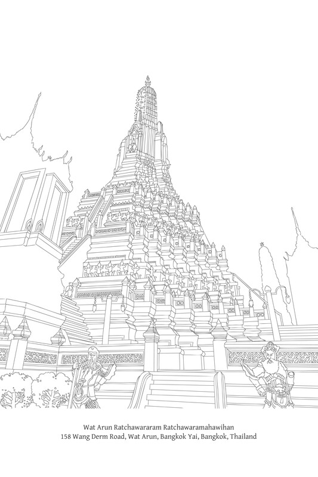

# 第五章：业的法则

业的法则

## 导论

所有佛教教法，无论其名称或标题如何，都是相互关联并构成一个整体的。它们都指向同一个真理，也都导向同一个目标。它们被赋予不同的名称，是为了指出真理的特定方面，或者它们指的是同一事物，但从不同的角度来看待，这取决于教法的特定目的。因此，某些佛法教法或原则从属于一个更大的教法，而另一些则同样重要，涵盖相同的主题内容，但具有独特的格式和目标。

缘起（paṭiccasamuppāda）的教法描述了人类存在的整个过程，它以全面而广泛的方式涵盖了所有其他佛法教法。它是一个完整的教法。如果一个人理解缘起，他就理解了存在的精髓或佛教的整体，正如佛陀所确认的：

> 见缘起者见法。M. I. 190-91。

无论如何，普遍认为缘起是深奥且极其难以理解的。即使是解释它也十分困难。因此，几乎没有专门解释缘起的文本。更常见的是找到解释佛法其他部分或原则的文本，这些部分或原则是缘起教法的一部分。

在这些附属教法中，也许最常被解释的是关于业的教法。[\[1\]](law-of-kamma_split_001.html#fn-fn1)原因有二：第一，这是一个人们极度感兴趣的主题；第二，对业的理解是理解缘起的一座桥梁。事实上，对业的透彻解释是使解释缘起这项任务变得更容易的一种方法。

业只是缘起所概述过程的一部分，这个过程可分为三个不同的循环（vaṭṭa）：烦恼（kilesa）、业（kamma）和业果（vipāka）。缘起描述了执行意志行为（kamma）并承受这些行为后果的整个序列，从作为业之源的烦恼开始，最终以业果（vipāka）告终。

在描述了缘起法则及其组成因素之后，似乎没有必要单独解释业。人们可能会声称，通过理解缘起，一个人也获得了对业的清晰理解。{235}

缘起的阐述纯粹地、绝对地侧重于现象，它提供了一个广阔而全面的自然过程视角。它不强调这个过程的某个特定方面。然而，从实际的日常角度来看，缘起中最突出、直接关乎人类行为并与人类责任相关的部分是业。从这个角度来看，可以说业是缘起中的主要因素或主题，而其他因素仅仅是支持探究。

如果选择这种分析方法，缘起就以被称为“业的法则”[\[2\]](law-of-kamma_split_001.html#fn-fn2)的形式出现。而且由于与此主题相关的其他关键因素很多，在后来的文本中，业的法则比缘起更成为研究的焦点。对业的讨论涉及人类行为，这些行为相对粗糙、容易显现、与每个即时时刻相关，并适合作研究的起点。

此外，对业的解释可以在许多不同的层面上进行。可以在表面层次上解释，向普通的在家听众描述因果；可以描述与业相关的独特人类境况或活动；或者可以更深入地探讨各种心理过程，并在其完整形式的缘起背景下解释业。

正是由于这些原因，本书专门用一章来讨论业这个主题。

## 对业的基本理解

### 业作为自然法则

佛教教导的真理是，一切事物，无论是生灵还是无生命体，无论是物质还是非物质，无论是身体还是心理，无论是内在还是外在——也就是说，一切有为法（saṅkhata-dhamma）——都依据因缘而存在；它们受制于相互的制约性。这是一条自然法则。巴利语中这种自然法则的术语是niyāma，字面意思是“必然固定”、“必然模式”、“必然规则”或“具有某种秩序性”。当特定的因缘存在时，事物就必须以某种方式发展。

尽管这条自然法则具有相互制约的统一特征，但它可以根据不同的属性进行划分，这些属性表达了各种相互关系的模式或方面，并有助于理解。根据佛教的思维路线，注释书描述了五种不同的自然法则（niyāma）：[\[3\]](law-of-kamma_split_001.html#fn-fn3) {236}

1.  物理法则（Utu-niyāma）：能量法则；物理现象法则；物理无机秩序；物理定律。这特别指外部环境和物质的改变。例如：天气和季节；水、土壤和肥料有助于植物生长的规律；荷花白天开放晚上闭合的规律；打喷嚏和咳嗽的过程；以及万物都受腐蚀和衰败的规律。注释书在此处的重点是热量和温度引起的改变。
    
2.  种籽法则（Bīja-niyāma）：遗传法则；遗传规律；生殖规律；物理有机秩序；生物定律。例如：特定的植物会结出特定的果实；例如，芒果树总是会结芒果。
    
3.  心意法则（Citta-niyāma）：心理法则；心理规律；关于心识运作的自然法则。例如：当感官刺激接触感官基础时，认知就会产生——有分心（bhavaṅga-citta）被动摇和中断，有转向（āvajjana），见、闻等等，领受（sampaṭicchanna），推度（santīraṇa）等等；特定的心所可能伴随着某些心所（cetasika），而可能不伴随着其他心所。
    
4.  业力法则（Kamma-niyāma）：业的法则；行为与结果的秩序；业律；道德法则。与人类行为相关的自然法则。更具体地说，这指的是意图的过程和概念化的过程，以及这些心理活动相应的后果。例如：如果一个人行善，他就会收获善果；如果一个人作恶，他就会收获恶果。
    
5.  法则（Dhamma-niyāma）：普遍的因果法则；规律的秩序。关于万事万物相互关系和相互制约的自然法则。例如：一切事物都生起、存续并消亡；人类出生、老、病、死是常态；此时代人类的正常寿命大约是一百年；无论佛陀是否出现，一切事物无常、苦（‘受压迫’）和无我（anattā）都是自然秩序的一部分。
    

前四种法则实际上都包含在第五种法则，即dhamma-niyāma中，或者可以说它们是源于这条法则的划分。dhamma-niyāma的定义涵盖了所有五种法则。

可以说，法法性是首要的、统摄一切的法则。在这种情况下，有些人可能会争辩说，如果详细列举支分法则，那么这个列表就应该是穷尽无遗的。为何法法性仍与这四种支分法则并存呢？

这可以用一个简单的类比来回答。当描述一个国家的全体人口时，它可能被分为“政府领导人、公务员、商人和平民百姓”，或者“士兵、警察、公务员、学生和普通大众”。确实，“平民百姓”和“普通大众”这两个词可以指社会中的所有个体。公务员、商人、士兵和学生都是普通大众的一部分。之所以将这些个体与其余的人区分开来，是因为他们拥有独特的属性，而进行这种区分的人希望根据其目的来强调这些属性。{237} 每一次，术语“平民百姓”或类似的术语被用来涵盖所有其余的个体。对这五种自然法则的描述也可以这样看待。

我们在此的任务并非探讨是否应将其他支分法则加入此列表。注释者是根据他们各自的目的选择了这五种。此外，如前所述，这四种支分法则都包含在法法性的范畴之内。此处感兴趣的重点是，探讨描述这五种法则的真正意义和目的。以下是几点思考：

首先，这种阐述提供了一种对佛教思维方式的有力看法，描述了世间万物的因果本性。尽管这五种自然法则相互区分，但主要强调的是相互缘起。这为法修习者提供了清晰明确的研习、实践和理解的原则。他们无需陷入关于造物主是否改变了自然条件流动、偏离常态的争论中（除非一个人认为造物主只是像其他条件一样参与到自然过程中）。

有些人可能会在此提出异议并发表看法：没有这些法则的造物主，它们肯定不可能存在？一个人不必纠缠于此类问题，它们只会误导和迷惑人们。如果一个人接受事物依其自性而存在，那么它们就必须以某种方式运行。事物总是依照其自然决定的路线运行。除了通过相互缘起，它们不可能以其他方式运行。人类观察并理解这些模式和过程，并将它们称为自然法则。但无论它们是否被区分并标记为法则，它们都同样存在。

如果一个人坚持认为必定有人创造了自然法则，那么就会面临各种困扰人的问题，比如：“什么法则支配着造物主的行为？”以及“谁来监督造物主？”如果回答说造物主完全按照自己的意愿行事，那么他当然能够随心所欲地改变法则。某一天，他可能会改变法则，给人类带来混乱。（确实，如果存在这样一位自然法则的造物主，并且他富有慈悲心，他会改变一些法则来帮助人们。例如，他会阻止残疾、跛脚或心智障碍者的出生。）

其次，当一个人将因果法则划分为支分法则时，重要的是不要将结果现象完全且绝对地归因于某一种特定的法则。实际上，一个单一的结果可能源于各种原因，或者与多种法则的结合相关。例如，莲花只在白天开放的事实，并非仅仅归因于物理法则，也归因于种子法则。一个人哭泣的原因可能是由于心理法则，比如悲伤或高兴，也可能是由于物理法则，比如眼睛进了烟。某人出汗可能是由于物理法则，比如天气炎热，或者由于心理法则和业法则，比如他害怕或想起做错了事。一个人头痛可能是由于物理法则，比如潮湿的天气、闷热的房间或缺氧，或者由于种子法则，比如身体的某种缺陷，或者由于业法则和心理法则的结合，比如焦虑和痛苦。

第三，也是最重要的一点是，注释书揭示了业法性是如何被纳入这些自然法则之中的。{238}

就人类而言，业法性是这些支分法则中最重要的，因为它直接影响到每个人。人类造作业，而业反过来决定他们的命运。

现代人倾向于划分世间各种力量，将自然与人类对立起来。根据这种划分，业法则属于人类活动范畴。所有其他支分法则都属于自然范畴。

人类是自然的产物，也是自然的一部分。但人类拥有一种独特的能力，即在道德或业法则（业法性）下运作。他们通过有意的行为形成社群并创造事物，几乎是创造了一个与自然世界分离或平行的世界。

在业法性的范畴内，业的本质或核心是意图或思。业法则涵盖了意图的整个世界，或者说由人类的智慧和创新所产生的创造（和破坏）世界。业法性是人类的主导法则，无论他们是否与其他法则互动。实际上，与其它法则的互动本身就依赖于业法则。

有意行为的领域使人类能够影响、改变和创造事物。更准确地说，人类作为自然过程中一个因和条件参与其中，以至于他们声称能够控制或战胜自然，这都取决于业法则。人们有意地与自然领域中存在的其他法则互动，研究它们并据此行动，或从中获取利益。因此，才说意图决定并塑造了自然世界。此外，人类的意图决定了社会互动。

除了塑造社会互动以及与外部事物、环境和普遍自然相关的行为之外，人类，更准确地说，人类的意图，对人类自身也有影响，塑造他们的性格并决定他们的命运。

业法则涵盖了意图世界和所有形式的人类创造力。它是塑造每个人生命的关键因素。它决定了人类社会以及所有人类创造性和破坏性活动的进程。它是人们与其它法则互动，以控制自然世界的基础。因此，佛教非常强调业的原则。佛陀说：“世间依业而存在”（kammunā vattatī loko）。[\[4\]](law-of-kamma_split_001.html#fn-fn4) 业因此是佛教中至关重要的教义。

将业法性纳入五种法则之列，也表明业法则只是众多自然法则中的一种。因此，当一种现象发生，或者当某人经历某种苦难时，不要错误地认为它完全是由于业。[\[5\]](law-of-kamma_split_001.html#fn-fn5) {239}

佛陀（上文）的引语“世间依业而存在”，指的是有情众生的世界，或者说是人类世界。换句话说，业主导并决定着人类社会。

总而言之，业法性是自然界的一个支分法则，但它是对人类最重要的法则。

除了上述五种法则之外，还存在另一种专属于人类的法则。它并非自然固有的，也与自然没有直接联系。这指的是人类自身为了规范社会行为和促进社会福祉而制定下来的法则和惯例。这些社会规约包括政策、规定、契约、立法、传统、习俗、纪律守则等。可以将这第六种法则作为上述五种自然法则的附录。

为方便起见，可以为这组社会规约指定一个与那些自然法则类似的标题。然而，需要注意的是，这种所谓的“第六种法则”位于五种自然法则之外，并且与它们有所区别。有许多这样的标题可供选择，包括：saṅgama-niyāma（“社会法”）、saṅgama-niyamana（“社会实践”）、sammati-niyāma（“俗定法”）和 paññatti-niyāma（“制定法”）。[\[6\]](law-of-kamma_split_001.html#fn-fn6)

所有这四个示例标题都清楚地表明，它们指的是人类法则而非自然法则。前两个术语指社会规约。第三个术语指人类惯例，即社会中建立的那些相互协议。第四个术语指人类的规定和条款。

在此文本中，“俗定法”（sammati-niyāma）一词被用来指代这些人为制定的法则。

这些社会标准和准则是由人类制定的。因此，它们源于有意的行为，并与业法则（业法性）相关。然而，它们是业法则的补充——它们本身并不构成业法性。它们不以相互缘起为特征，也不是像业法性那样是自然真相的方面。由于它们与业法则存在重叠，两者之间的差异往往会引起混淆，进而导致人们之间产生许多争论和误解。

由于这两种法则——业法则（业法性）和俗定法（sammati-niyāma）——对人类影响最大，因此指出它们的独特属性至关重要。

首先，业法性是一种处理人类行为的自然法则。俗定法或社会法则是由人们自己建立的。它们与自然法则相关，仅限于作为人类有意活动的结果。其次，通过业法则，人类对其行为依照自然的动态负责。然而，在社会法则的背景下，人们必须根据由人们自己制定的法令对其行为负责。

业的这些方面将在本章的后续部分更详细地讨论，包括善恶问题以及源于有意行为的果报问题。{240}

### 业的定义

“业”一词字面意思是“行动”或“工作”。然而，在佛法教义的语境中，其定义仅限于指“伴随意图的行动”或“有意的行为”。[\[7\]](law-of-kamma_split_001.html#fn-fn7) 在此语境下，无意发生的行为不被归类为业。

然而，业的这个定义非常宽泛。要真正理解这个词的含义，其定义应从不同角度审视，或以不同层面的意义呈现：

*   A. 对业的直接或精确审视揭示，其本质或根源是思：意图、意愿、审虑；行动的决心；行动背后的动力或主体。意图是主要的，它定义了一个人的目标和目的，并决定了所有人类行动的方向。它启动了行动以及所有形式的概念性和创造性活动。因此，它处于业的核心。佛陀的话证实了这一点：“比丘们，我说思就是业”（cetanāhaṁ bhikkhave kammaṁ vadāmi）。有了意图，人们便通过身、语、意而行动。[\[8\]](law-of-kamma_split_001.html#fn-fn8)
    
*   B. 更广阔的视角，考虑到人类活动动态中的其他因素，揭示了有意行为（“业”）作为主导因素，在塑造人们生命的结构和路径中发挥作用。在此意义上的业等同于，或被称为“行”（saṅkhāra），也可译为“心的造作者”。例如，在缘起的十二支中就发现了这种解释。术语“行”指的是以思（cetanā）为首的那些心理因素或属性，它们塑造心成为善、不善或无记。它们决定了人们的思想、言语和身体行为，从而产生各种有意的行为。简而言之，“行”可被描述为“心理概念化”，然而即使在此，意图仍被认为是主要因素。实际上，佛陀有时将“行”简单地定义为思（cetanā）。[\[9\]](law-of-kamma_split_001.html#fn-fn9)
    
*   C. 更广泛的视角将人类作为一个整体来审视，传统上被称为个体的人，他们与外部世界互动并对其自身行为负责。在此语境中，业指思想、言语和身体行为——人们必须为之承受结果的行为，无论这些结果是即时发生，还是发生在更遥远的过去和未来。
    
    业的这一方面在典籍中提及最为频繁，出现在针对特定个体的教导中。此类教导鼓励人们对自己的个人行为负责并实施善业，正如佛陀的这些话所证实：{241}
    

> 比丘们，有这两种导致痛苦的事物。是哪两种？有一种情况是，有人未行善，未作善业，未行能对治恐惧的功德之事。相反，他所行的是恶行、凶残和残忍之事。心想：“我未行善业；我已作恶”，他便感到痛苦。It. 25-6。

值得注意的是，在现代，这是对业最常见的解释，尤其是在指代过去的行动时。

*   D. 最宽广的视角是审视人类社会中显而易见的一般人类活动。在此，业指的是谋生、处世以及从事各种活动，这些活动源于意图和概念化。佛陀在《婆私吒经》中描述了这种解释：

> 婆私吒，你应当知道，凡在人中以牧牛为生者，被称为农夫；他不是婆罗门……凡以各种技艺为生者，被称为匠人……凡以贸易为生者，被称为商人……凡以服务他人为生者，被称为仆人……凡以盗窃为生者，被称为盗贼……凡以弓箭刀剑为生者，被称为士兵……凡以祭司之术为生者，被称为祭司……凡在人中治理城镇和国土者，被称为国王；他不是婆罗门……那心中没有残余垢染，不再执著的人，我称他为婆罗门……一个人并非生来就是婆罗门，也非生来就不是婆罗门。通过业（kamma）一个人是婆罗门，通过业一个人不是婆罗门。通过他们的业（kamma：工作、职业、行为、生活方式），人们成为农夫、匠人、商人、仆人、盗贼、士兵、祭司，甚至是国王。这是智者看待业的真实方式，他们是缘起的见者，精通业及其结果。业使世间运转；业使这一代众生轮回。M. II. 196; Sn. 117-23。

同样，在《起世经》中：

> 于是那些长老众生聚在一起，彼此倾诉他们的烦恼：“先生们，我们之间已生起各种恶行，导致偷盗、诬告、妄语以及持棍棒。愿此不要再发生。假设我们任命（sammati：‘同意’）某位众生，他将惩戒应受惩戒者，谴责应受谴责者，驱逐应受驱逐者。作为回报，我们将给予他一份谷物。”于是他们走到他们当中最庄重、最有魅力、最有感召力且令人敬畏的那位，请求他为他们做这件事，以换取一份谷物，他同意了……{242} 因为他是由民众推选的，所以第一个正式头衔“大统领”（Mahā Sammata）便产生了。[\[10\]](law-of-kamma_split_001.html#fn-fn10) D. III. 92-3。

同样，在《转轮经》中：

> 比丘们，当国王不向贫困者提供财物时，贫困便盛行；随着贫困的增长，偷盗增加；随着偷盗的增加，武器的使用增加；随着武器使用的增加，杀生增加——随着杀生的增加，妄语增加……离间语……邪淫……粗恶语和杂秽语……贪婪和恶意……邪见增加。[\[11\]](law-of-kamma_split_001.html#fn-fn11) D. III. 70-71。

尽管一个人可以将业定义为这四个不同的类别，但应记住，在每一种情况下，意图（思）都处于这些行动的核心。意图引导人们与事物互动并决定这种互动的方式。它决定了人们如何回应事物以及如何改变或改进事物。它决定了一个人是让自己成为表达贪、嗔、痴等不善品质的渠道，还是表达善品质以促进真正的安乐。所有这一切都在意图的力量之下。

没有意图的行动在业法则的领域内不会产生结果——它们不被归类为业。相反，它们是与自然的其他法则相关的事项，特别是与物理法则（utu-niyāma）相关。它们被视为等同于山体滑坡或树枝从树上掉落。

### 业的种类

从业的性质或来源来看，业分为两种因素：[\[12\]](law-of-kamma_split_001.html#fn-fn12)

1.  不善业（akusala-kamma）：不善巧的行为；恶行。这指的是源于不善根的行动，即贪（lobha）、嗔（dosa）和痴（moha）。
    
2.  善业（kusala-kamma）：善巧的行为；善行。这指的是源于善根的行动，即无贪（alobha）、无嗔（adosa）和无痴（amoha）。{243}
    

如果一个人根据行为所通过的“门”（dvāra）——表达的途径——来划分业，那么分类有三种：[\[13\]](law-of-kamma_split_001.html#fn-fn13)

1.  身业（kāya-kamma）：通过身体的行动。
    
2.  语业（vacī-kamma）：通过言语的行动。
    
3.  意业（mano-kamma）：通过心的行动。
    

结合上述两种分类，产生六种业：不善身业、不善语业和不善意业，以及善身业、善语业和善意业。[\[14\]](law-of-kamma_split_001.html#fn-fn14)

另一种分类将业分为四种因素，根据行为与它们的果报（vipāka）之间的关系：[\[15\]](law-of-kamma_split_001.html#fn-fn15)

1.  黑业黑报：这指的是有害和压迫性的身行、语行和意行（kāya-saṅkhāra, vacī-saṅkhāra, and mano-saṅkhāra）。基本例子包括：伤害其他众生（pāṇātipāta）、偷盗（adinnādāna）、邪淫（kāmesu-micchācāra）、妄语（musāvādā），以及漫不经心地沉迷于酒精饮料。
    
2.  白业白报：这指的是既无害也无压迫性的身行、语行和意行。一个例子是奉行十善业道（kusala-kammapathā）。
    
3.  黑白业黑白报：这指的是部分有害且部分无害的身行、语行和意行。大多数人类行为属于这一类别。
    
4.  非黑非白业无黑白报：这指的是为了终结业而进行的那些行动，即旨在舍弃上述三种业的意图。在精神品质方面，这指的是七觉支（bojjhaṅga）或八圣道。
    

注释书中还有另一种业的分类，分为十二种因素，即三个四因素的组别。这种分类受到后代佛教论师的青睐，如在《清净道论》中的描述所见。然而，为了避免混淆，此处将不予介绍。[\[16\]](law-of-kamma_split_001.html#fn-fn16)

在上述三种业中，即身业、语业和意业，意业是最重要的，并具有最广泛和重大的后果，正如佛陀所证实：

> 塔帕西，在这三种已分析和区分的行动中，我描述意业在造作恶行、在实行恶行方面是最有害的，而不是身业或语业。M. I. 373。

意业最重要，因为它是一切的源头。人们在言行之前先思考；他们在通过言语或身体行动表达自己之前先思考。因此，语业和身业是意业的延伸。此外，意业涵盖了信念、观点、学说、思维方式和价值观，这些统称为“见”（diṭṭhi）。

见（diṭṭhi）决定了人们的一般行为和生活方式，以及社会的方向。人们的思想、言语、教导、指示、行动等都源于他们的信念、观点和价值观。{244} 如果人们怀有邪见（micchā-diṭṭhi），他们的思想、言语和行动也将是不正确的（micchā）；如果他们怀有正见（sammā-diṭṭhi），他们的思想、言语和行动将是正确的（sammā）。[\[17\]](law-of-kamma_split_001.html#fn-fn17) 例如，如果一个社会相信物质富裕具有最高价值且真正值得向往，人们就会追求物质财富，并会以财富作为衡量进步、声望和尊严的标准。人们的生活方式和社会方向将遵循特定的模式或形式。另一个将精神平静和幸福视为最高目标的社会将遵循另一种行为模式。

佛陀有许多教导表达了邪见和正见的重要性，例如：

> 比丘们，我没有看到任何一件事物，能像邪见那样，使未生起的不善法生起，已生起的不善法增长和扩张……比丘们，我没有看到任何一件事物，能像正见那样，使未生起的善法生起，已生起的善法增长和扩张。A. I. 30。比丘们，对于一个怀有邪见的人，无论他依据这种见地所持守和从事的身业、语业和意业，以及无论他的意图、渴望、倾向和有意行为是什么，它们都只会导致不愿、不欲、不喜之事，导致伤害和痛苦。为什么呢？因为这种见地是恶劣的。假设一粒楝树、蛇瓜或苦瓜的种子被种在潮湿的土壤中。无论它从土壤和水中汲取什么养分，都会导致其苦涩、辛辣和难吃的味道。为什么呢？因为这种子是恶劣的……比丘们，对于一个怀有正见的人，无论他依据这种见地所持守和从事的身业、语业和意业，以及无论他的意图、渴望、倾向和有意行为是什么，它们都只会导致所愿、所欲、所喜之事，导致安乐和幸福。为什么呢？因为这种见地是善妙的。假设一粒甘蔗、脱壳小麦或金苹果的种子被种在潮湿的土壤中。无论它从土壤和水中汲取什么养分，都会导致其甜美、可口和美味的味道。为什么呢？因为这种子是善妙的。A. I. 32; cf.: A. V. 212。比丘们，有这样一个人，他出现在世间，是为了许多人受害，为了许多人不幸，为了许多人、天人众生遭受毁灭、伤害和痛苦。那是一个怎样的人呢？他是一个持有邪见并抱有颠倒观点的人。他将许多人引离真正的法，使他们确立于不真实的法之中……{245} 比丘们，有这样一个人，他出现在世间，是为了许多人的福祉，为了许多人的幸福，为了许多人、天人众生的善、福祉和幸福。那是一个怎样的人呢？他是一个持有正见并抱有正确观点的人。他将许多人引离不真实的法，使他们确立于真正的法之中……比丘们，我没有看到任何一件事物能像邪见那样有害。邪见是所有有害事物中最糟糕的。[\[18\]](law-of-kamma_split_001.html#fn-fn18) A. I. 33。

> 心是诸法之首，心是主宰，一切法皆由心造。若以污秽之心言行，苦便随之，犹如车轮随拉车的牛……若以清净之心言行，乐便随之，犹如不离身的影像。[\[19\]](law-of-kamma_split_001.html#fn-fn19) Dh. verses 1 and 2。

## 善恶的标准

### 善与恶

业的主题与善恶的主题直接相关。因此，为了更清楚地理解业，触及善恶的主题至关重要。

善恶（或好坏）的概念带来了困难，原因在于这些词在英语中的含义以及评估的标准。[\[20\]](law-of-kamma_split_001.html#fn-fn20) 什么决定了某事物是“好”或“恶”？

然而，这个困境主要限于英语。巴利语中处理这些概念的术语定义明确，如下文将讨论的。

英语单词“good”（好），特别是，具有非常广泛的含义。行为贤善的人被称为“好人”；当人们吃到美味可口的食物时，他们称食物或提供食物的餐厅为“好”；运行高效或顺畅的发动机被称为“好”；一块合乎其用途的木槌被称为“好”；一部有趣且令人愉悦的电影被称为“好”；一幅从艺术角度看很美的画被称为“好”，如果它卖出高价，也被称为“好”；同样，一所成功、管理良好且有聪明学生的学校被称为“好”。同一张桌子可能被三个人称为“好”，但原因各不相同。一个人说它好是因为他认为它制作精美；第二个人说它好是因为它符合他写作的目的；第三个人说它好是因为他可以高价出售它。

同样，同一样被一个人称为好的物品，可能被其他人称为坏的。有些事物从一个角度看是好的，而从另一个角度看是坏的。有些行为在一个国家或社会可能被认为是好的，而在其他国家或社会则被认为是坏的。没有决定性的答案或完全清晰的指导方针。一个人可能需要区分“道德上的善”、“审美上的善”和“经济上的善”。{246}

造成这种混淆的原因是，这些都是与价值感相关的问题。“好”和“坏”这两个词在指代价值感时，可以在整个范畴内使用。因此，这些词的定义如此宽泛和多样。

为了避免这种混淆，我们在此语境中无需使用这些英语词汇“good”和“bad”。这样我们就不必讨论事物在不同人眼中所呈现的相对优点或价值。

关于善恶与业相关的这个主题，有几点需要记住：

*   在善恶的这个语境中，分别使用了巴利语中的特定术语 kusala（“善”）和 akusala（“不善”）。这两个术语具有清晰规定的定义和评估原则。
    
*   此处对善恶的分析直接与业法则（业法性）相关。在佛教伦理学的研究中，善和不善的概念因此被视为自然现象（sabhāva）。它们并非从相对的价值感来审视。[\[21\]](law-of-kamma_split_001.html#fn-fn21) 对相对价值的研究属于俗定法（sammati-niyāma）或社会规约（saṅgama-paññatti）的层面，其界限与业法则（业法性）有明确区分。
    
*   业法则与其他法则相连。特别重要的联系包括：在内部，即在个体之内，业法则（业法性）是以心法性（citta-niyāma）为基础的；而在外部，自然法则与俗定法（sammati-niyāma）相连。关于后一种关系，重要的是要清楚区分业法则与俗定法之间的界限，尽管它们之间存在联系。
    

### 善与不善

尽管巴利语术语 kusala 和 akusala 分别常被翻译为“好”和“坏”，但这并非真正准确的定义。有些事物可能是善（kusala）的，但在英语中可能不会被称为“好”；同样，有些事物可能是不善（akusala）的，但在英语中可能不会被称为“坏”。

善和不善生起于心中，它们首先对心产生影响，并影响一个人的性格；这些影响随后才向外表达。因此，这两个术语——kusala 和 akusala——的含义聚焦于善和不善行为的根本基础：主要的重点在于心的内部运作。

术语 kusala 字面意思是“善巧的”、“熟练的”、“精通的”、“灵巧的”、“安乐的”、“有利的”、“支持性的”、“适当的”、“有德的”、“有功德的”、“消除低劣、令人厌恶的品质”，或“驱除疾病”。

不善法 (akusala) 一词指的是那些与善法 (kusala) 为敌或对立的状态，例如缺乏善巧或不自在。

在经文中，善法 (kusala) 一词有四个主要定义：

1.  Ārogya（无病）：没有疾病，指心离病态，处于心理健康的状态。这指的是那些有益于心理健康并有助于预防心理疾病的条件和因素。当这些因素存在时，心不会苦恼、不安、受损或虚弱；相反，它会是强健、敏捷、柔软和自在的。
    
2.  Anavajja（无过失）：无害；无可指责。这指的是一种没有缺陷、没有腐败、没有瑕疵、没有被扰动的心。心是完满、清净、明晰和光明的。{247}
    
3.  Kosalla-sambhūta（源于善巧）：源于智慧；发自于聪明。心具足智慧或那些源于理解的特质。心是明亮的，能洞察实相。这与善法以如理作意 (yoniso-manasikāra) 为近因 (padaṭṭhāna) 的原则是一致的。
    
4.  Sukha-vipāka（乐果）：以快乐为果报；导向快乐。当善法存在于心中时，快乐和满足感会立即生起；无需等待外来的奖励或补偿。同样地，当身体强健健康 (aroga)，当一个人摆脱了所有有害、不净或有毒的因素 (anavajja)，并且知道自己身处一个安全且合适的地方 (kosalla-sambhūta) 时，即使他可能没有体验到任何特殊的心态，他本质上也是快乐和自在的。
    

有些经文还提到善法 (kusala) 的另外三个定义：“聪明” (cheka；“灵巧”)；“安稳” (khema；“安全”)；以及“无忧” (niddaratha)。然而，这三个定义已经包含在上述的四个定义中。[\[22\]](law-of-kamma_split_001.html#fn-fn22) 另请注意，上述第三个定义——kosalla-sambhūta——是善法 (kusala) 的主要定义。

不善法 (akusala) 的含义可以解释为与上述善法 (kusala) 的定义相反。这个词指的是一种不健全的心态，缺乏心理健康。不善法是有害的、应受谴责的、有缺陷的；它们源于无明 (avijjā) 并以苦为果报。总而言之，它们削弱和损害心。这与支持和增强心的善法形成对比。

为了澄清此事，可以描述一颗善、健康、清净等心的各种特质。善法 (kusala-dhamma) 会产生这些特质或这些心态。反之，不善法 (akusala-dhamma) 则会损害或腐蚀心。

以下善的特质摘自巴利语圣典中的各种段落。它们涵盖了普通人心中存在的特质，直至完全觉悟者——阿罗汉心中存在的特质。

> 第一组：passaddha（轻安）：放松、平静、安详；lahu（轻快）：心轻快；mudu（柔软）：柔和、温和、轻柔；kamañña（适业）：随顺、准备好工作；paguṇa（善巧）：熟练；uju（正直）：正直、不歪曲、不扭曲。[\[23\]](law-of-kamma_split_001.html#fn-fn23) 第二组：mudu（柔软）：柔和、温和；kammanīya（适业）：随顺、适合工作；pabhas-sara（光明）：光明、清澈；apabhaṅgu（坚固）：强健、不脆弱；samāhita（坚定）：坚定；anāvaraṇa（无碍）：无障碍、无限制；anivaraṇa（无盖）：无障碍、无阻碍、无拘束；anupakkiliṭṭha（无垢）：无染、无浊；anajjhārūḷha（无压）：无束缚、无压迫；avighāta（无恼）：无困扰、无苦恼。[\[24\]](law-of-kamma_split_001.html#fn-fn24) {248} 第三组：samāhita（坚定）：坚定、平衡、平稳；parisuddha（清净）：纯净、无暇；pariyodāta（皎洁）：原始的、明亮的；anaṅgaṇa（无垢）：无瑕、清澈；vigatūpakkilesa（离垢）：无染；mudubhūta（柔软）：柔和、温和；kammanīya（适业）：随顺；ṭhita and āneñjappatta（不动）：坚定、稳固、沉着、稳定、不可动摇、不摇摆。[\[25\]](law-of-kamma_split_001.html#fn-fn25)

接下来的两组主要包含阿罗汉的特质：

> 第四组：akiñcana（无着）：心中无挂碍、远离潜在的焦虑；santa（寂静）：平和、满足；asoka（无忧）：无悲；viraja（离尘）：离垢；khema（安稳）：安全、稳固、远离危险；nicchāta（息渴）：饱足、远离渴望；sītabhūta（清凉）：清凉、深具平静；nibbuta（涅槃）：清凉、平息；serī（自在）：解脱、能够自由游荡；sayaṁvasī（自主）：自主、自立；sukhī（安乐）：快乐。[\[26\]](law-of-kamma_split_001.html#fn-fn26) 第五组：anallīna（无缠）：无纠缠、无执着；anajjhosita（无惧）：无畏；anūpalitta（无染）：无垢、无染污；anissita（无依）：独立、不依赖任何事物；visaññuta（无缚）：无束缚；vippamutta（解脱）：解脱；vimariyādikata-citta（心无边际）：心无边际、无限。[\[27\]](law-of-kamma_split_001.html#fn-fn27)

为了便于记忆，这些特质可分为几个主要类别：

1.  稳定：例如：坚定、稳固、平衡、不可动摇、不摇摆、不躁动、不犹豫。
    
2.  清净：例如：无染、无浊、无垢、无瑕、清澈、明亮、皎洁。
    
3.  自由：例如：无纠缠、无限制、无拘束、无束缚、无苦恼、广大。
    
4.  适业：例如：柔和、轻柔、轻快、自在、善巧、柔软、强健、正直、不脆弱、无偏见、不歪曲、不偏离、不扭曲。
    
5.  平静：例如：放松、安详、满足、无压力、无匮乏、无渴望、不躁动、无烦恼、不被打扰。
    

当一个人熟悉了健康、无瑕疵的心所具有的特质时，他就可以审视那些被定义为善法或不善法的品质。善法如何支持和增强心，而不善法又如何困扰、破坏、削弱和折磨心呢？{249}

以下是善法的例子：sati（念）：正念、保持专注的能力；mettā（慈）：慈爱、善意、希望他人快乐的愿望；alobha（无贪）：无贪婪、没有渴望、倾向于慷慨；paññā（慧）：智慧、洞察力；passaddhi（轻安）：止息、身体安息和内心平静、没有压力和不安；kusala-chanda（善法欲）：善的愿欲、对善的爱、对真理的渴望、希望与因缘和谐一致；muditā（随喜）：当他人成功或快乐时感到喜悦和随喜。

以下是不善法的例子：kāma-chanda（欲贪）：贪婪、贪求、渴望（参阅“善法欲与不善欲”注释）；byāpāda（瞋恚）：恶意、愤慨、怨恨；thīna-middha（昏沉睡眠）：沮丧、气馁、冷漠、无精打采、怠惰；uddhacca-kukkucca（掉举恶作）：不安、心动、心扰、情绪化、担忧、焦虑；vicikicchā（疑）：怀疑、犹豫不决；kodha（瞋）：愤怒；issā（嫉妒）：嫉妒；macchariya（悭吝）：吝啬、嫉妒、希望阻碍他人。

善法欲与不善欲

> 善法欲 (kusala-chanda) 和欲贪 (kāma-chanda)（或贪 (lobha)）之间的区别在第十章“欲望与动机”中有详细讨论。简言之，贪 (lobha) 是对感官对象的执着，这些感官对象提供即时满足，但不会导向超越此境的任何事物。贪专注于沉溺于感官对象，并强化一个获取或消费这些对象的自我感。而善法欲 (chanda) 则抓住处于发展初始阶段的事物。心接纳并与事物协调一致，帮助它们达到圆满。它不涉及个人满足的愿望，也不会导向一个获取或消费事物的孤立自我感。

当一个人具足慈心 (mettā) 时，心是快乐、平静和广大的。慈心支持和增强心。而念则有助于保持对所从事事物的专注。它觉知在特定情况下的适当行为，抵御不善法，并为心做准备。因此，这两种品质被归类为善法。

嫉妒会收缩、扰动和压迫心；它明显地削弱和损害心。愤怒从内在燃烧，引起心理痛苦，，并能迅速损害一个人的身体健康。渴望，或仅仅是普通的贪婪，会纠缠、扭曲和蒙蔽心，使其烦躁和焦虑。因此，这些品质是不善法。

尽管昏沉、冷漠、无精打采和掉举等是不善法，但在英语中，说这些品质是“坏的”并不完全准确。同样地，某些善法如轻安，也未必被称为“好的”。这表明了“善法”和“不善法”这两个术语与“好”和“坏”这两个术语并不相同。

通过理解善法 (kusala) 和不善法 (akusala) 的含义，一个人也就能理解善业 (good kamma) 和恶业 (bad kamma)，即善业 (kusala-kamma) 和不善业 (akusala-kamma) 的含义。

如前所述，思 (cetanā) 是意志行为 (kamma) 的根本因素。因此，善思 (kusala-cetanā) 被定义为善业 (kusala-kamma)，而不善思 (akusala-cetanā) 被定义为不善业 (akusala-kamma)。

当善思和不善思通过身、语、意表达时，它们分别被称为善与不善的身业 (kāya-kamma)、语业 (vacī-kamma) 和意业 (mano-kamma)。{250}

### 关于善法与不善法的特殊要点

#### 善与不善可以相互关联

有些人具足信心，布施，持戒，或拥有智慧的某些方面，所有这些都是善法或善行，然而他们却因这种善行而变得傲慢或自大。傲慢和自大是不善法。这是善法作为不善法条件的一个例子。

有些人发展禅定并证得禅那 (jhānas)，然而却被这些精微的状态所迷惑。有些人发展慈爱和善意，然而当他们遇到一个有吸引力的感官对象时，他们的爱促使贪欲生起，随后可能还会出现偏见等其他不善法。这些都是善法作为不善法条件的更多例子。

信心是一种善法，能提升和专注心。但如果一个人不善巧地对待信心，它可能会导致邪见 (diṭṭhi) 和我慢 (māna)。一个人确信自己的观点是正确的，而他人的观点是错误的，这可能成为争吵、争议和辱骂的原因。这也是善法作为不善法条件的一个例子。

有些人渴望生天，因此决意行善。有些人渴望平静，因此修习禅定直至达到禅那 (concentrative attainments)。有些孩子希望得到大人的赞赏，因此努力表现得守规矩。有些学生渴望好成绩，因此努力学习和求知。[\[28\]](law-of-kamma_split_001.html#fn-fn28) 有些人感受到愤怒的炽热影响，这反过来使他们清楚地理解愤怒的有害影响。有些人被对手冒犯，然而这种经历却让他们对他人产生慈悲心。另一些人可能感到焦虑或沮丧，结果他们对佛法 (Dhamma) 生起信心。这些都是不善法作为善法条件的例子。

一个青少年被父母警告要非常小心他所结交的朋友，但他不听。后来，他被一个坏人诱骗吸毒成瘾。当他意识到发生了什么事时，他既对自己生气又感到沮丧。他理解父母的警告，并深受他们对他的关爱所感动（不善法成为善法的条件），这反过来又让他对自己更加生气（善法成为不善法的条件）。

在这种善与不善的交替中，当善法存在时，心处于安乐的状态；而不善法存在时，心则受损。善与不善可能迅速交替，因此区分不同的心识刹那是很重要的。

#### 善与恶，以及善法与不善法

在某些情况下，这两对术语——福 (puñña) 与罪 (pāpa) 以及善法 (kusala) 与不善法 (akusala)——可以互换使用，而在其他情况下则不能。因此，这些术语之间的区别可能导致混淆。在此，仅对这种区别作简要解释。{251}

从字面意义上讲，福 (puñña)（“功德”、“善行”）一词有两种定义：净化心之随眠的因素，以及导致有功德的生存状态成熟的因素。其他定义包括：导致神圣的因素，以及使一个人的愿望得以实现的因素。

罪 (pāpa) 一词的字面定义是导致轮回之苦 (vaṭṭa-dukkha) 的因素，或导致恶趣 (duggati) 的因素。罪 (pāpa) 的常见定义包括“肮脏”、“不体面”、“邪恶”、“恶毒”和“卑劣”。偶尔，罪 (pāpa) 被用作意志行为的果报 (vipāka) 的限定形容词；在这种情况下，它意味着“痛苦的” (dukkha) 或“不可乐的” (aniṭṭha)。[\[29\]](law-of-kamma_split_001.html#fn-fn29)

请注意，这些定义是由语言学家建立的，只揭示了这些术语含义的某些方面。在佛法 (Dhamma) 教义的语境中理解它们的真实含义也至关重要。

从最广义上讲，福 (puñña) 等同于善法 (kusala)，罪 (pāpa) 等同于不善法 (akusala)。然而在这些术语的实际应用中，福 (puñña) 和罪 (pāpa) 通常比善法 (kusala) 和不善法 (akusala) 的使用范围更受限制。

总的来说，罪 (pāpa) 作为不善法 (akusala) 的等同词比福 (puñña) 作为善法 (kusala) 的等同词更常使用。然而，善法 (kusala) 被用作福 (puñña) 的等同词的情况则很常见。

罪 (pāpa) 被用作不善法 (akusala) 的一个重要例子，是在四正勤 (sammappadhāna) 教义的第一和第二支中，这两个术语是结合使用的：一个人努力防止未生起的“邪恶不善法” (pāpa-akusala)，并努力舍弃那些已生起的邪恶不善法。然而，在第三和第四支中，福 (puñña) 并未与善法 (kusala) 一起使用。这里只提到了善法 (kusala)：一个人努力培养那些尚未生起的善法，并努力保持那些已生起的善法并将它们带向圆满。[\[30\]](law-of-kamma_split_001.html#fn-fn30)

简而言之，福 (puñña) 和善法 (kusala) 的定义并不相同。如果将善法 (kusala) 分为两个层次，即世间善 (lokiya-kusala) 和出世间善 (lokuttara-kusala)，那么福 (puñña) 一词适用于前者。在福 (puñña) 指出世间善的情况下，会添加一个修饰语，例如：lokuttara-puñña（“出世间善”）。然而，这个术语并不常见（它只出现在一部注释书的一个段落中，以及相应的复注中）。[\[31\]](law-of-kamma_split_001.html#fn-fn31)

在巴利语圣典中，佛陀经常提到 opadhika-puñña 一词：“以五蕴为果报的福”，这是一种世间善的形式。这意味着 anopadhika-puñña（或 nirūpadhi-puñña）——“出世间善”——这个术语应该作为一对出现，但这两个术语并未出现在任何经文中。[\[32\]](law-of-kamma_split_001.html#fn-fn32)

相反，在巴利语圣典的一部经文中，可以找到 nirūpadhi-kusala（“出世间善法”）与 opadhika-puñña（“世间善”）配对使用：

> 通过身、语、意，培养出世间、无量的善法。通过布施培养世间善，\[发展法布施\]，鼓励他人安住于正法，安住于梵行。{252} It. 77-8.

一般来说，佛陀使用福 (puñña) 一词是指世间善 (opadhika-puñña)。虽然没有添加 opadhika 一词，但其含义是隐含的。因此，其意义等同于世间善 (lokiya-kusala)。福 (puñña) 只是善法 (kusala) 的一部分，善法 (kusala) 也包含出世间。只有极少数的注释段落完全等同于福 (puñña) 和善法 (kusala)。[\[33\]](law-of-kamma_split_001.html#fn-fn33)

注释书解释了福 (puñña) 一词的各种细微差别。例如，《Paramatthadīpanī》（Itivuttaka 的注释书）为此词提供了五个定义：[\[34\]](law-of-kamma_split_001.html#fn-fn34)

1.  源于善行的果报，例如在以下段落中：“由于从事各种善事，福增加。”[\[35\]](law-of-kamma_split_001.html#fn-fn35)
    
2.  欲界 (kāmāvacara) 和色界 (rūpāvacara) 的善行，例如：“如果一个人执着于福行 (puññābhisaṅkhāra)，他就会受到无明的束缚。”[\[36\]](law-of-kamma_split_001.html#fn-fn36)
    
3.  独特的快乐生处，例如：“识到达福 (puñña) 的状态。”[\[37\]](law-of-kamma_split_001.html#fn-fn37)
    
4.  善思，例如在 puññakiriyā-vatthu（“福业事”；这等同于善业 (kusala-kamma)）这个术语中。[\[38\]](law-of-kamma_split_001.html#fn-fn38)
    
5.  三界中的善行，例如：“比丘们，不要害怕善行 (puñña)。”[\[39\]](law-of-kamma_split_001.html#fn-fn39)（这等同于世间善。）
    

第五个定义是主要的，与《Mahāniddesa》中的解释相符：

> 三界 (dhātu: kāma-dhātu, rūpa-dhātu, and arūpa-dhātu) 中任何善行 (kusalābhisaṅkhāra) 都被称为“福” (puñña)。所有不善法都被称为“非福” (apuñña = pāpa – “恶”)。Nd. I. 90；解释：Sn. 155；在 NdA. I. 219 处扩展；参阅：Dh. verses 39, 267, 412。

总而言之，“福” (puñña) 指的是世间善 (kusala)；“恶” (pāpa) 指的是所有不善法 (akusala)。善法 (kusala) 分为世间善和出世间善，而不善法 (akusala) 则完全是世间的。福 (puñña) 和恶 (pāpa) 都指的是世间现象。[\[40\]](law-of-kamma_split_001.html#fn-fn40)

这些定义有助于理解诸如“远离善恶”、“舍弃善恶”和“超越善恶”之类的短语，这些短语指的是阿罗汉心的特质。[\[41\]](law-of-kamma_split_001.html#fn-fn41)

请注意，这种远离善恶意味着远离或舍弃世间善；它并不意味着阿罗汉已经舍弃了出世间善。{253}

当福 (puñña) 和善法 (kusala) 这两个术语并用时，善法 (kusala) 采用福 (puñña) 的定义；其含义因此被收窄，指世间善。[\[42\]](law-of-kamma_split_001.html#fn-fn42) 世间善的一个重要特点是，一个人仍然关心物质或感官结果。这里的重点不是心解脱或完全去除烦恼。

以下是巴利语圣典中这些术语应用的两个例子：当一位比丘 (bhikkhu) 考虑放弃修行时，他常说他将还俗以便花费财富和积累福德；[\[43\]](law-of-kamma_split_001.html#fn-fn43) 而一位贤德的在家居士的生活则以花费财富和积累福德为特征。[\[44\]](law-of-kamma_split_001.html#fn-fn44) 这里的“福德”一词指的是各种善行，例如布施、供养、持守道德标准等，这与“善业” (kusala-kamma) 一词相对应。[\[45\]](law-of-kamma_split_001.html#fn-fn45) 同样的含义也适用于以下段落：“福德有利于天人、人类和出家众。”[\[46\]](law-of-kamma_split_001.html#fn-fn46) 在佛陀“福德是快乐的名称”的说法中，这里的 puñña 指的是善行的可乐果报。[\[47\]](law-of-kamma_split_001.html#fn-fn47) “福尽死” (puññakhaya-maraṇa) 一词指的是已用尽了导致特定投生的福业果报。[\[48\]](law-of-kamma_split_001.html#fn-fn48)

类似地，法 (dhamma) 一词的定义，当它与福 (puñña) 一词相对应时，与生天有关，就像非法 (adhamma) 一词，当它与罪 (pāpa) 相对应时，与堕入地狱有关。[\[49\]](law-of-kamma_split_001.html#fn-fn49)

虽然福 (puñña) 和善法 (kusala) 是同义词，但在这些术语的普遍应用中，善法 (kusala) 的含义比福 (puñña) 的含义更广。这些术语在某些语境下可以互换使用，但在另一些语境下则不能。罪 (pāpa) 和不善法 (akusala) 的定义彼此更接近，因此这两个术语更频繁地互换使用。它们最常用于描绘与福 (puñña) 对立的特质。以下是关于这些术语的几点补充：

*   善法 (kusala) 一词可以用于指意志行为 (kamma) 或自然现象。另一方面，福 (puñña) 通常只用于指意志行为。“善业” (kusala-kamma) 和“善法” (kusala-dhamma) 这两个术语很常见。 “福业” (puñña-kamma) 这个术语也存在，但“福法” (puñña-dhamma) 这个术语听起来不寻常，似乎没有在佛法 (Dhamma) 教义中使用。“不善业” (akusala-kamma)、“不善法” (akusala-dhamma)、“恶业” (pāpa-kamma) 和“恶法” (pāpa-dhamma) 等术语都可以在经文中找到。
    
*   在特殊情况下，福 (puñña) 指的是善行的果报。即使在不直接指善的果报的情况下，福 (puñña) 也与行为的效果相关联，或者它似乎侧重于外部或感官的奖励，特别是快乐和投生到善趣。
    
*   由于这些原因，福 (puñña) 通常只用于指世间善。这个术语很少被用来涵盖出世间善的含义。{254}
    

这里还有两点可能对学者有帮助：

*   福 (puñña) 和罪 (pāpa) 这两个术语在佛陀时代之前就很常用，它们的含义与命运和神圣的概念紧密相连。佛陀在符合佛教原则的范围内使用了这些术语。善法 (kusala) 和不善法 (akusala) 这两个术语在佛陀时代之前也曾被使用，但其含义是“熟练”、“聪明”、“精通”、“自在”或“健康”（以及相反的含义）。佛陀使用了这些术语，但对其进行了定义，以使其符合所期望的含义细微差别。
    
*   因此，善法 (kusala) 和不善法 (akusala) 这两个术语具有真正的佛教内涵，并以技术性术语使用。相比之下，佛陀在教导在家居士和谈及日常生活时，倾向于使用福 (puñña) 和罪 (pāpa) 这两个术语。[\[50\]](law-of-kamma_split_001.html#fn-fn50)
    

### 善恶行为的准则

如前所述，业之法则 (kamma-niyāma) 与心之法则 (citta-niyāma) 和世俗之法则 (sammati-niyāma) 关系最为密切。这三者之间的密切关系可能导致人们的混淆。因此，为了清楚地理解业以及善恶的主题，区分这三项法则的界限是很重要的。

业之法则与心之法则有所重叠，但也有明确的分界点。思 (cetanā) 是业之法则的本质和主要作用者，它使这项法则独立于其他法则，或者它赋予人们独立于其他法则的角色。思使人拥有一个个人审议和设计领域，以至于人们声称与自然平等或与自然竞争，并将自己创造的世界与自然领域区分开来。

思依赖心之法则的机制[\[51\]](law-of-kamma_split_001.html#fn-fn51)才能运作，当一个人进行有意的行为时，这些行为的果报也依赖心之法则才能维系。这类似于一个人驾驶摩托艇。驾驶员就像思，属于业之法则。船的发动机就像心的机制和各种因素，属于心之法则。驾驶员必须依靠发动机，但船（即一个人的生命及其身体）驶向何方，是由驾驶员决定的。驾驶员依靠并受益于发动机，但他最终要为船的去向负责。这类似于业之法则如何依靠并受益于心之法则。然而，意志行为要对生命走向何方负责，包括一个人的决定对心和身体产生的影响。

业之法则与心之法则之间的关系通常不会引起问题，因为人们往往不怎么关注它。无论人们对它的兴趣程度如何，或者人们是否意识到它，这种关系都会自动运作，通常在人们的视线之外。

相反，业之法则与世俗之法则之间的关系给人们带来了很多困惑。许多人对善恶有疑问；他们质疑什么是善什么是恶，将一个行为标记为善或恶的真正有效性是什么，以及判断善恶的标准是什么。{255}

许多人声称善恶是完全由人与社会决定和赋予的概念。同一个行为在一个社会或一代人中可能被认为是善的，但在另一个社会或历史的另一个时期则被认为是恶的。同一个行为可能被一个社会认可，但被另一个社会禁止。例如，一些部落文化可能规定杀死其他部落的成员是善的，而更发达的文化则会认识到杀死所有人类是错误的。有些宗教教导说为了食物而杀死动物是无可指责的，而其他宗教则教导说伤害任何有情生物都是不善巧的。有些文化说女人有几个丈夫是善的，而另一些文化则说女人应该只有一个——他们甚至可能规定女人应该跳入丈夫的火葬柴堆。有些社会宣称孩子应该无争议地尊敬和服从长辈，而另一些社会则宣称相互尊重和敬重与年龄无关，每个人都应该进行理性辩论。

善恶概念是由人与社会创造的世俗名相这一说法在很大程度上是真实的。话虽如此，这种世俗名相与业之法则无关，一个人应该小心不要混淆两者。

善恶的世俗名相属于世俗之法则 (sammati-niyāma)。它们与属于业之法则 (kamma-niyāma) 的善恶问题（善法与不善法的问题）是不同的。尽管这两项法则相关联，但它们有明确的分界点。混淆的产生是因为人们常常无法区分两者。

在这两项法则之间充当桥梁，也起到分离作用的因素，与业之法则和心之法则之间的区分因素相同，即思 (cetanā)。这将在下文更详细地探讨。

关于业之法则，社会规范有几个重要方面：

社会规范与业之法则所规定的善法和不善法没有直接联系。它们是由社会为特定目标而建立的，例如为了社会和谐与和平。它们表现为一种相互协议或承诺的形式。这些规范可能导致社会和平与安乐，也可能不会；它们可能是有益的，甚至是有害的。这取决于制定这些规范的人知识的全面性，或这些人的真诚程度。这些规范有多种形式，从各种习俗和传统，到一整套法律。

在这里，善恶是由这些世俗之法则 (sammati-niyāma) 决定的。在这种情况下，善恶的概念是多变且可变的。然而，它们的多变性和可变性与业之法则 (kamma-niyāma) 无关。这两套法则不应混淆。当有人违反这些规范时，这是属于世俗之法则的问题，而不是业之法则的问题。{256}

现在我们可以探讨这些社会约定如何进入业之法则的领域。当一个人接受这些规范时，无论这些规范是否善和有益，但他或她决定不遵守它们，在那一刻，就有了不遵守或违犯它们的思。[\[52\]](law-of-kamma_split_001.html#fn-fn52) 此外，这个人会意识到这些思，无法忽视或否认它们。

这里的思直接与业之法则相关联。一些社会在对人作出判断时，可能会尝试将思的因素考虑进去，以确定法律的违犯是否是有意的。但这仍然是属于社会约定的问题；它仅仅表明这个社会是聪明的，并且知道如何从业之法则中受益。

就业之法则而言，无论一个社会是否审查一个人是否有意行为，或者是否确定一项法律是否被违犯，当一个人有意违犯一项社会接受的规范并付诸行动的那一刻，业的过程就已经开始了。产生业报 (vipāka) 的过程已经被启动，这个人开始体验其意志行为的结果。

在这种情况下，一个行为的善恶必须从世俗之法则的角度来考虑。它与业之法则没有直接关系（当考虑到制定这些规范的人的思和智慧水平时，它才与业之法则相关联）。关于遵守和维护这些规范，业之法则只在承认和接受这些社会规范的术语，然后以某种方式有意地回应它们的领域中相关。

从技术上讲，迄今为止所讨论的动态是戒 (sīla) 的一部分。它们揭示了人类法则与自然法则之间的联系，这两者必须清楚地加以区分。

存在着一些情况，其中约定俗成的善恶界定与业的法则间接相关。例如，一个社会可能会规定某种行为是好的、正确的，人人都要遵守。后来，某个具足智慧的人认识到，实际上这种行为既不好也没有益处，甚至可能对社会有害。那个人可能会试图向社会其他成员解释这一点，尝试修正他们的行为方式，甚至可能拒绝遵守这种习俗。

在这种情况下，这个人的行为并非出自染污的意愿，不像那些出于不善原因而犯法的人。相反，它源于伴随着智慧的意愿，旨在改善他人的福祉。在这些个别案例中，业的过程的要旨是不同的，因为它取决于意愿的品质。

无论如何，无论意愿的品质如何，这种行为的实施者都清楚其特定的意愿，并且必须根据业的法则接受其果报。他可能能够躲避或欺骗社会，但他无法躲避自己的心，也无法欺骗自然的法则。简而言之，关于业的法则的决定性因素是意愿是善的还是不善的。{257}

一般而言，当社会一致同意废除或修订某项法律或规定时，就不存在违犯或违犯的意图。在这种情况下，违犯者没有损害其正直或背叛社会契约。

这可以通过一些简单的例子来说明。想象两个人住在一起。为了让两个人都能安然生活，他们制定了某些规定。假设他们在不同的地方工作，并在不同的时间回家，但他们同意一起吃晚饭。他们不能永远等对方，所以他们各自同意在晚上七点前不单独吃晚饭。其中一个人喜欢猫而不喜欢狗；另一个人喜欢狗而不喜欢猫。因此，他们同意不在家里养任何宠物。

如果他们中的任何一个决定不遵守其中一项协议，那么违背它的意愿就会产生，事情就会按照业的法则进行。即使事实上，在晚上七点前吃饭或把宠物带进屋里本身既不好也不坏。另外两个人可能会制定一套相反的规定。如果两个人中的一个认识到这些规定实际上不利于他们共同的福祉，他们就必须讨论是否废除或修改它们。那时，不遵守这些规定并不意味着有违犯的意图。

律——即僧伽的戒律——作为个人行为的一部分与意愿相关联，最终体现在其道德完整性（sīla）上。在这里，人们可以看到社会所规定的不确定、模糊的善恶是非问题，与业的法则所涉及的确定、明确的善与不善问题之间的关系和区别。

社会规范与业的法则之间存在着关系。话虽如此，无论一个社会是否理解什么是真正的善与不善——即什么对人有利，什么对人有害——来界定善恶，或者它是否缺乏这种理解，业的法则的运作方式都是自然进行的，不受社会规范的影响。

一个社会可能认可服用麻醉品，相信它们能使人快乐；它可能提倡暴力情绪；它可能认为应该煽动和刺激人们，增加他们的欲望和竞争性，以便他们更有效率；它可能声称杀害其他人群是好的，或者杀害动物是无罪的。在这些情况下，社会规范中所谓的“善”与业的法则中的“善”是冲突的。

从社会角度来看，这些规定或信念可能同时具有积极和消极的后果。例如，认可麻醉品可能会通过消费税大大增加国家收入。但与此同时，许多社会成员可能会变得迟钝、懒惰或虚弱，犯罪也可能猖獗。认为人们应该狂热生产的信念可能导致社会物质福祉的快速进步，但也可能导致心脏病、精神疾病、自杀以及其他异常数量的问题增加。{258} 同样，在一个纵容杀害其他人类的社会中，其成员会被外界视为残忍和不可信。

许多在社会中显现的这些后果，也可能源于业的法则内部的运作。然而，在初始阶段，为了避免混淆，人们应该区分社会规范所产生的后果和业的法则所产生的后果。之后，人们可以审视这两种运作方式是如何关联的。

关于业的法则，意愿有两个层面：首先，是伴随着对社会规范的遵守的意愿，它例如表现为信念或价值观；其次，是在特定时刻选择遵守或不遵守某一规范的意愿。无论如何，一旦确立了意愿，业果的成熟便立即开始。

举例来说，一个沉溺于饮酒的人；在饮酒时，他的意愿会伴随着一种愚钝的快乐。如果他经常饮酒，他就会将这种心境发展成一种习惯性的性情。

当一个疯狂争夺事物的人投入工作时，他的意愿会伴随着压力和绝望，这些将成为他心灵的习惯性特征。

尽管一个决心杀人的人可能会受到社会的赞扬和奖励，但在杀戮时，他的意愿伴随着恶意和残忍，或是狂野的野心。如果他经常沉溺于这种杀戮，这些心境可能会发展形成他的整个人格。他的心性会变得粗糙，失去其精致、微妙和温柔。

在这里，术语cetanā（‘意愿’）应该被更仔细地审视。在巴利三藏中，cetanā这个术语的含义比英语中‘intention’的含义更为微妙和精致。一般而言，英语中的‘intention’这个术语用于将内在的深思熟虑与外在行为联系起来。例如，人们可能会说：‘他一时失言；他不是故意要那样说的’，或者‘她是有意而为的’。然而，在佛法教导中——即根据业的法则——有意的言语、身体行为和思想，记忆和回忆，以及对通过五根接收到的事物的情感反应，无论多么微小或暂时，都伴随着意愿。

Cetanā因此指的是意志、目的和审虑，以及选择注意的对象。意愿是引导和激活心的主要因素，心由此倾向或远离事物，或追求特定方向。它是心的领导者、指导者和主宰者，决定了人如何与各种事物互动。它塑造了心的轨迹，最终制约着一个人的特定心境。

当意愿生起时，业便显现。当业显现时，它立即产生效果，因为随着意愿的生起，心变得活跃——存在着心理活动。即使是微小、短暂的念头，即使它们不产生任何显著的果报，它们仍然具有影响。至少它们构成了一种微细的业的“尘埃”，在心中积累并影响其特性。当它增加时，例如当心频繁地诉诸这些念头时，或者当它们增强并表现为外在行动时，它们的效果会变得更加明显，发展成一个人的习惯和个性。{259}

以有害行为为例。不必审视像杀人这样严重的行动；即使是以恶意或愤怒的心去损坏价值很小的东西，比如说，出于恼怒而撕掉一张无用的纸，也会对心的品质产生影响。这与某人以平常心撕掉不用的纸是不同的。

当一个人反复进行一种意志行为时，这种业力积累的效果变得更加明显，并且可能逐渐扩大范围。这类似于灰尘在房间里沉降，居住在那里的人以一种不被注意的方式。所有意志行为都会带来某种果报。除了业力效果积累的数量和效力之外，它们重要性的程度也与心的特定品质和功能相关。

一条路上需要有很多灰尘才会被认为是肮脏的。客厅地板上较少的灰尘就被认为是脏的。比这更少的灰尘落在书桌表面就会被认为是不洁的，可能会打扰在那里工作的人。镜子上一小点灰尘就会弄脏它并降低其效用。而眼镜上微小的灰尘也会引人注意并模糊视线。一个类似的类比是分别用刀刮擦路面、房屋地板或眼镜。反向类比也适用：比较用一小块绒布或棉絮擦拭地板，与用它清洁眼镜。

没有任何有意愿的行为是徒劳无果的，这可以总结为以下佛陀的教言：

> 所有积累的善恶之业，都会结果。被标记为业的行为，即使是微不足道的，也不会没有结果。[\[53\]](law-of-kamma_split_001.html#fn-fn53) J. IV. 394. 善恶之行皆非徒劳。J. VI. 239.

人们往往忽视在心性层面，意志行为的微妙影响的重要性。这里还有两个类比来帮助阐明这个问题：

*   水有许多不同的清洁和污浊程度，例如：沼泽水、河水、自来水和蒸馏水。沼泽水可作为各种生物的栖息地，但不适合洗澡、饮用或用于其他更精细的用途。河水适合洗澡和洗衣，但可能不适合饮用。自来水可用于饮用，但不适用于静脉注射。对于一般用途，自来水足以满足人们的整体需求，但如果面临特殊情况，则不足够。
    
    这类似于心性品质的差异，由于所进行和积累的行为，心性有粗糙和微妙、混浊和明亮的程度差异。在人生的许多时候，人们可能觉得平庸或相对粗糙的心境没有问题，但后来可能会面临需要更精细心境的情况。一个人过去积累的行为可能会导致问题，其习惯性的心境可能不足以应对当时的情况；事实上，它甚至可能完全失效。
    
*   水可能存在各种程度的波动或静止，例如：汹涌的洋流、因机动船经过而引起的河上小浪、涓涓细流、宁静的池塘，以及容器中完全静止的水。在某些情况下，人们可能能够利用波动的流水，但在另一些情况下，人们可能需要水静止到足以在水面浮起一根针。{260}
    
    这类似于心的品质，或粗糙或精细，这与一个人的特定心智运用以及达到人类可实现的卓越境界有关。
    

世俗法（sammati-niyāma）和业的法则（kamma-niyāma）彼此不同。业的过程遵循其自身性质，独立于任何可能与它相悖的社会规范。但由于这两套法则之间存在关系，一个对业的法则行为得当（即，遵循善的原则）的人，可能会面临来自冲突的社会规范的问题。例如，那些生活在认可服用麻醉品的社会中，但自己不愿服用的人，会从他们的行为中得到一些影响。尽管他们清明的心境不会被麻醉品玷污，但他们可能会因被认为软弱而受到他人的嘲笑，或以其他方式被轻视。即使在业的范畴内，他们也可能因抵制这些社会习俗和规范而经历困难，导致心中一定程度的冲突，这取决于他们的智慧水平，智慧能消除任何不安感。

在一个发达和明智的社会中，人们会借鉴前几代人的经验来判断什么对人类真正有益，什么没有。然后他们会建立与业的法则所符合的善与不善原则相和谐的世俗法和善恶规范。

这种将社会规范与业的原则同步的能力，是衡量一个特定社会发展或文明程度的一种方式。

从这个意义上说，当评估与善恶相关的社会规范的价值时，可以从两个角度来看待它们：首先，从世俗法的角度，这些规范是否能导向社会的福祉；其次，从业的法则的角度，它们是否是善的，并有助于人们的整体福祉？

有些社会规范可能已被遵循和维护了数百年，但实际上既不利于世俗法，也不利于业的法则。这种社会的成员应该同意废除这些规范。或者，他们可能需要依靠一位有智慧、心性纯净和慈悲的人给予鼓励，就像佛陀说服人们放弃动物献祭和废除印度种姓制度时那样。

当一个人注意到某些规范在社会层面是有利的，例如，它们有利于物质繁荣，但它们与业的法则所规定的善的原则不相容时，就应该记住以下事实：有时人们会把本质上不利于社会的事物误认为是益处，也就是说，他们被一种虚假的进步形式所取悦，这种进步在短期内令人满意，但长期有害。那些真正有益的事物应该与业的法则中概述的善的原则相符。

那些对个人精神有益的事物，通常对所有人都有益。在这里，可以与物质进步进行比较。大多数人渴望物质繁荣，相信丰富的物质和过度的舒适会为社会带来最大的益处。因此，他们努力最大限度地发展物质。与此同时，他们常常摧毁那些被视为过时和阻碍进步的存在方式。然而，最终他们可能会意识到他们的许多行为都是错误的。尽管他们的社会可能看起来很先进，但许多对身体健康和人类生存本身的危害已经产生，以至于如果人们坚持这些新的行为方式，他们可能会走向灾难或毁灭。{261}

正如我们应该促进不损害人们身体福祉的物质进步一样，我们也应该培育不损害人们精神生活的社会发展。

作为对善恶进行实践分析的一部分，佛陀首先鼓励人们将善与不善作为评估的核心因素进行反思。他将教导发展为包括对心中显现的善恶的觉知（即运用良心），以及将智者的意见作为参考框架的考量。这两个因素是道德羞耻（hiri）和对作恶的恐惧（ottappa）的基础。此外，他鼓励人们思考其行为对自己和他人的影响，即在个人和社会层面的影响。

由于有些人缺乏必要的深度智慧，可能无法自行辨识何为善、何为不善，佛陀鼓励他们考虑智者的意见。如果他们仍然存疑，那么他们应该审视自己行为的影响，即使这些行为与社会习俗相关。这种三重审视（对善与不善的觉知、对智者意见的考量以及对自己行为影响的审视）能够导向全面的分析。

总而言之，在评估善与不善之业时，首先要考虑意愿（cetanā）来决定一个行为是否构成业，然后可以运用以下标准：

甲、主要标准：

*   1\. 衡量善与不善：
    
    *   （甲）考虑意愿是否源于善的根（kusala-mūla），即无贪、无瞋、无痴，或者是否源于不善的根（akusala-mūla），即贪、瞋、痴。
    
    *   （乙）考虑一个行为是否真正有助于精神福祉；它是否有利于心的安宁、健康、平静和清晰？它是否增强或损害心？它是否有助于增加善的品质和减少不善的品质，反之亦然？此外，它对一个人的个性有什么样的影响？
    

乙、相关标准：

*   2\. 运用良心，即内在的是非感。人会扪心自问，以这种方式行事是否值得自我批评，是否会失去自尊？
    
*   3\. 考虑有智慧和有识之士的声明。人会扪心自问，一个特定的行为是否会得到智者的认可；他们会赞扬它还是谴责它？
    
*   4\. 考虑行为的属性和果报，无论对自己还是他人：
    
    *   甲、一个行为是否伤害或给自身或他人带来苦恼？
    
    *   乙、一个行为是否导向自身或他人的福祉或苦难？{262}
    

请注意，上述标准1的两个子因素本质上是相同的。它们都关注一个行为是否对人们的精神生活有益或有害。

一般而言，智者的认可和不认可，以及赞扬和批评，被制度化或系统化为宗教、文化和法律教义与规范。尽管有些法律和习俗与智者的意见不符，并且有些与既定法律和习俗冲突的行为可能不会受到智者的谴责，但可以说这些情况是例外的。社会中的智者有责任定期调查这些问题。在提及这个过程时，佛陀使用了“经智者调查”（anuvicca viññū）一词；智者首先调查一个具体事项，然后表达他们的认可或不认可。[\[54\]](law-of-kamma_split_001.html#fn-fn54) 调查这些事项后，他们会修正那些被错误实践或规定，或那些偏离其最初正确目的的事物。例如，佛陀拒绝了种姓制度和动物献祭的传统。

还有另一套判断善恶（或善业和不善业）的标准，它既考虑业的法则本身，也考虑业的法则与世俗法之间的关系。它从自然法则（行为的真实、内在价值）的角度，以及从人类赋予行为的价值观的角度来审视行为。它包含与上述纲要相同的原则，但排列方式不同：

1.  关于心性层面的利弊：人会考虑一个行为是否支持或不支持一个人的精神生活，它是否提升一个人的生活品质，它是否增强或损害心性，它是否导致善与不善品质的增加或减少，以及它是否导致一个人个性的积极发展。
    
2.  关于个体层面的利弊：人会考虑一个行为是否给自己带来苦恼或伤害，以及它是否损害或促进真正的内在福祉。[\[55\]](law-of-kamma_split_001.html#fn-fn55)
    
3.  关于社会层面的利弊：人会考虑一个行为是否给他人带来苦恼或伤害，以及它是否损害或促进他人或社会的真正福祉。
    
4.  关于一个人天生的良心：人会通过运用自己的是非感来考虑行为，通过在行为完成后扪心自问是否愿意接受自我批评和自责。
    
5.  关于社会标准：人会根据宗教、文化和其他社会规范（例如法律和法令）来考虑行为。这些规范依赖于特定社会中智者的审视和审查，他们帮助确保人们不会天真或不加判断地遵守它们。这些智者也决定是否接受或拒绝这些规范。{263}
    

### 正式评估标准

在进入善恶行为之果报的主题之前，这里有一些巴利三藏中关于上述材料的引文：

> 何谓善法？即三善根：无贪、无瞋、无痴；受蕴、想蕴、行蕴、识蕴，伴随这些善根；以及源于这些善根的身业、语业、意业：这些都是善法。何谓不善法？即三不善根：贪、瞋、痴，以及所有基于这些不善根的烦恼；受蕴、想蕴、行蕴、识蕴，伴随这些不善根；以及源于这些不善根的身业、语业、意业：这些都是不善法。[\[56\]](law-of-kamma_split_001.html#fn-fn56) Dhs. 180.

> 危险有两种：显露的危险和隐蔽的危险。何谓显露的危险？狮子、老虎、豹子、熊、狼……强盗……眼疾、耳疾、鼻疾……寒冷、炎热、饥饿、口渴、大便、小便、接触风、阳光、咬人的苍蝇和爬行的动物。这些被称为显露的危险。何谓隐蔽的危险？不道德的身业、语业和意业；贪欲盖、瞋恚盖、昏沉睡眠盖、掉举恶作盖和疑盖；贪、瞋、痴；愤怒、怨恨、轻蔑（即贬低和掩盖他人的善德）、傲慢、我慢、嫉妒、吝啬、欺骗、自夸、顽固、竞争、轻视、痴迷和放逸；所有烦恼、所有不诚实、所有不安、所有渴爱、所有苦恼和所有不善思想。这些被称为隐蔽的危险。事物因何被称为危险？因其支配性……因其导致衰退……因其成为住处……因何事物被称为因支配性而产生的危险？那些危险会损害、压倒、恐吓、专制、压迫和蹂躏那个人……因何事物被称为因导致衰退而产生的危险？那些危险会导致善法的衰退……因何事物被称为因成为住处而产生的危险？那些恶不善法依附于个体的存在（atta-bhāva）[\[57\]](law-of-kamma_split_001.html#fn-fn57)而从内部生起，就像依赖洞穴的生物住在洞穴里，依赖水的生物住在水里，依赖森林的生物住在森林里，依赖树木的生物住在树里…… {264} 这与世尊所说相符：‘比丘们，一个既有学生又有老师的比丘生活在痛苦中，而不是安逸中。’[\[58\]](law-of-kamma_split_001.html#fn-fn58) 那么，一个既有学生又有老师的比丘如何生活在痛苦中，而不是安逸中呢？当眼睛看见色……耳朵听见声……鼻子闻到香……舌头尝到味……身体接触到触……心识知法尘时，他心中生起恶不善法，贪婪的念头导致烦恼的束缚。恶不善法住在他心中。因此他被称为‘有学生的人’。那些恶不善法刺激他。因此他被称为‘有老师的人’。这与世尊所说相符：‘大王，这三件事是内在的污垢、内在的敌人、内在的仇敌、内在的刽子手、内在的报应。哪三件？贪、瞋、痴……’贪会造成伤害并扰乱心。如果有人未能辨识出它是从内部生起的危险，贪就会进入，他既不认识其本质也不认识其实际意义。当贪支配心时，只有黑暗。瞋会造成伤害……痴会造成伤害……只有黑暗。这与世尊所说相符：‘大王，有三件事，当它们在一个人心中生起时，会给他带来伤害、痛苦和不安。哪三件？贪、瞋、痴……就像竹子种子摧毁竹子本身一样，贪、瞋、痴在心中生起，也会摧毁一个邪恶心性的人。[\[59\]](law-of-kamma_split_001.html#fn-fn59) Nd. I. 12-15, 360-64, 467-70; Nd. II. 59. 大王，世上有三件事，当它们生起时，会给自己带来伤害、痛苦和不安。哪三件？贪、瞋、痴。S. I. 98.

> 诸比丘，有这三不善根。哪三？不善根，贪；不善根，瞋；以及不善根，痴。贪本身是不善的。一个贪婪的人通过身、语、意所做的任何行为也是不善的。当一个贪婪的人被贪所胜伏，其心被贪所损害，通过杀害、监禁、剥夺、谴责或放逐而给他人带来痛苦，心中想着：‘我很有力，我很强大’，那也是不善的。因此，许多恶不善法因贪而生，由贪而起，从贪而发，为贪所缘，在他心中生起。{265} 瞋本身是不善的。一个瞋恨的人通过身、语、意所做的任何行为也是不善的。当一个瞋恨的人被瞋所胜伏……给他人带来痛苦……那也是不善的。因此，许多恶不善法因瞋而生，由瞋而起，从瞋而发，为瞋所缘，在他心中生起。痴本身是不善的。一个愚痴的人通过身、语、意所做的任何行为也是不善的。当一个愚痴的人被痴所胜伏……给他人带来痛苦……那也是不善的。因此，许多恶不善法因痴而生，由痴而起，从痴而发，为痴所缘，在他心中生起……这样的人，被因贪而生……因瞋而生……因痴而生的恶不善法所胜伏，其心被它们所损害，今生便生活在痛苦、苦恼、忧虑和热恼中，身体坏散后，死后可预期他将投生恶趣。譬如一棵娑罗树、桃金娘树或木棉树被三条马路瓦（māluvā）藤蔓缠绕和覆盖。它会面临衰落、腐朽、毁灭和灾难。同样地，这样的人被因贪而生……因瞋而生……因痴而生的恶不善法所胜伏……今生便生活在痛苦中……身体坏散后，死后可预期他将投生恶趣……诸比丘，有这三善根。哪三？善根，无贪；善根，无瞋；善根，无痴……[\[60\]](law-of-kamma_split_001.html#fn-fn60) A. I. 201-205.

> 诸比丘，导致业生起的有此三种原因。是哪三种？贪、嗔、痴。任何由贪、生于贪、起于贪、源于贪而造作的意愿行为，都是不善的、有害的，并导致苦。此业导致进一步的业生起（kamma-samudaya），而非业的止息（kamma-nirodha）。任何由嗔而造作的意愿行为……任何由痴而造作的意愿行为……都导致苦。此业导致进一步的业生起，而非业的止息。诸比丘，还有此三种\[其他\]导致业生起的原因。是哪三种？无贪、无嗔、无痴。任何由无贪、生于无贪、起于无贪、源于无贪而造作的意愿行为，都是善的、无害的，并导致乐。此业导致业的止息，而非业的生起。任何由无嗔而造作的意愿行为……任何由无痴而造作的意愿行为……都导致乐。此业导致业的止息，而非业的生起。A. I. 263. ‘迦拉玛人，当你们自己知道：“这些事是不善的；这些事是有害的；这些事受到智者谴责；这些事，如果被接受和实行，将导致伤害和苦”，那么你们就应该舍弃它们。’ ‘迦拉玛人，你们认为如何？当贪欲生起于一个人时，这对他是有益还是有害？’ ‘有害，大德。’ {266} ‘一个贪婪的人，被贪欲所克服，心被其损害，他会杀生，不与取，侵犯他人的妻子，并说妄语；他还会鼓励他人也这样做，这将长期导致他的伤害和苦。’ ‘确实如此，大德。’ ‘当嗔恨生起于一个人时……当痴迷生起于一个人时……一个痴迷的人……杀生……这将长期导致他的伤害和苦。’ ‘确实如此，大德。’ ‘迦拉玛人，你们认为如何？这些事是善的还是不善的？’ – ‘不善的，大德。’ – ‘有害还是无害？’ – ‘有害的，大德。’ – ‘受到智者谴责还是赞扬？’ – ‘受到谴责的，大德。’ 接受和实行它们，会导致伤害和苦，还是不会，或者你们如何看待？’ – ‘接受和实行这些事会导致伤害和苦。我们就是这样看待的。’ ‘因此，迦拉玛人，当我们说：“来吧，迦拉玛人，不要凭口耳相传……不要出于尊重，认为：‘这位沙门是我们的古鲁’而行事。” 当你们自己知道：“这些事是不善的；这些事是有害的；这些事受到智者谴责；这些事，如果被接受和实行，将导致伤害和苦”，那么你们就应该舍弃它们。正是因为这个原因，才说了这些话。’[\[61\]](law-of-kamma_split_001.html#fn-fn61) A. I. 189.

以下经文片段包含憍萨罗国波斯匿王和尊者阿难之间关于善恶意义的问答。在此，阿难将上述提及的各种标准联系起来：

> ‘大德，我们不认同那些未经查究和评估而妄言的愚痴无知之人对他人所做的赞扬和批评有什么价值；但是我们认同那些经查究和评估后所言的、由智者、明智者和有识之士对他人所做的赞扬和批评具有价值。’ ‘那么，尊者阿难，何种身行……语行……意行是受智者沙门和婆罗门谴责的？’ ‘任何不善的身……语……意行，大王。’ ‘那么，何种身……语……意行是不善的？’ ‘任何有害的身……语……意行。’ {267} ‘那么，何种身……语……意行是有害的？’ ‘任何压迫性的身……语……意行。’[\[62\]](law-of-kamma_split_001.html#fn-fn62) ‘那么，何种身……语……意行是压迫性的？’ ‘任何导致苦的身……语……意行。’ ‘那么，何种身……语……意行会导致苦？’ ‘任何导致自己苦恼，或导致他人苦恼，或导致两者都苦恼，并因此不善法增加而善法减少的身……语……意行。大王，正是这样的身……语……意行受到智者沙门和婆罗门的谴责……’ 尊者阿难随后回答了有关善法的问题，并以这段话作结： ‘任何不导致自己苦恼，不导致他人苦恼，不导致两者都苦恼，并因此不善法减少而善法增加的身……语……意行。大王，正是这样的身……语……意行未受智者沙门和婆罗门的谴责。’ M. II. 114-16. 一个被贪欲所煽动、被贪欲所征服、心被其所迷惑的人，会意图为自己带来苦恼，为他人带来苦恼，也为双方带来苦恼，他会体验到心智的痛苦和苦难。但当贪欲被舍弃时，他不会意图为自己带来苦恼，不为他人带来苦恼，也不为双方带来苦恼，他也不会体验到心智的痛苦和苦难。一个被贪欲所煽动、被贪欲所征服、心被其所迷惑的人，会从事身、语、意的恶行。但当贪欲被舍弃时，他不会从事身、语、意的恶行。一个被贪欲所煽动、被贪欲所征服、心被其所迷惑的人，不会如实地理解自己的利益、他人的利益或双方的利益。但当贪欲被舍弃时，他会如实地理解自己的利益、他人的利益和双方的利益。一个充满嗔恨、被嗔恨所克服的人……一个痴迷、被痴迷所克服的人……体验到心智的痛苦和苦难……但当痴迷被舍弃时，他会如实地理解自己的利益、他人的利益和双方的利益。[\[63\]](law-of-kamma_split_001.html#fn-fn63) A. I. 216-17.

> 一项行为若在做完之后令人苦恼，并且在流泪、泪流满面之时收获其果报，则此行为未被善行。一项行为若在做完之后不令人苦恼，并且在喜悦、欢欣之时收获其果报，则此行为已被善行。 {268} Dh. verses 67-8. 任何行为，都在自己内心可见。J. II. 202. 确实，所犯的恶行不会立刻结果，正如新鲜牛奶不会立刻凝结；它潜伏着，像被灰烬覆盖的火一样，追随着愚者。Dh. verse 71. 以前行为不当，但后来克制并转向善行的人；他会照亮这个世界，如同月亮摆脱了云彩。Dh. verse 172. 一个人所做的功德善业——那是他未来的朋友。S. I. 37. 阿难，我明确宣布，身恶行、语恶行和意恶行是不应做的，因为这样做可以预料到这些危险：一个人会自责；[\[64\]](law-of-kamma_split_001.html#fn-fn64)智者在考察后会谴责他；恶名会传播开来；他会在困惑中死去；并且在身坏命终之后，他会投生到恶趣、恶道、堕处、地狱…… 阿难，我明确宣布，身善行、语善行和意善行是应做的，因为这样做可以预料到这些利益：一个人不会自责；智者在考察后会赞扬他；好名声会传播开来；他会在不困惑中死去；并且在身坏命终之后，他会投生到善趣，投生到天界。A. I. 57-8. 诸比丘，舍弃不善法！舍弃不善法是可能的。如果舍弃不善法是不可能的，我就不会说：‘诸比丘，舍弃不善法！’但因为舍弃不善法是可能的，所以我说：‘诸比丘，舍弃不善法！’如果舍弃不善法会导致伤害和苦，我就不会告诉你们去舍弃它。但因为舍弃不善法会导致福利和幸福，所以我说：‘诸比丘，舍弃不善法！’ 诸比丘，培养善法！培养善法是可能的。如果培养善法是不可能的，我就不会说：‘诸比丘，培养善法！’但因为培养善法是可能的，所以我说：‘诸比丘，培养善法！’如果培养善法会导致伤害和苦，我就不会告诉你们去培养它。但因为培养善法会导致福利和幸福，所以我说：‘诸比丘，培养善法！’ A. I. 58.

> 诸比丘，有些事情要通过身体舍弃，而不是通过言语。有些事情要通过言语舍弃，而不是通过身体。有些事情既不是通过身体也不是通过言语舍弃，而是通过智慧的清晰洞见。那么，哪些事情是要通过身体舍弃，而不是通过言语？在此，一位比丘以身体犯下了某种不善的过失。他的智者同修比丘们查究他并如此说：‘你以身体犯下了某种不善的过失。{269}如果你能舍弃身恶行，培养身善行，那真是太好了。’当他的智者同修比丘们查究并告诫他时，他舍弃了身恶行，培养了身善行。这些就被称为要通过身体舍弃，而不是通过言语的事情。那么，哪些事情是要通过言语舍弃，而不是通过身体？在此，一位比丘以言语犯下了某种不善的过失。他的智者同修比丘们查究他并如此说：‘你以言语犯下了某种不善的过失。如果你能舍弃语恶行，培养语善行，那真是太好了。’当他的智者同修比丘们查究并告诫他时，他舍弃了语恶行，培养了语善行。这些就被称为要通过言语舍弃，而不是通过身体的事情。那么，哪些事情既不是通过身体也不是通过言语舍弃，而是通过智慧的清晰洞见？贪……嗔……痴……愤怒……敌意……轻蔑……傲慢……吝啬，这些既不是通过身体也不是通过言语舍弃，而是通过智慧的清晰洞见。A. V. 39.

## 业的果报

### 果报的层次

关于业，最常被讨论的话题是业的果报。特别是，许多人怀疑“行善得善，作恶得恶”这一原则的正确性。他们收集证据，证明在现实生活中，许多作恶的人获得了好报，而许多行善的人却遭遇了恶报。

这些疑问的产生，是由于人们混淆了业的法则（kamma-niyāma）和世俗法则（sammati-niyāma），导致这两种法则混为一谈。人们常常未能区分这两种法则的界限或不同阶段。即使是上述原则中包含的术语也未被清楚理解。人们没有将“行善得善”这句话理解为等同于“实践善行，便获得善益”、“实践善行，便具足善德”、“实践善行，便生起善果”，或者“实践善行，便依照业的法则产生善果”，而是将其解释为“通过实践善行，便获得顺遂之物、个人优势或令人满足的物质事物”。

为了帮助阐明此点，请思考业产生果报的以下四个层次：

1.  心智层次：在此，人们思考行为如何通过善与不善的特质的积累，以及力量和能力的积累来影响心智；人们思考行为如何塑造一个人的思想和感受、倾向、偏好、喜悦和悲伤等。
    
2.  性格层次：在此，人们思考行为如何建立一个人的习性，以及它们如何决定行为、态度、适应各种环境的能力、反应，以及与他人和周围环境的普遍互动。这个层次与心智层次相关联，但被区分开来是为了突出果报的特定方面。 {270}
    
3.  个人生命总体现状层次：在此，人们思考行为如何影响一个人的生命，即它们如何导致令人满意和不令人满意的经验，导致来自外界的各种奖赏和补偿，导致进步和衰退，导致成功和失败，导致各种形式的获得，如物质财富、声望、赞扬和快乐，以及相应形式的损失。[\[65\]](law-of-kamma_split_001.html#fn-fn65) 这些结果可以细分为两种：
    
    *   来自环境中非人为因素的结果。
    
    *   源自他人和社会的结果。
    
4.  社会层次：在此，人们思考人的行为如何影响社会，例如它们如何导致社会进步或衰退，以及共同的安乐或苦恼。此外，人们思考人的行为对自然环境的影响。
    

前两个层次主要涉及业的法则（kamma-niyāma）。第三个层次涉及业的法则和世俗法则（sammati-niyāma）之间的关系，这常常使人感到困惑。第四个层次尽管重要，但超出了当前讨论主题的范围。

总的来说，当人们审视自己行为的果报，或者当他们检验他人是否真正行善得善、作恶得恶的正确性时，他们往往将考察限制在第三个层次，即他们专注于外部奖赏。这样做，他们忽视了与第一和第二层次相关的结果，尽管这些结果至关重要。它们本身就很重要，例如幸福和不幸福的因素、心智的强弱、心智能力，以及精神能力的熟练或不足，它们也是第三个层次结果的关键来源，影响着一个人的生命总体现状。

第一和第二层次（心智和性格）的结果相互增强，它们进而影响一个人如何生活（第三个层次）。属于业的法则（kamma-niyāma）范畴的第三个层次的方面与第一和第二层次的结果——即一个人的整体心境——相关联，包括一个人的兴趣、偏好和倾向。例如，一个人追求幸福或宣泄挫折的方式，这与心智层次相关，影响着一个人如何感知和回应事物，如何体验事物，以及如何行动和生活。

在此背景下，人们应审视一个人以何种方式完成特定行为。他们是否坚持并完成行动？他们愿意面对多少障碍？他们是细致还是粗心，严谨还是松懈？此外，他们的行为如何影响他人的思想和感受，这反过来又可能反弹并影响他们，例如通过获得合作或面临反对。一个人的性格影响着他人在其获得满意或不满意结果的过程中所扮演的角色。

这并非否认过程中的其他因素，特别是社会环境中与业的法则相关并决定一个人福祉状态的那些条件。然而，在本章中，重点在于业与其内在生命的关系。关于外部影响和善知识的更广阔视角将在后续章节中概述。[\[66\]](law-of-kamma_split_001.html#fn-fn66) {271}

上述关于业的法则的教导旨在帮助人们在个人行为领域中提升自己。此外，除了提升自己，一个人还可以通过根据合适的住处（paṭirūpadesavāsa）、善知识（kalyāṇamittatā）和亲近善人（sappurisūpassaya）的原则提供一个有利的环境，来引导他人向善。

在大多数情况下，在第三个层次（一个人的生活方式）上显现的业果与心智和性格有关。那些热爱工作、诚实勤奋、并善于管理工作的人，通常会获得积极的劳动成果，至少比那些懒惰或不诚实的人更多。诚实正直、有能力并渴望履行职责的公务员，通常会在职业生涯中获得晋升，比那些无能或半心半意的人更好。然而有时情况并非如此，因为第三个层次的结果并非完全由业的法则产生。其他法则和标准，特别是世俗法则的因素也参与其中。

无法认识到这些其他因素的参与，并区分这些不同法则的相对界限，会导致混淆。与此讨论相关的是“行善得恶，作恶得善”的说法。如果业的法则完全独立运作，则没有问题；结果与行为直接相应。如果一个人认真读一本书，他就会获得知识。但有时身体可能疲倦，头痛，或者温度太高，他无法完成阅读任务，或者他无法吸收所读内容。或者，也许会发生某种意外，他被打断了。

无论如何，人们应该记住，对于人类来说，业的法则（kamma）是决定其生活中积极和消极结果的基本指导因素。

甚至在清楚地考察各种相关因缘之前，失望的人可能会反思，如果自己没有做这些善事，事情可能会变得更糟。同样，如果他人行善但没有立即得到积极的结果，一个人可以反思，如果他们没有善行，他们可能已经陷入困境。通过这种反思，一个人认识到没有任何意愿行为是徒劳的，其中许多行为对一个人的心境和性格产生深远影响。

“行善得善，作恶得恶”这一普遍说法源于以下佛教谚语：[\[67\]](law-of-kamma_split_001.html#fn-fn67)

> 播下何种种子，  
>   
> 便会收获何种果实：  
>   
> 行善者得善，  
>   
> 行恶者得恶。Yādisaṁ vapate bījaṁ  
>   
> Tādisaṁ labhate phalaṁ  
>   
> Kalyāṇakārī kalyānaṁ  
>   
> Pāpakārī pāpakaṁ. {272} S. I. 227; J. II. 202; J. III. 158;

此处，佛陀引用了前代仙人和菩萨的偈颂，并将其吸纳到三藏中。这些偈颂可被视为对佛教业原则的清晰而简洁的描述。

请注意第一对偈颂如何运用生物法则（bīja-niyāma）进行比较。这一观察有助于区分业的法则与世俗法则。根据植物学法则，果实与种子直接相关。如果一个人种植罗望子，他就会得到罗望子；如果他种植葡萄，他就会得到葡萄；如果他种植白菜，他就会得到白菜。这里没有提及世俗法则。没有提到种植罗望子就能赚钱，或者种植白菜就能获得丰厚利润。这些条件适用于过程的另一个阶段。

生物法则和世俗法则之间存在关系。如果一个人种植了葡萄，并且当年市场对葡萄有需求，他就能以好价钱卖出并致富。然而在另一个场合，一个人可能种植西瓜，但许多其他人也这样做，直到水果充斥市场，价格下跌。那一年他就会亏钱。除了普通的市场力量外，可能还有其他因素参与其中，比如中间商压低价格。然而，这里重要的问题是认识到生物法则的稳定性和确定性，并辨别生物法则和世俗法则之间的区别与关系。

这种比较也适用于业的法则，人们常将其与世俗法则混淆，说“行善得善”，意思是行善就能致富或获得晋升。虽然这些结果有可能发生，但并非总是如此。这就像说“种芒果能赚钱”、“种椰子能致富”或“种番荔枝会变穷”一样，这些说法可能对也可能不对，但这种说法跳过了一些过程阶段；它不是对真相的彻底描述。在口语中或许可以接受，但如果想准确描绘真相，就需要按顺序区分各种因缘。

### 促进和阻碍业果成熟的因素

业的法则在人们生命中显现、决定各种境遇并引发外部反应的方式，在巴利圣典中被概述为依赖于四对因素：四种成就（sampatti）和四种缺陷（vipatti）：[\[68\]](law-of-kamma_split_001.html#fn-fn68)

Sampatti 可译为“成就”或“优势”。它指的是那些提供善业成熟机会，并阻止恶业影响显现的因素的圆满。简而言之，它们有利于善业的成熟。它们包括：

1.  Gati-sampatti：投生之成就；出生之圆满；有利的环境。一个人投生在一个有利的生命状态或有情界、地区或国家。在今生，一个人的生活方式有利于福祉，或者他生活在一个支持性的环境中。
    
2.  Upadhi-sampatti：身体之成就；身体之圆满；有利或幸运的身体。例如：一个人拥有具吸引力的身体和优雅的外表；他讨人喜欢；他健康强壮。
    
3.  Kāla-sampatti：时间之成就；时间之圆满；有利的时机。一个人出生在一个国家处于和平时期，领导人贤明，公民品德高尚，人们赞扬正义，谴责邪恶。在日常层面，一个人以及时和恰当的方式行事。 {273}
    
4.  Payoga-sampatti：作为之成就；作为之圆满；有利的活动。例如：一个人行为恰当，符合要求；他的行为与他的能力和力量相符；他彻底、果断，并尽其所能地行事。他擅长完成工作。
    

Vipatti 可译为“缺陷”、“弱点”或“劣势”。它指的是各种因素的不足和缺点，它们不利于善业的成熟，反而为恶业的影响显现提供了机会。简而言之，它们是不利于恶业成熟的因素。它们包括：

1.  Gati-vipatti：投生地的缺陷或失败。一个人投生在一个未开化、不利的生命状态、地区或国家。一个人的生活方式不利于福祉；他生活在一个不支持性的环境中。
    
2.  Upadhi-vipatti：身体的缺陷或失败。例如：一个人的身体畸形、虚弱或不具吸引力；他的外表令人厌恶；他不健康，受各种疾病困扰。
    
3.  Kāla-vipatti：时间的缺陷或失败。一个人出生在一个国家处于危机、灾难或动荡时期；国家的领导人不道德；社会堕落，充满压迫，赞扬邪恶，迫害贤德之人。一个人以不合时宜、不恰当的方式行事。
    
4.  Payoga-vipatti：作为的缺陷或失败。例如：一个人从事不正当的活动；他的行为与他的能力和力量不符；他以不恰当的方式努力；他的努力半途而废。
    

#### 第一对

1.  投生之成就：一个人出生在一个发达地区，接受了良好的教育。虽然其天赋智慧或努力程度较低，但他仍然比那些更聪明、更勤奋但出生在农村的人获得更多的教育和更高的社会地位。或者一个人可能出生为天人[\[69\]](law-of-kamma_split_001.html#fn-fn69)；无论其品格有多差，他都能过着无忧无虑、舒适的生活。
    
2.  投生之缺陷：例如：佛陀出现并传授法，但一个人出生在偏远地区或地狱，因此没有机会听闻法；一个人很聪明，但出生在所谓的“黑暗地区”（kāḷa-dīpa）的荒野中，因此没有机会成为学术界的饱学之士；一个人生活在一个其知识和技能不被他人欣赏的土地或社区中，他格格不入，受到轻视或迫害；一个贤德而有技能的人所从事的工作与其技能不符——因此他成为他人的负担，感到不快乐（这最后一个例子也可能伴随着作为之缺陷）。[\[70\]](law-of-kamma_split_001.html#fn-fn70)
    

#### 第二对

1.  身体之成就：一个人拥有美丽且具吸引力的外貌。即使他出生在贫困家庭或偏远地区，其外貌也有助于他获得荣誉、声望和幸福。
    
2.  身体之缺陷：一个人出生在幸运的地方或富裕家庭，但身体畸形或身有残疾。因此，他无法获得这些境遇本应带来的声望或快乐。
    

当两个人在其他方面相匹配时，如果外貌是一个考量因素，具吸引力或英俊的人通常会比不具吸引力或病弱的人更有优势。即使外貌并非明显因素，大多数人也通常倾向于具吸引力的人。那些身体有缺陷的人必须接受这个世俗的真相。他们可以反思，只有那些拥有超越常人的卓越品质的人，才能在身体特征方面做到真正公正无偏。 {274}

知道了这一点，那些身体有缺陷的人无需心烦意乱。他们应该努力培养其他卓越和杰出的品质。他们可能需要付出比具吸引力的人达到某些形式的成功所需的两三倍的努力。重要的是不要气馁。一个人知道自己缺少什么，并赶紧加强那些可以改善的因素。因此，了解自己的业报境况是有益的。

#### 第三对

1.  时间之成就：一个人正直贤德，出生在一个政治领导人品德高尚、社会崇尚美德的时代。因此，他受到尊敬和兴盛，国家也处于和平状态。在这种社会中，智者能够分享他们的知识并造福他人。同样，可能有一个时代人们珍视诗歌；那些技艺高超的诗人将会兴盛。
    
2.  时间之缺陷：在此，情况恰恰相反：在一个社会变得腐败、其领导人缺乏正义的时代，好人得不到赞扬，甚至可能受到虐待。即使一个人聪明有能力，也很难从事建设性的工作。当一个国家因战争而动荡不安时，很少有人对那些提倡和平手段的人感兴趣。同样，在一个人们偏爱粗俗、狂热音乐的时代，那些擅长更微妙、宁静音乐形式的人将很少受到青睐。
    

#### 第四对

1.  作为之成就：即使一个人没有太多美德或能力，但他知道该与谁交往，知道如何避免应避免之事，并且能够舍弃应舍弃之物。这样一来，他便能兴盛，其缺陷也不会显现。同样，一个人可能擅长伪造文件，但他以积极的方式运用这项技能，例如在审查法律证据时。
    
2.  作为之缺陷：例如：一个人具备足够的知识，其他个人特质也很好，但他沉迷于赌博，因此没有被特定工作聘用；一个人跑得非常快，有潜力成为一名优秀短跑运动员，但他却利用这项天赋去抢夺他人物品；一个人是技艺精湛的工匠，但他却从事他所不擅长的办公室工作。
    

在大多数情况下，一个人生活方式层次（前述第三层次）的结果与“世间法”（loka-dhamma）有关，这些世间法受波动和不确定性影响；它们相对肤浅，不触及一个人生命的核心。它们对一个人生命影响的程度取决于其执著程度。如果一个人能够坦然接受这些事，他的幸福就会保持稳定，或者他的苦难会降到最低。因此，佛陀鼓励人们培养伴随正念的智慧，并要精进和警惕。在幸福的时候，不要冲昏头脑。在困难的时候，不要沮丧或过度心烦意乱，滑入不道德或破坏性的行为方式；相反，要借由智慧和觉知来缓解情况。

当一个人仍然渴望令人愉悦和顺心的世俗事物（iṭṭhārammaṇa）时，他会认识到自己的优势（sampatti）和劣势（vipatti）——即自己的长处和短处——并接受前者，避免后者。然后，他努力实现期望的目标，并通过善行受益，这些善行能为他生活的各个领域带来深刻的稳定。他克制不善的行为，因为个人的优势和劣势是不确定的；当有利的时机过去后，任何他可能犯下的恶行都会结果。

总而言之，当一个人面临属于不同法则（niyāma；既有自然法则也有世俗法则）的各种因素时，他应该专注于在业的法则方面培养善行和正直；以这种方式行事能提供一定程度的稳定和安全。然后，可以以智慧补充性地运用与其他法则相关的因素，只要它们无害。如果一个人能够以这种方式修行，他就能够从这四对成就和缺陷中受益，并能够利用自然法则和世俗法则来达到自己的目的。{275}

有些人需要被提醒，不要陷入诸如：“他明明没有做任何善事，为什么会成功？”“她明明行为不端，为什么什么都没发生在她身上？”“我明明行善，为什么没有任何好事发生在我身上？”之类的想法。一个人可能未能彻底审视与各种法则（niyāma）相关的因素，从而得出结论：“我没有足够的智慧从其他来源获取利益，甚至我 inherited 的业力因素也不利。”如果一个人一直纠缠于这些想法，事情很可能会变得更糟。

根据佛陀教法的核心信息，行善的人不会停留在期待世俗个人回报（loka-dhamma，即物质利益、荣誉、快乐和赞美）的阶段，因为真正的善行源于不贪、不瞋、不痴的善根。这些人以舍弃（cāga）之心行事，放下心中的不善品质。他们通过慈悲帮助他人从痛苦中解脱，并促进人们之间的和平共处。他们以智慧行事，以深化对真理的理解，实现觉醒，并建立佛法作为自己和社会的主导力量。这可以归类为最高形式的业；它是为了终结业而进行的业，如前所述。[\[71\]](law-of-kamma_split_001.html#fn-fn71)

### 业的长期影响

以下关于业如何在长期，例如多生多世中结果的材料，是描述业的果报如何影响人们生活的一部分；这在很大程度上已在前一节中涉及。这里之所以区分这部分材料，是因为许多人对这个特定问题表现出特殊的兴趣。虽然这里不会详细讨论这个问题，但提供一些观察以供学习和思索似乎很有用。

当心中生起善或不善的意图时，心理活动就开始了。心在运作并处于活跃状态。我们可以借用物质世界的术语，将这种活动称为意图的力量。大多数人不了解，甚至对这种意图的力量如何运作以及涉及哪些其他条件不感兴趣。他们只对过程的最终结果感兴趣。

意图在物质世界和人类社会中显现的果报是清晰可见的。意图的力量如何在物质世界中显现的例子有很多，尤其是在各种发明和装置方面，从鞋子到宇宙飞船，从斧头到核弹，从算盘到电脑。其他例子包括社会系统和机构，包括政府系统、经济系统、行政系统、工作组织等等。

这些系统具有高度的复杂性。事实上，整个意图过程，以及意图借以表达或运作的心理机制，都是高度精微和复杂的。它与由它所创造的最精微复杂的技术或系统同样复杂。{276}

人类对由心智创造并源于意图的各种发明和社会系统的历史和发展拥有丰富的知识。然而，在心智的本质以及心智如何受意图制约方面，我们却明显缺乏理解。可以说，心智的运作对人类来说仍然是一个巨大的谜，尽管它们直接影响我们并对我们的生活 exerts 最重要的影响。

由于这种无明，当人们遇到是意志活动最终结果的现象或情境时，他们对因果的理解往往是脱节的。他们没有识别出其中涉及的相关因素，或者至少没有全面地识别，最终将原因归咎于或归咎于各种其他事物。无明的人不承认业的法则，即他们不相信因果法则，或不相信自然的因果过程。拒绝承认业的法则，或错误地归咎于其他因素，是另一种层次的意志行为（业），它有其自身的不利影响，即一个人浪费了改进自己和调整那些导致期望结果的方法的机会。更严重的是，一个人可能会错误地指责他人串通或参与，或进行其他具有更严重后果的行为。

无论如何，佛陀承认，意志行为如何结果的错综复杂是一个极其复杂的问题，超越了思考的能力。人们无法通过思维来理解此事的真相。在巴利经典中，此事被归类为acinteyya（“不可思议”）：一个不应思考的问题。[\[72\]](law-of-kamma_split_001.html#fn-fn72)如果一个人不听从这个警告，试图通过思考来解开这种复杂性，就有可能发疯。这并不是说佛陀禁止我们思考业的果报。它只是解释说这种复杂性是“不可思议的”；它不能通过推理完全理解。然而，此事可以通过证悟来理解。此外，过度思索此事而导致的疯狂，并不是佛陀所规定的惩罚；它仅仅是未解决和混乱的烦恼的自然结果。

虽然这个主题被归类为“不可思议”，但这并不意味着我们不应该对它感兴趣。我们可以根据我们有限的理解来探讨这个主题，并从这种理解中获得信心。我们能够思索那些在我们辨别能力范围之内的事物，即那些存在于当下，从微小的事情开始，延伸到更重要、更深远的事情。我们可以观察我们的思想和意图的影响。善念如何导致我们生活中的积极结果，反之，不善念如何产生消极结果并造成损害？这些影响如何对其他人、社会和世界产生更广泛的后果？它们又如何反作用于我们自己的生活？一个人开始理解这种多方面因果过程的复杂性和微妙性，超越了最初的假设，然后对自然界固有的因果关系获得信心。

对微小、短期影响的理解，导向对事物如何在长期中展开的理解。事实上，长期影响源于并由短期影响组成。如果没有短期影响，长期影响就不可能存在。在这里，理解与真理一致地生起。对涉及意图的自然因果过程的信心，正是对业的法则的信心和信任。

当一个人对业的法则抱有信任时，无论何时，只要他期望特定的结果，他都会期望这些结果通过有意的行动而发生。然后，他会按照因缘条件行事，并彻底了解所涉及的因素。如果他希望得到积极的结果，无论是在业的法则方面还是在世俗事物（loka-dhamma）方面，他都会对所涉及的各种因素进行全面的分析，然后仔细地创造这些事物产生的必要条件。{277}

这种分析不仅限于一个人的内在概念活动；它也适用于外在创造活动。擅长发明或创造事物的人，不仅关注自己概念化和意图的内容。他们还考虑到来自其他法则（niyāma）的相关因素，例如：一位建筑师运用艺术的创造性精微来设计一座美丽的木屋。当她用这个设计来建造一座真正的房子时，她需要考虑房子的不同部分需要哪种硬木和软木。无论设计多么美丽，如果她需要在硬木的地方使用针叶木，房子可能会倒塌，她的项目可能会失败。另一位建筑师可能有一个美丽的设计，但使用了不吸引人的建筑材料，因此在他的追求中失败了。同样地，如果一位时装设计师沉迷于他自己精美的心理设计，而不考虑相关国家的气候，例如，他生产适合寒冷气候的漂亮衣服，却在炎热气候下销售，他也会在他的努力中失败。

同样地，那些“工程师”或“工匠”，在设计一种有益的生活方式时，应该谨慎地对待因果条件。

在从业的法则中受益并确保一个人朝着善的方向前进的背景下，有必要建立一种善法欲（kusala-chanda）或对真理的爱（dhamma-chanda）。在灵性修行中，应该鼓励人们培养这种对真理和善行的向往和热爱，例如，希望自己的生活纯洁 virtuous，渴望一个 virtuous 的社会，希望自己所接触的一切事物都处于卓越和正直的状态，或者达到最佳状态，并希望真理遍布四方。[\[73\]](law-of-kamma_split_001.html#fn-fn73)

只要人们未能热爱真理和善行，而仅仅沉迷于世间的悦人事物，他们就会试图愚弄业的法则或欺骗自然法则。（事实上，他们无法欺骗自然法则；相反，他们最终欺骗了自己。）结果是，他们对自己、对社会、对人类造成了无尽的伤害。

### 再生

许多学者声称，普通人要相信业的法则并在道德行为上扎根，他们必须接受业在最长的时间跨度上结果，即从一生到下一生。他们接着说，因此必须证明再生的真实性，或者至少提供一些支持再生的证据。

为了这个目的，或者仅仅为了寻求知识，学者和其他感兴趣的个人试图通过引用诸如能量守恒定律等科学原理，将其与意志的心理活动联系起来，或者他们引用了各种心理学学说来解释业和再生的教义。[\[74\]](law-of-kamma_split_001.html#fn-fn74)或者，他们寻求证据来证明回忆前世的有效性，甚至参与召唤亡灵的仪式。[\[75\]](law-of-kamma_split_001.html#fn-fn75){278}

本书的范围不包括详细描述这些解释。对这些问题感兴趣的读者可以查阅上述参考文献。这里只对这个主题提出一些相关的观察和想法。

一个非常合理的假设是，通过向人们证明再生和来世的合法性，以及业如何在长期中结果，将会产生许多实际的好处。如果人们相信再生和意志行为的长期果报，他们很可能会接受道德教义，畏惧作恶，并从事善行。

提出这一假设的人通常怀有良好意图，他们继续研究不应有任何问题。只要他们的研究与合理的论证和事实相关，其他人可以赞扬他们的努力。只需注意，此类研究不要偏离到轻信、迷信或误解的道路。误导性研究的例子包括：不是澄清神秘的事物，而是将清晰可验证的事物笼罩在神秘和秘密之中；或者不是通过利用宇宙的奥秘来赋能人们，而是让他们变得更加无力，因为他们变得依赖外在事物。

健全的研究可以有益于这些学术研究。话虽如此，这类研究应该留给那些对此特别感兴趣的学者。大多数人不必卷入这项活动。他们可以作为感兴趣的一方，从远处了解已证实的研究所或该领域的特定进展。换句话说，应该避免引导人们对这个主题产生痴迷。

同样，学者和研究人员不应过度专注于过去和未来世，以至于产生偏见，仅仅试图证明其他世的真实性，这会削弱当下时刻的重要性，并成为一种极端见解。需要认识到赋予此事重要性的优点和缺点。如果过分强调，以致人们过分害怕投生于不幸的存在，并渴望投生于愉快的领域，这等同于驱使他们期待和欲求未来的结果。这样，他们将只对那些与在未来世中获取个人利益相关的活动感兴趣，而忽略人类今生应获得的利益和祝福。

如果一个人不谨慎小心，教导人们畏惧恶业的不利影响，并向他们保证，即使在未来世，他们现在的善行也会结出善果，以及信任业的法则的最初目的，会导致无节制地追求来世的个人利益。这会产生贪婪，并导致人们将功德行为视为一种牟利形式。

过分强调未来世中体验到的业的善恶果报，也会产生不利影响，即导致对真理之爱（dhamma-chanda）或善行之爱（kusala-chanda）的培养的忽视。这是一种对人类能力的否定或谴责，声称人们无法仅仅因为渴望纯洁崇高而戒恶行善。{279}相反，他们只是出于贪婪和对个人回报的渴望而戒恶行善，却忽视了真正地培养对真理和善行的热爱。

尽管“如果能向人们提供清晰的证据证明再生的真实性，他们就会相信并能在道德行为上稳固建立”这一说法具有很大的逻辑性，然而，如果真的要等到人们看到了证据才发展出这种道德行为，那是不合理的。这是因为上述句子中的“如果”表明，我们无法确定何时能完全成功地向他人证明这一真相。严格来说，对于此事，我们无法有效地使用“提供清晰的证据”这个表达，因为没有人能够向另一个人揭示一个人的再生。再生是必须由自己知晓和证悟的事物。

这里“提供清晰证据”的说法仅指寻找关于再生的证词并分析事实。此事的关键对应于不可思议（acinteyya），即一个人无法通过逻辑和推理来理解此事；它超出了普通理解的范围。无论你向普通人提供多少关于此事的证据，它仍然停留在信仰或信念的层面。人与人之间唯一的区别在于，有些人可能不相信，而另一些人相信，或者有些人比另一些人更相信。在这种情况下，仍然会有人不相信，甚至那些相信的人也可能心存疑虑或怀疑。而那些不相信的人也停留在信念的层面，即他们相信再生不存在；他们尚未对这件事获得清晰的理解。怀疑和疑虑会一直存在，直到通过证得须陀洹果而消除所有疑虑。

总而言之，试图向人们提出关于再生的理性解释和证词可能是有益的（如果此类尝试不与佛教其他关键原则相冲突，例如它们不使人们依赖外部力量或引导他们寻求神秘力量的帮助）。但是，声称修行佛法或依循佛教原则生活需要关于再生问题的证明是不合适和不正确的。