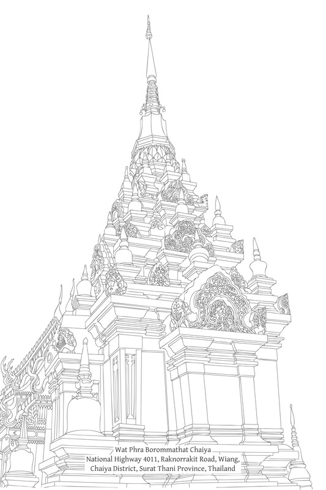
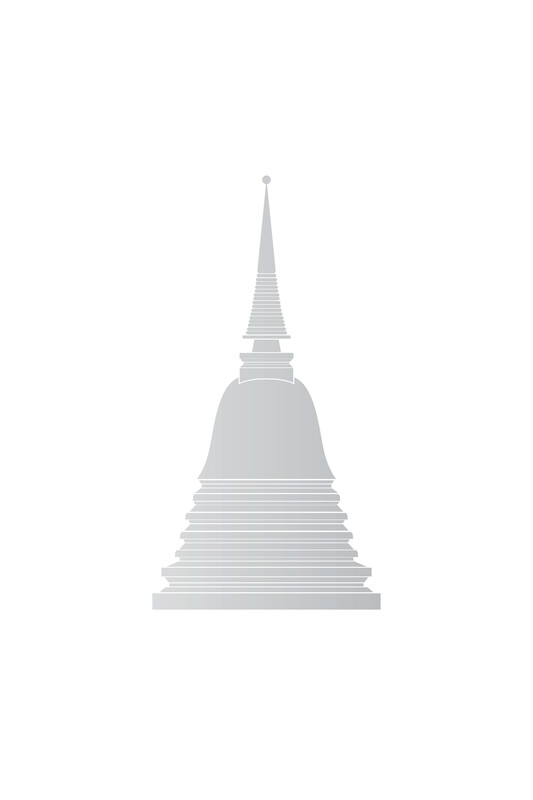

# 第六章：涅槃：至上寂静

至上寂静

## 导论

人类遭遇诸多磨难。这种情况可以一言以蔽之：苦 (dukkha)。(参见“苦”的译文注释。) 大多数人都坦承，无论是在个人层面还是社会层面，生活都涉及面对问题。这些问题影响着他们的幸福，并带来道德困境。仔细审视会发现，所有这些问题都源于同一个根源，即人类生命的本质就带有问题，或者有潜力制造问题。

说生命的目的是追求快乐，这本身就暗示着苦：正是对快乐的寻求揭示了一种内在的不足，驱使人们寻求满足。这种苦有许多后果。对快乐的追求导致利益冲突和社会问题。始于个人层面的问题被放大并向外扩散。

“苦”的译文

> 译注：dukkha 有多种英文译法，包括：“suffering”（痛苦）、“unsatisfactoriness”（不满足）、“stress”（压力）、“pain”（疼痛）和“misery”（悲惨）。佛陀在不同语境中使用此词，最主要是在：(a) 三法印中，指有为法（因缘和合之法）中固有的逼迫性（参见第三章）；(b) 四圣谛中，指由无明和渴爱引起的苦（参见第十九章）；以及 (c) 三种受 (vedanā) 中，指“苦受”（参见第一章）。作者在此强调这些含义之间的重叠和联系，特别是 (a) 和 (b)。

然而，这种描述仍然相当模糊；为了清晰起见，需要触及问题的核心。一个基本的生命真相是，生命以苦为特相；人类生命的本质就带有这种普遍的苦相。人类生命是因缘和合的法 (saṅkhāra)，受制于各种因缘和条件。它是无常的、不稳定的、短暂的，并且缺乏任何恒常的自我或实体。一个人无法维持生命，也无法完全按照自己的愿望塑造生命；必须顺应因缘和条件。这正是更深层次的苦。

生命根本的苦可以概括为“老”(jarā) 和“死”(maraṇa)，或者“衰败”和“消散”。在这种根本的苦之后，随之而来的是作为人类感受或情绪的苦，例如：“身心的苦”、“困扰”、“悲伤”和“懊悔”。

由于生命以一种基本的苦为特征，所以人们若要真正解决问题，止息苦，并体验真正的安乐，就必须坚定地安住于真理。首先，他们必须接纳苦的根本特征，运用智慧以从中解脱，或安然处之，不围绕它制造问题。如果无法达到这种状态，至少应深入了解这种根本的苦，并对其培养适当的心态。人因此带着理解来承认并面对真相。

如果人们缺乏这种安定，无法接纳苦的根本特征，他们就会让它成为潜藏在内心的隐藏问题。然后他们试图掩埋自己的问题，对苦视而不见。他们最终欺骗了自己，而内心滋生的烦恼则不断增长。

人们声称渴望快乐并厌恶苦，但他们却常常正是通过追求快乐的手段给自己制造问题。他们非但没有消除苦和创造安乐，反而逃避苦去追求快乐。他们不理会苦的根本原因。他们的问题随后演变成更严重的心结。他们非但没有消除或减少苦，反而加剧并使其复杂化，无论是自身内部还是外部与社会的冲突中。

对于那些试图掩盖和隐藏苦的人来说，他们对快乐的追求表明一种缺失感、苦恼、焦虑和不安。他们寻求事物以求得满足或消除内心的烦躁，然而在这种寻求中，他们与他人产生了冲突。因此，社会中的道德问题变得更加严重。

通过错误地对待苦，人们将挫败感向外发泄，从而增加了自己和他人的苦。结果，生命作为因缘和合之法的本性所固有的压力被忽视，而非被处理。人们以其独特的巧思制造出各种各样的问题，直到生命的基本困境（固有的压力）几乎被遗忘。

人们甚至可能自我欺骗，认为快乐是忽视苦的结果。[\[1\]](#fn-fn1){:id="fr-fn1"} 更糟的是，那种被回避的固有压力，暗中煽动人们去寻求和沉溺于更多充满激情和不安的享乐形式，剥夺了他们的信心和满足感。结果，社会中的道德危机变得更加严重，例如通过竞争和压迫的增加，苦也随之加剧。

只要人们无法接纳生命的这个根本层面——无法调和自己与苦的普遍特征——他们就无法成功解决问题。无论他们体验多少快乐，他们都无法摆脱苦的压迫，也无法遇到真正、恒久的安乐，那是一种内在圆满且完全满足的安乐。

人生即是解决问题和寻求离苦的过程。但如果我们不知道通往自由的正确途径，我们对这些问题所做的尝试性解决只会带来更多的苦。努力越大，苦恼越大，形成一个日益复杂的循环：一个苦的漩涡。这种状况就是轮回 (saṁsāra-vaṭṭa)，即“流转”或生死轮回，佛陀在缘起 (paṭiccasamuppāda) 的教法中，在集起支分 (samudaya-vāra) 和顺向缘起 (anuloma-paṭiccasamuppāda) 之下对此作了阐释。其中揭示了人类的苦是如何依因缘而生起的。

如果人们能够面对真相并理解苦的真实本质，除了摆脱由未解决的苦所产生和加剧的心理纠结之外，他们将能够开发智慧并解脱他们的心，甚至从生命固有的根本苦中解脱出来。 存在于自然中的压力和压迫被如实地认识。它便没有力量在这些人的心中制造苦。

即使在他们尚未达到完全解脱之前，那些不被由未解决的苦所产生的不健康心理情结所欺骗或阻碍的人，也能够以充分和令人满意的方式体验安乐。同时，他们有机会培育安乐，通过获取日益精细、独立、广阔、圆满和纯粹的安乐形式，直到他们最终亲证完全离苦的安乐。他们通往安乐的道路是畅通无阻且无限的。

当佛陀教导缘起时，他并没有止于苦的生起。他还教导了灭尽支分 (paṭiccasamuppāda-nirodhavāra)，即还灭 (vivaṭṭa) 的过程：苦的止息。人类的苦是可以补救的，并且有方法可以实现。佛陀接着揭示了至上的境界，在其中人类能够过着贤善的人生，享受真正的安乐，并为生命带来真实的利益和意义。他们变得自由，无需依赖外在事物，也无需依赖因缘和合之法所决定的安乐。

有为法无法维持自身，更遑论维持我们的安乐。依赖外在事物的安乐无法提供真正的支持，因为它持续依赖于这些事物。在这种不安全的安乐形式中寻求意义，会导致失去自由和独立。

尽管一个人可能最初无法完全达到“还灭”的状态，但只要他正确地处理问题——减少集起支分的力量并增加灭尽支分的力量——苦就会逐渐减轻，他的生命将得到提升。他将能够以智慧体验世间的快乐，而不被它们奴役，也不受其波动的伤害。世间快乐不会给自己或他人带来麻烦，这种健康的快乐关系将促进社会福祉。

这里的讨论侧重于灭尽支分和苦的止息，它直接与集起支分及其产生的苦相对立。[\[2\]](#fn-fn2){:id="fr-fn2"} 

## 苦的止息

### 详说

在我们解决问题之前，无论这些问题是大是小，我们都必须首先准确地理解它们。否则，它们可能会变得更加复杂和严重。为了有效地解决生命的困境，我们必须理解每一个困境以及导致它的缘。处理生命根本问题时尤其如此：我们必须了解苦以及导致苦的原因。我们必须理解真理，这是止息一切苦的关键因素。另一方面，对真理的误解会制造问题。它导致人们尝试的解决方案产生与预期效果相反的作用，并进一步加剧苦。

集起支分，即苦的生起，始于无明：

> 无明 (avijjā) → 行 (saṅkhāra) → 识 (viññāṇa) → 名色 (nāma-rūpa) → 六处 (saḷāyatana) → 触 (phassa) → 受 (vedanā) → 爱 (taṇhā) → 取 (upādāna) → 有 (bhava) → 生 (jāti) → 老死 (jarāmaraṇa)，愁 (soka)，悲 (parideva)，苦 (dukkha)，忧 (domanassa)，恼 (upāyāsa) = 苦之集起 (dukkha-samudaya)。

其反向形式是灭尽支分，始于无明的止息或消灭：

> 无明灭 → 行灭 → 识灭 → 名色灭 → 六处灭 → 触灭 → 受灭 → 爱灭 → 取灭 → 有灭 → 生灭 → 老死 + 愁……恼灭 = 苦的止息 (dukkha-nirodha)。(参见“paṭiccasamuppāda 循环”注释)

灭 (nirodha) 这个词不仅仅意味着某事物的终结，还意味着它在未来无法重新出现或发挥作用。它被阻止生起；它被平息或“净化”。paṭiccasamuppāda-nirodhavāra一词意味着现有苦的终结和进一步苦的预防；一个苦不生起的过程。“无明灭”的表达意味着现有无明的终结和未来无明的不生起。它指明 (vijjā)：即从无明中解脱。

paṭiccasamuppāda 循环

> 传统上，paṭiccasamuppāda，包括集起支分 (samudayavāra) 和灭尽支分 (nirodhavāra) 循环，有四种概述形式：从头到尾（常见形式）：无明 (avijjā) → 行 (saṅkhāra) → 识 (viññāṇa) → 名色 (nāmarūpa) → 六处 (saḷāyatana) → 触 (phassa) → 受 (vedanā) → 爱 (taṇhā) → 取 (upādāna) → 有 (bhava) → 生 (jāti) → 老死 (jarāmaraṇa) + 愁 (soka)……恼 (upāyāsa)（例如 S. II. 1-2）。从尾到头：老死 (jarāmaraṇa) (苦) ← 生 (jāti) ← 有 (bhava) ← 取 (upādāna) ← 爱 (taṇhā) ← 受 (vedanā) ← 触 (phassa) ← 六处 (saḷāyatana) ← 名色 (nāmarūpa) ← 识 (viññāṇa) ← 行 (saṅkhāra) ← 无明 (avijjā)（M. I. 261-2）。从中间到头：四食 (4 ahāra) ← 爱 (taṇhā) ← 受 (vedanā) ← 触 (phassa) ← 六处 (saḷāyatana) ← 名色 (nāmarūpa) ← 识 (viññāṇa) ← 行 (saṅkhāra) ← 无明 (avijjā)（S. II. 11-12）。从中间到尾：（六处 (saḷāyatana) → 触 (phassa)）→ 受 (vedanā) →（爱 (taṇhā)）→ 取 (upādāna) → 有 (bhava) → 生 (jāti) → 老死 (jarāmaraṇa) + 愁 (soka)……恼 (upāyāsa)（M. I. 266）。在灭尽支分 (nirodhavāra) 的语境中，以无明止息开始的详说最常使用。在解释灭尽支分 (nirodhavāra) 的前三种形式时，会显示完整的序列（从或直到无明 (avijjā)），但在第四种形式中，会呈现一个较短的序列，这将在稍后讨论。

### 总说

上面显示的集起支分和灭尽支分循环都是以详说表达的，包含所有十二个构成因素。每个循环都按顺序进行，直到所有因素都完成。然而，这些循环并非总是以这种方式显示，即包含全部十二个因素的序列。在巴利语经典中，有一些段落是佛陀为实际应用而呈现的日常生活中可观察到的过程。这些缩短形式的结构取决于问题开始的点或他希望强调的方面。

集起支分的总说始于六处 (āyatana) 的认知，然后以不间断的链条进行，直至老、死、愁和恼。从无明到六处的初始部分被省略，因为其固有的影响已被理解。灭尽支分的总说始于渴爱 (craving) 的止息——在最初的触 (contact) 和受 (feeling) 之后。

以下是巴利语经典中集起支分（总说）的两个例子：

> 诸比丘，一个孩童逐渐长大，他的诸根进一步成熟；这青年享受着备有并赋有五种欲乐的快乐：眼所见之色、耳所闻之声、鼻所嗅之香、舌所尝之味、身所触之可触之物，这些都是令人期望、欲求、可爱、可喜、与欲贪相应、能引发欲贪的。当他以眼见色、以耳闻声、以鼻嗅香、以舌尝味、以身触可触之物、以意识心所法时，若其令人愉悦，他便喜欢；若其令人不悦，他便不喜欢。他安住时身念住未建立，内心下劣（未培育），他未能如实理解心解脱和慧解脱，其中恶、不善法无余止息。 当他专注于偏爱和厌恶时，无论他感受到何种受，无论是乐受、苦受还是不苦不乐受，他都沉溺于那种感受，他反复思量、欢迎并臣服于它。当他如此做时，喜（nandi；“喜贪”）便在他心中生起。现在，对受的喜贪就是取。以他的取为缘，有便生起；以有为缘，生便生起；以生为缘，老、死、愁、悲、苦、忧和恼便生起。这就是整个苦聚的生起。[\[3\]](#fn-fn3){:id="fr-fn3"} M. I. 266-7。诸比丘，苦从何生起？依眼和色，眼识生起。三者和合为触。以触为缘，有受。以受为缘，有爱。这就是苦的生起。（耳、鼻、舌、身、意亦同。）S. II. 72-3; S. IV. 87。

从上述经文中选取主要元素，集起支分可展示如下：

1.  （六处 → 触 →）受 → 喜 (nandi) → 取 → 有 → 生 → 老死、愁、悲、苦、忧、恼 = 苦的生起。
    
2.  （六处 →）触 → 受 → 爱 (taṇhā) = 苦的生起。
    

这两个例子本质上是相同的；它们都始于感官处的认知。第一个例子呈现了直到终结的过程。第二个例子只呈现了到爱为止的过程；其余的需要推断。

现在，灭尽支分（总说）的两个例子：

> 上述这位孩子学习和修习了戒行和根律仪所组成的法，并培育了禅那：以眼见色……以意知法时，他对于合意的并不喜爱；对于不合意的也不恼怒。他安住于身念住已建立，心已培育、无量，他如实了知心解脱与慧解脱，其中那些恶不善法无余止息。因此，他已舍弃喜爱与厌恶，无论他感受何种受，是乐受、苦受，或不苦不乐受，他都不为其所悦，不欢迎它，也不臣服于它。由于他不再如此，他对受的喜贪便止息。随着他的喜悦止息，取便止息；随着取的止息，有便止息；随着有的止息，生止息；随着生的止息——老、死、愁、悲、苦、忧、恼止息。这就是这一整堆苦的止息。 中部. 一. 270。比丘们，苦的息灭是什么？缘于眼和色，眼识生起。这三者的聚合就是触。以触为缘，有受。以受为缘，有爱。因为那爱无余止息和灭尽，取便止息。随着取的止息，有便止息。随着有的止息，生止息。随着生的止息——老、死、愁、悲、苦、忧、恼止息。如此，整个苦聚止息。这就是苦的息灭。（耳、鼻、舌、身、意亦然。）相应部. 二. 72-3；相应部. 四. 87。

根据这两段经文，止息的循环可以描绘如下：

1.  （六处 → 触 →）受 → 喜（nandi）止息 → 执取止息 → 有止息 → 生止息 → 老、死、愁、悲、苦、忧、恼止息 = 苦的止息。
    
2.  （六处 →）触 → 受 → 爱（taṇhā）；（但）爱止息 → 执取止息 → 有止息 → 生止息 → 老、死、愁……恼止息 = 苦的止息。
    

第一个例子呈现了短格式的所有组成部分，但与缘起循环的形式相反。第二个例子以与上面缘起循环的第二个例子相同的方式开始。但缘起循环止于渴爱之处，这里过程改变方向，完成了止息循环。这两个例子本质上是相同的；它们都表明在初步的认知和感受之后，循环被截断了。结果，喜悦或渴爱被阻止生起，苦便止息了。

请注意，第一个段落中nandi的含义与第二个段落中taṇhā的含义相似。含义仅略有不同，以适应第一个段落的语境。另请注意，第一个例子中“喜（迷恋）止息”的表达清楚地表明喜没有生起；没有喜（迷恋）。这可以应用于第二个段落：与缘起循环中渴爱在初步认知和感受之后生起不同，渴爱现在被拔除；循环被打破，随后的因素没有生起。苦的止息得以实现。

虽然轮回（saṁsāra-vaṭṭa）和出离轮回（vivaṭṭa）的短格式没有提及无明，但无明的概念是缘起和止息循环中不可或缺的一部分。当在缘起循环中体验到受时，爱生起，这是因为没有完全理解所遇到的对象的真相：它是无常（anicca）、受苦（dukkha）、无我（anattā），并且不能真正地执持为自己的。此外，一个人不知道对象是有益还是有害。他以无明来认知：avijjā-samphassa。[\[4\]](#fn-fn4){:id="fr-fn4"} 由这种触所产生的感受会引生渴爱。

相反，当在止息循环中体验到感受时，渴爱不会生起，因为对对象的有为性已完全理解。以明（vijjā）为基础，认知以不受无明影响的方式发生；触和感受因此不会导致渴爱。 “渴爱止息”的表达暗示着无明的止息。在这里，简要形式通过强调爱的止息，间接指出无明的止息。这类似于佛陀对第二和第三圣谛的简明定义：渴爱是苦的根源，而苦的终结伴随着渴爱的终结。佛陀使用这种说法是为了实际原因，以阐明道及其即时利益。

止息的关键特征，无论是长格式还是短格式，都是序列的打破。通常，序列在两个关键点之一被打破：主要的打破在无明，次要的断点在爱。打破循环有两种类型：直接在无明处，和间接在爱这里。无论哪种情况，所做的打破都必须包括消除无明。

一旦循环被打破，轮回（saṁsāra-vaṭṭa）就结束了，出离轮回（vivaṭṭa）的过程就达到了，苦的解脱也就获得了。一个人因此战胜了生命中所有的烦恼，没有愁和恼。他拥有真正的安乐，达到了明（vijjā）、解脱（vimutti）、清净（visuddhi）、寂静（santi）和涅槃。这是人类能够获得的最高利益，使生命变得有价值。

## 涅槃的境界

从词源学上讲，涅槃（Nibbāna）源自前缀ni-（意为“出离”、“没有”、“完成”或“结束”），以及vāna（意为“吹”、“去”、“移动”，或者在另一种意义上是“束缚”）。它可以用于火或燃烧，意思是熄灭、平息、冷却或清凉——但不是消灭。对于心而言，它意味着平静、清爽和快乐：没有动荡和焦虑。[\[5\]](#fn-fn5){:id="fr-fn5"} 同样，它指的是烦恼的终结：贪、嗔、痴的终结。义注和复注通常将涅槃定义为渴爱的终结或逃脱，渴爱将人们束缚于重复的生存。（参见注释“涅槃的定义”）

涅槃的定义

> 对nibbāna这个词的分析出现在许多经文段落中，特别是：Nd2. 33；VinA.：Pārājikaṇḍaṁ, Paṭhamapārājikaṁ, Sudinnabhāṇavāravaṇṇana；DA. II. 464；AA. II. 283；KhA. 151；ItA. I. 165；SnA. I. 253, 299；NdA. I. 82, 104；DhsA. 409；Vism. 293-4；VinṬ.：Paṭhamo Bhāgo, Verañjakaṇḍavaṇṇanā, Vinayapaññattiyācanakathā；VismṬ.：Paṭhamo Bhāgo, Samādhiniddesavaṇṇanā, Samādhi-ānisaṅsakathāvaṇṇanā；CompṬ.：Abhidhammatthavibhāvinīṭīkā, Paramatthadhammavaṇṇanā。这些解释大多相同或相似。进一步的定义包括：“脱离丛林”（即杂染的纠缠）：增支部. 三. 344；增支部义注. 三. 371；法句经偈颂283；法句经义注. 三. 204；以及“苦的三种终结”：苦苦（dukkha-dukkha）、坏苦（vipariṇāma-dukkha）和行苦（saṅkhāra-dukkha）：清净道论复注. 第一部. 禅定指示. 禅定利益故事。脱离“穿透之箭”：载于Somdet Phra Mahāsamaṇa Chao Krom Phraya Vajirañāṇavarorasa（Mahāmakuta University Press, 1958, p. 55）的Dhammavicāraṇa中。\[译注：此导言段落载于泰文版p. 385。\]

当轮回（saṁsāravaṭṭa）的循环结束时，出离轮回（vivaṭṭa）即刻自动接替。[\[6\]](#fn-fn6){:id="fr-fn6"} 一个人不会从saṁsāravaṭṭa之处旅行到vivaṭṭa之处，除非是比喻或比较性地来说。无明、渴爱和执取止息，涅槃同时在其位置显现。可以说，无明、渴爱和执取的止息就是涅槃。

无明、渴爱和执取扰乱凡夫（puthujjana）的心，并遮蔽智慧；它们用烦恼（kilesa）纠缠心，扭曲见解。当无明、渴爱和执取止息时，光明智慧（vijjā）生起。有了这样的智慧，一个人能准确地看待一切事物，而不是通过欲望的透镜。一个人的感知、态度和个性都会改变。一种新的智见生起；那些从未被认识、看到或构想的事物显现出来，因为它们曾被隐藏在阴影中，或者因为一个人曾被其他事物所占据。心无限地展开和扩展；它清澈、自由、灿烂、平静而深邃。 当亲证涅槃的境界时，一个人会亲身知道这一点：

> 涅槃是自证的，[\[7\]](#fn-fn7){:id="fr-fn7"} 无时性的，邀请你来亲见，应于内而现起、体证，智者各自体验。[\[8\]](#fn-fn8){:id="fr-fn8"} 增支部. 一. 158-9。

凡夫无法理解或想象涅槃的境界。当遇到新概念时，人们通常以先前的知识作为比较的基础，在试图理解涅槃时，他们会创造出一个由既有感知复合而成的形象。

以一个从未听说过大象的人为例。听到“大象”这个词，他可能会认为这是一个外来词，或者只是胡说八道。当得知大象是一种动物时，他可能会考虑所有动物，从蚂蚁到鲸鱼，无论大小或类型。当他被告知大象是一种巨大的陆地动物，有大耳朵、小眼睛、象牙和鼻子时，形象会更清晰。

这个形象可能接近现实，也可能相去甚远；如果他在纸上画出他心中所见的画面，它可能像某种奇特的神话野兽。从未见过真实事物，他会用熟悉的感知来创造一个复杂的全新形象。这个形象将取决于说话者对事物的描述的准确性，以及听者存储的感知作为新感知的组成部分。

对于与之前感知到的任何事物都截然不同，且彻底无法比较的事物，听者无法构想它。如果他试图通过熟悉的观念和感知来理解这事物，说话者唯一合理的回答方式就是否定。听者进一步的推测，使用存储的感知进行比较，很容易导致误解。他甚至可能走极端，彻底拒绝，指责说话者欺骗，并声称所讨论的事物不存在。 这种基于不熟悉和无法构想的拒绝，是站不住脚的。

涅槃超越了凡夫所知的一切——超越了他们的范围和界限——超越了受无明、渴爱和执取影响的认知。它是一种直接通过舍弃烦恼而达到的境界，就像拉开屏风看到天空一样。涅槃不具备凡夫所知事物的任何相似特性。但声称涅槃不存在是错误的。

以下寓言曾被用来阐明未知不一定是不真实的：

> 一条鱼和一只乌龟是好朋友。鱼一生都生活在湖里，而两栖的乌龟则熟悉陆地和湖泊。有一天，乌龟在陆地散步后回到湖里。他告诉鱼在陆地散步是多么的清新，置身于开阔的田野和宜人的微风之中。鱼听了一会儿，感到困惑，心想：“什么是走路？”“什么是旱地？”“没有水怎么会有快乐？那肯定只会带来死亡。”鱼变得不耐烦，打断了乌龟，寻求解释。乌龟用陆地上的词语解释；当鱼用湖水中的词语询问时，乌龟只能否定它们。乌龟找不到任何合适的比较，因此鱼得出结论，乌龟在说谎，这个故事不是真的：旱地不存在，田野、宜人的微风或水之外的快乐也不存在。乌龟说的是确实存在的事物，但它超出了鱼的认知范围。由于鱼从未到过陆地，所以它无法理解。

考虑每种感官产生的独特体验和感知。感官印象彼此绝对不同，不可比较：视觉不能与听觉比较，听觉也不能与嗅觉比较。一个天生失明的人无法使用来自其他感官的感知知识来理解绿色、红色、橙色、粉色或其他视觉特性。诸如“响亮”、“微弱”、“恶臭”、“芳香”、“酸”或“甜”之类的词语都将不足够。没有人能准确地向一个天生没有嗅觉的人解释腐臭、芳香、玫瑰、柑橘或茉莉花的味道。诸如“红”、“蓝”、“重”、“轻”、“胖”、“瘦”、“苦”和“咸”之类的词语都将不适用。人类有五个感官器官来认知世界的特性，即所缘（ārammaṇa）。超越世俗对象领域的知识通常仍然隐藏着。即使是五个公认的所缘也是根据不同的品质而被认知的。因此，缺乏熟悉或无法构想某事物并不能保证其不存在。

佛陀证悟后不久，在宣说佛法之前，他有此想法：

> 我所证得的法，[\[9\]](#fn-fn9){:id="fr-fn9"} 深奥、难见、难证、寂静、殊胜、无法通过纯粹的逻辑思辨通达，[\[10\]](#fn-fn10){:id="fr-fn10"} 微妙，唯智者能知。 接着是这首偈颂：我现在不应教导我如此辛苦证得的法；这法不易被那些被贪嗔克服的人证得。沉溺于贪欲、被黑暗（无明）笼罩的众生，将无法分辨那逆流而上、微妙、深奥、难见、精微的法。律藏. 一. 5；中部. 一. 168。

尽管其复杂性，佛陀仍旧付出了巨大的努力来教导和解释法。然而，涅槃无法仅仅通过思考来 penetrat。没有词语或感知可以准确地描述或定义它。概念化和争论涅槃的主题只会导致误解。正确的方法是应用教法，以便亲证涅槃并为自己清晰地见到它。凭借适当的决心，涅槃并非“不可思议”或“不可言喻”，而仅仅是“难见、难证”，正如佛陀上面所引述的那样。

值得注意的是佛陀在谈论涅槃时所用的表达方式。涅槃的定义可以概括为以下四种方式：

1.  通过否定：那些标记着舍弃和移除属于轮回（vaṭṭa）的某些劣等、不悦或不利状况的表达。例如：涅槃是贪、嗔、痴的终结；[\[11\]](#fn-fn11){:id="fr-fn11"} 涅槃是有的止息；[\[12\]](#fn-fn12){:id="fr-fn12"} 涅槃是渴爱的终结；[\[13\]](#fn-fn13){:id="fr-fn13"} 以及，苦的终结。[\[14\]](#fn-fn14){:id="fr-fn14"} 这样的描述也使用揭示与vaṭṭa属性直接相反的品质的术语。例如，涅槃是无为（asaṅkhata）、无老（ajara）和不死（amata）。
    
2.  通过同义词：那些表示完成或完美的术语。例如：寂静（santa）、殊胜（paṇīta）、清净（suddhi）和安稳（khema）。[\[15\]](#fn-fn15){:id="fr-fn15"}
    
3.  通过明喻和隐喻：明喻更多地用于解释已亲证涅槃者的境界和特质，而非涅槃本身。例如，将阿罗汉比作一头公牛，带领牛群渡过河流到达彼岸，[\[16\]](#fn-fn16){:id="fr-fn16"} 或比作一个人渡过充满危险的大海并到达彼岸。[\[17\]](#fn-fn17){:id="fr-fn17"} 佛陀声称，说阿罗汉在某处重生（“再次出现”）或不生是不准确的；他将阿罗汉比作一堆因为没有燃料而熄灭的火。[\[18\]](#fn-fn18){:id="fr-fn18"}
    
    也有一些直接的明喻，例如：涅槃就像一个宁静、宜人的区域；[\[19\]](#fn-fn19){:id="fr-fn19"} 就像彼岸，安稳无危；[\[20\]](#fn-fn20){:id="fr-fn20"} 又像真理的讯息。[\[21\]](#fn-fn21){:id="fr-fn21"} 有许多隐喻，例如：ārogya（无病；完美的健康）、dīpa（一个洲渚；免于危险）、和leṇa（一个山洞；避险所）。在弟子们后来撰写的经典中，有将涅槃比作城市的隐喻，例如puramuttamaṁ（“宏伟的城市”）[\[22\]](#fn-fn22){:id="fr-fn22"} 和nibbāna-nagara（“涅槃的堡垒”）[\[23\]](#fn-fn23){:id="fr-fn23"} 被用作演说和文学术语。泰语习语包括“不死大城”（amatamahānagara-nirvāna）和“水晶城”，但这些后来的词语不被认为是揭示涅槃真实状态的准确术语。
    
4.  通过直接解释：这些解释仅在少数地方出现，但它们引起了学者的极大兴趣，特别是对于那些将佛教视为哲学的人。各种不同的解释引发了无数的争论。我下面列出了一些精选。
    

涅槃的别名偶尔会集中出现在一个段落中。下面列出了所有四种定义的例子，按巴利字母顺序排列。[\[24\]](#fn-fn24){:id="fr-fn24"}

> Akaṇha-asukka：“不黑不白”（不受社会阶级或种姓限制；无善无恶；无puñña亦无pāpa）。Akata：未作；未建造。Akiñcana：心中无所滞留；无忧虑。Akuto-bhaya：无怖畏。Accuta：不动；不离。Acchariya：稀有。Ajara, Ajajjara：不老；不衰朽。Ajāta：不生。Anata：不摇摆；无渴爱。Ananta：无边。Anādāna：无执取。Anāpara：无上；最胜。Anālaya：无贪着；无执取。Anāsava：无漏。Anidassana：眼所不见；无相。Anītika：无灾难。Anuttara：无上；至高。Apalokita (-na)：不坏灭；不消融。Abhaya：无怖畏。Abbhūta：“前所未有”；奇妙。Abyādhi：无病。Abyāpajjha：无恼害；无苦。Abhūta：“不生起”。Amata：不死。Amosa-dhamma：不退失；不变。Asaṅkiliṭṭha：无染。Asaṅkuppa：不动摇。Asaṅkhata：无为。Asaṅhīra：不动摇。Asoka：无忧。Ārogya：无病；完美的健康。Issariya：自在；主宰。Khema：安稳；安全。Taṇhakkhaya：渴爱尽。Tāṇa：救护；保护。Dīpa：洲渚；避难所。Dukkhakkhaya：苦尽。Duddasa：难见。Dhuva：常住。Nipuṇa：微妙。Nippapañca：无障碍烦恼；无戏论。Nibbāna：烦恼与一切苦的止息。Nibbuti：清凉；苦恼的平息。 Nirodha：苦的止息。Paṇīta：殊胜。Paramattha：究竟利益。Parama-sacca：究竟真理。Pāra：彼岸；安全目的地。Mutti：解脱；解放。Mokkha：解脱。Yogakkhema：离系安稳。Leṇa：庇护所；避险所。Vimutti：解脱；自由。Vimokkha：解脱。Viraja：离尘。Virāga：贪欲的褪去、冷却和息灭。Visuddhi：清净；无瑕。Sacca：真谛。Santa：寂静；止息。Santi：寂静。Saraṇa：皈依。Siva：最高福乐。Suddhi：清净。Sududdasa：极难见。

在含有弟子偈颂和义注（例如《义释》、《无碍解道》、《长老偈》、《长老尼偈》、《譬喻经》），以及后来的经典（例如《阿毗达磨论典释》）中，有更多关于涅槃的引用和描述。下面列出了一些例子：

> Akkhara：不坏；无尽。Akhalita：不摇动。Acala：不动摇。Anārammaṇa：无所束缚；不依于所缘。Anuppāda：不生。Apavagga：无造作（saṅkhāra）；究竟解脱。Amaraṇa：无死。Arūpa：无 rūpa；无形。Asapatta：无敌。Asambādha：无障碍；无压迫。Kevala：纯粹；内在圆满。[\[25\]](#fn-fn25){:id="fr-fn25"} Nicca：常；确定。Nirupatāpa：无热恼。Paṭipassaddhi：寂止；平静。Pada：所达之境；目的地。Para：彼岸；究竟。Pariyosāna：究竟；目标。Pahāna：烦恼的舍弃。Vivaṭṭa：从轮回（vaṭṭa）中解脱；无 vaṭṭa。Vūpasama：寂静。

其中一些术语非常重要，因为它们被反复用作涅槃的定义，例如：asaṅkhata、nirodha、vimutti、virāga、santa 和 santi。其他词语则不常用。有些只在一个地方使用，另一些在两三个地方使用，因此不应被视为非常重要。它们被包含在这里是为了增加理解。翻译也是如此；它们提供了一些意义，但由于缺乏支持性语境，可能无法给出完整的韵味。

而且非常重要的是，许多术语在佛陀传法的特定时代、地区和社群中为人们所熟悉，并且这些术语与他们的个人价值观或宗教信仰相关联。当这些词语被说出时，听者可能完全理解其含义。有时佛陀使用描述性词语来指代涅槃，以方便沟通，同时赋予其符合佛法的新含义。在这些时代、地点和群体之外的人可能无法完全理解这些词语的含义。

描述涅槃的一个重要词是asaṅkhata（“无为”）。涅槃并非由因缘条件产生。可能有人会声称涅槃必然由因缘产生，因为涅槃是道（Path, the Way）或依道修习的果。这个疑问可以通过一个类比来简要回答：如果我们将达到涅槃的修习比作去清迈市旅行，我们会看到清迈，作为旅程的目标，并非路径或旅行行为的结果。无论道路如何或旅行与否，清迈都存在。道路和旅行是达到清迈的原因，但不是清迈本身的原因。道和依道修习也是如此，它们是证得涅槃的原因，但不是涅槃本身的原因。[\[26\]](#fn-fn26){:id="fr-fn26"}

除了vimutti之外，还有许多其他同义词揭示了涅槃的各个方面，如前所述。在所有这些同义词中，有两个常用词代表着重要的特性：visuddhi 和 santi。Visuddhi是清净或洁净，没有玷污和遮蔽的烦恼，指的是能够清晰地看待事物。Santi是寂静，没有动荡和苦恼，是骚乱的终结；这种心境是宁静、深沉、清凉、安稳、自足的，能够充分体验修习的成果，并准备好用于行动。[\[27\]](#fn-fn27){:id="fr-fn27"}

下面列出了少数明确解释涅槃状态的段落。在某些情况下，还提供了故事，以便为佛陀的话语提供语境：

有一次，佛陀对比丘们讲授了有关涅槃的法。比丘们专心聆听时，佛陀发出了这个感叹：

> 比丘们，存在一个处（āyatana），其中既没有地、水、火、风元素；也没有无边虚空处；也没有无边识处；也没有无所有处；也没有非想非非想处；也没有此世间；也没有他世间；也没有月亮；也没有太阳。我没有说那个处有来、去、生、住或灭。它既无基础，也无动摇，也无所缘（ārammaṇa）。那就是苦的终结。自说经. 80-81。

在另一个场合，佛陀对众比丘作了类似的教导，并说出了这首偈颂：

> 确实，anata（不倾向于生；无渴爱的境界，即涅槃）难见。真谛（sacca）不易察觉。已穿透渴爱，并经由了知与见到\[真理\]，心中将无所滞留（无物引起心理焦虑）。[\[28\]](#fn-fn28){:id="fr-fn28"}

在类似的场合：

> 比丘们，存在不生（ajāta）、不起（abhūta）、未作（akata）、无为（asaṅkhata）的。如果不存在不生、不起、未作、无为，那么这里就无法知晓从已生、已起、已作和有为中解脱。但正因为存在不生、不起、未作、无为，所以才能了知，此处的解脱道是从已生、已起、已作和有为法中解脱。[\[29\]](#fn-fn29){:id="fr-fn29"}

在类似的场合：

> 仍然有所依，就有动摇。没有所依，就没有动摇。没有动摇，就有寂止。有了寂止，就没有爱憎。没有爱憎，就没有来去。没有来去，就没有灭和生。没有灭和生，就没有此世间、他世间，也没有介于两者之间。这就是苦的终结。[\[30\]](#fn-fn30){:id="fr-fn30"}

另一则记载描述了佛陀纠正一位名叫跋迦（Baka）的梵天的邪见。简而言之，有一次，这位梵天生起了这种邪见：

> 此梵天界是恒常、持久和永恒的。它是绝对且不灭的。此梵天界不生；它不生起、不老、不死、不灭。找不到更殊胜的解脱。佛陀了知跋迦梵天的想法，便来到他面前说：梵天啊，你已陷入无明。因此，你将无常的称为恒常，将不稳定的称为持久，将非永恒的称为永恒……而且存在更殊胜的解脱，你却声称没有。接着，魔罗（Māra）附身于梵天的一个随从，对佛陀说：比丘，比丘，不要冒犯梵天，不要冒犯梵天。这位是梵天，大梵天，主宰者（abhibhū），不败者，一切见者，全能者，主权者，创造者，至尊者，普施者，主人，已生和将生之父……。佛陀训诫魔罗，最后说：梵天及其所有的眷属和随从都在你手中，都在你力量之下……但我没有落入你手中，也不在你力量之下。当跋迦梵天坚持说：“我宣称恒常是恒常，持久是持久，永恒是永恒……”佛陀宣告梵天有许多事情不知道，包括：能被了知的境界（viññāṇa），非眼所见（anidassana），[\[31\]](#fn-fn31){:id="fr-fn31"} 无边（ananta），以及遍光（sabbato-pabhā），[\[32\]](#fn-fn32){:id="fr-fn32"} 大地之坚实无法承载它，水的湿性……火的热性……风的动性无法承载它，众生的存在……天神的威严……波阇波提（Pajāpati）的统治……梵天的宏伟……光音天梵天（Ābhassara Brahmas）的光辉……遍净天梵天（Subhakiṇha Brahmas）的美丽……广果天梵天（Vehapphala Brahmas）的丰盛无法承载它，主宰者的主宰无法承载它，万物的特性也无法承载它。 跋迦梵天对此回应说他将消失不见，但他未能做到。佛陀反过来表示他会消失，并消失了。梵天和他的随从只能听到他的声音说：已见到存在的危险，并见到寻求非存在（vibhava）者的存在，我不赞扬任何形式的存在，也不执着于喜悦（即bhava-taṇhā：有爱）。中部. 一. 327-8。

另一个故事讲述了一位比丘穿越所有领域，直到到达梵天界，寻求一个问题的答案：

> 这位比丘有以下疑问：四大元素——地、水、火、风——在哪里无余止息？然后他进入禅定状态，拜访了从四大天王天界开始的各种天神，向他们提出这个问题。诸天神无法回答他，建议他前往更高层次的天界，直到他到达梵天界。梵天们也无法回答，但说大梵天王，也就是主宰，肯定知道。大梵天王以 Splendid radiance 显现给那位比丘。比丘向大梵天王提出了他的问题，大梵天王却含糊其辞地回答说：我是梵天，大梵天王，主宰，无敌者，遍见者，全能者，君主，造物主，创造者，卓越者，天意者，主宰者，已生和将生者的父亲。比丘继续说：我没有问你是不是梵天，大梵天王，主宰……我问你四大元素在哪里无余止息。梵天再次回答，说他就是大梵天王，主宰，等等。比丘第三次再次提问，这时梵天拉着他的手臂，把他带到一边，说道：比丘，这些梵天的追随者天神们，都认为我无所不知，无所不见，无所不验，无所不证。因此，我没有在他们面前回答。比丘，我也不知道四大元素在哪里无余止息。你抛弃了世尊，却来别处寻找这个问题的答案，这是你的过失和错误。回去向世尊提出这个问题，并接受他给出的任何答案吧。比丘于是去请问佛陀，佛陀回答道：你不应该问：“四大元素——地、水、火、风——在哪里无余止息？”你应该问：“地、水、火、风在哪里找不到立足之地？长与短、小与大、美与丑在哪里找不到坚实的基础？名色在哪里无余终止？”然后他如此解释： 能被了知的境界 (viññāṇa)，不是以眼所见（anidassana）[\[33\]](#fn-fn33){:id="fr-fn33"}，是无边际的（ananta），并且可从各个方向抵达（sabbatopabhā）[\[34\]](#fn-fn34){:id="fr-fn34"}——在此，地、水、火、风找不到立足之地；长与短、细与粗、美与丑找不到坚实的基础；名色无余终止。因为识（viññāṇa）止息，名色在此终止。 D. I. 215-23.

这些对涅槃的描述导致了各种解释和争论。一些学者将最后两段解释为佛教试图通过同化，即吸纳婆罗门教的神格化概念来对抗婆罗门教。请注意，在所有这些段落中，佛陀要么是教导对比丘们，这些比丘对佛法有基本认识；要么是对大梵天王讲话，大梵天王是一位理论大师。我在此不详细阐述这些细节，但请记住，这种解释上的差异产生的原因是涅槃无法被概念化；它必须通过修行直接证知。

巴利语有时翻译不同。例如，第一段中的 āyatana 一词可译为“处”，有些人将其解释为住所或地方。另一些人则将 āyatana 解释为另一个维度。第五和第六段中的 viññāṇa 一词，有些人认为它与眼识、耳识等表达中的 viññāṇa 相同。因此，他们将涅槃解释为某种形式的识，将涅槃定义为一种眼睛看不见的识等等。

然而，在义注中，本段中的 viññāṇa 被解释为涅槃的名称——如上文所用，“可被认知的状态”——。[\[35\]](#fn-fn35){:id="fr-fn35"} 我们可以看到，在第六段中，viññāṇa 一词出现了两次。第一个 viññāṇa 指的是涅槃，有其独特的翻译（“可被认知的状态”），而后者 viññāṇa，在“识止息”这个短语中，指的是作为名色生起条件的识，如缘起法中所解释的。

我们不应仅仅因为某种解释符合我们的偏好和先入之见就对涅槃下结论。如果我们对尚未清晰认知的事物建立坚定的信念，我们可能会大受蒙蔽。相反，我们应该强调那些通往涅槃的方法，以及循序渐进解脱的益处。这更实际。随着我们修行的发展，我们将亲身清晰地看到结果。 

以下引文是佛陀的肯定，即当智慧之“眼”开启时，涅槃和其他殊胜境界的证悟确实可以发生。这是佛陀与婆罗门学生苏巴 (Subha) 的对话。佛陀驳斥了婆罗门波卡拉沙帝 (Pokkharasāti) 关于人类不可能体验到殊胜见地（ñāṇadassana）的断言：

> ‘年轻人，假设有一个人生来失明，看不到黑色、白色、绿色、黄色、红色或粉红色的形色。他看不到平坦或不平坦的形色，看不到星星、月亮或太阳。如果他说黑白色不存在，也没有黑白色的见者存在；绿色不存在，也没有绿色的见者存在……月亮和太阳不存在，也没有月亮和太阳的见者存在；如果他说‘我不知道或看不到那些东西，因此它们不存在”；他这样说正确吗？”“不正确，”年轻人回答。佛陀接着说：“正是如此，奥巴曼那（Opamañña）家族的婆罗门波卡拉沙帝（Pokkharasāti），须巴伽（Subhaga）园的主人，是盲目的，没有远见的。他能够知、见或证得卓越、优秀和超人般的殊胜见地，这是不可能的。”[\[36\]](#fn-fn36){:id="fr-fn36"} M. II. 201-202.

尽管我们可能已经思考过这些对涅槃的解释，但如果我们没有修行并达到这种境界，我们应该记住，所有关于涅槃的观念都可与盲人摸象后形成的图像相提并论。巴利经典中的故事简述如下：

有一次，在舍卫城 (Sāvatthī) 中，大量各种教派的沙门、游方僧和婆罗门，各自坚持自己的信仰和教义是唯一的真理，同时驳斥他人的。这引起了争吵：“真理是这样的，不是那样的；真理不是那样的，是这样的。”对此，佛陀讲述了以下故事：

从前，舍卫城的一位国王命令他的顾问们召集城中所有天生失明的人，并让他们接触一头大象。顾问们让一群盲人摸大象的头部；让另一群盲人摸大象的耳朵。他们让另一群人摸象牙，摸象鼻，摸象腹，摸象腿，摸象背，摸象尾，摸象尾尖，每次都告诉他们这就是大象。然后他们告诉国王，盲人们已经熟悉了大象。 国王来到盲人的聚会，问他们：“你们看到大象了吗？”他们回答说：“我们看到了，陛下。”国王进一步询问：“既然你们说看到了大象，那请向我描述一下。”

那些摸过头部的盲人说大象像水壶。那些摸过耳朵的说大象像簸箕。那些摸过象牙的说大象像犁铧。那些摸过象鼻的说大象像犁杆。那些摸过象腹的说大象像谷仓。那些摸过象腿的，声称它像柱子。那些摸过象背的——像臼。那些摸过象尾的——像杵。那些摸过象尾尖的说大象像扫帚。说完这些，盲人们开始争论：“大象是这样的，不是那样的；大象不是那样的，是这样的”，以至于争吵起来。

最后佛陀说了这首偈语：

> 确实，一些沙门和婆罗门  
> 执着于这样的见解和教义；  
> 那些只看到局部的人，  
> 争强好胜，争论不休。 Ud. 67-8.

## 涅槃的元素

迄今为止的讨论都集中在涅槃作为一种绝对和超越的特质。然而，可以区分不同种类的涅槃。

本质上，涅槃只有一个；它被分为不同的类别是为了描述与涅槃接触者的特性，或者描述涅槃本身的各种属性。[\[37\]](#fn-fn37){:id="fr-fn37"}《如是语经》中广为人知的涅槃划分是两种“涅槃界”（nibbāna-dhātu）：[\[38\]](#fn-fn38){:id="fr-fn38"} 

1.  有余依涅槃界 (Sa-upādisesa-nibbānadhātu)：尚有 upādi（“燃料”）剩余的涅槃。
    
2.  无余依涅槃界 (Anupādisesa-nibbānadhātu)：不再有“燃料”剩余的涅槃。
    

义注将这里的区分因素——upādi——定义为五蕴（pañca-khandha），其意义在于它们受不净行为所制约或受执取所支配。[\[39\]](#fn-fn39){:id="fr-fn39"} 根据这种解释，这些术语的定义是：

1.  有余依涅槃界 (Sa-upādisesa-nibbānadhātu)：与五蕴相连的涅槃，或五蕴仍然存在的涅槃。
    
2.  无余依涅槃界 (Anupādisesa-nibbānadhātu)：脱离五蕴的涅槃。[\[40\]](#fn-fn40){:id="fr-fn40"}
    

以下是《如是语经》中出现这两个术语的段落：

> 世尊、阿罗汉、正等正觉者如此说，我曾闻：‘比丘们，有两种涅槃界，即有余依涅槃界和无余依涅槃界。什么是“有余依涅槃界”呢？比丘们，有一种比丘是诸漏已尽的阿罗汉，已圆满梵行，应作已作，已卸下重担，已证得真义，已破除有结，以究竟智彻底解脱。他的五根依然存在，由于它们完好无损，他体验着可意和不可意，感受着乐与苦。他贪、瞋、痴的止息被称为有余依涅槃界。什么是“无余依涅槃界”呢？有一位诸漏已尽的阿罗汉……以究竟智彻底解脱。对他而言，所有所感受（vedayita），不被喜乐（anabhinandita；“不被迷恋”），将在此处彻底清凉。这被称为无余依涅槃界。 \*\* 具眼者，安稳自在，  
> 已宣说涅槃双重界。  
> 一界，现法（diṭṭhadhammika），  
> 称为有余依涅槃；  
> 烦恼已尽，  
> 再有之径已断。  
> 另一界，至上之境，  
> 称为无余依涅槃；  
> 其中一切有为悉皆止息。 It. 38-9.

这段介绍两种元素的经文描述了与涅槃相关的品质，也就是说，它结合觉悟者来描述涅槃。它以觉悟者为理解涅槃的途径；它并未试图从绝对意义上解释涅槃。这是因为涅槃是沙底提卡（sandiṭṭhika），“需亲身证见”，并且是巴卡旦威迪塔邦威纽希（paccattaṁ veditabbaṁ viññūhi），“智者各自亲证”的，如前所述。因此，这种涅槃的划分并没有在先前对涅槃本质的考察中引入任何不同或神秘之处。正如义注师所说，涅槃本质上是不可分的；这种划分是一种教学工具。[\[41\]](#fn-fn41){:id="fr-fn41"} 在更详细地探讨这两种涅槃之前，让我们先熟悉三个重要术语：

1.  所受（Vedayita）：这个词源于与受（vedanā）相同的词根，在某些情况下用作受（vedanā）的替代词。它指“感官经验”或“感官印象”。这里是复数形式 vedayitāni，指的是所有已被感知或认知的对象。它等同于今人所指的整个“经验”范围。
    
2.  不喜乐（Anabhinandita）：这个词，在上面用作所受（vedayita）的修饰形容词，源自喜乐（abhinandita），意为“令人愉悦的”或“令人欢喜的”。在此语境中，喜乐（abhinandita）意味着迷恋和被贪爱玷污的心，它适用于正面和负面经验，适用于喜悦和厌恶。加上否定前缀 an-，其意义变为“不迷恋”；在这种情况下，贪爱不伴随感官印象。感官经验以一种纯粹、广阔和无碍的方式发生，没有烦躁和沉思。人们不会扭曲或偏离直接的感官经验，因为心不受贪、瞋、痴的控制或压倒。
    
3.  现法（Diṭṭhadhammika）：字面意思是“可见的”或“可见的物体”。就时间而言，它的意思是“在当下”或“在今生”。就对象或心境而言，它的意思是“普通”、“世俗”、“基本”、“物质”或“外部的”。它通常与彼世（samparāyika）配对，后者字面意思是“更远的”或“超越的”。就时间而言，它的意思是“未来”、“以后”、“超越今生”或“在来世”。在其他语境中，它的意思是“超越”、“至上”、“神圣”、“精神”或“内在的”。[\[42\]](#fn-fn42){:id="fr-fn42"}
    

此时，让我们更仔细地审视这两种涅槃：

有余依涅槃界（Sa-upādisesa-nibbānadhātu）指的是与五蕴相连的涅槃。它是阿罗汉通过感官认知可意与不可意所缘时的涅槃。认知与五蕴密不可分；五蕴直接参与感官经验，而五蕴本身也成为进一步认知（的）对象。[\[43\]](#fn-fn43){:id="fr-fn43"} 涅槃的这一方面强调阿罗汉与世界的接触。它侧重于贪、瞋、痴的止息，[\[44\]](#fn-fn44){:id="fr-fn44"} 从而获得无碍的生命体验。有余依涅槃界是阿罗汉心识的解脱状态，摆脱了烦恼。阿罗汉不受烦恼影响，因此感官接触不会引起贪爱，无论是贪求还是厌恶。此外，也没有导致再有（bhava-netti）的贪爱存在。因此，拥有健全感官的阿罗汉能够自由而智慧地接受感官印象。

这种自由的心态有两个方面。首先是能够将感官印象作为纯粹的“受”（vedanā）来接受，因为没有残留的执着或迷恋来干扰。其次是不会被经验所压倒，从而不会形成未来执着或迷恋的习惯。对于阿罗汉来说，这是心识的平常状态。在感官接触的每个瞬间，它都是即时和可及的。因此，它被称为 diṭṭha-dhamma：可见的或即时的。这种涅槃是阿罗汉在世时，与外部世界接触时的状态。

无余依涅槃界（Anupādisesa-nibbānadhātu）是独立于五蕴的涅槃。它是超越通过五根体验现象过程的涅槃，或者说超越参与认知的五蕴的涅槃。它是超越世俗实相、超越感官接触和经验的涅槃。

换句话说，无余依涅槃界是涅槃的本质，当通过五根的体验止息，当认知止息，或当不再涉入感官接触（包括五根仍存在于心识中的输入）时，它便向阿罗汉显现。

阿罗汉在没有贪爱引起的喜乐（abhinandita）、没有贪、瞋、痴炽热影响的情况下接受感官印象。 感官印象不会停留和闷烧；它们会“变得清凉”（sīti-bhavissanti）；它们变得完全平静和“解毒”。而且它们无法导致进一步的生或有。阿罗汉能够中和感官经验的任何阻碍潜力，使其“清凉”并掌控它。因此，他们获得了 sīti-bhūta 或 sīta 的称号，意为“清凉者”。[\[45\]](#fn-fn45){:id="fr-fn45"}

这种清晰的状态，没有残留的感官经验，是内在和个人的。它是“不生”或不再受生的状态。在这种五蕴不再是意识对象的境界中，阿罗汉因此以涅槃为对象；他们将涅槃证悟为法处（dhammāyatana）。[\[46\]](#fn-fn46){:id="fr-fn46"} 这种特质只能在其关系语境中进行讨论，即通过说明世俗经验的止息。涅槃的本质绝对性只能亲身见证和证悟。

涅槃的这种划分就好比在海洋中遭遇海难。未觉悟者在水中挣扎，与波浪和水流搏斗。证悟涅槃的人已经抵达了陆地。抵达陆地，在那里完全满足和安乐，就像无余依涅槃界。没有压迫和危险，不受波浪拍打，能够自由地与事物互动，能够随心所欲地行动，就像有余依涅槃界。

也可以将未觉悟者比作患有发烧的人。已觉悟者是已经从发烧中恢复或完全健康的人。 健康本身是完整的；当一个人健康时，他自己知道这种状态。那种满足、喜悦、安适和放松是纯粹主观的。旁观者可能推测那种状态，但他们无法直接体验。这种健康状态就像无余依涅槃界。相关的条件，即不被疾病压迫或阻碍，能够随心所欲地行动，这会影响行为并影响周围环境，就像有余依涅槃界。

总而言之，涅槃只有一个，但有两个方面。一方面（有余依涅槃界）侧重于烦恼的止息，这与外部世界或日常生活中的关系有关。另一方面（无余依涅槃界）仅限于涅槃的本质，它只由觉悟者亲证。它无法通过五根来测度，并且超越了局限于五蕴的经验。换句话说，在有余依涅槃界中，阿罗汉以五蕴为注意对象；在无余依涅槃界中，阿罗汉以涅槃为注意对象。

说无余依涅槃界是涅槃的本质与《胜义灯》（Paramatthadīpanī）中发现的义注观点相符，该书将不死大涅槃界（amatamahānibbāna-dhātu）描述为无余依（anupādisesā，“无余燃料”）。这也与佛陀的话语一致：‘比丘们，存在那样一个处（āyatana），在那里既没有地、水、火、风四大元素；也没有无边虚空处……’[\[47\]](#fn-fn47){:id="fr-fn47"} 在其他地方，义注和复注指出无余依涅槃界与无取般涅槃（anupādā-parinibbāna，‘究竟、绝对的涅槃’）[\[48\]](#fn-fn48){:id="fr-fn48"} 相同，后者是佛法修行的目标，包含了佛教的最高证悟。 

在大多数情况下，通过五根进行的认知和与外部世界的接触在死亡时清晰明确地止息。[\[49\]](#fn-fn49){:id="fr-fn49"} 随着感官接触在死亡时的彻底终止，阿罗汉证悟涅槃的不可分割方面，即无余依涅槃。通俗地说，“无余依涅槃”一词被用作形容阿罗汉死亡的表达。从一个表示特质的词，无余依涅槃逐渐指代一个行动或事件。在经文中其他地方找到这个词时，它指的是佛陀或阿罗汉的般涅槃。

至于“有余依涅槃”这个词，在《巴利圣典》中它不用于描述一个事件，并且只出现在《如是语经》的这一处段落中。有余依涅槃有许多同义词被频繁使用。[\[50\]](#fn-fn50){:id="fr-fn50"}

在《巴利圣典》中，有许多段落单独使用“无余依涅槃界”（anupādisesa-nibbānadhātu）这个词。例如，佛陀将法与律比作海洋的奇迹：

> 正如大洋，虽有天降雨水，亦不见其减少或增加；同样地，即使许多比丘在无余依涅槃界中亲证究竟涅槃，无余依涅槃界亦无减少或增加。 Vin. II. 239-40; A. IV. 202-203; Ud. 55.

《大义释》（Mahāniddesa）将无余依涅槃（anupādisesa-nibbāna）称为 anabhinibbatti-sāmaggī，意为“完全准备好不再受生”。[\[51\]](#fn-fn51){:id="fr-fn51"}

巴利经典中关于佛陀生平的记载经常使用“无余依涅槃界”（anupādisesa-nibbānadhātu）一词，每次都指佛陀在死亡时的究竟涅槃。例如，佛陀曾两次宣称他的肤色特别光辉灿烂：一次是在他证悟的夜晚，另一次是在他于无余依涅槃界中究竟涅槃的那一天。[\[52\]](#fn-fn52){:id="fr-fn52"} 供养佛陀的布施在两次场合下功德特别大：一次是他证悟前的斋食，另一次是他于无余依涅槃界中究竟涅槃前的斋食。[\[53\]](#fn-fn53){:id="fr-fn53"} 

还有其他例子：佛陀在无余依涅槃界中究竟涅槃的地点是佛教四大圣地之一。[\[54\]](#fn-fn54){:id="fr-fn54"} 佛陀在无余依涅槃界中究竟涅槃是大地动摇的一个原因。[\[55\]](#fn-fn55){:id="fr-fn55"} 另一段经文解释说，佛陀被称为“如来”（Tathāgata），因为：

> 在佛陀证得无上正等正觉之夜与他证得无余依涅槃界之夜之间，他所宣说、言说或解释的一切，都是如此，而非其他。 D. III. 135; It. 121-2; Nd2. 41.

还有许多其他经文也有类似的主题和与上述两种涅槃教法相同的序列。唯一的区别在于它们没有区分这些种类的涅槃。为了比较，以下是一些例子：

> A. 当一位比丘舍弃无明并生起明时，随着无明的舍弃和真知的生起，他不会生起福行、非福行或不动行。既然他不生起或造作诸行，他就不执着于世间任何事物。不执着，他就不躁动。[\[56\]](#fn-fn56){:id="fr-fn56"} 不躁动，他亲证实证涅槃。他了知：‘生死已尽，梵行已立，应作已作，此有已无。’ B. 如果他感受到乐受，他了知：“它是无常的”；他了知：“它不被沉溺”；他了知：“它不被喜乐”（anabhinandita）。如果他感受到苦受，他了知：“它是无常的”；他了知：“它不被沉溺”；他了知：“它不被喜乐”。如果他感受到不苦不乐受，他了知：“它是无常的”；他了知：“它不被沉溺”；他了知：“它不被喜乐”。如果他感受到乐受，他以离系心感受；如果他感受到苦受，他以离系心感受；如果他感受到不苦不乐受，他以离系心感受。如果他感受到受限于身体（通过五种生理感官之门）的感受，他了知：“我感受到受限于身体的感受。”当他感受到受限于生命（通过意门）的感受时，他了知：“我感受到受限于生命的感受。”他了知：“随着身体的崩坏，生命力的耗尽，所有所感受（vedayitāni），不被喜乐（anabhinandita），将在此处（十二处）彻底清凉；只剩下身体的残骸。’ C. 比丘们，譬如有人从陶工的窑中取出炽热的陶罐，放在平滑的地面上：它的热量将在那里散尽，只剩下烧好的陶罐。同样地，当他感受到受限于身体的感受……受限于生命的感受……他了知：‘随着身体的崩坏，生命力的耗尽，所有所感受，不被喜乐，将在此处彻底清凉；只剩下身体的残骸。’ A., B. 和 C. 段落：S. II. 82-3.

> D. 比丘们，正如油灯依油和灯芯燃烧，当油和灯芯耗尽时，因缺乏燃料而熄灭；同样地，当一位比丘感受到受限于身体的感受……受限于生命的感受……他了知：“随着身体的崩坏，生命力的耗尽，所有所感受，不被喜乐，将在此处彻底清凉。”[\[57\]](#fn-fn57){:id="fr-fn57"} M. III. 244-5; S. III. 126; S. IV. 213; S. V. 319-20.

然而，有一段经文的描述和比喻有所不同：

> 其心完美解脱的比丘获得六种恒常住处。以眼见色，他不欣喜也不沮丧，而是保持舍心、正念、正知。以耳闻声……以鼻嗅香……以舌尝味……以身触物……以意认知心法，他既不欣喜也不沮丧，而是保持舍心、正念、正知。[\[58\]](#fn-fn58){:id="fr-fn58"} 当他感受到受限于身体的感受时，他了知：“我感受到受限于身体的感受。”当他感受到受限于生命的感受时，他了知：“我感受到受限于生命的感受。”他了知：“随着身体的崩坏，生命力的耗尽，所有所感受，不被喜乐，将在此处彻底清凉。’假设有一棵树投下阴影。一个人带着斧头和篮子走来，在树干处砍倒这棵树。然后他挖掘并拔出树根，甚至包括细小的根毛和根纤维。他把那棵树砍成木段，然后把木段砍成碎片。他把碎片在风和阳光下晒干，然后用火焚烧，堆成灰烬。他把灰烬在强风中扬弃，或者让它们被湍急的河流冲走。那棵树投下的阴影被连根斩断，变得像棕榈树桩一样，不再重新生起，具有不再生起的性质。同样地，其心完美解脱的比丘获得六种恒常住处……所有所感受，不被喜乐，将在此处彻底清凉。’[\[59\]](#fn-fn59){:id="fr-fn59"} A. II. 198-9.

为了透彻理解这两种涅槃，让我们回到义注的解释进行考察。 如前所述，“无余依涅槃”一词在《巴利圣典》中用于描述一个事件——阿罗汉的般涅槃，特别是佛陀的死亡。然而，义注开始也将“有余依涅槃”一词用于描述一个事件，通过比较描述同一事件的两段经文可以看出：

> 《巴利圣典》：这两种布施具有极大的果报，极大的结果，比任何其他布施更有成果和利益。哪两种呢？一种是如来食后证得无上正等正觉的布施，另一种是如来食后在般涅槃时证得无余依涅槃界的布施。 D. II. 135-6; Ud. 85. 义注：佛陀食用了苏阇达（Sujātā）所供养的食物后，证得了有余依涅槃界的无上正等正觉。食用了纯陀（Cunda）所供养的食物后，他在最终般涅槃时证得了无余依涅槃界。[\[60\]](#fn-fn60){:id="fr-fn60"} DA. II. 571; UdA. 405.

常恒涅槃

> 从某种意义上说，可以说无余依涅槃是常恒的涅槃状态，贯穿阿罗汉的生命和死后。有余依涅槃是涅槃的“表面”状态（仿佛重叠），存在于彻底证悟到死亡之间。当阿罗汉去世时，只剩下无余依涅槃。然而，这种解释可能偏离了佛法的实际强调，而倾向于哲学推理。

随着这两个术语含义的发展，它们在许多义注段落中被用来指代佛陀或阿罗汉生命中的事件。它们被用来强调某些状态的证悟，而不是状态本身的性质。[\[61\]](#fn-fn61){:id="fr-fn61"} 从义注的角度来看，这两种涅槃的含义受到限制。这里的有余依涅槃指的是烦恼的止息而五蕴仍然存在，是阿罗汉在世时的涅槃，即证得阿罗汉果。无余依涅槃指的是烦恼的止息而五蕴不复存在，即阿罗汉的般涅槃。义注师们特别通过运用“究竟心”或“最后一识”的原则来定义无余依涅槃，[\[62\]](#fn-fn62){:id="fr-fn62"} 将其意义限制为指阿罗汉的般涅槃。[\[63\]](#fn-fn63){:id="fr-fn63"}

义注通过区分有余依涅槃和无余依涅槃来解释与阿罗汉相关的经典段落。例如，经典中： 

> 由于贪爱的彻底止息，无余的消退和寂灭，这就是涅槃。对于这样熄灭、无执取的比丘，不再有再有。 Ud. 33.

义注断言，本段的第一句话指的是有余依涅槃界，第二句话指的是无余依涅槃界。[\[64\]](#fn-fn64){:id="fr-fn64"} 这种解释与前面呈现的经典段落相符。

综合这些义注的解释，我们可以将这两种涅槃的含义总结如下：

有余涅槃界是烦恼和渴爱的止息，导致与世间无害、平静和有益的互动，并与觉悟或阿罗汉果相关。无余涅槃界是摆脱五蕴的束缚，摆脱戏论，摆脱生和有，它与世间生命的终结相关。与五根活动相关的涅槃是sa-upādisesa-nibbāna；摆脱五根的涅槃是anupādisesa-nibbāna。简而言之，烦恼的止息是sa-upādisesa-nibbāna，生的止息是anupādisesa-nibbāna（参见“常恒涅槃”注）。

第一项指的是仍在世的阿罗汉所证得的涅槃；所有烦恼都已去除，但五蕴依然存在。这与义注师所创的术语“kilesa-parinibbāna”（烦恼的完全寂灭）相对应。第二项指的是阿罗汉死后的涅槃，与义注术语“khandha-parinibbāna”（蕴的解脱）相对应。[\[65\]](#fn-fn65){:id="fr-fn65"}

事实上，《巴利圣典》中的证据表明，这两种涅槃并未被赋予太多重要性。被强调的是那些可以用来为自己清楚地亲证涅槃的事物。对这两种涅槃进行冗长的理论探讨，很可能会使原本直截了当的事情复杂化，并可能导致佛教修学者过分强调其重要性。

如果对涅槃本质的探讨变得过于技术化，人们就有可能形成误导性的观念。这是因为解释者可能无法准确清晰地翻译重要的词语，而受教者可能对法中的术语或要点理解有限。这种误解可能会被人们的情绪所强化；例如，一个人可能会读到上述技术术语，并对阿罗汉形成一种冷酷无情的印象。

因此，为了防止此类误解，在研究理论教导的同时，进行实际修行至关重要，以便了解理论和实践如何互补。对理论教导的本质含义及其作为真实人类特质的体现进行考察，揭示了这些教导（乍看起来可能相互矛盾）是如何兼容并相互支持的。

## 禅那、寂灭和涅槃

此刻，让我们来考察另一种区分涅槃种类的方式。

除了指出证得禅那[\[66\]](#fn-fn66){:id="fr-fn66"}是证得涅槃的良好基础之外，佛陀有时也使用“禅那”一词来暗示涅槃或显示相关特质。例如，佛陀分别将四色界禅那、四无色界禅那和“想受灭”（saññāvedayita-nirodha）[\[67\]](#fn-fn67){:id="fr-fn67"}称为“暂时涅槃”（tadaṅga-nibbāna；又称“以对治法达到涅槃”）、“现法涅槃”（diṭṭhadhamma-nibbāna）和“亲证涅槃”（sandiṭṭhika-nibbāna）。[\[68\]](#fn-fn68){:id="fr-fn68"}涅槃与精神成就相关联的其他例子包括：

> 比丘远离欲乐，远离不善法，证得初禅。世尊甚至将此称为表相的直接涅槃……[\[69\]](#fn-fn69){:id="fr-fn69"} 超越非想非非想处，证得想受灭，通过智慧的洞察，诸漏都已灭尽。世尊甚至将此称为直接、当下的涅槃。[\[70\]](#fn-fn70){:id="fr-fn70"} \[一位观禅行者\]了解色、受、想、行、识是无常的、苦的、变易的。他舍弃忧愁、悲伤（等等），摆脱烦躁和担忧，安乐地住着。他被称为在那方面得到寂灭（tadaṅga-nibbāna）。[\[71\]](#fn-fn71){:id="fr-fn71"} S. III. 43. 当一个人被贪……瞋……痴所压倒时，他就会为自己、为他人、为双方的伤害而谋划；他的心会体验到苦与忧。但是当贪、瞋和痴被舍弃时，他既不为自己、也不为他人、也不为双方的伤害而谋划；他的心也不会体验到苦与忧。这样，涅槃是现见的、无时的、来见的、引导向内的、智者各自证知的。A. I. 158-9.

《无碍解道》（Paṭisambhidāmagga）将“灭”（nirodha），这个涅槃的重要同义词，分为五类：[\[72\]](#fn-fn72){:id="fr-fn72"}

1.  镇伏灭（Vikkhambhana-nirodha）：在初禅中压制五盖。（事实上，所有八种禅定等至——samāpatti——即四色界禅那和四无色界禅那，都算作镇伏灭，因为在安住于所有这些状态时，不善法，例如五盖，都被暂时平息了。）
    
2.  对治灭（Tadaṅga-nirodha）：定（samādhi）开始遣除烦恼的阶段；[\[73\]](#fn-fn73){:id="fr-fn73"}邪见通过对治法被破除。这个阶段意味着通过观来遣除烦恼，并使用智慧来审察事物的真实本性，例如无常的本性。无论专注哪种真理，智慧都会生起以消除对立的见解和执着。例如，将自己或他人视为仅仅是名色（nāma-rūpa）可以消除有身见（sakkāya-diṭṭhi），观察无常可以消除常想（nicca-saññā），认知苦可以消除乐想（sukha-saññā），以及思惟无我可以消除我想（atta-saññā）。这种止息类似于开灯驱散黑暗，但它仍然是暂时的止息——一旦灯熄灭，黑暗就会回来。
    
3.  断灭（Samuccheda-nirodha）：由修习出世间道（lokuttara-magga）者彻底断除烦恼，即须陀洹道（sotāpatti-magga）、斯陀含道（sakadāgāmi-magga）、阿那含道（anāgāmi-magga）和阿罗汉道（arahatta-magga）。烦恼，例如十结，被不可逆转地止息，永不复返，就像一棵被连根拔起或被雷电击碎的树。
    
4.  寂静灭（Paṭipassaddhi-nirodha）：在出世间果（lokuttara-phala）生起的那一刻，烦恼的完全平息：须陀洹果、斯陀含果、阿那含果和阿罗汉果的圣果。这是一种深刻的寂静状态，源于心垢的彻底消除。
    
5.  出离灭（Nissaraṇa-nirodha）：从烦恼中解脱；一种不受烦恼触及的安住。这种止息等同于涅槃，也称为不死界（amata-dhātu），即解脱的状态。
    

前两种特质，镇伏灭（vikkhambhana-nirodha）和对治灭（tadaṅga-nirodha），是世间的；其余三种是出世间的。前四种特质被称为“间接的”或“在某些方面”（pariyāya）的涅槃。第五种特质指的是“直接的”（nippariyāya）涅槃，即其完整而真实的含义。

《无碍解道》将断除（pahāna）、离（viveka）、离染（virāga）和舍弃（vossagga）各分为与上述“灭”（nirodha）相同的五种特质，具有相同的定义和含义。[\[74\]](#fn-fn74){:id="fr-fn74"}义注也以同样的方式区分解脱（vimutti）。[\[75\]](#fn-fn75){:id="fr-fn75"}

一个众所周知的涅槃证悟区分是分为道（magga）和果（phala），或者分为四道四果，即须陀洹道、须陀洹果、斯陀含道、斯陀含果、阿那含道、阿那含果、阿罗汉道和阿罗汉果。然而，这种区分是与觉悟者相关的，我们将在下一章讨论。此时，我只想提醒读者，道和果并非涅槃，而是证悟的阶段或层次。

## 无我和涅槃

关于涅槃及其与无我（anattā）原则的关系，存在一些误解。无我一词常与来自其他宗教传统的信仰联系在一起。其中特别有两种这样的信仰：第一，与至上实相或本体合一的理论，例如与梵天、神或更高意识合一。这种理论主张自我与至上实相不可分割地融合或合一。这种合一状态随后被称为无我。

第二种信仰是坚定不移地为天神服务，不顾自身，没有自私的欲望。以这种方式修行的人被称为“无私的”，这种修行被视为与佛教的无我相同。

事实上，这两种信仰都与佛教的无我教导相悖。由于它们几乎没有共同之处，将它们与佛教对无我的理解进行比较是有缺陷的。

佛教中的无我是所有法的特相，是适用于一切存在的真理。这一原则需要以智慧探究并理解，即从本质上讲，一切法都是无实体的。事物依其自性存在和运作；它们不拥有任何核心、隐藏的本质、重叠的实相或控制者，可以被真实地执取为自我。对这一点的清晰理解（智或明）会带来一颗解脱的心，它不被任何事物束缚或奴役。这就是慧解脱。

从这个意义上说，无我并非一个存在的自我融入或与任何事物合一的问题。

有些人将与至上本体或更高意识的合一等同于涅槃。撇开这些主张不谈，即使是佛教圈内的一些习语也可能引起混淆和误解，例如：“亲证究竟涅槃”[\[76\]](#fn-fn76){:id="fr-fn76"}和“达到涅槃的伟大不死城”。为什么还要引入来自其他来源的晦涩模糊理论来使自己的理解更加混淆呢？

通常，佛教教导在解释涅槃时会使用简单易懂的表达方式，例如：“染污的止息”、“躁动的止息”，以及“一颗自在、无碍、无忧、光明、喜悦的心”。这些描述已经足够——无需与任何事物融合或合一。

阿罗汉的心是广阔、无边、完全自由的；没有任何关于与任何事物合一的念头生起。相反，是凡夫在揣测阿罗汉的心境，这更可能揭示他们对确定性的渴望、对寂灭的恐惧和挥之不去的疑惑。

将涅槃等同于自我融入一个至上实体，涉及心停止有意识的运作并进入恍惚状态，这也是错误的。因为即使在正确的禅那修行中，心深度专注和一心时，正念依然清晰确立，心智敏捷度增强；它并非恍惚。特别是第四禅，其特质是：“舍念清净”（upekkhā-satipārisuddhiṁ）。关于彻知智，第四禅的描述以这段话结尾：

> 心专注、清净、明晰、无染、无垢、柔顺、适用、安住、不动摇，他引导并倾向于知与见。[\[77\]](#fn-fn77){:id="fr-fn77"} D. I. 76.

鉴于此讨论，有一个通用的标准可以使用。无论心在崇高境界中多么深度投入，或者与至高真理融合到何种程度，只要烦恼尚未被智慧根除，即尚未通过洞察缘起和世界的真实本性而达到“慧解脱”，就不能声称已证得涅槃。没有这种解脱，这些深刻而专注的状态仍然局限于神通或禅定成就，而从烦恼束缚中解脱只是暂时的压制或中止，仅能维持心力所能达到的时间。

无私或利他行为的原则也与无我不同。有一个相似之处，即对无我的清晰洞察会带来自私的终结。事实上，只有通过对无我本性的洞察，自私才能真正被根除。理解无私和谦卑地臣服于神祇都会导致无私行为。相似之处仅此而已。 前者是对真理的智慧探究，导向解脱。后者是信仰的应用，导向对信仰对象的强烈奉献，不受个人顾虑的干扰。那么我们可能会问：这些实践中，哪一种是暂时的自我舍弃，哪一种是彻底完全地消除自我专注？

无我一词可以在实践情境中应用于无私行为。在这里，这个词指的是具备正念和正知，从而带来彻底的自我理解。心完全觉知其所从事的活动，以至于没有机会让固定的自我认同概念侵扰并劫持觉知过程。在这种情境下，无我意味着“认知一切法的无实体性”。

最后，当代佛教徒普遍在伦理语境中使用与自我（attā）和无我相关的表达。例如：“这个人有强烈的我慢（自我意识）”、“降伏（或破除）你的我慢”、“他为了为了增长我慢而行动”。这些口语表达仅仅指的是对自我的固定信念或对自我形象的执着，是出于方便而使用。它们并非暗示真实存在的自我。然而，这些表达的普遍和广泛使用，导致一些人混淆或歪曲无我的意义，以至于它完全偏离了其原始佛教内涵。

## 涅槃的利益与特质

### 涅槃此生可证

涅槃，佛教的最高目标，可以在此生中被人们证得，只要他们精进努力并具备必要的精神素质。无需等到来世，正如涅槃的双重特质所揭示的：亲证（sandiṭṭhiko；当下可见；此生可证）和不受时间限制的（akāliko；无时间的；即刻的）。[\[78\]](#fn-fn78){:id="fr-fn78"} 佛陀提供了在此生中证得涅槃的修行方法，[\[79\]](#fn-fn79){:id="fr-fn79"} 如下段经文所证实：

> 我告诉你：让一个真诚、正直、坦率的智者来到我这里，我将教导他，我将教授他法。如果他依教奉行，那么在七年之内，他将在此地此生中亲自以直接智证悟、进入并安住于那梵行的最高目标，正是为了它，善男子们正当地离家出家。更不用说七年——在六年、五年……在半个月、在七天之内，他就能达到那个目标。[\[80\]](#fn-fn80){:id="fr-fn80"} D. III. 55-6.

### 涅槃一切皆可证得

每一个有决心和修行资质的人都可以亲证涅槃。对于种族、阶级、姓氏、财富、性别，或无论是居士还是出家人，都没有任何限制，正如佛陀的偈颂所证实：

> 那条路被称为“直道”，  
> 它的目的地是“无畏”。  
> 那辆车被称为“寂静”，  
> 装备着正法之轮。 惭是它的后卫，  
> 正念是它的铠甲；  
> 我说这辆法乘，  
> 由正见作为御者引导。 拥有这样一辆车的人，  
> 无论是女人还是男人，  
> 藉由这辆车，  
> 都已抵达涅槃之所。 S. I. 33.

佛陀允许女性出家成为比丘尼（bhikkhunī），尽管当时印度社会的一些阶层对此持反对意见；他声称，遵循法与律的女性，能够像男性一样，证得出世间境界，从须陀洹果到阿罗汉果。[\[81\]](#fn-fn81){:id="fr-fn81"}

> 有一次，索玛比丘尼（Somā Bhikkhunī）坐在树下，魔罗（Māra）为了扰乱并恐吓她而走近，以偈颂说道：如此难得之境，  
> 圣者才能证得，  
> 女人无法证得，  
> 凭借她二指之慧。 索玛长老尼（Somā Therī）则回答：女人身有什么关系呢，  
> 当心善于专注时，  
> 当智慧流淌不断时，  
> 正确洞察法。 一个人若心中生起，  
> “我是女人”或“我是男人”，  
> 或我是任何东西， 他才配被魔罗言说。 S. I. 129; Thīg. verses 60-62.

关于居士和出家人，佛陀是这样说的：

> 我不赞叹居士或出家人错误的修行方式；因为无论是居士还是出家人，凡是走上错误修行方式的人，由于其错误的修行方式，无法成就真实的道路，那善法的法。我赞叹居士或出家人正确的修行方式；因为无论是居士还是出家人，凡是走上正确修行方式的人，由于其正确的修行方式，能够成就真实的道路，那善法的法。M. II. 197; cf. S. V. 18-19. 我说，一个心解脱的居士与一个已心解脱一百年的比丘之间没有区别，也就是说，两者的解脱是相同的。[\[82\]](#fn-fn82){:id="fr-fn82"} S. V. 410.

佛陀经常讨论种姓问题，这是当时印度辩论和争议的一个重要焦点。其中一个例子是佛陀与一位名叫艾苏卡利（Esukārī）的婆罗门之间的讨论：

> “乔达摩尊者，婆罗门规定了四种财富：……他们规定乞食是婆罗门的财富……弓箭是刹帝利的财富……耕作和畜牧是吠舍的财富……镰刀和扁担是首陀罗的财富……对此乔达摩尊者有什么看法？”“那么，婆罗门，整个世间都授权婆罗门规定这四种财富了吗？”——“不，乔达摩尊者。”——“婆罗门，假设他们强行把一块肉塞给一个贫穷、身无分文、一无所有的人，并告诉他：‘好人，你必须吃这块肉并为此付钱’；同样，在未经那些\[其他\]沙门和婆罗门的同意下，婆罗门仍然规定这四种财富。”“婆罗门，我宣称圣出世间法是一个人的自身财富……你认为如何，婆罗门？假设一位已受灌顶的刹帝利王在这里召集一百个不同种姓的人，并对他们说：‘诸位，凡出生于刹帝利族、婆罗门族或王族的人，请取来柚木、娑罗木、松木、檀香木或石榴木的火棒，生火取暖。凡出生于贱民族、猎人族、编织工人族、车匠族或清道夫族的人，也请取来由狗饮水槽、猪饮水槽、染缸或蓖麻油木制成的火棒，生火取暖。’”“你认为如何，婆罗门？当第一组人点燃火并产生热量时，那火是否会有火焰、颜色和光芒，是否可以用于火的用途，而当第二组人点燃火并产生热量时，那火是否会没有火焰、颜色和光芒，并且无法用于火的用途？”“不，乔达摩尊者……因为所有的火都有火焰、颜色和光芒，而且所有的火都可以用于火的用途。”“同样，婆罗门，如果任何刹帝利族的人离家出家，并依止如来所宣说的法与律……秉持正见，他就是圆满解脱道的善法的人。如果任何婆罗门族的人离家出家……任何吠舍族的人离家出家……任何首陀罗族的人离家出家，并依止如来所宣说的法与律……秉持正见，他就是圆满解脱道的善法的人。” 《艾苏卡利经》（Esukārī Sutta）：M. II. 180-84.

### 涅槃是最高的精神成就

尽管涅槃的亲证依赖于心解脱（cetovimutti），即它依赖于某种禅那成就，并且这种成就对觉悟者的日常生活有影响，但涅槃与禅那是不同的。涅槃甚至是从这些禅定成就中解脱，并且当一个人能够超越它们时即可达到。证得涅槃有一些独特的方面：

涅槃的证悟是决定性的、终极的和不可逆转的。例如，在道德行为方面，会生起真正的自发无私。这种无私行为源于智慧对自私贪求的根除，以至于所有的自我执取都被消除。

由于这种无私是自然而然地生起的，它不是意志力或强制的结果；一个人无需执取一种观点或习惯来舍弃另一种。一个人无需抱持某种理想，为信仰对象牺牲自我，通过止或观压制自己的烦恼，或沉浸于禅那。

无论一个人的心智成就多么殊胜，在亲证涅槃之前，都必须洞察它们的因缘本性并放下对这些成就的执取。

这种放下最终支持、巩固和完善了进一步的精神发展，甚至对于觉悟者也是如此。

例如，这样的觉悟者可以受益于禅那的熟练，以便在没有从事其他活动时，安住于现法乐住（diṭṭhadhamma-sukhavihāra）的状态。如果他们最初证得了八禅定，随着证得阿那含或阿罗汉，他们可能会证得想受灭（saññāvedayita-nirodha）。

一些精神成就可以长期止息烦恼和痛苦，但尚未不可逆转。烦恼和痛苦可能会回来，因此这些高级心境是暂时的；它们是压制其他状况或使心专注于别的事物的一种手段。然而，涅槃的证悟彻底终止了痛苦和心垢。通过这种证悟，只有有害的状况止息，例如：贪、渴爱、瞋、忧、痴、固执的自我见和无明；所有善法依然存在。

此外，恶习会自动被由智慧和慈悲引导的生命中卓越的善法所取代，这些善法超越了普通的快乐，并且无法通过其他精神成就稳固获得。

因此，尽管证得涅槃的人可能没有经历过最微细的禅那境界，但他仍然优于那些有这些经验但尚未完全觉悟的人。

涅槃的证悟带来了一个人的心、人格、思维过程、世界观和行为的根本性转变。这种心智转变主要有两个方面。第一个方面涉及“明”、理解、观点和信念，这与无明和智慧相关。第二个方面涉及一个人的价值观或对欲望的态度，这与渴爱和善法欲（chanda）相关。

一个学生如果认为她的老师会批评和惩罚她，一想到见到老师就会颤抖，而如果她知道老师是仁慈的，她就会感到快乐和自在。那些视他人为敌人的人和视他人为朋友的人会有不同的行为。一个人如果找到一张显示隐藏钻石位置的地图，他可能会为了那宝藏冒生命危险甚至杀害他人，而另一个人可能不会多加考虑。渴望愉悦的色、味、香、声、触的人往往会沉迷于这些事物。如果他们相信他们可以真正拥有这些物品，那么他们的快乐就取决于它们的获取。

相反，完全觉悟者如实了知世界，他们看不到任何可以真正拥有或控制的东西，他们超越了对愉悦感受的追求，他们认识到如何与真理和谐相处。他们不渴望感官印象。因此，对一个人与世界的关系产生了新的理解，包括物质财产、他人、自然乃至自己的生命。一个人属于世间但不被其束缚或污染。

这种解脱和内在转变难以描述，因此经典用譬喻来解释，例如：从疾病中康复、清醒过来、凉爽下来、清除垃圾、摆脱陷阱或锁链，以及渡过水域到达安全港湾。

许多这些譬喻描绘了从原始的纠缠、不便、束缚和挣扎中解脱出来的快乐。从这些束缚中解脱，达到自由和安全的状态就是涅槃。觉悟者可以随意行动，无需担心自我保护。上述某些譬喻也可以用于其他精神成就；区别在于，例如，禅那只提供暂时的结果。

在每一个时期，至少有少部分人会寻求生命的意义和终极目标，超越仅仅出生、寻求感官享乐和死亡。有时物质困难或为生存而挣扎会导致他们暂时忽略或中断他们的探寻，但当情况允许且只要疑惑存在，人们就会关注这些事情。因此，任何仅仅满足物质舒适而不能满足人们精神需求的信条或哲学都是不完整且无法提供足够的满足。用佛教术语来说，仅仅回应“现法利”（diṭṭhadhammikattha）是不够的；一个人还必须关注“后世利”（samparāyikattha）和“究竟利”（paramattha）。[\[83\]](#fn-fn83){:id="fr-fn83"}关于涅槃和其他精神成就的教导满足了这一要求。然而，一些禅定成就，尽管超越了世间现象，仍被归类为次要的，也就是说，人们被鼓励达到涅槃的最终阶段，即最高的利益和真正的圆满。

## 关于涅槃的常见误解

### 执着于不执着

苦的根源可以被识别为两个主要因素：无明（avijjā）和渴爱（taṇhā）。同样，苦的止息可以被识别为两个基本品质：明（vijjā）和解脱（vimutti）。前者可以描述为“无明导致取”，后者可以描述为“藉由明而解脱”。

在前一个过程中，导致生与有的环节是取（upādāna），被翻译为“执取”、“执着”或“依恋”。在后一个过程中，导致脱离轮回（saṁsāra-vaṭṭa）的环节是厌离（nibbidā），被翻译为“厌离”或“离染”：渴爱和执着的止息。取和厌离是一对两极对立的概念。

取间接源于不知事物的真实本性。这种不知为渴爱打开大门——想要拥有和享受事物。渴渴爱导致被事物以某种方式束缚和投入，这就是取。

相反，厌离产生于对过去所执着事物的彻底理解；一个人理解它们的过患和危险，并且看到沉迷于它们的危害。这会引起厌离；一个人不再被这些事物吸引，并愿意舍弃它们。厌离产生于认知事物的真实本性；这种智慧被称为如实知见（yathābhūta-ñāṇadassana）。

重要的是要注意，厌离的生起和执取的根除都归因于智慧。对事物的真实理解，厌离便会生起，执取便会自动止息；这是一个自然的因果过程，或者说是随因缘生起的状态。[\[84\]](#fn-fn84){:id="fr-fn84"}

有时会听到“不要执着”、“放下”或“唯一必要的是不执取”的告诫。[\[85\]](#fn-fn85){:id="fr-fn85"}这种教导值得称赞，但我们应该记住，不执着需要根据自然过程正确生起。如果不是这样，一个人的修行可能会不正确甚至有害。风险在于一个人会执取于“不执取”，这可能与执取于任何其他事物产生相同的有害影响。

想象一个精美包装的包裹被放在一个上锁的玻璃柜里。一个人看到这个包裹，深信它里面有宝贵的东西。他执着于想要得到那个东西，但却无法拿到。后来，他尊敬的一个人告诉他，那个包裹里没有什么有价值的东西，而且贪恋它是有害的。这个人内心的一部分想要相信这个建议，并意识到自己行为的破坏性后果，但在更深的层面上，他仍然坚信包裹里藏着宝藏。他无法通过意志力切断自己的渴望，尽管他努力向别人证明自己已经放下了。他外在的行为表现出对包裹的不感兴趣，但即使他大声宣扬这一点，他的内心仍然被束缚着。此外，为了向别人表明他不在乎，他的行为可能会显得古怪和不当。

后来，包裹里的东西被展示给那个人看，他看到它们确实一文不值。他自己清楚地知道这一点后，那份渴望立刻就消失了。即使他试图说服自己去渴望那个东西，他也会保持不感兴趣。他的心已准备好全身心地投入其他事情。 

上述行为可以与凡夫（他们的欲望和执取受制于渴爱）的行为相比较。他们可能被告知，他们渴望的对象本质上是不可取的，他们的执取可能是有害的。他们可能通过理性同意欲望和执取是有害的，并愿意相信那些渴望的对象没有价值，但他们尚未真正以这种方式看待它。内心深处，欲望和执取依然存在。他们可能看似对那些令人愉悦的事物不感兴趣，但这种不感兴趣或不执着并非真实，而是一种姿态。他们只是让行为符合不执着的理念。他们的“不执取”是一种执取，他们的行动受这种执取所支配。这可能导致不真诚或古怪的行为。

相比之下，当一个人理解了因缘和合之法的真实本性，即特定的因缘会带来必然的结果时，内心便得到了解脱，执取也会自行止息。一个人的行为随后变得自然而无造作。 

回到前面那个渴望包裹的人的例子，他的朋友可能会解释包裹及其无价值物品是如何准备的整个过程。遵循这个推理，那个人可能会相信里面的东西确实没有价值。这种坚定的信念可能会对他的思想和行为产生强烈影响。尽管他尚未完全摆脱欲望，但只剩下轻微的渴望，这与他最初的激情截然不同。这类似于那些已达到解脱前三个阶段的人——从入流者到不还者——即介于凡夫和阿罗汉之间的人的洞见和心境。[\[86\]](#fn-fn86){:id="fr-fn86"}

日常生活中能揭示一个人真正不执着程度的例子是忧虑和恐惧的情绪。有些人感到紧张，似乎没有理由。即使责骂自己这种感觉也无济于事。一个人可能身处安全之地，没有理由感到恐惧，但只要他一听到野兽的叫声或警报声，他就会不由自主地感到害怕。单凭理性思考无法根除这些情绪——一个人必须触及问题的核心。

凡夫，若无深刻洞见，可能会问他们是否应该修行不执着。因为认识到执取的危险是有益的，所以他们被建议以这种方式修行。然而，他们应该记住，他们仍然停留在某种程度的执取上，过早地相信自己已经达到真正的不执着是有害的。通过审慎和明智地行事，可以避免过度和欺骗行为的有害后果。这种良善行为和自律为未来真正的不执着奠定了基础。

尽管执着于不执着通常是出于善意，但也有一些心怀恶意的人可能会争辩说，既然万物皆无实体，人是由组成部分构成的，那么没有任何人真正存在；因此，伤害他人是可以接受的。这只是一种极端的执取形式；他们是在选择真理的一个方面来为自己的欲望辩护。如果他们没有在某种程度上痴迷于受害者，并且没有邪恶意图，他们又为何想要伤害那个人呢？

### 高估

大多数人被物质上的担忧所困扰。当他们体验到微妙、不熟悉的精神事件时，很容易被打动。但由于他们缺乏对心识运作的基本理解，他们无法区分不同的体验，并因此感到困惑。即使是熟练的修行者也可能遇到这个问题。分析或反思的能力对于防止误解和误导性的努力大有裨益。

那些对神变和超自然现象着迷的人倾向于赞扬那些拥有神通的人，并相信他们已经达到了最高的精神目标。同样地，一个热衷于独处、修习心并尝过独处之乐的人，也常常会给他人带来信心，即使他尚未达到任何超凡的心境。 

那些通过通过奢摩他（止）修习获得成就的人，会显得更加令人印象深刻。他们自己可能会把止误认为是观，或者他们可能高估了自己的成就，并相信自己已经觉悟。他们可能会达到“观的喜悦”（vipassanā-sukha），这在技术上被归类为一种染污（upakkilesa），并将其误认为是涅槃。他们可能会被他人赞誉冲昏头脑。这并不是说一个人应该怀疑或挑剔，因为尊重值得尊敬的人是合适的，但一个人应该清楚地知道别人能提供什么。这样，佛法修行对于修行者和他们的仰慕者双方都不会导致不良影响，他们也将避免陷入极端的苦行或另一种错误的修行方式。

### 快乐与获得快乐的准备

快乐是佛法修行中必不可少的要素。佛教鼓励人们体验不同层次的快乐，尤其是那种不依赖物质的精致快乐，它对修行大有裨益。（感官享乐的欢愉无需鼓励，因为人们已经足够沉迷于此了。）佛教不提倡执取于任何一种快乐，[\[87\]](#fn-fn87){:id="fr-fn87"} 它更感兴趣的是培养人们体验快乐的准备状态，而不是各种快乐本身。当这种准备状态培育起来时，一个人可以随意选择那些已经建立的快乐层次。这种准备状态本身就是一种内在的快乐，它超越了所有其他快乐。对于已经证悟并培养了这种准备状态的人来说，没有苦的来源存在，这让他们能够体验所有形式的快乐，而不会给自己或他人造成伤害。这种内在的快乐是涅槃的一个重要特征。

## 争议点

### 涅槃与自我

让我们再次审视关于自我（attā）的问题：

*   归根结底，佛教是否承认自我的存在？
    
*   佛陀否定五蕴为自我，是否表示他希望我们发现身心之外的真实自我？
    
*   涅槃是终极的自我吗？
    

这里有几点需要记住：

所有关于自我或灵魂的信念都源于有爱（bhava-taṇhā）：对永恒生命的渴爱。这种渴望促使人们执取某种稳定持久的东西，从而产生了关于自我的假设、信念和理论。最初，人们将身体视为自我，但一旦清楚身体无法满足自己的欲望，就会寻找其他东西。即使心识也无法满足自己的欲望时，人们会走得更远，例如，执取禅那中遇到的殊胜境界作为真实自我。有些人将 attā 定义得比“我执”更广，认为它是万物之源或不朽的精神。但无论这些自我概念多么精妙，它们本质上都是相同的，因为它们都满足了对永恒生命的渴求。

这里的错误并不在于被认定为或执取为自我的对象。这些现象依照其自身的本性而存在。例如，如果它们是有为法（saṅkhata-dhamma），它们便依照特定的因缘而运行。它们不需要自我、核心或本质来干扰、重叠或控制其自然过程。任何这种固定的“自我”都将与事物的无实体本性产生混乱和冲突。

因此，这种对固定自我的信念是错误和谬误的。它创造了一个实际上并不真实存在的事物的形象或观念。人们是如何陷入这个错误的呢？其根本原因是有爱（bhava-taṇhā）；亦称“存在之爱”），它导致了执取（upādāna）。当人们通过执取来认同事物时，无论该对象是真实的还是纯粹想象的，他们都会对该事物产生一种扭曲的感知。这种扭曲的感知随后就变成了一个“自我”的形象，这个形象被珍视并被错误地认为是真实的。

自我的观念依赖于渴爱与被视为自我的对象之间的关系。自我与这样一个对象相关联，但它并非独立于有爱而存在——有爱是这些信念的来源。 

我想（atta-saññā）、我见（atta-diṭṭhi）以及导致反复主张自我的执取（atta-vādupādāna）如此习以为常地积累，以至于它们根深蒂固于心中。当这些观点受到反驳时，人们倾向于寻找漏洞，并寻找其他东西来称之为自我。

寻找替代品证明了维持自我的迫切性。当最初的自我感知受到威胁或被排除时，这个人会害怕断灭，并寻求新的自我概念。对存在的基本渴爱和自我见仍然完全完好无损，执着于一个新对象并没有本质上的改变。自我的观念只是以一种更精细、更详细的方式表达出来。一个人可能以这种方式执取真理的一个方面，但这将导致对该真理的误解。

执取涅槃为自我，会导致被欲望蒙蔽的涅槃扭曲形象，这表明一个人尚未证得真正的涅槃。（参阅注：涅槃不是自我。）任何可行的解决方案都因无法舍弃渴爱而受阻。一个人可能承认自己的自我见是错误的，但内心深处，这个观念仍然与渴爱相冲突，因此对它的接受是不完整的。当一个信念被推翻时，人们倾向于寻找另一个信念来取代它。一个人也可能走向另一个极端：虚无主义理论。

涅槃不是自我

> 这是佛教与那些宣扬灵魂或永恒上帝的宗教之间一个非常重要的区别。一些宗教和神学分支所呈现的绝对真理，可能看起来与佛教的几乎相同。区别在于，这些信仰以自我或最高存在来定义最高的实相。尽管这些信仰的信徒可能达到深刻的意识状态，但他们仍然被潜在却固执的自我需求所困。当讨论这些深刻状态之一时，他们会寻找一个角度或参照点来将其标记为自我，希望自己能以某种持久、不变的方式继续存在，这表明他们仍然怀有 bhava-taṇhā。在佛教中，这种机制被称为“主宰缠缚网”（brahma-jāla：“捕捉梵天的网”；参见《梵网经》，D. I. 12-46）。比任何自我概念更重要的是对自我的欲望，它滋生了所有对自我的追求和争论。

解决这个困境并非识别真实的自我，而是修正对自我的根本信念，并解决问题的根源：那创造出日益精细的自我观念的渴爱。一个人必须根除我见（atta-diṭṭhi 或 attānudiṭṭhi），摒弃对持久自我或灵魂的信念（atta-vāda），并舍弃有爱（bhava-taṇhā）。当这种渴爱和执取被舍弃时，自我或人们赋予如此重要性的自我观念也随之放弃。随着这种放弃，关于自我G的问题就此结束；一个人无需将自我概念强加于其他事物之上。随着这种与生俱来的渴爱的摧毁，自我便自动止息。[\[88\]](#fn-fn88){:id="fr-fn88"} 关于自我，再无更多需要阐述；自我变得毫无意义。

那种极端且富有争议的解释，即佛教否定五蕴为自我，却声称涅槃是真实自我，是由于焦点错位而产生的错误。这种观点的支持者过于关注佛陀否定什么为自我，而不是他如何否定自我以及他如何否定产生自我的执着。

佛陀选择五蕴作为三法印的焦点，主张它们是无实体的、并非真正可控的，原因是五蕴是凡夫所能认识和构想的一切。[\[89\]](#fn-fn89){:id="fr-fn89"} 它们包含了所有通常被认为是自我的事物，包括禅那中的体验。佛陀否定五蕴为自我，并非鼓励去寻找其他东西来执取。他教导的目的是精确地根除自我见、自我执着以及对存在的渴爱，而不仅仅是了知五蕴的无实体性。

如果佛陀希望我们否定五蕴为自我，以便将其他事物视为真实自我，他会非常清楚地说明那是什么。他不会让我们去猜测和争论。 

无我作为三法印的一部分，通常在经典中以以下短语提及：一切有为法无常，一切有为法是苦，一切法无我（anattā）。

佛陀这段话表明，anattā 的含义范围比 anicca 和 dukkha 更广。前两句说明一切有为法（saṅkhāra 或 saṅkhata-dhamma）是无常和苦的，而第三句则说明一切“法”——所有事物——包括有为法和无为法（saṅkhata-dhamma 和 asaṅkhata-dhamma，或 saṅkhāra 和 visaṅkhāra），都是无我的。

而《律藏》的《附随品》（Parivāra）中以下段落清楚地重申，涅槃被包含在“一切法无我”的句子中：一切行无常、苦、无我；涅槃和名相是无我。[\[90\]](#fn-fn90){:id="fr-fn90"}

尽管有证据表明《附随品》（Parivāra）是《律藏》中较晚的文本，但我们必须承认这是早期、论疏前佛教的共识。无论如何，尽管存在这类文本材料，但在定义 anattā 时仍应谨慎。

即使是佛陀在讨论 attā/anattā 时也表现出谨慎。他的方法可以概括如下：首先，当听者具备足够的理解基础时，佛陀会解释被认为是自我的对象的本性以及需要舍弃的执取，这可以从他在三法印教导中提及五蕴和十二处看出。其次，如果有人问他关于自我是否存在或不存在的孤立的形而上学问题，佛陀会保持沉默，不作回答：

> 有一次，游方者 Vacchagotta 走近佛陀问道：有自我吗？佛陀保持沉默。Vacchagotta 又问：那么，没有自我吗？佛陀仍然保持沉默。Vacchagotta 于是从座位上站起来离开了。后来，尊者 Ānanda 对佛陀说：为什么世尊被游方者提问时没有回答呢？佛陀答道：如果我回答“有自我”，这将是站在那些常见论者一边。如果我回答“没有自我”，这将是站在那些断灭论者一边。[\[91\]](#fn-fn91){:id="fr-fn91"} S. IV. 400.

在上述关于无我的第一种教导方式中，佛陀指出一个人所认同为自我的事物，实际上无法以任何真实的方式执持。当一个人认识到这种误解时，执取的危险和放下的益处就变得显而易见。人们理解了自由的意义，并知道如何在世间适当地行事，有目的地生活，而不是漫无目的地漂泊，任由渴爱形成更严重的心理问题。通过获得理解，修行者消除了自我见，减少了对存在的渴爱。与此同时，关于自我G的问题也逐渐消解。

这种解释方式与试图回答关于自我的形而上学问题大相径庭，那些问题源于人们有爱（bhava-taṇhā）或无有爱（vibhava-taṇhā）。这种渴爱与固执己见相连：要么是常见论（sassata-diṭṭhi）的一种变体，要么是断灭论（uccheda-diṭṭhi）。

对持有固定信念的人回答或反驳这类问题是危险的，并会导致困惑。无论如何回答，那个人都会根据既有的信念来形成自己的观念。如果答案与他的观点一致，他会将其视为自己特定理解的确认。如果不一致，他会得出相反的结论。例如，如果回答自我存在，那么偏向常见的听者的观点就会得到加强。如果否定自我，他就会走向另一个极端，将其解释为一种断灭论。他可能会因此产生错误的观念，认为既然没有自我，那么迫害他人就没有后果；既然没有人行动，就没有人得到行动的果报，因此为何还要行善？人们根据自己的渴爱和固定观点形成结论；这些带有偏见的结论不可避免地导致常住论或断灭论的极端观点，而这两种观点都不是佛教所支持的。

此外，有些人可能会对灭绝产生恐惧症。有些人可能会得出结论，认为涅槃等同于灭绝，并因恐惧而放弃修行佛法。这种反应和观点是极其不幸的。 

当有人问事物是否存在时，如果一个人不小心，无论是“它们存在”还是“它们不存在”这两种回答都可能引发问题，因为这样的回答可能会维持常住论和断灭论的观点。一个人不应武断地回答；相反，应该解释人们所说的存在的事物是因缘和合而生。它们是有为法（saṅkhāra; saṅkhata-dhamma）；它们暂时或瞬时存在，不断生灭。它们相互依存（paṭicca-samuppanna）地生起，以流或有为过程的形式存在。

因此，佛陀没有简单地肯定或否定作答；他提到了缘起的过程。这种回应形式旨在消除我们对事物的误解。

关于 anattā 的教导旨在去除由渴爱和邪见所捏造的自我概念。随着执着的解除，自我或自我概念便自动止息。然而，如果一个人将 anattā 理解为普遍的（即未觉悟的）“无自我”的信念，那么他就会陷入断灭论的邪见。

在《经集》（Suttanipāta）中，佛陀经常将觉悟者描述为既没有 attā 也没有 nirattā：既没有“自我”也没有“无自我”。[\[92\]](#fn-fn92){:id="fr-fn92"} 他们没有对存在的渴望（bhava-taṇhā），这种渴望执着于自我，他们也不持有存在见（bhava-diṭṭhi），而这会导向自我见（atta-diṭṭhi）或自我灭尽见（uccheda-diṭṭhi）。另一个定义是，他们既不相信“既存的自我”也不相信“已消逝的自我”：他们避免了对固定自我身份的误解，继而相信自我已消失。（参阅注：无行者。）

无行者

> 请注意《清净道论》（Visuddhimagga）中的教导：没有造作者，也没有受报者……因为这里没有造物主神，也没有轮回的创造者；唯有现象自身流转，依赖于因缘的和合。这与《困惑破除》（Sammohavinodanī）中的教导相符：当找不到任何众生时，既没有实体性也没有灭尽 Vism. 602-3; VbhA. 194 “膨胀的自我”和“摧毁自我”等表达只是言语上的习语。它们常常用于强化对自我执着的语境。应该根除的是执着而不是自我，因为没有自我可以根除。根除自我的想法与断灭论的观点相关联。自我仅仅是一个由 bhava-taṇhā 捏造的心智概念，并被叠加到自然独立发生的事物之上。自我并非独立存在，因此没有固有实相。此外，术语 attavādupādāna 清楚地表明执着仅仅存在于“自我”这个词（或概念）上，因为没有真实的自我可以被执着。 Vism. 569; VismṬ.: Dutiyo Bhāgo, Paññābhuminiddesavaṇṇanā, Taṇhāpaccaya-upādānapadavitthārakathāvaṇṇanā

总而言之，尽管佛陀宣说了真理，但真理必须始终与实际应用相结合。他希望那些接受他教导的人能够应用并从中受益。

通过审视一个人所认同的对象，以及审视人们与渴爱的关系来解释 anattā 的方式，旨在将听众从有害的观点和执着中解脱出来，使他们拥有解脱的心，并获得繁荣。

形而上学的回应，如果沉溺其中，只会增加困惑并加深邪见。因此，当被问及这类形而上学问题时，佛陀保持了沉默。

现在，让我们转向一个具体的问题：涅槃是否构成一种自我（attā），或者涅槃是否具有某种可以描述为“自我”的实体本质。 

首先，所有存在的现象，可以用 dhamma（“事物”）、sabhāva（“现有现象”）或 sabhāva-dhamma（“自然现象”）等术语来定义，它们都依其自身的固有本性而存在。就有所缘法（saṅkhāra; saṅkhata-dhamma）而言，它们依其因缘而存在。而涅槃是无为法（visaṅkhāra; asaṅkhata-dhamma）。它也依其自身的本性而存在，并具有其固有的属性，例如纯净和独立性，佛陀曾多次确认。

由于涅槃依照其自身的本性而存在，所以“自我”不可能干预、主宰、控制或支配它。如果存在一个“自我”——某种静止、主宰的本质——那么涅槃将无法以它现在的方式存在。

其次，一些讨论涅槃及其与自我关系问题的人，未能充分理解这些术语。他们自身缺乏学术上的清晰性，并给他人造成困惑。

在我们自己觉悟之前，我们可以依靠佛陀用来描述和解释涅槃的言语。至于 attā（“自我”）这个词，我们应该在他人向佛陀提出的传统哲学问题的语境中定义它，而不是创造自己的定义或依赖当代对这个词的模糊定义。

有些人误解了自我与无我（anattā）这个主题，并开始思考，例如，他们自己是否存在。

最终，“自我”（attā）的概念应该被理解为对“我”、“我”、“他”和“她”等作为独立、固定实体的信念。然而，在巴利语中，attā 这个词也用来指代世俗意义上的自我，这在佛陀的教导中清楚可见：“自为自依怙”（attā hi attano nātho；字面意思是：“自我即自我的依怙。”）尽管教法指出，实际上没有常住、固定的本质或实体，但世俗上对自我的称谓是有效且有用的。然而，在讨论涅槃时，我们是在审视现象的真实本性，并提出以下问题：涅槃是否构成自我？涅槃是我的真实自我吗？证得涅槃是否就是证得自己的真实自我？

如果涅槃是某人的真实自我，它将有能力根据一个人的欲望来控制和支配事物。而它唯一能指导和控制的将是有为法或五蕴。这样一来，涅槃就会越过无为的界限，并陷入有为法中。如果这是真的，涅槃将完全失去其无为的地位；它将不再与佛陀所描述的涅槃相符。它将不再是涅槃，至少不是佛陀所说的涅槃。

第三，声称涅槃是自我必然与执取和执着相关联。[\[93\]](#fn-fn93){:id="fr-fn93"} 要想涅槃是自我，就必须有执取（upādāna）。然而，这与实相相悖，因为涅槃的证得只有在执取（upādāna）止息时才会发生。执取的止息构成了涅槃的证得。已证得涅槃的阿罗汉没有“我的涅槃”的概念，更遑论“涅槃是自我”了。相信涅槃是自我与涅槃完全不相容。 

第四，如果涅槃作为独立至高的自我而存在，它将扮演主宰和主要推动者的角色，控制和支配一切事物。从这个意义上说，它将类似于 Paramātman（“至高自我”；“原始自我”）、梵天或上帝，在有神论宗教中，他们被声称创造了世界，统治着所有人类，并且是宇宙之主。然而，涅槃是一种纯净、快乐和独立的状态；它是无为法（visaṅkhāra）；它不以任何方式与有为法（saṅkhata-dhammā）交互。它属于一个完全不同的事项，一个完全不同的实相，可以说与有为世界截然相反。因此，涅槃不可能作为自我而存在。

第五，佛教教义明确指出，相信或执着于自我是一种烦恼（kilesa）——一种“执取”（upādāna；“执着”、“不正确地依附”）。在此语境中，使用了特定的术语 attavādupādāna，译为“执着于自我见”。

有爱（bhava-taṇhā）——对（自我）永恒持续和存在的渴爱——是这种执取的原因。如果这种渴爱自行显现，一个人尚未达到完全的问题。但是，如果一个人超越了渴爱，就会达到执取（upādāna），而这正是此处讨论问题的关键。

请注意，这种执取的特定术语不仅指执着于“自我”（attā），还包含了 vāda 一词。这里，并非执着于自我本身，而是执着于自我见。

事实上，没有（作为永久、稳定实体的）自我存在。因此，严格来说，执取自我是不可能的，因为本质上没有这样的自我存在。这里添加了 vāda（“信念”、“观念”、“教义”、“主张”）这个词是为了清晰起见。任何对自我见的执着，包括对指示错误认同自我的语言的执着，都是一种心的染污。

（请注意，在一些经典段落中，这种执取是以非特定、一般性的意义来描述的，例如在“舍弃自我”的说法中。这里，应该理解其含义是“舍弃任何对自我见的执着”。）

执着于自我见（attavādupādāna）是一种关键的烦恼，被列为四种执取（upādāna）之一，为完全觉悟者（阿罗汉）彻底舍弃。那些没有任何执着于自我见，不认同任何事物为自我的人，根据定义，就是阿罗汉。那些证得涅槃——完全觉悟的阿罗汉——不将任何事物据为自我。即使对于涅槃本身，他们也不认为它是自我。

那些仍然执着于自我见，或仍然认为某物作为“自我”存在的人，仍然被烦恼所污染；他们缺乏“真实正见”；他们尚未亲证涅槃，即无为法。无论这些人相信什么为“自我”，即使是涅槃，由于他们尚未直接证得涅槃，他们的智见仍然局限于有为世界。因此，无论他们创造出何种自我概念，即使他们将涅槃等同于自我，这仍然与有为法相关联并受其束缚；他们仍然在五蕴的领域中打转。如果他们声称涅槃是自我，他们就是在执着于涅槃的一个心智形象或概念，而这类概念是“心行”（saṅkhāra），属于五蕴的一部分。

总结佛陀的话：

> 我未曾见过任何自我见，凡执着于它的人，不会引发悲伤、哀恸、痛苦、忧愁和绝望。[\[94\]](#fn-fn94){:id="fr-fn94"} M. I. 137.

### 阿罗汉般涅槃后会去哪里？

在讨论涅槃时，一个不可避免的问题是：“阿罗汉般涅槃后会去哪里？”或者：“证得涅槃的人死后是否存在？”实际上，这个问题以我见为中心：对自我的执取是提出这个问题的催化剂。这种对自我或自我标签的执取 (attavādupādāna) ——一种自我见——根深蒂固地存在于未开悟之人的心中，它由有爱 (bhava-taṇhā) 所支持，并以无明 (avijjā) 为基础。佛陀不鼓励在没有消除无明和爱的情况下辩论这个问题。他鼓励通过实践而非臆测来获得洞见实相的智慧。

无论如何回应这些询问，潜在的根本我执都将不可避免地导致偏颇的理解。提问者会倾向于将涅槃误解为恒常的自我，或自我的根除。断灭论者很容易将涅槃视为断灭，因为佛教强调摆脱普遍的常见论。[\[95\]](#fn-fn95){:id="fr-fn95"}至于常见者，当他们的自我观念被否定时，他们会寻求替代品来弥补虚空感，或恢复稳定不变的自我观念。当他们遇到提倡拔除对自我的固定信念的教导时，他们可能会觉得自我消失了。他们可能会将涅槃视为自我的避风港，或将涅槃等同于永生或乐土。

许多备受尊敬且具智慧的人，虽然几乎摆脱了所有形式的执取，但仍会陷入这些见解中。脱离这张网才能获得彻底的解脱。佛教教义承认这种自由极难实现，并将这种对见解的微妙执着称为“梵网”(brahma-jāla)：这是贤善和智慧之人的纠缠。

正如三法印章中所提到的，阿罗汉可以被称为“离我者”(attañjaha)。这种表达是为了方便起见，例如在诗偈中，但听者应该理解为“放弃对自我概念的执取”。

“助长我慢”、“自我保护”或类似提及自我的表达也是如此，它们都是为了简化而使用的。“自我”一词在此处应理解为“自我意象”或“对自我概念的执着”。

涅槃以及为亲证涅槃的修行，与摧毁自我无关，因为根本没有自我可被摧毁。[\[96\]](#fn-fn96){:id="fr-fn96"}必须摧毁的是对自我概念的执取。一个人必须去除对自我主张、自我见解和自我认知的执取。涅槃是这些误解的终结，也是由执着引起的痛苦的终结。当对自我的渴望停止时，所有关于自我的理论都会自动失去其意义。当对自我的执着被拔除时，事物将如其本然地被看到；无需再对自我进行任何推测。当引起自我的渴爱和执取停止时，自我之事自然会消失。涅槃是苦的止息，而不是自我的止息，因为没有自我会止息。反思佛陀的话：我只教导苦和苦的止息。[\[97\]](#fn-fn97){:id="fr-fn97"}为了将重点从对涅槃和哲学辩论的关注中转移开，佛陀通常在实际应用或与日常生活相关益处的背景下提及涅槃，正如《巴利圣典》段落中所示。

关于阿罗汉死后会发生什么，与其进行冗长的解释，不如将佛陀的一些教导列于下方以供思量。

此教导提供了关于自我主题的基本理解，提出了常见和断灭这两种极端观点。它还阐明了bhava-taṇhā（有爱）和vibhava-taṇhā（无有爱）的含义：

> 比丘们，天人和人类都受到两种见解的束缚。有些人陷于其中，有些人则超越了，而具洞察力者则能看见。比丘们，有些人是如何陷于其中的呢？天人和人类乐于有 (bhava)，庆喜于有，满足于有。当教导寂灭有 (bhava-nirodha) 的法时，这些天人和人类的心不踊跃，不获得信心，不安住，不屈服。这就是有些人陷于其中的方式。比丘们，有些人是如何超越的呢？有些天人和人类因有而苦恼、沮丧、厌恶。他们乐于无有（vibhava），即渴求断灭，说：“我的善友，当身体死后坏灭时，这个自我被断灭，被摧毁，不再存在。这种状态是最高的、卓越的、真实的。”这就是有些人超越的方式。比丘们，具洞察力者是如何看见的呢？在这种情况下，比丘看见有就是有。[\[98\]](#fn-fn98){:id="fr-fn98"}当他看见有就是有，他就修习对有的厌离 (nibbidā)、离贪 (virāga) 和寂灭 (nirodha)。这就是具洞察力者看见的方式。 \*\* 凡是看见有就是有的人，  
> 并且看见超越有的状态，  
> 就会向真理臣服，  
> 通过对存在的渴爱的耗尽。  
> 带着对有的完全理解，  
> 一个人就摆脱了渴爱，  
> 无论是对存在还是对断灭 (abhava)。  
> 随着已生成的一切的终结，  
> 比丘将不再有未来的生。[\[99\]](#fn-fn99){:id="fr-fn99"} It. 43-4; Ps. 1. 159.

佛陀驳斥“识离开身体并获得新生命”的观点，在轮回研究中尤为引人关注。尽管轮回的主题与涅槃没有直接关联，但考察关于轮回的教导可能有助于理解涅槃。

> 有一次，一位名叫萨帝（Sāti）、出身渔夫家庭的比丘生起了这种邪见，认为：“依我理解世尊所教导的法，就是这同一个识在轮回中奔跑流转，而不是另一个……”比丘们无法使他摆脱这种邪见，于是他们去见佛陀，并向他讲述了所发生的一切……（佛陀随后召见了萨帝比丘）并问他：“萨帝，你是否真的生起了如下的邪见：‘依我理解世尊所教导的法，就是这同一个识在轮回中奔跑流转，而不是另一个？’” “正是如此，尊者。” “萨帝，那是什么识呢？” “尊者，它就是在这里和那里说话、感受并体验善恶业果报的那个。” “迷惑之人，你曾听我教导过这样的法吗？我在许多经论中不是都说过识是依缘而起的吗？没有条件就不会有识的生起。但是你，迷惑之人，却因你的错误执取而歪曲了我们，伤害了你自己，并积累了许多恶业；因为这将在很长一段时间内导致你的伤害和痛苦。” 于是世尊对比丘们说：“比丘们，识是根据其所依缘而生起的特定条件来称谓的。当识依眼和色而生起时，它被称为眼识；当识依耳和声而生起时，它被称为耳识；当识依鼻和香而生起时，它被称为鼻识；当识依舌和味而生起时，它被称为舌识；当识依身和触而生起时，它被称为身识；当识依意和法而生起时，它被称为意识。正如火是根据其所依缘而燃烧的特定条件来称谓的……它被称为木柴火……木屑火……草火……牛粪火……谷壳火……垃圾火……” Mahātaṇhāsaṅkhaya Sutta: M. I. 256-60.

此教导纠正了阿罗汉般涅槃后断灭的错误见解：

> 有一次，一位名叫亚马卡（Yamaka）的比丘生起了以下邪见：“依我理解世尊所教导的法，诸漏已尽的比丘，身体坏灭后即被断灭、灭尽，死后便不再存在。” 许多比丘未能成功使他摆脱这种邪见。于是他们请求尊者舍利弗（Sāriputta）协助。尊者舍利弗走近亚马卡比丘，进行了以下对话：“亚马卡友，你是否真的生起了这样的邪见：‘依我理解世尊所教导的法，诸漏已尽的比丘，身体坏灭后即被断灭、灭尽，死后便不再存在’？” “正是如此，朋友。” “亚马卡友，你认为色是常还是无常？” “无常，朋友。” “受……想……行……识是常还是无常？” “无常，朋友。” “因此，任何一种色……受……想……行……识，无论是过去、未来或现在，内在或外在，粗劣或微细，下劣或殊胜，远或近……都应以正确智慧如实观照：“这不是我的，我不是这个，这也不是我的自我。” 如此观照，\[其心\]便得解脱……” “亚马卡友，你认为色是如来吗？”[\[100\]](#fn-fn100){:id="fr-fn100"} “不是，朋友。” “你认为受……想……行……识是如来吗？” “不是，朋友。” “亚马卡友，你认为如来在色中吗？” “不是，朋友。” “你认为如来离于色吗？” “不是，朋友。” “你认为如来在受中……离于受……在想中……离于想……在行中……离于行……在识中……离于识吗？” “不是，朋友。” “亚马卡友，你认为色、受、想、行、识\[合在一起\]是如来吗？” “不是，朋友。” “亚马卡友，你认为如来是无色、无受、无想、无行、无识的吗？” “不是，朋友。” “可是朋友，既然如来在你此生此世中无法被真实和实际地把握，你又怎能宣称：‘依我理解世尊所教导的法，诸漏已尽的比丘，身体坏灭后即被断灭、灭尽，死后便不再存在’呢？” “朋友舍利弗，以前我无知的时候，确实持有那种邪见，但现在听了舍利弗尊者这番法教后，我已经放弃了那种邪见，并且已证得法。” “亚马卡友，如果人们问你：‘亚马卡友，当比丘是阿罗汉，诸漏已尽者，身体坏灭、死后，他会怎样？’——被如此问时，你会如何回答？” “朋友，如果他们这样问我，我会这样回答：‘朋友们，色是无常的；无常的即是苦；苦已经止息、消逝了。受……想……行……识是无常的；无常的即是苦；苦已经止息、消逝了。’ 朋友，被如此问时，我就会这样回答。” “善哉，善哉，亚马卡友。”[\[101\]](#fn-fn101){:id="fr-fn101"} S. III. 109-112.

在这段教导中，佛陀与游方者瓦恰葛达（Vacchagotta）对话时，将阿罗汉的般涅槃比作火的熄灭：

> “当比丘的心如此解脱时，乔达摩大师，他\[死后\]会在哪里再生？” “‘再生’一词不适用，[\[102\]](#fn-fn102){:id="fr-fn102"} 跋蹉。” “那么他就不再生了吗，乔达摩大师？” “‘不再生’一词不适用，跋蹉。” “那么他既再生又不再生吗，乔达摩大师？” “‘既再生又不再生’一词不适用，跋蹉。” “那么他既不再生也不不再生吗，乔达摩大师？” “‘既不再生也不不再生’一词不适用，跋蹉。” “在这里我陷入了困惑，乔达摩大师，我陷入了迷茫，我通过之前与乔达摩大师对话所获得的信心现在消失了。” “跋蹉，这足以让你困惑，足以让你迷茫。因为这个法，跋蹉，是深奥的、难见难懂的、寂静而殊胜的、非推理论证所能及的、微妙的、智者自证的。当你持有其他见解、接受其他教义、认可其他教义、追求不同训练、追随不同老师时，你很难理解它。所以，我将反过来问你，跋蹉。请随意回答。 “跋蹉，你认为如何？假设你面前有一堆燃烧的火。你会知道：‘这堆火在我面前燃烧’吗？’ “‘我会的，乔达摩大师。’ 如果有人问你，跋蹉：“你面前燃烧的这堆火是依靠什么燃烧的？”——被如此问时，你会如何回答？” “乔达摩大师，被如此问时，我会回答：‘我面前燃烧的这堆火是依靠草和木柴燃烧的。’” “如果你面前的火熄灭了，你会知道：‘我面前的火已经熄灭了’吗？’ “‘我会的，乔达摩大师。’ 如果有人问你，跋蹉：“当你面前的火熄灭时，它去了哪个方向：东方、西方、北方还是南方？”——被如此问时，你会如何回答？” “乔达摩大师，那不适用。火是依靠草和木柴作为燃料燃烧的。当燃料用尽时，如果它得不到更多燃料，在没有燃料的情况下，它就被认为是熄灭了。” “同样，跋蹉，如来已经舍弃了那些能够描述如来的色……受……想……行……识；他已经将其从根斩断，使其如同棕榈树桩一般，将其消除，使其不再生起。跋蹉，如来已经从对色……受……想……行……识的算计中解脱，他深奥、无量、不可测，犹如大海。‘再生’一词不适用，‘不再生’一词不适用，‘既再生又不再生’一词不适用，‘既不再生也不不再生’一词不适用。” 这次对话后，游方者跋蹉姓生起了信心，并宣布自己成为一名居士。[\[103\]](#fn-fn103){:id="fr-fn103"} （《火（喻）瓦恰葛达经》（Aggivacchagotta Sutta），特别是结尾部分，M. I. 486-9

《宝经》（Ratana Sutta）如此描述阿罗汉：

> 过去的\[生\]已尽，  
> 新的生不再生起，  
> 心已从未来的生中解脱，  
> 存在的种子已毁，  
> 不再有再次生长的冲动。  
> 那些智者，就像这盏灯一样熄灭了。Sn. 41-42.

在尊者达巴·马拉普塔（Dabba-Mallaputta）般涅槃（parinibbāna）时，佛陀说了这首偈：

> 身体已坏灭，所有知觉已止息，  
> 感受已寂静，诸行已平静，  
> 识已达其终点。Ud. 93.

佛陀向比丘们讲述了这次逝去的事迹，并说了这首偈：

> 正如火花从铁砧上被敲击出来，  
> 逐渐熄灭，其去向无法知晓——  
> 同样，对于那些已经正当地获得解脱，  
> 渡过了束缚欲爱的洪流，  
> 并达到了不可动摇之乐的人来说，  
> 他们的去向也无法界定。Ud. 93.

## 附录一：有余依与无余依

一些学者在解释《增支部》（Aṅguttara-Nikāya）中将觉悟者分为两类——即 sa-upādisesa-puggala（有学——须陀洹、斯陀含和阿那含——他们仍然受制于执取和漏烦恼）和 anupādisesa-puggala（无学——阿罗汉——他们已从执取和漏烦恼中解脱）——时，将 upādi 翻译为 upādāna（“执取”），从而这样定义两种涅槃：

1.  Sa-upādisesa-nibbānadhātu：有余依涅槃界，或有潜在烦恼者的涅槃，即须陀洹、斯陀含和阿那含的涅槃。
    
2.  Anupādisesa-nibbānadhātu：无余依涅槃界，或从执取中解脱者的涅槃，即阿罗汉的涅槃。
    

这种翻译方式源于对“状态”(bhava)（即 sa-upādisesa-nibbāna 和 anupādisesa-nibbāna）和“人”(puggala)（即 sa-upādisesa-puggala 和 anupādisesa-puggala）之间的混淆。两种涅槃描述了涅槃与觉悟者之间的关系。两种人则描述了与涅槃接触者的属性。为了避免混淆，这两对应该明确区分。在这种情况下，区分词是 upādi，当指代涅槃或已开悟者时，它具有不同的含义。然而请注意，一些义注段落强化了这种误解，认为 sa-upādisesa-nibbāna 是 sa-upādisesa-puggala 的涅槃。[\[105\]](#fn-fn105){:id="fr-fn105"}

sa-upādisesa-nibbāna 和 anupādisesa-nibbāna 这两个术语含义的清晰发展，强调活动或事件，是烦恼般涅槃 (kilesa-parinibbāna) 和五蕴般涅槃 (khandha-parinibbāna) 这两个术语的建立。前者对应于 sa-upādisesa-nibbāna，而后者对应于 anupādisesa-nibbāna。尽管这些术语经常以这种方式使用，但义注师和复注师们都清楚 sa-upādisesa-nibbāna 意指一种状态的性质，这些例子可以证明：

> 佛陀安住于有余依涅槃界，为一切众生的利益而生活，安乐住于此世，直至证得无余依涅槃界。VismṬ.: Dutiyo Bhāgo, Paññābhuminiddesavaṇṇanā, Avijjāpaccayāsaṅkhārapadavitthārakathāvaṇṇanā. 凭借阿罗汉果，\[阿罗汉们\]完全离贪，安住于有余依涅槃界，智慧、精进，日夜不懈。随着他们究竟心的止息，他们在最终逝去时证得无余依涅槃界。ItA. II. 119.

## 附录二：现世与后世

diṭṭhadhammika 和 samparāyika 作为名词形式，分别存在为 diṭṭhadhamma 和 samparāya。这四个词在《巴利圣典》和义注中被广泛使用，通常一方面指“现在”或“此生”，另一方面指“未来”、“来世”或“来世世界”。[\[106\]](#fn-fn106){:id="fr-fn106"} 与 attha（利益）复合的词——diṭṭhadhammikattha（“现法利益”）和 samparāyikattha（“后世利益”）——尤其为学者所熟知。后来，在义注中偶尔会发现包含 paramattha（“究竟利益”）以形成三元组。[\[107\]](#fn-fn107){:id="fr-fn107"} 然而，在原始经典中，只出现 diṭṭhadhammikattha 和 samparāyikattha 这一对。[\[108\]](#fn-fn108){:id="fr-fn108"} 在此语境中，samparāyikattha 指超越 diṭṭhadhammikattha 的利益，并包含 paramattha 的定义。Paramattha 最初单独用作涅槃的同义词。[\[109\]](#fn-fn109){:id="fr-fn109"} 在后来的语境中，samparāyikattha 的定义被缩小为“未来利益”、“来世的”或“天界的”，这是一种低于究竟的利益，即尚未达到涅槃。

samparāyikattha 在其原始语境中使用的例子是年老的婆罗门婆罗摩尤（Brahmāyu）拜访佛陀的故事：

> 于是婆罗门婆罗摩尤心想：“沙门乔达摩已经允许我发问了。我应该问他关于此生的善呢，还是关于究竟的善呢？” 然后他想：“我精通此生的善，其他人也向我询问此生的善。 为什么我不只问他关于究竟的善呢？” 于是他以偈颂向世尊请教：“如何成为婆罗门？  
> 如何证得“明”？  
> 如何拥有三明？  
> 如何成为圣者学者？  
> 如何成为阿罗汉？  
> 如何达到圆满？  
> 如何成为寂默贤者？  
> 如何才能被称为佛陀？” M. II. 144.

在其原始意义上，samparāyika 也包含了 paramattha 的含义，如《车匠经》（Kaṇṇakatthala Sutta）中，波斯匿王（King Pasenadi）向佛陀询问四种姓成员之间的区别。[\[110\]](#fn-fn110){:id="fr-fn110"} 佛陀回答说，就现法而言，刹帝利和婆罗门被认为是优越的，因为人们尊敬他们，但就一个人的精神成就而言，种姓不起作用；这里只有一个人努力的质量是重要的。至于解脱，佛陀声称不同社会阶层成员所获得的解脱没有区别。

同样地，在《大义释》(Mahāniddesa) 中：

> 一个人从个人信仰中看到两种利益，世俗的和超越的。什么是源于信仰的世俗利益？在此，无论老师的教义是什么，弟子们都分享这一教义。他们尊敬、尊重、崇拜并敬畏这位教义的老师，因此他们获得了袈裟、食物、住所和医药。什么是源于信仰的超越利益？那些弟子们期望未来：“愿此教义导向生为龙、迦楼罗……生为帝释天、梵天或天神。此教义足以带来清净和解脱。此见解导向清净和解脱。” Nd1. 73-4.

义注师倾向于限制定义，diṭṭhadhammika 指此生和此世，samparāyika 指来世或来世世界。[\[111\]](#fn-fn111){:id="fr-fn111"} 一些关于涅槃两个要素的义注使用这些相同的受限制定义，即 diṭṭhadhammika 意为“此生”，而 samparāyika 意为“未来”或“死后”。[\[112\]](#fn-fn112){:id="fr-fn112"}

## 附录三：究竟心

Carima-citta, carimaka-citta, carima-viññāṇa 和 carimaka-viññāṇa 都意指相同的事物，即“最后的心”、“最终的识”，或更明确地说，“存在中的最后之心”。它指的是阿罗汉之心的死没 (cuti)。它也称为 parinibbāna-citta（般涅槃心），是阿罗汉死亡时的心，或最终逝去那一刻的心。[\[113\]](#fn-fn113){:id="fr-fn113"}

carima-viññāṇa 一词首次在《小义释》（Cūḷaniddesa）中使用，这是一部《巴利圣典》的次要经典，例如：

> 阿罗汉般涅槃时，证得无余依涅槃界，由于最终识的止息，就在此刻，智慧与正念，物质与精神，也随之止息；它们变得寂静、安宁，不再建立。Nd2. 8, explaining Sn. 198-9, and referred to at DhsA. 236.

在义注中，carima-viññāṇa 和 carima-citta 这两个词经常被使用；它们有时将 carima-citta 与证得无余依涅槃界联系起来。同样，它们也将证得或最初安住于有余依涅槃与阿罗汉果联系起来。[\[114\]](#fn-fn114){:id="fr-fn114"} 请注意，在许多泰国版本中，carima-citta 和 carima-viññāṇa 被印作 purima-citta 和 purima-viññāṇa（“前心/识”）。[\[115\]](#fn-fn115){:id="fr-fn115"} 这种不一致的例子包括：经典文本使用 purima，而解释性的义注文本使用 carima；或一卷中的段落使用一个术语，而在另一卷中的相同段落使用另一个术语。然而，证据证实正确的术语是 carima。

## 附录四：“证得”涅槃

我偶尔使用“证得涅槃”这个表达，因为它通俗易懂，尽管更准确或更具体的术语是 sacchikiriyā（其动词形式是 sacchikaroti；后来的文本有时使用 sacchikaraṇa），字面意思是“实现”或“亲证”。义注解释为“亲自体验或清楚看见”。虽然“证得涅槃”可能更方便，但使用“亲证涅槃”或许能减少误解的风险。“证得”更接近巴利语 adhigama（动词：adhigacchati）和 patti（与涅槃一起使用的过去分词：patta）。这两个词经常与涅槃一起使用，但多在次要语境和诗偈中。[\[116\]](#fn-fn116){:id="fr-fn116"}

与涅槃一同使用的以下词语散见于经典中，主要用于诗偈：ārādheti（‘证得’，‘成就’），phusati（‘触及’，‘触’），gacchati（‘抵达’），以及 labhati（‘获得’）。

## 附录五：无取般涅槃

《中部注》第二部 155 (MA. II. 155) 指出，anupādā-parinibbāna 等同于 appaccaya-parinibbāna（“究竟无缘涅槃”），而《中部复注》(Majjhima Nikāya Ṭīkā) [\[117\]](#fn-fn117){:id="fr-fn117"} 指出 appaccaya-parinibbāna 等同于 anupādisesa-parinibbāna。[\[118\]](#fn-fn118){:id="fr-fn118"} 因此，anupādisesa-parinibbāna 与 anupādā-parinibbāna 和 appaccaya-parinibbāna 皆相同，即与本章前面讨论的涅槃的本质相同。《法句经注》第一部 286 (DhA. I. 286)、《如是语注》第一部 170 (ItA. I. 170) 和《佛所行赞注》227 (BvA. 227) 以 anupādā-parinibbāna 一词取代了 anupādisesa-parinibbāna。

Anupādā-parinibbāna 是一个重要的指代涅槃的术语；它总是独立存在，并常用来表达佛教的目标，例如：

“比丘，我所教导的法是为了无燃料的究竟涅槃”，[\[119\]](#fn-fn119){:id="fr-fn119"} 以及：“在世尊座下修梵行是为了无燃料的究竟涅槃。”[\[120\]](#fn-fn120){:id="fr-fn120"}

义注师通常将 anupādā-parinibbāna 定义为 appaccaya-parinibbāna——“无条件”——即不受任何“燃料”所限制，[\[121\]](#fn-fn121){:id="fr-fn121"} 可以在此生中实现。一些老师声称 anupādā-parinibbāna 翻译为“无执着 (upādāna) 的究竟涅槃”，指的是阿罗汉果，但义注师驳斥了这一观点。[\[122\]](#fn-fn122){:id="fr-fn122"}

此外，在佛音尊者（Buddhaghosa）撰写《清净道论》（Visuddhimagga）之前，优波提舍长老（Upatissa）所撰写的《解脱道论》（Vimuttimagga）解释说，出离解脱 (nissaraṇa-vimutti) 即是无余依般涅槃 (anupādisesa-parinibbāna)。[\[123\]](#fn-fn123){:id="fr-fn123"} 有趣的是，这一观点与上文所表达的含义相符。请参阅以下关于解脱的讨论。

\[1\] 译注：‘无知是福’。[&nbsp;↩&nbsp;](#fr-fn1)
{: id="fn-fn1"}

\[2\] 有关缘起的更多信息，请参阅第四章。[&nbsp;↩&nbsp;](#fr-fn2)
{: id="fn-fn2"}

\[3\] 译注：此段落及其他几处是经比丘 Bodhi 允许，基于其译本。[&nbsp;↩&nbsp;](#fr-fn3)
{: id="fn-fn3"}

\[4\] 字面意思：‘无明触’ (S. III. 46, 96)。[&nbsp;↩&nbsp;](#fr-fn4)
{: id="fn-fn4"}

\[5\] 在此语境中，动词和形容词形式 nibbuta 最常被使用，例如：A. I. 162, 197; A. II. 212; Sn. 153; AA. II. 259, 307; AA. III. 184; NdA. I. 199; 特别是：DhA. I. 85; JatA. I. 60; BudA. 280。[&nbsp;↩&nbsp;](#fr-fn5)
{: id="fn-fn5"}

\[6\] 此处使用 saṁsāravaṭṭa 和 vivaṭṭa 这两个词以适应语言演变；它们并非原始的特定术语。在经典中，saṁsāravaṭṭa 的首选术语是 saṁsāra（例如 S. II. 178; A. II. 12）和 vaṭṭa（例如 S. III. 64; S. IV. 52; Ud. 75）。在后来的文本中，两者被用作复合词（例如 Nd1. 343; Nd2. 17）。至于 vivaṭṭa，它在经典中一般不以这个意义使用，除了在《无碍解道》(Paṭisambhidāmagga) 中（例如 Ps. I. 2, 107-11.）。后来，在义注和复注中它被频繁使用（例如 Vism. 694; VinA.: Pācittiyakhaṇḍaṁ, Musāvādavaggo, Padasodhammasikkhāpadavaṇṇanā; AA. III. 337; VismṬ.: Paṭhamo Bhāgo, Sīlaniddesavaṇṇanā, Dutiyasīlapañcakavaṇṇanā.）。[&nbsp;↩&nbsp;](#fr-fn6)
{: id="fn-fn6"}

\[7\] 另一种译法是：‘此生可证的’。[&nbsp;↩&nbsp;](#fr-fn7)
{: id="fn-fn7"}

\[8\] 请注意，这五种特质与法的后五种特质相同。这与对法的第一个特质 (svākkhāto) 是教导（后来称为 pariyatti-dhamma，即应学习的法）的解释是一致的。特质2-6 (sanditthiko 到 paccattaṁ veditabbo viññūhi) 是出世间法 (lokuttara-dhamma) 的特有属性 (Vism. 215-18)。[&nbsp;↩&nbsp;](#fr-fn8)
{: id="fn-fn8"}

\[9\] 此处的“法”指的是缘起、涅槃或四圣谛——其核心含义是相同的。[&nbsp;↩&nbsp;](#fr-fn9)
{: id="fn-fn9"}

\[10\] “不在推理范围之内”。[&nbsp;↩&nbsp;](#fr-fn10)
{: id="fn-fn10"}

\[11\] S. IV. 251, 261.[&nbsp;↩&nbsp;](#fr-fn11)
{: id="fn-fn11"}

\[12\] S. II. 117.[&nbsp;↩&nbsp;](#fr-fn12)
{: id="fn-fn12"}

\[13\] S. III. 190.[&nbsp;↩&nbsp;](#fr-fn13)
{: id="fn-fn13"}

\[14\] 最后一个是间接而非明确的定义。例如参见 S. IV. 43; Ud. 80; It. 47。[&nbsp;↩&nbsp;](#fr-fn14)
{: id="fn-fn14"}

\[15\] 译注：另请注意《佛法》中关于快乐一章的段落：“最终，佛教的最高目标——涅槃——被描述为一种快乐，最高的快乐 (parama-sukha)。” M. I. 508-509; Dh. verse 204;（此段落原文泰语版《佛法》位于第 1023 页）。[&nbsp;↩&nbsp;](#fr-fn15)
{: id="fn-fn15"}

\[16\] M. I. 226.[&nbsp;↩&nbsp;](#fr-fn16)
{: id="fn-fn16"}

\[17\] S. IV. 157, 174.[&nbsp;↩&nbsp;](#fr-fn17)
{: id="fn-fn17"}

\[18\] M. I. 486-7; S. IV. 399.[&nbsp;↩&nbsp;](#fr-fn18)
{: id="fn-fn18"}

\[19\] S. III. 108-109.[&nbsp;↩&nbsp;](#fr-fn19)
{: id="fn-fn19"}

\[20\] S. IV. 174.[&nbsp;↩&nbsp;](#fr-fn20)
{: id="fn-fn20"}

\[21\] S. IV. 195.[&nbsp;↩&nbsp;](#fr-fn21)
{: id="fn-fn21"}

\[22\] Ap. 530.[&nbsp;↩&nbsp;](#fr-fn22)
{: id="fn-fn22"}

\[23\] Miln.: 第四部，第八卷，第5问：韦桑塔拉的布施（困境71）。[&nbsp;↩&nbsp;](#fr-fn23)
{: id="fn-fn23"}

\[24\] 来自许多来源，重要的有：S. IV. 359-73; M. I. 173; S. IV. 210; A. II. 247-8; Ud. 80-81。[&nbsp;↩&nbsp;](#fr-fn24)
{: id="fn-fn24"}

\[25\] Kevala（梵语：kaivalya）是一个表达耆那教最终目标的词。在佛教巴利语经典中，这个词不直接指代涅槃，而是指已亲证涅槃者，例如 kevalī 或 kebalī。在许多地方，例如：M. II. 144; S. I. 167; A. I. 162; A. V. 16; Sn. 88。[&nbsp;↩&nbsp;](#fr-fn25)
{: id="fn-fn25"}

\[26\] 此事在《弥兰陀王问经》(Milindapañhā) 中讨论：第四部，第七卷，第8问：涅槃存在之问（困境65）。\[译注：此段落从原文第 341-42 页提前。\][&nbsp;↩&nbsp;](#fr-fn26)
{: id="fn-fn26"}

\[27\] 译者注：此段落从原文第382页提前。[&nbsp;↩&nbsp;](#fr-fn27)
{: id="fn-fn27"}

\[28\] 同上。[&nbsp;↩&nbsp;](#fr-fn28)
{: id="fn-fn28"}

\[29\] 同上。[&nbsp;↩&nbsp;](#fr-fn29)
{: id="fn-fn29"}

\[30\] 同上。[&nbsp;↩&nbsp;](#fr-fn30)
{: id="fn-fn30"}

\[31\] 另一种翻译是“无与伦比”。[&nbsp;↩&nbsp;](#fr-fn31)
{: id="fn-fn31"}

\[32\] 另一种翻译是“可以从各个方向达到”，或“可以通过每种方法达到”，即可以通过每种正式的禅修方法（kammaṭṭhāna）来证得。[&nbsp;↩&nbsp;](#fr-fn32)
{: id="fn-fn32"}

\[33\] 亦可译为“无与伦比”。[&nbsp;↩&nbsp;](#fr-fn33)
{: id="fn-fn33"}

\[34\] 另一种翻译是“光芒四射”。[&nbsp;↩&nbsp;](#fr-fn34)
{: id="fn-fn34"}

\[35\] DA. II. 393；MA. II. 412。[&nbsp;↩&nbsp;](#fr-fn35)
{: id="fn-fn35"}

\[36\] 译者注：尊者菩提（Bhikkhu Bodhi）使用的拼写是“Upamañña clan”。[&nbsp;↩&nbsp;](#fr-fn36)
{: id="fn-fn36"}

\[37\] ItA. I. 164指出，究竟上涅槃是不可分的；此划分仅是比喻性的。[&nbsp;↩&nbsp;](#fr-fn37)
{: id="fn-fn37"}

\[38\] It. 38；《阿毗达摩义集》（Abhidhammatthasaṅgaha）认为这种划分是因果表述（kāraṇa-pariyāya），并提出了另一种划分，即一种品质表述：空性涅槃（suññata-nibbāna）、无相涅槃（animitta-nibbāna）和无愿涅槃（appaṇihita-nibbāna）（参阅：Rūpaparicchedo, Nibbānabhedo）。[&nbsp;↩&nbsp;](#fr-fn38)
{: id="fn-fn38"}

\[39\] 例如：ItA. I. 164；SnA. II. 410；NdA. 6；PsA. I. 323；VinṬ.：Paṭhamo Bhāgo, Paṭhamamahāsaṅgītikathāvaṇṇanā；VismṬ.：Dutiyo Bhāgo, Dukkhaniddesakathāvaṇṇanā, Ekavidhādivinicchayakathāvaṇṇanā；CompṬ.：Rūpaparicchedavaṇṇanā, Nibbānabhedavaṇṇanā。[&nbsp;↩&nbsp;](#fr-fn39)
{: id="fn-fn39"}

\[40\] 见附录一。[&nbsp;↩&nbsp;](#fr-fn40)
{: id="fn-fn40"}

\[41\] ItA. I. 164。[&nbsp;↩&nbsp;](#fr-fn41)
{: id="fn-fn41"}

\[42\] 更多关于现法乐住（diṭṭhadhammika）的信息，请见附录二。[&nbsp;↩&nbsp;](#fr-fn42)
{: id="fn-fn42"}

\[43\] 关于五蕴作为认知对象，请见第二章“六处”。[&nbsp;↩&nbsp;](#fr-fn43)
{: id="fn-fn43"}

\[44\] 贪嗔痴的止息被称为涅槃（S. IV. 251, 261）；贪嗔痴的去除是涅槃界（nibbāna-dhātu）的别名（S. V. 8）。[&nbsp;↩&nbsp;](#fr-fn44)
{: id="fn-fn44"}

\[45\] 例如，在以下段落中：“如来，究竟涅槃，清凉如深湖”（Sn. 83）；以及“（心解脱者）在此世间无饥渴，寂灭清凉，住于体验安乐，已成圣者”（M. I. 349, 412；M. II. 162）。另见：Vin. I. 8；Vin. II. 156；D. III. 232-3；M. I. 171；S. I. 141, 178；A. I. 138, 197；A. II. 212；A. V. 65；Sn. 101, 122。[&nbsp;↩&nbsp;](#fr-fn45)
{: id="fn-fn45"}

\[46\] 法处（Dhammāyatana，= dhammarammaṇa）是六种外处（六尘）中的第六种，是心所觉知的对象，其中包括五蕴和涅槃。涅槃是超越五蕴的法（dhamma），这得到了义注中“涅槃是离蕴”（khandha-vimutti）这一说法的证实，意即“脱离五蕴”，亦即无法归类于五蕴之内（PañcA. 61；另见：Comp.：Samuccayaparicchedo, Sabbasaṅgaho；CompṬ.：Samuccayaparicchedavaṇṇanā, Sabbasaṅgahavaṇṇanā）。然而，涅槃被包含在法处之中；参见VbhA. 51和《佛法》第二章“六处”。[&nbsp;↩&nbsp;](#fr-fn46)
{: id="fn-fn46"}

\[47\] Ud. 80。（见前文关于涅槃的讨论）；亦见于UdA. 151；ItA. I. 135。[&nbsp;↩&nbsp;](#fr-fn47)
{: id="fn-fn47"}

\[48\] 更多关于无余依涅槃（anupādā-parinibbāna）的信息，请见附录五。[&nbsp;↩&nbsp;](#fr-fn48)
{: id="fn-fn48"}

\[49\] 《究竟义疏》（Paramatthamañjusā，VismṬ.：Dutiyo Bhāgo, Paññābhāvanānisaṁsaniddesavaṇṇanā, Nirodhasamāpattikathāvaṇṇanā）指出，阿罗汉在他们生命中进入想受灭（saññāvedayita-nirodha）时，证得了虚拟的无余依涅槃（anupādisesa-nibbāna），简称灭尽定（nirodha-samāpatti）（处于灭尽定者外表类似于已故之人）。参见：M. I. 296, 302, 333。[&nbsp;↩&nbsp;](#fr-fn49)
{: id="fn-fn49"}

\[50\] 使用无余依涅槃（anupādisesa-nibbāna）和有余依涅槃（sa-upādisesa-nibbāna）来表示涅槃的两种性质，在《巴利圣典》中仅出现一次，如上文所引。除此之外，则只出现无余依者（anupādisesa-puggala）和有余依者（sa-upādisesa-puggala），或单独使用无余依涅槃（anupādisesa-nibbāna）来描述阿罗汉的般涅槃（见下文）。另请注意，近期将“涅槃”（nibbāna）一词用于佛陀和阿罗汉在世时，而将“般涅槃”（parinibbāna）一词用于佛陀和阿罗汉去世时的区分，在技术上是不正确的，因为它与经典术语相冲突。[&nbsp;↩&nbsp;](#fr-fn50)
{: id="fn-fn50"}

\[51\] Nd1. 132。[&nbsp;↩&nbsp;](#fr-fn51)
{: id="fn-fn51"}

\[52\] D. II. 134。[&nbsp;↩&nbsp;](#fr-fn52)
{: id="fn-fn52"}

\[53\] D. II. 135-6；Ud. 85。[&nbsp;↩&nbsp;](#fr-fn53)
{: id="fn-fn53"}

\[54\] D. II. 140；A. II. 120-21。[&nbsp;↩&nbsp;](#fr-fn54)
{: id="fn-fn54"}

\[55\] D. II. 108-109；A. IV. 313。[&nbsp;↩&nbsp;](#fr-fn55)
{: id="fn-fn55"}

\[56\] Paritassati（名词：paritassanā）具有一系列含义，包括：“害怕”、“颤抖”、“不安”、“焦虑”、“烦乱”。[&nbsp;↩&nbsp;](#fr-fn56)
{: id="fn-fn56"}

\[57\] 段落B和D出现在M. III. 244-5；S. III. 126；S. IV. 213；S. V. 319-20，尽管段落B不包含“只剩下身体残骸”这句话。每个段落的起始部分（A）都不同，因为所描述的修行方法不同。根据MA. V. 57的解释，“就在此处清凉”这句话意指“有毒影响”的终结，特指十二处。然而，ItA. I. 166、SA. II. 80和AA. III. 178将其解释为：“就在此身中清凉”，意指不再重新受生。[&nbsp;↩&nbsp;](#fr-fn57)
{: id="fn-fn57"}

\[58\] 请注意，舍心（equanimity）伴随着正念和正知；它不是愚蠢或心不在焉的漠不关心状态。[&nbsp;↩&nbsp;](#fr-fn58)
{: id="fn-fn58"}

\[59\] 此段落的上一段（未包含在内）揭示了根除烦恼的修行；此修行的决定性结果在今生即可见到。这一教导驳斥了耆那教的说法，即尚未结果的恶业将在来世成熟。[&nbsp;↩&nbsp;](#fr-fn59)
{: id="fn-fn59"}

\[60\] 参见相关材料：AA. III. 2, 373；SnA. I. 129；NdA. 150（扩展自：Sn. 12）。[&nbsp;↩&nbsp;](#fr-fn60)
{: id="fn-fn60"}

\[61\] 参见相关材料：ItA. II. 190；SnA. I. 41, 257。有关这两个术语的更多含义，请参见附录一。[&nbsp;↩&nbsp;](#fr-fn61)
{: id="fn-fn61"}

\[62\] 更多关于“临终心”的信息，请参见附录三。[&nbsp;↩&nbsp;](#fr-fn62)
{: id="fn-fn62"}

\[63\] 参见附录一。[&nbsp;↩&nbsp;](#fr-fn63)
{: id="fn-fn63"}

\[64\] UdA. 216；一些支持性的段落：SnA. I. 215指出，nandi（= taṇhā）的止息等同于有余依，而bhava的止息等同于无余依；SA. I. 21将有余依涅槃（sa-upādisesa-nibbāna）等同于四无所取蕴（anupādinnaka-khandha）的止息，并将无余依涅槃（anupādisesa-nibbāna）等同于五所取蕴（upādinnaka-khandha）的止息；VismṬ.（Paṭhamo Bhāgo, Cha-anussatiniddesavaṇṇanā, Dhammānussatikathāvaṇṇanā）将有余依涅槃（sa-upādisesa-nibbāna）等同于阿罗汉果（arahatta-phala），并将无余依涅槃（anupādisesa-nibbāna）等同于涅槃。[&nbsp;↩&nbsp;](#fr-fn64)
{: id="fn-fn64"}

\[65\] 烦恼般涅槃（Kilesa-parinibbāna）：例如DA. II. 565；DA. III. 842, 872, 1046；MA. II. 282；SA. I. 20, 315；SA. II. 391；AA. II. 128, 174；AA. III. 4, 373；AA. IV. 52, 116, 159, 207；SnA. I. 365；SnA. II. 506；蕴般涅槃（khandha-parinibbāna）：例如SA. I. 224；SnA. I. 364；这两个术语同时出现：例如UdA. 407；DA. III. 899；MA. IV. 116；VibA. 433；VinṬ.：Paṭhamo Bhāgo, Acariyaparamparakathāvaṇṇanā。[&nbsp;↩&nbsp;](#fr-fn65)
{: id="fn-fn65"}

\[66\] 一种深邃、精细的禅定状态；“禅定吸收”。[&nbsp;↩&nbsp;](#fr-fn66)
{: id="fn-fn66"}

\[67\] 这九种状态合称为九次第住（anupubba-vihāra）或九次第入定（anupubbavihāra-samāpatti）。[&nbsp;↩&nbsp;](#fr-fn67)
{: id="fn-fn67"}

\[68\] 然而，相信禅那（jhāna）的成就等同于涅槃是邪见（M. II. 228, 237）；另见：D. I. 36-7；Vbh. 379-80。[&nbsp;↩&nbsp;](#fr-fn68)
{: id="fn-fn68"}

\[69\] 或：“在某个方面直接证得涅槃”。[&nbsp;↩&nbsp;](#fr-fn69)
{: id="fn-fn69"}

\[70\] 参见A. IV. 410-14, 453-5。[&nbsp;↩&nbsp;](#fr-fn70)
{: id="fn-fn70"}

\[71\] 此段落未提及“无我”（anattā）的特质。义注师指出，它指的是观禅（vipassanā），以及烦恼因观禅的对治精神因素而止息。[&nbsp;↩&nbsp;](#fr-fn71)
{: id="fn-fn71"}

\[72\] Ps. II. 221；在PsA. I. 323中，这些项目分别被称为伏烦恼般涅槃（vikkhambhana-parinibbāna）、对治般涅槃（tadaṅga-parinibbāna）和断灭般涅槃（samuccheda-parinibbāna）。[&nbsp;↩&nbsp;](#fr-fn72)
{: id="fn-fn72"}

\[73\] Nibbedhabhāgiya-samādhi = vipassanā-samādhi。Nibbedhabhāgiya-samādhi通常译为“彻见真理的定”；vipassanā-samādhi意为“伴随观智的定”或“应用于观智的定”；参见：Vism. 88-9；VismṬ.：Paṭhamo Bhāgo, Kammaṭṭhānaggahaṇaniddesavaṇṇanā, Samādhicatukkavaṇṇanā；Dutiyo Bhāgo, Ñāṇadassanavisuddhiniddesavaṇṇanā, Pariññādippabhedakathāvaṇṇanā。[&nbsp;↩&nbsp;](#fr-fn73)
{: id="fn-fn73"}

\[74\] Ps. I. 26-7；Ps. II. 220-22。[&nbsp;↩&nbsp;](#fr-fn74)
{: id="fn-fn74"}

\[75\] 例如：Vism. 410；DA. II. 427；SA. III. 209；MA. IV. 168；DhA. I. 158, 433；UdA. 32；另见Vism. 693-4和VismṬ.：Dutiyo Bhāgo, Ñāṇadassanavisuddhiniddesavaṇṇanā, Pariññādippabhedakathāvaṇṇanā中的解释。[&nbsp;↩&nbsp;](#fr-fn75)
{: id="fn-fn75"}

\[76\] 参见附录四。[&nbsp;↩&nbsp;](#fr-fn76)
{: id="fn-fn76"}

\[77\] 此段落频繁出现在《巴利圣典》的几乎每个卷中；有关解释，请参见：Vbh. 261, Vism. 167-8。[&nbsp;↩&nbsp;](#fr-fn77)
{: id="fn-fn77"}

\[78\] A. I. 158-9。Sandiṭṭhika与diṭṭhadhammika意思相同，例如在KhA. 124；SnA. I. 71；另参见A. III. 40和在Maṅgalatthadīpanī（Sumanavaggo, Sīhasenāpatisuttādivaṇṇanā）中引用的《增支部》复注。[&nbsp;↩&nbsp;](#fr-fn78)
{: id="fn-fn78"}

\[79\] 例如：S. II. 18, 115 = S. III. 164 = S. IV. 141；A. IV. 351-3, 454-5。[&nbsp;↩&nbsp;](#fr-fn79)
{: id="fn-fn79"}

\[80\] 相关段落见Vin. I. 9-10；M. I. 172；M. II. 44。（参见《佛法》中关于心解脱/慧解脱和念住的章节，这些章节与今生证悟有关。另见D. II. 314-5；M. I. 62-3。）[&nbsp;↩&nbsp;](#fr-fn80)
{: id="fn-fn80"}

\[81\] Vin. II. 254-5。[&nbsp;↩&nbsp;](#fr-fn81)
{: id="fn-fn81"}

\[82\] 泰语译本将“一种解脱与另一种相同”译为“两者都通过解脱而解脱”，因为泰语巴利文本读作：yadidaṁ vimuttiyā vimuttanti。缅甸和罗马字版本读作：yadidaṁ vimuttiyā vimuttinti。此短语也出现在A. III. 34中，泰语译本对此有不同的翻译。义注（SA. III. 292和AA. III. 244）将“vimutti”解释为阿罗汉果解脱（arahattaphala-vimutti）。从公元前一世纪左右的经典开始，例如《弥兰陀问经》（Milindapañhā）（Miln.：Book IV, Chaṭṭhavaggo, no. 3, Gihī-arahattapañho, dilemma 62），断言证得阿罗汉果的在家居士必须在同一天受具足戒（upasampadā），否则就证得般涅槃。关于开悟的在家者为何要受戒的问题，参见Miln: Book IV, Chaṭṭhavaggo, no. 9, Gihipabbajitasammāpaṭipattipañho（dilemma 54）。[&nbsp;↩&nbsp;](#fr-fn82)
{: id="fn-fn82"}

\[83\] 参见附录二。[&nbsp;↩&nbsp;](#fr-fn83)
{: id="fn-fn83"}

\[84\] 如实智见（Yathābhūta-ñāṇadassana）是对断绝点（即执取upādāna处）的了知，但尚未是究竟的解脱智见（vimutti-ñāṇadassana）；厌离（nibbidā）在如实智见生起之后自然而然地随之而来（参见：A. V. 3, 313）；参见佛陀的教导，即随着无明的消退，智慧生起，执取止息：M. I. 67；关于终止执取需要多少智慧，参见，例如：M. II. 237-8。[&nbsp;↩&nbsp;](#fr-fn84)
{: id="fn-fn84"}

\[85\] 佛陀关于不执著的一段常被引用的话是：sabbe dhammā nālaṁ abhinivesāya，意为“没有什么值得执著”或“没有什么可以被抓住”（M. I. 251, 254；S. IV. 50, 88）；abhinivesa是upādāna的同义词（例如：Vbh. 149）。[&nbsp;↩&nbsp;](#fr-fn85)
{: id="fn-fn85"}

\[86\] 在此语境下，比较佛陀关于“知而未完全觉醒”的话语，即对因果关系理解不足，因此尚未完全解脱（S. III. 160-61；M. I. 234-5）。不还者（anāgāmī）已舍弃有身见（sakkāya-diṭṭhi），但仍保留一些“我慢”（asmimāna）和微细的贪爱残余。他可能已舍弃了自我概念，但潜在的“我”和“我所”的感知尚未净化（参见S. II. 117-18；S. III. 127）。[&nbsp;↩&nbsp;](#fr-fn86)
{: id="fn-fn86"}

\[87\] 关于不执著于无色界乐，参见：M. II 237；关于不沉溺于涅槃，参见：M. I. 6。[&nbsp;↩&nbsp;](#fr-fn87)
{: id="fn-fn87"}

\[88\] 关于有意业（kamma）与无我（anattā）之间 apparent contradiction，参见第五章“业”，尤其是其中引用的佛陀言论。[&nbsp;↩&nbsp;](#fr-fn88)
{: id="fn-fn88"}

\[89\] 十二处（āyatana）在此背景下也常作为分析主题。[&nbsp;↩&nbsp;](#fr-fn89)
{: id="fn-fn89"}

\[90\] Vin. VI. 86。[&nbsp;↩&nbsp;](#fr-fn90)
{: id="fn-fn90"}

\[91\] 如果佛陀回答“有我”，这将与“一切法无我”的智慧生起相矛盾。如果他回答“无我”，瓦恰葛达（Vacchagotta）本已困惑，会陷入更大的困惑，心想：“我以前拥有的自我，似乎不再存在了。”[&nbsp;↩&nbsp;](#fr-fn91)
{: id="fn-fn91"}

\[92\] 参见：Sn. 154, 157, 168, 180；阐明于：Nd1. 82, 107-8, 247, 352-3。[&nbsp;↩&nbsp;](#fr-fn92)
{: id="fn-fn92"}

\[93\] 惯常的“这是我的自我”（eso me attā）这一说法通常指有为法或五蕴；此处则指涅槃。[&nbsp;↩&nbsp;](#fr-fn93)
{: id="fn-fn93"}

\[94\] 此处的“自我教义”正是对自我信念的执著（attavādupādāna）。[&nbsp;↩&nbsp;](#fr-fn94)
{: id="fn-fn94"}

\[95\] 请注意佛陀的评论，尽管断灭见（vibhava-diṭṭhi）是邪见，但它比其他观点更接近佛教（A. V. 63）。[&nbsp;↩&nbsp;](#fr-fn95)
{: id="fn-fn95"}

\[96\] 对涅槃主题研究不足的西方人倾向于得出结论，认为涅槃是自我消灭，这是一种断灭论的观点。[&nbsp;↩&nbsp;](#fr-fn96)
{: id="fn-fn96"}

\[97\] S. III. 119 = S. IV. 384。[&nbsp;↩&nbsp;](#fr-fn97)
{: id="fn-fn97"}

\[98\] 也就是说，他看到了它的真实本性。此处“成为”一词是bhūta，意为“已成的”、“存在的”或“已出现的”。它与bhava（“成为”、“存在”）有相同的词根。义注将其定义为五蕴（ItA. I. 179）。[&nbsp;↩&nbsp;](#fr-fn98)
{: id="fn-fn98"}

\[99\] 尽管结尾的偈颂似乎与主要段落相辅相成，但义注将其解释如下：圣弟子们，他们见到了五蕴的真实本性，并见到了超越五蕴的道路，通过灭尽对存在的贪爱，在绝对的涅槃中获得解脱。通过完全理解五蕴，他们摆脱了对高低各种存在界的贪爱。脱离了五蕴，他们不再投生。（ItA. I. 180）；比较佛陀在Ud. 71-72中关于两个极端的说法。[&nbsp;↩&nbsp;](#fr-fn99)
{: id="fn-fn99"}

\[100\] 义注将此处“如来”（tathāgata）一词解释为众生或人（SA. II. 310）。[&nbsp;↩&nbsp;](#fr-fn100)
{: id="fn-fn100"}

\[101\] 这段对话之后是一个冗长的譬喻。[&nbsp;↩&nbsp;](#fr-fn101)
{: id="fn-fn101"}

\[102\] Na upeti（义注使用na yujjati）：“与此主题不‘相符’或‘不一致’。”[&nbsp;↩&nbsp;](#fr-fn102)
{: id="fn-fn102"}

\[103\] 后来，游方者瓦恰葛达（Vacchagotta）受戒成为比丘，并成为阿罗汉之一（M. I. 497）；佛陀和瓦恰葛达还有另一段有趣的讨论，佛陀说：“就像火有燃料则燃烧，无燃料则不燃烧，同样，我宣称有燃料者有再生，无燃料者则无再生……贪爱就是燃料”（S. IV. 398-400）。[&nbsp;↩&nbsp;](#fr-fn103)
{: id="fn-fn103"}

\[104\] A. IV. 75, 380。[&nbsp;↩&nbsp;](#fr-fn104)
{: id="fn-fn104"}

\[105\] 参见：ItA. I. 166。[&nbsp;↩&nbsp;](#fr-fn105)
{: id="fn-fn105"}

\[106\] 例如：M. I. 87；Sn. 24。[&nbsp;↩&nbsp;](#fr-fn106)
{: id="fn-fn106"}

\[107\] Nd2. 57, 66。[&nbsp;↩&nbsp;](#fr-fn107)
{: id="fn-fn107"}

\[108\] 参见：Vin. I. 181；D. II. 240；M. II. 144；S. I. 82, 87；A. III. 49, 364；It. 16-17。[&nbsp;↩&nbsp;](#fr-fn108)
{: id="fn-fn108"}

\[109\] 例如：Sn. 11, 38；M. II. 173。[&nbsp;↩&nbsp;](#fr-fn109)
{: id="fn-fn109"}

\[110\] M. II. 128-30。[&nbsp;↩&nbsp;](#fr-fn110)
{: id="fn-fn110"}

\[111\] 例如：AA. II. 88；ItA. I. 79。[&nbsp;↩&nbsp;](#fr-fn111)
{: id="fn-fn111"}

\[112\] ItA. I. 167。[&nbsp;↩&nbsp;](#fr-fn112)
{: id="fn-fn112"}

\[113\] 参见VinṬ.：Dutiyo Bhāgo, Pārājikakaṇḍaṁ, Paṭhamapārājikaṁ, Sudinnabhāṇavāravaṇṇanā，以及《长部》的缅甸复注\[1/364；2/161, 419\]；泰语版尚未出版。[&nbsp;↩&nbsp;](#fr-fn113)
{: id="fn-fn113"}

\[114\] 参见：DhA. II. 163；ItA. II. 119；SnA. I. 257；相关材料见：NdA. 5；VinA. I. 203；DA. I. 180 = MA. III. 289 = SA. II. 179 = AA. III. 187 = UdA. 308 = PañcA. 235 = VinṬ.：Tatiyo Bhāgo, Cammakkhandakaṁ, Soṇakuṭikaṇṇavathukathāvaṇṇana；AA. II. 352；AA. IV. 1；DA. I. 226 = UdA. 175 = MA. I. 128 = AA. II. 264 = VinṬ.：Tatiyo Bhāgo, Mahāvaggaṭīkā, Anattalakkhaṇasuttavaṇṇana；SnA. II. 518；KhA. 195 = SnA. I. 277；PsA. I. 172；DA. II. 394；NdA. 6；SA. II. 81；UdA. 216；Vism. 509, 688-9；一些泰语版本尚不可得，但缅甸和罗马字母版本已有。[&nbsp;↩&nbsp;](#fr-fn114)
{: id="fn-fn114"}

\[115\] 例如：Nd2. 8；SA. II. 81；KhA. 195。[&nbsp;↩&nbsp;](#fr-fn115)
{: id="fn-fn115"}

\[116\] Sacchikiriyā 和 sacchikaroti，例如：M. I. 56, 63；M. II. 242；M. III. 136；S. IV. 252, 262；S. V. 11, 49, 141, 167, 185；A. I. 8, 221；A. II. 196；A. III. 314, 326, 423；A. IV. 427；D. II. 290, 315；Kh. 3；Sn. 47；Ps2. 200；sacchikaraṇa，例如：AA. II. 333；AA. IV. 67；KhA. 151；SnA. I. 299；DA. III. 1044；MA. II. 234；MA. IV. 60；VbhA. 510。[&nbsp;↩&nbsp;](#fr-fn116)
{: id="fn-fn116"}
  
Adhigacchati，例如：散文中：M. I. 173；偈颂中，S. I. 22；S. II. 279；A. I. 163；A. III. 214；It. 104；Thag. 偈颂 1165；Vv. 偈颂 841；Thīg. 偈颂 113。  
  
Patta 在偈颂中，例如：D. III. 272；M. I. 227；S. I. 189, 214；Dh. 偈颂 134；Sn. 33, 79；Thag. 偈颂 1230；Thīg. 偈颂 21, 45, 477。 

\[117\] 见于Maṅgal.2, Rathavinītasuttavaṇṇanā, Sattavisuddhipañhavaṇṇanā。[&nbsp;↩&nbsp;](#fr-fn117)
{: id="fn-fn117"}

\[118\] \[译者注：本附录内容是泰语版《佛法》第390页的一个脚注。\][&nbsp;↩&nbsp;](#fr-fn118)
{: id="fn-fn118"}

\[119\] S. IV. 48。[&nbsp;↩&nbsp;](#fr-fn119)
{: id="fn-fn119"}

\[120\] M. I. 148；S. V. 29。另见：Vin. V. 164；A. I. 44；A. IV. 74；A. V. 65。[&nbsp;↩&nbsp;](#fr-fn120)
{: id="fn-fn120"}

\[121\] SA. II. 335；SA. III. 133；AA. II. 80；AA IV. 38；AA. V. 27；ItA. II. 106。[&nbsp;↩&nbsp;](#fr-fn121)
{: id="fn-fn121"}

\[122\] 讨论于MA. II. 156。[&nbsp;↩&nbsp;](#fr-fn122)
{: id="fn-fn122"}

\[123\] 英文版，译自中文，第2页。[&nbsp;↩&nbsp;](#fr-fn123)
{: id="fn-fn123"}