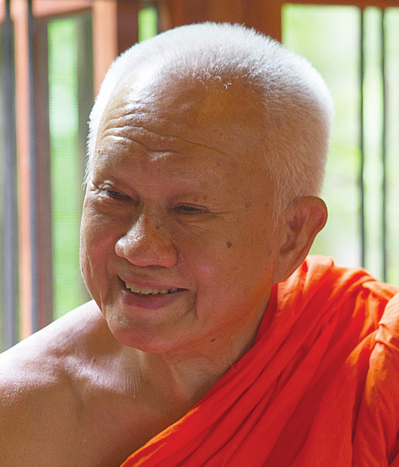
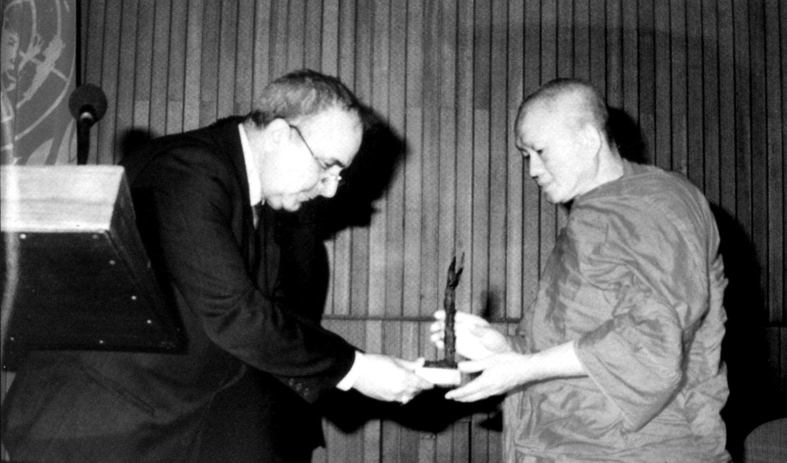

# 巴育陀 (P. A. Payutto)

原名：Prayudh Arayangkoon。  
1939年1月12日出生于素攀武里府（Suphan Buri Province）是巴詹县（Si Prachan District），父母是Samran先生和Chun-Ki Arayangkoon夫人。

## 生活与工作

### 初等教育

1945-1947年：在Chai Sri Pracharat学校接受小学教育。

1948-1950年：在Wat Prathoomkongkha中学接受中学教育（他获得教育部颁发的学术奖学金）。

### 僧侣教育

1951年（5月10日）：在是巴詹县Wat Ban Krang出家，由帕古·美提达玛沙恩（Phra Kru Medhi-Dhammasarn）担任戒师。

1952年：居住在素攀武里府首府县的Wat Prasat Thong。从事教理（pariyatti-dhamma）的学习并修习毗婆舍那（vipassanā）禅修。他的禅修老师敦促他住在毗婆舍那中心，但他父亲未予同意。

1953年：前往曼谷的Wat Phra Phiren居住。

1951-1953年：通过佛法研究（nak tham）的第一、第二和第三级考试。

1955-1961年：在仍是沙弥时，通过巴利语研究（parian tham）的第三至第九级考试。

1962年：获得摩诃朱拉隆功佛学院（Mahachulalongkornrajavidyalaya University）佛学学士学位（一等荣誉）。

1963年：获得“Piset Mathayom”（特殊中学教师证书）。

受具足戒：1961年7月24日，在玉佛寺（Wat Phra Si Ratana Satsadaram）作为皇家受戒候选人（nak luang）受具足戒，受皇家资助。

### 法号

1969年：普通法号：Phra Srivisuddhimoli

1973年：‘Rāja’级别法号：Phra Rajavaramuni

1987年：‘Deva’级别法号：Phra Debvedi

1993年：‘Dhamma’级别法号：Phra Dhammapitaka

2004年：‘副僧伽领袖’级别法号：Phra Brahmagunabhorn

2016年：‘僧伽领袖’级别法号：Somdet Phra Buddhaghosacariya[\[1\]](#fn-fn1){:id="fr-fn1"}

### 弘法活动

1962-64年：在摩诃朱拉隆功佛学院巴利语预科系授课。

1964-74年：在摩诃朱拉隆功佛学院教授佛学本科课程（在此期间，他偶尔会在艺术大学考古学院和玛希隆大学比较宗教学程讲课）。

1964-74年：担任摩诃朱拉隆功佛学院助理秘书长，后任副秘书长。

1972-76年：被任命为Wat Phra Phiren的住持。

1972年：在宾夕法尼亚大学博物馆讲授“佛教与泰国文化”。

1976年：在宾夕法尼亚斯沃斯莫尔学院讲授佛教。

1981年：受邀担任世界宗教研究中心访问学者，并在哈佛大学神学院和文学院讲授佛教。

1994年：在佛统府三攀县邦格拉笃的Wat Nyanavesakavan担任住持。

## 所获荣誉

### 荣誉职位

1981年：哈佛大学神学院世界宗教研究员

1995年：印度那烂陀新寺（Navanalanda Mahavihara）授予“三藏导师”（Tipiṭakācariya）荣誉职位

1995年：国家文化委员会授予“文化智者”荣誉称号

1996年：泰国皇家医师学院荣誉院士

2001年：摩诃朱拉隆功佛学院特聘教授

2004年：世界佛教大学最杰出学者

2006年：泰国皇家研究院荣誉院士

### 荣誉勋章与奖项

1982年：拉达那哥欣建城二百周年纪念“佛教恩人”荣誉勋章

1982年：曼谷银行基金会颁发文学作品《佛法》散文类一等奖

1989年：皇家玛希隆纪念奖

1989年：农业大学教育学院建院二十周年教育推广奖

1990年：佛教弘扬领域“银海螺”荣誉奖

1994年：联合国教科文组织和平教育奖

1994年，他在巴黎获得联合国教科文组织和平教育奖。

1998年：法政大学和丰田泰国基金会为杰出文学作品《可持续发展》（การพัฒนาที่ยั่งยืน）颁发TTF社会学和人类学领域奖项

2001年：诗纳卡林威洛大学Sarot Buasri贤德学者奖

2007年：摩诃朱拉隆功佛学院杰出校友奖

2009年：国家文化委员会授予“泰语智者”荣誉称号

2012年：Mom Luang Pin Malakul教授基金会Sastra Methee奖（杰出学者奖）

2012年：在第十九世僧伽王（Somdet Phra Nyanasamvara）99岁寿辰庆典上获颁佛教推广奖

### 荣誉博士学位

1982年：摩诃朱拉隆功佛学院佛学荣誉博士学位

1986年：法政大学文学院（哲学系）荣誉博士学位

1986年：法政大学教育学（课程与教学领域）荣誉博士学位

1987年：法政大学文学院（教育与教学领域）荣誉博士学位

1988年：朱拉隆功大学艺术文学荣誉博士学位

1988年：玛希隆大学文学院（语言学系）荣誉博士学位

1990年：诗纳卡林威洛大学教育学（教育哲学系）荣誉博士学位

1993年：兰甘亨大学哲学（教育系）荣誉博士学位

1994年：宋卡王子大学教育学荣誉博士学位

1995年：玛希隆大学艺术文学（教育伦理领域）荣誉博士学位

1998年：清迈大学科学荣誉博士学位

2001年：玛哈玛库佛教大学宗教学荣誉博士学位

2002年：邦宋德差奥帕拉大学教育学荣誉博士学位

2002年：思巴顿大学文学院（组织管理领域）荣誉博士学位

2009年：布拉帕大学哲学（宗教与哲学系）荣誉博士学位

2009年：那黎宣大学哲学（教育系）荣誉博士学位

2009年：素可泰塔玛提拉开放大学传播艺术学（宗教与哲学系）荣誉博士学位

2010年：国家发展管理学院哲学（人力资源发展领域）荣誉博士学位

2011年：合艾大学教育学荣誉博士学位

他的巨著《佛法》（Buddhadhamma）于1971年首次出版；第一版被称为Wan Waithayakon（或“原始”）版，共206页。1982年，作者增加了更多内容；此版被称为修订增补版，共1042页。2012年，又增加了更多内容；此当前版被称为扩充版，共1330页。

2009年，一群致力于此的人们开始真诚而坚定地努力，制作《佛法》完整23章的录音。这项任务于2016年完成。此录音现以20张MP3光盘的形式免费分发；也通过其他媒介分享，例如通过网站和应用程序。

这位可敬作者的许多佛法讲座CD也以MP3格式提供。它们被整理成套，例如：

按主题分类（尽管被指定为套，但有些单独的CD涵盖独特主题）：

*   陪伴新受戒比丘学习佛法（20部分）
    
*   从心理学到心的培育
    
*   与沙弥的对话，引导至佛法智慧
    
*   “四村”护身符的大流行已不再
    
*   每天都至关重要；互相鼓励修习佛法
    
*   通过培育智慧，无需寻找普世伦理
    
*   达到此阶段，便开始触及佛教的核心
    
*   审视十个阶段，洞察十个维度
    
*   佛教教义必须清晰审视
    
*   如何应对当前的国家危机
    
*   正确修习佛法：培养善行，证得涅槃
    
*   世俗之爱固然美好，但真爱更胜一筹
    
*   互相帮助守护泰国
    
*   了知通往真正幸福之道
    
*   真理的居所：高尚女士Poonsuk Banomyong
    
*   居士故事1-2
    
*   佛教智慧训练（1-8）
    
*   佛法与修行
    
*   通过礼敬平息梵天
    
*   从印度到亚洲
    
*   羽翼未丰的民主
    
*   生命各阶段的内在真理
    
*   不放逸与幸福
    
*   从各个角度看幸福
    
*   圣地朝圣——佛法纪录片
    
*   反复聆听，反复喜悦
    
*   政治佛法
    
*   清净的佛教弟子身份
    
*   从富有成效的工作中获得的幸福
    
*   当前的国家危机
    
*   佛教作为科学的基础
    
*   培育安乐
    
*   佛教徒指南
    

按时间顺序排列：

*   与特定情境相关的教导 -- 2001年
    
*   适时聆听佛法 -- 2002年
    
*   各种教导 -- 2003年
    
*   与世界相关的教导 -- 2004年
    
*   理解世界，证悟真理 -- 2005年
    
*   佛法不拒世间 -- 2006年
    
*   佛法近在咫尺 -- 2007年
    
*   佛法的渐进性 -- 2008年
    
*   引发真理的回忆 -- 2010年
    

此外，自1987年起，巴育陀尊者（Ven. P. A. Payutto）受玛希隆大学邀请，担任国际多脚本《巴利圣典》计算机版（BUDSIR for Windows）的顾问；该项目现已完成，是世界上首个此类计算机程序。

附注：尽管许多大学和机构曾邀请尊贵的作者接受荣誉博士学位、勋章和奖项，但由于健康不佳和居住在偏远省份，自2004年起（即从获得世界佛教大学授予的“最杰出学者”荣誉开始），巴育陀尊者（Ven. P. A. Payutto）已请求免于亲自出席相关荣誉典礼。相反，他向所有相关人员表达了对他们的善意、赞赏和对知识追求的支持的感谢。

\[1\] 全称：Somdet Phra Buddhaghosacariya Ñāṇa-adulyasundaranāyaka Pāvacanatilaka Varānusāsana Arayangkoon Vilāsanāmānukkama Gambhīrañāṇa-uttamavisiṭṭha Tipiṭaka-paṇḍita Mahāgaṇissara Bowonsaṅghārāma Gāmavāsī Araññavāsī。（译者注：这是我自己的音译；泰语发音与此大相径庭，因为泰语经常使用梵语词汇，并经常缩写巴利语和梵语词。请注意，将泰语法号พุทธโฆษาจารย์音译成罗马字母有多种方式，包括：Buddhaghosacariya, Buddhaghosacharya, 和 Phutthakosajarn。引述Somseen博士在其近期译作《头陀行》（Dhutanga...）中的话：“表面上，这个特定的僧侣头衔的名称是模仿觉音长老……这位公元五世纪的印度佛教僧侣是上座部佛教最伟大的义注师和学者。”）[&nbsp;↩&nbsp;](#fr-fn1)
{: id="fn-fn1"}