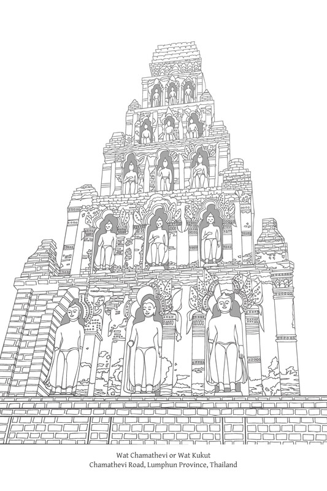

# 第十八章：禅定道支

## 导论

佛陀将八道支（八正道）分为三组或“蕴”（khandha），即：戒蕴（sīla-khandha）、定蕴（samādhi-khandha）、[\[1\]](#fn-fn1){:id="fr-fn1"}和慧蕴（paññā-khandha），或简称为：戒（sīla）、定（samādhi）和慧（paññā）。在此，正精进、正念和正定这三个道支包含在定蕴之中。

作为一个整体，这三个道支也被称为“增上心学”（adhicitta-sikkhā），其定义可以概括为：训练自心、培育内心品质、带来安乐、提升心的境界，并熟练地掌握定。增上心学的核心是培育和提升心的品质和潜能，这有助于过一种有德行的生活，并有利于以最佳方式运用智慧。

在最高层次上，“增上心”（adhicitta）或定指的是培育奢摩他（samatha）的方法以及各种止禅方法。但在更普遍、全面的意义上，增上心或定涵盖了所有能够使内心平静、使人坚定于德行、激发热情以及在培育善法时保持毅力的方法与途径。

## 正精进

正精进（sammā-vāyāma）是八正道的第六个道支。经文对正精进的定义如下：

> 诸比丘，何谓正精进？在此佛法与律中，比丘生起善法欲，精勤努力，提起精神，奋斗不懈，决心令未生的恶不善法不生。生起善法欲，精勤努力，提起精力，奋斗不懈，决心断除已生的恶不善法。生起善法欲，精勤努力，提起精力，奋斗不懈，决心令未生的善法生起。生起善法欲，精勤努力，提起精力，奋斗不懈，决心令已生的善法持续、不消失、增长、圆满、兴盛和成就。  
> D. II. 311; M. I. 62; M. III. 251-2; Vbh. 105, 235

《阿毗达摩》提供了额外的定义：

> 什么是正精进？是发起心精进（viriyārambha）；是进展、坚持、决心、努力、勤勉、持续、坚定、恒常；是稳步前进，不放弃热忱，不舍弃职责，勇于承担；是精进、精进根、精进力、平衡的精进；是道支之一、与道相应的精进觉支。这就称为正精进。  
> Vbh. 107, 237

在这些定义中，请注意善法欲（chanda）的重要性，它是正精进的先导，是一切可敬的坚持的精髓。

上述经文中的正精进定义，将其分为四个要素，也称为“正勤”（sammappadhāna）[\[2\]](#fn-fn2){:id="fr-fn2"}或四正勤（padhāna），[\[3\]](#fn-fn3){:id="fr-fn3"}这四种正勤各有其特定名称，如下：

1.  律仪勤（Saṁvara-padhāna）：即防护未生起的恶不善法。
    
2.  断勤（Pahāna-padhāna）：即断除已生起的恶不善法。
    
3.  修勤（Bhāvanā-padhāna）：即修习培育未生起的善法。
    
4.  护勤（Anurakkhanā-padhāna）：即守护已生起的善法。
    

这四种精进有时通过举例来解释：[\[4\]](#fn-fn4){:id="fr-fn4"}

1.  Saṁvara-padhāna：当比丘用眼睛看见色法时，他不会执取其相和特征（他不被其主要和次要的特征所吸引）。他修习根律仪以防护诸根。因为当诸根不受抑制时，贪欲和嗔恚等不善心所就会压倒内心。他守护眼根，对眼根保持自制（耳闻声、鼻嗅香、舌尝味、身触触、意知法也是如此）。
    
2.  Pahāna-padhāna：比丘不容许已生起的欲念、瞋念、害念等恶不善法持续存在；他会舍弃、断除、灭尽它们，使其不留余地。
    
3.  Bhāvanā-padhāna：比丘修习七觉支，这些觉支依止于远离、离欲和灭，并导向解脱。
    
4.  Anurakkhanā-padhāna：比丘培育“定的心相”（samādhi-nimitta），即六种“想”（saññā）。[\[5\]](#fn-fn5){:id="fr-fn5"}
    

精进是佛教中一项至关重要的品质，这从正精进是八正道中常需作为其他道支支持的三个要素之一（与正见、正念并列）这一事实中显而易见。[\[6\]](#fn-fn6){:id="fr-fn6"}在经典中几乎所有的修行要素组合中都包含精进，以不同的巴利语术语来表示。[\[7\]](#fn-fn7){:id="fr-fn7"}佛陀的以下段落证实了精进的重要性：

> 此法是为精进者，非为懈怠者。  
> A. IV. 233

> 诸比丘，我清楚地知道两件事的价值：对已达成的善法心不满足。不懈地精进努力。因此，你们应当如此修行：‘愿我发起不懈的精进。即使只剩下我的皮、腱、骨；即使我身体的肉都干枯了；我也不会停止精进，直到我已通过男子的力量、男子的精进、男子的努力获得一切可获得之物。’你们应当这样训练自己。  
> A. I. 50

之所以反复强调精进，其根本原因之一在于佛教的一个基本原则：真理是自然的一部分，它作为自然法则而存在。佛陀（“导师”——satthā）的作用是发现这个真理，然后将其揭示给他人。修行的成果是根据自然因缘无偏地发生的；它们并非由导师所产生。因此，人们必须依靠自己的力量和精进努力并产生结果；他们不应该在不付出努力的情况下期望或恳求期望的结果，正如《法句经》中的这首偈颂所证实：

> 觉悟者只能指明道路；  
> 你们必须自己精进。Tumhehi kiccaṁ ātappaṁ akkhātāro tathāgatā.  
> Dh. verse 276

精进努力类似于培育其他善法；所有这些品质都必须以整合的方式培养，而不是孤立地培养。当精进已在心中妥善准备并整合后，一个人就能将其表达为外部世界的具体行动。这并非仅仅是产生一个精进的愿望，然后随意地在努力中施加体力，这可能会导致过度劳累并产生非常有害的后果。

因此，精进必须与其他善法和谐一致，最显著的是正念和正知。一个人要带着理解和觉知行事。一个人要做出平衡的精进，既不过紧也不过松，正如经文中的这个故事所描述的：

昔日，尊者Soṇa居住在王舍城附近的尸陀林中。他在修行中付出了极大的精进，进行经行（caṅkamana），直到双脚脚底都起泡流血，但却没有成功。于是他有了这个念头：

> 我是世尊最精进的弟子之一，但我的心尚未从诸漏解脱，也未摆脱执取。我的家庭现在很富有，我可以用我的财富做功德。那么，让我放弃修学，利用我的财富去做功德吧。

佛陀知道Soṇa在想什么，便前来与他交谈：

> “Soṇa，你刚才不是在想放弃修学吗？”“是的，世尊。”“告诉我，Soṇa，你早年在家时，难道不擅长弹琵琶吗？”——“是的，世尊。”“那么，Soṇa，当你的琵琶弦绷得太紧时，你的琵琶调音良好且容易弹奏吗？”——“不，世尊。”“当你的琵琶弦太松时，你的琵琶调音良好且容易弹奏吗？”——“不，世尊。”“但是，Soṇa，当你的琵琶弦既不太紧也不太松，而是调整到均匀的音高时，你的琵琶调音良好且容易弹奏吗？”——“是的，世尊。”“同样地，Soṇa，如果精进施加得过于用力，会导致掉举，如果精进过于松懈，会导致懈怠。因此，Soṇa，保持你的精进平衡，了知五根的平衡，[\[8\]](#fn-fn8){:id="fr-fn8"}并保持这种平衡的心相（nimitta）。”  
> Vin. I. 181-2; A. III. 374-5

尽管作为道支之一的正精进是一种内在品质，但为了使其有效并得到培育，它必须依赖于与外部世界的互动。这包括一个人如何回应各种感官印象，以及通常如何行为、生活和参与各种活动。它也包括一个人的环境如何以有利和不利的方式影响他的精进和相关善法的培育。

在佛法修行中，所付出的精进（称为padhāna——“正勤”），以外部行动的形式显现并被赋予系统化的形式，与特定的环境因素，如身体、自然环境和社会，是相互关联和依赖的。因此，佛教教义强调外部环境因素对于培育戒行生活和实现佛教最高目标的重要性：

> 诸比丘，有这五种精进者的品质（padhāniyaṅga）。哪五种？即：比丘有信，他对如来正等正觉有信心，如此：“因为这些原因，世尊是阿罗汉，正等正觉者……是阐明和传播佛法者。”他没有疾病和痛苦的障碍；他拥有平衡的消化能力，食物既不过冷也不过热，而是中等且适合精进的。他不夸耀或欺骗；他对导师和他在对导师和同修展现真实的自己。他精进于舍弃不善法和圆满善法，坚定、坚持、恒常，不懈怠于培育善法。他有智慧；他拥有对生灭的智慧，这种智慧是高尚而有洞察力的，并导向苦的完全毁灭。  
> D. III. 277; M. II. 95; A. III. 65; A. V. 15

> 诸比丘，有这五种不利于精进的场合。哪五种？即：比丘年老，被老年所压倒。比丘生病，被疾病所压倒。发生饥荒，作物歉收，食物难以获得，乞食难以维持生计。危险普遍存在，有森林土匪抢劫土地的骚乱，乡下人驾车逃跑。僧团分裂；当僧团分裂时，有相互谴责、指责、诋毁和排斥；然后那些没有信心的人不生信心，一些有信心的人则变得不一样。诸比丘，有这五种有利于精进的场合。哪五种？：比丘年轻，年少，黑发，拥有青春的福报，处于生命的黄金时期。他没有疾病和痛苦的障碍……一个食物充足、作物丰收、食物容易获得且乞食容易维持生计的时期。一个人们和谐共处，如同水乳交融，彼此珍爱，不争吵，而是友善相视的时期。一个僧团安住的时期——和谐，相互欣赏，没有争议，同诵一法；当僧团和谐共处时，就没有相互谴责、指责、诋毁和排斥；然后那些没有信心的人生起信心，有信心的人则在信心上增长。  
> A. III. 66

## 正念

### 定义

正念（sammā-sati）是在定学或“增上心学”（adhicitta-sikkhā）分类中的第二个要素。[\[9\]](#fn-fn9){:id="fr-fn9"}经文对正念的定义如下：

诸比丘，什么是正念？这就称为正念：此佛法和律中，比丘：

1.  于身随观身，热忱、正知、具念，离世间之贪与忧。
    
2.  于受随观受，热忱、正知、具念，离世间之贪与忧。
    
3.  于心随观心，热忱、正知、具念，离世间之贪与忧。
    
4.  于法随观法，热忱、正知、具念，离世间的贪与忧。[\[10\]](#fn-fn10){:id="fr-fn10"}
    

《阿毗达摩》提供了另一个定义：

> 什么是正念？念是持续的忆念和省察；\[或\]念是忆念、记忆、不消退、不遗忘的状态。念是念根、念力、平衡的觉知、道支之一、与道相应的念觉支。这就称为正念。  
> Vbh. 107, 237

上述经文中的正念定义是四念住教法的一部分。此教法中的四个要素各有其简称：

1.  Kāyānupassanā（身随观；观察身体的本质）。
    
2.  Vedanānupassanā（受随观；观察感受的本质）。
    
3.  Cittānupassanā（心随观；观察心的本质）。
    
4.  Dhammānupassanā（法随观；观察心法〔法尘〕的本质）。（参见“关于“法随观”（Dhammānupassanā）的含义”注释）
    

关于“法随观”（Dhammānupassanā）的含义

> 译者：佛教徒之间对于dhammānupassanā的含义似乎存在相当大的困惑。（该术语的翻译范围从：“观心法”、“观诸法本性”、“观现象”、“观真实本性”到“观心所”。）因此，我拜访了尊敬的作者，试图澄清对此事的一些疑虑。巴育陀尊者（Ven. Phra Payutto）的简要答复如下：基本上，dhammānupassanā一词确实指“心法”——指思想和省察。佛陀之所以选择正式教法（例如七觉支、五盖等）的例子，是因为这些特定类型的思惟有助于觉悟。第四个satipaṭṭhāna与第三个相关联：例如，一个人可能洞察到心受贪欲支配的事实（cittānupassanā），然后观照贪欲的本质，比如说它是五盖之一的表现。四名蕴（khandha）之所以不构成念住之一，是因为这些蕴在某种意义上更为抽象：它们更难被意识“捕捉”。这四种satipaṭṭhāna更为实用——它们更容易被观察到，并且处理的是日常现象。

在四念住的语境下审视“念”之前，重要的是对sati（“念”）这个术语有一个基本的理解。

### 作为“不放逸”的念

> （sati的英文翻译包括：mindfulness（念）、attentiveness（专注）、和detached watching（无著地观察）。appamāda的翻译包括：heedfulness（不放逸）、watchfulness（警惕）、earnestness（认真）、diligence（精勤）、zeal（热忱）、carefulness（小心）、non-neglect of mindfulness（不忽视正念）、和non-negligence（不懈怠）。）

Sati最简单的翻译是“忆念”，但这样的翻译可能传达出它仅仅是记忆的一个方面。虽然记忆无疑是sati功能的一个有效元素，但它未能完全公正地表达该术语的本质含义。从否定的层面来说，除了“不遗忘”的含义外，sati也指“不粗心”、“不懈怠”、“不散乱”、和“不迷惑”。心既不迷失也不懈怠；相反，它是专注和警觉的。这些否定指向了谨慎、明辨自己的责任、专注自己的行为以及准备接受事物并意识到如何与它们互动等积极品质，从而产生警觉和关怀。

念的功能常被比作看门人，他持续关注进出城门的人，允许合适的人进出，同时禁止不合适的人。因此，念在戒行领域中至关重要。它规范人们的行为，并通过阻止人们沉溺于恶行和防止不善法侵入内心来帮助保护和抑制。简单来说，念提醒我们行善，不给恶法任何立足之地。

佛教教义在戒行的各个层面都非常重视正念。以正念持续主导自己的生活或佛法修行被称为appamāda，即不放逸。不放逸在戒行体系的进步中具有核心重要性，通常被定义为“活在持续的觉知中”。这可以引申为：持续的关怀和谨慎，不让自己误入歧途；不错过任何改善的机会；清楚地意识到哪些事情需要做，哪些不需要做；不懈怠；以及以真诚和不屈不挠的精进完成日常任务以求进步。可以说appamāda是佛教的责任感。

不放逸被归类为“内在因素”，如理作意（yoniso-manasikāra）亦然。这两个因素可以与一个相同的外部对应物配对：与善友交往（kalyāṇamittatā）。佛陀描述不放逸的言语有时与他描述如理作意的言语重叠，因为这两种品质同样重要，尽管它们在应用上有所不同。

如理作意是智慧要素，是实际应用的工具。而不放逸则是禅定要素；它是主导如理作意之运用、促使其使用并不断激励人进一步进步的。

不放逸在戒行各个层面的重要性和范围，可以从佛陀自己的以下言语中看出：

> 诸比丘，正如所有陆地动物的足迹都融入象的足迹，而象的足迹被宣告为其中之首，即就其大小而言，同样地，所有存在的善法都以不放逸为根，汇聚于不放逸，而不放逸被宣告为其中之首。  
> S. V. 43; A. V. 21-22
> 
> 我未曾见过有任何其他事物，能如此有效地导致未生善法生起、已生不善法消退，如不放逸者。在不放逸者身上，未生善法将生起，已生不善法将消退。  
> A. I. 11
> 
> 我未曾见过有任何其他事物，能如此有助于大利益，如不放逸……。  
> A. I. 16
> 
> 我未曾见过有任何其他事物，能如此有助于正法的安定、不消失、不隐没，如不放逸。  
> A. I. 16-17
> 
> 就内在因素而言，我未曾见过有任何其他因素，能如此有助于大利益，如不放逸。  
> A. I. 17-18
> 
> 正如黎明是日出的前兆和先驱，同样地，成就于不放逸是比丘八正道生起的前兆和先驱……。大力协助八正道生起的主要品质就是成就于不放逸……。我未曾见过有任何其他事物，能藉由它使未生的八正道生起，使已生的八正道繁荣和圆满，如同成就于不放逸……。当比丘不放逸时，他将修习和培育这八正道，这是可以预期的。  
> S. V. 30, 32-3, 35-7, 41-45
> 
> 诸比丘，应在四件事上培养不放逸。哪四件事？你们应当舍弃不善的身行，培育善的身行，并且对此不懈怠。你们应当舍弃不善的语行，培育善的语行，并且对此不懈怠。你们应当舍弃不善的意行，培育善的意行，并且对此不懈怠。你们应当舍弃邪见，培养正见，并且对此不懈怠。如果比丘已舍弃不善的身行，培育善的身行……舍弃邪见，培养正见，他就不畏惧死亡的逼近。  
> A. II. 119-20

> 诸比丘，比丘应当以四种方式独自培养不放逸，以念守护心：“愿我的心不怀有对任何引起贪欲之物的贪欲……。”“愿我的心不怀有对任何引起瞋恚之物的瞋恚……。”“愿我的心不被任何引起迷惑之物所迷惑……。”“愿我的心不被任何引起迷恋之物所迷恋……。”当比丘的心不对引起贪欲之物怀有贪欲，因为他已离贪，当他的心不怀有瞋恚……当他不迷惑……当他不迷恋时，他将不会动摇、颤抖、退缩或因恐惧而战栗，他将无需相信任何人，甚至出家者的话。  
> A. II. 120
> 
> 波斯匿王：尊者，有没有一件事能确保两种善，即与现世相关的善（或可见的善）和与未来相关的善（或内心的、非物质的善）？佛陀：有。波斯匿王：那件事是什么？佛陀：不放逸，大王。  
> S. I. 86; A. III. 364
> 
> 正是如此，大王！我善说之法是为拥有善友、善侣侣、善同伴者而说，而非为拥有恶友、恶伴侣、恶同伴者而说……。事实上，善友谊等同于整个梵行。因此，大王，你应当如此训练自己：“我将拥有善友、善侣侣、善同伴与我交往。”大王，当你有善友、善侣侣、善同伴时，你应当以一件事为依止而住：在善法中的不放逸。大王，当你以不放逸为依止而精勤住时，你的宫女们……贵族随从……士兵……城乡百姓将如此想：“国王以不放逸为依止而精勤住。来吧，我们也以不放逸为依止而精勤住吧。”大王，当你以不放逸为依止而精勤住时，你自身将得到守护和保护，你的宫女随从将得到守护和保护，\[甚至\]你的宝库和仓库也将得到守护和保护。  
> S. I. 87-9

即使佛陀在最终般涅槃（parinibbāna）之前所说的最后遗言也与不放逸有关：

> 一切有为法皆是坏灭法；当以不放逸努力以达到目标。  
> D. II. 155-6

### “念”的社会价值

在以下引自《Sedaka经》的引文中，佛陀描述念（sati）利益的言语揭示了其含义与不放逸（appamāda）在实践上的紧密联系。除了阐明这两种品质的含义，此经还揭示了佛教对人与社会关系的看法。佛教教义认为个体内在的生活与外部世界——即社会——是密切相连的。一个人生命的这两个方面是不可分离的：

> 诸比丘，往昔，一位杂技演员竖起他的竹竿，对他的学徒说：“来，爬上竹竿，站在我的肩膀上。”学徒同意了这个请求，爬上竹竿，站在老师的肩膀上。然后杂技演员对学徒说：“你保护我，我保护你。这样，我们彼此守护，彼此保护，就能展示我们的技艺，收取报酬，并安全地从竹竿上下来。”当说完这些话时，学徒回答说：“师父，这不是办法。您保护您自己，老师，我保护我自己。这样，各自自护自保，我们就能展示我们的技艺，收取报酬，并安全地从竹竿上下来。”在这种情况下，这是正确的方法。正如学徒对老师所说。当想“我将保护自己”时，即是修习念住；\[同样地\]，当想“我将保护他人”时，即是修习念住。诸比丘，保护自己，就是保护他人；保护他人，就是保护自己。那么，如何通过保护自己来保护他人呢？答案就是通过持续的修习、培育和提升。正是以这种方式，保护自己也就是在保护他人。那么，如何通过保护他人来保护自己呢？通过忍耐、不害、慈爱与悲悯。就是以这种方式，通过保护他人来保护自己。当想“我将保护自己”时，就运用念住；当想“我将保护他人”时，就运用念住。诸比丘，保护自己，就是保护他人；保护他人，就是保护自己。  
> S. V. 168-9

### 用于开发智慧和消除内心杂染的“念”

不放逸（appamāda）指的是无缝的觉知，以持续的正念生活。不放逸使人小心谨慎；它防止人误入歧途或有害的方式。它导致自我克制，告诫人不要迷恋和放纵。它敦促人不要自满；它促使精进，并鼓励人持续修行。它使人不断意识到自己的责任，提醒人哪些需要做，哪些不需要做，哪些已完成，哪些尚未完成。它还帮助人以谨慎和精确的方式完成各种任务。因此，如前所述，不放逸在戒行体系中具有重要意义。

不放逸作为念的一种表现，在一个人的一般生活行为中具有广泛的意义。广义而言，它适用于从戒行（sīla）阶段到禅定（samādhi）阶段。在这些阶段，念与大量的其他善法相关联，特别是精进（vāyāma），念在任何时候都与之结合。

然而，若单从开发智慧（即运用智慧净化自心）的核心过程来看，不放逸（appamāda）并不直接参与其中，而是从旁给予坚定的支持和鼓励。在这个阶段，注意力仅限于心的运作，在刹那间的分析中精细地辨别存在的各种现象。正是在这个阶段，念充分投入并发挥着突出作用，并以其特定名称：sati来指代。[\[11\]](#fn-fn11){:id="fr-fn11"}

对sati本质、独特含义的理解，可以通过审视其在某些场合的功能来获得，在这些场合，它的作用与其他心所有明显的区别，最显著的是在被称为四念住（satipaṭṭhāna）的修行中。在这种场合，念的功能可以概括如下：

念的主要作用是防止心散乱；它不让感官印象未经注意地溜走。它警惕心不在焉。它是专注的，仿佛眼睛一直盯着每一个进入意识的印象，然后将其牢牢抓住。当一个人希望专注于特定所缘时，念能使注意力固定在其上，不让所缘溜走或消失。通过sati，人不断地忆念所缘并将其铭记于心。[\[12\]](#fn-fn12){:id="fr-fn12"}

念的一个比喻是柱子，因为它牢固地嵌入其所缘中。另一个比喻是守门人，因为它看守着各种感官之门，感官数据通过这些门，检查所有进入的东西。sati生起的“近因”（padaṭṭhāna）是对对象的坚定而清晰的想（saññā）。或者，近因是以下将讨论的四念住（satipaṭṭhāna）中的任何一个。

从伦理学的角度来看，可以辨别念的否定和积极两方面。作为否定因素，念守护着心；它抵御心的掉举，保护人免于犯错，并防止人陷入不良的心态或境地。它不给不善法进入内心的任何机会，并防止思想的滥用。

从积极方面来看，念引导着意识流、思想流，乃至一个人所有的行动，使其遵循预期的方向。它使心系于所选择的所缘。因此，它是抓住注意所缘的工具，如同将其置于心前供审察。

在佛教修行之道中，非常强调念的重要性。事实上，佛陀说念在每种情况下都是必需的。念被比作盐，每道咖喱都必须用；也被比作首相，参与政府的每一个部门。念可以根据情况的需要来抑制或支持心。[\[13\]](#fn-fn13){:id="fr-fn13"}

考虑到上述念的特质，我们可以看到培育念的益处如下：

*   能够通过监控觉知过程和思想流来维持和守护期望的心境；一个人只接受那些对心有利的，并排除所有不利的。此外，通过调节和止息思维过程，一个人有助于达到禅定（samādhi）。
    
*   身体和精神上的自由，以及“自给自足”；身心本质上是安适和放松的，准备好应对各种情况，并能够有效地处理世间的事物。
    
*   在禅定状态下，能够引导觉知过程和思想流，并扩展它们的活动范围。
    
*   智慧根的审视以最佳的清晰度进行。通过抓住一个所缘，并仿佛将其置于心前供后续审察，念充当了一个基础，在此基础上智慧可以得到培育和圆满。
    
*   身、语、意三业的净化；不受贪爱与执取的染污。伴随着正知（sampajañña），念确保一个人的行动是由智慧——由纯粹、理性的辨别力——所引导。
    

上述最后两项益处是修行高级阶段的目标，并通过被称为四念住（satipaṭṭhāna）的规定修行方法获得。

### 四念住语境下的正念

Satipaṭṭhāna可以翻译为“念住”或“念的建立”（即念的监督或引导）。技术上，这个术语指的是运用念以产生最佳效果的方法，正如佛陀在《大念住经》（Mahāsatipaṭṭhāna Sutta）中的话所指出的：

> 比丘们，这是众生清净、超越忧愁和悲叹、止息苦与忧、证得正道、证悟涅槃的主要途径——即是四念住。[\[14\]](#fn-fn14){:id="fr-fn14"}  
> D. II. 290; M. I. 55-6

修习四念住是一种非常流行且受人敬重的佛法修习方法。它被认为同时包含止禅 (samatha) 和观禅 (vipassanā)。修行者可以先修习止，直至证得禅那 (jhāna) （参见下一节关于禅定的内容），然后再以四念住为基础修习观禅并达到最终目标。或者，修行者也可以主要以观禅（同样以四念住为基础）为修习形式，只依靠达到任务所需的基本定力，然后达到最终目标。

观禅 (vipassanā) 是佛教修习的重要原则，尽管广受讨论，但也被广泛误解。以下对念住 (satipaṭṭhāna) 的探讨，尽管简短，但将有助于阐明毗婆舍那 (vipassanā) 的含义，包括其基本特质、适用范围和多功能性，以及在日常生活中修习观禅的可能性和益处。

四念住概述如下：

1\. 身随观 (Kāyānupassanā)：观照身体；身念住：

1.  安般念 (ānāpānasati)：前往僻静处，以适合禅修的姿势坐下，建立正念，并专注於入息和出息的各个方面。
    
2.  威仪念住 (iriyāpatha)：清楚觉知身体当前的“模式”或姿势，例如站立、行走、坐下或躺卧。
    
3.  正知 (sampajañña)：在每项活动中都保持正知，例如：向前移动、环顾四周、伸展手臂、穿衣、喝水、进食、咀嚼、小便、大便、醒来、入睡、说话和保持沉默。
    
4.  不净观 (paṭikkūla-manasikāra)：观想身体，从头顶到脚底，是各种不净成分的聚集处。
    
5.  界作意 (dhātu-manasikāra)：通过将身体分解为四界（地、水、火、风）来观想。
    
6.  九种墓园观 (nava-sīvathikā)：观察处于九种不同腐烂阶段的尸体，从新死的尸体到只剩下碎骨的尸体。在每种情况下，都要反思自己的身体也终将遭遇同样的命运。
    

2\. 受随观 (Vedanānupassanā)：受念住 (vedanā；感受)：当乐受、苦受或不苦不乐受生起时，无论它是有物质依的 (sāmisa) 还是无物质依的 (nirāmisa)，都要如实地、清楚地觉知它在当下存在的状况。

3\. 心随观 (Cittānupassanā)：心念住；观照心在任何特定时刻的状态。例如，清楚地觉知心是贪婪的还是离贪的，是愤怒的还是离嗔的，是迷惑的还是离痴的，是散乱的还是集中的，是解脱的还是被束缚的等等。

4\. 法随观 (Dhammānupassanā)：法念住：

1.  盖 (nīvaraṇa)：[\[15\]](#fn-fn15){:id="fr-fn15"} 在每个当下清楚地觉知五盖中是否有任何一个存在于心中；清楚地觉知未生起的盖如何生起，已生起的盖如何被舍弃，以及已被舍弃的盖如何被防止再次生起。
    
2.  蕴 (khandha)：清楚地理解五取蕴；了知每一蕴的自性；了知每一蕴如何生起和如何灭去。
    
3.  处 (āyatana)：清楚地理解六内处和六外处；理解依处而生起的烦恼结 (saṁyojana)；了知未生起的结如何生起，已生起的结如何被舍弃，以及已被舍弃的结如何被防止再次生起。
    
4.  觉支 (bojjhaṅga)：[\[16\]](#fn-fn16){:id="fr-fn16"} 在每个当下清楚地理解七觉支中是否有任何一个存在于心中；了知未生起的觉支如何生起，以及已生起的觉支如何能被圆满。
    
5.  圣谛 (ariya-sacca)：清楚地觉知四圣谛的自性。
    

在《大念住经》中，以上每一句的末尾都有一个相同的副歌：

> 比丘住于内身随观身（即自己的身体），或住于外身随观身（即他人的身体），或住于内外身随观身。或者他住于身中随观生起之法，或住于身中随观灭去之法，或住于身中随观生起与灭去之法。确实，他建立‘有身’的念住于前，唯为智与忆念所需。并且他独立而住，无所依赖，不执著世间任何事物。[\[17\]](#fn-fn17){:id="fr-fn17"}

### 念住的要旨

从上述描述中可以看出，四念住 (satipaṭṭhāna) 的修习（这包括毗婆舍那的修习）不需要从社会隐退到僻静处，也不需要固定的时间表。因此，佛教教义鼓励在日常生活中修习和融入它。

本质上，四念住的教导描述了我们生活中需要正念 (sati) 指导和监督的四个领域，即：(1) 身体和身体行为；(2) 各种乐受和苦受；(3) 各种心境；和 (4) 思想和反思。维持在这四点的正念有助于确保一个没有危险和痛苦的生活，而这种修习最终将证悟究竟真理。

从上面四念住的概述中可以明显看出，在修习中，正念绝不是单独应用的，而是总是与其他精神因素结合使用。其中一个因素，在正念 (sati) 的标准经文定义（上文）中没有特别提及，那就是定 (samādhi)，它必须存在，至少以一种微弱的形式，足以完成手头的任务。[\[18\]](#fn-fn18){:id="fr-fn18"} 特别且经常提及的因素包括：

*   ātāpī：“精进”，“努力”；这指的是正精进 (sammā-vāyāma)，八正道的第六个道支，它包括防止和舍弃不善法，以及培养和保护善法。
    
*   sampajāno：“正知”，“完全觉知” (= sampajañña)；这指的是智慧 (paññā)。
    
*   satimā：拥有正念 (sati)；这指的是正念的要素本身。
    

在经文中，“正知”（sampajañña）一词通常与“念”（sati）一词并列出现。由于 sampajañña 指的是智慧，因此正念的训练是开发智慧的一部分。正知是对正念所专注的所缘或活动的清晰透彻的理解：一个人理解它们的本质和目的；一个人知道如何与它们相处，摆脱妄想和误解。

随后的短语“离世间的贪欲和忧愁”（见上文正念的定义）展示了拥有正念和正知所产生的心态。一个人是平等且独立的，不受烦恼的束缚，既不被贪爱所动摇，也不被嗔恚所动摇。

在结束的副歌中，“他随观生起和灭去”这句，指的是在三法印的光照下理解事物，从而生起对事物如实存在的感知和体验。例如，“他建立‘有身’的念住於前”这句，指的是如实地觉知身体，不以假设和珍视的信念来包装它，不将其标记为“人”、“自我”、“他”、“她”、“我”或“我的”。这种态度是一种自由和独立，因为它不依赖於外部条件，并且通过贪爱 (taṇhā) 和执取 (upādāna) 而免于执著。

在此背景下，让我们审视一些重要的巴利语术语的含义：

Kāye kāyānupassī：“身随观于身”。这是标准的字面翻译，很容易引起误解。在这里可以理解译者的难处，因为有时要传达一些巴利语术语和短语的清晰简洁含义是极其困难的。这个短语指的是在任何时候都准确地辨识身体仅仅是身体，只不过是各种器官和组成部分的集合或组合。一个人不把身体看作“他”、“她”、“我”、“约翰”或“苏珊”等等，也不把它看作属於任何人，比如“我的”或“他的”；当看头发或脸时，一个人如实地看待它们，而不是看作“男人”或“女人”。

换句话说，一个人直接按照真相看待，与身体的实际状态相符；所看到的东西与所观察到的东西相符，也就是说，一个人看着身体，就看到身体，而不是看着身体却看到“史密斯先生”或某个令人厌恶的人或某个有魅力的人。这与古老大师的说法一致：“人看而未见。人的视觉被扭曲，看到的是别的东西。未见者，受迷惑。受迷惑者，不能解脱。” (参见附注：身随观于身)

身随观于身

> DA. III. 756; MA. I. 241; VbhA. 217. 批注对“身随观于身”这一表达提供了四到五种不同的解释，其中大多数都指向一个人的注意力焦点。例如：不以混淆的方式感知事物——将身体看作身体；而不将感受、心境或法作为身体来看。另一种解释是将身体内的辅助性身体部分看作一个整体；这是一种解剖或分析身体的方式，直到一个人辨识出身体除了辅助性部分的集合之外别无他物；没有“阿迪森先生”或“巴特利特夫人”。它是对一个集合单位的分析，或对一团聚集物的解开，就像剥开香蕉树的叶子和叶鞘，直到看到实际上没有那样的树。（“受中随观受”、“心中随观心”和“法中随观法”也应作如是理解。）

Ātāpī sampajāno satimā：“精进、正知和正念”。这指的是正精进 (sammā-vāyāma)、正见 (sammā-diṭṭhi) 和正念 (sammā-sati)，它们是八正道的三个恒常道支，必须始终结合道的各个方面的发展来应用：[\[19\]](#fn-fn19){:id="fr-fn19"}

1.  精进能使心充满活力；它防止心变得气馁或沮丧，防止心动摇、懈怠或退缩，并且不给不善心所生起的机会。它是一种敦促心继续前进的力量，并促进善法的增长。
    
2.  正知等同於智慧，它能穿透正念所专注对象的真实本性，并防止对它们产生迷惑。
    
3.  正念是在每个当下将注意力固定和保持在对象上，防止遗忘和混淆。
    

Vineyya loke abhijjhā-domanassaṁ：“离世间的贪欲和忧愁”。这个短语指的是解脱对喜爱和厌恶的贪爱和嗔恚。通过这样修习，心是广阔而明亮的；贪爱和嗔恚都无法压倒心。

Atthi kāyoti vā panassa sati paccupaṭṭhitā hoti yāvadeva ñāṇamattāya paṭissatimattāya：“他建立‘有身’的念住於前，唯为智与忆念所需。”一个有正念的人清楚而准确地知道身体仅仅是身体；他不会将其误认为是众生、个人、男人或女人，或“自我”、“我的”或“你的”。这种反思的目的是为了知识和忆念，为了发展正念、正知和智慧，并防止虚妄的戏论。同样的思惟也适用于感受、心和法。

Anissito ca viharati：“他独立而住，无所依赖。”这指的是一颗自由的心，不被任何条件所束缚；一个人不需要将自己托付给任何事物或任何人。从技术上讲，一个人不依止或依靠贪爱 (taṇhā) 和见 (diṭṭhi)。当认知某物时，一个人如实地直接体验它。一个人不会诉诸贪爱和见来渲染和美化体验，让自己陷入遗忘，或支配自己的思想、反思和整体福祉。

Na ca kiñci loke upādiyati：“他不执著世间任何事物。”一个人不执取或执著於任何事物，无论是色蕴、受蕴、想蕴、行蕴或识蕴，都不将其视为自我或属于自我 (attaniya)。

Ajjhattaṁ vā... bahiddhā vā....：“或内或外”。学者们对这个短语的解释有所不同，但义注师的共识是，“内”指自己，“外”指他人。[\[20\]](#fn-fn20){:id="fr-fn20"} 这种解释与阿毗达磨论典相符，这些论典阐明了这些术语的含义，例如：“比丘如何於心观心於外？在此，当他人的心是贪婪的，他清楚地觉知事实就是如此。”[\[21\]](#fn-fn21){:id="fr-fn21"}

有些人可能会质疑，探究和窥探他人的心是否恰当，以及这是否可能。对这个问题的简要回答是，佛陀鼓励我们对所遇到的一切事物运用正念，并如实地看待这些事物。 在日常生活中，我们必须与他人互动，而且我们应该正念地这样做。我们应该如实地觉知他人，正如他们在我们直接的个人经验中清晰显现的那样。（如果一个人拥有阅读他人心的能力，他就会根据这种能力直接了知；如果一个人没有这种能力，那么他就不需要去探究。）这样，一个人就不会对他人执著，并生起诸如贪爱和嗔恚等不善法。没有义务去监视或窥探他人的事情。然而，如果在与他人交谈时，对方表现出愤怒的迹象，而一个人却不知道他的情绪状态，那如何能声称自己在修习念住并将其应用於日常生活中呢？

总而言之，四念住的发展意味着以正念 (sati) 和正知 (sampajañña) 生活，这可以防止任何由无明产生的对自我的固定认知干扰一个人的思想并引起问题。

一些西方学者将四念住的修习与当代的心理治疗方法进行比较，并得出结论认为前者提供了更好的结果和更大的益处，因为每个人都可以自行应用这种修习，并且可以在日常生活中这样做，以保持健康的心理状态。[\[22\]](#fn-fn22){:id="fr-fn22"}

现在，让我们回到四念住的总结，但这次是使用一种当代的分析模式。

### 四念住：修习之道

四念住修习中的组成因素是双重的：被动的（被专注、被观察、被辨识的），和主动的（观察、关注、洞察的行为）。

*   被动的组成部分是那些我们所有人共有的普通、世俗的事物：身体及其运动、思想、感受等，它们在当下的觉知中存在或显现。
    
*   主动的组成部分是正念 (sati) 和正知 (sampajañña)，它们是四念住修习中的主要因素。这两种作用力毫不动摇地、不分心地专注和观察心中存在的事物。
    

正念 (sati) 是抓住所选对象的心所；正知 (sampajañña) 是智慧的作用，它清楚地辨识所考察对象的本性和目的。例如，在行走时，一个人正念地完全专注于身体的动作，同时清楚地知道行走的原因、预定的目的地以及与行走相关的因素。此外，正知如实地理解对象或行动，不将其涂上贪爱和嗔恚的色彩。

这里有一个需要解决的语言学问题。有些人将 sati 的常见定义误解为“忆念”，将 sampajañña 的定义误解为“自我觉知”，导致修习上的误导。他们将正念建立在自我感上，然后产生自己是各种行为的主体的印象，想着“我正在做这个”，“我正在做那个”；结果他们创造或强化了自我概念。他们沉迷于这种自我形象，并发展出一种心的僵硬。至少，他们的心没有真正专注于活动，因此他们的努力没有结果。

容易产生这种误解的人应该回顾 sati 的定义是“铭记”、“持续专注于手头的对象或任务”以及“持续关注事件的流动”。同样，一个人应该回顾 sampajañña 的定义是“对所专注对象的清楚理解”或“对自己当前活动的清楚理解”。换句话说，这不是专注于自我感（“我正在做这个”）的问题。一个人不是专注于任务的“执行者”，而是专注于任务本身。一个人的注意力是如此地临在和集中，以至于最终没有机会让自我感干扰这个过程。

正念的本质特征是对事物的准确、不扭曲的感知。一个人看到并理解觉知的所缘是什么，它是如何显现的，以及它在每个当下产生什么影响。这需要不断的认知、观察、思惟和理解。一个人不对所缘作出反应、评估、批评或判断它好坏、对错等等。一个人不将自己的情感、偏见或执著贴到所缘上，例如说是可意或不可意，令人满意的或不可接受的。一个人只是辨识那个所缘、条件或品质实际上是怎样的，而不补充诸如“我的”、“他的”、“我们”、“他们”、“克拉布特里先生”、“辛普金斯夫人”等等的想法。

以受念住 (vedanā) 为例：就在这个当下，一个人知道，例如，心理不适存在；他知道它已经生起，他知道它是如何发生的，他知道它是如何逐渐消散的。同样，一个人对“法” (dhammārammaṇa) 保持正念：如果担忧或焦虑生起，一个人观察这些情绪并思惟它们是如何产生的以及它们是如何展开的。如果愤怒生起，对这种愤怒本身的觉知会导致它的消散。然后一个人反思过去的愤怒，思惟它的好处、坏处、原因和终止。最终，研究、反思和考察自己的痛苦甚至可以变得令人愉快！

当它是纯粹、无杂染的苦生起和灭去，并且没有“我的苦”或“我正在受苦”的痕迹时，那么那个苦就被剥夺了所有伤害观照者的力量。无论何种形式的善或恶存在於外部或存在於心中，一个人都要直面它，不逃避、不规避。一个人从它生起的那一刻起，直到它自然终止，都密切关注它。这类似于观看演员表演戏剧，或作为某个事件的旁观者。这种态度可与医生进行尸检或科学家分析研究对象的态度相媲美，而不是法官在原告和被告之间解决案件的态度。这是一种客观而非主观的方法。

正念和正知的持续应用意味着活在当下。一个人在每个当下都觉知正在生起的、正在发生的，或正在做的事情；注意力不会溜走。一个人不执著或留恋於过去事件，也不飘向未来寻找尚未存在的事物。如果需要考虑一些过去的未解决事项或未来的义务，正念会抓住相关细节，智慧心所会以有目的的方式对其进行反思，从而使这些事项成为当下的觉知对象。一个人不会陷入漫无目的的思虑、怀旧的回忆或对未来的幻想。通过活在当下，一个人不被贪爱所奴役、诱惑或驱使。一个人智慧地生活，解脱了各种形式的痛苦，例如悲伤、懊悔、担忧和沮丧。这种生活方式带来了一种伴随著广阔、清晰和轻松的觉知。

### 正念修习的成果

*   清净：当正念专注于所选所缘，当正知如实地理解该事物时，觉知和思想之流就被净化了，因为没有空间让烦恼生起。当一个人如实地辨识现象，不以情绪染着体验，不从个人偏见和喜好作出反应时，就没有执著。这是消除现有漏 (āsava) 并防止新漏生起的方法。
    
*   解脱：当心如上所述被净化时，它也得到解脱；它不被感官印象动摇或扰乱，因为它们以纯粹客观的方式被用作观照的食粮。当这些事物不被主观的烦恼误解时，它们对人就没有控制力，一个人的行为就摆脱了无意识驱动和动机的控制影响。这就是“他独立而住，无所依赖，不执著世间任何事物”这句话所指的。[\[23\]](#fn-fn23){:id="fr-fn23"}
    
*   智慧：当心如此被净化和解脱时，智慧才能最有效地运作，因为心不被情绪、偏见和偏执“覆盖”或分散。一个人然后如实地、依照真相地看待事物。
    
*   离苦：当这种警觉和对事物的真实理解得以维持时，与纯粹的理性辨识不符的偏见性反应，无论是负面的还是正面的，都无法生起。没有贪欲 (abhijjhā) 或嗔恚 (domanassa) 的感受，并且从所有形式的焦虑中解脱。这被称为离苦，其特点是无限的清晰、轻松、平静和满足。
    

确实，这四种修习成果是相互关联的，或者它们是同一事物的不同方面。从缘起（paṭiccasamuppāda）和三法印（tilakkhaṇa）的教义来看，可以得出以下结论：起初，大多数人不知道他们所执著的所谓“自我”最终是不存在的。人类仅仅是无数相互关联和相互依存的身心现象的连续体，这些现象不断生起、转化和消散。

当一个人不觉知这个真相时，他会反复执著於情绪、思想、欲望、习惯、观点、信念、感知等等，并认同这些。尽管由此产生的自我感经历着持续的转化，一个人仍然认为：“我曾是那个；现在，我是这个”，“我当时有那种感觉；现在，我有这种感觉。”

从事这种自我认同，就是被思想和感受等事物所欺骗，它们仅仅是特定时刻活跃的辅助性心所 (nāma-dhamma)。这种欺骗是错误思维的来源。因此，一个人的思想、感受和行为都被当下所执著为自我的事物的需求所驱动。

当一个人依照念住修习时，他看到特定过程中的每个物质和心所组成部分都按照其自身的本性生起和灭去。通过分析和区分这个刹那相续流的每个因素，一个人就不会被欺骗而执取事物并将其认同为“自我”。这些事物因此失去了它们强制的力量。

如果这种洞察力达到最佳的深度和清晰度，一个人就会证得解脱。心被建立在一种新的存在模式中，它是纯净、广阔的，没有偏见和执著。甚至一个人的个性也会改变。

这是一种完美的内心健康状态。它可与一个身体处于完美健康状态相比，当没有疾病时，其所有器官都顺畅正常地运作。确实，四念住的修习是一种清除心病、彻底消除那些限制、阻碍和妨碍心的染污的方法。一个人因此准备好坚定而喜悦地面对和处理世间的一切事物。

此事可以用佛陀的以下教导来总结：

> 比丘们，有两种疾病：身体疾病和心理疾病。可以看到有些众生声称一年没有身体疾病。可以看到有些众生声称两年……三年……四年……五年……十年……二十年……三十年……四十年……五十年……一百年没有身体疾病。但是，在世间，甚至片刻声称没有心理疾病的众生，除了那些已断尽诸漏者，是难以找到的。  
> A. II. 143
> 
> 尊者舍利弗（Sāriputta）：“居士，你的根明亮，你的容貌清净而容光焕发。你今天在世尊面前听到佛法开示了吗？” 那拘罗父（Nakulapitā）：“为什么没有呢，尊者？刚才我被世尊的佛法甘露所润泽。” 尊者舍利弗（Sāriputta）：“世尊以何种方式以佛法甘露润泽你？” 那拘罗父（Nakulapitā）：“尊者，我走近世尊，向他致敬，坐在一旁，对他说：‘尊者，我老了，年迈了，岁月沉重，生命已逝，身体受苦，经常生病。我很少能见到世尊和那些令人喜悦的比丘们。尊者，请世尊训诫我，请他教导我，因为那将长期导向我的福祉和安乐。” \[佛陀回答说\]：“确实如此，居士，确实如此！这个身体是受苦的，就像一个被壳包裹的蛋一样。如果有人带着这个身体，声称即使片刻没有疾病，这除了愚蠢还能是什么呢？因此，居士，你应该这样训练自己：‘即使我的身体受苦，我的心也必将不受苦。’” “尊者，世尊就是以这样的佛法甘露润泽了我。”  
> S. III. 2

### 对观禅而言，刹那的觉知至关重要

人们最普通、最世俗的活动，也是他们日常生活中持续进行的活动，就是通过眼、耳、鼻、舌、身、意对感官印象的认知。认知总是伴随著感受——无论是乐受、苦受还是不苦不乐受。针对感受，心会作出反应：如果对象令人愉快，就会生起欲望和喜悦；如果对象不愉快或痛苦，就会生起恼怒和厌恶。

当喜欢某物时，一个人希望更多地体验它，重复享受，获得或拥有该对象。当不喜欢某物时，一个人希望逃避它，摆脱它或摧毁它。这个过程一直持续著，既在往往未被观察到的微细层面，有时也以明显可识别的强度发生，并对心造成清晰可辨和持久的影响。这些强烈或令人不安的体验往往会产生漫长而复杂的心的戏论，如果它们得不到解决，就会侵扰一个人所有的言语和行为。

人们的生活、他们在社会中的角色以及他们与他人的互动，主要源于这种在人类存在的每个当下都存在的与感官印象的不断接触。

不经意地任由心沉溺于快乐和舒适并抗拒痛苦和不适，会阻碍智慧的培育。一个人将被阻止辨识事物的真实本性。在这方面缺乏约束会造成以下障碍：

*   心受制于贪爱和嗔恚，并滞留于这些反应点上。一个人的视野因此被蒙蔽，他以偏颇的视角看待事物，而不是按照它们真实的样子。
    
*   心不是执着于过去，就是飘向未来。当一个人体验到感官印象并产生愉悦或厌恶时，心就会执着于该对象中被认为是可意或不可意的点或特征。然后，人就会对这些合意或不合意的特征产生心像，滋养它，并使其增盛。执着于某事物的特定可意或不可意的方面，并执取其概念或心像，就等同于滑入过去。随后对这些心像的心理增盛则意味着飘向未来。一个人对对象的理解——基于好恶而产生的心造心像，或对它的修饰性观念——实际上并非是对对象在当下真实存在的真正理解。
    
*   心受到戏论的支配，这种思维根据一个人的个人历史或根深蒂固的习性，例如根据一个人珍视的见解、价值观和观点，来解释所感知的或所体验到的意义。心受制于这些增盛；它无法客观地、纯粹地如实看待事物。
    
*   心将新体验的修饰性心像添加到一个人先前的心理偏见和习性中，从而加剧了一个人的习惯性反应模式。
    

上述所提及的心的负面特征，不仅关乎一个人日常生活中粗糙和肤浅的事物和一般事务。佛教教义强调它们在心相续体微妙而深刻的层面上显现。正是由于它们的存在，凡夫才会被引导将事物视为稳定和真实存在的，感知其中固有的美或丑，执着于世俗谛，并忽视无所不包的因果法则。

人们几乎从出生之日起，就不断累积着对存在错误感知的习性和有条件倾向，二三十年、四五十年，甚至更长的时间，从未训练自己打破错误思维的循环。因此，处理和纠正这种情况并不容易。在一个人察觉到对象的那一刻，在还没有时间稳定自己来检查这个过程之前，心就已经转换成了习惯性反应。

在这种情况下，补救措施不仅仅是切断反应循环和废除制约过程，还需要遏制心沿着固定渠道强烈流动的习惯性倾向和性情。

正念在此是清除障碍和调集其他修道因素的重要因素。四念住修习的目标如下：通过正念地跟上体验并如实地看到事物本来的样子，一个人就能打破迷惑思维的循环，摧毁不善的心理动态，修正旧有的制约，并在心中培养新的性情。

拥有这种念念分明觉知的心，所具备的特征与陷入不善制约之流的心所表现出的特征完全相反：

*   贪爱和嗔恨没有机会在心中生起，因为它们的出现取决于心执取并流连于所缘的特定点或方面，从而陷入过去。
    
*   贪爱和嗔恨存在于心偏离当下之时。一个自由、不纠缠的心，念念观察事物的生起，其结果是它不会滑入过去，也不会飘向未来。
    
*   心不受基于过去制约的心理增盛所支配，这些增盛会导致对现象的偏颇、扭曲和有色的体验；心已准备好如实地看待事物。
    
*   心不会累积或加剧坏习惯。
    
*   当一个人关注当下生起的现象时，他会察觉到自身某些不受欢迎或未被承认的性格特征。有了正念，一个人就能如实面对这些特质，不寻求回避，也不自欺欺人。因此，一个人能够清除心中的这些杂染，并解决个人困难。
    
*   拥有恒常正念的心是不受束缚、无瑕疵的；它是纯净、明亮、宽广、喜悦和自由的。
    

万事万物都依其自性而存在和运行。打个比方，真相无时无刻不在显现，但人们却倾向于将其拒之门外；或者他们以扭曲的方式看待事物，或完全欺骗自己关于真相的本质。这种遮蔽、扭曲和欺骗的原因是沉溺于上述详述的、不顾后果地放纵于快乐和不适的有为之流中。扭曲和迷惑的因素本身就很强大；再加上习惯的强迫性和误导性力量，真正认识真相的机会几乎不存在。

由于个人习性和性情是在极其漫长的时间里逐渐累积形成的，因此纠正它们并创造一种与世界相关联的新模式的修行，也很可能需要漫长的时间。

每当正念持续且熟练时——当一个人不逃避真相，不扭曲所见事物，并摆脱旧有制约的力量时——他就能准备好如实看待事物并理解真相。此时，如果其他修道根，特别是智慧，发展良好，它们将与正念联合作用，依靠正念以最有效的方式运作，从而产生“如实知见”(ñāṇa-dassana)，这是毗婆舍那修习的目标。然而，要掌握智慧（以及其他修道根），则取决于循序渐进的训练和基础学习。因此，学习和理性分析有助于真相的证悟。

### 念住滋养觉支

正念 (sati) 不同于毗婆舍那；事实上，等同于毗婆舍那的是智慧或智慧的运用。然而，正如上文所述，当正念支持和引导时，智慧才能以可靠、完全熟练的方式运作。因此，正念的发展对于毗婆舍那修习至关重要。换句话说，正念与智慧是同时发展的，或者说，修习正念是为了熟练智慧。在修行术语中，提及正念通常包括“正知” (sampajañña) 这一共同因素，它等同于智慧，而正念的力量和流畅性则取决于智慧的参与。[\[24\]](#fn-fn24){:id="fr-fn24"}

在日常活动中伴随正念的智慧通常被称为“正知” (sampajañña)。在这个阶段，智慧在修行中仅是一个辅助因素，与正念合作协作。在这里，正念被视为主要的或突出的因素。然而，当涉及到更微妙的观察层面时，主要地位则转移到智慧，而正念则降为服务智慧的角色。智慧在此层面运作的一个例子是七觉支中的“择法” (dhamma-vicaya)。

在此，回顾本章开头介绍中道时所提及的教法似乎是恰当的，该教法描述了四念住如何滋养和支持七觉支 (bojjhaṅga)，而七觉支又如何滋养和支持正智 (vijjā) 和解脱 (vimutti)，这已通过以下段落得到证实：

> 比丘们，我宣称，解脱和正智有其滋养，它们并非没有滋养。而解脱和究竟智的滋养是什么呢？“七觉支”应该是答案。七觉支也有其滋养，它们并非没有滋养。而七觉支的滋养是什么呢？“四念住”应该是答案……当四念住圆满时，它们带来七觉支的圆满。当七觉支圆满时，它们带来解脱和究竟智的圆满。这就是解脱和究竟智的滋养和圆满。[\[25\]](#fn-fn25){:id="fr-fn25"} A. V. 114.

从这段话中可以清楚地看出，七觉支产生正智和解脱；它们使道果得以实现。四念住通过滋养七觉支来提供帮助。

这段话阐明了毗婆舍那修习的过程。在四念住的修行中，正念 (sati) 是恒常、基础的因素，而智慧，以正知 (sampajañña) 的名义，协同运作，通过理解正念所观察或接触的一切事物。正念专注于事物，以便正知理解它们，就像一个人可能用手抓住一个物体，以便用眼睛仔细观察它一样。

四念住作为七觉支的基础。正念专注于一个对象并将其提交给智慧，在这里智慧被称为“择法” (dhamma-vicaya)。在这个阶段，智慧是主导因素，它观察对象，就像一个人用眼睛彻底检查某物一样。这是作为觉支的智慧的过程。

无论如何，无论智慧被称为“正知”、“择法”，还是任何其他名称，如果它能导致对事物真相的证悟和心的解脱，那么它就包含在毗婆舍那（“内观”）的含义中。[\[26\]](#fn-fn26){:id="fr-fn26"}

正念在止禅 (samatha) 和毗婆舍那（内观）修习中都扮演着重要角色。对正念在这两种禅修形式中的作用的考察，有助于阐明上述主题。

在奢摩他中，正念将注意力集中在单一所缘上，或者将一个对象保持在觉知中，以实现一心不乱的禅定。然后，心变得平静和寂止；它没有散乱和躁动。当心达到这种一心、坚定、稳定的禅定时，止禅就完成了。

在观禅修习中，念同样将一个所缘保持在觉知中或将注意力导向它，并以稳固的心作为基础，让智慧来观察和审视这个所缘。在这里，一个人抓住所缘，以便让智慧对其进行观察和分析，将坚定和稳定的心作为自己的实验室。[\[27\]](#fn-fn27){:id="fr-fn27"}

止禅的修习就像用绳子将一头野性的小公牛拴在柱子上。它只能围绕着被拴住的柱子打转，直到最终，当它的固执消退后，它温顺地趴在柱子脚下。在这里，心被比作野性的小公牛，业处被比作柱子，而正念则被比作绳子。

毗婆舍那修习就像将一个标本固定在一个平面上，以便后续的检查能够顺利而精确地进行。在这里，用来固定标本的手段被比作正念，标本被比作禅修所缘，平面被比作专一的心，而检查则被比作智慧。

至此，这两种禅修形式的主要原理已经讨论完毕。在此背景下，还需要做一些额外的观察和区分：

奢摩他的目的是使心平静。在这种情况下，当正念将注意力导向一个所缘时，它会牢牢地抓住它，唯一的目标是在所缘上产生坚定不移的专注，防止丝毫的觉知偏离，直到心坚定不移地安住于禅修所缘的“心像” (nimitta；“相”）上。因此，奢摩他涉及将注意力固定在一个仅仅是禅修者在心中创造的感知所缘上。

另一方面，在毗婆舍那修习中，目标是认识和理解事物的实相。在这里，正念只专注于真实存在的现象，以便智慧能充分而清晰地理解其存在的本质。它专注于事物从生起的那一刻起，直到它们逐渐衰败并最终解体的过程，从而使智慧对其获得透彻的理解。

毗婆舍那修习要求觉知所有冲击意识的感官印象，以便智慧能如实理解每一个。因此，所关注的所缘不是固定不变的，为了确保准确真实的理解，一个人必须念念分明地觉知现象的变迁本质，以防止注意力在任何一个所缘或所缘的某个方面上流连。

在止禅中，正念专注于静止或以重复固定模式移动的所缘。在毗婆舍那修习中，正念则专注于无论处于何种运动或变化状态的所缘，没有任何限制。

在奢摩他中，一个人会选择某个被认为有助于平静和专注的特定业处。在毗婆舍那修习中，一个人可以专注于任何所缘，无一例外；凡是在心中显现并可供观察的；凡是能让人瞥见真相的都有效。在毗婆舍那修习的语境中，这些所缘可以概括为名法 (nāma-dhammā) 和色法 (rūpa-dhammā)，或身、受、心、法——即四念住。

另一个对修行至关重要的因素，通过考察它可以帮助澄清毗婆舍那修习与止禅的区别的独特品质，是如理作意 (yoniso-manasikāra；“明智的思维”）。如理作意能生起智慧，因此对毗婆舍那修习至关重要。

在止禅中，尽管如理作意在许多情况下可能具有辅助作用，但其重要性较低。在某些情况下，它根本不需要应用，或者普通的作意 (manasikāra) 就已足够。在此背景下，正念被用来将注意力导向一个对象，直到心变得专一。在这里，如果一切顺利并按时体验到结果，就没有必要使用如理作意。

然而，在某些情况下，当心对禅修对象不感兴趣，当注意力动摇并变得散乱时，或者对于那些禅修主题，例如慈心 (mettā)，需要一定程度的思惟时，可能需要善巧方便来引导心。在这种情况下，一个人需要运用如理作意，来管理思维过程，并将心引导到正确的方向。一个例子就是知道如何思惟以减少愤怒并将其替换为慈心。

无论如何，在奢摩他中，可能需要的如理作意仅限于用于激发善法的那种。[\[28\]](#fn-fn28){:id="fr-fn28"} 没有必要应用用于促进真相证悟的那种明智思惟。

另一方面，在观禅修习中，如理作意的应用是通往智慧之路上一个极其重要的步骤，因此是一个必不可少的因素。如理作意为智慧铺平道路，并有助于其进一步发展。（参见注：智慧、信心和作意）它的功能和特征与智慧如此相似，以至于这两个巴利语术语——yoniso-manasikāra 和 paññā——经常互换使用，这常常导致佛教学习者难以区分它们。

如理作意充当正念和智慧之间的联系。它是智慧的先锋；它促进一种思维形式，从而促进智慧的有效运作。换句话说，如理作意为智慧提供了一种运作模式；它是一种以最有效方式运用智慧的方法。

一些人对这些术语感到困惑的原因是，在一般用法中，yoniso-manasikāra 既指思惟的方法，这些方法构成了 yoniso-manasikāra 这个因素本身，也指随后根据这些方法运用智慧。这种歧义在讨论智慧的实际表现时也可能出现。例如，当使用“择法” (dhamma-vicaya) 一词时， tacitly (implicitly) 存在一种理解，即在此语境下，智慧根依靠如理作意所提供的方法之一进行观察。一般来说，yoniso-manasikāra 一词的含义既包含作意也包含智慧——伴随智慧的作意——即“明智的作意”。

作为一个事件序列，这个过程是这样展开的：当正念 (sati) 将一个所缘呈现在心的全景中时，如理作意 (yoniso-manasikāra) 会将这个所缘保持在注意力中并对其进行审视，以便智慧 (paññā) 可以观察它。智慧根据如理作意所确定的方式和方向来关注所缘。如果如理作意奠定基础并正确设定方向，那么智慧就会结出果实。正念在这个过程的每个阶段都存在；它不会消失或溜走。无论何时如理作意在运作，正念都在场。这两个因素在毗婆舍那修习中是相互支持的。

可以将其比作一个人乘划艇在一条湍急、波涛汹涌的河流上，沿着岸边采摘鲜花或野菜。首先，那个人系好船或将其锚定，使其固定在植物生长的地方。然后，他用一只手抓住茎秆，将它们聚集在一起，并尽可能方便地将其暴露出来以便收割。用另一只手，使用他为这项工作准备的工具，将它们剪断。

智慧、信心和作意

> 就智慧而言，信心 (saddhā) 和如理作意 (yoniso-manasikāra) 导致不同的结果。某些信心的建立，就像挖了一条固定的渠道，思维过程沿此渠道运行。另一方面，如理作意则为智慧在每种新情况下有效运作铺平了道路。佛教教义提倡与智慧相连的信心：一种为如理作意提供机会的信心。将信心比作固定渠道的例子是相信万事万物皆命中注定；一个人不会再进一步思惟。信心导致如理作意的例子是，一个人虽然尚未完全证悟真相，但对佛陀关于万事万物依因缘而存在的教义抱有信心。这种信心引导此人在不同情况下运用如理作意，探究相关的因缘。

在这里，正念 (sati) 被比作稳定船只的绳索或锚，使人能够留在植物触手可及的范围内。船（或船上的人），稳定地停留在给定地点，被比作心。抓住植物茎秆并以方便的方式握住它们的手，就像如理作意 (yoniso-manasikāra)。另一只手，使用锋利的工具剪断茎秆，就像智慧 (paññā)。[\[29\]](#fn-fn29){:id="fr-fn29"} 

## 正定

正定是八正道的最后一个因素。由于定与心的整体修习相关联，因此有大量与此因素相关的学习材料。定涉及心的精微状态，其发展极其详细和复杂。可以说，定标志着八正道所有因素汇合并协同作用的点。

### 定的定义

samādhi 一词指“心专注”或“一心不乱的注意力”。samādhi 的一个常见定义是 cittassekaggatā，或简称为 ekaggatā，字面意思是“专注于一个所缘的状态”。心坚定地安住在一个所缘上；注意力不散乱也不动摇。

义注师们将 samādhi 定义为专注于一个所缘、平衡且稳固的善心，或者简单地定义为坚定的心。[\[30\]](#fn-fn30){:id="fr-fn30"} 他们将禅定的本质描述为不散乱和不动摇。禅定有助于汇聚伴随的修道因素，正如水有助于将面粉粘合在一起并防止其散开。禅定表现为平静，并以安乐作为其独特的近因。专注的心是坚定和寂止的，就像无风处的一支烛火。烛火平稳地燃烧；它不是静止不动，但它是平静的。

在经藏中，“正定”是根据四禅来定义的：

> 比丘们，什么是正定？在此，一位比丘在这法和律中：离欲，离不善法，具足并安住于初禅，初禅伴有寻和伺 (vitakka and vicāra；“初始和持续的注意力”），由离而生喜 (pīti) 与乐 (sukha)。他进入并安住于第二禅，第二禅具有心清净和一心 (ekaggatā)，没有寻和伺，寻和伺已止息，由定生喜乐。随着喜的消退，他安住于舍，正念具足，正知圆满，内心仍体验着安乐，[\[31\]](#fn-fn31){:id="fr-fn31"} 他进入并安住于第三禅，为此圣者宣称：“他有安乐住，具足舍和正念。”随着乐和苦的舍弃，以及先前喜和忧的消失，他进入并安住于第四禅，第四禅无乐无苦，因舍 (upekkhā) 而具有清净的正念。例如：  
> D. II. 312-13; M. I. 62; M. III. 252; Vbh. 105

对这个“定”的定义应被视为描述禅定圆满的一种方式。这是因为经藏有时将定根简单地定义为“心一境性” (cittassekaggatā)，例如：

> 比丘们，什么是定根？在此，圣弟子获得定，获得心一境性，以舍离为专注的所缘。这被称为定根。[\[32\]](#fn-fn32){:id="fr-fn32"}  
> S. V. 198, 200

义注师们对“正定”提供了以下定义：

> 什么是正定？心的安住，心的坚定，心的稳定，心不动摇、不散乱，心不摇摆，平静 (samatha)，定根，定力，平衡的定，作为道支的定觉支，与道相连。这被称为正定。  
> Vbh. 107, 238

总而言之，“正定”是为了解脱的目标而运用，并发展以支持智慧，即如实理解事物的智慧。[\[33\]](#fn-fn33){:id="fr-fn33"} 它不用于满足世俗欲望，例如通过成为一位有成就的禅修者来夸耀自己的神通能力。经藏中有教法证实，法行者可以通过使用基本水平的定（称为“毗婆舍那定” – vipassanā-samādhi）来发展内观：一种伴随智慧的定，或一种用于培育观智的禅定，它介于“刹那定” (khaṇika-samādhi) 和“近行定” (upacāra-samādhi) 之间。[\[34\]](#fn-fn34){:id="fr-fn34"}

### 禅定的层次

义注师们将“定”分为三个阶段：[\[35\]](#fn-fn35){:id="fr-fn35"}

1.  khaṇika-samādhi：刹那定。这是定的初级阶段，人们在日常工作和活动中可以运用并从中受益。它也是培育观禅的起点。
    
2.  upacāra-samādhi：“近行”或“邻近”定。这一层次的定能抑制五盖，发生在心进入禅那状态之前；它是“安止定”的初始阶段。
    
3.  appanā-samādhi：“安止定”；已确立的定。这是最高阶段，是定的圆满，存在于所有禅那层次。
    

第二和第三种定在经论对正式禅修方法 (kammaṭṭhāna) 的解释中经常被提及，并且它们被清晰地定义。当心舍弃五盖时，近行定就产生了。当一个人专注于禅修对象时，随着“似相” (paṭibhāga-nimitta；禅修对象的心理影像。这个影像比普通的心理印象更精微和深刻；它产生于纯粹的感知，没有色彩和瑕疵；一个人可以随意放大或缩小它) 的生起，近行定就产生了。[\[36\]](#fn-fn36){:id="fr-fn36"} 近行定处于完全专注的边缘；心即将达到禅那。 熟练和精通近行定会使心达到一种安定状态，并培育为安止定。（参见注：近行定）从此时起，禅那支完全具足。

近行定

> 在近行定中，五盖被舍弃，禅那支开始生起，类似于安止定。不同之处在于，这里的禅那支不够强大：一个人在短时间内获得一个心相 (nimitta)，但随后心会落入有分心 (bhavaṅga)——注意力起伏不定，起伏不定。这就像训练一个婴儿站立——他支撑起来然后又跌倒。另一方面，在安止定中，禅支具有足够的力量；心在一段时间内脱离有分心的流；它可以持续地安住在这个状态中。这就像一个强壮的成年人，从座位上站起来能够工作一整天（参见：Vism. 126-7, 146-7）。

然而，经藏似乎没有对第一个定的层次提供明确的定义。为有所帮助，刹那定，描述其基本特征的概述，可以从以下来源形成：

《胜义谛精义注》 (Paramatthamañjusā)[\[37\]](#fn-fn37){:id="fr-fn37"} 声称刹那定 (khaṇika-samādhi) 包括《清净道论》 (Visuddhimagga)[\[38\]](#fn-fn38){:id="fr-fn38"} 中提及的 mūla-samādhi（“根本定”、“初始定”）和 parikamma-samādhi（“预备定”、“初始运用定”）。

义注师们从巴利藏经中举例说明“根本定” (mūla-samādhi) 如何等同于刹那定：

> 比丘，你应如此训练自己：“在内心深处，我的心将变得坚定安住、安详镇定；并且恶的、不善的法将无法在心中立足。”你应如此训练自己。当你的心在内心深处坚定安住、安详镇定，并且恶的、不善的法无法在心中立足时，那么你应如此训练自己：“我将培育由慈心带来的心解脱，使它成为我的载具，使它成为我的基础，使其稳定，精通它，并使其完全圆满。”你应如此训练自己。当这种定已被你培育时，那么你应发展那种既有寻也有伺的定，或无寻而只有伺的定，或无寻无伺的定，或有喜的定，或无喜的定，或伴随大乐的定，或伴随舍的定……[\[39\]](#fn-fn39){:id="fr-fn39"}  
> A. IV. 299-300

义注师们解释说，上述第一段所描述的状态，即心坚定安住、安详镇定，且恶的、不善的法无法压倒心，就是“根本定”。心维持对单一对象的专注并且是独立的。第二段描述了通过修习慈心禅来培育和加强这种根本定。

义注师们将根本定比作通过摩擦两根木棍或使用燧石点燃的火；他们将这种根本定的培养，比如通过发展慈心，比作给这把火添加燃料或引火物，使其燃烧得更旺。第三段描述了根本定或刹那定的进一步培育，使其通过专注于另一个所缘，例如十遍处对象之一，而达到禅那层次的“安止定”（超越近行定）。

另一个例子是佛陀对自己禅修努力的描述：

> 我如此安住，精进、热忱、坚定，心中生起了出离的念头……心中生起了无瞋的念头……心中生起了无害的念头。我如此理解：“这个出离的念头……这个无瞋的念头……这个无害的念头在我心中生起了。这种念头不会导致我自己的痛苦，也不会导致他人的痛苦，更不会导致两者的痛苦；它有助于智慧，不会造成困难，并导向涅槃。即使我日夜思惟、观察这个念头，我也没有看到任何可能由此产生的危险。但是，如果过度思惟和观察，身体就会疲惫，身体疲惫时，心就会散乱，心散乱时，就远离了定。”于是我向内稳定我的心，使其平静，达到一境性，并使其专注。为什么呢？为了我的心不散乱……我生起了不懈的精进，确立了不间断的正念，我的身体放松且无困扰，我的心专注且统一。我完全远离了欲乐，远离了不善法，进入并安住于初禅……[\[40\]](#fn-fn40){:id="fr-fn40"}  
> M. I. 115-17

义注解释说，“向内稳定我的心，使其平静，达到一境性，并使其专注”这个短语，以及“心专注且统一”这个短语，都指的是“根本定”（即“刹那定”），这种定存在于禅那中安止定的生起之前，正如这段话的最后一行所描述的。

义注也提供了“预备定”（parikamma-samādhi）的例子，比如一个人修习“天耳”（dibba-sota）：当这个人从禅那中出来时，他将注意力集中在各种声音上，从响亮、遥远的声音开始，比如老虎的咆哮声、马车的隆隆声或号角的鸣响。然后他逐渐集中在不那么明显的声音上，比如鼓声、锣声、音乐声、诵经声、两个人交谈的声音、鸟儿鸣叫的声音、风声，或树叶沙沙作响的声音。普通人也能听到这些声音，但拥有“预备定”或“刹那定”的人会更清晰、更明显地听到这些声音。刹那定应根据这些解释来理解。

有些经典将“毗婆舍那定”（vipassanā-samādhi）添加到列表中，将其插入到刹那定和近行定之间。[\[41\]](#fn-fn41){:id="fr-fn41"} 毗婆舍那定是在修习毗婆舍那（观禅）中应用，并通过这种禅修形式得到净化的刹那定。 

### 禅定之敌

以下特质与定相对立。它们必须被消除才能使禅定生起，或者可以说，它们必须被定消除。

这些因素有一个特别的巴利语名称nīvaraṇa，被翻译为‘盖障’或‘阻碍’。从技术上讲，它们是阻碍心智运作、妨碍心智善好、削弱智慧力量的事物。它们是负面、不善的特质，阻碍善法的培养并玷污心智。

佛陀以下列方式描述了五种盖障：

> 比丘们，这五种特质是\[善法的\]阻碍，是修行的障碍；它们限制心智，削弱智慧。  
> S. V. 96
> 
> \[这五盖\]是心的杂染，能削弱智慧。[\[42\]](#fn-fn42){:id="fr-fn42"}  
> S. V. 94
> 
> 这五种特质是障碍，制造盲目，导致无见，导致无知，有害于智慧，增加痛苦，不利于涅槃。[\[43\]](#fn-fn43){:id="fr-fn43"}  
> S. V. 97

当这些障碍生起时，重要的是要识别它们，不要将它们与止禅（奢摩他）或定（samādhi）混淆。五盖如下：[\[44\]](#fn-fn44){:id="fr-fn44"}

1.  Kāma-chanda：贪欲盖；获取的欲望；字面意思是“对感官愉悦的喜爱”；贪欲（abhijjhā）；对五种欲乐所缘（kāma-guṇa）的欲求：色、声、香、味、触，这些是令人愉悦、欣喜、诱人的。Kāma-chanda是与贪婪相关的烦恼。当心被感官所缘所迷惑，陷入欲望和执着，容易被感官印象分散和占据时，它就不会变得稳固、平静和专注。
    
2.  Byāpāda：瞋恚盖；愤慨、憎恨、恶意、怨毒和敌意；视他人为敌对者；烦躁、脾气暴躁、厌恶和不悦。当心持续处于冲突和不安，失去平衡和流畅时，它就不会变得专注。
    
3.  Thīna-middha：昏沉睡眠盖；无聊和冷漠。这个障碍分为两个子因素：thīna – 昏沉，即心的沉重、无力、消沉与倦怠；以及middha – 睡眠，即身体的昏沉、惰性、困倦与迟钝。[\[45\]](#fn-fn45){:id="fr-fn45"} 被这些心的和身的症状所压倒的心是虚弱、受限制且不适合应用的；因此它不会变得专注。
    
4.  Uddhacca-kukkucca：掉举恶作盖。这个障碍也分为两个子因素：uddhacca – 心的掉举、不安、动摇、混乱和骚乱；以及kukkucca – 心的焦虑、痛苦、扰乱、骚动和担忧。被这些因素压倒的心是躁动不安、漫无目的的；它不平静，也不会变得专注。
    
5.  Vicikicchā：疑盖：对佛、法、僧伽或精神修习的不确定和怀疑；对善法的不确定和怀疑；无法确定某种特定的特质（或某种特定的禅修等）是否有价值、值得修习或有效。存在含糊、犹豫和不决。心被这种疑团阻碍、扰乱和困惑，无法变得专注。
    

### 专注之心的特质

如前所述，增上心（adhicitta-sikkhā）修习的目的是产生并提高心智的品质和能力。定（samādhi），作为这种修习的目标，指的是一种具有最佳能力和效率的心智状态。一个专注的心具有以下关键特质：

1.  它强大有力，好比一股强大的水流，被引导通过单一的渠道；它的压力将远大于任其向四面八方分散的情况。
    
2.  它深邃宁静而平和。心就像一个静止的湖泊；没有风吹皱其表面，也没有任何东西搅动湖水。
    
3.  它清澈纯净；心中的事物可以清晰地看到。这就像一个静止的水体，没有波纹，其中任何残留的尘埃都已沉淀到底部。
    
4.  它柔软、堪用，非常适合观禅的运作，因为它没有压力、僵硬、扰乱、困惑、不安和焦虑。
    

如上所述，禅定的一个同义词是ekaggatā，有时被翻译为“专注于单一对象”。但如果我们看这个词的字面意思——作为eka + agga + tā——我们会看到心的一种特质，类似于上面第1点（心力）所描述的。尽管义注师将这里的agga翻译为“所缘”（ārammaṇa），但这个词的原始意思是‘点’、‘尖端’或‘顶点’。根据这个意思，一个专注的心是敏锐且“一境性”的；它可以轻易地刺穿和穿透事物，并轻易地沉浸在某种事物中。

义注说，完全的禅定，特别是禅那的定境，完全具备八种特质（aṭṭhaṅgasamannāgata-citta），这些特质是他们从佛陀的各种教导中得出的。这八种特质是：

1.  坚定。
    
2.  清净。
    
3.  明亮。
    
4.  清晰。
    
5.  无烦恼。
    
6.  柔软。
    
7.  敏捷。
    
8.  无散乱与动摇。
    

义注补充说，具有这些特质的心最适合精神修习，无论是为了获得清晰的洞察和理解而运用智慧的修习，还是为了获得更高神通而发展心力的修习。[\[46\]](#fn-fn46){:id="fr-fn46"} 

专注之心最突出的特质，与培育禅定的真正目标相关，就是敏捷——一种准备就绪和适合工作与应用的状态。根据佛教教义，最合法或最适当的工作是在智慧领域。人们运用这种心智的准备就绪和敏捷状态来创造一个合适的修习场域，以便观照实相并生起真实证悟。这里应该强调的是，正定并非一种没有感受和觉知——消失在某种改变的意识状态中——的状态，而是一种心智明亮、宽广、独立、觉醒和喜悦的状态——一种摆脱了遮蔽、压迫和阻碍特质的状态，以及一种准备好运用智慧的状态。

思考佛陀的以下教导：

> 比丘们，这五种事物是阻碍和盖障；它们压倒心智，削弱智慧。这五种事物是欲乐盖……恶意盖……懈怠和昏沉盖……掉举和恶作盖……以及疑盖。当一个比丘没有舍弃这五种障碍，这些压倒心智和削弱智慧的盖障，当他的智慧虚弱无效时，他要理解什么是对自己有益的，理解什么是对他人有益的，理解什么是对两者都有益的，或者要证悟有助于成为圣者的知识和见解中的超人区分：那是不可能的。假设有一条河流从山上流下——蜿蜒遥远，水流湍急，携带一切——一个人在两岸开凿引流渠道，使河中间的水流分散、散布和消散；它就不会流得很远，水流就不会湍急，也不会携带一切。[\[47\]](#fn-fn47){:id="fr-fn47"}  
> A. III. 63-4
> 
> 婆罗门僧伽罗婆（Saṅgārava）走近世尊，对他说：“乔达摩大师，为什么有时即使是长期诵习的圣典，心也无法领会，更不用说那些没有诵习的了？为什么有时那些没有长期诵习的圣典，心却能领会，更不用说那些已经诵习的了？” 佛陀回答说：“婆罗门，当一个人心被欲贪围困，被欲贪压倒，并且不能如实地理解从已生起的欲贪中解脱时，那时他既不能如实地了知也无法看见自己的利益、他人的利益，或两者的利益。那时即使是长期诵习的圣典，心也无法领会，更不用说那些已经诵习的了。”

（对于被恶意、懈怠和昏沉、掉举和恶作、以及疑所围困的人来说，情况也是一样。）佛陀接着提到了五种譬喻来形容被五盖所压倒的心： 

> 被欲贪压倒的心，就像一碗掺杂了虫漆、姜黄、绿色染料或红色染料的水。如果一个视力好的人想在其中审视自己的倒影，他既不能如实地了知也无法看见。被恶意压倒的心，就像一碗在火上加热、沸腾冒泡的水。如果一个视力好的人想在其中审视自己的倒影，他既不能如实地了知也无法看见。被懈怠和昏沉压倒的心，就像一碗被水生植物和藻类覆盖的水。如果一个视力好的人想在其中审视自己的倒影，他既不能如实地了知也无法看见。被掉举和恶作压倒的心，就像一碗被风搅动、颤动、起涟漪、搅成细波的水。如果一个视力好的人想在其中审视自己的倒影，他既不能如实地了知也无法看见。被疑压倒的心，就像一碗浑浊、不安定、泥泞、置于黑暗中的水。如果一个视力好的人想在其中审视自己的倒影，他既不能如实地了知也无法看见。“当一个人心不被欲贪围困……并且如实地理解从已生起的欲贪中解脱时，那时他如实地了知并看见自己的利益、他人的利益，和两者的利益。那时即使是那些没有长期诵习的圣典，心也变得清晰，更不用说那些已经诵习的了。”[\[48\]](#fn-fn48){:id="fr-fn48"}  
> S. V. 121-6; A. III. 230
> 
> 比丘们，黄金有这五种杂染，被这些杂染污染的黄金既不柔软、不易操控、不具光泽，而且易碎，不适合工作。哪五种？铁、铜、锡、铅和银……但当黄金没有这五种杂染时，它是可塑的、易于操控的、有光泽的，不脆，并且非常适合工作。无论金匠想制作哪种饰品，无论是戒指、耳环、项链或金链，它都可以成功地被用于此。同样，心也有这五种杂染，被这些杂染污染的心既不柔软、不易操控、不具光泽，而且虚弱，未能正确地专注于灭尽诸漏。哪五种？贪欲盖、瞋恚盖、昏沉睡眠盖、掉举恶作盖、以及疑盖……但当心没有这五种杂染时，它是可塑的、易于操控的、有光泽的，不脆弱，并且正确地专注于灭尽诸漏。此外，当他将心倾向于通过直观智证悟任何应被证悟的事物时，他就能获得见证这些事物的能力，因为存在一个合适的基础。  
> A. III. 16-17; 参阅：S. V. 92
> 
> 如果一个比丘没有五盖，并且不懈努力，拥有不间断的正念，身体平静安适，心专注而统一，无论他是行、住、坐、卧，他都被称为精进而具足惭愧心（ottappa）。他作出坚定而持续的努力，并以决断的方式投入自己。[\[49\]](#fn-fn49){:id="fr-fn49"}  
> A. II. 14-15; It. 118-19

如前所述，义注提供了这些有趣的类比：禅定使心以稳固、一致的方式安住于一个对象，并促使相关精神因素的整合——它们不会分散和消散——就像水将面粉结合成一团面团一样。同样，禅定使心的过程变得平静和坚定，就像静室中的烛火：火焰不偏不倚，恒定，并均匀明亮。[\[50\]](#fn-fn50){:id="fr-fn50"}

### 禅定的总体目标和益处

如上所述，正确或‘正定’的目标是为成功运用智慧做好心的准备。简单来说，禅定的目的是辅助智慧，正如以下经文段落所解释的：

> 禅定是为了了知和看见真理的目标。[\[51\]](#fn-fn51){:id="fr-fn51"}  
> Vin. V. 164
> 
> 定的目标与果报，就是如实知见事物的本来面目。  
> A. V. 1-2
> 
> 心清净是为了达到见清净。（发展禅定以净化心是为了获得知和辨别的净化。）  
> M. I. 149
> 
> 具足戒行的禅定，有巨大的回报和福报。具足禅定的智慧，有巨大的回报和福报。具足智慧的心，完全从诸漏中解脱，即从欲漏、有漏和无明漏中解脱。  
> D. II. 84

除了上述目标之外，禅定的修习还有其他益处。其中一些益处是为达到智慧目标而发展禅定的副产品。另一些是需要特殊训练的特殊益处。还有一些则辅助那些已经达到禅定最终目标的人。 

禅定的益处可分类如下：

1.  最终目标或理想：在佛教中，禅定的真正目标——定是实现此目标的一个基本因素——是解脱一切苦和杂染。
    
    *   定在这里的精确益处是为智慧做好心的准备，以便反思并洞察实相的真实本质；禅定作为智慧的基础。换句话说，定导向‘如实知见’（yathābhūta-ñāṇadassana），这又导向正智（vijjā）和解脱（vimutti）。
    
    *   虽然不被视为禅定修习的真正目标，但一个辅助的益处是达到暂时的解脱状态，即“可撤销的”心解脱（cetovimutti）。这是通过心力，特别是通过禅那的力量，从心烦恼中解脱。在这些专注状态的持续期间，烦恼被定的力量压制或控制。在技术上，这种解脱被称为“压制解脱”（vikkhambhana-vimutti）。
    
2.  培育非凡的神通：胜智（abhiññā）的益处；运用禅定成就（jhāna-samāpatti）来产生神通和其他世俗神通成就，如“天耳”、天眼、他心通和宿命通，这些有时被称为超感官知觉（ESP）。
    
3.  对心的健康与健全人格的益处：定能积极地影响一个人的心智和性情，帮助培育内在的力量、决断力、活力、韧性、宁静、冷静、喜悦、慈悲以及明智的辨别力等良善品质。这与被盖障压倒的人形成对比，后者往往敏感、粗鲁、易怒、好斗、不安、易着迷、仓促、侵扰、多疑、迟钝、沮丧和优柔寡断。
    
    定为培育其他善法和培养良好习惯做好了心的准备。有定力的人知道如何平息心智，并能控制和缓解任何心理痛苦。一个人能够控制自己的情绪，并拥有强大的内心免疫系统。当一个人将定作为修习四念住的基础，通过正念地关注自己的言行、情绪和思想时，这些优势会增加。一个人决心只将这些知识用于有益的目的，并防止任何危险或伤害的发生。
    
4.  对日常生活的益处：
    
    *   定能带来心理的放松、内在的平静与安乐；它减轻压力、焦虑和抑郁，也放松身体。人们可以修习安那般那念，比如在等待下一项活动开始时，堵车时，或者在繁重的脑力工作间隙。 这种益处的完整形式指的是佛陀和阿罗汉们为了让心身休息，在没有其他活动时安适地度过而使用的禅定成就。这种这种定被赋予了特殊的名称“现法乐住”（diṭṭhadhamma-sukhavihāra）。
    
    *   定提升一个人的工作、学习和所有活动的能力。一个专注于某项活动——不被打扰、不分散、不遗忘——的心，能导向成功的工作、学习和思惟。一个人做事审慎，小心预防意外。这是因为定通常与正念这一引导因素结合；心是敏捷的（kammanīya）——它随时准备好并且适合工作。如果结合上面第1点提到的益处（心理放松等），一个人的活动成功率将得到更大的提升。
    
    *   定促进身体健康，并有助于治愈疾病。心和身相互依存，相互影响。当普通人患有身体疾病时，他们的心也往往变得虚弱和沮丧；当一个人气馁时，疾病往往会恶化。即使身体健康，如果人们遇到极其令人沮丧的情况，他们也可能会生病。另一方面，当那些心智强大（特别是那些已解脱的人）患有身体疾病时，只有身体不适；心依然安适。此外，这样的人可以利用这种强大而满足的心来缓解症状，减轻疾病的严重性，并促进愈合过程。他们还可以利用定的力量来减轻身体疼痛。[\[52\]](#fn-fn52){:id="fr-fn52"}
    
        当心明亮喜悦时，身体往往安适健康；喜悦的心能增强免疫系统。这种关系也影响身体的生理需求和新陈代谢。当心安乐时，身体健康所需的食物就更少。例如，一个人因某事而欣喜时，往往感觉不到饥饿，或者一个证悟真理的比丘被喜（pīti）所滋养；尽管他日中一食，但气色明亮，因为他不执著于过去，也不幻想未来。[\[53\]](#fn-fn53){:id="fr-fn53"} 反之亦然：许多身体疾病是心病，由内心失衡引起。例如，愤怒和焦虑可能是头痛和胃溃疡的根源。培育善心状态有助于治愈这些疾病。当智慧也参与其中时，这种增强身体健康的益处就臻于完美。[\[54\]](#fn-fn54){:id="fr-fn54"}
    

### 不同种类禅定的目标和益处

巴利经典包含了以下关于禅定目标的总结：

> 比丘们，有这四种禅定修习：修习和深化定，有助于现法乐住（diṭṭhadhamma-sukhavihāra）。修习和深化定，有助于知见。修习和深化定，有助于正念和正知。修习和深化定，有助于灭尽一切诸漏。  
> A. II. 44-5; D. III. 222-3

修习 #1：巴利经典将此解释为四种禅那。这指的是将禅那作为体验乐的一种方式来培育，对应于十种乐的层次的教导。[\[55\]](#fn-fn55){:id="fr-fn55"} 从粗到细，这些层次是：欲乐、四色界禅中的乐、四无色界禅中的乐，以及‘灭尽定’（nirodha-samāpatti）的安乐。佛陀和阿罗汉们在没有从事其他活动时修习禅那，以求安适和放松（“现法乐住”——diṭṭhadhamma-sukhavihāra）。

修习 #2：巴利经典将此解释为对光明想（āloka-saññā）的禅修，通过确立昼想（divā-saññā），无论白天或黑夜，以明亮、宽广的心，不受盖障的束缚。义注说，这里的“知见”（ñāṇa-dassana）指的是天眼，他们声称这是五种世间胜智的顶峰。[\[56\]](#fn-fn56){:id="fr-fn56"} 在某些地方，义注声称ñāṇa-dassana这一个词指的是所有五种世间胜智。因此，这种益处指的是运用禅定来产生特殊的神通成就和力量。

修习 #3：留意并彻底了知日常生活中生起和消逝的念头和感受；巴利经典将此解释为清晰地了知生起、住立和消逝的受（vedanā）、想（saññā）和寻（vitakka）。

修习 #4：巴利经典将此解释为拥有智慧，不断地辨别‘五取蕴’的生起和灭尽；以以下方式反思：身体是这样，身体的生起是这样，身体的衰退是这样（受蕴、想蕴、行蕴、识蕴亦复如是）。总的来说，这指的是运用禅定辅助智慧，作为发展洞察力的支持或基础，以实现至高目标：灭尽烦恼之智——解脱智。[\[57\]](#fn-fn57){:id="fr-fn57"}

根据义注，第一和第二种培育属于奢摩他（samatha），而第三和第四种修习属于毗婆舍那（vipassanā）。 虽然这个经典段落中没有特别提及，但在培育这四种定的方式时，可以获得前面提到的定的其他益处。

义注提供了培育禅定的类似益处总结。《清净道论》概述了五种这样的益处：[\[58\]](#fn-fn58){:id="fr-fn58"}

1.  现法乐住（diṭṭhadhamma-sukhavihāra）的手段：这是阿罗汉们体验到的“安止定”（appanā，即禅那）的一种益处，他们已完成解脱所需的一切任务，无需利用禅那来达到特定的证悟状态。这里，义注引用了佛陀的话：在圣者的戒律中，这些禅那被称为“现法乐住”。[\[59\]](#fn-fn59){:id="fr-fn59"}
    
2.  毗婆舍那（洞察力）的基础或近因（padaṭṭhāna）：这是安止定，甚至是“近行定”的益处，但这种程度的禅定并非异常明亮或宽广；它由“有学”（sekha）[\[60\]](#fn-fn60){:id="fr-fn60"} 和普通人共同体验。这里，义注引用了佛陀的教导：比丘们，修习禅定。一个专注的比丘如实地理解事物。[\[61\]](#fn-fn61){:id="fr-fn61"}
    
3.  胜智（abhiññā）的基础或近因：这是已获得八种“禅定成就”（samāpatti）的人所体验到的安止定的益处；这样的人可以随心所欲地产生胜智。这里，义注引用了佛陀的教导：心是柔软、易于操控的……当他将心倾向于通过直观智证悟任何应被证悟的事物时，他就能获得见证这些事物的能力，因为存在一个合适的基础。[\[62\]](#fn-fn62){:id="fr-fn62"}
    
4.  到达非凡生存界的能力；一个人投生到善趣和殊胜的生存界。这是凡夫但已证得禅那且未退失的人所体验到的安止定的益处；这样的人将投生到梵天界。这里，义注引用了教导：在有限程度上（paritta-kusala）修习初禅后，一个人将投生到何处？他加入梵天侍从的神圣队伍。[\[63\]](#fn-fn63){:id="fr-fn63"} 即使是近行定也能导向六欲界天的更高境界。
    
5.  进入“灭尽定”（nirodha-samāpatti）的能力：这是阿罗汉或不还者已达到八种“禅定成就”（samāpatti）所体验到的安止定的功德；这样的人可以在长达七天的时间里，体验没有想和受的状态的安乐。这里，义注引用了《无碍解道》（Paṭisambhidāmagga）中关于与灭尽定相关的知识的教导。[\[64\]](#fn-fn64){:id="fr-fn64"}
    

### 防止对禅定目标和益处的误解

理解禅定的益处和目标有助于防止和消除对禅定在佛教中的正当作用以及僧团生活的一些误解。这些误解包括认为禅修是隐退世俗、不顾社会事务，或者认为比丘的生活是完全隔离、不承担社会责任。以下考虑因素可能有助于防止此类误解：

禅定仅仅是达到目的的手段；它并非佛教精神修习的终极目标。初学者可能会在特殊的有限时间内与社会分离，以进行某种形式的训练，但之后他们会根据自身情况，回归社会并发挥积极作用。此外，禅定的培育通常不需要整日整夜地静坐不动；有许多禅修技巧可供选择。

佛陀关于“四念住”的教导揭示了某些人如何在仅仅修习这些法七天后就能证得阿罗汉果。在证悟之后，这些觉悟者通常会运用禅定，以便安乐地安住于当下。他们可以将大部分的余生奉献给依照佛陀最初的训诫而生活：“比丘们，为了多数人的利益，为了多数人的安乐，为了悲悯世间，你们要游行。” (caratha bhikkhave cārikaṁ bahujanahitāya bahujanasukhāya lokānukampāya)。

个别比丘的修行方式取决于适宜性、天赋、性格特质和兴趣。有些比丘希望独自住在森林里，这对他们来说是适合的；对另一些人而言，即使他们渴望如此，在森林里生活对他们来说也是不适合的。有事例表明佛陀不曾允许某些比丘独自在森林里修行。[\[65\]](#fn-fn65){:id="fr-fn65"} 即使比丘住在森林里，僧团戒律也禁止比丘像苦行者或隐士那样完全脱离社会责任。[\[66\]](#fn-fn66){:id="fr-fn66"}

在佛法中，禅定和禅那的预期益处是一种“柔顺和适于运用”的心境，这有利于智慧的运用，如前所述。从禅定和禅那中获得的其它益处被视为辅助性的或特殊的，有时甚至是不受欢迎的，在这些情况下佛陀不予赞同。例如，以求神通的欲望来培育禅定的人被认为是建立了邪恶的意图。神通会产生许多不良影响，且会衰退，并无法导向佛法目标的证得。[\[67\]](#fn-fn67){:id="fr-fn67"} 话虽如此，若有人为了智慧的目的而修行，并通过禅定的培育而获得神通，则被认为拥有卓越的能力。

无论如何，即使一个人以正确的目的发展禅定，只要他尚未证得真正的智慧，获得神通将永远是一个危险。[\[68\]](#fn-fn68){:id="fr-fn68"} 这是因为这些能力可能会引起迷恋和执著，无论是对于拥有这些能力的人还是对于他人，并且它们可能导致烦恼的增长，从而阻碍修行进步。尽管佛陀拥有无数神通，但他不鼓励使用此类神通，因为它们不是智慧和解脱之道。从佛陀的生平故事中我们看到，他在某些情况下使用神通，以便制服神通或制服对神通的执著。[\[69\]](#fn-fn69){:id="fr-fn69"}

那些在道上进步或已达到目标的人，倾向于利用禅那层面的禅定作为在没有活动时安住的手段。尽管佛陀四处游行教导许多人，与社会各阶层的人互动，并照料庞大的僧团，但他具备“禅修者” (jhāyī) 和“禅那持戒者” (jhāna-sīlī) 的特质：他致力于禅那；他满足于在禅那中安住，而不是在闲暇时休息。[\[70\]](#fn-fn70){:id="fr-fn70"} 佛陀的许多弟子也是如此：他们使用禅那安乐地安住于当下 (diṭṭhadhamma-sukhavihāra)。有一次，佛陀寻找一个独处的处所，三个月，以便安住于禅定状态。[\[71\]](#fn-fn71){:id="fr-fn71"}

在任何程度上获得禅那之乐的能力是一种个人自由。然而，如果对禅那的兴趣导致忽视了僧团的责任，这种行为是应受责备的，即使这种迷恋是达到了一种精细的意识层面。根据僧团戒律所包含的基本原则，比丘的生活方式强调僧团责任的重要性。僧团的兴盛或衰落取决于这项僧团责任的核心原则。对于佛陀和那些正确修行的人而言，总体而言，禅定有助于那些旨在所有众生福利的活动。 

## 禅定的最高果报与超越禅定的修行成就

### 禅定的重要成果与局限

定的培育变得越来越精细。达到安止定 (appanā-samādhi) 之人的心境被称为禅那（心投入、专注），它有许多层次。禅那的层次越高，决定每个层次的其余心所或特质（禅支）就越少。禅那的状态通常分为两大组，每组又进一步分为四个子组，形成了八个层次。这些被称为八种禅那或八种定：

1.  四种色界禅那 (rūpa-jhāna)：
    
    1.  初禅 (paṭhama-jhāna)：包含五个因素：寻 (vitakka)、伺 (vicāra)、喜 (pīti)、乐 (sukha) 和一心 (ekaggatā)。
    
    2.  二禅 (dutiya-jhāna)：包含三个因素：喜 (pīti)、乐 (sukha) 和一心 (ekaggatā)。
    
    3.  三禅 (tatiya-jhāna)：包含两个因素：乐 (sukha) 和一心 (ekaggatā)。
    
    4.  四禅 (catuttha-jhāna)：包含两个因素：舍 (upekkhā) 和一心 (ekaggatā)。
    
    
    
    
2.  四种无色界禅那 (arūpa-jhāna)：
    
    1.  空无边处定 (ākāsānañcāyatana)。
    
    2.  识无边处定 (viññāṇañcāyatana)。
    
    3.  无所有处定 (ākiñcaññāyatana)。
    
    4.  非想非非想处定 (nevasaññānāsaññāyatana)，在此状态中，人停止专注于任何事物。
    
    
    
    

在阿毗达摩中，尤其是在阿毗达摩的后藏次义注中，色界禅那通常分为五个层次。[\[72\]](#fn-fn72){:id="fr-fn72"} 这五个是从最初的四种禅那中派生出来的：在最初的初禅和二禅之间插入了一个新的二禅。这个新的禅那包含四个因素：伺 (vicāra)、喜 (pīti)、乐 (sukha) 和一心 (ekaggatā)；换句话说，它是一个有伺而无寻的禅那。最初的二禅分别移至三禅的位置，最初的三禅移至四禅，最初的四禅移至五禅。因此，佛教学者在遇到 jhāna-pañcakanaya、pañcakajjhāna 和 pañcama-jhāna 这些术语时，不应感到困惑或惊讶。他们应该认识到这组五个是从最初的四个中演变而来的。

经典将任何旨在发展禅定以产生上述定境的坚定努力的方法称为止禅 (samatha)。凡夫修习禅定的努力，只能达到上述的八种定境。因此，通过止禅所能达到的最高定境是“非想非非想处定”。 

那些已经证得止观禅修 (samatha and vipassanā) 成果的人——他们要么是不还者，要么是阿罗汉——能够达到第九个，即至高精细的境界，被称为“想受灭” (saññāvedayita-nirodha) 或“灭尽定” (nirodha-samāpatti)。[\[73\]](#fn-fn73){:id="fr-fn73"}

尽管禅定对于修行和达到解脱（即佛教的最终目标）至关重要，但其重要性是有限的，可以解释如下：

禅定对于解脱修行的重要性是由禅定与智慧之间的关系决定的（即，使心适合于工作）。此外，智慧最佳运作所需的禅定不需要是最高精细的层次。尽管禅定可以发展到禅那的最高层次，但如果它不融入智慧的发展，那么单凭禅定是绝对无法导向佛教的最高目标的。

尽管八种禅那层次是极其精细的心境，但如果它们仅仅是止禅的结果，它们仍然是世俗现象，不应与佛教的目标混淆。

在止禅所产生的禅那状态中，烦恼 (kilesa) 被平息，因此这些状态也被称为一种解脱。然而，这种解脱只是暂时的，只存在于一个人处于该禅定状态期间。它是不可靠的，且易于退失。因此，经典将这种形式的解脱称为“世俗解脱” (lokiya-vimokkha)，“动摇解脱” (kuppa-vimokkha)，[\[74\]](#fn-fn74){:id="fr-fn74"} 以及“镇伏解脱” (vikkhambhana-vimokkha；烦恼通过禅定镇伏而平息，类似于将一块石头压在草上——当石头移开时，草又会重新生长)。[\[75\]](#fn-fn75){:id="fr-fn75"}

从前面的观察中我们可以看到，在佛教修行中，关键和决定性的因素是智慧。在修行的最后阶段所使用的智慧，特别被称为“毗婆舍那” (vipassanā)。因此，灵性修行要真正有效，就必须达到毗婆舍那的阶段。

禅定是使心适合于工作的一个重要因素，但在这个因素上存在一些灵活性：一个人可以运用不同层次的禅定，从最初的层次开始，例如“毗婆舍那定” (vipassanā-samādhi；与“刹那定” – khaṇika-samādhi – 处于同一层次) 或近行定 (upacāra-samādhi)。

尽管一个人的灵性修行必须具足八正道的全部八个道支才能达到佛教的最高目标，但在此背景下所运用的具体禅定方法可以分为两种主要的修行方式：

1.  “观行者” (vipassanā-yānika) 的方法：这种方法强调正念，前文在正念一节中曾提及。在这里，只运用最初的禅定层次，仅足以作为修行的辅助。念是主要的因素，用于保持或系住所缘，并作为智慧随后观照的准备。这样的人有时更具体地被称为“纯观行者” (suddhavipassanā-yānika)。止 (samatha) 在这里也发挥作用，但它不被强调。
    
2.  “止行者” (samatha-yānika) 的方法：这种方法强调禅定，禅定在此扮演关键角色。一个人培育禅定，直到心平静和统一，导向禅那或定境 (samāpatti)。心投入并牢固地安住于所缘，以至于心自动地准备好从事活动：心是可塑的、准备好的，并最适合于所选的任务。在这种心境中，通常扰乱和困扰心的烦恼和垢染暂时平息了。这类似于池水静止时淤泥沉淀在底部；在这种情况下，一个人可以通过水清晰地看到。这种心境非常适合进入运用智慧的阶段，在此阶段，心的“染污”可以被完全消除。带来这种心统一的修行方法被称为“止禅” (samatha)。
    

如果一个人不停止于第二种方法，他就会进入智慧（毗婆舍那）的阶段，在此阶段，烦恼和心的垢染被完全去除。这类似于上面的第一种方法，但从技术上讲，任务现在更容易了，因为心已经准备好了。因此，这种方法是完整的，包含奢摩他 (samatha) 和毗婆舍那 (vipassanā) 两者。

关于通过这两种修行方法觉悟的人，通过遵循第一种方法而觉悟的人被称为 paññā-vimutta：“慧解脱者”。严格来说，这样的人被称为“纯毗婆舍那行者” (sukkha-vipassaka)，其禅定在证得道 (magga) 的那一刻达到禅那的层次。（在 paññā-vimutta 的分类中，纯毗婆舍那行者被认为是这类人中最低或最后的。）

通过第二种方法觉悟的人被称为 ubhatobhāga-vimutta：“俱解脱者”（即通过定境解脱，并通过圣道 – ariya-magga – 解脱）。[\[76\]](#fn-fn76){:id="fr-fn76"}

第二种方法，即在培育毗婆舍那之前运用止禅的完整体系，并导向“俱解脱”，包含其他重要的特质：

实行这种方法的人，常常获得源于定境的卓越能力，尤其是被称为“六神通” (abhiññā) 的能力：[\[77\]](#fn-fn77){:id="fr-fn77"}

1.  神足通 (Iddhividhā)：神通。
    
2.  天耳通 (Dibbasota)：“天耳”；顺风耳。
    
3.  他心通 (Cetopariyañāṇa)：他心通；读心术。
    
4.  天眼通 (Dibbacakkhu)（或 cutūpapāta-ñāṇa）：“天眼”；天眼通；知晓众生依其业而逝世和再生。
    
5.  宿命通 (Pubbenivāsānussati)：回忆过去生。
    
6.  漏尽通 (Āsavakkhaya-ñāṇa)：知晓诸漏 (āsava) 的灭尽。
    

通过第一种方法觉悟的人，只获得漏尽智，而非其他更高的神通。

实行第二种方法的人必须完成两个发展阶段。尽管止禅的修行导向禅那和更高的定境，但如果它不推进到观禅的阶段，或者不与观禅修行结合，它就不可能导向佛教的最终目标。 

### 禅定的辅助因素

禅定的培育涉及许多因素。有些作为禅定生起的基础，而另一些则既作为进入禅定的助缘，又作为使其圆满并实现更高目标（如毗婆舍那的修习）的辅助。

其中一些因素在许多情境中出现，使其看起来是多余的。例如，精进 (viriya) 是成功之道 (iddhi-pāda)、一种力量 (bala)、一种根 (indriya) 和一种觉支 (bojjhaṅga)。应该理解这些因素是根据它们的特性和功能被分类到不同的组别中。例如，在精进是完成特定行为的主要推动力的情况下，它是成功之道。当它作为一种保护力量，防止对立品质压倒和危害心时，它就是一种力量。当它“主导”进程，旨在消除敌对的、不善的品质，如懒惰、气馁和冷漠，并产生行动的准备时，它就是一种根。当它与其他因素相关联，并在相互联系的过程中，导向真理的证悟时，它就是一种觉支。

### 禅定的基础、近因和目标

戒 (sīla) 是禅定的基础。作为三学中的第一步，它支持禅定的生起，就像它支持整个修行一样。佛陀的教导证实了这一点，尊者 Buddhaghosa 将其作为开篇引言，以解释《清净道论》的要旨：

> 一位多闻比丘，善住于戒，培育心与智慧，勤奋且明智：他能解开这个纠缠。  
> Vism. 1; 原始引文：S. I. 13

佛陀说，一个善住于戒 (sīla) 的人，无论将这种修行称为八正道、七觉支、四念住，还是四正勤，都将在灵性修行中取得成功。这类似于人们依赖大地作为工作的基础，或者所有众生在站立、行走、坐下和躺卧时都依赖大地的支撑。[\[78\]](#fn-fn78){:id="fr-fn78"}

一般而言，戒是指良善的行为，以及避免对任何人造成伤害或苦恼。不善的行为会给行为者带来苦恼和骚乱，以及缺乏自信。它是一根刺，刺穿人心，使人无法完全平静。至于更高层次的戒行，则取决于个人采纳的道德规范来指导他们的生活。例如，比丘们依据律藏中包含的戒条原则修行。除了戒之外，佛陀经常提及的在修行中重要的辅助力量是不放逸 (appamāda)、善友 (kalyāṇamitta) 的存在，以及如理作意 (yoniso-manasikāra)。[\[79\]](#fn-fn79){:id="fr-fn79"}

戒作为禅定的基础，但它间接或从远方结果。[\[80\]](#fn-fn80){:id="fr-fn80"} 义注师们声称，真正直接导致禅定生起的条件是安乐 (sukha)，因此他们说：“安乐是禅定的近因”。[\[81\]](#fn-fn81){:id="fr-fn81"} 为了防止误解，请注意，配得上“定”之名的心境，至少在最初阶段，必须伴随着乐。

如前所述，禅定的目标是如实知见 (yathābhūta-ñāṇadassana)。[\[82\]](#fn-fn82){:id="fr-fn82"} 正如佛陀所说：“心已定者……如实知见 (samāhito ... yathābhūtaṁ pajānāti)。”[\[83\]](#fn-fn83){:id="fr-fn83"} 这意味着禅定是智慧的“修习领域”；它促进智慧的培育和圆满。无论如何，就道支之间的相互关联而言，智慧——“正见”——是罗盘的指针或光的提供者，让其他道支朝着正确的方向前进。因此，智慧的培育支持禅定的培育。例如，一个人对事物的辨别越清晰，他的信心就越大，禅定也越强大。这两个关键因素——禅定和智慧——因此是相互支持和相互依存的：

> 缺乏智慧的人没有禅那。  
> 缺乏禅那的人没有智慧。  
> 确实，具足禅那  
> 和智慧的人安住于涅槃之旁。  
> Natthi jhānaṁ apaññassa; natthi paññā ajhāniyo; yamhi jhānañca paññañca sa ve nibbānasantike.[\[84\]](#fn-fn84){:id="fr-fn84"}  
> Dh. verses 372

在描述一种特定的灵性品质时，义注师们通常通过考察各个方面来解释它，例如：相 (lakkhaṇa)、作用 (rasa)、现起 (paccupaṭṭhāna；可见效果) 和近因 (padaṭṭhāna)。在此背景下，义注师们指出，禅定的相是心不散乱，其作用是消除心的散乱或汇集随生法 (sahajāta-dhamma)，其现起是不动摇、平静和对真理的知见 (ñāṇa)，其近因是安乐。[\[85\]](#fn-fn85){:id="fr-fn85"}

### 禅定的伴生因素

如上所述，牢固建立的定被称为安止定 (appanā-samādhi)。当心达到这一层次的定，它就进入了所谓的“禅那”（心投入、专注）。在禅那中，定（也被称为“一心” – ekaggatā）总是伴随着一定数量的伴生因素。 

禅那有几个层次：根据《巴利圣典》的原始经文有四个层次，或根据阿毗达摩的解释有五个层次。禅那的层次越高，它就越精细。如前文所述，精细的层次越高，伴生因素就越少。禅那的常规伴生因素，包括定这一道支 (samādhi 或 ekaggatā)，被称为“禅支” (jhānaṅga)。总共有六个：寻 (vitakka)、伺 (vicāra)、喜 (pīti)、乐 (sukha)、舍 (upekkhā) 和一心 (ekaggatā)。（见注：禅支）。这六个因素的摘要如下：[\[86\]](#fn-fn86){:id="fr-fn86"}

禅那支

> 阿毗达摩的早期文本将所有结合的禅支称为“心投入、专注”(jhāna)。它们还描述了经藏中提到的每个禅那层次的禅支的详细数量，如下：初禅：寻 (vitakka)、伺 (vicāra)、喜 (pīti)、乐 (sukha) 和 cittassa ekaggatā（心的一境性）。二禅：sampasāda（“信心” – saddhā）、喜 (pīti)、乐 (sukha) 和 cittassa ekaggatā。三禅：舍 (upekkhā)、念 (sati)、正知 (sampajañña)、乐 (sukha) 和 cittassa ekaggatā。四禅：舍 (upekkhā)、念 (sati) 和 cittassa ekaggatā。(Vbh. 257-8, 260-61.) 此外，近行定 (upacāra-samādhi) 也消除五盖，并包含与初禅相同的五个伴生因素，但其力量弱于安止定 (Vism. 146-7)。在某些情况下，近行定包含舍而不是念和喜；在这种情况下，近行定包含四个因素：寻 (vitakka)、伺 (vicāra)、舍 (upekkhā) 和一心 (ekaggatā) (Vism. 85-6)。

*   1\. 寻 (vitakka)：“思惟”；将心导向所缘；将注意力置于所缘上。此因素存在于初禅中。
    
*   2\. 伺 (vicāra)：“省察”；持续地省察所缘。此因素存在于初禅中（以及根据阿毗达摩的五种禅那，存在于二禅中）。
    

这两个固定和维持注意力的因素是相互关联的。这类似于一个人擦拭生锈的铜器：寻就像抓住器皿的手，伺就像拿着刷子擦拭器皿的手。另一个比喻是陶工：寻就像按压黏土的手，伺就像塑造陶罐的手。

*   3\. 喜 (pīti)：愉悦；喜悦；满足。在此，此术语特指遍及全身的喜；它也称为遍满喜 (pharaṇā-pīti)。[\[87\]](#fn-fn87){:id="fr-fn87"} 喜存在于初禅和二禅中（以及五禅那组中的初禅、二禅和三禅中）。
    
*   4\. 乐 (sukha)：安乐；安适；清净；没有任何心苦和躁动。此因素存在于禅那的前三个层次中（或五禅那组中的前四个层次）。
    

喜和乐之间的区别可能会让一些人感到困惑。在此，喜（Pīti）在此指获得期望所缘时的喜悦。而乐（Sukha）则指体验此所缘时的安乐。 举例来说，一个人在沙漠中跋涉，又热又渴又疲惫。他发现了一个被绿荫树环绕的绿洲，或者他遇到一个人告诉他附近有这样一个绿洲。然后他前往这个绿洲，饮水，并尽情休息。看到或听到绿洲的欢喜被称为 pīti (喜)，而饮水并获得舒缓的满足感则是 sukha (安乐)。

*   5\. 舍 (upekkhā)：不执著；以不偏不倚之心看待；平静地观察现象；观察生起的现象而不偏袒。在禅那的情况下，这意味着即使对禅那的非凡之乐也不执著。在更高的层次上，upekkhā 指的是当一切都就绪或达到圆满时的舍心。一个人不再忙碌地寻求结果。特别是在四禅的情况下，它完全没有有害的心所，一个人不需要努力消除这些品质。这个因素是四禅特有的（五禅那组中的五禅）。

事实上，舍存在于禅那的所有阶段，但在早期阶段并不显著。它仍然被寻、伺和乐受等不利因素所压制。这类似于白天的月亮：由于太阳的强烈光芒，它并不清晰明亮。在四禅中，不利因素平息了，一个人进入了“夜晚”：他被中性感受 (upekkhā-vedanā, 或 adukkhamasukha-vedanā) 所支持。（见注：两种舍）舍是纯净、清晰和明亮的，它净化并照亮了念等伴生因素。

*   6\. 一心 (ekaggatā)：一境性专注；这正是定 (samādhi) 的因素。它存在于禅那的所有层次中。

需要重申的一点是，尽管所谓的禅支在特定的禅那层次上是恒常的，并有助于区分达到了哪个禅那层次，但这并不意味着它们是禅那中唯一的因素。尽管它们不用于区分禅那的各个层次，但还存在许多其他随生法 (sampayutta-dhamma)，如想 (saññā)、思 (cetanā)、欲 (chanda)、精进 (viriya)、念 (sati) 和作意 (manasikāra)。[\[88\]](#fn-fn88){:id="fr-fn88"} 其中一些因素总是伴随禅那状态，而另一些则偶尔出现。

经藏中对禅那不同阶段的描述，常常强调独特的因素。例如，在三禅的背景下，念和正知被强调；尽管这些因素存在于前两个禅那中，但它们在三禅中的作用更为显著。而在四禅中，强调念的清晰和纯净，这得到纯净的舍的支持；伴生因素同样被舍所锐化。[\[89\]](#fn-fn89){:id="fr-fn89"} 这些资料有助于防止误解禅那是一种无意识状态、一种恍惚、一种消逝或融入某种其他现实。 

《清净道论》引用了《巴利藏指南》（Peṭakopadesa），其中指出，随安止定和初禅的实现而生起的五种禅支是五盖的对立面，从而产生了五对相反的品质：寻是昏沉睡眠盖的敌人；伺是疑盖的敌人；喜是瞋恚盖的敌人；乐是掉举恶作盖的敌人；而禅定或一心是贪欲盖的敌人。[\[90\]](#fn-fn90){:id="fr-fn90"} 当这些禅支生起时，它们驱散了五盖，当它们存在时，它们阻止了五盖再次浮现。相反地，如果五盖对心施加影响，禅支就无法运作。无论如何，根据佛陀的教导，七觉支 (bojjhaṅga) 是五盖的直接对立面，这个主题将在下面讨论。

两种舍

> 为了防止混淆，请注意以下区别：作为禅那支的舍 (upekkhā)，被翻译为“平衡”，是一种归类在行蕴 (saṅkhāra-khandha) 中的善法；以及作为感受 (vedanā) 的舍 (upekkhā)，它是一种中性感受或非苦非乐感受 (adukkhamasukha-vedanā)，既非善也非不善。在四禅中，作为禅那支的舍伴随着中性感受——这两种舍都存在。

### 准备就绪的标准

五根 (indriya) 是确定一个人修行准备就绪的程度和指示一个人灵性发展速度的标准，即：信 (saddhā)、精进 (viriya)、念 (sati)、定 (samādhi) 和慧 (paññā)。这些标准适用于整个修行，而不仅仅是在禅修的背景下。

术语“根” (indriya) 指的是在特定活动中的主导因素或主要作用者。在此背景下，它指的是在消除不善的、对立的品质中的主导因素。例如，精进消除懒惰并导向灵性投入的准备就绪。经典的五根定义可以总结如下：[\[91\]](#fn-fn91){:id="fr-fn91"}

1.  信根 (saddhā; saddhindriya)：如在“入流的四个因素” (sotāpattiyaṅga) 教导中所见，此根本质上指的是对佛陀觉悟的信心 (tathāgatabodhi-saddhā)。[\[92\]](#fn-fn92){:id="fr-fn92"} 信的作用是专注的虔诚和决心 (adhimokkha)。信根的一个普遍定义是“对所尊崇和修行的事物的真理和善的理性信念和信心”。
    
2.  精进根（viriya; viriyindriya）：这个根在四正勤（sammappadhāna）的教导中被描述。在一些地方，它被定义为从事四正勤所产生的精进，或等同于四正勤。在另一些地方，它被定义为舍弃不善法并圆满善法的精进，或勤奋、勇气和毅力，或不忽略善行。精进的作用是支持和“提起”（paggaha）心。精进根的一个常见定义是“决心、活力和不沮丧”。
    
3.  念根（sati; satindriya）：这个根在四念住（satipaṭṭhāna）的教导中被描述。在一些地方，它被定义为从事四念住所产生的念，或等同于四念住。在另一些地方，它被定义为“保持专注，具有大念，能够回忆起过去很久所做或所说的一切”。念的作用是关注或看护（upaṭṭhāna）心。念根的一个常见定义是“忆念，引导心在活动中，并记住最近所做或所从事的事情”。
    
4.  定根（samādhi; samādhindriya）：这个根在四禅的教导中被描述。在一些地方，它被定义为等同于四禅，而在另一些地方，它被定义为将舍弃作为专注的对象，从而产生定和一心。定的作用是使心不动摇和不散乱（avikkhepa）。定根的一个常见定义是“具有坚定不移的觉知，专注于一项活动和专注的对象”。
    
5.  慧根（paññā; paññindriya）：这个根在四圣谛的教导中被描述。它被定义为对四圣谛的直接了知：具备能洞察生灭实相、能根除烦恼、能导致苦彻底止息的圣慧。慧的作用是洞察（dassana）实相。慧根的一个常见定义是“如实知，彻底知，准确知自己正在做什么，洞察实相的本质”。
    

佛陀确认了尊者舍利弗（Sāriputta）的话，指出五根是相互关联的。信心产生精进。精进增强念。稳定的念导致禅定。坚固的禅定产生智慧：深刻洞察无明和贪爱的危险，它们是轮回（saṁsāra-vaṭṭa）的原因。于是对Nibbāna生起欣赏，那是一个脱离无明黑暗和贪爱扰动、至上寂静的状态。当一个人清晰洞察实相时，他会生起大信心或超越信心。因此，一个人的修行又回到了信根（saddhindriya），正如佛陀在结尾段落中所解释的那样：

> Sāriputta，一位圣弟子以这样的方式精进。当他精进时，他以这样的方式忆念。当他忆念时，他的心以这样的方式得定。当他的心得定，他以这样的方式清晰理解。当他清晰理解时，他超越了信心（abhisaddhā），即：“对于这些我以前只听闻过的事情，它们确实如此，因为我现在亲自触及了它们，并用智慧证得了它们。”  
> S. V. 225-7

佛陀教导了四种不同的修行道路：有些人修行困难但洞察缓慢；有些人修行困难但洞察迅速；有些人修行轻松但洞察缓慢；而有些人修行轻松且洞察迅速。在这里，佛陀解释说，修行进展速度的决定因素是五根：如果诸根微弱，洞察就会缓慢；如果诸根敏锐，洞察就会迅速。[\[93\]](#fn-fn93){:id="fr-fn93"} 五根甚至决定了不还者的不同种类。[\[94\]](#fn-fn94){:id="fr-fn94"}

一般来说，五根的强弱是衡量一个人觉悟阶段的标准。当这些根彻底圆满时，这个人就是阿罗汉。如果诸根强度低于此，那个人分别是：不还者、一来者、“法随行”（dhammānusārī）的入流者，或“信随行”（saddhānusārī）的入流者。如果某人完全缺乏这些根，他被归类为“在（佛法）之外”的未觉悟者。 总而言之，诸根的差异导致精神成果的差异；成果的差异导致人的种类差异。[\[95\]](#fn-fn95){:id="fr-fn95"}

Paṭisambhidāmagga 描述了五根所消除的五种不善法：[\[96\]](#fn-fn96){:id="fr-fn96"}

1.  信心负责虔诚或决心，并消除不信任。
    
2.  精进负责支持或提起心，并消除懒惰。
    
3.  念负责守护或保护心，并消除放逸。
    
4.  禅定负责稳定心，并消除躁动。
    
5.  智慧负责洞察实相，并消除无明。
    

Visuddhimagga 提到使诸根相互平衡的重要性。它强调如果其中一个根过于强大而其他根弱小，这些其他根就无法发挥其功能。例如，如果信心过于炽盛，精进就无法提起心，念就无法保护心，禅定就无法坚定心，智慧就无法洞察实相。这时就需要通过使用智慧来思惟实相的本质，或以不进一步增强信心的方式来反省，从而减少信心。

总的来说，义注建议成对地平衡诸根，将信心与智慧匹配，将禅定与精进匹配。如果信心强而智慧弱，一个人可能会对不值得信赖的事物产生信心。如果智慧强但信心弱，一个人将倾向于傲慢，难以调教，类似于因服药而引起的疾病。如果禅定强而精进弱，懈怠将占据内心，因为samādhi与懈怠（kosajja）具有相似之处。然而，如果精进强而禅定弱，一个人将变得躁动不安，因为viriya与躁动（uddhacca）具有相似之处。当这两对诸根达到良好平衡时，佛法修行就会进步并结出果实，这一原则也适用于禅修。

义注提到了一些特殊情况：当一个人仅修习止禅时，即使他的信心极其炽盛，他也可能达到安止定和禅那。强大的信心适合于禅定的发展。同样，在观禅中，如果智慧过度发展也不会有问题，因为这将导致更全面的知识。然而，这些都是特殊情况。如果一个人应用平衡两对诸根的一般原则，他的修行将会结出果实，例如达到安止定。

念是上述原则的一个例外。经文指出，念越强大越好。增加的念有助于其他精神因素，并防止心陷入躁动或懈怠。提起心和抑制心都需要念。义注引用佛陀的教导说，念要有效，必须在所有时间和所有情况下都加以运用，[\[97\]](#fn-fn97){:id="fr-fn97"} 并且念是心的庇护所和依止。[\[98\]](#fn-fn98){:id="fr-fn98"} 

一般来说，当某些根过度发展而其他根弱小，这种情况必须通过培养相应的觉支（bojjhaṅga）来纠正。例如，如果精进过多，可以通过培养轻安（passaddhi）觉支来减少这个根。[\[99\]](#fn-fn99){:id="fr-fn99"}

根据上述教导，一个人必须训练和发展所有五根，才能在修行中进步。但正如佛陀所确认的，在只发展必要的根的情况下，这一规则存在例外。在彻底证悟实相的修行中尤其如此，这是佛教的最高目标。在这种情况下，只需发展四根，即省略对信心的培养：

> 诸比丘，因为他已培育了四根，一位已灭尽烦恼的比丘宣告了阿罗汉果……哪四根？精进根、念根、定根和慧根。  
> S. V. 223

下一个可以省略的根是精进：

> 诸比丘，因为他已培育了三根，尊者Piṇḍola Bhāradvāja 宣告了阿罗汉果……哪三根？念根、定根和慧根。  
> S. V. 224

如有必要，下一个可以省略的根是念：

> 诸比丘，因为他已培育了二根，一位已灭尽烦恼的比丘宣告了阿罗汉果……哪二根？圣慧和圣解脱。因为他的圣慧是他的慧根；他的圣解脱是他的定根。  
> S. V. 222-3

不可或缺的根，即使没有高度发展的禅定，也能以其足够的力量独自导致佛法的最终证悟，那就是智慧：

> 诸比丘，因为他已培育了一根，一位已灭尽烦恼的比丘宣告了阿罗汉果……是哪一根？慧根。  
> S. V. 222

描述只修行四根、三根、二根或一根的段落，并不意味着被省略的根不存在。尽管它们不显眼，但它们都以必要的程度存在。它们与主要的因素一同发展，但不需要特别强调，正如在关于智慧的教导中看到的那样：

> 对于一位拥有智慧的圣弟子，由此产生的信心变得稳定，由此产生的精进……念……定变得稳定。  
> 同上。

这些特殊情况适用于具有非凡能力的特定个体。对于普通人来说，上述均匀培养所有五根的修行是合适的。

以下关于诸根重要性的段落，强调了智慧在佛教中的作用：

> 诸比丘，正如所有动物中，狮子，兽中之王，在力量、速度和勇气方面被宣告为首，同样，在有助于觉悟的法（bodhipakkhiya-dhamma）中，慧根在觉悟（bodha）的达成方面被宣告为首。[\[100\]](#fn-fn100){:id="fr-fn100"}  
> S. V. 227
> 
> 诸比丘，正如在有尖屋顶的房屋中：只要屋脊尚未安装到位，椽子就没有稳定性，椽子就没有坚固性；但当屋脊安装到位时，椽子就有稳定性，椽子就有坚固性。同样，只要圣知识尚未在圣弟子心中生起，（其他）四根就没有稳定性，（其他）四根就没有坚固性。但当圣知识在圣弟子心中生起时，（其他）四根就有稳定性，（其他）四根就有坚固性。哪四根？信根、精进根、念根、定根。对于一位拥有智慧的圣弟子，由此产生的信心变得稳定，由此产生的精进……念……定变得稳定。  
> S. V. 228-9

### 智慧运作的“团队”

“智慧运作的‘团队’”这个标题，以及“智慧修行场域”的表达，都指的是七觉支（bojjhaṅga）。觉支既是培育定力的支持，也是运用禅定以达到更高目标，乃至包括正智（vijjā）和解脱（vimutti）的最高目标的途径。七觉支是：念觉支、择法觉支、精进觉支、喜觉支、轻安觉支、定觉支和舍觉支。

佛陀对觉支给出了一个简短的定义：“它们被称为觉支，因为它们有助于觉悟。”[\[101\]](#fn-fn101){:id="fr-fn101"} 根据bojjhaṅga一词的字面分析，义注将其翻译为“觉悟者的特质”、“即将觉悟者的特质”或“觉悟的因素”。[\[102\]](#fn-fn102){:id="fr-fn102"} 

原则上，觉支是五盖（nīvaraṇa）的对立面。大多数时候，佛陀将这些因素与五盖结合提及，作为对立的力量。[\[103\]](#fn-fn103){:id="fr-fn103"} 觉支的特质与五盖的特质是相反的：

> 诸比丘，这七觉支不是盖障，不是阻碍，不是心的染污；当它们被培育时，它们会带来正智和解脱的实现。[\[104\]](#fn-fn104){:id="fr-fn104"}  
> S. V. 93
> 
> 诸比丘，这七觉支是生起知见者，生起知识者，促进智慧增长者，免于痛苦者，导向Nibbāna者。  
> S. V. 97-8

如前所述，五盖会破坏心的品质。五盖可以用来衡量一个人心理健康恶化的程度。另一方面，觉支能提升心的品质并促进内心健康。它们可以作为衡量心理健康的尺度。[\[105\]](#fn-fn105){:id="fr-fn105"}

七觉支的定义如下：

1.  念觉支（sati）：忆念；回忆、反省或将注意力集中在自己正在从事的事情或一项必要的活动上。在觉支的语境中，sati既包含念的警觉作用——注意力集中在特定的考察对象上[\[106\]](#fn-fn106){:id="fr-fn106"}——也包含对佛法教导和必要活动的忆念，以便提交给智慧审视。[\[107\]](#fn-fn107){:id="fr-fn107"}
    
2.  择法觉支（dhamma-vicaya）：探求真理；运用智慧来审察由sati所专注的对象或由sati提交的佛法教导。例如：思惟所考察对象的本质意义和价值；审视和选择那些对自己生命有益或最适合当前情况的事物；洞察对象如何生起、维持和消失；在三法印的语境中理解对象；以及证悟四圣谛。[\[108\]](#fn-fn108){:id="fr-fn108"}
    
3.  精进觉支（viriya）：精力；无畏；坚持；对智慧所审察之事的热切热情；行善的勇气；心力；战斗精神；毅力；急于改进；提起心的能力；防止沮丧和气馁的能力。
    
4.  喜觉支（pīti）：喜悦；欢喜；满足；深层愉悦；狂喜；兴奋。
    
5.  轻安觉支（passaddhi）：身心轻松、放松、宁静、平静；没有压力和烦躁。
    
6.  定觉支（samādhi）：专注对象的一心；对一项活动的稳定和持续专注；没有散乱、动摇和心烦意乱。
    
7.  舍觉支（upekkhā）：客观性；公正性；当心专注于一项活动，且事情按计划或应有的方式进行时，或尚未到努力或忙碌的时候，能够平静、安宁地观察；没有干扰和侵犯。
    

佛陀提到了五盖和觉支的滋养（āhāra）和“去滋养”（anāhāra）。滋生、增强和增加五盖的滋养是缺乏如理作意（ayoniso-manasikāra）；不滋养或不支持五盖的去滋养是如理作意（yoniso-manasikāra）。同样，产生、促进和圆满觉支的滋养是如理作意；去滋养是缺乏如理作意。[\[109\]](#fn-fn109){:id="fr-fn109"}

1.  五盖的滋养与去滋养：
    
    1.  贪欲：对美妙的景象（subha-nimitta）缺乏如理作意是滋养；[\[110\]](#fn-fn110){:id="fr-fn110"} 对不净的景象（asubha-nimitta）如理作意是去滋养。
    
    2.  瞋恚：对厌恶的景象（paṭigha-nimitta）缺乏如理作意是滋养；[\[111\]](#fn-fn111){:id="fr-fn111"} 对心解脱（cetovimutti）如理作意是去滋养。[\[112\]](#fn-fn112){:id="fr-fn112"}
    
    3.  昏沉与睡眠：对因饮食过饱、无聊、睡意或沮丧而产生的迟钝缺乏如理作意是滋养；对机智、改进和毅力如理作意是去滋养。
    
    4.  掉举与恶作：对心烦意乱的状态或情况缺乏如理作意是滋养；对平静的心态如理作意是去滋养。
    
    5.  疑：对引起疑虑的问题缺乏如理作意是滋养；对善法与不善法、有益法与有害法如理作意是去滋养。
    
2.  七觉支的滋养与去滋养：
    
    1.  念的滋养是对作为念的基础的事物如理作意。
    
    2.  择法的滋养是对善法与不善法、有益法与有害法如理作意。
    
    3.  精进的滋养是对机智、改进和毅力如理作意。
    
    4.  喜的滋养是对作为喜的基础的事物如理作意。
    
    5.  轻安的滋养是对身心轻安如理作意。
    
    6.  定的滋养是对“心相”（samādhi-nimitta）和那些不使心混乱的事物如理作意。
    
    7.  舍的滋养是对作为舍的基础的事物如理作意。
    

反之，觉支的去滋养是对那些产生这些因素的特定滋养（如上所述）缺乏如理作意。

作为念的基础的事物是念所专注的对象。一段义注的段落将其描述为三十七道品（bodhipakkhiya-dhamma）和九出世间法（lokuttara-dhamma）。[\[113\]](#fn-fn113){:id="fr-fn113"} 然而，从更广阔的角度来看，这指的是四念住的修行。Visuddhimagga 和 Sammohavinodanī 描述了另外四种产生念的特质：[\[114\]](#fn-fn114){:id="fr-fn114"} 念与正知（sati-sampajañña），避免与心烦意乱的人交往，与念防护良好的人交往，以及对念觉支的投入。

义注概述了七种产生择法的特质：（1）好问；（2）使事物清洁明亮；[\[115\]](#fn-fn115){:id="fr-fn115"} （3）平衡诸根；（4）避免与愚人交往；（5）与智者交往；（6）思惟需要深刻洞察的事物；（7）致力于择法。

义注列举了十一种产生精进的特质：（1）思惟各种危险，例如邪恶的危险（通过认识到如果不努力就会遇到这些危险来激励自己）；（2）洞察精进的益处，它能带来超凡的世间和出世间成果；（3）考虑到这条修行道路曾被佛陀及其大弟子等非凡人物走过；如果我们懈怠松弛，就永远无法达到目标；（4）为了回报施主的布施，尊敬布施的食物，立志为施主带来福报；（5）思惟佛陀的伟大，并记住他赞扬精进；思惟我们应该通过投入的精进来尊敬他的慈悲和善意；（6）思惟自己应该以配得上继承真实佛法伟大遗产的方式行事；（7）通过各种方法减少昏沉与睡眠，例如改变姿势和培养光明想（āloka-saññā）；（8）避免与懒惰的人交往；（9）与勤奋的人交往；（10）思惟四正勤（sammappadhāna）；（11）致力于精进。

义注描述了十一种产生喜的特质：（1-3）忆念佛陀、佛法和僧伽的功德；（4）忆念自己的戒德（sīla）；（5）忆念自己的慷慨和舍弃行为；（6）思惟天人以及自身所固有的天人品德（deva-dhamma）；（7）思惟寂静的状态（即Nibbāna）；（8）避免与沮丧、抑郁的人交往；（9）与开朗的人交往；（10）思惟能激发虔诚的经文；（11）使心倾向于喜。

义注描述了七种产生轻安的特质：（1）食用精美食物；（2）居住在舒适的环境中；（3）保持舒适的姿势；（4）以平衡、适度的方式精进；（5）避免与紧张、有压力的人交往；（6）与平静、放松的人交往；（7）使自己倾向于轻安。

义注描述了十一种产生禅定的特质：（1）使事物清洁明亮；（2）对禅修中的心相（nimitta）有善巧；（3）平衡诸根；（4）适当地抑制心；（5）适当地提起心；（6）当心不愉快时，通过信心和敬畏感（saṁvega）使其欢喜；[\[116\]](#fn-fn116){:id="fr-fn116"} （7）当心运转良好时，修习舍；（8）避免与缺乏禅定的人交往；（9）与具备禅定的人交往；（10）思惟心解脱（vimokkha）；（11）致力于禅定。

义注描述了五种产生舍的特质：（1）对一切众生（包括比丘和在家众）不带歧视；（2）对有为法（包括自己的内在身体器官和个人物品）保持客观；（3）避免与对事物（包括他人和个人财产）感到焦虑并嫉妒守护的人交往；（4）与对众生和有为法不偏不倚的人交往；（5）使心倾向于舍。

七觉支是相互关联的，这由佛陀的以下教导所证实。[\[117\]](#fn-fn117){:id="fr-fn117"} 总之，一位曾跟随明智、有德之人学习并听闻佛法的比丘，如果他身心寂静，便有极好的证悟机会：

1.  当有人回顾、忆念并验证他所听闻或学习的佛法时……他发展了念觉支。
    
2.  当他牢记这份佛法时，他选择、分析、审视并探究它……他培育了择法觉支。
    
3.  当他分析、审视和探究时，他会精进。他越是分析、洞察、清晰理解和领会其本质意义，他的精力与意志力就越大，他越是努力精进，毫不气馁……他培育了精进觉支。
    
4.  当他振奋精力，勤奋并日益热情时，就会生起离于感官欲望的喜……他培育了喜觉支。
    
5.  当心欢喜时，身心都会放松和平静，并生起身心轻安……他培育了轻安觉支。
    
6.  当身体放松和安适时，心就会坚定和得到定……他培育了定觉支。
    
7.  当心专注于一项活动并运作良好时，它就会变得稳定和沉着；一个人只是平静且以舍心观察……他培育了舍觉支。
    

如前所述，佛陀教导了四念住如何滋养七觉支。当四念住被培育和修习时，它们会使七觉支圆满；当七觉支被培育和修习时，它们又会使真实知识和解脱圆满。[\[118\]](#fn-fn118){:id="fr-fn118"} 因此，四念住的修习作为基础，使觉支进入实践领域。

当修习对身、受、心、法的觉察时，人就会具备不间断的念。当以这种方式保持专注时，人就会运用智慧，按照法随观的原则去审察、探究和分析。从这一点开始，其他觉支的渐进培育就会如上所述进行，最终导向正智和解脱。

同样，当一个人听闻佛法时，如果他坚定心意，反省，全心投入，并仔细聆听，在那时，五盖将会消失，七觉支可能会圆满。[\[119\]](#fn-fn119){:id="fr-fn119"}

七觉支可以与其他善法一同培育。例如，它们可以与观呼吸、与四无量心（appamaññā）一同发展，或与忆念一同发展，例如无常想、不净想、离欲随观和灭尽随观。觉支帮助这些其他品质达到最高利益，有助于真实安稳，有助于生起紧迫感和热切精进于善法，并有助于安住于平静。[\[120\]](#fn-fn120){:id="fr-fn120"}

佛陀鼓励在禅修中运用觉支。这些因素有助于支持心，当一个人开始禅修时，它们能增强定：[\[121\]](#fn-fn121){:id="fr-fn121"}

> “诸比丘，当心沉滞时，培育轻安觉支、定觉支和舍觉支是不合时宜的。原因何在？因为心沉滞，难以用这些事物提起它。假设一个人想让一小团火燃起来。如果他向里面扔湿草、湿牛粪和湿木头，用水喷洒，并撒上灰尘，他能让那小团火燃起来吗？”“不能，世尊。”“同样，当心沉滞时……”“当心沉滞时，培育择法觉支、精进觉支和喜觉支是合时宜的。原因何在？因为心沉滞，容易用这些事物提起它。假设一个人想让一小团火燃起来。如果他向里面扔干草、干牛粪和干木头，吹气，并且不撒灰尘，他能让那小团火燃起来吗？”“能，世尊。”“同样，当心沉滞时……”“当心躁动时，发展择法觉支、精进觉支和喜觉支是不合时宜的。原因何在？因为心躁动，难以用这些事物使它平静下来。假设一个人想扑灭一堆大篝火。如果他向里面扔干草、干牛粪和干木头，吹气，并且不撒灰尘，他能扑灭那堆大篝火吗？”“不能，世尊。”“同样，当心躁动时……”“当心躁动时，培育轻安觉支、定觉支和舍觉支是合时宜的。原因何在？因为心躁动，容易用这些事物使它平静下来。假设一个人想扑灭一堆大篝火。如果他向里面扔湿草、湿牛粪和湿木头，用水喷洒，并撒上灰尘，他能扑灭那堆大篝火吗？”“能，世尊。”“同样，当心躁动时……” “但我说，念永远是有用的。”  
> S. V. 112-15

在巴利藏经中，七觉支有几种不同的描述方式：它们是“培育（善法）的精进”—— bhāvanā-padhāna；[\[122\]](#fn-fn122){:id="fr-fn122"}是所有精进的顶点；[\[123\]](#fn-fn123){:id="fr-fn123"}是“培育的力量”（bhāvanā-bala）；[\[124\]](#fn-fn124){:id="fr-fn124"}是通过培育来消除诸漏的方法；[\[125\]](#fn-fn125){:id="fr-fn125"}是既非“黑”也非“白”的业，能导致业的止息；[\[126\]](#fn-fn126){:id="fr-fn126"}是“不衰退法”（aparihāniya-dhamma），只导致增长，不导致衰退；[\[127\]](#fn-fn127){:id="fr-fn127"}以及是通往无为——涅槃——的道路，类似于其他助益于觉悟的品质（bodhipakkhiya-dhamma）。

### 诸道支的和谐齐备

如上所述，“正定”（sammā-samādhi）的目标是作为智慧的修习领域——使心成为最适合各种道支协同运作的环境，以证悟真理，消除内心的杂染，并达到完全脱离痛苦的状态。前面已经描述了八正道支如何和谐运作并相互支持，以正见作为引导。在此，我们可以得出结论：前七个道支有助于生起、支持和强化定，从而产生“正定”，可以根据个人的需要有效地运用。禅定会带来成果并促进修行，最终导向另外两个因素：正智（sammā-ñāṇa）和正解脱（sammā-vimutti）。

佛陀将这前七个道支称为禅定的资具（samādhi-parikkhāra）：它们是禅定的要素、伴随条件、支持和决定因素。具备这些资具的定被称为“圣正定”（ariya-sammāsamādhi），它导向最终目标：

> 那位知者、见者，成就者、等正觉者——世尊，已善说培养和圆满正禅定的七种资具。这七种是什么？它们是正见、正思惟、正语、正业、正命、正精进、正念。那被这七个因素围绕的心一境性，被称为具有其基础（upanissaya；支持、根基）和资具的圣正定。有了正见，正思惟便得以确立；有了正思惟，正语便得以确立；有了正语，正业便得以确立；有了正业，正命便得以确立；有了正命，正精进便得以确立；当有正精进时，正念适于行动；有了正念，正定便得以确立；有了正定，正智便得以确立；有了正智，正解脱便得以确立。[\[128\]](#fn-fn128){:id="fr-fn128"}  
> D. II. 216-7

当八正道（aṭṭhaṅgika-magga）培育至圆满时，一个刹那发生，所有道支协同运作，生起甚深之智和真理的证悟，并消除覆盖和压迫内心的烦恼。这种道支同时运作的发生，特别被称为“道”（magga），因为在这个刹那，所有道支真正地整合在一起。当道以这种方式运作时，会产生相应的果（phala），即对真理的了知、从内心烦恼中解脱，以及从痛苦中获得自由。

如果一切按部就班，道以强大或决定性的方式运作，共有四个阶段或场合，被称为“四道”。同样，也有“四果”。它们合称为四圣道（ariya-magga）和四圣果（ariya-phala），即：预流道、预流果、一来道、一来果、不还道、不还果、阿罗汉道、阿罗汉果。就其八个因素而言，道的这种顶点被称为八正道；就其实践应用或主动功能而言（共有四个阶段），它被称为“四道”（catumagga）。[\[129\]](#fn-fn129){:id="fr-fn129"}

诸多精神因素在一个心识刹那中协同运作，使期望的结果得以圆满完成，在经典中被称为“法之和合”（dhamma-sāmaggī）。[\[130\]](#fn-fn130){:id="fr-fn130"}这种法之和合等同于觉悟（bodhi）。[\[131\]](#fn-fn131){:id="fr-fn131"}在这个“道”的单一刹那中，不仅八正道支协同运作，三十七道品（bodhipakkhiya-dhamma）也是如此。[\[132\]](#fn-fn132){:id="fr-fn132"}无论如何，三十七道品都可以都归结为八正道支。[\[133\]](#fn-fn133){:id="fr-fn133"}因此，当使用“道”这个词时，这必然包含了相关的精神品质。

有人可能会提出疑问：多个道支如何在单一刹那中运作？特别是，有人可能会问，与道德行为相关的因素，如正语和正业，在这种情况下是如何参与的？ 为了回答这些问题，让我们看看一个能够非常准确地发射步枪或射箭的人的例子。在一次射箭比赛中，我们看到这个人射中靶心并赢得胜利，她在一个刹那间完成了这个壮举。

粗略一看，可能会得出结论，这个人只是手很稳，然后就此作罢。但深入探究那个刹那手稳和射击精准的原因和条件，可能会发现在这之前有一个漫长的训练期。这个人训练了正确的姿势，专注于整个身体、脚、腿、手臂和肩膀的位置；她训练了如何正确地握持武器，瞄准，估计距离，并找到力量的恰当平衡。她磨砺了智慧，培养了足智多谋和决心，并强化了禅定，直到产生了技巧和熟练度，能够立即射击，并且感智行动是自动且毫不费力的。

当我们看到这个人展现出如此精准时，我们必须考虑到所有这些已经完成的因素：它是身体平衡和能力、自信、禅定和心理灵巧性的总和。换句话说，在那个单一的时刻射箭时，身体素质、心理准备和成熟度、理解力以及明智判断的所有因素都协同运作。回过头来看，那一刻的身体能力、心理能力和智慧能力都是长期训练的成果。准确射箭的能力是数月乃至数年练习的结果。

这个问题与个人修行者之间的差异有关，特别是关于精神能力（根）的熟练程度或效力。有些人只需少量训练就能轻易获得成果。另一些人则需要长时间训练才能获得成果，但他们的修行进展顺利。与此同时，还有一些人必须长时间且非常困难地训练才能获得成功。最后，有些人无论训练多少，都无法获得成功。除了人与人之间固有的差异外，精神成就及其速度还取决于其他因素，特别是：特定精神修行的正确性，一位好的指导者或老师（被称为“善友”—— kalyāṇamitta）的存在，一个人的身体健康状况，以及一个人的物理环境。佛陀将导致精神成就的修行方式（paṭipadā）分为四种：[\[134\]](#fn-fn134){:id="fr-fn134"} 

1.  有些人修行艰难，但缓慢获得神通（abhiññā）（dukkhā paṭipadā dandhābhiññā）。
    
2.  有些人修行艰难，但快速获得神通（dukkhā paṭipadā khippābhiññā）。
    
3.  有些人修行轻松，但缓慢获得神通（sukhā paṭipadā dandhābhiññā）。
    
4.  有些人修行轻松，并快速获得神通（sukhā paṭipadā khippābhiññā）。
    

定也是决定修行难度和一个人获得智慧速度的因素。前面提到，法行者可能仅依靠初步的禅定（止）就能立即发展毗婆舍那（观），这个人甚至可能证悟灭尽诸漏智（āsavakkhaya-ñāṇa）的最终目标。然而，一个首先发展禅定并达到禅那（jhāna）的人，能够为培育毗婆舍那（观）打下坚实的基础。这在上述四种修行方式的背景下变得更加清晰。一个已获得四禅那的人被描述为轻松修行（sukhā paṭipadā）。至于那些修习不净观、食物厌恶想或死随念的人——这些只导致初禅或近行定——他们的修行将是艰辛且不那么愉悦的（dukkhā paṭipadā）。

佛陀的以下教导描述了三十七道品与八正道支相连的修行方式。从表面上看，这些修行可能显得容易。对于有准备的人来说，它们确实容易。但对于没有准备的人来说，它们是困难的，这样的人可能需要进行许多其他修行才能准备就绪：

> 比丘们，当一个人如实地了知并看到眼，当他了知并看到色……眼识……眼触……以眼触为缘而生起的乐受、苦受或不苦不乐受时，他便不痴迷于眼……色等。当他安住于不痴迷、不系缚、不迷惑，辨识出危险时，那么五取蕴便达到不再增长的状态；而他的渴爱——那导致再生、伴随着喜贪（nandi-rāga）并追求各种感官印象的渴爱——便被舍弃了。他的身心烦恼、身心折磨、身心激情都被舍弃，他体验到身心安乐。这样的人的见解是正见；他的意向是正思惟，他的精进是正精进，他的念是正念，他的禅定是正定。而他的身业、语业和命业从一开始就已经得到良好净化。通过这种方式，八正道于他而言得以圆满完成。当他修习此八正道时，四念住也得以圆满完成；四正勤……四神足……五根……五力……七觉支也得以圆满完成。 止与观这两种事物在他身上平等结合地出现。他通过直接智（见注释：甚深智慧）完全理解那些应当通过直接智完全理解的事物。他通过直接智舍弃那些应当通过直接智舍弃的事物。他通过直接智培养那些应当通过直接智培养的事物。他通过直接智证悟那些应当通过直接智证悟的事物。而哪些事物应当通过直接智完全理解？答案是：五取蕴，即：为取所系缚的色蕴，为取所系缚的受蕴，为取所系缚的想蕴，为取所系缚的行蕴，为取所系缚的识蕴……而哪些事物应当通过直接智舍弃？：无明和有爱……而哪些事物应当通过直接智培养？：止和观。而哪些事物应当通过直接智证悟？：真智与解脱。[\[135\]](#fn-fn135){:id="fr-fn135"}  
> M. III. 289-90

关于本章所描述的一些品质，佛陀的以下教导对一切事物作了总结：

> 比丘们，当被那些其他教派的游方苦行者问到时，你们应该这样回答：“朋友们：一切法皆以欲为根（chanda-mūlakā）。一切法皆以作意为其生起之源（manasikāra-sambhavā）。一切法皆由触而生（phassa-samudayā）。一切法皆归结于受（vedanā-samosaraṇā）。一切法皆以禅定为首（samādhi-pamukhā）。一切法皆以念为统领原则（satādhipateyyā）。一切法皆以智慧为顶点（paññuttarā）。一切法皆以解脱为精髓（vimutti-sārā）。一切法皆趋入不死（amatogadhā）。一切法皆以涅槃为究竟（nibbāna-pariyosānā）。”[\[136\]](#fn-fn136){:id="fr-fn136"}  
> A. V. 106-107

甚深智慧

> 术语 abhiññā 在佛教教义中是一个非常重要的词。它意为“甚深智慧”或“究竟智慧”，在 AA. II. 95 中等同于 uttama-paññā，在 VinA. I. 125; DA. I. 175; PsA. I. 136 中等同于 adhika-ñāṇa。字面上，它可以翻译为“直接智”、“穿透智”、“精确智”或“超越智”（最后一种表达可解释为“超越五根所能辨识的智慧”）。《法集论释》和《清净道论》将“神通”（abhiññā）解释为从近行定到安止定阶段存在的智慧（DhsA. 182; Vism. 86-7）。《胜义灯》将其明确定义为在安止定状态下生起的智慧（appanā-paññā；VismṬ.: Kammaṭṭhānaggahaṇaniddesavaṇṇanā, Samādhicatukkavaṇṇanā）。有时它类似于直觉的智慧（应进一步研究直觉的心理状态）。

类似的段落指出：

> 比丘们，一位比丘过梵行（brahmacariya）生活，以训练为它的祝福，以智慧为它的顶点，以解脱为它的精髓，以正念为它的统领原则。梵行如何以训练为它的祝福呢？在此，我为我的弟子们在这法与律中制定了德行训练，以期使无信者生信，使有信者增信。无论我以何种方式制定德行训练，那些弟子们都依此修习和训练戒律，完全遵守它们，不使其有缺陷、不完整或被污染。此外，我为弟子们制定了梵行原则的训练，以期完全彻底地止息痛苦。无论我以何种方式制定梵行原则的训练，那些弟子们都依此修习和训练戒律，完全遵守它们，不使其有缺陷、不完整或被污染。通过这种方式，梵行以训练为它的祝福。梵行如何以智慧为它的顶点呢？我为弟子们教导了法，以期完全彻底地止息痛苦。无论我以何种方式教导法，弟子们都以智慧完全辨别这些教义。通过这种方式，梵行以智慧为它的顶点。梵行如何以解脱为它的精髓呢？我为弟子们教导了法，以期完全彻底地止息痛苦。无论我以何种方式教导法，弟子们都通过解脱来接触这些教义。通过这种方式，梵行以解脱为它的精髓。梵行如何以正念为它的统领原则呢？在此，弟子们内心保持警觉并注意，作意于：“我将培养并圆满尚未完成的德行训练，或者，我将通过智慧来维持这些方面已完成的德行训练……我将培养并圆满尚未完成的梵行原则训练，或者，我将通过智慧来维持这些方面已完成的梵行原则训练……我将通过智慧在这些方面彻底审查和辨别那些我尚未完全辨别的事物，或者，我将通过智慧来维持对事物的完全辨别……我将通过解脱接触那些尚未接触的事物，或者，我将通过智慧来维持与此类事物的接触。”通过这种方式，梵行以正念为它的统领原则。

## 培育定的方式

如前所述，法行者可能仅使用基本程度的禅定（称为“刹那定”—— khaṇika-samādhi）作为起点，运用智慧来依照毗婆舍那（观）的教导考察实相，而这种禅定随着毗婆舍那（观）的发展而发展。虽然在这种修行中发展起来的定力最终会强大到足以使人达到毗婆舍那（观）禅修的目标——从痛苦中解脱、止息所有内心杂染、证悟涅槃——但它不足以获得非凡的神通成就：各种世间神通。

此外，以薄弱的定力开始精神修行，类似于在身体虚弱的状态下启程旅行：旅行的适宜性减弱了。即使这个人希望随着旅途的进展逐渐变得更强，他也比不上从一开始就身体健康、强壮自信的人。而且如果智慧不敏锐，道路会更加艰难。反之，过度强调智慧可能导致不安。[\[137\]](#fn-fn137){:id="fr-fn137"}因此，佛教传统上强调从一开始就训练和培育定力，至少达到一定程度。虽然目的不是获得超凡的神通，但希望能培养一个稳定的心境基础，足以进一步发展智慧。

通过日常生活的例子可以使这个问题更清晰。有些人即使受到轻微噪音的干扰，或者周围有人走动，也无法执行需要深思熟虑的行动——更不用说运用智慧和深入反思事物了。然而，还有一些人，他们的心更加专注和稳定。即使他们被嘈杂的声音或人群包围，他们也能够毫不费力地具足正念和智慧。

有些人拥有强大的心力；即使他们处于令人警惕或恐惧的境地，他们也毫不慌乱，能够运用智慧审视和分析情况。据说法国皇帝拿破仑一世拥有强大的心力；他能在任何时候随心所欲地回忆任何事情，并能够排除任何不必要的念头。他的心就像一个抽屉柜，信息存储有序；他能够随心所欲地提取相关数据。尽管他身处战场喧嚣之中，伴随着枪声和爆炸声、士兵的呐喊和马匹的嘶鸣，他仍保持镇定自若，能够敏锐地思考，仿佛什么异常都没有发生。如果他想休息，他能立刻入睡。

这与大多数未经训练的普通人不同。当他们陷入这种情况时，不仅无法反思正在发生的事情，而且往往无法保持心静；他们往往会感到恐惧、困惑和迷茫。虽然我没有确凿证据支持这个故事，但我们大多数人都能识别出那些心力强大的人和心力薄弱的人之间的区别。

如果我们将拿破仑皇帝的这个事迹与经典中的故事相比，它就不那么引人注目了。例如，有一个关于阿罗罗·迦罗摩（Āḷāra Kālāma）的故事，他是悉达多太子出家后的老师之一，他在长途旅行中坐在一棵树荫下。[\[138\]](#fn-fn138){:id="fr-fn138"}大约五百辆马车的车队从他身边经过，但他既没有看见也没有听见。佛陀自己也曾一度住在阿图玛镇（Ātumā），当时一场响亮的雷暴爆发了。两位农民和四头牛在他坐的地方附近被闪电击中身亡，但佛陀安住于寂静，什么也没听到。[\[139\]](#fn-fn139){:id="fr-fn139"} 佛陀曾教导说，只有四种众生不会被闪电惊吓：阿罗汉、训练有素的大象、纯种马和狮子。[\[140\]](#fn-fn140){:id="fr-fn140"}

在普通人中，当谈及心力、智慧的力量和心的稳定性时，存在着巨大的差异。对于大多数人来说，心的稳定性和力量不强，他们的智慧也不敏锐。因此，许多当代老师说，如果一个人没有适当地准备好心作为智慧运作的场所，那么通过出世间智慧（lokuttara-paññā）证悟真理的机会是极其渺茫的。他们强调通过正式禅修（“培养定力”—— samādhi-bhāvanā）来训练心，以此作为建立认真培养智慧的坚实基础。

尽管定力训练的精髓可以用寥寥数语概括，但禅定的实际修习却非常详细。如果将统一的心作为智慧修行的领域以实现佛教的最高目标，那么禅定的主题将变得更加广泛和详细。整个禅定修习可以被称为止（samatha）和观（vipassanā），这本身很容易成为另一本书的主题。然而，在这里，我将仅概述禅定的主要原则。

### 定的自然培育

这个标题指的是一种符合自然过程的精神修行，其中定自动生起——或者无需刻意意图——这是佛陀在许多场合都谈论过的过程。这个过程的本质是一个人行善，这是喜悦的来源。喜悦随后分别跟着欢喜、轻安、安乐，最后是定。这以下列方式说明：

> Pāmojja（喜悦）→  
> pīti（欢喜；满足）→  
> passaddhi（身心轻安与放松）→  
> sukha（心境安适与快乐）→  
> samādhi（定）。

一般来说，这个过程只有在德行作为支持时才可能发生。这里的德行指的是不压迫或侵犯他人，这些行为会导致痛苦、不信任、对报应的恐惧、罪恶感和懊悔。相反，一个人行为正直，这会带来内心的满足感和自信。有许多行为会产生喜悦和欢喜，例如：一个人可以回忆自己的善行和功德；一个人可以忆念三宝和其他优秀的品质；或者一个人可以反思某个特定的教义并从中获得洞察。[\[141\]](#fn-fn141){:id="fr-fn141"} 

定生起的基础或最密切相关的因素是快乐，正如佛陀的标准教导所证实：“对于快乐的人，心变得专注”（sukhino cittaṁ samādhiyati）。完整的段落如下：

> 当他理解法的本质和原理时，喜悦生起。当他感到喜悦时，欢喜生起；当心感到欢喜时，身体变得平静；身体平静的人感到安乐；对于安乐的人，心变得专注。[\[142\]](#fn-fn142){:id="fr-fn142"}  
> D. III. 241-2; A. III. 21

此处提到的禅定自然培育，实际上是所有形式的止禅（奢摩他禅修）直到证得禅那阶段的精髓。此类禅修的细节将在下面描述。

### 依四神足培育禅定

术语 iddhipāda 可以翻译为“通向神通的因素”、“通向成功的因素”或“神足道”。有四个这样的因素：chanda（“欲”、“爱”），viriya（“精进”、“毅力”），citta（“专注意念”），和 vimaṁsā（“审察”、“观察”）。

佛陀谈到四神足与定有关，因为四神足能生起定并导向作为禅定目标的结果。从四神足中生起的定，分别以这些因素命名，如下：[\[143\]](#fn-fn143){:id="fr-fn143"}

1.  Chanda-samādhi：由欲而生起的定；以欲为主要因素的定。
    
2.  Viriya-samādhi：由精进而生起的定；以精进为主要因素的定。
    
3.  Citta-samādhi：由专注意念而生起的定；以专注意念为主要因素的定。
    
4.  Vimaṁsā-samādhi：由观察而生起的定；以观察为主要因素的定。
    

此外，这些形式的定是与勤奋精进（padhāna-saṅkhāra）相关的。Padhāna-saṅkhāra 也可以翻译为“精进的思行”、“作为决定因素的精进”、“作为创造力的精进”或“支持性精进”。这指的是四种精进（padhāna），它们执行防止、舍弃、培养和保护的功能。

定以下列方式从四神足中生起：

#### 欲（chanda）

对自己从事的活动充满热情；对这类活动的目标抱有浓厚兴趣；希望将此活动付诸实现并完成；热爱自己的工作及其目标。更深层次地，它是一种对善的、圆满状态的爱和渴望，这种状态是个人行动的目标或可通过行动达到的；一种渴望事物达到或确立在最大程度的善、卓越、精确和完美；一种渴望这种善的、圆满状态真实显现；一种渴望找到符合这种善的成功。 

这种欲与渴望消耗或占有某物的“贪爱”（taṇhā）不同。欲的热情在一个人见证该目标或活动达到圆满完成时产生快乐和欢喜；事实上，当该目标或活动朝着圆满方向发展时，一个人就已经体验到欢喜。当该目标或活动达到其目的时，一个人会体验到深深的满足和无边无际的喜悦。另一方面，贪爱的欲在一个人获得享受对象或获得某种增加自我重要感的事物时产生快乐。这种形式的快乐会染污一个人，成为一种障碍和束缚，并往往在其身后留下贪婪、焦虑、悲伤、悔恨和恐惧。[\[144\]](#fn-fn144){:id="fr-fn144"}

举例来说，一个孩子独自一人时，以充满爱心、一丝不苟的方式画一幅画，决心让这幅画尽可能美丽和完美，或者一个孩子仔细地组装一艘模型船或飞机，旨在追求精确。这样的孩子当绘画或建造过程顺利并逐渐完成时会感到快乐。当作品完成后，他或她会更加欢欣鼓舞——甚至可能高兴得跳起来。这个孩子以坚定而专注的心进行活动，专注于目标。他或她通过活动和活动的完成找到快乐。这种快乐并非来自外部的享受对象；它摆脱了物质的诱惑，不需要他人的赞扬：它不依赖任何形式的奖励，无论是感官（kāma）的还是与生命过程（bhava）相关的。

当任务完成后，孩子可能想向他人展示成品，以便他们能欣赏其精湛和技艺。在这种情况下，如果一个成年人看到成品后，对成就表示赞赏，对物品的品质表示恰当的欣赏，或者鼓励孩子提高技能，这是一个合适且充分的回应。然而，过度的赞赏，其中对孩子努力的欣赏变成了溺爱孩子的一种形式，是不恰当的，因为这会将孩子的热情转化为贪爱——会将一种善的倾向转化为不善的倾向。这种回应甚至可能宠坏孩子并养成坏习惯。每当善的欲生起时，贪爱也会随之生起；欲成了贪爱的燃料。以这种方式训练孩子很常见。如果一个社会支持这种形式的训练，那么通过善的欲找到快乐的人数将减少，而通过满足贪爱找到快乐的人数将增加；社会整体状况将变得更加困扰。[\[145\]](#fn-fn145){:id="fr-fn145"}

孩子们不仅希望别人欣赏他们自己创造的东西；他们也希望人们欣赏他们遇到的其他东西，无论这些东西是人造的还是自然界中的。他们希望分享即使在岩石、卵石、树叶和昆虫等事物中所目睹的内在善性和完美。 事实上，这是一种普遍的体验：当人们目睹并认识到自然之美或一项杰出的人类成就时，他们常常希望鼓励他人分享这种有益的感觉。通过鼓励他人，他们不寻求个人回报，也不通过感官寻求满足。一个看到佛法真正价值的人也有类似的体验；这种欣赏赋予了佛法ehipassiko的特质：邀请人来亲身体验。

如果一个人能够对一个事物的善好或一个目标的实现激发出炽热的热情并产生深沉的爱，他就会将一生奉献给这件事。如果一个人的爱是真挚的，他就会完全奉献自己，甚至可能为此牺牲生命。在佛陀时代，许多王子、富商、有影响力的婆罗门以及青年男女放弃了他们的宫殿、财富和大量世俗财产，出家受戒，因为他们在听闻佛陀的教导后对佛法产生了热爱。热爱自己工作的人也是如此；他们希望以最好的方式完成自己的工作。他们不被其他诱人的事物所干扰，也不关心某种形式的回报；他们的心专注、集中、稳定，以一种稳健、一致的方式前进。于是，由欲乐所生的定（chanda-samādhi）便会生起，并伴随着支持性的精进（padhāna-saṅkhāra）。

#### 精进 (viriya)

勇气、勇敢、努力、毅力、勇往直前、战斗精神；不被障碍和困难所气馁或吓倒。当一个人认识到某事有价值并值得实现时，如果精进已被唤起，即使他听说这件事只能通过极大的困难才能实现，通向其实现的道路充满了障碍，或者需要数月或数年才能实现，他也不会灰心；相反，他将这项任务的胜利和成功视为一项挑战。

经文中记载了许多佛陀时代属于其他宗派的出家众，在对佛陀教法生起信心后请求受戒成为比丘的故事。当他们发现一个以前在其他宗教传统中受戒的候选人必须经历一种入会或考验（住于“考察期”——titthiya-parivāsa）四个月时，他们并没有因此而气馁。相反，他们中的一些人英勇地接受了这种考验长达四年之久！[\[146\]](#fn-fn146){:id="fr-fn146"}

缺乏精进的人也可能想取得成功，但当他们听说这种成功可能需要数年才能实现时，他们就已经筋疲力尽并退缩了；他们的修行难以结果，而且他们往往心神不宁、烦躁不安。精进的人拥有特殊的力量；无论是工作还是佛法修行，他们的心都统一而稳定，专注于目标。于是，由精进所生的定（viriya-samādhi）便会生起，并伴随着支持性的精进。

#### 专注 (citta)

心沉浸并专注于某个所缘或事务；它不放开专注的所缘，也不会分心。如果一个人的心高度专注于某事，他将不会注意其他任何事物。如果有人提到另一个话题，他不会对这个讨论感兴趣，但如果提到了他喜欢的话题，他会立即产生特别的兴趣。有时一个人会如此沉浸于某项活动，以至于他无暇顾及自己的身体需求和衣着，忘记时间，忘记吃饭和睡觉。周围环境中可能发生他完全不知道的事情。 这种专注会产生定，这被称为由专注所生的定（citta-samādhi）。心专注于一项活动，有能力投入其中，并伴随着支持性的精进。

#### 审察 (vimaṁsā)

智慧的运用；思惟、推理和反思；审察自己行为中的不平衡、不足或缺陷；实验并寻找调整和改进自己的方法。在这里，智慧引导禅定。好学的人喜欢分析和尝试事物。他们的审察是这样的：“造成这个结果的原因是什么？”“为什么事情会这样发生？”“这个因素产生了这个结果；如果我们去除这个因素，结果会不同；如果我们在它上面添加这个其他因素，事情应该会这样发展；如果它们没有按计划发生，这是为什么？——我们如何调整？”

在佛法修行中，他们会这样反思：“这种精神品质的意义和目的是什么？在什么场合应该运用它？它与其他品质有何关联？”“我的修行没有进展；哪些精神能力太弱，哪些又太多？”“当今时代的人生活在这些条件下。他们缺乏哪些精神品质？我如何将这些品质灌输给他们？我应该强调这些品质的哪些方面？”

这种分析和审察有助于心意的专注，使其持续密切地关注手头的事情。这导致定，这被称为由审察所生的定（vimaṁsā-samādhi）。心投入到那个活动中；它强大；它不散乱也不动摇。这种定伴随着支持性的精进，类似于其他导致成功的因素。

这四神足是相互支持的，并且倾向于同时发生。例如，一个人可能对某事非常热情并且精力充沛；带着这样的精力，心会专注并投入密切的关注；这时便有机会运用智慧进行审察。将这四个因素分开的目的是在不同情境中强调哪个因素是突出的，作为其他因素的催化剂。

例如，几个人可能正在听佛法讲座。一个人喜欢学习佛法，带着对真理的喜悦而听；她想加深对佛法的理解（或者她只是喜欢那个特定的讲座或她喜欢讲者），并带着一心一意地听。因此，chanda是主导因素，并与其他美德一起引发禅定。另一个人有一种性情，或者只是在那一刻有一种信念，认为当面对一项必要的任务时，人必须奋斗并取得胜利——人必须面对任务并将其完成。因此，他将讲座的主题视为一项挑战，视为必须理解的事物。在这种情况下，viriya是主导因素。另一个人有一种细心和负责的性情；无论她参与什么，她都会回应并投入关注。因此，她决心跟随讲座的展示；在这种情况下，citta是主导因素。最后，第四个人希望审察所宣扬的佛法是否真实，是否善法，或者他审察讲座的逻辑。在听讲时他进行审察，他的心专注于讲座的主题。在这种情况下，vimaṁsā是主要的。

有经文将四神足称为四种主导（adhipati）或四种支配（adhipateyya），它们描述了在特定情况下主要的或引导性的因素。[\[147\]](#fn-fn147){:id="fr-fn147"} 

依循四神足培育定力的核心是，将自己的工作、活动或期望的目标作为专注的对象，然后以热情、精进、专注或审察作为主要支持。这将产生强大的定，从而带来喜悦和成功。

在佛法修行、学习或进行任何其他活动时，当一个人希望获得禅定以完成任务时，他应该将四神足中的一种作为主要的精神因素来生起。这样，定、满足感和工作的成功便会自然而然地生起。此外，一个人的禅修和修行的一部分将在教室、家里、田野、办公室，以及实际上任何地方进行。

例如，当一位老师教授一门学科时，她使自己成为一位“善友”（kalyāṇamitta），通过帮助学生看到这门知识的价值，并揭示这门知识如何有益于他们的生活，例如作为未来找工作的帮助，作为在生活中前进的方式，或以其他方式获利（这里她用抱负来激发热情）。或者更好的是，她指出对每个人都有益之处，例如作为帮助全人类的一种方式（这是“纯粹”的热情），直到学生们因为想要获得这些知识而对学习产生热爱。这是一种唤起chanda的方式。

或者，她可以谈论这种知识如何考验一个人的觉知、辨别力和能力，从而激发学习的热情，或者她讨论他人的成就，从而在学生中产生战斗精神。这是一种唤起viriya的方式。

她可以在学生中激发责任感，使他们看到这些知识与他们的生活和整个社会之间的联系和重要性，例如通过指出危险和安全问题。这样，即使学生可能对所学的科目没有特别的热情，他们也会感兴趣并全神贯注。这是一种唤起citta的方式。

她可以通过探究、实验或推理的方法进行教学，例如提出问题或谜题，这需要学生运用审察。因此，学生将以专注的方式学习。这是一种运用vimaṁsā的方法。

如果老师能够识别出每个学生的性情，并唤起与学生性情相符的特定神足，或者她可以同时唤起几个因素，那甚至更好。同时，聪明的学生（或任何从事工作的人）可以运用如理作意（yoniso-manasikāra）来独立唤起成就之道。

关于成功这个主题，请看《巴利圣典》中对“iddhi”一词的以下定义：

“神通”作为“成功”：

> “神通”意为成功、圆满、特殊成就、获得、成功、良好成功、达成、证得、实现、将特定品质圆满。  
> Vbh. 217

“神通”作为“心的力量”（“超心理力量”；常作iddhi-pāṭihāriya）：

> 比丘们，什么是神通？在这里，比丘于此佛法和律中，展现各种神通：他一人化作多人，多人化作一人；他显现和消失；他穿墙、穿堡垒、穿山岳，犹如穿过虚空无碍；他潜入地下又浮出，犹如在水中；他水上行走而不沉，犹如在陆地；他空中飞行犹如鸟儿；他以手触摸、抚摸日月，如此强大而有力；他甚至能以身体掌握梵天界。这称为神通。[\[148\]](#fn-fn148){:id="fr-fn148"}  
> S. V. 276
> 
> 那么什么是神通之道（iddhipāda）？无论何种方式、何种修行，能导致获得神通、实现神通，此方式和修行就称为神通之道。那么神通之道的修习是什么？在这里，比丘修习神通之道，此道由欲求所生的禅定和精进的思惟形成所组成。他修习神通之道，此道由精进所生的禅定……由专注所生的禅定……由审察和精进的思惟形成所组成。这称为神通之道的修习。  
> S. V. 276

> 比丘们，如果比丘获得禅定，获得基于热情的一心，这称为由热情所生的禅定。他生起热情，努力，激发精进，保持专注，并确立心意，以使未生起的恶不善法不生。他生起热情……以断除已生起的恶不善法。他生起热情……以使未生起的善法生起。他生起热情……以维持已生起的善法，使其不衰退、增长、扩张，并通过修习而圆满。这些被称为精进行（padhāna-saṅkhāra）。这种热情，以及这种由热情所生的禅定，以及这些精进行，共同被称为“具足由热情所生的禅定并结合支持性精进的神足道”。如果比丘获得禅定，获得基于精进的一心，这称为由精进所生的禅定……这种精进，以及这种由精进所生的禅定，以及这些精进行，共同被称为“具足由精进所生的禅定并结合支持性精进的神足道”。如果比丘获得禅定，获得基于专注的一心，这称为由专注所生的禅定……这种专注，以及这种由专注所生的禅定，以及这些精进行，共同被称为“具足由专注所生的禅定并结合支持性精进的神足道”。如果比丘获得禅定，获得基于审察的一心，这称为由审察所生的禅定……这种审察，以及这种由审察所生的禅定，以及这些精进行，共同被称为“具足由审察所生的禅定并结合支持性精进的神足道”。[\[149\]](#fn-fn149){:id="fr-fn149"}  
> S. V. 268-9
> 
> 那么，通往神通之道修习的方法是什么？就是这八正道支；即正见……正定。这称为通往神通之道修习的方法。  
> S. V. 276
> 
> 比丘们，这四种神足道，当被修习和培育时，能引导超越非彼岸（即非目标）而达彼岸。  
> S. V. 254

### 定的标准修习：由正念引导的禅修

在许多情况下，例如在正式学习或工作时，可以通过运用四神足（iddhipāda）来发展禅定。这些工作或学习的进步或成就被设定为这四个因素的目标。无论运用保护、去除、发展或保持的因素，都会产生伴随的“精进的力量”（padhāna-saṅkhāra），它推动人走向这个目标，并支持禅定的建立。

但在日常生活中，我们经历着转瞬即逝的感官印象，并与那些不活跃或独立存在的事物打交道，几乎不可能建立四种成就之道，或者使这些因素发挥作用。在这种情况下，为准备或引发禅定生起所需的心识基本品质是正念，因为正念将注意力吸引并保持在感官印象、人所接触的事物以及必须执行的活动上。正念是心的依止。一旦正念建立到适当程度，有益的热情就会自动随之而来。

有两种主要方法主要依靠正念来发展禅定：

1.  一、训练正念以进行智慧修行；旨在获得智慧修行带来的益处；将正念作为智慧的先锋；协调正念与智慧，让正念捕捉特定的感官印象，并将其提交给智慧进行思惟和理解。在这种修行方法中，定不被强调，而是作为副产品自动培育。此外，这种定使智慧的运用更加富有成果。这种方法包含了四念住修行的主要部分，这在前面关于正念的部分已经描述过，可以称之为日常或一般的禅修。
    
2.  二、训练正念以产生纯粹的定，此法专门强调深层禅定；以正念抓住感官对象，使对该对象的注意力稳定而不偏离，并持续地将注意力固定在一个对象上。这种修行方法直接强调定。尽管智慧有时可能会被使用，但它是一个辅助过程，例如一个人可能只是知道正在观察的事物，但无意穿透该事物的真相。这种方法是下面将讨论的系统性禅定发展的精髓。
    

### 禅定的系统修习

这里所指的禅定系统培育，是指在南传上座部佛教传统中流传下来的禅修技巧，这些技巧记录并解释于各种义注中，特别是《清净道论》中。[\[150\]](#fn-fn150){:id="fr-fn150"} 这些技巧被佛法修行者以真诚和虔诚的态度实践，他们一心一意地追求“纯粹”的禅定，在世间禅定成就的范畴内。[\[151\]](#fn-fn151){:id="fr-fn151"} 它们被系统地制定和分类为一个渐进的修行系统，始于初步的准备，接着是具体的禅修技巧（kammaṭṭhāna），渐进的训练阶段，最后是具体的修行成果，包括禅定成就（jhāna-samāpatti）和世间神通成就（lokiya-abhiññā）。

义注中所述的这种禅定系统培育，始于纯净或无瑕的戒行。由此，这个系统的主要阶段可以概括如下：

1.  去除十种障碍或烦恼之因（palibodha）。
    
2.  寻找一位具备适当特质、能传授禅修技巧的“善友”（kalyāṇamitta）。
    
3.  根据自己的性情，选择四十种禅修技巧之一。
    
4.  1.  前往适合禅修的寺院、寂静住所或修行场所居住。
    
    2.  彻底消除琐碎的忧虑和担忧。
    
5.  禅定的修习（samādhi-bhāvanā）：依照禅修技巧进行实践。
    

在介绍这五个主要阶段的细节时，义注师考虑的是那些认真、坚定地致力于禅修的比丘，他们可能修行数月甚至数年。居士或那些只打算短期修行的人应选择与自身情况相关的方面。

### 消除十种障碍

“palibodha”一词指导致焦虑和担忧的心灵执著或障碍。这种焦虑会阻碍修行的进步，使禅定难以生起；因此应该加以消除。经文提到十种palibodha：

1.  住处或寺院（āvāsa）：一个人积累了许多私人物品或有未完成的事情，这都是担忧的原因。如果一个人不过度执着于这些事物，就没有问题。
    
2.  家庭（kula）：指亲密的亲戚或“支持者”的家庭；如果一个人与这些人分离，他会关心他们。一个人应该接受这种分离并消除担忧。
    
3.  所得；财物（lābha）：一个人担忧，例如，他有许多虔诚慷慨的追随者，因此忽视了自己的佛法修行。在这种情况下，一个人应该与这些人分开，寻求独处。
    
4.  团体（gaṇa）：例如，一个人负责一个弟子团体；他专注于教导他们并消除他们的疑虑。在这种情况下，一个人应该处理任何未完成的责任，或找人替代，然后独自离开。
    
5.  工作（kamma），特别是建筑工作（navakamma）。一个人应该自己完成这些项目，或指派他人完成。
    
6.  旅行（addhāna）：为了事务长途旅行，例如为了剃度比丘和沙弥。一个人应该完成这些事务，以便摆脱担忧。
    
7.  亲属（ñāti），包括血亲和寺院中的“亲属”（例如自己的戒师、老师和弟子）。如果这些人患病，一个人应该护理他们，并努力使他们恢复健康，以便消除担忧。
    
8.  疾病（ābādha）：一个人自己患病；一个人应该赶紧寻找治疗方法并恢复健康。如果疾病似乎无法治愈，一个人应该激发内在的力量，心想：“我不会成为这种疾病的奴隶；我决心坚持我的修行！”
    
9.  经典（gantha）：正式学习（pariyatti）；学术科目。这种学习对那些担心获取知识的人来说是一个障碍，例如通过频繁背诵。如果内心没有焦虑，这种学习就不是问题。
    
10.  神通（iddhi），对于凡夫来说是守护的负担。它们是培育观禅者的障碍，而不是培育止禅者或尚未显现神通者的障碍。
    

### 寻求善友

当一个人移除了这些障碍，心中没有 lingering 的担忧时，就应该寻访一位合格的禅修老师，他应具备贤善的品质，并致力于帮助他人。这样的人被称为“善友”（kalyāṇamitta）。善友具备七种品质：

1.  和蔼可亲。
    
2.  值得尊敬。
    
3.  鼓舞人心。
    
4.  善于言辞。
    
5.  有耐心倾听。
    
6.  能够描述深奥的主题。
    
7.  不引导他人走向无益的结局。[\[152\]](#fn-fn152){:id="fr-fn152"}
    

理想情况下，这位善友应该是佛陀；如果不可能，那么他应该是阿罗汉、次等层次的觉悟者、已证得禅那者、背诵了三藏者，或分别是一位多闻者（bahussuta）。

义注声称，有时一位多闻的凡夫，能够比一位不多闻的阿罗汉更有效地教导。这是因为这类阿罗汉只擅长他们自己经历过的修行方法，并且只能描述他们自己独特的道路。此外，一些阿罗汉不擅长教导。那些多闻的人做了很多研究，并向许多老师请教过；他们能够提供全面的修行观点，熟悉替代的修行方法，并且可以根据不同的人提供合适的建议。当然，最佳情况是有一位多闻的阿罗汉。当一个人找到“善友”时，他应该走近善友，履行与自己相关的适当职责，然后请求学习禅修的机会。

### 接受适合自己性情的业处

首先，让我们来看看巴利语“kammaṭṭhāna”（“业处”）和“cariya”（“性情”）的含义：

Kammaṭṭhāna字面意思是“心识活动的根基”或“促进心识活动的因素”。技术上讲，它指“用作培育禅修的所缘”、“训练心识的方法”或“引发禅定的方法”。简单来说，它是心识的焦点（即正念的焦点——sati）。当心识有这样一个焦点时，它会认真投入但又平静；它不会失控地散乱；它不会分心或被打扰。Kammaṭṭhāna一词指的是引发禅定的专注对象，或任何作为心识焦点并有助于以最快、最稳定的方式建立一心不乱的事物。

义注描述了四十种业处：

1.  遍处禅（Kasiṇa meditations）：“引发禅定的禅修对象”。这是一种利用外在对象来统一心识的方法。有十种这样的对象：
    
    1.  四大元素（bhūta-kasiṇa）：地（paṭhavī）、水（āpo）、火（tejo）和风（vāyo）。
    
    2.  四种颜色（vaṇṇa-kasiṇa）：青（nīla）、黄（pīta）、赤（lohita）和白（odāta）。
    
    3.  光明遍处禅（āloka）和虚空遍处禅（ākāsa; paricchinnākāsa）。[\[153\]](#fn-fn153){:id="fr-fn153"}
    
    
    这十种禅修对象既可以使用自然界中天然存在的对象，也可以使用专门为此练习设计的对象；后者更为常见。
    
2.  十不净业处（asubha）：观想尸体腐烂的十个阶段，从膨胀的尸体开始，到只剩下骨架为止。（参见“不净观”注）
    
3.  十随念业处（anussati）：应经常忆念的善法对象：[\[154\]](#fn-fn154){:id="fr-fn154"}
    
    1.  念佛和佛陀的功德（buddhānussati）。
    
    2.  念法和佛法的功德（dhammānussati）。
    
    3.  念僧和僧伽的功德（saṅghānussati）。
    
    4.  念戒行（sīlānussati）：反省自己清净的戒行。
    
    5.  念布施（cāgānussati）：反省自己所施予的礼物，并认识到自己布施和舍弃的贤善品质。
    
    6.  念天（devānussati）：反省自己遇到或听说过的天人（devatā），并辨识自己内在的善德，这些善德能导致生天。
    
    7.  念死（maraṇassati）：反省自己不可避免的死亡；这种反省能生起不放逸之心。
    
    8.  身至念（kāyagatā-sati）；身体的觉察：反省身体，并看到它由各种器官组成，特别是三十二分，它们是不净、不美、可厌的。这种忆念能导致对身体真实本性的认识，并防止对其产生迷恋。
    
    9.  出入息念（ānāpānasati）。
    
    10.  寂止随念（upasamānussati）：忆念涅槃；反省涅槃的特质，它是一种远离躁动、染污和痛苦的状态。
    
4.  四无量心（appamaññā）：应以无限、无量的方式向所有众生无差别地散发出的品质。这些境界最常被称为四“梵住”（brahmavihāra；“殊胜住”、“清净住”、“具扩展、高尚心者之品质”）：[\[155\]](#fn-fn155){:id="fr-fn155"}
    
    1.  慈（mettā）：祝愿、友善、希望所有众生体验快乐的愿望。
    
    2.  悲（karuṇā）：希望帮助他人摆脱痛苦的愿望。
    
    3.  喜（muditā）：当他人幸福、快乐、富裕和成功时，与之相匹配的喜悦和欢欣。
    
    4.  舍（upekkhā）：使心保持稳定、平静和公正，如同天平；辨识所有人如何根据相关因缘和条件获得善恶结果；不被好恶所偏见。
    
5.  食厌想（āhārepaṭikūla-saññā）。[\[156\]](#fn-fn156){:id="fr-fn156"}
    
6.  四大分别观（catudhātu-vavaṭṭhāna）：辨识自己的身体仅仅由地、水、火、风四大元素组成。[\[157\]](#fn-fn157){:id="fr-fn157"}
    
7.  四无色界禅定（arūpa; āruppa）：以无色界的某一状态作为专注的对象。这种禅修只有对那些修行前九种遍处禅并已达到第四禅那的人才有可能：[\[158\]](#fn-fn158){:id="fr-fn158"}
    
    1.  专注于空无边处定（ākāsānañcāyatana），通过将注意力从遍处对象中撤回而实现。
    
    2.  专注于识无边处定（viññāṇañcāyatana）；停止关注虚空，转而关注遍布虚空的识。
    
    3.  专注于无所有处定（ākiñcaññāyatana），通过放下识作为专注的对象。
    
    4.  进入非想非非想处定（nevasaññānāsaññāyatana）的状态，通过停止甚至专注于无所有处。
    

有时，上述业处被分为两组：[\[159\]](#fn-fn159){:id="fr-fn159"}

1.  适用于所有情况的禅修（sabbatthaka-kammaṭṭhāna；“对所有情况都有益”）：所有人应定期修习的禅修：即慈心（mettā）和念死（maraṇassati）。有时，不净观（asubha-saññā）也包括在内。
    
2.  需要监督的禅修（pārihāriya-kammaṭṭhāna）：适合个人独特性情的禅修；当一个人进行这种禅修方法时，需要持续守护它，以便它作为更高层次修行的基础。
    

不净观

> 在当今时代，人们显然很难修习这十不净业处。其完整内容如下：uddhumātaka（肿胀的尸体）；vinīlaka（青紫变色的尸体）；vipubbaka（腐烂流脓的尸体）；vicchiddaka（断裂的尸体）；vikkhāyitaka（被动物啃食的尸体）；vikkhittaka（被截断和散乱的尸体）；hatavikkhittaka（被砍碎和撕裂的尸体）；lohitaka（血污的尸体）；puḷuvaka（生虫的尸体）；以及aṭṭhika（骷髅）。在巴利经典中，这些不净观被归类为“想”（saññā）：Ps. I. 95；Dhs. 55。在经藏中，只提到了其中五种（结合其他因素，例如：S. V. 131；A. I. 41-42；A. V. 106-107）或六种（例如：D. III. 226；A. II. 16-17）；与这十不净业处最接近的是“念住”法（satipaṭṭhāna）或“身至念”法（kāyagatā-sati）中的九种墓地不净观（nava-sīvathikā）——例如：D. II. 295-6；M. I. 58；M. III. 91；A. III. 324。

义注说，这四十种业处因其对不同个体适合度的差异而有所区别。人们应选择适合自己性格和倾向的方法，这里称之为“性情”（cariya）。如果选择适当的业处，禅修练习将迅速而成功；如果选择不当的方法，练习可能会缓慢而无效。

Cariya字面意思是“普通行为”。它指的是一个人的正常性情、潜在性格和倾向。术语carita（“性格”、“举止”）用来指代具有这种行为和性情的人。例如，行为受贪婪支配的人，被贴上“贪行”（rāga-carita）的标签。主要有六种性情类型：[\[160\]](#fn-fn160){:id="fr-fn160"}

1.  rāga-carita（贪行）：其正常行为受贪婪支配的人，其性情主要为贪婪，倾向于美丽和优雅。这类人应使用对治不净观——asubha——以及身至念——kāyagatā-sati。
    
2.  dosa-carita（瞋行）：其正常行为受愤怒支配的人，其性情主要为愤怒，极度性急易怒。适合这类人的业处是慈心——mettā（包括其他三种梵住——brahmavihāra）。遍处禅修也适用，特别是使用颜色遍处——vaṇṇa-kasiṇa。
    
3.  moha-carita（痴行）：其正常行为受愚痴支配的人，其性情主要为愚痴，主要受无明、倦怠、困惑和轻信的影响。这类人相信别人告诉他们的一切。这种倾向应通过学习、探究、听闻佛法、佛法讨论或与老师共同生活来纠正。辅助禅修是安般念。
    
4.  saddhā-carita（信行）：其正常行为受信心支配的人，其性情主要为虔诚，主要受启发、喜悦和信仰的影响。这类人应被引导向真正高尚的事物和有意义的省思，例如忆念三宝的功德和自己的戒行清净。十随念业处中的前六种——anussati——也适用，参见上文。
    
5.  buddhi-carita（或ñāṇa-carita）（智行）：其正常行为受智慧支配的人，主要倾向于思惟和辨别真理。应鼓励这类人进行关于自然或美德的省思以增长智慧，例如思惟三法印。适当的业处包括死随念、寂止随念、四大分析和对食物厌恶想。
    
6.  vitakka-carita（思行）：其正常行为受思考支配的人，主要倾向于复杂的思惟和不连贯的推理。这应通过使用方法来纠正，例如安般念（或遍处禅修），以抑制这种倾向。
    

这些不同性情类型的行为各异：

*   当贪行（rāga-carita）的人遇到某物时，他们的心会抓住其良好或值得称赞的品质；他们被这些品质所吸引，而忽略任何缺点。
    
*   另一方面，瞋行（dosa-carita）的人的心会与任何微小的缺点或不足发生碰撞，即使眼前的对象具有许多优点；他们在考虑对象的优点之前，就陷入了厌恶。
    
*   其性情由思惟（buddhi-carita）支配的人，在他们倾向于不迷恋任何事物方面与瞋行的人相似。思惟型的人会寻找存在的缺点，但能够摒弃它们；然而，瞋行的人会寻找或诋毁一个对象，即使这些缺点不存在，并带着厌恶远离该对象。
    
*   痴行（moha-carita）的人看事物缺乏清晰度，并倾向于冷漠；他们不自己理解事物，而是听从他人的意见。
    
*   由思考支配（vitakka-carita）的人以漫无目的的方式思惟：他们首先思考某物的优点，然后思考缺点，但却困惑不定，不知道该往哪个方向。
    
*   具虔诚性情（saddhā-carita）的人与贪行的人相似，因为他们倾向于看到对象的优点，但认识到这些优点后，他们会为此感到喜悦，而不是像贪婪的人那样变得迷恋。
    

无论如何，人们往往兼具这些性情类型，例如贪婪与过度思惟混合，或愤怒与思惟倾向混合。除了选择适合自己性情和倾向的禅修所缘之外，经典还鼓励人们选择在其他方面（如住处、气候、食物、个人物品和行处）合适和有助益的条件（sappāya）。

除了与各种性情类型相关的适合度因素外，这四十种禅修方法在结果方面也不同：它们导致不同层次的定（参见下图）。

关于开始禅修练习，义注建议遵循一个正式程序。在学僧亲近一位老师或“善友”之后：

*   学僧应以如下方式向佛陀作皈依声明：“世尊，我将自己托付于您。”[\[161\]](#fn-fn161){:id="fr-fn161"} 或者他将自己交给一位老师：“尊贵的老师，我将自己托付于您。”[\[162\]](#fn-fn162){:id="fr-fn162"} 这种自我托付是培养实践中的真诚和决心的好方法。它能消除焦虑，在师生之间建立一种温暖的感觉，并让老师能够以最好的方式提供帮助。学僧应在心中建立无贪、无瞋、无痴、出离、希求独处和希求解脱的品质，并渴望禅定和涅槃。此时，他应请求一种禅修方法。
    
*   如果老师拥有他心通的能力，他应运用这种力量来确定学僧的性情。如果他没有这种能力，他应进行询问，例如：“你是哪种性情？”“你的主要特质、情绪和思维模式是什么？”“哪种观想让你感到自在？”“你倾向于哪种禅修方法？”然后，老师选择一种适合学僧性情的禅修方法，解释如何开始禅修，如何保持专注，以及如何培育禅修，解释心理“心相”（nimitta）的性质，禅定的各个阶段，以及保护和增强定力的方法。（参见附注“禅修的五个环节”）
    

禅修的五个环节

> 在安般念的修习部分，义注提到了禅修的五个“环节”（sandhi）：五个应予研究的禅修要素或类别：uggaha：研究禅修的系统或经典原则；paripucchā：对禅修目的进行全面探究，并澄清任何未解决的疑虑；upaṭṭhāna：研究禅修中精神相如何出现；appanā：研究禅修如何导向禅那状态中发现的心一境性；lakkhaṇa：辨明禅修的性质，即了解特定禅修的特质以及如何将其圆满。Vism. 277-8；VismṬ.：Anussatikammaṭṭhānaniddesavaṇṇanā, Ānāpānassatikathāvaṇṇanā

表格“禅修业处、性格类型与成就范围”说明了这些业处与性情类型之间的关系，并显示了这些方法可达到的禅定水平。[\[163\]](#fn-fn163){:id="fr-fn163"}

义注对这四十种业处提供了许多额外的观察。对这些细微之处感兴趣的读者应查阅义注来源。

### 寻找固定住所

居住在适合禅修的寺院。理想情况下，一个人应与自己的老师住在同一寺院，但如果这不方便，则应寻找一个适合且有益于禅修的住所。

义注提到了十八种不利的寺院或住所，具有以下特点：它很大（僧侣兴趣和意见不合，麻烦多，不安宁的寺院）；它是新建的（人们忙于建造项目的寺院）；它是破旧的（需要大量维护的寺院）；它靠近道路（访客多的地方）；它有一个石砌池塘（许多人聚集的地方）；它有可食叶子的植物；它有开花的灌木；它有果树（就最后三个因素而言，人们很可能会造成干扰，比如砍花或索取水果）；它很有名（例如，人们认为这里住着一位杰出比丘，会大量聚集）；它靠近城市；它坐落在林木之间；它靠近耕地（即靠近人们工作的地方）；寺院里有不合群、麻烦多的人；它靠近码头或交通站；它在一个偏远地区（人们对佛教没有信心的地方）；它位于边境（在两个强国之间；可能很危险）；它具有不合适的特征（它包含干扰）；它没有善友。

一个合适的寺院或住所包含五个特质：（1）它既不太近也不太远；出入方便；（2）白天不拥挤；夜晚不嘈杂；（3）没有叮咬的昆虫、侵扰的生物和极端天气条件；（4）是一个不缺乏四资具的地方；（5）那里住着一位精通佛法并能提供指导的长者。[\[164\]](#fn-fn164){:id="fr-fn164"}

消除关于自己身体和日常个人物品的微小担忧和顾虑；不让这些事物干扰心。例如，注意剃发、剪指甲、缝制和染色僧袍，以及保持住所清洁。

### 修习禅定的普遍原则

关于修习特定的业处，每种业处都有独特的细节和修习方式。然而，可以给出培养禅定的普遍纲要。经典中将修定分为三个阶段：初步培育（parikamma-bhāvanā）、近行定培育（upacāra-bhāvanā）和安止定培育（appanā-bhāvanā）。[\[165\]](#fn-fn165){:id="fr-fn165"}

在描述这三个培育阶段之前，解释巴利语 nimitta 很重要。nimitta 是一个心相，是用于定的所缘，或者说是代表禅修所缘在心中显现的影像。有三种这样的心相，按成就水平分类（参见上图）：

1.  遍作相 (Parikamma-nimitta)：即遍作的禅相，即初始的禅修所缘本身。任何用作禅修焦点的所缘，例如：凝视遍处盘，专注于呼吸，或反思佛陀的功德并认识到其中一些功德存在于自己的心中。[\[166\]](#fn-fn166){:id="fr-fn166"}
    
2.  取相 (Uggaha-nimitta)：一个“已执取的心相”或“学习相”，是心中浮现的所缘影像。这指的是预备相（parikamma-nimitta）——业处——已被专注或反思到精确辨别的程度，使人对该对象产生生动的心理印象。例如，一个人专注于遍处盘，直到这个印象印在心中，即使闭上眼睛也能看见。
    
3.  似相 (Paṭibhāga-nimitta)：即与所缘相似但更清净明亮的影像。这个图像类似于“取相”，但更深刻地印在心中，以至于它从处于禅定状态的人的知觉（saññā）中生起。它是纯净的（例如，没有任何颜色）和无瑕疵的，并且这个人能够随意扩展或收缩这个图像的任何方面。
    

前两种 nimitta 可以通过所有禅修方法获得，但第三种（paṭibhāga-nimitta）只能通过以色法为所缘的二十二种方法获得，即：十遍处禅修、十不净观、身随念和安般念。

bhāvanā 一词，意为“修习”，指的是实践一种禅修方法或培养禅定。禅定培育的三个阶段如下：

1.  初步培育阶段（parikamma-bhāvanā）：专注于并获得业处的初步图像；例如，一个人凝视遍处盘，专注于鼻尖的入出息，或反思自身固有的佛陀功德。简单来说，一个人专注于遍作相（parikamma-nimitta）——禅修所缘。当一个人持续这种专注，直至获得对对象的准确心理印象时，一个“取相”（uggaha-nimitta）便会生起。心达到禅定的初始阶段，这被称为“预备定”（parikamma-samādhi）或“刹那定”（khaṇika-samādhi）。
    
2.  近行定培育（upacāra-bhāvanā）：一个人依靠预备定来维持对取相的专注，直到这个相牢固地建立在心中，并生起一个似相（paṭibhāga-nimitta）。五盖（nīvaraṇa）消退（对于不专注于色法所缘的禅修方法，没有似相；一个人只需反思禅修所缘并专注于它，直到五盖消退）。心安立在近行定（upacāra-samādhi）中。这是“欲界定”（kāmāvacara-samādhi）的最高阶段。
    
3.  安止定培育（appanā-bhāvanā）：一个人在近行定中持续培育似相，通过避免不合适的地点、人物和食物，并与合适的事物交往，来保护它不消退或消失。（参见附注“七种助缘”）一个人知道哪些方法有助于产生安止定，例如以最佳方式保持专注。[\[167\]](#fn-fn167){:id="fr-fn167"} 最终，一个人达到安止定（appanā-samādhi）并进入初禅，这是“色界定”（rūpāvacara-samādhi）的初始阶段。
    

七种助缘

> 有七种 sappāya（助缘；合适、有利和有助益的条件）：住处（āvāsa）；乞食处（gocara）；言语（bhassa）；人（puggala）；食物（bhojana）；气候、环境（utu）；以及姿势（iriyāpatha）。Asappāya是（同样）七种不合适和不利的因素（Vism. 127-8；VinA. II. 429；MA. IV. 161）。

许多业处的所缘极其微细。没有色法所缘可供专注或物理接触，因此该对象的图像不够清晰：心无法长时间地集中和吸收。此类方法不产生似相，只导致近行定的水平。另一方面，使用粗显禅修所缘（可以清晰看到并物理接触）的方法，心可以长时间集中。这些方法产生似相并导向安止定。一个例外是对四无量心（appamaññā）——梵住（brahmavihāra）——的禅修。这种禅修不使用明确的色法所缘作为注意力焦点，因此不产生似相，但由于有情众生是注意力焦点，这种禅修提供了足够清晰的图像以导向安止定。[\[168\]](#fn-fn168){:id="fr-fn168"}

随着初禅的证得，下一步是在初禅方面培养熟练，[\[169\]](#fn-fn169){:id="fr-fn169"} 并努力依次证得其他禅那，在每种特定禅修方法所能达到的成就范围内。通过这种方式，一个人证得了奢摩他（samatha）的相应果报。

### 安般念作为禅修实践的例子

在描述了修习禅定的普遍原则之后，现在可以给出一个如何培育特定方法的例子。在这四十种业处中，此处选择的是安般念（ānāpānasati）。

#### 安般念的特殊特质

选择呼吸禅修的原因有很多：

*   这是一种非常方便培育定力的业处，因为它利用呼吸，而呼吸是每个人生命中自然的一部分。这种禅修可以随时随地练习；它不需要像遍处禅修那样准备任何禅修工具。它使用色法（呼吸）作为其所缘，这对于心的专注来说足够清晰；呼吸不像其他禅修方法中使用的那些必须通过知觉（saññā）带入心识的无形现象那样微细。这种练习也非常简单，不需要像元素禅修那样分析现象；一个人所需要做的就是正念并专注于呼吸。那些心因思考过多而疲惫的人可以毫不困难地练习安般念。
    
*   一个人从一开始就能从这种练习中获得益处；无需等到达到特定禅定水平。身体变得放松和休息，心体验到逐渐更深的平静。不善的心所被消除，善的心所得到增强。
    
*   这种禅修对身体健康无害，佛陀自身的经验证实了这一点：“当我频繁地安住于此安住\[安般念定\]时，我的身体没有疲劳，我的眼睛没有疲倦。”[\[170\]](#fn-fn170){:id="fr-fn170"} 这与需要站立、行走或凝视所缘的其他业处不同。相反，呼吸禅修通过提供身体休息的机会，以及平衡、调节和微调整个呼吸系统，从而改善人的身体健康。
    
    想想一个正在跑步或爬山的人，或者一个受惊或生气的人——他的呼吸会比平时更急促。有时只用鼻子呼吸不够，这个人还需要用嘴呼吸。另一方面，身体放松、心情舒畅的人的呼吸则更加微细。
    
    安般念能平静身心，并逐渐微细呼吸，直至呼吸几乎难以察觉。此时身体处于安康状态，仅依靠最少量的能量消耗。身体得到刷新，老化过程减缓，一个人能够工作更多，同时需要更少的休息。
    
*   它是仅有的十二种禅修之一，能带来最高水平的禅定——第四禅那——并导向无色禅，直至证得灭尽定（nirodha-samāpatti）。安般念被认为是根本和完整的禅修形式；一个人无需担心寻找另一种方法来交替或结合使用。佛陀证实了这一点：
    

> 因此，如果一位比丘希望：“愿我进入并安住于第四禅那”……他应密切专注此安般念定。如果一位比丘希望：“愿我完全超越无所有处定，进入并安住于非想非非想处定”……“愿我完全超越非想非非想处定，进入并安住于想受灭尽定”，他应密切专注此安般念定。[\[171\]](#fn-fn171){:id="fr-fn171"}  
> S. V. 318-19

*   它既可用于止禅（samatha），也可用于观禅（vipassanā）。一个人可以仅仅为了达到禅定成就而修习安般念，也可以将其作为发展四念住的基础。它使专注的心完全成为智慧的“修习之地”。[\[172\]](#fn-fn172){:id="fr-fn172"}
    
*   这是一种佛陀高度赞扬的培养禅定的方法，他经常鼓励比丘们修习安般念。佛陀自己在觉悟前后都经常将此修习作为一种心住（vihāra-dhamma）：
    

> 比丘们，此安般念定，当得到培育时，是平静而殊胜的，是一种清新、愉悦的安住，并且它能即刻消除和平息任何生起的邪恶不善法。就像在热季的最后一个月，当尘土飞扬时，一场不合时节的大雨云能即刻将其驱散和平息，同样地，安般念定……能即刻消除和平息任何生起的邪恶不善法。  
> Vin. III. 70; S. V. 321-2

> 比丘们，正确地说，应当说安般念定是圣者之住（ariya-vihāra），是梵住（brahma-vihāra），是如来之住（tathāgata-vihāra）。那些是学人、尚未证得阿罗汉果、志求无上安稳（yogakkhema）的比丘们：对于他们，安般念定，当得到培育时，导向诸漏的灭尽。那些是阿罗汉、诸漏已尽的比丘们……：对于他们，安般念定，当得到培育时，导向现法乐住以及正念和正知。[\[173\]](#fn-fn173){:id="fr-fn173"}  
> S. V. 326
> 
> 比丘们，在我觉悟之前，当我还是菩萨、尚未完全开悟时，我经常安住于此安住\[安般念定\]。当我经常安住于此安住时，我的身体和眼睛都没有疲劳，我的心，由于不执著，从诸漏中解脱。因此，比丘们，如果一位比丘希望：“愿我的身体和眼睛都不疲劳，愿我的心，由于不执著，从诸漏中解脱”，那么他应密切专注此安般念定。[\[174\]](#fn-fn174){:id="fr-fn174"}  
> S. V. 317
> 
> 有一次，世尊安住于伊车那伽罗（Icchānaṅgala）城附近的伊车那伽罗林中。在那里，世尊对比丘们说：“比丘们，我希望入定三月。除了送食的比丘，任何人都不要靠近我……”然后，当三个月过去后，世尊从定中出来，对比丘们说：“比丘们，如果其他教派的游方者问你们：‘沙门乔达摩在雨安居期间主要安住于何种安住？’——被如此问时，你们应这样回答那些游方者：‘朋友们，世尊在雨安居期间主要安住于安般念定。’”  
> S. V. 328

> 阿难，安般念定是关键；当得到培育和修习时，它能圆满四念住。四念住，当得到培育时，能圆满七觉支。七觉支，当得到培育时，能圆满正智和解脱。  
> S. V. 329; M. III. 82
> 
> 罗睺罗，当安般念以这种方式得到发展和培养时，即使是最后的入息和出息，在它们止息时也是被知晓的，而不是未被知晓的。[\[175\]](#fn-fn175){:id="fr-fn175"}  
> M. I. 425-6

#### 佛陀描述安般念的话语

首先，这是佛陀教导的修习安般念的方法：

> 比丘们，安般念如何得到培育和修习，以致获得大果报和大功德？在此，一位比丘在此佛法和律中：(a) 前往森林，到树下，或到空屋。[\[176\]](#fn-fn176){:id="fr-fn176"} (b) 盘腿而坐，身体挺直，将正念安立于前方。\[即，他精进禅修，专注于呼吸。\] (c) 他正念地呼气，正念地吸气。[\[177\]](#fn-fn177){:id="fr-fn177"} 第一组四个因素可用于培育关于身随观的念住基础（kāyānupassanā-satipaṭṭhāna）：1. 呼长息时，他知道：‘我呼长息。’  
> 吸长息时，他知道：‘我吸长息。’2. 呼短息时，他知道：‘我呼短息。’  
> 吸短息时，他知道：‘我吸短息。’3. 他这样训练：  
> ‘觉知全身，我将呼气。’  
> 他这样训练：  
> ‘觉知全身，我将吸气。’4. 他这样训练：  
> ‘平息身行，我将呼气。’  
> 他这样训练：  
> ‘平息身行，我将吸气。’ 第二组四个因素可用于培育关于受随观的念住基础（vedanānupassanā-satipaṭṭhāna）：5. 他这样训练：  
> ‘清楚知道喜，我将呼气。’  
> 他这样训练：  
> ‘清楚知道喜，我将吸气。’6. 他这样训练：  
> ‘清楚知道乐，我将呼气。’  
> 他这样训练：  
> ‘清楚知道乐，我将吸气。’7. 他这样训练：  
> ‘清楚知道心行，我将呼气。’  
> 他这样训练：  
> ‘清楚知道心行，我将吸气。’8. 他这样训练：  
> ‘平息心行，我将呼气。’  
> 他这样训练：  
> ‘平息心行，我将吸气。’ 第三组四个因素可用于培育关于心随观的念住基础（cittānupassanā-satipaṭṭhāna）：9. 他这样训练：  
> ‘清楚知道心，我将呼气。’  
> 他这样训练：  
> ‘清楚知道心，我将吸气。’10. 他这样训练：  
> ‘令心喜悦，我将呼气。’  
> 他这样训练：  
> ‘令心喜悦，我将吸气。’11. 他这样训练：  
> ‘令心专一，我将呼气。’  
> 他这样训练：  
> ‘令心专一，我将吸气。’12. 他这样训练：  
> ‘解脱心，我将呼气。’  
> 他这样训练：  
> ‘解脱心，我将吸气。’ 第四组四个因素可用于培育关于法随观的念住基础（dhammānupassanā-satipaṭṭhāna）：13. 他这样训练：  
> ‘观无常，我将呼气。’  
> 他这样训练：  
> ‘观无常，我将吸气。’14. 他这样训练：  
> ‘观离欲，我将呼气。’  
> 他这样训练：  
> ‘观离欲，我将吸气。’15. 他这样训练：  
> ‘观止息，我将呼气。’  
> 他这样训练：  
> ‘观止息，我将吸气。’16. 他这样训练：  
> ‘观舍弃，我将呼气。’  
> 他这样训练：  
> ‘观舍弃，我将吸气。’（参见附注“安般念的进一步说明”）  
> M. III. 82-3; S. V. 311-12

安般念的进一步说明

> 关于如何运用安般念来进一步发展四念住的经文，可参考：中部 III. 83-4；相应部 V. 323-5。义注将这套完整的ānāpānasati称为“十六相安般念业处”（soḷasavatthuka-ānāpānasati-kammaṭṭhāna），如上所示，将其分为四个四法组。参考：清净道论 266-7。一些学者指出ānāpānasati与其他学说中训练呼吸的方法之间的区别，例如瑜伽呼吸控制法pranayama (prāṇayāma)，表明这些是完全不同的。特别是，ānāpānasati是培养正念的一种方式，而不是训练呼吸的方式；呼吸仅仅是培养正念的工具。一些控制呼吸的方法属于极端苦行的范畴，佛陀在证悟前曾行此苦行，后来放弃了。参考：P. Vajirañāṇa Mahāthera，《佛教禅修的理论与实践》（科伦坡：M.D. Gunasena and Co., Ltd.，1962），第235-6页；以及Nyanaponika Thera，《佛教禅修之心要》（伦敦：Rider and Co., Ltd.，1962），第61页。

在此，我将简要解释这种修习，仅限于第一个四法组（即前四个因素）中奢摩他（samatha）的修习。[\[178\]](#fn-fn178){:id="fr-fn178"} 

#### 在奢摩他（samatha）背景下的修习方法

准备

*   地点：如果一个人真心想修习禅定，首先应该寻找一个安静僻静的地方，那里没有嘈杂的噪音和其他扰人的感官印象。（见“安般念的难度”注释）对于禅修初学者来说，找到这样一个有助益的修习环境尤其重要。这类似于学习游泳的人——最初会使用浮具并在平静、无波的水中游泳。然而，如果遇到不可避免的干扰，或者正在从事需要一定程度干扰的特定活动，那么就应该尽力而为。
    
*   坐姿：主要原则是找到一个能最大限度地使身体放松和舒适的坐姿。应该选择任何能将疲劳感降到最低的姿势，即使长时间坐着，也能让呼吸顺畅舒适。无数禅修大师验证的最佳坐姿是莲花坐。这种姿势非常稳定和平衡：上半身挺直，十八节脊椎末端对齐。身体组织和肌腱不扭曲，呼吸顺畅。熟练这种姿势的人，身体感觉轻盈无负担；他可以长时间保持这种姿势而不会感到不适。这有利于专注；一个人的禅修不会动摇，而是稳步进展。
    
    传统上解释这种姿势的方法是，将脚踝放在下腹部。可以双腿交叠（全莲花坐），或者将右腿放在左腿上方（半莲花坐）。双手放在下腹部，右手在上，左手在下，可以将两个拇指尖并拢，或者将右食指尖触碰左拇指尖。这些细节很多取决于个人的身体平衡。如果初学者能训练这种姿势会有益处，但如果太不舒服，可以端坐在椅子上或选择其他合适的姿势。教导重申，如果一个人坐着时感到长期紧张和身体压力，那么就说明有问题，应该在继续之前纠正这种情况。关于睁眼或闭眼禅修，取决于哪种方式能带来舒适感且不导致分心。如果睁着眼睛，可以向下看地面，或者看鼻尖，取决于哪种感觉舒适。（见“安般念的姿势”注释）
    

当一个人舒适地坐好后，在开始禅修之前，许多老师建议深而缓慢地吸气，让肺部充满两三次，以产生一种内在的开阔和清晰感。然后就可以准备专注于呼吸了。

安般念的难度

> 义注认为ānāpānasati是一种艰难的修习。他们补充说，ānāpānasati是禅修技巧的顶峰，是诸佛、辟支佛以及被视为“大丈夫”（mahāpurisa）的“佛子”（buddha-putta；比丘或阿罗汉）专属的禅修领域。这并非小事，也非劣等之人所能发展。如果一个人不离开嘈杂的地方，就很难修习ānāpānasati，因为噪音是禅那的敌人。此外，这种禅修的高级阶段需要强大的正念和智慧。义注引用佛陀在中部 III. 83-4 的话作为佐证：比丘们，我不建议那些正念混乱、缺乏正知的人修习呼吸禅。（见：清净道论 268-9, 284）。然而，义注关于ānāpānasati的特殊性和难度的论述，引出了一个问题：为什么他们也向具有痴行（moha-carita）的人推荐这种禅修。

安般念的姿势

> 在《大念住经》中提到的所有不同禅修技巧中，ānāpānasati是唯一一种对姿势有具体指导——关于如何坐的禅修技巧（另见：《身至念经》——中部 III. 88-99；《耆利摩难陀经》——增支部 V. 108-12）。对于其他禅修技巧，姿势是根据具体情况确定的。如果推荐坐姿，那是因为坐姿适合该活动，当特定盘腿坐姿被认为是该修习的最佳姿势时，这种姿势就成为公认的规范。例如，遍处禅和对心所的长时间思惟就是如此。这类似于写作活动——一般来说，坐着比站着或躺着更适合这项活动。应该避免将坐姿等同于培养专注的误解。换句话说，莲花坐是保持健康和进行禅修的最佳姿势。当需要坐着进行一项活动时，佛陀推荐莲花坐（这也适用于坐着沉思、休息、与他人交谈或培养自制力；例如，见：中部 II. 139-40；中部 III. 238；增支部 II. 38；自说 21）。同样，佛陀建议以“狮子卧姿”躺下，即右侧卧，或者在独自一人时，进行经行（caṅkamana：来回行走）。

开始呼吸禅修

义注提出了一些额外的禅修方法，以补充佛陀上述的教导：

A. 数息（gaṇanā）：在开始注意长短出入息时，义注建议同时数息，因为这有助于保持心专注。数息分为两个阶段：

在第一个阶段，缓慢而放松地数息。这里推荐的策略是数到不少于五次，不多于十次，并按顺序数数。（如果数少于五次，心会因时间间隔短而躁动；如果数多于十次，心会专注于数数而不是留在呼吸上而焦虑；如果数数不连贯，心会困惑。）出入息成对数：出息1，入息1，出息2，入息2，直到数到5-5。然后再次从1-1开始，直到数到6-6，然后再次开始。如此持续增加一对，直到数到10-10，然后回到最初的五对，循环往复：[\[179\]](#fn-fn179){:id="fr-fn179"}

1-1, 2-2, 3-3, 4-4, 5-5

1-1, 2-2, 3-3, 4-4, 5-5, 6-6

1-1, 2-2, 3-3, 4-4, 5-5, 6-6, 7-7

1-1, 2-2, 3-3, 4-4, 5-5, 6-6, 7-7, 8-8

1-1, 2-2, 3-3, 4-4, 5-5, 6-6, 7-7, 8-8, 9-9

1-1, 2-2, 3-3, 4-4, 5-5, 6-6, 7-7, 8-8, 9-9, 10-10

1-1, 2-2, 3-3, 4-4, 5-5

等等。 

在第二个阶段，数息速度更快：当出入息清晰可辨（当注意力停留在呼吸上，没有向外分散）时，就不再像上述那样使用相同的数字数两次，而是开始数单个数字。在这里，不需要注意呼吸的整个过程——只需将注意力集中在呼吸到达鼻尖的位置。首先，从一数到五，然后从一数到六，每轮增加一个数字，直到数到十；然后回到从一数到五。以这种方式数息，禅修会更加连贯，仿佛没有间隙。将注意力完全集中在呼吸接触的那个点上，无论是在鼻尖还是上唇（只要有清晰的感觉）。[\[180\]](#fn-fn180){:id="fr-fn180"} 数息可以这样表示：

1, 2, 3, 4, 5

1, 2, 3, 4, 5, 6

1, 2, 3, 4, 5, 6, 7

1, 2, 3, 4, 5, 6, 7, 8

1, 2, 3, 4, 5, 6, 7, 8, 9

1, 2, 3, 4, 5, 6, 7, 8, 9, 10

1, 2, 3, 4, 5

等等。

以这种方式数息，直到达到一个点，尽管停止了数息，但正念仍然牢固地安住在呼吸上。（牢固地安住正念是数息的目标——切断躁动、不连贯的思绪流。）

B. 随念（anubandhanā）：当注意力安住在呼吸上时，停止数息，并有正念地持续随念呼吸。这里的“随念”不是指用注意力跟随呼吸经过开始、中间和结束的各个阶段：即呼吸穿过鼻孔、经过上胸部、到达肚脐，然后从腹部返回胸部，最后从鼻孔呼出。如果这样做，身心会变得躁动不安，修习将无效。正确的随念方式是在接触点（鼻尖或上唇）有正念地观察呼吸。

这类似于用长锯锯木头：将注意力固定在锯齿接触木头的地方，从而观察锯的来回移动。当锯移动时，不会从锯的一端瞥向另一端。虽然只将注意力集中在接触点，但完全清楚锯的完整运动，并通过这种方式成功完成任务。禅修者也是如此：当将注意力安住在呼吸的接触点，并避免跟随呼吸的完整循环时，就完全清楚呼吸的循环，禅修就会结出果实。 

在这个阶段，有些人很快就会生起心相（nimitta），并迅速达到安止定。对于另一些人来说，过程会更加渐进：从数息开始，呼吸会变得越来越微细，身体会变得异常放松，身心都会感觉轻盈，仿佛漂浮在空中。当粗重的呼吸停止时，禅修者会将微细的呼吸作为所缘，保留其心相。即使这个心相消失了，心中仍会留下 successively 更微细的呼吸的新心理图像。这类似于一个人用棍子敲击钟或锣并发出巨响：一种持久的回响声作为心的影像或“心相”（nimitta）保留下来。最初这个“相”是粗重的，然后逐渐变得微弱。

然而，在这一点上，呼吸禅特有的困难出现了：与其他禅修技巧不同，在其他技巧中，越专注禅修所缘就越清晰，而在这里，越培育这种禅修，呼吸就变得越微细，直到呼吸的感觉完全消失。因此，不再有可以专注的所缘。当这种现象发生时，义注建议不要担心并中断禅修，而是要“取回”呼吸。取回呼吸并不困难。不需要去寻找它；只需在通常的接触点安住正念就足够了。一个人思惟：“呼吸在这里与身体接触；它很快就会再次出现。”通过不间断地持续这种专注，禅相很快就会出现。（见“注意力的阶段”注释）

心相（nimitta）对不同的人以不同的方式显现。有些人体验它类似于棉花或木棉，另一些人则像略粗糙的棉布或带缺口的木头。有些人说它像微风。对其他人来说，它表现为星星、宝石、珍珠、项链、花环、烟雾、蜘蛛网、云朵、莲花、圆盘，甚至像月亮和太阳。这些差异存在，因为心相源于一个人的想（saññā），而每个人的想是不同的。

当心相生起时，禅修者首先应该去告知老师（作为验证经验和避免误解的方式），然后稳固地将注意力安住在那个图像上。随着这个似相（paṭibhāga-nimitta）的生起，诸盖被平息，正念强大，心达到近行定。在这里，禅修者应该尝试保护这个图像（即保护禅定状态），通过避免七种不适宜的条件和从事七种适宜的条件。（见“七种支持条件”注释）他应该精进禅修以培育此心相，通过遵循导致安止定的修习（“安止的十种技巧”——appanā-kosalla），例如持续努力，直到最终达到安止定并证得初禅。（见“入定十法”注释） 

注意力的阶段

> 根据义注，从随念（anubandhanā）到禅相出现之间的这个间隔包含了另外两个阶段：触（phusanā，指禅修者在安止定中将心安住在呼吸与鼻尖接触点上的专注）；和住（ṭhapanā，指将注意力固定在一个所缘上直到心达到安止定）。“纯粹的”ṭhapanā特指随后将注意力安住在禅相上，保护禅相，并维持注意力直到达到安止定的阶段。在证得禅那之后，如果一个人接着使用这种禅修来发展毗婆舍那（观），这被称为观照（sallakkhaṇā）阶段（特指对三法印的思惟）。最终，一个人达到道（magga），这被称为“转向”（vivaṭṭanā），以及果（phala），这被称为“清净”（pārisuddhi，即从烦恼中解脱）。最后阶段是“省察”（paṭipassanā）：思惟一个人已证得的道和果（这与“回顾”——paccavekkhaṇa相同）。总共有八个注意力的阶段（从数息gaṇanā开始，到省察paṭipassanā结束）。

入定十法

> 译者注：安止定的十种善巧是：身体和用具的清洁；调和五根（indriya）；对所缘的熟练；控制兴奋的心；振奋低沉的心；使“枯燥”的心变得愉悦；对平衡的心保持镇定；避免不具专注力的人；与具专注力的人交往；以及拥有一颗始终倾向于禅定入定的心。见上文“禅修总论”部分。

## 附录一：培育四念住——离苦的生活

从一个角度看，人类的生命可以被描述为一场为了生存、稳定和安全的奋斗。然而，从另一个角度看，每个人都在寻求欲乐和满足。不只是富裕的人寻求快乐；那些为了生存而竭尽全力奋斗的人也同样如此。无论是从一个长时期来看，比如经营事业和从事各种活动，还是从一个短时间间隔来看，比如瞬间的运动和行为，对欲乐的寻求始终是生命固有的一部分。即使偶尔面临良心或伦理的挑战，这也是如此。

事实上，长时间的快乐寻求源于每一个瞬间的快乐寻求。在日常生活中，一个人必须有兴趣找到一种在每一个瞬间体验快乐的方式；这样，一个人的快乐寻求才会成功。如果一个人无法在每一个瞬间体验快乐，那么长远的快乐可能性将仍然是一个模糊的希望。但是，如果一个人能够在每一个瞬间体验快乐，他的愿望就会立即实现。而当外部环境有利时，一个人的快乐只会增加。

人类寻求快乐的通常过程，即使在短期或瞬间的时间内也很明显，是这样的：欲望生起（或被引发），然后这个人以各种方式行动来满足那个欲望。当欲望得到满足时，渴爱就会减退，这个人就会体验到快乐。欲望被刺激得越强烈，满足感和愉悦感就越强烈。因此，欲乐就是欲望的满足。

我们然后可以问一个问题：“什么是欲望？”这个问题不需要直接回答。显而易见的是，当欲望生起时，会有两个重要的表现：第一，是一种缺乏和不足的感觉，一种对渴望对象的缺失，无论是真实的缺失还是心中产生的缺失。第二，是一种躁动或苦受，因为一个人被阻碍或被拉离事物在那一刻的存在方式。一个人无法平静，必须努力寻找平息这种躁动的方法。

只有当欲望得到满足时，一个人才会感到恢复正常，躁动才会减退或停止。在这段时间里，一个人体验到欲乐。但如果贪爱没有得到满足，就会体验到失落、躁动、压抑和苦恼。

苦实际上始于欲望的生起，因为欲望伴随着躁动。因此，普通人寻求快乐等同于引发苦，然后寻找一种方法暂时缓解它：在这里，快乐等同于苦的平息。一个人引发的苦越多，当苦平息时，欲乐就越大。

一般来说，欲望生起、随后的缺乏和躁动以及未满足的时期是漫长的，而满足和缓解的时间是短暂的。人的生命，是乐受与苦受的混合，因此充满苦，并以希望为养料。 更令人担忧的是，有许多欲望仍然未被满足，且没有实现的希望。因此，存在一种长期且不断加深的苦。当人们变得不耐烦或感到绝望时，他们中的许多人会竭尽一切可能去挣扎。如果他们的苦没有得到缓解，他们往往会将这种苦向外发泄，给自己和他人制造更大的问题。

事情并未就此结束。当人们为了满足欲望而渴望和行动时，他们会遇到障碍，并且与那些有相似欲望的人相比，他们面临竞争。欲望的生命必然包括烦躁、愤怒、怨恨、迫害、压迫和痛苦，并被由此类愤怒和压迫产生的问题所困扰。一个人欲望越大、越频繁，其烦躁和苦恼就越大、越频繁。（请注意，这里的“欲望”是指贪爱。如果一个人拥有善法欲——chanda，障碍甚至可能变得有趣。）

更糟糕的是，当一个人习惯性地将自己的快乐寄托于欲望及其满足时，之后，当一个人看不到任何值得渴望的事物，或渴望的对象失去吸引力，并且没有积极寻求满足时，他就会感到无聊、冷漠和幻灭。生活变得无法忍受和毫无意义。这是另一种形式的苦，但它平淡无味且令人厌倦；它甚至可能比等待感官满足的苦更令人不适。当人们皈依欲望和愉悦的对象，将他们的欲乐寄托于欲望的满足，并创造出复杂的满足欲望的方式时，他们的苦因此变得更加微妙和复杂。这就是以苦为基础的生命历程。

存在一种完全没有上述问题的替代生活方式。在这里，一个人真正地活在当下。他觉知并完全醒觉于当下所经验的事物。他知道并理解当下必须处理的事物，并相应地处理它们。这是一种以正念和正知（sati-sampajañña），或以正念和智慧（sati-paññā）生活的方式，与前面描述的四念住教法相符。在这里，正念与当下保持同步；一个人活在当下。遵循这种生活方式的人才是真正活着的。（许多人并非真正活着，因为他们要么活在过去，要么活在未来。）

当一个人完全活在当下时，就没有缺乏或剥夺感，也没有因欲望的束缚和压力而产生的紧张。他以充分而完整的方式体验感官印象，因此在每一个瞬间都有满足感。他并不依赖于欲望暂时满足和苦的缓解所带来的快乐。没有苦生起需要被终止；这是一种没有苦的生命——一种恒常存在的固有安乐。从以苦为基础的生命，一个人活出一种以无苦为基础的生命——一种以安乐为基础的生命。

当一个人的生命建立在无苦的基础上时，如果他希望体验一种能力范围内的快乐形式，他可以充分享受这种快乐。即使他偶尔通过满足欲望来寻求欲乐，这也不是问题，尽管当时可能缺乏满足，因为后者无苦的安乐占据主导地位并作为一种保障。此外，由于没有导致苦和障碍心的条件，这样的人准备好有效地解决外部问题，无论是个人还是社会的问题，尽其所能。

从技术上讲，前面段落的内容是“灭（苦）”——nirodha的定义。这个词的正确定义是“带来没有苦必须被熄灭的状态”，也就是说，“带来一种离苦”。这个词不仅仅指消除已经生起的苦。这与第四章附录中讨论翻译这个词的困难相符。早期佛经中nirodha的含义是苦的不生起，而不是已经生起的苦的止息。 

## 附录二：五盖与七觉支

每一种盖和觉支都细分为两个次要因素，从而产生十种盖和十四种觉支：[\[181\]](#fn-fn181){:id="fr-fn181"}

十种盖

1.  内在的感官欲望（指自己的身体）。
    
2.  外在的感官欲望（指他人的身体）。
    
3.  内在的嗔恨（指向自己）。
    
4.  外在的嗔恨（指向他人）。
    
5.  昏沉（thīna）。
    
6.  睡眠（middha）。
    
7.  掉举（uddhacca）。
    
8.  恶作（kukkucca）。
    
9.  对内在现象的疑。
    
10.  对外在现象的疑。
    

十四种觉支

1.  对内在现象的正念。
    
2.  对外在现象的正念。
    
3.  对内在现象的择法。
    
4.  对外在现象的择法。
    
5.  身体的精进。
    
6.  心的精进。
    
7.  伴有寻和伺的喜。
    
8.  不伴有寻和伺的喜。
    
9.  身体的轻安。
    
10.  心的轻安。
    
11.  伴有寻和伺的定。
    
12.  不伴有寻和伺的定。
    
13.  对内在现象的舍。
    
14.  对外在现象的舍。
    

\[1\] 译者注：请注意，这里的samādhi一词既是这三个因素——vāyāma、sati和samādhi——的分类词，也是该组中包含的一个因素。因此，在这种语境下理解samādhi作为分类词具有比通常所理解的“专注”或“正式禅修”更广泛的定义是很重要的。这里，该词涵盖了心理训练、心理平衡、镇静、觉知（包括“情绪觉知”）、不放逸和一心专注的整个范围。[&nbsp;↩&nbsp;](#fr-fn1)
{: id="fn-fn1"}

\[2\] 增支部 II. 15；也译为“正精进”、“适当精进”或“圆满精进”。[&nbsp;↩&nbsp;](#fr-fn2)
{: id="fn-fn2"}

\[3\] 增支部 II. 74。[&nbsp;↩&nbsp;](#fr-fn3)
{: id="fn-fn3"}

\[4\] 见：增支部 II. 16。[&nbsp;↩&nbsp;](#fr-fn4)
{: id="fn-fn4"}

\[5\] 译者注：六种想：白骨想、虫食尸想、青瘀尸想、断裂尸想、膨胀尸想。[&nbsp;↩&nbsp;](#fr-fn5)
{: id="fn-fn5"}

\[6\] 见：中部 III. 72-5。[&nbsp;↩&nbsp;](#fr-fn6)
{: id="fn-fn6"}

\[7\] 译者注：请注意，巴利语中表示“精进”的最常用词之一是viriya，它是vāyāma的同义词，常译为“精力”。因此，我根据情况互换使用了“精力”和“精进”这两个词。[&nbsp;↩&nbsp;](#fr-fn7)
{: id="fn-fn7"}

\[8\] 五根：信、精进、念、定、慧。[&nbsp;↩&nbsp;](#fr-fn8)
{: id="fn-fn8"}

\[9\] 译者注：正念（sammā-sati）是八正道的第七个因素。[&nbsp;↩&nbsp;](#fr-fn9)
{: id="fn-fn9"}

\[10\] 长部 II. 312-3；中部 I. 62；中部 III. 251-2；分别部 105, 236。[&nbsp;↩&nbsp;](#fr-fn10)
{: id="fn-fn10"}

\[11\] 译者注：当作者被要求阐述不放逸（appamāda）和正念（sati）之间的区别，特别是在与禅定（samādhi）和智慧（paññā）的关系时，他陈述如下：(1) 不放逸在技术上是禅定的一个因素；(2) 正念是不放逸的核心；(3) 不放逸支持智慧的建立。[&nbsp;↩&nbsp;](#fr-fn11)
{: id="fn-fn11"}

\[12\] sati的含义与“记忆”不同，但“回忆”或“忆念”作为记忆的一种表现，是经典中经常使用的sati的一个方面或定义，例如在buddhānussati（“佛随念”）一词中。然而，sati的真正含义如上所述，并且相当恰当地译为英文的“mindfulness”（正念）。[&nbsp;↩&nbsp;](#fr-fn12)
{: id="fn-fn12"}

\[13\] 见：清净道论 130, 162-3, 464；分别部义注 311；长部义注 III. 787 = 中部义注 I. 291。[&nbsp;↩&nbsp;](#fr-fn13)
{: id="fn-fn13"}

\[14\] 另见：分别部 193-207。[&nbsp;↩&nbsp;](#fr-fn14)
{: id="fn-fn14"}

\[15\] 五盖包括：贪欲（kāma-chanda）；嗔恚（byāpāda）；昏沉和睡眠（thīna-middha；常译为“懈怠与昏沉”）；掉举和恶作（uddhacca-kukkucca）；以及疑（vicikicchā）。欲了解更多信息，请参阅正定一节。[&nbsp;↩&nbsp;](#fr-fn15)
{: id="fn-fn15"}

\[16\] 七觉支：念（sati）、择法（dhamma-vicaya）、精进（viriya）、喜（pīti）、轻安（passaddhi）、定（samādhi）、舍（upekkhā）。[&nbsp;↩&nbsp;](#fr-fn16)
{: id="fn-fn16"}

\[17\] “身体”一词相应地改为“受”、“心”和“法”。[&nbsp;↩&nbsp;](#fr-fn17)
{: id="fn-fn17"}

\[18\] 这被称为“毗婆舍那定”（vipassanā-samādhi），它处于“刹那定”（khaṇika-samādhi）和“近行定”（upacāra-samādhi）之间的一个阶段。[&nbsp;↩&nbsp;](#fr-fn18)
{: id="fn-fn18"}

\[19\] 这与《大四十经》（中部 III. 72-5）中的教导相符。关于将ātāpī等同于sammā-vāyāma的经文，例如见：分别部 194-5。[&nbsp;↩&nbsp;](#fr-fn19)
{: id="fn-fn19"}

\[20\] 例如：长部义注 III. 776；中部义注 I. 280；分别部义注 217, 268。[&nbsp;↩&nbsp;](#fr-fn20)
{: id="fn-fn20"}

\[21\] 例如：分别部 197-8。《巴利圣典》中有描述通过他心通（cetopariya-ñāṇa）得知他人心思的经文，这与念住中的教导相符（例如：长部 I. 79-80）。[&nbsp;↩&nbsp;](#fr-fn21)
{: id="fn-fn21"}

\[22\] 例如见：N. P. Jacobson，《佛教：分析的宗教》（伊利诺伊州卡本代尔；南伊利诺伊大学出版社，1970；第93-123页）。[&nbsp;↩&nbsp;](#fr-fn22)
{: id="fn-fn22"}

\[23\] 一个人不被贪爱（taṇhā）和邪见（diṭṭhi）所奴役。[&nbsp;↩&nbsp;](#fr-fn23)
{: id="fn-fn23"}

\[24\] 正念与智慧一同生起，因此具有力量；没有智慧，正念是微弱的（中部义注 III. 30；分别部义注 312）。没有正念就没有智慧（清净道论复注：不净业处之释文，决择语释文）。没有正念的人无法运用随观（anupassanā；例如：长部义注 III. 758；相应部义注 III. 180）。提到sati总是也指paññā（例如：增支部义注 III. 360，这是对增支部 III. 324-5的解释；见satokārī一词的常见解释，例如：义释 I. 176-7；并见清净道论 271处的参考）。[&nbsp;↩&nbsp;](#fr-fn24)
{: id="fn-fn24"}

\[25\] 另见：相应部 V. 329；中部 III. 82。[&nbsp;↩&nbsp;](#fr-fn25)
{: id="fn-fn25"}

\[26\] 例如见：分别部 250。[&nbsp;↩&nbsp;](#fr-fn26)
{: id="fn-fn26"}

\[27\] Sati用于引导注意力；paññā用于思惟、分析和审察（见：清净道论复注：不净业处之释文，决择语释文）。[&nbsp;↩&nbsp;](#fr-fn27)
{: id="fn-fn27"}

\[28\] 见第十五章关于如理作意的内容。[&nbsp;↩&nbsp;](#fr-fn28)
{: id="fn-fn28"}

\[29\] 将此比喻与《弥兰陀问经》中的经文比较：第八思惟相问。[&nbsp;↩&nbsp;](#fr-fn29)
{: id="fn-fn29"}

\[30\] 这里的义注分析指出，心（citta）和心所（cetasika）是建立在一个对象上的。关于禅定（samādhi）的义注解释，请参阅：Vism. 84-5；NdA. II. 388；PsA. I. 17。定，或称一境性（ekaggatā），也可能在不善心（akusala-citta）中生起。例如，法集论（Dhs.）75-87的教导描述了不善心中如何同时存在一境性——定根（samādhindriya）——和“邪定”（micchā-samādhi）。义注对此举例，包括：一个人在割动物喉咙、偷盗以及引诱他人妻子时，其专注力是一境性的。无论如何，不善心的一境性比善心的一境性要弱。这就像在干燥多尘的地面上洒水一样；尘土会暂时消失，但不久就会恢复原样（见：DhsA. 144, 248, 251）。[&nbsp;↩&nbsp;](#fr-fn30)
{: id="fn-fn30"}

\[31\] 这里的“身”是指“名身”（nāma-kāya）。[&nbsp;↩&nbsp;](#fr-fn31)
{: id="fn-fn31"}

\[32\] 义注声称，“舍弃”在这里是指涅槃，即一个人把涅槃作为其觉知对象（SA. III. 234）。[&nbsp;↩&nbsp;](#fr-fn32)
{: id="fn-fn32"}

\[33\] 注意义注中对正定（right concentration）的其他定义：yāthāva-samādhi——“真定”或“与真理相应的定”；niyyānika-samādhi——“引出轮回（saṁsāra）的定”，即引向解脱、从苦中解脱；以及kusala-samādhi——“善定”。例如：DhsA. 144。[&nbsp;↩&nbsp;](#fr-fn33)
{: id="fn-fn33"}

\[34\] PsA. I. 125。请注意，在某些教导中，“禅定”（三摩地）一词直接用于指毗婆舍那（vipassanā），尤其是在三种禅定（concentration）的教导中：“空三摩地”（suññata-samādhi）、“无相三摩地”（animitta-samādhi）和“无愿三摩地”（appaṇihita-samādhi）；见：D. III. 219-20；A. I. 299；Ps. I. 48-9；AA. II. 386；PsA. I. 102。然而，这种“三摩地”的用法应被视为例外。[&nbsp;↩&nbsp;](#fr-fn34)
{: id="fn-fn34"}

\[35\] NdA. I. 129；PsA. I. 183；DhsA. 117；Vism. 144。[&nbsp;↩&nbsp;](#fr-fn35)
{: id="fn-fn35"}

\[36\] Vism. 86, 126-7, 137-8, 146-7；VinA. II. 428。[&nbsp;↩&nbsp;](#fr-fn36)
{: id="fn-fn36"}

\[37\] VismṬ.: Brahmavihāraniddesavaṇṇanā, Pakiṇṇakakathāvaṇṇanā and Abhiññāniddesavaṇṇanā, Dibbasotadhātukathāvaṇṇanā。[&nbsp;↩&nbsp;](#fr-fn37)
{: id="fn-fn37"}

\[38\] Vism. 323, 404。[&nbsp;↩&nbsp;](#fr-fn38)
{: id="fn-fn38"}

\[39\] 大概这本经是《阿毗达摩》中描述的五种禅那（jhāna）分类的来源之一。[&nbsp;↩&nbsp;](#fr-fn39)
{: id="fn-fn39"}

\[40\] 这部经文的第二和第三段也出现在其他地方，例如：M. I. 21-22。“samādahati”（“坚定地建立”或“专注”于心）一词也可以指“安顿心”、“收摄心”或“整理心”。这个定义给人一种运动或活动的感觉，就像将这个词翻译为：“以一种镇定、稳定和持续的方式运作”，就像一个在钢丝上保持平衡的专注者。“asāraddho”（“不受困扰”）一词也可以翻译为“没有压力”。[&nbsp;↩&nbsp;](#fr-fn40)
{: id="fn-fn40"}

\[41\] 例如：PsA. I. 125。[&nbsp;↩&nbsp;](#fr-fn41)
{: id="fn-fn41"}

\[42\] Upakkilesa：心的杂染、染污或烦恼。[&nbsp;↩&nbsp;](#fr-fn42)
{: id="fn-fn42"}

\[43\] “导致无知”=“导致无明”。[&nbsp;↩&nbsp;](#fr-fn43)
{: id="fn-fn43"}

\[44\] 以abvijjhā作为第一个因素的五盖描述，往往出现在紧随其后描述证得禅那的段落中，例如：D. I. 71, 207；D. III. 48-9；M. I. 181；M. III. 134；A. II. 210-11；A. III. 92-3；A. V. 206-7；Vbh. 244-5。以kāma-chanda作为第一个因素的五盖教导往往是独立的，并列出这五个因素的名称而不描述其属性，例如：D. I. 246；D. III. 234, 278；M. I. 144；S. V. 60, 97；A. III. 64；Vbh. 378。请参阅对六盖（加上无明——avijjā）的解释，例如：Dhs. 204-205；Vism. 146。Abhijjhā = kāma-chanda，例如：PsA. I. 176。Abhijjhā = lobha，例如：Dhs. 190。[&nbsp;↩&nbsp;](#fr-fn44)
{: id="fn-fn44"}

\[45\] 义注将这里的“身”（kāya）解释为“名身”，即心所（cetasika）的集合；见：DhsA. 377。[&nbsp;↩&nbsp;](#fr-fn45)
{: id="fn-fn45"}

\[46\] 巴利文中这八个因素是：1. samāhita；2. parisuddha；3. pariyodāta；4. anaṅgaṇa；5. vigatūpakkilesa；6. mudubhūta；7. kammanīya；8. ṭhita āneñjappatta。这些术语有许多来源，包括：D. I. 76-7；M. I. 22；A. I. 164-5。关于这些特质的义注列举，请参阅：Nd. II. 357；Vism. 376-8；VismṬ.: Iddhividhaniddesavaṇṇanā, Abhiññākathāvaṇṇanā；另请参阅：A. IV. 421。[&nbsp;↩&nbsp;](#fr-fn46)
{: id="fn-fn46"}

\[47\] 译者注：这似乎是一个逆向类比，即湍急的河流被比作智慧的心，而分散水流的渠道被比作五盖。[&nbsp;↩&nbsp;](#fr-fn47)
{: id="fn-fn47"}

\[48\] 这里有五个与上述相反的譬喻。“心不清晰”是指一个人遗忘或无法记住。另有一段经文（A. I. 9）将不清澈、不安定的心比作清澈的蓄水池，其中可以看到鹅卵石、石块、贝壳和鱼；将混浊的心比作浑浊的蓄水池。[&nbsp;↩&nbsp;](#fr-fn48)
{: id="fn-fn48"}

\[49\] 努力清除心中的烦恼是修习警觉（jāgariyānuyoga）的目标之一；见：A. I. 113-14；VismṬ.: Āruppaniddesavaṇṇanā, Nevasaññānāsaññāyatanakathāvaṇṇanā，指：M. I. 346-7。[&nbsp;↩&nbsp;](#fr-fn49)
{: id="fn-fn49"}

\[50\] 见：DhsA. 118；Vism. 464；VismṬ.: Kammaṭṭhānaggahaṇaniddesavaṇṇanā 和 VismṬ.: Khandhaniddesavaṇṇanā, Saṅkhārakkhandhakathāvaṇṇanā。[&nbsp;↩&nbsp;](#fr-fn50)
{: id="fn-fn50"}

\[51\] 目标 = attha；如实智见 = yathābhūta-ñāṇadassana。[&nbsp;↩&nbsp;](#fr-fn51)
{: id="fn-fn51"}

\[52\] 例如：D. II. 98-9；S. I. 27-9；S. V. 152-3。[&nbsp;↩&nbsp;](#fr-fn52)
{: id="fn-fn52"}

\[53\] S. I. 5。[&nbsp;↩&nbsp;](#fr-fn53)
{: id="fn-fn53"}

\[54\] 心与身的关系可以分为三个阶段，对应于精神发展：在初级阶段，身心都有痛苦；身体症状会影响心——当身体不适时，心也会不适，增加“不安”感。在中级阶段，身体的痛苦仍然局限于身体；一个人能够限制身体疾病对心的影响——他认识并接受不适的程度，而不让痛苦加剧。在高级阶段，安乐的心有助于减轻身体的痛苦；当身体不适时，除了不制造心理痛苦外，一个人还能运用心的力量和善性来帮助身体恢复。[&nbsp;↩&nbsp;](#fr-fn54)
{: id="fn-fn54"}

\[55\] M. I. 398；S. IV. 225。[&nbsp;↩&nbsp;](#fr-fn55)
{: id="fn-fn55"}

\[56\] 其余四种是：神通（iddhividhā）、“天耳”（dibbasota）、他心通（cetopariyañāṇa）和宿命通（pubbenivāsānussati）。[&nbsp;↩&nbsp;](#fr-fn56)
{: id="fn-fn56"}

\[57\] 参阅义注解释：DA. III. 1006；AA. III. 84；MA. II. 232；另参阅：A. I. 43；A. III. 323。[&nbsp;↩&nbsp;](#fr-fn57)
{: id="fn-fn57"}

\[58\] Vism. 371-72。[&nbsp;↩&nbsp;](#fr-fn58)
{: id="fn-fn58"}

\[59\] M. I. 40-41。“圣者律”（vinaya）= 觉悟者的方法或模式。[&nbsp;↩&nbsp;](#fr-fn59)
{: id="fn-fn59"}

\[60\] 译者注：sekha：一个“正在修学”的人；一个已达到觉悟前三个阶段之一的人：入流、一来或不还。[&nbsp;↩&nbsp;](#fr-fn60)
{: id="fn-fn60"}

\[61\] S. III. 13。[&nbsp;↩&nbsp;](#fr-fn61)
{: id="fn-fn61"}

\[62\] A. I. 258。[&nbsp;↩&nbsp;](#fr-fn62)
{: id="fn-fn62"}

\[63\] Vbh. 424。梵天眷属：Brahmapārisajjā。[&nbsp;↩&nbsp;](#fr-fn63)
{: id="fn-fn63"}

\[64\] Ps. I. 99-100。[&nbsp;↩&nbsp;](#fr-fn64)
{: id="fn-fn64"}

\[65\] 见：A. V. 202；M. I. 104-107；M. III. 59。[&nbsp;↩&nbsp;](#fr-fn65)
{: id="fn-fn65"}

\[66\] 思考一下，例如，关于比丘与在家信众在谋生方面的戒律，以及规定所有僧人必须参与僧伽社区管理和活动的正式行为的规则。[&nbsp;↩&nbsp;](#fr-fn66)
{: id="fn-fn66"}

\[67\] 思考尊者提婆达多（Devadatta）的故事以及佛陀时代之前的苦行者记载。[&nbsp;↩&nbsp;](#fr-fn67)
{: id="fn-fn67"}

\[68\] 神通是观（insight）的障碍（palibodha）：Vism. 97。[&nbsp;↩&nbsp;](#fr-fn68)
{: id="fn-fn68"}

\[69\] 译者注：有关此主题的更多内容，请参阅第九章“神通与天人”。[&nbsp;↩&nbsp;](#fr-fn69)
{: id="fn-fn69"}

\[70\] 例如：M. I. 34；M. III. 13-14。请注意后期经典中关于佛陀时代之前的隐士和苦行者的故事，他们非常擅长禅那，并将禅那作为一种享乐（kīḷā）形式。在这种语境中使用了术语jhāna-kīḷā，意指禅那作为一种游戏形式或作为苦行者闲暇时的享乐来源（例如：Ap. 18；AA. I. 304；DhA. IV. 55；JA. II. 55, 139, 272, 379, \[4/282\]）。偶尔也有提到辟支佛（Pacceka Buddhas）（SA. II. 190；AA. I. 173）和尚未证得阿罗汉果的佛教弟子从事jhāna-kīḷā（DhA. III. 427；SnA. I. 15），但我从未遇到过佛陀或阿罗汉从事jhāna-kīḷā的记载。这一观察可用于区分佛教中理想的生活方式，并区分处于不同修行阶段的人适合的修行方式。[&nbsp;↩&nbsp;](#fr-fn70)
{: id="fn-fn70"}

\[71\] 见：S. V. 325-6。[&nbsp;↩&nbsp;](#fr-fn71)
{: id="fn-fn71"}

\[72\] 这些被称为jhāna-pañcakanaya，以区别于最初的四禅，后者被称为jhāna-catukkanaya。这些五禅的原始记载见于Dhs. 42-3, 236；在后期经典中，四禅或五禅的分类见于：Vism. 89；Comp.: Cittaparicchedo, Rūpāvacaracittaṁ。[&nbsp;↩&nbsp;](#fr-fn72)
{: id="fn-fn72"}

\[73\] 译者注：作者使用的英文翻译是：“cessation of ideation and feeling”（想受灭）。[&nbsp;↩&nbsp;](#fr-fn73)
{: id="fn-fn73"}

\[74\] 即它不稳定、易变和易坏：Ps. II 40-41。[&nbsp;↩&nbsp;](#fr-fn74)
{: id="fn-fn74"}

\[75\] 此术语在义注中频繁使用，例如：DA. II. 426；MA. IV. 167；SA. III. 209；Vism. 410。比较《巴利圣典》中使用的术语vikkhambhana-nirodha（Ps. II. 220）。[&nbsp;↩&nbsp;](#fr-fn75)
{: id="fn-fn75"}

\[76\] 参见第八章中题为“心解脱与慧解脱”的部分。[&nbsp;↩&nbsp;](#fr-fn76)
{: id="fn-fn76"}

\[77\] 见：Vism. 373-435。[&nbsp;↩&nbsp;](#fr-fn77)
{: id="fn-fn77"}

\[78\] 见：S. V. 45, 63, 78, 143, 246。[&nbsp;↩&nbsp;](#fr-fn78)
{: id="fn-fn78"}

\[79\] 例如：S. V. 91, 101。（这些引用仅与觉支——bojjhaṅga有关；其他语境下的引用请参阅之前的引用。）[&nbsp;↩&nbsp;](#fr-fn79)
{: id="fn-fn79"}

\[80\] 例如：戒（sīla）→ 无追悔（avippaṭisāra）→ 喜悦（pāmojja）→ 欢喜（pīti）→ 轻安（passaddhi）→ 安乐（sukha）→ 定（samādhi）；见：A. V. 1-3。[&nbsp;↩&nbsp;](#fr-fn80)
{: id="fn-fn80"}

\[81\] Vism. 85。巴利文圣典中有许多段落支持此论点。请参阅前一脚注中引用的关于依自然过程发展禅定的段落。[&nbsp;↩&nbsp;](#fr-fn81)
{: id="fn-fn81"}

\[82\] 例如：A. V. 1-3。[&nbsp;↩&nbsp;](#fr-fn82)
{: id="fn-fn82"}

\[83\] S. V. 414。[&nbsp;↩&nbsp;](#fr-fn83)
{: id="fn-fn83"}

\[84\] 这里的“禅那”一词可以指专注于任何注意对象（ārammaṇūpanijjhāna）或对三法印（lakkhaṇūpanijjhāna）的禅修。[&nbsp;↩&nbsp;](#fr-fn84)
{: id="fn-fn84"}

\[85\] Vism. 85；NdA. II. 388；PsA. I. 17；DhsA. 118。《无碍解道》（Paṭisambhidāmagga）指出，不散乱（avikkhepa；不扰乱）是禅定和正定的目的（attha）（例如：Ps. I. 21, 30, 73-4）。[&nbsp;↩&nbsp;](#fr-fn85)
{: id="fn-fn85"}

\[86\] 见：Vism. 141-69；VinA. I. 144-56；PsA. I. 181-93；DhsA. 114-18。在《阿毗达摩义集》（Abhidhammatthasaṅgaha）——Comp.: Samuccayaparicchedo, Missakasaṅgaho——中提到了七种禅那因素，通过用心的快乐（somanassa）和心的不悦（domanassa）这两个因素来替代乐（sukha）。[&nbsp;↩&nbsp;](#fr-fn86)
{: id="fn-fn86"}

\[87\] 义注定义了五种喜（pīti）：(1) 小喜（khuddakā-pīti）：足以令人毛发竖立、泪流满面；(2) 刹那喜（khaṇikā-pīti）：经历瞬间的狂喜，如闪电般；(3) 波动喜（okkantikā-pīti）：身体感到一阵阵的狂喜，如海浪拍岸；(4) 遍满喜（ubbeṅgā-pīti）：感到强烈的兴奋，导致人不由自主地行为或言语，例如吟诵诗句，或感觉自己漂浮起来；(5) 充满喜（pharaṇā-pīti）：全身体验狂喜和兴奋（Vism. 143-4）。[&nbsp;↩&nbsp;](#fr-fn87)
{: id="fn-fn87"}

\[88\] 见：M. III. 25-8。[&nbsp;↩&nbsp;](#fr-fn88)
{: id="fn-fn88"}

\[89\] Vism. 162-3, 167-8。[&nbsp;↩&nbsp;](#fr-fn89)
{: id="fn-fn89"}

\[90\] Vism. 141。关于阿毗达摩对四禅、五禅以及各种禅那因素的原始解释，请参阅：Vbh. 263-8。[&nbsp;↩&nbsp;](#fr-fn90)
{: id="fn-fn90"}

\[91\] 见：S. V. 196-201。佛陀没有直接教导五根的具体功能；这些直接教导见于Vism. 129-30，它是经典段落的概要，例如：Ps. I. 16, 180；Ps. II. 21-2。[&nbsp;↩&nbsp;](#fr-fn91)
{: id="fn-fn91"}

\[92\] 译者注：关于入流的四种因素，请参阅第七章“觉悟者”。[&nbsp;↩&nbsp;](#fr-fn92)
{: id="fn-fn92"}

\[93\] 见：A. II. 149-52。[&nbsp;↩&nbsp;](#fr-fn93)
{: id="fn-fn93"}

\[94\] A. II. 155-6。[&nbsp;↩&nbsp;](#fr-fn94)
{: id="fn-fn94"}

\[95\] 见：S. V. 200-205。另见Ps. II. 48-57，关于“解脱门”（vimokkha-mukha）以及诸根如何决定觉悟者的层次。[&nbsp;↩&nbsp;](#fr-fn95)
{: id="fn-fn95"}

\[96\] 见：Ps. II. 2, 21-2。[&nbsp;↩&nbsp;](#fr-fn96)
{: id="fn-fn96"}

\[97\] 此教导是与觉支（bojjhaṅga）相关的：S. V. 114-5。[&nbsp;↩&nbsp;](#fr-fn97)
{: id="fn-fn97"}

\[98\] S. V. 218。[&nbsp;↩&nbsp;](#fr-fn98)
{: id="fn-fn98"}

\[99\] 调和精神诸根的主题在Vism. 129-30中讨论。我怀疑这些材料是基于佛陀在Vin. I. 182-3和A. III. 375中关于注意诸根平衡的劝诫。[&nbsp;↩&nbsp;](#fr-fn99)
{: id="fn-fn99"}

\[100\] 这里的bodhipakkhiya-dhamma一词指五根。还有许多其他类似的类比，例如大象的脚印比任何其他陆地动物都大，红檀香是所有香心木中最好的，阎浮树是印度所有树木中最大的，波利遮陀树是忉利天（Tāvatiṁsa）所有树木中最大的，喇叭花树是阿修罗中所有树木中最大的，而koṭasimbalī树是金翅鸟（supaṇṇas）中的首领（见：S. V. 231-2, 237-9）。《吉祥经义注》（Maṅgalatthadīpanī）对智慧的重要性有如此优美的描述：确实，在所有有助于证得涅槃的因素中，智慧是至高无上的。所有其余的因素都组成了智慧的眷属 \[Mang. 1/152\]。[&nbsp;↩&nbsp;](#fr-fn100)
{: id="fn-fn100"}

\[101\] S. V. 72, 83。[&nbsp;↩&nbsp;](#fr-fn101)
{: id="fn-fn101"}

\[102\] 见：Vism. 678；SA. III. 138。[&nbsp;↩&nbsp;](#fr-fn102)
{: id="fn-fn102"}

\[103\] 见：S. V. 91-128；Vbh. 199-201。[&nbsp;↩&nbsp;](#fr-fn103)
{: id="fn-fn103"}

\[104\] 在S. V. 97中，“不染污心”的措辞改为“不压倒心”。[&nbsp;↩&nbsp;](#fr-fn104)
{: id="fn-fn104"}

\[105\] 译者注：关于五盖和七觉支的更多信息，请参阅附录二。[&nbsp;↩&nbsp;](#fr-fn105)
{: id="fn-fn105"}

\[106\] 即在四念住（Four Foundations of Mindfulness）的普遍修习中所见的念（mindfulness）（见：M. III. 85；S. V. 331）。[&nbsp;↩&nbsp;](#fr-fn106)
{: id="fn-fn106"}

\[107\] S. V. 67-8。[&nbsp;↩&nbsp;](#fr-fn107)
{: id="fn-fn107"}

\[108\] MA. IV. 142 和 SA. III. 274 提供了一个广义的定义，指出法寻（dhamma-vicaya）是伴随念（mindfulness）而来的深奥智慧（ñāṇa）。[&nbsp;↩&nbsp;](#fr-fn108)
{: id="fn-fn108"}

\[109\] S. V. 102-107。[&nbsp;↩&nbsp;](#fr-fn109)
{: id="fn-fn109"}

\[110\] Subha-nimitta = 那些被认为是美好的事物。当一个人遇到某物时，心会抓住令人愉悦的相和特征；一个人会对此对象创造一个愉快的知觉或心像。[&nbsp;↩&nbsp;](#fr-fn110)
{: id="fn-fn110"}

\[111\] Paṭigha-nimitta = 那些被认为是恼人和冒犯的事物。当一个人遇到某物时，心会抓住令人不悦的相和特征；一个人会对此对象创造一个负面的知觉或心像。[&nbsp;↩&nbsp;](#fr-fn111)
{: id="fn-fn111"}

\[112\] Cetovimutti = 解脱心，使心宽广，远离烦恼的事物。通常在恶意（ill-will）的语境中，这指的是慈心（mettā），但一个人可以有效地应用任何其他无量心（appamaññā）。[&nbsp;↩&nbsp;](#fr-fn112)
{: id="fn-fn112"}

\[113\] SA. III. 154。[&nbsp;↩&nbsp;](#fr-fn113)
{: id="fn-fn113"}

\[114\] 以下材料来源于：Vism. 133-5 和 VbhA. 275-88。[&nbsp;↩&nbsp;](#fr-fn114)
{: id="fn-fn114"}

\[115\] 使事物清洁明亮：修剪头发和指甲，清洗身体，清洗衣物使其干净无异味，保持住所整洁等。[&nbsp;↩&nbsp;](#fr-fn115)
{: id="fn-fn115"}

\[116\] 这里的saṁvega一词意指导致重新思考的原因，或促使人对行善产生紧迫感的催化剂。这与samuttejana一词相对应，后者意为“激发勇猛之感”，与冷漠（apathy）相反（见：Vism. 657-8）。[&nbsp;↩&nbsp;](#fr-fn116)
{: id="fn-fn116"}

\[117\] S. V. 67-9。义注声称这里的七觉支存在于一个心识刹那（VbhA. 313）。[&nbsp;↩&nbsp;](#fr-fn117)
{: id="fn-fn117"}

\[118\] 他通常在描述了入出息念（meditation on in- and out-breathing）之后这样说（见：M. III. 82；S. V. 329, 334）。[&nbsp;↩&nbsp;](#fr-fn118)
{: id="fn-fn118"}

\[119\] S. V. 95-6。[&nbsp;↩&nbsp;](#fr-fn119)
{: id="fn-fn119"}

\[120\] S. V. 130-34。[&nbsp;↩&nbsp;](#fr-fn120)
{: id="fn-fn120"}

\[121\] 见：Vism. 133-4。[&nbsp;↩&nbsp;](#fr-fn121)
{: id="fn-fn121"}

\[122\] D. III. 226；A. II. 16-17。[&nbsp;↩&nbsp;](#fr-fn122)
{: id="fn-fn122"}

\[123\] D. III. 106。[&nbsp;↩&nbsp;](#fr-fn123)
{: id="fn-fn123"}

\[124\] A. I. 52-3。[&nbsp;↩&nbsp;](#fr-fn124)
{: id="fn-fn124"}

\[125\] M. I. 11。[&nbsp;↩&nbsp;](#fr-fn125)
{: id="fn-fn125"}

\[126\] A. II. 237。[&nbsp;↩&nbsp;](#fr-fn126)
{: id="fn-fn126"}

\[127\] D. II. 78-9；A. IV. 23。[&nbsp;↩&nbsp;](#fr-fn127)
{: id="fn-fn127"}

\[128\] 类似的段落见于M. III. 72和A. IV. 40。关于禅定资具的特定提及见于D. III. 252。在M. I. 301中提到了禅定最直接的资具，即正精进。《清净道论》（Nettipakaraṇa）将身体的放松和安乐，或不激动，归类为禅定的资具 \[Nett. 125\]。“适合行动”一词来自巴利文pahoti，也可译为“是正确的”。[&nbsp;↩&nbsp;](#fr-fn128)
{: id="fn-fn128"}

\[129\] 这个集体的术语catumagga，指明了阶段的数量，首次出现在义注中，通常以复合词的形式出现。见：SA. I. 206；SA. II. 384；SnA. I. 6；PsA. I. 171；Vism. 688-9。它与术语catuphala——“四果”——配对。[&nbsp;↩&nbsp;](#fr-fn129)
{: id="fn-fn129"}

\[130\] 就我所知，这个术语在巴利文圣典中仅在此处（Nd. I. 132）使用过一次。在义注中更常使用，例如：NdA. I. 66；VbhA. 310。偶尔，术语dhamma-sāmaggī与术语magga-samaṅgī混淆，后者意指完全具备圣道四阶段之一的人（例如：Pug. 72）。在M. III. 9中使用了术语dhamma-sāmaggī，但含义不同。[&nbsp;↩&nbsp;](#fr-fn130)
{: id="fn-fn130"}

\[131\] MA. I. 83；KhA. 84。[&nbsp;↩&nbsp;](#fr-fn131)
{: id="fn-fn131"}

\[132\] 关于道支和其他精神素质在道刹那和单一心识刹那中同时生起的首次解释，请参阅：Ps. II. 82-5；并参阅义注解释：Vism. 509-10, 680-81；VbhA. 121, 320。[&nbsp;↩&nbsp;](#fr-fn132)
{: id="fn-fn132"}

\[133\] 三十七道品：四念住、四正勤、四神足、五根、五力、七觉支、八正道。关于这些因素纳入道（Path）的分类，请参阅：Vism. 511-12；VbhA. 88。[&nbsp;↩&nbsp;](#fr-fn133)
{: id="fn-fn133"}

\[134\] A. II. 149-52, 154-5；D. III. 106, 229；A. V. 63；Vbh. 331-2。在《增支部》（Aṅguttara Nikāya）中指出，舍利弗尊者（Ven. Sāriputta）遵循“乐行速通慧”（sukhā paṭipadā khippābhiññā）之道，而摩诃目犍连尊者（Ven. Mahā Moggallāna）遵循“苦行速通慧”（dukkhā paṭipadā khippābhiññā）之道。请注意，《清净道论》（Vism. 688）对摩诃目犍连（Mahā Moggallāna）修行的描述与巴利文圣典中的解释不一致。[&nbsp;↩&nbsp;](#fr-fn134)
{: id="fn-fn134"}

\[135\] 还有处理耳朵、鼻子、舌头、身体、意以及相关因素的相同段落。关于那些应该通过现观完全理解、舍弃等事物的最终段落也出现在：S. V. 51-53；A. II. 247。[&nbsp;↩&nbsp;](#fr-fn135)
{: id="fn-fn135"}

\[136\] 类似的段落见于A. IV. 338-9, 385-6；后一段落以意乐和思惟的制约基础开始，被描述为名色（nāma-rūpa）。关于chanda-mūlakā一词，可比较：M. III. 16；S. III. 100-101。[&nbsp;↩&nbsp;](#fr-fn136)
{: id="fn-fn136"}

\[137\] 见：Vism. 130（参考：Vin. I. 182-3；A. III. 375）。[&nbsp;↩&nbsp;](#fr-fn137)
{: id="fn-fn137"}

\[138\] 译者注： Āḷāra Kālāma：乔达摩悉达多大出家后所跟随的老师之一。[&nbsp;↩&nbsp;](#fr-fn138)
{: id="fn-fn138"}

\[139\] D. II. 130-131。[&nbsp;↩&nbsp;](#fr-fn139)
{: id="fn-fn139"}

\[140\] A. I. 77。[&nbsp;↩&nbsp;](#fr-fn140)
{: id="fn-fn140"}

\[141\] 忆念善行或自己的德行，例如：Vin. I. 293-4；M. I. 37-8；A. III. 284-5；A. V. 328-9。思惟特定教法并随后获得洞见，例如：D. III. 241-2, 288；A. III. 21；Ps. I. 86。认识到自己的道德无瑕疵，例如：D. I. 73-4, 249-50；M. I. 283。禅定作为德行的果报，例如：S. IV. 78-9, 353；A. V. 312-13；作为不放逸的果报：S. V. 398；作为符合七觉支修习的一部分，例如：M. III. 85；S. V. 67-9；Vbh. 227；由鼓舞人心的心像（nimitta）产生，例如：S. V. 156。[&nbsp;↩&nbsp;](#fr-fn141)
{: id="fn-fn141"}

\[142\] 括号内的部分揭示了在这种情况下喜悦的来源；在其他情况下提及了其他来源。括号外的部分是标准段落。[&nbsp;↩&nbsp;](#fr-fn142)
{: id="fn-fn142"}

\[143\] 例如：S. V. 268；在Vism. 88-9中提及。[&nbsp;↩&nbsp;](#fr-fn143)
{: id="fn-fn143"}

\[144\] 参阅第十章关于欲望的内容。[&nbsp;↩&nbsp;](#fr-fn144)
{: id="fn-fn144"}

\[145\] 虽然我没有确凿的科学证据，但我观察到东南亚人在chanda方面相当松懈。相反，西方人似乎有大量的chanda，但遗憾的是他们将这种热情和决心作为贪爱的燃料；因此，西方人在许多领域往往取得更大的成功，但他们也往往制造更严重的问题。[&nbsp;↩&nbsp;](#fr-fn145)
{: id="fn-fn145"}

\[146\] 参见以下故事：Acelakassapa (D. I. 176-7; S. II. 21)；Subhadda-paribbājaka (D. II. 152-3)；Acelaseniya (M. I. 391-2)；Vacchagotta-paribbājaka (M. I. 493-4)；以及Māgaṇḍiya-paribbājaka (M. I. 512-3)。这条戒律的起源故事见于：V. I. 69。[&nbsp;↩&nbsp;](#fr-fn146)
{: id="fn-fn146"}

\[147\] Dhs. 56-7；Vbh. 288。[&nbsp;↩&nbsp;](#fr-fn147)
{: id="fn-fn147"}

\[148\] 《无碍解道》（Paṭisambhidāmagga）提及十种神通。佛陀在此处提及的神通是这十种中的第一种。此列表中第十种是指通过适当参与特定活动而获得的成功，而这第十种力量的最终例子是通过阿罗汉道彻底断除心垢（Ps. II. 205-214）。《清净道论》（Visuddhimagga）特别从神通角度解释了iddhī（Vism. 385-406），但也提供了一些替代定义，例如：通过特定行业或职业，甚至是耕种和播种而获得的成功，是上述第十种iddhī的例子（Vism. 383-4）。因此，我们可以得出结论，成功之道可以应用于所有人类活动。\[译者注：关于神通的更多内容，请参阅第九章“神通与天人”。\][&nbsp;↩&nbsp;](#fr-fn148)
{: id="fn-fn148"}

\[149\] 《阿毗达摩》对chanda-samādhi提出了略微不同的定义，例如：比丘使热忱成为主导；因此他的心专注且一境。这被称为因热忱而生起的定（见：Vbh. 216-26）。[&nbsp;↩&nbsp;](#fr-fn149)
{: id="fn-fn149"}

\[150\] Vism. 84-435；其中一些技巧在以下文献中提及，例如：VinA. II. 414。[&nbsp;↩&nbsp;](#fr-fn150)
{: id="fn-fn150"}

\[151\] 出世间定是与“圣道”相关的定，被称为“道定”（magga-samādhi）。出世间定的发展是开发智慧的一部分；当一个人发展智慧时，道定会同时发展；因此，它不需要被区分为一个独立的因素（Vism. 89）。[&nbsp;↩&nbsp;](#fr-fn151)
{: id="fn-fn151"}

\[152\] 参见第十三章关于善友的内容。[&nbsp;↩&nbsp;](#fr-fn152)
{: id="fn-fn152"}

\[153\] 这十种遍处禅（kasiṇa meditations）在《清净道论》中提及。请注意，在巴利文圣典中没有提及āloka-kasiṇa（光明遍处）；相反，作为第十个因素，有对识的禅修（viññāṇa-kasiṇa），而ākāsa-kasiṇa（虚空遍处）则被提及为第九个因素（例如：D. III. 268, 290；M. II. 14-15；A. I. 41-42；A. V. 46, 60-61；Ps. I. 95）。[&nbsp;↩&nbsp;](#fr-fn153)
{: id="fn-fn153"}

\[154\] 这十种随念（recollections）作为一个整体在巴利文圣典中出现于：A. I. 30, 41-2；Nd. I. 6-7, 9-10, 491-92；Ps. I. 95；它们单独出现于许多其他地方。在巴利文圣典中经常单独出现或作为另一个群体一部分的两个因素是身至念（kāyagatā-sati），以及最著名的入出息念（ānāpānasati），它是这十种中最突出的。[&nbsp;↩&nbsp;](#fr-fn154)
{: id="fn-fn154"}

\[155\] 四无量心（appamaññā）在巴利文圣典中非常频繁地出现，例如：D. I. 250-51；D. III. 223-4。这些素质在以下文献中被称为四梵住（brahmavihāra），例如：D. II. 195-6；M. II. 82。[&nbsp;↩&nbsp;](#fr-fn155)
{: id="fn-fn155"}

\[156\] 在《经藏》（Sutta Piṭaka）中，这种思惟伴随着十想（saññā）中的五种不净观（asubha）：例如：A. I. 41-42。[&nbsp;↩&nbsp;](#fr-fn156)
{: id="fn-fn156"}

\[157\] 这种思惟有时被缩写为“界差别”（dhātu-vavaṭṭhāna）、“界作意”（dhātu-manasikāra）或“界业处”（dhātu-kammaṭṭhāna）；它出现在D. II. 294；M. I. 57-8（即它出现在对身念住——kāyānupassanā-satipaṭṭhāna的语境中）。[&nbsp;↩&nbsp;](#fr-fn157)
{: id="fn-fn157"}

\[158\] 在巴利文圣典中，见：D. III. 224；S. IV. 266。《清净道论》解释说，在无所有处（nevasaññānāsaññāyatana）方面，一个人实际上是以空无边处（ākiñcaññāyatana）作为注意对象；他这样做不是为了进入空无边处的境界，而是为了超越它（见：Vism. 335, 337-8）。[&nbsp;↩&nbsp;](#fr-fn158)
{: id="fn-fn158"}

\[159\] Vism. 97；VinA. II. 416；SnA. I. 53。《清净道论》指出，有些教师群体也将不净想（asubha-saññā）归类为遍一切处业处（sabbatthaka-kammaṭṭhāna）。[&nbsp;↩&nbsp;](#fr-fn159)
{: id="fn-fn159"}

\[160\] 巴利文圣典的原始来源见：Nd. I. 359-60, 453；Nd. II. 42。巴利文圣典中的原始顺序如下：贪行（rāga-carita）、嗔行（dosa-carita）、痴行（moha-carita）、思行（vitakka-carita）、信行（saddhā-carita）和智行（ñāṇa-carita）。括号内的段落是义注中添加的内容。欲知详情，请参阅：Vism. 101-110。[&nbsp;↩&nbsp;](#fr-fn160)
{: id="fn-fn160"}

\[161\] Imāhaṁ bhagavā attabhāvaṁ tumhākaṁ pariccajāmi。这也可以翻译为：“我奉献我的生命……”[&nbsp;↩&nbsp;](#fr-fn161)
{: id="fn-fn161"}

\[162\] Imāhaṁ bhante attabhāvaṁ tumhākaṁ pariccajāmi。这也可以翻译为：“我奉献我的生命……”[&nbsp;↩&nbsp;](#fr-fn162)
{: id="fn-fn162"}

\[163\] 关于遍处禅（kasiṇa meditation），义注说，使用小遍处盘适合多思者，而使用大遍处盘（无限制大小）适合痴行者。他们还警告说，不应僵硬地将这些禅修方法与各种性格类型相匹配；一般来说，所有这些禅修方法都有助于抑制不善法和支持善法（见：Vism. 114-15）。[&nbsp;↩&nbsp;](#fr-fn163)
{: id="fn-fn163"}

\[164\] 见：A. V. 15-16。巴利文圣典描述了能够短时间内证得心解脱的佛法修行者所具备的五种品质：（1）对如来（Tathāgata）的智慧和觉悟有信心；（2）身体健康；少病；新陈代谢良好（火大平衡）；（3）对导师（佛陀）和圣洁生活中的同伴坦诚相待；不欺骗；（4）精进不懈；（5）能洞察烦恼本性的智慧。[&nbsp;↩&nbsp;](#fr-fn164)
{: id="fn-fn164"}

\[165\] 关于发展的三个阶段和三种心像（nimitta），请参阅：Comp.: Kammaṭṭhānaparicchedo, Gocarabhedo。[&nbsp;↩&nbsp;](#fr-fn165)
{: id="fn-fn165"}

\[166\] 译者注：这里的佛陀功德（buddha-guṇa）指：智慧（paññā）、清净（visuddhi）和悲心（karuṇā）。[&nbsp;↩&nbsp;](#fr-fn166)
{: id="fn-fn166"}

\[167\] 这些方法被称为十种安止定（appanā-kosalla）的技巧；Vism. 128-37。[&nbsp;↩&nbsp;](#fr-fn167)
{: id="fn-fn167"}

\[168\] 义注解释说，虽然对四无量心（four unbounded states of mind）的禅修不会产生像遍处禅（kasiṇa meditation）那样的相似相（counterpart sign），但它以“破除界限”（sīma-sambheda；例如无条件的慈爱如何完全没有分别心，将爱散播给所有众生）作为其心像（nimitta），并被发展到安止定（attainment concentration）的阶段（见：Vism. 307）。[&nbsp;↩&nbsp;](#fr-fn168)
{: id="fn-fn168"}

\[169\] 在此语境中，有五种自在（vasī）：(1) 观照已出离的禅那状态的自在（āvajjana-vasī）；(2) 随心所欲，随时随地立即进入禅那状态的自在（samāpajjana-vasī）；(3) 决意自在（adhiṭṭhāna-vasī）：能够随意安住于禅那中，防止禅那心（jhāna-citta）落入有分识（bhavaṅga）状态；(4) 出定自在（vuṭṭhāna-vasī）：能够在预定时间或任何时候随意出定；(5) 省察禅那自在（paccavekkhaṇa-vasī）：这与āvajjana-vasī相同，应用于后续场合。见：Ps. I. 99-100。引用并解释于：Vism. 154；PsA. I. 316；CompṬ.: Manodvāravīthi, Javananiyamavaṇṇanā 和 Kammaṭṭhānaparicchedavaṇṇanā, Gocarabhedavaṇṇanā。义注师指出，在发展后续的禅那状态之前，应该充分掌握特定禅那层次的自在；否则，可能会从已证得和尚未证得的两种禅那状态中退失。关于自在的主题，义注师提到了A. IV. 418。[&nbsp;↩&nbsp;](#fr-fn169)
{: id="fn-fn169"}

\[170\]  
S. V. 317[&nbsp;↩&nbsp;](#fr-fn170)
{: id="fn-fn170"}

\[171\] 译者注：想受灭（saññāvedayita-nirodha）= 灭尽定（nirodha-samāpatti）。见上文说明禅定成就限度的图表。请注意，根据义注师的说法，入出息念（ānāpānasati）不能直接导致无色界禅那，因为他们声称无色界禅那依赖于遍处禅（kasiṇa meditation）（例如：Vism. 324-5）。[&nbsp;↩&nbsp;](#fr-fn171)
{: id="fn-fn171"}

\[172\] 入出息念（ānāpānasati）作为身念住（kāyānupassanā-satipaṭṭhāna）的一个方面：D. II. 291；M. I. 56。《入出息念经》（Ānāpānasati Sutta）中描述了一种包含所有四念住（four foundations of mindfulness）的修行方式：M. III. 83-4；S. V. 323-40。其他对十六个入出息念阶段修行核心的描述：Vin. III. 70；M. I. 425；S. V. 311-23；A. V. 111-12。详细解释见Ps. I. 162-96。入出息念也频繁出现在随念（anussati）列表和其他地方。[&nbsp;↩&nbsp;](#fr-fn172)
{: id="fn-fn172"}

\[173\] 请注意，“梵住”（brahma-vihāra）一词并非总是指慈、悲、喜、舍（那组美德的专属术语是无量心appamaññā）。[&nbsp;↩&nbsp;](#fr-fn173)
{: id="fn-fn173"}

\[174\] 根据经典记载，悉达多太子（Siddhattha）年幼时，在国王的耕耘仪式中坐在阎浮树下证得初禅，此禅定成就是他专注于呼吸的结果（见：M. I. 246；MA. II. 290；JA. I. 58）。[&nbsp;↩&nbsp;](#fr-fn174)
{: id="fn-fn174"}

\[175\] 《清净道论》解释说，在临终时，一个人能够从始至终了知最后一次入出息，以及心（citta）的逝去（cuti）。它还说，只有少数通过修习其他禅修形式证得阿罗汉果的比丘能够决定自己的寿命长短，而那些通过修习完整的入出息念（ānāpānasati）序列证得阿罗汉果的比丘则能够决定自己的寿命（他们能够决定自己还能活多久以及何时死亡）；见：Vism. 292。[&nbsp;↩&nbsp;](#fr-fn175)
{: id="fn-fn175"}

\[176\] “空闲小屋”译自suññāgāra。《清净道论》将此词解释为“空地”（一个没有任何建筑物的场所），即除了森林和树下之外的七种住处（见：Vism. 270）。[&nbsp;↩&nbsp;](#fr-fn176)
{: id="fn-fn176"}

\[177\] 律藏的义注将 assāsa 翻译为“呼气”，将 passāsa 翻译为“吸气”。然而，经藏的义注将这些术语以相反的方式翻译：assāsa 翻译为“吸气”，passāsa 翻译为“呼气”（参见：Vism. 271）。在此，采用的是泰国普遍接受的翻译，与律藏义注一致。那些偏好经藏义注解释的人应自行转换。[&nbsp;↩&nbsp;](#fr-fn177)
{: id="fn-fn177"}

\[178\] 义注的观点是，初学禅修者只应练习第一个四组——第一组的四个要素；随后的四组可在证得禅那之后练习。此外，前三个四组可用于止禅和观禅；然而，第四个四组只能用于观禅。参见：Vism. 275-6, 290。[&nbsp;↩&nbsp;](#fr-fn178)
{: id="fn-fn178"}

\[179\] 《清净道论》中解释这种计数方法的段落过于简短，导致了不同的解释。泰国、斯里兰卡和西方的解释往往有所不同。为了简明起见，我阐述了泰国所教导的方法。（无论是从吸气还是呼气开始都没有关系——以更清晰者为准。）为了展示原始体系，我描述了《清净道论》中所载的修行方法。修行者可以根据自己的意愿修改这个体系，类似于现代禅修中心教导佛陀（buddho）咒语或使用计数以外的方法来保持对呼吸的专注（关键因素是找到一种善巧方便来保持心专注）。[&nbsp;↩&nbsp;](#fr-fn179)
{: id="fn-fn179"}

\[180\] 义注师说，对于鼻子较长的人，呼吸在鼻尖处更为明显；对于鼻子较短的人，呼吸在上唇处更为明显。他们还说，如果随呼吸进入体内，人会在胸部感到窒闷；如果随呼吸外出，人会因各种其他感官印象而分心。[&nbsp;↩&nbsp;](#fr-fn180)
{: id="fn-fn180"}

\[181\] 相应部 S. V. 110-11。[&nbsp;↩&nbsp;](#fr-fn181)
{: id="fn-fn181"}