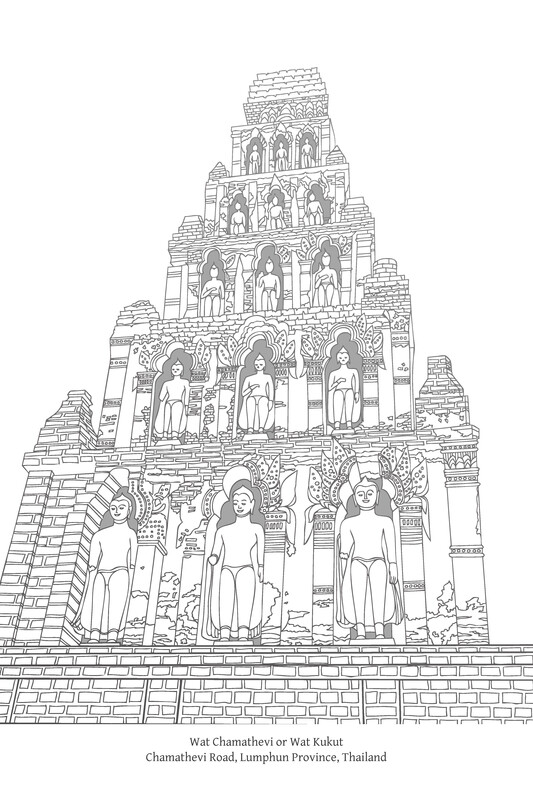

第十八章：禅定道支

# 第十八章：禅定道支

## 导论

佛陀将八道支（八圣道）分为三组或“蕴”（khandha），即：戒蕴（sīla-khandha）、定蕴（samādhi-khandha）、[\[1\]](path-factors-of-concentration_split_001.html#fn-fn1)和慧蕴（paññā-khandha），或简称为：戒（sīla）、定（samādhi）和慧（paññā）。在此，正精进、正念和正定包含在定蕴之中。

作为一个整体，这三个要素也被称为“增上心学”（adhicitta-sikkhā），其定义为：训练心，培养精神品质，产生快乐，发展心的状态，以及精通禅定。增上心学的核心是发展和提升心的品质和潜力，这有助于过一种有德行的生活，并有利于以最佳方式运用智慧。

在最高层次上，“增上心”（adhicitta）或定指的是培养止（samatha）的方法以及各种止禅方法。但在一般而全面的意义上，增上心或定涵盖了所有能够使人心平静、使人坚定于德行、激发热情以及在培养善法中产生毅力的方法和手段。

## 正精进

正精进（sammā-vāyāma）是八圣道的第六个要素。经文对正精进的定义如下：

> 诸比丘，何谓正精进？在此佛法与律中，比丘生起有益的热忱，精勤努力，提起精神，奋斗不懈，决心阻止未生起的邪恶不善法生起。生起有益的热忱，精勤努力，提起精神，奋斗不懈，决心断除已生起的邪恶不善法。生起有益的热忱，精勤努力，提起精神，奋斗不懈，决心促使未生起的有益善法生起。生起有益的热忱，精勤努力，提起精神，奋斗不懈，决心使已生起的有益善法持续、不消失、增长、圆满、兴盛和成就。D. II. 311；M. I. 62；M. III. 251-2；Vbh. 105, 235。

《阿毗达摩》提供了额外的定义：

> 什么是正精进？是心精进（viriyārambha）的策发；是进展、坚持、决心、努力、勤勉、持续、坚定、恒常；是稳步前进，不放弃热情，不疏忽工作，勇于承担责任；是精进、精进根、精进力、平衡的精进；是道支之一、与道相应的精进觉支。这就称为正精进。Vbh. 107, 237。

在这些定义中，请注意善的意欲（chanda；‘善的欲望’）的重要性，它是正精进的先导，是一切可敬的坚持的精髓。{755}

上述经文中的正精进定义，将其分为四个要素，也称为“正勤”（sammappadhāna）[\[2\]](path-factors-of-concentration_split_001.html#fn-fn2)或四正勤（padhāna），[\[3\]](path-factors-of-concentration_split_001.html#fn-fn3)这四种正勤各有其特定名称，如下：

1.  Saṁvara-padhāna：防止或警惕（未生恶法）的正勤。
    
2.  Pahāna-padhāna：舍弃或断除（已生恶法）的正勤。
    
3.  Bhāvanā-padhāna：培育或发展（未生善法）的正勤。
    
4.  Anurakkhanā-padhāna：保护、守护或增长（已生善法）的正勤。
    

这四种精进有时通过举例来解释：[\[4\]](path-factors-of-concentration_split_001.html#fn-fn4)

1.  Saṁvara-padhāna：当比丘用眼睛看见色法时，他不会执取其相和特征（他不被其主要和次要的特征所吸引）。他修行是为了抑制诸根，因为当诸根不受抑制时，就会导致贪婪和厌恶等不善心法压倒内心。他守护眼根，对眼根保持自制（耳闻声、鼻嗅香、舌尝味、身触触、意知法也是如此）。
    
2.  Pahāna-padhāna：比丘不容许已生起的欲念、瞋恚念、恼害念以及邪恶不善法继续存在；他舍弃它们，减少它们，使它们毁灭，令它们无余。
    
3.  Bhāvanā-padhāna：比丘修习七觉支，这些觉支依止于离、无欲和灭，并倾向于解脱。
    
4.  Anurakkhanā-padhāna：比丘培育“定相”（samādhi-nimitta），即六种“想”（saññā）。[\[5\]](path-factors-of-concentration_split_001.html#fn-fn5)
    

精进是佛教中一项至关重要的品质，这从正精进是八圣道中常需作为其他道支支持的三个要素之一（与正见、正念并列）这一事实中显而易见。[\[6\]](path-factors-of-concentration_split_001.html#fn-fn6)在经典中几乎所有的精神要素组合中都包含精进，以不同的巴利语术语来表示。[\[7\]](path-factors-of-concentration_split_001.html#fn-fn7)佛陀的以下段落证实了精进的重要性：

> 此法是为精进者，非为懈怠者。A. IV. 233。

> 诸比丘，我清楚地知道两件事的价值：对已达成的善法心不满足。不懈地精进努力。因此，你们应当如此修行：‘愿我发起不懈的精进。即使只剩下我的皮、腱、骨；即使我身体的肉都干枯了；我也不会停止精进，直到我已通过男子的力量、男子的精进、男子的努力获得一切可获得之物。’你们应当这样训练自己。{756} A. I. 50。

除其他原因外，反复强调精进源于佛教的一个基本原则：真理是自然的一个面向，或作为自然法则而存在。佛陀（‘导师’——satthā）的作用是发现这个真理，然后将其揭示给他人。修行的成果是根据自然因缘无偏地发生的；它们并非由导师所产生。因此，人们必须依靠自己的力量和精进努力并产生结果；他们不应该在不付出努力的情况下期望或恳求期望的结果，正如《法句经》中的这首偈颂所证实：

> 觉悟者只能指明道路；  
> 你们必须自己精进。Tumhehi kiccaṁ ātappaṁ akkhātāro tathāgatā. 《法句经》276偈。

精进努力类似于发展其他精神品质；所有这些品质都必须以整合的方式培养，而不是孤立地培养。当精进已在心中妥善准备并整合后，一个人就能将其表达为外部世界的具体行动。这并非仅仅是产生一个精进的愿望，然后随意地在努力中施加体力，这可能会导致过度劳累并产生非常有害的后果。

因此，精进必须与其他精神品质和谐一致，最显著的是正念和正知。一个人要带着理解和觉知行事。一个人要做出平衡的精进，既不过紧也不过松，正如经文中的这个故事所描述的：

昔日，尊者Soṇa居住在王舍城附近的尸陀林中。他在修行中付出了极大的精进，进行经行（caṅkamana），直到双脚脚底都起泡流血，但却没有成功。于是他有了这个念头：

> 我是世尊最精进的弟子之一，但我的心尚未从诸漏中解脱，也未摆脱执著。我的家庭现在很富有，我可以用我的财富做功德。那么，让我放弃修学，利用我的财富去做功德吧。

佛陀知道Soṇa在想什么，便前来与他交谈：

> ‘Soṇa，你刚才不是在想放弃修学吗？’‘是的，世尊。’‘告诉我，Soṇa，你早年在家时，难道不擅长弹琵琶吗？’——‘是的，世尊。’‘那么，Soṇa，当你的琵琶弦绷得太紧时，你的琵琶调音良好且容易弹奏吗？’——‘不，世尊。’‘当你的琵琶弦太松时，你的琵琶调音良好且容易弹奏吗？’——‘不，世尊。’{757}‘但是，Soṇa，当你的琵琶弦既不太紧也不太松，而是调整到均匀的音高时，你的琵琶调音良好且容易弹奏吗？’——‘是的，世尊。’‘同样地，Soṇa，如果精进施加得过于用力，会导致掉举，如果精进过于松懈，会导致懈怠。因此，Soṇa，保持你的精进平衡，理解诸根的平衡，[\[8\]](path-factors-of-concentration_split_001.html#fn-fn8)并保持这种平衡的意象（nimitta）。’Vin. I. 181-2; A. III. 374-5。

尽管作为道支之一的正精进是一种内在品质，但为了使其有效并得到发展，它必须依赖于与外部世界的互动。这包括一个人如何回应各种感官印象，以及通常如何行为、生活和参与各种活动。它也包括一个人的环境如何以有利和不利的方式影响他的精进和相关精神因素的培养。

在佛法修行中，所付出的精进（称为padhāna——‘正勤’），以外部行动的形式显现并被赋予系统化的形式，与特定的环境因素，如身体、自然环境和社会，是相互关联和依赖的。因此，佛教教义强调外部环境因素对于培养道德生活和实现佛教最高目标的重要性：

> 诸比丘，有这五种精进者的品质（padhāniyaṅga）。哪五种？即：比丘有信，他对如来正等正觉有信心，如此：‘因为这些原因，世尊是阿罗汉，正等正觉者……是阐明和传播佛法者。’他没有疾病和痛苦的障碍；他拥有平衡的消化能力，食物既不过冷也不过热，而是中等且适合精进的。他不夸耀或欺骗；他对导师和他在梵行中的谨慎同伴展现真实的自己。他精进于舍弃不善法和圆满善法，坚定、坚持、恒常，不懈怠于培养善法。他有智慧；他拥有对生灭的智慧，这种智慧是高尚而有洞察力的，并导向苦的完全毁灭。{758} D. III. 277; M. II. 95; A. III. 65; A. V. 15。

> 诸比丘，有这五种不利于精进的场合。哪五种？即：比丘年老，被老年所压倒。比丘生病，被疾病所压倒。发生饥荒，作物歉收，食物难以获得，乞食难以维持生计。危险普遍存在，有森林土匪抢劫土地的骚乱，乡下人驾车逃跑。僧团分裂；当僧团分裂时，有相互谴责、指责、诋毁和排斥；然后那些没有信心的人不生信心，一些有信心的人则变得不一样。诸比丘，有这五种有利于精进的场合。哪五种？：比丘年轻，年少，黑发，拥有青春的福报，处于生命的黄金时期。他没有疾病和痛苦的障碍……一个食物充足、作物丰收、食物容易获得且乞食容易维持生计的时期。一个人们和谐共处，如同水乳交融，彼此珍爱，不争吵，而是友善相视的时期。一个僧团安住的时期——和谐，相互欣赏，没有争议，同诵一法；当僧团和谐共处时，就没有相互谴责、指责、诋毁和排斥；然后那些没有信心的人生起信心，有信心的人则在信心上增长。A. III. 66。

## 正念

### 定义

正念（sammā-sati）是在三摩地或‘增上心学’（adhicitta-sikkhā）分类中的第二个要素。[\[9\]](path-factors-of-concentration_split_001.html#fn-fn9)经文对正念的定义如下：

诸比丘，什么是正念？这就称为正念：此佛法和律中，比丘：

1.  于身随观身，热忱、正知、具念，离世间之贪与忧。
    
2.  于受随观受，热忱、正知、具念，离世间之贪与忧。
    
3.  于心随观心，热忱、正知、具念，离世间之贪与忧。
    
4.  于法随观法，热忱、正知、具念，离世间之贪与忧。[\[10\]](path-factors-of-concentration_split_001.html#fn-fn10) {759}
    

《阿毗达摩》提供了另一个定义：

> 什么是正念？念是持续的忆念和省察；\[或\]念是忆念、记忆、不消退、不遗忘的状态。念是念根、念力、平衡的觉知、道支之一、与道相应的念觉支。这就称为正念。Vbh. 107, 237。

上述经文中的正念定义是四念住教法的一部分。此教法中的四个要素各有其简称：

1.  Kāyānupassanā（身随观；观察身体的本质）。
    
2.  Vedanānupassanā（受随观；观察感受的本质）。
    
3.  Cittānupassanā（心随观；观察心的本质）。
    
4.  Dhammānupassanā（法随观；观察心法〔法尘〕的本质）。（参见“Dhammānupassanā的含义”注释）
    

Dhammānupassanā的含义

> 译者：佛教徒之间对于dhammānupassanā的含义似乎存在相当大的困惑。（该术语的翻译范围从：“观心法”、“观诸法本性”、“观现象”、“观真实本性”到“观心理品质”。）因此，我拜访了尊敬的作者，试图澄清对此事的一些疑虑。巴育陀尊者（Ven. Phra Payutto）的简要答复如下：基本上，dhammānupassanā一词确实指“心法”——指思想和省察。佛陀之所以选择正式教法（例如七觉支、五盖等）的例子，是因为这些特定类型的省察有助于觉悟。第四个satipaṭṭhāna与第三个相关联：例如，一个人可能洞察到心受贪欲支配的事实（cittānupassanā），然后观照贪欲的本质，比如说它是五盖之一的表现。四心蕴（khandha）之所以不构成念住之一，是因为这些蕴在某种意义上更为抽象：它们更难被意识“捕捉”。这四种satipaṭṭhāna更为实用——它们更容易被观察到，并且处理的是日常现象。

在四念住的语境下审视正念之前，重要的是对sati（‘念’）这个术语有一个基本的理解。

### 作为不放逸的念

> （sati的英文翻译包括：mindfulness（念）、attentiveness（专注）、和detached watching（无著地观察）。appamāda的翻译包括：heedfulness（不放逸）、watchfulness（警惕）、earnestness（认真）、diligence（精勤）、zeal（热忱）、carefulness（小心）、non-neglect of mindfulness（不忽视正念）、和non-negligence（不懈怠）。）

Sati最简单的翻译是‘忆念’，但这样的翻译可能传达出它仅仅是记忆的一个方面。虽然记忆无疑是sati功能的一个有效元素，但它未能完全公正地表达该术语的本质含义。作为一种否定，除了‘不遗忘’的含义外，sati也指‘不粗心’、‘不懈怠’、‘不散乱’、和‘不迷惑’。心既不迷失也不懈怠；相反，它是专注和警觉的。这些否定指向了谨慎、明辨自己的责任、专注自己的行为以及准备接受事物并意识到如何与它们互动等积极品质，从而产生警觉和关怀。

念的功能常被比作看门人，他持续关注进出城门的人，允许合适的人进出，同时禁止不合适的人。因此，念在伦理领域中至关重要。它规范人们的行为，并通过阻止人们沉溺于恶行和防止不善法侵入内心来帮助保护和抑制。简单来说，念提醒我们行善，不给恶法任何立足之地。

佛教教义在道德行为的各个层面都非常重视正念。以正念持续主导自己的生活或佛法修行被称为appamāda，即不放逸。不放逸在伦理体系的进步中具有核心重要性，通常被定义为“以不间断的觉知生活”。{760}这可以引申为：持续的关怀和谨慎，不让自己误入歧途；不错过任何改善的机会；清楚地意识到哪些事情需要做，哪些不需要做；不懈怠；以及以真诚和不屈不挠的精进完成日常任务以求进步。可以说appamāda是佛教的责任感。

不放逸被归类为“内在因素”，如理作意（yoniso-manasikāra）亦然。这两个因素可以与一个相同的外部对应物配对：与贤良朋友交往（kalyāṇamittatā）。佛陀描述不放逸的言语有时与他描述如理作意的言语重叠，因为这两种品质同样重要，尽管它们在应用上有所不同。

如理作意是智慧要素，是实际应用的工具。而不放逸则是禅定要素；它是主导如理作意之运用、促使其使用并不断激励人进一步进步的。

不放逸在道德行为各个层面的重要性和范围，可以从佛陀自己的以下言语中看出：

> 诸比丘，正如所有陆地动物的足迹都融入象的足迹，而象的足迹被宣告为其中之首，即就其大小而言，同样地，所有存在的善法都以不放逸为根，汇聚于不放逸，而不放逸被宣告为其中之首。S. V. 43; A. V. 21-22。我未曾见过有任何其他事物，能如此有效地导致未生善法生起、已生不善法消退，如不放逸者。在不放逸者身上，未生善法将生起，已生不善法将消退。A. I. 11。我未曾见过有任何其他事物，能如此有助于大利益，如不放逸……。A. I. 16。我未曾见过有任何其他事物，能如此有助于正法的安定、不消失、不隐没，如不放逸。A. I. 16-17。就内在因素而言，我未曾见过有任何其他因素，能如此有助于大利益，如不放逸。A. I. 17-18。正如黎明是日出的前兆和先驱，同样地，成就于不放逸是比丘八圣道生起的前兆和先驱……。{761}大力协助八圣道生起的主要品质就是成就于不放逸……。我未曾见过有任何其他事物，能藉由它使未生的八圣道生起，使已生的八圣道繁荣和圆满，如同成就于不放逸……。当比丘不放逸时，他将发展和培养这八圣道，这是可以预期的。S. V. 30, 32-3, 35-7, 41-45。诸比丘，应在四件事上培养不放逸。哪四件事？你们应当舍弃不道德的身行，培养有道德的身行，并且对此不懈怠。你们应当舍弃不道德的语行，培养有道德的语行，并且对此不懈怠。你们应当舍弃不道德的意行，培养有道德的意行，并且对此不懈怠。你们应当舍弃邪见，培养正见，并且对此不懈怠。如果比丘已舍弃不道德的身行，培养有道德的身行……舍弃邪见，培养正见，他就不畏惧死亡的逼近。A. II. 119-20。

> 诸比丘，比丘应当以四种方式独自培养不放逸，以念守护内心：‘愿我的心不怀有对任何引起贪欲之物的贪欲……。’‘愿我的心不怀有对任何引起瞋恚之物的瞋恚……。’‘愿我的心不被任何引起迷惑之物所迷惑……。’‘愿我的心不被任何引起迷恋之物所迷恋……。’当比丘的心不对引起贪欲之物怀有贪欲，因为他已离贪，当他的心不怀有瞋恚……当他不迷惑……当他不迷恋时，他将不会动摇、颤抖、退缩或因恐惧而战栗，他将无需相信任何人，甚至出家者的话。A. II. 120。波斯匿王：尊者，有没有一件事能确保两种善，即与现世相关的善（或可见的善）和与未来相关的善（或精神的、不显著的善）？佛陀：有。波斯匿王：那件事是什么？佛陀：不放逸，大王。S. I. 86; A. III. 364。正是如此，大王！我善说之法是为拥有善友、善伴侣、善同伴者而说，而非为拥有恶友、恶伴侣、恶同伴者而说……。事实上，善友谊等同于整个梵行。因此，大王，你应当如此训练自己：‘我将拥有善友、善伴侣、善同伴与我交往。’大王，当你有善友、善伴侣、善同伴时，你应当以一件事为依止而住：在善法中的不放逸。{762}大王，当你以不放逸为依止而精勤住时，你的宫女们……贵族随从……士兵……城乡百姓将如此想：‘国王以不放逸为依止而精勤住。来吧，我们也以不放逸为依止而精勤住吧。’大王，当你以不放逸为依止而精勤住时，你自身将得到守护和保护，你的宫女随从将得到守护和保护，\[甚至\]你的宝库和仓库也将得到守护和保护。S. I. 87-9。

即使佛陀在最终般涅槃（parinibbāna）之前所说的最后遗言也与不放逸有关：

> 一切有为法皆是坏灭法；当以不放逸努力以达到目标。D. II. 155-6。

### 念的社会价值

在以下引自《Sedaka经》的引文中，佛陀描述念（sati）利益的言语揭示了其含义与不放逸（appamāda）在实践上的紧密联系。除了阐明这两种品质的含义，此经还揭示了佛教对人与社会关系的看法。佛教教义认为个体内在的生活与外部世界——即社会——是密切相连的。一个人生命的这两个方面是不可分离的：

> 诸比丘，往昔，一位杂技演员竖起他的竹竿，对他的学徒说：‘来，爬上竹竿，站在我的肩膀上。’学徒同意了这个请求，爬上竹竿，站在老师的肩膀上。然后杂技演员对学徒说：‘你保护我，我保护你。这样，我们彼此守护，彼此保护，就能展示我们的技艺，收取报酬，并安全地从竹竿上下来。’当说完这些话时，学徒回答说：‘师父，这不是办法。您保护您自己，老师，我保护我自己。这样，各自自护自保，我们就能展示我们的技艺，收取报酬，并安全地从竹竿上下来。’在这种情况下，这是正确的方法。正如学徒对老师所说。当想‘我将保护自己’时，必须运用念住；\[同样地\]，当想‘我将保护他人’时，也必须运用念住。诸比丘，保护自己，就是保护他人；保护他人，就是保护自己。那么，如何通过保护自己来保护他人呢？通过持续的练习、培养和增强。就是以这种方式，通过保护自己来保护他人。那么，如何通过保护他人来保护自己呢？通过忍耐、无害、慈爱和悲悯。就是以这种方式，通过保护他人来保护自己。当想‘我将保护自己’时，就运用念住；当想‘我将保护他人’时，就运用念住。诸比丘，保护自己，就是保护他人；保护他人，就是保护自己。{763} S. V. 168-9。

### 用于智慧发展和消除心垢的念

不放逸（appamāda）指的是无缝的觉知，以持续的正念生活。不放逸使人小心谨慎；它防止人误入歧途或有害的方式。它导致自我克制，告诫人不要迷恋和放纵。它敦促人不要自满；它促使精进，并鼓励人持续发展精神修行。它使人不断意识到自己的责任，提醒人哪些需要做，哪些不需要做，哪些已完成，哪些尚未完成。它还帮助人以谨慎和精确的方式完成各种任务。因此，如前所述，不放逸在伦理体系中具有重要意义。

不放逸作为念的一种表现，在一个人的一般生活行为中具有广泛的意义。广义而言，它适用于从戒行（sīla）阶段到禅定（samādhi）阶段。在这些阶段，念与大量的其他精神品质相关联，特别是精进（vāyāma），念在任何时候都与之结合。

然而，如果仅从智慧发展过程（运用智慧净化心）中心的角度来看，不放逸（appamāda）并不直接参与，而是从外部给予专注的支持和鼓励。在这个阶段，注意力仅限于心的运作，在刹那间的分析中精细地辨别存在的各种现象。正是在这个阶段，念充分投入并发挥着突出作用，并以其特定名称：sati来指代。[\[11\]](path-factors-of-concentration_split_001.html#fn-fn11)

对sati本质、独特含义的理解，可以通过审视其在某些场合的功能来获得，在这些场合，它的作用与其他精神因素有明显的区别，最显著的是在被称为四念住（satipaṭṭhāna）的修行中。在这种场合，念的功能可以概括如下：

念的主要功能是防止心散乱；它不让感官印象未经注意地溜走。它警惕心不在焉。它是专注的，仿佛眼睛一直盯着每一个进入意识的印象，然后将其牢牢抓住。当一个人希望专注于特定对象时，念能使注意力固定在其上，不让对象溜走或消失。通过sati，人不断地忆念对象并将其铭记于心。[\[12\]](path-factors-of-concentration_split_001.html#fn-fn12)

念的一个比喻是柱子，因为它牢固地嵌入其注意对象中。另一个比喻是守门人，因为它看守着各种感官之门，感官数据通过这些门，检查所有进入的东西。sati生起的‘近因’（padaṭṭhāna）是对对象的坚定而清晰的想（saññā）。或者，近因是以下将讨论的四念住（satipaṭṭhāna）中的任何一个。

从伦理学的角度来看，可以辨别念的否定和积极两方面。作为否定因素，念守护着心；它抵御心的散乱，保护人免于犯错，并防止人陷入不良的心态或境地。它不给不善法进入内心的任何机会，并防止思想的滥用。

从积极方面来看，念引导着意识流、思想流，乃至一个人所有的行动，使其遵循预期的方向。它使心系于所选择的对象。因此，它是抓住注意对象的工具，如同将其置于心前供审视。{764}

在佛教修行之道中，非常强调念的重要性。事实上，佛陀说念在每种情况下都是必需的。念被比作盐，每道咖喱都必须用；也被比作首相，参与政府的每一个部门。念可以根据情况的需要来抑制或支持心。[\[13\]](path-factors-of-concentration_split_001.html#fn-fn13)

考虑到上述念的特质，我们可以看到发展念的益处如下：

*   能够通过监控认知过程和思想流来维持和守护期望的心境；一个人只接受那些对心有利的，并排除所有不利的。此外，通过调节和止息思维过程，一个人有助于达到禅定（samādhi）。
    
*   身体和精神上的自由，以及‘自给自足’；身心本质上是安乐和放松的，准备好应对各种情况，并能够有效地处理世间的事物。
    
*   在禅定状态下，能够引导认知过程和思想流，并扩展它们的活动范围。
    
*   智慧根的审视以最佳的清晰度进行。通过抓住一个禅修对象，并仿佛将其置于心前供后续审视，念充当了一个基础，在此基础上智慧可以得到发展和圆满。
    
*   身体、言语和心的一切意愿行为的净化；摆脱了贪爱和执著的污染影响。伴随着正知（sampajañña），念确保一个人的行动是由智慧——由纯粹、理性的辨别力——所引导。
    

上述最后两项益处是精神发展高级阶段的目标，并通过被称为四念住（satipaṭṭhāna）的规定修行方法获得。

### 四念住语境下的正念

Satipaṭṭhāna可以翻译为‘念住’或‘念的建立’（即念的监督或引导）。技术上，这个术语指的是运用念以产生最佳效果的方法，正如佛陀在《大念处经》（Mahāsatipaṭṭhāna Sutta）中的话所指出的：

> 比丘们，这是众生清净、超越忧愁和悲叹、止息苦与忧、证得正道、证悟涅槃的主要途径——即是四念处。[\[14\]](path-factors-of-concentration_split_001.html#fn-fn14) D. II. 290; M. I. 55-6.

修习四念处是一种非常流行且受人敬重的佛法修习方法。它被认为同时包含止禅 (samatha) 和观禅 (vipassanā)。修行者可以先修习止，直至证得禅那 (jhāna) （参见下一节关于禅定的内容），然后再以四念处为基础修习观禅并达到最终目标。或者，修行者也可以主要以观禅（同样以四念处为基础）为修习形式，只依靠达到任务所需的基本定力，然后达到最终目标。{765}

观禅 (vipassanā) 是佛教修习的重要原则，尽管广受讨论，但也被广泛误解。以下对念处 (satipaṭṭhāna) 的探讨，尽管简短，但将有助于阐明毗婆舍那 (vipassanā) 的含义，包括其基本特质、适用范围和多功能性，以及在日常生活中修习观禅的可能性和益处。

四念处概述如下：

1\. 身随观 (Kāyānupassanā)：观照身体；身念住：

1.  安般念 (ānāpānasati)：前往僻静处，以适合禅修的姿势坐下，建立正念，并专注於入息和出息的各个方面。
    
2.  身姿念住 (iriyāpatha)：清楚觉知身体当前的‘模式’或姿势，例如站立、行走、坐下或躺卧。
    
3.  正知 (sampajañña)：在每项活动中都保持正知，例如：向前移动、环顾四周、伸展手臂、穿衣、喝水、进食、咀嚼、小便、大便、醒来、入睡、说话和保持沉默。
    
4.  不净观 (paṭikkūla-manasikāra)：观想身体，从头顶到脚底，是各种不净成分的聚集处。
    
5.  界作意 (dhātu-manasikāra)：通过将身体分解为四界（地、水、火、风）来观想。
    
6.  九种墓园观 (nava-sīvathikā)：观察处于九种不同腐烂阶段的尸体，从新死的尸体到只剩下碎骨的尸体。在每种情况下，都要反思自己的身体也终将遭遇同样的命运。
    

2\. 受随观 (Vedanānupassanā)：受念住 (vedanā；感受)：当乐受、苦受或不苦不乐受生起时，无论它是有物质依的 (sāmisa) 还是无物质依的 (nirāmisa)，都要如实地、清楚地觉知它在当下存在的状况。

3\. 心随观 (Cittānupassanā)：心念住；观照心在任何特定时刻的状态。例如，清楚地觉知心是贪婪的还是离贪的，是愤怒的还是离嗔的，是迷惑的还是离痴的，是散乱的还是集中的，是解脱的还是被束缚的等等。

4\. 法随观 (Dhammānupassanā)：法念住：

1.  盖 (nīvaraṇa)：[\[15\]](path-factors-of-concentration_split_001.html#fn-fn15) 在每个当下清楚地觉知五盖中是否有任何一个存在于心中；清楚地觉知未生起的盖如何生起，已生起的盖如何被舍弃，以及已被舍弃的盖如何被防止再次生起。
    
2.  蕴 (khandha)：清楚地理解五蕴；了知每一蕴的自性；了知每一蕴如何生起和如何灭去。{766}
    
3.  处 (āyatana)：清楚地理解六内处和六外处；理解依处而生起的烦恼结 (saṁyojana)；了知未生起的结如何生起，已生起的结如何被舍弃，以及已被舍弃的结如何被防止再次生起。
    
4.  觉支 (bojjhaṅga)：[\[16\]](path-factors-of-concentration_split_001.html#fn-fn16) 在每个当下清楚地理解七觉支中是否有任何一个存在于心中；了知未生起的觉支如何生起，以及已生起的觉支如何能被圆满。
    
5.  圣谛 (ariya-sacca)：清楚地觉知四圣谛的自性。
    

在《大念处经》中，以上每一句的末尾都有一个相同的副歌：

> 比丘住于内身随观身（即自己的身体），或住于外身随观身（即他人的身体），或住于内外身随观身。或者他住于身中随观生起之法，或住于身中随观灭去之法，或住于身中随观生起与灭去之法。确实，他建立‘有身’的念住於前，唯为智与忆念所需。并且他住于独立，不执著世间任何事物。[\[17\]](path-factors-of-concentration_split_001.html#fn-fn17)

### 念处的要旨

从上述描述中可以看出，四念处 (satipaṭṭhāna) 的修习（这包括毗婆舍那的修习）不需要从社会隐退到僻静处，也不需要固定的时间表。因此，佛教教义鼓励在日常生活中修习和融入它。

本质上，四念处的教导描述了我们生活中需要正念 (sati) 指导和监督的四个领域，即：(1) 身体和身体行为；(2) 各种乐受和苦受；(3) 各种心境；和 (4) 思想和反思。维持在这四点的正念有助于确保一个没有危险和痛苦的生活，而这种修习最终将证悟究竟真理。

从上面四念处的概述中可以明显看出，在修习中，正念绝不是单独应用的，而是总是与其他精神因素结合使用。其中一个因素，在正念 (sati) 的标准经文定义（上文）中没有特别提及，那就是禅定 (samādhi)，它必须存在，至少以一种微弱的形式，足以完成手头的任务。[\[18\]](path-factors-of-concentration_split_001.html#fn-fn18) 特别且经常提及的因素包括：

*   ātāpī：‘精进’，‘努力’；这指的是正精进 (sammā-vāyāma)，八圣道的第六个支分，它包括防止和舍弃不善法，以及培养和保护善法。
    
*   sampajāno：‘正知’，‘完全觉知’ (= sampajañña)；这指的是智慧 (paññā)。
    
*   satimā：拥有正念 (sati)；这指的是正念的要素本身。{767}
    

在经文中，sampajañña 一词通常与 sati 一词并列出现。由于 sampajañña 指的是智慧，因此正念的训练是智慧发展的一部分。正知是对正念所专注的事物或活动的清晰透彻的理解：一个人理解它们的本性和目的；一个人知道如何与它们相处，摆脱妄想和误解。

随后的短语‘离世间的贪欲和忧愁’（见上文正念的定义）展示了拥有正念和正知所产生的心态。一个人是平等且独立的，不受烦恼的束缚，既不被贪爱所动摇，也不被嗔恚所动摇。

在结束的副歌中，‘他随观生起和灭去’这句，指的是在三法印的光照下理解事物，从而生起对事物如实存在的感知和体验。例如，‘他建立“有身”的念住於前’这句，指的是如实地觉知身体，不以假设和珍视的信念来包装它，不将其标记为‘人’、‘自我’、‘他’、‘她’、‘我’或‘我的’。这种态度是一种自由和独立，因为它不依赖於外部条件，并且通过贪爱 (taṇhā) 和执取 (upādāna) 而免于执著。

在此背景下，让我们审视一些重要的巴利语术语的含义：

Kāye kāyānupassī：‘身中随观身’。这是标准的字面翻译，很容易引起误解。在这里可以理解译者的难处，因为有时要传达一些巴利语术语和短语的清晰简洁含义是极其困难的。这个短语指的是在任何时候都准确地辨识身体仅仅是身体，只不过是各种器官和组成部分的集合或组合。一个人不把身体看作‘他’、‘她’、‘我’、‘约翰’或‘苏珊’等等，也不把它看作属於任何人，比如‘我的’或‘他的’；当看头发或脸时，一个人如实地看待它们，而不是看作‘男人’或‘女人’。

换句话说，一个人直接按照真相看待，与身体的实际状态相符；所看到的东西与所观察到的东西相符，也就是说，一个人看着身体，就看到身体，而不是看着身体却看到‘史密斯先生’或某个令人厌恶的人或某个有魅力的人。这与古老大师的说法一致：‘人看而未见。人的视觉被扭曲，看到的是别的东西。未见者，受迷惑。受迷惑者，不能解脱。’ (参见附注：身中随观身)

身中随观身

> DA. III. 756; MA. I. 241; VbhA. 217. 批注对‘身中随观身’这一表达提供了四到五种不同的解释，其中大多数都指向一个人的注意力焦点。例如：不以混淆的方式感知事物——将身体看作身体；而不将感受、心境或法作为身体来看。另一种解释是将身体内的辅助性身体部分看作一个整体；这是一种解剖或分析身体的方式，直到一个人辨识出身体除了辅助性部分的集合之外别无他物；没有‘阿迪森先生’或‘巴特利特夫人’。它是对一个集合单位的分析，或对一团聚集物的解开，就像剥开香蕉树的叶子和叶鞘，直到看到实际上没有那样的树。（‘受中随观受’、‘心中随观心’和‘法中随观法’也应作如是理解。）

Ātāpī sampajāno satimā：‘精进、正知和正念’。这指的是正精进 (sammā-vāyāma)、正见 (sammā-diṭṭhi) 和正念 (sammā-sati)，它们是八圣道中三个恒常的因素，必须始终结合道的各个方面的发展来应用：[\[19\]](path-factors-of-concentration_split_001.html#fn-fn19)

1.  精进能使心充满活力；它防止心变得气馁或沮丧，防止心动摇、懈怠或退缩，并且不给不善心所生起的机会。它是一种敦促心继续前进的力量，并促进善法的增长。{768}
    
2.  正知等同於智慧，它能穿透正念所专注对象的真实本性，并防止对它们产生迷惑。
    
3.  正念是在每个当下将注意力固定和保持在对象上，防止遗忘和混淆。
    

Vineyya loke abhijjhā-domanassaṁ：‘离世间的贪欲和忧愁’。这个短语指的是解脱对喜爱和厌恶的贪爱和嗔恚。通过这样修习，心是广阔而明亮的；贪爱和嗔恚都无法压倒心。

Atthi kāyoti vā panassa sati paccupaṭṭhitā hoti yāvadeva ñāṇamattāya paṭissatimattāya：‘他建立“有身”的念住於前，唯为智与忆念所需。’一个有正念的人清楚而准确地知道身体仅仅是身体；他不会将其误认为是众生、个人、男人或女人，或‘自我’、‘我的’或‘你的’。这种反思的目的是为了知识和忆念，为了发展正念、正知和智慧，并防止虚妄的戏论。同样的思惟也适用于感受、心和法。

Anissito ca viharati：‘他住于独立。’这指的是一颗自由的心，不被任何条件所束缚；一个人不需要将自己托付给任何事物或任何人。从技术上讲，一个人不依止或依靠贪爱 (taṇhā) 和见 (diṭṭhi)。当认知某物时，一个人如实地直接体验它。一个人不会诉诸贪爱和见来渲染和美化体验，让自己陷入遗忘，或支配自己的思想、反思和整体福祉。

Na ca kiñci loke upādiyati：‘他不执著世间任何事物。’一个人不执取或执著於任何事物，无论是色、受、想、行或识，都不将其视为自我或属于自我 (attaniya)。

Ajjhattaṁ vā... bahiddhā vā....：‘或内或外’。学者们对这个短语的解释有所不同，但注释者的共识是，‘内’指自己，‘外’指他人。[\[20\]](path-factors-of-concentration_split_001.html#fn-fn20) 这种解释与阿毗达磨论典相符，这些论典阐明了这些术语的含义，例如：‘比丘如何於心观心於外？在此，当他人的心是贪婪的，他清楚地觉知事实就是如此。’[\[21\]](path-factors-of-concentration_split_001.html#fn-fn21)

有些人可能会质疑，探究和窥探他人的心是否恰当，以及这是否可能。对这个问题的简要回答是，佛陀鼓励我们对所遇到的一切事物运用正念，并如实地看待这些事物。{769} 在日常生活中，我们必须与他人互动，而且我们应该正念地这样做。我们应该如实地觉知他人，正如他们在我们直接的个人经验中清晰显现的那样。（如果一个人拥有阅读他人心的能力，他就会根据这种能力直接了知；如果一个人没有这种能力，那么他就不需要去探究。）这样，一个人就不会对他人执著，并生起诸如贪爱和嗔恚等不善法。没有义务去监视或窥探他人的事情。然而，如果在与他人交谈时，对方表现出愤怒的迹象，而一个人却不知道他或她的情绪状态，那如何能声称自己在修习念处并将其应用於日常生活中呢？

总而言之，四念处的发展意味着以正念 (sati) 和正知 (sampajañña) 生活，这可以防止任何由无明产生的对自我的固定认知干扰一个人的思想并引起问题。

一些西方学者将四念处的修习与当代的心理治疗方法进行比较，并得出结论认为前者提供了更好的结果和更大的益处，因为每个人都可以自行应用这种修习，并且可以在日常生活中这样做，以保持健康的心理状态。[\[22\]](path-factors-of-concentration_split_001.html#fn-fn22)

现在，让我们回到四念处的总结，但这次是使用一种当代的分析模式。

### 四念处：修习之道

四念处修习中的组成因素是双重的：被动的（被专注、被观察、被辨识的），和主动的（观察、关注、洞察的行为）。

*   被动的组成部分是那些我们所有人共有的普通、世俗的事物：身体及其运动、思想、感受等，它们在当下的觉知中存在或显现。
    
*   主动的组成部分是正念 (sati) 和正知 (sampajañña)，它们是四念处修习中的主要因素。这两种作用力毫不动摇地、不分心地专注和观察心中存在的事物。
    

正念 (sati) 是抓住所选对象的心所；正知 (sampajañña) 是智慧的心所，它清楚地辨识所考察对象的本性和目的。例如，在行走时，一个人正念地完全专注于身体的动作，同时清楚地知道行走的原因、预定的目的地以及与行走相关的因素。此外，正知如实地理解对象或行动，不将其涂上喜爱和厌恶的色彩。

这里有一个需要解决的语言学问题。有些人将 sati 的常见定义误解为‘忆念’，将 sampajañña 的定义误解为‘自我觉知’，导致修习上的误导。他们将正念建立在自我感上，然后产生自己是各种行为的主体的印象，想着‘我正在做这个’，‘我正在做那个’；结果他们创造或强化了自我概念。他们沉迷于这种自我形象，并发展出一种心的僵硬。至少，他们的心没有真正专注于活动，因此他们的努力没有结果。{770}

容易产生这种误解的人应该回顾 sati 的定义是‘铭记’、‘持续专注于手头的对象或任务’以及‘持续关注事件的流动’。同样，一个人应该回顾 sampajañña 的定义是‘对所专注对象的清楚理解’或‘对自己当前活动的清楚理解’。换句话说，这不是专注于自我感（‘我正在做这个’）的问题。一个人不是专注于任务的‘执行者’，而是专注于任务本身。一个人的注意力是如此地临在和集中，以至于最终没有机会让自我感干扰这个过程。

正念的本质特征是对事物的准确、不扭曲的感知。一个人看到并理解觉知对象是什么，它是如何显现的，以及它在每个当下产生什么影响。这需要不断的认知、观察、思惟和理解。一个人不对对象作出反应、评估、批评或判断它好坏、对错等等。一个人不将自己的情感、偏见或执著贴到对象上，例如说是令人愉快的或不愉快的，令人满意的或不可接受的。一个人只是辨识那个对象、条件或品质实际上是怎样的，而不补充诸如‘我的’、‘他的’、‘我们’、‘他们’、‘克拉布特里先生’、‘辛普金斯夫人’等等的想法。

以受念住 (vedanā) 为例：就在这个当下，一个人知道，例如，心理不适存在；他知道它已经生起，他知道它是如何发生的，他知道它是如何逐渐消散的。同样，一个人对‘法’ (dhammārammaṇa) 保持正念：如果担忧或焦虑生起，一个人观察这些情绪并思惟它们是如何产生的以及它们是如何展开的。如果愤怒生起，对这种愤怒本身的觉知会导致它的消散。然后一个人反思过去的愤怒，思惟它的好处、坏处、原因和终止。最终，研究、反思和考察自己的痛苦甚至可以变得令人愉快！

当它是纯粹、无杂染的苦生起和灭去，并且没有‘我的苦’或‘我正在受苦’的痕迹时，那么那个苦就被剥夺了所有伤害观照者的力量。无论何种形式的善或恶存在於外部或存在於心中，一个人都要直面它，不逃避、不规避。一个人从它生起的那一刻起，直到它自然终止，都密切关注它。这类似于观看演员表演戏剧，或作为某个事件的旁观者。这种态度可与医生进行尸检或科学家分析研究对象的态度相媲美，而不是法官在原告和被告之间解决案件的态度。这是一种客观而非主观的方法。

正念和正知的持续应用意味着活在当下。一个人在每个当下都觉知正在生起的、正在发生的，或正在做的事情；注意力不会溜走。一个人不执著或留恋於过去事件，也不飘向未来寻找尚未存在的事物。如果需要考虑一些过去的未解决事项或未来的义务，正念会抓住相关细节，智慧心所会以有目的的方式对其进行反思，从而使这些事项成为当下的觉知对象。一个人不会陷入漫无目的的思虑、怀旧的回忆或对未来的幻想。通过活在当下，一个人不被贪爱所奴役、诱惑或驱使。一个人智慧地生活，解脱了各种形式的痛苦，例如悲伤、懊悔、担忧和沮丧。这种生活方式带来了一种伴随著广阔、清晰和轻松的觉知。{771}

### 正念修习的成果

*   清净：当正念专注于所选对象，当正知如实地理解该事物时，认知和思想之流就被净化了，因为没有空间让烦恼生起。当一个人如实地辨识现象，不以情绪染着体验，不从个人偏见和喜好作出反应时，就没有执著。这是消除现有漏 (āsava) 并防止新漏生起的方法。
    
*   解脱：当心如上所述被净化时，它也得到解脱；它不被感官印象动摇或扰乱，因为它们以纯粹客观的方式被用作观照的食粮。当这些事物不被主观的烦恼误解时，它们对人就没有控制力，一个人的行为就摆脱了无意识驱动和动机的控制影响。这就是‘他住于独立，不执著世间任何事物’这句话所指的。[\[23\]](path-factors-of-concentration_split_001.html#fn-fn23)
    
*   智慧：当心如此被净化和解脱时，智慧才能最有效地运作，因为心不被情绪、偏见和偏执‘覆盖’或分散。一个人然后如实地、依照真相地看待事物。
    
*   离苦：当这种警觉和对事物的真实理解得以维持时，与纯粹的理性辨识不符的偏见性反应，无论是负面的还是正面的，都无法生起。没有贪欲 (abhijjhā) 或嗔恚 (domanassa) 的感受，并且从所有形式的焦虑中解脱。这被称为离苦，其特点是无限的清晰、轻松、平静和满足。
    

确实，这四种修习成果是相互关联的，或者它们是同一事物的不同方面。从缘起 (paṭiccasamuppāda) 和三法印 (tilakkhaṇa) 的教义来看，可以得出以下结论：起初，大多数人不知道他们所执著的所谓‘自我’最终是不存在的。人类仅仅是无数相互关联和相互依存的身心现象的连续体，这些现象不断生起、转化和消散。

当一个人不觉知这个真相时，他会反复执著於情绪、思想、欲望、习惯、观点、信念、感知等等，并认同这些。尽管由此产生的自我感经历着持续的转化，一个人仍然认为：‘我曾是那个；现在，我是这个’，‘我当时有那种感觉；现在，我有这种感觉。’

从事这种自我认同，就是被思想和感受等事物所欺骗，它们仅仅是特定时刻活跃的辅助性心所 (nāma-dhamma)。这种欺骗是错误思维的来源。因此，一个人的思想、感受和行为都被当下所执著为自我的事物的需求所驱动。

当一个人依照念处修习时，他看到特定过程中的每个物质和心所组成部分都按照其自身的本性生起和灭去。通过分析和区分这个刹那相续流的每个因素，一个人就不会被欺骗而执取事物并将其认同为‘自我’。这些事物因此失去了它们强制的力量。{772}

如果这种洞察力达到最佳的深度和清晰度，一个人就会证得解脱。心被建立在一种新的存在模式中，它是纯净、广阔的，没有心理偏见和执著。甚至一个人的个性也会改变。

这是一种完美的心理健康状态。它可与一个身体处于完美健康状态相比，当没有疾病时，其所有器官都顺畅正常地运作。确实，四念处的修习是一种清除心理疾病、彻底消除那些限制、阻碍和妨碍心的事物的方法。一个人因此准备好坚定而喜悦地面对和处理世间的一切事物。

此事可以用佛陀的以下教导来总结：

> 比丘们，有两种疾病：身体疾病和心理疾病。可以看到有些众生声称一年没有身体疾病。可以看到有些众生声称两年……三年……四年……五年……十年……二十年……三十年……四十年……五十年……一百年没有身体疾病。但是，在世间，甚至片刻声称没有心理疾病的众生，除了那些已断尽漏者，是难以找到的。 A. II. 143. 尊者舍利弗：‘居士，你的根明亮，你的容貌清净而容光焕发。你今天在世尊面前听到佛法开示了吗？’ 那拘罗父：‘为什么没有呢，尊者？刚才我被世尊的佛法甘露所润泽。’ 尊者舍利弗：‘世尊以何种方式以佛法甘露润泽你？’ 那拘罗父：‘尊者，我走近世尊，向他致敬，坐在一旁，对他说：“尊者，我老了，年迈了，岁月沉重，生命已逝，身体受苦，经常生病。我很少能见到世尊和那些令人喜悦的比丘们。尊者，请世尊训诫我，请他教导我，因为那将长期导向我的福祉和快乐。” \[佛陀回答说\]：“确实如此，居士，确实如此！这个身体是受苦的，就像一个被壳包裹的蛋一样。如果有人带着这个身体，声称即使片刻没有疾病，这除了愚蠢还能是什么呢？因此，居士，你应该这样训练自己：‘即使我的身体受苦，我的心也必将不受苦。’ ”’‘尊者，世尊就是以这样的佛法甘露润泽了我。’ {773} S. III. 2.

### 刹那觉知对观禅至关重要

人们最普通、最世俗的活动，也是他们日常生活中持续进行的活动，就是通过眼、耳、鼻、舌、身、意对感官印象的认知。认知总是伴随著感受——无论是乐受、苦受还是不苦不乐受。针对感受，心会作出反应：如果对象令人愉快，就会生起欲望和喜悦；如果对象不愉快或痛苦，就会生起恼怒和厌恶。

当喜欢某物时，一个人希望更多地体验它，重复享受，获得或拥有该对象。当不喜欢某物时，一个人希望逃避它，摆脱它或摧毁它。这个过程一直持续著，既在往往未被观察到的微细层面，有时也以明显可识别的强度发生，并对心造成清晰可辨和持久的影响。这些强烈或令人不安的体验往往会产生漫长而复杂的心理戏论，如果它们得不到解决，就会侵扰一个人所有的言语和行为。

人们的生活、他们在社会中的角色以及他们与他人的互动，主要源于这种在人类存在的每个当下都存在的与感官印象的不断接触。

不经意地任由心沉溺于快乐和舒适并抗拒痛苦和不适，会阻碍智慧的发展。一个人将被阻止辨识事物的真实本性。在这方面缺乏约束会造成以下障碍：

*   心受制于喜爱和厌恶，并卡在这些反应点上。一个人的视野因此被蒙蔽，他以偏颇的视角看待事物，而不是按照它们真实的样子。
    
*   心落入过去，或飘向未来。当一个人体验到感官印象并产生愉悦或厌恶时，心就会执着于该对象中被认为是合意或不合意的点或特征。然后，人就会对这些合意或不合意的特征产生心像，滋养它，并使其增盛。执着于某事物的特定合意或不合意的方面，并执取其概念或心像，就等同于滑入过去。随后对这些心像的心理增盛则意味着飘向未来。一个人对对象的理解——基于好恶而产生的心造心像，或对它的修饰性观念——实际上并非是对对象在当下真实存在的真正理解。
    
*   心受到增盛性思维的支配，这种思维根据一个人的个人历史或根深蒂固的习性，例如根据一个人珍视的见解、价值观和观点，来解释所感知的或所体验到的意义。心受制于这些增盛；它无法客观地、纯粹地如实看待事物。
    
*   心将新体验的修饰性心像添加到一个人先前的心理偏见和习性中，从而加剧了一个人的习惯性反应模式。
    

上述所提及的心的负面特征，不仅关乎一个人日常生活中粗糙和肤浅的事物和一般事务。佛教教义强调它们在心相续体微妙而深刻的层面上显现。正是由于它们的存在，普通的、未觉悟的众生才会被引导将事物视为稳定和真实存在的，感知其中固有的美或丑，执着于世俗谛，并忽视无所不包的因果法则。{774}

人们几乎从出生之日起，就不断累积着对存在错误感知的习性和有条件倾向，二三十年、四五十年，甚至更长的时间，从未训练自己打破错误思维的循环。因此，处理和纠正这种情况并不容易。在一个人察觉到对象的那一刻，在还没有时间稳定自己来检查这个过程之前，心就已经转换成了习惯性反应。

在这种情况下，补救措施不仅仅是切断反应循环和废除有条件的过程，还需要遏制心沿着固定渠道强烈流动的习惯性倾向和性情。

正念在此是清除障碍和调集其他修道因素的重要因素。四念处修习的目标如下：通过正念地跟上体验并如实地看到事物本来的样子，一个人就能打破迷惑思维的循环，摧毁不善的心理动态，修正旧有的制约，并在心中培养新的性情。

拥有这种念念分明觉知的心，所具备的特征与陷入不善制约之流的心所表现出的特征完全相反：

*   贪爱和嗔恨没有机会在心中生起，因为它们的出现取决于心执取并流连于对象的特定点或方面，从而陷入过去。
    
*   贪爱和嗔恨存在于心偏离当下之时。一个自由、不纠缠的心，念念观察事物的生起，其结果是它不会滑入过去，也不会飘向未来。
    
*   心不受基于过去制约的心理增盛所支配，这些增盛会导致对现象的偏颇、扭曲和有色的体验；心已准备好如实地看待事物。
    
*   心不会累积或加剧坏习惯。
    
*   当一个人关注当下生起的现象时，他会察觉到自身某些不受欢迎或未被承认的性格特征。有了正念，一个人就能如实面对这些特质，不寻求回避，也不自欺欺人。因此，一个人能够清除心中的这些杂染，并解决个人困难。
    
*   拥有恒常正念的心是不受束缚、无瑕疵的；它是纯净、明亮、宽广、喜悦和自由的。
    

万事万物都依其自性而存在和运行。打个比方，真相无时无刻不在显现，但人们却倾向于将其拒之门外；或者他们以扭曲的方式看待事物，或完全欺骗自己关于真相的本质。这种遮蔽、扭曲和欺骗的原因是沉溺于上述详述的、不顾后果地放纵于快乐和不适的有为之流中。扭曲和迷惑的因素本身就很强大；再加上习惯的强迫性和误导性力量，真正认识真相的机会几乎不存在。

由于个人习性和性情是在极其漫长的时间里逐渐累积形成的，因此纠正它们并创造一种与世界相关联的新模式的修行，也很可能需要漫长的时间。{775}

每当正念持续且熟练时——当一个人不逃避真相，不扭曲所见事物，并摆脱旧有制约的力量时——他就能准备好如实看待事物并理解真相。此时，如果其他修道根，特别是智慧，发展良好，它们将与正念联合作用，依靠正念以最有效的方式运作，从而产生“如实知见”(ñāṇa-dassana)，这是毗婆舍那修习的目标。然而，要掌握智慧（以及其他修道根），则取决于循序渐进的训练和基础学习。因此，学习和理性分析有助于真相的证悟。

### 念处滋养觉支

正念 (sati) 不同于毗婆舍那；事实上，等同于毗婆舍那的是智慧或智慧的运用。然而，正如上文所述，当正念支持和引导时，智慧才能以可靠、完全熟练的方式运作。因此，正念的发展对于毗婆舍那修习至关重要。换句话说，正念与智慧是同时发展的，或者说，修习正念是为了熟练智慧。在修行术语中，提及正念通常包括“正知” (sampajañña) 这一共同因素，它等同于智慧，而正念的力量和流畅性则取决于智慧的参与。[\[24\]](path-factors-of-concentration_split_001.html#fn-fn24)

在日常活动中伴随正念的智慧通常被称为“正知” (sampajañña)。在这个阶段，智慧在修行中仅是一个辅助因素，与正念合作协作。在这里，正念被视为主要的或突出的因素。然而，当涉及到更微妙的观察层面时，主要地位则转移到智慧，而正念则降为服务智慧的角色。智慧在此层面运作的一个例子是七觉支中的“择法” (dhamma-vicaya)。

在此，回顾本章开头介绍中道时所提及的教法似乎是恰当的，该教法描述了四念处如何滋养和支持七觉支 (bojjhaṅga)，而七觉支又如何滋养和支持正智 (vijjā) 和解脱 (vimutti)，这已通过以下段落得到证实：

> 比丘们，我宣称，解脱和究竟智有其滋养，它们并非没有滋养。而解脱和究竟智的滋养是什么呢？“七觉支”应该是答案。七觉支也有其滋养，它们并非没有滋养。而七觉支的滋养是什么呢？“四念处”应该是答案……当四念处圆满时，它们带来七觉支的圆满。当七觉支圆满时，它们带来解脱和究竟智的圆满。这就是解脱和究竟智的滋养和圆满。[\[25\]](path-factors-of-concentration_split_001.html#fn-fn25) A. V. 114.

从这段话中可以清楚地看出，七觉支产生正智和解脱；它们使道果得以实现。四念处通过滋养七觉支来提供帮助。{776}

这段话阐明了毗婆舍那修习的过程。在四念处的修行中，正念 (sati) 是恒常、基础的因素，而智慧，以正知 (sampajañña) 的名义，协同运作，通过理解正念所观察或接触的一切事物。正念专注于事物，以便正知理解它们，就像一个人可能用手抓住一个物体，以便用眼睛仔细观察它一样。

四念处作为七觉支的基础。正念专注于一个对象并将其提交给智慧，在这里智慧被称为“择法” (dhamma-vicaya)。在这个阶段，智慧是主导因素，它观察对象，就像一个人用眼睛彻底检查某物一样。这是作为觉支的智慧的过程。

无论如何，无论智慧被称为“正知”、“择法”，还是任何其他名称，如果它能导致对事物真相的证悟和心的解脱，那么它就包含在毗婆舍那（“内观”）的含义中。[\[26\]](path-factors-of-concentration_split_001.html#fn-fn26)

正念在止禅 (samatha) 和毗婆舍那（内观）修习中都扮演着重要角色。对正念在这两种禅修形式中的作用的考察，有助于阐明上述主题。

在止禅中，正念将注意力集中在单一对象上，或者将一个对象保持在觉知中，以实现一心不乱的三摩地。然后，心变得平静和寂止；它没有散乱和躁动。当心达到这种一心、坚定、稳定的三摩地时，止禅就完成了。

在毗婆舍那修习中，正念同样将一个对象保持在觉知中，或将注意力导向一个对象，但它将心用作一个平台，将对象置于其上供智慧观察。在这里，一个人抓住对象，以便让智慧对其进行观察和分析，将坚定和稳定的心作为自己的实验室。[\[27\]](path-factors-of-concentration_split_001.html#fn-fn27)

止禅的修习就像用绳子将一头野性的小公牛拴在柱子上。它只能围绕着被拴住的柱子打转，直到最终，当它的固执消退后，它温顺地趴在柱子脚下。在这里，心被比作野性的小公牛，禅修对象被比作柱子，而正念则被比作绳子。

毗婆舍那修习就像将一个标本固定在一个平面上，以便后续的检查能够顺利而精确地进行。在这里，用来固定标本的手段被比作正念，标本被比作禅修对象，平面被比作专一的心，而检查则被比作智慧。

至此，这两种禅修形式的主要原理已经讨论完毕。在此背景下，还需要做一些额外的观察和区分：

止禅的目的是使心平静。在这种情况下，当正念将注意力导向一个对象时，它会牢牢地抓住它，唯一的目标是在对象上产生坚定不移的专注，防止丝毫的觉知偏离，直到心坚定不移地安住于禅修对象的“心像” (nimitta；“相”）上。因此，止禅涉及将注意力固定在一个仅仅是禅修者在心中创造的感知对象上。

另一方面，在毗婆舍那修习中，目标是认识和理解事物的实相。在这里，正念只专注于真实存在的现象，以便智慧能充分而清晰地理解其存在的本质。它专注于事物从生起的那一刻起，直到它们逐渐衰败并最终解体的过程，从而使智慧对其获得透彻的理解。

毗婆舍那修习要求觉知所有冲击意识的感官印象，以便智慧能如实理解每一个。因此，所关注的对象不是固定不变的，为了确保准确真实的理解，一个人必须念念分明地觉知现象的变迁本质，以防止注意力在任何一个对象或对象的某个方面上流连。{777}

在止禅中，正念专注于静止或以重复固定模式移动的对象。在毗婆舍那修习中，正念则专注于无论处于何种运动或变化状态的对象，没有任何限制。

在止禅中，一个人会选择某个被认为有助于平静和专注的特定对象。在毗婆舍那修习中，一个人可以专注于任何对象，无一例外；凡是在心中显现并可供观察的；凡是能让人瞥见真相的都有效。在毗婆舍那修习的语境中，这些对象可以概括为心法 (nāma-dhammā) 和色法 (rūpa-dhammā)，或身、受、心、法——即四念处。

另一个对修行至关重要的因素，通过考察它可以帮助澄清毗婆舍那修习与止禅的区别的独特品质，是如理作意 (yoniso-manasikāra；“明智的思维”）。如理作意能生起智慧，因此对毗婆舍那修习至关重要。

在止禅中，尽管如理作意在许多情况下可能具有辅助作用，但其重要性较低。在某些情况下，它根本不需要应用，或者普通的作意 (manasikāra) 就已足够。在此背景下，正念被用来将注意力导向一个对象，直到心变得专一。在这里，如果一切顺利并按时体验到结果，就没有必要使用如理作意。

然而，在某些情况下，当心对禅修对象不感兴趣，当注意力动摇并变得散乱时，或者对于那些禅修主题，例如慈心 (mettā)，需要一定程度的思惟时，可能需要善巧方便来引导心。在这种情况下，一个人需要运用明智而系统的思惟，来管理思维过程，并将心引导到正确的方向。一个例子就是知道如何思惟以减少愤怒并将其替换为慈心。

无论如何，在止禅中，可能需要的明智思惟仅限于用于激发善法的那种。[\[28\]](path-factors-of-concentration_split_001.html#fn-fn28) 没有必要应用用于促进真相证悟的那种明智思惟。

另一方面，在毗婆舍那修习中，如理作意的应用是通往智慧之路上一个极其重要的步骤，因此是一个必不可少的因素。如理作意为智慧铺平道路，并有助于其进一步发展。（参见注：智慧、信心和作意）它的功能和特征与智慧如此相似，以至于这两个巴利语术语——yoniso-manasikāra 和 paññā——经常互换使用，这常常导致佛教学习者难以区分它们。{778}

如理作意充当正念和智慧之间的联系。它是智慧的先锋；它促进一种思维形式，从而促进智慧的有效运作。换句话说，如理作意为智慧提供了一种运作模式；它是一种以最有效方式运用智慧的方法。

一些人对这些术语感到困惑的原因是，在一般用法中，yoniso-manasikāra 既指思惟的方法，这些方法构成了 yoniso-manasikāra 这个因素本身，也指随后根据这些方法运用智慧。这种歧义在讨论智慧的实际表现时也可能出现。例如，当使用“择法” (dhamma-vicaya) 一词时， tacitly (implicitly) 存在一种理解，即在此语境下，智慧根依靠如理作意所提供的方法之一进行观察。一般来说，yoniso-manasikāra 一词的含义既包含作意也包含智慧——伴随智慧的作意——即“明智的作意”。

作为一个事件序列，这个过程是这样展开的：当正念 (sati) 将一个对象呈现在心的全景中时，如理作意 (yoniso-manasikāra) 会将这个对象保持在注意力中并对其进行审视，以便智慧 (paññā) 可以观察它。智慧根据如理作意所确定的方式和方向来关注对象。如果如理作意奠定基础并正确设定方向，那么智慧就会结出果实。正念在这个过程的每个阶段都存在；它不会消失或溜走。无论何时如理作意在运作，正念都在场。这两个因素在毗婆舍那修习中是相互支持的。

可以将其比作一个人乘划艇在一条湍急、波涛汹涌的河流上，沿着岸边采摘鲜花或野菜。首先，那个人系好船或将其锚定，使其固定在植物生长的地方。然后，他用一只手抓住茎秆，将它们聚集在一起，并尽可能方便地将其暴露出来以便收割。用另一只手，使用他为这项工作准备的工具，将它们剪断。

智慧、信心和作意

> 就智慧而言，信心 (saddhā) 和如理作意 (yoniso-manasikāra) 导致不同的结果。某些信心的建立，就像挖了一条固定的渠道，思维过程沿此渠道运行。另一方面，如理作意则为智慧在每种新情况下有效运作铺平了道路。佛教教义提倡与智慧相连的信心：一种为明智思惟提供机会的信心。将信心比作固定渠道的例子是相信万事万物皆命中注定；一个人不会再进一步思惟。信心导致明智思惟的例子是，一个人虽然尚未完全证悟真相，但对佛陀关于万事万物依因缘而存在的教义抱有信心。这种信心引导此人在不同情况下运用明智思惟，探究相关的因缘。

在这里，正念 (sati) 被比作稳定船只的绳索或锚，使人能够留在植物触手可及的范围内。船（或船上的人），稳定地停留在给定地点，被比作心。抓住植物茎秆并以方便的方式握住它们的手，就像如理作意 (yoniso-manasikāra)。另一只手，使用锋利的工具剪断茎秆，就像智慧 (paññā)。[\[29\]](path-factors-of-concentration_split_001.html#fn-fn29) {779}

## 正定 (sammā-samādhi)

正定是八正道的最后一个因素。由于三摩地与心的整体修习相关联，因此有大量与此因素相关的学习材料。三摩地涉及心的精微状态，其发展极其详细和复杂。可以说，三摩地标志着八正道所有因素汇合并协同作用的点。

### 三摩地的定义

samādhi 一词指“心专注”或“一心不乱的注意力”。samādhi 的一个常见定义是 cittassekaggatā，或简称为 ekaggatā，字面意思是“专注于一个对象的状态”。心坚定地安住在一个对象上；注意力不散乱也不动摇。

论师们将 samādhi 定义为专注于一个对象、平衡且稳固的善心，或者简单地定义为坚定的心。[\[30\]](path-factors-of-concentration_split_001.html#fn-fn30) 他们将三摩地的本质描述为不散乱和不动摇。三摩地有助于汇聚伴随的修道因素，正如水有助于将面粉粘合在一起并防止其散开。三摩地表现为平静，并以快乐作为其独特的近因。专注的心是坚定和寂止的，就像无风处的一支烛火。烛火平稳地燃烧；它不是静止不动，但它是平静的。

在经藏中，“正定”是根据四禅来定义的：

> 比丘们，什么是正定？在此，一位比丘在这法和律中：离欲，离不善法，具足并安住于初禅，初禅伴有寻和伺 (vitakka and vicāra；“初始和持续的注意力”），由离生喜 (pīti) 乐 (sukha)。他进入并安住于第二禅，第二禅具有心清净和一心 (ekaggatā)，没有寻和伺，寻和伺已止息，由定生喜乐。随着喜的消退，他安住于舍，正念具足，正知圆满，身体仍感受着乐，[\[31\]](path-factors-of-concentration_split_001.html#fn-fn31) 他进入并安住于第三禅，为此圣者宣称：“他有乐住，具足舍和正念。”随着乐和苦的舍弃，以及先前喜和忧的消失，他进入并安住于第四禅，第四禅无乐无苦，因舍 (upekkhā) 而具有清净的正念。例如：D. II. 312-13; M. I. 62; M. III. 252; Vbh. 105.

对三摩地的这个定义应被视为描述三摩地圆满的一种方式。这是因为经藏有时将三摩地根简单地定义为“心一境性” (cittassekaggatā)，例如：{780}

> 比丘们，什么是三摩地根？在此，圣弟子获得三摩地，获得心一境性，以舍弃为专注的对象。这被称为三摩地根。[\[32\]](path-factors-of-concentration_split_001.html#fn-fn32) S. V. 198, 200.

论师们对正定提供了以下定义：

> 什么是正定？心的安住，心的坚定，心的稳定，心不动摇、不散乱，心不摇摆，平静 (samatha)，三摩地根，三摩地力，平衡的三摩地，作为道支的定觉支，与道相连。这被称为正定。Vbh. 107, 238.

总而言之，正定是为了解脱的目标而运用，并发展以支持智慧，即如实理解事物的智慧。[\[33\]](path-factors-of-concentration_split_001.html#fn-fn33) 它不用于满足世俗欲望，例如通过成为一位有成就的禅修者来夸耀自己的神通能力。经藏中有教法证实，法行者可以通过使用基本水平的三摩地（称为“毗婆舍那三摩地” – vipassanā-samādhi）来发展内观：一种伴随智慧的三摩地，或一种用于发展洞察性内观的三摩地，它介于“刹那三摩地” (khaṇika-samādhi) 和“近行三摩地” (upacāra-samādhi) 之间。[\[34\]](path-factors-of-concentration_split_001.html#fn-fn34)

### 三摩地的层次

论师们将三摩地分为三个阶段：[\[35\]](path-factors-of-concentration_split_001.html#fn-fn35)

1.  khaṇika-samādhi：刹那三摩地。这是三摩地的初级阶段，人们在日常工作和活动中可以运用并从中受益。它也是发展内观的起点。
    
2.  upacāra-samādhi：“近行”或“邻近”三摩地。这一层次的三摩地能抑制五盖，发生在心进入禅那状态之前；它是“安止三摩地”的初始阶段。
    
3.  appanā-samādhi：“安止”三摩地；已确立的三摩地。这是最高阶段，是三摩地的圆满，存在于所有禅那层次。
    

第二和第三种三摩地在经论对正式禅修方法 (kammaṭṭhāna) 的解释中经常被提及，并且它们被清晰地定义。当心舍弃五盖时，近行三摩地就产生了。当一个人专注于禅修对象时，随着“似相” (paṭibhāga-nimitta；禅修对象的心理影像。这个影像比普通的心理印象更精微和深刻；它产生于纯粹的感知，没有色彩和瑕疵；一个人可以随意放大或缩小它) 的生起，近行三摩地就产生了。[\[36\]](path-factors-of-concentration_split_001.html#fn-fn36) 近行三摩地处于完全专注的边缘；心即将达到禅那。{781} 熟练和精通近行三摩地会使心达到一种安定状态，并发展为安止三摩地。（参见注：近行三摩地）从此时起，禅那支完全具足。

近行三摩地

> 在近行三摩地中，五盖被舍弃，禅那支开始生起，类似于安止三摩地。不同之处在于，这里的禅那支不够强大：一个人在短时间内获得一个心相 (nimitta)，但随后心会落入有分心 (bhavaṅga)——注意力起伏不定，起伏不定。这就像训练一个婴儿站立——他支撑起来然后又跌倒。另一方面，在安止三摩地中，禅那支具有足够的力量；心在一段时间内脱离有分心的流；它可以持续地安住在这个状态中。这就像一个强壮的成年人，从座位上站起来能够工作一整天（参见：Vism. 126-7, 146-7）。

然而，经藏似乎没有对第一个三摩地层次提供明确的定义。为有所帮助，刹那三摩地，描述其基本特征的概述，可以从以下来源形成：

《胜义谛精义注》 (Paramatthamañjusā)[\[37\]](path-factors-of-concentration_split_001.html#fn-fn37) 声称刹那三摩地 (khaṇika-samādhi) 包括《清净道论》 (Visuddhimagga)[\[38\]](path-factors-of-concentration_split_001.html#fn-fn38) 中提及的 mūla-samādhi（“根本三摩地”、“初始三摩地”）和 parikamma-samādhi（“预备三摩地”、“初始运用三摩地”）。

论师们从巴利藏经中举例说明“根本三摩地” (mūla-samādhi) 如何等同于刹那三摩地：

> 比丘，你应如此训练自己：‘在内心深处，我的心将变得坚定安住、安详镇定；并且恶的、不善的法将无法在心中立足。’你应如此训练自己。当你的心在内心深处坚定安住、安详镇定，并且恶的、不善的法无法在心中立足时，那么你应如此训练自己：‘我将发展和培育由慈心带来的心解脱，使它成为我的载具，使它成为我的基础，使其稳定，精通它，并使其完全圆满。’你应如此训练自己。当这种三摩地已被你发展和培育时，那么你应发展那种既有寻也有伺的三摩地，或无寻而只有伺的三摩地，或无寻无伺的三摩地，或有喜的三摩地，或无喜的三摩地，或伴随大乐的三摩地，或伴随舍的三摩地……[\[39\]](path-factors-of-concentration_split_001.html#fn-fn39) A. IV. 299-300.

论师们解释说，上述第一段所描述的状态，即心坚定安住、安详镇定，且恶的、不善的法无法压倒心，就是“根本三摩地”。心维持对单一对象的专注并且是独立的。第二段描述了通过修习慈心禅来培育和加强这种根本三摩地。

论师们将根本三摩地比作通过摩擦两根木棍或使用燧石点燃的火；他们将这种根本三摩地的培养，比如通过发展慈心，比作给这把火添加燃料或引火物，使其燃烧得更旺。第三段描述了根本三摩地或刹那三摩地的进一步培育，使其通过专注于另一个禅修对象，例如十遍处对象之一，而达到禅那层次的“安止三摩地”（超越近行三摩地）。

另一个例子是佛陀对自己禅修努力的描述：{782}

> 我如此安住，精进、热忱、坚定，心中生起了出离的念头……心中生起了无瞋的念头……心中生起了无害的念头。我如此理解：‘这个出离的念头……这个无瞋的念头……这个无害的念头在我心中生起了。这种念头不会导致我自己的痛苦，也不会导致他人的痛苦，更不会导致两者的痛苦；它有助于智慧，不会造成困难，并导向涅槃。即使我日夜思惟、观察这个念头，我也没有看到任何可能由此产生的危险。但是，如果过度思惟和观察，身体就会疲惫，身体疲惫时，心就会散乱，心散乱时，就远离了三摩地。’于是我向内稳定我的心，使其平静，达到一境性，并使其专注。为什么呢？为了我的心不散乱……我生起了不懈的精进，确立了不间断的正念，我的身体放松且无困扰，我的心专注且统一。我完全远离了欲乐，远离了不善法，进入并安住于初禅……[\[40\]](path-factors-of-concentration_split_001.html#fn-fn40) M. I. 115-17。

注释解释说，‘向内稳定我的心，使其平静，达到一境性，并使其专注’这个短语，以及‘心专注且统一’这个短语，都指的是‘基本三摩地’（即‘刹那三摩地’），这种三摩地存在于禅那中安止三摩地的生起之前，正如这段话的最后一行所描述的。

注释也提供了‘预备三摩地’（parikamma-samādhi）的例子，比如一个人修习‘天耳’（dibba-sota）：当这个人从禅那中出来时，他将注意力集中在各种声音上，从响亮、遥远的声音开始，比如老虎的咆哮声、马车的隆隆声或号角的鸣响。然后他逐渐集中在不那么明显的声音上，比如鼓声、锣声、音乐声、诵经声、两个人交谈的声音、鸟儿鸣叫的声音、风声，或树叶沙沙作响的声音。普通人也能听到这些声音，但拥有‘预备’或‘刹那’三摩地的人会更清晰、更明显地听到这些声音。刹那三摩地应根据这些解释来理解。

有些经典将‘毗婆舍那三摩地’（vipassanā-samādhi）添加到列表中，将其插入到刹那三摩地和近行三摩地之间。[\[41\]](path-factors-of-concentration_split_001.html#fn-fn41) 毗婆舍那三摩地是在发展毗婆舍那（洞察力）中应用，并通过这种禅修形式得到净化的刹那三摩地。 {783}

### 三摩地之敌

以下特质与三摩地相对立。它们必须被消除才能使三摩地生起，或者可以说，它们必须被三摩地消除。

这些因素有一个特别的巴利语名称nīvaraṇa，被翻译为‘障碍’或‘阻碍’。从技术上讲，它们是阻碍心智运作、妨碍心智善好、削弱智慧力量的事物。它们是负面、不善的特质，阻碍善德的培养并玷污心智。

佛陀以下列方式描述了五盖：

> 比丘们，这五种特质是\[善法的\]阻碍，是\[精神成长的\]障碍；它们限制心智，削弱智慧。 S. V. 96. \[这五盖\]是心智的杂染，是智慧的削弱者。[\[42\]](path-factors-of-concentration_split_001.html#fn-fn42) S. V. 94. 这五种特质是障碍，制造盲目，导致无见，导致无知，有害于智慧，增加痛苦，不利于涅槃。[\[43\]](path-factors-of-concentration_split_001.html#fn-fn43) S. V. 97.

当这些障碍生起时，重要的是要识别它们，不要将它们与奢摩他（samatha）或三摩地（samādhi）混淆。五盖如下：[\[44\]](path-factors-of-concentration_split_001.html#fn-fn44)

1.  Kāma-chanda：欲求；获取的欲望；字面意思是‘对感官愉悦的喜爱’；贪欲（abhijjhā）；对五种感官享受对象（kāma-guṇa）的欲望：色、声、香、味、触，这些是令人愉悦、欣喜、诱人的。Kāma-chanda是与贪婪相关的烦恼。当心被感官对象所迷惑，陷入欲望和执着，容易被感官印象分散和占据时，它就不会变得稳固、平静和专注。
    
2.  Byāpāda：愤怒和怨恨；愤慨、憎恨、恶意、怨毒和敌意；视他人为敌对者；烦躁、脾气暴躁、厌恶和不悦。当心持续处于冲突和不安，失去平衡和流畅时，它就不会变得专注。
    
3.  Thīna-middha：沮丧和昏沉；懈怠和昏昧；无聊和冷漠。这个障碍分为两个子因素：thīna – 沮丧、消沉、气馁、精神不振和倦怠，这些是心的症状；以及middha – 昏沉、惰性、困倦、瞌睡、迟钝和愚钝，这些是身体的症状。[\[45\]](path-factors-of-concentration_split_001.html#fn-fn45) 被这些心理和生理症状所压倒的心是虚弱、受限制且不适合应用的；因此它不会变得专注。 {784}
    
4.  Uddhacca-kukkucca：掉举和恶作。这个障碍也分为两个子因素：uddhacca – 心的掉举、不安、动摇、混乱和骚乱；以及kukkucca – 心的焦虑、痛苦、扰乱、骚动和担忧。被这些因素压倒的心是躁动不安、漫无目的的；它不平静，也不会变得专注。
    
5.  Vicikicchā：疑：对佛、法、僧伽或精神修习的不确定和怀疑；对善法的不确定和怀疑；无法确定某种特定的特质（或某种特定的禅修等）是否有价值、值得修习或有效。存在含糊、犹豫和不决。心被这种疑团阻碍、扰乱和困惑，无法变得专注。
    

### 专注之心的特质

如前所述，增上心（adhicitta-sikkhā）修习的目的是产生并提高心智的品质和能力。三摩地（samādhi），作为这种修习的目标，指的是一种具有最佳能力和效率的心智状态。一个专注的心具有以下关键特质：

1.  它强大有力。这种特质被比作一股强大的水流，被引导通过单一的渠道；它的压力将远大于任其向四面八方分散的情况。
    
2.  它深邃宁静而平和。心就像一个静止的湖泊；没有风吹皱其表面，也没有任何东西搅动湖水。
    
3.  它清澈纯净；心中的事物可以清晰地看到。这就像一个静止的水体，没有波纹，其中任何残留的尘埃都已沉淀到底部。
    
4.  它柔软、熟练，非常适合毗婆舍那（洞察力）的工作，因为它没有压力、僵硬、扰乱、困惑、不安和焦虑。
    

如上所述，三摩地的一个同义词是ekaggatā，有时被翻译为‘专注于单一对象’。但如果我们看这个词的字面意思——作为eka + agga + tā——我们会看到心的一种特质，类似于上面第1点（心力）所描述的。尽管注释者将这里的agga翻译为‘所缘’（ārammaṇa），但这个词的原始意思是‘点’、‘尖端’或‘顶点’。根据这个意思，一个专注的心是敏锐且‘一境性’的；它可以轻易地刺穿和穿透事物，并轻易地沉浸在某种事物中。

注释说，完全的三摩地，特别是禅那的三摩地，完全具备八种特质（aṭṭhaṅgasamannāgata-citta），这些特质是他们从佛陀的各种教导中得出的。这八种特质是：

1.  坚定。
    
2.  清净。
    
3.  明亮。
    
4.  清晰。
    
5.  无烦恼。
    
6.  柔软。
    
7.  敏捷。
    
8.  无散乱与动摇。
    

注释补充说，具有这些特质的心最适合精神修习，无论是为了获得清晰的洞察和理解而运用智慧的修习，还是为了获得更高神通而发展心力的修习。[\[46\]](path-factors-of-concentration_split_001.html#fn-fn46) {785}

专注之心最突出的特质，与发展三摩地的真正目标相关，就是敏捷——一种准备就绪和适合工作与应用的状态。根据佛教教义，最合法或最适当的工作是在智慧领域。人们运用这种心智的准备就绪和敏捷状态来创造一个合适的修习场域，以便观照实相并生起真实证悟。这里应该强调的是，正三摩地并非一种没有感受和觉知——消失在某种改变的意识状态中——的状态，而是一种心智明亮、宽广、独立、觉醒和喜悦的状态——一种摆脱了遮蔽、压迫和阻碍特质的状态，以及一种准备好运用智慧的状态。

思考佛陀的以下教导：

> 比丘们，这五种事物是阻碍和盖障；它们压倒心智，削弱智慧。这五种事物是欲乐……恶意……懈怠和昏沉……掉举和恶作……以及疑。当一个比丘没有舍弃这五种障碍，这些压倒心智和削弱智慧的盖障，当他的智慧虚弱无效时，他要理解什么是对自己有益的，理解什么是对他人有益的，理解什么是对两者都有益的，或者要证悟有助于成为圣者的知识和见解中的超人区分：那是不可能的。假设有一条河流从山上流下——蜿蜒遥远，水流湍急，携带一切——一个人在两岸开凿引流渠道，使河中间的水流分散、散布和消散；它就不会流得很远，水流就不会湍急，也不会携带一切。[\[47\]](path-factors-of-concentration_split_001.html#fn-fn47) A. III. 63-4. 婆罗门僧伽罗婆（Saṅgārava）走近世尊，对他说：‘乔达摩大师，为什么有时即使是长期诵习的圣典，心也无法领会，更不用说那些没有诵习的了？为什么有时那些没有长期诵习的圣典，心却能领会，更不用说那些已经诵习的了？’ 佛陀回答说：‘婆罗门，当一个人心被欲贪围困，被欲贪压倒，并且不能如实地理解从已生起的欲贪中解脱时，那时他既不能如实地了知也无法看见自己的利益、他人的利益，或两者的利益。那时即使是长期诵习的圣典，心也无法领会，更不用说那些已经诵习的了。’

（对于被恶意、懈怠和昏沉、掉举和恶作、以及疑所围困的人来说，情况也是一样。）佛陀接着提到了五种譬喻来形容被五盖所压倒的心： {786}

> 被欲贪压倒的心，就像一碗掺杂了虫漆、姜黄、绿色染料或红色染料的水。如果一个视力好的人想在其中审视自己的倒影，他既不能如实地了知也无法看见。被恶意压倒的心，就像一碗在火上加热、沸腾冒泡的水。如果一个视力好的人想在其中审视自己的倒影，他既不能如实地了知也无法看见。被懈怠和昏沉压倒的心，就像一碗被水生植物和藻类覆盖的水。如果一个视力好的人想在其中审视自己的倒影，他既不能如实地了知也无法看见。被掉举和恶作压倒的心，就像一碗被风搅动、颤动、起涟漪、搅成细波的水。如果一个视力好的人想在其中审视自己的倒影，他既不能如实地了知也无法看见。被疑压倒的心，就像一碗浑浊、不安定、泥泞、置于黑暗中的水。如果一个视力好的人想在其中审视自己的倒影，他既不能如实地了知也无法看见。‘当一个人心不被欲贪围困……并且如实地理解从已生起的欲贪中解脱时，那时他如实地了知并看见自己的利益、他人的利益，和两者的利益。那时即使是那些没有长期诵习的圣典，心也变得清晰，更不用说那些已经诵习的了。’[\[48\]](path-factors-of-concentration_split_001.html#fn-fn48) S. V. 121-6; A. III. 230. 比丘们，黄金有这五种杂染，被这些杂染污染的黄金既不柔软、不易操控、不具光泽，而且易碎，不适合工作。哪五种？铁、铜、锡、铅和银……但当黄金没有这五种杂染时，它是可塑的、易于操控的、有光泽的，不脆，并且非常适合工作。无论金匠想制作哪种饰品，无论是戒指、耳环、项链或金链，它都可以成功地被用于此。同样，心也有这五种杂染，被这些杂染污染的心既不柔软、不易操控、不具光泽，而且虚弱，未能正确地专注于灭尽烦恼。哪五种？欲乐、恶意、懈怠和昏沉、掉举和恶作、以及疑……但当心没有这五种杂染时，它是可塑的、易于操控的、有光泽的，不脆弱，并且正确地专注于灭尽烦恼。此外，当你将心倾向于通过直观智证悟任何应被证悟的事物时，你就能获得见证这些事物的能力，因为存在一个合适的基础。 {787} A. III. 16-17; 参阅：S. V. 92. 如果一个比丘没有五盖，并且不懈努力，拥有不间断的正念，身体平静安适，心专注而统一，无论他是行、住、坐、卧，他都被称为精进而具足惭愧心（ottappa）。他作出坚定而持续的努力，并以决断的方式投入自己。[\[49\]](path-factors-of-concentration_split_001.html#fn-fn49) A. II. 14-15; It. 118-19.

如前所述，注释提供了这些有趣的类比：三摩地使心以稳固、一致的方式安住于一个对象，并促使相关精神因素的整合——它们不会分散和消散——就像水将面粉结合成一团面团一样。同样，三摩地使心理过程变得平静和坚定，就像静室中的烛火：火焰不偏不倚，恒定，并均匀明亮。[\[50\]](path-factors-of-concentration_split_001.html#fn-fn50)

### 三摩地的总体目标和益处

如上所述，正确或‘正’（sammā）三摩地的目标是为成功运用智慧做好心的准备。简单来说，三摩地的目的是辅助智慧，正如以下经文段落所解释的：

> 三摩地是为了了知和看见真理的目标。[\[51\]](path-factors-of-concentration_split_001.html#fn-fn51) Vin. V. 164. 三摩地的目标和回报是如实知见万物。 A. V. 1-2. 心清净是为了达到见清净。（发展三摩地以净化心是为了获得知和辨别的净化。） M. I. 149. 具足戒行的三摩地，有巨大的回报和福报。具足三摩地的智慧，有巨大的回报和福报。具足智慧的心，完全从烦恼中解脱，即从欲贪烦恼、有烦恼和无明烦恼中解脱。 D. II. 84.

除了上述目标之外，三摩地的修习还有其他益处。其中一些益处是为达到智慧目标而发展三摩地的副产品。另一些是需要特殊训练的特殊益处。还有一些则辅助那些已经达到三摩地最终目标的人。 {788}

三摩地的益处可分类如下：

1.  最终目标或理想：在佛教中，三摩地的真正目标——三摩地是实现此目标的一个基本因素——是解脱一切苦和心垢。
    
    *   三摩地在这里的精确益处是为智慧做好心的准备，以便反思并洞察实相的真实本质；三摩地作为智慧的基础。换句话说，三摩地导向‘如实知见万物’（yathābhūta-ñāṇadassana），这又导向真实知识（vijjā）和解脱（vimutti）。
    
    *   虽然不被视为三摩地修习的真正目标，但一个辅助的益处是达到暂时的解脱状态，即‘可撤销的’心解脱（cetovimutti）。这是通过心力，特别是通过禅那的力量，从心烦恼中解脱。在这些专注状态的持续期间，烦恼被三摩地的力量压制或控制。在技术上，这种解脱被称为‘压制解脱’（vikkhambhana-vimutti）。
    
2.  发展非凡的神通能力：胜智（abhiññā）的益处；运用三摩地成就（jhāna-samāpatti）来产生神通力量和其他世俗神通成就，如‘天耳’、天眼、他心通和宿命通，这些有时被称为超感官知觉（ESP）。
    
3.  对心理健康和健全人格的益处：三摩地对一个人的心智和性情有积极影响；它能产生内在力量、决断力、活力、韧性、宁静、冷静、喜悦、慈、悲和明智的辨别力等特质。这与被盖障压倒的人形成对比，后者往往敏感、粗鲁、易怒、好斗、不安、易着迷、仓促、侵扰、多疑、迟钝、沮丧和优柔寡断。
    
    三摩地为发展其他精神特质和培养良好习惯做好了心的准备。拥有三摩地的人知道如何平息心智，并能控制和缓解任何心理痛苦。一个人能够控制自己的情绪，并拥有强大的心理免疫系统。当一个人将三摩地作为修习四念处的基础，通过正念地关注自己的言行、情绪和思想时，这些优势会增加。一个人决心只将这些知识用于有益的目的，并防止任何危险或伤害的发生。
    
4.  对日常生活的益处：
    
    *   三摩地带来心理放松、内在平静和幸福；它减轻压力、焦虑和抑郁，也放松身体。人们可以修习安那般那念，比如在等待下一项活动开始时，堵车时，或者在繁重的脑力工作间隙。 {789} 这种益处的完整形式指的是佛陀和阿罗汉们为了让心身休息，在没有其他活动时安适地度过而使用的三摩地成就。这种三摩地被赋予了特殊的名称‘现法乐住’（diṭṭhadhamma-sukhavihāra）。
    
    *   三摩地提升一个人的工作、学习和所有活动的能力。一个专注于某项活动——不被打扰、不分散、不遗忘——的心，能导向成功的工作、学习和思惟。一个人做事审慎，并小心预防意外。这是因为三摩地通常与正念这一引导因素结合；心是敏捷的（kammanīya）——它随时准备好并且适合工作。如果结合上面第1点提到的益处（心理放松等），一个人的活动成功率将得到更大的提升。
    
    *   三摩地促进身体健康，并有助于治愈疾病。心和身相互依存，相互影响。当普通人患有身体疾病时，他们的心也往往变得虚弱和沮丧；当一个人气馁时，疾病往往会恶化。即使身体健康，如果人们遇到极其令人沮丧的情况，他们也可能会生病。另一方面，当那些心智强大（特别是那些已解脱的人）患有身体疾病时，只有身体不适；心依然安适。此外，这样的人可以利用这种强大而满足的心来缓解症状，减轻疾病的严重性，并促进愈合过程。他们还可以利用三摩地的力量来减轻身体疼痛。[\[52\]](path-factors-of-concentration_split_001.html#fn-fn52)
    
        当心明亮喜悦时，身体往往安适健康；喜悦的心能增强免疫系统。这种关系也影响身体的生理需求和新陈代谢。当心快乐安适时，身体健康所需的食物就更少。例如，一个人因某事而欣喜时，往往感觉不到饥饿，或者一个证悟真理的比丘被喜（pīti）所滋养；尽管他每天只吃一餐，但他的气色却明亮，因为他不执著于过去，也不幻想未来。[\[53\]](path-factors-of-concentration_split_001.html#fn-fn53) 反之亦然：许多身体疾病是身心症，由心理失衡引起。例如，愤怒和焦虑可能是头痛和胃溃疡的根源。发展善心状态有助于治愈这些疾病。当智慧也参与其中时，这种增强身体健康的益处就臻于完美。[\[54\]](path-factors-of-concentration_split_001.html#fn-fn54) {790}
    

### 不同种类三摩地禅修的目标和益处

巴利经典包含了以下关于三摩地目标的总结：

> 比丘们，有这四种三摩地修习：修习和深化三摩地，有助于现法乐住（diṭṭhadhamma-sukhavihāra）。修习和深化三摩地，有助于知见。修习和深化三摩地，有助于正念和正知。修习和深化三摩地，有助于灭尽一切心烦恼。 A. II. 44-5; D. III. 222-3.

修习 #1：巴利经典将此解释为四种禅那。这指的是将禅那作为体验幸福的一种方式来发展，对应于十种幸福层次的教导。[\[55\]](path-factors-of-concentration_split_001.html#fn-fn55) 从粗到细，这些层次是：欲乐、四色界禅中的喜乐、四无色界禅中的喜乐，以及‘灭尽定’（nirodha-samāpatti）中的喜乐。佛陀和阿罗汉们在没有从事其他活动时修习禅那，以求安适和放松（‘现法乐住’——diṭṭhadhamma-sukhavihāra）。

修习 #2：巴利经典将此解释为对光明想（āloka-saññā）的禅修，通过确立昼想（divā-saññā），无论白天或黑夜，以明亮、宽广的心，不受盖障的束缚。注释说，这里的‘知见’（ñāṇa-dassana）指的是天眼，他们声称这是五种世间胜智的顶峰。[\[56\]](path-factors-of-concentration_split_001.html#fn-fn56) 在某些地方，注释声称ñāṇa-dassana这一个词指的是所有五种世间胜智。因此，这种益处指的是运用三摩地来产生特殊的神通成就和力量。

修习 #3：留意并彻底了知日常生活中生起和消逝的念头和感受；巴利经典将此解释为清晰地了知生起、住立和消逝的受（vedanā）、想（saññā）和寻（vitakka）。

修习 #4：巴利经典将此解释为拥有智慧，不断地辨别‘五取蕴’的生起和灭尽；以以下方式反思：身体是这样，身体的生起是这样，身体的衰退是这样（感受、想、行、识亦复如是）。总的来说，这指的是运用三摩地辅助智慧，作为发展洞察力的支持或基础，以实现至高目标：灭尽烦恼之智——解脱智。[\[57\]](path-factors-of-concentration_split_001.html#fn-fn57)

根据注释，第一和第二种修习属于奢摩他（samatha），而第三和第四种修习属于毗婆舍那（vipassanā）。 {791} 虽然这个经典段落中没有特别提及，但在发展这四种三摩地方式时，可以获得前面提到的三摩地的其他益处。

注释提供了发展三摩地的类似益处总结。《清净道论》概述了五种这样的益处：[\[58\]](path-factors-of-concentration_split_001.html#fn-fn58)

1.  现法乐住（diṭṭhadhamma-sukhavihāra）的手段：这是阿罗汉们体验到的‘安止三摩地’（appanā，即禅那）的一种益处，他们已完成解脱所需的一切任务，无需利用禅那来达到特定的证悟状态。这里，注释引用了佛陀的话：在圣者的戒律中，这些禅那被称为‘此世乐住’。[\[59\]](path-factors-of-concentration_split_001.html#fn-fn59)
    
2.  毗婆舍那（洞察力）的基础或近因（padaṭṭhāna）：这是安止三摩地，甚至是‘近行三摩地’的益处，但这种程度的三摩地并非异常明亮或宽广；它由‘有学’（sekha）[\[60\]](path-factors-of-concentration_split_001.html#fn-fn60) 和普通人共同体验。这里，注释引用了佛陀的教导：比丘们，修习三摩地。一个专注的比丘如实地理解事物。[\[61\]](path-factors-of-concentration_split_001.html#fn-fn61)
    
3.  胜智（abhiññā）的基础或近因：这是已获得八种‘三摩地成就’（samāpatti）的人所体验到的安止三摩地的益处；这样的人可以随心所欲地产生胜智。这里，注释引用了佛陀的教导：心是柔软、易于操控的……当他将心倾向于通过直观智证悟任何应被证悟的事物时，他就能获得见证这些事物的能力，因为存在一个合适的基础。[\[62\]](path-factors-of-concentration_split_001.html#fn-fn62)
    
4.  到达非凡生存界的能力；一个人投生到幸运和崇高的生存界。这是尚未觉悟但已证得禅那且未退失的人所体验到的安止三摩地的益处；这样的人将投生到梵天界。这里，注释引用了教导：在有限程度上（paritta-kusala）修习初禅后，一个人将投生到何处？他加入梵天侍从的神圣队伍。[\[63\]](path-factors-of-concentration_split_001.html#fn-fn63) 即使是近行三摩地也能导向六欲界天的更高境界。
    
5.  进入‘灭尽定’（nirodha-samāpatti）的能力：这是阿罗汉或不还者已达到八种‘三摩地成就’（samāpatti）所体验到的安止三摩地的功德；这样的人可以在长达七天的时间里，体验没有想和受的状态中的喜乐。这里，注释引用了《无碍解道》（Paṭisambhidāmagga）中关于与灭尽定相关的知识的教导。[\[64\]](path-factors-of-concentration_split_001.html#fn-fn64) {792}
    

### 防止对三摩地目标和益处的误解

理解三摩地的益处和目标有助于防止和消除对三摩地在佛教中的正当作用以及僧团生活的一些误解。这些误解包括认为禅修是隐退世俗、不顾社会事务，或者认为比丘的生活是完全隔离、不承担社会责任。以下考虑因素可能有助于防止此类误解：

三摩地仅仅是达到目的的手段；它并非佛教精神修习的终极目标。初学者可能会在特殊的有限时间内与社会分离，以进行某种形式的训练，但之后他们会根据自身情况，回归社会并发挥积极作用。此外，三摩地的发展通常不需要整日整夜地静坐不动；有许多禅修技巧可供选择。

佛陀关于“四念处”的教导揭示了某些人如何在仅仅修习这些法七天后就能证得阿罗汉果。在证悟之后，这些觉悟者通常会运用禅定，以便安乐地安住于当下。他们可以将大部分的余生奉献给依照佛陀最初的训诫而生活：“比丘们，为了多数人的利益，为了多数人的安乐，为了悲悯世间，你们要游行。” (caratha bhikkhave cārikaṁ bahujanahitāya bahujanasukhāya lokānukampāya)。

个别比丘的修行方式取决于适宜性、天赋、性格特质和兴趣。有些比丘希望独自住在森林里，这对他们来说是适合的；对另一些人而言，即使他们渴望如此，在森林里生活对他们来说也是不适合的。有事例表明佛陀不曾允许某些比丘独自在森林里修行。[\[65\]](path-factors-of-concentration_split_001.html#fn-fn65) 即使比丘住在森林里，僧团戒律也禁止比丘像苦行者或隐士那样完全脱离社会责任。[\[66\]](path-factors-of-concentration_split_001.html#fn-fn66)

在佛法中，禅定和禅那的预期益处是一种“柔顺和适于运用”的心境，这有利于智慧的运用，如前所述。从禅定和禅那中获得的其它益处被视为辅助性的或特殊的，有时甚至是不受欢迎的，在这些情况下佛陀不予赞同。例如，以求神通的欲望来培育禅定的人被认为是建立了邪恶的意图。神通会产生许多不良影响，且会衰退，并无法导向佛法目标的证得。[\[67\]](path-factors-of-concentration_split_001.html#fn-fn67) {793} 话虽如此，若有人为了智慧的目的而修行，并通过禅定的发展而获得神通，则被认为拥有卓越的能力。

无论如何，即使一个人以正确的目的发展禅定，只要他或她尚未证得真正的目标，获得神通将永远是一个危险。[\[68\]](path-factors-of-concentration_split_001.html#fn-fn68) 这是因为这些能力可能会引起迷恋和执著，无论是对于拥有这些能力的人还是对于他人，并且它们可能导致烦恼的增长，从而阻碍灵性进步。尽管佛陀拥有无数神通，但他不鼓励使用此类神通，因为它们不是智慧和解脱之道。从佛陀的生平故事中我们看到，他在某些情况下使用神通，以便制服神通或制服对神通的执著。[\[69\]](path-factors-of-concentration_split_001.html#fn-fn69)

那些在道上进步或已达到目标的人，倾向于利用禅那层面的禅定作为在没有活动时安住的手段。尽管佛陀四处游行教导许多人，与社会各阶层的人互动，并照料庞大的僧团，但他具备“禅修者” (jhāyī) 和“禅那持戒者” (jhāna-sīlī) 的特质：他致力于禅那；他满足于在禅那中安住，而不是在闲暇时休息。[\[70\]](path-factors-of-concentration_split_001.html#fn-fn70) 佛陀的许多弟子也是如此：他们使用禅那安乐地安住于当下 (diṭṭhadhamma-sukhavihāra)。有一次，佛陀寻找一个独处的处所，三个月，以便安住于禅定状态。[\[71\]](path-factors-of-concentration_split_001.html#fn-fn71)

在任何程度上获得禅那之乐的能力是一种个人自由。然而，如果对禅那的兴趣导致忽视了僧团的责任，这种行为是应受责备的，即使这种迷恋是达到了一种精细的意识层面。根据僧团戒律所包含的基本原则，比丘的生活方式强调僧团责任的重要性。僧团的兴盛或衰落取决于这项僧团责任的核心原则。对于佛陀和那些正确修行的人而言，总体而言，禅定有助于那些旨在所有众生福利的活动。 {794}

## 禅定的最高果报与超越禅定的灵性成就

### 禅定的重要成果与局限

禅定的发展变得越来越精细。达到安止定 (appanā-samādhi) 之人的心境被称为禅那（“心投入、专注”），它有许多层次。禅那的层次越高，决定每个层次的其余心所或特质（禅那支）就越少。禅那的状态通常分为两大组，每组又进一步分为四个子组，形成了八个层次。这些被称为八种禅那或八种定境 (samāpatti)：

1.  四种色界禅那 (rūpa-jhāna)：
    
    1.  初禅 (paṭhama-jhāna)：包含五个因素：寻 (vitakka)、伺 (vicāra)、喜 (pīti)、乐 (sukha) 和一心 (ekaggatā)。
    
    2.  二禅 (dutiya-jhāna)：包含三个因素：喜 (pīti)、乐 (sukha) 和一心 (ekaggatā)。
    
    3.  三禅 (tatiya-jhāna)：包含两个因素：乐 (sukha) 和一心 (ekaggatā)。
    
    4.  四禅 (catuttha-jhāna)：包含两个因素：舍 (upekkhā) 和一心 (ekaggatā)。
    
    
    
    
2.  四种无色界禅那 (arūpa-jhāna)：
    
    1.  空无边处 (ākāsānañcāyatana)。
    
    2.  识无边处 (viññāṇañcāyatana)。
    
    3.  无所有处 (ākiñcaññāyatana)。
    
    4.  进入非想非非想处 (nevasaññānāsaññāyatana) 状态，在此状态中，人停止专注于任何事物。
    
    
    
    

在阿毗达摩中，尤其是在阿毗达摩的后藏次注疏中，色界禅那通常分为五个层次。[\[72\]](path-factors-of-concentration_split_001.html#fn-fn72) 这五个是从最初的四种禅那中派生出来的：在最初的初禅和二禅之间插入了一个新的二禅。这个新的禅那包含四个因素：伺 (vicāra)、喜 (pīti)、乐 (sukha) 和一心 (ekaggatā)；换句话说，它是一个有伺而无寻的禅那。最初的二禅分别移至三禅的位置，最初的三禅移至四禅，最初的四禅移至五禅。因此，佛教学者在遇到 jhāna-pañcakanaya、pañcakajjhāna 和 pañcama-jhāna 这些术语时，不应感到困惑或惊讶。他们应该认识到这组五个是从最初的四个中演变而来的。

经典将任何旨在发展禅定以产生上述定境的坚定努力的方法称为止禅 (samatha)。未觉悟者发展禅定的努力，只能达到上述的八种定境。因此，通过止禅所能达到的最高定境是“非想非非想处”的状态。 {822}

那些已经证得止观禅修 (samatha and vipassanā) 成果的人——他们要么是不还者，要么是阿罗汉——能够达到第九个，即至高精细的境界，被称为“想受灭” (saññāvedayita-nirodha) 或“灭尽定” (nirodha-samāpatti)。[\[73\]](path-factors-of-concentration_split_001.html#fn-fn73)

尽管禅定对于灵性修行和达到解脱（即佛教的最终目标）至关重要，但其重要性是有限的，可以解释如下：

禅定对于解脱修行的重要性是由禅定与智慧之间的关系决定的（即，使心适合于工作）。此外，智慧最佳运作所需的禅定不需要是最高精细的层次。尽管禅定可以发展到禅那的最高层次，但如果它不融入智慧的发展，那么单凭禅定是绝对无法导向佛教的最高目标的。

尽管八种禅那层次是极其精细的心境，但如果它们仅仅是止禅的结果，它们仍然是世俗现象，不应与佛教的目标混淆。

在止禅所产生的禅那状态中，烦恼 (kilesa) 被平息，因此这些状态也被称为一种解脱。然而，这种解脱只是暂时的，只存在于一个人处于该禅定状态期间。它是不可靠的，且易于退失。因此，经典将这种形式的解脱称为“世俗解脱” (lokiya-vimokkha)，“动摇解脱” (kuppa-vimokkha)，[\[74\]](path-factors-of-concentration_split_001.html#fn-fn74) 以及“镇伏解脱” (vikkhambhana-vimokkha；烦恼通过禅定镇伏而平息，类似于将一块石头压在草上——当石头移开时，草又会重新生长)。[\[75\]](path-factors-of-concentration_split_001.html#fn-fn75)

从前面的观察中我们可以看到，在佛教修行中，关键和决定性的因素是智慧。在修行的最后阶段所使用的智慧，特别被称为“毗婆舍那” (vipassanā)。因此，灵性修行要真正有效，就必须达到毗婆舍那的阶段。

禅定是使心适合于工作的一个重要因素，但在这个因素上存在一些灵活性：一个人可以运用不同层次的禅定，从最初的层次开始，例如“毗婆舍那三摩地” (vipassanā-samādhi；与“刹那定” – khaṇika-samādhi – 处于同一层次) 或近行定 (upacāra-samādhi)。

尽管一个人的灵性修行必须具足八圣道的全部八个因素才能达到佛教的最高目标，但在此背景下所运用的具体禅定方法可以分为两种主要的修行方式：

1.  “以毗婆舍那为乘者” (vipassanā-yānika) 的方法：这种方法强调正念，前文在正念一节中曾提及。在这里，只运用最初的禅定层次，仅足以作为修行的辅助。念是主要的因素，用于保持或系住所缘，并作为智慧随后观照的准备。这样的人有时更具体地被称为“纯毗婆舍那为乘者” (suddhavipassanā-yānika)。止 (samatha) 在这里也发挥作用，但它不被强调。 {823}
    
2.  “以止为乘者” (samatha-yānika) 的方法：这种方法强调禅定，禅定在此扮演关键角色。一个人发展禅定，直到心平静和统一，导向禅那（心投入、专注）或定境 (samāpatti)。心投入并牢固地安住于所缘，以至于心自动地准备好从事活动：心是可塑的、准备好的，并最适合于所选的任务。在这种心境中，通常扰乱和困扰心的烦恼和垢染暂时平息了。这类似于池水静止时淤泥沉淀在底部；在这种情况下，一个人可以通过水清晰地看到。这种心境非常适合进入运用智慧的阶段，在此阶段，心的“沉淀物”可以被完全消除。带来这种心统一的修行方法被称为“止禅” (samatha)。
    

如果一个人不停止于第二种方法，他就会进入智慧（毗婆舍那）的阶段，在此阶段，烦恼和心的垢染被完全去除。这类似于上面的第一种方法，但从技术上讲，任务现在更容易了，因为心已经准备好了。因此，这种方法是完整的，包含止 (samatha) 和毗婆舍那 (vipassanā) 两者。

关于通过这两种修行方法觉悟的人，通过遵循第一种方法而觉悟的人被称为 paññā-vimutta：“仅通过智慧解脱者”。严格来说，这样的人被称为“纯毗婆舍那行者” (sukkha-vipassaka)，其禅定在证得道 (magga) 的那一刻达到禅那的层次。（在 paññā-vimutta 的分类中，纯毗婆舍那行者被认为是这类人中最低或最后的。）

通过第二种方法觉悟的人被称为 ubhatobhāga-vimutta：“俱解脱者”（即通过定境解脱，并通过圣道 – ariya-magga – 解脱）。[\[76\]](path-factors-of-concentration_split_001.html#fn-fn76)

第二种方法，即在发展毗婆舍那之前运用止禅的完整体系，并导向“俱解脱”，包含其他重要的特质：

实行这种方法的人，常常获得源于定境的卓越能力，尤其是被称为“六神通” (abhiññā) 的能力：[\[77\]](path-factors-of-concentration_split_001.html#fn-fn77)

1.  神足通 (Iddhividhā)：神通。
    
2.  天耳通 (Dibbasota)：“天耳”；顺风耳。
    
3.  他心通 (Cetopariyañāṇa)：心电感应；读心术。
    
4.  天眼通 (Dibbacakkhu)（或 cutūpapāta-ñāṇa）：“天眼”；千里眼；知晓众生依其业而逝世和再生。
    
5.  宿命通 (Pubbenivāsānussati)：回忆过去生。
    
6.  漏尽通 (Āsavakkhaya-ñāṇa)：知晓烦恼 (āsava) 的灭尽。
    

通过第一种方法觉悟的人，只获得漏尽智，而非其他更高的神通。

实行第二种方法的人必须完成两个发展阶段。尽管止禅的修行导向禅那和更高的定境，但如果它不推进到毗婆舍那的阶段，或者不与毗婆舍那修行结合，它就不可能导向佛教的最终目标。 {824}

### 禅定的辅助因素

禅定的发展涉及许多因素。有些作为禅定生起的基础，而另一些则既作为产生禅定的支持，又作为使其圆满并实现更高目标（如毗婆舍那的发展）的辅助。

其中一些因素在许多情境中出现，使其看起来是多余的。例如，精进 (viriya) 是成功之道 (iddhi-pāda)、一种力量 (bala)、一种根 (indriya) 和一种觉支 (bojjhaṅga)。应该理解这些因素是根据它们的特性和功能被分类到不同的组别中。例如，在精进是完成特定行为的主要推动力的情况下，它是成功之道。当它作为一种保护力量，防止对立品质压倒和危害心时，它就是一种力量。当它“主导”进程，旨在消除敌对的、不善的品质，如懒惰、气馁和冷漠，并产生行动的准备时，它就是一种根。当它与其他因素相关联，并在相互联系的过程中，导向真理的证悟时，它就是一种觉支。