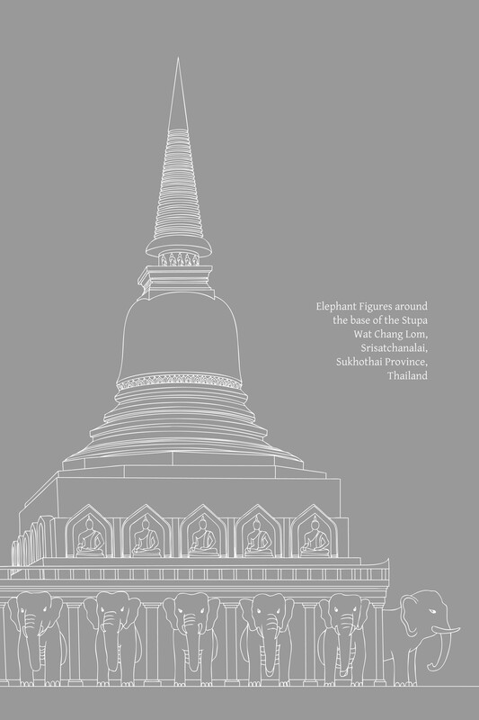

---
---

# 第十七章：戒行道支

戒（Sīla）与道德行为的社会目标

## 导论

在根本层面上，道德（sīla；戒行）是一个客观真理。它由正语、正业和正命这三道支来描述：它指的是没有邪恶、不道德行为以及伤害和压迫思想的有意识的言语、行为和生计，并且它包含相应的贤善、正直的行为。

从一开始，佛教修行者就应清楚地辨明他们所持守和履行的道德实践的目的和目标。他们应理解戒行如何融入更广泛的修行体系，认识到戒德的深化与心智发展和智慧发展相关。戒行支持三摩地，并导向清晰的知见（ñāṇa-dassana）。它导向苦的止息、福德以及真正的安乐。它对于个人和社会两方面的幸福都是必不可少的。

由完整修行要素组成的八圣道，分为三组：戒行（sīla）、三摩地（samādhi）和智慧（paññā）。这三个主要要素也构成了三学——增上戒学（adhisīla-sikkhā）、增上心学（adhicitta-sikkhā）和增上慧学（adhipaññā-sikkhā）——这三者可以简称为 sīla、samādhi 和 paññā。

整个佛教的实践、训练、戒律、精神发展以及通往涅槃的道路都包含在这源于八圣道的三学之中。真实、真诚、完整的道德行为指的是戒组中包含的三个道支，即正语、正业和正命。

## 戒行道支

八圣道中关于戒行（sīla）的部分包含三个要素：正语（sammā-vācā）、正业（sammā-kammanta）和正命（sammā-ājīva）。以下是这些三个要素在经典中如何定义的例子：

1.  诸比丘，何谓正语？此即称为正语：
    
    1.  离妄语（musāvādā veramaṇī）。
    
    2.  戒除两舌（pisuṇāya vācāya veramaṇī）。
    
    3.  戒除恶口（pharusā vācāya veramaṇī）。
    
    4.  戒除绮语（samphappalāpā veramaṇī）。
    
2.  诸比丘，何谓正业？此即称为正业：
    
    1.  离杀生（pāṇātipātā veramaṇī）。
    
    2.  离不与取（adinnādānā veramaṇī）。
    
    3.  离欲邪行（kāmesumicchācārā veramaṇī）。
    
3.  诸比丘，何谓正命？此即称为正命：于此，圣弟子已舍离邪命，[\[1\]](path-factors-of-virtuous-conduct.html#fn-fn1)以正命谋生。[\[2\]](path-factors-of-virtuous-conduct.html#fn-fn2)
    

这三个要素也有区分世间层面和出世间层面的定义。世间层面的定义如上所述；出世间层面的定义如下：

1.  出世间正语：对于心是高尚的、心是无垢的、已证得圣道、正在发展圣道者而言，是止息、避免、戒绝、意图远离四种语恶行。
    
2.  出世间正业：对于心是高尚的……正在发展圣道者而言，是止息、避免、戒绝、意图远离三种身恶行。
    
3.  出世间正命：对于心是高尚的……正在发展圣道者而言，是止息、避免、戒绝、意图远离邪命。[\[3\]](path-factors-of-virtuous-conduct.html#fn-fn3)
    

## 道德的普遍原则

佛教教义以详尽而全面的方式阐述了道德训练的基本原则——统称为“增上戒学”（adhisīla-sikkhā）。为了给个人和社会整体带来善的结果，建立了各种戒律和道德标准以供实际应用。这种道德行为的实践纲要始于关于行为的教导——与上述八圣道三要素相对应的十善业道（kusala-kammapatha），以及关于最基本道德行为的教导：五戒。[\[4\]](path-factors-of-virtuous-conduct.html#fn-fn4)

然而，这种道德行为实践纲要的扩展和细节是无限的：经典中根据特定的个人、时期、地点和其他相关情况呈现教导。在此不可能汇编所有这些多样而详尽的道德教导。

在此，足以呈现佛教戒行教义的核心原则，这些原则在经典中以明确的方式描述。我将由读者自行寻找符合其性情、生活状况和目标的具体教导。

撇开适用于特定个人、时期、地点和场合的教导，决定戒行实践教导的一个关键因素是人的职业或生活状况。因此，在家居士和出家众有不同的行为准则、戒律和修行体系。

佛教学习者必须理解这些不同伦理准则的原则、价值，最重要的是其目标，包括其不同的细节和最终的统一与协调，以便对这一主题拥有真正的理解并正确地实践法。

提炼戒行相关道支的精髓并呈现实践行为原则的一个关键例子是关于十善业道（kusala-kammapatha）的教导。这个教导与道支直接对应；它唯一的不同之处在于将身业（对应“正业”）排在语业（对应“正语”）之前。这个教导还有其他名称，包括：“善行”（sucarita）、“身、语（和意）清净”和“行为的卓越”。以下是巴利语经典中描述这一教导的段落：

有一次，佛陀住在波伐（Pāvā）的银匠准达（Cunda）的芒果林里，准达走近佛陀，他们谈论“净化行为”（soceyya-kamma）。准达说他赞同西方地区婆罗门所规定的净化仪式，这些婆罗门携带水壶，佩戴水草花环，供奉火，并将自己浸入水中。

根据这些仪式，早上起床时，一个人必须接触大地。如果他不接触大地，那么他必须接触新鲜牛粪，或青草，或照看火，或向太阳致敬，否则他必须在晚上三次浸入水中。（参见“迷信仪式”注释） 

迷信仪式

> 这种对戒律和宗教实践的顽固执着（sīlabbataparāmāsa）从佛陀时代至今在印度一直盛行，从未减弱。废除这种盲信是佛陀教导和活动的主要意图之一，同时废除种姓制度，并将人们从形而上学的思辨引向对更相关和有效问题的考量。对这种盲信以及迷信仪式和典礼日益增长的执着伴随着佛教在印度的衰落，并且确实是其衰落的关键因素。可以公平地说，这种盲信塑造了当今印度社会的状况。无论何处，这种对宗教戒律和实践的盲信越增加，对真正佛教教义的持守就越会衰落。在人类文明史上，对仪式和典礼（即使是比上述更理性的仪式）的这种坚定执着，曾导致剧烈的社会革命，甚至导致这些文明的终结。

佛陀回答说，这些婆罗门的自我净化仪式与圣律（ariya-vinaya）中的自我净化不同。从事十不善业道（杀生、偷盗等——与十善业道相反的因素）的人，其身、语、意都是不净的。无论他们是否接触大地、接触牛粪、供奉火、尊敬太阳，或避免这些行为，他们仍然是不净的，因为这些不善的行为方式本质上是不净的，并导致不净。

佛陀接着描述了十种善行，它们导向自我净化（soceyya）：

甲、三种身净化：

*   1\. 一个人舍弃杀生（pāṇātipāta），戒绝杀生；放下棍棒和武器，有良心和仁慈，他怀着慈悲心，热切地帮助一切有情众生。
    
*   2\. 一个人舍弃不与取（adinnādāna）并戒绝此行；他不以偷盗之意取走他人的财物，无论是在家中还是在森林中。
    
*   3\. 一个人舍弃欲邪行（kāmesu-micchāācāra）并戒绝此行；他不侵犯受母亲、父亲、兄弟、姐妹或亲戚保护的女性，受法保护（例如，通过法定监护）的女性，有丈夫的女性，禁止接触的女性，甚至包括已订婚的女性。
    

乙、四种语净化：

*   4\. 一个人舍弃妄语（musāvāda），戒绝妄语；当被传唤到法庭、会议、亲戚面前、集会或皇室面前，并被作为证人询问：“那么，善人，请说出你知道的”，他不知道就说“我不知道”，或者知道就说“我知道”；他没看见就说“我没看见”，或者看见就说“我看见”；他不会在完全知情的情况下，为了自己的目的，或为了他人的目的，或为了某种形式的报酬而说谎。
    
*   5\. 一个人舍弃两舌（pisuṇā-vācā），戒绝两舌；他不会将此处所听到的重述到别处以离间这些人与那些人，也不会将别处所听到的重述给这些人以离间这些人与那些人；因此，他是使分裂者重归于好的人，团结的促进者，乐于和合，喜于和合，乐于和合，说促进和合之言。
    
*   6\. 一个人舍弃恶口（pharusa-vācā），戒绝恶口；他说的话语不冒犯，悦耳动听且可爱，言语触及人心，礼貌，受众人喜爱和欢迎。
    
*   7\. 一个人舍弃（无益的）绮语（samphappalāpa），戒绝闲谈；他在适当的时候说话，说事实，说善言，说关于法和律的话语；在适当的时候，他说的话有根据，切题，适度且有益。
    

丙、三种意净化：

*   8\. 无贪（anabhijjhā），
    
*   9\. 无瞋（abyāpāda；愿一切众生安住于乐），以及
    
*   10\. 正见（sammā-diṭṭhi）。
    

这三个要素是八圣道前两个要素的延伸：正见（sammā-diṭṭhi）和正思惟（sammā-saṅkappa）： 

> 一个人若具足这十种善业道，清晨起床时，即使他接触大地，他也是清净的；即使他不接触大地，他也是清净的……即使他向太阳致敬，他也是清净的；即使他不向太阳致敬，他也是清净的……因为这十种善业道本质上是清净的，并且它们导向净化。[\[5\]](path-factors-of-virtuous-conduct.html#fn-fn5) 增支部 A. V. 263。

早先提到，戒行的基本原则为了实践目的而扩展，以适应特定情况。例如，对于已受戒的比丘而言，除了调整和增加特定的戒律外，即使是那些保持不变的戒律，有时也会以新的方式来解释。请将这些关于偷盗和妄语的戒律与上面十善业道中提出的定义进行比较：

> 舍弃不与取，他戒绝不与取；只取所给予的，只期待所给予的，不偷盗而安住于清净。舍弃妄语，他戒绝妄语；他说真话，坚持真理，值得信赖和可靠，不是世间的欺骗者。长部 D. I. 4-5, 63-4, 100-101等；中部 M. I. 267-8, 345；增支部 A. V. 204-5。

八圣道中与戒行相关的要素的扩展定义通常分为两部分。第一部分描述避免作恶，后一部分描述从事一种善行，这与个人所避免的不善行相对。前一部分采用否定性语言；后一部分采用促进性或肯定性语言。

这种“否定性”和“肯定性”教导的配对是佛教教义的共同特征，符合“远离恶行，培养善行”的原则。

从远离恶行开始，善的培养可以逐步扩展，这不限于这些道支。例如，关于偷盗（adinnādāna），尽管上述引用的教导没有扩展到明确应用培养善的品质，但还有其他关于佛教关键原则——布施（dāna）的补充教导。

## 有神论道德观与自然法则教义

一些西方学者批评佛教以一种完全否定性的方式教学。他们声称，佛教只教导人们远离邪恶，但不鼓励人们积极地行善；佛教不教导人们在远离恶行后如何促进善行；佛教仅仅是一种主观性的教导，一种“抽象思维的伦理”，一种听天由命和被动性的教导。他们接着说，佛教教义导致佛教徒仅仅满足于避免邪恶，但对帮助他人摆脱痛苦和发现真正幸福不感兴趣。 

这些学者声称，即使佛教教导慈悲心，这些品质也仅仅局限于心智活动。他们引用巴利三藏中的段落来支持他们的观点，认为佛教教义是完全否定性的。例如，他们引用了尊者舍利弗（Sāriputta）提出的正业（sammā-kammanta）定义：

> 朋友们，何谓正业？戒绝杀生、戒绝不与取以及戒绝欲邪行——此即称为正业。[\[6\]](path-factors-of-virtuous-conduct.html#fn-fn6) 中部 M. III. 251-2。

认识到这些道支真实实践应用的人，例如十善业道中包含的道德行为阐述，会看到这些提出批评（其中大部分是出于善意）的学者无疑只获得了不完整的知识，并且不完全理解佛陀的法。很明显，基于这些道支的戒行体系不限于“否定性”、“被动性”、“主观性”或仅仅是“抽象思维的伦理”。

无论如何，当遇到此类批评时，一个人应该借此机会在自己内心澄清这些问题并扩展自己的理解。对道支中道德要素的解释指的是与意图相关的基本行为。它们最初通过否定性术语（即定义强调远离邪恶）来定义，原因如下：

*   在佛教中，道德戒律和行为准则并非神圣的敕令或刻在石头上的诫命，这些诫命通过神的意志规定人们应如何行事，通常是基于盲信，而无需理解道德行为的理由。
    
    在佛陀的法中，道德戒律是根据自然法则确定的，它们共同构成了精神发展的起始阶段。持守这些戒律的人应该辨明与这些自然法则的关系。尽管一个人可能尚未拥有清晰的理解，可能只在信心的层面上行事，但这种信心应该是“有根基的”（ākāravatī-saddhā）——它至少应该基于对因果的初步理解，足以生起日益增长的智慧。
    
*   在法实践或精神训练的逐步发展中，一个人必须准备一个稳定而平坦的基础。一个人首先要避免或消除不善行，然后才培养善行并最终达到清净和解脱。这类似于种植果树：一个人必须首先通过清除有害元素来准备土壤；然后才能准备好播种、培育植物并收获期望的果实。
    
    在佛陀的法中，戒行（sīla）是修行的第一阶段，其重点在于远离不善行。起初，人们反复关注那些需要消除的事物，之后，通过逐步纳入禅定和智慧的更高阶段，精神实践的范围可以扩展。
    
*   在三学体系中，道德行为本身并不是通向最高目标的实践。相反，它为人的生命奠定了一般基础，使人准备好培养心智发展的关键因素，即简称为“三摩地”（samādhi）。这一发展阶段是道德行为的延续并从中获得益处。
    
    道德行为的精神价值巨大：远离邪恶的意图或没有任何作恶的念头，能净化和稳定内心；一个人因此不受困惑、苦恼或焦虑的干扰。心变得平静和专注。
    
    当心平静和专注时，一个人会在智慧方面发展出清晰和熟练——他会运用理性的洞察力，并寻求进一步培养善行和达到更高精神成就的途径。
    
*   拥有一个强大、有德和喜悦的心是至关重要的。在佛教伦理中，人的心境与外部身语行为之间必须存在持续的联系和整合。心是所有行为的源泉，因此意图是决定一个人善行真正诚意的首要因素。不欺骗他人是不够的衡量标准——还必须没有自欺。发展一种善的因素整合可以提升心境，并防止内心行为与外部行为相悖的问题。
    
*   与道德行为相关的道支揭示，人类最基本的责任是为自己的心负责：防范一切伤害或侵犯他人的念头。当一个人确立了这种基本的内心清净后，个人责任就会向外扩展，以维持和培养精神品质，并为了帮助他人而行善。总而言之，既有个人远离邪恶的责任，也有为他人的安乐和幸福而行动的社会责任。
    
*   将 sīla 解释为远离伤害和恶行，是以一种基本而统一的方式定义修行原则。这种解释强调完全摆脱腐败和邪恶的意愿。当一个人达到这种基本的自律，并摆脱内外烦恼和动荡时，他就可以开始扩展和培养善和贤德行为的各个方面。
    
    关于善，其细节和实践方法是无限的，并随时间和地点而异。而不善行则可以严格定义和确定。例如，比丘和在家居士都应戒绝妄语，但基于诚实言语从事善行的机会和方法可能有所不同。因此，包罗万象的行为原则规定了远离基本形式的恶行。培养善的细节和方法是实践应用的问题，取决于一个人的生活状况。
    
*   要达到佛教的目标，就必须发展八圣道的每一个要素。因此，每个道支都必须是一个包罗万象的原则，每个人都能遵循和实践，不限于个人的社会地位、时期、地点或特定的环境条件。
    
    这在道德行为领域中显而易见。例如，戒绝不与取是每个人都能做到的，但布施则取决于其他因素，比如有东西可施、有受者和有值得受施者。如果一个人没有机会布施，那么没有任何偷盗念头的意图就已经净化了内心，并作为三摩地的基础。然而，如果一个人有机会布施，这种布施将增加他的功德，并防止内心冷漠或占有的染污。
    
    正是由于这些原因，这些道德道支的主要解释以否定形式存在：即戒绝不善行为或不存在邪恶。这些道支的扩展解释，包括生起善的积极行为，是如上所述的实践应用问题。
    
*   在法实践中，修行者通常有意识地发展一种特定的精神品质或美德。在此期间，修行者必须全神贯注于该活动。在这种情况下，一个人在其他修行领域中的责任仅仅是防止有害或不善的条件产生。在此，道德行为所期望的益处是帮助调节其他活动领域：防止一个人犯错和造作不善业，摆脱心智的弱点和干扰，并为彻底坚定地发展所选的善德品质做好坚实的基础。
    

如上所述，佛教的修行体系是三学，包括戒、定、慧；此外，它基于自然现象。然而，上述许多批判性学者从有神论传统的角度看待道德，因此他们对佛教体系感到一头雾水。区分佛陀的法中教导的道德行为与有神论宗教中教导的道德行为至关重要（此分析应包括关于业和善恶的教导）。以下是这一区分的一些重要点：

*   在自然法则教义（sabhāva-niyāma），即佛陀的法中，道德行为原则是根据自然的因果法则确定和定义的。在有神论宗教中，道德原则是根据神的意志制定的神圣诫命。
    
*   从“否定”或“制约”的角度来看，佛陀的法中的道德行为是自我约束和自我训练的原则，因此所规定的戒律被称为“学处”（sikkhā-pada）。至于有神论宗教中的道德行为，它由禁令组成——由高位权力制定的诫命。
    
*   在佛陀的法中，道德行为的一个关键因素是“有根基的信心”（ākāravatī-saddhā）：即对自然法则的信任以及对思虑行为及其结果是根据因缘条件进行的初步理解。有神论宗教中道德行为的一个关键因素是虔诚信仰（bhatti）：即对神所规定之事物的相信、接受和服从，以及完全信赖这些规定而无需质疑其有效性。
    
*   在佛陀的法中，正确持守戒律意味着自我约束，始于远离一切恶行的意图，继而是发展与这些恶行截然相反的美德。在有神论宗教中，持守道德戒律意味着严格服从神的诫命。
    
*   在佛陀的法中，道德行为层面的实践有一个特定目标，即作为三摩地的基础。它是旨在准备和使人能够以最大可能的方式驾驭心智力量的训练系统的一部分，最终生起智慧并最终导向完美的内心解脱。至于说，去天堂，这仅仅是因缘条件的自然结果。然而，在有神论宗教中，持守诫命会带来神的恩惠；这是符合神旨意的行为，其结果是生于天堂的奖赏。
    
*   在佛陀的法中，道德或不道德行为的善恶结果是按照自然秩序自动发生的；它们源于一种公正、客观的自然法则运作，称为业的法则。这些影响首先在心中显现，然后进一步体现在一个人的性格和生活方式中，包括今生和未来生。在有神论宗教中，遵守或违犯神圣诫命的善恶结果是奖赏或惩罚的问题。服从的奖赏是上天堂；违犯的惩罚是下地狱。奖赏或惩罚完全由神的审判决定。
    
*   关于善与恶，佛陀的法教导说，道德美德保护、增强、净化和提升内心，因此被称为 puñña（“功德”、“有功德的”）。道德行为促进心智的繁荣和健康；它是一种善巧的行为，符合智慧，并导向解脱；因此被称为 kusala（“善的”、“善巧的”）。另一方面，邪恶、不道德的行为会损害或降低心智的品质，因此被称为 pāpa（“恶”）。[\[7\]](path-factors-of-virtuous-conduct.html#fn-fn7) 它损害一个人的生命，是不善巧的，既不利于内心安乐也不利于解脱；因此被称为 akusala（“不善巧的”、“不善的”）。在有神论宗教中，善与恶主要基于信仰和虔诚：行为以服从和符合神的旨意和命令来衡量。特别是恶被解释为反对或违背神的旨意的行为（通常称为“罪”）。
    
*   在佛法中，道德教义必须以理性为基础，因为法行者只有在理解伦理体系如何与因果法则相关联时，才能正确地规范自己的行为。
    有神论宗教盛行的道德观念基于神圣的宣告和神谕，它们由互不相关的规则和戒律组成。
    尽管这些规则可能被编纂成一套伦理准则，但它们并非一个整合体系的一部分，因为此类宗教的信徒只需足够的理解来确定已制定的规则。 无需理解整个体系或与其他因素的关系，因为更大的设计存在于神的全知智慧中；信徒不应怀疑，而应顺从并听从。
    
*   佛教的伦理体系包含客观和普遍的原则；它是根据自然法则确定的。（此处伦理是指戒的本质，作为处理善恶的真理面向；它并非指作为一种规定性戒律——毗奈耶的戒，其中涉及社会环境中的纠正和惩罚形式。）在有神论宗教中，伦理原则倾向于根据神的意志来确定；伦理准则类似于规定的戒律（vinaya）或法典，因为神既是这些法律的制定者，也是审判者。
    
    佛法教导，特定的思愿行为对一个人的心、行为、性情和人格有特定的影响。在这种情况下，对思愿行为的这些影响设定限制或条件是无效的，例如声称某个特定群体具有优势，或以个人认同作为真理的标准。做出以下断言是无效的：只有这个特定宗教的成员才是慈悲和善良的，而其他宗教的成员，即使他们可能表达慈悲，也不是真正的善良；杀害这个宗教的人是一种罪恶，但杀害其他宗教的人则不是罪恶；只有这个宗教的善人才能升天，而其他宗教的人，无论他们的行为如何，都是异教徒并注定下地狱；杀害动物不是罪恶，因为动物是为人类提供食物的（我们难道不是狮子和老虎的食物吗？）。[\[8\]](path-factors-of-virtuous-conduct.html#fn-fn8)
    
    话虽如此，区分不同种类的思愿行为却是有效的，例如通过观察不同程度的不善行为如何影响心的运作。
    
*   由于道德行为是基于客观原则并依照自然法则确定的，佛教修行者需要勇气和诚实来承认并面对真相。他们被敦促接受缘起的真相，即善恶、对错存在于他们自身和世间。人们是否依照这些法则修行，以及修行的程度，是另一回事。人们需要承认自己的行为是否符合这些自然法则；他们不应仅仅因为一个恶行符合自己的欲望就将其视为善行。支配人类行为的自然法则的有效性不取决于人们的欲望。如果一个人即将做出导致堕入地狱的行为，最好承认这个行为是恶的，但自己仍然愿意承受后果，而不是自欺欺人地认为自己没有做错任何事。
    

诚然，基于神圣命令的伦理也有一些益处或优势：

*   它消除了辩论一个行为是正确还是错误、是真还是假的必要。不容置疑的信仰和虔诚的信心往往能在精神修习中产生炽热的精进和快速的成果。但它也容易产生问题，例如：关于如何向人们灌输信仰（尤其是在这个理性时代）的问题；关于如何与不分享自己信仰的其他人和平相处的问题；如何维持信仰的问题；以及人们自由运用智慧能力的机会减少。（如果一个人满足于人类社会分裂成不同的群体，这些问题中的一些可以被忽视。）
    
*   普通人往往觉得基于信仰和虔诚的道德体系更容易接受，这种道德体系在规范普通人的行为方面做得很好。即使在许多佛教徒中，对与善恶相关的戒的理解也包含着类似于有神论宗教的信念，例如将伦理视为一套禁令（但对谁禁止只有模糊的概念，与有神论教义明确指出是神禁止不同），并将善恶的结果视为一种奖赏或惩罚。然而，这种体系的问题在于它主要依赖于信仰。
    
*   它能为人们提供道德上的漏洞。通过将不善行定性为无辜或无害，人们可能为了自身利益而为其辩解。以杀生不是罪恶的观念为例，这能减轻人们的罪恶感，让他们觉得自己无过错。尽管说服自己无辜是有效的，但这会对一个人生活的其他方面产生不利影响，并且与智慧之道不符。
    
    佛法鼓励人们在精神修习的每个阶段都对真相有清晰的认识，并能自行判断和裁决真相。它教导人们运用自我激励和独立行动的方法，其中包括对所涉因素的透彻理解。这些自我激励的方法应该是无害的，并且只能作为产生其他精神品质的辅助。
    

## 基本道德行为

重要的是要认识到一些普遍原则，这些原则有助于在所有层面正确地实践道德行为，并使人能正确地实践佛法 (dhammānudhamma-paṭipatti)。

佛陀上述界定正语、正业、正命道支的话语揭示了戒的本质，它们描述了善生活所需的道德行为准则。古代的导师们后来汇编了道德行为的八个辅助因素（源自这三个道支），并将其命名为“以清净命为第八的八戒”（ājīvaṭṭhamaka-sīla）。[\[9\]](path-factors-of-virtuous-conduct.html#fn-fn9) 

这些是道德行为的基本因素。由此，道德行为的分析得以展开。例如，当描述针对具有独特生活方式、明确目标和发展历程的特定群体进行培训时，可以区分各种修习细节，例如比丘、比丘尼、沙弥、在家居士等的道德行为。此外，还可以建立一套清晰的社区管理体系，称为道德戒律（vinaya），其中包含约束、管理、对违犯者施加惩罚等措施。

佛陀关于道德行为道支的言论揭示了这条道并非仅为比丘僧团而设；否则，戒的定义就必须是227条戒律、比丘的善行（bhikkhu-sīla）、出家人的道德（pabbajita-sīla）或类似的内容。佛陀以一种融合了多样而详细的道德原则和戒律的方式教导了道德行为的本质。他没有必要为其中一些辅助行为准则授予正式名称；例如，他提到了五戒、八戒和十戒，但并未明确命名。

由于这一点常被遗忘，因此应强调戒不仅指善行的身语行为，还包括清净和正直的生计。一个人谋生方式对善行有重要影响。

在经文的道德戒律分类中，通常只提及主要科目，例如戒除杀生或戒除偷盗。通过浏览这些主要科目，人们可能只从消极或否定性角度看待它们。要对这些戒律有一个完整而清晰的理解，就需要查阅佛陀阐述其含义的教导。例如，在十善业道 (kusala-kammapatha) 的教导中，我们看到几乎每个因素都分为两部分。一部分是需要戒除的，一部分是需要履行的；一个否定性的品质之后是一个积极性的品质。教导始于戒除恶行（例如杀生），接着是鼓励行善以对抗不善行（例如慈悲地帮助所有众生）。

这条道由道德行为、三摩地和般若组成，它们必须完全整合才能实现道的成果。尽管这里讨论的重点是道德行为，但需要注意的是，这仅仅是整合过程中的一个阶段。当一个人在这条道上前进时，道德行为必须与另外两个因素联系起来，才能达到真正的成功。

从技术上讲，道支完全整合所带来的圆满和完善被称为“法和合”（dhamma-sāmaggī）。即使在最高层次，即完全觉悟，也必须有这种因素的整合。当一个人领悟到这种因素的整合时，即使他可能专注于与道德行为相关的因素，他也会意识到其余的因素及其所扮演的角色。

十善业道的教导扩展了道支，使其可以适用于所有人类（这十个因素被描述为“导向真正人性的因素”——manussa-dhamma）。在这项教导中显而易见的是，道德行为伴随着心和般若的发展。（前七个因素与道德行为相关；第八和第九个因素与三摩地相关；第十个因素与般若相关）。

然而，被认为是可接受的道德行为最基本形式的五戒，仅涵盖了戒的阶段，而非三摩地或般若的阶段。这表明仅凭五戒不足以真正地在佛教道上前进。当一个人无法发展更高的精神品质时，至少应该戒除恶行，并尽量不严重伤害他人。

话虽如此，五戒并非被排除在“法和合”（dhamma-sāmaggī）之外。在那些适合将道德行为作为一个独立类别来区分的情况下，佛陀会准备一项补充教导，其中包含与心（citta）和般若（paññā）相关的因素。（在这里，这三个因素不像在十善业道中那样被放在一个单一的组中。）他会教导那些以奉持五戒开始精神修行的在家居士，通过发展心和般若来完成他们的修行，以便他们能够成为觉悟的弟子。

这种整合精神因素的替代性呈现方式，是专门用于教导在家居士的，它通常包含四个因素：信心、善行、布施和般若（偶尔会加入第五个因素——多闻）。这组因素在三藏中频繁提及；以下是这项教导的简明摘要：[\[10\]](path-factors-of-virtuous-conduct.html#fn-fn10)

在提到一个人如何在此世获得胜利（通过妥善管理自己的家庭、家佣、财务收入等，这些都属于即时利益——diṭṭhadhammikattha）之后，佛陀谈到了一个人如何在来世获得胜利（属于未来利益——samparāyikattha）的方法：

> “毗舍佉，具足四法之女子，为来世之胜利而修行，为来世做好准备。哪四法？……女子如何于信（saddhā）上成就？……在此，女子具足信心。她对如来的觉悟（tathāgatabodhi-saddhā）有坚定信念，如此说：‘世尊是阿罗汉……’女子如何于戒行（sīla）上成就？……在此，女子戒绝杀生……戒绝不与取……戒绝邪淫……戒绝妄语……戒绝酒类和麻醉品，这些是不放逸的基础……女子如何于布施（cāga）上成就？……在此，女子居家，心无悭吝垢染，自由布施，慷慨大方，乐于舍弃，致力于慈善，乐于施予和分享……女子如何于般若（paññā）上成就？……在此，女子有智慧；她拥有辨识生灭的智慧，这种智慧是高尚、具穿透力并导向彻底灭尽苦的智慧……《增支部》IV. 269-71。”

第五个因素，虽然可取但并非强制性，是“多闻”（suta；通过正规教育、阅读、听闻等方式学习），它指的是获取知识的原始数据。如果一个人发展出广学多闻（bahussuta），这将更有优势。

许多佛教徒只关心道德行为。他们可能知道教义的其他方面，但他们的知识常常是混乱和非系统的，尽管佛陀清楚地勾勒出完整的精神发展，即戒、三摩地和般若。他重申在家居士应如何具足信心（saddhā）、道德行为（sīla；特别是五戒）、多闻（suta）、布施（cāga）和般若（paññā）。当一个人在这个层面上达到这种精神因素的和合时，圣道（ariya-magga）便可供修习。

巴利语sīla的含义非常广泛；它可以在非常具体的语境中使用，也可以在一般意义上使用。正如前面提到的，将这个术语与vinaya区分开来是很重要的。

法的原则可以分为道德行为（sīla）、三摩地（samādhi）和般若（paññā）这三个因素。三摩地和般若纯粹属于法，而道德行为可以分为法的原则和世俗的戒律（vinaya）。毗奈耶是戒的一个方面（参见下面的“法层面的戒与毗奈耶层面的戒”一节）。

以下是佛陀的一些教导，它们总结了与普通人相关的基本道德原则，并阐明了“戒”一词的含义和本质。

## 道德的基本原则

让我们回顾与道德相关的三个道支：

1.  正语 (sammā-vācā)：
    
    1.  断除妄语 (musā-vāda)；戒绝说谎；此因素包括说实话 (sacca-vācā)。
    
    2.  断除离间语 (pisuṇā-vācā)；戒绝恶意的造谣中伤；此因素包括和谐、调解的言语 (samaggakaraṇī-vācā)。
    
    3.  断除恶口 (pharusa-vācā)；戒绝伤人的言语；此因素包括悦耳、礼貌的言语 (saṇha-vācā)。
    
    4.  断除无益的闲聊 (samphappalāpa)；戒绝琐碎的谈话；此因素包括有用、有益的言语 (atthasaṇhitā-vācā)。(参阅“善语”注释)
    
    
    
    
2.  正业 (sammā-kammanta)：
    
    1.  断除杀生 (pāṇātipāta)；戒绝杀害有情众生；此因素包括助人助物的行为。
    
    2.  断除不与取 (adinnādāna)；戒绝偷盗；此因素与正命或布施 (dāna) 相伴。
    
    3.  断除欲邪行 (kāmesu-micchācāra)；戒绝邪淫；此因素包括“安于自己的妻子”（sadāra-santosa）。
    
    
    
    
3.  正命 (sammā-ājīva)：断除邪命；如法谋生；此因素包括坚持保持正直的生计，例如不拖欠事务（即不让工作堆积混乱，不拖延，不敷衍了事）。(参阅“邪命行业”注释)
    

佛陀将这些基本的道德行为准则应用于普通人，描述了基本的行为原则，这些原则适合人类和睦相处，过上良善的生活，免于过多的冲突。这些原则在巴利三藏中被称为五“学处”（sikkhā-pada），后来常被称为五戒（pañca-sīla）。让我们回顾这些戒律：[\[11\]](path-factors-of-virtuous-conduct.html#fn-fn11) 

1.  戒绝杀生 (pāṇātipāta)；本质上，这指的是不以身体压迫其他众生的行为。
    
2.  戒绝不与取 (adinnādāna)；戒绝偷盗；本质上，这指的是不侵犯他人物质财产和所有物的行为。
    
3.  戒绝邪淫 (kāmesumicchācāra)；本质上，这指的是在夫妻和所珍爱的人的关系中，不伤害他人、不违犯性道德和传统、不通奸以及不损害家庭声誉和血脉的性行为。[\[12\]](path-factors-of-virtuous-conduct.html#fn-fn12)
    
4.  戒绝妄语 (musā-vāda)；本质上，这指的是不通过说谎或以利用或伤害为目的的言语来侵犯他人的行为。
    
5.  戒绝酒类、烈酒和麻醉品 (surāmerayamajja)，这些是不放逸的基础；本质上，这指的是不因使用削弱正念和清晰理解的成瘾物质而导致鲁莽和沉醉的行为。
    

善语

> 在《增支部》II. 141中，佛陀有一段关于四种善语 (vacī-sucarita) 的教导：真实语 (sacca-vācā)；无离间语 (apisuṇā-vācā)；柔和语 (saṇha-vācā)；和有理语 (mantā-bhāsā)。注释书将mantā-bhāsā定义为智慧语（AA. III. 134）；有时它被翻译为“适度语”，这本质上与“有用、有益的言语”相同。

五戒（以及类似的道德戒律）的标准定义已由学者和注释者传承给后代。首先，让我们看看佛陀关于这个主题的一些教导：

> “诸位居士，我将教导你们一种适用于自身的法义阐释……诸位居士，一位圣弟子如是反省：‘我渴望生存，不愿死去；我珍爱快乐，厌恶痛苦。既然我渴望生存……并厌恶痛苦，如果有人夺走我的生命，那对我来说将是不愉快的，不可接受的。那么，如果我去夺走他人的生命——夺走一个渴望生存、不愿死去、珍爱快乐、厌恶痛苦的人的生命——那对他来说也将是不愉快的，不可接受的。对我来说不愉快和不可接受的，对他人来说也是不愉快和不可接受的。我怎能把对我来说不愉快和不可接受的事情施加给他人呢？’如是反省后，他自己戒绝杀生，劝导他人戒绝杀生，并赞叹戒绝杀生。因此，他的身行在这三方面得到净化。诸位居士，又一位圣弟子如是反省：‘如果有人拿走我没有给予的东西，即偷窃，那对我来说将是不愉快的，不可接受的。那么，如果我去拿走他人没有给予的东西，即偷窃，那对他来说也将是不愉快的，不可接受的……’诸位居士，又一位圣弟子如是反省：‘如果有人与我的妻子通奸，那对我来说将是不愉快的，不可接受的。那么，如果我去与他人的妻子通奸，那对他来说也将是不愉快的，不可接受的……’诸位居士，又一位圣弟子如是反省：‘如果有人以妄语损害我的福利，那对我来说将是不愉快的，不可接受的。那么，如果我以妄语损害他人的福利，那对他来说也将是不愉快的，不可接受的……’ 诸位居士，又一位圣弟子如是反省：‘如果有人以离间语在我与朋友之间制造分裂，那对我来说将是不愉快的，不可接受的。那么，如果我以离间语在他人与他的朋友之间制造分裂，那对他来说也将是不愉快的，不可接受的……’诸位居士，又一位圣弟子如是反省：‘如果有人以恶口对我说话，那对我来说将是不愉快的，不可接受的。那么，如果我以恶口对他人说话，那对他来说也将是不愉快的，不可接受的……’诸位居士，又一位圣弟子如是反省：‘如果有人以轻浮语和闲聊对我说话，那对我来说将是不愉快的，不可接受的。那么，如果我以轻浮语和闲聊对他人说话，那对他来说也将是不愉快的，不可接受的。对我来说不愉快和不可接受的，对他人来说也是不愉快和不可接受的。我怎能把对我来说不愉快和不可接受的事情施加给他人呢？’如是反省后，他自己戒绝闲聊，劝导他人戒绝闲聊，并赞叹戒绝闲聊。因此，他的语行在这三方面得到净化。S. V. 353-5。” “那么，你们认为，比丘们，你们是否曾见过或听过以下情况：‘此人已放弃杀生，他戒绝杀生；国王因此而逮捕他、处决他、监禁他、流放他，或对他施加惩罚？’‘没有，尊者。’‘很好，比丘们。我也没有见过或听过以下情况……但如果他们宣布某个恶行，如：‘此人导致一名妇女或男子的死亡’，那么国王，因为他杀生，逮捕他并处决、监禁、流放或对他施加惩罚——你们是否见过或听过这样的事情？’‘世尊，这样的事情我们见过也听过，而且还会再听到。’‘你们认为，比丘们，你们是否曾见过或听过以下情况：‘此人已放弃不与取，他戒绝不与取……戒绝邪淫……戒绝妄语……戒绝作为放逸基础的酒类和麻醉品；国王因此而逮捕他、处决他、监禁他、流放他，或对他施加惩罚，因为他戒绝不与取……戒绝邪淫……戒绝妄语……戒绝\[沉溺于\]酒类和麻醉品？’‘没有，尊者。’‘很好，比丘们。我也没有见过或听过以下情况……但如果他们宣布某个恶行，如：‘此人从村庄或森林偷窃了某物’……‘此人侵犯了他人的妻子和女儿’……‘此人以妄语使一位居士或居士之子破产’……‘此人沉溺于饮酒和烈酒并杀害了一名妇女或男子’……‘此人沉溺于饮酒和烈酒并从村庄或森林偷窃了某物’……‘此人沉溺于饮酒和烈酒并侵犯了他人的妻子和女儿’……‘此人沉溺于饮酒和烈酒并以妄语使一位居士或居士之子破产；那么国王，因为他偷窃……他犯了邪淫……他说了妄语……他\[沉溺于\]酒类和烈酒；国王逮捕他并处决、监禁、流放或对他施加惩罚’——你们是否见过或听过这样的事情？‘世尊，这样的事情我们见过也听过，而且还会再听到。’《增支部》III. 208-209。”

几乎所有严重的犯罪都源于对五戒的违犯。在一个杀戮盛行、相互敌视、迫害、邪淫、谋杀、盗窃、强奸、欺骗、滥用麻醉品和成瘾性药物的社会中，再加上毒品和酒精滥用所带来的问题和伤亡，人类的生命和财产都不安全。人们无论走到哪里都会感到焦虑和恐惧。当人们相遇时，非但不能感到放松和自在，反而相互不信任。人们的心理健康恶化，难以发展精神力量和美德。

邪命行业

> 在《增支部》III. 209中，佛陀教导了在家弟子应戒绝的五种行业（akaraṇīya-vaṇijjā）：军火交易（“杀人工具”——sattha-vaṇijjā）；人口贩卖（satta-vaṇijjā）；动物肉品交易（maṁsa-vaṇijjā）——注释书说这指的是饲养动物供屠宰；麻醉品交易（majja-vaṇijjā），包括除酒精之外导致放逸的其他成瘾性药物；以及毒品交易（visava-vaṇijjā）。在注释书中，这五种行业被称为“邪业”（micchā-vaṇijjā）——《长部疏》I. 235；《中部疏》I. 136——或“非法业”（adhamma-vaṇijjā）——《经集疏》I. 379。

这样的社会不利于培养精神美德，因为人们忙于解决社会冲突和混乱，而这些冲突和混乱往往会加剧。

因此，未能遵守五戒是衡量社会衰败程度的尺子。持守五戒标志着与上述不善行为相反的行为和生活方式。

持守五戒是判断人类道德行为最基本的标准；持守这些戒律能维护健康的社会环境，并作为善生活方式和更高精神发展的基础。

为了方便起见，注释者们汇编了一份标准清单，用于确定哪些行为构成对五戒中每一戒的违犯，从而确立了违犯的“必要条件”（sambhāra）或“因素”（aṅga）。当一个人满足所有必要条件时，便已违犯（或“破”）了一戒，如下所示：[\[13\]](path-factors-of-virtuous-conduct.html#fn-fn13)

*   违犯第一戒（杀生）包含五个因素：(1) 众生（人或动物）有生命；(2) 知道该众生有生命；(3) 有杀生的意图；(4) 有杀生的行为；(5) 该众生因该行为而死亡。
    
*   违犯第二戒（偷盗）包含五个因素：(1) 物品被他人视为个人财产；(2) 知道该物品被他人视为个人财产；(3) 有偷盗的意图；(4) 有偷盗的行为；(5) 偷盗行为因该行为而成功。
    
*   违犯第三戒（邪淫）包含四个因素：(1) 有不应侵犯的男子或女子（agamanīya-vatthu）；[\[14\]](path-factors-of-virtuous-conduct.html#fn-fn14)(2) 有进行性交的意图；(3) 有进行性交的行为；(4) “通路存在”：性器官有接触。
    
*   违犯第四戒（妄语）包含四个因素：(1) 言语不真实；(2) 有说妄语的意图；(3) 因该意图而有行为；(4) 他人理解所说的话。
    
*   违犯第五戒（饮酒、烈酒和麻醉品）包含四个因素：(1) 物质是麻醉品；(2) 有饮用该物质的欲望；(3) 因该欲望而有行为；(4) 物质被吞下并经过喉咙。
    

关于第一戒，尽管经文主要侧重于不杀人（如佛陀上述引文所示），但动物也珍爱生命，喜乐，厌恶痛苦，并且是这个生老病死世界中的同伴，它们也不应被压迫。因此，第一戒将动物包含在有情众生的定义中。诚然，经文声称，在业力上，[\[15\]](path-factors-of-virtuous-conduct.html#fn-fn15)杀害动物的后果比杀害人类要轻。

关于此事，注释书根据各种标准，提供了判断违犯五戒所致恶报严重性的原则。[\[16\]](path-factors-of-virtuous-conduct.html#fn-fn16)

后世的佛教僧侣学者汇编了一组与五戒相配的因素，供在家佛教徒与戒律并行应用。这些因素被称为“五德”（pañca-dhamma）或“五美德”（pañcakalyāṇa-dhamma）。

本质上，它们与“善业道”（kusala-kammapatha）的因素相对应，具体会因定义和应用的广度而有所不同。

这五个因素按五戒的顺序排列如下：

1.  慈（mettā）和悲（karuṇā）。
    
2.  正命 (sammā-ājīva)；一些学者用布施 (dāna) 代替或包含布施。
    
3.  感官克制 (kāma-saṁvara)：在感官印象和感官欲望方面拥有自制力，不让这些导致不道德行为。（一些学者将其替换为 sadāra-santosa：“知足于自己的配偶”。）
    
4.  诚实 (sacca)。
    
5.  正念 (sati) 和清晰理解 (sampajañña)；一些学者将其替换为“不放逸” (appamāda)，其本质意义相同。
    

Sadāra-santosa，与邪淫相对立，字面意思是“知足于自己的妻子”，但其核心是“知足于自己的配偶”。从广义上讲，这一要素基于相互协议和同意，也符合社会习俗和规定：不虐待或不忠于自己的配偶，不违背所涉他人的意愿行事，不侵犯“禁区”内的人——那些受他人管辖或照护的人。

虽然这一要素没有明确规定只能有一个配偶而不是多个配偶，但佛教经典倾向并赞扬一夫一妻制，因为它能带来长久的相互爱与尊重，以及一个稳定的家庭，使孩子们感到安全和自在。

经文中这种一夫一妻制关系的模范夫妻是圣弟子纳库拉比达 (Nakulapitā) 和纳库拉玛塔 (Nakulamātā)。他们都是入流者，并被认为是与佛陀关系密切的首要在家弟子 (etadagga)。他们彼此之间有深厚的爱、奉献和忠诚，在灵性美德上旗鼓相当，以至于他们表达了不仅在今生，而且在未来生世也希望相见的愿望。以下是纳库拉比达所说的话：

世尊，自从年轻的家庭主妇纳库拉玛塔在我还年轻时被带回家给我之后，我从未察觉自己对她有不忠的行为，即使在我的思想中也没有，更不用说我的行为了。世尊，我们的愿望是在此生和未来生世都能在一起。

纳库拉玛塔也说了同样的话。[\[17\]](path-factors-of-virtuous-conduct.html#fn-fn17)

经典将知足于自己的配偶归类为一种“梵行” (brahmacariya)，这显示了这种品质在佛教教义中受到高度赞扬。注释者指出，这种纯洁的行为是不会早逝的原因，如下面这段话：

> 我们不对我们的妻子不忠，我们的妻子也不对我们不忠。除了我们的妻子之外，我们对其他女性实行贞洁 (brahmacariya)。因此，我们当中没有人是在年轻时去世的。[\[18\]](path-factors-of-virtuous-conduct.html#fn-fn18) DA. I. 178; MA. II. 42; ItA. I. 108; SnA. I. 43.

总而言之，以下偈颂概括了基本的道德行为：

> 一个身、语、意都安住的人，不做任何恶事，不讲无意义、自私自利的话，这样的人被称为有德行的人。J. V. 146.

> 使自己成为一切众生的皈依处。[\[19\]](path-factors-of-virtuous-conduct.html#fn-fn19) M. I. 39.

## 增进生命与社会的德行

注释书声称，佛陀在《善生经》(Siṅgālaka Sutta) 中所教导的全部内容，旨在作为在家人的戒律或普遍的道德规范。[\[20\]](path-factors-of-virtuous-conduct.html#fn-fn20) 这一教导可以概括如下：

### 第一节：免于十四种恶行

A. 舍弃四种行为上的恶行 (kamma-kilesa; 染污行为)：

1.  杀害众生。
    
2.  拿取未经自由给予之物。
    
3.  邪淫。
    
4.  妄语。
    

B. 戒除四种恶因；戒除因以下原因而行动：

1.  因欲望而偏袒 (chandāgati)。
    
2.  因嗔恨而偏袒 (dosāgati)。
    
3.  因愚痴而偏袒 (mohāgati)。
    
4.  因恐惧而偏袒 (bhayāgati)。
    

C. 戒除六种导致毁灭的放逸 (apāya-mukha; “毁灭之道”、“挥霍财富之道”)：[\[21\]](path-factors-of-virtuous-conduct.html#fn-fn21)

1.  沉溺于酒精饮料和麻醉品。
    
2.  沉溺于不合时宜地在街上游荡。
    
3.  沉溺于经常出入表演和娱乐场所。
    
4.  沉溺于赌博。
    
5.  沉溺于结交恶友。
    
6.  习以为常的懒惰。
    

### 第二节：为生命准备两项资产

A. 识别真假朋友，哪些人应该结交，哪些人不应该：[\[22\]](path-factors-of-virtuous-conduct.html#fn-fn22)

1.  四种假朋友：
    
    1.  骗子。
    
    2.  “夸夸其谈者”。[\[23\]](path-factors-of-virtuous-conduct.html#fn-fn23)
    
    3.  奉承者。
    
    4.  那些劝人沉溺于毁灭之道的人。
    
2.  四种真朋友：
    
    1.  支持性的朋友。
    
    2.  在顺境和逆境中都忠诚的朋友。[\[24\]](path-factors-of-virtuous-conduct.html#fn-fn24)
    
    3.  指出益处的朋友。
    
    4.  仁慈的朋友。
    

B. 积累和保护财富。像勤劳的蜜蜂采蜜筑巢，或像蚂蚁筑蚁穴一样。然后将自己的财富分为四份，与自己和朋友分享：

1.  一份用于满足自己的日常需要，照护他人，以及行善。
    
2.  两份作为资本以支持自己的工作。
    
3.  第四份应作为备用金，以备不时之需。
    

### 第三节：保护六方

与六类人的适当关系：

1/A. 儿子和女儿孝顺父母，父母如同东方（前方），他们考虑：

1.  “我曾受他们供养，我将回报他们。”
    
2.  “我将履行他们的职责，为他们工作。”
    
3.  “我将延续家族血脉。”
    
4.  “我将无愧于我的遗产。”
    
5.  “他们去世后，我将供养并为他们回向功德。”
    

1/B. 父母通过以下方式帮助孩子：

1.  他们阻止孩子行恶。
    
2.  他们训练孩子有德行。
    
3.  他们为孩子提供艺术和科学教育。
    
4.  他们帮助孩子寻找合适的配偶。
    
5.  时机成熟时，他们会移交遗产。
    

2/A. 学生以以下方式侍奉老师，老师如同南方（右方）：

1.  起身迎接他们。
    
2.  寻求他们的帮助（例如寻求他们的建议）。
    
3.  倾听他们并保持专注。
    
4.  侍奉和服侍他们。
    
5.  怀着敬意和认真学习他们所教的技能；非常重视学业。
    

2/B. 老师通过以下方式帮助学生：

1.  他们劝导和训练学生有德行。
    
2.  他们使学生对所学科目有清晰的理解。
    
3.  他们为学生提供完整的学科教育。
    
4.  他们向朋友和同事推荐学生。
    
5.  他们为学生提供各方面的保障（指导他们如何真正应用知识和谋生）。
    

3/A. 丈夫以以下方式侍奉妻子，妻子如同西方（后方）：

1.  以适当的方式尊敬她们。
    
2.  不轻视她们。
    
3.  不对她们不忠。
    
4.  给予她们在家务方面的权力。
    
5.  赠送个人饰品作为礼物。
    

3/B. 妻子以以下方式支持丈夫：

1.  她们把家务料理得井井有条。
    
2.  她们支持双方家庭的亲戚和朋友。
    
3.  她们不忠贞。
    
4.  她们保护已获得的财富。
    
5.  她们在工作中娴熟勤奋。
    

4/A. 以以下方式侍奉朋友，朋友如同北方（左方）：

1.  热情好客和慷慨。
    
2.  友善的言语。
    
3.  帮助和支持。
    
4.  提供不变的友谊；在顺境和逆境中都是朋友。
    
5.  诚实真挚。
    

4/B. 朋友和同伴以以下方式回报：

1.  在粗心大意时保护自己。
    
2.  在粗心大意时保护自己的财物。
    
3.  在危险时提供庇护。
    
4.  在困难时不会抛弃自己。
    
5.  体谅自己的亲戚和其他朋友。
    

5/A. 老板以以下方式侍奉仆人和雇员，仆人和雇员如同下方：

1.  根据他们的体力、性别、年龄和能力安排工作。
    
2.  根据他们的工作和生活状况提供适当的工资和奖金。
    
3.  提供福利和保障，例如在生病时协助支付医疗费用。
    
4.  分享任何特权或额外利润。
    
5.  提供休息日和假期。
    

5/B. 仆人和雇员以以下方式支持老板：

1.  他们在老板之前开始工作。
    
2.  他们在老板之后完成工作。
    
3.  他们只拿老板给他们的东西。
    
4.  他们有条不紊地完成工作并力求改进工作。
    
5.  他们向他人称赞老板。
    

6/A. 在家人以以下方式侍奉僧伽成员，僧伽成员如同上方：

1.  他们以慈爱行事。
    
2.  他们以慈爱说话。
    
3.  他们保持慈爱的思想。
    
4.  他们开放和乐意地接待僧伽。
    
5.  他们以四资具供养僧伽。
    

6/B. 比丘和比丘尼通过以下方式支持在家众：

1.  劝阻他们行恶。
    
2.  鼓励他们行善。
    
3.  以慈悲心帮助他们。
    
4.  教导他们以前未曾听闻或知晓的法义。
    
5.  解释和澄清他们所听闻的法义。
    
6.  为他们指出通往天界之道（教导他们如何生活才能实现幸福）。
    

培养四种“摄事” (saṅgaha-vatthu) 以在人与人之间建立信任并创造社会团结：

1.  布施 (dāna)。
    
2.  爱语 (piya-vācā)。
    
3.  利行 (attha-cariyā)。
    
4.  自身行为平衡、公正 (samānattatā)。
    

## 正命的一般原则

如前所述，正命是戒行中经常被忽视的一个方面。虽然这里只作简要概述，但关于正命的教导非常有意义，值得深入探讨。以下是关于这个主题的一些一般原则：

佛教关注人类生存的基本需求，即谋生的主要目的是确保社会中的每个人都有充足的四资具来维持生命。佛教教义优先考虑人类；它不强调物质财富的丰富，那样就是优先考虑物质财产了。

这一“知足”原则包含在佛教关于正当治理的教义中。例如，国王的职责之一是向穷人分配财富，以确保国土上没有贫困、赤贫之人。[\[25\]](path-factors-of-virtuous-conduct.html#fn-fn25) 因此，统治者工作的成功或政府经济政策的成功，不应以国库充盈或财富丰厚来衡量，而应以社会中消除贫困来衡量。

在这些基本需求得到满足的情况下，经文并不评判一个人拥有多少财富，也不评判社会中财富分配是否平等，因为这些问题与其他因素相关，例如：

拥有足够维持生命的四资具，甚至拥有丰富的物质财富，本身并不是目标，因为寻求和获取财富是培养德行 (sīla) 阶段的一部分：获取财富是达到更高目标的手段。它是发展心智和培养智慧的基础，以便过上健康的生活并体验更精细的幸福形式。

人们性情和才能各异。有些人满足于维持生命所需的最少物质财富，并主要专注于培养更高的精神品质。然而，另一些人尚未为这些更高阶段做好准备，更依赖物质事物，如果他们不涉及伤害他人，这是可以接受的。

此外，有些人性情和才能就是通过分享物质财富来帮助他人；因此，他们的财富对他人是有益的。

“正命”一词的含义不仅限于通过正当手段运用劳动生产商品或获取生活必需品。这个词也包括履行个人责任：一种正当的行为或生活方式，使一个人值得获得这些必需品。例如，比丘们遵守“沙门法” (samaṇa-dhamma) 并因此获得在家信众供养的四资具，就是比丘的正命。同样，孩子们行为良好，其行为方式配得上父母对他们的照护，也可以被视为孩子的“正命”。

此外，在确定劳动的价值时，与其仅仅关注生产商品以满足人们的需求和欲望——因为这些需求是否受贪欲支配或是否与真正的生命需求相关可能含糊不清——佛法之道更侧重于劳动的成果是否支持一个人的生命和社会福祉，抑或以有害的方式起作用。

综上所述，有两个相关事项需要考虑：

A. 在佛教教义中，一个人的职业（或工作）与一个人的物质收入之间的关系是双重的：

*   对于普通人来说，劳动的付出与他们的职业直接相关：工作是为了获得金钱或物质收益以帮助维持生活。
    
*   对于比丘或出家众 (samaṇa) 来说，劳动的付出与一般意义上的就业是独立的。出家众付出努力或工作的意图不是为了获得物质收益，而是为了在佛法上精进或护持佛法。如果一个比丘偏离其职责，专门寻求四资具，这被认为是“邪命” (micchā-ājīva)。同样，如果他以违反施主意愿的方式乞求资具以获取物质利益，这被认为是不清净的生计。
    

除了明显的邪命例子——欺骗、奉承、暗示、恐吓和以利求利[\[26\]](path-factors-of-virtuous-conduct.html#fn-fn26)——通过服务他人谋生，例如跑腿、从事各种艺术如选择吉时、算命和行医，也被归类为比丘的“邪命”。[\[27\]](path-factors-of-virtuous-conduct.html#fn-fn27)

如果一个比丘在没有生病的情况下为自己乞食——精美食物、硬食，甚至稀粥——并食之，这种行为在比丘的职业上是错误的。[\[28\]](path-factors-of-virtuous-conduct.html#fn-fn28) 将佛法变成某种商品，根据出家众的道德准则是错误的。[\[29\]](path-factors-of-virtuous-conduct.html#fn-fn29) 以听众可能高兴并因此可能获得某种回报的想法来宣讲佛法，是一种“不清净”的佛法宣讲。[\[30\]](path-factors-of-virtuous-conduct.html#fn-fn30) 即使是类似支付或报酬的布施行为也是不合适的，这在佛陀参与的以下场合中很明显：

有一次，佛陀乞食，停在一个婆罗门田边。婆罗门说：“我耕耘播种，耕耘播种后我就吃。”佛陀回答说：“婆罗门，我也耕耘播种；耕耘播种后我就吃。”婆罗门感到困惑，接着是一系列以偈颂形式进行的问答；佛陀总结说，他的耕耘播种结出了“不死” (amata: “无死”) 的果实。婆罗门赞赏这个回答，并怀着信心供养佛陀一些食物。佛陀拒绝了这些食物，说通过诵偈获得的食物是不合适的。[\[31\]](path-factors-of-virtuous-conduct.html#fn-fn31)

比丘纯净正直地获取四资具，发生在在家信众认识到佛法的价值并看到帮助那些有责任护持佛法的人的必要性之时。在家信众通过比丘们端庄地托钵乞食而得知他们对食物的需求；信众们随后主动供养食物。这种布施的效果是，施主通过反思自己行善，支持那些修行佛法的人，并亲自参与护持佛法，从而净化、明亮、提升自己的心。简而言之，他们积累功德或获得祝福。

接受供养的比丘们，则遵循关于四资具的行为原则，即比丘应少欲知足，对资具有所节制。这与比丘的其他责任形成对比，例如教导和劝导，这些应尽可能多地进行，其唯一目的是利益那些接受教导的人。

“仅食足于养身，同时尽可能多地工作”的原则与出家众是相符的，因为他们的努力付出与他们生计的物质收益是完全分离的。比丘不能通过诉诸其所做工作的数量来要求特殊权利或特权。当出家众按照这一原则修行时，外部社会系统并不能支配他们的生活。

上述这些原则具有重要的目标，即创造一种摆脱所有外部社会系统的生活方式，或者创建一个独立的社区，其职责是证悟并护持真理，其成员渴望所有人类的彻底精神净化。

B. 坦诚地审视会发现，在经济生产领域，无论是物质产品还是服务业，人类的许多劳动并不能真正利益人类生活和社会。除了明显的破坏性活动，如生产武器或麻醉品，还有一些企业破坏自然环境、贬低人类尊严或损害人们的心智品质，而另一些则专门用于预防和解决有害行为的后果。在很大程度上，这些劳动是徒劳的，最终是具有破坏性的。

许多此类产业的增长，需要人们投入大量的精力和资本来预防和解决生产本身造成的破坏性影响。相比之下，真正利益人类和社会的工作，不一定需要成为普通市场经济的一部分，这可以从与佛法和谐相处的模范生活中看出，这种生活促进人类的德行和智慧。

即使从产出或产量来看，个人德行有时也比体力劳动的成果更有价值：例如，一位比丘可能在森林中禅修，并没有明确努力保护森林，但护林员可能会说，他在保护森林方面比他们所有项目或努力的总和更有效。

就人类真正的福祉和幸福而言，仅仅看生产和消费的价值是不够的；还需要看“不生产”和“不消费”的价值。

从佛法的角度来看，一个在市场经济范围内不生产任何东西，却以审慎的方式消费世界资源，并与自然环境保持健康关系的人，比一个生产破坏性物品并以浪费的方式消费世界资源的人要好。然而，似乎大多数经济意识形态更赞扬后者这种大量生产和消费（具有破坏性）的人，而不是前者这种少量生产和消费（破坏性较小）的人。

我们应该问，仅仅提及生产行为而不考虑消费造成的浪费量，或不反思生产是否真正利益人类，这种评估是否公平？

经济学领域往往只关注统计数据、数字和货币增长。虽然经济学被视为一门科学分支，但许多经济理论和意识形态在解决人类经济问题时是有限的、不充分的、不完整的，因为人类存在于任何特定的抽象科学知识分支之上。 事实上，承认仅仅的数字计算和统计不足以解决人类问题，将有利于经济学领域的利益和完整性。

如上所述，佛教教义并不真正关心一个人拥有多少财富，一个人的价值也不是由他拥有多少金钱来决定的。物质财富被视为达到更高目标的垫脚石，而不是目标本身，金钱的价值与达到这个更高目标的修行联系在一起。

佛教的重点在两个阶段：获取财富的方式和随后使用已获取财富的方式。佛教不强调拥有财富，而是强调寻求和使用财富。仅仅为了某个目的而积累金钱，被认为与以不道德方式获取金钱或以有害方式花费金钱一样应受谴责。

因此，关于物质财富有三种基本恶行：不正当获取财富，拥有财富却不为自己带来真正利益，以及以有害方式花费财富。

此外，虽然一个人可能以正当方式获取财富并以有益方式花费金钱，但这种行为在与物质财富的适当关系方面尚未算完整。这是因为佛教教义强调智慧和心智的品质。一个人与物质财富的关系必须包括“解脱智慧” (nissaraṇa-paññā)。

这种解脱智慧意味着一个人真正理解财富的价值、益处和局限性，并认识到财富有潜力成为有益或有害的。一个人不应被财富奴役，而应成为财富的主人，认识到财富应该服务于人，作为发展善行、减少痛苦和增加真正幸福的手段。财富不应成为增加个人困扰、腐蚀人心、损害人类尊严或制造人际分裂的原因。

佛陀描述了十种不同类型的在家众 (kāmabhogī；“享受感官享乐者”)，其中第十种被他描述为最殊胜的。在这些最优秀在家众的特质中，我们可以看到符合佛法对待金钱的方式，可以概括如下：[\[32\]](path-factors-of-virtuous-conduct.html#fn-fn32)

1.  获取：以正当方式寻求财富，不滥用或伤害他人。
    
2.  支出（此阶段也包括储蓄和适度生活）：
    
    1.  为自己的幸福（以及自己负责之人的幸福）提供保障。
    
    2.  慷慨施舍；与他人分享财富。
    
    3.  将财富用于功德事业（包括弘扬佛法）。
    
3.  解脱智慧：不因财富而放逸；在花费金钱时运用智慧；了解财富的利弊；不被金钱奴役；依靠金钱寻找精神发展的机会。
    

佛陀对人们与财富的关系作了以下教导：

> 比丘们，世间有这三种人。哪三种？盲者、独眼者、双眼者。 一个人如何是盲者？在此，有些人不具备有助于获取未得财富或增加已得财富的眼睛，也不具备有助于区分善与不善事物的眼睛……区分有害与无害事物的眼睛……区分低劣与高尚事物的眼睛……区分类似光明或黑暗事物的眼睛。此人被称为“盲者”。一个人如何是独眼者？在此，有些人具备有助于获取未得财富或增加已得财富的眼睛，但不具备有助于区分善与不善事物的眼睛……区分有害与无害事物的眼睛……区分低劣与高尚事物的眼睛……区分类似光明或黑暗事物的眼睛。此人被称为“独眼者”。一个人如何是双眼者？在此，有些人具备有助于获取未得财富或增加已得财富的眼睛，也具备有助于区分善与不善事物的眼睛……区分有害与无害事物的眼睛……区分低劣与高尚事物的眼睛……区分类似光明或黑暗事物的眼睛。此人被称为“双眼者”。盲者，眼睛有缺陷，遭受双重不幸：他既没有这种财富，也不行善。另一个人，被称为“独眼者”，仅仅通过正当或不正当的手段，甚至通过偷窃、欺诈和诡计来寻求财富。他沉溺于感官享乐，善于积累财富；但离开这里后，“独眼者”在地狱中遭受折磨。最好的是被称为“双眼者”的人；他将辛勤所得的财富正当地分配，慷慨大方，怀有高尚意图，坚定不移；他达到一个有利的目的地，免于忧愁。一个人应该避开盲者和独眼者，只与高尚的双眼者交往。A. I. 128-9.

佛陀批评囤积物质财富而不将其用于任何有益目的的行为。例如，有一次拘萨罗国国王波斯匿王拜访佛陀。佛陀问国王白天为何外出。波斯匿王告诉佛陀，一位百万富翁在家主最近在首都去世，因为此人没有继承人，国王前去收取他的财宝并运到宫殿。

国王接着说，这些财宝中有八百万金币，更不用说白银了。然而当这个人活着时，他只吃掺有酸粥的碎米，穿一件三件粗布衣服，乘坐一辆破旧的小车，车顶盖着一片树叶。佛陀回答说：

> 大王，正是如此！当一个劣等人获得大量财富时，他既不使自己快乐满足，也不使他的父母……他的妻子和孩子……他的仆人、工人和雇员……他的朋友和同事快乐满足；他也不为沙门和婆罗门建立供养，这种供养能带来高尚的果报，产生善心，导致幸福，通向天界。 由于他的财富没有被妥善使用，国王会没收它，或盗贼会偷走它，或火会烧毁它，或水会冲走它，或不肖的继承人会拿走它。在这种情况下，那没有被妥善使用的财富，就会被浪费掉，而不是被利用。这就像一个无人居住地方的莲花池——虽然它有清澈、凉爽、新鲜、干净的水，有好的渡口，令人愉悦；但没有人会取那水，或饮用它，或在其中沐浴，或用于任何目的。但当一个优秀的人获得大量财富时，他会使自己快乐满足，他会使他的父母……他的妻子和孩子……他的仆人、工人和雇员……他的朋友和同事快乐满足；他也会为沙门和婆罗门建立供养，这种供养能带来高尚的果报，产生善心，导致幸福，通向天界。由于他的财富被妥善使用，国王不会没收它，盗贼无法偷走它，火不会烧毁它，水不会冲走它，不肖的继承人也无法拿走它。在这种情况下，那被妥善使用的财富，就会被利用，而不是被浪费。这就像一个离村庄或城镇不远的莲花池，有清澈、凉爽、新鲜、干净的水，有好的渡口，令人愉悦；人们会取那水，饮用它，在其中沐浴，并用于他们的目的。如同荒凉之地的凉水  
> 被遗弃而无人饮用，  
> 当恶人获得财富时  
> 他既不享用也不分享。  
> 但当智者获得财富时  
> 他利用它并履行职责。  
> 供养亲属，无有可责，  
> 那高尚之人将趣向天界。[\[33\]](path-factors-of-virtuous-conduct.html#fn-fn33) S. I. 89-91.

在一次类似的场合：

> 大王，正是如此！世间获得巨额财富而不变得傲慢放逸、沉迷感官享乐、虐待其他众生的人是极少数。而世间获得巨额财富而变得傲慢放逸、沉迷感官享乐、虐待其他众生的人要多得多。S. I. 74.

一个人积累财富却不使用或分享，这被比喻为 mayhaka 鸟，它坐在结满成熟果实的无花果树上，叫着 mayhaṁ, mayhaṁ (巴利语意为“我的，我的”)。当成群的其他鸟儿前来啄食果实后又飞走时，mayhaka 鸟仍然喋喋不休。[\[34\]](path-factors-of-virtuous-conduct.html#fn-fn34)

经典中有许多故事批评吝啬的人将金钱据为己有，而不利用它帮助他人。这些故事通常讲述富有而吝啬的商人思想上的转变。它们为佛教关于财富的正确拥有和使用提供了深刻的教导。[\[35\]](path-factors-of-virtuous-conduct.html#fn-fn35) 

## 道德正直与健康经济

### 导论

泰国有一个普遍的习俗，在家众请求并受持五戒。[\[36\]](path-factors-of-virtuous-conduct.html#fn-fn36) 当在家众受持并决意遵守这些戒律后，授戒的比丘会通过唱诵来总结道德行为的祝福：Sīlena sugatiṁ yanti, sīlena bhogasampadā, sīlena nibbutiṁ.... 这段偈颂可以翻译为：“通过德行，一个人趣向天界，一个人获得财富的丰足，一个人证得涅槃....”

此处的相关条款是指财富充裕：戒行能够带来财富，从而促进健康的经济。尽管这偈颂是后来才作的，并且既没有出现在巴利三藏中，也没有出现在注解和复注中，但由于其传统的重要性，它值得我们关注。

戒 (sīla) 的主要原则是它建立了一个稳定的基础，并准备了一个有纪律的环境，以便一个人能够成功地从事各种基本活动。

在经济方面，当人们安住于戒行时，没有犯罪，对人的生命或个人财产的危险减少，人们就可以安全地出行。因此，无论是建造工厂、经商，还是在城市或乡村旅行，无论白天还是黑夜，人们都感到安全和安心。老板和员工之间以善意和真诚相待。国家机构廉洁、高效、值得信赖。人与人之间的沟通，无论本地还是国际，都顺畅便捷，生产和商业活动不受阻碍。这就是戒行如何为经济繁荣奠定基础的。

一旦国家稳定，公民感到安全，人们就可以将注意力转向个体。在此，我们无需审视不道德行为的明显危害，例如放荡、偷窃、欺骗和酗酒。当人们决心以正直、高尚的方式谋生，并致力于这种诚实的追求时，他们就不会再以不道德、不择手段的方式行事或思考。他们甚至不会被意外之财的念头所诱惑，更不用说通过不诚实的手段获取财物了。

当一个人的心真正专注于工作时，混乱或分心的念头就会停止。这就是定的开始。当一个人专注于自己的工作和活动时，他会思考这些问题：“我该如何开始？”“我该做什么？”“我该如何着手实现我的目标？”“我可能会面临哪些障碍？”“我该如何解决这些问题？”“我该与谁交往？”“我该向谁请教？”这就是戒行如何影响心灵的；然后，定和智慧接管，成为指导因素。四神足 (iddhipāda)[\[37\]](path-factors-of-virtuous-conduct.html#fn-fn37) 依次生起，一个人就可以确信能够成就和成功。

请记住，戒行的作用是为人们建立一个稳定的基础，让他们能够自信地进行进一步的修行。如果一个人缺乏戒律，他的基础就会薄弱，环境也不支持他。没有戒行，一个人就无法真正开始修行之路。如果他试图开始，他会摇摆不定，站立不稳。相反，当人们的周围环境有利，基础稳定时，他们就能真正投入到工作中；他们就会具足定。

在一段总结对居家者教导的经文中，佛陀说了一偈，作为关于戒行这一主题的恒常原则：

> 勤勉于工作，不放逸，善于处理事务。 Uṭṭhātā kammadheyyesu appamatto vidhānavā.[\[38\]](path-factors-of-virtuous-conduct.html#fn-fn38) A. IV. 284, 289, 322, 324-5.

可以说，这偈颂概括了佛教徒对工作的原则。工作始于精进（巴利语用 uṭṭhāna 表示，也可译为“奋起”、“不懈怠”、“财富增长”或“繁荣增加”）。当一个人精进勤勉时，他的工作就会向前发展，从而达到完成和成就。

佛陀强调精进，不仅是导致成功的一个因素，也是对自己工作的自尊和喜悦的回忆。他经常对居家者进行这方面的教导：“一个人通过毅力获得财富，通过自己的臂力积累财富，通过自己的汗水赚取财富，以正当的方式获得正当的财富。”[\[39\]](path-factors-of-virtuous-conduct.html#fn-fn39)

精进也能带来自我发展和自我完善，因为投入工作会促使一个人在生活的许多方面成长，超越障碍，并取得成功。

然而，仅仅精进是不够的；一个人还必须具足不放逸 (appamāda)。如果一个人勤奋有活力，但行动不合时宜、不恰当，或者行动不当、不合规矩，在不该用力的地方用力，在该用力的地方却放弃努力，他很可能会失败。这里的不放逸指的是正念 (sati)，它与精进 (viriya) 协同作用。一个人警觉清醒，掌握事态发展，不受负面情况干扰。需要时立即行动，并充分准备好保护有价值的东西并处理未竟之事。当机会成熟时，他不会错过。他不会疏忽大意；他坚持这样的原则：“为未来做好充分准备；不要让未竟之事在危机时期造成困扰。”[\[40\]](path-factors-of-virtuous-conduct.html#fn-fn40)

当精进 (viriya) 得到不放逸的支持时，它就完全具备并以以下方式发挥作用：(a) 预防损害和损失；(2) 解决问题，消除负面或危险情况；(3) 促成和支持善法；(4) 作为一种保护力量，例如保护自己的德行，维护自己的尊严，并提升自己的修行，最终达到精神上的圆满。

上述偈颂中的第三句——“善于处理事务”——指的是智慧，它能使精进得到正确运用，并使不放逸真正发挥作用。总而言之，智慧理解工作中涉及的原则。特别是，一个人具足贤善之人 (sappurisa-dhamma) 的七种德行，其中包括以下因素：知事物的起源和原因；知事物的目标和结果；知自己；知节制；知适当的时机；以及知他人、知自己的社群、知自己的社会，例如：能够为特定工作选择合适的人，了解特定人群的需求和愿望等。[\[41\]](path-factors-of-virtuous-conduct.html#fn-fn41)

佛陀经常强调这种善于处理事务的能力，无论是在对僧团的教导中（使用表达 alaṁ saṁvidhātuṁ – “善于处理事务”），尤其是在对居家者的教导中，因为居家者负责更广泛社会中的活动。在照料家庭方面，佛陀教导了这一原则：“居家者……应该乐善好施，并且善于处理他的事务 (vidhānavanta)。”[\[42\]](path-factors-of-virtuous-conduct.html#fn-fn42)

在这种背景下，经文中为从事政府服务的人提供了许多指导原则，例如：

> 一个人具足分别辨别之智 (vicāraṇa-paññā)，成就觉悟之智 (buddhi-paññā)，善于处理事务，知晓适当的时机和场合，适合从事政府服务。一个人勤勉于工作，谨慎周密，洞察力敏锐，善于处理事务，适合从事政府服务。J. VI. 296-7.

总而言之，戒行 (sīla) 涵盖了与人类活动和人类共存相关的事物。可以说，戒行是准备一个适宜的环境和社会的事务，以便人们能够全身心地投入到心的培养和智慧的开发中。 

以下经文揭示了佛教徒居家者的正命原则，描述了财富的获取、财富的开销以及从正当生活方式中获得的快乐。

### 财富的寻求与保护

有一次，婆罗门 优阇耶 (Ujjaya) 拜访佛陀，说他不久将要远行。他请求佛陀给予一个有益于现世和后世安乐的教导。佛陀回答说：

> 婆罗门，这四件事有益于现世的快乐和安乐：精勤具足 (uṭṭhāna-sampadā)、守护具足 (ārakkha-sampadā)、善友 (kalyāṇamittatā) 和等活命 (samajīvitā)。什么是精勤具足？在此，一个族姓子弟勤奋谋生，无论是从事农业、商业、畜牧、军事服务、公务服务，还是某种手艺。他勤勉有技巧，不疏忽，具足调查的敏锐性，熟悉那项工作的程序，能够安排和执行那项工作。这称为精勤具足。什么是守护具足？在此，一个族姓子弟拥有通过辛勤工作获得、通过臂力积累、通过汗水赚取、以正当方式合法获得的财富。他管理、保护和看护那份财富，心想：“现在我该如何安排，才能使国王不没收这份财富，盗贼不偷盗它，火不烧毁它，水不冲走它，以及不肖子孙不取走它。”这称为守护具足。什么是善友？在此，一个族姓子弟无论居住在哪个城镇或村庄，他与那些具足信心、戒行、布施和智慧的居家者、居家者之子、充当显贵身份的年轻人和充当长老身份的老年人交往、交谈和请教。他效法那些具足信心者的信心成就，他效法那些具足戒行者的戒行成就，他效法那些具足布施者的布施成就，他效法那些具足智慧者的智慧成就。这称为善友。什么是等活命？在此，一个族姓子弟以适度的方式谋生，既不过于奢侈，也不过于拮据。他知道财富如何增加，也知道财富如何减少，心想：“这样做收入会超过我的支出，而支出不会超过我的收入”——就像一个称量的人或他的学徒在举起秤时就知道这里差多少\[重量\]，那里多多少\[重量\]……如果这个族姓子弟收入微薄却生活奢侈，他就会被传言：“这个族姓子弟用他的财富就像一个‘无花果树的饕餮者’。”[\[43\]](path-factors-of-virtuous-conduct.html#fn-fn43) 如果这个族姓子弟收入丰厚却生活拮据，他就会被传言：“这个族姓子弟将像一个贫民一样死去。”但因为这个族姓子弟以适度的方式谋生……这称为等活命。 婆罗门，正当获得的财富有这四种衰损之门 (apāya-mukha)：一个人是好色之徒，一个人是嗜酒如命者，一个人是惯性赌徒，一个人与恶人交往亲密。就像一个有四个入口和四个出口的大水库，如果一个人关闭了入口，打开了出口，并且如果雨水不按季节落下，那么这个水库的减少是可以预期的，而不是增加。婆罗门，正当获得的财富有这四种增长之门 (āya-mukha)：一个人不是好色之徒，一个人不是嗜酒如命者，一个人不是惯性赌徒，一个人与善人有友谊、伴侣和亲密关系。就像一个有四个入口和四个出口的大水库，如果一个人打开了入口，关闭了出口，并且如果雨水按季节落下，那么这个水库的增加是可以预期的，而不是减少……婆罗门，这四件事能带来一个族姓子弟现世的快乐和安乐。[\[44\]](path-factors-of-virtuous-conduct.html#fn-fn44) A. IV. 285-9.

由此，佛陀接着揭示了四种有助于后世安乐 (samparāyikatthasaṁvattanika-dhamma; samparāyikattha = ‘未来利益’, ‘更高利益’) 的事：信心的成就、戒行的成就、布施的成就和智慧的成就。

### 居家者的快乐

佛陀对 善生 (Anāthapiṇḍaka) 居士的以下教导中包含了简单地称为“居家者的四种快乐”的原则：

> 居士啊，有这四种快乐，欲乐居家者应根据时机和场合，持续地去追求。哪四种呢？具足之乐 (atthi-sukha)、受用之乐 (bhoga-sukha)、无债之乐 (anaṇa-sukha) 和无过之乐 (anavajja-sukha)。什么是具足之乐呢？在此，一个族姓子弟拥有通过勤奋努力获得、通过自己的臂力积累、通过自己的汗水赚取、正当获得的合法财富。当他想到：“我拥有通过勤奋努力……正当获得的财富”时，他体验到快乐和喜悦。这称为具足之乐。什么是受用之乐呢？在此，一个居家者用通过勤奋努力获得、通过自己的臂力积累、通过自己的汗水赚取、正当获得的合法财富来消费并做功德。当他想到：“我用通过勤奋努力……正当获得的财富来消费并做功德”时，他体验到快乐和喜悦。这称为受用之乐。什么是无债之乐呢？在此，一个居家者对任何人都没有任何程度的债务，无论大小。当他想到：“我对任何人都没有任何程度的债务，无论大小”时，他体验到快乐和喜悦。这称为无债之乐。 什么是无过之乐呢？在此，一个圣弟子身、语、意行为清白无过。当他想到：“我身、语、意行为清白无过”时，他体验到快乐和喜悦。这称为无过之乐。明了无债之乐，  
> 他忆起具足之喜悦；  
> 当他使用财富时，  
> 他明智地辨别受用之乐。  
> 以智慧辨别，智者知晓  
> 他快乐的双重相应份额，  
> 前三种快乐  
> 不及无过之乐的  
> 十六分之一。[\[45\]](path-factors-of-virtuous-conduct.html#fn-fn45) A. II. 69.

### 财富的开销

有一次，佛陀对 善生 (Anāthapiṇḍaka) 居士就金钱的目的和财富的益处作了如下教导：

> 居士啊，有这五种从财富中应得的利益。哪五种呢？在此，一个圣弟子用通过勤奋努力获得、通过自己的臂力积累、通过自己的汗水赚取、正当获得的合法财富，使自己快乐愉悦，并妥善地维持自己的幸福；他使自己的父母……妻子和儿女……仆人、工人、雇员快乐愉悦，并妥善地维持他们的幸福。这是从财富中应得的第一种利益。在此，一个圣弟子用通过勤奋努力……正当获得的合法财富，使自己的朋友和同事快乐愉悦，并妥善地维持他们的幸福。这是从财富中应得的第二种利益。在此，一个圣弟子用通过勤奋努力……正当获得的合法财富，保护自己的财富免受火灾和洪水、国王和盗贼以及不肖子孙可能带来的危险；他使自己安全。这是从财富中应得的第三种利益。在此，一个圣弟子用通过勤奋努力……正当获得的财富，作五种供养：亲属之供 (ñāti-bali)、客人之供 (atithi-bali)、为已故者作功德之供 (pubbapeta-bali)、政府之供 (rāja-bali) 和天神之供 (devatā-bali)。[\[46\]](path-factors-of-virtuous-conduct.html#fn-fn46) 这是从财富中应得的第四种利益。在此，一个圣弟子用通过勤奋努力……正当获得的财富，为那些戒除放逸和疏忽、安住于忍耐和温和、训练自己、平息自己并从烦恼之火中解脱出来的沙门和婆罗门，建立一种能带来高尚果报——产生善法心境、带来幸福、并通往天堂——的供养。这是从财富中应得的第五种利益。 居士啊，这些就是从财富中应得的五种利益。如果一个圣弟子获得了这五种从财富中应得的利益，而他的财富却耗尽了，他会这样想：“凡是应从财富中获得的利益，我都已获得，只是我的财富耗尽了。”因此，这位圣弟子不会感到苦恼。如果一个圣弟子获得了这五种从财富中应得的利益，而他的财富增加了，他会这样想：“凡是应从财富中获得的利益，我都已获得，并且我的财富增加了。”因此，这位圣弟子也不会感到苦恼。在这两种情况下，他都不会感到苦恼。[\[47\]](path-factors-of-virtuous-conduct.html#fn-fn47) A. III. 45.

对于富有的居家者来说，慷慨并与他人分享自己的财富被认为是一项至关重要的原则和符合“圣者之道”的实践，如以下教导所证实：

> 少有者应少施；中等者应中施；多有者应多施；全然不施则不值得。确实，高沙 (Kosiya) 的商人啊，我告诉你，你应当使用和分享\[你的财富\]；你应当进入圣者之道；独自进食的人没有喜悦。J. V. 387.

慷慨的培养可以通过定期实践和持戒来完成。例如，一个人可以选择将收入的特定百分比捐赠给他人，或每月或每年进行一次特殊的功德行为。有些人甚至可能决定在施予他人礼物之前不进食，正如最近皈依的富有商人所坚持的誓言所证明的那样：

> 我甚至一滴水也不喝，  
> 如果我没有先施予礼物。J. V. 391, 397.

### 获取财富时保持自由

除了培养对物质财富的认知——它本身并非值得追求的目标，而仅仅是提升自己和他人生活的手段——一个人还应了解财富的局限性，并认识到寻求更有价值事物的必要性，如下段经文所述：

> 行动、知、正直、  
> 戒行、优良的生活——  
> 藉此众生得以清净，  
> 非因族姓或财富。[\[48\]](path-factors-of-virtuous-conduct.html#fn-fn48) M. III. 262; S. I. 33-4, 55. 我见世间富裕之人，  
> 因贪不分享其财富。  
> 他们囤积财宝，  
> 渴望增盛的感官欲乐。 一位征服大地  
> 统治直到海洋的国王，  
> 仍不满足于近海之岸，  
> 亦渴望更远之岸。多数其他人，不只是国王，  
> 在未减的贪爱中面临死亡；  
> 如此受损，他们抛弃了尸体；  
> 世间寻不到对感官欲乐的满足。亲属悲叹，披头散发，  
> 哭喊道：“唉！吾爱已逝！”  
> 他们抬走裹尸布的身体，  
> 将其置于火葬堆上焚烧。身着单一裹尸布，死者抛下财富；  
> 殡葬者用木棍拨弄他在火葬堆上焚烧。  
> 当他死去时，亲友  
> 无法在此给他庇护和 refuge。当他的继承者带走他的财富时，此有情  
> 必须依其业报而离去；  
> 当他死去时，财富无法随他而去；  
> 无论是儿女、妻子、财富还是产业。长寿不能靠财富获得，  
> 繁荣亦不能驱逐衰老；  
> 此生短暂，如诸圣者所言，  
> 它不知永恒，只有变迁。富人与穷人同样经历感官接触，  
> 愚者与智者同样受其影响；  
> 但愚者因其愚蠢而受打击，  
> 智者则从不因触而颤抖。在此，智慧胜过一切财富，  
> 因藉智慧方能获得究竟目标。M. II. 72-3; Thag. 776-84.

从事正命的一个重要部分是 sippa：职业知识、专长和技能。[\[49\]](path-factors-of-virtuous-conduct.html#fn-fn49) 经文强调学习艺术、手艺和科学，并认为父母的职责之一是为子女提供实用的教育。

然而，职业知识本身是有限的。因此，经文也强调“多闻” (bāhusacca)——多闻广学或广泛学习——以便一个人能够认识到实用知识的更大应用，能够有效地帮助他人，并发展全面的知识，特别是导致正见的知识，这才是真正学习的关键因素。

经文还鼓励人们培养戒律——以便他们诚实地运用实用技能，并以有益于他人和社会的方式行事。另一项被鼓励的技能是知道如何有效地说话。这些其他形式的知识补充了职业知识，并增加了一个人帮助他人的能力。

这种贤善的行为与佛陀的以下教导相符：

> 多闻、专长、高度训练的戒律，以及善巧的言语：这些是最高的祝福……未堆积和未处理的工作：这是最高的祝福……清白的行为：这是最高的祝福。[\[50\]](path-factors-of-virtuous-conduct.html#fn-fn50) Kh. 2; Sn. 46.

巴利文经典中有许多段落鼓励学习艺术和科学，例如： 

> 缺乏艺术和科学知识的人谋生困难。J. IV. 177. 教导你的孩子实用知识。J. IV. 429. 学习值得学习的。J. I. 421. 凡被称为艺术和科学知识的都带来好运。J. I. 420. 每一个值得学习的知识分支——无论是高尚的、低级的还是中等的——都应被分析和理解。一个人不必一次性运用所有这些知识——总有一天这些知识会派上用场。J. III. 218.

关于最高祝福这一主题，在正式或学术知识 (bāhusacca) 方面的精通应伴随着实用技能 (sippa)：一个人应该同时具备知识和实践专长。如果这两个品质相结合，一个人就能期望其工作达到卓越。

如果一个人同时纪律严明且善于言辞——能够运用言语促使他人理解或促成合作与社区和谐——那么可以预期更大的成功。

当这些因素与组织良好、执行良好和有益的工作相结合时，一个人的工作将达到圆满。

因为有些人可能过于沉迷于获取知识和从事工作，以至于忽略了家庭责任，所以佛陀在经文开头又增加了两项额外的祝福：照顾父母和支持妻子儿女。

当圣弟子们履行了所有个人责任后，佛陀鼓励他们考虑自己对他人的责任：进一步发展德行，并参与维护所有人类的正义。因此，佛陀在经文结尾又增加了三项祝福：支持亲属 (ñāti-saṅgaha)，[\[51\]](path-factors-of-virtuous-conduct.html#fn-fn51) 广行布施 (dāna)，以及正法行为 (dhamma-cariyā)。

按照这些原则行事，就是以正直的方式谋生。

佛教承认并确认物质事物的必要性，特别是生活中的四种必需品，例如佛陀经常劝诫的那样：“一切众生依食而存” (sabbe sattā āhāraṭṭhitikā)。[\[52\]](path-factors-of-virtuous-conduct.html#fn-fn52) 

然而，物质事物的真正价值与适度相关，并取决于它们如何促进健康自然的身体状态——身体强健和舒适，免于疾病，以及免于匮乏或过度的危险——以及它们如何支持一个人的工作和精神品质的培养。

物质事物的价值也由社会条件和个人因素决定：由一个人的智慧水平以及认识物质事物的优点、缺点和局限性的能力，以及一个人体验比物质对象带来的快乐更精微的快乐形式的能力来决定。

因此，佛教不主张强迫人们平均分配物质财富，因为这并不能保证人们有德行和快乐。相反，它强调最低要求是所有人都拥有足够的四种必需品，以便没有太多困难地生存，并且拥有物质对象不应成为压迫自己或他人的原因。

佛教教义也认识到物质事物的拥有和消费与一个人的精神成熟和发展有关：精神发展较少的人会更渴望物质对象以求满足，并更依赖物质事物来获得快乐，而精神发展较多的人则不然。

当人们忘记这种与物质财富的正确关系时，就会发生精神衰退：对物质事物的需求变成了对满足的错误追求和对感官享乐的沉迷，直到人们忘记物质福祉是产生更高精神品质的基础。因此，人们常常出于自私而伤害他人。

或者，对物质财富的执着和奴役可能导致占有欲和焦虑，直到人们不愿将其花费或用于有益的目的，这既伤害自己又伤害他人，是另一种形式的苦恼。

更极端的行为发生在对世俗事物感到失望和幻灭，转变为厌恶，并使自己与世界对立时。一个人因此为自己制造了故意的困难，通过极端的苦行或沉溺于自我折磨的实践，以期摆脱物质事物的影响。表面上，这些做法类似于简单生活和将物质需求降到最低。然而，将这些做法视为通往解脱的途径，或在没有深入理解的情况下进行苦行，都是不正确的。一个人应该认识到，在追求解脱的过程中，人们必须在必要的程度上依赖物质事物，才能以智慧和慈悲生活。

一种自由而不过度依赖物质事物的生命，意味着不被这些事物所诱惑、盲目沉迷或迷惑。这种自由依赖于解脱智慧 (nissaraṇa-paññā) 和对物质事物的过患和缺陷的彻底辨识 (ādīnava-dassāvī)。

智者看到愉悦的感官对象和物质事物的诸多过患，例如：一个人很容易被它们奴役；一个人可能完全依赖它们来获得快乐；它们不一定会导致更高的精神品质，如内心平静；当一个人执着于它们时，它们甚至会成为实现这些更高境界的障碍。

此外，这些事物就其本质而言，缺乏固有的完美，无法真正满足我们的欲望和提供满足。它们是无常的、不稳定的、短暂的；它们无法真正被拥有，也无法真正受我们控制；最终它们必然会分解和消融。 

以无明对待这些事物，就是制造悲伤和痛苦。它们并非与我们一同出生，当我们死去时，它们也不会跟随我们。寻求和拥有这些事物的目的是利用它们来解决问题、减轻痛苦，并发展真正的快乐，而不是增加我们的痛苦。

囤积财富毫无功德可言。一个人越是被财富奴役，其苦恼就越大。

当一个人认识到上述真理时，他就能从物质财富中获取真正的价值，将金钱用于利己利他，并培养四种“摄事” (saṅgaha-vatthu)，[\[53\]](path-factors-of-virtuous-conduct.html#fn-fn53) 例如通过布施，通过建立一个防范不法行为、促进德行并鼓励精神发展的社会，以及通过支持那些坚持真理的人。一个人拥有财富并非仅仅为了增加财富，也不是仅仅为了消费更多和寻求自我满足。

佛教高度推崇那些勤勉工作、以诚实手段获取财富、乐善好施并为他人负责、将金钱用于善法事业的居家者；这样的人被称为“今世后世皆胜利者”。[\[54\]](path-factors-of-virtuous-conduct.html#fn-fn54)

那些通过智慧从烦恼中解脱的人更加卓越，他们不成为财富或个人财物的受害者，不让财富的获取成为苦恼的来源，他们能够以喜悦之心生活，接触世俗事物却不被其沾染，[\[55\]](path-factors-of-virtuous-conduct.html#fn-fn55)并且能够在各种情况下苦生起时从中解脱。这些人是真正的自在者（issara-jana），真正的解脱者（serī-puggala）。

这样的在家居士可能已经觉悟到不还者的阶段，然而他们仍然全心投入于自己的工作。佛陀不赞同在家居士只关注眼前的需求或欲望，而不为未来做准备或放弃自己的职责，这可能是一种对无执着的执着。

### 僧伽的双重自由

僧伽作为典范，向人们展示一种最少依赖物质的生活，或一种最大程度脱离物质束缚的生活。这种生活以以下方式与更广阔的社会联系：首先，僧侣生活为比丘们[\[56\]](path-factors-of-virtuous-conduct.html#fn-fn56)提供了过简朴生活的机会；其次，这种生活使比丘们能够将时间和精力完全投入到与法相关的活动中，而无需陷入对物质财富的追求；第三，这种生活促使比丘们易于供养，因为他们认识到自己不靠自己谋生，而是依赖在家信众；第四，僧伽不以通常的市场交换方式寻求劳务报酬，从而尽可能地摆脱其所处的社会和政治主流体系的控制和影响。

所有比丘，无论是否开悟，都受制于主要为真理而生活，并将物质需求降到最低的原则。

佛陀无意让在家居士过僧侣或苦行生活，他也不希望每个人都出家为比丘。这是一个自然的、因果的真理，即在任何一个时期，不同的人处于不同的精神发展阶段，他们会有不同的需求和欲望。即使是大多数入流者，或者至少是很大一部分入流者，也与家人一起在家生活。

佛陀在这方面的意图，很可能是为了在更广阔的社会中建立一个独立的社群，以便在正义和真理的领域中起到平衡作用，维系社会中的真理原则，并为那些既渴望又准备好获得这种自由的人提供一个摆脱社会控制影响的途径。

这个社群既以物质形式存在，也以理想形式存在。作为物质实体的独立社群是比丘僧伽——有时被称为“世俗僧伽”（sammati-saṅgha）——它与更广大的在家居士社群并存，但又独立于它。[\[57\]](path-factors-of-virtuous-conduct.html#fn-fn57)作为理想的独立社群是“真实弟子社群”（sāvaka-saṅgha）——有时被称为“圣者社群”（ariya-saṅgha）——它与更广大的未觉悟众生社群并存，但又超然于它。

这一原则的要旨是，模范社会并非所有人都是相同的（这样的社会无法实现），而是所有成员，尽管个体情况可能不同，都致力于精神成长，和睦共处，并为同一目标而奋斗的社会。这样的模式为那些不愿再生活在更广阔社会束缚中的人提供了一种有益的选择。（即使在未来的弥勒佛时代，据称人人平等，也将存在一个独立的比丘社群。）

关于比丘僧伽，比丘们要安住并维持这种独立性，他们必须过着很少依赖物质的生活方式。此外，他们必须具备有利于这种生活方式的心理素质。佛陀强调比丘和所有出家人的一项重要品质是知足（santosa），这使人能够过简朴的生活，并体验到不依赖物质的喜悦。

比丘们无需将时间、精力、注意力花费在获取物质上。相反，他们可以将时间、坚定的努力和注意力完全投入到他们的精神修习中，以期获得智慧和心解脱。知足和乐于修习的原则体现在佛陀对圣者四种传统修习（ariya-vaṁsa；“圣种”的四项原则——见下文）的教导中。

比丘们奉行简朴的生活方式，不从事技艺和科学以谋生。他们依靠古老的传统，以在家信众提供的四资具维生。同时，他们无权主动乞求食物或其他资具。因此，他们应该让自己易于供养，知足少欲，并符合“圣种”（ariya-vaṁsa）的四项原则：

1.  在这教法与戒律中，一位比丘知足于任何种类的衣物，并且称赞对任何衣物的知足；他不为衣物而从事错误的、不适当的寻求。如果他得不到衣物，他不会烦躁不安，如果得到了，他使用时不执着、不迷恋、不痴迷；他看到其中的危险，理解解脱之道。然而，因此他既不自我褒扬也不贬低他人。任何在此方面熟练、精进、不懈怠、明了知和具念的比丘，都被称为安住于古老、纯净的圣种中。
    
2.  此外，一位比丘知足于任何种类的乞食....
    
3.  此外，一位比丘知足于任何种类的住处....
    
4.  此外，一位比丘乐于培养善法，乐于善法的增长，乐于断除不善法，乐于不善法的舍弃。然而，因此他既不自我褒扬也不贬低他人。任何在此发展（bhāvanā）和舍弃（pahāna）方面熟练、精进、不懈怠、明了知和具念的比丘，都被称为安住于古老、纯净的圣种中。[\[58\]](path-factors-of-virtuous-conduct.html#fn-fn58)
    

像知足这样的品质与比丘僧伽的戒律和道德行为相符。为比丘们制定的道德规范是为了培养比丘们的知足心，并支持他们致力于培育善法和断除不善法。

批注书将僧伽的道德行为分为四个方面，统称为 pārisuddhi-sīla（“导向清净的道德行为”或“指定为道德行为的清净行为”），如下：[\[59\]](path-factors-of-virtuous-conduct.html#fn-fn59)

1.  Pāṭimokkhasaṁvara-sīla（波提莫叉律仪戒）：作为波提莫叉之约束的道德行为：戒除被禁止的行为，遵守被允许的行为形式，并严格奉行学处。批注者声称此要素是通过信心来完成的。
    
2.  Indriyasaṁvara-sīla（根律仪戒）：作为感官约束的道德行为：当眼见色、耳闻声、鼻嗅香、舌尝味、身触觉、意知法时，要小心不让邪恶、不善的心境，如欲望、执着、厌恶和愤慨，控制住心。批注者声称此要素是通过念（sati）来完成的。
    
3.  Ājīvapārisuddhi-sīla（活命遍净戒）：作为活命清净的道德行为：以正当和纯洁的方式谋生；避免通过不正确的方式寻求利益，例如：不虚报超常状态，如禅定成就或开悟阶段，[\[60\]](path-factors-of-virtuous-conduct.html#fn-fn60)如果自己没有生病，不口头乞食；戒除欺诈（kuhanā），例如通过表现严肃的举止或神情来使在家信众产生信心，并诱导他们供养四资具；戒除谄媚（lapanā）以获取食物；戒除暗示以获取资具；戒除诉诸威胁和贬低以促使在家信众供养资具；戒除以小博大，例如给予某人小礼物，希望他能回赠更多。批注者声称此要素是通过精进（viriya）来完成的。
    
4.  Paccayasannissita-sīla（资具依止戒）：与四资具相关的道德行为：以如理作意（paccaya-paccavekkhaṇa）使用四资具，理解其真实目的和价值；避免因贪婪而使用它们。例如，吃饭是为了滋养和强健身体，安乐生活，能够履行职责，并在三学中进步。不为感官享受、娱乐或消遣而食。批注者声称此要素是通过智慧（paññā）来完成的。
    

### 总结

在在家社群的背景下，有几种与个人财富相关的行为应予强调：

甲、就个体而言，佛陀特别赞扬那些通过勤奋努力和正当手段获取财富，并将其用于有益、功德目的的富裕之人。他称赞德行和仁慈胜于财富本身。

重要的是，要向现代人灌输价值观，使他们认识到通过努力和诚实手段积累财富并决定将这些财富用于行善是值得自豪的。

仅仅因为某人富有就赞扬他们，认为他们从过去的善行（前世）中积累了功德，[\[61\]](path-factors-of-virtuous-conduct.html#fn-fn61)而没有考虑此生财富的成因，这从佛教的角度来看是错误的，原因有二：首先，这不符合佛陀对上述富有之人的赞扬。其次，这没有对因缘进行明智而全面的评估，特别是此生与个人境况关系最直接的因缘，因此应给予更多的重视。

过去的业只能作为初始基础，例如提供身体特征、心智能力、思维敏捷和个人性情，以支持此生的行为。

诚然，过去的行为对于出生在富裕家庭起着重要作用，但即使在这里，佛陀也没有将这一事实视为特别值得称赞，因为佛教的一般原则是不美化或过分看重一个人的家庭或出身地位。

佛陀赞扬的是善行，这是个体获得如此可喜结果的原因。出生在富裕家庭本身就是一种福报；无需再为此增添赞扬。根据佛教，这样的出生被视为起始资本，这给予这样的人一个好机会，甚至相对于他人在今生取得进步的优势；因此，过去行为的结果已经成熟，这个人达到了一个新的起点。佛陀赞扬或批评这样的人如何运用这一起始资本。

总体而言，佛陀的赞扬或批评侧重于一个人是否通过诚实、正当的手段创造财富，或者未能做到这一点，以及一个人如何处理这些财富。佛陀不赞扬或批评财富本身或富人；相反，他赞扬或批评富人的行为。

乙、就社会而言，佛教教导物质财富是生命的支撑；它不是生命的目标。因此，财富应该促进和帮助人们过上道德生活，并从事善行，以实现更高层次的精神卓越。无论财富在哪里、向谁生起，它都应该利益所有人类，并有助于他们的福祉。

遵循这一原则，当一个人变得富有，所有人都变得富裕，整个社会繁荣；当一个好人获得财富，他或她所在的社区也获得财富。这样的人就像一片肥沃的田地，稻谷茂盛，利益所有众生。[\[62\]](path-factors-of-virtuous-conduct.html#fn-fn62)

富裕之人可以感到满足和荣幸，因为他们获得了社会的信任，并作为社会的代表，分享财富以支持和滋养同胞，并为他们提供真正成长的机会。[\[63\]](path-factors-of-virtuous-conduct.html#fn-fn63)

相反，如果一些个体变得更加富有，但整个社会却恶化，其他人的苦难增加，这表明在物质财富方面存在不当行为。所创造的财富未能成为支持因素，而这才是财富的真正目的。不久之后，社会就会出现动荡。最终，要么是社会中那些富裕成员的地位，要么是整个社会结构都将难以为继。更广大的社群成员可能会将富裕和有影响力的人从他们的权力位置上撤下，并建立一个新系统以及新的财富分配执行者，这可能是情况的改善或恶化。

无论如何，存在这样一个事实：如果人们在与物质财富相关的行为上不正确，而物质财富本是为了一切众生的利益而生起的，那么财富最终会损害和摧毁人性、人类和人类社会。

丙、就国家而言，佛教认识到物质财富的这些重要方面：贫困是一种苦难，[\[64\]](path-factors-of-virtuous-conduct.html#fn-fn64)贫困和匮乏是社会犯罪和不当行为的关键原因（正如相关的贪婪因素），[\[65\]](path-factors-of-virtuous-conduct.html#fn-fn65)并且国家或政治领导人有责任照顾穷人并分配资金给他们，以确保国内没有贫困人口。[\[66\]](path-factors-of-virtuous-conduct.html#fn-fn66)

为解决这些问题，需要采取各种措施，这些措施往往因情况而异，例如：为公民提供诚实谋生的机会；创造就业机会；根据关于国家团结的四种德行（rāja-saṅgahavatthu）的教导，分配资金和其他援助手段；[\[67\]](path-factors-of-virtuous-conduct.html#fn-fn67)以及防止不道德或不义的行为，如剥削。从这个意义上讲，国家应将贫困的减少和消除视为其成功的更好衡量标准，而不是社会中富裕个体数量的增加。贫困的消除是社会管理不忽视社会人民精神发展的结果。

丁、就经济和政治而言，人们经常问哪种经济制度或政府最符合佛教原则。基本上，这不是佛教必须回答的问题；或者冒着重复的风险，可以说，任何与佛教价值观和原则和谐应用的制度都是有效的。

经济或政治制度应根据其实践方式进行分析，这种分析会因时空相关的环境条件而改变或修正。在此应重申，物质财富的目的和真正益处是它作为人类协调生活、使他们和平共处、从事功德善行以及实现更高层次精神卓越的支撑。因此，当财富在一个个体身上显现时，整个社会都将受益，所有人都将繁荣。无论哪种经济或政治制度能产生如此有益的结果，都与佛教和谐一致。

社会制度如何与特定的时间区域因素相联系的明显例子如下：当佛陀建立僧伽，并赋予其独特的任务和目标时，他制定了限制比丘个人财产为八资具的戒律；[\[68\]](path-factors-of-virtuous-conduct.html#fn-fn68)其他财产则属于整个僧团。就在家信众而言，当时在印度（Jambudīpa）[\[69\]](path-factors-of-virtuous-conduct.html#fn-fn69)存在两种政体，佛陀为那些共和制国家（或由议事会治理的国家）教授了“不退法”（aparihāniya-dhamma），并为那些君主制国家教授了“转轮圣王法”（cakkavatti-vatta）。

这些记载表明，佛法不仅仅是一种哲学或抽象的教义，而是一种实践性的教义，它与社会中的活跃人群以及现实生活环境相关联。这些教导需要适用于人们的日常生活，与他们相关，并对他们有益。

如果人们要等到完全建立起一个所谓的理想政治制度（其优越性永远无法被最终证明），才能体验到幸福和福祉，那又如何能摆脱假设性的观念和轻信呢？

在共和制和君主制并存的情况下，佛陀找到了造福生活在这些不同政治制度下的人们的方法。在共和制的情况下，佛陀提出了加强和确保人民共同努力的方法；在君主制的情况下，他鼓励统治者认识到声望和权力应该是造福人民的工具，而不是为了自我满足和自我放纵。

在阿育王时期，当君主制达到顶峰时，阿育王在治理国家时奉行佛教的治国原则，正如刻在阿育王柱上的一句格言所证实的那样：

> 吾主最高皇帝，仁慈地看待世人，为诸神所爱，并不重视（自己的）荣耀和声望，除非他怀着这样的目标来追求这些：‘愿现在和将来的人民都虔诚地听从我的教导，并依照正义之道修行。’[\[70\]](path-factors-of-virtuous-conduct.html#fn-fn70)

当人们理解了佛教经济和政治教义的要旨和目标后，具体决定哪种制度真正符合佛教的任务，则留待这些制度的学者们去讨论。

同样地，如果人们希望构思出新的治理体系，并在现有体系的基础上加以改进，那会更好，但这些问题超出了本书的范围。

## 德行与道德规范

道德规范的建立旨在引导人们的行为和言语。它们处理人与外部环境的关系，特别是与其他人类的关系。它们维护一种井然有序、对所有社会成员互惠互利的生活方式。道德规范帮助特定社会中的人们增加善行，以便他们能够根据自己的信仰体系实现最高目标，并支持他们将自己的信仰、活动和美德传播给其他人群。在佛教中，直接面向社会并表达佛教社会关系精神的教义是关于 sīla（“伦理”、“道德行为”、“德行”）的教义。[\[71\]](path-factors-of-virtuous-conduct.html#fn-fn71)

最基本的道德规范是无论身体上还是言语上都不伤害他人，并且不损害正念和正知，因为它们保护一个人的道德完整性。在佛法中，这种基本的道德规范最常被描述和体现为五戒。

### 与道德相关的术语：Sīla、Vinaya 和 Sikkhāpada

在更深入地探讨道德这一主题之前，我们应该审视一些相关的巴利语术语。

许多巴利语术语具有不同的细微含义，这导致了一定程度的复杂性。其中一些术语已被泰语采用，但它们的含义偶尔偏离了原意。有些术语甚至采纳了与其原始含义相反的含义。因此，这些术语需要不断地审查和重新审视。

有三个与道德行为这一主题相关的主要术语：sīla、vinaya 和 sikkhāpada。总的来说，在原始巴利语中，这三个术语的含义是明确区分的。偶尔，这些术语会以广义或口语化的方式使用，并且可以互换。然而，从技术上讲，为了避免混淆，它们的含义被严格定义和区分。

以下是这三个术语的基本含义：

*   Sīla：通过身和语表达的德行和道德正直。作为一个集合名词，sīla 用作单数（它是一个“不可数名词”；它不被细分为子因素）。
    
*   Vinaya：一套既定的行为和实践准则；一种生活框架，包含规则、戒条、法律、规定等，以和谐和综合的方式指导和监督一个人的行为，从而达到秩序、纪律、成功和圆满。这个术语也是一个集合名词，用作单数。
    
*   Sikkhāpada：修行和实践的规则，特别是佛陀所规定的，规定了履行某种行为或戒除某种行为的义务，以实现正确和正直的行为。这个术语可以用作单数或复数。
    

总的来说，所有的学处（sikkhāpada）构成了一套戒律（vinaya）。按照学处修行并确立于戒律中（或与学处和戒律和谐一致的行为）被称为“道德行为”（sīla）。

例如，比丘的227条学处被称为比丘 Vinaya。那些遵守 Vinaya 的比丘（那些正确遵循学处的人）被认为是确立于道德行为中的。对于那些遵守由311条学处组成的 bhikkhuni Vinaya 的比丘尼来说也是如此。

对于佛教在家信众，有五条学处或五戒（pañca-sikkhāpada），始于不杀生。遵守这五戒的在家信众被认为是确立于道德中（这种道德行为偶尔被称为 pañcasikkhāpada-sīla）。[\[72\]](path-factors-of-virtuous-conduct.html#fn-fn72)

这些是严格的定义。然而，如前所述，这三个术语有时会被广义使用，在这种情况下它们可能互换使用。一个常见的例子是将五戒（pañca-sikkhāpada）称为五道德戒（pañca-sīla）。这个术语 pañca-sīla 在《三藏》中很少使用；其使用可能仅仅是为了简洁，特别是b在诗歌中。它在批注书中频繁使用。尽管 sikkhāpada 这个术语在这种语境下对某些人来说不熟悉，但在正式的受戒偈颂中却清晰可见。

当 sīla 一词用于取代 sikkhāpada 时，它也可以用作复数，包含各种学处或戒条。因此，其含义超越了那些按照戒律或一套戒条正确行事之人的道德品格。

在原始巴利语中，vinaya 一词是一个非常重要的术语，具有许多细微的含义。例如，它代表着一种关键的行为体系，与 dhamma 一词在复合词 Dhammavinaya 中配对。该术语的许多细微之处超出了上述 sīla、vinaya 和 sikkhāpada 的三联体。至少在泰语中（发音为‘vinai’ – วินัย），其含义已变得相当模糊和不精确。即使在佛教圈子里，vinaya 一词也以一种模糊和不精确的方式使用。

在泰国，vinai 一词经常用于商业活动和其他日常事务的语境中。然而，在此语境下，其含义受到极大限制，指代自制、纪律约束、遵守规章制度等，例如在“交通纪律”（‘vinai jarahjawn’ – vinaya carācara）的表达中。因此，vinai 一词已发展出一种与个人属性相关的含义，即在自制方面的坚定性以及遵守特定规则和原则的能力（在此，其含义开始与 sīla 的含义重叠）。

似乎发生了一种分化。在寺院中，或与宗教事务相关时，人们使用 sīla 一词（在泰语中发音为‘seen’ – ศีล），而在处理世俗事务时，人们使用 vinaya 一词。尽管这两个术语对佛教教义都至关重要，但情况确实如此。

当佛教徒（包括比丘）疏远了法与律的精髓时，他们对相关术语的理解就变得模糊不清。在上述三个术语中，sīla 指的是一个人的道德品格，是其他两个术语的目标和目的。按照戒条并由戒律指导的精神修习旨在培养人们的道德完整性。最终，sīla 一词被用来涵盖这三个术语的含义。vinaya 和 sikkhāpada 这两个术语则退居幕后，而 sīla 一词作为一个总括性术语，也变得模糊不清。

道德行为是三学（tisso sikkhā）中的第一个要素，通过它来培养增上戒学（adhisīla-sikkhā）、增上心学（adhicitta-sikkhā）和增上慧学（adhipaññā-sikkhā）。这是一个个人精神修习的问题。为了让个人，乃至整个世界，都处于安乐状态，必须为人们提供适当的修行，使他们能在精神上有所成就。这种修行始于个体，然后个体积极参与社会。

然而，仔细审视这一修行过程会发现，精神发展需要与社会中其他人建立关系的能力。每个人都参与特定的社会活动，这些活动可能在精神发展的各个层面提供帮助，从培养感官基础到培养智慧。人们还参与管理他们的物理环境，分配四资具和其他物质，饮食，谋生，治理等等。所有这些活动都与 vinaya 的概念相关。

尽管 vinaya 与 sīla 并列，但它具有独特的范围或界限。这些术语不能互换使用，也不应相互混淆。[\[73\]](path-factors-of-virtuous-conduct.html#fn-fn73) 

这些解释旨在作为此次道德行为讨论的基础。清楚理解这些相关术语将有助于此问题并帮助避免混淆。

### 法层面的 sīla 与律层面的 sīla

广义而言，道德（sīla）有两个层面：

*   首先，是普遍层面或绝对真理的层面（法）。[\[74\]](path-factors-of-virtuous-conduct.html#fn-fn74)这包括那些被教导（desita）的行为教义或原则，以展示那些行善或作恶，或遵守或违反道德戒律的人，将如何自动地、依照因果法则或依照业的法则，获得这些善恶行为的果报。
    
*   其次，是世俗层面，它指的是一套特定的伦理规范（vinaya），其中包含已被制定和规定（paññatta）的规则和规章。[\[75\]](path-factors-of-virtuous-conduct.html#fn-fn75)这些正式的规范用于管理和指导特定社群或群体中的个体，使其符合该群体的目标和目的。一个违反特定伦理规范所定义规则的人，需向该特定群体的权威负责，而他或她的过失与根据业的自然法则不可避免地随之而来的不善意图的负面后果是不同的。[\[76\]](path-factors-of-virtuous-conduct.html#fn-fn76)
    

从全人类的角度来看，人们因时空而生活在不同的条件下：人们受制于他们所居住的地域和时代所决定的各种社会、经济和政治环境。不可能制定出一套详细、严格定义且权威的伦理规范，能够对所有时代和社会环境中的人们都具有建设性和益处。

对于普世的人类社会，佛教教导或推荐一组常被称为“五戒”（pañca-sīla）的因素，作为最基本的道德规范或最低限度的道德行为。除此之外，还有“十善业道”（kusala-kammapatha；具体而言，是十项因素中的前七项）所包含的道德戒律，以及八圣道分的道德组成部分——正语、正业、正命[\[77\]](path-factors-of-virtuous-conduct.html#fn-fn77)——这些都是全面的道德原则。

佛陀将这些道德原则呈现为绝对真理的各个方面：一个人遵守或未能遵守这些原则，将根据自然法则获得好或坏的结果。如果一个人决定遵循佛陀的教导，他或她将这些道德原则作为精神修习的条件。

换句话说，佛教教义规定，作为最低限度的修习，一个人必须承认并接受五戒。如前所述，五戒也被称为五学处（sikkhāpada）：即五种“行持”或五条“学规”。

这是一个佛教男女在家弟子的基本修习层面，但他们当然可以希望采用更精细的道德训练层面，例如在“布萨日”持守八戒。（参见注：布萨日）

佛法存在于戒（sīla）、定（samādhi）和慧（paññā）的层面。戒律（vinaya）仅限于第一个层面，即戒行。（定和慧完全被归类为佛法的方面。）总而言之，戒行存在于佛法层面和戒律层面。

布萨日

> \[译注：布萨日遵循阴历，落在满月、新月和上下弦月日。这些日子被前佛教的精神团体用作阐述教义的场合，佛陀采纳了这种做法。其他布萨日活动，例如在新月和满月诵戒（Pāṭimokkha），也发生在这些日子。\] “具足八支布萨”（aṭṭhaṅgasamannāgata-uposatha）和“八支布萨”（aṭṭhaṅgika-uposatha）这些术语见于《增支部》A. I. 212-2；A. IV. 248-63。术语“八布萨支”（aṭṭha uposathaṅga）见于《律藏》Vin. V. 136-7, 213。这些术语是后来创造的“八戒”（aṭṭha-sīla）一词的起源，该词未见于《三藏》。

让我们探讨戒（sīla）的这两种划分：[\[78\]](path-factors-of-virtuous-conduct.html#fn-fn78)

1.  作为佛法的道德行为。这指的是与人类行为的理想和自然状态相关的道德行为原则——身体行为、言语和生计——所教导的。通过遵循或违反这些原则，一个人直接获得好或坏的结果，对自然法则负责。戒（sīla）在此的相关定义是：“成为一个人常规和正常行为方式或成为个人属性的道德行为和道德规范。”
    
2.  作为戒律（vinaya）的道德行为：一套为引导人们行为符合特定社群或社会目标而制定的规则和规定，作为社会立法。这个管理和监督系统还包括惩罚那些违反这些规则的人的手段。（这种惩罚与自然法则所产生的后果是分开的。）
    
    严格来说，戒律（vinaya）尚未成为戒（sīla），而是与戒（sīla）相关联。它指的是一个社会系统和程序，用于确立人们的道德行为；它是训练人们品德的一种方式。戒（sīla）得到戒律（vinaya）的帮助，但因为它是一个究竟真理（Dhamma）的方面，它与戒律（vinaya）并不等同。
    

区分这两者的方法是，佛法（Dhamma）是关于究竟、自然条件的，而戒律（vinaya）则取决于特定的人类社会或人类的智慧。

在做出这种区分之后，可以以广泛而灵活的方式讨论戒（sīla）这个术语，作为各种阶段或方面，如下所示：

*   戒（sīla）指的是与他人及环境相关的善行；这种行为为自己和他人，包括一个人的社会和自然环境，带来福祉。
    
*   戒（sīla）指的是一套道德准则，旨在促进一个秩序良好、和平的社会，其成员可以安然生活。
    
*   戒（sīla）指的是一种管理人们行为的手段，导致身、语的规范和无可挑剔的行为。
    
*   戒（sīla）指的是一系列训练规则，用于消除通过身体或言语表现的粗重烦恼，并引导走向更深层次的精神净化。
    
*   戒（sīla）指的是一套规则，用于发展一个人的身体行为、言语和生计，以便为在定（samādhi）层面培育和增强心识，以及提升心识能力奠定基础。
    
*   戒（sīla）指的是一个有德之人——一个受过良好训练、获得真知并达到崇高精神成就的人——的身体行为、言语和生计的自然状态。
    

道德行为的核心在于意图：摆脱任何道德过失的念头。道德过失的一个方面是违反已经明确制定的规则、规定、戒条和纪律准则。道德过失的另一个方面是侵犯他人：意图伤害他人。因此，戒（sīla）可以从两个方面解释：意图违反道德规范或意图侵犯和压迫他人。简而言之，戒（sīla）一词意味着不侵犯和不伤害。

从另一个角度看，戒（sīla）指的是自我控制和警惕：戒除和防止邪恶行为。而在最深层的意义上，戒（sīla）可以定义为一个人心灵摆脱所有过失念头和所有虐待念头的状态。[\[79\]](path-factors-of-virtuous-conduct.html#fn-fn79)

佛教中的一般训练规则（sikkhāpada）是佛法层面道德和戒律层面道德之间的联系，因为这些规则基于普遍的道德原则并被汇编成道德规范（vinaya）。然而，佛教并未确立所有人都必须一律遵守的单一道德规范。道德规范是特定社群成员根据其情况和目标，从各种道德原则中选择并达成共识，然后遵守该规范。例如，注释家根据戒除十不善业道，制定了“居士戒律”（āgāriya-vinaya）。[\[80\]](path-factors-of-virtuous-conduct.html#fn-fn80) 同样，他们根据佛陀在《善生经》（Siṅgālaka Sutta）中关于行为的教导，制定了“在家戒律”（gihi-vinaya），例如戒除四种偏见（agati），不沉溺于六种“毁灭之途”（apāya-mukha），并维护与“六方”的适当关系。[\[81\]](path-factors-of-virtuous-conduct.html#fn-fn81) （参见注：在家戒律）

以下是五戒和十善业道的复习：

五戒：

1.  戒除杀害众生（pāṇātipāta）。
    
2.  戒除不与而取（adinnādāna）。
    
3.  戒除邪淫（kāmesumicchācāra）。
    
4.  戒除妄语（musāvāda）。
    
5.  戒除饮用酒类和一切麻醉品，因为它们是导致放逸的基础（surāmerayamajja-pamādaṭṭhānā）。
    

十善业道：

1.  戒除杀生（pāṇātipāta veramaṇī）。
    
2.  戒除不与而取（adinnādāna veramaṇī）。
    
3.  戒除邪淫（kāmesumicchācāra veramaṇī）。
    
4.  戒除妄语（musāvāda veramaṇī）。
    
5.  戒除两舌（pisuṇāya vācāya veramaṇī）。
    
6.  戒除恶口（pharusā vācāya veramaṇī）。
    
7.  戒除绮语（samphappalāpā veramaṇī）。
    
8.  不贪（anabhijjhā）。
    
9.  不瞋（abyāpāda）。
    
10.  正见（sammā-diṭṭhi）。
    

在较早的巴利文经典中，佛陀在提及人们的一般道德行为时，用“五法”（pañca-dhamma）来指称五戒。[\[82\]](path-factors-of-virtuous-conduct.html#fn-fn82) 在提及在家佛教徒的训练规则或在家“圣弟子”的行为规则时，则使用“五学处”（pañca-sikkhāpada）一词。[\[83\]](path-factors-of-virtuous-conduct.html#fn-fn83) “五戒”（pañca-sīla）一词在《律藏》中出现过一次[\[84\]](path-factors-of-virtuous-conduct.html#fn-fn84)，并在《三藏》的次要文本的偈颂中偶尔出现；[\[85\]](path-factors-of-virtuous-conduct.html#fn-fn85) 在注释书中则频繁使用。[\[86\]](path-factors-of-virtuous-conduct.html#fn-fn86)

可能会提出以下问题：在五戒和十善业道之间，哪一个在教导中应给予更多强调？或者，如果一个人从教导五戒开始，何时应纳入十善业道的教导？这将在下文讨论，但如果审视《三藏》的内容，与十善业道相关的段落比与五戒相关的段落更多。

在家戒律

> 此戒律等同于āgāriya-vinaya。《善生经》（Siṅgālaka Sutta 或 Sigālovāda Sutta）见于《长部》D. III. 180-93，内容包括：舍弃四种行为垢染（kamma-kilesa），戒除四种偏见，不沉溺于六种毁灭之途，礼敬六方，关于真假友谊的教导，如何使用财富，以及四种“摄事”（saṅgaha-vatthu）。注释书中这种表述可能源于当时佛教徒坚持这些原则。当代佛教徒应以此为例，从本经及其他地方（例如居士的五种品质——upāsaka-dhamma）选择道德行为教导，并为自己建立一套戒律。虽然这种戒律可能只适用于他们自己的个人社群而不一定适用于所有佛教徒，但它仍将是有益的。这种形式的特殊伦理规范存在于各个时期。例子包括kula-dhamma（特定于家庭、族群、种姓或职业的行为教导——属于某种职业、行业协会或机构的道德规范）和desa-dhamma（特定于某个地方的伦理规范）的概念，这些被认为是“传统”形式的道德（Vism. 15；VismṬ.：Sīlaniddesavaṇṇanā, Sīlappabhedakathāvaṇṇanā）。

## 比丘戒律及其与社会的关系

上面所提及的主要是关于居士社群的伦理。对于比丘僧伽（bhikkhu saṅgha）社群而言，道德训练的体系可以更明确地制定，因为佛陀亲自依照预定的原则和目标建立了这个社群，即为了支持一种最有助于达到佛教最高目标的修行，并为了全世界所有众生的福祉和快乐，广泛传播这种修行所产生的善行。佛陀制定了一套规则和规定，以帮助指导比丘们的生活和行为，从而根据这些原则和目标产生积极的成果。

这个社群的成员——那些受戒为比丘的个人——自愿加入，因此他们都接受按照这些规则修行。这个道德规范就是比丘僧伽的戒律（Vinaya）。[\[87\]](path-factors-of-virtuous-conduct.html#fn-fn87)

戒律（Vinaya）由许多训练规则组成，包括比丘们独处时应如何行为，他们彼此之间应如何行为，他们与其他人（例如居士社群）应如何行为，他们与自然和环境应如何行为，以及他们应如何管理他们的社群和处理共同事务。一套类似的戒律也为比丘尼社群（比丘尼戒律）制定了。

那些因某种原因未完全准备好受具足戒的候选人，可以被接受为沙弥，在僧团中享有有限的地位和特权。佛陀为沙弥制定了十条训练规则，这些规则包含在戒律（Vinaya）中。[\[88\]](path-factors-of-virtuous-conduct.html#fn-fn88)

在此情境下的戒行（sīla）是源于不违反戒律（Vinaya）中所含训练规则的安康状态或善行：这是形式纪律（vinaya）层面的道德（sīla）。

持守戒律或依道德原则修行有两个方面：自我约束（以发展善的品质）和考虑对他者或社会的好处。

前者在佛陀的教导（经藏）中随处可见，而后者在比丘的戒律（律藏）中则被强烈强调。

与社会相关，若比丘的行为不善且需制定一条训练规则时，佛陀会召集比丘僧团，向当事人核实真相，并解释这种行为的危害：它不能使未有信心的人生起信心，也不能使已有信心者的信心增长，反而阻止未有信心者生起信心，并动摇一些已有信心者的信心。唯有如此，他才制定新的训练规则并阐述其优点。[\[89\]](path-factors-of-virtuous-conduct.html#fn-fn89)

这里对人们信心的关注，是对大众福祉和幸福的关注。社会的福祉影响着僧团和整个佛教的福祉，因为僧团和佛教的稳定依赖于在家居士的信心。

在家佛教徒的信心源于净信（pasāda）：自信、启发、喜悦、心安，以及对善的欢喜和热情。 这种品质有助于幸福，支持禅定，并有益于智慧，为人们理解正在探究的主题提供必要的心力。[\[90\]](path-factors-of-virtuous-conduct.html#fn-fn90) 这种喜悦和信心是幸福的根本来源，使人们能够在心智和智慧发展上取得进步。

在讲授四圣谛之前，佛陀会逐步准备听者的心境和理解程度，直到听者的心安乐、柔顺、远离障碍、喜悦和明亮。[\[91\]](path-factors-of-virtuous-conduct.html#fn-fn91)

比丘应该行为端正，不是为了从居士的供养中谋取个人利益，那是应受谴责的，而是为了僧团以及更广泛的在家社群的福祉和幸福。

未觉悟的比丘必须同时修习道德行为的两个方面——将助人与自律和自我训练相结合。另一方面，阿罗汉们，他们已完全解脱烦恼，其个人道德义务已彻底完成，他们遵守道德原则或依循道德规范，纯粹是为了僧团以及所有人类的福祉。这与佛陀及其弟子行为和活动的核心原则是一致的：为了许多人的福利和幸福，出于对世间的悲悯，为了天人和人类的利益、福利和幸福而修行，[\[92\]](path-factors-of-virtuous-conduct.html#fn-fn92) 以及顾及后代、树立榜样、通过尊重佛法和戒律来促进世间善行的原则。[\[93\]](path-factors-of-virtuous-conduct.html#fn-fn93)

因此，觉悟者严格遵守戒律。他们的本性不会声称自己已无烦恼、无忧无虑、无所执著，因此不需要遵守特定的训练规则，可以随心所欲地行事。

阿罗汉不仅持戒，有些人还遵守许多与特定苦行（dhutaṅga vata）相关的规定（vatta），这些并非戒律（Vinaya）所要求，目的在于安乐地安住于当下，并通过树立良好榜样来帮助后代。[\[94\]](path-factors-of-virtuous-conduct.html#fn-fn94) 

当一个人审视“执取戒禁”（sīlabbata-parāmāsa）这一心结时，不应忽略一个人与德行和利益社群相关的理由和意图。如果一个人以理解和意图以有礼和榜样的方式行事来遵守戒律、义务、习俗和传统仪式，这种行为有助于团结社群并提升佛法。如果一个人根据情况，以善意行事，而不是以虚伪的方式，就不应急于批评这种行为。

在规则、规定、习俗、仪式和道德规范方面的行为不当，是指以轻信的方式执着于它们，仅仅模仿他人，而不认识其目的，以至于错误地相信通过简单持戒或遵守习俗和传统就能达到清净或最终的精神目标。这种行为导致这些戒律和实践的扭曲，偏离了佛教之道。[\[95\]](path-factors-of-virtuous-conduct.html#fn-fn95)

同样，人们可能怀着隐藏的贪爱和执著的见解来遵守戒律和宗教修行，通过寻求物质利益、名声、赞扬、喜悦或往生天界的奖赏，并强化自我认同感，直到道德行为的真正目的被遮蔽，达成佛法修行目标之路被阻碍；或者人们可能以一种不值得、腐败的方式来遵守戒律并遵循各种规定、习俗和仪式：他们因自己的善行而得意忘形、过度自豪，这成为傲慢和自负的来源。（参见注：‘不如实人’）

持戒并遵循戒律（Vinaya）的人，应当理解戒律（Vinaya）的目的——预期的利益——佛陀每次制定训练规则时都曾阐明。共有十项利益：

甲、关于僧团福祉：

*   1\. 为了和谐僧团所带来的善。
    
*   2\. 为了僧团的安乐。
    
*   3\. 为了控制无耻之人。
    

乙、关于个人福祉：

*   4\. 为了具德比丘的安适。

丙、关于佛法增长：

*   5\. 为了防止当下的危险和麻烦。
    
*   6\. 为了防止未来的危险和麻烦。
    

丁、关于社会福祉：

*   7\. 激发未有信心者生起信心。
    
*   8\. 增长已有信心者的信心。
    

戊、关于佛教福祉：

*   9\. 为了正法的稳固。
    
*   10\. 促进戒律并支持戒律（Vinaya）。[\[96\]](path-factors-of-virtuous-conduct.html#fn-fn96)
    

《增支部》（Aṅguttara Nikāya）中包含了另一份制定训练规则的目标清单，其中包括以下两个因素：

1.  为了在家信众的利益。
    
2.  为了断绝与那些存有恶意的比丘派系的关系。[\[97\]](path-factors-of-virtuous-conduct.html#fn-fn97)
    

“不如实人”

> 例如：一个人可能博学多闻（bahussuta），精通戒律，或善于讲经说法，或他持守住森林、穿破布衣、住在树下、或一日一食等苦行，或他已证得禅那，并因此变得骄傲和轻视他人；佛陀称这样的人为“不如实人”（asappurisa）：M. III. 39-42；一个在道德行为上有所成就但变得骄傲自夸的人被称为放逸之人（M. I. 193-4）；一个拥有卓越品质或德行的人不应让它们成为傲慢和轻视他人的原因（例如：M. I. 272-3；D. III. 224-5 = A. II. 27-8；Nd. II. 59）。

这些目标揭示了对公共福利和幸福的强调。同样，戒律（Vinaya）中关于僧团（saṅgha-kamma）实施正式行事的规则，也证明了对僧团事务的重视，通过强调比丘们的合作和协同努力。

然而，僧团的正式行事只有在僧团和睦无分化的情况下才能顺利进行。这是佛陀之所以反复强调僧团和谐而非僧团不和的重要性之主要原因，他指出僧团的和谐有助于所有人的福祉和幸福，而僧团的分裂则会产生相反的效果。[\[98\]](path-factors-of-virtuous-conduct.html#fn-fn98)

佛陀在戒律（Vinaya）中制定的各种规章制度，表达了一种适用于所有人际关系的社群福祉和尊严精神，其中一个例子就是比丘之间相互礼敬的普遍做法。

## 赞扬佛法与增进僧团福利的途径

### 顶礼与恭敬

众所周知，在佛教社群中，在家信徒向比丘们顶礼和表示恭敬。在僧团内部，恭敬的姿态是根据个人受戒的年数而定的。受戒年数较少的比丘向受戒时间较长的比丘表示恭敬。[\[99\]](path-factors-of-virtuous-conduct.html#fn-fn99) 

从内在精神品质来看，即使是已证悟的“圣者”（ariya-puggala）在家弟子，依然会向未证悟的比丘顶礼。（参见注：已证悟的在家弟子）在僧团内部，一位完全证悟的比丘——阿罗汉——如果另一位未证悟的比丘受戒时间更长，仍然会向他表示恭敬。

已证悟的在家弟子

> 在家居士有可能证得阿罗汉果，但根据《弥兰陀问经》（Milindapañhā），这样的人只能继续在家居士一天，因为他将在当天出家成为比丘或般涅槃（parinibbāna）（Miln.: Chaṭṭhavaggo, Gahīarahattapañho tatiyo）。《弥兰陀问经》解释了为什么预流果的在家居士向未证悟的比丘顶礼是恰当的，但它没有提及已证得更高证悟层次的在家居士。无论如何，《三藏》中都有例子，例如居士质多（Citta）的故事，他是一位不还者，他向对他怀有恶意的尊者苏达摩（Ven. Sudhamma）顶礼（Vin. II. 16-17）。《经集注》（SnA. I. 277）引用了佛陀的教导：“比丘们，如果他是在家居士，一位不还者也应该向沙弥顶礼，即使沙弥是当天受戒的。”虽然我没有在《三藏》中找到这段话，但它在原则上与上述教导相符。

僧团中这种独特的礼敬方式，并非依据声望或外在权威，甚至不是内在精神特质来衡量个人价值。关于顶礼和恭敬的政策和习俗，是为了秩序和简洁，以及为了僧团的福祉与和谐而存在。僧团的和谐与和平属于“佛法”（Dhamma）一词的范畴：德行或正义（作为真理的一个方面）。遵循这些礼敬的习俗，是为了僧团的福祉和完整性而行事；此外，也能培养善行，并尊崇佛法。

觉悟者，尤其是阿罗汉，他们对自我意识毫无执著，这种执著会使他们将这种礼敬习俗视为衡量个人价值或自我膨胀的手段。他们遵循这些既定的习俗，旨在为了僧团的福祉，为了对佛法和戒律的尊崇，甚至是为了帮助他们所礼敬的人（参见注：尊崇佛法）。如果那个人在道德上有所欠缺但仍有一些善行，这种恭敬的行为会提醒他要小心谨慎，提升自己，并努力追求更高的德行。

尊崇佛法

> 佛陀曾说，无论他教导谁佛法，即使是乞丐或贫穷的猎人，他都以尊重那个人（以承诺、重视那个人，并真心希望其福祉）的方式来教导；这是因为佛陀尊崇佛法（参见：A. III. 121-2）。当人们根据传统或个人地位，表现得有礼貌和恭敬时，他们应该考虑这些关于尊崇佛法的教导，以避免因傲慢或奉承而行为不当所产生的问题。（过分、不当或不真诚的尊重表示同样是对佛法的不敬，类似于因自负而不尊重或不顺从传统。）通过尊崇佛法，人们实际上是在互相尊重，尊重彼此的人性、可教导性和内在美德。然而，恭敬心和表示恭敬是两个独立的因素：恭敬心是一种内在的特质，而表示恭敬则是一种外在的社会行为。后者伴随并补充前者，以在社会背景下提供帮助。表示尊重和尊崇的方式由社群或社会决定，以实现互惠互利，例如和平与秩序。这些表示尊重的方式也是尊崇佛法的一种方式，旨在社会中建立真理。（在这种情况下，接受恭敬姿态的人应该回以恭敬，通过体谅和关注对方的尊重。）

并且，在觉悟者在特定情况下克制不表示敬意时，他们这样做会有一个理由，目的是为了那个人的利益或僧团的利益，而不是因为烦恼和自负。

觉悟的在家居士向比丘们——即使是未觉悟的比丘——致敬，其原因与真理相关，或作为尊崇真理的一种方式，可归纳如下：[\[100\]](path-factors-of-virtuous-conduct.html#fn-fn100)

*   比丘舍弃了在家生活，这种生活通常是为了寻求享乐和感官满足。他们自愿远离舒适和物质丰裕。他们遵循训练规则并持守戒律，这对未觉悟的人来说是难以遵守的。即使是已觉悟的在家居士也无需达到如此严苛的修行程度；他们认识到比丘们所做的是难以做到的。
    
*   比丘们维持着一种被佛教徒认为是自我发展和为世界带来福祉与安乐的生活方式。这种生活方式应受到尊崇和赞扬。
    
*   比丘是僧伽（sangha）的一部分：他们是一个与佛法直接相关的社群的成员。比丘僧伽是贤德之人聚集之地，大多数成员品德高尚，是一个培育善行的最佳环境。它是佛法的象征或佛法稳定的象征。每个比丘个体都代表着比丘僧伽；从这个意义上（而非针对特定个人）向比丘致敬，就是尊崇僧伽和礼敬佛法。
    
*   比丘僧伽是一个佛教团体，以最佳、最有效的方式履行研习、修行和弘扬佛法的职责。它维护佛法（佛教教义）和戒律（修行体系），并协助佛教的传承。比丘被认为是佛教教义的继承者。向代表僧伽的比丘致敬，等同于支持僧团，使其能为世间带来福祉和安乐。
    
*   至少，觉悟的在家居士以慈悲心向比丘们致敬。他们希望比丘们在佛法中获得福利、幸福和繁荣，通过帮助他们记住并考虑到自己的个人位置和责任，这些责任需要以勤奋、持续的努力来履行。[\[101\]](path-factors-of-virtuous-conduct.html#fn-fn101)
    

精进修行的比丘或沙弥，即便尚未觉悟，也值得在家居士（即使已觉悟）的恭敬问候。换言之，如果比丘或沙弥自省是否具足值得在家居士尊崇的德行，这种自我觉察和自省本身就值得恭敬。

比丘之间按戒腊长幼顺序的礼敬，与僧团的正式行事（saṅghakamma）是分开的。僧团的正式行事是由僧团成员达成正式决议，并由一位精明能干的比丘执行的。（参见注：精明能干的比丘） 对于此类正式行事，比丘们应一致指定一位具有可信赖和可敬个人品质（pasādanīya-dhamma）的领导者。[\[102\]](path-factors-of-virtuous-conduct.html#fn-fn102) 受戒时间长、经验丰富的比丘比受戒时间短的比丘更适合担任此职位，因为资深比丘有更多时间学习、训练和发展自己，但戒腊长幼并非选择的决定性因素。

精明能干的比丘

> “精明能干”（byatta paṭibala）的比丘被授予唱诵正式宣告（kamma-vācā）的职位：他向僧团宣布正在处理的事项，陈述正式提议（ñatti），请求共识，并宣布共识。（在受戒仪式中，有两位这样的资深比丘，他们被称为kamma-vācācariya。）今天，许多人对这个职位的意义和重要性不熟悉，因为僧团的正式行事已变得更具仪式性并受传统所定。关于僧团的各种正式行事，例如：受戒（Vin. I. 56-7；Vin. II. 273）；布萨日（Vin. I. 102）；划定正式界限（sīmā）——Vin. I. 106；自恣仪式（Pavāraṇā ceremony）（Vin. I. 159）；迦絺那衣仪式（Kaṭhina ceremony）（Vin. I. 254）；任命比丘在僧团中的正式职位（Vin. I. 283-5；Vin. II. 167, 176-7）；施加惩罚（例如：Vin. II. 2, 7-8, 13, 18, 21, 125）；解决纠纷（Vin. II. 84, 87）；以及举行正式的教法诵念集会（Vin. II. 285-6）。

### 禁止比丘宣称超人境界的戒规

律藏中另一条展现了培养集体利益精神并强调僧团重要性的戒律，是禁止比丘声称拥有非凡的精神品质，或声称已证得超人法（uttarimanussa-dhamma），例如深禅定境界、禅那（jhāna）、定成就（samāpatti）或觉悟阶段。  
如果一个人怀着欺骗的意图虚假地声称拥有这些品质，他就犯了波罗夷（pārājika）罪，并自动失去比丘的身份。[\[103\]](path-factors-of-virtuous-conduct.html#fn-fn103)即使他已证得其中一种非凡的境界，如果他向在家居士或不是比丘或比丘尼的其他人提及这一成就，他仍然有过失，并且触犯了一条需要忏悔的轻戒（pācittiya）。[\[104\]](path-factors-of-virtuous-conduct.html#fn-fn104)

前一条戒律起源于一次饥荒时期，当时一群比丘为了不费力地获得食物，决定互相赞扬对方的个人品质，有时基于事实，有时并非如此，例如说：“这位比丘已证得禅那”，“这位比丘是入流者”，“这位比丘是阿罗汉”，“这位比丘已证得六神通”。结果，虔诚的在家居士为他们提供了丰盛的食物。当佛陀得知此事后，他制定了这条学处，称为了自己的肚子而吹嘘非凡品质是不庄重的，并且他严厉批评那些虚假声称的比丘，称他们为世上最可鄙的盗贼。

类似的戒律禁止比丘向在家居士展示神通。触犯此戒的比丘犯了恶作（dukkaṭa）罪。[\[105\]](path-factors-of-virtuous-conduct.html#fn-fn105)这条戒律起源于一位富有的商人，他将一个檀香木碗挂在一根长长的竹竿末端，并宣布挑战：他会把这个碗送给任何一位阿罗汉且拥有真正神通的人，但这个人必须自行腾空取碗。尊者宾度拉·巴拉度瓦迦 (Piṇḍola-Bhāradvāja) 听闻此挑战后，为维护佛教的荣誉，便腾空取碗，在王舍城 (Rājagaha) 的居民中引起了极大的兴奋和惊叹。 佛陀随后制定了一条学处，斥责宾度拉·巴拉度瓦迦 (Piṇḍola-Bhāradvāja) 为了一个相对不值钱的碗而展示神通，将此行为比作一个女人为了区区一枚硬币而暴露自己。

在制定这些学处之前，佛陀曾提到为了物质利益、恭敬或个人优势而夸耀自己的功德、技能和特殊能力是不恰当的。当他制定并明确了实际的戒律时，他指出，出于任何原因而夸耀或展示自己的功德和能力，不仅仅是为了寻求个人利益和恭敬，都是一种过失。

佛陀在此的行为背后有更深层次的目标。例如，佛陀不希望人们对他们认为超出自己能力范围的事物过于兴奋或着迷，也不希望他们把希望寄托在别人或别的事物上，以至于放弃了自己力所能及的努力。[\[106\]](path-factors-of-virtuous-conduct.html#fn-fn106)

这里要讨论的目标与僧伽相关。根据佛教教义，佛法与律（Dhammavinaya）的存续取决于整个僧伽。教法的传承和佛法与律（Dhammavinaya）的保护依赖于僧伽的稳定。佛陀将佛法与律（Dhammavinaya）托付给了僧伽，而不是某个特定个体；如果属后者，教法就不会长久。

佛陀希望在家居士将比丘作为一个社区来支持和交往，并以非个人化的方式支持个别比丘，将他们视为僧伽的代表。尽管个别比丘或比丘群体可能拥有某些非凡的技能或已达到卓越的精神证悟，他们与在家信众的关系直接影响整个僧团，使得僧团的其他成员也能分享他们的成就。

在比丘拥有特殊功德或能力的情况下，这一点很容易辨明。一个具有特殊功德或能力的个体比丘所获得的利益也延伸到整个僧团，僧团会随着那个个体一起繁荣。另一方面，如果那位比丘的功德或能力被个人化，视为属于某个特定个体或与某个特定群体相关，那么只有那个个体或群体会兴盛，而更大的僧伽则会被贬低。

当一位比丘宣扬他自己非凡的品质时，在家居士往往会把注意力集中在他身上，并慷慨地支持他。与此同时，整个僧伽的重要性下降，受到的关注减少，结果就会被削弱。

这就是为什么佛陀时代的一些阿罗汉，当他们的非凡能力公之于众，以至于人们将他们视为个体并给予私人供养，他们成为关注焦点，从而导致整个僧团的重要性下降时，会迅速离开那个地方。[\[107\]](path-factors-of-virtuous-conduct.html#fn-fn107) 

比丘向在家居士夸耀或宣扬自己非凡的精神品质，无论这些声称是真是假，都会带来以下有害后果：

*   这导致在家居士专注于个别人物或群体，而不是关注更广大的僧团。缺乏了解的在家居士会评判和比较他人，有时基于事实，有时并非如此，赞扬某些人而贬低另一些人。这可能对他们自己和更广大的佛教社区造成伤害。
    
*   如果这种宣扬是可以接受的，那么不仅是那些具有正当成就的个体才会宣扬；那些误判自己成就的个体也会宣扬。但更严重的是，这会给无耻之徒一个通过吹嘘来制造麻烦的机会。那些对这些事情缺乏知识和经验的在家居士无法辨别真伪。他们可能会被熟练的江湖骗子误导，因此将虚假的事物视为奇妙而可靠。
    
*   未觉悟的在家居士有不同的偏好和兴趣，而那些已证得非凡精神品质的比丘可能具有与在家居士愿望不符的性格特质或能力。并非所有证悟的人都具备追随佛陀足迹并担任领导者的技能和特质。一些证悟的比丘无法解释和教导，类似于“独觉佛”（pacceka-buddha），有时他们也比不上博学的未觉悟的老师。这就像一个人去了一个遥远的地方旅行，但回来后却无法生动、有说服力地描述他的旅程。然而，另一个人从未去过这个地方，却可能给出鲜活、生动的描述，就像一些地理学教授擅长讲授外国知识，尽管他们从未踏足那里。
    
    在个人特质方面，有些比丘已证得觉悟果，但外貌不佳。例如，尊者拉孔塔卡·巴迪亚 (Lakuṇṭaka-Bhaddiya) 是一位阿罗汉，但他身材矮小且驼背；年轻的比丘和沙弥们经常取笑和嘲弄他，以至于佛陀需要来帮助他。[\[108\]](path-factors-of-virtuous-conduct.html#fn-fn108)如果这样的人宣扬他的精神成就，他可能会导致人们否定这些成就，或以负面眼光看待佛教。然而，一个欺骗性的、未觉悟的人，却可能因为其魅力和口才而将大量人引入错误的道路。
    
*   如果擅长教导的证悟者、不擅长教导的证悟者、过高估计自己成就的未证悟者以及江湖骗子都宣称他们的精神证悟，那么佛教教义就会变得混杂不清；人们将不知道哪些教义是正确的，哪些是错误的。有些人对自己经验的某些方面有真实的了解，但由于缺乏对教义的正式学习，他们试图描述证悟的尝试与其实质意义相悖，这导致了混乱、误解和佛教教义的分裂。
    
    觉悟的确认是佛陀的责任和必要任务，他创立了佛教并保护了教义和弟子。确认和认可在于佛陀和他的教义；后来的弟子自愿接受这些教义。弟子的责任不要求提及个人的精神证悟，而在于忠于佛陀的教导。
    
    佛陀的真正弟子努力不偏离佛陀自己的教导，并以与佛陀教导的一致性作为正确传承教法的基本标准。他们不需要将自己的觉悟作为评判标准。这维护了教法和佛教的完整性。
    
*   当一个人宣扬非凡的精神品质时，虔诚的在家信徒会带来物质供养。这些供养是由于那个人的宣扬而产生的，因此根据律藏，它们是“不净利得”。
    

觉悟者本性是不谈论或宣扬其精神成就的。一个吹嘘自己是觉悟者的人，恰恰暴露了相反的事实：他并非觉悟者。唯一宣扬他们真正拥有非凡精神品质的人，是那些拥有世间精神成就（如禅那三摩地，jhāna-samāpatti）的未觉悟者。[\[109\]](path-factors-of-virtuous-conduct.html#fn-fn109)

### 供养僧团

揭示个人成就这一话题，与供养僧团（saṅgha-dāna）的传统有关。佛教区分两种布施（dāna）：供养特定个人的布施（pāṭipuggalika-dāna）和供养整个僧团的布施（saṅgha-dāna）。

佛教教义指出，供养德行微薄者，所获福报相对较少，而供养德行高尚者，所获福报则丰硕。然而，供养僧团比供养任何个人更能带来丰硕的福报。

佛陀将供养个人的类别从高到低排列：供养佛陀、供养“独觉佛”（paccekabuddha）、供养阿罗汉、一来者等等，一直到供养有德的未觉悟者、不道德者和动物。他用这样的比较：供养动物可望获得百倍回报，供养不道德的凡夫可望获得千倍回报，供养有德的凡夫可望获得十万倍回报，供养教法之外离欲的离欲者可望获得千万亿倍回报，供养入流者可望获得不可计算、不可丈量的回报——那么对于那些德行超越此者，供养他们又该如何说呢？

然而，如上所述，供养僧团比供养任何个人更能获得丰硕的福报。对僧团最圆满的布施是供养比丘和比丘尼，以佛陀为首。其次是佛陀般涅槃后供养比丘和比丘尼僧团，然后是供养预定数量的比丘和比丘尼（作为更广大僧团的代表，不指定特定个人的名字）。即使在未来，当佛法与律（Dhammavinaya）几乎消亡时，以僧伽的名义供养那些脖子上只挂着一些棕色布的不道德比丘，也能获得巨大的福报。佛陀总结道：

> 我说，供养个人所获得的福报，绝不会比供养僧伽所获得的福报更大。[\[110\]](path-factors-of-virtuous-conduct.html#fn-fn110) M. III. 254-6.

有一次，佛陀与一位在家居士就此话题进行了以下对话：

> 佛陀：“居士，你家有布施吗？”居士：“是的，世尊，我家布施，这些布施是供养那些遵守林居、只食乞食、穿粪扫衣的比丘，他们是阿罗汉或已证得阿罗汉道。”佛陀：“但你作为在家居士，一个有家室、事务繁忙的人，肯定很难分辨哪个比丘是阿罗汉或已证得阿罗汉道。 无论比丘是林居还是村居，无论比丘是乞食还是接受应供，无论比丘是穿粪扫衣还是在家信众所施之衣，如果他心散乱、骄傲、过于自信、口无遮拦、恶口、心不在焉、不谨慎、优柔寡断、烦躁不安，并且六根未受约束，那么他在这方面是应受责备的。但如果他不散乱、不骄傲、不过于自信、不口无遮拦、不恶口、具念、谨慎、一心、坚定，并且六根受约束，那么他在这方面是值得赞扬的。 A. III. 391.

佛陀随后鼓励在家居士供养更广大的僧团，说通过这样的供养，心会感到喜悦和明亮，当心明亮时，临终时便会投生到善趣。[\[111\]](path-factors-of-virtuous-conduct.html#fn-fn111)

除了专注于自我训练和自我发展外，比丘的修持和行为应考虑到僧团和所有人类的福祉。至少，由于僧团的戒律，比丘应让那些与他们交往的人感到安全、快乐和自在。此外，如果可能，比丘应教导佛法，使人们在信心、道德行为、学习、布施和智慧方面有所发展。

换言之，比丘对在家居士有两项责任：一项是关于律藏的责任——通过遵守戒律和学处来令在家居士心生欢喜；另一项是关于佛法的责任——为了帮助在家居士在精神上有所发展，传授真理并分享善法。

至于在家居士，当他们与比丘交往时，应以获取精神财富为目标，以期在真理之道上进步；当他们供养比丘时，应考虑到对更广泛僧团所带来的利益。如果在家居士选择与个别比丘交往或供养，他们应带着希望僧伽稳定安固，以及所有众生获得长久利益和快乐的愿望来这样做。

## 关于僧团戒律的总结

僧团戒律（vinaya）的主要道德目标可归纳如下：尊重僧团及其活动；强调僧团的稳定和福祉；以及培养对僧团的责任感。佛陀和他的阿罗汉弟子们体现了这一教导的精神，并作为美德的典范。

关于僧伽的负责任和支持性行为，符合佛法并与律藏一致。因此，尊重僧伽与尊重佛法和律藏都相关联。[\[112\]](path-factors-of-virtuous-conduct.html#fn-fn112)

对僧伽的责任感也与利益所有众生的修持相关联，因为“僧伽”一词字面意思是“社区”或“团体”，而僧团的建立是为了所有众生的福祉和快乐。 

佛陀是这种修持方式的典范，以下经文证实了这一点：

> 如来、阿罗汉、正等正觉者、佛法之王与捍卫者，依止佛法，恭敬、尊重、崇敬佛法，以佛法为标准、旗帜和主宰，为比丘、比丘尼、男居士和女居士提供正当的保护、庇护和安全，\[通过教导\]如下：“如是身行……语行……意行……活命……在城镇或乡村居住应如此进行，而如是\[行为等\]不应进行。” A. III. 149-50; 参见：A. I. 109-10; Ps. II. 159-60. 我安住于恭敬、尊重并依止我已圆满觉悟的那个法。每当僧伽具足伟大之处时，我也会对僧伽心怀深切的敬意。 A. II. 21.

当僧团壮大、传播更广，并在知识和经验上都有所增长时，佛陀通过赋予集体僧团重要性并委托其权威，建立了各种僧伽羯磨（saṅghakamma）。例如，在授戒方面，他停止了独自授戒或允许个别弟子授戒，而是让僧伽履行这一职责。[\[113\]](path-factors-of-virtuous-conduct.html#fn-fn113)

当摩诃波阇波提·乔达弥 (Mahāpajāpatī Gotamī)（佛陀的姨母和继母）带来一套她亲手缝制的新袈裟供养佛陀时，佛陀对她说：“供养僧伽吧，乔达弥 (Gotamī)！当你供养僧伽时，它既供养了我，也供养了僧伽。”[\[114\]](path-factors-of-virtuous-conduct.html#fn-fn114)

在佛陀般涅槃前，他曾对尊者阿难陀 (Ānanda) 这样说：

> 阿难陀 (Ānanda)，我所教导并托付给你们的佛法和律，在我般涅槃后，将是你们的老师。 D. II. 154.

佛陀般涅槃后，婆罗门跋沙迦罗 (Vassakāra) 向尊者阿难陀 (Ānanda) 提出了以下问题：

> 阿难陀 (Ānanda) 尊者，是否有一位比丘曾被乔达摩 (Gotama) 尊者指定为：“我逝世后，他将是你们的依止（‘参照点’、‘支柱’）”，而你们现在也依止于他呢？

尊者阿难陀 (Ānanda) 回答说，没有这样一个人，也没有这样一个人是在佛陀般涅槃前由僧伽选出并由多位长老比丘任命的。尽管如此：“我们并非没有依止，婆罗门。我们有依止；我们以佛法为依止。”他接着解释了佛法如何作为依止：

> 婆罗门，那知者、见者、已成就者、正等正觉者——世尊，已规定了学处并制定了波提摩卡。在布萨日，凡依止于同一村落的比丘们都和合地集会，当我们集会时，我们请一位知晓波提摩卡者背诵它。如果一位比丘在背诵波提摩卡时忆起自己犯了罪或有过失，我们便按照佛法，依我们所受的教导，对他施以惩罚。如此一来，纠正我们的不是诸位尊者；而是佛法纠正我们。

然而，尊者阿难陀 (Ānanda) 接着说，有些比丘被视为领导者和中坚力量：

> 婆罗门，那知者、见者、已成就者、正等正觉者——世尊，已宣说了十种能启发信心的品质。当我们中的任何人具备这些品质时，我们便恭敬、尊重、崇敬、供养他，并依止于他，尊重和敬仰他。[\[115\]](path-factors-of-virtuous-conduct.html#fn-fn115) M. III. 9-12.

被任命裁决法律纠纷的比丘，必须是顺从僧伽而非顺从个人，尊重真理而非尊重物质的人。[\[116\]](path-factors-of-virtuous-conduct.html#fn-fn116)

重要的阿罗汉弟子有义务在重视僧团活动方面树立榜样。例如，有一个故事讲到佛陀劝告尊者摩诃迦毗那 (Mahākappina) 参加布萨日仪式，以便比丘们依据律藏审查自己的行为，尽管摩诃迦毗那 (Mahākappina) 是一位阿罗汉，内心纯净无瑕。[\[117\]](path-factors-of-virtuous-conduct.html#fn-fn117)同样，尽管尊者摩诃迦叶 (Mahākassapa) 住在离布萨日仪式地点约四公里的偏远之处，他仍每半个月步行前往参加仪式，即使这意味着要渡过一条河流。[\[118\]](path-factors-of-virtuous-conduct.html#fn-fn118)

那些阿罗汉和不还者比丘，以及能够进入“灭尽定”（nirodha-samāpatti）的比丘，在进入该状态之前会作如下决定：“如果在我进入灭尽定的七天内，僧伽需要进行一项羯磨，例如一项正式决议（ñatti-kamma），我将立即退出此状态，无需其他比丘邀请我。”这是因为僧团的权威至关重要，值得尊重。[\[119\]](path-factors-of-virtuous-conduct.html#fn-fn119)

当发生影响僧团福祉或佛教兴衰的事件或情况时，比丘们，特别是阿罗汉们，有义务关注并参与其中。例如，他们组织结集（或“诵经”：saṅgāyanā）以净化僧伽，保护教义免于偏离或免受不敬、诽谤之人或思想的侵害，帮助佛教在危难时期存续，并培养和支持那些擅长护持和弘扬佛教的个体。[\[120\]](path-factors-of-virtuous-conduct.html#fn-fn120)

如果一个个体疏忽参与这些僧伽活动，僧伽将对他施加惩罚，即使他是阿罗汉，即使疏忽的原因是为了追求一种善行、无过失的行为，如安住于定成就。[\[121\]](path-factors-of-virtuous-conduct.html#fn-fn121)当僧团施加惩罚时，受罚者有机会解释其行为的原因，但如果僧伽做出最终决定，该人将尊重这一决定，正如在第一次结集时受到呵责的尊者阿难陀 (Ānanda) 的案例所见。[\[122\]](path-factors-of-virtuous-conduct.html#fn-fn122) 

僧团成员也有一项传统，即关注需要集体努力的细微活动，如缝制袈裟。这种集体努力在与僧伽羯磨相关的事项中尤为重要，例如在迦絺那（Kaṭhina）仪式中，僧团同意将一块捐赠布料缝制成的袈裟供养给一位比丘。僧团中的每一位比丘，无论其资历或精神成就如何，都应参与将这块布缝制成袈裟。[\[123\]](path-factors-of-virtuous-conduct.html#fn-fn123)

僧团的责任可以分为两个重要层面：

1.  与特定情况相关的次要僧团事务，或作为同一僧团的同伴而需履行的互助行为，这些与“和合增上法”（sārāṇīya-dhamma）相符，特别是善意协助和支持的要素（mettā-kāyakamma），例如在生病时互相照护，以及该教法另一种表述中发现的要素，即乐于助人（kiṅkaraṇīyesu-dakkhatā）——在所有僧团事务中，无论大小，都勤勉协助。[\[124\]](path-factors-of-virtuous-conduct.html#fn-fn124)
    
2.  影响整个僧团福祉和稳定的僧团活动，或需要共同审议和决策的事项，这些与“不衰退法”（aparihāniya-dhamma）相符，特别是前两个要素：定期频繁集会，以及和合地集会、和合地散会、和合地处理僧伽事务。[\[125\]](path-factors-of-virtuous-conduct.html#fn-fn125)
    

关于第一个事项（A），如果一位比丘不加理会，不努力协助，他很可能会受到僧团的批评和指责，并被要求出面解释其行为并接受告诫。然而，这一程序取决于具体情况，并有例外。例如，可能已经有其他人专门负责某项任务，可能已有足够的人手协助，或者该比丘可能有重要的个人职责需要处理。

有一个故事讲到一位新受戒的比丘，他在自己的小屋（kuti）里安静地度过下午，而其他比丘则在缝制袈裟。比丘们去找佛陀，指责这位比丘疏忽。佛陀召见这位比丘进行询问，当他发现这位比丘一直在修习禅那（jhāna）时，他告诉其他比丘停止抗议。[\[127\]](path-factors-of-virtuous-conduct.html#fn-fn127)同样，有些时候，僧团中的大多数人被一个共同事务困扰和不安，但却以混乱而无果的方式应对。那些为了修习佛法而保持安静和超然的比丘，被认为是行为恰当的。[\[128\]](path-factors-of-virtuous-conduct.html#fn-fn128)

关于第二个事项（B），没有任何例外。当僧团聚集进行一项正式活动（saṅghakamma）时，所有僧团成员都必须出席。如果一位比丘生病或有其他原因使其无法出席，那么他必须向僧伽正式表示同意。[\[129\]](path-factors-of-virtuous-conduct.html#fn-fn129) 

然而，在处理这些正式活动的细节时，比丘们应首先考虑并关注那些直接参与或负责当前事务的个体。佛陀指出，对于仍在修学中的人来说，当有正式僧团事务需要处理时，不承认并顺从那些有经验的长老，反而加以阻挠和制造麻烦，是一种衰退之道。[\[130\]](path-factors-of-virtuous-conduct.html#fn-fn130)

律藏中的社会伦理准则包含了一套完整的社会行为规范，旨在使僧团活动、与外界的关系以及一个人所生活的整体环境，都有助于个人内在生命的成长和繁荣。通过补充的方式，这套行为规范促进了一种精神生活，其美德将外在地表达出来，创造一种氛围，使所有人都能自我训练并发展美德、禅定和智慧，从而在自由而纯净的心境下，在和平、有序和安全的环境中发现真正的快乐。

律藏是戒律层面道德的典范，它是一个为特定群体，即佛教僧团，提供社会行为指导的完整体系。

僧团戒律并非狭义或有限意义上的一套道德原则，而是涵盖了比丘社会行为和举止的所有方面，包括：规定接纳新成员加入僧团的条款和程序（以及他们的特权和责任）；照护和训练这些新成员；任命特定僧团活动的官员；确定关于四资具的搜寻、生产、储存和分配的适当政策，例如允许的食物种类、食物的接受和分享、袈裟的制作和正确使用、适当的药物种类、照护病比丘的程序（包括看护者和病人的责任）、住所的分配、这些住所居民的职责、建造新住所的政策、新住所的设计和规划，以及建筑项目的管理；组织僧团会议的规定；处理正式指控的方式；原告、被告和案件仲裁人的适当行为；执行和解决法律纠纷的方式；以及施加各种惩罚。

律藏（vinaya）一词指的是一个全面的行为体系，它使特定群体能够稳定和安全，以符合其原则的方式生活，并以最佳方式开展活动，以实现其所向往的目标。

如果用现代术语来说，律藏（vinaya）是一个行为体系，根据一群人（这可以包括整个国家）通过颁布宪法、章程、法律体系或一套法令所达成的正式协议，涵盖了治理、社会管理、立法、经济和教育（以及其他责任领域）的整个范围。

在佛教中，律藏（vinaya）一词表示一种行为基础，它支持整个佛教生活方式，并促进依佛教原则进行的有利修行。比丘律藏是使僧团成为比丘繁荣和成长的源泉，并为他们提供佛教教义所能提供的真正利益的工具。 

律藏存在，僧伽就存在。僧伽存在，源于佛教生活方式的利益就存在。因此，尊重僧团及其活动，以及对僧团稳定和福祉的责任感，是佛教社会伦理的一个关键目标。

佛陀为僧团建立了一套完整的戒律——律藏，它处于更广泛佛教社区的核心。至于为更广泛的佛教社区建立一套扩展的、详细的戒律，则取决于每个特定时期和特定情况中的人们，通过汲取律藏的精神来完成这项任务，就像阿育王 (Asoka) 曾经尝试过的那样。

当一个人理解了戒律 (sīla) 作为戒规层面的原则时，他就能区分作为法（Dhamma）的戒律和作为律（vinaya）的戒律。前者包含在“法”这个词中，而后者是“律”这个词的定义。人们也将理解为什么佛陀将佛教——整个佛教教义——称为“法与律”（Dhammavinaya），以及为什么法和律构成了佛教的全部范畴。

## 律的定义超出了道德戒条的范畴

以上对律的讨论仍局限于道德行为 (sīla) 的范畴，或与道德行为直接相关。然而，“律”这个词的含义非常广泛。理解这个词的各种细微差别有助于阐明佛教的整体视角和框架。

“律”这个词有两个基本定义：

1.  使自己的行为和生活方式符合一套系统化的行为准则；为了遵守道德规范而培养自律；将道德规范应用于决定自己的行为、生活方式和集体活动。
    
2.  一套行为准则、一套戒条或一套规章，它们被制定为训练和自律的原则或标准，并能使一个人的行为和集体活动井然有序、臻于完善。
    

仔细审视，可以从这两个基本定义中区分出五种细微的含义：

1.  训练：训练自己，并鼓励他人训练自己，使人们的行为变得贤善、正确、自律和有系统，并带来成功和圆满。
    
2.  规范：照料和监督人们的行为，使其符合行为准则；将行为准则作为调节人们行动和集体活动的手段。
    
3.  规则与规章的宣示 (nīti-paññāpana)：制定和建立行为准则、规则和戒条、法律和法规等，作为训练或规范人们的指导方针和一套标准。
    
4.  立法 (nīti-paññatti)：为训练或规范人们而实际建立的行为准则、规则和戒条、法律和法规等。
    
5.  仲裁 (vinicchaya-karaṇa)：在法律纠纷案件中做出判断，根据已建立的行为准则、法律和法规等解决纠纷，以维护正义、秩序与和平。
    

就人类社会演变而言，佛教教义指出，这些规章制度是因必需而产生的。当人们大量地生活在一起，每个人都在寻求四资具和可消费的物品时，自然会产生争吵、冲突和竞争。因此，需要有人来解决这些争端，从而产生了监督和治理。[\[131\]](path-factors-of-virtuous-conduct.html#fn-fn131) 为了社会福祉，被选出的统治者或管理者必须制定规则和指导方针，以解决任何问题和规范人们的行为。一套规则和法律由此被规定，立法得以颁布。当争端发生时，就做出判决并施加惩罚。

最初，制定法律和在冲突时期做出判决是统治者的专属职责。后来，随着人类社会的发展和变得更加复杂，机构和组织被创建出来，以帮助建立立法和司法系统及程序，代表政府的行政部门履行这些职责。在这里，我们可以看到，即使是法院系统和司法行政也是“律”这个词的一个方面。

如上所述，社会需求带来了对统治者的需要，他被赋予裁决法律纠纷和制定规则与规章的权力。这些指导方针的目的是促进社会秩序、和平与道德，使公民能够以最少的冲突从事生计，并使社会安全和繁荣。如果社会有一位公正的统治者，其诚实和正直受到人民的信任，他将被称为“正法转轮王”（cakkavatti dhammarājā）。

尽管在这样的社会中存在着所谓的“训练”，但它通常仅用于发展那些为了成功从事某一行业而必需的艺术和科学知识与能力，以满足该特定社会的需求。

佛教在“律”这一背景下的一个重要贡献，是改变了指导和管理人们的方式。上述社会需求所导致的人员管理，主要由治理系统支持，是通过义务和强制来控制人们的手段。这种形式的控制是不充分且并非真正有效的。人们也应该培养一种自律感。

人类是能够被训练的；他们能够从坏变好，从粗糙变精致。他们有能力发展最高的精神品质，包括贤善的行为、内在的毅力、快乐，以及最重要的智慧，这能导向究竟真理的证悟。人类是这一动态中的主要行动者；人类社会是由人们自身有意的行动所形成的。因此，基本的自律和训练应该发生在每个个体之内。 

佛教的一个主要特点是，律——指导和管理系统——强调人们通过培养贤善的行为、心和智慧来管理自己。那些扮演指导角色的人被视为“善友”（kalyāṇamitta），而不是惩戒者。

在佛教中，律主要被视为一种精神训练系统。为了使这种训练顺利进行并取得成功，律的其他方面被引入作为支持，包括监督、行政管理、制定规则和训练戒条，以及司法程序（包括解决争端）。

如上所述，这种关键的训练系统通过作为监督、立法和仲裁意义上的律而得到加强。重要的是，佛教戒律并非主要依赖于遵守规则和施加惩罚。重点在于“训练规则”而非“戒命”。

现在让我们转向对“律”一词的字面解释。传统上，这个词被定义为“导向（卓越）”。它也可以翻译为“引导”或“管理”。特别是，这个词指的是：管理个人，使他们发展美德，达到圆满，并从所有痛苦中解脱；管理社会，带来社会和平与稳定；以及管理各种事务，使它们顺利完成。

形容词形式vinīta（动词vineti的过去分词）在经典中频繁使用，主要指个人和群体。它可以翻译为“导向卓越”或“训练有素”。当它用于指事务或情况时（例如在词语vinīta-vatthu中），它意味着这些事情已经顺利执行、完成和达成。

佛陀曾说，他将推迟其最终般涅槃（parinibbāna），直到他的四众弟子都训练有素（vinīta）。在许多注释段落中，“律”一词被解释为三学（tisso sikkhā）。（参见附注：建立法与律）

建立法与律

> 恶者，我不会最终般涅槃，直到我拥有那些敏锐、训练有素、博学、无畏、通晓法、依于法修行持法的比丘和弟子…… Na tāvāhaṁ pāpima parinibbāyissāmi yāva me bhikkhū na sāvakā bhavissanti viyattā vinītā visāradā bahussutā dhammadharā dhammānudhammapaṭipannā.... D. II. 104-105。几部注释包含了以下解释：“它被称为法，因为它是一种自然真理（sabhāva）；它被称为律，因为它应该被实践”：NdA. \[143\]; PsA. II. 505; VbhA. \[348\]。一部注释段落指出：“律是三学”（vinayo sikkhattayaṁ – Vibhaṅga Mūlaṭīkā: Jhānavibhaṅgo, Suttantabhājanīyaṁ, Niddesavaṇṇanā）。另一段落指出：“如果没有修习增上戒学等，就不是训练有素（vinīta）的”：Majjhima Nikāya Ṭīkā: Mūlapaṇṇāsaṭīkā, Mūlapariyāyavaggo, Suttanikkhepavaṇṇanā。

将“律”一词与“法”一词进行比较时，其含义会变得更清晰。

法指的是本质真理和原则，范围从自然法则到构成梵行（brahmacariya）的行为原则。律是运用这些真理和原则的一种方式，它赋予梵行的行为和举止以实质形式，并使这种行为能够传播到更广阔的世界。

换句话说，律是法的一种工具，它规范着一个社群或社会如何依照法的原则和目标运作；它有助于使梵行系统化。

法侧重于教义的本质并强调个体；律侧重于形式并强调一套实践系统。 

如果人们忽视律的深层含义，不运用律概念中固有的社会原则，也不将这一概念的精神应用于他们的日常生活中——不制定一套基于佛教价值观并适合当今时代的系统化行为准则，不严格遵循并与他人分享，也不探求法的精髓——那么可以合理地预料到以下严重后果：

1.  佛教修行或佛教生活方式的领域将变得更加狭窄和受限。佛教团体将不会进步；相反，它将处于守势，并远离人类社会的其他部分，仿佛逃到一个被涨潮包围的岛屿，与世界其他地方隔绝。
    
2.  社会环境，特别是社会的整体状况，将根据外部力量和影响而改变，佛教徒在社会事务的创建和管理中几乎没有参与。当社会环境以不利于佛教修行的方式改变时，它们将直接影响佛教，甚至可能达到佛教修行变得不可能的阶段。如果发生这种情况，佛教徒将不得不为自己的粗心和疏忽负责。
    

泰国与出家相关的古老传统——让男孩和年轻人出家为沙弥和比丘在寺院接受教育，以及男子在结婚和组建家庭之前必须先出家作为成人礼的信仰——都是建立道德规范（vinaya）和佛教社会体系的例子，这极大地帮助了佛教在泰国社会的繁荣和传播。这些传统的衰落对泰国佛教产生了明显的不利影响。[\[132\]](path-factors-of-virtuous-conduct.html#fn-fn132)

如果佛教徒不理解“律”一词的精髓和佛教社会伦理的真正目标，那么道德训练的精神不仅不会延伸并融入在家佛教徒的修行中，就连僧伽律的根本功能也会逐渐消失，只剩下一套空洞的仪式。

如果要恢复戒律（vinaya）的正确应用，仅仅强调形式的严格性是不够的。一项未从过去传承下来且重要性已被削弱的基本任务，是恢复和振兴僧伽律中固有的社会伦理精神。此外，佛教徒应该将这种社会伦理精神向外扩展，并将其应用于在家社区的精神实践中，建立一套适合当今时代的佛教行为准则和社会体系。

## 附录一：宣说法与制定律

法指的是依其自性而存在的绝对真理。佛陀发现了这一真理并将其揭示给他人。通常，巴利语 dhamma-desanā 在此语境中使用，意为“法的阐述”或“法的教导”。（dhamma-paññatti 一词在《律藏》中出现过一次，但其含义与 dhamma-desanā 相同，或者它指的是为了使法更容易理解而呈现或安排法。）[\[133\]](path-factors-of-virtuous-conduct.html#fn-fn133)

律是佛陀为协助他所建立的僧伽（saṅgha）而专门制定和颁布的规章制度。（律与法直接相关：它的存在是为了使僧伽能够从法中受益或以最佳方式证得法。）在此语境中，使用 vinaya-paññatti 一词，意为制定律，或者它指的是构成律的规章制度。（vinaya-desanā 一词偶尔在经典中使用，在后期文本中出现频率更高，特指律的术语或律的制定方法。）[\[134\]](path-factors-of-virtuous-conduct.html#fn-fn134)

尽管 paññatti 一词偶尔用于法的语境，[\[135\]](path-factors-of-virtuous-conduct.html#fn-fn135) 但它仅指为了阐明真理——使其更容易理解和实践——而将其概念化、安排、分类和分组；它不像律的语境中那样是制定新的条款。

请注意，关于佛陀在《大般涅槃经》中的言论：Mayā dhammo ca vinayo desito paññatto，注释家将其翻译为：“已教导和制定的法，以及已教导和制定的律。”[\[136\]](path-factors-of-virtuous-conduct.html#fn-fn136) 这里的“教导”和“制定”这两个词应根据上述解释来理解和区分。

## 附录二：戒、律与戒法

> （译注：本附录结合了《佛法》泰文版第十九章附录二和第十一章附录三的材料。）

未具体概述并包含在戒律 (vinaya) 中的道德原则 (sīla) 可以定义为“道德层次的法”。这不应与泰文术语 sīla-dhamma (ศีลธรรม) 混淆，该术语具有独特的含义，仅限于道德和美德。在该术语中，sīla 指的是戒除恶行或不犯戒条，而 dhamma 指的是贤善行为或提倡美德的教义。根据佛教教义，法的整个修行分为三学 (tisso sikkhā)：戒行 (sīla)、禅定 (samādhi) 和智慧 (paññā)。戒、定、慧都是法的方面，因此存在道德层次的法、禅定层次的法和智慧层次的法。

有些人试图扩展 sīla-dhamma 的定义，例如将其解释为 sīla 和 dhamma，这实际上涵盖了整个佛教教义，但这通常不被佛教 H学者接受。大多数泰国人想到 sīla-dhamma 这个词时，并不会想到禅定、四念处、对三法印的内观禅修等。因此，这个词定义的扩展仅限于学术研究。（可以将定义拓宽为“贤善行为以及其他品质”，包括禅定和智慧。或者，可以将这里的 sīla 等同于 vinaya：因此 sīla-dhamma 意味着“律和法”，与原始术语“法与律”（Dhammavinaya）相对应。）

然而，就这个词的普遍理解而言，sīla-dhamma 指的是“道德层次的法”。在皇家学院词典中，sīla-dhamma 被简单定义为“贤善行为”。无论这个词的含义扩展到何种程度，它都处于十善业道（kusala-kammapatha）的范畴内，也就是所谓的正行（dhamma-cariyā）。事实上，“正行”（dhamma-cariyā）一词是“贤善行为”（sīla; sīla-dhamma）的合适替代。 (请注意，虽然构成 sīla-dhamma 这个词的两个词在词源上与巴利语和梵语相关，但这种复合词的用法仅在泰语中发现。)

对于 sīla，人们有时会发现一个简单的定义是“一系列禁止”。这种“负面”定义是为了在基本层面上解释 sīla 的含义而产生的，但仅仅坚持这一点作为唯一的定义是局限且不正确的。事实上，即使是作为戒规（vinaya）的 sīla，例如比丘律，也包含禁止和“积极”行动的指令：聚集进行正式的僧团会议，承担僧团责任（例如负责食物分配的比丘的职责），谦逊和尊重地行事，努力服务他人等；这些都属于 sīla 的范畴。[\[137\]](path-factors-of-virtuous-conduct.html#fn-fn137)

此外，对贤善行为的讨论常常忽略了谋生的问题，而谋生是戒律的重要组成部分。为了避免对戒律的理解过于狭隘，应该发展出更全面的观点，包括正语、正业和正命。

## 附录三：五戒和十善业道

> （译注：本附录附于《佛法》泰文版第十六章，关于中道。）

“五戒”（pañca-sīla）这个词总体而言是一个较新的术语。在《律藏》中，它很少被使用，而且在使用时戒条并未被列举；它被用作回忆的工具或以技术性含义使用。它出现在 Vin. II. 161-2，但未列出戒条，也出现在 Ps. I 46-7，但在此处，当解释因素时，提到的是十种正行而非戒条。在注释书和后期文献中，该术语被大量使用。

在《律藏》中，关于五戒的更常见提法包括“五法”（pañca-dhamma）和五“学处”（sikkhāpada），或者五戒被提及而没有标题。关于五戒的进一步提法包括：“白法”（sukka-dhamma）、“无怖畏果报”，以及居士道德的定义性品质。[\[138\]](path-factors-of-virtuous-conduct.html#fn-fn138) 五戒也作为“在家居士的修持”（gihi-vatta 或 gahaṭṭa-vatta）的一部分包含在内。[\[139\]](path-factors-of-virtuous-conduct.html#fn-fn139)

关于十善业道，或者说十种正行，这些品质有许多替代名称，也有许多段落将这十种品质列出而没有标题。巴利经典中包含这些品质最长描述的部分在 A. V. 249-308（长达五十九页）。[\[140\]](path-factors-of-virtuous-conduct.html#fn-fn140)

看来，在当代的佛教教义中，总体上更多地强调十善业道（或“正行”）的负面方面——强调避免和不作为——而非正面方面——强调应该履行或实践什么——尽管巴利经典描述了正面和负面两个方面。 

除了五戒和十正行之外，戒（sīla）也根据八圣道支（= 法行 dhamma-cariyā 的前七个因素），[\[141\]](path-factors-of-virtuous-conduct.html#fn-fn141) 或根据四行恶业（kamma-kilesa）的教导来呈现。[\[142\]](path-factors-of-virtuous-conduct.html#fn-fn142)

## 附录四：将十善业道归类为三学

> （译注：本附录附于《佛法》泰文版第十一章，关于中道。）

请注意，在 A. I. 269-70 中，佛陀将正行（dhamma-cariyā = 十善业道 – kusala-kammapatha）的第八和第九个因素，即不贪欲（anabhijjhā）和不瞋恚（abyāpāda），归类为心圆满（citta-sampadā，或“心的成就”），这意味着它们是“增上心学”（adhicitta-sikkhā）的一部分：它们属于禅定（samādhi）。（正行的前七个因素被归类为戒圆满 – sīla-sampadā；第十个因素被归类为见圆满 – diṭṭhi-sampadā。）这是因为第八和第九个因素没有前两种盖（nīvaraṇa）：贪欲（abhijjhā）和瞋恚（byāpāda）。[\[143\]](path-factors-of-virtuous-conduct.html#fn-fn143) 弃除五盖是达到“安止定”（appanā-samādhi）和进入禅那的初步步骤。[\[144\]](path-factors-of-virtuous-conduct.html#fn-fn144) 不贪欲和不瞋恚是缺乏前两种盖的状态；盖的缺席本身就等于禅定（samādhi）。

然而，还有其他段落将这两个因素归类为智慧因素。将这两个因素归类为禅定因素或智慧因素的原因是：具备不贪欲和不瞋恚的心境，或心中发展这些因素，被归类为增上心学——作为禅定；由这两个因素组成的思想或意图被归类为“正思惟”（sammā-saṅkappa）——作为增上慧学。在 M. I. 287-8 中呈现善业道时，重点放在由这两个因素组成的思想和意图上，因此它们被归类在正思惟之下。[\[145\]](path-factors-of-virtuous-conduct.html#fn-fn145) 然而，当它们被视为纯粹的心所法时，则如上所述，被归类在心修持之下。

在此语境中，还要注意，如果一个人贪恋他人的财物，但尚未有意将其据为己有，那么他并未被染污；如果一个人发怒，但尚未开始怀有恶念并希望他人受到伤害，情况也同样如此。[\[146\]](path-factors-of-virtuous-conduct.html#fn-fn146)

## 附录五：违犯五戒所产生的恶果

注释书根据以下标准，提出了判断杀害各类众生所产生恶果严重性的原则：

1.  德行程度：杀害具有大德之人会带来严重后果，而杀害具有微薄或没有精神德行的众生则后果不那么严重；例如：杀害阿罗汉比杀害未开悟之人更严重；杀害家畜比杀害野生动物更严重。
    
2.  大小：对于功德或多或少相等的动物，杀害大型动物比杀害小型动物更严重。
    
3.  努力程度：付出巨大努力去杀害比付出微小努力更严重。
    
4.  烦恼或意图：如果烦恼或意图强烈，则会产生更严重的恶果，如果烦恼或意图微弱，则恶果较轻；例如：怀着愤怒或预谋的仇恨去杀人比自卫杀人更严重。
    

注释书对其他戒条也提供了类似的分析。例如：

*   偷盗的后果与被盗物品的价值、物品所有者的德行以及偷盗时所付出的努力程度相对应。
    
*   邪淫的后果取决于被侵犯者的德行、烦恼的强度以及所付出的努力程度。
    
*   妄语的后果由所涉的利益和优势决定。例如：一个人不愿放弃某物并声称自己没有，这种情况比在法庭上作伪证的人不那么严重；出家者开玩笑说谎比他故意且虚假地声称已证得精神境界不那么严重。
    
*   饮用麻醉品的恶果取决于饮用时所产生的烦恼或不善心所、饮用量，以及饮用后导致邪恶和不善行为的影响。[\[147\]](path-factors-of-virtuous-conduct.html#fn-fn147)
    

## 附录六：“律”的其他含义

注释书将作为戒条或规则之体系的“律”称为“制定律”（paññatti-vinaya）。然而，还存在其他几个重要术语使用了“律”这个词。其中一个常见且含义相似的术语是圣者律（ariya-vinaya），它指的是圣者的行为准则、生活方式或训练体系。这个术语与善逝律（sugata-vinaya）相对应，佛陀将善逝律定义为梵行（brahmacariya）：即“清净梵行”或引领至上生命的方式。 这与注释书一致，注释书将圣者律定义为佛教；[\[148\]](path-factors-of-virtuous-conduct.html#fn-fn148) 这个定义比在贤善行为（sīla）语境中的“律”的定义更广。[\[149\]](path-factors-of-virtuous-conduct.html#fn-fn149)

## 附录七：为多数人利益而修行

除了上文正文中引用的段落之外，巴利经典中还有更多关于为一切众生的福祉和快乐而修行的教导，例如：派遣弟子们去弘扬教法就是为了这个目的；[\[150\]](path-factors-of-virtuous-conduct.html#fn-fn150) 善逝和善逝律（sugata-vinaya）的存在就是为了这个目的；[\[151\]](path-factors-of-virtuous-conduct.html#fn-fn151) 佛陀建议研习、实践和反复温习法，以便梵行——佛教——能长久住世，以利益一切众生；[\[152\]](path-factors-of-virtuous-conduct.html#fn-fn152) 佛陀强调僧伽和谐，并告诫反对僧伽分裂、人际争吵、对法与律的错误教导，以及僧伽中持有邪见的首领，都是出于对大众福祉的考虑。[\[153\]](path-factors-of-virtuous-conduct.html#fn-fn153)

为多数人利益而修行的核心原则是使人们安住于“圣道”（ariyañāya-dhamma），从而使他们具备贤善品质（kalyāṇa-dhamma）和善法（kusala-dhamma）。[\[154\]](path-factors-of-virtuous-conduct.html#fn-fn154)

## 附录八：恭敬法，恭敬律

佛陀恭敬法，他说每当僧伽具足伟大时，他也恭敬僧伽。[\[155\]](path-factors-of-virtuous-conduct.html#fn-fn155) 这种恭敬的实践原则上符合六种和七种恭敬，其中包括恭敬导师（佛陀）、恭敬法、恭敬僧伽和恭敬训练（律）。[\[156\]](path-factors-of-virtuous-conduct.html#fn-fn156)

这里关于指涉阿罗汉时“信仰”一词有一点值得注意。在一个层面上，“信仰”一词可以用于与法相关。佛教教义将这种信仰归类为智慧发展的一个阶段（对应于“信心”一词）。在此语境下，阿罗汉已经超越了“信仰”的这个阶段，因为他们已经亲自洞察并证悟了真理，无需相信任何人。

在另一个层面上，“信仰”一词可以用于与律或一系列指令相关，这些指令与社会戒律准则相联系（对应于“顺从”一词）。在此语境下，阿罗汉是顺从或高度自律的，这在经典中的一段话中得到了证实，该段话说，如果佛陀命令一位阿罗汉（或其他觉悟者）走进泥沼，阿罗汉会毫不犹豫地服从。[\[157\]](path-factors-of-virtuous-conduct.html#fn-fn157) 

## 附录九：依戒腊显示恭敬

以戒腊（即比丘受戒的年数）作为表示恭敬的标准，是最恰当、方便和实用的行为方式，并且符合佛陀希望僧伽成为他人榜样的目标——不以出身、社会地位或种姓作为恭敬的标准。[\[158\]](path-factors-of-virtuous-conduct.html#fn-fn158)

另一种标准是使用精神证悟的程度作为标准，但这种方法会令人困惑，最终无效，因为证悟并不明显，难以证明，而且已证悟之人不会四处夸耀自己的成就。有比丘曾提出这一标准，但佛陀拒绝采纳。[\[159\]](path-factors-of-virtuous-conduct.html#fn-fn159)

这里特别值得注意的是，虽然佛陀在社会关系语境中（这与外部条件相关）选择戒腊作为表示恭敬的标准，但在为了达到最高目标而进行的训练语境中（这是一种内在因素，是佛教教义的核心），他认为精神德行是理想和真正的恭敬标准。

那些根据律的法规或社会交往规则而获得尊敬的比丘，应当明白这样一个事实：真正使一个人值得恭敬的是他所证悟的精神品质，或是正行（例如，如僧伽九种功德中所述的“善行者”——supaṭipanno），[\[160\]](path-factors-of-virtuous-conduct.html#fn-fn160) 而这些精神品质必须在自身中培养。

佛陀多次向僧伽中的长老们提醒这个真理，例如在《法句经》的这几节偈颂中：

> 白发苍苍不使人成为长老。  
> 他可能年岁已高，但徒劳变老。 拥有正直、美德，  
> 无害、自制与约束，  
> 这样一位涤除杂染的智者，  
> 才真正被称为长老。 Dh. verses 260-61.

巴利语经典中有一段话将长老分为三种：依“出生”（即依资历—— jāti-thera）而成为的长老、依佛法（dhamma-thera）而成为的长老，以及依世俗约定（仅仅是名称上的长老—— sammati-thera）而成为的长老。[\[161\]](path-factors-of-virtuous-conduct.html#fn-fn161) 依照律典指定的长老可以归类为依世俗约定而成为的长老。另一段话提到了使一个人成为长老的四种品质。[\[162\]](path-factors-of-virtuous-conduct.html#fn-fn162)

## 附录十：佛教是一种悲观的宗教吗？

在“有神论道德与自然真理教义”一节中引用的尊者舍利弗（Ven. Sāriputta）的段落，被阿尔伯特·史怀哲（Albert Schweitzer）的《印度思想及其发展》所引用。[\[163\]](path-factors-of-virtuous-conduct.html#fn-fn163) 约瑟夫·L·萨顿（Joseph L. Sutton）的《泰国政治与行政问题》中也再次引用了该段话。[\[164\]](path-factors-of-virtuous-conduct.html#fn-fn164)

在这本后来的书中（第2-8页），萨顿教授引用了其他法义教导，例如关于业（kamma）、再生（rebirth）和出世（retreat or escape from the world）的教导，以佐证他的批判性观点。关于佛教对意图行为（karma/kamma）的教导，我已在前面章节中提及。至于“再生教导导致拖延”（与强调单一生存的基督教教义相反）的说法，这可以通过佛教关于投生为人极度困难的教导来回答——投生为人的机会比盲龟将头伸过漂浮在大海木板上的孔洞的机会还要小。此外，佛教教导说，救赎不可能通过洗礼或忏悔罪过来实现。

至于退出世俗事务的问题，萨顿教授引用了以下名言：“世间若无所爱者，则福乐盈满，无忧无恼。”这句引文出自《自说经》（Udāna）：Tasmā hi te sukhino vītasokā yesaṁ piyaṁ natthi kuhiñci loke.[\[165\]](path-factors-of-virtuous-conduct.html#fn-fn165) 这里的巴利语“爱”是 piya，指一种导致个人执着的迷恋形式。这段话描述了觉悟者的特质；它强调解脱以及解脱的幸福，摆脱了自私的迷恋，并拥有无边慈爱（mettā）。当一个人的心摆脱了痛苦和自私的执着时，就有充分的自由以慈悲行事和安住。他纯粹是为了众生的福祉而行动，正如这句格言所概括的：bahujana-sukhāya lokānukampāya：“为了众多人的安乐，为了世间的悲悯协助。”

无论萨顿教授的理解多么有限，或者他的意图如何，他的评论都可以作为提醒，促使佛教徒加深对佛法的知识并澄清他们的理解。许多西方学者都持有萨顿教授的批评观点，而且必须承认，泰国佛教徒中普遍存在的信仰和误解助长了这种批评。（三十年前《佛法》首次出版时，西方人对佛教的理解有限，并抱有各种误解，例如认为佛教教导以消极的眼光看待世界，认为世界只充满痛苦。如今，这种情况已发生巨大变化。）

## 附录十一：戒律（sīla）与宗教实践（vata）

戒律（sīla）与宗教实践（vata）是不同的。根据《大义释》（Mahāniddesa），戒（sīla）指的是自制、自我控制和不犯戒，而宗教实践（vata）指的是承担宗教实践或誓愿。比丘律（bhikkhu Vinaya）中的规则既包含戒律也包含宗教实践。头陀支（dhutaṅga）是宗教实践（vata），而非戒律（sīla）。[\[166\]](path-factors-of-virtuous-conduct.html#fn-fn166) 那些属于宗教实践（vata）而非戒律（sīla）的修行规则，例如头陀支，是额外的：它们是严格修行的手段，旨在增强自律和自我发展，并强调知足少欲。但它们并非强制性的：它们是根据个人性情和准备程度而承担的。这与戒律不同，社区中的每个成员都必须遵守戒律；如果有人未能遵守，则会对个人和集体造成有害后果（如果戒律包含在律中，则有指定的惩罚形式）。

此外，戒律通常是基本的行为原则，而宗教实践是补充性的，它增加美德和纪律感，并支持戒律，特别是通过消除或减少犯戒的机会。无论如何，一些宗教实践（vata），虽然可能看起来严峻而严格，但与佛教原则不符；佛陀禁止它们，在某些情况下，根据律，它们是错误的。例如：禁语誓愿（mūga-vata；[\[167\]](path-factors-of-virtuous-conduct.html#fn-fn167) 这种誓愿防止妄语，例如说谎；佛陀批评这种做法，称其为“行为如牛”），以及吃自然落果的誓愿（这种誓愿防止一个人伤害动物和植物；这被认为是非佛教宗派成员为了隐居避世而持守的过于严峻的实践）。[\[168\]](path-factors-of-virtuous-conduct.html#fn-fn168)

请注意，还有一些次要或小型的戒行，称为行仪（vatta），它们补充戒律（sīla）。在一些泰文脚本的巴利语三藏版本中，术语“宗教实践/严峻实践”（vata）和“宗教戒行/行仪”（vatta）之间存在一些混淆和模糊。

悬挂在寺庙和僧院建筑屋檐下的小铃铛

\[1\] 邪命是指通过“欺骗、奉承、暗示、强迫和恐吓，或者通过以利求利”来谋生（《中部》第三部分，第75页）。 

\[2\] 《长部》第二部分，第311-312页；《中部》第一部分，第62页；《中部》第三部分，第251页；《分别部》第105、235页。 

\[3\] 《中部》第三部分，第74-75页；参阅：《分别部》第106-107、237页。 

\[4\] 关于将十善业道归类为三学（tisso sikkhā）或八圣道，请参阅附录四。 

\[5\] 这些十种因素的类似解释出现在许多段落中，例如：《增支部》第五部分，第283、288-289、292、297-298、301-302页。 

\[6\] 这是与前面提出的正业的简明定义相同；它并未像十善业道（kusala-kammapatha）那样扩展此道支。关于佛教是一种悲观宗教的观点，请参阅附录十。 

\[7\] 译注：《牛津词源词典》指出，“恶”（evil）一词可能源于印欧语系词根 \*up-（与英语单词“up”和“over”相关；参见巴利语前缀upa-），其主要意思是“超出适当界限”。 

\[8\] 适当的饮食关系意味着接受，当我们在道上行进但尚未达到目标时，我们有时必须做不合意的事情，因为我们别无选择。佛陀教导要以类似父母被迫吃掉在沙漠小径上死去的孩子的肉的方式来考虑食物（参见：《相应部》第二部分，第98-99页）。 

\[9\] 译注：ājīvaṭṭhamaka-sīla：前七种因素与善业道（kusala-kammapatha）的前七种因素相同；第八种因素是正命（sammā-ājīva）。 

\[10\] 这一组被称为圣者增长之法（ariyā vaḍḍhi）；有关这些因素的更多信息，请参阅关于觉悟者的第七章。 

\[11\] 参见附录三；注释书偶尔将五戒称为恒常戒（nicca-sīla）：“恒常的行为”或“持续保持的行为”（例如：《小义释注》第一部分，第377、379页；《清净道论》第15页）。 

\[12\] 译注：“破坏家族血统”指的是非婚生子女的出生，即已婚妇女所生的孩子，其生父不是她的丈夫。 

\[13\] 具体指五戒，参见：《小义释注》第二部分，第49-54页。对前四戒的解释以及对剩余“善业道”的进一步解释，参见：《中部注》第一部分，第200-201页；《义释》第一部分，第115-118页；《法集论注》第97-101页；以及后来文本中的引用，例如：《吉祥灯论》\[1/210-219\]。 （我在这里将必要条件清单限制为五戒；关于离间语等相关因素，请参阅上述参考资料。）至于第五戒，如今除了饮用之外，还有其他方式可以摄取迷醉品；此戒的要旨应相应地适用。 

\[14\] 译注：字面意思是：“不应前往之处”。 

\[15\] 译注：“业力上”。 

\[16\] 有关此主题的更多信息，请参阅附录五。 

\[17\] 《增支部》第二部分，第61-62页。 

\[18\] 《本生经》第四部分，第53页提及；《本生经注》第四部分，第53页解释。即使是韦桑塔拉（菩萨）也请求获得对妻子知足常乐的祝福（参见：《本生经》第六部分，第572页；《本生经注》第六部分，第572页）。 

\[19\] 注释书将“khema”定义为“安全”、“协助”和“慈爱”，并指出这段话是指通过意门（mano-dvāra）实现的清净——《中部注》第一部分，第178页。 

\[20\] 《长部》第三部分，第180-193页；《长部注》第三部分，第943页。 

\[21\] 在此经中，佛陀还描述了每一种“败坏之道”（apāya-mukha）的危害。 

\[22\] 参见第13章关于善友的章节。 

\[23\] 译注：如俗语所说“能言者少行”。 

\[24\] 译注：与“患难与共的朋友”相反。 

\[25\] Adhanānaṁ dhanānupadānaṁ；或完整版：ye ca te tāta vijite adhanā tesañca dhanaṁ anuppadajjeyyāsi（《长部》第三部分，第61页）。 

\[26\] 《中部》第三部分，第75页。 

\[27\] 例如：《相应部》第三部分，第240页；《义释》第一部分，第372、495页；《义释》第二部分，第61页；经中关于道德的简短、中等和长篇部分，例如：《长部》第一部分，第8、67页，可以找到一份相当全面的“邪命”活动清单。 

\[28\] 《律藏》第五部分，第99页。 

\[29\] 《自说经》第66页。 

\[30\] 《相应部》第二部分，第199页。 

\[31\] 《经集》第13页。 

\[32\] 《增支部》第五部分，第181-182页。 

\[33\] “尽其职责”：指专注于自己的工作并帮助他人。 

\[34\] 《本生经》第三部分，第301页。 

\[35\] 还有另一个关于挪用已故富商财富的故事，见《相应部》第一部分，第89-91页；这个故事在《麻雀本生经》（JA. III. 298）中得到延续和扩展。另见：《须达饭本生经》（JA. V. 382）；富商麻沙利亚·高西雅（Macchariyakosiya）的故事（DhA. I. 366）；《夷利沙本生经》（JA. I. 345）；以及富商比拉拉巴达卡（Biḷārapādaka）的故事（DhA. III. 16）。 

\[36\] 译注：当然，这在所有南传佛教国家都是如此。 

\[37\] 译注：四神足：善欲（chanda；“愿”）、精进（viriya；“努力”）、专注的心（citta；“奉献”）和“思惟”（vīmaṁsā）。 

\[38\] 在这四部经中，有两部是为在家人宣说的，其余两部是为比丘宣说的。 

\[39\] 这首偈颂是三藏中常见的习语表达，例如：《增支部》第二部分，第69页；《增支部》第三部分，第45页。 

\[40\] 参见：《本生经》第四部分，第166页。 

\[41\] 有关贤善之人（sappurisa-dhamma）的七种品质，请参阅第13章关于善友的章节。 

\[42\] 《本生经》第六部分，第287页。 

\[43\] 译注：E.M. Hare在《渐增说》（巴利文经论学会；© 1955；第189页）中指出：“注释书解释说，当人们摇晃无花果树，希望吃到它的果实时，会落下大量果实，其中大部分被浪费了。” 

\[44\] 类似段落见：《增支部》第四部分，第281、322、323页。关于导致未来安乐的四种品质，请参阅第7章关于觉悟者的预流者部分。这四种品质是圣者增长之法（ariyā vaḍḍhi）的五种因素的一部分。 

\[45\] 译注：《增支部注》：“他将幸福的类型分为两部分——前三种类型构成一部分，无过失的幸福单独构成一部分。然后他以智慧观察并了知，前三种幸福加起来也不及无过失的幸福的十六分之一。”《佛陀的数字论述》，涅槃波尼迦长老和菩提比丘翻译；阿尔塔米拉出版社；© 1999；第292页。 

\[46\] 或：“支持自己的宗教”。 

\[47\] 类似的段落见《增支部》第二部分，第67页。此教导特别适合佛陀时代的社会状况；现代读者可以提炼此教义的精髓。 

\[48\] 注释书解释说：行为 = 正业；知识 = 正见和正思惟；正法 = 包含在三摩地部分的三种因素（正精进、正念和正定；培养心之品质）；道德行为 = 正语和正命；优越的生命 = 八圣道或正命（参见《中部注》第五部分，第81页；《相应部注》第一部分，第88页；《清净道论复注》第一部分，序论部分的其他解释）。 

\[49\] 译注：泰语“silapa-vitayah”（ศิลปวิทยา；“艺术与科学”）源自梵语ṡilpa-vidyā。 

\[50\] 无过失的活动是指有德行、无害的行为，特别是有益的行为，例如为他人提供服务、建立公园、植树造林、修建桥梁以及承担布萨日戒（参见：《小部经注》第141页）。 

\[51\] 最初，支持亲属是最后一个因素，但由于这段话以偈颂形式出现，因此因素的顺序不需严格遵守；故我将其置于支持妻子儿女之后。在《小部经注》对本经的注释中（KhA. 141；SnA. I. 299），“亲属”（ñāti）一词被赋予了非常狭隘的定义，但《导论义释》（Nettivibhāvinī）（缅甸版第185页）将ñāti定义为包含朋友和熟人（Nett. 108）。 

\[52\] 《长部》第三部分，第211、273页；《相应部》第五部分，第64页；《增支部》第五部分，第55-56页；《分别论》第一部分，第5、122页。 

\[53\] 参见上文“增进个人生活与社会的贤善行为”一节。 

\[54\] 例如：《长部》第三部分，第181页。 

\[55\] 译注：这里的“世俗之事”用于涵盖作者使用的两个表达：loka-dhamma 和 loka-āmisa。 

\[56\] 译注：作者在此侧重于比丘僧伽。此处将“男众和女众僧侣”或“僧众”替换“僧侣”是有效的。 

\[57\] 译注：同样，将比丘尼僧伽纳入此独立社群的分类是有效的，作为一个独立的实体。关于比丘和比丘尼的更多信息，请参阅巴育陀长老的《佛教戒律与比丘尼》；罗宾·摩尔（Robin Moore）翻译，© 2015。 

\[58\] 《增支部》第二部分，第27-28页（关于应舍弃的不善法，可与第一原则，即舍弃爱执、痴迷等进行比较）。类似段落见：《长部》第三部分，第224-225页；《义释》第二部分，第59页。 

\[59\] 《清净道论》第15-46页；《摄阿毗达摩义论》：Kammaṭṭhānaparicchedo, Vipassanākammaṭṭhānaṁ, Visuddhibhedo。请注意，在巴利语三藏中，根律仪（indriya-saṁvara）被归类为三摩地（例如：《长部》第一部分，第207页）。 

\[60\] 禅定成就：三摩地、禅那、解脱和等至；觉悟阶段：道、果和涅槃。 

\[61\] 译注：俗称“好业”。 

\[62\] 佛陀说，一个正法之人出现于世间，是为了众生的安乐（《增支部》第四部分，第244-245页）。同样，当一个正法之人获得财富时，他或她就像隐蔽处的莲花池——每个人都可以利用水源并得到清凉；但一个不正法之人获得财富，就像荒芜之地的池塘；虽然水可能清澈洁净，但却无用（《相应部》第一部分，第90-91页）。 

\[63\] 将此与佛教关于权力的起源和君王的起源的教导进行比较（例如在《起世因本经》中——《长部》第三部分，第92-93页）。一些富有的佛教商人，如给孤独长者，秉持这一原则，为了僧团和穷人的利益而放弃他们的财富，直到他们自己身无分文，但毫无悔意。 

\[64\] 《增支部》第三部分，第352页。 

\[65\] 《长部》第三部分，第65-66、70-71页。 

\[66\] 例如：《长部》第一部分，第135页；《长部》第三部分，第61页。这些教导强调协助并促进勤勉，即也应预防因怠惰而导致的贫困。 

\[67\] 例如：《增支部》第四部分，第151页；《如是语》第22页。 

\[68\] 译注：指上衣、内衣、下衣、钵、剃刀、针线、腰带和滤水器。 

\[69\] 译注：“阎浮提”。 

\[70\] 参见阿育王石刻敕令的第十条铭文。 

\[71\] 当代学者（其中大多数是西方学者）的学术书籍和其他著作，他们研究佛教及其与社会的关系，往往忽视佛教关于道德的教导，特别是比丘僧伽的道德戒律（律）。他们的作品因此常常不正确或至少严重不足。 

\[72\] 五戒自古以来就被支持和实践。它们从一开始就被佛教承认并纳入其中。一般来说，在家人没有大量的学处，因此不使用“在家律”这个术语（五戒被视为在家人的戒律）。尽管如此，注释书偶尔将特定的原则或因素归类为在家人的律，例如：《善见律注》指出《善生经》是“在家人的戒律”（gihi-vinaya）——\[DA. 3/151\]；《胜义光明》指出，戒除十不善业道（akusala-kammapatha）是“在家人的戒律”（āgāriya-vinaya）——\[KhA. 117\]。 

\[73\] 关于“律”（vinaya）一词与整个社会的关系，请参阅第5章关于业的章节。 

\[74\] 译注：我在此将“法”（Dhamma）翻译为“究竟真理”，因此指 paramattha-sacca，与世俗谛（sammati-sacca）形成对比。关于 paramattha-sacca（究竟真理）的更多信息，请参阅第2章。 

\[75\] 关于揭示真理（“教导法”）和制定道德规范（“制定律”），请参阅附录一。 

\[76\] 译注：这与拉丁语术语“malum in se”（“本身即是错误或邪恶的”；本质上即是错误的）和“malum prohibitum”（“因被禁止而错误”；仅因法规而构成非法行为的行为）相对应。 

\[77\] 注释书将这一组道德原则称为ājīvaṭṭhamaka-sīla：“以正命为第八支的戒”或“包含正命的八支戒”。八种因素：正语（sammā-vācā）= 四种贤善的语业（vacī-sucarita）+ 正业（sammā-kammanta）= 三种贤善的身业（kāya-sucarita）+ (1) 正命（sammā-ājīva）。参见：《清净道论》第11-12页。 

\[78\] 关于术语sīla、vinaya和sīla-dhamma，请参阅附录二。 

\[79\] 戒（sīla）作为意愿、作为心所（cetasika）、作为节制和作为不犯戒（avītikkama）：《分别论》第一部分，第44-45页；《清净道论》第6-7页解释。\[译注：以上段落引自《佛法》第722-723页。\] 

\[80\] 《小部经注》第135页；《经集注》第一部分，第299页。 

\[81\] 《长部注》第三部分，第943页。 

\[82\] 例如：《相应部》第四部分，第245页；《增支部》第三部分，第170-171、203-204、275-277页；另见：《增支部》第五部分，第257-261页。 

\[83\] 例如：《长部》第三部分，第235页；《饿鬼事》第591页；《分别部》第285页。 

\[84\] 《律藏》第二部分，第162页。 

\[85\] 例如：《佛种姓经》第21页。 

\[86\] 译注：关于五戒和十善业道的术语，请参阅附录三。 

\[87\] 关于“律”（vinaya）一词含义的进一步探讨，请参阅附录六。 

\[88\] 男沙弥：sāmaṇera；女沙弥尼：sāmaṇerī。《律藏》第一部分，第83-84页；《律藏》第五部分，第138页；《小部经》第一部分。沙弥的这十条学处后来被俗称为十戒。在《律藏》中，男沙弥或女沙弥尼被简单定义为“持守十学处者”（dasasikkhā-padika 和 dasasikkhā-padikā）：《律藏》第四部分，第122页。 

\[89\] 这几乎适用于佛陀制定的大多数学处：参见《律藏》第三、第四卷，从《律藏》第三部分，第20页开始。 

\[90\] 例如：一旦生起喜悦的信心，一个人要么当下证得不动，要么致力于智慧（《中部》第二部分，第262页）；当一个人忆念如来时，他的心光明，喜悦生起，烦恼被舍弃（《增支部》第一部分，第206-207页）。参阅：《长部》第一部分，第110页；《长部》第二部分，第142、161页；《增支部》第一部分，第8-9页；《增支部》第三部分，第244-245、256、336-337、392页；《如是语》第13-14页；《经集》第75-76页。 

\[91\] 参见：《律藏》第一部分，第15-16、18、23、36-37、181、225-226页；《律藏》第二部分，第156-157页；《长部》第一部分，第109-110、148页；《长部》第二部分，第41、44-45页；《中部》第一部分，第379-380页；《中部》第二部分，第145页；《增支部》第四部分，第186-187、209-210、213-214页；《自说经》第49页（所有这些段落除了听者的名字外都相同）。 

\[92\] 例如：《长部》第二部分，第222、331-332页；《增支部》第一部分，第22页。参见关于觉悟者的第7章。关于这一重要原则的更多例子，请参阅附录七。 

\[93\] 参见附录八。 

\[94\] 例如尊者大迦叶（Ven. Mahākassapa）的修行（《相应部》第二部分，第203页）。关于戒律（sīla）与宗教实践（vata）的区别，请参阅附录十一。 

\[95\] 关于戒禁取（sīlabbata-parāmāsa）的主题，请参阅第7章关于觉悟者的章节，其中包括对不同觉悟阶段的描述。 

\[96\] 《律藏》第三部分，第21页；《增支部》第五部分，第70-71页。 

\[97\] 《增支部》第一部分，第98-99页；这份清单包含十对因素。 

\[98\] 《如是语》第11-12页；参阅：《律藏》第一部分，第358页。 

\[99\] \[译注：这种等级制度是根据受戒的日期和时间，或出家年数——字面意思是“雨安居”（vassa）的次数来计算的。\] 有关根据资历敬礼的更多信息，请参阅附录九。 

\[100\] 与《弥兰陀问经》（Miln.）中的教导进行比较：Dutiyavaggo, Seṭṭhadhammapañho sattamo。 

\[101\] 即使在他们不敬礼的情况下，他们也是怀着慈爱之心，并且在考虑了通过不表示敬礼会对该比丘有所助益之后才这样做的。但请注意，关于比丘僧伽对单个比丘施加惩罚（brahma-daṇḍa）的方法（《律藏》第二部分，第290页）或比丘尼僧伽决定不向单个比丘敬礼（《律藏》第二部分，第262页），这些行动只有在各自僧团达成共识后才能进行。 

\[102\] 《中部》第三部分，第11页；另见《优楼频螺经》（Uruvela Sutta）在《增支部》第二部分，第22页。这种最初的僧伽行政制度依赖于一个基本的训练系统（从受戒开始的训练和戒律）。当这个基本的训练系统出现故障或缺失时，真正的僧伽行政系统就无法运作，并被其他治理系统取代。这是因为真正的僧伽行政系统取决于所有比丘都接受了真实有效的训练。此外，当僧伽行政系统衰落并有人努力恢复它时，人们有时只是敷衍地呼吁恢复，而没有考虑其繁荣的真正原因。 

\[103\] 《律藏》第三部分，第87-91页。 

\[104\] 《律藏》第四部分，第23-25页。 

\[105\] 《律藏》第二部分，第110-112页。 

\[106\] 参见第9章关于神通与神圣的章节。 

\[107\] 参见尊者伊西达塔（Ven. Isidatta）和尊者摩诃迦（Ven. Mahaka）的故事：《相应部》第四部分，第283-291页；《增支部注》第一部分，第387页。 

\[108\] 《相应部》第二部分，第279页；《自说经》第76页；《法句经注》第二部分，第147页；《法句经注》第三部分，第386页；《本生经注》第二部分，第141页。 

\[109\] 参见：《律藏注》第四部分，第751页。 

\[110\] 参阅：《增支部》第四部分，第394-395页。 

\[111\] 译注：这个故事在第15章关于如理作意的章节中也有提及。 

\[112\] 例如，参见以下教导：《律藏注》第七部分，第1377页。 

\[113\] 参见：《律藏》第一部分，第56页。 

\[114\] 《中部》第三部分，第253页。 

\[115\] 十种令人生信的品质（pasādanīya-dhamma）是：(1) 具足戒行，(2) 广学多闻，(3) 知足，(4) 证得四禅那，以及 (5-10) 具足六种殊胜智（神通，abhiññā）。 

\[116\] 《律藏》第五部分，第163页。 

\[117\] 《律藏》第一部分，第105页。 

\[118\] 《律藏》第一部分，第109页。（《律藏注》第五部分，第1049页的注释书声称距离是一伽浮陀（gāvuta）= 4公里，但一些注释者声称距离是三伽浮陀 = 12公里。） 

\[119\] 参见：《清净道论》第706-707页；《分别论注》第一部分，第320页；\[《律藏复注》第三部分，第595页\]。 

\[120\] 例如，第一次、第二次和第三次结集（‘councils’），以及围绕弥兰陀王（King Milinda）的事件（《律藏》第二部分，第284-285、297-300页；《律藏注》第一部分，第57页；《弥兰陀问经》：Bāhirakathā；《分别部注》第445页）。 

\[121\] 例如：《律藏注》第一部分，第36页；《弥兰陀问经》：Bāhirakathā。 

\[122\] 《律藏》第二部分，第289页。 

\[123\] 《律藏注》第三部分，第212页。 

\[124\] 第一次宣说 sārāṇīya-dhamma，例如：《增支部》第三部分，第288-289页；第二次宣说 sārāṇīya-dhamma 见于《增支部》第五部分，第89页，常被称为“带来保护的美德”（nāthakaraṇa-dhamma）：例如：《增支部》第五部分，第23-24页。因素 kiṅkaraṇīyesu-dakkhatā 出现在许多其他美德组中，例如：《律藏》第一部分，第70页；《增支部》第三部分，第113-114页；《增支部》第五部分，第338页。 

\[125\] 例如：《长部》第二部分，第76页；《增支部》第四部分，第21页。“和合安住”（samaggā vuṭṭhahissanti）也可以翻译为“和合合作”（DA. II. 524）。 

\[126\] 译注：kuṭī：禅修小屋；僧人住所。 

\[127\] 《相应部》第二部分，第277-278页。 

\[128\] 参见尊者阿塔达塔长老（Ven. Attadattha Thera）的故事，见《法句经注》第三部分，第158页（参阅：《法句经》第166偈）。 

\[129\] 例如：《律藏》第一部分，第121-122页。 

\[130\] 参见：《增支部》第四部分，第24-25页。 

\[131\] 佛陀在《起世因本经》（D. III. 92）中讨论了这种社会演变。关于这个主题的更多信息，请参阅第4章关于缘起的章节。 

\[132\] 这些传统是否适合现代，或者它们是否有缺点，我在此不作探讨。 

\[133\] 《增支部》第三部分，第87页。 

\[134\] 《律藏复注》\[1/7\]；《律藏复注》：Paṭhamo Bhāgo, Paṭhamamahāsaṅgītikathāvaṇṇanā。 

\[135\] 例如：《长部》第一部分，第192页；《增支部》第一部分，第286页；《相应部》第二部分，第25-26页。 

\[136\] 《长部》第二部分，第154页；《长部注》第二部分，第591页。 

\[137\] 参见：《长部注》第三部分，第998页；《如是语注》第二部分，第25页；《法集论注》第158页；《摄阿毗达摩义论》：Vīthimuttaparicchedo, Kammacatukkaṁ。 

\[138\] 五戒被称为五学处（sikkhāpada）：《长部》第一部分，第146页；《长部》第三部分，第235页；《增支部》第三部分，第211-212页；《分别部》第285-291页。更多参考资料：《长部》第二部分，第12页（=《中部》第三部分，第120-121页）；《长部》第三部分，第195页；《中部》第二部分，第51页；《相应部》第二部分，第69页；《相应部》第四部分，第245页；《相应部》第五部分，第387-388页；《增支部》第一部分，第225页；《增支部》第二部分，第57-58、99、217页（=《法界论》第22页）、234页；《增支部》第三部分，第35、170-171、203-205、209、276页；《增支部》第四部分，第220页；《如是语》第63页；《义释》第一部分，第388页；《分别部》第378页。 

\[139\] 《经集》第69页。 

\[140\] 更多参考资料：《长部》第一部分，第138页；《长部》第二部分，第322页；《长部》第三部分，第74、82-83、269页；《中部》第一部分，第287-288、313-314页，《中部》第二部分，第87、150页；《中部》第三部分，第47-50、210页；《相应部》第四部分，第313、321-322、350-351页；《增支部》第一部分，第269-272、297页；《增支部》第二部分，第59-60、220、253-254页；《义释》第一部分，第37-38、48页（= 501-502页）、218-219页；《分别部》第363-364、391页；《人施设论》第39-41页。 

\[141\] 《长部》第二部分，第311-312页；《中部》第三部分，第23、251-252页；《相应部》第五部分，第353-354页；《增支部》第二部分，第83-84、219页；《分别部》第105、235、383页。 

\[142\] 《长部》第三部分，第182页；《中部》第二部分，第35-36页；《增支部》第二部分，第71页；《增支部》第三部分，第432-433页；《分别部》第376页。 

\[143\] 贪欲（Abhijjhā）作为五盖之一，等同于欲乐（kāma-chanda）一词，并常被用作欲乐的替代词（例如：《长部》第一部分，第207页）。 

\[144\] 舍弃五盖的时刻被归类为“近行定”（upacāra-samādhi）。 

\[145\] 参阅：《分别部注》第75页。 

\[146\] 参见：《长部注》第三部分，第1048页；《中部注》第一部分，第201页；《相应部注》第二部分，第148页；《法集论注》第101页；《义释注》第一部分，第118页。 

\[147\] 参见脚注20中引用的参考资料；另见：《分别部注》第383页。 

\[148\] 《长部注》第一部分，第236页；《中部注》第五部分，第107页；《增支部注》第二部分，第353页；《增支部注》第四部分，第173页。 

\[149\] “圣律”（ariya-vinaya）一词出现在《增支部》第三部分，第353-354页的一首偈颂中；除此之外，它还出现在短语“圣者的律”（ariyassa vinaya）中：《律藏》第一部分，第315页 = 《律藏》第二部分，第192页 = 《长部》第一部分，第85页 = 《中部》第三部分，第247页 = 《相应部》第二部分，第128页 = 《增支部》第一部分，第237-238页 = 《增支部》第二部分，第146-147页；《长部》第一部分，第245页；《中部》第一部分，第40-41、266、359-360页；《中部》第三部分，第298-299页；《相应部》第二部分，第271页；《相应部》第四部分，第95、157页；《相应部》第五部分，第362页；《增支部》第一部分，第163、167-168、261页；《增支部》第二部分，第113页；《增支部》第三部分，第352-353、411页；《增支部》第四部分，第430页；《增支部》第五部分，第234-235页（= 250页）、263页；《义释》第一部分，第378-379页。  
  
注释者在《律藏注》第一部分，第225页对“律”（vinaya）一词进行了全面解释。《增支部注》第五部分，第33页提供了四种定义，其中注释书将前两种定义进一步细分为另外十种定义：《中部注》第一部分，第22页；《相应部注》第二部分，第252页；《经集注》第一部分，第8页；《义释注》第77页；《法集论注》第351页。 

\[150\] 《律藏》第一部分，第20-21页；《相应部》第一部分，第105-106页。 

\[151\] 《增支部》第二部分，第147页。 

\[152\] 《长部》第二部分，第119-120页；《长部》第三部分，第127、210-211页。 

\[153\] 参见：《长部》第三部分，第246页；《中部》第二部分，第245-246页；《增支部》第一部分，第18-21页；《增支部》第三部分，第114-115、334-335页；《如是语》第11页；《律藏》第二部分，第89页；《律藏》第五部分，第167-168页。 

\[154\] 这种修行作为佛陀的特质：《增支部》第五部分，第66页；作为“大人物”的特质：《增支部》第二部分，第35-36页。与《增支部》第三部分，第115-116页的段落进行比较，该段落描述了被称为“为众人福祉而修行”的长老公的特质；其中一个重要特质是引导众人远离非正法，并使他们安住于正法。 

\[155\] 《增支部》第二部分，第21页；另见：《增支部》第三部分，第122页。 

\[156\] 《增支部》第三部分，第330、424页；《增支部》第四部分，第28页。 

\[157\] 《中部》第一部分，第439-440页。 

\[158\] 佛陀规定比丘应按资历敬礼的教导，见《律藏》第二部分，第160-162页。 

\[159\] 关于出于对佛法的尊重而免除按资历敬礼的例外情况，请参见：《律藏》第二部分，第168-169页；另见：《相应部》第四部分，第122-123页。 

\[160\] 译注：我使用小写“sangha”指代僧团，大写“Sangha”指代觉悟弟子的社群。参见前文“僧伽的双重自由”一节，讨论世俗僧伽（sammati-saṅgha）与“真正弟子社群”（sāvaka-saṅgha）——有时被称为“圣者社群”（ariya-saṅgha）之间的对比。 

\[161\] 《长部》第三部分，第218页。注释者将成为长老的三个条件（vuḍḍhi）分为：年长增长（jāti-vuḍḍhi）、岁数增长（vaya-vuḍḍhi）和功德增长（guṇa-vuḍḍhi）：《本生经注》第一部分，第220页；在\[《律藏复注》第四部分，第399页\]和《经集注》第一部分，第332页，又增加了“智慧增长”（paññā-vuḍḍhi）以构成四个条件。 

\[162\] 令成长老之法（Therakaraṇa-dhamma）：《增支部》第二部分，第22页；另见《增支部》第五部分，第201页的长老之法（thera-dhamma）的十种品质。 

\[163\] 亨利·霍尔特公司；纽约；1936年，第112页。 

\[164\] 印第安纳大学；布卢明顿；1962年，第3页。 

\[165\] 《自说经》第92页。 

\[166\] 《义释》第一部分，第66、475-476页。 

\[167\] 《律藏》第一部分，第157-159页。 

\[168\] 例如：《增支部》第一部分，第295-296页。