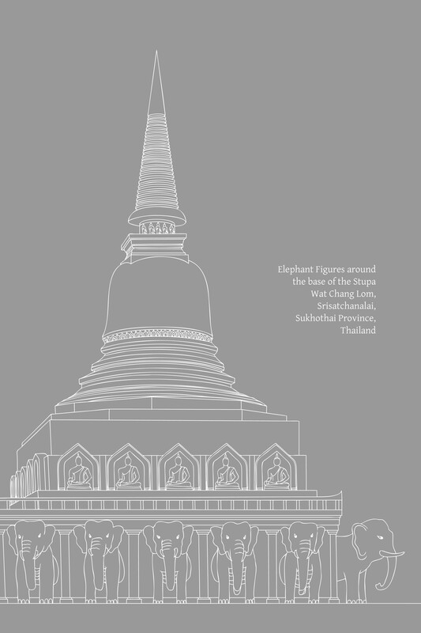

第十七章：戒行道支

# 第十七章：戒行道支

戒（Sīla）与道德行为的社会目标

## 导论

在根本层面上，道德（sīla；戒行）是一个客观真理。它由正语、正业和正命这三道支来描述：它指的是没有邪恶、不道德行为以及伤害和压迫思想的有意识的言语、行为和生计，并且它包含相应的贤善、正直的行为。

从一开始，佛教修行者就应清楚地辨明他们所持守和履行的道德实践的目的和目标。他们应理解戒行如何融入更广泛的修行体系，认识到戒德的深化与心智发展和智慧发展相关。戒行支持三摩地，并导向清晰的知见（ñāṇa-dassana）。它导向苦的止息、福德以及真正的安乐。它对于个人和社会两方面的幸福都是必不可少的。

由完整修行要素组成的八圣道，分为三组：戒行（sīla）、三摩地（samādhi）和智慧（paññā）。这三个主要要素也构成了三学——增上戒学（adhisīla-sikkhā）、增上心学（adhicitta-sikkhā）和增上慧学（adhipaññā-sikkhā）——这三者可以简称为 sīla、samādhi 和 paññā。

整个佛教的实践、训练、戒律、精神发展以及通往涅槃的道路都包含在这源于八圣道的三学之中。真实、真诚、完整的道德行为指的是戒组中包含的三个道支，即正语、正业和正命。

## 戒行道支

八圣道中关于戒行（sīla）的部分包含三个要素：正语（sammā-vācā）、正业（sammā-kammanta）和正命（sammā-ājīva）。以下是这些三个要素在经典中如何定义的例子：

1.  诸比丘，何谓正语？此即称为正语：
    
    1.  离妄语（musāvādā veramaṇī）。
    
    2.  戒除两舌（pisuṇāya vācāya veramaṇī）。
    
    3.  戒除恶口（pharusā vācāya veramaṇī）。
    
    4.  戒除绮语（samphappalāpā veramaṇī）。
    
2.  诸比丘，何谓正业？此即称为正业：
    
    1.  离杀生（pāṇātipātā veramaṇī）。
    
    2.  离不与取（adinnādānā veramaṇī）。
    
    3.  离欲邪行（kāmesumicchācārā veramaṇī）。
    
3.  诸比丘，何谓正命？此即称为正命：于此，圣弟子已舍离邪命，[\[1\]](path-factors-of-virtuous-conduct_split_001.html#fn-fn1)以正命谋生。[\[2\]](path-factors-of-virtuous-conduct_split_001.html#fn-fn2)
    

这三个要素也有区分世间层面和出世间层面的定义。世间层面的定义如上所述；出世间层面的定义如下：

1.  出世间正语：对于心是高尚的、心是无垢的、已证得圣道、正在发展圣道者而言，是止息、避免、戒绝、意图远离四种语恶行。
    
2.  出世间正业：对于心是高尚的……正在发展圣道者而言，是止息、避免、戒绝、意图远离三种身恶行。
    
3.  出世间正命：对于心是高尚的……正在发展圣道者而言，是止息、避免、戒绝、意图远离邪命。[\[3\]](path-factors-of-virtuous-conduct_split_001.html#fn-fn3) {711}
    

## 道德的普遍原则

佛教教义以详尽而全面的方式阐述了道德训练的基本原则——统称为“增上戒学”（adhisīla-sikkhā）。为了给个人和社会整体带来善的结果，建立了各种戒律和道德标准以供实际应用。这种道德行为的实践纲要始于关于行为的教导——与上述八圣道三要素相对应的十善业道（kusala-kammapatha），以及关于最基本道德行为的教导：五戒。[\[4\]](path-factors-of-virtuous-conduct_split_001.html#fn-fn4)

然而，这种道德行为实践纲要的扩展和细节是无限的：经典中根据特定的个人、时期、地点和其他相关情况呈现教导。在此不可能汇编所有这些多样而详尽的道德教导。

在此，足以呈现佛教戒行教义的核心原则，这些原则在经典中以明确的方式描述。我将由读者自行寻找符合其性情、生活状况和目标的具体教导。

撇开适用于特定个人、时期、地点和场合的教导，决定戒行实践教导的一个关键因素是人的职业或生活状况。因此，在家居士和出家众有不同的行为准则、戒律和修行体系。

佛教学习者必须理解这些不同伦理准则的原则、价值，最重要的是其目标，包括其不同的细节和最终的统一与协调，以便对这一主题拥有真正的理解并正确地实践法。

提炼戒行相关道支的精髓并呈现实践行为原则的一个关键例子是关于十善业道（kusala-kammapatha）的教导。这个教导与道支直接对应；它唯一的不同之处在于将身业（对应“正业”）排在语业（对应“正语”）之前。这个教导还有其他名称，包括：“善行”（sucarita）、“身、语（和意）清净”和“行为的卓越”。以下是巴利语经典中描述这一教导的段落：

有一次，佛陀住在波伐（Pāvā）的银匠准达（Cunda）的芒果林里，准达走近佛陀，他们谈论“净化行为”（soceyya-kamma）。准达说他赞同西方地区婆罗门所规定的净化仪式，这些婆罗门携带水壶，佩戴水草花环，供奉火，并将自己浸入水中。

根据这些仪式，早上起床时，一个人必须接触大地。如果他不接触大地，那么他必须接触新鲜牛粪，或青草，或照看火，或向太阳致敬，否则他必须在晚上三次浸入水中。（参见“迷信仪式”注释） {712}

迷信仪式

> 这种对戒律和宗教实践的顽固执着（sīlabbataparāmāsa）从佛陀时代至今在印度一直盛行，从未减弱。废除这种盲信是佛陀教导和活动的主要意图之一，同时废除种姓制度，并将人们从形而上学的思辨引向对更相关和有效问题的考量。对这种盲信以及迷信仪式和典礼日益增长的执着伴随着佛教在印度的衰落，并且确实是其衰落的关键因素。可以公平地说，这种盲信塑造了当今印度社会的状况。无论何处，这种对宗教戒律和实践的盲信越增加，对真正佛教教义的持守就越会衰落。在人类文明史上，对仪式和典礼（即使是比上述更理性的仪式）的这种坚定执着，曾导致剧烈的社会革命，甚至导致这些文明的终结。

佛陀回答说，这些婆罗门的自我净化仪式与圣律（ariya-vinaya）中的自我净化不同。从事十不善业道（杀生、偷盗等——与十善业道相反的因素）的人，其身、语、意都是不净的。无论他们是否接触大地、接触牛粪、供奉火、尊敬太阳，或避免这些行为，他们仍然是不净的，因为这些不善的行为方式本质上是不净的，并导致不净。

佛陀接着描述了十种善行，它们导向自我净化（soceyya）：

甲、三种身净化：

*   1\. 一个人舍弃杀生（pāṇātipāta），戒绝杀生；放下棍棒和武器，有良心和仁慈，他怀着慈悲心，热切地帮助一切有情众生。
    
*   2\. 一个人舍弃不与取（adinnādāna）并戒绝此行；他不以偷盗之意取走他人的财物，无论是在家中还是在森林中。
    
*   3\. 一个人舍弃欲邪行（kāmesu-micchāācāra）并戒绝此行；他不侵犯受母亲、父亲、兄弟、姐妹或亲戚保护的女性，受法保护（例如，通过法定监护）的女性，有丈夫的女性，禁止接触的女性，甚至包括已订婚的女性。
    

乙、四种语净化：

*   4\. 一个人舍弃妄语（musāvāda），戒绝妄语；当被传唤到法庭、会议、亲戚面前、集会或皇室面前，并被作为证人询问：“那么，善人，请说出你知道的”，他不知道就说“我不知道”，或者知道就说“我知道”；他没看见就说“我没看见”，或者看见就说“我看见”；他不会在完全知情的情况下，为了自己的目的，或为了他人的目的，或为了某种形式的报酬而说谎。
    
*   5\. 一个人舍弃两舌（pisuṇā-vācā），戒绝两舌；他不会将此处所听到的重述到别处以离间这些人与那些人，也不会将别处所听到的重述给这些人以离间这些人与那些人；因此，他是使分裂者重归于好的人，团结的促进者，乐于和合，喜于和合，乐于和合，说促进和合之言。
    
*   6\. 一个人舍弃恶口（pharusa-vācā），戒绝恶口；他说的话语不冒犯，悦耳动听且可爱，言语触及人心，礼貌，受众人喜爱和欢迎。
    
*   7\. 一个人舍弃（无益的）绮语（samphappalāpa），戒绝闲谈；他在适当的时候说话，说事实，说善言，说关于法和律的话语；在适当的时候，他说的话有根据，切题，适度且有益。
    

丙、三种意净化：

*   8\. 无贪（anabhijjhā），
    
*   9\. 无瞋（abyāpāda；愿一切众生安住于乐），以及
    
*   10\. 正见（sammā-diṭṭhi）。
    

这三个要素是八圣道前两个要素的延伸：正见（sammā-diṭṭhi）和正思惟（sammā-saṅkappa）： {713}

> 一个人若具足这十种善业道，清晨起床时，即使他接触大地，他也是清净的；即使他不接触大地，他也是清净的……即使他向太阳致敬，他也是清净的；即使他不向太阳致敬，他也是清净的……因为这十种善业道本质上是清净的，并且它们导向净化。[\[5\]](path-factors-of-virtuous-conduct_split_001.html#fn-fn5) 增支部 A. V. 263。

早先提到，戒行的基本原则为了实践目的而扩展，以适应特定情况。例如，对于已受戒的比丘而言，除了调整和增加特定的戒律外，即使是那些保持不变的戒律，有时也会以新的方式来解释。请将这些关于偷盗和妄语的戒律与上面十善业道中提出的定义进行比较：

> 舍弃不与取，他戒绝不与取；只取所给予的，只期待所给予的，不偷盗而安住于清净。舍弃妄语，他戒绝妄语；他说真话，坚持真理，值得信赖和可靠，不是世间的欺骗者。长部 D. I. 4-5, 63-4, 100-101等；中部 M. I. 267-8, 345；增支部 A. V. 204-5。

八圣道中与戒行相关的要素的扩展定义通常分为两部分。第一部分描述避免作恶，后一部分描述从事一种善行，这与个人所避免的不善行相对。前一部分采用否定性语言；后一部分采用促进性或肯定性语言。

这种“否定性”和“肯定性”教导的配对是佛教教义的共同特征，符合“远离恶行，培养善行”的原则。

从远离恶行开始，善的培养可以逐步扩展，这不限于这些道支。例如，关于偷盗（adinnādāna），尽管上述引用的教导没有扩展到明确应用培养善的品质，但还有其他关于佛教关键原则——布施（dāna）的补充教导。

## 有神论道德观与自然法则教义

一些西方学者批评佛教以一种完全否定性的方式教学。他们声称，佛教只教导人们远离邪恶，但不鼓励人们积极地行善；佛教不教导人们在远离恶行后如何促进善行；佛教仅仅是一种主观性的教导，一种“抽象思维的伦理”，一种听天由命和被动性的教导。他们接着说，佛教教义导致佛教徒仅仅满足于避免邪恶，但对帮助他人摆脱痛苦和发现真正幸福不感兴趣。 {714}

这些学者声称，即使佛教教导慈悲心，这些品质也仅仅局限于心智活动。他们引用巴利三藏中的段落来支持他们的观点，认为佛教教义是完全否定性的。例如，他们引用了尊者舍利弗（Sāriputta）提出的正业（sammā-kammanta）定义：

> 朋友们，何谓正业？戒绝杀生、戒绝不与取以及戒绝欲邪行——此即称为正业。[\[6\]](path-factors-of-virtuous-conduct_split_001.html#fn-fn6) 中部 M. III. 251-2。

认识到这些道支真实实践应用的人，例如十善业道中包含的道德行为阐述，会看到这些提出批评（其中大部分是出于善意）的学者无疑只获得了不完整的知识，并且不完全理解佛陀的法。很明显，基于这些道支的戒行体系不限于“否定性”、“被动性”、“主观性”或仅仅是“抽象思维的伦理”。

无论如何，当遇到此类批评时，一个人应该借此机会在自己内心澄清这些问题并扩展自己的理解。对道支中道德要素的解释指的是与意图相关的基本行为。它们最初通过否定性术语（即定义强调远离邪恶）来定义，原因如下：

*   在佛教中，道德戒律和行为准则并非神圣的敕令或刻在石头上的诫命，这些诫命通过神的意志规定人们应如何行事，通常是基于盲信，而无需理解道德行为的理由。 {715}
    
    在佛陀的法中，道德戒律是根据自然法则确定的，它们共同构成了精神发展的起始阶段。持守这些戒律的人应该辨明与这些自然法则的关系。尽管一个人可能尚未拥有清晰的理解，可能只在信心的层面上行事，但这种信心应该是“有根基的”（ākāravatī-saddhā）——它至少应该基于对因果的初步理解，足以生起日益增长的智慧。
    
*   在法实践或精神训练的逐步发展中，一个人必须准备一个稳定而平坦的基础。一个人首先要避免或消除不善行，然后才培养善行并最终达到清净和解脱。这类似于种植果树：一个人必须首先通过清除有害元素来准备土壤；然后才能准备好播种、培育植物并收获期望的果实。
    
    在佛陀的法中，戒行（sīla）是修行的第一阶段，其重点在于远离不善行。起初，人们反复关注那些需要消除的事物，之后，通过逐步纳入禅定和智慧的更高阶段，精神实践的范围可以扩展。
    
*   在三学体系中，道德行为本身并不是通向最高目标的实践。相反，它为人的生命奠定了一般基础，使人准备好培养心智发展的关键因素，即简称为“三摩地”（samādhi）。这一发展阶段是道德行为的延续并从中获得益处。
    
    道德行为的精神价值巨大：远离邪恶的意图或没有任何作恶的念头，能净化和稳定内心；一个人因此不受困惑、苦恼或焦虑的干扰。心变得平静和专注。
    
    当心平静和专注时，一个人会在智慧方面发展出清晰和熟练——他会运用理性的洞察力，并寻求进一步培养善行和达到更高精神成就的途径。
    
*   拥有一个强大、有德和喜悦的心是至关重要的。在佛教伦理中，人的心境与外部身语行为之间必须存在持续的联系和整合。心是所有行为的源泉，因此意图是决定一个人善行真正诚意的首要因素。不欺骗他人是不够的衡量标准——还必须没有自欺。发展一种善的因素整合可以提升心境，并防止内心行为与外部行为相悖的问题。
    
*   与道德行为相关的道支揭示，人类最基本的责任是为自己的心负责：防范一切伤害或侵犯他人的念头。当一个人确立了这种基本的内心清净后，个人责任就会向外扩展，以维持和培养精神品质，并为了帮助他人而行善。总而言之，既有个人远离邪恶的责任，也有为他人的安乐和幸福而行动的社会责任。
    
*   将 sīla 解释为远离伤害和恶行，是以一种基本而统一的方式定义修行原则。这种解释强调完全摆脱腐败和邪恶的意愿。当一个人达到这种基本的自律，并摆脱内外烦恼和动荡时，他就可以开始扩展和培养善和贤德行为的各个方面。 {716}
    
    关于善，其细节和实践方法是无限的，并随时间和地点而异。而不善行则可以严格定义和确定。例如，比丘和在家居士都应戒绝妄语，但基于诚实言语从事善行的机会和方法可能有所不同。因此，包罗万象的行为原则规定了远离基本形式的恶行。培养善的细节和方法是实践应用的问题，取决于一个人的生活状况。
    
*   要达到佛教的目标，就必须发展八圣道的每一个要素。因此，每个道支都必须是一个包罗万象的原则，每个人都能遵循和实践，不限于个人的社会地位、时期、地点或特定的环境条件。
    
    这在道德行为领域中显而易见。例如，戒绝不与取是每个人都能做到的，但布施则取决于其他因素，比如有东西可施、有受者和有值得受施者。如果一个人没有机会布施，那么没有任何偷盗念头的意图就已经净化了内心，并作为三摩地的基础。然而，如果一个人有机会布施，这种布施将增加他的功德，并防止内心冷漠或占有的染污。
    
    正是由于这些原因，这些道德道支的主要解释以否定形式存在：即戒绝不善行为或不存在邪恶。这些道支的扩展解释，包括生起善的积极行为，是如上所述的实践应用问题。
    
*   在法实践中，修行者通常有意识地发展一种特定的精神品质或美德。在此期间，修行者必须全神贯注于该活动。在这种情况下，一个人在其他修行领域中的责任仅仅是防止有害或不善的条件产生。在此，道德行为所期望的益处是帮助调节其他活动领域：防止一个人犯错和造作不善业，摆脱心智的弱点和干扰，并为彻底坚定地发展所选的善德品质做好坚实的基础。
    

如上所述，佛教的修行体系是三学，包括戒、定、慧；此外，它基于自然现象。然而，上述许多批判性学者从有神论传统的角度看待道德，因此他们对佛教体系感到一头雾水。区分佛陀的法中教导的道德行为与有神论宗教中教导的道德行为至关重要（此分析应包括关于业和善恶的教导）。以下是这一区分的一些重要点：

*   在自然法则教义（sabhāva-niyāma），即佛陀的法中，道德行为原则是根据自然的因果法则确定和定义的。在有神论宗教中，道德原则是根据神的意志制定的神圣诫命。
    
*   从“否定”或“制约”的角度来看，佛陀的法中的道德行为是自我约束和自我训练的原则，因此所规定的戒律被称为“学处”（sikkhā-pada）。至于有神论宗教中的道德行为，它由禁令组成——由高位权力制定的诫命。 {717}
    
*   在佛陀的法中，道德行为的一个关键因素是“有根基的信心”（ākāravatī-saddhā）：即对自然法则的信任以及对思虑行为及其结果是根据因缘条件进行的初步理解。有神论宗教中道德行为的一个关键因素是虔诚信仰（bhatti）：即对神所规定之事物的相信、接受和服从，以及完全信赖这些规定而无需质疑其有效性。
    
*   在佛陀的法中，正确持守戒律意味着自我约束，始于远离一切恶行的意图，继而是发展与这些恶行截然相反的美德。在有神论宗教中，持守道德戒律意味着严格服从神的诫命。
    
*   在佛陀的法中，道德行为层面的实践有一个特定目标，即作为三摩地的基础。它是旨在准备和使人能够以最大可能的方式驾驭心智力量的训练系统的一部分，最终生起智慧并最终导向完美的内心解脱。至于说，去天堂，这仅仅是因缘条件的自然结果。然而，在有神论宗教中，持守诫命会带来神的恩惠；这是符合神旨意的行为，其结果是生于天堂的奖赏。
    
*   在佛陀的法中，道德或不道德行为的善恶结果是按照自然秩序自动发生的；它们源于一种公正、客观的自然法则运作，称为业的法则。这些影响首先在心中显现，然后进一步体现在一个人的性格和生活方式中，包括今生和未来生。在有神论宗教中，遵守或违犯神圣诫命的善恶结果是奖赏或惩罚的问题。服从的奖赏是上天堂；违犯的惩罚是下地狱。奖赏或惩罚完全由神的审判决定。
    
*   关于善与恶，佛陀的法教导说，道德美德保护、增强、净化和提升内心，因此被称为 puñña（“功德”、“有功德的”）。道德行为促进心智的繁荣和健康；它是一种善巧的行为，符合智慧，并导向解脱；因此被称为 kusala（“善的”、“善巧的”）。另一方面，邪恶、不道德的行为会损害或降低心智的品质，因此被称为 pāpa（“恶”）。[\[7\]](path-factors-of-virtuous-conduct_split_001.html#fn-fn7) 它损害一个人的生命，是不善巧的，既不利于内心安乐也不利于解脱；因此被称为 akusala（“不善巧的”、“不善的”）。在有神论宗教中，善与恶主要基于信仰和虔诚：行为以服从和符合神的旨意和命令来衡量。特别是恶被解释为反对或违背神的旨意的行为（通常称为“罪”）。
    
*   在佛法中，道德教义必须以理性为基础，因为法行者只有在理解伦理体系如何与因果法则相关联时，才能正确地规范自己的行为。
    有神论宗教盛行的道德观念基于神圣的宣告和神谕，它们由互不相关的规则和戒律组成。
    尽管这些规则可能被编纂成一套伦理准则，但它们并非一个整合体系的一部分，因为此类宗教的信徒只需足够的理解来确定已制定的规则。{718} 无需理解整个体系或与其他因素的关系，因为更大的设计存在于神的全知智慧中；信徒不应怀疑，而应顺从并听从。
    
*   佛教的伦理体系包含客观和普遍的原则；它是根据自然法则确定的。（此处伦理是指戒的本质，作为处理善恶的真理面向；它并非指作为一种规定性戒律——毗奈耶的戒，其中涉及社会环境中的纠正和惩罚形式。）在有神论宗教中，伦理原则倾向于根据神的意志来确定；伦理准则类似于规定的戒律（vinaya）或法典，因为神既是这些法律的制定者，也是审判者。
    
    佛法教导，特定的思愿行为对一个人的心、行为、性情和人格有特定的影响。在这种情况下，对思愿行为的这些影响设定限制或条件是无效的，例如声称某个特定群体具有优势，或以个人认同作为真理的标准。做出以下断言是无效的：只有这个特定宗教的成员才是慈悲和善良的，而其他宗教的成员，即使他们可能表达慈悲，也不是真正的善良；杀害这个宗教的人是一种罪恶，但杀害其他宗教的人则不是罪恶；只有这个宗教的善人才能升天，而其他宗教的人，无论他们的行为如何，都是异教徒并注定下地狱；杀害动物不是罪恶，因为动物是为人类提供食物的（我们难道不是狮子和老虎的食物吗？）。[\[8\]](path-factors-of-virtuous-conduct_split_001.html#fn-fn8)
    
    话虽如此，区分不同种类的思愿行为却是有效的，例如通过观察不同程度的不善行为如何影响心的运作。
    
*   由于道德行为是基于客观原则并依照自然法则确定的，佛教修行者需要勇气和诚实来承认并面对真相。他们被敦促接受缘起的真相，即善恶、对错存在于他们自身和世间。人们是否依照这些法则修行，以及修行的程度，是另一回事。人们需要承认自己的行为是否符合这些自然法则；他们不应仅仅因为一个恶行符合自己的欲望就将其视为善行。支配人类行为的自然法则的有效性不取决于人们的欲望。如果一个人即将做出导致堕入地狱的行为，最好承认这个行为是恶的，但自己仍然愿意承受后果，而不是自欺欺人地认为自己没有做错任何事。
    

诚然，基于神圣命令的伦理也有一些益处或优势：

*   它消除了辩论一个行为是正确还是错误、是真还是假的必要。不容置疑的信仰和虔诚的信心往往能在精神修习中产生炽热的精进和快速的成果。但它也容易产生问题，例如：关于如何向人们灌输信仰（尤其是在这个理性时代）的问题；关于如何与不分享自己信仰的其他人和平相处的问题；如何维持信仰的问题；以及人们自由运用智慧能力的机会减少。（如果一个人满足于人类社会分裂成不同的群体，这些问题中的一些可以被忽视。）
    
*   普通人往往觉得基于信仰和虔诚的道德体系更容易接受，这种道德体系在规范普通人的行为方面做得很好。即使在许多佛教徒中，对与善恶相关的戒的理解也包含着类似于有神论宗教的信念，例如将伦理视为一套禁令（但对谁禁止只有模糊的概念，与有神论教义明确指出是神禁止不同），并将善恶的结果视为一种奖赏或惩罚。然而，这种体系的问题在于它主要依赖于信仰。{719}
    
*   它能为人们提供道德上的漏洞。通过将不善行定性为无辜或无害，人们可能为了自身利益而为其辩解。以杀生不是罪恶的观念为例，这能减轻人们的罪恶感，让他们觉得自己无过错。尽管说服自己无辜是有效的，但这会对一个人生活的其他方面产生不利影响，并且与智慧之道不符。
    
    佛法鼓励人们在精神修习的每个阶段都对真相有清晰的认识，并能自行判断和裁决真相。它教导人们运用自我激励和独立行动的方法，其中包括对所涉因素的透彻理解。这些自我激励的方法应该是无害的，并且只能作为产生其他精神品质的辅助。
    

## 基本道德行为

重要的是要认识到一些普遍原则，这些原则有助于在所有层面正确地实践道德行为，并使人能正确地实践佛法 (dhammānudhamma-paṭipatti)。

佛陀上述界定正语、正业、正命道支的话语揭示了戒的本质，它们描述了善生活所需的道德行为准则。古代的导师们后来汇编了道德行为的八个辅助因素（源自这三个道支），并将其命名为“以清净命为第八的八戒”（ājīvaṭṭhamaka-sīla）。[\[9\]](path-factors-of-virtuous-conduct_split_001.html#fn-fn9) {720}

这些是道德行为的基本因素。由此，道德行为的分析得以展开。例如，当描述针对具有独特生活方式、明确目标和发展历程的特定群体进行培训时，可以区分各种修习细节，例如比丘、比丘尼、沙弥、在家居士等的道德行为。此外，还可以建立一套清晰的社区管理体系，称为道德戒律（vinaya），其中包含约束、管理、对违犯者施加惩罚等措施。

佛陀关于道德行为道支的言论揭示了这条道并非仅为比丘僧团而设；否则，戒的定义就必须是227条戒律、比丘的善行（bhikkhu-sīla）、出家人的道德（pabbajita-sīla）或类似的内容。佛陀以一种融合了多样而详细的道德原则和戒律的方式教导了道德行为的本质。他没有必要为其中一些辅助行为准则授予正式名称；例如，他提到了五戒、八戒和十戒，但并未明确命名。

由于这一点常被遗忘，因此应强调戒不仅指善行的身语行为，还包括清净和正直的生计。一个人谋生方式对善行有重要影响。

在经文的道德戒律分类中，通常只提及主要科目，例如戒除杀生或戒除偷盗。通过浏览这些主要科目，人们可能只从消极或否定性角度看待它们。要对这些戒律有一个完整而清晰的理解，就需要查阅佛陀阐述其含义的教导。例如，在十善业道 (kusala-kammapatha) 的教导中，我们看到几乎每个因素都分为两部分。一部分是需要戒除的，一部分是需要履行的；一个否定性的品质之后是一个积极性的品质。教导始于戒除恶行（例如杀生），接着是鼓励行善以对抗不善行（例如慈悲地帮助所有众生）。

这条道由道德行为、三摩地和般若组成，它们必须完全整合才能实现道的成果。尽管这里讨论的重点是道德行为，但需要注意的是，这仅仅是整合过程中的一个阶段。当一个人在这条道上前进时，道德行为必须与另外两个因素联系起来，才能达到真正的成功。

从技术上讲，道支完全整合所带来的圆满和完善被称为“法和合”（dhamma-sāmaggī）。即使在最高层次，即完全觉悟，也必须有这种因素的整合。当一个人领悟到这种因素的整合时，即使他可能专注于与道德行为相关的因素，他也会意识到其余的因素及其所扮演的角色。

十善业道的教导扩展了道支，使其可以适用于所有人类（这十个因素被描述为“导向真正人性的因素”——manussa-dhamma）。在这项教导中显而易见的是，道德行为伴随着心和般若的发展。（前七个因素与道德行为相关；第八和第九个因素与三摩地相关；第十个因素与般若相关）。

然而，被认为是可接受的道德行为最基本形式的五戒，仅涵盖了戒的阶段，而非三摩地或般若的阶段。这表明仅凭五戒不足以真正地在佛教道上前进。当一个人无法发展更高的精神品质时，至少应该戒除恶行，并尽量不严重伤害他人。{721}

话虽如此，五戒并非被排除在“法和合”（dhamma-sāmaggī）之外。在那些适合将道德行为作为一个独立类别来区分的情况下，佛陀会准备一项补充教导，其中包含与心（citta）和般若（paññā）相关的因素。（在这里，这三个因素不像在十善业道中那样被放在一个单一的组中。）他会教导那些以奉持五戒开始精神修行的在家居士，通过发展心和般若来完成他们的修行，以便他们能够成为觉悟的弟子。

这种整合精神因素的替代性呈现方式，是专门用于教导在家居士的，它通常包含四个因素：信心、善行、布施和般若（偶尔会加入第五个因素——多闻）。这组因素在三藏中频繁提及；以下是这项教导的简明摘要：[\[10\]](path-factors-of-virtuous-conduct_split_001.html#fn-fn10)

在提到一个人如何在此世获得胜利（通过妥善管理自己的家庭、家佣、财务收入等，这些都属于即时利益——diṭṭhadhammikattha）之后，佛陀谈到了一个人如何在来世获得胜利（属于未来利益——samparāyikattha）的方法：

> “毗舍佉，具足四法之女子，为来世之胜利而修行，为来世做好准备。哪四法？……女子如何于信（saddhā）上成就？……在此，女子具足信心。她对如来的觉悟（tathāgatabodhi-saddhā）有坚定信念，如此说：‘世尊是阿罗汉……’女子如何于戒行（sīla）上成就？……在此，女子戒绝杀生……戒绝不与取……戒绝邪淫……戒绝妄语……戒绝酒类和麻醉品，这些是不放逸的基础……女子如何于布施（cāga）上成就？……在此，女子居家，心无悭吝垢染，自由布施，慷慨大方，乐于舍弃，致力于慈善，乐于施予和分享……女子如何于般若（paññā）上成就？……在此，女子有智慧；她拥有辨识生灭的智慧，这种智慧是高尚、具穿透力并导向彻底灭尽苦的智慧……《增支部》IV. 269-71。”

第五个因素，虽然可取但并非强制性，是“多闻”（suta；通过正规教育、阅读、听闻等方式学习），它指的是获取知识的原始数据。如果一个人发展出广学多闻（bahussuta），这将更有优势。

许多佛教徒只关心道德行为。他们可能知道教义的其他方面，但他们的知识常常是混乱和非系统的，尽管佛陀清楚地勾勒出完整的精神发展，即戒、三摩地和般若。他重申在家居士应如何具足信心（saddhā）、道德行为（sīla；特别是五戒）、多闻（suta）、布施（cāga）和般若（paññā）。当一个人在这个层面上达到这种精神因素的和合时，圣道（ariya-magga）便可供修习。

巴利语sīla的含义非常广泛；它可以在非常具体的语境中使用，也可以在一般意义上使用。正如前面提到的，将这个术语与vinaya区分开来是很重要的。{722}

法的原则可以分为道德行为（sīla）、三摩地（samādhi）和般若（paññā）这三个因素。三摩地和般若纯粹属于法，而道德行为可以分为法的原则和世俗的戒律（vinaya）。毗奈耶是戒的一个方面（参见下面的“法层面的戒与毗奈耶层面的戒”一节）。{723}

以下是佛陀的一些教导，它们总结了与普通人相关的基本道德原则，并阐明了“戒”一词的含义和本质。

## 道德的基本原则

让我们回顾与道德相关的三个道支：

1.  正语 (sammā-vācā)：
    
    1.  断除妄语 (musā-vāda)；戒绝说谎；此因素包括说实话 (sacca-vācā)。
    
    2.  断除离间语 (pisuṇā-vācā)；戒绝恶意的造谣中伤；此因素包括和谐、调解的言语 (samaggakaraṇī-vācā)。
    
    3.  断除恶口 (pharusa-vācā)；戒绝伤人的言语；此因素包括悦耳、礼貌的言语 (saṇha-vācā)。
    
    4.  断除无益的闲聊 (samphappalāpa)；戒绝琐碎的谈话；此因素包括有用、有益的言语 (atthasaṇhitā-vācā)。(参阅“善语”注释)
    
    
    
    
2.  正业 (sammā-kammanta)：
    
    1.  断除杀生 (pāṇātipāta)；戒绝杀害有情众生；此因素包括助人助物的行为。
    
    2.  断除不与取 (adinnādāna)；戒绝偷盗；此因素与正命或布施 (dāna) 相伴。
    
    3.  断除欲邪行 (kāmesu-micchācāra)；戒绝邪淫；此因素包括“安于自己的妻子”（sadāra-santosa）。
    
    
    
    
3.  正命 (sammā-ājīva)：断除邪命；如法谋生；此因素包括坚持保持正直的生计，例如不拖欠事务（即不让工作堆积混乱，不拖延，不敷衍了事）。(参阅“邪命行业”注释)
    

佛陀将这些基本的道德行为准则应用于普通人，描述了基本的行为原则，这些原则适合人类和睦相处，过上良善的生活，免于过多的冲突。这些原则在巴利三藏中被称为五“学处”（sikkhā-pada），后来常被称为五戒（pañca-sīla）。让我们回顾这些戒律：[\[11\]](path-factors-of-virtuous-conduct_split_001.html#fn-fn11) {724}

1.  戒绝杀生 (pāṇātipāta)；本质上，这指的是不以身体压迫其他众生的行为。
    
2.  戒绝不与取 (adinnādāna)；戒绝偷盗；本质上，这指的是不侵犯他人物质财产和所有物的行为。
    
3.  戒绝邪淫 (kāmesumicchācāra)；本质上，这指的是在夫妻和所珍爱的人的关系中，不伤害他人、不违犯性道德和传统、不通奸以及不损害家庭声誉和血脉的性行为。[\[12\]](path-factors-of-virtuous-conduct_split_001.html#fn-fn12)
    
4.  戒绝妄语 (musā-vāda)；本质上，这指的是不通过说谎或以利用或伤害为目的的言语来侵犯他人的行为。
    
5.  戒绝酒类、烈酒和麻醉品 (surāmerayamajja)，这些是不放逸的基础；本质上，这指的是不因使用削弱正念和清晰理解的成瘾物质而导致鲁莽和沉醉的行为。
    

善语

> 在《增支部》II. 141中，佛陀有一段关于四种善语 (vacī-sucarita) 的教导：真实语 (sacca-vācā)；无离间语 (apisuṇā-vācā)；柔和语 (saṇha-vācā)；和有理语 (mantā-bhāsā)。注释书将mantā-bhāsā定义为智慧语（AA. III. 134）；有时它被翻译为“适度语”，这本质上与“有用、有益的言语”相同。

五戒（以及类似的道德戒律）的标准定义已由学者和注释者传承给后代。首先，让我们看看佛陀关于这个主题的一些教导：

> “诸位居士，我将教导你们一种适用于自身的法义阐释……诸位居士，一位圣弟子如是反省：‘我渴望生存，不愿死去；我珍爱快乐，厌恶痛苦。既然我渴望生存……并厌恶痛苦，如果有人夺走我的生命，那对我来说将是不愉快的，不可接受的。那么，如果我去夺走他人的生命——夺走一个渴望生存、不愿死去、珍爱快乐、厌恶痛苦的人的生命——那对他来说也将是不愉快的，不可接受的。对我来说不愉快和不可接受的，对他人来说也是不愉快和不可接受的。我怎能把对我来说不愉快和不可接受的事情施加给他人呢？’如是反省后，他自己戒绝杀生，劝导他人戒绝杀生，并赞叹戒绝杀生。因此，他的身行在这三方面得到净化。诸位居士，又一位圣弟子如是反省：‘如果有人拿走我没有给予的东西，即偷窃，那对我来说将是不愉快的，不可接受的。那么，如果我去拿走他人没有给予的东西，即偷窃，那对他来说也将是不愉快的，不可接受的……’诸位居士，又一位圣弟子如是反省：‘如果有人与我的妻子通奸，那对我来说将是不愉快的，不可接受的。那么，如果我去与他人的妻子通奸，那对他来说也将是不愉快的，不可接受的……’诸位居士，又一位圣弟子如是反省：‘如果有人以妄语损害我的福利，那对我来说将是不愉快的，不可接受的。那么，如果我以妄语损害他人的福利，那对他来说也将是不愉快的，不可接受的……’{375} 诸位居士，又一位圣弟子如是反省：‘如果有人以离间语在我与朋友之间制造分裂，那对我来说将是不愉快的，不可接受的。那么，如果我以离间语在他人与他的朋友之间制造分裂，那对他来说也将是不愉快的，不可接受的……’诸位居士，又一位圣弟子如是反省：‘如果有人以恶口对我说话，那对我来说将是不愉快的，不可接受的。那么，如果我以恶口对他人说话，那对他来说也将是不愉快的，不可接受的……’诸位居士，又一位圣弟子如是反省：‘如果有人以轻浮语和闲聊对我说话，那对我来说将是不愉快的，不可接受的。那么，如果我以轻浮语和闲聊对他人说话，那对他来说也将是不愉快的，不可接受的。对我来说不愉快和不可接受的，对他人来说也是不愉快和不可接受的。我怎能把对我来说不愉快和不可接受的事情施加给他人呢？’如是反省后，他自己戒绝闲聊，劝导他人戒绝闲聊，并赞叹戒绝闲聊。因此，他的语行在这三方面得到净化。S. V. 353-5。” “那么，你们认为，比丘们，你们是否曾见过或听过以下情况：‘此人已放弃杀生，他戒绝杀生；国王因此而逮捕他、处决他、监禁他、流放他，或对他施加惩罚？’‘没有，尊者。’‘很好，比丘们。我也没有见过或听过以下情况……但如果他们宣布某个恶行，如：‘此人导致一名妇女或男子的死亡’，那么国王，因为他杀生，逮捕他并处决、监禁、流放或对他施加惩罚——你们是否见过或听过这样的事情？’‘世尊，这样的事情我们见过也听过，而且还会再听到。’‘你们认为，比丘们，你们是否曾见过或听过以下情况：‘此人已放弃不与取，他戒绝不与取……戒绝邪淫……戒绝妄语……戒绝作为放逸基础的酒类和麻醉品；国王因此而逮捕他、处决他、监禁他、流放他，或对他施加惩罚，因为他戒绝不与取……戒绝邪淫……戒绝妄语……戒绝\[沉溺于\]酒类和麻醉品？’‘没有，尊者。’‘很好，比丘们。我也没有见过或听过以下情况……但如果他们宣布某个恶行，如：‘此人从村庄或森林偷窃了某物’……‘此人侵犯了他人的妻子和女儿’……‘此人以妄语使一位居士或居士之子破产’……‘此人沉溺于饮酒和烈酒并杀害了一名妇女或男子’……‘此人沉溺于饮酒和烈酒并从村庄或森林偷窃了某物’……‘此人沉溺于饮酒和烈酒并侵犯了他人的妻子和女儿’……‘此人沉溺于饮酒和烈酒并以妄语使一位居士或居士之子破产；那么国王，因为他偷窃……他犯了邪淫……他说了妄语……他\[沉溺于\]酒类和烈酒；国王逮捕他并处决、监禁、流放或对他施加惩罚’——你们是否见过或听过这样的事情？{726}‘世尊，这样的事情我们见过也听过，而且还会再听到。’《增支部》III. 208-209。”

几乎所有严重的犯罪都源于对五戒的违犯。在一个杀戮盛行、相互敌视、迫害、邪淫、谋杀、盗窃、强奸、欺骗、滥用麻醉品和成瘾性药物的社会中，再加上毒品和酒精滥用所带来的问题和伤亡，人类的生命和财产都不安全。人们无论走到哪里都会感到焦虑和恐惧。当人们相遇时，非但不能感到放松和自在，反而相互不信任。人们的心理健康恶化，难以发展精神力量和美德。

邪命行业

> 在《增支部》III. 209中，佛陀教导了在家弟子应戒绝的五种行业（akaraṇīya-vaṇijjā）：军火交易（“杀人工具”——sattha-vaṇijjā）；人口贩卖（satta-vaṇijjā）；动物肉品交易（maṁsa-vaṇijjā）——注释书说这指的是饲养动物供屠宰；麻醉品交易（majja-vaṇijjā），包括除酒精之外导致放逸的其他成瘾性药物；以及毒品交易（visava-vaṇijjā）。在注释书中，这五种行业被称为“邪业”（micchā-vaṇijjā）——《长部疏》I. 235；《中部疏》I. 136——或“非法业”（adhamma-vaṇijjā）——《经集疏》I. 379。

这样的社会不利于培养精神美德，因为人们忙于解决社会冲突和混乱，而这些冲突和混乱往往会加剧。

因此，未能遵守五戒是衡量社会衰败程度的尺子。持守五戒标志着与上述不善行为相反的行为和生活方式。

持守五戒是判断人类道德行为最基本的标准；持守这些戒律能维护健康的社会环境，并作为善生活方式和更高精神发展的基础。

为了方便起见，注释者们汇编了一份标准清单，用于确定哪些行为构成对五戒中每一戒的违犯，从而确立了违犯的“必要条件”（sambhāra）或“因素”（aṅga）。当一个人满足所有必要条件时，便已违犯（或“破”）了一戒，如下所示：[\[13\]](path-factors-of-virtuous-conduct_split_001.html#fn-fn13)

*   违犯第一戒（杀生）包含五个因素：(1) 众生（人或动物）有生命；(2) 知道该众生有生命；(3) 有杀生的意图；(4) 有杀生的行为；(5) 该众生因该行为而死亡。
    
*   违犯第二戒（偷盗）包含五个因素：(1) 物品被他人视为个人财产；(2) 知道该物品被他人视为个人财产；(3) 有偷盗的意图；(4) 有偷盗的行为；(5) 偷盗行为因该行为而成功。
    
*   违犯第三戒（邪淫）包含四个因素：(1) 有不应侵犯的男子或女子（agamanīya-vatthu）；[\[14\]](path-factors-of-virtuous-conduct_split_001.html#fn-fn14)(2) 有进行性交的意图；(3) 有进行性交的行为；(4) “通路存在”：性器官有接触。{727}
    
*   违犯第四戒（妄语）包含四个因素：(1) 言语不真实；(2) 有说妄语的意图；(3) 因该意图而有行为；(4) 他人理解所说的话。
    
*   违犯第五戒（饮酒、烈酒和麻醉品）包含四个因素：(1) 物质是麻醉品；(2) 有饮用该物质的欲望；(3) 因该欲望而有行为；(4) 物质被吞下并经过喉咙。
    

关于第一戒，尽管经文主要侧重于不杀人（如佛陀上述引文所示），但动物也珍爱生命，喜乐，厌恶痛苦，并且是这个生老病死世界中的同伴，它们也不应被压迫。因此，第一戒将动物包含在有情众生的定义中。诚然，经文声称，在业力上，[\[15\]](path-factors-of-virtuous-conduct_split_001.html#fn-fn15)杀害动物的后果比杀害人类要轻。

关于此事，注释书根据各种标准，提供了判断违犯五戒所致恶报严重性的原则。[\[16\]](path-factors-of-virtuous-conduct_split_001.html#fn-fn16)

后世的佛教僧侣学者汇编了一组与五戒相配的因素，供在家佛教徒与戒律并行应用。这些因素被称为“五德”（pañca-dhamma）或“五美德”（pañcakalyāṇa-dhamma）。

本质上，它们与“善业道”（kusala-kammapatha）的因素相对应，具体会因定义和应用的广度而有所不同。{728}

这五个因素按五戒的顺序排列如下：

1.  慈（mettā）和悲（karuṇā）。
    
2.  正命 (sammā-ājīva)；一些学者用布施 (dāna) 代替或包含布施。
    
3.  感官克制 (kāma-saṁvara)：在感官印象和感官欲望方面拥有自制力，不让这些导致不道德行为。（一些学者将其替换为 sadāra-santosa：“知足于自己的配偶”。）
    
4.  诚实 (sacca)。
    
5.  正念 (sati) 和清晰理解 (sampajañña)；一些学者将其替换为“不放逸” (appamāda)，其本质意义相同。
    

Sadāra-santosa，与邪淫相对立，字面意思是“知足于自己的妻子”，但其核心是“知足于自己的配偶”。从广义上讲，这一要素基于相互协议和同意，也符合社会习俗和规定：不虐待或不忠于自己的配偶，不违背所涉他人的意愿行事，不侵犯“禁区”内的人——那些受他人管辖或照护的人。

虽然这一要素没有明确规定只能有一个配偶而不是多个配偶，但佛教经典倾向并赞扬一夫一妻制，因为它能带来长久的相互爱与尊重，以及一个稳定的家庭，使孩子们感到安全和自在。

经文中这种一夫一妻制关系的模范夫妻是圣弟子纳库拉比达 (Nakulapitā) 和纳库拉玛塔 (Nakulamātā)。他们都是入流者，并被认为是与佛陀关系密切的首要在家弟子 (etadagga)。他们彼此之间有深厚的爱、奉献和忠诚，在灵性美德上旗鼓相当，以至于他们表达了不仅在今生，而且在未来生世也希望相见的愿望。以下是纳库拉比达所说的话：

世尊，自从年轻的家庭主妇纳库拉玛塔在我还年轻时被带回家给我之后，我从未察觉自己对她有不忠的行为，即使在我的思想中也没有，更不用说我的行为了。世尊，我们的愿望是在此生和未来生世都能在一起。

纳库拉玛塔也说了同样的话。[\[17\]](path-factors-of-virtuous-conduct_split_001.html#fn-fn17)

经典将知足于自己的配偶归类为一种“梵行” (brahmacariya)，这显示了这种品质在佛教教义中受到高度赞扬。注释者指出，这种纯洁的行为是不会早逝的原因，如下面这段话：

> 我们不对我们的妻子不忠，我们的妻子也不对我们不忠。除了我们的妻子之外，我们对其他女性实行贞洁 (brahmacariya)。因此，我们当中没有人是在年轻时去世的。[\[18\]](path-factors-of-virtuous-conduct_split_001.html#fn-fn18) {729} DA. I. 178; MA. II. 42; ItA. I. 108; SnA. I. 43.

总而言之，以下偈颂概括了基本的道德行为：

> 一个身、语、意都安住的人，不做任何恶事，不讲无意义、自私自利的话，这样的人被称为有德行的人。J. V. 146.

> 使自己成为一切众生的皈依处。[\[19\]](path-factors-of-virtuous-conduct_split_001.html#fn-fn19) M. I. 39.

## 增进生命与社会的德行

注释书声称，佛陀在《善生经》(Siṅgālaka Sutta) 中所教导的全部内容，旨在作为在家人的戒律或普遍的道德规范。[\[20\]](path-factors-of-virtuous-conduct_split_001.html#fn-fn20) 这一教导可以概括如下：

### 第一节：免于十四种恶行

A. 舍弃四种行为上的恶行 (kamma-kilesa; 染污行为)：

1.  杀害众生。
    
2.  拿取未经自由给予之物。
    
3.  邪淫。
    
4.  妄语。
    

B. 戒除四种恶因；戒除因以下原因而行动：

1.  因欲望而偏袒 (chandāgati)。
    
2.  因嗔恨而偏袒 (dosāgati)。
    
3.  因愚痴而偏袒 (mohāgati)。
    
4.  因恐惧而偏袒 (bhayāgati)。
    

C. 戒除六种导致毁灭的放逸 (apāya-mukha; “毁灭之道”、“挥霍财富之道”)：[\[21\]](path-factors-of-virtuous-conduct_split_001.html#fn-fn21)

1.  沉溺于酒精饮料和麻醉品。
    
2.  沉溺于不合时宜地在街上游荡。
    
3.  沉溺于经常出入表演和娱乐场所。
    
4.  沉溺于赌博。
    
5.  沉溺于结交恶友。
    
6.  习以为常的懒惰。{730}
    

### 第二节：为生命准备两项资产

A. 识别真假朋友，哪些人应该结交，哪些人不应该：[\[22\]](path-factors-of-virtuous-conduct_split_001.html#fn-fn22)

1.  四种假朋友：
    
    1.  骗子。
    
    2.  “夸夸其谈者”。[\[23\]](path-factors-of-virtuous-conduct_split_001.html#fn-fn23)
    
    3.  奉承者。
    
    4.  那些劝人沉溺于毁灭之道的人。
    
2.  四种真朋友：
    
    1.  支持性的朋友。
    
    2.  在顺境和逆境中都忠诚的朋友。[\[24\]](path-factors-of-virtuous-conduct_split_001.html#fn-fn24)
    
    3.  指出益处的朋友。
    
    4.  仁慈的朋友。
    

B. 积累和保护财富。像勤劳的蜜蜂采蜜筑巢，或像蚂蚁筑蚁穴一样。然后将自己的财富分为四份，与自己和朋友分享：

1.  一份用于满足自己的日常需要，照护他人，以及行善。
    
2.  两份作为资本以支持自己的工作。
    
3.  第四份应作为备用金，以备不时之需。
    

### 第三节：保护六方

与六类人的适当关系：

1/A. 儿子和女儿孝顺父母，父母如同东方（前方），他们考虑：

1.  “我曾受他们供养，我将回报他们。”
    
2.  “我将履行他们的职责，为他们工作。”
    
3.  “我将延续家族血脉。”
    
4.  “我将无愧于我的遗产。”
    
5.  “他们去世后，我将供养并为他们回向功德。”
    

1/B. 父母通过以下方式帮助孩子：

1.  他们阻止孩子行恶。
    
2.  他们训练孩子有德行。
    
3.  他们为孩子提供艺术和科学教育。
    
4.  他们帮助孩子寻找合适的配偶。
    
5.  时机成熟时，他们会移交遗产。{731}
    

2/A. 学生以以下方式侍奉老师，老师如同南方（右方）：

1.  起身迎接他们。
    
2.  寻求他们的帮助（例如寻求他们的建议）。
    
3.  倾听他们并保持专注。
    
4.  侍奉和服侍他们。
    
5.  怀着敬意和认真学习他们所教的技能；非常重视学业。
    

2/B. 老师通过以下方式帮助学生：

1.  他们劝导和训练学生有德行。
    
2.  他们使学生对所学科目有清晰的理解。
    
3.  他们为学生提供完整的学科教育。
    
4.  他们向朋友和同事推荐学生。
    
5.  他们为学生提供各方面的保障（指导他们如何真正应用知识和谋生）。
    

3/A. 丈夫以以下方式侍奉妻子，妻子如同西方（后方）：

1.  以适当的方式尊敬她们。
    
2.  不轻视她们。
    
3.  不对她们不忠。
    
4.  给予她们在家务方面的权力。
    
5.  赠送个人饰品作为礼物。
    

3/B. 妻子以以下方式支持丈夫：

1.  她们把家务料理得井井有条。
    
2.  她们支持双方家庭的亲戚和朋友。
    
3.  她们不忠贞。
    
4.  她们保护已获得的财富。
    
5.  她们在工作中娴熟勤奋。
    

4/A. 以以下方式侍奉朋友，朋友如同北方（左方）：

1.  热情好客和慷慨。
    
2.  友善的言语。
    
3.  帮助和支持。
    
4.  提供不变的友谊；在顺境和逆境中都是朋友。
    
5.  诚实真挚。
    

4/B. 朋友和同伴以以下方式回报：

1.  在粗心大意时保护自己。
    
2.  在粗心大意时保护自己的财物。
    
3.  在危险时提供庇护。
    
4.  在困难时不会抛弃自己。
    
5.  体谅自己的亲戚和其他朋友。{732}
    

5/A. 老板以以下方式侍奉仆人和雇员，仆人和雇员如同下方：

1.  根据他们的体力、性别、年龄和能力安排工作。
    
2.  根据他们的工作和生活状况提供适当的工资和奖金。
    
3.  提供福利和保障，例如在生病时协助支付医疗费用。
    
4.  分享任何特权或额外利润。
    
5.  提供休息日和假期。
    

5/B. 仆人和雇员以以下方式支持老板：

1.  他们在老板之前开始工作。
    
2.  他们在老板之后完成工作。
    
3.  他们只拿老板给他们的东西。
    
4.  他们有条不紊地完成工作并力求改进工作。
    
5.  他们向他人称赞老板。
    

6/A. 在家人以以下方式侍奉僧伽成员，僧伽成员如同上方：

1.  他们以慈爱行事。
    
2.  他们以慈爱说话。
    
3.  他们保持慈爱的思想。
    
4.  他们开放和乐意地接待僧伽。
    
5.  他们以四资具供养僧伽。
    

6/B. 比丘和比丘尼通过以下方式支持在家众：

1.  劝阻他们行恶。
    
2.  鼓励他们行善。
    
3.  以慈悲心帮助他们。
    
4.  教导他们以前未曾听闻或知晓的法义。
    
5.  解释和澄清他们所听闻的法义。
    
6.  为他们指出通往天界之道（教导他们如何生活才能实现幸福）。
    

培养四种“摄事” (saṅgaha-vatthu) 以在人与人之间建立信任并创造社会团结：

1.  布施 (dāna)。
    
2.  爱语 (piya-vācā)。
    
3.  利行 (attha-cariyā)。
    
4.  自身行为平衡、公正 (samānattatā)。{733}
    

## 正命的一般原则

如前所述，正命是戒行中经常被忽视的一个方面。虽然这里只作简要概述，但关于正命的教导非常有意义，值得深入探讨。以下是关于这个主题的一些一般原则：

佛教关注人类生存的基本需求，即谋生的主要目的是确保社会中的每个人都有充足的四资具来维持生命。佛教教义优先考虑人类；它不强调物质财富的丰富，那样就是优先考虑物质财产了。

这一“知足”原则包含在佛教关于正当治理的教义中。例如，国王的职责之一是向穷人分配财富，以确保国土上没有贫困、赤贫之人。[\[25\]](path-factors-of-virtuous-conduct_split_001.html#fn-fn25) 因此，统治者工作的成功或政府经济政策的成功，不应以国库充盈或财富丰厚来衡量，而应以社会中消除贫困来衡量。

在这些基本需求得到满足的情况下，经文并不评判一个人拥有多少财富，也不评判社会中财富分配是否平等，因为这些问题与其他因素相关，例如：

拥有足够维持生命的四资具，甚至拥有丰富的物质财富，本身并不是目标，因为寻求和获取财富是培养德行 (sīla) 阶段的一部分：获取财富是达到更高目标的手段。它是发展心智和培养智慧的基础，以便过上健康的生活并体验更精细的幸福形式。

人们性情和才能各异。有些人满足于维持生命所需的最少物质财富，并主要专注于培养更高的精神品质。然而，另一些人尚未为这些更高阶段做好准备，更依赖物质事物，如果他们不涉及伤害他人，这是可以接受的。

此外，有些人性情和才能就是通过分享物质财富来帮助他人；因此，他们的财富对他人是有益的。

“正命”一词的含义不仅限于通过正当手段运用劳动生产商品或获取生活必需品。这个词也包括履行个人责任：一种正当的行为或生活方式，使一个人值得获得这些必需品。例如，比丘们遵守“沙门法” (samaṇa-dhamma) 并因此获得在家信众供养的四资具，就是比丘的正命。同样，孩子们行为良好，其行为方式配得上父母对他们的照护，也可以被视为孩子的“正命”。

此外，在确定劳动的价值时，与其仅仅关注生产商品以满足人们的需求和欲望——因为这些需求是否受贪欲支配或是否与真正的生命需求相关可能含糊不清——佛法之道更侧重于劳动的成果是否支持一个人的生命和社会福祉，抑或以有害的方式起作用。{734}

综上所述，有两个相关事项需要考虑：

A. 在佛教教义中，一个人的职业（或工作）与一个人的物质收入之间的关系是双重的：

*   对于普通人来说，劳动的付出与他们的职业直接相关：工作是为了获得金钱或物质收益以帮助维持生活。
    
*   对于比丘或出家众 (samaṇa) 来说，劳动的付出与一般意义上的就业是独立的。出家众付出努力或工作的意图不是为了获得物质收益，而是为了在佛法上精进或护持佛法。如果一个比丘偏离其职责，专门寻求四资具，这被认为是“邪命” (micchā-ājīva)。同样，如果他以违反施主意愿的方式乞求资具以获取物质利益，这被认为是不清净的生计。
    

除了明显的邪命例子——欺骗、奉承、暗示、恐吓和以利求利[\[26\]](path-factors-of-virtuous-conduct_split_001.html#fn-fn26)——通过服务他人谋生，例如跑腿、从事各种艺术如选择吉时、算命和行医，也被归类为比丘的“邪命”。[\[27\]](path-factors-of-virtuous-conduct_split_001.html#fn-fn27)

如果一个比丘在没有生病的情况下为自己乞食——精美食物、硬食，甚至稀粥——并食之，这种行为在比丘的职业上是错误的。[\[28\]](path-factors-of-virtuous-conduct_split_001.html#fn-fn28) 将佛法变成某种商品，根据出家众的道德准则是错误的。[\[29\]](path-factors-of-virtuous-conduct_split_001.html#fn-fn29) 以听众可能高兴并因此可能获得某种回报的想法来宣讲佛法，是一种“不清净”的佛法宣讲。[\[30\]](path-factors-of-virtuous-conduct_split_001.html#fn-fn30) 即使是类似支付或报酬的布施行为也是不合适的，这在佛陀参与的以下场合中很明显：

有一次，佛陀乞食，停在一个婆罗门田边。婆罗门说：“我耕耘播种，耕耘播种后我就吃。”佛陀回答说：“婆罗门，我也耕耘播种；耕耘播种后我就吃。”婆罗门感到困惑，接着是一系列以偈颂形式进行的问答；佛陀总结说，他的耕耘播种结出了“不死” (amata: “无死”) 的果实。婆罗门赞赏这个回答，并怀着信心供养佛陀一些食物。佛陀拒绝了这些食物，说通过诵偈获得的食物是不合适的。[\[31\]](path-factors-of-virtuous-conduct_split_001.html#fn-fn31)

比丘纯净正直地获取四资具，发生在在家信众认识到佛法的价值并看到帮助那些有责任护持佛法的人的必要性之时。在家信众通过比丘们端庄地托钵乞食而得知他们对食物的需求；信众们随后主动供养食物。这种布施的效果是，施主通过反思自己行善，支持那些修行佛法的人，并亲自参与护持佛法，从而净化、明亮、提升自己的心。简而言之，他们积累功德或获得祝福。{735}

接受供养的比丘们，则遵循关于四资具的行为原则，即比丘应少欲知足，对资具有所节制。这与比丘的其他责任形成对比，例如教导和劝导，这些应尽可能多地进行，其唯一目的是利益那些接受教导的人。

“仅食足于养身，同时尽可能多地工作”的原则与出家众是相符的，因为他们的努力付出与他们生计的物质收益是完全分离的。比丘不能通过诉诸其所做工作的数量来要求特殊权利或特权。当出家众按照这一原则修行时，外部社会系统并不能支配他们的生活。

上述这些原则具有重要的目标，即创造一种摆脱所有外部社会系统的生活方式，或者创建一个独立的社区，其职责是证悟并护持真理，其成员渴望所有人类的彻底精神净化。

B. 坦诚地审视会发现，在经济生产领域，无论是物质产品还是服务业，人类的许多劳动并不能真正利益人类生活和社会。除了明显的破坏性活动，如生产武器或麻醉品，还有一些企业破坏自然环境、贬低人类尊严或损害人们的心智品质，而另一些则专门用于预防和解决有害行为的后果。在很大程度上，这些劳动是徒劳的，最终是具有破坏性的。

许多此类产业的增长，需要人们投入大量的精力和资本来预防和解决生产本身造成的破坏性影响。相比之下，真正利益人类和社会的工作，不一定需要成为普通市场经济的一部分，这可以从与佛法和谐相处的模范生活中看出，这种生活促进人类的德行和智慧。

即使从产出或产量来看，个人德行有时也比体力劳动的成果更有价值：例如，一位比丘可能在森林中禅修，并没有明确努力保护森林，但护林员可能会说，他在保护森林方面比他们所有项目或努力的总和更有效。

就人类真正的福祉和幸福而言，仅仅看生产和消费的价值是不够的；还需要看“不生产”和“不消费”的价值。

从佛法的角度来看，一个在市场经济范围内不生产任何东西，却以审慎的方式消费世界资源，并与自然环境保持健康关系的人，比一个生产破坏性物品并以浪费的方式消费世界资源的人要好。然而，似乎大多数经济意识形态更赞扬后者这种大量生产和消费（具有破坏性）的人，而不是前者这种少量生产和消费（破坏性较小）的人。

我们应该问，仅仅提及生产行为而不考虑消费造成的浪费量，或不反思生产是否真正利益人类，这种评估是否公平？

经济学领域往往只关注统计数据、数字和货币增长。虽然经济学被视为一门科学分支，但许多经济理论和意识形态在解决人类经济问题时是有限的、不充分的、不完整的，因为人类存在于任何特定的抽象科学知识分支之上。{736} 事实上，承认仅仅的数字计算和统计不足以解决人类问题，将有利于经济学领域的利益和完整性。

如上所述，佛教教义并不真正关心一个人拥有多少财富，一个人的价值也不是由他拥有多少金钱来决定的。物质财富被视为达到更高目标的垫脚石，而不是目标本身，金钱的价值与达到这个更高目标的修行联系在一起。

佛教的重点在两个阶段：获取财富的方式和随后使用已获取财富的方式。佛教不强调拥有财富，而是强调寻求和使用财富。仅仅为了某个目的而积累金钱，被认为与以不道德方式获取金钱或以有害方式花费金钱一样应受谴责。

因此，关于物质财富有三种基本恶行：不正当获取财富，拥有财富却不为自己带来真正利益，以及以有害方式花费财富。

此外，虽然一个人可能以正当方式获取财富并以有益方式花费金钱，但这种行为在与物质财富的适当关系方面尚未算完整。这是因为佛教教义强调智慧和心智的品质。一个人与物质财富的关系必须包括“解脱智慧” (nissaraṇa-paññā)。

这种解脱智慧意味着一个人真正理解财富的价值、益处和局限性，并认识到财富有潜力成为有益或有害的。一个人不应被财富奴役，而应成为财富的主人，认识到财富应该服务于人，作为发展善行、减少痛苦和增加真正幸福的手段。财富不应成为增加个人困扰、腐蚀人心、损害人类尊严或制造人际分裂的原因。

佛陀描述了十种不同类型的在家众 (kāmabhogī；“享受感官享乐者”)，其中第十种被他描述为最殊胜的。在这些最优秀在家众的特质中，我们可以看到符合佛法对待金钱的方式，可以概括如下：[\[32\]](path-factors-of-virtuous-conduct_split_001.html#fn-fn32)

1.  获取：以正当方式寻求财富，不滥用或伤害他人。
    
2.  支出（此阶段也包括储蓄和适度生活）：
    
    1.  为自己的幸福（以及自己负责之人的幸福）提供保障。
    
    2.  慷慨施舍；与他人分享财富。
    
    3.  将财富用于功德事业（包括弘扬佛法）。
    
3.  解脱智慧：不因财富而放逸；在花费金钱时运用智慧；了解财富的利弊；不被金钱奴役；依靠金钱寻找精神发展的机会。
    

佛陀对人们与财富的关系作了以下教导：

> 比丘们，世间有这三种人。哪三种？盲者、独眼者、双眼者。{737} 一个人如何是盲者？在此，有些人不具备有助于获取未得财富或增加已得财富的眼睛，也不具备有助于区分善与不善事物的眼睛……区分有害与无害事物的眼睛……区分低劣与高尚事物的眼睛……区分类似光明或黑暗事物的眼睛。此人被称为“盲者”。一个人如何是独眼者？在此，有些人具备有助于获取未得财富或增加已得财富的眼睛，但不具备有助于区分善与不善事物的眼睛……区分有害与无害事物的眼睛……区分低劣与高尚事物的眼睛……区分类似光明或黑暗事物的眼睛。此人被称为“独眼者”。一个人如何是双眼者？在此，有些人具备有助于获取未得财富或增加已得财富的眼睛，也具备有助于区分善与不善事物的眼睛……区分有害与无害事物的眼睛……区分低劣与高尚事物的眼睛……区分类似光明或黑暗事物的眼睛。此人被称为“双眼者”。盲者，眼睛有缺陷，遭受双重不幸：他既没有这种财富，也不行善。另一个人，被称为“独眼者”，仅仅通过正当或不正当的手段，甚至通过偷窃、欺诈和诡计来寻求财富。他沉溺于感官享乐，善于积累财富；但离开这里后，“独眼者”在地狱中遭受折磨。最好的是被称为“双眼者”的人；他将辛勤所得的财富正当地分配，慷慨大方，怀有高尚意图，坚定不移；他达到一个有利的目的地，免于忧愁。一个人应该避开盲者和独眼者，只与高尚的双眼者交往。A. I. 128-9.

佛陀批评囤积物质财富而不将其用于任何有益目的的行为。例如，有一次拘萨罗国国王波斯匿王拜访佛陀。佛陀问国王白天为何外出。波斯匿王告诉佛陀，一位百万富翁在家主最近在首都去世，因为此人没有继承人，国王前去收取他的财宝并运到宫殿。

国王接着说，这些财宝中有八百万金币，更不用说白银了。然而当这个人活着时，他只吃掺有酸粥的碎米，穿一件三件粗布衣服，乘坐一辆破旧的小车，车顶盖着一片树叶。佛陀回答说：

> 大王，正是如此！当一个劣等人获得大量财富时，他既不使自己快乐满足，也不使他的父母……他的妻子和孩子……他的仆人、工人和雇员……他的朋友和同事快乐满足；他也不为沙门和婆罗门建立供养，这种供养能带来高尚的果报，产生善心，导致幸福，通向天界。{738} 由于他的财富没有被妥善使用，国王会没收它，或盗贼会偷走它，或火会烧毁它，或水会冲走它，或不肖的继承人会拿走它。在这种情况下，那没有被妥善使用的财富，就会被浪费掉，而不是被利用。这就像一个无人居住地方的莲花池——虽然它有清澈、凉爽、新鲜、干净的水，有好的渡口，令人愉悦；但没有人会取那水，或饮用它，或在其中沐浴，或用于任何目的。但当一个优秀的人获得大量财富时，他会使自己快乐满足，他会使他的父母……他的妻子和孩子……他的仆人、工人和雇员……他的朋友和同事快乐满足；他也会为沙门和婆罗门建立供养，这种供养能带来高尚的果报，产生善心，导致幸福，通向天界。由于他的财富被妥善使用，国王不会没收它，盗贼无法偷走它，火不会烧毁它，水不会冲走它，不肖的继承人也无法拿走它。在这种情况下，那被妥善使用的财富，就会被利用，而不是被浪费。这就像一个离村庄或城镇不远的莲花池，有清澈、凉爽、新鲜、干净的水，有好的渡口，令人愉悦；人们会取那水，饮用它，在其中沐浴，并用于他们的目的。如同荒凉之地的凉水  
> 被遗弃而无人饮用，  
> 当恶人获得财富时  
> 他既不享用也不分享。  
> 但当智者获得财富时  
> 他利用它并履行职责。  
> 供养亲属，无有可责，  
> 那高尚之人将趣向天界。[\[33\]](path-factors-of-virtuous-conduct_split_001.html#fn-fn33) S. I. 89-91.

在一次类似的场合：

> 大王，正是如此！世间获得巨额财富而不变得傲慢放逸、沉迷感官享乐、虐待其他众生的人是极少数。而世间获得巨额财富而变得傲慢放逸、沉迷感官享乐、虐待其他众生的人要多得多。S. I. 74.

一个人积累财富却不使用或分享，这被比喻为 mayhaka 鸟，它坐在结满成熟果实的无花果树上，叫着 mayhaṁ, mayhaṁ (巴利语意为“我的，我的”)。当成群的其他鸟儿前来啄食果实后又飞走时，mayhaka 鸟仍然喋喋不休。[\[34\]](path-factors-of-virtuous-conduct_split_001.html#fn-fn34)

经典中有许多故事批评吝啬的人将金钱据为己有，而不利用它帮助他人。这些故事通常讲述富有而吝啬的商人思想上的转变。它们为佛教关于财富的正确拥有和使用提供了深刻的教导。[\[35\]](path-factors-of-virtuous-conduct_split_001.html#fn-fn35) {739}

## 道德正直与健康经济

### 导论

泰国有一个普遍的习俗，在家众请求并受持五戒。[\[36\]](path-factors-of-virtuous-conduct_split_001.html#fn-fn36) 当在家众受持并决意遵守这些戒律后，授戒的比丘会通过唱诵来总结道德行为的祝福：Sīlena sugatiṁ yanti, sīlena bhogasampadā, sīlena nibbutiṁ.... 这段偈颂可以翻译为：“通过德行，一个人趣向天界，一个人获得财富的丰足，一个人证得涅槃....”

此处的相关条款是指财富充裕：戒行能够带来财富，从而促进健康的经济。尽管这偈颂是后来才作的，并且既没有出现在巴利三藏中，也没有出现在注解和复注中，但由于其传统的重要性，它值得我们关注。

戒 (sīla) 的主要原则是它建立了一个稳定的基础，并准备了一个有纪律的环境，以便一个人能够成功地从事各种基本活动。

在经济方面，当人们安住于戒行时，没有犯罪，对人的生命或个人财产的危险减少，人们就可以安全地出行。因此，无论是建造工厂、经商，还是在城市或乡村旅行，无论白天还是黑夜，人们都感到安全和安心。老板和员工之间以善意和真诚相待。国家机构廉洁、高效、值得信赖。人与人之间的沟通，无论本地还是国际，都顺畅便捷，生产和商业活动不受阻碍。这就是戒行如何为经济繁荣奠定基础的。

一旦国家稳定，公民感到安全，人们就可以将注意力转向个体。在此，我们无需审视不道德行为的明显危害，例如放荡、偷窃、欺骗和酗酒。当人们决心以正直、高尚的方式谋生，并致力于这种诚实的追求时，他们就不会再以不道德、不择手段的方式行事或思考。他们甚至不会被意外之财的念头所诱惑，更不用说通过不诚实的手段获取财物了。

当一个人的心真正专注于工作时，混乱或分心的念头就会停止。这就是定的开始。当一个人专注于自己的工作和活动时，他会思考这些问题：“我该如何开始？”“我该做什么？”“我该如何着手实现我的目标？”“我可能会面临哪些障碍？”“我该如何解决这些问题？”“我该与谁交往？”“我该向谁请教？”这就是戒行如何影响心灵的；然后，定和智慧接管，成为指导因素。四神足 (iddhipāda)[\[37\]](path-factors-of-virtuous-conduct_split_001.html#fn-fn37) 依次生起，一个人就可以确信能够成就和成功。

请记住，戒行的作用是为人们建立一个稳定的基础，让他们能够自信地进行进一步的修行。如果一个人缺乏戒律，他的基础就会薄弱，环境也不支持他。没有戒行，一个人就无法真正开始修行之路。如果他试图开始，他会摇摆不定，站立不稳。相反，当人们的周围环境有利，基础稳定时，他们就能真正投入到工作中；他们就会具足定。

在一段总结对居家者教导的经文中，佛陀说了一偈，作为关于戒行这一主题的恒常原则：

> 勤勉于工作，不放逸，善于处理事务。 {740} Uṭṭhātā kammadheyyesu appamatto vidhānavā.[\[38\]](path-factors-of-virtuous-conduct_split_001.html#fn-fn38) A. IV. 284, 289, 322, 324-5.

可以说，这偈颂概括了佛教徒对工作的原则。工作始于精进（巴利语用 uṭṭhāna 表示，也可译为“奋起”、“不懈怠”、“财富增长”或“繁荣增加”）。当一个人精进勤勉时，他的工作就会向前发展，从而达到完成和成就。

佛陀强调精进，不仅是导致成功的一个因素，也是对自己工作的自尊和喜悦的回忆。他经常对居家者进行这方面的教导：“一个人通过毅力获得财富，通过自己的臂力积累财富，通过自己的汗水赚取财富，以正当的方式获得正当的财富。”[\[39\]](path-factors-of-virtuous-conduct_split_001.html#fn-fn39)

精进也能带来自我发展和自我完善，因为投入工作会促使一个人在生活的许多方面成长，超越障碍，并取得成功。

然而，仅仅精进是不够的；一个人还必须具足不放逸 (appamāda)。如果一个人勤奋有活力，但行动不合时宜、不恰当，或者行动不当、不合规矩，在不该用力的地方用力，在该用力的地方却放弃努力，他很可能会失败。这里的不放逸指的是正念 (sati)，它与精进 (viriya) 协同作用。一个人警觉清醒，掌握事态发展，不受负面情况干扰。需要时立即行动，并充分准备好保护有价值的东西并处理未竟之事。当机会成熟时，他不会错过。他不会疏忽大意；他坚持这样的原则：“为未来做好充分准备；不要让未竟之事在危机时期造成困扰。”[\[40\]](path-factors-of-virtuous-conduct_split_001.html#fn-fn40)

当精进 (viriya) 得到不放逸的支持时，它就完全具备并以以下方式发挥作用：(a) 预防损害和损失；(2) 解决问题，消除负面或危险情况；(3) 促成和支持善法；(4) 作为一种保护力量，例如保护自己的德行，维护自己的尊严，并提升自己的修行，最终达到精神上的圆满。

上述偈颂中的第三句——“善于处理事务”——指的是智慧，它能使精进得到正确运用，并使不放逸真正发挥作用。总而言之，智慧理解工作中涉及的原则。特别是，一个人具足贤善之人 (sappurisa-dhamma) 的七种德行，其中包括以下因素：知事物的起源和原因；知事物的目标和结果；知自己；知节制；知适当的时机；以及知他人、知自己的社群、知自己的社会，例如：能够为特定工作选择合适的人，了解特定人群的需求和愿望等。[\[41\]](path-factors-of-virtuous-conduct_split_001.html#fn-fn41)

佛陀经常强调这种善于处理事务的能力，无论是在对僧团的教导中（使用表达 alaṁ saṁvidhātuṁ – “善于处理事务”），尤其是在对居家者的教导中，因为居家者负责更广泛社会中的活动。在照料家庭方面，佛陀教导了这一原则：“居家者……应该乐善好施，并且善于处理他的事务 (vidhānavanta)。”[\[42\]](path-factors-of-virtuous-conduct_split_001.html#fn-fn42)

在这种背景下，经文中为从事政府服务的人提供了许多指导原则，例如：

> 一个人具足分别辨别之智 (vicāraṇa-paññā)，成就觉悟之智 (buddhi-paññā)，善于处理事务，知晓适当的时机和场合，适合从事政府服务。一个人勤勉于工作，谨慎周密，洞察力敏锐，善于处理事务，适合从事政府服务。J. VI. 296-7.

总而言之，戒行 (sīla) 涵盖了与人类活动和人类共存相关的事物。可以说，戒行是准备一个适宜的环境和社会的事务，以便人们能够全身心地投入到心的培养和智慧的开发中。 {741}

以下经文揭示了佛教徒居家者的正命原则，描述了财富的获取、财富的开销以及从正当生活方式中获得的快乐。

### 财富的寻求与保护

有一次，婆罗门 优阇耶 (Ujjaya) 拜访佛陀，说他不久将要远行。他请求佛陀给予一个有益于现世和后世安乐的教导。佛陀回答说：

> 婆罗门，这四件事有益于现世的快乐和安乐：精勤具足 (uṭṭhāna-sampadā)、守护具足 (ārakkha-sampadā)、善友 (kalyāṇamittatā) 和等活命 (samajīvitā)。什么是精勤具足？在此，一个族姓子弟勤奋谋生，无论是从事农业、商业、畜牧、军事服务、公务服务，还是某种手艺。他勤勉有技巧，不疏忽，具足调查的敏锐性，熟悉那项工作的程序，能够安排和执行那项工作。这称为精勤具足。什么是守护具足？在此，一个族姓子弟拥有通过辛勤工作获得、通过臂力积累、通过汗水赚取、以正当方式合法获得的财富。他管理、保护和看护那份财富，心想：“现在我该如何安排，才能使国王不没收这份财富，盗贼不偷盗它，火不烧毁它，水不冲走它，以及不肖子孙不取走它。”这称为守护具足。什么是善友？在此，一个族姓子弟无论居住在哪个城镇或村庄，他与那些具足信心、戒行、布施和智慧的居家者、居家者之子、充当显贵身份的年轻人和充当长老身份的老年人交往、交谈和请教。他效法那些具足信心者的信心成就，他效法那些具足戒行者的戒行成就，他效法那些具足布施者的布施成就，他效法那些具足智慧者的智慧成就。这称为善友。什么是等活命？在此，一个族姓子弟以适度的方式谋生，既不过于奢侈，也不过于拮据。他知道财富如何增加，也知道财富如何减少，心想：“这样做收入会超过我的支出，而支出不会超过我的收入”——就像一个称量的人或他的学徒在举起秤时就知道这里差多少\[重量\]，那里多多少\[重量\]……如果这个族姓子弟收入微薄却生活奢侈，他就会被传言：“这个族姓子弟用他的财富就像一个‘无花果树的饕餮者’。”[\[43\]](path-factors-of-virtuous-conduct_split_001.html#fn-fn43) 如果这个族姓子弟收入丰厚却生活拮据，他就会被传言：“这个族姓子弟将像一个贫民一样死去。”但因为这个族姓子弟以适度的方式谋生……这称为等活命。 {742} 婆罗门，正当获得的财富有这四种衰损之门 (apāya-mukha)：一个人是好色之徒，一个人是嗜酒如命者，一个人是惯性赌徒，一个人与恶人交往亲密。就像一个有四个入口和四个出口的大水库，如果一个人关闭了入口，打开了出口，并且如果雨水不按季节落下，那么这个水库的减少是可以预期的，而不是增加。婆罗门，正当获得的财富有这四种增长之门 (āya-mukha)：一个人不是好色之徒，一个人不是嗜酒如命者，一个人不是惯性赌徒，一个人与善人有友谊、伴侣和亲密关系。就像一个有四个入口和四个出口的大水库，如果一个人打开了入口，关闭了出口，并且如果雨水按季节落下，那么这个水库的增加是可以预期的，而不是减少……婆罗门，这四件事能带来一个族姓子弟现世的快乐和安乐。[\[44\]](path-factors-of-virtuous-conduct_split_001.html#fn-fn44) A. IV. 285-9.

由此，佛陀接着揭示了四种有助于后世安乐 (samparāyikatthasaṁvattanika-dhamma; samparāyikattha = ‘未来利益’, ‘更高利益’) 的事：信心的成就、戒行的成就、布施的成就和智慧的成就。

### 居家者的快乐

佛陀对 善生 (Anāthapiṇḍaka) 居士的以下教导中包含了简单地称为“居家者的四种快乐”的原则：

> 居士啊，有这四种快乐，欲乐居家者应根据时机和场合，持续地去追求。哪四种呢？具足之乐 (atthi-sukha)、受用之乐 (bhoga-sukha)、无债之乐 (anaṇa-sukha) 和无过之乐 (anavajja-sukha)。什么是具足之乐呢？在此，一个族姓子弟拥有通过勤奋努力获得、通过自己的臂力积累、通过自己的汗水赚取、正当获得的合法财富。当他想到：“我拥有通过勤奋努力……正当获得的财富”时，他体验到快乐和喜悦。这称为具足之乐。什么是受用之乐呢？在此，一个居家者用通过勤奋努力获得、通过自己的臂力积累、通过自己的汗水赚取、正当获得的合法财富来消费并做功德。当他想到：“我用通过勤奋努力……正当获得的财富来消费并做功德”时，他体验到快乐和喜悦。这称为受用之乐。什么是无债之乐呢？在此，一个居家者对任何人都没有任何程度的债务，无论大小。当他想到：“我对任何人都没有任何程度的债务，无论大小”时，他体验到快乐和喜悦。这称为无债之乐。 {743} 什么是无过之乐呢？在此，一个圣弟子身、语、意行为清白无过。当他想到：“我身、语、意行为清白无过”时，他体验到快乐和喜悦。这称为无过之乐。明了无债之乐，  
> 他忆起具足之喜悦；  
> 当他使用财富时，  
> 他明智地辨别受用之乐。  
> 以智慧辨别，智者知晓  
> 他快乐的双重相应份额，  
> 前三种快乐  
> 不及无过之乐的  
> 十六分之一。[\[45\]](path-factors-of-virtuous-conduct_split_001.html#fn-fn45) A. II. 69.

### 财富的开销

有一次，佛陀对 善生 (Anāthapiṇḍaka) 居士就金钱的目的和财富的益处作了如下教导：

> 居士啊，有这五种从财富中应得的利益。哪五种呢？在此，一个圣弟子用通过勤奋努力获得、通过自己的臂力积累、通过自己的汗水赚取、正当获得的合法财富，使自己快乐愉悦，并妥善地维持自己的幸福；他使自己的父母……妻子和儿女……仆人、工人、雇员快乐愉悦，并妥善地维持他们的幸福。这是从财富中应得的第一种利益。在此，一个圣弟子用通过勤奋努力……正当获得的合法财富，使自己的朋友和同事快乐愉悦，并妥善地维持他们的幸福。这是从财富中应得的第二种利益。在此，一个圣弟子用通过勤奋努力……正当获得的合法财富，保护自己的财富免受火灾和洪水、国王和盗贼以及不肖子孙可能带来的危险；他使自己安全。这是从财富中应得的第三种利益。在此，一个圣弟子用通过勤奋努力……正当获得的财富，作五种供养：亲属之供 (ñāti-bali)、客人之供 (atithi-bali)、为已故者作功德之供 (pubbapeta-bali)、政府之供 (rāja-bali) 和天神之供 (devatā-bali)。[\[46\]](path-factors-of-virtuous-conduct_split_001.html#fn-fn46) 这是从财富中应得的第四种利益。在此，一个圣弟子用通过勤奋努力……正当获得的财富，为那些戒除放逸和疏忽、安住于忍耐和温和、训练自己、平息自己并从烦恼之火中解脱出来的沙门和婆罗门，建立一种能带来高尚果报——产生善法心境、带来幸福、并通往天堂——的供养。这是从财富中应得的第五种利益。 {744} 居士啊，这些就是从财富中应得的五种利益。如果一个圣弟子获得了这五种从财富中应得的利益，而他的财富却耗尽了，他会这样想：“凡是应从财富中获得的利益，我都已获得，只是我的财富耗尽了。”因此，这位圣弟子不会感到苦恼。如果一个圣弟子获得了这五种从财富中应得的利益，而他的财富增加了，他会这样想：“凡是应从财富中获得的利益，我都已获得，并且我的财富增加了。”因此，这位圣弟子也不会感到苦恼。在这两种情况下，他都不会感到苦恼。[\[47\]](path-factors-of-virtuous-conduct_split_001.html#fn-fn47) A. III. 45.

对于富有的居家者来说，慷慨并与他人分享自己的财富被认为是一项至关重要的原则和符合“圣者之道”的实践，如以下教导所证实：

> 少有者应少施；中等者应中施；多有者应多施；全然不施则不值得。确实，高沙 (Kosiya) 的商人啊，我告诉你，你应当使用和分享\[你的财富\]；你应当进入圣者之道；独自进食的人没有喜悦。J. V. 387.

慷慨的培养可以通过定期实践和持戒来完成。例如，一个人可以选择将收入的特定百分比捐赠给他人，或每月或每年进行一次特殊的功德行为。有些人甚至可能决定在施予他人礼物之前不进食，正如最近皈依的富有商人所坚持的誓言所证明的那样：

> 我甚至一滴水也不喝，  
> 如果我没有先施予礼物。J. V. 391, 397.

### 获取财富时保持自由

除了培养对物质财富的认知——它本身并非值得追求的目标，而仅仅是提升自己和他人生活的手段——一个人还应了解财富的局限性，并认识到寻求更有价值事物的必要性，如下段经文所述：

> 行动、知、正直、  
> 戒行、优良的生活——  
> 藉此众生得以清净，  
> 非因族姓或财富。[\[48\]](path-factors-of-virtuous-conduct_split_001.html#fn-fn48) M. III. 262; S. I. 33-4, 55. 我见世间富裕之人，  
> 因贪不分享其财富。  
> 他们囤积财宝，  
> 渴望增盛的感官欲乐。 {745} 一位征服大地  
> 统治直到海洋的国王，  
> 仍不满足于近海之岸，  
> 亦渴望更远之岸。多数其他人，不只是国王，  
> 在未减的贪爱中面临死亡；  
> 如此受损，他们抛弃了尸体；  
> 世间寻不到对感官欲乐的满足。亲属悲叹，披头散发，  
> 哭喊道：“唉！吾爱已逝！”  
> 他们抬走裹尸布的身体，  
> 将其置于火葬堆上焚烧。身着单一裹尸布，死者抛下财富；  
> 殡葬者用木棍拨弄他在火葬堆上焚烧。  
> 当他死去时，亲友  
> 无法在此给他庇护和 refuge。当他的继承者带走他的财富时，此有情  
> 必须依其业报而离去；  
> 当他死去时，财富无法随他而去；  
> 无论是儿女、妻子、财富还是产业。长寿不能靠财富获得，  
> 繁荣亦不能驱逐衰老；  
> 此生短暂，如诸圣者所言，  
> 它不知永恒，只有变迁。富人与穷人同样经历感官接触，  
> 愚者与智者同样受其影响；  
> 但愚者因其愚蠢而受打击，  
> 智者则从不因触而颤抖。在此，智慧胜过一切财富，  
> 因藉智慧方能获得究竟目标。M. II. 72-3; Thag. 776-84.

从事正命的一个重要部分是 sippa：职业知识、专长和技能。[\[49\]](path-factors-of-virtuous-conduct_split_001.html#fn-fn49) 经文强调学习艺术、手艺和科学，并认为父母的职责之一是为子女提供实用的教育。

然而，职业知识本身是有限的。因此，经文也强调“多闻” (bāhusacca)——多闻广学或广泛学习——以便一个人能够认识到实用知识的更大应用，能够有效地帮助他人，并发展全面的知识，特别是导致正见的知识，这才是真正学习的关键因素。

经文还鼓励人们培养戒律——以便他们诚实地运用实用技能，并以有益于他人和社会的方式行事。另一项被鼓励的技能是知道如何有效地说话。这些其他形式的知识补充了职业知识，并增加了一个人帮助他人的能力。

这种贤善的行为与佛陀的以下教导相符：

> 多闻、专长、高度训练的戒律，以及善巧的言语：这些是最高的祝福……未堆积和未处理的工作：这是最高的祝福……清白的行为：这是最高的祝福。[\[50\]](path-factors-of-virtuous-conduct_split_001.html#fn-fn50) Kh. 2; Sn. 46.

巴利文经典中有许多段落鼓励学习艺术和科学，例如： {746}

> 缺乏艺术和科学知识的人谋生困难。J. IV. 177. 教导你的孩子实用知识。J. IV. 429. 学习值得学习的。J. I. 421. 凡被称为艺术和科学知识的都带来好运。J. I. 420. 每一个值得学习的知识分支——无论是高尚的、低级的还是中等的——都应被分析和理解。一个人不必一次性运用所有这些知识——总有一天这些知识会派上用场。J. III. 218.

关于最高祝福这一主题，在正式或学术知识 (bāhusacca) 方面的精通应伴随着实用技能 (sippa)：一个人应该同时具备知识和实践专长。如果这两个品质相结合，一个人就能期望其工作达到卓越。

如果一个人同时纪律严明且善于言辞——能够运用言语促使他人理解或促成合作与社区和谐——那么可以预期更大的成功。

当这些因素与组织良好、执行良好和有益的工作相结合时，一个人的工作将达到圆满。

因为有些人可能过于沉迷于获取知识和从事工作，以至于忽略了家庭责任，所以佛陀在经文开头又增加了两项额外的祝福：照顾父母和支持妻子儿女。

当圣弟子们履行了所有个人责任后，佛陀鼓励他们考虑自己对他人的责任：进一步发展德行，并参与维护所有人类的正义。因此，佛陀在经文结尾又增加了三项祝福：支持亲属 (ñāti-saṅgaha)，[\[51\]](path-factors-of-virtuous-conduct_split_001.html#fn-fn51) 广行布施 (dāna)，以及正法行为 (dhamma-cariyā)。

按照这些原则行事，就是以正直的方式谋生。

佛教承认并确认物质事物的必要性，特别是生活中的四种必需品，例如佛陀经常劝诫的那样：“一切众生依食而存” (sabbe sattā āhāraṭṭhitikā)。[\[52\]](path-factors-of-virtuous-conduct_split_001.html#fn-fn52) {747}

然而，物质事物的真正价值与适度相关，并取决于它们如何促进健康自然的身体状态——身体强健和舒适，免于疾病，以及免于匮乏或过度的危险——以及它们如何支持一个人的工作和精神品质的培养。

物质事物的价值也由社会条件和个人因素决定：由一个人的智慧水平以及认识物质事物的优点、缺点和局限性的能力，以及一个人体验比物质对象带来的快乐更精微的快乐形式的能力来决定。

因此，佛教不主张强迫人们平均分配物质财富，因为这并不能保证人们有德行和快乐。相反，它强调最低要求是所有人都拥有足够的四种必需品，以便没有太多困难地生存，并且拥有物质对象不应成为压迫自己或他人的原因。

佛教教义也认识到物质事物的拥有和消费与一个人的精神成熟和发展有关：精神发展较少的人会更渴望物质对象以求满足，并更依赖物质事物来获得快乐，而精神发展较多的人则不然。

当人们忘记这种与物质财富的正确关系时，就会发生精神衰退：对物质事物的需求变成了对满足的错误追求和对感官享乐的沉迷，直到人们忘记物质福祉是产生更高精神品质的基础。因此，人们常常出于自私而伤害他人。

或者，对物质财富的执着和奴役可能导致占有欲和焦虑，直到人们不愿将其花费或用于有益的目的，这既伤害自己又伤害他人，是另一种形式的苦恼。

更极端的行为发生在对世俗事物感到失望和幻灭，转变为厌恶，并使自己与世界对立时。一个人因此为自己制造了故意的困难，通过极端的苦行或沉溺于自我折磨的实践，以期摆脱物质事物的影响。表面上，这些做法类似于简单生活和将物质需求降到最低。然而，将这些做法视为通往解脱的途径，或在没有深入理解的情况下进行苦行，都是不正确的。一个人应该认识到，在追求解脱的过程中，人们必须在必要的程度上依赖物质事物，才能以智慧和慈悲生活。

一种自由而不过度依赖物质事物的生命，意味着不被这些事物所诱惑、盲目沉迷或迷惑。这种自由依赖于解脱智慧 (nissaraṇa-paññā) 和对物质事物的过患和缺陷的彻底辨识 (ādīnava-dassāvī)。

智者看到愉悦的感官对象和物质事物的诸多过患，例如：一个人很容易被它们奴役；一个人可能完全依赖它们来获得快乐；它们不一定会导致更高的精神品质，如内心平静；当一个人执着于它们时，它们甚至会成为实现这些更高境界的障碍。

此外，这些事物就其本质而言，缺乏固有的完美，无法真正满足我们的欲望和提供满足。它们是无常的、不稳定的、短暂的；它们无法真正被拥有，也无法真正受我们控制；最终它们必然会分解和消融。 {748}

以无明对待这些事物，就是制造悲伤和痛苦。它们并非与我们一同出生，当我们死去时，它们也不会跟随我们。寻求和拥有这些事物的目的是利用它们来解决问题、减轻痛苦，并发展真正的快乐，而不是增加我们的痛苦。

囤积财富毫无功德可言。一个人越是被财富奴役，其苦恼就越大。

当一个人认识到上述真理时，他就能从物质财富中获取真正的价值，将金钱用于利己利他，并培养四种“摄事” (saṅgaha-vatthu)，[\[53\]](path-factors-of-virtuous-conduct_split_001.html#fn-fn53) 例如通过布施，通过建立一个防范不法行为、促进德行并鼓励精神发展的社会，以及通过支持那些坚持真理的人。一个人拥有财富并非仅仅为了增加财富，也不是仅仅为了消费更多和寻求自我满足。

佛教高度推崇那些勤勉工作、以诚实手段获取财富、乐善好施并为他人负责、将金钱用于善法事业的居家者；这样的人被称为“今世后世皆胜利者”。[\[54\]](path-factors-of-virtuous-conduct_split_001.html#fn-fn54)

那些通过智慧从烦恼中解脱的人更加卓越，他们不成为财富或个人财物的受害者，不让财富的获取成为苦恼的来源，他们能够以喜悦之心生活，接触世俗事物却不被其沾染，[\[55\]](path-factors-of-virtuous-conduct_split_001.html#fn-fn55)并且能够在各种情况下苦生起时从中解脱。这些人是真正的自在者（issara-jana），真正的解脱者（serī-puggala）。

这样的在家居士可能已经觉悟到不还者的阶段，然而他们仍然全心投入于自己的工作。佛陀不赞同在家居士只关注眼前的需求或欲望，而不为未来做准备或放弃自己的职责，这可能是一种对无执着的执着。

### 僧伽的双重自由

僧伽作为典范，向人们展示一种最少依赖物质的生活，或一种最大程度脱离物质束缚的生活。这种生活以以下方式与更广阔的社会联系：首先，僧侣生活为比丘们[\[56\]](path-factors-of-virtuous-conduct_split_001.html#fn-fn56)提供了过简朴生活的机会；其次，这种生活使比丘们能够将时间和精力完全投入到与法相关的活动中，而无需陷入对物质财富的追求；第三，这种生活促使比丘们易于供养，因为他们认识到自己不靠自己谋生，而是依赖在家信众；第四，僧伽不以通常的市场交换方式寻求劳务报酬，从而尽可能地摆脱其所处的社会和政治主流体系的控制和影响。

所有比丘，无论是否开悟，都受制于主要为真理而生活，并将物质需求降到最低的原则。

佛陀无意让在家居士过僧侣或苦行生活，他也不希望每个人都出家为比丘。这是一个自然的、因果的真理，即在任何一个时期，不同的人处于不同的精神发展阶段，他们会有不同的需求和欲望。即使是大多数入流者，或者至少是很大一部分入流者，也与家人一起在家生活。{749}

佛陀在这方面的意图，很可能是为了在更广阔的社会中建立一个独立的社群，以便在正义和真理的领域中起到平衡作用，维系社会中的真理原则，并为那些既渴望又准备好获得这种自由的人提供一个摆脱社会控制影响的途径。

这个社群既以物质形式存在，也以理想形式存在。作为物质实体的独立社群是比丘僧伽——有时被称为“世俗僧伽”（sammati-saṅgha）——它与更广大的在家居士社群并存，但又独立于它。[\[57\]](path-factors-of-virtuous-conduct_split_001.html#fn-fn57)作为理想的独立社群是“真实弟子社群”（sāvaka-saṅgha）——有时被称为“圣者社群”（ariya-saṅgha）——它与更广大的未觉悟众生社群并存，但又超然于它。

这一原则的要旨是，模范社会并非所有人都是相同的（这样的社会无法实现），而是所有成员，尽管个体情况可能不同，都致力于精神成长，和睦共处，并为同一目标而奋斗的社会。这样的模式为那些不愿再生活在更广阔社会束缚中的人提供了一种有益的选择。（即使在未来的弥勒佛时代，据称人人平等，也将存在一个独立的比丘社群。）

关于比丘僧伽，比丘们要安住并维持这种独立性，他们必须过着很少依赖物质的生活方式。此外，他们必须具备有利于这种生活方式的心理素质。佛陀强调比丘和所有出家人的一项重要品质是知足（santosa），这使人能够过简朴的生活，并体验到不依赖物质的喜悦。

比丘们无需将时间、精力、注意力花费在获取物质上。相反，他们可以将时间、坚定的努力和注意力完全投入到他们的精神修习中，以期获得智慧和心解脱。知足和乐于修习的原则体现在佛陀对圣者四种传统修习（ariya-vaṁsa；“圣种”的四项原则——见下文）的教导中。

比丘们奉行简朴的生活方式，不从事技艺和科学以谋生。他们依靠古老的传统，以在家信众提供的四资具维生。同时，他们无权主动乞求食物或其他资具。因此，他们应该让自己易于供养，知足少欲，并符合“圣种”（ariya-vaṁsa）的四项原则：

1.  在这教法与戒律中，一位比丘知足于任何种类的衣物，并且称赞对任何衣物的知足；他不为衣物而从事错误的、不适当的寻求。如果他得不到衣物，他不会烦躁不安，如果得到了，他使用时不执着、不迷恋、不痴迷；他看到其中的危险，理解解脱之道。然而，因此他既不自我褒扬也不贬低他人。任何在此方面熟练、精进、不懈怠、明了知和具念的比丘，都被称为安住于古老、纯净的圣种中。
    
2.  此外，一位比丘知足于任何种类的乞食.... {750}
    
3.  此外，一位比丘知足于任何种类的住处....
    
4.  此外，一位比丘乐于培养善法，乐于善法的增长，乐于断除不善法，乐于不善法的舍弃。然而，因此他既不自我褒扬也不贬低他人。任何在此发展（bhāvanā）和舍弃（pahāna）方面熟练、精进、不懈怠、明了知和具念的比丘，都被称为安住于古老、纯净的圣种中。[\[58\]](path-factors-of-virtuous-conduct_split_001.html#fn-fn58)
    

像知足这样的品质与比丘僧伽的戒律和道德行为相符。为比丘们制定的道德规范是为了培养比丘们的知足心，并支持他们致力于培育善法和断除不善法。

批注书将僧伽的道德行为分为四个方面，统称为 pārisuddhi-sīla（“导向清净的道德行为”或“指定为道德行为的清净行为”），如下：[\[59\]](path-factors-of-virtuous-conduct_split_001.html#fn-fn59)

1.  Pāṭimokkhasaṁvara-sīla（波提莫叉律仪戒）：作为波提莫叉之约束的道德行为：戒除被禁止的行为，遵守被允许的行为形式，并严格奉行学处。批注者声称此要素是通过信心来完成的。
    
2.  Indriyasaṁvara-sīla（根律仪戒）：作为感官约束的道德行为：当眼见色、耳闻声、鼻嗅香、舌尝味、身触觉、意知法时，要小心不让邪恶、不善的心境，如欲望、执着、厌恶和愤慨，控制住心。批注者声称此要素是通过念（sati）来完成的。
    
3.  Ājīvapārisuddhi-sīla（活命遍净戒）：作为活命清净的道德行为：以正当和纯洁的方式谋生；避免通过不正确的方式寻求利益，例如：不虚报超常状态，如禅定成就或开悟阶段，[\[60\]](path-factors-of-virtuous-conduct_split_001.html#fn-fn60)如果自己没有生病，不口头乞食；戒除欺诈（kuhanā），例如通过表现严肃的举止或神情来使在家信众产生信心，并诱导他们供养四资具；戒除谄媚（lapanā）以获取食物；戒除暗示以获取资具；戒除诉诸威胁和贬低以促使在家信众供养资具；戒除以小博大，例如给予某人小礼物，希望他能回赠更多。批注者声称此要素是通过精进（viriya）来完成的。
    
4.  Paccayasannissita-sīla（资具依止戒）：与四资具相关的道德行为：以如理作意（paccaya-paccavekkhaṇa）使用四资具，理解其真实目的和价值；避免因贪婪而使用它们。例如，吃饭是为了滋养和强健身体，安乐生活，能够履行职责，并在三学中进步。不为感官享受、娱乐或消遣而食。批注者声称此要素是通过智慧（paññā）来完成的。{751}
    

### 总结

在在家社群的背景下，有几种与个人财富相关的行为应予强调：

甲、就个体而言，佛陀特别赞扬那些通过勤奋努力和正当手段获取财富，并将其用于有益、功德目的的富裕之人。他称赞德行和仁慈胜于财富本身。

重要的是，要向现代人灌输价值观，使他们认识到通过努力和诚实手段积累财富并决定将这些财富用于行善是值得自豪的。

仅仅因为某人富有就赞扬他们，认为他们从过去的善行（前世）中积累了功德，[\[61\]](path-factors-of-virtuous-conduct_split_001.html#fn-fn61)而没有考虑此生财富的成因，这从佛教的角度来看是错误的，原因有二：首先，这不符合佛陀对上述富有之人的赞扬。其次，这没有对因缘进行明智而全面的评估，特别是此生与个人境况关系最直接的因缘，因此应给予更多的重视。

过去的业只能作为初始基础，例如提供身体特征、心智能力、思维敏捷和个人性情，以支持此生的行为。

诚然，过去的行为对于出生在富裕家庭起着重要作用，但即使在这里，佛陀也没有将这一事实视为特别值得称赞，因为佛教的一般原则是不美化或过分看重一个人的家庭或出身地位。

佛陀赞扬的是善行，这是个体获得如此可喜结果的原因。出生在富裕家庭本身就是一种福报；无需再为此增添赞扬。根据佛教，这样的出生被视为起始资本，这给予这样的人一个好机会，甚至相对于他人在今生取得进步的优势；因此，过去行为的结果已经成熟，这个人达到了一个新的起点。佛陀赞扬或批评这样的人如何运用这一起始资本。

总体而言，佛陀的赞扬或批评侧重于一个人是否通过诚实、正当的手段创造财富，或者未能做到这一点，以及一个人如何处理这些财富。佛陀不赞扬或批评财富本身或富人；相反，他赞扬或批评富人的行为。

乙、就社会而言，佛教教导物质财富是生命的支撑；它不是生命的目标。因此，财富应该促进和帮助人们过上道德生活，并从事善行，以实现更高层次的精神卓越。无论财富在哪里、向谁生起，它都应该利益所有人类，并有助于他们的福祉。{752}

遵循这一原则，当一个人变得富有，所有人都变得富裕，整个社会繁荣；当一个好人获得财富，他或她所在的社区也获得财富。这样的人就像一片肥沃的田地，稻谷茂盛，利益所有众生。[\[62\]](path-factors-of-virtuous-conduct_split_001.html#fn-fn62)

富裕之人可以感到满足和荣幸，因为他们获得了社会的信任，并作为社会的代表，分享财富以支持和滋养同胞，并为他们提供真正成长的机会。[\[63\]](path-factors-of-virtuous-conduct_split_001.html#fn-fn63)

相反，如果一些个体变得更加富有，但整个社会却恶化，其他人的苦难增加，这表明在物质财富方面存在不当行为。所创造的财富未能成为支持因素，而这才是财富的真正目的。不久之后，社会就会出现动荡。最终，要么是社会中那些富裕成员的地位，要么是整个社会结构都将难以为继。更广大的社群成员可能会将富裕和有影响力的人从他们的权力位置上撤下，并建立一个新系统以及新的财富分配执行者，这可能是情况的改善或恶化。

无论如何，存在这样一个事实：如果人们在与物质财富相关的行为上不正确，而物质财富本是为了一切众生的利益而生起的，那么财富最终会损害和摧毁人性、人类和人类社会。

丙、就国家而言，佛教认识到物质财富的这些重要方面：贫困是一种苦难，[\[64\]](path-factors-of-virtuous-conduct_split_001.html#fn-fn64)贫困和匮乏是社会犯罪和不当行为的关键原因（正如相关的贪婪因素），[\[65\]](path-factors-of-virtuous-conduct_split_001.html#fn-fn65)并且国家或政治领导人有责任照顾穷人并分配资金给他们，以确保国内没有贫困人口。[\[66\]](path-factors-of-virtuous-conduct_split_001.html#fn-fn66)

为解决这些问题，需要采取各种措施，这些措施往往因情况而异，例如：为公民提供诚实谋生的机会；创造就业机会；根据关于国家团结的四种德行（rāja-saṅgahavatthu）的教导，分配资金和其他援助手段；[\[67\]](path-factors-of-virtuous-conduct_split_001.html#fn-fn67)以及防止不道德或不义的行为，如剥削。从这个意义上讲，国家应将贫困的减少和消除视为其成功的更好衡量标准，而不是社会中富裕个体数量的增加。贫困的消除是社会管理不忽视社会人民精神发展的结果。

丁、就经济和政治而言，人们经常问哪种经济制度或政府最符合佛教原则。基本上，这不是佛教必须回答的问题；或者冒着重复的风险，可以说，任何与佛教价值观和原则和谐应用的制度都是有效的。{753}

经济或政治制度应根据其实践方式进行分析，这种分析会因时空相关的环境条件而改变或修正。在此应重申，物质财富的目的和真正益处是它作为人类协调生活、使他们和平共处、从事功德善行以及实现更高层次精神卓越的支撑。因此，当财富在一个个体身上显现时，整个社会都将受益，所有人都将繁荣。无论哪种经济或政治制度能产生如此有益的结果，都与佛教和谐一致。

社会制度如何与特定的时间区域因素相联系的明显例子如下：当佛陀建立僧伽，并赋予其独特的任务和目标时，他制定了限制比丘个人财产为八资具的戒律；[\[68\]](path-factors-of-virtuous-conduct_split_001.html#fn-fn68)其他财产则属于整个僧团。就在家信众而言，当时在印度（Jambudīpa）[\[69\]](path-factors-of-virtuous-conduct_split_001.html#fn-fn69)存在两种政体，佛陀为那些共和制国家（或由议事会治理的国家）教授了“不退法”（aparihāniya-dhamma），并为那些君主制国家教授了“转轮圣王法”（cakkavatti-vatta）。

这些记载表明，佛法不仅仅是一种哲学或抽象的教义，而是一种实践性的教义，它与社会中的活跃人群以及现实生活环境相关联。这些教导需要适用于人们的日常生活，与他们相关，并对他们有益。

如果人们要等到完全建立起一个所谓的理想政治制度（其优越性永远无法被最终证明），才能体验到幸福和福祉，那又如何能摆脱假设性的观念和轻信呢？

在共和制和君主制并存的情况下，佛陀找到了造福生活在这些不同政治制度下的人们的方法。在共和制的情况下，佛陀提出了加强和确保人民共同努力的方法；在君主制的情况下，他鼓励统治者认识到声望和权力应该是造福人民的工具，而不是为了自我满足和自我放纵。

在阿育王时期，当君主制达到顶峰时，阿育王在治理国家时奉行佛教的治国原则，正如刻在阿育王柱上的一句格言所证实的那样：

> 吾主最高皇帝，仁慈地看待世人，为诸神所爱，并不重视（自己的）荣耀和声望，除非他怀着这样的目标来追求这些：‘愿现在和将来的人民都虔诚地听从我的教导，并依照正义之道修行。’[\[70\]](path-factors-of-virtuous-conduct_split_001.html#fn-fn70)

当人们理解了佛教经济和政治教义的要旨和目标后，具体决定哪种制度真正符合佛教的任务，则留待这些制度的学者们去讨论。

同样地，如果人们希望构思出新的治理体系，并在现有体系的基础上加以改进，那会更好，但这些问题超出了本书的范围。