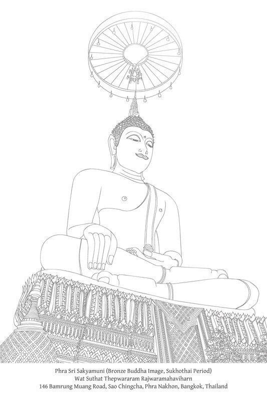
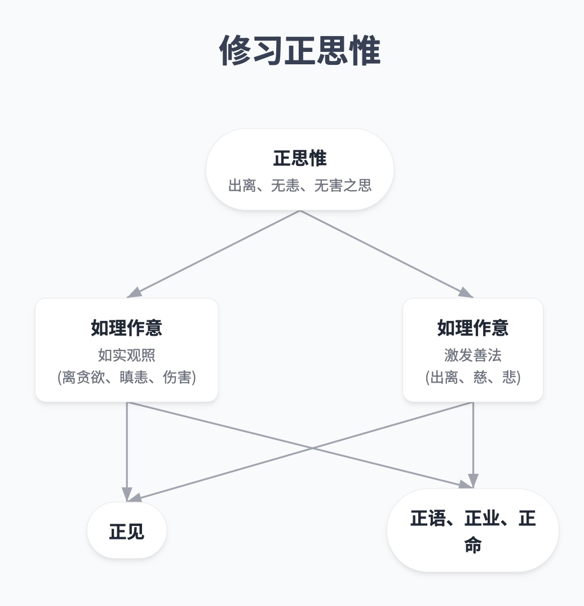
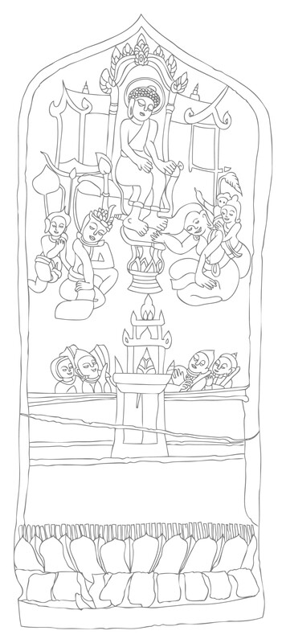

# 第十六章：智慧道支

正见与正思惟

## 如理作意与健全人生的重要性

佛教的修行可以定义为“以自然法则利益人类的方式”，或者定义为“应用对自然法则的理解来利益人类”。因此，正确或殊胜的修行指的是以一种优化自然因果动力，使其更好地利益自身和他人生活的方式来生活。人们以对自然的洞察力来生活，采取行动引发能够为所有人带来有利结果的因缘。这种强调在关于业行（kamma）的教导中尤为明显。

从技术上讲，人们修习中道（majjhimā-paṭipadā）：人们应用中道教法（majjhena-dhammadesanā；不偏不倚的真理教法）来利益人类并达到佛陀教法的最终目标。

因此，善行（cariya）可以分为三个阶段：

*   首先，了知自然的实相，洞察自然，即一切事物都依因缘而存在。
    
*   其次，善用此知识，使自己的行为与自然法则和谐一致，并以产生良好结果的方式行事。
    
*   第三，当一个人依照因缘行事时，他允许它们自动、独立地产生结果——他以理解来观察它们，而不执着于它们，也不执取自我感。
    

因此，知识是善行的支柱；它是一个从始至终都至关重要的因素。善行等同于以智慧生活，而有德之人因此被称为 paṇḍita——一个有智慧的人。

由于智慧从一开始就需要，佛教的修行体系（道——magga；中道）始于正见（sammā-diṭṭhi）。

## 正见（sammā-diṭṭhi）

### 正见的重要性

> 诸比丘，正如黎明之光是旭日东升的先兆和前驱，同样地，正见是如实觉悟四圣谛的先导和前驱。一个具足正见的比丘，必能如实了知：“这是苦……这是苦的生起……这是苦的止息……这是导致苦止息之道。”  
> S. V. 442
> 
> 诸比丘，在所有道支中，正见为首。正见如何居于首位？\[通过正见\]一个人了知邪见为邪见，正见为正见……一个人了知邪思惟为邪思惟，正思惟为正思惟……一个人了知邪语……正语……邪业……正业……邪命……正命为正命。  
> M. III. 71-77
> 
> 正见如何是领导者？当一个人具足正见时，正思惟便生起；当一个人具足正思惟时，正语便生起；当一个人具足正语时，正业便生起；当一个人具足正业时，正命便生起；当一个人具足正命时，正精进便生起；当一个人具足正精进时，正念便生起；当一个人具足正念时，正定便生起；当一个人具足正定时，正智便生起；当一个人具足正智时，正解脱便生起。如此，具足八支的修行者便成为具足十支的阿罗汉。[\[1\]](#fn-fn1){:id="fr-fn1"}  
> M. III. 76
> 
> 一个比丘，如果他的见地正当，道的修习正当，那么他能够破除无明，生起真知，证悟涅槃：这是可能的。原因何在？因为他的见地是正当的。  
> S. V. 10-11, 49
> 
> 我看不到有任何其他事物，能像正见那样，如此有助于未生善法的生起，或已生善法的增长和繁荣。  
> A. I. 30-31

### 正见的定义

正见最常见的定义是对四圣谛的了知：

> 诸比丘，何为正见？了知苦，了知苦的起源，了知苦的止息，了知导致苦止息之道：这称为正见。例如：  
> D. II. 311-12; M. I. 48-9, 62; S. V. 8-9; Vbh. 104, 235

其他定义包括：

了知善法和不善法，以及它们的根本原因：

> 当一位圣弟子了知不善和不善的根，善和善的根时，以此方式他便是具足正见者，其见地正直，对法有不动摇的信心，并已到达此真实之法。[\[2\]](#fn-fn2){:id="fr-fn2"}  
> M. I. 46-7

辨明三法印：

> 一位比丘辨明色蕴……受蕴……想蕴……行蕴……识蕴实际上是无常的：这种辨明是他的正见。正确地看待，他体验到厌离。随着喜悦的止息，欲贪也止息；随着欲贪的止息，喜悦也止息。随着喜悦和欲贪的止息，心便解脱，可称为彻底解脱了。  
> S. III. 51
> 
> 一位比丘辨明眼……耳……鼻……舌……身……意……色……声……香……味……触……法实际上是无常的：这种辨明是他的正见。  
> S. IV. 142

辨明缘起（例如，见第四章）。[\[3\]](#fn-fn3){:id="fr-fn3"}

佛陀也定义了两种层次的正见：“有漏”（sāsava）的正见和出世间正见：

> 诸比丘，何为正见？我说正见有二：一是有漏的正见，属于福德，对五取蕴产生果报；二是一种圣的、无漏的、出世间的正见，是道支。何为有漏的正见，属于福德，并对五蕴产生果报？“布施有果报，供养有果报，礼敬有果报；善恶业有果报；有此世和他世；有母亲和父亲；有化生众生；有依正道而行、正道而修的沙门和婆罗门，他们以亲证智自觉此世和他世，并使之广为人知。”这是有漏的正见，属于福德，并对五取蕴产生果报。何为圣的、无漏的、出世间的正见，是道支？智慧、慧根、慧力、择法觉支，以及在心高尚、心无漏、具足圣道并正在修习圣道者的正见道支：这就是圣的、无漏的、出世间的正见，是道支。  
> M. III. 72

### 一般要点

Ditthi 最常被翻译为“见”，但它的含义也包括‘信仰’、‘思想体系’、“观点”、“理性知识”、“符合个人理解的事物’、‘被认为可接受的原则”、“合意的观念”、“固守的见解”、‘偏好’和‘个人价值观’。这个词的含义也包括一个人的理想、世界观、人生观以及由此类见解、知识和偏好所产生的基本态度。[\[4\]](#fn-fn4){:id="fr-fn4"}

如上所述，见地有两种层次或类型：第一，与价值感相关的见解和理解，比如什么是善与恶，适当与不适当；第二，与真相相关的见解和理解，比如某事物是什么，它如何存在，以及它从何而来。

见地、个人理解和珍视的信念对人们的生活方式以及整个社会都发挥着巨大的影响和控制作用。在十种业行（kamma-patha）的教导中，diṭṭhi 被归类为意业，其后果比身业和语业都更为严重。[\[5\]](#fn-fn5){:id="fr-fn5"} 这是因为意业是身业和语业的根本原因。见地能够引导个人、社会或全人类走向繁荣和自由，或者走向衰落和毁灭。

这在每个人的生活中显而易见：见地决定了一个人的生活方式，无论是信息处理还是外在表现：一个人如何看待世界，以及如何与世界互动。这始于一个人如何解释、评估和判断新的经验。见地决定了一个人寻求和选择哪些事物或事物的哪些方面，以及一个人喜欢或不喜欢哪些事物。然后，它们影响着一个人的思想、言语和行为过程，一个人如何回应、反应和处理事物：一个人如何对另一个人、一个物体、一个环境或一个情况说话或行事，以及一个人如何为这些言语和行为创造理由。

从技术上讲，见地决定了其他心所，始于一个人的思维（saṅkappa），相应地使它们成为‘正’（sammā）或‘邪’（micchā）。

见地在修行中的重要性是显而易见的。例如，如果一个人喜欢金钱，并将物质财富视为人生的目标，成功的衡量标准和自我重要性的标志，他就会努力获取这种财富。这个人的教育和工作都将为此目的而进行，他将以财富为标准来衡量、评价和尊敬他人。如果这样的人道德有缺陷，他将不加区分地追求财富，不考虑自己的行为是否正当，他会把那些道德高尚的穷人视为愚蠢、守旧或没有价值的人。

如果一个孩子相信拥有权力是好的，他就会倾向于行使权力，喜欢支配和欺凌他人。

如果一个人不相信功德（puñña）和恶业（pāpa），并将这些词语视为空洞的威胁，他将不理会关于善行举止的教导，也不会克制那些被认为是不善巧的行为。

当一个人缺乏对生命和世界的深刻理解，认为它们最终是不稳定和短暂的，他往往会执着于身体、生命、财产和人。他通常感到焦虑和恐惧，并表达出因执着和恐惧而产生的痛苦。

对于所有这些例子，反面也同样真实：善的见地导致善的结果。

正见被称为 sammā-diṭṭhi，邪见被称为 micchā-diṭṭhi。邪见的条件是他人的有害影响，恶劣的社会环境，特别是恶友，以及缺乏如理作意（ayoniso-manasikāra）：无法思惟或倾向于以不正确的方式思考。

正见的条件是他人的有益影响——在一个有利的社会环境中受到正确的塑造和教导，特别是通过与善友接触和与正直的人交往——以及如理作意。

本章的主要焦点是正见，偶尔提及邪见。

正见分为两种或两个层次：

世间正见（lokiya-sammādiṭṭhi）：与世间相关并依赖于世间的见地；对世间的见解、信仰和理解，符合善的原则，与正法之道相符，或与善行和谐一致，如以上经文所述。

一般而言，这种正见是“他音”（paratoghosa）或社会因素的结果，它以信心作为连接或引导力量。[\[6\]](#fn-fn6){:id="fr-fn6"} 特别是它源于一个人从社会中接受的指导，例如通过伦理道德的教导和培训以及文化传承。它与如理作意相关；这里所应用的如理作意通常鼓励一个人从事善的活动。

这种正见与评价相关：什么是善、恶、对、错、更好、更差，什么应该和不应该做。它也包含维护这些善的价值观的信仰体系和教义。

因为这种正见源于社会制约和外部传承，它表现为人类建立或规定的教义、规则和信仰。因此，这些见地是叠加在自然法则之上，或与自然法则有一步之遥。它们因此是“世间”的：它们的细节和特殊性会因时空而异，并随周围社会发展而变化。

个人喜好、偏爱和价值观都包含在此世间见地的分类中。

尽管这种见地的细节会随着不同的地点和时间而变化，但有一个普遍原则来确定什么是正见，即业的原则或法则。这是因为业的法则是一个证实或验证人类所有行为的真相或自然法则。

世间正见被这一自然法则所证实，并与这一自然真相和谐一致。因此，世间正见有时被定义为 kammassakatā-ñāṇa：了知人们是自己业的主人，他们必须对其行为负责，并承受其行为的果报。[\[7\]](#fn-fn7){:id="fr-fn7"} 这种知识符合业的法则。换句话说，它是了知所有人类行为及其结果都依照相互关联的因缘法则而进行。

世间正见反映了人们的基本价值观，例如：对自己的行为负责；希望自己的行动、努力、能力和智慧产生结果；自力更生的能力；以及互相帮助的努力。

请注意，这里对业的法则的了知仅仅是对每个人如何是自己有目的行为的主人并必须为此负责的基本理解。这种知识符合业的法则，但它尚未是对这一法则的直接理解或对因果法则的直接洞察。这种更深层的知识或洞察被归类为出世间正见，将在下面讨论。

此外，还有其他衡量世间正见的方式，例如：支持并有助于幸福生活和繁荣社会的见地；或有助于一个人在道上前进并生起其他道支的见地，始于正思维。

因为世间正见与真相相符，它可以连接并导向出世间正见。

出世间正见（lokuttara-sammādiṭṭhi）：关于生命和世界的知识和理解，与真相相符；对实相本性的理解；对自然的理解。

这种正见源于如理作意，这是一个内在因素。他人的有益教导或拥有善友只能在鼓励人们运用如理作意并亲自观察的程度上有所帮助。这种正见不能仅仅通过听信他人而产生。它需要直接地探究自然和理解现象。

因此，出世间正见独立于人类在自然法则之外所创造的教义、规则和信仰。它不受社会影响，也不受各种外部因素的制约。它是与自然的真实连接，其特征在任何地方和任何时代都保持不变。这种正见是“出世间”的：它是无时间性的，不局限于特定的时代；它在任何时间和地点都保持着圆满智慧和解脱所需的相同知识。

第二种正见，即出世间正见，特指与道果阶段相关的明晰的智慧，最终导向觉悟。

话虽如此，与道果相关的正见是属于凡夫的同类正见的后果。因此，我建议将这种仍属于凡夫的第二类正见定义为“随顺出世间正见”。[\[8\]](#fn-fn8){:id="fr-fn8"}

出世间正见（甚至是随顺出世间正见）的果报远比世间正见的更为深刻，它们能够彻底改变一个人的性格，完全根除心中的不善特质。

唯有这种层次的正见能够根除烦恼（而不仅仅是压制它们），并能够在德行方面建立真正的稳定。一个人不会被社会灌输的价值观和认知所左右，因为他已穿透世俗谛的层面，看到了潜在的实相。

这个主题对修行具有重要影响：在此，一个人需要思考与人类社会和自然之间的适当关系，以认识如何正确地从这两个来源中受益。

如上所述，随顺出世间正见源于如理作意，后者起着至关重要的作用。一般来说，凡夫的行为受社会灌输的价值观所支配，例如根据模范教义、指示、传承、法令等，避免特定种类的恶行和实行特定种类的善行。每当凡夫不受此类社会灌输的价值观支配时，他们就容易陷入渴爱（taṇhā）的支配，这在今天的说法中可能被称为“负面情绪”。[\[9\]](#fn-fn9){:id="fr-fn9"} 如理作意有助于人们摆脱社会价值观的影响和心理烦恼的束缚；它能生起由智慧引导的行为自由。

总之，在精神修行的初始阶段，当一个人在没有如理作意的情况下思考或行动时，他要么屈服于外部社会价值观，要么落入自己渴爱的掌控。然而，当一个人具足出世间正见时，他才能真正从社会的影响和力量以及个人渴爱中解脱出来。

每当‘见’（diṭṭhi）成为正见时，它就等同或同义于智慧，[\[10\]](#fn-fn10){:id="fr-fn10"} 尽管在初始阶段，正见仍然只是一种意见或信仰。这是因为这种意见或信仰与真相相符，并建立在对实相的理解之上，开始摆脱无明和渴爱的束缚。

即使这些见解和信仰后来转变为清晰的知识（ñāṇa），这种知识仍然被称为“正见”，以承认辨别的渐进和连贯发展。

因此，‘正见’一词具有广泛的含义，既包括正确的见解和观点，也包括对真相的直接了知。

### 修行背景下的正见

一些具足一定程度正见的初学修行者可能认为，按照三学，修行的起点是戒行（sīla），即修行始于善行（sucarita）。[\[11\]](#fn-fn11){:id="fr-fn11"} 然而，这种说法错失了修行的核心。在道德层面进行修行的真正目的——形成善的性情并养成善的习惯——是为了使那些对训练有反应的人（veneyya）认识到戒行的真正价值。[\[12\]](#fn-fn12){:id="fr-fn12"}

唯有当一个人对戒行有了深入的理解，即他培育出正见，他的善行才会稳固。[\[13\]](#fn-fn13){:id="fr-fn13"} 在这个阶段，他的修行才真正开始。换句话说，三学始于戒行的原因是为了培养道支，以正见为始。当以正见为首的道支在一个人生起时，就说他已经开始了修行训练。

从这一点起，道支开始发挥其特定功能并以协调的方式运作。除了确保戒行外，正见还导向真诚和正直，并保证一个人的行为符合道德原则的核心和目标。一个人的行为不会误入戒禁取（sīlabbata-parāmāsa）或轻信。当一个人具足正见时，他可以相信自己的善行，但如果缺乏正见，这种自信就会缺失。

从另一个角度看，通过聚焦于正见的条件，可以说精神修行始于如理作意（yoniso-manasikāra）的能力。这是因为当有如理作意时，正见自然随之而来。即使在戒行的层面，当如理作意帮助引导行为时，一个人的行为将是正确的，并为有用的目的而进行。此外，一个人还会获得理解、信心和喜悦。

以得体着装为例：除了考虑谦逊遮体和防范风雨的价值外，如理作意还有助于考虑对他人的益处和对社会的益处。一个人会想：“我将穿着整洁，为了社群或社会的福祉。我不会穿着令人不悦或冒犯的方式。我将以端庄和令人愉快的方式穿着，以支持我所遇到之人的善心，让他们感到自在。”

相反，如果一个人想着炫耀自己的优雅或社会地位，卖弄，恐吓，引诱或欺骗他人，这表明缺乏如理作意。那么心将被不善法所主导；它将受到束缚和不快乐，而穿衣的行为将是不庄重和被误导的。

当人们听到‘学习’这个词时，他们通常会想到从事特定职业和谋生所需的学习，这在佛教修行中属于戒行（sīla）的范畴。

自然地，没有正直的人会赞同一种不考虑生计正邪的职业教育。但如果一种教育仅仅旨在建立正命，而不专注于建立正见，那它仍然是不正确的，并且不大可能实现一个人的愿望，即使是建立正命的愿望，因为它没有触及修行的核心。它可能只导致名义上的正命，而非真正的正命，因为它涉及一种不产生道支的戒行训练。它仍然是肤浅和敷衍的；它没有根植于八正道。

正确的方法是建立正见作为正命的基础。仅仅持守戒律而没有对道德的热爱，或者行善而没有看到德行的真正重要性，都是不足的。

想想那些不道德行为普遍存在的社会中发生的看似不可思议的事情。在这种社会中，许多人将任何导致成功或财富的行为，即使它涉及不诚实、欺骗和伤害他人，都视为聪明和技能的标志。尽管这种社会通常物质丰富，但也有许多恶行和犯罪。相比之下，另一些社会相对贫困，但犯罪却很少。在这些社会中，一些穷人宁愿乞食也不愿偷窃或做其他坏事（而不诚实的社会中的乞丐即使在乞讨时也可能行为不端）。

在正式教导的背景下，这个主题揭示了八正道与三学之间的重要关系，这在正见和戒行训练这两个因素中是显而易见的，它们分别是这两种教导中的首要因素。

就戒行与正见的相互关系而言，当人们和平且有纪律地生活在一起时，就没有恐惧和不信任。当一个人行善时，心是平静、安宁和专注的。当心平静而明亮时，思维敏捷；一个人清晰无偏地辨明事物，生起理解和智慧。智慧辨明戒行价值的能力是正见的体现。具足正见和正解，一个人的思想、言语和行为自然是善的。

如上所述，戒行训练只有当它能生起正见时，至少当一个人对戒行有了深入的认识并看到了它的价值时，才真正是修行的一个方面。有两种戒行训练的方式能结出正见的果实：

1.  依靠常规行为和信心的戒行训练：这种方式强调戒律，建立一个规范行为的框架，并建立一个特定的系统，例如日常作息，以培养良好的习惯和善的性情。此外，一个人通过善友或老师指出行善和遵守道德规范的好处和祝福来培养信心。善友也可能介绍他接触正直、成功和幸福的人（这可能是善友和老师本人），作为行为的榜样。
    
    如此，便会产生对善的深入认识、对道德纪律的热爱以及对善行的热情。即使一个人没有老师来指出行善的益处或作为榜样，如果他能够遵守这样的道德规范，让它影响自己的习惯和性情，并且看到了德行的好处，他就会对道德产生兴趣，并以符合善行的方式运用推理。
    
    当一个人超越了仅仅遵守道德规范或道德约束，而看到了善行的价值时，他就达到了正见的阶段，他的修行才真正开始。尽管一个人的正见可能仍然微弱和不稳定，并且他的修行可能包含一定程度的执着、天真以及戒禁取，但这是真实不虚的。
    
2.  运用如理作意的戒行训练：这种方式强调对行为和修习目标的彻底理解；一个人以如理作意进行修习，或运用如理作意来引导和指导行为，如上文衣着示例所述。
    
    在这里，老师首先通过指出一种思惟和理解特定行为目的的方法来提供帮助。然而，在实际应用中，学生或修行者必须在每个实例中亲自运用如理作意。
    
    再举一个例子，向比丘或长者致敬的行为。致敬者可以思惟这种行为的善巧和适当原因，例如：“我致敬是为了训练自己谦逊和乐于合作”；“我致敬是为了尊重良好礼仪和社群的福祉”；“我致敬是为了表示对法（此人所体现的）的尊敬”；“我以慈爱和善意的心思向此人致敬，以帮助提醒他保持有德和适当的品质”；或“我致敬是为了以最美和最正确的方式修习法。”
    
    就作为这种敬意姿态的接受者——比丘、长者或老师而言，他们可能会思惟：“这是一个审视我是否具备值得如此尊敬的德行的机会”；“我处于可以向此人提供忠告和教导的位置；他是否以适当的方式行事？”；“我为此高度有德之人的行为感到高兴；她热爱社群的和谐并尊崇法”；“我将遵循这些世俗的惯例；我将做一切对世界有益的事情。”
    
    当一个人以这种方式如理作意时，他对自己的行为就有了信心，不善法也就不再主导心。例如，那些致敬的人不会通过不纯净的自我认同执着来与他人比较，比如说：“他有什么值得我尊敬的？我比他好——为什么要致敬？”而受人尊敬者也无需变得不信任、受冒犯或心生怨恨，比如说：“为什么这个人不尊敬我？为什么他不以令人满意的方式表示尊敬？”他们不会被‘人们都来向我顶礼致敬——我真是太特别、太优秀了”这样的想法冲昏头脑。
    
    这里的例子描述了一种引发善法并生起世间正见的如理作意。然而，我们可以看到，这第二种训练方式比第一种更为深刻，因为它能够防止不善法占据内心所造成的损害。第一种戒行训练方式无法提供这种预防。第二种方式拥有智慧的信心。它在戒行训练的同时逐渐增加对正见的理解，并抵御那种被称为“戒禁取”（sīlabbata-parāmāsa）的天真和轻信的戒行。
    

根据八正道的纲要，第二种戒行训练方式是最正确的。将这种训练与上述第一种方式结合起来，可能会产生更好的结果，但仅仅运用第一种方式被认为不足以进行真正的修行。这是因为在正确的修行中，就其与环境的关系而言，一个人始于戒行训练，但就其与心的关系而言，一个人从一开始就必须思惟事物，以培养智慧和培育正见。这样做，一个人便融入了如理作意，它可以在一个人生命的所有时间里被应用。

一个人不应有所保留，只在正式思惟时才运用系统性思惟，或者只将其应用于戒行的范畴——这种思惟在培育定和智慧时同样重要。因此，正见和其他道支变得越来越熟练和圆满。

在此，人们看到道支的发展是与三学（戒、定、慧）的修行相联系的。从外部视角，或考量修行的主要阶段，人们会看到戒（sīla）、定（samādhi）和慧（paññā）这三学是逐步发展的。但当人们更仔细地审视个人心性努力的细节时，会发现道支正积极地运作着。此人持续地走在这条道上。

总而言之，为了使修行正确，从外部视角看，重点在于三学；而从内部看，此人是与道相应的。这样，外在的修行系统和内在的修行发展就能很好地结合起来。

考虑到这些因素，如果任由人们按照自己的天性独自修行，而不依赖任何社会因素的帮助，那么只有少数天资卓绝的人才能自行运用如理作意，达到究竟证悟的最高阶段。

相反地，如果任由人们仅仅通过社会影响和控制来发展，他们将无法实现其内在潜力中的至善。

因此，以下两种修行的方式被认为是极端且不正确的：

1.  任其自然发展，不加干预。
    
2.  遵循社会的控制和影响而发展。
    

任由自然的修行是不够的；人们还必须培养对自然现象的理解，这能导向与自然建立恰当的关系。

同样地，遵循社会指令的修行也是不够的；人们还必须获得透彻的知识，使自己能够摆脱社会的影响力。

完整的发展涉及与自然和社会的互动及理解，因为人们受到自然和社会力量的塑造和影响。 这种发展由社会和自然滋养，带来繁荣和幸福。

如果人们要和平共处——哪怕只有两个人——也必须有行为界限和规范。当许多人共同生活时，为了给每个人带来和谐与安全，就需要有关于行为的规则或约定，即什么应该做，什么应该避免。(即使是个人也有相互冲突的欲望，需要自律才能过上好生活。)

举个例子，许多司机从不同方向驶向一个路口：每个人都赶时间，都想争先通过。结果他们都卡住了，谁也无法前进，造成混乱和争执。然而，如果他们愿意制定一套规章制度，每个人都能顺利通过。同样地，一个社区或社会也需要一套规则。

除了规则，还有一系列传承下来的社会系统、习俗、传统、文化实践、机构和技术知识，这些构成了特定社会的形态。这些塑造社会的因素也塑造着个人，向他们灌输符合社会规范的特质。同时，个人也影响着社会。因此，个人与整个社会是相互依存的。

然而，当一个社会拥有清晰的形态和模式时，它往往会变得僵化和不灵活，导致一种单向的交流，即人们被社会塑造以满足社会的需求和期望。

然而，人们并非仅仅为了维护社会而存在。社会的存在是为了造福个人，从根本上说，它是为了增进人们的福祉而创建的。

从这个角度看，社会只是人们生活中的一个辅助因素，它本身无法引导人们过上真正有德行的生活，因为社会制度本身只是为了建立秩序和纪律而创建的。一旦人们和谐共处，除了维护社会完整性之外，还有一些他们必须认识到的东西。除了社会制度，人们还需要关注自然，而生命最殊胜的祝福是通过理解自然获得的。这是因为生命的真相本质上植根于自然。

社会仅仅是人们生活中的一个辅助因素，它既可以帮助培养对自然的更深理解和亲近，也可以产生相反的效果，导致与自然的疏离。无论如何，尽管社会可能拥有清晰而严格定义的形态，但它并非影响人们的唯一因素。

如果人们能够运用如理作意，他们就能摆脱社会的控制力。如理作意使人能够超越或看透社会，并证悟自然背后永恒的真理。一个拥有如理作意的人，能够摆脱社会制约的力量，达到更高层次的德行，并以完全觉察的方式回归来塑造社会。

人们需要行为准则才能和谐共处。因此，社会需要道德规范以及一套相符的规则供人们遵循。确实，如果道德规范只是一系列人们盲目遵循的禁令和规则，它可能仅仅成为限制人们自由的方式，甚至可能成为将人们奴役于某种控制系统的方式。如果通过胁迫或欺骗来维护，它还可能导致其他不良后果。

同样地，那些被声称“自由”的行为，可能只是受烦恼和痛苦束缚的心的表达。在这种情况下，它仅仅是表达心性束缚的自由，成为奴隶的自由，或者允许人们被奴役的自由。这种形式的自由以某种方式，直接或间接地剥夺了他人的权利。

相反，那些摆脱了心性烦恼力量，并能在没有社会制约遮蔽力的情况下运用智慧的人，不需要既定的道德标准。他们具备内在的道德自律，而且，他们能够遵守任何他们认为有益于他人的道德规范。

这里重要的关联在于，道德规范在其目标被正确理解并遵循时才是一件好事，也就是说，戒行必须伴随着正见。

因此，当教导孩子道德自律时，也必须培养他们对自律的价值和必要性的理解。

在制定规则、规章、戒律等时，重要的是让参与者理解其目的并给予同意，这将防止他们感到被胁迫或被命令，或仅仅是盲目服从。(参见“制定毗奈耶”的义注) 即使对于现有的社会制度、习俗、传统和机构，重要的是要教导每一代新人这些事物的价值。

制定毗奈耶

> 值得注意的是，在为比丘僧伽制定毗奈耶戒律时，佛陀会召集整个僧团，解释每条戒律的目的，获得所有人的认同和同意。此外，他没有使用“命令”、“禁止”、“强迫”、“不许”或“必须”等词语。对于类似于禁令的条款，他会使用这样的措辞：“若比丘以这种方式行事，则犯某某程度的过失。”对于波提木叉（Pāṭimokkha）之外不合适的行为，他最多会说：“你不应该那样做。”至于类似于命令或指令的条款，他会使用anuññāta（“允许”、“认可”）这个词，或者最多会说：“你应该那样做。”

此外，应该教导人们理解自然现象，根据真相来辨识世间，这将帮助他们摆脱社会制约的力量，达到社会无法提供的更高修行层次。

最重要的是，社会应该充当“善友”（kalyāṇamitta），或者至少是一个可以发现此类朋友的地方，以帮助人们训练和培育对刚才提及主题的如理作意。

自然与社会之间有一个重要的区别，应该从小就教导人们。即，自然遵循普遍的法则（dhamma-niyāma），而人类社会还遵循业的法则（kamma-niyāma）。[\[14\]](#fn-fn14){:id="fr-fn14"} 

在教导孩子时，应该以慈爱对待他们。除了直接向他们展示善意以促进他们的福祉，例如让他们感到安心并促进长期的心理健康，还应该旨在培养他们的智慧能力，引导他们理解善的意图、善意以及对其他人的承诺。

这种理解是通过让孩子们将人与自然进行比较而产生的。如果他们有高明的老师，孩子们就会认识到人与自然是不同的。人类拥有心和意图；他们能够自主地管理和引导自己的事务。他们能够有意地行善或作恶。例如，一位母亲抚养孩子不仅仅是出于自然本能；她还拥有人类的爱、善意和慈悲的考量等品质。如果人们彼此善待，这将导致所有人的幸福和福祉。

这与自然是不同的，自然是中性的，不具备心的能力，也不会以善或恶的方式思考。自然有时温和并对人有利，带给人们满足和欲乐；有时又暴烈且具破坏性，造成痛苦和折磨。无论怎样，自然并非任性——它不会出于恶意而行动。自然是根据自身的因缘而存在的。无论如何，人类都依赖于自然。因此，我们应该珍惜自然，并以对因缘的理解来对待它。

此外，由于自然的无意压迫性方面，人类生活通常要承受相当多的痛苦。我们这些有能力刻意选择行动方向的人，不应该增加他人的痛苦程度。相反，我们应该运用意图来帮助他人，减轻他们的痛苦，并展现慈心和悲心。

在对孩子展现善意时，应该警惕这种善意不要变成对他们贪爱的放纵。因为如果放纵他们的贪爱，孩子们就不会培养起对人们善意的欣赏：他们将无法认识到这些善行是如何有意识、有目的地进行的。此外，他们将无法理解自然对比性的中立。除了未能培养慈心和个人责任感，这种放纵还会通过滋生不善心所（例如：自私、固执、心的软弱、贪婪和嫉妒）而进一步伤害孩子。

避免这种放纵的方法是教导孩子如何分辨人类所施行的慈爱行为与自然内在的因果动力之间的区别。这样就能避免慈爱的错误表达，这些错误表达会阻碍或损害孩子们对真相的洞察。

在教育孩子时，需要具备所有“四梵住”（brahmavihāra）。除了坚定地立足于慈（mettā）：当孩子受苦时，要展现悲（karuṇā）；当孩子快乐、做得好或做出明智判断时，要认可或随喜（muditā）；当孩子负责任且明智地行动，或者需要对其行为后果负责时，要保持舍（upekkhā）或以客观态度看待。 尤其这最后的舍支，能确保慈心不会阻碍智慧。

人类生活被有时有利、有时有害的自然力量所包围，没有真正的稳定性。人们必须挣扎求生；他们必须寻找维持生命之物，并逃离和清除敌对因素。当一个人不真正理解自然时，他会执着并沉迷于那些他希望满足欲望的事物；他将世界视为一个追求感官享乐之地，一个满足所有欲望的场所。他视自己为世界的统治者，将他人视为障碍或竞争对手。这反过来导致人与人之间的占有欲、敌意、瞋恨、轻蔑、竞争和压迫。此外，当一个人得不到想要的东西或事物后来发生变化时，这会产生剧烈的痛苦。

当一个人得到善友的鼓励，有人帮助他看到慈心的价值时，他与他人和自然的关系会改善。然而，这仍然是世间层面的正见。

如果一个人希望发展真正稳固的理解，他也必须培养出世间正见。这通过理解生命和世界的真相来完成，即：一切事物皆依因缘而存在；所有世间法（loka-dhamma）都是不确定和无常的；它们本质上是无我的——它们没有一个能使它们独立于其他现象的“核心”；它们不能被真正控制；而且它们不能赋予生命以根本的意义。

我们人类没有一个能够真正控制任何其他事物的“自我”；我们的生命与其他人一样，都受同样的自然法则制约；人类和其他有情众生都是生、老、病、死的同伴——我们都珍爱乐，厌恶苦；此外，所有生命的存在都依赖于其他生命。

这种理解是根本性的，即使对孩子而言也是如此，以便他们知道如何正确地与世界和他人相处。它引导人们改变他们对事物赋予价值的方式，从使用贪爱作为评估手段转变为使用智慧。他们认识到生命中真正有价值和值得追求的事物，他们知道如何使自己的心自由和安乐，并且在减轻痛苦方面变得更加娴熟。这种坚固确立的正见减少了贪、瞋、痴，减少了竞争和压迫，并减少了道德问题。

当正见确立时，一个人在其他几个修行因素的辅助下朝着目标前进，如同这篇经文所描述的：

> 诸比丘，如果正见得到五种因素的辅助，它将以心解脱和慧解脱为果报。这五种因素是：戒行（sīla；行为不压迫他人）。闻（suta：通过听闻、学习、阅读等获得的知识）。讨论（sākacchā：交谈；辩论；交流思想；验证自己的知识）。止（samatha：平息内心；没有躁动和分心）。观（vipassanā：运用智慧如实洞察事物）。[\[15\]](#fn-fn15){:id="fr-fn15"}  
> A. III. 20-21

总结来说，正见与实相相符：它指的是如实看待事物。正见的培养需要持续的如理作意，这能防止肤浅地看待事物，或只看到自然现象的最终结果。如理作意帮助人们深入探究事物，通过分析自然过程中各种汇聚的因素以及因缘的序列。它能防止人们被事物蒙骗，或成为一个被色、声、香、味、触、法（流行的信念）所推动、摆布和操纵的傀儡，从而导致个人和社会问题。相反，人们保持正念和完全的觉察，自由、自信，并能以智慧决定和行动。

## 正思惟（sammā-saṅkappa）

八正道分中第二个因素——正思惟——的普遍经文定义如下：

> 诸比丘，什么是正思惟？出离思惟、无瞋恚思惟、无害思惟：这被称为正思惟。[\[16\]](#fn-fn16){:id="fr-fn16"}  
> D. II. 311-12; M. III. 251; Vbh. 104, 235

以下是区分世间正思惟和出世间正思惟的定义：

> 诸比丘，什么是正思惟？我说正思惟有两种：一种是受漏（āsava）影响的正思惟，归类为有功德的，在五取蕴方面结果；另一种是圣（ariya）、无漏、出世间、道支的正思惟。受漏影响的正思惟……是出离思惟、无瞋恚思惟、无害思惟。圣、无漏、出世间、道支的正思惟是心高尚、心无漏、拥有圣道并正在修习圣道者的思（takka）、寻（vitakka）、意图（saṅkappa）、专注思惟（appanā）、坚固思惟（byappanā）、专注注意和语行（vacī-saṅkhāra）的前提。  
> M. III. 73; Vbh. 110, 237

为求简明，在此我只解释作为世间法支的正思惟的定义。根据此定义，sammā-saṅkappa 指的是正意图，或朝向正确方向的思惟。这与“邪思惟”（micchā-saṅkappa）相对，邪思惟也有三种：

1.  欲思惟（kāma-saṅkappa; kāma-vitakka）：与感官欲乐纠缠的思惟；属于寻求和沉溺于满足感官对象或满足贪爱和执取之物的思惟；自私的思惟。此类思惟以贪欲为特征。
    
2.  瞋恚思惟（byāpāda-saṅkappa; byāpāda-vitakka）：伴随愤怒、厌恶、愤慨和不悦的思惟；以负面眼光看待事物；将他人视为对手；将外物视为烦恼的源头。此类思惟以瞋恨为特征，其意义是自己是被侵犯的受害者（这与慈——mettā——是相反的品质）。
    
3.  害思惟（vihiṁsā-saṅkappa; vihiṁsā-vitakka）：压迫、伤害、损伤、虐待和毁灭的思惟；希望扰乱和侵犯他人；希望他人经历痛苦和困厄。此类思惟以瞋恨为特征，其意义是积极挑起冲突（这种品质与悲——karuṇā——是相反的）。
    

此类思惟和意图在人们中很常见。这是因为当凡夫经历感官印象时，例如看到视觉形式或听到声音时，通常会产生两种感受之一：如果喜欢该对象，就会感到高兴和着迷，渴望并执着于它，并顺从于它；如果厌恶该对象，就会感到不悦、恼怒、冒犯——就会厌恶它并与之对立。由此，各种思惟就会根据这些好恶，或跟随其势头而产生。

因此，凡夫的思惟通常带有偏见；它们受到乐与忧的阻碍和影响，使得无法如实看待事物。

由欲乐和满足产生的思惟导致执着和纠缠——趋向于某些对象——并成为欲思惟（kāma-vitakka）。由不悦和不满产生的思惟导致怨恨、敌意和对抗——以负面眼光看待某些事物——并成为瞋恚思惟（byāpāda-vitakka）。当这些后来的思惟爆发为压迫或伤害他人的思惟时，它们就成为害思惟（vihiṁsā-vitakka）。所有这些邪思惟都会产生不正确的观点和不正确的意图方向。

带有偏见的思惟、扭曲的看法和受阻碍的观点，其产生是由于最初缺乏如理作意。人们肤浅地看待事物，在没有正念和清晰觉察的情况下接受感官印象，然后任由思惟根据感受或受好恶驱动的推理而流淌。人们没有按照如理作意的原则，分析各种现象中涉及的各种因素，并探究参与其中的因缘。

邪见（micchā-diṭṭhi），即未能如实看待事物，导致邪思惟（micchā-saṅkappa）：错误的思惟、错误的意图以及对事物的扭曲看法。反之，邪思惟导致邪见。这两个因素相互支持，相互强化。

如实看待事物需要如理作意。思惟必须自由独立，不受偏好、执着和厌恶的有害影响。为了实现这一点，一个人必须同时拥有正见和正思惟，并且这两个因素必须相互支持，就像不正确理解和思惟的情况一样。

如理作意培养正见。当一个人正确地辨识事物时，关于这些事物的正思惟便会自然产生，没有偏见、执着或厌恶。

当一个人能够客观地思惟，[\[17\]](#fn-fn17){:id="fr-fn17"} 不受好恶影响时，他就能如实看待事物：正见因此得到增强。通过这种方式，这两个因素继续相互支持。

正思惟（sammā-saṅkappa）——与邪思惟相对——指的是一种心的状态，其中存在独立和分析性的思惟，没有偏见，无论是执着还是厌恶。正思惟有三种：

1.  出离思惟（nekkhamma-saṅkappa; nekkhamma-vitakka）：没有贪婪的思惟；没有感官欲乐的思惟，不执着于满足欲望的对象；无私的思惟；舍弃的思惟；所有善的思惟范畴。[\[18\]](#fn-fn18){:id="fr-fn18"} 这种思惟被归类为没有贪欲（rāga）或贪婪（lobha）的思惟。
    
2.  无瞋恚思惟（abyāpāda-saṅkappa; abyāpāda-vitakka）：没有愤怒、瞋恨、厌恶和消极的思惟；特别是，这指的是与瞋恚相反的品质：拥有慈爱、善意和友善的思惟——希望他人快乐。这种思惟被归类为没有瞋恨（dosa）的思惟。
    
3.  无害思惟（avihiṁsā-saṅkappa; avihiṁsā-vitakka）：没有压迫的思惟——没有伤害或损伤的意图；特别是，这指的是相反的品质：拥有悲心——希望帮助他人摆脱痛苦。这种思惟同样被归类为没有瞋恨（dosa）的思惟。
    

在佛法（Buddha-Dhamma）的语境中，当指代与不善或消极品质形成对比的善法或美德时，通常使用否定词而非反义（即积极）词。这导致一些人认为佛教是一种消极或被动的教义：它教导善只是不作恶并安住于被动状态。在上述语境中，“邪思惟”被定义为瞋恚思惟，但“正思惟”并没有被明确定义为慈爱思惟，而是被定义为无瞋恚思惟——对邪思惟的否定。

我将在下文更详细地阐述佛教是消极或被动教义的误解，[\[19\]](#fn-fn19){:id="fr-fn19"} 但请允许我在此提供三个简短的解释来驳斥这些指控：

1.  八正道强调智慧；其目标是证悟真相。它不独重道德（戒）的阶段。
    
    应该认识到正思惟（sammā-saṅkappa）是智慧的道支，而非戒行的道支。正思惟的原则，即鼓励人们不怀瞋恚并培养慈爱，其目的不仅仅在于建立善行——不杀生、不迫害，或相互帮助。它主要旨在产生无偏见的思惟，例如不受瞋恨影响，以便思惟过程自由无碍，与真相保持一致。通过这种方式，产生正确且不扭曲的理解。
    
    因此，解释正思惟的最佳方式是通过否定——即没有贪婪、瞋恚和残酷。在思惟或沉思的过程中，如果一个人能够戒除贪婪和瞋恚的思惟，或伤害他人的意图，那么思惟过程将是纯净的，并且很可能与真相相符。
    
2.  根据巴利语语法，在某些情况下，否定前缀“a-”具有广义，既指所涉词语的具体反义，也指与所讨论品质不同的任何事物（意为“非此”或“缺少此”）。在其他情况下，它则特指所涉词语的反义。
    
    例如，术语 akusala 并非指“不善”（这可能指不确定或中性因素——非善非恶），而是特指不善的——与善相对的。
    
    术语 amitta 并非指中立者——非朋友者——而是特指敌人。
    
    然而，在正思惟的语境中，否定前缀“a-”是广义的，既指反义，也指与所涉品质不同的任何事物。例如，abyāpāda-saṅkappa 既指慈心（与瞋恚相对），也指纯净、无偏见且无瞋恚的思惟。因此，慈爱等善法已然内在于正思惟这个道支之中。
    
3.  否定前缀“a-”的含义，除了如上所述的广义之外，也比一个词的反义更确定和明确。这个前缀指定了对一个对象的完全彻底否定，以至于没有一丝痕迹留下。
    
    例如，abyāpāda-saṅkappa 指的是完全没有瞋恚的思惟：它指的是无边无际、至高无上的慈心。这与一些其他教义中关于慈心和悲心的教导不同，那些教义通过声明只有特定群体的人或特定种类的有情众生才值得这种慈爱来限制这些品质。实际上，一切有情众生都值得慈爱。
    

一般而言，人们以某种方式进行思惟，都是为了满足贪爱（taṇhā）。他们的思惟可能微妙地受到定见（diṭṭhi），例如个人价值观的影响。或者，他们可能受当下产生的粗糙贪爱所支配而思惟，这种贪爱可以三种方式显现：作为直接或明确的贪爱（taṇhā）所指的欲望；作为慢（māna）——自我夸大、抬高自我、保护自己的地位等；或作为对珍视的见（diṭṭhi）的执着。因此，凡夫的思惟被认为是伴随着“我作”（ahaṅkāra）、“我所作”（mamaṅkāra）以及潜在的慢随眠（mānānusaya）；它与定见（diṭṭhi）、贪爱（taṇhā）和慢（māna）纠缠不清。总而言之，可以说他们的思惟是为了服务于贪爱而运作的。

为了满足贪爱而进行的思惟可以以肯定和否定两种方式出现。作为肯定，它表现为欲思惟：获取、自我满足和自我放纵的思惟。作为否定，它表现为瞋恚思惟——冲突、消极、不满、对抗、竞争（害怕他人阻碍自己）、敌意和瞋恨的思惟——或害思惟，希望压迫、掠夺或毁灭他人。

无论如何，迎合贪爱的思惟可以通过如理作意来消除，如理作意能根据真相洞察事物。[\[20\]](#fn-fn20){:id="fr-fn20"} 伴随这种如理作意的思惟是纯净的：它不受感官欲望、瞋恚或残酷的影响。它不会偏离或执着于一个对象的单一方面，因此具有广泛的涉入范围。

在此意义上，正思惟（sammā-saṅkappa）可以定义为任何不涉及自私满足、恶意意图或迫害思惟的思惟形式。这指的是作为智慧纯粹组成部分的正思惟，它直接支持正见。

另外，为了满足贪爱而进行的思惟可以通过唤起善法的如理作意来消除。伴随这种如理作意的思惟运用与欲乐、瞋恚和残酷相反的思惟：即出离思惟、慈爱和悲悯。这是一种培育独特善法的方式。尽管这种形式的正思惟也支持正见，但它直接与戒行相关联：它导向正语、正业和正命，如图“修习正思惟”所示。

请注意，这种划分仅仅显示了不同修行形式的主要结果；它并不意味着这些修行是完全相互独立的。

图“正思惟的展现”阐明了正思惟与戒行中的两个道支：正语和正业的关系。这里的正思惟通过四梵住（brahmavihāra）和四摄事（saṅgaha-vatthu）的原则得到展现。

正思惟和正见之间的关联在在三不善根（akusala-mūla）：贪、瞋、痴的语境下尤为明显。正见能根除最基本的烦恼痴（moha）。另一方面，正思惟能根除相关的烦恼：出离思惟能根除贪欲或淫欲，无瞋思惟和无害思惟能根除瞋恚。这样，这两个道支就完全整合并兼容了。

培育这两个初始道支被认为是修行的初级阶段。在开始时，智慧尚未达到圆满的阶段。就像所有道支一样，它们完整的范围和潜力可能无法立即实现，而是必须逐步培育。

因此，关于三种正思惟：“出离思惟”有时指作为一个比丘受戒或从居家生活中解脱出来的基本阶段或象征性姿态；“无瞋思惟”主要指慈心的修行；而“无害思惟”主要指悲心的修行。

诚然，一个人在此培养的智慧可能是正见的表现，即如实看待事物，但它尚未纯净和自由——它尚未完全证悟。证悟的圆满是在基于禅定的舍（upekkhā）阶段达到的。

此外，即使是在精神修行的初始阶段可以培养的慈心（mettā），也并非像人们通常认为的那么简单。人们通常所说的“爱”在大多数情况下并非真正的慈心。 

让我们回顾一些与慈心相关的基本原则：

Mettā可以定义为“友善”、“爱”、“祝愿”、“同情”、“相互理解”、“希望他人快乐”或“希望促进所有众生福祉的愿望”。[\[21\]](#fn-fn21){:id="fr-fn21"}

慈心是一种公正的品质，无论是就表达爱的人而言，还是就接受爱的人而言。爱应在下属与上级、富人与穷人、乞丐与百万富翁、上层社会与下层社会的人们、在家众与出家僧伽之间相互存在。慈心是建立人际健康关系的第一步。它引导人们积极看待彼此，表达对彼此的关怀，并以合理的方式交流思想。这样，人们就不会将他们的行为建立在自私或厌恶之上。

慈心（以及其他殊胜心境 – brahmavihāra）被认为是品格高尚之人的一种特质。在这里，brahma一词被定义为“卓越之人”。因此，这些心境属于品德优异、心胸宽广、通过美德而高尚之人。这与人们普遍评判一个伟大人物的方式有所不同。

佛教教导所有人都应该修习并拥有这四种殊胜心境，提升和拓宽他们的心智。许多人认为这些品质是社区领导者的专属。尽管这是一种有限的理解，但可以说它强调了责任：诚然，每个人都应该培养梵住，但领导者作为榜样，尤其应该在这些品质上表现出色。

但是，如果人们执着于认为只有领导者或“伟大的人”才有责任培养这些品质，这将导致一种扭曲的理解。

了解慈心的优势（sampatti）和劣势（vipatti）非常重要。这里的sampatti也可以定义为慈心的“圆满”或“利益”，而vipatti可以定义为慈心的“失败”或“缺点”，或者与它相关的“不正确修行”。

根据经典记载，慈心的优势是它能够平息瞋恚（byāpādupasamo etissā sampatti）。[\[22\]](#fn-fn22){:id="fr-fn22"} 劣势是它可能导致迷恋（sinehasambhavo vipatti）。[\[23\]](#fn-fn23){:id="fr-fn23"}

关于这个劣势，有一些特别的观察：sineha一词指的是对某个个体的爱和感情——一种个人的喜爱和执着，例如：putta-sineha指的是对子女的爱，而bariyā-sineha指的是对妻子的爱。

这种感情是偏爱的根源，它可能导致为了帮助被爱之人而做出不当行为。这种偏袒被称为chandāgati（“因爱而偏袒”）。这种感情的例子有这样的说法：“他对我有独特的爱”，以及“他极其爱她”，这可能表达了缺乏真正的慈心。 

真正的爱是公正无私的，并保持客观性。它导向利他主义和公平，没有有害思想，友善并希望平等地帮助每个人，以及合理的判断和行动，旨在所有众生的真正福祉。一个人不会出于个人偏好或为了获得某种东西而行动。真正的爱有以下特点：

> 世尊平等无私，对弓箭手（被雇佣秘密刺杀佛陀的人）、提婆达多（Devadatta）（下令刺杀的人）、盗匪鸯掘摩罗（Aṅgulimāla）、象王达那巴拉（Dhanapāla）（被释放以杀害佛陀的象），以及罗睺罗（Rāhula）（佛陀的儿子），一视同仁。[\[24\]](#fn-fn24){:id="fr-fn24"}  
> Ap. 47-8; DhA. I. 145

在争议和辩论时期，慈心的益处显而易见，那时每一方都能考虑对方的合理论点，甚至认识到这些论点的真相。

一个例子是一个耆那教徒与佛陀进行讨论，并用苛刻的言语批评佛陀的故事。佛陀用合理的论点回应，直到那位耆那教徒说：

> 既然如此，我对乔达摩尊者有信心。乔达摩尊者确实身心俱已培育……乔达摩尊者，这真是太奇妙了，前所未有，当我侮辱他、用无礼的言语盘问他时，他的脸色依然明亮，面部容光焕发，这正是一位阿罗汉、圆满觉悟者应有的表现。  
> M. I. 239-40, 250

如果邪思惟（micchā-saṅkappa）产生了，它不能通过固执、烦躁或语无伦次的举止来纠正。相反，一个人必须使用系统性的反思，以理性的辨别力进行探究，并反思现象的优点和缺点：

> 诸比丘，在我证悟之前，当我仍是一个未觉悟的菩萨时，我这样想：“假设我将我的思惟分为两类。”于是我将感官欲望的思惟、瞋恚的思惟和残忍的思惟放在一边，并将出离思惟、无瞋思惟和无害思惟放在另一边。当我这样精进、热忱、坚定地安住时，一个感官欲望的思惟在我心中生起。我清楚地理解到：“这个感官欲望的思惟在我心中生起了。它导致我自身的痛苦，导致他人的痛苦，也导致两者的痛苦；它阻碍智慧，是一种障碍，并且不利于涅槃。”当我思考：‘这导致我自身的痛苦’时，它在我心中平息了；当我思考：“这导致他人的痛苦”……“这导致两者的痛苦’时，它在我心中平息了；当我思考：“这阻碍智慧，是一种障碍，并且不利于涅槃”时，它在我心中平息了。每当一个感官欲望的思惟在我心中生起时，我都会放弃它，减少它，消除它。当我这样精进、热忱、坚定地安住时，一个瞋恚的思惟在我心中生起……一个残忍的思惟在我心中生起。我清楚地理解到……每当一个残忍的思惟在我心中生起时，我都会放弃它，减少它，消除它。 诸比丘，无论一位比丘频繁地思考和沉思什么，那就会成为他心意的倾向。如果他频繁地思考和沉思感官欲望的思惟，他就会放弃出离思惟去培养感官欲望的思惟，然后他的心就会倾向于感官欲望的思惟……如果他频繁地思考和沉思出离思惟，他就会放弃感官欲望的思惟去培养出离思惟，然后他的心就会倾向于出离思惟。  
> M. I. 114-16

包含这两个道支的修行的初始阶段可以总结如下：

> 诸比丘，一位具足四种品质的比丘，被称为遵循无误修行之道的人，并开始为断除烦恼建立基础。这四种品质是：出离思惟、无瞋思惟、无害思惟和正见。  
> A. II. 76-7

## 附录：内在品质与外在行为的关系

之前在标题为“正思惟（sammā-saṅkappa）”一节中的图示，结合了关于四梵住（brahmavihāra）和四摄事（saṅgaha-vatthu）的双重教导与三个道支：梵住被包含在正思惟的因素中，而四摄事被包含在正语和正业的两个因素中。结合这些的目的是双重的：

1.  为了防止混淆，并能正确区分根本的心性品质（思惟层面的行为）和向外表达的品质（外在行为层面的行为）。特别是，人们往往对四梵住感到困惑，有些人将其谈论或定义为外在的修行和行为形式。
    
    事实上，这些梵住，例如慈心，是内在的心性品质；它们存在于思惟层面，并与正思惟相关。这些梵住的培育包含在定（samādhi）部分或增上心学（adhicitta-sikkhā）的训练中。因此，在四十种禅修技巧列表中，四梵住被归类为一种禅修（kammaṭṭhāna）：它们与“心的培育”（citta-bhāvanā）相关。[\[25\]](#fn-fn25){:id="fr-fn25"}
    
    在外在行为层面，四摄事取代了梵住，并作为这些梵住在一个人社会环境中的表达而发挥作用。如果想在外在表达的语境中描述慈心，必须将其与外在行为联系起来，例如说：“伴随慈心的身体行为”，或：“伴随慈心的言语。” Mettā本身并非外在行为层面的行动。相反，如布施、爱语和利行等行为，本身即是戒行（sīla）的一部分，属于外在的社会行为。
    
    对这些原则的理解使佛教徒能够以更正确、清晰和明确的方式实践这些教法。佛教徒也将认识到他人指控的缺陷，那些人声称佛教徒被教导只需安坐房中散播慈心便能行善。
    
2.  为了阐明内在心性品质与社会背景下的外在实践之间的关系；为了描述完整、有序的佛法系统，它涵盖了所有层面的修行；为了揭示外在善行的表达——与社会相关的德行——必须植根于深层的心理品质，才能使其稳定、持久、纯粹和真实。有益的社会行动，例如布施或服务行为，只有当它们建立在慈心和悲心的基础上时，才是纯粹和真实的。
    

泰国孔敬府孔敬国家博物馆，加拉信府（Kalasin Province）卡马拉塞（Kamalasai）芒法达颂阳（Mueang Fa Daet Song Yang）的Phimpha Philap sīmā石（寺庙界标）

\[1\] 类似的段落见：D. II. 216-17；A. V. 236-7。“comes into being”一词是巴利语pahoti的翻译，也可译为“适用于应用”或“可行”。S. V. 1-2和A. V. 214的段落提供了更深入的分析，指出尽管正见是所有道支的领导者，但知见（vijjā）是所有善法事业的领导者，也是正见的来源。（同样地，无明 – avijjā – 是所有不善法的领导者，也是邪见的来源。）[&nbsp;↩&nbsp;](#fr-fn1)
{: id="fn-fn1"}

\[2\] 三不善根：贪、瞋、痴；三善根：无贪、无瞋、无痴。[&nbsp;↩&nbsp;](#fr-fn2)
{: id="fn-fn2"}

\[3\] 例如：S. II. 17；M. I. 47-55。有许多这样的定义。[&nbsp;↩&nbsp;](#fr-fn3)
{: id="fn-fn3"}

\[4\] 在《巴利圣典》中，有两个等同的术语常伴随diṭṭhi形成以下一组：diṭṭhi（见）、khanti（符合个人理解的事物）和ruci（偏好或愉悦的观念），例如：Vin. I. 69-70；Nd. I. 40；Ps. I. 176；Vbh. 245, 324-5。另请参阅第二章中关于不同种类和阶段知识的部分。虽然diṭṭhi一词对应于英文单词“attitude”，但后者在某种程度上也对应于saṅkappa（思；意图）——第二个道支。[&nbsp;↩&nbsp;](#fr-fn4)
{: id="fn-fn4"}

\[5\] diṭṭhi作为在业道（kamma-patha）教法中的意业，例如：A. V. 264-8, 292。关于diṭṭhi的关键重要性，见：M. I. 373；A. V. 212。[&nbsp;↩&nbsp;](#fr-fn5)
{: id="fn-fn5"}

\[6\] Saddhāmūlikā ca sammādiṭṭhi（“以信为根源的正见”）：DA. I. 231；MA. I. 132；AA. II. 109；ItA. II. 45。[&nbsp;↩&nbsp;](#fr-fn6)
{: id="fn-fn6"}

\[7\] 例如：Vbh. 328。[&nbsp;↩&nbsp;](#fr-fn7)
{: id="fn-fn7"}

\[8\] 义注将这种形式的正见称为“观正见”（vipassanā-sammādiṭṭhi）；其原始巴利语术语是“符合真理的知识”（saccānulomika-ñāṇa）。（在义注中，后一个术语特指九种观智 – vipassanā-ñāṇa – 的最后阶段。）[&nbsp;↩&nbsp;](#fr-fn8)
{: id="fn-fn8"}

\[9\] 负面价值观和负面情绪都是贪爱的结果。区别在于前者是经过美化或修饰的贪爱形式，而后者是纯粹贪爱的表达。[&nbsp;↩&nbsp;](#fr-fn9)
{: id="fn-fn9"}

\[10\] 例如：Nd. I. 44-5；Vbh. 237。[&nbsp;↩&nbsp;](#fr-fn10)
{: id="fn-fn10"}

\[11\] 这里的sucarita一词指 virtuous physical acts, speech, and livelihood；它不包括mano-sucarita（“善意行为”），后者涵盖正见。[&nbsp;↩&nbsp;](#fr-fn11)
{: id="fn-fn11"}

\[12\] 这是个体行为如何塑造价值观的一个例子，正如外部社会因素也能塑造价值观一样。[&nbsp;↩&nbsp;](#fr-fn12)
{: id="fn-fn12"}

\[13\] 在这种情况下，价值观决定行为。[&nbsp;↩&nbsp;](#fr-fn13)
{: id="fn-fn13"}

\[14\] 这是一个非常普遍的解释，侧重于所涉及的主要原则。事实上，还有物理定律、遗传定律和心理定律，但这些与目前的讨论无关。（Dhamma-niyāma：自然界的普遍规律，特别是因果规律；关于万物相互关系的规律。Kamma-niyāma（业律）：关于意图和人类行为的规律，即业及其结果的规律。）[&nbsp;↩&nbsp;](#fr-fn14)
{: id="fn-fn14"}

\[15\] 节译。再加上佛陀的教导：善听、探究和调查是智慧的养分（A. V. 136）。[&nbsp;↩&nbsp;](#fr-fn15)
{: id="fn-fn15"}

\[16\] 译者注：sammā-saṅkappa有时被译为“right intention”、“right attitude”、“right motive”或“right aspiration”。[&nbsp;↩&nbsp;](#fr-fn16)
{: id="fn-fn16"}

\[17\] 当发展到更高程度时，这种视角变为舍（upekkhā），这是有效推理的关键因素。这与通常理解的自满或冷漠不同。这一点将在下文详细解释。[&nbsp;↩&nbsp;](#fr-fn17)
{: id="fn-fn17"}

\[18\] Nekkhamma = alobha（“无贪”）。“出离的性质”（nekkhamma-dhātu）= 所有善法；“无瞋的性质”（abyāpāda-dhātu）= 慈心（mettā）；“无害的性质”（avihiṁsā-dhātu）= 悲心（karuṇā）：Vbh. 86；VbhA. 74；PsA. I. 68。[&nbsp;↩&nbsp;](#fr-fn18)
{: id="fn-fn18"}

\[19\] 见附录。[&nbsp;↩&nbsp;](#fr-fn19)
{: id="fn-fn19"}

\[20\] 参见：VbhA. 91, 115；Vism. 515。[&nbsp;↩&nbsp;](#fr-fn20)
{: id="fn-fn20"}

\[21\] Nd. I. 488中mettā的定义是：mettāti yā sattesu metti mettāyanā mettāyitattaṁ anudā anudāyanā anudāyitattaṁ hitesitā anukampā abyāpādo abyāpajjho adoso kusalamūlaṁ；SnA. I. 128的定义是：hitasukhūpanayanakāmatā mettā。[&nbsp;↩&nbsp;](#fr-fn21)
{: id="fn-fn21"}

\[22\] Vism. 318。[&nbsp;↩&nbsp;](#fr-fn22)
{: id="fn-fn22"}

\[23\] 同上。[&nbsp;↩&nbsp;](#fr-fn23)
{: id="fn-fn23"}

\[24\] 另见佛陀散发慈心的例子，载于：Vin. II. 195；\[JA. 8/215\]。[&nbsp;↩&nbsp;](#fr-fn24)
{: id="fn-fn24"}

\[25\] 例如：Vism. 295-325。[&nbsp;↩&nbsp;](#fr-fn25)
{: id="fn-fn25"}