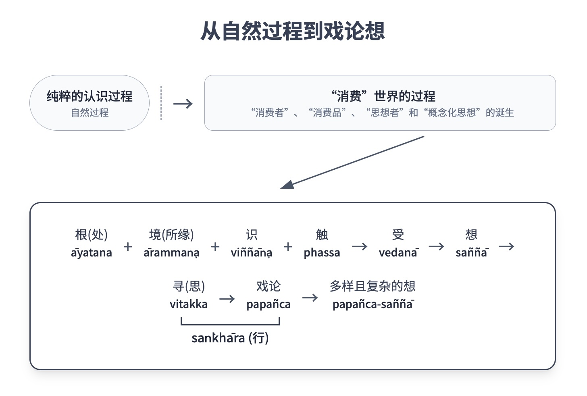

第二章：六处

# 第二章：六处

接触和体验世间的途径

## 导论

尽管人类是由五蕴构成，五蕴又可以进一步细分为许多附属因素，但一般来说，在日常生活中，人们并不直接与这些蕴体打交道。许多构成人类生命的组成因素在人们不知情的情况下存在和运作，即使人们意识到它们，也常常不予多加思量。例如，在身体方面，许多身体器官在当事人不知情的情况下运作，而当事人也常常不关心了解。人们可能只在出现异常或障碍时才对这些功能产生兴趣。对于心智因素来说，情况也类似。

人们通常将身体的研究和分析留给医学家和生物学家，将心意的研究留给阿毗达摩学者和心理学家。对大多数人来说，生命的意义或重要性集中在他们与世界的日常接触和互动上。对大多数人来说，生命的重要性在于他们与世界的关系。

这种接触或关系可以分为两部分或两个系统，两者都依赖于特定的“门”（dvāra；“通道”）来与世界建立联系：

1.  借由六根门（phassa-dvāra；“感官接触之门”；“感官处”）对世界进行认知和体验：眼、耳、鼻、舌、身、意。这些根门认知世界的各种特性和属性，即六尘（ārammaṇa）：色、声、香、味、触、法。
    
2.  借由三种行为通道（kamma-dvāra）对世界做出行为和回应：身（kāya-dvāra）、语（vacī-dvāra）和意（mano-dvāra），从而产生身业（kāya-kamma）、语业（vacī-kamma）和意业（mano-kamma）。
    

请注意，在日常生活中积极参与的语境中，第一个系统中的dvāra（“根门”）在经典中通常被称为āyatana，其意为“认知领域”或“认知途径”。因此，在此分析中，使用āyatana代替dvāra。

关于第二个系统，这里所有的参与都与第四蕴——行蕴（saṅkhāra）——相关，这在上一章中已经讨论过。无数的行蕴，可以分为善、不善和中性，当它们被思（cetanā）——它们的领导者和代表——选择、引发和授权，通过身、语、意进行行为或行动时，就会显现和运作，从而产生身体行为、言语和思想。 {29}

在此背景下，行蕴以三种方式重新分类：（1）根据主要或代表因素（即思）；（2）根据它们表达的途径；（3）根据所执行的具体行动，如图“思与行”所示。

思与行 

在上一章关于五蕴的讨论中，作为决定心意品质和属性的因素的行蕴（saṅkhāra）已经得到了讨论。在《佛法》的第四章和第五章中，将涵盖人类生命过程和人类活动，将详细解释行蕴在塑造行为和回应外部世界方面的作用。因此，本章的重点仅限于上述的第一个系统，即六根门的性质和正常运作。

## 六根的性质

āyatana一词字面意思是“连接”或“领域”。在此语境中，它指“认知连接”、“认知领域”、“觉知之源”或“感知之门”。有六个这样的门：眼、耳、鼻、舌、身、意。[\[1\]](#fn-fn1)

那么人们可能会问，“这些感官与什么相连？”答案是它们与世界相连，与外部环境相连。然而，世界只向人类揭示其有限的部分或方面，这取决于人们的认知能力或工具，即取决于上述的六根。因此，六根中的每一根都与外部世界中特定的“觉知对象”配对。 {30}

这些觉知对象也被称为āyatana，因为它们也作为认知连接或觉知之源。然而，与刚才提到的六内处（internal āyatana）不同，这些对象存在于外部世界（external āyatana）。

一般来说，这六种外在感官对象——色、声、香、味、触和法——被称为ārammaṇa，字面意思是“束缚心意之物”或“抓住注意力之物”。简单来说，它们是“注意力之对象”。

当内处（āyatana；“认知领域”）与（外部）注意力对象（ārammaṇa）接触时，针对该个体感官领域特有的觉知就会生起。[\[2\]](#fn-fn2) 当眼接触色时，生起“看见”的觉知；当耳接触声时，生起“听见”的觉知，等等。这种觉知被称为“识”（viññāṇa）：对感官对象的觉知。

因此有六种识，对应六根和六尘：眼识（即看）；耳识（即听）；鼻识（即嗅）；舌识（即尝）；身识（即触）；以及意识（即对心理对象的觉知）：

1.  眼（cakkhu）是认知色（rūpa）的领域，由此生起眼识（cakkhu-viññāṇa），即看。
    
2.  耳（sota）是认知声（sadda）的领域，由此生起耳识（sota-viññāṇa），即听。
    
3.  鼻（ghāna）是认知香（gandha）的领域，由此生起鼻识（ghāna-viññāṇa），即嗅。
    
4.  舌（jivhā）是认知味（rasa）的领域，由此生起舌识（jivhā-viññāṇa），即尝。
    
5.  身（kāya）是认知触（phoṭṭhabba）的领域，由此生起身识（kāya-viññāṇa），即触觉。
    
6.  意（mano）是认知法（dhamma）的领域，[\[3\]](#fn-fn3) 由此生起意识（mano-viññāṇa），即对心理对象的觉知。
    

这可以扩展为：

> 六内处（internal āyatana）：眼、耳、鼻、舌、身、意。六外处（external āyatana）：色（可见物）、声（可闻物）、香（可嗅物）、味（可尝物）、触（可触物）、法（可知物）。六识：眼识、耳识、鼻识、舌识、身识和意识。D. III. 243-4.

虽然识的生起依赖于根和其相应境之间的触，[\[4\]](#fn-fn4) 但境显现在根的事实并不必然导致识。其他伴随的因素，例如接受性、决意和兴趣也必须存在。[\[5\]](#fn-fn5) 例如，当一个人睡着、烦躁、心不在焉、专注于一项活动或高度专注时，在潜在觉知范围内的各种视觉形式和声音既不被看见也不被听见。{31} 同样，当一个人专注于写信或写书时，他可能意识不到自己的身体与椅子、或手指与笔之间的接触。在这种情况下，当根和境处于接触中，但没有识的生起时，‘认知’尚未被视为发生。

当所有三个因素都存在时，认知便会生起：根（āyatana）、境（ārammaṇa）和识（viññāṇa）。巴利语中，这三个因素结合的技术术语是 phassa（或称 samphassa）。虽然这个词字面意思是“接触”，但在佛教中，它特指这三个因素的聚合或会合。在此语境中，phassa 可译为“认知”。这种接触或认知根据所涉及的具体感官领域分为六种，即：眼触（cakkhu-samphassa）、耳触（sota-samphassa）、鼻触（ghāna-samphassa）、舌触（jivhā-samphassa）、身触（kāya-samphassa）和意触（mano-samphassa）。

这种触是更广泛认知过程中一个重要的阶段。一旦与境发生触，其他的心理和身体动态便随之而来。首先，是对该境的受（vedanā），接着是辨识、相关的思维，以及身、语、意各种行为。

在分析人们与世间互动时，与境接触后立即生起的感受或觉受（vedanā）特别值得关注。vedanā 一词指的是感官经验，即体验感官印象的“味道”。这些觉受要么是乐的，要么是苦的，要么是中性的。

如果根据认知途径分类，有六种感受，与六根相对应：由眼触生起的感受、由耳触生起的感受等等。[\[6\]](#fn-fn6) 然而，如果根据感受的性质分类，则有三种：

1.  乐（Sukha）：愉悦的，安适的，舒适的，称意的。
    
2.  苦（Dukkha）：痛苦的，不适的。
    
3.  不苦不乐（Adukkhamasukha，亦指 upekkha）：[\[7\]](#fn-fn7) 中性的；非乐非苦的。
    

后一种划分有时会扩展为五种感受：

1.  乐（Sukha）：身体的愉悦。
    
2.  苦（Dukkha）：身体的痛苦。
    
3.  喜（Somanassa）：精神的愉悦；喜悦。
    
4.  忧（Domanassa）：精神的痛苦；悲伤。
    
5.  舍（Upekkhā）：中性感受；非乐非苦。{32}
    

至此的认知过程可概述如下：

认知过程（简式）

所缘（ārammaṇa）等同于经由根（āyatana）而向人类显现的世间面向。对这些所缘的觉知对于人们与世间互动和生存是必要的。

受（vedanā）是此过程中必不可少的因素，它向人们指示什么是危险应避免的，什么是支持应寻求的。受因此促进了对事物的全面理解。

然而，对于凡夫而言，受的作用并非止于此。受不仅仅是认知过程中增强知识并使他们过上德行生活的一个因素。对他们而言，受也意味着世间为他们提供了某种形式的补偿或回报，以作为与世间互动的代价。这种回报就是从境中获得的愉悦和喜乐（称为 sukha-vedanā）。

如果人们以这种方式执取受，他们就偏离了自然的认知过程，并为另一种动态提供了接管的机会。受成为一个主要作用者，在此新动态中引起后续因素。自然的认知过程与这种新动态协同作用，但它被其力量扭曲并偏离了真相。

这种新动态很容易展开。基本上，如果与境的接触提供了乐受（sukha-vedanā），就会对该境生起贪爱（taṇhā）。这种贪爱导致执取和随眠的执著（upādāna）。人们无法放下这个境，尽管事实上不可能占有它，因为它已经过去并消失了。在这个阶段，人们心神不宁，产生各种想法和观念，思考如何拥有这个愉悦的境，并计划如何获得它。最后，人们采取各种身行和语行，以达到其渴望的目标并获得愉悦的感受。

相反地，如果与境的接触导致痛苦或不适的感受（dukkha-vedanā），人就会不满和恼怒。人渴望摆脱或消除该境（= taṇhā）。人以一种消极的方式被该境所困扰和执着（= upādāna），倾向于厌恶、恐惧和回避。人进一步通过渴望和沉迷于愉悦的感受来做出反应，追求那些他们认为能带来愉悦的事物。

这种新动态产生了由人类自己炮制并反复循环的复杂而绝望的悲喜循环，它始于受（vedanā）这一环节。这是对“轮回之轮”（saṁsāra-vaṭṭa）的一种解释。人们陷入这个漩涡，无法达到作为人所能获得的更卓越的心境。

因此，触（phassa）之后认知过程中的链接非常重要。可以说，这是过程中的关键或转折点。受（vedanā）在此阶段扮演着至关重要的角色。认知过程中随后的因素取决于受在这一点上所扮演的角色。在这里，有几个问题需要考虑：{33}

首先，触之后的链接是一个关键的连接点，它充当了纯粹认知过程与所谓“轮回之轮”（saṁsāra-vaṭṭa）之间的岔路口。

在一个纯粹的认知过程中，受只是一个次要因素，有助于产生正确和准确的知识。

然而，在“轮回之轮”中，受是一个主导因素，决定了整个过程。可以说，受（vedanā）塑造了所有凡夫的思想和行为——人们的生活由受决定。在此过程中，人们体验感官印象不仅仅是为了了解世间并以健康的方式与世间互动，他们也开始将世间视为可供消耗的东西。

严格来说，在一个纯粹的认知过程中，受（vedanā）的链接被移除或被视为无关紧要。在这里，认知以触（phassa）完成。接下来的阶段被称为“知见过程”（ñāṇa-dassana），或“远离过程”（vivaṭṭa），这与“轮回之轮”（saṁsāra-vaṭṭa）相反。[\[8\]](#fn-fn8)

其次，就伦理行为而言，触之后的链接是一个关键的连接点。它是善与恶、善法与不善法、以及解脱与轮回循环之间的决定性转折点。

此时我们应该回到根（āyatana）的话题，因为到目前为止讨论的所有认知因素都依赖于根并始于根。因此，这些根在认知过程中也扮演着至关重要的角色。例如，它们是受（vedanā）的来源，或使受生起的渠道。人类追求并渴望感受，而根使得感受的体验成为可能。

总而言之，根以两种方式服务于人类：

1.  它们是体验世间的途径；它们是世间面向呈现给人类的场所。它们是沟通的工具，为人们提供理解的原始数据。因此，它们对于帮助人们成功地与世间互动、过好生活和生存至关重要。
    
2.  它们是“消耗”世间的渠道；它们是人们打开以体验世间甜蜜和愉悦、寻求娱乐的门户，通过看色、听声、嗅香、尝味、触触和幻想愉悦的念头。
    

这两种功能是相互关联的。第一个是主要或基本功能，它是必要的。第二个功能是次要的；可以说它是“额外”或“过度的”。{34}

在这两种情况下，根的运作方式相同。区别在于意图的因素，即人们是追求知识还是追求感受（vedanā）。

对于凡夫而言，根的重要性往往集中在第二个功能，即消耗感官印象。第一个功能则仅仅成为实现第二个功能的辅助或帮凶。换句话说，认知充当了消耗世间或推动轮回之轮的仆人。通常，人们使用感官只收集那些有助于他们获得和体验美味和令人愉悦的境的特定知识。他们通常对超越此功能的知识不感兴趣。

此外，凡夫的身、语、意行为也是为了服务于轮回之轮而进行的。也就是说，人们倾向于为了寻求和获得愉悦的感官印象而行动、言说和思考。

人越愚钝，就越是纠缠于这第二个功能，以至于人的整个生命都围绕着六根旋转。

尽管六根只是五蕴的一部分，并不构成人类生命的全部（如五蕴所包含的），[\[9\]](#fn-fn9) 它们在人类生活中扮演着至关重要的角色，对指导人们的生活具有高度影响力。可以说，普通人所了解的生命是通过六根与世间互动而定义的。六根赋予人们生命意义。如果六根不能正常运作，生命就变得毫无意义——世间就终结了。

巴利圣典中的以下段落提供了一个简洁而完整的描述，并有助于将五蕴（前一章）的解释与此处六根的主题整合起来：

> 依眼和色，眼识生起。三者会合是触。以触为缘有受。所受者，彼想。所想者，彼思量。所思量者，彼增生（papañca）。以所增生者为源，各种复杂想（papañca-saññā-saṅkhā）困扰着一个人，关于通过眼可知的过去、未来和现在的色。（其余五对根/境亦然。）{35} M. I. 111-12.

这个过程可以这样说明：

认知过程

随着各种复杂想（papañca-saññā）的生起，精细和修饰的思维增加，从而产生贪、嗔、占有欲和嫉妒等烦恼。[\[10\]](#fn-fn10)

### 注意

1.  papañca 一词指与特定境的缠结和纠葛；它也指由贪爱（taṇhā）、我慢（māna）和邪见（diṭṭhi）的力量所驱动的、或弥补这三种心垢的增生思想。在这里，一个人以‘我’和‘我所’的概念来构思事物，建立自我认同感，或根据个人见解来构思事物。这些思想以无数复杂的方式出现，导致与这些心智增生相关的各种复杂想（papañca-saññā）。
    
2.  想（saññā）有两个阶段：第一阶段是初步的想，它知觉到自然生起的境。第二阶段——papañca-saññā——是基于心行（saṅkhāra）的想，它如上所述，针对境捏造出无数复杂意象或概念。
    
3.  整个认知过程可分为两部分：
    
    1.  第一部分，从内根到受，包含了一个纯粹的认知过程；所有内在因素都根据自然因缘而生起。在这个阶段，没有“有情”、“人”或“我”参与。
    
    2.  后一部分，从受（vedanā）开始，构成了消耗世间或轮回之轮（saṁsāra-vaṭṭa）的过程。（事实上，受——vedanā——也可以构成“远离过程”（vivaṭṭa）的初始阶段，但这里侧重于轮回之轮。）在这后一个过程中，不仅有自然因缘在起作用，而且现在出现了“人”或“有情”。“消耗者”与“被消耗者”、“思考者”与“概念化思想”之间建立了二元关系。
    
4.  上面所示的消耗世间过程只是描述此过程的几种方式之一。选择此处是因为它简洁，并且与当前正在解释的主题相符，即五蕴和六根。对轮回之轮的另一种描述是详细的缘起教法，它是一个全面的模型。
    
5.  严格来说，识（viññāṇa）、触（phassa）、受（vedanā）和想（saññā）等因素被归类为“俱生法”（sahajāta-dhammā）：它们同时生起。上述线性呈现是为了简化。{36}
    

认知过程可以分为两部分，而后一部分本身又可以进一步分为“轮回之轮”（saṁsāra-vaṭṭa）或“远离过程”（vivaṭṭa），如图《轮回之轮或远离》所示。

轮回之轮或远离

另一个用来指六内根（āyatana）或根门（dvāra）的术语是 indriya，可译为“根”或“主导根”。这个术语指的是特定行动中的主要或主导作用者。例如，眼是认知色境的主要作用者，耳是认知声境的主要作用者。六根是：眼根（cakkhundriya）、耳根（sotindriya）、鼻根（ghānindriya）、舌根（jivhindriya）、身根（kāyindriya）和意根（manindriya）。

indriya 一词通常用于指根的积极运作，指它们在日常生活中以及在善行方面的运作，例如：“防护眼根”。 āyatana 一词则通常用于指因果过程中特定因素（例如：“依眼和色，眼识生起”），以及指感官的特征（例如：“眼是无常的”）。

在解释因果过程中特定因素时，另一个常用于根的术语是 phassāyatana，可译为“触之源”或“触之起源”。

指外āyatana（境，ārammaṇa）的替代术语包括 gocara（“所行处”、“滋养之地”）和 visaya（“系缚”、“执着”、“作用范围”）。

另一个非常重要的术语，仅用于指前五种境，它们在消耗世间或轮回之轮的过程中具有高度影响力，即 kāma-guṇa，译为：“欲乐之绳”、“欲乐之缚”、“诱惑和引人入胜的特征”、“感官的美味（或‘积极’）方面”。这个术语特指那些令人渴望、有吸引力且愉悦的色、声、香、味和触。{37}

## 佛教认识论

在讨论认知过程时，在此简要描述不同种类的知识是合适的。

根据佛法，知识有多种分类方式：

### 知识的种类

这种分类与五蕴（khandha）的教导相对应。知识是一种名法（nāma-dhamma），知识的各个方面存在于三种“名蕴”（nāma-khandha）中，即想蕴（saññā-khandha）、行蕴（saṅkhāra-khandha）和识蕴（viññāṇa-khandha）。根据蕴的分类，有三种截然不同的知识：想（saññā）、识（viññāṇa）和般若（paññā）。

1\. 想（saññā）：这指的是想蕴领域内的所有知识形式，即想以及源于想的知识。这包括被收集和储存的想，它们成为思想的原材料，并使辨识、记忆、理解和沉思成为可能。

根据所注意或所知觉的境，想分为六种：色想（rūpa-saññā）、声想（sadda-saññā）、香想（gandha-saññā）、味想（rasa-saññā）、触想（phoṭṭhabba-saññā）和法想（dhamma-saññā；对思想的想）。[\[11\]](#fn-fn11)

根据想的形成方式，它们可粗略分为两个阶段：

1.  基本或初步的想：直接知觉事物的特征和特性，如其本然，例如，一个人知觉绿色、白色、黑色、红色、硬、软、酸、甜、圆、平、长和短。[\[12\]](#fn-fn12) 这也包括与世俗概念（paññatti）相关的想，例如：“猫”、“桌子”和“椅子”。
    
2.  重叠或补充的想：源于心理概念化[\[13\]](#fn-fn13) 的想，或与各种知识和理解水平相符的想，例如，一个人知觉某物是美丽的、令人厌恶的、可鄙的、无常的或无我的。这种补充或次要的想可进一步细分为两种：
    
    1.  源于不善心增生（papañca-saññā）的想；源于贪爱（taṇhā）、我慢（māna）和邪见（diṭṭhi）的精细修饰而产生的混乱或纠结的想。注释将其称为“烦恼想”（kilesa-saññā）：被烦恼染污的想。[\[14\]](#fn-fn14) {38} 它被烦恼所扭曲，从而偏离了知识之道。它非但不能增进理解，反而滋生贪、嗔、痴，并扭曲或阻碍理解。这类想的例子包括：知觉那些自己认为可鄙的特征；知觉那些满足贪婪的特征；知觉那些滋养自我重要感的属性；知觉那些被自己视为劣等的他人的属性；以及对最终所有权和控制权的想。
    
    2.  源于善法思维的想；源于正确理解的想。这种想被称为善法想（kusala-saññā）、有助于知识的想（vijjābhāgiya-saññā），或类似的其他术语。它促进智慧的发展和善法的增长。这类想的例子包括：知觉那些促进友谊的属性；以及知觉那些揭示因果状态、无常状态、无我状态等的属性。
    

阿罗汉[\[15\]](#fn-fn15) 拥有想，但那是没有漏（āsava）、没有烦恼（kilesa）的想。[\[16\]](#fn-fn16) 阿罗汉能够辨识凡夫所体验到的、或他们自己在完全觉悟前曾体验过的增生想（papañca-saññā），但他们这样做仅仅是为了知识的缘故，或为了利益他人，例如在帮助他人解决问题时。阿罗汉的这些想中，没有感到个人困扰或受影响。一般的佛法修行者可以效仿阿罗汉的这种行为。

2\. 识（viññāṇa）：识蕴（viññāṇa-khandha）中的所有知识；所有知识和觉知的主要形式，这是心的恒常功能。识觉知所有心理活动，如第一章所解释。

3\. 般若（paññā）：这是行蕴（saṅkhāra-khandha）中所含知识的主要形式。这个因素也已在第一章中详细解释。[\[17\]](#fn-fn17) 除了这种主要的知识形式，在行蕴中还有许多其他因素与知识和理解的原则相关。这些因素与般若相关，要么通过支持般若，要么通过充当般若发展中的中介因素，要么通过充当揭示般若存在、缺失、减少或增加的标准。最值得注意的是，这些因素是：[\[18\]](#fn-fn18)

*   信（saddhā）：相信；确信；信心；启发。虽然信本身不是一种知识形式，但它可以作为通向知识的门户。信意味着接受他人的知识，信任他人的智慧，并愿意依靠他人的知识或其他的知识来源作为个人指南。如果具有信的人能够反思并运用初步的智慧储备，信就能导向对真相的理解。当他人的知识或其他的知识来源是准确和真实的，并且有善友（kalyāṇamitta）指导如何正确运用智慧时，这一点尤其有效。然而，相反地，如果一个人轻信——也就是说，他无法运用如理作意——并且他所交往的人（以及其他信息来源）被误导，他又没有善友或有恶友，结果可能恰恰相反。他可能会被引导到更大的误解和痴迷中。[\[19\]](#fn-fn19) {39}
    
*   见（diṭṭhi）：根据一个人的观念和观点而产生的知识。见是智慧发展中的一个重要阶段。它承接于通过信依赖他人的知识，到这个阶段，一个人形成了自己的个人理解或理性的辨别。见（diṭṭhi）和信（saddhā）常常密切相关，或者它们是同一件事的两个方面：将自己托付于他人的知识并愿意追随他们（带着虔诚）是信；采纳他人的知识或建议，并将其视为自己的，是“见”。见的重要属性是执持某物为己有。[\[20\]](#fn-fn20)
    
    被分类为“见”（diṭṭhi）的知识范围从非理性的，到中度理性的，再到高度理性的。当见发展到正确知识和理解的程度——即与实相相符的——它被称为“正见”（sammā-diṭṭhi）并被指定为“般若”（paññā）。[\[21\]](#fn-fn21) 当一个人发展般若到清晰辨别事物本性的程度时，他不再需要将这种理解执为己有。这是因为真理以一种中立、客观的方式存在；它不依赖于任何人的主张或肯定。它超越了“见”的阶段。
    
    由于见往往与个人执著相关联，因此它常常产生有害影响。如果一个人的执著强烈而不动摇，尽管他的见已经非常接近真理，它们最终仍将成为障碍，阻止他证悟真理。
    
*   痴（moha；无明）：moha 是 avijjā 的同义词；这两个术语都指对真相的无知和对实相缺乏理解。这种无知与般若（paññā）相对，特别是名为“明”（vijjā）的特定形式的般若。可以说，痴是人类存在的基本状态，人们被鼓励通过正知（vijjā）或通过发展般若来消除它。
    
    尽管一个人可能学习了大量的技术知识（“科学和艺术”），并将这些知识应用于各种事业，但如果它无助于他如实理解事物——不能引导他真正辨别有为世间——它仍然停留在听闻（suta）的层面：“所传授的”；“所听闻的”。它还不是真正的智慧。它无法消除无知或痴，也无法解决生命的基本困境。它可能解决一些问题，但有时也会滋生新的问题。举例来说，一个人渴望光明，便去寻找大量的引火物和燃料。无论这个人用这些物品做什么，比如将它们摆放成各种装饰图案，只要他还没有点燃火焰，就不会有光芒闪耀出来。
    

般若必须被产生、培养和逐步发展。般若有许多阶段或层次，并且有许多重要的巴利语术语用于指称般若：指特定阶段的般若、特定属性的般若，或特定来源的般若。以下是其中一些术语的列表：pariññā（“彻底知”）、ñāṇa（“清晰知”）、vijjā（“真知”）、aññā（“证智”）、abhiññā（“殊胜智”）、buddhi（“智力”）、bodhi（“觉悟”）和 sambodhi（“完全觉悟”）。{40}

想（saññā）、识（viññāṇa）和般若（paññā）之间的区别已在第一章中解释。然而，这里有一点需要重申：

识（viññāṇa）是 pariññeyya-dhamma：它是需要被认识和理解的事物；我们唯一的任务就是如实理解它。我们没有超出此范围的责任，因为无论我们做什么，识都按照其自身的本性运作。

一般来说，想（saññā）也是 pariññeyya-dhamma：仅仅需要如实理解的事物。[\[22\]](#fn-fn22) 然而，源于不善心增生（papañca-saññā）的想，或“烦恼想”（kilesa-saññā），是 pahātabba-dhamma：需要被舍弃或消除的事物。[\[23\]](#fn-fn23) 有助于理解和促进善法的想是 bhāvetabba-dhamma：需要被培育、增长和完善的事物。[\[24\]](#fn-fn24)

般若（paññā）是 bhāvetabba-dhamma：需要被训练和发展的事物，直到它能完全消除痴和无明。[\[25\]](#fn-fn25)

### 认知途径

根据佛法，“触”（phassa）是知识的来源：所有形式的理解都因触而生，或在触发生时生起（参见注释：触与识）。[\[26\]](#fn-fn26) 也就是说，知识依赖于认知，通过认知，数据通过六个“处”（āyatana）或根门（dvāra）：眼、耳、鼻、舌、身和意。

触与识

> 严格来说，触（phassa）不是指名为“识”（viññāṇa）的知识的条件，因为识是触生起所涉及的因素之一。因此，上面引用的这些经文并未说明 phassa 是识蕴（viññāṇa-khandha）生起的原因；相反，它们说明色与名（nāma-rūpa）是其生起的原因。然而，英文表达“触是所有知识的来源”仍然有效，因为“来源”一词既可以指“原因”，也可以指“获得某物的地点”。

如果将六处视为认知的起点，可以将知识分为两种：

1.  通过五根门（pañca-dvāra）获得的知识：眼、耳、鼻、舌和身。这指的是基本的知识形式，即认识色（包括颜色）、声、香、味和触（phoṭṭhabba；这些可概括为：“地”（paṭhavī）：坚固性；“火”（tejo）：热或温度；以及“风”（vāyo）：运动、振动和张力）。{41}
    
2.  通过意门（mano-dvāra）获得的知识，[\[27\]](#fn-fn27) 即认识法所缘（dhammārammaṇa；或简称 dhamma）。这指的是心所知和所思的一切事物。为清晰起见，阿毗达摩将其分为五种：[\[28\]](#fn-fn28)
    
    1.  受蕴（vedanā-khandha）。（这指的是受作为心所知的事物。以下四个因素应作同样理解。）
    
    2.  想蕴（saññā-khandha）。
    
    3.  行蕴（saṅkhāra-khandha）。
    
    4.  Anidassana-appaṭigha-rūpa: 无见无对色 (不可见无对之色)，归属于法处所摄色。它也被称为细色 (sukhuma-rūpa)，包含十六种：凝聚界 (āpo-dhātu)；女性特质 (itthī-bhāva)；男性特质 (purisa-bhāva)；心的物质基础 (hadaya-rūpa)；命根 (jīvitindriya)；营养物质 (āhāra-rūpa；营养精髓——ojā)；空间 (ākāsa)；身表 (kāya-viññatti)；语表 (vacī-viññatti)；三种可变性 (vikāra-rūpa) 质素：轻快 (lahutā)，柔软 (mudutā；柔韧)，和适用 (kammaññatā)；和四种显著特征的物质特质 (lakkhaṇa-rūpa)：生长或扩大 (upacaya)，持续 (santati)；衰变 (jaratā)；和坏灭 (aniccatā)。
    
    5.  无为界 (asaṅkhata-dhātu)，也就是涅槃。
    

后期的《阿毗达摩》典籍对法尘 (dhammārammaṇa) 进行了更详细的分析，将其分为六种：[\[29\]](#fn-fn29)

1.  五根 (pasāda)，也就是在眼、耳、鼻、舌、身方面作为认知媒介的明净或敏感性。
    
2.  十六种细色 (sukhuma-rūpa)，在前面列表 (D) 中已提及。
    
3.  心 (citta；‘意’)。
    
4.  心所 (cetasika)；这与前面列表中提及的受蕴、想蕴和行蕴相对应。
    
5.  涅槃。
    
6.  Paññatti: 概念法、假名、标签和名称，例如：‘大地’、‘高山’、‘汽车’、‘人’、‘北’、‘南’、‘洞穴’、‘池塘’、‘岛屿’、‘半岛’等等。这些名称和名称可能指真实存在的事物，也可能指只存在于想象中的事物。然而，无论它们所指的事物是否存在，这些名称和名称都是永恒和不可摧毁的。一个深入山中的洞被称为‘洞穴’。无论何时何地出现这样的洞，它都被始终称为‘洞穴’。‘洞穴’这个词仅指这种特定的现象。然而，实际的洞穴本身（以及每个洞穴）都可能坍塌或被填满；它会经历变化和转化。
    
    同样地，被称为‘想’的事物生起又消逝，并会坏灭，但‘想’这个标签并不会消失。无论何时何地出现这种现象，它都被始终称为‘想’（如果存在使用该术语的世俗约定）。身体会衰败，但‘身体’这个词却保持不变。无论何时何地出现这种现象，它们都被这样的名称所指代。那些不理解世俗名称主题的人，当他们遇到‘受是无常的’或‘想是无常的’之类的短语时，可能会感到困惑或迷茫；他们无法区分这里的无常是指实际现象还是指它的名称。{42}
    

这类高度专业的解释可能难以理解。在某些情况下，尤其难以区分通过意门获得的知识和通过五根获得的知识。然而，这些区分非常重要。例如，当一个人听到别人说话时，通过五根获得的知识（在这种情况下，是耳‘门’）仅仅是对声音的觉知——一个人只是听到一个声音。他还不理解这些词的含义。随后的理解是用意门生起的知识。同样地，当一个人看到一个屋顶时，通过五根获得的知识（眼‘门’）仅仅是对形状或颜色的觉知。知道‘覆盖’和‘遮蔽’的状态，以及知道那个物体是屋顶，都是在意门完成的。

通过意门获得的知识，或者说对法尘 (dhammārammaṇa) 的知识，范围非常广泛。它既包括对通过五根获得的数据的心理觉知，也包括心本身独有的知识。为了澄清这个问题，这里是另一种分类通过意门 (mano-dvāra) 获得的知识的格式：

1.  心特有的对象（即‘情绪’），例如：爱、愤怒、困惑、心意明晰、快乐、不快乐、悲伤、沮丧、孤独、喜悦、勇气、恐惧等等。
    
2.  关于过去的观念，即曾通过五根被认知到的对象。
    
3.  与色法 (rūpa-dhamma) 相关的观念，通过五根被认知，但并未被每个特定感官的识 (viññāṇa) 所觉知。这些包括‘名称’ (paññatti) 以及各种物质现象之间关系的观念，例如：凝聚、扩展的功能，以及相互关系和相互依存的状态。
    
4.  由情绪 (A.)、关于过去的观念 (B.)，以及各种物质现象之间关系连同名称 (C.) 引起的思想、想象、辩解和判断。
    
5.  遍及明亮之心的洞察力或超凡知识。例如，当一个人辨识出各种因素之间的真实关系时，清晰的理解就会生起，并且一个人会洞察到相互关联的条件法则（或‘相对论’）。这种知识被称为 ñāṇa。一个例子是 abhiññā（‘无上智’）。
    
6.  无为，即涅槃。
    

请注意，在经文中，通过认知门户获得的知识的优选分类是四种：[\[30\]](#fn-fn30) {43}

1.  Diṭṭha: ‘所见’，即所有可见对象 (rūpārammaṇa) 以及通过看和观察获得的知识。
    
2.  Suta: ‘所闻’，即声音以及通过听和聆听获得的知识。
    
3.  Muta: ‘所经验’，即气味、味道和触觉，或那些通过鼻、舌、身被认知的事物。
    
4.  Viññāta: ‘所知’，即法尘 (dhammārammaṇa)：所有通过心被认知的事物。
    

前三个因素构成了通过五根获得的知识。之所以进行这种三fold划分，是因为看和听是关键的知识来源，并且涉及广泛的活动范围；因此，这两个因素与其余的被区分开来。其余三个因素，与鼻、舌、身相关，具有一个共同的属性：在这里，当感官对象——气味、味道和触觉——确实与各自的感官基础接触时，认知才得以完成。这与眼和耳不同，它们认知不‘接触’感官基础的对象（视觉对象依赖光，声音依赖波浪作为信息传递的手段）。[\[31\]](#fn-fn31)

从技术上讲，通过五根获得的知识非常有限。然而，在此语境中，这种知识被定义为一种广泛而普遍的意义：diṭṭha 既指所见之物，也指所有依赖眼睛和观看的知识，包括心对这些视觉数据的解释。然而，这种数据解释仍停留在直接和基础的层面，没有任何额外的修饰。Suta 指所闻之物以及所有源于听闻的知识。这包括语言和文字，心已对其进行了基础层面的解释，但尚未经过额外的概念化。Muta 也应以这种方式理解。从技术上讲，这种与五根相关的知识——diṭṭha、suta 和 muta——延伸至‘五门识’ (pañcadvārika-saññā)。超出此范围的所有知识都包含在 viññāta 一词中：依赖意门的知识。

### 智慧的发展

对应于智慧发展并为此所需的知识被称为‘应培育’的知识 (bhāvetabba-dhamma)。因为识 (viññāṇa) 是一种仅仅‘应被理解’的知识 (pariññeyya-dhamma；‘应被认识’)，所以在这种语境下它不被包含为一个因素。

有三种与智慧发展相关的知识。根据发展阶段，或根据智慧和理解的效力，它们按以下顺序排列：

1.  想 (saññā)：通过感知、记忆和识别事物属性而获得的知识。这种知识被记录在心中。它作为比较的模型，也作为思考和后续理解的原始材料。这种想可以分为两种，如前所述（见：A. 认识的本质）。
    
    在正常的认知过程中生起的想——无论是基本的想，还是伴随智慧发展中理解增长的想——仅仅是知或不知的问题。即使是指不同层次的想，比如从模糊到清晰的想，从部分到完全的想，或从错误到正确的想，也是如此。因此，这件事直接关乎知识和知识的发展。这与被称为‘遍计想’ (papañca-saññā) 或‘烦恼想’ (kilesa-saññā) 的过度或不适度的想形成直接对比，后者总是阻碍和扭曲知识。{44}
    
2.  见 (diṭṭhi)：推理的理解；概念层面的真理；与珍视的思想和观点混合的知识。在这里，一个人得出某种结论，并执著于特定的观点作为他或她自己的。这种知识可能来源于外部，但它经过筛选过程并被采纳为自己的，无论这种知识可能多么逻辑或合理。它甚至可以是非逻辑的。见的例子包括：常见 (sassata-diṭṭhi；永恒灵魂的观点)；断见 (uccheda-diṭṭhi)；以及无因见 (ahetuka-diṭṭhi)。
    
3.  直觉智 (ñāṇa)：深奥的知识；真知。ñāṇa 一词是 paññā（‘智慧’）的同义词，但其定义往往更为局限。也就是说，它指的是智慧的特定功能和果实，例如：kammassakatā-ñāṇa（对众生如何是其有意行为的主人的洞察）；atītaṁsa-ñāṇa（对过去的深奥知识）；saccānulomika-ñāṇa（与真理和谐的知识）；ṭhānāṭhāna-ñāṇa（对可能与不可能的知识）；以及 nānādhimuttika-ñāṇa（对各种众生的性情、特质和信仰的知识）。Ñāṇa 指的是一种纯净而光辉的知识，它自发地生起于心中，并如实地辨识出一种特定的品质。
    

尽管 ñāṇa 有许多层次，包括错误的知识或不完整的知识，但它们都可以被称为‘纯粹’或‘真实’的知识形式，因为它们尚未被自我认同或自我执著所污染。偶尔 ñāṇa 会作为推理思维的结果而生起，但这种知识独立于这种思维而存在，因为它与真实存在的某种现实面向相连。这是 ñāṇa 和 diṭṭhi 之间的一个区别。被称为 diṭṭhi 的知识依赖于个人信仰和逻辑推理，而 ñāṇa 则接触真实存在的外部现实面向。[\[32\]](#fn-fn32)

在基本层面上，想 (saññā) 是所有思维和后续知识的原始材料。因此，见 (diṭṭhi) 和直觉智 (ñāṇa) 都依赖于想。

见如何从想中生起是相当明显的。对某物的感知或辨识本身就促使人对其形成看法。虽然感知事物的特征在日常生活中很有用，但想是选择性的，并且常常会遮蔽或掩盖这些物体的其他特征。如果人们未能审视这些动态，他们可能会被想所欺骗，或任由它阻碍智慧。许多人都是如此。邪见产生的原因包括错误的想以及不正确的运用想。

以下巴利语圣典中的段落描述了见如何作为想的结果而生起：

> 阿罗汉不具备任何由想所生起和产生的、与所见、所闻和所经验相关的小见。也就是说：见以想为引导和主要代理，并根据想来辨别事物。一个没有心垢的阿罗汉，不具备由想产生、由想创造、由想塑造的、与所见等等相关的一切见。[\[33\]](#fn-fn33) {45} Nd. I. 110-11 (解释：Sn. 156-8) 世界上并没有多少不同的真理，除非是想的结果（导致不同的见）。Sn. 173。

直觉智 (ñāṇa) 的生起也依赖于想：

> 想首先生起，Poṭṭhapāda，然后是知识，从想的生起中产生知识。D. I. 185。这段话：‘由此你并未感知到丝毫意义，’可以这样解释：‘你没有感知到你所从事或完成的事物，也没有感知到其特征、原因或结果。“由此”意味着“从内在平静”、“从精神修习”或“从佛法教义”。你还能从哪里获得知识呢？’ Nd. I. 193 (解释：Sn. 165-6)。

一个人可能观察落叶，从而发展出观智 (vipassanā-ñāṇa) 并洞察万物的无常。这种知识依赖于许多想作为其来源，例如：对生命和万物维持的想；对衰老和腐朽的想；对退化、死亡和事物终结的想；以及对‘上’和‘下’的想。看到这些不同想之间关系的能力产生了知识。或者以世间智 (lokiya-ñāṇa) 为例：当艾萨克·牛顿观察苹果从树上掉落时，他发展出了对重力的洞察。这种洞察依赖于无数的想，例如：对‘下落’的想；对聚合的想；对空间和力的想；以及对吸引、移动、释放、悬浮、线性、轨迹等等的想。清晰地看到这些不同想之间关系的能力产生了对重力的这种洞察。

直觉智 (ñāṇa) 能够生起见 (diṭṭhi)，而优越形式的见往往是由于先前获得的知识而生起的。经文中一个清晰的例子是名为 Baka 的梵天神的故事，他能够回忆起似乎无限长的众生诞生。他观察到无数众生的生老病死，而他自己却保持不变。因此，他发展出梵天居所是常恒不变、永恒的观点，以及梵天是万物创造者的见。[\[34\]](#fn-fn34) 同样，牛顿在发现万有引力之后，利用这一洞察力进一步观察自然现象，但他的视野和理解并非全面。他仍然被某些事物所困或被其欺骗。因此，知识和洞察力易受被称为‘见’ (diṭṭhi) 的执著影响。

反过来，见 (diṭṭhi) 支持知识 (ñāṇa) 的生起。许多见是沉思的结果，并且非常逻辑合理。它们在聪明个体和哲学家的心中确立为信仰。因此，如果一个人不以僵硬的方式执著于这些见，并且能够倾听他人并运用如理作意，那么很有可能更深的知识会生起，为精神进步铺平道路，并消除道路上的任何障碍。{46}

当见 (diṭṭhi) 或直觉智 (ñāṇa) 生起时，新的想 (saññā) 也随之形成。因此，diṭṭhi 和 ñāṇa 都会生起想 (saññā)，后者作为进一步沉思和理解的原始材料。这里的区别在于，见倾向于产生错误的想，而直觉智则有助于产生准确、正确的想并消除错误的想。[\[35\]](#fn-fn35)

智慧发展中体现的三种知识——想 (saññā)、见 (diṭṭhi) 和直觉智 (ñāṇa)——与佛陀所描述的产生智慧的三种方法有关：[\[36\]](#fn-fn36)

1.  Cintāmaya-paññā: 由自己的反思和推理而生起的智慧。
    
2.  Sutamaya-paññā: 由学习或从他人那里传承知识而生起的智慧。
    
3.  Bhāvanāmaya-paññā: 由从事精神实践和培育而生起的智慧。（参见注：产生智慧的因素）
    

产生智慧的因素

> 在经文中，这三个因素被命名但未解释。《阿毗达摩》在解释前两个因素时，侧重于 kammassakatā-ñāṇa（对有意行为个人所有权的知识）和 saccānulomika-ñāṇa（与真理和谐的知识），即它侧重于观智 (vipassanā-ñāṇa)，这种知识是从事工作和技术训练的结果。 《阿毗达摩》将第三个因素等同于 samāpannassa-paññā（拥有或成就者的智慧），注释书将其定义为‘具足禅定成就者的智慧 (samāpatti)’，即由三摩地 (samādhi) 产生的智慧。参见：VbhA. 413；VismṬ.：Khandhaniddesavaṇṇanā, Paññāpabhedakathāvaṇṇanā。但如果以一般意义定义此术语，它可指‘努力者的智慧’、‘实践者的智慧’，或‘认真从事活动者的智慧’。参见附录一。

除了这三种主要方法之外，还有许多其他发展智慧的途径。尤其与第三种方法相关的重要活动包括：听闻 (savana)；探究和复审 (paripucchā)；交谈、讨论和辩论 (sākacchā)；观察和观看 (passana)；审视 (nijjhāna)；如理作意 (yoniso-manasikāra; yoniso-upaparikkhā)；评估 (tulanā)；检验、调查和分析 (vīmaṁsā)；实验和选择 (vijaya)；重复 (āsevana)；培育 (bhāvanā)；以及持续和专注的修习 (bahulī-karaṇa)。[\[37\]](#fn-fn37)

思维 (cintā)、学习 (suta) 和修行 (bhāvanā) 有助于产生、改进和微调想 (saññā)、见 (diṭṭhi) 和直觉智 (ñāṇa)。

他人传授的知识 (suta)、思想和反思 (cintā)，以及源于实际应用 (bhāvanā) 的智慧，都是个体内在的知识形式。然而，在一个人心中显现的独特而具体的知识，是前面描述的三种知识形式：想 (saññā)、见 (diṭṭhi) 和直觉智 (ñāṇa)。可以说，想、见和直觉智是学习、思考和实际训练的最终结果。

想 (saññā)、见 (diṭṭhi) 和直觉智 (ñāṇa) 对人们的生活产生强大影响。想在认知过程中、在辨识和理解世界中，以及在产生其他形式的知识中，都具有高度影响力。见，从宗教信仰和各种意识形态，到个人价值观，都作为人们所有行为范围和生活方式的指导方针。直觉智是最原始和深刻的知识形式——人类所能达到的最高智慧的果实。它能够净化人们的内在品格，并创造或改变人们的世界观 (loka-dassana) 和人生观 (jīva-dassana)。它对人们行为和举止的影响比见 (diṭṭhi) 产生的影响更持久和确定。

上面讨论的这些知识形式与下一节解释的知识分类有关。{47}

### 人类活动和成就

此标题指的是与人类社会事务相关的知识，包括：交流、信息传递、研究、象征主义、表达尊重的手段、社会归属，以及社会遗产的传承，这是所有人共有的财富，并标志着特定文明的进步。这种知识可以分为三种：[\[38\]](#fn-fn38)

1.  Suta (或 suti)：已闻、已学或已传承的知识。它可以细分为两种：
    
    1.  在人类之间听闻、教导或传承的知识（在巴利语中，这种知识被称为 suta）。佛教认为这种知识和学习至关重要。在智慧发展的语境中，它被称为‘他人的教导’ (paratoghosa；字面意思是‘他人的言说’)。在教义中，正向的教导受到高度重视，作为正见 (sammā-diṭṭhi) 的基础和条件。[\[39\]](#fn-fn39) 这种知识 (suta) 包括正规教育、媒体新闻、书籍或文本知识，以及记载的历史。甚至《三藏》中的经文也是这种知识的一种形式。（大多数经文都以‘如是我闻’——evaṁ me sutaṁ——开头。）
    
    2.  一些宗教宣称已被至高神灵揭示和披露的知识。例如，婆罗门教徒相信《吠陀经》是梵天直接传授的。在巴利语中，这种知识通常被称为 suti，对应于梵语的 ṡruti。然而，在佛教中，这种知识不被认为具有任何独特的区别，因此被包含在 suta 一词中。从智慧的角度来看，它没有被赋予任何特殊价值；其区别纯粹在于内容。
    
2.  Diṭṭhi: 见；意见；理论；教义；信仰。这指的是一个人对事物得出的特定结论。这种理解与个人执著和偏好相关联，并有可能造成与他人分离的感觉。尽管这个因素在前面已经讨论过，但这里关注它在社会背景中的作用。当个人信仰向外延伸，人们宣称或宣告他们的见解时，其他人可能会采纳这些信仰，从而导致派系主义和思想机构或学派的产生。
    
    diṭṭhi（梵语：dṛishṭi）一词有许多巴利语同义词。最重要的包括：khanti（‘兼容的观念’、‘可接受的原则’）；ruci（‘珍视的观念’、‘令人愉悦的原则’）；以及 laddhi（‘习得的观念’、‘教条’、‘修行信条’、‘被认为有益的修行方式’、‘宗教信仰’）。[\[40\]](#fn-fn40)
    
3.  Ñāṇa: 真知；直觉智；洞察；纯粹的知识；与真理相符的知识；导致特定真理的智慧；对特定事项的全面知识。Ñāṇa 是人类最高形式的知识，至关重要。无论是在世间还是出世间形式中，ñāṇa 都是人类发展‘圣法’ (ariya-dhamma) 的驱动力。至上的 ñāṇa 被称为 bodhi 或 bodhiñāṇa：‘觉悟’、‘觉醒’。佛陀证悟了‘圆满、彻底的觉醒’ (sammāsambodhi-ñāṇa)，从而使佛教成为世界伟大的远见之源。{48}
    

在经典中还存在其他各种知识分类，其中将上述各种知识组合成不同的组别，例如这组五个因素：

1.  Itiha (+ anussava) itikirā paramparā: 源自口头信息、新闻报道、听闻、教育和传承的知识。
    
2.  Piṭaka-sampadā: 标准经文知识。
    
3.  Takka naya ākāraparivitaka: 通过推理获得的知识，包括应用逻辑 (takka)、演绎思维 (anumāna) 和如理作意。
    
4.  Diṭṭhi-nijjhānakkhanti: 被认为与个人见解相符或作为个人信仰一部分而认可的知识。
    
5.  Sayamabhiññā (或 sakkhi-dhamma)：源于个人证悟 (atta-paccakkha) 的知识。通过洞察真理而获得的知识：从对真理的洞察中得来。这种知识已经经过如理作意地反思；它已被澄清并显现。
    

## 准确和有缺陷的知识

尽管佛教认识论是一个广泛的课题，但这里我们只探讨另外两个方面，涉及正确和不正确的知识。

### 两种层次的真理

佛教学习者可能会对真理的主题感到困惑。一方面，他们听到这样的教导：不要与愚人交往，要与智者交往；愚人有这些特征，智者有这些特征；知足常乐，不要贪图他人的财物；自归依；以及应该互相支持。另一方面，其他教导则指出：根据真理辨识，身体仅仅是身体；它不是一个‘众生’、一个‘人’、一个‘自我’、‘我’、‘你’、‘他’或‘她’；它不属于我们；它不是持久和实体的；万物皆无我 (anattā)。这些人因此认为这些教导是矛盾的，或者他们感到困惑，并由于理解有限而以一种不平衡、不正确的方式修行。有时，当他们应该根据对世界的 H基本的、世俗的理解说话或行动时，他们却执著于胜义谛的教导，导致各种困惑，甚至给自己和他人带来伤害。

为了防止这种困惑和错误行为，《阿毗达摩》将真理 (sacca) 分为两个层次：[\[41\]](#fn-fn41)

1.  世俗谛 (sammati-sacca)：另一个名称是 vohāra-sacca：‘言说真理’、‘口语真理’。这指的是共识的真理：那些经互相同意的事物和共同的名称。这些名称被用作交流的工具，为了日常生活的便利和利益。例子包括这些名称：‘人’、‘动物’、‘好人’、‘坏人’、‘桌子’、‘椅子’和‘书’，以及常用词‘水’和‘盐’。{49}
    
2.  胜义谛 (paramattha-sacca)：就这种真理可以用语言表达的程度而言，其描述旨在完全理解事物如其本然。这里的目标是生起透彻究竟真理 (sacca-dhamma) 的最高利益，这种理解能驱散所有执著、妄想和烦恼，培养对事物的正确关系，带来从苦中解脱，并导向真正的纯净、平静和幸福。
    
    胜义谛的例子包括：名法 (nāma-dhamma)、色法 (rūpa-dhamma)、受 (vedanā)、想 (saññā)、行 (saṅkhāra)、识 (viññāṇa)、心 (citta)、心所 (cetasika)、物质形色 (rūpa)、涅槃、触 (phassa)、思 (cetanā)、一境性 (ekaggatā)、命根 (jīvitindriya) 等等。与现代科学的比较是水或盐的分析。对于科学家来说，‘水’和‘盐’这些术语可能被认为不充分、模糊或具有误导性。为了更准确，他们因此将水定义为氧化氢 (H2O)，将食盐定义为氯化钠 (NaCl)。(请注意，这种比较并不完全符合这里对胜义谛的描述，但它显示了即使在其他知识领域，真理的某些方面也与人们的日常理解和定义有所区别。)
    

无论如何，《阿毗达摩》为这些世俗谛和胜义谛的概念分配了特定的技术术语，并引用经文来证实其主张。这表明这些概念从一开始就存在。很可能在佛陀时代，人们对这些概念已有基本理解，因此没有必要为它们建立独特的描述性术语。在此语境中引用的关键经文是比丘尼 Vajirā 的教导：

> 魔罗，你怎么能相信有众生并持有 \[这样\] 的见解？这纯粹是诸行的集合；在这里，找不到任何众生。正如各种部件的组合产生了‘车’这个词，同样地，五蕴也产生了‘众生’这个世俗词。S. I. 135；引自 Kvu. 86-7。

在日常的精神修行中，佛陀有许多段落强调对世俗谛和胜义谛的理解。佛陀鼓励人们仅仅将语言视为一种沟通工具，而不执著于约定俗成或被语言所奴役。这里有两个例子：

> 已断尽烦恼的阿罗汉可能会说：‘我这样说，他们也这样对我说。’他善巧地了知世间的言语，将这些词语仅仅用作表达。S. I. 14。这些是世俗的词语、表达、言谈方式和名称。如来使用这些，但并不执著于它们。D. I. 202。

请注意，《阿毗达摩》将经藏——Suttanta Piṭaka——描述为一种世俗教法 (vohāra-desanā)，因为其大部分内容由世俗语言组成。相比之下，《阿毗达摩》将自身描述为一种胜义教法 (paramattha-desanā)，因为其大部分内容直接呈现胜义谛。[\[42\]](#fn-fn42) {50}

### 三种颠倒的知识

巴利语 vipallāsa 指的是颠倒或错误的知识——偏离真理的知识。它本质上是有缺陷的，导致误解、妄想、自欺，以及对自己生命和万事万物的不正确态度和行为。它是一种障碍，阻碍人洞察实相 (sacca-bhāva)。有三种颠倒的知识：

1.  Saññā-vipallāsa: 想颠倒；错误或有缺陷的想。
    
2.  Citta-vipallāsa: 心颠倒；错误或有缺陷的思惟。
    
3.  Diṭṭhi-vipallāsa: 见颠倒；错误或有缺陷的见。
    

错乱之想的例子包括：有人被一根绳子吓到，把它看成蛇；动物遇到稻草人，把它看成一个看守田地的真人；有人完全迷失方向，把北看成南，把南看成北；以及有人逃离闪烁的招牌灯光，把它看成一场火灾。

错乱之心的例子包括：一个精神病人认为草是食物；一个精神错乱的人偏执地怀疑他人，认为他们计划伤害他；有人在黑暗中看到移动的影子，想象它是鬼魂；还有小鸡快跑的故事，它被一颗橡子砸到头后，认为天要塌下来了。[\[43\]](#fn-fn43)

错乱之见通常是错乱之想和错乱之心的结果。当一个人错误地感知某物时，他就会错误地看待它。同样，当一个人以偏差和错误的方式思考时，他的观点和信念也会相应地出错。当一个人错误地将绳子看成蛇时，他可能会得出结论，认为这个特定地点蛇很多。当一个人感知土地是平坦、笔直地延伸时，他会相信地球是平坦的。当一个人认为需要一种外在的、有意识的力量来管理和控制事物时，他就会产生信念，认为神明应对雷电、闪电、地震、雨水和洪水负责。

这些例子相对简单，可以说它们与不寻常的情况有关。然而，在巴利圣典和其它法教导中，这些错乱在更深层和根本的层面上被审视。它们不仅关注少数个体或群体的错误理解，更重要的是关注几乎每个人都会受到影响，且往往是无意识的、偏差的理解形式。人们倾向于被这些根本的或微妙的偏差所主导。在这里，上述三种错乱被合并为一个类别：

> 比丘们，有这四种想的错乱、心的错乱和见的错乱。哪四种呢？：将无常视为常的想、心和见的错乱。将苦视为乐的想、心和见的错乱。将无我视为我的想、心和见的错乱。将不净视为美的想、心和见的错乱。[\[44\]](#fn-fn44) {51} A. II. 52; Ps. II. 80.

这些想、心和见的错乱阻碍了灵性发展，因此消除它们是智慧修行的重要目标。前面描述的那些发展知识的方法都有助于消除这些错乱。这项任务最有效的方法是探究因缘，以及对有为法（conditioned reality）的组成部分进行详细和有念的分析。[\[45\]](#fn-fn45)

## 佛陀关于六处的开示

（这里“佛陀之语”指“佛陀等贤者之语”（buddhādivacana），即巴利三藏中佛陀、诸上首弟子以及后来的学者和贤哲的教法。为了简洁起见，使用此简短标题。参考文献表明哪些段落是佛陀弟子的。）

> 比丘们，我将教导你们一切。[\[46\]](#fn-fn46) 仔细听。什么是一切呢？眼与色、耳与声、鼻与香、舌与味、身与触、意与法。这被称为一切。S. IV. 15. ‘尊者，人们说“世间，世间。”世间或世间的描述以何种方式存在呢？’ ‘萨密提（Samiddhi），哪里有眼，哪里有色，有眼识，有眼识所能识别的法，哪里就有世间或世间的描述。哪里有耳……有心，哪里有法，有意识，有意识所能识别的法，哪里就有世间或世间的描述。’ S. IV. 39-40. ‘比丘们，我说世间的尽头是无法通过旅行得知、看见或到达的。但我同时也说，若不达到世间的尽头，就无法终结苦。’ \[尊者阿难达 (Ānanda) 说\]：‘我理解佛陀简略宣说而未详细阐述的这段提纲的详细含义如下：人们以何种方式将世间感知为世间，并将世间视为世间——这在圣者的教法中被称为“世间”。’ ‘而人们以何种方式将世间感知为世间，并将世间视为世间呢？正是通过眼……耳……鼻……舌……身……和意，人们将世间感知为世间，将世间视为世间。’ S. IV. 95. 比丘们，我将教导你们世间的生起与灭去。仔细听....世间的生起是什么呢？依于眼和色，眼识生起。三者之聚合是触。以触为缘，受【生起】；以受为缘，爱；以爱为缘，取；以取为缘，有；以有为缘，生；以生为缘，老死、愁、悲、苦、忧、恼生起。这是世间的生起。依于耳和声……鼻和香……舌和味……身和触……意和法，意识生起……这是世间的生起。 {52} 世间的灭去是什么呢？依于眼和色，眼识生起。三者之聚合是触。以触为缘，受【生起】；以受为缘，爱。然而，随着该爱无余地褪去与止息，取止息；随着取止息，有止息；随着有止息，生止息；随着生止息，老死、愁、悲、苦、忧、恼止息。这就是整个苦蕴的止息。这是世间的灭去。依于耳和声……鼻和香……舌和味……身和触……意和法，意识生起……这是世间的灭去。 S. IV. 87. ‘尊者，人们说“魔罗（Māra），魔罗（Māra）”……人们说“有情，有情”……人们说“苦，苦”……魔罗（Māra）或魔罗（Māra）的描述……有情或有情的描述……苦或苦的描述以何种方式存在呢？’ ‘萨密提（Samiddhi），哪里有眼，哪里有色，有眼识，有眼识所能识别的法……有心，哪里有法，有意识，有意识所能识别的法，哪里就有魔罗（Māra）或魔罗（Māra）的描述……有情或有情的描述……苦或苦的描述。’ S. IV. 38-9. 当眼存在时，阿罗汉们（arahants）指出乐和苦。当眼不存在时，阿罗汉们（arahants）不指出乐和苦。当耳……鼻……舌……身……意存在时，阿罗汉们（arahants）指出乐和苦。当耳……鼻……舌……身……意不存在时，阿罗汉们（arahants）不指出乐和苦。S. IV. 123-4. 比丘们，眼……耳……鼻……舌……身……意是无常的……是苦（dukkha）的……是无我的。眼……耳……鼻……舌……身……意的生起之因和缘也是无常的。既然眼……耳……鼻……舌……身……意源于无常的……苦（dukkha）的……无我的……它怎么可能是常的……本质上是乐（sukha）的……是我的呢？色……声……香……味……触……法是无常的……是苦（dukkha）的……是无我的。色……声……香……味……触……法的生起之因和缘也是无常的。既然色……声……香……味……触……法源于无常的……苦（dukkha）的……无我的……它们怎么可能是常的……本质上是乐（sukha）的……是我的呢？S. IV. 129-32. 假设，比丘们，稻苗已经成熟，看守人却疏忽大意。如果一头喜欢稻米的公牛进入稻田，它可能会随心所欲地放纵自己。同样地，未受教导的凡夫，对六触处不加节制，也会在五欲乐中随心所欲地放纵自己。S. IV. 195-6. 比丘们，这六触处——如果未经训练，未经看守，未经保护，未经节制——是苦的传递者……这六触处——如果训练有素，看守良好，保护得当，节制良好——是乐的传递者。 {53} S. IV. 70. ‘舍利弗（Sāriputta）道友，眼是色的束缚，还是色是眼的束缚？耳是声的束缚……鼻是香的束缚……舌是味的束缚……身是触的束缚……意是法的束缚，还是法是意的束缚？’ ‘拘絺罗（Koṭṭhita）道友，眼不是色的束缚，色也不是眼的束缚，而是依眼和色二者所生起的贪欲：那才是束缚……意不是法的束缚，法也不是意的束缚，而是依二者所生起的贪欲：那才是束缚。’ ‘如果眼是色的束缚，或者如果色是眼的束缚，那么梵行（holy life）就无法为了完全灭尽苦而实现。但由于眼不是色的束缚，色也不是眼的束缚——而是依二者所生起的贪欲才是束缚——所以梵行可以为了完全灭尽苦而实现……’ ‘世尊有眼，世尊以眼见色，但世尊心中没有贪欲；世尊的心已善解脱。世尊有耳……鼻……舌……身……意，但世尊心中没有贪欲；世尊的心已善解脱。’ S. IV. 162-5. ‘尽管，尊者，我已年老，年迈，岁月沉重，人生已进晚期，到了最后阶段，请世尊、善逝（Well Farer），简略地教导我法。或许我能理解世尊言论的意义，或许我能成为世尊言论的继承者。’ ‘你认为如何，摩伦迦弗达（Māluṅkyaputta），你对那些你未曾见过、从未见过，现在未见且不认为可能被见的眼所识别的色，有任何贪、欲或爱恋吗？’ ‘没有，尊者。’ ‘你对那些你未曾认知、从未认知，现在未认知且不认为可能被认知的耳所识别的声音……鼻所识别的香……舌所识别的味……身所识别的触……意所识别的法，有贪、欲或爱恋吗？’ ‘没有，尊者。’ ‘这里，摩伦迦弗达（Māluṅkyaputta），关于你所见、所闻、所感、所知的诸法：在所见中，仅有其所见；在所闻中，仅有其所闻；在所感[\[47\]](#fn-fn47)中，仅有其所感；在所知中，仅有其所知。’ ‘当，关于你所见、所闻、所感、所知的诸法，在所见中，仅有其所见，在所闻中，仅有其所闻，在所感中，仅有其所感，在所知中，仅有其所知时，那么，你将不以此方式存在。[\[48\]](#fn-fn48) 当你不以此方式存在时，你将不存在于其中。[\[49\]](#fn-fn49) 当你不存在于其中时，那么既无此岸，亦无彼岸，亦无两岸之间。[\[50\]](#fn-fn50) 这本身就是苦的终结。’ ‘我明白了，尊者……当人以错乱的念，见色时，只关注悦意的相，以痴迷之心感受它，并紧紧执着。 {54} ‘许多感受由此可见之色而生，内心被贪婪和苦恼所扰。对于这样累积苦的人，涅槃（Nibbāna）被称为遥远。’ ‘当人以错乱的念，听声……嗅香……尝味……触觉……知法时……对于这样累积苦的人，涅槃（Nibbāna）被称为遥远。’ ‘当念坚固时，人见色而不执着于色。以不痴迷之心，感受诸受而不被感官对象奴役。’ ‘人以如此有念的方式行事，即使在见色和感受受时，苦也已耗尽，不再累积。对于不这样累积苦的人，涅槃（Nibbāna）被称为近在咫尺。’ ‘当念坚固时，人闻声……嗅香……尝味……触觉……知法，却不执着于法……对于不这样累积苦的人，涅槃（Nibbāna）被称为近在咫尺。’ S. IV. 72-5.

> 何谓‘根门不守护’？在这里，有人以眼见色后，执着于悦意的色，排斥不悦意的色。他住于念未确立、心量有限的状态，并且未能如实了知那能使恶不善法无余止息的心解脱、慧解脱。他闻声……嗅香……尝味……触觉……知法后，执着于悦意的对象，排斥不悦意的对象……何谓‘根门守护’？在这里，有人以眼见色后，不执着于悦意的色，也不排斥不悦意的色。他住于念已确立、心量无限的状态，并且如实了知那能使内在恶不善法无余止息的心解脱、慧解脱。他闻声……嗅香……尝味……触觉……知法后，不执着于悦意的对象，也不排斥不悦意的对象。[\[51\]](#fn-fn51) S. IV. 119-120. 比丘们，一个人如何精进地住呢？如果一个人对眼根保持自制，那么心就不会被眼所识别的色所分心。如果心不分心，就会生起喜（gladness）。当人充满喜（gladdened）时，就会生起悦（rapture）。当心被悦（rapture）提升时，身体就会变得轻安（tranquil）。身体轻安（tranquil）的人会体验到乐。快乐的人心会变得三摩地（concentrated）。当心三摩地（concentrated）时，诸法就会显现。因为诸法显现，所以这个人被认为是‘精进地住者’。(对于其余五个感官根也是如此。) S. IV. 78-9. 阿难达 (Ānanda)，在圣者的教法中，如何达到根的最高发展？在这里，当一个比丘以眼见色……以耳闻声……以鼻嗅香……以舌尝味……以身触觉……以意知法时，在他心中生起悦意的，生起不悦意的，生起既悦意又不悦意的。他这样理解：‘在我心中生起了悦意的，生起了不悦意的，生起了既悦意又不悦意的。但那是因缘和合的、粗糙的、依缘而生的。此后随之而来的状态是寂静而崇高的，即是舍（equanimity）。’ {55} 在他心中生起的悦意、不悦意，以及既悦意又不悦意，都止息了，而舍（equanimity）得以确立。正如一个视力良好的人，睁开眼睛后可能闭上，或闭上眼睛后可能睁开一样，对于任何人也都是如此，生起的悦意、不悦意，以及既悦意又不悦意，都迅速、快速、轻易地止息了，而舍（equanimity）得以确立。这在圣者的教法中被称为根的最高发展……M. III. 299. 比丘们，当人如实地了知眼，如实地了知色，如实地了知并看见眼识，如实地了知眼触，如实地了知以眼触为缘所生起的乐、苦或不苦不乐受时，那么他就不执着于眼、于色、于眼识、于眼触、于以眼触为缘所生起的乐、苦或不苦不乐受。当人住于无执着、无迷恋、无痴迷，了知危险时，那么未来就不会累积五取蕴（five aggregates affected by clinging）；并且他的爱——那带来生命延续、伴随着喜乐与贪欲、并在此处彼处寻求乐趣的爱——就被舍弃了。他的身心忧虑被舍弃了，他的身心苦恼被舍弃了，他的身心烦躁被舍弃了。这样的人体验到身心之乐。这样的人的见是正见。他的思惟是正思惟，他的精进是正精进，他的念是正念，他的定是正定。他的身业、语业和命在之前就已经很好地净化了。因此，八圣道（Noble Eightfold Path）通过修行在他身上得以圆满。 (其余五个感官根也同样适用。) {56} M. III. 288-9.

## 实际应用

六处（āyatana）构成了善与不善之间的关键交界点。一条道路通向放逸、不道德和沉溺于世俗事物。另一条道路则通向全面的知识、善巧的行为和解脱。

如果人们未能对六处发展出正确的理解和行为，他们往往会被诱惑或引诱去沉溺于世俗事物。他们将大部分精力用于寻求悦意的色、声、香、味和触，以及相关的娱乐，以满足他们的欲望。结果，他们增加了贪、瞋、痴，并给自己和他人带来了麻烦和动荡。

冲突、虐待、剥削和压迫，以及其他未解决的社会问题，在很大程度上都是放纵或无节制的生活方式的后果，人们被诱入满足感官的道路，直到这种行为变得加剧和习以为常，这一点是相当明显的。

许多人从未得到任何提醒或鼓励去反思自己的行为以及他们如何迎合感官欲望。他们从不自觉地练习根律仪，结果变得越来越放逸。

解决这个道德困境的一个方面是培养人们对六处及其相关感官对象的适当作用和局限性的理解。另一个方面是让人们训练根律仪，并引导和管理感官的使用，以实现真正的个人和社会福祉。

六处是乐与苦、幸福与不幸福的来源，对于大多数普通、未觉醒的人来说，这直接关系到他们生活中的主要目标以及他们在几乎所有活动中所做的坚定努力。人们积极追求乐和幸福，积极避免苦和不幸。

在付出巨大努力追求世俗享乐之后，许多人常常筋疲力尽，却发现自己感到失望，原因有很多：他们的欲望可能未能实现；当他们遇到甜蜜美味的体验时，他们也必须面对生活带来的苦涩——有时增加的快乐被增加的心理痛苦和烦恼所掩盖，最终付出的代价比快乐带来的回报更高——因此追求快乐不值得付出努力；他们可能得到了满足，但没有达到他们期望的程度；或者他们达到了目标，却发现幸福不断地躲避他们。有些人一生都在追逐真正的幸福，却从未找到。

许多这些失望的人最终陷入绝望，漫无目的地游荡人生，追悔过去。另一些人走向寻求感官享乐的极端反面，转而试图脱离生活，并进行自虐的苦行。 {57}

对六处的学习旨在全面理解真理，并对感官享乐发展出正确的态度和关系，使其不会对自己和他人造成伤害。至少，这些教导提供了纠正因感官接触而产生任何问题的原则和指导方针。除了提供关于如何追求感官享乐的警示之外，人们还学习了它的局限性以及它与其他形式幸福的关系。然后，一个人就能追求更精微的幸福。此外，一个人处理幸福和不幸的方式直接关系到道德问题。

六处及其与认知过程和智慧发展的关系，从一开始就与善行联系在一起。如果一个人从一开始就行为不当，那么整个认知过程就会受到污染。这个过程就会迎合对物质事物的消耗，或者成为轮回之流（saṁsāra-vaṭṭa）的一个方面。这会导致扭曲、偏颇、模糊或不正确的理解。在这种背景下，辅助的修行是建立心的舍（equanimity），保持其平衡和公正，不被好恶、偏好和厌恶所主宰。

还有许多其他直接或间接涉及六处的实用教导。它们与修行不同阶段相关，并专注于特定问题，比如苦或不善倾向，这些问题有可能在不同场合出现。

为了防止问题发生，教导反复强调在认知初期，当感官对象与感官基础接触时，要保持谨慎和自制。这是最安全的做法。

如果问题已经产生，不善心所已经渗透到心中，那么就难以补救。如果一个人允许诱人迷人的感官对象占据心，并屈服于贪、瞋、痴的影响，他可能无法抵制这些诱惑，最终会做出不道德、不善的行为。即使一个人对是非有基本的认识，情况也是如此。这就是为什么如此强调从一开始就采取预防措施和保护自己的原因。

建立这种关怀和保护的一个重要灵性因素是念（sati），它有助于安定心。念（mindfulness）就像一根绳子， удерживает和维持着注意力。念（mindfulness）在这个关怀和保护的初始阶段，在接受感官印象时使用，与‘根律仪’（indriya-saṁvara）的原则相关联，这也被称为‘守护根门’（gutta-dvāra）。[\[52\]](#fn-fn52) 在这里，念（mindfulness）已完全准备好接受感官印象，例如当通过眼看到视觉形式时。一个人不允许注意力固定在那些引起痴迷和怨恨、偏好和厌恶的相和特征上，也不允许不善心所压倒心。根律仪（sense restraint）能防止做错事，避免苦，并避免扭曲的理解。

然而，有效运用根律仪（sense restraint）的原则并不是一个简单的意志行为。为了使念（mindfulness）良好地确立、充分准备和持续不断，它必须经过训练和发展。根律仪（sense restraint）必须重复、练习和持续应用。这就是indriya-bhāvanā这个词的含义：‘修习根门’。 {58}

那些修习根门（sense faculties）的人是安全的，免受不善法、苦和扭曲的理解的侵害。[\[53\]](#fn-fn53) 他们能够防止这些负面品质的生起。即使偏好和厌恶设法潜入，他们也能立即平息或将其抛开。

根律仪（indriya-saṁvara）被归类为戒（sīla）阶段的一部分。然而，用于这种根律仪的念（sati）这个基本因素，则被归类为定（samādhi）阶段的一部分。念（mindfulness）的修行涉及不断引导心的力量和平衡注意力，从而也导致定的发展。

在这种情况下强调的另一个灵性因素是如理作意（yoniso-manasikāra），它被归类为慧（paññā）的一部分。当一个人已经接受感官对象时，就会运用这个因素，此时他会思惟它，以便充分理解它。一个人思惟各种对象的优点和缺点，以及不依赖它们时的自由和幸福状态。这样，有为法（conditioned phenomena）的正面和负面方面就不会决定我们的幸福或命运。 {59}

## 附录一：三种智慧

实际上，智慧只有一种，那就是理解实相、洞察事物真相的自然现象。然而，智慧常常根据其层次、特定功能或理解的特定来源，被区分为许多不同种类。

这里的三种智慧指的是与理解来源相关的分类：

1.  闻所成慧（Sutamaya-paññā）：源于听闻、阅读和学习的智慧。
    
2.  思所成慧（Cintāmaya-paññā）：源于思惟和沉思的智慧。
    
3.  修所成慧（Bhāvanāmaya-paññā）：源于进一步灵性修行的智慧。
    

这三种智慧在巴利三藏（Tipiṭaka）中很少被提及，但在后来的典籍中却常被引用。由于这些术语的含义存在一些混淆，因此有必要审视一些经文解释。

在大多数关于这三种智慧的阐述中，闻所成慧（sutamaya-paññā）被置于首位，但在原始文本中，无论是经藏（suttas）[\[54\]](#fn-fn54) 还是阿毗达磨（Abhidhamma），[\[55\]](#fn-fn55) 思所成慧（cintāmaya-paññā）都排在第一位。唯一的例外是《导论经》(Nettipakaraṇa)，在缅甸南传佛教传统中，它被纳入巴利三藏（Tipiṭaka）（作为经藏（Suttanta Piṭaka）小部（Khuddaka Nikāya）的一部分）；在这里，闻所成慧（sutamaya-paññā）是第一个因素。[\[56\]](#fn-fn56) 在注释和复注中，这三个因素越来越多地被称为：闻所成智（sutamaya-ñāṇa）、思所成智（cintāmaya-ñāṇa）和修所成智（bhāvanāmaya-ñāṇa）（分别为通过学习、思惟和灵性修行所生起的‘智’）。

这是它们在原始巴利三藏（Tipiṭaka）中呈现的顺序：

1.  思所成慧（Cintāmaya-paññā）：源于思惟的智慧；源于个人内心确立的如理作意（yoniso-manasikāra）的智慧。
    
2.  闻所成慧（Sutamaya-paññā）：源于学习的智慧；源于他人教诲（paratoghosa）的智慧。
    
3.  修所成慧（Bhāvanāmaya-paññā）：源于灵性修行的智慧；源于运用前两种智慧并投入思惟和禅修的智慧。
    

将闻所成慧（sutamaya-paññā）或思所成慧（cintāmaya-paññā）置于这三个因素之首的差异，取决于主要关注的是杰出个体，还是关注普通大众的修行。

在思所成慧（cintāmaya-paññā）被置于首位的情况下，考察始于一个被称为‘大丈夫’（mahāpurisa）的个体，即佛陀（或‘辟支佛’——paccekabuddha）。这样的人不依赖他人的教导，发现了并揭示了真理。他能够自己运用如理作意（wise reflection），以全面的方式探究、联系和追溯经验，直到他洞察真理。从思所成慧（cintāmaya-paññā），他直接进入修所成慧（bhāvanāmaya-paññā）（他根本不需要依赖闻所成慧（sutamaya-paññā））。

然而，当关注普通人时，闻所成慧（sutamaya-paññā）则被置于起始。一般来说，人们学习并获得正式的知识、教导和信息，这会激发信心。他们审视和检查这些教导，从而对它们产生理解，这被称为闻所成慧（sutamaya-paññā）。在此正式学习的基础上，他们更深入地评估和思惟它，从而对因果关系和事物之间的相互联系产生清晰的洞察。这就是思所成慧（cintāmaya-paññā）。当他们积极而坚定地运用这两种初始智慧，并进一步探究诸法时，智（ñāṇa）生起，他们证悟真理。在这里，道（magga）产生果（phala）。这个阶段被称为修所成慧（bhāvanāmaya-paññā）。 {60}

请注意，对于许多人来说，尽管他们获得了大量的闻（suta），但他们不一定发展出慧（paññā）。因此，关于第一个因素，只有少数人将他们的学习付诸实践，以产生闻所成慧（sutamaya-paññā）。

在《阿毗达摩·分别论》中，修所成慧（bhāvanāmaya-paññā）被定义为“入定者的智慧”（samāpannassa-paññā），字面意思是指“精进者的智慧”或“已达圆满者的智慧”。（samāpanna这个词可以被翻译为“伴随的”、“精进的”、“完成的”或“圆满的”。它既可以用于积极的语境，也可以用于消极的语境，例如：“成就于训练规则”；“与出家（pabbajjā）相关”；“充满嫉妒和贪婪”；“沉溺于享受和玩乐”；“伴随着悲伤和哀悼”；“充满急流直下的洪流”。）

然而，在佛法教义的语境中，当这个词单独使用时，它通常指的是进入禅定成就（jhāna-samāpatti）。《分别论》的注释解释说：“具有禅定成就者、并存在于这些成就之中的智慧，被称为‘由修行所构成’。”[\[57\]](#fn-fn57)这似乎是一个非常狭窄的定义。然而，其他经典，包括《究竟义要义》（Paramatthamañjusā）在内，解释说上述定义只是一个例子。修所成慧（bhāvanāmaya-paññā）这个词的根本含义侧重于对真相的清晰辨别，这指的是在毗婆舍那（vipassanā）中运作的“道智”（magga-paññā）。

经典中存在对修所成慧（bhāvanāmaya-paññā）的解释，该解释既涵盖了禅定成就，又具有更广泛的含义。这种解释考虑了“安止”（appanā）这个词，它指的是禅定核心的定力。例如，《清净道论》中指出：“通过修行力量达到安止所成就的智慧，被称为‘具修所成’。”[\[58\]](#fn-fn58)这个解释与上述段落相关联，指对一切现象的精勤观照，这等同于毗婆舍那（vipassanā）。当毗婆舍那智（vipassanā-paññā）达到足够的清晰度时，心就达到了定力安止（即禅那）。这种清晰的辨别和稳定、专注的注意力能够净化并消除那些被称为烦恼（kilesa）的腐朽和束缚性质。心因此从部分或全部这些烦恼中解脱出来。这种带来如此转变的证悟就是修所成慧（bhāvanāmaya-paññā），等同于“道智”（magga-ñāṇa）。

在《导论论》（Nettipakaraṇa）中，这三种智慧与四种人的分类联系在一起。这里，首先考察了前三类人，即那些“可教化者”（veneyya）的灵性资产，然后这些个体才进入修所成慧（bhāvanāmaya-paññā）的阶段。那些同时具备闻所成慧（sutamaya-paññā）和思所成慧（cintāmaya-paññā）的人被称为“速悟者”（ugghaṭitaññū）：他们能即时领悟；即使只听到教义的一个梗概，他们也能获得洞察。那些只具备闻所成慧（sutamaya-paññā）的人被称为“需解释才能理解者”（vipacitaññū）：他们需要得到解释后才能理解。那些不具备这两种智慧的个体是“引导者”（neyya）：他们需要通过教导和训练才能获得理解。那些尚未达到“引导者”（neyya）阶段且是“唯语至上者”（padaparama）的人则不包括在此处。

综合这些不同的参考文献，可以将三种智慧的这个主题总结如下：

那些杰出的个体（acchariya-puggala），包括佛陀和辟支佛，是真正的圣者；他们的智慧超越了其他人。普通人在特定的环境中生活，经历了几十年、几百年、几代人的各种经验，然而他们的知识和理解仍然有限。然而，佛陀出现了，他能够运用如理作意，从他人无法看到的角度看待事物。通过探究，他能够洞察事物深刻的潜在真相，对他人不认识的事物获得直觉，做出新的发现，发展出新的理解，并最终证悟无人曾证悟的真相。

由一个人运用如理作意的自身能力所产生的智慧被称为思所成慧（cintāmaya-paññā），佛陀和辟支佛拥有这种智慧，无需依赖他人的教导。（确实，没有人能够给他们提供这样的教导。）这是这些杰出人物特有的智慧。他们能够超越闻所成慧（sutamaya-paññā）的初始阶段。如果这些具备思所成慧（cintāmaya-paññā）的独特个体不出现，那么真理的革命性发现和智慧的突破是不可能实现的。人们届时只会传承他们传统却受限的知识。

普通人，那些不完全凭借自身运用如理作意的能力而拥有思所成慧（cintāmaya-paññā）的人，必须依赖他人的教导和指示。对他们而言，起点是产生闻所成慧（sutamaya-paññā）。{61}

普通人必须培养所有三种智慧：

1.  闻所成慧（Sutamaya-paññā）：源自正式学习的知识。当一个人尚未能完全依靠自己的反思能力时，他必须寻找一位老师，在经典中被称为善知识（kalyāṇamitta），例如佛陀、觉悟者和其他有智慧的人，以获得指导和教诲。然后，他才能在某个层面上理解真相。
    
2.  思所成慧（Cintāmaya-paññā）：源自反思、思考能力的知识。当一个人从正式学习中获取知识并生成由这种知识构成的智慧（闻所成慧，sutamaya-paññā）时，他会训练如理作意（yoniso-manasikāra），从而获得广阔、深刻、彻底的理解，可以应用于对真相的探究。
    
3.  修所成慧（Bhāvanāmaya-paññā）：源自灵性修行的知识。这指的是实际应用，通过直接经验来行动。在这里，一个人依赖前两种智慧，并通过对所有现象运用如理作意来进一步发展自己的灵性，直到证悟确立为道（magga）的智慧并获得果报（phala）。
    

此处请注意，修所成慧（bhāvanāmaya-paññā）依赖并继闻所成慧（sutamaya-paññā）和思所成慧（cintāmaya-paññā）之后。一个人不会在没有知识基础的情况下自发产生修所成慧（bhāvanāmaya-paññā），也不是仅仅通过打坐并达到禅那就能获得它。大多数人甚至在没有正式学习（suta）的基础下，都无法产生思所成慧（cintāmaya-paññā）。（正如之前提到的，许多人获得了正式学习，但并未将其转化为智慧——闻所成慧（sutamaya-paññā）。）

如理作意（yoniso-manasikāra）是这个过程中的主要作用者。可以说，它是发展所有三种智慧的根本要素。即使对于像佛陀这样的杰出人物，他们以思所成慧（cintāmaya-paññā）开始，不需要他人的正式教导（paratoghosa），也是如此。佛陀以其固有的、卓越的如理作意能力开始，从而产生了深邃的智慧。普通人则通过正式学习，然后观照现象，以增长智慧，直到他们发展出修所成慧（bhāvanāmaya-paññā），在那个阶段，如理作意真正变得突出。

如上所述，智慧的这种三重划分在三藏中很少见到。尊者舍利弗（Sāriputta）提出这种分类，是为了强调智慧产生的来源。

佛陀不断强调的要素是如理作意（yoniso-manasikāra），它是产生智慧的修行方法。当如理作意存在时，这三种智慧就可能产生并达到圆满。

总而言之，在那些接受信息和外部知识的人中：

*   有些人只获得事实和信息，而没有发展出任何形式的智慧。
    
*   有些人能够思考和检验这些信息，并产生闻所成慧（sutamaya-paññā）。
    
*   有些人建立了闻所成慧（sutamaya-paññā），然后进一步反思和探究，产生思所成慧（cintāmaya-paññā）。
    
*   有些人以闻所成慧（sutamaya-paññā）和思所成慧（cintāmaya-paññā）为基础，然后通过如理作意进一步发展智慧，产生修所成慧（bhāvanāmaya-paññā）。{62}
    

## 附录二：对六处的注释分析

注释者为“处”（āyatana）这个词提供了许多不同的细微含义，包括：心（citta）和心所（cetasika）的传达点，即它们积极参与的场所；心和心所的扩展点；导致轮回（saṁsāra-dukkha）中持续痛苦的根源；来源；领域；汇聚点；等等。[\[59\]](#fn-fn59)

请注意，与运动、平衡等相关的内部身体感觉，即所谓的“体感”（动觉、前庭觉和内脏觉），此处并未作为额外的感觉（āyatana）添加。尽管这些额外的感觉在经典中没有解释，但它们被排除是合理的，因为它们的某些方面已包含在第五种感觉，即“身”（kāya）中。然而，更重要的是，这些额外的感觉纯粹在生理层面运作，通过维持正常的身体运作状态；它们具有独特的属性，并局限于人类的内在生命。尽管它们是必要的支撑，但它们的价值是固定的；它们无法在对世界的觉知和体验、知识和理解，或伦理方面促进更多的益处。因此，它们不包含在“处”（āyatana）的定义和语境中。

## 附录三：六处与五蕴

所有六个内处（āyatana）都包含在五蕴中；然而，对于六个外境（āyatana）来说，这有例外：

前五对处（眼-色、耳-声、鼻-香、舌-味、身-触）是色蕴（rūpa-khandha）的一部分。

第六个内处（意；mano）是识蕴（viññāṇa-khandha）的一部分。

第六个外处（法；dhammāyatana）是四蕴的一部分：三种名蕴（vedanā、saññā、saṅkhāra）和色蕴，特别是那些微细的物质形式（sukhuma-rūpa），例如：虚空界（ākāsa-dhātu）、女性、男性、轻盈、柔韧、持续、衰变、膨胀、身体转变等。此处的例外是涅槃（Nibbāna），它超越了五蕴（khandha-vinimutta）。[\[60\]](#fn-fn60)

\[1\] 关于六处的注释分析，请参阅附录二。

\[2\] 通常，“门”（dvāra）这个词与“所缘”（ārammaṇa）搭配，“内处”与“外处”搭配。然而，在此论述中，内六处将被称为“处”（āyatana），外六境将被称为“所缘”（ārammaṇa）。

\[3\] 为避免混淆，这些心所缘通常被称为“法所缘”（dhammārammaṇa），而非仅仅“法”（dhamma），因为“法”这个词在许多不同语境中使用，并具有多重含义。

\[4\] 中部·经集 I. 258-9。

\[5\] 中部·经集 I. 190。

\[6\] 六种受（vedanā）：眼触生受、耳触生受、鼻触生受、舌触生受、身触生受、意触生受（相应部·经集 IV. 232）。

\[7\] 请注意，此处在“受”（vedanā）语境下的“舍”（upekkhā）与在“行”（saṅkhāra）语境下的“舍”（upekkhā）有所不同，例如：舍梵住（upekkhā-brahmavihāra）、舍等觉支（upekkhā-sambojjhaṅga）等。

\[8\] “转向”（vivaṭṭa）涉及解决生命中的问题，将在第四篇“生命应成为怎样？”和第六篇“美好的生命是怎样的？”中讨论。

\[9\] 关于六处与五蕴的关系，请参阅附录三。

\[10\] 参阅：长部·经集 II. 277-8。

\[11\] 参阅第一章附录。

\[12\] 这是“通过五根门而来的想”（pañcadvārika-saññā）：对色、声、香、味和触的想（参阅：中部·注释 IV. 20）。随后的想（下文）纯粹是通过意门而来的想。

\[13\] 意念概念化所产生的想的一个例子：“当他安住于无所有处想时，他会想到：‘思虑、思维对我来说更糟，没有思虑、思维更好。如果我思虑、概念化，这些想\[我所达到的\]就会停止，更粗糙的想就会在我心中生起。也许我不要思虑、概念化？’”（长部·经集 I. 184-5）。

\[14\] 例如：中部·注释 II. 74；相应部·注释 II. 382。

\[15\] 译注：阿罗汉：一位完全觉悟的人。

\[16\] 参阅：中部·经集 III. 108。

\[17\] 关于各种智慧（paññā）的详细分类，请参阅《清净道论》438-42页。关于智慧的更多内容，请参阅第十六章“智慧道支”。

\[18\] 根据《阿毗达摩》，智慧（paññā）、信心（saddhā）、见（diṭṭhi）和痴（moha）是“心所”（cetasika），并被归类为行蕴的一部分（参阅：《摄阿毗达摩义论：心所品》）。关于此分类的原因，请参阅第一章。

\[19\] 欲知更多关于信心（saddhā）的主题，请参阅第十四章。

\[20\] 与“见”（diṭṭhi）相关的词语包括：执着（abhinivesa）、执取（parāmāsa）和取（upādāna，在更深的层面上是由爱——taṇhā所制约的）；参阅：《分别论》149。

\[21\] 例如：《分别论》124，250。

\[22\] 参阅：《无碍解道》I. 23。

\[23\] 参阅：增支部·经集 III. 447；比较：增支部·经集 IV. 352-3, 358；《自说经》37；《无碍解道》I. 57-8, 78等。被认为是“应修习的法”（bhāvetabba-dhamma）的想有时被称为“导向明”（vijjābhāgiya-saññā，参阅：增支部·经集 III. 334）、“导向除灭烦恼”（nibbedhabhāgiya-sañña，参阅：相应部·注释 II. 392）、善想（kusala-saññā），或无颠倒想（aviparīta-saññā；后两个词语参阅：《导论论》126）。

\[24\] 参阅上一脚注。

\[25\] 识（viññāṇa）是“应遍知的法”（pariññeyya-dhamma），智慧（paññā）是“应修习的法”（bhāvetabba-dhamma）；参阅：中部·经集 I. 292。

\[26\] 参阅，例如：相应部·经集 III. 59-60, 63-4；相应部·经集 IV. 68-9；增支部·经集 III. 413；增支部·经集 IV. 338-9, 385；《无碍解道》I. 57。

\[27\] 通过“意触”（mano-samphassa）获得的知识。

\[28\] 《分别论》71-72；《法集论》169；《清净道论》483-4。

\[29\] 《摄阿毗达摩义论：杂品，所缘摄》；《摄阿毗达摩义论疏钞：杂品释，所缘摄释》。

\[30\] 此分类常见；重要段落包括：相应部·经集 IV. 73；《分别论》429；《大义释》I. 55。另参阅：长部·经集 III. 135 = 增支部·经集 II. 23-4；增支部·经集 II. 25 = 《如是语》121-22；中部·经集 I. 135-6；中部·经集 III. 261；相应部·经集 III. 202-203；增支部·经集 V. 318, 353-8；增支部·经集 V. 321-22。以复合词形式出现于：中部·经集 II. 231-32；《经集》209-210；《大义释》I. 9, 50-51, 53-4, 133-4, 189-90, 203-204, 227, 245, 247, 333-4；《二义释》16。作为见、闻、觉知的三重分类，例如：相应部·经集 I. 202-203；《经集》155, 175-6；《大义释》I. 95-6, 106, 110-11, 315；《二义释》28。

\[31\] 眼（cakkhu）和耳（sota）能辨识“未到达（根处）”的所缘：appattavisayaggāhika/appattagāhika。鼻（ghāna）、舌（jivhā）和身（kāya）能辨识“到达（根处）”的所缘：sampattavisayaggāhika/sampattagāhika。参阅：《摄阿毗达摩义论：色品，色分别》；《摄阿毗达摩义论疏钞：色品释，色分别释》；《清净道论疏钞：蕴论释，色蕴说释》。

\[32\] 《摄阿毗达摩义论疏钞：心所品释，不善心所释》阐述了“见”（diṭṭhi）和“智”（ñāṇa）之间的区别：“见”的特征是相信‘唯此是真，其他皆伪。’“智”客观地了知事物；“见”则舍弃客观真理，主观地执取事物。

\[33\] 比较《自说经疏钞》373页，其中指出：“想是戏论见（diṭṭhi-papañca）的所缘（nimitta，征相；起因）。”

\[34\] 参阅：中部·经集 I. 326-9。

\[35\] 比较巴利经典中的这段话：“凡是依‘有见’（bhava-diṭṭhi）和‘无有见’（vibhava-diṭṭhi）而思辨者，皆缺乏灭尽之智，\[而\]这是人类怀有颠倒想（saññā-viparīta）的原因”；参阅：《无碍解道》I. 159。

\[36\] 长部·经集 III. 219-20；《分别论》324-5。

\[37\] 这些辅助因素散见于经典之中。其中许多在《中部·经集》II. 174中被提及，作为证悟真理的助缘。

\[38\] 此分类与《经集》164-5和207-208相符；《大义释》I. 187-8和《二义释》26对其进行了阐释。这些引用是偈颂形式，这三个因素按见、闻、智的顺序排列。此处已将其重新组织，以与前一节（C）相符。

\[39\] 参阅第十三章，关于精神修行的初步阶段（因素 #1：善知识）。

\[40\] 例如：《大义释》I. 64-5, 105, 162, 169-70, 310-11。这些术语最常以见（diṭṭhi）、忍（khanti）和意乐（ruci）的形式组合出现，例如：《律藏》I. 69-70；它出现在《大义释》的许多段落中。这三个术语有时伴随着志趣（ajjhāsaya）和意向（adhippāya）这两个词，例如：《大义释》I. 64-5；《二义释》43, 50。这些同义词的最大集合包括：见（diṭṭhi）、忍（khanti）、意乐（ruci）、所接受的信念（ādāya）、教义和戒律（dhamma-vinaya）、根本教义（pāvacana）、至高修行（brahmacariya）和导师的教导（satthu-sāsana），例如：《大义释》I. 40, 156；《二义释》9, 20；《分别论》245-6（在这些情况下，指的是佛教）。

\[41\] 真理的两层概念在《论事》（Kathāvatthu）中开始形成清晰的观念，尽管此文本尚未明确区分术语。世俗谛（sammati-sacca）一词在《论事》311页被提及，而实相胜义（sacchikattha-paramattha）和胜义（paramattha）在《论事》1-69页被提及。这些术语的清晰描述和区分出现在《分析师》（PañcA）12, 84页。它们在许多其他来源中也有提及，例如：中部·注释 I. 217 = 相应部·注释 II. 13；《法句经注释》III. 403；\[《法集论·根本复注》：165, 280\]；\[《法集论·支助复注》：328\]；《清净道论疏钞：梵住论释，杂说释》；《自说经注释》396；《如是语注释》I. 162；《摄阿毗达摩义论疏钞：缘品释，施设分类释》。\[译注：在《佛教词典》的巴利语词汇表中，尊者作者承认sammati和sammuti两种拼写均有效。然而，在词典正文中，他仅使用sammati，例如：sammati-sacca, sammati-desanā等。在他的《佛教术语词典》（仅泰语版）中，他只提供sammati的拼写。此外，在Sir Monier Monier-Williams的《梵英词典》中，也只提供sammati。尽管巴利文本协会的《巴利英词典》非常倾向于sammuti（它包括sammata作为过去分词），且没有提及sammati，我决定本书中只使用sammati。\]

\[42\] 《律藏注释》I. 21；《长部注释》I. 19；《法集论注释》21, 56；中部·注释 I. 217 = 相应部·注释 13。

\[43\] 译注：作者在此处使用了这个故事的泰语版本，讲述一只兔子听到椰子掉在地上的声音后惊慌失措，以为世界末日来临。

\[44\] 在《阿毗达摩》中，“颠倒”（vipallāsa）被称为“vipariyesa”（《分别论》376；这个替代词来源于经藏，在《相应部·经集》I. 188-9中；参阅：相应部·注释 I. 271；《大义释注释》I. 163；《法集论注释》253）。在《律藏复注：第二波罗夷，韦朗阇犍度释》中，指出这三种颠倒依其力量大小排列，从弱到强。

\[45\] 参阅第十五章，关于精神修行的初步阶段（因素 #2：如理作意）。

\[46\] “一切” = “全部”，“整体”。

\[47\] 译注：“所觉知的”：味觉、嗅觉和触觉。

\[48\] 注释解释说：“一个人不受贪、瞋、痴的支配。”

\[49\] 注释解释说：“一个人不执着于所见等等。”

\[50\] 将不再有此有（bhava）、彼有，或二者之间的有。

\[51\] 在《相应部·经集》IV. 198-200中，提出了问题：“如何有不律仪？”和“如何有律仪？”；回答与上文相同。

\[52\] 完整来说，这叫做：“在根门上防护”（indriyesu gutta-dvāra）。

\[53\] 关于免于扭曲理解，在此语境下仅指此类扭曲的新来源；它不指先前积累的因素，例如爱（taṇhā）、慢（māna）或见（diṭṭhi），这些因素属于精神修行的另一个阶段。

\[54\] 长部·经集 III. 219-20。

\[55\] 《分别论》310。

\[56\] 在此文本中，这些术语的拼写也略有不同，如：sutamayi-paññā, cintāmayi-paññā, 和 bhāvanāmayi-paññā。

\[57\] 《分别论注释》412。

\[58\] 《清净道论》439。

\[59\] 参阅：《清净道论》481-2；《摄阿毗达摩义论疏钞：总摄品释，一切摄释》。

\[60\] 参阅：《分别论》70-72。