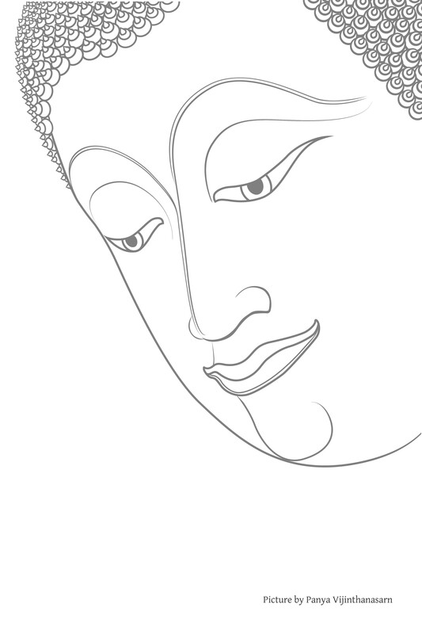
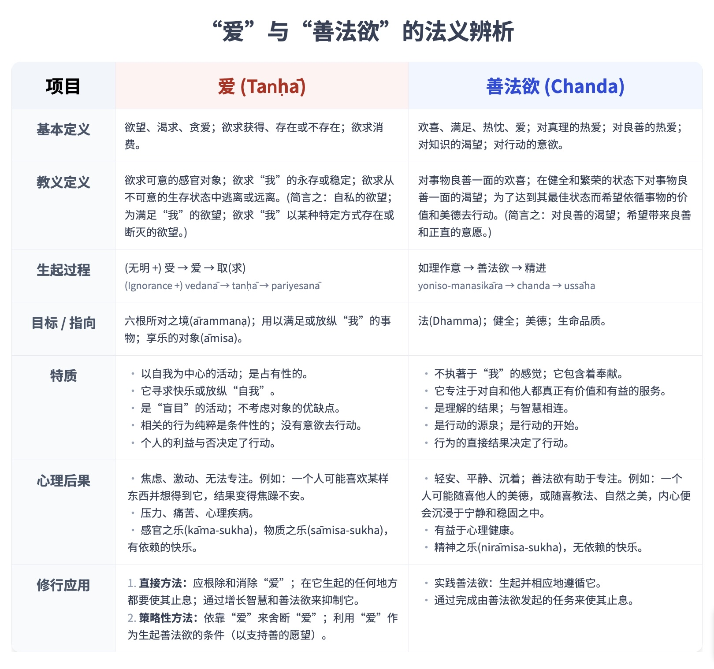

---
---

# 第十章：佛陀关于欲望的教导

## 导论

人们有时对佛教表达以下疑虑和批评：

> “佛教教导人舍弃爱染，摆脱欲望。如果人们没有欲望，不追求个人利益和财富，国家如何发展？佛教反对进步。”“涅槃是佛教的目标，修行佛法是为了证悟涅槃，但佛教徒不应该渴望涅槃，因为如果他们渴望，那就有爱染，他们的修行就不正确。如果人们没有欲望，他们如何修行？佛教教义自相矛盾，教导人做不可能的事。”

这些疑虑和批评似乎触及了佛教教义的整个范围，从居士的日常生活到证悟涅槃的修行，从世间到出世间。但事实上，它们根本与佛教没有直接关系。它们源于对人性和佛教教义的困惑理解。

这些误解甚至在佛教徒中也很普遍。它们与语言和术语有关。特别是，人们听说佛教教导人舍弃爱染（taṇhā），这通常被翻译为“欲望”。无论出于何种原因，他们无法区分这些不同的术语，最终将爱染与欲望等同起来；他们认为所有形式的欲望都是爱染的形式。此外，他们认为佛教教导人舍弃一切欲望——做到无欲。

此外，其他具有相似含义的巴利语术语可能以其他方式（即不作为“欲望”）被翻译。当讨论欲望时，人们可能会忘记参考这些其他术语进行比较。

为了清楚理解佛教，这种误解需要纠正。首先，爱染（taṇhā）是一种欲望，但并非所有欲望都表现为爱染。存在一种积极形式的欲望，这对佛法修行和精神修养至关重要。

在更详细地探讨这个问题之前，让我们先审视一下人类活动的一些机制。

## 人类活动的机制

一个常被表达的疑虑是基于这样一种信念：人的行为总是必须伴随着欲望；人是根据欲望行事的。如果没有爱染或欲望作为催化剂，人们就不会行动。当然，他们会保持惰性、无精打采和冷漠。

要开始回应这个疑虑，所有人类行为，甚至不行动的行为，都需要心中有一些动向或活动。活着就意味着这样的动向和活动。在此，我们可以审视这些活动背后运作的机制。

人类不像树的叶子和枝条，它们随风摇摆，仅仅受外部条件影响。人类是受内部条件促使而行动的。当身体健康并准备好活动时，心就开始觉察到前方和后方、上方和下方、附近和远处的一切，以及各种物体周围的位置。简而言之，一个人对可能的行动和活动途径有了理解。

有了这个初步的理解，一个人必须决定朝哪个方向移动以及如何行动。控制或决定这个决策过程的心理因素是意愿（cetanā）。

在此过程中，意愿受一种推动力或动机影响，我们可以称之为“欲望”。当一个人渴望去某个地方、获得某物或执行某个行动时，意愿就会选择满足这种欲望。

欲望是什么？在基本层面上，欲望源于喜欢和不喜欢。凡是合乎眼、耳、舌、意等的，人都希望获得并享受。凡是感官不愉快的，人都希望摆脱或除去。意愿根据这些喜欢和不喜欢做出决定。这种基于偏好和厌恶的欲望形式被称为“爱染”（taṇhā）。

总而言之，这种活动涉及多种因素：智慧（paññā；“智力”、“觉知”）有助于揭示和辨别周围环境中的各种客体；爱染（taṇhā）希望获得或摆脱特定客体；而意愿（cetanā）则选择根据这些欲望采取行动。

然而，这个过程还有另一个要素。有情众生在行动或不行动方面，拥有更深层次、更根本的需求和欲望。他们渴望存在、生存、安全、健康快乐，并生活在最佳状态。他们渴望生活在一种圆满的状态中。

这里人们可能会问，这种圆满是否仅仅依靠对周围感官客体的知识、渴望消费或逃避这些客体，以及一种根据爱染的低语提示而推动行动的意愿就能找到？

智慧本身会回答说这还不够。如果一个人遇到一些通过添加各种化学色素而看起来很开胃的食物，爱染会想要吃掉它。但如果一个人纵容爱染，就如同在食物中投毒，他将遭受肥胖或其他疾病。这种知识不足且不可信。它可能自称是智慧（paññā），但实际上它只是“无知”（aññāṇa），即“愚痴”（avijjā）的一种表现。

以一个学生为例：

虚假的智慧可能会说：“离这里不远有一个娱乐场所，在那里你可以尽情狂欢，不受约束。”爱染，渴望玩乐，于是抓住这个诱人的前景。它低声说：“别去学校，别费劲听那些令人疲惫的课程了。”然后它催促意愿，意愿决定逃学，去沉溺于某种过度或放荡的行为。

当智慧发展为真实的理解时，除了意识到周围环境，一个人也知道如何带来善、精进和快乐。他知道什么是利益的，什么是危害的，什么是应该促进的，什么是应该避免的。他对因果关系有理解，知道特定的行为会带来短期和长期的后果。

以学生为例，他知道如果他去一个放纵享乐的地方，他只会获得短暂的快乐，但从长远来看，他的身体、家庭和智力都会受苦。另一方面，如果他坚持学习，他生活的各个方面都会改善。

爱染作为推动者，渴望这个、渴望那个，而这种虚假的智慧对这些过程只有模糊的理解。爱染抓住令人愉悦的方面，告诉意愿去寻求满足。然而，这个循环永远不会带来真正的幸福。

当智慧出现时，它知道顺着爱染的河流最终会导致危险和痛苦，而无明-爱染-意愿的机制就会中断或减弱。

智慧探究并辨别事物之间的相互关系。例如，它知道幸福是建立在健康的基础上的。它认识到，为了保持健康，一个人应该吃某些食物、锻炼、建立某种环境、保持某些日常习惯、培养心智、妥善分配时间等。

这些智慧所推荐的事物，爱染并不感兴趣，它只寻求个人的满足、愉悦、炫耀和出众。而任何令人烦恼或冒犯的事物，它都希望逃避或消除。

似乎在没有爱染的诱惑下，就没有替代的推动力促使意愿，也没有促使由对周围环境的理解所提出的行动。生命的运作因此受到阻碍。

然而，存在另一种激励力量。在这种情况下，人们拥有另一种内在的需求或欲望。然而，在日常生活中，通过五根（眼、耳、鼻、舌、身）的感官印象往往更为突出。当一个人遇到感官印象并感到舒适或不适、愉悦或厌恶时，这些感受会占据主导地位，导致喜欢和不喜欢。这就是爱染之道。爱染希望获得那些令人愉悦的事物，并逃避或消除那些令人不悦的事物。意愿便引导生命朝这个方向发展。如果一个人过着肤浅或浮躁的生活，类似于动物的生活，他可能会漫无目的地追随爱染的驱使，直到生命的最后一息。

然而，对于那些有潜力达到卓越和超凡成就的人类来说，渴爱并非唯一的驱动力。如上所述，我们拥有一种更深层的需求或愿望，即：渴望美好、健康的生命、正法、真实而持久的快乐，以及圆满和正直。这种愿望不仅仅局限于我们自己。无论遇到和接触到什么，人们都希望它能达到最佳的圆满状态。而且，这种愿望并非一种超然的情感；人们也希望积极地帮助实现这种圆满和完整。

这种每个人内在固有的替代性动机，在巴利语中被称为chanda（“善法欲”，“善法精进”）。

在这里，一个人的生命方向改变了。他开始提升自己的生命品质。智慧（paññā）辨识出周围环境中什么是有害的，什么是受益的，并认清通向真正圆满的道路。善法欲（chanda）渴望这种圆满并希望实现它。而思（cetanā）则发起努力，朝这个积极的方向前进。

当人们以这种方式发展自己时，无明-渴爱-思（avijjā-taṇhā-cetanā）的循环就会松动或减弱。这个循环也可以被称为无明-渴爱-不善业（avijjā-taṇhā-akusala kamma）。

它被智慧 – 善法欲 – 思（paññā-chanda-cetanā）的序列所取代，或者说智慧 – 善法欲 – 善业（paññā-chanda-kusala kamma），这最终发展成为觉悟者的生活方式。

当真正的智慧显现时，虚假的智慧（即无明）就会退却。智慧所推荐的促进健康和福祉的事物，很可能与渴爱不相符。渴爱喜欢被无明纵容。当智慧出现时，渴爱无法持续存在。这就是善法欲的机会所在。

当智慧指出真正的圆满是可能的，并且某些事物对生命有价值，应该被培养时，善法精进（chanda）就会从智慧那里接过这件事。然后，它会说服思去指导必要的行动以达到这种圆满。

总而言之，有两种截然不同的欲：渴爱（taṇhā）和善法精进（chanda）。

这个过程还有另一个重要元素。在无明和渴爱的循环中，一旦生起愉悦或不愉悦的感受，以及获取或享用的欲望，一种“我”感就会出现，充当代理人或代表。一个“享用者”或“拥有者”诞生了。这随后在这样的享用者或拥有者与那些被欲求和享用的对象之间制造了二元对立。（紧随其后的是“你”、“他”、“他们”等观念的生起，这些观念威胁、阻碍、竞争等等。）

更深层次地看，人们希望这个所谓的“我”是稳定的，以便能继续享用事物。人们也希望它强大有力，这样就能确保在不受任何干扰的情况下，最大限度地获取和享用事物。同时，如果遇到不愉快、不合意的事物，人们希望摆脱或消除它们。如果发现情况无法忍受，人们可能会通过渴望某种形式的自我毁灭来应对。

智慧与善法欲的双重过程则与此相反。渴望事物以最佳的善和正直状态存在，不需要“我”感的介入。不需要拥有者、享用者、欲求者等。人们只是简单地顺应自然行事。

再次总结，有两种欲作为驱动力促使人们行动：

1.  渴爱（taṇhā）：享用和获取的欲望；自我满足的欲望；希望自己以某种特定方式存在或不存在的欲望；自私的欲望。
    
2.  善法欲（chanda）：乐于见到事物的圆满和正直；渴望帮助实现这种圆满；渴望事物自身达到完整。
    

善法欲包括自我圆满和自我正直的愿望。例如，一个人希望自己的身体保持健康状态。在这种情况下，他希望身体的各个器官都处于它们自然的健康状态。（这种欲望与对身体美貌和吸引力的渴爱相比如何？这个问题引发了有辨别力的智者的探究。）

## 渴爱与善法欲的对比

### 无行为也是一种行为

如上所述，人们根据其所知所解而行动，这可能仅仅是回应感官刺激的层面，也可能发展成为真正的智慧，能够判断什么是适宜的，什么是不适宜的。

然而，在许多情况下，人们不是发起行动，而是停顿、犹豫或止步。在这种情况下，这种犹豫、被动或不行动也是一种行动形式，而且它可能是一种强有力的行动形式。正如稍后将解释的，渴爱（taṇhā）所发起的行动是为了获取满足感官的对象，或是为了保护一个人所珍视的“我”感的稳定性的先决条件。在这里，“行动”一词包括无行动。

渴爱可能发起无行动的原因有很多。例如，一个人可能避免行动，因为行动会剥夺他当前正在体验的一些快乐，或者因为他会遇到某种麻烦或逆境。

即使在某种特定的行动方式对一个人的生命真正有益的情况下，渴爱也可能由于害怕辛苦或匮乏而敦促一个人避免行动。

当人们发展智慧并将善法欲作为驱动力时，他们会去做那些他们认为恰当和有价值的事情，即使这样做会面对不适，并且要抵抗渴爱阻止行动的冲动。反之，渴爱可能会促使人采取行动以获得某种快乐，但智慧通过辨识出这种行动会损害一个人的生命品质，就会敦促他避免行动。

当人们的智慧增长，但微细形式的渴爱仍然存在时，这两种品质就会相互交织并相互利用。因此，智者的行为比其他人更复杂。这里重要的问题是哪个因素占上风：是渴爱还是智慧在主导整个过程？

如果一个人持续地运用如理作意，智慧就会占据主导地位，并变得越来越敏锐。它将善法欲作为指导生命的主导力量，直至渴爱止息。

在这里，人们可以看到，通过从等式中移除渴爱这个因素，人类的行动仍然会继续。而且，它们会变得更加丰富。

以前，人们依靠渴爱来帮助保护“我”感。现在，智慧引导着一个人的生命，为善法欲铺平道路。结果是，一个人从渴爱的束缚中解脱出来。

### 手段与目的：渴爱作为一种驱动力

当触及事物的核心时，就会认识到渴爱（taṇhā）实际上并不是行动的真正动机，因为行动本身并非渴爱的优先事项。

如上所述，渴爱渴望享用和获取能带来快乐的事物。另一方面，善法欲（chanda）则希望所有与人相关的事物都能真正地完整和圆满。这种二分法使得行动和无行动变得复杂。

例如：

莎拉（Sarah）具有善法精进。她看到一所房子的内部，希望它干净（她希望这个住所处于完整状态）。如果它很脏，她希望它干净，并拿起扫帚扫地。她从扫地（这是她所期望结果的原因）和看到一个干净的空间（这是扫地带来的直接结果）中都获得了喜悦和满足。

哈利（Harry）对清洁不感兴趣，但他爱吃甜食。他妈妈建议他帮忙做家务，但他没回应。于是她妈妈说：“如果你扫地，我就给你买些糖果。”哈利听到这话，就拿起扫帚开始扫地。实际上，哈利并不渴望清洁。他扫地只是因为这个行动是他能得到糖果的一种手段。

哈利从扫地中没有得到任何乐趣（他甚至可能觉得烦躁），而且他也不决心把工作做好（他妈妈可能需要不断地监督他）。这是因为扫地是使房子干净的原因，而这并非他想要的结果。 他的快乐必须等到他得到糖果之后。

重申一下，渴爱并不渴望作为行动直接结果的事物或状态。渴爱只有在行动是获取所欲求对象的必要先决条件时，才会促使行动。如果还有其他方式可以不费力气地获取所欲求的对象，渴爱就会促使一个人避免行动，选择不行动的路径。渴爱更多时候是无行动的动机，而不是行动的动机。

当渴爱导致避免行动时，它可能表现为懒惰，使人执著于愉悦的感受。或者，它可能表现为恐惧，例如害怕在行动时遇到某种不适，或者害怕失去自我重要性。

当无行动是渴爱获取其所欲（即增加感官快乐或强化自我重要性）所必需时，渴爱就会促使这种无行动，而不考虑行动可能带来的积极效果是否会丧失。

这里还有更多例子：一个孩子拒绝上学，因为他知道他妈妈会因此增加他的糖果零用钱（这是一个无行动也是强有力行动的明显例子）；一个男人提前下班去喝酒和赌博；某人收受贿赂以避免做本应完成的工作；出于懒惰，一个人付钱给别人做自己应该做的一些任务。在这种情况下，一个人就放弃了与自己劳动成果相关的满足感和喜悦。

积极的行动是由源于智慧的善法欲（chanda）所发起，智慧能辨识出真正有价值的和应该做的事情。智慧唤起善法欲，以促使这些事情得以圆满。

即使在渴爱发起行动的情况下，也存在危险，因为前面提到的先决条件建立了以下等式：渴爱促使行动，是出于对这种行动所带来的快乐的喜爱。行动越多，获得的快乐越多；快乐越多，欲望就越多；欲望越多，行动就越多。在许多情况下，人们不断行动，直到这些行动的积极结果被挥霍殆尽。

另一方面，善法欲则出于对其积极和善法效果的喜爱而发起行动。行动越多，这些积极效果就越多，所体验到的喜悦也越多；喜悦越多，行动就越多。人们持续行动，直到善和正直达到圆满。行动完全符合其目标。

总而言之，渴爱往往促使不行动，即使它发起行动，这些行动也是危险的，带来的有害影响多于有益影响。因此，一个人应该舍弃渴爱，转而培养智慧和善法欲。

## 欲的原则的正式基础

### Chanda一词的语言分析

如前所述，对“欲”的意义所产生的混淆——即通过将所有欲望都与渴爱联系起来，将其视为过于局限的意义——源于对一些关键巴利语词语的错误和不充分理解。

有许多巴利语词语表示欲望，其中一些词语在定义以及在言语和书写中的使用方式上都很复杂。这种复杂性容易引起混淆。

首先，让我们区分和澄清其中一些难以理解的词语。

巴利语词chanda，既可用于普遍意义，涵盖欲望的整个范围，也可用于技术意义，特指善法欲。

Chanda可以有多种翻译方式，包括：意愿、欲望、欢喜、精进、热忱、满足、志向、渴望、愿望、爱和激情。目前，我们姑且称之为“欲”。

根据不同的来源，注释书提到三种chanda（欲）：[\[1\]](#fn-fn1)

1.  Taṇhā-chanda：作为渴爱（taṇhā）的欲；不善法欲。
    
2.  Kattukamyatā-chanda：欲求行动；希望行动。偶尔，这个词以中性意义使用，既适用于善法情境，也适用于不善法情境，但通常它以积极的、善法意义使用。
    
3.  Kusaladhamma-chanda：欲求贤善品质；对真理的善法欲。它常被缩写为kusala-chanda（爱善法；向善的志向）或dhamma-chanda（爱真理；向真理的志向）。
    

Taṇhā-chanda：[\[2\]](#fn-fn2) 在此语境中，chanda一词是渴爱（taṇhā）的同义词，与rāga（“贪”）和lobha（“贪”）一样。[\[3\]](#fn-fn3) 这种形式的chanda在巴利圣典中经常出现，包括 kāma-chanda（“欲乐欲”），它是五盖（nīvaraṇa）中的第一盖，等同于kāma-taṇhā（“对感官享乐的渴爱”）。[\[4\]](#fn-fn4) 在这种语境下，chanda通常单独使用，但有时也会与同义词一起使用，例如在佛陀的这段话中：

> 通过舍弃欲（chanda）、贪（rāga）、喜（nandi）、渴爱（taṇhā）和取（upādāna）……关于眼、色、眼识，以及通过眼识所识知的事物，我已了知我的心已解脱。（此段落指代所有六个处。）（见注释：欲的同义词）M. III. 32.

由于在此语境下chanda与taṇhā是相同的，因此在以下段落中可以将chanda替换为taṇhā：“对存在的欲”，[\[5\]](#fn-fn5) “对感官快乐的欲”，[\[6\]](#fn-fn6) “对身体的喜”，[\[7\]](#fn-fn7) “对性交的爱”，[\[8\]](#fn-fn8) “对无常、苦、无我的身体和感受的喜”，[\[9\]](#fn-fn9) 以及“对无常、苦、无我的声音、气味和味道的欲”。[\[10\]](#fn-fn10)

复合词的构成方式与taṇhā类似，例如：rūpa-chanda（“对色法的喜”）、sadda-chanda（“对声法的喜”）、gandha-chanda（“对香法的喜”）、rasa-chanda（“对味法的喜”）、phoṭṭhabba-chanda（“对触法的喜”），以及dhamma-chanda（“对意法的喜”）。[\[11\]](#fn-fn11) Chanda可用于人际关系语境，[\[12\]](#fn-fn12) 指爱或情谊，如在《健陀婆伽经》（Gandhabhaga Sutta）中，它指对妻子和儿女的爱。[\[13\]](#fn-fn13) 在同一部经中，它说：“Chanda是苦的根源”，这与第二圣谛中渴爱是苦的因的说法是相同的。在另一部经中，佛陀说应该舍弃chanda（对于无常、苦和无我的事物），[\[14\]](#fn-fn14) 就像在《转法轮经》（Dhammacakkapavattana Sutta）中他说应该舍弃渴爱一样。[\[15\]](#fn-fn15)

欲的同义词

> 注释书通常将chanda、rāga、nandi和taṇhā归类为彼此的同义词，但在一些必要的情况下，会根据欲望的强度进行区分。例如，chanda被描述为taṇhā的弱形式或rāga的弱形式，但当它频繁生起时，就会变成渴爱或贪的强烈形式。同样，chanda是lobha的弱形式，但当欲望增强并导致迷恋时，它被归类为rāga，而当它进一步增强时，就变成了强烈的贪（chanda-rāga）。见：DA. II. 499；AA. IV. 190；SA. III. 64；VinṬ.：Verañjakaṇḍavaṇṇanā, Paṭhamajjhānakathā；VismṬ.：Pathavīkasiṇa-niddesavaṇṇanā, Paṭhamajjhānakathāvanṇṇanā。

Kattukamyatā-chanda：欲求行动。这种形式的欲等同于在《阿毗达磨》中被归类为“杂类”或“分配”心所（pakiṇṇaka-cetasika）的心所群，即它们既可以在善法心所中生起，也可以在不善法心所中生起。[\[16\]](#fn-fn16)

佛教学者最熟悉的kattukamyatā-chanda，是作为四神足（iddhi-pāda）中第一要素的欲或精进（chanda），[\[17\]](#fn-fn17) 它也是四正勤（sammappadhāna）中的核心品质。[\[18\]](#fn-fn18) kattukamyatā-chanda的意义与viriya（“精进”）、vāyāma（“努力”）和ussāha（“勤奋”）的意义非常相似。 这些词语偶尔会一起使用，以相互补充。[\[19\]](#fn-fn19) 这种形式的欲被认为是佛法修行中的一个重要因素。

注释书倾向于将这种形式的欲纳入第三种，即kusaladhamma-chanda，仿佛它们是同一回事。例如，四神足和四正勤中的欲被归类为kattukamyatā-chanda和kusaladhamma-chanda。[\[20\]](#fn-fn20)

Kusaladhamma-chanda：这种形式的欲在一个经中被提及，它是一系列描述世间难以遇到的六件事中的最后一个因素。[\[21\]](#fn-fn21) 它被认为是人们受益于佛法教义或过善法生活的必要因素，因为尽管一个人可能已遇到前五个因素，但如果他缺乏对善法品质的欲求，他就无法真正从这些其他因素中受益：

> 比丘们，世间有六件事难以出现。哪六件事呢？世间难以出现一位完全觉悟的佛陀；世间难以出现一位宣说佛陀所宣讲之法的老师；世间难以投生于圣者之地；世间难以拥有完好的身心官能；世间难以没有愚痴和昏昧；世间难以拥有对善法品质的欲求。

在佛法修行语境中最常被提及的chanda，是四正勤（sammappadhāna；“完全精进”）教义中发现的欲和精进：

> 那人为了未生起的恶不善法不再生起而发起欲；他努力、振奋心力、提起心念，并坚持不懈。他为了已生起的恶不善法被舍弃而发起欲……为了未生起的善法生起而发起欲……为了已生起的善法得以保持、不衰退、增长、扩大、圆满和发展而发起欲。

这段话被认为是四正勤的定义。在此，善法欲（chanda）被指定为精进（viriya）的本质或主要成分，而精进则包含在三十七菩提分法（bodhipakkhiya-dhamma）中。

在其他与佛法修行相关的段落中，chanda一词也有相似的含义，例如：渴望圆满所有善法品质，[\[22\]](#fn-fn22) 渴望进行训练，[\[23\]](#fn-fn23) 渴望发展智慧能力，[\[24\]](#fn-fn24) 渴望舍弃所有心垢，[\[25\]](#fn-fn25) 以及渴望涅槃。[\[26\]](#fn-fn26) 

在这些情况下，Chanda应被解释为kattukamyatā-chanda和kusaladhamma-chanda：即欲求行动和欲求贤善品质，或者简而言之：欲求善行。[\[27\]](#fn-fn27)

《阿毗达磨》的《分别论》将四正勤和四神足中的chanda定义为kattukamyatā-kusaladhamma-chanda：[\[28\]](#fn-fn28)

*   四正勤：在“发起chanda”的句子中，chanda如何解释？无论是何种欢喜、志向、欲求行动，或善法爱真理，都被称为chanda。
    
    Chandaṁ janetīti tatha katamo chando? Yo chando chandikatā kattukamyatā kusalo dhammachando ayaṁ vuccati chando.
    
*   四神足：在四神足中，志向神足（chanda-iddhipāda）是什么？无论何时，比丘在此法和律中修习出世间禅那（lokuttara-jhāna）……彼时所生起的欢喜、志向、欲求行动，或善法爱真理，都被称为chanda。
    
    Tattha katamo chandiddhipādo? idha bhikkhu yasmiṁ samaye lokuttaraṁ jhānaṁ bhāveti ... yo tasmiṁ samaye chando chandikatā kattukamyatā kusalo dhammachando ayaṁ vuccati chandiddhipādo.
    

《分别论》中的这个定义是后来注释书将chanda解释为一种独特善法品质的基础，并且很可能是将kattukamyatā-chanda与kusaladhamma-chanda合并为一个因素的惯例的起源。

### 欲是苦的根源与欲是善法的根源

佛陀在不同的语境中使用了单一的复合词chanda-mūlaka，有时其含义是相反的：在一个语境中它可能指善法品质，而在另一个语境中则指不善法品质。在此，探讨这种差异是很有用的。

chanda-mūlaka一词意为以欲为根源、起源或发端。在一个语境中，佛陀指出所有形式的苦都以欲为根源，而另一个语境中，他则指出所有事物都以欲为根源。

A. 欲是苦和五取蕴的根源：

> 村长，这件事可以这样理解：“凡是苦的生起，一切都以欲为根源，以欲为因；因为欲（chanda）是苦的根源。”S. IV. 329-30。那位比丘对世尊的开示感到欢喜和庆幸。然后他进一步请问世尊：“然而，尊者，这五取蕴以何为根源？”“比丘，这五取蕴以欲（chanda）为根源。”M. III. 16; S. III. 100-101.

这两段话相互呼应，正如《转法轮经》（Dhammacakkapavattana Sutta）所证实的那样，佛陀在其中说道：

> “简而言之，五取蕴即是苦。”S. V. 421.

所有注释书和复注书对第二段（关于五取蕴）的解释都是一致的，它们指出“以欲为根源”意指“以渴爱（taṇhā）为根源”或“以贪欲（taṇhā-chanda）为根源”。[\[29\]](#fn-fn29) 这些经文偶尔证实，这些解释与渴爱（taṇhā）被指为苦的起源（dukkha-samudaya）是一致的。

B. 欲是万物的根源：

佛陀说了这些话：Chandamūlakā ... sabbe dhammā，这可以译为“万事万物以欲为根源”、“万事万物以欲为基础”，或“万事万物以欲为起源”。

佛陀这一关键短语包含在一段更长的经文中，这段经文可被视为十大佛教主要原则的汇编。它包含佛法修行的重要原则，并最终导向佛教的最高目标：

> 比丘们，如果其他宗派的游方者问你们：“朋友们，万事万物以何为根源？……它们的终点是什么？”你们应该这样回答他们：万事万物以欲为根源  
> （chandamūlakā ... sabbe dhammā）。万事万物以作意为起源  
> （manasikāra-sambhavā sabbe dhammā）。万事万物从触生起  
> （phassa-samudayā sabbe dhammā）。万事万物汇聚于受  
> （vedanā-samosaraṇā sabbe dhammā）。 万事万物以定为首  
> （samādhippamukhā sabbe dhammā）。万事万物以念为尊  
> （satādhipateyyā sabbe dhammā）。万事万物以慧为顶  
> （paññuttarā sabbe dhammā）。万事万物以解脱为精髓  
> （vimutti-sārā sabbe dhammā）。万事万物融入不死  
> （amatogadhā sabbe dhammā）。万事万物终极于涅槃  
> （nibbāna-pariyosānā sabbe dhammā）。[\[30\]](#fn-fn30) A. V. 106-107。比丘们，如果他们这样问你们，你们就应该这样回答那些其他宗派的游方者。

很明显，所有这些因素在佛教修行中都至关重要。它们共同构成了善法的修习，直至佛教的最终目标，因此这些因素本身都是善法的。至少，它们是中性因素，可以融入到这个善法的框架中。因此，这里的“欲”（chanda）一词绝不指不善法品质。

注释书解释说，这里的“一切法”（sabbe dhammā）指的是五蕴，即所有有为法（saṅkhata-dhammā）。（涅槃在此被排除，因为它是一切有为法的止息。）

请注意，在上一节（上方）中，五取蕴（upādāna-khandha）被说成是以欲为根源，而这种欲被等同于渴爱（taṇhā）。然而，在这里，所提到的是五蕴（即不作为执取的根基）。

五蕴和五取蕴有何不同？佛陀说，如果五蕴是心漏（sāsava）和执取（upādāniya）的助缘，它们就构成了五取蕴。如果它们没有心漏和执取，它们就是纯粹或绝对意义上的五蕴。[\[31\]](#fn-fn31)

许多解释这十个因素的复注书明确指出，善法品质以欲为根源（chandamūlakā kusalā dhammā）：善法欲（chanda）是善法的源泉。其中一段经文将这种欲具体定义为“欲求行动”（kattukamyatā-chanda），它包含了欲求贤善品质（kusaladhamma-chanda；这包括爱善——kusala-chanda——和爱真理——dhamma-chanda）。[\[32\]](#fn-fn32)

### Chanda的明确定义

当我们审视了chanda一词的各种定义，并彻底考察了其使用的不同段落后，我们准备为这个词确立一个明确的定义。通过对此词的共同理解，我们可以在佛法研究的语境中确立其标准定义。

简而言之，chanda一词涵盖了人类所有形式的欲。

不善的、负面的chanda等同于taṇhā一词。因为taṇhā一词为大多数佛教学者所熟悉，所以负面的欲可以用这个词来代替。

贤善的、善法的chanda被称为kusaladhamma-chanda；有时被缩写为kusala-chanda或dhamma-chanda。既然负面的欲可以被称为taṇhā，那么用单一的chanda一词来指代善法欲，既简单又方便。

Kattukamyatā-chanda（“欲求行动”）是一种中性形式的欲。在大多数情况下，这个词以积极的意义使用，指欲求贤善品质（kusaladhamma-chanda）。因此，它也可以被并入单一的chanda一词中。

在这里，我们可以简化处理，只用这两个词来指代人类的欲和动机：

1.  Taṇhā：不善法欲（享用、获取和得到的欲）。
    
2.  Chanda：善法欲（欲求行动；欲求带来完整和圆满）。
    

我们可以轻松地做出这个简单的区分，因为它与注释书和后来的典籍中所做的相同区分相符。

在许多典籍中，当出现与不善法欲和善法欲主题相关的段落时，都会提供对这些品质的分析。尽管这种分析并非总是全面的，但很明显，这些典籍的作者希望指出这两种欲望之间的区别。（请注意，没有单独的段落明确地列出上述三种欲望。）[\[33\]](#fn-fn33) 偶尔会使用一对明确定义的术语；最常见的区别如下：

1.  Taṇhā-chanda：作为渴爱的欲。
    
2.  Kattukamyatā-chanda：欲求行动。
    

有两部注释书对这些处理欲望的原则提出了清晰的说明。在《杂阿含注释》（Papañcasūdanī）和《胜义灯》（Paramatthadīpanī）中，“欲”（此处使用巴利语词patthanā）可分为两种：[\[34\]](#fn-fn34)（参见注释：欲作为渴爱或行动）

1.  贪婪欲；带有渴爱的欲（taṇhā-patthanā）。
    
2.  善法欲（chanda-patthanā）。
    

欲作为渴爱或行动

> 这些注释书引用了巴利圣典中的例子。在佛陀的教导中：“对于仍有欲望的人，对于他所专注的事物，就会有执着的欲望和激动不安。”（Sn. 176），此处所指的欲望是渴爱（taṇhā）。在教导中：“我已斩断、摧毁并清除了恶魔波旬的流；你们应该大为欢喜并渴望真正的安全。”（M. I. 227），此处所指的欲望是chanda，这是一种欲求行动的善法品质。注释书还引用了这段话：“一位在更高阶段修行的比丘（sekha），尚未证得阿罗汉果，仍然渴望从束缚中获得至上安稳。”（M. I. 4）。此处，“欲望”也指chanda作为一种善法品质。

这些注释书的解释支持将欲望分为两种截然不同的类型。

## 渴爱与善法欲

如上所述，促使人类行动的两种主要驱动力是：

1.  Taṇhā：不善、不健康、无益的欢悦、喜乐、欲求、贪欲和渴望。
    
2.  Chanda：善、健康、有益的欢悦、喜乐、欲求、爱和愿望。
    

### 渴爱的动机

Taṇhā 可以被翻译为“渴”、“渴爱”、“渴望”、“迷恋”、“热忱”、“贪欲”、“躁动”、“焦虑”或“不知足”。[\[35\]](#fn-fn35)

根据缘起的教导，渴爱是以受（vedanā）为缘，以无明（avijjā）为根。当一个人接收到愉悦或不愉悦的感官印象——例如，看到令人愉悦或厌恶的视觉形式，或听到悦耳或刺耳的声音——并感受到快乐、痛苦或中性感受时，渴爱便以某种形式生起。如果一个人体验到快乐，那么他就会感到高兴、欢喜、满足、着迷、陶醉和贪婪。如果他感到痛苦，那么他就会不悦、不满意、厌恶，并希望逃离或希望这种感受消失。如果他感到中性感受，他就会保持漠不关心和自满。

这些反应是自动发生的；它们不需要思考或理解。（相反，如果一个人反思或理解这个过程，例如，如果他知道那个令人厌恶的视觉对象是有益的，或者那悦耳的声音实际上是危险警报，或者他意识到该对象在道德或文化考量下是不适宜的，那么渴爱就可以被切断，习惯性的过程就可以被一种新的行为模式取代。）渴爱依赖于感受，并被无明所强化：它“依附”于感受，并扎根于无明。

因为渴爱直接与感受相关联，所以有渴爱的人会寻求能提供愉悦、喜乐感受的事物。有六种不同的事物可以提供感受：视觉形式、声音、气味、味道、触觉对象和心所缘。

前五种——色、声、香、味和触觉对象——与物质世界相连，并且特别突出。它们被称为五欲功德（kāma-guṇa）。[\[36\]](#fn-fn36) 六种感官对象，特别是五欲功德，既是渴爱的目标，也是渴爱的来源。因此，渴爱是对能提供感官刺激的事物的渴望，是对愉悦感官对象的渴望——为了体验喜乐感受而渴望愉悦感官对象。（参见附注“渴爱的生起与止息”）简而言之，渴爱就是获取的欲望。

渴爱的生起与止息

> 说渴爱生起于六种感官对象或五欲功德，是一种简明的解释。佛陀的详细解释是，渴爱生起于悦意之相（piya-rūpa）和可喜之相（sāta-rūpa），其中有十组六项：六内处、六外处、六识、六触、六受、六想、六思、六爱、六寻（vitakka）和六伺（vicāra）。渴爱既确立于这些悦意和可喜的事物上，也于这些事物上被舍弃和止息。D. II. 308-311; S. II. 108-109; Ps. I. 39-40; Vbh. 101-103。

渴爱有更深远的影响：接触感官对象和体验感受会产生一种错误的信念，即存在一个稳定、持久的自我来体验这些感受。

伴随这种对稳定、持久自我的信念的是对这个自我能够持续的渴爱。但这种偏颇的信念仅仅是一种观念（也就是说，它并非基于现实），它往往会产生一种相反的信念，即自我只是暂时存在，它是无常的，最终会消失。

这些信念与接触感官对象所产生的感受相关：自我的存在是由愉悦感受的体验来定义和决定的。当一个人因感官接触而感到满足时，对自我稳定性的渴爱就会加剧。但当一个人不因感官接触而满足时，自我的稳定性就失去了意义。如果对感官接触的不满强烈，那么就会产生对“自我”稳定性的厌恶：一个人希望自我脱离当前的存在状态，或渴望自我的毁灭。这种另类的渴爱——即自我的湮灭——与自我暂时存在并最终会消失的信念相伴而生。

这两种渴爱——对自我稳定性的渴爱和对自我湮灭的渴爱——作为一对并存，相互对立。

第一种渴爱——对愉悦感官对象的欲求——也是对感官对象以满足“自我”的欲求，或是对自我从感官对象中体验愉悦感受的欲求。

所有形式的渴爱都汇聚于或服务于自我感。

人们任由这些不同形式的渴爱引导生命进程，通过迎合、滋养和忠实服从它们。它们是所有问题——无论是个人还是社会——的根源，它们产生期望、恐惧、怀疑、愤怒、敌意、粗心、执着和冲突。渴爱有三种不同的类型：

1.  Kāma-taṇhā：为了满足自我感而对愉悦感官对象的渴爱；对感官享受的渴爱。
    
2.  Bhava-taṇhā：对自我重要性、稳定性、不朽性的渴爱；对存在的渴爱。
    
3.  Vibhava-taṇhā：对自我的毁灭、逃离或湮灭的渴爱；对不存在的渴爱。
    

简而言之，这三种渴爱可以被称为欲爱、有爱和无有爱。[\[37\]](#fn-fn37)

根据佛教关于缘起模式（paccayākāra）的教导，渴爱导致“寻求”（pariyesanā 或 esanā，参见附注“渴爱与寻求”）：即寻求获得渴望的对象，这导致获得。获得一个渴望的对象标志着条件过程的一个阶段的结束。

在更仔细地审视这个过程之前，请注意，寻求不同于行动，寻求可能不涉及任何形式的身体行动，这将在下文讨论。

渴爱与寻求

> Taṇhaṁ paṭicca pariyesanā: ‘以渴爱为缘，故有寻求’；pariyesanaṁ paṭicca lābho: ‘以寻求为缘，故有获得。’ (D. II. 58-9; A. IV. 400-401; Vbh. 390-1; 参见：S. II. 143，其中渴爱被表述为 chanda)。Pariyesanā 也可以翻译为“努力获得”或“承认”。在 DA. II. 499, AA. IV. 188 和 VinṬ.: Parivāraṭīkā, Ekuttarikanayo, Navakavāravaṇṇanā 中，渴爱被分为两种：esanā-taṇhā（在寻求渴望对象中的渴爱）和 esita-taṇhā（对已寻求和获得的事物的渴爱）。Nd. I. 262 和 DA. III. 720 提到了五种 chanda：寻求欲（pariyesana-chanda）、获得欲（paṭilābha-chanda）、受用欲（paribhoga-chanda）、积聚欲（sannidhi-chanda）和分配欲（visajjana-chanda：布施金钱或食物以增加追随者）；这两个段落解释说，这五种 chanda 都是渴爱的表现。

### 善欲的动机

在此，让我们回到“chanda”这个术语，我们已将其定义为对善法的欲求（kusaladhamma-chanda）、爱德（kusala-chanda）或爱真理（dhamma-chanda）。

Kusaladhamma-chanda 被翻译为对善法的欲求：一种对德行的热情和喜悦。[\[38\]](#fn-fn38) Kusala-chanda 被翻译为爱德；虽然去掉了 dhamma 一词，但 kusala-chanda 与 kusaladhamma-chanda 含义相同。

Kusala 可以翻译为“善”、“善巧”、“有利”、“精通”、“健康”或“有益于健康”：它指的是对个人生活有益的事物，促进个人和社会福祉与繁荣的事物。（参见附注“善的定义”）

Dhamma-chanda 被翻译为爱真理或对真理的欲求。Dhamma 一词通常有广义的含义，指“事物”或“教法”，但在此语境中其含义更为深远。

在此，Dhamma 有两个主要含义：第一，“真理”（或揭示真理的教导），第二，“德行”（“善”、“贤善品质”，以及在某种程度上“伦理”）。因此，Dhamma-chanda 可以译为“爱真理”、“爱德行”、“欲求真理”或“欲求德行”。

对真理的欲求也指向知识：一个人想要了解真理，证悟真理，领悟事物的真实意义、真实本质和真实价值。

而对德行的欲求则与行动相关：一个人希望产生善。

善的定义

> Kusala 有三个主要定义：ārogya（无病；健康）；anavajja（无过失）；和 kosalla-sambhūta（从善巧生；从智慧生）。其他定义包括：“导致快乐”（sukha-vipāka）和“安稳”（khema）。例如参见：PsA. I. 129, 206; DhsA. 38, 62; DA. II. 645; VismṬ.: Khandhaniddesavaṇṇanā, Viññāṇakkhandhakathāvaṇṇanā。

因此，Dhamma-chanda 可以翻译为“专注于真理”、“爱真理”、“专注于善”或“爱善”。它包括对知识的渴望、对行动的欲求、对行动的热情。Dhamma-chanda 的简单定义是“专注于真理”，并理解上述所有解释都包含在此定义中。以类似的方式，单独的 chanda 一词也可以翻译为“专注于真理”。

Chanda 欲求真理和德行；它欲求真理的知识；它欲求行动以产生善和带来真正有益的结果。因此，Chanda 与行动相关，特别是为了了解真理和创造善而进行的行动。

为什么经文在提到善欲（kusaladhamma-chanda）时，通常将其与行欲（kattukamyatā）联系起来呢？对知识和善的欲求会促进行动。为了获得知识、真理和圆满，一个人必须行动。打个比方说，要触及真实，就必须有热忱。[\[39\]](#fn-fn39)

因此，行欲是善欲或爱真理的一个特质。甚至可以说，chanda 一词是 kattukamyatā 的同义词：行欲就是善欲。迟早，当经文提到善欲（kusala-chanda）或爱真理（dhamma-chanda）时，它们通常会总结说 chanda 等同于行欲（kattukamyatā-chanda）。

在提及缘起模式（paccayākāra）时，佛陀曾说 chanda 导致精进（ussāha），[\[40\]](#fn-fn40) 或者他提到 chanda 先于努力（vāyāma）或精力（viriya）。[\[41\]](#fn-fn41) 简而言之，chanda 产生行动（正如 taṇhā 产生寻求）。

关于这个主题，注释说善欲（chanda）的起因是如理作意（yoniso-manasikāra）。[\[42\]](#fn-fn42)

这段话表明善欲是涉及智慧的条件过程的一部分。当一个人开始运用智慧时，善欲便开始生起（正如渴爱的生起依赖于无明）。

### 比较分析

总结来说：

*   渴爱（taṇhā）专注于感受（vedanā），并欲求对象以体验感受，或欲求对象以满足个人私欲。渴爱由无明产生并维持；它与个人问题相关——它围绕着一种“自我”感为中心。它导致寻求。
    
*   善欲（chanda）专注于福祉，专注于真正有益的事物和生活品质；它欲求真理、善和德行；它欲求圆满和完整。善欲由如理作意产生；它是客观的——它不与“自我”感纠缠；它导致精力、努力和行动。
    

这里有两点需要特别强调：

1.  在分析一个人的行为（包括思想和言语）是否由渴爱主导时，可以使用以下标准：那些与寻求满足感官享受、保护或促进固定“自我”的稳定性（包括更深层次上对“自我”的消弱）相关的欲望或行为，都属于渴爱的范畴。
    
2.  “渴爱导致寻求”和“chanda 导致行动”这两句话非常有助于区分这两种特质。这种区分对伦理和佛法修行具有关键影响，这将在下文讨论。
    

渴爱欲求事物以体验感受，渴爱的满足是通过获得这些事物来实现的。渴爱用来获取满足对象的任何方法都被称为“寻求”（pariyesanā）。获取这些事物的方法各不相同：有些方法需要行动，而其他方法（例如，别人提供对象）则不需要行动。然而，在需要行动的情况下，渴爱所欲求的对象与该行动没有直接的因果关系。例如：

“古利先生是一名清洁工，月薪三百美元。”

“如果你读完这本书，爸爸就会带你去看电影。”

许多人会认为清洁工作是获得薪水的原因：清洁是因，薪水是果。然而，这样的结论是错误的；它源于一种习惯性且自我欺骗的推理方式。

要使该陈述准确，必须插入缺失的子句：清洁行动导致建筑物清洁；清洁的建筑物才是清洁的真正结果。为清洁工作获得薪水仅仅是某些个体达成协议的结果。这两个事件之间没有确定的因果关系：一些清洁建筑物的人没有收到钱，而大多数人收到薪水而无需清洁建筑物。

第二个例子也类似：许多人会认为读书是因，看电影是果，但实际上读书的真正结果是获得知识。读完书仅仅是去看电影的一个条件。

在第一个例子中，如果古利先生的行为是受渴爱驱使的，那么他清洁仅仅是因为清洁是获得金钱的必要条件。他并不渴望一座洁净的建筑，他也不想扫地和清洁。

在第二个例子中，孩子希望去看电影，她读书仅仅因为它是一个条件，可以获得渴爱所渴望的对象：看电影。她不渴望书中包含的知识，她也无意读书。

严格来说，渴爱并不导致行动，也不产生行欲。在这些情况下，行动仅仅是一种可能的方法（遵循预先安排的协议），用于根据渴爱的需求获得所寻求的对象。

这两个例子也阐明了 chanda 的品质，它欲求德行、真理和真理的知识。

有了 chanda，古利先生会渴望一座洁净的建筑，孩子会渴望书中的知识；这两个人都渴望这些行动的直接结果。结果“呼应”原因：结果有助于决定行动方向。行动等同于产生期望的结果；因果关系紧密相连。当古利先生打扫时，整洁便出现，并且每次他打扫时都会出现。当孩子读书时，知识便产生，并且她读得越多，知识就越持续产生。

Chanda 欲求行动所产生的德行，因此也欲求行动本身，因为行动是该德行的因。

从这个意义上说，chanda 导致行动并导致行欲。这有助于解释为什么第二种 chanda（kattukamyatā-chanda——行欲）被等同于 kusala-chanda 或 dhamma-chanda（欲求德行或真理）。[\[43\]](#fn-fn43)

如果行为受 chanda 指导，古利先生会对打扫建筑物充满热情，这与获得薪水无关，孩子也会读书而无需父亲以看电影作为诱惑。这两种欲求还有许多其他的伦理含义，但此刻只需记住它们的区别：渴爱是消费或体验的欲望，而 chanda 则是对真理和行动的欲望。

### 由一系列先决条件引发的问题

以渴爱或 chanda 作为行动动机，其伦理或实践后果差异巨大。

当一个人以渴爱为动机时，行动仅仅是获得可欲对象以满足“自我”感的一个先决条件。这个人不直接欲求行动或行动的结果；他或她直接的目标是获得可欲的对象。

在许多情况下，所需的行动仅仅是获得可欲对象的一种方法。

因此，如果一个人能够找到无需行动即可获得这些事物的方法，他就会使用这种方法并避免做任何事，因为无需工作即可获得可欲对象最符合渴爱。

如果无法避免行动，那么他就会不情愿、不乐意地行动，并且没有真正的热情。

渴爱的后果如下：

*   当一个人试图避免执行预先安排的行动时，他可能会寻求捷径或简单的替代方案，以便在无需工作的情况下获得渴望的对象。这种回避甚至可能导致人们行为不道德。例如，如果古利先生想要钱，对工作没有热情或奉献精神，并且觉得等不及，他可能会通过偷窃来获取金钱。如果女孩无法忍受读书，她可能会从母亲那里偷钱，然后独自去看电影，而不是等父亲带她去。
    
*   当一个人渴望获得而没有行动的欲望时，他会仅仅为了应付了事而执行所需的行动，草率行事，或者只是为了说服他人自己已经完成任务。结果是工作缺乏精确性和卓越性。他还会养成对成就漠不关心、疏忽和敷衍了事等坏习惯。例如，古利先生可能日复一日地无精打采地打扫，等待着薪水。女孩可能会心不在焉地读书，没有获得任何知识，或者通过只读第一页、中间页和最后一页来欺骗父亲，声称她已经读完了。
    
*   当最初的协议被违反时，就会出现表现不佳、粗心大意、逃避和欺骗。因此，需要建立严格的次要先决条件来支持和保护。但这仅仅是治标不治本，使整个系统变得更加复杂和混乱。例如，可能需要为古利先生的工作安排一名主管和检查员，并核实他工作的时间。可能需要由一个年长的兄弟姐妹来检查女孩，或者父亲可能需要就书的内容对她进行盘问。
    
    当渴爱主导行为以应对这些次要条款和条件时，新的错误和不道德行为层出不穷，直到整个系统瓦解或失效。
    
*   当所欲求的对象与行动的直接结果不同时，行动的价值就不能由其结果来衡量，因为该行动是为了服务于其他目标而执行的。在这种情况下，行动与所期望的结果之间存在不平衡。那些追求根据协议条款所期望的可欲对象的人的行为，很可能要么过度，要么不足，并且很可能不足以实现直接源于该行动的有益、贤善的结果。然后，人们通过可欲对象的获得来确定行动的价值。
    
    作为获取可欲感官对象先决条件的行动的基本规则，或者说渴爱的独特规则是：“我获得的可欲事物越多，我行动就越多”，或者：“我体验到的喜乐感受越多，我行动就越多。”基于这一前提的行动是无止境的，并且具有反面：“如果我没有获得可欲对象，我就不会行动”，或者：“如果我没有体验到喜乐感受，我就会无所事事。”
    
    除了有缺陷和错失良机之外，为了与直接的、有益的结果不同的结果而进行的行动还会产生负面影响。一个简单的例子就是饮食：当一个人纯粹出于渴爱而进食时，如果食物美味，他就会吃到撑；如果食物不合他的口味，他就会吃得太少，导致不适和疾病。（行动是饮食，其结果是身体获得充足的营养，并且是体验美味的先决条件。）
    
    渴爱的负面影响是广泛的，下文将通过更多例子进行讨论。
    
*   在行动和渴爱所欲求的事物没有直接因果关联的情况下，渴爱厌恶行动并抵制工作。渴爱试图通过不费吹灰之力来获得事物以避免工作，而当行动必不可少时，人们便不情愿地行动。以渴爱行事的人（遵循既定的条款和条件）往往在行动本身或其劳动成果中找不到乐趣或满足感。
    
    渴爱所欲求的事物几乎是孤立存在的，与行动脱节。只要一个人没有获得所欲求的对象，对这些事物的渴爱就会一直存在。而为了满足某些先决条件而采取行动，可能会进一步煽动渴爱，导致不安和焦虑。
    
    以渴爱行事者的心境是躁动不安、困惑、压力重重和紧张的，并且常常伴随着其他不善品质，如恐惧、不信任和嫉妒。
    
    缺乏满足感和不满意可能导致严重的个人问题，如压力和精神疾病。当这些问题向外延伸时，它们会给一个人的整体生活带来困难，并给他人造成痛苦。
    

### 善欲的益处

另一方面，那些以善欲（chanda）作为行动动机的人，渴望行动的直接结果，因此他们也愿意行动。善欲的后果与渴爱的后果相反：

*   善欲导致正直的行为、勤奋和诚实，对工作真诚，以及坚定不移地遵守自然因果法则。
    
*   善欲激发对工作的热情；它导致工作精确和卓越，渴望成功，认真努力，并且不畏惧工作。
    
*   取代复杂的控制和相互指责系统的是人与人之间的合作和协同努力，因为每个人都希望工作的成功，而不是渴望稀缺且必须竞争的个人满足对象。
    
*   因为行动是为了其自身的直接结果而进行的，所以行动的价值可以由其结果来衡量。行动与所期望的结果之间存在平衡：一个人行动是为了产生有益的结果。例如，一个人摄取适量的食物以满足身体的需求并促进健康，而不是被美味所奴役。
    
*   当一个人渴望行动的直接结果并希望产生这些结果时，他也会意识到在行动过程中产生的中间益处。行欲和从行动中获得益处会导致满足、知足、幸福和一种深刻的平静感。[\[44\]](#fn-fn44)
    

在佛法修行的语境中，chanda 被归类为“神足”（iddhi-pāda）之一，这是发展三摩地（concentration）的关键原则。善欲带来三摩地，佛陀称之为“欲三摩地”（chanda-samādhi）。[\[45\]](#fn-fn45) 善欲促进心理健康，而渴爱则造成精神疾病。

即使一个人无法完全实现行动的结果，善欲也不会产生痛苦或心理问题。无论行动是否结果，它都依照因果律进行：结果与原因一致；原因连同任何阻碍条件自然会产生特定的结果。善欲不会产生痛苦，因为那些以这种欲求行事的人对因果关系有理解，并认识到其行动的直接结果。

痛苦只在渴爱有机会干扰时产生，例如，当一个人担心人们会因为不成功而批评自己，或者将自己的成就与他人的成功进行比较时。（参见附注“以慢思量”）

### 受制于先决条件的饮食行为

以下是这些原则的一些日常示例：

当身体营养不足时，它需要食物来滋养和维持生命。对食物的需求表现为饥饿，我们可以将其区分为饮食行为的第一阶段。饥饿是身体的一种功能，被归类为异熟（vipāka）。从伦理角度看，它是中性的：既不好也不坏，既不善也不不善。即使阿罗汉们也会体验饥饿。

以慢思量

> 这种思维属于“慢”（māna）的范畴，但此处渴爱也必须牢固确立：必须有对“自我”稳定性的渴望，这与慢以及渴望被认可为“成功者”相关联。参见 Paṭ. 205 中的段落，其中指出慢结（māna-saṁyojana）依赖于有贪结（bhavarāga-saṁyojana）；它因因缘而生起。（很可能此段落的重要部分已遗失，如 VismṬ.: Khandhaniddesavaṇṇanā, Saṅkhārakkhandhakathāvaṇṇanā 中所指的完整段落所证实。）阿毗达磨指出，慢的近因（padaṭṭhāna）是贪（lobha），并且慢只在以贪为根（lobha-mūla）或伴贪（lobha-sahagata）的心识中生起。简而言之，慢是渴爱的结果。参见：Dhs. 247; Comp.: Cetasikaparicchedo, Akusalacetasikasampayoganayo; CompṬ.: Cittaparicchedavaṇṇanā, Akusalacetasikasampayoganayavaṇṇanā; Vism. 469。

饥饿是一种刺激。它促使饮食行为，并制约饮食行为：如果一个人非常饥饿，他会吃很多；如果不是很饿，他会吃得少。

然而，饥饿并不是饮食的唯一制约因素；人们进食还有其他原因。

在饮食的第二阶段，对于普通未觉醒的众生来说，另一种动机或诱因开始发挥作用，与饥饿一同决定行为：渴爱的力量。

在此阶段表现出两种渴爱：第一种是努力保护“自我”的安全（有爱 – bhava-taṇhā），这在极度饥饿或饥荒时尤为明显。渴爱产生焦虑、躁动和对死亡的恐惧，伴随着没有食物的正常不适。压力和恐惧的程度将与渴爱的程度相称。此时，这个人寻求食物。当渴爱指导行为时，寻找食物往往是绝望的，并且不顾伦理考量。（参见附注“寻求与渴爱”）

第二种渴爱是对感官快乐的渴爱（kāma-taṇhā）：对喜乐感受的饥饿。对感官快乐的渴爱与身体的饥饿结合起来制约行为，要么是支持，要么是阻碍。这类似于两个人为了物质利益而竞争；如果双方都获得，他们互相帮助；如果只有一方获得，他们则处于冲突中。

如果饥饿是唯一的因素，那么饥饿的程度决定了一个人吃多少食物；如果渴爱是唯一的因素，那么美味的程度决定了食物的消耗量。

然而，这只是一个假设性的论证：通常情况下，渴爱绝不会让饥饿成为唯一的决定因素。渴爱几乎总是会介入，当饥饿和渴爱作为共同决定因素存在时，饥饿会顺从渴爱，通过帮助增强美味的体验。但饥饿的帮助程度有限；它不能总是满足渴爱的欲望。 因此，一个人可能很饥饿但食物不好吃，他就会吃得太少；或者他不饥饿但食物美味，他就会吃得过多；或者他只有一点点饥饿但食物不好吃，所以他拒绝吃任何东西。

饥饿是一种警告，宣告身体的需求。当一个人为了满足饥饿而进食时，身体会获得充足的营养；进食的直接结果是滋养身体。但当一个人带着渴爱进食——为了体验美味而进食——那么他有时会吃得太少，有时又吃得太多，这可能损害身体。

在渴爱的情况下，品尝美味依赖于饮食行为，但它不是直接结果。饮食是滋养身体的直接原因，但它是满足渴爱的一个先决条件。

寻求与渴爱

> 人们可能会提出这样一个问题：如果寻求的行为源于贪爱，那么没有贪爱的人是否就不需要寻求食物了呢？巴利语 pariyesanā（“寻求”）被用来定义所有用于获取所期望之物的方法。它含义广泛，包括需要行动的方法和不需要行动的方法。这里的“寻求”与纯粹的行动有所区别。每当寻求与其结果直接相关时，它就仅仅是普通意义上的行动。例如，在上述例子中，身体需要食物来维持生存和良好健康。寻求是获得所需营养的直接原因，因此是为了其自身直接结果而采取的行动。区分的因素在于进食的原因。如果一个人是为了体验美味而进食，那么因果过程就会失衡。但如果一个人是为了满足身体的需求而进食，因果过程就是统一的。一个没有贪爱的人会运用理性的判断和理解，反思食物对维持生命和行善的必要性。在佛法修持中，如果一个人的行为是基于这种理性的反思，那么他就会将以正当方式寻求食物视为一种责任，并为此付出努力。即使是比丘们，他们也应该仅以最低限度的食物维持生命，但他们仍会努力按照自己的习俗和传统寻找食物。参阅：《律藏》Vin. I. 57-8, 96：这些段落揭示了另一种区分：作为责任的寻求与纯粹的行动之间的区别，以及仅仅是寻求感官体验而无需行动的寻求之间的区别。

贪爱不一定会想要进食，也不特别关心身体的需求。贪爱只想要美味；进食仅仅是获取这些美味的必要条件，除了吃之外别无选择。

食物越美味，人就吃得越多；他们不考虑身体的需求和限制。同样地，如果食物不好吃，人们就会拒绝进食。此外，人们可能会觉得咀嚼和吞咽的整个过程很麻烦、令人不悦、又耗费体力。在这种情况下，身体是进食行为的接受者，但进食者本身不一定打算滋养身体。

打个比方，活着的身体是讨论中的一方，而带着贪爱进食的人是另一方。当身体营养不足时，它需要食物，但它无法自行进食；它依赖人来为它提供食物。当人们不关注身体的需求，或者只是不情愿地关心适当的饮食时，身体就会受苦。有时，当身体极度饥饿时，它必须抱怨和呻吟才能引起人们的注意。当身体发出丝毫N不适的信号时，人们便会急忙进食。

身体会寻找方法来引诱人们进食，通过提供体验美味的奖励。有时身体并不饿，也没有发出任何不适的信号，但人们偶然遇到美味的食物，就会吃得比身体所需的更多。

进食对双方都有影响：对身体来说，进食会带来恢复活力；而对人来说，进食会带来获得美味。

（事实上，大多数人并不想吃东西；他们只想要体验美味。如果有人被要求吃两盘清淡无味的食物，他将不得不强迫自己，但如果食物美味，那么他可能等不及第三盘的到来。）

当身体提供诱因让人们进食时，它只是等待；人们会主动吃美味的食物，身体也因此获得所需的营养。

然而，身体的这种引诱方式可能会有害并适得其反。如果一个人缺乏思考和反省的能力，他可能会被身体完全欺骗，只追求可口的美味；结果是身体受苦。有时因为食物不美味而吃不够；有时食物美味，不仅吃得过多，甚至暴饮暴食到导致生病。

那么，进食行为就没有提供满足身体需求的适当结果。此外，那些被美味诱惑的人常常会给他人制造麻烦和痛苦。

### 生育与感官享乐

一个类似的话题是生育。打个比方，渴望繁衍的生命力（或生物繁衍的需求）是辩论中的一方，而体验感受的人是另一方。生命有机体渴望维持其基因的延续，但它无法独自实现这个目标；它需要人们自身的协助。

为了实现这个目标，生命力通过提供愉悦感受的奖励来诱惑人们，特别是在生育行为中的身体接触。性交对双方都有影响：对生命力来说，它意味着物种的延续；对人们来说，它意味着获得愉悦的感受。

在这个阶段，生命力是无忧无虑的；它只是被动地等待。当人们按照自己的欲望行动时，生命力也会相应地得到它所期望的效果。

但是，当一个人行动并非出于繁衍物种的愿望（这是行动的直接结果），而是因为它是获取愉悦感受的先决条件时，这种行动就失去了平衡。通过性交体验快乐的贪爱，可能会导致多种有害和极端的行为，传播性病并滋生犯罪，影响个人和整个社会。

生育的问题比进食的行为更为复杂；这里的失衡不仅限于行动与期望结果之间的关系。被诱惑而采取行动的人们，最终常常背叛了作为这种有意行为伙伴的生命力：个人只想体验快乐，而无意提供生命力所期望的生育目标。他们单方面行动，为了体验快乐和满足欲望，同时阻碍生命，阻止生命从这种行动中获得任何结果。

单是这样还可以接受，但当贪爱增长时，人们的行为就会变得具有攻击性，利用或“欺骗”生命力。他们唯一的兴趣是快乐，并想方设法加剧这种快乐。他们设计方法来刺激和蔓延贪爱的火焰，增加体验感官接触的激情。他们还创造工具，以体验尽可能奢华和高度的感官快乐，正如今天娱乐中心和各种放荡场所的泛滥所见。

在这种生育活动中，人们不关注，也不给生物需求提供任何机会。他们对其他活动，比如进食，也采取了类似的忽视态度，从而导致各种广泛的成瘾。[\[46\]](#fn-fn46)

人们应该以有益于自身和社区的方式处理生育问题，通过培养真诚和善意。他们应该发展智慧，认识到自然秩序中欲望的真正目的，从而实践节制并避免放纵。通过这种方式，人们的行为将以平衡的方式满足自然的真实需求和个人的需求。否则，所谓的文明最终将走向毁灭，自取灭亡，没有和平与幸福。

### 适度进食

让我们回到进食的话题。如前所述，有两个因素制约着一个人的进食行为：饥饿和贪爱。实际上，还有一个可能在进食行为中扮演参与角色的制约因素： chanda——对真理的渴望或对善的爱。

在饥饿的情况下，善法欲 (chanda) 渴望一种真正有益的存在状态；它渴望健康或最佳的存在。它渴望有利于生命的条件：健康、安适、没有疾病、免于困难和负担（超出自然发生的范围），以及方便履行职责，特别是在精神发展方面。

善法欲生起的过程与贪爱生起的过程不同。贪爱是在无明中生起的。当遇到一个令人愉悦的对境时，一个人会感到高兴；当遇到一个令人不愉悦的对境时，一个人会感到不悦。贪爱是自动地从感受中产生的，而无需一个人思考或对这个过程有任何理解。[\[47\]](#fn-fn47)

涉及善法欲的过程是终结无明的过程；它是一个智慧的过程：运用思考、理解和觉知。当一个人进食时，涉及反思和觉知；他不会让贪爱的不加区别的反应以及相关的感受 (vedanā) 随之而生。无明和贪爱的过程终结或减弱，取而代之的是一个止息的过程。

消除无明和断除贪爱的首要因素是如理作意 (yoniso-manasikāra)，它也可以翻译为善巧思虑、正确思维或分析推理。（参阅注释：如理作意滋养正念）

如理作意滋养正念

> 与此教法比较：如理作意滋养正念和正知；正念和正知滋养根律仪……如理作意的圆满成就了正念和正知；正念和正知的圆满成就了根律仪。A. V. 118-19。

这里的如理作意以这种方式进行考察：“进食的结果是什么？”“进食的目的是什么？”它了知进食的理由是为了滋养身体，促进健康和安适，并且一种自然、健康的存在状态有利于履行自己的职责。一个人进食并非主要为了美味、娱乐或美化，因为这些会损害一个人的健康，导致对他人的剥削，增加烦恼，并且不利于真正期望的进食结果。[\[48\]](#fn-fn48)

如理作意本身并非一种驱动力，但它制约着善法欲 (chanda) 这种善的动机，在这种情况下，它会产生对身体健康和安适、对一种良好和适宜存在状态的热情和渴望。

善法欲成为进食行为中的第三种驱动力；它与饥饿相符，既与贪爱交替出现，也阻碍贪爱。如果足够强大，它甚至能切断贪爱生起的任何机会。在进食的语境中，善法欲产生节制——适量进食 (bhojane-mattaññutā)。

因此，在进食行为中有三种制约因素或动机：饥饿，这是此项活动特有的，从道德角度看本身是中性的；以及贪爱和善法欲 (chanda)，它们是广泛的动机并且彼此对立。贪爱是不善的且有害的；善法欲是善的且有益的。

## 贪爱与善法欲的复杂关系

### 善与不善之欲的相互作用

有些人可能会反驳说，对健康的渴望很可能是一种贪爱，因为人们想要健康强壮以最大限度地体验快乐。这种论点源于不准确的解释；它不符合佛教的分析教义 (vibhajja-vāda)，该教义鼓励清晰简洁地辨别原因、因素、阶段和条件，而不是将这些因素等混淆，然后以混乱的方式进行分析。

一种良好的健康、没有疾病和安适的状态本身就是有利和积极的。一个人随后决定用这种健康做什么，是过程中的另一个阶段。[\[49\]](#fn-fn49) 一个人可能不是渴望愉悦的感受，而是希望依靠健康的身体来行善或修行以消除内心的杂染。

总的来说，人们的思维倾向于包含多种因素的混合，能够区分它们是很重要的。有时这种因素的混合非常复杂。

例如，一个人可能会这样想：“我只吃足够的量，这样我就会成为一个强壮、有吸引力且健康的人。”这种思维方式可以分为三个独立的部分：a) 一个人认识到进食真正期望的结果是一个健康强壮的身体；b) 一个人对这种有益的健康状态的渴望和满足是纯粹而没有杂染的；c) 存在着一种拥有这种力量和健康的渴望，让它“属于我”，被他人认可为健康的人，或者认同这种健康并产生诸如“愿我成为一个美丽的人”、“我将比他更强壮”或“我将比她更漂亮”之类的想法。

在这种情况下，善法欲 (chanda) 和贪爱 (taṇhā) 相互重叠或伴随：善法欲生起，然后接着是贪爱。这与“善可以成为恶的条件”的原则相符。当思维过程达到贪爱和自我认同的这个阶段时，它就开始滋生苦和各种问题。

对于未觉悟者来说，这种复杂性是正常的，因此他们的善行仍然可能制造或增加苦。解决方案是运用如理作意，建立正念、正知和善法欲，以阻止或切断无明和贪爱，并防止贪爱利用善法欲。在贪爱已经生起的情况下，一个人可以尝试逆转这个过程，使贪爱成为善法欲的条件，这与“不善可以成为善的条件”的原则相符。对于一个普通人来说，运用这些纠正方法就已经达到了极佳的精神发展水平。{1000}

### 依靠善法欲

贪爱的一个属性需要再次强调，那就是：只要一个行动是体验快乐的先决条件，贪爱就会作为动机或决定性力量。而这个属性揭示了这个过程的另一面：当贪爱无法体验快乐时，它就不愿意促使人们行动。事实上，它有时会驱使人们走向相反的方向，诱使他们克制行动，即使那个行动会带来有益的结果。

例如，当一个人生病时，身体需要药物来对抗感染、清除毒素或修复受损器官。由于药物不提供愉悦的感受，贪爱会促使这个人不要服用。在这种情况下，这个人依靠善法欲 (chanda) 来劝说自己服用药物。

偶尔，在重病之时，一个人会失去饥饿感，对贪爱通常认为美味的食物也缺乏胃口；此时，即使食物有益，他也不进食。在这种时候，对存在的贪爱 (bhava-taṇhā) 可能无济于事；有时对断灭的贪爱 (vibhava-taṇhā) 占据主导，导致彻底的绝望和这样的想法：“没有快乐，生命毫无意义；我为什么要活下去？”这种贪爱将一个人推向相反的方向，导致拒绝进食。

在这种情况下，一个人必须如理作意食物的目的和益处，以便建立善法欲并找到进食的动机。善法欲越强，心就越强；因此，这个人抵制贪爱并充满热情地进食。（这里，我们可以看到善法欲如何支持精进并产生三摩地。）

有些病人可能无法自行产生善法欲。在他们愿意进食之前，他们可能需要朋友灌输对死亡的恐惧和自我保护的愿望。他们可能会因此在恐慌中服药。然而，当对存在的贪爱是驱动力时，心是模糊和烦躁的，不像善法欲 (chanda) 的情况，在这种情况下心是平静的。这是因为贪爱与无明紧密相连，而善法欲源于智慧。

### 寻求满足，逃避不悦，以及保护自我感

当人们愤怒和敌对，乃至互相残杀时，杀戮的真正原因并非希望对方死亡。一个敌人的死亡与任何其他人的死亡并无不同，因为它对施暴者没有任何好处。人们杀害敌人的真正原因是，这是获得他们所渴望之物的最佳先决条件：维持自我安全和自我重要性，逃离威胁自我稳定之物，将自己与不可接受之物分离，或者对一个令人不悦的人造成最大的想象得到的伤害或毁灭。

如果他们知道敌人的生命延续不会影响他们自我认同的稳定，并且他们找到了除了杀戮之外的其他方式来增加自己的自我重要性，或者他们找到了比杀死敌人更能给敌人制造痛苦的方法，那么他们就会放弃杀戮，转而运用这种其他更有效的先决条件来实现他们的目的。

如果人们无法杀死或伤害他们的敌人，无法消除不合意的人或事，那么他们经常会想到自杀或希望死亡。{1001}

事实上，他们并不想死；这样想的真正原因是，当他们无法找到其他方式逃离不合意的人或事时，自杀就成了唯一的逃离途径。例如，有人想自杀是因为他失恋了——他所爱的人要和别人结婚了——或者因为他患有某种可怕的、无法治愈的疾病。这两种情况都是他不希望存在的，也无法纠正或消除，因此唯一剩下的逃离方式就是自杀。

然而，如果其他人告诉他，他心爱的人尚未结婚，而且肯定仍然爱他，或者有医生很可能可以治疗这种疾病，那么他就会立即放弃寻死的念头，因为有了一个更令人满意的安排来摆脱这种不合意的情况。

一个类似的例子是种族间或部落间战争中的野蛮做法，胜利者杀戮战败方所有幸存的男性，包括儿童和老人，但不会立即杀死年轻女性，而是将她们囚禁起来以满足自己的快乐。

胜利者通过对男性敌人的种族灭绝并没有获得任何个人优势，但他们杀戮是出于保护其集体认同稳定性的愿望所产生的恐惧。杀戮被认为是维持这种稳定性的最佳方法。

不杀年轻女性并非出于任何保护她们生命的愿望。他们所渴望的是从这些女性那里获得的快乐，而保护女性的生命仅仅是放纵这种快乐的一个先决条件。

### 善法欲与慈爱

这个关于欲望的话题与慈爱 (mettā) 的重要品质以及其他三种“梵住”[\[50\]](#fn-fn50)相关联。对慈爱的考察有助于澄清 taṇhā 和 chanda 的含义。

慈爱 (mettā) 这种品质为大多数佛教徒所熟悉，但它确实会引起误解。 mettā 的一些常见译法是“爱”、“友善”、“善愿”，以及“希望他人快乐和幸福”。

这些定义看似直截了当，但对于某些人来说，在作为 mettā 的爱与不善的爱之间区分时会产生困惑。

不善的爱在巴利语中通常被称为 sineha，意思是针对特定个体的爱，或是自私的爱。它会导致心胸狭隘、执著、兴奋和激情。{1002}

这与 mettā——纯粹的爱——相反， mettā 是一个人对所有人类和众生所感受到的爱，视他们为地球上的朋友，苦中的伴侣，以及生死中的同伴。它是一种包容一切、无私的爱，能使人心胸开阔、安适、明亮。

注释者们意识到了这种困惑，因此强调了某些要点以防止误解。他们解释说，mettā 的优点是减少瞋恚，而它的缺点是它可能导致自私的爱。他们描述了慈爱的远敌是瞋恚，而近敌是贪欲 (rāga)。人们必须对贪欲极其谨慎；一时疏忽，它就会突然燃起。[\[51\]](#fn-fn51)

Sineha 是 taṇhā 的同义词。不善的爱，即 mettā 的反面，因此是源于或被贪爱掺杂的爱。如前所述，贪爱的主要特征是对快乐的渴望和对自我保护的渴望。

因此，判断爱是否源于贪爱的标准是看这种爱是真诚地希望他人的幸福，还是仅仅作为体验快乐或巩固自我稳定性的先决条件而希望他人的幸福。

人们可能会声称爱另一个人，例如他们的妻子、丈夫或朋友，并声称他们的爱是如此伟大和真实，以至于对方的生命与他们自己的生命具有同等价值。然而，随着时间的推移，情况可能会发生变化：例如，配偶的身体可能会改变，不再符合另一方的欲望，或者配偶或朋友可能不再支持或提供自我感安全感。那么，以前的爱就会消退或消失。在这种情况下，这个人不再认识到对方的价值，不再认识到对方身上被珍视和看重的特质。这种爱不是 mettā；它仅仅是被贪爱污染的爱，或者它本身就是贪爱，抓住机会利用他人的积极特质来迎合自己的欲望或强化自我认同。

当一个人在乡村旅行，看到一棵枝繁叶茂、绿叶葱茏的巨树时，如果他的心胸开阔，欣赏自然之美，他就会为那棵树的壮丽和宏伟而感到愉悦，并希望它繁荣昌盛，免于危险。

那一刻，心致力于树的安康。一个人的想法是仁慈的；它们不自私、不贪婪、不觊觎。心为树的健康、自然状态而感到愉悦。这种心境是善的、有德的、平静的；它对那个人和他人都有益。目睹这棵树的圆满或希望它处于完整状态的快乐就是善法欲 (chanda)。可以说，一个人对这棵树感到善意。{1003}

同样地，我们可能会看到其他人身体健康、强壮安适，我们为他们的幸福而感到高兴，希望他们快乐、健康、免于疾病。这种心境向外散发，不围绕自私的担忧。这种希望其他众生存在于快乐和圆满状态中的愿望，是当它表达给有情众生时的善法欲，并被特别指定为慈爱 (mettā)。

### 贪爱的持续干扰

然而，对于许多人来说，心并不是这样运作的。在面对一棵树或自然界中的其他事物时，心可能很容易接受善意，但涉及到其他人时，这往往更困难。贪爱以这样或那样的形式频繁地干扰或压倒善的心境。例如，当一个人看到一个身体优美、健康强壮的人时，如果对方是异性，贪爱就会煽动一个人将对方视为个人快乐的来源，而不是为对方的幸福而高兴。而如果对方是同性，一个人往往会觉得他或她对自我感构成障碍或威胁，导致自己感到自卑并降低自我重要性。

一个人的自我感受到影响，心变得狭隘、紧张，并被贪爱污染，而不是拥有一颗开放、慷慨、充满慈爱且愉悦的心。人心中怀有迷恋、贪欲、嫉妒、猜忌或恶意，所有这些都是不善、浑浊、不适的心境，是精神疾病的形式，并且对自己和他人都是障碍。[\[52\]](#fn-fn52)

验证一个人对另一个人的爱是真正的 mettā，还是与贪爱混杂的 mettā，抑或仅仅是贪爱的表现，其指导原则是问自己这些问题：如果我无法从这个人身上获得快乐，或者他/她的存在不再增强我的自我安全感，我还会爱这个人吗？我还会珍视和爱护他/她吗？我还会为他/她的幸福而高兴吗？

父母对孩子的爱是 mettā 的一个良好基准。父母通常爱他们的孩子，为他们的幸福而高兴，希望他们繁荣、快乐、免于危险。父母体验这种爱，不把孩子视为快乐的来源，也不论孩子的生活是否增强了他们的自我安全感。

然而，当父母仍未觉悟时，贪爱往往会在一定程度上渗透并污染父母的爱；他们的爱并非完全纯粹，这在“这些是我的孩子；他们属于我”这种常见的执著中显而易见。大多数父母仍然希望他们的孩子能帮助增加自我安全感或自我重要性，例如，他们希望孩子有很高的社会地位，这样他们就能感到自豪并分享这种声望，或者他们担心孩子会失去社会地位，从而使自己蒙羞。{1004}

（对于未觉悟者来说，轻微的执著是正常的，但如果它扩大并控制了一个人的全部行为，那么它可能造成相当大的损害。从 mettā 的角度来看，重要的一点是这种爱是无条件的：父母爱孩子，无论他或她是否增强了他们的自我重要性。当孩子被所有人抛弃时，父母仍然继续提供爱和支持。）[\[53\]](#fn-fn53)

当孩子和别人发生冲突时，父母往往会对对立方感到愤慨，并偏袒自己的孩子。他们无法真正客观地考虑问题，因为他们的爱仍然混杂着贪爱。这种爱仍然导致“所爱”与“非所爱”之间的区分，从而仍然引起问题并造成苦。

对 mettā 的理解有助于增进对 chanda 的理解，因为这两种品质都与爱和欲望的主题相关，而且它们都是善的、纯净的，并且对心有益。[\[54\]](#fn-fn54)

然而，这两种品质之间存在区别： chanda 这个术语具有广泛的定义，可以普遍适用，而 mettā 这个术语在技术上具有更狭窄的定义，特指一个人与有情众生、动物和他人之间的关系。有情众生是慈爱 (mettā) 的对境 (ārammaṇa)。[\[55\]](#fn-fn55) 此外， mettā（以及其他三种梵住 – brahmavihāra）依赖于 chanda（特别是 kattukamyatā-chanda）作为基础或主要因素。[\[56\]](#fn-fn56)

### 善法欲回顾

前面一个人不被自私欲望干扰，为一棵树的健康状态而感到愉悦的例子，是引入慈爱 (mettā) 这个话题的一种方式，但事实上，它准确地描述了善法欲 (chanda) 本身的品质。慈爱始于善法欲，但在技术上它仅限于一个人与其他人及动物的关系。而 chanda 则可以应用于一切事物，因此对 chanda 的讨论更为广泛。

善法欲是对事物以最佳或理想方式存在的满足和愿望。它是一种对事物完整性的愉悦，希望所有事物都存在于一种善的、正确的、繁荣的、完美的状态中。{1005}

善法欲包括为了实现这种善和完整状态而采取行动的愿望。一个人希望那些直接源于特定行动，符合因果关系的利益，而不是希望那些滋养自私满足的优势。

我们可以问，那些拥有这种高尚心境的人，如果遇到以下情况会如何反应：家中肮脏的地板，垃圾遍地的公共场所，杂乱无章的学校课桌，枯萎的树木，坑洼不平的道路，衣衫褴褛的贫困儿童，无人照护的病人，盗窃和迫害猖獗的地区，吸毒成瘾，赌博泛滥，对教育缺乏关注，粗鲁和麻木不仁，缺乏和谐，或不正直的行为。同样地，他们遇到这些情况会如何反应：一个干净整洁的地方，一片阴凉清新的树林，一个和谐的社区，或一个宁静满足的人。

善法欲是对美德、善的条件和良好生活品质的爱，例如：清洁、秩序、宁静、自然的乡村和健康清新的环境。[\[57\]](#fn-fn57)

这种心境是清净的：它不需要对欲乐的欲求，也不涉及自私的想法和专注。[\[58\]](#fn-fn58)

这种心境并非独立或随机生起，而是需要理智和理解。这与无明和渴爱的持续流转相反，后者无需任何反思。对善的热爱，或判断何为善的能力，依赖于对事物价值或真相的理解，这不同于在无明和渴爱之流中，一个人遭遇苦乐，然后突然冲动地体验到喜欢或不喜欢。为了生起“欲”，一个人必须运用如理作意来切断无明和渴爱之流，并以一个止息的循环取而代之：无明和渴爱的终结。

如理且善巧的作意可能仅是为了将一个人的思维引导向善欲的正途，也可能涉及大量的审思、分析、探究和推理。 {1006}

当如理作意生起时，无明之流便告终结。当心看到某事的价值时，它会自然地倾向于并投入其中，无需强迫或引诱。[\[59\]](#fn-fn59) 在此阶段，精进生起，一种为产生、建立和圆满那件善事或善境的努力。

在某些情况下，佛陀揭示了此过程中间的一些辅助因素。例如，在《翅吒山经》（Kīṭāgiri Sutta）和《商伽经》（Caṅkī Sutta）中，他提出了法（Dhamma）修行次第的序列，始于信，终于最高真理的证悟。

与本讨论相关的阶段是，当一个人听闻了法的教导并忆持之后，他会审察其义理。当他审察其义理时，他获得与所思惟之法相应的理解。有了这样的理解，“欲”（chanda）便会生起。随着“欲”的生起，便有精进等。（见注：学习的次第）

学习的次第

> 整个顺序如下：信 (saddhā) →  
> 亲近（老师）– upasaṅkamana →  
> 恭敬（老师）– payirupāsana →  
> 倾听 (sotāvadhāna) →  
> 听闻法 (dhammassavana) →  
> 受持法 (dhamma-dhāraṇā) →  
> 审察义理 (atthupaparikkhā) →  
> 于法获得认可与信解 (dhamma-nijjhānakkhanti) →  
> 欲 (chanda) →  
> 精进 (ussāha) →  
> 审察 (tulanā) →  
> 策励 (padhāna) →  
> 达成圆满的理解 (aññārādhanā or saccānupatti)。 M. I. 480; M. II. 173-4.

“审察义理”的阶段正是“如理作意”的阶段。“于法获得认可与信解”是这种审察的结果，这两个阶段构成了智慧的运用。[\[60\]](#fn-fn60) 当一个人辨识并理解某事的善与价值时，“欲”（chanda）便生起：心倾向于、喜爱并欲求此事。总之，如理作意导致善欲，善欲再导致精进。

### “欲”可以欲求不善之事吗？

有些人可能会提出问题，“欲”（chanda）除了欲求善之外，是否也能欲求不善之事。人们造作恶业，是因为他们渴望愉悦的感官体验，他们希望增强自我重要感，他们希望逃离不悦的对象或状态，或者他们一般的生活方式被冲动的感官反应所主导：当他们体验到愉悦的感官印象时，他们感到高兴和贪婪；当他们体验到不悦的感官印象时，他们感到沮丧、愤怒和敌意。不善或邪恶行为的原因是无明和渴爱（包括执取 – upādāna）；因此，造作恶业的欲求总是源于无明和渴爱（遵循之前提到的缘起或先决条件原则）。

另一方面，“欲”（chanda）源于理解，源于对事物完整性的喜爱，或源于对因果的觉知。当一个人独立于愉悦和不悦的感受（vedanā），独立于喜欢和不喜欢来思惟事物时，他会看到哪些事物是真正有益的，然后将心倾向于它们。 {1007}

心向善事的这种倾向，自动地就是对源于渴爱的偏好与厌恶所导致的恶业的解脱。因此，“欲”（chanda）不可能是对负面状态或造作不善行的欲求。

诚然，由“欲”（chanda）引发的行为可能因考虑不周或理解不足而变得不当或错误。期望的有益结果可能不会从这些行为中产生，反而可能产生不利的影响。然而，恶业背后的真正动因是无明和渴爱；当这些因素被切断后，关于不当行为及其纠正方法的讨论则是另一个主题，将在下文讨论。

反之，人们可能会问，渴爱（taṇhā）能否欲求善事或欲求行善。答案是肯定的，“能”，而且这种情况经常发生。但渴爱对善事的欲求，是与增长愉悦的感官体验或增强自我重要感相联系和依附的。

通常，这种对善的欲求是“有爱”（bhava-taṇhā）的功能，[\[61\]](#fn-fn61) 例如：欲求生为天神（为了拥有光彩、长寿、天界的乐趣或天女的随从），欲求成为英雄（为了获得赞美和崇拜，这将提升自我形象），欲求成为入流者（为了变得伟大并超越凡人），或欲求成为一个好人（为了获得荣誉和赞扬，这将增强自我感）。

渴爱不关心行为是善是恶；它只要求该行为是获得快乐或自我膨胀的先决条件。[\[62\]](#fn-fn62) 事实上，因为渴爱常常欲求善事，人们会感到困惑，难以区分“渴爱”（taṇhā）和“欲”（chanda）。

### 渴爱的干扰与侵入

渴爱与“欲”之间的混淆之所以存在，是因为这两种素质常常交织、互换和相互依存。

对于未觉悟者而言，渴爱是一种根深蒂固的特性，并时刻等待机会，无论善欲是否生起。如果善欲不存在，渴爱便毫无间断地运作；如果善欲生起，渴爱便会暗中寻找机会进行干扰并取而代之。

人类能够发展出卓越的智慧与德行，而当人们在智慧和其他心灵品质上有所发展时，渴爱同样会变得更加微细，并以更精致的方式显现。因此，当善欲（chanda）生起时，渴爱可能会立即进行干扰，通过掌控、形成个人执着、认同某个对象，或制造“我的”和“你的”之分别。 {1008}

渴爱的生起，便播下了苦及各种问题的种子。例如，当一个人在整个活动中能够保持善欲时，他会为此活动的善与功德感到欢喜和满足。[\[63\]](#fn-fn63) 他的心将沉浸并致力于该活动及其带来的卓越，他会带着喜悦和专注工作。但每当渴爱打断并取代善欲时，诸如“我的工作”、“我的成果”或“我未来的收获”之类的断言就会悄然潜入。渴爱可能会增加工作的兴奋或热情，但其后往往伴随着焦虑，以及诸如“他们怎么看我？”、“他们怎么看我的工作？”和“我的工作与他人的相比如何？”之类的想法。这接着导致了竞争、贪婪、嫉妒和压力。

在这种情况下，人们不会在工作中体验到喜悦，尽管他们可能会感到骄傲（“渴爱之慢” – taṇhā-māna），这种骄傲来自于有一个竞争对手：他们可能希望一旦完成工作，就能得到他人的赞美和钦佩。

但如果他们完成了工作，而人们没有给予期望的赞美，他们就会受苦。即使他们确实得到了期望的赞美，之后当这件事仅仅成为一段记忆时，如果他们没有完全觉知，他们可能会怀念过去被奉承的美好时光，导致进一步的悲伤和沮丧。

此外，有些人在完成一件事后受到赞扬，然后便得意忘形；他们不用内观来净化内心。他们的自我膨胀，并执着于这份赞扬，生起更强的我慢。他们想要从他人那里得到越来越多对自己伟大的奉承和承认，导致反常、不当的行为，并对自己和他人造成伤害。

渴爱可以在过程的任何阶段进行干扰：例如，一个人可能带着善的热忱完成了工作，此时渴爱却坚持说：“这是我的工作”，或者行为的动机在整个过程中可能在渴爱和善欲之间摇摆不定。

需要记住的重要一点是，渴爱无论在哪一阶段出现，都会制造问题。如果这些问题不至于严重到危及他人或引起社会动荡，它们至少会给个人制造痛苦，并固化为内在的人格特质。 {1009}

### 对涅槃的欲求

当一个人能够在日常事件或活动中区分渴爱和“欲”（chanda）时，他也就能够知道自己对涅槃的欲求和向往是由哪种因素构成的。

当一个人听闻法并理解了心理烦恼的危害——贪、嗔、痴染污内心，导致不善行，并制造各种问题——并且他理解了通过根除烦恼，他的心将变得平静、快乐、无忧，他便会认识到这种从烦恼中解脱的价值。此处的善欲（chanda）便是对这种解脱状态的喜爱和倾向。

在巴利文献中，有几个词语用于描述这种具备善欲的心境，包括：“乐于（abhirama 或 abhirata）涅槃”，对“涅槃界（nibbāna-pada）的欲求（abhipatthanā）”，以及对“脱离束缚之安稳”（yogakkhema）的欲求。（见注：乐于涅槃者）这种热忱是一种善的品质，也是为证得涅槃而修习法者的一个特质。

乐于涅槃者

> 注意以下段落：佛陀被称为“乐于涅槃者”（nibbānābhirato），Sn. 17；乐于涅槃者从一切苦中解脱（S. I. 38）；一位比丘不沉迷于工作，不耽于睡眠、闲聊、交际或心戏论，是乐于涅槃者，并舍弃对身体的认同以终结苦（A. III. 293-5）；一位比丘知道何时应抑制心，知道如何防护心，能够使心喜悦，并能在适当时保持舍心，被称为乐于涅槃者，并能够证得涅槃（A. III. 435-6）；一位长老尼（therī）说她乐于涅槃（Thig. verses 46 and 450）；欲求涅槃者在世间行持良好（‘fares well’; Sn. 64）；佛陀教导比丘们要充满喜悦并欲求脱离束缚之安稳：欲求涅槃（M. I. 4）；佛陀教导比丘们要充满喜悦并欲求脱离束缚之安稳：欲求涅槃（M. I. 227）。

然而，如果一个人对涅槃的向往夹杂着这样的想法：涅槃是一个可以居住的理想状态或地方，那么这种思维方式就隐藏着一种信念，即涅槃将提供快乐或永生，或者最终将导致自我的毁灭和终结。在这种情况下，对涅槃的喜爱和欲求是渴爱的一种形式，它会阻碍涅槃的证悟。

同样的原则也适用于成为阿罗汉的欲求。

于此我们可以看到“欲”（chanda）和渴爱的区别：“欲”与行动直接相关；它是一种行动的准备和热忱，去寻求一个被认为是有益且可欲的对象。

“欲”是行动的一部分或一个阶段：它是行动的起点，是一切善行投入的开端。渴爱是对某种与自身分离且陌生的东西的欲求。渴爱对事物只有模糊的理解；它只是希望从一个对象中获利，并寻找方法来获得或消费它。[\[64\]](#fn-fn64) {1010}

### 舍离欲求

关于法的修行，我们可以总结如下：

*   未觉悟的众生受渴爱支配，这是正常状态，且每当一个人不经意地给它机会时，这种渴爱就会生起。
    
*   每当渴爱生起，它就会导致问题或痛苦，因此应该被消除或舍弃。
    
*   因为渴爱随时准备显现并造成破坏，所以未觉悟的人不可能完全避免它。
    

处理这种情况有两种方法：第一种是，在必要时，利用渴爱或建设性地使用渴爱。第二种方法源于这样的理解：善欲（chanda）支持实现和获得真正有益的事物，因此一个人应该尽可能地建立和运用它。此外，善欲能防止和消除渴爱。

佛陀说渴爱应被消除；[\[65\]](#fn-fn65) 另一方面，善欲则应被实行或完成（karaṇīya）。[\[66\]](#fn-fn66)

同样准确的说法是，渴爱和“欲”（chanda）都应该被舍弃。然而，这两种因素的舍弃方式不同：佛陀解释说，渴爱应在其生起的当下就被舍弃或消除。[\[67\]](#fn-fn67) 另一方面，“欲”则应通过完成由善欲所激发的行动来舍弃。当这完成时，这个人将不再需要“欲”，它会自动终结。

渴爱是一种应立即且无一例外地根除或舍弃的欲求；它不应被持续或保留。“欲”是一种应持续并使其圆满的欲求，届时它将自行终结。渴爱以舍弃而终结；“欲”以完成而终结。

通过完成来舍弃“欲”被称为“以欲舍欲”：即运用善欲来导致其自身的终结。这一过程在《巴利藏》的以下段落中有所描述，这是一位婆罗门与尊者阿难（Ānanda）之间的讨论：

> 婆罗门：阿难（Ānanda）大师，在苦行者乔达摩（Gotama）座下过梵行的目的是什么？ 阿难：为了舍离欲（chanda）。（见注：舍离欲） {1011} 婆罗门：是否有道，是否有修行方法来舍离此欲？ 阿难：有道，婆罗门。 婆罗门：舍离此欲的道和方法是什么？ 阿难：一位比丘修习以欲定与精勤行构成的神足。他修习以精进定……心定……观定与精勤行构成的神足。这便是舍离此欲的道，这便是方法。 婆罗门：如此说来，（先前）存在的欲依然存在；它并未停止存在。以欲本身来舍离欲是不可能的。 阿难：那么，婆罗门，我反过来问你此事。请随你的意思回答。婆罗门，你怎么看，你先前是否有‘我要去寺院’的欲，而在你来到寺院后，相应的欲是否平息了？ 婆罗门：是的，先生。 阿难：你先前是否生起了精进（viriya）……专注思惟（citta）……运用智慧来审察（vīmaṁsā）关于‘我是否要去寺院？’的问题？而在你去了寺院后，相应的精进……专注思惟……审察是否平息了？ 婆罗门：是的，先生。 阿难：一位已是阿罗汉、诸漏已尽的比丘……也是完全一样的。他先前有证得阿罗汉果的欲，当他证得阿罗汉果时，相应的欲便平息了。他先前曾生起精进……专注思惟……运用智慧来审察，当他证得阿罗汉果时，相应的精进……思惟……审察便平息了。[\[68\]](#fn-fn68) S. V. 272-3.

舍离欲

> 评注家们在 SA. III. 258 中声称，此句中提到的“欲”（chanda）是“渴爱欲”（taṇhā-chanda），即渴爱。按照这种解释，尊者阿难（Ānanda）的回答意味着一个人过梵行是为了舍离渴爱，而他随后解释一个人通过运用“欲”来舍离“欲”，必然意味着一个人运用善欲（kusala-chanda）（四神足中的）来舍离渴爱欲（taṇhā-chanda）。然而，阿难（Ānanda）的回答清楚地表明，所要实行的“欲”和所要消除的“欲”是包含在四神足中的同一个“欲”，这被普遍认为是“意欲作为善欲”（kattukamyatākusala-chanda）。因此，阿难（Ānanda）是说一个人通过完成善欲本身来舍离善欲。如果有人坚持认为第一句中的“欲”如上述评注所称指的是渴爱，那么这场辩论可以总结为这是一个文字游戏：阿难（Ānanda）的回答以作为渴爱的“欲”开始，但他接着的解释则指向了善的“意欲作为欲”（kattukamyatā-chanda）。无论如何，无论人们如何解释第一句中“欲”的含义，这一句可以略过，因为后续段落的内容为哪种“欲”应被舍离提供了充分的证实。如果有人反对“舍离”一词，可以说“欲”应通过“完成”而被“平息”。

### 以渴爱舍离渴爱

关于渴爱，虽然佛陀的主要教导是在渴爱生起的刹那舍弃它，但他也承认未觉悟者的弱点、习性和准备不足。因此，他设立了一些修行方法，让一个人可以利用渴爱来产生积极的结果。

如《巴利藏》所记载，佛陀声称，即使是为了最大的利益：证悟涅槃，也有可能以这种方式利用渴爱。这个次要的原则，即依靠渴爱来根除渴爱，在尊者阿难（Ānanda）给予一位爱上他的比丘尼的以下教导中显而易见： {1012}

> 姐妹，当我说：‘此身由渴爱而生；人应依靠渴爱来舍离渴爱’，这是针对什么情况而说的？ 在此，一位比丘听说：‘他们说某某名字的比丘，通过诸漏的灭尽，于此生中，由亲身直接了知而证入并安住于无漏的心解脱、慧解脱。’然后他想：‘哦，我何时也能证悟无漏的心解脱、慧解脱呢？’然后过了一段时间，基于那份渴爱，他舍离了渴爱。[\[69\]](#fn-fn69) A. II. 145-6.

这个故事中比丘的欲求，在听到另一位比丘证得阿罗汉果后也想成为阿罗汉，这显然是一种渴爱：他将阿罗汉的状态视为外在于自身的东西，并（带着一种我见）欲求拥有或安住于此状态。

此处对渴爱的运用是一种善巧方便：一种达到目标的方法，一种引诱人去执行达到此目标所需行动的诱饵。运用这种引诱方式的人应该对此过程有所理解，以便他们逐渐被自己行动的直接善果所激励和感到热忱。这样，他们将生起“欲”（chanda），并自发地转换到这种善欲的动机。完成这种转换是一种心灵的训练。然而，如果从渴爱到善欲的转变不成功，那么这项练习就被认为是失败的。

这种引诱通常不是行动的直接结果。例如，佛陀的同父异母弟弟难陀（Nanda）出家为比丘后，开始思念他以前的恋人，并对梵行生活失去了热情。佛陀知道他的想法，便带他到一处天界去欣赏天女。结果，尊者难陀（Nanda）忘记了他以前的恋人，转而欲求天女。佛陀向难陀（Nanda）保证，如果他继续在梵行中精进努力，他就可以期望享受到天女的陪伴。当难陀（Nanda）再次致力于梵行时，他认识到了其真正的目的，并在心灵之道上进步，直到最终证得阿罗汉果。[\[70\]](#fn-fn70)

佛陀很少使用这种承诺回报的方法；他谨慎地使用它，只在他确定这最适合当时情况时才用。

这种方法的日常例子包括，如果孩子打扫了房子就承诺给予奖励，或者如果孩子读完一本书就承诺送一份礼物。

这种方法是教育中有用的工具。运用此方法的人必须负责任地行事，仔细考虑如何引导孩子达到善的热忱阶段。此人至少应该希望，通过引诱孩子打扫或阅读，他或她会逐渐看到这些行动的有益结果，并培养出对洁净的热爱或对知识的热爱。 {1013}

更好的是，应当鼓励孩子们运用如理作意，去理解洁净或知识的价值，从而让他们对这些品质产生热爱与喜悦。善欲于是会自然地为他们生起，打扫或阅读将不再是获得另一份奖励的先决条件。

将渴爱作为动机或作为“欲”（chanda）的条件，这种方法如果确实能导向善欲，则是可以接受的，但如果不能，它可能会增加有害的影响，因为它是一种助长渴爱的方式。它会造成坏习惯，并将苦的种子植入孩子们的生活中，且对更广泛的社会产生反响。它会产生一代期望回报的人，没有某种引诱他们就不会行善。

那些使用这种方法的人应该做仔细而周全的准备，并对成功有信心；他们应该在整个过程中提供帮助，直到善的热忱产生。

渴爱与“欲”（chanda）之间的关系是复杂的。举个例子，一个学生选择学医，因为他相信做医生是一个利润丰厚的职业，他会很快致富。如果他仅仅被对物质享受的渴爱（kāma-taṇhā）所驱动，他可能只会为了满足获得行医执照所需条件而学习，或者，因为他对医学并不真正感兴趣，他可能无法忍受学习的艰辛而中途辍学。

然而，如果他想成为一名受人尊敬和成功的医生，他会考虑到医生应该有渊博的知识和专长。这种对“有”的渴爱（bhava-taṇhā）使他有决心去学习。由“有”的渴爱所决定的成为一名好医生的品质（即，著名和受尊敬）与成为一名好医生的理想状态相关，而“欲”（chanda）正是在这种状态中感到喜悦。“欲”可能会在稍后生起，帮助他认真学习并在医学领域寻求专长；或者，在他试图满足渴爱设定的条件期间，他可能会深受医学专业的启发。

最终，他可能对医学研究产生了真正的热爱，获得了医学学位，并掌握了专业知识，但仍然会去寻求能提供最高收入和最大声望的职位。

另一位学生可能目睹许多同胞遭受各种疾病的折磨，并看到他们的生活方式或物理环境如何有害于健康。她渴望获得解决这些问题和帮助这些人的知识。她希望所有人都健康、强壮、快乐，并希望她的社会和平安稳。她怀着这个想法选择学医，她热忱并决心获得知识，以根据她的意愿去帮助人。在这里，善欲（chanda）通过悲悯（karuṇā）表达出来。

如果她在整个过程中保持这种善的热忱，学业结束后，她会选择一个能提供改善人们健康和使他们摆脱疾病最佳机会的职位，而不太考虑名声或金钱。 {1014}

## 得出结论

### 通过生起善欲来增长内在的光明

未觉悟者受渴爱所左右是正常的，因此期望他们行动而不受渴爱某种程度的纠缠或影响是不现实的。

这里重要的考虑是，渴爱是毁灭性的，是个人和社会一切痛苦的根源，因此人应寻求一种解决方案来防止渴爱带来的伤害。主要的解决方案是通过智慧达成的无明的止息，从而彻底舍弃渴爱并防止其生起。

但对于生活在各种诱惑和干扰之中，其无明、渴爱和执取随时准备对这些诱惑作出反应的未觉悟者来说，无论他们多么小心，多么打算运用智慧，他们都无法防止渴爱在某个阶段扮演角色，无论是小范围的还是强有力的，是暗中的还是公然的。

解决此问题最实际的办法是建立善欲，使其能在最大程度上指导一个人的行动。

人类拥有发达的大脑；他们不像其他动物那样受无明和渴爱的盲目本能过程的束缚。人类有机会通过对善的欲求和热爱来对抗或抑制无明和渴爱。如果他们不进行这种抑制，人类能够仅仅为了体验感官愉悦、逃避不悦的事物、或保护和强化他们的自我感而犯下最可怕的暴行。

即使人们欣赏善欲的价值，如果渴爱过于强大，他们中的许多人也无法持续地以由他们自己的善恶感或社会道德准则所支配的积极方式行事；相反，他们会寻求一种简单的方式来满足渴爱的欲望。

未觉悟者通常面临着在一种由渴爱支配的生活——允许渴爱成为决定行为的主导力量——和一种将善欲提升到显要位置的生活之间的选择，在这种生活中，人逐渐摆脱无明、渴爱和执取的力量。

如果可能，人应保持纯粹、无杂的善欲，但如果不可能，人应借助渴爱的帮助，但要以一种支持善欲并成为善欲条件的方式。

当一个人能够建立善欲作为行为的动机和主导力量时，渴爱将自动受到抑制和调伏。

这正是佛法所提倡的控制和舍弃渴爱的方法。教法不主张在不了解所涉因素的情况下，以一种无知无觉的方式去处理渴爱，那只会增加无明，并导致弊大于利。 {1015}

### 善欲必须伴随智慧

关于动机这个主题，有三点重要的回顾。以下面的例子为例：

A. 两个名叫“渴爱”和“善欲”的男孩有机会听到收音机，这是他们从未见过的设备。“渴爱”对这些可爱而奇怪的声音感到高兴。他相信拥有一台收音机肯定会非常有趣，而且他知道拥有一台收音机很酷。如果他能得到一台，他在朋友中会非常受欢迎。他会为自己感到非常骄傲，并向他人炫耀。当他回到家时，他缠着父母给他买一台收音机。他甚至想，如果父母拒绝给他买，他会偷偷溜到商店附近，找机会偷一台。

至于“善欲”，当他听到收音机发出的声音时，他感到惊奇。他问自己：“这台机器是如何发出这些声音的？”“人们是如何创造出这样的机器的？”“收音机能用来做什么？”他渴望得到这些问题的答案，因此密切关注并进行探究。他寻找一位技术员以获得更多知识。他对收音机的好处印象如此之深，以至于他甚至可能想从零开始制造一台。

思考这两个男孩不同的思维方式将如何影响他们的行为，以及他们的行为将如何影响他们的朋友、家人和社会。

这两个男孩最初的反应和心理过程是相似的：识处（耳）+所缘（声音）→听觉（耳识——sota-viññāṇa）=声音的认知（触——phassa）→感受（vedanā；愉悦感），但从感受之后，这两个人的心理过程明显不同。

当“贪爱”体验到收音机带来的愉悦感受时，他产生了迷恋，并渴望更多的这种快乐。基于这种渴望，他的思想变得不连贯；他没有通过思量真相和分析收音机的事实来运用如理作意。他的感官享乐和自我膨胀的念头是由贪爱决定的。这些念头助长了无明并加剧了贪爱。他的整个行为都受贪爱支配。

另一方面，“善法欲”不允许过程从感受溢出到贪爱。相反，他运用如理作意来阻断和终止贪爱。明智、理性的作意彻底审视所遇到的事物，并提出以下问题：“这是什么？”“它是如何产生的？”“它依赖于什么？”以及“它有什么优点和缺点？”这种思维方式能够导向对事物真实价值的理解，导向善的精进，导向积极地投入其中，并导向更深入的学习。[\[71\]](#fn-fn71) {1016}

B. 尽管善法欲是一种善的、纯净的品质，对人的生命有益，但其益处取决于对人所接触事物的真相和价值的理解程度。这是因为善法欲依赖于如理作意（yoniso-manasikāra），而如理作意是智慧的起始阶段。

如果一个人的理解不够深入或清晰，善法欲可能会导致判断上的错误。因此，为了使善法欲成为一个真正可靠的工具，能够引导人达到最高目标，智慧的发展或旨在培养智慧的教育是佛教中一个至关重要的原则。

一个人应该从发展如理作意开始——熟练地反思真相和探究因果关系，并提出诸如：“真相是什么？”“什么对我的生命真正有益？”以及“什么值得作为人生的目标？”这样的问题。然后，一个人应该通过生起对真相的渴望和热爱、对善法的热爱，以及对更高生活品质的渴望来培养美德。通过增进这些美德，一个人就能达到智慧的最高阶段，从而带来彻底的解脱和心的自由。[\[72\]](#fn-fn72)

C. 当善法欲以贪爱为条件时，即使对于一个善意的人来说，结果也往往是有害的。尽管善人可能不会因为执著或认同他们通过善法欲所创造的善行而变得傲慢或跋扈，但微细的执著仍然会造成相当大的苦恼。例如，一个人可能会有以下想法：“为什么我的房子、我的寺院、我的学校不像他们的那样干净整洁？”“我已尽力教导这个学生，并想尽一切办法提供帮助和建议；他为什么没有进步？”“我已尽一切努力帮助这些人变得更自立；他们为什么不像我所希望的那样努力和快速进步？”当因缘超出了善人纠正的能力范围时，这会增加他们的痛苦和烦恼感。

这种痛苦是善人特有的；一个卑劣、不道德的人不会被这些情况所困扰。可以说，善人体验着一种独特的痛苦。[\[73\]](#fn-fn73) 痛苦随后为心垢之轮再次转动提供了机会，产生了诸如困惑、沮丧、自怜、愤慨、不安和急躁等心境。 {1017}

因此，做一个好人是不够的；一个好人需要帮助才能免于痛苦，没有隐藏的恶习，并且不会再次转变为不道德的行为。提供这种自由并阻止贪爱回来的因素是智慧，它能导向心的最高解脱。一个渴望这种解脱状态的人应该运用善法欲来引导方向。[\[74\]](#fn-fn74)

### 圆满的善法欲

前面的内容应该有助于消除一些常见的疑问，包括：阿罗汉彻底根除了贪爱，因此不能将其作为动机来源，他们是否因此变得冷漠、迟钝和无精打采？阿罗汉，尽管拥有智慧，是否能够在没有贪爱的情况下行动？

如前所述，贪爱并非人们行为背后唯一的动机因素。此外，贪爱不仅是行动的动机，它也是不行动和懒惰的动机。无论贪爱是促使行动还是不行动，它都伴随着不安，并且是不可靠的。因此，人们应该培养一种真正善的、稳固的欲望形式。

当人们从事这种修习时，贪爱的作用就会减弱，无明和痴迷也会减少。智慧为审慎地运用善法欲铺平道路，为自己的生命以及所有与自己接触的人带来福祉。

最终，当这种修习完成，并且随着阿罗汉果的实现而彻底消除痴迷时，一个人就不需要依靠贪爱作为动机了。智慧协助善法欲（chanda）来指导一个人所有的活动，并清晰地理解自己的行为是真正有益的。

在这个阶段，善法欲根据智慧的指导来指引一个人的活动。阿罗汉没有未完成的个人事务要做，因为他们已经完全满足和圆满。他们的思想完全集中在如何增进他人的幸福上，这符合阿罗汉的格言：bahujanasukhāya lokānukampāya：为了多数人的幸福而行动，为了对世界的慈悲援助而行动。

在这方面，佛陀是首要的。除了作为那些仍在从事精神发展的人的向导之外，他还引导觉悟者为多数人行善。在这方面，佛陀是孜孜不倦的，因为他是一个真正的“主宰者”（issara-jana），一个真正的“解脱者”（serī-jana）。不受任何内在贪爱的阻碍，他充满了善法欲，能够尽其所能地行动。

这种圆满的善法欲是佛陀的特质之一。它是佛陀的十八种品质（buddha-dhamma）之一，正如那句话所指：“（佛陀）具足不间断的善法欲。”[\[75\]](#fn-fn75)

受这种不间断的善法欲驱使，佛陀通过他的大慈大悲，解脱众生于心垢、痛苦和烦恼，并引领他们走向和平。 {1018}

### 大觉者以智慧和慈悲为导向

智慧并非孤立地生起；相反，它也有助于产生其他美德。

当人们受无明支配，沉溺于感官享乐而非依靠理解时，他们就允许贪爱来支配他们的行为。但当智慧被培养时，善法欲（chanda）就会增长力量，并有机会指导人们的事务，而不被贪爱和痴迷所压倒。在智慧的支持下，善法欲完成一个人的工作。此外，善法欲调动其他精神品质，以帮助产生满足和正直。特别是，它调动了慈悲，这在人与他人的互动中起着关键作用。

当一个人对事物的真相和真实价值有了更深入的理解，如果他不允许贪爱干扰和掌控，善的精进就必然会生起。他会受到启发并发展出对善法的愿望。他会希望事物能够保持繁荣和卓越的状态。如果他遇到缺乏这种繁荣和卓越的情况，善法欲就会采取行动使其得以实现。

一般情况是如此。然而，如果一个人与其他的有情众生相关联，善法欲（chanda）则表现为被称为慈爱（mettā）的心境：希望其他众生幸福安乐；祝愿他们获得繁荣、安全，并摆脱一切形式的压迫。

希望其他众生安乐和正直的善法欲（chanda）并非仅仅通过慈爱来表达。相反，它的表达方式是由他人所处的具体境况决定的。

慈爱和友善表现在普通情况下。然而，如果这些情况发生变化，善法欲就会以不同的方式表达并相应地被称呼。

如果伴随慈爱的普通情况被称为第一种因素，那么第二种情况则涉及有情众生陷入困境和痛苦之时，例如生病或贫困。在这些情况下，善法欲通过悲心（karuṇā）来表达：感受同情并希望帮助他人从痛苦中解脱。

第三种因素涉及他人超越普通情况之时，例如：他们完成学业；他们找到工作；他们疾病痊愈；他们戒酒；或者他们改过自新，修习美德。此时，善法欲是满足和喜悦的。一个人体验到随喜（muditā）：分享并为他人的快乐而欢欣；一个人希望支持他们，使他们继续繁荣和进步。

第四种因素很特别。当他人培养出自负其责的意识，或者适合他们承担这种责任时，我们就不应该干涉。例如，在司法管理和教育中就适用这种因素。以父母为例，他们希望蹒跚学步的孩子成功走路。他们应该以超然的态度仔细观察，让孩子自己练习。如果孩子跌倒，他们随时准备帮助，但他们不会因为害怕孩子跌倒而一直抱着她。这种不干涉被称为“舍”（upekkhā）。[\[76\]](#fn-fn76) {1019}

一个人可能想知道舍是如何与善法欲和善愿联系起来的。事实上，这是基于真正智慧的终极善愿。一个人希望他人成功正直。一个人希望他们安住于正确和安全之中。一个人希望他们扎根于正法。

这些是伴随善法欲（chanda）而来的关键精神品质。每个人都可以培养这些品质，但它们在已完全解脱痛苦的阿罗汉心中是超凡的。当他们目睹未觉悟的众生如何被痛苦折磨时，他们首要的反应是悲心（karuṇā）。

未觉悟者的问题在于，在上述情况中，他们往往受无明和贪爱支配：他们要么在寻求某种形式的快乐，要么在为珍视的自我感而烦恼——一个需要保护和溺爱的“自我”——因此，纯粹、广阔并伴有慈悲的智慧无法生起。

然而，有时未觉悟者的心是清明而广阔的，他们运用如理作意：他们依照因果和真相来反思，从而切断了无明和贪爱干扰的任何机会。智慧在此为悲心奠定了基础。

阿罗汉已经终结了无明和贪爱，既不焦虑地寻求快乐，也不担心自我的稳定或重要性。纯粹的智慧随时准备让善法欲在阿罗汉遇到受苦的众生时表达悲心。

无明、贪爱和执取的终结使阿罗汉能够纯净地行动：无过失地行动，没有恐惧和懒惰等障碍性烦恼。阿罗汉行动的驱动力包括两个因素：智慧和悲心。[\[77\]](#fn-fn77)

智慧照亮前路，悲心作为推动他们前进的力量，[\[78\]](#fn-fn78) 净化者——佛陀和阿罗汉——为多数人的福祉和幸福而坚定不移、真诚地行动。他们伟大的事业（佛陀的行事——buddha-kicca，以及教导活动——sāsana-kicca）成就了佛法和佛教，并流传至今。 {1020}

### 贪爱与善法欲总结

贪爱（taṇhā）和善法欲（chanda）之间的一些重要区别显示在“贪爱与善法欲”表中。

### 培养欲望

有些人喜欢整洁的环境是为了炫耀，而另一些人则纯粹为此而喜欢。前一种倾向源于贪爱：洁净的环境仅仅是维持美感的前提；一个人的行为因此可能变得过于表面化或过度，导致各种问题。然而，后一种倾向则源于善法欲。

那些受贪爱驱使而行动的人，感兴趣的是打败别人，而那些受善法欲驱使而行动的人，则希望在他们的工作中取得胜利。有贪爱的人一开始会做出宏大、引人注目的努力，但当兴奋消退时，他们就会变得沮丧和意志消沉。有善法欲的人则真诚地、持续地行动，直到工作完成。一个贪爱很多的人只想寻欢作乐。（在这种情况下可能涉及复杂的因素；例如，一个人可能以发展洞察力为借口行事。）一个拥有强烈善的精进的人能够未雨绸缪，为长远利益而行动。（这里也可能有复杂的协同因素；如果贪爱开始影响过程，一个人可能会开始制定宏伟的未来计划。）贪爱与怠惰相关联；善法欲则不畏艰难。

那些热爱真相的人渴望了解自己的缺点和不足；他们乐于承认这些缺点，因为这给了他们改进自己的机会。至少，这种反思让他们有机会评估自己的美德。贪爱很多的人则痴迷于自己的自我形象，因此不断与事物冲突，并专注于保护自己的自我形象。他们无法从建设性的批评中获益。

贪爱使人对行为方法粗心大意；一个人试图通过任何手段，包括不正当的手段来实现目标。然而，一个热爱真相的人，既拥有关于行为方法的智慧，也拥有良知：方法必须符合佛法。因此，对真相的热爱（dhamma-chanda）需要非凡的正念和智慧。

有些孩子即使有足够的钱买新的玩具或电器，也会尝试修理它们。这种行为的原因可能不完全是为了省钱；它确实可能揭示了孩子善的精进。孩子渴望事物处于良好、完整的状态。至少，孩子渴望真相，成年人应该鼓励这种行为。

那些拥有求真愿望（dhamma-chanda）的人应该警惕两种不正确或错误的行事方式：

*   一是允许贪爱干扰：允许贪爱取代善法欲或夺取控制权，例如，一个人未能解决问题，然后变得自贬（这种行为相对无害）。
    
*   二是知识不足或不寻求智慧：一个热爱真相的人必须能够清楚地辨别真相，否则可能会犯错。因此，对真相的热爱和对真相的认知必须结合起来，才能实现预期的目标。这第二个因素强调了佛教中智慧这一关键原则，它是精神发展道路的核心。
    

根据佛教教义，人类拥有积极和消极的欲望，两者都准备好作为行动的动机。

所有善行以及所有为解决人类问题而采取的行动，包括实现佛教最高目标的行动，都依赖于被称为善法欲的chanda。同样，所有恶行以及所有造成痛苦的行动，都由根植于无明的贪爱所煽动。

因此，所有教育和培训体系——所有形式的佛法修习——都有责任将善法欲作为善行的推动力来推广。这种善行导向一个善的目标，反过来为个人和社会都带来真实的利益和幸福。

人们的心易于追随贪爱的潮流。如果人们无法培养善法欲——对真相的热爱和对善法的热爱——来对抗贪爱，那么希望他们至少能够消除当今社会中的一些邪恶，并以其他善的方式发展。使用负面激励作为约束手段，例如命令人们戒除不道德行为或禁止他们违反某些规则，是不够的，因为在没有善的精进的情况下坚持道德原则几乎是不可能的。

善法欲是一种积极的动机，也是约束和降服贪爱的有效媒介。它是解决所有问题和所有邪恶的关键，并促进所有美德的发展。

例如，如果一个孩子热爱整洁有序，那么她就很难追随贪爱而随意乱扔垃圾。如果她把房间弄乱了，她很不可能把它留着一团糟，如果别人弄脏了房间，她也不会等到有奖励的承诺才开始自己打扫。

善法欲（chanda）可能会给善良、未觉悟的人带来痛苦，甚至可能导致他们诉诸暴力，如果他们受到心智执著的支配并且缺乏足够的正念和智慧。但善法欲是行动的关键动机，它促进所有美德的发展，因此应该以洞察力和理解来推广。至于对未觉悟者构成的危险，有避免和处理它们的方法，这将在后续章节中解释。

如果对真相的热爱（dhamma-chanda）或对善法的热爱（kusala-chanda）很强大，它就能抑制贪爱的力量。

当受贪爱支配时，一个人看到别人得到自己想要的东西就会感到嫉妒，并且无法克制地试图阻碍他们或造成伤害。同样，当一个人拥有对善法的热爱时，如果他尚未实现至善，他就无法袖手旁观而不行善。

当善法欲强于贪爱时，一个学生会全力以赴地学习，努力探究所学科目的真相，即使适度的学习也能取得好成绩。

一个商人会努力生产真正优质的产品，即使他可以通过劣质产品获利并欺骗那些无法辨别差异的顾客。

公务员和其他工作人员会致力于在自己的职责范围内完成尽可能最好的工作，即使他们不付出太多努力也能获得不错的薪水。 {1022}

当员工或同事取得成功时，经理或同事会支持这一成功并为共同利益分享好处，即使他可能会感到嫉妒，这对于未觉悟者来说是一种自然的反应。

统治者或政府官员会着眼于人民的繁荣和最高利益，努力为他们提供知识和机会，即使他知道通过 withholding 这些知识或机会，他将获得个人利益并过上物质舒适的生活。

那些能够利用他人的人会克制自己不这样做，因为他们更害怕失去佛法，而不是害怕失去个人利益。这与贪爱相反，贪爱宁愿放弃真相也不愿放弃个人利益。

确实，正是由于这种对真相的热爱，菩萨在许多生世中奉献自己，为了所有众生的安乐和幸福而行善。因为他热爱觉悟之智（bodhiñāṇa），他坚定不移地向往真相（sacca-dhamma）。作为悉达多太子，他放弃了皇家的舒适和财产，勇敢地面对艰难的生活，修习觉悟之道，直到他证悟成佛。

## 附录一：三种贪爱

在某些方面，这三种贪爱可以等同于弗洛伊德的力比多、生本能和死本能的概念，尽管它们并非完全相同。

欲爱（Kāma-taṇhā）可以定义为对五欲的贪爱——作为对感官享乐的欢喜，[\[79\]](#fn-fn79) 或作为对六种感官对象的贪爱。[\[80\]](#fn-fn80)

有爱（Bhava-taṇhā）伴随着“有见”（bhava-diṭṭhi：即常见——sassata-diṭṭhi），无有爱（vibhava-taṇhā）伴随着断灭见（uccheda-diṭṭhi）；欲爱（kāma-taṇhā）则包括所有其余形式的贪爱。[\[81\]](#fn-fn81)

根据佛教教义，对感官享乐的执著比对自我或认为存在一个独立自我的见解更为根深蒂固和根本：例如，就十结（saṁyojana）而言，有身见（sakkāya-diṭṭhi）被入流者舍弃，而欲贪（kāma-rāga）被不还者舍弃。就四种执取而言，对自我观念的执著（attavādupādāna = sakkāya-diṭṭhi）在入流阶段被舍弃，而对感官享乐的执取（kāmupādāna）则在证得阿罗汉果时被舍弃（kāmupādāna包括对色界的执著——rūpa-rāga——和对无色界的执著——arūpa-rāga）。[\[82\]](#fn-fn82)

## 附录二：贪爱的危害

如果贪爱（连同我慢——māna 和邪见——diṭṭhi）取代了善法欲并压倒了心，它能给善人造成严重的痛苦和伤害。例如：

*   一个人由于热爱善法和纯净，贪爱可能会对个人美德建立执著，直到这个人对保护自己的美德感到焦虑，害怕自己的品格受到玷污，并害怕他人的误解。他因此类事情所受的痛苦比大多数人感受到的要大。这种焦虑与西方心理学家所描述的“内疚感”有关。
    
*   有些人怀有建立道德社会的强烈愿望。如果他们无法实现抱负或遇到障碍，他们会感到愤怒并更紧密地执著于自己的个人意见，变得更加固执和任性。或者，他们有一个一心一意革新和改善社会的使命，但却诉诸暴力手段来清除和排除那些他们认为是无法合作的人，这种行为是出于愤怒，完全不顾及他人的福祉。因此，被taṇhā、māna和diṭṭhi主导的善法欲可能导致暴力。
    
*   高度竞争的社会系统、工作系统和生活方式助长了自私，并导致人们以与有爱（bhava-taṇhā）相符的方式行事。当这种系统在一个具有高度热忱和行动意愿（chanda）的社会中实施时，社会的许多方面将迅速发展。然而，其缺点是这些竞争系统将导致压力、焦虑和精神疾病等问题。当这种系统在一个缺乏善法欲的社会中实施时，它们往往会产生不道德行为、混乱和腐败（我在此使用“往往会”一词，因为必须考虑其他行为的因缘）。
    

## 附录三：佛陀的主要特质

佛陀的主要特质被认为是双重的：

1.  智慧（paññā），导向佛陀之境（buddha-bhāva），导向成为“自己的依怙”（atta-nātha），以及导向个人福祉的圆满（attahita-sampatti）；以及
    
2.  悲心（karuṇā），导向佛陀事业的完成（buddha-kicca），导向成为“世间救主”（loka-nātha），以及导向利益他人的生活（parahita-paṭipatti）。[\[83\]](#fn-fn83)
    

在一些注释中，清净（visuddhi）被区分为一个单独的特质，但通常清净被认为是智慧的一部分，因为它是证悟的自然结果，因此这种品质通常不被指定为一个单独的特质。在《金刚智疏》（Vajirabuddhiṭīkā）中，佛陀的事业（buddha-kicca）被表述为双重的：以智行事（ñāṇa-kicca）和以悲心行事（karuṇā-kicca）。[\[84\]](#fn-fn84) 佛陀和阿罗汉的智慧没有我慢和自私，他们的悲心没有执著和悲伤。未觉悟者的悲心仍然是伪悲心，因为他们的心智并非完全清明：当他们感到悲心时，仍然存在个人执著和情感，以及悲伤和忧愁感。

随着佛教分为两大主要部派，上座部传统被认为强调智慧，而大乘传统则强调悲心。

荷叶上的莲花蕾

\[\[1\]\] 参见：Nd1A. I. 17, 62；PsA. I. 117-19；DhsA. 370；VismṬ.：Pathavīkasiṇaniddesavaṇṇanā, Paṭhamajjhānakathāvanṇṇanā；VismṬ.：Paññābhūminiddesavaṇṇanā, Taṇhāpaccayā-upādānapadavitthārakathāvaṇṇanā。这三个术语——taṇhā-chanda、kattukamyatā-chanda 和 kusaladhamma-chanda——在注释段落中最常用于区分不同语境下的特定形式的欲望。在巴利语圣典中，单一的chanda一词用于不同语境，需要自己区分欲望的具体形式。 

\[\[2\]\] 例如：MA. IV. 94；SA. I. 62；SA II. 280, 307；SA. III. 258。 

\[\[3\]\] 除了这些术语，taṇhā 还有许多其他同义词，例如：anunaya、nandi、icchā、māyā、paṇidhi、sineha、āsā 和 abhijjhā；参见：Dhs. 189-90, 201；Vbh. 145。 

\[\[4\]\] Kāma-chanda 也可以翻译为“感官享乐”或“淫欲”。 

\[\[5\]\] Thig. 偈颂 14。此处的 Bhava-chanda 等同于 bhava-taṇhā；与 kāma-chanda 和 kāma-taṇhā 的术语进行比较。 

\[\[6\]\] Thag. 偈颂 1105。 

\[\[7\]\] M. I. 500；Sn. 35。 

\[\[8\]\] Sn. 164。 

\[\[9\]\] S. III. 77-8。 

\[\[10\]\] S. IV. 195；cf.：S. I. 186-7；Thag. 1216。 

\[\[11\]\] 例如：S. II. 144-9。与 rūpa-taṇhā、sadda-taṇhā ... dhamma-taṇhā 等术语进行比较，这些术语经常出现在经典中，例如：S. II. 3。另请注意，这里的 dhamma-chanda 指的是对心所缘（思绪）的欲望，与上述第三种欲望（kusaladhamma-chanda）中的 dhamma-chanda 不同。 

\[\[12\]\] S. I. 197。 

\[\[13\]\] S. IV. 327-30。在此经中，chanda 与 rāga 和 pema（“爱”）等术语一同出现。 

\[\[14\]\] S. III. 76-8。 

\[\[15\]\] Vin. I. 11；S. V. 422。 

\[\[16\]\] Vism. 462-3, 466；Comp.：Cetasikaparicchedo, Aññasamānacetasikaṁ；CompṬ.：Cetasikaparicchedavaṇṇanā, Aññasamānacetasikavaṇṇanā。注释根据欲望的品质、“味道”（rasa）、相貌（paccupaṭṭhāna）和近因（padaṭṭhāna）来解释心境，但我在这里不会详述。感兴趣的读者可以仔细查阅这些参考资料。 

\[\[17\]\] 四神足（The Four Paths to Success）经常出现在经典中，例如：D. III. 221-2；Vbh. 216；S. V. 254-93 全篇；Vbh. 216-26；并参见：PañcA. 107 的解释。 

\[\[18\]\] 例如：A. II. 15-16, 74；S. V. 244-8；Vbh. 208-215。 

\[\[19\]\] 例如：在佛陀对正精进的解释中——Sn. 196；S. V. 440-41；A. I. 174-5；A. II. 93-4, 195；A. III. 306-307；DhA. III. 9。 

\[\[20\]\] 关于将 chanda 解释为 kattukamyatā-chanda，参见例如：MA. III. 426（对 M. II. 174 的解释）；AA. III. 352（对：A. III. 306-307；A. IV. 320 的解释）；AA. III. 412（对 A. III. 431-2 的解释）。关于也将 chanda 分类为 kusala-chanda 或 dhamma-chanda 的解释，参见例如：DA. III. 1006（对 D. III. 221 的解释）；MA. III. 243（对 M. II. 11 的解释）；AA. II. 43（对 A. I. 38-9 的解释）；MA. III. 193（对 M. I. 480 的解释）；AA. II. 346（对 A. I. 229 的解释）；SA. III. 133（对 S. V. 30 的解释）；VinṬ.：Tatiyapārājikaṁ, Ānāpānassatisamādhikathāvaṇṇanā；VbhA. 290（对 Vbh. 211 的解释）。这些注释还提供了 chanda 的进一步分类，例如 taṇhā-chanda、diṭṭhi-chanda、viriya-chanda 和 dhamma-chanda，但我在此不赘述此主题。 

\[\[21\]\] 即，一个人很难遇到所有这六件事。一个人能遇到这些事情被认为是一个极其宝贵的机会，因为这样的人具备了一整套有助于佛法修习或在圣者之法（ariya-dhamma）中进步的因素；参见：A. III. 440。 

\[\[22\]\] A. III. 431-32。 

\[\[23\]\] A. I. 229；A. IV. 15 

\[\[24\]\] Ps. II. 24-5。 

\[\[25\]\] 同上。 

\[\[26\]\] Dh. 偈颂 218（DhA. III. 289 指出这指的是 kattukamyatā-chanda）。 

\[27\] 另见：“对法的一切方面的意欲”（Thag. verse 305），“对法偈的喜爱”（S. I. 202），以及“渴望证得阿罗汉果的意欲”（S. V. 273）。经典中有些段落指出 chanda 是四道（magga）和四果（phala）当下存在的品质，并且 chanda 是道，是现观（abhisamaya），是离染（virāga），也是解脱（vimutti）。参见：Ps. I. 74-6；Ps. II. 87, 143, 145-6, 216-17。

\[28\] Kattukamyatā kusalo dhammacchando：Vbh. 208, 211, 213, 216, 220, 223。请注意，以上引文中拼写为：kusala-dhammacchando。

\[29\] 例如：MA. IV. 77；SA. II. 307；Majjhima Nikāya Uparipaṇṇāsaka Ṭīkā：Mahāpuṇṇamasuttavaṇṇanā；Saṁyutta Nikāya Ṭīkā：Khandhavaggaṭīkā, Khajjanīyavaggo, Puṇṇamasuttavaṇṇanā。

\[30\] 在 A. IV. 338-9 中只列出了前八个因素。

\[31\] 佛陀关于五蕴和五取蕴的教导，参见：S. III. 47；更多解释参见：DA. III. 1006；SA. II. 243；VismṬ.：Khandhaniddesavaṇṇanā, Kamādivinicchayakathāvaṇṇanā。

\[32\] 关于将“一切事物”定义为五蕴的段落，参见：AA. IV. 158。关于次注疏文本，参见：VismṬ.：Brahmavihāraniddesavaṇṇanā, Pakiṇṇakakathāvaṇṇanā；Dīgha Nikāya Ṭīkā：Sīlakkhandhavaggaṭīkā, Nidānakathāvaṇṇanā, Paṭhamamahāsaṅgītikathāvaṇṇanā；Majjhimā Nikāya, Mūlapaṇṇāsaṭīkā, Mūlapariyāyavaggo, Tathāgatavārasattamanayavaṇṇanā；Aṅguttara Nikāya Ṭīkā：Ekakanipātaṭīkā, Ekapuggalavaggavaṇṇanā。

\[33\] 只有以下段落暗示了这三种意欲：“欲贪（kāma-chanda），即作为感官欲望的意欲，而不是作为作事欲（kattukamyatā-chanda）或法欲（dhamma-chanda）的意欲。”例如：NdA. 17；DhsA. 370；VismṬ.：Sīlaniddesavaṇṇanā, Pātimokkhasaṁvarasīlavaṇṇanā；VismṬ.：Paññābhūminiddesavaṇṇanā, Taṇhāpaccayā-upādānapadavitthārakathāvaṇṇanā；VinṬ.：Verañjakaṇḍavaṇṇanā, Paṭhamajjhānakathā；Aṅguttara Nikāya Ṭīkā：\[1/91\]。

\[34\] MA. I. 41；ItA. I. 61。

\[35\] 参见：UdA. 42；ItA. I. 58；ItA. II. 19；SnA. I. 17；PsA. I. 79。

\[36\] 译注：也称为五欲或五种感官享乐之“索带”或“股线”。

\[37\] 关于三种贪爱的更多内容，请参见附录一。

\[38\] 将此术语与 kusaladhamma-asantuṭṭhī (asantuṭṭhitā kusalesu dhammesu) 相比较：“对善法的不满足”，这是支持佛陀觉悟的重要因素，也是所有佛法修行者应与精进（D. III. 213-14；A. I. 50, 95；A. III. 432；Dhs. 7-8, 234）并行具备的因素。

\[39\] 译注：作者在此使用的泰语双关语效果更佳：อยากธรรม ก็อยากทำ：yahk tam gaw yahk tam：“若渴望真理，便渴望行动。”

\[40\] M. I. 480；M. II. 174。

\[41\] 参考资料，请参阅上面关于 kattukamyatā-chanda 的章节。

\[42\] VismṬ.：Khandhaniddesavaṇṇanā, Saṅkhārakkhandhakathāvaṇṇanā。Yoniso-manasikāra：如理作意；善巧思惟；正确思惟；理性思考。“因”=“起源”：samuṭṭhāna。

\[43\] 一段佐证的经文是：Kattukamyatā-lakkhaṇo kusala-chando，其译为：“对德行的热情以渴望行动为特征”，或：“渴望德行的标志是渴望行动”（VinṬ.：Tatiyapārājikaṁ, Ānāpānassatisamādhikathāvaṇṇanā）。

\[44\] 关于此主题，此处可补充对安般念修习的解释（Ps. I. 178）。此段描述了当一个人修习安般念并专注入息和出息时，chanda 如何生起。当 chanda 生起时，呼吸变得更细微。通过持续专注呼吸，喜悦生起等等（cf.：VinṬ.：Tatiyapārājikaṁ, Ānāpānassatisamādhikathāvaṇṇanā）。

\[45\] “若比丘因意欲而获得禅定，获得心一境性，这被称为因意欲而得的禅定”（S. V. 268）。

\[46\] 将生殖与进食进行比较，以贪爱作为总结。没有类似的比较涉及 chanda，因为生殖行为不需要 chanda，且生殖与证悟善法生命无关。生殖受有贪爱（bhava-taṇhā）力量的影响，以维持“自我”的稳定。佛法修行依赖于进食，但不依赖于生殖；修行佛法需要进食，但不需要生殖；目前存在的生命是由进食维持的，而不是由生殖维持的。

\[47\] 这里所指的思维或理解是那种能够干预并截断贪爱的思维。不应将其与为满足贪爱而寻找方法、服务于贪爱的思维相混淆。

\[48\] 参见佛陀经常提到的关于使用四资具时如理作意的教导，其中他使用了 yoniso-paṭisaṅkhā 一词（yoniso-manasikāra 的同义词）。（这种作意在后世被称为 taṅkhaṇika-paccavekkhaṇa 或口语称作“paṭisaṅkhāyo”。）关于进食，这种作意被描述为“饮食知量”（bhojane-mattaññutā），例如：M. I. 355；M. III. 2；S. IV. 176-7；A. I. 113-14；A. II. 39-40；A. IV. 167-8。

\[49\] 将此与念相比较，念是一种善法和支持性因素，但它既可以正确运用，如“正念”（sammā-sati），也可以不正确运用，如“邪念”（micchā-sati）。

\[50\] 四梵住（brahmavihāra）：慈、悲（karuṇā）、喜（muditā）和舍（upekkhā）。

\[51\] 参见：DhsA. 192；Vism. 317-18。

\[52\] 帝释所问经（Sakkapañha Sutta）（D. II. 277）呈现了以下过程：chanda（此处指 taṇhā-chanda，即 taṇhā）→ piya-apiya（分离为喜爱和厌恶）→ issā-macchariya（嫉妒和悭吝）。此处的讨论仅限于遇到令人愉悦的对象，这与 chanda、taṇhā 和 mettā 有关。相反，当遇到不愉快、虚弱、痛苦或令人烦恼的对象时，如果一个人的心是善的，他会体验到悲心；如果心是不善的，他会体验到轻蔑或瞋恨。

\[53\] 译注：作者引用了一句泰国谚语：“父母永远无法完全剥夺其子女的继承权。”

\[54\] 比较这些教导：mettā = hitasukhūpanayana-kāmatā（希望带给他人利益和快乐的意欲），SnA. I. 128；chanda = kattukamyatā（作事欲），例如：Vbh. 208；Vism. 466。

\[55\] 参见 DhsA. 195；Vism. 318。

\[56\] Kattukamyatā-chanda 是所有四梵住（brahmavihāra）的起点（ādi）：DhsA. 195；Vism. 318；VismṬ.：Brahmavihāraniddesavaṇṇanā, Pakiṇṇakakathāvaṇṇanā；cf.：A. IV. 338-9；A. V. 107。在 VismṬ.：Brahmavihāraniddesavaṇṇanā, Pakiṇṇakakathāvaṇṇanā 中指出，即使是舍（upekkhā）也不乏对他人福祉的祝愿（hita-chanda）；在这种情况下，不施加努力是适当的行动方式，就像一位母亲退后观察自己的孩子以正确方式行事一样。

\[57\] 拥有丰沛 chanda 的人追求生活品质，并寻求生活中真正有价值的东西。在巴利经典中，追求善法的人被称为 kusalānu-esī，意指寻求圣道（ariya-magga）或寻求涅槃（Nibbāna）的人（Sn. 187；Nd. I. 486）。菩萨（佛陀），当他寻求真理时，被称为“寻求善法者”（kiṅkusalānu-esī – D. II. 151-2，或 kiṅkusala-gavesī – M. I. 163-4）。

\[58\] 当然，如果任由贪爱介入，那么欲贪和自私的意图就会显现出来。

\[59\] 谨防 chanda 与 taṇhā 之间的混淆。例如，当一个人进入一个清洁清爽的地方时，贪爱也可能导致愉悦和满足感。不同之处在于，贪爱是对源于在该地所见、所闻、所触等各种感官对象产生的愉悦感受感到高兴；它并非直接对善法感到高兴。由贪爱而生的行为是流连在该地体验感官快乐，并可能导致懈怠。

\[60\] “审视教义的含义”= atthupaparikkhā；“根据观想对象而理解”= dhamma-nijjhānakkhanti。

\[61\] 参见：Vism. 525。

\[62\] 摧毁自我或渴望断灭的意欲，这些是无有贪爱（vibhava-taṇhā）的形式，类似于对善法的意欲。例如，持断灭见（uccheda-diṭṭhi）的人可能渴望成为阿罗汉，以期停止存在和不再受生。（然而，渴望成为阿罗汉以成为最殊胜的佛教徒，则是有贪爱（bhava-taṇhā）的一个例子。）

\[63\] 这样的善行导向一种无过失或无瑕疵的状态（anavajja-bhāva），在这种状态下，一个人不会体验到其行为对自身或他人造成的任何有害后果。注疏中包含此教导：对目标具有极大虔诚的信心，既是 chanda 的一个属性，也是其特殊条件，其本性是作事欲；Nettipakaraṇa \[缅甸版，第70页\]。

\[64\] 在某些场合，注疏和次注疏声称贪爱（taṇhā）是对尚未获得之物的渴望，类似于小偷在黑暗中伸出手（Vism. 569；CompṬ.：Paccayaparicchedavaṇṇanā, Paṭiccasamuppādanayavaṇṇanā）。

\[65\] 需断除的品质：pahātabba 或 pahātabba-dhamma。贪爱作为四圣谛中苦的起源，参见：V. I. 11；S. V. 422。贪爱的六种“划分”：D. III. 280；Ps. I. 26。有贪爱：A. II. 247。其他关于贪爱的引用：M. II. 256；S. IV. 83-4；A. II. 249；Nd. I. 432。贪爱被称为 chanda：S. III. 177-9。

\[66\] S. II. 131-2。另见：S. V. 440；A. II. 93；A. III. 306-307；A. IV. 320；A. V. 95-6。生起 chanda（即应生起 chanda），例如：S. V. 244（应在所有四种“正精进”——sammappadhāna——方面生起 chanda）。

\[67\] 例如：D. II. 308-311；S. II. 108-109。

\[68\] 巴利词 ārāma，此处译为“寺院”，也可译为“公园”。

\[69\] 这个故事中的比丘尼被尊者阿难陀（Ānanda）迷住了，假装生病，以便他会来教法。奇怪的是，AA. III. 136 的注疏声称，这个故事中比丘的贪爱（taṇhā）是善的贪爱（kusala-taṇhā）。

\[70\] 参见：Ud. 21-22；Thag. verse 158。这个故事经常在注疏中被引用；参见：DhA. I. 118；UdA. 170；SnA. I. 274；\[JA. 2/121-4\]。

\[71\] 第一点强调现世利益（diṭṭha-dhammikattha）或日常伦理。

\[72\] 第二点涉及三个层次的利益：现世利益（diṭṭha-dhammikattha）、来世利益（samparāyikattha）和究竟利益（paramattha）。

\[73\] 关于让贪爱取代 chanda 的有害后果，请参见附录二。

\[74\] 第三点超越了来世的精神利益（samparāyikattha），强调了最高的利益（paramattha），这是佛教的最高目标。

\[75\] Natthi chandassa hāni。这是十八种品质中的第十种；参见，例如：DA. III. 994；MilnA. \[369\]；Dīgha Nikāya Pāṭikavagga Ṭīkā：Sampasādanīyasuttavaṇṇanā, Sāriputtasīhanādavaṇṇanā。

\[76\] 作为一个群体，这四个因素——慈、悲、喜、舍——通常被称为“梵住”（brahmavihāra；“神圣住处”）。注疏者指出，这四个因素都以善意的愿望作为其起点（sabbesampi ca etesaṁ kattukamyatā-chando ādi）；例如参见：DhsA. 194。参见脚注64。

\[77\] 关于佛陀的主要功德，请参见附录三。

\[78\] 注意注疏中相应的表达：karuṇāvegasamussāhita-mānasa，其译为：“\[佛陀\]拥有一颗被悲悯力量所激励的心\[因此他教导佛法\]”（DhA. I. 1；cf.：ItA. II. 142，其中包含 karuṇā-samussāhita 一词）。另请注意巴利经典中描述佛陀开始宣说佛法时的表达：sattesu ca kāruññataṁ paṭicca，其译为：“\[世尊\]依靠悲悯的品质（因此对人类表示关怀）”；参见：Vin. I. 6-7 = M. I. 169 = S. I. 138；D. II. 37-8。

\[79\] DhsA. 366。

\[80\] PañcA. 312。

\[81\] 参见：Vbh. 365-6；ItA. II. 19 – 解释 It. 50。

\[82\] Dhs. 212-13；Vism. 570。

\[83\] 参见：VinṬ.：Paṭhamo Bhāgo, Verañjakaṇḍavaṇṇanā；VismṬ.：Cha-anussatiniddesavaṇṇanā。

\[84\] \[缅甸版，第34页\]。