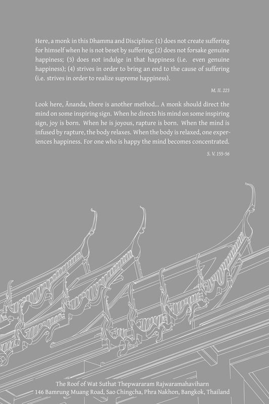

# 第九章：神通与神圣

神通与神圣

## 导论

如果有人提出佛教是否肯定超自然现象（见“超自然”一词的说明）和天神存在的疑问，根据三藏及其他经典中的文字证据，答案是明确肯定的。支持这一回答的经典证实是广泛而丰富的。[\[1\]](#fn-fn1) 尽管如此，人们很难就这些事物是否真实存在达成一致或共识。

“超自然”一词

> 译注：我在此使用“超自然”一词，意指“超越寻常”、“奇迹般的”、“属于更高领域”或“自然法则无法解释的事件”。正如尊者作者在《佛法》第四章论缘起时所指出的，佛教教义不承认存在凌驾于自然之上并对其拥有力量的超自然实体。同样地，此处的“超自然”一词并不意味着存在于自然世界之外的现实，也并非指超越自然力量的能力。从这个意义上讲，“超世间”（supermundane）一词，虽然不常用，但在这种语境下可能更为准确。

许多人认为相信这些事物会带来有害后果，这一观点导致一些学者以隐喻的方式解释这些现象。在此无需详尽探讨这些解释。即使接受这些事物真实存在的字面解释，佛教教义也包含足够的保障，有助于防止迷信或过度执着于证明超自然现象的有效性。

从古至今，许多人相信或恐惧鬼魂、精灵、神力、神秘事物和奇迹。佛教大胆地肯定这些事物的存在，同时宣告人类在其中享有自由。佛教教义阐述了原则，帮助人们从与超自然现象的关系中获益。至少，坚持这些原则所造成的危害，远小于试图寻找这些事物存在或不存在的无可辩驳的证据。了解这些佛教原则及其在日常生活中如何应用至关重要。

佛教不关注超自然现象和天神是否真实存在的争论，它不鼓励人们浪费时间去证明这些事物的存在。佛教更关心人们对待超自然现象的态度和正确的行为。在佛教中，知道神、鬼、精灵、神通或奇迹是否存在并不那么重要，更重要的是要了解（假设这些事物确实存在）它们对人类生命有何影响，并知道与它们建立正确的关系。 {942}

有些人可能会反驳说，除非先证明这些事物的存在，否则无法知道如何正确地对待它们。然而，正是这种过度渴望证明这些事物存在（或不存在）的意欲，导致了与它们相关的诸多不善巧行为。而且，至今仍未找到任何确凿的证据。

超自然现象，包括神通和天神，是无法证明的：不可能提供无可辩驳的证据来证明它们的存在或不存在。相信这些事物的人无法说服不相信它们的人，而不相信的人也同样无法向相信它们的人提供明确的证据来证明它们不存在，从而使后者放弃对它们有效性的任何残留信念。双方都停留在信仰或信念的层面：他们相信这些事物存在，或者相信它们不存在，或者他们完全否定它们的存在。（即使一个人真正目睹了这些事物，他也无法准确地将这种领悟与他人分享。）

除了没有无可争议的证据证明这些事物存在或不存在之外，这些事物还具有难以捉摸或难以把握的特性：偶尔，这些事物令人兴奋的踪迹会让人对其存在产生确信感，但一旦试图捕捉这种现象，这种感觉就会被证明是不尽如人意的。即使有时一个人确信这些事物存在，疑虑也会随之而生；越是寻找它们，它们就越是难以捉摸；它们越是难以捉摸，就越是引人入胜。因此，对超自然现象的执着可能导致人们几乎要脱离这个世界。

努力证明这种无法验证和神秘的现象的存在，既浪费时间和精力，又会制造各种个人和社会问题。只要人们仍在徒劳地寻找确凿证据，信徒和非信徒就会争论不休，互相驳斥对方的理论，制造不和，最终分道扬镳。他们无法改变自己的态度和行为，因为他们在等待永远不会到来的最终证据。真正的共识或团结从未达成。

在社会或政治层面，对这些问题缺乏共识或一致意见可能导致强迫甚至迫害。信徒可能会强迫非信徒接受某种信仰。反之，非信徒可能会禁止信徒实践他们的信仰，正如一些完全坚持科学方法的政治意识形态所见。如果这些政治体系中的政府官员认为人们持有愚蠢或迷信的信仰，他们可能会强迫人们放弃其信仰并采纳国家意识形态（即否定超自然现象）。

但这种强制并不能从根本上解决问题；它不能“清除”人们的疑虑；[\[2\]](#fn-fn2) 强制只会导致信仰的压制。 {943} 这种控制只要力量或说服力足够强就能维持，但一旦这些减弱，被压制的信仰就会萌芽、开花并蔓延。当这种情况发生时，这些信仰和实践可能像以前一样不理性、没有方向且有害，而未曾得到关注和纠正。

从某个角度来看，超自然现象主要以未觉悟者心中一套信念的形式存在，这些信念容易波动。有些人最初否定超自然现象并轻蔑地看待信徒，但当他们经历了自认为是神秘的体验后，他们的观点会彻底转变，成为狂热的信徒。由于无法获得阐明与这些事物正确关系的教导，他们变得比那些从一开始就相信的人更加着迷和沉迷于这些事物。同样地，一些对这些事物有过坚定信仰的人，后来经历了一些暗示他们信仰对象不尽人意或不确定的事情，结果他们的信仰动摇或彻底成为不信者。

既然如此，许多人纠结于这些事物是否存在的问题，同时又缺乏切实可行的措施来防止持有固定信念和观点所带来的危害。佛教强调实际考量：它教导每个人都能应用并受益的事物，适合其个人成熟度和能力水平。关于超自然现象，佛教提供了明确的教导：重点在于一个人与它们的关系，以及知道自己为何采取与它们相关的某些态度和行为。换句话说，相信或不相信这些事物并不重要；相反，一个人应该与它们建立适当的关系。

信徒和非信徒都可以遵循佛教关于此主题的原则；如果他们这样做，他们对待超自然问题的方式只会微乎其微地不同。此外，这种行为将使双方（信徒和非信徒）都受益，因为双方都会发展出相互关怀和体谅。信徒将以一种不会伤害自己或他人的方式坚持其信仰，而非信徒将尊重信徒，并可能能够建议他们如何建设性地对待其信仰的对象。

这种平衡修行的原则——即对无法证明且无需直接证悟即可获得精神圆满的事物建立适当的态度和关系——是佛教的独特特征，使其区别于其他宗教和哲学，包括现代意识形态。[\[3\]](#fn-fn3)

当基于这些正确的原则时，寻找超自然现象的证据并无害处。如果人们对此有特殊兴趣，且不给他人制造麻烦，那么我们就可以对这种追求保持开放的心态。这可以看作与其他知识领域的研究类似。 {944}

由于有关超自然现象的事情是无法证明的，人们对待这些事物的态度和关系至关重要。而且由于这些事物主要以人们心中一套信念的形式存在，所以相信或不相信这些事物的具体信念，其重要性微不足道。

总之，超自然现象的存在或不存在，包括天神和神通，对佛教的核心教义和原则影响甚微。尽管经典声称奇迹和天神存在，但即使一个人不与这些事物有任何接触，佛教的修行和最高证悟也是可能实现的。

关于此主题，佛陀曾说：

> 佛陀：孙那刹多（Sunakkhatta），你认为如何？无论我是否展现殊胜的神变，我所教导的、旨在达到目标的法是否能导向苦的彻底摧毁？孙那刹多：世尊，无论世尊是否展现殊胜的神变，世尊所教导的、旨在达到目标的法都能导向苦的彻底摧毁。佛陀：孙那刹多，你认为如何？无论我是否揭示被认为是世间起源的事物，我所教导的、旨在达到目标的法是否能导向苦的彻底摧毁？孙那刹多：世尊，无论世尊是否揭示被认为是世间起源的事物，世尊所教导的、旨在达到目标的法都能导向苦的彻底摧毁。[\[4\]](#fn-fn4) {945} D. III. 3-4。

## 奇迹与神通

### 导论

尽管神通被归类为“更高智慧”（abhiññā）的表现，[\[5\]](#fn-fn5) 但各种神通，包括天耳通、天眼通、他心通和宿命通，都属于世间神通。它们与世间现象相关联，属于凡夫的领域，并仍受烦恼的支配。[\[6\]](#fn-fn6)

早在佛陀时代之前，人们就已经获得了这些世间神通；它们不依赖于佛教的兴起而存在。神通不构成佛教的精髓，也不是达到其目标所必需的。

佛教的精髓，以及伴随佛教兴起而来的，是导向苦和心垢止息的智慧。这种智慧被归类为第六（也是最后一种）神通，称为“漏尽智”（āsavakkhaya-ñāṇa）。它是一种出世间神通（lokuttara-abhiññā），是觉悟者所独有的。它引导未觉悟的人获得解脱和清净，摆脱世俗的束缚，并作为“圣者”（ariya-puggala）完全证悟。

世间神通可能会衰退，而出世间殊胜智则是坚不可摧的。获得出世间殊胜智优于获得所有五种世间神通，但除了出世间殊胜智之外再获得世间神通则被认为是卓越和圆满的标志。出世间殊胜智对于真正良善的生命至关重要；世间神通并非必不可少，但它们能提升一个人的个人品质。[\[7\]](#fn-fn7)

### 三种奇迹

佛陀将神通归类为三种奇迹（pāṭihāriya）之一：[\[8\]](#fn-fn8)

1.  Iddhi-pāṭihāriya：神变神变。
    
2.  Ādesanā-pāṭihāriya：记心神变。
    
3.  Anusāsanī-pāṭihāriya：教诫神变：真理的教导，导向真实的洞察和圆满。
    

这些奇迹在巴利经典中是这样描述的：

1.  神变神变：有些人展现各种超常神力：他曾是一人，便能化现多人；曾是多人，便能化为一人；他能显现和消失；他能穿墙逾壁，越过山峦，如同穿行虚空般畅通无阻；他能潜入地中，犹如水里来去自如；他能在水面上行走而不下沉，如同在地上行走；他能在空中飞行，如同鸟儿一般；他用手触碰和抚摸太阳和月亮，如此强大有力；乃至以身体自在地抵达梵天界。 {946}
    
2.  记心神变：在此，一位比丘读取其他众生、其他人的心，读取他们的心境、思想和考量，并宣称：“你的心是这样的，它倾向于这样，你心里就是这样的。”[\[9\]](#fn-fn9)
    

> 有些人通过某种迹象宣称：“你的心是这样的，它倾向于这样，你心里就是这样的。”他无论作出多少这样的宣称，都完全如此，并无差异。另一些人则不通过迹象作出宣称，而是在听到人类、鬼神或天神的声音后宣称：“你的心是这样的，它倾向于这样，你心里就是这样的”……或者通过听到一个人在思惟时，其寻思和伺察的声音，宣称：“你的心是这样的，它倾向于这样，你心里就是这样的”……或者通过以心识穿透某人处于无寻思、无伺察的禅定状态之心，清楚地知道那个人心中的心行，并知道这种心行之后他将会有怎样的思惟。他无论作出多少这样的宣称，都完全如此，并无差异。D. III. 103-104；Ps. II. 227-8。

记心神变（ādesanā-pāṭihāriya）似乎与他心通（cetopariya-ñāṇa 或 paracitta-vijānana）相似，但其不同之处在于前者仍处于直觉性感知的层面；它尚未达到“直接智”（ñāṇa）的层面。

*   3\. 教诫神变：在此，一位比丘作如下教导：“应如此思惟，不应如此思惟；应如此作意，不应如此作意；应舍弃此，并安住于彼的成就。”

在《长部·迦瓦达经》（Kevaddha Sutta of the Dīgha Nikāya）中，此段落之后是佛陀出现在世间并教导佛法的描述，这在人们心中激发起信心，引导他们出家为僧，培养善行、感官自制、正念和明辨，寻求独处，发展禅那，并获得六种神通，最终以漏尽智和阿罗汉果的证悟作结。所有这些教导的成果都是“教诫神变”的例子。

以下是上述巴利词的字面含义：

*   Pāṭihāriya（“奇迹”）：意为“击退”、“驱逐”或“摧毁”不利或敌对的事物。
    
*   Iddhi（“神通”）：意为“成就”、“圆满”。
    
*   Ādesanā（“记心”）：意为“指示”、“揭示”、“指出”、“阐明”。
    
*   Anusāsanī：意为“反复教导”。
    

运用这些定义，《无碍解道》（Paṭisambhidāmagga）以一种新颖的方式解释了这三种奇迹。它指出所有善法，如出离、慈心、禅那、观照无我，以及阿罗汉道，都是 iddhi-pāṭihāriya，因为它们导向特定的成就并消除欲贪、瞋恚及其他烦恼等负面品质。所有善法都是 ādesanā-pāṭihāriya，因为它们只在清明无染的心中生起。善法也是 anusāsanī-pāṭihāriya，因为教法强调了它们的正确应用、培育、发展和平衡。[\[10\]](#fn-fn10) 尽管这些并非对这些奇迹的常见解释，但它们提供了一个发人深省的视角。

### 神通并非必要

居士哥伐陀（Kevaddha）曾前往佛陀处，请求他展现一个奇迹：

> {{id\_xxxx}}世尊，那烂陀（Nāḷandā）城富饶、繁盛、人口众多，而且充满了对世尊有信心的人。如果世尊能请求某位比丘施展超人神通，那将是件好事。这样一来，那烂陀的市民就会对世尊生起更大的信心——生起无量的信心。佛陀回答说：{{id\_xxxx}}盖瓦陀（Kevaddha），我并不是这样教导比丘们的，说：“去吧，比丘们，为白衣居士施展超人神通。” {947}

佛陀接着说，在三种神通中，他不喜欢神通和读心术，因为他看到了它们的潜在危害：当听到这些事时，那些相信其真实性的人会更加确信，而那些持怀疑态度的人则会否认其真实性。他们可能会声称，施展这些神通的比丘是使用了魔法符咒（gandhārī）、读心符咒（maṇīkā）或其他诡计。这种意见分歧随后导致争论和不和。

佛陀接着解释了教诫神通的意义和价值，说它人人皆可应用，直至证得漏尽智，此乃佛教之目标。

他举了一个比丘的例子，这位比丘在神通方面技艺高超，他想知道四大元素在何处无余止息。[\[11\]](#fn-fn11)这位比丘游历天界以寻找这个问题的答案，一直前行直到抵达梵天界。但最终，他未能得到答案，于是返回人界，请求佛陀解释世界的真实本性。这个故事表明神通是有限的，常常无效，并非佛教教义的精髓。[\[12\]](#fn-fn12)

另一次，婆罗门桑伽罗瓦（Saṅgārava）向佛陀提及王宫中大臣们就以下主题展开的谈话：

> 以前比丘较少，但展现超人神通的比丘较多。现在比丘较多，但展现超人神通的比丘较少。

佛陀通过解释三种神通来回答。他接着问桑伽罗瓦，这三种神通中哪一种他认为是最殊胜和崇高的。桑伽罗瓦回答说，神通和读心神通的知识和证悟仅限于施展它们的人；这种知识不能传授给他人。从外部来看，它们具有魔术师戏法的性质。因此，教诫神通更为优越和崇高。接受这种教诫的人可以反思、应用并证悟这些教法，从而达到苦的止息。[\[13\]](#fn-fn13)

### 圣神通

巴利圣典中的另一段描述了两种神通：[\[14\]](#fn-fn14)

1.  非“圣”神通：伴随着烦恼，并作为“苦的依处”（upadhi）的神通，即通常所理解的、前面讨论过的神通。在此，通过坚定的努力，出家众证得心解脱（cetovimutti），并施展各种超人能力，比如投射意生身、穿墙而过、空中飞行、潜入地下或水上行走。
    
2.  “圣”神通：没有烦恼，不作为苦的依处的神通。在这种情况下，比丘能够自我掌控其知觉，并能够控制对感官印象的反应。他能够将令人厌恶的物体视为不令人厌恶；例如，他能够看到一个面部毁容的人，并以慈爱和友善对待这个人。他能够将有吸引力的物体视为无吸引力的；例如，他能够看到一个迷人、诱人的身体是令人厌恶的。或者他能够保持舍心，舍弃有吸引力的和令人厌恶的，例如在公正地反思事物并看清它们的真实本性时。 {948}
    

这段经文证实，通常所理解的神通——施展惊人奇特能力——在佛教中既不受赞扬，也不是佛教的精髓。在佛教中，最高形式的神通是控制自己对感官印象的反应并发展精神上的自我掌控的能力。这种能力不会给自己或他人造成伤害。

那些施展前一种神通的人可能无法施展后一种神通，而且他们偶尔会运用他们的神通来放纵他们的烦恼。然而，后一种神通则能培养善法，根除烦恼，并使心免受贪、嗔、痴的诱惑。[\[15\]](#fn-fn15)

佛陀制定了禁止比丘向居士展示神通的学处，这也证实了他不鼓励使用神通。[\[16\]](#fn-fn16)

如前所述，神通是一种世间成就，它能增强那些已获得出世间智者的特质，帮助他们更好地开展活动并协助他人。佛陀将拥有三种奇迹般天赋的人称为“圆满成就者”、“已达目标者”、“天人中至上者”。[\[17\]](#fn-fn17) {949}

然而，如前所述，教诫神通是主要的、恒常的因素，而其余两种神通则是辅助性的。当有充分理由施展神通和读心神通时，它们应仅应用于早期阶段，为教诫神通铺平道路。教诫是目标和圆满，下文将更详细地讨论。

### 神通的危险

神通对拥有它们的人和与这些人交往的人都可能有害。未开悟的拥有这些神通的人可能会因此而陶醉：[\[18\]](#fn-fn18)他们可能会变得自负，感到优越并贬低他人；他们可能会沉迷于由此类神通获得的物质利益和荣誉；他们可能会变得不诚实；或者他们可能会利用这些神通作恶，就像提婆达多尊者（Devadatta）的情况一样。

至少，对神通的执著或喜乐会妨碍一个人证得更高的精神品质，并妨碍心灵从杂染中得到净化。而且，由于未开悟者的神通能力会衰退，围绕保护这些能力的焦虑是一个障碍，它会干扰如理作意和观禅的有效应用。神通因此被归类为观禅的障碍（iddhi-palibodha），修行智慧者应将其去除或消除。[\[19\]](#fn-fn19)

与拥有神通的人交往的人也很可能受到伤害。主要的危险是这些人会成为受害者。一个拥有（或假装拥有）神通的人可能会吹嘘这些神通以谋取私利。

请注意，那些修行正确并在这一领域有天赋的人，只在他们认为神通适合作为引导正确教诫的渠道时才施展神通。因为如果不提供佛法教导，一个人除了寻求个人名声或物质利益之外，还会为了什么而展示这些神通呢？

因此，重要的是要记住，神通应始终伴随着正确的教诫。如果有人揭示或声称拥有神通，而这些神通不是通向“教诫神通”的桥梁，他们的行为就可以被认为是不正确的。[\[20\]](#fn-fn20) {950}

他们可能怀有恶意或欺骗意图，他们可能在寻求个人利益，或者他们可能仅仅对神通有错误的理解。同样的原则也可以应用于圣物或护身符：如果一个人在使用这些物品与人交往时，没有提供任何形式的教导——没有引导他们发展智慧，没有让他们理解真理，也没有让他们逐渐摆脱对这些物品的依赖——那么这种做法就是不正确的，并且将人们引向错误的方向。（参见《引向错误方向》注释）

引向错误方向

> 这个主题包括圣物和魔法物品、神秘力量，以及佛陀所称的低劣或“畜生”之术（tiracchāna-vijjā）。低劣之术是指那些阻碍通往天界和涅槃之道，或与佛教目标不符的外道教义。它们主要涉及占卜、预言和疾病治疗，这些对于比丘而言，如果他为了谋生或追求个人利益而修行这些技艺，则从道德角度来看是错误的和有害的。Tiracchāna-vijjā 不同于iddhi-pāṭihāriya。Tiracchāna-vijjā 在《长部》D. I. 9-12 中有所讨论，并在《长部》的Sīlakkhandhavagga中反复提及。在例如《律藏》Vin. II. 140；Vin. IV. 306 中有禁止学习和教授这些技艺的戒律；例如在DA. I. 131；Nd1A. II. 402 中有所解释。

即使一个人没有成为声称拥有神通者的受害者，对这些事物的迷恋或全神贯注也与两条重要的佛教原则背道而驰：

首先，佛教教导解脱之道。因为神通对佛教并非至关重要——它们与佛教的目标没有直接关系，也无助于人们摆脱烦恼——对这些事物的迷恋往往是时间和精力的浪费，这些时间和精力本可以用来修行佛法。

其次，那些与声称拥有神通或神圣力量的人交往的人，通常希望得到超自然或神圣力量的帮助，比如求好运或财富。这种行为与佛教的核心教义不符，佛教是行动（kamma-vāda）的教导，活动的教导（kiriya-vāda），以及精进（viriya-vāda）的教导：佛教教导人们通过符合因果律的坚定、审慎的行动来寻求结果。

通过祈求神圣或超自然力量来寻求结果可能导致不活动或懒惰。它会导致缺乏努力，缺乏紧迫感来承担必要的任务或避免伤害，并且它与正念的原则相矛盾。

如果一个人对神通感兴趣，最好自己发展这些力量（尽管这仍然可能是浪费时间），因为希望通过他人的力量或神圣力量获得结果是对外部事物的依赖，并使一个人更加依赖它们。这种对外部事物的依赖非但不能导致更大的独立性，反而使一个人更加不稳定和困惑；一个人的足智多谋、内在力量和自信心都会减弱。对外部事物的依赖与佛教的另一个基本原则相悖，佛教教导自力更生——自归依。佛教教导解脱之道，最终超越信仰，导向纯粹的智慧。此道始于对导师智慧的依赖，[\[21\]](#fn-fn21)导师是一位“善知识”（kalyāṇamitta）。最终，一个人可以放弃这种依赖，独自站立，无需导师的扶持。[\[22\]](#fn-fn22) {951}

### 与神通的正确关系

关于神通的展示如何影响一般人，让我们看看佛陀及其弟子们的行为，他们都非常擅长神通。如前所述，佛陀明确不赞成施展神通和读心术的奇迹，但始终支持并运用教诫神通；教诫是佛陀活动的核心。然而，也有佛陀施展神通的例子。

通过审视这些场合，我们可以得出结论，佛陀只在降伏（或“驯服”）那些拥有神通的人——那些高度重视这些神通或傲慢地自以为比他人优越的人——时才施展神通，以便他们放弃对神通的迷恋。他施展神通是为了降伏神通，鼓励那些沉迷于神通或对神通自负的人认识到神通的局限性，并看到比神通更优越的事物——学习和认识佛陀通过教诫神通所揭示的事物。这类似于前面提到的神通与教诫结合应用的原则，但在这里，这种应用仅限于那些被神通所迷惑并在遇到佛陀时表现出顽固傲慢的人，例如降伏梵天神的故事。

有一些佛陀主要弟子将神通展示与教诫结合起来的故事，对象是那些对神通着迷的人，例如舍利弗尊者（Sāriputta）通过读心神通教导提婆达多尊者的弟子的故事，以及摩诃目犍连尊者（Mahā Moggallāna）施展神通的类似故事。

有几个比丘揭示神通以帮助他人的故事，但在巴利圣典中，没有一个比丘应人们请求而施展神通的例子。[\[23\]](#fn-fn23)曾有人提出这样的请求，因为他们想亲眼目睹这些神通，但佛陀制定了一条学处，禁止比丘向居士展示此类神通，如前所述。

在日常生活中，人们必须与其他人共同生活，并生活在普通环境中。佛教强调，与其依赖与人没有直接联系的无形外力，不如训练和律己，发展知识和技能，以便能够使用普通、理性的方法解决问题，并通过正当手段获得成功。佛陀将导致成功的能力定义为一种“力量”（iddhi），这与佛教教义相符。这种能力是双重的：物质力量（āmisa-iddhi）和精神力量（dhamma-iddhi），后者是主导原则。[\[24\]](#fn-fn24) {952}

有两个主要点揭示了神通的局限性，以及所有形式的圣物或超自然力量的局限性，揭示这些力量对于佛教并非至关重要，与佛法（Buddha-Dhamma）的目标无关，对于修行佛道而言并非必需，也无法提供真正的安全或保障：

1.  从智慧的角度来看，超自然力量不能直接产生智慧，不能洞彻真理，也不能理解事物的真实面貌。这种局限性的一個例子是那个拥有神通的比丘的故事（前面提到过），他遍历所有存在领域寻找答案，直到抵达自称创造世界的梵天界，然而这位比丘的探索徒劳无功。一个类似的故事描述了一位仙人徒劳地旅行寻找宇宙的尽头，直到他死去。[\[25\]](#fn-fn25)
    
2.  从心的角度来看，神通无法真正消除烦恼或终止痛苦。当心困惑、沮丧、躁动不安或被贪、嗔、痴所困扰时，这些力量无法导向解脱；即使通过禅定的力量压制这些负面心境，这种解决方案也只是暂时的。每当一个人脱离禅定状态并面对日常生活时，烦恼就会回来干扰和困扰，并导致痛苦。更糟糕的是，神通可能被用来服务于烦恼，就像提婆达多尊者（Ven. Devadatta）的情况一样。[\[26\]](#fn-fn26)
    

## 天人

### 人与天人

前面关于奇迹和神通的大部分内容也适用于天人（devatā）这个主题。（参见《天人（Devatā）》注释）人们通常出于实际原因对天人感兴趣：他们希望并祈求拥有特殊力量的天人帮助，就像他们寻求其他形式超自然力量的帮助一样。因此，上述原则，特别是关于超自然力量的优点和潜在危害，与天人这个主题相关。然而，还有一些额外的事项需要考虑。

天人（Devatā）

> deva 或 devatā 这些词涵盖所有天人，包括梵天神。天人分为三类：欲界天人；那些执着于感官享乐的众生；这些众生的居所有时被称为“六欲天”（chakāmāvacara-sagga）：四大天王天（cātummahārājikā），三十三天（tāvatiṁsā）；夜摩天（yāmā）；兜率天（tusitā）；化乐天（nimmānaratī）；他化自在天（paranimmitavasavattī）；色界天人（rūpa Brahmas），共有十六层；以及无色界天人（arūpa Brahmas）。对照：《Vīthimuttaparicchedo》, 《Paṭisandhicatukkaṁ》。

一般来说，所有形式的天人，直至最高层的梵天神，都是生、老、病、死的同伴，都是轮回（saṁsāra-vaṭṭa）的同伴。此外，与人类一样，这些天人中的大多数都是未觉悟的凡夫（puthujjana），拥有烦恼。尽管有些天人是觉悟的，但他们大多数是在前生作为人类时证得觉悟的。尽管天人在精神品质上被认为优于人类，但天界和人界非常相似，两者都被归类为“善趣”（sugati）。 {953}

在某些方面，天人比人类有优势，而在另一些方面，人类比天人有优势。有一次，佛陀将印度（Jambudīpa – “赡部洲”）的居民与忉利天（Tāvatiṁsā heaven）的天人作比较，声称天人在三个方面优于人类：天寿、天颜和天乐，而人类在三个方面优于天人：勇气、正念和梵行（即圣道——ariya-magga）。[\[27\]](#fn-fn27)

通常，人类认为自己不如天人，并希望投生天堂，但天人却认为投生为人是一种“善趣”，正如佛陀所证实的那样：比丘们，人类状态是天人所认定的善趣。[\[28\]](#fn-fn28)当天人即将逝去时，其他天人会祈福，愿此众生投生为人，因为人界是一个可以选择行善积德并全身心投入佛法修行的地方（当然，人也可以全身心投入不善行）。[\[29\]](#fn-fn29)

佛陀认为，投生为寿命极长的天人，是修行梵行的浪费机会。[\[30\]](#fn-fn30)甚至可以说这样的出生是坏运气。天人体验着纯粹的快乐，这往往导致放逸和正念的薄弱。人界则混杂着快乐和痛苦，提供了广泛的经验和教训。如果人类知道如何正确地引导注意力，他或她将获得理解，发展敏捷警觉的正念，发展自律，并在“圣法”（ariya-dhamma）中进步。[\[31\]](#fn-fn31)

人界介于天界与“恶趣”（apāya）之间，例如地狱界。恶趣居住着邪恶或精神品质低下的众生。虽然其中一些众生可以被认为是好的，但他们因不善业的果报而堕入这些界域。天界居住着相对善良的众生。虽然其中一些众生品格不好，但他们因善业而升入天界。

居于中间的人界，就像一个十字路口——既是天人也是堕落境界众生经过的地方。这是所有存在界众生造业的地方。在这里，恶众生得以改善自己并准备进入天界，善众生造作恶业并准备进入地狱，而智者则停止造业，解脱自己，弘扬佛法，并从生死轮回中获得自由。

恶趣有四层。每个独特层次的众生都拥有相似程度的不善品质（pāpa-dhamma）。[\[32\]](#fn-fn32)天界包含许多不同层次，精致程度递增；每个层次的众生都拥有相似程度的功德。唯有人界是各种善恶的中心：它包含着像地狱最深处众生一样的恶人；它包含着像最高梵天神一样的善良、高尚的人；它还包含着超越所有存在状态的众生，甚至天神也对其顶礼膜拜。 {954}

人类和天人的精神品质和一般能力非常相似，但人类拥有更大的精神发展和自我提升的机会。一般来说，天人比人类优越和更熟练，但当人类通过精神修养提升自己时，他们在德行和能力上与天人相等甚至超越天人（尽管从佛法的角度来看，不鼓励将此视为一种竞争）。[\[33\]](#fn-fn33)

### 与神灵交往的过时方式

佛陀时代之前的印度宗教是多神教，但其信徒也相信有一位主神，他创造了世界和所有现象。人类被认为不可能超越这位神。人们通过祈祷和恳求与神灵交往，寻求取悦和讨好他们的方法，例如通过赞美诗、崇拜、祭祀和牺牲。或者，人们使用其他形式的恳求，通过施加压力使神灵感兴趣，激怒他们直到他们担忧并被迫伸出援手或安抚恳求者。后一种方法采用各种宗教和苦行实践，即自我折磨和自我惩罚。总而言之，与神灵交往有两种传统方式：

1.  通过祈祷和恳求；通过供奉、崇拜和牺牲，类似于孩子对父母的恳求。有时这种行为会演变成讨好或贿赂更高力量的企图。
    
2.  通过强制，通过各种苦行或宗教仪式迫使天人按照自己的意愿行事。这类似于一个孩子，通过拳打脚踢，试图强迫父母注意并满足自己的愿望。
    

这两种方式都归结为寻求个人利益，并涉及对外部力量的依赖。当佛陀开始教导时，他鼓励放弃这两种修行方式，正是对它们的放弃使佛教在天人问题上与众不同。通过放弃这些做法，佛教能够提供一种更理性的方法，明确指出不同行为方式的优点和危害，并建立一种新的、更恰当的与神灵的关系。 {955}

### 依赖天人的有害影响

依赖天人有与上述神通相关的类似局限性，并造成类似的障碍。从智慧的角度来看，天人与人类一样，总体上仍然对真理无知。这从（前面提到的）那位游历天堂各界寻求问题答案的比丘的故事中可见一斑，连最高的梵天都无法回答这个问题，以及佛陀降伏名为婆伽（Baka）的梵天的故事。

从心的角度来看，天人与人类相似，大多数都未开悟——他们仍然有一定程度的烦恼和痛苦；他们仍然在轮回（saṁsāra-vaṭṭa）中流转。例子有梵天神，尽管其精神品质高尚，却仍然不加注意地认为自己不朽，[\[34\]](#fn-fn34)以及因陀罗（忉利天之王），他沉迷于天界宝藏。[\[35\]](#fn-fn35)人们向因陀罗寻求帮助，但因陀罗自己也并非没有贪、嗔、痴和恐惧。[\[36\]](#fn-fn36)除了依赖天人与通过毅力和努力获得成就、自力更生和解脱的原则相冲突，正如前面神通一节所提到的，这种行为还有许多其他有害后果：

*   不仅人类在向天人供奉和讨好时会受到伤害。因为大多数天人尚未开悟，当他们沉迷于赞美并执着于供奉，并日益渴望更多此类事物时，他们自己也会受到伤害。这样，人类和天人都会专注于崇拜和崇拜的效果，放弃或忽视自己的个人责任，并陷入粗心和堕落。
    
*   一些天人，当他们沉迷于供奉和赞美时，会寻找方法来增加人们的义务感和依赖感。为此，他们可能会通过满足人们的一些愿望来引诱人们，使人们的期望增加并做出更多的供奉，或者他们甚至可能故意制造危机，以便人们感到需要转向他们。
    
*   当贪婪的天人痴迷于个人利益时，那些不寻求个人利益而帮助人的贤德天人就会感到疲惫并远离（通常，天人不想麻烦自己或干预人类事务）。[\[37\]](#fn-fn37)这样，好人就会失去帮助和鼓励。由于热衷于个人利益的天人只在收到恳求或祭祀礼物时才提供帮助，因此更多的人会相信善行不会带来好结果，而恶行才会带来好结果。这会导致社会混乱。
    
*   当贤德天人远离时，这给了贪婪天人更大的机会来谋取私利。例如，当人们向他们崇拜的特定神灵祈求时，贪婪的天人会前来欺骗人们，假装是那个特定的神灵。人们不会察觉，因为这件事超出了他们的理解范围。这些欺骗、冒充的天人会使人们更加着迷和被超自然现象所迷惑。 {956}
    

### 与神灵的正确关系

从这些评论中我们看到，那些得到天人帮助的人不一定需要是好人，而好人也不一定能得到天人的帮助。这是因为，在大多数情况下，人类和天人都未开悟，并且可能修行不当；然后他们导致世界中井然有序的系统受到干扰和削弱。

以下是关于与天人建立正确关系的一些进一步观察。首先，天人无法单方面决定和控制人类的环境或人类的命运。尽管普遍认为天人拥有比人类更强大的力量，但当人类发展自己时，他们能够与天人相等甚至超越天人，如前所述。决定谁更优越的决定因素在于一个人的精神品质和努力，这一点得到了《本生经》（Jātaka Tales）中这个故事的证实：

> 两个邻国的国王正在准备战斗。其中一位国王咨询了一位拥有神通的仙人。这位仙人能够与因陀罗交谈，因陀罗告诉他国王的军队将取得胜利。因此，国王漫不经心地让他的士兵休息和娱乐。另一位国王听说自己将战败的预测后，加倍努力加强自己的军队。在随后的战斗中，这位第二位国王的军队获得了胜利。被指责的因陀罗于是说出了这句神圣的箴言：“人类的毅力和努力，天人无法阻挠。” J. III. 7; JA. III. 3-8。

人们常对居住在家中的神灵表示尊敬，但从某种角度来看，这些神灵只是客人。如果房屋主人非常贤德，例如他或她是一位“圣弟子”——精神品质稳固，并已从依赖信仰进步到坚定智慧——那么家宅神灵就无法控制主人，反而必须服从和尊敬他或她。

这在天人的故事中有所体现，那位天人住在 Anāthapiṇḍika 的拱门里（Anāthapiṇḍika 并未为这位天人建造特殊的居所）。当 Anāthapiṇḍika 失去财富时，天人来找他，建议他停止布施。Anāthapiṇḍika 认为这个建议不如法，于是把天人赶走了。这位天人找不到新的住处，便去向 Indra 求助。Indra 教导天人如何恰当地向 Anāthapiṇḍika 道歉；按照这个指示，天人获准返回他原来的居所。[\[38\]](#fn-fn38)

天人对一个人的指责不应被视为判断其过失或错误的最终标准，因为有许多天人诽谤善人的例子。上述 Anāthapiṇḍika 故事中提到的天人被认为是具有邪见或“盲目愚痴”的。这位天人很不高兴，因为当佛陀或他的弟子拜访房屋时，他必须降到地面，所以当 Anāthapiṇḍika 变穷时，天人敦促他停止与佛陀交往，但他的计划未能实现。

有些天人出于恶作剧，在人们之间挑拨离间，制造相互猜疑。[\[39\]](#fn-fn39) 有些森林天人对比丘们到森林里修习佛法感到不高兴，因为这些具高尚功德的善人进入了他们的领域，这让他们感到沮丧和不便；因此他们寻找方法让比丘们的生活不舒服。[\[40\]](#fn-fn40) 在这些情况下，佛陀建议比丘们通过以善意回应和散播慈心来解决这个问题。{957}

在天人提出建议并劝导一个人以某种方式行事的情况下，如果这些请求被认为不恰当或不如法，那些真正理解佛陀教法的弟子们会坚定不移，绝不会被这些建议所说服，无论天人是威胁他们还是允诺奖赏。[\[41\]](#fn-fn41)

第三，有些天人行为不端；他们怀有敌意，不断阻碍人类的灵性发展。人们不仅不应乞求或依赖这些天人，反而应以美德彻底降伏或战胜他们。如果人们自我修养良好，就能战胜这些天人。

Māra 就是这种神灵的一个重要例子。[\[42\]](#fn-fn42) Māra 居住在他化自在天 (Paranimmitavasavattī)——欲界的第六层也是最高层天。当人们行善时，他喜欢阻碍和骚扰他人，特别是当有人试图从欲乐 (kāma) 中解脱时；在这种情况下，Māra 担心此人会超越他的领域，此时此人必须面对 Māra 才能超越。[\[43\]](#fn-fn43)

Māra 拥有巨大力量；当 Māra 出现时，甚至 Indra 也会逃到宇宙的边缘躲藏起来，而 Brahma 也避开他。[\[44\]](#fn-fn44) 偶尔，Māra 会去扰乱梵天界，这些是色界，比 Māra 通常的存在领域更高。[\[45\]](#fn-fn45) 因此，佛陀说：在所有强大众生中，Māra 最为强大。[\[46\]](#fn-fn46) 尽管 Māra 拥有如此巨大的力量，一个在戒、定、慧方面训练有素的人，可以用他的德行战胜他，而这样一个具至上灵性品质的人，会受到天人乃至梵天界的所有众生的尊敬。[\[47\]](#fn-fn47)

这些话并非旨在鼓励对神灵产生轻蔑或麻木不仁的感觉，而是为了增进理解并帮助建立与他们之间的正确关系。

### 佛教徒与神灵的关系

基于对神灵本性以及与他们不当交往所带来危害的理解，佛教教导人们放弃一切对他们的依赖和祈求，无论是通过祈祷还是通过胁迫。佛教教导一种新的关系形式，即友谊、慈爱和相互尊重。我们应该认为我们都是苦难与轮回中的同伴，并且总体而言，人类和天人处于较高的精神层次。人类和天人之间不应相互干扰或干涉，各自努力履行自己的职责。

人类与天人之间这种不干扰、不伤害的关系，在许多经典故事中都有清晰的描绘，特别是在《本生经》和《法句经》的注释中。{958} 在这些故事中，我们看到天人帮助人类，但这种帮助的性质和原因与早期传统中发现的不同。在这里，天人是出于自身的主动性，被其自身善意所驱动而提供帮助的；他们并非因为人们请求而帮助，也既不期待也不渴望此类恳求。那些获得帮助的人以一种普通、独立的方式，有德且明智地行事；他们不期望获得帮助，也不寻求此类帮助。这种帮助的原因是人类的善意或善行；它不是祈求的结果，也不是一种回报形式。

在经典中，向人类提供这种帮助的主要神灵是 Sakka，亦称 Indra，[\[48\]](#fn-fn48) 他是天人国王。Sakka 的帮助原则，符合佛教的“积极行动” (kamma) 原则，是从前佛教宗教教义所倡导的神力原则演变而来的。[\[49\]](#fn-fn49) 尽管这个原则尚未纯粹符合佛教教义，但它已朝着明显的佛教方向发展，并已被纳入佛教传统。这个原则的核心是，有德的人类会尽其所能，以坚定而果断的方式，基于自己的正念和明智判断行事；他们不等待、不期望、也不请求神灵的帮助。有德的天人则乐于基于自身的德行帮助善人。当善人遇到麻烦时，有德的天人感到不得不帮助。（参见附注：无需努力的祈祷）

无需努力的祈祷

> 在当今世界，人们似乎严重依赖祈求和祈祷。如果他们首先付出了努力，这尚可接受，但情况往往是人们在乞求神灵之前毫无努力。天人反过来等待请求后才降临，他们帮助那些祈求的人，不论人们是善是恶。在这种情况下，可以认为降临的天人是贪婪、不真诚或软弱的，他们被人类事务纠缠，直到双方都腐化。

在这里，人类行为良好而不期待神灵的帮助，天人提供帮助而不期待人类的恳求。那些仍然关注神力原则的人可以反思这句话：“人类的责任是努力行善；天人的责任是帮助善人；尽你最大的能力履行你的职责。”[\[50\]](#fn-fn50)

如果人们不努力培养善行，却沉迷于祈求天人，而天人对帮助善人没有兴趣，只帮助那些恳求的人，那么双方都在不负责任地行事。当人类和天人缺乏美德且行事不负责任时，他们都将根据支配人界和天界的自然法则而面临毁灭。{959}

以下是佛陀关于神灵主题的一段总结性段落：

> 禁食鱼肉、裸体苦行、剃头、结发苦行、涂抹灰烬、穿粗糙豹皮、火祭、为了成为神而进行宗教修行、世俗的苦行、禳灾祭品、牺牲、季节性神圣仪式：这些都无法净化一个尚未克服疑惑的人。[\[51\]](#fn-fn51) Sn. 44-5.

## 得出结论

### 发展的三个阶段

佛教弟子团体由许多个体组成，他们从不同的起点开始灵性旅程，并沿着同一条道路的不同阶段前进，最终抵达同一目的地。这些个体在“圣者之法” (ariya-dhamma) 的发展水平上各不相同。通过承认人们之间的这种多样性，就能够为不同个体提供适合他们具体情况的帮助。

关于神灵这个主题，这个旅程或发展包括三个阶段：

1.  对神灵的依赖和乞求；
    
2.  与神灵的友好共存；以及
    
3.  获得神灵的尊敬和崇拜。
    

第一阶段可被视为发展前阶段；第二阶段标志着加入佛教或“圣者”团体的起始阶段；而第三阶段是达到佛教目标的人的发展阶段。

要被称为佛教徒，一个人必须超越依赖天人的阶段，进入与天人友好共存的阶段。然后，他将依据理智判断努力过活。他不再将天人视为需要祈求和奉承的强大存在，而是将天人视为有德的伴侣，与他们应保持相互的善意和尊重。（参见附注：尊重天人）在这方面，人类和天人不应过度交往，不应干涉彼此事务，也不应密谋共同伤害任何人。

尊重天人

> 过去信仰天人的泰国佛教徒，在采取可能困扰天人的行动之前，会知会天人或守护神。这种行为可视为从婆罗门教徒安抚天人的做法，向佛教修行方式的适应。然而，天人的安抚似乎在泰国蔓延，尽管佛教领袖警告要放弃这种行为。这可能源于不了解佛教所教导的与天人之间的正确关系。因此，相信天人者和否认天人存在者两派之间发生了争论。尽管有这些争论，总有一些人坚持他们对天人的信仰，也有一些人推测关于天人的信仰。这些信徒往往除了祈求之外不知道如何对待神灵。

关于神通（包括神圣或神秘力量），灵性发展也包括三个阶段：(1) 依赖；(2) 神通力的发展；(3) 完全的自由。

第一阶段是对外部超自然力量的迷恋和依赖。处于这个阶段的人浪费时间和精力，缺乏理智判断。这个阶段可被视为“发展前”或“非圣者”阶段。

第二阶段是发展掌握神通的能力。这些力量被用来支持善业，例如通过帮助身处险境的人，以及协助“教诫神通”。{960} 在这第二阶段，吉祥物或圣物被用来提供鼓励和安心。[\[52\]](#fn-fn52) 它们作为提醒，增强人们行善的决心，并增强自信。虽然可以说这个阶段是佛教生活方式的开端，但佛陀并不提倡发展神通，因为它很容易将人拖回第一阶段。

在第三阶段，一个人是自由的。在此阶段，人们不依赖超自然力量或其他外部因素来提供鼓励，因为他们的心意坚定。他们能够控制自己的心，生活无忧。至少他们对三宝具足信心，这为他们提供了安全感。达到这个阶段的人真正理解佛教原理。人们应该加速进步到第三阶段，回忆经典中描述优秀在家信徒特质的教导：

> 他不迷信，相信 kamma；  
> 他从 kamma 中寻求结果，  
> 而非来自吉祥力量。A. III. 206.

### 自由的阶段

帮助人们通过这些阶段发展的最重要任务是提供教导，传统上，佛教团体中主要的灵性导师一直是比丘。灵性发展的速度和广度取决于教师和学生双方。教师在教学技能方面有不同的水平；同样，学生的能力和灵性素质也各不相同。

教学的目的是让人们达到第三阶段，即自由。如果教师善于教学且学生准备好了，师生之间可能只需要一次会面就能将学生从依赖的第一阶段引导到自由的第三阶段。教师的技能越高，学生的进步就越快。

通常，为了将学生从既定的思维方式中引导出来并帮助他们进步，教师必须在他们目前的发展水平上与他们建立联系，或者他必须提供他们熟悉的东西以建立信任。当教师缺乏建立信心的特殊能力时，那么他必须亲自指导学生从他们目前灵性发展的水平达到更高的层次。

在比丘是主要教师的背景下，他们在教学方面具有不同的能力是很自然的。这很可能就是为什么对僧侣戒律做出了让步，使其可以纳入第二阶段，即巧妙地应对超自然现象。这种让步背后的原则是，在提供教导时，利用人们执着的事物作为起点。这个过程的第一步是，将这些事物从其原有的重要位置上移开，并将人引导向更合适的方。与此同时，这些事物可以被建设性地使用，作为激发人们兴趣的一种方式，同时引导他们最终超越这些事物。{961}

这种修行方式在佛陀所制定的关于踩踏仪轨布的戒律中显而易见。有一次，菩提王子 (Prince Bodhirājakumāra) 刚刚建好一座宫殿，他邀请佛陀和僧团在那里用餐。王子命人将白布铺在通往宫殿楼梯的第一级台阶上。佛陀抵达时，他避免踩踏布匹，因此王子命人将布匹撤掉，之后佛陀才进入。后来，佛陀制定了一条戒律，禁止比丘踩踏此类布匹。

另一次，一位刚刚流产的妇女邀请比丘们到她家，她铺好一块布，请比丘们踩踏作为一种加持。然而，比丘们拒绝这样做。这位妇女很不高兴，并公开批评比丘们。当这个故事传到佛陀那里时，他修改了戒律，允许比丘们在家信徒请求下，作为加持而踩踏仪轨布。（参见附注：仪轨布）

仪轨布

> Vin. II. 127-9；M. II. 91. 注释 (VinA. VI. 1209；\[MA. 3/299\]；DhA. III. 133) 解释说，菩提王子没有孩子，他铺下布匹时下定决心，如果佛陀踩踏这块布，这将预示着孩子的出生。佛陀知道王子不会有孩子，因此没有踩踏布匹。他制定这条戒律是为了帮助后代的比丘。在佛陀时代，有许多比丘能够读取人们的心思，他们可以根据在家供养者的想法做出回应，而后来的比丘不会有这种天赋，也不知道如何恰当回应。因此，在家信徒会指责他们不像以前的比丘那样熟练。佛陀制定这条戒律是为了保护这些后来的比丘。注释接着解释说，对于一个流产或即将分娩的妇女，请求踩踏布匹是为了加持，因此是允许的。在第一种情况下，请求是作为誓愿和一种预言形式提出的，而在第二种情况下，请求是作为一种加持形式提出的。佛陀拒绝踩踏宫殿布匹的一个简单解释是，他出于良好礼仪。当他抵达宫殿时，他尚未洗脚，他也不希望弄脏布匹（戒律中有一个附属条款，允许比丘在洗脚后踩踏布匹）。对于那位妇女的情况，佛陀允许比丘踩踏布匹，因为她特别请求他们这样做是为了加持。

佛陀的这种允许很可能是为什么在近代，比丘们顺应在家信徒的请求，举行吉祥仪式、制作护身符并接触其他圣物（参见附注：吉祥物），以至于在某些时期，这种参与似乎超出了适度范围。[\[53\]](#fn-fn53) {962} 无论如何，如果比丘们理解上述戒律的精神，即仅当在家信徒特别请求时才举行吉祥仪式，那么任何危害或不当行为都将避免。

吉祥物

> 吉祥物 (maṅgala) 不同于超自然力量，但从实际角度来看，例如就其优缺点以及与这些事物的正确关系而言，它们有许多相似之处。超自然力量是指拥有它们的人具备非凡能力。然而，吉祥可以源于不同的来源：人们可能相信吉祥的人或物具有某种神圣或超自然力量；人们可能相信此人或物是某种神秘力量的媒介或通道；或者人们可能相信此人或物具备赋予神圣或祝福的功德、幸福或纯净，正如许多在家佛教徒对比丘们所相信的那样。吉祥物与“旁生明” (tiracchāna-vijjā；“伪知识”，与神通不同) 密切相关，因为许多人相信这些旁生明是好运的起源。如果一个比丘实行这些旁生明以寻求物质利益，这被认为是邪命和不道德行为（正如“大戒”——mahā-sīla 教导所定义）。

在神灵方面也可以做出类似的让步。第二阶段的发展可以通过允许佛教徒尊敬天人而被纳入，特别是在一个天人传统上被崇拜的社会背景下。即使是向天人供养 (bali) 也受到经藏的支持，但规定这些供养是出于善意或服务精神，而不作为祈求或期望回报。[\[54\]](#fn-fn54)

当一个人搬到新的地方居住时，他应该首先向周围有德之人提供帮助，然后确立慷慨之心，将自己所累积的功德分享给当地天神。接受了这份供奉后，天人会以善意回应：

> 无论有何天人接受此供养 \[的尊敬\]，  
> 他们也会反过来尊敬他。  
> 接受了他的敬重后，  
> 他们同样会敬重他。  
> 他们会像母亲爱护孩子般关爱他。[\[55\]](#fn-fn55) Vin. I. 229-30; D. II. 88-9; Ud. 89.

无论如何，天人回报的善意是无需请求的；供养尊敬的人无需为此祈求。我们的职责只是建立一颗善心，并与他人分享我们所拥有的一切善意。理解这个原则的人将以仁慈之心对待天人。当一个人行善积德时，他会与他们分享这份功德。这种行为没有害处；它只会提升心的品质，并将善意与和平散播到全世界。即使一个人无法超越第二阶段，但如果他保持这种友好共存的原则，不退回到讨好神灵，那么他的行为将自动保持在善的界限内，并避免造成伤害。此外，他的心性也将得到提升。

### 与超自然现象的正确关系

总之，佛教徒在对待超自然力量、神灵和吉祥现象方面的修行方式并不复杂。如果一个人的行为符合佛法，那么他就能过正常生活。

在泰国社会，常会听到关于神灵、圣物和奇迹的说法。人们可能会想，这些事物是否存在，如果存在，应该如何与它们相处。在这种情况下，一个人应该培养自信，停止为这些问题烦恼，并采取在所有情况下都正确的修行方式——一种可以在自己的心中完善的修行。{963}

在对待神灵方面，一个人应该以善意、好意和尊重行事。一个人应该培养温和，愿所有众生——包括天人——这世间的同伴都快乐。在社会中，你会遇到两种人：一种是相信并依赖天人的人，另一种是不相信并轻蔑地看待天人及相信他们的人。两个派别的成员经常相互冲突。如果一个人有机会，就应该鼓励两个群体的人找到中道，即对天人及彼此表达善意。

在从事个人活动时，一个人应尽最大努力依照因果法则行事。如果一个人仍然担忧神灵的帮助，他可以考虑，如果自己拥有足够的善意，而且有德且仁慈的天人确实存在，那么他可以将这种帮助留给他们：天人自己会决定并主动行动。就自己而言，一个人应尽其所能地履行职责——只要正念和智慧允许——从而在智慧和美德上成长，以便达到发展的第三阶段，在此阶段他将达到完全的自由，并值得天人崇敬。

我们不应行善是为了天人尊敬我们，也不应对天人采取不屈不挠的立场（这是一种傲慢），而应为了我们自己和我们自己的理由行善。随之而来的尊重取决于天人自身的意愿，因为天人拥有尊重他人善行的美德。

至于神通 (iddhi) 和吉祥力量 (maṅgala)，我们应该保持相同的态度，唯一的区别是将善意的回应转变为个人在这些力量方面的熟练程度。我们应该培养的最初神通力量是毅力和理智辨别力，它们能引导我们履行职责。同样，我们应该培养的吉祥力量是那些提升我们生活并带来和平与幸福的美德和技能。[\[56\]](#fn-fn56)

比丘作为佛教团体中通常的灵性领袖，在处理超自然现象时应非常谨慎。那些善于教学的比丘可能能够快速引导人们达到更高层次的灵性发展。但有些比丘，虽然他们教导人们放弃旧有的信仰，却止步于此，不教导他们如何生起智慧和看清前方的道路。这些人于是既无信心也无智慧，漫无目的地漂泊——这对自己和社会都是一种风险。

那些不善于教学，并利用人们对超自然现象的执着作为教导起点的比丘，应该注意几点。[\[57\]](#fn-fn57) 至于神通，佛陀制定了明确的戒律，禁止比丘向在家信徒展示神通。至于圣物或仪式，首先，比丘应决心不将这些事物作为谋生或寻求物质利益的手段，这属于邪命和道德上的污点。{964}

有几项重要考量与教学主题直接相关：

第一，涉足超自然现象或圣物是为了帮助人们从中解脱。例如，一位比丘利用神通来帮助人们摆脱对这些力量的依赖。

第二，无论教师从何处开始教学，他或她都必须不断引导学生向前，直到达到自由的目标。绝不能退回到以前的修行水平。对超自然现象的迷恋应该减少或至少不增加；教师不应鼓励沉迷于这些事物。教师帮助学生减少他或她的迷恋，并理解它们的局限性；通过这种方式，学生完全超越了依赖它们的第一阶段。除此之外，我们应该记住佛陀允许比丘仅在家信徒特别请求时才参与吉祥仪式，这有助于进一步划定涉足这些事物的合适界限。

第三，只要有机会，教师就应该提供能使人完全解脱于精神不净和轮回的教法；这些教法将加速并帮助引导学生的灵性发展。

对于那些从第一阶段（依赖）发展到第二阶段（自我掌控）的人，教师应设定以下关于他或她所做让步或妥协的限制：

1.  修行不应是祈求或依赖外部超自然力量（即教导应是自力更生和独立的）。
    
2.  修行不应导致对超自然现象的痴迷，也不应期望外部力量介入而无需采取行动（即教导应强调依照因果法则的个人努力）。
    

### 不懈的灵性发展

当这些教学限制已设定后，关于超自然现象的修行方式可概述如下：

*   允许涉足超自然现象，包括圣物和吉祥仪式，但要赋予它们新的意义：使人们发展内在的力量：法力 (dhamma-iddhi)、“圣者之力” (ariya-iddhi) 和修习佛法所产生的祝福。对比丘而言，参与在家信徒吉祥仪式的最基本形式是利用这些仪式作为鼓励（即支持善行）和促进努力的手段。超自然现象不应干扰明智和合理的努力。
    
*   与神灵的关系是友好共存。做出让步以允许向天人供养 (bali)[\[58\]](#fn-fn58)，其意义在于提供尊敬或帮助（不作为禳灾祭品、祈求或恩惠请求）。[\[59\]](#fn-fn59) {965}
    

在超自然现象这个领域，做出的让步越多，就越需要谨慎。在家佛教徒尤其应在此方面留意。比丘应不断提醒在家众执着于这些事物的危险，因为在家众由于生活忙碌，较少机会沉浸在佛法教义中，容易被误导。

每个从事佛法修行的人都应该意识到他或她仍处于灵性修行的发展阶段。在任何特定时间，都应该记住自己目前处于哪个阶段。一个人应该这样反思：“即使我目前仍然被天人和祝福的话题所吸引，我希望有一天我能达到完全自由的阶段。”简而言之，一个人应该反思：“我必须进步，而不是停滞不前。”

“进步”这个词对于佛教修行的初期阶段具有特殊重要性，[\[60\]](#fn-fn60) 因为总有脱离佛教团体并退回到“非圣者”方式的风险。在这个初期阶段，佛教修行方式和前佛教宗教教义之间有许多共通之处，在某些情况下，例如吉祥 (maṅgala) 和供养 (bali)，这些事物本质上是相同的。区别仅在于规范与这些事物互动以及应用范围的指导方针。

如果一个人粗心大意，忘记了与超自然现象的正确关系，他可能很容易退回到相反的立场，并脱离真正的佛教团体（我担心许多人就是如此）。因此，将“进步”的概念加入到对与超自然现象相关行为方式的思考中，这一点非常重要。[\[61\]](#fn-fn61)

当人们达到第三阶段（的自由）时，他们才真正安全，因为他们进入了“圣者”共同体：他们已达到了须陀洹果或更高层次的证悟。在此阶段，人们不会犹豫或退回到以前的阶段；因为他们已经达到了三宝的核心，对因果法则有信心，所以他们只会向前迈进，直至达到不动摇的信心。他们不依赖外部条件，例如圣物或神力来获得安全感，并且他们没有会促使他们作恶或引起重大问题的严重烦恼。他们体验到了一种源于内心平静的、精致的快乐，这使他们安住于无过失的行为中。这些不受外界影响的卓越美德、喜悦和自由的品质，促使天神尊敬和礼拜这些人，并带来一种充满祝福的生命：至高无上的祝福安住于这些圣者之中。

在所有有情众生中，人类具有最大的可训练性。他们能够训练自己的身体和心灵，并能够完成最精致、最精巧和最令人惊叹的事情。[\[62\]](#fn-fn62) 浪费时间期望超自然或神力援助是一种放逸和疏忽的行为，让一个人的人类潜能白白流失。结果是，一个人将无法在圣道上发展。另一方面，勤奋细心、毫不迟疑地训练自己的人，将获得神通和天神般的力量，并将达到至高无上的境界，这是超自然力量或天神都无法提供的成就。 {966}

## 附录一：经典中记载的神通现象

以下是巴利圣典中记载的佛陀展现神通的场合：

*   降伏螺髻苦行者之首优楼频螺·迦叶；[\[63\]](#fn-fn63)
    
*   降伏婆迦梵天；[\[64\]](#fn-fn64)
    
*   降伏另一位梵天；[\[65\]](#fn-fn65)
    
*   纠正孙那卡塔的错误见解，并驳斥裸体苦行者Pāṭikaputta的说法；[\[66\]](#fn-fn66)
    
*   降伏盗贼央掘利摩罗；[\[67\]](#fn-fn67)
    
*   启迪一群比丘，使他们前来接受教法；[\[68\]](#fn-fn68)
    
*   只允许某些人看到“大丈夫相”；[\[69\]](#fn-fn69)
    
*   施予慈心并驯服凶猛的大象那拉吉利；[\[70\]](#fn-fn70)
    
*   以及面对夜叉 Āḷavaka。[\[72\]](#fn-fn72)
    

注释书中所记载的场合包括“双神变”和驳斥外道老师的说法，[\[73\]](#fn-fn73)以及带着五百位比丘去欣赏喜马拉雅山，以消除他们对旧情人的思念。[\[74\]](#fn-fn74)

以下是巴利圣典中记载的佛陀弟子展现神通的场合：

*   尊者Piṇḍola-Bhāradvāja接受挑战，腾空而起，从高杆上取下檀香碗；[\[75\]](#fn-fn75)
    
*   尊者Mahā Moggallāna降伏魔罗；[\[76\]](#fn-fn76)
    
*   尊者Pilinda-Vaccha营救他护法居士被绑架的两个女儿；[\[77\]](#fn-fn77)
    
*   尊者Pilinda-Vaccha将频毗娑罗王的宫殿变成金色，为被诬陷的家庭洗冤；[\[78\]](#fn-fn78)
    
*   尊者Dabba-Mallaputta夜晚带领比丘们前往住所时，用手指作灯照明；[\[79\]](#fn-fn79)
    
*   尊者Sāgata向在家居士展现神通；[\[80\]](#fn-fn80)
    
*   尊者Sāgata在螺髻苦行者的隐居处降伏龙（神圣的蛇类）；[\[81\]](#fn-fn81)
    
*   提婆达多尊者激励阿阇世王子；[\[82\]](#fn-fn82)
    
*   尊者Sāriputta和尊者Mahā Moggallāna通过运用神通、他心通和教诫神变，使提婆达多尊者的弟子们回归正道；[\[83\]](#fn-fn83)
    
*   尊者Mahaka召唤凉风细雨，帮助被炎热困扰的长老比丘；[\[84\]](#fn-fn84) {967}
    
*   尊者Mahā Moggallāna使毗阇延多宫殿震动，以唤起诸天之王帝释天的紧迫感；[\[85\]](#fn-fn85)
    
*   尊者Mahā Moggallāna使弥伽罗母亲的宅邸震动，以警示傲慢的比丘；[\[86\]](#fn-fn86)以及
    
*   尸弃佛的首座弟子尊者Abhibhū在隐形的状态下说法，其声音传遍千世界。[\[87\]](#fn-fn87)
    

注释书中所记载的场合不计其数，其中包括：

*   尊者Cullapanthaka创造了一千个他自己的意生身像；[\[88\]](#fn-fn88)
    
*   尊者Mahā Moggallāna降伏龙王Nandopananda；[\[89\]](#fn-fn89)
    
*   尊者Puṇṇa从愤怒的精灵手中拯救了他的兄弟海军商人；[\[90\]](#fn-fn90)
    
*   沙弥Saṅkicca自愿被盗贼献祭，从而拯救了三十位比丘；[\[91\]](#fn-fn91)
    
*   沙弥Sumana降伏了一条龙；[\[92\]](#fn-fn92)以及
    
*   尊者Sundarasamudda腾空逃离妓女。[\[93\]](#fn-fn93)
    

还有关于其他个人展现神通的经典故事，例如：

*   正见梵天降伏邪见梵天；[\[94\]](#fn-fn94)
    
*   仙人Rohitassa一步跨越整个大海；[\[95\]](#fn-fn95)
    
*   以及帝释天化身为织布工，向尊者Mahā Kassapa供养食物。[\[96\]](#fn-fn96)
    

注释书中有许多这样的故事，大多涉及天神、夜叉、持明仙（一种天神），以及苦行者。帝释天在这些故事中（尤其是在本生故事中）扮演重要角色，偶尔会乔装打扮，并经常帮助或考验有德行的人。[\[97\]](#fn-fn97)

一些经典中对神通的提及是概括性的，例如：

*   神通是地震的原因之一；[\[98\]](#fn-fn98)
    
*   运用神通是展示心理意志行为重要性的一种方式；[\[99\]](#fn-fn99)
    
*   拥有神通的人可以将木头视为土或水；[\[100\]](#fn-fn100)以及
    
*   受公众舆论支配的人会急于修行佛法，害怕具有神通的苦行者、婆罗门和天神会读懂他的心。[\[101\]](#fn-fn101)
    

## 附录二：帝释天的协助与挑衅

帝释天的协助并非完全源于他自身的善意，似乎也是他的职责所在，因为在许多情况下，他的宝座会发热作为警告，从而迫使他采取行动。帝释天宝座发热这件事，表明了从早期（前佛教时期）人们通过苦行对诸神施压的观念，向佛教通过功德的力量实现改变的原则的转变。在这个过渡时期，帝释天仍然受到苦行强制力的影响。 {968}

在描述强制方式的经典故事中，帝释天的行为是竞争和争夺权力的表现，例如他试图扰乱人们的苦行，这显然不符合佛教的修行方式。[\[102\]](#fn-fn102)然而，也有许多故事记载了帝释天的行为（在不同程度上）符合佛教修行方式。[\[103\]](#fn-fn103)此外，正如这些本生故事所描绘的，帝释天并非轻易提供帮助。他通常首先考验人们，看他们是否真正有德正直。

尤其是《大善生本生经》描述了佛教的修行方式。这个故事讲述了当一艘船在海中央解体时，几乎所有乘客都因恐惧而哭喊并向诸神祈求帮助。[\[104\]](#fn-fn104)唯有菩萨没有哭喊，也没有向天神乞求帮助。相反，他运用了健全的判断力，并尽最大努力逃离危险。最终，海洋的守护天神摩尼美迦罗主动提供帮助，以履行天神的职责。

除了亲自查看人们，帝释天还有一群守护神随从，他们协助检查并汇报人们的行为。[\[105\]](#fn-fn105)

## 附录三：谛语：依赖超自然力量的人的一种可行解决方案

对于处于灵性发展初期——那些仍然着迷于或依赖超自然力量的人——一个实际的解决方案是运用传统的佛教方法“谛语”（sacca-kiriyā）。这包括援引真理或将真理作为一种主导力量：将注意力导向一个人以前所行和所累积的善行，或者仅仅反思一个人当前状态的真实性，然后在所有其他应对危险的方法都已穷尽时，运用真理作为一种消除危险的力量。

这种修行方法被认为接近真正的佛教修行方式；它不损害努力的实践，也不是向外部创造力量的祈求。相反，这种实践增加了对自己功德和努力的信心，并导致心灵更加强大。此外，人们不需要混淆于圣物或神圣仪式，因为这些会导致复杂性。 {969}

佛教注释书，尤其是本生故事，包含许多涉及谛语的故事（其中许多故事接近奇幻，但这对文学作品来说是正常的），例如：

*   验证孩子的亲生父母 (JA. I. 135.)；
    
*   使芦苇变空心，以便一群猴子可以安全饮水 (JA. I. 172; MA. III. 178.)；
    
*   一只雏鸟希望逃离森林火灾 (JA. I. 213.)；
    
*   帮助赢得掷骰子 (JA. I. 293., Aṇḍabhūta Jātaka)；
    
*   治愈被蛇咬伤的孩子 (JA. IV. 30.)；
    
*   从狂暴的海洋中拯救船只 (JA. IV. 142.)；
    
*   释放被囚禁的鸟类 (JA. IV. 341.)；
    
*   献出眼睛后，眼睛又长回来 (JA. IV. 410; 参见 Miln. Chapter 8, Sīvirañño Cakkhudāna-pañhā.)；
    
*   拯救一名将要代替父亲被献祭的王子 (JA. V. 25, 在这个故事中有些依赖天神。)；
    
*   妻子引用她的忠诚，从而治愈了她丈夫的麻风病 (JA. V. 94.)；
    
*   王后求子 (JA. VI. 1.)；
    
*   被诬陷后从监禁中逃脱 (JA. VI. 30.)；
    
*   儿子被毒箭射中后治愈 (JA. VI. 91.)；
    
*   拯救即将被献祭的国王丈夫 (JA. VI. 219., Candakumara Jātaka)；
    
*   一名妓女使恒河倒流 (Miln. Chapter 8, Sīvirañño Cakkhudāna-pañhā)；
    
*   阿育王在不需要砍伐的情况下请求大菩提树的树枝 (VinA. I. 93.)；
    
*   被诬陷盗窃后，从被大象踩踏的惩罚中逃脱 (DA. III. 712; 然而，在 JA. I. 201 中，声称这次逃脱是源于慈心的力量)；
    
*   一个孩子记住他母亲的奉献和诚实，以逃脱狂奔的水牛 (MA. I. 200; SA. II. 147; DhsA. 100.)；
    
*   尊者Aṅgulimāla希望一名即将分娩的妇女安康 (MA. III. 336; 参见 M. II. 103.)；
    
*   大劫宾那国王骑马过河 (SA. II. 245; AA. I. 321.)；
    
*   王后骑马过河 (DhA. II. 124.)；
    
*   用花作为预兆，并发出邀请给佛陀 (AA. I. 265.)；
    
*   治愈被毒蛇咬伤的孩子 (AA. II. 249.)；
    
*   治愈丈夫的疾病 (AA. III. 349; 然而，在巴利圣典中，声称康复是由于听了妻子在 A. III. 297 提供的佛法开示)；
    
*   以及推断是否存在真正“值得供养”的众生。(AA. IV. 181. \[译注：值得供养的人 = dakkhiṇeyya-puggala；此术语指觉悟者。\])
    

谛语的实践是衡量社会道德行为稳定性的标尺。这种谛语传统的衰退可能表明社会道德的沦丧，因为当人们缺乏能够带来自信的功德时，他们很可能会重新依赖并祈求神力等超自然现象。正是由于这种道德行为的薄弱，我们才看到今天原始宗教形式的持续存在和盛行，例如献祭、祈求、诅咒和咒语。

## 附录四：佛陀是人还是神？

正确遵循和理解佛陀关于天神的指导方针，能够使佛教徒与那些仍然崇拜神灵的人和谐相处，同时也能使佛教徒维护自己的原则。有些人提出异议，认为这种开放的心态使佛教处于不利地位，因为人们普遍缺乏自信，不愿运用批判性思维，因此很容易皈依那些祈求神力的宗教教义。 {970} 这确实可能是一个需要考虑的弱点，但问题更有可能源于人们是否遵循了佛陀的指导方针，并持续加深对它们的理解。因为人们容易被误导，所以佛教徒更应小心保护和维护他们的原则。

佛教在家居士加入对天神的崇敬（而非祈求）是可以接受的，但他们不应将超越每个人内在人类潜能的力量赋予这些天神。无论天神多么高尚，理想的人——天人师——才是至高无上的。如果有人对他们以前崇拜的神灵会崇敬人类的想法感到不安，可以从不同的角度看待佛陀：作为一个已将自己发展到最高程度，并超越了神或人状态的存在，这由巴利圣典中的以下故事所证实（这段文字包含了一个双关语；我保留了惯用表达以供读者思考）：

> 有一次，佛陀独自旅行时，一位在同一条路上旅行的婆罗门看到佛陀脚印中的法轮符号时感到惊讶。婆罗门循着脚印，看到佛陀平静地坐在路边的一棵树下；他走上前去，问道：“尊者是天神吗？”佛陀回答：“不，婆罗门，我不是天神。”“那么尊者是乾闼婆吗？”[\[107\]](#fn-fn107)“不，我不是乾闼婆。”“那么尊者是夜叉吗？”“不，婆罗门，我不是夜叉。”“那么尊者是人类吗？”“不，婆罗门，我不是人类。”“既然我问尊者是天神、乾闼婆、夜叉还是人类，您都回答‘我不是’。那么，尊者究竟是什么？”“婆罗门，那些若不舍弃便可能使我成为天神、乾闼婆、夜叉或人类的烦恼垢染——这些烦恼垢染已被我舍弃，连根拔除……被摧毁，以致未来不再生起。正如，婆罗门，蓝、红或白莲花，虽生于水中、长于水中，却能出水而立，不为水所染，同样，婆罗门，我虽生于世间、长于世间，却已超越世间，安住于不为世间所染。婆罗门，请视我为佛陀。”[\[108\]](#fn-fn108) A. II. 37-8.

## 附录五：天神般的神通与知见

《增支部》记载，佛陀在圆满八种天神般的神通与知见 (adhideva-ñāṇadassana) 后，便能宣称自己已证得无上、至高无上的正等正觉：

1.  能感知天神的光晕；
    
2.  能看到天神的形貌；
    
3.  能与天神对话；
    
4.  能知道天神属于哪个群体；
    
5.  能知道天神在此处逝去并在彼处根据业的果报而重生；
    
6.  能知道天神的滋养并知道他们的体验；
    
7.  能知道天神的寿命；以及
    
8.  能知道自己以前是否曾居住在这些天神之中。[\[109\]](#fn-fn109)
    

Adhideva-ñāṇadassana 也可以翻译为“超越天神者的知见”或“使人超越天神的知见”，因为它使人比天神更了解天神自己（例如梵天不知道自己的年龄，错误地认为自己是不死的）。[\[110\]](#fn-fn110) Adhideva-ñāṇadassana 是天眼的一个方面，是圆满觉悟的佛陀所必需的特征，与其他的“如来十力” (tathāgata-balañāṇa) 一起，但它并非证得阿罗汉果所必需。[\[111\]](#fn-fn111)自古以来，甚至在佛陀时代之前，人们就对天神怀有根深蒂固的敬意。因此，为了显示人类的卓越之处，有必要展示人类如何能够超越天神。

## 附录六：对天神的供养

对天神的供养 (devatā-bali) 是佛陀推荐给在家居士的五种如法供养之一。[\[112\]](#fn-fn112) 其他四种是：对亲属的援助 (ñāti-bali)、招待客人的礼物 (atithi-bali)、为已故者做功德 (pubbapeta-bali) 和供养国王（例如纳税） (rāja-bali)。Bali 是佛陀采纳（即被佛教教义接受）的少数几个源自婆罗门教的词语之一，其含义没有改变（在此情况下含义仅略有改变）。还有像 yañña 和 tapa 等词语也被使用，但它们的含义发生了很大变化。这是因为 bali 最初具有作为一种援助或支持（以及尊敬）形式的献祭含义。在婆罗门教中，这些供养 (bali) 是献给天神、精灵、人类，甚至鸟类和其他动物的。供养包括米、酪乳、花、香油、熏香、檀香、槟榔、香料等。在《宝经》中有一段话，敦促天神对那些供养的人培养慈心并保护他们。[\[113\]](#fn-fn113) 注释书解释说，功德回向 (patti-dāna)——让其他众生参与善行——是 bali 的一种（佛教）定义，而经典倡导这种形式的供养表明了人们如何协助天神。接受这些供养的天神应该心怀感激并反过来保护人们。[\[114\]](#fn-fn114)

\[1\] 参见附录一：经典中记载的神通现象。

\[2\] Na sodhenti maccaṁ avitiṇṇakaṅkhaṁ; Sn. 45. 

\[3\] 这项原则收录在我希望在《佛法》未来版本中作为独立章节的名为《分析佛法意义和价值的标准》的小册子中。

\[4\] 比较佛陀在 M. I. 428-32 中关于应解释和应不解释之事的教导。

\[5\] 也译作“超常能力”或“殊胜智”。在巴利语中，神通 (iddhi) 可以被称为“神通的奇迹” (iddhi-pāṭihāriya)、“神通的形式” (iddhi-vidhi) 或“神通的方式” (iddhi-vidhā)。

\[6\] 译注：世俗的五种殊胜智是：(1) 神通，包括隐身、意生身、穿墙而过、水上行走、空中飞行等；(2) 天耳通；(3) 他心通；(4) 宿命通；(5) 天眼通。

\[7\] 关于各种神通 (abhiññā) 的详细解释，连同经典出处，将在关于觉悟者的第七章中呈现。

\[8\] D. I. 212-15; D. III. 220; A. I. 170; Ps. II. 227-8. 

\[9\] 迦叶弗经: D. I. 213. 

\[10\] Ps. II. 227-8. 

\[11\] 译注：他有以下疑问：四大——地、水、火、风——在哪里无余灭尽？关于这个故事的更多内容，请参见关于涅槃的第六章。

\[12\] 参见迦叶弗经: D. I. 211-23. 

\[13\] 参见: A. I. 170-72. 

\[14\] D. III. 112-13; 解释于 Ps. II. 212. 

\[15\] 关于这种修行形式的目的，参见: A. III. 169. 这种神通是“慈心解脱” (mettā-cetovimutti) 的一种形式，通过它，修行者达到了“净解脱” (subha-vimokkha) 的境界。它可以通过修习伴随慈心的七觉支 (S. V. 119)、修习四念住 (S. V. 294-6)，或者修习禅定 (S. V. 317-8) 而产生。以这种方式修行的人有时被称为“已发展根机的圣者” (M. III. 302)。

\[16\] Vin. II. 112. 注释书 (参见: VinA. VI. 1203) 声称佛陀只禁止了 vikubbanā-iddhi（“变化的神通”，例如将自己变为不同形体，为他人创造意生身物，隐形说话，或只显露身体的一部分）；他没有禁止 adhiṭṭhāna-iddhi（“主宰神通”，例如展现自己为许多个体，水上行走，或潜入地中）；然而，这种解释似乎不受青睐。

\[17\] A. I. 292; A. V. 326-7. 

\[18\] Iddhi-mada。这种迷醉属于与被知识、道德行为、禅那等所迷醉的同一范畴；参见: Vbh. 345-6. 

\[19\] Vism. 89-90, 97. 

\[20\] 在类似背景下，佛陀曾严厉批评那些利用自己的戒律和宗教修行来影响他人，同时寻求名声、赞美或物质利益的人。

\[21\] 译注：佛陀。

\[22\] 请注意，自力更生的原则需要与尊重或崇敬佛法的原则相平衡。另请注意，一个真正解脱的人会听从教导并高度自律。听从教导与信心的原则并非完全相同。听从教导或严格遵守教导可以源于信心或智慧；阿罗汉出于智慧，依照教导修行并遵守纪律标准。

\[23\] 关于经典中展现神通的记载，请参见附录一。

\[24\] Āmisa-iddhi（物质的成功或繁荣；物质作为一种创造力）和 dhamma-iddhi（通过佛法获得的成功或繁荣；精神的繁荣；佛法作为一种创造力；正义的力量）；参见: A. I. 93-4. 拥有美丽的容貌、长寿、健康和吸引力也被称为“成就” (iddhi) 的形式；参见: D. II. 177; M. III. 176. 

\[25\] D. I. 215-6; S. I. 61-2; A. II. 47-8. 

\[26\] Vin. II. 184-5; 如果人们有极其恶劣的思想，他们的神通可能会退化，因为这些神通依赖于禅那作为基础，而要进入禅那，一个人的心必须纯净、明亮，并且没有盖障 (nīvaraṇa)。

\[27\] A. IV. 396-7. 

\[28\] It. 76-8. 

\[29\] 同上。

\[30\] A. IV. 225-6. 

\[31\] 参见: AA. IV. 187. 

\[32\] 四种“恶趣” (apāya-bhūmi)：地狱 (niraya)、畜生道 (tiracchānayoni)、饿鬼道 (pittivisaya) 和阿修罗道 (asurakāya)。

\[33\] 关于天神般的神通与知见 (adhidevañāṇadassana) 的主题，请参见附录五。

\[34\] S. I. 146-7. 

\[35\] M. I. 253-4. 

\[36\] S. I. 219. 

\[37\] 对于天神而言，人类世界是肮脏且气味令人厌恶的；参见: D. II. 325-6; KhA. 117; SnA. I. 180. 

\[38\] DhA. III. 10; JA. I. 227. 

\[39\] 参见尊者Koṇḍadhāna的故事，AA. I. 260; DhA. III. 52. 

\[40\] 例如: KhA. 232; SnA. I. 193; DhA. I. 313. 

\[41\] 例如: Pabbhāravāsī-Tissa长老的故事: DhA. IV. 170. 

\[42\] 在此，对魔罗的讨论符合经典中将魔罗视为一个有情众生的故事，而非这个词的比喻或象征意义。

\[43\] 魔罗的领域或帝国 = māra-dheyya；参见: MA. I. 34; SnA. I. 44. 

\[44\] 参见: JA. I. 71; \[BvA. 521\]. 

\[45\] 参见: M. I. 330-31. 

\[46\] A. II. 17. 

\[47\] 参见: It. 75; Thag. verse 628; Thig. verse 365. 

\[48\] 译注：巴利语：Inda。

\[49\] 关于帝释天的协助与挑衅，请参见附录二。

\[50\] 原句译为：“为善之努力是人类的德行；善人的帮助是天界的德行”，但使用“责任”一词强调了实际应用。

\[51\] “为了成为神而进行宗教修行”这句话基于 SnA. I. 291 的解释；这里使用的巴利语 amarā 意为：“不朽”，即神灵的状态。

\[52\] “圣物”（泰语：sing sak-sit – สิ่งศักดิ์สิทธิ์）这个词语含糊不清，含义过于宽泛。在属于此类别的事物中，佛陀允许的可能被称为 maṅgala（“吉祥”或“有福”的物品或仪式）。使用 maṅgala 这个词语提供了一个明确的界限，并与佛法修行相符。

\[53\] 一些学者声称这种默许或宽容的态度是佛教的特征和弱点。确实，没有明确原则和界限的默许是有害的，但佛教在超自然现象等问题上确实采取了强硬立场并设定了明确的界限。问题在于我们是否正确理解了佛教的立场。诚然，即使有明确的原则，默许行为也会带来一些有害的后果。无论如何，本章前面已经解释了佛教在此超自然现象问题上的立场所带来的益处。

\[54\] 例如: A. II. 68; A. III. 45-6. 

\[55\] 关于这些经典段落中提及的对天神的供养 (bali) 有两个重要点：(1) 佛陀将这些教导给予婆罗门，而婆罗门有向神灵献祭的习俗；(2) 当时人们相信，每当人们建造重要的房屋或建筑时，天神会自行前来居住在这些建筑中。人们没有为这些天神建造特殊的地方（例如神龛），也没有举行邀请天神的仪式。

\[56\] 参见《吉祥经》: Kh. 2; Sn. 46. 

\[57\] 当今的一个问题是，善于教导的比丘们对那些在教导在家居士时仍然依赖特殊诱惑的比丘们没有太多顾虑。而后者往往不接受能导向烦恼解脱的教导，他们被困在超自然现象的领域中（更不用说那些被困在追求物质利益的比丘）。结果是这些不同群体比丘之间没有交集点，导致在家居士群体中出现混乱、不和谐甚至争执。

\[58\] Bali 包括与天神分享功德。

\[59\] 更多关于对天神的供养 (devatā-bali) 的内容，请参见附录六。

\[60\] 译注：此处“佛教修行”作者使用了 ariya-dhamma 一词：“圣者的佛法”。

\[61\] 关于谛语 (sacca-kiriyā) 作为那些仍然希望获得外部力量帮助的人的积极解决方案，请参见附录三。

\[62\] 有许多指涉训练和纪律的经典术语，例如 dama, bhāvanā, vinaya, vinīta, 和 sikkhā，但不幸的是，在近代（泰语中）这些词语的一些含义已经偏离了它们的原始内涵。

\[63\] Vin. I. 24-33. Damana（“降伏”，“驯服”）源自动词 dameti，意为“训练”：消除傲慢并将人引导至正确的修行方式；在此语境下，它不表示惩罚或责骂。

\[64\] M. I. 326-30; S. I. 142. 

\[65\] S. I. 144. 

\[66\] D. III. 6-26. 

\[67\] M. II. 99. 

\[68\] S. III. 92-3. 

\[69\] D. I. 105-106, 109; M. II. 135, 147; Sn. 108. 

\[70\] Vin. II. 195. 这是一种间接展现神通的方式。

\[71\] 译注：yakkha：一类非人类众生。这个词可以翻译为“精灵”、“魔鬼”、“神灵”、“食人魔”等。

\[72\] S. I. 213-14; Sn. 31-32. 这是一种间接展现神通的方式。

\[73\] DA. I. 57; DhA. III. 199; JA. IV. 263. 这些事件指的是以下段落: Ps. I. 2-3, 125; Vin. II. 111. 

\[74\] JA. V. 415. 

\[75\] Vin. II. 111. 这就是促使佛陀制定戒律，禁止比丘向在家居士展现神通的场合。

\[76\] M. I. 333. 

\[77\] Vin. III. 67. 

\[78\] Vin. III. 249-50. 

\[79\] Vin. II. 75-6; Vin. III. 158-9. 

\[80\] Vin. I. 180. 他的神通如此令人印象深刻，以至于他必须在佛陀面前展现，同时宣布佛陀是他的老师，这样在家居士才愿意听从佛陀的教导。

\[81\] Vin. IV. 109. 这个故事与禁止比丘饮酒的戒律有关。

\[82\] Vin. II. 184-5. 

\[83\] Vin. II. 200. 

\[84\] S. IV. 289-90. 应要求，尊者Mahaka随后为在家居士Citta制造了一团火。

\[85\] M. I. 253-4. 

\[86\] S. V. 270. 

\[87\] S. I. 155-6; A. I. 226-7; Ps. II. 210. 

\[88\] AA. I. 209, 216; DhA. I. 239; Vism. 387 (参见 Ps. II. 207). 

\[89\] JA. V. 126; Vism. 398-401. 

\[90\] MA. V. 84-92; M. III. 270 的一个附录。有一个故事讲述佛陀前往尊者Puṇṇa的出生地Sunāparanta国家，在那里留下了两个脚印。\[缅甸人将这个国家认定为蒲甘附近的一个地区。\]

\[91\] DhA. II. 240. 盗贼们皈依佛教并受戒成为比丘。

\[92\] DhA. IV. 120. 

\[93\] DhA. IV. 194. 

\[94\] S. I. 146. 

\[95\] S. I. 61-62; A. II. 47. 以这种速度，他旅行了一百年，在到达世界尽头之前就去世了。

\[96\] Ud. 29-30. 

\[97\] DhA. III. 178; JA. IV. 186; ItA. I. 85. 有一次，因陀罗（Indra）化身为老鼠，咬断了差摩那维迦（Ciñcā-māṇavikā）用来假装怀孕的绳子。

\[98\] D. II. 108. 

\[99\] M. I. 377-8. 

\[100\] A. III. 340-41. 

\[101\] A. I. 148-9. 

\[102\] 例如：Lomasakassapa Jātaka：JA. III. 514；Alambusā Jātaka：JA. V. 152；Naḷinikā Jātaka：JA. V. 193。

\[103\] 例如：Mahāsuvarāja Jātaka：JA. III. 490；Kaṇha Jātaka：JA. IV. 7；Akitti Jātaka：JA. IV. 236；Suruci Jātaka：JA. IV. 318；Sīvirāja Jātaka：JA. IV. 401；Sambulā Jātaka：JA. V. 88；Kusa Jātaka：JA. V. 278；Temiya Jātaka：JA. VI. 1；Vessantara Jātaka：JA. VI. 568；尊者迦库帕拉（Ven. Cakkhupāla）的故事：DhA. I. 17；一位沙弥的故事：DhA. IV. 176。

\[104\] JA. VI. 34. 这个故事描绘了菩萨（Bodhisatta）最后的十世生命中的一世。

\[105\] A. I. 142-3; AA. II. 232. 

\[106\] 译注：佛陀。

\[107\] 译注：gandhabba：属于四大天王天（heaven of the Four Great Kings）的半神族，被描述为天界乐师。

\[108\] 译注：关于这个双关语，比丘菩提（Bhikkhu Bodhi）是这样说的：“婆罗门的问题使用了将来时 bhavissati，但很难说他是否真的打算将问题指向佛陀的未来，或者只是将将来时形式用作一种礼貌的习惯。可能存在一个双关语，婆罗门以礼貌的含义使用将来时，佛陀则故意像将来时被字面意图那样来说话。”《佛陀的数字论》（Numerical Discourses of the Buddha），© Buddhist Publication Society，第291页。

\[109\] A. IV. 304-305. 

\[110\] 参阅：Nd. II. 55; Nd2A. 94; SnA. II. 607. 

\[111\] 参阅：MA. III. 328. 

\[112\] A. II. 68; A. III. 45-6. 

\[113\] Kh. 3-4; Sn. 39. 

\[114\] KhA. 169; SnA. I. 278.