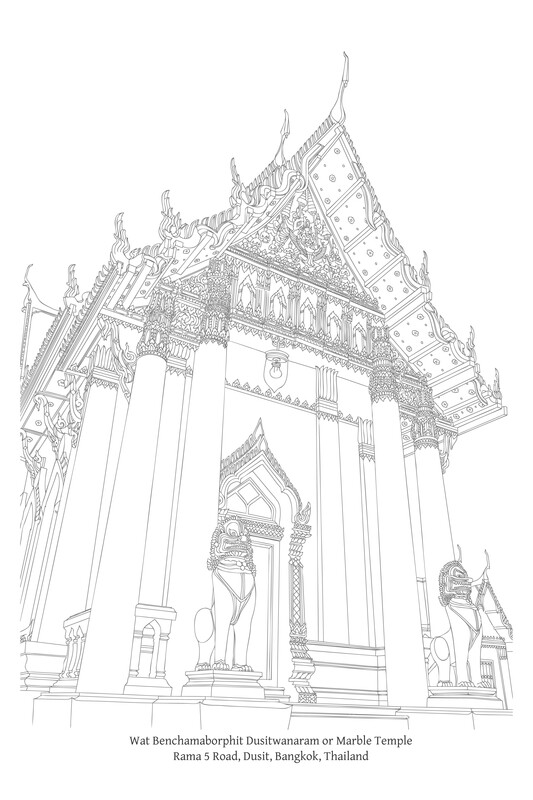

第三章：三法印

# 第三章：三法印

Tilakkhaṇa

## 导论

佛教首要的原则，即一切事物都可以分解成组成部分，并非旨在暗示一个由复合对象组成的静态世界。相反，一切事物都被视为以“流”的形式存在。这一“流”的每个组成元素都依赖于其他元素而生起，在持续不断的生灭流转中。没有一个单一的元素具有独立的固定身份；它们都是无常且不稳定的。事实上，现象的流动性之所以可能，正是因为其组成部分的相互依存性和无实体性。

这种有为现象之流，本质上是稳定的（dhātu），本质上是固定和确定的（dhammaṭṭhiti），它是自然秩序（dhamma-niyāma）的一部分。[\[1\]](#fn-fn1)它的存在不依赖于神、宗教或先知。{63}在佛陀的教法中，导师[\[2\]](#fn-fn2)的角色是发现并向他人解释这一真理。

佛陀提出了三法印（tilakkhaṇa）[\[3\]](#fn-fn3)的教导，以描述这种流转的自然法则（参见附注《缘起作为流转法则》）。这一教导的概述如下：

> “无论如来（Tathāgatas）[\[4\]](#fn-fn4)出现与否，这一真理（dhātu）都是常住和稳定的……那就是：一切有为法（saṅkhāra）都是无常的……一切有为法都是苦（dukkha）……一切法（dhamma）都是无我……如来完全觉悟并通达这一真理后，便宣说、教导、阐明、制定、揭示和分析它：一切有为法都是无常的，一切有为法都是苦，一切法都是无我。” A. I. 286.

三法印的定义如下：

*   无常（Aniccatā）：无常、不稳定、不恒常；生起、衰败和消散的状态。
    
*   苦（Dukkhatā）：苦的状态；受生老病死的压迫；事物因其决定因素的改变而内在的压力、抵抗和冲突，使其无法保持原状；事物内在的不完善性，使得受贪爱（taṇhā）影响的欲求者无法获得真正的满足，并使受执取（upādāna）束缚的人遭受痛苦。
    
*   无我（Anattatā）：无我的状态；事物缺乏真实存在的、拥有或控制现象的“自我”。[\[6\]](#fn-fn6)
    

缘起作为流转法则

> 佛陀的另一个核心教导是缘起（paṭiccasamuppāda）。此教导从不同的角度描述流转法则，并阐明了同样的真理。三法印显示了一切事物的特性，这些特性与缘起所阐明的关系相对应。缘起描述了现象的有条件流动，揭示了三法印。\[译注：参见第四章《缘起》。作为教法，我将“三法印”的首字母大写，但当指代这些作为自然属性的“三相”时，我则没有大写。\]

这些特性的巴利语形容词分别是anicca, dukkha, 和 anattā。其抽象名词形式是aniccatā, dukkhatā, 和 anattatā。作为特性，它们被称为anicca-lakkhaṇa, dukkha-lakkhaṇa, 和 anatta-lakkhaṇa。注释书偶尔将三法印称为“共相”（sāmañña-lakkhaṇa）。[\[7\]](#fn-fn7) {64}

一切有为法都存在于一种流转的状态中，由相互依存的条件因素构成，这些因素在不间断的相续中生起和灭去：事物是无常的。由于其不稳定性和因果依存性，有为法受制于压力和摩擦，显露出其固有的不完善性。而一切法，无论有为法还是无为法，都依其自性存在；它们不拥有作为现象之主宰或掌控者的“自我”。

人类也由组成元素构成。人类的“构成单元”是五蕴；除了五蕴之外，别无他物。[\[8\]](#fn-fn8)当我们依次审视五蕴时，我们看到每一蕴都是无常的。由于无常，它们是苦；它们对于执取它们的人来说是令人苦恼的。由于是苦，它们是无我的。它们无我，因为每一蕴都由因缘条件而生起；它们并非独立的实体。此外，它们并非真正受一个人的控制或拥有。如果一个人真的拥有五蕴，他将能够随心所欲地控制它们，并禁止它们改变，例如禁止它们衰弱或疾病。

佛陀在五蕴的背景下描述三法印的一个关键教导如下：

> “比丘们，身体是无我的。如果身体是我的自我，它就不会导致苦恼，而且有可能让身体这样：‘愿我的身体如此；愿它不要那样。’但因为身体是无我的，身体会导致苦恼，而且不可能让身体这样：‘愿我的身体如此；愿它不要那样。’ ‘感受是无我的……想是无我的……行是无我的……识是无我的。因为如果识是我的自我，它就不会导致苦恼，而且有可能让识这样：‘愿我的识如此；愿它不要那样。’但因为识是无我的，识会导致苦恼，而且不可能让识这样：‘愿我的识如此；愿它不要那样。’ ‘你们认为如何，比丘们，身体是常的还是无常的？’ ‘无常的，世尊。’ ‘那无常的是苦的还是乐的？’[\[9\]](#fn-fn9) ‘苦的，世尊。’ ‘那无常的、苦的、性质会改变的，适合被这样看待吗：‘这是我的，这是我，这是我的自我？’’ ‘不，世尊。’ ‘你们认为如何，比丘们，感受是常的还是无常的？’…… ‘想是常的还是无常的？’…… ‘行是常的还是无常的？’…… ‘识是常的还是无常的？’…… ‘那无常的、苦的、性质会改变的，适合被这样看待吗：‘这是我的，这是我，这是我的自我？’’ ‘不，世尊。’ ‘因此，比丘们，你们应该以正确的智慧如实地看待任何一种色身……感受……想……行……识，无论过去、未来或现在，内在或外在，粗劣或微细，低劣或优胜，远或近，都应如此：‘这不是我的，这不是我，这不是我的自我。’’ {65} S. III. 66-8.

许多学者试图证明佛陀承认一个存在于五蕴之外的自我。他们声称他只是否定有为现象中的自我，并肯定了一个终极自我（Ultimate Self）。此外，他们解释涅槃（Nibbāna）[\[10\]](#fn-fn10)与ātman/attā是相同的：涅槃就是自我。我将在第六章《涅槃》中详细阐述这个问题。

在此，只需说一切事物都依其固有的自性存在，这与静态的、控制性的本质或“自我”的概念相冲突。事物之所以能如此存在，恰恰是因为它们不拥有这样的自我。（如果存在一个自我并加以干预，事物就无法以其现在的方式存在。）

大多数人，尤其是那些在宣扬“自我”或“灵魂”的文化中成长的人，倾向于寻求并抓住某种固定身份的概念。这样做满足了一种隐藏的、无意识的需求。当他们将自己与一个或多个五蕴的认同变得站不住脚时，他们就会创造一个新的自我概念来相信。但佛陀教法的目的不是为了放弃一个东西而抓住另一个，也不是为了从一个东西中解脱出来却又被其他东西奴役。如前所述，事物依其自性存在。它们存在的自性是由无我的特性决定的；如果事物拥有一个自我，那么根据定义，它们就不能以其现在的方式存在。{66}

## 理解“法”（Dhamma）和“行”（Saṅkhāra）这两个术语

### “一切法”和“一切有为法”

在三法印的第一和第二句中，佛陀分别指出一切有为法（saṅkhāra）[\[11\]](#fn-fn11)是无常和苦的，但在第三句中，他却说一切法（dhamma）[\[12\]](#fn-fn12)是无我的。这表明前两个法印与第三个法印之间存在区别。要理解这种区别，就必须审视saṅkhāra和dhamma这两个词。

巴利语“法”（dhamma）的含义包罗万象，涵盖一切事物：所有存在的事物——过去、现在和未来，真实的和想象的。物质的和精神的，好的和坏的，以及普通的和特殊的，都包含在这个词的含义之中。在巴利语中，如果需要一个受限或更具体的定义，可以在“法”（dhamma）这个词上添加修饰语，或者将要定义的客体划分为子类别。另外，“法”（dhamma）这个词可以在特定的语境中不加修饰地使用。例如，与“非法”（adhamma）搭配使用，或用于描述道德行为时，它意味着功德（puñña）或善行。当它与“义”（attha）一起使用时，它意味着规则、原则或原因。当“法”（dhamma）用于学习时，它意味着经文、佛陀的论述。

在关于无我的三法印第三句中，佛陀以其最广义的含义使用“法”这个词，指的是所有事物，无一例外。为了理解在这种语境下的“法”，将事物分为以下几类是有帮助的：

*   物质法（rūpa-dhamma）和非物质法（nāma-dhamma）。
    
*   世间法（lokiya-dhamma）和出世间法（lokuttara-dhamma）。
    
*   有为法（saṅkhata-dhamma）和无为法（asaṅkhata-dhamma）。
    
*   善法（kusala-dhamma）、不善法（akusala-dhamma）和无记法（abyākata-dhamma）。
    

以上每个类别都包含了“法”的全部含义，但与此处要研究的主题相对应的是有为法和无为法。

一切事物可分为两种类型：[\[13\]](#fn-fn13)

1.  有为法（Saṅkhata-dhamma）：被构造的事物；由条件（paccaya）生起的事物；由这些因素融合而成的事物。这些事物也称为行（saṅkhāra），两者有相同的词根和翻译。有为法和行都指除了涅槃（Nibbāna）之外的一切条件，无论是物质的还是精神的，世间的还是超世间的。
    
2.  无为法（Asaṅkhata-dhamma）：未被构造的；不因条件因素的形成而生起，也不受其制约的状态。它也被称为离行（visaṅkhāra），意指脱离有为现象的状态——无为法——也就是涅槃。{67}
    

因此，“行”（Saṅkhāra）只是“法”（Dhamma）这个词的一个方面。“法”的含义范围既包括有为法也包括无为法：saṅkhata-dhamma和asaṅkhata-dhamma，或者saṅkhāra和Nibbāna。将这种解释应用于三法印，我们看到前两个法印，aniccatā和dukkhatā的范围比最后一个，anattatā的范围窄。这种区别总结如下：

无常和苦的特性仅适用于有为法（saṅkhāra）——并且适用于所有有为法。然而，无我的特性适用于一切法，包括有为法和无为法。因此，无为法——涅槃——不具有前两个特性。

在巴利经典中，佛陀如此描述有为法和无为法：[\[14\]](#fn-fn14)

有为法之相（saṅkhata-lakkhaṇa）：

1.  生起是明显的。
    
2.  坏灭是明显的。
    
3.  变异是明显的。
    

无为法之相（asaṅkhata-lakkhaṇa）：

1.  生起是不明显的。
    
2.  坏灭是不明显的。
    
3.  变异是不明显的。
    

总而言之，无为法，即涅槃，超越无常和苦，但却是无我的。至于其他一切，即一切有为法，它们都是无常、苦、无我的，正如《律藏》（Vinaya Piṭaka）的这段话所证实：

> “一切有为法皆无常、苦、无我；涅槃和名相皆无我。”[\[15\]](#fn-fn15) {68} Vin. VI. (Parivāra) 86.

### 五蕴之“行”与三法印之“行”

在泰语中，一个词有多种定义的情况很多。[\[16\]](#fn-fn16)有些定义只有细微差别，而有些则差异很大，以至于看起来毫无关联。

同样，在巴利语中也有许多词语具有广泛的不同含义。那些学习过巴利语的人能够区分和理解这些不同的含义，即使在一个段落中同一个词出现多次，但具有不同的含义。这类词包括：

*   那伽（Nāga）：此词可指神蛇、战象或卓越之人。
    
*   相（Nimitta）：在《律藏》[\[17\]](#fn-fn17)中，此词指界标，而在与禅修相关的语境中，它指心象。
    
*   部（Nikāya）：此词指《经藏》[\[18\]](#fn-fn18)的一部分；在其他语境中，它指宗教派系。
    
*   缘（Paccaya）：在《律藏》中，此词指基本必需品，例如食物，而在佛法教义中，它更广义地指“原因”或“支持”。
    

考虑以下词语在不同的佛教典籍中的用法：

> 一个人用舌头辨别味（rasa）；无论美味与否，他都不让贪欲或厌恶占据心灵。这样的人守护舌根（indriya）。信根（indriya），作为味（rasa），使所有伴随的品质都变得光明，就像净化水的宝珠。

在第一段中，rasa意为“味道”，indriya指感官基础。在后一段中，rasa意为“功能”，而indriya指精神能力。{69}

> 一个比丘应修瑜伽（yoga）以证悟离瑜伽（yoga）之境。

第一个yoga意指“精神上的努力”：智慧的培养。第二个yoga则指将众生束缚于世间存在的痛苦的烦恼。[\[19\]](#fn-fn19)

> 凡夫视色、受、想、行（saṅkhāra）和识为自我，但这五蕴不能是自我，因为一切有为法（saṅkhāra）皆无常、苦、无我。

第一个“行”（saṅkhāra）仅指五蕴之一，而第二个“行”（saṅkhāra）则涵盖了与三法印相符的一切有为法。

这里需要解释的词是saṅkhāra。上述例子列表只是为了说明一个重要的事实，即在巴利语中，许多同一个词具有两个或更多截然不同的含义，其差异程度各异；它们可能不相似甚至相互矛盾。如果理解这一点，那么在经典中发现saṅkhāra这个词以多种不同含义使用就不会感到奇怪，并且一个人会学会相应地辨别其含义。

“行”（saṅkhāra）这个词至少有四种定义，但有两点特别需要理解。它们是作为五蕴之一的“行”和三法印的“行”。由于这两种“行”的定义有所重叠，它们可能会引起混淆。

1.  五蕴：色（rūpa）、受（vedanā）、想（saññā）、行（saṅkhāra）、识（viññāṇa）。
    
2.  三法印：一切有为法（saṅkhāra）皆无常，一切有为法（saṅkhāra）皆苦，一切法（dhamma）皆无我。
    

作为五蕴第四部分的“行”（saṅkhāra）是指塑造心为善、不善或无记的心所（mental factors）。它们是以思（cetanā）为主导的心所，塑造和影响思想以及随之而来的身体行为。它们是行为（kamma）的推动者，心的“塑造者”，例如：信（saddhā）、念（sati）、惭（hiri）、愧（ottappa）、慈（mettā）、悲（karuṇā）、慧（paññā）、痴（moha）、贪（lobha）和瞋（dosa）。[\[20\]](#fn-fn20)它们是心所法（nāma-dhamma），与受（vedanā）、想（saññā）和识（viññāṇa）同时存在于心中。

三法印的“行”（saṅkhāra）指的是有为法：一切由因缘条件生起的事物——无论是物质的还是非物质的，身体的还是精神的，有生命的还是无生命的，内在的还是外在的。它们也被称为有为法（saṅkhata-dhamma）。这里的“行”涵盖了除了涅槃之外的一切。

五蕴之“行”（Saṅkhāra）的含义比三法印之“行”（Saṅkhāra）的含义更为局限；它指的是三法印之“行”的一部分。{70}五蕴之“行”指的是决定心之品质的要素，或者说“思心所”。至于三法印之“行”，它指的是聚合的事物：由条件因素构成的事物，或者简单地说就是“有为法”。由于思心所本身就是有为法，它们并未被排除在三法印之“行”的包罗万象的含义之外。

使用五蕴模型，我们可以将有为现象分为心和色，并将心细分为四个子类别——受、想、行（saṅkhāra）和识。在这里，行（saṅkhāra）仅仅是心理组成部分，是四个元素之一。然而，三法印中的行（saṅkhāra）涵盖了心和色。因此，五蕴中的行（saṅkhāra）是三法印中的行（saṅkhāra）的一种。

因此，“色身是无常的，受是无常的，想是无常的，行（saṅkhāra）是无常的，识是无常的”，以及“一切有为法（saṅkhāra）是无常的”这两个说法在意义上是相同的。

经典偶尔用saṅkhāra-khandha表示五蕴之“行”，用saṅkhata-saṅkhāra或简称saṅkhāra表示三法印之“行”。这两个教法使用相同术语“行”（saṅkhāra）的原因是，它们描述的条件具有相似的含义，都与“形成”有关。

## 经论定义

第一章关于五蕴（pañca-khandha）的教导，以及第二章关于六处（saḷāyatana）的教导，都强调人类的内在生命。三法印的教导则将考察范围扩展到个人和外部对象，是对人类和整个世界的探究。{73}

三法印中每个特性的意义已经以基本的方式描述过。现在，将根据经论教导进行更详细的分析。

### 无常

《无碍解道》（Paṭisambhidāmagga）对无常（aniccatā）提供了一个简单的定义：事物被认为是无常的，“因为它会消亡”（khaya-aṭṭhena）。[\[21\]](#fn-fn21)一切有为法只在特定时间、特定地点短暂存在，然后就在那里灭去。过去的事物现在不存在；现在的事物未来不存在。事物不会以任何固定、不变的方式持续。

后部经典对这个定义进行了扩展，并提供了一系列解释。例如，乍一看，一个人的人生始于出生，终于死亡。但仔细观察，我们会注意到出生和衰落、一个年龄段、一年、一个季节、一个月、一天、几分钟，乃至每个瞬间的生起和灭去都在加速，这对于大多数人来说是难以察觉的。

现代科学发现，尤其是物理学方面的发现，有助于揭示和证明无常。许多科学理论，例如恒星的诞生和死亡或原子的衰变，都阐明了无常法则。

注释书对无常（aniccatā）有许多不同的定义。例如，事物被认为是无常的，“因为它不确定且不稳定”（aniccantikatāya），以及“因为它有始有终”（ādi-antavantatāya）。[\[22\]](#fn-fn22)一个常见且经常使用的定义是：事物被认为是无常的，因为它“已经存在然后停止存在”（hutvā abhāvaṭṭhena）。[\[23\]](#fn-fn23)有时会在此短语中添加额外的措辞，例如：事物被认为是无常的，“因为它生起、逝去，并变得与众不同”（uppādavayaññathattabhāvā hutvā abhāvato vā）。[\[24\]](#fn-fn24)

详细的定义清单如下。事物被认为是无常的原因有四点：[\[25\]](#fn-fn25) {74}

1.  生灭转起（Uppādavayappavattito）：因为它生起和消散；它兴起和止息；它存在然后停止存在。
    
2.  变易（Vipariṇāmato）：因为它会改变；它持续不断地被改变和转化。
    
3.  暂时（Tāvakālikato）：因为它只是暂时的；它只存在片刻。
    
4.  常相否定（Niccapaṭikkhepato）：因为它与常住不符；有为法的变易性与常住性本身就是冲突的；当一个人准确观察客体时，找不到常住性；即使有人试图将其视为常住，它也拒绝满足那个人的愿望。
    

### 苦

#### 导论

《无碍解道》（Paṭisambhidāmagga）对苦（dukkhatā）提供了一个简洁的定义：事物被认为是苦的，“因为它受制于危险”（bhaya-aṭṭhena）。[\[26\]](#fn-fn26) Bhaya也可以指“危险的”或“令人恐惧的”。一切有为法都必然坏灭和消散；因此，它们无法提供真正的安全、解脱或保障。任何此类现象都受到毁灭和解体的威胁。因此，客体对任何执着于它的人都造成危险——既是恐惧也是危险。

注释书阐述了苦（dukkhatā）的含义，其中包括两个常用定义：首先，事物被认为是苦的，“因为它在生灭中持续受到压迫”（uppādavaya-paṭipīḷanaṭṭhena[\[27\]](#fn-fn27) 或 uppādavaya-paṭipīḷanatāya[\[28\]](#fn-fn28)）。与该客体互动的一切都受到压力，而客体本身也因其组成元素而承受压力。[\[29\]](#fn-fn29)其次，“因为它是一切痛苦的根源”（dukkha-vatthutāya[\[30\]](#fn-fn30) 或 dukkha-vatthuto[\[31\]](#fn-fn31)）。一个被苦恼困扰的客体是痛苦的基础，例如导致疼痛。简单来说，苦就是引起疼痛。

注释书中对苦（dukkha）最完整的定义汇编如下。事物被认为是苦的，有以下四个原因：[\[32\]](#fn-fn32)

1.  持续受压迫（Abhiṇha-sampatipīḷanato）：因为它持续受到压迫；它因生灭而持续承受压力；组成部分之间或相关条件之间存在持续的摩擦。
    
2.  难忍（Dukkhamato）：因为它“难以忍受”；它不持久；它无法维持在原始状态；它因生起和灭去而不得不改变、变得不同并失去身份。[\[33\]](#fn-fn33) {75}
    
3.  苦之基础（Dukkha-vatthuto）：因为它是一切痛苦的根源；它是压力和苦恼状态的根源。就人类而言，这意味着它会产生各种苦恼，例如疼痛、不适和困扰。[\[34\]](#fn-fn34)
    
4.  否定安乐（Sukha-paṭikkhepato）：因为它与乐（sukha；“快乐”）对立。压力、摩擦和不稳定这些自然条件，对立或阻碍安乐和舒适。为了获得快乐，人们必须努力调节某些因素。本质上，快乐只作为一种感受（vedanā）存在。基本状态是苦——压力、紧张和摩擦——这是所有有为法的属性。
    
    就人类而言，苦的这种自然特性会产生压迫和紧张的感觉，我们称之为“痛”（dukkha-vedanā）。压力的减轻，或从痛苦中解脱，我们称之为“乐”或“快乐”。不适（压力、剥夺、渴望、饥饿等）越大，从中解脱时的快乐就越大。例如，一个人从炎热的阳光下走到阴凉处，会感到神清气爽。同样，一个正在经历极大快乐（sukha-vedanā）的人，当愉快的环境被扰乱时，也会经历同样强烈的不适（dukkha-vedanā）。即使是少量的不适，通常感觉不到，也可能是一种折磨。例如，一个人从舒适温暖的房间进入寒冷的环境，可能会觉得温度极端，即使周围的人不受影响。
    
    快乐，或愉悦的感受（sukha-vedanā），并非苦的终结。我们称压力的增加或减少为“快乐”，因为它创造了愉悦的感受。但这种愉悦张力的改变会导致一种需要忍受或无法忍受的状态，我们称之为“痛苦”，也就是说，我们感到疼痛（dukkha-vedanā）。事实上，只存在苦——压力和紧张——它要么增加，要么减少。
    
    类似的主题是冷和热。冷并不真正存在；只存在一种冷的感受。基本状态是热，它增加、减少或消失。当一个人说感到愉悦的凉爽时，他所指的只是一种感受；实际上，他正在经历某种程度的热。如果比这个程度更热或更冷，那么他就不舒服。从这个意义上说，快乐，或者完整地说“愉悦的感受”，是苦的一个层次。快乐依赖于压力和紧张，并且必然会改变和消失。换句话说，作为基本条件的苦，阻止了快乐的可持续性。{76}
    

如上文所引述，《无碍解道》（Paṭisambhidāmagga）在三法印的背景下将苦定义为“受制于危险”。在解释四圣谛（ariya-sacca）的部分中，它以四种方式定义了苦——即第一圣谛。事物被认为是苦的，因为它受到压迫（pīḷanaṭṭha），因为它是有为的（saṅkhataṭṭha），因为它燃烧（santāpaṭṭha），因为它变化（vipariṇāmaṭṭha）。[\[35\]](#fn-fn35)这四种苦的定义也可以用于三法印的语境中。定义一和四（pīḷanaṭṭha和vipariṇāmaṭṭha）已经描述过；[\[36\]](#fn-fn36)这里是另外两个：

*   5\. 有为（Saṅkhataṭṭha）：‘因其被造作（saṅkhata）’；它由条件因素构成；它依赖于这些因素；它是无常的。
    
*   6\. 焚烧（Santāpaṭṭha）：‘因其燃烧’；它燃烧殆尽，最终衰败和毁灭；此外，它也以烦恼焚烧那些执取和依附于客体的人，导致折磨和动荡。[\[37\]](#fn-fn37)
    

#### 三法印中的苦与四圣谛中的苦

1\. 苦的主要分类：虽然本章专门讨论三法印（anicca、dukkha和anattā），但在此语境下对苦的讨论必然与其他与此术语相关的教法联系起来。这在涉及作为四圣谛一部分的苦时尤其如此。除非这种关系被很好地理解，否则可能会引起混淆。

简单来说，三法印中的苦，即自然界固有的状况，在某些情况下会成为四圣谛中的苦。当人们缺乏对这种原始的、自然产生的苦的理解，并以不恰当的方式处理它时，它就变成了个人的问题。

苦的特性本身就意味着有为法处于压力之下，无法维持其原始状态。当人们缺乏对这种自然状况的洞察力，并且事物不按照他们的意愿发展时，他们的心中就会产生不满、压力和苦恼。这就是四圣谛中所阐述的苦的起源。

换句话说，三法印中的苦（dukkha）是自然的一个方面；它不可能被取消或废除。一个人应该培养智慧以完全理解它，而在行为方面，一个人应该根据因缘行事。

然而，四圣谛中的苦（dukkha），我们能够去除它，终结它。这可以通过运用智慧，并巧妙地与三法印中的苦（dukkha）——即有为现象中固有的苦（dukkha）——互动来实现。

苦（dukkha）这个词出现在另一个语境中，指的是不适或痛苦的感觉（dukkha-vedanā）。这个词是三分法的一部分，包括sukha-vedanā（舒适的感觉；身心愉悦）和adukkhamasukha-vedanā（中性的感觉；也称为upekkhā）。这种形式的苦（dukkha）也与三法印中的苦（dukkha）相关联。因为它与人们立即体验到的感受或感觉有关，所以很容易理解，几乎不需要运用任何智力。当一根树枝落在头上时，一个人会遇到一种自然的苦（dukkha），并体验到痛苦。有时这种痛苦几乎难以忍受。

这种苦（dukkha）通常很容易纠正。一个人会去找医生，医生会缝合伤口并涂抹消毒剂。然后，一个人等待伤口愈合，事情就结束了。{77}

但是，如果一个人未能认识到树枝是自然而然地落下，他可能会怀疑他人，心想：“是谁心怀恶意，故意把这根树枝扔向我，来伤害或杀死我？”

这种怀疑会引起愤怒、不安和深重的烦恼。这些念头伴随着更多不愉悦的感受（dukkha-vedanā），但更深层的问题在于与四圣谛中的苦（dukkha）相关的痛苦。这个问题随后可能会加剧和延长。苦（四圣谛的苦）加深并升级了不适（作为一种感觉），有时甚至没有尽头。

四圣谛中的苦（dukkha）这个问题意义重大。它会导致各种各样的问题，甚至包括发动战争。可以说，这种形式的苦（dukkha）是人类困境的缩影。

自然本身只包含三法印中的苦（dukkha）。但当人类介入时，所有三种形式的苦（dukkha）——三法印中的苦（dukkha）、感受的苦（dukkha）和四圣谛中的苦（dukkha）——就会汇合。

总而言之，苦（dukkha）出现在三个主要教法中：

1.  关于感觉/感受（两种版本）：
    
    1.  三种vedanā：痛苦的感觉（dukkha）、愉悦的感觉（sukha）和中性的感觉（adukkham-asukha 或 upekkhā）。
    
    2.  五种vedanā：身体痛苦的感觉（dukkha）、身体愉悦的感觉（sukha）、心理痛苦的感觉（domanassa）、心理愉悦的感觉（somanassa）和中性的感觉（upekkhā）。
    
    
    在此语境中，它的完整名称是dukkha-vedanā。
    
2.  在三法印中：anicca、dukkha 和 anattā。在此语境中，它的完整名称是dukkha-lakkhaṇa。
    
3.  在四圣谛中：dukkha、samudaya（‘集’）、nirodha（‘灭’）和magga（‘道’）。它的完整名称是dukkha-ariyasacca。
    

这三组中苦（dukkha）的定义是重叠的；它们是同一真相的不同方面。

最广泛且包罗万象的苦（dukkha）是三法印中的苦（dukkha），也称为dukkha-lakkhaṇa 或 dukkhatā。正如上文所解释的，这是由于生起和坏灭所产生的压力、紧张和摩擦，导致不稳定、无法维持原有形态的状态。它是所有有为现象（sabbe saṅkhārā dukkhā）的一个特征，涵盖了与无常相同的范围：凡是无常的，也是苦（yad’aniccaṁ taṁ dukkhaṁ）。

意义最局限、只是三法印中苦（dukkha）的结果的苦（dukkha），是作为感受的苦（dukkha），称为dukkha-vedanā：一种痛苦的感觉。它是当压力在与一个人的身心相关时达到一定程度时产生的感觉。[\[38\]](#fn-fn38) 这种痛苦包含在三法印中的苦（dukkha）之中，所有其他感受，无论是愉悦的还是中性的，也同样包含在内。所有类型的感受——痛苦的、愉悦的和中性的——都是由三法印所决定的苦（dukkha）。{78}

四圣谛中的苦（dukkha-ariyasacca）正是三法印中的苦（dukkha），它成为人类困境的基础或来源。然而，这些困境是由人们自己造成的。

一切有为法都处于压力之下，这就是三法印中的苦（dukkha）。这些有为法（并非全部，也并非总是如此）给那些缺乏理解和不适当地对待事物的人类带来痛苦；这种痛苦就是四圣谛中的苦（dukkha）。（然而，这些现象是压迫性的，因为它们本身就受制于压力，因此它们不可能以任何恒定或一致的方式为人们提供真正的满足。）

dukkha-ariyasacca 特指与五取蕴（upādāna-khandha）相关的事项。[\[39\]](#fn-fn39) 从技术上讲，四圣谛中的苦（dukkha）是指因感官基础（indriya-baddha）而产生的痛苦，即与日常生活相关的痛苦。它排除了独立于感官基础的压力（anindriya-baddha），后者被归类为三法印中的苦（dukkha），而非圣谛中的苦（dukkha）。

（请注意，dukkha-ariyasacca是三法印中的苦（dukkha）。Samudaya——苦的起因——和magga——八正道——也是，因为它们是自然发生的有为现象，但它们不是dukkha-ariyasacca。）

四圣谛中苦（dukkha）的范围确定如下：

*   作为第一圣谛的苦（dukkha）与人类生活和人类问题相关联。它作为感官官能（indriyabaddha）的结果而产生；它不包括独立于感官官能的苦（dukkha）（anindriyabaddha）。它不是在“一切有为法皆是苦”（sabbe saṅkhārā dukkhā）和“凡是无常的，就是苦”（yad’aniccaṁ taṁ dukkhaṁ）段落中提及的苦（dukkha），那些指的是包罗万象的三法印中的苦（dukkha）。
    
*   它源于一个人的染污行为（kamma-kilesa）。它是dukkha-samudaya的结果；它是贪爱——taṇhā的结果。它特指与五取蕴（upādāna-khandha）相关的事项。
    
*   它是与第一圣谛相关的职责（kicca）的重点：pariññā-kicca。Pariññā是对事物如实了知或理解。获得对个人问题的知识并充分理解它们，是我们对四圣谛中的苦（dukkha）所负有的责任。这里的苦（dukkha）仅限于理解人类痛苦这一主题。
    
*   它强调了苦（dukkha）的基础（dukkha-vatthutāya）的重要性，而非生灭的压力、紧张和摩擦（udayabbaya-paṭipīḷanaṭṭhena），后者是三法印中苦（dukkha）的本质含义。[\[40\]](#fn-fn40)
    

四圣谛中苦（dukkha）的主题将在下面更详细地解释。这里，让我们来审视另一个教法，关于三种苦（dukkha）（3 dukkhatā）。[\[41\]](#fn-fn41) 这是一个非常重要的教法，记载于三部不同的经中；它也经常出现在Mahāniddesa和Cūḷaniddesa中。其中一次是由佛陀教导的；其余的段落则出自尊者Sāriputta。然而，在每个段落中，只列出了这三个要素，没有作任何解释（很可能这三个要素在佛陀时代是一个重要的概念）。以下描述依据注释书中的解释。（这里这些要素的顺序也与注释书的常规顺序一致；经中的顺序是：dukkha-dukkhatā、saṅkhāra-dukkhatā 和 vipariṇāma-dukkhatā。）{79}

关于3 dukkhatā的教法在三法印的语境中定义了苦（dukkha）。它包括作为感受（vedanā）的苦（dukkha），也与四圣谛中发现的苦（dukkha）联系起来：

1.  Dukkha-dukkhatā：[\[42\]](#fn-fn42) 身体和心理的痛苦，如通常所理解的疼痛、不适和疲劳；换句话说，就是“痛苦的感觉”（dukkha-vedanā）。
    
2.  Vipariṇāma-dukkhatā：源于或固有于变化的苦（dukkha）。这指的是愉悦的感觉（sukha-vedanā），实际上它也是某种程度的苦（dukkha）。快乐等同于隐藏的痛苦，或者总是暗中伴随着痛苦。一旦快乐的感觉改变，它就会转变为痛苦的感觉。换句话说，快乐的根本无常性会产生痛苦。（另一种解释是，快乐在某种程度上就是痛苦。）
    
3.  Saṅkhāra-dukkhatā：[\[43\]](#fn-fn43) 固有的有为现象中的苦（dukkha），固有于一切源于因缘的事物。换句话说，五蕴是苦（dukkha）；它们具有被对立因素的生起和衰败所压迫和强迫的本性，阻止它们保持稳定、原始的状态。这第三种苦（dukkha）包含了三法印中的苦（dukkha）。
    

2\. 三共相作为四圣谛中苦（Dukkha）的基础：如前所述，三法印中的苦（dukkha）指的是有为现象中固有的冲突和压力，阻止它们获得任何持久的稳定性。所有有为法——所有普通人所知和所体验的事物——都受制于这一特性。另一种说法是，这种压力和紧张是五蕴（khandha）的自然特性。

每个人，以及普通人所接触的一切事物，都是有为法，都由五蕴组成。如果人们缺乏理解，并且不善巧地处理事物，就会在他们内心生起一种压迫和苦恼的感觉，我们称之为“痛苦”。人们所体验到的这种痛苦就是四圣谛中的苦（dukkha）。虽然对于这些人来说它是真实的，但它并不是万物的普遍特征。

将三法印中的苦（dukkha）单独分离出来，在某种意义上是方便的，但它不应该与另外两个特性完全分离。也就是说，一个人应该认识到所有有为法都受制于三种共相：无常（anicca；生起后，事物会消散和消失）；苦（dukkha；构成或与某个对象相关联的所有条件或因素都处于压力之下，无法维持原有形状）；以及无我（anattā；事物依因缘而存在；事物不拥有“自我”或独特、恒存的本质，能够拥有或控制事物）。

简而言之，所有有为法都是不稳定的、不可靠的、不持久的。

四圣谛中痛苦（dukkha）的生起，并不仅仅是由于三法印中概述的压力（dukkha）。事实上，所有这三个特性——anicca、dukkha 和 anattā——对于那些缺乏真正理解它们的人来说，都构成了痛苦的基础。{80}

所有有为法（或五蕴），包括构成人类的全部——身与心——都是无常的、受压迫的、无我的。它们的本性就是带有这三种特性，不受人类的任何干扰。因此，三法印与四圣谛是不同的（尽管这两种教法都共享苦（dukkha）这一因素）。

那么，五蕴在哪个阶段成为四圣谛中描述的苦（dukkha）的一部分呢？答案是当它们成为五取蕴（upādāna-khandha）时。

五取蕴（upādāna-khandha）正是这同样的五蕴，但在这里它们被执取（upādāna）所执持。从技术上讲，它们是“伴随着烦恼（āsava）并作为执取（upādāniya）的基础”。可以将upādāna-khandha这个术语定义为因执取而生的五蕴，执着的五蕴，或执着的焦点五蕴。它们直接关系到无明（avijjā）、贪爱（taṇhā）和执取（upādāna）。这种动态正是第一圣谛所指的。

在下面的教法中，佛陀区分了五蕴和五取蕴：

> 比丘们，我将教导你们五蕴和五取蕴。仔细听。什么是五蕴？无论是何种色……受……想……行……识，无论是过去、未来或现在，内或外，粗或细，劣或胜，远或近……这些被称为五蕴。什么是五取蕴？无论是何种色……受……想……行……识，无论是过去、未来或现在，内或外，粗或细，劣或胜，远或近，凡是伴随着烦恼（sāsava），作为执取（upādāniya）的基础……这些被称为五取蕴。S. III. 47-8。

当佛陀教导三法印时，他总是会说五蕴是无常的、受压迫的、无我的。色、受、想、行、识的真实本性都带有这三种特性。他没有说五取蕴是无常的、受压迫的、无我的，因为这些已经包含在更广泛的五蕴分类中。这里的重点是，通过执着于五蕴，它们发展成为五取蕴，而这种执着导致了痛苦。

以下是关于五蕴与三法印相关的教法：

> 比丘们，色是无常的，受是无常的，想是无常的，行是无常的，识是无常的……比丘们，色是苦（dukkha）（它受制于其缘起因素的压力；它是不可持续的）……受……想……行……识是苦（dukkha）……比丘们，色是无我……受……想……行……识是无我……看到这一点，受教的圣弟子舍弃色……受……想……行……识。舍弃之后，[\[44\]](#fn-fn44) 他解脱了自己。[\[45\]](#fn-fn45) 通过离欲 \[他的心\] 获得了免除。当它解脱时，他获得知识：“它已解脱”。他明白：“生已尽，梵行已立，所作已办，此后不再有这样的存在。” {81} S. III. 21。

当一个人根据三法印清楚地理解有为法时，五取蕴就不会生起，或者它们会止息。取而代之的是，一个人体验到自由、光明、喜悦和痛苦的止息。

在《转法轮经》（Dhammacakkapavattana Sutta）中，佛陀向五比丘（pañca-vaggiya）教导了苦（dukkha），即第一圣谛的详细描述。这第一圣谛可以定义为：

> 比丘们，这就是苦圣谛：生是苦，老是苦，病是苦，死是苦；与不喜爱的人事物相处是苦；与喜爱的人事物分离是苦；求不得是苦；简而言之，五取蕴是苦。S. V. 421-2。

结尾的短语，“简而言之，五取蕴是苦”（saṅkhittena pañcupādānakkhandhā dukkhā），是这一段的要旨。也就是说，所有先前的陈述都由这个结尾短语概括。

《转法轮经》（Dhammacakkapavattana Sutta）是佛陀教导的第一部经——在此之前没有人听过这个教法。五比丘（pañca-vaggiya）群体可能不熟悉佛教中如何定义苦（dukkha）这个术语。我们可以将此与佛陀在后来的场合中教导第一圣谛的方式进行比较。

有一次在Sāvatthi（这表明此事件发生在初次说法之后很久），佛陀向比丘们（他们应该已有理解基础）解释了四圣谛。在这里，关于第一圣谛，佛陀只专注于五取蕴：

> 比丘们，我将教导你们苦、苦的起源、苦的止息以及导向苦止息的道路。仔细听。比丘们，什么是苦？应该说：五取蕴。哪五种？色取蕴、受取蕴、想取蕴、行取蕴、识取蕴。这被称为苦。比丘们，什么是苦的起源？就是这导致再生、伴随喜乐和贪欲、在此处彼处寻求欢愉的贪爱；那就是对感官享乐的贪爱、对存在的贪爱、对湮灭的贪爱。这被称为苦的起源。比丘们，什么是苦的止息？就是那同一种贪爱无余的褪去和止息，舍弃它、放弃它、从中解脱、不再依赖它。这被称为苦的止息。{82} 比丘们，什么是导向苦止息的道路？就是这八圣道；那就是正见、正思惟、正语、正业、正命、正精进、正念和正定。这被称为导向苦止息的道路。[\[46\]](#fn-fn46) S. III. 158-9; S. V. 425

从这段经文中我们可以得出结论，佛陀在初次说法中用来描述痛苦的许多例子，指的是一般人熟悉的与痛苦相关的条件或情境。在建立了对主题的基本理解之后，佛陀接着描述了痛苦的要旨：五取蕴。如果他没有首先提供常见的痛苦例子，那些缺乏理解基础的听众将会感到困惑。

在其他情况下，或者在其他佛法教导中，佛陀很可能也曾向听众提供了其他熟悉的痛苦例子。然而，无论佛陀使用了哪些例子，他最终都会将人类的痛苦总结为五取蕴。

请注意佛陀关于四圣谛的教导：

> 比丘们，关于我所宣称的“这是苦圣谛”这一声明，有无数的细微差别，无数的意义，无数的解释……关于我所宣称的“这是导向苦止息的道路圣谛”这一声明，有无数的细微差别，无数的意义，无数的解释。因此，比丘们，你们应该努力去如实理解：“这是苦……这是导向苦止息的道路。” S. V. 430。

这段经文证实，佛陀的所有教法（全部佛法）都可以被四圣谛的教法所概括或包含。尽管有些教法没有特别提及四圣谛，但它们仍然被这个核心教法所囊括。下面引自《小苦蕴经》（Cūḷadukkhakkhandha Sutta）的引文，它描述了对感官享乐（kāma-taṇhā）的贪爱的痛苦和有害影响，同时也描述了圣道（ariya-magga）上迈向止息（nirodha）最终阶段的一个善法修习阶段，就是一个很好的例子：

> 看啊，Mahānāma，在我觉悟之前，当我仍然只是一个尚未觉悟的菩萨时，我也以如实的正智慧清楚地看到，感官享乐提供了很少的满足，却带来许多痛苦和许多绝望，以及其中蕴藏的巨大危险。但是，只要我尚未获得远离感官享乐、远离不善法、或比那更平静的喜乐与幸福，我就无法宣称自己是不会再追求感官享乐的人。然而，当我以如实的正智慧清楚地看到感官享乐提供了很少的满足，却带来许多痛苦和许多绝望，以及其中蕴藏的巨大危险，并且我获得了远离感官享乐、远离不善法、或比那更平静的喜乐与幸福时，我就能宣称自己是不会再追求感官享乐的人了。{83} 那么，Mahānāma，感官享乐中的满足（益处）是什么呢？有这五种感官享乐的系缚。是哪五种呢？眼睛所识的色，是所愿、所欲、合意、愉悦，是引诱和激发贪欲的。耳朵所识的声音……鼻子所识的气味……舌头所识的滋味……身体所识的触，是所愿、所欲、合意、愉悦，是引诱和激发贪欲的。这些是五种感官享乐的系缚。现在，依赖这五种感官享乐的系缚而生起的快乐和喜悦，就是感官享乐中的满足。那么，Mahānāma，感官享乐中的危险（不利）是什么呢？在这里，一个族人为了谋生而从事的技艺——无论是计数、会计、算术、耕作、贸易、畜牧、射箭还是王室服务，或者任何其他技艺——他都必须面对寒冷，必须面对炎热，他被虻、蚊、风、日和爬虫的接触所困扰；他冒着因饥渴而死的风险。现在，这就是感官享乐中的一种危险，一个在此时此地可见的痛苦集合，以感官享乐为因，以感官享乐为源，以感官享乐为要件，其因纯粹是感官享乐。如果这个族人如此劳作、奋斗和努力，却未能获得财富，他就会悲伤、忧愁、哀叹，他会捶胸痛哭并变得心烦意乱，哭喊着：“我的工作白费了，我的努力毫无成果！”现在，这也是感官享乐中的一种危险……其因纯粹是感官享乐。如果这个族人如此劳作、奋斗和努力，获得了财富，他在保护财富时就会体验到痛苦和苦恼：“国王们怎么才不会没收它，盗贼怎么才不会抢劫它，火怎么才不会烧毁它，水怎么才不会冲走它，可恨的继承人怎么才不会把它拿走挥霍？”而当他守护和保护他的财富时，国王们没收了它，或者盗贼抢劫了它，或者火烧毁了它，或者洪水冲走了它，或者可恨的继承人把它拿走挥霍了。他就会悲伤、忧愁、哀叹，他会捶胸痛哭并变得心烦意乱，哭喊着：“我曾经拥有的，现在不再拥有了！我以前的财产不再是我的了！”现在，这也是感官享乐中的一种危险……其因纯粹是感官享乐。又，以感官享乐为因，感官享乐为源，感官享乐为要件，其因纯粹是感官享乐，国王们与国王们争吵，贵族们与贵族们争吵，婆罗门们与婆罗门们争吵，居士们与居士们争吵；母亲与孩子争吵，孩子与母亲争吵，父亲与孩子争吵，孩子与父亲争吵；兄弟与兄弟争吵，姐妹与姐妹争吵，兄弟与姐妹争吵，朋友与朋友争吵。在这里，在他们的争吵、纠纷和争论中，他们互相用拳头、土块、棍棒或刀子攻击，从而导致死亡或致命的痛苦。现在，这也是感官享乐中的一种危险……其因纯粹是感官享乐。{84} 又，以感官享乐为因……人们拿起刀剑和盾牌，系上弓箭和箭袋，然后去参战，双方都在进行激烈的战斗。箭矢横飞，长矛投掷，刀剑闪烁，一些士兵被箭矢刺穿，一些被长矛刺穿，一些头被刀剑砍下，从而导致死亡或致命的痛苦。现在，这也是感官享乐中的一种危险……其因纯粹是感官享乐。又，以感官享乐为因……人们拿起刀剑和盾牌，系上弓箭和箭袋，然后冲向涂满热泥的堡垒。箭矢横飞，长矛投掷，刀剑闪烁，一些士兵被箭矢刺穿，一些被长矛刺穿，一些被沸腾的粪便泼溅，一些被耙子砍伤，一些头被刀剑砍下，从而导致死亡或致命的痛苦。现在，这也是感官享乐中的一种危险……其因纯粹是感官享乐。M. I. 91-2。

3\. 人类痛苦的无数形式：到目前为止，这次讨论的主要目的之一是区分四圣谛中的苦（dukkha）与三法印中的苦（dukkha），并了解这两种苦（dukkha）如何相关联。

在前面的章节中，已经介绍了痛苦的各种属性或描述。请注意，这些描述不必过于严格地看待。佛陀将它们呈现为简单明了的例子，以建立对痛苦的基本理解。然而，许多这类痛苦会因时间和地点而异。（例如，可以列出针对现代特有的问题和苦恼。）然而，最终所有这些痛苦的变化都可以用佛陀的话来概括：“简而言之，五取蕴是苦。”

此时，让我们看看经典中发现的一些苦（dukkha）的分类。

经典中最常分析的苦（dukkha）是四圣谛中的苦（dukkha），因为它直接关乎人类。我们应该反思这种痛苦，通过佛法修习从中解脱。至于包罗万象的三法印中的苦（dukkha），其阐述足以准确理解实相。经典中主要、最常提及的苦（dukkha）类别如下：

十二种苦（Dukkha）：这一组阐明了四圣谛中苦（dukkha）的含义：[\[47\]](#fn-fn47)

1.  生（jāti）：生是苦，因为它是各种烦恼的基础：
    
    1.  Gabbhokkantimūlaka-dukkha：子宫囚禁之苦：胎儿居住在黑暗、窒息、充满令人厌恶物质的地方。
    
    2.  Gabbhapariharaṇamūlaka-dukkha：怀孕之苦。每当母亲移动，或吃热、冷、辛辣的食物，都会影响子宫里的孩子。{85}
    
    3.  Gabbhavipattimūlaka-dukkha：子宫不幸之苦，例如宫外孕、死胎或剖腹产。
    
    4.  Vijāyanamūlaka-dukkha：分娩之苦，包括在通过狭窄产道时的冲击、扭曲、挤压和剧烈疼痛。
    
    5.  Bahinikkhamanamūlaka-dukkha：出生到外在世界之苦。新生儿的皮肤像伤口一样敏感，在被抱起和清洗时会感到剧烈疼痛。
    
    6.  Attupakkamamūlaka-dukkha：自伤行为所导致的痛苦，例如自杀、极度苦行、因怨恨而拒绝进食，或其他自我伤害行为。
    
    7.  Parupakkamamūlaka-dukkha：他人行为所造成的痛苦，例如被袭击、谋杀或监禁。
    
2.  老（jarā）：衰老使器官衰弱。感官，例如眼睛和耳朵，功能失调，活力减退，敏捷性丧失。皮肤起皱；不再白皙光泽。记忆变得混乱和错误。一个人内在和外在的控制力都减弱，导致巨大的身心痛苦。
    
3.  死（maraṇa）：如果一个人在生命过程中犯下了恶业，它们会在死亡时以心像（nimitta）的形式出现。一个人必须与珍爱的人和事物分离。身体的组成部分停止履行职责，可能会有剧烈的身体疼痛，一个人对此无能为力。
    
4.  悲伤（soka），例如因失去亲人而悲伤。
    
5.  哀叹（parideva），例如因失去亲人而哭泣哀号。
    
6.  身体疼痛（dukkha），例如伤口、扭伤和疾病。[\[48\]](#fn-fn48)
    
7.  忧愁（domanassa；苦恼），导致哭泣、捶胸顿足、自杀等。
    
8.  绝望（upāyāsa；沮丧），例如无法缓解的悲痛的折磨。
    
9.  与不喜爱的人或事物接触（appiya-sampayoga），例如不得不与自己厌恶的人打交道。
    
10.  与喜爱的人或事物分离（piya-vippayoga），例如与亲人分离或财产损失。
    
11.  求不得；失望（icchitālābha）。
    
12.  五蕴，它们是执取（upādāna-khandhā）的基础。所有上述痛苦都源于五蕴作为执着的客体。总而言之，可以说痛苦就是五取蕴。{86}
    

两种苦（Dukkha）（A）：[\[49\]](#fn-fn49)

1.  Paṭicchanna-dukkha：隐藏的、不明显显现的痛苦，例如潜在的耳痛或牙痛，或心中燃烧着贪欲和愤怒的“火焰”。
    
2.  Appaṭicchanna-dukkha：明显的痛苦，例如被荆棘刺伤、被鞭打或被刀割伤。
    

苦的两种：[\[50\]](#fn-fn50)

1.  Pariyāya-dukkha：间接或隐性之苦，即所有上述之苦（不包括苦受 dukkha-vedanā）。
    
2.  Nippariyāya-dukkha：显性之苦，也称苦苦 (dukkha-dukkha)：即苦受。
    

《大义释》和《小义释》提供了许多额外的苦的类别。[\[51\]](#fn-fn51) 为求简洁，可将它们归纳为以下几类：

1.  生之苦 (jāti-dukkha)，老之苦 (jarā-dukkha)，病之苦 (byādhi-dukkha)，死之苦 (maraṇa-dukkha)，以及忧愁、悲伤、痛苦、烦恼和绝望 (soka-parideva-dukkha-domanassa-upāyāsa)。
    
2.  地狱众生之苦 (nerayika-dukkha)，畜生之苦 (tiracchānayonika-dukkha)，饿鬼之苦 (pittivisayika-dukkha)，以及人类之苦 (mānusaka-dukkha)。
    
3.  因入胎而生的苦 (gabbhokkantimūlaka-dukkha)，因住胎而生的苦 (gabbheṭhitimūlaka-dukkha)，因出胎而生的苦 (gabbhavuṭṭhānamūlaka-dukkha)；伴随出生而来的苦 (jātassūpanibandhika-dukkha)；因依赖他人而生的苦 (jātassaparādheyyaka-dukkha)；自作之苦 (attūpakkama-dukkha)；以及他人所加之苦 (parūpakkama-dukkha)。
    
4.  苦 (dukkha-dukkha)，行苦 (saṅkhāra-dukkha)，以及变坏之苦 (vipariṇāma-dukkha)。
    
5.  各种疾病，例如眼疾和耳疾；共提到了三十五种疾病。
    
6.  由八种原因导致的疾病，包括胆汁、痰和风，或这些原因的组合；因天气变化和不规律运动导致的疾病；因他人行为而遭受的痛苦——例如被谋杀或监禁，以及个人行为的影响。
    
7.  因寒冷、炎热、饥饿、口渴、排便、排尿、风、日晒、苍蝇、蚊子和爬行动物而遭受的痛苦。
    
8.  因母亲、父亲、兄弟、姐妹或孩子去世而遭受的痛苦。
    
9.  因失去亲属、失去财产、因病而失、失去道德行为以及失去珍爱之见解而遭受的痛苦。 {87}
    

在 Mahādukkhakkhandha 和 Cūḷadukkhakkhandha 经中，佛陀描述了许多“苦蕴”(dukkha-khandha) 的例子，这些都是人类因感官欲乐而遭受的困境。[\[52\]](#fn-fn52) 它们概括如下：

1.  因职业而导致的苦难甚至丧失生命。
    
2.  当努力白费时所经历的失望。
    
3.  努力保护已得财富的痛苦。
    
4.  当此类保护失败，财富丢失时（例如被盗或失火）所随之而来的悲伤。
    
5.  统治者之间、家庭成员之间、父母与子女之间、兄弟姐妹之间以及朋友之间的争吵和暴力，导致死亡或严重伤害。
    
6.  战争的屠杀和剧烈痛苦。
    
7.  入侵导致的伤害和死亡。
    
8.  犯下罪行，例如盗窃或通奸，随后被捕和定罪，并最终遭受酷刑和处决。
    
9.  造作身、语、意恶业，导致死后堕入恶趣、毁灭和地狱。
    

更多关于苦的记载散见于经藏和注释中。有些地方的描述没有特定的名称（如上述 Mahā- 和 Cūḷadukkhakkhandha 经中的例子），而另一些地方则用特殊术语来识别苦，例如 saṁsāra-dukkha，[\[53\]](#fn-fn53) apāya-dukkha（下界之苦），vaṭṭamūlaka-dukkha（轮回之苦），或 āhārapariyeṭṭhi-dukkha，[\[54\]](#fn-fn54) 仅列举其中几项。[\[55\]](#fn-fn55) {88}

关于苦这个主题，还可以更详细地阐述，因为人类会遇到如此多的问题，包括所有众生所面临的苦难，以及特定时期、地区和环境下的特有之苦，但没有必要提供冗长的解释。更重要的是要认识到，经文中许多描述的存在是为了促进对苦的真实本质的理解。有了这种理解，我们才能正确地回应它。我们承认，我们必须面对苦，而不是诉诸逃避、自欺，或否认苦不存在或它无法影响我们。这种欺骗只会制造更复杂的问题和更严重的痛苦。我们的责任是面对和理解苦 (pariññā-kicca)，从而战胜它，并从中解脱：这就是实践通向苦的止息之道，这种止息既是暂时的，也是永久的。 {89}

### 无我

#### 范围

如前所述，无我 (anattatā) 这一要素比无常和苦的要素具有更广泛的应用。在佛陀的阐述中，人们可以清楚地看到这种区别：

*   一切行无常 (Sabbe saṅkhārā aniccā)：所有有为法都是无常的。
    
*   一切行是苦 (Sabbe saṅkhārā dukkhā)：所有有为法都受苦。
    
*   一切法无我 (Sabbe dhammā anattā)：一切法都是无我的。
    

此教导指出，有为法（以及所有有为法）是无常和苦的。但存在着脱离此类现象的事物，它既不是无常的，也不受苦。然而，所有事物无一例外地都是 anattā：它们是无我的。不存在任何是“我”或拥有“我”的事物。

法的定义涵盖一切事物。由于法包含一切事物，它可以无限细分。然而，人们可以将事物分类归组。与本次讨论相关的分类是有为法 (saṅkhata-dhamma) 和无为法 (asaṅkhata-dhamma)。

Saṅkhata-dhamma 指由因缘 (paccaya) 所造作的事物。这些事物可简称为行 (saṅkhāra)，包括所有的物质和心识，构成五蕴。Asaṅkhata-dhamma，即无为法，既非由因缘所造作，亦非由因缘所支持；它也称为 visaṅkhāra：超越五蕴的状态，即涅槃 (Nibbāna)。

人们可以更详细地描述这一自然法则如下：

*   所有有为法（五蕴）都是无常的。
    
*   所有有为法（五蕴）都是苦的。
    
*   所有事物，无论是有为法还是无为法，都是无我的。 {90}
    

#### 基本定义

Anattā 可译为“非我”、“无我”或“无我”。“一切法无我”的说法意味着所有事物都按照其自身本性存在或运作。它们不存在或不拥有一个“我”——一个实质性的实体——能够随意控制事物。由于 anattā 是对 attā 的否定，要理解无我的特性，我们必须首先理解 attā 的含义。

Attā（梵语 – ātman）指一个永恒的自我或实体，据称是任何特定事物的本质或核心，永久地存在于一个对象中。它既是拥有者也是控制者，是经验的本质接受者和行动的施动者。它是所有现象，包括所有生命背后的东西，能够根据其需求和欲望指导事物。

一些宗教通过声称一个更高的“自我”或“精神”存在于所有世间现象背后，统治着所有有情众生和无生命对象的灵魂或本质来加以阐述。他们声称这个至高无上的精神创造和管理一切事物，或者它是万事万物和所有生命的源头和归宿。例如，在印度教中，它被称为梵 (Brahmā) 或至高我 (Paramātman)。

关于 anattā 的教义要旨是对这种固定不变之我的否定，无论是世俗的还是超世间的；它断言这个自我仅仅是未觉悟的人类由于误解而产生的一种观念，他们没有看到世界的真实本性。人们创造了一个（关于）自我的（概念），并将其强加于现实之上；这个（关于）自我的（概念）随后阻碍了他们看到真相。

对无我的清晰理解能够消除误解，并消融遮蔽性的（关于）自我的（观念）。无我的教导敦促我们以智慧辨识，所有事物，所有现实的组成部分，都按照其自身本性存在和运作。不存在作为所有者或指挥者的隐藏的、恒常的自我；事物不从属于内在或外在的控制。

关于无我的基本定义，无论是对于有为法还是无为法，都是所有事物都依其本性存在，而不受外部权威的支配。如果一个实体性的、控制性的自我存在于事物中，那么现象就无法按照其自身本性存在和运作。现象的本性本身就揭示了这种无我的特性。

要详细阐述这个定义，必须考察有为法和无为法之间的区别。一方面，无为法，或涅槃，是一个绝对的真理 (dhamma-dhātu)，[\[56\]](#fn-fn56) 独立于因缘而存在。它既非众生，亦非识，亦非自我 (nissatta-nijjīva)；它不能被拥有或控制；它也不扮演任何创造性的角色。 {91}

另一方面，复合现象则依赖于并符合那些作为催化剂或创造性因素的缘。这些现象没有内在的实体来体验形成过程或控制五蕴，命令五蕴独立于因果法则而遵循欲望。

经文对 anattā 的一个基本定义是 avasavattanaṭṭhena（或 avasavattanato 或 avasavattito）：‘某物被描述为无我，因为它不受控制’。没有人能够要求或命令事物按照他或她的欲望运作（事物不受我们欲望的支配）。

#### 隐含定义

在继续之前，应理解佛教教义仅在世俗层面提及自我：自我是一种相对的真理；它不被认为是绝对的。佛陀的声明清楚地说明了这一点：一位圆满觉悟的佛陀不将自我确立为其教义的一部分；他不认为自我真实存在：

> “塞尼耶 (Seniya)，在今世或来世都不宣称自我为真实或真实的导师，被称为圆满觉悟的佛陀。” Kvu. 68; Pug. 38。

因此，佛教教义不关心自我的存在，也不进行对自我的诊断。此外，佛陀说道：

> “对于一个具有正见的人（即入流者）来说，不可能将任何事物（法）执持为自我。”[\[57\]](#fn-fn57) 增支部 (A.) III. 438。

随着最高境界的证悟，阿罗汉 (arahant) 没有理由再思虑自我。这得到了佛陀对阿罗汉的称谓的证实，称阿罗汉为“已舍弃自我”或“已摒弃自我” (attañjaho/attañjaha)：[\[58\]](#fn-fn58) 阿罗汉已经放弃了对自我的执着，即作为自我存在或拥有自我的观点。有些段落将阿罗汉描述为“已舍弃自我，不执着于任何事物” (attaṁ pahāya anupādiyāno)。[\[59\]](#fn-fn59)

以下出自《三藏》的段落总结了此事： {92}

> “一切行无常，一切行是苦，一切法无我；涅槃和名相是无我。” 律藏 (Vin.) VI. (Parivāra) 86；早前引述。

尽管自我并不真实存在，但对自我的执着却存在，而且大多数人热切地接受固定自我的观念。佛陀否定了这种观念的有效性，并鼓励人们放弃对自我的执着。在佛教中，实体性的自我并不重要；它不是一个需要推测的问题。佛教关注的是对自我的执着，或作为这种执着对象的自我概念。佛教教导人们放下执着。随着执着的放下，一个人的责任就已完成，固定不变的自我便不再具有意义。

总而言之，一旦一个人理解到有为法是无我的，那么关于自我与无我的话题就结束了。一个证悟无为法的人不再将任何事物认同为自我。此外，任何解释无为法（即涅槃）的无我性质都变得多余。详细阐述涅槃是 anattā 是不必要的，原因如下：

*   人们唯一执着并能够执着为自我的事物是有为法或五蕴。
    
*   所有未觉悟的人所认识、了解和思考的一切都限于五蕴之内。即使谈论涅槃，他们所指的涅槃也不是真正的涅槃，而是五蕴的一部分。已觉悟者亲自证知涅槃，并已放弃任何对自我的执着，因此他们无需提及这个自我主题。如果他们确实谈及，他们只会简单地指出阿罗汉已经完全“舍弃了（对）自我（的执着）” (attañjaha)。
    
*   在这种情况下，导师的职责仅仅是促使人们认识并随后放弃他们的误解，即导致他们将有为法执持为自我的误解。
    
*   一旦人们完全觉知，放弃错误见解并停止执持五蕴为自我，他们就不再寻求其他事物作为自我来执着，因为他们已经清楚地证悟了涅槃，涅槃超越五蕴及所有对自我的执着。那些证悟涅槃的人自己就能辨识无为法的无我特质；没有必要再讨论此事。超越凡夫状态（从入流位开始）导致对自我的执着和疑虑的终结；讨论无为法无我性质的义务便自动消失。换句话说，对于已觉悟者而言，没有自我的参照物可供执着、疑虑或争论。
    

因此，经文中对 anattā 的标准解释指的是有为法（即五蕴），这些与人们的日常生活息息相关，并包含了所有普通未觉悟者能够从其经验中构想的事物。 {93}

#### 经文解释

如上所述，经文中常见的 anattā 解释侧重于有为法，因为这些教导是针对普通的、未觉悟的人而阐述的，并触及日常生活中的问题。

此外，普通未觉悟的人能够构想为自我的事物仅限于有为法 (saṅkhāra)，或仅限于五蕴。因此，无我的解释专门集中于五蕴。这与佛陀的话相符：

> “比丘们，任何以各种方式看待自我的沙门和婆罗门，都将五取蕴，或其中某一个，视为自我。是哪五种？比丘们，未受教导的凡夫……将色视为自我，或将自我视为拥有色，或将色视为在自我中，或将自我视为在色中。他将受视为自我……将想视为自我……将行视为自我……将识视为自我……或将自我视为在识中。这种看待事物的方式因此成为他‘我存在’的固定信念。” 相应部 (S.) III. 46。

换句话说，（对）自我的（执着）只存在于五蕴存在的地方，并且因执着这些蕴而存在，正如佛陀所解释的：

> “比丘们，当何物存在时，依何物，执着何物，而生起这样的见解：‘这是我的，我就是这个，这是我的自我’？……比丘们，当有色时，依色，执着于色，这样的见解便会生起：‘这是我的，我就是这个，这是我的自我。’当有受……想……行……识时，依识，执着于识，这样的见解便会生起：‘这是我的，我就是这个，这是我的自我。’” 相应部 (S.) III. 203-204。

此时，让我们考察一些经文中关于无我的众多解释。Paṭisambhidāmagga 将某物定义为 anattā，因为它无实体 (asārakaṭṭhena)。[\[60\]](#fn-fn60) 无实体意味着没有本质，没有核心，不拥有任何真正稳定或持久的事物。

> 无实体意味着缺乏一个本质的、核心的自我 (atta-sāra)，这个自我被认为是自私 (attā)、居住者 (nivāsī)、行为者 (kāraka)、经验者 (vedaka) 或自主的主人 (sayaṁvasī)。 {94} 因为凡是无常的都是苦的；它无法阻止其无常或其生灭的压迫。那么，它又如何能作为行为者等等而存在呢？因此，佛陀说：“比丘们，如果这个色身，例如，是自我，那么它肯定不会遭受苦恼。” 清净道论 (Vism.) 610。

请注意，这种无本质或无我的定义包括没有创造性角色或缺乏内在控制。如果一个人拥有一个稳定持久的自我作为核心，那么他就可以抵抗变化；他将不受变化的影响。同样，如果一个人是事物的主人，他就可以根据欲望操控财物。然而，现实并非如此。没有常住自我的一個显著特征是无法主宰因缘，以及因缘与欲望的对立。

请注意，佛陀的法认为即使是梵天、上帝或任何至高无上的创造神，也存在于有为世间并受限于五蕴，因此其权力是有限的。

在此意义上，注释书更倾向于将 anattā 定义为“无法控制”或“不受控制” (avasavattanaṭṭhena 或 avasavattanato)。[\[61\]](#fn-fn61) 同样，他们解释说，没有人能够违背因果法则，强迫行屈从，通过要求已生起的现象不复存在，已存在的现象不老去，以及正在老去的现象不消逝。[\[62\]](#fn-fn62) 他们引用佛陀的话说：

> “一个人不能就色身而言，如愿获得：‘愿色身如此，愿色身不如此。’（其他诸蕴亦然。）”[\[63\]](#fn-fn63) 分别论释 (VbhA.) 49；律藏注 (VinṬ.)。

当人们彻底审视万物的本性时，会发现不存在固定不变的自我，这正如给事物特定名称所暗示的那样。仅仅存在一个自然过程 (dhamma-pavatti)——一个缘起的过程——或是一个物质和心识的过程 (khandha-pavatti)，它源于多种组成部分的汇合。所有这些组成部分在持续的相互因果关系中生灭，无论是单一的孤立动态内部还是所有创造物之中。既然如此，我们应该注意四个重要点：

*   在任何现象中，不存在作为本质或核心的真实、持久的自我。
    
*   所有有为法都源于组成部分的汇聚。
    
*   这些组成部分持续地生起和瓦解，并且相互依存，构成了一种特定的自然动态。
    
*   如果将一个特定的动态分离成次级动态，人们会发现这些也都是相互依存的。 {95}
    

一个动态的显现和转化是由其组成部分的关系决定的。该动态在没有“自我”干预的情况下进行。不存在分离的自我，既没有能够抵抗因果并根据其意愿指导活动的内在持久自我，也没有独立的外部施动者。

人类赋予许多这些组合和构成物名称，例如“人”、“马”、“猫”、“蚂蚁”、“汽车”、“商店”、“房子”、“钟”、“笔”、“琼斯先生”和“史密斯女士”。然而，这些名称只是约定俗成的标签，是为了方便交流而建立的。这些实体并非真实存在：它们没有真实的自我，没有区别于其集合组成部分的独立身份。对这些实体进行分析后，剩下的只是每个具有其特定名称的单元或部分。无论人们多么深入地探寻，都无法在这些实体中找到一个自我。

通过给事物命名，人们创造了一个暂时性的自我，并将其强加于真实的状态之上。它是随意强加的，与那个特定的动态没有直接关系、控制或影响，除非人们执着于这个约定俗成的称谓（此时执着是这个过程的一个组成部分）。如果名称只是约定俗成、随意强加的标签，那么它们是无力的，这是不言而喻的。

当元素汇合并显现为特定形式时，我们赋予这些形式约定俗成的名称。只要组成部分是连接的，它们就维持着与约定俗成身份相对应的特定形状。然而，当组成部分分离，或周围条件不支持时，该形式便会消失。例如，当温度升至一定水平以上时，冰会融化；被称为“冰”的实体消失了，留下的是水。随着温度进一步升高，水蒸发，变成蒸汽；那个“水”的实体就不复存在了。同样，当纸被燃烧时，只剩下灰烬；被称为“纸”的实体也就不再存在了。

自然的动态是按照因果法则发生的；它们不服从欲望，也不受这些随意建立的身份的影响。它们不服从欲望，因为准确地说，欲望并不服务于一个自主的自我；欲望是因果过程中的一个组成部分，它不是完成某个行为的施动者。欲望只有当它作为一种推动力，按照因果法则影响后续条件，如努力或行动时，才能够产生结果。

一个独立的、自主的自我不能存在；如果它存在，它将不受因果律的制约——它将是固定的。它会阻碍因果流，使所有其他元素变得可有可无。任何流畅的动态都将被否定。这样的自我可能会干扰和修改条件，导致偏离因果律。然而，实际上，所有有为法都按照因果法则运作。一个独立存在的自我，无论是在动态之内还是外部，都不真实存在。唯一存在的自我只是世俗的自我，它需要被理解，否则最终会欺骗和压迫人们。 {96}

anattatā 的基本含义——即所有事物都是由相互关联的部分按照因果法则组合而成，没有持久的自我，也没有固定的创造性施动者——在经文中得到许多引用的证实，例如：

> “正如一个空间被木材、绳索、泥土和茅草围起来时，它被称为‘房子’，同样，当一个空间被骨骼和筋腱、血肉和皮肤围起来时，它被称为‘身体’ (rūpa)。” 中部 (M.) I. 190。

魔罗 (Māra) 问金刚比丘尼 (Vajirā Bhikkhunī)：

> “是谁创造了这个众生（人）？众生的创造者在哪里？众生从何处生起？众生在何处止息？” \[金刚比丘尼回答：\] “魔罗，你相信有众生吗？你持有\[这种\]观点吗？这纯粹是行蕴；此处找不到任何众生。正如各种部件组合在一起，便产生了‘马车’这个词，同样，五蕴组合在一起，便产生了‘众生’这个世俗的称谓。事实上，只有苦生起、住立、消逝。除了苦，什么也没有生起，除了苦，什么也没有止息。” 相应部 (S.) I. 135。

魔罗问舍拉比丘尼 (Selā Bhikkhunī) 同样的问题，她回答道：

> “没有人塑造这个形体；没有人创造这个众生。它依缘而生；缘尽则灭。正如种子播撒在田地里，由于土壤中的营养和种子内部的水分，便会发芽，同样，这些蕴、界和六根依缘而生，并随着这些缘的消散而止息。” 相应部 (S.) I. 134。

士兵、车辆和武器的集合被称为军队。我们将一群建筑物、房屋、人民和企业称为城市。一只手手指摆成特定姿势时被称为拳头。张开拳头，只剩下一只带手指的手。同样，当一个人把手分解成辅助部分时，它也不再存在。人们可以继续细分，但将无法找到任何静态的单元或元素。经中只包含物质和心识 (nāma-rūpa) 的教导；没有提及固定的“众生”或“人”。[\[64\]](#fn-fn64) {97}

注疏者总结了 anattā 的四个主要定义。尽管这些定义通常用于指有为法 (saṅkhata-dhamma)，但它们也适用于无为法 (asaṅkhata-dhamma)。某物被认为是无我，原因如下：[\[65\]](#fn-fn65)

*   Suññato：因为它存在于空性状态；它依其本性而存在。它没有作为本质或核心的自我 (atta-sāra)。它没有作为“人”、“我”、“他”或“她”的真实身份。除了因果过程之外，或者除了临时称谓之外，没有居住者、行为者或经验者。事物独立于其被赋予或珍视的身份而存在，例如“男人”、“女人”、“我”、“你”、“对象A”或“对象B”。
    
*   Assāmikato：因为它无主；它不属于某个人或某个自我。不存在拥有现象的独立自我。现象依其固有的有为或无为本性而存在。
    
*   Avasavattanato：因为它不受控制；它不依赖于任何人。它不受任何人支配，也不受“自我”的指使。一个相关的术语是 anissarato，译为“不受统治者支配”或“不受控制性自我的权威支配”。我们对事物没有绝对的权力；我们必须顺应因缘。在某些地方，可以找到术语 akāmakāriyato，译为“不能随心所欲”。事物不服从欲望；欲望之心不能左右事物。如果一个人希望事物以某种方式存在，那么他就必须顺应或促成适当的因缘。事物依赖于因缘，而非某个人的权力或欲望。例如，不可能命令已经生起的事物消失，或不改变，或不衰败。
    
*   Atta-paṭikkhepato：因为它与自我不一致或对立。如果一个实体性的、固定的自我存在，它将与现象冲突，导致它们偏离其固有的本性。凡夫可以通过审视有为法来认识到这一点。相互关联的组成部分的因果过程，本质上与一个分离的、自主的自我是不相容的，后者会支配或干预该过程。这样的孤立自我不能存在。如果它存在，因果动态就无法发生；事件的进程将必然遵循自我的指令。 {98} 此外，因果法则本质上是完整的；它不需要一个控制者来干预。
    

还有两个 anattā 的额外定义，虽然它们包含在上述四点之内，但由于其特别重要，因此应该加以区分。它们专门指有为法，突出了其动态性：

*   Suddha-saṅkhārapuñjato 或 suddha-dhammapuñjato：事物纯粹作为行蕴的集合而存在，或者作为法（dhamma）的集合而存在，即色法 (rūpa-dhamma) 和/或名法 (nāma-dhamma)。另一个使用的术语是 aṅgasambhārato，意思是事物以辅助部分的组合而存在。它们由这些部分的聚集而生。它们不是绝对持久的“单元”或“实体”。在这些组成部分之上，没有真实的“众生”、“人”或“自我”。（这个定义在上述第一点中已经强调。）
    
*   Yathāpaccaya-pavattito：事物依因缘而存在。它们作为相互关联和相互依存的部分的集合而存在。事物不随个人欲望而转，也不存在作为内在本质或外部施动者的自我，能够抵抗或指导这个过程。（以上四点都包含这个定义，特别是第三点和第四点。）
    

总而言之，一切事物都依其本性而存在。就说有为法 (saṅkhata-dhamma) 而言，它们依特定的因缘而运作。如果决定性因缘存在，现象便会依其而生。如果这些因缘止息，现象便会止息（以那种方式存在）。事物不服从祈求或欲望。它们并非通常所认定的“实体”或“事物”，也不属于任何人。如前所述，这里呈现的 anattā 定义侧重于有为法，这是凡夫所接触并可从中学习的。

人们的一个主要误解是，认为存在一个独立于思绪的“思考者”，一个独立于意志的“规划者”，一个独立于感受的“感受者”，或一个独立于行动的“行动者”。

这种误解困住了许多伟大的哲学家，他们因此无法证悟真理，也无法摆脱自我见的笼罩影响。著名的法国哲学家勒内·笛卡尔 (René Descartes) 就是一个例子，他在经过深思熟虑后提出了“我思故我在”的论断。[\[66\]](#fn-fn66)

对一个独立的自我或灵魂的信仰在各地未开悟的众生中都很常见。这种信仰通过普通的意识看来是真实和合乎逻辑的，但一旦人们彻底考察自我的前提，矛盾便会浮现。 {99}

人们经常向佛陀提出关于自我问题，例如：“谁在接触（谁在认知）？谁在感受？谁在贪爱？谁在执着？”佛陀回答说，这些是不恰当的问题，它们源于一个错误的假设；它们与实相不符。恰当的问题是：“什么条件导致接触的生起？什么条件导致感受的生起？什么条件导致贪爱和执着的生起？”[\[67\]](#fn-fn67)

就像思想、意图、欲望和感受是身心过程的组成部分一样，‘思想者’或‘设计者’的体验也是这个过程的组成部分。所有这些组成部分都存在于相互因果的关系中。在单一的动态中，只有思想和‘思想者’的体验（也就是说，对思想者的错误信念——思想者并不存在）生起。

思想者的体验实际上是一种思维模式；它是思维过程中的一个瞬间。对思想者的错误信念之所以产生，是因为一个人无法区分相关的部分，也无法区分连续体中每一个瞬间的事件。

在普通思维的时候，没有‘思想者’的体验；而在体验‘思想者’的瞬间，则没有（其他）思想。当思考某个主题时，一个人不会反思‘思想者’；而当反思‘思想者’时，一个人也不会思考之前考虑的主题。思考一个主题和体验一个‘思想者’（思考一个‘思想者’）实际上是思想的不同瞬间，它们存在于同一个动态中。‘思想者’只是一个心智上的造作，然后它在另一个时间段内成为进一步推测的对象。

上述谬误是由于缺乏彻底的作意（ayoniso-manasikāra）所致，并被归类为佛陀在以下教法中提到的六种见解之一：

> 当那个未经启蒙的众生以这种不如理作意的方式作意时，他身上就会生起六种见解中的一种：他身上生起了‘我有一个我’……‘我没有我’……‘我通过我认识我’……‘我通过我认识无我’……‘我通过无我认识我’的（固定）真实且确立的见解；或者他有这样的见解：‘正是我的这个我在此处和彼处指示、感受和体验善恶业的果报。’ M. I. 8.

前文提到，赋予特定实体的名称是一个人为的、任意强加的我，除非被执著，否则它与因果动态无关，也对其无影响。虽然这样的我并不真实存在，但执著于“我”的观念会产生问题。这是因为这种执著成为动态的一部分，决定着其他组成部分，并影响着整个动态。

执著于“我”的感受是一种不善的因素，因为它源于无明；它污染了过程中的其他元素，对因果流产生不利的干扰。{100} 执著的一个影响是它在动态内部产生冲突，导致压迫感或痛苦。那些紧紧抓住世俗的我为真实的人，会因此种执著而受苦。

另一方面，那些充分理解世俗概念的人，并不执著于“我”的观念，他们只看到一个因果连续体。这些人使用通常赋予特定对象的任何术语，但他们可以通过与决定因素和谐行动来随意增强动态。他们不让贪爱和执著压迫他们，从而避免了随之而来的痛苦。这样的人知道如何从世俗概念中获益，而不受其执著的伤害。

执著于“我”的另一个有害影响是产生不善的心所，称为“烦恼”（kilesa）。具体包括：

*   Taṇhā：贪爱；自私；对满足的渴望。
    
*   Māna：我慢；自我评判；对个人权力的渴望。
    
*   Diṭṭhi：对个人意见的坚定执著；顽固、不屈地相信自己的观点代表真理。
    

这三种烦恼加剧了内部和外部的不和谐。那些看不透世俗概念的人，执著于随意建立的身份为真，并让这些烦恼主导他们的行为，给自己和他人带来更大的痛苦。然而，那些洞察世俗概念相对真实性的人，不执著于它们，并从这些烦恼的影响中解脱出来。他们不被诸如“这属于我”、“我就是这样”或“这就是我”之类的念头所欺骗。他们以智慧生活。清晰地理解世俗概念，并与因果条件和谐行动，是获得真正安全和免于痛苦的基础。

另一个容易使人陷入困境的错误，是在极端意见之间摇摆不定。有些人坚信“我”是真实和永恒的；他们认为“我”构成了人类的本质，它不仅仅是一个世俗的实体。他们说，每个人都有一个真实、稳定、永恒的“我”；即使一个人死了，灵魂/我/精神（ātman/attā）也保持不变：这个“我”不会消失或瓦解。有些人相信这个灵魂会转世，而另一些人则相信它等待最高神的审判，以获得永恒的救赎或谴责。这些观点属于常见论（sassata-diṭṭhi 或 sassata-vāda）的范畴：即相信“我”或灵魂是真实且永恒的。

另一群人相信这样的“我”存在，一个人以确定的身份存在，但这个“我”是暂时的：它会瓦解。他们声称，在死亡时，“我”会破碎并停止存在。这种观点被称为断灭论（uccheda-diṭṭhi 或 uccheda-vāda）：即相信“我”或灵魂是无常的；它暂时存在，然后破碎并消失。

如果佛教研究的学者缺乏清晰的理解，他们也可能接受这些观点中的一种。那些研究与轮回（saṁsāra-vaṭṭa）相关的业报法则的人，可能会持有常见论的观点，认为“我”是恒常的。而那些误解无我（anattā）教义的人，则可能持有断灭论的观点，相信死后一无所有。 {101}

这两种极端观点支持者共同的误解点是，他们都相信一个有情或人作为一个真实、固定的实体存在。一方相信这个实体是恒常和永恒的，而另一方则相信这个实体在死亡时会破碎和消失。

除了这两种观点之外，还有另一群人持有一种更极端的观点，他们认为没有“我”就意味着什么都不存在。如果没有人存在，那么就没有人体验结果。因此，行为没有后果，行为无关紧要，而且对行为没有问责。简单来说，就是没有业。

最后提到的这种信念可以分为三类。一个派系认为行为是无意义的，或者行为不结果。这被称为“作用无效论”（akiriya-diṭṭhi 或 akiriya-vāda）。另一个派系认为事物是偶然发生的，没有任何原因。这被称为“无因论”或“偶然论”（ahetuka-diṭṭhi 或 ahetuka-vāda）。第三个派系认为绝对没有什么存在：没有什么具有任何价值或意义。这被称为“虚无主义”（natthika-diṭṭhi 或 natthika-vāda）。

既然万事万物皆由组成部分聚合而生，作为因果连续体存在，那么就没有一个“我”是永恒不变或会消散的。在当下这个瞬间，并没有“人”或“我”存在；那么，何处能寻得一个永恒或消散的“我”呢？佛陀的教导否定了常见论和断灭论。

既然自然界的动态是由相互关联、因果相依的组成部分构成，又怎能声称一无所有，或者事物是偶然随机发生的呢？佛陀的教法否定了虚无主义和无因论。

由于动态会根据内在的因果因素而变化，动态中的每个作用者都会产生一个效应；没有什么是没有效应的。此外，结果的产生不需要一个“接收者”；结果是动态固有的。从概念上讲，可以说动态本身就是接收者。这些结果比有一个稳定的自我作为接收者更为确定，因为自我可能会拒绝不受欢迎的结果。既然因果法则存在，又怎能声称行为是无意义的或没有结果呢？佛陀的教法否定了作用无效论。

《清净道论》的以下段落证实了上述解释：

> 确实，在这个世间，只有名和色。在此找不到有情或人。这名和色是空无的。它像一个工具一样（由条件因素）被造作——只是一堆像草木一样的无常（dukkha）。{102} Vism. 595. 苦存在，但找不到受苦者。行为存在，但没有行为者。涅槃存在，但没有人被熄灭。道存在，但没有行者。Vism. 513. 没有行为的作者，也没有行为结果的收获者；唯有现象不断流转。这是正见。当业和果报（vipāka）这样因果相续地维持其流转，如种子和树木轮番生长，找不到最初的开端。在未来的生死轮回（saṁsāra）中，也无法分辨出业和果报循环的缺失。其他宗派的信徒，不了解这一点，未能获得自我主宰（asayaṁvasī – 由于邪见而依赖他人）。他们执著于一个有情（satta-saññā），将其视为永恒或断灭。他们采纳了六十二种观点，每一种都相互矛盾。贪爱的洪流将他们冲走，见解的罗网将他们缠绕。当洪流将他们冲走时，他们无法从痛苦中解脱。佛陀的弟子，直接了解这个事实，洞察了这种深奥而微妙的空性条件。在果报中没有业，业中也不存在果报。尽管它们彼此空无，但没有行为就没有果报。同样地，火不存在于阳光、放大镜或牛粪（用作燃料）中，也不在它们之外，而是由它们的结合而被点燃。所以果报既不能在行为中找到，也不能在行为之外找到；行为也不会继续存在（在它所产生的果报中）。业是空无其果报的；果报在行为中尚未存在。但果报仍然由业而生，依存于业。因为这里没有造物主神，没有生死轮回的创造者；唯有现象不断流转，依存于条件的结合。[\[68\]](#fn-fn68) Vism. 602-3 自然现象完全由因缘生起；它们受制于压力、无常、不稳定和变易。万事万物相互依存而生。在此连续体中，没有个人或外在的“我”。现象通过因缘的结合而产生其他现象。佛陀教导佛法是为了止息因缘。随着因缘的止息，轮回（vaṭṭa）被打破，不再流转。梵行（brahmacariya）的存在就是为了以这种方式终止一切痛苦。当找不到有情时，既无断灭也无永恒。 {103} VismṬ. Paññābhūminiddesavaṇṇanā, Bhavacakkakathāvaṇṇanā.

总而言之，无我（anattā）的教导证实了以下几点：

*   它否定了常见论和断灭论。
    
*   它否定了关于一位创造世界并掌管人类命运的至上神（即有神论的决定论，issaranimmita-vāda）的信仰。
    
*   它与佛法所定义的业的教导相符，同时否定了以下学说：认为行为没有结果的说法（作用无效论）；过去业决定论（pubbekatavāda），例如尼犍陀教团（耆那教）的观点；涉及灵魂或种姓制度的业论（例如印度教）；认为事物是偶然发生的，没有原因的说法（偶然论）；以及虚无主义。
    
*   它揭示了佛教的最高境界、最终目标（parama-dhamma），这与那些宣称有灵魂（attavāda）的宗教目标有所不同。
    

### 总结

无常、苦、无我这三法印是相互关联的；它们是同一真理的三个侧面，正如佛陀经常教导的那样：凡是无常的都是苦；凡是苦的都是无我（yad’aniccaṁ taṁ dukkhaṁ, yaṁ dukkhaṁ tad’anattā）。这句话之后通常会接着说：凡是无我的，都应该以正确的智慧如实观照为：‘这不是我的，我不是这个，这不是我的我。’[\[69\]](#fn-fn69) 这种关系也体现在频繁的问答中：

> ‘色等是常还是无常？’ ‘无常。’ ‘无常的是压迫性的还是安乐的？’ ‘压迫性的。’ ‘对于无常、压迫性且本质会变化的事物，是否适合这样认为：“这是我的，我就是这个，这是我的我？”’ 例如：S. III. 68；前文已引用。

关于三法印之间的关系以及它们是同一真理的三个方面的简要解释可以这样阐述：万事万物皆由组成部分的结合而生。每个部分都会生起、维持和消散，进而作为其他部分的条件，在永恒的转化中。我们可以将这种复合体称为“因果连续体”，它具有以下特征：

1.  组成部分的生起和消散；组成部分或整个过程的不稳定性：aniccatā（无常相）。
    
2.  组成部分或整个动态因生灭而承受的压力；它们受制于变化，无法保持原始状态：dukkhatā（苦相）。
    
3.  缺乏一个固定的“核心”来主宰组成部分的集合，以及组成部分必须符合因缘条件；无我的特相：anattatā（无我相）。 {104}
    

通过同时观察这三个特征，任何 conventionally 被称为独立实体的对象，都被看作是由无数聚集的组成部分构成。这些组成部分是不稳定的，不断地生起和消灭。它们在相互的压力和摩擦下分裂和分散，导致转化。它们依赖于因缘的关系，这些关系控制并塑造了特定的连续体。任何组成部分都不作为“我”而存在；它们按照因果关系运作，而不是按照欲望而运作。

虽然无常是苦，苦是无我，但反过来并非总是如此，即凡是无我的，不一定都是无常和苦的。一切有为法（saṅkhāra）都是无常的，受苦的，无我的，然而一切法（dhamma），无论是有为法还是无为法（visaṅkhāra），虽然无我，却不一定总是无常和苦的。有一样东西是常恒且离苦的。无为法（涅槃），虽然无我，却超越了无常和苦。

从这个意义上说，将三法印定义为同一真理的各个侧面，适用于有为法，这与之前提到的无我的解释相符。同样，无为法的无我特质，也应根据上述隐含的定义来理解。

## 三法印的隐匿者

尽管无常、苦和无我是万事万物的普遍特征，并不断显现，但人们通常不会注意到它们。它们被遮蔽了。如果一个人不注意并正确地审视，他就不会认识到这些遮蔽因素。这些因素包括：[\[70\]](#fn-fn70)

*   连续性（santati）：遮蔽无常。
    
*   姿态（iriyāpatha）：遮蔽苦。
    
*   坚实性（ghana）：遮蔽无我。
    

由于未能密切关注生起和消灭、生与灭，人们让连续性（santati）遮蔽了无常相。我们所经历的一切事物都不断地生起和消逝，但这种生灭以一种连续而快速的方式发生。这种快速的相续欺骗人们，使他们认为事物是稳定不变的。例如，自己或朋友的形象看起来和之前一样，但随着时间的推移，人们才意识到变化已经发生。然而，事实上，转变是不断发生的，没有任何可见的间隙。

这种欺骗的一个例子是，当一个人看到旋转的螺旋桨时，会将其视为一个静止的圆盘。当旋转速度减慢时，人们会看到一个带有多个运动叶片的螺旋桨。同样地，当一个人快速地以圆形轨迹挥舞火把时，它看起来就像一个光圈。另一个例子是灯泡，它被看作一个静止、明亮的球体，但实际上，光是由快速波动的电流产生的。当一个人运用适当的方法，仔细关注事物的生起和消灭时，无常——aniccatā——就会变得清晰。

同样地，由于缺乏对持续压力的关注，姿态（iriyāpatha）遮蔽了苦的特征。人们通常需要一段时间才能注意到不稳定，即一个物体由于其组成部分内部的压力和摩擦而无法保持或维持其原始形状。如果在此期间物体被移动或修改，或者观察者与它分离，那么这种压力和张力就不明显。我们对事物的体验通常发生在这样的运动背景下，因此苦没有被识别出来。 {72}

以人身为例。不必等到身体消逝；即使在日常生活中，身体内部也存在压力，阻止一个人长时间保持在某一特定姿势。如果一个人必须长时间保持一个姿势，无论是站立、坐着、行走还是躺着，身体的劳累会逐渐增加，直至痛苦和疲惫，直到无法忍受。那时就必须移动或改变姿势。[\[71\]](#fn-fn71)

一旦身体中的压力（苦相的后果）消失，痛苦的感受（dukkha-vedanā）也随之消失。（当痛苦的感受消失时，通常会产生一种舒适的感受来取代它，我们称之为“乐”。但这只是一种感受。实际上，它只是苦——压力的减轻和消失。）长时间保持一个姿势会感到疼痛，于是人们会急忙改变姿势。通常，人们会不断地移动以避免不适感。通过避免不适，苦，这个固有于一切条件的真相，因此被忽视了。

同样地，如果未能将一个对象分解为各种元素，则无我的特征就会被坚固性（ghana）所遮蔽：即某种以块状、团状或混合单元形式存在的事物。所有有为法都是由组成元素的融合而产生的。一旦元素被分离，那个以特定名称命名的整合单元就不复存在了。通常，人类不了解这个真相，它被坚固性知觉（ghana-saññā）所遮蔽：即对某种事物作为整合实体的识别或指称。

这与泰国民间谚语“只见其衣，不见其布；只见其偶，不见其塑”相符。人们可能被外套的形象所欺骗，未能注意到制作它的布料。事实上，没有外套；只有无数的线编织成图案。如果线被解开，布就不复存在了。同样地，只看到玩偶的孩子被其形象所迷惑；玩偶的真实物质——塑料——却没有被识别出来。如果一个人洞察真相，那么只有塑料；找不到玩偶。甚至塑料材料也是由组成元素的连续形成而产生的。坚固性的知觉以这些简单的例子所示的方式遮蔽了无我的特征。如果一个人分离并分析组成部分，无我的本性就会变得清晰。人们看到事物是无我的（anattā）。

## 无我与非我

佛陀在《经集》（Suttanipāta）中的许多陈述，都将已证得清净梵行目标的阿罗汉描述为无我（attā）亦无非我（nirattā）者。[\[72\]](#fn-fn72) 阿罗汉既无“我”，也无“无我”（即“非我”）。

《大义释》（Mahāniddesa）将 attā 定义为“我见”（attadiṭṭhi）或“相信一个恒常永恒的我”（即常见论）。它将 nirattā 定义为执著于断灭论。attā 的另一个定义是“被执著之物”，而 nirattā 的另一个定义是“应被舍弃之物”。

因此，阿罗汉不相信“我”也不相信“无我”（即“我”的断灭）。阿罗汉既不执著任何东西，也不需要舍弃任何东西。

《大义释》进一步解释说，凡是执著的，必然有要舍弃的东西；凡是有要舍弃的东西的，必然在执著。阿罗汉已经超越了执著和舍弃。[\[73\]](#fn-fn73)

佛陀和注疏者的这些解释阐明了无我（anattā）的含义。 {105}

一般而言，人们坚信有“我”。在粗略的层面上，他们将身体视为“我”，但在更深入的观察中，当他们意识到身体不可能是“我”，因为身体的变化如此明显时，他们就认同于心，或心智品质，例如感受、记忆、智力和觉知。事实上，他们执著于五蕴中的某一个作为“我”，或执著于身心的统一，也就是执著于所有五蕴。有些人更微妙，他们认为身体和心智不可能是“我”，而是一个独特的“我”——一个真实、实质、主宰的“我”或灵魂——存在于身体和心智之内或之外。

一些哲学家和宗教领袖在追求终极实相时，也包含了一个“我”的概念。有些人宣称已经达到或证悟了这种真理——至上存在——并以各种名称称呼，例如：最高我（Paramātman）、梵（Brahmā）或上帝（God）。这些哲学家和宗教领袖中的许多人非常聪明和有能力，在经典中被称为“优秀的苦行者和婆罗门”或“神圣的哲学家”，他们所描述的境界也极其深奥。但只要这些境界仍然具有固定的身份，或者仍然与“我”相关联，它们就尚未达到至高无上的终极真理，因为它们仍然沾染着执著。

究竟真理确实存在；佛法并非虚无主义的教义。然而，如果知识被错误的知觉所遮蔽和扭曲，心智被对它们的执取所束缚，就无法证得此真理。许多哲学家和宗教寻求者之所以无法证得究竟真理，尽管他们清楚地知道先前所执取的身体-心智（五蕴）之“我”并非真实，是因为他们仍然保持着两种自我欺骗。这两种欺骗是未经觉醒者的特征，它们是：

*   自我认同：珍爱着自从身体被执著为“我”以来所残留的自我形象。无论这个形象变得多么精致，它的本质仍然相同或同源，并且是误解的结果。当这些哲学家和寻求者遇到并认同某个实相的方面时，他们将这个形象或概念固定于那个条件上，从而扭曲了真理。因此，他们所知的任何事物都不是纯粹、未经污染的真理。
    
*   执著（upādāna）：自从相信了一个基本的“我”的观念以来，这些人怀有依恋的倾向。除了维持一个被误导的自我观念外，他们还带着执著对待现象，这阻碍了他们认识事物的真实本性。 {106}
    

简言之，这些宗教寻求者和哲学家尚未解脱。他们既未从误解中解脱，也未从执著中解脱。这两种欺骗实际上密不可分：结合起来看，可以说这些人错误地将一个源于最初执著而残留的自我观念，叠加到实相或自然之上。结果，他们仍然被束缚着。

唯有当一个人不再赋予事物以固定的身份时，才能获得解脱；届时，现象便不再作为实体存在，一个人也就能证悟究竟真理。佛法教导说，“我”是一种假定，一种世俗实相。究竟真理与世俗真理截然相反。“我”适用于世俗概念；当一个人超越世俗概念时，就能证得离“我”的究竟真理。简单来说，真理不是“我”；如果仍有“我”，那就不是真理。摆脱世俗概念，“我”即止息；通过放下，“我”即消失。

迷惑的首要因素是执著和对“我”的固定观念。由于“我”除了在世俗层面上并不真实存在，它仅仅是一种信念。“我”只是一个观念；它不是一个真正不变的实体。因此，上述《经集》引文中的“attā”可以有两种定义：首先是“我”或“我见”，其次是“被执取之物”。

此外，这段文字提到了“attā”和“nirattā”这对词，并解释说阿罗汉既无“attā”也无“nirattā”。“nirattā”也可以有两种定义：首先是“（执著于）无我”，即断灭论；其次是“应被舍弃之物”。当一个人放弃对世俗概念的误解，不再执著于“我”时，事情就结束了。他已经达到了自由和安乐；执著于“无我”的观念是不必要的。放弃执著就是终结：不再抓住任何东西。没有抓住任何东西，就没有什么可以舍弃的，正如佛陀所说：

> 所执著的不存在；那么，有什么可以舍弃的呢？Natthi attā kuto nirattaṁ vā. Sn. 180； Nd. I. 352-3 中有解释。

甚至“执著于我”这种说法也是严格不正确的。既然“我”只是一种世俗的实相，那么正确的说法应该是“执著于‘我’的观念”。我们的任务是停止执取对“我”的信念或概念。“我”不需要被舍弃，因为根本就没有可以被拥有的“我”；那么又怎能舍弃呢？

相信“我”就是形成一个概念并将其强加于实相之上。一个人应该放弃形成这种固定的形象。如果一个人未能做到这一点，那么即使他已经放下了某些条件，他也会将“我”的概念或“沉积物”附着在其他事物上，从而遮蔽或扭曲其真实本性。因此，必要的任务是消除对先前“我”的观念的执著，避免将任何其他事物执著为“我”，并避免执著于“无我”（nirattā）。这样，只剩下真理，它既不关心也不依赖于个人信念和执著。 {107}

既然“我”是一个观念，是一个为方便沟通而建立的世俗实体，如果一个人充分理解了“我”，并在不执著的情况下使用它，那么它就不会造成破坏。同样地，如果一个人过去执著于“我”的形象，教导则坚持放弃这种执著。没有执著，事情就结束了；没有必要认同任何其他事物。没有必要执取任何事物为“我”，也没有必要在别处寻找“我”。

因此，佛陀教导只停止执著于已经执著的“我”，这意味着停止执著于五蕴。一旦不再执著于“我”，关于“我”的问题就结束了。此后，就是证得确实存在的真理。然而，“我”与真理无关，因此真理被描述为“anattā”：无我。那些证悟真理的人，摆脱了任何“我”的信念；他们不再需要相信“我”或“无我”。知道不存在的就是不存在，事情就结束了；从那时起，就到达了真理，即无为法，对它而言，“我”不再有任何意义。

执著于“我”，或相信“我”的形象，会产生一个有害的后果，那就是一个人会断定“我”是行动者，拥有控制事件的力量。当“我”的观念变得最细微时，人们就会设想一个至高无上的宇宙“我”，作为万物的创造者。这个创造者被想象成干预因果过程，尽管这种干预是不必要的。

这是不必要的，因为自然是自主存在的；相互关联的有条件动态独立运作，不需要创造者。因此，与其说创造者、上帝必须存在作为万物起源的先决条件，不如承认自然现象本身就是原始实相（因为自然现象是根据因果关系相互创造的；简单来说，它们彼此创造）。这样就不必再为过去的诸如“上帝之前存在什么？”“谁创造了上帝？”或“上帝从何而来？”等问题而烦恼了。

说自然现象或因果动态需要一位创造者神才能存在，既不必要也不真实。如果神真是创造者，结果将是两个重叠的系统：神和自然。自然的进程需要等待神的创造行为。然而，受神圣设计支配的自然动态将是笨拙的，因为事物必须根据其自身系统内的相互关联的因果条件进行。神的行为将干扰和阻碍现象的持续因果流。

此外，由于神的性情可能摇摆不定，事物也会相应受到影响；神一时要它们这样，下一刻又那样。结果，自然将更少有机会遵循因果律，最终导致极大的混乱和失序。然而，事物的实际运作并非如此；自然动态是按照其条件性而发生的。

有些人可能会说，大自然遵循法则，而上帝创造或确立了这些法则。在这种情况下，这些法则必然是不确定的，随时可能改变，并且不可信，因为法则的制定者将凌驾于法则之上；这样的存在可以随意修改法则。然而，这些法则始终保持不变。 {108}

法则的创造者是否存在既不必要也不可能，因为大自然必须以特定的方式运作。自然条件与因缘相符，是“如是”(tathatā)的：它们不是也不可能成为别的样子(avitthatā)。这些法则本身只是描述，是我们通过观察特定的自然现象而形成的。

此外，没有创造主上帝以及因果运作的自主性，解决了另一个困境。究竟真实，或无为法，是绝对的；它不干预现象的创造，也不干扰有为法的过程。（从这个角度来看，涅槃不可能成为上帝，无论有些人多么努力地将它们等同起来，除非一个人愿意重新定义“上帝”的含义）。[\[74\]](#fn-fn74)

在一般情况下，人们相信有“我”和世界的创造者是很自然的，因为事物表面上需要一个作用者或创造者才能存在。看穿这种虚假信念，理解其深层因果关系是困难的。因此，在过去，人们相信神是闪电、风、洪水和地震背后的唯一原因。那么，宗教寻求者和哲学家们相信灵魂和创造者也就不足为奇了。聪明的人创造了更精细、更全面的概念，但本质上他们都停留在同一点上。

佛陀从自我认同中解脱（尽管他有可能被更精细的自我观念所困），他揭示了世界在没有创造者的情况下运作，以及他发现了无我和非创造性的无为法，这都是人类智慧的巨大进步。这种领悟是摆脱困扰人类的巨大陷阱的出路。

尽管理解了无常和苦的原则，但佛陀之前的伟大哲学家们仍受困于对自我或灵魂的信仰。因此，无我原则是极其难以见到的。佛陀倾向于使用无常和苦的特性来提示和解释无我。注释者们认识到需要通过无常和苦来解释无我，并认为这一智慧上的重大进步是佛教之前或之外所未曾发现的启示，如下段落所示：[\[75\]](#fn-fn75) {109}

> 等正觉者通过无常，通过苦，或通过两者来解释无我的特性。在这部经文中，佛陀通过无常来解释无我的特性，他说：“比丘们，如果有人说‘眼（耳等）是自我’，这是不合适的，因为眼的生起和衰退是明显的；看到这样的生起和衰退，那个人会得出结论：‘我的自我生起又衰退。’因此，说‘眼是自我’是不合适的。因此，眼是无我。” 参照《中部》III. 282。 圆满觉悟的佛陀在这部经文中通过苦来解释无我的特性，他说：“比丘们，身体是无我。如果这个身体是自我，那么它就不会受疾病（即压迫——苦）的折磨，并且可以对身体说：‘愿我的身体是这样，愿我的身体不是那样。’但因为身体是无我，所以身体会受疾病的折磨，并且不可能对身体说：‘愿我的身体是这样，愿我的身体不是那样。’” 参照《相应部》III. 66。 圆满觉悟的佛陀在经文中通过无常和苦两者来解释无我的特性，例如：“比丘们，色是无常。凡是无常的，就是苦。凡是苦的，就是无我。凡是无我的，都应该以究竟智慧如实地看待，即：‘这不是我的’，‘我不是这个’，‘这不是我的自我’。” 参照，例如：《相应部》III. 22。 为什么佛陀这样解释呢？因为无常和苦是显而易见的（容易观察）。确实，当杯子、碗或其他物体从手中滑落并破碎时，人们会惊呼：“哦，多么短暂！”因此，无常被描述为明显的。当身体上出现疖子或水泡，或者被刺扎到时，他会惊呼：“哦，多么痛苦！”因此，苦被描述为明显的。然而，无我并不明显，不引人注目；它难以理解，难以解释，难以描述。无论如来是否出现，无常和苦的特性都是明显的，但无我的特性除非有佛陀出现，否则仍是隐藏的；它只有在佛陀时代才会显现。确实，像萨拉邦伽（Sarabhaṅga）老师那样拥有大神通的宗教苦行者和游方僧，能够描述无常和苦，但无法描述无我。例如，如果萨拉邦伽能够向他聚集的社群描述无我，那个集会就能证得道果。确实，揭示无我的特性，除了遍知一切的佛陀之外，任何人都无此能力。从这个意义上说，无我的特性是不明显的。 {110}

## 自我与我慢

关于“我”以及对“我”的执着，在一些术语上存在混淆，尤其是在泰语中，因此在此处补充一个简要的解释似乎是恰当的。造成困难的术语是attā和māna。

巴利语的Attā，或梵语的ātman，翻译为“自我”或“灵魂”。佛法教导说，这个自我并不真实存在，而是人们为了方便交流和对复合形式的相互识别而假设的。

当人们错误地相信自己真正拥有一个自我，或真正以一个自我的形式存在时，自我便成了一个问题，这是由于未能完全理解真相或被世俗现实所欺骗的结果。

为了解决这个自我的问题，一个人应该意识到自我不是一种烦恼；它不是必须放弃的东西。既然自我并不真实存在，也就没有可以放弃的自我。自我只作为一种信念而存在。我们的责任是充分理解没有自我存在的真相，也就是充分理解世俗现实。换句话说，关于所谓自我的修行，仅仅在于放弃对自我的信念和认同，或者消除对自我的妄想和虚假观念。

在前面提到《经集》的引文中，佛陀使用了attā和nirattā这两个词。注释书将attā在这种情况下解释为“对自我的执着”或“对自我的信念”，另有“所执取之物”的含义。这与nirattā配对，nirattā被定义为“无我信念”或“自我断灭信念”，并附加了“应舍弃之物”的含义。

attā在此处的定义超出了其通常的范围；它强调了一个人的“见”（diṭṭhi），即怀有自我的见解，这被称为atta-diṭṭhi或attānudiṭṭhi。这是一种将常恒的自我作为核心或本质的常见。因此，上面提到的《大义释》和《小义释》中的解释性段落将attā定义为“我见”（atta-diṭṭhi）或常见（sassata-diṭṭhi）。由于attā在这种情况下指的是“邪见”，是一种应被舍弃的烦恼，因此《经集》中有巴利语诗偈描述了舍弃自我，例如：“舍弃自我者”(attañjaho)，[\[76\]](#fn-fn76)以及“已舍弃自我者”(attaṁ pahāya)。[\[77\]](#fn-fn77)

还存在另一种关于自我的信念形式，它不同于执持某种见（diṭṭhi）。这里的diṭṭhi是一种相信自己拥有或以自我形式存在的信念，例如认同某物或将自我视为常恒。另一种与自我相关的信念形式是一种评估；它是将自己与他人进行比较，自我评价和自我判断的信念，例如：“我就是这样”、“我就是我”、“我比别人好”、“我比别人差”、“我们不如人”或“我们是平等的”。针对这种信念，使用了特定的术语māna，它被翻译为我慢、骄傲、傲慢，或与他人相比认为自己更好、更差或平等的自我评价。[\[78\]](#fn-fn78) Māna，像diṭṭhi一样，是一种烦恼，是应该被舍弃或去除的东西。

在泰国，有些人目前将attā用作māna的含义，例如：“她attā很重”和“他attā很大”。[\[79\]](#fn-fn79) {111} 应该知道，这样使用attā只是一种目前的习俗，但从技术上讲是不正确的。在这种语境下，正确的词是māna，它是我慢，是导致违抗、不和、自夸、竞争甚至迫害的主要烦恼。

此外，即使是认为自己与他人平等的信念，也是我慢和烦恼，就像认为自己更好或更差一样。只要这种比较存在，心就仍然受到偏见、轻视、过度自信和膨胀的影响。这些假设可能不准确或基于事实，但心尚未自由和清明。我慢的终结发生于对真相的认识；尽管意识到优越、劣等或平等，如果这种认识没有被执著所污染，那么它就不是我慢或烦恼。

总而言之，attā和anattā是需要用智慧去理解的事情。如果一个人缺乏对现象的真实理解，他就会误解它们，并相信存在一个真实、实体的自我。这就是邪见（diṭṭhi）的生起。一个人必须用智慧（paññā）纠正这种误解。我们在这方面的唯一责任是培养理解。当一个人真正理解现象不具有固定、实体的自我——只存在世俗的自我标签时——任何与自我相关的疑虑或问题就会随之消除。

Māna是心——是情绪的问题。它是一种负面情绪（一种烦恼），心通过它寻求自我重要性。一个人会抬高自己，贬低他人。心会变得有缺陷、冲突、膨胀、封闭或焦虑。这些心的属性应该被修正。我们在这方面的责任是训练心，放弃并消除这种我慢，培养礼貌、温和和谦逊等特质，并重视和尊重他人。

Māna是与道德行为相关的问题。一个人应该戒除我慢和傲慢，并抵制心理烦恼。Attā则相反，它是与真理相关的问题。当智慧认识到现象的无我本性时，它就被纠正了。

然而，这两项任务本质上是相互关联的。当一个人辨识出无我的特性并放下对自我的信念时，他便舍弃了我慢。这种辨识中固有的智慧使心摆脱了傲慢、自大、自我重要性，以及诸如自比优劣的自我比较：一个人摆脱了māna。

引用佛陀的话：

> 觉知万法无我者，能去除“我是”之慢（asmi-māna），并于此生此世证得涅槃。 {112} 《增支部》IV. 353, 358；《自说》37。

## 实修价值

从实际修行的角度来看，佛教教义对无常的阐述多于其他特性，因为无常更为明显。压力、紧张和摩擦的状态——苦性（dukkhatā）——相对难以观察，因此提及较少。无我的特性最为微妙和难以察觉，提及最少。因此，更明显的无常之相被用作解释苦和无我特性的基础。

佛陀以下两偈强调无常，展示了三法印对佛法修行的价值：

> 确实，一切有为法皆是无常，易于生灭。既已生起，便会止息；其止息是究竟之乐。[\[80\]](#fn-fn80) 《长部》II. 199；《相应部》II. 193；他人所说见《长部》II. 157；《相应部》I. 6, 158；《譬喻》385。比丘们，一切有为法皆是坏灭之性；当以精进努力证得目标。[\[81\]](#fn-fn81) 《长部》II. 120

请注意，第一偈描述了有为法（saṅkhāra）寂止的状态，即它指的是涅槃。它描述了涅槃不受改变的影响；它不受生灭、瓦解和分解的影响。它是一种真正的快乐状态。这偈（aniccā vata saṅkhārā...）被非常频繁地诵读和引用，以至于它已成为上座部传统的重要组成部分。对于普通人来说，这偈与实际应用相关联；它被定义为人们可以从中受益，通过反思自身生活中明显的有为法的寂止。

因此，第一偈倡导了对世界和人生整体的正确态度：彻底理解万物皆是组合而成、不稳定且易变、无法随心所欲地控制、依因缘而生，并且“如是”存在的价值。有了这种认识，一个人就能对生活保持恰当的态度，执著便会止息。尽管珍爱的事物会改变、衰败和消失，心却不会被压倒和扰乱；它凭借其内在的智慧，保持清明、光亮和喜悦，从而导向真正的平静。这偈强调了心的解脱——超越世俗——这是修行带来的益处。

第二偈提醒人们注意善行，这有助于实现至高境界。这种实现源于对万物皆是短暂且受苦所困的认识。 {113} 变迁是永恒的、无情的、不可避免的。人类生命尤其短暂、不确定、不可靠。知道了这一点，一个人就会努力去做该做的事，并避免该避免的事。一个人不会拖延或浪费机会。一个人努力纠正有害情况，注意保护自己免受进一步损害，并通过智慧反思，顺应条件，培养美德。结果，一个人履行了自己的职责并实现了自己的目标。这偈强调了精进和专注，这些是世俗和实用的品质。这些品质是正确行为的益处。

一个人应该将这第二种积极的行动方针应用于人类事务的各个层面，从个人问题到社会问题，从世俗事务到精神事务，从谋生到寻求佛陀的觉悟真理。佛陀以下教导强调了这种品质：

> 比丘们，考虑到自身的福祉，你们应该小心翼翼地去完成它。考虑到他人的福祉，你们应该小心翼翼地去完成它。考虑到两者的福祉，你们应该小心翼翼地去完成它。 S. II. 29；A. IV. 134-5。 大王，有一种品质能确保双重利益，即现世（可见的）利益和未来（微妙的）利益……这种品质就是不放逸（appamāda）……一个有智慧而又不放逸的人能确保双重利益，即现世和未来。坚韧不拔者，通过确保\[这两种\]利益，被称为圣者。[\[82\]](#fn-fn82) S. I. 86-7 比丘们，一个品德良好、道德圆满的人，通过对他事务的仔细关注，获得了大量财富。[\[83\]](#fn-fn83) A. III. 253 比丘们，我以精进（appamāda）证得正觉。你们也一样，比丘们，如果你们毫不动摇地努力……不久之后，你们将在今生以卓越的智慧实现圣道的目的。 A. I. 50。

从修行和良好品行中获得的这两种益处是相互支持的。通过正确的训练圆满这两种益处，一个人便能获得至高无上的幸福。 {114}

### 导向解脱的修行

精神上的益处，以及实现这种益处的修行，直接关系到佛法的最高目标。它至关重要，涵盖了佛教教义的全部范畴。因为其发展中的许多细节需要特殊理解，经典中频繁且详细地提及它。有些经典，例如《清净道论》，将其发展概括为一套有序的系统。在此，我将不描述具体细节，只提供一个大致的总结。

那些辨识三法印的人，智慧会增长，对生命会有更清晰的理解。此外，他们通常会经历两个重要的心智转变阶段：

*   第一阶段：当一个人更清晰地理解了因缘法，并对无常、苦和无我有了初步的洞察后，会产生一种反应。一种前所未有的感觉会升起。以前，这个人被感官对象所吸引和愉悦，而现在，辨识了三法印后，情感转变为不满和厌恶，有时甚至产生厌弃。在这个阶段，情绪压倒了智慧。尽管智慧有缺陷，心理偏见依然存在，但这个阶段对于摆脱执著的力量，以及达到第二阶段的圆满，仍然是重要的，有时甚至是至关重要的。反之，若止步于此，一个人的偏见可能会带来伤害。
    
*   第二阶段：在此阶段，一个人对实相有了透彻的理解：智慧已进入圆满阶段。所有的排斥感都消失了，取而代之的是一种舍弃感。既没有迷恋也没有厌恶，既没有执著也没有排斥。剩下的只有对事物如其本来的清晰理解，以及一种广阔的感觉。一个人能够恰当地、明智地行事。这种心智发展水平，包含在毗婆舍那（vipassanā）的修行中，被称为“行舍智”（saṅkhārupekkhā-ñāṇa）。它是直接证悟真理和心完全解脱的必要阶段。
    

解脱有两个重要的果报，尤其是在解脱圆满时（在第二阶段）：

*   免于苦：解脱者摆脱了执著所带来的一切伤害。他们的幸福独立于诱人的物质对象而存在。心无拘无束、喜悦、无畏、无忧。它不受世间法（lokadhamma）波动的影响。[\[84\]](#fn-fn84) {115} 这一特点也影响着伦理道德，因为这些人不会通过向他人发泄不满来制造问题，而这正是社会冲突的一个重要原因。他们发展了精神品质，特别是慈和悲，这些品质是为了所有人的福祉而发挥作用。
    
*   烦恼的消除：解脱者摆脱了烦恼的力量，例如贪、瞋、贪婪、偏见、痴、嫉妒和我慢。他们的心清净、无缚、平静而纯洁。这一特点直接影响个人和社会行为。个人而言，觉悟者以纯粹的方式运用智慧；他们不受厌恶或自私野心的偏见。对外而言，他们不会在烦恼的驱使下犯错。他们正当地、毫不犹豫地行善，因为没有懒惰或以自我为中心等烦恼的阻碍和干扰。
    

然而，当修行尚未完全发展且独立存在时（也就是说，当不放逸的修行没有支持时），修行仍然可能有害，因为善行也可能成为不善的因。[\[85\]](#fn-fn85) 取得了某些精神进步，找到平静和幸福之后，人们很可能会沉浸在这种幸福之中。他们很可能会安于现状，放弃努力，或忽视未完成的责任。简而言之，他们陷入了放逸，正如佛陀所证实的那样：

> 南帝亚，一个圣弟子如何放逸而住呢？南帝亚，在此，一个圣弟子对佛……法……和僧伽……有坚定的信心。他拥有圣者所珍爱的德行……满足于这种坚定的信心……满足于这些德行，他不再进一步努力……南帝亚，圣弟子就是这样放逸而住的。 S. V. 398。

避免这种伤害的方法是整合第二种修行。

### 不放逸的修行

人们在处理事务时，习惯上通常遵循两种途径。当被苦恼压迫或身处危机时，人们会赶紧修正现状。有时他们能够解决问题，而另一些时候则不能，必须面对损失或毁灭。即使他们成功了，他们也会经历许多痛苦和挣扎才能找到持久的解决方案；他们甚至可能在成功中遭遇失败：“赢得战斗却输掉战争”。 {116}

在日常生活中安逸时，处理完眼前的问题后，人们便会变得自满，任由日子在寻乐或沉溺于满足中度过。他们不致力于避免未来的伤害。除非被逼到绝境，否则他们会推迟自己的责任。当遭受痛苦或危险的袭击时，他们会赶紧寻求解脱；逃脱后，他们便满足于沉浸在自己的乐趣中。这个循环一直持续，直到有一天他们无力改变事态进程，或者在试图逃脱时被摧毁。

上述行为被称为pamāda，可以有多种翻译，如放逸、疏忽、松懈、漠视、缺乏努力和迟钝。它往往与懒惰相伴。

相反的品质被称为appamāda（“精进”；“不放逸”），[\[86\]](#fn-fn86)它是由正念唤起和引导的。精进的人不断地意识到必须避免什么和必须追求什么，并致力于这些任务。他们认识到时间、工作和最微小责任的重要性。他们不会被生命所陶醉或过度迷恋。他们竭尽全力避免过失，不错过任何在德行上成长的机会。他们毫不间断地朝着目标或善法前进，并在准备工作中非常小心。

不放逸（appamāda）有三个重要特质：

1.  一个人认识到每一刻的重要性；一个人不让机会白白溜走；一个人以最有价值和最有益的方式利用时间。
    
2.  一个人不沉醉、不放纵、不鲁莽、不健忘。一个人时刻警惕，以避免粗心大意犯错或堕入腐败或邪恶之道。
    
3.  一个人赶紧培养德行，创造幸福；一个人努力履行自己的职责和责任，并且彻底行事；一个人努力发展心智和培养智慧。（这个因素被称为“对所有善法的不放逸”。）
    

对三法印的理解直接促进精进，因为当一个人知道万物无常、不稳定、短暂、不顺从、受因缘支配时，那么只剩下一种修行方式，那就是依因缘条件而行。这意味着一个人努力保护自己免受不善影响，弥补损害，维护有益品质，并为进一步的进步而行善。这种修行涉及考察因果关系并据此行动。例如，意识到万物皆会改变，一个人便努力以这样的方式行事：使所希望的善好条件增加并尽可能长久地存在，并为他人带来最大的利益。 {117}

更仔细地审视，人们会看到这种精进的真正原因或动力是苦。然而，人们与苦的关系影响了他们对苦的反应，导致放逸或谨慎。即使是谨慎的反应，其品质也各不相同。对这种动态的分析将展示appamāda的价值。应对苦有三种方式：

*   基于苦难压力的行为：有些人沉溺于舒适和快乐，忽视自己的责任，不考虑潜在的危险，而是等到危险降临才去面对。面对麻烦和需要时，他们急于补救，有时成功，有时失败。
    
*   基于对苦的恐惧的行为：有些人害怕苦和困难，因此努力预防困境。尽管他们建立更多安全的尝试通常是成功的，但他们的心却被焦虑所困扰。除了害怕苦，他们还受苦于恐惧，他们的行动受到这种次要痛苦源的驱使。
    
*   基于对苦的认识的行为：有些人用智慧反思如何应对潜在的苦。他们不受恐惧的威慑，因为他们理解三法印的本质；他们认识到潜在的危险。他们调查变化的动态，依靠对无常的觉知以及无我特性所提供的自由和灵活性，选择最佳的前进方式。此外，他们利用过去的经验作为教训，以防止苦并导向最大的善。他们尽力解脱尽可能多的苦，直至完全摆脱一切心理痛苦和焦虑。
    

第一种行为是放逸的；第二种和第三种行为都是谨慎的，但第二种是受烦恼驱使的谨慎，因此与苦纠缠不清。第三种则源于智慧，因此无忧无虑：不生起任何心理痛苦。这是完整而恰当的不放逸，只有阿罗汉才能完美实践。未觉悟者的警觉性取决于他们运用智慧的能力（与第三种相符），以及减轻由恐惧和焦虑引起的压力（属于第二种）。

如前所述，不只有普通人容易放逸；处于觉悟初阶的人也可能粗心大意。这种粗心大意的原因是满足、满意或自满于他们所获得的非凡品质。他们沉浸在幸福和安逸中，放弃了他们的修行工作。 {118}

另一个原因是，他们已经感知到三法印；他们对变化有深刻的理解，他们接受因缘，并且不为衰败和分离所困扰。由于这种安逸和接受，他们停止了，不再表现出进一步的兴趣，也不再努力处理未解决的问题。他们忽视了预防或改善所需的任务，任由问题存在甚至恶化。

在这种情况下，获得精神利益，或（初步）解脱，成为粗心大意的原因。这些人行为不正确；他们的修行是片面和不完整的，缺乏实现不放逸的全部价值所需的努力。为了纠正这种情况，他们必须意识到精神和实践两方面的利益，并将其圆满。

基于对三法印的理解而对事物有了透彻的认识，会放松或释放对事物的执著。这种不执著是解脱和免于苦的核心，导向佛教的终极目标。

导致放逸行为的一个原因是执着于不执着。在正确的修行中，放下是自然而然发生的；它是根据三法印的真理清晰地看待事物的结果。然而，有些人尚未有这种清晰的洞察力；他们只是听说了这个真理，并对其进行理性化，形成了一种半生不熟的理解。此外，他们执着于一种想法，即通过不执着任何事物，他们就能从苦中解脱。

以这种方式思考，他们试图向自己和他人证明他们不执着任何事物，或者没有烦恼，甚至到了对任何事情都不认真对待的地步（参见“漠不关心”注释）。结果是功能失衡、注意力不集中和放逸。这就是执着于不执着：它是一种虚假的不执着。

漠不关心

> 不渴望任何东西是好的，但对漠不关心必须非常小心。不求个人回报而行动是值得称赞的，因为它表明一个人不受贪爱的控制；但漠不关心很容易变成怠惰。怠惰等同于放逸、误判和贪爱，它导致一个人沉溺于安逸和舒适。至少，漠不关心表明缺乏善法欲（kusala-chanda），而善法欲是所有德行的第一步。

通过比较由不同动机驱动的活动，有助于突显由不放逸驱动的活动。比较以下四种活动和不活动：

*   有些人如果得不到个人利益，或者会失去利益，他们就不会行动。他们行动是为了获得或保护利益。
    
*   有些人不行动是因为他们执着于不执着：他们克制行动，以表明他们没有烦恼。
    
*   有些人不行动是因为他们粗心大意，沉溺于满足和安逸。他们不受苦的困扰，或者对因缘法逆来顺受，所以自满。 {119}
    
*   有些人行动或不行动取决于对情况的明智考量。他们知道应该做某事，即使没有好处也会去做。他们知道不应该做某事，即使行动会带来好处也会克制。当需要行动时，他们会立即行动，毫不犹豫或拖延。
    

第四种是伴随着纯净的念和智慧而执行的正确行为。

佛陀关于不放逸行为的指导是双重的，涵盖了内在和外在的活动。前者是关于精神发展、努力达到更高意识状态的劝诫，这等同于从三法印中获得精神利益或达到心解脱。简言之，这种活动是“个人提升”。后者是关于日常生活和与世界互动的教导：敦促勤奋工作、履行职责、解决和预防问题、发展德行以及促进社会福祉。简言之，这是“社会提升”。

不放逸的教导鼓励对三个时间段进行思惟：过去，以便从过去的事件和经验中汲取教训，并利用这些教训作为进一步努力的动力；现在，为了在活动中更有紧迫感，不拖延，并充分利用每一个当下；以及未来，通过运用智慧审视因果关系，反思潜在的变化，无论是利益的还是破坏性的，然后制定计划以防止伤害并促进善行。

与佛陀的精神教导相比，实践教导较少且不那么详细；它们散布于经典中，且往往言简意赅。这是因为人类活动因时因地而异；它们无法以统一的方式描述。因此，佛陀仅仅提出了原则或例子。相反，心的转化则关乎所有人类：人类心智的本质对所有人来说都是相同的。此外，这种转化是深奥且难以证悟的，是佛陀教导的独特之处。因此，他对此进行了彻底的阐释。{120}

### 解脱的修行与不放逸的修行之间的关联

解脱的精神修行通过促进行为的清净来支持不放逸的修行。解脱者以纯净的心行事，不受烦恼驱使。解脱的修行也培养了人们活动中的喜悦感。它将人们从不善心所产生的行为（例如出于恐惧或竞争而做的行为）所带来的压力、不安和担忧中解脱出来。相反，人们以宁静和喜悦的心行事。此外，当人们看到解脱和心理健康的价值时，他们会从事外部活动以促进公正和平的生活。简言之，物质进步与精神发展相辅相成。

不放逸同样补充了解脱的修行。通常，当人们安逸时，他们会变得放逸，变得懒惰和懈怠。那些在物质上获利或解决了外部问题的人，并非唯一在繁荣和舒适时变得粗心大意的人。那些已经接受无常、dukkha和无我，内心安逸的人，也倾向于执着于快乐并停止努力。他们不再关注未解决的事项，也不督促自己改善个人或社会状况。基于不放逸的三法印的积极价值防止了这种停滞，并激励这些个体坚持不懈。

简而言之，这两种修行必须结合起来，佛法修行才能正确。精神进步会激发有德行和喜悦的行为，而人们的行为则进一步滋养精神发展。正确的修行是免于以烦恼心行事，也免于自满。人们安然行事，而这种安然不会成为后续努力的障碍。结果，精神证悟守护着行为，而行为则增进了精神证悟。两者合一，便达到圆满。{121}

精神品质和积极、不放逸的品质都依赖于智慧，智慧能辨识三法印，导向无执著、放下、舍离和解脱。理解越深，自由度越大，证悟也越高。例如，通过进入jhāna或获得一种洞察力，一个人能够在这些状态的喜悦中觉察到无常、dukkha和无我，他们既不执著于喜悦也不执著于所达到的境界。

在实际事务中，智慧激励人们勤奋行动并充分利用每一个机会。对因果法则的理解促使人们探究原因以从根本上解决问题，并按照这个法则行事。这种知识包括分析过去事件的原因以便从中学习，并认识到防止伤害和促进福祉的必要条件。

这两种修行方式揭示了关于三法印教导的至高重要性。第一种修行方式强调智慧，它通过理解三法印来洞察实相。第二种修行方式则指向勤奋的行为，这种行为源于对这一教导的理解。智慧的任务是证悟三法印的真理；有了这种证悟，心便获得解脱。同时，三法印激励那些具有一定洞察力的人保持不放逸，进一步努力，并避免过失。

对三法印的理解是正确行为的源泉，从佛法修行的初始阶段直到究竟。对三法印的觉察是不放逸、巧思、远离恶行和在所有层面上的善行的动力。最终，对三法印的完全理解能使心获得圆满的自由，这是人类最高的成就。

世间与出世间在三法印处汇合。心解脱是出世间的品质；不放逸是世间的。这两个原则相互支持的性质表明，在尊贵的生活中，世间与出世间和谐共存。

在佛陀和阿罗汉们身上，人们清楚地看到了这一点。他们全然自由，代表着人类的典范；他们正是通过不放逸而获得这种自由的。唯有阿罗汉被描述为“那些已圆满不放逸者”；[\[87\]](#fn-fn87)他们是那些通过谨慎专注而完成了自身事务的人。在证得阿罗汉果后，他们继续为僧伽和一切众生的福祉而坚持不懈。{122}人们应该效仿这些觉悟者，通过证悟心解脱并谨慎行事。[\[88\]](#fn-fn88)

与三法印相关的实际利益确保了完美的道德行为，并带来确定的结果。有两件事保证了无懈可击的道德行为：

1.  一个没有贪求的心，它不经历执著、渴爱、对物质的贪欲或不正当的念头；因为一个人已经达到解脱，所以没有烦恼；自私自利已经止息。
    
2.  崇高的快乐，它独立于物质，并且在不违反道德的情况下即可获得。
    

事实上，第一个品质就足以保证道德的完美无瑕。第二个仅仅是额外的确认。

解脱赋予了这两种道德保障。对世间的透彻理解和对三法印的洞察导向心的自由。贪求和厌恶，这两种作恶的根源，都止息了。换句话说，道德行为是自动产生的，因为没有任何冲动去行不道德之事。

此外，解脱产生了深刻的快乐。觉悟者体验到广阔和喜悦，他们中的一些人在jhāna中体验到崇高的极乐境界。[\[89\]](#fn-fn89)体验到这种极乐，他们自然不会为了另一种快乐而做出不光彩的行为。

无论如何，必须明白，如果第二种高尚快乐的保障是世俗形式的快乐，例如jhāna的快乐，那么它本身尚不完全可靠，因为进入这些世俗状态的人仍然可能退回到对粗糙快乐的沉溺中。要真正安全，一个人必须获得不贪求的第一重保障；否则，这种快乐必须是出世间的，它会自动随着第一重保障而产生。{123}

入流者（sotāpanna）拥有这两种道德保障；他们在道德行为上无可挑剔，也无法犯下道德过失。经典将觉悟者（ariya-puggala），从入流者开始向上，称为“道德行为完美者”。[\[90\]](#fn-fn90)因此，如果我们希望道德标准在社会中牢固确立，我们就必须促进入流的证悟；这样我们才能获得真正的成功。

如果一个人无法确立这两种保障，那么建立一个安全的道德社会的机会将很渺茫，因为社会成员会被烦恼污染，因此倾向于逾越界限。在这种情况下，必须实施控制和强制系统，甚至施加过度武力，但这并不能提供真正的安全或解决方案。

我们随处可见这些措施的失败。例如，当今时代的人们接受了高等教育，学会了什么是好与坏，什么是有益与有害。但由于他们沦为贪（lobha）、瞋（dosa）和痴（moha）的牺牲品，他们行为不道德；他们伤害自己（例如，通过醉酒和药物滥用）并损害社会（例如，通过腐败、剥削和滥伐森林）。理性的论证和执法最终效果甚微，有时甚至显得荒谬。

当人们无法确立上述两种保障时，他们通常使用以下方法来保护或促进道德标准，其成功程度各不相同：

*   通过制定规章、法律和惩罚进行威慑。由于规避这些法律，必须创建新的系统来加强执行。此外，系统本身可能存在缺陷，例如腐败。结果，维护道德标准的尝试遇到的成功越来越少。
    
*   以神秘力量的威胁进行威慑，例如神祇和超自然力量。这在人们相信这些力量的时代是成功的，但在人们具备当今这种科学理解的时代则效果较差。这种威慑形式包括灌输下地狱的恐惧。
    
*   以威胁个人荣誉和声望进行威慑，例如施加指责和恶名的社会压力。这对一些人有效，但对另一些人则无效，充其量是犹疑不决的（这会驱使一些人，例如，秘密行事）。
    
*   通过使用奖励或补偿来迎合欲望，无论是来自人、神祇或神秘力量，包括天堂的承诺。这种方法因时因地而异，其效果也不确定。
    
*   诉诸德行和正义，通过鼓励羞耻感、自尊心和正念。很少有人能强大地拥有这些品质；人们通常屈服于欲望，因此他们的道德行为是不一致的。在诱惑和低级价值观充斥的时代，这种动机所带来的保护尤其薄弱。{124}
    
*   诉诸信心，通过以坚定的信念专注于一个理想。这很难实现，即使成功也不可靠，因为信心依赖于外部事物。信心不是直接的知识，仅仅依赖信心仍然受到烦恼的污染。有时，这种烦恼会增强并蒙蔽信心，或者信心会自行减弱和消失。（这种方法包括心解脱初步阶段的禅定力——cetovimutti。）
    
*   运用善法欲（chanda）的力量，通过鼓励对发展德行的兴趣。这种力量是渴爱的对立面，而渴爱是不道德行为的幕后推手。如果一个人尚未能培养心的解脱，就应该强调激发这种欲望和热情，因为它是一种善法力量，与智慧结合，并且比上述任何其他方法更直接地支持解脱。
    

无论使用何种动力或动机，佛法修行都必须依赖于自制（saññama）才能达到道德的正直。因此，为了培养道德行为，人们应该接受严格的自律训练。

在上述所有动机中，激发善法品质、信心和热情是最好的，但必须记住这些力量无法提供确定的结果。一个真正稳定的道德社会只有在人们确立了两种道德保障时才存在：一颗自由的心和崇高的快乐，它们自动产生道德的完整性。

人们可以将不放逸作为佛法修行的衡量标准，通过与阿罗汉进行比较，他们将圆满的解脱与完美的精进结合在一起。他们将真理的知识与纯净的行为、无执著与真诚的努力，以及出世间的证悟与世间的负责任的行为融为一体。他们揭示了两个看似不和谐的元素如何能够和谐共存并相互支持。

不放逸是所有正当行为的核心，也是从始至终所有善行背后的动力。正如佛陀所说，不放逸就像大象的脚印，覆盖了所有其他动物的脚印；它支配着所有其他美德的功能。所有的美德都依赖于不放逸；无论经典中描述了多少美德，单单是粗心大意就能压制和使它们失效，仿佛它们不存在一样。当不放逸确立时，美德才真正有效。

然而，对于普通人来说，精进往往会因他们专注于诱人的感官对象而减弱或中断。渴爱导致懒惰、担忧和拖延。因此，人们的行为持续不足或毫无成果。{125}

相反，心的解脱程度越高，一个人沉溺于迷惑性感官对象的情况就越少，那个人也就越勤奋，不受烦恼的损害。自由和真诚的努力以这种方式相互支持。

此外，不放逸的原则提醒我们，所有的人，包括处于觉悟初阶的圣者（ariya），只要尚未证得阿罗汉果，都仍然脆弱。他们可能会因为执著于自己所证得的安逸和满足而变得放逸：他们的德行反而会诱使他们犯错。因此，我们必须不断提醒自己要谨慎，并培养一种紧迫感（saṁvega）。

在任何社区中，都有人会屈服于放逸。提供友谊并鼓励他人谨慎是精进者的职责之一。一位“善友”（kalyāṇamitta）的存在是一个关键因素，它与谨慎相配合，在鲁莽时期所有其他美德都失效时作为一种解药，并回答了这样一个问题：既然已经粗心大意，除了简单地等待痛苦的后果发生之外，还有哪些替代方案？

总而言之，人们应该为自己和他人的利益与发展而谨慎并真诚努力。例如：

*   国家领导人应努力建立和平与福祉，促进健康、公正的环境，并培养人们的精神品质。
    
*   宗教长者应为了众生的福祉而弘扬佛法，为后代着想而行事，并尽其所能为各地所有众生保存正法（saddhamma）。
    
*   比丘们应履行其职责，并以谨慎的态度激励人们；他们应通过不进行自我折磨的修行，以及教导通往贤善生活的方式，来创造一种和平与安全的感觉。
    
*   所有人都应该通过发展自力更生来争取个人福祉，并通过帮助他人获得自力更生来争取他人的福祉。一个人应该培养智慧以达到最高的利益，这导向解脱和正直的生活。
    

因为暂时无忧、生活舒适或已接受某方面真理的人通常会变得粗心大意，所以善巧的老师习惯性地给予友善的劝诫。他们不断寻找方法，通过建议、启发乃至挫折，来鼓励他们的追随者，以使人们确立不放逸。{126}

### 解脱的价值

尽管解脱的价值是精神道路的一部分，但它有几个独特的特点。经典通过提及无常来定义精神道路及其伴随的实践教导，因为无常很容易被注意到。即使是初学佛法者也能通过整合精神和实践教导，根据他们的理解水平，从三法印中受益。然而，解脱的价值伴随着对无我（anattā）的观修，参见“解脱”注释。

> 一个人以正确的智慧如实观见任何一种物质形式……受……想……行……以及识，无论是过去、现在或未来……因此：“这不是我的，我不是这个，这不是我的自体。”当一个人以这种方式知见时，对于这个身体及其意识和所有外部迹象，就没有“我作”（ahaṅkāra）、“我所作”（mamaṅkāra）或我慢随眠（mānānusaya）的存在。M. III. 18-19。

ahaṅkāra、mamaṅkāra和mānānusaya的烦恼也分别被称为diṭṭhi、taṇhā和māna。作为一个整体，它们通常被排列为taṇhā、māna和diṭṭhi。这段引文的重要性在于，一个清楚地看到无我本质的人消除了与自我感纠缠不清或产生以自我为中心的三个烦恼，即：

*   Taṇhā：自私；寻求自我满足和个人利益。
    
*   Māna：我慢、骄傲和自我评判；渴望显赫和控制他人；对权力的追求。
    
*   Diṭṭhi：执著于个人观点；对理论、信条和理想的固执信念、轻信和迷恋。
    

解脱

> 对无常、dukkha和无我的探究结果是相互关联的，因此审视三法印中的每一个都有助于解脱。然而，解脱的主要决定因素是对无我的理解，正如佛陀的教导所证实：“无常想应修习，以去除‘我慢’（asmimāna）。因为当一个人觉察到无常时，Meghiya，无我想便确立了。一个觉察到无我\[于一切事物中\]的人，就完成了‘我慢’的根除，并\[证得\]涅槃。”Ud. 37；另见A. IV. 353, 358。

这三种烦恼统称为papañca或papañca-dhamma，可以翻译为“障碍”。另一个翻译是“扰乱者”：papañca产生心的增殖和混乱。它们导致心不安、过度、拖延和困惑。它们使一个人偏离简单明显的真理。它们滋生新的问题，并干扰对现有问题的理性解决；相反，它们产生更多的复杂性和无序。它们支配人类行为，引发不安、分歧、征服和战争。

这样的恶习并非唯一的果报；即使一个人行为贤善，当这些烦恼充当催化剂时，一个隐藏的陷阱会阻碍行为，导致人们误入歧途。{127}

根据智慧的程度，对三法印的理解，特别是无我的法印，会削弱或摧毁这些以自我为中心的烦恼。一旦这些扰乱、束缚和误导的因素消失，通往贤善行为的道路就会变得广阔无垠。一个人那时就能全心全意地修习美德，例如慈爱、悲悯、利他行为（atthacariyā）和布施。

总而言之，洞察三法印导向善、成长和快乐：大功德之善、精进之成长，以及带来心解脱的智慧之乐。

快乐是善行的基础。这里所指的快乐主要是独立于物质对象的快乐（nirāmisa-sukha）；它是一种不会停滞、变质或导致伤害的快乐。

透彻三法印真理且其快乐独立于物质的人，不会沉迷于感官享乐。他们不会为追求这种快乐而犯下恶行。当快乐消退时，悲伤不会压倒他们；他们能够以最小的干扰维持正念。不受焦虑困扰，他们能够充分流畅地体验各种程度的快乐，包括无执著地享受最精妙的极乐形式。

## 单一法印的实际利益

迄今为止，三法印的实际利益已作为一个整体进行了解释。下面将概述每个单一法印的利益：

### 无常

关于无常的教导描述了万物的生起、维持和消逝，小至最小的分子，大至心和物。尽管人们在目睹物体变化时承认无常，但即使这种变化也可能强化他们对实体的信念：他们认为一个物体的本质以前是一种组成，现在是另一种。这种误解导致人们进一步的自我欺骗和纠缠。另一方面，那些真正洞察无常的人，则不再被误导。{128}

无常本质上是中性的，无所谓好坏，但对人类而言，可以将某些形式的变化指定为成长，某些形式指定为衰退。无论其方向如何，变化都取决于因缘：凡是衰退的都可以改善，也可以进一步衰退；凡是改善的都可以衰退，也可以进一步蓬勃发展。人类自身是这种成长或衰退的主要因素，并且能够创造许多辅助条件。[\[91\]](#fn-fn91)

因此，成长和衰退并非随机发生，而是根据人们的行为（yathā-kamma）受到人类参与的影响。它们受制于人类的行动。要兴盛，一个人不应该等待某种想象中的超自然力量的干预，也不应该消极旁观，相信事情会根据自己的命运自行发生。

因此，无常带给人们希望：如果一个人有所愿望，就必须培养适当的条件。无论是物质上还是精神上，改善都是可能的；一个无知的人可以变得有智慧，一个普通人可以觉悟。自我提升取决于我们理解这种变化的因缘，然后创造这些因缘。

如上所述，成长易受衰退影响。一个人必须小心防止衰退的条件，并培养成长的条件。一个已经衰退的人可以通过舍弃有害因素和培育有益因素来纠正局面。此外，精神成长可以得到提升，直至一个人证悟到精神退化的彻底终结。

至此，我们谈到了将真理与人类行为联系起来的最高品质：智慧。智慧是区分衰退和真正成长，了解所需变化所需的因素，以及发展支持这些因素的技能所必需的。

因此，关于无常的教导对人类行为具有重大意义。它提供了改进的潜力，它证实了业的法则，即人类行为会结果，并且它强调了智慧的发展。{129}

除了帮助一个人在世俗事务中兴旺发达，无常的教导还防止一个人成为生命变迁的奴隶。一个人可以与变化共存，而不会被世俗潮流冲击得无力自救，更遑论帮助他人。

不再执著于生活各个方面的人，能够清楚地看到什么是真正有价值的。他们不会抱持虚假的观念，认为某些利益是好的，从而为导致依赖和毁灭的各种所得辩护。他们充分利用物质和精神上的富足，并成为他人的庇护。

在基本层面上，对无常的理解有助于在面对不幸时减轻痛苦，并防止在成功时放纵。在更高层面上，它导向对真理的逐步证悟，直至理解无我，从而达到心的解脱和无苦——完美的心理健康。

人们倾向于在痛苦或失落时，以不同程度的成功运用无常的教导来安慰自己。当恰当地运用这种无常时，它是有效的，特别是用来提醒从未考虑过此真理的人。然而，习惯性地运用这种自我安慰是有害的，等同于顺从世俗潮流，或者没有充分利用无常的教导。这种行为从业的法则来看是不正确的；它与达到佛法目标所需的自我提升相矛盾。

简而言之，无常教导的优点包括两个阶段。首先，理解这一自然法则的人，在面对不理想的变化时，能够减少或消除悲伤，并且不会被理想的变化冲昏头脑。其次，他们勤奋地完成必要的任务，知道所有的变化都是由于因缘所致；这些变化并非孤立发生或偶然发生。

反之，那些观察到一切事物皆不稳定、变幻无常，因此认为介入毫无意义，任由生命随波逐流的人，则表现出对无常的误解并采取了不正确的行为。这种立场与佛陀的最终教导相悖：

> 一切有为法皆是坏灭法；当勤精进以证目标。[\[92\]](#fn-fn92) {130} D. II. 156。

### 苦

要理解dukkha教导的利益，必须结合两项关键教导来审视这一特质：三法印和四圣谛：

1.  鉴于一切有为法都以转瞬即逝的组合体形式存在，并根据无常法则经历生、变异和灭，事物是变化和冲突的场所；它们彻底充满着即将破裂和衰败的本质。要维持一个期望的客体或将变化的流向引导到期望的方向，需要能量和指导。组成部分越复杂、数量越多，与之互动所需的努力就越大，方法也越细致。要影响某事物，就必须作用于其根本原因，并了解这些原因的相对重要性。这种有智慧的行为导向苦的止息。相反，由错误执著驱动的行为导向压迫。
    
2.  根据四圣谛的教导，我们在面对dukkha时唯一的责任（kicca）是正确知（pariññā）。这种对苦的正确回应至关重要，但它往往被忽视。佛法教导我们不要增加痛苦，而是要了解痛苦，巧妙地处理它，并从中解脱出来：证悟真正的快乐。换句话说，四圣谛的教导指示我们在尝试解决个人问题之前，先调查并准确理解这些问题。调查问题并不意味着制造或给自己带来更多问题；相反，它是一种消除问题的方法。那些不了解圣谛所赋予责任的人，可能会不恰当地、漫无目的地回应痛苦，并通过消极地看待世界而增加自己的痛苦。
    

dukkha的这两个层面，普遍的和个人的，以及上述教导所要求的善巧回应，决定了这一法印的实际价值。

事物的生起和瓦解揭示了其固有的脆弱和不完美。时间的流逝加剧了这种缺陷，因为物体内部和周围都会发生变化。因此，事物必须不断挣扎以维持其形态或改进。对于人类而言，维持更高的生活品质并达到圆满需要持续的修正和精进。{131}

人们对由变化引起的冲突的冲动抵抗，通常弊大于利，无论涉及的是什么：物质对象、另一个人，还是一个社区。对正确适应和改进的认识至关重要，这再次指出了智慧的重要性，智慧以与因果和谐的方式处理一切事物。

世俗的快乐属于dukkha的范畴。这种快乐在本质上是有缺陷的，因为它受制于变化，因此并不完全令人满足。将希望寄托于这种快乐的人，实质上是与不完美为伍，或落入变化的洪流中；他们因此被潮流卷向任何方向。当失望时，其痛苦与对快乐的期望相等。以这种方式寻求快乐，无异于奴役或赌博人生。我们有责任在从这些短暂的快乐形式中获得愉悦时，运用正念和正知。尽管世俗的快乐摇摆不定，一个人仍应以“无论发生什么，愿我守护心的自由”的决心，将有害的反响降到最低。

安乐有两种：一种是满足各种欲望的安乐，另一种是心胸宽广的安乐——一颗没有心理障碍，也无需个人满足的心。

第一种安乐又可细分为两种：一种是满足不善的渴爱（taṇhā；‘贪欲’）所产生的安乐，另一种是满足善欲（chanda）所产生的安乐。第一种是通过五根来满足的，人们以自私的方式专注于从人或事物中获取快乐。第二种是对人或事物健康和圆满的欲望的满足。这种善欲（chanda）促使人们采取行动以帮助实现这种健康或圆满。它是培养美德和精神发展的重要因素，可导向更深层的安乐，并作为通往第二种安乐（心胸宽广的安乐）的纽带。然而，这种善欲常常被人忽视，仿佛它被贪欲所掩盖或隐藏。这将在另一章中更详细地讨论。[\[93\]](#fn-fn93)

此处，讨论仅限于感官之乐，大多数人沉溺于此并为此痴迷。感官之乐几乎与第二种安乐相反，后者是宽广而宁静的，没有焦虑和压力等障碍，这些障碍束缚和压迫着心。{132}

基于感官触的乐依赖于外在条件来满足欲望。沉迷于这种安乐的心态是普遍的躁动、占有欲和自我沉迷。当不加克制时，这些自私的特质会引发问题。这种依赖物质事物（sāmisa-sukha）的安乐，自然会在某种程度上导致上瘾和烦恼，因为它源于试图弥补一种缺乏感或失落感。

第二种安乐独立于外在感官对象；它是一种自主且无条件的心理状态。其显著特征是：

*   清净：不被染污所染。
    
*   光明：伴随着深奥、不可测量的智慧，随时可供审视。
    
*   平静：没有焦虑或躁动；放松且安宁。
    
*   解脱：没有心理障碍；心胸宽阔、不执著、轻盈；充满慈、悲、喜。
    
*   满足：没有不足或孤独感；心满意足；内在圆满；若与身体相比，就像拥有健康的身体。
    

这种心理状态的两个最重要的特质是解脱和智慧。它们共同显现在心中，即为舍（upekkhā）：心平稳、平衡，以不偏不倚的方式对待事物。这种深奥的安乐（nirāmisa-sukha，无染乐）对人类行为具有至高利益。[\[94\]](#fn-fn94)它无烦恼，有助于解决问题。可以说它超越了安乐，因此被称为离苦。它标志着缺陷和不安全感的终结。

人类通常寻求第一种感官之乐（sāmisa-sukha，有染乐），但他们并非总能随意获得或保有渴望的对象，因为这些事物受外部影响且是无常的。因此，一个人必须努力建立第二种安乐，至少足以在这个世间自在生活并最大程度地减少痛苦；这样他就会知道如何对待感官之乐，而不会给自己和他人造成困扰。{133}理解三法印能生起这种至高安乐并导向不执著。

依赖外在条件的安乐需要双方的互动，例如两人之间，或人与物之间。然而，双方都具有苦的法印：它们都因内在冲突而受损。两个这样的实体之间的摩擦程度，与所涉之人的误导行为成正比。

例如两个人，一个人寻求快乐，另一个人是欲望的对象。两者都具有内在的缺陷：前者并非总是有能力享受快乐，后者也并非总是处于可被享受的状态。不可能两者总能有所得。如果他们不认识或不接受这个事实，他们就会将满足感作为快乐的标准，从而导致冲突和烦躁。

此外，一个人对某物的执著包括占有欲和永远维持关系的愿望。这种行为使人与自然的因果过程对立。这种缺乏智慧，将满足感作为行为尺度的做法，只是愚蠢的对抗，导致了种种苦的表现。

除了双方互动，额外因素也常扮演特殊的参与角色，例如当两个人渴望同一个对象时。挫败的欲望往往会制造争执，导致竞争、争吵和盗窃，所有这些都是苦的症状。人们越是执著地处理问题，随之而来的苦恼就越强烈。但智慧运用得越多，问题就越少。

痴（moha，无明）导致自私和贪（lobha）；无法获得渴望的对象时，一个人就会生起瞋（dosa）。许多其他恶习源于这三种根本烦恼，例如吝啬、嫉妒、不信任、躁动、焦虑、恶意和懒惰，从而不断加剧内在不和。这些染污使人脱离自然的和谐。这种否认的后果是一种压迫感和压力：大自然的惩罚系统。因此，自然的苦（dukkha）被复合，为人类制造了更强烈的痛苦，例如：{134}

*   紧张、迟钝、尴尬、躁动、不安全感和沮丧的情绪。
    
*   心理障碍及相关的身体疾病。
    
*   普通的身体疼痛，例如疾病时的疼痛，由于渴爱和执取而过度加剧。
    
*   由于给他人造成痛苦和不适而加剧的苦难。
    
*   个人烦恼加剧导致的社会冲突增多。其后果是社会衰退和动荡。
    

以无明对待事物，顽固地抵抗自然的流动，并屈服于欲望，于是行的苦（saṅkhāra-dukkha）爆发为苦苦（dukkha-dukkha）。

另一种选择是基于对真相的准确理解，以智慧对待事物。具有这种理解的人知道，作为行之属性的苦，仅仅是自然的一部分；他们不挣扎，也不制造多余的冲突。知道执取这些行会导致痛苦，他们便停止这种执取。通过接受这个真相，他们不滋生烦恼。他们知道如何通过践行美德，与自然和谐相处，这些美德促进内在的宽广与平和。这些美德包括：慈（mettā）、悲（karuṇā）、喜（muditā）、舍（upekkhā）、社会和合（sāmaggī）、合作、自我牺牲、自制、耐心、谦逊和审慎。

这些美德对抗许多恶习，例如：仇恨、敌意、嫉妒、不和、贪婪、自我放纵、固执、傲慢、恐惧、不信任、怠惰、痴迷、心不在焉和轻信。

这种和谐而智慧的生活方式，充分利用自然法则，不放弃我们的解脱，不执著，是佛陀所赞扬的最卓越的生活方式：

> 智慧之生是至上之生。{135} Paññājīviṁ jīvitamāhu seṭṭhaṁ. Sn. 32.

### 无我

对无我的理解以这些重要方式有益于行为：

*   它减少自私，防止一个人以个人利益作为行动的基础。相反，不受我执的限制，一个人能辨识其行为的更广泛利益。
    
    根据事物无我的本性，一个对象依赖于其因，这些因引导并塑造该对象所走的路径。因此，这项教导强调，一个人应以智慧、顺应事物的因缘来对待事物，这是实现抱负和避免痛苦最有效的方式。
    
*   关于‘见’（diṭṭhi），[\[95\]](#fn-fn95)这种理解拓宽了心胸，使其能够在没有自私欲望和执著干扰的情况下处理问题。相反，心以符合其真实本性和潜能的方式对待对象。心是安住于舍的，并且遵从法主（dhammādhipateyya），而非追求自主（attādhipateyya）。
    
*   在更高的层次上，对无我的理解等同于如实了知一切事物；它是一种对真相的终极理解。这种完整的理解带来彻底去除执著和实现究竟解脱，这是佛法的目标。然而，对无我的清晰理解，依赖于对缘起的理解，以及与八圣道相符的修行，这些将在后续章节中讨论。[\[96\]](#fn-fn96)
    
*   三法印的教导验证了其他佛教教义，特别是关于业（kamma）和解脱之道的教导。例如，因为一切事物都空无固定的自我，所以相互关联的因果动态成为可能，因此我们的行为能够结出果实。又因为自我并非固定，解脱是可能实现的。然而，这些陈述必须在缘起的背景下看待，这将在下一章中解释。{136}
    

## 佛陀关于三法印的教言

### 对三法印的直接了知

> 诸比丘，当有何物存在时，因何物，执著于何物，而生起这样的见解：‘这是我的，我就是这个，这是我的自我’？当有色……受……想……行……识时，因色……识，执著于色……识，这样的见解便生起：‘这是我的，我就是这个，这是我的自我。’ S. III. 203-204. 诸比丘，凡是那些以各种多样的方式看待自我的沙门和婆罗门，他们都将五取蕴，或其中某一个，视为‘自我’。是哪五种呢？在这里，未受教导的凡夫……将色视为自我，或自我拥有色，或色在自我中，或自我依色而住。他将受……想……行……识视为自我，或自我拥有识，或识在自我中，或自我依识而住。这种看待事物的方式成为他们坚定的信念：‘我存在’。 S. III. 46. 诸比丘，色身是无常的。凡是无常的，就是苦的；凡是苦的，就是无我的。凡是无我的，都应该用正确的智慧如实地看待：‘这不是我的，我不是这个，这不是我的自我。’（受、想、行、识亦复如是。）例如： S. III. 22. 诸比丘，色身是无常的……是苦的（dukkha）……是无我的。同样，色身生起的因也是无常的……是苦的……是无我的。既然色身是由无常的……苦的……无我的因所生，它怎可能是常的、安乐的或有我的呢？（受、想、行、识亦复如是。） S. III. 23-24. 然而，朋友，一位博学、圣弟子，见过圣者，并善巧且善于修习其教法，见过值得尊敬者，并善巧且善于修习其教法，他不视色身为自我，也不视自我拥有色身，不视色身在自我中，不视自我依色身而住。他不视受为自我……不视想为自我……不视行为自我……不视识为自我，也不视自我拥有识，不视识在自我中，不视自我依识而住。他如实地理解无常的色为‘无常的色’……无常的识为‘无常的识’。他如实地理解苦的（dukkha）色为‘苦的色’……苦的识为‘苦的识’。他如实地理解无我的色为‘无我的色’……无我的识为‘无我的识’。他如实地理解有为的色为‘有为的色’……有为的识为‘有为的识’。他如实地理解衰损的色为‘衰损的色’……衰损的识为‘衰损的识’。{137}他不执取、把握或认定色为‘我的自我’。他不对受……想……行……识进行执取；他不把握或认定它们为‘我的自我’。不被执取或执著，这五取蕴导向他长久的福利和安乐。[\[97\]](#fn-fn97) S. III 114-15

> 居士，一个人如何会身体受苦，心意受苦呢？在这里，一个未受教导的凡夫，他未见过圣者，未熟练且未受教法训练……他视色身、受、想、行、识为自我，视自我拥有色身……视色身在自我中……视自我依色身而住……视自我依识而住。他活在被这些观念困扰中：‘我是色’，‘我的色’，‘我是受’，‘我的受’，‘我是想’，‘我的想’，‘我是行’，‘我的行’，‘我是识’，‘我的识’。当他活在被这些观念困扰中时，他的色身……识就会改变和变异。随着色身、受、想、行、识的改变和变异，他心中生起忧愁、悲伤、痛苦、忧恼和绝望。那么，居士，一个人如何会身体受苦但心意不受苦呢？在这里，受教导的圣弟子……他不视色身、受、想、行、识为自我，不视自我拥有色身……不视色身在自我中……不视自我依色身而住……不视自我依识而住。他不住在被这些观念困扰中：‘我是色’，‘我的色’，‘我是受’，‘我的受’，‘我是想’，‘我的想’，‘我是行’，‘我的行’，‘我是识’，‘我的识’。当他不住在被这些观念困扰中时，他的色身……识就会改变和变异。随着色身、受、想、行、识的改变和变异，他心中不会生起忧愁、悲伤、痛苦、忧恼和绝望。[\[98\]](#fn-fn98) S. III. 3-5

> 诸比丘，通过不执著如何做到无躁动呢？在这里，一位受教导的圣弟子……他不视色身为自我，不视自我拥有色身，不视自我依色身而住，也不视色身在自我中。他的色身改变和变异。尽管色身改变和变异，他的心并未被这种身体变化所占据。由对身体变化的占据所生起的躁动和心法集（dhamma-samuppāda）并未继续支配他的心。{138}因为他的心没有被支配，他没有恐惧、痛苦或焦虑，并且通过不执著，他不会变得躁动。（受、想、行、识亦复如是。） S. III. 17-18. 诸比丘，当一个人已经理解色身的无常、变异、衰退和止息，并且当他用正确的智慧如实地看待：‘色，无论是过去还是现在，都是无常的、苦的，且受制于变化，’那么他便舍弃忧愁、悲伤、痛苦、忧恼和绝望。通过舍弃忧愁……绝望，他便无躁动。无躁动者安乐地住。一位安乐住的比丘，被称为在那方面得到寂灭（tadaṅga-nibbuta）。（受、想、行、识亦复如是。） S. III. 43. 一个未受教导的凡夫不如理作意（ayoniso-manasikāra）地思惟：‘遥远的过去我存在吗？我不存在吗？我是什么？我是如何存在的？曾经是什么，我变成了什么？遥远的未来我将存在吗？我将不存在吗？我将是什么？我将如何存在？曾经是什么，我将变成什么？’或者他怀疑现在：‘我存在还是不存在？我是什么？我是如何存在的？这个众生从何而来？它将去往何处？’当他这样不如理作意地思惟时，他心中生起六种见中的一种。生起了真实且实在的见（信念）：‘我有一个自我’，‘我没有一个自我’，‘我通过自我知觉自我’，‘我通过自我知觉无我’，‘我通过无我知觉自我’。或者他有这样的见解：‘正是这个我的自我，在这里那里指导、感受和体验善恶业的果报；它是永恒的、稳定的、不变的，并将永远如此存在。’诸比丘，这种臆想之见被称为见之丛林、见之荒野、见之骚动、见之扭曲、见之系缚。被见结所系缚，未受教导的凡夫未能从生、老、死，从忧愁、悲伤、痛苦、忧恼和绝望中解脱；我说，他未能从苦中解脱。诸比丘，一位受善教的圣弟子……他理解哪些事物适合思惟，哪些事物不适合思惟。他不对那些不适合思惟的事物进行思惟，他思惟那些适合思惟的事物。哪些是不适合思惟而他不思惟的事物呢？那些事物是当他思惟它们时，未生起的欲贪、有贪和无明的漏随之生起，已生起的漏随之增长。这些是圣弟子不思惟的不适合思惟的事物。而哪些是适合思惟而圣弟子思惟的事物呢？那些事物是当他思惟它们时，未生起的欲贪、有贪和无明的漏不会生起，已生起的漏则被舍弃。这些是他思惟的适合思惟的事物。{139}通过不对不适合思惟的事物进行思惟，并思惟适合思惟的事物，未生起的漏不会生起，已生起的漏则被舍弃。那位圣弟子如理作意（yoniso-manasikāra）地思惟：‘这是苦……这是苦的生起……这是苦的止息……这是导向苦止息之道。’当他这样如理作意地思惟时，他身上便舍弃了三结：身见（sakkāyadiṭṭhi）、疑（vicikicchā）和戒禁取（sīlabbataparāmāsa）。[\[99\]](#fn-fn99) M. I. 7-9.

### 三法印的实际利益

#### 生命的短暂性和时间的价值

> 色如一团泡沫，  
> 受如水泡；  
> 想如海市蜃楼，  
> 行如芭蕉树干，  
> 识如幻象，  
> 日亲族如是说。[\[100\]](#fn-fn100) 无论人如何思量 \[这五蕴\]，  
> 并仔细审视，  
> 它们只是空无一物，  
> 当人彻底洞察它们时。  
> 参照此身，[\[101\]](#fn-fn101) 大智者  
> 已教导[\[102\]](#fn-fn102) 舍弃三事。  
> 看那被抛弃的身体；  
> 当生命力、热度和意识  
> 离开这个肉身，  
> 它便被弃置于彼：  
> 一无知之物，仅为他者之食。  
> 此 \[生命\] 延续如是，  
> 此幻象，愚者的欺骗者。  
> 此五蕴被知为杀手；  
> 此中无有实体可寻。  
> 一位精进的比丘  
> 应如是看待诸蕴，  
> 无论白天或黑夜，  
> 洞察，恒常正念。[\[103\]](#fn-fn103) 他应舍弃所有系缚，  
> 并为自己制造一个庇护所；  
> 让他像头着火般精进，  
> 目标是那不朽之境。  
> S. III. 142-3. 诸比丘，人类的寿命是短暂的；人必须迁往来生。你们应如理作意，行善，并过清净梵行（brahmacariya）的生活。生者不能免死；长寿者活百岁或稍长。人类寿命短暂，  
> 善人应轻视它。  
> 你应像头着火般生活：[\[104\]](#fn-fn104) 无人能避死神之到来。  
> 昼夜流逝；  
> 生命走向终结。  
> 凡人的生命已耗尽，  
> 犹如小溪之水。  
> Nd. I. 44, 119-20.

> 此世生命变幻莫测，不确定。此处的生命艰难、短暂且与苦相系。没有办法帮助生者避免死亡。即使长寿者，死神也盛行；这就是众生的本性。{140}正如成熟的果实随时都有掉落的危险，众生也随时都有死亡的危险。正如陶匠所制的陶器终将破碎，凡人的生命亦是如此。年轻和年老，愚者和智者，皆被死神困住，皆以死亡为终结。当他们被死亡击败，从这里去往下一世时，即使父亲也无法救儿子，家人也无法救亲属。看：当亲属们看着，流泪哀号时，人们一个接一个地被带走，如同牛羊被牵往屠宰场。世间受死与老击打。智者不悲伤，深知世间之本性。你无法知道一个人的道路，无论是其起点还是终点。看不到这些结局，为他悲伤是徒劳的。如果一个迷惑之人能通过哀叹和自我折磨获得任何好处，智者也会那样做。悲伤不会带来内心平静。相反，它倍增痛苦和伤害。折磨自己，哀悼者变得消瘦苍白。他无法因此帮助逝者；哀叹毫无用处。不舍弃悲伤，一个人会遭受更深的苦恼。哀悼逝者使他成为忧愁的奴隶。看看人们按照他们的业行将离去；所有众生在被死神困住时都感到恐惧。人们所期望的总是与实际发生的不同；这就是分离的本质。看看世间之道：一个人可能活一百年或更久，但最终他会与亲人分离，他也会舍弃此生。听闻圣者之言后，消除你的悲伤。看到逝者时说：‘我无法再让他回来。’一个智慧、熟练且博学之人，在忧愁生起时立即将其消除，如同灭火，或像风吹散一团棉絮。一个期望安乐的人应减轻丧失、思念和痛苦；他应拔除这支穿心之箭。拔出箭后，他获得解脱并发现内心平静。他超越所有悲伤，无忧无愁，寂灭。[\[105\]](#fn-fn105){141} Sn. 112-114 无论白天或黑夜在子宫中受孕，人类一去不复返。尽管充沛活力，他们对抗老病死的战斗是徒劳的。老与死席卷所有众生；因此我决意修习法。国王也许能击败可怕的四种军队 \[大象、马匹、战车和步兵\]，但他们无法击败死主……被四种军队包围，国王也许能逃脱敌人的魔爪，但他们无法逃脱死神……英雄也许能用大象、马匹、战车和步兵攻击并摧毁敌人，但他无法摧毁死神……人们可以安抚愤怒的恶魔、精灵和鬼魂，但他们无法安抚死神……罪犯、重犯或流氓可能仍能得到国王的宽恕，但死神不施怜悯……无论王室贵族、富人、权贵或强者；死神不怜悯任何人。因此我决意修习法……确实，正法保护行正法者；善于持守真理会带来喜悦的报偿。持守真理者不会堕入苦境。因为正法和不正法没有相同的结局；不正法导致地狱；正法导致快乐的居所。 J. IV. 494-6

> 正如坚固的岩石山，  
> 巨大，直插云霄，  
> 可能会从四面八方聚拢，  
> 碾碎四方所有一切——  
> 老与死如是降临，  
> 压倒众生。  
> 国王、婆罗门、农民、仆人，  
> 贱民和拾荒者：  
> 老与死沿途不放过任何一人，  
> 碾碎一切。  
> 彼处没有大象的战场，  
> 没有战车和步兵的战场。  
> 无法通过咒语击败他们，[\[106\]](#fn-fn106) 也无法用财富贿赂他们。  
> 因此，智者，出于对自身福祉的考量，  
> 应在佛、法、僧中建立信心。  
> 当一个人以身、语、意如法行事时，他在此生受人称赞，死后在天界欢喜。{142} S. I. 102. 世间受死神击打，被老病包围；世间被渴爱之箭刺穿，欲望不断沸腾。世间受死神蹂躏，被老病吞噬；它毫无防御，像受惩罚的盗贼般被无情殴打。死、病和老追赶我们，犹如三团熊熊烈火；没有力量可以抵抗它们，没有速度可以逃离。不要让日子虚度——成就一些事，无论大小。随着昼夜流逝，生命的机会逐渐减少。你的最后时刻临近：无论行、住、坐、卧，你都没有时间疏忽大意。[\[106\]](#fn-fn106) Thag. 447-52. 我看见你的幼子哭喊着‘妈妈，爸爸’；他们可爱且难得。唉，甚至在未及老年之时，他们便屈服于死亡。我看见你的幼女，少女们姿态可爱；但她们的生命如被连根拔起的新竹般终结。确实，无论男女，即使年少，也可能死亡；谁能确信生命，说‘我还年轻’？昼夜流逝；生命的时长不断缩短，犹如一群鱼在蒸发池塘中剩余的时间。青春有什么保证？世间受死神击打，被老病包围；日子没有虚度……正如线被织工用尽，人类的生命亦然。正如一条涨满的河流不会返回高处，人类也不会重返青春。正如一条泛滥的河流冲走两岸的树木，老与死也冲走所有众生……正如成熟的果实随时都有掉落的危险，众生也随时都有死亡的危险。早晨我们看到许多人；到了晚上，有些人已不见踪影。晚上我们看到许多人；到了早上，有些人已不见踪影。我们今天就应赶紧精进；谁知明天我们是否会死去？因为死神及其队伍是无法推迟的。 J. VI. 25-8.

> 我儿舍弃了他的身体，就像蛇脱去旧皮一样；他的身体已无用，他去世了……他未被召唤而来，我未曾允许他离去。他来时如何，去时亦如何；哀悼他的离去又有何益？若我悲泣，我的身体将日渐消瘦；这又有何益处？我的亲友将更加痛苦…… {143} 犹如孩童徒然哭泣想抓住空中的月亮，人们也同样徒然地哀悼逝去的所爱之人。那些已逝并已火化的人，感受不到亲友的哀叹。因此，我不悲伤；他走他必须走的路。J. III. 164-6。与其哀悼逝者，我们更应该为自己哀悼，因为我们都在死亡的支配之下。当人们站立、坐着、躺卧或行走时，生命的组成部分并未停止；我们的岁月在每一次眨眼间流逝。唉，随着我们的生命消逝，我们也必须面对分离。我们应该怜悯那些尚存的众生，而不是哀悼那些已逝之人。J. III. 95。比丘们，有这五种境界，是沙门、婆罗门、天神、魔罗或梵天，乃至世间任何人都无法获得的。是哪五种呢？就是这些祈求的实现：‘愿会老的事物不老’，‘愿会病的事物不病’，‘愿凡人不死’，‘愿无常的事物不灭’，以及‘愿不安定的事物不被摧毁’。对于未受教导的凡夫而言，会老的事物会老去，会病的事物会生病，凡人会死亡，无常的事物会消逝，不安定的事物会被摧毁。\[当这种情况发生时\]那个凡夫……不会这样反思：‘不只是我……\[会发生这种情况\]，而是只要众生来来去去，生起又消逝，对所有众生而言，会老的事物都会老去……不安定的事物都会被摧毁。当会老的事物老去……不安定的事物被摧毁时，如果我悲伤、憔悴、哀叹、捶胸、哭号和痛苦，食物将毫无吸引力，身体将衰弱，事务将被忽略，敌人将欢喜，而朋友将心神不宁’……\[当这些情况发生时\]他悲伤、憔悴、哀叹和哭号。这种人被称为未受教导的凡夫；被悲伤的毒箭刺穿，他折磨自己。对于有学识的圣弟子而言，会老的事物也会老去……不安定的事物也会被摧毁。 {144} \[当这种情况发生时\]那位圣弟子……会这样反思：‘不只是我……\[会发生这种情况\]，而是只要众生来来去去，生起又消逝，对所有众生而言，会老的事物都会老去……不安定的事物都会被摧毁。当会老的事物老去……不安定的事物被摧毁时，如果我悲伤、憔悴、哀叹、捶胸、哭号和痛苦，食物将毫无吸引力，身体将衰弱，事务将被忽略，敌人将欢喜，而朋友将心神不宁’……\[当这些情况发生时\]他不会悲伤、憔悴、哀叹或哭号。这种人被称为有学识的圣弟子；未受教导的凡夫用以折磨自己的悲伤毒箭已被拔除。这位圣弟子，已经熄灭了痛苦之火，无忧、无箭、寂静。无论是悲伤还是哀叹都毫无益处；  
> 敌人看到我们的悲伤和痛苦反而会感到高兴。  
> 但那具有辨别智慧的圣者，  
> 面对不幸时不会颤抖。看见圣者的面容不变如初，  
> 反而是他的敌人们感到痛苦。  
> 无论何时何地，以何种方式获得善利，  
> 无论是通过言说、商议，还是巧妙的言辞，  
> 无论是通过布施，还是正确地遵守习俗，  
> 都要以这些方式在此处精进努力。如果一个人知道所求的目标无法实现，  
> 无论是对自己还是对他人，  
> 都不应悲伤，而应停止，  
> 并坚定不移地思考：  
> ‘我现在该如何行事？’A. III. 54-6, 60-62；最后几句也见于J. III. 204。

> 死时我们独自离去；生时我们独自到来；众生之间的结合只是偶遇。因此，一位博学、洞悉此世与来世、完全领悟真理的圣者，即使面对最严重的苦难，也不会感到痛苦。‘我将把荣誉和财富施予有德之人，并供养我的配偶、亲戚和同胞’；这是一位智者的职责。J. IV. 127。

> ‘我将在这里度过雨季，在这里度过冬季和夏季’；愚者如此思忖，却不知危险。被子女和牲畜所占据，执着于财物，死亡将他带走，犹如一场大洪水冲走了一个沉睡的村庄。 {145} 当一个人被死亡征服时，无论是子女、父母还是朋友都无法提供保护；家庭也无法提供庇护。认识到这一点的重要性，让有智慧和道德的人迅速清除通往涅槃的道路。Dh. verses 286-9。

> 此生命确乎短暂；一个人在一百年内死去，即使活得更久，也终将因衰老而逝去。人们为他们执着为“我的”事物而悲伤，但没有任何珍爱之物能永恒。一个看到这种必然分离的人，应该过上无家可居的生活。凡被视为“我的”东西，死时都必须放弃。智者深知此理，应致力于佛陀的教导，避开占有欲。正如清醒之人看不到梦中所遇之事，同样地，亲爱之人一旦死去，便无法再相见。在此世，我们看到和听到特定的人，但当他们逝去后，我们只剩下呼唤他们的名字。贪图财物之人无法舍弃悲伤、哀叹和吝啬。因此，洞察真正安稳的圣者舍弃了被守护的财物，并出家游方。智者宣称，那个逃离了生死轮回[\[107\]](#fn-fn107) 的人，是比丘修习寂静独处的合适伴侣。[\[108\]](#fn-fn108) 圣者无有执着，不造作贪爱或嗔恨的对象。悲伤和自私不会玷污圣者，就像水不会渗透荷叶一样。正如水不粘附荷叶，莲花不为水所染，圣者也不执着于所见、所闻或所感知的一切。智者不对所见、所闻或所感知的一切赋予过多的重要性，也不通过其他方式寻求清净。[\[109\]](#fn-fn109) 他既不充满激情，也不感到厌恶。[\[110\]](#fn-fn110) Sn. 158-160。有时财富会离开它的主人；有时一个人会离开他的财富。看啊，你这享乐的追求者：凡人并不能永生。因此，当别人悲伤时，我不悲伤。满月升起然后渐亏；太阳照亮大地然后落下。我看透了世间的变迁；因此，当别人悲伤时，我不悲伤。 {146} J. III. 154; Nd. I. 124。

> 快乐与痛苦，名誉与毁谤，  
> 获得与失去，赞美与责备：  
> 对人类而言，这些都是无常的，  
> 不稳定且注定会改变。一位正念且有智慧的人能很好地洞察它们，  
> 观察到它们的变迁。  
> 愉悦的事物不会扰动他的心，  
> 那些不愉悦的事物也不会使他烦恼。所有的偏袒和敌意都已消除，  
> 彻底根除并废止。  
> 如今，他已觉知那无染、无忧的状态，  
> 他已超越，并完全明了。A. IV. 157。凡人的肉体会衰败，他们的姓名和血统却不会衰败。S. I. 43。时间吞噬一切众生，也吞噬自身。J. II. 260。生命日夜都在遭受破坏。S. I. 38, 43。时光飞逝，岁月匆匆；生命的阶段接连结束。清晰地看到死亡的危险，一个寻求平静的人应该放下世间的诱惑。S. I. 63。我从未犯下任何邪恶；因此，我不惧怕即将到来的死亡。J. VI. 312。坚定地依止于法，便无需惧怕来世。S. I. 43。

> 现在，阿难……那时我是摩诃善见王。那八万四千座城市，其中拘尸那揭罗是首府，都是我的；那八万四千座宫殿，其中真理宫是首府，都是我的……那八万四千辆装饰有黄金饰品、黄金幡旗、铺有黄金罗网的马车，其中毗阇延多是首府，都是我的……而在那八万四千座城市中，我只居住在其中一座，即拘尸那揭罗；在那八万四千座宫殿中，我只居住在其中一座，即真理宫……在那八万四千辆马车中，我只乘坐其中一辆，即毗阇延多……看啊，阿难，所有这些有为法都已成为过去；它们已消失并改变。因此，阿难，有为法是无常的；它们是不稳定的，既不能给我们带来满足，也不能带来安全。仅此一点就足以使我们厌倦有为法，从而从中解脱出来……‘确实，所有有为法都是无常的，易于生起和消逝。它们生起后即停止；它们的止息是真实的极乐。’ {147} D. II. 196-9。

> 我的城市名为迦毗罗卫；我的父亲是净饭王；生下我的母亲名为摩耶夫人。我做了二十九年在家居士；我有三座宏伟的宫殿：善月宫、赤莲宫和仙鹤宫，拥有四万名妆容美丽的宫女。我的妻子名为耶输陀罗，我的儿子名为罗睺罗。看到四种相状后，我舍弃了家庭生活；六年间，我精进修行并苦行。我在波罗奈的仙人堕处鹿野苑转法轮。我就是觉悟的佛陀，名为乔达摩，是所有众生的皈依处……我在这个时代的寿命仅仅一百年。尽管生命如此短暂，但我已帮助许多人超越轮回，并竖起了正法之炬，以唤醒后代。很快，我将与我的弟子们一同般涅槃，[\[111\]](#fn-fn111) 就像火因燃料耗尽而熄灭一样。这具身体所具备的殊胜品质，以三十二相和无与伦比的光辉所庄严，连同诸波罗蜜、十力以及照耀十方如太阳般的六色光芒，所有这些都将完全消失。确实，所有有为法都无有自性，它们是空无的。Bv. 97-8。

> 无论老少，无论愚智，无论贫富，都注定要死亡。就像陶工的器皿，无论大小，无论烧制过还是未烧制过，最终都会破碎，同样，所有众生的生命也都以死亡告终。我已年迈。我的生命只剩下一点点。现在我将离开你们；我已使自己成为自己的皈依处。比丘们，要警惕、正念，保持纯净的戒行；调伏你们的思想，守护你们的心。在这教法与律法中，一个精勤遵守的人将能逃离轮回，并终结苦难。D. II. 120-21。

> 如今，比丘们，诚实地说，一个人应该说：‘人类的生命短暂、有限而又短暂；它充满了痛苦和磨难。要明智地反思，行善，过上清净的生活（brahmacariya）；因为凡是出生的人都不会不死。’如今，长寿的人能活到一百岁或稍多一点。而活到一百年，也只是三百个季节……活到三百个季节，也只是十二百个月……活到十二百个月，也只是二十四百个半月……活到二十四百个半月，也只是三万六千天……而活到三万六千天，一个人只吃七万二千顿饭：冬季吃二万四千顿，夏季吃二万四千顿，雨季吃二万四千顿。这其中还包括喝母乳和不进食的时间。 {148} 这些是不进食的时间：当心怀怨恨、烦恼或生病时，当禁食时，以及当找不到任何东西吃时。因此，比丘们，我已经计算了一个百岁老人的生命：他的寿命限制、季节数、年数、月数和半月数、日夜数、他的餐数和不进食的时间。一位慈悲的老师，出于善意寻求弟子们的福祉，凡是应该做的，我都已为你们做了。比丘们，这些是树根下，这些是空闲的茅屋。比丘们，去禅修吧，不要懈怠，以免将来后悔。这是我对你们的教导。A. IV. 138-40。比丘们，考虑到自身的福祉，你们应该悉心成就它。考虑到他人的福祉，你们应该悉心成就它。考虑到自身和他人双方的福祉，你们应该悉心成就它。S. II. 29; A. IV. 134-5 (先前引用)。

#### 培养紧迫感并为未来做准备

> 不放逸是通往不死之道，  
> 放逸是通往死亡之道。  
> 不放逸者不死；  
> 放逸者犹如已死……  
> 一个认真、专注的人获得丰盛的喜悦。Dh. verses 21 and 27。因此，在你们余生中，  
> 仔细履行你们的职责。Sn. 131。一个已出家的人应该反复反思：‘日夜无情地流逝，我如何打发我的时间？’A. V. 88。不要让机会从你身边溜走……  
> 凭借毅力和智慧拔除那支刺穿之箭。Sn. 58。

> 你应该迅速做你所知能带来自身福祉的事情。S. I. 57。懒惰、迟钝、懈怠的人，即使年轻力壮，  
> 却不致力于及时完成任务，沉溺于放逸的幻想中，是找不到智慧之路的。 {149} Dh. verse 280。一个学识浅薄的人像牛一样老去；他的肌肉发达，但智慧却没有增长。Dh. verse 152。那些没有过清净生活的人，  
> 在年轻时没有积累财富的人，  
> 像老苍鹭一样沮丧地坐着，  
> 在一个没有鱼的池塘边。  
> 那些没有过清净生活的人，  
> 在年轻时没有积累财富的人，  
> 像废弃的箭一样，  
> 躺在那里哀叹过去。Dh. verses 155-6。所有的利益都建立在两件事上：  
> 获得未曾获得的，以及保护已获得的。[\[112\]](#fn-fn112) J. V. 116。无论哪一家，比丘们，获得了巨大的财富并长久持续，都是因为这四个原因或其中一个或几个，即：他们寻找失去的，修补破旧的，适度消费，并任命一位有德行的女人或男人来管理事务。A. II. 249。

> 不放逸是通往不死之道，放逸是通往死亡之道。不放逸者不死；放逸者犹如已死。放纵导致放逸，放逸导致堕落，堕落导致灾难。你们这些肩负治国责任的人，切勿放逸！许多鲁莽的统治者都失去了他们的好运和国家。同样地，鲁莽的居家者会失去他们的家园，鲁莽的无家者会失去他们的出家生活。当一个国家的统治者掉以轻心时，国家的财富就会彻底毁灭；这就是国王的不幸。粗心大意是真理的敌人。由于统治者过度的疏忽，盗贼会摧毁一个富裕繁荣的国家；子孙、黄金和财宝都会失去；一旦被掠夺，国家的财富就不复存在。即使身为国王，当所有财富都失去时，亲友也不会尊重你的判断；你的依附者——驯象师、骑士、御者和步兵——也不会尊重你的判断。一个愚蠢、误导的领导者的荣耀会消退，就像一张磨损的蛇皮。但一个勤勉、勤奋的领导者，善于及时处理事务，财富会增长，就像一头公牛能增加其牛群的财富。因此，国王啊，巡游并视察乡村，完成巡察后履行你的王室职责。 {150} J. V. 99-100；部分也见于J. V. 112-13。让一个有智慧的人坚定地怀抱希望，不要气馁。  
> 我自己清楚地看到我所有愿望的实现。E.g.: J. I. 267; J. IV. 269; J. VI. 43。

> 我已体证到，比丘们，\[两种事物的价值\]：不对已达到的良好心境感到满足，并为目标不懈奋斗……通过精进，我赢得了觉悟；通过精进，我赢得了无上解脱的安稳。A. I. 50。不要仅仅满足于持戒和修行，也不要满足于广大学识，也不要满足于深邃的三摩地，也不要满足于隐居生活，甚至不要以为：‘我享受着凡夫所未曾体验的出离之乐。’哦，比丘们，在完全摧毁烦恼之前，你们不应满足。[\[113\]](#fn-fn113) Dh. verses 271-2。为未来做好准备，履行你的职责；  
> 不要让那些任务在无法再拖延时压倒你。J. IV. 166。要畏惧那些应该畏惧的；保护自己免受潜在的危险。  
> 智者审视此世与来世，考虑未来的危险。J. III. 35, 399。比丘们，认识到这五种未来的危险（即：衰老、疾病、饥荒、社会动荡以及僧伽分裂的可能性），你们应该精进、热忱、坚定地去获得未曾获得的，掌握未曾掌握的，以及实现未曾实现的。A. III. 102-105。比丘们，这五种尚未生起的未来危险（即：将会有身、戒、心、慧未受训练的比丘，他们会担任受戒导师、指导师，背诵阿毗达摩和问答集，不专心听闻佛陀的教导，并且会有长老生活放荡奢侈），将来会生起。要警觉这些危险；警觉之后，努力阻止它们。A. III. 105-108。比丘们，这五种尚未生起的未来危险（即：将会有比丘渴望精美袈裟、丰盛食物和舒适住处，并会通过违反戒律来寻求这些；将会有比丘过度与比丘尼和沙弥尼交往，并会过度与在家施主和沙弥交往），将来会生起。要警觉这些危险；警觉之后，努力阻止它们。 {151} A. III. 108-110。在这里，舍利弗，迦俱婆罗、拘那含牟尼和迦叶诸世尊勤奋地向他们的弟子们详细教导正法，他们有许多散文、散文与偈颂……以及问答式的论述。他们为弟子们制定了学处，并规定了波罗提木叉。[\[114\]](#fn-fn114) 当这些佛陀、这些世尊以及他们觉悟的弟子们般涅槃后，后来世代的弟子们，具有各种不同的名字、家庭和宗族，出家并长期保存着教法。这就像各种鲜花，散落在木板上，用线好好地系在一起，就不会被一阵风吹散。这是因为它们被线系得很好……正是由于这个原因，迦俱婆罗、拘那含牟尼和迦叶诸世尊的教法得以长久住世。Vin. III. 8。

> 随后，尊者舍利弗对比丘们说：‘朋友们，此法已被我们的世尊正等正觉者善妙地宣说和传授；它导向解脱，并有助于安宁。因此，我们所有人都应该集会，和合地诵习此教法，以便此梵行（brahmacariya）能够长久住世和确立，从而为大众带来福祉和安乐，出于对世间的慈悲，为天人带来利益、福祉和安乐。’D. III. 210-11。

> 然后，尊者大迦叶对比丘们说：‘各位尊者，来吧，让我们在非佛法显现而佛法被遮蔽之前，在非律法显现而律法被遮蔽之前，在宣说非佛法者变得强大而宣说佛法者衰弱之前，在宣说非律法者变得强大而宣说律法者衰弱之前，诵习佛法与律法吧。’Vin. II. 283-4。阿难，只要跋耆人定期频繁地举行集会……只要跋耆人和合地集会，和合地散会，和合地处理事务，他们就可望繁荣而不衰退……比丘们，只要比丘们定期频繁地举行集会……只要他们和合地集会，和合地散会，和合地处理事务，他们就可望繁荣而不衰退……比丘们，只要比丘们持续拥有信心、谦逊、对恶行的恐惧、广闻多学（bahussuta）、精进的决心、安住的正念和智慧，他们就可望繁荣而不衰退。(参见注释：无常与履行职责) D. II. 73-9。

无常与履行职责

> 在精神发展方面，佛陀敦促他的弟子们反思万物无常且必然衰朽；然而，这段文字教导的是，认真履行（适当的）职责只会带来繁荣，而非衰退。一个人应该好好研究这两项训诫，以获得正确的理解，并避免误导性的佛法实践。此外，一个人应该意识到，为了自我提升和自我发展而保持不放逸，这虽然是个人之事，但也必须与对社会责任的不放逸并行不悖。

## 附录一：阿毗达摩对自然法则的分类

阿毗达摩注释将 नियमा (niyāma) 自然法则分为五种：

> 季节法则 (Utu-niyāma)：关于人类外部环境的法则，例如控制温度、天气和季节的法则。种子法则 (Bīja-niyāma)：关于繁殖的法则，包括遗传。心灵法则 (Citta-niyāma)：关于心理活动的法则。业报法则 (Kamma-niyāma)：关于意图和人类行为的法则，即行为（业）及其结果的法则。法则 (Dhamma-niyāma)：一般的自然法则，特别是因果法则；关于万物相互关联的法则。[\[115\]](#fn-fn115) DA. II. 432; DhsA. 272。

## 附录二：注释对概念（Paññatti）的解释

Vimativinodanī Ṭīkā (Samuṭṭhānasīsavaṇṇanā) 对 Vin. VI. (Parivāra) 86 处的偈颂解释如下：

> 由于概念（paññatti），例如“人”这个标签，是世俗谛——它们是人为构造的，且最终并不存在——所以它们不具备无常和苦的特征，因为这些特征暗示着生起和衰败。然而，它们应该被描述为无我，因为它们缺乏任何存在的主体，例如作为施动者或受动者。因此，概念与涅槃一同被解释为无我，尽管涅槃确实存在，因为它们都是无为（asaṅkhata）的……它们并非由因缘条件生起。涅槃是无为且真实存在的；概念是无为但最终并不存在。因此，存在着那唯一、真实的无为法——涅槃——但涅槃和概念都是无我的。

## 附录三：各种形式的苦

颂德·帕·摩诃萨摩纳·昭·功·帕耶·瓦吉拉那那瓦洛罗沙 (Somdet Phra Mahāsamaṇa Chao Krom Phraya Vajirañāṇavarorasa) 在《法审视》(Dhammavicāraṇa)（摩诃摩古特大学出版社，1958年版，第14-19页）中，将来自不同来源的各种苦（dukkha）列为十大类。[\[116\]](#fn-fn116) 其中一些类别由作者赋予了新的名称。它们如下：

1.  自性苦（Sabhāva-dukkha）：有为法固有的苦，即生、老、死；
    
2.  杂集苦（Pakiṇṇaka-dukkha）或行苦（dukkha-cara）：忧愁、悲伤、痛苦、忧虑和绝望（包括与不喜爱者相聚、与所爱者分离以及求而不得之苦）；
    
3.  持续苦（Nibaddha-dukkha）：持续或常住的苦，即寒、热、饥、渴，以及排泄大小便的需求；
    
4.  病苦（Byādhi-dukkha）或苦受（dukkha-vedanā）；
    
5.  热恼苦（Santāpa-dukkha）：因烦恼“火焰”而引起的心灵灼热和不安；
    
6.  异熟苦（Vipāka-dukkha）：行为的苦果，即懊悔、惩罚，以及堕入恶趣；
    
7.  随行苦（Sahagata-dukkha）：伴随的苦；伴随世俗、愉悦境况的苦，例如需要保护物质财物的苦；
    
8.  求食苦（Āhārapariyeṭṭhi-dukkha）：寻求食物的苦；与活命苦（ājīva-dukkha）相同——因谋生而产生的苦；
    
9.  诤讼苦（Vivādamūlaka-dukkha）：由争执引起的苦，例如害怕输掉争论或诉讼；
    
10.  苦蕴（Dukkha-khandha）：所有苦的总和，即五取蕴皆是苦。
    

## 附录四：神

Phra Jao（泰语中“神”的意思，字面意义为“尊贵的上主”）和英语“God”的含义模糊。Phra Jao最初是佛教徒用作佛陀的尊称（Phra Phu Pen Jao – “尊贵上主” – 至今仍是对比丘的称呼方式）。

一旦基督徒采用这个词来指称他们的神，佛教徒就放弃了它，直到他们忘记了其原始含义。至于“God”这个词，基督徒用它来表示至高无上的神性，他们相信这位神创造了世界，并被描述为一个存有。

然而，一些哲学家将“神”的含义扩展为一种抽象的品质，不一定与世界的创造有关。一些当代基督教神学家以类似的方式定义神，即不将其视为一个存有，但基督教机构拒绝这些定义（或直接谴责它们）。

当汉斯·昆 (Hans Küng)（在《上帝存在吗？当代的回答》（Does God Exist? An Answer for Today），爱德华·奎因译，伦敦：柯林斯出版社，1980年，第594-602页）试图将神与涅槃进行比较时，他认识到了它们之间的差异，因为涅槃不涉及世界的创造。

\[1\] 关于阿毗达摩对自然法则的分类，请参见附录一。 

\[2\] 译注：指佛陀。 

\[3\] 也称作“相”或“标志”。 

\[4\] 译注：tathāgata：佛陀；此处用复数形式。 

\[5\] 译注：dukkha一词翻译起来非常困难。最常见的翻译包括：痛苦、不满足、压力、疼痛和悲惨。将第二个特征翻译为：“一切皆苦”或“生命是痛苦的”已引起许多误解。关于dukkha一词使用的不同语境，请参见下文。请注意，当我在这个语境中使用“有压力”和“处于压力之下”时，我指的是万物固有的压力和张力。 

\[6\] 译注：请注意，我根据语境将 anattā 译为“无我”、“非我”或“无我的”。巴利语 attā（梵语 ātman）最常被译为“自我”或“灵魂”；我两者都用，同样是根据语境。这里的“无我的”和“无我性”不应与标准英语中利他主义的定义混淆。作者在此使用了“无灵魂性”的英文翻译。 

\[7\] 也就是说，所有有为法（saṅkhāra）普遍是无常和不坚固的；所有法（dhamma），无论是有为法还是无为法，普遍是无我的。 

\[8\] 关于五蕴（khandha）请参见第一章。五蕴构成了所有世间事物，作为一个整体，它们与三特征中的 saṅkhāra（有为法）是同义的。 

\[9\] 译注：此处，dukkha 与 sukha 对比，sukha 通常译为快乐或愉悦。sukha 一词还有其他定义，包括：“流畅的”、“平顺的”、“方便的”、“轻松的”和“舒适的”。比丘菩提将此段译为：“无常的是痛苦的还是愉悦的？”参见第十一章论快乐。 

\[10\] 梵语：nirvāṇa。 

\[11\] 译注：当指三特征中的 saṅkhāra 时，我使用“有为法”或更简单的“行”一词。 

\[12\] 译注：梵语：dharma。dhamma 一词有许多定义；最常见的有：究竟真理、教法、教义、本性、法则、现象和事物。 

\[13\] 参见，例如：Dhs 2, 193, 244；DhA. III. 128。(在阿毗达摩中定义 saṅkhata-dhamma 的一种方式，如本引用所示，如下：四地（bhūmi）中的善法；所有不善法；四地中的异熟（vipāka）；三地中的无记行（kiriyā-abyākata）；以及所有物质性。) 

\[14\] A. I. 152。 

\[15\] 注释中的佐证段落包括：不死法是无我的 (attasuññamatapadaṁ; Vism. 513)；以及：确实，涅槃是无我的，因为它没有自我 (nibbānadhammo attasseva abhāvato attasuñño; PsA. III. 638-39)。关于此偈颂的注释分析，请参见附录二。 

\[16\] 译注：当然这在英文中也是如此。 

\[17\] 译注：指戒律，特别是僧伽戒律。 

\[18\] 译注：论集。 

\[19\] 译注：在印度教中，瑜伽（意为“结合”或“连接”）指个体灵魂与至高精神的结合。 

\[20\] 阿毗达摩将有为法（saṅkhāra）分为五十种，包括五十二心所（cetasika）中的五十种。 

\[21\] Ps. I. 37；见 Vism. 610。 

\[22\] Vism. 611。 

\[23\] 另一种说法是，“它已出现然后消失”（例如：Vism. 628）。 

\[24\] 另一种说法是，“它已存在然后停止存在”（Vism. 640）。 

\[25\] Vism. 618; MA. II. 113; VbhA. 48; VismṬ. Maggāmaggañāṇadassanavisuddhiniddesavaṇṇanā, Rūpasattakasammasanakathāvaṇṇanā 指出这四种定义仅指物质现象，但 Vibhaṅga Aṭṭhakathā 显示它们可用于所有有为法。另请参见：VinṬ. Mahākhandhakaṁ, Anattalakkhaṇasuttavaṇṇanā。 

\[26\] Ps1. 37；见 Vism. 610。 

\[27\] Vism. 628。 

\[28\] Vism. 611。 

\[29\] VismṬ. Maggāmaggañāṇadassanavisuddhiniddesavaṇṇanā, Cattārīsākāra-anupassanakathāvaṇṇanā.\[译注：在《佛法》前两版中，我将三法印语境中的dukkha译为“承受压力”。经过对物理学领域术语的进一步研究，似乎更准确的说法是“承受张力”。因此，在本第三版中，我将前者替换为后者。\] 

\[30\] Vism. 611. 

\[31\] 例如：Vism. 502. 

\[32\] Vism. 618；MA. II. 113（在此参考中，第一个定义是santāpa——见下文）；VbhA. 48. 

\[33\] 字面翻译“难以忍受”似乎指的是感受（dukkha-vedanā），例如疼痛或苦，可以定义为“人类难以忍受的东西”。实际上，这个巴利语习语的意思是不可持久或不可持续，是所有行法的特征，如上文所述。 

\[34\] 论疏和复疏将以苦为特征的客体描述为三种苦（见下文）和轮回苦（saṁsāra-dukkha）的基础；例如，VinṬ. Mahākhandhakaṁ, Anattalakkhaṇasuttavaṇṇanā；VismṬ. Maggāmaggañāṇadassanavisuddhiniddesavaṇṇanā（Cattārīsākāra-anupassanakathāvaṇṇanā 和 Rūpasattakasammasanakathāvaṇṇanā）。 

\[35\] Ps. I. 19；Ps. II. 104；Vism. 494中提及；VbhA. 83. MA. II. 113将santāpa归类为上述四种意义中的第一种。 

\[36\] 译注：分别是上面苦的定义1和无常的定义2。 

\[37\] 这是作者的定义；关于论疏和复疏的解释，请参见：PsA. I. 100, 102；VismṬ. Indriyasaccaniddesavaṇṇanā, Saccavitthārakathāvaṇṇanā。 

\[38\] 参见上文第四项：sukhapaṭikkhepato。 

\[39\] 译注：upādāna-khandha，五取蕴，与前面提到的五蕴（khandha）相同，但这个术语强调的是蕴作为人类认同和执着的客体，并因此产生苦。参见第一章。 

\[40\] 探讨此问题的重要来源有：Yam. I. 174-5；PañcA 167；Vism. 510-13；VismṬ. Indriyasaccaniddesavaṇṇanā, Magganiddesakathāvaṇṇanā。 

\[41\] 也称为“三苦”；D. III. 216；S. IV. 259；S. V. 56；Vism. 499；VbhA. 93；VinṬ. Dhammacakkappavattanasuttavaṇṇanā；VismṬ. Indriyasaccaniddesavaṇṇanā, Dukkhaniddesakathāvaṇṇanā。 

\[42\] 也称为苦苦（dukkha-dukkha）。 

\[43\] 也称为行苦（saṅkhāra-dukkha）。 

\[44\] Nibbidā：“（保持）厌离”，“放下执着”。 

\[45\] Virāga：“（体验）离欲”。 

\[46\] 在这里，riya-sacca这个词出现在每个段落的末尾；在S. V. 426中，经文指出，苦的圣谛应该定义为六内处。 

\[47\] 例如：D. II. 305；S. V. 421；Vism. 498-501；VismṬ. Indriyasaccaniddesavaṇṇanā（从Saccavitthārakathāvaṇṇanā到Pañcupādānakkhandaniddesavaṇṇanā）。出生苦恼的分类，第1项a-g，来自论疏。 

\[48\] 请注意，这组苦不包括疾病（byādhi），疾病通常伴随衰老。论疏解释说，疾病并非苦的一种必然形式：许多人会生病，但有些人可能不会。此外，疾病也包含在身体苦的这一因素（#6）中（VismṬ. Indriyasaccaniddesavaṇṇanā, Saccavitthārakathāvaṇṇanā）。然而，在一些经典中，疾病被单独列入这组苦中；对于这种情况，请参见VinṬ. Dhammacakkappavattanasuttavaṇṇanā中的解释。 

\[49\] Vism. 499；VbhA. 93；PañcA. 167；VinṬ. Dhammacakkappavattanasuttavaṇṇanā；VismṬ. Indriyasaccaniddesavaṇṇanā, Dukkhaniddesakathāvaṇṇanā。 

\[50\] 同上。 

\[51\] Nd. I. 17-18, 45-47；Nd. II. 7, 14, 54。 

\[52\] M. I. 83-90, 91-5. 

\[53\] 例如：Vism. 531；VbhA. 145, 149；在一些用泰文印刷的Cūḷaniddesa中，例如Nd. II. 7，可以找到saṁsāra-dukkha这个词，但这是误印；它应该是saṅkhāra-dukkha。 

\[54\] 最后三种苦常被提及于八种引发紧迫感的事物（saṁvega-vatthu）中，例如Vism. 135；DA. III. 795；MA. I. 298；SA. III. 163；等等；āhārapariyeṭṭhi-dukkha（为寻食而生的苦）对应于上述（A）项。其他两个词语，如果不是直接，也是间接地包含在上述描述中。 

\[55\] 关于其他形式的苦，请参阅附录三。 

\[56\] 字面意思是“元素真理”。 

\[57\] “具足正见者”：diṭṭhisampanno。 

\[58\] Sn. 155. 

\[59\] Sn. 157. 

\[60\] Ps. I. 37, 53；Ps. II. 200；Vism. 610中提及。 

\[61\] Vism. 628, 640；偶尔会发现avasavattito。 

\[62\] Vism. 618；VinṬ. Mahākhandhakaṁ Anattalakkhaṇasuttavaṇṇanā。 

\[63\] Mahākhandhakaṁ Anattalakkhaṇasuttavaṇṇanā 指的是佛陀在《无我相经》（S. III. 66）中的开示。 

\[64\] 参见Vism. 593-5. 

\[65\] Vism. 618；MA. II. 113；VbhA. 48；另请参见VinṬ. Mahākhandhakaṁ Anattalakkhaṇasuttavaṇṇanā；VismṬ. Maggāmaggañāṇadassanavisuddhiniddesavaṇṇanā, Rūpasattakasammasanakathāvaṇṇanā。 

\[66\] 我思故我在（R. Descartes, 1596-1650）。 

\[67\] S. II. 13-14. 

\[68\] 译注：基于Bhikkhu Ñāṇamoli的译文。 

\[69\] 例如：S. IV. 1。 

\[70\] Vism. 640；VbhA. 50；VismṬ. Paṭipadāñāṇadassanavisuddhiniddesavaṇṇanā。 

\[71\] 译注：iriyāpatha（“姿势”）字面意思是“运动方式”。 

\[72\] 另外，是attaṁ 和 nirattaṁ。泰文版的《三藏》暹罗拉塔版在某些地方有attā 和 nirattaṁ，在另一些地方有attaṁ 和 nirattaṁ（参见Sn. 154, 168, 180，以及Sn. 157, 213的相关段落）。然而，在其他版本中，我只发现了attā 和 nirattā。 

\[73\] Nd. I. 82, 247, 352-53，并参见Nd. I. 90-91, 107-8；Nd. II. 35的相关段落。 

\[74\] 关于神的问题，请参见附录四。 

\[75\] VbhA. 48-9；以及MA. II. 113的某些章节；VinṬ. Mahākhandhakaṁ, Anattalakkhaṇasuttavaṇṇanā。 

\[76\] Sn. 155（参见Nd. I. 90-91的相关段落）。 

\[77\] Sn. 157（参见Nd. I. 107-108的相关段落）。 

\[78\] māna 在泰语中的当前含义，已严重偏离其原始含义——现在表示努力/勤奋——在此不作讨论，因其会过于深入语言学范畴。 

\[79\] 译注：在英语中，“ego”（自我）一词就是这样使用的，例如：“他自我意识很强。” 

\[80\] 此偈颂被称为“阿罗汉的箴言”（S. I. 6）。“安息”和“极乐”都指涅槃。此偈颂常在葬礼上唱诵：Aniccā vata saṅkhārā…。 

\[81\] 替代的第二句是：圆满正念。此偈颂是佛陀的最后遗言，被认为意义重大。见于D. II. 120, 156；S. I. 157-8；尊者Revata和Sāriputta在Thag. 67, 91中也说过类似的偈颂。 

\[82\] 参见 S. I. 89；A. III. 48-9；It. 16-17。 

\[83\] 参见D. II. 86；D. III. 236；Ud. 87；此外，参见前一脚注中引用的段落的开头（未引用）。 

\[84\] 译注：八“世间风”：得失、誉毁、乐苦、名辱。 

\[85\] Kusalo dhammo akusalassa dhammassa ārammaṇapaccayena paccayo (Paṭ. 154)；adhipatipaccena (Paṭ. 158)；upanissayapaccena (Paṭ. 166)。 

\[86\] 译注：其他译文包括：精进、毅力、谨慎、不间断的正念、警觉和热忱。 

\[87\] 佛陀有时将阿罗汉称为“不可能疏忽的”（M. II. 478；S. IV. 125）。他解释说，阿罗汉已经完成了所有必须通过正念来完成的任务。 

\[88\] 阿毗达摩指出，阿罗汉，那些已证得究竟出世间境界者，以“殊胜作用心”（mahākiriya-citta）行事，此心是世俗的，属于欲界。 

\[89\] 相反地，面对三法印却未能真正理解它们，是导致苦的原因（例如：S. III. 3, 16, 42-3）。 

\[90\] 例如：A. IV. 380-81；Pug. 37。 

\[91\] 此处的“创造”一词带有戏谑意味；准确地说，人类是相互关联过程中影响其他条件的条件之一。 

\[92\] 第二句的替代翻译是：……通过不放逸来成就自己和他人的福祉，以及：……圆满不放逸。 

\[93\] 译注：参见第十章。 

\[94\] 严格来说，根据乐的三重划分，必须使用nirāmisatara-sukha：sāmisa-sukha (= kāma-sukha；感官之乐)、nirāmisa-sukha（禅那之乐）和nirāmisatara-sukha（解脱之乐）。未觉悟者可能会执着于禅那之乐；真正的安全因此发生在nirāmisatara-sukha。关于乐的三重划分，请参见：S. IV. 235。 

\[95\] 译注：diṭṭhi在此处以中性含义使用，指一个人的视角或对世界的理解。 

\[96\] 译注：参见下一章“缘起”。八圣道支将在后面的章节中讨论。 

\[97\] 尊者Sāriputta的偈颂；节略翻译。该部分“不将色身视为自我，或自我拥有色身，或色身在自我中，或自我含于色身”在《清净道论》的定义中概括为：Na attā（非自我），na attano（非自我所有），na attani（非在自我中），na attavatī（非拥有自我）；参见Vism. 578。 《清净道论》使用了多种解释来觉察无我，例如将色身视为非有情、非精神、非人、非少年、非女人、非男人、非自我或自我所有、非我们或我们的、或不属于任何人的（Vism. 653-6）。 

\[98\] 尊者Sāriputta的偈颂；节略翻译。 

\[99\] 在Vbh. 382中，有一个类似但稍微更详细的段落，涉及六种见解。 

\[100\] 译注：佛陀。 

\[101\] 同上。 

\[102\] 贪（lobha）、嗔（dosa）和痴（moha），或者爱（taṇhā）、慢（māna）和见（diṭṭhi）。 

\[103\] 不朽之境：涅槃。 

\[104\] 其中一些偈颂出现在D. II. 246；S. I. 108-109；Thag. 20。 

\[105\] 有些偈颂重复出现在J. IV. 127；Nd. I. 120-21。 

\[106\] 由尊者Sirimaṇḍa长老所说。 

\[107\] 译注：阿罗汉。 

\[108\] 仍在修行的比丘：一位有学（sekha）或一位有德凡夫（puthujjana-kalyāṇaka）。 

\[109\] 例如，除了八圣道或四念处之外的其他方法。 

\[110\] 他既不像凡夫那样充满激情，也不像有学或有德凡夫那样厌离。 

\[111\] 译注：究竟涅槃；究竟解脱于轮回。 

\[112\] 不放逸的两个方面是建立和保护。 

\[113\] 论疏将出离之乐（nekkhamma-sukha）定义为不还者（anāgāmī）的快乐。 

\[114\] 译注：僧团的戒律。 

\[115\] 译注：作者在此补充了英文翻译：“自然状态如是性的一般法则”。 

\[116\] 本附录包含泰文版《佛法》第87页的资料：脚注156。