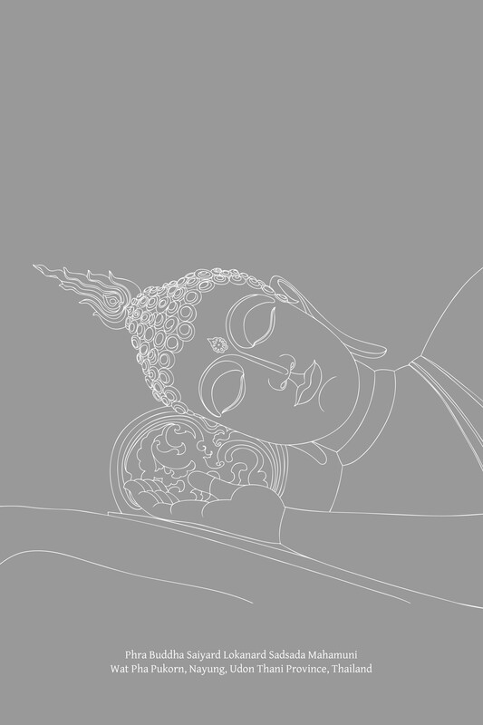
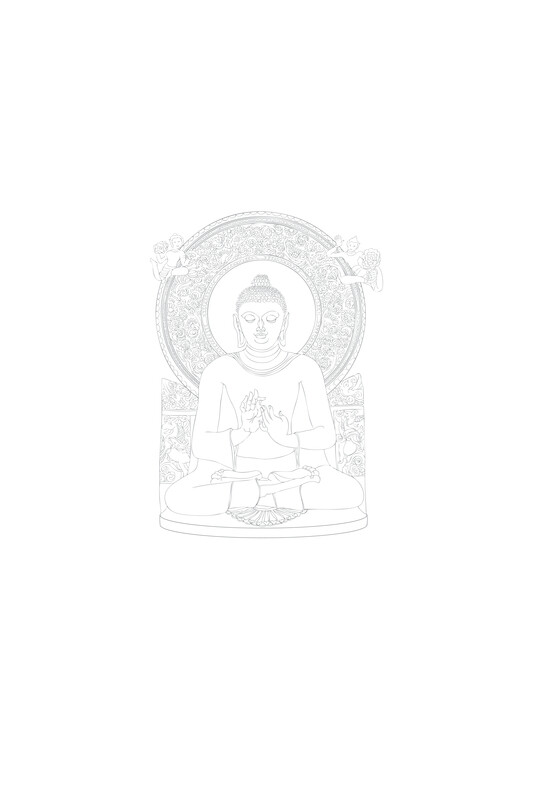

---
---

# 第十三章：善知识

中道的先行者  
实践的初始阶段1：  
他人善言与善友

## 导论

如前章所述，正见是道的关键组成部分。它是修行的起点，也是佛教精神训练的第一阶段。正见需要逐步发展、净化并摆脱偏见，直到它转化为直接的证悟。因此，正见的建立至关重要。

在《三藏》中，正见的修习被描述如下：

> 诸比丘，有两种因素有助于正见的生起：他人的教导（paratoghosa）和如理作意（yoniso-manasikāra）。[\[1\]](#fn-fn1) A. I. 87。

有助于正见生起的两种因素：

1.  Paratoghosa：他人的“宣说”；外在的影响或诱导，例如：他人的教导、建议、解释和传授；广告、信息、新闻、书面材料和学校教育。在此，特指善法教导，特别是佛法教导的传授，以及从善友（kalyāṇamitta）那里获得的知识和忠告。这是一种外在的社会因素。可以将其描述为信（saddhā）的方式。
    
2.  Yoniso-manasikāra：如理作意；分析性思维；理性或系统的注意。懂得如何客观地思考事物，运用理性思维，探究事物的起源，追溯现象的整个轨迹，并分析一个客体或问题，以便按照真相及其相互关联的因缘来看待它，而不允许个人渴爱或执著干扰。这是一种内在的精神因素。可以将其描述为慧（paññā）的方式。
    

以下段落强调了这两种因素在精神训练中的重要性：

> 对于仍在修行的比丘……我未曾见过任何其他外在因素能像善友那样有所帮助。对于仍在修行的比丘……我未曾见过任何其他内在因素能像如理作意那样有所帮助。[\[2\]](#fn-fn2) It. 9-10。

这两个因素相互支持。普通人，如果智慧尚未娴熟，则依赖他人的教导和指导，如果这些教导以巧妙的方式呈现，他们通常可以迅速进步。尽管如此，他们也必须培养独立正确思考的能力，才能达到最终目标。

那些在智慧上娴熟的人能够运用如理作意，但他们可能需要在修行的初始阶段依赖他人的教导作为指导，并作为加速其精神训练的辅助。

通过第一种因素（paratoghosa；他人的教导）建立正见，首先并主要依赖于信心。当一个人将这种因素应用于一套训练体系时，他必须确定如何最好地接受建议和鼓励，也就是说，他需要一位具备卓越品质和能力，并运用有效教学方法的老师。

因此，训练中paratoghosa的定义突出了善友（kalyāṇamittatā）的原则。

第二种因素——yoniso-manasikāra——是智慧的原则，因此在训练中需要确定如何最好地支持这种如理作意。

当这两种因素结合时，善友被认为是外在因素，而如理作意是内在因素。

最后，如果一个人与恶友交往，从而接受了错误的教导，并且运用了不如理的、不正确的作意（ayoniso-manasikāra），结果恰恰相反：他会发展出邪见（micchā-diṭṭhi）。

## 信心之道

由他人的宣说（paratoghosa）生起的正见，是指那些良善、正确、合理、有益的教导，它们解释了真理，特别是那些源于爱与善愿的教导。

善法教导源于善的根源：源于一位善良、有德、有智慧的人，他被称为“正人”（sappurisa）或“贤人”（paṇḍita）。 （参见注释：正人与贤人）如果这样一位正人或贤人履行教导他人和生起正见的职责，他或她被称为“美善或贤德的朋友”（kalyāṇamitta）。

正人与贤人

> 当sappurisa与ariya搭配使用时，论疏提出了各种定义：ariya指佛陀，而sappurisa指辟支佛和如来的弟子，或者指所有弟子；或者，这两个词具有相同含义（例如：MA. I. 21, 24；SA. II. 252, 254；NdA. 76, 79；DhsA. 349, 353）。当sappurisa单独出现时，它指佛陀和所有上述个体（例如：DA. III. 1020, 1058；AA. III. 63）。paṇḍita一词可用于指佛陀和所有上述个体（例如：KhA. 128；SnA. I. 300）。一般来说，ariya、sappurisa和paṇḍita这些词的含义是重叠的，有时可以互换使用。但若严格按照佛陀的话来说，paṇḍita指的是达到前几章所述的两种“利益”（attha）的人（paṇḍita也有一些额外的技术定义），而sappurisa指的是具备以下特定品质的人。

若欲寻求正见，不必等待正人或贤德之人主动寻找自己。相反地，应努力寻找这样的人——向智者请教、聆听、请求教导、与智者交往并学习。这称为与正人或贤德之人交往。[\[3\]](#fn-fn3)

无论由谁发起接触，一旦彼此产生影响并相互认可，此人就被视为拥有善友并参与善友之谊（kalyāṇamittatā）。

善友的定义不限于一般意义上的好朋友，而是指一个善于教导、建议、解释、鼓励、引导，并在正确的精神修行道路上作为榜样的人。《清净道论》提供了例子，包括佛陀、阿罗汉弟子、老师、导师以及有智慧、有学识的人，他们能够教导和提供咨询，甚至包括比自己年轻的人。[\[4\]](#fn-fn4)

在智慧的正式发展中，善友的存在被归类为信心（saddhā）阶段的一部分。在更广阔的精神训练体系中，良善的伴侣关系涵盖了各种因素，包括：老师、导师和父母的存在；老师的品质和技能；教学的原则、方法、技巧和手段；书籍和其他形式的媒体；榜样，例如“大士”（mahāpurisa）或在佛法上有所成就的人；以及那些有助于智慧发展的有益的社会和环境因素。

## 善友的重要性

> 诸比丘，正如黎明之光是旭日东升的先兆，同样，对一位比丘而言，善友是八圣道生起的先导和先兆。当一位比丘拥有善友时，他必将发展和修习这八圣道。S. V. 29-30。阿难，这便是全部的梵行，即善友、善伴……因为当一位比丘拥有善友时……他必将发展和修习八圣道。依靠我作为善友，众生从生中解脱；众生从老中解脱；众生从死中解脱；众生从忧、悲、苦、恼、绝望中解脱。S. V. 2-4。诸比丘，正如黎明的银光和金光是旭日东升的先兆，同样，对一位比丘而言，善友是七觉支生起的先导和先兆。当一位比丘拥有善友时，他必将发展和修习七觉支。S. V. 78。诸比丘，我未见有任何其他事物，能像善友那样，令未生善法生起，已生不善法消退。在有善友的人身上，未生善法将会生起，已生不善法将会消退。A. I. 14。诸比丘，我未见有任何其他事物，能像善友那样，如此导向大福德……A. I. 16。如此导向正法的稳固、不衰、不灭，唯有善友。A. I. 18。就外在因素而言，我未见有任何其他因素，能像善友那样，如此导向大福德。A. I. 17；参阅：S. V. 102。对于一位仍在修行中、尚未证得阿罗汉果、并渴望超越束缚的究竟安稳的比丘，我未见有任何其他外在因素，能像善友那样有益。当一位比丘拥有善友时，他将消除不善法，培养善法。It. 10。当一位比丘拥有善友时……可以预期：他将具足戒德，对波罗提木叉有所节制和谨慎，行为和住所都完美无瑕……他将\[有机会倾听和参与谈话\]，按照自己的意愿，谈论各种能净化品格和心灵的话题，也就是说，谈论少欲……谈论精进的运用、谈论戒、定、慧、解脱，以及解脱的知见。他将精进不懈地断除不善法，圆满善法。他将勤奋、坚定、强韧，不懈怠地履行善法的职责。他将具足智慧，拥有高尚的智慧，能洞察诸法的生灭，对烦恼获得穿透性的洞察，并导向苦的完全止息。A. IV. 352-3, 357-8；Ud. 36-7。

上述引用的教导强调了善友对僧侣的重要性，因为它们是佛陀对僧侣听众所说的。然而，佛陀也有许多对一般人或在家居士的普遍教导和言论，强调与贤德之人交往的重要性，例如：善友是实现即时、日常利益（diṭṭhadhammikattha）的一个因素；[\[5\]](#fn-fn5) 与恶人交往是堕落之路（apāya-mukha）；[\[6\]](#fn-fn6) 与朋友接触并以适当的方式对待朋友是六方教导的一个方面；[\[7\]](#fn-fn7) 根据真假朋友的特质选择朋友的标准；[\[8\]](#fn-fn8) 与诚实的人交往是通往繁荣的四种车轮（cakka）之一，[\[9\]](#fn-fn9) 也是四种有助于成长的美德（vuḍḍhi-dhamma）之一，[\[10\]](#fn-fn10) 也是入流（sotāpattiyaṅga）的四个因素之一；[\[11\]](#fn-fn11) 善友是十种自力（nāthakaraṇa-dhamma）美德之一。[\[12\]](#fn-fn12) 《本生故事》适用于各行各业的人，特别是俗家弟子，其中包含大量关于人际交往和友谊的故事和格言。[\[13\]](#fn-fn13)

此外，关于此主题的教导散布于《经藏》各处，例如：

> 不与愚者交往，  
> 而与智者交往，  
> 供养应受供养者：  
> 此乃至上吉祥。Kh. 3；Sn. 46-7。你所亲近的是何等人，  
> 你自己也会变成何等人。It. 67-9；J. IV. 435；J. VI. 235。

> 即使你不行恶，却与行恶者为伍，  
> 你也会被怀疑行恶，恶名日渐增长。It. 67-9。与恶友交往者，很快就会被腐化。A. I. 125-6。当一个人用吉祥草包裹烂鱼，  
> 吉祥草会沾染上恶臭：  
> 与愚者交往亦复如是。当一个人用树叶包裹沉香，  
> 树叶会变得芳香：  
> 与智者交往亦复如是。It. 67-9；J. IV. 436；J. VI. 236。智者教导应推广之事；  
> 他们不鼓励愚蠢。J. IV. 241。一个人应视智者，  
> 彼指陈过失，  
> 出言责备者，  
> 犹如揭示宝藏者；  
> 愿人与彼智者交往；  
> 如此行者，将改进而非退步。让他劝告、教诲，  
> 并劝阻他人远离恶行；  
> 如此之人，确实为善人所珍爱，  
> 而为恶人所摈弃。Dh. verses 76-7。智者和乐共住，  
> 犹如一家人。Dh. verse 207。同行七步，  
> 则被视为朋友；  
> 同行十二步，  
> 则被视为同志；  
> 同住一月或半月，  
> 则被视为亲戚；  
> 久于此者，则如同此人即自己。J. I. 365。多有亲戚和伴侣是幸运的，  
> 就像森林中央一大片树林；  
> 一棵孤立生长的树，无论长得多大，  
> 都可能被风吹倒。J. I. 329。若汝寻得智者为伴，  
> 汝应满足且正念地与彼同行……若汝未寻得智者为伴，  
> 汝应独自前行……并远离恶行。Dh. verses 328-30。与博学之友交往，  
> 善德宏大，聪慧明辨，  
> 且是佛法的倡导者。  
> 当人已认清所向往的目标，  
> 并已消除疑惑，  
> 当独行，如犀牛角。Sn. 9-10。适时听闻佛法……适时讨论佛法：  
> 此乃至上吉祥。 Kh. 3；Sn. 47。正如乘坐单薄木筏者，  
> 会在大洋中沉没，  
> 同样，有德之人也会因  
> 与懈怠者交往而沉沦。  
> 因此，一个人应该避开这样的人——  
> 那些懒惰、缺乏精进的人。  
> 与智者为伴，  
> 那些平静、高尚、坚定、专注的人，  
> 他们的精进常被唤起。S. II. 158-9；It. 70。

从这些引文中可以看出，佛陀对僧侣所说的关于人际交往的教导，主要目标是最高境界或究竟实相（paramattha），并明确侧重于建立超越的正见。另一方面，对一般民众或在家居士的教导，则强调基本的日常利益（diṭṭhadhammikattha）与深远的属灵利益（samparāyikattha）相结合。后者的教导侧重于互助互爱，以及培养世间正见，即相信业力法则——认识到自己在善恶行为中的责任。大多数情况下，它们并不强调超越的正见，即如实看待现象。然而，这些更高的超越原则隐含在世间教导中，佛陀会根据具体情况引入它们。人们处于不同的精神成熟度，佛陀会通过循序渐进地为他们打下基础来准备他们。[\[14\]](#fn-fn14)

## 善友的特质

善友的特定特质，使他成为“正人”（sappurisa）或“贤人”（paṇḍita），如下所示：

正人有七种显著的品德（sappurisa-dhamma）：[\[15\]](#fn-fn15)

1.  Dhammaññutā：知法；知晓基本原则和因缘；知晓自然法则；知晓与目标相符并能有效行动的基本教导、指导方针和责任，例如：一位比丘熟悉他必须学习和实践的教导，一位统治者知晓领导和治理的正确原则。
    
2.  Atthaññutā：知义；知晓特定教导、修行准则和职责的意义和目的；知晓特定行动所期望的成果，例如：一位比丘知晓他所学习和实践事物的意义和目的，他认识到作为生命目标和核心意义的善。
    
3.  Attaññutā：知己；如实知晓自己的品德、性情、地位、力量、知识、技能、能力和美德；这种知识有助于采取适当而有效的行为。例如，一位比丘知晓自己的信心、道德行为、学识、慷慨、智慧和洞察力的程度。
    
4.  Mattaññutā：知量；知晓适度与充足，例如：知晓饮食和财富支出的适度；一位比丘知晓接受四种资具的适度。
    
5.  Kālaññutā：知时；知晓适合进行特定活动的时间；例如，知晓何时学习、何时工作、何时休息。
    
6.  Parisaññutā：知众；知晓地域、聚会场所、社区；知晓特定社区的礼仪、道德规范、习俗和其他适合的实践。
    
7.  Puggalaññutā：知人；知晓人与人之间在性情、能力和美德上的差异；这种知识有助于确定如何恰当地与每个人相处。例如，一个人知道是否应该与某人交往；知道如何有效地对待、使用、赞扬、批评和教导他人。
    

paṇḍita 是一个有智慧的人，一个用智慧来引导生活的人。佛陀曾以多种方式描述这样的人的特质，例如：

> 比丘们，愚者以其行为而彰显，智者以其行为而彰显。两者皆通过其行动而清晰显露。[\[16\]](#fn-fn16) 愚者可通过三事而知晓：身、语、意的不善行为。智者可通过三事而知晓：身、语、意的善行。A. I. 102. 比丘们，愚者有此三相、愚者的征兆、愚者的行为方式。哪三者？此处，愚者是那些起不善念、说不善语、行不善行的人。A. I. 102-103; M. III. 163.

> 比丘们，智者可通过三事而知晓：他以审慎的态度提出问题，他以审慎的态度解决问题，以及无论何时，当另一个人以审慎的态度、以温和善语、合理且切中要害地解决问题时，他都会表达喜悦。A. I. 103-104. 比丘们，有两种愚者：承担不属于他的负担者，以及逃避属于他的负担者。比丘们，有两种智者：承担属于他的负担者，以及不承担不属于他的负担者。A. I. 84. 一个愚痴的比丘渴望不应得的赞扬，渴望超越其他比丘的显赫，渴望在寺院中拥有权威，以及在各家庭中受人尊敬。“让居士和比丘都认为只有我独自完成了这件事情；在所有工作，无论大小，让他们都服从我。”这是愚者的野心；他的嫉妒和傲慢只会不断累积。法句经73和74偈。善人对一切状况都不执著；正直的人不因感官欲乐而发言；无论受乐或受苦，智者既不欣喜也不沮丧。 圣者不为自己也不为他人而行任何恶事；他不渴望通过不义手段获得儿子、财富、王国或个人成功；他有德、有智、正直。[\[17\]](#fn-fn17) 法句经83和84偈。

> 无论他是否受到尊敬，他的三摩地都不可动摇；他保持警觉和清醒。这样的人持续禅修并不断精进；他拥有敏锐理解的毗婆舍那，并乐于摧毁执著。他们称他为殊胜之人。[\[18\]](#fn-fn18) S. II. 232. 治水者引水，造箭者矫箭，木工者琢木，智者训练自己。法句经80偈。天鹅、鹤、孔雀，大象和斑鹿，所有这些都惧怕狮子，无论它们自身体型大小。同样地，在人类中，一个具有智慧的年轻人被认为是伟大的，而不是拥有健壮身体的愚者。S. II. 279-80; J. II. 144. 一个少学之人老去如同牛，肌肉发达，而智慧不增。法句经152偈。一个人不只是因为头发变白而被称作长老；他年事已高，却被称为徒劳的老人。一个拥有真理、正直、无害、自我掌控和节制的人，确实是圣者；清除了烦恼，他确实被称为长老。法句经260和261偈。小溪流淌喧嚣；大水流淌寂静。空虚者发出回响，而充满者保持寂静。愚者像半满的壶；智者像充满水的湖。Sn. 138-9.

> 愚者若知己愚，则至少有少许智慧；愚者若自以为智，则实乃愚者。法句经63偈。任何没有善人的聚会都不被称为议会；任何不说真话的人都不在正直者之列。但若舍弃贪、嗔、痴，并说真话，那人确实是殊胜之人。S. I. 184. 一个智且感恩、忠诚可靠、与善友交往并致力于帮助身处困境者的人——这样的人被称为殊胜之人。 J. V. 146. 比丘们，有这四种时机。哪四种？一种时机是行为既不愉悦，完成后亦无益。一种时机是行为不愉悦，但完成后却有益。一种时机是行为愉悦，但完成后却无益。一种时机是行为既愉悦，完成后亦有益。在这些时机中，若某行为既不愉悦又无益，人会因其既不愉悦又无益而认为不宜行动。若某行为不愉悦但有益，则在此事关个人力量、精进和毅力的问题上，可知谁是愚者谁是智者。因为愚者没有这样的考量：“虽然这次行动不愉悦，但完成后却有益。”因此他不行事，他的不作为给他带来损失。但智者会考量：“虽然这次行动不愉悦，但完成后却有益。”因此他行事，结果对他有益。若某行为愉悦但无益，则在此事关个人力量、精进和毅力的问题上，可知谁是愚者谁是智者。因为愚者不这样考量：“虽然此行为愉悦，但它带来损失。”因此他行事，结果是损失。而智者则反思：“虽然此行为愉悦，但其结果带来损失。”他因此不行事，结果对他有益。若某行为既愉悦又受益，则因其既愉悦又受益这两个原因，认为行动是可取的。A. II. 118-19. 坚定不移者，通过获得所求之善，被称为有智慧之人。[\[19\]](#fn-fn19) S. I. 87, 90; A. II. 46; A. III. 48-9; It. 16-17. 凡在信仰、德行、学问、布施和智慧上有所增长者：这样的人是正直的，拥有辨别性智慧，并为自己获得了此世的真正利益。A. III. 80. 比丘们，依靠正直的人，可期望四种祝福。哪四种？在圣洁的德行上增长，在圣洁的三摩地上增长，在圣洁的智慧上增长，以及在圣洁的解脱上增长。 A. II. 239.

> 此处，比丘，世上智者、大智慧者，不思伤害自己，不思伤害他人，不思伤害两者。相反，他思及对自己有益之事，思及对他人有益之事，思及对两者皆有益之事；确实，他思及对整个世界有益之事。以这种方式，他被称为智者、大智慧者。A. II. 179. 比丘们，当一位殊胜之人诞生于一个家庭时，他的存在是为了许多人的利益、福祉和幸福。是为了他的父母、妻子和儿女、受扶养人、雇员和仆人、朋友和同事、祖先、国王、天人、苦行者和婆罗门的利益、福祉和幸福。这就像一场大雨云使所有庄稼生长，其存在是为了许多人的利益、福祉和幸福一样。[\[20\]](#fn-fn20) A. IV. 244-5.

若有人与这样有智慧或有德行的人交往，或者这个人主动与他人分享知识和善行，他或她被称为“善友”（kalyāṇamitta）。善友通过教导、劝告和传授知识，在他人心中产生正见和善信。他或她以慈爱和悲悯行事，帮助他人在他人心中培养正见和正确修行。

除了上述引文中概述的智者的独特品质之外，还可以通过考量善友（kalyāṇamittatā）定义中提及的品质来描述一个善友——一个应该被寻求和交往的人。

善友被定义为“与一个拥有信仰（saddhā）、戒行（sīla）、（广）学（suta）、布施（cāga）和智慧（paññā）的人往来、交往、亲近，并对其忠诚和投入。”[\[21\]](#fn-fn21)

在一些段落中，只提及了其中四种品质，排除了学问，因为学问被认为不如其他四种要素重要。其他段落则建议，当一个人居住在特定地区时，他应与那些具备信仰、德行、布施和智慧的人密切交往、交谈和请教；他应将这些人作为榜样，并效仿他们的精神品质。[\[22\]](#fn-fn22)

善友还应具备七种基本德行，被称为“善友之德”（kalyāṇamitta-dhamma）：[\[23\]](#fn-fn23)

1.  Piyo：“可亲可爱”；能够“打动他人之心”，营造亲密和信任感，让学生易于提问。
    
2.  Garu：“可敬可重”；在教师的身份上举止得体；营造轻松、可靠和安全的感觉。
    
3.  Bhāvanīyo：“可启发”；高度智慧，拥有真实知识，并不断训练和提升自己；值得赞扬和效仿；被弟子们以启发、信心和喜悦之心谈论和思念。
    
4.  Vattā：“善于言谈”；善于言辞和提供良好建议，能够解释事物使他人理解，并了解在特定情况下说什么、如何说；给予巧妙的建议和规劝。
    
5.  Vacanakkhamo：“耐心倾听者”；乐意倾听他人的问题和建议，即使是微不足道的；能够忍受侮辱和批评，而不厌烦或发脾气。（参见注解：忍受批评）
    
6.  Gambhīrañca kathaṁ kattā：“能阐述深奥主题”；能够教导和解释复杂深奥的事务，使他人理解。
    
7.  No caṭṭhāne niyojaye：“不鼓励无益之事”；不鼓励人追随有害或不当的方式。
    

忍受批评

> 在巴利三藏中，此术语vacaṇakkhamo指能够忍受他人责备和批评并准备修改和提升自己的人。尊者舍利弗被赞誉为具此美德者的典范（例如：S. I. 64）。注释解释了有些人能够规劝他人，但一旦自己受到规劝就发怒；然而，舍利弗既能规劝他人，又能虚心接受规劝。有一个故事说，一个七岁沙弥指出舍利弗内衣的边沿垂得很低；舍利弗礼貌地听取后，便去整理他的衣袍（SA. I. 123）。

虽然以下佛陀的段落并未明确声称描述善友的特质，但其中提及的德行可被视为善友的伴随品质：

> 比丘们，一位具足六种品质的比丘，能够为自己和他人带来利益和福祉。哪六种？此处，一位比丘：快速理解一切善法。忆念他所听闻的法教。思惟那些忆念教法的根本意义。通过清晰理解意义（attha）和基本原则（法），他正确修行。[\[24\]](#fn-fn24) 拥有悦耳可爱的言语，由精致、清晰、明了的语言组成，并使听者能清楚理解主题的要旨。能够教导、激励、鼓励并使他的梵行同伴欢喜。A. IV. 296, 328.

> 比丘们，世上有三种人。哪三种？有一种人不应交往、不应亲近、不应接近；有一种人应交往、应亲近、应接近；有一种人应恭敬、应尊敬、应交往、应亲近、应接近。不应交往、不应亲近、不应接近的人是何种性质？在此情况下，某人在戒行、三摩地和智慧方面是低劣的。这样的人不应交往、不应亲近、不应接近，除非是出于体恤和悲悯。 应交往、应亲近、应接近的人是何种性质？在此情况下，某人在戒行、三摩地和智慧方面与自己相仿。这样的人应交往、应亲近、应接近。为何如此？基于这样的想法：“既然我们在戒行、三摩地和智慧方面是平等的，我们的讨论将围绕戒行、三摩地和智慧展开；我们的讨论将和谐进行并导向我们的幸福。”因此，一个人应该交往、亲近、接近这样的人。应恭敬、应尊敬、应交往、应亲近、应接近的人是何种性质？在此情况下，某人在戒行、三摩地和智慧方面是优越的。这样的人应恭敬、应尊敬、应交往、应亲近、应接近。为何如此？基于这样的想法：“通过这种方式，我将完成尚未圆满的德行之体……三摩地之体……智慧之体，或者在这方面，我将通过智慧来维持已圆满的德行之体……三摩地之体……智慧之体。”因此，一个人应该恭敬、尊敬、交往、亲近、接近这样的人。A. I. 124-5.

尽管佛陀一再告诫不要与恶劣、不道德的人交往，但请注意，在上述段落中他提出了一个例外，即当一个人出于慈爱和悲悯，并怀有帮助的愿望而与这样的人交往时。无论如何，那些希望帮助这样的人，应首先事先考虑自己的准备情况。

一些关于善友特质的教导强调日常、即时的利益（有时也与更高层的精神利益相关），例如《吉祥经》（Siṅgālaka Sutta）中关于真假朋友的教导：

> 居士之子，你看，有这四种人可被视为敌人，视为假朋友：骗子是一种，夸夸其谈者是一种，奉承者是一种，麻烦制造者是一种。骗子可因四种原因被视为假朋友：他把所有东西都据为己有，他以很少的付出想得到很多，他只在自己有危险时才帮助朋友，以及他只寻求自己的目的。夸夸其谈者可因四种原因被视为假朋友：他谈论已逝之事，他谈论尚未发生之事，他提供无用的帮助，以及当朋友需要时，他会找借口因某些障碍而推脱。奉承者可因四种原因被视为假朋友：他赞同恶行，他\[同样\]赞同善行，他当面称赞你，他在背后贬低你。麻烦制造者可因四种原因被视为假朋友：你沉溺于酒精时，他在旁作伴；你在不合时宜的时间在街上游荡时，他在旁作伴；你常去寻欢作乐的场所时，他在旁作伴；你沉溺于赌博时，他在旁作伴。居士之子，你看，有这四种人可被视为真朋友，心地善良的朋友：支持你的朋友是一种，患难与共的朋友是一种，指出善行的朋友是一种，以及体贴入微的朋友是一种。 支持你的朋友可因四种方式被视为真朋友：你粗心大意时他照顾你，你粗心大意时他照看你的财物，你身处危险时他是你的避难所，以及当有事情需要办理时他让你得到比你要求更多的。患难与共的朋友可因四种方式被视为真朋友：他告诉你他的秘密，他保守你的秘密，在不幸时他不会让你失望，他甚至会为你牺牲生命。指出善行的朋友可因四种方式被视为真朋友：他阻止你做错事，他支持你做善事，他告知你以前不知道的事情，以及他指引你通往天堂的道路。体贴入微的朋友可因四种方式被视为真朋友：他不因你的不幸而高兴，他因你的好运而高兴，他阻止他人说你坏话，以及他赞扬他人称赞你。D. III. 185-8 (节选)

《增支部》（Aṅguttara Nikāya）中也有类似的段落：

> 比丘们，拥有七种特质的朋友应当跟随。哪七种？他布施难以布施之物；他做难以做之事；他耐心忍受难以忍受之事；他揭示自己的秘密；他保守朋友的秘密；在不幸时他不会抛弃他人；当朋友贫困时他不会鄙视他们。A. IV. 31.

关于友谊的一般原则在“六方经”的教导中有所阐述：[\[25\]](#fn-fn25)

> 居士之子，你看，一个人应以五种方式对待他的朋友和同伴，如同北方\[左手\]方向：通过布施和慷慨（dāna）。通过亲切、慈爱的言语（piyavācā）。通过协助和支持（atthacariyā）。通过提供恒久的友谊；在顺境和逆境中都是朋友（samānattatā）。通过诚实和真诚的言语（avisaṁvādanatā）。

请注意，这前四种因素构成了被称为“四摄事”（saṅgaha-vatthu）的教导。这个教导提出了互相帮助和使人们和谐团结的原则。这些因素是人们之间表达善意的一种方式。这两个教导，关于六方经和四摄事，实际上是相同的，它们展示了佛教如何鼓励人们彼此结交或以朋友待人。

在这四种因素中，提供恒久友谊——能够适应他人，不自负，以及在顺境和逆境中都是朋友——是至关重要的，也是友谊的核心。如前所述，佛陀将患难与共的朋友区分为四种“真”朋友之一。[\[26\]](#fn-fn26) 

比丘们，或泛指一切出家众，[\[27\]](#fn-fn27) 应当作为居士的善友。根据“六方经”中关于尊敬天顶的教导，比丘对居士的责任与真朋友的特质是相同的。真朋友的特质：“指出善行者”在此语境中可改述为“比丘们指出善行，故为真朋友。”然而，僧团对在家众的职责还包含另外两个因素，总计六个因素：[\[28\]](#fn-fn28)

1.  劝阻他们不做恶事。
    
2.  鼓励他们行善。
    
3.  以仁爱协助他们。[\[29\]](#fn-fn29)
    
4.  告知他们以前不知道或未曾听闻之事。
    
5.  解释并阐明他们所听闻之事。[\[30\]](#fn-fn30)
    
6.  指引通往天界之路（教导一种导向幸福的生活方式）。
    

僧团对在家众的责任规定如下：

> 比丘们——婆罗门和居士对你们非常有帮助，因为他们以衣物、食物、住所和病药等必需品来供养你们。而你们，也应对婆罗门和居士非常有帮助，通过教导他们初善、中善、后善的法；通过阐明梵行，无论是精神上还是文字上，都极其完整和纯粹。如此，比丘们，在家众和出家众相互依赖，为摆脱烦恼之流，为彻底终结苦而修习梵行。在家众和无家者相互依赖，都为证得真实之法：那无上解脱束缚的安稳。It. 111-12.

以下段落肯定了佛陀对协助在家众的强调（通过使用正当手段）：

> 是的，村长，如来在许多方面赞扬对家庭的支持，对家庭的保护，对家庭的悲悯。S. IV. 324.

话虽如此，僧团在以慈悲和正直的方式为在家众履行善友的职责时，必须注意保持独立生活方式和出家生活的独特特质。重要的是要避免与在家众过于亲近，这可能对双方都造成伤害。它可能阻碍个人的精神进步，并使在家众失去一个依止。如果比丘们过于涉世，在家众将只能依赖那些和他们一样困惑和烦恼的人；他们将没有一个可以帮助他们摆脱困惑和动荡的依靠。

这种不适当的关系，即比丘们像在家众一样陷入世俗事务中，并且无法帮助在家众走向内心自由，被称为“被（他人）缠缚”：

> 比丘们，何为被人类缠缚？在此，一位比丘与在家众过度往来；他与他们同乐同悲，他们快乐时他快乐，他们悲伤时他悲伤，并且他介入他们的事务和职责（他像个爱管闲事的人）。这被称为被人类缠缚。[\[31\]](#fn-fn31) S. IV. 180-81.

在直接教导他人时，善友应遵循强调纯净、仁慈和真诚的教导：

首先，有五种因素被称为“教师的品质”（dhammadesaka-dhamma）：[\[32\]](#fn-fn32)

1.  循序渐进地教导（anupubbikathā）：分阶段教授主题，从简单的方面开始，到更深奥的方面结束；以渐进、整合和合理的方式进行教学。
    
2.  解释因果关系（pariyāya-dassāvī）：阐明特定主题的每个方面和要点；教学多才多艺，指出因果关系。
    
3.  以仁慈和善意教导（anudayatā）：以慈心教导，以学生的福祉为目标。
    
4.  不寻求物质回报（anāmisantara）：教导他人而不以物质利益、经济回报或个人优势为目的。
    
5.  不伤害自己或他人（anupahacca）：保持内心公正；根据特定主题的要旨和形式原则进行教学；专注于事物的理论和实践意义；不自我抬高而轻视他人。
    

以下段落描述了纯净和不纯净的教导：

> 比丘们，一位比丘教导他人佛法时，心想：“啊，愿他们听我说法！听后，愿他们对我生起信心！生起信心后，愿他们对我表示虔诚！”这样的比丘说法是不纯净的。比丘们，一位比丘教导他人佛法时，心想：“世尊善说之法，是应由自己亲身证悟、无时间限制、邀请来亲自验证、应带入内心加以证悟、应由智者各自体验的。啊，愿他们听我说法！听后，愿他们清晰理解佛法！清晰理解后，愿他们依此修行！”因此，他教导他人佛法是出于佛法固有的卓越；他教导他人佛法是出于悲悯和同情，出于温柔的关怀。这样的比丘说法是纯净的。 S. II. 199.

同样地，六方经中关于教师对学生职责的教导也包含类似的特质。此处，重点并非在于纯净，而在于仁慈和真诚的投入：[\[33\]](#fn-fn33)

1.  在德行上劝导和训练学生。
    
2.  使学生对相关主题有清晰的理解。
    
3.  为学生提供艺术和科学各领域的完整教育。
    
4.  向朋友和同事推荐并赞扬学生的德行和能力。
    
5.  为学生提供全面的保障（教导他们如何真正运用知识并谋生）。
    

最后，善友有两项特质应特别强调，它们区分了此类人的卓越：第一，他真正能够做到他所教导的，或者他已达到关于某个特定证悟，并能教导他人；第二，他是自由的；他不陷于困惑，也不与他所引导的人受相同的执著所束缚。关于第一项特质，佛陀有许多教导，例如：

> 一个人应先确立自己  
> 在正确和善的方面；  
> 然后教导他人。  
> 有学识的人应无瑕疵。  
> 你应该言行一致。法句经158-9偈。

通常，这些关于区别的教导侧重于行为或伦理，但如果一个人通过心或智慧获得了特定的证悟，然后作为善友行事，这是最好的。如果无法找到这样的人，那么应该寻找在精神道路上走得更远，或至少在这方面是平等的人。

偶尔，一个博学多识的人，通过阅读经典或其他形式的学习而拥有知识，即使他自己尚未达到证悟，也能促进他人的法证悟。[\[34\]](#fn-fn34) 同样地，也可能出现两个在精神成熟度上处于同等阶段的人，一起讨论和审阅法，结果他们同时证悟了真理。[\[35\]](#fn-fn35)

拥有善友的一大好处是，他或她可以作为榜样。因此，一个人确信自己所修习和渴望之事是真正可行和可实现的，并且通过完成这些事情，他将获得真实而有价值的结果。此外，善友拥有更广博的知识、理解和经验，因此能够推荐促进或加速个人修行的法门。

一个已证得精神修习成果的善友，能充分提供这些利益或祝福，在他者心中产生深刻的信心和动机。因此，渴望一位拥有所有这些特质的善友是自然的。

自由的第二项品质包含两个方面：一个人的生活方式和一个人内心的精神自由。

这种自由的品质至关重要，并与上文关于比丘与在家众亲近的描述相关。如果一个人像其他人一样被相同的束缚和桎梏所羁绊，或者被困在相同的漩涡和湍流中，他就无法自救，更遑论帮助解脱或解放他人。

一个受制于社会束缚，以世俗方式和世俗价值观争取事物的人，承受着谋生和养家的压力。他需要像其他人一样为自己和家人的生存而奋斗。每当社会出现问题时，他将很难抽出时间投入到拯救他人或引领他们走向新方向的工作中。他帮助他人的尝试往往属于“在小水塘里划桨”的范畴。当这个人无论在生活方式还是内在都缺乏自由时，帮助他人取得成功就更加困难。

正是因为这个原因，佛陀建立了僧团作为一个独立的社群，其生活方式不受广阔社会的束缚，并以律藏的戒律为指导。

当这种独立的生活方式与内心已解脱的个体结合时，僧团便成为在更广阔社会中产生善法的强大力量，并作为大众的依止，使其他人也能发现不同层次的自由。

关于帮助他人，佛陀曾给出以下教导：

> 纯陀，一个自己深陷泥泞的人，不可能把另一个深陷泥泞的人拉出来。一个自己没有深陷泥泞的人，把另一个深陷泥泞的人拉出来是可能的。一个自己未经训练、未受规训、烦恼未灭的人，去训练另一个人、规训他、并帮助他熄灭烦恼是不可能的。一个自己已经训练有素、受过规训、烦恼已灭的人，去训练另一个人、规训他、并帮助他熄灭烦恼是可能的。[\[36\]](#fn-fn36) M. I. 45.

佛陀旨在确保僧团的稳定和长久独立。在此背景下，以下教导可被视为出家众的行为准则：

> 出家者不应过于繁忙，不应漫无目的地行事；他不应成为他人的仆役。他应不依赖他人而活，也不应将佛法视为商品。[\[37\]](#fn-fn37) Ud. 66.

这件事可以总结为，看看佛陀本人那无与伦比的特质，他正是至上的善友。佛陀兼具这两种品质：他真正圆满成就，并已证悟他所教导的一切；而且他是自由的，解脱了社会束缚和心理烦恼的压迫。

> 诸比丘，正如蓝色、红色或白色的莲花，生于水中，长于水中，但从水中升起后，不为水所沾染而立。同样地，如来生于世间，长于世间，但从世间升起后，不住于世间的染污。[\[38\]](#fn-fn38) S. III. 140-41. 巴忽那（Bāhuna）啊，如来已解脱、离执、从十法中出离，因此住于无量心。哪十法？于此，如来已解脱、离执、从色……受……想……行……识……从生……老……死……从一切苦……以及从一切心垢中出离，因此住于无量心。同样地，蓝色、红色或白色的莲花，生于水中，长于水中，但从水中升起后，不为水所沾染而立。 A. V. 152. 世尊自己已觉悟，因此为了觉悟而教导佛法。世尊自己已训练，因此为了训练而教导佛法。世尊自己已寂静，因此为了寂静而教导佛法。世尊自己已度脱，因此为了度脱而教导佛法。世尊自己已般涅槃，因此为了灭尽而教导佛法。[\[39\]](#fn-fn39) D. III. 53-4; M. I. 235.

佛陀的教导方式有以下三个特点，它们被称为“佛陀的教法模式”，可作为那些担当善友并教导他人者的自我评估之一般原则：[\[40\]](#fn-fn40)

1.  佛陀通过亲身证知来教导佛法。他教导那些他自己已证知且值得证知的事物，以便他人也能证知这些事物。这一原则着重于老师——着重于他或她真正理解或已证知所教导的主题。
    
2.  佛陀以坚实的基础教导佛法。他以连贯的方式教导和解释，使听者能够思惟主题并通过运用自己的智慧来理解。这一原则着重于学生或听者。老师以一种方式教导，为听者提供反思、运用辨别力、发展智慧并亲身洞察真理的自由或机会。老师仅仅呈现事实、信息、有理的论证或建议，以揭示真理的各个方面并激发听者的思惟。
    
3.  佛陀以真实、殊胜的结果教导佛法。他教导那些真实的事物——那些被思惟它们的智者和真理爱好者所承认的事物。他教导那些可证知的事物；修行者将获得与其修行运用相符和相应的果报。这一原则着重于教法，即教法与真理相符或“真实如此”；它是可验证的、有效的、有价值的；它不是微不足道的、徒劳无益的或白白遵循的；它为实践者带来了真实的结果——修行的成果与实践者所付出的努力以及随附的条件因素相符。
    

如果无法找到一位已证悟且真正自由的善友，那么跟随和学习一位博学之人仍然有用，尽管他或她尚未领悟教法的精髓。 

在这种情况下，这样的人就像一个照看别人牛群的牧牛人，或者像一个提着灯笼的盲人——一个视力好的人因此能够看清。[\[41\]](#fn-fn41) 这里“视力好的人”指的是具足如理作意（yoniso-manasikāra）的人。

这不仅适用于那些知识渊博且教学技巧高超的人——即使是傻瓜或鹦鹉学舌之人说出的智慧之言也能提供思考的素材。一个具有如理作意的人可能会听到这些话并因此获得证悟。[\[42\]](#fn-fn42)

然而，在这种情况下，关键因素在于听者，即他或她拥有内在的精神因素——如理作意，这将在接下来的章节中讨论。

## 善友的责任

在精神修习的背景下，一位好同伴在各种活动中的参与和支持是一个外在条件。这里的一个重要因素是人们在思想、观点、态度、价值观和理解方面的相互影响，这些统称为“见”（diṭṭhi）。

如果这些想法、态度、价值观和理解形式是错误的且有害的，它们被称为“邪见”（micchā-diṭṭhi），而如果它们是正确、善巧且有益的，它们则被称为“正见”（sammā-diṭṭhi）。

鼓励他人持有邪见的人是恶友（pāpa-mitta），而鼓励他人持有正见的人则是良善而真实的善友（kalyāṇamitta）。

通常，一个人的家庭或学校导师，例如父母和老师，对人的影响不如其玩耍和交往的朋友。但也常发生，一个人居住附近的朋友的影响力，小于那些住得很远（无论是物理距离还是时间上）并能触及人心的人：那些通过大众媒体，比如娱乐渠道和书籍，包括那些伟大人物的传记——其品质为人所效仿——而与人“同行”的“同伴”。

使某人能够影响他人，或者说外部同伴与他人心智之间的桥梁，是信念、信任、钦佩和启发，这些统称为“信心”（saddhā）。

当信心产生时，即使某人远在他方，并非亲密伙伴，也能对其产生影响。有些人可能住在附近，但若对其缺乏信心，影响甚微。因此，那些肩负教导他人、传授正见责任的人，应首先在他人心中建立信心。

精神修习的一个基本原则是善友充当信心的催化剂：与贤明正直之人交往是信心生起的条件。

虽然一个人可能良善且有智慧，但如果他无法在他人心中生起信心，他仍然不符合“善友”（kalyāṇamitta）的资格，也未与他人建立真正的联系。当信心生起且他人接受时，一个人可以帮助引导他人的思想和行为（最初，这个人可能只是模仿一个人的行为），或者可以培养一种正确的思维方式，这是另一个层次的精神修行。决定一个人是否履行“善友”责任的关键因素是，他所交往的人是否达到了正见。 

关于正见（sammā-diṭṭhi）的技术性和教理上的解释将在接下来的章节中呈现。[\[43\]](#fn-fn43) 作为引言，这里指出集合起来称为“正见”的贤善和正确的见解、观点、价值观和理解形式有许多细节和特殊之处，并且可以通过多种不同方式来解释，这是很有用的。然而，对正式教义的考察显示，这些见解等可以归结为两种：

1.  信念、观点、看法和理解形式，它们是正确、善巧和理性的，并与伦理、善恶行为以及这些行为的相应果报有关，正如“种瓜得瓜，种豆得豆”这句谚语所概括的那样。这种见解的进一步例子包括对道德的信任，例如对父母功德的信任，以及与宗教教义相符的信念，例如关于来世的教导。简而言之，可以将其定义为符合佛法的见解，或对业法则的信念，这会促使人对其行为产生责任感。这种见解的准确术语是kammassakatā-ñāṇa——业是自己的知识。
    
    这是世间正见（lokiya-sammādiṭṭhi），它源于对因果的理解，并由社区传承的教法所灌输。它产生正直、贤善的行为，并导向一个和平、秩序良好的社会。
    
2.  关于世间、生命或有为法的见解和理解形式，它们与真理相符，与现象的真实本性以及自然的因果法则相符。通过这种理解，一个人能够认识到如何正确地对待世间万物。
    
    例如，一个人理解所有有为法都源于相互关联因素的汇聚；它们根据因缘和条件的相互关系而存在，因此它们是不稳定、无常和不可持续的。与它们相关的因素处于持续的冲突和压力状态；这些事物并非真正独立，它们不能真正被任何人拥有，并且它们最终不受任何人的欲望和愿望所支配。当事物以这种方式存在时，我们应该如何对待它们？完全沉迷于有为法或将生命奉献于追求它们是否合适？每个人也是有为法，并受制于同样的自然法则；我们都是老、病、死的同伴。因此，我们应该如何相互对待？
    
    这种理解形式是通过对事物的正确辨别、反思和考量而产生的，与实相和事物的因果本性相符。它被称为“与出世间理解相符的正见”。虽然它最初仍是一种世间理解形式，但它正在通往并将发展为出世间正见（lokuttara-sammādiṭṭhi）的道路上。
    

第一种正见称为kammassakatā-sammādiṭṭhi或kammassakatā-ñāṇa：人们是其故思行为（kamma）的主人的知识。这是识别和区分自己故思行为的能力。这种知识会产生对其行为的责任感。这是在正法行（dhamma-cariyā）层面，或与善业道（kusala-kammapatha）相关的正见。它既是眼前世间层面（diṭṭhadhammikattha）和微妙精神层面（samparāyikattha）的利益或目标，也是究竟善（paramattha）的基础。

第二种正见被归类为“毗婆舍那正见”（vipassanā-sammādiṭṭhi）。在巴利经典中，它被称为saccānulomika-ñāṇa：“与真理相符的知识”或“与真理一致的知识”。它导向觉悟；它直接导向究竟善。

由此可见，导向佛教最高目标的、至关重要的正见，是第二种，即与真理相符的知识。 

所有佛教徒，无论他们是否直接以这个最高目标为目的，都应注意不要止步于第一种正见。相反，他们应该通过修习这种智慧，至少达到初步的程度，来提升到第二种正见。[\[44\]](#fn-fn44) 这是因为这种正见能减少和缓解贪、嗔、痴；它有助于建立与世间更良好的关系，使心清明明亮，并增进快乐。它比道德戒律中固有的约束和控制方法更能有效地减少世间的压迫、冲突和苦恼。它有益于个人和整个社会。

当我们分析事件的顺序时，会发现与善人交往，或拥有善友，会带来听闻佛法的机会——直接或间接接受教导。当佛法教导真正符合真理和善的原则，并且教导以有理、连贯的方式呈现时，接受教导的人心中便会生起信心：

> 亲近贤智之人（拥有“善友”） →  
> 听闻佛法 →  
> 信心。[\[45\]](#fn-fn45)

至此，我们来到精神训练或修行的关键一点：外部社会因素与内部个人因素之间的联系。外部因素是“听闻他教”（paratoghosa），这里指拥有善友（kalyāṇamitta）。它本身产生信心，并只导向“世间正见”（lokiya-sammādiṭṭhi）。[\[46\]](#fn-fn46) 

如果一个人只达到这个阶段，那么他的精神训练是不完整的，他将无法达到佛教的最高目标。当一个人只停留在信心的层面时，他仍然依赖他的老师——他的“善友”——他的行为仍然是跟随榜样或模仿。他尚未获得深厚的知识和清晰的洞见；他仍然没有达到完全的解脱。

解决方法是寻找一座桥梁，以达到内在的个人因素——如理作意（yoniso-manasikāra）。一个人应该唤起并生起如理作意来取代信心，因为如理作意导向出世间正见、真实知识以及佛教的最高目标。

善友的外部因素促成了与如理作意这一内部因素的连接，而帮助他人在自己内心生起如理作意被认为是善友的责任。一位好的老师不应该满足于在学生心中生起信心的目标，而应该利用这种信心来“点燃”如理作意的火花。

一位好的老师将信心作为教导佛法的连接点：在灌输信心之后，他或她教导佛法，以便听者或学生能唤起如理作意：即根据真理并符合因果法则来反思和看待一切事物的能力。

一旦如理作意生起，觉悟的自然过程便会展开，直至达到高潮。在此期间，善友可以通过定期提供佛法教导来帮助支持和引导这种如理作意。

当外部因素与内部因素连接起来——即当听闻他教支持如理作意时——未觉悟而能接受教导的人，便能够在佛法修习中进步（除非是天生即能自发启动如理作意的奇才，或无法自主思考的庸人）。

在佛法中，一位贤善的老师助人不是为了培养虔诚或个人依恋，因为这样的关系可能只会导致模仿老师的信仰和行为。一位善友的作为，并非为了让他人与老师建立个人关系，而仅仅是作为一个媒介，帮助他人连接自己的生命和周遭环境——指出他们如何能根据真理反思事物，并自行发现如何正确地对待世间。这个过程因此扩展为：

> 亲近贤智之人（拥有“善友”） →  
> 听闻佛法 →  
> 信心 →  
> 如理作意（yoniso-manasikāra）。

然而，在关于智慧发展的教导中，或者在导向入流的因素中，佛陀并没有提到信心。可能是在这个语境下，他认为信心是一个次要或辅助因素，不需要特别强调。 

智慧发展的过程，或涉及导向入流的因素的过程，图示如下：[\[47\]](#fn-fn47)

> 亲近贤智之人（拥有“善友”） →  
> 听闻佛法 →  
> 如理作意（yoniso-manasikāra） →  
> 法随法行。

尽管以下经文段落没有明确提到如理作意，但它们描述了善友的教导方式，这些善友给予学生独立性，让他们能够自己证悟真理：

> 玛干帝亚（Māgaṇḍiya）：我对瞿昙大师（Master Gotama）有如此信心。现在瞿昙大师是否能够以一种方式教导我佛法，使我能从这个座位上起身，摆脱我的盲目？佛陀：那么，玛干帝亚（Māgaṇḍiya），亲近贤善之人。当你亲近贤善之人时，你将听闻真正的佛法。当你听闻真正的佛法时，你将依照真正的佛法修行。当你依照真正的佛法修行时，你将亲自了知和见到：‘这些是（心智的）疾病、肿瘤和刺痛的毒箭；但在这里，这些疾病、肿瘤和毒箭毫无残余地止息。\[也就是说\]随着执取的止息，有（存在）止息。随着有的止息……忧、悲、苦、恼、绝望止息。这就是整个苦蕴的止息。’ M. I. 512. 婆罗门多达迦（Dhotaka）：我向您顶礼并致敬，尊者，您具足智慧之眼，是遍观一切者。请问，释迦族人（Man of Sākya），请将我从困惑中解脱出来！佛陀：多达迦（Dhotaka）啊，你看，我无法将世间任何人从困惑中解脱出来。当你清楚地理解了殊胜的佛法时，你将自己渡过烦恼的海洋。 Sn. 204-5; Nd. II. 20-21.

如果善友已履行了最初的责任，即认识到其他修行者至关重要的独立性，那么他或她强调这些修行者的个人职责就变得很重要，这样他们才能以最佳方式从这种独立性中受益。

因此，佛陀履行了善友的另一项责任，即劝诫弟子们善尽个人职责，这可从他关于听闻佛法、讨论佛法以及寻求指导和建议的众多教导中看出。例如：

> 诸比丘，当听闻真正的佛法时，具足五种特质之人能够趣入正定之道，此道由善巧特质构成。哪五种？他不贬低所讨论的主题。他不贬低讲说者。他不贬低自己。他不分心；他以专注的心听闻佛法。他如理作意。[\[48\]](#fn-fn48) A. III. 174-5.

这里的关键特质是如理作意（yoniso-manasikāra），它是生起知识和理解的媒介。这种特质不仅与听闻佛法或口头教导有关。相反，它应该应用于一个人生活的方方面面和各种情况，包括对感官印象的感知以及与现象的互动。

如理作意作为精神发展中的主要媒介，从善友的教导中接续，是下一章的主题。但在结束本节关于他教（paratoghosa）的影响之前，似乎有必要多谈一些关于信心（saddhā）的主题，这是迄今为止讨论中的一个关键因素。这里的重点将是信心在息苦过程中应有的作用和实践。[\[49\]](#fn-fn49)

## 附录一：四摄事（saṅgaha-vatthu）

1.  布施（Dāna）：给予；慷慨；施舍。
    
2.  爱语（Piyavācā）：善语。
    
3.  利行（Atthacariyā）：服务人生；有益的行为。
    
4.  同事（Samānattatā）：平等相待。
    

关于四摄事的这一关键教法在巴利经典中屡见不鲜。[\[50\]](#fn-fn50) 佛陀重视互助和社会和谐的一个例子是哈塔卡·阿勒瓦卡（Hatthaka Āḷavaka）的故事，佛陀称赞他为在家众中的两位“顶幢”之一，并宣称他是通过四摄事支持和护持信众的佼佼者。[\[51\]](#fn-fn51)

在《施伽罗经》（Siṅgālaka Sutta）中，当佛陀描述在“圣律”（ariya-vinaya）中礼敬六方时，他以这四摄事作为结尾。[\[52\]](#fn-fn52)

注释书将rājā（“国王”，“尊严者”）定义为通过四摄事使人民欢喜的人，[\[53\]](#fn-fn53) 并指出这四摄事是一种“梵行”（brahmacariya）的形式。[\[54\]](#fn-fn54)

最后一个因素——samānattatā——可能在解释上造成一些问题，因为这个词的来源不清楚，并且有不同的翻译。samāna一词意为“平等的”、“同等的”或“共同的”，因此samānattatā一词常被翻译为“与自己平等”或“与自己共同”（即己所不欲，勿施于人）。注释书通常将后一个词翻译为“无论好时坏时”（即保持不变），或者平等和公正，例如通过一同饮食或坐下表达；[\[55\]](#fn-fn55) 它与samāna-kicca一词相关，后者意为“共同工作”或“互相帮助完成一项任务”。[\[56\]](#fn-fn56)

《无碍解道》（Paṭisambhidāmagga）的注释书给出了 samānattatā 的另一种定义，指出它意味着“正确的辨别”或“将自己置于正确的相互关系中”，即根据他人的身份（低于自己、与自己平等或高于自己）采取适当的行动。[\[57\]](#fn-fn57) 《本生经》（Jātaka）注释书提供了另一种定义，指出它意味着“保持一致”：例如，不在私下里一套行为，在公共场合又一套行为，即无论在家还是在公共集会中，都尊重父母。[\[58\]](#fn-fn58)

在最高层次上，佛陀承认那些具有相似证悟境界者之间的平等。[\[59\]](#fn-fn59)

## 附录二：正见（sammā-diṭṭhi）的注释书分析

注释书提供了对正见更详细的分析，将其分为五种：[\[60\]](#fn-fn60) kammassakatā-sammādiṭṭhi、jhāna-sammādiṭṭhi、vipassanā-sammādiṭṭhi、magga-sammādiṭṭhi和phala-sammādiṭṭhi。[\[61\]](#fn-fn61) 前三种是世间的；后两种是出世间的。在上面第5节（“善友的责任”）中提到的两种正见中，第一种等同于kammassakatā-sammādiṭṭhi，而第二种被归类为vipassanā-sammādiṭṭhi。这两种正见因此都是世间的。区别在于vipassanā-sammādiṭṭhi导向出世间的magga-sammādiṭṭhi和phala-sammādiṭṭhi，因此它被称为“通往出世间的正见”。

kammassakatā-ñāṇa（或kammassakatā-sammādiṭṭhi）的一个常见例子是正法行（dhamma-cariyā）或十善业道（kusala-kammapatha）教法中的正见要素。[\[62\]](#fn-fn62) 这是一种在佛教内外都存在的正见形式，甚至在佛陀时代之前就已存在，也就是说，它是所有倡导业论的宗教教义的一部分。（无论在哪个宗教传统中，如果其教义符合真理，佛教都会承认并接受它。）关于这个主题的更多内容，请参阅《律藏》和《中部》的注释书。[\[63\]](#fn-fn63) 这两部注释书中的第二部重申，kammassakatā-ñāṇa和saccānulomika-ñāṇa都是世间正见的形式。saccānulomika-ñāṇa是“与真理一致的知识”或“与真理相符的知识”；[\[64\]](#fn-fn64) 它等同于vipassanā-ñāṇa。[\[65\]](#fn-fn65)

此外，来自《中部》注释书的一段落提出了五重sammādiṭṭhi的不同划分，即：vipassanā-sammādiṭṭhi、kammassakatā-sammādiṭṭhi、magga-sammādiṭṭhi、phala-sammādiṭṭhi和paccavekkhaṇa-sammādiṭṭhi。[\[66\]](#fn-fn66) 这里，jhāna-sammādiṭṭhi被移除并替换为paccavekkhaṇa-sammādiṭṭhi。jhāna-sammādiṭṭhi也是一种世间正见，但它属于那些已证得禅那的个体，与手头的主题没有直接关系。paccavekkhaṇa-sammādiṭṭhi（源于省察的正见）等同于“正智”（sammā-ñāṇa），属于那些已证得道果的个体；它也被归类为世间正见。

\[1\] 另见：M. I. 294。同样，有两种相反的因素导致邪见（micchā-diṭṭhi）：（不正确的）他教和缺乏如理作意：A. V. 187-8。 

\[2\] 参阅：S. V. 101-102。 

\[3\] 表示此类交往的巴利词有很多：sappurisa-saṁseva, sappurisūpasaṁseva, sappurisūpassaya, sappurisūpanissaya, sappurisa-sevanā, 或 paṇḍita-sevanā。 

\[4\] 参阅：Vism. 97-101；该文本在禅修训练的语境中提供了例子。 

\[5\] A. IV. 281。 

\[6\] D. III. 184；A. IV. 283-4。 

\[7\] D. III. 190-91。 

\[8\] D. III. 185-6。这是一项重要而全面的教导。 

\[9\] 导人走向繁荣的德行，犹如引车至目的地的车轮；这四种品质亦被称为“大助益之德”（bahukāra-dhamma）：D. III. 276；A. II. 32。 

\[10\] 智慧发展的因素；发展智慧的原则；A. II. 245-6。这些美德对所有人都有极大益处：A. II. 246。 

\[11\] 导向入流的因素：S. V. 347。 

\[12\] 此教导是给予比丘的，例如：D. III. 266-7, 290；A. V. 23-4。 

\[13\] 其中最著名的包括：两只红胸鹦鹉兄弟（Sattigumba Jātaka: J. IV. 432; JA. IV. 430）；味道异常的芒果（Dadhivāhana Jātaka: J. II. 106; JA. II. 101）；马和它的训练师（Giridatta Jātaka \[亦称Somadatta Jātaka\]: J. II. 98; JA. II. 164）；一头大象改变其性情（Mahilāmukha Jātaka: J. I. 188; JA. I. 185）；鸽子和乌鸦（Kapota Jātaka: J. I. 244; JA. I. 241; J. III. 225; JA. III. 224; Lola Jātaka: J. II. 363; JA. II. 361）；豺和狮子幼崽（Manoja Jātaka: J. III. 323; JA. III. 321）；鸡和鹰（Kukkuṭa Jātaka: J. IV. 56; JA. IV. 55）。另见：Mittāmitta Jātaka (J. II. 131; JA. II. 130; J. IV. 197; JA. IV. 196)；Vyaggha Jātaka (J. II. 357; JA. II. 355)；Kuntinī Jātaka (J. III. 135; JA. III. 134)；Mahāsuvarāja Jātaka (J. III. 491; JA. III. 490)；Kusanāḷi Jātaka (J. I. 443; JA. I. 440)；Kuruṅgamiga Jātaka (J. II. 153; JA. II. 152)；Mahā-ukkusa Jātaka (J. IV. 291; JA. IV. 288)。《本生经》故事中还有许多关于人际交往的说法，与此主题不直接相关。 

\[14\] 针对公众的此类教导包括：通过思惟无常和不稳定的真理，帮助人们接受死亡；以及劝导人们不要沉溺于物质利益、声望、快乐和赞美。 

\[15\] D. III. 252, 283；A. IV. 113-14；另一组包含八个因素的正直之人品德出现在：M. III. 23。“正法行”（dhamma-cariyā）或十善业道（kusala-kammapatha）有时被称为善士法（sappurisa-dhamma）（A. V. 279）；偶尔，无学法（asekha-dhamma）的十种品质，或十种正性（sammatta），被称为善士法（A. V. 245）；有时，善士（sappurisa）被定义为具足八正道之人（S. V. 19-20）。关于正直之人与非正直之人（asappurisa）的佛教教导众多；此处仅选取部分，以阐明这些教导的精髓。 

\[16\] Apadāne sobhati paññā；我根据AA. II. 169翻译了这句话。 

\[17\] 注释书将“不执着于一切条件”一词解释为“放弃对一切事物的欢喜和执着（chanda-rāga）”（DhA. II. 156）。 

\[18\] 在泰语巴利语版本中，“住于警觉和警醒”一词被“住于无量定”取代。 

\[19\] 所期望的善是双重的：此生可见的善和来世的善。 

\[20\] A. III. 46-7 中存在一个类似的段落。 

\[21\] 参阅：Dhs. 228。 

\[22\] 参阅，例如：A. IV. 281-2。 

\[23\] A. IV. 32。注释书描述了另外八种“善友的特质”（kalyāṇamitta-lakkhaṇa），即：信心、戒行、多闻、布施、精进、念、定和智慧（UdA. 221；ItA. I. 65）。 

\[24\] Dhammānudhamma-paṭipanno：他按照主要原则修习次要佛法原则，也就是说，他根据其形式原则及其真实目标，正确地修习佛法的各个方面。 

\[25\] D. III. 190。（特指此段落，piya-vācā一词有时写作piya-vajja或peyya-vajja；其含义相同。） 

\[26\] 关于saṅgaha-vatthu的教法非常重要；更多内容请参阅附录一。 

\[27\] 译注：作者此处使用了经文中的表达“沙门和婆罗门”。 

\[28\] D. III. 191。 

\[29\] 补充因素。 

\[30\] 同上。 

\[31\] 这有时被称为“家庭中生起亲密感”（S. III. 11; Nd. I. 198-9）；有时被称为“陷入家庭”（Nd. I. 387）；它是与对他人的同情相关的担忧的一部分（Vbh. 356-7）。 

\[32\] 参阅：A. III. 184。这些并非本经文段落的字面定义。 

\[33\] D. III. 189-90。 

\[34\] 经典将这样的人比作照看别人牛群的牧牛人：他只是数数牛，却从未品尝过五种乳制品（参见：Dh. verse 19; DhA. I. 155）。 

\[35\] 例如：S. III. 126-32。 

\[36\] 提及：Nd. I. 31-2；Nd. II. 21。 

\[37\] “不应过于忙碌，不应不加区别地行事”这句话是巴利语 na vāyameyya sabbattha 的翻译，其字面意思是“不应在所有地方努力”或“不应在所有事情上努力”。注释书解释这句话为“不应在各种不善的活动中努力”，例如像皇室官员一样充当信使或侦察员 (UdA. 334)。“不应成为别人的仆役”意指不应成为某人的仆人或下属。

\[38\] 参见：A. II. 38-9。

\[39\] “完全熄灭”和“熄灭”的表达翻译自“他自己证得了般涅槃，因此教授法以证得般涅槃”这句话。

\[40\] M. II. 9-10; A. I. 276; Nd. I. 271-2。对于这一段落的翻译存在矛盾；例如，不同版本的泰语三藏包含不同的翻译。将这一段落与 D. I. 193, 198-9, 239; M. II. 33; DA. II. 379, 555; MA. III. 273; SA. III. 254; UdA. 326; NdA. II. 355 中的教法进行比较会很有帮助。

\[41\] 参见：Thag. 偈颂：1024-1033（关于第一个类比，请参阅上文脚注 84）。

\[42\] 例如，参见 SA. I. 273; SnA. II. 398 中的故事。

\[43\] 参见第十六章关于八圣道的智慧道支。

\[44\] 关于佛陀所说的世俗和出世间正见，请参见八圣道各道支的后续章节。关于正见的注释书分析，请参见附录二。

\[45\] 这是 A. V. 114 中一系列内容的一部分。巴利语原文为：sappurisa-saṁseva → saddhamma-savana → saddhā。在 A. V. 145-9 中有一段描述舍弃过程的经文，其中包含教导：“当一个人有善友时，他能够消除缺乏信心、心胸狭隘和懈怠。”后来的文献如《清净道论》将此教导应用于解释信的本质，指出：“信的近因可能是入流之因，例如亲近善士” (Vism. 464; DhsA. 119; NdA. I. 55)。

\[46\] 引自 UdA. 107。关于如理作意与出世间正见之间的联系，请参见同一参考文献。

\[47\] 有助于智慧增长的德行（paññāvuḍḍhi-dhamma；有助于智慧发展的因素）有时被简称为四种增长因素（vuḍḍhi；vuḍḍhi-dhamma）。它们等同于四种入流之因（sotāpattiyaṅga）：亲近善士 (sappurisa-saṁseva)、听闻正法 (saddhamma-savana)、如理作意 (yoniso-manasikāra) 和法随法行 (dhammānudhamma-paṭipatti)。许多这些教法的来源已在前面引用，包括：D. III. 227; S. V. 347, 404, 410-11; A. II. 245-6; 参见：D. II. 214。这些德行在三藏的教法中随处可见，仿佛佛陀在寻找机会提及它们。在此背景下，另一个有力的教导出现在 Kh. 7。

\[48\] 这段经文之后是两个类似的段落，其中上面的一些因素被以下因素替换：“他有智慧，不是笨蛋”；“他不是带着轻蔑的态度听闻”；“他不是带着竞争的心态听闻”；“他不是带着挑剔的心态，心对说话者硬化而听闻”；以及“他不会自以为理解尚未理解的事物。”这三部经也描述了每个段落中提及的相反特质。这些积极的特质在三藏的许多段落中都有发现。

\[49\] 译注：参见关于信的下一章。

\[50\] D. III. 152-3, 232; A. II. 32-3, 248; A. IV. 219, 363-4; J. V. 330-31。

\[51\] A. I. 25-6。

\[52\] D. III. 191-2。注释书声称佛陀教授此经是作为居士的戒律（gihi-vinaya）。

\[53\] JA. I. 135。

\[54\] JA. I. 136。

\[55\] DA. III. 928; AA. III. 65; AA. IV. 115; PsA. I. 299。

\[56\] Nett. Ṭīkā: Nidesavāravaṇṇanā, Hārasaṅkhepavaṇṇanā; Nett. Vibhāvinī: Nidesavāra-atthavibhāvanā, Soḷasahāraniddesavibhāvanā。

\[57\] PsA. I. 299。

\[58\] JA. V. 332。

\[59\] 参见：A. IV. 363-4。

\[60\] 译注：此附录包含《佛法》泰语版脚注 1203 的材料。

\[61\] 例如：AA. II. 24, 162; AA. III. 281。

\[62\] 例如：A. V. 267-8; Vbh. 328; ItA. II. 25。

\[63\] VinA. I. 244 和 MA. I. 196。

\[64\] Vbh. 328。

\[65\] DA. III. 984; VbhA. 415; VinṬ.: Pārājikakaṇḍaṁ, Sikkhāsājīvapadabhājanīyavaṇṇanā; VismṬ.: Khandhaniddesavaṇṇanā, Paññāpabhedakathāvaṇṇanā。

\[66\] MA. IV. 135。