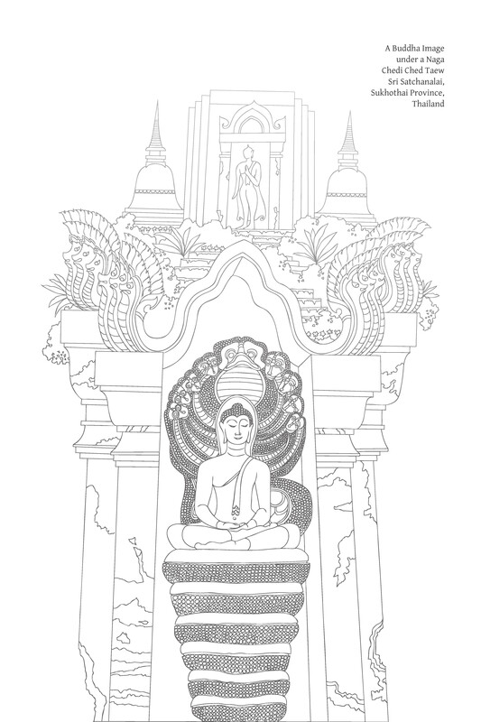
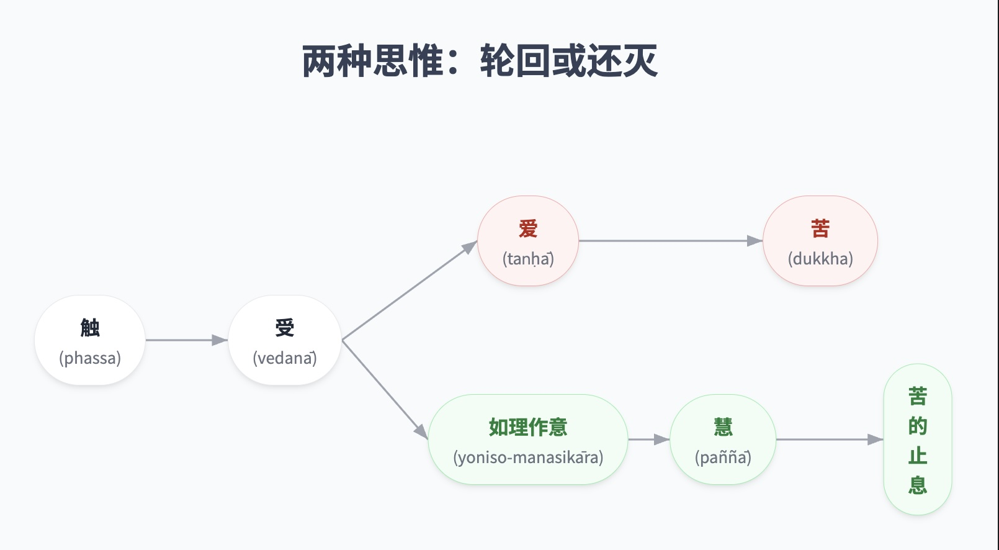

--
--

# 第十五章：如理作意

中道的先导  
修行初期 2：  
如理作意

## 反思在健全生活方式中的作用

人们若要找到真正的快乐，就必须正确地生活，并适当地处理事物，包括他们自己的个人生活、社会、科技以及自然环境。那些生活正确的人会体验到一种内在与他人快乐相符的个人快乐。

“正确地生活”或“适当地处理所有事物”这种表达，是对精神修行的一种概括性或不详细的指称。为了更清晰地描述，必须将正确的修行分解和区分成各种细微的活动，并审视一个人生活的许多方面。因此，描述精神修行的不同部分是有益的，这些部分共同构成了正确生活方式的整体。由此，人们可以界定正确生活的精微之处，揭示适当修行的不同方面。

从一个角度看，生活就是为了生存而奋斗，努力摆脱压迫和阻碍的力量，并发现幸福。简而言之，生活的这一方面是解决问题或终止痛苦。那些能够正确解决和摆脱问题的人，在生活中获得了真正的成功，并生活在没有痛苦之中。因此，正确而成功地生活可以定义为解决问题的能力。

从另一个角度看，生活是从事各种活动，表现为不同形式的身语行为。当这种活动没有向外表达时，它就以心理行为的形式在内部显现。这指的是身、语、意业，在技术上被称为思所作身业 (kāya-kamma)、语业 (vacī-kamma) 和意业 (mano-kamma)。总的来说，它们被称为通过三“门” (dvāra) 的业。

从这个角度看，生活包括从事这三种行为。那些正确执行这三种行为的人，他们的生活过得很好。因此，正确而成功地生活可以定义为知道如何行动、说话和思考——善于执行身体行动（包括一个人的工作和职业）、说话（或一般的沟通）和思考。

从另一个角度看，对人类生活的分析揭示，它由各种形式的认知组成，即体验意识对象或感官刺激，这些统称为“感官对象” (ārammaṇa)。这些感官印象通过或显现于六个感官基础 (āyatana)：眼、耳、鼻、舌、身和意。接收这些感官印象包括看、听、闻、尝、接触触觉印象和认知意所缘：即看、听、闻、尝、感受身体感受和思考。

人们对这些感官刺激的认知所产生的反应和态度，对其生活、行为和命运有着至关重要的影响。如果他们仅仅以喜悦和厌恶、喜欢和不喜欢来回应感官印象，那么痛苦的链条就会被启动。然而，如果他们以记录信息的方式回应，并根据真相看待事物——根据因果关系看待事物——他们将走向智慧，并走向真正解决问题的方向。

一个与对感官印象的反应和态度同样重要的因素是选择感官对象的能力。例如，一个人可能会倾向并选择听和看那些满足欲望的事物，或者一个人可能会选择听和观察那些支持智慧并提升心智品质的事物。

从这个角度看，正确而成功地生活可以定义为知道如何接收和选择感官印象——善于看、听、闻、尝、接触触觉对象和思考。

还有一个观点需要考虑。描述人类生活的一种方式是突出与现象的互动和关系，以便从中获取利益。

对于大多数人来说，感官享受的消费或体验扮演着非常重要的角色。当与周围的人或事物互动时，无论是社会还是自然环境，大多数人都会寻求从中获得某种利益或优势，以满足他们的愿望或欲望。换句话说，当他们想满足欲望时，他们就会出去与这些人或事物互动。

前面提到的因素——将生活视为一个认知过程——包含两个方面：纯粹的认知，比如看和听；以及互动，比如注视和倾听。接收和选择感官印象的技能（例如看或听的技能）与这种互动因素有关。

正确地与事物互动或消费是决定和塑造一个人生活和幸福程度的关键因素。因此，正确而成功地生活可以定义为善于与事物互动和处理关系。在社会背景下，这指的是知道如何与他人建立关系。在物质事物和自然环境的背景下，这指的是知道如何正确使用和消费事物。

总而言之，一种正确而成功的生活方式包含几种次要的行为形式，并由各个方面组成，特别是：

*   从摆脱问题的角度来看，一个人善于解决问题。
    
*   从执行行动的角度来看，一个人善于思考、说话（或沟通）和执行身体行为。
    
*   从接收感官印象的角度来看，一个人善于看、听、闻、尝、接触触觉印象和思考。
    
*   从互动或消费的角度来看，一个人善于使用和消费事物，以及与他人建立关系。
    

正确地实践生活的这些方面被称为“正确地生活”、“懂得如何生活”或“善于处理生活”。根据佛法，以这种方式生活被认为是一种贤善的生活。

这些生活的各个方面，或者说精神修行的各个方面，可以用“知道如何思考”或“善于反思”这句话来概括。它们都涉及到思维过程，这是正确生活的一个重要因素。思维在许多层面都扮演着重要角色，包括：

*   在认知方面，思维是各种信息和数据汇集和集合的交汇点。它是数据被分析、塑造和应用的地方。
    
*   在意志行为方面，思维是起点，它引向外在的语言和身体表达——言语和身体行动。此外，它是指挥中心，根据一个人的思想决定或控制言语和身体行为。
    
*   在这两种行为的关系中，思维是中心点——它是认知和意志行为之间的纽带。当一个人通过感官基础体验事物，然后收集、处理和分析这些感官数据时，思维决定了随之而来的言语和身体行动的外在表达。
    

总而言之，正确的思维或反思的技能是全面正确生活的管理核心。它是所有其他正行方面的领导者、引导者和指导者。当一个人能够正确思维时，他也能够正确言语、正确行动、正确解决问题。他善于看、听、吃、使用物质事物、消费物品和与人交往——他善于生活。思维和反思的技能导向贤善的生活。

决定一个人在意志行为方面技能的决定性因素是精神平衡。一般来说，在这种语境下，“技能”和“平衡”具有相同的含义。娴熟地行动是正确、平稳地行动，从而根据一个人的意图和目标产生预期的结果。一个人以准确、连贯、直接和一致的方式行动，使他能够以最佳方式达到目标，而不会造成任何形式的伤害或过失。

在达成目标的背景下，佛教教义非常强调“无过失、无苦恼和适宜性”的特质，这些含义都包含在“精神平衡”一词中。因此，“处事技能”一词可以定义为“过平衡的生活”：以节制和适宜的方式生活，以便以真正无可指责和快乐的方式实现人生的目标。

平衡生活的专业术语，用于适当的修行或贤善的生活，是“中道” (majjhimā-paṭipadā)，它指的是“道” (magga)：即八圣道。中道是贤善的、崇高的生活，没有伤害和痛苦，导向彻底的安全和完全的幸福。

佛法教导，为了正确生活或过贤善的生活，一个人必须经历一个精神训练和学习的过程。可以说，道是精神训练的结果。正如善巧的反思是贤善生活或道的指导原则一样，培养思维方面的技能也是正规精神训练 (sikkhā) 的主导因素。

在精神训练的过程中，培养反思的技能导向正确的理解、正确的观念，甚至正确的信念，这些统称为“正见” (sammā-diṭṭhi)，它是整个贤善生活的支柱。正见的培养是智慧发展的核心，而智慧发展又是精神训练的核心。

反思的技能涉及多种思维和分析方法。培养这种反思技能是一种独特的精神训练和修养形式。

## 反思在精神训练和智慧发展中的作用

在讨论各种思维方法之前，让我们回顾反思在精神训练中的作用，尤其是在智慧发展方面，这是这种训练的核心。

### 训练的开始

精神训练的精髓是自我发展，以智慧发展为核心。这种训练的关键要素是正确的理解、见解、思维方式、态度和价值观，这些都有益于一个人的生活和社会，并符合真相。简而言之，这指的是“正见” (sammā-diṭṭhi)。

当一个人正确地理解事物时，他的思想、言语和身体行为——也就是说，他所有的行为——都将是正确的、贤善的、有益的，从而导向痛苦的终结。

反之，如果一个人有不正确的理解、价值观、态度和思维方式——统称为“邪见” (micchā-diṭṭhi)——那么他所有的行为，包括他的思想、言语和身体行为，也将是不正确的。他不仅不会解决问题和结束痛苦，反而会制造更多的痛苦，积累问题，并增加麻烦。

正见可以分为两个层面：

*   首先，那些与意识到自己的行为及其影响，或培养个人责任感相关的见解、思想、观点、信念、偏好和价值观。一个人根据佛法的教导正确地看待事物。这种见解的精确术语是“业的拥有者之智” (kammassakatā-ñāṇa)。它是世间正见 (lokiya-sammādiṭṭhi)，属于道德行为的层面。
    
*   其次，那些有助于辨别一切有为法如何依因果法则存在的见解和思维方式。它是对事物如实存在的理解。一个人不受偏好和厌恶的偏见，也不受自己希望事物如何或不希望事物如何的影响。它是一种与自然真理和谐一致的知识，在技术上被称为“与真理一致之智” (saccānulomika-ñāṇa)。它是与出世间理解一致的正见，属于究竟真理的层面。
    

同样地，邪见 (micchā-diṭṭhi) 也有两种：那些否定个人责任感的见解、观念和价值观——拒绝承认自己的责任；以及对世界真相的无知——根据个人希望世界如何而形成错觉的形象。

无论如何，个人的内在精神训练始于并持续于与外部环境的互动；它依赖于作为动机来源或条件因素的外部影响。如果一个人从正确的来源接受教导、建议和传承，或者如果他能够正确选择、辨别、思考和接触事物，正见 (sammā-diṭṭhi) 就会产生，真正的训练就会随之而来。

反之，如果一个人接受了不正确的教导、建议和传承，或者如果他无法反思、思量和洞察自己的经验，邪见 (micchā-diṭṭhi) 就会产生，他就会训练不正确或根本不训练。

回顾一下，精神训练有两个基本来源，被称为“正见的前提条件”：

1.  他人的教诲 (paratoghosa) 这一外在因素：他人的言语或言论。这指的是社会影响和传承，例如来自父母、老师、朋友、同事、书籍、媒体和文化。这些外部影响提供正确的信息和教导，鼓励人们走向贤善的方向。
    
2.  如理作意 (yoniso-manasikāra) 这一内在因素：善于反思；运用正确的思维和推理方法。
    

同样地，错误训练或缺乏精神训练也有两个来源，它们是邪见的前提条件：他人不正确、不善的教导和缺乏如理作意——无法明智地反思。

### 训练过程

如上所述，精神训练的精髓是正见。当正见牢固确立时，精神训练就能有效地进行。

这个过程分为三个主要阶段，统称为“三学”或“三重训练”：

1.  增上戒学 (adhisīla-sikkhā)：在行为、道德规范以及身、语和生计方面的正直上进行训练。它可以简单地称为“戒” (sīla)。
    
2.  增上心学 (adhicitta-sikkhā)：心灵的训练，精神品质的培养，以及心力、心理能力和心理健康的开发。它可以简单地称为“定”或“心一境性” (samādhi)。
    
3.  增上慧学 (adhipaññā-sikkhā)：智慧的开发，从而生起对事物真相的认识，辨别事物的因果性质，使人能够根据因果解决问题；对现象的彻底理解，直至能够将心从所有执着和攀附中解脱出来，消除烦恼，并终结痛苦——以一颗自由、纯净、喜悦和明亮的心生活。它可以简单地称为“慧” (paññā)。
    

这三学的制定与被称为“圣道” (ariya-magga) 的教法直接相关：“至上之道”、“属于圣者的解决问题之圣法”、或“导向苦之止息和觉醒状态的道路”。

圣道包含八个基本要素或八个修行方面：

1.  正见 (sammā-diṭṭhi)：正确的观点、思想、见解、信念、态度和价值观；根据因缘看待事物；根据真理或实相看待事物。
    
2.  正思惟 (sammā-saṅkappa)：不伤害自己或他人，不受烦恼污染，并有助于幸福安乐的思虑、考量和动机，例如：出离的思惟、善愿、慈爱和布施；纯净、真实和正当的思惟；没有自私、贪婪、愤怒、仇恨和恶意之思惟。
    
3.  正语 (sammā-vācā)：诚实正直的言语；不辱骂、不欺骗、不挑拨离间、不诽谤、不粗俗、不琐碎、不无意义的言语；礼貌温和、促进友谊与和谐的言语；理性、有益的言语。
    
4.  正业 (sammā-kammanta)：正当、有益的行为；不压迫、不伤害的行为；建立良好关系、促进合作、导向和平社会的行为。具体而言，这指的是不涉及或不促成杀生或身体伤害，不侵犯他人财物，或不侵犯他人配偶或珍视物品和人员权利的行为。
    
5.  正命 (sammā-ājīva)：以正当方式谋生，不给他人带来麻烦或伤害。
    
6.  正精进 (sammā-vāyāma)：正当的精进，即：努力防止和避免未生起的恶不善法；努力舍弃和消除已生起的恶不善法；努力建立和培养未生起的善法；以及努力修习、增长和圆满已生起的善法。
    
7.  正念 (sammā-sati)：警觉和专注；将注意力持续在当下所需的任何任务上；对自己的活动保持谨慎；忆念与特定活动相关的贤善、支持性或必需的因素；不心不在焉、粗心大意或疏忽。最值得注意的是，这指的是全心全意地关注自己的身体活动、感受、心境和思想。不让诱人或恼人的感官印象误导或引起混乱。
    
8.  正定 (sammā-samādhi)：注意力牢固确立；心专注于某项活动或某个注意力对象 (ārammaṇa)；心一境性、平静、放松、纯净、明亮而有力；它柔软且专注，随时准备有效运用智慧；它不散乱、不烦恼、不困惑、不紧张、不僵硬、不沮丧。
    

三学旨在根据八圣道固有的修行原则结出果实。这种训练产生并发展八个道支。佛法修行者充分利用这些道支，逐步解决问题，直至完全终结痛苦。三学与八圣道的关系如下：

1.  增上戒学：训练方面产生正语、正业和正命。这三个道支被培养到一个人在道德行为、戒律和善巧社交互动方面达到圣者的标准。这是发展心力的基础。
    
2.  增上心学：训练方面产生正精进、正念和正定。这三个道支被培养到一个人在精神品质、心力、心理能力和心理健康方面达到圣者的标准。这是发展智慧的基础。
    
3.  增上慧学：训练方面产生正见和正思惟。这两个道支被培养到一个人在智慧方面达到圣者的标准。他的心明亮、喜悦，解脱了所有形式的执着和痛苦；他通过智慧达到了真正的解脱。
    

如上所述，正见——精神训练的支柱——依赖于两个因素（正见的前提条件）而生起，它们是修行的源泉、起源和起点。因此，在与精神训练相关的活动中，应特别强调这两个因素。事实上，“提供训练”这一表达正是与这两个因素相关。至于训练的三个阶段——戒、定、慧——它们仅用作参考点，以创造一个支持性环境，并确保修行的方向符合正确的原则。

基于这种理解，我们可以勾勒出精神训练，如图“精神训练概览”所示。

精神训练概览 

### 精神训练的基本要素

从上一节我们看到，思维或反思是精神训练的两个初始因素或来源之一。然而，为了清楚地理解思维的关键作用，应将其与第二个因素——他人的教导——结合起来解释：

> 比丘们，有两种条件可以导致正见的生起：他人的言语和如理作意。[\[1\]](#fn-fn1) A. I. 88。关于外部因素，我不知道有任何其他单一因素能像拥有善友那样带来巨大益处。关于内部因素，我不知道有任何其他单一因素能像如理作意那样带来巨大益处。 A. I. 17。

这两种正见的前提条件也可以称为精神训练的先驱。它们是正见的源泉，而正见是整个精神修行的起点和关键原则。让我们更深入地回顾这些因素：

1.  他人的言语 (paratoghosa)：外部动机和影响；来自外部来源的教导、建议、指导、传承、教育、宣告、信息和新闻。这也包括模仿或效仿他人的行为和思想。它是一个外部或社会因素。
    
    这类学习来源的例子包括：父母、老师、导师、朋友、同伴、同事、上司和员工；著名和受尊敬的人；书籍、其他形式的媒体以及宗教和文化机构。在这种语境下，它特指那些引导一个人走向正确、贤善方向并提供正确知识的外部影响，尤其是那些使一个人能够达到第二个因素——如理作意——的影响。
    
    一个具有适宜属性和品质，能够很好地履行教导职责的人，被称为善友 (kalyāṇamitta)。一般来说，善友若要有效地发挥作用并成功地教导他人，他或她必须能够给学生或修行者灌输信心，因此这里的学习方法被称为“信道”。
    
    如果提供指导的人，例如父母或老师，无法在学生（或孩子，视情况而定）心中建立信任感，而学生随后对其他信息和思维来源，比如通过媒体传播的电影明星的言语，产生了更大的兴趣和信任，并且如果这些替代信息是糟糕或错误的，那么学习或训练过程就会陷入危险。最终结果可能是一种错误的学习形式或缺乏真正的学习。
    
2.  如理作意 (yoniso-manasikāra)；善巧的思维模式；系统化的思维；能够如实地思惟和辨别事物，例如认识到特定现象“如是存在”。一个人探寻因缘，探究事物的源头，追溯事件的完整序列，并分析事物以如实看待事物并符合因果法则。一个人不因个人贪爱和执着而执着或扭曲事物。如理作意导向幸福和解决问题的能力。这是一个内在的、精神的因素，可以被称为“慧道”。
    

在这两个因素中，如理作意是必不可少的。精神训练真正结出果实并达到目标，正是如理作意所致。事实上，如理作意可能在没有外部影响协助的情况下启动精神训练。如果一个人依赖外部教导的第一个因素，它必须导向如理作意，才能使他的训练达到圆满。直觉、洞察力以及对真理的发现和实现是通过如理作意来完成的。

话虽如此，我们不应低估第一个因素——他人的教导——的力量，因为只有极少数人不需要依赖这个因素——那些只通过运用如理作意就能进步的人。这些人，就像佛陀一样，是例外的。世界上几乎所有人都依赖他人的教导来指引方向。

所有过去和现在形式化的、系统的教育，以及所有艺术和科学领域的学业，都属于“他人言教”（paratoghosa）这一因素。因此，善知识对知识的良好传授值得我们给予最大的关注和重视。

这里需要重申的一点是，在提供教育或善巧指导时，善知识需要不断牢记，这种指导必须成为学生心中生起如理作意的催化剂。

### 有助于心灵修习的思惟

思惟与认知相连并随之发生。认知过程始于感官处（āyatana）与感官所缘（ārammaṇa）相遇之时。此时意识（viññāṇa）生起——对感官所缘的觉知——例如看见形色、听见声音，或了知一个心所缘。当这个过程完成时，它被称为“认知”，或者更字面地，根据巴利语，称为“触”（phassa）。

伴随认知，某种感受（vedanā）生起，例如快乐和舒适、痛苦和不适，或一种中性感受。[\[2\]](#fn-fn2)与此同时，想（saññā）也生起——对感官所缘的命名、指称或识别。由此，思惟（vitakka）随之发生——即思虑、反省和审思。

这个认知过程是相同的，无论一个人是在外部遭遇和体验事物，还是在心中思虑和沉思事物。

以“看”这个行为为例，这个过程可以说明如下（与第二章《六处》中图《认知过程（简化形式）》早前所述相似）。

> 眼处（āyatana）+  
> 形色所缘（ārammaṇa）+  
> 眼识（cakkhu-viññāṇa）=  
> 触（phassa）→  
> 受（vedanā）→  
> 想（saññā）→  
> 寻（vitakka）

思惟在决定一个人的性格和生活方式，以及塑造整个社会方面起着非常重要的作用。因此，思惟是心灵修习中不可或缺的因素。然而，思惟本身也受到各种因素和条件的决定。

一个对思惟施加强大影响的因素是感受（vedanā），特别是快乐和痛苦的感受。

通常，当人们接触感官印象并体验感受时，除非有其他因素介入以纠正或阻止这个过程，否则这些感受会决定一个人的思惟方式：

*   如果感受是愉悦或舒适的，一个人就会沉溺其中；他希望获得或享用那个所缘（这是肯定意义上的爱——taṇhā）。
    
*   如果感受是痛苦或压迫的，一个人就会厌恶它们；他希望逃离或消除那个所缘（这是否定意义上的爱）。
    

此时，一个人会对作为那种感受来源的感官所缘产生复杂的思虑和想法。那个所缘成为一个人思惟的焦点，伴随着saññā——对这个所缘的记忆和识别。这些思虑的扩散遵循着一个人的好恶。思惟的决定性因素是一个人累积的习性、偏见、习惯、性情和烦恼（统称为行——saṅkhāra）。他或她在这些行（saṅkhāra）的限制和范围内以及沿着它们的路线进行思惟。言语和身体行为可能会随之而来。

即使这些思虑没有表达为外在行动，它们仍然对一个人的心产生影响。它们限制和束缚心，并产生各种形式的心灵困扰、不安、烦恼、沮丧和困惑。与特定主题相关的思虑可能会产生心理偏见和扭曲，导致无法如实地看待事物，而有些思虑可能被贪欲或瞋恚所污染。

如果一个人经历中性感受——既不快乐也不痛苦——如果他不善于反省并任由自己受其影响，那么他的思惟将是漫无目的、语无伦次或完全窒息的。这是一种不利且不善的情况，会导致问题和更大的痛苦。

这个过程的主要因素可以这样说明：

> 触（phassa）→  
> 受（vedanā）→  
> 爱（肯定和否定两种）（taṇhā）→  
> 苦（dukkha）

对于大多数人来说，这种问题堆积的过程几乎持续不断地发生。在一天之内，它可能会重复发生无数次。缺乏心灵修习的人的生活往往被这种思惟方式所主导和决定。它不需要智慧、理解或特殊能力。这是人类最基本的运作方式。一个人越是积累了这种思惟的习惯，这个过程就越容易自动展开，仿佛陷入了一个预设的泥沼。

由于这个过程在没有正念和智慧的引导下运作，它会产生无明（avijjā）。它不仅无助于解决问题，反而制造更多问题并增加痛苦。它与心灵修习背道而驰。从技术上讲，它因此被称为“导向苦的条件模式”。

这种思惟方式的基本属性是它服务于满足爱欲。总而言之，它可以被称为“迎合爱欲的思惟过程”、“制造问题的思惟”，或者简单地称为“苦的循环”。

心灵修习的开始始于正念和智慧的应用。此时，一个人不再允许上述思惟过程或条件模式不受阻碍地、不加控制地运作。一个人运用正念、智慧和其他心灵因素来中断或减少这种思惟方式的流动，从而切断循环或转变并改变思惟的进程。一个人开始获得解脱——不再受这种思惟过程的奴役。

起初，思惟进程的改变可能源于外部来源（例如他人或社会机构）传递的观点或传统思惟方式，一个人因信仰而遵循这些观点或方式。一般来说，这种外部指导最多只能阻止或约束一个人盲目地遵循迎合爱欲的思惟路线，或者它可能会提供一个替代的固定思惟模式。但它不一定会导致一种进步的、独立的思惟方式。然而，如果这种指导是出色的，它就能产生一种促使人们独立思考的信仰。

一个导致严格规定、顽固不化的信仰形式的指导例子，而不是进一步沉思的载体，是让其他人相信世界上的一切都由某个神圣存在主宰和控制，或者随机或偶然发生。如果一个人相信这种教义，他所要做的就是等待神的旨意或将一切听天由命。他不需要调查或反省事物。

相反，一个能产生促使沉思的信仰的指导例子是让其他人相信万事万物皆依因缘而生。如果一个人相信这一点，那么无论发生什么，他都会调查并深入探究其潜在的因缘，他将增长知识和理解。

由对外部指导的信仰所引发的善思惟和沉思始于如理作意（yoniso-manasikāra）。换句话说，善巧的指导能产生引向如理作意的信仰。

随着如理作意的生起，心灵修习便已开始。从这一点开始，一个人应用并发展智慧，这有助于解决问题，也是止息痛苦的道路。简而言之，支持和促进智慧的思惟就是心灵修习。

如理作意通过阻止感受（vedanā）产生爱欲（taṇhā）而扮演着特别重要的角色。当一个人运用如理作意时，他会体验感受，但这种感受不会导致爱欲。当没有爱欲时，他就不会创造受爱欲力量支配的奇思妙想（“心意增生”）。

当一个人切断迎合爱欲的思惟过程时，善巧、系统的反省就会导向智慧发展和止息痛苦的道路。这两种思惟方式可以如图《两种思惟》所示。

两种思惟 

无论如何，对于普通人来说，即使他们已经开始心灵修习，这两种思惟方式也会交替出现，一种思惟方式可能会干扰另一种。例如，第一个过程可能会一直发展到产生爱欲，但此时如理作意介入，切断了该过程并将其引向新的方向。或者，后一个过程可能达到智慧的阶段，但伪装的爱欲却劫持了该过程。因此，智慧的成果可能会被腐蚀，以服务于爱欲的利益。

当那些完成心灵修习的人进行思惟时，他们会运用分析作意（yoniso-manasikāra）。当他们不思惟时，他们会正念安住于当下，也就是说，他们专注于自己正在从事的活动。

说一个人在思惟时运用分析作意也意味着他运用正念（sati），因为如理作意是正念的滋养源。当思惟以系统、有目的的方式进行时，注意力不会漫无目的或漂移。正念随后发挥作用，使注意力集中在手头的任务上。

因此，分析作意是心灵修习中的一个关键因素，与智慧发展的基本阶段相连。它是过清净生活所必需的，有助于解决问题，并充当人们的避难所。

在智慧发展的渐进过程中，如理作意是超越信仰的一个阶段，因为在这个阶段，一个人开始独立于他人进行思惟。

在心灵修习的体系中，如理作意是一个内部因素，与思惟的发展和应用相关联。它可以定义为一种正确的思惟方法，有条理的思惟，或分析性思惟，它具有以下特点：它防止人肤浅地看待事物；它导致自力更生；它导向解脱，免于痛苦，真正的平静，以及纯粹的智慧，这些都是佛教的最高目标。

以上材料概述了心灵修习的两个初始因素：他人言教（paratoghosa），也可以描述为拥有善知识（kalyāṇamitta），这是一个外部因素，涉及信仰；以及如理作意（yoniso-manasikāra），这是一个内部因素，涉及智慧。

从本章开始，焦点将仅限于如理作意，以阐明佛法独特的思惟方法。

## 如理作意的重要性

> 比丘们，正如黎明是日出的先兆和前驱，同样，如理作意（yoniso-manasikāra）的圆满，是比丘八圣道分生起的先兆和前驱。期望一个已圆满如理作意的比丘，他会发展和培育八圣道分。S. V. 31. 比丘们，正如黎明的银光和金光是日出的前驱，同样，对比丘而言，如理作意是七觉支生起的先兆和前驱。当一个比丘在如理作意上有所成就时，期望他会发展和培育七觉支。S. V. 79. 比丘们，正如这个身体由营养维持，依靠营养而生存，没有营养就无法生存；同样，五盖由营养维持，依靠营养而生存，没有营养就无法生存。那么，\[它们的\]营养是什么呢？：……频繁地缺乏如理作意……。比丘们，正如这个身体由营养维持，依靠营养而生存，没有营养就无法生存；同样，七觉支由营养维持，依靠营养而生存，没有营养就无法生存。那么，\[它们的\]营养是什么呢？：……反复运用如理作意。[\[3\]](#fn-fn3) S. V. 64-7.

> 比丘们，通过细心作意（yoniso-manasikāra），通过细心正精进（yoniso-sammappadhāna），我证得了无上解脱，我了悟了无上解脱。你们也通过细心作意，通过细心正精进，将证得无上解脱，将了悟无上解脱。 Vin. I. 23; S. I. 105. 比丘们，我说诸漏的毁灭是为知者、见者，不是为不知者、不见者。知者、见者知见什么？如理作意和不如理作意。[\[4\]](#fn-fn4) 当不如理作意时，未生之漏生起，已生之漏增长。当如理作意时，未生之漏不生起，已生之漏被舍弃。M. I. 7. 比丘们，所有善法，属于善的，与善相关的，它们都根植于如理作意，汇聚于如理作意，如理作意被宣称为其中之首。S. V. 91. 看看，摩诃离，贪……瞋……痴……不如理作意……邪向作意是恶行、恶存在的原因、条件。无贪……无瞋……无痴……如理作意……正向作意是善行、善存在的原因、条件。A. V. 86-7. 我不知道有任何其他事物能如此有效地导致未生起的善法生起，已生起的不善法消退，如同如理作意。在一个如理作意的人心中，未生起的善法将生起，已生起的不善法将消退。A. I. 13.

> 我不知道有任何其他事物能如此导向巨大利益…… A. I. 16. ……能如此有助于正法的稳定、不衰退和不消失，如同如理作意。A. I. 18. 在内部因素方面，我不知道有任何其他事物能如此导向巨大利益，如同如理作意。A. I. 17; cf.: S. V. 101. 对于一个仍在修习中，尚未证得阿罗汉果，并渴望获得无上解脱束缚的比丘，我没有看到任何其他内部因素能像如理作意那样有益。一个运用如理作意的比丘能够消除不善法，并培育善法。It. 9-10. 我没有看到任何其他事物能如此有助于产生未生起的正见或增加已生起的正见，如同如理作意。在一个如理作意的人心中，未生起的正见将生起，已生起的正见将增加。A. I. 31. 我没有看到任何其他事物能如此有助于产生未生起的觉支或使已生起的觉支圆满，如同如理作意。在一个如理作意的人心中，未生起的觉支将生起，已生起的觉支将圆满。 A. I. 14-15. 我不知道有任何其他事物能如此有效地阻止未生起的疑惑生起，并使已生起的疑惑被舍弃，如同如理作意。A. I. 4-5. 对于如理作意不净相的人，未生起的贪欲将不生起，已生起的贪欲将被舍弃……。对于如理作意慈心解脱的人，未生起的瞋恚将不生起，已生起的瞋恚将被舍弃……。对于如理作意\[一切\]法的人，未生起的愚痴将不生起，已生起的愚痴将被舍弃。A. I. 201. 当如理作意时，未生起的欲贪……瞋恚……昏沉与睡眠……掉举与恶作……疑惑不生起，已生起的欲贪……疑惑被舍弃。同时，未生起的正念觉支……未生起的舍觉支生起，已生起的正念觉支……舍觉支得以圆满。S. V. 85. 有九种事物极具支持性并根植于如理作意：当一个人拥有如理作意时，喜悦生起；当喜悦时，愉悦生起；当体验愉悦时，身体轻松平静；当身体轻松时，体验快乐；对于快乐的人，心会专注；当心专注时，一个人会如实知见；当如实知见时，一个人会变得厌离；因厌离而变得离贪；因离贪而获得解脱。D. III. 288.

## 如理作意的定义

复合词yoniso-manasikāra由两个词组成：yoniso和manasikāra。

Yoniso源自yoni（“起源”、“出生地”、“子宫”），被译为“因”、“根”、“源”、“智慧”、“方法”、“途径”或“道路”。（参阅注《Yoniso：一种途径和一条道路》）

Manasikāra被译为“心所活动”、“思惟”、“考量”、“反省”、“导向注意力”或“沉思”。（参阅注《Manasikāra的同义词》）

作为一个复合词，yoniso-manasikāra传统上被定义为“善巧地导向注意力”。注释书和复注书对这个定义进行了阐述，并通过呈现各种同义词来解释这个词的细微差别，如下所示：[\[5\]](#fn-fn5)

1.  Upāya-manasikāra：“方法性作意”；通过运用适当的手段或方法进行思惟或反省；系统性思惟。这指的是一种有条理的思惟，使人能够了悟并与真理和谐共存，并洞察所有现象的本质和特征。
    
2.  Patha-manasikāra：“适宜作意”；遵循明确的路线或以适当的方式进行思惟；按顺序和次序进行思惟；系统地进行思惟。这指的是以组织良好的方式进行思惟，例如按照因果关系；不以混乱、无序的方式思惟；不要一时专注于一件事，然后下一刻又跳到别的事情，无法保持精确、清晰的思惟顺序。这个因素还包括引导思惟走向正确方向的能力。
    
3.  Kāraṇa-manasikāra：“理性思惟”；分析性思惟；探究性思惟；理性思惟。这指的是对因缘关系和顺序的探究；沉思和探寻事物的原始原因，以期找到它们的根源或出处，从而导致一系列渐进的事件。
    
4.  Uppādaka-manasikāra：“有效思惟”；以有目的的方式运用思惟，以期产生预期的结果。这指的是产生善法的思惟和反省，例如：激发精进的思虑；一种能够消除恐惧和愤怒的思惟能力；以及支持正念或加强和稳定心的沉思。
    

Yoniso：一种途径和一条道路

> Yoniso在注释书中通常仅被定义为upāya（“手段”，“方法”）：MA. V. 81; SA. I. 88; AA. I. 51; AA. II. 38; AA. IV. 1; KhA. 229; NdA. II. 343; DhsA. 402; VismṬ.: Sīlaniddesavaṇṇanā, Paccayasannissitasīlavaṇṇanā; VismṬ.: Anussatikammaṭṭhānaniddesavaṇṇanā, Maraṇassatikathāvaṇṇanā。它在以下文献中被定义为upāya和patha（“道路”）：\[AA. 2/157\]; AA. III. 394; ItA. I. 62; NdA. II. 463; Vism. 30. 它在以下文献中被定义为upāya, patha和kāraṇa（“手段”，“作为”）：DA. II. 643. 它在SA. II. 268, 321; \[SA. 3/390\]中被定义为kāraṇa。它在《义释》（Nettipakaraṇa）中被定义为paññā（智慧）（参阅《义释》；另参阅后期文本《词典》（Abhidhānappadīpikā）：第153颂）。

Manasikāra的同义词

> manasikāra值得注意的同义词包括：āvajjanā：专注，心向；ābhoga：思虑，想法；samannāhāra：考量，反省；以及paccavekkhaṇa：考量，反省，审视。参阅：DA. II. 643; MA. I. 64; ItA. I. 62; Vism. 274. 还有许多其他同义词，包括：upparikkhā：审查，调查（S. III. 42, 140-41）；paṭisaṅkhā：反省，考量（A. II. 39-40）；paṭisañcikkhaṇā：仔细思考，反省（A. V. 184）；此词与yoniso-manasikāra在S. II. 70和S. V. 389中等同；parivīmaṁsā：彻底考量，审查（S. II. 81）。sammā-manasikāra（D. I. 12-13; D. III. 30; DA. I. 104; DA. III. 888; MA. I. 197）的含义与yoniso-manasikāra非常接近，但它很少使用，其含义不被认为是严格定义的。

这四个定义描述了被称为“如理作意”（yoniso-manasikāra）的思惟的各种属性。在任何时候，如理作意可能包含所有或部分这些属性。这四个定义可以简要概括为“方法性思惟”、“系统性思惟”、“分析性思惟”或“引发善法的思惟”。然而，要为yoniso-manasikāra找到一个单一的定义或翻译是具有挑战性的。大多数翻译只能捕捉这个词有限的细微差别，并且不全面。另一种选择是给出冗长的定义，如上文所述。

尽管翻译这个词存在困难，但这种思惟方式有一些突出的属性可以用来代表所有其他属性，并且可以简要翻译，例如：“方法性思惟”、“善巧思惟”、“分析性思惟”和“探究性思惟”。一旦对这个巴利语术语有了透彻的理解，依赖“如理作意”、“系统性反省”或“细心作意”等简洁的翻译会很方便。（参阅注《Yoniso Manasikāra的翻译》）

Yoniso Manasikāra的翻译

> yoniso-manasikāra有许多英文翻译，其中一些是直译，例如：proper mind-work（适当的心工作）、proper attention（适当的注意力）、systematic attention（系统的注意力）、reasoned attention（推理的注意力）、attentive consideration（专注的考量）、reasoned consideration（推理的考量）、considered attention（经过考量的注意力）、careful consideration（细心的考量）、careful attention（细心的注意力）、ordered thinking（有序的思惟）、orderly reasoning（有序的推理）、genetical reflection（起源性反省）、critical reflection（批判性反省）、analytical reflection（分析性反省）等。\[译者注：在此文中，当遇到“如理作意”和“系统性反省”时，请知我指的是yoniso-manasikāra。\]

早前我提到了如理作意这一内部因素与他人指导或善知识这一外部因素之间的关系。此处，让我们更仔细地关注善知识如何通过依靠信仰的原则，帮助那些不善于独立思考和运用如理作意的人。

关于如理作意的上述前三个属性，善知识只能指出或阐明特定的真理，但修行者必须自己沉思并获得理解。当达到真正理解的阶段时，信仰是不够的。[\[6\]](#fn-fn6)因此，关于这三个属性，信仰是极其有限的。

然而，关于第四个属性（产生善法的反省），信仰扮演着强大的角色。例如，有些人软弱易于气馁，或者以非理性和有害的方式思考。如果善知识能够这些人心中建立信仰，这将对他们非常有帮助。他或她可以通过善巧方便来激励和鼓励他们。话虽如此，有些人天生就具有如理作意，能够独立思考。在令人沮丧或困境的情况下，他们能够有效地激励自己，并思考解决问题的方法。

相反，如果一个人结交恶友或运用不如理作意，即使身处良好环境并遇到好事，也可能以不良方式思惟或行动。例如，当发现一个宜人、僻静的地方时，一个坏人可能会认为这是实施犯罪的合适场所。同样，有些人极度多疑——当他们看到别人微笑时，他们认为自己正在被嘲笑或侮辱。

如果一个人任由这种思惟过程不受阻碍地进行，不如理作意将滋养并加强这些不善的心态。例如，一个习惯以消极眼光看待事物的人将开始将他人视为敌人。同样，一个习惯性恐惧并认为他人对自己心怀恶意的人可能会发展出偏执的精神障碍。[\[7\]](#fn-fn7)

取决于如理作意还是不如理作意，同一件事对不同的人可能导致截然不同的行为。例如，一个人可能会以不如理作意的方式思惟死亡，从而经历恐惧、沮丧、冷漠或困惑。另一个人可能会以如理作意的方式思惟死亡，从而认识到需要戒除不善行。他或她将保持平静、警觉和热忱，迅速行善。[\[8\]](#fn-fn8)

就对实相的洞察而言，如理作意本身并非智慧，而是智慧生起的条件，即如理作意能产生正见。《弥兰陀王问经》如此描述作意与智慧的区别：[\[9\]](#fn-fn9)

*   首先，山羊、绵羊、牛、水牛、骆驼和驴等动物具有某种形式的作意（manasikāra——“心所运用”），但它们不具有智慧（它们的作意也不是“分析性”的——yoniso）。
    
*   其次，manasikāra具有思惟和反省的特质，而智慧（paññā）具有断除的特质。manasikāra将想法汇集并提交给智慧，智慧随后能够消除烦恼，就像一个人用左手抓住稻穗，右手用镰刀成功收割一样。
    

根据这种解释，yoniso-manasikāra是一种心所运作（manasikāra），导向智慧的应用和发展。[\[10\]](#fn-fn10) 

《满足希求论》（Papañcasūdanī）指出，不如理作意（ayoniso-manasikāra）是轮回（vaṭṭa）的根本来源，导致众生积累问题并沉溺于痛苦之中。这部文本还解释说，当不如理作意被允许滋长时，它会增加无明（avijjā）和有爱（bhava-taṇhā）。随着无明的生起，缘起之轮开始运转，始于无明作为行（saṅkhāra）的条件，并以整个苦聚的生起而完成。缘起之轮的开始也可以通过爱（taṇhā）的生起来指定，始于爱作为取的条件，同样以苦聚而完成。

反之，如理作意是“出离”（vivaṭṭa）循环的根本原因，使人能够摆脱痛苦的漩涡并真正解决问题。随着如理作意的生起，一个人开始按照八圣道分进行修习，以正见为引导因素。这里的正见等同于真知（vijjā）。随着真知的生起，无明止息。随着无明的止息，缘起的止息循环（nirodha-vāra）开始运作，逐渐导致痛苦的止息。[\[11\]](#fn-fn11)这些过程可以这样说明：

轮回（vaṭṭa）：

不如理作意（ayoniso-manasikāra）：

> 无明（avijjā）→  
> 行（saṅkhāra）……  
> 老、死、愁、悲 =  
> 苦的生起。爱（taṇhā）→  
> 取（upādāna）……  
> 老、死、愁、悲 =  
> 苦的生起。

“出离”循环（vivaṭṭa）：

> 如理作意（yoniso-manasikāra）→  
> 道之修习（magga-bhāvanā）：  
> 正见（sammā-diṭṭhi）=  
> 真知（vijjā）→  
> 无明之止息 →  
> 行之止息……  
> 苦之止息。

yoniso-manasikāra一词含义广泛，包括关注道德问题的思惟，以及符合一个人所学习和理解的德行与真理原则的思惟。不需要深奥智慧的初步沉思包括：友善的思虑、慈心的思虑、慷慨助人的思虑，以及培养内在力量、决心和勇气的思虑。然而，有些沉思需要精细入微的智慧，例如对次要因素的分析或对因缘的探究。

由于如理作意的意义如此全面，每个人都能够运用它，尤其是初级的思惟。所有人都需要做的，就是将他们的思惟导向善的方向，与他们所接受的教法和所培养的观念相符。这种基本的如理作意有助于生起世间的正见，并且深受信心（saddhā）的影响，信心是通过他人的言语（paratoghosa）而产生的，包括一个人的教育、文化和善友的存在。信心作为心识的锚和内在的力量。当一个人认知感官对象或遇到特定情况时，他或她的思惟过程就会被信心的力量引导，仿佛信心已经为思惟挖好了一条通道。

因此，佛陀指出（正确的）信心是如理作意的滋养。[\[12\]](#fn-fn12) 来自善友的外部教导，以信心为渠道，能够逐渐增进理解，并向一个人介绍新的观念，例如通过咨询和提问来消除疑虑。

当它被反复运用并由信心滋养时，适当的思惟会发展得更加敏锐，加深智慧。当一个人思惟并看到他所接受的教法确实是正确和有益的，他就会变得更加自信，信心也会增加。这样，如理作意就增强了信心。[\[13\]](#fn-fn13) 它促使人们在学习中付出更大的努力，直到最终他们自己的思惟引导他们走向证悟和解脱。

在此，一个人的精神修习依赖于内在和外在因素的整合。来自外部的善影响隐含在“自洲以自依，无他依处”这句话中。[\[14\]](#fn-fn14) 佛陀并没有排斥外部影响。事实上，外部影响和信心的品质极其重要，但关键的决定因素在于内在，即如理作意。

一个人越能运用如理作意，就越少依赖外部因素。同样地，如果一个人完全不运用如理作意，善友的任何帮助都是徒劳的。

正如大多数佛教学者所知，念住（sati）是一个至关重要的因素，是每项活动所必需的。然而，问题在于如何在适当的时候建立念住，以及一旦建立起来，如何以一种持续不断的方式来维持它，使其不中断、不散失。

在此背景下，有一些教法解释了如理作意如何滋养念住，协助念住的建立和不间断的流动。[\[15\]](#fn-fn15)

如果一个人拥有系统、连贯和有效的思惟，他就能够持续地维持念住。然而，如果一个人无法正确思惟，或者他的思惟是无效或漫无目的的，念住就会不断散失，他将无法维持它。真正强制或约束念住既不正确也不可能。正确的途径是滋养念住并创造其支持条件。如果这些条件存在，念住就会生起——这是自然过程的一部分。因此，一个人需要按照这个过程来行事。

如理作意是切断无明和贪爱（或从肯定的意义上说，它召唤智慧和善法）的功能。

一般来说，当一个人遇到感官对象时，思惟过程会立即开始。此时，两种不同的力量相互竞争：

*   如果无明和贪爱能够掌控思惟，思惟过程将受这些因素支配，并由基于好恶以及预设概念和想法的心行所塑造。
    
*   如果如理作意能够阻挡并切断无明和贪爱，它将引导思惟走向正确的方向，从而产生一个不受这些负面因素影响的思惟过程。被污染的思惟过程被知见（ñāṇa-dassana）或明解脱（vijjā-vimutti）的过程所取代。
    

一般来说，当普通、未觉悟的众生遇到感官对象时，他们的思惟会遵循无明和贪爱的路径。他们用自己的好恶，或者用他们预设的观念来覆盖这种体验。这是与该体验或感官对象相关的思惟开始被无明和贪爱塑造和模塑的点，这个过程的发生是因为一个人累积的习性。

在思惟中受到无明和贪爱的影响，就是按照自己希望事物存在或不存在的方式来看待事物。一个人的思惟受到个人执着和厌恶的束缚。这导致对事物的错误辨识，基于偏好和厌恶的偏见，误解，以及扭曲的观念。此外，它是困惑、倦怠、孤独、沮丧、恐惧、满足和随之而来的失望、压力和挫败感的原因，所有这些都是各种形式的心理烦恼。

如理作意意味着根据真相或因果关系来看待事物，而不是根据无明和贪爱。换句话说，一个人根据事物的自性来看待事物，而不是根据自己的愿望和欲望。

当未觉悟的人体验到某种事物时，他们的思惟会立即与好恶对齐。如理作意的功能是切断这个过程并掌握主动权。然后，它通过根据因缘思惟，将思惟过程导向一个纯净、系统的方向。结果是，一个人理解了真相并产生了善法，或者至少以最适当的方式回应事物。

如理作意使人们能够善用思惟，成为自己思惟的主人，召唤思惟来解决问题并安然生活。这与不如理作意相反，不如理作意让思惟操纵和奴役心识，将人们拖入困境，以各种方式压迫他们，并剥夺他们的独立性。另请注意，在如理作意的过程中，念住和正知是过程中固有的常数因素，因为如理作意不断滋养这些因素。

总而言之，如理作意切断无明和贪爱。这两种负面品质总是成双成对出现，尽管在某些情况下无明突出而贪爱不显，而在其他时候贪爱占主导地位而无明隐藏。[\[16\]](#fn-fn16) 鉴于这个事实，可以根据无明或贪爱的主要作用，为如理作意提出两种定义：如理作意是一种切断无明的思惟形式；或者它是一种切断贪爱的思惟形式。区别如下：

*   当无明占主导时，思惟会以一种困惑和脱节的方式停滞并围绕一个单一的主题打转。一个人不知道该往哪个方向走，或者思惟变得语无伦次、混乱和不合理，例如在一个人陷入恐惧的情况下。
    
*   当贪爱占主导时，思惟倾向于好恶、偏爱和厌恶，或执着和排斥的方向。一个人沉迷于那些他喜欢或不喜欢的事物，他的思惟根据快乐和不快乐而形成。
    

尽管有这种区别，但在深层层面上，无明是贪爱的根源，而贪爱又强化了无明。因此，如果一个人要完全消除所有的烦恼和不善，就必须追溯到根源并消除无明。

## 如理作意的方法

这里所说的如理作意的方法，是指 yoniso-manasikāra 的实际运用。尽管运用如理作意的方法有很多，但从技术上讲，它们分为两大类：

1.  直接旨在切断或消除无明的如理作意。
    
2.  旨在切断或减少贪爱的如理作意。
    

一般来说，第一种方法是法（Dhamma）修习最后阶段所必需的，因为它能产生对真相的理解，这是觉悟的先决条件。后一种方法最常用于修习的初步阶段，目的是为德行打下基础或培养德行，以便为更高级的阶段做准备。这种方法仅限于降伏心理烦恼。然而，许多运用如理作意的方法可以同时用于这两种益处：消除无明和减少贪爱。

巴利圣典中主要的如理作意方法可归类如下：

1.  考察因缘的方法。
    
2.  分析组成要素的方法。
    
3.  依照三法印（sāmañña-lakkhaṇa）思惟的方法。
    
4.  依照四圣谛思惟的方法（用于解决问题的思惟）。
    
5.  思惟事物目标（attha）与原则（dhamma）之间关系的方法。
    
6.  思惟事物的优点和缺点，以及如何从中解脱的方法。
    
7.  思惟事物真实价值和虚假价值的方法。
    
8.  为了唤起善法的思惟方法。
    
9.  通过安住于当下而思惟的方法。
    
10.  与分析性论述（vibhajja-vāda）相应的思惟方法。
    

### 考察因缘

考察因缘的方法是指思惟现象以查明真相，或思惟困境以通过审查各种相互关联的因果因素来找到解决方案。它也可以被描述为符合“特定缘起性”（idappaccayatā）或依照缘起（paṭiccasamuppāda）教法来思惟的方式。这是如理作意的一种基本形式，有时在描述佛陀觉悟时也会提到它。

这种思惟形式不限于从结果开始，然后考察因缘。在符合特定缘起性的思惟方式中，也可以从原因开始，然后追溯其结果，或者选择过程中的任何一点，然后向前追踪到最终结果，或向后追踪到源头。

在巴利圣典中，这种如理作意形式被描述如下：

*   1\. 相互缘起性的思惟：在这里，一位圣弟子如理作意地思惟所有有为法如何相互依存，使其得以存在：

> 比丘们，对于无闻的凡夫而言，将这个由四大元素组成的身体视为“我”会更好；但将心识视为“我”则实在不合适。为什么呢？因为这个由四大元素组成的身体被看到可以存在一年、两年、三年、四年、五年、十年、二十年、三十年、四十年、五十年，一百年，甚至更久。但是，被称为“心”或“意”或“识”的东西，日夜不断地以一种形式生起，以另一种形式灭去。比丘们，关于那个大元素的集合，有闻的圣弟子如此密切而仔细地关注缘起：“当此有故彼有；此生故彼生。当此无故彼无；此灭故彼灭。”依触为乐受的基础，乐受生起。随着作为乐受基础的触的止息，依该触而生起的乐受……止息、消退。依触为苦受的基础，苦受生起。随着作为苦受基础的触的止息，该苦受……止息、消退。依触为不苦不乐受的基础，不苦不乐受生起。随着作为不苦不乐受基础的触的止息，该不苦不乐受……止息、消退。比丘们，正如两根摩擦棒摩擦产生热量并生火，但随着摩擦棒的分离和放置，所产生的热量就会止息、消退；同样地，依触为乐受的基础，乐受生起，而随着作为乐受基础的触的止息，依该触而生起的乐受……止息、消退……[\[17\]](#fn-fn17) S. II. 96-7.

*   2\. 探究性思惟或提出问题；例如佛陀的以下思惟：

> 于是我思惟道：“当什么存在时，执取会生起？执取以什么为条件？”然后，通过仔细的专注，我以智慧得知：“当有贪爱时，执取就会生起；执取以贪爱为条件。”于是我思惟道：“当什么存在时，贪爱会生起？贪爱以什么为条件？”然后，通过仔细的专注，我以智慧得知：“当有感受时，贪爱就会生起；贪爱以感受为条件……”[\[18\]](#fn-fn18) S. II. 10, 104.

关于这种如理作意形式的更多内容，请参见第四章缘起。

### 分析组成要素

分析组成要素，或对特定主题的阐述，是另一种思惟形式，旨在产生对事物真实面貌的理解。

这种思惟形式最常用于认识一切事物的真实无实性或无我性，以便放弃对世俗概念和名相（sammati-paññatti）的执着。具体而言，这是指思惟众生或人仅仅是各种蕴（khandha）的集合，每一蕴都依附于次要的条件因素而存在。这种思惟形式有助于看到事物的“无我”本性（anattā）。

然而，对事物无我本性的清晰辨识，通常需要同时运用前一种思惟（考察性思惟）和/或后一种思惟（符合三法印的思惟；见下文）。通过仔细分析，一个人会看到五蕴如何相互依存并受相关因缘支配；它们并非真正独立。此外，这些蕴和条件因素都依照自然法则运作，也就是说，它们存在于持续的生灭状态中；它们是不稳定、不持久和无常的。

如果一个人无法通过上述的考察性思惟（这可能是一项艰巨的任务）来准确地看到现象的这种生灭——它们的缘起性和它们受各种因素的压迫——他可以思惟这些属性为一切事物的普遍特征，这包含在下面的第三种思惟中。在巴利圣典中，第二种如理作意与第三种一起被提及。

然而，与后来的《阿毗达摩论》典籍相符的注释书，倾向于区分这第二种思惟，并将其归类为一种详细分析模式（vibhajja-vidhi）。[\[19\]](#fn-fn19) 此外，它们倾向于从专注心物（nāma-rūpa）的基本分析开始，而不是立即分析五蕴。

这种思惟不限于分析和区分各种因素，还包括分类和归类。然而，重点放在分析上，因此被称为 vibhajja（“详细分析”）。

在注释书中所描述的传统毗婆舍那（vipassanā）禅修实践中，对心物（mentality and corporeality）的基本分析被称为“名色辨析”（nāmarūpa-vavatthāna）或“名色遍知”（nāmarūpa-pariggaha）。[\[20\]](#fn-fn20) 在这里，一个人不会根据其世俗名称和称谓来看待人，比如“他们”或“我们”，“A先生”或“B女士”。相反，他将他们视为身体和心理现象的组合。一个人以这样的方式确定每个组成因素：“这是色法，这是心法”，“色法具有这些特定的特征，心法具有这些特定的特征”，“这个因素具有这种属性，因此被归类为‘色’，而这个因素具有另一种属性，因此被归类为‘心’。”

对人类的分析只揭示了心物（mind-and-body），或物质和精神现象。经过这样的辨识训练，或在这样的思惟中获得技能后，当遇到众生和其他对象时，一个人会看到它们仅仅是精神和物质元素的集合。它们仅仅是自然现象，没有任何真正的实体或永恒的自我。一个人的思惟过程有助于防止他被误导或过度执着于世俗实相。

巴利圣典中这种思惟的例子如下：

> 正如，当各部分组合时，  
> “马车”这个词被使用，  
> 同样，当诸蕴存在时，  
> 就有了“有情”这个世俗概念。S. I. 135. 朋友们，正如一个空间被木材、绳索、泥土和茅草围起来时，它被称为“房子”，同样，当一个空间被骨骼、肌腱、血肉和皮肤围起来时，它被称为“身体”（rūpa）。M. I. 190. 比丘们，假设恒河正带着一大块泡沫流淌。一个视力良好的人会检查它，审视它，并仔细考察它。[\[21\]](#fn-fn21) 通过检查、审视和仔细考察，它在他看来将是空虚、无实体的。因为泡沫块中能有什么实体呢？同样地，比丘们，无论有什么样的色法，无论是过去、未来还是现在……远或近：一位比丘检查它，审视它，并仔细考察它。通过检查、审视和仔细考察，它在他看来将是空虚、无实体的。因为色法中能有什么实体呢？[\[22\]](#fn-fn22) 色如泡沫块，  
> 受如水泡；  
> 想如海市蜃楼，  
> 行如芭蕉干，  
> 识如幻象，  
> 太阳的亲族如此解释。  
> 无论一个人如何思量，  
> 并仔细考察\[这五蕴\]，  
> 它们都只是空虚无实。 S. III. 140-3.

### 依三法印思惟

依三法印思惟，或对自然真相的思惟辨识，是指对事物真实面貌的清晰理解：即理解事物如何根据其自性而存在，并且必须存在。这种思惟的重点是众生和普通人所意识到的事物，即有为法——由因缘生起、被因缘塑造并受制于缘起性的事物。

这些自然真相之一是无常法则，即所有有为法一旦生起，就必然会灭去；它们是不恒常、不稳定、不持久、无常的（anicca）。

同样，所有内外条件因素都持续不断地生起和止息。它们之间的相互作用导致冲突和摩擦，从而使有为法处于压力之下。它们无法维持原始的存在状态，并且会经历变化和瓦解，这一真相被称为苦（dukkha）。

有为现象的本质意味着它们不属于任何人，不受任何人的愿望或欲望支配，也不能被任何人真正拥有或通过欲望来控制。同样，它们不具备任何“灵魂”或“本质”，无论是内在还是外在的，能够主宰或统治它们。它们依其自性而存在；它们依因缘而存在，而非依任何人的意志。这被称为“无我”（anattā）之真相。

这里的思惟意味着承认一个人所接触的一切事物都同样作为自然现象存在；它们是有为法，依附于条件因素而存在。

依三法印思惟可分为两个阶段：

1.  第一阶段包括对真相的辨识和承认。在此阶段，一个人与事物相处时与自然和谐一致。这种行为以智慧和内在自由为标志；一个人不被事物所束缚。
    
    即使遇到不愉快或不如意的情况，一个人也能够思惟这些事物或情况如何按照自然规律发展，并依因缘而存在。通过这种思惟方式，一个人开始接受自己的处境；因此，他从苦中解脱，或者至少他的苦减轻了。
    
    当一个人拥有更强的心理敏捷性时，在这种挑战性情况下所需要做的，只是建立念住并提醒自己：“我将按照真相看待事物，而不是按照我希望它们的样子。”通过这样做，一个人的痛苦会立即减少，因为他开始获得解脱——他不会让自己承受压力。事实上，他不会创造一个承受压力的自我感。
    
2.  第二阶段包括依照因果因素管理和解决事物。在这里，一个人以洞察力、智慧和自由行事。
    
    当一个人认识到事物的缘起性并希望事物以某种特定方式存在时，他会研究并理解事物达到预期结果所需的因缘。然后，他根据这些特定的条件因素来行事和处理事物。当一个人满足了必要的条件时，无论他是否渴望结果，结果都会自动发生。同样地，如果这些必要的条件缺乏，结果就会失败，无论他的愿望如何。总而言之，一个人是凭借知识并依照条件因素来处理事物，而不是通过意志力或欲望。
    
    在法（Dhamma）的修习方面，一个人所需要做的就是承认自己的愿望，确定相关的因缘，然后从这些条件因素着手处理问题。通过这种方式修习，一个人将自己从问题中解脱出来；他不受束缚。一个人不会让自己的欲望将自己引入压迫（一个人不会让自己的欲望创造出一种固定的身份感）。一个人既直接按照因缘行事，也允许事物按照这样的因缘发展。这种修习方式既最有效，也免于痛苦。
    
    依三法印思惟的第二阶段与下面描述的第四种思惟相关，也就是说，第四种思惟是从第三种思惟接续而来。
    

在注释书中所描述的传统毗婆舍那（vipassanā）禅修发展（insight development）中，关于七种清净（visuddhi）的教法被用作主要范本。[\[23\]](#fn-fn23) 在此背景下，注释书使用《无碍解道》（Paṭisambhidāmagga）中描述的各种知识（ñāṇa）清单作为一套标准，[\[24\]](#fn-fn24) 并保持对现象的基本思惟，将它们分离为“名色”（nāma-rūpa）。

根据这一教法，毗婆舍那（insight）的发展被设定为一个包含明确定义、循序渐进步骤的系统。迄今为止提及的三种思惟都包含在这个系统中，它们被组合成一组独特的关联思惟方法。然而，它们呈现的顺序与上面介绍的顺序不同：[\[25\]](#fn-fn25)

1.  第一步是分析性推理或考察组成要素（上述第2种方法）。在这里，一个人区分心法和色法：他确定什么是心，什么是身，不同种类的心法和色法是什么，以及这些不同的现象具有何种属性。这一步骤被称为“名色遍知”（nāmarūpa-pariggaha）、“名色辨析”（nāmarūpa-vavatthāna）、“名色分别”（nāmarūpa-pariccheda），或“行分别”（saṅkhāra-pariccheda）。它被归类为“见清净”（diṭṭhi-visuddhi）——七种清净中的第三种。
    
    然而，这里的主要目标是理解和区分现象或组成因素——了解一个人所遇到的事物哪些由物质构成，哪些由心识构成——而不是强调分析本身。
    
2.  第二步是考察缘起性（上述第1种方法）。在这里，一个人以各种方式寻找和思惟物质和精神现象的因缘，例如：按照缘起教法思惟；思惟无明、贪爱、执取、业（kamma）和食（āhāra）；按照认知过程思惟（例如思惟眼识如何依赖于眼和色法）；以及按照业（kamma）及其果报（vipāka）的循环思惟。所有这些思惟都是缘起思惟的一部分；它们只是将这一教法的不同方面分离并突出出来。
    
    这一步骤被称为“名色缘起遍知”（nāmarūpapaccaya-pariggaha），或简称为“缘起辨析”（paccaya-pariggaha）。当这种思惟完成时，它会产生一种理解，被称为“法住智”（dhammaṭṭhiti-ñāṇa）、“如实智”（yathābhūta-ñāṇa），或“正见”（sammā-dassana）。这一步骤被归类为“度疑清净”（kaṅkhāvitaraṇa-visuddhi）——七种清净中的第四种。
    
3.  第三步是对自然界的透彻理解或依三法印思惟（上述第3种方法）。在这里，一个人根据三法印的教法来思惟心物，或有为现象。一个人看到事物是无常和不稳定的（anicca），受制于条件因素的苦（dukkha），以及无我的（anattā）——它们并非作为独立的实体存在，它们最终是无实体的，并且不能被任何人真正拥有或通过欲望来控制。
    
    这一步骤被称为“思择智”（sammasana-ñāṇa）。它是“道非道智见清净”（maggāmaggañāṇadassana-visuddhi）的开始——七种清净中的第五种。
    

以下巴利圣典的段落描述了上述第二种和第三种思惟的联合运用（分析组成要素的方法和依三法印思惟的方法）：

> 比丘们，如理作意（yoniso-manasikāra）地关注色，并如实地认识色的无常……如理作意地关注受，并如实地认识受的无常……如理作意地关注想，并如实地认识想的无常……如理作意地关注行，并如实地认识行的无常……如理作意地关注识，并如实地认识识的无常。S. III. 52. 一位有闻的比丘应仔细地注意五取蕴是无常的，是受条件因素压迫的……是无我的。[\[26\]](#fn-fn26) S. III. 169.

以下段落描述了考察缘起性与依三法印思惟的结合。这种联合思惟的目标是获得对实相的透彻理解，证得心解脱，并从痛苦中解脱：

> 比丘们，以自己为庇护所而住，以自己为依止，没有其他的依止；以法为庇护所而住，以法为依止，没有其他的依止。当你们以自己为依止而住……以法为依止，没有其他的依止时，你们应该如此如理作意：‘忧、悲、苦、恼、绝望从何而生？它们的根源是什么？’比丘们，忧、悲、苦、恼、绝望从何而生？它们的根源是什么？于此，未受教导的凡夫，不亲近圣者，不熟悉圣者之法，未受圣者之法调伏；不亲近贤善之人，不熟悉贤善之人之法，未受贤善之人之法调伏，他视色为我，或我拥有色，或色在我中，或我在色中。他的色会改变、变异。随着色的改变和变异，他的忧、悲、苦、恼、绝望便生起。他视受为我……视想为我……视行（造作）为我……视识为我……随着识的改变和变异，他的忧、悲、苦、恼、绝望便生起。但是，一位比丘已经了解色……受……想……行（造作）……识的无常、变异性和终结性，当他以正确的智慧如实观照：‘过去和现在所有色……受……想……行（造作）……识都是无常的，是苦的，是变异的性质’，那么他就会舍弃忧、悲、苦、恼、绝望。随着它们的舍弃，他不会感到惊慌或恐惧。无畏地，他安乐地住。一位安乐地住的比丘，被称为在那个方面已达究竟寂静。[\[27\]](#fn-fn27) S. III. 42-3.

### 与四圣谛相应的作意

与圣谛相应的作意，或用于解决问题的作意，非正式地称为“灭苦法”。它被归类为一种关键的作意形式，因为它有可能扩展到包含所有其他形式的如理作意。

这段简短的文字概括了这种作意：

> 一位比丘如此如理作意：‘这是苦’；他如理作意：‘这是苦的集（起因）’；他如理作意：‘这是苦的灭（止息）’；他如理作意：‘这是导向苦灭之道。’当他如此如理作意时，他身上的三种系缚（烦恼）便被舍弃：有身见、疑、以及对戒禁的执着。 M. I. 9.

这种作意有两种普遍的特性：

1.  它符合因果关系。调查从结果开始，追溯到原因，然后是随后关注并从根源解决问题。它分为两对：
    
    第一对：
    
    *   苦（dukkha）是结果：它是问题；它是一种不圆满的状况。
    
    *   苦的集（samudaya）是原因：它是问题的根源；它是必须消除或处理的因素，以便从问题中解脱。
    
    
    第二对：
    
    *   灭（nirodha）是结果：它是问题的终结；它是要达到的目标。
    
    *   道（magga）是原因：它是方法；它是处理问题根源和达到目标——苦的终结——的修行方式。
    
2.  它切合实际、直截了当；它专注于那些人们为了解决生活困境而必须实践和参与的事情；它不偏离于放纵和过度的事务，即不寻求满足贪爱、我慢和固执己见的想法，这些都是无关紧要的——无法用来解决问题。[\[28\]](#fn-fn28)
    

如前所述，这第四种作意与第三种作意——与普遍特相相应的作意——相对应或相连接。首先，当一个人遇到问题并经历苦时，他能够接受这种情况（符合上述第三种作意的第一阶段）。然后，当一个人准备运用智慧来解决问题时（符合上述第三种作意的第二阶段），他会逐渐思惟这种第四种作意中所描述的细节和具体情况。

与圣谛相应的作意的原则或本质是，首先要承认并清楚理解问题或苦。从这里，一个人寻找这个问题的根源以便加以处理。同时，一个人清楚地确立自己的目标——他知道目标，知道它是否可达，以及知道如何达到它。最后，一个人思惟如何消除问题的根源，从而实现自己既定的目标。

在这种作意的背景下，有必要意识到对每种四圣谛的责任或义务。为了理解这件事的要旨，下面将概述四圣谛及其相应的修行阶段： 

第一阶段：

苦（dukkha）：人们在生活中遇到的问题、痛苦、挫折、压力、压迫和不足。在最全面的意义上，这指的是有为法、心和身、五蕴，或整个世间都受制于自然法则：它们是无常和变异的；它们受制于制约因素的压迫和依赖；它们不拥有任何人可以控制和支配的“自我”——因此它们与欲望和执着相冲突，导致痛苦和不满足。

面对苦，我们唯一的责任是认识和理解它：清楚地理解它的性质和问题的程度。这类似于医生检查和诊断疾病。这种责任被称为“遍知”（pariññā）。

我们的责任不是忧虑或担心这些问题，也不是怨恨苦并试图摆脱它，因为这样想只会增加苦。渴望苦的终结是可以的，但苦不能通过欲望来消除。它只能通过理解它和消除其原因来消除。渴望苦的终结只会造成进一步的伤害。

除了承认苦之外，一个人还接受事物的自然进程，如上述第三种作意的第一阶段所描述的那样。当一个人对苦或问题有了透彻的理解之后，他在这个阶段的职责就完成了。他已准备好进入第二阶段。

第二阶段：

苦的集（samudaya）：问题的根源；各种制约因素汇合并相互冲突，导致各种形式的压力、压迫、痛苦、不适和不足。一个人需要发现这些原因，然后履行pahāna的责任：消除或舍弃。

佛陀描述了与人类痛苦相伴的主要因素，既有站在台前的主角——贪爱（taṇhā）[\[29\]](#fn-fn29)——也有全体演员，或整个过程，即以无明（avijjā）开始的制约因素链，这在缘起法（Dependent Origination）的教导中有所阐述。[\[30\]](#fn-fn30)

当一个人经历痛苦或遇到特定问题时，需要按照上述第一种作意（对因缘的考察）来寻找相关的因缘。如果问题源于自身内部的制约因素，一个人就会思惟主要因素（贪爱，或缘起法的所有因素）以及与该情况相关的附带条件。当一个人已经考察、分析并发现了必须消除或舍弃的问题根源时，他在第二阶段的作意就完成了。

第三阶段：

灭（nirodha）：苦的止息；从苦中解脱；所有问题的终结。这是目标，对此我们的责任是sacchikiriyā：去证悟、实现、成就或达到它。

这个阶段需要以下思惟：期望的目标是什么？精神修行的目的是什么？我在这种修行中走向何方？这个目标现实吗？如何才能实现它？实现这个目标有什么原则？通往主要目标的道路上，有哪些次要目标或循序渐进的次要目标序列？

第四阶段：

道（magga）：导向苦灭之道；使苦止息的修行方式；解决问题的方法。这指的是消除问题根源和达到预期目标所需的修行方法和细节。我们在这个阶段的责任是bhāvanā：修习、实践、运用。

关于思惟，必要的任务是确定那些成功处理问题根源所需的措施、程序和策略，并且这些措施、程序和策略与预期的目标相协调。 

### 目标与原则的作意

这种方法是指思惟并理解目标（attha）与原则（dhamma）之间的关系。[\[31\]](#fn-fn31) 这在进行精神修行或遵循特定教义时，是一种非常重要的作意，可以防止一个人的行为变得不稳定、漫无目的或容易受骗。

这里的“法”一词意为“原则”或“基础”。它指的是真理、美德和实践的原则，它包括应正确应用和遵循的教义。

“义”被定义为“意义”、“目标”、“目的”、“期望的利益”或“期望的本质”。

在佛法修行中，或在遵循任何原则时，有必要理解该活动的意义或目的。一个人应该问这些问题：‘这个原则（法）为什么被建立？’‘它最终会导向何方，无论是最终目标，还是与其他原则相关的中间目标？’

对原则和目标的正确理解导向正确的修行，即dhammānudhamma-paṭipatti，传统上译为“依法随法行”。它也可以译为“依据主要原则正确地实践次要原则”。简单来说，这意味着正确地修行佛法：以这样一种方式行事，使修行的次要因素与修行的关键原则相协调并滋养它们，从而导向期望的目标。[\[32\]](#fn-fn32)

如上所述，正确地修行佛法（dhammānudhamma-paṭipatti）至关重要。可以说，它是决定佛法修行或特定活动能否成功并达到目标的标准。 

如果一个人不正确地修行佛法，他的修行就会有缺陷，徒劳无益，而且天真；它甚至可能产生与预期相反的效果，并造成伤害。

每个原则（法）都有一个目标和目的（义）；无论一个人从事什么，他都必须能够回答这个问题：‘我这样做是为了什么？’

在佛法修行中，这种作意形式受到极大的强调，既作为个人的特质，例如在贤善之人的七种品质（sappurisa-dhamma）和四种无碍解（paṭisambhidā）中，也作为修行渐次的一部分，例如在有助于智慧增长的四种美德（paññāvuḍḍhi-dhamma）和下面描述的修行方式中。

以下是巴利经典中关于此主题的一些段落：

> 比丘们，一位比丘如何成为知法者（dhammaññū）？于此，一位比丘在此佛法和律中知法，即诸经、偈颂、论释、诗偈、自说、语录、本生故事、奇迹、问答。一位比丘如何成为知义者（atthaññū）？于此，一位比丘知晓各种教法之义：‘这是此教法之义；那是彼教法之义。’[\[33\]](#fn-fn33) A. IV. 113-14. 比丘们，一个人如何成为多闻者（bahussuta）和通过学习而理解者（suta）？有些人学了许多经、偈颂、论释、诗偈、自说、语录、本生故事、奇迹和问答。他们透彻理解了那大量学问的精髓和原则；他们是依法随法行者（dhammānudhamma-paṭipatti）。这样的人被称为多闻者和通过学习而理解者。 A. II. 7-8. 比丘们，我所教导的佛法是广博的，即诸经、偈颂、论释、诗偈、自说、语录、本生故事、奇迹和问答。如果一位比丘透彻理解哪怕一个由四行组成的偈颂的意义和原则，并且是依法随法行者（dhammānudhamma-paṭipatti），他就有资格被称为多闻者，佛法的捍卫者。 A. II. 178-9. 比丘们，这五件事导致正法的消散、消失：比丘们不恭敬地听闻佛法；他们不恭敬地学习佛法；他们不恭敬地忆持佛法；他们不恭敬地思惟他们所记诵的佛法之义（atthupaparikkhā）；当他们理解意义和原则时，他们不依法随法行（dhammānudhamma-paṭipatti）。比丘们，这五件事导致正法的稳定、不消散、不消失：比丘们恭敬地听闻佛法；他们恭敬地学习佛法；他们恭敬地忆持佛法；他们恭敬地思惟他们所记诵的佛法之义；当他们理解意义和原则时，他们依法随法行。[\[34\]](#fn-fn34) A. III. 176-7.

前一段引文中描述的原则序列可概述如下：

> 听闻和学习佛法 →  
> 记忆佛法 →  
> 思惟其意义 →  
> 依法随法行。

相同的序列也出现在许多其他经文中，因此可以被视为佛教训练和修行的重要原则。[\[35\]](#fn-fn35)

让我们将此教导与智慧发展原则，或四种证得预流果的因素进行比较：

> 比丘们，这四件事有助于智慧的增长，即：亲近善人、听闻正法、如理作意、以及依教法修行。[\[36\]](#fn-fn36) A. II. 246.

这两种教导本质上是相同的。然而，请注意，在前者教导中，如理作意（yoniso-manasikāra）这一因素被“思惟其意义”（atthupaparikkhā）一词所取代。

atthupaparikkhā一词在此的使用，似乎是在这种情况下缩小了yoniso-manasikāra的定义，主要侧重于本节讨论的第五种作意。也就是说，当一个人理解了原则（法）与目标（义）之间的关系时，他便达到了正确运用教法的下一步（dhammānudhamma-paṭipatti）。

许多经文段落阐明了法（原则）与义（目标；本质；利益；目的）之间的关系，例如：

> 比丘们，法和非法（adhamma）应当被理解，同样地，义和非义（anattha）也应当被理解。当法和非法，义和非义都被理解时，就应当依循法和义而修行。什么是非法？什么是法？什么是非义？什么是义？邪见……邪思惟……邪语……邪业……邪命……邪精进……邪念……邪定……邪智……邪解脱是非法。正见……正思惟……正语……正业……正命……正精进……正念……正定……正智……正解脱是法。各种邪恶、不善之法，以邪见……邪思惟……邪语……邪业……邪命……邪精进……邪念……邪定……邪智……邪解脱为缘而生者，是非义。各种善法，通过正见……正思惟……正语……正业……正命……正精进……正念……正定……正智……正解脱而圆满者，是义。[\[37\]](#fn-fn37) 律（vinaya）的利益是律仪（saṁvara）；律仪的利益是无悔；无悔的利益是喜；喜的利益是乐；乐的利益是轻安；轻安的利益是安乐；安乐的利益是三摩地；三摩地的利益是如实知见；如实知见的利益是厌离；厌离的利益是离贪；离贪的利益是解脱；解脱的利益是解脱智见；解脱智见的利益是究竟、无余涅槃（anupādā-parinibbāna）。 Vin. V. 164.

> 善法、有德的品行以无悔为其利益和回报（ānisaṁsa）。无悔以喜为其利益和回报。喜以乐为其利益和回报。乐以轻安为其利益和回报。轻安以安乐为其利益和回报。安乐以三摩地为其利益和回报。三摩地以如实知见为其利益和回报。如实知见以厌离为其利益和回报。厌离以离贪为其利益和回报。离贪以解脱为其利益和回报。解脱以解脱智见为其利益和回报。因此，比丘们，事物相互流转，事物相互成就，为了从非目标走向目标。[\[38\]](#fn-fn38) A. V. 312-3. 正见的目的是厌离。厌离的目的是离贪。离贪的目的是解脱。解脱的目的是涅槃。 S. III. 189-90. 戒清净是为了（attha）心清净。心清净是为了见清净。见清净是为了度疑清净。度疑清净是为了道非道智见清净。道非道智见清净是为了行道智见清净。行道智见清净是为了智见清净。智见清净是为了究竟、无余涅槃。 M. I. 149-50.

以下经文段落阐明了attha和dhammānudhamma-paṭipatti的含义： 

> 不识善者行善（attha）不利于安乐；愚者糟蹋善，如猴守果园。[\[39\]](#fn-fn39) J. I. 251. 应当考察事物的根源，以便清楚理解其本质（attha）。[\[40\]](#fn-fn40) A. IV. 3-4. 世间难觅依法随法行之人。 A. III. 168-9, 240. \[游方修行者：\]‘友萨利子，在此法与律中何事难为？’\[尊者萨利子：\]‘友，在此法与律中，出家难为。’‘友，出家者何事难为？’‘友，出家者乐于此难为。’‘友，乐于此者何事难为？’‘友，乐于此者依法随法行难为。’‘但，友，若比丘依法随法行，他要多久才能成为阿罗汉？’‘友，不久。’ S. IV. 260-61.

这种对目标和原则的作意和理解值得持续关注。事实上，中道（majjhimā）的“中”是由对修行真实目标的理解和觉知所决定的。此外，中道的每个细分或因素都有其特定目标，以及一个共同目标，这些都需要铭记和理解，以便正确修行：使这些因素彼此良好地整合，并逐步导向预期的目标。换句话说，对特定精神因素的目标、利益和局限性的知识和理解，决定了一个人修行的正确性和平衡性，从而成就dhammānudhamma-paṭipatti：依法随法行。

从究竟之善（paramattha）的视角来看——而非从现法乐（diṭṭhadhammikattha）、来世乐（samparāyikattha）、他人利益（parattha）或社会福利的视角来看——戒（sīla）、定（samādhi）和慧（paññā）都共享涅槃的最终目标。但从更有限的视角来看，这三个因素中的每一个都有其自身的范围和活动领域，必须与其他因素的功能相结合，才能实现最终目标。仅凭这些因素本身无法导向最终成功；同时，这些因素中的每一个都是必不可少的。因此有这样的格言：戒导向定；定导向慧；慧导向解脱。

如果一个人在没有明确方向的情况下修行道德行为，它可能会变成对戒律和宗教仪轨的执着（sīlabbata-parāmāsa），并陷入自我折磨的极端（attakilamathānuyoga）。如果一个人发展三摩地而没有思惟其真正目的，他可能会沉迷于神通，从而加强邪见或各种低级技艺（tiracchāna-vijjā）。如果一个人发展了无益于解脱的智慧，他就会偏离中道，无法达到佛教的目标；他可能会在修行路上迷失或陷入某种邪见。 

因此，一个佛法修行者在修行的每个阶段都有可能修行不当而误入歧途。例如，在修行的起始阶段，即善行方面，普遍的信条是严格而纯粹地遵守道德戒律和规矩是佛法修行者的一项基本品质；他或她必须始终高度重视道德行为。然而，尽管严格遵守道德，但如果一个人缺乏对原则（法）与目标（义）之间关系的认识——如果他忘记了道德行为的真正目的和目标，以及它的范围、益处和与其他因素的关系——他可能随时在修行中犯错。

一个人可能错误地将道德视为本身圆满、孤立存在的东西，而不是一个更大精神过程的一部分。或者，缺乏对道德行为真正目的和目标的认识，可能导致人们执着于各种习俗，仅仅遵循传统的行为方式，而不理解这些行为的原因；他们没有看到戒是训练自己的工具。

有些人无意识地持有这样一种信念：道德的严格性或清教主义本身就是好的和完美的；仅仅通过遵守一套道德规范就能获得善和精神成就。因此，道德本身就成了目的，而不是通向更高目标的修行阶段。

另一些人沉溺于这样的信念：修行越严格或越苦行，就越好。对于这样的人来说，对道德行为真正目的的认识是完全缺失的。他们创造出越来越严酷和苦行的修行方式。那些目睹他人进行这种修行，并且缺乏如理作意的人，也同样会被误导：他们的信心会随着他们在他者身上看到的极端苦行而相应增长。

这种信念是导致特殊苦行形式的一个原因，佛陀称之为“裸形苦行者严酷（或野蛮）的修行”。这种修行是执着于戒禁（sīlabbata-parāmāsa）的例子，属于自我折磨的极端（attakilamathānuyoga）。这种修行的例子包括：只吃发酵的蔬菜；吃草；只吃掉落的果实；穿被丢弃的布；穿草衣；拔头发和胡须；以及睡在荆棘床上。事实上，还有许多比刚才提到的更极端的修行形式。（见注：苦行）

苦行

> 见所列苦行（nijjhāma-paṭipadā）： A. I. 295。佛陀将其中一些苦行纳入佛教，允许比丘们遵守，例如只穿粪扫衣（用被丢弃的布制成的袈裟）。但纳入它们的原因是它们符合简朴的生活，并且不会造成伤害（A. II. 26-7）。对于粪扫衣，比丘必须先按照规定的标准清洗、缝制和染色。这些苦行被认为是特殊的；它们是自愿遵守的，并非强制性的。

那些理解道德行为真正目标的人，也会重视道德的严格性和道德规范，但他们会思惟道德与其他精神修行方面的关系。他们能够通过以下方式进行辨别和思惟：‘这些是普遍的道德原则，而这些是辅助的遵守和实践’；‘这个人应因这个原因严格遵守这条戒’；‘这条戒应出于这个原因或为了达到这个期望的结果而对每个人都强制执行’；‘这种修行应是自愿的，因为个体之间存在这些差异’；‘这个人严格修行并取得了成功，而另一个人严格修行却未成功——为什么会这样？’；‘这个人修行不很严格，但比另一个严格修行的人取得了更大的进步——原因何在？’

当身边有一位善知识和老师时，这种对原则和目标的作意可能不那么重要。在这种情况下，一个人在很大程度上依赖于对老师智慧的信心，并相信自己的修行会逐步进步。如果老师真正有智慧和技巧，他或她将能够解释修行每个阶段的原则和目标。 

### 优点、缺点和出离的作意

思惟优点（assāda）、缺点（ādīnava）和出离（nissaraṇa）是另一种如实辨识事物的方法，它强调承认特定对象的所有方面，包括其好坏特征。这种作意与佛法教义的实际应用直接相关，包括认识到在努力解决问题之前，清楚地理解问题并知道自己的预期目的地是多么重要。同样地，在放弃一件事物而选择另一件事物之前，一个人必须充分了解这两者，从而生起这种行动是合适、正确且经过深思熟虑的洞察力。

*   优点（Assāda）：优势；功德；良好品质；甜美；令人满足的方面；美味的方面。
    
*   缺点（Ādīnava）：劣势；过失；缺陷；缺点；不足；危险；有害的方面。
    
*   出离（Nissaraṇa）：解脱；出路；解脱的状态；舍弃；摆脱问题；内在的圆满；一种真正的善的状态，独立于功德和缺陷，摆脱问题和所舍弃的事物。
    

这种作意有两个重要的特点：

1.  如实看待事物，意味着一个人同时看到一个对象的好坏两面，即功德和有害方面。一个人不能只看到好的一面或只看到消极的一面。例如，要真正洞察感官欲望（kāma）的本质，一个人既要了解它的优点，也要了解它的有害方面。[\[41\]](#fn-fn41)
    
2.  当一个人希望解决一个问题或摆脱一个不理想的境况时，仅仅知道那个有问题的事物或那个不圆满的境况的功德和危害——优点和缺点——是不够的。一个人还必须看到出路和目标——看到目标的本质以及如何达到那里。目标如何比当前面临的那些缺陷、弱点和有害方面更好？达到这个目标是否意味着不再依赖那些以前的优点和缺点？这个目标——这种从问题中解脱——真的存在吗？
    

一个人不应该仓促地试图摆脱问题，也不应该在修行中过于急躁。例如，尽管佛陀清楚地理解感官享受的许多有害影响和过失，但在他看到摆脱感官享受的出路之前，他并未断言自己不会再沉溺于其中：[\[42\]](#fn-fn42)

> “比丘们，在我觉悟之前，当我还是一个菩萨尚未开悟时，我心中曾生起这样的想法：‘世间有什么好的方面（assāda），世间有什么缺陷（ādīnava），以及世间有什么出离（nissaraṇa）之道？’于是我想到：‘凡世间事物所依附的一切喜悦与快乐，就是世间好的方面；世间是无常的，充满痛苦的，并且会改变，这就是世间的缺陷；消除并舍弃对世间的欲求和贪爱\[即涅槃\]，这就是世间的出离之道。’ 比丘们，我曾寻找世间的满足感（assāda）。凡世间有的满足感，我都已找到；世间满足感的程度如何，我都已凭智慧清晰地看清。我曾寻找世间的危险（ādīnava）。凡世间有的危险，我都已找到；世间危险的程度如何，我都已凭智慧清晰地看清。我曾寻找世间的出离之道。那世间的出离之道我都已找到；世间出离之道的程度如何，我都已凭智慧清晰地看清。所以，比丘们，只要我尚未如实完全了知世间的满足感是满足感，它的危险是危险，以及世间的出离之道是出离之道，那么我就不曾宣称我已觉悟到无上正等正觉……比丘们，如果世间没有满足感，众生就不会执着于世间。但由于世间有满足感，众生才执着于它。如果世间没有危险，众生就不会对世间感到厌离。但由于世间有危险，众生才对它感到厌离。如果世间没有出离之道，众生就无法从世间出离。但由于世间有出离之道，众生才能从它出离。比丘们，只要众生尚未如实完全了知世间的满足感是满足感，它的危险是危险，以及世间的出离之道是出离之道，那么他们就无法从世间出离、解脱、自由……他们就无法以无量的慈心住。但当他们如实完全了知世间的满足感是满足感，它的危险是危险，以及世间的出离之道是出离之道时，他们就能从世间出离、解脱、自由……他们就能以无量的慈心住。比丘们，只要各种沙门婆罗门尚未如实完全了知世间的满足感是满足感，它的危险是危险，以及世间的出离之道是出离之道，那么他们就不能在沙门中自称沙门，在婆罗门中自称婆罗门，他们还未被称为那些以无上智慧现世现证并安住于沙门目标或婆罗门目标的人。A. I. 258-61。比丘们，在我觉悟之前，当我还是一个菩萨尚未开悟时，我心中曾生起这样的想法：‘色身有什么好的方面，它的缺陷是什么，它的出离之道是什么？……受……想……行……识有什么好的方面，它的缺陷是什么，它的出离之道是什么？’……所以，比丘们，只要我尚未如实完全了知这五取蕴的满足感、危险和出离之道，我就不曾宣称我已觉悟到无上正等正觉。[\[43\]](#fn-fn43) S. III. 27-8。

> 比丘们，那些沙门婆罗门若不能如实了解感官享乐的优点是优点，危险是危险，出离是出离，那么他们不可能自己完全了解（pariññā）感官享乐，也不可能教导他人使其完全了解感官享乐——这是不可能的。那些沙门婆罗门若能如实了解感官享乐的优点是优点，危险是危险，危险是危险，出离是出离，那么他们可能自己完全了解感官享乐，也可能教导他人使其完全了解感官享乐——这是可能的。M. I. 87-8。比丘们，感官享乐的优点是什么？……依这五种感官享乐之绳而生起的快乐和喜悦，就是感官享乐的优点。感官享乐的危险是什么？……此世可见的痛苦集合……来世的痛苦集合……感官享乐的出离是什么？它是除去欲求和贪爱，舍弃对感官享乐的欲求和贪爱\[即涅槃\]。这就是感官享乐的出离。M. I. 85-87, 92。

> 当一位比丘思惟感官享乐（kāma）时，他的心不会跃向它们并从中获得满足，不会执着或沉溺于它们。但当他思惟出离时，心却会跃向它，从中获得满足，专注于它，并沉溺于它。他的心安住良好，训练有素，已良好地离去，良好地解脱，并已从感官享乐中释放。无论何种烦恼和苦恼因感官享乐而生起，他都已从中解脱。他不会感受到那种感受。[\[44\]](#fn-fn44) 这被称为从感官欲望（kāma）中解脱。[\[45\]](#fn-fn45) D. III. 239-40, 278; A. III. 245。同样，我以前在居家生活中，也曾享受过、拥有并被赋予这五种感官享乐之绳……后来，我如实了解了感官享乐的起因、不可持续性、优点、危险和出离之道后，我舍弃了对感官享乐的渴望，消除了对感官享乐的炽热，并安住于无渴爱、内心本然平静的状态。我看到其他众生未能摆脱对感官享乐的贪欲，被感官享乐的渴爱所吞噬，被感官享乐的炽热所燃烧，沉溺于感官享乐，我既不羡慕他们也不乐在其中。这是为什么呢？因为我在离欲、离不善法中体验快乐。因此，我不羡慕次等的快乐，我不乐于次等的快乐。 M. I. 505。

> 马哈那马（Mahānāma），你看，在我觉悟之前，当我仍然是一个未开悟的菩萨时，我也曾以正慧如实清楚地看到感官享乐是如何提供极少的满足感，带来诸多痛苦和绝望，以及其中蕴含的巨大危险；但是，只要我尚未获得离欲、离不善法的狂喜和快乐，或比那更平静的幸福，我就无法断言自己不会再回头寻求感官享乐。但是，当我以正慧如实清楚地看到感官享乐是如何提供极少的满足感……并且我获得了离欲、离不善法的狂喜和快乐，以及比那更平静的幸福，我就能断言自己不会再回头寻求感官享乐。M. I. 91-92。

巴利语经典中的这些段落描述了这种思惟，它可以应用于一般情境，甚至应用于个别的精神因素。例如，《无碍解道》（Paṭisambhidāmagga）描述了五根（indriya）的优点和缺点。关于禅定，没有躁动（uddhacca），没有因躁动而产生的不安，心意坚定所产生的力量，以及精致的快乐状态（sukhavihāra-dhamma）构成了禅定的优点（assāda）。躁动和因躁动而产生的不安可能再次出现，以及禅定是无常的、受苦的、无我的事实，构成了它的缺点（ādīnava）。[\[46\]](#fn-fn46)

一般来说，在日常生活中和修行中，人们面临着选择，在有害的事物与其他有功德和无危险的事物之间进行选择。即使是出离（nissaraṇa），可能的出离之道也是相对的，也就是说，在特定情况下，人们选择最佳的出离之道。

在这些情况下，不应忽视运用这种对优点、缺点和出离的思惟方式。人们应该承认那些被放弃的事物或修习的积极方面。更重要的是，不应忽视那些被选择去承担的事物的危险、过失、缺点和潜在的损失。

以这种方式思惟事物，使人能够以最佳和警惕的方式修行。人们可以保留那些被放弃的事物的积极方面，并且可以避免或弥补那些被承担的事物的消极或有缺陷的方面。

在正式的佛法教义中，这种思惟方式的一个例子是佛陀的关键教导，被称为“次第说法”（anupubbikathā）。佛陀经常向大众宣讲这一教导，尤其是在描述四圣谛之前。

次第说法概述了一种以布施（dāna）和持戒（sīla）原则为基础的，有德行、仁慈和正直的生活。然后它描述了过这种有德行生活所带来的丰富幸福和满足——被称为快乐或天界的住处（sagga）。从这里，它描述了那种幸福和丰盛的缺点、不足、危险和不完美，此处被称为“感官享乐的缺点”（kāmādīnava）。最后，它描述了出离以及出离的益处，此处被称为“出离感官享乐的益处”（nekkhammānisaṁsa）。当听者看到这些益处时，佛陀最后教导了四圣谛。 

### 思惟事物的真实价值与虚假价值

思惟事物的真实价值与虚假价值，或思惟运用与消费（paṭisevanā），能阻止或消除渴爱（taṇhā）。它用于降伏烦恼或防止烦恼压倒心智，进而影响人们随后的行为。

这种思惟方式在日常生活中可能经常被应用，因为它与四资具的使用和物质的消费有关。它遵循一个基本原则：人类与事物发生关系是因为他们有需求，并且相信这些事物能满足他们的需求。任何能满足我们需求的事物都被认为是宝贵的或有用的。事物的价值可以根据一个人的需求和要求性质分为两种：

1.  真实价值：指某物在满足人类生活需求方面的直接价值、益处或意义。或者，它指人们利用事物来解决个人问题，旨在实现个人福祉或他人的利益。
    
    这种真实价值依赖于智慧来评估；它甚至可以被称为符合智慧的价值。例如，食物的真实价值在于它滋养身体、维持生命、促进健康和身体舒适，并提供完成活动的力量。汽车的真实价值在于它能使人快速出行，支持一个人的工作、整体生活方式和功德行为；在选择汽车时，人们应关注便利性、安全性、稳定性、耐用性等。
    
2.  辅助或虚假价值：指人们为体验感官快乐或提升和强化所珍视的自我意识而赋予某物的价值、益处或意义。这种虚假价值依赖于渴爱来评估；它可被称为满足渴爱的价值。例如，一个人赋予食物价值，因为它美味，增添乐趣，是奢侈的标志，或有助于使人看起来聪明时尚。同样，一个人选择汽车是因为它是财富和地位的标志；在这里，人们关注汽车的美观和品牌知名度。
    

这种思惟形式在与事物普遍关联时被应用：在获取、消费、使用和拥有事物时。在这里，人们强调理解事物的真实价值，认识对自己和他人真正有益的东西。

除了真正有益于人们的生活，对事物真实价值的认识支持培养正念等善法，并通过运用智慧使人们从物质的奴役中解脱。此外，它伴随着一种恰当和适度的感觉。这与通过渴爱赋予事物虚假价值形成对比，后者几乎没有益处，甚至可能危害人们的生活。它增加贪婪、迷恋、嫉妒、傲慢、自负和邪见等不善法，并导致冲突和压迫。例如，一顿以辨别力食用的三美元餐可能比一顿为了提升自我形象或仅仅为了感官满足而食用的五十美元餐对身体更有益。

> 在这里，一位比丘，以智慧思惟，使用袈裟仅仅是为了防寒、防暑、防止接触牛虻、蚊子、风、太阳和爬行物，并且仅仅是为了遮蔽隐私部位。 以智慧思惟，他食乞食既非为了娱乐，也非为了陶醉，亦非为了夸耀和身体的吸引力，而仅仅是为了维持此身、维持生命、抵御导致痛苦的饥饿，以及协助梵行，心想：‘如此，我将消除旧的感受而不引起新的感受，我将健康无过，并且将安乐地生活。’以智慧思惟，他使用住所仅仅是为了防寒、防暑、防止接触牛虻、蚊子、风、太阳和爬行物，并且仅仅是为了减轻气候的危害和享受独处。以智慧思惟，他使用医药资具仅仅是为了消除因疾病而生起的感受，以及为了摆脱恼人的疾病。[\[47\]](#fn-fn47) M. I. 10; Nd. I. 496。

### 激起善法的思惟

激起善法的如理作意也可以称为调动德行的思惟、培养德行的思惟，或有助于善行和有益思维过程的沉思。它用于防止、减少或消除渴爱，因此被归类为初步的精神实践的一部分。它促进善法的成长，并产生世俗的正见。

这种思惟形式背后的基本前提是，不同的人可能会以不同的方式体验或认知同一现象。他们可能会以不同的方式看待和思考，这取决于他们的心智结构、累积的习气和倾向（即他们的saṅkhārā——心智的“形成者”或“决定者”），或他们在那一刻的考量。

对于同一个对象，一个人可能以善的、有益的和有德的方式看待和思考，而另一个人可能以消极的、有害的或不善的方式看待和思考。同样，由于上述相同的原因，同一个人可能在不同时间点体验同一个对象，并对其产生不同的观念和看法。前一刻他喜欢它，下一刻他就不喜欢了。 

作者注

> 最初，我曾对最后三种思惟（第8-10种）进行了详尽的撰写——篇幅超过其他种类——但原始手稿已丢失。本章所包含的只是那份原始手稿的核心内容，作为替代而重新撰写。这份新材料的写作时间比原始手稿少了十个月，并且是在一个偏远住所完成的，当时我无法查阅完整的典籍。此外，这份新材料不属于原始手稿的框架。因此，这份材料的顺序和内容可能与原文相比有所不足、过量或不同。特别是，当时我试图使这份材料保持简短，以赶上已被拖延很久的出版截止日期。

这种思惟方式在思惟期间产生善念和善行，并帮助纠正长期以来的消极习惯和倾向，同时创造新的、替代性的善习惯方面起着重要作用。

相反地，如果一个人缺乏这种巧妙的思惟方法，他的思想和行为将仅仅受到累积习惯力量的影响，而这些思想和行为又会反过来不断强化这些习惯。

经典中发现的简单例子之一是对死亡的思惟。如果运用不如理作意（ayoniso-manasikāra），不善法就会生起。例如，当一个人想到死亡时，他会感到沮丧、悲伤、气馁或恐惧，或者当他想到敌人的死亡时，他会感到高兴。

另一方面，如果一个人运用如理作意，善法就会生起。他会感到警惕和受到启发；他会努力履行职责，以有益的方式行事，并修习佛法，他将洞察有为现象的真实本质。

正如经典所述，对死亡的巧妙思惟包括正念（sati；谨慎；牢记需要处理的事物）、紧迫感（saṁvega；动机）和智慧（ñāṇa；与真相一致的知识）等因素。关于对死亡的思惟，推荐了许多巧妙的方法。[\[48\]](#fn-fn48)

《三藏》中有很多段落，佛陀在其中描述了在同一个事件或情境下，一种思维方式如何导致懒惰，而另一种思维方式则导致精进。这里有一个例子：

> 比丘们，有八种懒惰的缘由（kusīta-vatthu）。哪八种呢？在此，比丘有一件工作要做。他想：‘我有一件工作要做，但它会让我疲倦。首先，我先休息一下。’于是他躺下，没有鼓起精进以完成未完成的，成就未成就的，实现未实现的。或者他做完了一些工作，然后想：‘我已经做了这项工作，现在我累了。我先休息一下。’于是他躺下……或者他必须去旅行，然后想：‘我必须去旅行。这会让我疲倦。首先，我先休息一下。’于是他躺下……或者他已经旅行回来了，然后想：‘我完成了旅行，现在我累了。我先休息一下。’于是他躺下…… 或者他在村庄或城镇托钵乞食，没有得到足够的食物，无论是粗食还是精食，然后他想：‘我在村庄或城镇托钵乞食，没有得到足够的食物，无论是粗食还是精食。我的身体疲倦，不适合工作。我先休息一下。’于是他躺下……或者他在村庄或城镇托钵乞食，得到了足够的食物，无论是粗食还是精食，然后他想：‘我在村庄或城镇托钵乞食，得到了足够的食物，无论是粗食还是精食。我的身体沉重，像一担泡过的豆子，不适合工作。我先休息一下。’于是他躺下……或者他患上了一些小病，然后他想：‘我患上了一些小病。这是躺下的好理由。我最好休息一下。’于是他躺下……或者他正在康复中，刚从疾病中恢复不久，然后他想：‘我正在康复中，刚从疾病中恢复不久。我的身体虚弱，不适合工作。我先休息一下。’于是他躺下……

然而，通过另一种思惟方式，这些相同的情况中的每一种都可以导致精进的运用。八种开始精进的场合（ārabbha-vatthu）如下：

> 比丘们，有八种激发精进的场合。是哪八种呢？在此，一位比丘有一份工作要做。他想：‘我有一份工作要做，但在做这份工作时，我将不容易专注佛陀的教导。所以，我将鼓起足够的精进，以完成未完成的、成就未成就的、实现未实现的。’或者他完成了一些工作，然后想：‘嗯，我完成了工作，但在做的时候，我没能充分专注佛陀的教导。所以，我将鼓起足够的精进……’或者他必须去旅行，然后想：‘我必须去旅行，但在旅行中，我将不容易专注佛陀的教导。所以，我将鼓起足够的精进……’或者他已经旅行回来了，然后想：‘我完成了旅行，但在旅行中，我没能充分专注佛陀的教导。所以，我将鼓起足够的精进……’或者他在村庄或城镇托钵乞食，没有得到足够的食物，无论是粗食还是精食，然后他想：‘我在村庄或城镇托钵乞食，没有得到足够的食物，无论是粗食还是精食。我的身体轻盈，适合工作。所以，我将鼓起足够的精进……’或者他在村庄或城镇托钵乞食，得到了足够的食物，无论是粗食还是精食，然后他想：‘我在村庄或城镇托钵乞食，得到了足够的食物，无论是粗食还是精食。我的身体轻盈，适合工作。所以，我将鼓起足够的精进……’ 或者他患上了一些小病，然后他想：‘我患上了一些小病。这种疾病很有可能会恶化。所以，我将鼓起足够的精进……’或者他正在康复中，刚从疾病中恢复不久，然后他想：‘我正在康复中，刚从疾病中恢复不久。这种疾病很有可能会复发。所以，我将鼓起足够的精进……’[\[49\]](#fn-fn49)

在负面念头生起的情况下，经典提出了处理它们的方法，其中大部分方法都涉及运用激发善法的思惟。例如，在《寻止经》（Vitakkasaṇṭhāna Sutta）中，佛陀描述了处理不善念的五个一般原则或阶段。[\[50\]](#fn-fn50) 总之，如果伴随贪婪、[\[51\]](#fn-fn51) 瞋恨或愚痴的邪恶、不善念生起，可以通过以下方式纠正它们：

1.  思惟或注意（manasikāra）其他事物——善的和有德的。例如，一个人思惟能产生慈爱感的事物，而不是激起愤怒的事物。如果这样做，负面念头仍然存在：
    
2.  思惟这些负面念头的危害——它们是如何的不善巧和破坏性，并导致痛苦。如果它们继续存在：
    
3.  过一种不注意这些负面念头的生活，就像一个人不想看到某物时闭上眼睛或看向别处一样。如果它们仍然不停止：
    
4.  思惟这些念头的有为性（saṅkhāra-saṇṭhāna）：将这些念头视为学习对象，以增长知识，而不是将它们视为个人问题。一个人调查这些念头的性质，并寻找它们的根本原因。如果它们仍然不消失：
    
5.  咬紧牙关，舌抵上腭，下定决心抑制和消除这些负面念头。
    

在某些段落中，描述了处理特定类型不善念的方法。例如，佛陀建议了消除恶意和怨恨的以下方法：一个人应对怨恨的对象培养慈爱、悲悯和舍心；一个人应简单地忽视那个人；或者一个人应根据业的原则思惟那个人，即那个人是其业的主人，其业的继承者，由其业所生，与其业相关联，受其业支持而住，无论他造何种业，无论是善是恶，他都将是其继承者。[\[52\]](#fn-fn52)

同样，尊者舍利弗（Sāriputta）提出了消除恶意和厌恶的五种方法，这些方法基于对人与人之间差异的理解：

1.  有些人，虽然他们的身体行为不无可挑剔，但他们的言语却是得体且有纪律的。
    
2.  有些人，虽然他们的言语粗鲁无礼，但他们的身体行为却是无可挑剔的。
    
3.  有些人，虽然他们的言语和身体行为都不得体，但他们的心偶尔仍然是善良和纯净的。
    
4.  有些人言语和身体行为粗鲁无礼，他们的心甚至暂时也没有机会变得有德行和纯净。
    
5.  有些人言语和身体行为无可挑剔，他们的心始终是善良和纯净的。
    

对于那些身体行为有瑕疵但言语得体的人，应该通过专注于他们良善的言语而消除厌恶，并忽略他们不善的身体行为。这类似于一个只穿粪扫衣的比丘。当他在路上发现一块被丢弃的破布时，他用左脚踩住，用右脚将其展开，只撕下那些好的、可用的部分。

对于那些言语有瑕疵但身体行为得体的人，应专注于他们善良的行为，而忽略他们不善巧的言语。这类似于一个完全被藻类覆盖的莲花池。当一位旅人，又热又累又渴地到达时，他走到池边，用手拨开藻类，捧起水，喝了，然后继续赶路。

对于那些言语和身体行为有瑕疵，但偶尔也有善良和纯净时刻的人，应忽略他们被玷污的言语和身体行为。相反，应专注于他们心偶尔向善的事实。这类似于牛蹄印中少量积水。一位旅人，又热又累又渴，看到这水，心想：‘这蹄印里只有一点水。如果我用手或碗去舀，水就会变得非常浑浊，可能无法饮用。我何不跪下，用手臂支撑身体，像牛一样饮水呢？’他以这种方式饮水，然后继续赶路。

对于那些言语和身体行为都有缺陷，而且心甚至暂时也不纯净善良的人，应该以慈悲心对待他们，思考如何帮助他们，心想：‘愿此人确实放弃身、语、意的不善行，并培养善行。愿此人不要死亡而投生恶趣、不幸、毁灭，堕入地狱。’这就像一个病人，患有重病，正在长途旅行中。前方和后方的村庄都很远。他无法获得合适的食物、药物和护理，也找不到人带他去村庄。另一位旅人看到他后，以善良和乐于助人的心回应，心想：‘愿此人获得合适的食物、药物和护理，或找到人带他去村庄。愿此人不要在此地毁灭和死亡。’

对于那些言语和身体行为无可挑剔，并且内心持续善良纯净的人，应该专注于他们恒常的言语、身体和心理纯洁。这样的人在生活的各个方面都被认为是值得尊敬的。此外，他们能让思念他们的人心中产生喜悦和纯净。这类似于一个美丽的莲花池，水清澈凉爽，池边宁静，长满了各种植物。当一位旅人，口渴、疲倦、饥渴地来到时，他走到池边喝水，然后坐在或躺在池边树荫下。[\[53\]](#fn-fn53) 

《清净道论》（Visuddhimagga）描述了许多用于消除愤怒、怨恨念头的观想方法。这些方法可以概括为一系列阶段，并应根据个人的性情适当运用：[\[54\]](#fn-fn54)

1.  回忆佛陀关于克服愤怒和修习慈爱的教导；提醒自己，陷入愤怒就是未能遵循老师——佛陀的教导。佛陀关于愤怒的教导有很多。例如，他告诉比丘们，即使被强盗抓住用锯子锯成两半，如果对他们心怀恶意和瞋恨，也不能说是遵循佛陀的教导。此外，愤怒的人会给自己造成与敌人愿望相符的伤害，例如：他的容貌变得丑陋，面部表情不悦，睡得不安宁等等。再者，如果别人愤怒而你以愤怒回应，你就比那个人更糟糕。不以愤怒回应愤怒的人被称为赢得了极其困难的战斗，并且帮助了双方——他自己和涉及的另一个人。如果通过这种方式思惟，愤怒仍未消除：
    
2.  思惟他人的善品；只省思他人的善德。如果一个人在他人身上察觉不到任何善品，他应该将心建立在慈悲中，通过思惟恶行必然会给他自己带来有害的后果。如果这样思惟，他的愤怒还是没有平息：
    
3.  告诉自己，陷入愤怒只会给自己带来麻烦和痛苦。与自己生气的人并不知道自己的痛苦，也未受影响。因此，生气的人最终会伤害自己，毁坏作为贤德行为基础的善品，并做出“非圣者”（anariya-puggala）的行为。如果生气的人想要伤害他人，无论他是否完成这项行为，他都必然首先伤害自己并体验痛苦。如果这样思惟，他的愤怒还是没有平息：
    
4.  根据业的法则来省思，每个人都是他自己行为的主人；所有的人，包括自己，都必须收获各自行为的果报。如果陷入愤怒，这本身就是不善业，我们将体验这种不善行为的恶报。同样地，如果他人行为不端，他们也会受到这些行为的果报。如果这样思惟，他的愤怒还是没有平息：
    
5.  思惟佛陀的善——他圆满的 pāramī；回想佛陀作为菩萨时的自我牺牲行为作为榜样。例如，有许多本生故事描述他如何为他人牺牲自己的生命，甚至是为他的敌人牺牲生命；当他们恶毒地对待他时，他并不寻求报复，而是通过善行感化他们。一个人也可以类似地省思特定个人圆满出离和忍耐波罗蜜的其他例子，以增强自己的决心，并将自己建立在贤德行为中。如果这样思惟，他的愤怒还是没有平息：
    
6.  思惟轮回的漫长，在此背景下教导说，很难找到以前不是自己母亲、父亲、兄弟、姐妹、儿子、女儿、亲戚或伴侣的人——那些在过去提供支持和帮助的人。一个人应该思惟与自己生气的人在过去很可能曾是自己的父母或子女。这个引起愤怒的事件只是一个人漫长共同历史中的一个微小事件——一个单一插曲。一个人应该避免滋生仇恨和怀有彼此的恶意念头。如果这样思惟，他的愤怒仍然存在：
    
7.  省思慈爱的祝福；思惟慈爱的益处，例如：一个人快乐入睡；快乐醒来；没有噩梦；并被他人珍爱。一个人应该以慈爱行事，以获得这些益处。如果这样思惟，他的愤怒还是没有消失：
    
8.  区分和分析各种元素 (dhātu)，以便识别出在生气和发怒的情境中，一个人实际上是在处理世俗现象，也就是说，一个人只是假设某个人作为一个独立的实体存在。事实上，只有三十二个身体部位（例如：头发、体毛、指甲、牙齿和皮肤）、各种元素、五蕴和十二处汇聚在一起。无论一个人的愤怒指向何处，它都没有着力点，没有真正的基础可依附。如果这样思惟，一个人还是没有摆脱愤怒：
    
9.  做出身体上布施的姿态；找一些东西来布施，以表达自己的善意，并与对方交换礼物。布施有助于软化人们的心；它使人们聚在一起，使他们能够用善意的言语交谈。因此，它是平息恶意的一个极其有效的工具。
    

这些是归类为“引起善品之省思”标题下的思惟方法的简单例子。其中一些方法可以在日常情况下使用，而另一些则与特定的德行相关。这里的重点是，通过很好地理解这种省思形式的一般原则和方法，一个擅长善巧方便的人将能够设计出这种省思的更多详细和有效模式，这些模式适合培养特定的德行，并与特定时期人们的思维方式保持一致和相关。可以说，这种善品的激发是最有利于发展和发现补充修行方法的省思方式，以适应不同类型的个人性情，并与时间和地点的外部条件变化相对应。

这里，重要的是要再次强调正念（sati）的作用，它不断地将一个人的思维保持在如理作意的领域内。正念防止一个人的思维误入不如理作意，并帮助将注意力拉回，重新建立在如理作意中。因此，一个持续如理作意的人会不断地运用正念。

所有类型的如理作意都可以分为两类：用于理解真相的如理作意和用于培养善品的如理作意。这两种如理作意的分歧点在于建立思想的那一刻，正念可以在决定这两种如理作意之间发挥重要作用，就像它选择如理作意而非不如理作意一样。例如，当一个人认知到一个感官对象时，正念集中注意力以理解其真实本性，这与用于理解真相的如理作意相对应。然而，如果正念集中在某个特定的德行上，或者在心中回想一个善品形象，这与用于培养善品的如理作意相对应。用于理解真相的如理作意依赖于真相，真相按照其自身性质存在，因此这种省思是确定和统一的。然而，用于培养善品的如理作意是与行（saṅkhāra）领域内的心智概念相关的问题，因此它能够多样化并呈现多种形式。

### 住于当下时刻的省思

这第九种省思，即住于当下——或以当下现象为注意焦点的省思——只是其他形式省思的另一个方面。可以说，它与前八种省思结合或包含它们。然而，之所以将其区分开来，是因为它具有独特的，并且有一些需要特别理解的属性。

这种省思的要旨包含并概述在四念住的教导中，这将在八圣道支第七个因素——正念——的章节中讨论。[\[55\]](#fn-fn55) 之所以将这种省思包含在这里，是因为这两种语境中有着明显的侧重点。四念住中的描述侧重于正念的建立，通过记住所生起和存在的事物，认知过程，以及一个人在每一刻的当下活动。然而，在如理作意的语境中，侧重的是思维的应用和内容，这是正念所关注的。

这种省思中需要特别注意的一点是对住于当下真正含义的误解。也就是说，有些人认为佛教教导只思考眼前存在的事物；它劝阻人们不要思考过去或未来，也不要规划未来事件。抱有这种误解的修行者将偏离佛教原则，而抱有这种理解的非佛教徒则会专注于他们认为佛教给追随者带来的有害后果。

关于过去、现在和未来与这第九种如理作意相关的重要理解点如下：[\[56\]](#fn-fn56)

简而言之，不以当下时刻为基础的思维——沉溺于过去或飘向未来的思维——顺着渴爱的方向，并受其支配；它顺从一个人的感受，或者用现代说法，它受一个人情感的支配。[\[57\]](#fn-fn57) 在这种情况下，一个人因为执着或留恋于某个心像或记忆，而渴望和思念那些已经过去的事物；或者一个人因为感到窒息、沮丧和对所面临的状况不满而想要逃离当下，从而飘向对未来可能发生或可能不发生的事物的抽象思考和幻想。

另一方面，停留在当下时刻的思维，则顺着知识的方向，或受智慧的力量支配。如果一个人能够这样思考，无论他的思想是关于现在、过去还是未来的事件，它们仍然被归类为住于当下。很明显，在佛教中，在修行的每个阶段，对过去、现在和未来的如理思惟都是至关重要且正确的。这对于日常修行的阶段是如此，例如从过去的经验中学习，并注意预防未来的危险，直至证悟真理的阶段；它甚至是佛陀活动的一个方面，他在其中运用了宿命通智 (pubbenivāsānussati-ñāṇa)、知过去智 (atītaṁsa-ñāṇa) 和知未来智 (anāgataṁsa-ñāṇa)。

在佛教教义中，就精神修习而言，“过去”、“现在”和“未来”这些词的真正含义与人们普遍理解的这些词的含义不同。人们对“现在”这个词的普遍概念涵盖了一个相当广泛和模糊的时间段。然而，在佛教精神修习的语境中，“现在”指的是一个单一的即时时刻。更深层次地看，住于或活在当下指的是正念，在每一个时刻都完全专注于一个人正在体验或做的事情。如果一个人认知到某物，并且产生了喜悦或厌恶，那么他就会陷入并围绕着他在心中创造的那个事物的心像。因此，他“落入”过去，没有跟上事物的真实面貌，并偏离了当下时刻。或者，如果一个人偏离了当下，并开始基于对特定心像的执着而幻想尚未发生的事情，那么他就会飘向未来。因此，佛教教义中定义的“过去”和“未来”可能属于世俗普遍理解的“现在”范畴。

这里我们看到佛教教义中“当下”定义的一个重要方面：重点不在于世间的事件或外部现象，而在于一个人直接参与的事情。因此，根据人们普遍理解的过去或未来，在佛教语境中可能指当下，正如人们普遍概念中的当下在佛教语境中可能指过去或未来，如上所述。在佛教中，当下关乎一个人对事物的参与和关联，这需要理解和积极回应，并且在更广阔的意义上延伸到一个人的日常生活实践。关于思维，“当下”包含所有与一个人的即时经验和当前考量相关的事件：那些一个人正在参与的，那些需要某种形式的积极回应的，或者那些与一个人的精神修行相关的。这与混淆、不连贯、漫无目的或抽象的，与令人愉悦或不愉悦的感官对象相关的思想，或者与沉溺于喜悦和厌恶截然不同。

关于过去、现在和未来的这些描述在佛陀的以下教导中得到了阐明。佛陀关于既不住于过去也不幻想未来的教导，通过鼓励人们在从事活动时保持对真实存在的事物的专注，有助于斩断这些错误的念头，如下面的经文所示：

> 莫追逐过去，莫寄望未来；过去已逝去，未来尚未至。洞察每一个当下生起之状态，那确定且不可动摇的，清晰知晓并依此行动。今日必须努力；明日死神可能降临，谁知？对伟大的总司令、死亡之主，没有缓刑。如是精进住，日夜不懈怠——这样的人，寂静的圣者称之为日日繁荣者。[\[58\]](#fn-fn58) 《贤善一夜经》，M. III. 187-9。 \[那些证悟佛法的人\] 不为过去而悲伤，也不为未来而幻想。他们安住于当下：因此他们的容光如此焕发。至于愚人，他们幻想未来，哀悼过去，脸色变得苍白暗淡，就像一根被砍下放在阳光下的新芦苇。 S. I. 5。

注意前面这些经文中描述的不受渴爱支配的人对时间的心理态度，并与下面经文中描述的对未来的如理作意进行比较。这些包括在家居士的日常生活教导以及比丘的职责。它们包括个人和社会责任：

> 疑者应疑；  
> 预防尚未发生的危险。  
> 智者考察两界，  
> 因为他考虑未来的危险。 J. III. 35, 399。人永不应放弃希望；  
> 智者不应灰心丧志。  
> 我亲眼见证，我所愿求的一切  
> 都已如愿以偿。例如：J. I. 267; J. IV. 269; J. VI. 43。以不放逸完成你的活动。[\[59\]](#fn-fn59) 佛陀的遗言； D. II. 156。

以下是僧侣在履行各自职责时应如何考虑未来的例子：

> 诸比丘，当一位比丘觉察到以下五种未来的危险时，他确实应该以不放逸而住，努力精进，坚定不移地致力于获得未曾获得的，成就未曾成就的，证悟未曾证悟的。哪五种？在此，一位比丘这样思惟：“我现在年轻，一个黑发青年，享有青春的福报，正值壮年。但总有一天，衰老会侵袭这个身体。当一个人衰老时，被衰老所克服，就不容易听闻佛陀的教导，也不容易前往森林和丛林深处的僻静处所。确实，在 undesirable, unpleasant, and unsatisfactory condition 降临我身之前，我愿赶紧奋发精进，以获得未曾获得的……当我完成了\[这项任务\]后，即使我年老了，我也会安然住下……”又，一位比丘这样思惟：“我现在很少生病或受苦；我拥有均衡的代谢和消化，既不太冷也不太热，而是适中且适合精进。但总有一天，疾病会侵袭这个身体……我愿赶紧奋发精进……即使我生病了，我也会安然住下……”又，一位比丘这样思惟：“现在食物充足，化缘食物丰盛，所以通过化缘可以轻易维持生计。但总有一天会发生饥荒，收成不好，化缘食物难以获得，通过化缘难以轻易维持生计。 人们将从饥荒之地迁移到食物充足的地方，那里的寺院将变得拥挤和堵塞。当生活条件拥挤和堵塞时，就不容易听闻佛陀的教导，也不容易前往森林和丛林深处的僻静处所。确实……我愿赶紧奋发精进……即使在饥荒中，我也会安然住下……”又，一位比丘这样思惟：“现在人们和睦相处，快乐地生活在一起，没有争议，像水乳交融，彼此以慈爱之眼相待。但总有一天会发生危险，边境发生骚乱和叛乱，乡村的人们骑着交通工具，四处逃散。在危险时期，人们迁移到安全的地方，那里的生活条件将变得拥挤和堵塞……我愿赶紧奋发精进……即使在危险时期，我也会安然住下……”又，一位比丘这样思惟：“现在僧伽安然住下——和睦、和谐、没有争议，同诵一部巴帝摩卡。但总有一天僧伽会发生分裂。当僧伽发生分裂时，就不容易听闻佛陀的教导，也不容易前往森林和丛林深处的僻静处所。确实……我愿赶紧奋发精进……即使僧伽发生分裂，我也会安然住下。” A. III. 102-103。

另一段经文包含对住于森林的比丘的教导：通过思惟五种潜在危险，他们应该警惕地生活，努力精进，并坚定不移地致力于实现未实现的，获得未获得的，证悟未证悟的。他们应该这样考虑未来：“我独自住在森林里。我可能会被蛇或蜈蚣咬伤，被蝎子蜇伤，或者滑倒。我可能会食物中毒，胆汁或痰液紊乱，或严重中暑。我可能会遇到凶猛的动物，如狮子、老虎或熊。我可能会遇到恶意的人或非人众生，从而受到伤害。我甚至可能因其中一个原因而被杀死。因此，我应该奋发精进，以达到我尚未达到的境界。”

佛陀还有类似的教导，关于思惟以维护僧团未来的福祉：

> 诸比丘，有这五种尚未生起的未来危险，它们将在未来生起。你们应该认识到它们并努力预防它们。哪五种？在未来，会有一些比丘身、戒、心、慧未得发展。他们将给予他人具足戒，但无法在增上戒、增上心和增上慧方面训练他们。这些\[弟子\]也将身、戒、心、慧未得发展。他们反过来也会给予他人具足戒，但无法在增上戒、增上心和增上慧方面训练他们。 这些\[弟子\]也将身、戒、心、慧未得发展。因此，由于法腐败，律也腐败；由于律腐败，法也腐败。又，在未来，会有一些比丘身、戒、心、慧未得发展。他们将给予他人依止[\[60\]](#fn-fn60)，但无法在增上戒、增上心和增上慧方面训练他们。这些\[弟子\]也将未得发展……因此，由于法腐败，律也腐败；由于律腐败，法也腐败。又，在未来，会有一些比丘身、戒、心、慧未得发展。他们将宣读高等教义和教理问答的讲经，在没有意识到的情况下，误入不正确的法。因此，由于法腐败，律也腐败；由于律腐败，法也腐败。又，在未来，会有一些比丘身、戒、心、慧未得发展。当如来所说的那些深奥、意义深刻、超越世俗、与空性相关的论述被宣读时，他们不会专心聆听，不会侧耳倾听，也不会运用心去理解它们；他们不会认为那些教导应该被学习和研究。但是，当那些由诗人创作的诗歌，言辞优美、词藻华丽、涉及外部事物、由弟子所说的论述被宣读时，他们会专心聆听，侧耳倾听，并运用心去理解它们；他们会认为那些教导应该被学习和研究。因此，由于法腐败，律也腐败；由于律腐败，法也腐败。又，在未来，会有一些比丘身、戒、心、慧未得发展。长老比丘……将贪婪懈怠，成为放逸的领袖，抛弃独处的责任；他们不会奋发精进以获得未获得的，成就未成就的，证悟未证悟的。下一代的人将效仿他们的榜样。他们也将贪婪懈怠，成为放逸的领袖，抛弃独处的责任；他们不会奋发精进……因此，由于法腐败，律也腐败；由于律腐败，法也腐败。诸比丘，这些就是尚未生起的五种未来危险，它们将在未来生起。你们应该认识到它们并努力预防它们。 A. III. 105-106。

佛陀对僧伽的未来危险作了另一次教导：

> 诸比丘，有这五种尚未生起的未来危险，它们将在未来生起。你们应该认识到它们并努力预防它们。哪五种？ 在未来，会有一些比丘渴望精美的袈裟。他们将放弃穿粪扫衣的修行，放弃森林和丛林深处的僻静住处，而聚集到村庄、城镇和都城，在那里居住；他们将为了袈裟而从事各种错误和不当的追求……又，在未来，会有一些比丘渴望精美可口的化缘食物……他们聚集到村庄、城镇和都城，在那里居住，用舌尖寻求最精美的美味，他们将为了化缘食物而从事各种错误和不当的追求……又，在未来，会有一些比丘渴望美丽奢华的住处……他们将为了住处而从事各种错误和不当的追求……又，在未来，会有一些比丘与比丘尼、式叉摩那和沙弥尼交往。当他们这样交往时，可以预料到他们会带着不满生活梵行，或放弃修行而还俗……又，在未来，会有一些比丘与寺院执事和沙弥交友。当他们这样交友时，可以预料到他们会参与使用各种储存的物品，并对土地和植物做出粗俗的暗示。[\[61\]](#fn-fn61) 诸比丘，这些就是尚未生起的五种未来危险，它们将在未来生起。你们应该认识到它们并努力预防它们。 A. III. 108-109。

上述解释有助于区分受渴爱支配的过去和未来念头——这些念头不连贯、不切实际、浪费时间并损害心智品质——以及基于智慧的、与当下活动相关并支持精神修行的过去和未来念头。

当一个人按照这些原则修行时，他能够有效地为未来做准备和规划。这在僧伽的重要历史活动中得到了体现。例如，第一次结集 (saṅgāyanā) 之所以发生，正是因为僧侣们对未来进行了思量，而这与他们当时的职责息息相关。[\[62\]](#fn-fn62) 

### 与分析性讨论 (vibhajja-vāda) 相应的省思

分析性讨论 (vibhajja-vāda) 并非严格意义上的省思方法，而是一种说话方法，或一种描述特定教导中所含原则的方法。

无论如何，思考和言语是密切相关的行为。在说话之前，人必须先思考；言语总是先于思想。有一些佛法教导将寻（vitakka）和伺（vicāra）指定为构成言语（vacī-saṅkhāra）的条件。[\[63\]](#fn-fn63) 因此，在思想层面讨论分析性言语是可能的。

巴利语 vāda（“言语”；“讨论”）有更深层的含义，指向作为整个教义体系来源的思维模式，这些模式被描述为不同的学说、宗教或哲学传统。因此，vāda 一词是 diṭṭhi（“见解”）的同义词。因此，例如，极端实在论（sabbatthika-vāda）等同于 sabbatthika-diṭṭhi，虚无论（natthika-vāda）等同于 natthika-diṭṭhi，常见论（sassata-vāda）等同于 sassata-diṭṭhi，而断灭论（uccheda-vāda）等同于 uccheda-diṭṭhi。

Vibhajja-vāda 一词是佛教的称号。它是一个重要的术语，表示一种佛教的思维方式。这种思维方式包含了本章前面讨论过的多种不同类型的省思。除了引入如理作意的一些新方面外，对 vibhajja-vāda 的描述还有助于更清晰地理解前面各种省思。

之所以使用 vibhajja-vāda 一词作为佛教的称号，并用来代表佛教的思维方式，很可能是因为佛陀称自己为“分析性言说者”（一位讲究理性的人；vibhajja-vāda 或 vibhajja-vādī）。[\[64\]](#fn-fn64) 这两个术语，vibhajja-vāda 和 vibhajja-vādī，作为佛陀或佛教的称号，在佛教历史上一直被引用。例如，在第三次结集时，阿育王问结集领导者目犍连子帝须长老：“圆满正等正觉的佛陀的教义是什么？”这位尊者长老回答：“陛下，圆满正等正觉的佛陀是一位讲究理性的人（vibhajja-vādī）。”[\[65\]](#fn-fn65)

总而言之，可以说 vibhajja-vāda 是一个概括性术语，表示佛教思想的全部范围。

Vibhajja 一词的意思是“分离”、“划分”、“区分”或“分析”。Vāda 的意思是“宣称”、“言说”、“呈现教义”、“教义体系”或“学说”。Vibhajja-vāda 因此可以翻译为“分辨言语”、“辨别性言语”或“分析性教义体系”。

这种思维和言语的独特之处在于，通过分析特定现象的所有方面和特征，来识别和表达真相。一个人不执着于单一方面或有限的几个方面，然后得出不精确、近似的结论，也不急于从单一视角或有限特征来判断事物的价值或好坏。

与 vibhajja-vāda 相反的言语被称为 ekaṁsa-vāda，翻译为“片面言语”。在这里，一个人只看到现象的一个方面、一面或一部分，然后对整个对象得出结论，或者基于刻板印象说话。

分析性省思（vibhajja-vāda）可以分为不同的思维方式：

### 思惟真理的视角

这种思维方式可以细分为两个因素：

1.  如实地辨别事物各个方面；识别或描述真理在这些方面显现的方式；避免执着于事物的有限特征，然后对其做出不完整的评估。例如，当一个人将另一个人描述为好或坏时，他会指出具体的事实，通过说：“在这些领域、这些方面、这些情况下，他是好或坏。”他避免做出简单的概括。如果一个人判断事物的价值，他会确定要关注的方面；然后他考虑这些方面并做出相对的评估。这种分析的一个例子可以在关于十种在家居士的教导中找到，这将在下面讨论。
    
2.  根据事物的所有特征来识别或描述事物的真相。当一个人观察或考虑一个事物时，他不会目光短浅；他不会被事物的某一个方面或某一部分所困；他也不会根据有限的特征来判断事物；相反，他会从各个角度来看待事物。例如，当一个人判断事物好坏时，他会说：“它在这些方面、这些特征、这些情况下是好的；它在这些方面、这些特征、这些情况下是不好的。”虽然这第二个因素看起来与第一个相似，但它是独特的；此外，它强化并完善了第一个因素。这种分析的例子有关于十种在家居士的教导，以及关于值得称赞和应受责备的僧侣的教导，包括林居僧和村居僧。[\[66\]](#fn-fn66)
    

这种思维方式使人理解各种因素或特质如何汇集成为一个整合的整体，从而产生特定的现象或事件；它还能使人通过观察事物如何由各种因素组成，从而对事物或事件有广泛的辨识。

### 思惟组成要素

在此，人们分析一个对象，以彻底理解它，将其视为由附属因素集合而成的存在。人们不执着于外在表象，也不被对象的整体形象所欺骗。例如，人们将一个人分解为色（rūpa）和名（nāma），或分解为五蕴，并进一步分析每个因素，直到看到无我的特相。这是完全理解有为法实相的途径。

这种分析性思维（vibhajja-vāda，分别说）与本章前面描述的第二种思惟（分析组成要素的方法）相同，因此在此无需详述。vibhajja-vāda 一词最初并非用于表示组成要素的分析，但后来文本的作者们将其用于更广泛的意义上，[\[67\]](#fn-fn67)因此我将其纳入本次讨论。 

### 思惟刹那生灭的顺序

在此，人们通过将事件分离成不同的“刹那”（khaṇa），来根据因果相续分析现象，以便看到导致特定现象的真实因缘。

这种思维方式是思惟组成要素和思惟因缘关系（见下文）的一部分，但它具有一些独特的特性和应用，因此被给予了独特的分类。它常被应用于阿毗达摩（Abhidhamma）的研究中。

例如，一个小偷闯入房屋并杀死屋主。一般来说，人们会说小偷因为贪婪而杀人——因为对屋内财物的欲望；杀人的原因是贪婪。

这种解释是一种简化的说法。当人们探究小偷心中真实的动态时，就会发现这种解释是不准确的。贪婪不可能是杀戮的原因；相反，嗔恨才是杀戮的原因。通过分析刹那生灭的顺序，人们看到小偷贪图财物，但屋主是获得财物的障碍。因此，对财物的贪婪是小偷对屋主生起嗔恨的原因。杀戮就是因为这种嗔恨而犯下的。

小偷贪图的是财物——他并不贪图财物的拥有者。贪婪并非杀戮的真正原因；它仅仅是盗窃的原因。而且，它是一个条件，导致对阻碍或不支持其目标的事物生起嗔恨。

在日常言语中，说小偷因为贪婪而杀人是可以的。但重要的是要理解，根据刹那生灭的真实顺序，贪婪仅仅是那种情况下的一个根本原因或初始动因。这种对刹那生灭的分析或考察是后期佛教被称为“刹那说”（“变化说”；khaṇika-vāda）的原因。

### 思惟因缘之间的相互关系

在此，人们追溯一个对象或现象的各种相互关联、相互连接的因缘。这种考察使人理解事物并非随意生起和存在；它们并非独立于其他事物而存在；它们不是自给自足的，而是依赖于因缘。它们的存在会止息，是无常的，因为它们的因缘也同样止息。

这种至关重要的思维形式与上述第一种思惟相对应，即考察因缘，或与“缘起性”（idappaccayatā）相符的思维。除了在本章前面描述过这种思维方式外，它也在《缘起法》一章中得到了详细解释。

缺乏对事物相对性质的这种认识的思维，会导致人们产生各种极端的见解。例如，他们执着于常见（eternalism view），相信存在一个真实、永恒的灵魂，或执着于断见（annihilationist view），相信“自我”暂时存在，然后熄灭并消失。当人们忽视因缘之间的相互关系时，就会将事物视为绝对和孤立的，从而导致极端的见解。

然而，事物并非像人们通常理解的那样以绝对的意义存在。所有事物都因附属因素而相互关联、相互依存、相互连接。事物的存在或不存在并非确定或绝对的。事实的真相介于上述两个极端之间。这种思惟方式有助于人们辨识这一真相。 

根据这种思维方式，佛陀宣讲了“客观的”或“中道的”教法。他没有说“这个存在”或“这个不存在”，而是陈述道：“因为这个存在，那个也存在；因为这个不存在，那个也不存在”，或者：“这个存在时，那个也存在；这个不存在时，那个也不存在。”

这个真理原则被称为“缘起性”（idappaccayatā）或“缘起法”（paṭiccasamuppāda），而对这个真理的教导被称为“中道教法”（majjhena-dhammadesanā）。因此，这种思维方式可以称为与中道教法相应的思惟，或与“中道实相”（majjhena-dhamma）相符的思惟。

除了防止人们以孤立、绝对的方式看待事物或问题，并帮助人们以流畅、无碍的方式思考外，思惟因缘之间的关系还有助于人们辨识并将因缘与它们各自的结果相匹配。

这个主题与人们三个常见的困惑领域相关联：

首先，人们常常将与事件无关的因素与那些特别相关的因缘混淆。例如，在一个不道德的人获得某种通常被认为是好的回报时，一些人会提出疑问，为什么另一个有美德、有许多良好品质的人却没有得到这种好运。事实的真相是，这位好人的特定美德可能并非产生上述回报的种类。这种思惟有助于区分不相关的因素或条件与那些直接与特定情况相关的因缘。人们能准确地看到结果与它们的原因之间的关系。

其次，人们常常不清楚不同的因缘如何能导致相似的结果，以及相同的因缘并非总是导致相同的结果。例如，佛陀鼓励一些比丘独自住在森林里，而对另一些比丘则不鼓励这样做。他思惟了动机（那个“因”），即那位特定比丘的意图。

财富的获取可能源于勤奋和努力，源于取悦富有的施主，或源于盗窃。一个人可能因为在尊崇美德的社会中行善而受到赞扬，或者即使做了恶行，如果它们满足了他人的欲望，也可能受到赞扬。

在这些情况下，有必要认识到这些导致相似结果的不同因缘，同时也产生了人们可能没有考虑到的其他独特结果。

同样，两个人可能做相同的善行。第一个人受到赞扬，因为他住在一个人们尊崇善良的地方，或者他的行为对那些赞扬他的人有利。然而，第二个人却没有受到赞扬，因为他住在一个这种善良不被看重的地方，或者他的行为威胁到他人的个人利益，或者他本身有一些个人过失。

在这些情况下，同样重要的是要认识到，所考虑的因缘并非产生特定结果的唯一因缘。环境和其他因素也是伴随的条件，它们决定了这些结果的生起或不生起。 

第三，人们常常没有意识到除了那些相似的原因之外，还有特殊的因缘。这与上述第二个因素有关，即人们通常只承认他们认为会产生特定结果的事物。例如，当他们看到两个人以相同的方式行事，之后一个人得到了期望的结果而另一个人没有时，他们就断定这种行为（这种“因缘”）不会产生可靠、值得信赖的结果。

可能存在这样的情况：两个人都同样擅长某项工作，都有资格晋升。自然地，只有其中一人会被选中。如果选择不是通过抽签决定的，那么其他条件就会发挥作用；例如，一个人可能更健康，外貌更好，或者更聪明。

此处所举的关于这三个困惑领域的例子，与业（kamma）的法则，即人们的意志行为及其结果相关，但与一般的因果法则相关的其他例子也同样适用。

### 思惟先决条件和限定条件

这种常见的分析性思惟形式是指通过考虑伴随的先决条件和限定条件来辨识或表达真相。例如，当提出这些问题时：“是否应该与这些人交往？”或“是否应该常去这个地方？”——如果回答者是一位比丘，他可能会根据巴利圣典回答说：“如果与这些人或地方交往，不善法增长而善法减少，那么就应该避开它们；但如果善法增长而不善法减少，就应该亲近它们。[\[68\]](#fn-fn68)

回答“比丘是否应该修习头陀支（dhutaṅga）？”这个问题时——一个精通法（Dhamma）的人会说：“如果比丘的禅修有所进步，那么他就应该修习这些行持；如果禅修退步，那么就不应该。如果比丘的禅修无论是否修习这些行持都能进步，并且他希望协助后代，那么他就应该修习它们。如果比丘的禅修无论是否修习这些行持都会退步，他应该修习它们，为他的个人性情建立一个基础。[\[69\]](#fn-fn69)

如果有人问佛陀是否是断见（uccheda-vāda）的倡导者，那么根据佛陀自己的话来回答，人们会说：“如果你用这个定义来使用这个词，那么‘是’，但如果你用另一个定义来使用它，那么‘不是’。”[\[70\]](#fn-fn70) 同样地，如果有人问一个喜欢独居和独自游荡的比丘是否可以被称为按照佛陀教法正确修习的人，就需要通过说明某些限定条件来回答。[\[71\]](#fn-fn71)

以现代教育研究为例，会出现这样的问题：是否允许儿童在没有任何监督的情况下接触特定的社会影响，比如媒体播放的新闻或节目，或者他们应该受到多大程度的监督。如果人们以分析性思惟来回答，就不会轻率或欠考虑地说，而是通过考虑某些条件来审视这个问题，例如：

*   一个孩子通过他或她的教育和培养所积累的倾向、技能、习惯和特质，以及当时存在的文化影响。从技术上讲，这指的是善的和不善的“行”（saṅkhāra）：习惯性的思维方式。简而言之，这指的是孩子的性情。
    
*   孩子在多大程度上能够运用如理作意（yoniso-manasikāra）？
    
*   善知识（kalyāṇamitta）：孩子是否有能提供重要事项建议的人或其他支持，例如指出正确的审视事物方式或帮助产生如理作意？这些善知识可能存在于孩子的家庭或社区中，或者他们可能通过媒体施加影响。
    
*   孩子所接触的事物在多大程度上具有挑衅性、冒犯性或诱惑性？
    

这四个因素都是变量，但在这种情况下，我们可以将第四个因素视为常数。上述问题的答案是相对的。例如，如果孩子运用如理作意，或者他或她能接触到一个真正有能力的善知识（特别是通过媒体本身），或者他或她由家庭或文化灌输的善思维方式已牢固确立，那么即使孩子接触到大量的刺激和诱惑，这些也很难造成问题，甚至可能产生积极的结果。

然而，如果没有培养善思维的倾向，孩子也没有接受如理作意的训练，并且他或她没有配备善知识，那么让孩子接触这些影响会给他们带来问题，无异于给他们精神毒药。

### 思惟替代方案和其他可能性

当试图实现某事或达到某个目标，或试图理解某种现象的存在时，一个人应该意识到以下几点：

*   可能有许多方法可以达到这个目标，或者这种现象可能以不同的方式存在。
    
*   在这些不同的方法或可能性中，有些可能比其他的更好、更有效或更具决定性。
    
*   在这些不同的方法中，有些方法，或其中一种方法，可能比其他方法更适合自己、他人或特定情况，也更有效。
    
*   可能有一种或几种方法可以实现这个目标，或者某种事物可能以一种或几种方式存在，但它可能与目前实践的方法不同，或者与目前所感知的可能性不同。
    

这种认识有许多益处：它使人不会在徒劳、错误或不适当的实践方式或思维模式上卡住、原地打转、找不到出路；而且，当人们的行为或思维不成功时，它能防止人们因沮丧或无助感而放弃。

最重要的是，它使人能够寻找并发现正确、适当、精确、实用且有效的方法或可能性。

这种思惟方式的一个例子可以在佛陀的生平记载中看到。当他作为菩萨（bodhisatta）努力修习当时被认为是理想的严酷苦行时，他用尽全力，达到了极致，但却不成功。他没有感到沮丧和绝望，而是认识到这并非达到目标的正确道路，然后进一步思惟。 

那时他有了这个想法：

> 通过这种折磨人的苦行，我没有证得任何超人法，任何使人成为圣者的殊胜智见。一定有另一条通往觉悟的道路。 M. I. 246.

有了这个想法后，他发现了中道，并依此修习，直到证得菩提智（bodhi-ñāṇa）。

### 以分别说回答问题

分别说（vibhajja-vāda）在经典中经常作为问题的回答出现，并被归类为四种问答之一。运用分别说来回答问题有专门的术语：vibhajja-vyākaraṇa，“分析性解释”。

以下是四种回答问题的方式（pañhā-vyākaraṇa，问答）：

1.  Ekaṁsa-vyākaraṇa（一向记说）：从“单一角度”回答；以决定性、绝对的方式回答。
    
2.  Vibhajja-vyākaraṇa（分别记说）：通过详细分析来回答。
    
3.  Paṭipucchā-vyākaraṇa（反问记说）：通过反问来回答。
    
4.  Ṭhapana（舍置记说）：不回答；放弃回答；搁置问题。
    

这四种回答与四种问题相对应，在此列出，并附有后期文本中给出的简单例子：[\[72\]](#fn-fn72)

1.  Ekaṁsavyākaraṇīya-pañhā（一向记说的问题）：应该果断、绝对回答的问题。例如，对于问题：“眼睛是无常的吗？”——应该绝对而直接地回答：“是。”
    
2.  Vibhajjavyākaraṇīya-pañhā（分别记说的问题）：应该通过分析或分类来回答的问题。例如，对于问题：“无常的就是眼睛，对吗？”——应该回答：“不只是眼睛；耳朵、鼻子等也是无常的。”
    
3.  Paṭipucchāvyākaraṇīya-pañhā（反问记说的问题）：应该以问题来回答的问题。例如，对于问题：“眼睛和耳朵是一样的，对吗？”——应该反问：“你指的是哪个方面？如果你指的是视觉功能，那么‘不是’，但如果你指的是无常的状态，那么‘是’。”
    
4.  Ṭhapanīya-pañhā（舍置记说的问题）：应该被舍置不回答的问题。例如，对于问题：“身体（sarīra）和命根（jīva）是一样的吗？”——应该放弃回答。
    

关于第一种问题，它不需要解释，也没有例外。因此可以直接、绝对地回答。另一个例子是问题：“每个人都会死，对吗？”——这里可以立即回答：“是。”

第二种问题具有需要通过使用上述各种详细分析来解释的方面。

关于第三种问题，人们应该反过来提问，以便在回答之前寻求澄清。这种方法可以与第二种回答方式，即通过详细分析来回答，结合使用。 

在巴利圣典中，佛陀经常使用这种以问题回答问题的方法。通过这样做，提问者逐渐能够理解并回答自己的问题。佛陀只是指出了特定的参照框架或新的视角，而无需直接回答问题。

第四种问题，即应该放弃回答的问题，指的是无意义、愚蠢或荒谬的问题。或者，它指的是提问者尚未能理解的事项。在此，最好是先灌输对其他事项的基本理解。之后，也许能够谈论最初的问题，或者那个人自己就能理解此事。

在更微妙的层面，还有那些由于误解而提出不正确且与真相不符的问题。[\[73\]](#fn-fn73) 巴利圣典中的例子包括诸如：“谁了知？”“谁的了知？”“谁经验感官对象？”和“谁的感受？”等问题。人们无法以提问者期望的方式回答这些问题，因此最好舍置这些问题。人们可以解释不回答的原因，[\[74\]](#fn-fn74) 或者要求提问者重新措辞问题，使其符合实相。[\[75\]](#fn-fn75)

以下是巴利圣典中描述“分别说”（vibhajja-vāda）的一些段落：

> 舍利弗（Sāriputta），我说，眼所识之色有两类：应亲近和不应亲近。这是指什么而言呢？那些若亲近会使不善法增长而善法减少的眼所识之色，不应亲近。但那些若亲近会使不善法减少而善法增长的眼所识之色，则应亲近……舍利弗，声音……气味……味道……触觉……意所识之法，我说有两类：应亲近和不应亲近……[\[76\]](#fn-fn76) 《应亲近不应亲近经》(Sevitabbāsevitabba Sutta): M. III. 45-60 诸比丘，我说，袈裟有两类：应使用和不应使用。这是指什么而言呢？如果比丘知道一件袈裟：“当我使用这件袈裟时，我心中的不善品质增长而善品质衰退”，他就不应该使用这样的袈裟。但如果他知道一件袈裟：“当我使用这件袈裟时，我心中的不善品质衰退而善品质增长”，他就应该使用这样的袈裟。诸比丘，食物……住处，我说有两类：应使用和不应使用……村庄……城镇……地区……我说有两类：应前往和不应前往……人，我说有两类：应交往和不应交往……[\[77\]](#fn-fn77) A. V. 100.

> 诸比丘，一位比丘住在某个森林中。当他住在那里时，他未建立的念（mindfulness）没有得以建立，他未集中的心没有得以集中，他未灭尽的漏（taints）没有得以灭尽，他没有证得未证得的究竟离缚安稳；而且，出家者应得的资具——袈裟、食物、住处和医药资具——也很难获得。考虑到这一点……那位比丘应该在那天晚上或那天白天就离开那个森林；他不应该继续住在那里。 当他住在那个森林中时，他未建立的念没有得以建立，他未集中的心没有得以集中，他未灭尽的漏没有得以灭尽，他没有证得未证得的究竟离缚安稳；但是生活资具……却很容易获得。考虑到这一点……如此思惟后，那位比丘应该离开那个森林；他不应该继续住在那里。当他住在那个森林中时，他未建立的念得以建立，他未集中的心得以集中，他未灭尽的漏得以灭尽，他证得了未证得的究竟离缚安稳；但是生活资具……却很难获得。那位比丘如此考虑……“我出家并非为了袈裟、食物、住处和医药资具。此外，当我住在森林中时，我未建立的念已经得以建立，我未集中的心已经得以集中……”如此思惟后，那位比丘应该留在那个森林中；他不应该离开。当他住在那个森林中时，他未建立的念得以建立，他未集中的心得以集中，他未灭尽的漏得以灭尽，他证得了未证得的究竟离缚安稳；而且生活资具……也很容易获得……如此思惟后，那位比丘应该终生继续住在那个森林中；他不应该离开。[\[78\]](#fn-fn78) 《林野经》(Vanapattha Sutta): M. I. 104-108.

> 阿跋耶（Abhaya）王子：尊者，您会说出令他人不悦且不快的话吗？佛陀：王子，这个问题没有一向记说。〔佛陀随后区分了他所说和不说的言语，其要旨如下：〕不真实、不正确、无益，且令他人不悦不快的话——他不讲。真实且正确，但无益，且令他人不悦不快的话——他不讲。真实、正确且有益，但令他人不悦不快的话——他选择性地讲。不真实、不正确、无益，但令他人感到悦耳且愉快的话——他不讲。真实且正确，但无益，即使令他人感到悦耳且愉快的话——他不讲。真实、正确且有益，且令他人感到悦耳且愉快的话——他选择性地讲。 M. I. 393-5. 佛陀：“阿难（Ānanda），你认为如何？是否每种戒行、宗教修行、艰苦的精神努力、宗教生活和祭祀行为都会结果？”尊者阿难（Ānanda）：“尊者，这个问题没有一向记说。”佛陀：“既然如此，那就作分别说。”阿难（Ānanda）：“如果通过参与戒行、宗教修行、艰苦的精神努力、宗教生活或祭祀行为，不善法增长而善法减少，那么那种戒行……祭祀行为是无果的。 ‘如果通过参与戒行、宗教修行、艰苦的精神努力、宗教生活或祭祀行为，不善法减少而善法增长，那么那种戒行……祭祀行为是结果的。’”尊者阿难（Ānanda）如是说，而至高无上的导师也同意了他。[\[79\]](#fn-fn79) A. I. 225. 游方者：居士，他们说沙门乔达摩（Gotama）谴责所有苦行，并断然谴责并斥责所有过着艰苦朴素生活的苦行者，这是真的吗？伐耆耶摩希达（Vajjiyamāhita）居士：不，尊者们，世尊不谴责所有苦行，他也不断然谴责并斥责所有过着艰苦朴素生活的苦行者。可责备的，世尊责备；值得称赞的，他称赞。世尊是分别说者（vibhajja-vādī）；他责备可责备的，称赞值得称赞的；他在此不以一向记说的方式教导。[\[80\]](#fn-fn80) A. V. 190-91.

> 婆罗门学生苏跋（Subha）：乔达摩（Gotama）大师，婆罗门们这样说：“居家者成功发展善法，构成解脱之道。出家者未能成功发展善法，不构成解脱之道。”乔达摩（Gotama）大师对此有何看法？佛陀：学生，我在这里是分别说者（vibhajja-vāda）；我不一向记说。我既不赞扬居家者也不赞扬出家者的错误修行方式；因为无论是居家者还是出家者，一个修行不正确的人，由于其错误的修行方式，未能成功发展善法，不构成解脱之道。我赞扬居家者或出家者的正确修行方式；因为无论是居家者还是出家者，一个修行正确的人，由于其正确的修行方式，成功发展善法，构成解脱之道。苏跋（Subha）：乔达摩（Gotama）大师，婆罗门们这样说：“因为居家生活的工作涉及大量活动、大事、大参与和大事业，所以它的果报很大。因为出家人的工作涉及少量活动、小事、小参与和小事业，所以它的果报很小。”乔达摩（Gotama）大师对此有何看法？佛陀：学生，这里我也是分别说者；我不一向记说。有些工作涉及大量活动、大事、大参与和大事业，当它失败时，果报很小。有些工作涉及大量活动、大事、大参与和大事业，当它成功时，果报很大。有些工作涉及少量活动、小事、小参与和小事业，当它失败时，果报很小。有些工作涉及少量活动、小事、小参与和小事业，当它成功时，果报很大。[\[81\]](#fn-fn81) M. II. 197-8.

> 游方者：沙弥（Samiddhi）朋友，通过身、语、意行作意业后，一个人会感受到什么？尊者沙弥（Samiddhi）：通过身、语、意行作意业后，一个人会感受到苦，波多利布达（Potaliputta）朋友。〔佛陀后来听说了这次对话，并说：〕波多利布达（Potaliputta）游方者的提问本应先分析再回答，这个被误导的人沙弥（Samiddhi）却作了一向记说……波多利布达（Potaliputta）游方者从一开始就问的是三种感受。如果这个被误导的人沙弥（Samiddhi）在被这样问时，解释说：“波多利布达（Potaliputta）朋友，通过身、语、意行作意业，如果它作为乐受的基础，一个人就感受乐。通过身、语、意行作意业，如果它作为苦受的基础，一个人就感受苦。通过身、语、意行作意业，如果它作为不苦不乐受的基础，一个人就感受不苦不乐。”那么他就正确回答了波多利布达（Potaliputta）游方者的问题。 M. III. 208-209.

尊者阿难（Ānanda）去托钵，进入了弥迦萨拉（Migasālā）女居士的家中，女居士对他说：

> 尊者阿难（Ānanda）大德，世尊的这项教导应该如何理解呢？为什么一个梵行者和一个非梵行者，在他们的未来生命中，却有着完全相同的目的地？我的父亲富拉那（Purāṇa）是梵行者，独自生活，禁绝淫欲，这是普通人的修行。当他去世时，世尊宣称：“他是一来果（once-returner），已转生到兜率天（Tusita group of devas）。”我父亲的挚友伊西达塔（Isidatta）并非梵行者，而是与妻子知足生活。当他去世时，世尊也宣称：“他是一来果（once-returner），已转生到兜率天（Tusita group of devas）。”

{{id\_671}} 阿难陀尊者（Ven. Ānanda）认可这个问题，但他没有回答，而是将此事呈报给佛陀。佛陀解释说，要理解此事，一个人必须能够辨别不同类型的人（一个人必须拥有洞察不同人的优劣品质的知识——purisapuggalaparopariya-ñāṇa）。

佛陀接着描述了六种类型的人，分为三对（在另一部经中，他描述了十种类型的人，分为五对）。就每一对而言，这些个体共享某些属性（特别是与人际或社会关系相关的属性），但在其他方面，他们具有独特的属性（特别是与有益结果相对应的个人品质）。

那些好评判的人会总结道：“这两个人有相似的属性。为什么一个人比另一个人更成功？”这种评估会给他们带来伤害。

通过关注外部属性，富拉那（Purāṇa）似乎比伊西达塔（Isidatta）更优越，但他们本质的内在属性是相同的。他们在戒行（sīla）方面都具备相同的基本品质，并且也具备相同水平的智慧。

A. III. 347-351; A. V. 137-8。

以类似的方式，佛陀将居家者——“享受感官乐者”（kāma-bhogī）——分为十种类型，并描述了每种类型的积极和消极方面：

第一组：不依正法寻求财富者：

*   1\. 有些人不依正法寻求财富，一旦获得财富，他们既不使自己快乐，也不分享财富，不做功德。他们因三方面而应受责备。
    
*   2\. 有些人不依正法寻求财富；一旦获得财富，他们使自己快乐，但他们不分享财富，也不做功德。他们因两方面而应受责备，因一方面而应受赞扬。
    
*   3\. 有些人不依正法寻求财富；一旦获得财富，他们使自己快乐，并且他们既分享财富又做功德。他们因一方面而应受责备，因两方面而应受赞扬。
    

第二组：依正法和不依正法混合寻求财富者：

*   4\. 有些人既依正法又不依正法寻求财富，一旦获得财富，他们既不使自己快乐，也不分享财富，不做功德。他们因三方面而应受责备，因一方面而应受赞扬。
    
*   5\. 有些人既依正法又不依正法寻求财富；一旦获得财富，他们使自己快乐，但他们不分享财富，也不做功德。他们因两方面而应受责备，因两方面而应受赞扬。
    
*   6\. 有些人既依正法又不依正法寻求财富；一旦获得财富，他们使自己快乐，并且他们既分享财富又做功德。他们因一方面而应受责备，因三方面而应受赞扬。
    

第三组：依正法寻求财富者：

*   7\. 有些人依正法寻求财富，但一旦获得财富，他们既不使自己快乐，也不分享财富，不做功德。他们因两方面而应受责备，因一方面而应受赞扬。
    
*   8\. 有些人依正法寻求财富，一旦获得财富，他们使自己快乐，但他们不分享财富，也不做功德。他们因一方面而应受责备，因两方面而应受赞扬。
    
*   9\. 有些人依正法寻求财富；一旦获得财富，他们使自己快乐，并且他们既分享财富又做功德。但他们仍然执著于财富并沉迷其中；他们使用财富而不辨其过患，并且没有智慧来解脱自己，成为财富的主人。他们因三方面而应受赞扬，因一方面而应受责备。{{id\_672}}
    

第四组：依正法寻求财富，以正念和智慧使用财富，并获得解脱心者：

*   10\. 有些人依正法寻求财富；一旦获得财富，他们使自己快乐，并且他们既分享财富又做功德。他们不被财富冲昏头脑或沉迷其中；他们通过充分理解其优点和过患来使用财富。他们通过智慧获得解脱，并成为财富的主人。这样的居家者是卓越的、杰出的、至上的；他们因所有四方面而应受赞扬。[\[82\]](#fn-fn82)

这种分析性思惟（vibhajja-vāda）能导致清晰精确的思考和辨别，这与真相相符并与之相当，并能防止困惑。

一个日常生活的简单例子是观察到某人说话直接、直率、坦白，无法说出甜言蜜语；他似乎以坦诚的外衣掩盖了他的直率和唐突的言语。如果一个人更仔细地分析这种情况，他可以得出结论，他的坦率和直接是一种美德，但他的唐突和坦白则是一种过失。

一个具有这种品质的人应该承认自己在言语不悦耳方面的不足，而不是以直接作为借口。如果一个人希望美德得以圆满，就应该在那些仍有缺陷的方面进行调整。

同样地，一个说话悦耳、甜美的人，其悦耳的言语是一种美德，但一个人是否坦率说话则是另一回事。如果一个人坦率说话，这被认为是另一种美德，但如果一个人不坦率说话，这则被认为是一种过失。

在这种情况下，还需要考虑一个额外的因素，即这位甜言蜜语者是否怀有善意，或者他是否出于欺骗的愿望，使用诡计。一个人应该清楚地辨别这个因素，以避免混淆。

在需要雇佣某人从事某项工作的情况下，人们会根据工作的要求选择合适的候选人——无论需要一个说话悦耳的人还是一个说话直接的人。如果工作需要一个说话悦耳的人，人们就会选择具有这种品质的人（当然雇主也会努力寻找一个诚实的人）。一个直言不讳的人在这里不需要以他的直言不讳来获得这份工作。同样地，如果工作需要一个说话直接的人，那么候选人是否说话悦耳并不重要。未被选中从事这项工作的人不需要引用他轻声细语、和蔼可亲的言语。此外，如果一个人正在进行心理学研究，通过观察直接与直率之间，或甜言蜜语与欺骗之间的关系，他应该清楚所调查的因素。

分析性思惟（vibhajja-vāda）是精确和客观的，与真相相符，并与自然法则一致。因此，它是那些希望以真正开放和诚实的方式说话的人的典范。

> 比丘们，有这五种类型的林居者。哪五种？一种是因无知和幼稚而成为林居者；一种是因有淫秽欲望，因被欲望驱使而成为林居者；一种是因疯狂和精神错乱而成为林居者；一种是因思惟：“这受到佛陀和佛陀弟子们的赞扬”而成为林居者；以及一种是为少欲知足，为消除（烦恼），为独居，为简朴而成为林居者。……为少欲知足，为消除（烦恼），为独居，为简朴而成为林居者的人，是这五种林居者中最好的、最卓越的、最上乘的、最殊胜的。[\[83\]](#fn-fn83) {{id\_673}} A. III. 219-21. 佛陀：居家者，你的家人布施吗？达鲁坎弥卡（Dārukammika）：世尊，我的家人布施。这些布施是给予阿罗汉或正在通往阿罗汉果位之路的比丘，那些林居者、乞食者和穿粪扫衣者。佛陀：居家者，既然你是一位在家信徒……你很难知道：“这些人是阿罗汉或正在通往阿罗汉果位之路。”居家者，如果一位林居比丘不安静、傲慢、反复无常、多言、言语轻率、心智混乱、缺乏清晰的理解、不专注、心境不安、感官不加约束，那么在这方面他应受责备。但如果一位林居比丘不安静、不傲慢、不反复无常，不多言、不言语轻率，而是警觉、清晰理解、专注、心境专一、感官有所约束，那么在这方面他应受赞扬。如果一位住在村郊的比丘不安静、傲慢、反复无常、多言、言语轻率、心智混乱、缺乏清晰的理解、不专注、心境不安、感官不加约束，那么在这方面他应受责备。但如果一位住在村郊的比丘不安静、不傲慢、不反复无常，不多言、不言语轻率，而是警觉、清晰理解、专注、心境专一、感官有所约束，那么在这方面他应受赞扬。如果一位乞食比丘……一位接受斋食邀请的比丘……一位穿粪扫衣的比丘……一位穿着居家者所施衣的比丘……那么在这方面他应受赞扬。现在，居家者，布施给僧团吧…… A. III. 391-2. 那么，恶比丘如何独自游荡呢？在这里，一位恶比丘独自住在边远地区。他接近那里的家庭，获得利益。恶比丘就是这样独自游荡的。[\[84\]](#fn-fn84) A. III. 130. 一个人若在独居中训练自己——独自坐，独自躺，独自游荡，远离懒惰——他会在森林中找到喜悦。法句经 偈305. \[修习各种苦行的婆罗门\]屈服于贪爱，被规矩和戒律所束缚，百年来修习严格的苦行，但他们的心并未得到正解脱：那些行为卑劣的人无法到达彼岸。一个傲慢自负的人没有自律，一个不专注的人也没有圣贤之道：即使独自住在森林里，粗心大意，也无法超越死亡的领域。放弃傲慢，善于专注，心境高远，处处解脱：即使独自住在森林里，精进不懈，也能超越死亡的领域。{{id\_674}} S. I. 29.

有一位名叫特拉（Thera）的比丘，他独自居住，并赞美独居的功德。他独自去村庄乞食，独自返回住所，独自静坐，独自修习经行。许多比丘去佛陀那里询问这位比丘。佛陀派人请来特拉尊者，并进行了如下对话：

> 佛陀：特拉，你真的是一位独居者，并且赞美独居的功德吗？特拉尊者：是的，世尊。佛陀：但是，特拉，你如何成为一位独居者，以及你如何赞美独居的功德呢？特拉：世尊，我独自进入村庄乞食，我独自返回，我独自静坐，我独自修习经行。我就是这样一位独居者，并赞美独居的功德。佛陀：那是一种独居的方式，长老，我并不否认。但至于独居如何详细圆满，请听我仔细讲……在这里，过去的事物已被舍弃，未来的事物已被放弃，对现在各种个体存在的欢喜和执著已被彻底去除。独居就是这样详细圆满的。[\[85\]](#fn-fn85) S. II. 282-3. 弥伽阇罗尊者（Ven. Migajāla）：世尊，经中说，“独居者，独居者。”一个人如何是独居者，以及如何是与伴侣同住者？佛陀：弥伽阇罗，有眼所识的色……耳所识的声音……鼻所识的气味……舌所识的滋味……身所识的触觉……意所识的法，这些都是令人向往、可爱、合意、令人愉悦、感官诱惑、令人心动的。如果一位比丘对它们寻求欢喜，为它们烦恼，并欢迎它们，那么欢喜（nandi）就会生起。当有欢喜时，就有迷恋。当有迷恋时，就有系缚（saṁyojana）。被欢喜和执著所系缚的比丘，被称为与伴侣同住者。即使一位如此居住的比丘住在偏远的森林住所，那里少有声音和喧嚣，荒凉，远离人群，适合隐私和隐居，他仍然被称为与伴侣同住者。为什么呢？因为贪爱是他的伴侣，他还没有舍弃它；因此他被称为与伴侣同住者。弥伽阇罗，有眼所识的色……耳所识的声音……鼻所识的气味……舌所识的滋味……身所识的触觉……意所识的法，这些都是令人向往、可爱、合意、令人愉悦、感官诱惑、令人心动的。如果一位比丘不对它们寻求欢喜，不为它们烦恼，不欢迎它们，那么欢喜就会止息。当没有欢喜时，就没有迷恋。当没有迷恋时，就没有系缚。从欢喜和执著中解脱的比丘，被称为独居者。即使一位如此居住的比丘住在村庄附近，与比丘和比丘尼、男居士和女居士、国王和王室大臣、外道导师和他们的弟子交往，他仍然被称为独居者。为什么呢？因为他已经舍弃了他的贪爱伴侣；因此他被称为独居者。[\[86\]](#fn-fn86) {{id\_675}} S. IV. 35-7.

> 比丘们，其他宗派的游方者（wanderers of other sects）规定了这三种独居。[\[87\]](#fn-fn87)哪三种？衣的独居，乞食的独居，以及住所的独居。这是其他宗派的游方者所规定的衣的独居：他们穿着麻布衣、麻混纺衣、裹尸布、粪扫衣；用树皮、虎皮、带爪虎皮制成的衣服；用吉祥草、编织黄麻或缝合水果制成的衣服；用人发或羊毛制成的毯子，用猫头鹰翅膀制成的罩衣……这是其他宗派的游方者所规定的乞食的独居：他们吃发酵蔬菜、小米、薏米、米糠、树脂、藻类、米糠、锅巴、安息香树胶或牛粪。他们靠森林的根和果实维生；他们以落果为食……这是其他宗派的游方者所规定的住所的独居：森林、树下、尸陀林、林中灌木丛、露天、草垛、糠舍……比丘们，在这佛法和律中，比丘有这三种独居。哪三种？一位比丘持戒；他已舍弃不道德，因此远离不道德。一位比丘持有正见；他已舍弃邪见，因此远离邪见。一位比丘是漏尽者；他已舍弃诸漏，因此远离诸漏……他 then called a monk who has attained the pinnacle, attained the core, one who is pure and established in the core. A. I. 240-41.

值得注意的是，摘自《巴利三藏》（Tipiṭaka）的此类段落，旨在阐明佛教在分析性思惟方面的观点，有时可能导致人们只看到佛教有限而不完整的图景，并对其产生误解。因此，那些试图描述佛教教义的人，在引用经文时应谨慎。他们应该能够区分表达普遍原则的教义，以及那些与特定方面或情况相关，或具有限制的教义。他们应提供一套完整的例子，或解释相关的环境或限定条件，以便读者或听者正确理解佛教。{{id\_676}}

## 实际应用

承接前面描述的各种如理作意，这里有一些杂项要回顾和强调。

通过考察如理作意如何运作，可以发现它在两个阶段发挥作用：首先，当一个人认知感官印象或从外部体验事物时；其次，当一个人思惟感官印象或审视内心储存的事物时。

如理认知事物的一个显著特点是，简单而准确地了解它们，并为正念提供有用的数据，以便在日常生活中和活动中使用。

换句话说，一个人如理认知事物是为了正念和智慧的利益。这不同于导致误解、冲突、执著和心智腐化的认知。一个人通过经验获得知识，而不是让经验或感官印象主宰或迷惑心智。否则，一个人非但没有获得知识来解决问题和消除痛苦，反而积累了烦恼并加剧了痛苦。同样的原则也适用于思维行为，它们有助于区分以智慧行事的生活。

有些人可能会抱怨这种所谓的智慧生活显得缺乏情感、贫瘠无味。对此的回应是，情感往往几乎持续不断地主宰着普通人的生活。如理作意只是减轻人们的痛苦并缓解他们的问题。无需担心他们会缺乏情感。

一个人若成功地运用如理作意，达到超越凡夫（puthujjana）的境界，他会发展出显著、纯净、强大的真慈悲情感，这会增进一个人的善良和仁慈。一个人感受到的不再是挫折、悲伤、压力、孤独和忧虑等情感，而是更精微的情感，如喜悦、快乐、幸福、心智的清晰和开阔、平静以及内在的自由。

请注意，中道的两个初步阶段——善友的指导和如理作意——构成了人与世界之间的联系。它们强调一个人的外部环境，然后一个人才进入由内在因素组成的八圣道。[\[88\]](#fn-fn88)

善友（kalyāṇamitta = “善友的指导”）强调人与世界在社群方面的正确关系，而如理作意则从心智的角度，即一个人体验感官印象和思维方式的角度，强调人与世界之间的正确关系。后一个因素指的是智慧之道，或者如前所述，辨别事物的真实面貌。[\[89\]](#fn-fn89)

上面描述的各种如理作意遵循佛教经典的呈现方式。重要的是，佛教学习者不应拘泥于这些传统的形式或一套术语，而应专注于这些教义的本质含义。

另请注意，如理作意的原则旨在以实际的方式运用，为一个人的生活提供持续的利益。它们并非只在面临棘手问题或独自一人时才使用。相反，它们可以随时应用。{{id\_677}}

这个过程始于一个人与人、与世界的普遍关系，以及一个人在体验各种事物时思想和反思的进程——不制造痛苦、不产生问题、不造成伤害。相反，一个人的思想和行动促进自己和他人的幸福，增加智慧和其他善法，培养良好的习惯和个人品格，促进对真理的了解，并与通向解脱的修行联系起来。

举个例子，一个富裕家庭的小男孩和父母坐在车里。有一天，他望向窗外，看到一群衣衫褴褛的贫穷孩子。男孩被吸引住了，因为他认识到自己与那些孩子之间的差异。他的父母注意到他的兴趣，说：“那些孩子很脏；不要理他们。”

在这种情况下，父母相当于恶友（pāpa-mitta），劝导孩子以不如理的方式思考，并引发厌恶和蔑视等不善心所。这些负面情绪可能会发展成男孩对穷人的普遍看法，甚至是对所有人的偏见。

然而，在相同的情况下，另一对父母可能会说：“那些不幸的孩子。他们的父母很穷，所以他们没有体面的衣服穿。我们应该尽力帮助他们。”

在这种情况下，父母充当善友（kalyāṇamitta），帮助孩子建立如理作意，并引发慈爱、悲悯和出离等善法。这些积极情绪可能会发展成孩子对穷人的看法，以及他对所有人的普遍看法。

其他情况亦是如此。以媒体新闻报道方式为例，无论是好消息还是坏消息；成年人表达的态度和言语对塑造儿童的思维模式具有高度影响力。如果成年人指出正确的思维方式和符合真理并有利于善法的辨别能力，儿童的精神成长将大大增强。

食物、衣物、教科书、上学之路，以及在上学路上遇到的人或事——所有这些事物都可能影响儿童的思想，并在他们心中塑造善或不善的反应。然而，在这种情况下，非常重要的是儿童的观点和价值观如何被善友和恶友的建议所塑造，从而导致如理作意或不如理作意。

至于成年人，当他们理解这些原则时，他们将能够运用如理作意来纠正消极的态度和习惯，即使是那些长期以来因不如理作意而积累和复合的习惯。

另请注意，在相同的情况下，即使几个人都运用如理作意，如理作意的种类和层次也可能不同。

以与止（samatha）和观（vipassanā）两个阶段相关的例子为例。一个人看到一位美丽年轻女子的脸，但他没有专注于她脸的美丽，而是将她的脸看作是由皮肤和毛发组成，以及油腻、汗水和灰尘等不雅元素，还有下面的骨骼和血肉。这样，他心中就不会生起贪欲。这里所运用的如理作意被认为是止禅（对不净相的思惟——paṭikkūla-manasikāra）的一个方面，因为这种体验是厌恶感平息贪欲，从而带来平静的心。

第二个人看到同一个美丽的女人，但他把她看作是一个应该受到照顾和关怀的年轻人。他生起慈爱之心，把她看作是妹妹或侄女。这里运用的如理作意也是止禅的一个方面（慈心梵住的表达），因为它使心平静和纯净。{{id\_678}}

一位女人看到这位美丽的女人，心想：“她的脸比我的美。”她开始感到嫉妒和厌恶。这是一种不如理作意，因为它产生不善心所，并导致痛苦和烦恼。

第三个人看到这位女人，将她的脸看作是由各种物理部分组成，这些部分由不同的元素构成；整体上，它们被约定俗成地称为这位名叫某某某的女人脸。这位女人的脸不过是一个物理事物——它是无常的、不稳定的、会变化的、依因缘而存在的、道德中性的；最终，它既不美也不丑。这种作意与观禅相符，因为这个人如实或根据真相来看待对象。[\[90\]](#fn-fn90)

如理作意（yoniso-manasikāra）是开启修行训练的主要因素，也是智慧发展的支柱，尤其是在系统性或正式的学习中。因此，应给予极大的重视。我们应该帮助人们自己寻求知识，而不是试图通过告诉他们应该思考什么或相信什么来“教育”他们，这往往是误导和徒劳的努力。

首先，我们可以开发教育方法和活动，鼓励学生训练两种基本的如理作意：对因缘的考察和对组成要素的分析。

当学生遇到需要思惟的情况时，他们可以将这两种作意与符合三法印的作意以及用于解决问题的作意（符合四圣谛的作意）联系起来。其他的作意则提供适当的辅助。通过这种指导，学生开始独立运用如理作意，并在修行中真正正确地进步。

当老师们知道如何将如理作意融入课程中时，即使是年幼的孩子也会发展出深刻的思维和广阔的视野。通过观察他们的笔记本和书桌，他们将开始看到宇宙中万物之间的相互关联和相互依存。他们将辨别出事物的生起和存在并非孤立发生；它与其他事物的存在密不可分。

为了回答“这张桌子是如何形成的？”“这张桌子的形成需要什么？”这些问题，一个孩子会追溯到必要的因缘，寻找制造桌子所需的所有因素，例如：木材、锯子、钉子、锤子和人工。从这些因素，他们将进一步追溯，例如从木材到树木，从树木到土壤、水、雨水、森林、气候和天气。

除了对所考虑的主题及其所有相关因素产生清晰的理解之外，如理作意的技能还能带来洞察力和体证，甚至在观点和个性层面也会产生改变。例如，一个人体证到，要过得好并体验真正的幸福，就必须尊重他人和自然，并仔细保护和保存自然资源。{{id\_679}}

那些善于如理作意的人会寻找并认识事物的有益方面，并随时随地将它们应用于生活中的幸福和繁荣。

尽管遭遇贫困、疾病或不幸，这些人并不会感到气馁或无助。相反，这些艰难和挑战性的经历成为智慧和其他美德的源泉。事实上，有时人们会听到有人说：“我生来贫穷是幸运的”或“那时我病得很重是幸运的”。同样，经典中也有一些人听到疯子的话，因而体证真理并彻底摆脱烦恼的故事。

反之，有些人尽管生来富裕、体貌美丽或享有声望，却缺乏如理作意。他们的表面好运非但没有成为快速便捷地取得真正成功的资产或支持，反而增加了并加剧了贪爱、我慢和邪见，同时助长了懒惰、迷恋和竞争。他们的好运转化为厄运，他们找不到真正的圆满。

大多数人长期以来养成了满足贪爱，或基于喜好和厌恶、偏爱和排斥来思考的习惯。这些不同类型的如理作意有助于训练心智，培养新的习惯。

养成新习惯可能需要很长时间，因为旧习惯已经积累了几十年。但这种努力是值得的，因为如理作意能增长智慧、解决问题、消除妄想和痛苦，并产生喜悦和光明。

即使不完美，如理作意仍然可以帮助培养平衡，并在旧习惯导致麻烦和各种痛苦时提供出路；它帮助人转向安全和自由。

从技术上讲，从功能角度来看，各种如理作意可分为两种类型：

1.  培养心力（power of mind）的作意：这种作意旨在调动良善、健康的品质；它强调阻碍或压制贪爱；它属于止禅（samatha）；其特点是产生力量或善的程度来限制或掩盖不善；其结果是暂时的，并取决于时间；它促进精神准备和培养品格；它导向世间正见。
    
2.  培养纯粹智慧（pure wisdom）的作意：这种作意旨在全面了解真理或实相；它强调根除无明；它属于观禅（vipassanā）；其特点是光明，消除妄想或净化不净；其成果是超越时间或绝对的；它导向出世间正见。{{id\_680}}
    

## 附录一：依四圣谛如理作意与依科学方法作意

佛教教导了许多如理作意的方法，这些方法可以针对不同情况单独应用，也可以组合起来针对某个特定情况一起应用。

在当代社会，如理作意通常被称为科学方法。人们也可以将科学方法称为“解决问题的分析”，这在此处与依四圣谛作意相符。让我们比较这两种作意方法：

科学方法有五个阶段：

1.  发现问题
    
2.  建立假设
    
3.  实验与数据收集
    
4.  数据分析
    
5.  得出结论
    

这种方法包括调查原因的重要功能，这在第二阶段是内在的。假设可以直接基于对特定原因的猜测，或者一个原因提供明确证据来建立一个假设。然而，有时证据并不清楚地指向一个明确的假设，因此必须形成许多临时假设。

在依四圣谛作意和调查的方法中，寻找原因被指定为一个独立的阶段。此外，四圣谛被分为两个独立的组，如下所示：

A. 自然过程（符合自然）：这些阶段是通过知识达到的——通过如理作意并如实地了解独立存在的事物。

*   1\. 认识苦（dukkha）的阶段：了解苦的本质或自身问题的本质；了解苦在哪里显现并了解其程度或范围 = 发现问题。
    
*   2\. 调查原因（samudaya）的阶段：辨别苦或自身问题的原因 = （此阶段在科学方法中没有区分）。
    
*   3\. 推断止息（nirodha）的阶段：检验止息的可能性以及问题如何才能真正解决的方式 = 建立假设。
    

B. 方法论（人类的）：此阶段需要实践和应用：

*   4\. 遵循道（magga）：此阶段可细分为三个子阶段：
    
    *   道 #1：Esanā（或 gavesanā，包括 vīmaṁsanā）：寻求验证；实验 = 实验与数据收集。
    
    *   道 #2：Vimaṁsā（或 pavicāra）：检查；分离；选择那些正确和有效的因素 = 数据分析。
    
    *   道 #3：Anubodha：“觉醒”；分离那些不正确的因素；领会或选择真实之道，它通向问题的解决 = 得出结论。
    

以下是这四个阶段的更详细解释：

1.  认识苦：人类经历着无数种身心内外的苦、烦恼和困难。然而，苦的基本形式是指那些因阻碍、对抗和冲突人们的欲望和珍视的观念而具有压迫性的事物。
    
    人类的问题或苦以多种不同形式出现，根据不同的地点和时间，因此必须应用适合这些条件的特定解决方案。然而，上面提到的苦的基本形式，无论是独自生活还是与他人一起生活，都与人类生命和人类本性内在相关。这种苦不断地伴随着人们；它显现并产生影响，无论人们是否已解决了特定时间和地点引起的问题。处理这种基本形式的苦是人们一项常规且持续的责任。一个人纠正这种基本苦的程度将对其他各种苦或困难产生影响——包括它们的强度水平以及应对它们的能力。因此，处理这种基本苦是人类生命最根本和至高无上的利益。其他苦和困难必须在另一个阶段处理，以适应具体情况。
    
2.  调查原因（以便设想解决问题的方法）：这个调查阶段与推断止息的第三阶段直接相关，即一个人如何推断止息取决于他如何准确地理解自身问题的原因。
    
    方法 (A)、(B) 和 (C)——见下方第 #3 阶段：在这里，一个人错误地把握了苦的起因，比如认为自己所经历的快乐不足；或者，一个人根本忽略了调查原因。
    
    方法 (D)：在这里，一个人了解到苦的起因是taṇhā，或者他甚至对paṭiccasamuppāda有了更深入的洞察，将起因追溯到avijjā。
    
3.  推断止息：人们认为苦通过以下过程之一止息：
    
    1.  通过寻求感官享乐并最大限度地放纵自己。
    
    2.  通过依‘瑜伽行者之道’（yoga-vidhi）发展jhāna-samāpatti。
    
    3.  通过发展极端的苦行和自我折磨。
    
    4.  通过断绝paṭiccasamuppāda的循环，消除avijjā，切断taṇhā，保持正念，并以智慧指导自己的生活。
    
4.  遵循道：
    
    *   道 #1：esanā（‘寻找’；‘实验’）：佛陀实践并实验了所有四种上述寻求苦止息的方法。他还观察了人们和社会在遵循这四种方法时是如何生活和存在的。
    
    *   道 #2：vīmaṁsā（‘检查’；‘分析’）：分析自己的观察和实验。佛陀（甚至在他大出离之前）就认识到，寻求感官享乐并不能赋予生命真正的意义或导向根本，而且会导致烦恼。他看到，瑜伽修行只能达到各种jhāna-samāpatti，而严苛的苦行只会徒劳地带来折磨和苦恼。然而，智慧之道，包括avijjā和taṇhā的止息，能够根除苦的根源，并导向真正的解脱。
    
    *   道 #3：anubodha（‘觉醒’；‘理解’）：一个人认识到感官享受之道和严苛苦行之道是极端（anta），而瑜伽行者之道则停滞于中间——通过后者尚未达到‘道’（magga）。正确而真实的道路是中道，即八圣道，是智慧之道——它始于正见。
    

在泰国，Saroj Buasri博士已经撰写了关于科学方法与依四圣谛方法进行比较的著作，例如在他的《泰国教育哲学：佛教与民主的融合》一书中。[\[91\]](#fn-fn91)这是一项值得称赞的工作。然而，由于在此期间对此主题进行了进一步的审查和思考，我提出了一些不同的观点。

我在前一章中提到，三法印（tilakkhaṇa）的自然法则与缘起（Dependent Origination）的法则实际上是同一法则，只是从不同角度描述。无常和变动产生压力和冲突，因此波动（aniccaṁ dukkhaṁ vipariṇāma-dhammaṁ）是自然的。然而，这个过程是根据因缘发生的。以这种方式如理作意将如理作意的研究扩展到包括辩证法（vibhāsā-vidhi）的方法。然而，尝试通过应用详细分析法（vibhajja-vidhi）来解释辩证法的方法会很有用。这个问题可以在有机会时由学者们进行审查和考虑。

## 附录二：Dhammānudhamma-paṭipatti

以下是巴利圣典和注释中 dhammānudhamma-paṭipatti 一词的一些定义：正确地、整合地、无障碍地、与修行目标一致地修行；[\[92\]](#fn-fn92)与九种出世间法（lokuttara-dhamma）一致地进行初阶修行；[\[93\]](#fn-fn93)进行初阶修行，以及与九种出世间法（lokuttara-dhamma）一致的戒行（sīla）；[\[94\]](#fn-fn94)进行初阶修行以及戒行（sīla），以达到目标：超越的状态；[\[95\]](#fn-fn95)修行与圣谛（ariya-dhamma）一致的毗婆舍那（vipassanā）法（vipassanā-dhamma）；[\[96\]](#fn-fn96)修行符合圣谛（ariya-dhamma）的毗婆舍那（vipassanā）道（vipassanā-magga）；[\[97\]](#fn-fn97)遵循符合涅槃（Nibbāna）——超越状态——的正道修行；[\[98\]](#fn-fn98)发展符合超越状态的毗婆舍那（vipassanā）禅修（vipassanā-bhāvanā）辅助因素；[\[99\]](#fn-fn99) dhammānudhamma 一词指的是法（Dhamma）及其所有微小部分（anudhamma）；[\[100\]](#fn-fn100) dhammānudhamma 指的是法的组成部分：那些与法兼容的修行；[\[101\]](#fn-fn101)九种出世间法被称为法（Dhamma），例如毗婆舍那（vipassanā）等品质被称为 anudhamma，而适合法的修行被称为 anudhamma-paṭipadā。[\[102\]](#fn-fn102)

\[1\] 这里，“他人的言语”（paratoghosa）指的是他人善巧、有益的言语。 

\[2\] 请注意，这里的“感受”（feeling）指的是感官体验，而非情感。 

\[3\] 五盖（nīvaraṇa）：贪欲（kāma-chanda，或‘贪婪’ – abhijjhā）、瞋恚（byāpāda）、‘昏沉睡眠’（thīna-middha）、掉举恶作（uddhacca-kukkucca）和疑（vicikicchā）。七觉支（bojjhaṅga）：念（sati）、择法（dhamma-vicaya）、精进（viriya）、喜（pīti）、轻安（passaddhi）、定（samādhi）和舍（upekkhā）。 

\[4\] 特别是，一个人知道如何产生如理作意并防止不如理作意的方法。 

\[5\] 关于 yoniso-manasikāra 被定义为 upāya-manasikāra（‘有方法地作意’）、patha-manasikāra（‘适当的作意’）和 uppādaka-manasikāra（‘有效的作意’），请参阅：SA. III. 165；被定义为 upāya-manasikāra 和 patha-manasikāra，请参阅：DA. II. 459, 643；DA. III. 777 = VbhA. 270 = MA. I. 64, 281；ItA. I. 62；SA. II. 21；仅被定义为 upāya-manasikāra，请参阅：MA. II. 346；SA. I. 171；SA. III. 133；AA. I. 46；AA. II. 23；VinṬ.：Mahāvaggaṭīkā, Mahākhandhakaṁ, Aññatitthiyapubbavatthukathāvaṇṇanā, Dutiyamārakathāvaṇṇanā；被定义为 uppādaka-manasikāra，请参阅：MA. I. 296；被定义为 kāraṇa-manasikāra（即作为 patha-manasikāra 定义的阐述），请参阅 Dīgha Nikāya 的复注。关于 yoniso-manasikāra 的值得注意的普遍定义，请参阅：Vism. 131-32；VinṬ.：Tatiya-pārājikaṁ, Ānāpānassatisamādhikathāvaṇṇanā；VismṬ.：Pathavīkasiṇaniddesavaṇṇanā, Dasavidha-appanākosallavaṇṇanā；cf.：Pañcikā Abhidhammatthavibhāvinī-atthayojanā: \[1/432; 2/115, 267\]。这些定义也包括我的一些解释。 

\[6\] 这是这句格言的真实含义：Attā hi attano nātho——‘人确实是自己的依怙。’ 

\[7\] 这被称为“致力于不如理作意”（ayonisomanasikāra-bahula），它滋养五盖。反之，致力于如理作意（yonisomanasikāra-bahula）滋养七觉支。有许多段落描述了这些动态，例如：S. V. 64-7。 

\[8\] 见：Vism. 230；VismṬ.：Anussatikammaṭṭhānaniddesavaṇṇanā, Maraṇassatikathāvaṇṇanā。 

\[9\] Miln.：Manasikāralakkhaṇapañho aṭṭhamo。 

\[10\] 以下包含 yoniso-manasikāra 和 ayoniso-manasikāra 术语的段落可以阐明这些术语的含义：当僧团中发生争吵时，使用如理作意的人会停止争吵，并寻求解决争议问题的方法（VinA. V. 1151；MA. IV. 205；JA. III. 489；DhA. I. 65）；报复可以通过如理作意来平息（DhA. I. 51）；以不如理作意领会经文含义会导致误解——例如，遇到 sambhavesī（‘受制于再生之有情’）一词时，人们可能会错误地得出佛陀肯定了中间存在状态（antarābhava）的结论——见：UdA. 93；如理作意帮助可训练之人证得法（Dhamma）（SA. III. 6）；如理作意帮助一个人从听闻法（Dhamma）中获益（ItA. II. 25；NdA. I. 8——基于 A. III. 174-5）；yoniso-manasikāra 一词指的是‘毗婆舍那’（vipassanā），并被用作‘发展毗婆舍那’这一短语的替代（在许多段落中，例如：MA. I. 72 = ItA. I. 62；AA. I. 214, 380——cf.：\[AA. 1/215\]；UdA. 354。除了这些参考文献，还请参阅：MA. I. 195；SA. III. 111；AA. III. 266；KhA. 232；DhA. I. 157；ItA. II. 150；PsA. I. 302。 

\[11\] MA. I. 65。 

\[12\] A. V. 115, 118。 

\[13\] 关于如理作意作为信心的根本原因，例如：ItA. II. 79。 

\[14\] 见：D. II. 100-101；亦见脚注 n. 27。成为自己的依怙，即以法（Dhamma）为依怙。这指的是以精进、正念、正知和智慧生活，依照四念住的教导，彻底了知身体、感受、心和心所法。yoniso-manasikāra 滋养正念并产生智慧（A. I. 87-8；A. V. 115, 118）。 

\[15\] 例如：S. V. 65, 94, 103-104；A. V. 115, 118。 

\[16\] 关于avijjā和taṇhā作为轮回（vaṭṭa）的主要推动者和根本原因，除了前面引用的MA. I. 65段落外，还请参阅巴利圣典中关于此事的原始教导：A. V. 113和116-17，以及后来在Vism. 524-5和577-8中的解释。 

\[17\] 标准的公式：“...此止息，彼亦止息。即，以avijjā为缘，有saṅkhāra....”经常出现，例如：S. II. 65, 70, 95-7；S. V. 389；Nd. II. 43。 

\[18\] 关于毗婆尸佛和所有七位圆满正等正觉佛陀的省思，请参阅：D. II. 31；S. II. 5-9。 

\[19\] 参见：VismṬ.：Khandhaniddesavaṇṇanā, Rūpakkhandakathāvaṇṇanā；VismṬ.：Diṭṭhivisuddhiniddesavaṇṇanā, Nāmarūpapariggahakathāvaṇṇanā；VismṬ.：Paññābhūminiddesavaṇṇanā, Saṅkhārapaccayāviññāṇapadavitthārakathāvaṇṇanā；VismṬ.：Maggāmaggañāṇadassanavisuddhiniddesavaṇṇanā, Maggāmaggavavatthānakathāvaṇṇanā。根据缘起对因缘进行的分析也被认为是一种详细分析法（Vism. 523-4；VbhA. 129；VismṬ.：Paññābhūminiddesavaṇṇanā, Paṭiccasamuppādakathāvaṇṇanā）。 

\[20\] 参见：Vism. 587；Comp.：Kammaṭṭhānaparicchedo, Vipassanākammaṭṭhānaṁ, Visuddhibhedo。它有时也被称为“名色界定”（nāmarūpa-pariccheda）或“行界定”（saṅkhāra-pariccheda）。 

\[21\] 在经中，术语 yoniso-upaparikkhā（‘彻底调查’）被用作 yoniso-manasikāra 的替代词。 

\[22\] 佛陀以类似方式继续描述了其他四个蕴，然后以以下偈颂作结。 

\[23\] 见《乘车喻经》（Rathavinīta Sutta）：M. I. 145-51。 

\[24\] Ñāṇakathā: Ps. I. 1-4, 53-7。 

\[25\] 见：Vism. 587-638；Comp.：Kammaṭṭhānaparicchedo, Vipassanākammaṭṭhānaṁ, Visuddhibhedo。 

\[26\] 这种如理作意的方法几乎贯穿了《相应部》（Saṁyutta Nikāya）的整个《蕴相应》，也散见于巴利圣典的其他卷中。 

\[27\] “在那方面止息” = tadaṅga-nibbāna（“以对治取代的涅槃”或“暂时性涅槃”）。 

\[28\] 见《小摩罗迦经》（Cūḷamāluṅkayovāda Sutta）：M. I. 426-32。 

\[29\] taṇhā作为苦的起源：例如见：Vin. I. 10；D. II. 308；S. V. 421-22。 

\[30\] 缘起过程，始于avijjā，作为苦的起源：例如见：A. I. 177，并见佛陀关于缘起的段落以短语evametassa dukkhakkhandhassa samudayo hoti结尾。 

\[31\] “关于目标和原则之间关系的如理作意方法”这一表达并非这种如理作意方式的原始名称。严格来说，这两个术语的顺序应该是“原则和目标”（dhamma attha），但作为复合词，attha-dhamma一词在经典中很常见（例如：D. III. 155；J. VI. 222；JA. VI. 223；Ps. II. 194）。 

\[32\] 关于 dhammānudhamma-paṭipatti 术语的定义，请参阅附录二。 

\[33\] 对于帝王或大王而言，在 dhammaññū 的语境中，dhamma 一词指的是治理原则：例如，根据王室传统的统治习俗（见：A. III. 148-9；AA. III. 283）。 

\[34\] ‘恭敬地’（sakkaccaṁ）一词意为真诚地、认真地对待某事，例如在短语中：vacchakaṁ sakkaccaṁ upanijjhāyati = ‘以承诺和细心照看小牛’（Vin. I. 193）。 

\[35\] 见：A. I. 35-6；A. II. 97；A. IV. 116, 220-23, 296 (= 328), 337-8, 391-92；A. V. 126-7, 154-5。 

\[36\] 这项教导出现在许多地方；参见之前的参考文献。 

\[37\] A. V. 222-32 的节略译文。在 A. V. 254-61 和 275 中，十种不善业道（akusala-kammapatha）被定义为 adhamma，十种善业道（kusala-kammapatha）被定义为 dhamma。 

\[38\] 见 A. V. 1-3, 311-12 中相似的段落。 

\[39\] “不识善者”是对 anattha-kusala 的翻译；这个词字面意思是“错过要点的聪明人”。Abhidhānappadīpikā 提供了 attha 一词的九种不同定义。请注意，在巴利圣典的次要文献和注释中，attha 一词通常用作“意为”或“在…意义上”，例如：“因‘不散乱’之义，故称正定”（Ps. I. 21；与 Ps. II. 96 相似）；“因‘善安立’之义，故称定”（Vism. 84-5）。然而，在原始巴利文本中，这个词用于表示“利益”或“目标”，例如：“定的利益\[或目的\]是如实知见”（例如：A. V. 1-2）。 

\[40\] “事物之源”是 yoniso 的翻译。注释以崇高、理想的方式解释巴利圣典中的这段话，指出此处的“调查事物”指的是对四圣谛的如理作意，通过道智（magga-paññā）和毗婆舍那（vipassanā）来证悟真理——AA. IV. 1。 

\[41\] 警惕对 kāma 一词的过度限制性解释（它可特指性欲）。以一位比丘为例，他与一些居士会面并询问他们及其亲属的安康。如果他不是出于慈爱，而是希望他们喜欢他并提供供养，这被称为带有“感官欲乐”（kāma）的言语——见：DhA. II. 156。 

\[42\] 此处，出离（nissaraṇa）是指独立于感官欲乐的喜悦和幸福（见以下引文）。 

\[43\] 接下来的两部经与前面的引文类似，都遵循关于世间的满足、危险和出离的模板。佛陀还有几处与此类似的段落，涉及以下主题：四大元素（dhātu）——S. II. 170-73；六内处和六外境（S. IV. 6-12）；以及五根（S. V. 204）。 

\[44\] 译者：Bhikkhu Bodhi 引用 Manorathapūraṇī 解释此句为：“他不会感受到那种感官感受或那种痛苦而炽热的感受。” 

\[45\] 以下段落论及出离瞋恚、残酷等。在 It. 61 中，出离（nekkhamma）被描述为摆脱感官欲望的出离（nissaraṇa）。 

\[46\] Ps. II. 8-10。 

\[47\] Cf.：D. III. 130。在这些对四资具的如理作意中，最常提及的是对饮食的如理作意；修行此者被称为“知饮食适量者”（bhojane-mattaññutā）：例如：M. I. 273；M. III. 2-3；S. IV. 104, 176-7；A. II. 39-40；A. IV. 167-8。饮食适量是减少味贪（rasa-taṇhā）的一种方法：Nd. I. 240-41。请注意，这里使用 yoniso paṭisaṅkhā 一词表示“如理作意”，但根据 M. I. 7 所表达的原则，此词的含义包含在 yoniso-manasikāra 一词的范围内。这两个词在 M. I. 11 和 S. V. 79 中明显互换使用。《一切漏经》（Sabbāsavasaṁvara Sutta）为展示 yoniso-manasikāra 一词的含义范围提供了一个很好的例子（M. I. 6-12）；A. III. 387-8 中也有类似的经文。 

\[48\] 见：Vism. 229-39。 

\[49\] kusīta-vatthu 和 ārabbha-vatthu 的描述出现在：D. III. 255-8, 287；A. IV. 332-5。 

\[50\] M. I. 118-22。下面的摘要包含了注释分析和《佛法》作者的解释。 

\[51\] Chanda；这里，这个词指的是taṇhā-chanda，即贪欲（rāga）或贪婪（lobha）。 

\[52\] A. III. 185-6。 

\[53\] A. III. 186-91（这是一个意译）。另见：九种āghāta-vatthu（引起恶意的事物）和九种āghāta-paṭivinaya（消除恶意的方法），见：D. III. 262-3, 289 和 A. IV. 408-409；以及十种āghāta-vatthu和十种āghāta-paṭivinaya，见：A. V. 150-51。（仅āghāta-vatthu提及于：Vin. V. 168；Vbh. 389, 391。） 

\[54\] Vism. 295-306。在此，《清净道论》（Visuddhimagga）中，此主题是在发展慈心禅住（divine abiding of lovingkindness）的背景下讨论的。以类似方式，关于其他禅修技巧，例如不净观（asubha）和四大元素观，也存在多种观想方法。另请注意，这些观想是为比丘而设，但居士可以根据自己的性情选择和应用。 

\[55\] 见第18章。 

\[56\] 我曾两次撰写此章关于如理作意，因为原始手稿遗失，我不得不重新撰写。在原始手稿中，我特别强调清晰描述如何纠正上述误解。重新撰写这些材料时，我已不记得之前具体写了什么，因此只给出了主要内容的概要。 

\[57\] 泰语中“情感”一词是ahrom (อารมณ์)，源自巴利语ārammaṇa（字面意思是“所缘”）。尽管这里的含义是“受情感支配”，但更深层次上，一个人也普遍受感官印象的支配。 

\[58\] 另见 M. III. 189-202 中紧随其后的经文。“日日吉祥之人”是对 bhaddekaratta 的翻译，字面意思是“一夜吉祥之人”；它也可以翻译为“每夜都带来好运之人”。 

\[59\] “活动” = 个人利益和他人利益。 

\[60\] 译者：作为导师。 

\[61\] 译者：Bhikkhu Bodhi 解释此段落：“使用储存的食物被《波逸提》第38条所禁止。关于‘发出粗略暗示’，Mp 曰：‘此处，掘地并命令‘掘！’称为对地发出粗略暗示。砍伐并命令‘砍！’称为对植物发出粗略暗示。’指《波逸提》第10条和第11条。”《佛陀的数字论述：英译《增支部》》（The Numerical Discourses of the Buddha: A Translation of the Aṅguttara Nikāya），Bhikkhu Bodhi 译；智慧出版社；© 2012，脚注 1090。 

\[62\] 藏经中的《僧伽提经》（Saṅgīti Sutta）是佛陀参照过去（即他们的导师去世后尼干子教派的分裂）和未来（即编纂法和律（Dhammavinaya）以防止未来僧伽僧团分裂）的结果。这些原则的一个有用总结是佛陀对念（sati）的定义：“一种回忆所做行为和所说言语的能力，即使是很久以前的”（例如：D. III. 268；Vbh. 227）。 

\[63\] M. I. 301；S. IV. 293。 

\[64\] 例如：M. II. 197-8；A. V. 190-91。这些教义的要旨将在下文讨论。 

\[65\] VinA. I. 61；PañcA. 7；VismṬ.：Paññābhūminiddesavaṇṇanā, Paṭiccasamuppādakathāvaṇṇanā；cf.：Vism. 522, 710（在“结论”中）；VbhA. 129；PañcA. 107；并见其他参考文献：VinṬ.：Paṭhamo Bhāgo, Tatiyasaṅgītikathāvaṇṇanā；VismṬ.：Khandhaniddesavaṇṇanā, Rūpakkhandakathāvaṇṇanā；VismṬ.：Paññābhūminiddesavaṇṇanā, Paṭiccasamuppādakathāvaṇṇanā；VismṬ.：Maggāmaggañāṇadassanavisuddhiniddesavaṇṇanā, Maggāmaggavavatthānakathāvaṇṇanā；AA. III. 405。 

\[66\] 见下文圣典段落。 

\[67\] 例如：VismṬ.：Khandhaniddesavaṇṇanā, Rūpakkhandakathāvaṇṇanā；VismṬ.：Paññābhūminiddesavaṇṇanā, Saṅkhārapaccayāviññāṇapadavitthārakathāvaṇṇanā；VismṬ.：Diṭṭhivisuddhiniddesavaṇṇanā, Nāmarūpapariggahakathāvaṇṇanā。在此语境中使用的原始术语是 vibhaṅga，例如：dhātu-vibhaṅga, khandha-vibhaṅga 等。 

\[68\] 见：M. III. 45-61；A. IV. 365-6；A. V. 100。巴利圣典中的例子见下文。 

\[69\] 见：Vism. 81。 

\[70\] 见：Vin. I.，Verañjakaṇḍa。 

\[71\] 见下文引用的段落。 

\[72\] 这四个问题见于：D. III. 229；A. I. 197；A. II. 46；它们被引用于：NdA. I. 8。解释性例子见于：Miln. 144；DA. II. 567；AA. II. 308。 

\[73\] 经典解释说，导致此类问题的见解和认知是由于不如理作意（ayoniso-manasikāra）或他人不正确的教导而产生的。见：A. V. 186-7；Miln.：Abhejjavaggo, Abyākaraṇīyapañho；AA. II. 308。 

\[74\] 例如：M. I. 428-32；S. IV. 374-403。 

\[75\] 例如：S. II. 13-14, 60-62。 

\[76\] 这部经提到了许多其他应该培养或不应该培养的事物，包括四资具和与各种人的交往。 

\[77\] 《应行不应行经》（Sevitabbāsevitabba Sutta）中也提到了同样的事物，见上文。A. IV. 365 中有关于此教导的类似且扩展版本（引用在关于善知识——kalyāṇamitta 的章节中）。 

\[78\] 这部经同样提到了居住在乡村、城镇、城市和国家，以及依止特定的人生活。关于依止特定人生活的部分类似于 A. IV. 365-6 的段落。这是一个节略译文。 

\[79\] “从事宗教实践”是对 jīvita 的翻译。“供奉行为”是对 upaṭṭhāna-sāra 的翻译。另见注释提供的定义。 

\[80\] “在此事上他不是一个偏执的发言者（ekaṁsavādī）。”后来，Vajjiyamāhita 前去向佛陀询问此事，佛陀描述了哪些苦行应该进行，哪些不应该进行，根据善法和不善法的增减，其方式类似于上述教义。 

\[81\] 佛陀继续解释并提供了这四种工作的例子。家务工作（gharāvāsa-kammaṭṭhāna）指的是各种谋生职业，如耕种和农业。出家人的工作（pabbajjā-kammaṭṭhāna）指的是出家人的职责。 

\[82\] S. IV. 331-37；A. V. 177。 

\[83\] 这部经描述了许多其他苦行实践中相同的因素，包括穿破旧衣和树下居住。 

\[84\] 这是关于恶比丘的五段经文之一。 

\[85\] “个体存在的形式”是对 attabhāva-paṭilābha 的翻译。 

\[86\] Nandi = ‘喜乐’，‘欣喜’；saṁyojana（或 saññojana） = 束缚心的烦恼。 

\[87\] Paviveka = 寂静；远离心烦恼的独处。 

\[88\] 请注意，三学（sikkhā）是一种修行体系。与八圣道相比，三学主要涉及与外部环境的互动。在实践三学之后，一个人磨练出的技能将成为内在的德行品质，构成八圣道的精髓或内容。例如，道的戒（sīla）因素是个人品质，防止一个人作出不道德或辱骂性的身语行为。这些德行或品格特征源于有效的修行。 

\[89\] 这是新撰写材料的结尾，用于替换丢失的手稿。（在撰写这一部分时，我没有其他手稿可供比较或检查；请原谅任何重复之处。） 

\[90\] Cf.：Vism. 243。为避免混淆，请注意，一些旨在让人看到人或事物不吸引人、令人厌恶或不洁的禅修形式被归类为奢摩他（samatha）禅修阶段。在此，一个人仍然根据世俗概念和名称看待事物，但只是选择那些有助于消除烦恼的世俗标签。而在毗婆舍那（vipassanā）禅修中，一个人则如实、如其真实存在地看待事物，根据因缘。在这个层面，事物既非“美丽”也非“丑陋”，既非“吸引人”也非“令人厌恶”。 

\[91\] 曼谷：教育部，1970年。 

\[92\] Nd. II. 46。 

\[93\] DA. II. 578；DA. III. 1020；SA. II. 267；AA. IV. 57。 

\[94\] AA. II. 203；AA. III. 6, 118, 164。 

\[95\] AA. III. 290。 

\[96\] DA. II. 555；SA. III. 254；UdA. 326。 

\[97\] AA. IV. 151。 

\[98\] SA. II. 34。 

\[99\] SnA. I. 329。 

\[100\] DA. III. 929。 

\[101\] MA. III. 220。 

\[102\] NdA. I. 65。